# Library

``` r
# Turn off scientific notation
options(scipen=999)

# Load packages
library(here)        # relative file paths for reproducibility
library(tidyverse)   # data wrangling
library(stringi)     # string data wrangling
library(tigris)      # US census TIGER/Line shapefiles
library(ggplot2)     # data visualization
library(cowplot)     # data visualization plotting
library(gridExtra)   # grid for data visualizations
library(biscale)     # bivariate mapping
library(kableExtra)  # table formatting
library(scales)      # palette and number formatting
library(cluster)     # clustering algorithms
library(factoextra)  # clustering algorithms & visualization
```

# Functions

``` r
import::here( "fips_census_regions",
              "load_svi_data",
              "merge_svi_data",
              "census_division",
              "flag_summarize",
              "summarize_county_nmtc",
              "summarize_county_lihtc",
              "elbow_plot",
             # notice the use of here::here() that points to the .R file
             # where all these R objects are created
             .from = here::here("analysis/project_data_steps_knopp.R"),
             .character_only = TRUE)
```

# SVI Data

``` r
# Load SVI data sets
svi_2010 <- readRDS(here::here("data/raw/Census_Data_SVI/svi_2010_trt10.rds"))
svi_2020 <- readRDS(here::here("data/raw/Census_Data_SVI/svi_2020_trt10.rds"))

# Load mapping data sets
svi_county_map2010 <- readRDS(here::here(paste0("data/wrangling/", str_replace_all(census_division, " ", "_"), "_county_svi_flags10.rds")))

svi_county_map2020 <- readRDS(here::here(paste0("data/wrangling/", str_replace_all(census_division, " ", "_"), "_county_svi_flags20.rds")))

divisional_st_sf <- readRDS(here::here(paste0("data/wrangling/", str_replace_all(census_division, " ", "_"), "_st_sf.rds")))
```

# New Market Tax Credit (NMTC) & Low Income Housing Tax Credit (LIHTC) Data

``` r
# Load NMTC & LIHTC Tract Eligibility Data

orig_nmtc <- readxl::read_excel(here::here("data/raw/NMTC_LIHTC_tracts/nmtc_2011-2015_lic_110217.xlsx"), sheet="NMTC LICs 2011-2015 ACS")

high_migration_nmtc <- readxl::read_excel(here::here("data/raw/NMTC_LIHTC_tracts/nmtc_2011-2015_lic_110217.xlsx"), sheet="High migration tracts", skip=1)

nmtc_awards_data <- readxl::read_excel(here::here("data/raw/NMTC_LIHTC_tracts/NMTC_Public_Data_Release_includes_FY_2021_Data_final.xlsx"), sheet = "Projects 2 - Data Set PUBLISH.P")

lihtc_eligible <- readxl::read_excel(here::here("data/raw/NMTC_LIHTC_tracts/qct_data_2010_2011_2012.xlsx"))

lihtc_projects <- read.csv(here::here("data/raw/NMTC_LIHTC_tracts/lihtcpub/LIHTCPUB.csv"))
```

## Load 2010 SVI Data

``` r
# National 2010 Data
svi_2010_national <- load_svi_data(svi_2010, percentile=.75)
svi_2010_national %>% head() %>% kbl() %>% kable_styling() %>% scroll_box(width = "100%")
```

<div style="border: 1px solid #ddd; padding: 5px; overflow-x: scroll; width:100%; ">

<table class="table" style="margin-left: auto; margin-right: auto;">

<thead>

<tr>

<th style="text-align:left;">

GEOID_2010_trt
</th>

<th style="text-align:left;">

FIPS_st
</th>

<th style="text-align:left;">

FIPS_county
</th>

<th style="text-align:left;">

FIPS_tract
</th>

<th style="text-align:left;">

state
</th>

<th style="text-align:left;">

state_name
</th>

<th style="text-align:left;">

county
</th>

<th style="text-align:right;">

region_number
</th>

<th style="text-align:left;">

region
</th>

<th style="text-align:right;">

division_number
</th>

<th style="text-align:left;">

division
</th>

<th style="text-align:right;">

E_TOTPOP_10
</th>

<th style="text-align:right;">

E_HU_10
</th>

<th style="text-align:right;">

E_HH_10
</th>

<th style="text-align:right;">

E_POV150_10
</th>

<th style="text-align:right;">

ET_POVSTATUS_10
</th>

<th style="text-align:right;">

EP_POV150_10
</th>

<th style="text-align:right;">

EPL_POV150_10
</th>

<th style="text-align:right;">

F_POV150_10
</th>

<th style="text-align:right;">

E_UNEMP_10
</th>

<th style="text-align:right;">

ET_EMPSTATUS_10
</th>

<th style="text-align:right;">

EP_UNEMP_10
</th>

<th style="text-align:right;">

EPL_UNEMP_10
</th>

<th style="text-align:right;">

F_UNEMP_10
</th>

<th style="text-align:right;">

E_HBURD_OWN_10
</th>

<th style="text-align:right;">

ET_HOUSINGCOST_OWN_10
</th>

<th style="text-align:right;">

EP_HBURD_OWN_10
</th>

<th style="text-align:right;">

EPL_HBURD_OWN_10
</th>

<th style="text-align:right;">

F_HBURD_OWN_10
</th>

<th style="text-align:right;">

E_HBURD_RENT_10
</th>

<th style="text-align:right;">

ET_HOUSINGCOST_RENT_10
</th>

<th style="text-align:right;">

EP_HBURD_RENT_10
</th>

<th style="text-align:right;">

EPL_HBURD_RENT_10
</th>

<th style="text-align:right;">

F_HBURD_RENT_10
</th>

<th style="text-align:right;">

E_HBURD_10
</th>

<th style="text-align:right;">

ET_HOUSINGCOST_10
</th>

<th style="text-align:right;">

EP_HBURD_10
</th>

<th style="text-align:right;">

EPL_HBURD_10
</th>

<th style="text-align:right;">

F_HBURD_10
</th>

<th style="text-align:right;">

E_NOHSDP_10
</th>

<th style="text-align:right;">

ET_EDSTATUS_10
</th>

<th style="text-align:right;">

EP_NOHSDP_10
</th>

<th style="text-align:right;">

EPL_NOHSDP_10
</th>

<th style="text-align:right;">

F_NOHSDP_10
</th>

<th style="text-align:right;">

E_UNINSUR_12
</th>

<th style="text-align:right;">

ET_INSURSTATUS_12
</th>

<th style="text-align:right;">

EP_UNINSUR_12
</th>

<th style="text-align:right;">

EPL_UNINSUR_12
</th>

<th style="text-align:right;">

F_UNINSUR_12
</th>

<th style="text-align:right;">

E_AGE65_10
</th>

<th style="text-align:right;">

EP_AGE65_10
</th>

<th style="text-align:right;">

EPL_AGE65_10
</th>

<th style="text-align:right;">

F_AGE65_10
</th>

<th style="text-align:right;">

E_AGE17_10
</th>

<th style="text-align:right;">

EP_AGE17_10
</th>

<th style="text-align:right;">

EPL_AGE17_10
</th>

<th style="text-align:right;">

F_AGE17_10
</th>

<th style="text-align:right;">

E_DISABL_12
</th>

<th style="text-align:right;">

ET_DISABLSTATUS_12
</th>

<th style="text-align:right;">

EP_DISABL_12
</th>

<th style="text-align:right;">

EPL_DISABL_12
</th>

<th style="text-align:right;">

F_DISABL_12
</th>

<th style="text-align:right;">

E_SNGPNT_10
</th>

<th style="text-align:right;">

ET_FAMILIES_10
</th>

<th style="text-align:right;">

EP_SNGPNT_10
</th>

<th style="text-align:right;">

EPL_SNGPNT_10
</th>

<th style="text-align:right;">

F_SNGPNT_10
</th>

<th style="text-align:right;">

E_LIMENG_10
</th>

<th style="text-align:right;">

ET_POPAGE5UP_10
</th>

<th style="text-align:right;">

EP_LIMENG_10
</th>

<th style="text-align:right;">

EPL_LIMENG_10
</th>

<th style="text-align:right;">

F_LIMENG_10
</th>

<th style="text-align:right;">

E_MINRTY_10
</th>

<th style="text-align:right;">

ET_POPETHRACE_10
</th>

<th style="text-align:right;">

EP_MINRTY_10
</th>

<th style="text-align:right;">

EPL_MINRTY_10
</th>

<th style="text-align:right;">

F_MINRTY_10
</th>

<th style="text-align:right;">

E_STRHU_10
</th>

<th style="text-align:right;">

E_MUNIT_10
</th>

<th style="text-align:right;">

EP_MUNIT_10
</th>

<th style="text-align:right;">

EPL_MUNIT_10
</th>

<th style="text-align:right;">

F_MUNIT_10
</th>

<th style="text-align:right;">

E_MOBILE_10
</th>

<th style="text-align:right;">

EP_MOBILE_10
</th>

<th style="text-align:right;">

EPL_MOBILE_10
</th>

<th style="text-align:right;">

F_MOBILE_10
</th>

<th style="text-align:right;">

E_CROWD_10
</th>

<th style="text-align:right;">

ET_OCCUPANTS_10
</th>

<th style="text-align:right;">

EP_CROWD_10
</th>

<th style="text-align:right;">

EPL_CROWD_10
</th>

<th style="text-align:right;">

F_CROWD_10
</th>

<th style="text-align:right;">

E_NOVEH_10
</th>

<th style="text-align:right;">

ET_KNOWNVEH_10
</th>

<th style="text-align:right;">

EP_NOVEH_10
</th>

<th style="text-align:right;">

EPL_NOVEH_10
</th>

<th style="text-align:right;">

F_NOVEH_10
</th>

<th style="text-align:right;">

E_GROUPQ_10
</th>

<th style="text-align:right;">

ET_HHTYPE_10
</th>

<th style="text-align:right;">

EP_GROUPQ_10
</th>

<th style="text-align:right;">

EPL_GROUPQ_10
</th>

<th style="text-align:right;">

F_GROUPQ_10
</th>

<th style="text-align:right;">

SPL_THEME1
</th>

<th style="text-align:right;">

RPL_THEME1
</th>

<th style="text-align:right;">

F_THEME1
</th>

<th style="text-align:right;">

SPL_THEME2
</th>

<th style="text-align:right;">

RPL_THEME2
</th>

<th style="text-align:right;">

F_THEME2
</th>

<th style="text-align:right;">

SPL_THEME3
</th>

<th style="text-align:right;">

RPL_THEME3
</th>

<th style="text-align:right;">

F_THEME3
</th>

<th style="text-align:right;">

SPL_THEME4
</th>

<th style="text-align:right;">

RPL_THEME4
</th>

<th style="text-align:right;">

F_THEME4
</th>

<th style="text-align:right;">

SPL_THEMES
</th>

<th style="text-align:right;">

RPL_THEMES
</th>

<th style="text-align:right;">

F_TOTAL
</th>

</tr>

</thead>

<tbody>

<tr>

<td style="text-align:left;">

01001020100
</td>

<td style="text-align:left;">

01
</td>

<td style="text-align:left;">

001
</td>

<td style="text-align:left;">

020100
</td>

<td style="text-align:left;">

AL
</td>

<td style="text-align:left;">

Alabama
</td>

<td style="text-align:left;">

Autauga County
</td>

<td style="text-align:right;">

3
</td>

<td style="text-align:left;">

South Region
</td>

<td style="text-align:right;">

6
</td>

<td style="text-align:left;">

East South Central Division
</td>

<td style="text-align:right;">

1809
</td>

<td style="text-align:right;">

771
</td>

<td style="text-align:right;">

696
</td>

<td style="text-align:right;">

297
</td>

<td style="text-align:right;">

1809
</td>

<td style="text-align:right;">

16.41791
</td>

<td style="text-align:right;">

0.3871
</td>

<td style="text-align:right;">

0
</td>

<td style="text-align:right;">

36
</td>

<td style="text-align:right;">

889
</td>

<td style="text-align:right;">

4.049494
</td>

<td style="text-align:right;">

0.1790
</td>

<td style="text-align:right;">

0
</td>

<td style="text-align:right;">

127
</td>

<td style="text-align:right;">

598
</td>

<td style="text-align:right;">

21.23746
</td>

<td style="text-align:right;">

0.20770
</td>

<td style="text-align:right;">

0
</td>

<td style="text-align:right;">

47
</td>

<td style="text-align:right;">

98
</td>

<td style="text-align:right;">

47.95918
</td>

<td style="text-align:right;">

0.5767
</td>

<td style="text-align:right;">

0
</td>

<td style="text-align:right;">

174
</td>

<td style="text-align:right;">

696
</td>

<td style="text-align:right;">

25.00000
</td>

<td style="text-align:right;">

0.18790
</td>

<td style="text-align:right;">

0
</td>

<td style="text-align:right;">

196
</td>

<td style="text-align:right;">

1242
</td>

<td style="text-align:right;">

15.780998
</td>

<td style="text-align:right;">

0.6093
</td>

<td style="text-align:right;">

0
</td>

<td style="text-align:right;">

186
</td>

<td style="text-align:right;">

1759
</td>

<td style="text-align:right;">

10.574190
</td>

<td style="text-align:right;">

0.3790
</td>

<td style="text-align:right;">

0
</td>

<td style="text-align:right;">

222
</td>

<td style="text-align:right;">

12.271973
</td>

<td style="text-align:right;">

0.4876
</td>

<td style="text-align:right;">

0
</td>

<td style="text-align:right;">

445
</td>

<td style="text-align:right;">

24.59923
</td>

<td style="text-align:right;">

0.5473
</td>

<td style="text-align:right;">

0
</td>

<td style="text-align:right;">

298
</td>

<td style="text-align:right;">

1335
</td>

<td style="text-align:right;">

22.32210
</td>

<td style="text-align:right;">

0.8454
</td>

<td style="text-align:right;">

1
</td>

<td style="text-align:right;">

27
</td>

<td style="text-align:right;">

545
</td>

<td style="text-align:right;">

4.954128
</td>

<td style="text-align:right;">

0.09275
</td>

<td style="text-align:right;">

0
</td>

<td style="text-align:right;">

36
</td>

<td style="text-align:right;">

1705
</td>

<td style="text-align:right;">

2.1114370
</td>

<td style="text-align:right;">

0.59040
</td>

<td style="text-align:right;">

0
</td>

<td style="text-align:right;">

385
</td>

<td style="text-align:right;">

1809
</td>

<td style="text-align:right;">

21.282477
</td>

<td style="text-align:right;">

0.4524
</td>

<td style="text-align:right;">

0
</td>

<td style="text-align:right;">

771
</td>

<td style="text-align:right;">

0
</td>

<td style="text-align:right;">

0.0000000
</td>

<td style="text-align:right;">

0.1224
</td>

<td style="text-align:right;">

0
</td>

<td style="text-align:right;">

92
</td>

<td style="text-align:right;">

11.9325551
</td>

<td style="text-align:right;">

0.8005
</td>

<td style="text-align:right;">

1
</td>

<td style="text-align:right;">

0
</td>

<td style="text-align:right;">

696
</td>

<td style="text-align:right;">

0.0000000
</td>

<td style="text-align:right;">

0.1238
</td>

<td style="text-align:right;">

0
</td>

<td style="text-align:right;">

50
</td>

<td style="text-align:right;">

696
</td>

<td style="text-align:right;">

7.183908
</td>

<td style="text-align:right;">

0.6134
</td>

<td style="text-align:right;">

0
</td>

<td style="text-align:right;">

0
</td>

<td style="text-align:right;">

1809
</td>

<td style="text-align:right;">

0
</td>

<td style="text-align:right;">

0.364
</td>

<td style="text-align:right;">

0
</td>

<td style="text-align:right;">

1.74230
</td>

<td style="text-align:right;">

0.28200
</td>

<td style="text-align:right;">

0
</td>

<td style="text-align:right;">

2.56345
</td>

<td style="text-align:right;">

0.5296
</td>

<td style="text-align:right;">

1
</td>

<td style="text-align:right;">

0.4524
</td>

<td style="text-align:right;">

0.4482
</td>

<td style="text-align:right;">

0
</td>

<td style="text-align:right;">

2.0241
</td>

<td style="text-align:right;">

0.2519
</td>

<td style="text-align:right;">

1
</td>

<td style="text-align:right;">

6.78225
</td>

<td style="text-align:right;">

0.3278
</td>

<td style="text-align:right;">

2
</td>

</tr>

<tr>

<td style="text-align:left;">

01001020200
</td>

<td style="text-align:left;">

01
</td>

<td style="text-align:left;">

001
</td>

<td style="text-align:left;">

020200
</td>

<td style="text-align:left;">

AL
</td>

<td style="text-align:left;">

Alabama
</td>

<td style="text-align:left;">

Autauga County
</td>

<td style="text-align:right;">

3
</td>

<td style="text-align:left;">

South Region
</td>

<td style="text-align:right;">

6
</td>

<td style="text-align:left;">

East South Central Division
</td>

<td style="text-align:right;">

2020
</td>

<td style="text-align:right;">

816
</td>

<td style="text-align:right;">

730
</td>

<td style="text-align:right;">

495
</td>

<td style="text-align:right;">

1992
</td>

<td style="text-align:right;">

24.84940
</td>

<td style="text-align:right;">

0.5954
</td>

<td style="text-align:right;">

0
</td>

<td style="text-align:right;">

68
</td>

<td style="text-align:right;">

834
</td>

<td style="text-align:right;">

8.153477
</td>

<td style="text-align:right;">

0.5754
</td>

<td style="text-align:right;">

0
</td>

<td style="text-align:right;">

49
</td>

<td style="text-align:right;">

439
</td>

<td style="text-align:right;">

11.16173
</td>

<td style="text-align:right;">

0.02067
</td>

<td style="text-align:right;">

0
</td>

<td style="text-align:right;">

105
</td>

<td style="text-align:right;">

291
</td>

<td style="text-align:right;">

36.08247
</td>

<td style="text-align:right;">

0.3019
</td>

<td style="text-align:right;">

0
</td>

<td style="text-align:right;">

154
</td>

<td style="text-align:right;">

730
</td>

<td style="text-align:right;">

21.09589
</td>

<td style="text-align:right;">

0.09312
</td>

<td style="text-align:right;">

0
</td>

<td style="text-align:right;">

339
</td>

<td style="text-align:right;">

1265
</td>

<td style="text-align:right;">

26.798419
</td>

<td style="text-align:right;">

0.8392
</td>

<td style="text-align:right;">

1
</td>

<td style="text-align:right;">

313
</td>

<td style="text-align:right;">

2012
</td>

<td style="text-align:right;">

15.556660
</td>

<td style="text-align:right;">

0.6000
</td>

<td style="text-align:right;">

0
</td>

<td style="text-align:right;">

204
</td>

<td style="text-align:right;">

10.099010
</td>

<td style="text-align:right;">

0.3419
</td>

<td style="text-align:right;">

0
</td>

<td style="text-align:right;">

597
</td>

<td style="text-align:right;">

29.55446
</td>

<td style="text-align:right;">

0.8192
</td>

<td style="text-align:right;">

1
</td>

<td style="text-align:right;">

359
</td>

<td style="text-align:right;">

1515
</td>

<td style="text-align:right;">

23.69637
</td>

<td style="text-align:right;">

0.8791
</td>

<td style="text-align:right;">

1
</td>

<td style="text-align:right;">

132
</td>

<td style="text-align:right;">

456
</td>

<td style="text-align:right;">

28.947368
</td>

<td style="text-align:right;">

0.83510
</td>

<td style="text-align:right;">

1
</td>

<td style="text-align:right;">

15
</td>

<td style="text-align:right;">

1890
</td>

<td style="text-align:right;">

0.7936508
</td>

<td style="text-align:right;">

0.40130
</td>

<td style="text-align:right;">

0
</td>

<td style="text-align:right;">

1243
</td>

<td style="text-align:right;">

2020
</td>

<td style="text-align:right;">

61.534653
</td>

<td style="text-align:right;">

0.7781
</td>

<td style="text-align:right;">

1
</td>

<td style="text-align:right;">

816
</td>

<td style="text-align:right;">

0
</td>

<td style="text-align:right;">

0.0000000
</td>

<td style="text-align:right;">

0.1224
</td>

<td style="text-align:right;">

0
</td>

<td style="text-align:right;">

34
</td>

<td style="text-align:right;">

4.1666667
</td>

<td style="text-align:right;">

0.6664
</td>

<td style="text-align:right;">

0
</td>

<td style="text-align:right;">

13
</td>

<td style="text-align:right;">

730
</td>

<td style="text-align:right;">

1.7808219
</td>

<td style="text-align:right;">

0.5406
</td>

<td style="text-align:right;">

0
</td>

<td style="text-align:right;">

115
</td>

<td style="text-align:right;">

730
</td>

<td style="text-align:right;">

15.753425
</td>

<td style="text-align:right;">

0.8382
</td>

<td style="text-align:right;">

1
</td>

<td style="text-align:right;">

0
</td>

<td style="text-align:right;">

2020
</td>

<td style="text-align:right;">

0
</td>

<td style="text-align:right;">

0.364
</td>

<td style="text-align:right;">

0
</td>

<td style="text-align:right;">

2.70312
</td>

<td style="text-align:right;">

0.56650
</td>

<td style="text-align:right;">

1
</td>

<td style="text-align:right;">

3.27660
</td>

<td style="text-align:right;">

0.8614
</td>

<td style="text-align:right;">

3
</td>

<td style="text-align:right;">

0.7781
</td>

<td style="text-align:right;">

0.7709
</td>

<td style="text-align:right;">

1
</td>

<td style="text-align:right;">

2.5316
</td>

<td style="text-align:right;">

0.5047
</td>

<td style="text-align:right;">

1
</td>

<td style="text-align:right;">

9.28942
</td>

<td style="text-align:right;">

0.6832
</td>

<td style="text-align:right;">

6
</td>

</tr>

<tr>

<td style="text-align:left;">

01001020300
</td>

<td style="text-align:left;">

01
</td>

<td style="text-align:left;">

001
</td>

<td style="text-align:left;">

020300
</td>

<td style="text-align:left;">

AL
</td>

<td style="text-align:left;">

Alabama
</td>

<td style="text-align:left;">

Autauga County
</td>

<td style="text-align:right;">

3
</td>

<td style="text-align:left;">

South Region
</td>

<td style="text-align:right;">

6
</td>

<td style="text-align:left;">

East South Central Division
</td>

<td style="text-align:right;">

3543
</td>

<td style="text-align:right;">

1403
</td>

<td style="text-align:right;">

1287
</td>

<td style="text-align:right;">

656
</td>

<td style="text-align:right;">

3533
</td>

<td style="text-align:right;">

18.56779
</td>

<td style="text-align:right;">

0.4443
</td>

<td style="text-align:right;">

0
</td>

<td style="text-align:right;">

93
</td>

<td style="text-align:right;">

1552
</td>

<td style="text-align:right;">

5.992268
</td>

<td style="text-align:right;">

0.3724
</td>

<td style="text-align:right;">

0
</td>

<td style="text-align:right;">

273
</td>

<td style="text-align:right;">

957
</td>

<td style="text-align:right;">

28.52665
</td>

<td style="text-align:right;">

0.45780
</td>

<td style="text-align:right;">

0
</td>

<td style="text-align:right;">

178
</td>

<td style="text-align:right;">

330
</td>

<td style="text-align:right;">

53.93939
</td>

<td style="text-align:right;">

0.7152
</td>

<td style="text-align:right;">

0
</td>

<td style="text-align:right;">

451
</td>

<td style="text-align:right;">

1287
</td>

<td style="text-align:right;">

35.04274
</td>

<td style="text-align:right;">

0.49930
</td>

<td style="text-align:right;">

0
</td>

<td style="text-align:right;">

346
</td>

<td style="text-align:right;">

2260
</td>

<td style="text-align:right;">

15.309734
</td>

<td style="text-align:right;">

0.5950
</td>

<td style="text-align:right;">

0
</td>

<td style="text-align:right;">

252
</td>

<td style="text-align:right;">

3102
</td>

<td style="text-align:right;">

8.123791
</td>

<td style="text-align:right;">

0.2596
</td>

<td style="text-align:right;">

0
</td>

<td style="text-align:right;">

487
</td>

<td style="text-align:right;">

13.745413
</td>

<td style="text-align:right;">

0.5868
</td>

<td style="text-align:right;">

0
</td>

<td style="text-align:right;">

998
</td>

<td style="text-align:right;">

28.16822
</td>

<td style="text-align:right;">

0.7606
</td>

<td style="text-align:right;">

1
</td>

<td style="text-align:right;">

371
</td>

<td style="text-align:right;">

2224
</td>

<td style="text-align:right;">

16.68165
</td>

<td style="text-align:right;">

0.6266
</td>

<td style="text-align:right;">

0
</td>

<td style="text-align:right;">

126
</td>

<td style="text-align:right;">

913
</td>

<td style="text-align:right;">

13.800657
</td>

<td style="text-align:right;">

0.46350
</td>

<td style="text-align:right;">

0
</td>

<td style="text-align:right;">

0
</td>

<td style="text-align:right;">

3365
</td>

<td style="text-align:right;">

0.0000000
</td>

<td style="text-align:right;">

0.09298
</td>

<td style="text-align:right;">

0
</td>

<td style="text-align:right;">

637
</td>

<td style="text-align:right;">

3543
</td>

<td style="text-align:right;">

17.979114
</td>

<td style="text-align:right;">

0.4049
</td>

<td style="text-align:right;">

0
</td>

<td style="text-align:right;">

1403
</td>

<td style="text-align:right;">

10
</td>

<td style="text-align:right;">

0.7127584
</td>

<td style="text-align:right;">

0.3015
</td>

<td style="text-align:right;">

0
</td>

<td style="text-align:right;">

2
</td>

<td style="text-align:right;">

0.1425517
</td>

<td style="text-align:right;">

0.4407
</td>

<td style="text-align:right;">

0
</td>

<td style="text-align:right;">

0
</td>

<td style="text-align:right;">

1287
</td>

<td style="text-align:right;">

0.0000000
</td>

<td style="text-align:right;">

0.1238
</td>

<td style="text-align:right;">

0
</td>

<td style="text-align:right;">

101
</td>

<td style="text-align:right;">

1287
</td>

<td style="text-align:right;">

7.847708
</td>

<td style="text-align:right;">

0.6443
</td>

<td style="text-align:right;">

0
</td>

<td style="text-align:right;">

0
</td>

<td style="text-align:right;">

3543
</td>

<td style="text-align:right;">

0
</td>

<td style="text-align:right;">

0.364
</td>

<td style="text-align:right;">

0
</td>

<td style="text-align:right;">

2.17060
</td>

<td style="text-align:right;">

0.41010
</td>

<td style="text-align:right;">

0
</td>

<td style="text-align:right;">

2.53048
</td>

<td style="text-align:right;">

0.5116
</td>

<td style="text-align:right;">

1
</td>

<td style="text-align:right;">

0.4049
</td>

<td style="text-align:right;">

0.4011
</td>

<td style="text-align:right;">

0
</td>

<td style="text-align:right;">

1.8743
</td>

<td style="text-align:right;">

0.1942
</td>

<td style="text-align:right;">

0
</td>

<td style="text-align:right;">

6.98028
</td>

<td style="text-align:right;">

0.3576
</td>

<td style="text-align:right;">

1
</td>

</tr>

<tr>

<td style="text-align:left;">

01001020400
</td>

<td style="text-align:left;">

01
</td>

<td style="text-align:left;">

001
</td>

<td style="text-align:left;">

020400
</td>

<td style="text-align:left;">

AL
</td>

<td style="text-align:left;">

Alabama
</td>

<td style="text-align:left;">

Autauga County
</td>

<td style="text-align:right;">

3
</td>

<td style="text-align:left;">

South Region
</td>

<td style="text-align:right;">

6
</td>

<td style="text-align:left;">

East South Central Division
</td>

<td style="text-align:right;">

4840
</td>

<td style="text-align:right;">

1957
</td>

<td style="text-align:right;">

1839
</td>

<td style="text-align:right;">

501
</td>

<td style="text-align:right;">

4840
</td>

<td style="text-align:right;">

10.35124
</td>

<td style="text-align:right;">

0.2177
</td>

<td style="text-align:right;">

0
</td>

<td style="text-align:right;">

101
</td>

<td style="text-align:right;">

2129
</td>

<td style="text-align:right;">

4.744011
</td>

<td style="text-align:right;">

0.2447
</td>

<td style="text-align:right;">

0
</td>

<td style="text-align:right;">

310
</td>

<td style="text-align:right;">

1549
</td>

<td style="text-align:right;">

20.01291
</td>

<td style="text-align:right;">

0.17080
</td>

<td style="text-align:right;">

0
</td>

<td style="text-align:right;">

89
</td>

<td style="text-align:right;">

290
</td>

<td style="text-align:right;">

30.68966
</td>

<td style="text-align:right;">

0.2044
</td>

<td style="text-align:right;">

0
</td>

<td style="text-align:right;">

399
</td>

<td style="text-align:right;">

1839
</td>

<td style="text-align:right;">

21.69657
</td>

<td style="text-align:right;">

0.10540
</td>

<td style="text-align:right;">

0
</td>

<td style="text-align:right;">

274
</td>

<td style="text-align:right;">

3280
</td>

<td style="text-align:right;">

8.353658
</td>

<td style="text-align:right;">

0.3205
</td>

<td style="text-align:right;">

0
</td>

<td style="text-align:right;">

399
</td>

<td style="text-align:right;">

4293
</td>

<td style="text-align:right;">

9.294200
</td>

<td style="text-align:right;">

0.3171
</td>

<td style="text-align:right;">

0
</td>

<td style="text-align:right;">

955
</td>

<td style="text-align:right;">

19.731405
</td>

<td style="text-align:right;">

0.8643
</td>

<td style="text-align:right;">

1
</td>

<td style="text-align:right;">

1195
</td>

<td style="text-align:right;">

24.69008
</td>

<td style="text-align:right;">

0.5530
</td>

<td style="text-align:right;">

0
</td>

<td style="text-align:right;">

625
</td>

<td style="text-align:right;">

3328
</td>

<td style="text-align:right;">

18.78005
</td>

<td style="text-align:right;">

0.7233
</td>

<td style="text-align:right;">

0
</td>

<td style="text-align:right;">

152
</td>

<td style="text-align:right;">

1374
</td>

<td style="text-align:right;">

11.062591
</td>

<td style="text-align:right;">

0.34710
</td>

<td style="text-align:right;">

0
</td>

<td style="text-align:right;">

10
</td>

<td style="text-align:right;">

4537
</td>

<td style="text-align:right;">

0.2204100
</td>

<td style="text-align:right;">

0.22560
</td>

<td style="text-align:right;">

0
</td>

<td style="text-align:right;">

297
</td>

<td style="text-align:right;">

4840
</td>

<td style="text-align:right;">

6.136364
</td>

<td style="text-align:right;">

0.1647
</td>

<td style="text-align:right;">

0
</td>

<td style="text-align:right;">

1957
</td>

<td style="text-align:right;">

33
</td>

<td style="text-align:right;">

1.6862545
</td>

<td style="text-align:right;">

0.3843
</td>

<td style="text-align:right;">

0
</td>

<td style="text-align:right;">

25
</td>

<td style="text-align:right;">

1.2774655
</td>

<td style="text-align:right;">

0.5516
</td>

<td style="text-align:right;">

0
</td>

<td style="text-align:right;">

14
</td>

<td style="text-align:right;">

1839
</td>

<td style="text-align:right;">

0.7612833
</td>

<td style="text-align:right;">

0.3564
</td>

<td style="text-align:right;">

0
</td>

<td style="text-align:right;">

19
</td>

<td style="text-align:right;">

1839
</td>

<td style="text-align:right;">

1.033170
</td>

<td style="text-align:right;">

0.1127
</td>

<td style="text-align:right;">

0
</td>

<td style="text-align:right;">

0
</td>

<td style="text-align:right;">

4840
</td>

<td style="text-align:right;">

0
</td>

<td style="text-align:right;">

0.364
</td>

<td style="text-align:right;">

0
</td>

<td style="text-align:right;">

1.20540
</td>

<td style="text-align:right;">

0.13470
</td>

<td style="text-align:right;">

0
</td>

<td style="text-align:right;">

2.71330
</td>

<td style="text-align:right;">

0.6129
</td>

<td style="text-align:right;">

1
</td>

<td style="text-align:right;">

0.1647
</td>

<td style="text-align:right;">

0.1632
</td>

<td style="text-align:right;">

0
</td>

<td style="text-align:right;">

1.7690
</td>

<td style="text-align:right;">

0.1591
</td>

<td style="text-align:right;">

0
</td>

<td style="text-align:right;">

5.85240
</td>

<td style="text-align:right;">

0.1954
</td>

<td style="text-align:right;">

1
</td>

</tr>

<tr>

<td style="text-align:left;">

01001020500
</td>

<td style="text-align:left;">

01
</td>

<td style="text-align:left;">

001
</td>

<td style="text-align:left;">

020500
</td>

<td style="text-align:left;">

AL
</td>

<td style="text-align:left;">

Alabama
</td>

<td style="text-align:left;">

Autauga County
</td>

<td style="text-align:right;">

3
</td>

<td style="text-align:left;">

South Region
</td>

<td style="text-align:right;">

6
</td>

<td style="text-align:left;">

East South Central Division
</td>

<td style="text-align:right;">

9938
</td>

<td style="text-align:right;">

3969
</td>

<td style="text-align:right;">

3741
</td>

<td style="text-align:right;">

1096
</td>

<td style="text-align:right;">

9938
</td>

<td style="text-align:right;">

11.02838
</td>

<td style="text-align:right;">

0.2364
</td>

<td style="text-align:right;">

0
</td>

<td style="text-align:right;">

188
</td>

<td style="text-align:right;">

4937
</td>

<td style="text-align:right;">

3.807981
</td>

<td style="text-align:right;">

0.1577
</td>

<td style="text-align:right;">

0
</td>

<td style="text-align:right;">

426
</td>

<td style="text-align:right;">

2406
</td>

<td style="text-align:right;">

17.70574
</td>

<td style="text-align:right;">

0.11050
</td>

<td style="text-align:right;">

0
</td>

<td style="text-align:right;">

528
</td>

<td style="text-align:right;">

1335
</td>

<td style="text-align:right;">

39.55056
</td>

<td style="text-align:right;">

0.3753
</td>

<td style="text-align:right;">

0
</td>

<td style="text-align:right;">

954
</td>

<td style="text-align:right;">

3741
</td>

<td style="text-align:right;">

25.50120
</td>

<td style="text-align:right;">

0.20140
</td>

<td style="text-align:right;">

0
</td>

<td style="text-align:right;">

293
</td>

<td style="text-align:right;">

5983
</td>

<td style="text-align:right;">

4.897209
</td>

<td style="text-align:right;">

0.1655
</td>

<td style="text-align:right;">

0
</td>

<td style="text-align:right;">

740
</td>

<td style="text-align:right;">

10110
</td>

<td style="text-align:right;">

7.319486
</td>

<td style="text-align:right;">

0.2211
</td>

<td style="text-align:right;">

0
</td>

<td style="text-align:right;">

837
</td>

<td style="text-align:right;">

8.422218
</td>

<td style="text-align:right;">

0.2408
</td>

<td style="text-align:right;">

0
</td>

<td style="text-align:right;">

3012
</td>

<td style="text-align:right;">

30.30791
</td>

<td style="text-align:right;">

0.8455
</td>

<td style="text-align:right;">

1
</td>

<td style="text-align:right;">

759
</td>

<td style="text-align:right;">

7155
</td>

<td style="text-align:right;">

10.60797
</td>

<td style="text-align:right;">

0.2668
</td>

<td style="text-align:right;">

0
</td>

<td style="text-align:right;">

476
</td>

<td style="text-align:right;">

2529
</td>

<td style="text-align:right;">

18.821669
</td>

<td style="text-align:right;">

0.63540
</td>

<td style="text-align:right;">

0
</td>

<td style="text-align:right;">

78
</td>

<td style="text-align:right;">

9297
</td>

<td style="text-align:right;">

0.8389803
</td>

<td style="text-align:right;">

0.41110
</td>

<td style="text-align:right;">

0
</td>

<td style="text-align:right;">

1970
</td>

<td style="text-align:right;">

9938
</td>

<td style="text-align:right;">

19.822902
</td>

<td style="text-align:right;">

0.4330
</td>

<td style="text-align:right;">

0
</td>

<td style="text-align:right;">

3969
</td>

<td style="text-align:right;">

306
</td>

<td style="text-align:right;">

7.7097506
</td>

<td style="text-align:right;">

0.6153
</td>

<td style="text-align:right;">

0
</td>

<td style="text-align:right;">

0
</td>

<td style="text-align:right;">

0.0000000
</td>

<td style="text-align:right;">

0.2198
</td>

<td style="text-align:right;">

0
</td>

<td style="text-align:right;">

7
</td>

<td style="text-align:right;">

3741
</td>

<td style="text-align:right;">

0.1871157
</td>

<td style="text-align:right;">

0.2535
</td>

<td style="text-align:right;">

0
</td>

<td style="text-align:right;">

223
</td>

<td style="text-align:right;">

3741
</td>

<td style="text-align:right;">

5.960973
</td>

<td style="text-align:right;">

0.5483
</td>

<td style="text-align:right;">

0
</td>

<td style="text-align:right;">

0
</td>

<td style="text-align:right;">

9938
</td>

<td style="text-align:right;">

0
</td>

<td style="text-align:right;">

0.364
</td>

<td style="text-align:right;">

0
</td>

<td style="text-align:right;">

0.98210
</td>

<td style="text-align:right;">

0.08468
</td>

<td style="text-align:right;">

0
</td>

<td style="text-align:right;">

2.39960
</td>

<td style="text-align:right;">

0.4381
</td>

<td style="text-align:right;">

1
</td>

<td style="text-align:right;">

0.4330
</td>

<td style="text-align:right;">

0.4290
</td>

<td style="text-align:right;">

0
</td>

<td style="text-align:right;">

2.0009
</td>

<td style="text-align:right;">

0.2430
</td>

<td style="text-align:right;">

0
</td>

<td style="text-align:right;">

5.81560
</td>

<td style="text-align:right;">

0.1905
</td>

<td style="text-align:right;">

1
</td>

</tr>

<tr>

<td style="text-align:left;">

01001020600
</td>

<td style="text-align:left;">

01
</td>

<td style="text-align:left;">

001
</td>

<td style="text-align:left;">

020600
</td>

<td style="text-align:left;">

AL
</td>

<td style="text-align:left;">

Alabama
</td>

<td style="text-align:left;">

Autauga County
</td>

<td style="text-align:right;">

3
</td>

<td style="text-align:left;">

South Region
</td>

<td style="text-align:right;">

6
</td>

<td style="text-align:left;">

East South Central Division
</td>

<td style="text-align:right;">

3402
</td>

<td style="text-align:right;">

1456
</td>

<td style="text-align:right;">

1308
</td>

<td style="text-align:right;">

735
</td>

<td style="text-align:right;">

3402
</td>

<td style="text-align:right;">

21.60494
</td>

<td style="text-align:right;">

0.5199
</td>

<td style="text-align:right;">

0
</td>

<td style="text-align:right;">

134
</td>

<td style="text-align:right;">

1720
</td>

<td style="text-align:right;">

7.790698
</td>

<td style="text-align:right;">

0.5436
</td>

<td style="text-align:right;">

0
</td>

<td style="text-align:right;">

242
</td>

<td style="text-align:right;">

1032
</td>

<td style="text-align:right;">

23.44961
</td>

<td style="text-align:right;">

0.28010
</td>

<td style="text-align:right;">

0
</td>

<td style="text-align:right;">

62
</td>

<td style="text-align:right;">

276
</td>

<td style="text-align:right;">

22.46377
</td>

<td style="text-align:right;">

0.1035
</td>

<td style="text-align:right;">

0
</td>

<td style="text-align:right;">

304
</td>

<td style="text-align:right;">

1308
</td>

<td style="text-align:right;">

23.24159
</td>

<td style="text-align:right;">

0.14070
</td>

<td style="text-align:right;">

0
</td>

<td style="text-align:right;">

301
</td>

<td style="text-align:right;">

2151
</td>

<td style="text-align:right;">

13.993491
</td>

<td style="text-align:right;">

0.5510
</td>

<td style="text-align:right;">

0
</td>

<td style="text-align:right;">

355
</td>

<td style="text-align:right;">

3445
</td>

<td style="text-align:right;">

10.304790
</td>

<td style="text-align:right;">

0.3656
</td>

<td style="text-align:right;">

0
</td>

<td style="text-align:right;">

386
</td>

<td style="text-align:right;">

11.346267
</td>

<td style="text-align:right;">

0.4232
</td>

<td style="text-align:right;">

0
</td>

<td style="text-align:right;">

931
</td>

<td style="text-align:right;">

27.36626
</td>

<td style="text-align:right;">

0.7200
</td>

<td style="text-align:right;">

0
</td>

<td style="text-align:right;">

440
</td>

<td style="text-align:right;">

2439
</td>

<td style="text-align:right;">

18.04018
</td>

<td style="text-align:right;">

0.6912
</td>

<td style="text-align:right;">

0
</td>

<td style="text-align:right;">

143
</td>

<td style="text-align:right;">

924
</td>

<td style="text-align:right;">

15.476190
</td>

<td style="text-align:right;">

0.52900
</td>

<td style="text-align:right;">

0
</td>

<td style="text-align:right;">

4
</td>

<td style="text-align:right;">

3254
</td>

<td style="text-align:right;">

0.1229256
</td>

<td style="text-align:right;">

0.19840
</td>

<td style="text-align:right;">

0
</td>

<td style="text-align:right;">

723
</td>

<td style="text-align:right;">

3402
</td>

<td style="text-align:right;">

21.252205
</td>

<td style="text-align:right;">

0.4519
</td>

<td style="text-align:right;">

0
</td>

<td style="text-align:right;">

1456
</td>

<td style="text-align:right;">

18
</td>

<td style="text-align:right;">

1.2362637
</td>

<td style="text-align:right;">

0.3507
</td>

<td style="text-align:right;">

0
</td>

<td style="text-align:right;">

433
</td>

<td style="text-align:right;">

29.7390110
</td>

<td style="text-align:right;">

0.9468
</td>

<td style="text-align:right;">

1
</td>

<td style="text-align:right;">

16
</td>

<td style="text-align:right;">

1308
</td>

<td style="text-align:right;">

1.2232416
</td>

<td style="text-align:right;">

0.4493
</td>

<td style="text-align:right;">

0
</td>

<td style="text-align:right;">

28
</td>

<td style="text-align:right;">

1308
</td>

<td style="text-align:right;">

2.140673
</td>

<td style="text-align:right;">

0.2298
</td>

<td style="text-align:right;">

0
</td>

<td style="text-align:right;">

0
</td>

<td style="text-align:right;">

3402
</td>

<td style="text-align:right;">

0
</td>

<td style="text-align:right;">

0.364
</td>

<td style="text-align:right;">

0
</td>

<td style="text-align:right;">

2.12080
</td>

<td style="text-align:right;">

0.39510
</td>

<td style="text-align:right;">

0
</td>

<td style="text-align:right;">

2.56180
</td>

<td style="text-align:right;">

0.5288
</td>

<td style="text-align:right;">

0
</td>

<td style="text-align:right;">

0.4519
</td>

<td style="text-align:right;">

0.4477
</td>

<td style="text-align:right;">

0
</td>

<td style="text-align:right;">

2.3406
</td>

<td style="text-align:right;">

0.4048
</td>

<td style="text-align:right;">

1
</td>

<td style="text-align:right;">

7.47510
</td>

<td style="text-align:right;">

0.4314
</td>

<td style="text-align:right;">

1
</td>

</tr>

</tbody>

</table>

</div>

``` r
# Divisional 2010 Data
svi_2010_divisional <- load_svi_data(svi_2010, rank_by = "divisional", location = census_division, percentile=.75)
svi_2010_divisional %>% head() %>% kbl() %>% kable_styling() %>% scroll_box(width = "100%")
```

<div style="border: 1px solid #ddd; padding: 5px; overflow-x: scroll; width:100%; ">

<table class="table" style="margin-left: auto; margin-right: auto;">

<thead>

<tr>

<th style="text-align:left;">

GEOID_2010_trt
</th>

<th style="text-align:left;">

FIPS_st
</th>

<th style="text-align:left;">

FIPS_county
</th>

<th style="text-align:left;">

FIPS_tract
</th>

<th style="text-align:left;">

state
</th>

<th style="text-align:left;">

state_name
</th>

<th style="text-align:left;">

county
</th>

<th style="text-align:right;">

region_number
</th>

<th style="text-align:left;">

region
</th>

<th style="text-align:right;">

division_number
</th>

<th style="text-align:left;">

division
</th>

<th style="text-align:right;">

E_TOTPOP_10
</th>

<th style="text-align:right;">

E_HU_10
</th>

<th style="text-align:right;">

E_HH_10
</th>

<th style="text-align:right;">

E_POV150_10
</th>

<th style="text-align:right;">

ET_POVSTATUS_10
</th>

<th style="text-align:right;">

EP_POV150_10
</th>

<th style="text-align:right;">

EPL_POV150_10
</th>

<th style="text-align:right;">

F_POV150_10
</th>

<th style="text-align:right;">

E_UNEMP_10
</th>

<th style="text-align:right;">

ET_EMPSTATUS_10
</th>

<th style="text-align:right;">

EP_UNEMP_10
</th>

<th style="text-align:right;">

EPL_UNEMP_10
</th>

<th style="text-align:right;">

F_UNEMP_10
</th>

<th style="text-align:right;">

E_HBURD_OWN_10
</th>

<th style="text-align:right;">

ET_HOUSINGCOST_OWN_10
</th>

<th style="text-align:right;">

EP_HBURD_OWN_10
</th>

<th style="text-align:right;">

EPL_HBURD_OWN_10
</th>

<th style="text-align:right;">

F_HBURD_OWN_10
</th>

<th style="text-align:right;">

E_HBURD_RENT_10
</th>

<th style="text-align:right;">

ET_HOUSINGCOST_RENT_10
</th>

<th style="text-align:right;">

EP_HBURD_RENT_10
</th>

<th style="text-align:right;">

EPL_HBURD_RENT_10
</th>

<th style="text-align:right;">

F_HBURD_RENT_10
</th>

<th style="text-align:right;">

E_HBURD_10
</th>

<th style="text-align:right;">

ET_HOUSINGCOST_10
</th>

<th style="text-align:right;">

EP_HBURD_10
</th>

<th style="text-align:right;">

EPL_HBURD_10
</th>

<th style="text-align:right;">

F_HBURD_10
</th>

<th style="text-align:right;">

E_NOHSDP_10
</th>

<th style="text-align:right;">

ET_EDSTATUS_10
</th>

<th style="text-align:right;">

EP_NOHSDP_10
</th>

<th style="text-align:right;">

EPL_NOHSDP_10
</th>

<th style="text-align:right;">

F_NOHSDP_10
</th>

<th style="text-align:right;">

E_UNINSUR_12
</th>

<th style="text-align:right;">

ET_INSURSTATUS_12
</th>

<th style="text-align:right;">

EP_UNINSUR_12
</th>

<th style="text-align:right;">

EPL_UNINSUR_12
</th>

<th style="text-align:right;">

F_UNINSUR_12
</th>

<th style="text-align:right;">

E_AGE65_10
</th>

<th style="text-align:right;">

EP_AGE65_10
</th>

<th style="text-align:right;">

EPL_AGE65_10
</th>

<th style="text-align:right;">

F_AGE65_10
</th>

<th style="text-align:right;">

E_AGE17_10
</th>

<th style="text-align:right;">

EP_AGE17_10
</th>

<th style="text-align:right;">

EPL_AGE17_10
</th>

<th style="text-align:right;">

F_AGE17_10
</th>

<th style="text-align:right;">

E_DISABL_12
</th>

<th style="text-align:right;">

ET_DISABLSTATUS_12
</th>

<th style="text-align:right;">

EP_DISABL_12
</th>

<th style="text-align:right;">

EPL_DISABL_12
</th>

<th style="text-align:right;">

F_DISABL_12
</th>

<th style="text-align:right;">

E_SNGPNT_10
</th>

<th style="text-align:right;">

ET_FAMILIES_10
</th>

<th style="text-align:right;">

EP_SNGPNT_10
</th>

<th style="text-align:right;">

EPL_SNGPNT_10
</th>

<th style="text-align:right;">

F_SNGPNT_10
</th>

<th style="text-align:right;">

E_LIMENG_10
</th>

<th style="text-align:right;">

ET_POPAGE5UP_10
</th>

<th style="text-align:right;">

EP_LIMENG_10
</th>

<th style="text-align:right;">

EPL_LIMENG_10
</th>

<th style="text-align:right;">

F_LIMENG_10
</th>

<th style="text-align:right;">

E_MINRTY_10
</th>

<th style="text-align:right;">

ET_POPETHRACE_10
</th>

<th style="text-align:right;">

EP_MINRTY_10
</th>

<th style="text-align:right;">

EPL_MINRTY_10
</th>

<th style="text-align:right;">

F_MINRTY_10
</th>

<th style="text-align:right;">

E_STRHU_10
</th>

<th style="text-align:right;">

E_MUNIT_10
</th>

<th style="text-align:right;">

EP_MUNIT_10
</th>

<th style="text-align:right;">

EPL_MUNIT_10
</th>

<th style="text-align:right;">

F_MUNIT_10
</th>

<th style="text-align:right;">

E_MOBILE_10
</th>

<th style="text-align:right;">

EP_MOBILE_10
</th>

<th style="text-align:right;">

EPL_MOBILE_10
</th>

<th style="text-align:right;">

F_MOBILE_10
</th>

<th style="text-align:right;">

E_CROWD_10
</th>

<th style="text-align:right;">

ET_OCCUPANTS_10
</th>

<th style="text-align:right;">

EP_CROWD_10
</th>

<th style="text-align:right;">

EPL_CROWD_10
</th>

<th style="text-align:right;">

F_CROWD_10
</th>

<th style="text-align:right;">

E_NOVEH_10
</th>

<th style="text-align:right;">

ET_KNOWNVEH_10
</th>

<th style="text-align:right;">

EP_NOVEH_10
</th>

<th style="text-align:right;">

EPL_NOVEH_10
</th>

<th style="text-align:right;">

F_NOVEH_10
</th>

<th style="text-align:right;">

E_GROUPQ_10
</th>

<th style="text-align:right;">

ET_HHTYPE_10
</th>

<th style="text-align:right;">

EP_GROUPQ_10
</th>

<th style="text-align:right;">

EPL_GROUPQ_10
</th>

<th style="text-align:right;">

F_GROUPQ_10
</th>

<th style="text-align:right;">

SPL_THEME1
</th>

<th style="text-align:right;">

RPL_THEME1
</th>

<th style="text-align:right;">

F_THEME1
</th>

<th style="text-align:right;">

SPL_THEME2
</th>

<th style="text-align:right;">

RPL_THEME2
</th>

<th style="text-align:right;">

F_THEME2
</th>

<th style="text-align:right;">

SPL_THEME3
</th>

<th style="text-align:right;">

RPL_THEME3
</th>

<th style="text-align:right;">

F_THEME3
</th>

<th style="text-align:right;">

SPL_THEME4
</th>

<th style="text-align:right;">

RPL_THEME4
</th>

<th style="text-align:right;">

F_THEME4
</th>

<th style="text-align:right;">

SPL_THEMES
</th>

<th style="text-align:right;">

RPL_THEMES
</th>

<th style="text-align:right;">

F_TOTAL
</th>

</tr>

</thead>

<tbody>

<tr>

<td style="text-align:left;">

04001942600
</td>

<td style="text-align:left;">

04
</td>

<td style="text-align:left;">

001
</td>

<td style="text-align:left;">

942600
</td>

<td style="text-align:left;">

AZ
</td>

<td style="text-align:left;">

Arizona
</td>

<td style="text-align:left;">

Apache County
</td>

<td style="text-align:right;">

4
</td>

<td style="text-align:left;">

West Region
</td>

<td style="text-align:right;">

8
</td>

<td style="text-align:left;">

Mountain Division
</td>

<td style="text-align:right;">

1561
</td>

<td style="text-align:right;">

762
</td>

<td style="text-align:right;">

384
</td>

<td style="text-align:right;">

1150
</td>

<td style="text-align:right;">

1561
</td>

<td style="text-align:right;">

73.67072
</td>

<td style="text-align:right;">

0.9944
</td>

<td style="text-align:right;">

1
</td>

<td style="text-align:right;">

26
</td>

<td style="text-align:right;">

300
</td>

<td style="text-align:right;">

8.666667
</td>

<td style="text-align:right;">

0.6866
</td>

<td style="text-align:right;">

0
</td>

<td style="text-align:right;">

65
</td>

<td style="text-align:right;">

366
</td>

<td style="text-align:right;">

17.759563
</td>

<td style="text-align:right;">

0.10180
</td>

<td style="text-align:right;">

0
</td>

<td style="text-align:right;">

5
</td>

<td style="text-align:right;">

18
</td>

<td style="text-align:right;">

27.77778
</td>

<td style="text-align:right;">

0.19090
</td>

<td style="text-align:right;">

0
</td>

<td style="text-align:right;">

70
</td>

<td style="text-align:right;">

384
</td>

<td style="text-align:right;">

18.22917
</td>

<td style="text-align:right;">

0.05781
</td>

<td style="text-align:right;">

0
</td>

<td style="text-align:right;">

303
</td>

<td style="text-align:right;">

839
</td>

<td style="text-align:right;">

36.11442
</td>

<td style="text-align:right;">

0.9335
</td>

<td style="text-align:right;">

1
</td>

<td style="text-align:right;">

282
</td>

<td style="text-align:right;">

1578
</td>

<td style="text-align:right;">

17.87072
</td>

<td style="text-align:right;">

0.5921
</td>

<td style="text-align:right;">

0
</td>

<td style="text-align:right;">

153
</td>

<td style="text-align:right;">

9.801409
</td>

<td style="text-align:right;">

0.4496
</td>

<td style="text-align:right;">

0
</td>

<td style="text-align:right;">

560
</td>

<td style="text-align:right;">

35.87444
</td>

<td style="text-align:right;">

0.9044
</td>

<td style="text-align:right;">

1
</td>

<td style="text-align:right;">

240
</td>

<td style="text-align:right;">

1054
</td>

<td style="text-align:right;">

22.770398
</td>

<td style="text-align:right;">

0.9006
</td>

<td style="text-align:right;">

1
</td>

<td style="text-align:right;">

107
</td>

<td style="text-align:right;">

332
</td>

<td style="text-align:right;">

32.22892
</td>

<td style="text-align:right;">

0.9163
</td>

<td style="text-align:right;">

1
</td>

<td style="text-align:right;">

168
</td>

<td style="text-align:right;">

1431
</td>

<td style="text-align:right;">

11.740042
</td>

<td style="text-align:right;">

0.8831
</td>

<td style="text-align:right;">

1
</td>

<td style="text-align:right;">

1561
</td>

<td style="text-align:right;">

1561
</td>

<td style="text-align:right;">

100.00000
</td>

<td style="text-align:right;">

0.9989
</td>

<td style="text-align:right;">

1
</td>

<td style="text-align:right;">

762
</td>

<td style="text-align:right;">

0
</td>

<td style="text-align:right;">

0.0000000
</td>

<td style="text-align:right;">

0.1526
</td>

<td style="text-align:right;">

0
</td>

<td style="text-align:right;">

215
</td>

<td style="text-align:right;">

28.21522
</td>

<td style="text-align:right;">

0.9088
</td>

<td style="text-align:right;">

1
</td>

<td style="text-align:right;">

117
</td>

<td style="text-align:right;">

384
</td>

<td style="text-align:right;">

30.46875
</td>

<td style="text-align:right;">

0.9979
</td>

<td style="text-align:right;">

1
</td>

<td style="text-align:right;">

33
</td>

<td style="text-align:right;">

384
</td>

<td style="text-align:right;">

8.59375
</td>

<td style="text-align:right;">

0.7842
</td>

<td style="text-align:right;">

1
</td>

<td style="text-align:right;">

0
</td>

<td style="text-align:right;">

1561
</td>

<td style="text-align:right;">

0.000000
</td>

<td style="text-align:right;">

0.3955
</td>

<td style="text-align:right;">

0
</td>

<td style="text-align:right;">

3.26441
</td>

<td style="text-align:right;">

0.7248
</td>

<td style="text-align:right;">

2
</td>

<td style="text-align:right;">

4.0540
</td>

<td style="text-align:right;">

0.9853
</td>

<td style="text-align:right;">

4
</td>

<td style="text-align:right;">

0.9989
</td>

<td style="text-align:right;">

0.9931
</td>

<td style="text-align:right;">

1
</td>

<td style="text-align:right;">

3.2390
</td>

<td style="text-align:right;">

0.8004
</td>

<td style="text-align:right;">

3
</td>

<td style="text-align:right;">

11.55631
</td>

<td style="text-align:right;">

0.8966
</td>

<td style="text-align:right;">

10
</td>

</tr>

<tr>

<td style="text-align:left;">

04001942700
</td>

<td style="text-align:left;">

04
</td>

<td style="text-align:left;">

001
</td>

<td style="text-align:left;">

942700
</td>

<td style="text-align:left;">

AZ
</td>

<td style="text-align:left;">

Arizona
</td>

<td style="text-align:left;">

Apache County
</td>

<td style="text-align:right;">

4
</td>

<td style="text-align:left;">

West Region
</td>

<td style="text-align:right;">

8
</td>

<td style="text-align:left;">

Mountain Division
</td>

<td style="text-align:right;">

4886
</td>

<td style="text-align:right;">

2757
</td>

<td style="text-align:right;">

1291
</td>

<td style="text-align:right;">

2616
</td>

<td style="text-align:right;">

4871
</td>

<td style="text-align:right;">

53.70560
</td>

<td style="text-align:right;">

0.9480
</td>

<td style="text-align:right;">

1
</td>

<td style="text-align:right;">

163
</td>

<td style="text-align:right;">

1398
</td>

<td style="text-align:right;">

11.659514
</td>

<td style="text-align:right;">

0.8577
</td>

<td style="text-align:right;">

1
</td>

<td style="text-align:right;">

102
</td>

<td style="text-align:right;">

1113
</td>

<td style="text-align:right;">

9.164421
</td>

<td style="text-align:right;">

0.01757
</td>

<td style="text-align:right;">

0
</td>

<td style="text-align:right;">

54
</td>

<td style="text-align:right;">

178
</td>

<td style="text-align:right;">

30.33708
</td>

<td style="text-align:right;">

0.22790
</td>

<td style="text-align:right;">

0
</td>

<td style="text-align:right;">

156
</td>

<td style="text-align:right;">

1291
</td>

<td style="text-align:right;">

12.08366
</td>

<td style="text-align:right;">

0.01652
</td>

<td style="text-align:right;">

0
</td>

<td style="text-align:right;">

1039
</td>

<td style="text-align:right;">

2931
</td>

<td style="text-align:right;">

35.44865
</td>

<td style="text-align:right;">

0.9303
</td>

<td style="text-align:right;">

1
</td>

<td style="text-align:right;">

1873
</td>

<td style="text-align:right;">

5249
</td>

<td style="text-align:right;">

35.68299
</td>

<td style="text-align:right;">

0.9436
</td>

<td style="text-align:right;">

1
</td>

<td style="text-align:right;">

688
</td>

<td style="text-align:right;">

14.081048
</td>

<td style="text-align:right;">

0.6870
</td>

<td style="text-align:right;">

0
</td>

<td style="text-align:right;">

1530
</td>

<td style="text-align:right;">

31.31396
</td>

<td style="text-align:right;">

0.7718
</td>

<td style="text-align:right;">

1
</td>

<td style="text-align:right;">

772
</td>

<td style="text-align:right;">

3514
</td>

<td style="text-align:right;">

21.969266
</td>

<td style="text-align:right;">

0.8839
</td>

<td style="text-align:right;">

1
</td>

<td style="text-align:right;">

246
</td>

<td style="text-align:right;">

939
</td>

<td style="text-align:right;">

26.19808
</td>

<td style="text-align:right;">

0.8308
</td>

<td style="text-align:right;">

1
</td>

<td style="text-align:right;">

592
</td>

<td style="text-align:right;">

4631
</td>

<td style="text-align:right;">

12.783416
</td>

<td style="text-align:right;">

0.8975
</td>

<td style="text-align:right;">

1
</td>

<td style="text-align:right;">

4846
</td>

<td style="text-align:right;">

4886
</td>

<td style="text-align:right;">

99.18133
</td>

<td style="text-align:right;">

0.9946
</td>

<td style="text-align:right;">

1
</td>

<td style="text-align:right;">

2757
</td>

<td style="text-align:right;">

0
</td>

<td style="text-align:right;">

0.0000000
</td>

<td style="text-align:right;">

0.1526
</td>

<td style="text-align:right;">

0
</td>

<td style="text-align:right;">

369
</td>

<td style="text-align:right;">

13.38411
</td>

<td style="text-align:right;">

0.7652
</td>

<td style="text-align:right;">

1
</td>

<td style="text-align:right;">

240
</td>

<td style="text-align:right;">

1291
</td>

<td style="text-align:right;">

18.59024
</td>

<td style="text-align:right;">

0.9756
</td>

<td style="text-align:right;">

1
</td>

<td style="text-align:right;">

188
</td>

<td style="text-align:right;">

1291
</td>

<td style="text-align:right;">

14.56235
</td>

<td style="text-align:right;">

0.9015
</td>

<td style="text-align:right;">

1
</td>

<td style="text-align:right;">

0
</td>

<td style="text-align:right;">

4886
</td>

<td style="text-align:right;">

0.000000
</td>

<td style="text-align:right;">

0.3955
</td>

<td style="text-align:right;">

0
</td>

<td style="text-align:right;">

3.69612
</td>

<td style="text-align:right;">

0.8288
</td>

<td style="text-align:right;">

4
</td>

<td style="text-align:right;">

4.0710
</td>

<td style="text-align:right;">

0.9870
</td>

<td style="text-align:right;">

4
</td>

<td style="text-align:right;">

0.9946
</td>

<td style="text-align:right;">

0.9890
</td>

<td style="text-align:right;">

1
</td>

<td style="text-align:right;">

3.1904
</td>

<td style="text-align:right;">

0.7848
</td>

<td style="text-align:right;">

3
</td>

<td style="text-align:right;">

11.95212
</td>

<td style="text-align:right;">

0.9295
</td>

<td style="text-align:right;">

12
</td>

</tr>

<tr>

<td style="text-align:left;">

04001944000
</td>

<td style="text-align:left;">

04
</td>

<td style="text-align:left;">

001
</td>

<td style="text-align:left;">

944000
</td>

<td style="text-align:left;">

AZ
</td>

<td style="text-align:left;">

Arizona
</td>

<td style="text-align:left;">

Apache County
</td>

<td style="text-align:right;">

4
</td>

<td style="text-align:left;">

West Region
</td>

<td style="text-align:right;">

8
</td>

<td style="text-align:left;">

Mountain Division
</td>

<td style="text-align:right;">

5958
</td>

<td style="text-align:right;">

2178
</td>

<td style="text-align:right;">

1275
</td>

<td style="text-align:right;">

3112
</td>

<td style="text-align:right;">

5958
</td>

<td style="text-align:right;">

52.23229
</td>

<td style="text-align:right;">

0.9399
</td>

<td style="text-align:right;">

1
</td>

<td style="text-align:right;">

107
</td>

<td style="text-align:right;">

1895
</td>

<td style="text-align:right;">

5.646438
</td>

<td style="text-align:right;">

0.4130
</td>

<td style="text-align:right;">

0
</td>

<td style="text-align:right;">

108
</td>

<td style="text-align:right;">

880
</td>

<td style="text-align:right;">

12.272727
</td>

<td style="text-align:right;">

0.03476
</td>

<td style="text-align:right;">

0
</td>

<td style="text-align:right;">

112
</td>

<td style="text-align:right;">

395
</td>

<td style="text-align:right;">

28.35443
</td>

<td style="text-align:right;">

0.19940
</td>

<td style="text-align:right;">

0
</td>

<td style="text-align:right;">

220
</td>

<td style="text-align:right;">

1275
</td>

<td style="text-align:right;">

17.25490
</td>

<td style="text-align:right;">

0.04955
</td>

<td style="text-align:right;">

0
</td>

<td style="text-align:right;">

1030
</td>

<td style="text-align:right;">

3376
</td>

<td style="text-align:right;">

30.50948
</td>

<td style="text-align:right;">

0.9015
</td>

<td style="text-align:right;">

1
</td>

<td style="text-align:right;">

2632
</td>

<td style="text-align:right;">

5821
</td>

<td style="text-align:right;">

45.21560
</td>

<td style="text-align:right;">

0.9873
</td>

<td style="text-align:right;">

1
</td>

<td style="text-align:right;">

472
</td>

<td style="text-align:right;">

7.922122
</td>

<td style="text-align:right;">

0.3301
</td>

<td style="text-align:right;">

0
</td>

<td style="text-align:right;">

1792
</td>

<td style="text-align:right;">

30.07721
</td>

<td style="text-align:right;">

0.7211
</td>

<td style="text-align:right;">

0
</td>

<td style="text-align:right;">

299
</td>

<td style="text-align:right;">

4027
</td>

<td style="text-align:right;">

7.424882
</td>

<td style="text-align:right;">

0.1343
</td>

<td style="text-align:right;">

0
</td>

<td style="text-align:right;">

272
</td>

<td style="text-align:right;">

979
</td>

<td style="text-align:right;">

27.78345
</td>

<td style="text-align:right;">

0.8590
</td>

<td style="text-align:right;">

1
</td>

<td style="text-align:right;">

153
</td>

<td style="text-align:right;">

5325
</td>

<td style="text-align:right;">

2.873239
</td>

<td style="text-align:right;">

0.6096
</td>

<td style="text-align:right;">

0
</td>

<td style="text-align:right;">

5846
</td>

<td style="text-align:right;">

5958
</td>

<td style="text-align:right;">

98.12017
</td>

<td style="text-align:right;">

0.9893
</td>

<td style="text-align:right;">

1
</td>

<td style="text-align:right;">

2178
</td>

<td style="text-align:right;">

0
</td>

<td style="text-align:right;">

0.0000000
</td>

<td style="text-align:right;">

0.1526
</td>

<td style="text-align:right;">

0
</td>

<td style="text-align:right;">

448
</td>

<td style="text-align:right;">

20.56933
</td>

<td style="text-align:right;">

0.8562
</td>

<td style="text-align:right;">

1
</td>

<td style="text-align:right;">

247
</td>

<td style="text-align:right;">

1275
</td>

<td style="text-align:right;">

19.37255
</td>

<td style="text-align:right;">

0.9798
</td>

<td style="text-align:right;">

1
</td>

<td style="text-align:right;">

135
</td>

<td style="text-align:right;">

1275
</td>

<td style="text-align:right;">

10.58824
</td>

<td style="text-align:right;">

0.8373
</td>

<td style="text-align:right;">

1
</td>

<td style="text-align:right;">

0
</td>

<td style="text-align:right;">

5958
</td>

<td style="text-align:right;">

0.000000
</td>

<td style="text-align:right;">

0.3955
</td>

<td style="text-align:right;">

0
</td>

<td style="text-align:right;">

3.29125
</td>

<td style="text-align:right;">

0.7314
</td>

<td style="text-align:right;">

3
</td>

<td style="text-align:right;">

2.6541
</td>

<td style="text-align:right;">

0.5792
</td>

<td style="text-align:right;">

1
</td>

<td style="text-align:right;">

0.9893
</td>

<td style="text-align:right;">

0.9836
</td>

<td style="text-align:right;">

1
</td>

<td style="text-align:right;">

3.2214
</td>

<td style="text-align:right;">

0.7946
</td>

<td style="text-align:right;">

3
</td>

<td style="text-align:right;">

10.15605
</td>

<td style="text-align:right;">

0.7714
</td>

<td style="text-align:right;">

8
</td>

</tr>

<tr>

<td style="text-align:left;">

04001944100
</td>

<td style="text-align:left;">

04
</td>

<td style="text-align:left;">

001
</td>

<td style="text-align:left;">

944100
</td>

<td style="text-align:left;">

AZ
</td>

<td style="text-align:left;">

Arizona
</td>

<td style="text-align:left;">

Apache County
</td>

<td style="text-align:right;">

4
</td>

<td style="text-align:left;">

West Region
</td>

<td style="text-align:right;">

8
</td>

<td style="text-align:left;">

Mountain Division
</td>

<td style="text-align:right;">

4975
</td>

<td style="text-align:right;">

2485
</td>

<td style="text-align:right;">

1204
</td>

<td style="text-align:right;">

3251
</td>

<td style="text-align:right;">

4968
</td>

<td style="text-align:right;">

65.43881
</td>

<td style="text-align:right;">

0.9846
</td>

<td style="text-align:right;">

1
</td>

<td style="text-align:right;">

210
</td>

<td style="text-align:right;">

1254
</td>

<td style="text-align:right;">

16.746412
</td>

<td style="text-align:right;">

0.9576
</td>

<td style="text-align:right;">

1
</td>

<td style="text-align:right;">

122
</td>

<td style="text-align:right;">

905
</td>

<td style="text-align:right;">

13.480663
</td>

<td style="text-align:right;">

0.04383
</td>

<td style="text-align:right;">

0
</td>

<td style="text-align:right;">

91
</td>

<td style="text-align:right;">

299
</td>

<td style="text-align:right;">

30.43478
</td>

<td style="text-align:right;">

0.22960
</td>

<td style="text-align:right;">

0
</td>

<td style="text-align:right;">

213
</td>

<td style="text-align:right;">

1204
</td>

<td style="text-align:right;">

17.69103
</td>

<td style="text-align:right;">

0.05320
</td>

<td style="text-align:right;">

0
</td>

<td style="text-align:right;">

779
</td>

<td style="text-align:right;">

2325
</td>

<td style="text-align:right;">

33.50538
</td>

<td style="text-align:right;">

0.9203
</td>

<td style="text-align:right;">

1
</td>

<td style="text-align:right;">

1293
</td>

<td style="text-align:right;">

5511
</td>

<td style="text-align:right;">

23.46217
</td>

<td style="text-align:right;">

0.7705
</td>

<td style="text-align:right;">

1
</td>

<td style="text-align:right;">

344
</td>

<td style="text-align:right;">

6.914573
</td>

<td style="text-align:right;">

0.2701
</td>

<td style="text-align:right;">

0
</td>

<td style="text-align:right;">

1993
</td>

<td style="text-align:right;">

40.06030
</td>

<td style="text-align:right;">

0.9701
</td>

<td style="text-align:right;">

1
</td>

<td style="text-align:right;">

577
</td>

<td style="text-align:right;">

3087
</td>

<td style="text-align:right;">

18.691286
</td>

<td style="text-align:right;">

0.7799
</td>

<td style="text-align:right;">

1
</td>

<td style="text-align:right;">

278
</td>

<td style="text-align:right;">

893
</td>

<td style="text-align:right;">

31.13102
</td>

<td style="text-align:right;">

0.9038
</td>

<td style="text-align:right;">

1
</td>

<td style="text-align:right;">

308
</td>

<td style="text-align:right;">

4470
</td>

<td style="text-align:right;">

6.890380
</td>

<td style="text-align:right;">

0.7895
</td>

<td style="text-align:right;">

1
</td>

<td style="text-align:right;">

4915
</td>

<td style="text-align:right;">

4975
</td>

<td style="text-align:right;">

98.79397
</td>

<td style="text-align:right;">

0.9929
</td>

<td style="text-align:right;">

1
</td>

<td style="text-align:right;">

2485
</td>

<td style="text-align:right;">

21
</td>

<td style="text-align:right;">

0.8450704
</td>

<td style="text-align:right;">

0.3700
</td>

<td style="text-align:right;">

0
</td>

<td style="text-align:right;">

428
</td>

<td style="text-align:right;">

17.22334
</td>

<td style="text-align:right;">

0.8203
</td>

<td style="text-align:right;">

1
</td>

<td style="text-align:right;">

257
</td>

<td style="text-align:right;">

1204
</td>

<td style="text-align:right;">

21.34551
</td>

<td style="text-align:right;">

0.9843
</td>

<td style="text-align:right;">

1
</td>

<td style="text-align:right;">

212
</td>

<td style="text-align:right;">

1204
</td>

<td style="text-align:right;">

17.60797
</td>

<td style="text-align:right;">

0.9391
</td>

<td style="text-align:right;">

1
</td>

<td style="text-align:right;">

0
</td>

<td style="text-align:right;">

4975
</td>

<td style="text-align:right;">

0.000000
</td>

<td style="text-align:right;">

0.3955
</td>

<td style="text-align:right;">

0
</td>

<td style="text-align:right;">

3.68620
</td>

<td style="text-align:right;">

0.8261
</td>

<td style="text-align:right;">

4
</td>

<td style="text-align:right;">

3.7134
</td>

<td style="text-align:right;">

0.9528
</td>

<td style="text-align:right;">

4
</td>

<td style="text-align:right;">

0.9929
</td>

<td style="text-align:right;">

0.9872
</td>

<td style="text-align:right;">

1
</td>

<td style="text-align:right;">

3.5092
</td>

<td style="text-align:right;">

0.8926
</td>

<td style="text-align:right;">

3
</td>

<td style="text-align:right;">

11.90170
</td>

<td style="text-align:right;">

0.9244
</td>

<td style="text-align:right;">

12
</td>

</tr>

<tr>

<td style="text-align:left;">

04001944201
</td>

<td style="text-align:left;">

04
</td>

<td style="text-align:left;">

001
</td>

<td style="text-align:left;">

944201
</td>

<td style="text-align:left;">

AZ
</td>

<td style="text-align:left;">

Arizona
</td>

<td style="text-align:left;">

Apache County
</td>

<td style="text-align:right;">

4
</td>

<td style="text-align:left;">

West Region
</td>

<td style="text-align:right;">

8
</td>

<td style="text-align:left;">

Mountain Division
</td>

<td style="text-align:right;">

3751
</td>

<td style="text-align:right;">

1392
</td>

<td style="text-align:right;">

984
</td>

<td style="text-align:right;">

2202
</td>

<td style="text-align:right;">

3689
</td>

<td style="text-align:right;">

59.69097
</td>

<td style="text-align:right;">

0.9743
</td>

<td style="text-align:right;">

1
</td>

<td style="text-align:right;">

242
</td>

<td style="text-align:right;">

1082
</td>

<td style="text-align:right;">

22.365989
</td>

<td style="text-align:right;">

0.9848
</td>

<td style="text-align:right;">

1
</td>

<td style="text-align:right;">

99
</td>

<td style="text-align:right;">

409
</td>

<td style="text-align:right;">

24.205379
</td>

<td style="text-align:right;">

0.27880
</td>

<td style="text-align:right;">

0
</td>

<td style="text-align:right;">

92
</td>

<td style="text-align:right;">

575
</td>

<td style="text-align:right;">

16.00000
</td>

<td style="text-align:right;">

0.07805
</td>

<td style="text-align:right;">

0
</td>

<td style="text-align:right;">

191
</td>

<td style="text-align:right;">

984
</td>

<td style="text-align:right;">

19.41057
</td>

<td style="text-align:right;">

0.07144
</td>

<td style="text-align:right;">

0
</td>

<td style="text-align:right;">

566
</td>

<td style="text-align:right;">

2008
</td>

<td style="text-align:right;">

28.18725
</td>

<td style="text-align:right;">

0.8822
</td>

<td style="text-align:right;">

1
</td>

<td style="text-align:right;">

1055
</td>

<td style="text-align:right;">

3994
</td>

<td style="text-align:right;">

26.41462
</td>

<td style="text-align:right;">

0.8304
</td>

<td style="text-align:right;">

1
</td>

<td style="text-align:right;">

172
</td>

<td style="text-align:right;">

4.585444
</td>

<td style="text-align:right;">

0.1308
</td>

<td style="text-align:right;">

0
</td>

<td style="text-align:right;">

1420
</td>

<td style="text-align:right;">

37.85657
</td>

<td style="text-align:right;">

0.9429
</td>

<td style="text-align:right;">

1
</td>

<td style="text-align:right;">

229
</td>

<td style="text-align:right;">

2320
</td>

<td style="text-align:right;">

9.870690
</td>

<td style="text-align:right;">

0.2738
</td>

<td style="text-align:right;">

0
</td>

<td style="text-align:right;">

187
</td>

<td style="text-align:right;">

722
</td>

<td style="text-align:right;">

25.90028
</td>

<td style="text-align:right;">

0.8248
</td>

<td style="text-align:right;">

1
</td>

<td style="text-align:right;">

200
</td>

<td style="text-align:right;">

3509
</td>

<td style="text-align:right;">

5.699630
</td>

<td style="text-align:right;">

0.7542
</td>

<td style="text-align:right;">

1
</td>

<td style="text-align:right;">

3521
</td>

<td style="text-align:right;">

3751
</td>

<td style="text-align:right;">

93.86830
</td>

<td style="text-align:right;">

0.9778
</td>

<td style="text-align:right;">

1
</td>

<td style="text-align:right;">

1392
</td>

<td style="text-align:right;">

19
</td>

<td style="text-align:right;">

1.3649425
</td>

<td style="text-align:right;">

0.4136
</td>

<td style="text-align:right;">

0
</td>

<td style="text-align:right;">

284
</td>

<td style="text-align:right;">

20.40230
</td>

<td style="text-align:right;">

0.8539
</td>

<td style="text-align:right;">

1
</td>

<td style="text-align:right;">

114
</td>

<td style="text-align:right;">

984
</td>

<td style="text-align:right;">

11.58537
</td>

<td style="text-align:right;">

0.9345
</td>

<td style="text-align:right;">

1
</td>

<td style="text-align:right;">

121
</td>

<td style="text-align:right;">

984
</td>

<td style="text-align:right;">

12.29675
</td>

<td style="text-align:right;">

0.8677
</td>

<td style="text-align:right;">

1
</td>

<td style="text-align:right;">

266
</td>

<td style="text-align:right;">

3751
</td>

<td style="text-align:right;">

7.091442
</td>

<td style="text-align:right;">

0.9297
</td>

<td style="text-align:right;">

1
</td>

<td style="text-align:right;">

3.74314
</td>

<td style="text-align:right;">

0.8389
</td>

<td style="text-align:right;">

4
</td>

<td style="text-align:right;">

2.9265
</td>

<td style="text-align:right;">

0.7044
</td>

<td style="text-align:right;">

3
</td>

<td style="text-align:right;">

0.9778
</td>

<td style="text-align:right;">

0.9722
</td>

<td style="text-align:right;">

1
</td>

<td style="text-align:right;">

3.9994
</td>

<td style="text-align:right;">

0.9770
</td>

<td style="text-align:right;">

4
</td>

<td style="text-align:right;">

11.64684
</td>

<td style="text-align:right;">

0.9044
</td>

<td style="text-align:right;">

12
</td>

</tr>

<tr>

<td style="text-align:left;">

04001944202
</td>

<td style="text-align:left;">

04
</td>

<td style="text-align:left;">

001
</td>

<td style="text-align:left;">

944202
</td>

<td style="text-align:left;">

AZ
</td>

<td style="text-align:left;">

Arizona
</td>

<td style="text-align:left;">

Apache County
</td>

<td style="text-align:right;">

4
</td>

<td style="text-align:left;">

West Region
</td>

<td style="text-align:right;">

8
</td>

<td style="text-align:left;">

Mountain Division
</td>

<td style="text-align:right;">

3330
</td>

<td style="text-align:right;">

1463
</td>

<td style="text-align:right;">

897
</td>

<td style="text-align:right;">

1814
</td>

<td style="text-align:right;">

3330
</td>

<td style="text-align:right;">

54.47447
</td>

<td style="text-align:right;">

0.9514
</td>

<td style="text-align:right;">

1
</td>

<td style="text-align:right;">

345
</td>

<td style="text-align:right;">

1024
</td>

<td style="text-align:right;">

33.691406
</td>

<td style="text-align:right;">

0.9983
</td>

<td style="text-align:right;">

1
</td>

<td style="text-align:right;">

58
</td>

<td style="text-align:right;">

745
</td>

<td style="text-align:right;">

7.785235
</td>

<td style="text-align:right;">

0.01352
</td>

<td style="text-align:right;">

0
</td>

<td style="text-align:right;">

38
</td>

<td style="text-align:right;">

152
</td>

<td style="text-align:right;">

25.00000
</td>

<td style="text-align:right;">

0.15680
</td>

<td style="text-align:right;">

0
</td>

<td style="text-align:right;">

96
</td>

<td style="text-align:right;">

897
</td>

<td style="text-align:right;">

10.70234
</td>

<td style="text-align:right;">

0.01191
</td>

<td style="text-align:right;">

0
</td>

<td style="text-align:right;">

742
</td>

<td style="text-align:right;">

2041
</td>

<td style="text-align:right;">

36.35473
</td>

<td style="text-align:right;">

0.9351
</td>

<td style="text-align:right;">

1
</td>

<td style="text-align:right;">

1201
</td>

<td style="text-align:right;">

3754
</td>

<td style="text-align:right;">

31.99254
</td>

<td style="text-align:right;">

0.9089
</td>

<td style="text-align:right;">

1
</td>

<td style="text-align:right;">

366
</td>

<td style="text-align:right;">

10.990991
</td>

<td style="text-align:right;">

0.5201
</td>

<td style="text-align:right;">

0
</td>

<td style="text-align:right;">

873
</td>

<td style="text-align:right;">

26.21622
</td>

<td style="text-align:right;">

0.5389
</td>

<td style="text-align:right;">

0
</td>

<td style="text-align:right;">

573
</td>

<td style="text-align:right;">

2986
</td>

<td style="text-align:right;">

19.189551
</td>

<td style="text-align:right;">

0.8002
</td>

<td style="text-align:right;">

1
</td>

<td style="text-align:right;">

151
</td>

<td style="text-align:right;">

550
</td>

<td style="text-align:right;">

27.45455
</td>

<td style="text-align:right;">

0.8540
</td>

<td style="text-align:right;">

1
</td>

<td style="text-align:right;">

173
</td>

<td style="text-align:right;">

3057
</td>

<td style="text-align:right;">

5.659143
</td>

<td style="text-align:right;">

0.7527
</td>

<td style="text-align:right;">

1
</td>

<td style="text-align:right;">

3306
</td>

<td style="text-align:right;">

3330
</td>

<td style="text-align:right;">

99.27928
</td>

<td style="text-align:right;">

0.9948
</td>

<td style="text-align:right;">

1
</td>

<td style="text-align:right;">

1463
</td>

<td style="text-align:right;">

0
</td>

<td style="text-align:right;">

0.0000000
</td>

<td style="text-align:right;">

0.1526
</td>

<td style="text-align:right;">

0
</td>

<td style="text-align:right;">

355
</td>

<td style="text-align:right;">

24.26521
</td>

<td style="text-align:right;">

0.8840
</td>

<td style="text-align:right;">

1
</td>

<td style="text-align:right;">

114
</td>

<td style="text-align:right;">

897
</td>

<td style="text-align:right;">

12.70903
</td>

<td style="text-align:right;">

0.9435
</td>

<td style="text-align:right;">

1
</td>

<td style="text-align:right;">

257
</td>

<td style="text-align:right;">

897
</td>

<td style="text-align:right;">

28.65106
</td>

<td style="text-align:right;">

0.9864
</td>

<td style="text-align:right;">

1
</td>

<td style="text-align:right;">

93
</td>

<td style="text-align:right;">

3330
</td>

<td style="text-align:right;">

2.792793
</td>

<td style="text-align:right;">

0.8680
</td>

<td style="text-align:right;">

1
</td>

<td style="text-align:right;">

3.80561
</td>

<td style="text-align:right;">

0.8512
</td>

<td style="text-align:right;">

4
</td>

<td style="text-align:right;">

3.4659
</td>

<td style="text-align:right;">

0.8981
</td>

<td style="text-align:right;">

3
</td>

<td style="text-align:right;">

0.9948
</td>

<td style="text-align:right;">

0.9891
</td>

<td style="text-align:right;">

1
</td>

<td style="text-align:right;">

3.8345
</td>

<td style="text-align:right;">

0.9589
</td>

<td style="text-align:right;">

4
</td>

<td style="text-align:right;">

12.10081
</td>

<td style="text-align:right;">

0.9410
</td>

<td style="text-align:right;">

12
</td>

</tr>

</tbody>

</table>

</div>

## Load 2020 Data

``` r
# National 2020 Data
svi_2020_national <- load_svi_data(svi_2020, percentile=.75)
svi_2020_national %>% head() %>% kbl() %>% kable_styling() %>% scroll_box(width = "100%")
```

<div style="border: 1px solid #ddd; padding: 5px; overflow-x: scroll; width:100%; ">

<table class="table" style="margin-left: auto; margin-right: auto;">

<thead>

<tr>

<th style="text-align:left;">

GEOID_2010_trt
</th>

<th style="text-align:left;">

FIPS_st
</th>

<th style="text-align:left;">

FIPS_county
</th>

<th style="text-align:left;">

FIPS_tract
</th>

<th style="text-align:left;">

state
</th>

<th style="text-align:left;">

state_name
</th>

<th style="text-align:left;">

county
</th>

<th style="text-align:right;">

region_number
</th>

<th style="text-align:left;">

region
</th>

<th style="text-align:right;">

division_number
</th>

<th style="text-align:left;">

division
</th>

<th style="text-align:right;">

E_TOTPOP_20
</th>

<th style="text-align:right;">

E_HU_20
</th>

<th style="text-align:right;">

E_HH_20
</th>

<th style="text-align:right;">

E_POV150_20
</th>

<th style="text-align:right;">

ET_POVSTATUS_20
</th>

<th style="text-align:right;">

EP_POV150_20
</th>

<th style="text-align:right;">

EPL_POV150_20
</th>

<th style="text-align:right;">

F_POV150_20
</th>

<th style="text-align:right;">

E_UNEMP_20
</th>

<th style="text-align:right;">

ET_EMPSTATUS_20
</th>

<th style="text-align:right;">

EP_UNEMP_20
</th>

<th style="text-align:right;">

EPL_UNEMP_20
</th>

<th style="text-align:right;">

F_UNEMP_20
</th>

<th style="text-align:right;">

E_HBURD_OWN_20
</th>

<th style="text-align:right;">

ET_HOUSINGCOST_OWN_20
</th>

<th style="text-align:right;">

EP_HBURD_OWN_20
</th>

<th style="text-align:right;">

EPL_HBURD_OWN_20
</th>

<th style="text-align:right;">

F_HBURD_OWN_20
</th>

<th style="text-align:right;">

E_HBURD_RENT_20
</th>

<th style="text-align:right;">

ET_HOUSINGCOST_RENT_20
</th>

<th style="text-align:right;">

EP_HBURD_RENT_20
</th>

<th style="text-align:right;">

EPL_HBURD_RENT_20
</th>

<th style="text-align:right;">

F_HBURD_RENT_20
</th>

<th style="text-align:right;">

E_HBURD_20
</th>

<th style="text-align:right;">

ET_HOUSINGCOST_20
</th>

<th style="text-align:right;">

EP_HBURD_20
</th>

<th style="text-align:right;">

EPL_HBURD_20
</th>

<th style="text-align:right;">

F_HBURD_20
</th>

<th style="text-align:right;">

E_NOHSDP_20
</th>

<th style="text-align:right;">

ET_EDSTATUS_20
</th>

<th style="text-align:right;">

EP_NOHSDP_20
</th>

<th style="text-align:right;">

EPL_NOHSDP_20
</th>

<th style="text-align:right;">

F_NOHSDP_20
</th>

<th style="text-align:right;">

E_UNINSUR_20
</th>

<th style="text-align:right;">

ET_INSURSTATUS_20
</th>

<th style="text-align:right;">

EP_UNINSUR_20
</th>

<th style="text-align:right;">

EPL_UNINSUR_20
</th>

<th style="text-align:right;">

F_UNINSUR_20
</th>

<th style="text-align:right;">

E_AGE65_20
</th>

<th style="text-align:right;">

EP_AGE65_20
</th>

<th style="text-align:right;">

EPL_AGE65_20
</th>

<th style="text-align:right;">

F_AGE65_20
</th>

<th style="text-align:right;">

E_AGE17_20
</th>

<th style="text-align:right;">

EP_AGE17_20
</th>

<th style="text-align:right;">

EPL_AGE17_20
</th>

<th style="text-align:right;">

F_AGE17_20
</th>

<th style="text-align:right;">

E_DISABL_20
</th>

<th style="text-align:right;">

ET_DISABLSTATUS_20
</th>

<th style="text-align:right;">

EP_DISABL_20
</th>

<th style="text-align:right;">

EPL_DISABL_20
</th>

<th style="text-align:right;">

F_DISABL_20
</th>

<th style="text-align:right;">

E_SNGPNT_20
</th>

<th style="text-align:right;">

ET_FAMILIES_20
</th>

<th style="text-align:right;">

EP_SNGPNT_20
</th>

<th style="text-align:right;">

EPL_SNGPNT_20
</th>

<th style="text-align:right;">

F_SNGPNT_20
</th>

<th style="text-align:right;">

E_LIMENG_20
</th>

<th style="text-align:right;">

ET_POPAGE5UP_20
</th>

<th style="text-align:right;">

EP_LIMENG_20
</th>

<th style="text-align:right;">

EPL_LIMENG_20
</th>

<th style="text-align:right;">

F_LIMENG_20
</th>

<th style="text-align:right;">

E_MINRTY_20
</th>

<th style="text-align:right;">

ET_POPETHRACE_20
</th>

<th style="text-align:right;">

EP_MINRTY_20
</th>

<th style="text-align:right;">

EPL_MINRTY_20
</th>

<th style="text-align:right;">

F_MINRTY_20
</th>

<th style="text-align:right;">

E_STRHU_20
</th>

<th style="text-align:right;">

E_MUNIT_20
</th>

<th style="text-align:right;">

EP_MUNIT_20
</th>

<th style="text-align:right;">

EPL_MUNIT_20
</th>

<th style="text-align:right;">

F_MUNIT_20
</th>

<th style="text-align:right;">

E_MOBILE_20
</th>

<th style="text-align:right;">

EP_MOBILE_20
</th>

<th style="text-align:right;">

EPL_MOBILE_20
</th>

<th style="text-align:right;">

F_MOBILE_20
</th>

<th style="text-align:right;">

E_CROWD_20
</th>

<th style="text-align:right;">

ET_OCCUPANTS_20
</th>

<th style="text-align:right;">

EP_CROWD_20
</th>

<th style="text-align:right;">

EPL_CROWD_20
</th>

<th style="text-align:right;">

F_CROWD_20
</th>

<th style="text-align:right;">

E_NOVEH_20
</th>

<th style="text-align:right;">

ET_KNOWNVEH_20
</th>

<th style="text-align:right;">

EP_NOVEH_20
</th>

<th style="text-align:right;">

EPL_NOVEH_20
</th>

<th style="text-align:right;">

F_NOVEH_20
</th>

<th style="text-align:right;">

E_GROUPQ_20
</th>

<th style="text-align:right;">

ET_HHTYPE_20
</th>

<th style="text-align:right;">

EP_GROUPQ_20
</th>

<th style="text-align:right;">

EPL_GROUPQ_20
</th>

<th style="text-align:right;">

F_GROUPQ_20
</th>

<th style="text-align:right;">

SPL_THEME1
</th>

<th style="text-align:right;">

RPL_THEME1
</th>

<th style="text-align:right;">

F_THEME1
</th>

<th style="text-align:right;">

SPL_THEME2
</th>

<th style="text-align:right;">

RPL_THEME2
</th>

<th style="text-align:right;">

F_THEME2
</th>

<th style="text-align:right;">

SPL_THEME3
</th>

<th style="text-align:right;">

RPL_THEME3
</th>

<th style="text-align:right;">

F_THEME3
</th>

<th style="text-align:right;">

SPL_THEME4
</th>

<th style="text-align:right;">

RPL_THEME4
</th>

<th style="text-align:right;">

F_THEME4
</th>

<th style="text-align:right;">

SPL_THEMES
</th>

<th style="text-align:right;">

RPL_THEMES
</th>

<th style="text-align:right;">

F_TOTAL
</th>

</tr>

</thead>

<tbody>

<tr>

<td style="text-align:left;">

01001020100
</td>

<td style="text-align:left;">

01
</td>

<td style="text-align:left;">

001
</td>

<td style="text-align:left;">

020100
</td>

<td style="text-align:left;">

AL
</td>

<td style="text-align:left;">

Alabama
</td>

<td style="text-align:left;">

Autauga County
</td>

<td style="text-align:right;">

3
</td>

<td style="text-align:left;">

South Region
</td>

<td style="text-align:right;">

6
</td>

<td style="text-align:left;">

East South Central Division
</td>

<td style="text-align:right;">

1941
</td>

<td style="text-align:right;">

710
</td>

<td style="text-align:right;">

693
</td>

<td style="text-align:right;">

352
</td>

<td style="text-align:right;">

1941
</td>

<td style="text-align:right;">

18.13498
</td>

<td style="text-align:right;">

0.4630
</td>

<td style="text-align:right;">

0
</td>

<td style="text-align:right;">

18
</td>

<td style="text-align:right;">

852
</td>

<td style="text-align:right;">

2.112676
</td>

<td style="text-align:right;">

0.15070
</td>

<td style="text-align:right;">

0
</td>

<td style="text-align:right;">

81
</td>

<td style="text-align:right;">

507
</td>

<td style="text-align:right;">

15.976331
</td>

<td style="text-align:right;">

0.26320
</td>

<td style="text-align:right;">

0
</td>

<td style="text-align:right;">

63
</td>

<td style="text-align:right;">

186
</td>

<td style="text-align:right;">

33.87097
</td>

<td style="text-align:right;">

0.2913
</td>

<td style="text-align:right;">

0
</td>

<td style="text-align:right;">

144
</td>

<td style="text-align:right;">

693
</td>

<td style="text-align:right;">

20.77922
</td>

<td style="text-align:right;">

0.2230
</td>

<td style="text-align:right;">

0
</td>

<td style="text-align:right;">

187
</td>

<td style="text-align:right;">

1309
</td>

<td style="text-align:right;">

14.285714
</td>

<td style="text-align:right;">

0.6928
</td>

<td style="text-align:right;">

0
</td>

<td style="text-align:right;">

187
</td>

<td style="text-align:right;">

1941
</td>

<td style="text-align:right;">

9.634209
</td>

<td style="text-align:right;">

0.6617
</td>

<td style="text-align:right;">

0
</td>

<td style="text-align:right;">

295
</td>

<td style="text-align:right;">

15.19835
</td>

<td style="text-align:right;">

0.4601
</td>

<td style="text-align:right;">

0
</td>

<td style="text-align:right;">

415
</td>

<td style="text-align:right;">

21.38073
</td>

<td style="text-align:right;">

0.4681
</td>

<td style="text-align:right;">

0
</td>

<td style="text-align:right;">

391
</td>

<td style="text-align:right;">

1526
</td>

<td style="text-align:right;">

25.62254
</td>

<td style="text-align:right;">

0.9011
</td>

<td style="text-align:right;">

1
</td>

<td style="text-align:right;">

58
</td>

<td style="text-align:right;">

555
</td>

<td style="text-align:right;">

10.45045
</td>

<td style="text-align:right;">

0.3451
</td>

<td style="text-align:right;">

0
</td>

<td style="text-align:right;">

0
</td>

<td style="text-align:right;">

1843
</td>

<td style="text-align:right;">

0.0000000
</td>

<td style="text-align:right;">

0.09479
</td>

<td style="text-align:right;">

0
</td>

<td style="text-align:right;">

437
</td>

<td style="text-align:right;">

1941
</td>

<td style="text-align:right;">

22.51417
</td>

<td style="text-align:right;">

0.3902
</td>

<td style="text-align:right;">

0
</td>

<td style="text-align:right;">

710
</td>

<td style="text-align:right;">

0
</td>

<td style="text-align:right;">

0.0000000
</td>

<td style="text-align:right;">

0.1079
</td>

<td style="text-align:right;">

0
</td>

<td style="text-align:right;">

88
</td>

<td style="text-align:right;">

12.3943662
</td>

<td style="text-align:right;">

0.8263
</td>

<td style="text-align:right;">

1
</td>

<td style="text-align:right;">

0
</td>

<td style="text-align:right;">

693
</td>

<td style="text-align:right;">

0.0000000
</td>

<td style="text-align:right;">

0.09796
</td>

<td style="text-align:right;">

0
</td>

<td style="text-align:right;">

10
</td>

<td style="text-align:right;">

693
</td>

<td style="text-align:right;">

1.443001
</td>

<td style="text-align:right;">

0.1643
</td>

<td style="text-align:right;">

0
</td>

<td style="text-align:right;">

0
</td>

<td style="text-align:right;">

1941
</td>

<td style="text-align:right;">

0.000000
</td>

<td style="text-align:right;">

0.1831
</td>

<td style="text-align:right;">

0
</td>

<td style="text-align:right;">

2.19120
</td>

<td style="text-align:right;">

0.4084
</td>

<td style="text-align:right;">

0
</td>

<td style="text-align:right;">

2.26919
</td>

<td style="text-align:right;">

0.3503
</td>

<td style="text-align:right;">

1
</td>

<td style="text-align:right;">

0.3902
</td>

<td style="text-align:right;">

0.3869
</td>

<td style="text-align:right;">

0
</td>

<td style="text-align:right;">

1.37956
</td>

<td style="text-align:right;">

0.07216
</td>

<td style="text-align:right;">

1
</td>

<td style="text-align:right;">

6.23015
</td>

<td style="text-align:right;">

0.2314
</td>

<td style="text-align:right;">

2
</td>

</tr>

<tr>

<td style="text-align:left;">

01001020200
</td>

<td style="text-align:left;">

01
</td>

<td style="text-align:left;">

001
</td>

<td style="text-align:left;">

020200
</td>

<td style="text-align:left;">

AL
</td>

<td style="text-align:left;">

Alabama
</td>

<td style="text-align:left;">

Autauga County
</td>

<td style="text-align:right;">

3
</td>

<td style="text-align:left;">

South Region
</td>

<td style="text-align:right;">

6
</td>

<td style="text-align:left;">

East South Central Division
</td>

<td style="text-align:right;">

1757
</td>

<td style="text-align:right;">

720
</td>

<td style="text-align:right;">

573
</td>

<td style="text-align:right;">

384
</td>

<td style="text-align:right;">

1511
</td>

<td style="text-align:right;">

25.41363
</td>

<td style="text-align:right;">

0.6427
</td>

<td style="text-align:right;">

0
</td>

<td style="text-align:right;">

29
</td>

<td style="text-align:right;">

717
</td>

<td style="text-align:right;">

4.044630
</td>

<td style="text-align:right;">

0.41320
</td>

<td style="text-align:right;">

0
</td>

<td style="text-align:right;">

33
</td>

<td style="text-align:right;">

392
</td>

<td style="text-align:right;">

8.418367
</td>

<td style="text-align:right;">

0.03542
</td>

<td style="text-align:right;">

0
</td>

<td style="text-align:right;">

116
</td>

<td style="text-align:right;">

181
</td>

<td style="text-align:right;">

64.08840
</td>

<td style="text-align:right;">

0.9086
</td>

<td style="text-align:right;">

1
</td>

<td style="text-align:right;">

149
</td>

<td style="text-align:right;">

573
</td>

<td style="text-align:right;">

26.00349
</td>

<td style="text-align:right;">

0.4041
</td>

<td style="text-align:right;">

0
</td>

<td style="text-align:right;">

139
</td>

<td style="text-align:right;">

1313
</td>

<td style="text-align:right;">

10.586443
</td>

<td style="text-align:right;">

0.5601
</td>

<td style="text-align:right;">

0
</td>

<td style="text-align:right;">

91
</td>

<td style="text-align:right;">

1533
</td>

<td style="text-align:right;">

5.936073
</td>

<td style="text-align:right;">

0.4343
</td>

<td style="text-align:right;">

0
</td>

<td style="text-align:right;">

284
</td>

<td style="text-align:right;">

16.16392
</td>

<td style="text-align:right;">

0.5169
</td>

<td style="text-align:right;">

0
</td>

<td style="text-align:right;">

325
</td>

<td style="text-align:right;">

18.49744
</td>

<td style="text-align:right;">

0.2851
</td>

<td style="text-align:right;">

0
</td>

<td style="text-align:right;">

164
</td>

<td style="text-align:right;">

1208
</td>

<td style="text-align:right;">

13.57616
</td>

<td style="text-align:right;">

0.4127
</td>

<td style="text-align:right;">

0
</td>

<td style="text-align:right;">

42
</td>

<td style="text-align:right;">

359
</td>

<td style="text-align:right;">

11.69916
</td>

<td style="text-align:right;">

0.3998
</td>

<td style="text-align:right;">

0
</td>

<td style="text-align:right;">

0
</td>

<td style="text-align:right;">

1651
</td>

<td style="text-align:right;">

0.0000000
</td>

<td style="text-align:right;">

0.09479
</td>

<td style="text-align:right;">

0
</td>

<td style="text-align:right;">

1116
</td>

<td style="text-align:right;">

1757
</td>

<td style="text-align:right;">

63.51736
</td>

<td style="text-align:right;">

0.7591
</td>

<td style="text-align:right;">

1
</td>

<td style="text-align:right;">

720
</td>

<td style="text-align:right;">

3
</td>

<td style="text-align:right;">

0.4166667
</td>

<td style="text-align:right;">

0.2470
</td>

<td style="text-align:right;">

0
</td>

<td style="text-align:right;">

5
</td>

<td style="text-align:right;">

0.6944444
</td>

<td style="text-align:right;">

0.5106
</td>

<td style="text-align:right;">

0
</td>

<td style="text-align:right;">

9
</td>

<td style="text-align:right;">

573
</td>

<td style="text-align:right;">

1.5706806
</td>

<td style="text-align:right;">

0.46880
</td>

<td style="text-align:right;">

0
</td>

<td style="text-align:right;">

57
</td>

<td style="text-align:right;">

573
</td>

<td style="text-align:right;">

9.947644
</td>

<td style="text-align:right;">

0.7317
</td>

<td style="text-align:right;">

0
</td>

<td style="text-align:right;">

212
</td>

<td style="text-align:right;">

1757
</td>

<td style="text-align:right;">

12.066022
</td>

<td style="text-align:right;">

0.9549
</td>

<td style="text-align:right;">

1
</td>

<td style="text-align:right;">

2.45440
</td>

<td style="text-align:right;">

0.4888
</td>

<td style="text-align:right;">

0
</td>

<td style="text-align:right;">

1.70929
</td>

<td style="text-align:right;">

0.1025
</td>

<td style="text-align:right;">

0
</td>

<td style="text-align:right;">

0.7591
</td>

<td style="text-align:right;">

0.7527
</td>

<td style="text-align:right;">

1
</td>

<td style="text-align:right;">

2.91300
</td>

<td style="text-align:right;">

0.68620
</td>

<td style="text-align:right;">

1
</td>

<td style="text-align:right;">

7.83579
</td>

<td style="text-align:right;">

0.4802
</td>

<td style="text-align:right;">

2
</td>

</tr>

<tr>

<td style="text-align:left;">

01001020300
</td>

<td style="text-align:left;">

01
</td>

<td style="text-align:left;">

001
</td>

<td style="text-align:left;">

020300
</td>

<td style="text-align:left;">

AL
</td>

<td style="text-align:left;">

Alabama
</td>

<td style="text-align:left;">

Autauga County
</td>

<td style="text-align:right;">

3
</td>

<td style="text-align:left;">

South Region
</td>

<td style="text-align:right;">

6
</td>

<td style="text-align:left;">

East South Central Division
</td>

<td style="text-align:right;">

3694
</td>

<td style="text-align:right;">

1464
</td>

<td style="text-align:right;">

1351
</td>

<td style="text-align:right;">

842
</td>

<td style="text-align:right;">

3694
</td>

<td style="text-align:right;">

22.79372
</td>

<td style="text-align:right;">

0.5833
</td>

<td style="text-align:right;">

0
</td>

<td style="text-align:right;">

53
</td>

<td style="text-align:right;">

1994
</td>

<td style="text-align:right;">

2.657974
</td>

<td style="text-align:right;">

0.22050
</td>

<td style="text-align:right;">

0
</td>

<td style="text-align:right;">

117
</td>

<td style="text-align:right;">

967
</td>

<td style="text-align:right;">

12.099276
</td>

<td style="text-align:right;">

0.11370
</td>

<td style="text-align:right;">

0
</td>

<td style="text-align:right;">

147
</td>

<td style="text-align:right;">

384
</td>

<td style="text-align:right;">

38.28125
</td>

<td style="text-align:right;">

0.3856
</td>

<td style="text-align:right;">

0
</td>

<td style="text-align:right;">

264
</td>

<td style="text-align:right;">

1351
</td>

<td style="text-align:right;">

19.54108
</td>

<td style="text-align:right;">

0.1827
</td>

<td style="text-align:right;">

0
</td>

<td style="text-align:right;">

317
</td>

<td style="text-align:right;">

2477
</td>

<td style="text-align:right;">

12.797739
</td>

<td style="text-align:right;">

0.6460
</td>

<td style="text-align:right;">

0
</td>

<td style="text-align:right;">

127
</td>

<td style="text-align:right;">

3673
</td>

<td style="text-align:right;">

3.457664
</td>

<td style="text-align:right;">

0.2308
</td>

<td style="text-align:right;">

0
</td>

<td style="text-align:right;">

464
</td>

<td style="text-align:right;">

12.56091
</td>

<td style="text-align:right;">

0.3088
</td>

<td style="text-align:right;">

0
</td>

<td style="text-align:right;">

929
</td>

<td style="text-align:right;">

25.14889
</td>

<td style="text-align:right;">

0.7080
</td>

<td style="text-align:right;">

0
</td>

<td style="text-align:right;">

473
</td>

<td style="text-align:right;">

2744
</td>

<td style="text-align:right;">

17.23761
</td>

<td style="text-align:right;">

0.6211
</td>

<td style="text-align:right;">

0
</td>

<td style="text-align:right;">

263
</td>

<td style="text-align:right;">

975
</td>

<td style="text-align:right;">

26.97436
</td>

<td style="text-align:right;">

0.8234
</td>

<td style="text-align:right;">

1
</td>

<td style="text-align:right;">

128
</td>

<td style="text-align:right;">

3586
</td>

<td style="text-align:right;">

3.5694367
</td>

<td style="text-align:right;">

0.70770
</td>

<td style="text-align:right;">

0
</td>

<td style="text-align:right;">

1331
</td>

<td style="text-align:right;">

3694
</td>

<td style="text-align:right;">

36.03140
</td>

<td style="text-align:right;">

0.5515
</td>

<td style="text-align:right;">

0
</td>

<td style="text-align:right;">

1464
</td>

<td style="text-align:right;">

26
</td>

<td style="text-align:right;">

1.7759563
</td>

<td style="text-align:right;">

0.3675
</td>

<td style="text-align:right;">

0
</td>

<td style="text-align:right;">

14
</td>

<td style="text-align:right;">

0.9562842
</td>

<td style="text-align:right;">

0.5389
</td>

<td style="text-align:right;">

0
</td>

<td style="text-align:right;">

35
</td>

<td style="text-align:right;">

1351
</td>

<td style="text-align:right;">

2.5906736
</td>

<td style="text-align:right;">

0.60550
</td>

<td style="text-align:right;">

0
</td>

<td style="text-align:right;">

42
</td>

<td style="text-align:right;">

1351
</td>

<td style="text-align:right;">

3.108808
</td>

<td style="text-align:right;">

0.3415
</td>

<td style="text-align:right;">

0
</td>

<td style="text-align:right;">

0
</td>

<td style="text-align:right;">

3694
</td>

<td style="text-align:right;">

0.000000
</td>

<td style="text-align:right;">

0.1831
</td>

<td style="text-align:right;">

0
</td>

<td style="text-align:right;">

1.86330
</td>

<td style="text-align:right;">

0.3063
</td>

<td style="text-align:right;">

0
</td>

<td style="text-align:right;">

3.16900
</td>

<td style="text-align:right;">

0.8380
</td>

<td style="text-align:right;">

1
</td>

<td style="text-align:right;">

0.5515
</td>

<td style="text-align:right;">

0.5468
</td>

<td style="text-align:right;">

0
</td>

<td style="text-align:right;">

2.03650
</td>

<td style="text-align:right;">

0.26830
</td>

<td style="text-align:right;">

0
</td>

<td style="text-align:right;">

7.62030
</td>

<td style="text-align:right;">

0.4460
</td>

<td style="text-align:right;">

1
</td>

</tr>

<tr>

<td style="text-align:left;">

01001020400
</td>

<td style="text-align:left;">

01
</td>

<td style="text-align:left;">

001
</td>

<td style="text-align:left;">

020400
</td>

<td style="text-align:left;">

AL
</td>

<td style="text-align:left;">

Alabama
</td>

<td style="text-align:left;">

Autauga County
</td>

<td style="text-align:right;">

3
</td>

<td style="text-align:left;">

South Region
</td>

<td style="text-align:right;">

6
</td>

<td style="text-align:left;">

East South Central Division
</td>

<td style="text-align:right;">

3539
</td>

<td style="text-align:right;">

1741
</td>

<td style="text-align:right;">

1636
</td>

<td style="text-align:right;">

503
</td>

<td style="text-align:right;">

3539
</td>

<td style="text-align:right;">

14.21305
</td>

<td style="text-align:right;">

0.3472
</td>

<td style="text-align:right;">

0
</td>

<td style="text-align:right;">

39
</td>

<td style="text-align:right;">

1658
</td>

<td style="text-align:right;">

2.352232
</td>

<td style="text-align:right;">

0.17990
</td>

<td style="text-align:right;">

0
</td>

<td style="text-align:right;">

219
</td>

<td style="text-align:right;">

1290
</td>

<td style="text-align:right;">

16.976744
</td>

<td style="text-align:right;">

0.30880
</td>

<td style="text-align:right;">

0
</td>

<td style="text-align:right;">

74
</td>

<td style="text-align:right;">

346
</td>

<td style="text-align:right;">

21.38728
</td>

<td style="text-align:right;">

0.1037
</td>

<td style="text-align:right;">

0
</td>

<td style="text-align:right;">

293
</td>

<td style="text-align:right;">

1636
</td>

<td style="text-align:right;">

17.90954
</td>

<td style="text-align:right;">

0.1333
</td>

<td style="text-align:right;">

0
</td>

<td style="text-align:right;">

173
</td>

<td style="text-align:right;">

2775
</td>

<td style="text-align:right;">

6.234234
</td>

<td style="text-align:right;">

0.3351
</td>

<td style="text-align:right;">

0
</td>

<td style="text-align:right;">

169
</td>

<td style="text-align:right;">

3529
</td>

<td style="text-align:right;">

4.788892
</td>

<td style="text-align:right;">

0.3448
</td>

<td style="text-align:right;">

0
</td>

<td style="text-align:right;">

969
</td>

<td style="text-align:right;">

27.38062
</td>

<td style="text-align:right;">

0.9225
</td>

<td style="text-align:right;">

1
</td>

<td style="text-align:right;">

510
</td>

<td style="text-align:right;">

14.41085
</td>

<td style="text-align:right;">

0.1208
</td>

<td style="text-align:right;">

0
</td>

<td style="text-align:right;">

670
</td>

<td style="text-align:right;">

3019
</td>

<td style="text-align:right;">

22.19278
</td>

<td style="text-align:right;">

0.8194
</td>

<td style="text-align:right;">

1
</td>

<td style="text-align:right;">

148
</td>

<td style="text-align:right;">

1137
</td>

<td style="text-align:right;">

13.01671
</td>

<td style="text-align:right;">

0.4541
</td>

<td style="text-align:right;">

0
</td>

<td style="text-align:right;">

89
</td>

<td style="text-align:right;">

3409
</td>

<td style="text-align:right;">

2.6107363
</td>

<td style="text-align:right;">

0.64690
</td>

<td style="text-align:right;">

0
</td>

<td style="text-align:right;">

454
</td>

<td style="text-align:right;">

3539
</td>

<td style="text-align:right;">

12.82848
</td>

<td style="text-align:right;">

0.2364
</td>

<td style="text-align:right;">

0
</td>

<td style="text-align:right;">

1741
</td>

<td style="text-align:right;">

143
</td>

<td style="text-align:right;">

8.2136703
</td>

<td style="text-align:right;">

0.6028
</td>

<td style="text-align:right;">

0
</td>

<td style="text-align:right;">

0
</td>

<td style="text-align:right;">

0.0000000
</td>

<td style="text-align:right;">

0.2186
</td>

<td style="text-align:right;">

0
</td>

<td style="text-align:right;">

10
</td>

<td style="text-align:right;">

1636
</td>

<td style="text-align:right;">

0.6112469
</td>

<td style="text-align:right;">

0.28340
</td>

<td style="text-align:right;">

0
</td>

<td style="text-align:right;">

72
</td>

<td style="text-align:right;">

1636
</td>

<td style="text-align:right;">

4.400978
</td>

<td style="text-align:right;">

0.4538
</td>

<td style="text-align:right;">

0
</td>

<td style="text-align:right;">

0
</td>

<td style="text-align:right;">

3539
</td>

<td style="text-align:right;">

0.000000
</td>

<td style="text-align:right;">

0.1831
</td>

<td style="text-align:right;">

0
</td>

<td style="text-align:right;">

1.34030
</td>

<td style="text-align:right;">

0.1575
</td>

<td style="text-align:right;">

0
</td>

<td style="text-align:right;">

2.96370
</td>

<td style="text-align:right;">

0.7496
</td>

<td style="text-align:right;">

2
</td>

<td style="text-align:right;">

0.2364
</td>

<td style="text-align:right;">

0.2344
</td>

<td style="text-align:right;">

0
</td>

<td style="text-align:right;">

1.74170
</td>

<td style="text-align:right;">

0.16270
</td>

<td style="text-align:right;">

0
</td>

<td style="text-align:right;">

6.28210
</td>

<td style="text-align:right;">

0.2389
</td>

<td style="text-align:right;">

2
</td>

</tr>

<tr>

<td style="text-align:left;">

01001020500
</td>

<td style="text-align:left;">

01
</td>

<td style="text-align:left;">

001
</td>

<td style="text-align:left;">

020500
</td>

<td style="text-align:left;">

AL
</td>

<td style="text-align:left;">

Alabama
</td>

<td style="text-align:left;">

Autauga County
</td>

<td style="text-align:right;">

3
</td>

<td style="text-align:left;">

South Region
</td>

<td style="text-align:right;">

6
</td>

<td style="text-align:left;">

East South Central Division
</td>

<td style="text-align:right;">

10674
</td>

<td style="text-align:right;">

4504
</td>

<td style="text-align:right;">

4424
</td>

<td style="text-align:right;">

1626
</td>

<td style="text-align:right;">

10509
</td>

<td style="text-align:right;">

15.47245
</td>

<td style="text-align:right;">

0.3851
</td>

<td style="text-align:right;">

0
</td>

<td style="text-align:right;">

81
</td>

<td style="text-align:right;">

5048
</td>

<td style="text-align:right;">

1.604596
</td>

<td style="text-align:right;">

0.09431
</td>

<td style="text-align:right;">

0
</td>

<td style="text-align:right;">

321
</td>

<td style="text-align:right;">

2299
</td>

<td style="text-align:right;">

13.962592
</td>

<td style="text-align:right;">

0.17970
</td>

<td style="text-align:right;">

0
</td>

<td style="text-align:right;">

711
</td>

<td style="text-align:right;">

2125
</td>

<td style="text-align:right;">

33.45882
</td>

<td style="text-align:right;">

0.2836
</td>

<td style="text-align:right;">

0
</td>

<td style="text-align:right;">

1032
</td>

<td style="text-align:right;">

4424
</td>

<td style="text-align:right;">

23.32731
</td>

<td style="text-align:right;">

0.3109
</td>

<td style="text-align:right;">

0
</td>

<td style="text-align:right;">

531
</td>

<td style="text-align:right;">

6816
</td>

<td style="text-align:right;">

7.790493
</td>

<td style="text-align:right;">

0.4251
</td>

<td style="text-align:right;">

0
</td>

<td style="text-align:right;">

301
</td>

<td style="text-align:right;">

10046
</td>

<td style="text-align:right;">

2.996217
</td>

<td style="text-align:right;">

0.1894
</td>

<td style="text-align:right;">

0
</td>

<td style="text-align:right;">

1613
</td>

<td style="text-align:right;">

15.11149
</td>

<td style="text-align:right;">

0.4553
</td>

<td style="text-align:right;">

0
</td>

<td style="text-align:right;">

2765
</td>

<td style="text-align:right;">

25.90407
</td>

<td style="text-align:right;">

0.7494
</td>

<td style="text-align:right;">

0
</td>

<td style="text-align:right;">

1124
</td>

<td style="text-align:right;">

7281
</td>

<td style="text-align:right;">

15.43744
</td>

<td style="text-align:right;">

0.5253
</td>

<td style="text-align:right;">

0
</td>

<td style="text-align:right;">

342
</td>

<td style="text-align:right;">

2912
</td>

<td style="text-align:right;">

11.74451
</td>

<td style="text-align:right;">

0.4019
</td>

<td style="text-align:right;">

0
</td>

<td style="text-align:right;">

52
</td>

<td style="text-align:right;">

9920
</td>

<td style="text-align:right;">

0.5241935
</td>

<td style="text-align:right;">

0.35230
</td>

<td style="text-align:right;">

0
</td>

<td style="text-align:right;">

2603
</td>

<td style="text-align:right;">

10674
</td>

<td style="text-align:right;">

24.38636
</td>

<td style="text-align:right;">

0.4160
</td>

<td style="text-align:right;">

0
</td>

<td style="text-align:right;">

4504
</td>

<td style="text-align:right;">

703
</td>

<td style="text-align:right;">

15.6083481
</td>

<td style="text-align:right;">

0.7378
</td>

<td style="text-align:right;">

0
</td>

<td style="text-align:right;">

29
</td>

<td style="text-align:right;">

0.6438721
</td>

<td style="text-align:right;">

0.5037
</td>

<td style="text-align:right;">

0
</td>

<td style="text-align:right;">

37
</td>

<td style="text-align:right;">

4424
</td>

<td style="text-align:right;">

0.8363472
</td>

<td style="text-align:right;">

0.33420
</td>

<td style="text-align:right;">

0
</td>

<td style="text-align:right;">

207
</td>

<td style="text-align:right;">

4424
</td>

<td style="text-align:right;">

4.679023
</td>

<td style="text-align:right;">

0.4754
</td>

<td style="text-align:right;">

0
</td>

<td style="text-align:right;">

176
</td>

<td style="text-align:right;">

10674
</td>

<td style="text-align:right;">

1.648866
</td>

<td style="text-align:right;">

0.7598
</td>

<td style="text-align:right;">

1
</td>

<td style="text-align:right;">

1.40481
</td>

<td style="text-align:right;">

0.1743
</td>

<td style="text-align:right;">

0
</td>

<td style="text-align:right;">

2.48420
</td>

<td style="text-align:right;">

0.4802
</td>

<td style="text-align:right;">

0
</td>

<td style="text-align:right;">

0.4160
</td>

<td style="text-align:right;">

0.4125
</td>

<td style="text-align:right;">

0
</td>

<td style="text-align:right;">

2.81090
</td>

<td style="text-align:right;">

0.63730
</td>

<td style="text-align:right;">

1
</td>

<td style="text-align:right;">

7.11591
</td>

<td style="text-align:right;">

0.3654
</td>

<td style="text-align:right;">

1
</td>

</tr>

<tr>

<td style="text-align:left;">

01001020600
</td>

<td style="text-align:left;">

01
</td>

<td style="text-align:left;">

001
</td>

<td style="text-align:left;">

020600
</td>

<td style="text-align:left;">

AL
</td>

<td style="text-align:left;">

Alabama
</td>

<td style="text-align:left;">

Autauga County
</td>

<td style="text-align:right;">

3
</td>

<td style="text-align:left;">

South Region
</td>

<td style="text-align:right;">

6
</td>

<td style="text-align:left;">

East South Central Division
</td>

<td style="text-align:right;">

3536
</td>

<td style="text-align:right;">

1464
</td>

<td style="text-align:right;">

1330
</td>

<td style="text-align:right;">

1279
</td>

<td style="text-align:right;">

3523
</td>

<td style="text-align:right;">

36.30429
</td>

<td style="text-align:right;">

0.8215
</td>

<td style="text-align:right;">

1
</td>

<td style="text-align:right;">

34
</td>

<td style="text-align:right;">

1223
</td>

<td style="text-align:right;">

2.780049
</td>

<td style="text-align:right;">

0.23780
</td>

<td style="text-align:right;">

0
</td>

<td style="text-align:right;">

321
</td>

<td style="text-align:right;">

1111
</td>

<td style="text-align:right;">

28.892889
</td>

<td style="text-align:right;">

0.75870
</td>

<td style="text-align:right;">

1
</td>

<td style="text-align:right;">

67
</td>

<td style="text-align:right;">

219
</td>

<td style="text-align:right;">

30.59361
</td>

<td style="text-align:right;">

0.2305
</td>

<td style="text-align:right;">

0
</td>

<td style="text-align:right;">

388
</td>

<td style="text-align:right;">

1330
</td>

<td style="text-align:right;">

29.17293
</td>

<td style="text-align:right;">

0.5075
</td>

<td style="text-align:right;">

0
</td>

<td style="text-align:right;">

306
</td>

<td style="text-align:right;">

2380
</td>

<td style="text-align:right;">

12.857143
</td>

<td style="text-align:right;">

0.6480
</td>

<td style="text-align:right;">

0
</td>

<td style="text-align:right;">

415
</td>

<td style="text-align:right;">

3496
</td>

<td style="text-align:right;">

11.870709
</td>

<td style="text-align:right;">

0.7535
</td>

<td style="text-align:right;">

1
</td>

<td style="text-align:right;">

547
</td>

<td style="text-align:right;">

15.46946
</td>

<td style="text-align:right;">

0.4760
</td>

<td style="text-align:right;">

0
</td>

<td style="text-align:right;">

982
</td>

<td style="text-align:right;">

27.77149
</td>

<td style="text-align:right;">

0.8327
</td>

<td style="text-align:right;">

1
</td>

<td style="text-align:right;">

729
</td>

<td style="text-align:right;">

2514
</td>

<td style="text-align:right;">

28.99761
</td>

<td style="text-align:right;">

0.9488
</td>

<td style="text-align:right;">

1
</td>

<td style="text-align:right;">

95
</td>

<td style="text-align:right;">

880
</td>

<td style="text-align:right;">

10.79545
</td>

<td style="text-align:right;">

0.3601
</td>

<td style="text-align:right;">

0
</td>

<td style="text-align:right;">

0
</td>

<td style="text-align:right;">

3394
</td>

<td style="text-align:right;">

0.0000000
</td>

<td style="text-align:right;">

0.09479
</td>

<td style="text-align:right;">

0
</td>

<td style="text-align:right;">

985
</td>

<td style="text-align:right;">

3536
</td>

<td style="text-align:right;">

27.85633
</td>

<td style="text-align:right;">

0.4608
</td>

<td style="text-align:right;">

0
</td>

<td style="text-align:right;">

1464
</td>

<td style="text-align:right;">

0
</td>

<td style="text-align:right;">

0.0000000
</td>

<td style="text-align:right;">

0.1079
</td>

<td style="text-align:right;">

0
</td>

<td style="text-align:right;">

364
</td>

<td style="text-align:right;">

24.8633880
</td>

<td style="text-align:right;">

0.9300
</td>

<td style="text-align:right;">

1
</td>

<td style="text-align:right;">

0
</td>

<td style="text-align:right;">

1330
</td>

<td style="text-align:right;">

0.0000000
</td>

<td style="text-align:right;">

0.09796
</td>

<td style="text-align:right;">

0
</td>

<td style="text-align:right;">

17
</td>

<td style="text-align:right;">

1330
</td>

<td style="text-align:right;">

1.278196
</td>

<td style="text-align:right;">

0.1463
</td>

<td style="text-align:right;">

0
</td>

<td style="text-align:right;">

0
</td>

<td style="text-align:right;">

3536
</td>

<td style="text-align:right;">

0.000000
</td>

<td style="text-align:right;">

0.1831
</td>

<td style="text-align:right;">

0
</td>

<td style="text-align:right;">

2.96830
</td>

<td style="text-align:right;">

0.6434
</td>

<td style="text-align:right;">

2
</td>

<td style="text-align:right;">

2.71239
</td>

<td style="text-align:right;">

0.6156
</td>

<td style="text-align:right;">

2
</td>

<td style="text-align:right;">

0.4608
</td>

<td style="text-align:right;">

0.4569
</td>

<td style="text-align:right;">

0
</td>

<td style="text-align:right;">

1.46526
</td>

<td style="text-align:right;">

0.08976
</td>

<td style="text-align:right;">

1
</td>

<td style="text-align:right;">

7.60675
</td>

<td style="text-align:right;">

0.4440
</td>

<td style="text-align:right;">

5
</td>

</tr>

</tbody>

</table>

</div>

``` r
# Divisional 2020 Data
svi_2020_divisional <- load_svi_data(svi_2020, rank_by = "divisional", location =  census_division, percentile=.75)
svi_2020_divisional %>% head() %>% kbl() %>% kable_styling() %>% scroll_box(width = "100%")
```

<div style="border: 1px solid #ddd; padding: 5px; overflow-x: scroll; width:100%; ">

<table class="table" style="margin-left: auto; margin-right: auto;">

<thead>

<tr>

<th style="text-align:left;">

GEOID_2010_trt
</th>

<th style="text-align:left;">

FIPS_st
</th>

<th style="text-align:left;">

FIPS_county
</th>

<th style="text-align:left;">

FIPS_tract
</th>

<th style="text-align:left;">

state
</th>

<th style="text-align:left;">

state_name
</th>

<th style="text-align:left;">

county
</th>

<th style="text-align:right;">

region_number
</th>

<th style="text-align:left;">

region
</th>

<th style="text-align:right;">

division_number
</th>

<th style="text-align:left;">

division
</th>

<th style="text-align:right;">

E_TOTPOP_20
</th>

<th style="text-align:right;">

E_HU_20
</th>

<th style="text-align:right;">

E_HH_20
</th>

<th style="text-align:right;">

E_POV150_20
</th>

<th style="text-align:right;">

ET_POVSTATUS_20
</th>

<th style="text-align:right;">

EP_POV150_20
</th>

<th style="text-align:right;">

EPL_POV150_20
</th>

<th style="text-align:right;">

F_POV150_20
</th>

<th style="text-align:right;">

E_UNEMP_20
</th>

<th style="text-align:right;">

ET_EMPSTATUS_20
</th>

<th style="text-align:right;">

EP_UNEMP_20
</th>

<th style="text-align:right;">

EPL_UNEMP_20
</th>

<th style="text-align:right;">

F_UNEMP_20
</th>

<th style="text-align:right;">

E_HBURD_OWN_20
</th>

<th style="text-align:right;">

ET_HOUSINGCOST_OWN_20
</th>

<th style="text-align:right;">

EP_HBURD_OWN_20
</th>

<th style="text-align:right;">

EPL_HBURD_OWN_20
</th>

<th style="text-align:right;">

F_HBURD_OWN_20
</th>

<th style="text-align:right;">

E_HBURD_RENT_20
</th>

<th style="text-align:right;">

ET_HOUSINGCOST_RENT_20
</th>

<th style="text-align:right;">

EP_HBURD_RENT_20
</th>

<th style="text-align:right;">

EPL_HBURD_RENT_20
</th>

<th style="text-align:right;">

F_HBURD_RENT_20
</th>

<th style="text-align:right;">

E_HBURD_20
</th>

<th style="text-align:right;">

ET_HOUSINGCOST_20
</th>

<th style="text-align:right;">

EP_HBURD_20
</th>

<th style="text-align:right;">

EPL_HBURD_20
</th>

<th style="text-align:right;">

F_HBURD_20
</th>

<th style="text-align:right;">

E_NOHSDP_20
</th>

<th style="text-align:right;">

ET_EDSTATUS_20
</th>

<th style="text-align:right;">

EP_NOHSDP_20
</th>

<th style="text-align:right;">

EPL_NOHSDP_20
</th>

<th style="text-align:right;">

F_NOHSDP_20
</th>

<th style="text-align:right;">

E_UNINSUR_20
</th>

<th style="text-align:right;">

ET_INSURSTATUS_20
</th>

<th style="text-align:right;">

EP_UNINSUR_20
</th>

<th style="text-align:right;">

EPL_UNINSUR_20
</th>

<th style="text-align:right;">

F_UNINSUR_20
</th>

<th style="text-align:right;">

E_AGE65_20
</th>

<th style="text-align:right;">

EP_AGE65_20
</th>

<th style="text-align:right;">

EPL_AGE65_20
</th>

<th style="text-align:right;">

F_AGE65_20
</th>

<th style="text-align:right;">

E_AGE17_20
</th>

<th style="text-align:right;">

EP_AGE17_20
</th>

<th style="text-align:right;">

EPL_AGE17_20
</th>

<th style="text-align:right;">

F_AGE17_20
</th>

<th style="text-align:right;">

E_DISABL_20
</th>

<th style="text-align:right;">

ET_DISABLSTATUS_20
</th>

<th style="text-align:right;">

EP_DISABL_20
</th>

<th style="text-align:right;">

EPL_DISABL_20
</th>

<th style="text-align:right;">

F_DISABL_20
</th>

<th style="text-align:right;">

E_SNGPNT_20
</th>

<th style="text-align:right;">

ET_FAMILIES_20
</th>

<th style="text-align:right;">

EP_SNGPNT_20
</th>

<th style="text-align:right;">

EPL_SNGPNT_20
</th>

<th style="text-align:right;">

F_SNGPNT_20
</th>

<th style="text-align:right;">

E_LIMENG_20
</th>

<th style="text-align:right;">

ET_POPAGE5UP_20
</th>

<th style="text-align:right;">

EP_LIMENG_20
</th>

<th style="text-align:right;">

EPL_LIMENG_20
</th>

<th style="text-align:right;">

F_LIMENG_20
</th>

<th style="text-align:right;">

E_MINRTY_20
</th>

<th style="text-align:right;">

ET_POPETHRACE_20
</th>

<th style="text-align:right;">

EP_MINRTY_20
</th>

<th style="text-align:right;">

EPL_MINRTY_20
</th>

<th style="text-align:right;">

F_MINRTY_20
</th>

<th style="text-align:right;">

E_STRHU_20
</th>

<th style="text-align:right;">

E_MUNIT_20
</th>

<th style="text-align:right;">

EP_MUNIT_20
</th>

<th style="text-align:right;">

EPL_MUNIT_20
</th>

<th style="text-align:right;">

F_MUNIT_20
</th>

<th style="text-align:right;">

E_MOBILE_20
</th>

<th style="text-align:right;">

EP_MOBILE_20
</th>

<th style="text-align:right;">

EPL_MOBILE_20
</th>

<th style="text-align:right;">

F_MOBILE_20
</th>

<th style="text-align:right;">

E_CROWD_20
</th>

<th style="text-align:right;">

ET_OCCUPANTS_20
</th>

<th style="text-align:right;">

EP_CROWD_20
</th>

<th style="text-align:right;">

EPL_CROWD_20
</th>

<th style="text-align:right;">

F_CROWD_20
</th>

<th style="text-align:right;">

E_NOVEH_20
</th>

<th style="text-align:right;">

ET_KNOWNVEH_20
</th>

<th style="text-align:right;">

EP_NOVEH_20
</th>

<th style="text-align:right;">

EPL_NOVEH_20
</th>

<th style="text-align:right;">

F_NOVEH_20
</th>

<th style="text-align:right;">

E_GROUPQ_20
</th>

<th style="text-align:right;">

ET_HHTYPE_20
</th>

<th style="text-align:right;">

EP_GROUPQ_20
</th>

<th style="text-align:right;">

EPL_GROUPQ_20
</th>

<th style="text-align:right;">

F_GROUPQ_20
</th>

<th style="text-align:right;">

SPL_THEME1
</th>

<th style="text-align:right;">

RPL_THEME1
</th>

<th style="text-align:right;">

F_THEME1
</th>

<th style="text-align:right;">

SPL_THEME2
</th>

<th style="text-align:right;">

RPL_THEME2
</th>

<th style="text-align:right;">

F_THEME2
</th>

<th style="text-align:right;">

SPL_THEME3
</th>

<th style="text-align:right;">

RPL_THEME3
</th>

<th style="text-align:right;">

F_THEME3
</th>

<th style="text-align:right;">

SPL_THEME4
</th>

<th style="text-align:right;">

RPL_THEME4
</th>

<th style="text-align:right;">

F_THEME4
</th>

<th style="text-align:right;">

SPL_THEMES
</th>

<th style="text-align:right;">

RPL_THEMES
</th>

<th style="text-align:right;">

F_TOTAL
</th>

</tr>

</thead>

<tbody>

<tr>

<td style="text-align:left;">

04001942600
</td>

<td style="text-align:left;">

04
</td>

<td style="text-align:left;">

001
</td>

<td style="text-align:left;">

942600
</td>

<td style="text-align:left;">

AZ
</td>

<td style="text-align:left;">

Arizona
</td>

<td style="text-align:left;">

Apache County
</td>

<td style="text-align:right;">

4
</td>

<td style="text-align:left;">

West Region
</td>

<td style="text-align:right;">

8
</td>

<td style="text-align:left;">

Mountain Division
</td>

<td style="text-align:right;">

1711
</td>

<td style="text-align:right;">

676
</td>

<td style="text-align:right;">

469
</td>

<td style="text-align:right;">

930
</td>

<td style="text-align:right;">

1711
</td>

<td style="text-align:right;">

54.35418
</td>

<td style="text-align:right;">

0.9708
</td>

<td style="text-align:right;">

1
</td>

<td style="text-align:right;">

44
</td>

<td style="text-align:right;">

484
</td>

<td style="text-align:right;">

9.090909
</td>

<td style="text-align:right;">

0.8539
</td>

<td style="text-align:right;">

1
</td>

<td style="text-align:right;">

32
</td>

<td style="text-align:right;">

456
</td>

<td style="text-align:right;">

7.017544
</td>

<td style="text-align:right;">

0.02013
</td>

<td style="text-align:right;">

0
</td>

<td style="text-align:right;">

4
</td>

<td style="text-align:right;">

13
</td>

<td style="text-align:right;">

30.76923
</td>

<td style="text-align:right;">

0.24630
</td>

<td style="text-align:right;">

0
</td>

<td style="text-align:right;">

36
</td>

<td style="text-align:right;">

469
</td>

<td style="text-align:right;">

7.675906
</td>

<td style="text-align:right;">

0.005758
</td>

<td style="text-align:right;">

0
</td>

<td style="text-align:right;">

304
</td>

<td style="text-align:right;">

1197
</td>

<td style="text-align:right;">

25.39683
</td>

<td style="text-align:right;">

0.9056
</td>

<td style="text-align:right;">

1
</td>

<td style="text-align:right;">

686
</td>

<td style="text-align:right;">

1711
</td>

<td style="text-align:right;">

40.09351
</td>

<td style="text-align:right;">

0.9973
</td>

<td style="text-align:right;">

1
</td>

<td style="text-align:right;">

229
</td>

<td style="text-align:right;">

13.38399
</td>

<td style="text-align:right;">

0.4397
</td>

<td style="text-align:right;">

0
</td>

<td style="text-align:right;">

347
</td>

<td style="text-align:right;">

20.28054
</td>

<td style="text-align:right;">

0.3788
</td>

<td style="text-align:right;">

0
</td>

<td style="text-align:right;">

245
</td>

<td style="text-align:right;">

1363.979
</td>

<td style="text-align:right;">

17.962156
</td>

<td style="text-align:right;">

0.68240
</td>

<td style="text-align:right;">

0
</td>

<td style="text-align:right;">

49
</td>

<td style="text-align:right;">

304.000
</td>

<td style="text-align:right;">

16.11842
</td>

<td style="text-align:right;">

0.5859
</td>

<td style="text-align:right;">

0
</td>

<td style="text-align:right;">

155
</td>

<td style="text-align:right;">

1652
</td>

<td style="text-align:right;">

9.382567
</td>

<td style="text-align:right;">

0.8951
</td>

<td style="text-align:right;">

1
</td>

<td style="text-align:right;">

1711
</td>

<td style="text-align:right;">

1710.980
</td>

<td style="text-align:right;">

100.00115
</td>

<td style="text-align:right;">

1.0000
</td>

<td style="text-align:right;">

1
</td>

<td style="text-align:right;">

676
</td>

<td style="text-align:right;">

0
</td>

<td style="text-align:right;">

0.0000000
</td>

<td style="text-align:right;">

0.1276
</td>

<td style="text-align:right;">

0
</td>

<td style="text-align:right;">

142
</td>

<td style="text-align:right;">

21.00592
</td>

<td style="text-align:right;">

0.8736
</td>

<td style="text-align:right;">

1
</td>

<td style="text-align:right;">

83
</td>

<td style="text-align:right;">

469
</td>

<td style="text-align:right;">

17.697228
</td>

<td style="text-align:right;">

0.9774
</td>

<td style="text-align:right;">

1
</td>

<td style="text-align:right;">

99
</td>

<td style="text-align:right;">

469.000
</td>

<td style="text-align:right;">

21.108742
</td>

<td style="text-align:right;">

0.9655
</td>

<td style="text-align:right;">

1
</td>

<td style="text-align:right;">

0
</td>

<td style="text-align:right;">

1711
</td>

<td style="text-align:right;">

0.0000000
</td>

<td style="text-align:right;">

0.2155
</td>

<td style="text-align:right;">

0
</td>

<td style="text-align:right;">

3.733358
</td>

<td style="text-align:right;">

0.8474
</td>

<td style="text-align:right;">

4
</td>

<td style="text-align:right;">

2.98190
</td>

<td style="text-align:right;">

0.7375
</td>

<td style="text-align:right;">

1
</td>

<td style="text-align:right;">

1.0000
</td>

<td style="text-align:right;">

0.9958
</td>

<td style="text-align:right;">

1
</td>

<td style="text-align:right;">

3.1596
</td>

<td style="text-align:right;">

0.7653
</td>

<td style="text-align:right;">

3
</td>

<td style="text-align:right;">

10.87486
</td>

<td style="text-align:right;">

0.8573
</td>

<td style="text-align:right;">

9
</td>

</tr>

<tr>

<td style="text-align:left;">

04001942700
</td>

<td style="text-align:left;">

04
</td>

<td style="text-align:left;">

001
</td>

<td style="text-align:left;">

942700
</td>

<td style="text-align:left;">

AZ
</td>

<td style="text-align:left;">

Arizona
</td>

<td style="text-align:left;">

Apache County
</td>

<td style="text-align:right;">

4
</td>

<td style="text-align:left;">

West Region
</td>

<td style="text-align:right;">

8
</td>

<td style="text-align:left;">

Mountain Division
</td>

<td style="text-align:right;">

5469
</td>

<td style="text-align:right;">

2222
</td>

<td style="text-align:right;">

1462
</td>

<td style="text-align:right;">

2784
</td>

<td style="text-align:right;">

5469
</td>

<td style="text-align:right;">

50.90510
</td>

<td style="text-align:right;">

0.9557
</td>

<td style="text-align:right;">

1
</td>

<td style="text-align:right;">

358
</td>

<td style="text-align:right;">

1642
</td>

<td style="text-align:right;">

21.802680
</td>

<td style="text-align:right;">

0.9925
</td>

<td style="text-align:right;">

1
</td>

<td style="text-align:right;">

114
</td>

<td style="text-align:right;">

1151
</td>

<td style="text-align:right;">

9.904431
</td>

<td style="text-align:right;">

0.04797
</td>

<td style="text-align:right;">

0
</td>

<td style="text-align:right;">

58
</td>

<td style="text-align:right;">

311
</td>

<td style="text-align:right;">

18.64952
</td>

<td style="text-align:right;">

0.09477
</td>

<td style="text-align:right;">

0
</td>

<td style="text-align:right;">

172
</td>

<td style="text-align:right;">

1462
</td>

<td style="text-align:right;">

11.764706
</td>

<td style="text-align:right;">

0.023990
</td>

<td style="text-align:right;">

0
</td>

<td style="text-align:right;">

852
</td>

<td style="text-align:right;">

3274
</td>

<td style="text-align:right;">

26.02321
</td>

<td style="text-align:right;">

0.9120
</td>

<td style="text-align:right;">

1
</td>

<td style="text-align:right;">

1856
</td>

<td style="text-align:right;">

5466
</td>

<td style="text-align:right;">

33.95536
</td>

<td style="text-align:right;">

0.9919
</td>

<td style="text-align:right;">

1
</td>

<td style="text-align:right;">

759
</td>

<td style="text-align:right;">

13.87822
</td>

<td style="text-align:right;">

0.4657
</td>

<td style="text-align:right;">

0
</td>

<td style="text-align:right;">

1555
</td>

<td style="text-align:right;">

28.43299
</td>

<td style="text-align:right;">

0.7739
</td>

<td style="text-align:right;">

1
</td>

<td style="text-align:right;">

706
</td>

<td style="text-align:right;">

3911.002
</td>

<td style="text-align:right;">

18.051640
</td>

<td style="text-align:right;">

0.68720
</td>

<td style="text-align:right;">

0
</td>

<td style="text-align:right;">

257
</td>

<td style="text-align:right;">

1035.000
</td>

<td style="text-align:right;">

24.83091
</td>

<td style="text-align:right;">

0.8039
</td>

<td style="text-align:right;">

1
</td>

<td style="text-align:right;">

396
</td>

<td style="text-align:right;">

5078
</td>

<td style="text-align:right;">

7.798346
</td>

<td style="text-align:right;">

0.8624
</td>

<td style="text-align:right;">

1
</td>

<td style="text-align:right;">

5420
</td>

<td style="text-align:right;">

5469.002
</td>

<td style="text-align:right;">

99.10401
</td>

<td style="text-align:right;">

0.9946
</td>

<td style="text-align:right;">

1
</td>

<td style="text-align:right;">

2222
</td>

<td style="text-align:right;">

0
</td>

<td style="text-align:right;">

0.0000000
</td>

<td style="text-align:right;">

0.1276
</td>

<td style="text-align:right;">

0
</td>

<td style="text-align:right;">

400
</td>

<td style="text-align:right;">

18.00180
</td>

<td style="text-align:right;">

0.8488
</td>

<td style="text-align:right;">

1
</td>

<td style="text-align:right;">

238
</td>

<td style="text-align:right;">

1462
</td>

<td style="text-align:right;">

16.279070
</td>

<td style="text-align:right;">

0.9710
</td>

<td style="text-align:right;">

1
</td>

<td style="text-align:right;">

175
</td>

<td style="text-align:right;">

1462.001
</td>

<td style="text-align:right;">

11.969898
</td>

<td style="text-align:right;">

0.8742
</td>

<td style="text-align:right;">

1
</td>

<td style="text-align:right;">

26
</td>

<td style="text-align:right;">

5469
</td>

<td style="text-align:right;">

0.4754068
</td>

<td style="text-align:right;">

0.6430
</td>

<td style="text-align:right;">

0
</td>

<td style="text-align:right;">

3.876090
</td>

<td style="text-align:right;">

0.8796
</td>

<td style="text-align:right;">

4
</td>

<td style="text-align:right;">

3.59310
</td>

<td style="text-align:right;">

0.9421
</td>

<td style="text-align:right;">

3
</td>

<td style="text-align:right;">

0.9946
</td>

<td style="text-align:right;">

0.9905
</td>

<td style="text-align:right;">

1
</td>

<td style="text-align:right;">

3.4646
</td>

<td style="text-align:right;">

0.8721
</td>

<td style="text-align:right;">

3
</td>

<td style="text-align:right;">

11.92839
</td>

<td style="text-align:right;">

0.9425
</td>

<td style="text-align:right;">

11
</td>

</tr>

<tr>

<td style="text-align:left;">

04001944000
</td>

<td style="text-align:left;">

04
</td>

<td style="text-align:left;">

001
</td>

<td style="text-align:left;">

944000
</td>

<td style="text-align:left;">

AZ
</td>

<td style="text-align:left;">

Arizona
</td>

<td style="text-align:left;">

Apache County
</td>

<td style="text-align:right;">

4
</td>

<td style="text-align:left;">

West Region
</td>

<td style="text-align:right;">

8
</td>

<td style="text-align:left;">

Mountain Division
</td>

<td style="text-align:right;">

6583
</td>

<td style="text-align:right;">

2464
</td>

<td style="text-align:right;">

1836
</td>

<td style="text-align:right;">

3270
</td>

<td style="text-align:right;">

6580
</td>

<td style="text-align:right;">

49.69605
</td>

<td style="text-align:right;">

0.9486
</td>

<td style="text-align:right;">

1
</td>

<td style="text-align:right;">

191
</td>

<td style="text-align:right;">

2029
</td>

<td style="text-align:right;">

9.413504
</td>

<td style="text-align:right;">

0.8663
</td>

<td style="text-align:right;">

1
</td>

<td style="text-align:right;">

89
</td>

<td style="text-align:right;">

1272
</td>

<td style="text-align:right;">

6.996855
</td>

<td style="text-align:right;">

0.01965
</td>

<td style="text-align:right;">

0
</td>

<td style="text-align:right;">

103
</td>

<td style="text-align:right;">

564
</td>

<td style="text-align:right;">

18.26241
</td>

<td style="text-align:right;">

0.09073
</td>

<td style="text-align:right;">

0
</td>

<td style="text-align:right;">

192
</td>

<td style="text-align:right;">

1836
</td>

<td style="text-align:right;">

10.457516
</td>

<td style="text-align:right;">

0.015550
</td>

<td style="text-align:right;">

0
</td>

<td style="text-align:right;">

753
</td>

<td style="text-align:right;">

4321
</td>

<td style="text-align:right;">

17.42652
</td>

<td style="text-align:right;">

0.8100
</td>

<td style="text-align:right;">

1
</td>

<td style="text-align:right;">

2993
</td>

<td style="text-align:right;">

6580
</td>

<td style="text-align:right;">

45.48632
</td>

<td style="text-align:right;">

0.9992
</td>

<td style="text-align:right;">

1
</td>

<td style="text-align:right;">

1034
</td>

<td style="text-align:right;">

15.70712
</td>

<td style="text-align:right;">

0.5561
</td>

<td style="text-align:right;">

0
</td>

<td style="text-align:right;">

1569
</td>

<td style="text-align:right;">

23.83412
</td>

<td style="text-align:right;">

0.5584
</td>

<td style="text-align:right;">

0
</td>

<td style="text-align:right;">

1069
</td>

<td style="text-align:right;">

5014.189
</td>

<td style="text-align:right;">

21.319499
</td>

<td style="text-align:right;">

0.81410
</td>

<td style="text-align:right;">

1
</td>

<td style="text-align:right;">

304
</td>

<td style="text-align:right;">

1237.278
</td>

<td style="text-align:right;">

24.57006
</td>

<td style="text-align:right;">

0.7989
</td>

<td style="text-align:right;">

1
</td>

<td style="text-align:right;">

141
</td>

<td style="text-align:right;">

6193
</td>

<td style="text-align:right;">

2.276764
</td>

<td style="text-align:right;">

0.6147
</td>

<td style="text-align:right;">

0
</td>

<td style="text-align:right;">

6436
</td>

<td style="text-align:right;">

6583.375
</td>

<td style="text-align:right;">

97.76141
</td>

<td style="text-align:right;">

0.9876
</td>

<td style="text-align:right;">

1
</td>

<td style="text-align:right;">

2464
</td>

<td style="text-align:right;">

20
</td>

<td style="text-align:right;">

0.8116883
</td>

<td style="text-align:right;">

0.3404
</td>

<td style="text-align:right;">

0
</td>

<td style="text-align:right;">

536
</td>

<td style="text-align:right;">

21.75325
</td>

<td style="text-align:right;">

0.8793
</td>

<td style="text-align:right;">

1
</td>

<td style="text-align:right;">

274
</td>

<td style="text-align:right;">

1836
</td>

<td style="text-align:right;">

14.923747
</td>

<td style="text-align:right;">

0.9643
</td>

<td style="text-align:right;">

1
</td>

<td style="text-align:right;">

326
</td>

<td style="text-align:right;">

1836.376
</td>

<td style="text-align:right;">

17.752353
</td>

<td style="text-align:right;">

0.9488
</td>

<td style="text-align:right;">

1
</td>

<td style="text-align:right;">

3
</td>

<td style="text-align:right;">

6583
</td>

<td style="text-align:right;">

0.0455719
</td>

<td style="text-align:right;">

0.4382
</td>

<td style="text-align:right;">

0
</td>

<td style="text-align:right;">

3.639650
</td>

<td style="text-align:right;">

0.8211
</td>

<td style="text-align:right;">

4
</td>

<td style="text-align:right;">

3.34220
</td>

<td style="text-align:right;">

0.8770
</td>

<td style="text-align:right;">

2
</td>

<td style="text-align:right;">

0.9876
</td>

<td style="text-align:right;">

0.9834
</td>

<td style="text-align:right;">

1
</td>

<td style="text-align:right;">

3.5710
</td>

<td style="text-align:right;">

0.9020
</td>

<td style="text-align:right;">

3
</td>

<td style="text-align:right;">

11.54045
</td>

<td style="text-align:right;">

0.9156
</td>

<td style="text-align:right;">

10
</td>

</tr>

<tr>

<td style="text-align:left;">

04001944100
</td>

<td style="text-align:left;">

04
</td>

<td style="text-align:left;">

001
</td>

<td style="text-align:left;">

944100
</td>

<td style="text-align:left;">

AZ
</td>

<td style="text-align:left;">

Arizona
</td>

<td style="text-align:left;">

Apache County
</td>

<td style="text-align:right;">

4
</td>

<td style="text-align:left;">

West Region
</td>

<td style="text-align:right;">

8
</td>

<td style="text-align:left;">

Mountain Division
</td>

<td style="text-align:right;">

6183
</td>

<td style="text-align:right;">

2379
</td>

<td style="text-align:right;">

1424
</td>

<td style="text-align:right;">

3704
</td>

<td style="text-align:right;">

5789
</td>

<td style="text-align:right;">

63.98342
</td>

<td style="text-align:right;">

0.9912
</td>

<td style="text-align:right;">

1
</td>

<td style="text-align:right;">

425
</td>

<td style="text-align:right;">

1608
</td>

<td style="text-align:right;">

26.430348
</td>

<td style="text-align:right;">

0.9954
</td>

<td style="text-align:right;">

1
</td>

<td style="text-align:right;">

132
</td>

<td style="text-align:right;">

1163
</td>

<td style="text-align:right;">

11.349957
</td>

<td style="text-align:right;">

0.07802
</td>

<td style="text-align:right;">

0
</td>

<td style="text-align:right;">

38
</td>

<td style="text-align:right;">

261
</td>

<td style="text-align:right;">

14.55939
</td>

<td style="text-align:right;">

0.06498
</td>

<td style="text-align:right;">

0
</td>

<td style="text-align:right;">

170
</td>

<td style="text-align:right;">

1424
</td>

<td style="text-align:right;">

11.938202
</td>

<td style="text-align:right;">

0.026300
</td>

<td style="text-align:right;">

0
</td>

<td style="text-align:right;">

862
</td>

<td style="text-align:right;">

3259
</td>

<td style="text-align:right;">

26.44983
</td>

<td style="text-align:right;">

0.9148
</td>

<td style="text-align:right;">

1
</td>

<td style="text-align:right;">

1320
</td>

<td style="text-align:right;">

6183
</td>

<td style="text-align:right;">

21.34886
</td>

<td style="text-align:right;">

0.9283
</td>

<td style="text-align:right;">

1
</td>

<td style="text-align:right;">

637
</td>

<td style="text-align:right;">

10.30244
</td>

<td style="text-align:right;">

0.2718
</td>

<td style="text-align:right;">

0
</td>

<td style="text-align:right;">

1869
</td>

<td style="text-align:right;">

30.22804
</td>

<td style="text-align:right;">

0.8396
</td>

<td style="text-align:right;">

1
</td>

<td style="text-align:right;">

626
</td>

<td style="text-align:right;">

3964.000
</td>

<td style="text-align:right;">

15.792129
</td>

<td style="text-align:right;">

0.57150
</td>

<td style="text-align:right;">

0
</td>

<td style="text-align:right;">

371
</td>

<td style="text-align:right;">

991.000
</td>

<td style="text-align:right;">

37.43693
</td>

<td style="text-align:right;">

0.9557
</td>

<td style="text-align:right;">

1
</td>

<td style="text-align:right;">

315
</td>

<td style="text-align:right;">

5717
</td>

<td style="text-align:right;">

5.509883
</td>

<td style="text-align:right;">

0.8021
</td>

<td style="text-align:right;">

1
</td>

<td style="text-align:right;">

5981
</td>

<td style="text-align:right;">

6182.998
</td>

<td style="text-align:right;">

96.73300
</td>

<td style="text-align:right;">

0.9841
</td>

<td style="text-align:right;">

1
</td>

<td style="text-align:right;">

2379
</td>

<td style="text-align:right;">

0
</td>

<td style="text-align:right;">

0.0000000
</td>

<td style="text-align:right;">

0.1276
</td>

<td style="text-align:right;">

0
</td>

<td style="text-align:right;">

442
</td>

<td style="text-align:right;">

18.57924
</td>

<td style="text-align:right;">

0.8550
</td>

<td style="text-align:right;">

1
</td>

<td style="text-align:right;">

379
</td>

<td style="text-align:right;">

1424
</td>

<td style="text-align:right;">

26.615168
</td>

<td style="text-align:right;">

0.9969
</td>

<td style="text-align:right;">

1
</td>

<td style="text-align:right;">

347
</td>

<td style="text-align:right;">

1424.000
</td>

<td style="text-align:right;">

24.367977
</td>

<td style="text-align:right;">

0.9758
</td>

<td style="text-align:right;">

1
</td>

<td style="text-align:right;">

394
</td>

<td style="text-align:right;">

6183
</td>

<td style="text-align:right;">

6.3723112
</td>

<td style="text-align:right;">

0.9380
</td>

<td style="text-align:right;">

1
</td>

<td style="text-align:right;">

3.856000
</td>

<td style="text-align:right;">

0.8749
</td>

<td style="text-align:right;">

4
</td>

<td style="text-align:right;">

3.44070
</td>

<td style="text-align:right;">

0.9070
</td>

<td style="text-align:right;">

3
</td>

<td style="text-align:right;">

0.9841
</td>

<td style="text-align:right;">

0.9800
</td>

<td style="text-align:right;">

1
</td>

<td style="text-align:right;">

3.8933
</td>

<td style="text-align:right;">

0.9609
</td>

<td style="text-align:right;">

4
</td>

<td style="text-align:right;">

12.17410
</td>

<td style="text-align:right;">

0.9549
</td>

<td style="text-align:right;">

12
</td>

</tr>

<tr>

<td style="text-align:left;">

04001944201
</td>

<td style="text-align:left;">

04
</td>

<td style="text-align:left;">

001
</td>

<td style="text-align:left;">

944201
</td>

<td style="text-align:left;">

AZ
</td>

<td style="text-align:left;">

Arizona
</td>

<td style="text-align:left;">

Apache County
</td>

<td style="text-align:right;">

4
</td>

<td style="text-align:left;">

West Region
</td>

<td style="text-align:right;">

8
</td>

<td style="text-align:left;">

Mountain Division
</td>

<td style="text-align:right;">

4540
</td>

<td style="text-align:right;">

1421
</td>

<td style="text-align:right;">

1193
</td>

<td style="text-align:right;">

3069
</td>

<td style="text-align:right;">

4456
</td>

<td style="text-align:right;">

68.87343
</td>

<td style="text-align:right;">

0.9946
</td>

<td style="text-align:right;">

1
</td>

<td style="text-align:right;">

53
</td>

<td style="text-align:right;">

702
</td>

<td style="text-align:right;">

7.549857
</td>

<td style="text-align:right;">

0.7756
</td>

<td style="text-align:right;">

1
</td>

<td style="text-align:right;">

83
</td>

<td style="text-align:right;">

660
</td>

<td style="text-align:right;">

12.575758
</td>

<td style="text-align:right;">

0.10750
</td>

<td style="text-align:right;">

0
</td>

<td style="text-align:right;">

193
</td>

<td style="text-align:right;">

533
</td>

<td style="text-align:right;">

36.21013
</td>

<td style="text-align:right;">

0.34830
</td>

<td style="text-align:right;">

0
</td>

<td style="text-align:right;">

276
</td>

<td style="text-align:right;">

1193
</td>

<td style="text-align:right;">

23.134954
</td>

<td style="text-align:right;">

0.313200
</td>

<td style="text-align:right;">

0
</td>

<td style="text-align:right;">

481
</td>

<td style="text-align:right;">

2222
</td>

<td style="text-align:right;">

21.64716
</td>

<td style="text-align:right;">

0.8674
</td>

<td style="text-align:right;">

1
</td>

<td style="text-align:right;">

2049
</td>

<td style="text-align:right;">

4473
</td>

<td style="text-align:right;">

45.80818
</td>

<td style="text-align:right;">

0.9994
</td>

<td style="text-align:right;">

1
</td>

<td style="text-align:right;">

523
</td>

<td style="text-align:right;">

11.51982
</td>

<td style="text-align:right;">

0.3373
</td>

<td style="text-align:right;">

0
</td>

<td style="text-align:right;">

1898
</td>

<td style="text-align:right;">

41.80617
</td>

<td style="text-align:right;">

0.9933
</td>

<td style="text-align:right;">

1
</td>

<td style="text-align:right;">

400
</td>

<td style="text-align:right;">

2575.000
</td>

<td style="text-align:right;">

15.533981
</td>

<td style="text-align:right;">

0.55850
</td>

<td style="text-align:right;">

0
</td>

<td style="text-align:right;">

260
</td>

<td style="text-align:right;">

809.000
</td>

<td style="text-align:right;">

32.13844
</td>

<td style="text-align:right;">

0.9110
</td>

<td style="text-align:right;">

1
</td>

<td style="text-align:right;">

351
</td>

<td style="text-align:right;">

4008
</td>

<td style="text-align:right;">

8.757485
</td>

<td style="text-align:right;">

0.8857
</td>

<td style="text-align:right;">

1
</td>

<td style="text-align:right;">

4377
</td>

<td style="text-align:right;">

4540.000
</td>

<td style="text-align:right;">

96.40969
</td>

<td style="text-align:right;">

0.9834
</td>

<td style="text-align:right;">

1
</td>

<td style="text-align:right;">

1421
</td>

<td style="text-align:right;">

8
</td>

<td style="text-align:right;">

0.5629838
</td>

<td style="text-align:right;">

0.3099
</td>

<td style="text-align:right;">

0
</td>

<td style="text-align:right;">

231
</td>

<td style="text-align:right;">

16.25616
</td>

<td style="text-align:right;">

0.8292
</td>

<td style="text-align:right;">

1
</td>

<td style="text-align:right;">

226
</td>

<td style="text-align:right;">

1193
</td>

<td style="text-align:right;">

18.943839
</td>

<td style="text-align:right;">

0.9804
</td>

<td style="text-align:right;">

1
</td>

<td style="text-align:right;">

102
</td>

<td style="text-align:right;">

1193.000
</td>

<td style="text-align:right;">

8.549874
</td>

<td style="text-align:right;">

0.7926
</td>

<td style="text-align:right;">

1
</td>

<td style="text-align:right;">

83
</td>

<td style="text-align:right;">

4540
</td>

<td style="text-align:right;">

1.8281938
</td>

<td style="text-align:right;">

0.8233
</td>

<td style="text-align:right;">

1
</td>

<td style="text-align:right;">

3.950200
</td>

<td style="text-align:right;">

0.8966
</td>

<td style="text-align:right;">

4
</td>

<td style="text-align:right;">

3.68580
</td>

<td style="text-align:right;">

0.9568
</td>

<td style="text-align:right;">

3
</td>

<td style="text-align:right;">

0.9834
</td>

<td style="text-align:right;">

0.9792
</td>

<td style="text-align:right;">

1
</td>

<td style="text-align:right;">

3.7354
</td>

<td style="text-align:right;">

0.9379
</td>

<td style="text-align:right;">

4
</td>

<td style="text-align:right;">

12.35480
</td>

<td style="text-align:right;">

0.9629
</td>

<td style="text-align:right;">

12
</td>

</tr>

<tr>

<td style="text-align:left;">

04001944202
</td>

<td style="text-align:left;">

04
</td>

<td style="text-align:left;">

001
</td>

<td style="text-align:left;">

944202
</td>

<td style="text-align:left;">

AZ
</td>

<td style="text-align:left;">

Arizona
</td>

<td style="text-align:left;">

Apache County
</td>

<td style="text-align:right;">

4
</td>

<td style="text-align:left;">

West Region
</td>

<td style="text-align:right;">

8
</td>

<td style="text-align:left;">

Mountain Division
</td>

<td style="text-align:right;">

3507
</td>

<td style="text-align:right;">

1508
</td>

<td style="text-align:right;">

1209
</td>

<td style="text-align:right;">

2113
</td>

<td style="text-align:right;">

3507
</td>

<td style="text-align:right;">

60.25093
</td>

<td style="text-align:right;">

0.9862
</td>

<td style="text-align:right;">

1
</td>

<td style="text-align:right;">

145
</td>

<td style="text-align:right;">

1041
</td>

<td style="text-align:right;">

13.928914
</td>

<td style="text-align:right;">

0.9605
</td>

<td style="text-align:right;">

1
</td>

<td style="text-align:right;">

81
</td>

<td style="text-align:right;">

1040
</td>

<td style="text-align:right;">

7.788462
</td>

<td style="text-align:right;">

0.02620
</td>

<td style="text-align:right;">

0
</td>

<td style="text-align:right;">

26
</td>

<td style="text-align:right;">

169
</td>

<td style="text-align:right;">

15.38462
</td>

<td style="text-align:right;">

0.07170
</td>

<td style="text-align:right;">

0
</td>

<td style="text-align:right;">

107
</td>

<td style="text-align:right;">

1209
</td>

<td style="text-align:right;">

8.850290
</td>

<td style="text-align:right;">

0.008637
</td>

<td style="text-align:right;">

0
</td>

<td style="text-align:right;">

403
</td>

<td style="text-align:right;">

2250
</td>

<td style="text-align:right;">

17.91111
</td>

<td style="text-align:right;">

0.8195
</td>

<td style="text-align:right;">

1
</td>

<td style="text-align:right;">

1457
</td>

<td style="text-align:right;">

3507
</td>

<td style="text-align:right;">

41.54548
</td>

<td style="text-align:right;">

0.9985
</td>

<td style="text-align:right;">

1
</td>

<td style="text-align:right;">

390
</td>

<td style="text-align:right;">

11.12062
</td>

<td style="text-align:right;">

0.3153
</td>

<td style="text-align:right;">

0
</td>

<td style="text-align:right;">

974
</td>

<td style="text-align:right;">

27.77303
</td>

<td style="text-align:right;">

0.7446
</td>

<td style="text-align:right;">

0
</td>

<td style="text-align:right;">

114
</td>

<td style="text-align:right;">

2533.000
</td>

<td style="text-align:right;">

4.500592
</td>

<td style="text-align:right;">

0.01399
</td>

<td style="text-align:right;">

0
</td>

<td style="text-align:right;">

189
</td>

<td style="text-align:right;">

717.000
</td>

<td style="text-align:right;">

26.35983
</td>

<td style="text-align:right;">

0.8350
</td>

<td style="text-align:right;">

1
</td>

<td style="text-align:right;">

389
</td>

<td style="text-align:right;">

3265
</td>

<td style="text-align:right;">

11.914242
</td>

<td style="text-align:right;">

0.9273
</td>

<td style="text-align:right;">

1
</td>

<td style="text-align:right;">

3499
</td>

<td style="text-align:right;">

3507.000
</td>

<td style="text-align:right;">

99.77188
</td>

<td style="text-align:right;">

0.9983
</td>

<td style="text-align:right;">

1
</td>

<td style="text-align:right;">

1508
</td>

<td style="text-align:right;">

26
</td>

<td style="text-align:right;">

1.7241379
</td>

<td style="text-align:right;">

0.4052
</td>

<td style="text-align:right;">

0
</td>

<td style="text-align:right;">

434
</td>

<td style="text-align:right;">

28.77984
</td>

<td style="text-align:right;">

0.9188
</td>

<td style="text-align:right;">

1
</td>

<td style="text-align:right;">

98
</td>

<td style="text-align:right;">

1209
</td>

<td style="text-align:right;">

8.105873
</td>

<td style="text-align:right;">

0.8737
</td>

<td style="text-align:right;">

1
</td>

<td style="text-align:right;">

146
</td>

<td style="text-align:right;">

1209.000
</td>

<td style="text-align:right;">

12.076096
</td>

<td style="text-align:right;">

0.8761
</td>

<td style="text-align:right;">

1
</td>

<td style="text-align:right;">

0
</td>

<td style="text-align:right;">

3507
</td>

<td style="text-align:right;">

0.0000000
</td>

<td style="text-align:right;">

0.2155
</td>

<td style="text-align:right;">

0
</td>

<td style="text-align:right;">

3.773337
</td>

<td style="text-align:right;">

0.8552
</td>

<td style="text-align:right;">

4
</td>

<td style="text-align:right;">

2.83619
</td>

<td style="text-align:right;">

0.6678
</td>

<td style="text-align:right;">

2
</td>

<td style="text-align:right;">

0.9983
</td>

<td style="text-align:right;">

0.9941
</td>

<td style="text-align:right;">

1
</td>

<td style="text-align:right;">

3.2893
</td>

<td style="text-align:right;">

0.8112
</td>

<td style="text-align:right;">

3
</td>

<td style="text-align:right;">

10.89713
</td>

<td style="text-align:right;">

0.8589
</td>

<td style="text-align:right;">

10
</td>

</tr>

</tbody>

</table>

</div>

## Merge 2010 and 2020 Data

``` r
# Find tracts with divisional data in both 2010 and 2020
svi_divisional <- merge_svi_data(svi_2010_divisional, svi_2020_divisional)
svi_divisional %>% head() %>% kbl() %>% kable_styling() %>% scroll_box(width = "100%")
```

<div style="border: 1px solid #ddd; padding: 5px; overflow-x: scroll; width:100%; ">

<table class="table" style="margin-left: auto; margin-right: auto;">

<thead>

<tr>

<th style="text-align:left;">

GEOID_2010_trt
</th>

<th style="text-align:left;">

FIPS_st
</th>

<th style="text-align:left;">

FIPS_county
</th>

<th style="text-align:left;">

FIPS_tract
</th>

<th style="text-align:left;">

state
</th>

<th style="text-align:left;">

state_name
</th>

<th style="text-align:left;">

county
</th>

<th style="text-align:right;">

region_number
</th>

<th style="text-align:left;">

region
</th>

<th style="text-align:right;">

division_number
</th>

<th style="text-align:left;">

division
</th>

<th style="text-align:right;">

E_TOTPOP_10
</th>

<th style="text-align:right;">

E_HU_10
</th>

<th style="text-align:right;">

E_HH_10
</th>

<th style="text-align:right;">

E_POV150_10
</th>

<th style="text-align:right;">

ET_POVSTATUS_10
</th>

<th style="text-align:right;">

EP_POV150_10
</th>

<th style="text-align:right;">

EPL_POV150_10
</th>

<th style="text-align:right;">

F_POV150_10
</th>

<th style="text-align:right;">

E_UNEMP_10
</th>

<th style="text-align:right;">

ET_EMPSTATUS_10
</th>

<th style="text-align:right;">

EP_UNEMP_10
</th>

<th style="text-align:right;">

EPL_UNEMP_10
</th>

<th style="text-align:right;">

F_UNEMP_10
</th>

<th style="text-align:right;">

E_HBURD_OWN_10
</th>

<th style="text-align:right;">

ET_HOUSINGCOST_OWN_10
</th>

<th style="text-align:right;">

EP_HBURD_OWN_10
</th>

<th style="text-align:right;">

EPL_HBURD_OWN_10
</th>

<th style="text-align:right;">

F_HBURD_OWN_10
</th>

<th style="text-align:right;">

E_HBURD_RENT_10
</th>

<th style="text-align:right;">

ET_HOUSINGCOST_RENT_10
</th>

<th style="text-align:right;">

EP_HBURD_RENT_10
</th>

<th style="text-align:right;">

EPL_HBURD_RENT_10
</th>

<th style="text-align:right;">

F_HBURD_RENT_10
</th>

<th style="text-align:right;">

E_HBURD_10
</th>

<th style="text-align:right;">

ET_HOUSINGCOST_10
</th>

<th style="text-align:right;">

EP_HBURD_10
</th>

<th style="text-align:right;">

EPL_HBURD_10
</th>

<th style="text-align:right;">

F_HBURD_10
</th>

<th style="text-align:right;">

E_NOHSDP_10
</th>

<th style="text-align:right;">

ET_EDSTATUS_10
</th>

<th style="text-align:right;">

EP_NOHSDP_10
</th>

<th style="text-align:right;">

EPL_NOHSDP_10
</th>

<th style="text-align:right;">

F_NOHSDP_10
</th>

<th style="text-align:right;">

E_UNINSUR_12
</th>

<th style="text-align:right;">

ET_INSURSTATUS_12
</th>

<th style="text-align:right;">

EP_UNINSUR_12
</th>

<th style="text-align:right;">

EPL_UNINSUR_12
</th>

<th style="text-align:right;">

F_UNINSUR_12
</th>

<th style="text-align:right;">

E_AGE65_10
</th>

<th style="text-align:right;">

EP_AGE65_10
</th>

<th style="text-align:right;">

EPL_AGE65_10
</th>

<th style="text-align:right;">

F_AGE65_10
</th>

<th style="text-align:right;">

E_AGE17_10
</th>

<th style="text-align:right;">

EP_AGE17_10
</th>

<th style="text-align:right;">

EPL_AGE17_10
</th>

<th style="text-align:right;">

F_AGE17_10
</th>

<th style="text-align:right;">

E_DISABL_12
</th>

<th style="text-align:right;">

ET_DISABLSTATUS_12
</th>

<th style="text-align:right;">

EP_DISABL_12
</th>

<th style="text-align:right;">

EPL_DISABL_12
</th>

<th style="text-align:right;">

F_DISABL_12
</th>

<th style="text-align:right;">

E_SNGPNT_10
</th>

<th style="text-align:right;">

ET_FAMILIES_10
</th>

<th style="text-align:right;">

EP_SNGPNT_10
</th>

<th style="text-align:right;">

EPL_SNGPNT_10
</th>

<th style="text-align:right;">

F_SNGPNT_10
</th>

<th style="text-align:right;">

E_LIMENG_10
</th>

<th style="text-align:right;">

ET_POPAGE5UP_10
</th>

<th style="text-align:right;">

EP_LIMENG_10
</th>

<th style="text-align:right;">

EPL_LIMENG_10
</th>

<th style="text-align:right;">

F_LIMENG_10
</th>

<th style="text-align:right;">

E_MINRTY_10
</th>

<th style="text-align:right;">

ET_POPETHRACE_10
</th>

<th style="text-align:right;">

EP_MINRTY_10
</th>

<th style="text-align:right;">

EPL_MINRTY_10
</th>

<th style="text-align:right;">

F_MINRTY_10
</th>

<th style="text-align:right;">

E_STRHU_10
</th>

<th style="text-align:right;">

E_MUNIT_10
</th>

<th style="text-align:right;">

EP_MUNIT_10
</th>

<th style="text-align:right;">

EPL_MUNIT_10
</th>

<th style="text-align:right;">

F_MUNIT_10
</th>

<th style="text-align:right;">

E_MOBILE_10
</th>

<th style="text-align:right;">

EP_MOBILE_10
</th>

<th style="text-align:right;">

EPL_MOBILE_10
</th>

<th style="text-align:right;">

F_MOBILE_10
</th>

<th style="text-align:right;">

E_CROWD_10
</th>

<th style="text-align:right;">

ET_OCCUPANTS_10
</th>

<th style="text-align:right;">

EP_CROWD_10
</th>

<th style="text-align:right;">

EPL_CROWD_10
</th>

<th style="text-align:right;">

F_CROWD_10
</th>

<th style="text-align:right;">

E_NOVEH_10
</th>

<th style="text-align:right;">

ET_KNOWNVEH_10
</th>

<th style="text-align:right;">

EP_NOVEH_10
</th>

<th style="text-align:right;">

EPL_NOVEH_10
</th>

<th style="text-align:right;">

F_NOVEH_10
</th>

<th style="text-align:right;">

E_GROUPQ_10
</th>

<th style="text-align:right;">

ET_HHTYPE_10
</th>

<th style="text-align:right;">

EP_GROUPQ_10
</th>

<th style="text-align:right;">

EPL_GROUPQ_10
</th>

<th style="text-align:right;">

F_GROUPQ_10
</th>

<th style="text-align:right;">

SPL_THEME1_10
</th>

<th style="text-align:right;">

RPL_THEME1_10
</th>

<th style="text-align:right;">

F_THEME1_10
</th>

<th style="text-align:right;">

SPL_THEME2_10
</th>

<th style="text-align:right;">

RPL_THEME2_10
</th>

<th style="text-align:right;">

F_THEME2_10
</th>

<th style="text-align:right;">

SPL_THEME3_10
</th>

<th style="text-align:right;">

RPL_THEME3_10
</th>

<th style="text-align:right;">

F_THEME3_10
</th>

<th style="text-align:right;">

SPL_THEME4_10
</th>

<th style="text-align:right;">

RPL_THEME4_10
</th>

<th style="text-align:right;">

F_THEME4_10
</th>

<th style="text-align:right;">

SPL_THEMES_10
</th>

<th style="text-align:right;">

RPL_THEMES_10
</th>

<th style="text-align:right;">

F_TOTAL_10
</th>

<th style="text-align:right;">

E_TOTPOP_20
</th>

<th style="text-align:right;">

E_HU_20
</th>

<th style="text-align:right;">

E_HH_20
</th>

<th style="text-align:right;">

E_POV150_20
</th>

<th style="text-align:right;">

ET_POVSTATUS_20
</th>

<th style="text-align:right;">

EP_POV150_20
</th>

<th style="text-align:right;">

EPL_POV150_20
</th>

<th style="text-align:right;">

F_POV150_20
</th>

<th style="text-align:right;">

E_UNEMP_20
</th>

<th style="text-align:right;">

ET_EMPSTATUS_20
</th>

<th style="text-align:right;">

EP_UNEMP_20
</th>

<th style="text-align:right;">

EPL_UNEMP_20
</th>

<th style="text-align:right;">

F_UNEMP_20
</th>

<th style="text-align:right;">

E_HBURD_OWN_20
</th>

<th style="text-align:right;">

ET_HOUSINGCOST_OWN_20
</th>

<th style="text-align:right;">

EP_HBURD_OWN_20
</th>

<th style="text-align:right;">

EPL_HBURD_OWN_20
</th>

<th style="text-align:right;">

F_HBURD_OWN_20
</th>

<th style="text-align:right;">

E_HBURD_RENT_20
</th>

<th style="text-align:right;">

ET_HOUSINGCOST_RENT_20
</th>

<th style="text-align:right;">

EP_HBURD_RENT_20
</th>

<th style="text-align:right;">

EPL_HBURD_RENT_20
</th>

<th style="text-align:right;">

F_HBURD_RENT_20
</th>

<th style="text-align:right;">

E_HBURD_20
</th>

<th style="text-align:right;">

ET_HOUSINGCOST_20
</th>

<th style="text-align:right;">

EP_HBURD_20
</th>

<th style="text-align:right;">

EPL_HBURD_20
</th>

<th style="text-align:right;">

F_HBURD_20
</th>

<th style="text-align:right;">

E_NOHSDP_20
</th>

<th style="text-align:right;">

ET_EDSTATUS_20
</th>

<th style="text-align:right;">

EP_NOHSDP_20
</th>

<th style="text-align:right;">

EPL_NOHSDP_20
</th>

<th style="text-align:right;">

F_NOHSDP_20
</th>

<th style="text-align:right;">

E_UNINSUR_20
</th>

<th style="text-align:right;">

ET_INSURSTATUS_20
</th>

<th style="text-align:right;">

EP_UNINSUR_20
</th>

<th style="text-align:right;">

EPL_UNINSUR_20
</th>

<th style="text-align:right;">

F_UNINSUR_20
</th>

<th style="text-align:right;">

E_AGE65_20
</th>

<th style="text-align:right;">

EP_AGE65_20
</th>

<th style="text-align:right;">

EPL_AGE65_20
</th>

<th style="text-align:right;">

F_AGE65_20
</th>

<th style="text-align:right;">

E_AGE17_20
</th>

<th style="text-align:right;">

EP_AGE17_20
</th>

<th style="text-align:right;">

EPL_AGE17_20
</th>

<th style="text-align:right;">

F_AGE17_20
</th>

<th style="text-align:right;">

E_DISABL_20
</th>

<th style="text-align:right;">

ET_DISABLSTATUS_20
</th>

<th style="text-align:right;">

EP_DISABL_20
</th>

<th style="text-align:right;">

EPL_DISABL_20
</th>

<th style="text-align:right;">

F_DISABL_20
</th>

<th style="text-align:right;">

E_SNGPNT_20
</th>

<th style="text-align:right;">

ET_FAMILIES_20
</th>

<th style="text-align:right;">

EP_SNGPNT_20
</th>

<th style="text-align:right;">

EPL_SNGPNT_20
</th>

<th style="text-align:right;">

F_SNGPNT_20
</th>

<th style="text-align:right;">

E_LIMENG_20
</th>

<th style="text-align:right;">

ET_POPAGE5UP_20
</th>

<th style="text-align:right;">

EP_LIMENG_20
</th>

<th style="text-align:right;">

EPL_LIMENG_20
</th>

<th style="text-align:right;">

F_LIMENG_20
</th>

<th style="text-align:right;">

E_MINRTY_20
</th>

<th style="text-align:right;">

ET_POPETHRACE_20
</th>

<th style="text-align:right;">

EP_MINRTY_20
</th>

<th style="text-align:right;">

EPL_MINRTY_20
</th>

<th style="text-align:right;">

F_MINRTY_20
</th>

<th style="text-align:right;">

E_STRHU_20
</th>

<th style="text-align:right;">

E_MUNIT_20
</th>

<th style="text-align:right;">

EP_MUNIT_20
</th>

<th style="text-align:right;">

EPL_MUNIT_20
</th>

<th style="text-align:right;">

F_MUNIT_20
</th>

<th style="text-align:right;">

E_MOBILE_20
</th>

<th style="text-align:right;">

EP_MOBILE_20
</th>

<th style="text-align:right;">

EPL_MOBILE_20
</th>

<th style="text-align:right;">

F_MOBILE_20
</th>

<th style="text-align:right;">

E_CROWD_20
</th>

<th style="text-align:right;">

ET_OCCUPANTS_20
</th>

<th style="text-align:right;">

EP_CROWD_20
</th>

<th style="text-align:right;">

EPL_CROWD_20
</th>

<th style="text-align:right;">

F_CROWD_20
</th>

<th style="text-align:right;">

E_NOVEH_20
</th>

<th style="text-align:right;">

ET_KNOWNVEH_20
</th>

<th style="text-align:right;">

EP_NOVEH_20
</th>

<th style="text-align:right;">

EPL_NOVEH_20
</th>

<th style="text-align:right;">

F_NOVEH_20
</th>

<th style="text-align:right;">

E_GROUPQ_20
</th>

<th style="text-align:right;">

ET_HHTYPE_20
</th>

<th style="text-align:right;">

EP_GROUPQ_20
</th>

<th style="text-align:right;">

EPL_GROUPQ_20
</th>

<th style="text-align:right;">

F_GROUPQ_20
</th>

<th style="text-align:right;">

SPL_THEME1_20
</th>

<th style="text-align:right;">

RPL_THEME1_20
</th>

<th style="text-align:right;">

F_THEME1_20
</th>

<th style="text-align:right;">

SPL_THEME2_20
</th>

<th style="text-align:right;">

RPL_THEME2_20
</th>

<th style="text-align:right;">

F_THEME2_20
</th>

<th style="text-align:right;">

SPL_THEME3_20
</th>

<th style="text-align:right;">

RPL_THEME3_20
</th>

<th style="text-align:right;">

F_THEME3_20
</th>

<th style="text-align:right;">

SPL_THEME4_20
</th>

<th style="text-align:right;">

RPL_THEME4_20
</th>

<th style="text-align:right;">

F_THEME4_20
</th>

<th style="text-align:right;">

SPL_THEMES_20
</th>

<th style="text-align:right;">

RPL_THEMES_20
</th>

<th style="text-align:right;">

F_TOTAL_20
</th>

</tr>

</thead>

<tbody>

<tr>

<td style="text-align:left;">

04001942600
</td>

<td style="text-align:left;">

04
</td>

<td style="text-align:left;">

001
</td>

<td style="text-align:left;">

942600
</td>

<td style="text-align:left;">

AZ
</td>

<td style="text-align:left;">

Arizona
</td>

<td style="text-align:left;">

Apache County
</td>

<td style="text-align:right;">

4
</td>

<td style="text-align:left;">

West Region
</td>

<td style="text-align:right;">

8
</td>

<td style="text-align:left;">

Mountain Division
</td>

<td style="text-align:right;">

1561
</td>

<td style="text-align:right;">

762
</td>

<td style="text-align:right;">

384
</td>

<td style="text-align:right;">

1150
</td>

<td style="text-align:right;">

1561
</td>

<td style="text-align:right;">

73.67072
</td>

<td style="text-align:right;">

0.9944
</td>

<td style="text-align:right;">

1
</td>

<td style="text-align:right;">

26
</td>

<td style="text-align:right;">

300
</td>

<td style="text-align:right;">

8.666667
</td>

<td style="text-align:right;">

0.6866
</td>

<td style="text-align:right;">

0
</td>

<td style="text-align:right;">

65
</td>

<td style="text-align:right;">

366
</td>

<td style="text-align:right;">

17.759563
</td>

<td style="text-align:right;">

0.10180
</td>

<td style="text-align:right;">

0
</td>

<td style="text-align:right;">

5
</td>

<td style="text-align:right;">

18
</td>

<td style="text-align:right;">

27.77778
</td>

<td style="text-align:right;">

0.19090
</td>

<td style="text-align:right;">

0
</td>

<td style="text-align:right;">

70
</td>

<td style="text-align:right;">

384
</td>

<td style="text-align:right;">

18.22917
</td>

<td style="text-align:right;">

0.05781
</td>

<td style="text-align:right;">

0
</td>

<td style="text-align:right;">

303
</td>

<td style="text-align:right;">

839
</td>

<td style="text-align:right;">

36.11442
</td>

<td style="text-align:right;">

0.9335
</td>

<td style="text-align:right;">

1
</td>

<td style="text-align:right;">

282
</td>

<td style="text-align:right;">

1578
</td>

<td style="text-align:right;">

17.87072
</td>

<td style="text-align:right;">

0.5921
</td>

<td style="text-align:right;">

0
</td>

<td style="text-align:right;">

153
</td>

<td style="text-align:right;">

9.801409
</td>

<td style="text-align:right;">

0.4496
</td>

<td style="text-align:right;">

0
</td>

<td style="text-align:right;">

560
</td>

<td style="text-align:right;">

35.87444
</td>

<td style="text-align:right;">

0.9044
</td>

<td style="text-align:right;">

1
</td>

<td style="text-align:right;">

240
</td>

<td style="text-align:right;">

1054
</td>

<td style="text-align:right;">

22.770398
</td>

<td style="text-align:right;">

0.9006
</td>

<td style="text-align:right;">

1
</td>

<td style="text-align:right;">

107
</td>

<td style="text-align:right;">

332
</td>

<td style="text-align:right;">

32.22892
</td>

<td style="text-align:right;">

0.9163
</td>

<td style="text-align:right;">

1
</td>

<td style="text-align:right;">

168
</td>

<td style="text-align:right;">

1431
</td>

<td style="text-align:right;">

11.740042
</td>

<td style="text-align:right;">

0.8831
</td>

<td style="text-align:right;">

1
</td>

<td style="text-align:right;">

1561
</td>

<td style="text-align:right;">

1561
</td>

<td style="text-align:right;">

100.00000
</td>

<td style="text-align:right;">

0.9989
</td>

<td style="text-align:right;">

1
</td>

<td style="text-align:right;">

762
</td>

<td style="text-align:right;">

0
</td>

<td style="text-align:right;">

0.0000000
</td>

<td style="text-align:right;">

0.1526
</td>

<td style="text-align:right;">

0
</td>

<td style="text-align:right;">

215
</td>

<td style="text-align:right;">

28.21522
</td>

<td style="text-align:right;">

0.9088
</td>

<td style="text-align:right;">

1
</td>

<td style="text-align:right;">

117
</td>

<td style="text-align:right;">

384
</td>

<td style="text-align:right;">

30.46875
</td>

<td style="text-align:right;">

0.9979
</td>

<td style="text-align:right;">

1
</td>

<td style="text-align:right;">

33
</td>

<td style="text-align:right;">

384
</td>

<td style="text-align:right;">

8.59375
</td>

<td style="text-align:right;">

0.7842
</td>

<td style="text-align:right;">

1
</td>

<td style="text-align:right;">

0
</td>

<td style="text-align:right;">

1561
</td>

<td style="text-align:right;">

0.000000
</td>

<td style="text-align:right;">

0.3955
</td>

<td style="text-align:right;">

0
</td>

<td style="text-align:right;">

3.26441
</td>

<td style="text-align:right;">

0.7248
</td>

<td style="text-align:right;">

2
</td>

<td style="text-align:right;">

4.0540
</td>

<td style="text-align:right;">

0.9853
</td>

<td style="text-align:right;">

4
</td>

<td style="text-align:right;">

0.9989
</td>

<td style="text-align:right;">

0.9931
</td>

<td style="text-align:right;">

1
</td>

<td style="text-align:right;">

3.2390
</td>

<td style="text-align:right;">

0.8004
</td>

<td style="text-align:right;">

3
</td>

<td style="text-align:right;">

11.55631
</td>

<td style="text-align:right;">

0.8966
</td>

<td style="text-align:right;">

10
</td>

<td style="text-align:right;">

1711
</td>

<td style="text-align:right;">

676
</td>

<td style="text-align:right;">

469
</td>

<td style="text-align:right;">

930
</td>

<td style="text-align:right;">

1711
</td>

<td style="text-align:right;">

54.35418
</td>

<td style="text-align:right;">

0.9708
</td>

<td style="text-align:right;">

1
</td>

<td style="text-align:right;">

44
</td>

<td style="text-align:right;">

484
</td>

<td style="text-align:right;">

9.090909
</td>

<td style="text-align:right;">

0.8539
</td>

<td style="text-align:right;">

1
</td>

<td style="text-align:right;">

32
</td>

<td style="text-align:right;">

456
</td>

<td style="text-align:right;">

7.017544
</td>

<td style="text-align:right;">

0.02013
</td>

<td style="text-align:right;">

0
</td>

<td style="text-align:right;">

4
</td>

<td style="text-align:right;">

13
</td>

<td style="text-align:right;">

30.76923
</td>

<td style="text-align:right;">

0.24630
</td>

<td style="text-align:right;">

0
</td>

<td style="text-align:right;">

36
</td>

<td style="text-align:right;">

469
</td>

<td style="text-align:right;">

7.675906
</td>

<td style="text-align:right;">

0.005758
</td>

<td style="text-align:right;">

0
</td>

<td style="text-align:right;">

304
</td>

<td style="text-align:right;">

1197
</td>

<td style="text-align:right;">

25.39683
</td>

<td style="text-align:right;">

0.9056
</td>

<td style="text-align:right;">

1
</td>

<td style="text-align:right;">

686
</td>

<td style="text-align:right;">

1711
</td>

<td style="text-align:right;">

40.09351
</td>

<td style="text-align:right;">

0.9973
</td>

<td style="text-align:right;">

1
</td>

<td style="text-align:right;">

229
</td>

<td style="text-align:right;">

13.38399
</td>

<td style="text-align:right;">

0.4397
</td>

<td style="text-align:right;">

0
</td>

<td style="text-align:right;">

347
</td>

<td style="text-align:right;">

20.28054
</td>

<td style="text-align:right;">

0.3788
</td>

<td style="text-align:right;">

0
</td>

<td style="text-align:right;">

245
</td>

<td style="text-align:right;">

1363.979
</td>

<td style="text-align:right;">

17.962156
</td>

<td style="text-align:right;">

0.68240
</td>

<td style="text-align:right;">

0
</td>

<td style="text-align:right;">

49
</td>

<td style="text-align:right;">

304.000
</td>

<td style="text-align:right;">

16.11842
</td>

<td style="text-align:right;">

0.5859
</td>

<td style="text-align:right;">

0
</td>

<td style="text-align:right;">

155
</td>

<td style="text-align:right;">

1652
</td>

<td style="text-align:right;">

9.382567
</td>

<td style="text-align:right;">

0.8951
</td>

<td style="text-align:right;">

1
</td>

<td style="text-align:right;">

1711
</td>

<td style="text-align:right;">

1710.980
</td>

<td style="text-align:right;">

100.00115
</td>

<td style="text-align:right;">

1.0000
</td>

<td style="text-align:right;">

1
</td>

<td style="text-align:right;">

676
</td>

<td style="text-align:right;">

0
</td>

<td style="text-align:right;">

0.0000000
</td>

<td style="text-align:right;">

0.1276
</td>

<td style="text-align:right;">

0
</td>

<td style="text-align:right;">

142
</td>

<td style="text-align:right;">

21.00592
</td>

<td style="text-align:right;">

0.8736
</td>

<td style="text-align:right;">

1
</td>

<td style="text-align:right;">

83
</td>

<td style="text-align:right;">

469
</td>

<td style="text-align:right;">

17.697228
</td>

<td style="text-align:right;">

0.9774
</td>

<td style="text-align:right;">

1
</td>

<td style="text-align:right;">

99
</td>

<td style="text-align:right;">

469.000
</td>

<td style="text-align:right;">

21.108742
</td>

<td style="text-align:right;">

0.9655
</td>

<td style="text-align:right;">

1
</td>

<td style="text-align:right;">

0
</td>

<td style="text-align:right;">

1711
</td>

<td style="text-align:right;">

0.0000000
</td>

<td style="text-align:right;">

0.2155
</td>

<td style="text-align:right;">

0
</td>

<td style="text-align:right;">

3.733358
</td>

<td style="text-align:right;">

0.8474
</td>

<td style="text-align:right;">

4
</td>

<td style="text-align:right;">

2.98190
</td>

<td style="text-align:right;">

0.7375
</td>

<td style="text-align:right;">

1
</td>

<td style="text-align:right;">

1.0000
</td>

<td style="text-align:right;">

0.9958
</td>

<td style="text-align:right;">

1
</td>

<td style="text-align:right;">

3.1596
</td>

<td style="text-align:right;">

0.7653
</td>

<td style="text-align:right;">

3
</td>

<td style="text-align:right;">

10.87486
</td>

<td style="text-align:right;">

0.8573
</td>

<td style="text-align:right;">

9
</td>

</tr>

<tr>

<td style="text-align:left;">

04001942700
</td>

<td style="text-align:left;">

04
</td>

<td style="text-align:left;">

001
</td>

<td style="text-align:left;">

942700
</td>

<td style="text-align:left;">

AZ
</td>

<td style="text-align:left;">

Arizona
</td>

<td style="text-align:left;">

Apache County
</td>

<td style="text-align:right;">

4
</td>

<td style="text-align:left;">

West Region
</td>

<td style="text-align:right;">

8
</td>

<td style="text-align:left;">

Mountain Division
</td>

<td style="text-align:right;">

4886
</td>

<td style="text-align:right;">

2757
</td>

<td style="text-align:right;">

1291
</td>

<td style="text-align:right;">

2616
</td>

<td style="text-align:right;">

4871
</td>

<td style="text-align:right;">

53.70560
</td>

<td style="text-align:right;">

0.9480
</td>

<td style="text-align:right;">

1
</td>

<td style="text-align:right;">

163
</td>

<td style="text-align:right;">

1398
</td>

<td style="text-align:right;">

11.659514
</td>

<td style="text-align:right;">

0.8577
</td>

<td style="text-align:right;">

1
</td>

<td style="text-align:right;">

102
</td>

<td style="text-align:right;">

1113
</td>

<td style="text-align:right;">

9.164421
</td>

<td style="text-align:right;">

0.01757
</td>

<td style="text-align:right;">

0
</td>

<td style="text-align:right;">

54
</td>

<td style="text-align:right;">

178
</td>

<td style="text-align:right;">

30.33708
</td>

<td style="text-align:right;">

0.22790
</td>

<td style="text-align:right;">

0
</td>

<td style="text-align:right;">

156
</td>

<td style="text-align:right;">

1291
</td>

<td style="text-align:right;">

12.08366
</td>

<td style="text-align:right;">

0.01652
</td>

<td style="text-align:right;">

0
</td>

<td style="text-align:right;">

1039
</td>

<td style="text-align:right;">

2931
</td>

<td style="text-align:right;">

35.44865
</td>

<td style="text-align:right;">

0.9303
</td>

<td style="text-align:right;">

1
</td>

<td style="text-align:right;">

1873
</td>

<td style="text-align:right;">

5249
</td>

<td style="text-align:right;">

35.68299
</td>

<td style="text-align:right;">

0.9436
</td>

<td style="text-align:right;">

1
</td>

<td style="text-align:right;">

688
</td>

<td style="text-align:right;">

14.081048
</td>

<td style="text-align:right;">

0.6870
</td>

<td style="text-align:right;">

0
</td>

<td style="text-align:right;">

1530
</td>

<td style="text-align:right;">

31.31396
</td>

<td style="text-align:right;">

0.7718
</td>

<td style="text-align:right;">

1
</td>

<td style="text-align:right;">

772
</td>

<td style="text-align:right;">

3514
</td>

<td style="text-align:right;">

21.969266
</td>

<td style="text-align:right;">

0.8839
</td>

<td style="text-align:right;">

1
</td>

<td style="text-align:right;">

246
</td>

<td style="text-align:right;">

939
</td>

<td style="text-align:right;">

26.19808
</td>

<td style="text-align:right;">

0.8308
</td>

<td style="text-align:right;">

1
</td>

<td style="text-align:right;">

592
</td>

<td style="text-align:right;">

4631
</td>

<td style="text-align:right;">

12.783416
</td>

<td style="text-align:right;">

0.8975
</td>

<td style="text-align:right;">

1
</td>

<td style="text-align:right;">

4846
</td>

<td style="text-align:right;">

4886
</td>

<td style="text-align:right;">

99.18133
</td>

<td style="text-align:right;">

0.9946
</td>

<td style="text-align:right;">

1
</td>

<td style="text-align:right;">

2757
</td>

<td style="text-align:right;">

0
</td>

<td style="text-align:right;">

0.0000000
</td>

<td style="text-align:right;">

0.1526
</td>

<td style="text-align:right;">

0
</td>

<td style="text-align:right;">

369
</td>

<td style="text-align:right;">

13.38411
</td>

<td style="text-align:right;">

0.7652
</td>

<td style="text-align:right;">

1
</td>

<td style="text-align:right;">

240
</td>

<td style="text-align:right;">

1291
</td>

<td style="text-align:right;">

18.59024
</td>

<td style="text-align:right;">

0.9756
</td>

<td style="text-align:right;">

1
</td>

<td style="text-align:right;">

188
</td>

<td style="text-align:right;">

1291
</td>

<td style="text-align:right;">

14.56235
</td>

<td style="text-align:right;">

0.9015
</td>

<td style="text-align:right;">

1
</td>

<td style="text-align:right;">

0
</td>

<td style="text-align:right;">

4886
</td>

<td style="text-align:right;">

0.000000
</td>

<td style="text-align:right;">

0.3955
</td>

<td style="text-align:right;">

0
</td>

<td style="text-align:right;">

3.69612
</td>

<td style="text-align:right;">

0.8288
</td>

<td style="text-align:right;">

4
</td>

<td style="text-align:right;">

4.0710
</td>

<td style="text-align:right;">

0.9870
</td>

<td style="text-align:right;">

4
</td>

<td style="text-align:right;">

0.9946
</td>

<td style="text-align:right;">

0.9890
</td>

<td style="text-align:right;">

1
</td>

<td style="text-align:right;">

3.1904
</td>

<td style="text-align:right;">

0.7848
</td>

<td style="text-align:right;">

3
</td>

<td style="text-align:right;">

11.95212
</td>

<td style="text-align:right;">

0.9295
</td>

<td style="text-align:right;">

12
</td>

<td style="text-align:right;">

5469
</td>

<td style="text-align:right;">

2222
</td>

<td style="text-align:right;">

1462
</td>

<td style="text-align:right;">

2784
</td>

<td style="text-align:right;">

5469
</td>

<td style="text-align:right;">

50.90510
</td>

<td style="text-align:right;">

0.9557
</td>

<td style="text-align:right;">

1
</td>

<td style="text-align:right;">

358
</td>

<td style="text-align:right;">

1642
</td>

<td style="text-align:right;">

21.802680
</td>

<td style="text-align:right;">

0.9925
</td>

<td style="text-align:right;">

1
</td>

<td style="text-align:right;">

114
</td>

<td style="text-align:right;">

1151
</td>

<td style="text-align:right;">

9.904431
</td>

<td style="text-align:right;">

0.04797
</td>

<td style="text-align:right;">

0
</td>

<td style="text-align:right;">

58
</td>

<td style="text-align:right;">

311
</td>

<td style="text-align:right;">

18.64952
</td>

<td style="text-align:right;">

0.09477
</td>

<td style="text-align:right;">

0
</td>

<td style="text-align:right;">

172
</td>

<td style="text-align:right;">

1462
</td>

<td style="text-align:right;">

11.764706
</td>

<td style="text-align:right;">

0.023990
</td>

<td style="text-align:right;">

0
</td>

<td style="text-align:right;">

852
</td>

<td style="text-align:right;">

3274
</td>

<td style="text-align:right;">

26.02321
</td>

<td style="text-align:right;">

0.9120
</td>

<td style="text-align:right;">

1
</td>

<td style="text-align:right;">

1856
</td>

<td style="text-align:right;">

5466
</td>

<td style="text-align:right;">

33.95536
</td>

<td style="text-align:right;">

0.9919
</td>

<td style="text-align:right;">

1
</td>

<td style="text-align:right;">

759
</td>

<td style="text-align:right;">

13.87822
</td>

<td style="text-align:right;">

0.4657
</td>

<td style="text-align:right;">

0
</td>

<td style="text-align:right;">

1555
</td>

<td style="text-align:right;">

28.43299
</td>

<td style="text-align:right;">

0.7739
</td>

<td style="text-align:right;">

1
</td>

<td style="text-align:right;">

706
</td>

<td style="text-align:right;">

3911.002
</td>

<td style="text-align:right;">

18.051640
</td>

<td style="text-align:right;">

0.68720
</td>

<td style="text-align:right;">

0
</td>

<td style="text-align:right;">

257
</td>

<td style="text-align:right;">

1035.000
</td>

<td style="text-align:right;">

24.83091
</td>

<td style="text-align:right;">

0.8039
</td>

<td style="text-align:right;">

1
</td>

<td style="text-align:right;">

396
</td>

<td style="text-align:right;">

5078
</td>

<td style="text-align:right;">

7.798346
</td>

<td style="text-align:right;">

0.8624
</td>

<td style="text-align:right;">

1
</td>

<td style="text-align:right;">

5420
</td>

<td style="text-align:right;">

5469.002
</td>

<td style="text-align:right;">

99.10401
</td>

<td style="text-align:right;">

0.9946
</td>

<td style="text-align:right;">

1
</td>

<td style="text-align:right;">

2222
</td>

<td style="text-align:right;">

0
</td>

<td style="text-align:right;">

0.0000000
</td>

<td style="text-align:right;">

0.1276
</td>

<td style="text-align:right;">

0
</td>

<td style="text-align:right;">

400
</td>

<td style="text-align:right;">

18.00180
</td>

<td style="text-align:right;">

0.8488
</td>

<td style="text-align:right;">

1
</td>

<td style="text-align:right;">

238
</td>

<td style="text-align:right;">

1462
</td>

<td style="text-align:right;">

16.279070
</td>

<td style="text-align:right;">

0.9710
</td>

<td style="text-align:right;">

1
</td>

<td style="text-align:right;">

175
</td>

<td style="text-align:right;">

1462.001
</td>

<td style="text-align:right;">

11.969898
</td>

<td style="text-align:right;">

0.8742
</td>

<td style="text-align:right;">

1
</td>

<td style="text-align:right;">

26
</td>

<td style="text-align:right;">

5469
</td>

<td style="text-align:right;">

0.4754068
</td>

<td style="text-align:right;">

0.6430
</td>

<td style="text-align:right;">

0
</td>

<td style="text-align:right;">

3.876090
</td>

<td style="text-align:right;">

0.8796
</td>

<td style="text-align:right;">

4
</td>

<td style="text-align:right;">

3.59310
</td>

<td style="text-align:right;">

0.9421
</td>

<td style="text-align:right;">

3
</td>

<td style="text-align:right;">

0.9946
</td>

<td style="text-align:right;">

0.9905
</td>

<td style="text-align:right;">

1
</td>

<td style="text-align:right;">

3.4646
</td>

<td style="text-align:right;">

0.8721
</td>

<td style="text-align:right;">

3
</td>

<td style="text-align:right;">

11.92839
</td>

<td style="text-align:right;">

0.9425
</td>

<td style="text-align:right;">

11
</td>

</tr>

<tr>

<td style="text-align:left;">

04001944000
</td>

<td style="text-align:left;">

04
</td>

<td style="text-align:left;">

001
</td>

<td style="text-align:left;">

944000
</td>

<td style="text-align:left;">

AZ
</td>

<td style="text-align:left;">

Arizona
</td>

<td style="text-align:left;">

Apache County
</td>

<td style="text-align:right;">

4
</td>

<td style="text-align:left;">

West Region
</td>

<td style="text-align:right;">

8
</td>

<td style="text-align:left;">

Mountain Division
</td>

<td style="text-align:right;">

5958
</td>

<td style="text-align:right;">

2178
</td>

<td style="text-align:right;">

1275
</td>

<td style="text-align:right;">

3112
</td>

<td style="text-align:right;">

5958
</td>

<td style="text-align:right;">

52.23229
</td>

<td style="text-align:right;">

0.9399
</td>

<td style="text-align:right;">

1
</td>

<td style="text-align:right;">

107
</td>

<td style="text-align:right;">

1895
</td>

<td style="text-align:right;">

5.646438
</td>

<td style="text-align:right;">

0.4130
</td>

<td style="text-align:right;">

0
</td>

<td style="text-align:right;">

108
</td>

<td style="text-align:right;">

880
</td>

<td style="text-align:right;">

12.272727
</td>

<td style="text-align:right;">

0.03476
</td>

<td style="text-align:right;">

0
</td>

<td style="text-align:right;">

112
</td>

<td style="text-align:right;">

395
</td>

<td style="text-align:right;">

28.35443
</td>

<td style="text-align:right;">

0.19940
</td>

<td style="text-align:right;">

0
</td>

<td style="text-align:right;">

220
</td>

<td style="text-align:right;">

1275
</td>

<td style="text-align:right;">

17.25490
</td>

<td style="text-align:right;">

0.04955
</td>

<td style="text-align:right;">

0
</td>

<td style="text-align:right;">

1030
</td>

<td style="text-align:right;">

3376
</td>

<td style="text-align:right;">

30.50948
</td>

<td style="text-align:right;">

0.9015
</td>

<td style="text-align:right;">

1
</td>

<td style="text-align:right;">

2632
</td>

<td style="text-align:right;">

5821
</td>

<td style="text-align:right;">

45.21560
</td>

<td style="text-align:right;">

0.9873
</td>

<td style="text-align:right;">

1
</td>

<td style="text-align:right;">

472
</td>

<td style="text-align:right;">

7.922122
</td>

<td style="text-align:right;">

0.3301
</td>

<td style="text-align:right;">

0
</td>

<td style="text-align:right;">

1792
</td>

<td style="text-align:right;">

30.07721
</td>

<td style="text-align:right;">

0.7211
</td>

<td style="text-align:right;">

0
</td>

<td style="text-align:right;">

299
</td>

<td style="text-align:right;">

4027
</td>

<td style="text-align:right;">

7.424882
</td>

<td style="text-align:right;">

0.1343
</td>

<td style="text-align:right;">

0
</td>

<td style="text-align:right;">

272
</td>

<td style="text-align:right;">

979
</td>

<td style="text-align:right;">

27.78345
</td>

<td style="text-align:right;">

0.8590
</td>

<td style="text-align:right;">

1
</td>

<td style="text-align:right;">

153
</td>

<td style="text-align:right;">

5325
</td>

<td style="text-align:right;">

2.873239
</td>

<td style="text-align:right;">

0.6096
</td>

<td style="text-align:right;">

0
</td>

<td style="text-align:right;">

5846
</td>

<td style="text-align:right;">

5958
</td>

<td style="text-align:right;">

98.12017
</td>

<td style="text-align:right;">

0.9893
</td>

<td style="text-align:right;">

1
</td>

<td style="text-align:right;">

2178
</td>

<td style="text-align:right;">

0
</td>

<td style="text-align:right;">

0.0000000
</td>

<td style="text-align:right;">

0.1526
</td>

<td style="text-align:right;">

0
</td>

<td style="text-align:right;">

448
</td>

<td style="text-align:right;">

20.56933
</td>

<td style="text-align:right;">

0.8562
</td>

<td style="text-align:right;">

1
</td>

<td style="text-align:right;">

247
</td>

<td style="text-align:right;">

1275
</td>

<td style="text-align:right;">

19.37255
</td>

<td style="text-align:right;">

0.9798
</td>

<td style="text-align:right;">

1
</td>

<td style="text-align:right;">

135
</td>

<td style="text-align:right;">

1275
</td>

<td style="text-align:right;">

10.58824
</td>

<td style="text-align:right;">

0.8373
</td>

<td style="text-align:right;">

1
</td>

<td style="text-align:right;">

0
</td>

<td style="text-align:right;">

5958
</td>

<td style="text-align:right;">

0.000000
</td>

<td style="text-align:right;">

0.3955
</td>

<td style="text-align:right;">

0
</td>

<td style="text-align:right;">

3.29125
</td>

<td style="text-align:right;">

0.7314
</td>

<td style="text-align:right;">

3
</td>

<td style="text-align:right;">

2.6541
</td>

<td style="text-align:right;">

0.5792
</td>

<td style="text-align:right;">

1
</td>

<td style="text-align:right;">

0.9893
</td>

<td style="text-align:right;">

0.9836
</td>

<td style="text-align:right;">

1
</td>

<td style="text-align:right;">

3.2214
</td>

<td style="text-align:right;">

0.7946
</td>

<td style="text-align:right;">

3
</td>

<td style="text-align:right;">

10.15605
</td>

<td style="text-align:right;">

0.7714
</td>

<td style="text-align:right;">

8
</td>

<td style="text-align:right;">

6583
</td>

<td style="text-align:right;">

2464
</td>

<td style="text-align:right;">

1836
</td>

<td style="text-align:right;">

3270
</td>

<td style="text-align:right;">

6580
</td>

<td style="text-align:right;">

49.69605
</td>

<td style="text-align:right;">

0.9486
</td>

<td style="text-align:right;">

1
</td>

<td style="text-align:right;">

191
</td>

<td style="text-align:right;">

2029
</td>

<td style="text-align:right;">

9.413504
</td>

<td style="text-align:right;">

0.8663
</td>

<td style="text-align:right;">

1
</td>

<td style="text-align:right;">

89
</td>

<td style="text-align:right;">

1272
</td>

<td style="text-align:right;">

6.996855
</td>

<td style="text-align:right;">

0.01965
</td>

<td style="text-align:right;">

0
</td>

<td style="text-align:right;">

103
</td>

<td style="text-align:right;">

564
</td>

<td style="text-align:right;">

18.26241
</td>

<td style="text-align:right;">

0.09073
</td>

<td style="text-align:right;">

0
</td>

<td style="text-align:right;">

192
</td>

<td style="text-align:right;">

1836
</td>

<td style="text-align:right;">

10.457516
</td>

<td style="text-align:right;">

0.015550
</td>

<td style="text-align:right;">

0
</td>

<td style="text-align:right;">

753
</td>

<td style="text-align:right;">

4321
</td>

<td style="text-align:right;">

17.42652
</td>

<td style="text-align:right;">

0.8100
</td>

<td style="text-align:right;">

1
</td>

<td style="text-align:right;">

2993
</td>

<td style="text-align:right;">

6580
</td>

<td style="text-align:right;">

45.48632
</td>

<td style="text-align:right;">

0.9992
</td>

<td style="text-align:right;">

1
</td>

<td style="text-align:right;">

1034
</td>

<td style="text-align:right;">

15.70712
</td>

<td style="text-align:right;">

0.5561
</td>

<td style="text-align:right;">

0
</td>

<td style="text-align:right;">

1569
</td>

<td style="text-align:right;">

23.83412
</td>

<td style="text-align:right;">

0.5584
</td>

<td style="text-align:right;">

0
</td>

<td style="text-align:right;">

1069
</td>

<td style="text-align:right;">

5014.189
</td>

<td style="text-align:right;">

21.319499
</td>

<td style="text-align:right;">

0.81410
</td>

<td style="text-align:right;">

1
</td>

<td style="text-align:right;">

304
</td>

<td style="text-align:right;">

1237.278
</td>

<td style="text-align:right;">

24.57006
</td>

<td style="text-align:right;">

0.7989
</td>

<td style="text-align:right;">

1
</td>

<td style="text-align:right;">

141
</td>

<td style="text-align:right;">

6193
</td>

<td style="text-align:right;">

2.276764
</td>

<td style="text-align:right;">

0.6147
</td>

<td style="text-align:right;">

0
</td>

<td style="text-align:right;">

6436
</td>

<td style="text-align:right;">

6583.375
</td>

<td style="text-align:right;">

97.76141
</td>

<td style="text-align:right;">

0.9876
</td>

<td style="text-align:right;">

1
</td>

<td style="text-align:right;">

2464
</td>

<td style="text-align:right;">

20
</td>

<td style="text-align:right;">

0.8116883
</td>

<td style="text-align:right;">

0.3404
</td>

<td style="text-align:right;">

0
</td>

<td style="text-align:right;">

536
</td>

<td style="text-align:right;">

21.75325
</td>

<td style="text-align:right;">

0.8793
</td>

<td style="text-align:right;">

1
</td>

<td style="text-align:right;">

274
</td>

<td style="text-align:right;">

1836
</td>

<td style="text-align:right;">

14.923747
</td>

<td style="text-align:right;">

0.9643
</td>

<td style="text-align:right;">

1
</td>

<td style="text-align:right;">

326
</td>

<td style="text-align:right;">

1836.376
</td>

<td style="text-align:right;">

17.752353
</td>

<td style="text-align:right;">

0.9488
</td>

<td style="text-align:right;">

1
</td>

<td style="text-align:right;">

3
</td>

<td style="text-align:right;">

6583
</td>

<td style="text-align:right;">

0.0455719
</td>

<td style="text-align:right;">

0.4382
</td>

<td style="text-align:right;">

0
</td>

<td style="text-align:right;">

3.639650
</td>

<td style="text-align:right;">

0.8211
</td>

<td style="text-align:right;">

4
</td>

<td style="text-align:right;">

3.34220
</td>

<td style="text-align:right;">

0.8770
</td>

<td style="text-align:right;">

2
</td>

<td style="text-align:right;">

0.9876
</td>

<td style="text-align:right;">

0.9834
</td>

<td style="text-align:right;">

1
</td>

<td style="text-align:right;">

3.5710
</td>

<td style="text-align:right;">

0.9020
</td>

<td style="text-align:right;">

3
</td>

<td style="text-align:right;">

11.54045
</td>

<td style="text-align:right;">

0.9156
</td>

<td style="text-align:right;">

10
</td>

</tr>

<tr>

<td style="text-align:left;">

04001944100
</td>

<td style="text-align:left;">

04
</td>

<td style="text-align:left;">

001
</td>

<td style="text-align:left;">

944100
</td>

<td style="text-align:left;">

AZ
</td>

<td style="text-align:left;">

Arizona
</td>

<td style="text-align:left;">

Apache County
</td>

<td style="text-align:right;">

4
</td>

<td style="text-align:left;">

West Region
</td>

<td style="text-align:right;">

8
</td>

<td style="text-align:left;">

Mountain Division
</td>

<td style="text-align:right;">

4975
</td>

<td style="text-align:right;">

2485
</td>

<td style="text-align:right;">

1204
</td>

<td style="text-align:right;">

3251
</td>

<td style="text-align:right;">

4968
</td>

<td style="text-align:right;">

65.43881
</td>

<td style="text-align:right;">

0.9846
</td>

<td style="text-align:right;">

1
</td>

<td style="text-align:right;">

210
</td>

<td style="text-align:right;">

1254
</td>

<td style="text-align:right;">

16.746412
</td>

<td style="text-align:right;">

0.9576
</td>

<td style="text-align:right;">

1
</td>

<td style="text-align:right;">

122
</td>

<td style="text-align:right;">

905
</td>

<td style="text-align:right;">

13.480663
</td>

<td style="text-align:right;">

0.04383
</td>

<td style="text-align:right;">

0
</td>

<td style="text-align:right;">

91
</td>

<td style="text-align:right;">

299
</td>

<td style="text-align:right;">

30.43478
</td>

<td style="text-align:right;">

0.22960
</td>

<td style="text-align:right;">

0
</td>

<td style="text-align:right;">

213
</td>

<td style="text-align:right;">

1204
</td>

<td style="text-align:right;">

17.69103
</td>

<td style="text-align:right;">

0.05320
</td>

<td style="text-align:right;">

0
</td>

<td style="text-align:right;">

779
</td>

<td style="text-align:right;">

2325
</td>

<td style="text-align:right;">

33.50538
</td>

<td style="text-align:right;">

0.9203
</td>

<td style="text-align:right;">

1
</td>

<td style="text-align:right;">

1293
</td>

<td style="text-align:right;">

5511
</td>

<td style="text-align:right;">

23.46217
</td>

<td style="text-align:right;">

0.7705
</td>

<td style="text-align:right;">

1
</td>

<td style="text-align:right;">

344
</td>

<td style="text-align:right;">

6.914573
</td>

<td style="text-align:right;">

0.2701
</td>

<td style="text-align:right;">

0
</td>

<td style="text-align:right;">

1993
</td>

<td style="text-align:right;">

40.06030
</td>

<td style="text-align:right;">

0.9701
</td>

<td style="text-align:right;">

1
</td>

<td style="text-align:right;">

577
</td>

<td style="text-align:right;">

3087
</td>

<td style="text-align:right;">

18.691286
</td>

<td style="text-align:right;">

0.7799
</td>

<td style="text-align:right;">

1
</td>

<td style="text-align:right;">

278
</td>

<td style="text-align:right;">

893
</td>

<td style="text-align:right;">

31.13102
</td>

<td style="text-align:right;">

0.9038
</td>

<td style="text-align:right;">

1
</td>

<td style="text-align:right;">

308
</td>

<td style="text-align:right;">

4470
</td>

<td style="text-align:right;">

6.890380
</td>

<td style="text-align:right;">

0.7895
</td>

<td style="text-align:right;">

1
</td>

<td style="text-align:right;">

4915
</td>

<td style="text-align:right;">

4975
</td>

<td style="text-align:right;">

98.79397
</td>

<td style="text-align:right;">

0.9929
</td>

<td style="text-align:right;">

1
</td>

<td style="text-align:right;">

2485
</td>

<td style="text-align:right;">

21
</td>

<td style="text-align:right;">

0.8450704
</td>

<td style="text-align:right;">

0.3700
</td>

<td style="text-align:right;">

0
</td>

<td style="text-align:right;">

428
</td>

<td style="text-align:right;">

17.22334
</td>

<td style="text-align:right;">

0.8203
</td>

<td style="text-align:right;">

1
</td>

<td style="text-align:right;">

257
</td>

<td style="text-align:right;">

1204
</td>

<td style="text-align:right;">

21.34551
</td>

<td style="text-align:right;">

0.9843
</td>

<td style="text-align:right;">

1
</td>

<td style="text-align:right;">

212
</td>

<td style="text-align:right;">

1204
</td>

<td style="text-align:right;">

17.60797
</td>

<td style="text-align:right;">

0.9391
</td>

<td style="text-align:right;">

1
</td>

<td style="text-align:right;">

0
</td>

<td style="text-align:right;">

4975
</td>

<td style="text-align:right;">

0.000000
</td>

<td style="text-align:right;">

0.3955
</td>

<td style="text-align:right;">

0
</td>

<td style="text-align:right;">

3.68620
</td>

<td style="text-align:right;">

0.8261
</td>

<td style="text-align:right;">

4
</td>

<td style="text-align:right;">

3.7134
</td>

<td style="text-align:right;">

0.9528
</td>

<td style="text-align:right;">

4
</td>

<td style="text-align:right;">

0.9929
</td>

<td style="text-align:right;">

0.9872
</td>

<td style="text-align:right;">

1
</td>

<td style="text-align:right;">

3.5092
</td>

<td style="text-align:right;">

0.8926
</td>

<td style="text-align:right;">

3
</td>

<td style="text-align:right;">

11.90170
</td>

<td style="text-align:right;">

0.9244
</td>

<td style="text-align:right;">

12
</td>

<td style="text-align:right;">

6183
</td>

<td style="text-align:right;">

2379
</td>

<td style="text-align:right;">

1424
</td>

<td style="text-align:right;">

3704
</td>

<td style="text-align:right;">

5789
</td>

<td style="text-align:right;">

63.98342
</td>

<td style="text-align:right;">

0.9912
</td>

<td style="text-align:right;">

1
</td>

<td style="text-align:right;">

425
</td>

<td style="text-align:right;">

1608
</td>

<td style="text-align:right;">

26.430348
</td>

<td style="text-align:right;">

0.9954
</td>

<td style="text-align:right;">

1
</td>

<td style="text-align:right;">

132
</td>

<td style="text-align:right;">

1163
</td>

<td style="text-align:right;">

11.349957
</td>

<td style="text-align:right;">

0.07802
</td>

<td style="text-align:right;">

0
</td>

<td style="text-align:right;">

38
</td>

<td style="text-align:right;">

261
</td>

<td style="text-align:right;">

14.55939
</td>

<td style="text-align:right;">

0.06498
</td>

<td style="text-align:right;">

0
</td>

<td style="text-align:right;">

170
</td>

<td style="text-align:right;">

1424
</td>

<td style="text-align:right;">

11.938202
</td>

<td style="text-align:right;">

0.026300
</td>

<td style="text-align:right;">

0
</td>

<td style="text-align:right;">

862
</td>

<td style="text-align:right;">

3259
</td>

<td style="text-align:right;">

26.44983
</td>

<td style="text-align:right;">

0.9148
</td>

<td style="text-align:right;">

1
</td>

<td style="text-align:right;">

1320
</td>

<td style="text-align:right;">

6183
</td>

<td style="text-align:right;">

21.34886
</td>

<td style="text-align:right;">

0.9283
</td>

<td style="text-align:right;">

1
</td>

<td style="text-align:right;">

637
</td>

<td style="text-align:right;">

10.30244
</td>

<td style="text-align:right;">

0.2718
</td>

<td style="text-align:right;">

0
</td>

<td style="text-align:right;">

1869
</td>

<td style="text-align:right;">

30.22804
</td>

<td style="text-align:right;">

0.8396
</td>

<td style="text-align:right;">

1
</td>

<td style="text-align:right;">

626
</td>

<td style="text-align:right;">

3964.000
</td>

<td style="text-align:right;">

15.792129
</td>

<td style="text-align:right;">

0.57150
</td>

<td style="text-align:right;">

0
</td>

<td style="text-align:right;">

371
</td>

<td style="text-align:right;">

991.000
</td>

<td style="text-align:right;">

37.43693
</td>

<td style="text-align:right;">

0.9557
</td>

<td style="text-align:right;">

1
</td>

<td style="text-align:right;">

315
</td>

<td style="text-align:right;">

5717
</td>

<td style="text-align:right;">

5.509883
</td>

<td style="text-align:right;">

0.8021
</td>

<td style="text-align:right;">

1
</td>

<td style="text-align:right;">

5981
</td>

<td style="text-align:right;">

6182.998
</td>

<td style="text-align:right;">

96.73300
</td>

<td style="text-align:right;">

0.9841
</td>

<td style="text-align:right;">

1
</td>

<td style="text-align:right;">

2379
</td>

<td style="text-align:right;">

0
</td>

<td style="text-align:right;">

0.0000000
</td>

<td style="text-align:right;">

0.1276
</td>

<td style="text-align:right;">

0
</td>

<td style="text-align:right;">

442
</td>

<td style="text-align:right;">

18.57924
</td>

<td style="text-align:right;">

0.8550
</td>

<td style="text-align:right;">

1
</td>

<td style="text-align:right;">

379
</td>

<td style="text-align:right;">

1424
</td>

<td style="text-align:right;">

26.615168
</td>

<td style="text-align:right;">

0.9969
</td>

<td style="text-align:right;">

1
</td>

<td style="text-align:right;">

347
</td>

<td style="text-align:right;">

1424.000
</td>

<td style="text-align:right;">

24.367977
</td>

<td style="text-align:right;">

0.9758
</td>

<td style="text-align:right;">

1
</td>

<td style="text-align:right;">

394
</td>

<td style="text-align:right;">

6183
</td>

<td style="text-align:right;">

6.3723112
</td>

<td style="text-align:right;">

0.9380
</td>

<td style="text-align:right;">

1
</td>

<td style="text-align:right;">

3.856000
</td>

<td style="text-align:right;">

0.8749
</td>

<td style="text-align:right;">

4
</td>

<td style="text-align:right;">

3.44070
</td>

<td style="text-align:right;">

0.9070
</td>

<td style="text-align:right;">

3
</td>

<td style="text-align:right;">

0.9841
</td>

<td style="text-align:right;">

0.9800
</td>

<td style="text-align:right;">

1
</td>

<td style="text-align:right;">

3.8933
</td>

<td style="text-align:right;">

0.9609
</td>

<td style="text-align:right;">

4
</td>

<td style="text-align:right;">

12.17410
</td>

<td style="text-align:right;">

0.9549
</td>

<td style="text-align:right;">

12
</td>

</tr>

<tr>

<td style="text-align:left;">

04001944201
</td>

<td style="text-align:left;">

04
</td>

<td style="text-align:left;">

001
</td>

<td style="text-align:left;">

944201
</td>

<td style="text-align:left;">

AZ
</td>

<td style="text-align:left;">

Arizona
</td>

<td style="text-align:left;">

Apache County
</td>

<td style="text-align:right;">

4
</td>

<td style="text-align:left;">

West Region
</td>

<td style="text-align:right;">

8
</td>

<td style="text-align:left;">

Mountain Division
</td>

<td style="text-align:right;">

3751
</td>

<td style="text-align:right;">

1392
</td>

<td style="text-align:right;">

984
</td>

<td style="text-align:right;">

2202
</td>

<td style="text-align:right;">

3689
</td>

<td style="text-align:right;">

59.69097
</td>

<td style="text-align:right;">

0.9743
</td>

<td style="text-align:right;">

1
</td>

<td style="text-align:right;">

242
</td>

<td style="text-align:right;">

1082
</td>

<td style="text-align:right;">

22.365989
</td>

<td style="text-align:right;">

0.9848
</td>

<td style="text-align:right;">

1
</td>

<td style="text-align:right;">

99
</td>

<td style="text-align:right;">

409
</td>

<td style="text-align:right;">

24.205379
</td>

<td style="text-align:right;">

0.27880
</td>

<td style="text-align:right;">

0
</td>

<td style="text-align:right;">

92
</td>

<td style="text-align:right;">

575
</td>

<td style="text-align:right;">

16.00000
</td>

<td style="text-align:right;">

0.07805
</td>

<td style="text-align:right;">

0
</td>

<td style="text-align:right;">

191
</td>

<td style="text-align:right;">

984
</td>

<td style="text-align:right;">

19.41057
</td>

<td style="text-align:right;">

0.07144
</td>

<td style="text-align:right;">

0
</td>

<td style="text-align:right;">

566
</td>

<td style="text-align:right;">

2008
</td>

<td style="text-align:right;">

28.18725
</td>

<td style="text-align:right;">

0.8822
</td>

<td style="text-align:right;">

1
</td>

<td style="text-align:right;">

1055
</td>

<td style="text-align:right;">

3994
</td>

<td style="text-align:right;">

26.41462
</td>

<td style="text-align:right;">

0.8304
</td>

<td style="text-align:right;">

1
</td>

<td style="text-align:right;">

172
</td>

<td style="text-align:right;">

4.585444
</td>

<td style="text-align:right;">

0.1308
</td>

<td style="text-align:right;">

0
</td>

<td style="text-align:right;">

1420
</td>

<td style="text-align:right;">

37.85657
</td>

<td style="text-align:right;">

0.9429
</td>

<td style="text-align:right;">

1
</td>

<td style="text-align:right;">

229
</td>

<td style="text-align:right;">

2320
</td>

<td style="text-align:right;">

9.870690
</td>

<td style="text-align:right;">

0.2738
</td>

<td style="text-align:right;">

0
</td>

<td style="text-align:right;">

187
</td>

<td style="text-align:right;">

722
</td>

<td style="text-align:right;">

25.90028
</td>

<td style="text-align:right;">

0.8248
</td>

<td style="text-align:right;">

1
</td>

<td style="text-align:right;">

200
</td>

<td style="text-align:right;">

3509
</td>

<td style="text-align:right;">

5.699630
</td>

<td style="text-align:right;">

0.7542
</td>

<td style="text-align:right;">

1
</td>

<td style="text-align:right;">

3521
</td>

<td style="text-align:right;">

3751
</td>

<td style="text-align:right;">

93.86830
</td>

<td style="text-align:right;">

0.9778
</td>

<td style="text-align:right;">

1
</td>

<td style="text-align:right;">

1392
</td>

<td style="text-align:right;">

19
</td>

<td style="text-align:right;">

1.3649425
</td>

<td style="text-align:right;">

0.4136
</td>

<td style="text-align:right;">

0
</td>

<td style="text-align:right;">

284
</td>

<td style="text-align:right;">

20.40230
</td>

<td style="text-align:right;">

0.8539
</td>

<td style="text-align:right;">

1
</td>

<td style="text-align:right;">

114
</td>

<td style="text-align:right;">

984
</td>

<td style="text-align:right;">

11.58537
</td>

<td style="text-align:right;">

0.9345
</td>

<td style="text-align:right;">

1
</td>

<td style="text-align:right;">

121
</td>

<td style="text-align:right;">

984
</td>

<td style="text-align:right;">

12.29675
</td>

<td style="text-align:right;">

0.8677
</td>

<td style="text-align:right;">

1
</td>

<td style="text-align:right;">

266
</td>

<td style="text-align:right;">

3751
</td>

<td style="text-align:right;">

7.091442
</td>

<td style="text-align:right;">

0.9297
</td>

<td style="text-align:right;">

1
</td>

<td style="text-align:right;">

3.74314
</td>

<td style="text-align:right;">

0.8389
</td>

<td style="text-align:right;">

4
</td>

<td style="text-align:right;">

2.9265
</td>

<td style="text-align:right;">

0.7044
</td>

<td style="text-align:right;">

3
</td>

<td style="text-align:right;">

0.9778
</td>

<td style="text-align:right;">

0.9722
</td>

<td style="text-align:right;">

1
</td>

<td style="text-align:right;">

3.9994
</td>

<td style="text-align:right;">

0.9770
</td>

<td style="text-align:right;">

4
</td>

<td style="text-align:right;">

11.64684
</td>

<td style="text-align:right;">

0.9044
</td>

<td style="text-align:right;">

12
</td>

<td style="text-align:right;">

4540
</td>

<td style="text-align:right;">

1421
</td>

<td style="text-align:right;">

1193
</td>

<td style="text-align:right;">

3069
</td>

<td style="text-align:right;">

4456
</td>

<td style="text-align:right;">

68.87343
</td>

<td style="text-align:right;">

0.9946
</td>

<td style="text-align:right;">

1
</td>

<td style="text-align:right;">

53
</td>

<td style="text-align:right;">

702
</td>

<td style="text-align:right;">

7.549857
</td>

<td style="text-align:right;">

0.7756
</td>

<td style="text-align:right;">

1
</td>

<td style="text-align:right;">

83
</td>

<td style="text-align:right;">

660
</td>

<td style="text-align:right;">

12.575758
</td>

<td style="text-align:right;">

0.10750
</td>

<td style="text-align:right;">

0
</td>

<td style="text-align:right;">

193
</td>

<td style="text-align:right;">

533
</td>

<td style="text-align:right;">

36.21013
</td>

<td style="text-align:right;">

0.34830
</td>

<td style="text-align:right;">

0
</td>

<td style="text-align:right;">

276
</td>

<td style="text-align:right;">

1193
</td>

<td style="text-align:right;">

23.134954
</td>

<td style="text-align:right;">

0.313200
</td>

<td style="text-align:right;">

0
</td>

<td style="text-align:right;">

481
</td>

<td style="text-align:right;">

2222
</td>

<td style="text-align:right;">

21.64716
</td>

<td style="text-align:right;">

0.8674
</td>

<td style="text-align:right;">

1
</td>

<td style="text-align:right;">

2049
</td>

<td style="text-align:right;">

4473
</td>

<td style="text-align:right;">

45.80818
</td>

<td style="text-align:right;">

0.9994
</td>

<td style="text-align:right;">

1
</td>

<td style="text-align:right;">

523
</td>

<td style="text-align:right;">

11.51982
</td>

<td style="text-align:right;">

0.3373
</td>

<td style="text-align:right;">

0
</td>

<td style="text-align:right;">

1898
</td>

<td style="text-align:right;">

41.80617
</td>

<td style="text-align:right;">

0.9933
</td>

<td style="text-align:right;">

1
</td>

<td style="text-align:right;">

400
</td>

<td style="text-align:right;">

2575.000
</td>

<td style="text-align:right;">

15.533981
</td>

<td style="text-align:right;">

0.55850
</td>

<td style="text-align:right;">

0
</td>

<td style="text-align:right;">

260
</td>

<td style="text-align:right;">

809.000
</td>

<td style="text-align:right;">

32.13844
</td>

<td style="text-align:right;">

0.9110
</td>

<td style="text-align:right;">

1
</td>

<td style="text-align:right;">

351
</td>

<td style="text-align:right;">

4008
</td>

<td style="text-align:right;">

8.757485
</td>

<td style="text-align:right;">

0.8857
</td>

<td style="text-align:right;">

1
</td>

<td style="text-align:right;">

4377
</td>

<td style="text-align:right;">

4540.000
</td>

<td style="text-align:right;">

96.40969
</td>

<td style="text-align:right;">

0.9834
</td>

<td style="text-align:right;">

1
</td>

<td style="text-align:right;">

1421
</td>

<td style="text-align:right;">

8
</td>

<td style="text-align:right;">

0.5629838
</td>

<td style="text-align:right;">

0.3099
</td>

<td style="text-align:right;">

0
</td>

<td style="text-align:right;">

231
</td>

<td style="text-align:right;">

16.25616
</td>

<td style="text-align:right;">

0.8292
</td>

<td style="text-align:right;">

1
</td>

<td style="text-align:right;">

226
</td>

<td style="text-align:right;">

1193
</td>

<td style="text-align:right;">

18.943839
</td>

<td style="text-align:right;">

0.9804
</td>

<td style="text-align:right;">

1
</td>

<td style="text-align:right;">

102
</td>

<td style="text-align:right;">

1193.000
</td>

<td style="text-align:right;">

8.549874
</td>

<td style="text-align:right;">

0.7926
</td>

<td style="text-align:right;">

1
</td>

<td style="text-align:right;">

83
</td>

<td style="text-align:right;">

4540
</td>

<td style="text-align:right;">

1.8281938
</td>

<td style="text-align:right;">

0.8233
</td>

<td style="text-align:right;">

1
</td>

<td style="text-align:right;">

3.950200
</td>

<td style="text-align:right;">

0.8966
</td>

<td style="text-align:right;">

4
</td>

<td style="text-align:right;">

3.68580
</td>

<td style="text-align:right;">

0.9568
</td>

<td style="text-align:right;">

3
</td>

<td style="text-align:right;">

0.9834
</td>

<td style="text-align:right;">

0.9792
</td>

<td style="text-align:right;">

1
</td>

<td style="text-align:right;">

3.7354
</td>

<td style="text-align:right;">

0.9379
</td>

<td style="text-align:right;">

4
</td>

<td style="text-align:right;">

12.35480
</td>

<td style="text-align:right;">

0.9629
</td>

<td style="text-align:right;">

12
</td>

</tr>

<tr>

<td style="text-align:left;">

04001944202
</td>

<td style="text-align:left;">

04
</td>

<td style="text-align:left;">

001
</td>

<td style="text-align:left;">

944202
</td>

<td style="text-align:left;">

AZ
</td>

<td style="text-align:left;">

Arizona
</td>

<td style="text-align:left;">

Apache County
</td>

<td style="text-align:right;">

4
</td>

<td style="text-align:left;">

West Region
</td>

<td style="text-align:right;">

8
</td>

<td style="text-align:left;">

Mountain Division
</td>

<td style="text-align:right;">

3330
</td>

<td style="text-align:right;">

1463
</td>

<td style="text-align:right;">

897
</td>

<td style="text-align:right;">

1814
</td>

<td style="text-align:right;">

3330
</td>

<td style="text-align:right;">

54.47447
</td>

<td style="text-align:right;">

0.9514
</td>

<td style="text-align:right;">

1
</td>

<td style="text-align:right;">

345
</td>

<td style="text-align:right;">

1024
</td>

<td style="text-align:right;">

33.691406
</td>

<td style="text-align:right;">

0.9983
</td>

<td style="text-align:right;">

1
</td>

<td style="text-align:right;">

58
</td>

<td style="text-align:right;">

745
</td>

<td style="text-align:right;">

7.785235
</td>

<td style="text-align:right;">

0.01352
</td>

<td style="text-align:right;">

0
</td>

<td style="text-align:right;">

38
</td>

<td style="text-align:right;">

152
</td>

<td style="text-align:right;">

25.00000
</td>

<td style="text-align:right;">

0.15680
</td>

<td style="text-align:right;">

0
</td>

<td style="text-align:right;">

96
</td>

<td style="text-align:right;">

897
</td>

<td style="text-align:right;">

10.70234
</td>

<td style="text-align:right;">

0.01191
</td>

<td style="text-align:right;">

0
</td>

<td style="text-align:right;">

742
</td>

<td style="text-align:right;">

2041
</td>

<td style="text-align:right;">

36.35473
</td>

<td style="text-align:right;">

0.9351
</td>

<td style="text-align:right;">

1
</td>

<td style="text-align:right;">

1201
</td>

<td style="text-align:right;">

3754
</td>

<td style="text-align:right;">

31.99254
</td>

<td style="text-align:right;">

0.9089
</td>

<td style="text-align:right;">

1
</td>

<td style="text-align:right;">

366
</td>

<td style="text-align:right;">

10.990991
</td>

<td style="text-align:right;">

0.5201
</td>

<td style="text-align:right;">

0
</td>

<td style="text-align:right;">

873
</td>

<td style="text-align:right;">

26.21622
</td>

<td style="text-align:right;">

0.5389
</td>

<td style="text-align:right;">

0
</td>

<td style="text-align:right;">

573
</td>

<td style="text-align:right;">

2986
</td>

<td style="text-align:right;">

19.189551
</td>

<td style="text-align:right;">

0.8002
</td>

<td style="text-align:right;">

1
</td>

<td style="text-align:right;">

151
</td>

<td style="text-align:right;">

550
</td>

<td style="text-align:right;">

27.45455
</td>

<td style="text-align:right;">

0.8540
</td>

<td style="text-align:right;">

1
</td>

<td style="text-align:right;">

173
</td>

<td style="text-align:right;">

3057
</td>

<td style="text-align:right;">

5.659143
</td>

<td style="text-align:right;">

0.7527
</td>

<td style="text-align:right;">

1
</td>

<td style="text-align:right;">

3306
</td>

<td style="text-align:right;">

3330
</td>

<td style="text-align:right;">

99.27928
</td>

<td style="text-align:right;">

0.9948
</td>

<td style="text-align:right;">

1
</td>

<td style="text-align:right;">

1463
</td>

<td style="text-align:right;">

0
</td>

<td style="text-align:right;">

0.0000000
</td>

<td style="text-align:right;">

0.1526
</td>

<td style="text-align:right;">

0
</td>

<td style="text-align:right;">

355
</td>

<td style="text-align:right;">

24.26521
</td>

<td style="text-align:right;">

0.8840
</td>

<td style="text-align:right;">

1
</td>

<td style="text-align:right;">

114
</td>

<td style="text-align:right;">

897
</td>

<td style="text-align:right;">

12.70903
</td>

<td style="text-align:right;">

0.9435
</td>

<td style="text-align:right;">

1
</td>

<td style="text-align:right;">

257
</td>

<td style="text-align:right;">

897
</td>

<td style="text-align:right;">

28.65106
</td>

<td style="text-align:right;">

0.9864
</td>

<td style="text-align:right;">

1
</td>

<td style="text-align:right;">

93
</td>

<td style="text-align:right;">

3330
</td>

<td style="text-align:right;">

2.792793
</td>

<td style="text-align:right;">

0.8680
</td>

<td style="text-align:right;">

1
</td>

<td style="text-align:right;">

3.80561
</td>

<td style="text-align:right;">

0.8512
</td>

<td style="text-align:right;">

4
</td>

<td style="text-align:right;">

3.4659
</td>

<td style="text-align:right;">

0.8981
</td>

<td style="text-align:right;">

3
</td>

<td style="text-align:right;">

0.9948
</td>

<td style="text-align:right;">

0.9891
</td>

<td style="text-align:right;">

1
</td>

<td style="text-align:right;">

3.8345
</td>

<td style="text-align:right;">

0.9589
</td>

<td style="text-align:right;">

4
</td>

<td style="text-align:right;">

12.10081
</td>

<td style="text-align:right;">

0.9410
</td>

<td style="text-align:right;">

12
</td>

<td style="text-align:right;">

3507
</td>

<td style="text-align:right;">

1508
</td>

<td style="text-align:right;">

1209
</td>

<td style="text-align:right;">

2113
</td>

<td style="text-align:right;">

3507
</td>

<td style="text-align:right;">

60.25093
</td>

<td style="text-align:right;">

0.9862
</td>

<td style="text-align:right;">

1
</td>

<td style="text-align:right;">

145
</td>

<td style="text-align:right;">

1041
</td>

<td style="text-align:right;">

13.928914
</td>

<td style="text-align:right;">

0.9605
</td>

<td style="text-align:right;">

1
</td>

<td style="text-align:right;">

81
</td>

<td style="text-align:right;">

1040
</td>

<td style="text-align:right;">

7.788462
</td>

<td style="text-align:right;">

0.02620
</td>

<td style="text-align:right;">

0
</td>

<td style="text-align:right;">

26
</td>

<td style="text-align:right;">

169
</td>

<td style="text-align:right;">

15.38462
</td>

<td style="text-align:right;">

0.07170
</td>

<td style="text-align:right;">

0
</td>

<td style="text-align:right;">

107
</td>

<td style="text-align:right;">

1209
</td>

<td style="text-align:right;">

8.850290
</td>

<td style="text-align:right;">

0.008637
</td>

<td style="text-align:right;">

0
</td>

<td style="text-align:right;">

403
</td>

<td style="text-align:right;">

2250
</td>

<td style="text-align:right;">

17.91111
</td>

<td style="text-align:right;">

0.8195
</td>

<td style="text-align:right;">

1
</td>

<td style="text-align:right;">

1457
</td>

<td style="text-align:right;">

3507
</td>

<td style="text-align:right;">

41.54548
</td>

<td style="text-align:right;">

0.9985
</td>

<td style="text-align:right;">

1
</td>

<td style="text-align:right;">

390
</td>

<td style="text-align:right;">

11.12062
</td>

<td style="text-align:right;">

0.3153
</td>

<td style="text-align:right;">

0
</td>

<td style="text-align:right;">

974
</td>

<td style="text-align:right;">

27.77303
</td>

<td style="text-align:right;">

0.7446
</td>

<td style="text-align:right;">

0
</td>

<td style="text-align:right;">

114
</td>

<td style="text-align:right;">

2533.000
</td>

<td style="text-align:right;">

4.500592
</td>

<td style="text-align:right;">

0.01399
</td>

<td style="text-align:right;">

0
</td>

<td style="text-align:right;">

189
</td>

<td style="text-align:right;">

717.000
</td>

<td style="text-align:right;">

26.35983
</td>

<td style="text-align:right;">

0.8350
</td>

<td style="text-align:right;">

1
</td>

<td style="text-align:right;">

389
</td>

<td style="text-align:right;">

3265
</td>

<td style="text-align:right;">

11.914242
</td>

<td style="text-align:right;">

0.9273
</td>

<td style="text-align:right;">

1
</td>

<td style="text-align:right;">

3499
</td>

<td style="text-align:right;">

3507.000
</td>

<td style="text-align:right;">

99.77188
</td>

<td style="text-align:right;">

0.9983
</td>

<td style="text-align:right;">

1
</td>

<td style="text-align:right;">

1508
</td>

<td style="text-align:right;">

26
</td>

<td style="text-align:right;">

1.7241379
</td>

<td style="text-align:right;">

0.4052
</td>

<td style="text-align:right;">

0
</td>

<td style="text-align:right;">

434
</td>

<td style="text-align:right;">

28.77984
</td>

<td style="text-align:right;">

0.9188
</td>

<td style="text-align:right;">

1
</td>

<td style="text-align:right;">

98
</td>

<td style="text-align:right;">

1209
</td>

<td style="text-align:right;">

8.105873
</td>

<td style="text-align:right;">

0.8737
</td>

<td style="text-align:right;">

1
</td>

<td style="text-align:right;">

146
</td>

<td style="text-align:right;">

1209.000
</td>

<td style="text-align:right;">

12.076096
</td>

<td style="text-align:right;">

0.8761
</td>

<td style="text-align:right;">

1
</td>

<td style="text-align:right;">

0
</td>

<td style="text-align:right;">

3507
</td>

<td style="text-align:right;">

0.0000000
</td>

<td style="text-align:right;">

0.2155
</td>

<td style="text-align:right;">

0
</td>

<td style="text-align:right;">

3.773337
</td>

<td style="text-align:right;">

0.8552
</td>

<td style="text-align:right;">

4
</td>

<td style="text-align:right;">

2.83619
</td>

<td style="text-align:right;">

0.6678
</td>

<td style="text-align:right;">

2
</td>

<td style="text-align:right;">

0.9983
</td>

<td style="text-align:right;">

0.9941
</td>

<td style="text-align:right;">

1
</td>

<td style="text-align:right;">

3.2893
</td>

<td style="text-align:right;">

0.8112
</td>

<td style="text-align:right;">

3
</td>

<td style="text-align:right;">

10.89713
</td>

<td style="text-align:right;">

0.8589
</td>

<td style="text-align:right;">

10
</td>

</tr>

</tbody>

</table>

</div>

``` r
# Find tracts with divisional data in both 2010 and 2020
svi_national <- merge_svi_data(svi_2010_national, svi_2020_national)
svi_national %>% head() %>% kbl() %>% kable_styling() %>% scroll_box(width = "100%")
```

<div style="border: 1px solid #ddd; padding: 5px; overflow-x: scroll; width:100%; ">

<table class="table" style="margin-left: auto; margin-right: auto;">

<thead>

<tr>

<th style="text-align:left;">

GEOID_2010_trt
</th>

<th style="text-align:left;">

FIPS_st
</th>

<th style="text-align:left;">

FIPS_county
</th>

<th style="text-align:left;">

FIPS_tract
</th>

<th style="text-align:left;">

state
</th>

<th style="text-align:left;">

state_name
</th>

<th style="text-align:left;">

county
</th>

<th style="text-align:right;">

region_number
</th>

<th style="text-align:left;">

region
</th>

<th style="text-align:right;">

division_number
</th>

<th style="text-align:left;">

division
</th>

<th style="text-align:right;">

E_TOTPOP_10
</th>

<th style="text-align:right;">

E_HU_10
</th>

<th style="text-align:right;">

E_HH_10
</th>

<th style="text-align:right;">

E_POV150_10
</th>

<th style="text-align:right;">

ET_POVSTATUS_10
</th>

<th style="text-align:right;">

EP_POV150_10
</th>

<th style="text-align:right;">

EPL_POV150_10
</th>

<th style="text-align:right;">

F_POV150_10
</th>

<th style="text-align:right;">

E_UNEMP_10
</th>

<th style="text-align:right;">

ET_EMPSTATUS_10
</th>

<th style="text-align:right;">

EP_UNEMP_10
</th>

<th style="text-align:right;">

EPL_UNEMP_10
</th>

<th style="text-align:right;">

F_UNEMP_10
</th>

<th style="text-align:right;">

E_HBURD_OWN_10
</th>

<th style="text-align:right;">

ET_HOUSINGCOST_OWN_10
</th>

<th style="text-align:right;">

EP_HBURD_OWN_10
</th>

<th style="text-align:right;">

EPL_HBURD_OWN_10
</th>

<th style="text-align:right;">

F_HBURD_OWN_10
</th>

<th style="text-align:right;">

E_HBURD_RENT_10
</th>

<th style="text-align:right;">

ET_HOUSINGCOST_RENT_10
</th>

<th style="text-align:right;">

EP_HBURD_RENT_10
</th>

<th style="text-align:right;">

EPL_HBURD_RENT_10
</th>

<th style="text-align:right;">

F_HBURD_RENT_10
</th>

<th style="text-align:right;">

E_HBURD_10
</th>

<th style="text-align:right;">

ET_HOUSINGCOST_10
</th>

<th style="text-align:right;">

EP_HBURD_10
</th>

<th style="text-align:right;">

EPL_HBURD_10
</th>

<th style="text-align:right;">

F_HBURD_10
</th>

<th style="text-align:right;">

E_NOHSDP_10
</th>

<th style="text-align:right;">

ET_EDSTATUS_10
</th>

<th style="text-align:right;">

EP_NOHSDP_10
</th>

<th style="text-align:right;">

EPL_NOHSDP_10
</th>

<th style="text-align:right;">

F_NOHSDP_10
</th>

<th style="text-align:right;">

E_UNINSUR_12
</th>

<th style="text-align:right;">

ET_INSURSTATUS_12
</th>

<th style="text-align:right;">

EP_UNINSUR_12
</th>

<th style="text-align:right;">

EPL_UNINSUR_12
</th>

<th style="text-align:right;">

F_UNINSUR_12
</th>

<th style="text-align:right;">

E_AGE65_10
</th>

<th style="text-align:right;">

EP_AGE65_10
</th>

<th style="text-align:right;">

EPL_AGE65_10
</th>

<th style="text-align:right;">

F_AGE65_10
</th>

<th style="text-align:right;">

E_AGE17_10
</th>

<th style="text-align:right;">

EP_AGE17_10
</th>

<th style="text-align:right;">

EPL_AGE17_10
</th>

<th style="text-align:right;">

F_AGE17_10
</th>

<th style="text-align:right;">

E_DISABL_12
</th>

<th style="text-align:right;">

ET_DISABLSTATUS_12
</th>

<th style="text-align:right;">

EP_DISABL_12
</th>

<th style="text-align:right;">

EPL_DISABL_12
</th>

<th style="text-align:right;">

F_DISABL_12
</th>

<th style="text-align:right;">

E_SNGPNT_10
</th>

<th style="text-align:right;">

ET_FAMILIES_10
</th>

<th style="text-align:right;">

EP_SNGPNT_10
</th>

<th style="text-align:right;">

EPL_SNGPNT_10
</th>

<th style="text-align:right;">

F_SNGPNT_10
</th>

<th style="text-align:right;">

E_LIMENG_10
</th>

<th style="text-align:right;">

ET_POPAGE5UP_10
</th>

<th style="text-align:right;">

EP_LIMENG_10
</th>

<th style="text-align:right;">

EPL_LIMENG_10
</th>

<th style="text-align:right;">

F_LIMENG_10
</th>

<th style="text-align:right;">

E_MINRTY_10
</th>

<th style="text-align:right;">

ET_POPETHRACE_10
</th>

<th style="text-align:right;">

EP_MINRTY_10
</th>

<th style="text-align:right;">

EPL_MINRTY_10
</th>

<th style="text-align:right;">

F_MINRTY_10
</th>

<th style="text-align:right;">

E_STRHU_10
</th>

<th style="text-align:right;">

E_MUNIT_10
</th>

<th style="text-align:right;">

EP_MUNIT_10
</th>

<th style="text-align:right;">

EPL_MUNIT_10
</th>

<th style="text-align:right;">

F_MUNIT_10
</th>

<th style="text-align:right;">

E_MOBILE_10
</th>

<th style="text-align:right;">

EP_MOBILE_10
</th>

<th style="text-align:right;">

EPL_MOBILE_10
</th>

<th style="text-align:right;">

F_MOBILE_10
</th>

<th style="text-align:right;">

E_CROWD_10
</th>

<th style="text-align:right;">

ET_OCCUPANTS_10
</th>

<th style="text-align:right;">

EP_CROWD_10
</th>

<th style="text-align:right;">

EPL_CROWD_10
</th>

<th style="text-align:right;">

F_CROWD_10
</th>

<th style="text-align:right;">

E_NOVEH_10
</th>

<th style="text-align:right;">

ET_KNOWNVEH_10
</th>

<th style="text-align:right;">

EP_NOVEH_10
</th>

<th style="text-align:right;">

EPL_NOVEH_10
</th>

<th style="text-align:right;">

F_NOVEH_10
</th>

<th style="text-align:right;">

E_GROUPQ_10
</th>

<th style="text-align:right;">

ET_HHTYPE_10
</th>

<th style="text-align:right;">

EP_GROUPQ_10
</th>

<th style="text-align:right;">

EPL_GROUPQ_10
</th>

<th style="text-align:right;">

F_GROUPQ_10
</th>

<th style="text-align:right;">

SPL_THEME1_10
</th>

<th style="text-align:right;">

RPL_THEME1_10
</th>

<th style="text-align:right;">

F_THEME1_10
</th>

<th style="text-align:right;">

SPL_THEME2_10
</th>

<th style="text-align:right;">

RPL_THEME2_10
</th>

<th style="text-align:right;">

F_THEME2_10
</th>

<th style="text-align:right;">

SPL_THEME3_10
</th>

<th style="text-align:right;">

RPL_THEME3_10
</th>

<th style="text-align:right;">

F_THEME3_10
</th>

<th style="text-align:right;">

SPL_THEME4_10
</th>

<th style="text-align:right;">

RPL_THEME4_10
</th>

<th style="text-align:right;">

F_THEME4_10
</th>

<th style="text-align:right;">

SPL_THEMES_10
</th>

<th style="text-align:right;">

RPL_THEMES_10
</th>

<th style="text-align:right;">

F_TOTAL_10
</th>

<th style="text-align:right;">

E_TOTPOP_20
</th>

<th style="text-align:right;">

E_HU_20
</th>

<th style="text-align:right;">

E_HH_20
</th>

<th style="text-align:right;">

E_POV150_20
</th>

<th style="text-align:right;">

ET_POVSTATUS_20
</th>

<th style="text-align:right;">

EP_POV150_20
</th>

<th style="text-align:right;">

EPL_POV150_20
</th>

<th style="text-align:right;">

F_POV150_20
</th>

<th style="text-align:right;">

E_UNEMP_20
</th>

<th style="text-align:right;">

ET_EMPSTATUS_20
</th>

<th style="text-align:right;">

EP_UNEMP_20
</th>

<th style="text-align:right;">

EPL_UNEMP_20
</th>

<th style="text-align:right;">

F_UNEMP_20
</th>

<th style="text-align:right;">

E_HBURD_OWN_20
</th>

<th style="text-align:right;">

ET_HOUSINGCOST_OWN_20
</th>

<th style="text-align:right;">

EP_HBURD_OWN_20
</th>

<th style="text-align:right;">

EPL_HBURD_OWN_20
</th>

<th style="text-align:right;">

F_HBURD_OWN_20
</th>

<th style="text-align:right;">

E_HBURD_RENT_20
</th>

<th style="text-align:right;">

ET_HOUSINGCOST_RENT_20
</th>

<th style="text-align:right;">

EP_HBURD_RENT_20
</th>

<th style="text-align:right;">

EPL_HBURD_RENT_20
</th>

<th style="text-align:right;">

F_HBURD_RENT_20
</th>

<th style="text-align:right;">

E_HBURD_20
</th>

<th style="text-align:right;">

ET_HOUSINGCOST_20
</th>

<th style="text-align:right;">

EP_HBURD_20
</th>

<th style="text-align:right;">

EPL_HBURD_20
</th>

<th style="text-align:right;">

F_HBURD_20
</th>

<th style="text-align:right;">

E_NOHSDP_20
</th>

<th style="text-align:right;">

ET_EDSTATUS_20
</th>

<th style="text-align:right;">

EP_NOHSDP_20
</th>

<th style="text-align:right;">

EPL_NOHSDP_20
</th>

<th style="text-align:right;">

F_NOHSDP_20
</th>

<th style="text-align:right;">

E_UNINSUR_20
</th>

<th style="text-align:right;">

ET_INSURSTATUS_20
</th>

<th style="text-align:right;">

EP_UNINSUR_20
</th>

<th style="text-align:right;">

EPL_UNINSUR_20
</th>

<th style="text-align:right;">

F_UNINSUR_20
</th>

<th style="text-align:right;">

E_AGE65_20
</th>

<th style="text-align:right;">

EP_AGE65_20
</th>

<th style="text-align:right;">

EPL_AGE65_20
</th>

<th style="text-align:right;">

F_AGE65_20
</th>

<th style="text-align:right;">

E_AGE17_20
</th>

<th style="text-align:right;">

EP_AGE17_20
</th>

<th style="text-align:right;">

EPL_AGE17_20
</th>

<th style="text-align:right;">

F_AGE17_20
</th>

<th style="text-align:right;">

E_DISABL_20
</th>

<th style="text-align:right;">

ET_DISABLSTATUS_20
</th>

<th style="text-align:right;">

EP_DISABL_20
</th>

<th style="text-align:right;">

EPL_DISABL_20
</th>

<th style="text-align:right;">

F_DISABL_20
</th>

<th style="text-align:right;">

E_SNGPNT_20
</th>

<th style="text-align:right;">

ET_FAMILIES_20
</th>

<th style="text-align:right;">

EP_SNGPNT_20
</th>

<th style="text-align:right;">

EPL_SNGPNT_20
</th>

<th style="text-align:right;">

F_SNGPNT_20
</th>

<th style="text-align:right;">

E_LIMENG_20
</th>

<th style="text-align:right;">

ET_POPAGE5UP_20
</th>

<th style="text-align:right;">

EP_LIMENG_20
</th>

<th style="text-align:right;">

EPL_LIMENG_20
</th>

<th style="text-align:right;">

F_LIMENG_20
</th>

<th style="text-align:right;">

E_MINRTY_20
</th>

<th style="text-align:right;">

ET_POPETHRACE_20
</th>

<th style="text-align:right;">

EP_MINRTY_20
</th>

<th style="text-align:right;">

EPL_MINRTY_20
</th>

<th style="text-align:right;">

F_MINRTY_20
</th>

<th style="text-align:right;">

E_STRHU_20
</th>

<th style="text-align:right;">

E_MUNIT_20
</th>

<th style="text-align:right;">

EP_MUNIT_20
</th>

<th style="text-align:right;">

EPL_MUNIT_20
</th>

<th style="text-align:right;">

F_MUNIT_20
</th>

<th style="text-align:right;">

E_MOBILE_20
</th>

<th style="text-align:right;">

EP_MOBILE_20
</th>

<th style="text-align:right;">

EPL_MOBILE_20
</th>

<th style="text-align:right;">

F_MOBILE_20
</th>

<th style="text-align:right;">

E_CROWD_20
</th>

<th style="text-align:right;">

ET_OCCUPANTS_20
</th>

<th style="text-align:right;">

EP_CROWD_20
</th>

<th style="text-align:right;">

EPL_CROWD_20
</th>

<th style="text-align:right;">

F_CROWD_20
</th>

<th style="text-align:right;">

E_NOVEH_20
</th>

<th style="text-align:right;">

ET_KNOWNVEH_20
</th>

<th style="text-align:right;">

EP_NOVEH_20
</th>

<th style="text-align:right;">

EPL_NOVEH_20
</th>

<th style="text-align:right;">

F_NOVEH_20
</th>

<th style="text-align:right;">

E_GROUPQ_20
</th>

<th style="text-align:right;">

ET_HHTYPE_20
</th>

<th style="text-align:right;">

EP_GROUPQ_20
</th>

<th style="text-align:right;">

EPL_GROUPQ_20
</th>

<th style="text-align:right;">

F_GROUPQ_20
</th>

<th style="text-align:right;">

SPL_THEME1_20
</th>

<th style="text-align:right;">

RPL_THEME1_20
</th>

<th style="text-align:right;">

F_THEME1_20
</th>

<th style="text-align:right;">

SPL_THEME2_20
</th>

<th style="text-align:right;">

RPL_THEME2_20
</th>

<th style="text-align:right;">

F_THEME2_20
</th>

<th style="text-align:right;">

SPL_THEME3_20
</th>

<th style="text-align:right;">

RPL_THEME3_20
</th>

<th style="text-align:right;">

F_THEME3_20
</th>

<th style="text-align:right;">

SPL_THEME4_20
</th>

<th style="text-align:right;">

RPL_THEME4_20
</th>

<th style="text-align:right;">

F_THEME4_20
</th>

<th style="text-align:right;">

SPL_THEMES_20
</th>

<th style="text-align:right;">

RPL_THEMES_20
</th>

<th style="text-align:right;">

F_TOTAL_20
</th>

</tr>

</thead>

<tbody>

<tr>

<td style="text-align:left;">

01001020100
</td>

<td style="text-align:left;">

01
</td>

<td style="text-align:left;">

001
</td>

<td style="text-align:left;">

020100
</td>

<td style="text-align:left;">

AL
</td>

<td style="text-align:left;">

Alabama
</td>

<td style="text-align:left;">

Autauga County
</td>

<td style="text-align:right;">

3
</td>

<td style="text-align:left;">

South Region
</td>

<td style="text-align:right;">

6
</td>

<td style="text-align:left;">

East South Central Division
</td>

<td style="text-align:right;">

1809
</td>

<td style="text-align:right;">

771
</td>

<td style="text-align:right;">

696
</td>

<td style="text-align:right;">

297
</td>

<td style="text-align:right;">

1809
</td>

<td style="text-align:right;">

16.41791
</td>

<td style="text-align:right;">

0.3871
</td>

<td style="text-align:right;">

0
</td>

<td style="text-align:right;">

36
</td>

<td style="text-align:right;">

889
</td>

<td style="text-align:right;">

4.049494
</td>

<td style="text-align:right;">

0.1790
</td>

<td style="text-align:right;">

0
</td>

<td style="text-align:right;">

127
</td>

<td style="text-align:right;">

598
</td>

<td style="text-align:right;">

21.23746
</td>

<td style="text-align:right;">

0.20770
</td>

<td style="text-align:right;">

0
</td>

<td style="text-align:right;">

47
</td>

<td style="text-align:right;">

98
</td>

<td style="text-align:right;">

47.95918
</td>

<td style="text-align:right;">

0.5767
</td>

<td style="text-align:right;">

0
</td>

<td style="text-align:right;">

174
</td>

<td style="text-align:right;">

696
</td>

<td style="text-align:right;">

25.00000
</td>

<td style="text-align:right;">

0.18790
</td>

<td style="text-align:right;">

0
</td>

<td style="text-align:right;">

196
</td>

<td style="text-align:right;">

1242
</td>

<td style="text-align:right;">

15.780998
</td>

<td style="text-align:right;">

0.6093
</td>

<td style="text-align:right;">

0
</td>

<td style="text-align:right;">

186
</td>

<td style="text-align:right;">

1759
</td>

<td style="text-align:right;">

10.574190
</td>

<td style="text-align:right;">

0.3790
</td>

<td style="text-align:right;">

0
</td>

<td style="text-align:right;">

222
</td>

<td style="text-align:right;">

12.271973
</td>

<td style="text-align:right;">

0.4876
</td>

<td style="text-align:right;">

0
</td>

<td style="text-align:right;">

445
</td>

<td style="text-align:right;">

24.59923
</td>

<td style="text-align:right;">

0.5473
</td>

<td style="text-align:right;">

0
</td>

<td style="text-align:right;">

298
</td>

<td style="text-align:right;">

1335
</td>

<td style="text-align:right;">

22.32210
</td>

<td style="text-align:right;">

0.8454
</td>

<td style="text-align:right;">

1
</td>

<td style="text-align:right;">

27
</td>

<td style="text-align:right;">

545
</td>

<td style="text-align:right;">

4.954128
</td>

<td style="text-align:right;">

0.09275
</td>

<td style="text-align:right;">

0
</td>

<td style="text-align:right;">

36
</td>

<td style="text-align:right;">

1705
</td>

<td style="text-align:right;">

2.1114370
</td>

<td style="text-align:right;">

0.59040
</td>

<td style="text-align:right;">

0
</td>

<td style="text-align:right;">

385
</td>

<td style="text-align:right;">

1809
</td>

<td style="text-align:right;">

21.282477
</td>

<td style="text-align:right;">

0.4524
</td>

<td style="text-align:right;">

0
</td>

<td style="text-align:right;">

771
</td>

<td style="text-align:right;">

0
</td>

<td style="text-align:right;">

0.0000000
</td>

<td style="text-align:right;">

0.1224
</td>

<td style="text-align:right;">

0
</td>

<td style="text-align:right;">

92
</td>

<td style="text-align:right;">

11.9325551
</td>

<td style="text-align:right;">

0.8005
</td>

<td style="text-align:right;">

1
</td>

<td style="text-align:right;">

0
</td>

<td style="text-align:right;">

696
</td>

<td style="text-align:right;">

0.0000000
</td>

<td style="text-align:right;">

0.1238
</td>

<td style="text-align:right;">

0
</td>

<td style="text-align:right;">

50
</td>

<td style="text-align:right;">

696
</td>

<td style="text-align:right;">

7.183908
</td>

<td style="text-align:right;">

0.6134
</td>

<td style="text-align:right;">

0
</td>

<td style="text-align:right;">

0
</td>

<td style="text-align:right;">

1809
</td>

<td style="text-align:right;">

0
</td>

<td style="text-align:right;">

0.364
</td>

<td style="text-align:right;">

0
</td>

<td style="text-align:right;">

1.74230
</td>

<td style="text-align:right;">

0.28200
</td>

<td style="text-align:right;">

0
</td>

<td style="text-align:right;">

2.56345
</td>

<td style="text-align:right;">

0.5296
</td>

<td style="text-align:right;">

1
</td>

<td style="text-align:right;">

0.4524
</td>

<td style="text-align:right;">

0.4482
</td>

<td style="text-align:right;">

0
</td>

<td style="text-align:right;">

2.0241
</td>

<td style="text-align:right;">

0.2519
</td>

<td style="text-align:right;">

1
</td>

<td style="text-align:right;">

6.78225
</td>

<td style="text-align:right;">

0.3278
</td>

<td style="text-align:right;">

2
</td>

<td style="text-align:right;">

1941
</td>

<td style="text-align:right;">

710
</td>

<td style="text-align:right;">

693
</td>

<td style="text-align:right;">

352
</td>

<td style="text-align:right;">

1941
</td>

<td style="text-align:right;">

18.13498
</td>

<td style="text-align:right;">

0.4630
</td>

<td style="text-align:right;">

0
</td>

<td style="text-align:right;">

18
</td>

<td style="text-align:right;">

852
</td>

<td style="text-align:right;">

2.112676
</td>

<td style="text-align:right;">

0.15070
</td>

<td style="text-align:right;">

0
</td>

<td style="text-align:right;">

81
</td>

<td style="text-align:right;">

507
</td>

<td style="text-align:right;">

15.976331
</td>

<td style="text-align:right;">

0.26320
</td>

<td style="text-align:right;">

0
</td>

<td style="text-align:right;">

63
</td>

<td style="text-align:right;">

186
</td>

<td style="text-align:right;">

33.87097
</td>

<td style="text-align:right;">

0.2913
</td>

<td style="text-align:right;">

0
</td>

<td style="text-align:right;">

144
</td>

<td style="text-align:right;">

693
</td>

<td style="text-align:right;">

20.77922
</td>

<td style="text-align:right;">

0.2230
</td>

<td style="text-align:right;">

0
</td>

<td style="text-align:right;">

187
</td>

<td style="text-align:right;">

1309
</td>

<td style="text-align:right;">

14.285714
</td>

<td style="text-align:right;">

0.6928
</td>

<td style="text-align:right;">

0
</td>

<td style="text-align:right;">

187
</td>

<td style="text-align:right;">

1941
</td>

<td style="text-align:right;">

9.634209
</td>

<td style="text-align:right;">

0.6617
</td>

<td style="text-align:right;">

0
</td>

<td style="text-align:right;">

295
</td>

<td style="text-align:right;">

15.19835
</td>

<td style="text-align:right;">

0.4601
</td>

<td style="text-align:right;">

0
</td>

<td style="text-align:right;">

415
</td>

<td style="text-align:right;">

21.38073
</td>

<td style="text-align:right;">

0.4681
</td>

<td style="text-align:right;">

0
</td>

<td style="text-align:right;">

391
</td>

<td style="text-align:right;">

1526
</td>

<td style="text-align:right;">

25.62254
</td>

<td style="text-align:right;">

0.9011
</td>

<td style="text-align:right;">

1
</td>

<td style="text-align:right;">

58
</td>

<td style="text-align:right;">

555
</td>

<td style="text-align:right;">

10.45045
</td>

<td style="text-align:right;">

0.3451
</td>

<td style="text-align:right;">

0
</td>

<td style="text-align:right;">

0
</td>

<td style="text-align:right;">

1843
</td>

<td style="text-align:right;">

0.0000000
</td>

<td style="text-align:right;">

0.09479
</td>

<td style="text-align:right;">

0
</td>

<td style="text-align:right;">

437
</td>

<td style="text-align:right;">

1941
</td>

<td style="text-align:right;">

22.51417
</td>

<td style="text-align:right;">

0.3902
</td>

<td style="text-align:right;">

0
</td>

<td style="text-align:right;">

710
</td>

<td style="text-align:right;">

0
</td>

<td style="text-align:right;">

0.0000000
</td>

<td style="text-align:right;">

0.1079
</td>

<td style="text-align:right;">

0
</td>

<td style="text-align:right;">

88
</td>

<td style="text-align:right;">

12.3943662
</td>

<td style="text-align:right;">

0.8263
</td>

<td style="text-align:right;">

1
</td>

<td style="text-align:right;">

0
</td>

<td style="text-align:right;">

693
</td>

<td style="text-align:right;">

0.0000000
</td>

<td style="text-align:right;">

0.09796
</td>

<td style="text-align:right;">

0
</td>

<td style="text-align:right;">

10
</td>

<td style="text-align:right;">

693
</td>

<td style="text-align:right;">

1.443001
</td>

<td style="text-align:right;">

0.1643
</td>

<td style="text-align:right;">

0
</td>

<td style="text-align:right;">

0
</td>

<td style="text-align:right;">

1941
</td>

<td style="text-align:right;">

0.000000
</td>

<td style="text-align:right;">

0.1831
</td>

<td style="text-align:right;">

0
</td>

<td style="text-align:right;">

2.19120
</td>

<td style="text-align:right;">

0.4084
</td>

<td style="text-align:right;">

0
</td>

<td style="text-align:right;">

2.26919
</td>

<td style="text-align:right;">

0.3503
</td>

<td style="text-align:right;">

1
</td>

<td style="text-align:right;">

0.3902
</td>

<td style="text-align:right;">

0.3869
</td>

<td style="text-align:right;">

0
</td>

<td style="text-align:right;">

1.37956
</td>

<td style="text-align:right;">

0.07216
</td>

<td style="text-align:right;">

1
</td>

<td style="text-align:right;">

6.23015
</td>

<td style="text-align:right;">

0.2314
</td>

<td style="text-align:right;">

2
</td>

</tr>

<tr>

<td style="text-align:left;">

01001020200
</td>

<td style="text-align:left;">

01
</td>

<td style="text-align:left;">

001
</td>

<td style="text-align:left;">

020200
</td>

<td style="text-align:left;">

AL
</td>

<td style="text-align:left;">

Alabama
</td>

<td style="text-align:left;">

Autauga County
</td>

<td style="text-align:right;">

3
</td>

<td style="text-align:left;">

South Region
</td>

<td style="text-align:right;">

6
</td>

<td style="text-align:left;">

East South Central Division
</td>

<td style="text-align:right;">

2020
</td>

<td style="text-align:right;">

816
</td>

<td style="text-align:right;">

730
</td>

<td style="text-align:right;">

495
</td>

<td style="text-align:right;">

1992
</td>

<td style="text-align:right;">

24.84940
</td>

<td style="text-align:right;">

0.5954
</td>

<td style="text-align:right;">

0
</td>

<td style="text-align:right;">

68
</td>

<td style="text-align:right;">

834
</td>

<td style="text-align:right;">

8.153477
</td>

<td style="text-align:right;">

0.5754
</td>

<td style="text-align:right;">

0
</td>

<td style="text-align:right;">

49
</td>

<td style="text-align:right;">

439
</td>

<td style="text-align:right;">

11.16173
</td>

<td style="text-align:right;">

0.02067
</td>

<td style="text-align:right;">

0
</td>

<td style="text-align:right;">

105
</td>

<td style="text-align:right;">

291
</td>

<td style="text-align:right;">

36.08247
</td>

<td style="text-align:right;">

0.3019
</td>

<td style="text-align:right;">

0
</td>

<td style="text-align:right;">

154
</td>

<td style="text-align:right;">

730
</td>

<td style="text-align:right;">

21.09589
</td>

<td style="text-align:right;">

0.09312
</td>

<td style="text-align:right;">

0
</td>

<td style="text-align:right;">

339
</td>

<td style="text-align:right;">

1265
</td>

<td style="text-align:right;">

26.798419
</td>

<td style="text-align:right;">

0.8392
</td>

<td style="text-align:right;">

1
</td>

<td style="text-align:right;">

313
</td>

<td style="text-align:right;">

2012
</td>

<td style="text-align:right;">

15.556660
</td>

<td style="text-align:right;">

0.6000
</td>

<td style="text-align:right;">

0
</td>

<td style="text-align:right;">

204
</td>

<td style="text-align:right;">

10.099010
</td>

<td style="text-align:right;">

0.3419
</td>

<td style="text-align:right;">

0
</td>

<td style="text-align:right;">

597
</td>

<td style="text-align:right;">

29.55446
</td>

<td style="text-align:right;">

0.8192
</td>

<td style="text-align:right;">

1
</td>

<td style="text-align:right;">

359
</td>

<td style="text-align:right;">

1515
</td>

<td style="text-align:right;">

23.69637
</td>

<td style="text-align:right;">

0.8791
</td>

<td style="text-align:right;">

1
</td>

<td style="text-align:right;">

132
</td>

<td style="text-align:right;">

456
</td>

<td style="text-align:right;">

28.947368
</td>

<td style="text-align:right;">

0.83510
</td>

<td style="text-align:right;">

1
</td>

<td style="text-align:right;">

15
</td>

<td style="text-align:right;">

1890
</td>

<td style="text-align:right;">

0.7936508
</td>

<td style="text-align:right;">

0.40130
</td>

<td style="text-align:right;">

0
</td>

<td style="text-align:right;">

1243
</td>

<td style="text-align:right;">

2020
</td>

<td style="text-align:right;">

61.534653
</td>

<td style="text-align:right;">

0.7781
</td>

<td style="text-align:right;">

1
</td>

<td style="text-align:right;">

816
</td>

<td style="text-align:right;">

0
</td>

<td style="text-align:right;">

0.0000000
</td>

<td style="text-align:right;">

0.1224
</td>

<td style="text-align:right;">

0
</td>

<td style="text-align:right;">

34
</td>

<td style="text-align:right;">

4.1666667
</td>

<td style="text-align:right;">

0.6664
</td>

<td style="text-align:right;">

0
</td>

<td style="text-align:right;">

13
</td>

<td style="text-align:right;">

730
</td>

<td style="text-align:right;">

1.7808219
</td>

<td style="text-align:right;">

0.5406
</td>

<td style="text-align:right;">

0
</td>

<td style="text-align:right;">

115
</td>

<td style="text-align:right;">

730
</td>

<td style="text-align:right;">

15.753425
</td>

<td style="text-align:right;">

0.8382
</td>

<td style="text-align:right;">

1
</td>

<td style="text-align:right;">

0
</td>

<td style="text-align:right;">

2020
</td>

<td style="text-align:right;">

0
</td>

<td style="text-align:right;">

0.364
</td>

<td style="text-align:right;">

0
</td>

<td style="text-align:right;">

2.70312
</td>

<td style="text-align:right;">

0.56650
</td>

<td style="text-align:right;">

1
</td>

<td style="text-align:right;">

3.27660
</td>

<td style="text-align:right;">

0.8614
</td>

<td style="text-align:right;">

3
</td>

<td style="text-align:right;">

0.7781
</td>

<td style="text-align:right;">

0.7709
</td>

<td style="text-align:right;">

1
</td>

<td style="text-align:right;">

2.5316
</td>

<td style="text-align:right;">

0.5047
</td>

<td style="text-align:right;">

1
</td>

<td style="text-align:right;">

9.28942
</td>

<td style="text-align:right;">

0.6832
</td>

<td style="text-align:right;">

6
</td>

<td style="text-align:right;">

1757
</td>

<td style="text-align:right;">

720
</td>

<td style="text-align:right;">

573
</td>

<td style="text-align:right;">

384
</td>

<td style="text-align:right;">

1511
</td>

<td style="text-align:right;">

25.41363
</td>

<td style="text-align:right;">

0.6427
</td>

<td style="text-align:right;">

0
</td>

<td style="text-align:right;">

29
</td>

<td style="text-align:right;">

717
</td>

<td style="text-align:right;">

4.044630
</td>

<td style="text-align:right;">

0.41320
</td>

<td style="text-align:right;">

0
</td>

<td style="text-align:right;">

33
</td>

<td style="text-align:right;">

392
</td>

<td style="text-align:right;">

8.418367
</td>

<td style="text-align:right;">

0.03542
</td>

<td style="text-align:right;">

0
</td>

<td style="text-align:right;">

116
</td>

<td style="text-align:right;">

181
</td>

<td style="text-align:right;">

64.08840
</td>

<td style="text-align:right;">

0.9086
</td>

<td style="text-align:right;">

1
</td>

<td style="text-align:right;">

149
</td>

<td style="text-align:right;">

573
</td>

<td style="text-align:right;">

26.00349
</td>

<td style="text-align:right;">

0.4041
</td>

<td style="text-align:right;">

0
</td>

<td style="text-align:right;">

139
</td>

<td style="text-align:right;">

1313
</td>

<td style="text-align:right;">

10.586443
</td>

<td style="text-align:right;">

0.5601
</td>

<td style="text-align:right;">

0
</td>

<td style="text-align:right;">

91
</td>

<td style="text-align:right;">

1533
</td>

<td style="text-align:right;">

5.936073
</td>

<td style="text-align:right;">

0.4343
</td>

<td style="text-align:right;">

0
</td>

<td style="text-align:right;">

284
</td>

<td style="text-align:right;">

16.16392
</td>

<td style="text-align:right;">

0.5169
</td>

<td style="text-align:right;">

0
</td>

<td style="text-align:right;">

325
</td>

<td style="text-align:right;">

18.49744
</td>

<td style="text-align:right;">

0.2851
</td>

<td style="text-align:right;">

0
</td>

<td style="text-align:right;">

164
</td>

<td style="text-align:right;">

1208
</td>

<td style="text-align:right;">

13.57616
</td>

<td style="text-align:right;">

0.4127
</td>

<td style="text-align:right;">

0
</td>

<td style="text-align:right;">

42
</td>

<td style="text-align:right;">

359
</td>

<td style="text-align:right;">

11.69916
</td>

<td style="text-align:right;">

0.3998
</td>

<td style="text-align:right;">

0
</td>

<td style="text-align:right;">

0
</td>

<td style="text-align:right;">

1651
</td>

<td style="text-align:right;">

0.0000000
</td>

<td style="text-align:right;">

0.09479
</td>

<td style="text-align:right;">

0
</td>

<td style="text-align:right;">

1116
</td>

<td style="text-align:right;">

1757
</td>

<td style="text-align:right;">

63.51736
</td>

<td style="text-align:right;">

0.7591
</td>

<td style="text-align:right;">

1
</td>

<td style="text-align:right;">

720
</td>

<td style="text-align:right;">

3
</td>

<td style="text-align:right;">

0.4166667
</td>

<td style="text-align:right;">

0.2470
</td>

<td style="text-align:right;">

0
</td>

<td style="text-align:right;">

5
</td>

<td style="text-align:right;">

0.6944444
</td>

<td style="text-align:right;">

0.5106
</td>

<td style="text-align:right;">

0
</td>

<td style="text-align:right;">

9
</td>

<td style="text-align:right;">

573
</td>

<td style="text-align:right;">

1.5706806
</td>

<td style="text-align:right;">

0.46880
</td>

<td style="text-align:right;">

0
</td>

<td style="text-align:right;">

57
</td>

<td style="text-align:right;">

573
</td>

<td style="text-align:right;">

9.947644
</td>

<td style="text-align:right;">

0.7317
</td>

<td style="text-align:right;">

0
</td>

<td style="text-align:right;">

212
</td>

<td style="text-align:right;">

1757
</td>

<td style="text-align:right;">

12.066022
</td>

<td style="text-align:right;">

0.9549
</td>

<td style="text-align:right;">

1
</td>

<td style="text-align:right;">

2.45440
</td>

<td style="text-align:right;">

0.4888
</td>

<td style="text-align:right;">

0
</td>

<td style="text-align:right;">

1.70929
</td>

<td style="text-align:right;">

0.1025
</td>

<td style="text-align:right;">

0
</td>

<td style="text-align:right;">

0.7591
</td>

<td style="text-align:right;">

0.7527
</td>

<td style="text-align:right;">

1
</td>

<td style="text-align:right;">

2.91300
</td>

<td style="text-align:right;">

0.68620
</td>

<td style="text-align:right;">

1
</td>

<td style="text-align:right;">

7.83579
</td>

<td style="text-align:right;">

0.4802
</td>

<td style="text-align:right;">

2
</td>

</tr>

<tr>

<td style="text-align:left;">

01001020300
</td>

<td style="text-align:left;">

01
</td>

<td style="text-align:left;">

001
</td>

<td style="text-align:left;">

020300
</td>

<td style="text-align:left;">

AL
</td>

<td style="text-align:left;">

Alabama
</td>

<td style="text-align:left;">

Autauga County
</td>

<td style="text-align:right;">

3
</td>

<td style="text-align:left;">

South Region
</td>

<td style="text-align:right;">

6
</td>

<td style="text-align:left;">

East South Central Division
</td>

<td style="text-align:right;">

3543
</td>

<td style="text-align:right;">

1403
</td>

<td style="text-align:right;">

1287
</td>

<td style="text-align:right;">

656
</td>

<td style="text-align:right;">

3533
</td>

<td style="text-align:right;">

18.56779
</td>

<td style="text-align:right;">

0.4443
</td>

<td style="text-align:right;">

0
</td>

<td style="text-align:right;">

93
</td>

<td style="text-align:right;">

1552
</td>

<td style="text-align:right;">

5.992268
</td>

<td style="text-align:right;">

0.3724
</td>

<td style="text-align:right;">

0
</td>

<td style="text-align:right;">

273
</td>

<td style="text-align:right;">

957
</td>

<td style="text-align:right;">

28.52665
</td>

<td style="text-align:right;">

0.45780
</td>

<td style="text-align:right;">

0
</td>

<td style="text-align:right;">

178
</td>

<td style="text-align:right;">

330
</td>

<td style="text-align:right;">

53.93939
</td>

<td style="text-align:right;">

0.7152
</td>

<td style="text-align:right;">

0
</td>

<td style="text-align:right;">

451
</td>

<td style="text-align:right;">

1287
</td>

<td style="text-align:right;">

35.04274
</td>

<td style="text-align:right;">

0.49930
</td>

<td style="text-align:right;">

0
</td>

<td style="text-align:right;">

346
</td>

<td style="text-align:right;">

2260
</td>

<td style="text-align:right;">

15.309734
</td>

<td style="text-align:right;">

0.5950
</td>

<td style="text-align:right;">

0
</td>

<td style="text-align:right;">

252
</td>

<td style="text-align:right;">

3102
</td>

<td style="text-align:right;">

8.123791
</td>

<td style="text-align:right;">

0.2596
</td>

<td style="text-align:right;">

0
</td>

<td style="text-align:right;">

487
</td>

<td style="text-align:right;">

13.745413
</td>

<td style="text-align:right;">

0.5868
</td>

<td style="text-align:right;">

0
</td>

<td style="text-align:right;">

998
</td>

<td style="text-align:right;">

28.16822
</td>

<td style="text-align:right;">

0.7606
</td>

<td style="text-align:right;">

1
</td>

<td style="text-align:right;">

371
</td>

<td style="text-align:right;">

2224
</td>

<td style="text-align:right;">

16.68165
</td>

<td style="text-align:right;">

0.6266
</td>

<td style="text-align:right;">

0
</td>

<td style="text-align:right;">

126
</td>

<td style="text-align:right;">

913
</td>

<td style="text-align:right;">

13.800657
</td>

<td style="text-align:right;">

0.46350
</td>

<td style="text-align:right;">

0
</td>

<td style="text-align:right;">

0
</td>

<td style="text-align:right;">

3365
</td>

<td style="text-align:right;">

0.0000000
</td>

<td style="text-align:right;">

0.09298
</td>

<td style="text-align:right;">

0
</td>

<td style="text-align:right;">

637
</td>

<td style="text-align:right;">

3543
</td>

<td style="text-align:right;">

17.979114
</td>

<td style="text-align:right;">

0.4049
</td>

<td style="text-align:right;">

0
</td>

<td style="text-align:right;">

1403
</td>

<td style="text-align:right;">

10
</td>

<td style="text-align:right;">

0.7127584
</td>

<td style="text-align:right;">

0.3015
</td>

<td style="text-align:right;">

0
</td>

<td style="text-align:right;">

2
</td>

<td style="text-align:right;">

0.1425517
</td>

<td style="text-align:right;">

0.4407
</td>

<td style="text-align:right;">

0
</td>

<td style="text-align:right;">

0
</td>

<td style="text-align:right;">

1287
</td>

<td style="text-align:right;">

0.0000000
</td>

<td style="text-align:right;">

0.1238
</td>

<td style="text-align:right;">

0
</td>

<td style="text-align:right;">

101
</td>

<td style="text-align:right;">

1287
</td>

<td style="text-align:right;">

7.847708
</td>

<td style="text-align:right;">

0.6443
</td>

<td style="text-align:right;">

0
</td>

<td style="text-align:right;">

0
</td>

<td style="text-align:right;">

3543
</td>

<td style="text-align:right;">

0
</td>

<td style="text-align:right;">

0.364
</td>

<td style="text-align:right;">

0
</td>

<td style="text-align:right;">

2.17060
</td>

<td style="text-align:right;">

0.41010
</td>

<td style="text-align:right;">

0
</td>

<td style="text-align:right;">

2.53048
</td>

<td style="text-align:right;">

0.5116
</td>

<td style="text-align:right;">

1
</td>

<td style="text-align:right;">

0.4049
</td>

<td style="text-align:right;">

0.4011
</td>

<td style="text-align:right;">

0
</td>

<td style="text-align:right;">

1.8743
</td>

<td style="text-align:right;">

0.1942
</td>

<td style="text-align:right;">

0
</td>

<td style="text-align:right;">

6.98028
</td>

<td style="text-align:right;">

0.3576
</td>

<td style="text-align:right;">

1
</td>

<td style="text-align:right;">

3694
</td>

<td style="text-align:right;">

1464
</td>

<td style="text-align:right;">

1351
</td>

<td style="text-align:right;">

842
</td>

<td style="text-align:right;">

3694
</td>

<td style="text-align:right;">

22.79372
</td>

<td style="text-align:right;">

0.5833
</td>

<td style="text-align:right;">

0
</td>

<td style="text-align:right;">

53
</td>

<td style="text-align:right;">

1994
</td>

<td style="text-align:right;">

2.657974
</td>

<td style="text-align:right;">

0.22050
</td>

<td style="text-align:right;">

0
</td>

<td style="text-align:right;">

117
</td>

<td style="text-align:right;">

967
</td>

<td style="text-align:right;">

12.099276
</td>

<td style="text-align:right;">

0.11370
</td>

<td style="text-align:right;">

0
</td>

<td style="text-align:right;">

147
</td>

<td style="text-align:right;">

384
</td>

<td style="text-align:right;">

38.28125
</td>

<td style="text-align:right;">

0.3856
</td>

<td style="text-align:right;">

0
</td>

<td style="text-align:right;">

264
</td>

<td style="text-align:right;">

1351
</td>

<td style="text-align:right;">

19.54108
</td>

<td style="text-align:right;">

0.1827
</td>

<td style="text-align:right;">

0
</td>

<td style="text-align:right;">

317
</td>

<td style="text-align:right;">

2477
</td>

<td style="text-align:right;">

12.797739
</td>

<td style="text-align:right;">

0.6460
</td>

<td style="text-align:right;">

0
</td>

<td style="text-align:right;">

127
</td>

<td style="text-align:right;">

3673
</td>

<td style="text-align:right;">

3.457664
</td>

<td style="text-align:right;">

0.2308
</td>

<td style="text-align:right;">

0
</td>

<td style="text-align:right;">

464
</td>

<td style="text-align:right;">

12.56091
</td>

<td style="text-align:right;">

0.3088
</td>

<td style="text-align:right;">

0
</td>

<td style="text-align:right;">

929
</td>

<td style="text-align:right;">

25.14889
</td>

<td style="text-align:right;">

0.7080
</td>

<td style="text-align:right;">

0
</td>

<td style="text-align:right;">

473
</td>

<td style="text-align:right;">

2744
</td>

<td style="text-align:right;">

17.23761
</td>

<td style="text-align:right;">

0.6211
</td>

<td style="text-align:right;">

0
</td>

<td style="text-align:right;">

263
</td>

<td style="text-align:right;">

975
</td>

<td style="text-align:right;">

26.97436
</td>

<td style="text-align:right;">

0.8234
</td>

<td style="text-align:right;">

1
</td>

<td style="text-align:right;">

128
</td>

<td style="text-align:right;">

3586
</td>

<td style="text-align:right;">

3.5694367
</td>

<td style="text-align:right;">

0.70770
</td>

<td style="text-align:right;">

0
</td>

<td style="text-align:right;">

1331
</td>

<td style="text-align:right;">

3694
</td>

<td style="text-align:right;">

36.03140
</td>

<td style="text-align:right;">

0.5515
</td>

<td style="text-align:right;">

0
</td>

<td style="text-align:right;">

1464
</td>

<td style="text-align:right;">

26
</td>

<td style="text-align:right;">

1.7759563
</td>

<td style="text-align:right;">

0.3675
</td>

<td style="text-align:right;">

0
</td>

<td style="text-align:right;">

14
</td>

<td style="text-align:right;">

0.9562842
</td>

<td style="text-align:right;">

0.5389
</td>

<td style="text-align:right;">

0
</td>

<td style="text-align:right;">

35
</td>

<td style="text-align:right;">

1351
</td>

<td style="text-align:right;">

2.5906736
</td>

<td style="text-align:right;">

0.60550
</td>

<td style="text-align:right;">

0
</td>

<td style="text-align:right;">

42
</td>

<td style="text-align:right;">

1351
</td>

<td style="text-align:right;">

3.108808
</td>

<td style="text-align:right;">

0.3415
</td>

<td style="text-align:right;">

0
</td>

<td style="text-align:right;">

0
</td>

<td style="text-align:right;">

3694
</td>

<td style="text-align:right;">

0.000000
</td>

<td style="text-align:right;">

0.1831
</td>

<td style="text-align:right;">

0
</td>

<td style="text-align:right;">

1.86330
</td>

<td style="text-align:right;">

0.3063
</td>

<td style="text-align:right;">

0
</td>

<td style="text-align:right;">

3.16900
</td>

<td style="text-align:right;">

0.8380
</td>

<td style="text-align:right;">

1
</td>

<td style="text-align:right;">

0.5515
</td>

<td style="text-align:right;">

0.5468
</td>

<td style="text-align:right;">

0
</td>

<td style="text-align:right;">

2.03650
</td>

<td style="text-align:right;">

0.26830
</td>

<td style="text-align:right;">

0
</td>

<td style="text-align:right;">

7.62030
</td>

<td style="text-align:right;">

0.4460
</td>

<td style="text-align:right;">

1
</td>

</tr>

<tr>

<td style="text-align:left;">

01001020400
</td>

<td style="text-align:left;">

01
</td>

<td style="text-align:left;">

001
</td>

<td style="text-align:left;">

020400
</td>

<td style="text-align:left;">

AL
</td>

<td style="text-align:left;">

Alabama
</td>

<td style="text-align:left;">

Autauga County
</td>

<td style="text-align:right;">

3
</td>

<td style="text-align:left;">

South Region
</td>

<td style="text-align:right;">

6
</td>

<td style="text-align:left;">

East South Central Division
</td>

<td style="text-align:right;">

4840
</td>

<td style="text-align:right;">

1957
</td>

<td style="text-align:right;">

1839
</td>

<td style="text-align:right;">

501
</td>

<td style="text-align:right;">

4840
</td>

<td style="text-align:right;">

10.35124
</td>

<td style="text-align:right;">

0.2177
</td>

<td style="text-align:right;">

0
</td>

<td style="text-align:right;">

101
</td>

<td style="text-align:right;">

2129
</td>

<td style="text-align:right;">

4.744011
</td>

<td style="text-align:right;">

0.2447
</td>

<td style="text-align:right;">

0
</td>

<td style="text-align:right;">

310
</td>

<td style="text-align:right;">

1549
</td>

<td style="text-align:right;">

20.01291
</td>

<td style="text-align:right;">

0.17080
</td>

<td style="text-align:right;">

0
</td>

<td style="text-align:right;">

89
</td>

<td style="text-align:right;">

290
</td>

<td style="text-align:right;">

30.68966
</td>

<td style="text-align:right;">

0.2044
</td>

<td style="text-align:right;">

0
</td>

<td style="text-align:right;">

399
</td>

<td style="text-align:right;">

1839
</td>

<td style="text-align:right;">

21.69657
</td>

<td style="text-align:right;">

0.10540
</td>

<td style="text-align:right;">

0
</td>

<td style="text-align:right;">

274
</td>

<td style="text-align:right;">

3280
</td>

<td style="text-align:right;">

8.353658
</td>

<td style="text-align:right;">

0.3205
</td>

<td style="text-align:right;">

0
</td>

<td style="text-align:right;">

399
</td>

<td style="text-align:right;">

4293
</td>

<td style="text-align:right;">

9.294200
</td>

<td style="text-align:right;">

0.3171
</td>

<td style="text-align:right;">

0
</td>

<td style="text-align:right;">

955
</td>

<td style="text-align:right;">

19.731405
</td>

<td style="text-align:right;">

0.8643
</td>

<td style="text-align:right;">

1
</td>

<td style="text-align:right;">

1195
</td>

<td style="text-align:right;">

24.69008
</td>

<td style="text-align:right;">

0.5530
</td>

<td style="text-align:right;">

0
</td>

<td style="text-align:right;">

625
</td>

<td style="text-align:right;">

3328
</td>

<td style="text-align:right;">

18.78005
</td>

<td style="text-align:right;">

0.7233
</td>

<td style="text-align:right;">

0
</td>

<td style="text-align:right;">

152
</td>

<td style="text-align:right;">

1374
</td>

<td style="text-align:right;">

11.062591
</td>

<td style="text-align:right;">

0.34710
</td>

<td style="text-align:right;">

0
</td>

<td style="text-align:right;">

10
</td>

<td style="text-align:right;">

4537
</td>

<td style="text-align:right;">

0.2204100
</td>

<td style="text-align:right;">

0.22560
</td>

<td style="text-align:right;">

0
</td>

<td style="text-align:right;">

297
</td>

<td style="text-align:right;">

4840
</td>

<td style="text-align:right;">

6.136364
</td>

<td style="text-align:right;">

0.1647
</td>

<td style="text-align:right;">

0
</td>

<td style="text-align:right;">

1957
</td>

<td style="text-align:right;">

33
</td>

<td style="text-align:right;">

1.6862545
</td>

<td style="text-align:right;">

0.3843
</td>

<td style="text-align:right;">

0
</td>

<td style="text-align:right;">

25
</td>

<td style="text-align:right;">

1.2774655
</td>

<td style="text-align:right;">

0.5516
</td>

<td style="text-align:right;">

0
</td>

<td style="text-align:right;">

14
</td>

<td style="text-align:right;">

1839
</td>

<td style="text-align:right;">

0.7612833
</td>

<td style="text-align:right;">

0.3564
</td>

<td style="text-align:right;">

0
</td>

<td style="text-align:right;">

19
</td>

<td style="text-align:right;">

1839
</td>

<td style="text-align:right;">

1.033170
</td>

<td style="text-align:right;">

0.1127
</td>

<td style="text-align:right;">

0
</td>

<td style="text-align:right;">

0
</td>

<td style="text-align:right;">

4840
</td>

<td style="text-align:right;">

0
</td>

<td style="text-align:right;">

0.364
</td>

<td style="text-align:right;">

0
</td>

<td style="text-align:right;">

1.20540
</td>

<td style="text-align:right;">

0.13470
</td>

<td style="text-align:right;">

0
</td>

<td style="text-align:right;">

2.71330
</td>

<td style="text-align:right;">

0.6129
</td>

<td style="text-align:right;">

1
</td>

<td style="text-align:right;">

0.1647
</td>

<td style="text-align:right;">

0.1632
</td>

<td style="text-align:right;">

0
</td>

<td style="text-align:right;">

1.7690
</td>

<td style="text-align:right;">

0.1591
</td>

<td style="text-align:right;">

0
</td>

<td style="text-align:right;">

5.85240
</td>

<td style="text-align:right;">

0.1954
</td>

<td style="text-align:right;">

1
</td>

<td style="text-align:right;">

3539
</td>

<td style="text-align:right;">

1741
</td>

<td style="text-align:right;">

1636
</td>

<td style="text-align:right;">

503
</td>

<td style="text-align:right;">

3539
</td>

<td style="text-align:right;">

14.21305
</td>

<td style="text-align:right;">

0.3472
</td>

<td style="text-align:right;">

0
</td>

<td style="text-align:right;">

39
</td>

<td style="text-align:right;">

1658
</td>

<td style="text-align:right;">

2.352232
</td>

<td style="text-align:right;">

0.17990
</td>

<td style="text-align:right;">

0
</td>

<td style="text-align:right;">

219
</td>

<td style="text-align:right;">

1290
</td>

<td style="text-align:right;">

16.976744
</td>

<td style="text-align:right;">

0.30880
</td>

<td style="text-align:right;">

0
</td>

<td style="text-align:right;">

74
</td>

<td style="text-align:right;">

346
</td>

<td style="text-align:right;">

21.38728
</td>

<td style="text-align:right;">

0.1037
</td>

<td style="text-align:right;">

0
</td>

<td style="text-align:right;">

293
</td>

<td style="text-align:right;">

1636
</td>

<td style="text-align:right;">

17.90954
</td>

<td style="text-align:right;">

0.1333
</td>

<td style="text-align:right;">

0
</td>

<td style="text-align:right;">

173
</td>

<td style="text-align:right;">

2775
</td>

<td style="text-align:right;">

6.234234
</td>

<td style="text-align:right;">

0.3351
</td>

<td style="text-align:right;">

0
</td>

<td style="text-align:right;">

169
</td>

<td style="text-align:right;">

3529
</td>

<td style="text-align:right;">

4.788892
</td>

<td style="text-align:right;">

0.3448
</td>

<td style="text-align:right;">

0
</td>

<td style="text-align:right;">

969
</td>

<td style="text-align:right;">

27.38062
</td>

<td style="text-align:right;">

0.9225
</td>

<td style="text-align:right;">

1
</td>

<td style="text-align:right;">

510
</td>

<td style="text-align:right;">

14.41085
</td>

<td style="text-align:right;">

0.1208
</td>

<td style="text-align:right;">

0
</td>

<td style="text-align:right;">

670
</td>

<td style="text-align:right;">

3019
</td>

<td style="text-align:right;">

22.19278
</td>

<td style="text-align:right;">

0.8194
</td>

<td style="text-align:right;">

1
</td>

<td style="text-align:right;">

148
</td>

<td style="text-align:right;">

1137
</td>

<td style="text-align:right;">

13.01671
</td>

<td style="text-align:right;">

0.4541
</td>

<td style="text-align:right;">

0
</td>

<td style="text-align:right;">

89
</td>

<td style="text-align:right;">

3409
</td>

<td style="text-align:right;">

2.6107363
</td>

<td style="text-align:right;">

0.64690
</td>

<td style="text-align:right;">

0
</td>

<td style="text-align:right;">

454
</td>

<td style="text-align:right;">

3539
</td>

<td style="text-align:right;">

12.82848
</td>

<td style="text-align:right;">

0.2364
</td>

<td style="text-align:right;">

0
</td>

<td style="text-align:right;">

1741
</td>

<td style="text-align:right;">

143
</td>

<td style="text-align:right;">

8.2136703
</td>

<td style="text-align:right;">

0.6028
</td>

<td style="text-align:right;">

0
</td>

<td style="text-align:right;">

0
</td>

<td style="text-align:right;">

0.0000000
</td>

<td style="text-align:right;">

0.2186
</td>

<td style="text-align:right;">

0
</td>

<td style="text-align:right;">

10
</td>

<td style="text-align:right;">

1636
</td>

<td style="text-align:right;">

0.6112469
</td>

<td style="text-align:right;">

0.28340
</td>

<td style="text-align:right;">

0
</td>

<td style="text-align:right;">

72
</td>

<td style="text-align:right;">

1636
</td>

<td style="text-align:right;">

4.400978
</td>

<td style="text-align:right;">

0.4538
</td>

<td style="text-align:right;">

0
</td>

<td style="text-align:right;">

0
</td>

<td style="text-align:right;">

3539
</td>

<td style="text-align:right;">

0.000000
</td>

<td style="text-align:right;">

0.1831
</td>

<td style="text-align:right;">

0
</td>

<td style="text-align:right;">

1.34030
</td>

<td style="text-align:right;">

0.1575
</td>

<td style="text-align:right;">

0
</td>

<td style="text-align:right;">

2.96370
</td>

<td style="text-align:right;">

0.7496
</td>

<td style="text-align:right;">

2
</td>

<td style="text-align:right;">

0.2364
</td>

<td style="text-align:right;">

0.2344
</td>

<td style="text-align:right;">

0
</td>

<td style="text-align:right;">

1.74170
</td>

<td style="text-align:right;">

0.16270
</td>

<td style="text-align:right;">

0
</td>

<td style="text-align:right;">

6.28210
</td>

<td style="text-align:right;">

0.2389
</td>

<td style="text-align:right;">

2
</td>

</tr>

<tr>

<td style="text-align:left;">

01001020500
</td>

<td style="text-align:left;">

01
</td>

<td style="text-align:left;">

001
</td>

<td style="text-align:left;">

020500
</td>

<td style="text-align:left;">

AL
</td>

<td style="text-align:left;">

Alabama
</td>

<td style="text-align:left;">

Autauga County
</td>

<td style="text-align:right;">

3
</td>

<td style="text-align:left;">

South Region
</td>

<td style="text-align:right;">

6
</td>

<td style="text-align:left;">

East South Central Division
</td>

<td style="text-align:right;">

9938
</td>

<td style="text-align:right;">

3969
</td>

<td style="text-align:right;">

3741
</td>

<td style="text-align:right;">

1096
</td>

<td style="text-align:right;">

9938
</td>

<td style="text-align:right;">

11.02838
</td>

<td style="text-align:right;">

0.2364
</td>

<td style="text-align:right;">

0
</td>

<td style="text-align:right;">

188
</td>

<td style="text-align:right;">

4937
</td>

<td style="text-align:right;">

3.807981
</td>

<td style="text-align:right;">

0.1577
</td>

<td style="text-align:right;">

0
</td>

<td style="text-align:right;">

426
</td>

<td style="text-align:right;">

2406
</td>

<td style="text-align:right;">

17.70574
</td>

<td style="text-align:right;">

0.11050
</td>

<td style="text-align:right;">

0
</td>

<td style="text-align:right;">

528
</td>

<td style="text-align:right;">

1335
</td>

<td style="text-align:right;">

39.55056
</td>

<td style="text-align:right;">

0.3753
</td>

<td style="text-align:right;">

0
</td>

<td style="text-align:right;">

954
</td>

<td style="text-align:right;">

3741
</td>

<td style="text-align:right;">

25.50120
</td>

<td style="text-align:right;">

0.20140
</td>

<td style="text-align:right;">

0
</td>

<td style="text-align:right;">

293
</td>

<td style="text-align:right;">

5983
</td>

<td style="text-align:right;">

4.897209
</td>

<td style="text-align:right;">

0.1655
</td>

<td style="text-align:right;">

0
</td>

<td style="text-align:right;">

740
</td>

<td style="text-align:right;">

10110
</td>

<td style="text-align:right;">

7.319486
</td>

<td style="text-align:right;">

0.2211
</td>

<td style="text-align:right;">

0
</td>

<td style="text-align:right;">

837
</td>

<td style="text-align:right;">

8.422218
</td>

<td style="text-align:right;">

0.2408
</td>

<td style="text-align:right;">

0
</td>

<td style="text-align:right;">

3012
</td>

<td style="text-align:right;">

30.30791
</td>

<td style="text-align:right;">

0.8455
</td>

<td style="text-align:right;">

1
</td>

<td style="text-align:right;">

759
</td>

<td style="text-align:right;">

7155
</td>

<td style="text-align:right;">

10.60797
</td>

<td style="text-align:right;">

0.2668
</td>

<td style="text-align:right;">

0
</td>

<td style="text-align:right;">

476
</td>

<td style="text-align:right;">

2529
</td>

<td style="text-align:right;">

18.821669
</td>

<td style="text-align:right;">

0.63540
</td>

<td style="text-align:right;">

0
</td>

<td style="text-align:right;">

78
</td>

<td style="text-align:right;">

9297
</td>

<td style="text-align:right;">

0.8389803
</td>

<td style="text-align:right;">

0.41110
</td>

<td style="text-align:right;">

0
</td>

<td style="text-align:right;">

1970
</td>

<td style="text-align:right;">

9938
</td>

<td style="text-align:right;">

19.822902
</td>

<td style="text-align:right;">

0.4330
</td>

<td style="text-align:right;">

0
</td>

<td style="text-align:right;">

3969
</td>

<td style="text-align:right;">

306
</td>

<td style="text-align:right;">

7.7097506
</td>

<td style="text-align:right;">

0.6153
</td>

<td style="text-align:right;">

0
</td>

<td style="text-align:right;">

0
</td>

<td style="text-align:right;">

0.0000000
</td>

<td style="text-align:right;">

0.2198
</td>

<td style="text-align:right;">

0
</td>

<td style="text-align:right;">

7
</td>

<td style="text-align:right;">

3741
</td>

<td style="text-align:right;">

0.1871157
</td>

<td style="text-align:right;">

0.2535
</td>

<td style="text-align:right;">

0
</td>

<td style="text-align:right;">

223
</td>

<td style="text-align:right;">

3741
</td>

<td style="text-align:right;">

5.960973
</td>

<td style="text-align:right;">

0.5483
</td>

<td style="text-align:right;">

0
</td>

<td style="text-align:right;">

0
</td>

<td style="text-align:right;">

9938
</td>

<td style="text-align:right;">

0
</td>

<td style="text-align:right;">

0.364
</td>

<td style="text-align:right;">

0
</td>

<td style="text-align:right;">

0.98210
</td>

<td style="text-align:right;">

0.08468
</td>

<td style="text-align:right;">

0
</td>

<td style="text-align:right;">

2.39960
</td>

<td style="text-align:right;">

0.4381
</td>

<td style="text-align:right;">

1
</td>

<td style="text-align:right;">

0.4330
</td>

<td style="text-align:right;">

0.4290
</td>

<td style="text-align:right;">

0
</td>

<td style="text-align:right;">

2.0009
</td>

<td style="text-align:right;">

0.2430
</td>

<td style="text-align:right;">

0
</td>

<td style="text-align:right;">

5.81560
</td>

<td style="text-align:right;">

0.1905
</td>

<td style="text-align:right;">

1
</td>

<td style="text-align:right;">

10674
</td>

<td style="text-align:right;">

4504
</td>

<td style="text-align:right;">

4424
</td>

<td style="text-align:right;">

1626
</td>

<td style="text-align:right;">

10509
</td>

<td style="text-align:right;">

15.47245
</td>

<td style="text-align:right;">

0.3851
</td>

<td style="text-align:right;">

0
</td>

<td style="text-align:right;">

81
</td>

<td style="text-align:right;">

5048
</td>

<td style="text-align:right;">

1.604596
</td>

<td style="text-align:right;">

0.09431
</td>

<td style="text-align:right;">

0
</td>

<td style="text-align:right;">

321
</td>

<td style="text-align:right;">

2299
</td>

<td style="text-align:right;">

13.962592
</td>

<td style="text-align:right;">

0.17970
</td>

<td style="text-align:right;">

0
</td>

<td style="text-align:right;">

711
</td>

<td style="text-align:right;">

2125
</td>

<td style="text-align:right;">

33.45882
</td>

<td style="text-align:right;">

0.2836
</td>

<td style="text-align:right;">

0
</td>

<td style="text-align:right;">

1032
</td>

<td style="text-align:right;">

4424
</td>

<td style="text-align:right;">

23.32731
</td>

<td style="text-align:right;">

0.3109
</td>

<td style="text-align:right;">

0
</td>

<td style="text-align:right;">

531
</td>

<td style="text-align:right;">

6816
</td>

<td style="text-align:right;">

7.790493
</td>

<td style="text-align:right;">

0.4251
</td>

<td style="text-align:right;">

0
</td>

<td style="text-align:right;">

301
</td>

<td style="text-align:right;">

10046
</td>

<td style="text-align:right;">

2.996217
</td>

<td style="text-align:right;">

0.1894
</td>

<td style="text-align:right;">

0
</td>

<td style="text-align:right;">

1613
</td>

<td style="text-align:right;">

15.11149
</td>

<td style="text-align:right;">

0.4553
</td>

<td style="text-align:right;">

0
</td>

<td style="text-align:right;">

2765
</td>

<td style="text-align:right;">

25.90407
</td>

<td style="text-align:right;">

0.7494
</td>

<td style="text-align:right;">

0
</td>

<td style="text-align:right;">

1124
</td>

<td style="text-align:right;">

7281
</td>

<td style="text-align:right;">

15.43744
</td>

<td style="text-align:right;">

0.5253
</td>

<td style="text-align:right;">

0
</td>

<td style="text-align:right;">

342
</td>

<td style="text-align:right;">

2912
</td>

<td style="text-align:right;">

11.74451
</td>

<td style="text-align:right;">

0.4019
</td>

<td style="text-align:right;">

0
</td>

<td style="text-align:right;">

52
</td>

<td style="text-align:right;">

9920
</td>

<td style="text-align:right;">

0.5241935
</td>

<td style="text-align:right;">

0.35230
</td>

<td style="text-align:right;">

0
</td>

<td style="text-align:right;">

2603
</td>

<td style="text-align:right;">

10674
</td>

<td style="text-align:right;">

24.38636
</td>

<td style="text-align:right;">

0.4160
</td>

<td style="text-align:right;">

0
</td>

<td style="text-align:right;">

4504
</td>

<td style="text-align:right;">

703
</td>

<td style="text-align:right;">

15.6083481
</td>

<td style="text-align:right;">

0.7378
</td>

<td style="text-align:right;">

0
</td>

<td style="text-align:right;">

29
</td>

<td style="text-align:right;">

0.6438721
</td>

<td style="text-align:right;">

0.5037
</td>

<td style="text-align:right;">

0
</td>

<td style="text-align:right;">

37
</td>

<td style="text-align:right;">

4424
</td>

<td style="text-align:right;">

0.8363472
</td>

<td style="text-align:right;">

0.33420
</td>

<td style="text-align:right;">

0
</td>

<td style="text-align:right;">

207
</td>

<td style="text-align:right;">

4424
</td>

<td style="text-align:right;">

4.679023
</td>

<td style="text-align:right;">

0.4754
</td>

<td style="text-align:right;">

0
</td>

<td style="text-align:right;">

176
</td>

<td style="text-align:right;">

10674
</td>

<td style="text-align:right;">

1.648866
</td>

<td style="text-align:right;">

0.7598
</td>

<td style="text-align:right;">

1
</td>

<td style="text-align:right;">

1.40481
</td>

<td style="text-align:right;">

0.1743
</td>

<td style="text-align:right;">

0
</td>

<td style="text-align:right;">

2.48420
</td>

<td style="text-align:right;">

0.4802
</td>

<td style="text-align:right;">

0
</td>

<td style="text-align:right;">

0.4160
</td>

<td style="text-align:right;">

0.4125
</td>

<td style="text-align:right;">

0
</td>

<td style="text-align:right;">

2.81090
</td>

<td style="text-align:right;">

0.63730
</td>

<td style="text-align:right;">

1
</td>

<td style="text-align:right;">

7.11591
</td>

<td style="text-align:right;">

0.3654
</td>

<td style="text-align:right;">

1
</td>

</tr>

<tr>

<td style="text-align:left;">

01001020600
</td>

<td style="text-align:left;">

01
</td>

<td style="text-align:left;">

001
</td>

<td style="text-align:left;">

020600
</td>

<td style="text-align:left;">

AL
</td>

<td style="text-align:left;">

Alabama
</td>

<td style="text-align:left;">

Autauga County
</td>

<td style="text-align:right;">

3
</td>

<td style="text-align:left;">

South Region
</td>

<td style="text-align:right;">

6
</td>

<td style="text-align:left;">

East South Central Division
</td>

<td style="text-align:right;">

3402
</td>

<td style="text-align:right;">

1456
</td>

<td style="text-align:right;">

1308
</td>

<td style="text-align:right;">

735
</td>

<td style="text-align:right;">

3402
</td>

<td style="text-align:right;">

21.60494
</td>

<td style="text-align:right;">

0.5199
</td>

<td style="text-align:right;">

0
</td>

<td style="text-align:right;">

134
</td>

<td style="text-align:right;">

1720
</td>

<td style="text-align:right;">

7.790698
</td>

<td style="text-align:right;">

0.5436
</td>

<td style="text-align:right;">

0
</td>

<td style="text-align:right;">

242
</td>

<td style="text-align:right;">

1032
</td>

<td style="text-align:right;">

23.44961
</td>

<td style="text-align:right;">

0.28010
</td>

<td style="text-align:right;">

0
</td>

<td style="text-align:right;">

62
</td>

<td style="text-align:right;">

276
</td>

<td style="text-align:right;">

22.46377
</td>

<td style="text-align:right;">

0.1035
</td>

<td style="text-align:right;">

0
</td>

<td style="text-align:right;">

304
</td>

<td style="text-align:right;">

1308
</td>

<td style="text-align:right;">

23.24159
</td>

<td style="text-align:right;">

0.14070
</td>

<td style="text-align:right;">

0
</td>

<td style="text-align:right;">

301
</td>

<td style="text-align:right;">

2151
</td>

<td style="text-align:right;">

13.993491
</td>

<td style="text-align:right;">

0.5510
</td>

<td style="text-align:right;">

0
</td>

<td style="text-align:right;">

355
</td>

<td style="text-align:right;">

3445
</td>

<td style="text-align:right;">

10.304790
</td>

<td style="text-align:right;">

0.3656
</td>

<td style="text-align:right;">

0
</td>

<td style="text-align:right;">

386
</td>

<td style="text-align:right;">

11.346267
</td>

<td style="text-align:right;">

0.4232
</td>

<td style="text-align:right;">

0
</td>

<td style="text-align:right;">

931
</td>

<td style="text-align:right;">

27.36626
</td>

<td style="text-align:right;">

0.7200
</td>

<td style="text-align:right;">

0
</td>

<td style="text-align:right;">

440
</td>

<td style="text-align:right;">

2439
</td>

<td style="text-align:right;">

18.04018
</td>

<td style="text-align:right;">

0.6912
</td>

<td style="text-align:right;">

0
</td>

<td style="text-align:right;">

143
</td>

<td style="text-align:right;">

924
</td>

<td style="text-align:right;">

15.476190
</td>

<td style="text-align:right;">

0.52900
</td>

<td style="text-align:right;">

0
</td>

<td style="text-align:right;">

4
</td>

<td style="text-align:right;">

3254
</td>

<td style="text-align:right;">

0.1229256
</td>

<td style="text-align:right;">

0.19840
</td>

<td style="text-align:right;">

0
</td>

<td style="text-align:right;">

723
</td>

<td style="text-align:right;">

3402
</td>

<td style="text-align:right;">

21.252205
</td>

<td style="text-align:right;">

0.4519
</td>

<td style="text-align:right;">

0
</td>

<td style="text-align:right;">

1456
</td>

<td style="text-align:right;">

18
</td>

<td style="text-align:right;">

1.2362637
</td>

<td style="text-align:right;">

0.3507
</td>

<td style="text-align:right;">

0
</td>

<td style="text-align:right;">

433
</td>

<td style="text-align:right;">

29.7390110
</td>

<td style="text-align:right;">

0.9468
</td>

<td style="text-align:right;">

1
</td>

<td style="text-align:right;">

16
</td>

<td style="text-align:right;">

1308
</td>

<td style="text-align:right;">

1.2232416
</td>

<td style="text-align:right;">

0.4493
</td>

<td style="text-align:right;">

0
</td>

<td style="text-align:right;">

28
</td>

<td style="text-align:right;">

1308
</td>

<td style="text-align:right;">

2.140673
</td>

<td style="text-align:right;">

0.2298
</td>

<td style="text-align:right;">

0
</td>

<td style="text-align:right;">

0
</td>

<td style="text-align:right;">

3402
</td>

<td style="text-align:right;">

0
</td>

<td style="text-align:right;">

0.364
</td>

<td style="text-align:right;">

0
</td>

<td style="text-align:right;">

2.12080
</td>

<td style="text-align:right;">

0.39510
</td>

<td style="text-align:right;">

0
</td>

<td style="text-align:right;">

2.56180
</td>

<td style="text-align:right;">

0.5288
</td>

<td style="text-align:right;">

0
</td>

<td style="text-align:right;">

0.4519
</td>

<td style="text-align:right;">

0.4477
</td>

<td style="text-align:right;">

0
</td>

<td style="text-align:right;">

2.3406
</td>

<td style="text-align:right;">

0.4048
</td>

<td style="text-align:right;">

1
</td>

<td style="text-align:right;">

7.47510
</td>

<td style="text-align:right;">

0.4314
</td>

<td style="text-align:right;">

1
</td>

<td style="text-align:right;">

3536
</td>

<td style="text-align:right;">

1464
</td>

<td style="text-align:right;">

1330
</td>

<td style="text-align:right;">

1279
</td>

<td style="text-align:right;">

3523
</td>

<td style="text-align:right;">

36.30429
</td>

<td style="text-align:right;">

0.8215
</td>

<td style="text-align:right;">

1
</td>

<td style="text-align:right;">

34
</td>

<td style="text-align:right;">

1223
</td>

<td style="text-align:right;">

2.780049
</td>

<td style="text-align:right;">

0.23780
</td>

<td style="text-align:right;">

0
</td>

<td style="text-align:right;">

321
</td>

<td style="text-align:right;">

1111
</td>

<td style="text-align:right;">

28.892889
</td>

<td style="text-align:right;">

0.75870
</td>

<td style="text-align:right;">

1
</td>

<td style="text-align:right;">

67
</td>

<td style="text-align:right;">

219
</td>

<td style="text-align:right;">

30.59361
</td>

<td style="text-align:right;">

0.2305
</td>

<td style="text-align:right;">

0
</td>

<td style="text-align:right;">

388
</td>

<td style="text-align:right;">

1330
</td>

<td style="text-align:right;">

29.17293
</td>

<td style="text-align:right;">

0.5075
</td>

<td style="text-align:right;">

0
</td>

<td style="text-align:right;">

306
</td>

<td style="text-align:right;">

2380
</td>

<td style="text-align:right;">

12.857143
</td>

<td style="text-align:right;">

0.6480
</td>

<td style="text-align:right;">

0
</td>

<td style="text-align:right;">

415
</td>

<td style="text-align:right;">

3496
</td>

<td style="text-align:right;">

11.870709
</td>

<td style="text-align:right;">

0.7535
</td>

<td style="text-align:right;">

1
</td>

<td style="text-align:right;">

547
</td>

<td style="text-align:right;">

15.46946
</td>

<td style="text-align:right;">

0.4760
</td>

<td style="text-align:right;">

0
</td>

<td style="text-align:right;">

982
</td>

<td style="text-align:right;">

27.77149
</td>

<td style="text-align:right;">

0.8327
</td>

<td style="text-align:right;">

1
</td>

<td style="text-align:right;">

729
</td>

<td style="text-align:right;">

2514
</td>

<td style="text-align:right;">

28.99761
</td>

<td style="text-align:right;">

0.9488
</td>

<td style="text-align:right;">

1
</td>

<td style="text-align:right;">

95
</td>

<td style="text-align:right;">

880
</td>

<td style="text-align:right;">

10.79545
</td>

<td style="text-align:right;">

0.3601
</td>

<td style="text-align:right;">

0
</td>

<td style="text-align:right;">

0
</td>

<td style="text-align:right;">

3394
</td>

<td style="text-align:right;">

0.0000000
</td>

<td style="text-align:right;">

0.09479
</td>

<td style="text-align:right;">

0
</td>

<td style="text-align:right;">

985
</td>

<td style="text-align:right;">

3536
</td>

<td style="text-align:right;">

27.85633
</td>

<td style="text-align:right;">

0.4608
</td>

<td style="text-align:right;">

0
</td>

<td style="text-align:right;">

1464
</td>

<td style="text-align:right;">

0
</td>

<td style="text-align:right;">

0.0000000
</td>

<td style="text-align:right;">

0.1079
</td>

<td style="text-align:right;">

0
</td>

<td style="text-align:right;">

364
</td>

<td style="text-align:right;">

24.8633880
</td>

<td style="text-align:right;">

0.9300
</td>

<td style="text-align:right;">

1
</td>

<td style="text-align:right;">

0
</td>

<td style="text-align:right;">

1330
</td>

<td style="text-align:right;">

0.0000000
</td>

<td style="text-align:right;">

0.09796
</td>

<td style="text-align:right;">

0
</td>

<td style="text-align:right;">

17
</td>

<td style="text-align:right;">

1330
</td>

<td style="text-align:right;">

1.278196
</td>

<td style="text-align:right;">

0.1463
</td>

<td style="text-align:right;">

0
</td>

<td style="text-align:right;">

0
</td>

<td style="text-align:right;">

3536
</td>

<td style="text-align:right;">

0.000000
</td>

<td style="text-align:right;">

0.1831
</td>

<td style="text-align:right;">

0
</td>

<td style="text-align:right;">

2.96830
</td>

<td style="text-align:right;">

0.6434
</td>

<td style="text-align:right;">

2
</td>

<td style="text-align:right;">

2.71239
</td>

<td style="text-align:right;">

0.6156
</td>

<td style="text-align:right;">

2
</td>

<td style="text-align:right;">

0.4608
</td>

<td style="text-align:right;">

0.4569
</td>

<td style="text-align:right;">

0
</td>

<td style="text-align:right;">

1.46526
</td>

<td style="text-align:right;">

0.08976
</td>

<td style="text-align:right;">

1
</td>

<td style="text-align:right;">

7.60675
</td>

<td style="text-align:right;">

0.4440
</td>

<td style="text-align:right;">

5
</td>

</tr>

</tbody>

</table>

</div>

# New Market Tax Credit Data Wrangling

``` r
orig_nmtc_df <- orig_nmtc %>% 
  rename("GEOID10" = "2010 Census Tract Number FIPS code. GEOID",
         "nmtc_eligibility_orig" = "Does Census Tract Qualify For NMTC Low-Income Community (LIC) on Poverty or Income Criteria?")

orig_nmtc_df %>% head() %>% kbl() %>% kable_styling() %>% scroll_box(width = "100%")
```

<div style="border: 1px solid #ddd; padding: 5px; overflow-x: scroll; width:100%; ">

<table class="table" style="margin-left: auto; margin-right: auto;">

<thead>

<tr>

<th style="text-align:left;">

GEOID10
</th>

<th style="text-align:left;">

OMB Metro/Non-metro Designation, July 2015 (OMB 15-01)
</th>

<th style="text-align:left;">

nmtc_eligibility_orig
</th>

<th style="text-align:left;">

Census Tract Poverty Rate % (2011-2015 ACS)
</th>

<th style="text-align:left;">

Does Census Tract Qualify on Poverty Criteria\>=20%?
</th>

<th style="text-align:left;">

Census Tract Percent of Benchmarked Median Family Income (%) 2011-2015
ACS
</th>

<th style="text-align:left;">

Does Census Tract Qualify on Median Family Income Criteria\<=80%?
</th>

<th style="text-align:left;">

Census Tract Unemployment Rate (%) 2011-2015
</th>

<th style="text-align:left;">

County Code
</th>

<th style="text-align:left;">

State Abbreviation
</th>

<th style="text-align:left;">

State Name
</th>

<th style="text-align:left;">

County Name
</th>

<th style="text-align:left;">

Census Tract Unemployment to National Unemployment Ratio
</th>

<th style="text-align:left;">

Is Tract Unemployment to National Unemployment Ratio \>1.5?
</th>

<th style="text-align:right;">

Population for whom poverty status is determined 2011-2015 ACS
</th>

</tr>

</thead>

<tbody>

<tr>

<td style="text-align:left;">

01001020100
</td>

<td style="text-align:left;">

Metropolitan
</td>

<td style="text-align:left;">

No
</td>

<td style="text-align:left;">

8.1
</td>

<td style="text-align:left;">

No
</td>

<td style="text-align:left;">

122.930646878856
</td>

<td style="text-align:left;">

No
</td>

<td style="text-align:left;">

5.4
</td>

<td style="text-align:left;">

01001
</td>

<td style="text-align:left;">

AL
</td>

<td style="text-align:left;">

Alabama
</td>

<td style="text-align:left;">

Autauga
</td>

<td style="text-align:left;">

0.6506024096385542
</td>

<td style="text-align:left;">

No
</td>

<td style="text-align:right;">

1948
</td>

</tr>

<tr>

<td style="text-align:left;">

01001020200
</td>

<td style="text-align:left;">

Metropolitan
</td>

<td style="text-align:left;">

Yes
</td>

<td style="text-align:left;">

25.5
</td>

<td style="text-align:left;">

Yes
</td>

<td style="text-align:left;">

82.402258244451573
</td>

<td style="text-align:left;">

No
</td>

<td style="text-align:left;">

13.3
</td>

<td style="text-align:left;">

01001
</td>

<td style="text-align:left;">

AL
</td>

<td style="text-align:left;">

Alabama
</td>

<td style="text-align:left;">

Autauga
</td>

<td style="text-align:left;">

1.6024096385542168
</td>

<td style="text-align:left;">

Yes
</td>

<td style="text-align:right;">

1983
</td>

</tr>

<tr>

<td style="text-align:left;">

01001020300
</td>

<td style="text-align:left;">

Metropolitan
</td>

<td style="text-align:left;">

No
</td>

<td style="text-align:left;">

12.7
</td>

<td style="text-align:left;">

No
</td>

<td style="text-align:left;">

94.261422220719723
</td>

<td style="text-align:left;">

No
</td>

<td style="text-align:left;">

6.2
</td>

<td style="text-align:left;">

01001
</td>

<td style="text-align:left;">

AL
</td>

<td style="text-align:left;">

Alabama
</td>

<td style="text-align:left;">

Autauga
</td>

<td style="text-align:left;">

0.74698795180722888
</td>

<td style="text-align:left;">

No
</td>

<td style="text-align:right;">

2968
</td>

</tr>

<tr>

<td style="text-align:left;">

01001020400
</td>

<td style="text-align:left;">

Metropolitan
</td>

<td style="text-align:left;">

No
</td>

<td style="text-align:left;">

2.1
</td>

<td style="text-align:left;">

No
</td>

<td style="text-align:left;">

116.82358310373388
</td>

<td style="text-align:left;">

No
</td>

<td style="text-align:left;">

10.8
</td>

<td style="text-align:left;">

01001
</td>

<td style="text-align:left;">

AL
</td>

<td style="text-align:left;">

Alabama
</td>

<td style="text-align:left;">

Autauga
</td>

<td style="text-align:left;">

1.3012048192771084
</td>

<td style="text-align:left;">

No
</td>

<td style="text-align:right;">

4423
</td>

</tr>

<tr>

<td style="text-align:left;">

01001020500
</td>

<td style="text-align:left;">

Metropolitan
</td>

<td style="text-align:left;">

No
</td>

<td style="text-align:left;">

11.4
</td>

<td style="text-align:left;">

No
</td>

<td style="text-align:left;">

127.74293876033198
</td>

<td style="text-align:left;">

No
</td>

<td style="text-align:left;">

4.2
</td>

<td style="text-align:left;">

01001
</td>

<td style="text-align:left;">

AL
</td>

<td style="text-align:left;">

Alabama
</td>

<td style="text-align:left;">

Autauga
</td>

<td style="text-align:left;">

0.50602409638554213
</td>

<td style="text-align:left;">

No
</td>

<td style="text-align:right;">

10563
</td>

</tr>

<tr>

<td style="text-align:left;">

01001020600
</td>

<td style="text-align:left;">

Metropolitan
</td>

<td style="text-align:left;">

No
</td>

<td style="text-align:left;">

14.4
</td>

<td style="text-align:left;">

No
</td>

<td style="text-align:left;">

111.98255607579317
</td>

<td style="text-align:left;">

No
</td>

<td style="text-align:left;">

10.9
</td>

<td style="text-align:left;">

01001
</td>

<td style="text-align:left;">

AL
</td>

<td style="text-align:left;">

Alabama
</td>

<td style="text-align:left;">

Autauga
</td>

<td style="text-align:left;">

1.3132530120481927
</td>

<td style="text-align:left;">

No
</td>

<td style="text-align:right;">

3851
</td>

</tr>

</tbody>

</table>

</div>

``` r
high_migration_nmtc_df <- high_migration_nmtc %>% rename("GEOID10" = "2010 Census Tract Number FIPS code GEOID")

high_migration_nmtc_df %>% head() %>% kbl() %>% kable_styling() %>% scroll_box(width = "100%")
```

<div style="border: 1px solid #ddd; padding: 5px; overflow-x: scroll; width:100%; ">

<table class="table" style="margin-left: auto; margin-right: auto;">

<thead>

<tr>

<th style="text-align:left;">

GEOID10
</th>

<th style="text-align:right;">

20-year County population loss 1990-2010 census
</th>

<th style="text-align:right;">

% Median Family Income (MFI) / Area Income 2011-2015 (between 80%-85%
MFI)
</th>

</tr>

</thead>

<tbody>

<tr>

<td style="text-align:left;">

01087231601
</td>

<td style="text-align:right;">

-0.1394416
</td>

<td style="text-align:right;">

82.06754
</td>

</tr>

<tr>

<td style="text-align:left;">

05039970300
</td>

<td style="text-align:right;">

-0.1558144
</td>

<td style="text-align:right;">

84.78236
</td>

</tr>

<tr>

<td style="text-align:left;">

08017960600
</td>

<td style="text-align:right;">

-0.2340426
</td>

<td style="text-align:right;">

84.36239
</td>

</tr>

<tr>

<td style="text-align:left;">

17067953800
</td>

<td style="text-align:right;">

-0.1061620
</td>

<td style="text-align:right;">

80.36788
</td>

</tr>

<tr>

<td style="text-align:left;">

17067954200
</td>

<td style="text-align:right;">

-0.1061620
</td>

<td style="text-align:right;">

84.48551
</td>

</tr>

<tr>

<td style="text-align:left;">

17067954300
</td>

<td style="text-align:right;">

-0.1061620
</td>

<td style="text-align:right;">

84.44497
</td>

</tr>

</tbody>

</table>

</div>

``` r
# Add column to label tracts as high migration
high_migration_nmtc_df <- high_migration_nmtc_df %>% mutate(high_migration = "Yes")

# Join to original column
orig_nmtc_df <- left_join(orig_nmtc_df, high_migration_nmtc_df, join_by(GEOID10 == GEOID10))

# Update eligibility column with coalesce()
nmtc_df <- orig_nmtc_df %>% 
  mutate(nmtc_eligibility = coalesce(high_migration, nmtc_eligibility_orig))

nmtc_df %>% head() %>% kbl() %>% kable_styling() %>% scroll_box(width = "100%")
```

<div style="border: 1px solid #ddd; padding: 5px; overflow-x: scroll; width:100%; ">

<table class="table" style="margin-left: auto; margin-right: auto;">

<thead>

<tr>

<th style="text-align:left;">

GEOID10
</th>

<th style="text-align:left;">

OMB Metro/Non-metro Designation, July 2015 (OMB 15-01)
</th>

<th style="text-align:left;">

nmtc_eligibility_orig
</th>

<th style="text-align:left;">

Census Tract Poverty Rate % (2011-2015 ACS)
</th>

<th style="text-align:left;">

Does Census Tract Qualify on Poverty Criteria\>=20%?
</th>

<th style="text-align:left;">

Census Tract Percent of Benchmarked Median Family Income (%) 2011-2015
ACS
</th>

<th style="text-align:left;">

Does Census Tract Qualify on Median Family Income Criteria\<=80%?
</th>

<th style="text-align:left;">

Census Tract Unemployment Rate (%) 2011-2015
</th>

<th style="text-align:left;">

County Code
</th>

<th style="text-align:left;">

State Abbreviation
</th>

<th style="text-align:left;">

State Name
</th>

<th style="text-align:left;">

County Name
</th>

<th style="text-align:left;">

Census Tract Unemployment to National Unemployment Ratio
</th>

<th style="text-align:left;">

Is Tract Unemployment to National Unemployment Ratio \>1.5?
</th>

<th style="text-align:right;">

Population for whom poverty status is determined 2011-2015 ACS
</th>

<th style="text-align:right;">

20-year County population loss 1990-2010 census
</th>

<th style="text-align:right;">

% Median Family Income (MFI) / Area Income 2011-2015 (between 80%-85%
MFI)
</th>

<th style="text-align:left;">

high_migration
</th>

<th style="text-align:left;">

nmtc_eligibility
</th>

</tr>

</thead>

<tbody>

<tr>

<td style="text-align:left;">

01001020100
</td>

<td style="text-align:left;">

Metropolitan
</td>

<td style="text-align:left;">

No
</td>

<td style="text-align:left;">

8.1
</td>

<td style="text-align:left;">

No
</td>

<td style="text-align:left;">

122.930646878856
</td>

<td style="text-align:left;">

No
</td>

<td style="text-align:left;">

5.4
</td>

<td style="text-align:left;">

01001
</td>

<td style="text-align:left;">

AL
</td>

<td style="text-align:left;">

Alabama
</td>

<td style="text-align:left;">

Autauga
</td>

<td style="text-align:left;">

0.6506024096385542
</td>

<td style="text-align:left;">

No
</td>

<td style="text-align:right;">

1948
</td>

<td style="text-align:right;">

NA
</td>

<td style="text-align:right;">

NA
</td>

<td style="text-align:left;">

NA
</td>

<td style="text-align:left;">

No
</td>

</tr>

<tr>

<td style="text-align:left;">

01001020200
</td>

<td style="text-align:left;">

Metropolitan
</td>

<td style="text-align:left;">

Yes
</td>

<td style="text-align:left;">

25.5
</td>

<td style="text-align:left;">

Yes
</td>

<td style="text-align:left;">

82.402258244451573
</td>

<td style="text-align:left;">

No
</td>

<td style="text-align:left;">

13.3
</td>

<td style="text-align:left;">

01001
</td>

<td style="text-align:left;">

AL
</td>

<td style="text-align:left;">

Alabama
</td>

<td style="text-align:left;">

Autauga
</td>

<td style="text-align:left;">

1.6024096385542168
</td>

<td style="text-align:left;">

Yes
</td>

<td style="text-align:right;">

1983
</td>

<td style="text-align:right;">

NA
</td>

<td style="text-align:right;">

NA
</td>

<td style="text-align:left;">

NA
</td>

<td style="text-align:left;">

Yes
</td>

</tr>

<tr>

<td style="text-align:left;">

01001020300
</td>

<td style="text-align:left;">

Metropolitan
</td>

<td style="text-align:left;">

No
</td>

<td style="text-align:left;">

12.7
</td>

<td style="text-align:left;">

No
</td>

<td style="text-align:left;">

94.261422220719723
</td>

<td style="text-align:left;">

No
</td>

<td style="text-align:left;">

6.2
</td>

<td style="text-align:left;">

01001
</td>

<td style="text-align:left;">

AL
</td>

<td style="text-align:left;">

Alabama
</td>

<td style="text-align:left;">

Autauga
</td>

<td style="text-align:left;">

0.74698795180722888
</td>

<td style="text-align:left;">

No
</td>

<td style="text-align:right;">

2968
</td>

<td style="text-align:right;">

NA
</td>

<td style="text-align:right;">

NA
</td>

<td style="text-align:left;">

NA
</td>

<td style="text-align:left;">

No
</td>

</tr>

<tr>

<td style="text-align:left;">

01001020400
</td>

<td style="text-align:left;">

Metropolitan
</td>

<td style="text-align:left;">

No
</td>

<td style="text-align:left;">

2.1
</td>

<td style="text-align:left;">

No
</td>

<td style="text-align:left;">

116.82358310373388
</td>

<td style="text-align:left;">

No
</td>

<td style="text-align:left;">

10.8
</td>

<td style="text-align:left;">

01001
</td>

<td style="text-align:left;">

AL
</td>

<td style="text-align:left;">

Alabama
</td>

<td style="text-align:left;">

Autauga
</td>

<td style="text-align:left;">

1.3012048192771084
</td>

<td style="text-align:left;">

No
</td>

<td style="text-align:right;">

4423
</td>

<td style="text-align:right;">

NA
</td>

<td style="text-align:right;">

NA
</td>

<td style="text-align:left;">

NA
</td>

<td style="text-align:left;">

No
</td>

</tr>

<tr>

<td style="text-align:left;">

01001020500
</td>

<td style="text-align:left;">

Metropolitan
</td>

<td style="text-align:left;">

No
</td>

<td style="text-align:left;">

11.4
</td>

<td style="text-align:left;">

No
</td>

<td style="text-align:left;">

127.74293876033198
</td>

<td style="text-align:left;">

No
</td>

<td style="text-align:left;">

4.2
</td>

<td style="text-align:left;">

01001
</td>

<td style="text-align:left;">

AL
</td>

<td style="text-align:left;">

Alabama
</td>

<td style="text-align:left;">

Autauga
</td>

<td style="text-align:left;">

0.50602409638554213
</td>

<td style="text-align:left;">

No
</td>

<td style="text-align:right;">

10563
</td>

<td style="text-align:right;">

NA
</td>

<td style="text-align:right;">

NA
</td>

<td style="text-align:left;">

NA
</td>

<td style="text-align:left;">

No
</td>

</tr>

<tr>

<td style="text-align:left;">

01001020600
</td>

<td style="text-align:left;">

Metropolitan
</td>

<td style="text-align:left;">

No
</td>

<td style="text-align:left;">

14.4
</td>

<td style="text-align:left;">

No
</td>

<td style="text-align:left;">

111.98255607579317
</td>

<td style="text-align:left;">

No
</td>

<td style="text-align:left;">

10.9
</td>

<td style="text-align:left;">

01001
</td>

<td style="text-align:left;">

AL
</td>

<td style="text-align:left;">

Alabama
</td>

<td style="text-align:left;">

Autauga
</td>

<td style="text-align:left;">

1.3132530120481927
</td>

<td style="text-align:left;">

No
</td>

<td style="text-align:right;">

3851
</td>

<td style="text-align:right;">

NA
</td>

<td style="text-align:right;">

NA
</td>

<td style="text-align:left;">

NA
</td>

<td style="text-align:left;">

No
</td>

</tr>

</tbody>

</table>

</div>

``` r
nmtc_eligible <- nmtc_df %>% 
  select(GEOID10, nmtc_eligibility, `County Code`, `County Name`, `State Abbreviation`, `State Name`) %>% 
  filter(tolower(nmtc_eligibility) == "yes")

nmtc_eligible %>% head() %>% kbl() %>% kable_styling() %>% scroll_box(width = "100%")
```

<div style="border: 1px solid #ddd; padding: 5px; overflow-x: scroll; width:100%; ">

<table class="table" style="margin-left: auto; margin-right: auto;">

<thead>

<tr>

<th style="text-align:left;">

GEOID10
</th>

<th style="text-align:left;">

nmtc_eligibility
</th>

<th style="text-align:left;">

County Code
</th>

<th style="text-align:left;">

County Name
</th>

<th style="text-align:left;">

State Abbreviation
</th>

<th style="text-align:left;">

State Name
</th>

</tr>

</thead>

<tbody>

<tr>

<td style="text-align:left;">

01001020200
</td>

<td style="text-align:left;">

Yes
</td>

<td style="text-align:left;">

01001
</td>

<td style="text-align:left;">

Autauga
</td>

<td style="text-align:left;">

AL
</td>

<td style="text-align:left;">

Alabama
</td>

</tr>

<tr>

<td style="text-align:left;">

01001020700
</td>

<td style="text-align:left;">

Yes
</td>

<td style="text-align:left;">

01001
</td>

<td style="text-align:left;">

Autauga
</td>

<td style="text-align:left;">

AL
</td>

<td style="text-align:left;">

Alabama
</td>

</tr>

<tr>

<td style="text-align:left;">

01001021100
</td>

<td style="text-align:left;">

Yes
</td>

<td style="text-align:left;">

01001
</td>

<td style="text-align:left;">

Autauga
</td>

<td style="text-align:left;">

AL
</td>

<td style="text-align:left;">

Alabama
</td>

</tr>

<tr>

<td style="text-align:left;">

01003010200
</td>

<td style="text-align:left;">

Yes
</td>

<td style="text-align:left;">

01003
</td>

<td style="text-align:left;">

Baldwin
</td>

<td style="text-align:left;">

AL
</td>

<td style="text-align:left;">

Alabama
</td>

</tr>

<tr>

<td style="text-align:left;">

01003010500
</td>

<td style="text-align:left;">

Yes
</td>

<td style="text-align:left;">

01003
</td>

<td style="text-align:left;">

Baldwin
</td>

<td style="text-align:left;">

AL
</td>

<td style="text-align:left;">

Alabama
</td>

</tr>

<tr>

<td style="text-align:left;">

01003010600
</td>

<td style="text-align:left;">

Yes
</td>

<td style="text-align:left;">

01003
</td>

<td style="text-align:left;">

Baldwin
</td>

<td style="text-align:left;">

AL
</td>

<td style="text-align:left;">

Alabama
</td>

</tr>

</tbody>

</table>

</div>

``` r
# Save just tract ID and eligibility
nmtc_eligible_df <- nmtc_eligible %>% select(GEOID10, nmtc_eligibility)
nmtc_eligible_df %>% head()
```

    ## # A tibble: 6 × 2
    ##   GEOID10     nmtc_eligibility
    ##   <chr>       <chr>           
    ## 1 01001020200 Yes             
    ## 2 01001020700 Yes             
    ## 3 01001021100 Yes             
    ## 4 01003010200 Yes             
    ## 5 01003010500 Yes             
    ## 6 01003010600 Yes

``` r
nmtc_awards_data %>% head() %>% kbl() %>% kable_styling() %>% scroll_box(width = "100%")
```

<div style="border: 1px solid #ddd; padding: 5px; overflow-x: scroll; width:100%; ">

<table class="table" style="margin-left: auto; margin-right: auto;">

<thead>

<tr>

<th style="text-align:left;">

Project ID
</th>

<th style="text-align:left;">

2010 Census Tract
</th>

<th style="text-align:left;">

Metro/Non-Metro, 2010 Census
</th>

<th style="text-align:right;">

Origination Year
</th>

<th style="text-align:left;">

Community Development Entity (CDE) Name
</th>

<th style="text-align:right;">

Project QLICI Amount
</th>

<th style="text-align:right;">

Estimated Total Project Cost
</th>

<th style="text-align:left;">

City
</th>

<th style="text-align:left;">

State
</th>

<th style="text-align:right;">

Zip Code
</th>

<th style="text-align:left;">

QALICB Type
</th>

<th style="text-align:left;">

Multi-CDE
</th>

<th style="text-align:left;">

Multi-Tract Project
</th>

</tr>

</thead>

<tbody>

<tr>

<td style="text-align:left;">

AK0001
</td>

<td style="text-align:left;">

2070000100
</td>

<td style="text-align:left;">

Non-Metropolitan
</td>

<td style="text-align:right;">

2008
</td>

<td style="text-align:left;">

Alaska Growth Capital BIDCO, Inc. 
</td>

<td style="text-align:right;">

300000
</td>

<td style="text-align:right;">

300000
</td>

<td style="text-align:left;">

Aleknagik
</td>

<td style="text-align:left;">

Alaska
</td>

<td style="text-align:right;">

99555
</td>

<td style="text-align:left;">

NRE
</td>

<td style="text-align:left;">

NO
</td>

<td style="text-align:left;">

NO
</td>

</tr>

<tr>

<td style="text-align:left;">

AK0002
</td>

<td style="text-align:left;">

2020001000
</td>

<td style="text-align:left;">

Metropolitan
</td>

<td style="text-align:right;">

2006
</td>

<td style="text-align:left;">

Alaska Growth Capital BIDCO, Inc. 
</td>

<td style="text-align:right;">

1008750
</td>

<td style="text-align:right;">

1345000
</td>

<td style="text-align:left;">

Anchorage
</td>

<td style="text-align:left;">

Alaska
</td>

<td style="text-align:right;">

99501
</td>

<td style="text-align:left;">

NRE
</td>

<td style="text-align:left;">

NO
</td>

<td style="text-align:left;">

NO
</td>

</tr>

<tr>

<td style="text-align:left;">

AK0003
</td>

<td style="text-align:left;">

2020000600
</td>

<td style="text-align:left;">

Metropolitan
</td>

<td style="text-align:right;">

2006
</td>

<td style="text-align:left;">

HEDC New Markets, Inc
</td>

<td style="text-align:right;">

5061506
</td>

<td style="text-align:right;">

8694457
</td>

<td style="text-align:left;">

Anchorage
</td>

<td style="text-align:left;">

Alaska
</td>

<td style="text-align:right;">

99508
</td>

<td style="text-align:left;">

NRE
</td>

<td style="text-align:left;">

NO
</td>

<td style="text-align:left;">

NO
</td>

</tr>

<tr>

<td style="text-align:left;">

AK0004
</td>

<td style="text-align:left;">

2020001000
</td>

<td style="text-align:left;">

Metropolitan
</td>

<td style="text-align:right;">

2006
</td>

<td style="text-align:left;">

Alaska Growth Capital BIDCO, Inc. 
</td>

<td style="text-align:right;">

187500
</td>

<td style="text-align:right;">

250000
</td>

<td style="text-align:left;">

Anchorage
</td>

<td style="text-align:left;">

Alaska
</td>

<td style="text-align:right;">

99501
</td>

<td style="text-align:left;">

NRE
</td>

<td style="text-align:left;">

NO
</td>

<td style="text-align:left;">

NO
</td>

</tr>

<tr>

<td style="text-align:left;">

AK0006
</td>

<td style="text-align:left;">

2020001802
</td>

<td style="text-align:left;">

Metropolitan
</td>

<td style="text-align:right;">

2006
</td>

<td style="text-align:left;">

Alaska Growth Capital BIDCO, Inc. 
</td>

<td style="text-align:right;">

750000
</td>

<td style="text-align:right;">

1180000
</td>

<td style="text-align:left;">

Anchorage
</td>

<td style="text-align:left;">

Alaska
</td>

<td style="text-align:right;">

99507
</td>

<td style="text-align:left;">

NRE
</td>

<td style="text-align:left;">

NO
</td>

<td style="text-align:left;">

NO
</td>

</tr>

<tr>

<td style="text-align:left;">

AK0007
</td>

<td style="text-align:left;">

2020001900
</td>

<td style="text-align:left;">

Metropolitan
</td>

<td style="text-align:right;">

2006
</td>

<td style="text-align:left;">

Alaska Growth Capital BIDCO, Inc. 
</td>

<td style="text-align:right;">

127500
</td>

<td style="text-align:right;">

150000
</td>

<td style="text-align:left;">

Anchorage
</td>

<td style="text-align:left;">

Alaska
</td>

<td style="text-align:right;">

99503
</td>

<td style="text-align:left;">

NRE
</td>

<td style="text-align:left;">

NO
</td>

<td style="text-align:left;">

NO
</td>

</tr>

</tbody>

</table>

</div>

``` r
nmtc_awards <- nmtc_awards_data %>% 
  mutate(`2010 Census Tract` = str_pad(`2010 Census Tract`, 11, "left", pad=0)) %>%
  rename("GEOID10" =`2010 Census Tract`)

nmtc_awards %>% head() %>% kbl() %>% kable_styling() %>% scroll_box(width = "100%")
```

<div style="border: 1px solid #ddd; padding: 5px; overflow-x: scroll; width:100%; ">

<table class="table" style="margin-left: auto; margin-right: auto;">

<thead>

<tr>

<th style="text-align:left;">

Project ID
</th>

<th style="text-align:left;">

GEOID10
</th>

<th style="text-align:left;">

Metro/Non-Metro, 2010 Census
</th>

<th style="text-align:right;">

Origination Year
</th>

<th style="text-align:left;">

Community Development Entity (CDE) Name
</th>

<th style="text-align:right;">

Project QLICI Amount
</th>

<th style="text-align:right;">

Estimated Total Project Cost
</th>

<th style="text-align:left;">

City
</th>

<th style="text-align:left;">

State
</th>

<th style="text-align:right;">

Zip Code
</th>

<th style="text-align:left;">

QALICB Type
</th>

<th style="text-align:left;">

Multi-CDE
</th>

<th style="text-align:left;">

Multi-Tract Project
</th>

</tr>

</thead>

<tbody>

<tr>

<td style="text-align:left;">

AK0001
</td>

<td style="text-align:left;">

02070000100
</td>

<td style="text-align:left;">

Non-Metropolitan
</td>

<td style="text-align:right;">

2008
</td>

<td style="text-align:left;">

Alaska Growth Capital BIDCO, Inc. 
</td>

<td style="text-align:right;">

300000
</td>

<td style="text-align:right;">

300000
</td>

<td style="text-align:left;">

Aleknagik
</td>

<td style="text-align:left;">

Alaska
</td>

<td style="text-align:right;">

99555
</td>

<td style="text-align:left;">

NRE
</td>

<td style="text-align:left;">

NO
</td>

<td style="text-align:left;">

NO
</td>

</tr>

<tr>

<td style="text-align:left;">

AK0002
</td>

<td style="text-align:left;">

02020001000
</td>

<td style="text-align:left;">

Metropolitan
</td>

<td style="text-align:right;">

2006
</td>

<td style="text-align:left;">

Alaska Growth Capital BIDCO, Inc. 
</td>

<td style="text-align:right;">

1008750
</td>

<td style="text-align:right;">

1345000
</td>

<td style="text-align:left;">

Anchorage
</td>

<td style="text-align:left;">

Alaska
</td>

<td style="text-align:right;">

99501
</td>

<td style="text-align:left;">

NRE
</td>

<td style="text-align:left;">

NO
</td>

<td style="text-align:left;">

NO
</td>

</tr>

<tr>

<td style="text-align:left;">

AK0003
</td>

<td style="text-align:left;">

02020000600
</td>

<td style="text-align:left;">

Metropolitan
</td>

<td style="text-align:right;">

2006
</td>

<td style="text-align:left;">

HEDC New Markets, Inc
</td>

<td style="text-align:right;">

5061506
</td>

<td style="text-align:right;">

8694457
</td>

<td style="text-align:left;">

Anchorage
</td>

<td style="text-align:left;">

Alaska
</td>

<td style="text-align:right;">

99508
</td>

<td style="text-align:left;">

NRE
</td>

<td style="text-align:left;">

NO
</td>

<td style="text-align:left;">

NO
</td>

</tr>

<tr>

<td style="text-align:left;">

AK0004
</td>

<td style="text-align:left;">

02020001000
</td>

<td style="text-align:left;">

Metropolitan
</td>

<td style="text-align:right;">

2006
</td>

<td style="text-align:left;">

Alaska Growth Capital BIDCO, Inc. 
</td>

<td style="text-align:right;">

187500
</td>

<td style="text-align:right;">

250000
</td>

<td style="text-align:left;">

Anchorage
</td>

<td style="text-align:left;">

Alaska
</td>

<td style="text-align:right;">

99501
</td>

<td style="text-align:left;">

NRE
</td>

<td style="text-align:left;">

NO
</td>

<td style="text-align:left;">

NO
</td>

</tr>

<tr>

<td style="text-align:left;">

AK0006
</td>

<td style="text-align:left;">

02020001802
</td>

<td style="text-align:left;">

Metropolitan
</td>

<td style="text-align:right;">

2006
</td>

<td style="text-align:left;">

Alaska Growth Capital BIDCO, Inc. 
</td>

<td style="text-align:right;">

750000
</td>

<td style="text-align:right;">

1180000
</td>

<td style="text-align:left;">

Anchorage
</td>

<td style="text-align:left;">

Alaska
</td>

<td style="text-align:right;">

99507
</td>

<td style="text-align:left;">

NRE
</td>

<td style="text-align:left;">

NO
</td>

<td style="text-align:left;">

NO
</td>

</tr>

<tr>

<td style="text-align:left;">

AK0007
</td>

<td style="text-align:left;">

02020001900
</td>

<td style="text-align:left;">

Metropolitan
</td>

<td style="text-align:right;">

2006
</td>

<td style="text-align:left;">

Alaska Growth Capital BIDCO, Inc. 
</td>

<td style="text-align:right;">

127500
</td>

<td style="text-align:right;">

150000
</td>

<td style="text-align:left;">

Anchorage
</td>

<td style="text-align:left;">

Alaska
</td>

<td style="text-align:right;">

99503
</td>

<td style="text-align:left;">

NRE
</td>

<td style="text-align:left;">

NO
</td>

<td style="text-align:left;">

NO
</td>

</tr>

</tbody>

</table>

</div>

``` r
# Create character zip_code column:
nmtc_awards <- nmtc_awards %>% 
  mutate(zip_code = str_pad(`Zip Code`, 5, "left", pad=0))

nmtc_awards %>% head() %>% kbl() %>% kable_styling() %>% scroll_box(width = "100%")
```

<div style="border: 1px solid #ddd; padding: 5px; overflow-x: scroll; width:100%; ">

<table class="table" style="margin-left: auto; margin-right: auto;">

<thead>

<tr>

<th style="text-align:left;">

Project ID
</th>

<th style="text-align:left;">

GEOID10
</th>

<th style="text-align:left;">

Metro/Non-Metro, 2010 Census
</th>

<th style="text-align:right;">

Origination Year
</th>

<th style="text-align:left;">

Community Development Entity (CDE) Name
</th>

<th style="text-align:right;">

Project QLICI Amount
</th>

<th style="text-align:right;">

Estimated Total Project Cost
</th>

<th style="text-align:left;">

City
</th>

<th style="text-align:left;">

State
</th>

<th style="text-align:right;">

Zip Code
</th>

<th style="text-align:left;">

QALICB Type
</th>

<th style="text-align:left;">

Multi-CDE
</th>

<th style="text-align:left;">

Multi-Tract Project
</th>

<th style="text-align:left;">

zip_code
</th>

</tr>

</thead>

<tbody>

<tr>

<td style="text-align:left;">

AK0001
</td>

<td style="text-align:left;">

02070000100
</td>

<td style="text-align:left;">

Non-Metropolitan
</td>

<td style="text-align:right;">

2008
</td>

<td style="text-align:left;">

Alaska Growth Capital BIDCO, Inc. 
</td>

<td style="text-align:right;">

300000
</td>

<td style="text-align:right;">

300000
</td>

<td style="text-align:left;">

Aleknagik
</td>

<td style="text-align:left;">

Alaska
</td>

<td style="text-align:right;">

99555
</td>

<td style="text-align:left;">

NRE
</td>

<td style="text-align:left;">

NO
</td>

<td style="text-align:left;">

NO
</td>

<td style="text-align:left;">

99555
</td>

</tr>

<tr>

<td style="text-align:left;">

AK0002
</td>

<td style="text-align:left;">

02020001000
</td>

<td style="text-align:left;">

Metropolitan
</td>

<td style="text-align:right;">

2006
</td>

<td style="text-align:left;">

Alaska Growth Capital BIDCO, Inc. 
</td>

<td style="text-align:right;">

1008750
</td>

<td style="text-align:right;">

1345000
</td>

<td style="text-align:left;">

Anchorage
</td>

<td style="text-align:left;">

Alaska
</td>

<td style="text-align:right;">

99501
</td>

<td style="text-align:left;">

NRE
</td>

<td style="text-align:left;">

NO
</td>

<td style="text-align:left;">

NO
</td>

<td style="text-align:left;">

99501
</td>

</tr>

<tr>

<td style="text-align:left;">

AK0003
</td>

<td style="text-align:left;">

02020000600
</td>

<td style="text-align:left;">

Metropolitan
</td>

<td style="text-align:right;">

2006
</td>

<td style="text-align:left;">

HEDC New Markets, Inc
</td>

<td style="text-align:right;">

5061506
</td>

<td style="text-align:right;">

8694457
</td>

<td style="text-align:left;">

Anchorage
</td>

<td style="text-align:left;">

Alaska
</td>

<td style="text-align:right;">

99508
</td>

<td style="text-align:left;">

NRE
</td>

<td style="text-align:left;">

NO
</td>

<td style="text-align:left;">

NO
</td>

<td style="text-align:left;">

99508
</td>

</tr>

<tr>

<td style="text-align:left;">

AK0004
</td>

<td style="text-align:left;">

02020001000
</td>

<td style="text-align:left;">

Metropolitan
</td>

<td style="text-align:right;">

2006
</td>

<td style="text-align:left;">

Alaska Growth Capital BIDCO, Inc. 
</td>

<td style="text-align:right;">

187500
</td>

<td style="text-align:right;">

250000
</td>

<td style="text-align:left;">

Anchorage
</td>

<td style="text-align:left;">

Alaska
</td>

<td style="text-align:right;">

99501
</td>

<td style="text-align:left;">

NRE
</td>

<td style="text-align:left;">

NO
</td>

<td style="text-align:left;">

NO
</td>

<td style="text-align:left;">

99501
</td>

</tr>

<tr>

<td style="text-align:left;">

AK0006
</td>

<td style="text-align:left;">

02020001802
</td>

<td style="text-align:left;">

Metropolitan
</td>

<td style="text-align:right;">

2006
</td>

<td style="text-align:left;">

Alaska Growth Capital BIDCO, Inc. 
</td>

<td style="text-align:right;">

750000
</td>

<td style="text-align:right;">

1180000
</td>

<td style="text-align:left;">

Anchorage
</td>

<td style="text-align:left;">

Alaska
</td>

<td style="text-align:right;">

99507
</td>

<td style="text-align:left;">

NRE
</td>

<td style="text-align:left;">

NO
</td>

<td style="text-align:left;">

NO
</td>

<td style="text-align:left;">

99507
</td>

</tr>

<tr>

<td style="text-align:left;">

AK0007
</td>

<td style="text-align:left;">

02020001900
</td>

<td style="text-align:left;">

Metropolitan
</td>

<td style="text-align:right;">

2006
</td>

<td style="text-align:left;">

Alaska Growth Capital BIDCO, Inc. 
</td>

<td style="text-align:right;">

127500
</td>

<td style="text-align:right;">

150000
</td>

<td style="text-align:left;">

Anchorage
</td>

<td style="text-align:left;">

Alaska
</td>

<td style="text-align:right;">

99503
</td>

<td style="text-align:left;">

NRE
</td>

<td style="text-align:left;">

NO
</td>

<td style="text-align:left;">

NO
</td>

<td style="text-align:left;">

99503
</td>

</tr>

</tbody>

</table>

</div>

``` r
# View tracts
nmtc_awards_pre2010 <- nmtc_awards %>% 
  filter(`Origination Year` <= 2010) %>% 
  count(GEOID10) %>% 
  rename("pre10_nmtc_project_cnt" = "n")

nmtc_awards_dollars_pre2010 <- nmtc_awards %>% 
  filter(`Origination Year` <= 2010) %>% 
  group_by(GEOID10) %>% 
  summarise(pre10_nmtc_dollars = sum(`Project QLICI Amount`, na.rm = TRUE))

nmtc_awards_pre2010 <- left_join(nmtc_awards_pre2010, 
                                 nmtc_awards_dollars_pre2010, 
                                 join_by(GEOID10 == GEOID10))

nmtc_awards_pre2010$pre10_nmtc_dollars_formatted <- scales::dollar_format()(nmtc_awards_pre2010$pre10_nmtc_dollars)

nmtc_awards_pre2010 %>% head() %>% kbl() %>% kable_styling() %>% scroll_box(width = "100%")
```

<div style="border: 1px solid #ddd; padding: 5px; overflow-x: scroll; width:100%; ">

<table class="table" style="margin-left: auto; margin-right: auto;">

<thead>

<tr>

<th style="text-align:left;">

GEOID10
</th>

<th style="text-align:right;">

pre10_nmtc_project_cnt
</th>

<th style="text-align:right;">

pre10_nmtc_dollars
</th>

<th style="text-align:left;">

pre10_nmtc_dollars_formatted
</th>

</tr>

</thead>

<tbody>

<tr>

<td style="text-align:left;">

01059973500
</td>

<td style="text-align:right;">

1
</td>

<td style="text-align:right;">

5000000
</td>

<td style="text-align:left;">

\$5,000,000
</td>

</tr>

<tr>

<td style="text-align:left;">

01069041400
</td>

<td style="text-align:right;">

1
</td>

<td style="text-align:right;">

2500000
</td>

<td style="text-align:left;">

\$2,500,000
</td>

</tr>

<tr>

<td style="text-align:left;">

01073001902
</td>

<td style="text-align:right;">

1
</td>

<td style="text-align:right;">

14400000
</td>

<td style="text-align:left;">

\$14,400,000
</td>

</tr>

<tr>

<td style="text-align:left;">

01073002700
</td>

<td style="text-align:right;">

1
</td>

<td style="text-align:right;">

1000000
</td>

<td style="text-align:left;">

\$1,000,000
</td>

</tr>

<tr>

<td style="text-align:left;">

01073004200
</td>

<td style="text-align:right;">

1
</td>

<td style="text-align:right;">

5908129
</td>

<td style="text-align:left;">

\$5,908,129
</td>

</tr>

<tr>

<td style="text-align:left;">

01073004500
</td>

<td style="text-align:right;">

3
</td>

<td style="text-align:right;">

37950000
</td>

<td style="text-align:left;">

\$37,950,000
</td>

</tr>

</tbody>

</table>

</div>

``` r
nmtc_awards_post2010 <- nmtc_awards %>% 
  filter(`Origination Year` > 2010 & `Origination Year` <= 2020) %>% 
  count(GEOID10) %>% 
  rename("post10_nmtc_project_cnt" = "n")

nmtc_awards_dollars_post2010 <- nmtc_awards %>% 
  filter(`Origination Year` > 2010 & `Origination Year` <= 2020) %>% 
  group_by(GEOID10) %>% 
  summarise(post10_nmtc_dollars = sum(`Project QLICI Amount`, na.rm = TRUE))

nmtc_awards_post2010 <- left_join(nmtc_awards_post2010, 
                                  nmtc_awards_dollars_post2010, 
                                  join_by(GEOID10 == GEOID10))

nmtc_awards_post2010$post10_nmtc_dollars_formatted <- scales::dollar_format()(nmtc_awards_post2010$post10_nmtc_dollars)

nmtc_awards_post2010 %>% head() %>% kbl() %>% kable_styling() %>% scroll_box(width = "100%")
```

<div style="border: 1px solid #ddd; padding: 5px; overflow-x: scroll; width:100%; ">

<table class="table" style="margin-left: auto; margin-right: auto;">

<thead>

<tr>

<th style="text-align:left;">

GEOID10
</th>

<th style="text-align:right;">

post10_nmtc_project_cnt
</th>

<th style="text-align:right;">

post10_nmtc_dollars
</th>

<th style="text-align:left;">

post10_nmtc_dollars_formatted
</th>

</tr>

</thead>

<tbody>

<tr>

<td style="text-align:left;">

0.  </td>

    <td style="text-align:right;">

    3
    </td>

    <td style="text-align:right;">

    24200000
    </td>

    <td style="text-align:left;">

    \$24,200,000
    </td>

    </tr>

    <tr>

    <td style="text-align:left;">

    01003010200
    </td>

    <td style="text-align:right;">

    1
    </td>

    <td style="text-align:right;">

    408000
    </td>

    <td style="text-align:left;">

    \$408,000
    </td>

    </tr>

    <tr>

    <td style="text-align:left;">

    01003010300
    </td>

    <td style="text-align:right;">

    1
    </td>

    <td style="text-align:right;">

    9880000
    </td>

    <td style="text-align:left;">

    \$9,880,000
    </td>

    </tr>

    <tr>

    <td style="text-align:left;">

    01003010600
    </td>

    <td style="text-align:right;">

    1
    </td>

    <td style="text-align:right;">

    8000000
    </td>

    <td style="text-align:left;">

    \$8,000,000
    </td>

    </tr>

    <tr>

    <td style="text-align:left;">

    01003010904
    </td>

    <td style="text-align:right;">

    1
    </td>

    <td style="text-align:right;">

    22460000
    </td>

    <td style="text-align:left;">

    \$22,460,000
    </td>

    </tr>

    <tr>

    <td style="text-align:left;">

    01003011501
    </td>

    <td style="text-align:right;">

    6
    </td>

    <td style="text-align:right;">

    37147460
    </td>

    <td style="text-align:left;">

    \$37,147,460
    </td>

    </tr>

    </tbody>

    </table>

    </div>

``` r
# Divisional data
svi_divisional_nmtc_eligible <- left_join(svi_divisional, nmtc_eligible_df, join_by("GEOID_2010_trt" == "GEOID10")) %>% filter(tolower(nmtc_eligibility) == "yes")

svi_divisional_nmtc_eligible %>% head() %>% kbl() %>% kable_styling() %>% scroll_box(width = "100%")
```

<div style="border: 1px solid #ddd; padding: 5px; overflow-x: scroll; width:100%; ">

<table class="table" style="margin-left: auto; margin-right: auto;">

<thead>

<tr>

<th style="text-align:left;">

GEOID_2010_trt
</th>

<th style="text-align:left;">

FIPS_st
</th>

<th style="text-align:left;">

FIPS_county
</th>

<th style="text-align:left;">

FIPS_tract
</th>

<th style="text-align:left;">

state
</th>

<th style="text-align:left;">

state_name
</th>

<th style="text-align:left;">

county
</th>

<th style="text-align:right;">

region_number
</th>

<th style="text-align:left;">

region
</th>

<th style="text-align:right;">

division_number
</th>

<th style="text-align:left;">

division
</th>

<th style="text-align:right;">

E_TOTPOP_10
</th>

<th style="text-align:right;">

E_HU_10
</th>

<th style="text-align:right;">

E_HH_10
</th>

<th style="text-align:right;">

E_POV150_10
</th>

<th style="text-align:right;">

ET_POVSTATUS_10
</th>

<th style="text-align:right;">

EP_POV150_10
</th>

<th style="text-align:right;">

EPL_POV150_10
</th>

<th style="text-align:right;">

F_POV150_10
</th>

<th style="text-align:right;">

E_UNEMP_10
</th>

<th style="text-align:right;">

ET_EMPSTATUS_10
</th>

<th style="text-align:right;">

EP_UNEMP_10
</th>

<th style="text-align:right;">

EPL_UNEMP_10
</th>

<th style="text-align:right;">

F_UNEMP_10
</th>

<th style="text-align:right;">

E_HBURD_OWN_10
</th>

<th style="text-align:right;">

ET_HOUSINGCOST_OWN_10
</th>

<th style="text-align:right;">

EP_HBURD_OWN_10
</th>

<th style="text-align:right;">

EPL_HBURD_OWN_10
</th>

<th style="text-align:right;">

F_HBURD_OWN_10
</th>

<th style="text-align:right;">

E_HBURD_RENT_10
</th>

<th style="text-align:right;">

ET_HOUSINGCOST_RENT_10
</th>

<th style="text-align:right;">

EP_HBURD_RENT_10
</th>

<th style="text-align:right;">

EPL_HBURD_RENT_10
</th>

<th style="text-align:right;">

F_HBURD_RENT_10
</th>

<th style="text-align:right;">

E_HBURD_10
</th>

<th style="text-align:right;">

ET_HOUSINGCOST_10
</th>

<th style="text-align:right;">

EP_HBURD_10
</th>

<th style="text-align:right;">

EPL_HBURD_10
</th>

<th style="text-align:right;">

F_HBURD_10
</th>

<th style="text-align:right;">

E_NOHSDP_10
</th>

<th style="text-align:right;">

ET_EDSTATUS_10
</th>

<th style="text-align:right;">

EP_NOHSDP_10
</th>

<th style="text-align:right;">

EPL_NOHSDP_10
</th>

<th style="text-align:right;">

F_NOHSDP_10
</th>

<th style="text-align:right;">

E_UNINSUR_12
</th>

<th style="text-align:right;">

ET_INSURSTATUS_12
</th>

<th style="text-align:right;">

EP_UNINSUR_12
</th>

<th style="text-align:right;">

EPL_UNINSUR_12
</th>

<th style="text-align:right;">

F_UNINSUR_12
</th>

<th style="text-align:right;">

E_AGE65_10
</th>

<th style="text-align:right;">

EP_AGE65_10
</th>

<th style="text-align:right;">

EPL_AGE65_10
</th>

<th style="text-align:right;">

F_AGE65_10
</th>

<th style="text-align:right;">

E_AGE17_10
</th>

<th style="text-align:right;">

EP_AGE17_10
</th>

<th style="text-align:right;">

EPL_AGE17_10
</th>

<th style="text-align:right;">

F_AGE17_10
</th>

<th style="text-align:right;">

E_DISABL_12
</th>

<th style="text-align:right;">

ET_DISABLSTATUS_12
</th>

<th style="text-align:right;">

EP_DISABL_12
</th>

<th style="text-align:right;">

EPL_DISABL_12
</th>

<th style="text-align:right;">

F_DISABL_12
</th>

<th style="text-align:right;">

E_SNGPNT_10
</th>

<th style="text-align:right;">

ET_FAMILIES_10
</th>

<th style="text-align:right;">

EP_SNGPNT_10
</th>

<th style="text-align:right;">

EPL_SNGPNT_10
</th>

<th style="text-align:right;">

F_SNGPNT_10
</th>

<th style="text-align:right;">

E_LIMENG_10
</th>

<th style="text-align:right;">

ET_POPAGE5UP_10
</th>

<th style="text-align:right;">

EP_LIMENG_10
</th>

<th style="text-align:right;">

EPL_LIMENG_10
</th>

<th style="text-align:right;">

F_LIMENG_10
</th>

<th style="text-align:right;">

E_MINRTY_10
</th>

<th style="text-align:right;">

ET_POPETHRACE_10
</th>

<th style="text-align:right;">

EP_MINRTY_10
</th>

<th style="text-align:right;">

EPL_MINRTY_10
</th>

<th style="text-align:right;">

F_MINRTY_10
</th>

<th style="text-align:right;">

E_STRHU_10
</th>

<th style="text-align:right;">

E_MUNIT_10
</th>

<th style="text-align:right;">

EP_MUNIT_10
</th>

<th style="text-align:right;">

EPL_MUNIT_10
</th>

<th style="text-align:right;">

F_MUNIT_10
</th>

<th style="text-align:right;">

E_MOBILE_10
</th>

<th style="text-align:right;">

EP_MOBILE_10
</th>

<th style="text-align:right;">

EPL_MOBILE_10
</th>

<th style="text-align:right;">

F_MOBILE_10
</th>

<th style="text-align:right;">

E_CROWD_10
</th>

<th style="text-align:right;">

ET_OCCUPANTS_10
</th>

<th style="text-align:right;">

EP_CROWD_10
</th>

<th style="text-align:right;">

EPL_CROWD_10
</th>

<th style="text-align:right;">

F_CROWD_10
</th>

<th style="text-align:right;">

E_NOVEH_10
</th>

<th style="text-align:right;">

ET_KNOWNVEH_10
</th>

<th style="text-align:right;">

EP_NOVEH_10
</th>

<th style="text-align:right;">

EPL_NOVEH_10
</th>

<th style="text-align:right;">

F_NOVEH_10
</th>

<th style="text-align:right;">

E_GROUPQ_10
</th>

<th style="text-align:right;">

ET_HHTYPE_10
</th>

<th style="text-align:right;">

EP_GROUPQ_10
</th>

<th style="text-align:right;">

EPL_GROUPQ_10
</th>

<th style="text-align:right;">

F_GROUPQ_10
</th>

<th style="text-align:right;">

SPL_THEME1_10
</th>

<th style="text-align:right;">

RPL_THEME1_10
</th>

<th style="text-align:right;">

F_THEME1_10
</th>

<th style="text-align:right;">

SPL_THEME2_10
</th>

<th style="text-align:right;">

RPL_THEME2_10
</th>

<th style="text-align:right;">

F_THEME2_10
</th>

<th style="text-align:right;">

SPL_THEME3_10
</th>

<th style="text-align:right;">

RPL_THEME3_10
</th>

<th style="text-align:right;">

F_THEME3_10
</th>

<th style="text-align:right;">

SPL_THEME4_10
</th>

<th style="text-align:right;">

RPL_THEME4_10
</th>

<th style="text-align:right;">

F_THEME4_10
</th>

<th style="text-align:right;">

SPL_THEMES_10
</th>

<th style="text-align:right;">

RPL_THEMES_10
</th>

<th style="text-align:right;">

F_TOTAL_10
</th>

<th style="text-align:right;">

E_TOTPOP_20
</th>

<th style="text-align:right;">

E_HU_20
</th>

<th style="text-align:right;">

E_HH_20
</th>

<th style="text-align:right;">

E_POV150_20
</th>

<th style="text-align:right;">

ET_POVSTATUS_20
</th>

<th style="text-align:right;">

EP_POV150_20
</th>

<th style="text-align:right;">

EPL_POV150_20
</th>

<th style="text-align:right;">

F_POV150_20
</th>

<th style="text-align:right;">

E_UNEMP_20
</th>

<th style="text-align:right;">

ET_EMPSTATUS_20
</th>

<th style="text-align:right;">

EP_UNEMP_20
</th>

<th style="text-align:right;">

EPL_UNEMP_20
</th>

<th style="text-align:right;">

F_UNEMP_20
</th>

<th style="text-align:right;">

E_HBURD_OWN_20
</th>

<th style="text-align:right;">

ET_HOUSINGCOST_OWN_20
</th>

<th style="text-align:right;">

EP_HBURD_OWN_20
</th>

<th style="text-align:right;">

EPL_HBURD_OWN_20
</th>

<th style="text-align:right;">

F_HBURD_OWN_20
</th>

<th style="text-align:right;">

E_HBURD_RENT_20
</th>

<th style="text-align:right;">

ET_HOUSINGCOST_RENT_20
</th>

<th style="text-align:right;">

EP_HBURD_RENT_20
</th>

<th style="text-align:right;">

EPL_HBURD_RENT_20
</th>

<th style="text-align:right;">

F_HBURD_RENT_20
</th>

<th style="text-align:right;">

E_HBURD_20
</th>

<th style="text-align:right;">

ET_HOUSINGCOST_20
</th>

<th style="text-align:right;">

EP_HBURD_20
</th>

<th style="text-align:right;">

EPL_HBURD_20
</th>

<th style="text-align:right;">

F_HBURD_20
</th>

<th style="text-align:right;">

E_NOHSDP_20
</th>

<th style="text-align:right;">

ET_EDSTATUS_20
</th>

<th style="text-align:right;">

EP_NOHSDP_20
</th>

<th style="text-align:right;">

EPL_NOHSDP_20
</th>

<th style="text-align:right;">

F_NOHSDP_20
</th>

<th style="text-align:right;">

E_UNINSUR_20
</th>

<th style="text-align:right;">

ET_INSURSTATUS_20
</th>

<th style="text-align:right;">

EP_UNINSUR_20
</th>

<th style="text-align:right;">

EPL_UNINSUR_20
</th>

<th style="text-align:right;">

F_UNINSUR_20
</th>

<th style="text-align:right;">

E_AGE65_20
</th>

<th style="text-align:right;">

EP_AGE65_20
</th>

<th style="text-align:right;">

EPL_AGE65_20
</th>

<th style="text-align:right;">

F_AGE65_20
</th>

<th style="text-align:right;">

E_AGE17_20
</th>

<th style="text-align:right;">

EP_AGE17_20
</th>

<th style="text-align:right;">

EPL_AGE17_20
</th>

<th style="text-align:right;">

F_AGE17_20
</th>

<th style="text-align:right;">

E_DISABL_20
</th>

<th style="text-align:right;">

ET_DISABLSTATUS_20
</th>

<th style="text-align:right;">

EP_DISABL_20
</th>

<th style="text-align:right;">

EPL_DISABL_20
</th>

<th style="text-align:right;">

F_DISABL_20
</th>

<th style="text-align:right;">

E_SNGPNT_20
</th>

<th style="text-align:right;">

ET_FAMILIES_20
</th>

<th style="text-align:right;">

EP_SNGPNT_20
</th>

<th style="text-align:right;">

EPL_SNGPNT_20
</th>

<th style="text-align:right;">

F_SNGPNT_20
</th>

<th style="text-align:right;">

E_LIMENG_20
</th>

<th style="text-align:right;">

ET_POPAGE5UP_20
</th>

<th style="text-align:right;">

EP_LIMENG_20
</th>

<th style="text-align:right;">

EPL_LIMENG_20
</th>

<th style="text-align:right;">

F_LIMENG_20
</th>

<th style="text-align:right;">

E_MINRTY_20
</th>

<th style="text-align:right;">

ET_POPETHRACE_20
</th>

<th style="text-align:right;">

EP_MINRTY_20
</th>

<th style="text-align:right;">

EPL_MINRTY_20
</th>

<th style="text-align:right;">

F_MINRTY_20
</th>

<th style="text-align:right;">

E_STRHU_20
</th>

<th style="text-align:right;">

E_MUNIT_20
</th>

<th style="text-align:right;">

EP_MUNIT_20
</th>

<th style="text-align:right;">

EPL_MUNIT_20
</th>

<th style="text-align:right;">

F_MUNIT_20
</th>

<th style="text-align:right;">

E_MOBILE_20
</th>

<th style="text-align:right;">

EP_MOBILE_20
</th>

<th style="text-align:right;">

EPL_MOBILE_20
</th>

<th style="text-align:right;">

F_MOBILE_20
</th>

<th style="text-align:right;">

E_CROWD_20
</th>

<th style="text-align:right;">

ET_OCCUPANTS_20
</th>

<th style="text-align:right;">

EP_CROWD_20
</th>

<th style="text-align:right;">

EPL_CROWD_20
</th>

<th style="text-align:right;">

F_CROWD_20
</th>

<th style="text-align:right;">

E_NOVEH_20
</th>

<th style="text-align:right;">

ET_KNOWNVEH_20
</th>

<th style="text-align:right;">

EP_NOVEH_20
</th>

<th style="text-align:right;">

EPL_NOVEH_20
</th>

<th style="text-align:right;">

F_NOVEH_20
</th>

<th style="text-align:right;">

E_GROUPQ_20
</th>

<th style="text-align:right;">

ET_HHTYPE_20
</th>

<th style="text-align:right;">

EP_GROUPQ_20
</th>

<th style="text-align:right;">

EPL_GROUPQ_20
</th>

<th style="text-align:right;">

F_GROUPQ_20
</th>

<th style="text-align:right;">

SPL_THEME1_20
</th>

<th style="text-align:right;">

RPL_THEME1_20
</th>

<th style="text-align:right;">

F_THEME1_20
</th>

<th style="text-align:right;">

SPL_THEME2_20
</th>

<th style="text-align:right;">

RPL_THEME2_20
</th>

<th style="text-align:right;">

F_THEME2_20
</th>

<th style="text-align:right;">

SPL_THEME3_20
</th>

<th style="text-align:right;">

RPL_THEME3_20
</th>

<th style="text-align:right;">

F_THEME3_20
</th>

<th style="text-align:right;">

SPL_THEME4_20
</th>

<th style="text-align:right;">

RPL_THEME4_20
</th>

<th style="text-align:right;">

F_THEME4_20
</th>

<th style="text-align:right;">

SPL_THEMES_20
</th>

<th style="text-align:right;">

RPL_THEMES_20
</th>

<th style="text-align:right;">

F_TOTAL_20
</th>

<th style="text-align:left;">

nmtc_eligibility
</th>

</tr>

</thead>

<tbody>

<tr>

<td style="text-align:left;">

04001942600
</td>

<td style="text-align:left;">

04
</td>

<td style="text-align:left;">

001
</td>

<td style="text-align:left;">

942600
</td>

<td style="text-align:left;">

AZ
</td>

<td style="text-align:left;">

Arizona
</td>

<td style="text-align:left;">

Apache County
</td>

<td style="text-align:right;">

4
</td>

<td style="text-align:left;">

West Region
</td>

<td style="text-align:right;">

8
</td>

<td style="text-align:left;">

Mountain Division
</td>

<td style="text-align:right;">

1561
</td>

<td style="text-align:right;">

762
</td>

<td style="text-align:right;">

384
</td>

<td style="text-align:right;">

1150
</td>

<td style="text-align:right;">

1561
</td>

<td style="text-align:right;">

73.67072
</td>

<td style="text-align:right;">

0.9944
</td>

<td style="text-align:right;">

1
</td>

<td style="text-align:right;">

26
</td>

<td style="text-align:right;">

300
</td>

<td style="text-align:right;">

8.666667
</td>

<td style="text-align:right;">

0.6866
</td>

<td style="text-align:right;">

0
</td>

<td style="text-align:right;">

65
</td>

<td style="text-align:right;">

366
</td>

<td style="text-align:right;">

17.759563
</td>

<td style="text-align:right;">

0.10180
</td>

<td style="text-align:right;">

0
</td>

<td style="text-align:right;">

5
</td>

<td style="text-align:right;">

18
</td>

<td style="text-align:right;">

27.77778
</td>

<td style="text-align:right;">

0.19090
</td>

<td style="text-align:right;">

0
</td>

<td style="text-align:right;">

70
</td>

<td style="text-align:right;">

384
</td>

<td style="text-align:right;">

18.22917
</td>

<td style="text-align:right;">

0.05781
</td>

<td style="text-align:right;">

0
</td>

<td style="text-align:right;">

303
</td>

<td style="text-align:right;">

839
</td>

<td style="text-align:right;">

36.11442
</td>

<td style="text-align:right;">

0.9335
</td>

<td style="text-align:right;">

1
</td>

<td style="text-align:right;">

282
</td>

<td style="text-align:right;">

1578
</td>

<td style="text-align:right;">

17.87072
</td>

<td style="text-align:right;">

0.5921
</td>

<td style="text-align:right;">

0
</td>

<td style="text-align:right;">

153
</td>

<td style="text-align:right;">

9.801409
</td>

<td style="text-align:right;">

0.4496
</td>

<td style="text-align:right;">

0
</td>

<td style="text-align:right;">

560
</td>

<td style="text-align:right;">

35.87444
</td>

<td style="text-align:right;">

0.9044
</td>

<td style="text-align:right;">

1
</td>

<td style="text-align:right;">

240
</td>

<td style="text-align:right;">

1054
</td>

<td style="text-align:right;">

22.770398
</td>

<td style="text-align:right;">

0.9006
</td>

<td style="text-align:right;">

1
</td>

<td style="text-align:right;">

107
</td>

<td style="text-align:right;">

332
</td>

<td style="text-align:right;">

32.22892
</td>

<td style="text-align:right;">

0.9163
</td>

<td style="text-align:right;">

1
</td>

<td style="text-align:right;">

168
</td>

<td style="text-align:right;">

1431
</td>

<td style="text-align:right;">

11.740042
</td>

<td style="text-align:right;">

0.8831
</td>

<td style="text-align:right;">

1
</td>

<td style="text-align:right;">

1561
</td>

<td style="text-align:right;">

1561
</td>

<td style="text-align:right;">

100.00000
</td>

<td style="text-align:right;">

0.9989
</td>

<td style="text-align:right;">

1
</td>

<td style="text-align:right;">

762
</td>

<td style="text-align:right;">

0
</td>

<td style="text-align:right;">

0.0000000
</td>

<td style="text-align:right;">

0.1526
</td>

<td style="text-align:right;">

0
</td>

<td style="text-align:right;">

215
</td>

<td style="text-align:right;">

28.21522
</td>

<td style="text-align:right;">

0.9088
</td>

<td style="text-align:right;">

1
</td>

<td style="text-align:right;">

117
</td>

<td style="text-align:right;">

384
</td>

<td style="text-align:right;">

30.46875
</td>

<td style="text-align:right;">

0.9979
</td>

<td style="text-align:right;">

1
</td>

<td style="text-align:right;">

33
</td>

<td style="text-align:right;">

384
</td>

<td style="text-align:right;">

8.59375
</td>

<td style="text-align:right;">

0.7842
</td>

<td style="text-align:right;">

1
</td>

<td style="text-align:right;">

0
</td>

<td style="text-align:right;">

1561
</td>

<td style="text-align:right;">

0.000000
</td>

<td style="text-align:right;">

0.3955
</td>

<td style="text-align:right;">

0
</td>

<td style="text-align:right;">

3.26441
</td>

<td style="text-align:right;">

0.7248
</td>

<td style="text-align:right;">

2
</td>

<td style="text-align:right;">

4.0540
</td>

<td style="text-align:right;">

0.9853
</td>

<td style="text-align:right;">

4
</td>

<td style="text-align:right;">

0.9989
</td>

<td style="text-align:right;">

0.9931
</td>

<td style="text-align:right;">

1
</td>

<td style="text-align:right;">

3.2390
</td>

<td style="text-align:right;">

0.8004
</td>

<td style="text-align:right;">

3
</td>

<td style="text-align:right;">

11.55631
</td>

<td style="text-align:right;">

0.8966
</td>

<td style="text-align:right;">

10
</td>

<td style="text-align:right;">

1711
</td>

<td style="text-align:right;">

676
</td>

<td style="text-align:right;">

469
</td>

<td style="text-align:right;">

930
</td>

<td style="text-align:right;">

1711
</td>

<td style="text-align:right;">

54.35418
</td>

<td style="text-align:right;">

0.9708
</td>

<td style="text-align:right;">

1
</td>

<td style="text-align:right;">

44
</td>

<td style="text-align:right;">

484
</td>

<td style="text-align:right;">

9.090909
</td>

<td style="text-align:right;">

0.8539
</td>

<td style="text-align:right;">

1
</td>

<td style="text-align:right;">

32
</td>

<td style="text-align:right;">

456
</td>

<td style="text-align:right;">

7.017544
</td>

<td style="text-align:right;">

0.02013
</td>

<td style="text-align:right;">

0
</td>

<td style="text-align:right;">

4
</td>

<td style="text-align:right;">

13
</td>

<td style="text-align:right;">

30.76923
</td>

<td style="text-align:right;">

0.24630
</td>

<td style="text-align:right;">

0
</td>

<td style="text-align:right;">

36
</td>

<td style="text-align:right;">

469
</td>

<td style="text-align:right;">

7.675906
</td>

<td style="text-align:right;">

0.005758
</td>

<td style="text-align:right;">

0
</td>

<td style="text-align:right;">

304
</td>

<td style="text-align:right;">

1197
</td>

<td style="text-align:right;">

25.39683
</td>

<td style="text-align:right;">

0.9056
</td>

<td style="text-align:right;">

1
</td>

<td style="text-align:right;">

686
</td>

<td style="text-align:right;">

1711
</td>

<td style="text-align:right;">

40.09351
</td>

<td style="text-align:right;">

0.9973
</td>

<td style="text-align:right;">

1
</td>

<td style="text-align:right;">

229
</td>

<td style="text-align:right;">

13.38399
</td>

<td style="text-align:right;">

0.4397
</td>

<td style="text-align:right;">

0
</td>

<td style="text-align:right;">

347
</td>

<td style="text-align:right;">

20.28054
</td>

<td style="text-align:right;">

0.3788
</td>

<td style="text-align:right;">

0
</td>

<td style="text-align:right;">

245
</td>

<td style="text-align:right;">

1363.979
</td>

<td style="text-align:right;">

17.962156
</td>

<td style="text-align:right;">

0.68240
</td>

<td style="text-align:right;">

0
</td>

<td style="text-align:right;">

49
</td>

<td style="text-align:right;">

304.000
</td>

<td style="text-align:right;">

16.11842
</td>

<td style="text-align:right;">

0.5859
</td>

<td style="text-align:right;">

0
</td>

<td style="text-align:right;">

155
</td>

<td style="text-align:right;">

1652
</td>

<td style="text-align:right;">

9.382567
</td>

<td style="text-align:right;">

0.8951
</td>

<td style="text-align:right;">

1
</td>

<td style="text-align:right;">

1711
</td>

<td style="text-align:right;">

1710.980
</td>

<td style="text-align:right;">

100.00115
</td>

<td style="text-align:right;">

1.0000
</td>

<td style="text-align:right;">

1
</td>

<td style="text-align:right;">

676
</td>

<td style="text-align:right;">

0
</td>

<td style="text-align:right;">

0.0000000
</td>

<td style="text-align:right;">

0.1276
</td>

<td style="text-align:right;">

0
</td>

<td style="text-align:right;">

142
</td>

<td style="text-align:right;">

21.00592
</td>

<td style="text-align:right;">

0.8736
</td>

<td style="text-align:right;">

1
</td>

<td style="text-align:right;">

83
</td>

<td style="text-align:right;">

469
</td>

<td style="text-align:right;">

17.697228
</td>

<td style="text-align:right;">

0.9774
</td>

<td style="text-align:right;">

1
</td>

<td style="text-align:right;">

99
</td>

<td style="text-align:right;">

469.000
</td>

<td style="text-align:right;">

21.108742
</td>

<td style="text-align:right;">

0.9655
</td>

<td style="text-align:right;">

1
</td>

<td style="text-align:right;">

0
</td>

<td style="text-align:right;">

1711
</td>

<td style="text-align:right;">

0.0000000
</td>

<td style="text-align:right;">

0.2155
</td>

<td style="text-align:right;">

0
</td>

<td style="text-align:right;">

3.733358
</td>

<td style="text-align:right;">

0.8474
</td>

<td style="text-align:right;">

4
</td>

<td style="text-align:right;">

2.98190
</td>

<td style="text-align:right;">

0.7375
</td>

<td style="text-align:right;">

1
</td>

<td style="text-align:right;">

1.0000
</td>

<td style="text-align:right;">

0.9958
</td>

<td style="text-align:right;">

1
</td>

<td style="text-align:right;">

3.1596
</td>

<td style="text-align:right;">

0.7653
</td>

<td style="text-align:right;">

3
</td>

<td style="text-align:right;">

10.87486
</td>

<td style="text-align:right;">

0.8573
</td>

<td style="text-align:right;">

9
</td>

<td style="text-align:left;">

Yes
</td>

</tr>

<tr>

<td style="text-align:left;">

04001942700
</td>

<td style="text-align:left;">

04
</td>

<td style="text-align:left;">

001
</td>

<td style="text-align:left;">

942700
</td>

<td style="text-align:left;">

AZ
</td>

<td style="text-align:left;">

Arizona
</td>

<td style="text-align:left;">

Apache County
</td>

<td style="text-align:right;">

4
</td>

<td style="text-align:left;">

West Region
</td>

<td style="text-align:right;">

8
</td>

<td style="text-align:left;">

Mountain Division
</td>

<td style="text-align:right;">

4886
</td>

<td style="text-align:right;">

2757
</td>

<td style="text-align:right;">

1291
</td>

<td style="text-align:right;">

2616
</td>

<td style="text-align:right;">

4871
</td>

<td style="text-align:right;">

53.70560
</td>

<td style="text-align:right;">

0.9480
</td>

<td style="text-align:right;">

1
</td>

<td style="text-align:right;">

163
</td>

<td style="text-align:right;">

1398
</td>

<td style="text-align:right;">

11.659514
</td>

<td style="text-align:right;">

0.8577
</td>

<td style="text-align:right;">

1
</td>

<td style="text-align:right;">

102
</td>

<td style="text-align:right;">

1113
</td>

<td style="text-align:right;">

9.164421
</td>

<td style="text-align:right;">

0.01757
</td>

<td style="text-align:right;">

0
</td>

<td style="text-align:right;">

54
</td>

<td style="text-align:right;">

178
</td>

<td style="text-align:right;">

30.33708
</td>

<td style="text-align:right;">

0.22790
</td>

<td style="text-align:right;">

0
</td>

<td style="text-align:right;">

156
</td>

<td style="text-align:right;">

1291
</td>

<td style="text-align:right;">

12.08366
</td>

<td style="text-align:right;">

0.01652
</td>

<td style="text-align:right;">

0
</td>

<td style="text-align:right;">

1039
</td>

<td style="text-align:right;">

2931
</td>

<td style="text-align:right;">

35.44865
</td>

<td style="text-align:right;">

0.9303
</td>

<td style="text-align:right;">

1
</td>

<td style="text-align:right;">

1873
</td>

<td style="text-align:right;">

5249
</td>

<td style="text-align:right;">

35.68299
</td>

<td style="text-align:right;">

0.9436
</td>

<td style="text-align:right;">

1
</td>

<td style="text-align:right;">

688
</td>

<td style="text-align:right;">

14.081048
</td>

<td style="text-align:right;">

0.6870
</td>

<td style="text-align:right;">

0
</td>

<td style="text-align:right;">

1530
</td>

<td style="text-align:right;">

31.31396
</td>

<td style="text-align:right;">

0.7718
</td>

<td style="text-align:right;">

1
</td>

<td style="text-align:right;">

772
</td>

<td style="text-align:right;">

3514
</td>

<td style="text-align:right;">

21.969266
</td>

<td style="text-align:right;">

0.8839
</td>

<td style="text-align:right;">

1
</td>

<td style="text-align:right;">

246
</td>

<td style="text-align:right;">

939
</td>

<td style="text-align:right;">

26.19808
</td>

<td style="text-align:right;">

0.8308
</td>

<td style="text-align:right;">

1
</td>

<td style="text-align:right;">

592
</td>

<td style="text-align:right;">

4631
</td>

<td style="text-align:right;">

12.783416
</td>

<td style="text-align:right;">

0.8975
</td>

<td style="text-align:right;">

1
</td>

<td style="text-align:right;">

4846
</td>

<td style="text-align:right;">

4886
</td>

<td style="text-align:right;">

99.18133
</td>

<td style="text-align:right;">

0.9946
</td>

<td style="text-align:right;">

1
</td>

<td style="text-align:right;">

2757
</td>

<td style="text-align:right;">

0
</td>

<td style="text-align:right;">

0.0000000
</td>

<td style="text-align:right;">

0.1526
</td>

<td style="text-align:right;">

0
</td>

<td style="text-align:right;">

369
</td>

<td style="text-align:right;">

13.38411
</td>

<td style="text-align:right;">

0.7652
</td>

<td style="text-align:right;">

1
</td>

<td style="text-align:right;">

240
</td>

<td style="text-align:right;">

1291
</td>

<td style="text-align:right;">

18.59024
</td>

<td style="text-align:right;">

0.9756
</td>

<td style="text-align:right;">

1
</td>

<td style="text-align:right;">

188
</td>

<td style="text-align:right;">

1291
</td>

<td style="text-align:right;">

14.56235
</td>

<td style="text-align:right;">

0.9015
</td>

<td style="text-align:right;">

1
</td>

<td style="text-align:right;">

0
</td>

<td style="text-align:right;">

4886
</td>

<td style="text-align:right;">

0.000000
</td>

<td style="text-align:right;">

0.3955
</td>

<td style="text-align:right;">

0
</td>

<td style="text-align:right;">

3.69612
</td>

<td style="text-align:right;">

0.8288
</td>

<td style="text-align:right;">

4
</td>

<td style="text-align:right;">

4.0710
</td>

<td style="text-align:right;">

0.9870
</td>

<td style="text-align:right;">

4
</td>

<td style="text-align:right;">

0.9946
</td>

<td style="text-align:right;">

0.9890
</td>

<td style="text-align:right;">

1
</td>

<td style="text-align:right;">

3.1904
</td>

<td style="text-align:right;">

0.7848
</td>

<td style="text-align:right;">

3
</td>

<td style="text-align:right;">

11.95212
</td>

<td style="text-align:right;">

0.9295
</td>

<td style="text-align:right;">

12
</td>

<td style="text-align:right;">

5469
</td>

<td style="text-align:right;">

2222
</td>

<td style="text-align:right;">

1462
</td>

<td style="text-align:right;">

2784
</td>

<td style="text-align:right;">

5469
</td>

<td style="text-align:right;">

50.90510
</td>

<td style="text-align:right;">

0.9557
</td>

<td style="text-align:right;">

1
</td>

<td style="text-align:right;">

358
</td>

<td style="text-align:right;">

1642
</td>

<td style="text-align:right;">

21.802680
</td>

<td style="text-align:right;">

0.9925
</td>

<td style="text-align:right;">

1
</td>

<td style="text-align:right;">

114
</td>

<td style="text-align:right;">

1151
</td>

<td style="text-align:right;">

9.904431
</td>

<td style="text-align:right;">

0.04797
</td>

<td style="text-align:right;">

0
</td>

<td style="text-align:right;">

58
</td>

<td style="text-align:right;">

311
</td>

<td style="text-align:right;">

18.64952
</td>

<td style="text-align:right;">

0.09477
</td>

<td style="text-align:right;">

0
</td>

<td style="text-align:right;">

172
</td>

<td style="text-align:right;">

1462
</td>

<td style="text-align:right;">

11.764706
</td>

<td style="text-align:right;">

0.023990
</td>

<td style="text-align:right;">

0
</td>

<td style="text-align:right;">

852
</td>

<td style="text-align:right;">

3274
</td>

<td style="text-align:right;">

26.02321
</td>

<td style="text-align:right;">

0.9120
</td>

<td style="text-align:right;">

1
</td>

<td style="text-align:right;">

1856
</td>

<td style="text-align:right;">

5466
</td>

<td style="text-align:right;">

33.95536
</td>

<td style="text-align:right;">

0.9919
</td>

<td style="text-align:right;">

1
</td>

<td style="text-align:right;">

759
</td>

<td style="text-align:right;">

13.87822
</td>

<td style="text-align:right;">

0.4657
</td>

<td style="text-align:right;">

0
</td>

<td style="text-align:right;">

1555
</td>

<td style="text-align:right;">

28.43299
</td>

<td style="text-align:right;">

0.7739
</td>

<td style="text-align:right;">

1
</td>

<td style="text-align:right;">

706
</td>

<td style="text-align:right;">

3911.002
</td>

<td style="text-align:right;">

18.051640
</td>

<td style="text-align:right;">

0.68720
</td>

<td style="text-align:right;">

0
</td>

<td style="text-align:right;">

257
</td>

<td style="text-align:right;">

1035.000
</td>

<td style="text-align:right;">

24.83091
</td>

<td style="text-align:right;">

0.8039
</td>

<td style="text-align:right;">

1
</td>

<td style="text-align:right;">

396
</td>

<td style="text-align:right;">

5078
</td>

<td style="text-align:right;">

7.798346
</td>

<td style="text-align:right;">

0.8624
</td>

<td style="text-align:right;">

1
</td>

<td style="text-align:right;">

5420
</td>

<td style="text-align:right;">

5469.002
</td>

<td style="text-align:right;">

99.10401
</td>

<td style="text-align:right;">

0.9946
</td>

<td style="text-align:right;">

1
</td>

<td style="text-align:right;">

2222
</td>

<td style="text-align:right;">

0
</td>

<td style="text-align:right;">

0.0000000
</td>

<td style="text-align:right;">

0.1276
</td>

<td style="text-align:right;">

0
</td>

<td style="text-align:right;">

400
</td>

<td style="text-align:right;">

18.00180
</td>

<td style="text-align:right;">

0.8488
</td>

<td style="text-align:right;">

1
</td>

<td style="text-align:right;">

238
</td>

<td style="text-align:right;">

1462
</td>

<td style="text-align:right;">

16.279070
</td>

<td style="text-align:right;">

0.9710
</td>

<td style="text-align:right;">

1
</td>

<td style="text-align:right;">

175
</td>

<td style="text-align:right;">

1462.001
</td>

<td style="text-align:right;">

11.969898
</td>

<td style="text-align:right;">

0.8742
</td>

<td style="text-align:right;">

1
</td>

<td style="text-align:right;">

26
</td>

<td style="text-align:right;">

5469
</td>

<td style="text-align:right;">

0.4754068
</td>

<td style="text-align:right;">

0.6430
</td>

<td style="text-align:right;">

0
</td>

<td style="text-align:right;">

3.876090
</td>

<td style="text-align:right;">

0.8796
</td>

<td style="text-align:right;">

4
</td>

<td style="text-align:right;">

3.59310
</td>

<td style="text-align:right;">

0.9421
</td>

<td style="text-align:right;">

3
</td>

<td style="text-align:right;">

0.9946
</td>

<td style="text-align:right;">

0.9905
</td>

<td style="text-align:right;">

1
</td>

<td style="text-align:right;">

3.4646
</td>

<td style="text-align:right;">

0.8721
</td>

<td style="text-align:right;">

3
</td>

<td style="text-align:right;">

11.92839
</td>

<td style="text-align:right;">

0.9425
</td>

<td style="text-align:right;">

11
</td>

<td style="text-align:left;">

Yes
</td>

</tr>

<tr>

<td style="text-align:left;">

04001944000
</td>

<td style="text-align:left;">

04
</td>

<td style="text-align:left;">

001
</td>

<td style="text-align:left;">

944000
</td>

<td style="text-align:left;">

AZ
</td>

<td style="text-align:left;">

Arizona
</td>

<td style="text-align:left;">

Apache County
</td>

<td style="text-align:right;">

4
</td>

<td style="text-align:left;">

West Region
</td>

<td style="text-align:right;">

8
</td>

<td style="text-align:left;">

Mountain Division
</td>

<td style="text-align:right;">

5958
</td>

<td style="text-align:right;">

2178
</td>

<td style="text-align:right;">

1275
</td>

<td style="text-align:right;">

3112
</td>

<td style="text-align:right;">

5958
</td>

<td style="text-align:right;">

52.23229
</td>

<td style="text-align:right;">

0.9399
</td>

<td style="text-align:right;">

1
</td>

<td style="text-align:right;">

107
</td>

<td style="text-align:right;">

1895
</td>

<td style="text-align:right;">

5.646438
</td>

<td style="text-align:right;">

0.4130
</td>

<td style="text-align:right;">

0
</td>

<td style="text-align:right;">

108
</td>

<td style="text-align:right;">

880
</td>

<td style="text-align:right;">

12.272727
</td>

<td style="text-align:right;">

0.03476
</td>

<td style="text-align:right;">

0
</td>

<td style="text-align:right;">

112
</td>

<td style="text-align:right;">

395
</td>

<td style="text-align:right;">

28.35443
</td>

<td style="text-align:right;">

0.19940
</td>

<td style="text-align:right;">

0
</td>

<td style="text-align:right;">

220
</td>

<td style="text-align:right;">

1275
</td>

<td style="text-align:right;">

17.25490
</td>

<td style="text-align:right;">

0.04955
</td>

<td style="text-align:right;">

0
</td>

<td style="text-align:right;">

1030
</td>

<td style="text-align:right;">

3376
</td>

<td style="text-align:right;">

30.50948
</td>

<td style="text-align:right;">

0.9015
</td>

<td style="text-align:right;">

1
</td>

<td style="text-align:right;">

2632
</td>

<td style="text-align:right;">

5821
</td>

<td style="text-align:right;">

45.21560
</td>

<td style="text-align:right;">

0.9873
</td>

<td style="text-align:right;">

1
</td>

<td style="text-align:right;">

472
</td>

<td style="text-align:right;">

7.922122
</td>

<td style="text-align:right;">

0.3301
</td>

<td style="text-align:right;">

0
</td>

<td style="text-align:right;">

1792
</td>

<td style="text-align:right;">

30.07721
</td>

<td style="text-align:right;">

0.7211
</td>

<td style="text-align:right;">

0
</td>

<td style="text-align:right;">

299
</td>

<td style="text-align:right;">

4027
</td>

<td style="text-align:right;">

7.424882
</td>

<td style="text-align:right;">

0.1343
</td>

<td style="text-align:right;">

0
</td>

<td style="text-align:right;">

272
</td>

<td style="text-align:right;">

979
</td>

<td style="text-align:right;">

27.78345
</td>

<td style="text-align:right;">

0.8590
</td>

<td style="text-align:right;">

1
</td>

<td style="text-align:right;">

153
</td>

<td style="text-align:right;">

5325
</td>

<td style="text-align:right;">

2.873239
</td>

<td style="text-align:right;">

0.6096
</td>

<td style="text-align:right;">

0
</td>

<td style="text-align:right;">

5846
</td>

<td style="text-align:right;">

5958
</td>

<td style="text-align:right;">

98.12017
</td>

<td style="text-align:right;">

0.9893
</td>

<td style="text-align:right;">

1
</td>

<td style="text-align:right;">

2178
</td>

<td style="text-align:right;">

0
</td>

<td style="text-align:right;">

0.0000000
</td>

<td style="text-align:right;">

0.1526
</td>

<td style="text-align:right;">

0
</td>

<td style="text-align:right;">

448
</td>

<td style="text-align:right;">

20.56933
</td>

<td style="text-align:right;">

0.8562
</td>

<td style="text-align:right;">

1
</td>

<td style="text-align:right;">

247
</td>

<td style="text-align:right;">

1275
</td>

<td style="text-align:right;">

19.37255
</td>

<td style="text-align:right;">

0.9798
</td>

<td style="text-align:right;">

1
</td>

<td style="text-align:right;">

135
</td>

<td style="text-align:right;">

1275
</td>

<td style="text-align:right;">

10.58824
</td>

<td style="text-align:right;">

0.8373
</td>

<td style="text-align:right;">

1
</td>

<td style="text-align:right;">

0
</td>

<td style="text-align:right;">

5958
</td>

<td style="text-align:right;">

0.000000
</td>

<td style="text-align:right;">

0.3955
</td>

<td style="text-align:right;">

0
</td>

<td style="text-align:right;">

3.29125
</td>

<td style="text-align:right;">

0.7314
</td>

<td style="text-align:right;">

3
</td>

<td style="text-align:right;">

2.6541
</td>

<td style="text-align:right;">

0.5792
</td>

<td style="text-align:right;">

1
</td>

<td style="text-align:right;">

0.9893
</td>

<td style="text-align:right;">

0.9836
</td>

<td style="text-align:right;">

1
</td>

<td style="text-align:right;">

3.2214
</td>

<td style="text-align:right;">

0.7946
</td>

<td style="text-align:right;">

3
</td>

<td style="text-align:right;">

10.15605
</td>

<td style="text-align:right;">

0.7714
</td>

<td style="text-align:right;">

8
</td>

<td style="text-align:right;">

6583
</td>

<td style="text-align:right;">

2464
</td>

<td style="text-align:right;">

1836
</td>

<td style="text-align:right;">

3270
</td>

<td style="text-align:right;">

6580
</td>

<td style="text-align:right;">

49.69605
</td>

<td style="text-align:right;">

0.9486
</td>

<td style="text-align:right;">

1
</td>

<td style="text-align:right;">

191
</td>

<td style="text-align:right;">

2029
</td>

<td style="text-align:right;">

9.413504
</td>

<td style="text-align:right;">

0.8663
</td>

<td style="text-align:right;">

1
</td>

<td style="text-align:right;">

89
</td>

<td style="text-align:right;">

1272
</td>

<td style="text-align:right;">

6.996855
</td>

<td style="text-align:right;">

0.01965
</td>

<td style="text-align:right;">

0
</td>

<td style="text-align:right;">

103
</td>

<td style="text-align:right;">

564
</td>

<td style="text-align:right;">

18.26241
</td>

<td style="text-align:right;">

0.09073
</td>

<td style="text-align:right;">

0
</td>

<td style="text-align:right;">

192
</td>

<td style="text-align:right;">

1836
</td>

<td style="text-align:right;">

10.457516
</td>

<td style="text-align:right;">

0.015550
</td>

<td style="text-align:right;">

0
</td>

<td style="text-align:right;">

753
</td>

<td style="text-align:right;">

4321
</td>

<td style="text-align:right;">

17.42652
</td>

<td style="text-align:right;">

0.8100
</td>

<td style="text-align:right;">

1
</td>

<td style="text-align:right;">

2993
</td>

<td style="text-align:right;">

6580
</td>

<td style="text-align:right;">

45.48632
</td>

<td style="text-align:right;">

0.9992
</td>

<td style="text-align:right;">

1
</td>

<td style="text-align:right;">

1034
</td>

<td style="text-align:right;">

15.70712
</td>

<td style="text-align:right;">

0.5561
</td>

<td style="text-align:right;">

0
</td>

<td style="text-align:right;">

1569
</td>

<td style="text-align:right;">

23.83412
</td>

<td style="text-align:right;">

0.5584
</td>

<td style="text-align:right;">

0
</td>

<td style="text-align:right;">

1069
</td>

<td style="text-align:right;">

5014.189
</td>

<td style="text-align:right;">

21.319499
</td>

<td style="text-align:right;">

0.81410
</td>

<td style="text-align:right;">

1
</td>

<td style="text-align:right;">

304
</td>

<td style="text-align:right;">

1237.278
</td>

<td style="text-align:right;">

24.57006
</td>

<td style="text-align:right;">

0.7989
</td>

<td style="text-align:right;">

1
</td>

<td style="text-align:right;">

141
</td>

<td style="text-align:right;">

6193
</td>

<td style="text-align:right;">

2.276764
</td>

<td style="text-align:right;">

0.6147
</td>

<td style="text-align:right;">

0
</td>

<td style="text-align:right;">

6436
</td>

<td style="text-align:right;">

6583.375
</td>

<td style="text-align:right;">

97.76141
</td>

<td style="text-align:right;">

0.9876
</td>

<td style="text-align:right;">

1
</td>

<td style="text-align:right;">

2464
</td>

<td style="text-align:right;">

20
</td>

<td style="text-align:right;">

0.8116883
</td>

<td style="text-align:right;">

0.3404
</td>

<td style="text-align:right;">

0
</td>

<td style="text-align:right;">

536
</td>

<td style="text-align:right;">

21.75325
</td>

<td style="text-align:right;">

0.8793
</td>

<td style="text-align:right;">

1
</td>

<td style="text-align:right;">

274
</td>

<td style="text-align:right;">

1836
</td>

<td style="text-align:right;">

14.923747
</td>

<td style="text-align:right;">

0.9643
</td>

<td style="text-align:right;">

1
</td>

<td style="text-align:right;">

326
</td>

<td style="text-align:right;">

1836.376
</td>

<td style="text-align:right;">

17.752353
</td>

<td style="text-align:right;">

0.9488
</td>

<td style="text-align:right;">

1
</td>

<td style="text-align:right;">

3
</td>

<td style="text-align:right;">

6583
</td>

<td style="text-align:right;">

0.0455719
</td>

<td style="text-align:right;">

0.4382
</td>

<td style="text-align:right;">

0
</td>

<td style="text-align:right;">

3.639650
</td>

<td style="text-align:right;">

0.8211
</td>

<td style="text-align:right;">

4
</td>

<td style="text-align:right;">

3.34220
</td>

<td style="text-align:right;">

0.8770
</td>

<td style="text-align:right;">

2
</td>

<td style="text-align:right;">

0.9876
</td>

<td style="text-align:right;">

0.9834
</td>

<td style="text-align:right;">

1
</td>

<td style="text-align:right;">

3.5710
</td>

<td style="text-align:right;">

0.9020
</td>

<td style="text-align:right;">

3
</td>

<td style="text-align:right;">

11.54045
</td>

<td style="text-align:right;">

0.9156
</td>

<td style="text-align:right;">

10
</td>

<td style="text-align:left;">

Yes
</td>

</tr>

<tr>

<td style="text-align:left;">

04001944100
</td>

<td style="text-align:left;">

04
</td>

<td style="text-align:left;">

001
</td>

<td style="text-align:left;">

944100
</td>

<td style="text-align:left;">

AZ
</td>

<td style="text-align:left;">

Arizona
</td>

<td style="text-align:left;">

Apache County
</td>

<td style="text-align:right;">

4
</td>

<td style="text-align:left;">

West Region
</td>

<td style="text-align:right;">

8
</td>

<td style="text-align:left;">

Mountain Division
</td>

<td style="text-align:right;">

4975
</td>

<td style="text-align:right;">

2485
</td>

<td style="text-align:right;">

1204
</td>

<td style="text-align:right;">

3251
</td>

<td style="text-align:right;">

4968
</td>

<td style="text-align:right;">

65.43881
</td>

<td style="text-align:right;">

0.9846
</td>

<td style="text-align:right;">

1
</td>

<td style="text-align:right;">

210
</td>

<td style="text-align:right;">

1254
</td>

<td style="text-align:right;">

16.746412
</td>

<td style="text-align:right;">

0.9576
</td>

<td style="text-align:right;">

1
</td>

<td style="text-align:right;">

122
</td>

<td style="text-align:right;">

905
</td>

<td style="text-align:right;">

13.480663
</td>

<td style="text-align:right;">

0.04383
</td>

<td style="text-align:right;">

0
</td>

<td style="text-align:right;">

91
</td>

<td style="text-align:right;">

299
</td>

<td style="text-align:right;">

30.43478
</td>

<td style="text-align:right;">

0.22960
</td>

<td style="text-align:right;">

0
</td>

<td style="text-align:right;">

213
</td>

<td style="text-align:right;">

1204
</td>

<td style="text-align:right;">

17.69103
</td>

<td style="text-align:right;">

0.05320
</td>

<td style="text-align:right;">

0
</td>

<td style="text-align:right;">

779
</td>

<td style="text-align:right;">

2325
</td>

<td style="text-align:right;">

33.50538
</td>

<td style="text-align:right;">

0.9203
</td>

<td style="text-align:right;">

1
</td>

<td style="text-align:right;">

1293
</td>

<td style="text-align:right;">

5511
</td>

<td style="text-align:right;">

23.46217
</td>

<td style="text-align:right;">

0.7705
</td>

<td style="text-align:right;">

1
</td>

<td style="text-align:right;">

344
</td>

<td style="text-align:right;">

6.914573
</td>

<td style="text-align:right;">

0.2701
</td>

<td style="text-align:right;">

0
</td>

<td style="text-align:right;">

1993
</td>

<td style="text-align:right;">

40.06030
</td>

<td style="text-align:right;">

0.9701
</td>

<td style="text-align:right;">

1
</td>

<td style="text-align:right;">

577
</td>

<td style="text-align:right;">

3087
</td>

<td style="text-align:right;">

18.691286
</td>

<td style="text-align:right;">

0.7799
</td>

<td style="text-align:right;">

1
</td>

<td style="text-align:right;">

278
</td>

<td style="text-align:right;">

893
</td>

<td style="text-align:right;">

31.13102
</td>

<td style="text-align:right;">

0.9038
</td>

<td style="text-align:right;">

1
</td>

<td style="text-align:right;">

308
</td>

<td style="text-align:right;">

4470
</td>

<td style="text-align:right;">

6.890380
</td>

<td style="text-align:right;">

0.7895
</td>

<td style="text-align:right;">

1
</td>

<td style="text-align:right;">

4915
</td>

<td style="text-align:right;">

4975
</td>

<td style="text-align:right;">

98.79397
</td>

<td style="text-align:right;">

0.9929
</td>

<td style="text-align:right;">

1
</td>

<td style="text-align:right;">

2485
</td>

<td style="text-align:right;">

21
</td>

<td style="text-align:right;">

0.8450704
</td>

<td style="text-align:right;">

0.3700
</td>

<td style="text-align:right;">

0
</td>

<td style="text-align:right;">

428
</td>

<td style="text-align:right;">

17.22334
</td>

<td style="text-align:right;">

0.8203
</td>

<td style="text-align:right;">

1
</td>

<td style="text-align:right;">

257
</td>

<td style="text-align:right;">

1204
</td>

<td style="text-align:right;">

21.34551
</td>

<td style="text-align:right;">

0.9843
</td>

<td style="text-align:right;">

1
</td>

<td style="text-align:right;">

212
</td>

<td style="text-align:right;">

1204
</td>

<td style="text-align:right;">

17.60797
</td>

<td style="text-align:right;">

0.9391
</td>

<td style="text-align:right;">

1
</td>

<td style="text-align:right;">

0
</td>

<td style="text-align:right;">

4975
</td>

<td style="text-align:right;">

0.000000
</td>

<td style="text-align:right;">

0.3955
</td>

<td style="text-align:right;">

0
</td>

<td style="text-align:right;">

3.68620
</td>

<td style="text-align:right;">

0.8261
</td>

<td style="text-align:right;">

4
</td>

<td style="text-align:right;">

3.7134
</td>

<td style="text-align:right;">

0.9528
</td>

<td style="text-align:right;">

4
</td>

<td style="text-align:right;">

0.9929
</td>

<td style="text-align:right;">

0.9872
</td>

<td style="text-align:right;">

1
</td>

<td style="text-align:right;">

3.5092
</td>

<td style="text-align:right;">

0.8926
</td>

<td style="text-align:right;">

3
</td>

<td style="text-align:right;">

11.90170
</td>

<td style="text-align:right;">

0.9244
</td>

<td style="text-align:right;">

12
</td>

<td style="text-align:right;">

6183
</td>

<td style="text-align:right;">

2379
</td>

<td style="text-align:right;">

1424
</td>

<td style="text-align:right;">

3704
</td>

<td style="text-align:right;">

5789
</td>

<td style="text-align:right;">

63.98342
</td>

<td style="text-align:right;">

0.9912
</td>

<td style="text-align:right;">

1
</td>

<td style="text-align:right;">

425
</td>

<td style="text-align:right;">

1608
</td>

<td style="text-align:right;">

26.430348
</td>

<td style="text-align:right;">

0.9954
</td>

<td style="text-align:right;">

1
</td>

<td style="text-align:right;">

132
</td>

<td style="text-align:right;">

1163
</td>

<td style="text-align:right;">

11.349957
</td>

<td style="text-align:right;">

0.07802
</td>

<td style="text-align:right;">

0
</td>

<td style="text-align:right;">

38
</td>

<td style="text-align:right;">

261
</td>

<td style="text-align:right;">

14.55939
</td>

<td style="text-align:right;">

0.06498
</td>

<td style="text-align:right;">

0
</td>

<td style="text-align:right;">

170
</td>

<td style="text-align:right;">

1424
</td>

<td style="text-align:right;">

11.938202
</td>

<td style="text-align:right;">

0.026300
</td>

<td style="text-align:right;">

0
</td>

<td style="text-align:right;">

862
</td>

<td style="text-align:right;">

3259
</td>

<td style="text-align:right;">

26.44983
</td>

<td style="text-align:right;">

0.9148
</td>

<td style="text-align:right;">

1
</td>

<td style="text-align:right;">

1320
</td>

<td style="text-align:right;">

6183
</td>

<td style="text-align:right;">

21.34886
</td>

<td style="text-align:right;">

0.9283
</td>

<td style="text-align:right;">

1
</td>

<td style="text-align:right;">

637
</td>

<td style="text-align:right;">

10.30244
</td>

<td style="text-align:right;">

0.2718
</td>

<td style="text-align:right;">

0
</td>

<td style="text-align:right;">

1869
</td>

<td style="text-align:right;">

30.22804
</td>

<td style="text-align:right;">

0.8396
</td>

<td style="text-align:right;">

1
</td>

<td style="text-align:right;">

626
</td>

<td style="text-align:right;">

3964.000
</td>

<td style="text-align:right;">

15.792129
</td>

<td style="text-align:right;">

0.57150
</td>

<td style="text-align:right;">

0
</td>

<td style="text-align:right;">

371
</td>

<td style="text-align:right;">

991.000
</td>

<td style="text-align:right;">

37.43693
</td>

<td style="text-align:right;">

0.9557
</td>

<td style="text-align:right;">

1
</td>

<td style="text-align:right;">

315
</td>

<td style="text-align:right;">

5717
</td>

<td style="text-align:right;">

5.509883
</td>

<td style="text-align:right;">

0.8021
</td>

<td style="text-align:right;">

1
</td>

<td style="text-align:right;">

5981
</td>

<td style="text-align:right;">

6182.998
</td>

<td style="text-align:right;">

96.73300
</td>

<td style="text-align:right;">

0.9841
</td>

<td style="text-align:right;">

1
</td>

<td style="text-align:right;">

2379
</td>

<td style="text-align:right;">

0
</td>

<td style="text-align:right;">

0.0000000
</td>

<td style="text-align:right;">

0.1276
</td>

<td style="text-align:right;">

0
</td>

<td style="text-align:right;">

442
</td>

<td style="text-align:right;">

18.57924
</td>

<td style="text-align:right;">

0.8550
</td>

<td style="text-align:right;">

1
</td>

<td style="text-align:right;">

379
</td>

<td style="text-align:right;">

1424
</td>

<td style="text-align:right;">

26.615168
</td>

<td style="text-align:right;">

0.9969
</td>

<td style="text-align:right;">

1
</td>

<td style="text-align:right;">

347
</td>

<td style="text-align:right;">

1424.000
</td>

<td style="text-align:right;">

24.367977
</td>

<td style="text-align:right;">

0.9758
</td>

<td style="text-align:right;">

1
</td>

<td style="text-align:right;">

394
</td>

<td style="text-align:right;">

6183
</td>

<td style="text-align:right;">

6.3723112
</td>

<td style="text-align:right;">

0.9380
</td>

<td style="text-align:right;">

1
</td>

<td style="text-align:right;">

3.856000
</td>

<td style="text-align:right;">

0.8749
</td>

<td style="text-align:right;">

4
</td>

<td style="text-align:right;">

3.44070
</td>

<td style="text-align:right;">

0.9070
</td>

<td style="text-align:right;">

3
</td>

<td style="text-align:right;">

0.9841
</td>

<td style="text-align:right;">

0.9800
</td>

<td style="text-align:right;">

1
</td>

<td style="text-align:right;">

3.8933
</td>

<td style="text-align:right;">

0.9609
</td>

<td style="text-align:right;">

4
</td>

<td style="text-align:right;">

12.17410
</td>

<td style="text-align:right;">

0.9549
</td>

<td style="text-align:right;">

12
</td>

<td style="text-align:left;">

Yes
</td>

</tr>

<tr>

<td style="text-align:left;">

04001944201
</td>

<td style="text-align:left;">

04
</td>

<td style="text-align:left;">

001
</td>

<td style="text-align:left;">

944201
</td>

<td style="text-align:left;">

AZ
</td>

<td style="text-align:left;">

Arizona
</td>

<td style="text-align:left;">

Apache County
</td>

<td style="text-align:right;">

4
</td>

<td style="text-align:left;">

West Region
</td>

<td style="text-align:right;">

8
</td>

<td style="text-align:left;">

Mountain Division
</td>

<td style="text-align:right;">

3751
</td>

<td style="text-align:right;">

1392
</td>

<td style="text-align:right;">

984
</td>

<td style="text-align:right;">

2202
</td>

<td style="text-align:right;">

3689
</td>

<td style="text-align:right;">

59.69097
</td>

<td style="text-align:right;">

0.9743
</td>

<td style="text-align:right;">

1
</td>

<td style="text-align:right;">

242
</td>

<td style="text-align:right;">

1082
</td>

<td style="text-align:right;">

22.365989
</td>

<td style="text-align:right;">

0.9848
</td>

<td style="text-align:right;">

1
</td>

<td style="text-align:right;">

99
</td>

<td style="text-align:right;">

409
</td>

<td style="text-align:right;">

24.205379
</td>

<td style="text-align:right;">

0.27880
</td>

<td style="text-align:right;">

0
</td>

<td style="text-align:right;">

92
</td>

<td style="text-align:right;">

575
</td>

<td style="text-align:right;">

16.00000
</td>

<td style="text-align:right;">

0.07805
</td>

<td style="text-align:right;">

0
</td>

<td style="text-align:right;">

191
</td>

<td style="text-align:right;">

984
</td>

<td style="text-align:right;">

19.41057
</td>

<td style="text-align:right;">

0.07144
</td>

<td style="text-align:right;">

0
</td>

<td style="text-align:right;">

566
</td>

<td style="text-align:right;">

2008
</td>

<td style="text-align:right;">

28.18725
</td>

<td style="text-align:right;">

0.8822
</td>

<td style="text-align:right;">

1
</td>

<td style="text-align:right;">

1055
</td>

<td style="text-align:right;">

3994
</td>

<td style="text-align:right;">

26.41462
</td>

<td style="text-align:right;">

0.8304
</td>

<td style="text-align:right;">

1
</td>

<td style="text-align:right;">

172
</td>

<td style="text-align:right;">

4.585444
</td>

<td style="text-align:right;">

0.1308
</td>

<td style="text-align:right;">

0
</td>

<td style="text-align:right;">

1420
</td>

<td style="text-align:right;">

37.85657
</td>

<td style="text-align:right;">

0.9429
</td>

<td style="text-align:right;">

1
</td>

<td style="text-align:right;">

229
</td>

<td style="text-align:right;">

2320
</td>

<td style="text-align:right;">

9.870690
</td>

<td style="text-align:right;">

0.2738
</td>

<td style="text-align:right;">

0
</td>

<td style="text-align:right;">

187
</td>

<td style="text-align:right;">

722
</td>

<td style="text-align:right;">

25.90028
</td>

<td style="text-align:right;">

0.8248
</td>

<td style="text-align:right;">

1
</td>

<td style="text-align:right;">

200
</td>

<td style="text-align:right;">

3509
</td>

<td style="text-align:right;">

5.699630
</td>

<td style="text-align:right;">

0.7542
</td>

<td style="text-align:right;">

1
</td>

<td style="text-align:right;">

3521
</td>

<td style="text-align:right;">

3751
</td>

<td style="text-align:right;">

93.86830
</td>

<td style="text-align:right;">

0.9778
</td>

<td style="text-align:right;">

1
</td>

<td style="text-align:right;">

1392
</td>

<td style="text-align:right;">

19
</td>

<td style="text-align:right;">

1.3649425
</td>

<td style="text-align:right;">

0.4136
</td>

<td style="text-align:right;">

0
</td>

<td style="text-align:right;">

284
</td>

<td style="text-align:right;">

20.40230
</td>

<td style="text-align:right;">

0.8539
</td>

<td style="text-align:right;">

1
</td>

<td style="text-align:right;">

114
</td>

<td style="text-align:right;">

984
</td>

<td style="text-align:right;">

11.58537
</td>

<td style="text-align:right;">

0.9345
</td>

<td style="text-align:right;">

1
</td>

<td style="text-align:right;">

121
</td>

<td style="text-align:right;">

984
</td>

<td style="text-align:right;">

12.29675
</td>

<td style="text-align:right;">

0.8677
</td>

<td style="text-align:right;">

1
</td>

<td style="text-align:right;">

266
</td>

<td style="text-align:right;">

3751
</td>

<td style="text-align:right;">

7.091442
</td>

<td style="text-align:right;">

0.9297
</td>

<td style="text-align:right;">

1
</td>

<td style="text-align:right;">

3.74314
</td>

<td style="text-align:right;">

0.8389
</td>

<td style="text-align:right;">

4
</td>

<td style="text-align:right;">

2.9265
</td>

<td style="text-align:right;">

0.7044
</td>

<td style="text-align:right;">

3
</td>

<td style="text-align:right;">

0.9778
</td>

<td style="text-align:right;">

0.9722
</td>

<td style="text-align:right;">

1
</td>

<td style="text-align:right;">

3.9994
</td>

<td style="text-align:right;">

0.9770
</td>

<td style="text-align:right;">

4
</td>

<td style="text-align:right;">

11.64684
</td>

<td style="text-align:right;">

0.9044
</td>

<td style="text-align:right;">

12
</td>

<td style="text-align:right;">

4540
</td>

<td style="text-align:right;">

1421
</td>

<td style="text-align:right;">

1193
</td>

<td style="text-align:right;">

3069
</td>

<td style="text-align:right;">

4456
</td>

<td style="text-align:right;">

68.87343
</td>

<td style="text-align:right;">

0.9946
</td>

<td style="text-align:right;">

1
</td>

<td style="text-align:right;">

53
</td>

<td style="text-align:right;">

702
</td>

<td style="text-align:right;">

7.549857
</td>

<td style="text-align:right;">

0.7756
</td>

<td style="text-align:right;">

1
</td>

<td style="text-align:right;">

83
</td>

<td style="text-align:right;">

660
</td>

<td style="text-align:right;">

12.575758
</td>

<td style="text-align:right;">

0.10750
</td>

<td style="text-align:right;">

0
</td>

<td style="text-align:right;">

193
</td>

<td style="text-align:right;">

533
</td>

<td style="text-align:right;">

36.21013
</td>

<td style="text-align:right;">

0.34830
</td>

<td style="text-align:right;">

0
</td>

<td style="text-align:right;">

276
</td>

<td style="text-align:right;">

1193
</td>

<td style="text-align:right;">

23.134954
</td>

<td style="text-align:right;">

0.313200
</td>

<td style="text-align:right;">

0
</td>

<td style="text-align:right;">

481
</td>

<td style="text-align:right;">

2222
</td>

<td style="text-align:right;">

21.64716
</td>

<td style="text-align:right;">

0.8674
</td>

<td style="text-align:right;">

1
</td>

<td style="text-align:right;">

2049
</td>

<td style="text-align:right;">

4473
</td>

<td style="text-align:right;">

45.80818
</td>

<td style="text-align:right;">

0.9994
</td>

<td style="text-align:right;">

1
</td>

<td style="text-align:right;">

523
</td>

<td style="text-align:right;">

11.51982
</td>

<td style="text-align:right;">

0.3373
</td>

<td style="text-align:right;">

0
</td>

<td style="text-align:right;">

1898
</td>

<td style="text-align:right;">

41.80617
</td>

<td style="text-align:right;">

0.9933
</td>

<td style="text-align:right;">

1
</td>

<td style="text-align:right;">

400
</td>

<td style="text-align:right;">

2575.000
</td>

<td style="text-align:right;">

15.533981
</td>

<td style="text-align:right;">

0.55850
</td>

<td style="text-align:right;">

0
</td>

<td style="text-align:right;">

260
</td>

<td style="text-align:right;">

809.000
</td>

<td style="text-align:right;">

32.13844
</td>

<td style="text-align:right;">

0.9110
</td>

<td style="text-align:right;">

1
</td>

<td style="text-align:right;">

351
</td>

<td style="text-align:right;">

4008
</td>

<td style="text-align:right;">

8.757485
</td>

<td style="text-align:right;">

0.8857
</td>

<td style="text-align:right;">

1
</td>

<td style="text-align:right;">

4377
</td>

<td style="text-align:right;">

4540.000
</td>

<td style="text-align:right;">

96.40969
</td>

<td style="text-align:right;">

0.9834
</td>

<td style="text-align:right;">

1
</td>

<td style="text-align:right;">

1421
</td>

<td style="text-align:right;">

8
</td>

<td style="text-align:right;">

0.5629838
</td>

<td style="text-align:right;">

0.3099
</td>

<td style="text-align:right;">

0
</td>

<td style="text-align:right;">

231
</td>

<td style="text-align:right;">

16.25616
</td>

<td style="text-align:right;">

0.8292
</td>

<td style="text-align:right;">

1
</td>

<td style="text-align:right;">

226
</td>

<td style="text-align:right;">

1193
</td>

<td style="text-align:right;">

18.943839
</td>

<td style="text-align:right;">

0.9804
</td>

<td style="text-align:right;">

1
</td>

<td style="text-align:right;">

102
</td>

<td style="text-align:right;">

1193.000
</td>

<td style="text-align:right;">

8.549874
</td>

<td style="text-align:right;">

0.7926
</td>

<td style="text-align:right;">

1
</td>

<td style="text-align:right;">

83
</td>

<td style="text-align:right;">

4540
</td>

<td style="text-align:right;">

1.8281938
</td>

<td style="text-align:right;">

0.8233
</td>

<td style="text-align:right;">

1
</td>

<td style="text-align:right;">

3.950200
</td>

<td style="text-align:right;">

0.8966
</td>

<td style="text-align:right;">

4
</td>

<td style="text-align:right;">

3.68580
</td>

<td style="text-align:right;">

0.9568
</td>

<td style="text-align:right;">

3
</td>

<td style="text-align:right;">

0.9834
</td>

<td style="text-align:right;">

0.9792
</td>

<td style="text-align:right;">

1
</td>

<td style="text-align:right;">

3.7354
</td>

<td style="text-align:right;">

0.9379
</td>

<td style="text-align:right;">

4
</td>

<td style="text-align:right;">

12.35480
</td>

<td style="text-align:right;">

0.9629
</td>

<td style="text-align:right;">

12
</td>

<td style="text-align:left;">

Yes
</td>

</tr>

<tr>

<td style="text-align:left;">

04001944202
</td>

<td style="text-align:left;">

04
</td>

<td style="text-align:left;">

001
</td>

<td style="text-align:left;">

944202
</td>

<td style="text-align:left;">

AZ
</td>

<td style="text-align:left;">

Arizona
</td>

<td style="text-align:left;">

Apache County
</td>

<td style="text-align:right;">

4
</td>

<td style="text-align:left;">

West Region
</td>

<td style="text-align:right;">

8
</td>

<td style="text-align:left;">

Mountain Division
</td>

<td style="text-align:right;">

3330
</td>

<td style="text-align:right;">

1463
</td>

<td style="text-align:right;">

897
</td>

<td style="text-align:right;">

1814
</td>

<td style="text-align:right;">

3330
</td>

<td style="text-align:right;">

54.47447
</td>

<td style="text-align:right;">

0.9514
</td>

<td style="text-align:right;">

1
</td>

<td style="text-align:right;">

345
</td>

<td style="text-align:right;">

1024
</td>

<td style="text-align:right;">

33.691406
</td>

<td style="text-align:right;">

0.9983
</td>

<td style="text-align:right;">

1
</td>

<td style="text-align:right;">

58
</td>

<td style="text-align:right;">

745
</td>

<td style="text-align:right;">

7.785235
</td>

<td style="text-align:right;">

0.01352
</td>

<td style="text-align:right;">

0
</td>

<td style="text-align:right;">

38
</td>

<td style="text-align:right;">

152
</td>

<td style="text-align:right;">

25.00000
</td>

<td style="text-align:right;">

0.15680
</td>

<td style="text-align:right;">

0
</td>

<td style="text-align:right;">

96
</td>

<td style="text-align:right;">

897
</td>

<td style="text-align:right;">

10.70234
</td>

<td style="text-align:right;">

0.01191
</td>

<td style="text-align:right;">

0
</td>

<td style="text-align:right;">

742
</td>

<td style="text-align:right;">

2041
</td>

<td style="text-align:right;">

36.35473
</td>

<td style="text-align:right;">

0.9351
</td>

<td style="text-align:right;">

1
</td>

<td style="text-align:right;">

1201
</td>

<td style="text-align:right;">

3754
</td>

<td style="text-align:right;">

31.99254
</td>

<td style="text-align:right;">

0.9089
</td>

<td style="text-align:right;">

1
</td>

<td style="text-align:right;">

366
</td>

<td style="text-align:right;">

10.990991
</td>

<td style="text-align:right;">

0.5201
</td>

<td style="text-align:right;">

0
</td>

<td style="text-align:right;">

873
</td>

<td style="text-align:right;">

26.21622
</td>

<td style="text-align:right;">

0.5389
</td>

<td style="text-align:right;">

0
</td>

<td style="text-align:right;">

573
</td>

<td style="text-align:right;">

2986
</td>

<td style="text-align:right;">

19.189551
</td>

<td style="text-align:right;">

0.8002
</td>

<td style="text-align:right;">

1
</td>

<td style="text-align:right;">

151
</td>

<td style="text-align:right;">

550
</td>

<td style="text-align:right;">

27.45455
</td>

<td style="text-align:right;">

0.8540
</td>

<td style="text-align:right;">

1
</td>

<td style="text-align:right;">

173
</td>

<td style="text-align:right;">

3057
</td>

<td style="text-align:right;">

5.659143
</td>

<td style="text-align:right;">

0.7527
</td>

<td style="text-align:right;">

1
</td>

<td style="text-align:right;">

3306
</td>

<td style="text-align:right;">

3330
</td>

<td style="text-align:right;">

99.27928
</td>

<td style="text-align:right;">

0.9948
</td>

<td style="text-align:right;">

1
</td>

<td style="text-align:right;">

1463
</td>

<td style="text-align:right;">

0
</td>

<td style="text-align:right;">

0.0000000
</td>

<td style="text-align:right;">

0.1526
</td>

<td style="text-align:right;">

0
</td>

<td style="text-align:right;">

355
</td>

<td style="text-align:right;">

24.26521
</td>

<td style="text-align:right;">

0.8840
</td>

<td style="text-align:right;">

1
</td>

<td style="text-align:right;">

114
</td>

<td style="text-align:right;">

897
</td>

<td style="text-align:right;">

12.70903
</td>

<td style="text-align:right;">

0.9435
</td>

<td style="text-align:right;">

1
</td>

<td style="text-align:right;">

257
</td>

<td style="text-align:right;">

897
</td>

<td style="text-align:right;">

28.65106
</td>

<td style="text-align:right;">

0.9864
</td>

<td style="text-align:right;">

1
</td>

<td style="text-align:right;">

93
</td>

<td style="text-align:right;">

3330
</td>

<td style="text-align:right;">

2.792793
</td>

<td style="text-align:right;">

0.8680
</td>

<td style="text-align:right;">

1
</td>

<td style="text-align:right;">

3.80561
</td>

<td style="text-align:right;">

0.8512
</td>

<td style="text-align:right;">

4
</td>

<td style="text-align:right;">

3.4659
</td>

<td style="text-align:right;">

0.8981
</td>

<td style="text-align:right;">

3
</td>

<td style="text-align:right;">

0.9948
</td>

<td style="text-align:right;">

0.9891
</td>

<td style="text-align:right;">

1
</td>

<td style="text-align:right;">

3.8345
</td>

<td style="text-align:right;">

0.9589
</td>

<td style="text-align:right;">

4
</td>

<td style="text-align:right;">

12.10081
</td>

<td style="text-align:right;">

0.9410
</td>

<td style="text-align:right;">

12
</td>

<td style="text-align:right;">

3507
</td>

<td style="text-align:right;">

1508
</td>

<td style="text-align:right;">

1209
</td>

<td style="text-align:right;">

2113
</td>

<td style="text-align:right;">

3507
</td>

<td style="text-align:right;">

60.25093
</td>

<td style="text-align:right;">

0.9862
</td>

<td style="text-align:right;">

1
</td>

<td style="text-align:right;">

145
</td>

<td style="text-align:right;">

1041
</td>

<td style="text-align:right;">

13.928914
</td>

<td style="text-align:right;">

0.9605
</td>

<td style="text-align:right;">

1
</td>

<td style="text-align:right;">

81
</td>

<td style="text-align:right;">

1040
</td>

<td style="text-align:right;">

7.788462
</td>

<td style="text-align:right;">

0.02620
</td>

<td style="text-align:right;">

0
</td>

<td style="text-align:right;">

26
</td>

<td style="text-align:right;">

169
</td>

<td style="text-align:right;">

15.38462
</td>

<td style="text-align:right;">

0.07170
</td>

<td style="text-align:right;">

0
</td>

<td style="text-align:right;">

107
</td>

<td style="text-align:right;">

1209
</td>

<td style="text-align:right;">

8.850290
</td>

<td style="text-align:right;">

0.008637
</td>

<td style="text-align:right;">

0
</td>

<td style="text-align:right;">

403
</td>

<td style="text-align:right;">

2250
</td>

<td style="text-align:right;">

17.91111
</td>

<td style="text-align:right;">

0.8195
</td>

<td style="text-align:right;">

1
</td>

<td style="text-align:right;">

1457
</td>

<td style="text-align:right;">

3507
</td>

<td style="text-align:right;">

41.54548
</td>

<td style="text-align:right;">

0.9985
</td>

<td style="text-align:right;">

1
</td>

<td style="text-align:right;">

390
</td>

<td style="text-align:right;">

11.12062
</td>

<td style="text-align:right;">

0.3153
</td>

<td style="text-align:right;">

0
</td>

<td style="text-align:right;">

974
</td>

<td style="text-align:right;">

27.77303
</td>

<td style="text-align:right;">

0.7446
</td>

<td style="text-align:right;">

0
</td>

<td style="text-align:right;">

114
</td>

<td style="text-align:right;">

2533.000
</td>

<td style="text-align:right;">

4.500592
</td>

<td style="text-align:right;">

0.01399
</td>

<td style="text-align:right;">

0
</td>

<td style="text-align:right;">

189
</td>

<td style="text-align:right;">

717.000
</td>

<td style="text-align:right;">

26.35983
</td>

<td style="text-align:right;">

0.8350
</td>

<td style="text-align:right;">

1
</td>

<td style="text-align:right;">

389
</td>

<td style="text-align:right;">

3265
</td>

<td style="text-align:right;">

11.914242
</td>

<td style="text-align:right;">

0.9273
</td>

<td style="text-align:right;">

1
</td>

<td style="text-align:right;">

3499
</td>

<td style="text-align:right;">

3507.000
</td>

<td style="text-align:right;">

99.77188
</td>

<td style="text-align:right;">

0.9983
</td>

<td style="text-align:right;">

1
</td>

<td style="text-align:right;">

1508
</td>

<td style="text-align:right;">

26
</td>

<td style="text-align:right;">

1.7241379
</td>

<td style="text-align:right;">

0.4052
</td>

<td style="text-align:right;">

0
</td>

<td style="text-align:right;">

434
</td>

<td style="text-align:right;">

28.77984
</td>

<td style="text-align:right;">

0.9188
</td>

<td style="text-align:right;">

1
</td>

<td style="text-align:right;">

98
</td>

<td style="text-align:right;">

1209
</td>

<td style="text-align:right;">

8.105873
</td>

<td style="text-align:right;">

0.8737
</td>

<td style="text-align:right;">

1
</td>

<td style="text-align:right;">

146
</td>

<td style="text-align:right;">

1209.000
</td>

<td style="text-align:right;">

12.076096
</td>

<td style="text-align:right;">

0.8761
</td>

<td style="text-align:right;">

1
</td>

<td style="text-align:right;">

0
</td>

<td style="text-align:right;">

3507
</td>

<td style="text-align:right;">

0.0000000
</td>

<td style="text-align:right;">

0.2155
</td>

<td style="text-align:right;">

0
</td>

<td style="text-align:right;">

3.773337
</td>

<td style="text-align:right;">

0.8552
</td>

<td style="text-align:right;">

4
</td>

<td style="text-align:right;">

2.83619
</td>

<td style="text-align:right;">

0.6678
</td>

<td style="text-align:right;">

2
</td>

<td style="text-align:right;">

0.9983
</td>

<td style="text-align:right;">

0.9941
</td>

<td style="text-align:right;">

1
</td>

<td style="text-align:right;">

3.2893
</td>

<td style="text-align:right;">

0.8112
</td>

<td style="text-align:right;">

3
</td>

<td style="text-align:right;">

10.89713
</td>

<td style="text-align:right;">

0.8589
</td>

<td style="text-align:right;">

10
</td>

<td style="text-align:left;">

Yes
</td>

</tr>

</tbody>

</table>

</div>

``` r
# National data
svi_national_nmtc_eligible <- left_join(svi_national, nmtc_eligible_df, join_by("GEOID_2010_trt" == "GEOID10")) %>% filter(tolower(nmtc_eligibility) == "yes")

svi_national_nmtc_eligible %>% head() %>% kbl() %>% kable_styling() %>% scroll_box(width = "100%")
```

<div style="border: 1px solid #ddd; padding: 5px; overflow-x: scroll; width:100%; ">

<table class="table" style="margin-left: auto; margin-right: auto;">

<thead>

<tr>

<th style="text-align:left;">

GEOID_2010_trt
</th>

<th style="text-align:left;">

FIPS_st
</th>

<th style="text-align:left;">

FIPS_county
</th>

<th style="text-align:left;">

FIPS_tract
</th>

<th style="text-align:left;">

state
</th>

<th style="text-align:left;">

state_name
</th>

<th style="text-align:left;">

county
</th>

<th style="text-align:right;">

region_number
</th>

<th style="text-align:left;">

region
</th>

<th style="text-align:right;">

division_number
</th>

<th style="text-align:left;">

division
</th>

<th style="text-align:right;">

E_TOTPOP_10
</th>

<th style="text-align:right;">

E_HU_10
</th>

<th style="text-align:right;">

E_HH_10
</th>

<th style="text-align:right;">

E_POV150_10
</th>

<th style="text-align:right;">

ET_POVSTATUS_10
</th>

<th style="text-align:right;">

EP_POV150_10
</th>

<th style="text-align:right;">

EPL_POV150_10
</th>

<th style="text-align:right;">

F_POV150_10
</th>

<th style="text-align:right;">

E_UNEMP_10
</th>

<th style="text-align:right;">

ET_EMPSTATUS_10
</th>

<th style="text-align:right;">

EP_UNEMP_10
</th>

<th style="text-align:right;">

EPL_UNEMP_10
</th>

<th style="text-align:right;">

F_UNEMP_10
</th>

<th style="text-align:right;">

E_HBURD_OWN_10
</th>

<th style="text-align:right;">

ET_HOUSINGCOST_OWN_10
</th>

<th style="text-align:right;">

EP_HBURD_OWN_10
</th>

<th style="text-align:right;">

EPL_HBURD_OWN_10
</th>

<th style="text-align:right;">

F_HBURD_OWN_10
</th>

<th style="text-align:right;">

E_HBURD_RENT_10
</th>

<th style="text-align:right;">

ET_HOUSINGCOST_RENT_10
</th>

<th style="text-align:right;">

EP_HBURD_RENT_10
</th>

<th style="text-align:right;">

EPL_HBURD_RENT_10
</th>

<th style="text-align:right;">

F_HBURD_RENT_10
</th>

<th style="text-align:right;">

E_HBURD_10
</th>

<th style="text-align:right;">

ET_HOUSINGCOST_10
</th>

<th style="text-align:right;">

EP_HBURD_10
</th>

<th style="text-align:right;">

EPL_HBURD_10
</th>

<th style="text-align:right;">

F_HBURD_10
</th>

<th style="text-align:right;">

E_NOHSDP_10
</th>

<th style="text-align:right;">

ET_EDSTATUS_10
</th>

<th style="text-align:right;">

EP_NOHSDP_10
</th>

<th style="text-align:right;">

EPL_NOHSDP_10
</th>

<th style="text-align:right;">

F_NOHSDP_10
</th>

<th style="text-align:right;">

E_UNINSUR_12
</th>

<th style="text-align:right;">

ET_INSURSTATUS_12
</th>

<th style="text-align:right;">

EP_UNINSUR_12
</th>

<th style="text-align:right;">

EPL_UNINSUR_12
</th>

<th style="text-align:right;">

F_UNINSUR_12
</th>

<th style="text-align:right;">

E_AGE65_10
</th>

<th style="text-align:right;">

EP_AGE65_10
</th>

<th style="text-align:right;">

EPL_AGE65_10
</th>

<th style="text-align:right;">

F_AGE65_10
</th>

<th style="text-align:right;">

E_AGE17_10
</th>

<th style="text-align:right;">

EP_AGE17_10
</th>

<th style="text-align:right;">

EPL_AGE17_10
</th>

<th style="text-align:right;">

F_AGE17_10
</th>

<th style="text-align:right;">

E_DISABL_12
</th>

<th style="text-align:right;">

ET_DISABLSTATUS_12
</th>

<th style="text-align:right;">

EP_DISABL_12
</th>

<th style="text-align:right;">

EPL_DISABL_12
</th>

<th style="text-align:right;">

F_DISABL_12
</th>

<th style="text-align:right;">

E_SNGPNT_10
</th>

<th style="text-align:right;">

ET_FAMILIES_10
</th>

<th style="text-align:right;">

EP_SNGPNT_10
</th>

<th style="text-align:right;">

EPL_SNGPNT_10
</th>

<th style="text-align:right;">

F_SNGPNT_10
</th>

<th style="text-align:right;">

E_LIMENG_10
</th>

<th style="text-align:right;">

ET_POPAGE5UP_10
</th>

<th style="text-align:right;">

EP_LIMENG_10
</th>

<th style="text-align:right;">

EPL_LIMENG_10
</th>

<th style="text-align:right;">

F_LIMENG_10
</th>

<th style="text-align:right;">

E_MINRTY_10
</th>

<th style="text-align:right;">

ET_POPETHRACE_10
</th>

<th style="text-align:right;">

EP_MINRTY_10
</th>

<th style="text-align:right;">

EPL_MINRTY_10
</th>

<th style="text-align:right;">

F_MINRTY_10
</th>

<th style="text-align:right;">

E_STRHU_10
</th>

<th style="text-align:right;">

E_MUNIT_10
</th>

<th style="text-align:right;">

EP_MUNIT_10
</th>

<th style="text-align:right;">

EPL_MUNIT_10
</th>

<th style="text-align:right;">

F_MUNIT_10
</th>

<th style="text-align:right;">

E_MOBILE_10
</th>

<th style="text-align:right;">

EP_MOBILE_10
</th>

<th style="text-align:right;">

EPL_MOBILE_10
</th>

<th style="text-align:right;">

F_MOBILE_10
</th>

<th style="text-align:right;">

E_CROWD_10
</th>

<th style="text-align:right;">

ET_OCCUPANTS_10
</th>

<th style="text-align:right;">

EP_CROWD_10
</th>

<th style="text-align:right;">

EPL_CROWD_10
</th>

<th style="text-align:right;">

F_CROWD_10
</th>

<th style="text-align:right;">

E_NOVEH_10
</th>

<th style="text-align:right;">

ET_KNOWNVEH_10
</th>

<th style="text-align:right;">

EP_NOVEH_10
</th>

<th style="text-align:right;">

EPL_NOVEH_10
</th>

<th style="text-align:right;">

F_NOVEH_10
</th>

<th style="text-align:right;">

E_GROUPQ_10
</th>

<th style="text-align:right;">

ET_HHTYPE_10
</th>

<th style="text-align:right;">

EP_GROUPQ_10
</th>

<th style="text-align:right;">

EPL_GROUPQ_10
</th>

<th style="text-align:right;">

F_GROUPQ_10
</th>

<th style="text-align:right;">

SPL_THEME1_10
</th>

<th style="text-align:right;">

RPL_THEME1_10
</th>

<th style="text-align:right;">

F_THEME1_10
</th>

<th style="text-align:right;">

SPL_THEME2_10
</th>

<th style="text-align:right;">

RPL_THEME2_10
</th>

<th style="text-align:right;">

F_THEME2_10
</th>

<th style="text-align:right;">

SPL_THEME3_10
</th>

<th style="text-align:right;">

RPL_THEME3_10
</th>

<th style="text-align:right;">

F_THEME3_10
</th>

<th style="text-align:right;">

SPL_THEME4_10
</th>

<th style="text-align:right;">

RPL_THEME4_10
</th>

<th style="text-align:right;">

F_THEME4_10
</th>

<th style="text-align:right;">

SPL_THEMES_10
</th>

<th style="text-align:right;">

RPL_THEMES_10
</th>

<th style="text-align:right;">

F_TOTAL_10
</th>

<th style="text-align:right;">

E_TOTPOP_20
</th>

<th style="text-align:right;">

E_HU_20
</th>

<th style="text-align:right;">

E_HH_20
</th>

<th style="text-align:right;">

E_POV150_20
</th>

<th style="text-align:right;">

ET_POVSTATUS_20
</th>

<th style="text-align:right;">

EP_POV150_20
</th>

<th style="text-align:right;">

EPL_POV150_20
</th>

<th style="text-align:right;">

F_POV150_20
</th>

<th style="text-align:right;">

E_UNEMP_20
</th>

<th style="text-align:right;">

ET_EMPSTATUS_20
</th>

<th style="text-align:right;">

EP_UNEMP_20
</th>

<th style="text-align:right;">

EPL_UNEMP_20
</th>

<th style="text-align:right;">

F_UNEMP_20
</th>

<th style="text-align:right;">

E_HBURD_OWN_20
</th>

<th style="text-align:right;">

ET_HOUSINGCOST_OWN_20
</th>

<th style="text-align:right;">

EP_HBURD_OWN_20
</th>

<th style="text-align:right;">

EPL_HBURD_OWN_20
</th>

<th style="text-align:right;">

F_HBURD_OWN_20
</th>

<th style="text-align:right;">

E_HBURD_RENT_20
</th>

<th style="text-align:right;">

ET_HOUSINGCOST_RENT_20
</th>

<th style="text-align:right;">

EP_HBURD_RENT_20
</th>

<th style="text-align:right;">

EPL_HBURD_RENT_20
</th>

<th style="text-align:right;">

F_HBURD_RENT_20
</th>

<th style="text-align:right;">

E_HBURD_20
</th>

<th style="text-align:right;">

ET_HOUSINGCOST_20
</th>

<th style="text-align:right;">

EP_HBURD_20
</th>

<th style="text-align:right;">

EPL_HBURD_20
</th>

<th style="text-align:right;">

F_HBURD_20
</th>

<th style="text-align:right;">

E_NOHSDP_20
</th>

<th style="text-align:right;">

ET_EDSTATUS_20
</th>

<th style="text-align:right;">

EP_NOHSDP_20
</th>

<th style="text-align:right;">

EPL_NOHSDP_20
</th>

<th style="text-align:right;">

F_NOHSDP_20
</th>

<th style="text-align:right;">

E_UNINSUR_20
</th>

<th style="text-align:right;">

ET_INSURSTATUS_20
</th>

<th style="text-align:right;">

EP_UNINSUR_20
</th>

<th style="text-align:right;">

EPL_UNINSUR_20
</th>

<th style="text-align:right;">

F_UNINSUR_20
</th>

<th style="text-align:right;">

E_AGE65_20
</th>

<th style="text-align:right;">

EP_AGE65_20
</th>

<th style="text-align:right;">

EPL_AGE65_20
</th>

<th style="text-align:right;">

F_AGE65_20
</th>

<th style="text-align:right;">

E_AGE17_20
</th>

<th style="text-align:right;">

EP_AGE17_20
</th>

<th style="text-align:right;">

EPL_AGE17_20
</th>

<th style="text-align:right;">

F_AGE17_20
</th>

<th style="text-align:right;">

E_DISABL_20
</th>

<th style="text-align:right;">

ET_DISABLSTATUS_20
</th>

<th style="text-align:right;">

EP_DISABL_20
</th>

<th style="text-align:right;">

EPL_DISABL_20
</th>

<th style="text-align:right;">

F_DISABL_20
</th>

<th style="text-align:right;">

E_SNGPNT_20
</th>

<th style="text-align:right;">

ET_FAMILIES_20
</th>

<th style="text-align:right;">

EP_SNGPNT_20
</th>

<th style="text-align:right;">

EPL_SNGPNT_20
</th>

<th style="text-align:right;">

F_SNGPNT_20
</th>

<th style="text-align:right;">

E_LIMENG_20
</th>

<th style="text-align:right;">

ET_POPAGE5UP_20
</th>

<th style="text-align:right;">

EP_LIMENG_20
</th>

<th style="text-align:right;">

EPL_LIMENG_20
</th>

<th style="text-align:right;">

F_LIMENG_20
</th>

<th style="text-align:right;">

E_MINRTY_20
</th>

<th style="text-align:right;">

ET_POPETHRACE_20
</th>

<th style="text-align:right;">

EP_MINRTY_20
</th>

<th style="text-align:right;">

EPL_MINRTY_20
</th>

<th style="text-align:right;">

F_MINRTY_20
</th>

<th style="text-align:right;">

E_STRHU_20
</th>

<th style="text-align:right;">

E_MUNIT_20
</th>

<th style="text-align:right;">

EP_MUNIT_20
</th>

<th style="text-align:right;">

EPL_MUNIT_20
</th>

<th style="text-align:right;">

F_MUNIT_20
</th>

<th style="text-align:right;">

E_MOBILE_20
</th>

<th style="text-align:right;">

EP_MOBILE_20
</th>

<th style="text-align:right;">

EPL_MOBILE_20
</th>

<th style="text-align:right;">

F_MOBILE_20
</th>

<th style="text-align:right;">

E_CROWD_20
</th>

<th style="text-align:right;">

ET_OCCUPANTS_20
</th>

<th style="text-align:right;">

EP_CROWD_20
</th>

<th style="text-align:right;">

EPL_CROWD_20
</th>

<th style="text-align:right;">

F_CROWD_20
</th>

<th style="text-align:right;">

E_NOVEH_20
</th>

<th style="text-align:right;">

ET_KNOWNVEH_20
</th>

<th style="text-align:right;">

EP_NOVEH_20
</th>

<th style="text-align:right;">

EPL_NOVEH_20
</th>

<th style="text-align:right;">

F_NOVEH_20
</th>

<th style="text-align:right;">

E_GROUPQ_20
</th>

<th style="text-align:right;">

ET_HHTYPE_20
</th>

<th style="text-align:right;">

EP_GROUPQ_20
</th>

<th style="text-align:right;">

EPL_GROUPQ_20
</th>

<th style="text-align:right;">

F_GROUPQ_20
</th>

<th style="text-align:right;">

SPL_THEME1_20
</th>

<th style="text-align:right;">

RPL_THEME1_20
</th>

<th style="text-align:right;">

F_THEME1_20
</th>

<th style="text-align:right;">

SPL_THEME2_20
</th>

<th style="text-align:right;">

RPL_THEME2_20
</th>

<th style="text-align:right;">

F_THEME2_20
</th>

<th style="text-align:right;">

SPL_THEME3_20
</th>

<th style="text-align:right;">

RPL_THEME3_20
</th>

<th style="text-align:right;">

F_THEME3_20
</th>

<th style="text-align:right;">

SPL_THEME4_20
</th>

<th style="text-align:right;">

RPL_THEME4_20
</th>

<th style="text-align:right;">

F_THEME4_20
</th>

<th style="text-align:right;">

SPL_THEMES_20
</th>

<th style="text-align:right;">

RPL_THEMES_20
</th>

<th style="text-align:right;">

F_TOTAL_20
</th>

<th style="text-align:left;">

nmtc_eligibility
</th>

</tr>

</thead>

<tbody>

<tr>

<td style="text-align:left;">

01001020200
</td>

<td style="text-align:left;">

01
</td>

<td style="text-align:left;">

001
</td>

<td style="text-align:left;">

020200
</td>

<td style="text-align:left;">

AL
</td>

<td style="text-align:left;">

Alabama
</td>

<td style="text-align:left;">

Autauga County
</td>

<td style="text-align:right;">

3
</td>

<td style="text-align:left;">

South Region
</td>

<td style="text-align:right;">

6
</td>

<td style="text-align:left;">

East South Central Division
</td>

<td style="text-align:right;">

2020
</td>

<td style="text-align:right;">

816
</td>

<td style="text-align:right;">

730
</td>

<td style="text-align:right;">

495
</td>

<td style="text-align:right;">

1992
</td>

<td style="text-align:right;">

24.84940
</td>

<td style="text-align:right;">

0.5954
</td>

<td style="text-align:right;">

0
</td>

<td style="text-align:right;">

68
</td>

<td style="text-align:right;">

834
</td>

<td style="text-align:right;">

8.153477
</td>

<td style="text-align:right;">

0.57540
</td>

<td style="text-align:right;">

0
</td>

<td style="text-align:right;">

49
</td>

<td style="text-align:right;">

439
</td>

<td style="text-align:right;">

11.16173
</td>

<td style="text-align:right;">

0.02067
</td>

<td style="text-align:right;">

0
</td>

<td style="text-align:right;">

105
</td>

<td style="text-align:right;">

291
</td>

<td style="text-align:right;">

36.08247
</td>

<td style="text-align:right;">

0.30190
</td>

<td style="text-align:right;">

0
</td>

<td style="text-align:right;">

154
</td>

<td style="text-align:right;">

730
</td>

<td style="text-align:right;">

21.09589
</td>

<td style="text-align:right;">

0.09312
</td>

<td style="text-align:right;">

0
</td>

<td style="text-align:right;">

339
</td>

<td style="text-align:right;">

1265
</td>

<td style="text-align:right;">

26.79842
</td>

<td style="text-align:right;">

0.8392
</td>

<td style="text-align:right;">

1
</td>

<td style="text-align:right;">

313
</td>

<td style="text-align:right;">

2012
</td>

<td style="text-align:right;">

15.55666
</td>

<td style="text-align:right;">

0.6000
</td>

<td style="text-align:right;">

0
</td>

<td style="text-align:right;">

204
</td>

<td style="text-align:right;">

10.09901
</td>

<td style="text-align:right;">

0.3419
</td>

<td style="text-align:right;">

0
</td>

<td style="text-align:right;">

597
</td>

<td style="text-align:right;">

29.55446
</td>

<td style="text-align:right;">

0.8192
</td>

<td style="text-align:right;">

1
</td>

<td style="text-align:right;">

359
</td>

<td style="text-align:right;">

1515
</td>

<td style="text-align:right;">

23.69637
</td>

<td style="text-align:right;">

0.8791
</td>

<td style="text-align:right;">

1
</td>

<td style="text-align:right;">

132
</td>

<td style="text-align:right;">

456
</td>

<td style="text-align:right;">

28.947368
</td>

<td style="text-align:right;">

0.8351
</td>

<td style="text-align:right;">

1
</td>

<td style="text-align:right;">

15
</td>

<td style="text-align:right;">

1890
</td>

<td style="text-align:right;">

0.7936508
</td>

<td style="text-align:right;">

0.40130
</td>

<td style="text-align:right;">

0
</td>

<td style="text-align:right;">

1243
</td>

<td style="text-align:right;">

2020
</td>

<td style="text-align:right;">

61.53465
</td>

<td style="text-align:right;">

0.7781
</td>

<td style="text-align:right;">

1
</td>

<td style="text-align:right;">

816
</td>

<td style="text-align:right;">

0
</td>

<td style="text-align:right;">

0.0000000
</td>

<td style="text-align:right;">

0.1224
</td>

<td style="text-align:right;">

0
</td>

<td style="text-align:right;">

34
</td>

<td style="text-align:right;">

4.1666667
</td>

<td style="text-align:right;">

0.6664
</td>

<td style="text-align:right;">

0
</td>

<td style="text-align:right;">

13
</td>

<td style="text-align:right;">

730
</td>

<td style="text-align:right;">

1.780822
</td>

<td style="text-align:right;">

0.5406
</td>

<td style="text-align:right;">

0
</td>

<td style="text-align:right;">

115
</td>

<td style="text-align:right;">

730
</td>

<td style="text-align:right;">

15.753425
</td>

<td style="text-align:right;">

0.8382
</td>

<td style="text-align:right;">

1
</td>

<td style="text-align:right;">

0
</td>

<td style="text-align:right;">

2020
</td>

<td style="text-align:right;">

0.0000
</td>

<td style="text-align:right;">

0.3640
</td>

<td style="text-align:right;">

0
</td>

<td style="text-align:right;">

2.70312
</td>

<td style="text-align:right;">

0.5665
</td>

<td style="text-align:right;">

1
</td>

<td style="text-align:right;">

3.27660
</td>

<td style="text-align:right;">

0.8614
</td>

<td style="text-align:right;">

3
</td>

<td style="text-align:right;">

0.7781
</td>

<td style="text-align:right;">

0.7709
</td>

<td style="text-align:right;">

1
</td>

<td style="text-align:right;">

2.5316
</td>

<td style="text-align:right;">

0.5047
</td>

<td style="text-align:right;">

1
</td>

<td style="text-align:right;">

9.28942
</td>

<td style="text-align:right;">

0.6832
</td>

<td style="text-align:right;">

6
</td>

<td style="text-align:right;">

1757
</td>

<td style="text-align:right;">

720
</td>

<td style="text-align:right;">

573
</td>

<td style="text-align:right;">

384
</td>

<td style="text-align:right;">

1511
</td>

<td style="text-align:right;">

25.41363
</td>

<td style="text-align:right;">

0.6427
</td>

<td style="text-align:right;">

0
</td>

<td style="text-align:right;">

29
</td>

<td style="text-align:right;">

717
</td>

<td style="text-align:right;">

4.044630
</td>

<td style="text-align:right;">

0.4132
</td>

<td style="text-align:right;">

0
</td>

<td style="text-align:right;">

33
</td>

<td style="text-align:right;">

392
</td>

<td style="text-align:right;">

8.418367
</td>

<td style="text-align:right;">

0.03542
</td>

<td style="text-align:right;">

0
</td>

<td style="text-align:right;">

116
</td>

<td style="text-align:right;">

181
</td>

<td style="text-align:right;">

64.08840
</td>

<td style="text-align:right;">

0.9086
</td>

<td style="text-align:right;">

1
</td>

<td style="text-align:right;">

149
</td>

<td style="text-align:right;">

573
</td>

<td style="text-align:right;">

26.00349
</td>

<td style="text-align:right;">

0.40410
</td>

<td style="text-align:right;">

0
</td>

<td style="text-align:right;">

139
</td>

<td style="text-align:right;">

1313
</td>

<td style="text-align:right;">

10.58644
</td>

<td style="text-align:right;">

0.5601
</td>

<td style="text-align:right;">

0
</td>

<td style="text-align:right;">

91
</td>

<td style="text-align:right;">

1533
</td>

<td style="text-align:right;">

5.936073
</td>

<td style="text-align:right;">

0.4343
</td>

<td style="text-align:right;">

0
</td>

<td style="text-align:right;">

284
</td>

<td style="text-align:right;">

16.163916
</td>

<td style="text-align:right;">

0.5169
</td>

<td style="text-align:right;">

0
</td>

<td style="text-align:right;">

325
</td>

<td style="text-align:right;">

18.49744
</td>

<td style="text-align:right;">

0.2851
</td>

<td style="text-align:right;">

0
</td>

<td style="text-align:right;">

164
</td>

<td style="text-align:right;">

1208.000
</td>

<td style="text-align:right;">

13.57616
</td>

<td style="text-align:right;">

0.4127
</td>

<td style="text-align:right;">

0
</td>

<td style="text-align:right;">

42
</td>

<td style="text-align:right;">

359.0000
</td>

<td style="text-align:right;">

11.699164
</td>

<td style="text-align:right;">

0.3998
</td>

<td style="text-align:right;">

0
</td>

<td style="text-align:right;">

0
</td>

<td style="text-align:right;">

1651
</td>

<td style="text-align:right;">

0.0000000
</td>

<td style="text-align:right;">

0.09479
</td>

<td style="text-align:right;">

0
</td>

<td style="text-align:right;">

1116
</td>

<td style="text-align:right;">

1757.000
</td>

<td style="text-align:right;">

63.51736
</td>

<td style="text-align:right;">

0.7591
</td>

<td style="text-align:right;">

1
</td>

<td style="text-align:right;">

720
</td>

<td style="text-align:right;">

3
</td>

<td style="text-align:right;">

0.4166667
</td>

<td style="text-align:right;">

0.2470
</td>

<td style="text-align:right;">

0
</td>

<td style="text-align:right;">

5
</td>

<td style="text-align:right;">

0.6944444
</td>

<td style="text-align:right;">

0.5106
</td>

<td style="text-align:right;">

0
</td>

<td style="text-align:right;">

9
</td>

<td style="text-align:right;">

573
</td>

<td style="text-align:right;">

1.5706806
</td>

<td style="text-align:right;">

0.4688
</td>

<td style="text-align:right;">

0
</td>

<td style="text-align:right;">

57
</td>

<td style="text-align:right;">

573.000
</td>

<td style="text-align:right;">

9.947644
</td>

<td style="text-align:right;">

0.7317
</td>

<td style="text-align:right;">

0
</td>

<td style="text-align:right;">

212
</td>

<td style="text-align:right;">

1757
</td>

<td style="text-align:right;">

12.0660216
</td>

<td style="text-align:right;">

0.9549
</td>

<td style="text-align:right;">

1
</td>

<td style="text-align:right;">

2.45440
</td>

<td style="text-align:right;">

0.4888
</td>

<td style="text-align:right;">

0
</td>

<td style="text-align:right;">

1.70929
</td>

<td style="text-align:right;">

0.1025
</td>

<td style="text-align:right;">

0
</td>

<td style="text-align:right;">

0.7591
</td>

<td style="text-align:right;">

0.7527
</td>

<td style="text-align:right;">

1
</td>

<td style="text-align:right;">

2.9130
</td>

<td style="text-align:right;">

0.6862
</td>

<td style="text-align:right;">

1
</td>

<td style="text-align:right;">

7.83579
</td>

<td style="text-align:right;">

0.4802
</td>

<td style="text-align:right;">

2
</td>

<td style="text-align:left;">

Yes
</td>

</tr>

<tr>

<td style="text-align:left;">

01001020700
</td>

<td style="text-align:left;">

01
</td>

<td style="text-align:left;">

001
</td>

<td style="text-align:left;">

020700
</td>

<td style="text-align:left;">

AL
</td>

<td style="text-align:left;">

Alabama
</td>

<td style="text-align:left;">

Autauga County
</td>

<td style="text-align:right;">

3
</td>

<td style="text-align:left;">

South Region
</td>

<td style="text-align:right;">

6
</td>

<td style="text-align:left;">

East South Central Division
</td>

<td style="text-align:right;">

2664
</td>

<td style="text-align:right;">

1254
</td>

<td style="text-align:right;">

1139
</td>

<td style="text-align:right;">

710
</td>

<td style="text-align:right;">

2664
</td>

<td style="text-align:right;">

26.65165
</td>

<td style="text-align:right;">

0.6328
</td>

<td style="text-align:right;">

0
</td>

<td style="text-align:right;">

29
</td>

<td style="text-align:right;">

1310
</td>

<td style="text-align:right;">

2.213741
</td>

<td style="text-align:right;">

0.05255
</td>

<td style="text-align:right;">

0
</td>

<td style="text-align:right;">

134
</td>

<td style="text-align:right;">

710
</td>

<td style="text-align:right;">

18.87324
</td>

<td style="text-align:right;">

0.13890
</td>

<td style="text-align:right;">

0
</td>

<td style="text-align:right;">

187
</td>

<td style="text-align:right;">

429
</td>

<td style="text-align:right;">

43.58974
</td>

<td style="text-align:right;">

0.47090
</td>

<td style="text-align:right;">

0
</td>

<td style="text-align:right;">

321
</td>

<td style="text-align:right;">

1139
</td>

<td style="text-align:right;">

28.18262
</td>

<td style="text-align:right;">

0.28130
</td>

<td style="text-align:right;">

0
</td>

<td style="text-align:right;">

396
</td>

<td style="text-align:right;">

1852
</td>

<td style="text-align:right;">

21.38229
</td>

<td style="text-align:right;">

0.7478
</td>

<td style="text-align:right;">

0
</td>

<td style="text-align:right;">

345
</td>

<td style="text-align:right;">

2878
</td>

<td style="text-align:right;">

11.98749
</td>

<td style="text-align:right;">

0.4459
</td>

<td style="text-align:right;">

0
</td>

<td style="text-align:right;">

389
</td>

<td style="text-align:right;">

14.60210
</td>

<td style="text-align:right;">

0.6417
</td>

<td style="text-align:right;">

0
</td>

<td style="text-align:right;">

599
</td>

<td style="text-align:right;">

22.48499
</td>

<td style="text-align:right;">

0.4007
</td>

<td style="text-align:right;">

0
</td>

<td style="text-align:right;">

510
</td>

<td style="text-align:right;">

2168
</td>

<td style="text-align:right;">

23.52399
</td>

<td style="text-align:right;">

0.8752
</td>

<td style="text-align:right;">

1
</td>

<td style="text-align:right;">

228
</td>

<td style="text-align:right;">

712
</td>

<td style="text-align:right;">

32.022472
</td>

<td style="text-align:right;">

0.8712
</td>

<td style="text-align:right;">

1
</td>

<td style="text-align:right;">

0
</td>

<td style="text-align:right;">

2480
</td>

<td style="text-align:right;">

0.0000000
</td>

<td style="text-align:right;">

0.09298
</td>

<td style="text-align:right;">

0
</td>

<td style="text-align:right;">

694
</td>

<td style="text-align:right;">

2664
</td>

<td style="text-align:right;">

26.05105
</td>

<td style="text-align:right;">

0.5138
</td>

<td style="text-align:right;">

0
</td>

<td style="text-align:right;">

1254
</td>

<td style="text-align:right;">

8
</td>

<td style="text-align:right;">

0.6379585
</td>

<td style="text-align:right;">

0.2931
</td>

<td style="text-align:right;">

0
</td>

<td style="text-align:right;">

460
</td>

<td style="text-align:right;">

36.6826156
</td>

<td style="text-align:right;">

0.9714
</td>

<td style="text-align:right;">

1
</td>

<td style="text-align:right;">

0
</td>

<td style="text-align:right;">

1139
</td>

<td style="text-align:right;">

0.000000
</td>

<td style="text-align:right;">

0.1238
</td>

<td style="text-align:right;">

0
</td>

<td style="text-align:right;">

125
</td>

<td style="text-align:right;">

1139
</td>

<td style="text-align:right;">

10.974539
</td>

<td style="text-align:right;">

0.7477
</td>

<td style="text-align:right;">

0
</td>

<td style="text-align:right;">

0
</td>

<td style="text-align:right;">

2664
</td>

<td style="text-align:right;">

0.0000
</td>

<td style="text-align:right;">

0.3640
</td>

<td style="text-align:right;">

0
</td>

<td style="text-align:right;">

2.16035
</td>

<td style="text-align:right;">

0.4069
</td>

<td style="text-align:right;">

0
</td>

<td style="text-align:right;">

2.88178
</td>

<td style="text-align:right;">

0.6997
</td>

<td style="text-align:right;">

2
</td>

<td style="text-align:right;">

0.5138
</td>

<td style="text-align:right;">

0.5090
</td>

<td style="text-align:right;">

0
</td>

<td style="text-align:right;">

2.5000
</td>

<td style="text-align:right;">

0.4882
</td>

<td style="text-align:right;">

1
</td>

<td style="text-align:right;">

8.05593
</td>

<td style="text-align:right;">

0.5185
</td>

<td style="text-align:right;">

3
</td>

<td style="text-align:right;">

3562
</td>

<td style="text-align:right;">

1313
</td>

<td style="text-align:right;">

1248
</td>

<td style="text-align:right;">

1370
</td>

<td style="text-align:right;">

3528
</td>

<td style="text-align:right;">

38.83220
</td>

<td style="text-align:right;">

0.8512
</td>

<td style="text-align:right;">

1
</td>

<td style="text-align:right;">

128
</td>

<td style="text-align:right;">

1562
</td>

<td style="text-align:right;">

8.194622
</td>

<td style="text-align:right;">

0.7935
</td>

<td style="text-align:right;">

1
</td>

<td style="text-align:right;">

168
</td>

<td style="text-align:right;">

844
</td>

<td style="text-align:right;">

19.905213
</td>

<td style="text-align:right;">

0.44510
</td>

<td style="text-align:right;">

0
</td>

<td style="text-align:right;">

237
</td>

<td style="text-align:right;">

404
</td>

<td style="text-align:right;">

58.66337
</td>

<td style="text-align:right;">

0.8359
</td>

<td style="text-align:right;">

1
</td>

<td style="text-align:right;">

405
</td>

<td style="text-align:right;">

1248
</td>

<td style="text-align:right;">

32.45192
</td>

<td style="text-align:right;">

0.60420
</td>

<td style="text-align:right;">

0
</td>

<td style="text-align:right;">

396
</td>

<td style="text-align:right;">

2211
</td>

<td style="text-align:right;">

17.91045
</td>

<td style="text-align:right;">

0.7857
</td>

<td style="text-align:right;">

1
</td>

<td style="text-align:right;">

444
</td>

<td style="text-align:right;">

3547
</td>

<td style="text-align:right;">

12.517620
</td>

<td style="text-align:right;">

0.7758
</td>

<td style="text-align:right;">

1
</td>

<td style="text-align:right;">

355
</td>

<td style="text-align:right;">

9.966311
</td>

<td style="text-align:right;">

0.1800
</td>

<td style="text-align:right;">

0
</td>

<td style="text-align:right;">

954
</td>

<td style="text-align:right;">

26.78271
</td>

<td style="text-align:right;">

0.7923
</td>

<td style="text-align:right;">

1
</td>

<td style="text-align:right;">

629
</td>

<td style="text-align:right;">

2593.000
</td>

<td style="text-align:right;">

24.25762
</td>

<td style="text-align:right;">

0.8730
</td>

<td style="text-align:right;">

1
</td>

<td style="text-align:right;">

171
</td>

<td style="text-align:right;">

797.0000
</td>

<td style="text-align:right;">

21.455458
</td>

<td style="text-align:right;">

0.7186
</td>

<td style="text-align:right;">

0
</td>

<td style="text-align:right;">

0
</td>

<td style="text-align:right;">

3211
</td>

<td style="text-align:right;">

0.0000000
</td>

<td style="text-align:right;">

0.09479
</td>

<td style="text-align:right;">

0
</td>

<td style="text-align:right;">

1009
</td>

<td style="text-align:right;">

3562.000
</td>

<td style="text-align:right;">

28.32678
</td>

<td style="text-align:right;">

0.4668
</td>

<td style="text-align:right;">

0
</td>

<td style="text-align:right;">

1313
</td>

<td style="text-align:right;">

14
</td>

<td style="text-align:right;">

1.0662605
</td>

<td style="text-align:right;">

0.3165
</td>

<td style="text-align:right;">

0
</td>

<td style="text-align:right;">

443
</td>

<td style="text-align:right;">

33.7395278
</td>

<td style="text-align:right;">

0.9663
</td>

<td style="text-align:right;">

1
</td>

<td style="text-align:right;">

73
</td>

<td style="text-align:right;">

1248
</td>

<td style="text-align:right;">

5.8493590
</td>

<td style="text-align:right;">

0.8211
</td>

<td style="text-align:right;">

1
</td>

<td style="text-align:right;">

17
</td>

<td style="text-align:right;">

1248.000
</td>

<td style="text-align:right;">

1.362180
</td>

<td style="text-align:right;">

0.1554
</td>

<td style="text-align:right;">

0
</td>

<td style="text-align:right;">

112
</td>

<td style="text-align:right;">

3562
</td>

<td style="text-align:right;">

3.1443010
</td>

<td style="text-align:right;">

0.8514
</td>

<td style="text-align:right;">

1
</td>

<td style="text-align:right;">

3.81040
</td>

<td style="text-align:right;">

0.8569
</td>

<td style="text-align:right;">

4
</td>

<td style="text-align:right;">

2.65869
</td>

<td style="text-align:right;">

0.5847
</td>

<td style="text-align:right;">

2
</td>

<td style="text-align:right;">

0.4668
</td>

<td style="text-align:right;">

0.4629
</td>

<td style="text-align:right;">

0
</td>

<td style="text-align:right;">

3.1107
</td>

<td style="text-align:right;">

0.7714
</td>

<td style="text-align:right;">

3
</td>

<td style="text-align:right;">

10.04659
</td>

<td style="text-align:right;">

0.7851
</td>

<td style="text-align:right;">

9
</td>

<td style="text-align:left;">

Yes
</td>

</tr>

<tr>

<td style="text-align:left;">

01001021100
</td>

<td style="text-align:left;">

01
</td>

<td style="text-align:left;">

001
</td>

<td style="text-align:left;">

021100
</td>

<td style="text-align:left;">

AL
</td>

<td style="text-align:left;">

Alabama
</td>

<td style="text-align:left;">

Autauga County
</td>

<td style="text-align:right;">

3
</td>

<td style="text-align:left;">

South Region
</td>

<td style="text-align:right;">

6
</td>

<td style="text-align:left;">

East South Central Division
</td>

<td style="text-align:right;">

3298
</td>

<td style="text-align:right;">

1502
</td>

<td style="text-align:right;">

1323
</td>

<td style="text-align:right;">

860
</td>

<td style="text-align:right;">

3298
</td>

<td style="text-align:right;">

26.07641
</td>

<td style="text-align:right;">

0.6211
</td>

<td style="text-align:right;">

0
</td>

<td style="text-align:right;">

297
</td>

<td style="text-align:right;">

1605
</td>

<td style="text-align:right;">

18.504673
</td>

<td style="text-align:right;">

0.94340
</td>

<td style="text-align:right;">

1
</td>

<td style="text-align:right;">

250
</td>

<td style="text-align:right;">

1016
</td>

<td style="text-align:right;">

24.60630
</td>

<td style="text-align:right;">

0.32070
</td>

<td style="text-align:right;">

0
</td>

<td style="text-align:right;">

74
</td>

<td style="text-align:right;">

307
</td>

<td style="text-align:right;">

24.10423
</td>

<td style="text-align:right;">

0.11920
</td>

<td style="text-align:right;">

0
</td>

<td style="text-align:right;">

324
</td>

<td style="text-align:right;">

1323
</td>

<td style="text-align:right;">

24.48980
</td>

<td style="text-align:right;">

0.17380
</td>

<td style="text-align:right;">

0
</td>

<td style="text-align:right;">

710
</td>

<td style="text-align:right;">

2231
</td>

<td style="text-align:right;">

31.82429
</td>

<td style="text-align:right;">

0.8976
</td>

<td style="text-align:right;">

1
</td>

<td style="text-align:right;">

654
</td>

<td style="text-align:right;">

3565
</td>

<td style="text-align:right;">

18.34502
</td>

<td style="text-align:right;">

0.7018
</td>

<td style="text-align:right;">

0
</td>

<td style="text-align:right;">

411
</td>

<td style="text-align:right;">

12.46210
</td>

<td style="text-align:right;">

0.5001
</td>

<td style="text-align:right;">

0
</td>

<td style="text-align:right;">

738
</td>

<td style="text-align:right;">

22.37720
</td>

<td style="text-align:right;">

0.3934
</td>

<td style="text-align:right;">

0
</td>

<td style="text-align:right;">

936
</td>

<td style="text-align:right;">

2861
</td>

<td style="text-align:right;">

32.71583
</td>

<td style="text-align:right;">

0.9807
</td>

<td style="text-align:right;">

1
</td>

<td style="text-align:right;">

138
</td>

<td style="text-align:right;">

825
</td>

<td style="text-align:right;">

16.727273
</td>

<td style="text-align:right;">

0.5715
</td>

<td style="text-align:right;">

0
</td>

<td style="text-align:right;">

9
</td>

<td style="text-align:right;">

3155
</td>

<td style="text-align:right;">

0.2852615
</td>

<td style="text-align:right;">

0.25010
</td>

<td style="text-align:right;">

0
</td>

<td style="text-align:right;">

1979
</td>

<td style="text-align:right;">

3298
</td>

<td style="text-align:right;">

60.00606
</td>

<td style="text-align:right;">

0.7703
</td>

<td style="text-align:right;">

1
</td>

<td style="text-align:right;">

1502
</td>

<td style="text-align:right;">

14
</td>

<td style="text-align:right;">

0.9320905
</td>

<td style="text-align:right;">

0.3234
</td>

<td style="text-align:right;">

0
</td>

<td style="text-align:right;">

659
</td>

<td style="text-align:right;">

43.8748336
</td>

<td style="text-align:right;">

0.9849
</td>

<td style="text-align:right;">

1
</td>

<td style="text-align:right;">

44
</td>

<td style="text-align:right;">

1323
</td>

<td style="text-align:right;">

3.325775
</td>

<td style="text-align:right;">

0.7062
</td>

<td style="text-align:right;">

0
</td>

<td style="text-align:right;">

137
</td>

<td style="text-align:right;">

1323
</td>

<td style="text-align:right;">

10.355253
</td>

<td style="text-align:right;">

0.7313
</td>

<td style="text-align:right;">

0
</td>

<td style="text-align:right;">

0
</td>

<td style="text-align:right;">

3298
</td>

<td style="text-align:right;">

0.0000
</td>

<td style="text-align:right;">

0.3640
</td>

<td style="text-align:right;">

0
</td>

<td style="text-align:right;">

3.33770
</td>

<td style="text-align:right;">

0.7351
</td>

<td style="text-align:right;">

2
</td>

<td style="text-align:right;">

2.69580
</td>

<td style="text-align:right;">

0.6028
</td>

<td style="text-align:right;">

1
</td>

<td style="text-align:right;">

0.7703
</td>

<td style="text-align:right;">

0.7631
</td>

<td style="text-align:right;">

1
</td>

<td style="text-align:right;">

3.1098
</td>

<td style="text-align:right;">

0.7827
</td>

<td style="text-align:right;">

1
</td>

<td style="text-align:right;">

9.91360
</td>

<td style="text-align:right;">

0.7557
</td>

<td style="text-align:right;">

5
</td>

<td style="text-align:right;">

3499
</td>

<td style="text-align:right;">

1825
</td>

<td style="text-align:right;">

1462
</td>

<td style="text-align:right;">

1760
</td>

<td style="text-align:right;">

3499
</td>

<td style="text-align:right;">

50.30009
</td>

<td style="text-align:right;">

0.9396
</td>

<td style="text-align:right;">

1
</td>

<td style="text-align:right;">

42
</td>

<td style="text-align:right;">

966
</td>

<td style="text-align:right;">

4.347826
</td>

<td style="text-align:right;">

0.4539
</td>

<td style="text-align:right;">

0
</td>

<td style="text-align:right;">

426
</td>

<td style="text-align:right;">

1274
</td>

<td style="text-align:right;">

33.437991
</td>

<td style="text-align:right;">

0.85200
</td>

<td style="text-align:right;">

1
</td>

<td style="text-align:right;">

52
</td>

<td style="text-align:right;">

188
</td>

<td style="text-align:right;">

27.65957
</td>

<td style="text-align:right;">

0.1824
</td>

<td style="text-align:right;">

0
</td>

<td style="text-align:right;">

478
</td>

<td style="text-align:right;">

1462
</td>

<td style="text-align:right;">

32.69494
</td>

<td style="text-align:right;">

0.61110
</td>

<td style="text-align:right;">

0
</td>

<td style="text-align:right;">

422
</td>

<td style="text-align:right;">

2488
</td>

<td style="text-align:right;">

16.96141
</td>

<td style="text-align:right;">

0.7638
</td>

<td style="text-align:right;">

1
</td>

<td style="text-align:right;">

497
</td>

<td style="text-align:right;">

3499
</td>

<td style="text-align:right;">

14.204058
</td>

<td style="text-align:right;">

0.8246
</td>

<td style="text-align:right;">

1
</td>

<td style="text-align:right;">

853
</td>

<td style="text-align:right;">

24.378394
</td>

<td style="text-align:right;">

0.8688
</td>

<td style="text-align:right;">

1
</td>

<td style="text-align:right;">

808
</td>

<td style="text-align:right;">

23.09231
</td>

<td style="text-align:right;">

0.5829
</td>

<td style="text-align:right;">

0
</td>

<td style="text-align:right;">

908
</td>

<td style="text-align:right;">

2691.100
</td>

<td style="text-align:right;">

33.74084
</td>

<td style="text-align:right;">

0.9808
</td>

<td style="text-align:right;">

1
</td>

<td style="text-align:right;">

179
</td>

<td style="text-align:right;">

811.6985
</td>

<td style="text-align:right;">

22.052524
</td>

<td style="text-align:right;">

0.7323
</td>

<td style="text-align:right;">

0
</td>

<td style="text-align:right;">

8
</td>

<td style="text-align:right;">

3248
</td>

<td style="text-align:right;">

0.2463054
</td>

<td style="text-align:right;">

0.26220
</td>

<td style="text-align:right;">

0
</td>

<td style="text-align:right;">

1986
</td>

<td style="text-align:right;">

3498.713
</td>

<td style="text-align:right;">

56.76373
</td>

<td style="text-align:right;">

0.7175
</td>

<td style="text-align:right;">

0
</td>

<td style="text-align:right;">

1825
</td>

<td style="text-align:right;">

29
</td>

<td style="text-align:right;">

1.5890411
</td>

<td style="text-align:right;">

0.3551
</td>

<td style="text-align:right;">

0
</td>

<td style="text-align:right;">

576
</td>

<td style="text-align:right;">

31.5616438
</td>

<td style="text-align:right;">

0.9594
</td>

<td style="text-align:right;">

1
</td>

<td style="text-align:right;">

88
</td>

<td style="text-align:right;">

1462
</td>

<td style="text-align:right;">

6.0191518
</td>

<td style="text-align:right;">

0.8269
</td>

<td style="text-align:right;">

1
</td>

<td style="text-align:right;">

148
</td>

<td style="text-align:right;">

1461.993
</td>

<td style="text-align:right;">

10.123166
</td>

<td style="text-align:right;">

0.7364
</td>

<td style="text-align:right;">

0
</td>

<td style="text-align:right;">

38
</td>

<td style="text-align:right;">

3499
</td>

<td style="text-align:right;">

1.0860246
</td>

<td style="text-align:right;">

0.7013
</td>

<td style="text-align:right;">

0
</td>

<td style="text-align:right;">

3.59300
</td>

<td style="text-align:right;">

0.8073
</td>

<td style="text-align:right;">

3
</td>

<td style="text-align:right;">

3.42700
</td>

<td style="text-align:right;">

0.9156
</td>

<td style="text-align:right;">

2
</td>

<td style="text-align:right;">

0.7175
</td>

<td style="text-align:right;">

0.7114
</td>

<td style="text-align:right;">

0
</td>

<td style="text-align:right;">

3.5791
</td>

<td style="text-align:right;">

0.9216
</td>

<td style="text-align:right;">

2
</td>

<td style="text-align:right;">

11.31660
</td>

<td style="text-align:right;">

0.9150
</td>

<td style="text-align:right;">

7
</td>

<td style="text-align:left;">

Yes
</td>

</tr>

<tr>

<td style="text-align:left;">

01003010200
</td>

<td style="text-align:left;">

01
</td>

<td style="text-align:left;">

003
</td>

<td style="text-align:left;">

010200
</td>

<td style="text-align:left;">

AL
</td>

<td style="text-align:left;">

Alabama
</td>

<td style="text-align:left;">

Baldwin County
</td>

<td style="text-align:right;">

3
</td>

<td style="text-align:left;">

South Region
</td>

<td style="text-align:right;">

6
</td>

<td style="text-align:left;">

East South Central Division
</td>

<td style="text-align:right;">

2612
</td>

<td style="text-align:right;">

1220
</td>

<td style="text-align:right;">

1074
</td>

<td style="text-align:right;">

338
</td>

<td style="text-align:right;">

2605
</td>

<td style="text-align:right;">

12.97505
</td>

<td style="text-align:right;">

0.2907
</td>

<td style="text-align:right;">

0
</td>

<td style="text-align:right;">

44
</td>

<td style="text-align:right;">

1193
</td>

<td style="text-align:right;">

3.688181
</td>

<td style="text-align:right;">

0.14720
</td>

<td style="text-align:right;">

0
</td>

<td style="text-align:right;">

172
</td>

<td style="text-align:right;">

928
</td>

<td style="text-align:right;">

18.53448
</td>

<td style="text-align:right;">

0.13090
</td>

<td style="text-align:right;">

0
</td>

<td style="text-align:right;">

31
</td>

<td style="text-align:right;">

146
</td>

<td style="text-align:right;">

21.23288
</td>

<td style="text-align:right;">

0.09299
</td>

<td style="text-align:right;">

0
</td>

<td style="text-align:right;">

203
</td>

<td style="text-align:right;">

1074
</td>

<td style="text-align:right;">

18.90130
</td>

<td style="text-align:right;">

0.05657
</td>

<td style="text-align:right;">

0
</td>

<td style="text-align:right;">

455
</td>

<td style="text-align:right;">

1872
</td>

<td style="text-align:right;">

24.30556
</td>

<td style="text-align:right;">

0.8016
</td>

<td style="text-align:right;">

1
</td>

<td style="text-align:right;">

456
</td>

<td style="text-align:right;">

2730
</td>

<td style="text-align:right;">

16.70330
</td>

<td style="text-align:right;">

0.6445
</td>

<td style="text-align:right;">

0
</td>

<td style="text-align:right;">

401
</td>

<td style="text-align:right;">

15.35222
</td>

<td style="text-align:right;">

0.6847
</td>

<td style="text-align:right;">

0
</td>

<td style="text-align:right;">

563
</td>

<td style="text-align:right;">

21.55436
</td>

<td style="text-align:right;">

0.3406
</td>

<td style="text-align:right;">

0
</td>

<td style="text-align:right;">

410
</td>

<td style="text-align:right;">

2038
</td>

<td style="text-align:right;">

20.11776
</td>

<td style="text-align:right;">

0.7755
</td>

<td style="text-align:right;">

1
</td>

<td style="text-align:right;">

64
</td>

<td style="text-align:right;">

779
</td>

<td style="text-align:right;">

8.215661
</td>

<td style="text-align:right;">

0.2181
</td>

<td style="text-align:right;">

0
</td>

<td style="text-align:right;">

0
</td>

<td style="text-align:right;">

2510
</td>

<td style="text-align:right;">

0.0000000
</td>

<td style="text-align:right;">

0.09298
</td>

<td style="text-align:right;">

0
</td>

<td style="text-align:right;">

329
</td>

<td style="text-align:right;">

2612
</td>

<td style="text-align:right;">

12.59571
</td>

<td style="text-align:right;">

0.3113
</td>

<td style="text-align:right;">

0
</td>

<td style="text-align:right;">

1220
</td>

<td style="text-align:right;">

38
</td>

<td style="text-align:right;">

3.1147541
</td>

<td style="text-align:right;">

0.4648
</td>

<td style="text-align:right;">

0
</td>

<td style="text-align:right;">

385
</td>

<td style="text-align:right;">

31.5573770
</td>

<td style="text-align:right;">

0.9545
</td>

<td style="text-align:right;">

1
</td>

<td style="text-align:right;">

20
</td>

<td style="text-align:right;">

1074
</td>

<td style="text-align:right;">

1.862197
</td>

<td style="text-align:right;">

0.5509
</td>

<td style="text-align:right;">

0
</td>

<td style="text-align:right;">

43
</td>

<td style="text-align:right;">

1074
</td>

<td style="text-align:right;">

4.003724
</td>

<td style="text-align:right;">

0.4088
</td>

<td style="text-align:right;">

0
</td>

<td style="text-align:right;">

0
</td>

<td style="text-align:right;">

2612
</td>

<td style="text-align:right;">

0.0000
</td>

<td style="text-align:right;">

0.3640
</td>

<td style="text-align:right;">

0
</td>

<td style="text-align:right;">

1.94057
</td>

<td style="text-align:right;">

0.3398
</td>

<td style="text-align:right;">

1
</td>

<td style="text-align:right;">

2.11188
</td>

<td style="text-align:right;">

0.2802
</td>

<td style="text-align:right;">

1
</td>

<td style="text-align:right;">

0.3113
</td>

<td style="text-align:right;">

0.3084
</td>

<td style="text-align:right;">

0
</td>

<td style="text-align:right;">

2.7430
</td>

<td style="text-align:right;">

0.6129
</td>

<td style="text-align:right;">

1
</td>

<td style="text-align:right;">

7.10675
</td>

<td style="text-align:right;">

0.3771
</td>

<td style="text-align:right;">

3
</td>

<td style="text-align:right;">

2928
</td>

<td style="text-align:right;">

1312
</td>

<td style="text-align:right;">

1176
</td>

<td style="text-align:right;">

884
</td>

<td style="text-align:right;">

2928
</td>

<td style="text-align:right;">

30.19126
</td>

<td style="text-align:right;">

0.7334
</td>

<td style="text-align:right;">

0
</td>

<td style="text-align:right;">

29
</td>

<td style="text-align:right;">

1459
</td>

<td style="text-align:right;">

1.987663
</td>

<td style="text-align:right;">

0.1356
</td>

<td style="text-align:right;">

0
</td>

<td style="text-align:right;">

71
</td>

<td style="text-align:right;">

830
</td>

<td style="text-align:right;">

8.554217
</td>

<td style="text-align:right;">

0.03726
</td>

<td style="text-align:right;">

0
</td>

<td style="text-align:right;">

134
</td>

<td style="text-align:right;">

346
</td>

<td style="text-align:right;">

38.72832
</td>

<td style="text-align:right;">

0.3964
</td>

<td style="text-align:right;">

0
</td>

<td style="text-align:right;">

205
</td>

<td style="text-align:right;">

1176
</td>

<td style="text-align:right;">

17.43197
</td>

<td style="text-align:right;">

0.12010
</td>

<td style="text-align:right;">

0
</td>

<td style="text-align:right;">

294
</td>

<td style="text-align:right;">

2052
</td>

<td style="text-align:right;">

14.32749
</td>

<td style="text-align:right;">

0.6940
</td>

<td style="text-align:right;">

0
</td>

<td style="text-align:right;">

219
</td>

<td style="text-align:right;">

2925
</td>

<td style="text-align:right;">

7.487179
</td>

<td style="text-align:right;">

0.5423
</td>

<td style="text-align:right;">

0
</td>

<td style="text-align:right;">

556
</td>

<td style="text-align:right;">

18.989071
</td>

<td style="text-align:right;">

0.6705
</td>

<td style="text-align:right;">

0
</td>

<td style="text-align:right;">

699
</td>

<td style="text-align:right;">

23.87295
</td>

<td style="text-align:right;">

0.6339
</td>

<td style="text-align:right;">

0
</td>

<td style="text-align:right;">

489
</td>

<td style="text-align:right;">

2226.455
</td>

<td style="text-align:right;">

21.96317
</td>

<td style="text-align:right;">

0.8122
</td>

<td style="text-align:right;">

1
</td>

<td style="text-align:right;">

191
</td>

<td style="text-align:right;">

783.8820
</td>

<td style="text-align:right;">

24.365914
</td>

<td style="text-align:right;">

0.7799
</td>

<td style="text-align:right;">

1
</td>

<td style="text-align:right;">

0
</td>

<td style="text-align:right;">

2710
</td>

<td style="text-align:right;">

0.0000000
</td>

<td style="text-align:right;">

0.09479
</td>

<td style="text-align:right;">

0
</td>

<td style="text-align:right;">

398
</td>

<td style="text-align:right;">

2927.519
</td>

<td style="text-align:right;">

13.59513
</td>

<td style="text-align:right;">

0.2511
</td>

<td style="text-align:right;">

0
</td>

<td style="text-align:right;">

1312
</td>

<td style="text-align:right;">

13
</td>

<td style="text-align:right;">

0.9908537
</td>

<td style="text-align:right;">

0.3111
</td>

<td style="text-align:right;">

0
</td>

<td style="text-align:right;">

400
</td>

<td style="text-align:right;">

30.4878049
</td>

<td style="text-align:right;">

0.9557
</td>

<td style="text-align:right;">

1
</td>

<td style="text-align:right;">

6
</td>

<td style="text-align:right;">

1176
</td>

<td style="text-align:right;">

0.5102041
</td>

<td style="text-align:right;">

0.2590
</td>

<td style="text-align:right;">

0
</td>

<td style="text-align:right;">

81
</td>

<td style="text-align:right;">

1176.202
</td>

<td style="text-align:right;">

6.886570
</td>

<td style="text-align:right;">

0.6115
</td>

<td style="text-align:right;">

0
</td>

<td style="text-align:right;">

7
</td>

<td style="text-align:right;">

2928
</td>

<td style="text-align:right;">

0.2390710
</td>

<td style="text-align:right;">

0.4961
</td>

<td style="text-align:right;">

0
</td>

<td style="text-align:right;">

2.22540
</td>

<td style="text-align:right;">

0.4183
</td>

<td style="text-align:right;">

0
</td>

<td style="text-align:right;">

2.99129
</td>

<td style="text-align:right;">

0.7634
</td>

<td style="text-align:right;">

2
</td>

<td style="text-align:right;">

0.2511
</td>

<td style="text-align:right;">

0.2490
</td>

<td style="text-align:right;">

0
</td>

<td style="text-align:right;">

2.6334
</td>

<td style="text-align:right;">

0.5496
</td>

<td style="text-align:right;">

1
</td>

<td style="text-align:right;">

8.10119
</td>

<td style="text-align:right;">

0.5207
</td>

<td style="text-align:right;">

3
</td>

<td style="text-align:left;">

Yes
</td>

</tr>

<tr>

<td style="text-align:left;">

01003010500
</td>

<td style="text-align:left;">

01
</td>

<td style="text-align:left;">

003
</td>

<td style="text-align:left;">

010500
</td>

<td style="text-align:left;">

AL
</td>

<td style="text-align:left;">

Alabama
</td>

<td style="text-align:left;">

Baldwin County
</td>

<td style="text-align:right;">

3
</td>

<td style="text-align:left;">

South Region
</td>

<td style="text-align:right;">

6
</td>

<td style="text-align:left;">

East South Central Division
</td>

<td style="text-align:right;">

4230
</td>

<td style="text-align:right;">

1779
</td>

<td style="text-align:right;">

1425
</td>

<td style="text-align:right;">

498
</td>

<td style="text-align:right;">

3443
</td>

<td style="text-align:right;">

14.46413
</td>

<td style="text-align:right;">

0.3337
</td>

<td style="text-align:right;">

0
</td>

<td style="text-align:right;">

166
</td>

<td style="text-align:right;">

1625
</td>

<td style="text-align:right;">

10.215385
</td>

<td style="text-align:right;">

0.71790
</td>

<td style="text-align:right;">

0
</td>

<td style="text-align:right;">

151
</td>

<td style="text-align:right;">

1069
</td>

<td style="text-align:right;">

14.12535
</td>

<td style="text-align:right;">

0.04638
</td>

<td style="text-align:right;">

0
</td>

<td style="text-align:right;">

196
</td>

<td style="text-align:right;">

356
</td>

<td style="text-align:right;">

55.05618
</td>

<td style="text-align:right;">

0.73830
</td>

<td style="text-align:right;">

0
</td>

<td style="text-align:right;">

347
</td>

<td style="text-align:right;">

1425
</td>

<td style="text-align:right;">

24.35088
</td>

<td style="text-align:right;">

0.17010
</td>

<td style="text-align:right;">

0
</td>

<td style="text-align:right;">

707
</td>

<td style="text-align:right;">

2945
</td>

<td style="text-align:right;">

24.00679
</td>

<td style="text-align:right;">

0.7967
</td>

<td style="text-align:right;">

1
</td>

<td style="text-align:right;">

528
</td>

<td style="text-align:right;">

4001
</td>

<td style="text-align:right;">

13.19670
</td>

<td style="text-align:right;">

0.5005
</td>

<td style="text-align:right;">

0
</td>

<td style="text-align:right;">

619
</td>

<td style="text-align:right;">

14.63357
</td>

<td style="text-align:right;">

0.6436
</td>

<td style="text-align:right;">

0
</td>

<td style="text-align:right;">

790
</td>

<td style="text-align:right;">

18.67612
</td>

<td style="text-align:right;">

0.1937
</td>

<td style="text-align:right;">

0
</td>

<td style="text-align:right;">

536
</td>

<td style="text-align:right;">

3096
</td>

<td style="text-align:right;">

17.31266
</td>

<td style="text-align:right;">

0.6572
</td>

<td style="text-align:right;">

0
</td>

<td style="text-align:right;">

165
</td>

<td style="text-align:right;">

920
</td>

<td style="text-align:right;">

17.934783
</td>

<td style="text-align:right;">

0.6102
</td>

<td style="text-align:right;">

0
</td>

<td style="text-align:right;">

20
</td>

<td style="text-align:right;">

4021
</td>

<td style="text-align:right;">

0.4973887
</td>

<td style="text-align:right;">

0.32320
</td>

<td style="text-align:right;">

0
</td>

<td style="text-align:right;">

754
</td>

<td style="text-align:right;">

4230
</td>

<td style="text-align:right;">

17.82506
</td>

<td style="text-align:right;">

0.4023
</td>

<td style="text-align:right;">

0
</td>

<td style="text-align:right;">

1779
</td>

<td style="text-align:right;">

97
</td>

<td style="text-align:right;">

5.4525014
</td>

<td style="text-align:right;">

0.5525
</td>

<td style="text-align:right;">

0
</td>

<td style="text-align:right;">

8
</td>

<td style="text-align:right;">

0.4496908
</td>

<td style="text-align:right;">

0.4600
</td>

<td style="text-align:right;">

0
</td>

<td style="text-align:right;">

63
</td>

<td style="text-align:right;">

1425
</td>

<td style="text-align:right;">

4.421053
</td>

<td style="text-align:right;">

0.7762
</td>

<td style="text-align:right;">

1
</td>

<td style="text-align:right;">

90
</td>

<td style="text-align:right;">

1425
</td>

<td style="text-align:right;">

6.315790
</td>

<td style="text-align:right;">

0.5691
</td>

<td style="text-align:right;">

0
</td>

<td style="text-align:right;">

787
</td>

<td style="text-align:right;">

4230
</td>

<td style="text-align:right;">

18.6052
</td>

<td style="text-align:right;">

0.9649
</td>

<td style="text-align:right;">

1
</td>

<td style="text-align:right;">

2.51890
</td>

<td style="text-align:right;">

0.5121
</td>

<td style="text-align:right;">

1
</td>

<td style="text-align:right;">

2.42790
</td>

<td style="text-align:right;">

0.4539
</td>

<td style="text-align:right;">

0
</td>

<td style="text-align:right;">

0.4023
</td>

<td style="text-align:right;">

0.3986
</td>

<td style="text-align:right;">

0
</td>

<td style="text-align:right;">

3.3227
</td>

<td style="text-align:right;">

0.8628
</td>

<td style="text-align:right;">

2
</td>

<td style="text-align:right;">

8.67180
</td>

<td style="text-align:right;">

0.6054
</td>

<td style="text-align:right;">

3
</td>

<td style="text-align:right;">

5877
</td>

<td style="text-align:right;">

1975
</td>

<td style="text-align:right;">

1836
</td>

<td style="text-align:right;">

820
</td>

<td style="text-align:right;">

5244
</td>

<td style="text-align:right;">

15.63692
</td>

<td style="text-align:right;">

0.3902
</td>

<td style="text-align:right;">

0
</td>

<td style="text-align:right;">

90
</td>

<td style="text-align:right;">

2583
</td>

<td style="text-align:right;">

3.484321
</td>

<td style="text-align:right;">

0.3361
</td>

<td style="text-align:right;">

0
</td>

<td style="text-align:right;">

159
</td>

<td style="text-align:right;">

1345
</td>

<td style="text-align:right;">

11.821561
</td>

<td style="text-align:right;">

0.10530
</td>

<td style="text-align:right;">

0
</td>

<td style="text-align:right;">

139
</td>

<td style="text-align:right;">

491
</td>

<td style="text-align:right;">

28.30957
</td>

<td style="text-align:right;">

0.1924
</td>

<td style="text-align:right;">

0
</td>

<td style="text-align:right;">

298
</td>

<td style="text-align:right;">

1836
</td>

<td style="text-align:right;">

16.23094
</td>

<td style="text-align:right;">

0.09053
</td>

<td style="text-align:right;">

0
</td>

<td style="text-align:right;">

570
</td>

<td style="text-align:right;">

4248
</td>

<td style="text-align:right;">

13.41808
</td>

<td style="text-align:right;">

0.6669
</td>

<td style="text-align:right;">

0
</td>

<td style="text-align:right;">

353
</td>

<td style="text-align:right;">

5247
</td>

<td style="text-align:right;">

6.727654
</td>

<td style="text-align:right;">

0.4924
</td>

<td style="text-align:right;">

0
</td>

<td style="text-align:right;">

1109
</td>

<td style="text-align:right;">

18.870172
</td>

<td style="text-align:right;">

0.6645
</td>

<td style="text-align:right;">

0
</td>

<td style="text-align:right;">

1144
</td>

<td style="text-align:right;">

19.46571
</td>

<td style="text-align:right;">

0.3411
</td>

<td style="text-align:right;">

0
</td>

<td style="text-align:right;">

717
</td>

<td style="text-align:right;">

4102.545
</td>

<td style="text-align:right;">

17.47696
</td>

<td style="text-align:right;">

0.6332
</td>

<td style="text-align:right;">

0
</td>

<td style="text-align:right;">

103
</td>

<td style="text-align:right;">

1286.1180
</td>

<td style="text-align:right;">

8.008596
</td>

<td style="text-align:right;">

0.2341
</td>

<td style="text-align:right;">

0
</td>

<td style="text-align:right;">

0
</td>

<td style="text-align:right;">

5639
</td>

<td style="text-align:right;">

0.0000000
</td>

<td style="text-align:right;">

0.09479
</td>

<td style="text-align:right;">

0
</td>

<td style="text-align:right;">

868
</td>

<td style="text-align:right;">

5877.481
</td>

<td style="text-align:right;">

14.76823
</td>

<td style="text-align:right;">

0.2709
</td>

<td style="text-align:right;">

0
</td>

<td style="text-align:right;">

1975
</td>

<td style="text-align:right;">

26
</td>

<td style="text-align:right;">

1.3164557
</td>

<td style="text-align:right;">

0.3359
</td>

<td style="text-align:right;">

0
</td>

<td style="text-align:right;">

45
</td>

<td style="text-align:right;">

2.2784810
</td>

<td style="text-align:right;">

0.6271
</td>

<td style="text-align:right;">

0
</td>

<td style="text-align:right;">

9
</td>

<td style="text-align:right;">

1836
</td>

<td style="text-align:right;">

0.4901961
</td>

<td style="text-align:right;">

0.2540
</td>

<td style="text-align:right;">

0
</td>

<td style="text-align:right;">

116
</td>

<td style="text-align:right;">

1835.798
</td>

<td style="text-align:right;">

6.318779
</td>

<td style="text-align:right;">

0.5811
</td>

<td style="text-align:right;">

0
</td>

<td style="text-align:right;">

633
</td>

<td style="text-align:right;">

5877
</td>

<td style="text-align:right;">

10.7708014
</td>

<td style="text-align:right;">

0.9507
</td>

<td style="text-align:right;">

1
</td>

<td style="text-align:right;">

1.97613
</td>

<td style="text-align:right;">

0.3410
</td>

<td style="text-align:right;">

0
</td>

<td style="text-align:right;">

1.96769
</td>

<td style="text-align:right;">

0.1961
</td>

<td style="text-align:right;">

0
</td>

<td style="text-align:right;">

0.2709
</td>

<td style="text-align:right;">

0.2686
</td>

<td style="text-align:right;">

0
</td>

<td style="text-align:right;">

2.7488
</td>

<td style="text-align:right;">

0.6077
</td>

<td style="text-align:right;">

1
</td>

<td style="text-align:right;">

6.96352
</td>

<td style="text-align:right;">

0.3406
</td>

<td style="text-align:right;">

1
</td>

<td style="text-align:left;">

Yes
</td>

</tr>

<tr>

<td style="text-align:left;">

01003010600
</td>

<td style="text-align:left;">

01
</td>

<td style="text-align:left;">

003
</td>

<td style="text-align:left;">

010600
</td>

<td style="text-align:left;">

AL
</td>

<td style="text-align:left;">

Alabama
</td>

<td style="text-align:left;">

Baldwin County
</td>

<td style="text-align:right;">

3
</td>

<td style="text-align:left;">

South Region
</td>

<td style="text-align:right;">

6
</td>

<td style="text-align:left;">

East South Central Division
</td>

<td style="text-align:right;">

3724
</td>

<td style="text-align:right;">

1440
</td>

<td style="text-align:right;">

1147
</td>

<td style="text-align:right;">

1973
</td>

<td style="text-align:right;">

3724
</td>

<td style="text-align:right;">

52.98067
</td>

<td style="text-align:right;">

0.9342
</td>

<td style="text-align:right;">

1
</td>

<td style="text-align:right;">

142
</td>

<td style="text-align:right;">

1439
</td>

<td style="text-align:right;">

9.867964
</td>

<td style="text-align:right;">

0.69680
</td>

<td style="text-align:right;">

0
</td>

<td style="text-align:right;">

235
</td>

<td style="text-align:right;">

688
</td>

<td style="text-align:right;">

34.15698
</td>

<td style="text-align:right;">

0.62950
</td>

<td style="text-align:right;">

0
</td>

<td style="text-align:right;">

187
</td>

<td style="text-align:right;">

459
</td>

<td style="text-align:right;">

40.74074
</td>

<td style="text-align:right;">

0.40290
</td>

<td style="text-align:right;">

0
</td>

<td style="text-align:right;">

422
</td>

<td style="text-align:right;">

1147
</td>

<td style="text-align:right;">

36.79163
</td>

<td style="text-align:right;">

0.55150
</td>

<td style="text-align:right;">

0
</td>

<td style="text-align:right;">

497
</td>

<td style="text-align:right;">

1876
</td>

<td style="text-align:right;">

26.49254
</td>

<td style="text-align:right;">

0.8354
</td>

<td style="text-align:right;">

1
</td>

<td style="text-align:right;">

511
</td>

<td style="text-align:right;">

3661
</td>

<td style="text-align:right;">

13.95794
</td>

<td style="text-align:right;">

0.5334
</td>

<td style="text-align:right;">

0
</td>

<td style="text-align:right;">

246
</td>

<td style="text-align:right;">

6.60580
</td>

<td style="text-align:right;">

0.1481
</td>

<td style="text-align:right;">

0
</td>

<td style="text-align:right;">

1256
</td>

<td style="text-align:right;">

33.72718
</td>

<td style="text-align:right;">

0.9305
</td>

<td style="text-align:right;">

1
</td>

<td style="text-align:right;">

496
</td>

<td style="text-align:right;">

2522
</td>

<td style="text-align:right;">

19.66693
</td>

<td style="text-align:right;">

0.7587
</td>

<td style="text-align:right;">

1
</td>

<td style="text-align:right;">

274
</td>

<td style="text-align:right;">

838
</td>

<td style="text-align:right;">

32.696897
</td>

<td style="text-align:right;">

0.8779
</td>

<td style="text-align:right;">

1
</td>

<td style="text-align:right;">

32
</td>

<td style="text-align:right;">

3479
</td>

<td style="text-align:right;">

0.9198045
</td>

<td style="text-align:right;">

0.42810
</td>

<td style="text-align:right;">

0
</td>

<td style="text-align:right;">

2606
</td>

<td style="text-align:right;">

3724
</td>

<td style="text-align:right;">

69.97852
</td>

<td style="text-align:right;">

0.8184
</td>

<td style="text-align:right;">

1
</td>

<td style="text-align:right;">

1440
</td>

<td style="text-align:right;">

21
</td>

<td style="text-align:right;">

1.4583333
</td>

<td style="text-align:right;">

0.3683
</td>

<td style="text-align:right;">

0
</td>

<td style="text-align:right;">

321
</td>

<td style="text-align:right;">

22.2916667
</td>

<td style="text-align:right;">

0.9036
</td>

<td style="text-align:right;">

1
</td>

<td style="text-align:right;">

97
</td>

<td style="text-align:right;">

1147
</td>

<td style="text-align:right;">

8.456844
</td>

<td style="text-align:right;">

0.8956
</td>

<td style="text-align:right;">

1
</td>

<td style="text-align:right;">

167
</td>

<td style="text-align:right;">

1147
</td>

<td style="text-align:right;">

14.559721
</td>

<td style="text-align:right;">

0.8209
</td>

<td style="text-align:right;">

1
</td>

<td style="text-align:right;">

0
</td>

<td style="text-align:right;">

3724
</td>

<td style="text-align:right;">

0.0000
</td>

<td style="text-align:right;">

0.3640
</td>

<td style="text-align:right;">

0
</td>

<td style="text-align:right;">

3.55130
</td>

<td style="text-align:right;">

0.7859
</td>

<td style="text-align:right;">

2
</td>

<td style="text-align:right;">

3.14330
</td>

<td style="text-align:right;">

0.8145
</td>

<td style="text-align:right;">

3
</td>

<td style="text-align:right;">

0.8184
</td>

<td style="text-align:right;">

0.8108
</td>

<td style="text-align:right;">

1
</td>

<td style="text-align:right;">

3.3524
</td>

<td style="text-align:right;">

0.8725
</td>

<td style="text-align:right;">

3
</td>

<td style="text-align:right;">

10.86540
</td>

<td style="text-align:right;">

0.8550
</td>

<td style="text-align:right;">

9
</td>

<td style="text-align:right;">

4115
</td>

<td style="text-align:right;">

1534
</td>

<td style="text-align:right;">

1268
</td>

<td style="text-align:right;">

1676
</td>

<td style="text-align:right;">

3997
</td>

<td style="text-align:right;">

41.93145
</td>

<td style="text-align:right;">

0.8814
</td>

<td style="text-align:right;">

1
</td>

<td style="text-align:right;">

294
</td>

<td style="text-align:right;">

1809
</td>

<td style="text-align:right;">

16.252073
</td>

<td style="text-align:right;">

0.9674
</td>

<td style="text-align:right;">

1
</td>

<td style="text-align:right;">

341
</td>

<td style="text-align:right;">

814
</td>

<td style="text-align:right;">

41.891892
</td>

<td style="text-align:right;">

0.94320
</td>

<td style="text-align:right;">

1
</td>

<td style="text-align:right;">

204
</td>

<td style="text-align:right;">

454
</td>

<td style="text-align:right;">

44.93392
</td>

<td style="text-align:right;">

0.5438
</td>

<td style="text-align:right;">

0
</td>

<td style="text-align:right;">

545
</td>

<td style="text-align:right;">

1268
</td>

<td style="text-align:right;">

42.98107
</td>

<td style="text-align:right;">

0.83620
</td>

<td style="text-align:right;">

1
</td>

<td style="text-align:right;">

624
</td>

<td style="text-align:right;">

2425
</td>

<td style="text-align:right;">

25.73196
</td>

<td style="text-align:right;">

0.9002
</td>

<td style="text-align:right;">

1
</td>

<td style="text-align:right;">

994
</td>

<td style="text-align:right;">

4115
</td>

<td style="text-align:right;">

24.155529
</td>

<td style="text-align:right;">

0.9602
</td>

<td style="text-align:right;">

1
</td>

<td style="text-align:right;">

642
</td>

<td style="text-align:right;">

15.601458
</td>

<td style="text-align:right;">

0.4841
</td>

<td style="text-align:right;">

0
</td>

<td style="text-align:right;">

1126
</td>

<td style="text-align:right;">

27.36331
</td>

<td style="text-align:right;">

0.8175
</td>

<td style="text-align:right;">

1
</td>

<td style="text-align:right;">

568
</td>

<td style="text-align:right;">

2989.000
</td>

<td style="text-align:right;">

19.00301
</td>

<td style="text-align:right;">

0.7045
</td>

<td style="text-align:right;">

0
</td>

<td style="text-align:right;">

212
</td>

<td style="text-align:right;">

715.0000
</td>

<td style="text-align:right;">

29.650350
</td>

<td style="text-align:right;">

0.8592
</td>

<td style="text-align:right;">

1
</td>

<td style="text-align:right;">

56
</td>

<td style="text-align:right;">

3825
</td>

<td style="text-align:right;">

1.4640523
</td>

<td style="text-align:right;">

0.53120
</td>

<td style="text-align:right;">

0
</td>

<td style="text-align:right;">

2715
</td>

<td style="text-align:right;">

4115.000
</td>

<td style="text-align:right;">

65.97813
</td>

<td style="text-align:right;">

0.7732
</td>

<td style="text-align:right;">

1
</td>

<td style="text-align:right;">

1534
</td>

<td style="text-align:right;">

0
</td>

<td style="text-align:right;">

0.0000000
</td>

<td style="text-align:right;">

0.1079
</td>

<td style="text-align:right;">

0
</td>

<td style="text-align:right;">

529
</td>

<td style="text-align:right;">

34.4850065
</td>

<td style="text-align:right;">

0.9685
</td>

<td style="text-align:right;">

1
</td>

<td style="text-align:right;">

101
</td>

<td style="text-align:right;">

1268
</td>

<td style="text-align:right;">

7.9652997
</td>

<td style="text-align:right;">

0.8795
</td>

<td style="text-align:right;">

1
</td>

<td style="text-align:right;">

89
</td>

<td style="text-align:right;">

1268.000
</td>

<td style="text-align:right;">

7.018927
</td>

<td style="text-align:right;">

0.6184
</td>

<td style="text-align:right;">

0
</td>

<td style="text-align:right;">

17
</td>

<td style="text-align:right;">

4115
</td>

<td style="text-align:right;">

0.4131227
</td>

<td style="text-align:right;">

0.5707
</td>

<td style="text-align:right;">

0
</td>

<td style="text-align:right;">

4.54540
</td>

<td style="text-align:right;">

0.9754
</td>

<td style="text-align:right;">

5
</td>

<td style="text-align:right;">

3.39650
</td>

<td style="text-align:right;">

0.9081
</td>

<td style="text-align:right;">

2
</td>

<td style="text-align:right;">

0.7732
</td>

<td style="text-align:right;">

0.7667
</td>

<td style="text-align:right;">

1
</td>

<td style="text-align:right;">

3.1450
</td>

<td style="text-align:right;">

0.7858
</td>

<td style="text-align:right;">

2
</td>

<td style="text-align:right;">

11.86010
</td>

<td style="text-align:right;">

0.9520
</td>

<td style="text-align:right;">

10
</td>

<td style="text-align:left;">

Yes
</td>

</tr>

</tbody>

</table>

</div>

``` r
# Join divisional data to nmtc_awards_pre2010, set count to 0 if no data
svi_divisional_nmtc_eligible <- 
  left_join(svi_divisional_nmtc_eligible, nmtc_awards_pre2010, join_by("GEOID_2010_trt" == "GEOID10")) %>%
  mutate(pre10_nmtc_project_cnt = if_else(is.na(pre10_nmtc_project_cnt), 0, pre10_nmtc_project_cnt)) %>%
    mutate(pre10_nmtc_dollars = if_else(is.na(pre10_nmtc_dollars), 0, pre10_nmtc_dollars)) %>%
    mutate(pre10_nmtc_dollars_formatted = if_else(is.na(pre10_nmtc_dollars_formatted), "$0", pre10_nmtc_dollars_formatted))

# View table
svi_divisional_nmtc_eligible %>% head() %>% kbl() %>% kable_styling() %>% scroll_box(width = "100%")
```

<div style="border: 1px solid #ddd; padding: 5px; overflow-x: scroll; width:100%; ">

<table class="table" style="margin-left: auto; margin-right: auto;">

<thead>

<tr>

<th style="text-align:left;">

GEOID_2010_trt
</th>

<th style="text-align:left;">

FIPS_st
</th>

<th style="text-align:left;">

FIPS_county
</th>

<th style="text-align:left;">

FIPS_tract
</th>

<th style="text-align:left;">

state
</th>

<th style="text-align:left;">

state_name
</th>

<th style="text-align:left;">

county
</th>

<th style="text-align:right;">

region_number
</th>

<th style="text-align:left;">

region
</th>

<th style="text-align:right;">

division_number
</th>

<th style="text-align:left;">

division
</th>

<th style="text-align:right;">

E_TOTPOP_10
</th>

<th style="text-align:right;">

E_HU_10
</th>

<th style="text-align:right;">

E_HH_10
</th>

<th style="text-align:right;">

E_POV150_10
</th>

<th style="text-align:right;">

ET_POVSTATUS_10
</th>

<th style="text-align:right;">

EP_POV150_10
</th>

<th style="text-align:right;">

EPL_POV150_10
</th>

<th style="text-align:right;">

F_POV150_10
</th>

<th style="text-align:right;">

E_UNEMP_10
</th>

<th style="text-align:right;">

ET_EMPSTATUS_10
</th>

<th style="text-align:right;">

EP_UNEMP_10
</th>

<th style="text-align:right;">

EPL_UNEMP_10
</th>

<th style="text-align:right;">

F_UNEMP_10
</th>

<th style="text-align:right;">

E_HBURD_OWN_10
</th>

<th style="text-align:right;">

ET_HOUSINGCOST_OWN_10
</th>

<th style="text-align:right;">

EP_HBURD_OWN_10
</th>

<th style="text-align:right;">

EPL_HBURD_OWN_10
</th>

<th style="text-align:right;">

F_HBURD_OWN_10
</th>

<th style="text-align:right;">

E_HBURD_RENT_10
</th>

<th style="text-align:right;">

ET_HOUSINGCOST_RENT_10
</th>

<th style="text-align:right;">

EP_HBURD_RENT_10
</th>

<th style="text-align:right;">

EPL_HBURD_RENT_10
</th>

<th style="text-align:right;">

F_HBURD_RENT_10
</th>

<th style="text-align:right;">

E_HBURD_10
</th>

<th style="text-align:right;">

ET_HOUSINGCOST_10
</th>

<th style="text-align:right;">

EP_HBURD_10
</th>

<th style="text-align:right;">

EPL_HBURD_10
</th>

<th style="text-align:right;">

F_HBURD_10
</th>

<th style="text-align:right;">

E_NOHSDP_10
</th>

<th style="text-align:right;">

ET_EDSTATUS_10
</th>

<th style="text-align:right;">

EP_NOHSDP_10
</th>

<th style="text-align:right;">

EPL_NOHSDP_10
</th>

<th style="text-align:right;">

F_NOHSDP_10
</th>

<th style="text-align:right;">

E_UNINSUR_12
</th>

<th style="text-align:right;">

ET_INSURSTATUS_12
</th>

<th style="text-align:right;">

EP_UNINSUR_12
</th>

<th style="text-align:right;">

EPL_UNINSUR_12
</th>

<th style="text-align:right;">

F_UNINSUR_12
</th>

<th style="text-align:right;">

E_AGE65_10
</th>

<th style="text-align:right;">

EP_AGE65_10
</th>

<th style="text-align:right;">

EPL_AGE65_10
</th>

<th style="text-align:right;">

F_AGE65_10
</th>

<th style="text-align:right;">

E_AGE17_10
</th>

<th style="text-align:right;">

EP_AGE17_10
</th>

<th style="text-align:right;">

EPL_AGE17_10
</th>

<th style="text-align:right;">

F_AGE17_10
</th>

<th style="text-align:right;">

E_DISABL_12
</th>

<th style="text-align:right;">

ET_DISABLSTATUS_12
</th>

<th style="text-align:right;">

EP_DISABL_12
</th>

<th style="text-align:right;">

EPL_DISABL_12
</th>

<th style="text-align:right;">

F_DISABL_12
</th>

<th style="text-align:right;">

E_SNGPNT_10
</th>

<th style="text-align:right;">

ET_FAMILIES_10
</th>

<th style="text-align:right;">

EP_SNGPNT_10
</th>

<th style="text-align:right;">

EPL_SNGPNT_10
</th>

<th style="text-align:right;">

F_SNGPNT_10
</th>

<th style="text-align:right;">

E_LIMENG_10
</th>

<th style="text-align:right;">

ET_POPAGE5UP_10
</th>

<th style="text-align:right;">

EP_LIMENG_10
</th>

<th style="text-align:right;">

EPL_LIMENG_10
</th>

<th style="text-align:right;">

F_LIMENG_10
</th>

<th style="text-align:right;">

E_MINRTY_10
</th>

<th style="text-align:right;">

ET_POPETHRACE_10
</th>

<th style="text-align:right;">

EP_MINRTY_10
</th>

<th style="text-align:right;">

EPL_MINRTY_10
</th>

<th style="text-align:right;">

F_MINRTY_10
</th>

<th style="text-align:right;">

E_STRHU_10
</th>

<th style="text-align:right;">

E_MUNIT_10
</th>

<th style="text-align:right;">

EP_MUNIT_10
</th>

<th style="text-align:right;">

EPL_MUNIT_10
</th>

<th style="text-align:right;">

F_MUNIT_10
</th>

<th style="text-align:right;">

E_MOBILE_10
</th>

<th style="text-align:right;">

EP_MOBILE_10
</th>

<th style="text-align:right;">

EPL_MOBILE_10
</th>

<th style="text-align:right;">

F_MOBILE_10
</th>

<th style="text-align:right;">

E_CROWD_10
</th>

<th style="text-align:right;">

ET_OCCUPANTS_10
</th>

<th style="text-align:right;">

EP_CROWD_10
</th>

<th style="text-align:right;">

EPL_CROWD_10
</th>

<th style="text-align:right;">

F_CROWD_10
</th>

<th style="text-align:right;">

E_NOVEH_10
</th>

<th style="text-align:right;">

ET_KNOWNVEH_10
</th>

<th style="text-align:right;">

EP_NOVEH_10
</th>

<th style="text-align:right;">

EPL_NOVEH_10
</th>

<th style="text-align:right;">

F_NOVEH_10
</th>

<th style="text-align:right;">

E_GROUPQ_10
</th>

<th style="text-align:right;">

ET_HHTYPE_10
</th>

<th style="text-align:right;">

EP_GROUPQ_10
</th>

<th style="text-align:right;">

EPL_GROUPQ_10
</th>

<th style="text-align:right;">

F_GROUPQ_10
</th>

<th style="text-align:right;">

SPL_THEME1_10
</th>

<th style="text-align:right;">

RPL_THEME1_10
</th>

<th style="text-align:right;">

F_THEME1_10
</th>

<th style="text-align:right;">

SPL_THEME2_10
</th>

<th style="text-align:right;">

RPL_THEME2_10
</th>

<th style="text-align:right;">

F_THEME2_10
</th>

<th style="text-align:right;">

SPL_THEME3_10
</th>

<th style="text-align:right;">

RPL_THEME3_10
</th>

<th style="text-align:right;">

F_THEME3_10
</th>

<th style="text-align:right;">

SPL_THEME4_10
</th>

<th style="text-align:right;">

RPL_THEME4_10
</th>

<th style="text-align:right;">

F_THEME4_10
</th>

<th style="text-align:right;">

SPL_THEMES_10
</th>

<th style="text-align:right;">

RPL_THEMES_10
</th>

<th style="text-align:right;">

F_TOTAL_10
</th>

<th style="text-align:right;">

E_TOTPOP_20
</th>

<th style="text-align:right;">

E_HU_20
</th>

<th style="text-align:right;">

E_HH_20
</th>

<th style="text-align:right;">

E_POV150_20
</th>

<th style="text-align:right;">

ET_POVSTATUS_20
</th>

<th style="text-align:right;">

EP_POV150_20
</th>

<th style="text-align:right;">

EPL_POV150_20
</th>

<th style="text-align:right;">

F_POV150_20
</th>

<th style="text-align:right;">

E_UNEMP_20
</th>

<th style="text-align:right;">

ET_EMPSTATUS_20
</th>

<th style="text-align:right;">

EP_UNEMP_20
</th>

<th style="text-align:right;">

EPL_UNEMP_20
</th>

<th style="text-align:right;">

F_UNEMP_20
</th>

<th style="text-align:right;">

E_HBURD_OWN_20
</th>

<th style="text-align:right;">

ET_HOUSINGCOST_OWN_20
</th>

<th style="text-align:right;">

EP_HBURD_OWN_20
</th>

<th style="text-align:right;">

EPL_HBURD_OWN_20
</th>

<th style="text-align:right;">

F_HBURD_OWN_20
</th>

<th style="text-align:right;">

E_HBURD_RENT_20
</th>

<th style="text-align:right;">

ET_HOUSINGCOST_RENT_20
</th>

<th style="text-align:right;">

EP_HBURD_RENT_20
</th>

<th style="text-align:right;">

EPL_HBURD_RENT_20
</th>

<th style="text-align:right;">

F_HBURD_RENT_20
</th>

<th style="text-align:right;">

E_HBURD_20
</th>

<th style="text-align:right;">

ET_HOUSINGCOST_20
</th>

<th style="text-align:right;">

EP_HBURD_20
</th>

<th style="text-align:right;">

EPL_HBURD_20
</th>

<th style="text-align:right;">

F_HBURD_20
</th>

<th style="text-align:right;">

E_NOHSDP_20
</th>

<th style="text-align:right;">

ET_EDSTATUS_20
</th>

<th style="text-align:right;">

EP_NOHSDP_20
</th>

<th style="text-align:right;">

EPL_NOHSDP_20
</th>

<th style="text-align:right;">

F_NOHSDP_20
</th>

<th style="text-align:right;">

E_UNINSUR_20
</th>

<th style="text-align:right;">

ET_INSURSTATUS_20
</th>

<th style="text-align:right;">

EP_UNINSUR_20
</th>

<th style="text-align:right;">

EPL_UNINSUR_20
</th>

<th style="text-align:right;">

F_UNINSUR_20
</th>

<th style="text-align:right;">

E_AGE65_20
</th>

<th style="text-align:right;">

EP_AGE65_20
</th>

<th style="text-align:right;">

EPL_AGE65_20
</th>

<th style="text-align:right;">

F_AGE65_20
</th>

<th style="text-align:right;">

E_AGE17_20
</th>

<th style="text-align:right;">

EP_AGE17_20
</th>

<th style="text-align:right;">

EPL_AGE17_20
</th>

<th style="text-align:right;">

F_AGE17_20
</th>

<th style="text-align:right;">

E_DISABL_20
</th>

<th style="text-align:right;">

ET_DISABLSTATUS_20
</th>

<th style="text-align:right;">

EP_DISABL_20
</th>

<th style="text-align:right;">

EPL_DISABL_20
</th>

<th style="text-align:right;">

F_DISABL_20
</th>

<th style="text-align:right;">

E_SNGPNT_20
</th>

<th style="text-align:right;">

ET_FAMILIES_20
</th>

<th style="text-align:right;">

EP_SNGPNT_20
</th>

<th style="text-align:right;">

EPL_SNGPNT_20
</th>

<th style="text-align:right;">

F_SNGPNT_20
</th>

<th style="text-align:right;">

E_LIMENG_20
</th>

<th style="text-align:right;">

ET_POPAGE5UP_20
</th>

<th style="text-align:right;">

EP_LIMENG_20
</th>

<th style="text-align:right;">

EPL_LIMENG_20
</th>

<th style="text-align:right;">

F_LIMENG_20
</th>

<th style="text-align:right;">

E_MINRTY_20
</th>

<th style="text-align:right;">

ET_POPETHRACE_20
</th>

<th style="text-align:right;">

EP_MINRTY_20
</th>

<th style="text-align:right;">

EPL_MINRTY_20
</th>

<th style="text-align:right;">

F_MINRTY_20
</th>

<th style="text-align:right;">

E_STRHU_20
</th>

<th style="text-align:right;">

E_MUNIT_20
</th>

<th style="text-align:right;">

EP_MUNIT_20
</th>

<th style="text-align:right;">

EPL_MUNIT_20
</th>

<th style="text-align:right;">

F_MUNIT_20
</th>

<th style="text-align:right;">

E_MOBILE_20
</th>

<th style="text-align:right;">

EP_MOBILE_20
</th>

<th style="text-align:right;">

EPL_MOBILE_20
</th>

<th style="text-align:right;">

F_MOBILE_20
</th>

<th style="text-align:right;">

E_CROWD_20
</th>

<th style="text-align:right;">

ET_OCCUPANTS_20
</th>

<th style="text-align:right;">

EP_CROWD_20
</th>

<th style="text-align:right;">

EPL_CROWD_20
</th>

<th style="text-align:right;">

F_CROWD_20
</th>

<th style="text-align:right;">

E_NOVEH_20
</th>

<th style="text-align:right;">

ET_KNOWNVEH_20
</th>

<th style="text-align:right;">

EP_NOVEH_20
</th>

<th style="text-align:right;">

EPL_NOVEH_20
</th>

<th style="text-align:right;">

F_NOVEH_20
</th>

<th style="text-align:right;">

E_GROUPQ_20
</th>

<th style="text-align:right;">

ET_HHTYPE_20
</th>

<th style="text-align:right;">

EP_GROUPQ_20
</th>

<th style="text-align:right;">

EPL_GROUPQ_20
</th>

<th style="text-align:right;">

F_GROUPQ_20
</th>

<th style="text-align:right;">

SPL_THEME1_20
</th>

<th style="text-align:right;">

RPL_THEME1_20
</th>

<th style="text-align:right;">

F_THEME1_20
</th>

<th style="text-align:right;">

SPL_THEME2_20
</th>

<th style="text-align:right;">

RPL_THEME2_20
</th>

<th style="text-align:right;">

F_THEME2_20
</th>

<th style="text-align:right;">

SPL_THEME3_20
</th>

<th style="text-align:right;">

RPL_THEME3_20
</th>

<th style="text-align:right;">

F_THEME3_20
</th>

<th style="text-align:right;">

SPL_THEME4_20
</th>

<th style="text-align:right;">

RPL_THEME4_20
</th>

<th style="text-align:right;">

F_THEME4_20
</th>

<th style="text-align:right;">

SPL_THEMES_20
</th>

<th style="text-align:right;">

RPL_THEMES_20
</th>

<th style="text-align:right;">

F_TOTAL_20
</th>

<th style="text-align:left;">

nmtc_eligibility
</th>

<th style="text-align:right;">

pre10_nmtc_project_cnt
</th>

<th style="text-align:right;">

pre10_nmtc_dollars
</th>

<th style="text-align:left;">

pre10_nmtc_dollars_formatted
</th>

</tr>

</thead>

<tbody>

<tr>

<td style="text-align:left;">

04001942600
</td>

<td style="text-align:left;">

04
</td>

<td style="text-align:left;">

001
</td>

<td style="text-align:left;">

942600
</td>

<td style="text-align:left;">

AZ
</td>

<td style="text-align:left;">

Arizona
</td>

<td style="text-align:left;">

Apache County
</td>

<td style="text-align:right;">

4
</td>

<td style="text-align:left;">

West Region
</td>

<td style="text-align:right;">

8
</td>

<td style="text-align:left;">

Mountain Division
</td>

<td style="text-align:right;">

1561
</td>

<td style="text-align:right;">

762
</td>

<td style="text-align:right;">

384
</td>

<td style="text-align:right;">

1150
</td>

<td style="text-align:right;">

1561
</td>

<td style="text-align:right;">

73.67072
</td>

<td style="text-align:right;">

0.9944
</td>

<td style="text-align:right;">

1
</td>

<td style="text-align:right;">

26
</td>

<td style="text-align:right;">

300
</td>

<td style="text-align:right;">

8.666667
</td>

<td style="text-align:right;">

0.6866
</td>

<td style="text-align:right;">

0
</td>

<td style="text-align:right;">

65
</td>

<td style="text-align:right;">

366
</td>

<td style="text-align:right;">

17.759563
</td>

<td style="text-align:right;">

0.10180
</td>

<td style="text-align:right;">

0
</td>

<td style="text-align:right;">

5
</td>

<td style="text-align:right;">

18
</td>

<td style="text-align:right;">

27.77778
</td>

<td style="text-align:right;">

0.19090
</td>

<td style="text-align:right;">

0
</td>

<td style="text-align:right;">

70
</td>

<td style="text-align:right;">

384
</td>

<td style="text-align:right;">

18.22917
</td>

<td style="text-align:right;">

0.05781
</td>

<td style="text-align:right;">

0
</td>

<td style="text-align:right;">

303
</td>

<td style="text-align:right;">

839
</td>

<td style="text-align:right;">

36.11442
</td>

<td style="text-align:right;">

0.9335
</td>

<td style="text-align:right;">

1
</td>

<td style="text-align:right;">

282
</td>

<td style="text-align:right;">

1578
</td>

<td style="text-align:right;">

17.87072
</td>

<td style="text-align:right;">

0.5921
</td>

<td style="text-align:right;">

0
</td>

<td style="text-align:right;">

153
</td>

<td style="text-align:right;">

9.801409
</td>

<td style="text-align:right;">

0.4496
</td>

<td style="text-align:right;">

0
</td>

<td style="text-align:right;">

560
</td>

<td style="text-align:right;">

35.87444
</td>

<td style="text-align:right;">

0.9044
</td>

<td style="text-align:right;">

1
</td>

<td style="text-align:right;">

240
</td>

<td style="text-align:right;">

1054
</td>

<td style="text-align:right;">

22.770398
</td>

<td style="text-align:right;">

0.9006
</td>

<td style="text-align:right;">

1
</td>

<td style="text-align:right;">

107
</td>

<td style="text-align:right;">

332
</td>

<td style="text-align:right;">

32.22892
</td>

<td style="text-align:right;">

0.9163
</td>

<td style="text-align:right;">

1
</td>

<td style="text-align:right;">

168
</td>

<td style="text-align:right;">

1431
</td>

<td style="text-align:right;">

11.740042
</td>

<td style="text-align:right;">

0.8831
</td>

<td style="text-align:right;">

1
</td>

<td style="text-align:right;">

1561
</td>

<td style="text-align:right;">

1561
</td>

<td style="text-align:right;">

100.00000
</td>

<td style="text-align:right;">

0.9989
</td>

<td style="text-align:right;">

1
</td>

<td style="text-align:right;">

762
</td>

<td style="text-align:right;">

0
</td>

<td style="text-align:right;">

0.0000000
</td>

<td style="text-align:right;">

0.1526
</td>

<td style="text-align:right;">

0
</td>

<td style="text-align:right;">

215
</td>

<td style="text-align:right;">

28.21522
</td>

<td style="text-align:right;">

0.9088
</td>

<td style="text-align:right;">

1
</td>

<td style="text-align:right;">

117
</td>

<td style="text-align:right;">

384
</td>

<td style="text-align:right;">

30.46875
</td>

<td style="text-align:right;">

0.9979
</td>

<td style="text-align:right;">

1
</td>

<td style="text-align:right;">

33
</td>

<td style="text-align:right;">

384
</td>

<td style="text-align:right;">

8.59375
</td>

<td style="text-align:right;">

0.7842
</td>

<td style="text-align:right;">

1
</td>

<td style="text-align:right;">

0
</td>

<td style="text-align:right;">

1561
</td>

<td style="text-align:right;">

0.000000
</td>

<td style="text-align:right;">

0.3955
</td>

<td style="text-align:right;">

0
</td>

<td style="text-align:right;">

3.26441
</td>

<td style="text-align:right;">

0.7248
</td>

<td style="text-align:right;">

2
</td>

<td style="text-align:right;">

4.0540
</td>

<td style="text-align:right;">

0.9853
</td>

<td style="text-align:right;">

4
</td>

<td style="text-align:right;">

0.9989
</td>

<td style="text-align:right;">

0.9931
</td>

<td style="text-align:right;">

1
</td>

<td style="text-align:right;">

3.2390
</td>

<td style="text-align:right;">

0.8004
</td>

<td style="text-align:right;">

3
</td>

<td style="text-align:right;">

11.55631
</td>

<td style="text-align:right;">

0.8966
</td>

<td style="text-align:right;">

10
</td>

<td style="text-align:right;">

1711
</td>

<td style="text-align:right;">

676
</td>

<td style="text-align:right;">

469
</td>

<td style="text-align:right;">

930
</td>

<td style="text-align:right;">

1711
</td>

<td style="text-align:right;">

54.35418
</td>

<td style="text-align:right;">

0.9708
</td>

<td style="text-align:right;">

1
</td>

<td style="text-align:right;">

44
</td>

<td style="text-align:right;">

484
</td>

<td style="text-align:right;">

9.090909
</td>

<td style="text-align:right;">

0.8539
</td>

<td style="text-align:right;">

1
</td>

<td style="text-align:right;">

32
</td>

<td style="text-align:right;">

456
</td>

<td style="text-align:right;">

7.017544
</td>

<td style="text-align:right;">

0.02013
</td>

<td style="text-align:right;">

0
</td>

<td style="text-align:right;">

4
</td>

<td style="text-align:right;">

13
</td>

<td style="text-align:right;">

30.76923
</td>

<td style="text-align:right;">

0.24630
</td>

<td style="text-align:right;">

0
</td>

<td style="text-align:right;">

36
</td>

<td style="text-align:right;">

469
</td>

<td style="text-align:right;">

7.675906
</td>

<td style="text-align:right;">

0.005758
</td>

<td style="text-align:right;">

0
</td>

<td style="text-align:right;">

304
</td>

<td style="text-align:right;">

1197
</td>

<td style="text-align:right;">

25.39683
</td>

<td style="text-align:right;">

0.9056
</td>

<td style="text-align:right;">

1
</td>

<td style="text-align:right;">

686
</td>

<td style="text-align:right;">

1711
</td>

<td style="text-align:right;">

40.09351
</td>

<td style="text-align:right;">

0.9973
</td>

<td style="text-align:right;">

1
</td>

<td style="text-align:right;">

229
</td>

<td style="text-align:right;">

13.38399
</td>

<td style="text-align:right;">

0.4397
</td>

<td style="text-align:right;">

0
</td>

<td style="text-align:right;">

347
</td>

<td style="text-align:right;">

20.28054
</td>

<td style="text-align:right;">

0.3788
</td>

<td style="text-align:right;">

0
</td>

<td style="text-align:right;">

245
</td>

<td style="text-align:right;">

1363.979
</td>

<td style="text-align:right;">

17.962156
</td>

<td style="text-align:right;">

0.68240
</td>

<td style="text-align:right;">

0
</td>

<td style="text-align:right;">

49
</td>

<td style="text-align:right;">

304.000
</td>

<td style="text-align:right;">

16.11842
</td>

<td style="text-align:right;">

0.5859
</td>

<td style="text-align:right;">

0
</td>

<td style="text-align:right;">

155
</td>

<td style="text-align:right;">

1652
</td>

<td style="text-align:right;">

9.382567
</td>

<td style="text-align:right;">

0.8951
</td>

<td style="text-align:right;">

1
</td>

<td style="text-align:right;">

1711
</td>

<td style="text-align:right;">

1710.980
</td>

<td style="text-align:right;">

100.00115
</td>

<td style="text-align:right;">

1.0000
</td>

<td style="text-align:right;">

1
</td>

<td style="text-align:right;">

676
</td>

<td style="text-align:right;">

0
</td>

<td style="text-align:right;">

0.0000000
</td>

<td style="text-align:right;">

0.1276
</td>

<td style="text-align:right;">

0
</td>

<td style="text-align:right;">

142
</td>

<td style="text-align:right;">

21.00592
</td>

<td style="text-align:right;">

0.8736
</td>

<td style="text-align:right;">

1
</td>

<td style="text-align:right;">

83
</td>

<td style="text-align:right;">

469
</td>

<td style="text-align:right;">

17.697228
</td>

<td style="text-align:right;">

0.9774
</td>

<td style="text-align:right;">

1
</td>

<td style="text-align:right;">

99
</td>

<td style="text-align:right;">

469.000
</td>

<td style="text-align:right;">

21.108742
</td>

<td style="text-align:right;">

0.9655
</td>

<td style="text-align:right;">

1
</td>

<td style="text-align:right;">

0
</td>

<td style="text-align:right;">

1711
</td>

<td style="text-align:right;">

0.0000000
</td>

<td style="text-align:right;">

0.2155
</td>

<td style="text-align:right;">

0
</td>

<td style="text-align:right;">

3.733358
</td>

<td style="text-align:right;">

0.8474
</td>

<td style="text-align:right;">

4
</td>

<td style="text-align:right;">

2.98190
</td>

<td style="text-align:right;">

0.7375
</td>

<td style="text-align:right;">

1
</td>

<td style="text-align:right;">

1.0000
</td>

<td style="text-align:right;">

0.9958
</td>

<td style="text-align:right;">

1
</td>

<td style="text-align:right;">

3.1596
</td>

<td style="text-align:right;">

0.7653
</td>

<td style="text-align:right;">

3
</td>

<td style="text-align:right;">

10.87486
</td>

<td style="text-align:right;">

0.8573
</td>

<td style="text-align:right;">

9
</td>

<td style="text-align:left;">

Yes
</td>

<td style="text-align:right;">

0
</td>

<td style="text-align:right;">

0
</td>

<td style="text-align:left;">

\$0
</td>

</tr>

<tr>

<td style="text-align:left;">

04001942700
</td>

<td style="text-align:left;">

04
</td>

<td style="text-align:left;">

001
</td>

<td style="text-align:left;">

942700
</td>

<td style="text-align:left;">

AZ
</td>

<td style="text-align:left;">

Arizona
</td>

<td style="text-align:left;">

Apache County
</td>

<td style="text-align:right;">

4
</td>

<td style="text-align:left;">

West Region
</td>

<td style="text-align:right;">

8
</td>

<td style="text-align:left;">

Mountain Division
</td>

<td style="text-align:right;">

4886
</td>

<td style="text-align:right;">

2757
</td>

<td style="text-align:right;">

1291
</td>

<td style="text-align:right;">

2616
</td>

<td style="text-align:right;">

4871
</td>

<td style="text-align:right;">

53.70560
</td>

<td style="text-align:right;">

0.9480
</td>

<td style="text-align:right;">

1
</td>

<td style="text-align:right;">

163
</td>

<td style="text-align:right;">

1398
</td>

<td style="text-align:right;">

11.659514
</td>

<td style="text-align:right;">

0.8577
</td>

<td style="text-align:right;">

1
</td>

<td style="text-align:right;">

102
</td>

<td style="text-align:right;">

1113
</td>

<td style="text-align:right;">

9.164421
</td>

<td style="text-align:right;">

0.01757
</td>

<td style="text-align:right;">

0
</td>

<td style="text-align:right;">

54
</td>

<td style="text-align:right;">

178
</td>

<td style="text-align:right;">

30.33708
</td>

<td style="text-align:right;">

0.22790
</td>

<td style="text-align:right;">

0
</td>

<td style="text-align:right;">

156
</td>

<td style="text-align:right;">

1291
</td>

<td style="text-align:right;">

12.08366
</td>

<td style="text-align:right;">

0.01652
</td>

<td style="text-align:right;">

0
</td>

<td style="text-align:right;">

1039
</td>

<td style="text-align:right;">

2931
</td>

<td style="text-align:right;">

35.44865
</td>

<td style="text-align:right;">

0.9303
</td>

<td style="text-align:right;">

1
</td>

<td style="text-align:right;">

1873
</td>

<td style="text-align:right;">

5249
</td>

<td style="text-align:right;">

35.68299
</td>

<td style="text-align:right;">

0.9436
</td>

<td style="text-align:right;">

1
</td>

<td style="text-align:right;">

688
</td>

<td style="text-align:right;">

14.081048
</td>

<td style="text-align:right;">

0.6870
</td>

<td style="text-align:right;">

0
</td>

<td style="text-align:right;">

1530
</td>

<td style="text-align:right;">

31.31396
</td>

<td style="text-align:right;">

0.7718
</td>

<td style="text-align:right;">

1
</td>

<td style="text-align:right;">

772
</td>

<td style="text-align:right;">

3514
</td>

<td style="text-align:right;">

21.969266
</td>

<td style="text-align:right;">

0.8839
</td>

<td style="text-align:right;">

1
</td>

<td style="text-align:right;">

246
</td>

<td style="text-align:right;">

939
</td>

<td style="text-align:right;">

26.19808
</td>

<td style="text-align:right;">

0.8308
</td>

<td style="text-align:right;">

1
</td>

<td style="text-align:right;">

592
</td>

<td style="text-align:right;">

4631
</td>

<td style="text-align:right;">

12.783416
</td>

<td style="text-align:right;">

0.8975
</td>

<td style="text-align:right;">

1
</td>

<td style="text-align:right;">

4846
</td>

<td style="text-align:right;">

4886
</td>

<td style="text-align:right;">

99.18133
</td>

<td style="text-align:right;">

0.9946
</td>

<td style="text-align:right;">

1
</td>

<td style="text-align:right;">

2757
</td>

<td style="text-align:right;">

0
</td>

<td style="text-align:right;">

0.0000000
</td>

<td style="text-align:right;">

0.1526
</td>

<td style="text-align:right;">

0
</td>

<td style="text-align:right;">

369
</td>

<td style="text-align:right;">

13.38411
</td>

<td style="text-align:right;">

0.7652
</td>

<td style="text-align:right;">

1
</td>

<td style="text-align:right;">

240
</td>

<td style="text-align:right;">

1291
</td>

<td style="text-align:right;">

18.59024
</td>

<td style="text-align:right;">

0.9756
</td>

<td style="text-align:right;">

1
</td>

<td style="text-align:right;">

188
</td>

<td style="text-align:right;">

1291
</td>

<td style="text-align:right;">

14.56235
</td>

<td style="text-align:right;">

0.9015
</td>

<td style="text-align:right;">

1
</td>

<td style="text-align:right;">

0
</td>

<td style="text-align:right;">

4886
</td>

<td style="text-align:right;">

0.000000
</td>

<td style="text-align:right;">

0.3955
</td>

<td style="text-align:right;">

0
</td>

<td style="text-align:right;">

3.69612
</td>

<td style="text-align:right;">

0.8288
</td>

<td style="text-align:right;">

4
</td>

<td style="text-align:right;">

4.0710
</td>

<td style="text-align:right;">

0.9870
</td>

<td style="text-align:right;">

4
</td>

<td style="text-align:right;">

0.9946
</td>

<td style="text-align:right;">

0.9890
</td>

<td style="text-align:right;">

1
</td>

<td style="text-align:right;">

3.1904
</td>

<td style="text-align:right;">

0.7848
</td>

<td style="text-align:right;">

3
</td>

<td style="text-align:right;">

11.95212
</td>

<td style="text-align:right;">

0.9295
</td>

<td style="text-align:right;">

12
</td>

<td style="text-align:right;">

5469
</td>

<td style="text-align:right;">

2222
</td>

<td style="text-align:right;">

1462
</td>

<td style="text-align:right;">

2784
</td>

<td style="text-align:right;">

5469
</td>

<td style="text-align:right;">

50.90510
</td>

<td style="text-align:right;">

0.9557
</td>

<td style="text-align:right;">

1
</td>

<td style="text-align:right;">

358
</td>

<td style="text-align:right;">

1642
</td>

<td style="text-align:right;">

21.802680
</td>

<td style="text-align:right;">

0.9925
</td>

<td style="text-align:right;">

1
</td>

<td style="text-align:right;">

114
</td>

<td style="text-align:right;">

1151
</td>

<td style="text-align:right;">

9.904431
</td>

<td style="text-align:right;">

0.04797
</td>

<td style="text-align:right;">

0
</td>

<td style="text-align:right;">

58
</td>

<td style="text-align:right;">

311
</td>

<td style="text-align:right;">

18.64952
</td>

<td style="text-align:right;">

0.09477
</td>

<td style="text-align:right;">

0
</td>

<td style="text-align:right;">

172
</td>

<td style="text-align:right;">

1462
</td>

<td style="text-align:right;">

11.764706
</td>

<td style="text-align:right;">

0.023990
</td>

<td style="text-align:right;">

0
</td>

<td style="text-align:right;">

852
</td>

<td style="text-align:right;">

3274
</td>

<td style="text-align:right;">

26.02321
</td>

<td style="text-align:right;">

0.9120
</td>

<td style="text-align:right;">

1
</td>

<td style="text-align:right;">

1856
</td>

<td style="text-align:right;">

5466
</td>

<td style="text-align:right;">

33.95536
</td>

<td style="text-align:right;">

0.9919
</td>

<td style="text-align:right;">

1
</td>

<td style="text-align:right;">

759
</td>

<td style="text-align:right;">

13.87822
</td>

<td style="text-align:right;">

0.4657
</td>

<td style="text-align:right;">

0
</td>

<td style="text-align:right;">

1555
</td>

<td style="text-align:right;">

28.43299
</td>

<td style="text-align:right;">

0.7739
</td>

<td style="text-align:right;">

1
</td>

<td style="text-align:right;">

706
</td>

<td style="text-align:right;">

3911.002
</td>

<td style="text-align:right;">

18.051640
</td>

<td style="text-align:right;">

0.68720
</td>

<td style="text-align:right;">

0
</td>

<td style="text-align:right;">

257
</td>

<td style="text-align:right;">

1035.000
</td>

<td style="text-align:right;">

24.83091
</td>

<td style="text-align:right;">

0.8039
</td>

<td style="text-align:right;">

1
</td>

<td style="text-align:right;">

396
</td>

<td style="text-align:right;">

5078
</td>

<td style="text-align:right;">

7.798346
</td>

<td style="text-align:right;">

0.8624
</td>

<td style="text-align:right;">

1
</td>

<td style="text-align:right;">

5420
</td>

<td style="text-align:right;">

5469.002
</td>

<td style="text-align:right;">

99.10401
</td>

<td style="text-align:right;">

0.9946
</td>

<td style="text-align:right;">

1
</td>

<td style="text-align:right;">

2222
</td>

<td style="text-align:right;">

0
</td>

<td style="text-align:right;">

0.0000000
</td>

<td style="text-align:right;">

0.1276
</td>

<td style="text-align:right;">

0
</td>

<td style="text-align:right;">

400
</td>

<td style="text-align:right;">

18.00180
</td>

<td style="text-align:right;">

0.8488
</td>

<td style="text-align:right;">

1
</td>

<td style="text-align:right;">

238
</td>

<td style="text-align:right;">

1462
</td>

<td style="text-align:right;">

16.279070
</td>

<td style="text-align:right;">

0.9710
</td>

<td style="text-align:right;">

1
</td>

<td style="text-align:right;">

175
</td>

<td style="text-align:right;">

1462.001
</td>

<td style="text-align:right;">

11.969898
</td>

<td style="text-align:right;">

0.8742
</td>

<td style="text-align:right;">

1
</td>

<td style="text-align:right;">

26
</td>

<td style="text-align:right;">

5469
</td>

<td style="text-align:right;">

0.4754068
</td>

<td style="text-align:right;">

0.6430
</td>

<td style="text-align:right;">

0
</td>

<td style="text-align:right;">

3.876090
</td>

<td style="text-align:right;">

0.8796
</td>

<td style="text-align:right;">

4
</td>

<td style="text-align:right;">

3.59310
</td>

<td style="text-align:right;">

0.9421
</td>

<td style="text-align:right;">

3
</td>

<td style="text-align:right;">

0.9946
</td>

<td style="text-align:right;">

0.9905
</td>

<td style="text-align:right;">

1
</td>

<td style="text-align:right;">

3.4646
</td>

<td style="text-align:right;">

0.8721
</td>

<td style="text-align:right;">

3
</td>

<td style="text-align:right;">

11.92839
</td>

<td style="text-align:right;">

0.9425
</td>

<td style="text-align:right;">

11
</td>

<td style="text-align:left;">

Yes
</td>

<td style="text-align:right;">

0
</td>

<td style="text-align:right;">

0
</td>

<td style="text-align:left;">

\$0
</td>

</tr>

<tr>

<td style="text-align:left;">

04001944000
</td>

<td style="text-align:left;">

04
</td>

<td style="text-align:left;">

001
</td>

<td style="text-align:left;">

944000
</td>

<td style="text-align:left;">

AZ
</td>

<td style="text-align:left;">

Arizona
</td>

<td style="text-align:left;">

Apache County
</td>

<td style="text-align:right;">

4
</td>

<td style="text-align:left;">

West Region
</td>

<td style="text-align:right;">

8
</td>

<td style="text-align:left;">

Mountain Division
</td>

<td style="text-align:right;">

5958
</td>

<td style="text-align:right;">

2178
</td>

<td style="text-align:right;">

1275
</td>

<td style="text-align:right;">

3112
</td>

<td style="text-align:right;">

5958
</td>

<td style="text-align:right;">

52.23229
</td>

<td style="text-align:right;">

0.9399
</td>

<td style="text-align:right;">

1
</td>

<td style="text-align:right;">

107
</td>

<td style="text-align:right;">

1895
</td>

<td style="text-align:right;">

5.646438
</td>

<td style="text-align:right;">

0.4130
</td>

<td style="text-align:right;">

0
</td>

<td style="text-align:right;">

108
</td>

<td style="text-align:right;">

880
</td>

<td style="text-align:right;">

12.272727
</td>

<td style="text-align:right;">

0.03476
</td>

<td style="text-align:right;">

0
</td>

<td style="text-align:right;">

112
</td>

<td style="text-align:right;">

395
</td>

<td style="text-align:right;">

28.35443
</td>

<td style="text-align:right;">

0.19940
</td>

<td style="text-align:right;">

0
</td>

<td style="text-align:right;">

220
</td>

<td style="text-align:right;">

1275
</td>

<td style="text-align:right;">

17.25490
</td>

<td style="text-align:right;">

0.04955
</td>

<td style="text-align:right;">

0
</td>

<td style="text-align:right;">

1030
</td>

<td style="text-align:right;">

3376
</td>

<td style="text-align:right;">

30.50948
</td>

<td style="text-align:right;">

0.9015
</td>

<td style="text-align:right;">

1
</td>

<td style="text-align:right;">

2632
</td>

<td style="text-align:right;">

5821
</td>

<td style="text-align:right;">

45.21560
</td>

<td style="text-align:right;">

0.9873
</td>

<td style="text-align:right;">

1
</td>

<td style="text-align:right;">

472
</td>

<td style="text-align:right;">

7.922122
</td>

<td style="text-align:right;">

0.3301
</td>

<td style="text-align:right;">

0
</td>

<td style="text-align:right;">

1792
</td>

<td style="text-align:right;">

30.07721
</td>

<td style="text-align:right;">

0.7211
</td>

<td style="text-align:right;">

0
</td>

<td style="text-align:right;">

299
</td>

<td style="text-align:right;">

4027
</td>

<td style="text-align:right;">

7.424882
</td>

<td style="text-align:right;">

0.1343
</td>

<td style="text-align:right;">

0
</td>

<td style="text-align:right;">

272
</td>

<td style="text-align:right;">

979
</td>

<td style="text-align:right;">

27.78345
</td>

<td style="text-align:right;">

0.8590
</td>

<td style="text-align:right;">

1
</td>

<td style="text-align:right;">

153
</td>

<td style="text-align:right;">

5325
</td>

<td style="text-align:right;">

2.873239
</td>

<td style="text-align:right;">

0.6096
</td>

<td style="text-align:right;">

0
</td>

<td style="text-align:right;">

5846
</td>

<td style="text-align:right;">

5958
</td>

<td style="text-align:right;">

98.12017
</td>

<td style="text-align:right;">

0.9893
</td>

<td style="text-align:right;">

1
</td>

<td style="text-align:right;">

2178
</td>

<td style="text-align:right;">

0
</td>

<td style="text-align:right;">

0.0000000
</td>

<td style="text-align:right;">

0.1526
</td>

<td style="text-align:right;">

0
</td>

<td style="text-align:right;">

448
</td>

<td style="text-align:right;">

20.56933
</td>

<td style="text-align:right;">

0.8562
</td>

<td style="text-align:right;">

1
</td>

<td style="text-align:right;">

247
</td>

<td style="text-align:right;">

1275
</td>

<td style="text-align:right;">

19.37255
</td>

<td style="text-align:right;">

0.9798
</td>

<td style="text-align:right;">

1
</td>

<td style="text-align:right;">

135
</td>

<td style="text-align:right;">

1275
</td>

<td style="text-align:right;">

10.58824
</td>

<td style="text-align:right;">

0.8373
</td>

<td style="text-align:right;">

1
</td>

<td style="text-align:right;">

0
</td>

<td style="text-align:right;">

5958
</td>

<td style="text-align:right;">

0.000000
</td>

<td style="text-align:right;">

0.3955
</td>

<td style="text-align:right;">

0
</td>

<td style="text-align:right;">

3.29125
</td>

<td style="text-align:right;">

0.7314
</td>

<td style="text-align:right;">

3
</td>

<td style="text-align:right;">

2.6541
</td>

<td style="text-align:right;">

0.5792
</td>

<td style="text-align:right;">

1
</td>

<td style="text-align:right;">

0.9893
</td>

<td style="text-align:right;">

0.9836
</td>

<td style="text-align:right;">

1
</td>

<td style="text-align:right;">

3.2214
</td>

<td style="text-align:right;">

0.7946
</td>

<td style="text-align:right;">

3
</td>

<td style="text-align:right;">

10.15605
</td>

<td style="text-align:right;">

0.7714
</td>

<td style="text-align:right;">

8
</td>

<td style="text-align:right;">

6583
</td>

<td style="text-align:right;">

2464
</td>

<td style="text-align:right;">

1836
</td>

<td style="text-align:right;">

3270
</td>

<td style="text-align:right;">

6580
</td>

<td style="text-align:right;">

49.69605
</td>

<td style="text-align:right;">

0.9486
</td>

<td style="text-align:right;">

1
</td>

<td style="text-align:right;">

191
</td>

<td style="text-align:right;">

2029
</td>

<td style="text-align:right;">

9.413504
</td>

<td style="text-align:right;">

0.8663
</td>

<td style="text-align:right;">

1
</td>

<td style="text-align:right;">

89
</td>

<td style="text-align:right;">

1272
</td>

<td style="text-align:right;">

6.996855
</td>

<td style="text-align:right;">

0.01965
</td>

<td style="text-align:right;">

0
</td>

<td style="text-align:right;">

103
</td>

<td style="text-align:right;">

564
</td>

<td style="text-align:right;">

18.26241
</td>

<td style="text-align:right;">

0.09073
</td>

<td style="text-align:right;">

0
</td>

<td style="text-align:right;">

192
</td>

<td style="text-align:right;">

1836
</td>

<td style="text-align:right;">

10.457516
</td>

<td style="text-align:right;">

0.015550
</td>

<td style="text-align:right;">

0
</td>

<td style="text-align:right;">

753
</td>

<td style="text-align:right;">

4321
</td>

<td style="text-align:right;">

17.42652
</td>

<td style="text-align:right;">

0.8100
</td>

<td style="text-align:right;">

1
</td>

<td style="text-align:right;">

2993
</td>

<td style="text-align:right;">

6580
</td>

<td style="text-align:right;">

45.48632
</td>

<td style="text-align:right;">

0.9992
</td>

<td style="text-align:right;">

1
</td>

<td style="text-align:right;">

1034
</td>

<td style="text-align:right;">

15.70712
</td>

<td style="text-align:right;">

0.5561
</td>

<td style="text-align:right;">

0
</td>

<td style="text-align:right;">

1569
</td>

<td style="text-align:right;">

23.83412
</td>

<td style="text-align:right;">

0.5584
</td>

<td style="text-align:right;">

0
</td>

<td style="text-align:right;">

1069
</td>

<td style="text-align:right;">

5014.189
</td>

<td style="text-align:right;">

21.319499
</td>

<td style="text-align:right;">

0.81410
</td>

<td style="text-align:right;">

1
</td>

<td style="text-align:right;">

304
</td>

<td style="text-align:right;">

1237.278
</td>

<td style="text-align:right;">

24.57006
</td>

<td style="text-align:right;">

0.7989
</td>

<td style="text-align:right;">

1
</td>

<td style="text-align:right;">

141
</td>

<td style="text-align:right;">

6193
</td>

<td style="text-align:right;">

2.276764
</td>

<td style="text-align:right;">

0.6147
</td>

<td style="text-align:right;">

0
</td>

<td style="text-align:right;">

6436
</td>

<td style="text-align:right;">

6583.375
</td>

<td style="text-align:right;">

97.76141
</td>

<td style="text-align:right;">

0.9876
</td>

<td style="text-align:right;">

1
</td>

<td style="text-align:right;">

2464
</td>

<td style="text-align:right;">

20
</td>

<td style="text-align:right;">

0.8116883
</td>

<td style="text-align:right;">

0.3404
</td>

<td style="text-align:right;">

0
</td>

<td style="text-align:right;">

536
</td>

<td style="text-align:right;">

21.75325
</td>

<td style="text-align:right;">

0.8793
</td>

<td style="text-align:right;">

1
</td>

<td style="text-align:right;">

274
</td>

<td style="text-align:right;">

1836
</td>

<td style="text-align:right;">

14.923747
</td>

<td style="text-align:right;">

0.9643
</td>

<td style="text-align:right;">

1
</td>

<td style="text-align:right;">

326
</td>

<td style="text-align:right;">

1836.376
</td>

<td style="text-align:right;">

17.752353
</td>

<td style="text-align:right;">

0.9488
</td>

<td style="text-align:right;">

1
</td>

<td style="text-align:right;">

3
</td>

<td style="text-align:right;">

6583
</td>

<td style="text-align:right;">

0.0455719
</td>

<td style="text-align:right;">

0.4382
</td>

<td style="text-align:right;">

0
</td>

<td style="text-align:right;">

3.639650
</td>

<td style="text-align:right;">

0.8211
</td>

<td style="text-align:right;">

4
</td>

<td style="text-align:right;">

3.34220
</td>

<td style="text-align:right;">

0.8770
</td>

<td style="text-align:right;">

2
</td>

<td style="text-align:right;">

0.9876
</td>

<td style="text-align:right;">

0.9834
</td>

<td style="text-align:right;">

1
</td>

<td style="text-align:right;">

3.5710
</td>

<td style="text-align:right;">

0.9020
</td>

<td style="text-align:right;">

3
</td>

<td style="text-align:right;">

11.54045
</td>

<td style="text-align:right;">

0.9156
</td>

<td style="text-align:right;">

10
</td>

<td style="text-align:left;">

Yes
</td>

<td style="text-align:right;">

0
</td>

<td style="text-align:right;">

0
</td>

<td style="text-align:left;">

\$0
</td>

</tr>

<tr>

<td style="text-align:left;">

04001944100
</td>

<td style="text-align:left;">

04
</td>

<td style="text-align:left;">

001
</td>

<td style="text-align:left;">

944100
</td>

<td style="text-align:left;">

AZ
</td>

<td style="text-align:left;">

Arizona
</td>

<td style="text-align:left;">

Apache County
</td>

<td style="text-align:right;">

4
</td>

<td style="text-align:left;">

West Region
</td>

<td style="text-align:right;">

8
</td>

<td style="text-align:left;">

Mountain Division
</td>

<td style="text-align:right;">

4975
</td>

<td style="text-align:right;">

2485
</td>

<td style="text-align:right;">

1204
</td>

<td style="text-align:right;">

3251
</td>

<td style="text-align:right;">

4968
</td>

<td style="text-align:right;">

65.43881
</td>

<td style="text-align:right;">

0.9846
</td>

<td style="text-align:right;">

1
</td>

<td style="text-align:right;">

210
</td>

<td style="text-align:right;">

1254
</td>

<td style="text-align:right;">

16.746412
</td>

<td style="text-align:right;">

0.9576
</td>

<td style="text-align:right;">

1
</td>

<td style="text-align:right;">

122
</td>

<td style="text-align:right;">

905
</td>

<td style="text-align:right;">

13.480663
</td>

<td style="text-align:right;">

0.04383
</td>

<td style="text-align:right;">

0
</td>

<td style="text-align:right;">

91
</td>

<td style="text-align:right;">

299
</td>

<td style="text-align:right;">

30.43478
</td>

<td style="text-align:right;">

0.22960
</td>

<td style="text-align:right;">

0
</td>

<td style="text-align:right;">

213
</td>

<td style="text-align:right;">

1204
</td>

<td style="text-align:right;">

17.69103
</td>

<td style="text-align:right;">

0.05320
</td>

<td style="text-align:right;">

0
</td>

<td style="text-align:right;">

779
</td>

<td style="text-align:right;">

2325
</td>

<td style="text-align:right;">

33.50538
</td>

<td style="text-align:right;">

0.9203
</td>

<td style="text-align:right;">

1
</td>

<td style="text-align:right;">

1293
</td>

<td style="text-align:right;">

5511
</td>

<td style="text-align:right;">

23.46217
</td>

<td style="text-align:right;">

0.7705
</td>

<td style="text-align:right;">

1
</td>

<td style="text-align:right;">

344
</td>

<td style="text-align:right;">

6.914573
</td>

<td style="text-align:right;">

0.2701
</td>

<td style="text-align:right;">

0
</td>

<td style="text-align:right;">

1993
</td>

<td style="text-align:right;">

40.06030
</td>

<td style="text-align:right;">

0.9701
</td>

<td style="text-align:right;">

1
</td>

<td style="text-align:right;">

577
</td>

<td style="text-align:right;">

3087
</td>

<td style="text-align:right;">

18.691286
</td>

<td style="text-align:right;">

0.7799
</td>

<td style="text-align:right;">

1
</td>

<td style="text-align:right;">

278
</td>

<td style="text-align:right;">

893
</td>

<td style="text-align:right;">

31.13102
</td>

<td style="text-align:right;">

0.9038
</td>

<td style="text-align:right;">

1
</td>

<td style="text-align:right;">

308
</td>

<td style="text-align:right;">

4470
</td>

<td style="text-align:right;">

6.890380
</td>

<td style="text-align:right;">

0.7895
</td>

<td style="text-align:right;">

1
</td>

<td style="text-align:right;">

4915
</td>

<td style="text-align:right;">

4975
</td>

<td style="text-align:right;">

98.79397
</td>

<td style="text-align:right;">

0.9929
</td>

<td style="text-align:right;">

1
</td>

<td style="text-align:right;">

2485
</td>

<td style="text-align:right;">

21
</td>

<td style="text-align:right;">

0.8450704
</td>

<td style="text-align:right;">

0.3700
</td>

<td style="text-align:right;">

0
</td>

<td style="text-align:right;">

428
</td>

<td style="text-align:right;">

17.22334
</td>

<td style="text-align:right;">

0.8203
</td>

<td style="text-align:right;">

1
</td>

<td style="text-align:right;">

257
</td>

<td style="text-align:right;">

1204
</td>

<td style="text-align:right;">

21.34551
</td>

<td style="text-align:right;">

0.9843
</td>

<td style="text-align:right;">

1
</td>

<td style="text-align:right;">

212
</td>

<td style="text-align:right;">

1204
</td>

<td style="text-align:right;">

17.60797
</td>

<td style="text-align:right;">

0.9391
</td>

<td style="text-align:right;">

1
</td>

<td style="text-align:right;">

0
</td>

<td style="text-align:right;">

4975
</td>

<td style="text-align:right;">

0.000000
</td>

<td style="text-align:right;">

0.3955
</td>

<td style="text-align:right;">

0
</td>

<td style="text-align:right;">

3.68620
</td>

<td style="text-align:right;">

0.8261
</td>

<td style="text-align:right;">

4
</td>

<td style="text-align:right;">

3.7134
</td>

<td style="text-align:right;">

0.9528
</td>

<td style="text-align:right;">

4
</td>

<td style="text-align:right;">

0.9929
</td>

<td style="text-align:right;">

0.9872
</td>

<td style="text-align:right;">

1
</td>

<td style="text-align:right;">

3.5092
</td>

<td style="text-align:right;">

0.8926
</td>

<td style="text-align:right;">

3
</td>

<td style="text-align:right;">

11.90170
</td>

<td style="text-align:right;">

0.9244
</td>

<td style="text-align:right;">

12
</td>

<td style="text-align:right;">

6183
</td>

<td style="text-align:right;">

2379
</td>

<td style="text-align:right;">

1424
</td>

<td style="text-align:right;">

3704
</td>

<td style="text-align:right;">

5789
</td>

<td style="text-align:right;">

63.98342
</td>

<td style="text-align:right;">

0.9912
</td>

<td style="text-align:right;">

1
</td>

<td style="text-align:right;">

425
</td>

<td style="text-align:right;">

1608
</td>

<td style="text-align:right;">

26.430348
</td>

<td style="text-align:right;">

0.9954
</td>

<td style="text-align:right;">

1
</td>

<td style="text-align:right;">

132
</td>

<td style="text-align:right;">

1163
</td>

<td style="text-align:right;">

11.349957
</td>

<td style="text-align:right;">

0.07802
</td>

<td style="text-align:right;">

0
</td>

<td style="text-align:right;">

38
</td>

<td style="text-align:right;">

261
</td>

<td style="text-align:right;">

14.55939
</td>

<td style="text-align:right;">

0.06498
</td>

<td style="text-align:right;">

0
</td>

<td style="text-align:right;">

170
</td>

<td style="text-align:right;">

1424
</td>

<td style="text-align:right;">

11.938202
</td>

<td style="text-align:right;">

0.026300
</td>

<td style="text-align:right;">

0
</td>

<td style="text-align:right;">

862
</td>

<td style="text-align:right;">

3259
</td>

<td style="text-align:right;">

26.44983
</td>

<td style="text-align:right;">

0.9148
</td>

<td style="text-align:right;">

1
</td>

<td style="text-align:right;">

1320
</td>

<td style="text-align:right;">

6183
</td>

<td style="text-align:right;">

21.34886
</td>

<td style="text-align:right;">

0.9283
</td>

<td style="text-align:right;">

1
</td>

<td style="text-align:right;">

637
</td>

<td style="text-align:right;">

10.30244
</td>

<td style="text-align:right;">

0.2718
</td>

<td style="text-align:right;">

0
</td>

<td style="text-align:right;">

1869
</td>

<td style="text-align:right;">

30.22804
</td>

<td style="text-align:right;">

0.8396
</td>

<td style="text-align:right;">

1
</td>

<td style="text-align:right;">

626
</td>

<td style="text-align:right;">

3964.000
</td>

<td style="text-align:right;">

15.792129
</td>

<td style="text-align:right;">

0.57150
</td>

<td style="text-align:right;">

0
</td>

<td style="text-align:right;">

371
</td>

<td style="text-align:right;">

991.000
</td>

<td style="text-align:right;">

37.43693
</td>

<td style="text-align:right;">

0.9557
</td>

<td style="text-align:right;">

1
</td>

<td style="text-align:right;">

315
</td>

<td style="text-align:right;">

5717
</td>

<td style="text-align:right;">

5.509883
</td>

<td style="text-align:right;">

0.8021
</td>

<td style="text-align:right;">

1
</td>

<td style="text-align:right;">

5981
</td>

<td style="text-align:right;">

6182.998
</td>

<td style="text-align:right;">

96.73300
</td>

<td style="text-align:right;">

0.9841
</td>

<td style="text-align:right;">

1
</td>

<td style="text-align:right;">

2379
</td>

<td style="text-align:right;">

0
</td>

<td style="text-align:right;">

0.0000000
</td>

<td style="text-align:right;">

0.1276
</td>

<td style="text-align:right;">

0
</td>

<td style="text-align:right;">

442
</td>

<td style="text-align:right;">

18.57924
</td>

<td style="text-align:right;">

0.8550
</td>

<td style="text-align:right;">

1
</td>

<td style="text-align:right;">

379
</td>

<td style="text-align:right;">

1424
</td>

<td style="text-align:right;">

26.615168
</td>

<td style="text-align:right;">

0.9969
</td>

<td style="text-align:right;">

1
</td>

<td style="text-align:right;">

347
</td>

<td style="text-align:right;">

1424.000
</td>

<td style="text-align:right;">

24.367977
</td>

<td style="text-align:right;">

0.9758
</td>

<td style="text-align:right;">

1
</td>

<td style="text-align:right;">

394
</td>

<td style="text-align:right;">

6183
</td>

<td style="text-align:right;">

6.3723112
</td>

<td style="text-align:right;">

0.9380
</td>

<td style="text-align:right;">

1
</td>

<td style="text-align:right;">

3.856000
</td>

<td style="text-align:right;">

0.8749
</td>

<td style="text-align:right;">

4
</td>

<td style="text-align:right;">

3.44070
</td>

<td style="text-align:right;">

0.9070
</td>

<td style="text-align:right;">

3
</td>

<td style="text-align:right;">

0.9841
</td>

<td style="text-align:right;">

0.9800
</td>

<td style="text-align:right;">

1
</td>

<td style="text-align:right;">

3.8933
</td>

<td style="text-align:right;">

0.9609
</td>

<td style="text-align:right;">

4
</td>

<td style="text-align:right;">

12.17410
</td>

<td style="text-align:right;">

0.9549
</td>

<td style="text-align:right;">

12
</td>

<td style="text-align:left;">

Yes
</td>

<td style="text-align:right;">

0
</td>

<td style="text-align:right;">

0
</td>

<td style="text-align:left;">

\$0
</td>

</tr>

<tr>

<td style="text-align:left;">

04001944201
</td>

<td style="text-align:left;">

04
</td>

<td style="text-align:left;">

001
</td>

<td style="text-align:left;">

944201
</td>

<td style="text-align:left;">

AZ
</td>

<td style="text-align:left;">

Arizona
</td>

<td style="text-align:left;">

Apache County
</td>

<td style="text-align:right;">

4
</td>

<td style="text-align:left;">

West Region
</td>

<td style="text-align:right;">

8
</td>

<td style="text-align:left;">

Mountain Division
</td>

<td style="text-align:right;">

3751
</td>

<td style="text-align:right;">

1392
</td>

<td style="text-align:right;">

984
</td>

<td style="text-align:right;">

2202
</td>

<td style="text-align:right;">

3689
</td>

<td style="text-align:right;">

59.69097
</td>

<td style="text-align:right;">

0.9743
</td>

<td style="text-align:right;">

1
</td>

<td style="text-align:right;">

242
</td>

<td style="text-align:right;">

1082
</td>

<td style="text-align:right;">

22.365989
</td>

<td style="text-align:right;">

0.9848
</td>

<td style="text-align:right;">

1
</td>

<td style="text-align:right;">

99
</td>

<td style="text-align:right;">

409
</td>

<td style="text-align:right;">

24.205379
</td>

<td style="text-align:right;">

0.27880
</td>

<td style="text-align:right;">

0
</td>

<td style="text-align:right;">

92
</td>

<td style="text-align:right;">

575
</td>

<td style="text-align:right;">

16.00000
</td>

<td style="text-align:right;">

0.07805
</td>

<td style="text-align:right;">

0
</td>

<td style="text-align:right;">

191
</td>

<td style="text-align:right;">

984
</td>

<td style="text-align:right;">

19.41057
</td>

<td style="text-align:right;">

0.07144
</td>

<td style="text-align:right;">

0
</td>

<td style="text-align:right;">

566
</td>

<td style="text-align:right;">

2008
</td>

<td style="text-align:right;">

28.18725
</td>

<td style="text-align:right;">

0.8822
</td>

<td style="text-align:right;">

1
</td>

<td style="text-align:right;">

1055
</td>

<td style="text-align:right;">

3994
</td>

<td style="text-align:right;">

26.41462
</td>

<td style="text-align:right;">

0.8304
</td>

<td style="text-align:right;">

1
</td>

<td style="text-align:right;">

172
</td>

<td style="text-align:right;">

4.585444
</td>

<td style="text-align:right;">

0.1308
</td>

<td style="text-align:right;">

0
</td>

<td style="text-align:right;">

1420
</td>

<td style="text-align:right;">

37.85657
</td>

<td style="text-align:right;">

0.9429
</td>

<td style="text-align:right;">

1
</td>

<td style="text-align:right;">

229
</td>

<td style="text-align:right;">

2320
</td>

<td style="text-align:right;">

9.870690
</td>

<td style="text-align:right;">

0.2738
</td>

<td style="text-align:right;">

0
</td>

<td style="text-align:right;">

187
</td>

<td style="text-align:right;">

722
</td>

<td style="text-align:right;">

25.90028
</td>

<td style="text-align:right;">

0.8248
</td>

<td style="text-align:right;">

1
</td>

<td style="text-align:right;">

200
</td>

<td style="text-align:right;">

3509
</td>

<td style="text-align:right;">

5.699630
</td>

<td style="text-align:right;">

0.7542
</td>

<td style="text-align:right;">

1
</td>

<td style="text-align:right;">

3521
</td>

<td style="text-align:right;">

3751
</td>

<td style="text-align:right;">

93.86830
</td>

<td style="text-align:right;">

0.9778
</td>

<td style="text-align:right;">

1
</td>

<td style="text-align:right;">

1392
</td>

<td style="text-align:right;">

19
</td>

<td style="text-align:right;">

1.3649425
</td>

<td style="text-align:right;">

0.4136
</td>

<td style="text-align:right;">

0
</td>

<td style="text-align:right;">

284
</td>

<td style="text-align:right;">

20.40230
</td>

<td style="text-align:right;">

0.8539
</td>

<td style="text-align:right;">

1
</td>

<td style="text-align:right;">

114
</td>

<td style="text-align:right;">

984
</td>

<td style="text-align:right;">

11.58537
</td>

<td style="text-align:right;">

0.9345
</td>

<td style="text-align:right;">

1
</td>

<td style="text-align:right;">

121
</td>

<td style="text-align:right;">

984
</td>

<td style="text-align:right;">

12.29675
</td>

<td style="text-align:right;">

0.8677
</td>

<td style="text-align:right;">

1
</td>

<td style="text-align:right;">

266
</td>

<td style="text-align:right;">

3751
</td>

<td style="text-align:right;">

7.091442
</td>

<td style="text-align:right;">

0.9297
</td>

<td style="text-align:right;">

1
</td>

<td style="text-align:right;">

3.74314
</td>

<td style="text-align:right;">

0.8389
</td>

<td style="text-align:right;">

4
</td>

<td style="text-align:right;">

2.9265
</td>

<td style="text-align:right;">

0.7044
</td>

<td style="text-align:right;">

3
</td>

<td style="text-align:right;">

0.9778
</td>

<td style="text-align:right;">

0.9722
</td>

<td style="text-align:right;">

1
</td>

<td style="text-align:right;">

3.9994
</td>

<td style="text-align:right;">

0.9770
</td>

<td style="text-align:right;">

4
</td>

<td style="text-align:right;">

11.64684
</td>

<td style="text-align:right;">

0.9044
</td>

<td style="text-align:right;">

12
</td>

<td style="text-align:right;">

4540
</td>

<td style="text-align:right;">

1421
</td>

<td style="text-align:right;">

1193
</td>

<td style="text-align:right;">

3069
</td>

<td style="text-align:right;">

4456
</td>

<td style="text-align:right;">

68.87343
</td>

<td style="text-align:right;">

0.9946
</td>

<td style="text-align:right;">

1
</td>

<td style="text-align:right;">

53
</td>

<td style="text-align:right;">

702
</td>

<td style="text-align:right;">

7.549857
</td>

<td style="text-align:right;">

0.7756
</td>

<td style="text-align:right;">

1
</td>

<td style="text-align:right;">

83
</td>

<td style="text-align:right;">

660
</td>

<td style="text-align:right;">

12.575758
</td>

<td style="text-align:right;">

0.10750
</td>

<td style="text-align:right;">

0
</td>

<td style="text-align:right;">

193
</td>

<td style="text-align:right;">

533
</td>

<td style="text-align:right;">

36.21013
</td>

<td style="text-align:right;">

0.34830
</td>

<td style="text-align:right;">

0
</td>

<td style="text-align:right;">

276
</td>

<td style="text-align:right;">

1193
</td>

<td style="text-align:right;">

23.134954
</td>

<td style="text-align:right;">

0.313200
</td>

<td style="text-align:right;">

0
</td>

<td style="text-align:right;">

481
</td>

<td style="text-align:right;">

2222
</td>

<td style="text-align:right;">

21.64716
</td>

<td style="text-align:right;">

0.8674
</td>

<td style="text-align:right;">

1
</td>

<td style="text-align:right;">

2049
</td>

<td style="text-align:right;">

4473
</td>

<td style="text-align:right;">

45.80818
</td>

<td style="text-align:right;">

0.9994
</td>

<td style="text-align:right;">

1
</td>

<td style="text-align:right;">

523
</td>

<td style="text-align:right;">

11.51982
</td>

<td style="text-align:right;">

0.3373
</td>

<td style="text-align:right;">

0
</td>

<td style="text-align:right;">

1898
</td>

<td style="text-align:right;">

41.80617
</td>

<td style="text-align:right;">

0.9933
</td>

<td style="text-align:right;">

1
</td>

<td style="text-align:right;">

400
</td>

<td style="text-align:right;">

2575.000
</td>

<td style="text-align:right;">

15.533981
</td>

<td style="text-align:right;">

0.55850
</td>

<td style="text-align:right;">

0
</td>

<td style="text-align:right;">

260
</td>

<td style="text-align:right;">

809.000
</td>

<td style="text-align:right;">

32.13844
</td>

<td style="text-align:right;">

0.9110
</td>

<td style="text-align:right;">

1
</td>

<td style="text-align:right;">

351
</td>

<td style="text-align:right;">

4008
</td>

<td style="text-align:right;">

8.757485
</td>

<td style="text-align:right;">

0.8857
</td>

<td style="text-align:right;">

1
</td>

<td style="text-align:right;">

4377
</td>

<td style="text-align:right;">

4540.000
</td>

<td style="text-align:right;">

96.40969
</td>

<td style="text-align:right;">

0.9834
</td>

<td style="text-align:right;">

1
</td>

<td style="text-align:right;">

1421
</td>

<td style="text-align:right;">

8
</td>

<td style="text-align:right;">

0.5629838
</td>

<td style="text-align:right;">

0.3099
</td>

<td style="text-align:right;">

0
</td>

<td style="text-align:right;">

231
</td>

<td style="text-align:right;">

16.25616
</td>

<td style="text-align:right;">

0.8292
</td>

<td style="text-align:right;">

1
</td>

<td style="text-align:right;">

226
</td>

<td style="text-align:right;">

1193
</td>

<td style="text-align:right;">

18.943839
</td>

<td style="text-align:right;">

0.9804
</td>

<td style="text-align:right;">

1
</td>

<td style="text-align:right;">

102
</td>

<td style="text-align:right;">

1193.000
</td>

<td style="text-align:right;">

8.549874
</td>

<td style="text-align:right;">

0.7926
</td>

<td style="text-align:right;">

1
</td>

<td style="text-align:right;">

83
</td>

<td style="text-align:right;">

4540
</td>

<td style="text-align:right;">

1.8281938
</td>

<td style="text-align:right;">

0.8233
</td>

<td style="text-align:right;">

1
</td>

<td style="text-align:right;">

3.950200
</td>

<td style="text-align:right;">

0.8966
</td>

<td style="text-align:right;">

4
</td>

<td style="text-align:right;">

3.68580
</td>

<td style="text-align:right;">

0.9568
</td>

<td style="text-align:right;">

3
</td>

<td style="text-align:right;">

0.9834
</td>

<td style="text-align:right;">

0.9792
</td>

<td style="text-align:right;">

1
</td>

<td style="text-align:right;">

3.7354
</td>

<td style="text-align:right;">

0.9379
</td>

<td style="text-align:right;">

4
</td>

<td style="text-align:right;">

12.35480
</td>

<td style="text-align:right;">

0.9629
</td>

<td style="text-align:right;">

12
</td>

<td style="text-align:left;">

Yes
</td>

<td style="text-align:right;">

1
</td>

<td style="text-align:right;">

9500000
</td>

<td style="text-align:left;">

\$9,500,000
</td>

</tr>

<tr>

<td style="text-align:left;">

04001944202
</td>

<td style="text-align:left;">

04
</td>

<td style="text-align:left;">

001
</td>

<td style="text-align:left;">

944202
</td>

<td style="text-align:left;">

AZ
</td>

<td style="text-align:left;">

Arizona
</td>

<td style="text-align:left;">

Apache County
</td>

<td style="text-align:right;">

4
</td>

<td style="text-align:left;">

West Region
</td>

<td style="text-align:right;">

8
</td>

<td style="text-align:left;">

Mountain Division
</td>

<td style="text-align:right;">

3330
</td>

<td style="text-align:right;">

1463
</td>

<td style="text-align:right;">

897
</td>

<td style="text-align:right;">

1814
</td>

<td style="text-align:right;">

3330
</td>

<td style="text-align:right;">

54.47447
</td>

<td style="text-align:right;">

0.9514
</td>

<td style="text-align:right;">

1
</td>

<td style="text-align:right;">

345
</td>

<td style="text-align:right;">

1024
</td>

<td style="text-align:right;">

33.691406
</td>

<td style="text-align:right;">

0.9983
</td>

<td style="text-align:right;">

1
</td>

<td style="text-align:right;">

58
</td>

<td style="text-align:right;">

745
</td>

<td style="text-align:right;">

7.785235
</td>

<td style="text-align:right;">

0.01352
</td>

<td style="text-align:right;">

0
</td>

<td style="text-align:right;">

38
</td>

<td style="text-align:right;">

152
</td>

<td style="text-align:right;">

25.00000
</td>

<td style="text-align:right;">

0.15680
</td>

<td style="text-align:right;">

0
</td>

<td style="text-align:right;">

96
</td>

<td style="text-align:right;">

897
</td>

<td style="text-align:right;">

10.70234
</td>

<td style="text-align:right;">

0.01191
</td>

<td style="text-align:right;">

0
</td>

<td style="text-align:right;">

742
</td>

<td style="text-align:right;">

2041
</td>

<td style="text-align:right;">

36.35473
</td>

<td style="text-align:right;">

0.9351
</td>

<td style="text-align:right;">

1
</td>

<td style="text-align:right;">

1201
</td>

<td style="text-align:right;">

3754
</td>

<td style="text-align:right;">

31.99254
</td>

<td style="text-align:right;">

0.9089
</td>

<td style="text-align:right;">

1
</td>

<td style="text-align:right;">

366
</td>

<td style="text-align:right;">

10.990991
</td>

<td style="text-align:right;">

0.5201
</td>

<td style="text-align:right;">

0
</td>

<td style="text-align:right;">

873
</td>

<td style="text-align:right;">

26.21622
</td>

<td style="text-align:right;">

0.5389
</td>

<td style="text-align:right;">

0
</td>

<td style="text-align:right;">

573
</td>

<td style="text-align:right;">

2986
</td>

<td style="text-align:right;">

19.189551
</td>

<td style="text-align:right;">

0.8002
</td>

<td style="text-align:right;">

1
</td>

<td style="text-align:right;">

151
</td>

<td style="text-align:right;">

550
</td>

<td style="text-align:right;">

27.45455
</td>

<td style="text-align:right;">

0.8540
</td>

<td style="text-align:right;">

1
</td>

<td style="text-align:right;">

173
</td>

<td style="text-align:right;">

3057
</td>

<td style="text-align:right;">

5.659143
</td>

<td style="text-align:right;">

0.7527
</td>

<td style="text-align:right;">

1
</td>

<td style="text-align:right;">

3306
</td>

<td style="text-align:right;">

3330
</td>

<td style="text-align:right;">

99.27928
</td>

<td style="text-align:right;">

0.9948
</td>

<td style="text-align:right;">

1
</td>

<td style="text-align:right;">

1463
</td>

<td style="text-align:right;">

0
</td>

<td style="text-align:right;">

0.0000000
</td>

<td style="text-align:right;">

0.1526
</td>

<td style="text-align:right;">

0
</td>

<td style="text-align:right;">

355
</td>

<td style="text-align:right;">

24.26521
</td>

<td style="text-align:right;">

0.8840
</td>

<td style="text-align:right;">

1
</td>

<td style="text-align:right;">

114
</td>

<td style="text-align:right;">

897
</td>

<td style="text-align:right;">

12.70903
</td>

<td style="text-align:right;">

0.9435
</td>

<td style="text-align:right;">

1
</td>

<td style="text-align:right;">

257
</td>

<td style="text-align:right;">

897
</td>

<td style="text-align:right;">

28.65106
</td>

<td style="text-align:right;">

0.9864
</td>

<td style="text-align:right;">

1
</td>

<td style="text-align:right;">

93
</td>

<td style="text-align:right;">

3330
</td>

<td style="text-align:right;">

2.792793
</td>

<td style="text-align:right;">

0.8680
</td>

<td style="text-align:right;">

1
</td>

<td style="text-align:right;">

3.80561
</td>

<td style="text-align:right;">

0.8512
</td>

<td style="text-align:right;">

4
</td>

<td style="text-align:right;">

3.4659
</td>

<td style="text-align:right;">

0.8981
</td>

<td style="text-align:right;">

3
</td>

<td style="text-align:right;">

0.9948
</td>

<td style="text-align:right;">

0.9891
</td>

<td style="text-align:right;">

1
</td>

<td style="text-align:right;">

3.8345
</td>

<td style="text-align:right;">

0.9589
</td>

<td style="text-align:right;">

4
</td>

<td style="text-align:right;">

12.10081
</td>

<td style="text-align:right;">

0.9410
</td>

<td style="text-align:right;">

12
</td>

<td style="text-align:right;">

3507
</td>

<td style="text-align:right;">

1508
</td>

<td style="text-align:right;">

1209
</td>

<td style="text-align:right;">

2113
</td>

<td style="text-align:right;">

3507
</td>

<td style="text-align:right;">

60.25093
</td>

<td style="text-align:right;">

0.9862
</td>

<td style="text-align:right;">

1
</td>

<td style="text-align:right;">

145
</td>

<td style="text-align:right;">

1041
</td>

<td style="text-align:right;">

13.928914
</td>

<td style="text-align:right;">

0.9605
</td>

<td style="text-align:right;">

1
</td>

<td style="text-align:right;">

81
</td>

<td style="text-align:right;">

1040
</td>

<td style="text-align:right;">

7.788462
</td>

<td style="text-align:right;">

0.02620
</td>

<td style="text-align:right;">

0
</td>

<td style="text-align:right;">

26
</td>

<td style="text-align:right;">

169
</td>

<td style="text-align:right;">

15.38462
</td>

<td style="text-align:right;">

0.07170
</td>

<td style="text-align:right;">

0
</td>

<td style="text-align:right;">

107
</td>

<td style="text-align:right;">

1209
</td>

<td style="text-align:right;">

8.850290
</td>

<td style="text-align:right;">

0.008637
</td>

<td style="text-align:right;">

0
</td>

<td style="text-align:right;">

403
</td>

<td style="text-align:right;">

2250
</td>

<td style="text-align:right;">

17.91111
</td>

<td style="text-align:right;">

0.8195
</td>

<td style="text-align:right;">

1
</td>

<td style="text-align:right;">

1457
</td>

<td style="text-align:right;">

3507
</td>

<td style="text-align:right;">

41.54548
</td>

<td style="text-align:right;">

0.9985
</td>

<td style="text-align:right;">

1
</td>

<td style="text-align:right;">

390
</td>

<td style="text-align:right;">

11.12062
</td>

<td style="text-align:right;">

0.3153
</td>

<td style="text-align:right;">

0
</td>

<td style="text-align:right;">

974
</td>

<td style="text-align:right;">

27.77303
</td>

<td style="text-align:right;">

0.7446
</td>

<td style="text-align:right;">

0
</td>

<td style="text-align:right;">

114
</td>

<td style="text-align:right;">

2533.000
</td>

<td style="text-align:right;">

4.500592
</td>

<td style="text-align:right;">

0.01399
</td>

<td style="text-align:right;">

0
</td>

<td style="text-align:right;">

189
</td>

<td style="text-align:right;">

717.000
</td>

<td style="text-align:right;">

26.35983
</td>

<td style="text-align:right;">

0.8350
</td>

<td style="text-align:right;">

1
</td>

<td style="text-align:right;">

389
</td>

<td style="text-align:right;">

3265
</td>

<td style="text-align:right;">

11.914242
</td>

<td style="text-align:right;">

0.9273
</td>

<td style="text-align:right;">

1
</td>

<td style="text-align:right;">

3499
</td>

<td style="text-align:right;">

3507.000
</td>

<td style="text-align:right;">

99.77188
</td>

<td style="text-align:right;">

0.9983
</td>

<td style="text-align:right;">

1
</td>

<td style="text-align:right;">

1508
</td>

<td style="text-align:right;">

26
</td>

<td style="text-align:right;">

1.7241379
</td>

<td style="text-align:right;">

0.4052
</td>

<td style="text-align:right;">

0
</td>

<td style="text-align:right;">

434
</td>

<td style="text-align:right;">

28.77984
</td>

<td style="text-align:right;">

0.9188
</td>

<td style="text-align:right;">

1
</td>

<td style="text-align:right;">

98
</td>

<td style="text-align:right;">

1209
</td>

<td style="text-align:right;">

8.105873
</td>

<td style="text-align:right;">

0.8737
</td>

<td style="text-align:right;">

1
</td>

<td style="text-align:right;">

146
</td>

<td style="text-align:right;">

1209.000
</td>

<td style="text-align:right;">

12.076096
</td>

<td style="text-align:right;">

0.8761
</td>

<td style="text-align:right;">

1
</td>

<td style="text-align:right;">

0
</td>

<td style="text-align:right;">

3507
</td>

<td style="text-align:right;">

0.0000000
</td>

<td style="text-align:right;">

0.2155
</td>

<td style="text-align:right;">

0
</td>

<td style="text-align:right;">

3.773337
</td>

<td style="text-align:right;">

0.8552
</td>

<td style="text-align:right;">

4
</td>

<td style="text-align:right;">

2.83619
</td>

<td style="text-align:right;">

0.6678
</td>

<td style="text-align:right;">

2
</td>

<td style="text-align:right;">

0.9983
</td>

<td style="text-align:right;">

0.9941
</td>

<td style="text-align:right;">

1
</td>

<td style="text-align:right;">

3.2893
</td>

<td style="text-align:right;">

0.8112
</td>

<td style="text-align:right;">

3
</td>

<td style="text-align:right;">

10.89713
</td>

<td style="text-align:right;">

0.8589
</td>

<td style="text-align:right;">

10
</td>

<td style="text-align:left;">

Yes
</td>

<td style="text-align:right;">

0
</td>

<td style="text-align:right;">

0
</td>

<td style="text-align:left;">

\$0
</td>

</tr>

</tbody>

</table>

</div>

``` r
# Join national data to nmtc_awards_pre2010, set count to 0 if no data
svi_national_nmtc_eligible <- 
  left_join(svi_national_nmtc_eligible, nmtc_awards_pre2010, join_by("GEOID_2010_trt" == "GEOID10")) %>%
  mutate(pre10_nmtc_project_cnt = if_else(is.na(pre10_nmtc_project_cnt), 0, pre10_nmtc_project_cnt)) %>%
    mutate(pre10_nmtc_dollars = if_else(is.na(pre10_nmtc_dollars), 0, pre10_nmtc_dollars))%>%
    mutate(pre10_nmtc_dollars_formatted = if_else(is.na(pre10_nmtc_dollars_formatted), "$0", pre10_nmtc_dollars_formatted))

# View table
svi_national_nmtc_eligible %>% head() %>% kbl() %>% kable_styling() %>% scroll_box(width = "100%")
```

<div style="border: 1px solid #ddd; padding: 5px; overflow-x: scroll; width:100%; ">

<table class="table" style="margin-left: auto; margin-right: auto;">

<thead>

<tr>

<th style="text-align:left;">

GEOID_2010_trt
</th>

<th style="text-align:left;">

FIPS_st
</th>

<th style="text-align:left;">

FIPS_county
</th>

<th style="text-align:left;">

FIPS_tract
</th>

<th style="text-align:left;">

state
</th>

<th style="text-align:left;">

state_name
</th>

<th style="text-align:left;">

county
</th>

<th style="text-align:right;">

region_number
</th>

<th style="text-align:left;">

region
</th>

<th style="text-align:right;">

division_number
</th>

<th style="text-align:left;">

division
</th>

<th style="text-align:right;">

E_TOTPOP_10
</th>

<th style="text-align:right;">

E_HU_10
</th>

<th style="text-align:right;">

E_HH_10
</th>

<th style="text-align:right;">

E_POV150_10
</th>

<th style="text-align:right;">

ET_POVSTATUS_10
</th>

<th style="text-align:right;">

EP_POV150_10
</th>

<th style="text-align:right;">

EPL_POV150_10
</th>

<th style="text-align:right;">

F_POV150_10
</th>

<th style="text-align:right;">

E_UNEMP_10
</th>

<th style="text-align:right;">

ET_EMPSTATUS_10
</th>

<th style="text-align:right;">

EP_UNEMP_10
</th>

<th style="text-align:right;">

EPL_UNEMP_10
</th>

<th style="text-align:right;">

F_UNEMP_10
</th>

<th style="text-align:right;">

E_HBURD_OWN_10
</th>

<th style="text-align:right;">

ET_HOUSINGCOST_OWN_10
</th>

<th style="text-align:right;">

EP_HBURD_OWN_10
</th>

<th style="text-align:right;">

EPL_HBURD_OWN_10
</th>

<th style="text-align:right;">

F_HBURD_OWN_10
</th>

<th style="text-align:right;">

E_HBURD_RENT_10
</th>

<th style="text-align:right;">

ET_HOUSINGCOST_RENT_10
</th>

<th style="text-align:right;">

EP_HBURD_RENT_10
</th>

<th style="text-align:right;">

EPL_HBURD_RENT_10
</th>

<th style="text-align:right;">

F_HBURD_RENT_10
</th>

<th style="text-align:right;">

E_HBURD_10
</th>

<th style="text-align:right;">

ET_HOUSINGCOST_10
</th>

<th style="text-align:right;">

EP_HBURD_10
</th>

<th style="text-align:right;">

EPL_HBURD_10
</th>

<th style="text-align:right;">

F_HBURD_10
</th>

<th style="text-align:right;">

E_NOHSDP_10
</th>

<th style="text-align:right;">

ET_EDSTATUS_10
</th>

<th style="text-align:right;">

EP_NOHSDP_10
</th>

<th style="text-align:right;">

EPL_NOHSDP_10
</th>

<th style="text-align:right;">

F_NOHSDP_10
</th>

<th style="text-align:right;">

E_UNINSUR_12
</th>

<th style="text-align:right;">

ET_INSURSTATUS_12
</th>

<th style="text-align:right;">

EP_UNINSUR_12
</th>

<th style="text-align:right;">

EPL_UNINSUR_12
</th>

<th style="text-align:right;">

F_UNINSUR_12
</th>

<th style="text-align:right;">

E_AGE65_10
</th>

<th style="text-align:right;">

EP_AGE65_10
</th>

<th style="text-align:right;">

EPL_AGE65_10
</th>

<th style="text-align:right;">

F_AGE65_10
</th>

<th style="text-align:right;">

E_AGE17_10
</th>

<th style="text-align:right;">

EP_AGE17_10
</th>

<th style="text-align:right;">

EPL_AGE17_10
</th>

<th style="text-align:right;">

F_AGE17_10
</th>

<th style="text-align:right;">

E_DISABL_12
</th>

<th style="text-align:right;">

ET_DISABLSTATUS_12
</th>

<th style="text-align:right;">

EP_DISABL_12
</th>

<th style="text-align:right;">

EPL_DISABL_12
</th>

<th style="text-align:right;">

F_DISABL_12
</th>

<th style="text-align:right;">

E_SNGPNT_10
</th>

<th style="text-align:right;">

ET_FAMILIES_10
</th>

<th style="text-align:right;">

EP_SNGPNT_10
</th>

<th style="text-align:right;">

EPL_SNGPNT_10
</th>

<th style="text-align:right;">

F_SNGPNT_10
</th>

<th style="text-align:right;">

E_LIMENG_10
</th>

<th style="text-align:right;">

ET_POPAGE5UP_10
</th>

<th style="text-align:right;">

EP_LIMENG_10
</th>

<th style="text-align:right;">

EPL_LIMENG_10
</th>

<th style="text-align:right;">

F_LIMENG_10
</th>

<th style="text-align:right;">

E_MINRTY_10
</th>

<th style="text-align:right;">

ET_POPETHRACE_10
</th>

<th style="text-align:right;">

EP_MINRTY_10
</th>

<th style="text-align:right;">

EPL_MINRTY_10
</th>

<th style="text-align:right;">

F_MINRTY_10
</th>

<th style="text-align:right;">

E_STRHU_10
</th>

<th style="text-align:right;">

E_MUNIT_10
</th>

<th style="text-align:right;">

EP_MUNIT_10
</th>

<th style="text-align:right;">

EPL_MUNIT_10
</th>

<th style="text-align:right;">

F_MUNIT_10
</th>

<th style="text-align:right;">

E_MOBILE_10
</th>

<th style="text-align:right;">

EP_MOBILE_10
</th>

<th style="text-align:right;">

EPL_MOBILE_10
</th>

<th style="text-align:right;">

F_MOBILE_10
</th>

<th style="text-align:right;">

E_CROWD_10
</th>

<th style="text-align:right;">

ET_OCCUPANTS_10
</th>

<th style="text-align:right;">

EP_CROWD_10
</th>

<th style="text-align:right;">

EPL_CROWD_10
</th>

<th style="text-align:right;">

F_CROWD_10
</th>

<th style="text-align:right;">

E_NOVEH_10
</th>

<th style="text-align:right;">

ET_KNOWNVEH_10
</th>

<th style="text-align:right;">

EP_NOVEH_10
</th>

<th style="text-align:right;">

EPL_NOVEH_10
</th>

<th style="text-align:right;">

F_NOVEH_10
</th>

<th style="text-align:right;">

E_GROUPQ_10
</th>

<th style="text-align:right;">

ET_HHTYPE_10
</th>

<th style="text-align:right;">

EP_GROUPQ_10
</th>

<th style="text-align:right;">

EPL_GROUPQ_10
</th>

<th style="text-align:right;">

F_GROUPQ_10
</th>

<th style="text-align:right;">

SPL_THEME1_10
</th>

<th style="text-align:right;">

RPL_THEME1_10
</th>

<th style="text-align:right;">

F_THEME1_10
</th>

<th style="text-align:right;">

SPL_THEME2_10
</th>

<th style="text-align:right;">

RPL_THEME2_10
</th>

<th style="text-align:right;">

F_THEME2_10
</th>

<th style="text-align:right;">

SPL_THEME3_10
</th>

<th style="text-align:right;">

RPL_THEME3_10
</th>

<th style="text-align:right;">

F_THEME3_10
</th>

<th style="text-align:right;">

SPL_THEME4_10
</th>

<th style="text-align:right;">

RPL_THEME4_10
</th>

<th style="text-align:right;">

F_THEME4_10
</th>

<th style="text-align:right;">

SPL_THEMES_10
</th>

<th style="text-align:right;">

RPL_THEMES_10
</th>

<th style="text-align:right;">

F_TOTAL_10
</th>

<th style="text-align:right;">

E_TOTPOP_20
</th>

<th style="text-align:right;">

E_HU_20
</th>

<th style="text-align:right;">

E_HH_20
</th>

<th style="text-align:right;">

E_POV150_20
</th>

<th style="text-align:right;">

ET_POVSTATUS_20
</th>

<th style="text-align:right;">

EP_POV150_20
</th>

<th style="text-align:right;">

EPL_POV150_20
</th>

<th style="text-align:right;">

F_POV150_20
</th>

<th style="text-align:right;">

E_UNEMP_20
</th>

<th style="text-align:right;">

ET_EMPSTATUS_20
</th>

<th style="text-align:right;">

EP_UNEMP_20
</th>

<th style="text-align:right;">

EPL_UNEMP_20
</th>

<th style="text-align:right;">

F_UNEMP_20
</th>

<th style="text-align:right;">

E_HBURD_OWN_20
</th>

<th style="text-align:right;">

ET_HOUSINGCOST_OWN_20
</th>

<th style="text-align:right;">

EP_HBURD_OWN_20
</th>

<th style="text-align:right;">

EPL_HBURD_OWN_20
</th>

<th style="text-align:right;">

F_HBURD_OWN_20
</th>

<th style="text-align:right;">

E_HBURD_RENT_20
</th>

<th style="text-align:right;">

ET_HOUSINGCOST_RENT_20
</th>

<th style="text-align:right;">

EP_HBURD_RENT_20
</th>

<th style="text-align:right;">

EPL_HBURD_RENT_20
</th>

<th style="text-align:right;">

F_HBURD_RENT_20
</th>

<th style="text-align:right;">

E_HBURD_20
</th>

<th style="text-align:right;">

ET_HOUSINGCOST_20
</th>

<th style="text-align:right;">

EP_HBURD_20
</th>

<th style="text-align:right;">

EPL_HBURD_20
</th>

<th style="text-align:right;">

F_HBURD_20
</th>

<th style="text-align:right;">

E_NOHSDP_20
</th>

<th style="text-align:right;">

ET_EDSTATUS_20
</th>

<th style="text-align:right;">

EP_NOHSDP_20
</th>

<th style="text-align:right;">

EPL_NOHSDP_20
</th>

<th style="text-align:right;">

F_NOHSDP_20
</th>

<th style="text-align:right;">

E_UNINSUR_20
</th>

<th style="text-align:right;">

ET_INSURSTATUS_20
</th>

<th style="text-align:right;">

EP_UNINSUR_20
</th>

<th style="text-align:right;">

EPL_UNINSUR_20
</th>

<th style="text-align:right;">

F_UNINSUR_20
</th>

<th style="text-align:right;">

E_AGE65_20
</th>

<th style="text-align:right;">

EP_AGE65_20
</th>

<th style="text-align:right;">

EPL_AGE65_20
</th>

<th style="text-align:right;">

F_AGE65_20
</th>

<th style="text-align:right;">

E_AGE17_20
</th>

<th style="text-align:right;">

EP_AGE17_20
</th>

<th style="text-align:right;">

EPL_AGE17_20
</th>

<th style="text-align:right;">

F_AGE17_20
</th>

<th style="text-align:right;">

E_DISABL_20
</th>

<th style="text-align:right;">

ET_DISABLSTATUS_20
</th>

<th style="text-align:right;">

EP_DISABL_20
</th>

<th style="text-align:right;">

EPL_DISABL_20
</th>

<th style="text-align:right;">

F_DISABL_20
</th>

<th style="text-align:right;">

E_SNGPNT_20
</th>

<th style="text-align:right;">

ET_FAMILIES_20
</th>

<th style="text-align:right;">

EP_SNGPNT_20
</th>

<th style="text-align:right;">

EPL_SNGPNT_20
</th>

<th style="text-align:right;">

F_SNGPNT_20
</th>

<th style="text-align:right;">

E_LIMENG_20
</th>

<th style="text-align:right;">

ET_POPAGE5UP_20
</th>

<th style="text-align:right;">

EP_LIMENG_20
</th>

<th style="text-align:right;">

EPL_LIMENG_20
</th>

<th style="text-align:right;">

F_LIMENG_20
</th>

<th style="text-align:right;">

E_MINRTY_20
</th>

<th style="text-align:right;">

ET_POPETHRACE_20
</th>

<th style="text-align:right;">

EP_MINRTY_20
</th>

<th style="text-align:right;">

EPL_MINRTY_20
</th>

<th style="text-align:right;">

F_MINRTY_20
</th>

<th style="text-align:right;">

E_STRHU_20
</th>

<th style="text-align:right;">

E_MUNIT_20
</th>

<th style="text-align:right;">

EP_MUNIT_20
</th>

<th style="text-align:right;">

EPL_MUNIT_20
</th>

<th style="text-align:right;">

F_MUNIT_20
</th>

<th style="text-align:right;">

E_MOBILE_20
</th>

<th style="text-align:right;">

EP_MOBILE_20
</th>

<th style="text-align:right;">

EPL_MOBILE_20
</th>

<th style="text-align:right;">

F_MOBILE_20
</th>

<th style="text-align:right;">

E_CROWD_20
</th>

<th style="text-align:right;">

ET_OCCUPANTS_20
</th>

<th style="text-align:right;">

EP_CROWD_20
</th>

<th style="text-align:right;">

EPL_CROWD_20
</th>

<th style="text-align:right;">

F_CROWD_20
</th>

<th style="text-align:right;">

E_NOVEH_20
</th>

<th style="text-align:right;">

ET_KNOWNVEH_20
</th>

<th style="text-align:right;">

EP_NOVEH_20
</th>

<th style="text-align:right;">

EPL_NOVEH_20
</th>

<th style="text-align:right;">

F_NOVEH_20
</th>

<th style="text-align:right;">

E_GROUPQ_20
</th>

<th style="text-align:right;">

ET_HHTYPE_20
</th>

<th style="text-align:right;">

EP_GROUPQ_20
</th>

<th style="text-align:right;">

EPL_GROUPQ_20
</th>

<th style="text-align:right;">

F_GROUPQ_20
</th>

<th style="text-align:right;">

SPL_THEME1_20
</th>

<th style="text-align:right;">

RPL_THEME1_20
</th>

<th style="text-align:right;">

F_THEME1_20
</th>

<th style="text-align:right;">

SPL_THEME2_20
</th>

<th style="text-align:right;">

RPL_THEME2_20
</th>

<th style="text-align:right;">

F_THEME2_20
</th>

<th style="text-align:right;">

SPL_THEME3_20
</th>

<th style="text-align:right;">

RPL_THEME3_20
</th>

<th style="text-align:right;">

F_THEME3_20
</th>

<th style="text-align:right;">

SPL_THEME4_20
</th>

<th style="text-align:right;">

RPL_THEME4_20
</th>

<th style="text-align:right;">

F_THEME4_20
</th>

<th style="text-align:right;">

SPL_THEMES_20
</th>

<th style="text-align:right;">

RPL_THEMES_20
</th>

<th style="text-align:right;">

F_TOTAL_20
</th>

<th style="text-align:left;">

nmtc_eligibility
</th>

<th style="text-align:right;">

pre10_nmtc_project_cnt
</th>

<th style="text-align:right;">

pre10_nmtc_dollars
</th>

<th style="text-align:left;">

pre10_nmtc_dollars_formatted
</th>

</tr>

</thead>

<tbody>

<tr>

<td style="text-align:left;">

01001020200
</td>

<td style="text-align:left;">

01
</td>

<td style="text-align:left;">

001
</td>

<td style="text-align:left;">

020200
</td>

<td style="text-align:left;">

AL
</td>

<td style="text-align:left;">

Alabama
</td>

<td style="text-align:left;">

Autauga County
</td>

<td style="text-align:right;">

3
</td>

<td style="text-align:left;">

South Region
</td>

<td style="text-align:right;">

6
</td>

<td style="text-align:left;">

East South Central Division
</td>

<td style="text-align:right;">

2020
</td>

<td style="text-align:right;">

816
</td>

<td style="text-align:right;">

730
</td>

<td style="text-align:right;">

495
</td>

<td style="text-align:right;">

1992
</td>

<td style="text-align:right;">

24.84940
</td>

<td style="text-align:right;">

0.5954
</td>

<td style="text-align:right;">

0
</td>

<td style="text-align:right;">

68
</td>

<td style="text-align:right;">

834
</td>

<td style="text-align:right;">

8.153477
</td>

<td style="text-align:right;">

0.57540
</td>

<td style="text-align:right;">

0
</td>

<td style="text-align:right;">

49
</td>

<td style="text-align:right;">

439
</td>

<td style="text-align:right;">

11.16173
</td>

<td style="text-align:right;">

0.02067
</td>

<td style="text-align:right;">

0
</td>

<td style="text-align:right;">

105
</td>

<td style="text-align:right;">

291
</td>

<td style="text-align:right;">

36.08247
</td>

<td style="text-align:right;">

0.30190
</td>

<td style="text-align:right;">

0
</td>

<td style="text-align:right;">

154
</td>

<td style="text-align:right;">

730
</td>

<td style="text-align:right;">

21.09589
</td>

<td style="text-align:right;">

0.09312
</td>

<td style="text-align:right;">

0
</td>

<td style="text-align:right;">

339
</td>

<td style="text-align:right;">

1265
</td>

<td style="text-align:right;">

26.79842
</td>

<td style="text-align:right;">

0.8392
</td>

<td style="text-align:right;">

1
</td>

<td style="text-align:right;">

313
</td>

<td style="text-align:right;">

2012
</td>

<td style="text-align:right;">

15.55666
</td>

<td style="text-align:right;">

0.6000
</td>

<td style="text-align:right;">

0
</td>

<td style="text-align:right;">

204
</td>

<td style="text-align:right;">

10.09901
</td>

<td style="text-align:right;">

0.3419
</td>

<td style="text-align:right;">

0
</td>

<td style="text-align:right;">

597
</td>

<td style="text-align:right;">

29.55446
</td>

<td style="text-align:right;">

0.8192
</td>

<td style="text-align:right;">

1
</td>

<td style="text-align:right;">

359
</td>

<td style="text-align:right;">

1515
</td>

<td style="text-align:right;">

23.69637
</td>

<td style="text-align:right;">

0.8791
</td>

<td style="text-align:right;">

1
</td>

<td style="text-align:right;">

132
</td>

<td style="text-align:right;">

456
</td>

<td style="text-align:right;">

28.947368
</td>

<td style="text-align:right;">

0.8351
</td>

<td style="text-align:right;">

1
</td>

<td style="text-align:right;">

15
</td>

<td style="text-align:right;">

1890
</td>

<td style="text-align:right;">

0.7936508
</td>

<td style="text-align:right;">

0.40130
</td>

<td style="text-align:right;">

0
</td>

<td style="text-align:right;">

1243
</td>

<td style="text-align:right;">

2020
</td>

<td style="text-align:right;">

61.53465
</td>

<td style="text-align:right;">

0.7781
</td>

<td style="text-align:right;">

1
</td>

<td style="text-align:right;">

816
</td>

<td style="text-align:right;">

0
</td>

<td style="text-align:right;">

0.0000000
</td>

<td style="text-align:right;">

0.1224
</td>

<td style="text-align:right;">

0
</td>

<td style="text-align:right;">

34
</td>

<td style="text-align:right;">

4.1666667
</td>

<td style="text-align:right;">

0.6664
</td>

<td style="text-align:right;">

0
</td>

<td style="text-align:right;">

13
</td>

<td style="text-align:right;">

730
</td>

<td style="text-align:right;">

1.780822
</td>

<td style="text-align:right;">

0.5406
</td>

<td style="text-align:right;">

0
</td>

<td style="text-align:right;">

115
</td>

<td style="text-align:right;">

730
</td>

<td style="text-align:right;">

15.753425
</td>

<td style="text-align:right;">

0.8382
</td>

<td style="text-align:right;">

1
</td>

<td style="text-align:right;">

0
</td>

<td style="text-align:right;">

2020
</td>

<td style="text-align:right;">

0.0000
</td>

<td style="text-align:right;">

0.3640
</td>

<td style="text-align:right;">

0
</td>

<td style="text-align:right;">

2.70312
</td>

<td style="text-align:right;">

0.5665
</td>

<td style="text-align:right;">

1
</td>

<td style="text-align:right;">

3.27660
</td>

<td style="text-align:right;">

0.8614
</td>

<td style="text-align:right;">

3
</td>

<td style="text-align:right;">

0.7781
</td>

<td style="text-align:right;">

0.7709
</td>

<td style="text-align:right;">

1
</td>

<td style="text-align:right;">

2.5316
</td>

<td style="text-align:right;">

0.5047
</td>

<td style="text-align:right;">

1
</td>

<td style="text-align:right;">

9.28942
</td>

<td style="text-align:right;">

0.6832
</td>

<td style="text-align:right;">

6
</td>

<td style="text-align:right;">

1757
</td>

<td style="text-align:right;">

720
</td>

<td style="text-align:right;">

573
</td>

<td style="text-align:right;">

384
</td>

<td style="text-align:right;">

1511
</td>

<td style="text-align:right;">

25.41363
</td>

<td style="text-align:right;">

0.6427
</td>

<td style="text-align:right;">

0
</td>

<td style="text-align:right;">

29
</td>

<td style="text-align:right;">

717
</td>

<td style="text-align:right;">

4.044630
</td>

<td style="text-align:right;">

0.4132
</td>

<td style="text-align:right;">

0
</td>

<td style="text-align:right;">

33
</td>

<td style="text-align:right;">

392
</td>

<td style="text-align:right;">

8.418367
</td>

<td style="text-align:right;">

0.03542
</td>

<td style="text-align:right;">

0
</td>

<td style="text-align:right;">

116
</td>

<td style="text-align:right;">

181
</td>

<td style="text-align:right;">

64.08840
</td>

<td style="text-align:right;">

0.9086
</td>

<td style="text-align:right;">

1
</td>

<td style="text-align:right;">

149
</td>

<td style="text-align:right;">

573
</td>

<td style="text-align:right;">

26.00349
</td>

<td style="text-align:right;">

0.40410
</td>

<td style="text-align:right;">

0
</td>

<td style="text-align:right;">

139
</td>

<td style="text-align:right;">

1313
</td>

<td style="text-align:right;">

10.58644
</td>

<td style="text-align:right;">

0.5601
</td>

<td style="text-align:right;">

0
</td>

<td style="text-align:right;">

91
</td>

<td style="text-align:right;">

1533
</td>

<td style="text-align:right;">

5.936073
</td>

<td style="text-align:right;">

0.4343
</td>

<td style="text-align:right;">

0
</td>

<td style="text-align:right;">

284
</td>

<td style="text-align:right;">

16.163916
</td>

<td style="text-align:right;">

0.5169
</td>

<td style="text-align:right;">

0
</td>

<td style="text-align:right;">

325
</td>

<td style="text-align:right;">

18.49744
</td>

<td style="text-align:right;">

0.2851
</td>

<td style="text-align:right;">

0
</td>

<td style="text-align:right;">

164
</td>

<td style="text-align:right;">

1208.000
</td>

<td style="text-align:right;">

13.57616
</td>

<td style="text-align:right;">

0.4127
</td>

<td style="text-align:right;">

0
</td>

<td style="text-align:right;">

42
</td>

<td style="text-align:right;">

359.0000
</td>

<td style="text-align:right;">

11.699164
</td>

<td style="text-align:right;">

0.3998
</td>

<td style="text-align:right;">

0
</td>

<td style="text-align:right;">

0
</td>

<td style="text-align:right;">

1651
</td>

<td style="text-align:right;">

0.0000000
</td>

<td style="text-align:right;">

0.09479
</td>

<td style="text-align:right;">

0
</td>

<td style="text-align:right;">

1116
</td>

<td style="text-align:right;">

1757.000
</td>

<td style="text-align:right;">

63.51736
</td>

<td style="text-align:right;">

0.7591
</td>

<td style="text-align:right;">

1
</td>

<td style="text-align:right;">

720
</td>

<td style="text-align:right;">

3
</td>

<td style="text-align:right;">

0.4166667
</td>

<td style="text-align:right;">

0.2470
</td>

<td style="text-align:right;">

0
</td>

<td style="text-align:right;">

5
</td>

<td style="text-align:right;">

0.6944444
</td>

<td style="text-align:right;">

0.5106
</td>

<td style="text-align:right;">

0
</td>

<td style="text-align:right;">

9
</td>

<td style="text-align:right;">

573
</td>

<td style="text-align:right;">

1.5706806
</td>

<td style="text-align:right;">

0.4688
</td>

<td style="text-align:right;">

0
</td>

<td style="text-align:right;">

57
</td>

<td style="text-align:right;">

573.000
</td>

<td style="text-align:right;">

9.947644
</td>

<td style="text-align:right;">

0.7317
</td>

<td style="text-align:right;">

0
</td>

<td style="text-align:right;">

212
</td>

<td style="text-align:right;">

1757
</td>

<td style="text-align:right;">

12.0660216
</td>

<td style="text-align:right;">

0.9549
</td>

<td style="text-align:right;">

1
</td>

<td style="text-align:right;">

2.45440
</td>

<td style="text-align:right;">

0.4888
</td>

<td style="text-align:right;">

0
</td>

<td style="text-align:right;">

1.70929
</td>

<td style="text-align:right;">

0.1025
</td>

<td style="text-align:right;">

0
</td>

<td style="text-align:right;">

0.7591
</td>

<td style="text-align:right;">

0.7527
</td>

<td style="text-align:right;">

1
</td>

<td style="text-align:right;">

2.9130
</td>

<td style="text-align:right;">

0.6862
</td>

<td style="text-align:right;">

1
</td>

<td style="text-align:right;">

7.83579
</td>

<td style="text-align:right;">

0.4802
</td>

<td style="text-align:right;">

2
</td>

<td style="text-align:left;">

Yes
</td>

<td style="text-align:right;">

0
</td>

<td style="text-align:right;">

0
</td>

<td style="text-align:left;">

\$0
</td>

</tr>

<tr>

<td style="text-align:left;">

01001020700
</td>

<td style="text-align:left;">

01
</td>

<td style="text-align:left;">

001
</td>

<td style="text-align:left;">

020700
</td>

<td style="text-align:left;">

AL
</td>

<td style="text-align:left;">

Alabama
</td>

<td style="text-align:left;">

Autauga County
</td>

<td style="text-align:right;">

3
</td>

<td style="text-align:left;">

South Region
</td>

<td style="text-align:right;">

6
</td>

<td style="text-align:left;">

East South Central Division
</td>

<td style="text-align:right;">

2664
</td>

<td style="text-align:right;">

1254
</td>

<td style="text-align:right;">

1139
</td>

<td style="text-align:right;">

710
</td>

<td style="text-align:right;">

2664
</td>

<td style="text-align:right;">

26.65165
</td>

<td style="text-align:right;">

0.6328
</td>

<td style="text-align:right;">

0
</td>

<td style="text-align:right;">

29
</td>

<td style="text-align:right;">

1310
</td>

<td style="text-align:right;">

2.213741
</td>

<td style="text-align:right;">

0.05255
</td>

<td style="text-align:right;">

0
</td>

<td style="text-align:right;">

134
</td>

<td style="text-align:right;">

710
</td>

<td style="text-align:right;">

18.87324
</td>

<td style="text-align:right;">

0.13890
</td>

<td style="text-align:right;">

0
</td>

<td style="text-align:right;">

187
</td>

<td style="text-align:right;">

429
</td>

<td style="text-align:right;">

43.58974
</td>

<td style="text-align:right;">

0.47090
</td>

<td style="text-align:right;">

0
</td>

<td style="text-align:right;">

321
</td>

<td style="text-align:right;">

1139
</td>

<td style="text-align:right;">

28.18262
</td>

<td style="text-align:right;">

0.28130
</td>

<td style="text-align:right;">

0
</td>

<td style="text-align:right;">

396
</td>

<td style="text-align:right;">

1852
</td>

<td style="text-align:right;">

21.38229
</td>

<td style="text-align:right;">

0.7478
</td>

<td style="text-align:right;">

0
</td>

<td style="text-align:right;">

345
</td>

<td style="text-align:right;">

2878
</td>

<td style="text-align:right;">

11.98749
</td>

<td style="text-align:right;">

0.4459
</td>

<td style="text-align:right;">

0
</td>

<td style="text-align:right;">

389
</td>

<td style="text-align:right;">

14.60210
</td>

<td style="text-align:right;">

0.6417
</td>

<td style="text-align:right;">

0
</td>

<td style="text-align:right;">

599
</td>

<td style="text-align:right;">

22.48499
</td>

<td style="text-align:right;">

0.4007
</td>

<td style="text-align:right;">

0
</td>

<td style="text-align:right;">

510
</td>

<td style="text-align:right;">

2168
</td>

<td style="text-align:right;">

23.52399
</td>

<td style="text-align:right;">

0.8752
</td>

<td style="text-align:right;">

1
</td>

<td style="text-align:right;">

228
</td>

<td style="text-align:right;">

712
</td>

<td style="text-align:right;">

32.022472
</td>

<td style="text-align:right;">

0.8712
</td>

<td style="text-align:right;">

1
</td>

<td style="text-align:right;">

0
</td>

<td style="text-align:right;">

2480
</td>

<td style="text-align:right;">

0.0000000
</td>

<td style="text-align:right;">

0.09298
</td>

<td style="text-align:right;">

0
</td>

<td style="text-align:right;">

694
</td>

<td style="text-align:right;">

2664
</td>

<td style="text-align:right;">

26.05105
</td>

<td style="text-align:right;">

0.5138
</td>

<td style="text-align:right;">

0
</td>

<td style="text-align:right;">

1254
</td>

<td style="text-align:right;">

8
</td>

<td style="text-align:right;">

0.6379585
</td>

<td style="text-align:right;">

0.2931
</td>

<td style="text-align:right;">

0
</td>

<td style="text-align:right;">

460
</td>

<td style="text-align:right;">

36.6826156
</td>

<td style="text-align:right;">

0.9714
</td>

<td style="text-align:right;">

1
</td>

<td style="text-align:right;">

0
</td>

<td style="text-align:right;">

1139
</td>

<td style="text-align:right;">

0.000000
</td>

<td style="text-align:right;">

0.1238
</td>

<td style="text-align:right;">

0
</td>

<td style="text-align:right;">

125
</td>

<td style="text-align:right;">

1139
</td>

<td style="text-align:right;">

10.974539
</td>

<td style="text-align:right;">

0.7477
</td>

<td style="text-align:right;">

0
</td>

<td style="text-align:right;">

0
</td>

<td style="text-align:right;">

2664
</td>

<td style="text-align:right;">

0.0000
</td>

<td style="text-align:right;">

0.3640
</td>

<td style="text-align:right;">

0
</td>

<td style="text-align:right;">

2.16035
</td>

<td style="text-align:right;">

0.4069
</td>

<td style="text-align:right;">

0
</td>

<td style="text-align:right;">

2.88178
</td>

<td style="text-align:right;">

0.6997
</td>

<td style="text-align:right;">

2
</td>

<td style="text-align:right;">

0.5138
</td>

<td style="text-align:right;">

0.5090
</td>

<td style="text-align:right;">

0
</td>

<td style="text-align:right;">

2.5000
</td>

<td style="text-align:right;">

0.4882
</td>

<td style="text-align:right;">

1
</td>

<td style="text-align:right;">

8.05593
</td>

<td style="text-align:right;">

0.5185
</td>

<td style="text-align:right;">

3
</td>

<td style="text-align:right;">

3562
</td>

<td style="text-align:right;">

1313
</td>

<td style="text-align:right;">

1248
</td>

<td style="text-align:right;">

1370
</td>

<td style="text-align:right;">

3528
</td>

<td style="text-align:right;">

38.83220
</td>

<td style="text-align:right;">

0.8512
</td>

<td style="text-align:right;">

1
</td>

<td style="text-align:right;">

128
</td>

<td style="text-align:right;">

1562
</td>

<td style="text-align:right;">

8.194622
</td>

<td style="text-align:right;">

0.7935
</td>

<td style="text-align:right;">

1
</td>

<td style="text-align:right;">

168
</td>

<td style="text-align:right;">

844
</td>

<td style="text-align:right;">

19.905213
</td>

<td style="text-align:right;">

0.44510
</td>

<td style="text-align:right;">

0
</td>

<td style="text-align:right;">

237
</td>

<td style="text-align:right;">

404
</td>

<td style="text-align:right;">

58.66337
</td>

<td style="text-align:right;">

0.8359
</td>

<td style="text-align:right;">

1
</td>

<td style="text-align:right;">

405
</td>

<td style="text-align:right;">

1248
</td>

<td style="text-align:right;">

32.45192
</td>

<td style="text-align:right;">

0.60420
</td>

<td style="text-align:right;">

0
</td>

<td style="text-align:right;">

396
</td>

<td style="text-align:right;">

2211
</td>

<td style="text-align:right;">

17.91045
</td>

<td style="text-align:right;">

0.7857
</td>

<td style="text-align:right;">

1
</td>

<td style="text-align:right;">

444
</td>

<td style="text-align:right;">

3547
</td>

<td style="text-align:right;">

12.517620
</td>

<td style="text-align:right;">

0.7758
</td>

<td style="text-align:right;">

1
</td>

<td style="text-align:right;">

355
</td>

<td style="text-align:right;">

9.966311
</td>

<td style="text-align:right;">

0.1800
</td>

<td style="text-align:right;">

0
</td>

<td style="text-align:right;">

954
</td>

<td style="text-align:right;">

26.78271
</td>

<td style="text-align:right;">

0.7923
</td>

<td style="text-align:right;">

1
</td>

<td style="text-align:right;">

629
</td>

<td style="text-align:right;">

2593.000
</td>

<td style="text-align:right;">

24.25762
</td>

<td style="text-align:right;">

0.8730
</td>

<td style="text-align:right;">

1
</td>

<td style="text-align:right;">

171
</td>

<td style="text-align:right;">

797.0000
</td>

<td style="text-align:right;">

21.455458
</td>

<td style="text-align:right;">

0.7186
</td>

<td style="text-align:right;">

0
</td>

<td style="text-align:right;">

0
</td>

<td style="text-align:right;">

3211
</td>

<td style="text-align:right;">

0.0000000
</td>

<td style="text-align:right;">

0.09479
</td>

<td style="text-align:right;">

0
</td>

<td style="text-align:right;">

1009
</td>

<td style="text-align:right;">

3562.000
</td>

<td style="text-align:right;">

28.32678
</td>

<td style="text-align:right;">

0.4668
</td>

<td style="text-align:right;">

0
</td>

<td style="text-align:right;">

1313
</td>

<td style="text-align:right;">

14
</td>

<td style="text-align:right;">

1.0662605
</td>

<td style="text-align:right;">

0.3165
</td>

<td style="text-align:right;">

0
</td>

<td style="text-align:right;">

443
</td>

<td style="text-align:right;">

33.7395278
</td>

<td style="text-align:right;">

0.9663
</td>

<td style="text-align:right;">

1
</td>

<td style="text-align:right;">

73
</td>

<td style="text-align:right;">

1248
</td>

<td style="text-align:right;">

5.8493590
</td>

<td style="text-align:right;">

0.8211
</td>

<td style="text-align:right;">

1
</td>

<td style="text-align:right;">

17
</td>

<td style="text-align:right;">

1248.000
</td>

<td style="text-align:right;">

1.362180
</td>

<td style="text-align:right;">

0.1554
</td>

<td style="text-align:right;">

0
</td>

<td style="text-align:right;">

112
</td>

<td style="text-align:right;">

3562
</td>

<td style="text-align:right;">

3.1443010
</td>

<td style="text-align:right;">

0.8514
</td>

<td style="text-align:right;">

1
</td>

<td style="text-align:right;">

3.81040
</td>

<td style="text-align:right;">

0.8569
</td>

<td style="text-align:right;">

4
</td>

<td style="text-align:right;">

2.65869
</td>

<td style="text-align:right;">

0.5847
</td>

<td style="text-align:right;">

2
</td>

<td style="text-align:right;">

0.4668
</td>

<td style="text-align:right;">

0.4629
</td>

<td style="text-align:right;">

0
</td>

<td style="text-align:right;">

3.1107
</td>

<td style="text-align:right;">

0.7714
</td>

<td style="text-align:right;">

3
</td>

<td style="text-align:right;">

10.04659
</td>

<td style="text-align:right;">

0.7851
</td>

<td style="text-align:right;">

9
</td>

<td style="text-align:left;">

Yes
</td>

<td style="text-align:right;">

0
</td>

<td style="text-align:right;">

0
</td>

<td style="text-align:left;">

\$0
</td>

</tr>

<tr>

<td style="text-align:left;">

01001021100
</td>

<td style="text-align:left;">

01
</td>

<td style="text-align:left;">

001
</td>

<td style="text-align:left;">

021100
</td>

<td style="text-align:left;">

AL
</td>

<td style="text-align:left;">

Alabama
</td>

<td style="text-align:left;">

Autauga County
</td>

<td style="text-align:right;">

3
</td>

<td style="text-align:left;">

South Region
</td>

<td style="text-align:right;">

6
</td>

<td style="text-align:left;">

East South Central Division
</td>

<td style="text-align:right;">

3298
</td>

<td style="text-align:right;">

1502
</td>

<td style="text-align:right;">

1323
</td>

<td style="text-align:right;">

860
</td>

<td style="text-align:right;">

3298
</td>

<td style="text-align:right;">

26.07641
</td>

<td style="text-align:right;">

0.6211
</td>

<td style="text-align:right;">

0
</td>

<td style="text-align:right;">

297
</td>

<td style="text-align:right;">

1605
</td>

<td style="text-align:right;">

18.504673
</td>

<td style="text-align:right;">

0.94340
</td>

<td style="text-align:right;">

1
</td>

<td style="text-align:right;">

250
</td>

<td style="text-align:right;">

1016
</td>

<td style="text-align:right;">

24.60630
</td>

<td style="text-align:right;">

0.32070
</td>

<td style="text-align:right;">

0
</td>

<td style="text-align:right;">

74
</td>

<td style="text-align:right;">

307
</td>

<td style="text-align:right;">

24.10423
</td>

<td style="text-align:right;">

0.11920
</td>

<td style="text-align:right;">

0
</td>

<td style="text-align:right;">

324
</td>

<td style="text-align:right;">

1323
</td>

<td style="text-align:right;">

24.48980
</td>

<td style="text-align:right;">

0.17380
</td>

<td style="text-align:right;">

0
</td>

<td style="text-align:right;">

710
</td>

<td style="text-align:right;">

2231
</td>

<td style="text-align:right;">

31.82429
</td>

<td style="text-align:right;">

0.8976
</td>

<td style="text-align:right;">

1
</td>

<td style="text-align:right;">

654
</td>

<td style="text-align:right;">

3565
</td>

<td style="text-align:right;">

18.34502
</td>

<td style="text-align:right;">

0.7018
</td>

<td style="text-align:right;">

0
</td>

<td style="text-align:right;">

411
</td>

<td style="text-align:right;">

12.46210
</td>

<td style="text-align:right;">

0.5001
</td>

<td style="text-align:right;">

0
</td>

<td style="text-align:right;">

738
</td>

<td style="text-align:right;">

22.37720
</td>

<td style="text-align:right;">

0.3934
</td>

<td style="text-align:right;">

0
</td>

<td style="text-align:right;">

936
</td>

<td style="text-align:right;">

2861
</td>

<td style="text-align:right;">

32.71583
</td>

<td style="text-align:right;">

0.9807
</td>

<td style="text-align:right;">

1
</td>

<td style="text-align:right;">

138
</td>

<td style="text-align:right;">

825
</td>

<td style="text-align:right;">

16.727273
</td>

<td style="text-align:right;">

0.5715
</td>

<td style="text-align:right;">

0
</td>

<td style="text-align:right;">

9
</td>

<td style="text-align:right;">

3155
</td>

<td style="text-align:right;">

0.2852615
</td>

<td style="text-align:right;">

0.25010
</td>

<td style="text-align:right;">

0
</td>

<td style="text-align:right;">

1979
</td>

<td style="text-align:right;">

3298
</td>

<td style="text-align:right;">

60.00606
</td>

<td style="text-align:right;">

0.7703
</td>

<td style="text-align:right;">

1
</td>

<td style="text-align:right;">

1502
</td>

<td style="text-align:right;">

14
</td>

<td style="text-align:right;">

0.9320905
</td>

<td style="text-align:right;">

0.3234
</td>

<td style="text-align:right;">

0
</td>

<td style="text-align:right;">

659
</td>

<td style="text-align:right;">

43.8748336
</td>

<td style="text-align:right;">

0.9849
</td>

<td style="text-align:right;">

1
</td>

<td style="text-align:right;">

44
</td>

<td style="text-align:right;">

1323
</td>

<td style="text-align:right;">

3.325775
</td>

<td style="text-align:right;">

0.7062
</td>

<td style="text-align:right;">

0
</td>

<td style="text-align:right;">

137
</td>

<td style="text-align:right;">

1323
</td>

<td style="text-align:right;">

10.355253
</td>

<td style="text-align:right;">

0.7313
</td>

<td style="text-align:right;">

0
</td>

<td style="text-align:right;">

0
</td>

<td style="text-align:right;">

3298
</td>

<td style="text-align:right;">

0.0000
</td>

<td style="text-align:right;">

0.3640
</td>

<td style="text-align:right;">

0
</td>

<td style="text-align:right;">

3.33770
</td>

<td style="text-align:right;">

0.7351
</td>

<td style="text-align:right;">

2
</td>

<td style="text-align:right;">

2.69580
</td>

<td style="text-align:right;">

0.6028
</td>

<td style="text-align:right;">

1
</td>

<td style="text-align:right;">

0.7703
</td>

<td style="text-align:right;">

0.7631
</td>

<td style="text-align:right;">

1
</td>

<td style="text-align:right;">

3.1098
</td>

<td style="text-align:right;">

0.7827
</td>

<td style="text-align:right;">

1
</td>

<td style="text-align:right;">

9.91360
</td>

<td style="text-align:right;">

0.7557
</td>

<td style="text-align:right;">

5
</td>

<td style="text-align:right;">

3499
</td>

<td style="text-align:right;">

1825
</td>

<td style="text-align:right;">

1462
</td>

<td style="text-align:right;">

1760
</td>

<td style="text-align:right;">

3499
</td>

<td style="text-align:right;">

50.30009
</td>

<td style="text-align:right;">

0.9396
</td>

<td style="text-align:right;">

1
</td>

<td style="text-align:right;">

42
</td>

<td style="text-align:right;">

966
</td>

<td style="text-align:right;">

4.347826
</td>

<td style="text-align:right;">

0.4539
</td>

<td style="text-align:right;">

0
</td>

<td style="text-align:right;">

426
</td>

<td style="text-align:right;">

1274
</td>

<td style="text-align:right;">

33.437991
</td>

<td style="text-align:right;">

0.85200
</td>

<td style="text-align:right;">

1
</td>

<td style="text-align:right;">

52
</td>

<td style="text-align:right;">

188
</td>

<td style="text-align:right;">

27.65957
</td>

<td style="text-align:right;">

0.1824
</td>

<td style="text-align:right;">

0
</td>

<td style="text-align:right;">

478
</td>

<td style="text-align:right;">

1462
</td>

<td style="text-align:right;">

32.69494
</td>

<td style="text-align:right;">

0.61110
</td>

<td style="text-align:right;">

0
</td>

<td style="text-align:right;">

422
</td>

<td style="text-align:right;">

2488
</td>

<td style="text-align:right;">

16.96141
</td>

<td style="text-align:right;">

0.7638
</td>

<td style="text-align:right;">

1
</td>

<td style="text-align:right;">

497
</td>

<td style="text-align:right;">

3499
</td>

<td style="text-align:right;">

14.204058
</td>

<td style="text-align:right;">

0.8246
</td>

<td style="text-align:right;">

1
</td>

<td style="text-align:right;">

853
</td>

<td style="text-align:right;">

24.378394
</td>

<td style="text-align:right;">

0.8688
</td>

<td style="text-align:right;">

1
</td>

<td style="text-align:right;">

808
</td>

<td style="text-align:right;">

23.09231
</td>

<td style="text-align:right;">

0.5829
</td>

<td style="text-align:right;">

0
</td>

<td style="text-align:right;">

908
</td>

<td style="text-align:right;">

2691.100
</td>

<td style="text-align:right;">

33.74084
</td>

<td style="text-align:right;">

0.9808
</td>

<td style="text-align:right;">

1
</td>

<td style="text-align:right;">

179
</td>

<td style="text-align:right;">

811.6985
</td>

<td style="text-align:right;">

22.052524
</td>

<td style="text-align:right;">

0.7323
</td>

<td style="text-align:right;">

0
</td>

<td style="text-align:right;">

8
</td>

<td style="text-align:right;">

3248
</td>

<td style="text-align:right;">

0.2463054
</td>

<td style="text-align:right;">

0.26220
</td>

<td style="text-align:right;">

0
</td>

<td style="text-align:right;">

1986
</td>

<td style="text-align:right;">

3498.713
</td>

<td style="text-align:right;">

56.76373
</td>

<td style="text-align:right;">

0.7175
</td>

<td style="text-align:right;">

0
</td>

<td style="text-align:right;">

1825
</td>

<td style="text-align:right;">

29
</td>

<td style="text-align:right;">

1.5890411
</td>

<td style="text-align:right;">

0.3551
</td>

<td style="text-align:right;">

0
</td>

<td style="text-align:right;">

576
</td>

<td style="text-align:right;">

31.5616438
</td>

<td style="text-align:right;">

0.9594
</td>

<td style="text-align:right;">

1
</td>

<td style="text-align:right;">

88
</td>

<td style="text-align:right;">

1462
</td>

<td style="text-align:right;">

6.0191518
</td>

<td style="text-align:right;">

0.8269
</td>

<td style="text-align:right;">

1
</td>

<td style="text-align:right;">

148
</td>

<td style="text-align:right;">

1461.993
</td>

<td style="text-align:right;">

10.123166
</td>

<td style="text-align:right;">

0.7364
</td>

<td style="text-align:right;">

0
</td>

<td style="text-align:right;">

38
</td>

<td style="text-align:right;">

3499
</td>

<td style="text-align:right;">

1.0860246
</td>

<td style="text-align:right;">

0.7013
</td>

<td style="text-align:right;">

0
</td>

<td style="text-align:right;">

3.59300
</td>

<td style="text-align:right;">

0.8073
</td>

<td style="text-align:right;">

3
</td>

<td style="text-align:right;">

3.42700
</td>

<td style="text-align:right;">

0.9156
</td>

<td style="text-align:right;">

2
</td>

<td style="text-align:right;">

0.7175
</td>

<td style="text-align:right;">

0.7114
</td>

<td style="text-align:right;">

0
</td>

<td style="text-align:right;">

3.5791
</td>

<td style="text-align:right;">

0.9216
</td>

<td style="text-align:right;">

2
</td>

<td style="text-align:right;">

11.31660
</td>

<td style="text-align:right;">

0.9150
</td>

<td style="text-align:right;">

7
</td>

<td style="text-align:left;">

Yes
</td>

<td style="text-align:right;">

0
</td>

<td style="text-align:right;">

0
</td>

<td style="text-align:left;">

\$0
</td>

</tr>

<tr>

<td style="text-align:left;">

01003010200
</td>

<td style="text-align:left;">

01
</td>

<td style="text-align:left;">

003
</td>

<td style="text-align:left;">

010200
</td>

<td style="text-align:left;">

AL
</td>

<td style="text-align:left;">

Alabama
</td>

<td style="text-align:left;">

Baldwin County
</td>

<td style="text-align:right;">

3
</td>

<td style="text-align:left;">

South Region
</td>

<td style="text-align:right;">

6
</td>

<td style="text-align:left;">

East South Central Division
</td>

<td style="text-align:right;">

2612
</td>

<td style="text-align:right;">

1220
</td>

<td style="text-align:right;">

1074
</td>

<td style="text-align:right;">

338
</td>

<td style="text-align:right;">

2605
</td>

<td style="text-align:right;">

12.97505
</td>

<td style="text-align:right;">

0.2907
</td>

<td style="text-align:right;">

0
</td>

<td style="text-align:right;">

44
</td>

<td style="text-align:right;">

1193
</td>

<td style="text-align:right;">

3.688181
</td>

<td style="text-align:right;">

0.14720
</td>

<td style="text-align:right;">

0
</td>

<td style="text-align:right;">

172
</td>

<td style="text-align:right;">

928
</td>

<td style="text-align:right;">

18.53448
</td>

<td style="text-align:right;">

0.13090
</td>

<td style="text-align:right;">

0
</td>

<td style="text-align:right;">

31
</td>

<td style="text-align:right;">

146
</td>

<td style="text-align:right;">

21.23288
</td>

<td style="text-align:right;">

0.09299
</td>

<td style="text-align:right;">

0
</td>

<td style="text-align:right;">

203
</td>

<td style="text-align:right;">

1074
</td>

<td style="text-align:right;">

18.90130
</td>

<td style="text-align:right;">

0.05657
</td>

<td style="text-align:right;">

0
</td>

<td style="text-align:right;">

455
</td>

<td style="text-align:right;">

1872
</td>

<td style="text-align:right;">

24.30556
</td>

<td style="text-align:right;">

0.8016
</td>

<td style="text-align:right;">

1
</td>

<td style="text-align:right;">

456
</td>

<td style="text-align:right;">

2730
</td>

<td style="text-align:right;">

16.70330
</td>

<td style="text-align:right;">

0.6445
</td>

<td style="text-align:right;">

0
</td>

<td style="text-align:right;">

401
</td>

<td style="text-align:right;">

15.35222
</td>

<td style="text-align:right;">

0.6847
</td>

<td style="text-align:right;">

0
</td>

<td style="text-align:right;">

563
</td>

<td style="text-align:right;">

21.55436
</td>

<td style="text-align:right;">

0.3406
</td>

<td style="text-align:right;">

0
</td>

<td style="text-align:right;">

410
</td>

<td style="text-align:right;">

2038
</td>

<td style="text-align:right;">

20.11776
</td>

<td style="text-align:right;">

0.7755
</td>

<td style="text-align:right;">

1
</td>

<td style="text-align:right;">

64
</td>

<td style="text-align:right;">

779
</td>

<td style="text-align:right;">

8.215661
</td>

<td style="text-align:right;">

0.2181
</td>

<td style="text-align:right;">

0
</td>

<td style="text-align:right;">

0
</td>

<td style="text-align:right;">

2510
</td>

<td style="text-align:right;">

0.0000000
</td>

<td style="text-align:right;">

0.09298
</td>

<td style="text-align:right;">

0
</td>

<td style="text-align:right;">

329
</td>

<td style="text-align:right;">

2612
</td>

<td style="text-align:right;">

12.59571
</td>

<td style="text-align:right;">

0.3113
</td>

<td style="text-align:right;">

0
</td>

<td style="text-align:right;">

1220
</td>

<td style="text-align:right;">

38
</td>

<td style="text-align:right;">

3.1147541
</td>

<td style="text-align:right;">

0.4648
</td>

<td style="text-align:right;">

0
</td>

<td style="text-align:right;">

385
</td>

<td style="text-align:right;">

31.5573770
</td>

<td style="text-align:right;">

0.9545
</td>

<td style="text-align:right;">

1
</td>

<td style="text-align:right;">

20
</td>

<td style="text-align:right;">

1074
</td>

<td style="text-align:right;">

1.862197
</td>

<td style="text-align:right;">

0.5509
</td>

<td style="text-align:right;">

0
</td>

<td style="text-align:right;">

43
</td>

<td style="text-align:right;">

1074
</td>

<td style="text-align:right;">

4.003724
</td>

<td style="text-align:right;">

0.4088
</td>

<td style="text-align:right;">

0
</td>

<td style="text-align:right;">

0
</td>

<td style="text-align:right;">

2612
</td>

<td style="text-align:right;">

0.0000
</td>

<td style="text-align:right;">

0.3640
</td>

<td style="text-align:right;">

0
</td>

<td style="text-align:right;">

1.94057
</td>

<td style="text-align:right;">

0.3398
</td>

<td style="text-align:right;">

1
</td>

<td style="text-align:right;">

2.11188
</td>

<td style="text-align:right;">

0.2802
</td>

<td style="text-align:right;">

1
</td>

<td style="text-align:right;">

0.3113
</td>

<td style="text-align:right;">

0.3084
</td>

<td style="text-align:right;">

0
</td>

<td style="text-align:right;">

2.7430
</td>

<td style="text-align:right;">

0.6129
</td>

<td style="text-align:right;">

1
</td>

<td style="text-align:right;">

7.10675
</td>

<td style="text-align:right;">

0.3771
</td>

<td style="text-align:right;">

3
</td>

<td style="text-align:right;">

2928
</td>

<td style="text-align:right;">

1312
</td>

<td style="text-align:right;">

1176
</td>

<td style="text-align:right;">

884
</td>

<td style="text-align:right;">

2928
</td>

<td style="text-align:right;">

30.19126
</td>

<td style="text-align:right;">

0.7334
</td>

<td style="text-align:right;">

0
</td>

<td style="text-align:right;">

29
</td>

<td style="text-align:right;">

1459
</td>

<td style="text-align:right;">

1.987663
</td>

<td style="text-align:right;">

0.1356
</td>

<td style="text-align:right;">

0
</td>

<td style="text-align:right;">

71
</td>

<td style="text-align:right;">

830
</td>

<td style="text-align:right;">

8.554217
</td>

<td style="text-align:right;">

0.03726
</td>

<td style="text-align:right;">

0
</td>

<td style="text-align:right;">

134
</td>

<td style="text-align:right;">

346
</td>

<td style="text-align:right;">

38.72832
</td>

<td style="text-align:right;">

0.3964
</td>

<td style="text-align:right;">

0
</td>

<td style="text-align:right;">

205
</td>

<td style="text-align:right;">

1176
</td>

<td style="text-align:right;">

17.43197
</td>

<td style="text-align:right;">

0.12010
</td>

<td style="text-align:right;">

0
</td>

<td style="text-align:right;">

294
</td>

<td style="text-align:right;">

2052
</td>

<td style="text-align:right;">

14.32749
</td>

<td style="text-align:right;">

0.6940
</td>

<td style="text-align:right;">

0
</td>

<td style="text-align:right;">

219
</td>

<td style="text-align:right;">

2925
</td>

<td style="text-align:right;">

7.487179
</td>

<td style="text-align:right;">

0.5423
</td>

<td style="text-align:right;">

0
</td>

<td style="text-align:right;">

556
</td>

<td style="text-align:right;">

18.989071
</td>

<td style="text-align:right;">

0.6705
</td>

<td style="text-align:right;">

0
</td>

<td style="text-align:right;">

699
</td>

<td style="text-align:right;">

23.87295
</td>

<td style="text-align:right;">

0.6339
</td>

<td style="text-align:right;">

0
</td>

<td style="text-align:right;">

489
</td>

<td style="text-align:right;">

2226.455
</td>

<td style="text-align:right;">

21.96317
</td>

<td style="text-align:right;">

0.8122
</td>

<td style="text-align:right;">

1
</td>

<td style="text-align:right;">

191
</td>

<td style="text-align:right;">

783.8820
</td>

<td style="text-align:right;">

24.365914
</td>

<td style="text-align:right;">

0.7799
</td>

<td style="text-align:right;">

1
</td>

<td style="text-align:right;">

0
</td>

<td style="text-align:right;">

2710
</td>

<td style="text-align:right;">

0.0000000
</td>

<td style="text-align:right;">

0.09479
</td>

<td style="text-align:right;">

0
</td>

<td style="text-align:right;">

398
</td>

<td style="text-align:right;">

2927.519
</td>

<td style="text-align:right;">

13.59513
</td>

<td style="text-align:right;">

0.2511
</td>

<td style="text-align:right;">

0
</td>

<td style="text-align:right;">

1312
</td>

<td style="text-align:right;">

13
</td>

<td style="text-align:right;">

0.9908537
</td>

<td style="text-align:right;">

0.3111
</td>

<td style="text-align:right;">

0
</td>

<td style="text-align:right;">

400
</td>

<td style="text-align:right;">

30.4878049
</td>

<td style="text-align:right;">

0.9557
</td>

<td style="text-align:right;">

1
</td>

<td style="text-align:right;">

6
</td>

<td style="text-align:right;">

1176
</td>

<td style="text-align:right;">

0.5102041
</td>

<td style="text-align:right;">

0.2590
</td>

<td style="text-align:right;">

0
</td>

<td style="text-align:right;">

81
</td>

<td style="text-align:right;">

1176.202
</td>

<td style="text-align:right;">

6.886570
</td>

<td style="text-align:right;">

0.6115
</td>

<td style="text-align:right;">

0
</td>

<td style="text-align:right;">

7
</td>

<td style="text-align:right;">

2928
</td>

<td style="text-align:right;">

0.2390710
</td>

<td style="text-align:right;">

0.4961
</td>

<td style="text-align:right;">

0
</td>

<td style="text-align:right;">

2.22540
</td>

<td style="text-align:right;">

0.4183
</td>

<td style="text-align:right;">

0
</td>

<td style="text-align:right;">

2.99129
</td>

<td style="text-align:right;">

0.7634
</td>

<td style="text-align:right;">

2
</td>

<td style="text-align:right;">

0.2511
</td>

<td style="text-align:right;">

0.2490
</td>

<td style="text-align:right;">

0
</td>

<td style="text-align:right;">

2.6334
</td>

<td style="text-align:right;">

0.5496
</td>

<td style="text-align:right;">

1
</td>

<td style="text-align:right;">

8.10119
</td>

<td style="text-align:right;">

0.5207
</td>

<td style="text-align:right;">

3
</td>

<td style="text-align:left;">

Yes
</td>

<td style="text-align:right;">

0
</td>

<td style="text-align:right;">

0
</td>

<td style="text-align:left;">

\$0
</td>

</tr>

<tr>

<td style="text-align:left;">

01003010500
</td>

<td style="text-align:left;">

01
</td>

<td style="text-align:left;">

003
</td>

<td style="text-align:left;">

010500
</td>

<td style="text-align:left;">

AL
</td>

<td style="text-align:left;">

Alabama
</td>

<td style="text-align:left;">

Baldwin County
</td>

<td style="text-align:right;">

3
</td>

<td style="text-align:left;">

South Region
</td>

<td style="text-align:right;">

6
</td>

<td style="text-align:left;">

East South Central Division
</td>

<td style="text-align:right;">

4230
</td>

<td style="text-align:right;">

1779
</td>

<td style="text-align:right;">

1425
</td>

<td style="text-align:right;">

498
</td>

<td style="text-align:right;">

3443
</td>

<td style="text-align:right;">

14.46413
</td>

<td style="text-align:right;">

0.3337
</td>

<td style="text-align:right;">

0
</td>

<td style="text-align:right;">

166
</td>

<td style="text-align:right;">

1625
</td>

<td style="text-align:right;">

10.215385
</td>

<td style="text-align:right;">

0.71790
</td>

<td style="text-align:right;">

0
</td>

<td style="text-align:right;">

151
</td>

<td style="text-align:right;">

1069
</td>

<td style="text-align:right;">

14.12535
</td>

<td style="text-align:right;">

0.04638
</td>

<td style="text-align:right;">

0
</td>

<td style="text-align:right;">

196
</td>

<td style="text-align:right;">

356
</td>

<td style="text-align:right;">

55.05618
</td>

<td style="text-align:right;">

0.73830
</td>

<td style="text-align:right;">

0
</td>

<td style="text-align:right;">

347
</td>

<td style="text-align:right;">

1425
</td>

<td style="text-align:right;">

24.35088
</td>

<td style="text-align:right;">

0.17010
</td>

<td style="text-align:right;">

0
</td>

<td style="text-align:right;">

707
</td>

<td style="text-align:right;">

2945
</td>

<td style="text-align:right;">

24.00679
</td>

<td style="text-align:right;">

0.7967
</td>

<td style="text-align:right;">

1
</td>

<td style="text-align:right;">

528
</td>

<td style="text-align:right;">

4001
</td>

<td style="text-align:right;">

13.19670
</td>

<td style="text-align:right;">

0.5005
</td>

<td style="text-align:right;">

0
</td>

<td style="text-align:right;">

619
</td>

<td style="text-align:right;">

14.63357
</td>

<td style="text-align:right;">

0.6436
</td>

<td style="text-align:right;">

0
</td>

<td style="text-align:right;">

790
</td>

<td style="text-align:right;">

18.67612
</td>

<td style="text-align:right;">

0.1937
</td>

<td style="text-align:right;">

0
</td>

<td style="text-align:right;">

536
</td>

<td style="text-align:right;">

3096
</td>

<td style="text-align:right;">

17.31266
</td>

<td style="text-align:right;">

0.6572
</td>

<td style="text-align:right;">

0
</td>

<td style="text-align:right;">

165
</td>

<td style="text-align:right;">

920
</td>

<td style="text-align:right;">

17.934783
</td>

<td style="text-align:right;">

0.6102
</td>

<td style="text-align:right;">

0
</td>

<td style="text-align:right;">

20
</td>

<td style="text-align:right;">

4021
</td>

<td style="text-align:right;">

0.4973887
</td>

<td style="text-align:right;">

0.32320
</td>

<td style="text-align:right;">

0
</td>

<td style="text-align:right;">

754
</td>

<td style="text-align:right;">

4230
</td>

<td style="text-align:right;">

17.82506
</td>

<td style="text-align:right;">

0.4023
</td>

<td style="text-align:right;">

0
</td>

<td style="text-align:right;">

1779
</td>

<td style="text-align:right;">

97
</td>

<td style="text-align:right;">

5.4525014
</td>

<td style="text-align:right;">

0.5525
</td>

<td style="text-align:right;">

0
</td>

<td style="text-align:right;">

8
</td>

<td style="text-align:right;">

0.4496908
</td>

<td style="text-align:right;">

0.4600
</td>

<td style="text-align:right;">

0
</td>

<td style="text-align:right;">

63
</td>

<td style="text-align:right;">

1425
</td>

<td style="text-align:right;">

4.421053
</td>

<td style="text-align:right;">

0.7762
</td>

<td style="text-align:right;">

1
</td>

<td style="text-align:right;">

90
</td>

<td style="text-align:right;">

1425
</td>

<td style="text-align:right;">

6.315790
</td>

<td style="text-align:right;">

0.5691
</td>

<td style="text-align:right;">

0
</td>

<td style="text-align:right;">

787
</td>

<td style="text-align:right;">

4230
</td>

<td style="text-align:right;">

18.6052
</td>

<td style="text-align:right;">

0.9649
</td>

<td style="text-align:right;">

1
</td>

<td style="text-align:right;">

2.51890
</td>

<td style="text-align:right;">

0.5121
</td>

<td style="text-align:right;">

1
</td>

<td style="text-align:right;">

2.42790
</td>

<td style="text-align:right;">

0.4539
</td>

<td style="text-align:right;">

0
</td>

<td style="text-align:right;">

0.4023
</td>

<td style="text-align:right;">

0.3986
</td>

<td style="text-align:right;">

0
</td>

<td style="text-align:right;">

3.3227
</td>

<td style="text-align:right;">

0.8628
</td>

<td style="text-align:right;">

2
</td>

<td style="text-align:right;">

8.67180
</td>

<td style="text-align:right;">

0.6054
</td>

<td style="text-align:right;">

3
</td>

<td style="text-align:right;">

5877
</td>

<td style="text-align:right;">

1975
</td>

<td style="text-align:right;">

1836
</td>

<td style="text-align:right;">

820
</td>

<td style="text-align:right;">

5244
</td>

<td style="text-align:right;">

15.63692
</td>

<td style="text-align:right;">

0.3902
</td>

<td style="text-align:right;">

0
</td>

<td style="text-align:right;">

90
</td>

<td style="text-align:right;">

2583
</td>

<td style="text-align:right;">

3.484321
</td>

<td style="text-align:right;">

0.3361
</td>

<td style="text-align:right;">

0
</td>

<td style="text-align:right;">

159
</td>

<td style="text-align:right;">

1345
</td>

<td style="text-align:right;">

11.821561
</td>

<td style="text-align:right;">

0.10530
</td>

<td style="text-align:right;">

0
</td>

<td style="text-align:right;">

139
</td>

<td style="text-align:right;">

491
</td>

<td style="text-align:right;">

28.30957
</td>

<td style="text-align:right;">

0.1924
</td>

<td style="text-align:right;">

0
</td>

<td style="text-align:right;">

298
</td>

<td style="text-align:right;">

1836
</td>

<td style="text-align:right;">

16.23094
</td>

<td style="text-align:right;">

0.09053
</td>

<td style="text-align:right;">

0
</td>

<td style="text-align:right;">

570
</td>

<td style="text-align:right;">

4248
</td>

<td style="text-align:right;">

13.41808
</td>

<td style="text-align:right;">

0.6669
</td>

<td style="text-align:right;">

0
</td>

<td style="text-align:right;">

353
</td>

<td style="text-align:right;">

5247
</td>

<td style="text-align:right;">

6.727654
</td>

<td style="text-align:right;">

0.4924
</td>

<td style="text-align:right;">

0
</td>

<td style="text-align:right;">

1109
</td>

<td style="text-align:right;">

18.870172
</td>

<td style="text-align:right;">

0.6645
</td>

<td style="text-align:right;">

0
</td>

<td style="text-align:right;">

1144
</td>

<td style="text-align:right;">

19.46571
</td>

<td style="text-align:right;">

0.3411
</td>

<td style="text-align:right;">

0
</td>

<td style="text-align:right;">

717
</td>

<td style="text-align:right;">

4102.545
</td>

<td style="text-align:right;">

17.47696
</td>

<td style="text-align:right;">

0.6332
</td>

<td style="text-align:right;">

0
</td>

<td style="text-align:right;">

103
</td>

<td style="text-align:right;">

1286.1180
</td>

<td style="text-align:right;">

8.008596
</td>

<td style="text-align:right;">

0.2341
</td>

<td style="text-align:right;">

0
</td>

<td style="text-align:right;">

0
</td>

<td style="text-align:right;">

5639
</td>

<td style="text-align:right;">

0.0000000
</td>

<td style="text-align:right;">

0.09479
</td>

<td style="text-align:right;">

0
</td>

<td style="text-align:right;">

868
</td>

<td style="text-align:right;">

5877.481
</td>

<td style="text-align:right;">

14.76823
</td>

<td style="text-align:right;">

0.2709
</td>

<td style="text-align:right;">

0
</td>

<td style="text-align:right;">

1975
</td>

<td style="text-align:right;">

26
</td>

<td style="text-align:right;">

1.3164557
</td>

<td style="text-align:right;">

0.3359
</td>

<td style="text-align:right;">

0
</td>

<td style="text-align:right;">

45
</td>

<td style="text-align:right;">

2.2784810
</td>

<td style="text-align:right;">

0.6271
</td>

<td style="text-align:right;">

0
</td>

<td style="text-align:right;">

9
</td>

<td style="text-align:right;">

1836
</td>

<td style="text-align:right;">

0.4901961
</td>

<td style="text-align:right;">

0.2540
</td>

<td style="text-align:right;">

0
</td>

<td style="text-align:right;">

116
</td>

<td style="text-align:right;">

1835.798
</td>

<td style="text-align:right;">

6.318779
</td>

<td style="text-align:right;">

0.5811
</td>

<td style="text-align:right;">

0
</td>

<td style="text-align:right;">

633
</td>

<td style="text-align:right;">

5877
</td>

<td style="text-align:right;">

10.7708014
</td>

<td style="text-align:right;">

0.9507
</td>

<td style="text-align:right;">

1
</td>

<td style="text-align:right;">

1.97613
</td>

<td style="text-align:right;">

0.3410
</td>

<td style="text-align:right;">

0
</td>

<td style="text-align:right;">

1.96769
</td>

<td style="text-align:right;">

0.1961
</td>

<td style="text-align:right;">

0
</td>

<td style="text-align:right;">

0.2709
</td>

<td style="text-align:right;">

0.2686
</td>

<td style="text-align:right;">

0
</td>

<td style="text-align:right;">

2.7488
</td>

<td style="text-align:right;">

0.6077
</td>

<td style="text-align:right;">

1
</td>

<td style="text-align:right;">

6.96352
</td>

<td style="text-align:right;">

0.3406
</td>

<td style="text-align:right;">

1
</td>

<td style="text-align:left;">

Yes
</td>

<td style="text-align:right;">

0
</td>

<td style="text-align:right;">

0
</td>

<td style="text-align:left;">

\$0
</td>

</tr>

<tr>

<td style="text-align:left;">

01003010600
</td>

<td style="text-align:left;">

01
</td>

<td style="text-align:left;">

003
</td>

<td style="text-align:left;">

010600
</td>

<td style="text-align:left;">

AL
</td>

<td style="text-align:left;">

Alabama
</td>

<td style="text-align:left;">

Baldwin County
</td>

<td style="text-align:right;">

3
</td>

<td style="text-align:left;">

South Region
</td>

<td style="text-align:right;">

6
</td>

<td style="text-align:left;">

East South Central Division
</td>

<td style="text-align:right;">

3724
</td>

<td style="text-align:right;">

1440
</td>

<td style="text-align:right;">

1147
</td>

<td style="text-align:right;">

1973
</td>

<td style="text-align:right;">

3724
</td>

<td style="text-align:right;">

52.98067
</td>

<td style="text-align:right;">

0.9342
</td>

<td style="text-align:right;">

1
</td>

<td style="text-align:right;">

142
</td>

<td style="text-align:right;">

1439
</td>

<td style="text-align:right;">

9.867964
</td>

<td style="text-align:right;">

0.69680
</td>

<td style="text-align:right;">

0
</td>

<td style="text-align:right;">

235
</td>

<td style="text-align:right;">

688
</td>

<td style="text-align:right;">

34.15698
</td>

<td style="text-align:right;">

0.62950
</td>

<td style="text-align:right;">

0
</td>

<td style="text-align:right;">

187
</td>

<td style="text-align:right;">

459
</td>

<td style="text-align:right;">

40.74074
</td>

<td style="text-align:right;">

0.40290
</td>

<td style="text-align:right;">

0
</td>

<td style="text-align:right;">

422
</td>

<td style="text-align:right;">

1147
</td>

<td style="text-align:right;">

36.79163
</td>

<td style="text-align:right;">

0.55150
</td>

<td style="text-align:right;">

0
</td>

<td style="text-align:right;">

497
</td>

<td style="text-align:right;">

1876
</td>

<td style="text-align:right;">

26.49254
</td>

<td style="text-align:right;">

0.8354
</td>

<td style="text-align:right;">

1
</td>

<td style="text-align:right;">

511
</td>

<td style="text-align:right;">

3661
</td>

<td style="text-align:right;">

13.95794
</td>

<td style="text-align:right;">

0.5334
</td>

<td style="text-align:right;">

0
</td>

<td style="text-align:right;">

246
</td>

<td style="text-align:right;">

6.60580
</td>

<td style="text-align:right;">

0.1481
</td>

<td style="text-align:right;">

0
</td>

<td style="text-align:right;">

1256
</td>

<td style="text-align:right;">

33.72718
</td>

<td style="text-align:right;">

0.9305
</td>

<td style="text-align:right;">

1
</td>

<td style="text-align:right;">

496
</td>

<td style="text-align:right;">

2522
</td>

<td style="text-align:right;">

19.66693
</td>

<td style="text-align:right;">

0.7587
</td>

<td style="text-align:right;">

1
</td>

<td style="text-align:right;">

274
</td>

<td style="text-align:right;">

838
</td>

<td style="text-align:right;">

32.696897
</td>

<td style="text-align:right;">

0.8779
</td>

<td style="text-align:right;">

1
</td>

<td style="text-align:right;">

32
</td>

<td style="text-align:right;">

3479
</td>

<td style="text-align:right;">

0.9198045
</td>

<td style="text-align:right;">

0.42810
</td>

<td style="text-align:right;">

0
</td>

<td style="text-align:right;">

2606
</td>

<td style="text-align:right;">

3724
</td>

<td style="text-align:right;">

69.97852
</td>

<td style="text-align:right;">

0.8184
</td>

<td style="text-align:right;">

1
</td>

<td style="text-align:right;">

1440
</td>

<td style="text-align:right;">

21
</td>

<td style="text-align:right;">

1.4583333
</td>

<td style="text-align:right;">

0.3683
</td>

<td style="text-align:right;">

0
</td>

<td style="text-align:right;">

321
</td>

<td style="text-align:right;">

22.2916667
</td>

<td style="text-align:right;">

0.9036
</td>

<td style="text-align:right;">

1
</td>

<td style="text-align:right;">

97
</td>

<td style="text-align:right;">

1147
</td>

<td style="text-align:right;">

8.456844
</td>

<td style="text-align:right;">

0.8956
</td>

<td style="text-align:right;">

1
</td>

<td style="text-align:right;">

167
</td>

<td style="text-align:right;">

1147
</td>

<td style="text-align:right;">

14.559721
</td>

<td style="text-align:right;">

0.8209
</td>

<td style="text-align:right;">

1
</td>

<td style="text-align:right;">

0
</td>

<td style="text-align:right;">

3724
</td>

<td style="text-align:right;">

0.0000
</td>

<td style="text-align:right;">

0.3640
</td>

<td style="text-align:right;">

0
</td>

<td style="text-align:right;">

3.55130
</td>

<td style="text-align:right;">

0.7859
</td>

<td style="text-align:right;">

2
</td>

<td style="text-align:right;">

3.14330
</td>

<td style="text-align:right;">

0.8145
</td>

<td style="text-align:right;">

3
</td>

<td style="text-align:right;">

0.8184
</td>

<td style="text-align:right;">

0.8108
</td>

<td style="text-align:right;">

1
</td>

<td style="text-align:right;">

3.3524
</td>

<td style="text-align:right;">

0.8725
</td>

<td style="text-align:right;">

3
</td>

<td style="text-align:right;">

10.86540
</td>

<td style="text-align:right;">

0.8550
</td>

<td style="text-align:right;">

9
</td>

<td style="text-align:right;">

4115
</td>

<td style="text-align:right;">

1534
</td>

<td style="text-align:right;">

1268
</td>

<td style="text-align:right;">

1676
</td>

<td style="text-align:right;">

3997
</td>

<td style="text-align:right;">

41.93145
</td>

<td style="text-align:right;">

0.8814
</td>

<td style="text-align:right;">

1
</td>

<td style="text-align:right;">

294
</td>

<td style="text-align:right;">

1809
</td>

<td style="text-align:right;">

16.252073
</td>

<td style="text-align:right;">

0.9674
</td>

<td style="text-align:right;">

1
</td>

<td style="text-align:right;">

341
</td>

<td style="text-align:right;">

814
</td>

<td style="text-align:right;">

41.891892
</td>

<td style="text-align:right;">

0.94320
</td>

<td style="text-align:right;">

1
</td>

<td style="text-align:right;">

204
</td>

<td style="text-align:right;">

454
</td>

<td style="text-align:right;">

44.93392
</td>

<td style="text-align:right;">

0.5438
</td>

<td style="text-align:right;">

0
</td>

<td style="text-align:right;">

545
</td>

<td style="text-align:right;">

1268
</td>

<td style="text-align:right;">

42.98107
</td>

<td style="text-align:right;">

0.83620
</td>

<td style="text-align:right;">

1
</td>

<td style="text-align:right;">

624
</td>

<td style="text-align:right;">

2425
</td>

<td style="text-align:right;">

25.73196
</td>

<td style="text-align:right;">

0.9002
</td>

<td style="text-align:right;">

1
</td>

<td style="text-align:right;">

994
</td>

<td style="text-align:right;">

4115
</td>

<td style="text-align:right;">

24.155529
</td>

<td style="text-align:right;">

0.9602
</td>

<td style="text-align:right;">

1
</td>

<td style="text-align:right;">

642
</td>

<td style="text-align:right;">

15.601458
</td>

<td style="text-align:right;">

0.4841
</td>

<td style="text-align:right;">

0
</td>

<td style="text-align:right;">

1126
</td>

<td style="text-align:right;">

27.36331
</td>

<td style="text-align:right;">

0.8175
</td>

<td style="text-align:right;">

1
</td>

<td style="text-align:right;">

568
</td>

<td style="text-align:right;">

2989.000
</td>

<td style="text-align:right;">

19.00301
</td>

<td style="text-align:right;">

0.7045
</td>

<td style="text-align:right;">

0
</td>

<td style="text-align:right;">

212
</td>

<td style="text-align:right;">

715.0000
</td>

<td style="text-align:right;">

29.650350
</td>

<td style="text-align:right;">

0.8592
</td>

<td style="text-align:right;">

1
</td>

<td style="text-align:right;">

56
</td>

<td style="text-align:right;">

3825
</td>

<td style="text-align:right;">

1.4640523
</td>

<td style="text-align:right;">

0.53120
</td>

<td style="text-align:right;">

0
</td>

<td style="text-align:right;">

2715
</td>

<td style="text-align:right;">

4115.000
</td>

<td style="text-align:right;">

65.97813
</td>

<td style="text-align:right;">

0.7732
</td>

<td style="text-align:right;">

1
</td>

<td style="text-align:right;">

1534
</td>

<td style="text-align:right;">

0
</td>

<td style="text-align:right;">

0.0000000
</td>

<td style="text-align:right;">

0.1079
</td>

<td style="text-align:right;">

0
</td>

<td style="text-align:right;">

529
</td>

<td style="text-align:right;">

34.4850065
</td>

<td style="text-align:right;">

0.9685
</td>

<td style="text-align:right;">

1
</td>

<td style="text-align:right;">

101
</td>

<td style="text-align:right;">

1268
</td>

<td style="text-align:right;">

7.9652997
</td>

<td style="text-align:right;">

0.8795
</td>

<td style="text-align:right;">

1
</td>

<td style="text-align:right;">

89
</td>

<td style="text-align:right;">

1268.000
</td>

<td style="text-align:right;">

7.018927
</td>

<td style="text-align:right;">

0.6184
</td>

<td style="text-align:right;">

0
</td>

<td style="text-align:right;">

17
</td>

<td style="text-align:right;">

4115
</td>

<td style="text-align:right;">

0.4131227
</td>

<td style="text-align:right;">

0.5707
</td>

<td style="text-align:right;">

0
</td>

<td style="text-align:right;">

4.54540
</td>

<td style="text-align:right;">

0.9754
</td>

<td style="text-align:right;">

5
</td>

<td style="text-align:right;">

3.39650
</td>

<td style="text-align:right;">

0.9081
</td>

<td style="text-align:right;">

2
</td>

<td style="text-align:right;">

0.7732
</td>

<td style="text-align:right;">

0.7667
</td>

<td style="text-align:right;">

1
</td>

<td style="text-align:right;">

3.1450
</td>

<td style="text-align:right;">

0.7858
</td>

<td style="text-align:right;">

2
</td>

<td style="text-align:right;">

11.86010
</td>

<td style="text-align:right;">

0.9520
</td>

<td style="text-align:right;">

10
</td>

<td style="text-align:left;">

Yes
</td>

<td style="text-align:right;">

0
</td>

<td style="text-align:right;">

0
</td>

<td style="text-align:left;">

\$0
</td>

</tr>

</tbody>

</table>

</div>

``` r
# Find count of NMTC projects after 2010
# Remove all tracts that do not have SVI flag counts for 2010
# Remove all tracts that do not have SVI flag counts for 2020
# Remove all tracts that had an NMTC project before 2010
svi_divisional_nmtc <- 
  left_join(svi_divisional_nmtc_eligible, nmtc_awards_post2010, join_by("GEOID_2010_trt" == "GEOID10")) %>%
  mutate(post10_nmtc_project_cnt = if_else(is.na(post10_nmtc_project_cnt), 0, post10_nmtc_project_cnt)) %>%
  mutate(post10_nmtc_dollars = if_else(is.na(post10_nmtc_dollars), 0, post10_nmtc_dollars))%>%
  mutate(post10_nmtc_dollars_formatted = if_else(is.na(post10_nmtc_dollars_formatted), "$0", post10_nmtc_dollars_formatted)) %>%
  mutate(nmtc_flag = if_else(post10_nmtc_project_cnt > 0, 1, 0)) %>% 
  filter(!is.na(F_TOTAL_10)) %>% 
  filter(!is.na(F_TOTAL_20)) %>% 
  filter(pre10_nmtc_project_cnt < 1)

svi_divisional_nmtc %>% head() %>% kbl() %>% kable_styling() %>% scroll_box(width = "100%")
```

<div style="border: 1px solid #ddd; padding: 5px; overflow-x: scroll; width:100%; ">

<table class="table" style="margin-left: auto; margin-right: auto;">

<thead>

<tr>

<th style="text-align:left;">

GEOID_2010_trt
</th>

<th style="text-align:left;">

FIPS_st
</th>

<th style="text-align:left;">

FIPS_county
</th>

<th style="text-align:left;">

FIPS_tract
</th>

<th style="text-align:left;">

state
</th>

<th style="text-align:left;">

state_name
</th>

<th style="text-align:left;">

county
</th>

<th style="text-align:right;">

region_number
</th>

<th style="text-align:left;">

region
</th>

<th style="text-align:right;">

division_number
</th>

<th style="text-align:left;">

division
</th>

<th style="text-align:right;">

E_TOTPOP_10
</th>

<th style="text-align:right;">

E_HU_10
</th>

<th style="text-align:right;">

E_HH_10
</th>

<th style="text-align:right;">

E_POV150_10
</th>

<th style="text-align:right;">

ET_POVSTATUS_10
</th>

<th style="text-align:right;">

EP_POV150_10
</th>

<th style="text-align:right;">

EPL_POV150_10
</th>

<th style="text-align:right;">

F_POV150_10
</th>

<th style="text-align:right;">

E_UNEMP_10
</th>

<th style="text-align:right;">

ET_EMPSTATUS_10
</th>

<th style="text-align:right;">

EP_UNEMP_10
</th>

<th style="text-align:right;">

EPL_UNEMP_10
</th>

<th style="text-align:right;">

F_UNEMP_10
</th>

<th style="text-align:right;">

E_HBURD_OWN_10
</th>

<th style="text-align:right;">

ET_HOUSINGCOST_OWN_10
</th>

<th style="text-align:right;">

EP_HBURD_OWN_10
</th>

<th style="text-align:right;">

EPL_HBURD_OWN_10
</th>

<th style="text-align:right;">

F_HBURD_OWN_10
</th>

<th style="text-align:right;">

E_HBURD_RENT_10
</th>

<th style="text-align:right;">

ET_HOUSINGCOST_RENT_10
</th>

<th style="text-align:right;">

EP_HBURD_RENT_10
</th>

<th style="text-align:right;">

EPL_HBURD_RENT_10
</th>

<th style="text-align:right;">

F_HBURD_RENT_10
</th>

<th style="text-align:right;">

E_HBURD_10
</th>

<th style="text-align:right;">

ET_HOUSINGCOST_10
</th>

<th style="text-align:right;">

EP_HBURD_10
</th>

<th style="text-align:right;">

EPL_HBURD_10
</th>

<th style="text-align:right;">

F_HBURD_10
</th>

<th style="text-align:right;">

E_NOHSDP_10
</th>

<th style="text-align:right;">

ET_EDSTATUS_10
</th>

<th style="text-align:right;">

EP_NOHSDP_10
</th>

<th style="text-align:right;">

EPL_NOHSDP_10
</th>

<th style="text-align:right;">

F_NOHSDP_10
</th>

<th style="text-align:right;">

E_UNINSUR_12
</th>

<th style="text-align:right;">

ET_INSURSTATUS_12
</th>

<th style="text-align:right;">

EP_UNINSUR_12
</th>

<th style="text-align:right;">

EPL_UNINSUR_12
</th>

<th style="text-align:right;">

F_UNINSUR_12
</th>

<th style="text-align:right;">

E_AGE65_10
</th>

<th style="text-align:right;">

EP_AGE65_10
</th>

<th style="text-align:right;">

EPL_AGE65_10
</th>

<th style="text-align:right;">

F_AGE65_10
</th>

<th style="text-align:right;">

E_AGE17_10
</th>

<th style="text-align:right;">

EP_AGE17_10
</th>

<th style="text-align:right;">

EPL_AGE17_10
</th>

<th style="text-align:right;">

F_AGE17_10
</th>

<th style="text-align:right;">

E_DISABL_12
</th>

<th style="text-align:right;">

ET_DISABLSTATUS_12
</th>

<th style="text-align:right;">

EP_DISABL_12
</th>

<th style="text-align:right;">

EPL_DISABL_12
</th>

<th style="text-align:right;">

F_DISABL_12
</th>

<th style="text-align:right;">

E_SNGPNT_10
</th>

<th style="text-align:right;">

ET_FAMILIES_10
</th>

<th style="text-align:right;">

EP_SNGPNT_10
</th>

<th style="text-align:right;">

EPL_SNGPNT_10
</th>

<th style="text-align:right;">

F_SNGPNT_10
</th>

<th style="text-align:right;">

E_LIMENG_10
</th>

<th style="text-align:right;">

ET_POPAGE5UP_10
</th>

<th style="text-align:right;">

EP_LIMENG_10
</th>

<th style="text-align:right;">

EPL_LIMENG_10
</th>

<th style="text-align:right;">

F_LIMENG_10
</th>

<th style="text-align:right;">

E_MINRTY_10
</th>

<th style="text-align:right;">

ET_POPETHRACE_10
</th>

<th style="text-align:right;">

EP_MINRTY_10
</th>

<th style="text-align:right;">

EPL_MINRTY_10
</th>

<th style="text-align:right;">

F_MINRTY_10
</th>

<th style="text-align:right;">

E_STRHU_10
</th>

<th style="text-align:right;">

E_MUNIT_10
</th>

<th style="text-align:right;">

EP_MUNIT_10
</th>

<th style="text-align:right;">

EPL_MUNIT_10
</th>

<th style="text-align:right;">

F_MUNIT_10
</th>

<th style="text-align:right;">

E_MOBILE_10
</th>

<th style="text-align:right;">

EP_MOBILE_10
</th>

<th style="text-align:right;">

EPL_MOBILE_10
</th>

<th style="text-align:right;">

F_MOBILE_10
</th>

<th style="text-align:right;">

E_CROWD_10
</th>

<th style="text-align:right;">

ET_OCCUPANTS_10
</th>

<th style="text-align:right;">

EP_CROWD_10
</th>

<th style="text-align:right;">

EPL_CROWD_10
</th>

<th style="text-align:right;">

F_CROWD_10
</th>

<th style="text-align:right;">

E_NOVEH_10
</th>

<th style="text-align:right;">

ET_KNOWNVEH_10
</th>

<th style="text-align:right;">

EP_NOVEH_10
</th>

<th style="text-align:right;">

EPL_NOVEH_10
</th>

<th style="text-align:right;">

F_NOVEH_10
</th>

<th style="text-align:right;">

E_GROUPQ_10
</th>

<th style="text-align:right;">

ET_HHTYPE_10
</th>

<th style="text-align:right;">

EP_GROUPQ_10
</th>

<th style="text-align:right;">

EPL_GROUPQ_10
</th>

<th style="text-align:right;">

F_GROUPQ_10
</th>

<th style="text-align:right;">

SPL_THEME1_10
</th>

<th style="text-align:right;">

RPL_THEME1_10
</th>

<th style="text-align:right;">

F_THEME1_10
</th>

<th style="text-align:right;">

SPL_THEME2_10
</th>

<th style="text-align:right;">

RPL_THEME2_10
</th>

<th style="text-align:right;">

F_THEME2_10
</th>

<th style="text-align:right;">

SPL_THEME3_10
</th>

<th style="text-align:right;">

RPL_THEME3_10
</th>

<th style="text-align:right;">

F_THEME3_10
</th>

<th style="text-align:right;">

SPL_THEME4_10
</th>

<th style="text-align:right;">

RPL_THEME4_10
</th>

<th style="text-align:right;">

F_THEME4_10
</th>

<th style="text-align:right;">

SPL_THEMES_10
</th>

<th style="text-align:right;">

RPL_THEMES_10
</th>

<th style="text-align:right;">

F_TOTAL_10
</th>

<th style="text-align:right;">

E_TOTPOP_20
</th>

<th style="text-align:right;">

E_HU_20
</th>

<th style="text-align:right;">

E_HH_20
</th>

<th style="text-align:right;">

E_POV150_20
</th>

<th style="text-align:right;">

ET_POVSTATUS_20
</th>

<th style="text-align:right;">

EP_POV150_20
</th>

<th style="text-align:right;">

EPL_POV150_20
</th>

<th style="text-align:right;">

F_POV150_20
</th>

<th style="text-align:right;">

E_UNEMP_20
</th>

<th style="text-align:right;">

ET_EMPSTATUS_20
</th>

<th style="text-align:right;">

EP_UNEMP_20
</th>

<th style="text-align:right;">

EPL_UNEMP_20
</th>

<th style="text-align:right;">

F_UNEMP_20
</th>

<th style="text-align:right;">

E_HBURD_OWN_20
</th>

<th style="text-align:right;">

ET_HOUSINGCOST_OWN_20
</th>

<th style="text-align:right;">

EP_HBURD_OWN_20
</th>

<th style="text-align:right;">

EPL_HBURD_OWN_20
</th>

<th style="text-align:right;">

F_HBURD_OWN_20
</th>

<th style="text-align:right;">

E_HBURD_RENT_20
</th>

<th style="text-align:right;">

ET_HOUSINGCOST_RENT_20
</th>

<th style="text-align:right;">

EP_HBURD_RENT_20
</th>

<th style="text-align:right;">

EPL_HBURD_RENT_20
</th>

<th style="text-align:right;">

F_HBURD_RENT_20
</th>

<th style="text-align:right;">

E_HBURD_20
</th>

<th style="text-align:right;">

ET_HOUSINGCOST_20
</th>

<th style="text-align:right;">

EP_HBURD_20
</th>

<th style="text-align:right;">

EPL_HBURD_20
</th>

<th style="text-align:right;">

F_HBURD_20
</th>

<th style="text-align:right;">

E_NOHSDP_20
</th>

<th style="text-align:right;">

ET_EDSTATUS_20
</th>

<th style="text-align:right;">

EP_NOHSDP_20
</th>

<th style="text-align:right;">

EPL_NOHSDP_20
</th>

<th style="text-align:right;">

F_NOHSDP_20
</th>

<th style="text-align:right;">

E_UNINSUR_20
</th>

<th style="text-align:right;">

ET_INSURSTATUS_20
</th>

<th style="text-align:right;">

EP_UNINSUR_20
</th>

<th style="text-align:right;">

EPL_UNINSUR_20
</th>

<th style="text-align:right;">

F_UNINSUR_20
</th>

<th style="text-align:right;">

E_AGE65_20
</th>

<th style="text-align:right;">

EP_AGE65_20
</th>

<th style="text-align:right;">

EPL_AGE65_20
</th>

<th style="text-align:right;">

F_AGE65_20
</th>

<th style="text-align:right;">

E_AGE17_20
</th>

<th style="text-align:right;">

EP_AGE17_20
</th>

<th style="text-align:right;">

EPL_AGE17_20
</th>

<th style="text-align:right;">

F_AGE17_20
</th>

<th style="text-align:right;">

E_DISABL_20
</th>

<th style="text-align:right;">

ET_DISABLSTATUS_20
</th>

<th style="text-align:right;">

EP_DISABL_20
</th>

<th style="text-align:right;">

EPL_DISABL_20
</th>

<th style="text-align:right;">

F_DISABL_20
</th>

<th style="text-align:right;">

E_SNGPNT_20
</th>

<th style="text-align:right;">

ET_FAMILIES_20
</th>

<th style="text-align:right;">

EP_SNGPNT_20
</th>

<th style="text-align:right;">

EPL_SNGPNT_20
</th>

<th style="text-align:right;">

F_SNGPNT_20
</th>

<th style="text-align:right;">

E_LIMENG_20
</th>

<th style="text-align:right;">

ET_POPAGE5UP_20
</th>

<th style="text-align:right;">

EP_LIMENG_20
</th>

<th style="text-align:right;">

EPL_LIMENG_20
</th>

<th style="text-align:right;">

F_LIMENG_20
</th>

<th style="text-align:right;">

E_MINRTY_20
</th>

<th style="text-align:right;">

ET_POPETHRACE_20
</th>

<th style="text-align:right;">

EP_MINRTY_20
</th>

<th style="text-align:right;">

EPL_MINRTY_20
</th>

<th style="text-align:right;">

F_MINRTY_20
</th>

<th style="text-align:right;">

E_STRHU_20
</th>

<th style="text-align:right;">

E_MUNIT_20
</th>

<th style="text-align:right;">

EP_MUNIT_20
</th>

<th style="text-align:right;">

EPL_MUNIT_20
</th>

<th style="text-align:right;">

F_MUNIT_20
</th>

<th style="text-align:right;">

E_MOBILE_20
</th>

<th style="text-align:right;">

EP_MOBILE_20
</th>

<th style="text-align:right;">

EPL_MOBILE_20
</th>

<th style="text-align:right;">

F_MOBILE_20
</th>

<th style="text-align:right;">

E_CROWD_20
</th>

<th style="text-align:right;">

ET_OCCUPANTS_20
</th>

<th style="text-align:right;">

EP_CROWD_20
</th>

<th style="text-align:right;">

EPL_CROWD_20
</th>

<th style="text-align:right;">

F_CROWD_20
</th>

<th style="text-align:right;">

E_NOVEH_20
</th>

<th style="text-align:right;">

ET_KNOWNVEH_20
</th>

<th style="text-align:right;">

EP_NOVEH_20
</th>

<th style="text-align:right;">

EPL_NOVEH_20
</th>

<th style="text-align:right;">

F_NOVEH_20
</th>

<th style="text-align:right;">

E_GROUPQ_20
</th>

<th style="text-align:right;">

ET_HHTYPE_20
</th>

<th style="text-align:right;">

EP_GROUPQ_20
</th>

<th style="text-align:right;">

EPL_GROUPQ_20
</th>

<th style="text-align:right;">

F_GROUPQ_20
</th>

<th style="text-align:right;">

SPL_THEME1_20
</th>

<th style="text-align:right;">

RPL_THEME1_20
</th>

<th style="text-align:right;">

F_THEME1_20
</th>

<th style="text-align:right;">

SPL_THEME2_20
</th>

<th style="text-align:right;">

RPL_THEME2_20
</th>

<th style="text-align:right;">

F_THEME2_20
</th>

<th style="text-align:right;">

SPL_THEME3_20
</th>

<th style="text-align:right;">

RPL_THEME3_20
</th>

<th style="text-align:right;">

F_THEME3_20
</th>

<th style="text-align:right;">

SPL_THEME4_20
</th>

<th style="text-align:right;">

RPL_THEME4_20
</th>

<th style="text-align:right;">

F_THEME4_20
</th>

<th style="text-align:right;">

SPL_THEMES_20
</th>

<th style="text-align:right;">

RPL_THEMES_20
</th>

<th style="text-align:right;">

F_TOTAL_20
</th>

<th style="text-align:left;">

nmtc_eligibility
</th>

<th style="text-align:right;">

pre10_nmtc_project_cnt
</th>

<th style="text-align:right;">

pre10_nmtc_dollars
</th>

<th style="text-align:left;">

pre10_nmtc_dollars_formatted
</th>

<th style="text-align:right;">

post10_nmtc_project_cnt
</th>

<th style="text-align:right;">

post10_nmtc_dollars
</th>

<th style="text-align:left;">

post10_nmtc_dollars_formatted
</th>

<th style="text-align:right;">

nmtc_flag
</th>

</tr>

</thead>

<tbody>

<tr>

<td style="text-align:left;">

04001942600
</td>

<td style="text-align:left;">

04
</td>

<td style="text-align:left;">

001
</td>

<td style="text-align:left;">

942600
</td>

<td style="text-align:left;">

AZ
</td>

<td style="text-align:left;">

Arizona
</td>

<td style="text-align:left;">

Apache County
</td>

<td style="text-align:right;">

4
</td>

<td style="text-align:left;">

West Region
</td>

<td style="text-align:right;">

8
</td>

<td style="text-align:left;">

Mountain Division
</td>

<td style="text-align:right;">

1561
</td>

<td style="text-align:right;">

762
</td>

<td style="text-align:right;">

384
</td>

<td style="text-align:right;">

1150
</td>

<td style="text-align:right;">

1561
</td>

<td style="text-align:right;">

73.67072
</td>

<td style="text-align:right;">

0.9944
</td>

<td style="text-align:right;">

1
</td>

<td style="text-align:right;">

26
</td>

<td style="text-align:right;">

300
</td>

<td style="text-align:right;">

8.666667
</td>

<td style="text-align:right;">

0.6866
</td>

<td style="text-align:right;">

0
</td>

<td style="text-align:right;">

65
</td>

<td style="text-align:right;">

366
</td>

<td style="text-align:right;">

17.759563
</td>

<td style="text-align:right;">

0.10180
</td>

<td style="text-align:right;">

0
</td>

<td style="text-align:right;">

5
</td>

<td style="text-align:right;">

18
</td>

<td style="text-align:right;">

27.77778
</td>

<td style="text-align:right;">

0.19090
</td>

<td style="text-align:right;">

0
</td>

<td style="text-align:right;">

70
</td>

<td style="text-align:right;">

384
</td>

<td style="text-align:right;">

18.22917
</td>

<td style="text-align:right;">

0.05781
</td>

<td style="text-align:right;">

0
</td>

<td style="text-align:right;">

303
</td>

<td style="text-align:right;">

839
</td>

<td style="text-align:right;">

36.11442
</td>

<td style="text-align:right;">

0.9335
</td>

<td style="text-align:right;">

1
</td>

<td style="text-align:right;">

282
</td>

<td style="text-align:right;">

1578
</td>

<td style="text-align:right;">

17.87072
</td>

<td style="text-align:right;">

0.5921
</td>

<td style="text-align:right;">

0
</td>

<td style="text-align:right;">

153
</td>

<td style="text-align:right;">

9.801409
</td>

<td style="text-align:right;">

0.4496
</td>

<td style="text-align:right;">

0
</td>

<td style="text-align:right;">

560
</td>

<td style="text-align:right;">

35.87444
</td>

<td style="text-align:right;">

0.9044
</td>

<td style="text-align:right;">

1
</td>

<td style="text-align:right;">

240
</td>

<td style="text-align:right;">

1054
</td>

<td style="text-align:right;">

22.770398
</td>

<td style="text-align:right;">

0.9006
</td>

<td style="text-align:right;">

1
</td>

<td style="text-align:right;">

107
</td>

<td style="text-align:right;">

332
</td>

<td style="text-align:right;">

32.22892
</td>

<td style="text-align:right;">

0.9163
</td>

<td style="text-align:right;">

1
</td>

<td style="text-align:right;">

168
</td>

<td style="text-align:right;">

1431
</td>

<td style="text-align:right;">

11.740042
</td>

<td style="text-align:right;">

0.8831
</td>

<td style="text-align:right;">

1
</td>

<td style="text-align:right;">

1561
</td>

<td style="text-align:right;">

1561
</td>

<td style="text-align:right;">

100.00000
</td>

<td style="text-align:right;">

0.9989
</td>

<td style="text-align:right;">

1
</td>

<td style="text-align:right;">

762
</td>

<td style="text-align:right;">

0
</td>

<td style="text-align:right;">

0.0000000
</td>

<td style="text-align:right;">

0.1526
</td>

<td style="text-align:right;">

0
</td>

<td style="text-align:right;">

215
</td>

<td style="text-align:right;">

28.21522
</td>

<td style="text-align:right;">

0.9088
</td>

<td style="text-align:right;">

1
</td>

<td style="text-align:right;">

117
</td>

<td style="text-align:right;">

384
</td>

<td style="text-align:right;">

30.46875
</td>

<td style="text-align:right;">

0.9979
</td>

<td style="text-align:right;">

1
</td>

<td style="text-align:right;">

33
</td>

<td style="text-align:right;">

384
</td>

<td style="text-align:right;">

8.59375
</td>

<td style="text-align:right;">

0.7842
</td>

<td style="text-align:right;">

1
</td>

<td style="text-align:right;">

0
</td>

<td style="text-align:right;">

1561
</td>

<td style="text-align:right;">

0.000000
</td>

<td style="text-align:right;">

0.3955
</td>

<td style="text-align:right;">

0
</td>

<td style="text-align:right;">

3.26441
</td>

<td style="text-align:right;">

0.7248
</td>

<td style="text-align:right;">

2
</td>

<td style="text-align:right;">

4.0540
</td>

<td style="text-align:right;">

0.9853
</td>

<td style="text-align:right;">

4
</td>

<td style="text-align:right;">

0.9989
</td>

<td style="text-align:right;">

0.9931
</td>

<td style="text-align:right;">

1
</td>

<td style="text-align:right;">

3.2390
</td>

<td style="text-align:right;">

0.8004
</td>

<td style="text-align:right;">

3
</td>

<td style="text-align:right;">

11.55631
</td>

<td style="text-align:right;">

0.8966
</td>

<td style="text-align:right;">

10
</td>

<td style="text-align:right;">

1711
</td>

<td style="text-align:right;">

676
</td>

<td style="text-align:right;">

469
</td>

<td style="text-align:right;">

930
</td>

<td style="text-align:right;">

1711
</td>

<td style="text-align:right;">

54.35418
</td>

<td style="text-align:right;">

0.9708
</td>

<td style="text-align:right;">

1
</td>

<td style="text-align:right;">

44
</td>

<td style="text-align:right;">

484
</td>

<td style="text-align:right;">

9.090909
</td>

<td style="text-align:right;">

0.8539
</td>

<td style="text-align:right;">

1
</td>

<td style="text-align:right;">

32
</td>

<td style="text-align:right;">

456
</td>

<td style="text-align:right;">

7.017544
</td>

<td style="text-align:right;">

0.02013
</td>

<td style="text-align:right;">

0
</td>

<td style="text-align:right;">

4
</td>

<td style="text-align:right;">

13
</td>

<td style="text-align:right;">

30.76923
</td>

<td style="text-align:right;">

0.24630
</td>

<td style="text-align:right;">

0
</td>

<td style="text-align:right;">

36
</td>

<td style="text-align:right;">

469
</td>

<td style="text-align:right;">

7.675906
</td>

<td style="text-align:right;">

0.005758
</td>

<td style="text-align:right;">

0
</td>

<td style="text-align:right;">

304
</td>

<td style="text-align:right;">

1197
</td>

<td style="text-align:right;">

25.39683
</td>

<td style="text-align:right;">

0.9056
</td>

<td style="text-align:right;">

1
</td>

<td style="text-align:right;">

686
</td>

<td style="text-align:right;">

1711
</td>

<td style="text-align:right;">

40.09351
</td>

<td style="text-align:right;">

0.9973
</td>

<td style="text-align:right;">

1
</td>

<td style="text-align:right;">

229
</td>

<td style="text-align:right;">

13.38399
</td>

<td style="text-align:right;">

0.4397
</td>

<td style="text-align:right;">

0
</td>

<td style="text-align:right;">

347
</td>

<td style="text-align:right;">

20.28054
</td>

<td style="text-align:right;">

0.3788
</td>

<td style="text-align:right;">

0
</td>

<td style="text-align:right;">

245
</td>

<td style="text-align:right;">

1363.979
</td>

<td style="text-align:right;">

17.962156
</td>

<td style="text-align:right;">

0.68240
</td>

<td style="text-align:right;">

0
</td>

<td style="text-align:right;">

49
</td>

<td style="text-align:right;">

304.000
</td>

<td style="text-align:right;">

16.11842
</td>

<td style="text-align:right;">

0.5859
</td>

<td style="text-align:right;">

0
</td>

<td style="text-align:right;">

155
</td>

<td style="text-align:right;">

1652
</td>

<td style="text-align:right;">

9.382567
</td>

<td style="text-align:right;">

0.8951
</td>

<td style="text-align:right;">

1
</td>

<td style="text-align:right;">

1711
</td>

<td style="text-align:right;">

1710.980
</td>

<td style="text-align:right;">

100.00115
</td>

<td style="text-align:right;">

1.0000
</td>

<td style="text-align:right;">

1
</td>

<td style="text-align:right;">

676
</td>

<td style="text-align:right;">

0
</td>

<td style="text-align:right;">

0.0000000
</td>

<td style="text-align:right;">

0.1276
</td>

<td style="text-align:right;">

0
</td>

<td style="text-align:right;">

142
</td>

<td style="text-align:right;">

21.00592
</td>

<td style="text-align:right;">

0.8736
</td>

<td style="text-align:right;">

1
</td>

<td style="text-align:right;">

83
</td>

<td style="text-align:right;">

469
</td>

<td style="text-align:right;">

17.697228
</td>

<td style="text-align:right;">

0.9774
</td>

<td style="text-align:right;">

1
</td>

<td style="text-align:right;">

99
</td>

<td style="text-align:right;">

469.000
</td>

<td style="text-align:right;">

21.10874
</td>

<td style="text-align:right;">

0.9655
</td>

<td style="text-align:right;">

1
</td>

<td style="text-align:right;">

0
</td>

<td style="text-align:right;">

1711
</td>

<td style="text-align:right;">

0.0000000
</td>

<td style="text-align:right;">

0.2155
</td>

<td style="text-align:right;">

0
</td>

<td style="text-align:right;">

3.733358
</td>

<td style="text-align:right;">

0.8474
</td>

<td style="text-align:right;">

4
</td>

<td style="text-align:right;">

2.98190
</td>

<td style="text-align:right;">

0.7375
</td>

<td style="text-align:right;">

1
</td>

<td style="text-align:right;">

1.0000
</td>

<td style="text-align:right;">

0.9958
</td>

<td style="text-align:right;">

1
</td>

<td style="text-align:right;">

3.1596
</td>

<td style="text-align:right;">

0.7653
</td>

<td style="text-align:right;">

3
</td>

<td style="text-align:right;">

10.87486
</td>

<td style="text-align:right;">

0.8573
</td>

<td style="text-align:right;">

9
</td>

<td style="text-align:left;">

Yes
</td>

<td style="text-align:right;">

0
</td>

<td style="text-align:right;">

0
</td>

<td style="text-align:left;">

\$0
</td>

<td style="text-align:right;">

0
</td>

<td style="text-align:right;">

0
</td>

<td style="text-align:left;">

\$0
</td>

<td style="text-align:right;">

0
</td>

</tr>

<tr>

<td style="text-align:left;">

04001942700
</td>

<td style="text-align:left;">

04
</td>

<td style="text-align:left;">

001
</td>

<td style="text-align:left;">

942700
</td>

<td style="text-align:left;">

AZ
</td>

<td style="text-align:left;">

Arizona
</td>

<td style="text-align:left;">

Apache County
</td>

<td style="text-align:right;">

4
</td>

<td style="text-align:left;">

West Region
</td>

<td style="text-align:right;">

8
</td>

<td style="text-align:left;">

Mountain Division
</td>

<td style="text-align:right;">

4886
</td>

<td style="text-align:right;">

2757
</td>

<td style="text-align:right;">

1291
</td>

<td style="text-align:right;">

2616
</td>

<td style="text-align:right;">

4871
</td>

<td style="text-align:right;">

53.70560
</td>

<td style="text-align:right;">

0.9480
</td>

<td style="text-align:right;">

1
</td>

<td style="text-align:right;">

163
</td>

<td style="text-align:right;">

1398
</td>

<td style="text-align:right;">

11.659514
</td>

<td style="text-align:right;">

0.8577
</td>

<td style="text-align:right;">

1
</td>

<td style="text-align:right;">

102
</td>

<td style="text-align:right;">

1113
</td>

<td style="text-align:right;">

9.164421
</td>

<td style="text-align:right;">

0.01757
</td>

<td style="text-align:right;">

0
</td>

<td style="text-align:right;">

54
</td>

<td style="text-align:right;">

178
</td>

<td style="text-align:right;">

30.33708
</td>

<td style="text-align:right;">

0.22790
</td>

<td style="text-align:right;">

0
</td>

<td style="text-align:right;">

156
</td>

<td style="text-align:right;">

1291
</td>

<td style="text-align:right;">

12.08366
</td>

<td style="text-align:right;">

0.01652
</td>

<td style="text-align:right;">

0
</td>

<td style="text-align:right;">

1039
</td>

<td style="text-align:right;">

2931
</td>

<td style="text-align:right;">

35.44865
</td>

<td style="text-align:right;">

0.9303
</td>

<td style="text-align:right;">

1
</td>

<td style="text-align:right;">

1873
</td>

<td style="text-align:right;">

5249
</td>

<td style="text-align:right;">

35.68299
</td>

<td style="text-align:right;">

0.9436
</td>

<td style="text-align:right;">

1
</td>

<td style="text-align:right;">

688
</td>

<td style="text-align:right;">

14.081048
</td>

<td style="text-align:right;">

0.6870
</td>

<td style="text-align:right;">

0
</td>

<td style="text-align:right;">

1530
</td>

<td style="text-align:right;">

31.31396
</td>

<td style="text-align:right;">

0.7718
</td>

<td style="text-align:right;">

1
</td>

<td style="text-align:right;">

772
</td>

<td style="text-align:right;">

3514
</td>

<td style="text-align:right;">

21.969266
</td>

<td style="text-align:right;">

0.8839
</td>

<td style="text-align:right;">

1
</td>

<td style="text-align:right;">

246
</td>

<td style="text-align:right;">

939
</td>

<td style="text-align:right;">

26.19808
</td>

<td style="text-align:right;">

0.8308
</td>

<td style="text-align:right;">

1
</td>

<td style="text-align:right;">

592
</td>

<td style="text-align:right;">

4631
</td>

<td style="text-align:right;">

12.783416
</td>

<td style="text-align:right;">

0.8975
</td>

<td style="text-align:right;">

1
</td>

<td style="text-align:right;">

4846
</td>

<td style="text-align:right;">

4886
</td>

<td style="text-align:right;">

99.18133
</td>

<td style="text-align:right;">

0.9946
</td>

<td style="text-align:right;">

1
</td>

<td style="text-align:right;">

2757
</td>

<td style="text-align:right;">

0
</td>

<td style="text-align:right;">

0.0000000
</td>

<td style="text-align:right;">

0.1526
</td>

<td style="text-align:right;">

0
</td>

<td style="text-align:right;">

369
</td>

<td style="text-align:right;">

13.38411
</td>

<td style="text-align:right;">

0.7652
</td>

<td style="text-align:right;">

1
</td>

<td style="text-align:right;">

240
</td>

<td style="text-align:right;">

1291
</td>

<td style="text-align:right;">

18.59024
</td>

<td style="text-align:right;">

0.9756
</td>

<td style="text-align:right;">

1
</td>

<td style="text-align:right;">

188
</td>

<td style="text-align:right;">

1291
</td>

<td style="text-align:right;">

14.56235
</td>

<td style="text-align:right;">

0.9015
</td>

<td style="text-align:right;">

1
</td>

<td style="text-align:right;">

0
</td>

<td style="text-align:right;">

4886
</td>

<td style="text-align:right;">

0.000000
</td>

<td style="text-align:right;">

0.3955
</td>

<td style="text-align:right;">

0
</td>

<td style="text-align:right;">

3.69612
</td>

<td style="text-align:right;">

0.8288
</td>

<td style="text-align:right;">

4
</td>

<td style="text-align:right;">

4.0710
</td>

<td style="text-align:right;">

0.9870
</td>

<td style="text-align:right;">

4
</td>

<td style="text-align:right;">

0.9946
</td>

<td style="text-align:right;">

0.9890
</td>

<td style="text-align:right;">

1
</td>

<td style="text-align:right;">

3.1904
</td>

<td style="text-align:right;">

0.7848
</td>

<td style="text-align:right;">

3
</td>

<td style="text-align:right;">

11.95212
</td>

<td style="text-align:right;">

0.9295
</td>

<td style="text-align:right;">

12
</td>

<td style="text-align:right;">

5469
</td>

<td style="text-align:right;">

2222
</td>

<td style="text-align:right;">

1462
</td>

<td style="text-align:right;">

2784
</td>

<td style="text-align:right;">

5469
</td>

<td style="text-align:right;">

50.90510
</td>

<td style="text-align:right;">

0.9557
</td>

<td style="text-align:right;">

1
</td>

<td style="text-align:right;">

358
</td>

<td style="text-align:right;">

1642
</td>

<td style="text-align:right;">

21.802680
</td>

<td style="text-align:right;">

0.9925
</td>

<td style="text-align:right;">

1
</td>

<td style="text-align:right;">

114
</td>

<td style="text-align:right;">

1151
</td>

<td style="text-align:right;">

9.904431
</td>

<td style="text-align:right;">

0.04797
</td>

<td style="text-align:right;">

0
</td>

<td style="text-align:right;">

58
</td>

<td style="text-align:right;">

311
</td>

<td style="text-align:right;">

18.64952
</td>

<td style="text-align:right;">

0.09477
</td>

<td style="text-align:right;">

0
</td>

<td style="text-align:right;">

172
</td>

<td style="text-align:right;">

1462
</td>

<td style="text-align:right;">

11.764706
</td>

<td style="text-align:right;">

0.023990
</td>

<td style="text-align:right;">

0
</td>

<td style="text-align:right;">

852
</td>

<td style="text-align:right;">

3274
</td>

<td style="text-align:right;">

26.02321
</td>

<td style="text-align:right;">

0.9120
</td>

<td style="text-align:right;">

1
</td>

<td style="text-align:right;">

1856
</td>

<td style="text-align:right;">

5466
</td>

<td style="text-align:right;">

33.95536
</td>

<td style="text-align:right;">

0.9919
</td>

<td style="text-align:right;">

1
</td>

<td style="text-align:right;">

759
</td>

<td style="text-align:right;">

13.87822
</td>

<td style="text-align:right;">

0.4657
</td>

<td style="text-align:right;">

0
</td>

<td style="text-align:right;">

1555
</td>

<td style="text-align:right;">

28.43299
</td>

<td style="text-align:right;">

0.7739
</td>

<td style="text-align:right;">

1
</td>

<td style="text-align:right;">

706
</td>

<td style="text-align:right;">

3911.002
</td>

<td style="text-align:right;">

18.051640
</td>

<td style="text-align:right;">

0.68720
</td>

<td style="text-align:right;">

0
</td>

<td style="text-align:right;">

257
</td>

<td style="text-align:right;">

1035.000
</td>

<td style="text-align:right;">

24.83091
</td>

<td style="text-align:right;">

0.8039
</td>

<td style="text-align:right;">

1
</td>

<td style="text-align:right;">

396
</td>

<td style="text-align:right;">

5078
</td>

<td style="text-align:right;">

7.798346
</td>

<td style="text-align:right;">

0.8624
</td>

<td style="text-align:right;">

1
</td>

<td style="text-align:right;">

5420
</td>

<td style="text-align:right;">

5469.002
</td>

<td style="text-align:right;">

99.10401
</td>

<td style="text-align:right;">

0.9946
</td>

<td style="text-align:right;">

1
</td>

<td style="text-align:right;">

2222
</td>

<td style="text-align:right;">

0
</td>

<td style="text-align:right;">

0.0000000
</td>

<td style="text-align:right;">

0.1276
</td>

<td style="text-align:right;">

0
</td>

<td style="text-align:right;">

400
</td>

<td style="text-align:right;">

18.00180
</td>

<td style="text-align:right;">

0.8488
</td>

<td style="text-align:right;">

1
</td>

<td style="text-align:right;">

238
</td>

<td style="text-align:right;">

1462
</td>

<td style="text-align:right;">

16.279070
</td>

<td style="text-align:right;">

0.9710
</td>

<td style="text-align:right;">

1
</td>

<td style="text-align:right;">

175
</td>

<td style="text-align:right;">

1462.001
</td>

<td style="text-align:right;">

11.96990
</td>

<td style="text-align:right;">

0.8742
</td>

<td style="text-align:right;">

1
</td>

<td style="text-align:right;">

26
</td>

<td style="text-align:right;">

5469
</td>

<td style="text-align:right;">

0.4754068
</td>

<td style="text-align:right;">

0.6430
</td>

<td style="text-align:right;">

0
</td>

<td style="text-align:right;">

3.876090
</td>

<td style="text-align:right;">

0.8796
</td>

<td style="text-align:right;">

4
</td>

<td style="text-align:right;">

3.59310
</td>

<td style="text-align:right;">

0.9421
</td>

<td style="text-align:right;">

3
</td>

<td style="text-align:right;">

0.9946
</td>

<td style="text-align:right;">

0.9905
</td>

<td style="text-align:right;">

1
</td>

<td style="text-align:right;">

3.4646
</td>

<td style="text-align:right;">

0.8721
</td>

<td style="text-align:right;">

3
</td>

<td style="text-align:right;">

11.92839
</td>

<td style="text-align:right;">

0.9425
</td>

<td style="text-align:right;">

11
</td>

<td style="text-align:left;">

Yes
</td>

<td style="text-align:right;">

0
</td>

<td style="text-align:right;">

0
</td>

<td style="text-align:left;">

\$0
</td>

<td style="text-align:right;">

0
</td>

<td style="text-align:right;">

0
</td>

<td style="text-align:left;">

\$0
</td>

<td style="text-align:right;">

0
</td>

</tr>

<tr>

<td style="text-align:left;">

04001944000
</td>

<td style="text-align:left;">

04
</td>

<td style="text-align:left;">

001
</td>

<td style="text-align:left;">

944000
</td>

<td style="text-align:left;">

AZ
</td>

<td style="text-align:left;">

Arizona
</td>

<td style="text-align:left;">

Apache County
</td>

<td style="text-align:right;">

4
</td>

<td style="text-align:left;">

West Region
</td>

<td style="text-align:right;">

8
</td>

<td style="text-align:left;">

Mountain Division
</td>

<td style="text-align:right;">

5958
</td>

<td style="text-align:right;">

2178
</td>

<td style="text-align:right;">

1275
</td>

<td style="text-align:right;">

3112
</td>

<td style="text-align:right;">

5958
</td>

<td style="text-align:right;">

52.23229
</td>

<td style="text-align:right;">

0.9399
</td>

<td style="text-align:right;">

1
</td>

<td style="text-align:right;">

107
</td>

<td style="text-align:right;">

1895
</td>

<td style="text-align:right;">

5.646438
</td>

<td style="text-align:right;">

0.4130
</td>

<td style="text-align:right;">

0
</td>

<td style="text-align:right;">

108
</td>

<td style="text-align:right;">

880
</td>

<td style="text-align:right;">

12.272727
</td>

<td style="text-align:right;">

0.03476
</td>

<td style="text-align:right;">

0
</td>

<td style="text-align:right;">

112
</td>

<td style="text-align:right;">

395
</td>

<td style="text-align:right;">

28.35443
</td>

<td style="text-align:right;">

0.19940
</td>

<td style="text-align:right;">

0
</td>

<td style="text-align:right;">

220
</td>

<td style="text-align:right;">

1275
</td>

<td style="text-align:right;">

17.25490
</td>

<td style="text-align:right;">

0.04955
</td>

<td style="text-align:right;">

0
</td>

<td style="text-align:right;">

1030
</td>

<td style="text-align:right;">

3376
</td>

<td style="text-align:right;">

30.50948
</td>

<td style="text-align:right;">

0.9015
</td>

<td style="text-align:right;">

1
</td>

<td style="text-align:right;">

2632
</td>

<td style="text-align:right;">

5821
</td>

<td style="text-align:right;">

45.21560
</td>

<td style="text-align:right;">

0.9873
</td>

<td style="text-align:right;">

1
</td>

<td style="text-align:right;">

472
</td>

<td style="text-align:right;">

7.922122
</td>

<td style="text-align:right;">

0.3301
</td>

<td style="text-align:right;">

0
</td>

<td style="text-align:right;">

1792
</td>

<td style="text-align:right;">

30.07721
</td>

<td style="text-align:right;">

0.7211
</td>

<td style="text-align:right;">

0
</td>

<td style="text-align:right;">

299
</td>

<td style="text-align:right;">

4027
</td>

<td style="text-align:right;">

7.424882
</td>

<td style="text-align:right;">

0.1343
</td>

<td style="text-align:right;">

0
</td>

<td style="text-align:right;">

272
</td>

<td style="text-align:right;">

979
</td>

<td style="text-align:right;">

27.78345
</td>

<td style="text-align:right;">

0.8590
</td>

<td style="text-align:right;">

1
</td>

<td style="text-align:right;">

153
</td>

<td style="text-align:right;">

5325
</td>

<td style="text-align:right;">

2.873239
</td>

<td style="text-align:right;">

0.6096
</td>

<td style="text-align:right;">

0
</td>

<td style="text-align:right;">

5846
</td>

<td style="text-align:right;">

5958
</td>

<td style="text-align:right;">

98.12017
</td>

<td style="text-align:right;">

0.9893
</td>

<td style="text-align:right;">

1
</td>

<td style="text-align:right;">

2178
</td>

<td style="text-align:right;">

0
</td>

<td style="text-align:right;">

0.0000000
</td>

<td style="text-align:right;">

0.1526
</td>

<td style="text-align:right;">

0
</td>

<td style="text-align:right;">

448
</td>

<td style="text-align:right;">

20.56933
</td>

<td style="text-align:right;">

0.8562
</td>

<td style="text-align:right;">

1
</td>

<td style="text-align:right;">

247
</td>

<td style="text-align:right;">

1275
</td>

<td style="text-align:right;">

19.37255
</td>

<td style="text-align:right;">

0.9798
</td>

<td style="text-align:right;">

1
</td>

<td style="text-align:right;">

135
</td>

<td style="text-align:right;">

1275
</td>

<td style="text-align:right;">

10.58824
</td>

<td style="text-align:right;">

0.8373
</td>

<td style="text-align:right;">

1
</td>

<td style="text-align:right;">

0
</td>

<td style="text-align:right;">

5958
</td>

<td style="text-align:right;">

0.000000
</td>

<td style="text-align:right;">

0.3955
</td>

<td style="text-align:right;">

0
</td>

<td style="text-align:right;">

3.29125
</td>

<td style="text-align:right;">

0.7314
</td>

<td style="text-align:right;">

3
</td>

<td style="text-align:right;">

2.6541
</td>

<td style="text-align:right;">

0.5792
</td>

<td style="text-align:right;">

1
</td>

<td style="text-align:right;">

0.9893
</td>

<td style="text-align:right;">

0.9836
</td>

<td style="text-align:right;">

1
</td>

<td style="text-align:right;">

3.2214
</td>

<td style="text-align:right;">

0.7946
</td>

<td style="text-align:right;">

3
</td>

<td style="text-align:right;">

10.15605
</td>

<td style="text-align:right;">

0.7714
</td>

<td style="text-align:right;">

8
</td>

<td style="text-align:right;">

6583
</td>

<td style="text-align:right;">

2464
</td>

<td style="text-align:right;">

1836
</td>

<td style="text-align:right;">

3270
</td>

<td style="text-align:right;">

6580
</td>

<td style="text-align:right;">

49.69605
</td>

<td style="text-align:right;">

0.9486
</td>

<td style="text-align:right;">

1
</td>

<td style="text-align:right;">

191
</td>

<td style="text-align:right;">

2029
</td>

<td style="text-align:right;">

9.413504
</td>

<td style="text-align:right;">

0.8663
</td>

<td style="text-align:right;">

1
</td>

<td style="text-align:right;">

89
</td>

<td style="text-align:right;">

1272
</td>

<td style="text-align:right;">

6.996855
</td>

<td style="text-align:right;">

0.01965
</td>

<td style="text-align:right;">

0
</td>

<td style="text-align:right;">

103
</td>

<td style="text-align:right;">

564
</td>

<td style="text-align:right;">

18.26241
</td>

<td style="text-align:right;">

0.09073
</td>

<td style="text-align:right;">

0
</td>

<td style="text-align:right;">

192
</td>

<td style="text-align:right;">

1836
</td>

<td style="text-align:right;">

10.457516
</td>

<td style="text-align:right;">

0.015550
</td>

<td style="text-align:right;">

0
</td>

<td style="text-align:right;">

753
</td>

<td style="text-align:right;">

4321
</td>

<td style="text-align:right;">

17.42652
</td>

<td style="text-align:right;">

0.8100
</td>

<td style="text-align:right;">

1
</td>

<td style="text-align:right;">

2993
</td>

<td style="text-align:right;">

6580
</td>

<td style="text-align:right;">

45.48632
</td>

<td style="text-align:right;">

0.9992
</td>

<td style="text-align:right;">

1
</td>

<td style="text-align:right;">

1034
</td>

<td style="text-align:right;">

15.70712
</td>

<td style="text-align:right;">

0.5561
</td>

<td style="text-align:right;">

0
</td>

<td style="text-align:right;">

1569
</td>

<td style="text-align:right;">

23.83412
</td>

<td style="text-align:right;">

0.5584
</td>

<td style="text-align:right;">

0
</td>

<td style="text-align:right;">

1069
</td>

<td style="text-align:right;">

5014.189
</td>

<td style="text-align:right;">

21.319499
</td>

<td style="text-align:right;">

0.81410
</td>

<td style="text-align:right;">

1
</td>

<td style="text-align:right;">

304
</td>

<td style="text-align:right;">

1237.278
</td>

<td style="text-align:right;">

24.57006
</td>

<td style="text-align:right;">

0.7989
</td>

<td style="text-align:right;">

1
</td>

<td style="text-align:right;">

141
</td>

<td style="text-align:right;">

6193
</td>

<td style="text-align:right;">

2.276764
</td>

<td style="text-align:right;">

0.6147
</td>

<td style="text-align:right;">

0
</td>

<td style="text-align:right;">

6436
</td>

<td style="text-align:right;">

6583.375
</td>

<td style="text-align:right;">

97.76141
</td>

<td style="text-align:right;">

0.9876
</td>

<td style="text-align:right;">

1
</td>

<td style="text-align:right;">

2464
</td>

<td style="text-align:right;">

20
</td>

<td style="text-align:right;">

0.8116883
</td>

<td style="text-align:right;">

0.3404
</td>

<td style="text-align:right;">

0
</td>

<td style="text-align:right;">

536
</td>

<td style="text-align:right;">

21.75325
</td>

<td style="text-align:right;">

0.8793
</td>

<td style="text-align:right;">

1
</td>

<td style="text-align:right;">

274
</td>

<td style="text-align:right;">

1836
</td>

<td style="text-align:right;">

14.923747
</td>

<td style="text-align:right;">

0.9643
</td>

<td style="text-align:right;">

1
</td>

<td style="text-align:right;">

326
</td>

<td style="text-align:right;">

1836.376
</td>

<td style="text-align:right;">

17.75235
</td>

<td style="text-align:right;">

0.9488
</td>

<td style="text-align:right;">

1
</td>

<td style="text-align:right;">

3
</td>

<td style="text-align:right;">

6583
</td>

<td style="text-align:right;">

0.0455719
</td>

<td style="text-align:right;">

0.4382
</td>

<td style="text-align:right;">

0
</td>

<td style="text-align:right;">

3.639650
</td>

<td style="text-align:right;">

0.8211
</td>

<td style="text-align:right;">

4
</td>

<td style="text-align:right;">

3.34220
</td>

<td style="text-align:right;">

0.8770
</td>

<td style="text-align:right;">

2
</td>

<td style="text-align:right;">

0.9876
</td>

<td style="text-align:right;">

0.9834
</td>

<td style="text-align:right;">

1
</td>

<td style="text-align:right;">

3.5710
</td>

<td style="text-align:right;">

0.9020
</td>

<td style="text-align:right;">

3
</td>

<td style="text-align:right;">

11.54045
</td>

<td style="text-align:right;">

0.9156
</td>

<td style="text-align:right;">

10
</td>

<td style="text-align:left;">

Yes
</td>

<td style="text-align:right;">

0
</td>

<td style="text-align:right;">

0
</td>

<td style="text-align:left;">

\$0
</td>

<td style="text-align:right;">

0
</td>

<td style="text-align:right;">

0
</td>

<td style="text-align:left;">

\$0
</td>

<td style="text-align:right;">

0
</td>

</tr>

<tr>

<td style="text-align:left;">

04001944100
</td>

<td style="text-align:left;">

04
</td>

<td style="text-align:left;">

001
</td>

<td style="text-align:left;">

944100
</td>

<td style="text-align:left;">

AZ
</td>

<td style="text-align:left;">

Arizona
</td>

<td style="text-align:left;">

Apache County
</td>

<td style="text-align:right;">

4
</td>

<td style="text-align:left;">

West Region
</td>

<td style="text-align:right;">

8
</td>

<td style="text-align:left;">

Mountain Division
</td>

<td style="text-align:right;">

4975
</td>

<td style="text-align:right;">

2485
</td>

<td style="text-align:right;">

1204
</td>

<td style="text-align:right;">

3251
</td>

<td style="text-align:right;">

4968
</td>

<td style="text-align:right;">

65.43881
</td>

<td style="text-align:right;">

0.9846
</td>

<td style="text-align:right;">

1
</td>

<td style="text-align:right;">

210
</td>

<td style="text-align:right;">

1254
</td>

<td style="text-align:right;">

16.746412
</td>

<td style="text-align:right;">

0.9576
</td>

<td style="text-align:right;">

1
</td>

<td style="text-align:right;">

122
</td>

<td style="text-align:right;">

905
</td>

<td style="text-align:right;">

13.480663
</td>

<td style="text-align:right;">

0.04383
</td>

<td style="text-align:right;">

0
</td>

<td style="text-align:right;">

91
</td>

<td style="text-align:right;">

299
</td>

<td style="text-align:right;">

30.43478
</td>

<td style="text-align:right;">

0.22960
</td>

<td style="text-align:right;">

0
</td>

<td style="text-align:right;">

213
</td>

<td style="text-align:right;">

1204
</td>

<td style="text-align:right;">

17.69103
</td>

<td style="text-align:right;">

0.05320
</td>

<td style="text-align:right;">

0
</td>

<td style="text-align:right;">

779
</td>

<td style="text-align:right;">

2325
</td>

<td style="text-align:right;">

33.50538
</td>

<td style="text-align:right;">

0.9203
</td>

<td style="text-align:right;">

1
</td>

<td style="text-align:right;">

1293
</td>

<td style="text-align:right;">

5511
</td>

<td style="text-align:right;">

23.46217
</td>

<td style="text-align:right;">

0.7705
</td>

<td style="text-align:right;">

1
</td>

<td style="text-align:right;">

344
</td>

<td style="text-align:right;">

6.914573
</td>

<td style="text-align:right;">

0.2701
</td>

<td style="text-align:right;">

0
</td>

<td style="text-align:right;">

1993
</td>

<td style="text-align:right;">

40.06030
</td>

<td style="text-align:right;">

0.9701
</td>

<td style="text-align:right;">

1
</td>

<td style="text-align:right;">

577
</td>

<td style="text-align:right;">

3087
</td>

<td style="text-align:right;">

18.691286
</td>

<td style="text-align:right;">

0.7799
</td>

<td style="text-align:right;">

1
</td>

<td style="text-align:right;">

278
</td>

<td style="text-align:right;">

893
</td>

<td style="text-align:right;">

31.13102
</td>

<td style="text-align:right;">

0.9038
</td>

<td style="text-align:right;">

1
</td>

<td style="text-align:right;">

308
</td>

<td style="text-align:right;">

4470
</td>

<td style="text-align:right;">

6.890380
</td>

<td style="text-align:right;">

0.7895
</td>

<td style="text-align:right;">

1
</td>

<td style="text-align:right;">

4915
</td>

<td style="text-align:right;">

4975
</td>

<td style="text-align:right;">

98.79397
</td>

<td style="text-align:right;">

0.9929
</td>

<td style="text-align:right;">

1
</td>

<td style="text-align:right;">

2485
</td>

<td style="text-align:right;">

21
</td>

<td style="text-align:right;">

0.8450704
</td>

<td style="text-align:right;">

0.3700
</td>

<td style="text-align:right;">

0
</td>

<td style="text-align:right;">

428
</td>

<td style="text-align:right;">

17.22334
</td>

<td style="text-align:right;">

0.8203
</td>

<td style="text-align:right;">

1
</td>

<td style="text-align:right;">

257
</td>

<td style="text-align:right;">

1204
</td>

<td style="text-align:right;">

21.34551
</td>

<td style="text-align:right;">

0.9843
</td>

<td style="text-align:right;">

1
</td>

<td style="text-align:right;">

212
</td>

<td style="text-align:right;">

1204
</td>

<td style="text-align:right;">

17.60797
</td>

<td style="text-align:right;">

0.9391
</td>

<td style="text-align:right;">

1
</td>

<td style="text-align:right;">

0
</td>

<td style="text-align:right;">

4975
</td>

<td style="text-align:right;">

0.000000
</td>

<td style="text-align:right;">

0.3955
</td>

<td style="text-align:right;">

0
</td>

<td style="text-align:right;">

3.68620
</td>

<td style="text-align:right;">

0.8261
</td>

<td style="text-align:right;">

4
</td>

<td style="text-align:right;">

3.7134
</td>

<td style="text-align:right;">

0.9528
</td>

<td style="text-align:right;">

4
</td>

<td style="text-align:right;">

0.9929
</td>

<td style="text-align:right;">

0.9872
</td>

<td style="text-align:right;">

1
</td>

<td style="text-align:right;">

3.5092
</td>

<td style="text-align:right;">

0.8926
</td>

<td style="text-align:right;">

3
</td>

<td style="text-align:right;">

11.90170
</td>

<td style="text-align:right;">

0.9244
</td>

<td style="text-align:right;">

12
</td>

<td style="text-align:right;">

6183
</td>

<td style="text-align:right;">

2379
</td>

<td style="text-align:right;">

1424
</td>

<td style="text-align:right;">

3704
</td>

<td style="text-align:right;">

5789
</td>

<td style="text-align:right;">

63.98342
</td>

<td style="text-align:right;">

0.9912
</td>

<td style="text-align:right;">

1
</td>

<td style="text-align:right;">

425
</td>

<td style="text-align:right;">

1608
</td>

<td style="text-align:right;">

26.430348
</td>

<td style="text-align:right;">

0.9954
</td>

<td style="text-align:right;">

1
</td>

<td style="text-align:right;">

132
</td>

<td style="text-align:right;">

1163
</td>

<td style="text-align:right;">

11.349957
</td>

<td style="text-align:right;">

0.07802
</td>

<td style="text-align:right;">

0
</td>

<td style="text-align:right;">

38
</td>

<td style="text-align:right;">

261
</td>

<td style="text-align:right;">

14.55939
</td>

<td style="text-align:right;">

0.06498
</td>

<td style="text-align:right;">

0
</td>

<td style="text-align:right;">

170
</td>

<td style="text-align:right;">

1424
</td>

<td style="text-align:right;">

11.938202
</td>

<td style="text-align:right;">

0.026300
</td>

<td style="text-align:right;">

0
</td>

<td style="text-align:right;">

862
</td>

<td style="text-align:right;">

3259
</td>

<td style="text-align:right;">

26.44983
</td>

<td style="text-align:right;">

0.9148
</td>

<td style="text-align:right;">

1
</td>

<td style="text-align:right;">

1320
</td>

<td style="text-align:right;">

6183
</td>

<td style="text-align:right;">

21.34886
</td>

<td style="text-align:right;">

0.9283
</td>

<td style="text-align:right;">

1
</td>

<td style="text-align:right;">

637
</td>

<td style="text-align:right;">

10.30244
</td>

<td style="text-align:right;">

0.2718
</td>

<td style="text-align:right;">

0
</td>

<td style="text-align:right;">

1869
</td>

<td style="text-align:right;">

30.22804
</td>

<td style="text-align:right;">

0.8396
</td>

<td style="text-align:right;">

1
</td>

<td style="text-align:right;">

626
</td>

<td style="text-align:right;">

3964.000
</td>

<td style="text-align:right;">

15.792129
</td>

<td style="text-align:right;">

0.57150
</td>

<td style="text-align:right;">

0
</td>

<td style="text-align:right;">

371
</td>

<td style="text-align:right;">

991.000
</td>

<td style="text-align:right;">

37.43693
</td>

<td style="text-align:right;">

0.9557
</td>

<td style="text-align:right;">

1
</td>

<td style="text-align:right;">

315
</td>

<td style="text-align:right;">

5717
</td>

<td style="text-align:right;">

5.509883
</td>

<td style="text-align:right;">

0.8021
</td>

<td style="text-align:right;">

1
</td>

<td style="text-align:right;">

5981
</td>

<td style="text-align:right;">

6182.998
</td>

<td style="text-align:right;">

96.73300
</td>

<td style="text-align:right;">

0.9841
</td>

<td style="text-align:right;">

1
</td>

<td style="text-align:right;">

2379
</td>

<td style="text-align:right;">

0
</td>

<td style="text-align:right;">

0.0000000
</td>

<td style="text-align:right;">

0.1276
</td>

<td style="text-align:right;">

0
</td>

<td style="text-align:right;">

442
</td>

<td style="text-align:right;">

18.57924
</td>

<td style="text-align:right;">

0.8550
</td>

<td style="text-align:right;">

1
</td>

<td style="text-align:right;">

379
</td>

<td style="text-align:right;">

1424
</td>

<td style="text-align:right;">

26.615168
</td>

<td style="text-align:right;">

0.9969
</td>

<td style="text-align:right;">

1
</td>

<td style="text-align:right;">

347
</td>

<td style="text-align:right;">

1424.000
</td>

<td style="text-align:right;">

24.36798
</td>

<td style="text-align:right;">

0.9758
</td>

<td style="text-align:right;">

1
</td>

<td style="text-align:right;">

394
</td>

<td style="text-align:right;">

6183
</td>

<td style="text-align:right;">

6.3723112
</td>

<td style="text-align:right;">

0.9380
</td>

<td style="text-align:right;">

1
</td>

<td style="text-align:right;">

3.856000
</td>

<td style="text-align:right;">

0.8749
</td>

<td style="text-align:right;">

4
</td>

<td style="text-align:right;">

3.44070
</td>

<td style="text-align:right;">

0.9070
</td>

<td style="text-align:right;">

3
</td>

<td style="text-align:right;">

0.9841
</td>

<td style="text-align:right;">

0.9800
</td>

<td style="text-align:right;">

1
</td>

<td style="text-align:right;">

3.8933
</td>

<td style="text-align:right;">

0.9609
</td>

<td style="text-align:right;">

4
</td>

<td style="text-align:right;">

12.17410
</td>

<td style="text-align:right;">

0.9549
</td>

<td style="text-align:right;">

12
</td>

<td style="text-align:left;">

Yes
</td>

<td style="text-align:right;">

0
</td>

<td style="text-align:right;">

0
</td>

<td style="text-align:left;">

\$0
</td>

<td style="text-align:right;">

0
</td>

<td style="text-align:right;">

0
</td>

<td style="text-align:left;">

\$0
</td>

<td style="text-align:right;">

0
</td>

</tr>

<tr>

<td style="text-align:left;">

04001944202
</td>

<td style="text-align:left;">

04
</td>

<td style="text-align:left;">

001
</td>

<td style="text-align:left;">

944202
</td>

<td style="text-align:left;">

AZ
</td>

<td style="text-align:left;">

Arizona
</td>

<td style="text-align:left;">

Apache County
</td>

<td style="text-align:right;">

4
</td>

<td style="text-align:left;">

West Region
</td>

<td style="text-align:right;">

8
</td>

<td style="text-align:left;">

Mountain Division
</td>

<td style="text-align:right;">

3330
</td>

<td style="text-align:right;">

1463
</td>

<td style="text-align:right;">

897
</td>

<td style="text-align:right;">

1814
</td>

<td style="text-align:right;">

3330
</td>

<td style="text-align:right;">

54.47447
</td>

<td style="text-align:right;">

0.9514
</td>

<td style="text-align:right;">

1
</td>

<td style="text-align:right;">

345
</td>

<td style="text-align:right;">

1024
</td>

<td style="text-align:right;">

33.691406
</td>

<td style="text-align:right;">

0.9983
</td>

<td style="text-align:right;">

1
</td>

<td style="text-align:right;">

58
</td>

<td style="text-align:right;">

745
</td>

<td style="text-align:right;">

7.785235
</td>

<td style="text-align:right;">

0.01352
</td>

<td style="text-align:right;">

0
</td>

<td style="text-align:right;">

38
</td>

<td style="text-align:right;">

152
</td>

<td style="text-align:right;">

25.00000
</td>

<td style="text-align:right;">

0.15680
</td>

<td style="text-align:right;">

0
</td>

<td style="text-align:right;">

96
</td>

<td style="text-align:right;">

897
</td>

<td style="text-align:right;">

10.70234
</td>

<td style="text-align:right;">

0.01191
</td>

<td style="text-align:right;">

0
</td>

<td style="text-align:right;">

742
</td>

<td style="text-align:right;">

2041
</td>

<td style="text-align:right;">

36.35473
</td>

<td style="text-align:right;">

0.9351
</td>

<td style="text-align:right;">

1
</td>

<td style="text-align:right;">

1201
</td>

<td style="text-align:right;">

3754
</td>

<td style="text-align:right;">

31.99254
</td>

<td style="text-align:right;">

0.9089
</td>

<td style="text-align:right;">

1
</td>

<td style="text-align:right;">

366
</td>

<td style="text-align:right;">

10.990991
</td>

<td style="text-align:right;">

0.5201
</td>

<td style="text-align:right;">

0
</td>

<td style="text-align:right;">

873
</td>

<td style="text-align:right;">

26.21622
</td>

<td style="text-align:right;">

0.5389
</td>

<td style="text-align:right;">

0
</td>

<td style="text-align:right;">

573
</td>

<td style="text-align:right;">

2986
</td>

<td style="text-align:right;">

19.189551
</td>

<td style="text-align:right;">

0.8002
</td>

<td style="text-align:right;">

1
</td>

<td style="text-align:right;">

151
</td>

<td style="text-align:right;">

550
</td>

<td style="text-align:right;">

27.45455
</td>

<td style="text-align:right;">

0.8540
</td>

<td style="text-align:right;">

1
</td>

<td style="text-align:right;">

173
</td>

<td style="text-align:right;">

3057
</td>

<td style="text-align:right;">

5.659143
</td>

<td style="text-align:right;">

0.7527
</td>

<td style="text-align:right;">

1
</td>

<td style="text-align:right;">

3306
</td>

<td style="text-align:right;">

3330
</td>

<td style="text-align:right;">

99.27928
</td>

<td style="text-align:right;">

0.9948
</td>

<td style="text-align:right;">

1
</td>

<td style="text-align:right;">

1463
</td>

<td style="text-align:right;">

0
</td>

<td style="text-align:right;">

0.0000000
</td>

<td style="text-align:right;">

0.1526
</td>

<td style="text-align:right;">

0
</td>

<td style="text-align:right;">

355
</td>

<td style="text-align:right;">

24.26521
</td>

<td style="text-align:right;">

0.8840
</td>

<td style="text-align:right;">

1
</td>

<td style="text-align:right;">

114
</td>

<td style="text-align:right;">

897
</td>

<td style="text-align:right;">

12.70903
</td>

<td style="text-align:right;">

0.9435
</td>

<td style="text-align:right;">

1
</td>

<td style="text-align:right;">

257
</td>

<td style="text-align:right;">

897
</td>

<td style="text-align:right;">

28.65106
</td>

<td style="text-align:right;">

0.9864
</td>

<td style="text-align:right;">

1
</td>

<td style="text-align:right;">

93
</td>

<td style="text-align:right;">

3330
</td>

<td style="text-align:right;">

2.792793
</td>

<td style="text-align:right;">

0.8680
</td>

<td style="text-align:right;">

1
</td>

<td style="text-align:right;">

3.80561
</td>

<td style="text-align:right;">

0.8512
</td>

<td style="text-align:right;">

4
</td>

<td style="text-align:right;">

3.4659
</td>

<td style="text-align:right;">

0.8981
</td>

<td style="text-align:right;">

3
</td>

<td style="text-align:right;">

0.9948
</td>

<td style="text-align:right;">

0.9891
</td>

<td style="text-align:right;">

1
</td>

<td style="text-align:right;">

3.8345
</td>

<td style="text-align:right;">

0.9589
</td>

<td style="text-align:right;">

4
</td>

<td style="text-align:right;">

12.10081
</td>

<td style="text-align:right;">

0.9410
</td>

<td style="text-align:right;">

12
</td>

<td style="text-align:right;">

3507
</td>

<td style="text-align:right;">

1508
</td>

<td style="text-align:right;">

1209
</td>

<td style="text-align:right;">

2113
</td>

<td style="text-align:right;">

3507
</td>

<td style="text-align:right;">

60.25093
</td>

<td style="text-align:right;">

0.9862
</td>

<td style="text-align:right;">

1
</td>

<td style="text-align:right;">

145
</td>

<td style="text-align:right;">

1041
</td>

<td style="text-align:right;">

13.928914
</td>

<td style="text-align:right;">

0.9605
</td>

<td style="text-align:right;">

1
</td>

<td style="text-align:right;">

81
</td>

<td style="text-align:right;">

1040
</td>

<td style="text-align:right;">

7.788462
</td>

<td style="text-align:right;">

0.02620
</td>

<td style="text-align:right;">

0
</td>

<td style="text-align:right;">

26
</td>

<td style="text-align:right;">

169
</td>

<td style="text-align:right;">

15.38462
</td>

<td style="text-align:right;">

0.07170
</td>

<td style="text-align:right;">

0
</td>

<td style="text-align:right;">

107
</td>

<td style="text-align:right;">

1209
</td>

<td style="text-align:right;">

8.850290
</td>

<td style="text-align:right;">

0.008637
</td>

<td style="text-align:right;">

0
</td>

<td style="text-align:right;">

403
</td>

<td style="text-align:right;">

2250
</td>

<td style="text-align:right;">

17.91111
</td>

<td style="text-align:right;">

0.8195
</td>

<td style="text-align:right;">

1
</td>

<td style="text-align:right;">

1457
</td>

<td style="text-align:right;">

3507
</td>

<td style="text-align:right;">

41.54548
</td>

<td style="text-align:right;">

0.9985
</td>

<td style="text-align:right;">

1
</td>

<td style="text-align:right;">

390
</td>

<td style="text-align:right;">

11.12062
</td>

<td style="text-align:right;">

0.3153
</td>

<td style="text-align:right;">

0
</td>

<td style="text-align:right;">

974
</td>

<td style="text-align:right;">

27.77303
</td>

<td style="text-align:right;">

0.7446
</td>

<td style="text-align:right;">

0
</td>

<td style="text-align:right;">

114
</td>

<td style="text-align:right;">

2533.000
</td>

<td style="text-align:right;">

4.500592
</td>

<td style="text-align:right;">

0.01399
</td>

<td style="text-align:right;">

0
</td>

<td style="text-align:right;">

189
</td>

<td style="text-align:right;">

717.000
</td>

<td style="text-align:right;">

26.35983
</td>

<td style="text-align:right;">

0.8350
</td>

<td style="text-align:right;">

1
</td>

<td style="text-align:right;">

389
</td>

<td style="text-align:right;">

3265
</td>

<td style="text-align:right;">

11.914242
</td>

<td style="text-align:right;">

0.9273
</td>

<td style="text-align:right;">

1
</td>

<td style="text-align:right;">

3499
</td>

<td style="text-align:right;">

3507.000
</td>

<td style="text-align:right;">

99.77188
</td>

<td style="text-align:right;">

0.9983
</td>

<td style="text-align:right;">

1
</td>

<td style="text-align:right;">

1508
</td>

<td style="text-align:right;">

26
</td>

<td style="text-align:right;">

1.7241379
</td>

<td style="text-align:right;">

0.4052
</td>

<td style="text-align:right;">

0
</td>

<td style="text-align:right;">

434
</td>

<td style="text-align:right;">

28.77984
</td>

<td style="text-align:right;">

0.9188
</td>

<td style="text-align:right;">

1
</td>

<td style="text-align:right;">

98
</td>

<td style="text-align:right;">

1209
</td>

<td style="text-align:right;">

8.105873
</td>

<td style="text-align:right;">

0.8737
</td>

<td style="text-align:right;">

1
</td>

<td style="text-align:right;">

146
</td>

<td style="text-align:right;">

1209.000
</td>

<td style="text-align:right;">

12.07610
</td>

<td style="text-align:right;">

0.8761
</td>

<td style="text-align:right;">

1
</td>

<td style="text-align:right;">

0
</td>

<td style="text-align:right;">

3507
</td>

<td style="text-align:right;">

0.0000000
</td>

<td style="text-align:right;">

0.2155
</td>

<td style="text-align:right;">

0
</td>

<td style="text-align:right;">

3.773337
</td>

<td style="text-align:right;">

0.8552
</td>

<td style="text-align:right;">

4
</td>

<td style="text-align:right;">

2.83619
</td>

<td style="text-align:right;">

0.6678
</td>

<td style="text-align:right;">

2
</td>

<td style="text-align:right;">

0.9983
</td>

<td style="text-align:right;">

0.9941
</td>

<td style="text-align:right;">

1
</td>

<td style="text-align:right;">

3.2893
</td>

<td style="text-align:right;">

0.8112
</td>

<td style="text-align:right;">

3
</td>

<td style="text-align:right;">

10.89713
</td>

<td style="text-align:right;">

0.8589
</td>

<td style="text-align:right;">

10
</td>

<td style="text-align:left;">

Yes
</td>

<td style="text-align:right;">

0
</td>

<td style="text-align:right;">

0
</td>

<td style="text-align:left;">

\$0
</td>

<td style="text-align:right;">

0
</td>

<td style="text-align:right;">

0
</td>

<td style="text-align:left;">

\$0
</td>

<td style="text-align:right;">

0
</td>

</tr>

<tr>

<td style="text-align:left;">

04001944300
</td>

<td style="text-align:left;">

04
</td>

<td style="text-align:left;">

001
</td>

<td style="text-align:left;">

944300
</td>

<td style="text-align:left;">

AZ
</td>

<td style="text-align:left;">

Arizona
</td>

<td style="text-align:left;">

Apache County
</td>

<td style="text-align:right;">

4
</td>

<td style="text-align:left;">

West Region
</td>

<td style="text-align:right;">

8
</td>

<td style="text-align:left;">

Mountain Division
</td>

<td style="text-align:right;">

6806
</td>

<td style="text-align:right;">

3308
</td>

<td style="text-align:right;">

1826
</td>

<td style="text-align:right;">

4099
</td>

<td style="text-align:right;">

6797
</td>

<td style="text-align:right;">

60.30602
</td>

<td style="text-align:right;">

0.9762
</td>

<td style="text-align:right;">

1
</td>

<td style="text-align:right;">

403
</td>

<td style="text-align:right;">

1777
</td>

<td style="text-align:right;">

22.678672
</td>

<td style="text-align:right;">

0.9858
</td>

<td style="text-align:right;">

1
</td>

<td style="text-align:right;">

154
</td>

<td style="text-align:right;">

1457
</td>

<td style="text-align:right;">

10.569664
</td>

<td style="text-align:right;">

0.02549
</td>

<td style="text-align:right;">

0
</td>

<td style="text-align:right;">

63
</td>

<td style="text-align:right;">

369
</td>

<td style="text-align:right;">

17.07317
</td>

<td style="text-align:right;">

0.08684
</td>

<td style="text-align:right;">

0
</td>

<td style="text-align:right;">

217
</td>

<td style="text-align:right;">

1826
</td>

<td style="text-align:right;">

11.88390
</td>

<td style="text-align:right;">

0.01536
</td>

<td style="text-align:right;">

0
</td>

<td style="text-align:right;">

1432
</td>

<td style="text-align:right;">

3367
</td>

<td style="text-align:right;">

42.53044
</td>

<td style="text-align:right;">

0.9623
</td>

<td style="text-align:right;">

1
</td>

<td style="text-align:right;">

2305
</td>

<td style="text-align:right;">

7092
</td>

<td style="text-align:right;">

32.50141
</td>

<td style="text-align:right;">

0.9160
</td>

<td style="text-align:right;">

1
</td>

<td style="text-align:right;">

746
</td>

<td style="text-align:right;">

10.960917
</td>

<td style="text-align:right;">

0.5176
</td>

<td style="text-align:right;">

0
</td>

<td style="text-align:right;">

2767
</td>

<td style="text-align:right;">

40.65530
</td>

<td style="text-align:right;">

0.9761
</td>

<td style="text-align:right;">

1
</td>

<td style="text-align:right;">

842
</td>

<td style="text-align:right;">

4361
</td>

<td style="text-align:right;">

19.307498
</td>

<td style="text-align:right;">

0.8041
</td>

<td style="text-align:right;">

1
</td>

<td style="text-align:right;">

357
</td>

<td style="text-align:right;">

1163
</td>

<td style="text-align:right;">

30.69647
</td>

<td style="text-align:right;">

0.8982
</td>

<td style="text-align:right;">

1
</td>

<td style="text-align:right;">

568
</td>

<td style="text-align:right;">

6178
</td>

<td style="text-align:right;">

9.193914
</td>

<td style="text-align:right;">

0.8423
</td>

<td style="text-align:right;">

1
</td>

<td style="text-align:right;">

6750
</td>

<td style="text-align:right;">

6806
</td>

<td style="text-align:right;">

99.17720
</td>

<td style="text-align:right;">

0.9944
</td>

<td style="text-align:right;">

1
</td>

<td style="text-align:right;">

3308
</td>

<td style="text-align:right;">

8
</td>

<td style="text-align:right;">

0.2418380
</td>

<td style="text-align:right;">

0.3113
</td>

<td style="text-align:right;">

0
</td>

<td style="text-align:right;">

440
</td>

<td style="text-align:right;">

13.30109
</td>

<td style="text-align:right;">

0.7638
</td>

<td style="text-align:right;">

1
</td>

<td style="text-align:right;">

404
</td>

<td style="text-align:right;">

1826
</td>

<td style="text-align:right;">

22.12486
</td>

<td style="text-align:right;">

0.9856
</td>

<td style="text-align:right;">

1
</td>

<td style="text-align:right;">

388
</td>

<td style="text-align:right;">

1826
</td>

<td style="text-align:right;">

21.24863
</td>

<td style="text-align:right;">

0.9627
</td>

<td style="text-align:right;">

1
</td>

<td style="text-align:right;">

139
</td>

<td style="text-align:right;">

6806
</td>

<td style="text-align:right;">

2.042316
</td>

<td style="text-align:right;">

0.8458
</td>

<td style="text-align:right;">

1
</td>

<td style="text-align:right;">

3.85566
</td>

<td style="text-align:right;">

0.8602
</td>

<td style="text-align:right;">

4
</td>

<td style="text-align:right;">

4.0383
</td>

<td style="text-align:right;">

0.9844
</td>

<td style="text-align:right;">

4
</td>

<td style="text-align:right;">

0.9944
</td>

<td style="text-align:right;">

0.9888
</td>

<td style="text-align:right;">

1
</td>

<td style="text-align:right;">

3.8692
</td>

<td style="text-align:right;">

0.9619
</td>

<td style="text-align:right;">

4
</td>

<td style="text-align:right;">

12.75756
</td>

<td style="text-align:right;">

0.9749
</td>

<td style="text-align:right;">

13
</td>

<td style="text-align:right;">

5922
</td>

<td style="text-align:right;">

2801
</td>

<td style="text-align:right;">

2026
</td>

<td style="text-align:right;">

3548
</td>

<td style="text-align:right;">

5916
</td>

<td style="text-align:right;">

59.97295
</td>

<td style="text-align:right;">

0.9854
</td>

<td style="text-align:right;">

1
</td>

<td style="text-align:right;">

67
</td>

<td style="text-align:right;">

1402
</td>

<td style="text-align:right;">

4.778887
</td>

<td style="text-align:right;">

0.5316
</td>

<td style="text-align:right;">

0
</td>

<td style="text-align:right;">

251
</td>

<td style="text-align:right;">

1664
</td>

<td style="text-align:right;">

15.084135
</td>

<td style="text-align:right;">

0.20570
</td>

<td style="text-align:right;">

0
</td>

<td style="text-align:right;">

46
</td>

<td style="text-align:right;">

362
</td>

<td style="text-align:right;">

12.70718
</td>

<td style="text-align:right;">

0.05498
</td>

<td style="text-align:right;">

0
</td>

<td style="text-align:right;">

297
</td>

<td style="text-align:right;">

2026
</td>

<td style="text-align:right;">

14.659427
</td>

<td style="text-align:right;">

0.056430
</td>

<td style="text-align:right;">

0
</td>

<td style="text-align:right;">

844
</td>

<td style="text-align:right;">

3696
</td>

<td style="text-align:right;">

22.83550
</td>

<td style="text-align:right;">

0.8792
</td>

<td style="text-align:right;">

1
</td>

<td style="text-align:right;">

2528
</td>

<td style="text-align:right;">

5916
</td>

<td style="text-align:right;">

42.73158
</td>

<td style="text-align:right;">

0.9987
</td>

<td style="text-align:right;">

1
</td>

<td style="text-align:right;">

793
</td>

<td style="text-align:right;">

13.39075
</td>

<td style="text-align:right;">

0.4401
</td>

<td style="text-align:right;">

0
</td>

<td style="text-align:right;">

1663
</td>

<td style="text-align:right;">

28.08173
</td>

<td style="text-align:right;">

0.7575
</td>

<td style="text-align:right;">

1
</td>

<td style="text-align:right;">

573
</td>

<td style="text-align:right;">

4258.743
</td>

<td style="text-align:right;">

13.454674
</td>

<td style="text-align:right;">

0.42530
</td>

<td style="text-align:right;">

0
</td>

<td style="text-align:right;">

301
</td>

<td style="text-align:right;">

1112.258
</td>

<td style="text-align:right;">

27.06206
</td>

<td style="text-align:right;">

0.8474
</td>

<td style="text-align:right;">

1
</td>

<td style="text-align:right;">

851
</td>

<td style="text-align:right;">

5568
</td>

<td style="text-align:right;">

15.283764
</td>

<td style="text-align:right;">

0.9575
</td>

<td style="text-align:right;">

1
</td>

<td style="text-align:right;">

5880
</td>

<td style="text-align:right;">

5922.449
</td>

<td style="text-align:right;">

99.28326
</td>

<td style="text-align:right;">

0.9964
</td>

<td style="text-align:right;">

1
</td>

<td style="text-align:right;">

2801
</td>

<td style="text-align:right;">

22
</td>

<td style="text-align:right;">

0.7854338
</td>

<td style="text-align:right;">

0.3369
</td>

<td style="text-align:right;">

0
</td>

<td style="text-align:right;">

521
</td>

<td style="text-align:right;">

18.60050
</td>

<td style="text-align:right;">

0.8557
</td>

<td style="text-align:right;">

1
</td>

<td style="text-align:right;">

267
</td>

<td style="text-align:right;">

2026
</td>

<td style="text-align:right;">

13.178677
</td>

<td style="text-align:right;">

0.9482
</td>

<td style="text-align:right;">

1
</td>

<td style="text-align:right;">

297
</td>

<td style="text-align:right;">

2025.690
</td>

<td style="text-align:right;">

14.66167
</td>

<td style="text-align:right;">

0.9158
</td>

<td style="text-align:right;">

1
</td>

<td style="text-align:right;">

11
</td>

<td style="text-align:right;">

5922
</td>

<td style="text-align:right;">

0.1857481
</td>

<td style="text-align:right;">

0.5222
</td>

<td style="text-align:right;">

0
</td>

<td style="text-align:right;">

3.451330
</td>

<td style="text-align:right;">

0.7773
</td>

<td style="text-align:right;">

3
</td>

<td style="text-align:right;">

3.42780
</td>

<td style="text-align:right;">

0.9008
</td>

<td style="text-align:right;">

3
</td>

<td style="text-align:right;">

0.9964
</td>

<td style="text-align:right;">

0.9922
</td>

<td style="text-align:right;">

1
</td>

<td style="text-align:right;">

3.5788
</td>

<td style="text-align:right;">

0.9040
</td>

<td style="text-align:right;">

3
</td>

<td style="text-align:right;">

11.45433
</td>

<td style="text-align:right;">

0.9088
</td>

<td style="text-align:right;">

10
</td>

<td style="text-align:left;">

Yes
</td>

<td style="text-align:right;">

0
</td>

<td style="text-align:right;">

0
</td>

<td style="text-align:left;">

\$0
</td>

<td style="text-align:right;">

0
</td>

<td style="text-align:right;">

0
</td>

<td style="text-align:left;">

\$0
</td>

<td style="text-align:right;">

0
</td>

</tr>

</tbody>

</table>

</div>

``` r
# Find count of NMTC projects after 2010
# Remove all tracts that do not have SVI flag counts for 2010
# Remove all tracts that do not have SVI flag counts for 2020
# Remove all tracts that had an NMTC project before 2010
svi_national_nmtc <- 
  left_join(svi_national_nmtc_eligible, nmtc_awards_post2010, join_by("GEOID_2010_trt" == "GEOID10")) %>%
  mutate(post10_nmtc_project_cnt = if_else(is.na(post10_nmtc_project_cnt), 0, post10_nmtc_project_cnt)) %>%
  mutate(post10_nmtc_dollars = if_else(is.na(post10_nmtc_dollars), 0, post10_nmtc_dollars))%>%
  mutate(post10_nmtc_dollars_formatted = if_else(is.na(post10_nmtc_dollars_formatted), "$0", post10_nmtc_dollars_formatted)) %>%
  mutate(nmtc_flag = if_else(post10_nmtc_project_cnt > 0, 1, 0)) %>% 
  filter(!is.na(F_TOTAL_10)) %>% 
  filter(!is.na(F_TOTAL_20)) %>% 
  filter(pre10_nmtc_project_cnt < 1)

svi_national_nmtc %>% head() %>% kbl() %>% kable_styling() %>% scroll_box(width = "100%")
```

<div style="border: 1px solid #ddd; padding: 5px; overflow-x: scroll; width:100%; ">

<table class="table" style="margin-left: auto; margin-right: auto;">

<thead>

<tr>

<th style="text-align:left;">

GEOID_2010_trt
</th>

<th style="text-align:left;">

FIPS_st
</th>

<th style="text-align:left;">

FIPS_county
</th>

<th style="text-align:left;">

FIPS_tract
</th>

<th style="text-align:left;">

state
</th>

<th style="text-align:left;">

state_name
</th>

<th style="text-align:left;">

county
</th>

<th style="text-align:right;">

region_number
</th>

<th style="text-align:left;">

region
</th>

<th style="text-align:right;">

division_number
</th>

<th style="text-align:left;">

division
</th>

<th style="text-align:right;">

E_TOTPOP_10
</th>

<th style="text-align:right;">

E_HU_10
</th>

<th style="text-align:right;">

E_HH_10
</th>

<th style="text-align:right;">

E_POV150_10
</th>

<th style="text-align:right;">

ET_POVSTATUS_10
</th>

<th style="text-align:right;">

EP_POV150_10
</th>

<th style="text-align:right;">

EPL_POV150_10
</th>

<th style="text-align:right;">

F_POV150_10
</th>

<th style="text-align:right;">

E_UNEMP_10
</th>

<th style="text-align:right;">

ET_EMPSTATUS_10
</th>

<th style="text-align:right;">

EP_UNEMP_10
</th>

<th style="text-align:right;">

EPL_UNEMP_10
</th>

<th style="text-align:right;">

F_UNEMP_10
</th>

<th style="text-align:right;">

E_HBURD_OWN_10
</th>

<th style="text-align:right;">

ET_HOUSINGCOST_OWN_10
</th>

<th style="text-align:right;">

EP_HBURD_OWN_10
</th>

<th style="text-align:right;">

EPL_HBURD_OWN_10
</th>

<th style="text-align:right;">

F_HBURD_OWN_10
</th>

<th style="text-align:right;">

E_HBURD_RENT_10
</th>

<th style="text-align:right;">

ET_HOUSINGCOST_RENT_10
</th>

<th style="text-align:right;">

EP_HBURD_RENT_10
</th>

<th style="text-align:right;">

EPL_HBURD_RENT_10
</th>

<th style="text-align:right;">

F_HBURD_RENT_10
</th>

<th style="text-align:right;">

E_HBURD_10
</th>

<th style="text-align:right;">

ET_HOUSINGCOST_10
</th>

<th style="text-align:right;">

EP_HBURD_10
</th>

<th style="text-align:right;">

EPL_HBURD_10
</th>

<th style="text-align:right;">

F_HBURD_10
</th>

<th style="text-align:right;">

E_NOHSDP_10
</th>

<th style="text-align:right;">

ET_EDSTATUS_10
</th>

<th style="text-align:right;">

EP_NOHSDP_10
</th>

<th style="text-align:right;">

EPL_NOHSDP_10
</th>

<th style="text-align:right;">

F_NOHSDP_10
</th>

<th style="text-align:right;">

E_UNINSUR_12
</th>

<th style="text-align:right;">

ET_INSURSTATUS_12
</th>

<th style="text-align:right;">

EP_UNINSUR_12
</th>

<th style="text-align:right;">

EPL_UNINSUR_12
</th>

<th style="text-align:right;">

F_UNINSUR_12
</th>

<th style="text-align:right;">

E_AGE65_10
</th>

<th style="text-align:right;">

EP_AGE65_10
</th>

<th style="text-align:right;">

EPL_AGE65_10
</th>

<th style="text-align:right;">

F_AGE65_10
</th>

<th style="text-align:right;">

E_AGE17_10
</th>

<th style="text-align:right;">

EP_AGE17_10
</th>

<th style="text-align:right;">

EPL_AGE17_10
</th>

<th style="text-align:right;">

F_AGE17_10
</th>

<th style="text-align:right;">

E_DISABL_12
</th>

<th style="text-align:right;">

ET_DISABLSTATUS_12
</th>

<th style="text-align:right;">

EP_DISABL_12
</th>

<th style="text-align:right;">

EPL_DISABL_12
</th>

<th style="text-align:right;">

F_DISABL_12
</th>

<th style="text-align:right;">

E_SNGPNT_10
</th>

<th style="text-align:right;">

ET_FAMILIES_10
</th>

<th style="text-align:right;">

EP_SNGPNT_10
</th>

<th style="text-align:right;">

EPL_SNGPNT_10
</th>

<th style="text-align:right;">

F_SNGPNT_10
</th>

<th style="text-align:right;">

E_LIMENG_10
</th>

<th style="text-align:right;">

ET_POPAGE5UP_10
</th>

<th style="text-align:right;">

EP_LIMENG_10
</th>

<th style="text-align:right;">

EPL_LIMENG_10
</th>

<th style="text-align:right;">

F_LIMENG_10
</th>

<th style="text-align:right;">

E_MINRTY_10
</th>

<th style="text-align:right;">

ET_POPETHRACE_10
</th>

<th style="text-align:right;">

EP_MINRTY_10
</th>

<th style="text-align:right;">

EPL_MINRTY_10
</th>

<th style="text-align:right;">

F_MINRTY_10
</th>

<th style="text-align:right;">

E_STRHU_10
</th>

<th style="text-align:right;">

E_MUNIT_10
</th>

<th style="text-align:right;">

EP_MUNIT_10
</th>

<th style="text-align:right;">

EPL_MUNIT_10
</th>

<th style="text-align:right;">

F_MUNIT_10
</th>

<th style="text-align:right;">

E_MOBILE_10
</th>

<th style="text-align:right;">

EP_MOBILE_10
</th>

<th style="text-align:right;">

EPL_MOBILE_10
</th>

<th style="text-align:right;">

F_MOBILE_10
</th>

<th style="text-align:right;">

E_CROWD_10
</th>

<th style="text-align:right;">

ET_OCCUPANTS_10
</th>

<th style="text-align:right;">

EP_CROWD_10
</th>

<th style="text-align:right;">

EPL_CROWD_10
</th>

<th style="text-align:right;">

F_CROWD_10
</th>

<th style="text-align:right;">

E_NOVEH_10
</th>

<th style="text-align:right;">

ET_KNOWNVEH_10
</th>

<th style="text-align:right;">

EP_NOVEH_10
</th>

<th style="text-align:right;">

EPL_NOVEH_10
</th>

<th style="text-align:right;">

F_NOVEH_10
</th>

<th style="text-align:right;">

E_GROUPQ_10
</th>

<th style="text-align:right;">

ET_HHTYPE_10
</th>

<th style="text-align:right;">

EP_GROUPQ_10
</th>

<th style="text-align:right;">

EPL_GROUPQ_10
</th>

<th style="text-align:right;">

F_GROUPQ_10
</th>

<th style="text-align:right;">

SPL_THEME1_10
</th>

<th style="text-align:right;">

RPL_THEME1_10
</th>

<th style="text-align:right;">

F_THEME1_10
</th>

<th style="text-align:right;">

SPL_THEME2_10
</th>

<th style="text-align:right;">

RPL_THEME2_10
</th>

<th style="text-align:right;">

F_THEME2_10
</th>

<th style="text-align:right;">

SPL_THEME3_10
</th>

<th style="text-align:right;">

RPL_THEME3_10
</th>

<th style="text-align:right;">

F_THEME3_10
</th>

<th style="text-align:right;">

SPL_THEME4_10
</th>

<th style="text-align:right;">

RPL_THEME4_10
</th>

<th style="text-align:right;">

F_THEME4_10
</th>

<th style="text-align:right;">

SPL_THEMES_10
</th>

<th style="text-align:right;">

RPL_THEMES_10
</th>

<th style="text-align:right;">

F_TOTAL_10
</th>

<th style="text-align:right;">

E_TOTPOP_20
</th>

<th style="text-align:right;">

E_HU_20
</th>

<th style="text-align:right;">

E_HH_20
</th>

<th style="text-align:right;">

E_POV150_20
</th>

<th style="text-align:right;">

ET_POVSTATUS_20
</th>

<th style="text-align:right;">

EP_POV150_20
</th>

<th style="text-align:right;">

EPL_POV150_20
</th>

<th style="text-align:right;">

F_POV150_20
</th>

<th style="text-align:right;">

E_UNEMP_20
</th>

<th style="text-align:right;">

ET_EMPSTATUS_20
</th>

<th style="text-align:right;">

EP_UNEMP_20
</th>

<th style="text-align:right;">

EPL_UNEMP_20
</th>

<th style="text-align:right;">

F_UNEMP_20
</th>

<th style="text-align:right;">

E_HBURD_OWN_20
</th>

<th style="text-align:right;">

ET_HOUSINGCOST_OWN_20
</th>

<th style="text-align:right;">

EP_HBURD_OWN_20
</th>

<th style="text-align:right;">

EPL_HBURD_OWN_20
</th>

<th style="text-align:right;">

F_HBURD_OWN_20
</th>

<th style="text-align:right;">

E_HBURD_RENT_20
</th>

<th style="text-align:right;">

ET_HOUSINGCOST_RENT_20
</th>

<th style="text-align:right;">

EP_HBURD_RENT_20
</th>

<th style="text-align:right;">

EPL_HBURD_RENT_20
</th>

<th style="text-align:right;">

F_HBURD_RENT_20
</th>

<th style="text-align:right;">

E_HBURD_20
</th>

<th style="text-align:right;">

ET_HOUSINGCOST_20
</th>

<th style="text-align:right;">

EP_HBURD_20
</th>

<th style="text-align:right;">

EPL_HBURD_20
</th>

<th style="text-align:right;">

F_HBURD_20
</th>

<th style="text-align:right;">

E_NOHSDP_20
</th>

<th style="text-align:right;">

ET_EDSTATUS_20
</th>

<th style="text-align:right;">

EP_NOHSDP_20
</th>

<th style="text-align:right;">

EPL_NOHSDP_20
</th>

<th style="text-align:right;">

F_NOHSDP_20
</th>

<th style="text-align:right;">

E_UNINSUR_20
</th>

<th style="text-align:right;">

ET_INSURSTATUS_20
</th>

<th style="text-align:right;">

EP_UNINSUR_20
</th>

<th style="text-align:right;">

EPL_UNINSUR_20
</th>

<th style="text-align:right;">

F_UNINSUR_20
</th>

<th style="text-align:right;">

E_AGE65_20
</th>

<th style="text-align:right;">

EP_AGE65_20
</th>

<th style="text-align:right;">

EPL_AGE65_20
</th>

<th style="text-align:right;">

F_AGE65_20
</th>

<th style="text-align:right;">

E_AGE17_20
</th>

<th style="text-align:right;">

EP_AGE17_20
</th>

<th style="text-align:right;">

EPL_AGE17_20
</th>

<th style="text-align:right;">

F_AGE17_20
</th>

<th style="text-align:right;">

E_DISABL_20
</th>

<th style="text-align:right;">

ET_DISABLSTATUS_20
</th>

<th style="text-align:right;">

EP_DISABL_20
</th>

<th style="text-align:right;">

EPL_DISABL_20
</th>

<th style="text-align:right;">

F_DISABL_20
</th>

<th style="text-align:right;">

E_SNGPNT_20
</th>

<th style="text-align:right;">

ET_FAMILIES_20
</th>

<th style="text-align:right;">

EP_SNGPNT_20
</th>

<th style="text-align:right;">

EPL_SNGPNT_20
</th>

<th style="text-align:right;">

F_SNGPNT_20
</th>

<th style="text-align:right;">

E_LIMENG_20
</th>

<th style="text-align:right;">

ET_POPAGE5UP_20
</th>

<th style="text-align:right;">

EP_LIMENG_20
</th>

<th style="text-align:right;">

EPL_LIMENG_20
</th>

<th style="text-align:right;">

F_LIMENG_20
</th>

<th style="text-align:right;">

E_MINRTY_20
</th>

<th style="text-align:right;">

ET_POPETHRACE_20
</th>

<th style="text-align:right;">

EP_MINRTY_20
</th>

<th style="text-align:right;">

EPL_MINRTY_20
</th>

<th style="text-align:right;">

F_MINRTY_20
</th>

<th style="text-align:right;">

E_STRHU_20
</th>

<th style="text-align:right;">

E_MUNIT_20
</th>

<th style="text-align:right;">

EP_MUNIT_20
</th>

<th style="text-align:right;">

EPL_MUNIT_20
</th>

<th style="text-align:right;">

F_MUNIT_20
</th>

<th style="text-align:right;">

E_MOBILE_20
</th>

<th style="text-align:right;">

EP_MOBILE_20
</th>

<th style="text-align:right;">

EPL_MOBILE_20
</th>

<th style="text-align:right;">

F_MOBILE_20
</th>

<th style="text-align:right;">

E_CROWD_20
</th>

<th style="text-align:right;">

ET_OCCUPANTS_20
</th>

<th style="text-align:right;">

EP_CROWD_20
</th>

<th style="text-align:right;">

EPL_CROWD_20
</th>

<th style="text-align:right;">

F_CROWD_20
</th>

<th style="text-align:right;">

E_NOVEH_20
</th>

<th style="text-align:right;">

ET_KNOWNVEH_20
</th>

<th style="text-align:right;">

EP_NOVEH_20
</th>

<th style="text-align:right;">

EPL_NOVEH_20
</th>

<th style="text-align:right;">

F_NOVEH_20
</th>

<th style="text-align:right;">

E_GROUPQ_20
</th>

<th style="text-align:right;">

ET_HHTYPE_20
</th>

<th style="text-align:right;">

EP_GROUPQ_20
</th>

<th style="text-align:right;">

EPL_GROUPQ_20
</th>

<th style="text-align:right;">

F_GROUPQ_20
</th>

<th style="text-align:right;">

SPL_THEME1_20
</th>

<th style="text-align:right;">

RPL_THEME1_20
</th>

<th style="text-align:right;">

F_THEME1_20
</th>

<th style="text-align:right;">

SPL_THEME2_20
</th>

<th style="text-align:right;">

RPL_THEME2_20
</th>

<th style="text-align:right;">

F_THEME2_20
</th>

<th style="text-align:right;">

SPL_THEME3_20
</th>

<th style="text-align:right;">

RPL_THEME3_20
</th>

<th style="text-align:right;">

F_THEME3_20
</th>

<th style="text-align:right;">

SPL_THEME4_20
</th>

<th style="text-align:right;">

RPL_THEME4_20
</th>

<th style="text-align:right;">

F_THEME4_20
</th>

<th style="text-align:right;">

SPL_THEMES_20
</th>

<th style="text-align:right;">

RPL_THEMES_20
</th>

<th style="text-align:right;">

F_TOTAL_20
</th>

<th style="text-align:left;">

nmtc_eligibility
</th>

<th style="text-align:right;">

pre10_nmtc_project_cnt
</th>

<th style="text-align:right;">

pre10_nmtc_dollars
</th>

<th style="text-align:left;">

pre10_nmtc_dollars_formatted
</th>

<th style="text-align:right;">

post10_nmtc_project_cnt
</th>

<th style="text-align:right;">

post10_nmtc_dollars
</th>

<th style="text-align:left;">

post10_nmtc_dollars_formatted
</th>

<th style="text-align:right;">

nmtc_flag
</th>

</tr>

</thead>

<tbody>

<tr>

<td style="text-align:left;">

01001020200
</td>

<td style="text-align:left;">

01
</td>

<td style="text-align:left;">

001
</td>

<td style="text-align:left;">

020200
</td>

<td style="text-align:left;">

AL
</td>

<td style="text-align:left;">

Alabama
</td>

<td style="text-align:left;">

Autauga County
</td>

<td style="text-align:right;">

3
</td>

<td style="text-align:left;">

South Region
</td>

<td style="text-align:right;">

6
</td>

<td style="text-align:left;">

East South Central Division
</td>

<td style="text-align:right;">

2020
</td>

<td style="text-align:right;">

816
</td>

<td style="text-align:right;">

730
</td>

<td style="text-align:right;">

495
</td>

<td style="text-align:right;">

1992
</td>

<td style="text-align:right;">

24.84940
</td>

<td style="text-align:right;">

0.5954
</td>

<td style="text-align:right;">

0
</td>

<td style="text-align:right;">

68
</td>

<td style="text-align:right;">

834
</td>

<td style="text-align:right;">

8.153477
</td>

<td style="text-align:right;">

0.57540
</td>

<td style="text-align:right;">

0
</td>

<td style="text-align:right;">

49
</td>

<td style="text-align:right;">

439
</td>

<td style="text-align:right;">

11.16173
</td>

<td style="text-align:right;">

0.02067
</td>

<td style="text-align:right;">

0
</td>

<td style="text-align:right;">

105
</td>

<td style="text-align:right;">

291
</td>

<td style="text-align:right;">

36.08247
</td>

<td style="text-align:right;">

0.30190
</td>

<td style="text-align:right;">

0
</td>

<td style="text-align:right;">

154
</td>

<td style="text-align:right;">

730
</td>

<td style="text-align:right;">

21.09589
</td>

<td style="text-align:right;">

0.09312
</td>

<td style="text-align:right;">

0
</td>

<td style="text-align:right;">

339
</td>

<td style="text-align:right;">

1265
</td>

<td style="text-align:right;">

26.79842
</td>

<td style="text-align:right;">

0.8392
</td>

<td style="text-align:right;">

1
</td>

<td style="text-align:right;">

313
</td>

<td style="text-align:right;">

2012
</td>

<td style="text-align:right;">

15.55666
</td>

<td style="text-align:right;">

0.6000
</td>

<td style="text-align:right;">

0
</td>

<td style="text-align:right;">

204
</td>

<td style="text-align:right;">

10.09901
</td>

<td style="text-align:right;">

0.3419
</td>

<td style="text-align:right;">

0
</td>

<td style="text-align:right;">

597
</td>

<td style="text-align:right;">

29.55446
</td>

<td style="text-align:right;">

0.8192
</td>

<td style="text-align:right;">

1
</td>

<td style="text-align:right;">

359
</td>

<td style="text-align:right;">

1515
</td>

<td style="text-align:right;">

23.69637
</td>

<td style="text-align:right;">

0.8791
</td>

<td style="text-align:right;">

1
</td>

<td style="text-align:right;">

132
</td>

<td style="text-align:right;">

456
</td>

<td style="text-align:right;">

28.947368
</td>

<td style="text-align:right;">

0.8351
</td>

<td style="text-align:right;">

1
</td>

<td style="text-align:right;">

15
</td>

<td style="text-align:right;">

1890
</td>

<td style="text-align:right;">

0.7936508
</td>

<td style="text-align:right;">

0.40130
</td>

<td style="text-align:right;">

0
</td>

<td style="text-align:right;">

1243
</td>

<td style="text-align:right;">

2020
</td>

<td style="text-align:right;">

61.53465
</td>

<td style="text-align:right;">

0.7781
</td>

<td style="text-align:right;">

1
</td>

<td style="text-align:right;">

816
</td>

<td style="text-align:right;">

0
</td>

<td style="text-align:right;">

0.0000000
</td>

<td style="text-align:right;">

0.1224
</td>

<td style="text-align:right;">

0
</td>

<td style="text-align:right;">

34
</td>

<td style="text-align:right;">

4.1666667
</td>

<td style="text-align:right;">

0.6664
</td>

<td style="text-align:right;">

0
</td>

<td style="text-align:right;">

13
</td>

<td style="text-align:right;">

730
</td>

<td style="text-align:right;">

1.780822
</td>

<td style="text-align:right;">

0.5406
</td>

<td style="text-align:right;">

0
</td>

<td style="text-align:right;">

115
</td>

<td style="text-align:right;">

730
</td>

<td style="text-align:right;">

15.753425
</td>

<td style="text-align:right;">

0.8382
</td>

<td style="text-align:right;">

1
</td>

<td style="text-align:right;">

0
</td>

<td style="text-align:right;">

2020
</td>

<td style="text-align:right;">

0.0000
</td>

<td style="text-align:right;">

0.3640
</td>

<td style="text-align:right;">

0
</td>

<td style="text-align:right;">

2.70312
</td>

<td style="text-align:right;">

0.5665
</td>

<td style="text-align:right;">

1
</td>

<td style="text-align:right;">

3.27660
</td>

<td style="text-align:right;">

0.8614
</td>

<td style="text-align:right;">

3
</td>

<td style="text-align:right;">

0.7781
</td>

<td style="text-align:right;">

0.7709
</td>

<td style="text-align:right;">

1
</td>

<td style="text-align:right;">

2.5316
</td>

<td style="text-align:right;">

0.5047
</td>

<td style="text-align:right;">

1
</td>

<td style="text-align:right;">

9.28942
</td>

<td style="text-align:right;">

0.6832
</td>

<td style="text-align:right;">

6
</td>

<td style="text-align:right;">

1757
</td>

<td style="text-align:right;">

720
</td>

<td style="text-align:right;">

573
</td>

<td style="text-align:right;">

384
</td>

<td style="text-align:right;">

1511
</td>

<td style="text-align:right;">

25.41363
</td>

<td style="text-align:right;">

0.6427
</td>

<td style="text-align:right;">

0
</td>

<td style="text-align:right;">

29
</td>

<td style="text-align:right;">

717
</td>

<td style="text-align:right;">

4.044630
</td>

<td style="text-align:right;">

0.4132
</td>

<td style="text-align:right;">

0
</td>

<td style="text-align:right;">

33
</td>

<td style="text-align:right;">

392
</td>

<td style="text-align:right;">

8.418367
</td>

<td style="text-align:right;">

0.03542
</td>

<td style="text-align:right;">

0
</td>

<td style="text-align:right;">

116
</td>

<td style="text-align:right;">

181
</td>

<td style="text-align:right;">

64.08840
</td>

<td style="text-align:right;">

0.9086
</td>

<td style="text-align:right;">

1
</td>

<td style="text-align:right;">

149
</td>

<td style="text-align:right;">

573
</td>

<td style="text-align:right;">

26.00349
</td>

<td style="text-align:right;">

0.40410
</td>

<td style="text-align:right;">

0
</td>

<td style="text-align:right;">

139
</td>

<td style="text-align:right;">

1313
</td>

<td style="text-align:right;">

10.58644
</td>

<td style="text-align:right;">

0.5601
</td>

<td style="text-align:right;">

0
</td>

<td style="text-align:right;">

91
</td>

<td style="text-align:right;">

1533
</td>

<td style="text-align:right;">

5.936073
</td>

<td style="text-align:right;">

0.4343
</td>

<td style="text-align:right;">

0
</td>

<td style="text-align:right;">

284
</td>

<td style="text-align:right;">

16.163916
</td>

<td style="text-align:right;">

0.5169
</td>

<td style="text-align:right;">

0
</td>

<td style="text-align:right;">

325
</td>

<td style="text-align:right;">

18.49744
</td>

<td style="text-align:right;">

0.2851
</td>

<td style="text-align:right;">

0
</td>

<td style="text-align:right;">

164
</td>

<td style="text-align:right;">

1208.000
</td>

<td style="text-align:right;">

13.57616
</td>

<td style="text-align:right;">

0.4127
</td>

<td style="text-align:right;">

0
</td>

<td style="text-align:right;">

42
</td>

<td style="text-align:right;">

359.0000
</td>

<td style="text-align:right;">

11.699164
</td>

<td style="text-align:right;">

0.3998
</td>

<td style="text-align:right;">

0
</td>

<td style="text-align:right;">

0
</td>

<td style="text-align:right;">

1651
</td>

<td style="text-align:right;">

0.0000000
</td>

<td style="text-align:right;">

0.09479
</td>

<td style="text-align:right;">

0
</td>

<td style="text-align:right;">

1116
</td>

<td style="text-align:right;">

1757.000
</td>

<td style="text-align:right;">

63.51736
</td>

<td style="text-align:right;">

0.7591
</td>

<td style="text-align:right;">

1
</td>

<td style="text-align:right;">

720
</td>

<td style="text-align:right;">

3
</td>

<td style="text-align:right;">

0.4166667
</td>

<td style="text-align:right;">

0.2470
</td>

<td style="text-align:right;">

0
</td>

<td style="text-align:right;">

5
</td>

<td style="text-align:right;">

0.6944444
</td>

<td style="text-align:right;">

0.5106
</td>

<td style="text-align:right;">

0
</td>

<td style="text-align:right;">

9
</td>

<td style="text-align:right;">

573
</td>

<td style="text-align:right;">

1.5706806
</td>

<td style="text-align:right;">

0.4688
</td>

<td style="text-align:right;">

0
</td>

<td style="text-align:right;">

57
</td>

<td style="text-align:right;">

573.000
</td>

<td style="text-align:right;">

9.947644
</td>

<td style="text-align:right;">

0.7317
</td>

<td style="text-align:right;">

0
</td>

<td style="text-align:right;">

212
</td>

<td style="text-align:right;">

1757
</td>

<td style="text-align:right;">

12.0660216
</td>

<td style="text-align:right;">

0.9549
</td>

<td style="text-align:right;">

1
</td>

<td style="text-align:right;">

2.45440
</td>

<td style="text-align:right;">

0.4888
</td>

<td style="text-align:right;">

0
</td>

<td style="text-align:right;">

1.70929
</td>

<td style="text-align:right;">

0.1025
</td>

<td style="text-align:right;">

0
</td>

<td style="text-align:right;">

0.7591
</td>

<td style="text-align:right;">

0.7527
</td>

<td style="text-align:right;">

1
</td>

<td style="text-align:right;">

2.9130
</td>

<td style="text-align:right;">

0.6862
</td>

<td style="text-align:right;">

1
</td>

<td style="text-align:right;">

7.83579
</td>

<td style="text-align:right;">

0.4802
</td>

<td style="text-align:right;">

2
</td>

<td style="text-align:left;">

Yes
</td>

<td style="text-align:right;">

0
</td>

<td style="text-align:right;">

0
</td>

<td style="text-align:left;">

\$0
</td>

<td style="text-align:right;">

0
</td>

<td style="text-align:right;">

0
</td>

<td style="text-align:left;">

\$0
</td>

<td style="text-align:right;">

0
</td>

</tr>

<tr>

<td style="text-align:left;">

01001020700
</td>

<td style="text-align:left;">

01
</td>

<td style="text-align:left;">

001
</td>

<td style="text-align:left;">

020700
</td>

<td style="text-align:left;">

AL
</td>

<td style="text-align:left;">

Alabama
</td>

<td style="text-align:left;">

Autauga County
</td>

<td style="text-align:right;">

3
</td>

<td style="text-align:left;">

South Region
</td>

<td style="text-align:right;">

6
</td>

<td style="text-align:left;">

East South Central Division
</td>

<td style="text-align:right;">

2664
</td>

<td style="text-align:right;">

1254
</td>

<td style="text-align:right;">

1139
</td>

<td style="text-align:right;">

710
</td>

<td style="text-align:right;">

2664
</td>

<td style="text-align:right;">

26.65165
</td>

<td style="text-align:right;">

0.6328
</td>

<td style="text-align:right;">

0
</td>

<td style="text-align:right;">

29
</td>

<td style="text-align:right;">

1310
</td>

<td style="text-align:right;">

2.213741
</td>

<td style="text-align:right;">

0.05255
</td>

<td style="text-align:right;">

0
</td>

<td style="text-align:right;">

134
</td>

<td style="text-align:right;">

710
</td>

<td style="text-align:right;">

18.87324
</td>

<td style="text-align:right;">

0.13890
</td>

<td style="text-align:right;">

0
</td>

<td style="text-align:right;">

187
</td>

<td style="text-align:right;">

429
</td>

<td style="text-align:right;">

43.58974
</td>

<td style="text-align:right;">

0.47090
</td>

<td style="text-align:right;">

0
</td>

<td style="text-align:right;">

321
</td>

<td style="text-align:right;">

1139
</td>

<td style="text-align:right;">

28.18262
</td>

<td style="text-align:right;">

0.28130
</td>

<td style="text-align:right;">

0
</td>

<td style="text-align:right;">

396
</td>

<td style="text-align:right;">

1852
</td>

<td style="text-align:right;">

21.38229
</td>

<td style="text-align:right;">

0.7478
</td>

<td style="text-align:right;">

0
</td>

<td style="text-align:right;">

345
</td>

<td style="text-align:right;">

2878
</td>

<td style="text-align:right;">

11.98749
</td>

<td style="text-align:right;">

0.4459
</td>

<td style="text-align:right;">

0
</td>

<td style="text-align:right;">

389
</td>

<td style="text-align:right;">

14.60210
</td>

<td style="text-align:right;">

0.6417
</td>

<td style="text-align:right;">

0
</td>

<td style="text-align:right;">

599
</td>

<td style="text-align:right;">

22.48499
</td>

<td style="text-align:right;">

0.4007
</td>

<td style="text-align:right;">

0
</td>

<td style="text-align:right;">

510
</td>

<td style="text-align:right;">

2168
</td>

<td style="text-align:right;">

23.52399
</td>

<td style="text-align:right;">

0.8752
</td>

<td style="text-align:right;">

1
</td>

<td style="text-align:right;">

228
</td>

<td style="text-align:right;">

712
</td>

<td style="text-align:right;">

32.022472
</td>

<td style="text-align:right;">

0.8712
</td>

<td style="text-align:right;">

1
</td>

<td style="text-align:right;">

0
</td>

<td style="text-align:right;">

2480
</td>

<td style="text-align:right;">

0.0000000
</td>

<td style="text-align:right;">

0.09298
</td>

<td style="text-align:right;">

0
</td>

<td style="text-align:right;">

694
</td>

<td style="text-align:right;">

2664
</td>

<td style="text-align:right;">

26.05105
</td>

<td style="text-align:right;">

0.5138
</td>

<td style="text-align:right;">

0
</td>

<td style="text-align:right;">

1254
</td>

<td style="text-align:right;">

8
</td>

<td style="text-align:right;">

0.6379585
</td>

<td style="text-align:right;">

0.2931
</td>

<td style="text-align:right;">

0
</td>

<td style="text-align:right;">

460
</td>

<td style="text-align:right;">

36.6826156
</td>

<td style="text-align:right;">

0.9714
</td>

<td style="text-align:right;">

1
</td>

<td style="text-align:right;">

0
</td>

<td style="text-align:right;">

1139
</td>

<td style="text-align:right;">

0.000000
</td>

<td style="text-align:right;">

0.1238
</td>

<td style="text-align:right;">

0
</td>

<td style="text-align:right;">

125
</td>

<td style="text-align:right;">

1139
</td>

<td style="text-align:right;">

10.974539
</td>

<td style="text-align:right;">

0.7477
</td>

<td style="text-align:right;">

0
</td>

<td style="text-align:right;">

0
</td>

<td style="text-align:right;">

2664
</td>

<td style="text-align:right;">

0.0000
</td>

<td style="text-align:right;">

0.3640
</td>

<td style="text-align:right;">

0
</td>

<td style="text-align:right;">

2.16035
</td>

<td style="text-align:right;">

0.4069
</td>

<td style="text-align:right;">

0
</td>

<td style="text-align:right;">

2.88178
</td>

<td style="text-align:right;">

0.6997
</td>

<td style="text-align:right;">

2
</td>

<td style="text-align:right;">

0.5138
</td>

<td style="text-align:right;">

0.5090
</td>

<td style="text-align:right;">

0
</td>

<td style="text-align:right;">

2.5000
</td>

<td style="text-align:right;">

0.4882
</td>

<td style="text-align:right;">

1
</td>

<td style="text-align:right;">

8.05593
</td>

<td style="text-align:right;">

0.5185
</td>

<td style="text-align:right;">

3
</td>

<td style="text-align:right;">

3562
</td>

<td style="text-align:right;">

1313
</td>

<td style="text-align:right;">

1248
</td>

<td style="text-align:right;">

1370
</td>

<td style="text-align:right;">

3528
</td>

<td style="text-align:right;">

38.83220
</td>

<td style="text-align:right;">

0.8512
</td>

<td style="text-align:right;">

1
</td>

<td style="text-align:right;">

128
</td>

<td style="text-align:right;">

1562
</td>

<td style="text-align:right;">

8.194622
</td>

<td style="text-align:right;">

0.7935
</td>

<td style="text-align:right;">

1
</td>

<td style="text-align:right;">

168
</td>

<td style="text-align:right;">

844
</td>

<td style="text-align:right;">

19.905213
</td>

<td style="text-align:right;">

0.44510
</td>

<td style="text-align:right;">

0
</td>

<td style="text-align:right;">

237
</td>

<td style="text-align:right;">

404
</td>

<td style="text-align:right;">

58.66337
</td>

<td style="text-align:right;">

0.8359
</td>

<td style="text-align:right;">

1
</td>

<td style="text-align:right;">

405
</td>

<td style="text-align:right;">

1248
</td>

<td style="text-align:right;">

32.45192
</td>

<td style="text-align:right;">

0.60420
</td>

<td style="text-align:right;">

0
</td>

<td style="text-align:right;">

396
</td>

<td style="text-align:right;">

2211
</td>

<td style="text-align:right;">

17.91045
</td>

<td style="text-align:right;">

0.7857
</td>

<td style="text-align:right;">

1
</td>

<td style="text-align:right;">

444
</td>

<td style="text-align:right;">

3547
</td>

<td style="text-align:right;">

12.517620
</td>

<td style="text-align:right;">

0.7758
</td>

<td style="text-align:right;">

1
</td>

<td style="text-align:right;">

355
</td>

<td style="text-align:right;">

9.966311
</td>

<td style="text-align:right;">

0.1800
</td>

<td style="text-align:right;">

0
</td>

<td style="text-align:right;">

954
</td>

<td style="text-align:right;">

26.78271
</td>

<td style="text-align:right;">

0.7923
</td>

<td style="text-align:right;">

1
</td>

<td style="text-align:right;">

629
</td>

<td style="text-align:right;">

2593.000
</td>

<td style="text-align:right;">

24.25762
</td>

<td style="text-align:right;">

0.8730
</td>

<td style="text-align:right;">

1
</td>

<td style="text-align:right;">

171
</td>

<td style="text-align:right;">

797.0000
</td>

<td style="text-align:right;">

21.455458
</td>

<td style="text-align:right;">

0.7186
</td>

<td style="text-align:right;">

0
</td>

<td style="text-align:right;">

0
</td>

<td style="text-align:right;">

3211
</td>

<td style="text-align:right;">

0.0000000
</td>

<td style="text-align:right;">

0.09479
</td>

<td style="text-align:right;">

0
</td>

<td style="text-align:right;">

1009
</td>

<td style="text-align:right;">

3562.000
</td>

<td style="text-align:right;">

28.32678
</td>

<td style="text-align:right;">

0.4668
</td>

<td style="text-align:right;">

0
</td>

<td style="text-align:right;">

1313
</td>

<td style="text-align:right;">

14
</td>

<td style="text-align:right;">

1.0662605
</td>

<td style="text-align:right;">

0.3165
</td>

<td style="text-align:right;">

0
</td>

<td style="text-align:right;">

443
</td>

<td style="text-align:right;">

33.7395278
</td>

<td style="text-align:right;">

0.9663
</td>

<td style="text-align:right;">

1
</td>

<td style="text-align:right;">

73
</td>

<td style="text-align:right;">

1248
</td>

<td style="text-align:right;">

5.8493590
</td>

<td style="text-align:right;">

0.8211
</td>

<td style="text-align:right;">

1
</td>

<td style="text-align:right;">

17
</td>

<td style="text-align:right;">

1248.000
</td>

<td style="text-align:right;">

1.362180
</td>

<td style="text-align:right;">

0.1554
</td>

<td style="text-align:right;">

0
</td>

<td style="text-align:right;">

112
</td>

<td style="text-align:right;">

3562
</td>

<td style="text-align:right;">

3.1443010
</td>

<td style="text-align:right;">

0.8514
</td>

<td style="text-align:right;">

1
</td>

<td style="text-align:right;">

3.81040
</td>

<td style="text-align:right;">

0.8569
</td>

<td style="text-align:right;">

4
</td>

<td style="text-align:right;">

2.65869
</td>

<td style="text-align:right;">

0.5847
</td>

<td style="text-align:right;">

2
</td>

<td style="text-align:right;">

0.4668
</td>

<td style="text-align:right;">

0.4629
</td>

<td style="text-align:right;">

0
</td>

<td style="text-align:right;">

3.1107
</td>

<td style="text-align:right;">

0.7714
</td>

<td style="text-align:right;">

3
</td>

<td style="text-align:right;">

10.04659
</td>

<td style="text-align:right;">

0.7851
</td>

<td style="text-align:right;">

9
</td>

<td style="text-align:left;">

Yes
</td>

<td style="text-align:right;">

0
</td>

<td style="text-align:right;">

0
</td>

<td style="text-align:left;">

\$0
</td>

<td style="text-align:right;">

0
</td>

<td style="text-align:right;">

0
</td>

<td style="text-align:left;">

\$0
</td>

<td style="text-align:right;">

0
</td>

</tr>

<tr>

<td style="text-align:left;">

01001021100
</td>

<td style="text-align:left;">

01
</td>

<td style="text-align:left;">

001
</td>

<td style="text-align:left;">

021100
</td>

<td style="text-align:left;">

AL
</td>

<td style="text-align:left;">

Alabama
</td>

<td style="text-align:left;">

Autauga County
</td>

<td style="text-align:right;">

3
</td>

<td style="text-align:left;">

South Region
</td>

<td style="text-align:right;">

6
</td>

<td style="text-align:left;">

East South Central Division
</td>

<td style="text-align:right;">

3298
</td>

<td style="text-align:right;">

1502
</td>

<td style="text-align:right;">

1323
</td>

<td style="text-align:right;">

860
</td>

<td style="text-align:right;">

3298
</td>

<td style="text-align:right;">

26.07641
</td>

<td style="text-align:right;">

0.6211
</td>

<td style="text-align:right;">

0
</td>

<td style="text-align:right;">

297
</td>

<td style="text-align:right;">

1605
</td>

<td style="text-align:right;">

18.504673
</td>

<td style="text-align:right;">

0.94340
</td>

<td style="text-align:right;">

1
</td>

<td style="text-align:right;">

250
</td>

<td style="text-align:right;">

1016
</td>

<td style="text-align:right;">

24.60630
</td>

<td style="text-align:right;">

0.32070
</td>

<td style="text-align:right;">

0
</td>

<td style="text-align:right;">

74
</td>

<td style="text-align:right;">

307
</td>

<td style="text-align:right;">

24.10423
</td>

<td style="text-align:right;">

0.11920
</td>

<td style="text-align:right;">

0
</td>

<td style="text-align:right;">

324
</td>

<td style="text-align:right;">

1323
</td>

<td style="text-align:right;">

24.48980
</td>

<td style="text-align:right;">

0.17380
</td>

<td style="text-align:right;">

0
</td>

<td style="text-align:right;">

710
</td>

<td style="text-align:right;">

2231
</td>

<td style="text-align:right;">

31.82429
</td>

<td style="text-align:right;">

0.8976
</td>

<td style="text-align:right;">

1
</td>

<td style="text-align:right;">

654
</td>

<td style="text-align:right;">

3565
</td>

<td style="text-align:right;">

18.34502
</td>

<td style="text-align:right;">

0.7018
</td>

<td style="text-align:right;">

0
</td>

<td style="text-align:right;">

411
</td>

<td style="text-align:right;">

12.46210
</td>

<td style="text-align:right;">

0.5001
</td>

<td style="text-align:right;">

0
</td>

<td style="text-align:right;">

738
</td>

<td style="text-align:right;">

22.37720
</td>

<td style="text-align:right;">

0.3934
</td>

<td style="text-align:right;">

0
</td>

<td style="text-align:right;">

936
</td>

<td style="text-align:right;">

2861
</td>

<td style="text-align:right;">

32.71583
</td>

<td style="text-align:right;">

0.9807
</td>

<td style="text-align:right;">

1
</td>

<td style="text-align:right;">

138
</td>

<td style="text-align:right;">

825
</td>

<td style="text-align:right;">

16.727273
</td>

<td style="text-align:right;">

0.5715
</td>

<td style="text-align:right;">

0
</td>

<td style="text-align:right;">

9
</td>

<td style="text-align:right;">

3155
</td>

<td style="text-align:right;">

0.2852615
</td>

<td style="text-align:right;">

0.25010
</td>

<td style="text-align:right;">

0
</td>

<td style="text-align:right;">

1979
</td>

<td style="text-align:right;">

3298
</td>

<td style="text-align:right;">

60.00606
</td>

<td style="text-align:right;">

0.7703
</td>

<td style="text-align:right;">

1
</td>

<td style="text-align:right;">

1502
</td>

<td style="text-align:right;">

14
</td>

<td style="text-align:right;">

0.9320905
</td>

<td style="text-align:right;">

0.3234
</td>

<td style="text-align:right;">

0
</td>

<td style="text-align:right;">

659
</td>

<td style="text-align:right;">

43.8748336
</td>

<td style="text-align:right;">

0.9849
</td>

<td style="text-align:right;">

1
</td>

<td style="text-align:right;">

44
</td>

<td style="text-align:right;">

1323
</td>

<td style="text-align:right;">

3.325775
</td>

<td style="text-align:right;">

0.7062
</td>

<td style="text-align:right;">

0
</td>

<td style="text-align:right;">

137
</td>

<td style="text-align:right;">

1323
</td>

<td style="text-align:right;">

10.355253
</td>

<td style="text-align:right;">

0.7313
</td>

<td style="text-align:right;">

0
</td>

<td style="text-align:right;">

0
</td>

<td style="text-align:right;">

3298
</td>

<td style="text-align:right;">

0.0000
</td>

<td style="text-align:right;">

0.3640
</td>

<td style="text-align:right;">

0
</td>

<td style="text-align:right;">

3.33770
</td>

<td style="text-align:right;">

0.7351
</td>

<td style="text-align:right;">

2
</td>

<td style="text-align:right;">

2.69580
</td>

<td style="text-align:right;">

0.6028
</td>

<td style="text-align:right;">

1
</td>

<td style="text-align:right;">

0.7703
</td>

<td style="text-align:right;">

0.7631
</td>

<td style="text-align:right;">

1
</td>

<td style="text-align:right;">

3.1098
</td>

<td style="text-align:right;">

0.7827
</td>

<td style="text-align:right;">

1
</td>

<td style="text-align:right;">

9.91360
</td>

<td style="text-align:right;">

0.7557
</td>

<td style="text-align:right;">

5
</td>

<td style="text-align:right;">

3499
</td>

<td style="text-align:right;">

1825
</td>

<td style="text-align:right;">

1462
</td>

<td style="text-align:right;">

1760
</td>

<td style="text-align:right;">

3499
</td>

<td style="text-align:right;">

50.30009
</td>

<td style="text-align:right;">

0.9396
</td>

<td style="text-align:right;">

1
</td>

<td style="text-align:right;">

42
</td>

<td style="text-align:right;">

966
</td>

<td style="text-align:right;">

4.347826
</td>

<td style="text-align:right;">

0.4539
</td>

<td style="text-align:right;">

0
</td>

<td style="text-align:right;">

426
</td>

<td style="text-align:right;">

1274
</td>

<td style="text-align:right;">

33.437991
</td>

<td style="text-align:right;">

0.85200
</td>

<td style="text-align:right;">

1
</td>

<td style="text-align:right;">

52
</td>

<td style="text-align:right;">

188
</td>

<td style="text-align:right;">

27.65957
</td>

<td style="text-align:right;">

0.1824
</td>

<td style="text-align:right;">

0
</td>

<td style="text-align:right;">

478
</td>

<td style="text-align:right;">

1462
</td>

<td style="text-align:right;">

32.69494
</td>

<td style="text-align:right;">

0.61110
</td>

<td style="text-align:right;">

0
</td>

<td style="text-align:right;">

422
</td>

<td style="text-align:right;">

2488
</td>

<td style="text-align:right;">

16.96141
</td>

<td style="text-align:right;">

0.7638
</td>

<td style="text-align:right;">

1
</td>

<td style="text-align:right;">

497
</td>

<td style="text-align:right;">

3499
</td>

<td style="text-align:right;">

14.204058
</td>

<td style="text-align:right;">

0.8246
</td>

<td style="text-align:right;">

1
</td>

<td style="text-align:right;">

853
</td>

<td style="text-align:right;">

24.378394
</td>

<td style="text-align:right;">

0.8688
</td>

<td style="text-align:right;">

1
</td>

<td style="text-align:right;">

808
</td>

<td style="text-align:right;">

23.09231
</td>

<td style="text-align:right;">

0.5829
</td>

<td style="text-align:right;">

0
</td>

<td style="text-align:right;">

908
</td>

<td style="text-align:right;">

2691.100
</td>

<td style="text-align:right;">

33.74084
</td>

<td style="text-align:right;">

0.9808
</td>

<td style="text-align:right;">

1
</td>

<td style="text-align:right;">

179
</td>

<td style="text-align:right;">

811.6985
</td>

<td style="text-align:right;">

22.052524
</td>

<td style="text-align:right;">

0.7323
</td>

<td style="text-align:right;">

0
</td>

<td style="text-align:right;">

8
</td>

<td style="text-align:right;">

3248
</td>

<td style="text-align:right;">

0.2463054
</td>

<td style="text-align:right;">

0.26220
</td>

<td style="text-align:right;">

0
</td>

<td style="text-align:right;">

1986
</td>

<td style="text-align:right;">

3498.713
</td>

<td style="text-align:right;">

56.76373
</td>

<td style="text-align:right;">

0.7175
</td>

<td style="text-align:right;">

0
</td>

<td style="text-align:right;">

1825
</td>

<td style="text-align:right;">

29
</td>

<td style="text-align:right;">

1.5890411
</td>

<td style="text-align:right;">

0.3551
</td>

<td style="text-align:right;">

0
</td>

<td style="text-align:right;">

576
</td>

<td style="text-align:right;">

31.5616438
</td>

<td style="text-align:right;">

0.9594
</td>

<td style="text-align:right;">

1
</td>

<td style="text-align:right;">

88
</td>

<td style="text-align:right;">

1462
</td>

<td style="text-align:right;">

6.0191518
</td>

<td style="text-align:right;">

0.8269
</td>

<td style="text-align:right;">

1
</td>

<td style="text-align:right;">

148
</td>

<td style="text-align:right;">

1461.993
</td>

<td style="text-align:right;">

10.123166
</td>

<td style="text-align:right;">

0.7364
</td>

<td style="text-align:right;">

0
</td>

<td style="text-align:right;">

38
</td>

<td style="text-align:right;">

3499
</td>

<td style="text-align:right;">

1.0860246
</td>

<td style="text-align:right;">

0.7013
</td>

<td style="text-align:right;">

0
</td>

<td style="text-align:right;">

3.59300
</td>

<td style="text-align:right;">

0.8073
</td>

<td style="text-align:right;">

3
</td>

<td style="text-align:right;">

3.42700
</td>

<td style="text-align:right;">

0.9156
</td>

<td style="text-align:right;">

2
</td>

<td style="text-align:right;">

0.7175
</td>

<td style="text-align:right;">

0.7114
</td>

<td style="text-align:right;">

0
</td>

<td style="text-align:right;">

3.5791
</td>

<td style="text-align:right;">

0.9216
</td>

<td style="text-align:right;">

2
</td>

<td style="text-align:right;">

11.31660
</td>

<td style="text-align:right;">

0.9150
</td>

<td style="text-align:right;">

7
</td>

<td style="text-align:left;">

Yes
</td>

<td style="text-align:right;">

0
</td>

<td style="text-align:right;">

0
</td>

<td style="text-align:left;">

\$0
</td>

<td style="text-align:right;">

0
</td>

<td style="text-align:right;">

0
</td>

<td style="text-align:left;">

\$0
</td>

<td style="text-align:right;">

0
</td>

</tr>

<tr>

<td style="text-align:left;">

01003010200
</td>

<td style="text-align:left;">

01
</td>

<td style="text-align:left;">

003
</td>

<td style="text-align:left;">

010200
</td>

<td style="text-align:left;">

AL
</td>

<td style="text-align:left;">

Alabama
</td>

<td style="text-align:left;">

Baldwin County
</td>

<td style="text-align:right;">

3
</td>

<td style="text-align:left;">

South Region
</td>

<td style="text-align:right;">

6
</td>

<td style="text-align:left;">

East South Central Division
</td>

<td style="text-align:right;">

2612
</td>

<td style="text-align:right;">

1220
</td>

<td style="text-align:right;">

1074
</td>

<td style="text-align:right;">

338
</td>

<td style="text-align:right;">

2605
</td>

<td style="text-align:right;">

12.97505
</td>

<td style="text-align:right;">

0.2907
</td>

<td style="text-align:right;">

0
</td>

<td style="text-align:right;">

44
</td>

<td style="text-align:right;">

1193
</td>

<td style="text-align:right;">

3.688181
</td>

<td style="text-align:right;">

0.14720
</td>

<td style="text-align:right;">

0
</td>

<td style="text-align:right;">

172
</td>

<td style="text-align:right;">

928
</td>

<td style="text-align:right;">

18.53448
</td>

<td style="text-align:right;">

0.13090
</td>

<td style="text-align:right;">

0
</td>

<td style="text-align:right;">

31
</td>

<td style="text-align:right;">

146
</td>

<td style="text-align:right;">

21.23288
</td>

<td style="text-align:right;">

0.09299
</td>

<td style="text-align:right;">

0
</td>

<td style="text-align:right;">

203
</td>

<td style="text-align:right;">

1074
</td>

<td style="text-align:right;">

18.90130
</td>

<td style="text-align:right;">

0.05657
</td>

<td style="text-align:right;">

0
</td>

<td style="text-align:right;">

455
</td>

<td style="text-align:right;">

1872
</td>

<td style="text-align:right;">

24.30556
</td>

<td style="text-align:right;">

0.8016
</td>

<td style="text-align:right;">

1
</td>

<td style="text-align:right;">

456
</td>

<td style="text-align:right;">

2730
</td>

<td style="text-align:right;">

16.70330
</td>

<td style="text-align:right;">

0.6445
</td>

<td style="text-align:right;">

0
</td>

<td style="text-align:right;">

401
</td>

<td style="text-align:right;">

15.35222
</td>

<td style="text-align:right;">

0.6847
</td>

<td style="text-align:right;">

0
</td>

<td style="text-align:right;">

563
</td>

<td style="text-align:right;">

21.55436
</td>

<td style="text-align:right;">

0.3406
</td>

<td style="text-align:right;">

0
</td>

<td style="text-align:right;">

410
</td>

<td style="text-align:right;">

2038
</td>

<td style="text-align:right;">

20.11776
</td>

<td style="text-align:right;">

0.7755
</td>

<td style="text-align:right;">

1
</td>

<td style="text-align:right;">

64
</td>

<td style="text-align:right;">

779
</td>

<td style="text-align:right;">

8.215661
</td>

<td style="text-align:right;">

0.2181
</td>

<td style="text-align:right;">

0
</td>

<td style="text-align:right;">

0
</td>

<td style="text-align:right;">

2510
</td>

<td style="text-align:right;">

0.0000000
</td>

<td style="text-align:right;">

0.09298
</td>

<td style="text-align:right;">

0
</td>

<td style="text-align:right;">

329
</td>

<td style="text-align:right;">

2612
</td>

<td style="text-align:right;">

12.59571
</td>

<td style="text-align:right;">

0.3113
</td>

<td style="text-align:right;">

0
</td>

<td style="text-align:right;">

1220
</td>

<td style="text-align:right;">

38
</td>

<td style="text-align:right;">

3.1147541
</td>

<td style="text-align:right;">

0.4648
</td>

<td style="text-align:right;">

0
</td>

<td style="text-align:right;">

385
</td>

<td style="text-align:right;">

31.5573770
</td>

<td style="text-align:right;">

0.9545
</td>

<td style="text-align:right;">

1
</td>

<td style="text-align:right;">

20
</td>

<td style="text-align:right;">

1074
</td>

<td style="text-align:right;">

1.862197
</td>

<td style="text-align:right;">

0.5509
</td>

<td style="text-align:right;">

0
</td>

<td style="text-align:right;">

43
</td>

<td style="text-align:right;">

1074
</td>

<td style="text-align:right;">

4.003724
</td>

<td style="text-align:right;">

0.4088
</td>

<td style="text-align:right;">

0
</td>

<td style="text-align:right;">

0
</td>

<td style="text-align:right;">

2612
</td>

<td style="text-align:right;">

0.0000
</td>

<td style="text-align:right;">

0.3640
</td>

<td style="text-align:right;">

0
</td>

<td style="text-align:right;">

1.94057
</td>

<td style="text-align:right;">

0.3398
</td>

<td style="text-align:right;">

1
</td>

<td style="text-align:right;">

2.11188
</td>

<td style="text-align:right;">

0.2802
</td>

<td style="text-align:right;">

1
</td>

<td style="text-align:right;">

0.3113
</td>

<td style="text-align:right;">

0.3084
</td>

<td style="text-align:right;">

0
</td>

<td style="text-align:right;">

2.7430
</td>

<td style="text-align:right;">

0.6129
</td>

<td style="text-align:right;">

1
</td>

<td style="text-align:right;">

7.10675
</td>

<td style="text-align:right;">

0.3771
</td>

<td style="text-align:right;">

3
</td>

<td style="text-align:right;">

2928
</td>

<td style="text-align:right;">

1312
</td>

<td style="text-align:right;">

1176
</td>

<td style="text-align:right;">

884
</td>

<td style="text-align:right;">

2928
</td>

<td style="text-align:right;">

30.19126
</td>

<td style="text-align:right;">

0.7334
</td>

<td style="text-align:right;">

0
</td>

<td style="text-align:right;">

29
</td>

<td style="text-align:right;">

1459
</td>

<td style="text-align:right;">

1.987663
</td>

<td style="text-align:right;">

0.1356
</td>

<td style="text-align:right;">

0
</td>

<td style="text-align:right;">

71
</td>

<td style="text-align:right;">

830
</td>

<td style="text-align:right;">

8.554217
</td>

<td style="text-align:right;">

0.03726
</td>

<td style="text-align:right;">

0
</td>

<td style="text-align:right;">

134
</td>

<td style="text-align:right;">

346
</td>

<td style="text-align:right;">

38.72832
</td>

<td style="text-align:right;">

0.3964
</td>

<td style="text-align:right;">

0
</td>

<td style="text-align:right;">

205
</td>

<td style="text-align:right;">

1176
</td>

<td style="text-align:right;">

17.43197
</td>

<td style="text-align:right;">

0.12010
</td>

<td style="text-align:right;">

0
</td>

<td style="text-align:right;">

294
</td>

<td style="text-align:right;">

2052
</td>

<td style="text-align:right;">

14.32749
</td>

<td style="text-align:right;">

0.6940
</td>

<td style="text-align:right;">

0
</td>

<td style="text-align:right;">

219
</td>

<td style="text-align:right;">

2925
</td>

<td style="text-align:right;">

7.487179
</td>

<td style="text-align:right;">

0.5423
</td>

<td style="text-align:right;">

0
</td>

<td style="text-align:right;">

556
</td>

<td style="text-align:right;">

18.989071
</td>

<td style="text-align:right;">

0.6705
</td>

<td style="text-align:right;">

0
</td>

<td style="text-align:right;">

699
</td>

<td style="text-align:right;">

23.87295
</td>

<td style="text-align:right;">

0.6339
</td>

<td style="text-align:right;">

0
</td>

<td style="text-align:right;">

489
</td>

<td style="text-align:right;">

2226.455
</td>

<td style="text-align:right;">

21.96317
</td>

<td style="text-align:right;">

0.8122
</td>

<td style="text-align:right;">

1
</td>

<td style="text-align:right;">

191
</td>

<td style="text-align:right;">

783.8820
</td>

<td style="text-align:right;">

24.365914
</td>

<td style="text-align:right;">

0.7799
</td>

<td style="text-align:right;">

1
</td>

<td style="text-align:right;">

0
</td>

<td style="text-align:right;">

2710
</td>

<td style="text-align:right;">

0.0000000
</td>

<td style="text-align:right;">

0.09479
</td>

<td style="text-align:right;">

0
</td>

<td style="text-align:right;">

398
</td>

<td style="text-align:right;">

2927.519
</td>

<td style="text-align:right;">

13.59513
</td>

<td style="text-align:right;">

0.2511
</td>

<td style="text-align:right;">

0
</td>

<td style="text-align:right;">

1312
</td>

<td style="text-align:right;">

13
</td>

<td style="text-align:right;">

0.9908537
</td>

<td style="text-align:right;">

0.3111
</td>

<td style="text-align:right;">

0
</td>

<td style="text-align:right;">

400
</td>

<td style="text-align:right;">

30.4878049
</td>

<td style="text-align:right;">

0.9557
</td>

<td style="text-align:right;">

1
</td>

<td style="text-align:right;">

6
</td>

<td style="text-align:right;">

1176
</td>

<td style="text-align:right;">

0.5102041
</td>

<td style="text-align:right;">

0.2590
</td>

<td style="text-align:right;">

0
</td>

<td style="text-align:right;">

81
</td>

<td style="text-align:right;">

1176.202
</td>

<td style="text-align:right;">

6.886570
</td>

<td style="text-align:right;">

0.6115
</td>

<td style="text-align:right;">

0
</td>

<td style="text-align:right;">

7
</td>

<td style="text-align:right;">

2928
</td>

<td style="text-align:right;">

0.2390710
</td>

<td style="text-align:right;">

0.4961
</td>

<td style="text-align:right;">

0
</td>

<td style="text-align:right;">

2.22540
</td>

<td style="text-align:right;">

0.4183
</td>

<td style="text-align:right;">

0
</td>

<td style="text-align:right;">

2.99129
</td>

<td style="text-align:right;">

0.7634
</td>

<td style="text-align:right;">

2
</td>

<td style="text-align:right;">

0.2511
</td>

<td style="text-align:right;">

0.2490
</td>

<td style="text-align:right;">

0
</td>

<td style="text-align:right;">

2.6334
</td>

<td style="text-align:right;">

0.5496
</td>

<td style="text-align:right;">

1
</td>

<td style="text-align:right;">

8.10119
</td>

<td style="text-align:right;">

0.5207
</td>

<td style="text-align:right;">

3
</td>

<td style="text-align:left;">

Yes
</td>

<td style="text-align:right;">

0
</td>

<td style="text-align:right;">

0
</td>

<td style="text-align:left;">

\$0
</td>

<td style="text-align:right;">

1
</td>

<td style="text-align:right;">

408000
</td>

<td style="text-align:left;">

\$408,000
</td>

<td style="text-align:right;">

1
</td>

</tr>

<tr>

<td style="text-align:left;">

01003010500
</td>

<td style="text-align:left;">

01
</td>

<td style="text-align:left;">

003
</td>

<td style="text-align:left;">

010500
</td>

<td style="text-align:left;">

AL
</td>

<td style="text-align:left;">

Alabama
</td>

<td style="text-align:left;">

Baldwin County
</td>

<td style="text-align:right;">

3
</td>

<td style="text-align:left;">

South Region
</td>

<td style="text-align:right;">

6
</td>

<td style="text-align:left;">

East South Central Division
</td>

<td style="text-align:right;">

4230
</td>

<td style="text-align:right;">

1779
</td>

<td style="text-align:right;">

1425
</td>

<td style="text-align:right;">

498
</td>

<td style="text-align:right;">

3443
</td>

<td style="text-align:right;">

14.46413
</td>

<td style="text-align:right;">

0.3337
</td>

<td style="text-align:right;">

0
</td>

<td style="text-align:right;">

166
</td>

<td style="text-align:right;">

1625
</td>

<td style="text-align:right;">

10.215385
</td>

<td style="text-align:right;">

0.71790
</td>

<td style="text-align:right;">

0
</td>

<td style="text-align:right;">

151
</td>

<td style="text-align:right;">

1069
</td>

<td style="text-align:right;">

14.12535
</td>

<td style="text-align:right;">

0.04638
</td>

<td style="text-align:right;">

0
</td>

<td style="text-align:right;">

196
</td>

<td style="text-align:right;">

356
</td>

<td style="text-align:right;">

55.05618
</td>

<td style="text-align:right;">

0.73830
</td>

<td style="text-align:right;">

0
</td>

<td style="text-align:right;">

347
</td>

<td style="text-align:right;">

1425
</td>

<td style="text-align:right;">

24.35088
</td>

<td style="text-align:right;">

0.17010
</td>

<td style="text-align:right;">

0
</td>

<td style="text-align:right;">

707
</td>

<td style="text-align:right;">

2945
</td>

<td style="text-align:right;">

24.00679
</td>

<td style="text-align:right;">

0.7967
</td>

<td style="text-align:right;">

1
</td>

<td style="text-align:right;">

528
</td>

<td style="text-align:right;">

4001
</td>

<td style="text-align:right;">

13.19670
</td>

<td style="text-align:right;">

0.5005
</td>

<td style="text-align:right;">

0
</td>

<td style="text-align:right;">

619
</td>

<td style="text-align:right;">

14.63357
</td>

<td style="text-align:right;">

0.6436
</td>

<td style="text-align:right;">

0
</td>

<td style="text-align:right;">

790
</td>

<td style="text-align:right;">

18.67612
</td>

<td style="text-align:right;">

0.1937
</td>

<td style="text-align:right;">

0
</td>

<td style="text-align:right;">

536
</td>

<td style="text-align:right;">

3096
</td>

<td style="text-align:right;">

17.31266
</td>

<td style="text-align:right;">

0.6572
</td>

<td style="text-align:right;">

0
</td>

<td style="text-align:right;">

165
</td>

<td style="text-align:right;">

920
</td>

<td style="text-align:right;">

17.934783
</td>

<td style="text-align:right;">

0.6102
</td>

<td style="text-align:right;">

0
</td>

<td style="text-align:right;">

20
</td>

<td style="text-align:right;">

4021
</td>

<td style="text-align:right;">

0.4973887
</td>

<td style="text-align:right;">

0.32320
</td>

<td style="text-align:right;">

0
</td>

<td style="text-align:right;">

754
</td>

<td style="text-align:right;">

4230
</td>

<td style="text-align:right;">

17.82506
</td>

<td style="text-align:right;">

0.4023
</td>

<td style="text-align:right;">

0
</td>

<td style="text-align:right;">

1779
</td>

<td style="text-align:right;">

97
</td>

<td style="text-align:right;">

5.4525014
</td>

<td style="text-align:right;">

0.5525
</td>

<td style="text-align:right;">

0
</td>

<td style="text-align:right;">

8
</td>

<td style="text-align:right;">

0.4496908
</td>

<td style="text-align:right;">

0.4600
</td>

<td style="text-align:right;">

0
</td>

<td style="text-align:right;">

63
</td>

<td style="text-align:right;">

1425
</td>

<td style="text-align:right;">

4.421053
</td>

<td style="text-align:right;">

0.7762
</td>

<td style="text-align:right;">

1
</td>

<td style="text-align:right;">

90
</td>

<td style="text-align:right;">

1425
</td>

<td style="text-align:right;">

6.315790
</td>

<td style="text-align:right;">

0.5691
</td>

<td style="text-align:right;">

0
</td>

<td style="text-align:right;">

787
</td>

<td style="text-align:right;">

4230
</td>

<td style="text-align:right;">

18.6052
</td>

<td style="text-align:right;">

0.9649
</td>

<td style="text-align:right;">

1
</td>

<td style="text-align:right;">

2.51890
</td>

<td style="text-align:right;">

0.5121
</td>

<td style="text-align:right;">

1
</td>

<td style="text-align:right;">

2.42790
</td>

<td style="text-align:right;">

0.4539
</td>

<td style="text-align:right;">

0
</td>

<td style="text-align:right;">

0.4023
</td>

<td style="text-align:right;">

0.3986
</td>

<td style="text-align:right;">

0
</td>

<td style="text-align:right;">

3.3227
</td>

<td style="text-align:right;">

0.8628
</td>

<td style="text-align:right;">

2
</td>

<td style="text-align:right;">

8.67180
</td>

<td style="text-align:right;">

0.6054
</td>

<td style="text-align:right;">

3
</td>

<td style="text-align:right;">

5877
</td>

<td style="text-align:right;">

1975
</td>

<td style="text-align:right;">

1836
</td>

<td style="text-align:right;">

820
</td>

<td style="text-align:right;">

5244
</td>

<td style="text-align:right;">

15.63692
</td>

<td style="text-align:right;">

0.3902
</td>

<td style="text-align:right;">

0
</td>

<td style="text-align:right;">

90
</td>

<td style="text-align:right;">

2583
</td>

<td style="text-align:right;">

3.484321
</td>

<td style="text-align:right;">

0.3361
</td>

<td style="text-align:right;">

0
</td>

<td style="text-align:right;">

159
</td>

<td style="text-align:right;">

1345
</td>

<td style="text-align:right;">

11.821561
</td>

<td style="text-align:right;">

0.10530
</td>

<td style="text-align:right;">

0
</td>

<td style="text-align:right;">

139
</td>

<td style="text-align:right;">

491
</td>

<td style="text-align:right;">

28.30957
</td>

<td style="text-align:right;">

0.1924
</td>

<td style="text-align:right;">

0
</td>

<td style="text-align:right;">

298
</td>

<td style="text-align:right;">

1836
</td>

<td style="text-align:right;">

16.23094
</td>

<td style="text-align:right;">

0.09053
</td>

<td style="text-align:right;">

0
</td>

<td style="text-align:right;">

570
</td>

<td style="text-align:right;">

4248
</td>

<td style="text-align:right;">

13.41808
</td>

<td style="text-align:right;">

0.6669
</td>

<td style="text-align:right;">

0
</td>

<td style="text-align:right;">

353
</td>

<td style="text-align:right;">

5247
</td>

<td style="text-align:right;">

6.727654
</td>

<td style="text-align:right;">

0.4924
</td>

<td style="text-align:right;">

0
</td>

<td style="text-align:right;">

1109
</td>

<td style="text-align:right;">

18.870172
</td>

<td style="text-align:right;">

0.6645
</td>

<td style="text-align:right;">

0
</td>

<td style="text-align:right;">

1144
</td>

<td style="text-align:right;">

19.46571
</td>

<td style="text-align:right;">

0.3411
</td>

<td style="text-align:right;">

0
</td>

<td style="text-align:right;">

717
</td>

<td style="text-align:right;">

4102.545
</td>

<td style="text-align:right;">

17.47696
</td>

<td style="text-align:right;">

0.6332
</td>

<td style="text-align:right;">

0
</td>

<td style="text-align:right;">

103
</td>

<td style="text-align:right;">

1286.1180
</td>

<td style="text-align:right;">

8.008596
</td>

<td style="text-align:right;">

0.2341
</td>

<td style="text-align:right;">

0
</td>

<td style="text-align:right;">

0
</td>

<td style="text-align:right;">

5639
</td>

<td style="text-align:right;">

0.0000000
</td>

<td style="text-align:right;">

0.09479
</td>

<td style="text-align:right;">

0
</td>

<td style="text-align:right;">

868
</td>

<td style="text-align:right;">

5877.481
</td>

<td style="text-align:right;">

14.76823
</td>

<td style="text-align:right;">

0.2709
</td>

<td style="text-align:right;">

0
</td>

<td style="text-align:right;">

1975
</td>

<td style="text-align:right;">

26
</td>

<td style="text-align:right;">

1.3164557
</td>

<td style="text-align:right;">

0.3359
</td>

<td style="text-align:right;">

0
</td>

<td style="text-align:right;">

45
</td>

<td style="text-align:right;">

2.2784810
</td>

<td style="text-align:right;">

0.6271
</td>

<td style="text-align:right;">

0
</td>

<td style="text-align:right;">

9
</td>

<td style="text-align:right;">

1836
</td>

<td style="text-align:right;">

0.4901961
</td>

<td style="text-align:right;">

0.2540
</td>

<td style="text-align:right;">

0
</td>

<td style="text-align:right;">

116
</td>

<td style="text-align:right;">

1835.798
</td>

<td style="text-align:right;">

6.318779
</td>

<td style="text-align:right;">

0.5811
</td>

<td style="text-align:right;">

0
</td>

<td style="text-align:right;">

633
</td>

<td style="text-align:right;">

5877
</td>

<td style="text-align:right;">

10.7708014
</td>

<td style="text-align:right;">

0.9507
</td>

<td style="text-align:right;">

1
</td>

<td style="text-align:right;">

1.97613
</td>

<td style="text-align:right;">

0.3410
</td>

<td style="text-align:right;">

0
</td>

<td style="text-align:right;">

1.96769
</td>

<td style="text-align:right;">

0.1961
</td>

<td style="text-align:right;">

0
</td>

<td style="text-align:right;">

0.2709
</td>

<td style="text-align:right;">

0.2686
</td>

<td style="text-align:right;">

0
</td>

<td style="text-align:right;">

2.7488
</td>

<td style="text-align:right;">

0.6077
</td>

<td style="text-align:right;">

1
</td>

<td style="text-align:right;">

6.96352
</td>

<td style="text-align:right;">

0.3406
</td>

<td style="text-align:right;">

1
</td>

<td style="text-align:left;">

Yes
</td>

<td style="text-align:right;">

0
</td>

<td style="text-align:right;">

0
</td>

<td style="text-align:left;">

\$0
</td>

<td style="text-align:right;">

0
</td>

<td style="text-align:right;">

0
</td>

<td style="text-align:left;">

\$0
</td>

<td style="text-align:right;">

0
</td>

</tr>

<tr>

<td style="text-align:left;">

01003010600
</td>

<td style="text-align:left;">

01
</td>

<td style="text-align:left;">

003
</td>

<td style="text-align:left;">

010600
</td>

<td style="text-align:left;">

AL
</td>

<td style="text-align:left;">

Alabama
</td>

<td style="text-align:left;">

Baldwin County
</td>

<td style="text-align:right;">

3
</td>

<td style="text-align:left;">

South Region
</td>

<td style="text-align:right;">

6
</td>

<td style="text-align:left;">

East South Central Division
</td>

<td style="text-align:right;">

3724
</td>

<td style="text-align:right;">

1440
</td>

<td style="text-align:right;">

1147
</td>

<td style="text-align:right;">

1973
</td>

<td style="text-align:right;">

3724
</td>

<td style="text-align:right;">

52.98067
</td>

<td style="text-align:right;">

0.9342
</td>

<td style="text-align:right;">

1
</td>

<td style="text-align:right;">

142
</td>

<td style="text-align:right;">

1439
</td>

<td style="text-align:right;">

9.867964
</td>

<td style="text-align:right;">

0.69680
</td>

<td style="text-align:right;">

0
</td>

<td style="text-align:right;">

235
</td>

<td style="text-align:right;">

688
</td>

<td style="text-align:right;">

34.15698
</td>

<td style="text-align:right;">

0.62950
</td>

<td style="text-align:right;">

0
</td>

<td style="text-align:right;">

187
</td>

<td style="text-align:right;">

459
</td>

<td style="text-align:right;">

40.74074
</td>

<td style="text-align:right;">

0.40290
</td>

<td style="text-align:right;">

0
</td>

<td style="text-align:right;">

422
</td>

<td style="text-align:right;">

1147
</td>

<td style="text-align:right;">

36.79163
</td>

<td style="text-align:right;">

0.55150
</td>

<td style="text-align:right;">

0
</td>

<td style="text-align:right;">

497
</td>

<td style="text-align:right;">

1876
</td>

<td style="text-align:right;">

26.49254
</td>

<td style="text-align:right;">

0.8354
</td>

<td style="text-align:right;">

1
</td>

<td style="text-align:right;">

511
</td>

<td style="text-align:right;">

3661
</td>

<td style="text-align:right;">

13.95794
</td>

<td style="text-align:right;">

0.5334
</td>

<td style="text-align:right;">

0
</td>

<td style="text-align:right;">

246
</td>

<td style="text-align:right;">

6.60580
</td>

<td style="text-align:right;">

0.1481
</td>

<td style="text-align:right;">

0
</td>

<td style="text-align:right;">

1256
</td>

<td style="text-align:right;">

33.72718
</td>

<td style="text-align:right;">

0.9305
</td>

<td style="text-align:right;">

1
</td>

<td style="text-align:right;">

496
</td>

<td style="text-align:right;">

2522
</td>

<td style="text-align:right;">

19.66693
</td>

<td style="text-align:right;">

0.7587
</td>

<td style="text-align:right;">

1
</td>

<td style="text-align:right;">

274
</td>

<td style="text-align:right;">

838
</td>

<td style="text-align:right;">

32.696897
</td>

<td style="text-align:right;">

0.8779
</td>

<td style="text-align:right;">

1
</td>

<td style="text-align:right;">

32
</td>

<td style="text-align:right;">

3479
</td>

<td style="text-align:right;">

0.9198045
</td>

<td style="text-align:right;">

0.42810
</td>

<td style="text-align:right;">

0
</td>

<td style="text-align:right;">

2606
</td>

<td style="text-align:right;">

3724
</td>

<td style="text-align:right;">

69.97852
</td>

<td style="text-align:right;">

0.8184
</td>

<td style="text-align:right;">

1
</td>

<td style="text-align:right;">

1440
</td>

<td style="text-align:right;">

21
</td>

<td style="text-align:right;">

1.4583333
</td>

<td style="text-align:right;">

0.3683
</td>

<td style="text-align:right;">

0
</td>

<td style="text-align:right;">

321
</td>

<td style="text-align:right;">

22.2916667
</td>

<td style="text-align:right;">

0.9036
</td>

<td style="text-align:right;">

1
</td>

<td style="text-align:right;">

97
</td>

<td style="text-align:right;">

1147
</td>

<td style="text-align:right;">

8.456844
</td>

<td style="text-align:right;">

0.8956
</td>

<td style="text-align:right;">

1
</td>

<td style="text-align:right;">

167
</td>

<td style="text-align:right;">

1147
</td>

<td style="text-align:right;">

14.559721
</td>

<td style="text-align:right;">

0.8209
</td>

<td style="text-align:right;">

1
</td>

<td style="text-align:right;">

0
</td>

<td style="text-align:right;">

3724
</td>

<td style="text-align:right;">

0.0000
</td>

<td style="text-align:right;">

0.3640
</td>

<td style="text-align:right;">

0
</td>

<td style="text-align:right;">

3.55130
</td>

<td style="text-align:right;">

0.7859
</td>

<td style="text-align:right;">

2
</td>

<td style="text-align:right;">

3.14330
</td>

<td style="text-align:right;">

0.8145
</td>

<td style="text-align:right;">

3
</td>

<td style="text-align:right;">

0.8184
</td>

<td style="text-align:right;">

0.8108
</td>

<td style="text-align:right;">

1
</td>

<td style="text-align:right;">

3.3524
</td>

<td style="text-align:right;">

0.8725
</td>

<td style="text-align:right;">

3
</td>

<td style="text-align:right;">

10.86540
</td>

<td style="text-align:right;">

0.8550
</td>

<td style="text-align:right;">

9
</td>

<td style="text-align:right;">

4115
</td>

<td style="text-align:right;">

1534
</td>

<td style="text-align:right;">

1268
</td>

<td style="text-align:right;">

1676
</td>

<td style="text-align:right;">

3997
</td>

<td style="text-align:right;">

41.93145
</td>

<td style="text-align:right;">

0.8814
</td>

<td style="text-align:right;">

1
</td>

<td style="text-align:right;">

294
</td>

<td style="text-align:right;">

1809
</td>

<td style="text-align:right;">

16.252073
</td>

<td style="text-align:right;">

0.9674
</td>

<td style="text-align:right;">

1
</td>

<td style="text-align:right;">

341
</td>

<td style="text-align:right;">

814
</td>

<td style="text-align:right;">

41.891892
</td>

<td style="text-align:right;">

0.94320
</td>

<td style="text-align:right;">

1
</td>

<td style="text-align:right;">

204
</td>

<td style="text-align:right;">

454
</td>

<td style="text-align:right;">

44.93392
</td>

<td style="text-align:right;">

0.5438
</td>

<td style="text-align:right;">

0
</td>

<td style="text-align:right;">

545
</td>

<td style="text-align:right;">

1268
</td>

<td style="text-align:right;">

42.98107
</td>

<td style="text-align:right;">

0.83620
</td>

<td style="text-align:right;">

1
</td>

<td style="text-align:right;">

624
</td>

<td style="text-align:right;">

2425
</td>

<td style="text-align:right;">

25.73196
</td>

<td style="text-align:right;">

0.9002
</td>

<td style="text-align:right;">

1
</td>

<td style="text-align:right;">

994
</td>

<td style="text-align:right;">

4115
</td>

<td style="text-align:right;">

24.155529
</td>

<td style="text-align:right;">

0.9602
</td>

<td style="text-align:right;">

1
</td>

<td style="text-align:right;">

642
</td>

<td style="text-align:right;">

15.601458
</td>

<td style="text-align:right;">

0.4841
</td>

<td style="text-align:right;">

0
</td>

<td style="text-align:right;">

1126
</td>

<td style="text-align:right;">

27.36331
</td>

<td style="text-align:right;">

0.8175
</td>

<td style="text-align:right;">

1
</td>

<td style="text-align:right;">

568
</td>

<td style="text-align:right;">

2989.000
</td>

<td style="text-align:right;">

19.00301
</td>

<td style="text-align:right;">

0.7045
</td>

<td style="text-align:right;">

0
</td>

<td style="text-align:right;">

212
</td>

<td style="text-align:right;">

715.0000
</td>

<td style="text-align:right;">

29.650350
</td>

<td style="text-align:right;">

0.8592
</td>

<td style="text-align:right;">

1
</td>

<td style="text-align:right;">

56
</td>

<td style="text-align:right;">

3825
</td>

<td style="text-align:right;">

1.4640523
</td>

<td style="text-align:right;">

0.53120
</td>

<td style="text-align:right;">

0
</td>

<td style="text-align:right;">

2715
</td>

<td style="text-align:right;">

4115.000
</td>

<td style="text-align:right;">

65.97813
</td>

<td style="text-align:right;">

0.7732
</td>

<td style="text-align:right;">

1
</td>

<td style="text-align:right;">

1534
</td>

<td style="text-align:right;">

0
</td>

<td style="text-align:right;">

0.0000000
</td>

<td style="text-align:right;">

0.1079
</td>

<td style="text-align:right;">

0
</td>

<td style="text-align:right;">

529
</td>

<td style="text-align:right;">

34.4850065
</td>

<td style="text-align:right;">

0.9685
</td>

<td style="text-align:right;">

1
</td>

<td style="text-align:right;">

101
</td>

<td style="text-align:right;">

1268
</td>

<td style="text-align:right;">

7.9652997
</td>

<td style="text-align:right;">

0.8795
</td>

<td style="text-align:right;">

1
</td>

<td style="text-align:right;">

89
</td>

<td style="text-align:right;">

1268.000
</td>

<td style="text-align:right;">

7.018927
</td>

<td style="text-align:right;">

0.6184
</td>

<td style="text-align:right;">

0
</td>

<td style="text-align:right;">

17
</td>

<td style="text-align:right;">

4115
</td>

<td style="text-align:right;">

0.4131227
</td>

<td style="text-align:right;">

0.5707
</td>

<td style="text-align:right;">

0
</td>

<td style="text-align:right;">

4.54540
</td>

<td style="text-align:right;">

0.9754
</td>

<td style="text-align:right;">

5
</td>

<td style="text-align:right;">

3.39650
</td>

<td style="text-align:right;">

0.9081
</td>

<td style="text-align:right;">

2
</td>

<td style="text-align:right;">

0.7732
</td>

<td style="text-align:right;">

0.7667
</td>

<td style="text-align:right;">

1
</td>

<td style="text-align:right;">

3.1450
</td>

<td style="text-align:right;">

0.7858
</td>

<td style="text-align:right;">

2
</td>

<td style="text-align:right;">

11.86010
</td>

<td style="text-align:right;">

0.9520
</td>

<td style="text-align:right;">

10
</td>

<td style="text-align:left;">

Yes
</td>

<td style="text-align:right;">

0
</td>

<td style="text-align:right;">

0
</td>

<td style="text-align:left;">

\$0
</td>

<td style="text-align:right;">

1
</td>

<td style="text-align:right;">

8000000
</td>

<td style="text-align:left;">

\$8,000,000
</td>

<td style="text-align:right;">

1
</td>

</tr>

</tbody>

</table>

</div>

``` r
svi_national_nmtc_county_sum <- summarize_county_nmtc(svi_national_nmtc)

svi_national_nmtc_county_sum %>% head() %>% kbl() %>% kable_styling() %>% scroll_box(width = "100%")
```

<div style="border: 1px solid #ddd; padding: 5px; overflow-x: scroll; width:100%; ">

<table class="table" style="margin-left: auto; margin-right: auto;">

<thead>

<tr>

<th style="text-align:left;">

State
</th>

<th style="text-align:left;">

County
</th>

<th style="text-align:left;">

Division
</th>

<th style="text-align:right;">

post10_nmtc_project_cnt
</th>

<th style="text-align:right;">

tract_cnt
</th>

<th style="text-align:right;">

post10_nmtc_project_dollars
</th>

<th style="text-align:left;">

post10_nmtc_dollars_formatted
</th>

</tr>

</thead>

<tbody>

<tr>

<td style="text-align:left;">

AK
</td>

<td style="text-align:left;">

Aleutians East Borough
</td>

<td style="text-align:left;">

Pacific Division
</td>

<td style="text-align:right;">

1
</td>

<td style="text-align:right;">

1
</td>

<td style="text-align:right;">

15762500
</td>

<td style="text-align:left;">

\$15,762,500
</td>

</tr>

<tr>

<td style="text-align:left;">

AK
</td>

<td style="text-align:left;">

Aleutians West Census Area
</td>

<td style="text-align:left;">

Pacific Division
</td>

<td style="text-align:right;">

0
</td>

<td style="text-align:right;">

1
</td>

<td style="text-align:right;">

0
</td>

<td style="text-align:left;">

\$0
</td>

</tr>

<tr>

<td style="text-align:left;">

AK
</td>

<td style="text-align:left;">

Anchorage Municipality
</td>

<td style="text-align:left;">

Pacific Division
</td>

<td style="text-align:right;">

1
</td>

<td style="text-align:right;">

13
</td>

<td style="text-align:right;">

9800000
</td>

<td style="text-align:left;">

\$9,800,000
</td>

</tr>

<tr>

<td style="text-align:left;">

AK
</td>

<td style="text-align:left;">

Bethel Census Area
</td>

<td style="text-align:left;">

Pacific Division
</td>

<td style="text-align:right;">

0
</td>

<td style="text-align:right;">

1
</td>

<td style="text-align:right;">

0
</td>

<td style="text-align:left;">

\$0
</td>

</tr>

<tr>

<td style="text-align:left;">

AK
</td>

<td style="text-align:left;">

Fairbanks North Star Borough
</td>

<td style="text-align:left;">

Pacific Division
</td>

<td style="text-align:right;">

0
</td>

<td style="text-align:right;">

4
</td>

<td style="text-align:right;">

0
</td>

<td style="text-align:left;">

\$0
</td>

</tr>

<tr>

<td style="text-align:left;">

AK
</td>

<td style="text-align:left;">

Hoonah-Angoon Census Area
</td>

<td style="text-align:left;">

Pacific Division
</td>

<td style="text-align:right;">

0
</td>

<td style="text-align:right;">

1
</td>

<td style="text-align:right;">

0
</td>

<td style="text-align:left;">

\$0
</td>

</tr>

</tbody>

</table>

</div>

``` r
svi_divisional_nmtc_county_sum <- summarize_county_nmtc(svi_divisional_nmtc)
svi_divisional_nmtc_county_sum %>% head() %>% kbl() %>% kable_styling() %>% scroll_box(width = "100%")
```

<div style="border: 1px solid #ddd; padding: 5px; overflow-x: scroll; width:100%; ">

<table class="table" style="margin-left: auto; margin-right: auto;">

<thead>

<tr>

<th style="text-align:left;">

State
</th>

<th style="text-align:left;">

County
</th>

<th style="text-align:left;">

Division
</th>

<th style="text-align:right;">

post10_nmtc_project_cnt
</th>

<th style="text-align:right;">

tract_cnt
</th>

<th style="text-align:right;">

post10_nmtc_project_dollars
</th>

<th style="text-align:left;">

post10_nmtc_dollars_formatted
</th>

</tr>

</thead>

<tbody>

<tr>

<td style="text-align:left;">

AZ
</td>

<td style="text-align:left;">

Apache County
</td>

<td style="text-align:left;">

Mountain Division
</td>

<td style="text-align:right;">

1
</td>

<td style="text-align:right;">

14
</td>

<td style="text-align:right;">

12544000
</td>

<td style="text-align:left;">

\$12,544,000
</td>

</tr>

<tr>

<td style="text-align:left;">

AZ
</td>

<td style="text-align:left;">

Cochise County
</td>

<td style="text-align:left;">

Mountain Division
</td>

<td style="text-align:right;">

0
</td>

<td style="text-align:right;">

16
</td>

<td style="text-align:right;">

0
</td>

<td style="text-align:left;">

\$0
</td>

</tr>

<tr>

<td style="text-align:left;">

AZ
</td>

<td style="text-align:left;">

Coconino County
</td>

<td style="text-align:left;">

Mountain Division
</td>

<td style="text-align:right;">

0
</td>

<td style="text-align:right;">

13
</td>

<td style="text-align:right;">

0
</td>

<td style="text-align:left;">

\$0
</td>

</tr>

<tr>

<td style="text-align:left;">

AZ
</td>

<td style="text-align:left;">

Gila County
</td>

<td style="text-align:left;">

Mountain Division
</td>

<td style="text-align:right;">

1
</td>

<td style="text-align:right;">

11
</td>

<td style="text-align:right;">

5390000
</td>

<td style="text-align:left;">

\$5,390,000
</td>

</tr>

<tr>

<td style="text-align:left;">

AZ
</td>

<td style="text-align:left;">

Graham County
</td>

<td style="text-align:left;">

Mountain Division
</td>

<td style="text-align:right;">

0
</td>

<td style="text-align:right;">

4
</td>

<td style="text-align:right;">

0
</td>

<td style="text-align:left;">

\$0
</td>

</tr>

<tr>

<td style="text-align:left;">

AZ
</td>

<td style="text-align:left;">

Greenlee County
</td>

<td style="text-align:left;">

Mountain Division
</td>

<td style="text-align:right;">

0
</td>

<td style="text-align:right;">

1
</td>

<td style="text-align:right;">

0
</td>

<td style="text-align:left;">

\$0
</td>

</tr>

</tbody>

</table>

</div>

``` r
# Create data frame of NMTC eligible tracts 2010 nationally
svi_national_nmtc10 <- svi_national_nmtc %>% select(GEOID_2010_trt, FIPS_st, FIPS_county, 
    state, state_name, county, region_number, region, division_number, 
    division, F_TOTAL_10, E_TOTPOP_10) %>% rename("F_TOTAL" = "F_TOTAL_10")

# Count national-level SVI flags for 2010, create unified fips column
svi_2010_national_county_flags_nmtc <- flag_summarize(svi_national_nmtc10, "E_TOTPOP_10") %>% unite("fips_county_st", FIPS_st:FIPS_county, remove = FALSE, sep="")

# Add suffix to flag columns 2010
colnames(svi_2010_national_county_flags_nmtc)[11:15] <- paste0(colnames(svi_2010_national_county_flags_nmtc)[11:15], 10)

# Create data frame of NMTC eligible tracts 2020 nationally
svi_national_nmtc20 <- svi_national_nmtc %>% select(GEOID_2010_trt, FIPS_st, FIPS_county, 
    state, state_name, county, region_number, region, division_number, 
    division, F_TOTAL_20, E_TOTPOP_20) %>% rename("F_TOTAL" = "F_TOTAL_20")

# Count national-level SVI flags for 2020, create unified fips column
svi_2020_national_county_flags_nmtc <- flag_summarize(svi_national_nmtc20, "E_TOTPOP_20") %>% unite("fips_county_st", FIPS_st:FIPS_county, remove = FALSE, sep="")

# Identify needed columns for 2020, add suffix
colnames(svi_2020_national_county_flags_nmtc)[11:15] <- paste0(colnames(svi_2020_national_county_flags_nmtc)[11:15], "20")

# Filter to needed columns for 2020 to avoid duplicate column column names
svi_2020_national_county_flags_join_nmtc <- svi_2020_national_county_flags_nmtc %>% ungroup() %>% select("fips_county_st", all_of(colnames(svi_2020_national_county_flags_nmtc)[11:15]))
 
# Join 2010 and 2020 data
svi_national_county_flags_nmtc <- left_join(svi_2010_national_county_flags_nmtc, svi_2020_national_county_flags_join_nmtc, join_by("fips_county_st" == "fips_county_st")) 

svi_national_county_flags_nmtc %>% head() %>% kbl() %>% kable_styling() %>% scroll_box(width = "100%")
```

<div style="border: 1px solid #ddd; padding: 5px; overflow-x: scroll; width:100%; ">

<table class="table" style="margin-left: auto; margin-right: auto;">

<thead>

<tr>

<th style="text-align:left;">

fips_county_st
</th>

<th style="text-align:left;">

FIPS_st
</th>

<th style="text-align:left;">

FIPS_county
</th>

<th style="text-align:left;">

state
</th>

<th style="text-align:left;">

state_name
</th>

<th style="text-align:left;">

county
</th>

<th style="text-align:right;">

region_number
</th>

<th style="text-align:left;">

region
</th>

<th style="text-align:right;">

division_number
</th>

<th style="text-align:left;">

division
</th>

<th style="text-align:right;">

flag_count10
</th>

<th style="text-align:right;">

pop10
</th>

<th style="text-align:right;">

flag_by_pop10
</th>

<th style="text-align:right;">

flag_count_quantile10
</th>

<th style="text-align:right;">

flag_pop_quantile10
</th>

<th style="text-align:right;">

flag_count20
</th>

<th style="text-align:right;">

pop20
</th>

<th style="text-align:right;">

flag_by_pop20
</th>

<th style="text-align:right;">

flag_count_quantile20
</th>

<th style="text-align:right;">

flag_pop_quantile20
</th>

</tr>

</thead>

<tbody>

<tr>

<td style="text-align:left;">

01001
</td>

<td style="text-align:left;">

01
</td>

<td style="text-align:left;">

001
</td>

<td style="text-align:left;">

AL
</td>

<td style="text-align:left;">

Alabama
</td>

<td style="text-align:left;">

Autauga County
</td>

<td style="text-align:right;">

3
</td>

<td style="text-align:left;">

South Region
</td>

<td style="text-align:right;">

6
</td>

<td style="text-align:left;">

East South Central Division
</td>

<td style="text-align:right;">

14
</td>

<td style="text-align:right;">

7982
</td>

<td style="text-align:right;">

0.0017539
</td>

<td style="text-align:right;">

0.6
</td>

<td style="text-align:right;">

0.8
</td>

<td style="text-align:right;">

18
</td>

<td style="text-align:right;">

8818
</td>

<td style="text-align:right;">

0.0020413
</td>

<td style="text-align:right;">

0.6
</td>

<td style="text-align:right;">

1.0
</td>

</tr>

<tr>

<td style="text-align:left;">

01003
</td>

<td style="text-align:left;">

01
</td>

<td style="text-align:left;">

003
</td>

<td style="text-align:left;">

AL
</td>

<td style="text-align:left;">

Alabama
</td>

<td style="text-align:left;">

Baldwin County
</td>

<td style="text-align:right;">

3
</td>

<td style="text-align:left;">

South Region
</td>

<td style="text-align:right;">

6
</td>

<td style="text-align:left;">

East South Central Division
</td>

<td style="text-align:right;">

34
</td>

<td style="text-align:right;">

38458
</td>

<td style="text-align:right;">

0.0008841
</td>

<td style="text-align:right;">

0.8
</td>

<td style="text-align:right;">

0.4
</td>

<td style="text-align:right;">

34
</td>

<td style="text-align:right;">

46255
</td>

<td style="text-align:right;">

0.0007351
</td>

<td style="text-align:right;">

0.8
</td>

<td style="text-align:right;">

0.2
</td>

</tr>

<tr>

<td style="text-align:left;">

01005
</td>

<td style="text-align:left;">

01
</td>

<td style="text-align:left;">

005
</td>

<td style="text-align:left;">

AL
</td>

<td style="text-align:left;">

Alabama
</td>

<td style="text-align:left;">

Barbour County
</td>

<td style="text-align:right;">

3
</td>

<td style="text-align:left;">

South Region
</td>

<td style="text-align:right;">

6
</td>

<td style="text-align:left;">

East South Central Division
</td>

<td style="text-align:right;">

43
</td>

<td style="text-align:right;">

21287
</td>

<td style="text-align:right;">

0.0020200
</td>

<td style="text-align:right;">

0.8
</td>

<td style="text-align:right;">

1.0
</td>

<td style="text-align:right;">

44
</td>

<td style="text-align:right;">

18811
</td>

<td style="text-align:right;">

0.0023391
</td>

<td style="text-align:right;">

0.8
</td>

<td style="text-align:right;">

1.0
</td>

</tr>

<tr>

<td style="text-align:left;">

01007
</td>

<td style="text-align:left;">

01
</td>

<td style="text-align:left;">

007
</td>

<td style="text-align:left;">

AL
</td>

<td style="text-align:left;">

Alabama
</td>

<td style="text-align:left;">

Bibb County
</td>

<td style="text-align:right;">

3
</td>

<td style="text-align:left;">

South Region
</td>

<td style="text-align:right;">

6
</td>

<td style="text-align:left;">

East South Central Division
</td>

<td style="text-align:right;">

11
</td>

<td style="text-align:right;">

17570
</td>

<td style="text-align:right;">

0.0006261
</td>

<td style="text-align:right;">

0.4
</td>

<td style="text-align:right;">

0.2
</td>

<td style="text-align:right;">

16
</td>

<td style="text-align:right;">

17663
</td>

<td style="text-align:right;">

0.0009058
</td>

<td style="text-align:right;">

0.6
</td>

<td style="text-align:right;">

0.4
</td>

</tr>

<tr>

<td style="text-align:left;">

01009
</td>

<td style="text-align:left;">

01
</td>

<td style="text-align:left;">

009
</td>

<td style="text-align:left;">

AL
</td>

<td style="text-align:left;">

Alabama
</td>

<td style="text-align:left;">

Blount County
</td>

<td style="text-align:right;">

3
</td>

<td style="text-align:left;">

South Region
</td>

<td style="text-align:right;">

6
</td>

<td style="text-align:left;">

East South Central Division
</td>

<td style="text-align:right;">

12
</td>

<td style="text-align:right;">

16995
</td>

<td style="text-align:right;">

0.0007061
</td>

<td style="text-align:right;">

0.4
</td>

<td style="text-align:right;">

0.2
</td>

<td style="text-align:right;">

8
</td>

<td style="text-align:right;">

16546
</td>

<td style="text-align:right;">

0.0004835
</td>

<td style="text-align:right;">

0.4
</td>

<td style="text-align:right;">

0.2
</td>

</tr>

<tr>

<td style="text-align:left;">

01011
</td>

<td style="text-align:left;">

01
</td>

<td style="text-align:left;">

011
</td>

<td style="text-align:left;">

AL
</td>

<td style="text-align:left;">

Alabama
</td>

<td style="text-align:left;">

Bullock County
</td>

<td style="text-align:right;">

3
</td>

<td style="text-align:left;">

South Region
</td>

<td style="text-align:right;">

6
</td>

<td style="text-align:left;">

East South Central Division
</td>

<td style="text-align:right;">

21
</td>

<td style="text-align:right;">

10923
</td>

<td style="text-align:right;">

0.0019225
</td>

<td style="text-align:right;">

0.6
</td>

<td style="text-align:right;">

1.0
</td>

<td style="text-align:right;">

18
</td>

<td style="text-align:right;">

10173
</td>

<td style="text-align:right;">

0.0017694
</td>

<td style="text-align:right;">

0.6
</td>

<td style="text-align:right;">

0.8
</td>

</tr>

</tbody>

</table>

</div>

``` r
svi_national_county_nmtc <- left_join(svi_national_nmtc_county_sum,
                                      svi_national_county_flags_nmtc,
                                    join_by("State" == "state", "County" == "county",
                                            "Division" == "division"))

svi_national_county_nmtc$post10_nmtc_project_cnt[is.na(svi_national_county_nmtc$post10_nmtc_project_cnt)] <- 0

svi_national_county_nmtc$county_name <- paste0(svi_national_county_nmtc$County, ", ", svi_national_county_nmtc$State)

svi_national_county_nmtc %>% head() %>% kbl() %>% kable_styling() %>% scroll_box(width = "100%")
```

<div style="border: 1px solid #ddd; padding: 5px; overflow-x: scroll; width:100%; ">

<table class="table" style="margin-left: auto; margin-right: auto;">

<thead>

<tr>

<th style="text-align:left;">

State
</th>

<th style="text-align:left;">

County
</th>

<th style="text-align:left;">

Division
</th>

<th style="text-align:right;">

post10_nmtc_project_cnt
</th>

<th style="text-align:right;">

tract_cnt
</th>

<th style="text-align:right;">

post10_nmtc_project_dollars
</th>

<th style="text-align:left;">

post10_nmtc_dollars_formatted
</th>

<th style="text-align:left;">

fips_county_st
</th>

<th style="text-align:left;">

FIPS_st
</th>

<th style="text-align:left;">

FIPS_county
</th>

<th style="text-align:left;">

state_name
</th>

<th style="text-align:right;">

region_number
</th>

<th style="text-align:left;">

region
</th>

<th style="text-align:right;">

division_number
</th>

<th style="text-align:right;">

flag_count10
</th>

<th style="text-align:right;">

pop10
</th>

<th style="text-align:right;">

flag_by_pop10
</th>

<th style="text-align:right;">

flag_count_quantile10
</th>

<th style="text-align:right;">

flag_pop_quantile10
</th>

<th style="text-align:right;">

flag_count20
</th>

<th style="text-align:right;">

pop20
</th>

<th style="text-align:right;">

flag_by_pop20
</th>

<th style="text-align:right;">

flag_count_quantile20
</th>

<th style="text-align:right;">

flag_pop_quantile20
</th>

<th style="text-align:left;">

county_name
</th>

</tr>

</thead>

<tbody>

<tr>

<td style="text-align:left;">

AK
</td>

<td style="text-align:left;">

Aleutians East Borough
</td>

<td style="text-align:left;">

Pacific Division
</td>

<td style="text-align:right;">

1
</td>

<td style="text-align:right;">

1
</td>

<td style="text-align:right;">

15762500
</td>

<td style="text-align:left;">

\$15,762,500
</td>

<td style="text-align:left;">

02013
</td>

<td style="text-align:left;">

02
</td>

<td style="text-align:left;">

013
</td>

<td style="text-align:left;">

Alaska
</td>

<td style="text-align:right;">

4
</td>

<td style="text-align:left;">

West Region
</td>

<td style="text-align:right;">

9
</td>

<td style="text-align:right;">

8
</td>

<td style="text-align:right;">

3703
</td>

<td style="text-align:right;">

0.0021604
</td>

<td style="text-align:right;">

0.4
</td>

<td style="text-align:right;">

1.0
</td>

<td style="text-align:right;">

5
</td>

<td style="text-align:right;">

3389
</td>

<td style="text-align:right;">

0.0014754
</td>

<td style="text-align:right;">

0.2
</td>

<td style="text-align:right;">

0.8
</td>

<td style="text-align:left;">

Aleutians East Borough, AK
</td>

</tr>

<tr>

<td style="text-align:left;">

AK
</td>

<td style="text-align:left;">

Aleutians West Census Area
</td>

<td style="text-align:left;">

Pacific Division
</td>

<td style="text-align:right;">

0
</td>

<td style="text-align:right;">

1
</td>

<td style="text-align:right;">

0
</td>

<td style="text-align:left;">

\$0
</td>

<td style="text-align:left;">

02016
</td>

<td style="text-align:left;">

02
</td>

<td style="text-align:left;">

016
</td>

<td style="text-align:left;">

Alaska
</td>

<td style="text-align:right;">

4
</td>

<td style="text-align:left;">

West Region
</td>

<td style="text-align:right;">

9
</td>

<td style="text-align:right;">

6
</td>

<td style="text-align:right;">

1774
</td>

<td style="text-align:right;">

0.0033822
</td>

<td style="text-align:right;">

0.2
</td>

<td style="text-align:right;">

1.0
</td>

<td style="text-align:right;">

6
</td>

<td style="text-align:right;">

950
</td>

<td style="text-align:right;">

0.0063158
</td>

<td style="text-align:right;">

0.2
</td>

<td style="text-align:right;">

1.0
</td>

<td style="text-align:left;">

Aleutians West Census Area, AK
</td>

</tr>

<tr>

<td style="text-align:left;">

AK
</td>

<td style="text-align:left;">

Anchorage Municipality
</td>

<td style="text-align:left;">

Pacific Division
</td>

<td style="text-align:right;">

1
</td>

<td style="text-align:right;">

13
</td>

<td style="text-align:right;">

9800000
</td>

<td style="text-align:left;">

\$9,800,000
</td>

<td style="text-align:left;">

02020
</td>

<td style="text-align:left;">

02
</td>

<td style="text-align:left;">

020
</td>

<td style="text-align:left;">

Alaska
</td>

<td style="text-align:right;">

4
</td>

<td style="text-align:left;">

West Region
</td>

<td style="text-align:right;">

9
</td>

<td style="text-align:right;">

72
</td>

<td style="text-align:right;">

64432
</td>

<td style="text-align:right;">

0.0011175
</td>

<td style="text-align:right;">

1.0
</td>

<td style="text-align:right;">

0.4
</td>

<td style="text-align:right;">

87
</td>

<td style="text-align:right;">

69679
</td>

<td style="text-align:right;">

0.0012486
</td>

<td style="text-align:right;">

1.0
</td>

<td style="text-align:right;">

0.6
</td>

<td style="text-align:left;">

Anchorage Municipality, AK
</td>

</tr>

<tr>

<td style="text-align:left;">

AK
</td>

<td style="text-align:left;">

Bethel Census Area
</td>

<td style="text-align:left;">

Pacific Division
</td>

<td style="text-align:right;">

0
</td>

<td style="text-align:right;">

1
</td>

<td style="text-align:right;">

0
</td>

<td style="text-align:left;">

\$0
</td>

<td style="text-align:left;">

02050
</td>

<td style="text-align:left;">

02
</td>

<td style="text-align:left;">

050
</td>

<td style="text-align:left;">

Alaska
</td>

<td style="text-align:right;">

4
</td>

<td style="text-align:left;">

West Region
</td>

<td style="text-align:right;">

9
</td>

<td style="text-align:right;">

8
</td>

<td style="text-align:right;">

1386
</td>

<td style="text-align:right;">

0.0057720
</td>

<td style="text-align:right;">

0.4
</td>

<td style="text-align:right;">

1.0
</td>

<td style="text-align:right;">

10
</td>

<td style="text-align:right;">

1404
</td>

<td style="text-align:right;">

0.0071225
</td>

<td style="text-align:right;">

0.4
</td>

<td style="text-align:right;">

1.0
</td>

<td style="text-align:left;">

Bethel Census Area, AK
</td>

</tr>

<tr>

<td style="text-align:left;">

AK
</td>

<td style="text-align:left;">

Fairbanks North Star Borough
</td>

<td style="text-align:left;">

Pacific Division
</td>

<td style="text-align:right;">

0
</td>

<td style="text-align:right;">

4
</td>

<td style="text-align:right;">

0
</td>

<td style="text-align:left;">

\$0
</td>

<td style="text-align:left;">

02090
</td>

<td style="text-align:left;">

02
</td>

<td style="text-align:left;">

090
</td>

<td style="text-align:left;">

Alaska
</td>

<td style="text-align:right;">

4
</td>

<td style="text-align:left;">

West Region
</td>

<td style="text-align:right;">

9
</td>

<td style="text-align:right;">

13
</td>

<td style="text-align:right;">

17281
</td>

<td style="text-align:right;">

0.0007523
</td>

<td style="text-align:right;">

0.4
</td>

<td style="text-align:right;">

0.2
</td>

<td style="text-align:right;">

17
</td>

<td style="text-align:right;">

20094
</td>

<td style="text-align:right;">

0.0008460
</td>

<td style="text-align:right;">

0.6
</td>

<td style="text-align:right;">

0.4
</td>

<td style="text-align:left;">

Fairbanks North Star Borough, AK
</td>

</tr>

<tr>

<td style="text-align:left;">

AK
</td>

<td style="text-align:left;">

Hoonah-Angoon Census Area
</td>

<td style="text-align:left;">

Pacific Division
</td>

<td style="text-align:right;">

0
</td>

<td style="text-align:right;">

1
</td>

<td style="text-align:right;">

0
</td>

<td style="text-align:left;">

\$0
</td>

<td style="text-align:left;">

02105
</td>

<td style="text-align:left;">

02
</td>

<td style="text-align:left;">

105
</td>

<td style="text-align:left;">

Alaska
</td>

<td style="text-align:right;">

4
</td>

<td style="text-align:left;">

West Region
</td>

<td style="text-align:right;">

9
</td>

<td style="text-align:right;">

4
</td>

<td style="text-align:right;">

1888
</td>

<td style="text-align:right;">

0.0021186
</td>

<td style="text-align:right;">

0.2
</td>

<td style="text-align:right;">

1.0
</td>

<td style="text-align:right;">

5
</td>

<td style="text-align:right;">

2073
</td>

<td style="text-align:right;">

0.0024120
</td>

<td style="text-align:right;">

0.2
</td>

<td style="text-align:right;">

1.0
</td>

<td style="text-align:left;">

Hoonah-Angoon Census Area, AK
</td>

</tr>

</tbody>

</table>

</div>

``` r
# Create data frame of NMTC eligible tracts 2020 nationally
svi_divisional_nmtc10 <- svi_divisional_nmtc %>% select(GEOID_2010_trt, FIPS_st, FIPS_county, 
    state, state_name, county, region_number, region, division_number, 
    division, F_TOTAL_10, E_TOTPOP_10) %>% rename("F_TOTAL" = "F_TOTAL_10")

# Count divisional-level SVI flags for 2010, create unified fips column
svi_2010_divisional_county_flags_nmtc <- flag_summarize(svi_divisional_nmtc10, "E_TOTPOP_10") %>% unite("fips_county_st", FIPS_st:FIPS_county, remove = FALSE, sep="")

# Add suffix to flag columns 2010
colnames(svi_2010_divisional_county_flags_nmtc)[11:15] <- paste0(colnames(svi_2010_divisional_county_flags_nmtc)[11:15], "10")

# Create data frame of NMTC eligible tracts 2020 nationally
svi_divisional_nmtc20 <- svi_divisional_nmtc %>% select(GEOID_2010_trt, FIPS_st, FIPS_county, 
    state, state_name, county, region_number, region, division_number, 
    division, F_TOTAL_20, E_TOTPOP_20) %>% rename("F_TOTAL" = "F_TOTAL_20")

# Count divisional-level SVI flags for 2020, create unified fips column
svi_2020_divisional_county_flags_nmtc <- flag_summarize(svi_divisional_nmtc20, "E_TOTPOP_20") %>% unite("fips_county_st", FIPS_st:FIPS_county, remove = FALSE, sep="")

# Identify needed columns for 2020
colnames(svi_2020_divisional_county_flags_nmtc)[11:15] <- paste0(colnames(svi_2020_divisional_county_flags_nmtc)[11:15], "20")

# Filter to needed columns for 2020 to avoid duplicate column column names
svi_2020_divisional_county_flags_join_nmtc <- svi_2020_divisional_county_flags_nmtc %>% ungroup() %>% select("fips_county_st", all_of(colnames(svi_2020_divisional_county_flags_nmtc)[11:15]))
 
# Join 2010 and 2020 data
svi_divisional_county_flags_nmtc <- left_join(svi_2010_divisional_county_flags_nmtc, svi_2020_divisional_county_flags_join_nmtc, join_by("fips_county_st" == "fips_county_st")) 

svi_divisional_county_flags_nmtc %>% head() %>% kbl() %>% kable_styling() %>% scroll_box(width = "100%")
```

<div style="border: 1px solid #ddd; padding: 5px; overflow-x: scroll; width:100%; ">

<table class="table" style="margin-left: auto; margin-right: auto;">

<thead>

<tr>

<th style="text-align:left;">

fips_county_st
</th>

<th style="text-align:left;">

FIPS_st
</th>

<th style="text-align:left;">

FIPS_county
</th>

<th style="text-align:left;">

state
</th>

<th style="text-align:left;">

state_name
</th>

<th style="text-align:left;">

county
</th>

<th style="text-align:right;">

region_number
</th>

<th style="text-align:left;">

region
</th>

<th style="text-align:right;">

division_number
</th>

<th style="text-align:left;">

division
</th>

<th style="text-align:right;">

flag_count10
</th>

<th style="text-align:right;">

pop10
</th>

<th style="text-align:right;">

flag_by_pop10
</th>

<th style="text-align:right;">

flag_count_quantile10
</th>

<th style="text-align:right;">

flag_pop_quantile10
</th>

<th style="text-align:right;">

flag_count20
</th>

<th style="text-align:right;">

pop20
</th>

<th style="text-align:right;">

flag_by_pop20
</th>

<th style="text-align:right;">

flag_count_quantile20
</th>

<th style="text-align:right;">

flag_pop_quantile20
</th>

</tr>

</thead>

<tbody>

<tr>

<td style="text-align:left;">

04001
</td>

<td style="text-align:left;">

04
</td>

<td style="text-align:left;">

001
</td>

<td style="text-align:left;">

AZ
</td>

<td style="text-align:left;">

Arizona
</td>

<td style="text-align:left;">

Apache County
</td>

<td style="text-align:right;">

4
</td>

<td style="text-align:left;">

West Region
</td>

<td style="text-align:right;">

8
</td>

<td style="text-align:left;">

Mountain Division
</td>

<td style="text-align:right;">

133
</td>

<td style="text-align:right;">

62408
</td>

<td style="text-align:right;">

0.0021311
</td>

<td style="text-align:right;">

1.0
</td>

<td style="text-align:right;">

0.8
</td>

<td style="text-align:right;">

124
</td>

<td style="text-align:right;">

62852
</td>

<td style="text-align:right;">

0.0019729
</td>

<td style="text-align:right;">

1.0
</td>

<td style="text-align:right;">

0.8
</td>

</tr>

<tr>

<td style="text-align:left;">

04003
</td>

<td style="text-align:left;">

04
</td>

<td style="text-align:left;">

003
</td>

<td style="text-align:left;">

AZ
</td>

<td style="text-align:left;">

Arizona
</td>

<td style="text-align:left;">

Cochise County
</td>

<td style="text-align:right;">

4
</td>

<td style="text-align:left;">

West Region
</td>

<td style="text-align:right;">

8
</td>

<td style="text-align:left;">

Mountain Division
</td>

<td style="text-align:right;">

107
</td>

<td style="text-align:right;">

59079
</td>

<td style="text-align:right;">

0.0018111
</td>

<td style="text-align:right;">

1.0
</td>

<td style="text-align:right;">

0.8
</td>

<td style="text-align:right;">

101
</td>

<td style="text-align:right;">

55503
</td>

<td style="text-align:right;">

0.0018197
</td>

<td style="text-align:right;">

1.0
</td>

<td style="text-align:right;">

0.8
</td>

</tr>

<tr>

<td style="text-align:left;">

04005
</td>

<td style="text-align:left;">

04
</td>

<td style="text-align:left;">

005
</td>

<td style="text-align:left;">

AZ
</td>

<td style="text-align:left;">

Arizona
</td>

<td style="text-align:left;">

Coconino County
</td>

<td style="text-align:right;">

4
</td>

<td style="text-align:left;">

West Region
</td>

<td style="text-align:right;">

8
</td>

<td style="text-align:left;">

Mountain Division
</td>

<td style="text-align:right;">

104
</td>

<td style="text-align:right;">

63540
</td>

<td style="text-align:right;">

0.0016368
</td>

<td style="text-align:right;">

1.0
</td>

<td style="text-align:right;">

0.6
</td>

<td style="text-align:right;">

89
</td>

<td style="text-align:right;">

76227
</td>

<td style="text-align:right;">

0.0011676
</td>

<td style="text-align:right;">

1.0
</td>

<td style="text-align:right;">

0.4
</td>

</tr>

<tr>

<td style="text-align:left;">

04007
</td>

<td style="text-align:left;">

04
</td>

<td style="text-align:left;">

007
</td>

<td style="text-align:left;">

AZ
</td>

<td style="text-align:left;">

Arizona
</td>

<td style="text-align:left;">

Gila County
</td>

<td style="text-align:right;">

4
</td>

<td style="text-align:left;">

West Region
</td>

<td style="text-align:right;">

8
</td>

<td style="text-align:left;">

Mountain Division
</td>

<td style="text-align:right;">

64
</td>

<td style="text-align:right;">

31239
</td>

<td style="text-align:right;">

0.0020487
</td>

<td style="text-align:right;">

1.0
</td>

<td style="text-align:right;">

0.8
</td>

<td style="text-align:right;">

72
</td>

<td style="text-align:right;">

31645
</td>

<td style="text-align:right;">

0.0022752
</td>

<td style="text-align:right;">

1.0
</td>

<td style="text-align:right;">

1.0
</td>

</tr>

<tr>

<td style="text-align:left;">

04009
</td>

<td style="text-align:left;">

04
</td>

<td style="text-align:left;">

009
</td>

<td style="text-align:left;">

AZ
</td>

<td style="text-align:left;">

Arizona
</td>

<td style="text-align:left;">

Graham County
</td>

<td style="text-align:right;">

4
</td>

<td style="text-align:left;">

West Region
</td>

<td style="text-align:right;">

8
</td>

<td style="text-align:left;">

Mountain Division
</td>

<td style="text-align:right;">

24
</td>

<td style="text-align:right;">

16443
</td>

<td style="text-align:right;">

0.0014596
</td>

<td style="text-align:right;">

0.8
</td>

<td style="text-align:right;">

0.6
</td>

<td style="text-align:right;">

22
</td>

<td style="text-align:right;">

15777
</td>

<td style="text-align:right;">

0.0013944
</td>

<td style="text-align:right;">

0.8
</td>

<td style="text-align:right;">

0.6
</td>

</tr>

<tr>

<td style="text-align:left;">

04011
</td>

<td style="text-align:left;">

04
</td>

<td style="text-align:left;">

011
</td>

<td style="text-align:left;">

AZ
</td>

<td style="text-align:left;">

Arizona
</td>

<td style="text-align:left;">

Greenlee County
</td>

<td style="text-align:right;">

4
</td>

<td style="text-align:left;">

West Region
</td>

<td style="text-align:right;">

8
</td>

<td style="text-align:left;">

Mountain Division
</td>

<td style="text-align:right;">

4
</td>

<td style="text-align:right;">

2437
</td>

<td style="text-align:right;">

0.0016414
</td>

<td style="text-align:right;">

0.2
</td>

<td style="text-align:right;">

0.6
</td>

<td style="text-align:right;">

3
</td>

<td style="text-align:right;">

2709
</td>

<td style="text-align:right;">

0.0011074
</td>

<td style="text-align:right;">

0.2
</td>

<td style="text-align:right;">

0.4
</td>

</tr>

</tbody>

</table>

</div>

``` r
svi_divisional_county_nmtc <- left_join(svi_divisional_nmtc_county_sum, 
                                        svi_divisional_county_flags_nmtc,
                                    join_by("State" == "state", "County" == "county",
                                            "Division" == "division"))

svi_divisional_county_nmtc$post10_nmtc_project_cnt[is.na(svi_divisional_county_nmtc $post10_nmtc_project_cnt)] <- 0

svi_divisional_county_nmtc$county_name <- paste0(svi_divisional_county_nmtc$County, ", ", svi_divisional_county_nmtc$State)

svi_divisional_county_nmtc %>% head() %>% kbl() %>% kable_styling() %>% scroll_box(width = "100%")
```

<div style="border: 1px solid #ddd; padding: 5px; overflow-x: scroll; width:100%; ">

<table class="table" style="margin-left: auto; margin-right: auto;">

<thead>

<tr>

<th style="text-align:left;">

State
</th>

<th style="text-align:left;">

County
</th>

<th style="text-align:left;">

Division
</th>

<th style="text-align:right;">

post10_nmtc_project_cnt
</th>

<th style="text-align:right;">

tract_cnt
</th>

<th style="text-align:right;">

post10_nmtc_project_dollars
</th>

<th style="text-align:left;">

post10_nmtc_dollars_formatted
</th>

<th style="text-align:left;">

fips_county_st
</th>

<th style="text-align:left;">

FIPS_st
</th>

<th style="text-align:left;">

FIPS_county
</th>

<th style="text-align:left;">

state_name
</th>

<th style="text-align:right;">

region_number
</th>

<th style="text-align:left;">

region
</th>

<th style="text-align:right;">

division_number
</th>

<th style="text-align:right;">

flag_count10
</th>

<th style="text-align:right;">

pop10
</th>

<th style="text-align:right;">

flag_by_pop10
</th>

<th style="text-align:right;">

flag_count_quantile10
</th>

<th style="text-align:right;">

flag_pop_quantile10
</th>

<th style="text-align:right;">

flag_count20
</th>

<th style="text-align:right;">

pop20
</th>

<th style="text-align:right;">

flag_by_pop20
</th>

<th style="text-align:right;">

flag_count_quantile20
</th>

<th style="text-align:right;">

flag_pop_quantile20
</th>

<th style="text-align:left;">

county_name
</th>

</tr>

</thead>

<tbody>

<tr>

<td style="text-align:left;">

AZ
</td>

<td style="text-align:left;">

Apache County
</td>

<td style="text-align:left;">

Mountain Division
</td>

<td style="text-align:right;">

1
</td>

<td style="text-align:right;">

14
</td>

<td style="text-align:right;">

12544000
</td>

<td style="text-align:left;">

\$12,544,000
</td>

<td style="text-align:left;">

04001
</td>

<td style="text-align:left;">

04
</td>

<td style="text-align:left;">

001
</td>

<td style="text-align:left;">

Arizona
</td>

<td style="text-align:right;">

4
</td>

<td style="text-align:left;">

West Region
</td>

<td style="text-align:right;">

8
</td>

<td style="text-align:right;">

133
</td>

<td style="text-align:right;">

62408
</td>

<td style="text-align:right;">

0.0021311
</td>

<td style="text-align:right;">

1.0
</td>

<td style="text-align:right;">

0.8
</td>

<td style="text-align:right;">

124
</td>

<td style="text-align:right;">

62852
</td>

<td style="text-align:right;">

0.0019729
</td>

<td style="text-align:right;">

1.0
</td>

<td style="text-align:right;">

0.8
</td>

<td style="text-align:left;">

Apache County, AZ
</td>

</tr>

<tr>

<td style="text-align:left;">

AZ
</td>

<td style="text-align:left;">

Cochise County
</td>

<td style="text-align:left;">

Mountain Division
</td>

<td style="text-align:right;">

0
</td>

<td style="text-align:right;">

16
</td>

<td style="text-align:right;">

0
</td>

<td style="text-align:left;">

\$0
</td>

<td style="text-align:left;">

04003
</td>

<td style="text-align:left;">

04
</td>

<td style="text-align:left;">

003
</td>

<td style="text-align:left;">

Arizona
</td>

<td style="text-align:right;">

4
</td>

<td style="text-align:left;">

West Region
</td>

<td style="text-align:right;">

8
</td>

<td style="text-align:right;">

107
</td>

<td style="text-align:right;">

59079
</td>

<td style="text-align:right;">

0.0018111
</td>

<td style="text-align:right;">

1.0
</td>

<td style="text-align:right;">

0.8
</td>

<td style="text-align:right;">

101
</td>

<td style="text-align:right;">

55503
</td>

<td style="text-align:right;">

0.0018197
</td>

<td style="text-align:right;">

1.0
</td>

<td style="text-align:right;">

0.8
</td>

<td style="text-align:left;">

Cochise County, AZ
</td>

</tr>

<tr>

<td style="text-align:left;">

AZ
</td>

<td style="text-align:left;">

Coconino County
</td>

<td style="text-align:left;">

Mountain Division
</td>

<td style="text-align:right;">

0
</td>

<td style="text-align:right;">

13
</td>

<td style="text-align:right;">

0
</td>

<td style="text-align:left;">

\$0
</td>

<td style="text-align:left;">

04005
</td>

<td style="text-align:left;">

04
</td>

<td style="text-align:left;">

005
</td>

<td style="text-align:left;">

Arizona
</td>

<td style="text-align:right;">

4
</td>

<td style="text-align:left;">

West Region
</td>

<td style="text-align:right;">

8
</td>

<td style="text-align:right;">

104
</td>

<td style="text-align:right;">

63540
</td>

<td style="text-align:right;">

0.0016368
</td>

<td style="text-align:right;">

1.0
</td>

<td style="text-align:right;">

0.6
</td>

<td style="text-align:right;">

89
</td>

<td style="text-align:right;">

76227
</td>

<td style="text-align:right;">

0.0011676
</td>

<td style="text-align:right;">

1.0
</td>

<td style="text-align:right;">

0.4
</td>

<td style="text-align:left;">

Coconino County, AZ
</td>

</tr>

<tr>

<td style="text-align:left;">

AZ
</td>

<td style="text-align:left;">

Gila County
</td>

<td style="text-align:left;">

Mountain Division
</td>

<td style="text-align:right;">

1
</td>

<td style="text-align:right;">

11
</td>

<td style="text-align:right;">

5390000
</td>

<td style="text-align:left;">

\$5,390,000
</td>

<td style="text-align:left;">

04007
</td>

<td style="text-align:left;">

04
</td>

<td style="text-align:left;">

007
</td>

<td style="text-align:left;">

Arizona
</td>

<td style="text-align:right;">

4
</td>

<td style="text-align:left;">

West Region
</td>

<td style="text-align:right;">

8
</td>

<td style="text-align:right;">

64
</td>

<td style="text-align:right;">

31239
</td>

<td style="text-align:right;">

0.0020487
</td>

<td style="text-align:right;">

1.0
</td>

<td style="text-align:right;">

0.8
</td>

<td style="text-align:right;">

72
</td>

<td style="text-align:right;">

31645
</td>

<td style="text-align:right;">

0.0022752
</td>

<td style="text-align:right;">

1.0
</td>

<td style="text-align:right;">

1.0
</td>

<td style="text-align:left;">

Gila County, AZ
</td>

</tr>

<tr>

<td style="text-align:left;">

AZ
</td>

<td style="text-align:left;">

Graham County
</td>

<td style="text-align:left;">

Mountain Division
</td>

<td style="text-align:right;">

0
</td>

<td style="text-align:right;">

4
</td>

<td style="text-align:right;">

0
</td>

<td style="text-align:left;">

\$0
</td>

<td style="text-align:left;">

04009
</td>

<td style="text-align:left;">

04
</td>

<td style="text-align:left;">

009
</td>

<td style="text-align:left;">

Arizona
</td>

<td style="text-align:right;">

4
</td>

<td style="text-align:left;">

West Region
</td>

<td style="text-align:right;">

8
</td>

<td style="text-align:right;">

24
</td>

<td style="text-align:right;">

16443
</td>

<td style="text-align:right;">

0.0014596
</td>

<td style="text-align:right;">

0.8
</td>

<td style="text-align:right;">

0.6
</td>

<td style="text-align:right;">

22
</td>

<td style="text-align:right;">

15777
</td>

<td style="text-align:right;">

0.0013944
</td>

<td style="text-align:right;">

0.8
</td>

<td style="text-align:right;">

0.6
</td>

<td style="text-align:left;">

Graham County, AZ
</td>

</tr>

<tr>

<td style="text-align:left;">

AZ
</td>

<td style="text-align:left;">

Greenlee County
</td>

<td style="text-align:left;">

Mountain Division
</td>

<td style="text-align:right;">

0
</td>

<td style="text-align:right;">

1
</td>

<td style="text-align:right;">

0
</td>

<td style="text-align:left;">

\$0
</td>

<td style="text-align:left;">

04011
</td>

<td style="text-align:left;">

04
</td>

<td style="text-align:left;">

011
</td>

<td style="text-align:left;">

Arizona
</td>

<td style="text-align:right;">

4
</td>

<td style="text-align:left;">

West Region
</td>

<td style="text-align:right;">

8
</td>

<td style="text-align:right;">

4
</td>

<td style="text-align:right;">

2437
</td>

<td style="text-align:right;">

0.0016414
</td>

<td style="text-align:right;">

0.2
</td>

<td style="text-align:right;">

0.6
</td>

<td style="text-align:right;">

3
</td>

<td style="text-align:right;">

2709
</td>

<td style="text-align:right;">

0.0011074
</td>

<td style="text-align:right;">

0.2
</td>

<td style="text-align:right;">

0.4
</td>

<td style="text-align:left;">

Greenlee County, AZ
</td>

</tr>

</tbody>

</table>

</div>

# Low Income Housing Tax Credit (LIHTC) Data Wrangling

``` r
lihtc_eligible_flag <- lihtc_eligible %>% 
  select("fips", "state", "county", "stcnty", "tract", "metro", "cbsa", "qct_2010") %>% 
  rename("GEOID10" = "fips") %>% 
  mutate(lihtc_eligibility = if_else(qct_2010 == 1, "Yes", "No")) %>% 
  filter(tolower(lihtc_eligibility) == "yes") %>% 
  select(GEOID10, lihtc_eligibility)

lihtc_eligible_flag %>% head() 
```

    ## # A tibble: 6 × 2
    ##   GEOID10     lihtc_eligibility
    ##   <chr>       <chr>            
    ## 1 01003010600 Yes              
    ## 2 01005950200 Yes              
    ## 3 01005950300 Yes              
    ## 4 01005950400 Yes              
    ## 5 01005950600 Yes              
    ## 6 01005950700 Yes

``` r
lihtc_projects10 <- lihtc_projects %>% 
  filter(yr_alloc < 8000) %>% 
  filter(yr_alloc <= 2010) %>% 
  count(fips2010) %>% 
  rename("pre10_lihtc_project_cnt" = "n")

lihtc_projects10 %>% head() 
```

    ##      fips2010 pre10_lihtc_project_cnt
    ## 1 01001020300                       2
    ## 2 01001020500                       5
    ## 3 01001021100                       1
    ## 4 01003010200                       1
    ## 5 01003010600                       1
    ## 6 01003010703                       1

``` r
lihtc_dollars10 <- lihtc_projects %>% 
  filter(yr_alloc < 8000) %>% 
  filter(yr_alloc <= 2010) %>%
  select(fips2010, allocamt)

lihtc_dollars10$allocamt[is.na(lihtc_dollars10$allocamt)] <- 0

lihtc_dollars10 <- lihtc_dollars10 %>% 
  group_by(fips2010) %>% 
  summarise(pre10_lihtc_project_dollars = sum(allocamt, na.rm = TRUE))

lihtc_dollars10 %>% head() 
```

    ## # A tibble: 6 × 2
    ##   fips2010    pre10_lihtc_project_dollars
    ##   <chr>                             <dbl>
    ## 1 01001020300                      216593
    ## 2 01001020500                     2250459
    ## 3 01001021100                       53109
    ## 4 01003010200                           0
    ## 5 01003010600                      376889
    ## 6 01003010703                      717113

``` r
lihtc_projects10 <- left_join(lihtc_projects10, lihtc_dollars10, join_by(fips2010 == fips2010))

lihtc_projects10 %>% head()
```

    ##      fips2010 pre10_lihtc_project_cnt pre10_lihtc_project_dollars
    ## 1 01001020300                       2                      216593
    ## 2 01001020500                       5                     2250459
    ## 3 01001021100                       1                       53109
    ## 4 01003010200                       1                           0
    ## 5 01003010600                       1                      376889
    ## 6 01003010703                       1                      717113

``` r
lihtc_projects20 <- lihtc_projects %>% 
  filter(yr_alloc < 8000) %>% 
  filter(yr_alloc > 2010) %>% 
  filter(yr_alloc < 2021) %>% 
  count(fips2010) %>% 
  rename("post10_lihtc_project_cnt" = "n")

lihtc_projects20 %>% head() 
```

    ##      fips2010 post10_lihtc_project_cnt
    ## 1 01003010500                        1
    ## 2 01003011403                        1
    ## 3 01003011601                        1
    ## 4 01005950900                        1
    ## 5 01009050102                        1
    ## 6 01017954600                        2

``` r
lihtc_dollars20 <- lihtc_projects %>% 
  filter(yr_alloc < 8000) %>% 
  filter(yr_alloc > 2010) %>% 
  filter(yr_alloc < 2021) %>% 
  select(fips2010, allocamt)

lihtc_dollars20$allocamt[is.na(lihtc_dollars20$allocamt)] <- 0

lihtc_dollars20 <- lihtc_dollars20 %>% 
  group_by(fips2010) %>% 
  summarise(post10_lihtc_project_dollars = sum(allocamt, na.rm = TRUE))

lihtc_dollars20 %>% head() 
```

    ## # A tibble: 6 × 2
    ##   fips2010    post10_lihtc_project_dollars
    ##   <chr>                              <dbl>
    ## 1 01003010500                       481325
    ## 2 01003011403                       828342
    ## 3 01003011601                       887856
    ## 4 01005950900                       400758
    ## 5 01009050102                       463000
    ## 6 01017954600                       950192

``` r
lihtc_projects20 <- left_join(lihtc_projects20, lihtc_dollars20, join_by(fips2010 == fips2010))

lihtc_projects20 %>% head() %>% kbl() %>% kable_styling() %>% scroll_box(width = "100%")
```

<div style="border: 1px solid #ddd; padding: 5px; overflow-x: scroll; width:100%; ">

<table class="table" style="margin-left: auto; margin-right: auto;">

<thead>

<tr>

<th style="text-align:left;">

fips2010
</th>

<th style="text-align:right;">

post10_lihtc_project_cnt
</th>

<th style="text-align:right;">

post10_lihtc_project_dollars
</th>

</tr>

</thead>

<tbody>

<tr>

<td style="text-align:left;">

01003010500
</td>

<td style="text-align:right;">

1
</td>

<td style="text-align:right;">

481325
</td>

</tr>

<tr>

<td style="text-align:left;">

01003011403
</td>

<td style="text-align:right;">

1
</td>

<td style="text-align:right;">

828342
</td>

</tr>

<tr>

<td style="text-align:left;">

01003011601
</td>

<td style="text-align:right;">

1
</td>

<td style="text-align:right;">

887856
</td>

</tr>

<tr>

<td style="text-align:left;">

01005950900
</td>

<td style="text-align:right;">

1
</td>

<td style="text-align:right;">

400758
</td>

</tr>

<tr>

<td style="text-align:left;">

01009050102
</td>

<td style="text-align:right;">

1
</td>

<td style="text-align:right;">

463000
</td>

</tr>

<tr>

<td style="text-align:left;">

01017954600
</td>

<td style="text-align:right;">

2
</td>

<td style="text-align:right;">

950192
</td>

</tr>

</tbody>

</table>

</div>

``` r
svi_divisional_lihtc10 <- left_join(svi_divisional, lihtc_projects10, join_by("GEOID_2010_trt" == "fips2010"))

svi_divisional_lihtc10 %>% head() %>% kbl() %>% kable_styling() %>% scroll_box(width = "100%")
```

<div style="border: 1px solid #ddd; padding: 5px; overflow-x: scroll; width:100%; ">

<table class="table" style="margin-left: auto; margin-right: auto;">

<thead>

<tr>

<th style="text-align:left;">

GEOID_2010_trt
</th>

<th style="text-align:left;">

FIPS_st
</th>

<th style="text-align:left;">

FIPS_county
</th>

<th style="text-align:left;">

FIPS_tract
</th>

<th style="text-align:left;">

state
</th>

<th style="text-align:left;">

state_name
</th>

<th style="text-align:left;">

county
</th>

<th style="text-align:right;">

region_number
</th>

<th style="text-align:left;">

region
</th>

<th style="text-align:right;">

division_number
</th>

<th style="text-align:left;">

division
</th>

<th style="text-align:right;">

E_TOTPOP_10
</th>

<th style="text-align:right;">

E_HU_10
</th>

<th style="text-align:right;">

E_HH_10
</th>

<th style="text-align:right;">

E_POV150_10
</th>

<th style="text-align:right;">

ET_POVSTATUS_10
</th>

<th style="text-align:right;">

EP_POV150_10
</th>

<th style="text-align:right;">

EPL_POV150_10
</th>

<th style="text-align:right;">

F_POV150_10
</th>

<th style="text-align:right;">

E_UNEMP_10
</th>

<th style="text-align:right;">

ET_EMPSTATUS_10
</th>

<th style="text-align:right;">

EP_UNEMP_10
</th>

<th style="text-align:right;">

EPL_UNEMP_10
</th>

<th style="text-align:right;">

F_UNEMP_10
</th>

<th style="text-align:right;">

E_HBURD_OWN_10
</th>

<th style="text-align:right;">

ET_HOUSINGCOST_OWN_10
</th>

<th style="text-align:right;">

EP_HBURD_OWN_10
</th>

<th style="text-align:right;">

EPL_HBURD_OWN_10
</th>

<th style="text-align:right;">

F_HBURD_OWN_10
</th>

<th style="text-align:right;">

E_HBURD_RENT_10
</th>

<th style="text-align:right;">

ET_HOUSINGCOST_RENT_10
</th>

<th style="text-align:right;">

EP_HBURD_RENT_10
</th>

<th style="text-align:right;">

EPL_HBURD_RENT_10
</th>

<th style="text-align:right;">

F_HBURD_RENT_10
</th>

<th style="text-align:right;">

E_HBURD_10
</th>

<th style="text-align:right;">

ET_HOUSINGCOST_10
</th>

<th style="text-align:right;">

EP_HBURD_10
</th>

<th style="text-align:right;">

EPL_HBURD_10
</th>

<th style="text-align:right;">

F_HBURD_10
</th>

<th style="text-align:right;">

E_NOHSDP_10
</th>

<th style="text-align:right;">

ET_EDSTATUS_10
</th>

<th style="text-align:right;">

EP_NOHSDP_10
</th>

<th style="text-align:right;">

EPL_NOHSDP_10
</th>

<th style="text-align:right;">

F_NOHSDP_10
</th>

<th style="text-align:right;">

E_UNINSUR_12
</th>

<th style="text-align:right;">

ET_INSURSTATUS_12
</th>

<th style="text-align:right;">

EP_UNINSUR_12
</th>

<th style="text-align:right;">

EPL_UNINSUR_12
</th>

<th style="text-align:right;">

F_UNINSUR_12
</th>

<th style="text-align:right;">

E_AGE65_10
</th>

<th style="text-align:right;">

EP_AGE65_10
</th>

<th style="text-align:right;">

EPL_AGE65_10
</th>

<th style="text-align:right;">

F_AGE65_10
</th>

<th style="text-align:right;">

E_AGE17_10
</th>

<th style="text-align:right;">

EP_AGE17_10
</th>

<th style="text-align:right;">

EPL_AGE17_10
</th>

<th style="text-align:right;">

F_AGE17_10
</th>

<th style="text-align:right;">

E_DISABL_12
</th>

<th style="text-align:right;">

ET_DISABLSTATUS_12
</th>

<th style="text-align:right;">

EP_DISABL_12
</th>

<th style="text-align:right;">

EPL_DISABL_12
</th>

<th style="text-align:right;">

F_DISABL_12
</th>

<th style="text-align:right;">

E_SNGPNT_10
</th>

<th style="text-align:right;">

ET_FAMILIES_10
</th>

<th style="text-align:right;">

EP_SNGPNT_10
</th>

<th style="text-align:right;">

EPL_SNGPNT_10
</th>

<th style="text-align:right;">

F_SNGPNT_10
</th>

<th style="text-align:right;">

E_LIMENG_10
</th>

<th style="text-align:right;">

ET_POPAGE5UP_10
</th>

<th style="text-align:right;">

EP_LIMENG_10
</th>

<th style="text-align:right;">

EPL_LIMENG_10
</th>

<th style="text-align:right;">

F_LIMENG_10
</th>

<th style="text-align:right;">

E_MINRTY_10
</th>

<th style="text-align:right;">

ET_POPETHRACE_10
</th>

<th style="text-align:right;">

EP_MINRTY_10
</th>

<th style="text-align:right;">

EPL_MINRTY_10
</th>

<th style="text-align:right;">

F_MINRTY_10
</th>

<th style="text-align:right;">

E_STRHU_10
</th>

<th style="text-align:right;">

E_MUNIT_10
</th>

<th style="text-align:right;">

EP_MUNIT_10
</th>

<th style="text-align:right;">

EPL_MUNIT_10
</th>

<th style="text-align:right;">

F_MUNIT_10
</th>

<th style="text-align:right;">

E_MOBILE_10
</th>

<th style="text-align:right;">

EP_MOBILE_10
</th>

<th style="text-align:right;">

EPL_MOBILE_10
</th>

<th style="text-align:right;">

F_MOBILE_10
</th>

<th style="text-align:right;">

E_CROWD_10
</th>

<th style="text-align:right;">

ET_OCCUPANTS_10
</th>

<th style="text-align:right;">

EP_CROWD_10
</th>

<th style="text-align:right;">

EPL_CROWD_10
</th>

<th style="text-align:right;">

F_CROWD_10
</th>

<th style="text-align:right;">

E_NOVEH_10
</th>

<th style="text-align:right;">

ET_KNOWNVEH_10
</th>

<th style="text-align:right;">

EP_NOVEH_10
</th>

<th style="text-align:right;">

EPL_NOVEH_10
</th>

<th style="text-align:right;">

F_NOVEH_10
</th>

<th style="text-align:right;">

E_GROUPQ_10
</th>

<th style="text-align:right;">

ET_HHTYPE_10
</th>

<th style="text-align:right;">

EP_GROUPQ_10
</th>

<th style="text-align:right;">

EPL_GROUPQ_10
</th>

<th style="text-align:right;">

F_GROUPQ_10
</th>

<th style="text-align:right;">

SPL_THEME1_10
</th>

<th style="text-align:right;">

RPL_THEME1_10
</th>

<th style="text-align:right;">

F_THEME1_10
</th>

<th style="text-align:right;">

SPL_THEME2_10
</th>

<th style="text-align:right;">

RPL_THEME2_10
</th>

<th style="text-align:right;">

F_THEME2_10
</th>

<th style="text-align:right;">

SPL_THEME3_10
</th>

<th style="text-align:right;">

RPL_THEME3_10
</th>

<th style="text-align:right;">

F_THEME3_10
</th>

<th style="text-align:right;">

SPL_THEME4_10
</th>

<th style="text-align:right;">

RPL_THEME4_10
</th>

<th style="text-align:right;">

F_THEME4_10
</th>

<th style="text-align:right;">

SPL_THEMES_10
</th>

<th style="text-align:right;">

RPL_THEMES_10
</th>

<th style="text-align:right;">

F_TOTAL_10
</th>

<th style="text-align:right;">

E_TOTPOP_20
</th>

<th style="text-align:right;">

E_HU_20
</th>

<th style="text-align:right;">

E_HH_20
</th>

<th style="text-align:right;">

E_POV150_20
</th>

<th style="text-align:right;">

ET_POVSTATUS_20
</th>

<th style="text-align:right;">

EP_POV150_20
</th>

<th style="text-align:right;">

EPL_POV150_20
</th>

<th style="text-align:right;">

F_POV150_20
</th>

<th style="text-align:right;">

E_UNEMP_20
</th>

<th style="text-align:right;">

ET_EMPSTATUS_20
</th>

<th style="text-align:right;">

EP_UNEMP_20
</th>

<th style="text-align:right;">

EPL_UNEMP_20
</th>

<th style="text-align:right;">

F_UNEMP_20
</th>

<th style="text-align:right;">

E_HBURD_OWN_20
</th>

<th style="text-align:right;">

ET_HOUSINGCOST_OWN_20
</th>

<th style="text-align:right;">

EP_HBURD_OWN_20
</th>

<th style="text-align:right;">

EPL_HBURD_OWN_20
</th>

<th style="text-align:right;">

F_HBURD_OWN_20
</th>

<th style="text-align:right;">

E_HBURD_RENT_20
</th>

<th style="text-align:right;">

ET_HOUSINGCOST_RENT_20
</th>

<th style="text-align:right;">

EP_HBURD_RENT_20
</th>

<th style="text-align:right;">

EPL_HBURD_RENT_20
</th>

<th style="text-align:right;">

F_HBURD_RENT_20
</th>

<th style="text-align:right;">

E_HBURD_20
</th>

<th style="text-align:right;">

ET_HOUSINGCOST_20
</th>

<th style="text-align:right;">

EP_HBURD_20
</th>

<th style="text-align:right;">

EPL_HBURD_20
</th>

<th style="text-align:right;">

F_HBURD_20
</th>

<th style="text-align:right;">

E_NOHSDP_20
</th>

<th style="text-align:right;">

ET_EDSTATUS_20
</th>

<th style="text-align:right;">

EP_NOHSDP_20
</th>

<th style="text-align:right;">

EPL_NOHSDP_20
</th>

<th style="text-align:right;">

F_NOHSDP_20
</th>

<th style="text-align:right;">

E_UNINSUR_20
</th>

<th style="text-align:right;">

ET_INSURSTATUS_20
</th>

<th style="text-align:right;">

EP_UNINSUR_20
</th>

<th style="text-align:right;">

EPL_UNINSUR_20
</th>

<th style="text-align:right;">

F_UNINSUR_20
</th>

<th style="text-align:right;">

E_AGE65_20
</th>

<th style="text-align:right;">

EP_AGE65_20
</th>

<th style="text-align:right;">

EPL_AGE65_20
</th>

<th style="text-align:right;">

F_AGE65_20
</th>

<th style="text-align:right;">

E_AGE17_20
</th>

<th style="text-align:right;">

EP_AGE17_20
</th>

<th style="text-align:right;">

EPL_AGE17_20
</th>

<th style="text-align:right;">

F_AGE17_20
</th>

<th style="text-align:right;">

E_DISABL_20
</th>

<th style="text-align:right;">

ET_DISABLSTATUS_20
</th>

<th style="text-align:right;">

EP_DISABL_20
</th>

<th style="text-align:right;">

EPL_DISABL_20
</th>

<th style="text-align:right;">

F_DISABL_20
</th>

<th style="text-align:right;">

E_SNGPNT_20
</th>

<th style="text-align:right;">

ET_FAMILIES_20
</th>

<th style="text-align:right;">

EP_SNGPNT_20
</th>

<th style="text-align:right;">

EPL_SNGPNT_20
</th>

<th style="text-align:right;">

F_SNGPNT_20
</th>

<th style="text-align:right;">

E_LIMENG_20
</th>

<th style="text-align:right;">

ET_POPAGE5UP_20
</th>

<th style="text-align:right;">

EP_LIMENG_20
</th>

<th style="text-align:right;">

EPL_LIMENG_20
</th>

<th style="text-align:right;">

F_LIMENG_20
</th>

<th style="text-align:right;">

E_MINRTY_20
</th>

<th style="text-align:right;">

ET_POPETHRACE_20
</th>

<th style="text-align:right;">

EP_MINRTY_20
</th>

<th style="text-align:right;">

EPL_MINRTY_20
</th>

<th style="text-align:right;">

F_MINRTY_20
</th>

<th style="text-align:right;">

E_STRHU_20
</th>

<th style="text-align:right;">

E_MUNIT_20
</th>

<th style="text-align:right;">

EP_MUNIT_20
</th>

<th style="text-align:right;">

EPL_MUNIT_20
</th>

<th style="text-align:right;">

F_MUNIT_20
</th>

<th style="text-align:right;">

E_MOBILE_20
</th>

<th style="text-align:right;">

EP_MOBILE_20
</th>

<th style="text-align:right;">

EPL_MOBILE_20
</th>

<th style="text-align:right;">

F_MOBILE_20
</th>

<th style="text-align:right;">

E_CROWD_20
</th>

<th style="text-align:right;">

ET_OCCUPANTS_20
</th>

<th style="text-align:right;">

EP_CROWD_20
</th>

<th style="text-align:right;">

EPL_CROWD_20
</th>

<th style="text-align:right;">

F_CROWD_20
</th>

<th style="text-align:right;">

E_NOVEH_20
</th>

<th style="text-align:right;">

ET_KNOWNVEH_20
</th>

<th style="text-align:right;">

EP_NOVEH_20
</th>

<th style="text-align:right;">

EPL_NOVEH_20
</th>

<th style="text-align:right;">

F_NOVEH_20
</th>

<th style="text-align:right;">

E_GROUPQ_20
</th>

<th style="text-align:right;">

ET_HHTYPE_20
</th>

<th style="text-align:right;">

EP_GROUPQ_20
</th>

<th style="text-align:right;">

EPL_GROUPQ_20
</th>

<th style="text-align:right;">

F_GROUPQ_20
</th>

<th style="text-align:right;">

SPL_THEME1_20
</th>

<th style="text-align:right;">

RPL_THEME1_20
</th>

<th style="text-align:right;">

F_THEME1_20
</th>

<th style="text-align:right;">

SPL_THEME2_20
</th>

<th style="text-align:right;">

RPL_THEME2_20
</th>

<th style="text-align:right;">

F_THEME2_20
</th>

<th style="text-align:right;">

SPL_THEME3_20
</th>

<th style="text-align:right;">

RPL_THEME3_20
</th>

<th style="text-align:right;">

F_THEME3_20
</th>

<th style="text-align:right;">

SPL_THEME4_20
</th>

<th style="text-align:right;">

RPL_THEME4_20
</th>

<th style="text-align:right;">

F_THEME4_20
</th>

<th style="text-align:right;">

SPL_THEMES_20
</th>

<th style="text-align:right;">

RPL_THEMES_20
</th>

<th style="text-align:right;">

F_TOTAL_20
</th>

<th style="text-align:right;">

pre10_lihtc_project_cnt
</th>

<th style="text-align:right;">

pre10_lihtc_project_dollars
</th>

</tr>

</thead>

<tbody>

<tr>

<td style="text-align:left;">

04001942600
</td>

<td style="text-align:left;">

04
</td>

<td style="text-align:left;">

001
</td>

<td style="text-align:left;">

942600
</td>

<td style="text-align:left;">

AZ
</td>

<td style="text-align:left;">

Arizona
</td>

<td style="text-align:left;">

Apache County
</td>

<td style="text-align:right;">

4
</td>

<td style="text-align:left;">

West Region
</td>

<td style="text-align:right;">

8
</td>

<td style="text-align:left;">

Mountain Division
</td>

<td style="text-align:right;">

1561
</td>

<td style="text-align:right;">

762
</td>

<td style="text-align:right;">

384
</td>

<td style="text-align:right;">

1150
</td>

<td style="text-align:right;">

1561
</td>

<td style="text-align:right;">

73.67072
</td>

<td style="text-align:right;">

0.9944
</td>

<td style="text-align:right;">

1
</td>

<td style="text-align:right;">

26
</td>

<td style="text-align:right;">

300
</td>

<td style="text-align:right;">

8.666667
</td>

<td style="text-align:right;">

0.6866
</td>

<td style="text-align:right;">

0
</td>

<td style="text-align:right;">

65
</td>

<td style="text-align:right;">

366
</td>

<td style="text-align:right;">

17.759563
</td>

<td style="text-align:right;">

0.10180
</td>

<td style="text-align:right;">

0
</td>

<td style="text-align:right;">

5
</td>

<td style="text-align:right;">

18
</td>

<td style="text-align:right;">

27.77778
</td>

<td style="text-align:right;">

0.19090
</td>

<td style="text-align:right;">

0
</td>

<td style="text-align:right;">

70
</td>

<td style="text-align:right;">

384
</td>

<td style="text-align:right;">

18.22917
</td>

<td style="text-align:right;">

0.05781
</td>

<td style="text-align:right;">

0
</td>

<td style="text-align:right;">

303
</td>

<td style="text-align:right;">

839
</td>

<td style="text-align:right;">

36.11442
</td>

<td style="text-align:right;">

0.9335
</td>

<td style="text-align:right;">

1
</td>

<td style="text-align:right;">

282
</td>

<td style="text-align:right;">

1578
</td>

<td style="text-align:right;">

17.87072
</td>

<td style="text-align:right;">

0.5921
</td>

<td style="text-align:right;">

0
</td>

<td style="text-align:right;">

153
</td>

<td style="text-align:right;">

9.801409
</td>

<td style="text-align:right;">

0.4496
</td>

<td style="text-align:right;">

0
</td>

<td style="text-align:right;">

560
</td>

<td style="text-align:right;">

35.87444
</td>

<td style="text-align:right;">

0.9044
</td>

<td style="text-align:right;">

1
</td>

<td style="text-align:right;">

240
</td>

<td style="text-align:right;">

1054
</td>

<td style="text-align:right;">

22.770398
</td>

<td style="text-align:right;">

0.9006
</td>

<td style="text-align:right;">

1
</td>

<td style="text-align:right;">

107
</td>

<td style="text-align:right;">

332
</td>

<td style="text-align:right;">

32.22892
</td>

<td style="text-align:right;">

0.9163
</td>

<td style="text-align:right;">

1
</td>

<td style="text-align:right;">

168
</td>

<td style="text-align:right;">

1431
</td>

<td style="text-align:right;">

11.740042
</td>

<td style="text-align:right;">

0.8831
</td>

<td style="text-align:right;">

1
</td>

<td style="text-align:right;">

1561
</td>

<td style="text-align:right;">

1561
</td>

<td style="text-align:right;">

100.00000
</td>

<td style="text-align:right;">

0.9989
</td>

<td style="text-align:right;">

1
</td>

<td style="text-align:right;">

762
</td>

<td style="text-align:right;">

0
</td>

<td style="text-align:right;">

0.0000000
</td>

<td style="text-align:right;">

0.1526
</td>

<td style="text-align:right;">

0
</td>

<td style="text-align:right;">

215
</td>

<td style="text-align:right;">

28.21522
</td>

<td style="text-align:right;">

0.9088
</td>

<td style="text-align:right;">

1
</td>

<td style="text-align:right;">

117
</td>

<td style="text-align:right;">

384
</td>

<td style="text-align:right;">

30.46875
</td>

<td style="text-align:right;">

0.9979
</td>

<td style="text-align:right;">

1
</td>

<td style="text-align:right;">

33
</td>

<td style="text-align:right;">

384
</td>

<td style="text-align:right;">

8.59375
</td>

<td style="text-align:right;">

0.7842
</td>

<td style="text-align:right;">

1
</td>

<td style="text-align:right;">

0
</td>

<td style="text-align:right;">

1561
</td>

<td style="text-align:right;">

0.000000
</td>

<td style="text-align:right;">

0.3955
</td>

<td style="text-align:right;">

0
</td>

<td style="text-align:right;">

3.26441
</td>

<td style="text-align:right;">

0.7248
</td>

<td style="text-align:right;">

2
</td>

<td style="text-align:right;">

4.0540
</td>

<td style="text-align:right;">

0.9853
</td>

<td style="text-align:right;">

4
</td>

<td style="text-align:right;">

0.9989
</td>

<td style="text-align:right;">

0.9931
</td>

<td style="text-align:right;">

1
</td>

<td style="text-align:right;">

3.2390
</td>

<td style="text-align:right;">

0.8004
</td>

<td style="text-align:right;">

3
</td>

<td style="text-align:right;">

11.55631
</td>

<td style="text-align:right;">

0.8966
</td>

<td style="text-align:right;">

10
</td>

<td style="text-align:right;">

1711
</td>

<td style="text-align:right;">

676
</td>

<td style="text-align:right;">

469
</td>

<td style="text-align:right;">

930
</td>

<td style="text-align:right;">

1711
</td>

<td style="text-align:right;">

54.35418
</td>

<td style="text-align:right;">

0.9708
</td>

<td style="text-align:right;">

1
</td>

<td style="text-align:right;">

44
</td>

<td style="text-align:right;">

484
</td>

<td style="text-align:right;">

9.090909
</td>

<td style="text-align:right;">

0.8539
</td>

<td style="text-align:right;">

1
</td>

<td style="text-align:right;">

32
</td>

<td style="text-align:right;">

456
</td>

<td style="text-align:right;">

7.017544
</td>

<td style="text-align:right;">

0.02013
</td>

<td style="text-align:right;">

0
</td>

<td style="text-align:right;">

4
</td>

<td style="text-align:right;">

13
</td>

<td style="text-align:right;">

30.76923
</td>

<td style="text-align:right;">

0.24630
</td>

<td style="text-align:right;">

0
</td>

<td style="text-align:right;">

36
</td>

<td style="text-align:right;">

469
</td>

<td style="text-align:right;">

7.675906
</td>

<td style="text-align:right;">

0.005758
</td>

<td style="text-align:right;">

0
</td>

<td style="text-align:right;">

304
</td>

<td style="text-align:right;">

1197
</td>

<td style="text-align:right;">

25.39683
</td>

<td style="text-align:right;">

0.9056
</td>

<td style="text-align:right;">

1
</td>

<td style="text-align:right;">

686
</td>

<td style="text-align:right;">

1711
</td>

<td style="text-align:right;">

40.09351
</td>

<td style="text-align:right;">

0.9973
</td>

<td style="text-align:right;">

1
</td>

<td style="text-align:right;">

229
</td>

<td style="text-align:right;">

13.38399
</td>

<td style="text-align:right;">

0.4397
</td>

<td style="text-align:right;">

0
</td>

<td style="text-align:right;">

347
</td>

<td style="text-align:right;">

20.28054
</td>

<td style="text-align:right;">

0.3788
</td>

<td style="text-align:right;">

0
</td>

<td style="text-align:right;">

245
</td>

<td style="text-align:right;">

1363.979
</td>

<td style="text-align:right;">

17.962156
</td>

<td style="text-align:right;">

0.68240
</td>

<td style="text-align:right;">

0
</td>

<td style="text-align:right;">

49
</td>

<td style="text-align:right;">

304.000
</td>

<td style="text-align:right;">

16.11842
</td>

<td style="text-align:right;">

0.5859
</td>

<td style="text-align:right;">

0
</td>

<td style="text-align:right;">

155
</td>

<td style="text-align:right;">

1652
</td>

<td style="text-align:right;">

9.382567
</td>

<td style="text-align:right;">

0.8951
</td>

<td style="text-align:right;">

1
</td>

<td style="text-align:right;">

1711
</td>

<td style="text-align:right;">

1710.980
</td>

<td style="text-align:right;">

100.00115
</td>

<td style="text-align:right;">

1.0000
</td>

<td style="text-align:right;">

1
</td>

<td style="text-align:right;">

676
</td>

<td style="text-align:right;">

0
</td>

<td style="text-align:right;">

0.0000000
</td>

<td style="text-align:right;">

0.1276
</td>

<td style="text-align:right;">

0
</td>

<td style="text-align:right;">

142
</td>

<td style="text-align:right;">

21.00592
</td>

<td style="text-align:right;">

0.8736
</td>

<td style="text-align:right;">

1
</td>

<td style="text-align:right;">

83
</td>

<td style="text-align:right;">

469
</td>

<td style="text-align:right;">

17.697228
</td>

<td style="text-align:right;">

0.9774
</td>

<td style="text-align:right;">

1
</td>

<td style="text-align:right;">

99
</td>

<td style="text-align:right;">

469.000
</td>

<td style="text-align:right;">

21.108742
</td>

<td style="text-align:right;">

0.9655
</td>

<td style="text-align:right;">

1
</td>

<td style="text-align:right;">

0
</td>

<td style="text-align:right;">

1711
</td>

<td style="text-align:right;">

0.0000000
</td>

<td style="text-align:right;">

0.2155
</td>

<td style="text-align:right;">

0
</td>

<td style="text-align:right;">

3.733358
</td>

<td style="text-align:right;">

0.8474
</td>

<td style="text-align:right;">

4
</td>

<td style="text-align:right;">

2.98190
</td>

<td style="text-align:right;">

0.7375
</td>

<td style="text-align:right;">

1
</td>

<td style="text-align:right;">

1.0000
</td>

<td style="text-align:right;">

0.9958
</td>

<td style="text-align:right;">

1
</td>

<td style="text-align:right;">

3.1596
</td>

<td style="text-align:right;">

0.7653
</td>

<td style="text-align:right;">

3
</td>

<td style="text-align:right;">

10.87486
</td>

<td style="text-align:right;">

0.8573
</td>

<td style="text-align:right;">

9
</td>

<td style="text-align:right;">

NA
</td>

<td style="text-align:right;">

NA
</td>

</tr>

<tr>

<td style="text-align:left;">

04001942700
</td>

<td style="text-align:left;">

04
</td>

<td style="text-align:left;">

001
</td>

<td style="text-align:left;">

942700
</td>

<td style="text-align:left;">

AZ
</td>

<td style="text-align:left;">

Arizona
</td>

<td style="text-align:left;">

Apache County
</td>

<td style="text-align:right;">

4
</td>

<td style="text-align:left;">

West Region
</td>

<td style="text-align:right;">

8
</td>

<td style="text-align:left;">

Mountain Division
</td>

<td style="text-align:right;">

4886
</td>

<td style="text-align:right;">

2757
</td>

<td style="text-align:right;">

1291
</td>

<td style="text-align:right;">

2616
</td>

<td style="text-align:right;">

4871
</td>

<td style="text-align:right;">

53.70560
</td>

<td style="text-align:right;">

0.9480
</td>

<td style="text-align:right;">

1
</td>

<td style="text-align:right;">

163
</td>

<td style="text-align:right;">

1398
</td>

<td style="text-align:right;">

11.659514
</td>

<td style="text-align:right;">

0.8577
</td>

<td style="text-align:right;">

1
</td>

<td style="text-align:right;">

102
</td>

<td style="text-align:right;">

1113
</td>

<td style="text-align:right;">

9.164421
</td>

<td style="text-align:right;">

0.01757
</td>

<td style="text-align:right;">

0
</td>

<td style="text-align:right;">

54
</td>

<td style="text-align:right;">

178
</td>

<td style="text-align:right;">

30.33708
</td>

<td style="text-align:right;">

0.22790
</td>

<td style="text-align:right;">

0
</td>

<td style="text-align:right;">

156
</td>

<td style="text-align:right;">

1291
</td>

<td style="text-align:right;">

12.08366
</td>

<td style="text-align:right;">

0.01652
</td>

<td style="text-align:right;">

0
</td>

<td style="text-align:right;">

1039
</td>

<td style="text-align:right;">

2931
</td>

<td style="text-align:right;">

35.44865
</td>

<td style="text-align:right;">

0.9303
</td>

<td style="text-align:right;">

1
</td>

<td style="text-align:right;">

1873
</td>

<td style="text-align:right;">

5249
</td>

<td style="text-align:right;">

35.68299
</td>

<td style="text-align:right;">

0.9436
</td>

<td style="text-align:right;">

1
</td>

<td style="text-align:right;">

688
</td>

<td style="text-align:right;">

14.081048
</td>

<td style="text-align:right;">

0.6870
</td>

<td style="text-align:right;">

0
</td>

<td style="text-align:right;">

1530
</td>

<td style="text-align:right;">

31.31396
</td>

<td style="text-align:right;">

0.7718
</td>

<td style="text-align:right;">

1
</td>

<td style="text-align:right;">

772
</td>

<td style="text-align:right;">

3514
</td>

<td style="text-align:right;">

21.969266
</td>

<td style="text-align:right;">

0.8839
</td>

<td style="text-align:right;">

1
</td>

<td style="text-align:right;">

246
</td>

<td style="text-align:right;">

939
</td>

<td style="text-align:right;">

26.19808
</td>

<td style="text-align:right;">

0.8308
</td>

<td style="text-align:right;">

1
</td>

<td style="text-align:right;">

592
</td>

<td style="text-align:right;">

4631
</td>

<td style="text-align:right;">

12.783416
</td>

<td style="text-align:right;">

0.8975
</td>

<td style="text-align:right;">

1
</td>

<td style="text-align:right;">

4846
</td>

<td style="text-align:right;">

4886
</td>

<td style="text-align:right;">

99.18133
</td>

<td style="text-align:right;">

0.9946
</td>

<td style="text-align:right;">

1
</td>

<td style="text-align:right;">

2757
</td>

<td style="text-align:right;">

0
</td>

<td style="text-align:right;">

0.0000000
</td>

<td style="text-align:right;">

0.1526
</td>

<td style="text-align:right;">

0
</td>

<td style="text-align:right;">

369
</td>

<td style="text-align:right;">

13.38411
</td>

<td style="text-align:right;">

0.7652
</td>

<td style="text-align:right;">

1
</td>

<td style="text-align:right;">

240
</td>

<td style="text-align:right;">

1291
</td>

<td style="text-align:right;">

18.59024
</td>

<td style="text-align:right;">

0.9756
</td>

<td style="text-align:right;">

1
</td>

<td style="text-align:right;">

188
</td>

<td style="text-align:right;">

1291
</td>

<td style="text-align:right;">

14.56235
</td>

<td style="text-align:right;">

0.9015
</td>

<td style="text-align:right;">

1
</td>

<td style="text-align:right;">

0
</td>

<td style="text-align:right;">

4886
</td>

<td style="text-align:right;">

0.000000
</td>

<td style="text-align:right;">

0.3955
</td>

<td style="text-align:right;">

0
</td>

<td style="text-align:right;">

3.69612
</td>

<td style="text-align:right;">

0.8288
</td>

<td style="text-align:right;">

4
</td>

<td style="text-align:right;">

4.0710
</td>

<td style="text-align:right;">

0.9870
</td>

<td style="text-align:right;">

4
</td>

<td style="text-align:right;">

0.9946
</td>

<td style="text-align:right;">

0.9890
</td>

<td style="text-align:right;">

1
</td>

<td style="text-align:right;">

3.1904
</td>

<td style="text-align:right;">

0.7848
</td>

<td style="text-align:right;">

3
</td>

<td style="text-align:right;">

11.95212
</td>

<td style="text-align:right;">

0.9295
</td>

<td style="text-align:right;">

12
</td>

<td style="text-align:right;">

5469
</td>

<td style="text-align:right;">

2222
</td>

<td style="text-align:right;">

1462
</td>

<td style="text-align:right;">

2784
</td>

<td style="text-align:right;">

5469
</td>

<td style="text-align:right;">

50.90510
</td>

<td style="text-align:right;">

0.9557
</td>

<td style="text-align:right;">

1
</td>

<td style="text-align:right;">

358
</td>

<td style="text-align:right;">

1642
</td>

<td style="text-align:right;">

21.802680
</td>

<td style="text-align:right;">

0.9925
</td>

<td style="text-align:right;">

1
</td>

<td style="text-align:right;">

114
</td>

<td style="text-align:right;">

1151
</td>

<td style="text-align:right;">

9.904431
</td>

<td style="text-align:right;">

0.04797
</td>

<td style="text-align:right;">

0
</td>

<td style="text-align:right;">

58
</td>

<td style="text-align:right;">

311
</td>

<td style="text-align:right;">

18.64952
</td>

<td style="text-align:right;">

0.09477
</td>

<td style="text-align:right;">

0
</td>

<td style="text-align:right;">

172
</td>

<td style="text-align:right;">

1462
</td>

<td style="text-align:right;">

11.764706
</td>

<td style="text-align:right;">

0.023990
</td>

<td style="text-align:right;">

0
</td>

<td style="text-align:right;">

852
</td>

<td style="text-align:right;">

3274
</td>

<td style="text-align:right;">

26.02321
</td>

<td style="text-align:right;">

0.9120
</td>

<td style="text-align:right;">

1
</td>

<td style="text-align:right;">

1856
</td>

<td style="text-align:right;">

5466
</td>

<td style="text-align:right;">

33.95536
</td>

<td style="text-align:right;">

0.9919
</td>

<td style="text-align:right;">

1
</td>

<td style="text-align:right;">

759
</td>

<td style="text-align:right;">

13.87822
</td>

<td style="text-align:right;">

0.4657
</td>

<td style="text-align:right;">

0
</td>

<td style="text-align:right;">

1555
</td>

<td style="text-align:right;">

28.43299
</td>

<td style="text-align:right;">

0.7739
</td>

<td style="text-align:right;">

1
</td>

<td style="text-align:right;">

706
</td>

<td style="text-align:right;">

3911.002
</td>

<td style="text-align:right;">

18.051640
</td>

<td style="text-align:right;">

0.68720
</td>

<td style="text-align:right;">

0
</td>

<td style="text-align:right;">

257
</td>

<td style="text-align:right;">

1035.000
</td>

<td style="text-align:right;">

24.83091
</td>

<td style="text-align:right;">

0.8039
</td>

<td style="text-align:right;">

1
</td>

<td style="text-align:right;">

396
</td>

<td style="text-align:right;">

5078
</td>

<td style="text-align:right;">

7.798346
</td>

<td style="text-align:right;">

0.8624
</td>

<td style="text-align:right;">

1
</td>

<td style="text-align:right;">

5420
</td>

<td style="text-align:right;">

5469.002
</td>

<td style="text-align:right;">

99.10401
</td>

<td style="text-align:right;">

0.9946
</td>

<td style="text-align:right;">

1
</td>

<td style="text-align:right;">

2222
</td>

<td style="text-align:right;">

0
</td>

<td style="text-align:right;">

0.0000000
</td>

<td style="text-align:right;">

0.1276
</td>

<td style="text-align:right;">

0
</td>

<td style="text-align:right;">

400
</td>

<td style="text-align:right;">

18.00180
</td>

<td style="text-align:right;">

0.8488
</td>

<td style="text-align:right;">

1
</td>

<td style="text-align:right;">

238
</td>

<td style="text-align:right;">

1462
</td>

<td style="text-align:right;">

16.279070
</td>

<td style="text-align:right;">

0.9710
</td>

<td style="text-align:right;">

1
</td>

<td style="text-align:right;">

175
</td>

<td style="text-align:right;">

1462.001
</td>

<td style="text-align:right;">

11.969898
</td>

<td style="text-align:right;">

0.8742
</td>

<td style="text-align:right;">

1
</td>

<td style="text-align:right;">

26
</td>

<td style="text-align:right;">

5469
</td>

<td style="text-align:right;">

0.4754068
</td>

<td style="text-align:right;">

0.6430
</td>

<td style="text-align:right;">

0
</td>

<td style="text-align:right;">

3.876090
</td>

<td style="text-align:right;">

0.8796
</td>

<td style="text-align:right;">

4
</td>

<td style="text-align:right;">

3.59310
</td>

<td style="text-align:right;">

0.9421
</td>

<td style="text-align:right;">

3
</td>

<td style="text-align:right;">

0.9946
</td>

<td style="text-align:right;">

0.9905
</td>

<td style="text-align:right;">

1
</td>

<td style="text-align:right;">

3.4646
</td>

<td style="text-align:right;">

0.8721
</td>

<td style="text-align:right;">

3
</td>

<td style="text-align:right;">

11.92839
</td>

<td style="text-align:right;">

0.9425
</td>

<td style="text-align:right;">

11
</td>

<td style="text-align:right;">

NA
</td>

<td style="text-align:right;">

NA
</td>

</tr>

<tr>

<td style="text-align:left;">

04001944000
</td>

<td style="text-align:left;">

04
</td>

<td style="text-align:left;">

001
</td>

<td style="text-align:left;">

944000
</td>

<td style="text-align:left;">

AZ
</td>

<td style="text-align:left;">

Arizona
</td>

<td style="text-align:left;">

Apache County
</td>

<td style="text-align:right;">

4
</td>

<td style="text-align:left;">

West Region
</td>

<td style="text-align:right;">

8
</td>

<td style="text-align:left;">

Mountain Division
</td>

<td style="text-align:right;">

5958
</td>

<td style="text-align:right;">

2178
</td>

<td style="text-align:right;">

1275
</td>

<td style="text-align:right;">

3112
</td>

<td style="text-align:right;">

5958
</td>

<td style="text-align:right;">

52.23229
</td>

<td style="text-align:right;">

0.9399
</td>

<td style="text-align:right;">

1
</td>

<td style="text-align:right;">

107
</td>

<td style="text-align:right;">

1895
</td>

<td style="text-align:right;">

5.646438
</td>

<td style="text-align:right;">

0.4130
</td>

<td style="text-align:right;">

0
</td>

<td style="text-align:right;">

108
</td>

<td style="text-align:right;">

880
</td>

<td style="text-align:right;">

12.272727
</td>

<td style="text-align:right;">

0.03476
</td>

<td style="text-align:right;">

0
</td>

<td style="text-align:right;">

112
</td>

<td style="text-align:right;">

395
</td>

<td style="text-align:right;">

28.35443
</td>

<td style="text-align:right;">

0.19940
</td>

<td style="text-align:right;">

0
</td>

<td style="text-align:right;">

220
</td>

<td style="text-align:right;">

1275
</td>

<td style="text-align:right;">

17.25490
</td>

<td style="text-align:right;">

0.04955
</td>

<td style="text-align:right;">

0
</td>

<td style="text-align:right;">

1030
</td>

<td style="text-align:right;">

3376
</td>

<td style="text-align:right;">

30.50948
</td>

<td style="text-align:right;">

0.9015
</td>

<td style="text-align:right;">

1
</td>

<td style="text-align:right;">

2632
</td>

<td style="text-align:right;">

5821
</td>

<td style="text-align:right;">

45.21560
</td>

<td style="text-align:right;">

0.9873
</td>

<td style="text-align:right;">

1
</td>

<td style="text-align:right;">

472
</td>

<td style="text-align:right;">

7.922122
</td>

<td style="text-align:right;">

0.3301
</td>

<td style="text-align:right;">

0
</td>

<td style="text-align:right;">

1792
</td>

<td style="text-align:right;">

30.07721
</td>

<td style="text-align:right;">

0.7211
</td>

<td style="text-align:right;">

0
</td>

<td style="text-align:right;">

299
</td>

<td style="text-align:right;">

4027
</td>

<td style="text-align:right;">

7.424882
</td>

<td style="text-align:right;">

0.1343
</td>

<td style="text-align:right;">

0
</td>

<td style="text-align:right;">

272
</td>

<td style="text-align:right;">

979
</td>

<td style="text-align:right;">

27.78345
</td>

<td style="text-align:right;">

0.8590
</td>

<td style="text-align:right;">

1
</td>

<td style="text-align:right;">

153
</td>

<td style="text-align:right;">

5325
</td>

<td style="text-align:right;">

2.873239
</td>

<td style="text-align:right;">

0.6096
</td>

<td style="text-align:right;">

0
</td>

<td style="text-align:right;">

5846
</td>

<td style="text-align:right;">

5958
</td>

<td style="text-align:right;">

98.12017
</td>

<td style="text-align:right;">

0.9893
</td>

<td style="text-align:right;">

1
</td>

<td style="text-align:right;">

2178
</td>

<td style="text-align:right;">

0
</td>

<td style="text-align:right;">

0.0000000
</td>

<td style="text-align:right;">

0.1526
</td>

<td style="text-align:right;">

0
</td>

<td style="text-align:right;">

448
</td>

<td style="text-align:right;">

20.56933
</td>

<td style="text-align:right;">

0.8562
</td>

<td style="text-align:right;">

1
</td>

<td style="text-align:right;">

247
</td>

<td style="text-align:right;">

1275
</td>

<td style="text-align:right;">

19.37255
</td>

<td style="text-align:right;">

0.9798
</td>

<td style="text-align:right;">

1
</td>

<td style="text-align:right;">

135
</td>

<td style="text-align:right;">

1275
</td>

<td style="text-align:right;">

10.58824
</td>

<td style="text-align:right;">

0.8373
</td>

<td style="text-align:right;">

1
</td>

<td style="text-align:right;">

0
</td>

<td style="text-align:right;">

5958
</td>

<td style="text-align:right;">

0.000000
</td>

<td style="text-align:right;">

0.3955
</td>

<td style="text-align:right;">

0
</td>

<td style="text-align:right;">

3.29125
</td>

<td style="text-align:right;">

0.7314
</td>

<td style="text-align:right;">

3
</td>

<td style="text-align:right;">

2.6541
</td>

<td style="text-align:right;">

0.5792
</td>

<td style="text-align:right;">

1
</td>

<td style="text-align:right;">

0.9893
</td>

<td style="text-align:right;">

0.9836
</td>

<td style="text-align:right;">

1
</td>

<td style="text-align:right;">

3.2214
</td>

<td style="text-align:right;">

0.7946
</td>

<td style="text-align:right;">

3
</td>

<td style="text-align:right;">

10.15605
</td>

<td style="text-align:right;">

0.7714
</td>

<td style="text-align:right;">

8
</td>

<td style="text-align:right;">

6583
</td>

<td style="text-align:right;">

2464
</td>

<td style="text-align:right;">

1836
</td>

<td style="text-align:right;">

3270
</td>

<td style="text-align:right;">

6580
</td>

<td style="text-align:right;">

49.69605
</td>

<td style="text-align:right;">

0.9486
</td>

<td style="text-align:right;">

1
</td>

<td style="text-align:right;">

191
</td>

<td style="text-align:right;">

2029
</td>

<td style="text-align:right;">

9.413504
</td>

<td style="text-align:right;">

0.8663
</td>

<td style="text-align:right;">

1
</td>

<td style="text-align:right;">

89
</td>

<td style="text-align:right;">

1272
</td>

<td style="text-align:right;">

6.996855
</td>

<td style="text-align:right;">

0.01965
</td>

<td style="text-align:right;">

0
</td>

<td style="text-align:right;">

103
</td>

<td style="text-align:right;">

564
</td>

<td style="text-align:right;">

18.26241
</td>

<td style="text-align:right;">

0.09073
</td>

<td style="text-align:right;">

0
</td>

<td style="text-align:right;">

192
</td>

<td style="text-align:right;">

1836
</td>

<td style="text-align:right;">

10.457516
</td>

<td style="text-align:right;">

0.015550
</td>

<td style="text-align:right;">

0
</td>

<td style="text-align:right;">

753
</td>

<td style="text-align:right;">

4321
</td>

<td style="text-align:right;">

17.42652
</td>

<td style="text-align:right;">

0.8100
</td>

<td style="text-align:right;">

1
</td>

<td style="text-align:right;">

2993
</td>

<td style="text-align:right;">

6580
</td>

<td style="text-align:right;">

45.48632
</td>

<td style="text-align:right;">

0.9992
</td>

<td style="text-align:right;">

1
</td>

<td style="text-align:right;">

1034
</td>

<td style="text-align:right;">

15.70712
</td>

<td style="text-align:right;">

0.5561
</td>

<td style="text-align:right;">

0
</td>

<td style="text-align:right;">

1569
</td>

<td style="text-align:right;">

23.83412
</td>

<td style="text-align:right;">

0.5584
</td>

<td style="text-align:right;">

0
</td>

<td style="text-align:right;">

1069
</td>

<td style="text-align:right;">

5014.189
</td>

<td style="text-align:right;">

21.319499
</td>

<td style="text-align:right;">

0.81410
</td>

<td style="text-align:right;">

1
</td>

<td style="text-align:right;">

304
</td>

<td style="text-align:right;">

1237.278
</td>

<td style="text-align:right;">

24.57006
</td>

<td style="text-align:right;">

0.7989
</td>

<td style="text-align:right;">

1
</td>

<td style="text-align:right;">

141
</td>

<td style="text-align:right;">

6193
</td>

<td style="text-align:right;">

2.276764
</td>

<td style="text-align:right;">

0.6147
</td>

<td style="text-align:right;">

0
</td>

<td style="text-align:right;">

6436
</td>

<td style="text-align:right;">

6583.375
</td>

<td style="text-align:right;">

97.76141
</td>

<td style="text-align:right;">

0.9876
</td>

<td style="text-align:right;">

1
</td>

<td style="text-align:right;">

2464
</td>

<td style="text-align:right;">

20
</td>

<td style="text-align:right;">

0.8116883
</td>

<td style="text-align:right;">

0.3404
</td>

<td style="text-align:right;">

0
</td>

<td style="text-align:right;">

536
</td>

<td style="text-align:right;">

21.75325
</td>

<td style="text-align:right;">

0.8793
</td>

<td style="text-align:right;">

1
</td>

<td style="text-align:right;">

274
</td>

<td style="text-align:right;">

1836
</td>

<td style="text-align:right;">

14.923747
</td>

<td style="text-align:right;">

0.9643
</td>

<td style="text-align:right;">

1
</td>

<td style="text-align:right;">

326
</td>

<td style="text-align:right;">

1836.376
</td>

<td style="text-align:right;">

17.752353
</td>

<td style="text-align:right;">

0.9488
</td>

<td style="text-align:right;">

1
</td>

<td style="text-align:right;">

3
</td>

<td style="text-align:right;">

6583
</td>

<td style="text-align:right;">

0.0455719
</td>

<td style="text-align:right;">

0.4382
</td>

<td style="text-align:right;">

0
</td>

<td style="text-align:right;">

3.639650
</td>

<td style="text-align:right;">

0.8211
</td>

<td style="text-align:right;">

4
</td>

<td style="text-align:right;">

3.34220
</td>

<td style="text-align:right;">

0.8770
</td>

<td style="text-align:right;">

2
</td>

<td style="text-align:right;">

0.9876
</td>

<td style="text-align:right;">

0.9834
</td>

<td style="text-align:right;">

1
</td>

<td style="text-align:right;">

3.5710
</td>

<td style="text-align:right;">

0.9020
</td>

<td style="text-align:right;">

3
</td>

<td style="text-align:right;">

11.54045
</td>

<td style="text-align:right;">

0.9156
</td>

<td style="text-align:right;">

10
</td>

<td style="text-align:right;">

NA
</td>

<td style="text-align:right;">

NA
</td>

</tr>

<tr>

<td style="text-align:left;">

04001944100
</td>

<td style="text-align:left;">

04
</td>

<td style="text-align:left;">

001
</td>

<td style="text-align:left;">

944100
</td>

<td style="text-align:left;">

AZ
</td>

<td style="text-align:left;">

Arizona
</td>

<td style="text-align:left;">

Apache County
</td>

<td style="text-align:right;">

4
</td>

<td style="text-align:left;">

West Region
</td>

<td style="text-align:right;">

8
</td>

<td style="text-align:left;">

Mountain Division
</td>

<td style="text-align:right;">

4975
</td>

<td style="text-align:right;">

2485
</td>

<td style="text-align:right;">

1204
</td>

<td style="text-align:right;">

3251
</td>

<td style="text-align:right;">

4968
</td>

<td style="text-align:right;">

65.43881
</td>

<td style="text-align:right;">

0.9846
</td>

<td style="text-align:right;">

1
</td>

<td style="text-align:right;">

210
</td>

<td style="text-align:right;">

1254
</td>

<td style="text-align:right;">

16.746412
</td>

<td style="text-align:right;">

0.9576
</td>

<td style="text-align:right;">

1
</td>

<td style="text-align:right;">

122
</td>

<td style="text-align:right;">

905
</td>

<td style="text-align:right;">

13.480663
</td>

<td style="text-align:right;">

0.04383
</td>

<td style="text-align:right;">

0
</td>

<td style="text-align:right;">

91
</td>

<td style="text-align:right;">

299
</td>

<td style="text-align:right;">

30.43478
</td>

<td style="text-align:right;">

0.22960
</td>

<td style="text-align:right;">

0
</td>

<td style="text-align:right;">

213
</td>

<td style="text-align:right;">

1204
</td>

<td style="text-align:right;">

17.69103
</td>

<td style="text-align:right;">

0.05320
</td>

<td style="text-align:right;">

0
</td>

<td style="text-align:right;">

779
</td>

<td style="text-align:right;">

2325
</td>

<td style="text-align:right;">

33.50538
</td>

<td style="text-align:right;">

0.9203
</td>

<td style="text-align:right;">

1
</td>

<td style="text-align:right;">

1293
</td>

<td style="text-align:right;">

5511
</td>

<td style="text-align:right;">

23.46217
</td>

<td style="text-align:right;">

0.7705
</td>

<td style="text-align:right;">

1
</td>

<td style="text-align:right;">

344
</td>

<td style="text-align:right;">

6.914573
</td>

<td style="text-align:right;">

0.2701
</td>

<td style="text-align:right;">

0
</td>

<td style="text-align:right;">

1993
</td>

<td style="text-align:right;">

40.06030
</td>

<td style="text-align:right;">

0.9701
</td>

<td style="text-align:right;">

1
</td>

<td style="text-align:right;">

577
</td>

<td style="text-align:right;">

3087
</td>

<td style="text-align:right;">

18.691286
</td>

<td style="text-align:right;">

0.7799
</td>

<td style="text-align:right;">

1
</td>

<td style="text-align:right;">

278
</td>

<td style="text-align:right;">

893
</td>

<td style="text-align:right;">

31.13102
</td>

<td style="text-align:right;">

0.9038
</td>

<td style="text-align:right;">

1
</td>

<td style="text-align:right;">

308
</td>

<td style="text-align:right;">

4470
</td>

<td style="text-align:right;">

6.890380
</td>

<td style="text-align:right;">

0.7895
</td>

<td style="text-align:right;">

1
</td>

<td style="text-align:right;">

4915
</td>

<td style="text-align:right;">

4975
</td>

<td style="text-align:right;">

98.79397
</td>

<td style="text-align:right;">

0.9929
</td>

<td style="text-align:right;">

1
</td>

<td style="text-align:right;">

2485
</td>

<td style="text-align:right;">

21
</td>

<td style="text-align:right;">

0.8450704
</td>

<td style="text-align:right;">

0.3700
</td>

<td style="text-align:right;">

0
</td>

<td style="text-align:right;">

428
</td>

<td style="text-align:right;">

17.22334
</td>

<td style="text-align:right;">

0.8203
</td>

<td style="text-align:right;">

1
</td>

<td style="text-align:right;">

257
</td>

<td style="text-align:right;">

1204
</td>

<td style="text-align:right;">

21.34551
</td>

<td style="text-align:right;">

0.9843
</td>

<td style="text-align:right;">

1
</td>

<td style="text-align:right;">

212
</td>

<td style="text-align:right;">

1204
</td>

<td style="text-align:right;">

17.60797
</td>

<td style="text-align:right;">

0.9391
</td>

<td style="text-align:right;">

1
</td>

<td style="text-align:right;">

0
</td>

<td style="text-align:right;">

4975
</td>

<td style="text-align:right;">

0.000000
</td>

<td style="text-align:right;">

0.3955
</td>

<td style="text-align:right;">

0
</td>

<td style="text-align:right;">

3.68620
</td>

<td style="text-align:right;">

0.8261
</td>

<td style="text-align:right;">

4
</td>

<td style="text-align:right;">

3.7134
</td>

<td style="text-align:right;">

0.9528
</td>

<td style="text-align:right;">

4
</td>

<td style="text-align:right;">

0.9929
</td>

<td style="text-align:right;">

0.9872
</td>

<td style="text-align:right;">

1
</td>

<td style="text-align:right;">

3.5092
</td>

<td style="text-align:right;">

0.8926
</td>

<td style="text-align:right;">

3
</td>

<td style="text-align:right;">

11.90170
</td>

<td style="text-align:right;">

0.9244
</td>

<td style="text-align:right;">

12
</td>

<td style="text-align:right;">

6183
</td>

<td style="text-align:right;">

2379
</td>

<td style="text-align:right;">

1424
</td>

<td style="text-align:right;">

3704
</td>

<td style="text-align:right;">

5789
</td>

<td style="text-align:right;">

63.98342
</td>

<td style="text-align:right;">

0.9912
</td>

<td style="text-align:right;">

1
</td>

<td style="text-align:right;">

425
</td>

<td style="text-align:right;">

1608
</td>

<td style="text-align:right;">

26.430348
</td>

<td style="text-align:right;">

0.9954
</td>

<td style="text-align:right;">

1
</td>

<td style="text-align:right;">

132
</td>

<td style="text-align:right;">

1163
</td>

<td style="text-align:right;">

11.349957
</td>

<td style="text-align:right;">

0.07802
</td>

<td style="text-align:right;">

0
</td>

<td style="text-align:right;">

38
</td>

<td style="text-align:right;">

261
</td>

<td style="text-align:right;">

14.55939
</td>

<td style="text-align:right;">

0.06498
</td>

<td style="text-align:right;">

0
</td>

<td style="text-align:right;">

170
</td>

<td style="text-align:right;">

1424
</td>

<td style="text-align:right;">

11.938202
</td>

<td style="text-align:right;">

0.026300
</td>

<td style="text-align:right;">

0
</td>

<td style="text-align:right;">

862
</td>

<td style="text-align:right;">

3259
</td>

<td style="text-align:right;">

26.44983
</td>

<td style="text-align:right;">

0.9148
</td>

<td style="text-align:right;">

1
</td>

<td style="text-align:right;">

1320
</td>

<td style="text-align:right;">

6183
</td>

<td style="text-align:right;">

21.34886
</td>

<td style="text-align:right;">

0.9283
</td>

<td style="text-align:right;">

1
</td>

<td style="text-align:right;">

637
</td>

<td style="text-align:right;">

10.30244
</td>

<td style="text-align:right;">

0.2718
</td>

<td style="text-align:right;">

0
</td>

<td style="text-align:right;">

1869
</td>

<td style="text-align:right;">

30.22804
</td>

<td style="text-align:right;">

0.8396
</td>

<td style="text-align:right;">

1
</td>

<td style="text-align:right;">

626
</td>

<td style="text-align:right;">

3964.000
</td>

<td style="text-align:right;">

15.792129
</td>

<td style="text-align:right;">

0.57150
</td>

<td style="text-align:right;">

0
</td>

<td style="text-align:right;">

371
</td>

<td style="text-align:right;">

991.000
</td>

<td style="text-align:right;">

37.43693
</td>

<td style="text-align:right;">

0.9557
</td>

<td style="text-align:right;">

1
</td>

<td style="text-align:right;">

315
</td>

<td style="text-align:right;">

5717
</td>

<td style="text-align:right;">

5.509883
</td>

<td style="text-align:right;">

0.8021
</td>

<td style="text-align:right;">

1
</td>

<td style="text-align:right;">

5981
</td>

<td style="text-align:right;">

6182.998
</td>

<td style="text-align:right;">

96.73300
</td>

<td style="text-align:right;">

0.9841
</td>

<td style="text-align:right;">

1
</td>

<td style="text-align:right;">

2379
</td>

<td style="text-align:right;">

0
</td>

<td style="text-align:right;">

0.0000000
</td>

<td style="text-align:right;">

0.1276
</td>

<td style="text-align:right;">

0
</td>

<td style="text-align:right;">

442
</td>

<td style="text-align:right;">

18.57924
</td>

<td style="text-align:right;">

0.8550
</td>

<td style="text-align:right;">

1
</td>

<td style="text-align:right;">

379
</td>

<td style="text-align:right;">

1424
</td>

<td style="text-align:right;">

26.615168
</td>

<td style="text-align:right;">

0.9969
</td>

<td style="text-align:right;">

1
</td>

<td style="text-align:right;">

347
</td>

<td style="text-align:right;">

1424.000
</td>

<td style="text-align:right;">

24.367977
</td>

<td style="text-align:right;">

0.9758
</td>

<td style="text-align:right;">

1
</td>

<td style="text-align:right;">

394
</td>

<td style="text-align:right;">

6183
</td>

<td style="text-align:right;">

6.3723112
</td>

<td style="text-align:right;">

0.9380
</td>

<td style="text-align:right;">

1
</td>

<td style="text-align:right;">

3.856000
</td>

<td style="text-align:right;">

0.8749
</td>

<td style="text-align:right;">

4
</td>

<td style="text-align:right;">

3.44070
</td>

<td style="text-align:right;">

0.9070
</td>

<td style="text-align:right;">

3
</td>

<td style="text-align:right;">

0.9841
</td>

<td style="text-align:right;">

0.9800
</td>

<td style="text-align:right;">

1
</td>

<td style="text-align:right;">

3.8933
</td>

<td style="text-align:right;">

0.9609
</td>

<td style="text-align:right;">

4
</td>

<td style="text-align:right;">

12.17410
</td>

<td style="text-align:right;">

0.9549
</td>

<td style="text-align:right;">

12
</td>

<td style="text-align:right;">

NA
</td>

<td style="text-align:right;">

NA
</td>

</tr>

<tr>

<td style="text-align:left;">

04001944201
</td>

<td style="text-align:left;">

04
</td>

<td style="text-align:left;">

001
</td>

<td style="text-align:left;">

944201
</td>

<td style="text-align:left;">

AZ
</td>

<td style="text-align:left;">

Arizona
</td>

<td style="text-align:left;">

Apache County
</td>

<td style="text-align:right;">

4
</td>

<td style="text-align:left;">

West Region
</td>

<td style="text-align:right;">

8
</td>

<td style="text-align:left;">

Mountain Division
</td>

<td style="text-align:right;">

3751
</td>

<td style="text-align:right;">

1392
</td>

<td style="text-align:right;">

984
</td>

<td style="text-align:right;">

2202
</td>

<td style="text-align:right;">

3689
</td>

<td style="text-align:right;">

59.69097
</td>

<td style="text-align:right;">

0.9743
</td>

<td style="text-align:right;">

1
</td>

<td style="text-align:right;">

242
</td>

<td style="text-align:right;">

1082
</td>

<td style="text-align:right;">

22.365989
</td>

<td style="text-align:right;">

0.9848
</td>

<td style="text-align:right;">

1
</td>

<td style="text-align:right;">

99
</td>

<td style="text-align:right;">

409
</td>

<td style="text-align:right;">

24.205379
</td>

<td style="text-align:right;">

0.27880
</td>

<td style="text-align:right;">

0
</td>

<td style="text-align:right;">

92
</td>

<td style="text-align:right;">

575
</td>

<td style="text-align:right;">

16.00000
</td>

<td style="text-align:right;">

0.07805
</td>

<td style="text-align:right;">

0
</td>

<td style="text-align:right;">

191
</td>

<td style="text-align:right;">

984
</td>

<td style="text-align:right;">

19.41057
</td>

<td style="text-align:right;">

0.07144
</td>

<td style="text-align:right;">

0
</td>

<td style="text-align:right;">

566
</td>

<td style="text-align:right;">

2008
</td>

<td style="text-align:right;">

28.18725
</td>

<td style="text-align:right;">

0.8822
</td>

<td style="text-align:right;">

1
</td>

<td style="text-align:right;">

1055
</td>

<td style="text-align:right;">

3994
</td>

<td style="text-align:right;">

26.41462
</td>

<td style="text-align:right;">

0.8304
</td>

<td style="text-align:right;">

1
</td>

<td style="text-align:right;">

172
</td>

<td style="text-align:right;">

4.585444
</td>

<td style="text-align:right;">

0.1308
</td>

<td style="text-align:right;">

0
</td>

<td style="text-align:right;">

1420
</td>

<td style="text-align:right;">

37.85657
</td>

<td style="text-align:right;">

0.9429
</td>

<td style="text-align:right;">

1
</td>

<td style="text-align:right;">

229
</td>

<td style="text-align:right;">

2320
</td>

<td style="text-align:right;">

9.870690
</td>

<td style="text-align:right;">

0.2738
</td>

<td style="text-align:right;">

0
</td>

<td style="text-align:right;">

187
</td>

<td style="text-align:right;">

722
</td>

<td style="text-align:right;">

25.90028
</td>

<td style="text-align:right;">

0.8248
</td>

<td style="text-align:right;">

1
</td>

<td style="text-align:right;">

200
</td>

<td style="text-align:right;">

3509
</td>

<td style="text-align:right;">

5.699630
</td>

<td style="text-align:right;">

0.7542
</td>

<td style="text-align:right;">

1
</td>

<td style="text-align:right;">

3521
</td>

<td style="text-align:right;">

3751
</td>

<td style="text-align:right;">

93.86830
</td>

<td style="text-align:right;">

0.9778
</td>

<td style="text-align:right;">

1
</td>

<td style="text-align:right;">

1392
</td>

<td style="text-align:right;">

19
</td>

<td style="text-align:right;">

1.3649425
</td>

<td style="text-align:right;">

0.4136
</td>

<td style="text-align:right;">

0
</td>

<td style="text-align:right;">

284
</td>

<td style="text-align:right;">

20.40230
</td>

<td style="text-align:right;">

0.8539
</td>

<td style="text-align:right;">

1
</td>

<td style="text-align:right;">

114
</td>

<td style="text-align:right;">

984
</td>

<td style="text-align:right;">

11.58537
</td>

<td style="text-align:right;">

0.9345
</td>

<td style="text-align:right;">

1
</td>

<td style="text-align:right;">

121
</td>

<td style="text-align:right;">

984
</td>

<td style="text-align:right;">

12.29675
</td>

<td style="text-align:right;">

0.8677
</td>

<td style="text-align:right;">

1
</td>

<td style="text-align:right;">

266
</td>

<td style="text-align:right;">

3751
</td>

<td style="text-align:right;">

7.091442
</td>

<td style="text-align:right;">

0.9297
</td>

<td style="text-align:right;">

1
</td>

<td style="text-align:right;">

3.74314
</td>

<td style="text-align:right;">

0.8389
</td>

<td style="text-align:right;">

4
</td>

<td style="text-align:right;">

2.9265
</td>

<td style="text-align:right;">

0.7044
</td>

<td style="text-align:right;">

3
</td>

<td style="text-align:right;">

0.9778
</td>

<td style="text-align:right;">

0.9722
</td>

<td style="text-align:right;">

1
</td>

<td style="text-align:right;">

3.9994
</td>

<td style="text-align:right;">

0.9770
</td>

<td style="text-align:right;">

4
</td>

<td style="text-align:right;">

11.64684
</td>

<td style="text-align:right;">

0.9044
</td>

<td style="text-align:right;">

12
</td>

<td style="text-align:right;">

4540
</td>

<td style="text-align:right;">

1421
</td>

<td style="text-align:right;">

1193
</td>

<td style="text-align:right;">

3069
</td>

<td style="text-align:right;">

4456
</td>

<td style="text-align:right;">

68.87343
</td>

<td style="text-align:right;">

0.9946
</td>

<td style="text-align:right;">

1
</td>

<td style="text-align:right;">

53
</td>

<td style="text-align:right;">

702
</td>

<td style="text-align:right;">

7.549857
</td>

<td style="text-align:right;">

0.7756
</td>

<td style="text-align:right;">

1
</td>

<td style="text-align:right;">

83
</td>

<td style="text-align:right;">

660
</td>

<td style="text-align:right;">

12.575758
</td>

<td style="text-align:right;">

0.10750
</td>

<td style="text-align:right;">

0
</td>

<td style="text-align:right;">

193
</td>

<td style="text-align:right;">

533
</td>

<td style="text-align:right;">

36.21013
</td>

<td style="text-align:right;">

0.34830
</td>

<td style="text-align:right;">

0
</td>

<td style="text-align:right;">

276
</td>

<td style="text-align:right;">

1193
</td>

<td style="text-align:right;">

23.134954
</td>

<td style="text-align:right;">

0.313200
</td>

<td style="text-align:right;">

0
</td>

<td style="text-align:right;">

481
</td>

<td style="text-align:right;">

2222
</td>

<td style="text-align:right;">

21.64716
</td>

<td style="text-align:right;">

0.8674
</td>

<td style="text-align:right;">

1
</td>

<td style="text-align:right;">

2049
</td>

<td style="text-align:right;">

4473
</td>

<td style="text-align:right;">

45.80818
</td>

<td style="text-align:right;">

0.9994
</td>

<td style="text-align:right;">

1
</td>

<td style="text-align:right;">

523
</td>

<td style="text-align:right;">

11.51982
</td>

<td style="text-align:right;">

0.3373
</td>

<td style="text-align:right;">

0
</td>

<td style="text-align:right;">

1898
</td>

<td style="text-align:right;">

41.80617
</td>

<td style="text-align:right;">

0.9933
</td>

<td style="text-align:right;">

1
</td>

<td style="text-align:right;">

400
</td>

<td style="text-align:right;">

2575.000
</td>

<td style="text-align:right;">

15.533981
</td>

<td style="text-align:right;">

0.55850
</td>

<td style="text-align:right;">

0
</td>

<td style="text-align:right;">

260
</td>

<td style="text-align:right;">

809.000
</td>

<td style="text-align:right;">

32.13844
</td>

<td style="text-align:right;">

0.9110
</td>

<td style="text-align:right;">

1
</td>

<td style="text-align:right;">

351
</td>

<td style="text-align:right;">

4008
</td>

<td style="text-align:right;">

8.757485
</td>

<td style="text-align:right;">

0.8857
</td>

<td style="text-align:right;">

1
</td>

<td style="text-align:right;">

4377
</td>

<td style="text-align:right;">

4540.000
</td>

<td style="text-align:right;">

96.40969
</td>

<td style="text-align:right;">

0.9834
</td>

<td style="text-align:right;">

1
</td>

<td style="text-align:right;">

1421
</td>

<td style="text-align:right;">

8
</td>

<td style="text-align:right;">

0.5629838
</td>

<td style="text-align:right;">

0.3099
</td>

<td style="text-align:right;">

0
</td>

<td style="text-align:right;">

231
</td>

<td style="text-align:right;">

16.25616
</td>

<td style="text-align:right;">

0.8292
</td>

<td style="text-align:right;">

1
</td>

<td style="text-align:right;">

226
</td>

<td style="text-align:right;">

1193
</td>

<td style="text-align:right;">

18.943839
</td>

<td style="text-align:right;">

0.9804
</td>

<td style="text-align:right;">

1
</td>

<td style="text-align:right;">

102
</td>

<td style="text-align:right;">

1193.000
</td>

<td style="text-align:right;">

8.549874
</td>

<td style="text-align:right;">

0.7926
</td>

<td style="text-align:right;">

1
</td>

<td style="text-align:right;">

83
</td>

<td style="text-align:right;">

4540
</td>

<td style="text-align:right;">

1.8281938
</td>

<td style="text-align:right;">

0.8233
</td>

<td style="text-align:right;">

1
</td>

<td style="text-align:right;">

3.950200
</td>

<td style="text-align:right;">

0.8966
</td>

<td style="text-align:right;">

4
</td>

<td style="text-align:right;">

3.68580
</td>

<td style="text-align:right;">

0.9568
</td>

<td style="text-align:right;">

3
</td>

<td style="text-align:right;">

0.9834
</td>

<td style="text-align:right;">

0.9792
</td>

<td style="text-align:right;">

1
</td>

<td style="text-align:right;">

3.7354
</td>

<td style="text-align:right;">

0.9379
</td>

<td style="text-align:right;">

4
</td>

<td style="text-align:right;">

12.35480
</td>

<td style="text-align:right;">

0.9629
</td>

<td style="text-align:right;">

12
</td>

<td style="text-align:right;">

NA
</td>

<td style="text-align:right;">

NA
</td>

</tr>

<tr>

<td style="text-align:left;">

04001944202
</td>

<td style="text-align:left;">

04
</td>

<td style="text-align:left;">

001
</td>

<td style="text-align:left;">

944202
</td>

<td style="text-align:left;">

AZ
</td>

<td style="text-align:left;">

Arizona
</td>

<td style="text-align:left;">

Apache County
</td>

<td style="text-align:right;">

4
</td>

<td style="text-align:left;">

West Region
</td>

<td style="text-align:right;">

8
</td>

<td style="text-align:left;">

Mountain Division
</td>

<td style="text-align:right;">

3330
</td>

<td style="text-align:right;">

1463
</td>

<td style="text-align:right;">

897
</td>

<td style="text-align:right;">

1814
</td>

<td style="text-align:right;">

3330
</td>

<td style="text-align:right;">

54.47447
</td>

<td style="text-align:right;">

0.9514
</td>

<td style="text-align:right;">

1
</td>

<td style="text-align:right;">

345
</td>

<td style="text-align:right;">

1024
</td>

<td style="text-align:right;">

33.691406
</td>

<td style="text-align:right;">

0.9983
</td>

<td style="text-align:right;">

1
</td>

<td style="text-align:right;">

58
</td>

<td style="text-align:right;">

745
</td>

<td style="text-align:right;">

7.785235
</td>

<td style="text-align:right;">

0.01352
</td>

<td style="text-align:right;">

0
</td>

<td style="text-align:right;">

38
</td>

<td style="text-align:right;">

152
</td>

<td style="text-align:right;">

25.00000
</td>

<td style="text-align:right;">

0.15680
</td>

<td style="text-align:right;">

0
</td>

<td style="text-align:right;">

96
</td>

<td style="text-align:right;">

897
</td>

<td style="text-align:right;">

10.70234
</td>

<td style="text-align:right;">

0.01191
</td>

<td style="text-align:right;">

0
</td>

<td style="text-align:right;">

742
</td>

<td style="text-align:right;">

2041
</td>

<td style="text-align:right;">

36.35473
</td>

<td style="text-align:right;">

0.9351
</td>

<td style="text-align:right;">

1
</td>

<td style="text-align:right;">

1201
</td>

<td style="text-align:right;">

3754
</td>

<td style="text-align:right;">

31.99254
</td>

<td style="text-align:right;">

0.9089
</td>

<td style="text-align:right;">

1
</td>

<td style="text-align:right;">

366
</td>

<td style="text-align:right;">

10.990991
</td>

<td style="text-align:right;">

0.5201
</td>

<td style="text-align:right;">

0
</td>

<td style="text-align:right;">

873
</td>

<td style="text-align:right;">

26.21622
</td>

<td style="text-align:right;">

0.5389
</td>

<td style="text-align:right;">

0
</td>

<td style="text-align:right;">

573
</td>

<td style="text-align:right;">

2986
</td>

<td style="text-align:right;">

19.189551
</td>

<td style="text-align:right;">

0.8002
</td>

<td style="text-align:right;">

1
</td>

<td style="text-align:right;">

151
</td>

<td style="text-align:right;">

550
</td>

<td style="text-align:right;">

27.45455
</td>

<td style="text-align:right;">

0.8540
</td>

<td style="text-align:right;">

1
</td>

<td style="text-align:right;">

173
</td>

<td style="text-align:right;">

3057
</td>

<td style="text-align:right;">

5.659143
</td>

<td style="text-align:right;">

0.7527
</td>

<td style="text-align:right;">

1
</td>

<td style="text-align:right;">

3306
</td>

<td style="text-align:right;">

3330
</td>

<td style="text-align:right;">

99.27928
</td>

<td style="text-align:right;">

0.9948
</td>

<td style="text-align:right;">

1
</td>

<td style="text-align:right;">

1463
</td>

<td style="text-align:right;">

0
</td>

<td style="text-align:right;">

0.0000000
</td>

<td style="text-align:right;">

0.1526
</td>

<td style="text-align:right;">

0
</td>

<td style="text-align:right;">

355
</td>

<td style="text-align:right;">

24.26521
</td>

<td style="text-align:right;">

0.8840
</td>

<td style="text-align:right;">

1
</td>

<td style="text-align:right;">

114
</td>

<td style="text-align:right;">

897
</td>

<td style="text-align:right;">

12.70903
</td>

<td style="text-align:right;">

0.9435
</td>

<td style="text-align:right;">

1
</td>

<td style="text-align:right;">

257
</td>

<td style="text-align:right;">

897
</td>

<td style="text-align:right;">

28.65106
</td>

<td style="text-align:right;">

0.9864
</td>

<td style="text-align:right;">

1
</td>

<td style="text-align:right;">

93
</td>

<td style="text-align:right;">

3330
</td>

<td style="text-align:right;">

2.792793
</td>

<td style="text-align:right;">

0.8680
</td>

<td style="text-align:right;">

1
</td>

<td style="text-align:right;">

3.80561
</td>

<td style="text-align:right;">

0.8512
</td>

<td style="text-align:right;">

4
</td>

<td style="text-align:right;">

3.4659
</td>

<td style="text-align:right;">

0.8981
</td>

<td style="text-align:right;">

3
</td>

<td style="text-align:right;">

0.9948
</td>

<td style="text-align:right;">

0.9891
</td>

<td style="text-align:right;">

1
</td>

<td style="text-align:right;">

3.8345
</td>

<td style="text-align:right;">

0.9589
</td>

<td style="text-align:right;">

4
</td>

<td style="text-align:right;">

12.10081
</td>

<td style="text-align:right;">

0.9410
</td>

<td style="text-align:right;">

12
</td>

<td style="text-align:right;">

3507
</td>

<td style="text-align:right;">

1508
</td>

<td style="text-align:right;">

1209
</td>

<td style="text-align:right;">

2113
</td>

<td style="text-align:right;">

3507
</td>

<td style="text-align:right;">

60.25093
</td>

<td style="text-align:right;">

0.9862
</td>

<td style="text-align:right;">

1
</td>

<td style="text-align:right;">

145
</td>

<td style="text-align:right;">

1041
</td>

<td style="text-align:right;">

13.928914
</td>

<td style="text-align:right;">

0.9605
</td>

<td style="text-align:right;">

1
</td>

<td style="text-align:right;">

81
</td>

<td style="text-align:right;">

1040
</td>

<td style="text-align:right;">

7.788462
</td>

<td style="text-align:right;">

0.02620
</td>

<td style="text-align:right;">

0
</td>

<td style="text-align:right;">

26
</td>

<td style="text-align:right;">

169
</td>

<td style="text-align:right;">

15.38462
</td>

<td style="text-align:right;">

0.07170
</td>

<td style="text-align:right;">

0
</td>

<td style="text-align:right;">

107
</td>

<td style="text-align:right;">

1209
</td>

<td style="text-align:right;">

8.850290
</td>

<td style="text-align:right;">

0.008637
</td>

<td style="text-align:right;">

0
</td>

<td style="text-align:right;">

403
</td>

<td style="text-align:right;">

2250
</td>

<td style="text-align:right;">

17.91111
</td>

<td style="text-align:right;">

0.8195
</td>

<td style="text-align:right;">

1
</td>

<td style="text-align:right;">

1457
</td>

<td style="text-align:right;">

3507
</td>

<td style="text-align:right;">

41.54548
</td>

<td style="text-align:right;">

0.9985
</td>

<td style="text-align:right;">

1
</td>

<td style="text-align:right;">

390
</td>

<td style="text-align:right;">

11.12062
</td>

<td style="text-align:right;">

0.3153
</td>

<td style="text-align:right;">

0
</td>

<td style="text-align:right;">

974
</td>

<td style="text-align:right;">

27.77303
</td>

<td style="text-align:right;">

0.7446
</td>

<td style="text-align:right;">

0
</td>

<td style="text-align:right;">

114
</td>

<td style="text-align:right;">

2533.000
</td>

<td style="text-align:right;">

4.500592
</td>

<td style="text-align:right;">

0.01399
</td>

<td style="text-align:right;">

0
</td>

<td style="text-align:right;">

189
</td>

<td style="text-align:right;">

717.000
</td>

<td style="text-align:right;">

26.35983
</td>

<td style="text-align:right;">

0.8350
</td>

<td style="text-align:right;">

1
</td>

<td style="text-align:right;">

389
</td>

<td style="text-align:right;">

3265
</td>

<td style="text-align:right;">

11.914242
</td>

<td style="text-align:right;">

0.9273
</td>

<td style="text-align:right;">

1
</td>

<td style="text-align:right;">

3499
</td>

<td style="text-align:right;">

3507.000
</td>

<td style="text-align:right;">

99.77188
</td>

<td style="text-align:right;">

0.9983
</td>

<td style="text-align:right;">

1
</td>

<td style="text-align:right;">

1508
</td>

<td style="text-align:right;">

26
</td>

<td style="text-align:right;">

1.7241379
</td>

<td style="text-align:right;">

0.4052
</td>

<td style="text-align:right;">

0
</td>

<td style="text-align:right;">

434
</td>

<td style="text-align:right;">

28.77984
</td>

<td style="text-align:right;">

0.9188
</td>

<td style="text-align:right;">

1
</td>

<td style="text-align:right;">

98
</td>

<td style="text-align:right;">

1209
</td>

<td style="text-align:right;">

8.105873
</td>

<td style="text-align:right;">

0.8737
</td>

<td style="text-align:right;">

1
</td>

<td style="text-align:right;">

146
</td>

<td style="text-align:right;">

1209.000
</td>

<td style="text-align:right;">

12.076096
</td>

<td style="text-align:right;">

0.8761
</td>

<td style="text-align:right;">

1
</td>

<td style="text-align:right;">

0
</td>

<td style="text-align:right;">

3507
</td>

<td style="text-align:right;">

0.0000000
</td>

<td style="text-align:right;">

0.2155
</td>

<td style="text-align:right;">

0
</td>

<td style="text-align:right;">

3.773337
</td>

<td style="text-align:right;">

0.8552
</td>

<td style="text-align:right;">

4
</td>

<td style="text-align:right;">

2.83619
</td>

<td style="text-align:right;">

0.6678
</td>

<td style="text-align:right;">

2
</td>

<td style="text-align:right;">

0.9983
</td>

<td style="text-align:right;">

0.9941
</td>

<td style="text-align:right;">

1
</td>

<td style="text-align:right;">

3.2893
</td>

<td style="text-align:right;">

0.8112
</td>

<td style="text-align:right;">

3
</td>

<td style="text-align:right;">

10.89713
</td>

<td style="text-align:right;">

0.8589
</td>

<td style="text-align:right;">

10
</td>

<td style="text-align:right;">

NA
</td>

<td style="text-align:right;">

NA
</td>

</tr>

</tbody>

</table>

</div>

``` r
svi_national_lihtc10 <- left_join(svi_national, lihtc_projects10, join_by("GEOID_2010_trt" == "fips2010"))

svi_national_lihtc10 %>% head() %>% kbl() %>% kable_styling() %>% scroll_box(width = "100%")
```

<div style="border: 1px solid #ddd; padding: 5px; overflow-x: scroll; width:100%; ">

<table class="table" style="margin-left: auto; margin-right: auto;">

<thead>

<tr>

<th style="text-align:left;">

GEOID_2010_trt
</th>

<th style="text-align:left;">

FIPS_st
</th>

<th style="text-align:left;">

FIPS_county
</th>

<th style="text-align:left;">

FIPS_tract
</th>

<th style="text-align:left;">

state
</th>

<th style="text-align:left;">

state_name
</th>

<th style="text-align:left;">

county
</th>

<th style="text-align:right;">

region_number
</th>

<th style="text-align:left;">

region
</th>

<th style="text-align:right;">

division_number
</th>

<th style="text-align:left;">

division
</th>

<th style="text-align:right;">

E_TOTPOP_10
</th>

<th style="text-align:right;">

E_HU_10
</th>

<th style="text-align:right;">

E_HH_10
</th>

<th style="text-align:right;">

E_POV150_10
</th>

<th style="text-align:right;">

ET_POVSTATUS_10
</th>

<th style="text-align:right;">

EP_POV150_10
</th>

<th style="text-align:right;">

EPL_POV150_10
</th>

<th style="text-align:right;">

F_POV150_10
</th>

<th style="text-align:right;">

E_UNEMP_10
</th>

<th style="text-align:right;">

ET_EMPSTATUS_10
</th>

<th style="text-align:right;">

EP_UNEMP_10
</th>

<th style="text-align:right;">

EPL_UNEMP_10
</th>

<th style="text-align:right;">

F_UNEMP_10
</th>

<th style="text-align:right;">

E_HBURD_OWN_10
</th>

<th style="text-align:right;">

ET_HOUSINGCOST_OWN_10
</th>

<th style="text-align:right;">

EP_HBURD_OWN_10
</th>

<th style="text-align:right;">

EPL_HBURD_OWN_10
</th>

<th style="text-align:right;">

F_HBURD_OWN_10
</th>

<th style="text-align:right;">

E_HBURD_RENT_10
</th>

<th style="text-align:right;">

ET_HOUSINGCOST_RENT_10
</th>

<th style="text-align:right;">

EP_HBURD_RENT_10
</th>

<th style="text-align:right;">

EPL_HBURD_RENT_10
</th>

<th style="text-align:right;">

F_HBURD_RENT_10
</th>

<th style="text-align:right;">

E_HBURD_10
</th>

<th style="text-align:right;">

ET_HOUSINGCOST_10
</th>

<th style="text-align:right;">

EP_HBURD_10
</th>

<th style="text-align:right;">

EPL_HBURD_10
</th>

<th style="text-align:right;">

F_HBURD_10
</th>

<th style="text-align:right;">

E_NOHSDP_10
</th>

<th style="text-align:right;">

ET_EDSTATUS_10
</th>

<th style="text-align:right;">

EP_NOHSDP_10
</th>

<th style="text-align:right;">

EPL_NOHSDP_10
</th>

<th style="text-align:right;">

F_NOHSDP_10
</th>

<th style="text-align:right;">

E_UNINSUR_12
</th>

<th style="text-align:right;">

ET_INSURSTATUS_12
</th>

<th style="text-align:right;">

EP_UNINSUR_12
</th>

<th style="text-align:right;">

EPL_UNINSUR_12
</th>

<th style="text-align:right;">

F_UNINSUR_12
</th>

<th style="text-align:right;">

E_AGE65_10
</th>

<th style="text-align:right;">

EP_AGE65_10
</th>

<th style="text-align:right;">

EPL_AGE65_10
</th>

<th style="text-align:right;">

F_AGE65_10
</th>

<th style="text-align:right;">

E_AGE17_10
</th>

<th style="text-align:right;">

EP_AGE17_10
</th>

<th style="text-align:right;">

EPL_AGE17_10
</th>

<th style="text-align:right;">

F_AGE17_10
</th>

<th style="text-align:right;">

E_DISABL_12
</th>

<th style="text-align:right;">

ET_DISABLSTATUS_12
</th>

<th style="text-align:right;">

EP_DISABL_12
</th>

<th style="text-align:right;">

EPL_DISABL_12
</th>

<th style="text-align:right;">

F_DISABL_12
</th>

<th style="text-align:right;">

E_SNGPNT_10
</th>

<th style="text-align:right;">

ET_FAMILIES_10
</th>

<th style="text-align:right;">

EP_SNGPNT_10
</th>

<th style="text-align:right;">

EPL_SNGPNT_10
</th>

<th style="text-align:right;">

F_SNGPNT_10
</th>

<th style="text-align:right;">

E_LIMENG_10
</th>

<th style="text-align:right;">

ET_POPAGE5UP_10
</th>

<th style="text-align:right;">

EP_LIMENG_10
</th>

<th style="text-align:right;">

EPL_LIMENG_10
</th>

<th style="text-align:right;">

F_LIMENG_10
</th>

<th style="text-align:right;">

E_MINRTY_10
</th>

<th style="text-align:right;">

ET_POPETHRACE_10
</th>

<th style="text-align:right;">

EP_MINRTY_10
</th>

<th style="text-align:right;">

EPL_MINRTY_10
</th>

<th style="text-align:right;">

F_MINRTY_10
</th>

<th style="text-align:right;">

E_STRHU_10
</th>

<th style="text-align:right;">

E_MUNIT_10
</th>

<th style="text-align:right;">

EP_MUNIT_10
</th>

<th style="text-align:right;">

EPL_MUNIT_10
</th>

<th style="text-align:right;">

F_MUNIT_10
</th>

<th style="text-align:right;">

E_MOBILE_10
</th>

<th style="text-align:right;">

EP_MOBILE_10
</th>

<th style="text-align:right;">

EPL_MOBILE_10
</th>

<th style="text-align:right;">

F_MOBILE_10
</th>

<th style="text-align:right;">

E_CROWD_10
</th>

<th style="text-align:right;">

ET_OCCUPANTS_10
</th>

<th style="text-align:right;">

EP_CROWD_10
</th>

<th style="text-align:right;">

EPL_CROWD_10
</th>

<th style="text-align:right;">

F_CROWD_10
</th>

<th style="text-align:right;">

E_NOVEH_10
</th>

<th style="text-align:right;">

ET_KNOWNVEH_10
</th>

<th style="text-align:right;">

EP_NOVEH_10
</th>

<th style="text-align:right;">

EPL_NOVEH_10
</th>

<th style="text-align:right;">

F_NOVEH_10
</th>

<th style="text-align:right;">

E_GROUPQ_10
</th>

<th style="text-align:right;">

ET_HHTYPE_10
</th>

<th style="text-align:right;">

EP_GROUPQ_10
</th>

<th style="text-align:right;">

EPL_GROUPQ_10
</th>

<th style="text-align:right;">

F_GROUPQ_10
</th>

<th style="text-align:right;">

SPL_THEME1_10
</th>

<th style="text-align:right;">

RPL_THEME1_10
</th>

<th style="text-align:right;">

F_THEME1_10
</th>

<th style="text-align:right;">

SPL_THEME2_10
</th>

<th style="text-align:right;">

RPL_THEME2_10
</th>

<th style="text-align:right;">

F_THEME2_10
</th>

<th style="text-align:right;">

SPL_THEME3_10
</th>

<th style="text-align:right;">

RPL_THEME3_10
</th>

<th style="text-align:right;">

F_THEME3_10
</th>

<th style="text-align:right;">

SPL_THEME4_10
</th>

<th style="text-align:right;">

RPL_THEME4_10
</th>

<th style="text-align:right;">

F_THEME4_10
</th>

<th style="text-align:right;">

SPL_THEMES_10
</th>

<th style="text-align:right;">

RPL_THEMES_10
</th>

<th style="text-align:right;">

F_TOTAL_10
</th>

<th style="text-align:right;">

E_TOTPOP_20
</th>

<th style="text-align:right;">

E_HU_20
</th>

<th style="text-align:right;">

E_HH_20
</th>

<th style="text-align:right;">

E_POV150_20
</th>

<th style="text-align:right;">

ET_POVSTATUS_20
</th>

<th style="text-align:right;">

EP_POV150_20
</th>

<th style="text-align:right;">

EPL_POV150_20
</th>

<th style="text-align:right;">

F_POV150_20
</th>

<th style="text-align:right;">

E_UNEMP_20
</th>

<th style="text-align:right;">

ET_EMPSTATUS_20
</th>

<th style="text-align:right;">

EP_UNEMP_20
</th>

<th style="text-align:right;">

EPL_UNEMP_20
</th>

<th style="text-align:right;">

F_UNEMP_20
</th>

<th style="text-align:right;">

E_HBURD_OWN_20
</th>

<th style="text-align:right;">

ET_HOUSINGCOST_OWN_20
</th>

<th style="text-align:right;">

EP_HBURD_OWN_20
</th>

<th style="text-align:right;">

EPL_HBURD_OWN_20
</th>

<th style="text-align:right;">

F_HBURD_OWN_20
</th>

<th style="text-align:right;">

E_HBURD_RENT_20
</th>

<th style="text-align:right;">

ET_HOUSINGCOST_RENT_20
</th>

<th style="text-align:right;">

EP_HBURD_RENT_20
</th>

<th style="text-align:right;">

EPL_HBURD_RENT_20
</th>

<th style="text-align:right;">

F_HBURD_RENT_20
</th>

<th style="text-align:right;">

E_HBURD_20
</th>

<th style="text-align:right;">

ET_HOUSINGCOST_20
</th>

<th style="text-align:right;">

EP_HBURD_20
</th>

<th style="text-align:right;">

EPL_HBURD_20
</th>

<th style="text-align:right;">

F_HBURD_20
</th>

<th style="text-align:right;">

E_NOHSDP_20
</th>

<th style="text-align:right;">

ET_EDSTATUS_20
</th>

<th style="text-align:right;">

EP_NOHSDP_20
</th>

<th style="text-align:right;">

EPL_NOHSDP_20
</th>

<th style="text-align:right;">

F_NOHSDP_20
</th>

<th style="text-align:right;">

E_UNINSUR_20
</th>

<th style="text-align:right;">

ET_INSURSTATUS_20
</th>

<th style="text-align:right;">

EP_UNINSUR_20
</th>

<th style="text-align:right;">

EPL_UNINSUR_20
</th>

<th style="text-align:right;">

F_UNINSUR_20
</th>

<th style="text-align:right;">

E_AGE65_20
</th>

<th style="text-align:right;">

EP_AGE65_20
</th>

<th style="text-align:right;">

EPL_AGE65_20
</th>

<th style="text-align:right;">

F_AGE65_20
</th>

<th style="text-align:right;">

E_AGE17_20
</th>

<th style="text-align:right;">

EP_AGE17_20
</th>

<th style="text-align:right;">

EPL_AGE17_20
</th>

<th style="text-align:right;">

F_AGE17_20
</th>

<th style="text-align:right;">

E_DISABL_20
</th>

<th style="text-align:right;">

ET_DISABLSTATUS_20
</th>

<th style="text-align:right;">

EP_DISABL_20
</th>

<th style="text-align:right;">

EPL_DISABL_20
</th>

<th style="text-align:right;">

F_DISABL_20
</th>

<th style="text-align:right;">

E_SNGPNT_20
</th>

<th style="text-align:right;">

ET_FAMILIES_20
</th>

<th style="text-align:right;">

EP_SNGPNT_20
</th>

<th style="text-align:right;">

EPL_SNGPNT_20
</th>

<th style="text-align:right;">

F_SNGPNT_20
</th>

<th style="text-align:right;">

E_LIMENG_20
</th>

<th style="text-align:right;">

ET_POPAGE5UP_20
</th>

<th style="text-align:right;">

EP_LIMENG_20
</th>

<th style="text-align:right;">

EPL_LIMENG_20
</th>

<th style="text-align:right;">

F_LIMENG_20
</th>

<th style="text-align:right;">

E_MINRTY_20
</th>

<th style="text-align:right;">

ET_POPETHRACE_20
</th>

<th style="text-align:right;">

EP_MINRTY_20
</th>

<th style="text-align:right;">

EPL_MINRTY_20
</th>

<th style="text-align:right;">

F_MINRTY_20
</th>

<th style="text-align:right;">

E_STRHU_20
</th>

<th style="text-align:right;">

E_MUNIT_20
</th>

<th style="text-align:right;">

EP_MUNIT_20
</th>

<th style="text-align:right;">

EPL_MUNIT_20
</th>

<th style="text-align:right;">

F_MUNIT_20
</th>

<th style="text-align:right;">

E_MOBILE_20
</th>

<th style="text-align:right;">

EP_MOBILE_20
</th>

<th style="text-align:right;">

EPL_MOBILE_20
</th>

<th style="text-align:right;">

F_MOBILE_20
</th>

<th style="text-align:right;">

E_CROWD_20
</th>

<th style="text-align:right;">

ET_OCCUPANTS_20
</th>

<th style="text-align:right;">

EP_CROWD_20
</th>

<th style="text-align:right;">

EPL_CROWD_20
</th>

<th style="text-align:right;">

F_CROWD_20
</th>

<th style="text-align:right;">

E_NOVEH_20
</th>

<th style="text-align:right;">

ET_KNOWNVEH_20
</th>

<th style="text-align:right;">

EP_NOVEH_20
</th>

<th style="text-align:right;">

EPL_NOVEH_20
</th>

<th style="text-align:right;">

F_NOVEH_20
</th>

<th style="text-align:right;">

E_GROUPQ_20
</th>

<th style="text-align:right;">

ET_HHTYPE_20
</th>

<th style="text-align:right;">

EP_GROUPQ_20
</th>

<th style="text-align:right;">

EPL_GROUPQ_20
</th>

<th style="text-align:right;">

F_GROUPQ_20
</th>

<th style="text-align:right;">

SPL_THEME1_20
</th>

<th style="text-align:right;">

RPL_THEME1_20
</th>

<th style="text-align:right;">

F_THEME1_20
</th>

<th style="text-align:right;">

SPL_THEME2_20
</th>

<th style="text-align:right;">

RPL_THEME2_20
</th>

<th style="text-align:right;">

F_THEME2_20
</th>

<th style="text-align:right;">

SPL_THEME3_20
</th>

<th style="text-align:right;">

RPL_THEME3_20
</th>

<th style="text-align:right;">

F_THEME3_20
</th>

<th style="text-align:right;">

SPL_THEME4_20
</th>

<th style="text-align:right;">

RPL_THEME4_20
</th>

<th style="text-align:right;">

F_THEME4_20
</th>

<th style="text-align:right;">

SPL_THEMES_20
</th>

<th style="text-align:right;">

RPL_THEMES_20
</th>

<th style="text-align:right;">

F_TOTAL_20
</th>

<th style="text-align:right;">

pre10_lihtc_project_cnt
</th>

<th style="text-align:right;">

pre10_lihtc_project_dollars
</th>

</tr>

</thead>

<tbody>

<tr>

<td style="text-align:left;">

01001020100
</td>

<td style="text-align:left;">

01
</td>

<td style="text-align:left;">

001
</td>

<td style="text-align:left;">

020100
</td>

<td style="text-align:left;">

AL
</td>

<td style="text-align:left;">

Alabama
</td>

<td style="text-align:left;">

Autauga County
</td>

<td style="text-align:right;">

3
</td>

<td style="text-align:left;">

South Region
</td>

<td style="text-align:right;">

6
</td>

<td style="text-align:left;">

East South Central Division
</td>

<td style="text-align:right;">

1809
</td>

<td style="text-align:right;">

771
</td>

<td style="text-align:right;">

696
</td>

<td style="text-align:right;">

297
</td>

<td style="text-align:right;">

1809
</td>

<td style="text-align:right;">

16.41791
</td>

<td style="text-align:right;">

0.3871
</td>

<td style="text-align:right;">

0
</td>

<td style="text-align:right;">

36
</td>

<td style="text-align:right;">

889
</td>

<td style="text-align:right;">

4.049494
</td>

<td style="text-align:right;">

0.1790
</td>

<td style="text-align:right;">

0
</td>

<td style="text-align:right;">

127
</td>

<td style="text-align:right;">

598
</td>

<td style="text-align:right;">

21.23746
</td>

<td style="text-align:right;">

0.20770
</td>

<td style="text-align:right;">

0
</td>

<td style="text-align:right;">

47
</td>

<td style="text-align:right;">

98
</td>

<td style="text-align:right;">

47.95918
</td>

<td style="text-align:right;">

0.5767
</td>

<td style="text-align:right;">

0
</td>

<td style="text-align:right;">

174
</td>

<td style="text-align:right;">

696
</td>

<td style="text-align:right;">

25.00000
</td>

<td style="text-align:right;">

0.18790
</td>

<td style="text-align:right;">

0
</td>

<td style="text-align:right;">

196
</td>

<td style="text-align:right;">

1242
</td>

<td style="text-align:right;">

15.780998
</td>

<td style="text-align:right;">

0.6093
</td>

<td style="text-align:right;">

0
</td>

<td style="text-align:right;">

186
</td>

<td style="text-align:right;">

1759
</td>

<td style="text-align:right;">

10.574190
</td>

<td style="text-align:right;">

0.3790
</td>

<td style="text-align:right;">

0
</td>

<td style="text-align:right;">

222
</td>

<td style="text-align:right;">

12.271973
</td>

<td style="text-align:right;">

0.4876
</td>

<td style="text-align:right;">

0
</td>

<td style="text-align:right;">

445
</td>

<td style="text-align:right;">

24.59923
</td>

<td style="text-align:right;">

0.5473
</td>

<td style="text-align:right;">

0
</td>

<td style="text-align:right;">

298
</td>

<td style="text-align:right;">

1335
</td>

<td style="text-align:right;">

22.32210
</td>

<td style="text-align:right;">

0.8454
</td>

<td style="text-align:right;">

1
</td>

<td style="text-align:right;">

27
</td>

<td style="text-align:right;">

545
</td>

<td style="text-align:right;">

4.954128
</td>

<td style="text-align:right;">

0.09275
</td>

<td style="text-align:right;">

0
</td>

<td style="text-align:right;">

36
</td>

<td style="text-align:right;">

1705
</td>

<td style="text-align:right;">

2.1114370
</td>

<td style="text-align:right;">

0.59040
</td>

<td style="text-align:right;">

0
</td>

<td style="text-align:right;">

385
</td>

<td style="text-align:right;">

1809
</td>

<td style="text-align:right;">

21.282477
</td>

<td style="text-align:right;">

0.4524
</td>

<td style="text-align:right;">

0
</td>

<td style="text-align:right;">

771
</td>

<td style="text-align:right;">

0
</td>

<td style="text-align:right;">

0.0000000
</td>

<td style="text-align:right;">

0.1224
</td>

<td style="text-align:right;">

0
</td>

<td style="text-align:right;">

92
</td>

<td style="text-align:right;">

11.9325551
</td>

<td style="text-align:right;">

0.8005
</td>

<td style="text-align:right;">

1
</td>

<td style="text-align:right;">

0
</td>

<td style="text-align:right;">

696
</td>

<td style="text-align:right;">

0.0000000
</td>

<td style="text-align:right;">

0.1238
</td>

<td style="text-align:right;">

0
</td>

<td style="text-align:right;">

50
</td>

<td style="text-align:right;">

696
</td>

<td style="text-align:right;">

7.183908
</td>

<td style="text-align:right;">

0.6134
</td>

<td style="text-align:right;">

0
</td>

<td style="text-align:right;">

0
</td>

<td style="text-align:right;">

1809
</td>

<td style="text-align:right;">

0
</td>

<td style="text-align:right;">

0.364
</td>

<td style="text-align:right;">

0
</td>

<td style="text-align:right;">

1.74230
</td>

<td style="text-align:right;">

0.28200
</td>

<td style="text-align:right;">

0
</td>

<td style="text-align:right;">

2.56345
</td>

<td style="text-align:right;">

0.5296
</td>

<td style="text-align:right;">

1
</td>

<td style="text-align:right;">

0.4524
</td>

<td style="text-align:right;">

0.4482
</td>

<td style="text-align:right;">

0
</td>

<td style="text-align:right;">

2.0241
</td>

<td style="text-align:right;">

0.2519
</td>

<td style="text-align:right;">

1
</td>

<td style="text-align:right;">

6.78225
</td>

<td style="text-align:right;">

0.3278
</td>

<td style="text-align:right;">

2
</td>

<td style="text-align:right;">

1941
</td>

<td style="text-align:right;">

710
</td>

<td style="text-align:right;">

693
</td>

<td style="text-align:right;">

352
</td>

<td style="text-align:right;">

1941
</td>

<td style="text-align:right;">

18.13498
</td>

<td style="text-align:right;">

0.4630
</td>

<td style="text-align:right;">

0
</td>

<td style="text-align:right;">

18
</td>

<td style="text-align:right;">

852
</td>

<td style="text-align:right;">

2.112676
</td>

<td style="text-align:right;">

0.15070
</td>

<td style="text-align:right;">

0
</td>

<td style="text-align:right;">

81
</td>

<td style="text-align:right;">

507
</td>

<td style="text-align:right;">

15.976331
</td>

<td style="text-align:right;">

0.26320
</td>

<td style="text-align:right;">

0
</td>

<td style="text-align:right;">

63
</td>

<td style="text-align:right;">

186
</td>

<td style="text-align:right;">

33.87097
</td>

<td style="text-align:right;">

0.2913
</td>

<td style="text-align:right;">

0
</td>

<td style="text-align:right;">

144
</td>

<td style="text-align:right;">

693
</td>

<td style="text-align:right;">

20.77922
</td>

<td style="text-align:right;">

0.2230
</td>

<td style="text-align:right;">

0
</td>

<td style="text-align:right;">

187
</td>

<td style="text-align:right;">

1309
</td>

<td style="text-align:right;">

14.285714
</td>

<td style="text-align:right;">

0.6928
</td>

<td style="text-align:right;">

0
</td>

<td style="text-align:right;">

187
</td>

<td style="text-align:right;">

1941
</td>

<td style="text-align:right;">

9.634209
</td>

<td style="text-align:right;">

0.6617
</td>

<td style="text-align:right;">

0
</td>

<td style="text-align:right;">

295
</td>

<td style="text-align:right;">

15.19835
</td>

<td style="text-align:right;">

0.4601
</td>

<td style="text-align:right;">

0
</td>

<td style="text-align:right;">

415
</td>

<td style="text-align:right;">

21.38073
</td>

<td style="text-align:right;">

0.4681
</td>

<td style="text-align:right;">

0
</td>

<td style="text-align:right;">

391
</td>

<td style="text-align:right;">

1526
</td>

<td style="text-align:right;">

25.62254
</td>

<td style="text-align:right;">

0.9011
</td>

<td style="text-align:right;">

1
</td>

<td style="text-align:right;">

58
</td>

<td style="text-align:right;">

555
</td>

<td style="text-align:right;">

10.45045
</td>

<td style="text-align:right;">

0.3451
</td>

<td style="text-align:right;">

0
</td>

<td style="text-align:right;">

0
</td>

<td style="text-align:right;">

1843
</td>

<td style="text-align:right;">

0.0000000
</td>

<td style="text-align:right;">

0.09479
</td>

<td style="text-align:right;">

0
</td>

<td style="text-align:right;">

437
</td>

<td style="text-align:right;">

1941
</td>

<td style="text-align:right;">

22.51417
</td>

<td style="text-align:right;">

0.3902
</td>

<td style="text-align:right;">

0
</td>

<td style="text-align:right;">

710
</td>

<td style="text-align:right;">

0
</td>

<td style="text-align:right;">

0.0000000
</td>

<td style="text-align:right;">

0.1079
</td>

<td style="text-align:right;">

0
</td>

<td style="text-align:right;">

88
</td>

<td style="text-align:right;">

12.3943662
</td>

<td style="text-align:right;">

0.8263
</td>

<td style="text-align:right;">

1
</td>

<td style="text-align:right;">

0
</td>

<td style="text-align:right;">

693
</td>

<td style="text-align:right;">

0.0000000
</td>

<td style="text-align:right;">

0.09796
</td>

<td style="text-align:right;">

0
</td>

<td style="text-align:right;">

10
</td>

<td style="text-align:right;">

693
</td>

<td style="text-align:right;">

1.443001
</td>

<td style="text-align:right;">

0.1643
</td>

<td style="text-align:right;">

0
</td>

<td style="text-align:right;">

0
</td>

<td style="text-align:right;">

1941
</td>

<td style="text-align:right;">

0.000000
</td>

<td style="text-align:right;">

0.1831
</td>

<td style="text-align:right;">

0
</td>

<td style="text-align:right;">

2.19120
</td>

<td style="text-align:right;">

0.4084
</td>

<td style="text-align:right;">

0
</td>

<td style="text-align:right;">

2.26919
</td>

<td style="text-align:right;">

0.3503
</td>

<td style="text-align:right;">

1
</td>

<td style="text-align:right;">

0.3902
</td>

<td style="text-align:right;">

0.3869
</td>

<td style="text-align:right;">

0
</td>

<td style="text-align:right;">

1.37956
</td>

<td style="text-align:right;">

0.07216
</td>

<td style="text-align:right;">

1
</td>

<td style="text-align:right;">

6.23015
</td>

<td style="text-align:right;">

0.2314
</td>

<td style="text-align:right;">

2
</td>

<td style="text-align:right;">

NA
</td>

<td style="text-align:right;">

NA
</td>

</tr>

<tr>

<td style="text-align:left;">

01001020200
</td>

<td style="text-align:left;">

01
</td>

<td style="text-align:left;">

001
</td>

<td style="text-align:left;">

020200
</td>

<td style="text-align:left;">

AL
</td>

<td style="text-align:left;">

Alabama
</td>

<td style="text-align:left;">

Autauga County
</td>

<td style="text-align:right;">

3
</td>

<td style="text-align:left;">

South Region
</td>

<td style="text-align:right;">

6
</td>

<td style="text-align:left;">

East South Central Division
</td>

<td style="text-align:right;">

2020
</td>

<td style="text-align:right;">

816
</td>

<td style="text-align:right;">

730
</td>

<td style="text-align:right;">

495
</td>

<td style="text-align:right;">

1992
</td>

<td style="text-align:right;">

24.84940
</td>

<td style="text-align:right;">

0.5954
</td>

<td style="text-align:right;">

0
</td>

<td style="text-align:right;">

68
</td>

<td style="text-align:right;">

834
</td>

<td style="text-align:right;">

8.153477
</td>

<td style="text-align:right;">

0.5754
</td>

<td style="text-align:right;">

0
</td>

<td style="text-align:right;">

49
</td>

<td style="text-align:right;">

439
</td>

<td style="text-align:right;">

11.16173
</td>

<td style="text-align:right;">

0.02067
</td>

<td style="text-align:right;">

0
</td>

<td style="text-align:right;">

105
</td>

<td style="text-align:right;">

291
</td>

<td style="text-align:right;">

36.08247
</td>

<td style="text-align:right;">

0.3019
</td>

<td style="text-align:right;">

0
</td>

<td style="text-align:right;">

154
</td>

<td style="text-align:right;">

730
</td>

<td style="text-align:right;">

21.09589
</td>

<td style="text-align:right;">

0.09312
</td>

<td style="text-align:right;">

0
</td>

<td style="text-align:right;">

339
</td>

<td style="text-align:right;">

1265
</td>

<td style="text-align:right;">

26.798419
</td>

<td style="text-align:right;">

0.8392
</td>

<td style="text-align:right;">

1
</td>

<td style="text-align:right;">

313
</td>

<td style="text-align:right;">

2012
</td>

<td style="text-align:right;">

15.556660
</td>

<td style="text-align:right;">

0.6000
</td>

<td style="text-align:right;">

0
</td>

<td style="text-align:right;">

204
</td>

<td style="text-align:right;">

10.099010
</td>

<td style="text-align:right;">

0.3419
</td>

<td style="text-align:right;">

0
</td>

<td style="text-align:right;">

597
</td>

<td style="text-align:right;">

29.55446
</td>

<td style="text-align:right;">

0.8192
</td>

<td style="text-align:right;">

1
</td>

<td style="text-align:right;">

359
</td>

<td style="text-align:right;">

1515
</td>

<td style="text-align:right;">

23.69637
</td>

<td style="text-align:right;">

0.8791
</td>

<td style="text-align:right;">

1
</td>

<td style="text-align:right;">

132
</td>

<td style="text-align:right;">

456
</td>

<td style="text-align:right;">

28.947368
</td>

<td style="text-align:right;">

0.83510
</td>

<td style="text-align:right;">

1
</td>

<td style="text-align:right;">

15
</td>

<td style="text-align:right;">

1890
</td>

<td style="text-align:right;">

0.7936508
</td>

<td style="text-align:right;">

0.40130
</td>

<td style="text-align:right;">

0
</td>

<td style="text-align:right;">

1243
</td>

<td style="text-align:right;">

2020
</td>

<td style="text-align:right;">

61.534653
</td>

<td style="text-align:right;">

0.7781
</td>

<td style="text-align:right;">

1
</td>

<td style="text-align:right;">

816
</td>

<td style="text-align:right;">

0
</td>

<td style="text-align:right;">

0.0000000
</td>

<td style="text-align:right;">

0.1224
</td>

<td style="text-align:right;">

0
</td>

<td style="text-align:right;">

34
</td>

<td style="text-align:right;">

4.1666667
</td>

<td style="text-align:right;">

0.6664
</td>

<td style="text-align:right;">

0
</td>

<td style="text-align:right;">

13
</td>

<td style="text-align:right;">

730
</td>

<td style="text-align:right;">

1.7808219
</td>

<td style="text-align:right;">

0.5406
</td>

<td style="text-align:right;">

0
</td>

<td style="text-align:right;">

115
</td>

<td style="text-align:right;">

730
</td>

<td style="text-align:right;">

15.753425
</td>

<td style="text-align:right;">

0.8382
</td>

<td style="text-align:right;">

1
</td>

<td style="text-align:right;">

0
</td>

<td style="text-align:right;">

2020
</td>

<td style="text-align:right;">

0
</td>

<td style="text-align:right;">

0.364
</td>

<td style="text-align:right;">

0
</td>

<td style="text-align:right;">

2.70312
</td>

<td style="text-align:right;">

0.56650
</td>

<td style="text-align:right;">

1
</td>

<td style="text-align:right;">

3.27660
</td>

<td style="text-align:right;">

0.8614
</td>

<td style="text-align:right;">

3
</td>

<td style="text-align:right;">

0.7781
</td>

<td style="text-align:right;">

0.7709
</td>

<td style="text-align:right;">

1
</td>

<td style="text-align:right;">

2.5316
</td>

<td style="text-align:right;">

0.5047
</td>

<td style="text-align:right;">

1
</td>

<td style="text-align:right;">

9.28942
</td>

<td style="text-align:right;">

0.6832
</td>

<td style="text-align:right;">

6
</td>

<td style="text-align:right;">

1757
</td>

<td style="text-align:right;">

720
</td>

<td style="text-align:right;">

573
</td>

<td style="text-align:right;">

384
</td>

<td style="text-align:right;">

1511
</td>

<td style="text-align:right;">

25.41363
</td>

<td style="text-align:right;">

0.6427
</td>

<td style="text-align:right;">

0
</td>

<td style="text-align:right;">

29
</td>

<td style="text-align:right;">

717
</td>

<td style="text-align:right;">

4.044630
</td>

<td style="text-align:right;">

0.41320
</td>

<td style="text-align:right;">

0
</td>

<td style="text-align:right;">

33
</td>

<td style="text-align:right;">

392
</td>

<td style="text-align:right;">

8.418367
</td>

<td style="text-align:right;">

0.03542
</td>

<td style="text-align:right;">

0
</td>

<td style="text-align:right;">

116
</td>

<td style="text-align:right;">

181
</td>

<td style="text-align:right;">

64.08840
</td>

<td style="text-align:right;">

0.9086
</td>

<td style="text-align:right;">

1
</td>

<td style="text-align:right;">

149
</td>

<td style="text-align:right;">

573
</td>

<td style="text-align:right;">

26.00349
</td>

<td style="text-align:right;">

0.4041
</td>

<td style="text-align:right;">

0
</td>

<td style="text-align:right;">

139
</td>

<td style="text-align:right;">

1313
</td>

<td style="text-align:right;">

10.586443
</td>

<td style="text-align:right;">

0.5601
</td>

<td style="text-align:right;">

0
</td>

<td style="text-align:right;">

91
</td>

<td style="text-align:right;">

1533
</td>

<td style="text-align:right;">

5.936073
</td>

<td style="text-align:right;">

0.4343
</td>

<td style="text-align:right;">

0
</td>

<td style="text-align:right;">

284
</td>

<td style="text-align:right;">

16.16392
</td>

<td style="text-align:right;">

0.5169
</td>

<td style="text-align:right;">

0
</td>

<td style="text-align:right;">

325
</td>

<td style="text-align:right;">

18.49744
</td>

<td style="text-align:right;">

0.2851
</td>

<td style="text-align:right;">

0
</td>

<td style="text-align:right;">

164
</td>

<td style="text-align:right;">

1208
</td>

<td style="text-align:right;">

13.57616
</td>

<td style="text-align:right;">

0.4127
</td>

<td style="text-align:right;">

0
</td>

<td style="text-align:right;">

42
</td>

<td style="text-align:right;">

359
</td>

<td style="text-align:right;">

11.69916
</td>

<td style="text-align:right;">

0.3998
</td>

<td style="text-align:right;">

0
</td>

<td style="text-align:right;">

0
</td>

<td style="text-align:right;">

1651
</td>

<td style="text-align:right;">

0.0000000
</td>

<td style="text-align:right;">

0.09479
</td>

<td style="text-align:right;">

0
</td>

<td style="text-align:right;">

1116
</td>

<td style="text-align:right;">

1757
</td>

<td style="text-align:right;">

63.51736
</td>

<td style="text-align:right;">

0.7591
</td>

<td style="text-align:right;">

1
</td>

<td style="text-align:right;">

720
</td>

<td style="text-align:right;">

3
</td>

<td style="text-align:right;">

0.4166667
</td>

<td style="text-align:right;">

0.2470
</td>

<td style="text-align:right;">

0
</td>

<td style="text-align:right;">

5
</td>

<td style="text-align:right;">

0.6944444
</td>

<td style="text-align:right;">

0.5106
</td>

<td style="text-align:right;">

0
</td>

<td style="text-align:right;">

9
</td>

<td style="text-align:right;">

573
</td>

<td style="text-align:right;">

1.5706806
</td>

<td style="text-align:right;">

0.46880
</td>

<td style="text-align:right;">

0
</td>

<td style="text-align:right;">

57
</td>

<td style="text-align:right;">

573
</td>

<td style="text-align:right;">

9.947644
</td>

<td style="text-align:right;">

0.7317
</td>

<td style="text-align:right;">

0
</td>

<td style="text-align:right;">

212
</td>

<td style="text-align:right;">

1757
</td>

<td style="text-align:right;">

12.066022
</td>

<td style="text-align:right;">

0.9549
</td>

<td style="text-align:right;">

1
</td>

<td style="text-align:right;">

2.45440
</td>

<td style="text-align:right;">

0.4888
</td>

<td style="text-align:right;">

0
</td>

<td style="text-align:right;">

1.70929
</td>

<td style="text-align:right;">

0.1025
</td>

<td style="text-align:right;">

0
</td>

<td style="text-align:right;">

0.7591
</td>

<td style="text-align:right;">

0.7527
</td>

<td style="text-align:right;">

1
</td>

<td style="text-align:right;">

2.91300
</td>

<td style="text-align:right;">

0.68620
</td>

<td style="text-align:right;">

1
</td>

<td style="text-align:right;">

7.83579
</td>

<td style="text-align:right;">

0.4802
</td>

<td style="text-align:right;">

2
</td>

<td style="text-align:right;">

NA
</td>

<td style="text-align:right;">

NA
</td>

</tr>

<tr>

<td style="text-align:left;">

01001020300
</td>

<td style="text-align:left;">

01
</td>

<td style="text-align:left;">

001
</td>

<td style="text-align:left;">

020300
</td>

<td style="text-align:left;">

AL
</td>

<td style="text-align:left;">

Alabama
</td>

<td style="text-align:left;">

Autauga County
</td>

<td style="text-align:right;">

3
</td>

<td style="text-align:left;">

South Region
</td>

<td style="text-align:right;">

6
</td>

<td style="text-align:left;">

East South Central Division
</td>

<td style="text-align:right;">

3543
</td>

<td style="text-align:right;">

1403
</td>

<td style="text-align:right;">

1287
</td>

<td style="text-align:right;">

656
</td>

<td style="text-align:right;">

3533
</td>

<td style="text-align:right;">

18.56779
</td>

<td style="text-align:right;">

0.4443
</td>

<td style="text-align:right;">

0
</td>

<td style="text-align:right;">

93
</td>

<td style="text-align:right;">

1552
</td>

<td style="text-align:right;">

5.992268
</td>

<td style="text-align:right;">

0.3724
</td>

<td style="text-align:right;">

0
</td>

<td style="text-align:right;">

273
</td>

<td style="text-align:right;">

957
</td>

<td style="text-align:right;">

28.52665
</td>

<td style="text-align:right;">

0.45780
</td>

<td style="text-align:right;">

0
</td>

<td style="text-align:right;">

178
</td>

<td style="text-align:right;">

330
</td>

<td style="text-align:right;">

53.93939
</td>

<td style="text-align:right;">

0.7152
</td>

<td style="text-align:right;">

0
</td>

<td style="text-align:right;">

451
</td>

<td style="text-align:right;">

1287
</td>

<td style="text-align:right;">

35.04274
</td>

<td style="text-align:right;">

0.49930
</td>

<td style="text-align:right;">

0
</td>

<td style="text-align:right;">

346
</td>

<td style="text-align:right;">

2260
</td>

<td style="text-align:right;">

15.309734
</td>

<td style="text-align:right;">

0.5950
</td>

<td style="text-align:right;">

0
</td>

<td style="text-align:right;">

252
</td>

<td style="text-align:right;">

3102
</td>

<td style="text-align:right;">

8.123791
</td>

<td style="text-align:right;">

0.2596
</td>

<td style="text-align:right;">

0
</td>

<td style="text-align:right;">

487
</td>

<td style="text-align:right;">

13.745413
</td>

<td style="text-align:right;">

0.5868
</td>

<td style="text-align:right;">

0
</td>

<td style="text-align:right;">

998
</td>

<td style="text-align:right;">

28.16822
</td>

<td style="text-align:right;">

0.7606
</td>

<td style="text-align:right;">

1
</td>

<td style="text-align:right;">

371
</td>

<td style="text-align:right;">

2224
</td>

<td style="text-align:right;">

16.68165
</td>

<td style="text-align:right;">

0.6266
</td>

<td style="text-align:right;">

0
</td>

<td style="text-align:right;">

126
</td>

<td style="text-align:right;">

913
</td>

<td style="text-align:right;">

13.800657
</td>

<td style="text-align:right;">

0.46350
</td>

<td style="text-align:right;">

0
</td>

<td style="text-align:right;">

0
</td>

<td style="text-align:right;">

3365
</td>

<td style="text-align:right;">

0.0000000
</td>

<td style="text-align:right;">

0.09298
</td>

<td style="text-align:right;">

0
</td>

<td style="text-align:right;">

637
</td>

<td style="text-align:right;">

3543
</td>

<td style="text-align:right;">

17.979114
</td>

<td style="text-align:right;">

0.4049
</td>

<td style="text-align:right;">

0
</td>

<td style="text-align:right;">

1403
</td>

<td style="text-align:right;">

10
</td>

<td style="text-align:right;">

0.7127584
</td>

<td style="text-align:right;">

0.3015
</td>

<td style="text-align:right;">

0
</td>

<td style="text-align:right;">

2
</td>

<td style="text-align:right;">

0.1425517
</td>

<td style="text-align:right;">

0.4407
</td>

<td style="text-align:right;">

0
</td>

<td style="text-align:right;">

0
</td>

<td style="text-align:right;">

1287
</td>

<td style="text-align:right;">

0.0000000
</td>

<td style="text-align:right;">

0.1238
</td>

<td style="text-align:right;">

0
</td>

<td style="text-align:right;">

101
</td>

<td style="text-align:right;">

1287
</td>

<td style="text-align:right;">

7.847708
</td>

<td style="text-align:right;">

0.6443
</td>

<td style="text-align:right;">

0
</td>

<td style="text-align:right;">

0
</td>

<td style="text-align:right;">

3543
</td>

<td style="text-align:right;">

0
</td>

<td style="text-align:right;">

0.364
</td>

<td style="text-align:right;">

0
</td>

<td style="text-align:right;">

2.17060
</td>

<td style="text-align:right;">

0.41010
</td>

<td style="text-align:right;">

0
</td>

<td style="text-align:right;">

2.53048
</td>

<td style="text-align:right;">

0.5116
</td>

<td style="text-align:right;">

1
</td>

<td style="text-align:right;">

0.4049
</td>

<td style="text-align:right;">

0.4011
</td>

<td style="text-align:right;">

0
</td>

<td style="text-align:right;">

1.8743
</td>

<td style="text-align:right;">

0.1942
</td>

<td style="text-align:right;">

0
</td>

<td style="text-align:right;">

6.98028
</td>

<td style="text-align:right;">

0.3576
</td>

<td style="text-align:right;">

1
</td>

<td style="text-align:right;">

3694
</td>

<td style="text-align:right;">

1464
</td>

<td style="text-align:right;">

1351
</td>

<td style="text-align:right;">

842
</td>

<td style="text-align:right;">

3694
</td>

<td style="text-align:right;">

22.79372
</td>

<td style="text-align:right;">

0.5833
</td>

<td style="text-align:right;">

0
</td>

<td style="text-align:right;">

53
</td>

<td style="text-align:right;">

1994
</td>

<td style="text-align:right;">

2.657974
</td>

<td style="text-align:right;">

0.22050
</td>

<td style="text-align:right;">

0
</td>

<td style="text-align:right;">

117
</td>

<td style="text-align:right;">

967
</td>

<td style="text-align:right;">

12.099276
</td>

<td style="text-align:right;">

0.11370
</td>

<td style="text-align:right;">

0
</td>

<td style="text-align:right;">

147
</td>

<td style="text-align:right;">

384
</td>

<td style="text-align:right;">

38.28125
</td>

<td style="text-align:right;">

0.3856
</td>

<td style="text-align:right;">

0
</td>

<td style="text-align:right;">

264
</td>

<td style="text-align:right;">

1351
</td>

<td style="text-align:right;">

19.54108
</td>

<td style="text-align:right;">

0.1827
</td>

<td style="text-align:right;">

0
</td>

<td style="text-align:right;">

317
</td>

<td style="text-align:right;">

2477
</td>

<td style="text-align:right;">

12.797739
</td>

<td style="text-align:right;">

0.6460
</td>

<td style="text-align:right;">

0
</td>

<td style="text-align:right;">

127
</td>

<td style="text-align:right;">

3673
</td>

<td style="text-align:right;">

3.457664
</td>

<td style="text-align:right;">

0.2308
</td>

<td style="text-align:right;">

0
</td>

<td style="text-align:right;">

464
</td>

<td style="text-align:right;">

12.56091
</td>

<td style="text-align:right;">

0.3088
</td>

<td style="text-align:right;">

0
</td>

<td style="text-align:right;">

929
</td>

<td style="text-align:right;">

25.14889
</td>

<td style="text-align:right;">

0.7080
</td>

<td style="text-align:right;">

0
</td>

<td style="text-align:right;">

473
</td>

<td style="text-align:right;">

2744
</td>

<td style="text-align:right;">

17.23761
</td>

<td style="text-align:right;">

0.6211
</td>

<td style="text-align:right;">

0
</td>

<td style="text-align:right;">

263
</td>

<td style="text-align:right;">

975
</td>

<td style="text-align:right;">

26.97436
</td>

<td style="text-align:right;">

0.8234
</td>

<td style="text-align:right;">

1
</td>

<td style="text-align:right;">

128
</td>

<td style="text-align:right;">

3586
</td>

<td style="text-align:right;">

3.5694367
</td>

<td style="text-align:right;">

0.70770
</td>

<td style="text-align:right;">

0
</td>

<td style="text-align:right;">

1331
</td>

<td style="text-align:right;">

3694
</td>

<td style="text-align:right;">

36.03140
</td>

<td style="text-align:right;">

0.5515
</td>

<td style="text-align:right;">

0
</td>

<td style="text-align:right;">

1464
</td>

<td style="text-align:right;">

26
</td>

<td style="text-align:right;">

1.7759563
</td>

<td style="text-align:right;">

0.3675
</td>

<td style="text-align:right;">

0
</td>

<td style="text-align:right;">

14
</td>

<td style="text-align:right;">

0.9562842
</td>

<td style="text-align:right;">

0.5389
</td>

<td style="text-align:right;">

0
</td>

<td style="text-align:right;">

35
</td>

<td style="text-align:right;">

1351
</td>

<td style="text-align:right;">

2.5906736
</td>

<td style="text-align:right;">

0.60550
</td>

<td style="text-align:right;">

0
</td>

<td style="text-align:right;">

42
</td>

<td style="text-align:right;">

1351
</td>

<td style="text-align:right;">

3.108808
</td>

<td style="text-align:right;">

0.3415
</td>

<td style="text-align:right;">

0
</td>

<td style="text-align:right;">

0
</td>

<td style="text-align:right;">

3694
</td>

<td style="text-align:right;">

0.000000
</td>

<td style="text-align:right;">

0.1831
</td>

<td style="text-align:right;">

0
</td>

<td style="text-align:right;">

1.86330
</td>

<td style="text-align:right;">

0.3063
</td>

<td style="text-align:right;">

0
</td>

<td style="text-align:right;">

3.16900
</td>

<td style="text-align:right;">

0.8380
</td>

<td style="text-align:right;">

1
</td>

<td style="text-align:right;">

0.5515
</td>

<td style="text-align:right;">

0.5468
</td>

<td style="text-align:right;">

0
</td>

<td style="text-align:right;">

2.03650
</td>

<td style="text-align:right;">

0.26830
</td>

<td style="text-align:right;">

0
</td>

<td style="text-align:right;">

7.62030
</td>

<td style="text-align:right;">

0.4460
</td>

<td style="text-align:right;">

1
</td>

<td style="text-align:right;">

2
</td>

<td style="text-align:right;">

216593
</td>

</tr>

<tr>

<td style="text-align:left;">

01001020400
</td>

<td style="text-align:left;">

01
</td>

<td style="text-align:left;">

001
</td>

<td style="text-align:left;">

020400
</td>

<td style="text-align:left;">

AL
</td>

<td style="text-align:left;">

Alabama
</td>

<td style="text-align:left;">

Autauga County
</td>

<td style="text-align:right;">

3
</td>

<td style="text-align:left;">

South Region
</td>

<td style="text-align:right;">

6
</td>

<td style="text-align:left;">

East South Central Division
</td>

<td style="text-align:right;">

4840
</td>

<td style="text-align:right;">

1957
</td>

<td style="text-align:right;">

1839
</td>

<td style="text-align:right;">

501
</td>

<td style="text-align:right;">

4840
</td>

<td style="text-align:right;">

10.35124
</td>

<td style="text-align:right;">

0.2177
</td>

<td style="text-align:right;">

0
</td>

<td style="text-align:right;">

101
</td>

<td style="text-align:right;">

2129
</td>

<td style="text-align:right;">

4.744011
</td>

<td style="text-align:right;">

0.2447
</td>

<td style="text-align:right;">

0
</td>

<td style="text-align:right;">

310
</td>

<td style="text-align:right;">

1549
</td>

<td style="text-align:right;">

20.01291
</td>

<td style="text-align:right;">

0.17080
</td>

<td style="text-align:right;">

0
</td>

<td style="text-align:right;">

89
</td>

<td style="text-align:right;">

290
</td>

<td style="text-align:right;">

30.68966
</td>

<td style="text-align:right;">

0.2044
</td>

<td style="text-align:right;">

0
</td>

<td style="text-align:right;">

399
</td>

<td style="text-align:right;">

1839
</td>

<td style="text-align:right;">

21.69657
</td>

<td style="text-align:right;">

0.10540
</td>

<td style="text-align:right;">

0
</td>

<td style="text-align:right;">

274
</td>

<td style="text-align:right;">

3280
</td>

<td style="text-align:right;">

8.353658
</td>

<td style="text-align:right;">

0.3205
</td>

<td style="text-align:right;">

0
</td>

<td style="text-align:right;">

399
</td>

<td style="text-align:right;">

4293
</td>

<td style="text-align:right;">

9.294200
</td>

<td style="text-align:right;">

0.3171
</td>

<td style="text-align:right;">

0
</td>

<td style="text-align:right;">

955
</td>

<td style="text-align:right;">

19.731405
</td>

<td style="text-align:right;">

0.8643
</td>

<td style="text-align:right;">

1
</td>

<td style="text-align:right;">

1195
</td>

<td style="text-align:right;">

24.69008
</td>

<td style="text-align:right;">

0.5530
</td>

<td style="text-align:right;">

0
</td>

<td style="text-align:right;">

625
</td>

<td style="text-align:right;">

3328
</td>

<td style="text-align:right;">

18.78005
</td>

<td style="text-align:right;">

0.7233
</td>

<td style="text-align:right;">

0
</td>

<td style="text-align:right;">

152
</td>

<td style="text-align:right;">

1374
</td>

<td style="text-align:right;">

11.062591
</td>

<td style="text-align:right;">

0.34710
</td>

<td style="text-align:right;">

0
</td>

<td style="text-align:right;">

10
</td>

<td style="text-align:right;">

4537
</td>

<td style="text-align:right;">

0.2204100
</td>

<td style="text-align:right;">

0.22560
</td>

<td style="text-align:right;">

0
</td>

<td style="text-align:right;">

297
</td>

<td style="text-align:right;">

4840
</td>

<td style="text-align:right;">

6.136364
</td>

<td style="text-align:right;">

0.1647
</td>

<td style="text-align:right;">

0
</td>

<td style="text-align:right;">

1957
</td>

<td style="text-align:right;">

33
</td>

<td style="text-align:right;">

1.6862545
</td>

<td style="text-align:right;">

0.3843
</td>

<td style="text-align:right;">

0
</td>

<td style="text-align:right;">

25
</td>

<td style="text-align:right;">

1.2774655
</td>

<td style="text-align:right;">

0.5516
</td>

<td style="text-align:right;">

0
</td>

<td style="text-align:right;">

14
</td>

<td style="text-align:right;">

1839
</td>

<td style="text-align:right;">

0.7612833
</td>

<td style="text-align:right;">

0.3564
</td>

<td style="text-align:right;">

0
</td>

<td style="text-align:right;">

19
</td>

<td style="text-align:right;">

1839
</td>

<td style="text-align:right;">

1.033170
</td>

<td style="text-align:right;">

0.1127
</td>

<td style="text-align:right;">

0
</td>

<td style="text-align:right;">

0
</td>

<td style="text-align:right;">

4840
</td>

<td style="text-align:right;">

0
</td>

<td style="text-align:right;">

0.364
</td>

<td style="text-align:right;">

0
</td>

<td style="text-align:right;">

1.20540
</td>

<td style="text-align:right;">

0.13470
</td>

<td style="text-align:right;">

0
</td>

<td style="text-align:right;">

2.71330
</td>

<td style="text-align:right;">

0.6129
</td>

<td style="text-align:right;">

1
</td>

<td style="text-align:right;">

0.1647
</td>

<td style="text-align:right;">

0.1632
</td>

<td style="text-align:right;">

0
</td>

<td style="text-align:right;">

1.7690
</td>

<td style="text-align:right;">

0.1591
</td>

<td style="text-align:right;">

0
</td>

<td style="text-align:right;">

5.85240
</td>

<td style="text-align:right;">

0.1954
</td>

<td style="text-align:right;">

1
</td>

<td style="text-align:right;">

3539
</td>

<td style="text-align:right;">

1741
</td>

<td style="text-align:right;">

1636
</td>

<td style="text-align:right;">

503
</td>

<td style="text-align:right;">

3539
</td>

<td style="text-align:right;">

14.21305
</td>

<td style="text-align:right;">

0.3472
</td>

<td style="text-align:right;">

0
</td>

<td style="text-align:right;">

39
</td>

<td style="text-align:right;">

1658
</td>

<td style="text-align:right;">

2.352232
</td>

<td style="text-align:right;">

0.17990
</td>

<td style="text-align:right;">

0
</td>

<td style="text-align:right;">

219
</td>

<td style="text-align:right;">

1290
</td>

<td style="text-align:right;">

16.976744
</td>

<td style="text-align:right;">

0.30880
</td>

<td style="text-align:right;">

0
</td>

<td style="text-align:right;">

74
</td>

<td style="text-align:right;">

346
</td>

<td style="text-align:right;">

21.38728
</td>

<td style="text-align:right;">

0.1037
</td>

<td style="text-align:right;">

0
</td>

<td style="text-align:right;">

293
</td>

<td style="text-align:right;">

1636
</td>

<td style="text-align:right;">

17.90954
</td>

<td style="text-align:right;">

0.1333
</td>

<td style="text-align:right;">

0
</td>

<td style="text-align:right;">

173
</td>

<td style="text-align:right;">

2775
</td>

<td style="text-align:right;">

6.234234
</td>

<td style="text-align:right;">

0.3351
</td>

<td style="text-align:right;">

0
</td>

<td style="text-align:right;">

169
</td>

<td style="text-align:right;">

3529
</td>

<td style="text-align:right;">

4.788892
</td>

<td style="text-align:right;">

0.3448
</td>

<td style="text-align:right;">

0
</td>

<td style="text-align:right;">

969
</td>

<td style="text-align:right;">

27.38062
</td>

<td style="text-align:right;">

0.9225
</td>

<td style="text-align:right;">

1
</td>

<td style="text-align:right;">

510
</td>

<td style="text-align:right;">

14.41085
</td>

<td style="text-align:right;">

0.1208
</td>

<td style="text-align:right;">

0
</td>

<td style="text-align:right;">

670
</td>

<td style="text-align:right;">

3019
</td>

<td style="text-align:right;">

22.19278
</td>

<td style="text-align:right;">

0.8194
</td>

<td style="text-align:right;">

1
</td>

<td style="text-align:right;">

148
</td>

<td style="text-align:right;">

1137
</td>

<td style="text-align:right;">

13.01671
</td>

<td style="text-align:right;">

0.4541
</td>

<td style="text-align:right;">

0
</td>

<td style="text-align:right;">

89
</td>

<td style="text-align:right;">

3409
</td>

<td style="text-align:right;">

2.6107363
</td>

<td style="text-align:right;">

0.64690
</td>

<td style="text-align:right;">

0
</td>

<td style="text-align:right;">

454
</td>

<td style="text-align:right;">

3539
</td>

<td style="text-align:right;">

12.82848
</td>

<td style="text-align:right;">

0.2364
</td>

<td style="text-align:right;">

0
</td>

<td style="text-align:right;">

1741
</td>

<td style="text-align:right;">

143
</td>

<td style="text-align:right;">

8.2136703
</td>

<td style="text-align:right;">

0.6028
</td>

<td style="text-align:right;">

0
</td>

<td style="text-align:right;">

0
</td>

<td style="text-align:right;">

0.0000000
</td>

<td style="text-align:right;">

0.2186
</td>

<td style="text-align:right;">

0
</td>

<td style="text-align:right;">

10
</td>

<td style="text-align:right;">

1636
</td>

<td style="text-align:right;">

0.6112469
</td>

<td style="text-align:right;">

0.28340
</td>

<td style="text-align:right;">

0
</td>

<td style="text-align:right;">

72
</td>

<td style="text-align:right;">

1636
</td>

<td style="text-align:right;">

4.400978
</td>

<td style="text-align:right;">

0.4538
</td>

<td style="text-align:right;">

0
</td>

<td style="text-align:right;">

0
</td>

<td style="text-align:right;">

3539
</td>

<td style="text-align:right;">

0.000000
</td>

<td style="text-align:right;">

0.1831
</td>

<td style="text-align:right;">

0
</td>

<td style="text-align:right;">

1.34030
</td>

<td style="text-align:right;">

0.1575
</td>

<td style="text-align:right;">

0
</td>

<td style="text-align:right;">

2.96370
</td>

<td style="text-align:right;">

0.7496
</td>

<td style="text-align:right;">

2
</td>

<td style="text-align:right;">

0.2364
</td>

<td style="text-align:right;">

0.2344
</td>

<td style="text-align:right;">

0
</td>

<td style="text-align:right;">

1.74170
</td>

<td style="text-align:right;">

0.16270
</td>

<td style="text-align:right;">

0
</td>

<td style="text-align:right;">

6.28210
</td>

<td style="text-align:right;">

0.2389
</td>

<td style="text-align:right;">

2
</td>

<td style="text-align:right;">

NA
</td>

<td style="text-align:right;">

NA
</td>

</tr>

<tr>

<td style="text-align:left;">

01001020500
</td>

<td style="text-align:left;">

01
</td>

<td style="text-align:left;">

001
</td>

<td style="text-align:left;">

020500
</td>

<td style="text-align:left;">

AL
</td>

<td style="text-align:left;">

Alabama
</td>

<td style="text-align:left;">

Autauga County
</td>

<td style="text-align:right;">

3
</td>

<td style="text-align:left;">

South Region
</td>

<td style="text-align:right;">

6
</td>

<td style="text-align:left;">

East South Central Division
</td>

<td style="text-align:right;">

9938
</td>

<td style="text-align:right;">

3969
</td>

<td style="text-align:right;">

3741
</td>

<td style="text-align:right;">

1096
</td>

<td style="text-align:right;">

9938
</td>

<td style="text-align:right;">

11.02838
</td>

<td style="text-align:right;">

0.2364
</td>

<td style="text-align:right;">

0
</td>

<td style="text-align:right;">

188
</td>

<td style="text-align:right;">

4937
</td>

<td style="text-align:right;">

3.807981
</td>

<td style="text-align:right;">

0.1577
</td>

<td style="text-align:right;">

0
</td>

<td style="text-align:right;">

426
</td>

<td style="text-align:right;">

2406
</td>

<td style="text-align:right;">

17.70574
</td>

<td style="text-align:right;">

0.11050
</td>

<td style="text-align:right;">

0
</td>

<td style="text-align:right;">

528
</td>

<td style="text-align:right;">

1335
</td>

<td style="text-align:right;">

39.55056
</td>

<td style="text-align:right;">

0.3753
</td>

<td style="text-align:right;">

0
</td>

<td style="text-align:right;">

954
</td>

<td style="text-align:right;">

3741
</td>

<td style="text-align:right;">

25.50120
</td>

<td style="text-align:right;">

0.20140
</td>

<td style="text-align:right;">

0
</td>

<td style="text-align:right;">

293
</td>

<td style="text-align:right;">

5983
</td>

<td style="text-align:right;">

4.897209
</td>

<td style="text-align:right;">

0.1655
</td>

<td style="text-align:right;">

0
</td>

<td style="text-align:right;">

740
</td>

<td style="text-align:right;">

10110
</td>

<td style="text-align:right;">

7.319486
</td>

<td style="text-align:right;">

0.2211
</td>

<td style="text-align:right;">

0
</td>

<td style="text-align:right;">

837
</td>

<td style="text-align:right;">

8.422218
</td>

<td style="text-align:right;">

0.2408
</td>

<td style="text-align:right;">

0
</td>

<td style="text-align:right;">

3012
</td>

<td style="text-align:right;">

30.30791
</td>

<td style="text-align:right;">

0.8455
</td>

<td style="text-align:right;">

1
</td>

<td style="text-align:right;">

759
</td>

<td style="text-align:right;">

7155
</td>

<td style="text-align:right;">

10.60797
</td>

<td style="text-align:right;">

0.2668
</td>

<td style="text-align:right;">

0
</td>

<td style="text-align:right;">

476
</td>

<td style="text-align:right;">

2529
</td>

<td style="text-align:right;">

18.821669
</td>

<td style="text-align:right;">

0.63540
</td>

<td style="text-align:right;">

0
</td>

<td style="text-align:right;">

78
</td>

<td style="text-align:right;">

9297
</td>

<td style="text-align:right;">

0.8389803
</td>

<td style="text-align:right;">

0.41110
</td>

<td style="text-align:right;">

0
</td>

<td style="text-align:right;">

1970
</td>

<td style="text-align:right;">

9938
</td>

<td style="text-align:right;">

19.822902
</td>

<td style="text-align:right;">

0.4330
</td>

<td style="text-align:right;">

0
</td>

<td style="text-align:right;">

3969
</td>

<td style="text-align:right;">

306
</td>

<td style="text-align:right;">

7.7097506
</td>

<td style="text-align:right;">

0.6153
</td>

<td style="text-align:right;">

0
</td>

<td style="text-align:right;">

0
</td>

<td style="text-align:right;">

0.0000000
</td>

<td style="text-align:right;">

0.2198
</td>

<td style="text-align:right;">

0
</td>

<td style="text-align:right;">

7
</td>

<td style="text-align:right;">

3741
</td>

<td style="text-align:right;">

0.1871157
</td>

<td style="text-align:right;">

0.2535
</td>

<td style="text-align:right;">

0
</td>

<td style="text-align:right;">

223
</td>

<td style="text-align:right;">

3741
</td>

<td style="text-align:right;">

5.960973
</td>

<td style="text-align:right;">

0.5483
</td>

<td style="text-align:right;">

0
</td>

<td style="text-align:right;">

0
</td>

<td style="text-align:right;">

9938
</td>

<td style="text-align:right;">

0
</td>

<td style="text-align:right;">

0.364
</td>

<td style="text-align:right;">

0
</td>

<td style="text-align:right;">

0.98210
</td>

<td style="text-align:right;">

0.08468
</td>

<td style="text-align:right;">

0
</td>

<td style="text-align:right;">

2.39960
</td>

<td style="text-align:right;">

0.4381
</td>

<td style="text-align:right;">

1
</td>

<td style="text-align:right;">

0.4330
</td>

<td style="text-align:right;">

0.4290
</td>

<td style="text-align:right;">

0
</td>

<td style="text-align:right;">

2.0009
</td>

<td style="text-align:right;">

0.2430
</td>

<td style="text-align:right;">

0
</td>

<td style="text-align:right;">

5.81560
</td>

<td style="text-align:right;">

0.1905
</td>

<td style="text-align:right;">

1
</td>

<td style="text-align:right;">

10674
</td>

<td style="text-align:right;">

4504
</td>

<td style="text-align:right;">

4424
</td>

<td style="text-align:right;">

1626
</td>

<td style="text-align:right;">

10509
</td>

<td style="text-align:right;">

15.47245
</td>

<td style="text-align:right;">

0.3851
</td>

<td style="text-align:right;">

0
</td>

<td style="text-align:right;">

81
</td>

<td style="text-align:right;">

5048
</td>

<td style="text-align:right;">

1.604596
</td>

<td style="text-align:right;">

0.09431
</td>

<td style="text-align:right;">

0
</td>

<td style="text-align:right;">

321
</td>

<td style="text-align:right;">

2299
</td>

<td style="text-align:right;">

13.962592
</td>

<td style="text-align:right;">

0.17970
</td>

<td style="text-align:right;">

0
</td>

<td style="text-align:right;">

711
</td>

<td style="text-align:right;">

2125
</td>

<td style="text-align:right;">

33.45882
</td>

<td style="text-align:right;">

0.2836
</td>

<td style="text-align:right;">

0
</td>

<td style="text-align:right;">

1032
</td>

<td style="text-align:right;">

4424
</td>

<td style="text-align:right;">

23.32731
</td>

<td style="text-align:right;">

0.3109
</td>

<td style="text-align:right;">

0
</td>

<td style="text-align:right;">

531
</td>

<td style="text-align:right;">

6816
</td>

<td style="text-align:right;">

7.790493
</td>

<td style="text-align:right;">

0.4251
</td>

<td style="text-align:right;">

0
</td>

<td style="text-align:right;">

301
</td>

<td style="text-align:right;">

10046
</td>

<td style="text-align:right;">

2.996217
</td>

<td style="text-align:right;">

0.1894
</td>

<td style="text-align:right;">

0
</td>

<td style="text-align:right;">

1613
</td>

<td style="text-align:right;">

15.11149
</td>

<td style="text-align:right;">

0.4553
</td>

<td style="text-align:right;">

0
</td>

<td style="text-align:right;">

2765
</td>

<td style="text-align:right;">

25.90407
</td>

<td style="text-align:right;">

0.7494
</td>

<td style="text-align:right;">

0
</td>

<td style="text-align:right;">

1124
</td>

<td style="text-align:right;">

7281
</td>

<td style="text-align:right;">

15.43744
</td>

<td style="text-align:right;">

0.5253
</td>

<td style="text-align:right;">

0
</td>

<td style="text-align:right;">

342
</td>

<td style="text-align:right;">

2912
</td>

<td style="text-align:right;">

11.74451
</td>

<td style="text-align:right;">

0.4019
</td>

<td style="text-align:right;">

0
</td>

<td style="text-align:right;">

52
</td>

<td style="text-align:right;">

9920
</td>

<td style="text-align:right;">

0.5241935
</td>

<td style="text-align:right;">

0.35230
</td>

<td style="text-align:right;">

0
</td>

<td style="text-align:right;">

2603
</td>

<td style="text-align:right;">

10674
</td>

<td style="text-align:right;">

24.38636
</td>

<td style="text-align:right;">

0.4160
</td>

<td style="text-align:right;">

0
</td>

<td style="text-align:right;">

4504
</td>

<td style="text-align:right;">

703
</td>

<td style="text-align:right;">

15.6083481
</td>

<td style="text-align:right;">

0.7378
</td>

<td style="text-align:right;">

0
</td>

<td style="text-align:right;">

29
</td>

<td style="text-align:right;">

0.6438721
</td>

<td style="text-align:right;">

0.5037
</td>

<td style="text-align:right;">

0
</td>

<td style="text-align:right;">

37
</td>

<td style="text-align:right;">

4424
</td>

<td style="text-align:right;">

0.8363472
</td>

<td style="text-align:right;">

0.33420
</td>

<td style="text-align:right;">

0
</td>

<td style="text-align:right;">

207
</td>

<td style="text-align:right;">

4424
</td>

<td style="text-align:right;">

4.679023
</td>

<td style="text-align:right;">

0.4754
</td>

<td style="text-align:right;">

0
</td>

<td style="text-align:right;">

176
</td>

<td style="text-align:right;">

10674
</td>

<td style="text-align:right;">

1.648866
</td>

<td style="text-align:right;">

0.7598
</td>

<td style="text-align:right;">

1
</td>

<td style="text-align:right;">

1.40481
</td>

<td style="text-align:right;">

0.1743
</td>

<td style="text-align:right;">

0
</td>

<td style="text-align:right;">

2.48420
</td>

<td style="text-align:right;">

0.4802
</td>

<td style="text-align:right;">

0
</td>

<td style="text-align:right;">

0.4160
</td>

<td style="text-align:right;">

0.4125
</td>

<td style="text-align:right;">

0
</td>

<td style="text-align:right;">

2.81090
</td>

<td style="text-align:right;">

0.63730
</td>

<td style="text-align:right;">

1
</td>

<td style="text-align:right;">

7.11591
</td>

<td style="text-align:right;">

0.3654
</td>

<td style="text-align:right;">

1
</td>

<td style="text-align:right;">

5
</td>

<td style="text-align:right;">

2250459
</td>

</tr>

<tr>

<td style="text-align:left;">

01001020600
</td>

<td style="text-align:left;">

01
</td>

<td style="text-align:left;">

001
</td>

<td style="text-align:left;">

020600
</td>

<td style="text-align:left;">

AL
</td>

<td style="text-align:left;">

Alabama
</td>

<td style="text-align:left;">

Autauga County
</td>

<td style="text-align:right;">

3
</td>

<td style="text-align:left;">

South Region
</td>

<td style="text-align:right;">

6
</td>

<td style="text-align:left;">

East South Central Division
</td>

<td style="text-align:right;">

3402
</td>

<td style="text-align:right;">

1456
</td>

<td style="text-align:right;">

1308
</td>

<td style="text-align:right;">

735
</td>

<td style="text-align:right;">

3402
</td>

<td style="text-align:right;">

21.60494
</td>

<td style="text-align:right;">

0.5199
</td>

<td style="text-align:right;">

0
</td>

<td style="text-align:right;">

134
</td>

<td style="text-align:right;">

1720
</td>

<td style="text-align:right;">

7.790698
</td>

<td style="text-align:right;">

0.5436
</td>

<td style="text-align:right;">

0
</td>

<td style="text-align:right;">

242
</td>

<td style="text-align:right;">

1032
</td>

<td style="text-align:right;">

23.44961
</td>

<td style="text-align:right;">

0.28010
</td>

<td style="text-align:right;">

0
</td>

<td style="text-align:right;">

62
</td>

<td style="text-align:right;">

276
</td>

<td style="text-align:right;">

22.46377
</td>

<td style="text-align:right;">

0.1035
</td>

<td style="text-align:right;">

0
</td>

<td style="text-align:right;">

304
</td>

<td style="text-align:right;">

1308
</td>

<td style="text-align:right;">

23.24159
</td>

<td style="text-align:right;">

0.14070
</td>

<td style="text-align:right;">

0
</td>

<td style="text-align:right;">

301
</td>

<td style="text-align:right;">

2151
</td>

<td style="text-align:right;">

13.993491
</td>

<td style="text-align:right;">

0.5510
</td>

<td style="text-align:right;">

0
</td>

<td style="text-align:right;">

355
</td>

<td style="text-align:right;">

3445
</td>

<td style="text-align:right;">

10.304790
</td>

<td style="text-align:right;">

0.3656
</td>

<td style="text-align:right;">

0
</td>

<td style="text-align:right;">

386
</td>

<td style="text-align:right;">

11.346267
</td>

<td style="text-align:right;">

0.4232
</td>

<td style="text-align:right;">

0
</td>

<td style="text-align:right;">

931
</td>

<td style="text-align:right;">

27.36626
</td>

<td style="text-align:right;">

0.7200
</td>

<td style="text-align:right;">

0
</td>

<td style="text-align:right;">

440
</td>

<td style="text-align:right;">

2439
</td>

<td style="text-align:right;">

18.04018
</td>

<td style="text-align:right;">

0.6912
</td>

<td style="text-align:right;">

0
</td>

<td style="text-align:right;">

143
</td>

<td style="text-align:right;">

924
</td>

<td style="text-align:right;">

15.476190
</td>

<td style="text-align:right;">

0.52900
</td>

<td style="text-align:right;">

0
</td>

<td style="text-align:right;">

4
</td>

<td style="text-align:right;">

3254
</td>

<td style="text-align:right;">

0.1229256
</td>

<td style="text-align:right;">

0.19840
</td>

<td style="text-align:right;">

0
</td>

<td style="text-align:right;">

723
</td>

<td style="text-align:right;">

3402
</td>

<td style="text-align:right;">

21.252205
</td>

<td style="text-align:right;">

0.4519
</td>

<td style="text-align:right;">

0
</td>

<td style="text-align:right;">

1456
</td>

<td style="text-align:right;">

18
</td>

<td style="text-align:right;">

1.2362637
</td>

<td style="text-align:right;">

0.3507
</td>

<td style="text-align:right;">

0
</td>

<td style="text-align:right;">

433
</td>

<td style="text-align:right;">

29.7390110
</td>

<td style="text-align:right;">

0.9468
</td>

<td style="text-align:right;">

1
</td>

<td style="text-align:right;">

16
</td>

<td style="text-align:right;">

1308
</td>

<td style="text-align:right;">

1.2232416
</td>

<td style="text-align:right;">

0.4493
</td>

<td style="text-align:right;">

0
</td>

<td style="text-align:right;">

28
</td>

<td style="text-align:right;">

1308
</td>

<td style="text-align:right;">

2.140673
</td>

<td style="text-align:right;">

0.2298
</td>

<td style="text-align:right;">

0
</td>

<td style="text-align:right;">

0
</td>

<td style="text-align:right;">

3402
</td>

<td style="text-align:right;">

0
</td>

<td style="text-align:right;">

0.364
</td>

<td style="text-align:right;">

0
</td>

<td style="text-align:right;">

2.12080
</td>

<td style="text-align:right;">

0.39510
</td>

<td style="text-align:right;">

0
</td>

<td style="text-align:right;">

2.56180
</td>

<td style="text-align:right;">

0.5288
</td>

<td style="text-align:right;">

0
</td>

<td style="text-align:right;">

0.4519
</td>

<td style="text-align:right;">

0.4477
</td>

<td style="text-align:right;">

0
</td>

<td style="text-align:right;">

2.3406
</td>

<td style="text-align:right;">

0.4048
</td>

<td style="text-align:right;">

1
</td>

<td style="text-align:right;">

7.47510
</td>

<td style="text-align:right;">

0.4314
</td>

<td style="text-align:right;">

1
</td>

<td style="text-align:right;">

3536
</td>

<td style="text-align:right;">

1464
</td>

<td style="text-align:right;">

1330
</td>

<td style="text-align:right;">

1279
</td>

<td style="text-align:right;">

3523
</td>

<td style="text-align:right;">

36.30429
</td>

<td style="text-align:right;">

0.8215
</td>

<td style="text-align:right;">

1
</td>

<td style="text-align:right;">

34
</td>

<td style="text-align:right;">

1223
</td>

<td style="text-align:right;">

2.780049
</td>

<td style="text-align:right;">

0.23780
</td>

<td style="text-align:right;">

0
</td>

<td style="text-align:right;">

321
</td>

<td style="text-align:right;">

1111
</td>

<td style="text-align:right;">

28.892889
</td>

<td style="text-align:right;">

0.75870
</td>

<td style="text-align:right;">

1
</td>

<td style="text-align:right;">

67
</td>

<td style="text-align:right;">

219
</td>

<td style="text-align:right;">

30.59361
</td>

<td style="text-align:right;">

0.2305
</td>

<td style="text-align:right;">

0
</td>

<td style="text-align:right;">

388
</td>

<td style="text-align:right;">

1330
</td>

<td style="text-align:right;">

29.17293
</td>

<td style="text-align:right;">

0.5075
</td>

<td style="text-align:right;">

0
</td>

<td style="text-align:right;">

306
</td>

<td style="text-align:right;">

2380
</td>

<td style="text-align:right;">

12.857143
</td>

<td style="text-align:right;">

0.6480
</td>

<td style="text-align:right;">

0
</td>

<td style="text-align:right;">

415
</td>

<td style="text-align:right;">

3496
</td>

<td style="text-align:right;">

11.870709
</td>

<td style="text-align:right;">

0.7535
</td>

<td style="text-align:right;">

1
</td>

<td style="text-align:right;">

547
</td>

<td style="text-align:right;">

15.46946
</td>

<td style="text-align:right;">

0.4760
</td>

<td style="text-align:right;">

0
</td>

<td style="text-align:right;">

982
</td>

<td style="text-align:right;">

27.77149
</td>

<td style="text-align:right;">

0.8327
</td>

<td style="text-align:right;">

1
</td>

<td style="text-align:right;">

729
</td>

<td style="text-align:right;">

2514
</td>

<td style="text-align:right;">

28.99761
</td>

<td style="text-align:right;">

0.9488
</td>

<td style="text-align:right;">

1
</td>

<td style="text-align:right;">

95
</td>

<td style="text-align:right;">

880
</td>

<td style="text-align:right;">

10.79545
</td>

<td style="text-align:right;">

0.3601
</td>

<td style="text-align:right;">

0
</td>

<td style="text-align:right;">

0
</td>

<td style="text-align:right;">

3394
</td>

<td style="text-align:right;">

0.0000000
</td>

<td style="text-align:right;">

0.09479
</td>

<td style="text-align:right;">

0
</td>

<td style="text-align:right;">

985
</td>

<td style="text-align:right;">

3536
</td>

<td style="text-align:right;">

27.85633
</td>

<td style="text-align:right;">

0.4608
</td>

<td style="text-align:right;">

0
</td>

<td style="text-align:right;">

1464
</td>

<td style="text-align:right;">

0
</td>

<td style="text-align:right;">

0.0000000
</td>

<td style="text-align:right;">

0.1079
</td>

<td style="text-align:right;">

0
</td>

<td style="text-align:right;">

364
</td>

<td style="text-align:right;">

24.8633880
</td>

<td style="text-align:right;">

0.9300
</td>

<td style="text-align:right;">

1
</td>

<td style="text-align:right;">

0
</td>

<td style="text-align:right;">

1330
</td>

<td style="text-align:right;">

0.0000000
</td>

<td style="text-align:right;">

0.09796
</td>

<td style="text-align:right;">

0
</td>

<td style="text-align:right;">

17
</td>

<td style="text-align:right;">

1330
</td>

<td style="text-align:right;">

1.278196
</td>

<td style="text-align:right;">

0.1463
</td>

<td style="text-align:right;">

0
</td>

<td style="text-align:right;">

0
</td>

<td style="text-align:right;">

3536
</td>

<td style="text-align:right;">

0.000000
</td>

<td style="text-align:right;">

0.1831
</td>

<td style="text-align:right;">

0
</td>

<td style="text-align:right;">

2.96830
</td>

<td style="text-align:right;">

0.6434
</td>

<td style="text-align:right;">

2
</td>

<td style="text-align:right;">

2.71239
</td>

<td style="text-align:right;">

0.6156
</td>

<td style="text-align:right;">

2
</td>

<td style="text-align:right;">

0.4608
</td>

<td style="text-align:right;">

0.4569
</td>

<td style="text-align:right;">

0
</td>

<td style="text-align:right;">

1.46526
</td>

<td style="text-align:right;">

0.08976
</td>

<td style="text-align:right;">

1
</td>

<td style="text-align:right;">

7.60675
</td>

<td style="text-align:right;">

0.4440
</td>

<td style="text-align:right;">

5
</td>

<td style="text-align:right;">

NA
</td>

<td style="text-align:right;">

NA
</td>

</tr>

</tbody>

</table>

</div>

``` r
svi_divisional_lihtc20 <- left_join(svi_divisional_lihtc10, lihtc_projects20, join_by("GEOID_2010_trt" == "fips2010"))

svi_divisional_lihtc20 %>% head() %>% kbl() %>% kable_styling() %>% scroll_box(width = "100%")
```

<div style="border: 1px solid #ddd; padding: 5px; overflow-x: scroll; width:100%; ">

<table class="table" style="margin-left: auto; margin-right: auto;">

<thead>

<tr>

<th style="text-align:left;">

GEOID_2010_trt
</th>

<th style="text-align:left;">

FIPS_st
</th>

<th style="text-align:left;">

FIPS_county
</th>

<th style="text-align:left;">

FIPS_tract
</th>

<th style="text-align:left;">

state
</th>

<th style="text-align:left;">

state_name
</th>

<th style="text-align:left;">

county
</th>

<th style="text-align:right;">

region_number
</th>

<th style="text-align:left;">

region
</th>

<th style="text-align:right;">

division_number
</th>

<th style="text-align:left;">

division
</th>

<th style="text-align:right;">

E_TOTPOP_10
</th>

<th style="text-align:right;">

E_HU_10
</th>

<th style="text-align:right;">

E_HH_10
</th>

<th style="text-align:right;">

E_POV150_10
</th>

<th style="text-align:right;">

ET_POVSTATUS_10
</th>

<th style="text-align:right;">

EP_POV150_10
</th>

<th style="text-align:right;">

EPL_POV150_10
</th>

<th style="text-align:right;">

F_POV150_10
</th>

<th style="text-align:right;">

E_UNEMP_10
</th>

<th style="text-align:right;">

ET_EMPSTATUS_10
</th>

<th style="text-align:right;">

EP_UNEMP_10
</th>

<th style="text-align:right;">

EPL_UNEMP_10
</th>

<th style="text-align:right;">

F_UNEMP_10
</th>

<th style="text-align:right;">

E_HBURD_OWN_10
</th>

<th style="text-align:right;">

ET_HOUSINGCOST_OWN_10
</th>

<th style="text-align:right;">

EP_HBURD_OWN_10
</th>

<th style="text-align:right;">

EPL_HBURD_OWN_10
</th>

<th style="text-align:right;">

F_HBURD_OWN_10
</th>

<th style="text-align:right;">

E_HBURD_RENT_10
</th>

<th style="text-align:right;">

ET_HOUSINGCOST_RENT_10
</th>

<th style="text-align:right;">

EP_HBURD_RENT_10
</th>

<th style="text-align:right;">

EPL_HBURD_RENT_10
</th>

<th style="text-align:right;">

F_HBURD_RENT_10
</th>

<th style="text-align:right;">

E_HBURD_10
</th>

<th style="text-align:right;">

ET_HOUSINGCOST_10
</th>

<th style="text-align:right;">

EP_HBURD_10
</th>

<th style="text-align:right;">

EPL_HBURD_10
</th>

<th style="text-align:right;">

F_HBURD_10
</th>

<th style="text-align:right;">

E_NOHSDP_10
</th>

<th style="text-align:right;">

ET_EDSTATUS_10
</th>

<th style="text-align:right;">

EP_NOHSDP_10
</th>

<th style="text-align:right;">

EPL_NOHSDP_10
</th>

<th style="text-align:right;">

F_NOHSDP_10
</th>

<th style="text-align:right;">

E_UNINSUR_12
</th>

<th style="text-align:right;">

ET_INSURSTATUS_12
</th>

<th style="text-align:right;">

EP_UNINSUR_12
</th>

<th style="text-align:right;">

EPL_UNINSUR_12
</th>

<th style="text-align:right;">

F_UNINSUR_12
</th>

<th style="text-align:right;">

E_AGE65_10
</th>

<th style="text-align:right;">

EP_AGE65_10
</th>

<th style="text-align:right;">

EPL_AGE65_10
</th>

<th style="text-align:right;">

F_AGE65_10
</th>

<th style="text-align:right;">

E_AGE17_10
</th>

<th style="text-align:right;">

EP_AGE17_10
</th>

<th style="text-align:right;">

EPL_AGE17_10
</th>

<th style="text-align:right;">

F_AGE17_10
</th>

<th style="text-align:right;">

E_DISABL_12
</th>

<th style="text-align:right;">

ET_DISABLSTATUS_12
</th>

<th style="text-align:right;">

EP_DISABL_12
</th>

<th style="text-align:right;">

EPL_DISABL_12
</th>

<th style="text-align:right;">

F_DISABL_12
</th>

<th style="text-align:right;">

E_SNGPNT_10
</th>

<th style="text-align:right;">

ET_FAMILIES_10
</th>

<th style="text-align:right;">

EP_SNGPNT_10
</th>

<th style="text-align:right;">

EPL_SNGPNT_10
</th>

<th style="text-align:right;">

F_SNGPNT_10
</th>

<th style="text-align:right;">

E_LIMENG_10
</th>

<th style="text-align:right;">

ET_POPAGE5UP_10
</th>

<th style="text-align:right;">

EP_LIMENG_10
</th>

<th style="text-align:right;">

EPL_LIMENG_10
</th>

<th style="text-align:right;">

F_LIMENG_10
</th>

<th style="text-align:right;">

E_MINRTY_10
</th>

<th style="text-align:right;">

ET_POPETHRACE_10
</th>

<th style="text-align:right;">

EP_MINRTY_10
</th>

<th style="text-align:right;">

EPL_MINRTY_10
</th>

<th style="text-align:right;">

F_MINRTY_10
</th>

<th style="text-align:right;">

E_STRHU_10
</th>

<th style="text-align:right;">

E_MUNIT_10
</th>

<th style="text-align:right;">

EP_MUNIT_10
</th>

<th style="text-align:right;">

EPL_MUNIT_10
</th>

<th style="text-align:right;">

F_MUNIT_10
</th>

<th style="text-align:right;">

E_MOBILE_10
</th>

<th style="text-align:right;">

EP_MOBILE_10
</th>

<th style="text-align:right;">

EPL_MOBILE_10
</th>

<th style="text-align:right;">

F_MOBILE_10
</th>

<th style="text-align:right;">

E_CROWD_10
</th>

<th style="text-align:right;">

ET_OCCUPANTS_10
</th>

<th style="text-align:right;">

EP_CROWD_10
</th>

<th style="text-align:right;">

EPL_CROWD_10
</th>

<th style="text-align:right;">

F_CROWD_10
</th>

<th style="text-align:right;">

E_NOVEH_10
</th>

<th style="text-align:right;">

ET_KNOWNVEH_10
</th>

<th style="text-align:right;">

EP_NOVEH_10
</th>

<th style="text-align:right;">

EPL_NOVEH_10
</th>

<th style="text-align:right;">

F_NOVEH_10
</th>

<th style="text-align:right;">

E_GROUPQ_10
</th>

<th style="text-align:right;">

ET_HHTYPE_10
</th>

<th style="text-align:right;">

EP_GROUPQ_10
</th>

<th style="text-align:right;">

EPL_GROUPQ_10
</th>

<th style="text-align:right;">

F_GROUPQ_10
</th>

<th style="text-align:right;">

SPL_THEME1_10
</th>

<th style="text-align:right;">

RPL_THEME1_10
</th>

<th style="text-align:right;">

F_THEME1_10
</th>

<th style="text-align:right;">

SPL_THEME2_10
</th>

<th style="text-align:right;">

RPL_THEME2_10
</th>

<th style="text-align:right;">

F_THEME2_10
</th>

<th style="text-align:right;">

SPL_THEME3_10
</th>

<th style="text-align:right;">

RPL_THEME3_10
</th>

<th style="text-align:right;">

F_THEME3_10
</th>

<th style="text-align:right;">

SPL_THEME4_10
</th>

<th style="text-align:right;">

RPL_THEME4_10
</th>

<th style="text-align:right;">

F_THEME4_10
</th>

<th style="text-align:right;">

SPL_THEMES_10
</th>

<th style="text-align:right;">

RPL_THEMES_10
</th>

<th style="text-align:right;">

F_TOTAL_10
</th>

<th style="text-align:right;">

E_TOTPOP_20
</th>

<th style="text-align:right;">

E_HU_20
</th>

<th style="text-align:right;">

E_HH_20
</th>

<th style="text-align:right;">

E_POV150_20
</th>

<th style="text-align:right;">

ET_POVSTATUS_20
</th>

<th style="text-align:right;">

EP_POV150_20
</th>

<th style="text-align:right;">

EPL_POV150_20
</th>

<th style="text-align:right;">

F_POV150_20
</th>

<th style="text-align:right;">

E_UNEMP_20
</th>

<th style="text-align:right;">

ET_EMPSTATUS_20
</th>

<th style="text-align:right;">

EP_UNEMP_20
</th>

<th style="text-align:right;">

EPL_UNEMP_20
</th>

<th style="text-align:right;">

F_UNEMP_20
</th>

<th style="text-align:right;">

E_HBURD_OWN_20
</th>

<th style="text-align:right;">

ET_HOUSINGCOST_OWN_20
</th>

<th style="text-align:right;">

EP_HBURD_OWN_20
</th>

<th style="text-align:right;">

EPL_HBURD_OWN_20
</th>

<th style="text-align:right;">

F_HBURD_OWN_20
</th>

<th style="text-align:right;">

E_HBURD_RENT_20
</th>

<th style="text-align:right;">

ET_HOUSINGCOST_RENT_20
</th>

<th style="text-align:right;">

EP_HBURD_RENT_20
</th>

<th style="text-align:right;">

EPL_HBURD_RENT_20
</th>

<th style="text-align:right;">

F_HBURD_RENT_20
</th>

<th style="text-align:right;">

E_HBURD_20
</th>

<th style="text-align:right;">

ET_HOUSINGCOST_20
</th>

<th style="text-align:right;">

EP_HBURD_20
</th>

<th style="text-align:right;">

EPL_HBURD_20
</th>

<th style="text-align:right;">

F_HBURD_20
</th>

<th style="text-align:right;">

E_NOHSDP_20
</th>

<th style="text-align:right;">

ET_EDSTATUS_20
</th>

<th style="text-align:right;">

EP_NOHSDP_20
</th>

<th style="text-align:right;">

EPL_NOHSDP_20
</th>

<th style="text-align:right;">

F_NOHSDP_20
</th>

<th style="text-align:right;">

E_UNINSUR_20
</th>

<th style="text-align:right;">

ET_INSURSTATUS_20
</th>

<th style="text-align:right;">

EP_UNINSUR_20
</th>

<th style="text-align:right;">

EPL_UNINSUR_20
</th>

<th style="text-align:right;">

F_UNINSUR_20
</th>

<th style="text-align:right;">

E_AGE65_20
</th>

<th style="text-align:right;">

EP_AGE65_20
</th>

<th style="text-align:right;">

EPL_AGE65_20
</th>

<th style="text-align:right;">

F_AGE65_20
</th>

<th style="text-align:right;">

E_AGE17_20
</th>

<th style="text-align:right;">

EP_AGE17_20
</th>

<th style="text-align:right;">

EPL_AGE17_20
</th>

<th style="text-align:right;">

F_AGE17_20
</th>

<th style="text-align:right;">

E_DISABL_20
</th>

<th style="text-align:right;">

ET_DISABLSTATUS_20
</th>

<th style="text-align:right;">

EP_DISABL_20
</th>

<th style="text-align:right;">

EPL_DISABL_20
</th>

<th style="text-align:right;">

F_DISABL_20
</th>

<th style="text-align:right;">

E_SNGPNT_20
</th>

<th style="text-align:right;">

ET_FAMILIES_20
</th>

<th style="text-align:right;">

EP_SNGPNT_20
</th>

<th style="text-align:right;">

EPL_SNGPNT_20
</th>

<th style="text-align:right;">

F_SNGPNT_20
</th>

<th style="text-align:right;">

E_LIMENG_20
</th>

<th style="text-align:right;">

ET_POPAGE5UP_20
</th>

<th style="text-align:right;">

EP_LIMENG_20
</th>

<th style="text-align:right;">

EPL_LIMENG_20
</th>

<th style="text-align:right;">

F_LIMENG_20
</th>

<th style="text-align:right;">

E_MINRTY_20
</th>

<th style="text-align:right;">

ET_POPETHRACE_20
</th>

<th style="text-align:right;">

EP_MINRTY_20
</th>

<th style="text-align:right;">

EPL_MINRTY_20
</th>

<th style="text-align:right;">

F_MINRTY_20
</th>

<th style="text-align:right;">

E_STRHU_20
</th>

<th style="text-align:right;">

E_MUNIT_20
</th>

<th style="text-align:right;">

EP_MUNIT_20
</th>

<th style="text-align:right;">

EPL_MUNIT_20
</th>

<th style="text-align:right;">

F_MUNIT_20
</th>

<th style="text-align:right;">

E_MOBILE_20
</th>

<th style="text-align:right;">

EP_MOBILE_20
</th>

<th style="text-align:right;">

EPL_MOBILE_20
</th>

<th style="text-align:right;">

F_MOBILE_20
</th>

<th style="text-align:right;">

E_CROWD_20
</th>

<th style="text-align:right;">

ET_OCCUPANTS_20
</th>

<th style="text-align:right;">

EP_CROWD_20
</th>

<th style="text-align:right;">

EPL_CROWD_20
</th>

<th style="text-align:right;">

F_CROWD_20
</th>

<th style="text-align:right;">

E_NOVEH_20
</th>

<th style="text-align:right;">

ET_KNOWNVEH_20
</th>

<th style="text-align:right;">

EP_NOVEH_20
</th>

<th style="text-align:right;">

EPL_NOVEH_20
</th>

<th style="text-align:right;">

F_NOVEH_20
</th>

<th style="text-align:right;">

E_GROUPQ_20
</th>

<th style="text-align:right;">

ET_HHTYPE_20
</th>

<th style="text-align:right;">

EP_GROUPQ_20
</th>

<th style="text-align:right;">

EPL_GROUPQ_20
</th>

<th style="text-align:right;">

F_GROUPQ_20
</th>

<th style="text-align:right;">

SPL_THEME1_20
</th>

<th style="text-align:right;">

RPL_THEME1_20
</th>

<th style="text-align:right;">

F_THEME1_20
</th>

<th style="text-align:right;">

SPL_THEME2_20
</th>

<th style="text-align:right;">

RPL_THEME2_20
</th>

<th style="text-align:right;">

F_THEME2_20
</th>

<th style="text-align:right;">

SPL_THEME3_20
</th>

<th style="text-align:right;">

RPL_THEME3_20
</th>

<th style="text-align:right;">

F_THEME3_20
</th>

<th style="text-align:right;">

SPL_THEME4_20
</th>

<th style="text-align:right;">

RPL_THEME4_20
</th>

<th style="text-align:right;">

F_THEME4_20
</th>

<th style="text-align:right;">

SPL_THEMES_20
</th>

<th style="text-align:right;">

RPL_THEMES_20
</th>

<th style="text-align:right;">

F_TOTAL_20
</th>

<th style="text-align:right;">

pre10_lihtc_project_cnt
</th>

<th style="text-align:right;">

pre10_lihtc_project_dollars
</th>

<th style="text-align:right;">

post10_lihtc_project_cnt
</th>

<th style="text-align:right;">

post10_lihtc_project_dollars
</th>

</tr>

</thead>

<tbody>

<tr>

<td style="text-align:left;">

04001942600
</td>

<td style="text-align:left;">

04
</td>

<td style="text-align:left;">

001
</td>

<td style="text-align:left;">

942600
</td>

<td style="text-align:left;">

AZ
</td>

<td style="text-align:left;">

Arizona
</td>

<td style="text-align:left;">

Apache County
</td>

<td style="text-align:right;">

4
</td>

<td style="text-align:left;">

West Region
</td>

<td style="text-align:right;">

8
</td>

<td style="text-align:left;">

Mountain Division
</td>

<td style="text-align:right;">

1561
</td>

<td style="text-align:right;">

762
</td>

<td style="text-align:right;">

384
</td>

<td style="text-align:right;">

1150
</td>

<td style="text-align:right;">

1561
</td>

<td style="text-align:right;">

73.67072
</td>

<td style="text-align:right;">

0.9944
</td>

<td style="text-align:right;">

1
</td>

<td style="text-align:right;">

26
</td>

<td style="text-align:right;">

300
</td>

<td style="text-align:right;">

8.666667
</td>

<td style="text-align:right;">

0.6866
</td>

<td style="text-align:right;">

0
</td>

<td style="text-align:right;">

65
</td>

<td style="text-align:right;">

366
</td>

<td style="text-align:right;">

17.759563
</td>

<td style="text-align:right;">

0.10180
</td>

<td style="text-align:right;">

0
</td>

<td style="text-align:right;">

5
</td>

<td style="text-align:right;">

18
</td>

<td style="text-align:right;">

27.77778
</td>

<td style="text-align:right;">

0.19090
</td>

<td style="text-align:right;">

0
</td>

<td style="text-align:right;">

70
</td>

<td style="text-align:right;">

384
</td>

<td style="text-align:right;">

18.22917
</td>

<td style="text-align:right;">

0.05781
</td>

<td style="text-align:right;">

0
</td>

<td style="text-align:right;">

303
</td>

<td style="text-align:right;">

839
</td>

<td style="text-align:right;">

36.11442
</td>

<td style="text-align:right;">

0.9335
</td>

<td style="text-align:right;">

1
</td>

<td style="text-align:right;">

282
</td>

<td style="text-align:right;">

1578
</td>

<td style="text-align:right;">

17.87072
</td>

<td style="text-align:right;">

0.5921
</td>

<td style="text-align:right;">

0
</td>

<td style="text-align:right;">

153
</td>

<td style="text-align:right;">

9.801409
</td>

<td style="text-align:right;">

0.4496
</td>

<td style="text-align:right;">

0
</td>

<td style="text-align:right;">

560
</td>

<td style="text-align:right;">

35.87444
</td>

<td style="text-align:right;">

0.9044
</td>

<td style="text-align:right;">

1
</td>

<td style="text-align:right;">

240
</td>

<td style="text-align:right;">

1054
</td>

<td style="text-align:right;">

22.770398
</td>

<td style="text-align:right;">

0.9006
</td>

<td style="text-align:right;">

1
</td>

<td style="text-align:right;">

107
</td>

<td style="text-align:right;">

332
</td>

<td style="text-align:right;">

32.22892
</td>

<td style="text-align:right;">

0.9163
</td>

<td style="text-align:right;">

1
</td>

<td style="text-align:right;">

168
</td>

<td style="text-align:right;">

1431
</td>

<td style="text-align:right;">

11.740042
</td>

<td style="text-align:right;">

0.8831
</td>

<td style="text-align:right;">

1
</td>

<td style="text-align:right;">

1561
</td>

<td style="text-align:right;">

1561
</td>

<td style="text-align:right;">

100.00000
</td>

<td style="text-align:right;">

0.9989
</td>

<td style="text-align:right;">

1
</td>

<td style="text-align:right;">

762
</td>

<td style="text-align:right;">

0
</td>

<td style="text-align:right;">

0.0000000
</td>

<td style="text-align:right;">

0.1526
</td>

<td style="text-align:right;">

0
</td>

<td style="text-align:right;">

215
</td>

<td style="text-align:right;">

28.21522
</td>

<td style="text-align:right;">

0.9088
</td>

<td style="text-align:right;">

1
</td>

<td style="text-align:right;">

117
</td>

<td style="text-align:right;">

384
</td>

<td style="text-align:right;">

30.46875
</td>

<td style="text-align:right;">

0.9979
</td>

<td style="text-align:right;">

1
</td>

<td style="text-align:right;">

33
</td>

<td style="text-align:right;">

384
</td>

<td style="text-align:right;">

8.59375
</td>

<td style="text-align:right;">

0.7842
</td>

<td style="text-align:right;">

1
</td>

<td style="text-align:right;">

0
</td>

<td style="text-align:right;">

1561
</td>

<td style="text-align:right;">

0.000000
</td>

<td style="text-align:right;">

0.3955
</td>

<td style="text-align:right;">

0
</td>

<td style="text-align:right;">

3.26441
</td>

<td style="text-align:right;">

0.7248
</td>

<td style="text-align:right;">

2
</td>

<td style="text-align:right;">

4.0540
</td>

<td style="text-align:right;">

0.9853
</td>

<td style="text-align:right;">

4
</td>

<td style="text-align:right;">

0.9989
</td>

<td style="text-align:right;">

0.9931
</td>

<td style="text-align:right;">

1
</td>

<td style="text-align:right;">

3.2390
</td>

<td style="text-align:right;">

0.8004
</td>

<td style="text-align:right;">

3
</td>

<td style="text-align:right;">

11.55631
</td>

<td style="text-align:right;">

0.8966
</td>

<td style="text-align:right;">

10
</td>

<td style="text-align:right;">

1711
</td>

<td style="text-align:right;">

676
</td>

<td style="text-align:right;">

469
</td>

<td style="text-align:right;">

930
</td>

<td style="text-align:right;">

1711
</td>

<td style="text-align:right;">

54.35418
</td>

<td style="text-align:right;">

0.9708
</td>

<td style="text-align:right;">

1
</td>

<td style="text-align:right;">

44
</td>

<td style="text-align:right;">

484
</td>

<td style="text-align:right;">

9.090909
</td>

<td style="text-align:right;">

0.8539
</td>

<td style="text-align:right;">

1
</td>

<td style="text-align:right;">

32
</td>

<td style="text-align:right;">

456
</td>

<td style="text-align:right;">

7.017544
</td>

<td style="text-align:right;">

0.02013
</td>

<td style="text-align:right;">

0
</td>

<td style="text-align:right;">

4
</td>

<td style="text-align:right;">

13
</td>

<td style="text-align:right;">

30.76923
</td>

<td style="text-align:right;">

0.24630
</td>

<td style="text-align:right;">

0
</td>

<td style="text-align:right;">

36
</td>

<td style="text-align:right;">

469
</td>

<td style="text-align:right;">

7.675906
</td>

<td style="text-align:right;">

0.005758
</td>

<td style="text-align:right;">

0
</td>

<td style="text-align:right;">

304
</td>

<td style="text-align:right;">

1197
</td>

<td style="text-align:right;">

25.39683
</td>

<td style="text-align:right;">

0.9056
</td>

<td style="text-align:right;">

1
</td>

<td style="text-align:right;">

686
</td>

<td style="text-align:right;">

1711
</td>

<td style="text-align:right;">

40.09351
</td>

<td style="text-align:right;">

0.9973
</td>

<td style="text-align:right;">

1
</td>

<td style="text-align:right;">

229
</td>

<td style="text-align:right;">

13.38399
</td>

<td style="text-align:right;">

0.4397
</td>

<td style="text-align:right;">

0
</td>

<td style="text-align:right;">

347
</td>

<td style="text-align:right;">

20.28054
</td>

<td style="text-align:right;">

0.3788
</td>

<td style="text-align:right;">

0
</td>

<td style="text-align:right;">

245
</td>

<td style="text-align:right;">

1363.979
</td>

<td style="text-align:right;">

17.962156
</td>

<td style="text-align:right;">

0.68240
</td>

<td style="text-align:right;">

0
</td>

<td style="text-align:right;">

49
</td>

<td style="text-align:right;">

304.000
</td>

<td style="text-align:right;">

16.11842
</td>

<td style="text-align:right;">

0.5859
</td>

<td style="text-align:right;">

0
</td>

<td style="text-align:right;">

155
</td>

<td style="text-align:right;">

1652
</td>

<td style="text-align:right;">

9.382567
</td>

<td style="text-align:right;">

0.8951
</td>

<td style="text-align:right;">

1
</td>

<td style="text-align:right;">

1711
</td>

<td style="text-align:right;">

1710.980
</td>

<td style="text-align:right;">

100.00115
</td>

<td style="text-align:right;">

1.0000
</td>

<td style="text-align:right;">

1
</td>

<td style="text-align:right;">

676
</td>

<td style="text-align:right;">

0
</td>

<td style="text-align:right;">

0.0000000
</td>

<td style="text-align:right;">

0.1276
</td>

<td style="text-align:right;">

0
</td>

<td style="text-align:right;">

142
</td>

<td style="text-align:right;">

21.00592
</td>

<td style="text-align:right;">

0.8736
</td>

<td style="text-align:right;">

1
</td>

<td style="text-align:right;">

83
</td>

<td style="text-align:right;">

469
</td>

<td style="text-align:right;">

17.697228
</td>

<td style="text-align:right;">

0.9774
</td>

<td style="text-align:right;">

1
</td>

<td style="text-align:right;">

99
</td>

<td style="text-align:right;">

469.000
</td>

<td style="text-align:right;">

21.108742
</td>

<td style="text-align:right;">

0.9655
</td>

<td style="text-align:right;">

1
</td>

<td style="text-align:right;">

0
</td>

<td style="text-align:right;">

1711
</td>

<td style="text-align:right;">

0.0000000
</td>

<td style="text-align:right;">

0.2155
</td>

<td style="text-align:right;">

0
</td>

<td style="text-align:right;">

3.733358
</td>

<td style="text-align:right;">

0.8474
</td>

<td style="text-align:right;">

4
</td>

<td style="text-align:right;">

2.98190
</td>

<td style="text-align:right;">

0.7375
</td>

<td style="text-align:right;">

1
</td>

<td style="text-align:right;">

1.0000
</td>

<td style="text-align:right;">

0.9958
</td>

<td style="text-align:right;">

1
</td>

<td style="text-align:right;">

3.1596
</td>

<td style="text-align:right;">

0.7653
</td>

<td style="text-align:right;">

3
</td>

<td style="text-align:right;">

10.87486
</td>

<td style="text-align:right;">

0.8573
</td>

<td style="text-align:right;">

9
</td>

<td style="text-align:right;">

NA
</td>

<td style="text-align:right;">

NA
</td>

<td style="text-align:right;">

NA
</td>

<td style="text-align:right;">

NA
</td>

</tr>

<tr>

<td style="text-align:left;">

04001942700
</td>

<td style="text-align:left;">

04
</td>

<td style="text-align:left;">

001
</td>

<td style="text-align:left;">

942700
</td>

<td style="text-align:left;">

AZ
</td>

<td style="text-align:left;">

Arizona
</td>

<td style="text-align:left;">

Apache County
</td>

<td style="text-align:right;">

4
</td>

<td style="text-align:left;">

West Region
</td>

<td style="text-align:right;">

8
</td>

<td style="text-align:left;">

Mountain Division
</td>

<td style="text-align:right;">

4886
</td>

<td style="text-align:right;">

2757
</td>

<td style="text-align:right;">

1291
</td>

<td style="text-align:right;">

2616
</td>

<td style="text-align:right;">

4871
</td>

<td style="text-align:right;">

53.70560
</td>

<td style="text-align:right;">

0.9480
</td>

<td style="text-align:right;">

1
</td>

<td style="text-align:right;">

163
</td>

<td style="text-align:right;">

1398
</td>

<td style="text-align:right;">

11.659514
</td>

<td style="text-align:right;">

0.8577
</td>

<td style="text-align:right;">

1
</td>

<td style="text-align:right;">

102
</td>

<td style="text-align:right;">

1113
</td>

<td style="text-align:right;">

9.164421
</td>

<td style="text-align:right;">

0.01757
</td>

<td style="text-align:right;">

0
</td>

<td style="text-align:right;">

54
</td>

<td style="text-align:right;">

178
</td>

<td style="text-align:right;">

30.33708
</td>

<td style="text-align:right;">

0.22790
</td>

<td style="text-align:right;">

0
</td>

<td style="text-align:right;">

156
</td>

<td style="text-align:right;">

1291
</td>

<td style="text-align:right;">

12.08366
</td>

<td style="text-align:right;">

0.01652
</td>

<td style="text-align:right;">

0
</td>

<td style="text-align:right;">

1039
</td>

<td style="text-align:right;">

2931
</td>

<td style="text-align:right;">

35.44865
</td>

<td style="text-align:right;">

0.9303
</td>

<td style="text-align:right;">

1
</td>

<td style="text-align:right;">

1873
</td>

<td style="text-align:right;">

5249
</td>

<td style="text-align:right;">

35.68299
</td>

<td style="text-align:right;">

0.9436
</td>

<td style="text-align:right;">

1
</td>

<td style="text-align:right;">

688
</td>

<td style="text-align:right;">

14.081048
</td>

<td style="text-align:right;">

0.6870
</td>

<td style="text-align:right;">

0
</td>

<td style="text-align:right;">

1530
</td>

<td style="text-align:right;">

31.31396
</td>

<td style="text-align:right;">

0.7718
</td>

<td style="text-align:right;">

1
</td>

<td style="text-align:right;">

772
</td>

<td style="text-align:right;">

3514
</td>

<td style="text-align:right;">

21.969266
</td>

<td style="text-align:right;">

0.8839
</td>

<td style="text-align:right;">

1
</td>

<td style="text-align:right;">

246
</td>

<td style="text-align:right;">

939
</td>

<td style="text-align:right;">

26.19808
</td>

<td style="text-align:right;">

0.8308
</td>

<td style="text-align:right;">

1
</td>

<td style="text-align:right;">

592
</td>

<td style="text-align:right;">

4631
</td>

<td style="text-align:right;">

12.783416
</td>

<td style="text-align:right;">

0.8975
</td>

<td style="text-align:right;">

1
</td>

<td style="text-align:right;">

4846
</td>

<td style="text-align:right;">

4886
</td>

<td style="text-align:right;">

99.18133
</td>

<td style="text-align:right;">

0.9946
</td>

<td style="text-align:right;">

1
</td>

<td style="text-align:right;">

2757
</td>

<td style="text-align:right;">

0
</td>

<td style="text-align:right;">

0.0000000
</td>

<td style="text-align:right;">

0.1526
</td>

<td style="text-align:right;">

0
</td>

<td style="text-align:right;">

369
</td>

<td style="text-align:right;">

13.38411
</td>

<td style="text-align:right;">

0.7652
</td>

<td style="text-align:right;">

1
</td>

<td style="text-align:right;">

240
</td>

<td style="text-align:right;">

1291
</td>

<td style="text-align:right;">

18.59024
</td>

<td style="text-align:right;">

0.9756
</td>

<td style="text-align:right;">

1
</td>

<td style="text-align:right;">

188
</td>

<td style="text-align:right;">

1291
</td>

<td style="text-align:right;">

14.56235
</td>

<td style="text-align:right;">

0.9015
</td>

<td style="text-align:right;">

1
</td>

<td style="text-align:right;">

0
</td>

<td style="text-align:right;">

4886
</td>

<td style="text-align:right;">

0.000000
</td>

<td style="text-align:right;">

0.3955
</td>

<td style="text-align:right;">

0
</td>

<td style="text-align:right;">

3.69612
</td>

<td style="text-align:right;">

0.8288
</td>

<td style="text-align:right;">

4
</td>

<td style="text-align:right;">

4.0710
</td>

<td style="text-align:right;">

0.9870
</td>

<td style="text-align:right;">

4
</td>

<td style="text-align:right;">

0.9946
</td>

<td style="text-align:right;">

0.9890
</td>

<td style="text-align:right;">

1
</td>

<td style="text-align:right;">

3.1904
</td>

<td style="text-align:right;">

0.7848
</td>

<td style="text-align:right;">

3
</td>

<td style="text-align:right;">

11.95212
</td>

<td style="text-align:right;">

0.9295
</td>

<td style="text-align:right;">

12
</td>

<td style="text-align:right;">

5469
</td>

<td style="text-align:right;">

2222
</td>

<td style="text-align:right;">

1462
</td>

<td style="text-align:right;">

2784
</td>

<td style="text-align:right;">

5469
</td>

<td style="text-align:right;">

50.90510
</td>

<td style="text-align:right;">

0.9557
</td>

<td style="text-align:right;">

1
</td>

<td style="text-align:right;">

358
</td>

<td style="text-align:right;">

1642
</td>

<td style="text-align:right;">

21.802680
</td>

<td style="text-align:right;">

0.9925
</td>

<td style="text-align:right;">

1
</td>

<td style="text-align:right;">

114
</td>

<td style="text-align:right;">

1151
</td>

<td style="text-align:right;">

9.904431
</td>

<td style="text-align:right;">

0.04797
</td>

<td style="text-align:right;">

0
</td>

<td style="text-align:right;">

58
</td>

<td style="text-align:right;">

311
</td>

<td style="text-align:right;">

18.64952
</td>

<td style="text-align:right;">

0.09477
</td>

<td style="text-align:right;">

0
</td>

<td style="text-align:right;">

172
</td>

<td style="text-align:right;">

1462
</td>

<td style="text-align:right;">

11.764706
</td>

<td style="text-align:right;">

0.023990
</td>

<td style="text-align:right;">

0
</td>

<td style="text-align:right;">

852
</td>

<td style="text-align:right;">

3274
</td>

<td style="text-align:right;">

26.02321
</td>

<td style="text-align:right;">

0.9120
</td>

<td style="text-align:right;">

1
</td>

<td style="text-align:right;">

1856
</td>

<td style="text-align:right;">

5466
</td>

<td style="text-align:right;">

33.95536
</td>

<td style="text-align:right;">

0.9919
</td>

<td style="text-align:right;">

1
</td>

<td style="text-align:right;">

759
</td>

<td style="text-align:right;">

13.87822
</td>

<td style="text-align:right;">

0.4657
</td>

<td style="text-align:right;">

0
</td>

<td style="text-align:right;">

1555
</td>

<td style="text-align:right;">

28.43299
</td>

<td style="text-align:right;">

0.7739
</td>

<td style="text-align:right;">

1
</td>

<td style="text-align:right;">

706
</td>

<td style="text-align:right;">

3911.002
</td>

<td style="text-align:right;">

18.051640
</td>

<td style="text-align:right;">

0.68720
</td>

<td style="text-align:right;">

0
</td>

<td style="text-align:right;">

257
</td>

<td style="text-align:right;">

1035.000
</td>

<td style="text-align:right;">

24.83091
</td>

<td style="text-align:right;">

0.8039
</td>

<td style="text-align:right;">

1
</td>

<td style="text-align:right;">

396
</td>

<td style="text-align:right;">

5078
</td>

<td style="text-align:right;">

7.798346
</td>

<td style="text-align:right;">

0.8624
</td>

<td style="text-align:right;">

1
</td>

<td style="text-align:right;">

5420
</td>

<td style="text-align:right;">

5469.002
</td>

<td style="text-align:right;">

99.10401
</td>

<td style="text-align:right;">

0.9946
</td>

<td style="text-align:right;">

1
</td>

<td style="text-align:right;">

2222
</td>

<td style="text-align:right;">

0
</td>

<td style="text-align:right;">

0.0000000
</td>

<td style="text-align:right;">

0.1276
</td>

<td style="text-align:right;">

0
</td>

<td style="text-align:right;">

400
</td>

<td style="text-align:right;">

18.00180
</td>

<td style="text-align:right;">

0.8488
</td>

<td style="text-align:right;">

1
</td>

<td style="text-align:right;">

238
</td>

<td style="text-align:right;">

1462
</td>

<td style="text-align:right;">

16.279070
</td>

<td style="text-align:right;">

0.9710
</td>

<td style="text-align:right;">

1
</td>

<td style="text-align:right;">

175
</td>

<td style="text-align:right;">

1462.001
</td>

<td style="text-align:right;">

11.969898
</td>

<td style="text-align:right;">

0.8742
</td>

<td style="text-align:right;">

1
</td>

<td style="text-align:right;">

26
</td>

<td style="text-align:right;">

5469
</td>

<td style="text-align:right;">

0.4754068
</td>

<td style="text-align:right;">

0.6430
</td>

<td style="text-align:right;">

0
</td>

<td style="text-align:right;">

3.876090
</td>

<td style="text-align:right;">

0.8796
</td>

<td style="text-align:right;">

4
</td>

<td style="text-align:right;">

3.59310
</td>

<td style="text-align:right;">

0.9421
</td>

<td style="text-align:right;">

3
</td>

<td style="text-align:right;">

0.9946
</td>

<td style="text-align:right;">

0.9905
</td>

<td style="text-align:right;">

1
</td>

<td style="text-align:right;">

3.4646
</td>

<td style="text-align:right;">

0.8721
</td>

<td style="text-align:right;">

3
</td>

<td style="text-align:right;">

11.92839
</td>

<td style="text-align:right;">

0.9425
</td>

<td style="text-align:right;">

11
</td>

<td style="text-align:right;">

NA
</td>

<td style="text-align:right;">

NA
</td>

<td style="text-align:right;">

NA
</td>

<td style="text-align:right;">

NA
</td>

</tr>

<tr>

<td style="text-align:left;">

04001944000
</td>

<td style="text-align:left;">

04
</td>

<td style="text-align:left;">

001
</td>

<td style="text-align:left;">

944000
</td>

<td style="text-align:left;">

AZ
</td>

<td style="text-align:left;">

Arizona
</td>

<td style="text-align:left;">

Apache County
</td>

<td style="text-align:right;">

4
</td>

<td style="text-align:left;">

West Region
</td>

<td style="text-align:right;">

8
</td>

<td style="text-align:left;">

Mountain Division
</td>

<td style="text-align:right;">

5958
</td>

<td style="text-align:right;">

2178
</td>

<td style="text-align:right;">

1275
</td>

<td style="text-align:right;">

3112
</td>

<td style="text-align:right;">

5958
</td>

<td style="text-align:right;">

52.23229
</td>

<td style="text-align:right;">

0.9399
</td>

<td style="text-align:right;">

1
</td>

<td style="text-align:right;">

107
</td>

<td style="text-align:right;">

1895
</td>

<td style="text-align:right;">

5.646438
</td>

<td style="text-align:right;">

0.4130
</td>

<td style="text-align:right;">

0
</td>

<td style="text-align:right;">

108
</td>

<td style="text-align:right;">

880
</td>

<td style="text-align:right;">

12.272727
</td>

<td style="text-align:right;">

0.03476
</td>

<td style="text-align:right;">

0
</td>

<td style="text-align:right;">

112
</td>

<td style="text-align:right;">

395
</td>

<td style="text-align:right;">

28.35443
</td>

<td style="text-align:right;">

0.19940
</td>

<td style="text-align:right;">

0
</td>

<td style="text-align:right;">

220
</td>

<td style="text-align:right;">

1275
</td>

<td style="text-align:right;">

17.25490
</td>

<td style="text-align:right;">

0.04955
</td>

<td style="text-align:right;">

0
</td>

<td style="text-align:right;">

1030
</td>

<td style="text-align:right;">

3376
</td>

<td style="text-align:right;">

30.50948
</td>

<td style="text-align:right;">

0.9015
</td>

<td style="text-align:right;">

1
</td>

<td style="text-align:right;">

2632
</td>

<td style="text-align:right;">

5821
</td>

<td style="text-align:right;">

45.21560
</td>

<td style="text-align:right;">

0.9873
</td>

<td style="text-align:right;">

1
</td>

<td style="text-align:right;">

472
</td>

<td style="text-align:right;">

7.922122
</td>

<td style="text-align:right;">

0.3301
</td>

<td style="text-align:right;">

0
</td>

<td style="text-align:right;">

1792
</td>

<td style="text-align:right;">

30.07721
</td>

<td style="text-align:right;">

0.7211
</td>

<td style="text-align:right;">

0
</td>

<td style="text-align:right;">

299
</td>

<td style="text-align:right;">

4027
</td>

<td style="text-align:right;">

7.424882
</td>

<td style="text-align:right;">

0.1343
</td>

<td style="text-align:right;">

0
</td>

<td style="text-align:right;">

272
</td>

<td style="text-align:right;">

979
</td>

<td style="text-align:right;">

27.78345
</td>

<td style="text-align:right;">

0.8590
</td>

<td style="text-align:right;">

1
</td>

<td style="text-align:right;">

153
</td>

<td style="text-align:right;">

5325
</td>

<td style="text-align:right;">

2.873239
</td>

<td style="text-align:right;">

0.6096
</td>

<td style="text-align:right;">

0
</td>

<td style="text-align:right;">

5846
</td>

<td style="text-align:right;">

5958
</td>

<td style="text-align:right;">

98.12017
</td>

<td style="text-align:right;">

0.9893
</td>

<td style="text-align:right;">

1
</td>

<td style="text-align:right;">

2178
</td>

<td style="text-align:right;">

0
</td>

<td style="text-align:right;">

0.0000000
</td>

<td style="text-align:right;">

0.1526
</td>

<td style="text-align:right;">

0
</td>

<td style="text-align:right;">

448
</td>

<td style="text-align:right;">

20.56933
</td>

<td style="text-align:right;">

0.8562
</td>

<td style="text-align:right;">

1
</td>

<td style="text-align:right;">

247
</td>

<td style="text-align:right;">

1275
</td>

<td style="text-align:right;">

19.37255
</td>

<td style="text-align:right;">

0.9798
</td>

<td style="text-align:right;">

1
</td>

<td style="text-align:right;">

135
</td>

<td style="text-align:right;">

1275
</td>

<td style="text-align:right;">

10.58824
</td>

<td style="text-align:right;">

0.8373
</td>

<td style="text-align:right;">

1
</td>

<td style="text-align:right;">

0
</td>

<td style="text-align:right;">

5958
</td>

<td style="text-align:right;">

0.000000
</td>

<td style="text-align:right;">

0.3955
</td>

<td style="text-align:right;">

0
</td>

<td style="text-align:right;">

3.29125
</td>

<td style="text-align:right;">

0.7314
</td>

<td style="text-align:right;">

3
</td>

<td style="text-align:right;">

2.6541
</td>

<td style="text-align:right;">

0.5792
</td>

<td style="text-align:right;">

1
</td>

<td style="text-align:right;">

0.9893
</td>

<td style="text-align:right;">

0.9836
</td>

<td style="text-align:right;">

1
</td>

<td style="text-align:right;">

3.2214
</td>

<td style="text-align:right;">

0.7946
</td>

<td style="text-align:right;">

3
</td>

<td style="text-align:right;">

10.15605
</td>

<td style="text-align:right;">

0.7714
</td>

<td style="text-align:right;">

8
</td>

<td style="text-align:right;">

6583
</td>

<td style="text-align:right;">

2464
</td>

<td style="text-align:right;">

1836
</td>

<td style="text-align:right;">

3270
</td>

<td style="text-align:right;">

6580
</td>

<td style="text-align:right;">

49.69605
</td>

<td style="text-align:right;">

0.9486
</td>

<td style="text-align:right;">

1
</td>

<td style="text-align:right;">

191
</td>

<td style="text-align:right;">

2029
</td>

<td style="text-align:right;">

9.413504
</td>

<td style="text-align:right;">

0.8663
</td>

<td style="text-align:right;">

1
</td>

<td style="text-align:right;">

89
</td>

<td style="text-align:right;">

1272
</td>

<td style="text-align:right;">

6.996855
</td>

<td style="text-align:right;">

0.01965
</td>

<td style="text-align:right;">

0
</td>

<td style="text-align:right;">

103
</td>

<td style="text-align:right;">

564
</td>

<td style="text-align:right;">

18.26241
</td>

<td style="text-align:right;">

0.09073
</td>

<td style="text-align:right;">

0
</td>

<td style="text-align:right;">

192
</td>

<td style="text-align:right;">

1836
</td>

<td style="text-align:right;">

10.457516
</td>

<td style="text-align:right;">

0.015550
</td>

<td style="text-align:right;">

0
</td>

<td style="text-align:right;">

753
</td>

<td style="text-align:right;">

4321
</td>

<td style="text-align:right;">

17.42652
</td>

<td style="text-align:right;">

0.8100
</td>

<td style="text-align:right;">

1
</td>

<td style="text-align:right;">

2993
</td>

<td style="text-align:right;">

6580
</td>

<td style="text-align:right;">

45.48632
</td>

<td style="text-align:right;">

0.9992
</td>

<td style="text-align:right;">

1
</td>

<td style="text-align:right;">

1034
</td>

<td style="text-align:right;">

15.70712
</td>

<td style="text-align:right;">

0.5561
</td>

<td style="text-align:right;">

0
</td>

<td style="text-align:right;">

1569
</td>

<td style="text-align:right;">

23.83412
</td>

<td style="text-align:right;">

0.5584
</td>

<td style="text-align:right;">

0
</td>

<td style="text-align:right;">

1069
</td>

<td style="text-align:right;">

5014.189
</td>

<td style="text-align:right;">

21.319499
</td>

<td style="text-align:right;">

0.81410
</td>

<td style="text-align:right;">

1
</td>

<td style="text-align:right;">

304
</td>

<td style="text-align:right;">

1237.278
</td>

<td style="text-align:right;">

24.57006
</td>

<td style="text-align:right;">

0.7989
</td>

<td style="text-align:right;">

1
</td>

<td style="text-align:right;">

141
</td>

<td style="text-align:right;">

6193
</td>

<td style="text-align:right;">

2.276764
</td>

<td style="text-align:right;">

0.6147
</td>

<td style="text-align:right;">

0
</td>

<td style="text-align:right;">

6436
</td>

<td style="text-align:right;">

6583.375
</td>

<td style="text-align:right;">

97.76141
</td>

<td style="text-align:right;">

0.9876
</td>

<td style="text-align:right;">

1
</td>

<td style="text-align:right;">

2464
</td>

<td style="text-align:right;">

20
</td>

<td style="text-align:right;">

0.8116883
</td>

<td style="text-align:right;">

0.3404
</td>

<td style="text-align:right;">

0
</td>

<td style="text-align:right;">

536
</td>

<td style="text-align:right;">

21.75325
</td>

<td style="text-align:right;">

0.8793
</td>

<td style="text-align:right;">

1
</td>

<td style="text-align:right;">

274
</td>

<td style="text-align:right;">

1836
</td>

<td style="text-align:right;">

14.923747
</td>

<td style="text-align:right;">

0.9643
</td>

<td style="text-align:right;">

1
</td>

<td style="text-align:right;">

326
</td>

<td style="text-align:right;">

1836.376
</td>

<td style="text-align:right;">

17.752353
</td>

<td style="text-align:right;">

0.9488
</td>

<td style="text-align:right;">

1
</td>

<td style="text-align:right;">

3
</td>

<td style="text-align:right;">

6583
</td>

<td style="text-align:right;">

0.0455719
</td>

<td style="text-align:right;">

0.4382
</td>

<td style="text-align:right;">

0
</td>

<td style="text-align:right;">

3.639650
</td>

<td style="text-align:right;">

0.8211
</td>

<td style="text-align:right;">

4
</td>

<td style="text-align:right;">

3.34220
</td>

<td style="text-align:right;">

0.8770
</td>

<td style="text-align:right;">

2
</td>

<td style="text-align:right;">

0.9876
</td>

<td style="text-align:right;">

0.9834
</td>

<td style="text-align:right;">

1
</td>

<td style="text-align:right;">

3.5710
</td>

<td style="text-align:right;">

0.9020
</td>

<td style="text-align:right;">

3
</td>

<td style="text-align:right;">

11.54045
</td>

<td style="text-align:right;">

0.9156
</td>

<td style="text-align:right;">

10
</td>

<td style="text-align:right;">

NA
</td>

<td style="text-align:right;">

NA
</td>

<td style="text-align:right;">

NA
</td>

<td style="text-align:right;">

NA
</td>

</tr>

<tr>

<td style="text-align:left;">

04001944100
</td>

<td style="text-align:left;">

04
</td>

<td style="text-align:left;">

001
</td>

<td style="text-align:left;">

944100
</td>

<td style="text-align:left;">

AZ
</td>

<td style="text-align:left;">

Arizona
</td>

<td style="text-align:left;">

Apache County
</td>

<td style="text-align:right;">

4
</td>

<td style="text-align:left;">

West Region
</td>

<td style="text-align:right;">

8
</td>

<td style="text-align:left;">

Mountain Division
</td>

<td style="text-align:right;">

4975
</td>

<td style="text-align:right;">

2485
</td>

<td style="text-align:right;">

1204
</td>

<td style="text-align:right;">

3251
</td>

<td style="text-align:right;">

4968
</td>

<td style="text-align:right;">

65.43881
</td>

<td style="text-align:right;">

0.9846
</td>

<td style="text-align:right;">

1
</td>

<td style="text-align:right;">

210
</td>

<td style="text-align:right;">

1254
</td>

<td style="text-align:right;">

16.746412
</td>

<td style="text-align:right;">

0.9576
</td>

<td style="text-align:right;">

1
</td>

<td style="text-align:right;">

122
</td>

<td style="text-align:right;">

905
</td>

<td style="text-align:right;">

13.480663
</td>

<td style="text-align:right;">

0.04383
</td>

<td style="text-align:right;">

0
</td>

<td style="text-align:right;">

91
</td>

<td style="text-align:right;">

299
</td>

<td style="text-align:right;">

30.43478
</td>

<td style="text-align:right;">

0.22960
</td>

<td style="text-align:right;">

0
</td>

<td style="text-align:right;">

213
</td>

<td style="text-align:right;">

1204
</td>

<td style="text-align:right;">

17.69103
</td>

<td style="text-align:right;">

0.05320
</td>

<td style="text-align:right;">

0
</td>

<td style="text-align:right;">

779
</td>

<td style="text-align:right;">

2325
</td>

<td style="text-align:right;">

33.50538
</td>

<td style="text-align:right;">

0.9203
</td>

<td style="text-align:right;">

1
</td>

<td style="text-align:right;">

1293
</td>

<td style="text-align:right;">

5511
</td>

<td style="text-align:right;">

23.46217
</td>

<td style="text-align:right;">

0.7705
</td>

<td style="text-align:right;">

1
</td>

<td style="text-align:right;">

344
</td>

<td style="text-align:right;">

6.914573
</td>

<td style="text-align:right;">

0.2701
</td>

<td style="text-align:right;">

0
</td>

<td style="text-align:right;">

1993
</td>

<td style="text-align:right;">

40.06030
</td>

<td style="text-align:right;">

0.9701
</td>

<td style="text-align:right;">

1
</td>

<td style="text-align:right;">

577
</td>

<td style="text-align:right;">

3087
</td>

<td style="text-align:right;">

18.691286
</td>

<td style="text-align:right;">

0.7799
</td>

<td style="text-align:right;">

1
</td>

<td style="text-align:right;">

278
</td>

<td style="text-align:right;">

893
</td>

<td style="text-align:right;">

31.13102
</td>

<td style="text-align:right;">

0.9038
</td>

<td style="text-align:right;">

1
</td>

<td style="text-align:right;">

308
</td>

<td style="text-align:right;">

4470
</td>

<td style="text-align:right;">

6.890380
</td>

<td style="text-align:right;">

0.7895
</td>

<td style="text-align:right;">

1
</td>

<td style="text-align:right;">

4915
</td>

<td style="text-align:right;">

4975
</td>

<td style="text-align:right;">

98.79397
</td>

<td style="text-align:right;">

0.9929
</td>

<td style="text-align:right;">

1
</td>

<td style="text-align:right;">

2485
</td>

<td style="text-align:right;">

21
</td>

<td style="text-align:right;">

0.8450704
</td>

<td style="text-align:right;">

0.3700
</td>

<td style="text-align:right;">

0
</td>

<td style="text-align:right;">

428
</td>

<td style="text-align:right;">

17.22334
</td>

<td style="text-align:right;">

0.8203
</td>

<td style="text-align:right;">

1
</td>

<td style="text-align:right;">

257
</td>

<td style="text-align:right;">

1204
</td>

<td style="text-align:right;">

21.34551
</td>

<td style="text-align:right;">

0.9843
</td>

<td style="text-align:right;">

1
</td>

<td style="text-align:right;">

212
</td>

<td style="text-align:right;">

1204
</td>

<td style="text-align:right;">

17.60797
</td>

<td style="text-align:right;">

0.9391
</td>

<td style="text-align:right;">

1
</td>

<td style="text-align:right;">

0
</td>

<td style="text-align:right;">

4975
</td>

<td style="text-align:right;">

0.000000
</td>

<td style="text-align:right;">

0.3955
</td>

<td style="text-align:right;">

0
</td>

<td style="text-align:right;">

3.68620
</td>

<td style="text-align:right;">

0.8261
</td>

<td style="text-align:right;">

4
</td>

<td style="text-align:right;">

3.7134
</td>

<td style="text-align:right;">

0.9528
</td>

<td style="text-align:right;">

4
</td>

<td style="text-align:right;">

0.9929
</td>

<td style="text-align:right;">

0.9872
</td>

<td style="text-align:right;">

1
</td>

<td style="text-align:right;">

3.5092
</td>

<td style="text-align:right;">

0.8926
</td>

<td style="text-align:right;">

3
</td>

<td style="text-align:right;">

11.90170
</td>

<td style="text-align:right;">

0.9244
</td>

<td style="text-align:right;">

12
</td>

<td style="text-align:right;">

6183
</td>

<td style="text-align:right;">

2379
</td>

<td style="text-align:right;">

1424
</td>

<td style="text-align:right;">

3704
</td>

<td style="text-align:right;">

5789
</td>

<td style="text-align:right;">

63.98342
</td>

<td style="text-align:right;">

0.9912
</td>

<td style="text-align:right;">

1
</td>

<td style="text-align:right;">

425
</td>

<td style="text-align:right;">

1608
</td>

<td style="text-align:right;">

26.430348
</td>

<td style="text-align:right;">

0.9954
</td>

<td style="text-align:right;">

1
</td>

<td style="text-align:right;">

132
</td>

<td style="text-align:right;">

1163
</td>

<td style="text-align:right;">

11.349957
</td>

<td style="text-align:right;">

0.07802
</td>

<td style="text-align:right;">

0
</td>

<td style="text-align:right;">

38
</td>

<td style="text-align:right;">

261
</td>

<td style="text-align:right;">

14.55939
</td>

<td style="text-align:right;">

0.06498
</td>

<td style="text-align:right;">

0
</td>

<td style="text-align:right;">

170
</td>

<td style="text-align:right;">

1424
</td>

<td style="text-align:right;">

11.938202
</td>

<td style="text-align:right;">

0.026300
</td>

<td style="text-align:right;">

0
</td>

<td style="text-align:right;">

862
</td>

<td style="text-align:right;">

3259
</td>

<td style="text-align:right;">

26.44983
</td>

<td style="text-align:right;">

0.9148
</td>

<td style="text-align:right;">

1
</td>

<td style="text-align:right;">

1320
</td>

<td style="text-align:right;">

6183
</td>

<td style="text-align:right;">

21.34886
</td>

<td style="text-align:right;">

0.9283
</td>

<td style="text-align:right;">

1
</td>

<td style="text-align:right;">

637
</td>

<td style="text-align:right;">

10.30244
</td>

<td style="text-align:right;">

0.2718
</td>

<td style="text-align:right;">

0
</td>

<td style="text-align:right;">

1869
</td>

<td style="text-align:right;">

30.22804
</td>

<td style="text-align:right;">

0.8396
</td>

<td style="text-align:right;">

1
</td>

<td style="text-align:right;">

626
</td>

<td style="text-align:right;">

3964.000
</td>

<td style="text-align:right;">

15.792129
</td>

<td style="text-align:right;">

0.57150
</td>

<td style="text-align:right;">

0
</td>

<td style="text-align:right;">

371
</td>

<td style="text-align:right;">

991.000
</td>

<td style="text-align:right;">

37.43693
</td>

<td style="text-align:right;">

0.9557
</td>

<td style="text-align:right;">

1
</td>

<td style="text-align:right;">

315
</td>

<td style="text-align:right;">

5717
</td>

<td style="text-align:right;">

5.509883
</td>

<td style="text-align:right;">

0.8021
</td>

<td style="text-align:right;">

1
</td>

<td style="text-align:right;">

5981
</td>

<td style="text-align:right;">

6182.998
</td>

<td style="text-align:right;">

96.73300
</td>

<td style="text-align:right;">

0.9841
</td>

<td style="text-align:right;">

1
</td>

<td style="text-align:right;">

2379
</td>

<td style="text-align:right;">

0
</td>

<td style="text-align:right;">

0.0000000
</td>

<td style="text-align:right;">

0.1276
</td>

<td style="text-align:right;">

0
</td>

<td style="text-align:right;">

442
</td>

<td style="text-align:right;">

18.57924
</td>

<td style="text-align:right;">

0.8550
</td>

<td style="text-align:right;">

1
</td>

<td style="text-align:right;">

379
</td>

<td style="text-align:right;">

1424
</td>

<td style="text-align:right;">

26.615168
</td>

<td style="text-align:right;">

0.9969
</td>

<td style="text-align:right;">

1
</td>

<td style="text-align:right;">

347
</td>

<td style="text-align:right;">

1424.000
</td>

<td style="text-align:right;">

24.367977
</td>

<td style="text-align:right;">

0.9758
</td>

<td style="text-align:right;">

1
</td>

<td style="text-align:right;">

394
</td>

<td style="text-align:right;">

6183
</td>

<td style="text-align:right;">

6.3723112
</td>

<td style="text-align:right;">

0.9380
</td>

<td style="text-align:right;">

1
</td>

<td style="text-align:right;">

3.856000
</td>

<td style="text-align:right;">

0.8749
</td>

<td style="text-align:right;">

4
</td>

<td style="text-align:right;">

3.44070
</td>

<td style="text-align:right;">

0.9070
</td>

<td style="text-align:right;">

3
</td>

<td style="text-align:right;">

0.9841
</td>

<td style="text-align:right;">

0.9800
</td>

<td style="text-align:right;">

1
</td>

<td style="text-align:right;">

3.8933
</td>

<td style="text-align:right;">

0.9609
</td>

<td style="text-align:right;">

4
</td>

<td style="text-align:right;">

12.17410
</td>

<td style="text-align:right;">

0.9549
</td>

<td style="text-align:right;">

12
</td>

<td style="text-align:right;">

NA
</td>

<td style="text-align:right;">

NA
</td>

<td style="text-align:right;">

NA
</td>

<td style="text-align:right;">

NA
</td>

</tr>

<tr>

<td style="text-align:left;">

04001944201
</td>

<td style="text-align:left;">

04
</td>

<td style="text-align:left;">

001
</td>

<td style="text-align:left;">

944201
</td>

<td style="text-align:left;">

AZ
</td>

<td style="text-align:left;">

Arizona
</td>

<td style="text-align:left;">

Apache County
</td>

<td style="text-align:right;">

4
</td>

<td style="text-align:left;">

West Region
</td>

<td style="text-align:right;">

8
</td>

<td style="text-align:left;">

Mountain Division
</td>

<td style="text-align:right;">

3751
</td>

<td style="text-align:right;">

1392
</td>

<td style="text-align:right;">

984
</td>

<td style="text-align:right;">

2202
</td>

<td style="text-align:right;">

3689
</td>

<td style="text-align:right;">

59.69097
</td>

<td style="text-align:right;">

0.9743
</td>

<td style="text-align:right;">

1
</td>

<td style="text-align:right;">

242
</td>

<td style="text-align:right;">

1082
</td>

<td style="text-align:right;">

22.365989
</td>

<td style="text-align:right;">

0.9848
</td>

<td style="text-align:right;">

1
</td>

<td style="text-align:right;">

99
</td>

<td style="text-align:right;">

409
</td>

<td style="text-align:right;">

24.205379
</td>

<td style="text-align:right;">

0.27880
</td>

<td style="text-align:right;">

0
</td>

<td style="text-align:right;">

92
</td>

<td style="text-align:right;">

575
</td>

<td style="text-align:right;">

16.00000
</td>

<td style="text-align:right;">

0.07805
</td>

<td style="text-align:right;">

0
</td>

<td style="text-align:right;">

191
</td>

<td style="text-align:right;">

984
</td>

<td style="text-align:right;">

19.41057
</td>

<td style="text-align:right;">

0.07144
</td>

<td style="text-align:right;">

0
</td>

<td style="text-align:right;">

566
</td>

<td style="text-align:right;">

2008
</td>

<td style="text-align:right;">

28.18725
</td>

<td style="text-align:right;">

0.8822
</td>

<td style="text-align:right;">

1
</td>

<td style="text-align:right;">

1055
</td>

<td style="text-align:right;">

3994
</td>

<td style="text-align:right;">

26.41462
</td>

<td style="text-align:right;">

0.8304
</td>

<td style="text-align:right;">

1
</td>

<td style="text-align:right;">

172
</td>

<td style="text-align:right;">

4.585444
</td>

<td style="text-align:right;">

0.1308
</td>

<td style="text-align:right;">

0
</td>

<td style="text-align:right;">

1420
</td>

<td style="text-align:right;">

37.85657
</td>

<td style="text-align:right;">

0.9429
</td>

<td style="text-align:right;">

1
</td>

<td style="text-align:right;">

229
</td>

<td style="text-align:right;">

2320
</td>

<td style="text-align:right;">

9.870690
</td>

<td style="text-align:right;">

0.2738
</td>

<td style="text-align:right;">

0
</td>

<td style="text-align:right;">

187
</td>

<td style="text-align:right;">

722
</td>

<td style="text-align:right;">

25.90028
</td>

<td style="text-align:right;">

0.8248
</td>

<td style="text-align:right;">

1
</td>

<td style="text-align:right;">

200
</td>

<td style="text-align:right;">

3509
</td>

<td style="text-align:right;">

5.699630
</td>

<td style="text-align:right;">

0.7542
</td>

<td style="text-align:right;">

1
</td>

<td style="text-align:right;">

3521
</td>

<td style="text-align:right;">

3751
</td>

<td style="text-align:right;">

93.86830
</td>

<td style="text-align:right;">

0.9778
</td>

<td style="text-align:right;">

1
</td>

<td style="text-align:right;">

1392
</td>

<td style="text-align:right;">

19
</td>

<td style="text-align:right;">

1.3649425
</td>

<td style="text-align:right;">

0.4136
</td>

<td style="text-align:right;">

0
</td>

<td style="text-align:right;">

284
</td>

<td style="text-align:right;">

20.40230
</td>

<td style="text-align:right;">

0.8539
</td>

<td style="text-align:right;">

1
</td>

<td style="text-align:right;">

114
</td>

<td style="text-align:right;">

984
</td>

<td style="text-align:right;">

11.58537
</td>

<td style="text-align:right;">

0.9345
</td>

<td style="text-align:right;">

1
</td>

<td style="text-align:right;">

121
</td>

<td style="text-align:right;">

984
</td>

<td style="text-align:right;">

12.29675
</td>

<td style="text-align:right;">

0.8677
</td>

<td style="text-align:right;">

1
</td>

<td style="text-align:right;">

266
</td>

<td style="text-align:right;">

3751
</td>

<td style="text-align:right;">

7.091442
</td>

<td style="text-align:right;">

0.9297
</td>

<td style="text-align:right;">

1
</td>

<td style="text-align:right;">

3.74314
</td>

<td style="text-align:right;">

0.8389
</td>

<td style="text-align:right;">

4
</td>

<td style="text-align:right;">

2.9265
</td>

<td style="text-align:right;">

0.7044
</td>

<td style="text-align:right;">

3
</td>

<td style="text-align:right;">

0.9778
</td>

<td style="text-align:right;">

0.9722
</td>

<td style="text-align:right;">

1
</td>

<td style="text-align:right;">

3.9994
</td>

<td style="text-align:right;">

0.9770
</td>

<td style="text-align:right;">

4
</td>

<td style="text-align:right;">

11.64684
</td>

<td style="text-align:right;">

0.9044
</td>

<td style="text-align:right;">

12
</td>

<td style="text-align:right;">

4540
</td>

<td style="text-align:right;">

1421
</td>

<td style="text-align:right;">

1193
</td>

<td style="text-align:right;">

3069
</td>

<td style="text-align:right;">

4456
</td>

<td style="text-align:right;">

68.87343
</td>

<td style="text-align:right;">

0.9946
</td>

<td style="text-align:right;">

1
</td>

<td style="text-align:right;">

53
</td>

<td style="text-align:right;">

702
</td>

<td style="text-align:right;">

7.549857
</td>

<td style="text-align:right;">

0.7756
</td>

<td style="text-align:right;">

1
</td>

<td style="text-align:right;">

83
</td>

<td style="text-align:right;">

660
</td>

<td style="text-align:right;">

12.575758
</td>

<td style="text-align:right;">

0.10750
</td>

<td style="text-align:right;">

0
</td>

<td style="text-align:right;">

193
</td>

<td style="text-align:right;">

533
</td>

<td style="text-align:right;">

36.21013
</td>

<td style="text-align:right;">

0.34830
</td>

<td style="text-align:right;">

0
</td>

<td style="text-align:right;">

276
</td>

<td style="text-align:right;">

1193
</td>

<td style="text-align:right;">

23.134954
</td>

<td style="text-align:right;">

0.313200
</td>

<td style="text-align:right;">

0
</td>

<td style="text-align:right;">

481
</td>

<td style="text-align:right;">

2222
</td>

<td style="text-align:right;">

21.64716
</td>

<td style="text-align:right;">

0.8674
</td>

<td style="text-align:right;">

1
</td>

<td style="text-align:right;">

2049
</td>

<td style="text-align:right;">

4473
</td>

<td style="text-align:right;">

45.80818
</td>

<td style="text-align:right;">

0.9994
</td>

<td style="text-align:right;">

1
</td>

<td style="text-align:right;">

523
</td>

<td style="text-align:right;">

11.51982
</td>

<td style="text-align:right;">

0.3373
</td>

<td style="text-align:right;">

0
</td>

<td style="text-align:right;">

1898
</td>

<td style="text-align:right;">

41.80617
</td>

<td style="text-align:right;">

0.9933
</td>

<td style="text-align:right;">

1
</td>

<td style="text-align:right;">

400
</td>

<td style="text-align:right;">

2575.000
</td>

<td style="text-align:right;">

15.533981
</td>

<td style="text-align:right;">

0.55850
</td>

<td style="text-align:right;">

0
</td>

<td style="text-align:right;">

260
</td>

<td style="text-align:right;">

809.000
</td>

<td style="text-align:right;">

32.13844
</td>

<td style="text-align:right;">

0.9110
</td>

<td style="text-align:right;">

1
</td>

<td style="text-align:right;">

351
</td>

<td style="text-align:right;">

4008
</td>

<td style="text-align:right;">

8.757485
</td>

<td style="text-align:right;">

0.8857
</td>

<td style="text-align:right;">

1
</td>

<td style="text-align:right;">

4377
</td>

<td style="text-align:right;">

4540.000
</td>

<td style="text-align:right;">

96.40969
</td>

<td style="text-align:right;">

0.9834
</td>

<td style="text-align:right;">

1
</td>

<td style="text-align:right;">

1421
</td>

<td style="text-align:right;">

8
</td>

<td style="text-align:right;">

0.5629838
</td>

<td style="text-align:right;">

0.3099
</td>

<td style="text-align:right;">

0
</td>

<td style="text-align:right;">

231
</td>

<td style="text-align:right;">

16.25616
</td>

<td style="text-align:right;">

0.8292
</td>

<td style="text-align:right;">

1
</td>

<td style="text-align:right;">

226
</td>

<td style="text-align:right;">

1193
</td>

<td style="text-align:right;">

18.943839
</td>

<td style="text-align:right;">

0.9804
</td>

<td style="text-align:right;">

1
</td>

<td style="text-align:right;">

102
</td>

<td style="text-align:right;">

1193.000
</td>

<td style="text-align:right;">

8.549874
</td>

<td style="text-align:right;">

0.7926
</td>

<td style="text-align:right;">

1
</td>

<td style="text-align:right;">

83
</td>

<td style="text-align:right;">

4540
</td>

<td style="text-align:right;">

1.8281938
</td>

<td style="text-align:right;">

0.8233
</td>

<td style="text-align:right;">

1
</td>

<td style="text-align:right;">

3.950200
</td>

<td style="text-align:right;">

0.8966
</td>

<td style="text-align:right;">

4
</td>

<td style="text-align:right;">

3.68580
</td>

<td style="text-align:right;">

0.9568
</td>

<td style="text-align:right;">

3
</td>

<td style="text-align:right;">

0.9834
</td>

<td style="text-align:right;">

0.9792
</td>

<td style="text-align:right;">

1
</td>

<td style="text-align:right;">

3.7354
</td>

<td style="text-align:right;">

0.9379
</td>

<td style="text-align:right;">

4
</td>

<td style="text-align:right;">

12.35480
</td>

<td style="text-align:right;">

0.9629
</td>

<td style="text-align:right;">

12
</td>

<td style="text-align:right;">

NA
</td>

<td style="text-align:right;">

NA
</td>

<td style="text-align:right;">

NA
</td>

<td style="text-align:right;">

NA
</td>

</tr>

<tr>

<td style="text-align:left;">

04001944202
</td>

<td style="text-align:left;">

04
</td>

<td style="text-align:left;">

001
</td>

<td style="text-align:left;">

944202
</td>

<td style="text-align:left;">

AZ
</td>

<td style="text-align:left;">

Arizona
</td>

<td style="text-align:left;">

Apache County
</td>

<td style="text-align:right;">

4
</td>

<td style="text-align:left;">

West Region
</td>

<td style="text-align:right;">

8
</td>

<td style="text-align:left;">

Mountain Division
</td>

<td style="text-align:right;">

3330
</td>

<td style="text-align:right;">

1463
</td>

<td style="text-align:right;">

897
</td>

<td style="text-align:right;">

1814
</td>

<td style="text-align:right;">

3330
</td>

<td style="text-align:right;">

54.47447
</td>

<td style="text-align:right;">

0.9514
</td>

<td style="text-align:right;">

1
</td>

<td style="text-align:right;">

345
</td>

<td style="text-align:right;">

1024
</td>

<td style="text-align:right;">

33.691406
</td>

<td style="text-align:right;">

0.9983
</td>

<td style="text-align:right;">

1
</td>

<td style="text-align:right;">

58
</td>

<td style="text-align:right;">

745
</td>

<td style="text-align:right;">

7.785235
</td>

<td style="text-align:right;">

0.01352
</td>

<td style="text-align:right;">

0
</td>

<td style="text-align:right;">

38
</td>

<td style="text-align:right;">

152
</td>

<td style="text-align:right;">

25.00000
</td>

<td style="text-align:right;">

0.15680
</td>

<td style="text-align:right;">

0
</td>

<td style="text-align:right;">

96
</td>

<td style="text-align:right;">

897
</td>

<td style="text-align:right;">

10.70234
</td>

<td style="text-align:right;">

0.01191
</td>

<td style="text-align:right;">

0
</td>

<td style="text-align:right;">

742
</td>

<td style="text-align:right;">

2041
</td>

<td style="text-align:right;">

36.35473
</td>

<td style="text-align:right;">

0.9351
</td>

<td style="text-align:right;">

1
</td>

<td style="text-align:right;">

1201
</td>

<td style="text-align:right;">

3754
</td>

<td style="text-align:right;">

31.99254
</td>

<td style="text-align:right;">

0.9089
</td>

<td style="text-align:right;">

1
</td>

<td style="text-align:right;">

366
</td>

<td style="text-align:right;">

10.990991
</td>

<td style="text-align:right;">

0.5201
</td>

<td style="text-align:right;">

0
</td>

<td style="text-align:right;">

873
</td>

<td style="text-align:right;">

26.21622
</td>

<td style="text-align:right;">

0.5389
</td>

<td style="text-align:right;">

0
</td>

<td style="text-align:right;">

573
</td>

<td style="text-align:right;">

2986
</td>

<td style="text-align:right;">

19.189551
</td>

<td style="text-align:right;">

0.8002
</td>

<td style="text-align:right;">

1
</td>

<td style="text-align:right;">

151
</td>

<td style="text-align:right;">

550
</td>

<td style="text-align:right;">

27.45455
</td>

<td style="text-align:right;">

0.8540
</td>

<td style="text-align:right;">

1
</td>

<td style="text-align:right;">

173
</td>

<td style="text-align:right;">

3057
</td>

<td style="text-align:right;">

5.659143
</td>

<td style="text-align:right;">

0.7527
</td>

<td style="text-align:right;">

1
</td>

<td style="text-align:right;">

3306
</td>

<td style="text-align:right;">

3330
</td>

<td style="text-align:right;">

99.27928
</td>

<td style="text-align:right;">

0.9948
</td>

<td style="text-align:right;">

1
</td>

<td style="text-align:right;">

1463
</td>

<td style="text-align:right;">

0
</td>

<td style="text-align:right;">

0.0000000
</td>

<td style="text-align:right;">

0.1526
</td>

<td style="text-align:right;">

0
</td>

<td style="text-align:right;">

355
</td>

<td style="text-align:right;">

24.26521
</td>

<td style="text-align:right;">

0.8840
</td>

<td style="text-align:right;">

1
</td>

<td style="text-align:right;">

114
</td>

<td style="text-align:right;">

897
</td>

<td style="text-align:right;">

12.70903
</td>

<td style="text-align:right;">

0.9435
</td>

<td style="text-align:right;">

1
</td>

<td style="text-align:right;">

257
</td>

<td style="text-align:right;">

897
</td>

<td style="text-align:right;">

28.65106
</td>

<td style="text-align:right;">

0.9864
</td>

<td style="text-align:right;">

1
</td>

<td style="text-align:right;">

93
</td>

<td style="text-align:right;">

3330
</td>

<td style="text-align:right;">

2.792793
</td>

<td style="text-align:right;">

0.8680
</td>

<td style="text-align:right;">

1
</td>

<td style="text-align:right;">

3.80561
</td>

<td style="text-align:right;">

0.8512
</td>

<td style="text-align:right;">

4
</td>

<td style="text-align:right;">

3.4659
</td>

<td style="text-align:right;">

0.8981
</td>

<td style="text-align:right;">

3
</td>

<td style="text-align:right;">

0.9948
</td>

<td style="text-align:right;">

0.9891
</td>

<td style="text-align:right;">

1
</td>

<td style="text-align:right;">

3.8345
</td>

<td style="text-align:right;">

0.9589
</td>

<td style="text-align:right;">

4
</td>

<td style="text-align:right;">

12.10081
</td>

<td style="text-align:right;">

0.9410
</td>

<td style="text-align:right;">

12
</td>

<td style="text-align:right;">

3507
</td>

<td style="text-align:right;">

1508
</td>

<td style="text-align:right;">

1209
</td>

<td style="text-align:right;">

2113
</td>

<td style="text-align:right;">

3507
</td>

<td style="text-align:right;">

60.25093
</td>

<td style="text-align:right;">

0.9862
</td>

<td style="text-align:right;">

1
</td>

<td style="text-align:right;">

145
</td>

<td style="text-align:right;">

1041
</td>

<td style="text-align:right;">

13.928914
</td>

<td style="text-align:right;">

0.9605
</td>

<td style="text-align:right;">

1
</td>

<td style="text-align:right;">

81
</td>

<td style="text-align:right;">

1040
</td>

<td style="text-align:right;">

7.788462
</td>

<td style="text-align:right;">

0.02620
</td>

<td style="text-align:right;">

0
</td>

<td style="text-align:right;">

26
</td>

<td style="text-align:right;">

169
</td>

<td style="text-align:right;">

15.38462
</td>

<td style="text-align:right;">

0.07170
</td>

<td style="text-align:right;">

0
</td>

<td style="text-align:right;">

107
</td>

<td style="text-align:right;">

1209
</td>

<td style="text-align:right;">

8.850290
</td>

<td style="text-align:right;">

0.008637
</td>

<td style="text-align:right;">

0
</td>

<td style="text-align:right;">

403
</td>

<td style="text-align:right;">

2250
</td>

<td style="text-align:right;">

17.91111
</td>

<td style="text-align:right;">

0.8195
</td>

<td style="text-align:right;">

1
</td>

<td style="text-align:right;">

1457
</td>

<td style="text-align:right;">

3507
</td>

<td style="text-align:right;">

41.54548
</td>

<td style="text-align:right;">

0.9985
</td>

<td style="text-align:right;">

1
</td>

<td style="text-align:right;">

390
</td>

<td style="text-align:right;">

11.12062
</td>

<td style="text-align:right;">

0.3153
</td>

<td style="text-align:right;">

0
</td>

<td style="text-align:right;">

974
</td>

<td style="text-align:right;">

27.77303
</td>

<td style="text-align:right;">

0.7446
</td>

<td style="text-align:right;">

0
</td>

<td style="text-align:right;">

114
</td>

<td style="text-align:right;">

2533.000
</td>

<td style="text-align:right;">

4.500592
</td>

<td style="text-align:right;">

0.01399
</td>

<td style="text-align:right;">

0
</td>

<td style="text-align:right;">

189
</td>

<td style="text-align:right;">

717.000
</td>

<td style="text-align:right;">

26.35983
</td>

<td style="text-align:right;">

0.8350
</td>

<td style="text-align:right;">

1
</td>

<td style="text-align:right;">

389
</td>

<td style="text-align:right;">

3265
</td>

<td style="text-align:right;">

11.914242
</td>

<td style="text-align:right;">

0.9273
</td>

<td style="text-align:right;">

1
</td>

<td style="text-align:right;">

3499
</td>

<td style="text-align:right;">

3507.000
</td>

<td style="text-align:right;">

99.77188
</td>

<td style="text-align:right;">

0.9983
</td>

<td style="text-align:right;">

1
</td>

<td style="text-align:right;">

1508
</td>

<td style="text-align:right;">

26
</td>

<td style="text-align:right;">

1.7241379
</td>

<td style="text-align:right;">

0.4052
</td>

<td style="text-align:right;">

0
</td>

<td style="text-align:right;">

434
</td>

<td style="text-align:right;">

28.77984
</td>

<td style="text-align:right;">

0.9188
</td>

<td style="text-align:right;">

1
</td>

<td style="text-align:right;">

98
</td>

<td style="text-align:right;">

1209
</td>

<td style="text-align:right;">

8.105873
</td>

<td style="text-align:right;">

0.8737
</td>

<td style="text-align:right;">

1
</td>

<td style="text-align:right;">

146
</td>

<td style="text-align:right;">

1209.000
</td>

<td style="text-align:right;">

12.076096
</td>

<td style="text-align:right;">

0.8761
</td>

<td style="text-align:right;">

1
</td>

<td style="text-align:right;">

0
</td>

<td style="text-align:right;">

3507
</td>

<td style="text-align:right;">

0.0000000
</td>

<td style="text-align:right;">

0.2155
</td>

<td style="text-align:right;">

0
</td>

<td style="text-align:right;">

3.773337
</td>

<td style="text-align:right;">

0.8552
</td>

<td style="text-align:right;">

4
</td>

<td style="text-align:right;">

2.83619
</td>

<td style="text-align:right;">

0.6678
</td>

<td style="text-align:right;">

2
</td>

<td style="text-align:right;">

0.9983
</td>

<td style="text-align:right;">

0.9941
</td>

<td style="text-align:right;">

1
</td>

<td style="text-align:right;">

3.2893
</td>

<td style="text-align:right;">

0.8112
</td>

<td style="text-align:right;">

3
</td>

<td style="text-align:right;">

10.89713
</td>

<td style="text-align:right;">

0.8589
</td>

<td style="text-align:right;">

10
</td>

<td style="text-align:right;">

NA
</td>

<td style="text-align:right;">

NA
</td>

<td style="text-align:right;">

NA
</td>

<td style="text-align:right;">

NA
</td>

</tr>

</tbody>

</table>

</div>

``` r
svi_national_lihtc20 <- left_join(svi_national_lihtc10, lihtc_projects20, join_by("GEOID_2010_trt" == "fips2010"))

svi_national_lihtc20 %>% head() %>% kbl() %>% kable_styling() %>% scroll_box(width = "100%")
```

<div style="border: 1px solid #ddd; padding: 5px; overflow-x: scroll; width:100%; ">

<table class="table" style="margin-left: auto; margin-right: auto;">

<thead>

<tr>

<th style="text-align:left;">

GEOID_2010_trt
</th>

<th style="text-align:left;">

FIPS_st
</th>

<th style="text-align:left;">

FIPS_county
</th>

<th style="text-align:left;">

FIPS_tract
</th>

<th style="text-align:left;">

state
</th>

<th style="text-align:left;">

state_name
</th>

<th style="text-align:left;">

county
</th>

<th style="text-align:right;">

region_number
</th>

<th style="text-align:left;">

region
</th>

<th style="text-align:right;">

division_number
</th>

<th style="text-align:left;">

division
</th>

<th style="text-align:right;">

E_TOTPOP_10
</th>

<th style="text-align:right;">

E_HU_10
</th>

<th style="text-align:right;">

E_HH_10
</th>

<th style="text-align:right;">

E_POV150_10
</th>

<th style="text-align:right;">

ET_POVSTATUS_10
</th>

<th style="text-align:right;">

EP_POV150_10
</th>

<th style="text-align:right;">

EPL_POV150_10
</th>

<th style="text-align:right;">

F_POV150_10
</th>

<th style="text-align:right;">

E_UNEMP_10
</th>

<th style="text-align:right;">

ET_EMPSTATUS_10
</th>

<th style="text-align:right;">

EP_UNEMP_10
</th>

<th style="text-align:right;">

EPL_UNEMP_10
</th>

<th style="text-align:right;">

F_UNEMP_10
</th>

<th style="text-align:right;">

E_HBURD_OWN_10
</th>

<th style="text-align:right;">

ET_HOUSINGCOST_OWN_10
</th>

<th style="text-align:right;">

EP_HBURD_OWN_10
</th>

<th style="text-align:right;">

EPL_HBURD_OWN_10
</th>

<th style="text-align:right;">

F_HBURD_OWN_10
</th>

<th style="text-align:right;">

E_HBURD_RENT_10
</th>

<th style="text-align:right;">

ET_HOUSINGCOST_RENT_10
</th>

<th style="text-align:right;">

EP_HBURD_RENT_10
</th>

<th style="text-align:right;">

EPL_HBURD_RENT_10
</th>

<th style="text-align:right;">

F_HBURD_RENT_10
</th>

<th style="text-align:right;">

E_HBURD_10
</th>

<th style="text-align:right;">

ET_HOUSINGCOST_10
</th>

<th style="text-align:right;">

EP_HBURD_10
</th>

<th style="text-align:right;">

EPL_HBURD_10
</th>

<th style="text-align:right;">

F_HBURD_10
</th>

<th style="text-align:right;">

E_NOHSDP_10
</th>

<th style="text-align:right;">

ET_EDSTATUS_10
</th>

<th style="text-align:right;">

EP_NOHSDP_10
</th>

<th style="text-align:right;">

EPL_NOHSDP_10
</th>

<th style="text-align:right;">

F_NOHSDP_10
</th>

<th style="text-align:right;">

E_UNINSUR_12
</th>

<th style="text-align:right;">

ET_INSURSTATUS_12
</th>

<th style="text-align:right;">

EP_UNINSUR_12
</th>

<th style="text-align:right;">

EPL_UNINSUR_12
</th>

<th style="text-align:right;">

F_UNINSUR_12
</th>

<th style="text-align:right;">

E_AGE65_10
</th>

<th style="text-align:right;">

EP_AGE65_10
</th>

<th style="text-align:right;">

EPL_AGE65_10
</th>

<th style="text-align:right;">

F_AGE65_10
</th>

<th style="text-align:right;">

E_AGE17_10
</th>

<th style="text-align:right;">

EP_AGE17_10
</th>

<th style="text-align:right;">

EPL_AGE17_10
</th>

<th style="text-align:right;">

F_AGE17_10
</th>

<th style="text-align:right;">

E_DISABL_12
</th>

<th style="text-align:right;">

ET_DISABLSTATUS_12
</th>

<th style="text-align:right;">

EP_DISABL_12
</th>

<th style="text-align:right;">

EPL_DISABL_12
</th>

<th style="text-align:right;">

F_DISABL_12
</th>

<th style="text-align:right;">

E_SNGPNT_10
</th>

<th style="text-align:right;">

ET_FAMILIES_10
</th>

<th style="text-align:right;">

EP_SNGPNT_10
</th>

<th style="text-align:right;">

EPL_SNGPNT_10
</th>

<th style="text-align:right;">

F_SNGPNT_10
</th>

<th style="text-align:right;">

E_LIMENG_10
</th>

<th style="text-align:right;">

ET_POPAGE5UP_10
</th>

<th style="text-align:right;">

EP_LIMENG_10
</th>

<th style="text-align:right;">

EPL_LIMENG_10
</th>

<th style="text-align:right;">

F_LIMENG_10
</th>

<th style="text-align:right;">

E_MINRTY_10
</th>

<th style="text-align:right;">

ET_POPETHRACE_10
</th>

<th style="text-align:right;">

EP_MINRTY_10
</th>

<th style="text-align:right;">

EPL_MINRTY_10
</th>

<th style="text-align:right;">

F_MINRTY_10
</th>

<th style="text-align:right;">

E_STRHU_10
</th>

<th style="text-align:right;">

E_MUNIT_10
</th>

<th style="text-align:right;">

EP_MUNIT_10
</th>

<th style="text-align:right;">

EPL_MUNIT_10
</th>

<th style="text-align:right;">

F_MUNIT_10
</th>

<th style="text-align:right;">

E_MOBILE_10
</th>

<th style="text-align:right;">

EP_MOBILE_10
</th>

<th style="text-align:right;">

EPL_MOBILE_10
</th>

<th style="text-align:right;">

F_MOBILE_10
</th>

<th style="text-align:right;">

E_CROWD_10
</th>

<th style="text-align:right;">

ET_OCCUPANTS_10
</th>

<th style="text-align:right;">

EP_CROWD_10
</th>

<th style="text-align:right;">

EPL_CROWD_10
</th>

<th style="text-align:right;">

F_CROWD_10
</th>

<th style="text-align:right;">

E_NOVEH_10
</th>

<th style="text-align:right;">

ET_KNOWNVEH_10
</th>

<th style="text-align:right;">

EP_NOVEH_10
</th>

<th style="text-align:right;">

EPL_NOVEH_10
</th>

<th style="text-align:right;">

F_NOVEH_10
</th>

<th style="text-align:right;">

E_GROUPQ_10
</th>

<th style="text-align:right;">

ET_HHTYPE_10
</th>

<th style="text-align:right;">

EP_GROUPQ_10
</th>

<th style="text-align:right;">

EPL_GROUPQ_10
</th>

<th style="text-align:right;">

F_GROUPQ_10
</th>

<th style="text-align:right;">

SPL_THEME1_10
</th>

<th style="text-align:right;">

RPL_THEME1_10
</th>

<th style="text-align:right;">

F_THEME1_10
</th>

<th style="text-align:right;">

SPL_THEME2_10
</th>

<th style="text-align:right;">

RPL_THEME2_10
</th>

<th style="text-align:right;">

F_THEME2_10
</th>

<th style="text-align:right;">

SPL_THEME3_10
</th>

<th style="text-align:right;">

RPL_THEME3_10
</th>

<th style="text-align:right;">

F_THEME3_10
</th>

<th style="text-align:right;">

SPL_THEME4_10
</th>

<th style="text-align:right;">

RPL_THEME4_10
</th>

<th style="text-align:right;">

F_THEME4_10
</th>

<th style="text-align:right;">

SPL_THEMES_10
</th>

<th style="text-align:right;">

RPL_THEMES_10
</th>

<th style="text-align:right;">

F_TOTAL_10
</th>

<th style="text-align:right;">

E_TOTPOP_20
</th>

<th style="text-align:right;">

E_HU_20
</th>

<th style="text-align:right;">

E_HH_20
</th>

<th style="text-align:right;">

E_POV150_20
</th>

<th style="text-align:right;">

ET_POVSTATUS_20
</th>

<th style="text-align:right;">

EP_POV150_20
</th>

<th style="text-align:right;">

EPL_POV150_20
</th>

<th style="text-align:right;">

F_POV150_20
</th>

<th style="text-align:right;">

E_UNEMP_20
</th>

<th style="text-align:right;">

ET_EMPSTATUS_20
</th>

<th style="text-align:right;">

EP_UNEMP_20
</th>

<th style="text-align:right;">

EPL_UNEMP_20
</th>

<th style="text-align:right;">

F_UNEMP_20
</th>

<th style="text-align:right;">

E_HBURD_OWN_20
</th>

<th style="text-align:right;">

ET_HOUSINGCOST_OWN_20
</th>

<th style="text-align:right;">

EP_HBURD_OWN_20
</th>

<th style="text-align:right;">

EPL_HBURD_OWN_20
</th>

<th style="text-align:right;">

F_HBURD_OWN_20
</th>

<th style="text-align:right;">

E_HBURD_RENT_20
</th>

<th style="text-align:right;">

ET_HOUSINGCOST_RENT_20
</th>

<th style="text-align:right;">

EP_HBURD_RENT_20
</th>

<th style="text-align:right;">

EPL_HBURD_RENT_20
</th>

<th style="text-align:right;">

F_HBURD_RENT_20
</th>

<th style="text-align:right;">

E_HBURD_20
</th>

<th style="text-align:right;">

ET_HOUSINGCOST_20
</th>

<th style="text-align:right;">

EP_HBURD_20
</th>

<th style="text-align:right;">

EPL_HBURD_20
</th>

<th style="text-align:right;">

F_HBURD_20
</th>

<th style="text-align:right;">

E_NOHSDP_20
</th>

<th style="text-align:right;">

ET_EDSTATUS_20
</th>

<th style="text-align:right;">

EP_NOHSDP_20
</th>

<th style="text-align:right;">

EPL_NOHSDP_20
</th>

<th style="text-align:right;">

F_NOHSDP_20
</th>

<th style="text-align:right;">

E_UNINSUR_20
</th>

<th style="text-align:right;">

ET_INSURSTATUS_20
</th>

<th style="text-align:right;">

EP_UNINSUR_20
</th>

<th style="text-align:right;">

EPL_UNINSUR_20
</th>

<th style="text-align:right;">

F_UNINSUR_20
</th>

<th style="text-align:right;">

E_AGE65_20
</th>

<th style="text-align:right;">

EP_AGE65_20
</th>

<th style="text-align:right;">

EPL_AGE65_20
</th>

<th style="text-align:right;">

F_AGE65_20
</th>

<th style="text-align:right;">

E_AGE17_20
</th>

<th style="text-align:right;">

EP_AGE17_20
</th>

<th style="text-align:right;">

EPL_AGE17_20
</th>

<th style="text-align:right;">

F_AGE17_20
</th>

<th style="text-align:right;">

E_DISABL_20
</th>

<th style="text-align:right;">

ET_DISABLSTATUS_20
</th>

<th style="text-align:right;">

EP_DISABL_20
</th>

<th style="text-align:right;">

EPL_DISABL_20
</th>

<th style="text-align:right;">

F_DISABL_20
</th>

<th style="text-align:right;">

E_SNGPNT_20
</th>

<th style="text-align:right;">

ET_FAMILIES_20
</th>

<th style="text-align:right;">

EP_SNGPNT_20
</th>

<th style="text-align:right;">

EPL_SNGPNT_20
</th>

<th style="text-align:right;">

F_SNGPNT_20
</th>

<th style="text-align:right;">

E_LIMENG_20
</th>

<th style="text-align:right;">

ET_POPAGE5UP_20
</th>

<th style="text-align:right;">

EP_LIMENG_20
</th>

<th style="text-align:right;">

EPL_LIMENG_20
</th>

<th style="text-align:right;">

F_LIMENG_20
</th>

<th style="text-align:right;">

E_MINRTY_20
</th>

<th style="text-align:right;">

ET_POPETHRACE_20
</th>

<th style="text-align:right;">

EP_MINRTY_20
</th>

<th style="text-align:right;">

EPL_MINRTY_20
</th>

<th style="text-align:right;">

F_MINRTY_20
</th>

<th style="text-align:right;">

E_STRHU_20
</th>

<th style="text-align:right;">

E_MUNIT_20
</th>

<th style="text-align:right;">

EP_MUNIT_20
</th>

<th style="text-align:right;">

EPL_MUNIT_20
</th>

<th style="text-align:right;">

F_MUNIT_20
</th>

<th style="text-align:right;">

E_MOBILE_20
</th>

<th style="text-align:right;">

EP_MOBILE_20
</th>

<th style="text-align:right;">

EPL_MOBILE_20
</th>

<th style="text-align:right;">

F_MOBILE_20
</th>

<th style="text-align:right;">

E_CROWD_20
</th>

<th style="text-align:right;">

ET_OCCUPANTS_20
</th>

<th style="text-align:right;">

EP_CROWD_20
</th>

<th style="text-align:right;">

EPL_CROWD_20
</th>

<th style="text-align:right;">

F_CROWD_20
</th>

<th style="text-align:right;">

E_NOVEH_20
</th>

<th style="text-align:right;">

ET_KNOWNVEH_20
</th>

<th style="text-align:right;">

EP_NOVEH_20
</th>

<th style="text-align:right;">

EPL_NOVEH_20
</th>

<th style="text-align:right;">

F_NOVEH_20
</th>

<th style="text-align:right;">

E_GROUPQ_20
</th>

<th style="text-align:right;">

ET_HHTYPE_20
</th>

<th style="text-align:right;">

EP_GROUPQ_20
</th>

<th style="text-align:right;">

EPL_GROUPQ_20
</th>

<th style="text-align:right;">

F_GROUPQ_20
</th>

<th style="text-align:right;">

SPL_THEME1_20
</th>

<th style="text-align:right;">

RPL_THEME1_20
</th>

<th style="text-align:right;">

F_THEME1_20
</th>

<th style="text-align:right;">

SPL_THEME2_20
</th>

<th style="text-align:right;">

RPL_THEME2_20
</th>

<th style="text-align:right;">

F_THEME2_20
</th>

<th style="text-align:right;">

SPL_THEME3_20
</th>

<th style="text-align:right;">

RPL_THEME3_20
</th>

<th style="text-align:right;">

F_THEME3_20
</th>

<th style="text-align:right;">

SPL_THEME4_20
</th>

<th style="text-align:right;">

RPL_THEME4_20
</th>

<th style="text-align:right;">

F_THEME4_20
</th>

<th style="text-align:right;">

SPL_THEMES_20
</th>

<th style="text-align:right;">

RPL_THEMES_20
</th>

<th style="text-align:right;">

F_TOTAL_20
</th>

<th style="text-align:right;">

pre10_lihtc_project_cnt
</th>

<th style="text-align:right;">

pre10_lihtc_project_dollars
</th>

<th style="text-align:right;">

post10_lihtc_project_cnt
</th>

<th style="text-align:right;">

post10_lihtc_project_dollars
</th>

</tr>

</thead>

<tbody>

<tr>

<td style="text-align:left;">

01001020100
</td>

<td style="text-align:left;">

01
</td>

<td style="text-align:left;">

001
</td>

<td style="text-align:left;">

020100
</td>

<td style="text-align:left;">

AL
</td>

<td style="text-align:left;">

Alabama
</td>

<td style="text-align:left;">

Autauga County
</td>

<td style="text-align:right;">

3
</td>

<td style="text-align:left;">

South Region
</td>

<td style="text-align:right;">

6
</td>

<td style="text-align:left;">

East South Central Division
</td>

<td style="text-align:right;">

1809
</td>

<td style="text-align:right;">

771
</td>

<td style="text-align:right;">

696
</td>

<td style="text-align:right;">

297
</td>

<td style="text-align:right;">

1809
</td>

<td style="text-align:right;">

16.41791
</td>

<td style="text-align:right;">

0.3871
</td>

<td style="text-align:right;">

0
</td>

<td style="text-align:right;">

36
</td>

<td style="text-align:right;">

889
</td>

<td style="text-align:right;">

4.049494
</td>

<td style="text-align:right;">

0.1790
</td>

<td style="text-align:right;">

0
</td>

<td style="text-align:right;">

127
</td>

<td style="text-align:right;">

598
</td>

<td style="text-align:right;">

21.23746
</td>

<td style="text-align:right;">

0.20770
</td>

<td style="text-align:right;">

0
</td>

<td style="text-align:right;">

47
</td>

<td style="text-align:right;">

98
</td>

<td style="text-align:right;">

47.95918
</td>

<td style="text-align:right;">

0.5767
</td>

<td style="text-align:right;">

0
</td>

<td style="text-align:right;">

174
</td>

<td style="text-align:right;">

696
</td>

<td style="text-align:right;">

25.00000
</td>

<td style="text-align:right;">

0.18790
</td>

<td style="text-align:right;">

0
</td>

<td style="text-align:right;">

196
</td>

<td style="text-align:right;">

1242
</td>

<td style="text-align:right;">

15.780998
</td>

<td style="text-align:right;">

0.6093
</td>

<td style="text-align:right;">

0
</td>

<td style="text-align:right;">

186
</td>

<td style="text-align:right;">

1759
</td>

<td style="text-align:right;">

10.574190
</td>

<td style="text-align:right;">

0.3790
</td>

<td style="text-align:right;">

0
</td>

<td style="text-align:right;">

222
</td>

<td style="text-align:right;">

12.271973
</td>

<td style="text-align:right;">

0.4876
</td>

<td style="text-align:right;">

0
</td>

<td style="text-align:right;">

445
</td>

<td style="text-align:right;">

24.59923
</td>

<td style="text-align:right;">

0.5473
</td>

<td style="text-align:right;">

0
</td>

<td style="text-align:right;">

298
</td>

<td style="text-align:right;">

1335
</td>

<td style="text-align:right;">

22.32210
</td>

<td style="text-align:right;">

0.8454
</td>

<td style="text-align:right;">

1
</td>

<td style="text-align:right;">

27
</td>

<td style="text-align:right;">

545
</td>

<td style="text-align:right;">

4.954128
</td>

<td style="text-align:right;">

0.09275
</td>

<td style="text-align:right;">

0
</td>

<td style="text-align:right;">

36
</td>

<td style="text-align:right;">

1705
</td>

<td style="text-align:right;">

2.1114370
</td>

<td style="text-align:right;">

0.59040
</td>

<td style="text-align:right;">

0
</td>

<td style="text-align:right;">

385
</td>

<td style="text-align:right;">

1809
</td>

<td style="text-align:right;">

21.282477
</td>

<td style="text-align:right;">

0.4524
</td>

<td style="text-align:right;">

0
</td>

<td style="text-align:right;">

771
</td>

<td style="text-align:right;">

0
</td>

<td style="text-align:right;">

0.0000000
</td>

<td style="text-align:right;">

0.1224
</td>

<td style="text-align:right;">

0
</td>

<td style="text-align:right;">

92
</td>

<td style="text-align:right;">

11.9325551
</td>

<td style="text-align:right;">

0.8005
</td>

<td style="text-align:right;">

1
</td>

<td style="text-align:right;">

0
</td>

<td style="text-align:right;">

696
</td>

<td style="text-align:right;">

0.0000000
</td>

<td style="text-align:right;">

0.1238
</td>

<td style="text-align:right;">

0
</td>

<td style="text-align:right;">

50
</td>

<td style="text-align:right;">

696
</td>

<td style="text-align:right;">

7.183908
</td>

<td style="text-align:right;">

0.6134
</td>

<td style="text-align:right;">

0
</td>

<td style="text-align:right;">

0
</td>

<td style="text-align:right;">

1809
</td>

<td style="text-align:right;">

0
</td>

<td style="text-align:right;">

0.364
</td>

<td style="text-align:right;">

0
</td>

<td style="text-align:right;">

1.74230
</td>

<td style="text-align:right;">

0.28200
</td>

<td style="text-align:right;">

0
</td>

<td style="text-align:right;">

2.56345
</td>

<td style="text-align:right;">

0.5296
</td>

<td style="text-align:right;">

1
</td>

<td style="text-align:right;">

0.4524
</td>

<td style="text-align:right;">

0.4482
</td>

<td style="text-align:right;">

0
</td>

<td style="text-align:right;">

2.0241
</td>

<td style="text-align:right;">

0.2519
</td>

<td style="text-align:right;">

1
</td>

<td style="text-align:right;">

6.78225
</td>

<td style="text-align:right;">

0.3278
</td>

<td style="text-align:right;">

2
</td>

<td style="text-align:right;">

1941
</td>

<td style="text-align:right;">

710
</td>

<td style="text-align:right;">

693
</td>

<td style="text-align:right;">

352
</td>

<td style="text-align:right;">

1941
</td>

<td style="text-align:right;">

18.13498
</td>

<td style="text-align:right;">

0.4630
</td>

<td style="text-align:right;">

0
</td>

<td style="text-align:right;">

18
</td>

<td style="text-align:right;">

852
</td>

<td style="text-align:right;">

2.112676
</td>

<td style="text-align:right;">

0.15070
</td>

<td style="text-align:right;">

0
</td>

<td style="text-align:right;">

81
</td>

<td style="text-align:right;">

507
</td>

<td style="text-align:right;">

15.976331
</td>

<td style="text-align:right;">

0.26320
</td>

<td style="text-align:right;">

0
</td>

<td style="text-align:right;">

63
</td>

<td style="text-align:right;">

186
</td>

<td style="text-align:right;">

33.87097
</td>

<td style="text-align:right;">

0.2913
</td>

<td style="text-align:right;">

0
</td>

<td style="text-align:right;">

144
</td>

<td style="text-align:right;">

693
</td>

<td style="text-align:right;">

20.77922
</td>

<td style="text-align:right;">

0.2230
</td>

<td style="text-align:right;">

0
</td>

<td style="text-align:right;">

187
</td>

<td style="text-align:right;">

1309
</td>

<td style="text-align:right;">

14.285714
</td>

<td style="text-align:right;">

0.6928
</td>

<td style="text-align:right;">

0
</td>

<td style="text-align:right;">

187
</td>

<td style="text-align:right;">

1941
</td>

<td style="text-align:right;">

9.634209
</td>

<td style="text-align:right;">

0.6617
</td>

<td style="text-align:right;">

0
</td>

<td style="text-align:right;">

295
</td>

<td style="text-align:right;">

15.19835
</td>

<td style="text-align:right;">

0.4601
</td>

<td style="text-align:right;">

0
</td>

<td style="text-align:right;">

415
</td>

<td style="text-align:right;">

21.38073
</td>

<td style="text-align:right;">

0.4681
</td>

<td style="text-align:right;">

0
</td>

<td style="text-align:right;">

391
</td>

<td style="text-align:right;">

1526
</td>

<td style="text-align:right;">

25.62254
</td>

<td style="text-align:right;">

0.9011
</td>

<td style="text-align:right;">

1
</td>

<td style="text-align:right;">

58
</td>

<td style="text-align:right;">

555
</td>

<td style="text-align:right;">

10.45045
</td>

<td style="text-align:right;">

0.3451
</td>

<td style="text-align:right;">

0
</td>

<td style="text-align:right;">

0
</td>

<td style="text-align:right;">

1843
</td>

<td style="text-align:right;">

0.0000000
</td>

<td style="text-align:right;">

0.09479
</td>

<td style="text-align:right;">

0
</td>

<td style="text-align:right;">

437
</td>

<td style="text-align:right;">

1941
</td>

<td style="text-align:right;">

22.51417
</td>

<td style="text-align:right;">

0.3902
</td>

<td style="text-align:right;">

0
</td>

<td style="text-align:right;">

710
</td>

<td style="text-align:right;">

0
</td>

<td style="text-align:right;">

0.0000000
</td>

<td style="text-align:right;">

0.1079
</td>

<td style="text-align:right;">

0
</td>

<td style="text-align:right;">

88
</td>

<td style="text-align:right;">

12.3943662
</td>

<td style="text-align:right;">

0.8263
</td>

<td style="text-align:right;">

1
</td>

<td style="text-align:right;">

0
</td>

<td style="text-align:right;">

693
</td>

<td style="text-align:right;">

0.0000000
</td>

<td style="text-align:right;">

0.09796
</td>

<td style="text-align:right;">

0
</td>

<td style="text-align:right;">

10
</td>

<td style="text-align:right;">

693
</td>

<td style="text-align:right;">

1.443001
</td>

<td style="text-align:right;">

0.1643
</td>

<td style="text-align:right;">

0
</td>

<td style="text-align:right;">

0
</td>

<td style="text-align:right;">

1941
</td>

<td style="text-align:right;">

0.000000
</td>

<td style="text-align:right;">

0.1831
</td>

<td style="text-align:right;">

0
</td>

<td style="text-align:right;">

2.19120
</td>

<td style="text-align:right;">

0.4084
</td>

<td style="text-align:right;">

0
</td>

<td style="text-align:right;">

2.26919
</td>

<td style="text-align:right;">

0.3503
</td>

<td style="text-align:right;">

1
</td>

<td style="text-align:right;">

0.3902
</td>

<td style="text-align:right;">

0.3869
</td>

<td style="text-align:right;">

0
</td>

<td style="text-align:right;">

1.37956
</td>

<td style="text-align:right;">

0.07216
</td>

<td style="text-align:right;">

1
</td>

<td style="text-align:right;">

6.23015
</td>

<td style="text-align:right;">

0.2314
</td>

<td style="text-align:right;">

2
</td>

<td style="text-align:right;">

NA
</td>

<td style="text-align:right;">

NA
</td>

<td style="text-align:right;">

NA
</td>

<td style="text-align:right;">

NA
</td>

</tr>

<tr>

<td style="text-align:left;">

01001020200
</td>

<td style="text-align:left;">

01
</td>

<td style="text-align:left;">

001
</td>

<td style="text-align:left;">

020200
</td>

<td style="text-align:left;">

AL
</td>

<td style="text-align:left;">

Alabama
</td>

<td style="text-align:left;">

Autauga County
</td>

<td style="text-align:right;">

3
</td>

<td style="text-align:left;">

South Region
</td>

<td style="text-align:right;">

6
</td>

<td style="text-align:left;">

East South Central Division
</td>

<td style="text-align:right;">

2020
</td>

<td style="text-align:right;">

816
</td>

<td style="text-align:right;">

730
</td>

<td style="text-align:right;">

495
</td>

<td style="text-align:right;">

1992
</td>

<td style="text-align:right;">

24.84940
</td>

<td style="text-align:right;">

0.5954
</td>

<td style="text-align:right;">

0
</td>

<td style="text-align:right;">

68
</td>

<td style="text-align:right;">

834
</td>

<td style="text-align:right;">

8.153477
</td>

<td style="text-align:right;">

0.5754
</td>

<td style="text-align:right;">

0
</td>

<td style="text-align:right;">

49
</td>

<td style="text-align:right;">

439
</td>

<td style="text-align:right;">

11.16173
</td>

<td style="text-align:right;">

0.02067
</td>

<td style="text-align:right;">

0
</td>

<td style="text-align:right;">

105
</td>

<td style="text-align:right;">

291
</td>

<td style="text-align:right;">

36.08247
</td>

<td style="text-align:right;">

0.3019
</td>

<td style="text-align:right;">

0
</td>

<td style="text-align:right;">

154
</td>

<td style="text-align:right;">

730
</td>

<td style="text-align:right;">

21.09589
</td>

<td style="text-align:right;">

0.09312
</td>

<td style="text-align:right;">

0
</td>

<td style="text-align:right;">

339
</td>

<td style="text-align:right;">

1265
</td>

<td style="text-align:right;">

26.798419
</td>

<td style="text-align:right;">

0.8392
</td>

<td style="text-align:right;">

1
</td>

<td style="text-align:right;">

313
</td>

<td style="text-align:right;">

2012
</td>

<td style="text-align:right;">

15.556660
</td>

<td style="text-align:right;">

0.6000
</td>

<td style="text-align:right;">

0
</td>

<td style="text-align:right;">

204
</td>

<td style="text-align:right;">

10.099010
</td>

<td style="text-align:right;">

0.3419
</td>

<td style="text-align:right;">

0
</td>

<td style="text-align:right;">

597
</td>

<td style="text-align:right;">

29.55446
</td>

<td style="text-align:right;">

0.8192
</td>

<td style="text-align:right;">

1
</td>

<td style="text-align:right;">

359
</td>

<td style="text-align:right;">

1515
</td>

<td style="text-align:right;">

23.69637
</td>

<td style="text-align:right;">

0.8791
</td>

<td style="text-align:right;">

1
</td>

<td style="text-align:right;">

132
</td>

<td style="text-align:right;">

456
</td>

<td style="text-align:right;">

28.947368
</td>

<td style="text-align:right;">

0.83510
</td>

<td style="text-align:right;">

1
</td>

<td style="text-align:right;">

15
</td>

<td style="text-align:right;">

1890
</td>

<td style="text-align:right;">

0.7936508
</td>

<td style="text-align:right;">

0.40130
</td>

<td style="text-align:right;">

0
</td>

<td style="text-align:right;">

1243
</td>

<td style="text-align:right;">

2020
</td>

<td style="text-align:right;">

61.534653
</td>

<td style="text-align:right;">

0.7781
</td>

<td style="text-align:right;">

1
</td>

<td style="text-align:right;">

816
</td>

<td style="text-align:right;">

0
</td>

<td style="text-align:right;">

0.0000000
</td>

<td style="text-align:right;">

0.1224
</td>

<td style="text-align:right;">

0
</td>

<td style="text-align:right;">

34
</td>

<td style="text-align:right;">

4.1666667
</td>

<td style="text-align:right;">

0.6664
</td>

<td style="text-align:right;">

0
</td>

<td style="text-align:right;">

13
</td>

<td style="text-align:right;">

730
</td>

<td style="text-align:right;">

1.7808219
</td>

<td style="text-align:right;">

0.5406
</td>

<td style="text-align:right;">

0
</td>

<td style="text-align:right;">

115
</td>

<td style="text-align:right;">

730
</td>

<td style="text-align:right;">

15.753425
</td>

<td style="text-align:right;">

0.8382
</td>

<td style="text-align:right;">

1
</td>

<td style="text-align:right;">

0
</td>

<td style="text-align:right;">

2020
</td>

<td style="text-align:right;">

0
</td>

<td style="text-align:right;">

0.364
</td>

<td style="text-align:right;">

0
</td>

<td style="text-align:right;">

2.70312
</td>

<td style="text-align:right;">

0.56650
</td>

<td style="text-align:right;">

1
</td>

<td style="text-align:right;">

3.27660
</td>

<td style="text-align:right;">

0.8614
</td>

<td style="text-align:right;">

3
</td>

<td style="text-align:right;">

0.7781
</td>

<td style="text-align:right;">

0.7709
</td>

<td style="text-align:right;">

1
</td>

<td style="text-align:right;">

2.5316
</td>

<td style="text-align:right;">

0.5047
</td>

<td style="text-align:right;">

1
</td>

<td style="text-align:right;">

9.28942
</td>

<td style="text-align:right;">

0.6832
</td>

<td style="text-align:right;">

6
</td>

<td style="text-align:right;">

1757
</td>

<td style="text-align:right;">

720
</td>

<td style="text-align:right;">

573
</td>

<td style="text-align:right;">

384
</td>

<td style="text-align:right;">

1511
</td>

<td style="text-align:right;">

25.41363
</td>

<td style="text-align:right;">

0.6427
</td>

<td style="text-align:right;">

0
</td>

<td style="text-align:right;">

29
</td>

<td style="text-align:right;">

717
</td>

<td style="text-align:right;">

4.044630
</td>

<td style="text-align:right;">

0.41320
</td>

<td style="text-align:right;">

0
</td>

<td style="text-align:right;">

33
</td>

<td style="text-align:right;">

392
</td>

<td style="text-align:right;">

8.418367
</td>

<td style="text-align:right;">

0.03542
</td>

<td style="text-align:right;">

0
</td>

<td style="text-align:right;">

116
</td>

<td style="text-align:right;">

181
</td>

<td style="text-align:right;">

64.08840
</td>

<td style="text-align:right;">

0.9086
</td>

<td style="text-align:right;">

1
</td>

<td style="text-align:right;">

149
</td>

<td style="text-align:right;">

573
</td>

<td style="text-align:right;">

26.00349
</td>

<td style="text-align:right;">

0.4041
</td>

<td style="text-align:right;">

0
</td>

<td style="text-align:right;">

139
</td>

<td style="text-align:right;">

1313
</td>

<td style="text-align:right;">

10.586443
</td>

<td style="text-align:right;">

0.5601
</td>

<td style="text-align:right;">

0
</td>

<td style="text-align:right;">

91
</td>

<td style="text-align:right;">

1533
</td>

<td style="text-align:right;">

5.936073
</td>

<td style="text-align:right;">

0.4343
</td>

<td style="text-align:right;">

0
</td>

<td style="text-align:right;">

284
</td>

<td style="text-align:right;">

16.16392
</td>

<td style="text-align:right;">

0.5169
</td>

<td style="text-align:right;">

0
</td>

<td style="text-align:right;">

325
</td>

<td style="text-align:right;">

18.49744
</td>

<td style="text-align:right;">

0.2851
</td>

<td style="text-align:right;">

0
</td>

<td style="text-align:right;">

164
</td>

<td style="text-align:right;">

1208
</td>

<td style="text-align:right;">

13.57616
</td>

<td style="text-align:right;">

0.4127
</td>

<td style="text-align:right;">

0
</td>

<td style="text-align:right;">

42
</td>

<td style="text-align:right;">

359
</td>

<td style="text-align:right;">

11.69916
</td>

<td style="text-align:right;">

0.3998
</td>

<td style="text-align:right;">

0
</td>

<td style="text-align:right;">

0
</td>

<td style="text-align:right;">

1651
</td>

<td style="text-align:right;">

0.0000000
</td>

<td style="text-align:right;">

0.09479
</td>

<td style="text-align:right;">

0
</td>

<td style="text-align:right;">

1116
</td>

<td style="text-align:right;">

1757
</td>

<td style="text-align:right;">

63.51736
</td>

<td style="text-align:right;">

0.7591
</td>

<td style="text-align:right;">

1
</td>

<td style="text-align:right;">

720
</td>

<td style="text-align:right;">

3
</td>

<td style="text-align:right;">

0.4166667
</td>

<td style="text-align:right;">

0.2470
</td>

<td style="text-align:right;">

0
</td>

<td style="text-align:right;">

5
</td>

<td style="text-align:right;">

0.6944444
</td>

<td style="text-align:right;">

0.5106
</td>

<td style="text-align:right;">

0
</td>

<td style="text-align:right;">

9
</td>

<td style="text-align:right;">

573
</td>

<td style="text-align:right;">

1.5706806
</td>

<td style="text-align:right;">

0.46880
</td>

<td style="text-align:right;">

0
</td>

<td style="text-align:right;">

57
</td>

<td style="text-align:right;">

573
</td>

<td style="text-align:right;">

9.947644
</td>

<td style="text-align:right;">

0.7317
</td>

<td style="text-align:right;">

0
</td>

<td style="text-align:right;">

212
</td>

<td style="text-align:right;">

1757
</td>

<td style="text-align:right;">

12.066022
</td>

<td style="text-align:right;">

0.9549
</td>

<td style="text-align:right;">

1
</td>

<td style="text-align:right;">

2.45440
</td>

<td style="text-align:right;">

0.4888
</td>

<td style="text-align:right;">

0
</td>

<td style="text-align:right;">

1.70929
</td>

<td style="text-align:right;">

0.1025
</td>

<td style="text-align:right;">

0
</td>

<td style="text-align:right;">

0.7591
</td>

<td style="text-align:right;">

0.7527
</td>

<td style="text-align:right;">

1
</td>

<td style="text-align:right;">

2.91300
</td>

<td style="text-align:right;">

0.68620
</td>

<td style="text-align:right;">

1
</td>

<td style="text-align:right;">

7.83579
</td>

<td style="text-align:right;">

0.4802
</td>

<td style="text-align:right;">

2
</td>

<td style="text-align:right;">

NA
</td>

<td style="text-align:right;">

NA
</td>

<td style="text-align:right;">

NA
</td>

<td style="text-align:right;">

NA
</td>

</tr>

<tr>

<td style="text-align:left;">

01001020300
</td>

<td style="text-align:left;">

01
</td>

<td style="text-align:left;">

001
</td>

<td style="text-align:left;">

020300
</td>

<td style="text-align:left;">

AL
</td>

<td style="text-align:left;">

Alabama
</td>

<td style="text-align:left;">

Autauga County
</td>

<td style="text-align:right;">

3
</td>

<td style="text-align:left;">

South Region
</td>

<td style="text-align:right;">

6
</td>

<td style="text-align:left;">

East South Central Division
</td>

<td style="text-align:right;">

3543
</td>

<td style="text-align:right;">

1403
</td>

<td style="text-align:right;">

1287
</td>

<td style="text-align:right;">

656
</td>

<td style="text-align:right;">

3533
</td>

<td style="text-align:right;">

18.56779
</td>

<td style="text-align:right;">

0.4443
</td>

<td style="text-align:right;">

0
</td>

<td style="text-align:right;">

93
</td>

<td style="text-align:right;">

1552
</td>

<td style="text-align:right;">

5.992268
</td>

<td style="text-align:right;">

0.3724
</td>

<td style="text-align:right;">

0
</td>

<td style="text-align:right;">

273
</td>

<td style="text-align:right;">

957
</td>

<td style="text-align:right;">

28.52665
</td>

<td style="text-align:right;">

0.45780
</td>

<td style="text-align:right;">

0
</td>

<td style="text-align:right;">

178
</td>

<td style="text-align:right;">

330
</td>

<td style="text-align:right;">

53.93939
</td>

<td style="text-align:right;">

0.7152
</td>

<td style="text-align:right;">

0
</td>

<td style="text-align:right;">

451
</td>

<td style="text-align:right;">

1287
</td>

<td style="text-align:right;">

35.04274
</td>

<td style="text-align:right;">

0.49930
</td>

<td style="text-align:right;">

0
</td>

<td style="text-align:right;">

346
</td>

<td style="text-align:right;">

2260
</td>

<td style="text-align:right;">

15.309734
</td>

<td style="text-align:right;">

0.5950
</td>

<td style="text-align:right;">

0
</td>

<td style="text-align:right;">

252
</td>

<td style="text-align:right;">

3102
</td>

<td style="text-align:right;">

8.123791
</td>

<td style="text-align:right;">

0.2596
</td>

<td style="text-align:right;">

0
</td>

<td style="text-align:right;">

487
</td>

<td style="text-align:right;">

13.745413
</td>

<td style="text-align:right;">

0.5868
</td>

<td style="text-align:right;">

0
</td>

<td style="text-align:right;">

998
</td>

<td style="text-align:right;">

28.16822
</td>

<td style="text-align:right;">

0.7606
</td>

<td style="text-align:right;">

1
</td>

<td style="text-align:right;">

371
</td>

<td style="text-align:right;">

2224
</td>

<td style="text-align:right;">

16.68165
</td>

<td style="text-align:right;">

0.6266
</td>

<td style="text-align:right;">

0
</td>

<td style="text-align:right;">

126
</td>

<td style="text-align:right;">

913
</td>

<td style="text-align:right;">

13.800657
</td>

<td style="text-align:right;">

0.46350
</td>

<td style="text-align:right;">

0
</td>

<td style="text-align:right;">

0
</td>

<td style="text-align:right;">

3365
</td>

<td style="text-align:right;">

0.0000000
</td>

<td style="text-align:right;">

0.09298
</td>

<td style="text-align:right;">

0
</td>

<td style="text-align:right;">

637
</td>

<td style="text-align:right;">

3543
</td>

<td style="text-align:right;">

17.979114
</td>

<td style="text-align:right;">

0.4049
</td>

<td style="text-align:right;">

0
</td>

<td style="text-align:right;">

1403
</td>

<td style="text-align:right;">

10
</td>

<td style="text-align:right;">

0.7127584
</td>

<td style="text-align:right;">

0.3015
</td>

<td style="text-align:right;">

0
</td>

<td style="text-align:right;">

2
</td>

<td style="text-align:right;">

0.1425517
</td>

<td style="text-align:right;">

0.4407
</td>

<td style="text-align:right;">

0
</td>

<td style="text-align:right;">

0
</td>

<td style="text-align:right;">

1287
</td>

<td style="text-align:right;">

0.0000000
</td>

<td style="text-align:right;">

0.1238
</td>

<td style="text-align:right;">

0
</td>

<td style="text-align:right;">

101
</td>

<td style="text-align:right;">

1287
</td>

<td style="text-align:right;">

7.847708
</td>

<td style="text-align:right;">

0.6443
</td>

<td style="text-align:right;">

0
</td>

<td style="text-align:right;">

0
</td>

<td style="text-align:right;">

3543
</td>

<td style="text-align:right;">

0
</td>

<td style="text-align:right;">

0.364
</td>

<td style="text-align:right;">

0
</td>

<td style="text-align:right;">

2.17060
</td>

<td style="text-align:right;">

0.41010
</td>

<td style="text-align:right;">

0
</td>

<td style="text-align:right;">

2.53048
</td>

<td style="text-align:right;">

0.5116
</td>

<td style="text-align:right;">

1
</td>

<td style="text-align:right;">

0.4049
</td>

<td style="text-align:right;">

0.4011
</td>

<td style="text-align:right;">

0
</td>

<td style="text-align:right;">

1.8743
</td>

<td style="text-align:right;">

0.1942
</td>

<td style="text-align:right;">

0
</td>

<td style="text-align:right;">

6.98028
</td>

<td style="text-align:right;">

0.3576
</td>

<td style="text-align:right;">

1
</td>

<td style="text-align:right;">

3694
</td>

<td style="text-align:right;">

1464
</td>

<td style="text-align:right;">

1351
</td>

<td style="text-align:right;">

842
</td>

<td style="text-align:right;">

3694
</td>

<td style="text-align:right;">

22.79372
</td>

<td style="text-align:right;">

0.5833
</td>

<td style="text-align:right;">

0
</td>

<td style="text-align:right;">

53
</td>

<td style="text-align:right;">

1994
</td>

<td style="text-align:right;">

2.657974
</td>

<td style="text-align:right;">

0.22050
</td>

<td style="text-align:right;">

0
</td>

<td style="text-align:right;">

117
</td>

<td style="text-align:right;">

967
</td>

<td style="text-align:right;">

12.099276
</td>

<td style="text-align:right;">

0.11370
</td>

<td style="text-align:right;">

0
</td>

<td style="text-align:right;">

147
</td>

<td style="text-align:right;">

384
</td>

<td style="text-align:right;">

38.28125
</td>

<td style="text-align:right;">

0.3856
</td>

<td style="text-align:right;">

0
</td>

<td style="text-align:right;">

264
</td>

<td style="text-align:right;">

1351
</td>

<td style="text-align:right;">

19.54108
</td>

<td style="text-align:right;">

0.1827
</td>

<td style="text-align:right;">

0
</td>

<td style="text-align:right;">

317
</td>

<td style="text-align:right;">

2477
</td>

<td style="text-align:right;">

12.797739
</td>

<td style="text-align:right;">

0.6460
</td>

<td style="text-align:right;">

0
</td>

<td style="text-align:right;">

127
</td>

<td style="text-align:right;">

3673
</td>

<td style="text-align:right;">

3.457664
</td>

<td style="text-align:right;">

0.2308
</td>

<td style="text-align:right;">

0
</td>

<td style="text-align:right;">

464
</td>

<td style="text-align:right;">

12.56091
</td>

<td style="text-align:right;">

0.3088
</td>

<td style="text-align:right;">

0
</td>

<td style="text-align:right;">

929
</td>

<td style="text-align:right;">

25.14889
</td>

<td style="text-align:right;">

0.7080
</td>

<td style="text-align:right;">

0
</td>

<td style="text-align:right;">

473
</td>

<td style="text-align:right;">

2744
</td>

<td style="text-align:right;">

17.23761
</td>

<td style="text-align:right;">

0.6211
</td>

<td style="text-align:right;">

0
</td>

<td style="text-align:right;">

263
</td>

<td style="text-align:right;">

975
</td>

<td style="text-align:right;">

26.97436
</td>

<td style="text-align:right;">

0.8234
</td>

<td style="text-align:right;">

1
</td>

<td style="text-align:right;">

128
</td>

<td style="text-align:right;">

3586
</td>

<td style="text-align:right;">

3.5694367
</td>

<td style="text-align:right;">

0.70770
</td>

<td style="text-align:right;">

0
</td>

<td style="text-align:right;">

1331
</td>

<td style="text-align:right;">

3694
</td>

<td style="text-align:right;">

36.03140
</td>

<td style="text-align:right;">

0.5515
</td>

<td style="text-align:right;">

0
</td>

<td style="text-align:right;">

1464
</td>

<td style="text-align:right;">

26
</td>

<td style="text-align:right;">

1.7759563
</td>

<td style="text-align:right;">

0.3675
</td>

<td style="text-align:right;">

0
</td>

<td style="text-align:right;">

14
</td>

<td style="text-align:right;">

0.9562842
</td>

<td style="text-align:right;">

0.5389
</td>

<td style="text-align:right;">

0
</td>

<td style="text-align:right;">

35
</td>

<td style="text-align:right;">

1351
</td>

<td style="text-align:right;">

2.5906736
</td>

<td style="text-align:right;">

0.60550
</td>

<td style="text-align:right;">

0
</td>

<td style="text-align:right;">

42
</td>

<td style="text-align:right;">

1351
</td>

<td style="text-align:right;">

3.108808
</td>

<td style="text-align:right;">

0.3415
</td>

<td style="text-align:right;">

0
</td>

<td style="text-align:right;">

0
</td>

<td style="text-align:right;">

3694
</td>

<td style="text-align:right;">

0.000000
</td>

<td style="text-align:right;">

0.1831
</td>

<td style="text-align:right;">

0
</td>

<td style="text-align:right;">

1.86330
</td>

<td style="text-align:right;">

0.3063
</td>

<td style="text-align:right;">

0
</td>

<td style="text-align:right;">

3.16900
</td>

<td style="text-align:right;">

0.8380
</td>

<td style="text-align:right;">

1
</td>

<td style="text-align:right;">

0.5515
</td>

<td style="text-align:right;">

0.5468
</td>

<td style="text-align:right;">

0
</td>

<td style="text-align:right;">

2.03650
</td>

<td style="text-align:right;">

0.26830
</td>

<td style="text-align:right;">

0
</td>

<td style="text-align:right;">

7.62030
</td>

<td style="text-align:right;">

0.4460
</td>

<td style="text-align:right;">

1
</td>

<td style="text-align:right;">

2
</td>

<td style="text-align:right;">

216593
</td>

<td style="text-align:right;">

NA
</td>

<td style="text-align:right;">

NA
</td>

</tr>

<tr>

<td style="text-align:left;">

01001020400
</td>

<td style="text-align:left;">

01
</td>

<td style="text-align:left;">

001
</td>

<td style="text-align:left;">

020400
</td>

<td style="text-align:left;">

AL
</td>

<td style="text-align:left;">

Alabama
</td>

<td style="text-align:left;">

Autauga County
</td>

<td style="text-align:right;">

3
</td>

<td style="text-align:left;">

South Region
</td>

<td style="text-align:right;">

6
</td>

<td style="text-align:left;">

East South Central Division
</td>

<td style="text-align:right;">

4840
</td>

<td style="text-align:right;">

1957
</td>

<td style="text-align:right;">

1839
</td>

<td style="text-align:right;">

501
</td>

<td style="text-align:right;">

4840
</td>

<td style="text-align:right;">

10.35124
</td>

<td style="text-align:right;">

0.2177
</td>

<td style="text-align:right;">

0
</td>

<td style="text-align:right;">

101
</td>

<td style="text-align:right;">

2129
</td>

<td style="text-align:right;">

4.744011
</td>

<td style="text-align:right;">

0.2447
</td>

<td style="text-align:right;">

0
</td>

<td style="text-align:right;">

310
</td>

<td style="text-align:right;">

1549
</td>

<td style="text-align:right;">

20.01291
</td>

<td style="text-align:right;">

0.17080
</td>

<td style="text-align:right;">

0
</td>

<td style="text-align:right;">

89
</td>

<td style="text-align:right;">

290
</td>

<td style="text-align:right;">

30.68966
</td>

<td style="text-align:right;">

0.2044
</td>

<td style="text-align:right;">

0
</td>

<td style="text-align:right;">

399
</td>

<td style="text-align:right;">

1839
</td>

<td style="text-align:right;">

21.69657
</td>

<td style="text-align:right;">

0.10540
</td>

<td style="text-align:right;">

0
</td>

<td style="text-align:right;">

274
</td>

<td style="text-align:right;">

3280
</td>

<td style="text-align:right;">

8.353658
</td>

<td style="text-align:right;">

0.3205
</td>

<td style="text-align:right;">

0
</td>

<td style="text-align:right;">

399
</td>

<td style="text-align:right;">

4293
</td>

<td style="text-align:right;">

9.294200
</td>

<td style="text-align:right;">

0.3171
</td>

<td style="text-align:right;">

0
</td>

<td style="text-align:right;">

955
</td>

<td style="text-align:right;">

19.731405
</td>

<td style="text-align:right;">

0.8643
</td>

<td style="text-align:right;">

1
</td>

<td style="text-align:right;">

1195
</td>

<td style="text-align:right;">

24.69008
</td>

<td style="text-align:right;">

0.5530
</td>

<td style="text-align:right;">

0
</td>

<td style="text-align:right;">

625
</td>

<td style="text-align:right;">

3328
</td>

<td style="text-align:right;">

18.78005
</td>

<td style="text-align:right;">

0.7233
</td>

<td style="text-align:right;">

0
</td>

<td style="text-align:right;">

152
</td>

<td style="text-align:right;">

1374
</td>

<td style="text-align:right;">

11.062591
</td>

<td style="text-align:right;">

0.34710
</td>

<td style="text-align:right;">

0
</td>

<td style="text-align:right;">

10
</td>

<td style="text-align:right;">

4537
</td>

<td style="text-align:right;">

0.2204100
</td>

<td style="text-align:right;">

0.22560
</td>

<td style="text-align:right;">

0
</td>

<td style="text-align:right;">

297
</td>

<td style="text-align:right;">

4840
</td>

<td style="text-align:right;">

6.136364
</td>

<td style="text-align:right;">

0.1647
</td>

<td style="text-align:right;">

0
</td>

<td style="text-align:right;">

1957
</td>

<td style="text-align:right;">

33
</td>

<td style="text-align:right;">

1.6862545
</td>

<td style="text-align:right;">

0.3843
</td>

<td style="text-align:right;">

0
</td>

<td style="text-align:right;">

25
</td>

<td style="text-align:right;">

1.2774655
</td>

<td style="text-align:right;">

0.5516
</td>

<td style="text-align:right;">

0
</td>

<td style="text-align:right;">

14
</td>

<td style="text-align:right;">

1839
</td>

<td style="text-align:right;">

0.7612833
</td>

<td style="text-align:right;">

0.3564
</td>

<td style="text-align:right;">

0
</td>

<td style="text-align:right;">

19
</td>

<td style="text-align:right;">

1839
</td>

<td style="text-align:right;">

1.033170
</td>

<td style="text-align:right;">

0.1127
</td>

<td style="text-align:right;">

0
</td>

<td style="text-align:right;">

0
</td>

<td style="text-align:right;">

4840
</td>

<td style="text-align:right;">

0
</td>

<td style="text-align:right;">

0.364
</td>

<td style="text-align:right;">

0
</td>

<td style="text-align:right;">

1.20540
</td>

<td style="text-align:right;">

0.13470
</td>

<td style="text-align:right;">

0
</td>

<td style="text-align:right;">

2.71330
</td>

<td style="text-align:right;">

0.6129
</td>

<td style="text-align:right;">

1
</td>

<td style="text-align:right;">

0.1647
</td>

<td style="text-align:right;">

0.1632
</td>

<td style="text-align:right;">

0
</td>

<td style="text-align:right;">

1.7690
</td>

<td style="text-align:right;">

0.1591
</td>

<td style="text-align:right;">

0
</td>

<td style="text-align:right;">

5.85240
</td>

<td style="text-align:right;">

0.1954
</td>

<td style="text-align:right;">

1
</td>

<td style="text-align:right;">

3539
</td>

<td style="text-align:right;">

1741
</td>

<td style="text-align:right;">

1636
</td>

<td style="text-align:right;">

503
</td>

<td style="text-align:right;">

3539
</td>

<td style="text-align:right;">

14.21305
</td>

<td style="text-align:right;">

0.3472
</td>

<td style="text-align:right;">

0
</td>

<td style="text-align:right;">

39
</td>

<td style="text-align:right;">

1658
</td>

<td style="text-align:right;">

2.352232
</td>

<td style="text-align:right;">

0.17990
</td>

<td style="text-align:right;">

0
</td>

<td style="text-align:right;">

219
</td>

<td style="text-align:right;">

1290
</td>

<td style="text-align:right;">

16.976744
</td>

<td style="text-align:right;">

0.30880
</td>

<td style="text-align:right;">

0
</td>

<td style="text-align:right;">

74
</td>

<td style="text-align:right;">

346
</td>

<td style="text-align:right;">

21.38728
</td>

<td style="text-align:right;">

0.1037
</td>

<td style="text-align:right;">

0
</td>

<td style="text-align:right;">

293
</td>

<td style="text-align:right;">

1636
</td>

<td style="text-align:right;">

17.90954
</td>

<td style="text-align:right;">

0.1333
</td>

<td style="text-align:right;">

0
</td>

<td style="text-align:right;">

173
</td>

<td style="text-align:right;">

2775
</td>

<td style="text-align:right;">

6.234234
</td>

<td style="text-align:right;">

0.3351
</td>

<td style="text-align:right;">

0
</td>

<td style="text-align:right;">

169
</td>

<td style="text-align:right;">

3529
</td>

<td style="text-align:right;">

4.788892
</td>

<td style="text-align:right;">

0.3448
</td>

<td style="text-align:right;">

0
</td>

<td style="text-align:right;">

969
</td>

<td style="text-align:right;">

27.38062
</td>

<td style="text-align:right;">

0.9225
</td>

<td style="text-align:right;">

1
</td>

<td style="text-align:right;">

510
</td>

<td style="text-align:right;">

14.41085
</td>

<td style="text-align:right;">

0.1208
</td>

<td style="text-align:right;">

0
</td>

<td style="text-align:right;">

670
</td>

<td style="text-align:right;">

3019
</td>

<td style="text-align:right;">

22.19278
</td>

<td style="text-align:right;">

0.8194
</td>

<td style="text-align:right;">

1
</td>

<td style="text-align:right;">

148
</td>

<td style="text-align:right;">

1137
</td>

<td style="text-align:right;">

13.01671
</td>

<td style="text-align:right;">

0.4541
</td>

<td style="text-align:right;">

0
</td>

<td style="text-align:right;">

89
</td>

<td style="text-align:right;">

3409
</td>

<td style="text-align:right;">

2.6107363
</td>

<td style="text-align:right;">

0.64690
</td>

<td style="text-align:right;">

0
</td>

<td style="text-align:right;">

454
</td>

<td style="text-align:right;">

3539
</td>

<td style="text-align:right;">

12.82848
</td>

<td style="text-align:right;">

0.2364
</td>

<td style="text-align:right;">

0
</td>

<td style="text-align:right;">

1741
</td>

<td style="text-align:right;">

143
</td>

<td style="text-align:right;">

8.2136703
</td>

<td style="text-align:right;">

0.6028
</td>

<td style="text-align:right;">

0
</td>

<td style="text-align:right;">

0
</td>

<td style="text-align:right;">

0.0000000
</td>

<td style="text-align:right;">

0.2186
</td>

<td style="text-align:right;">

0
</td>

<td style="text-align:right;">

10
</td>

<td style="text-align:right;">

1636
</td>

<td style="text-align:right;">

0.6112469
</td>

<td style="text-align:right;">

0.28340
</td>

<td style="text-align:right;">

0
</td>

<td style="text-align:right;">

72
</td>

<td style="text-align:right;">

1636
</td>

<td style="text-align:right;">

4.400978
</td>

<td style="text-align:right;">

0.4538
</td>

<td style="text-align:right;">

0
</td>

<td style="text-align:right;">

0
</td>

<td style="text-align:right;">

3539
</td>

<td style="text-align:right;">

0.000000
</td>

<td style="text-align:right;">

0.1831
</td>

<td style="text-align:right;">

0
</td>

<td style="text-align:right;">

1.34030
</td>

<td style="text-align:right;">

0.1575
</td>

<td style="text-align:right;">

0
</td>

<td style="text-align:right;">

2.96370
</td>

<td style="text-align:right;">

0.7496
</td>

<td style="text-align:right;">

2
</td>

<td style="text-align:right;">

0.2364
</td>

<td style="text-align:right;">

0.2344
</td>

<td style="text-align:right;">

0
</td>

<td style="text-align:right;">

1.74170
</td>

<td style="text-align:right;">

0.16270
</td>

<td style="text-align:right;">

0
</td>

<td style="text-align:right;">

6.28210
</td>

<td style="text-align:right;">

0.2389
</td>

<td style="text-align:right;">

2
</td>

<td style="text-align:right;">

NA
</td>

<td style="text-align:right;">

NA
</td>

<td style="text-align:right;">

NA
</td>

<td style="text-align:right;">

NA
</td>

</tr>

<tr>

<td style="text-align:left;">

01001020500
</td>

<td style="text-align:left;">

01
</td>

<td style="text-align:left;">

001
</td>

<td style="text-align:left;">

020500
</td>

<td style="text-align:left;">

AL
</td>

<td style="text-align:left;">

Alabama
</td>

<td style="text-align:left;">

Autauga County
</td>

<td style="text-align:right;">

3
</td>

<td style="text-align:left;">

South Region
</td>

<td style="text-align:right;">

6
</td>

<td style="text-align:left;">

East South Central Division
</td>

<td style="text-align:right;">

9938
</td>

<td style="text-align:right;">

3969
</td>

<td style="text-align:right;">

3741
</td>

<td style="text-align:right;">

1096
</td>

<td style="text-align:right;">

9938
</td>

<td style="text-align:right;">

11.02838
</td>

<td style="text-align:right;">

0.2364
</td>

<td style="text-align:right;">

0
</td>

<td style="text-align:right;">

188
</td>

<td style="text-align:right;">

4937
</td>

<td style="text-align:right;">

3.807981
</td>

<td style="text-align:right;">

0.1577
</td>

<td style="text-align:right;">

0
</td>

<td style="text-align:right;">

426
</td>

<td style="text-align:right;">

2406
</td>

<td style="text-align:right;">

17.70574
</td>

<td style="text-align:right;">

0.11050
</td>

<td style="text-align:right;">

0
</td>

<td style="text-align:right;">

528
</td>

<td style="text-align:right;">

1335
</td>

<td style="text-align:right;">

39.55056
</td>

<td style="text-align:right;">

0.3753
</td>

<td style="text-align:right;">

0
</td>

<td style="text-align:right;">

954
</td>

<td style="text-align:right;">

3741
</td>

<td style="text-align:right;">

25.50120
</td>

<td style="text-align:right;">

0.20140
</td>

<td style="text-align:right;">

0
</td>

<td style="text-align:right;">

293
</td>

<td style="text-align:right;">

5983
</td>

<td style="text-align:right;">

4.897209
</td>

<td style="text-align:right;">

0.1655
</td>

<td style="text-align:right;">

0
</td>

<td style="text-align:right;">

740
</td>

<td style="text-align:right;">

10110
</td>

<td style="text-align:right;">

7.319486
</td>

<td style="text-align:right;">

0.2211
</td>

<td style="text-align:right;">

0
</td>

<td style="text-align:right;">

837
</td>

<td style="text-align:right;">

8.422218
</td>

<td style="text-align:right;">

0.2408
</td>

<td style="text-align:right;">

0
</td>

<td style="text-align:right;">

3012
</td>

<td style="text-align:right;">

30.30791
</td>

<td style="text-align:right;">

0.8455
</td>

<td style="text-align:right;">

1
</td>

<td style="text-align:right;">

759
</td>

<td style="text-align:right;">

7155
</td>

<td style="text-align:right;">

10.60797
</td>

<td style="text-align:right;">

0.2668
</td>

<td style="text-align:right;">

0
</td>

<td style="text-align:right;">

476
</td>

<td style="text-align:right;">

2529
</td>

<td style="text-align:right;">

18.821669
</td>

<td style="text-align:right;">

0.63540
</td>

<td style="text-align:right;">

0
</td>

<td style="text-align:right;">

78
</td>

<td style="text-align:right;">

9297
</td>

<td style="text-align:right;">

0.8389803
</td>

<td style="text-align:right;">

0.41110
</td>

<td style="text-align:right;">

0
</td>

<td style="text-align:right;">

1970
</td>

<td style="text-align:right;">

9938
</td>

<td style="text-align:right;">

19.822902
</td>

<td style="text-align:right;">

0.4330
</td>

<td style="text-align:right;">

0
</td>

<td style="text-align:right;">

3969
</td>

<td style="text-align:right;">

306
</td>

<td style="text-align:right;">

7.7097506
</td>

<td style="text-align:right;">

0.6153
</td>

<td style="text-align:right;">

0
</td>

<td style="text-align:right;">

0
</td>

<td style="text-align:right;">

0.0000000
</td>

<td style="text-align:right;">

0.2198
</td>

<td style="text-align:right;">

0
</td>

<td style="text-align:right;">

7
</td>

<td style="text-align:right;">

3741
</td>

<td style="text-align:right;">

0.1871157
</td>

<td style="text-align:right;">

0.2535
</td>

<td style="text-align:right;">

0
</td>

<td style="text-align:right;">

223
</td>

<td style="text-align:right;">

3741
</td>

<td style="text-align:right;">

5.960973
</td>

<td style="text-align:right;">

0.5483
</td>

<td style="text-align:right;">

0
</td>

<td style="text-align:right;">

0
</td>

<td style="text-align:right;">

9938
</td>

<td style="text-align:right;">

0
</td>

<td style="text-align:right;">

0.364
</td>

<td style="text-align:right;">

0
</td>

<td style="text-align:right;">

0.98210
</td>

<td style="text-align:right;">

0.08468
</td>

<td style="text-align:right;">

0
</td>

<td style="text-align:right;">

2.39960
</td>

<td style="text-align:right;">

0.4381
</td>

<td style="text-align:right;">

1
</td>

<td style="text-align:right;">

0.4330
</td>

<td style="text-align:right;">

0.4290
</td>

<td style="text-align:right;">

0
</td>

<td style="text-align:right;">

2.0009
</td>

<td style="text-align:right;">

0.2430
</td>

<td style="text-align:right;">

0
</td>

<td style="text-align:right;">

5.81560
</td>

<td style="text-align:right;">

0.1905
</td>

<td style="text-align:right;">

1
</td>

<td style="text-align:right;">

10674
</td>

<td style="text-align:right;">

4504
</td>

<td style="text-align:right;">

4424
</td>

<td style="text-align:right;">

1626
</td>

<td style="text-align:right;">

10509
</td>

<td style="text-align:right;">

15.47245
</td>

<td style="text-align:right;">

0.3851
</td>

<td style="text-align:right;">

0
</td>

<td style="text-align:right;">

81
</td>

<td style="text-align:right;">

5048
</td>

<td style="text-align:right;">

1.604596
</td>

<td style="text-align:right;">

0.09431
</td>

<td style="text-align:right;">

0
</td>

<td style="text-align:right;">

321
</td>

<td style="text-align:right;">

2299
</td>

<td style="text-align:right;">

13.962592
</td>

<td style="text-align:right;">

0.17970
</td>

<td style="text-align:right;">

0
</td>

<td style="text-align:right;">

711
</td>

<td style="text-align:right;">

2125
</td>

<td style="text-align:right;">

33.45882
</td>

<td style="text-align:right;">

0.2836
</td>

<td style="text-align:right;">

0
</td>

<td style="text-align:right;">

1032
</td>

<td style="text-align:right;">

4424
</td>

<td style="text-align:right;">

23.32731
</td>

<td style="text-align:right;">

0.3109
</td>

<td style="text-align:right;">

0
</td>

<td style="text-align:right;">

531
</td>

<td style="text-align:right;">

6816
</td>

<td style="text-align:right;">

7.790493
</td>

<td style="text-align:right;">

0.4251
</td>

<td style="text-align:right;">

0
</td>

<td style="text-align:right;">

301
</td>

<td style="text-align:right;">

10046
</td>

<td style="text-align:right;">

2.996217
</td>

<td style="text-align:right;">

0.1894
</td>

<td style="text-align:right;">

0
</td>

<td style="text-align:right;">

1613
</td>

<td style="text-align:right;">

15.11149
</td>

<td style="text-align:right;">

0.4553
</td>

<td style="text-align:right;">

0
</td>

<td style="text-align:right;">

2765
</td>

<td style="text-align:right;">

25.90407
</td>

<td style="text-align:right;">

0.7494
</td>

<td style="text-align:right;">

0
</td>

<td style="text-align:right;">

1124
</td>

<td style="text-align:right;">

7281
</td>

<td style="text-align:right;">

15.43744
</td>

<td style="text-align:right;">

0.5253
</td>

<td style="text-align:right;">

0
</td>

<td style="text-align:right;">

342
</td>

<td style="text-align:right;">

2912
</td>

<td style="text-align:right;">

11.74451
</td>

<td style="text-align:right;">

0.4019
</td>

<td style="text-align:right;">

0
</td>

<td style="text-align:right;">

52
</td>

<td style="text-align:right;">

9920
</td>

<td style="text-align:right;">

0.5241935
</td>

<td style="text-align:right;">

0.35230
</td>

<td style="text-align:right;">

0
</td>

<td style="text-align:right;">

2603
</td>

<td style="text-align:right;">

10674
</td>

<td style="text-align:right;">

24.38636
</td>

<td style="text-align:right;">

0.4160
</td>

<td style="text-align:right;">

0
</td>

<td style="text-align:right;">

4504
</td>

<td style="text-align:right;">

703
</td>

<td style="text-align:right;">

15.6083481
</td>

<td style="text-align:right;">

0.7378
</td>

<td style="text-align:right;">

0
</td>

<td style="text-align:right;">

29
</td>

<td style="text-align:right;">

0.6438721
</td>

<td style="text-align:right;">

0.5037
</td>

<td style="text-align:right;">

0
</td>

<td style="text-align:right;">

37
</td>

<td style="text-align:right;">

4424
</td>

<td style="text-align:right;">

0.8363472
</td>

<td style="text-align:right;">

0.33420
</td>

<td style="text-align:right;">

0
</td>

<td style="text-align:right;">

207
</td>

<td style="text-align:right;">

4424
</td>

<td style="text-align:right;">

4.679023
</td>

<td style="text-align:right;">

0.4754
</td>

<td style="text-align:right;">

0
</td>

<td style="text-align:right;">

176
</td>

<td style="text-align:right;">

10674
</td>

<td style="text-align:right;">

1.648866
</td>

<td style="text-align:right;">

0.7598
</td>

<td style="text-align:right;">

1
</td>

<td style="text-align:right;">

1.40481
</td>

<td style="text-align:right;">

0.1743
</td>

<td style="text-align:right;">

0
</td>

<td style="text-align:right;">

2.48420
</td>

<td style="text-align:right;">

0.4802
</td>

<td style="text-align:right;">

0
</td>

<td style="text-align:right;">

0.4160
</td>

<td style="text-align:right;">

0.4125
</td>

<td style="text-align:right;">

0
</td>

<td style="text-align:right;">

2.81090
</td>

<td style="text-align:right;">

0.63730
</td>

<td style="text-align:right;">

1
</td>

<td style="text-align:right;">

7.11591
</td>

<td style="text-align:right;">

0.3654
</td>

<td style="text-align:right;">

1
</td>

<td style="text-align:right;">

5
</td>

<td style="text-align:right;">

2250459
</td>

<td style="text-align:right;">

NA
</td>

<td style="text-align:right;">

NA
</td>

</tr>

<tr>

<td style="text-align:left;">

01001020600
</td>

<td style="text-align:left;">

01
</td>

<td style="text-align:left;">

001
</td>

<td style="text-align:left;">

020600
</td>

<td style="text-align:left;">

AL
</td>

<td style="text-align:left;">

Alabama
</td>

<td style="text-align:left;">

Autauga County
</td>

<td style="text-align:right;">

3
</td>

<td style="text-align:left;">

South Region
</td>

<td style="text-align:right;">

6
</td>

<td style="text-align:left;">

East South Central Division
</td>

<td style="text-align:right;">

3402
</td>

<td style="text-align:right;">

1456
</td>

<td style="text-align:right;">

1308
</td>

<td style="text-align:right;">

735
</td>

<td style="text-align:right;">

3402
</td>

<td style="text-align:right;">

21.60494
</td>

<td style="text-align:right;">

0.5199
</td>

<td style="text-align:right;">

0
</td>

<td style="text-align:right;">

134
</td>

<td style="text-align:right;">

1720
</td>

<td style="text-align:right;">

7.790698
</td>

<td style="text-align:right;">

0.5436
</td>

<td style="text-align:right;">

0
</td>

<td style="text-align:right;">

242
</td>

<td style="text-align:right;">

1032
</td>

<td style="text-align:right;">

23.44961
</td>

<td style="text-align:right;">

0.28010
</td>

<td style="text-align:right;">

0
</td>

<td style="text-align:right;">

62
</td>

<td style="text-align:right;">

276
</td>

<td style="text-align:right;">

22.46377
</td>

<td style="text-align:right;">

0.1035
</td>

<td style="text-align:right;">

0
</td>

<td style="text-align:right;">

304
</td>

<td style="text-align:right;">

1308
</td>

<td style="text-align:right;">

23.24159
</td>

<td style="text-align:right;">

0.14070
</td>

<td style="text-align:right;">

0
</td>

<td style="text-align:right;">

301
</td>

<td style="text-align:right;">

2151
</td>

<td style="text-align:right;">

13.993491
</td>

<td style="text-align:right;">

0.5510
</td>

<td style="text-align:right;">

0
</td>

<td style="text-align:right;">

355
</td>

<td style="text-align:right;">

3445
</td>

<td style="text-align:right;">

10.304790
</td>

<td style="text-align:right;">

0.3656
</td>

<td style="text-align:right;">

0
</td>

<td style="text-align:right;">

386
</td>

<td style="text-align:right;">

11.346267
</td>

<td style="text-align:right;">

0.4232
</td>

<td style="text-align:right;">

0
</td>

<td style="text-align:right;">

931
</td>

<td style="text-align:right;">

27.36626
</td>

<td style="text-align:right;">

0.7200
</td>

<td style="text-align:right;">

0
</td>

<td style="text-align:right;">

440
</td>

<td style="text-align:right;">

2439
</td>

<td style="text-align:right;">

18.04018
</td>

<td style="text-align:right;">

0.6912
</td>

<td style="text-align:right;">

0
</td>

<td style="text-align:right;">

143
</td>

<td style="text-align:right;">

924
</td>

<td style="text-align:right;">

15.476190
</td>

<td style="text-align:right;">

0.52900
</td>

<td style="text-align:right;">

0
</td>

<td style="text-align:right;">

4
</td>

<td style="text-align:right;">

3254
</td>

<td style="text-align:right;">

0.1229256
</td>

<td style="text-align:right;">

0.19840
</td>

<td style="text-align:right;">

0
</td>

<td style="text-align:right;">

723
</td>

<td style="text-align:right;">

3402
</td>

<td style="text-align:right;">

21.252205
</td>

<td style="text-align:right;">

0.4519
</td>

<td style="text-align:right;">

0
</td>

<td style="text-align:right;">

1456
</td>

<td style="text-align:right;">

18
</td>

<td style="text-align:right;">

1.2362637
</td>

<td style="text-align:right;">

0.3507
</td>

<td style="text-align:right;">

0
</td>

<td style="text-align:right;">

433
</td>

<td style="text-align:right;">

29.7390110
</td>

<td style="text-align:right;">

0.9468
</td>

<td style="text-align:right;">

1
</td>

<td style="text-align:right;">

16
</td>

<td style="text-align:right;">

1308
</td>

<td style="text-align:right;">

1.2232416
</td>

<td style="text-align:right;">

0.4493
</td>

<td style="text-align:right;">

0
</td>

<td style="text-align:right;">

28
</td>

<td style="text-align:right;">

1308
</td>

<td style="text-align:right;">

2.140673
</td>

<td style="text-align:right;">

0.2298
</td>

<td style="text-align:right;">

0
</td>

<td style="text-align:right;">

0
</td>

<td style="text-align:right;">

3402
</td>

<td style="text-align:right;">

0
</td>

<td style="text-align:right;">

0.364
</td>

<td style="text-align:right;">

0
</td>

<td style="text-align:right;">

2.12080
</td>

<td style="text-align:right;">

0.39510
</td>

<td style="text-align:right;">

0
</td>

<td style="text-align:right;">

2.56180
</td>

<td style="text-align:right;">

0.5288
</td>

<td style="text-align:right;">

0
</td>

<td style="text-align:right;">

0.4519
</td>

<td style="text-align:right;">

0.4477
</td>

<td style="text-align:right;">

0
</td>

<td style="text-align:right;">

2.3406
</td>

<td style="text-align:right;">

0.4048
</td>

<td style="text-align:right;">

1
</td>

<td style="text-align:right;">

7.47510
</td>

<td style="text-align:right;">

0.4314
</td>

<td style="text-align:right;">

1
</td>

<td style="text-align:right;">

3536
</td>

<td style="text-align:right;">

1464
</td>

<td style="text-align:right;">

1330
</td>

<td style="text-align:right;">

1279
</td>

<td style="text-align:right;">

3523
</td>

<td style="text-align:right;">

36.30429
</td>

<td style="text-align:right;">

0.8215
</td>

<td style="text-align:right;">

1
</td>

<td style="text-align:right;">

34
</td>

<td style="text-align:right;">

1223
</td>

<td style="text-align:right;">

2.780049
</td>

<td style="text-align:right;">

0.23780
</td>

<td style="text-align:right;">

0
</td>

<td style="text-align:right;">

321
</td>

<td style="text-align:right;">

1111
</td>

<td style="text-align:right;">

28.892889
</td>

<td style="text-align:right;">

0.75870
</td>

<td style="text-align:right;">

1
</td>

<td style="text-align:right;">

67
</td>

<td style="text-align:right;">

219
</td>

<td style="text-align:right;">

30.59361
</td>

<td style="text-align:right;">

0.2305
</td>

<td style="text-align:right;">

0
</td>

<td style="text-align:right;">

388
</td>

<td style="text-align:right;">

1330
</td>

<td style="text-align:right;">

29.17293
</td>

<td style="text-align:right;">

0.5075
</td>

<td style="text-align:right;">

0
</td>

<td style="text-align:right;">

306
</td>

<td style="text-align:right;">

2380
</td>

<td style="text-align:right;">

12.857143
</td>

<td style="text-align:right;">

0.6480
</td>

<td style="text-align:right;">

0
</td>

<td style="text-align:right;">

415
</td>

<td style="text-align:right;">

3496
</td>

<td style="text-align:right;">

11.870709
</td>

<td style="text-align:right;">

0.7535
</td>

<td style="text-align:right;">

1
</td>

<td style="text-align:right;">

547
</td>

<td style="text-align:right;">

15.46946
</td>

<td style="text-align:right;">

0.4760
</td>

<td style="text-align:right;">

0
</td>

<td style="text-align:right;">

982
</td>

<td style="text-align:right;">

27.77149
</td>

<td style="text-align:right;">

0.8327
</td>

<td style="text-align:right;">

1
</td>

<td style="text-align:right;">

729
</td>

<td style="text-align:right;">

2514
</td>

<td style="text-align:right;">

28.99761
</td>

<td style="text-align:right;">

0.9488
</td>

<td style="text-align:right;">

1
</td>

<td style="text-align:right;">

95
</td>

<td style="text-align:right;">

880
</td>

<td style="text-align:right;">

10.79545
</td>

<td style="text-align:right;">

0.3601
</td>

<td style="text-align:right;">

0
</td>

<td style="text-align:right;">

0
</td>

<td style="text-align:right;">

3394
</td>

<td style="text-align:right;">

0.0000000
</td>

<td style="text-align:right;">

0.09479
</td>

<td style="text-align:right;">

0
</td>

<td style="text-align:right;">

985
</td>

<td style="text-align:right;">

3536
</td>

<td style="text-align:right;">

27.85633
</td>

<td style="text-align:right;">

0.4608
</td>

<td style="text-align:right;">

0
</td>

<td style="text-align:right;">

1464
</td>

<td style="text-align:right;">

0
</td>

<td style="text-align:right;">

0.0000000
</td>

<td style="text-align:right;">

0.1079
</td>

<td style="text-align:right;">

0
</td>

<td style="text-align:right;">

364
</td>

<td style="text-align:right;">

24.8633880
</td>

<td style="text-align:right;">

0.9300
</td>

<td style="text-align:right;">

1
</td>

<td style="text-align:right;">

0
</td>

<td style="text-align:right;">

1330
</td>

<td style="text-align:right;">

0.0000000
</td>

<td style="text-align:right;">

0.09796
</td>

<td style="text-align:right;">

0
</td>

<td style="text-align:right;">

17
</td>

<td style="text-align:right;">

1330
</td>

<td style="text-align:right;">

1.278196
</td>

<td style="text-align:right;">

0.1463
</td>

<td style="text-align:right;">

0
</td>

<td style="text-align:right;">

0
</td>

<td style="text-align:right;">

3536
</td>

<td style="text-align:right;">

0.000000
</td>

<td style="text-align:right;">

0.1831
</td>

<td style="text-align:right;">

0
</td>

<td style="text-align:right;">

2.96830
</td>

<td style="text-align:right;">

0.6434
</td>

<td style="text-align:right;">

2
</td>

<td style="text-align:right;">

2.71239
</td>

<td style="text-align:right;">

0.6156
</td>

<td style="text-align:right;">

2
</td>

<td style="text-align:right;">

0.4608
</td>

<td style="text-align:right;">

0.4569
</td>

<td style="text-align:right;">

0
</td>

<td style="text-align:right;">

1.46526
</td>

<td style="text-align:right;">

0.08976
</td>

<td style="text-align:right;">

1
</td>

<td style="text-align:right;">

7.60675
</td>

<td style="text-align:right;">

0.4440
</td>

<td style="text-align:right;">

5
</td>

<td style="text-align:right;">

NA
</td>

<td style="text-align:right;">

NA
</td>

<td style="text-align:right;">

NA
</td>

<td style="text-align:right;">

NA
</td>

</tr>

</tbody>

</table>

</div>

``` r
svi_divisional_lihtc20 <- svi_divisional_lihtc20 %>% 
  filter(is.na(pre10_lihtc_project_cnt)) %>% 
  filter(post10_lihtc_project_cnt >= 1) %>% 
  select(GEOID_2010_trt, pre10_lihtc_project_cnt, pre10_lihtc_project_dollars, post10_lihtc_project_cnt, post10_lihtc_project_dollars)

# View data
svi_divisional_lihtc20 %>% head() %>% kbl() %>% kable_styling() %>% scroll_box(width = "100%")
```

<div style="border: 1px solid #ddd; padding: 5px; overflow-x: scroll; width:100%; ">

<table class="table" style="margin-left: auto; margin-right: auto;">

<thead>

<tr>

<th style="text-align:left;">

GEOID_2010_trt
</th>

<th style="text-align:right;">

pre10_lihtc_project_cnt
</th>

<th style="text-align:right;">

pre10_lihtc_project_dollars
</th>

<th style="text-align:right;">

post10_lihtc_project_cnt
</th>

<th style="text-align:right;">

post10_lihtc_project_dollars
</th>

</tr>

</thead>

<tbody>

<tr>

<td style="text-align:left;">

04003000901
</td>

<td style="text-align:right;">

NA
</td>

<td style="text-align:right;">

NA
</td>

<td style="text-align:right;">

1
</td>

<td style="text-align:right;">

537485
</td>

</tr>

<tr>

<td style="text-align:left;">

04003001602
</td>

<td style="text-align:right;">

NA
</td>

<td style="text-align:right;">

NA
</td>

<td style="text-align:right;">

1
</td>

<td style="text-align:right;">

233539
</td>

</tr>

<tr>

<td style="text-align:left;">

04007940400
</td>

<td style="text-align:right;">

NA
</td>

<td style="text-align:right;">

NA
</td>

<td style="text-align:right;">

1
</td>

<td style="text-align:right;">

547218
</td>

</tr>

<tr>

<td style="text-align:left;">

04013093001
</td>

<td style="text-align:right;">

NA
</td>

<td style="text-align:right;">

NA
</td>

<td style="text-align:right;">

1
</td>

<td style="text-align:right;">

1344402
</td>

</tr>

<tr>

<td style="text-align:left;">

04013103306
</td>

<td style="text-align:right;">

NA
</td>

<td style="text-align:right;">

NA
</td>

<td style="text-align:right;">

1
</td>

<td style="text-align:right;">

202839
</td>

</tr>

<tr>

<td style="text-align:left;">

04013103612
</td>

<td style="text-align:right;">

NA
</td>

<td style="text-align:right;">

NA
</td>

<td style="text-align:right;">

1
</td>

<td style="text-align:right;">

2283858
</td>

</tr>

</tbody>

</table>

</div>

``` r
svi_national_lihtc20 <- svi_national_lihtc20 %>% 
  filter(is.na(pre10_lihtc_project_cnt)) %>% 
  filter(post10_lihtc_project_cnt >= 1) %>% 
  select(GEOID_2010_trt, pre10_lihtc_project_cnt, pre10_lihtc_project_dollars, post10_lihtc_project_cnt, post10_lihtc_project_dollars)

# View data
svi_national_lihtc20 %>% head() %>% kbl() %>% kable_styling() %>% scroll_box(width = "100%")
```

<div style="border: 1px solid #ddd; padding: 5px; overflow-x: scroll; width:100%; ">

<table class="table" style="margin-left: auto; margin-right: auto;">

<thead>

<tr>

<th style="text-align:left;">

GEOID_2010_trt
</th>

<th style="text-align:right;">

pre10_lihtc_project_cnt
</th>

<th style="text-align:right;">

pre10_lihtc_project_dollars
</th>

<th style="text-align:right;">

post10_lihtc_project_cnt
</th>

<th style="text-align:right;">

post10_lihtc_project_dollars
</th>

</tr>

</thead>

<tbody>

<tr>

<td style="text-align:left;">

01003010500
</td>

<td style="text-align:right;">

NA
</td>

<td style="text-align:right;">

NA
</td>

<td style="text-align:right;">

1
</td>

<td style="text-align:right;">

481325
</td>

</tr>

<tr>

<td style="text-align:left;">

01003011601
</td>

<td style="text-align:right;">

NA
</td>

<td style="text-align:right;">

NA
</td>

<td style="text-align:right;">

1
</td>

<td style="text-align:right;">

887856
</td>

</tr>

<tr>

<td style="text-align:left;">

01017954600
</td>

<td style="text-align:right;">

NA
</td>

<td style="text-align:right;">

NA
</td>

<td style="text-align:right;">

2
</td>

<td style="text-align:right;">

950192
</td>

</tr>

<tr>

<td style="text-align:left;">

01021060101
</td>

<td style="text-align:right;">

NA
</td>

<td style="text-align:right;">

NA
</td>

<td style="text-align:right;">

1
</td>

<td style="text-align:right;">

812048
</td>

</tr>

<tr>

<td style="text-align:left;">

01039962600
</td>

<td style="text-align:right;">

NA
</td>

<td style="text-align:right;">

NA
</td>

<td style="text-align:right;">

1
</td>

<td style="text-align:right;">

434742
</td>

</tr>

<tr>

<td style="text-align:left;">

01043964900
</td>

<td style="text-align:right;">

NA
</td>

<td style="text-align:right;">

NA
</td>

<td style="text-align:right;">

1
</td>

<td style="text-align:right;">

1046201
</td>

</tr>

</tbody>

</table>

</div>

``` r
# Filter SVI divisional data to remove all tracts that had a project in 2010 or before:
svi_divisional_lihtc <-  svi_divisional %>% 
  filter(! GEOID_2010_trt %in% lihtc_projects10$fips2010)

# Merge SVI divisional data with post 2010 project data, create flag for projects (1 for tracts that have LIHTC project, 0 for those that do not):
svi_divisional_lihtc <- left_join(svi_divisional_lihtc, 
                                  svi_divisional_lihtc20, 
                                  join_by("GEOID_2010_trt" == "GEOID_2010_trt")) %>% 
                        mutate(pre10_lihtc_project_cnt = replace_na(pre10_lihtc_project_cnt, 0),
                               post10_lihtc_project_cnt = replace_na(post10_lihtc_project_cnt, 0),
                               pre10_lihtc_project_dollars = replace_na(pre10_lihtc_project_dollars, 0),
                               post10_lihtc_project_dollars = replace_na(post10_lihtc_project_dollars, 0),
                               lihtc_flag = if_else(post10_lihtc_project_cnt >= 1, 1, 0))

# Finally, we want to filter our dataset to only have tracts that are eligible for the LIHTC program and that have SVI data:
svi_divisional_lihtc <- left_join(svi_divisional_lihtc, lihtc_eligible_flag, 
                                  join_by("GEOID_2010_trt" == "GEOID10")) %>%
                        filter(tolower(lihtc_eligibility) == "yes") %>%
                        filter(!is.na(F_TOTAL_10)) %>% 
                        filter(!is.na(F_TOTAL_20)) 


# View data
svi_divisional_lihtc %>% head() %>% kbl() %>% kable_styling() %>% scroll_box(width = "100%")
```

<div style="border: 1px solid #ddd; padding: 5px; overflow-x: scroll; width:100%; ">

<table class="table" style="margin-left: auto; margin-right: auto;">

<thead>

<tr>

<th style="text-align:left;">

GEOID_2010_trt
</th>

<th style="text-align:left;">

FIPS_st
</th>

<th style="text-align:left;">

FIPS_county
</th>

<th style="text-align:left;">

FIPS_tract
</th>

<th style="text-align:left;">

state
</th>

<th style="text-align:left;">

state_name
</th>

<th style="text-align:left;">

county
</th>

<th style="text-align:right;">

region_number
</th>

<th style="text-align:left;">

region
</th>

<th style="text-align:right;">

division_number
</th>

<th style="text-align:left;">

division
</th>

<th style="text-align:right;">

E_TOTPOP_10
</th>

<th style="text-align:right;">

E_HU_10
</th>

<th style="text-align:right;">

E_HH_10
</th>

<th style="text-align:right;">

E_POV150_10
</th>

<th style="text-align:right;">

ET_POVSTATUS_10
</th>

<th style="text-align:right;">

EP_POV150_10
</th>

<th style="text-align:right;">

EPL_POV150_10
</th>

<th style="text-align:right;">

F_POV150_10
</th>

<th style="text-align:right;">

E_UNEMP_10
</th>

<th style="text-align:right;">

ET_EMPSTATUS_10
</th>

<th style="text-align:right;">

EP_UNEMP_10
</th>

<th style="text-align:right;">

EPL_UNEMP_10
</th>

<th style="text-align:right;">

F_UNEMP_10
</th>

<th style="text-align:right;">

E_HBURD_OWN_10
</th>

<th style="text-align:right;">

ET_HOUSINGCOST_OWN_10
</th>

<th style="text-align:right;">

EP_HBURD_OWN_10
</th>

<th style="text-align:right;">

EPL_HBURD_OWN_10
</th>

<th style="text-align:right;">

F_HBURD_OWN_10
</th>

<th style="text-align:right;">

E_HBURD_RENT_10
</th>

<th style="text-align:right;">

ET_HOUSINGCOST_RENT_10
</th>

<th style="text-align:right;">

EP_HBURD_RENT_10
</th>

<th style="text-align:right;">

EPL_HBURD_RENT_10
</th>

<th style="text-align:right;">

F_HBURD_RENT_10
</th>

<th style="text-align:right;">

E_HBURD_10
</th>

<th style="text-align:right;">

ET_HOUSINGCOST_10
</th>

<th style="text-align:right;">

EP_HBURD_10
</th>

<th style="text-align:right;">

EPL_HBURD_10
</th>

<th style="text-align:right;">

F_HBURD_10
</th>

<th style="text-align:right;">

E_NOHSDP_10
</th>

<th style="text-align:right;">

ET_EDSTATUS_10
</th>

<th style="text-align:right;">

EP_NOHSDP_10
</th>

<th style="text-align:right;">

EPL_NOHSDP_10
</th>

<th style="text-align:right;">

F_NOHSDP_10
</th>

<th style="text-align:right;">

E_UNINSUR_12
</th>

<th style="text-align:right;">

ET_INSURSTATUS_12
</th>

<th style="text-align:right;">

EP_UNINSUR_12
</th>

<th style="text-align:right;">

EPL_UNINSUR_12
</th>

<th style="text-align:right;">

F_UNINSUR_12
</th>

<th style="text-align:right;">

E_AGE65_10
</th>

<th style="text-align:right;">

EP_AGE65_10
</th>

<th style="text-align:right;">

EPL_AGE65_10
</th>

<th style="text-align:right;">

F_AGE65_10
</th>

<th style="text-align:right;">

E_AGE17_10
</th>

<th style="text-align:right;">

EP_AGE17_10
</th>

<th style="text-align:right;">

EPL_AGE17_10
</th>

<th style="text-align:right;">

F_AGE17_10
</th>

<th style="text-align:right;">

E_DISABL_12
</th>

<th style="text-align:right;">

ET_DISABLSTATUS_12
</th>

<th style="text-align:right;">

EP_DISABL_12
</th>

<th style="text-align:right;">

EPL_DISABL_12
</th>

<th style="text-align:right;">

F_DISABL_12
</th>

<th style="text-align:right;">

E_SNGPNT_10
</th>

<th style="text-align:right;">

ET_FAMILIES_10
</th>

<th style="text-align:right;">

EP_SNGPNT_10
</th>

<th style="text-align:right;">

EPL_SNGPNT_10
</th>

<th style="text-align:right;">

F_SNGPNT_10
</th>

<th style="text-align:right;">

E_LIMENG_10
</th>

<th style="text-align:right;">

ET_POPAGE5UP_10
</th>

<th style="text-align:right;">

EP_LIMENG_10
</th>

<th style="text-align:right;">

EPL_LIMENG_10
</th>

<th style="text-align:right;">

F_LIMENG_10
</th>

<th style="text-align:right;">

E_MINRTY_10
</th>

<th style="text-align:right;">

ET_POPETHRACE_10
</th>

<th style="text-align:right;">

EP_MINRTY_10
</th>

<th style="text-align:right;">

EPL_MINRTY_10
</th>

<th style="text-align:right;">

F_MINRTY_10
</th>

<th style="text-align:right;">

E_STRHU_10
</th>

<th style="text-align:right;">

E_MUNIT_10
</th>

<th style="text-align:right;">

EP_MUNIT_10
</th>

<th style="text-align:right;">

EPL_MUNIT_10
</th>

<th style="text-align:right;">

F_MUNIT_10
</th>

<th style="text-align:right;">

E_MOBILE_10
</th>

<th style="text-align:right;">

EP_MOBILE_10
</th>

<th style="text-align:right;">

EPL_MOBILE_10
</th>

<th style="text-align:right;">

F_MOBILE_10
</th>

<th style="text-align:right;">

E_CROWD_10
</th>

<th style="text-align:right;">

ET_OCCUPANTS_10
</th>

<th style="text-align:right;">

EP_CROWD_10
</th>

<th style="text-align:right;">

EPL_CROWD_10
</th>

<th style="text-align:right;">

F_CROWD_10
</th>

<th style="text-align:right;">

E_NOVEH_10
</th>

<th style="text-align:right;">

ET_KNOWNVEH_10
</th>

<th style="text-align:right;">

EP_NOVEH_10
</th>

<th style="text-align:right;">

EPL_NOVEH_10
</th>

<th style="text-align:right;">

F_NOVEH_10
</th>

<th style="text-align:right;">

E_GROUPQ_10
</th>

<th style="text-align:right;">

ET_HHTYPE_10
</th>

<th style="text-align:right;">

EP_GROUPQ_10
</th>

<th style="text-align:right;">

EPL_GROUPQ_10
</th>

<th style="text-align:right;">

F_GROUPQ_10
</th>

<th style="text-align:right;">

SPL_THEME1_10
</th>

<th style="text-align:right;">

RPL_THEME1_10
</th>

<th style="text-align:right;">

F_THEME1_10
</th>

<th style="text-align:right;">

SPL_THEME2_10
</th>

<th style="text-align:right;">

RPL_THEME2_10
</th>

<th style="text-align:right;">

F_THEME2_10
</th>

<th style="text-align:right;">

SPL_THEME3_10
</th>

<th style="text-align:right;">

RPL_THEME3_10
</th>

<th style="text-align:right;">

F_THEME3_10
</th>

<th style="text-align:right;">

SPL_THEME4_10
</th>

<th style="text-align:right;">

RPL_THEME4_10
</th>

<th style="text-align:right;">

F_THEME4_10
</th>

<th style="text-align:right;">

SPL_THEMES_10
</th>

<th style="text-align:right;">

RPL_THEMES_10
</th>

<th style="text-align:right;">

F_TOTAL_10
</th>

<th style="text-align:right;">

E_TOTPOP_20
</th>

<th style="text-align:right;">

E_HU_20
</th>

<th style="text-align:right;">

E_HH_20
</th>

<th style="text-align:right;">

E_POV150_20
</th>

<th style="text-align:right;">

ET_POVSTATUS_20
</th>

<th style="text-align:right;">

EP_POV150_20
</th>

<th style="text-align:right;">

EPL_POV150_20
</th>

<th style="text-align:right;">

F_POV150_20
</th>

<th style="text-align:right;">

E_UNEMP_20
</th>

<th style="text-align:right;">

ET_EMPSTATUS_20
</th>

<th style="text-align:right;">

EP_UNEMP_20
</th>

<th style="text-align:right;">

EPL_UNEMP_20
</th>

<th style="text-align:right;">

F_UNEMP_20
</th>

<th style="text-align:right;">

E_HBURD_OWN_20
</th>

<th style="text-align:right;">

ET_HOUSINGCOST_OWN_20
</th>

<th style="text-align:right;">

EP_HBURD_OWN_20
</th>

<th style="text-align:right;">

EPL_HBURD_OWN_20
</th>

<th style="text-align:right;">

F_HBURD_OWN_20
</th>

<th style="text-align:right;">

E_HBURD_RENT_20
</th>

<th style="text-align:right;">

ET_HOUSINGCOST_RENT_20
</th>

<th style="text-align:right;">

EP_HBURD_RENT_20
</th>

<th style="text-align:right;">

EPL_HBURD_RENT_20
</th>

<th style="text-align:right;">

F_HBURD_RENT_20
</th>

<th style="text-align:right;">

E_HBURD_20
</th>

<th style="text-align:right;">

ET_HOUSINGCOST_20
</th>

<th style="text-align:right;">

EP_HBURD_20
</th>

<th style="text-align:right;">

EPL_HBURD_20
</th>

<th style="text-align:right;">

F_HBURD_20
</th>

<th style="text-align:right;">

E_NOHSDP_20
</th>

<th style="text-align:right;">

ET_EDSTATUS_20
</th>

<th style="text-align:right;">

EP_NOHSDP_20
</th>

<th style="text-align:right;">

EPL_NOHSDP_20
</th>

<th style="text-align:right;">

F_NOHSDP_20
</th>

<th style="text-align:right;">

E_UNINSUR_20
</th>

<th style="text-align:right;">

ET_INSURSTATUS_20
</th>

<th style="text-align:right;">

EP_UNINSUR_20
</th>

<th style="text-align:right;">

EPL_UNINSUR_20
</th>

<th style="text-align:right;">

F_UNINSUR_20
</th>

<th style="text-align:right;">

E_AGE65_20
</th>

<th style="text-align:right;">

EP_AGE65_20
</th>

<th style="text-align:right;">

EPL_AGE65_20
</th>

<th style="text-align:right;">

F_AGE65_20
</th>

<th style="text-align:right;">

E_AGE17_20
</th>

<th style="text-align:right;">

EP_AGE17_20
</th>

<th style="text-align:right;">

EPL_AGE17_20
</th>

<th style="text-align:right;">

F_AGE17_20
</th>

<th style="text-align:right;">

E_DISABL_20
</th>

<th style="text-align:right;">

ET_DISABLSTATUS_20
</th>

<th style="text-align:right;">

EP_DISABL_20
</th>

<th style="text-align:right;">

EPL_DISABL_20
</th>

<th style="text-align:right;">

F_DISABL_20
</th>

<th style="text-align:right;">

E_SNGPNT_20
</th>

<th style="text-align:right;">

ET_FAMILIES_20
</th>

<th style="text-align:right;">

EP_SNGPNT_20
</th>

<th style="text-align:right;">

EPL_SNGPNT_20
</th>

<th style="text-align:right;">

F_SNGPNT_20
</th>

<th style="text-align:right;">

E_LIMENG_20
</th>

<th style="text-align:right;">

ET_POPAGE5UP_20
</th>

<th style="text-align:right;">

EP_LIMENG_20
</th>

<th style="text-align:right;">

EPL_LIMENG_20
</th>

<th style="text-align:right;">

F_LIMENG_20
</th>

<th style="text-align:right;">

E_MINRTY_20
</th>

<th style="text-align:right;">

ET_POPETHRACE_20
</th>

<th style="text-align:right;">

EP_MINRTY_20
</th>

<th style="text-align:right;">

EPL_MINRTY_20
</th>

<th style="text-align:right;">

F_MINRTY_20
</th>

<th style="text-align:right;">

E_STRHU_20
</th>

<th style="text-align:right;">

E_MUNIT_20
</th>

<th style="text-align:right;">

EP_MUNIT_20
</th>

<th style="text-align:right;">

EPL_MUNIT_20
</th>

<th style="text-align:right;">

F_MUNIT_20
</th>

<th style="text-align:right;">

E_MOBILE_20
</th>

<th style="text-align:right;">

EP_MOBILE_20
</th>

<th style="text-align:right;">

EPL_MOBILE_20
</th>

<th style="text-align:right;">

F_MOBILE_20
</th>

<th style="text-align:right;">

E_CROWD_20
</th>

<th style="text-align:right;">

ET_OCCUPANTS_20
</th>

<th style="text-align:right;">

EP_CROWD_20
</th>

<th style="text-align:right;">

EPL_CROWD_20
</th>

<th style="text-align:right;">

F_CROWD_20
</th>

<th style="text-align:right;">

E_NOVEH_20
</th>

<th style="text-align:right;">

ET_KNOWNVEH_20
</th>

<th style="text-align:right;">

EP_NOVEH_20
</th>

<th style="text-align:right;">

EPL_NOVEH_20
</th>

<th style="text-align:right;">

F_NOVEH_20
</th>

<th style="text-align:right;">

E_GROUPQ_20
</th>

<th style="text-align:right;">

ET_HHTYPE_20
</th>

<th style="text-align:right;">

EP_GROUPQ_20
</th>

<th style="text-align:right;">

EPL_GROUPQ_20
</th>

<th style="text-align:right;">

F_GROUPQ_20
</th>

<th style="text-align:right;">

SPL_THEME1_20
</th>

<th style="text-align:right;">

RPL_THEME1_20
</th>

<th style="text-align:right;">

F_THEME1_20
</th>

<th style="text-align:right;">

SPL_THEME2_20
</th>

<th style="text-align:right;">

RPL_THEME2_20
</th>

<th style="text-align:right;">

F_THEME2_20
</th>

<th style="text-align:right;">

SPL_THEME3_20
</th>

<th style="text-align:right;">

RPL_THEME3_20
</th>

<th style="text-align:right;">

F_THEME3_20
</th>

<th style="text-align:right;">

SPL_THEME4_20
</th>

<th style="text-align:right;">

RPL_THEME4_20
</th>

<th style="text-align:right;">

F_THEME4_20
</th>

<th style="text-align:right;">

SPL_THEMES_20
</th>

<th style="text-align:right;">

RPL_THEMES_20
</th>

<th style="text-align:right;">

F_TOTAL_20
</th>

<th style="text-align:right;">

pre10_lihtc_project_cnt
</th>

<th style="text-align:right;">

pre10_lihtc_project_dollars
</th>

<th style="text-align:right;">

post10_lihtc_project_cnt
</th>

<th style="text-align:right;">

post10_lihtc_project_dollars
</th>

<th style="text-align:right;">

lihtc_flag
</th>

<th style="text-align:left;">

lihtc_eligibility
</th>

</tr>

</thead>

<tbody>

<tr>

<td style="text-align:left;">

04001942600
</td>

<td style="text-align:left;">

04
</td>

<td style="text-align:left;">

001
</td>

<td style="text-align:left;">

942600
</td>

<td style="text-align:left;">

AZ
</td>

<td style="text-align:left;">

Arizona
</td>

<td style="text-align:left;">

Apache County
</td>

<td style="text-align:right;">

4
</td>

<td style="text-align:left;">

West Region
</td>

<td style="text-align:right;">

8
</td>

<td style="text-align:left;">

Mountain Division
</td>

<td style="text-align:right;">

1561
</td>

<td style="text-align:right;">

762
</td>

<td style="text-align:right;">

384
</td>

<td style="text-align:right;">

1150
</td>

<td style="text-align:right;">

1561
</td>

<td style="text-align:right;">

73.67072
</td>

<td style="text-align:right;">

0.9944
</td>

<td style="text-align:right;">

1
</td>

<td style="text-align:right;">

26
</td>

<td style="text-align:right;">

300
</td>

<td style="text-align:right;">

8.666667
</td>

<td style="text-align:right;">

0.6866
</td>

<td style="text-align:right;">

0
</td>

<td style="text-align:right;">

65
</td>

<td style="text-align:right;">

366
</td>

<td style="text-align:right;">

17.759563
</td>

<td style="text-align:right;">

0.10180
</td>

<td style="text-align:right;">

0
</td>

<td style="text-align:right;">

5
</td>

<td style="text-align:right;">

18
</td>

<td style="text-align:right;">

27.77778
</td>

<td style="text-align:right;">

0.19090
</td>

<td style="text-align:right;">

0
</td>

<td style="text-align:right;">

70
</td>

<td style="text-align:right;">

384
</td>

<td style="text-align:right;">

18.22917
</td>

<td style="text-align:right;">

0.05781
</td>

<td style="text-align:right;">

0
</td>

<td style="text-align:right;">

303
</td>

<td style="text-align:right;">

839
</td>

<td style="text-align:right;">

36.11442
</td>

<td style="text-align:right;">

0.9335
</td>

<td style="text-align:right;">

1
</td>

<td style="text-align:right;">

282
</td>

<td style="text-align:right;">

1578
</td>

<td style="text-align:right;">

17.87072
</td>

<td style="text-align:right;">

0.5921
</td>

<td style="text-align:right;">

0
</td>

<td style="text-align:right;">

153
</td>

<td style="text-align:right;">

9.801409
</td>

<td style="text-align:right;">

0.449600
</td>

<td style="text-align:right;">

0
</td>

<td style="text-align:right;">

560
</td>

<td style="text-align:right;">

35.874440
</td>

<td style="text-align:right;">

0.90440
</td>

<td style="text-align:right;">

1
</td>

<td style="text-align:right;">

240
</td>

<td style="text-align:right;">

1054
</td>

<td style="text-align:right;">

22.770398
</td>

<td style="text-align:right;">

0.90060
</td>

<td style="text-align:right;">

1
</td>

<td style="text-align:right;">

107
</td>

<td style="text-align:right;">

332
</td>

<td style="text-align:right;">

32.22892
</td>

<td style="text-align:right;">

0.9163
</td>

<td style="text-align:right;">

1
</td>

<td style="text-align:right;">

168
</td>

<td style="text-align:right;">

1431
</td>

<td style="text-align:right;">

11.7400419
</td>

<td style="text-align:right;">

0.8831
</td>

<td style="text-align:right;">

1
</td>

<td style="text-align:right;">

1561
</td>

<td style="text-align:right;">

1561
</td>

<td style="text-align:right;">

100.00000
</td>

<td style="text-align:right;">

0.9989
</td>

<td style="text-align:right;">

1
</td>

<td style="text-align:right;">

762
</td>

<td style="text-align:right;">

0
</td>

<td style="text-align:right;">

0.0000000
</td>

<td style="text-align:right;">

0.1526
</td>

<td style="text-align:right;">

0
</td>

<td style="text-align:right;">

215
</td>

<td style="text-align:right;">

28.21522
</td>

<td style="text-align:right;">

0.9088
</td>

<td style="text-align:right;">

1
</td>

<td style="text-align:right;">

117
</td>

<td style="text-align:right;">

384
</td>

<td style="text-align:right;">

30.468750
</td>

<td style="text-align:right;">

0.9979
</td>

<td style="text-align:right;">

1
</td>

<td style="text-align:right;">

33
</td>

<td style="text-align:right;">

384
</td>

<td style="text-align:right;">

8.593750
</td>

<td style="text-align:right;">

0.7842
</td>

<td style="text-align:right;">

1
</td>

<td style="text-align:right;">

0
</td>

<td style="text-align:right;">

1561
</td>

<td style="text-align:right;">

0.000000
</td>

<td style="text-align:right;">

0.3955
</td>

<td style="text-align:right;">

0
</td>

<td style="text-align:right;">

3.26441
</td>

<td style="text-align:right;">

0.7248
</td>

<td style="text-align:right;">

2
</td>

<td style="text-align:right;">

4.054000
</td>

<td style="text-align:right;">

0.98530
</td>

<td style="text-align:right;">

4
</td>

<td style="text-align:right;">

0.9989
</td>

<td style="text-align:right;">

0.9931
</td>

<td style="text-align:right;">

1
</td>

<td style="text-align:right;">

3.2390
</td>

<td style="text-align:right;">

0.8004
</td>

<td style="text-align:right;">

3
</td>

<td style="text-align:right;">

11.556310
</td>

<td style="text-align:right;">

0.8966
</td>

<td style="text-align:right;">

10
</td>

<td style="text-align:right;">

1711
</td>

<td style="text-align:right;">

676
</td>

<td style="text-align:right;">

469
</td>

<td style="text-align:right;">

930
</td>

<td style="text-align:right;">

1711
</td>

<td style="text-align:right;">

54.35418
</td>

<td style="text-align:right;">

0.9708
</td>

<td style="text-align:right;">

1
</td>

<td style="text-align:right;">

44
</td>

<td style="text-align:right;">

484
</td>

<td style="text-align:right;">

9.090909
</td>

<td style="text-align:right;">

0.8539
</td>

<td style="text-align:right;">

1
</td>

<td style="text-align:right;">

32
</td>

<td style="text-align:right;">

456
</td>

<td style="text-align:right;">

7.017544
</td>

<td style="text-align:right;">

0.02013
</td>

<td style="text-align:right;">

0
</td>

<td style="text-align:right;">

4
</td>

<td style="text-align:right;">

13
</td>

<td style="text-align:right;">

30.76923
</td>

<td style="text-align:right;">

0.24630
</td>

<td style="text-align:right;">

0
</td>

<td style="text-align:right;">

36
</td>

<td style="text-align:right;">

469
</td>

<td style="text-align:right;">

7.675906
</td>

<td style="text-align:right;">

0.005758
</td>

<td style="text-align:right;">

0
</td>

<td style="text-align:right;">

304
</td>

<td style="text-align:right;">

1197
</td>

<td style="text-align:right;">

25.396825
</td>

<td style="text-align:right;">

0.9056
</td>

<td style="text-align:right;">

1
</td>

<td style="text-align:right;">

686
</td>

<td style="text-align:right;">

1711
</td>

<td style="text-align:right;">

40.093513
</td>

<td style="text-align:right;">

0.9973
</td>

<td style="text-align:right;">

1
</td>

<td style="text-align:right;">

229
</td>

<td style="text-align:right;">

13.3839860
</td>

<td style="text-align:right;">

0.439700
</td>

<td style="text-align:right;">

0
</td>

<td style="text-align:right;">

347
</td>

<td style="text-align:right;">

20.280538
</td>

<td style="text-align:right;">

0.37880
</td>

<td style="text-align:right;">

0
</td>

<td style="text-align:right;">

245
</td>

<td style="text-align:right;">

1363.979
</td>

<td style="text-align:right;">

17.962156
</td>

<td style="text-align:right;">

0.6824
</td>

<td style="text-align:right;">

0
</td>

<td style="text-align:right;">

49
</td>

<td style="text-align:right;">

304.0000
</td>

<td style="text-align:right;">

16.11842
</td>

<td style="text-align:right;">

0.5859
</td>

<td style="text-align:right;">

0
</td>

<td style="text-align:right;">

155
</td>

<td style="text-align:right;">

1652
</td>

<td style="text-align:right;">

9.3825666
</td>

<td style="text-align:right;">

0.8951
</td>

<td style="text-align:right;">

1
</td>

<td style="text-align:right;">

1711
</td>

<td style="text-align:right;">

1710.980
</td>

<td style="text-align:right;">

100.00115
</td>

<td style="text-align:right;">

1.0000
</td>

<td style="text-align:right;">

1
</td>

<td style="text-align:right;">

676
</td>

<td style="text-align:right;">

0
</td>

<td style="text-align:right;">

0.0000000
</td>

<td style="text-align:right;">

0.1276
</td>

<td style="text-align:right;">

0
</td>

<td style="text-align:right;">

142
</td>

<td style="text-align:right;">

21.0059172
</td>

<td style="text-align:right;">

0.8736
</td>

<td style="text-align:right;">

1
</td>

<td style="text-align:right;">

83
</td>

<td style="text-align:right;">

469
</td>

<td style="text-align:right;">

17.697228
</td>

<td style="text-align:right;">

0.9774
</td>

<td style="text-align:right;">

1
</td>

<td style="text-align:right;">

99
</td>

<td style="text-align:right;">

469.0000
</td>

<td style="text-align:right;">

21.108742
</td>

<td style="text-align:right;">

0.9655
</td>

<td style="text-align:right;">

1
</td>

<td style="text-align:right;">

0
</td>

<td style="text-align:right;">

1711
</td>

<td style="text-align:right;">

0.0000000
</td>

<td style="text-align:right;">

0.2155
</td>

<td style="text-align:right;">

0
</td>

<td style="text-align:right;">

3.733358
</td>

<td style="text-align:right;">

0.8474
</td>

<td style="text-align:right;">

4
</td>

<td style="text-align:right;">

2.981900
</td>

<td style="text-align:right;">

0.73750
</td>

<td style="text-align:right;">

1
</td>

<td style="text-align:right;">

1.0000
</td>

<td style="text-align:right;">

0.9958
</td>

<td style="text-align:right;">

1
</td>

<td style="text-align:right;">

3.1596
</td>

<td style="text-align:right;">

0.7653
</td>

<td style="text-align:right;">

3
</td>

<td style="text-align:right;">

10.87486
</td>

<td style="text-align:right;">

0.8573
</td>

<td style="text-align:right;">

9
</td>

<td style="text-align:right;">

0
</td>

<td style="text-align:right;">

0
</td>

<td style="text-align:right;">

0
</td>

<td style="text-align:right;">

0
</td>

<td style="text-align:right;">

0
</td>

<td style="text-align:left;">

Yes
</td>

</tr>

<tr>

<td style="text-align:left;">

04001942700
</td>

<td style="text-align:left;">

04
</td>

<td style="text-align:left;">

001
</td>

<td style="text-align:left;">

942700
</td>

<td style="text-align:left;">

AZ
</td>

<td style="text-align:left;">

Arizona
</td>

<td style="text-align:left;">

Apache County
</td>

<td style="text-align:right;">

4
</td>

<td style="text-align:left;">

West Region
</td>

<td style="text-align:right;">

8
</td>

<td style="text-align:left;">

Mountain Division
</td>

<td style="text-align:right;">

4886
</td>

<td style="text-align:right;">

2757
</td>

<td style="text-align:right;">

1291
</td>

<td style="text-align:right;">

2616
</td>

<td style="text-align:right;">

4871
</td>

<td style="text-align:right;">

53.70560
</td>

<td style="text-align:right;">

0.9480
</td>

<td style="text-align:right;">

1
</td>

<td style="text-align:right;">

163
</td>

<td style="text-align:right;">

1398
</td>

<td style="text-align:right;">

11.659514
</td>

<td style="text-align:right;">

0.8577
</td>

<td style="text-align:right;">

1
</td>

<td style="text-align:right;">

102
</td>

<td style="text-align:right;">

1113
</td>

<td style="text-align:right;">

9.164421
</td>

<td style="text-align:right;">

0.01757
</td>

<td style="text-align:right;">

0
</td>

<td style="text-align:right;">

54
</td>

<td style="text-align:right;">

178
</td>

<td style="text-align:right;">

30.33708
</td>

<td style="text-align:right;">

0.22790
</td>

<td style="text-align:right;">

0
</td>

<td style="text-align:right;">

156
</td>

<td style="text-align:right;">

1291
</td>

<td style="text-align:right;">

12.08366
</td>

<td style="text-align:right;">

0.01652
</td>

<td style="text-align:right;">

0
</td>

<td style="text-align:right;">

1039
</td>

<td style="text-align:right;">

2931
</td>

<td style="text-align:right;">

35.44865
</td>

<td style="text-align:right;">

0.9303
</td>

<td style="text-align:right;">

1
</td>

<td style="text-align:right;">

1873
</td>

<td style="text-align:right;">

5249
</td>

<td style="text-align:right;">

35.68299
</td>

<td style="text-align:right;">

0.9436
</td>

<td style="text-align:right;">

1
</td>

<td style="text-align:right;">

688
</td>

<td style="text-align:right;">

14.081048
</td>

<td style="text-align:right;">

0.687000
</td>

<td style="text-align:right;">

0
</td>

<td style="text-align:right;">

1530
</td>

<td style="text-align:right;">

31.313958
</td>

<td style="text-align:right;">

0.77180
</td>

<td style="text-align:right;">

1
</td>

<td style="text-align:right;">

772
</td>

<td style="text-align:right;">

3514
</td>

<td style="text-align:right;">

21.969266
</td>

<td style="text-align:right;">

0.88390
</td>

<td style="text-align:right;">

1
</td>

<td style="text-align:right;">

246
</td>

<td style="text-align:right;">

939
</td>

<td style="text-align:right;">

26.19808
</td>

<td style="text-align:right;">

0.8308
</td>

<td style="text-align:right;">

1
</td>

<td style="text-align:right;">

592
</td>

<td style="text-align:right;">

4631
</td>

<td style="text-align:right;">

12.7834161
</td>

<td style="text-align:right;">

0.8975
</td>

<td style="text-align:right;">

1
</td>

<td style="text-align:right;">

4846
</td>

<td style="text-align:right;">

4886
</td>

<td style="text-align:right;">

99.18133
</td>

<td style="text-align:right;">

0.9946
</td>

<td style="text-align:right;">

1
</td>

<td style="text-align:right;">

2757
</td>

<td style="text-align:right;">

0
</td>

<td style="text-align:right;">

0.0000000
</td>

<td style="text-align:right;">

0.1526
</td>

<td style="text-align:right;">

0
</td>

<td style="text-align:right;">

369
</td>

<td style="text-align:right;">

13.38411
</td>

<td style="text-align:right;">

0.7652
</td>

<td style="text-align:right;">

1
</td>

<td style="text-align:right;">

240
</td>

<td style="text-align:right;">

1291
</td>

<td style="text-align:right;">

18.590240
</td>

<td style="text-align:right;">

0.9756
</td>

<td style="text-align:right;">

1
</td>

<td style="text-align:right;">

188
</td>

<td style="text-align:right;">

1291
</td>

<td style="text-align:right;">

14.562355
</td>

<td style="text-align:right;">

0.9015
</td>

<td style="text-align:right;">

1
</td>

<td style="text-align:right;">

0
</td>

<td style="text-align:right;">

4886
</td>

<td style="text-align:right;">

0.000000
</td>

<td style="text-align:right;">

0.3955
</td>

<td style="text-align:right;">

0
</td>

<td style="text-align:right;">

3.69612
</td>

<td style="text-align:right;">

0.8288
</td>

<td style="text-align:right;">

4
</td>

<td style="text-align:right;">

4.071000
</td>

<td style="text-align:right;">

0.98700
</td>

<td style="text-align:right;">

4
</td>

<td style="text-align:right;">

0.9946
</td>

<td style="text-align:right;">

0.9890
</td>

<td style="text-align:right;">

1
</td>

<td style="text-align:right;">

3.1904
</td>

<td style="text-align:right;">

0.7848
</td>

<td style="text-align:right;">

3
</td>

<td style="text-align:right;">

11.952120
</td>

<td style="text-align:right;">

0.9295
</td>

<td style="text-align:right;">

12
</td>

<td style="text-align:right;">

5469
</td>

<td style="text-align:right;">

2222
</td>

<td style="text-align:right;">

1462
</td>

<td style="text-align:right;">

2784
</td>

<td style="text-align:right;">

5469
</td>

<td style="text-align:right;">

50.90510
</td>

<td style="text-align:right;">

0.9557
</td>

<td style="text-align:right;">

1
</td>

<td style="text-align:right;">

358
</td>

<td style="text-align:right;">

1642
</td>

<td style="text-align:right;">

21.802680
</td>

<td style="text-align:right;">

0.9925
</td>

<td style="text-align:right;">

1
</td>

<td style="text-align:right;">

114
</td>

<td style="text-align:right;">

1151
</td>

<td style="text-align:right;">

9.904431
</td>

<td style="text-align:right;">

0.04797
</td>

<td style="text-align:right;">

0
</td>

<td style="text-align:right;">

58
</td>

<td style="text-align:right;">

311
</td>

<td style="text-align:right;">

18.64952
</td>

<td style="text-align:right;">

0.09477
</td>

<td style="text-align:right;">

0
</td>

<td style="text-align:right;">

172
</td>

<td style="text-align:right;">

1462
</td>

<td style="text-align:right;">

11.764706
</td>

<td style="text-align:right;">

0.023990
</td>

<td style="text-align:right;">

0
</td>

<td style="text-align:right;">

852
</td>

<td style="text-align:right;">

3274
</td>

<td style="text-align:right;">

26.023213
</td>

<td style="text-align:right;">

0.9120
</td>

<td style="text-align:right;">

1
</td>

<td style="text-align:right;">

1856
</td>

<td style="text-align:right;">

5466
</td>

<td style="text-align:right;">

33.955360
</td>

<td style="text-align:right;">

0.9919
</td>

<td style="text-align:right;">

1
</td>

<td style="text-align:right;">

759
</td>

<td style="text-align:right;">

13.8782227
</td>

<td style="text-align:right;">

0.465700
</td>

<td style="text-align:right;">

0
</td>

<td style="text-align:right;">

1555
</td>

<td style="text-align:right;">

28.432986
</td>

<td style="text-align:right;">

0.77390
</td>

<td style="text-align:right;">

1
</td>

<td style="text-align:right;">

706
</td>

<td style="text-align:right;">

3911.002
</td>

<td style="text-align:right;">

18.051640
</td>

<td style="text-align:right;">

0.6872
</td>

<td style="text-align:right;">

0
</td>

<td style="text-align:right;">

257
</td>

<td style="text-align:right;">

1035.0004
</td>

<td style="text-align:right;">

24.83091
</td>

<td style="text-align:right;">

0.8039
</td>

<td style="text-align:right;">

1
</td>

<td style="text-align:right;">

396
</td>

<td style="text-align:right;">

5078
</td>

<td style="text-align:right;">

7.7983458
</td>

<td style="text-align:right;">

0.8624
</td>

<td style="text-align:right;">

1
</td>

<td style="text-align:right;">

5420
</td>

<td style="text-align:right;">

5469.002
</td>

<td style="text-align:right;">

99.10401
</td>

<td style="text-align:right;">

0.9946
</td>

<td style="text-align:right;">

1
</td>

<td style="text-align:right;">

2222
</td>

<td style="text-align:right;">

0
</td>

<td style="text-align:right;">

0.0000000
</td>

<td style="text-align:right;">

0.1276
</td>

<td style="text-align:right;">

0
</td>

<td style="text-align:right;">

400
</td>

<td style="text-align:right;">

18.0018002
</td>

<td style="text-align:right;">

0.8488
</td>

<td style="text-align:right;">

1
</td>

<td style="text-align:right;">

238
</td>

<td style="text-align:right;">

1462
</td>

<td style="text-align:right;">

16.279070
</td>

<td style="text-align:right;">

0.9710
</td>

<td style="text-align:right;">

1
</td>

<td style="text-align:right;">

175
</td>

<td style="text-align:right;">

1462.0007
</td>

<td style="text-align:right;">

11.969898
</td>

<td style="text-align:right;">

0.8742
</td>

<td style="text-align:right;">

1
</td>

<td style="text-align:right;">

26
</td>

<td style="text-align:right;">

5469
</td>

<td style="text-align:right;">

0.4754068
</td>

<td style="text-align:right;">

0.6430
</td>

<td style="text-align:right;">

0
</td>

<td style="text-align:right;">

3.876090
</td>

<td style="text-align:right;">

0.8796
</td>

<td style="text-align:right;">

4
</td>

<td style="text-align:right;">

3.593100
</td>

<td style="text-align:right;">

0.94210
</td>

<td style="text-align:right;">

3
</td>

<td style="text-align:right;">

0.9946
</td>

<td style="text-align:right;">

0.9905
</td>

<td style="text-align:right;">

1
</td>

<td style="text-align:right;">

3.4646
</td>

<td style="text-align:right;">

0.8721
</td>

<td style="text-align:right;">

3
</td>

<td style="text-align:right;">

11.92839
</td>

<td style="text-align:right;">

0.9425
</td>

<td style="text-align:right;">

11
</td>

<td style="text-align:right;">

0
</td>

<td style="text-align:right;">

0
</td>

<td style="text-align:right;">

0
</td>

<td style="text-align:right;">

0
</td>

<td style="text-align:right;">

0
</td>

<td style="text-align:left;">

Yes
</td>

</tr>

<tr>

<td style="text-align:left;">

04001944100
</td>

<td style="text-align:left;">

04
</td>

<td style="text-align:left;">

001
</td>

<td style="text-align:left;">

944100
</td>

<td style="text-align:left;">

AZ
</td>

<td style="text-align:left;">

Arizona
</td>

<td style="text-align:left;">

Apache County
</td>

<td style="text-align:right;">

4
</td>

<td style="text-align:left;">

West Region
</td>

<td style="text-align:right;">

8
</td>

<td style="text-align:left;">

Mountain Division
</td>

<td style="text-align:right;">

4975
</td>

<td style="text-align:right;">

2485
</td>

<td style="text-align:right;">

1204
</td>

<td style="text-align:right;">

3251
</td>

<td style="text-align:right;">

4968
</td>

<td style="text-align:right;">

65.43881
</td>

<td style="text-align:right;">

0.9846
</td>

<td style="text-align:right;">

1
</td>

<td style="text-align:right;">

210
</td>

<td style="text-align:right;">

1254
</td>

<td style="text-align:right;">

16.746412
</td>

<td style="text-align:right;">

0.9576
</td>

<td style="text-align:right;">

1
</td>

<td style="text-align:right;">

122
</td>

<td style="text-align:right;">

905
</td>

<td style="text-align:right;">

13.480663
</td>

<td style="text-align:right;">

0.04383
</td>

<td style="text-align:right;">

0
</td>

<td style="text-align:right;">

91
</td>

<td style="text-align:right;">

299
</td>

<td style="text-align:right;">

30.43478
</td>

<td style="text-align:right;">

0.22960
</td>

<td style="text-align:right;">

0
</td>

<td style="text-align:right;">

213
</td>

<td style="text-align:right;">

1204
</td>

<td style="text-align:right;">

17.69103
</td>

<td style="text-align:right;">

0.05320
</td>

<td style="text-align:right;">

0
</td>

<td style="text-align:right;">

779
</td>

<td style="text-align:right;">

2325
</td>

<td style="text-align:right;">

33.50538
</td>

<td style="text-align:right;">

0.9203
</td>

<td style="text-align:right;">

1
</td>

<td style="text-align:right;">

1293
</td>

<td style="text-align:right;">

5511
</td>

<td style="text-align:right;">

23.46217
</td>

<td style="text-align:right;">

0.7705
</td>

<td style="text-align:right;">

1
</td>

<td style="text-align:right;">

344
</td>

<td style="text-align:right;">

6.914573
</td>

<td style="text-align:right;">

0.270100
</td>

<td style="text-align:right;">

0
</td>

<td style="text-align:right;">

1993
</td>

<td style="text-align:right;">

40.060302
</td>

<td style="text-align:right;">

0.97010
</td>

<td style="text-align:right;">

1
</td>

<td style="text-align:right;">

577
</td>

<td style="text-align:right;">

3087
</td>

<td style="text-align:right;">

18.691286
</td>

<td style="text-align:right;">

0.77990
</td>

<td style="text-align:right;">

1
</td>

<td style="text-align:right;">

278
</td>

<td style="text-align:right;">

893
</td>

<td style="text-align:right;">

31.13102
</td>

<td style="text-align:right;">

0.9038
</td>

<td style="text-align:right;">

1
</td>

<td style="text-align:right;">

308
</td>

<td style="text-align:right;">

4470
</td>

<td style="text-align:right;">

6.8903803
</td>

<td style="text-align:right;">

0.7895
</td>

<td style="text-align:right;">

1
</td>

<td style="text-align:right;">

4915
</td>

<td style="text-align:right;">

4975
</td>

<td style="text-align:right;">

98.79397
</td>

<td style="text-align:right;">

0.9929
</td>

<td style="text-align:right;">

1
</td>

<td style="text-align:right;">

2485
</td>

<td style="text-align:right;">

21
</td>

<td style="text-align:right;">

0.8450704
</td>

<td style="text-align:right;">

0.3700
</td>

<td style="text-align:right;">

0
</td>

<td style="text-align:right;">

428
</td>

<td style="text-align:right;">

17.22334
</td>

<td style="text-align:right;">

0.8203
</td>

<td style="text-align:right;">

1
</td>

<td style="text-align:right;">

257
</td>

<td style="text-align:right;">

1204
</td>

<td style="text-align:right;">

21.345515
</td>

<td style="text-align:right;">

0.9843
</td>

<td style="text-align:right;">

1
</td>

<td style="text-align:right;">

212
</td>

<td style="text-align:right;">

1204
</td>

<td style="text-align:right;">

17.607973
</td>

<td style="text-align:right;">

0.9391
</td>

<td style="text-align:right;">

1
</td>

<td style="text-align:right;">

0
</td>

<td style="text-align:right;">

4975
</td>

<td style="text-align:right;">

0.000000
</td>

<td style="text-align:right;">

0.3955
</td>

<td style="text-align:right;">

0
</td>

<td style="text-align:right;">

3.68620
</td>

<td style="text-align:right;">

0.8261
</td>

<td style="text-align:right;">

4
</td>

<td style="text-align:right;">

3.713400
</td>

<td style="text-align:right;">

0.95280
</td>

<td style="text-align:right;">

4
</td>

<td style="text-align:right;">

0.9929
</td>

<td style="text-align:right;">

0.9872
</td>

<td style="text-align:right;">

1
</td>

<td style="text-align:right;">

3.5092
</td>

<td style="text-align:right;">

0.8926
</td>

<td style="text-align:right;">

3
</td>

<td style="text-align:right;">

11.901700
</td>

<td style="text-align:right;">

0.9244
</td>

<td style="text-align:right;">

12
</td>

<td style="text-align:right;">

6183
</td>

<td style="text-align:right;">

2379
</td>

<td style="text-align:right;">

1424
</td>

<td style="text-align:right;">

3704
</td>

<td style="text-align:right;">

5789
</td>

<td style="text-align:right;">

63.98342
</td>

<td style="text-align:right;">

0.9912
</td>

<td style="text-align:right;">

1
</td>

<td style="text-align:right;">

425
</td>

<td style="text-align:right;">

1608
</td>

<td style="text-align:right;">

26.430348
</td>

<td style="text-align:right;">

0.9954
</td>

<td style="text-align:right;">

1
</td>

<td style="text-align:right;">

132
</td>

<td style="text-align:right;">

1163
</td>

<td style="text-align:right;">

11.349957
</td>

<td style="text-align:right;">

0.07802
</td>

<td style="text-align:right;">

0
</td>

<td style="text-align:right;">

38
</td>

<td style="text-align:right;">

261
</td>

<td style="text-align:right;">

14.55939
</td>

<td style="text-align:right;">

0.06498
</td>

<td style="text-align:right;">

0
</td>

<td style="text-align:right;">

170
</td>

<td style="text-align:right;">

1424
</td>

<td style="text-align:right;">

11.938202
</td>

<td style="text-align:right;">

0.026300
</td>

<td style="text-align:right;">

0
</td>

<td style="text-align:right;">

862
</td>

<td style="text-align:right;">

3259
</td>

<td style="text-align:right;">

26.449831
</td>

<td style="text-align:right;">

0.9148
</td>

<td style="text-align:right;">

1
</td>

<td style="text-align:right;">

1320
</td>

<td style="text-align:right;">

6183
</td>

<td style="text-align:right;">

21.348860
</td>

<td style="text-align:right;">

0.9283
</td>

<td style="text-align:right;">

1
</td>

<td style="text-align:right;">

637
</td>

<td style="text-align:right;">

10.3024422
</td>

<td style="text-align:right;">

0.271800
</td>

<td style="text-align:right;">

0
</td>

<td style="text-align:right;">

1869
</td>

<td style="text-align:right;">

30.228045
</td>

<td style="text-align:right;">

0.83960
</td>

<td style="text-align:right;">

1
</td>

<td style="text-align:right;">

626
</td>

<td style="text-align:right;">

3964.000
</td>

<td style="text-align:right;">

15.792129
</td>

<td style="text-align:right;">

0.5715
</td>

<td style="text-align:right;">

0
</td>

<td style="text-align:right;">

371
</td>

<td style="text-align:right;">

991.0000
</td>

<td style="text-align:right;">

37.43693
</td>

<td style="text-align:right;">

0.9557
</td>

<td style="text-align:right;">

1
</td>

<td style="text-align:right;">

315
</td>

<td style="text-align:right;">

5717
</td>

<td style="text-align:right;">

5.5098828
</td>

<td style="text-align:right;">

0.8021
</td>

<td style="text-align:right;">

1
</td>

<td style="text-align:right;">

5981
</td>

<td style="text-align:right;">

6182.998
</td>

<td style="text-align:right;">

96.73300
</td>

<td style="text-align:right;">

0.9841
</td>

<td style="text-align:right;">

1
</td>

<td style="text-align:right;">

2379
</td>

<td style="text-align:right;">

0
</td>

<td style="text-align:right;">

0.0000000
</td>

<td style="text-align:right;">

0.1276
</td>

<td style="text-align:right;">

0
</td>

<td style="text-align:right;">

442
</td>

<td style="text-align:right;">

18.5792350
</td>

<td style="text-align:right;">

0.8550
</td>

<td style="text-align:right;">

1
</td>

<td style="text-align:right;">

379
</td>

<td style="text-align:right;">

1424
</td>

<td style="text-align:right;">

26.615168
</td>

<td style="text-align:right;">

0.9969
</td>

<td style="text-align:right;">

1
</td>

<td style="text-align:right;">

347
</td>

<td style="text-align:right;">

1424.0000
</td>

<td style="text-align:right;">

24.367977
</td>

<td style="text-align:right;">

0.9758
</td>

<td style="text-align:right;">

1
</td>

<td style="text-align:right;">

394
</td>

<td style="text-align:right;">

6183
</td>

<td style="text-align:right;">

6.3723112
</td>

<td style="text-align:right;">

0.9380
</td>

<td style="text-align:right;">

1
</td>

<td style="text-align:right;">

3.856000
</td>

<td style="text-align:right;">

0.8749
</td>

<td style="text-align:right;">

4
</td>

<td style="text-align:right;">

3.440700
</td>

<td style="text-align:right;">

0.90700
</td>

<td style="text-align:right;">

3
</td>

<td style="text-align:right;">

0.9841
</td>

<td style="text-align:right;">

0.9800
</td>

<td style="text-align:right;">

1
</td>

<td style="text-align:right;">

3.8933
</td>

<td style="text-align:right;">

0.9609
</td>

<td style="text-align:right;">

4
</td>

<td style="text-align:right;">

12.17410
</td>

<td style="text-align:right;">

0.9549
</td>

<td style="text-align:right;">

12
</td>

<td style="text-align:right;">

0
</td>

<td style="text-align:right;">

0
</td>

<td style="text-align:right;">

0
</td>

<td style="text-align:right;">

0
</td>

<td style="text-align:right;">

0
</td>

<td style="text-align:left;">

Yes
</td>

</tr>

<tr>

<td style="text-align:left;">

04001944300
</td>

<td style="text-align:left;">

04
</td>

<td style="text-align:left;">

001
</td>

<td style="text-align:left;">

944300
</td>

<td style="text-align:left;">

AZ
</td>

<td style="text-align:left;">

Arizona
</td>

<td style="text-align:left;">

Apache County
</td>

<td style="text-align:right;">

4
</td>

<td style="text-align:left;">

West Region
</td>

<td style="text-align:right;">

8
</td>

<td style="text-align:left;">

Mountain Division
</td>

<td style="text-align:right;">

6806
</td>

<td style="text-align:right;">

3308
</td>

<td style="text-align:right;">

1826
</td>

<td style="text-align:right;">

4099
</td>

<td style="text-align:right;">

6797
</td>

<td style="text-align:right;">

60.30602
</td>

<td style="text-align:right;">

0.9762
</td>

<td style="text-align:right;">

1
</td>

<td style="text-align:right;">

403
</td>

<td style="text-align:right;">

1777
</td>

<td style="text-align:right;">

22.678672
</td>

<td style="text-align:right;">

0.9858
</td>

<td style="text-align:right;">

1
</td>

<td style="text-align:right;">

154
</td>

<td style="text-align:right;">

1457
</td>

<td style="text-align:right;">

10.569664
</td>

<td style="text-align:right;">

0.02549
</td>

<td style="text-align:right;">

0
</td>

<td style="text-align:right;">

63
</td>

<td style="text-align:right;">

369
</td>

<td style="text-align:right;">

17.07317
</td>

<td style="text-align:right;">

0.08684
</td>

<td style="text-align:right;">

0
</td>

<td style="text-align:right;">

217
</td>

<td style="text-align:right;">

1826
</td>

<td style="text-align:right;">

11.88390
</td>

<td style="text-align:right;">

0.01536
</td>

<td style="text-align:right;">

0
</td>

<td style="text-align:right;">

1432
</td>

<td style="text-align:right;">

3367
</td>

<td style="text-align:right;">

42.53044
</td>

<td style="text-align:right;">

0.9623
</td>

<td style="text-align:right;">

1
</td>

<td style="text-align:right;">

2305
</td>

<td style="text-align:right;">

7092
</td>

<td style="text-align:right;">

32.50141
</td>

<td style="text-align:right;">

0.9160
</td>

<td style="text-align:right;">

1
</td>

<td style="text-align:right;">

746
</td>

<td style="text-align:right;">

10.960917
</td>

<td style="text-align:right;">

0.517600
</td>

<td style="text-align:right;">

0
</td>

<td style="text-align:right;">

2767
</td>

<td style="text-align:right;">

40.655304
</td>

<td style="text-align:right;">

0.97610
</td>

<td style="text-align:right;">

1
</td>

<td style="text-align:right;">

842
</td>

<td style="text-align:right;">

4361
</td>

<td style="text-align:right;">

19.307498
</td>

<td style="text-align:right;">

0.80410
</td>

<td style="text-align:right;">

1
</td>

<td style="text-align:right;">

357
</td>

<td style="text-align:right;">

1163
</td>

<td style="text-align:right;">

30.69647
</td>

<td style="text-align:right;">

0.8982
</td>

<td style="text-align:right;">

1
</td>

<td style="text-align:right;">

568
</td>

<td style="text-align:right;">

6178
</td>

<td style="text-align:right;">

9.1939139
</td>

<td style="text-align:right;">

0.8423
</td>

<td style="text-align:right;">

1
</td>

<td style="text-align:right;">

6750
</td>

<td style="text-align:right;">

6806
</td>

<td style="text-align:right;">

99.17720
</td>

<td style="text-align:right;">

0.9944
</td>

<td style="text-align:right;">

1
</td>

<td style="text-align:right;">

3308
</td>

<td style="text-align:right;">

8
</td>

<td style="text-align:right;">

0.2418380
</td>

<td style="text-align:right;">

0.3113
</td>

<td style="text-align:right;">

0
</td>

<td style="text-align:right;">

440
</td>

<td style="text-align:right;">

13.30109
</td>

<td style="text-align:right;">

0.7638
</td>

<td style="text-align:right;">

1
</td>

<td style="text-align:right;">

404
</td>

<td style="text-align:right;">

1826
</td>

<td style="text-align:right;">

22.124863
</td>

<td style="text-align:right;">

0.9856
</td>

<td style="text-align:right;">

1
</td>

<td style="text-align:right;">

388
</td>

<td style="text-align:right;">

1826
</td>

<td style="text-align:right;">

21.248631
</td>

<td style="text-align:right;">

0.9627
</td>

<td style="text-align:right;">

1
</td>

<td style="text-align:right;">

139
</td>

<td style="text-align:right;">

6806
</td>

<td style="text-align:right;">

2.042316
</td>

<td style="text-align:right;">

0.8458
</td>

<td style="text-align:right;">

1
</td>

<td style="text-align:right;">

3.85566
</td>

<td style="text-align:right;">

0.8602
</td>

<td style="text-align:right;">

4
</td>

<td style="text-align:right;">

4.038300
</td>

<td style="text-align:right;">

0.98440
</td>

<td style="text-align:right;">

4
</td>

<td style="text-align:right;">

0.9944
</td>

<td style="text-align:right;">

0.9888
</td>

<td style="text-align:right;">

1
</td>

<td style="text-align:right;">

3.8692
</td>

<td style="text-align:right;">

0.9619
</td>

<td style="text-align:right;">

4
</td>

<td style="text-align:right;">

12.757560
</td>

<td style="text-align:right;">

0.9749
</td>

<td style="text-align:right;">

13
</td>

<td style="text-align:right;">

5922
</td>

<td style="text-align:right;">

2801
</td>

<td style="text-align:right;">

2026
</td>

<td style="text-align:right;">

3548
</td>

<td style="text-align:right;">

5916
</td>

<td style="text-align:right;">

59.97295
</td>

<td style="text-align:right;">

0.9854
</td>

<td style="text-align:right;">

1
</td>

<td style="text-align:right;">

67
</td>

<td style="text-align:right;">

1402
</td>

<td style="text-align:right;">

4.778887
</td>

<td style="text-align:right;">

0.5316
</td>

<td style="text-align:right;">

0
</td>

<td style="text-align:right;">

251
</td>

<td style="text-align:right;">

1664
</td>

<td style="text-align:right;">

15.084135
</td>

<td style="text-align:right;">

0.20570
</td>

<td style="text-align:right;">

0
</td>

<td style="text-align:right;">

46
</td>

<td style="text-align:right;">

362
</td>

<td style="text-align:right;">

12.70718
</td>

<td style="text-align:right;">

0.05498
</td>

<td style="text-align:right;">

0
</td>

<td style="text-align:right;">

297
</td>

<td style="text-align:right;">

2026
</td>

<td style="text-align:right;">

14.659427
</td>

<td style="text-align:right;">

0.056430
</td>

<td style="text-align:right;">

0
</td>

<td style="text-align:right;">

844
</td>

<td style="text-align:right;">

3696
</td>

<td style="text-align:right;">

22.835498
</td>

<td style="text-align:right;">

0.8792
</td>

<td style="text-align:right;">

1
</td>

<td style="text-align:right;">

2528
</td>

<td style="text-align:right;">

5916
</td>

<td style="text-align:right;">

42.731575
</td>

<td style="text-align:right;">

0.9987
</td>

<td style="text-align:right;">

1
</td>

<td style="text-align:right;">

793
</td>

<td style="text-align:right;">

13.3907464
</td>

<td style="text-align:right;">

0.440100
</td>

<td style="text-align:right;">

0
</td>

<td style="text-align:right;">

1663
</td>

<td style="text-align:right;">

28.081729
</td>

<td style="text-align:right;">

0.75750
</td>

<td style="text-align:right;">

1
</td>

<td style="text-align:right;">

573
</td>

<td style="text-align:right;">

4258.743
</td>

<td style="text-align:right;">

13.454674
</td>

<td style="text-align:right;">

0.4253
</td>

<td style="text-align:right;">

0
</td>

<td style="text-align:right;">

301
</td>

<td style="text-align:right;">

1112.2581
</td>

<td style="text-align:right;">

27.06206
</td>

<td style="text-align:right;">

0.8474
</td>

<td style="text-align:right;">

1
</td>

<td style="text-align:right;">

851
</td>

<td style="text-align:right;">

5568
</td>

<td style="text-align:right;">

15.2837644
</td>

<td style="text-align:right;">

0.9575
</td>

<td style="text-align:right;">

1
</td>

<td style="text-align:right;">

5880
</td>

<td style="text-align:right;">

5922.449
</td>

<td style="text-align:right;">

99.28326
</td>

<td style="text-align:right;">

0.9964
</td>

<td style="text-align:right;">

1
</td>

<td style="text-align:right;">

2801
</td>

<td style="text-align:right;">

22
</td>

<td style="text-align:right;">

0.7854338
</td>

<td style="text-align:right;">

0.3369
</td>

<td style="text-align:right;">

0
</td>

<td style="text-align:right;">

521
</td>

<td style="text-align:right;">

18.6004998
</td>

<td style="text-align:right;">

0.8557
</td>

<td style="text-align:right;">

1
</td>

<td style="text-align:right;">

267
</td>

<td style="text-align:right;">

2026
</td>

<td style="text-align:right;">

13.178677
</td>

<td style="text-align:right;">

0.9482
</td>

<td style="text-align:right;">

1
</td>

<td style="text-align:right;">

297
</td>

<td style="text-align:right;">

2025.6898
</td>

<td style="text-align:right;">

14.661672
</td>

<td style="text-align:right;">

0.9158
</td>

<td style="text-align:right;">

1
</td>

<td style="text-align:right;">

11
</td>

<td style="text-align:right;">

5922
</td>

<td style="text-align:right;">

0.1857481
</td>

<td style="text-align:right;">

0.5222
</td>

<td style="text-align:right;">

0
</td>

<td style="text-align:right;">

3.451330
</td>

<td style="text-align:right;">

0.7773
</td>

<td style="text-align:right;">

3
</td>

<td style="text-align:right;">

3.427800
</td>

<td style="text-align:right;">

0.90080
</td>

<td style="text-align:right;">

3
</td>

<td style="text-align:right;">

0.9964
</td>

<td style="text-align:right;">

0.9922
</td>

<td style="text-align:right;">

1
</td>

<td style="text-align:right;">

3.5788
</td>

<td style="text-align:right;">

0.9040
</td>

<td style="text-align:right;">

3
</td>

<td style="text-align:right;">

11.45433
</td>

<td style="text-align:right;">

0.9088
</td>

<td style="text-align:right;">

10
</td>

<td style="text-align:right;">

0
</td>

<td style="text-align:right;">

0
</td>

<td style="text-align:right;">

0
</td>

<td style="text-align:right;">

0
</td>

<td style="text-align:right;">

0
</td>

<td style="text-align:left;">

Yes
</td>

</tr>

<tr>

<td style="text-align:left;">

04005000800
</td>

<td style="text-align:left;">

04
</td>

<td style="text-align:left;">

005
</td>

<td style="text-align:left;">

000800
</td>

<td style="text-align:left;">

AZ
</td>

<td style="text-align:left;">

Arizona
</td>

<td style="text-align:left;">

Coconino County
</td>

<td style="text-align:right;">

4
</td>

<td style="text-align:left;">

West Region
</td>

<td style="text-align:right;">

8
</td>

<td style="text-align:left;">

Mountain Division
</td>

<td style="text-align:right;">

3912
</td>

<td style="text-align:right;">

1200
</td>

<td style="text-align:right;">

1057
</td>

<td style="text-align:right;">

1511
</td>

<td style="text-align:right;">

2859
</td>

<td style="text-align:right;">

52.85065
</td>

<td style="text-align:right;">

0.9430
</td>

<td style="text-align:right;">

1
</td>

<td style="text-align:right;">

54
</td>

<td style="text-align:right;">

1952
</td>

<td style="text-align:right;">

2.766393
</td>

<td style="text-align:right;">

0.1150
</td>

<td style="text-align:right;">

0
</td>

<td style="text-align:right;">

71
</td>

<td style="text-align:right;">

192
</td>

<td style="text-align:right;">

36.979167
</td>

<td style="text-align:right;">

0.73370
</td>

<td style="text-align:right;">

0
</td>

<td style="text-align:right;">

509
</td>

<td style="text-align:right;">

865
</td>

<td style="text-align:right;">

58.84393
</td>

<td style="text-align:right;">

0.83080
</td>

<td style="text-align:right;">

1
</td>

<td style="text-align:right;">

580
</td>

<td style="text-align:right;">

1057
</td>

<td style="text-align:right;">

54.87228
</td>

<td style="text-align:right;">

0.96160
</td>

<td style="text-align:right;">

1
</td>

<td style="text-align:right;">

265
</td>

<td style="text-align:right;">

1897
</td>

<td style="text-align:right;">

13.96943
</td>

<td style="text-align:right;">

0.6489
</td>

<td style="text-align:right;">

0
</td>

<td style="text-align:right;">

995
</td>

<td style="text-align:right;">

3589
</td>

<td style="text-align:right;">

27.72360
</td>

<td style="text-align:right;">

0.8536
</td>

<td style="text-align:right;">

1
</td>

<td style="text-align:right;">

121
</td>

<td style="text-align:right;">

3.093047
</td>

<td style="text-align:right;">

0.062070
</td>

<td style="text-align:right;">

0
</td>

<td style="text-align:right;">

208
</td>

<td style="text-align:right;">

5.316973
</td>

<td style="text-align:right;">

0.02835
</td>

<td style="text-align:right;">

0
</td>

<td style="text-align:right;">

248
</td>

<td style="text-align:right;">

3170
</td>

<td style="text-align:right;">

7.823344
</td>

<td style="text-align:right;">

0.15510
</td>

<td style="text-align:right;">

0
</td>

<td style="text-align:right;">

53
</td>

<td style="text-align:right;">

311
</td>

<td style="text-align:right;">

17.04180
</td>

<td style="text-align:right;">

0.5919
</td>

<td style="text-align:right;">

0
</td>

<td style="text-align:right;">

26
</td>

<td style="text-align:right;">

3898
</td>

<td style="text-align:right;">

0.6670087
</td>

<td style="text-align:right;">

0.3063
</td>

<td style="text-align:right;">

0
</td>

<td style="text-align:right;">

1410
</td>

<td style="text-align:right;">

3912
</td>

<td style="text-align:right;">

36.04294
</td>

<td style="text-align:right;">

0.6285
</td>

<td style="text-align:right;">

0
</td>

<td style="text-align:right;">

1200
</td>

<td style="text-align:right;">

155
</td>

<td style="text-align:right;">

12.9166667
</td>

<td style="text-align:right;">

0.7329
</td>

<td style="text-align:right;">

0
</td>

<td style="text-align:right;">

3
</td>

<td style="text-align:right;">

0.25000
</td>

<td style="text-align:right;">

0.3706
</td>

<td style="text-align:right;">

0
</td>

<td style="text-align:right;">

31
</td>

<td style="text-align:right;">

1057
</td>

<td style="text-align:right;">

2.932829
</td>

<td style="text-align:right;">

0.6261
</td>

<td style="text-align:right;">

0
</td>

<td style="text-align:right;">

33
</td>

<td style="text-align:right;">

1057
</td>

<td style="text-align:right;">

3.122044
</td>

<td style="text-align:right;">

0.4682
</td>

<td style="text-align:right;">

0
</td>

<td style="text-align:right;">

1043
</td>

<td style="text-align:right;">

3912
</td>

<td style="text-align:right;">

26.661554
</td>

<td style="text-align:right;">

0.9826
</td>

<td style="text-align:right;">

1
</td>

<td style="text-align:right;">

3.52210
</td>

<td style="text-align:right;">

0.7887
</td>

<td style="text-align:right;">

3
</td>

<td style="text-align:right;">

1.143720
</td>

<td style="text-align:right;">

0.02019
</td>

<td style="text-align:right;">

0
</td>

<td style="text-align:right;">

0.6285
</td>

<td style="text-align:right;">

0.6250
</td>

<td style="text-align:right;">

0
</td>

<td style="text-align:right;">

3.1804
</td>

<td style="text-align:right;">

0.7810
</td>

<td style="text-align:right;">

1
</td>

<td style="text-align:right;">

8.474720
</td>

<td style="text-align:right;">

0.5850
</td>

<td style="text-align:right;">

4
</td>

<td style="text-align:right;">

6428
</td>

<td style="text-align:right;">

2343
</td>

<td style="text-align:right;">

2163
</td>

<td style="text-align:right;">

3238
</td>

<td style="text-align:right;">

5850
</td>

<td style="text-align:right;">

55.35043
</td>

<td style="text-align:right;">

0.9741
</td>

<td style="text-align:right;">

1
</td>

<td style="text-align:right;">

399
</td>

<td style="text-align:right;">

3753
</td>

<td style="text-align:right;">

10.631495
</td>

<td style="text-align:right;">

0.9047
</td>

<td style="text-align:right;">

1
</td>

<td style="text-align:right;">

43
</td>

<td style="text-align:right;">

312
</td>

<td style="text-align:right;">

13.782051
</td>

<td style="text-align:right;">

0.15050
</td>

<td style="text-align:right;">

0
</td>

<td style="text-align:right;">

1188
</td>

<td style="text-align:right;">

1850
</td>

<td style="text-align:right;">

64.21622
</td>

<td style="text-align:right;">

0.93540
</td>

<td style="text-align:right;">

1
</td>

<td style="text-align:right;">

1231
</td>

<td style="text-align:right;">

2162
</td>

<td style="text-align:right;">

56.938020
</td>

<td style="text-align:right;">

0.988900
</td>

<td style="text-align:right;">

1
</td>

<td style="text-align:right;">

364
</td>

<td style="text-align:right;">

2823
</td>

<td style="text-align:right;">

12.894084
</td>

<td style="text-align:right;">

0.7116
</td>

<td style="text-align:right;">

0
</td>

<td style="text-align:right;">

478
</td>

<td style="text-align:right;">

5900
</td>

<td style="text-align:right;">

8.101695
</td>

<td style="text-align:right;">

0.4937
</td>

<td style="text-align:right;">

0
</td>

<td style="text-align:right;">

262
</td>

<td style="text-align:right;">

4.0759179
</td>

<td style="text-align:right;">

0.030250
</td>

<td style="text-align:right;">

0
</td>

<td style="text-align:right;">

634
</td>

<td style="text-align:right;">

9.863099
</td>

<td style="text-align:right;">

0.06202
</td>

<td style="text-align:right;">

0
</td>

<td style="text-align:right;">

497
</td>

<td style="text-align:right;">

5227.333
</td>

<td style="text-align:right;">

9.507716
</td>

<td style="text-align:right;">

0.1782
</td>

<td style="text-align:right;">

0
</td>

<td style="text-align:right;">

112
</td>

<td style="text-align:right;">

544.6422
</td>

<td style="text-align:right;">

20.56396
</td>

<td style="text-align:right;">

0.7139
</td>

<td style="text-align:right;">

0
</td>

<td style="text-align:right;">

56
</td>

<td style="text-align:right;">

6207
</td>

<td style="text-align:right;">

0.9022072
</td>

<td style="text-align:right;">

0.4074
</td>

<td style="text-align:right;">

0
</td>

<td style="text-align:right;">

2862
</td>

<td style="text-align:right;">

6428.175
</td>

<td style="text-align:right;">

44.52274
</td>

<td style="text-align:right;">

0.6490
</td>

<td style="text-align:right;">

0
</td>

<td style="text-align:right;">

2343
</td>

<td style="text-align:right;">

838
</td>

<td style="text-align:right;">

35.7661118
</td>

<td style="text-align:right;">

0.9165
</td>

<td style="text-align:right;">

1
</td>

<td style="text-align:right;">

11
</td>

<td style="text-align:right;">

0.4694836
</td>

<td style="text-align:right;">

0.4053
</td>

<td style="text-align:right;">

0
</td>

<td style="text-align:right;">

116
</td>

<td style="text-align:right;">

2163
</td>

<td style="text-align:right;">

5.362922
</td>

<td style="text-align:right;">

0.7808
</td>

<td style="text-align:right;">

1
</td>

<td style="text-align:right;">

166
</td>

<td style="text-align:right;">

2162.6681
</td>

<td style="text-align:right;">

7.675704
</td>

<td style="text-align:right;">

0.7658
</td>

<td style="text-align:right;">

1
</td>

<td style="text-align:right;">

759
</td>

<td style="text-align:right;">

6428
</td>

<td style="text-align:right;">

11.8077162
</td>

<td style="text-align:right;">

0.9625
</td>

<td style="text-align:right;">

1
</td>

<td style="text-align:right;">

4.073000
</td>

<td style="text-align:right;">

0.9190
</td>

<td style="text-align:right;">

3
</td>

<td style="text-align:right;">

1.391770
</td>

<td style="text-align:right;">

0.04857
</td>

<td style="text-align:right;">

0
</td>

<td style="text-align:right;">

0.6490
</td>

<td style="text-align:right;">

0.6463
</td>

<td style="text-align:right;">

0
</td>

<td style="text-align:right;">

3.8309
</td>

<td style="text-align:right;">

0.9524
</td>

<td style="text-align:right;">

4
</td>

<td style="text-align:right;">

9.94467
</td>

<td style="text-align:right;">

0.7611
</td>

<td style="text-align:right;">

7
</td>

<td style="text-align:right;">

0
</td>

<td style="text-align:right;">

0
</td>

<td style="text-align:right;">

0
</td>

<td style="text-align:right;">

0
</td>

<td style="text-align:right;">

0
</td>

<td style="text-align:left;">

Yes
</td>

</tr>

<tr>

<td style="text-align:left;">

04005001000
</td>

<td style="text-align:left;">

04
</td>

<td style="text-align:left;">

005
</td>

<td style="text-align:left;">

001000
</td>

<td style="text-align:left;">

AZ
</td>

<td style="text-align:left;">

Arizona
</td>

<td style="text-align:left;">

Coconino County
</td>

<td style="text-align:right;">

4
</td>

<td style="text-align:left;">

West Region
</td>

<td style="text-align:right;">

8
</td>

<td style="text-align:left;">

Mountain Division
</td>

<td style="text-align:right;">

7519
</td>

<td style="text-align:right;">

863
</td>

<td style="text-align:right;">

763
</td>

<td style="text-align:right;">

1197
</td>

<td style="text-align:right;">

1744
</td>

<td style="text-align:right;">

68.63532
</td>

<td style="text-align:right;">

0.9894
</td>

<td style="text-align:right;">

1
</td>

<td style="text-align:right;">

1067
</td>

<td style="text-align:right;">

4202
</td>

<td style="text-align:right;">

25.392670
</td>

<td style="text-align:right;">

0.9925
</td>

<td style="text-align:right;">

1
</td>

<td style="text-align:right;">

17
</td>

<td style="text-align:right;">

25
</td>

<td style="text-align:right;">

68.000000
</td>

<td style="text-align:right;">

0.99610
</td>

<td style="text-align:right;">

1
</td>

<td style="text-align:right;">

484
</td>

<td style="text-align:right;">

738
</td>

<td style="text-align:right;">

65.58266
</td>

<td style="text-align:right;">

0.91810
</td>

<td style="text-align:right;">

1
</td>

<td style="text-align:right;">

501
</td>

<td style="text-align:right;">

763
</td>

<td style="text-align:right;">

65.66186
</td>

<td style="text-align:right;">

0.99650
</td>

<td style="text-align:right;">

1
</td>

<td style="text-align:right;">

47
</td>

<td style="text-align:right;">

886
</td>

<td style="text-align:right;">

5.30474
</td>

<td style="text-align:right;">

0.2676
</td>

<td style="text-align:right;">

0
</td>

<td style="text-align:right;">

1429
</td>

<td style="text-align:right;">

8331
</td>

<td style="text-align:right;">

17.15280
</td>

<td style="text-align:right;">

0.5641
</td>

<td style="text-align:right;">

0
</td>

<td style="text-align:right;">

0
</td>

<td style="text-align:right;">

0.000000
</td>

<td style="text-align:right;">

0.003736
</td>

<td style="text-align:right;">

0
</td>

<td style="text-align:right;">

310
</td>

<td style="text-align:right;">

4.122889
</td>

<td style="text-align:right;">

0.02165
</td>

<td style="text-align:right;">

0
</td>

<td style="text-align:right;">

54
</td>

<td style="text-align:right;">

1560
</td>

<td style="text-align:right;">

3.461539
</td>

<td style="text-align:right;">

0.01727
</td>

<td style="text-align:right;">

0
</td>

<td style="text-align:right;">

23
</td>

<td style="text-align:right;">

174
</td>

<td style="text-align:right;">

13.21839
</td>

<td style="text-align:right;">

0.4495
</td>

<td style="text-align:right;">

0
</td>

<td style="text-align:right;">

233
</td>

<td style="text-align:right;">

7411
</td>

<td style="text-align:right;">

3.1439752
</td>

<td style="text-align:right;">

0.6314
</td>

<td style="text-align:right;">

0
</td>

<td style="text-align:right;">

2495
</td>

<td style="text-align:right;">

7519
</td>

<td style="text-align:right;">

33.18260
</td>

<td style="text-align:right;">

0.5941
</td>

<td style="text-align:right;">

0
</td>

<td style="text-align:right;">

863
</td>

<td style="text-align:right;">

441
</td>

<td style="text-align:right;">

51.1008111
</td>

<td style="text-align:right;">

0.9666
</td>

<td style="text-align:right;">

1
</td>

<td style="text-align:right;">

35
</td>

<td style="text-align:right;">

4.05562
</td>

<td style="text-align:right;">

0.6079
</td>

<td style="text-align:right;">

0
</td>

<td style="text-align:right;">

14
</td>

<td style="text-align:right;">

763
</td>

<td style="text-align:right;">

1.834862
</td>

<td style="text-align:right;">

0.4856
</td>

<td style="text-align:right;">

0
</td>

<td style="text-align:right;">

119
</td>

<td style="text-align:right;">

763
</td>

<td style="text-align:right;">

15.596330
</td>

<td style="text-align:right;">

0.9127
</td>

<td style="text-align:right;">

1
</td>

<td style="text-align:right;">

5775
</td>

<td style="text-align:right;">

7519
</td>

<td style="text-align:right;">

76.805426
</td>

<td style="text-align:right;">

0.9946
</td>

<td style="text-align:right;">

1
</td>

<td style="text-align:right;">

3.81010
</td>

<td style="text-align:right;">

0.8520
</td>

<td style="text-align:right;">

3
</td>

<td style="text-align:right;">

1.123556
</td>

<td style="text-align:right;">

0.01848
</td>

<td style="text-align:right;">

0
</td>

<td style="text-align:right;">

0.5941
</td>

<td style="text-align:right;">

0.5907
</td>

<td style="text-align:right;">

0
</td>

<td style="text-align:right;">

3.9674
</td>

<td style="text-align:right;">

0.9733
</td>

<td style="text-align:right;">

3
</td>

<td style="text-align:right;">

9.495156
</td>

<td style="text-align:right;">

0.7036
</td>

<td style="text-align:right;">

6
</td>

<td style="text-align:right;">

13499
</td>

<td style="text-align:right;">

815
</td>

<td style="text-align:right;">

675
</td>

<td style="text-align:right;">

1056
</td>

<td style="text-align:right;">

1313
</td>

<td style="text-align:right;">

80.42650
</td>

<td style="text-align:right;">

0.9987
</td>

<td style="text-align:right;">

1
</td>

<td style="text-align:right;">

1353
</td>

<td style="text-align:right;">

6344
</td>

<td style="text-align:right;">

21.327238
</td>

<td style="text-align:right;">

0.9918
</td>

<td style="text-align:right;">

1
</td>

<td style="text-align:right;">

22
</td>

<td style="text-align:right;">

35
</td>

<td style="text-align:right;">

62.857143
</td>

<td style="text-align:right;">

0.99810
</td>

<td style="text-align:right;">

1
</td>

<td style="text-align:right;">

500
</td>

<td style="text-align:right;">

641
</td>

<td style="text-align:right;">

78.00312
</td>

<td style="text-align:right;">

0.99310
</td>

<td style="text-align:right;">

1
</td>

<td style="text-align:right;">

522
</td>

<td style="text-align:right;">

676
</td>

<td style="text-align:right;">

77.218935
</td>

<td style="text-align:right;">

0.999600
</td>

<td style="text-align:right;">

1
</td>

<td style="text-align:right;">

29
</td>

<td style="text-align:right;">

460
</td>

<td style="text-align:right;">

6.304348
</td>

<td style="text-align:right;">

0.4346
</td>

<td style="text-align:right;">

0
</td>

<td style="text-align:right;">

1051
</td>

<td style="text-align:right;">

13483
</td>

<td style="text-align:right;">

7.795001
</td>

<td style="text-align:right;">

0.4716
</td>

<td style="text-align:right;">

0
</td>

<td style="text-align:right;">

17
</td>

<td style="text-align:right;">

0.1259353
</td>

<td style="text-align:right;">

0.004211
</td>

<td style="text-align:right;">

0
</td>

<td style="text-align:right;">

221
</td>

<td style="text-align:right;">

1.637158
</td>

<td style="text-align:right;">

0.01474
</td>

<td style="text-align:right;">

0
</td>

<td style="text-align:right;">

125
</td>

<td style="text-align:right;">

1282.667
</td>

<td style="text-align:right;">

9.745322
</td>

<td style="text-align:right;">

0.1874
</td>

<td style="text-align:right;">

0
</td>

<td style="text-align:right;">

42
</td>

<td style="text-align:right;">

114.3578
</td>

<td style="text-align:right;">

36.72685
</td>

<td style="text-align:right;">

0.9505
</td>

<td style="text-align:right;">

1
</td>

<td style="text-align:right;">

207
</td>

<td style="text-align:right;">

13491
</td>

<td style="text-align:right;">

1.5343562
</td>

<td style="text-align:right;">

0.5203
</td>

<td style="text-align:right;">

0
</td>

<td style="text-align:right;">

4803
</td>

<td style="text-align:right;">

13498.825
</td>

<td style="text-align:right;">

35.58088
</td>

<td style="text-align:right;">

0.5539
</td>

<td style="text-align:right;">

0
</td>

<td style="text-align:right;">

815
</td>

<td style="text-align:right;">

550
</td>

<td style="text-align:right;">

67.4846626
</td>

<td style="text-align:right;">

0.9864
</td>

<td style="text-align:right;">

1
</td>

<td style="text-align:right;">

7
</td>

<td style="text-align:right;">

0.8588957
</td>

<td style="text-align:right;">

0.4653
</td>

<td style="text-align:right;">

0
</td>

<td style="text-align:right;">

62
</td>

<td style="text-align:right;">

675
</td>

<td style="text-align:right;">

9.185185
</td>

<td style="text-align:right;">

0.8933
</td>

<td style="text-align:right;">

1
</td>

<td style="text-align:right;">

134
</td>

<td style="text-align:right;">

675.3319
</td>

<td style="text-align:right;">

19.842095
</td>

<td style="text-align:right;">

0.9607
</td>

<td style="text-align:right;">

1
</td>

<td style="text-align:right;">

12185
</td>

<td style="text-align:right;">

13499
</td>

<td style="text-align:right;">

90.2659456
</td>

<td style="text-align:right;">

0.9960
</td>

<td style="text-align:right;">

1
</td>

<td style="text-align:right;">

3.896300
</td>

<td style="text-align:right;">

0.8850
</td>

<td style="text-align:right;">

3
</td>

<td style="text-align:right;">

1.677151
</td>

<td style="text-align:right;">

0.11070
</td>

<td style="text-align:right;">

1
</td>

<td style="text-align:right;">

0.5539
</td>

<td style="text-align:right;">

0.5516
</td>

<td style="text-align:right;">

0
</td>

<td style="text-align:right;">

4.3017
</td>

<td style="text-align:right;">

0.9882
</td>

<td style="text-align:right;">

4
</td>

<td style="text-align:right;">

10.42905
</td>

<td style="text-align:right;">

0.8107
</td>

<td style="text-align:right;">

8
</td>

<td style="text-align:right;">

0
</td>

<td style="text-align:right;">

0
</td>

<td style="text-align:right;">

0
</td>

<td style="text-align:right;">

0
</td>

<td style="text-align:right;">

0
</td>

<td style="text-align:left;">

Yes
</td>

</tr>

</tbody>

</table>

</div>

``` r
# Filter SVI national data to remove all tracts that had a project in 2010 or before:
svi_national_lihtc <-  svi_national %>% 
  filter(! GEOID_2010_trt %in% lihtc_projects10$fips2010)

# Merge SVI national data with post 2010 project data, create flag for projects (1 for tracts that have LIHTC project, 0 for those that do not):
svi_national_lihtc <- left_join(svi_national_lihtc, 
                                  svi_national_lihtc20, 
                                  join_by("GEOID_2010_trt" == "GEOID_2010_trt")) %>% 
                        mutate(pre10_lihtc_project_cnt = replace_na(pre10_lihtc_project_cnt, 0),
                               post10_lihtc_project_cnt = replace_na(post10_lihtc_project_cnt, 0),
                                pre10_lihtc_project_dollars = replace_na(pre10_lihtc_project_dollars, 0),
                               post10_lihtc_project_dollars = replace_na(post10_lihtc_project_dollars, 0),
                               lihtc_flag = if_else(post10_lihtc_project_cnt >= 1, 1, 0))

# Finally, we want to filter our dataset to only have tracts that are eligible for the LIHTC program and that have SVI data:
svi_national_lihtc <- left_join(svi_national_lihtc, lihtc_eligible_flag, 
                                  join_by("GEOID_2010_trt" == "GEOID10")) %>%
                        filter(tolower(lihtc_eligibility) == "yes") %>%
                        filter(!is.na(F_TOTAL_10)) %>% 
                        filter(!is.na(F_TOTAL_20)) 


# View data
svi_national_lihtc %>% head() %>% kbl() %>% kable_styling() %>% scroll_box(width = "100%")
```

<div style="border: 1px solid #ddd; padding: 5px; overflow-x: scroll; width:100%; ">

<table class="table" style="margin-left: auto; margin-right: auto;">

<thead>

<tr>

<th style="text-align:left;">

GEOID_2010_trt
</th>

<th style="text-align:left;">

FIPS_st
</th>

<th style="text-align:left;">

FIPS_county
</th>

<th style="text-align:left;">

FIPS_tract
</th>

<th style="text-align:left;">

state
</th>

<th style="text-align:left;">

state_name
</th>

<th style="text-align:left;">

county
</th>

<th style="text-align:right;">

region_number
</th>

<th style="text-align:left;">

region
</th>

<th style="text-align:right;">

division_number
</th>

<th style="text-align:left;">

division
</th>

<th style="text-align:right;">

E_TOTPOP_10
</th>

<th style="text-align:right;">

E_HU_10
</th>

<th style="text-align:right;">

E_HH_10
</th>

<th style="text-align:right;">

E_POV150_10
</th>

<th style="text-align:right;">

ET_POVSTATUS_10
</th>

<th style="text-align:right;">

EP_POV150_10
</th>

<th style="text-align:right;">

EPL_POV150_10
</th>

<th style="text-align:right;">

F_POV150_10
</th>

<th style="text-align:right;">

E_UNEMP_10
</th>

<th style="text-align:right;">

ET_EMPSTATUS_10
</th>

<th style="text-align:right;">

EP_UNEMP_10
</th>

<th style="text-align:right;">

EPL_UNEMP_10
</th>

<th style="text-align:right;">

F_UNEMP_10
</th>

<th style="text-align:right;">

E_HBURD_OWN_10
</th>

<th style="text-align:right;">

ET_HOUSINGCOST_OWN_10
</th>

<th style="text-align:right;">

EP_HBURD_OWN_10
</th>

<th style="text-align:right;">

EPL_HBURD_OWN_10
</th>

<th style="text-align:right;">

F_HBURD_OWN_10
</th>

<th style="text-align:right;">

E_HBURD_RENT_10
</th>

<th style="text-align:right;">

ET_HOUSINGCOST_RENT_10
</th>

<th style="text-align:right;">

EP_HBURD_RENT_10
</th>

<th style="text-align:right;">

EPL_HBURD_RENT_10
</th>

<th style="text-align:right;">

F_HBURD_RENT_10
</th>

<th style="text-align:right;">

E_HBURD_10
</th>

<th style="text-align:right;">

ET_HOUSINGCOST_10
</th>

<th style="text-align:right;">

EP_HBURD_10
</th>

<th style="text-align:right;">

EPL_HBURD_10
</th>

<th style="text-align:right;">

F_HBURD_10
</th>

<th style="text-align:right;">

E_NOHSDP_10
</th>

<th style="text-align:right;">

ET_EDSTATUS_10
</th>

<th style="text-align:right;">

EP_NOHSDP_10
</th>

<th style="text-align:right;">

EPL_NOHSDP_10
</th>

<th style="text-align:right;">

F_NOHSDP_10
</th>

<th style="text-align:right;">

E_UNINSUR_12
</th>

<th style="text-align:right;">

ET_INSURSTATUS_12
</th>

<th style="text-align:right;">

EP_UNINSUR_12
</th>

<th style="text-align:right;">

EPL_UNINSUR_12
</th>

<th style="text-align:right;">

F_UNINSUR_12
</th>

<th style="text-align:right;">

E_AGE65_10
</th>

<th style="text-align:right;">

EP_AGE65_10
</th>

<th style="text-align:right;">

EPL_AGE65_10
</th>

<th style="text-align:right;">

F_AGE65_10
</th>

<th style="text-align:right;">

E_AGE17_10
</th>

<th style="text-align:right;">

EP_AGE17_10
</th>

<th style="text-align:right;">

EPL_AGE17_10
</th>

<th style="text-align:right;">

F_AGE17_10
</th>

<th style="text-align:right;">

E_DISABL_12
</th>

<th style="text-align:right;">

ET_DISABLSTATUS_12
</th>

<th style="text-align:right;">

EP_DISABL_12
</th>

<th style="text-align:right;">

EPL_DISABL_12
</th>

<th style="text-align:right;">

F_DISABL_12
</th>

<th style="text-align:right;">

E_SNGPNT_10
</th>

<th style="text-align:right;">

ET_FAMILIES_10
</th>

<th style="text-align:right;">

EP_SNGPNT_10
</th>

<th style="text-align:right;">

EPL_SNGPNT_10
</th>

<th style="text-align:right;">

F_SNGPNT_10
</th>

<th style="text-align:right;">

E_LIMENG_10
</th>

<th style="text-align:right;">

ET_POPAGE5UP_10
</th>

<th style="text-align:right;">

EP_LIMENG_10
</th>

<th style="text-align:right;">

EPL_LIMENG_10
</th>

<th style="text-align:right;">

F_LIMENG_10
</th>

<th style="text-align:right;">

E_MINRTY_10
</th>

<th style="text-align:right;">

ET_POPETHRACE_10
</th>

<th style="text-align:right;">

EP_MINRTY_10
</th>

<th style="text-align:right;">

EPL_MINRTY_10
</th>

<th style="text-align:right;">

F_MINRTY_10
</th>

<th style="text-align:right;">

E_STRHU_10
</th>

<th style="text-align:right;">

E_MUNIT_10
</th>

<th style="text-align:right;">

EP_MUNIT_10
</th>

<th style="text-align:right;">

EPL_MUNIT_10
</th>

<th style="text-align:right;">

F_MUNIT_10
</th>

<th style="text-align:right;">

E_MOBILE_10
</th>

<th style="text-align:right;">

EP_MOBILE_10
</th>

<th style="text-align:right;">

EPL_MOBILE_10
</th>

<th style="text-align:right;">

F_MOBILE_10
</th>

<th style="text-align:right;">

E_CROWD_10
</th>

<th style="text-align:right;">

ET_OCCUPANTS_10
</th>

<th style="text-align:right;">

EP_CROWD_10
</th>

<th style="text-align:right;">

EPL_CROWD_10
</th>

<th style="text-align:right;">

F_CROWD_10
</th>

<th style="text-align:right;">

E_NOVEH_10
</th>

<th style="text-align:right;">

ET_KNOWNVEH_10
</th>

<th style="text-align:right;">

EP_NOVEH_10
</th>

<th style="text-align:right;">

EPL_NOVEH_10
</th>

<th style="text-align:right;">

F_NOVEH_10
</th>

<th style="text-align:right;">

E_GROUPQ_10
</th>

<th style="text-align:right;">

ET_HHTYPE_10
</th>

<th style="text-align:right;">

EP_GROUPQ_10
</th>

<th style="text-align:right;">

EPL_GROUPQ_10
</th>

<th style="text-align:right;">

F_GROUPQ_10
</th>

<th style="text-align:right;">

SPL_THEME1_10
</th>

<th style="text-align:right;">

RPL_THEME1_10
</th>

<th style="text-align:right;">

F_THEME1_10
</th>

<th style="text-align:right;">

SPL_THEME2_10
</th>

<th style="text-align:right;">

RPL_THEME2_10
</th>

<th style="text-align:right;">

F_THEME2_10
</th>

<th style="text-align:right;">

SPL_THEME3_10
</th>

<th style="text-align:right;">

RPL_THEME3_10
</th>

<th style="text-align:right;">

F_THEME3_10
</th>

<th style="text-align:right;">

SPL_THEME4_10
</th>

<th style="text-align:right;">

RPL_THEME4_10
</th>

<th style="text-align:right;">

F_THEME4_10
</th>

<th style="text-align:right;">

SPL_THEMES_10
</th>

<th style="text-align:right;">

RPL_THEMES_10
</th>

<th style="text-align:right;">

F_TOTAL_10
</th>

<th style="text-align:right;">

E_TOTPOP_20
</th>

<th style="text-align:right;">

E_HU_20
</th>

<th style="text-align:right;">

E_HH_20
</th>

<th style="text-align:right;">

E_POV150_20
</th>

<th style="text-align:right;">

ET_POVSTATUS_20
</th>

<th style="text-align:right;">

EP_POV150_20
</th>

<th style="text-align:right;">

EPL_POV150_20
</th>

<th style="text-align:right;">

F_POV150_20
</th>

<th style="text-align:right;">

E_UNEMP_20
</th>

<th style="text-align:right;">

ET_EMPSTATUS_20
</th>

<th style="text-align:right;">

EP_UNEMP_20
</th>

<th style="text-align:right;">

EPL_UNEMP_20
</th>

<th style="text-align:right;">

F_UNEMP_20
</th>

<th style="text-align:right;">

E_HBURD_OWN_20
</th>

<th style="text-align:right;">

ET_HOUSINGCOST_OWN_20
</th>

<th style="text-align:right;">

EP_HBURD_OWN_20
</th>

<th style="text-align:right;">

EPL_HBURD_OWN_20
</th>

<th style="text-align:right;">

F_HBURD_OWN_20
</th>

<th style="text-align:right;">

E_HBURD_RENT_20
</th>

<th style="text-align:right;">

ET_HOUSINGCOST_RENT_20
</th>

<th style="text-align:right;">

EP_HBURD_RENT_20
</th>

<th style="text-align:right;">

EPL_HBURD_RENT_20
</th>

<th style="text-align:right;">

F_HBURD_RENT_20
</th>

<th style="text-align:right;">

E_HBURD_20
</th>

<th style="text-align:right;">

ET_HOUSINGCOST_20
</th>

<th style="text-align:right;">

EP_HBURD_20
</th>

<th style="text-align:right;">

EPL_HBURD_20
</th>

<th style="text-align:right;">

F_HBURD_20
</th>

<th style="text-align:right;">

E_NOHSDP_20
</th>

<th style="text-align:right;">

ET_EDSTATUS_20
</th>

<th style="text-align:right;">

EP_NOHSDP_20
</th>

<th style="text-align:right;">

EPL_NOHSDP_20
</th>

<th style="text-align:right;">

F_NOHSDP_20
</th>

<th style="text-align:right;">

E_UNINSUR_20
</th>

<th style="text-align:right;">

ET_INSURSTATUS_20
</th>

<th style="text-align:right;">

EP_UNINSUR_20
</th>

<th style="text-align:right;">

EPL_UNINSUR_20
</th>

<th style="text-align:right;">

F_UNINSUR_20
</th>

<th style="text-align:right;">

E_AGE65_20
</th>

<th style="text-align:right;">

EP_AGE65_20
</th>

<th style="text-align:right;">

EPL_AGE65_20
</th>

<th style="text-align:right;">

F_AGE65_20
</th>

<th style="text-align:right;">

E_AGE17_20
</th>

<th style="text-align:right;">

EP_AGE17_20
</th>

<th style="text-align:right;">

EPL_AGE17_20
</th>

<th style="text-align:right;">

F_AGE17_20
</th>

<th style="text-align:right;">

E_DISABL_20
</th>

<th style="text-align:right;">

ET_DISABLSTATUS_20
</th>

<th style="text-align:right;">

EP_DISABL_20
</th>

<th style="text-align:right;">

EPL_DISABL_20
</th>

<th style="text-align:right;">

F_DISABL_20
</th>

<th style="text-align:right;">

E_SNGPNT_20
</th>

<th style="text-align:right;">

ET_FAMILIES_20
</th>

<th style="text-align:right;">

EP_SNGPNT_20
</th>

<th style="text-align:right;">

EPL_SNGPNT_20
</th>

<th style="text-align:right;">

F_SNGPNT_20
</th>

<th style="text-align:right;">

E_LIMENG_20
</th>

<th style="text-align:right;">

ET_POPAGE5UP_20
</th>

<th style="text-align:right;">

EP_LIMENG_20
</th>

<th style="text-align:right;">

EPL_LIMENG_20
</th>

<th style="text-align:right;">

F_LIMENG_20
</th>

<th style="text-align:right;">

E_MINRTY_20
</th>

<th style="text-align:right;">

ET_POPETHRACE_20
</th>

<th style="text-align:right;">

EP_MINRTY_20
</th>

<th style="text-align:right;">

EPL_MINRTY_20
</th>

<th style="text-align:right;">

F_MINRTY_20
</th>

<th style="text-align:right;">

E_STRHU_20
</th>

<th style="text-align:right;">

E_MUNIT_20
</th>

<th style="text-align:right;">

EP_MUNIT_20
</th>

<th style="text-align:right;">

EPL_MUNIT_20
</th>

<th style="text-align:right;">

F_MUNIT_20
</th>

<th style="text-align:right;">

E_MOBILE_20
</th>

<th style="text-align:right;">

EP_MOBILE_20
</th>

<th style="text-align:right;">

EPL_MOBILE_20
</th>

<th style="text-align:right;">

F_MOBILE_20
</th>

<th style="text-align:right;">

E_CROWD_20
</th>

<th style="text-align:right;">

ET_OCCUPANTS_20
</th>

<th style="text-align:right;">

EP_CROWD_20
</th>

<th style="text-align:right;">

EPL_CROWD_20
</th>

<th style="text-align:right;">

F_CROWD_20
</th>

<th style="text-align:right;">

E_NOVEH_20
</th>

<th style="text-align:right;">

ET_KNOWNVEH_20
</th>

<th style="text-align:right;">

EP_NOVEH_20
</th>

<th style="text-align:right;">

EPL_NOVEH_20
</th>

<th style="text-align:right;">

F_NOVEH_20
</th>

<th style="text-align:right;">

E_GROUPQ_20
</th>

<th style="text-align:right;">

ET_HHTYPE_20
</th>

<th style="text-align:right;">

EP_GROUPQ_20
</th>

<th style="text-align:right;">

EPL_GROUPQ_20
</th>

<th style="text-align:right;">

F_GROUPQ_20
</th>

<th style="text-align:right;">

SPL_THEME1_20
</th>

<th style="text-align:right;">

RPL_THEME1_20
</th>

<th style="text-align:right;">

F_THEME1_20
</th>

<th style="text-align:right;">

SPL_THEME2_20
</th>

<th style="text-align:right;">

RPL_THEME2_20
</th>

<th style="text-align:right;">

F_THEME2_20
</th>

<th style="text-align:right;">

SPL_THEME3_20
</th>

<th style="text-align:right;">

RPL_THEME3_20
</th>

<th style="text-align:right;">

F_THEME3_20
</th>

<th style="text-align:right;">

SPL_THEME4_20
</th>

<th style="text-align:right;">

RPL_THEME4_20
</th>

<th style="text-align:right;">

F_THEME4_20
</th>

<th style="text-align:right;">

SPL_THEMES_20
</th>

<th style="text-align:right;">

RPL_THEMES_20
</th>

<th style="text-align:right;">

F_TOTAL_20
</th>

<th style="text-align:right;">

pre10_lihtc_project_cnt
</th>

<th style="text-align:right;">

pre10_lihtc_project_dollars
</th>

<th style="text-align:right;">

post10_lihtc_project_cnt
</th>

<th style="text-align:right;">

post10_lihtc_project_dollars
</th>

<th style="text-align:right;">

lihtc_flag
</th>

<th style="text-align:left;">

lihtc_eligibility
</th>

</tr>

</thead>

<tbody>

<tr>

<td style="text-align:left;">

01005950700
</td>

<td style="text-align:left;">

01
</td>

<td style="text-align:left;">

005
</td>

<td style="text-align:left;">

950700
</td>

<td style="text-align:left;">

AL
</td>

<td style="text-align:left;">

Alabama
</td>

<td style="text-align:left;">

Barbour County
</td>

<td style="text-align:right;">

3
</td>

<td style="text-align:left;">

South Region
</td>

<td style="text-align:right;">

6
</td>

<td style="text-align:left;">

East South Central Division
</td>

<td style="text-align:right;">

1753
</td>

<td style="text-align:right;">

687
</td>

<td style="text-align:right;">

563
</td>

<td style="text-align:right;">

615
</td>

<td style="text-align:right;">

1628
</td>

<td style="text-align:right;">

37.77641
</td>

<td style="text-align:right;">

0.8088
</td>

<td style="text-align:right;">

1
</td>

<td style="text-align:right;">

17
</td>

<td style="text-align:right;">

667
</td>

<td style="text-align:right;">

2.548726
</td>

<td style="text-align:right;">

0.06941
</td>

<td style="text-align:right;">

0
</td>

<td style="text-align:right;">

41
</td>

<td style="text-align:right;">

376
</td>

<td style="text-align:right;">

10.90426
</td>

<td style="text-align:right;">

0.01945
</td>

<td style="text-align:right;">

0
</td>

<td style="text-align:right;">

62
</td>

<td style="text-align:right;">

187
</td>

<td style="text-align:right;">

33.15508
</td>

<td style="text-align:right;">

0.2464
</td>

<td style="text-align:right;">

0
</td>

<td style="text-align:right;">

103
</td>

<td style="text-align:right;">

563
</td>

<td style="text-align:right;">

18.29485
</td>

<td style="text-align:right;">

0.04875
</td>

<td style="text-align:right;">

0
</td>

<td style="text-align:right;">

264
</td>

<td style="text-align:right;">

1208
</td>

<td style="text-align:right;">

21.85430
</td>

<td style="text-align:right;">

0.7570
</td>

<td style="text-align:right;">

1
</td>

<td style="text-align:right;">

201
</td>

<td style="text-align:right;">

1527
</td>

<td style="text-align:right;">

13.163065
</td>

<td style="text-align:right;">

0.4991
</td>

<td style="text-align:right;">

0
</td>

<td style="text-align:right;">

368
</td>

<td style="text-align:right;">

20.992584
</td>

<td style="text-align:right;">

0.89510
</td>

<td style="text-align:right;">

1
</td>

<td style="text-align:right;">

462
</td>

<td style="text-align:right;">

26.354820
</td>

<td style="text-align:right;">

0.66130
</td>

<td style="text-align:right;">

0
</td>

<td style="text-align:right;">

211
</td>

<td style="text-align:right;">

1085
</td>

<td style="text-align:right;">

19.44700
</td>

<td style="text-align:right;">

0.7505
</td>

<td style="text-align:right;">

1
</td>

<td style="text-align:right;">

107
</td>

<td style="text-align:right;">

399
</td>

<td style="text-align:right;">

26.81704
</td>

<td style="text-align:right;">

0.8048
</td>

<td style="text-align:right;">

1
</td>

<td style="text-align:right;">

0
</td>

<td style="text-align:right;">

1628
</td>

<td style="text-align:right;">

0.000000
</td>

<td style="text-align:right;">

0.09298
</td>

<td style="text-align:right;">

0
</td>

<td style="text-align:right;">

861
</td>

<td style="text-align:right;">

1753
</td>

<td style="text-align:right;">

49.11580
</td>

<td style="text-align:right;">

0.7101
</td>

<td style="text-align:right;">

0
</td>

<td style="text-align:right;">

687
</td>

<td style="text-align:right;">

17
</td>

<td style="text-align:right;">

2.474527
</td>

<td style="text-align:right;">

0.4324
</td>

<td style="text-align:right;">

0
</td>

<td style="text-align:right;">

38
</td>

<td style="text-align:right;">

5.5312955
</td>

<td style="text-align:right;">

0.6970
</td>

<td style="text-align:right;">

0
</td>

<td style="text-align:right;">

3
</td>

<td style="text-align:right;">

563
</td>

<td style="text-align:right;">

0.5328597
</td>

<td style="text-align:right;">

0.3037
</td>

<td style="text-align:right;">

0
</td>

<td style="text-align:right;">

19
</td>

<td style="text-align:right;">

563
</td>

<td style="text-align:right;">

3.374778
</td>

<td style="text-align:right;">

0.3529
</td>

<td style="text-align:right;">

0
</td>

<td style="text-align:right;">

233
</td>

<td style="text-align:right;">

1753
</td>

<td style="text-align:right;">

13.29150
</td>

<td style="text-align:right;">

0.9517
</td>

<td style="text-align:right;">

1
</td>

<td style="text-align:right;">

2.18306
</td>

<td style="text-align:right;">

0.4137
</td>

<td style="text-align:right;">

2
</td>

<td style="text-align:right;">

3.20468
</td>

<td style="text-align:right;">

0.8377
</td>

<td style="text-align:right;">

3
</td>

<td style="text-align:right;">

0.7101
</td>

<td style="text-align:right;">

0.7035
</td>

<td style="text-align:right;">

0
</td>

<td style="text-align:right;">

2.7377
</td>

<td style="text-align:right;">

0.6100
</td>

<td style="text-align:right;">

1
</td>

<td style="text-align:right;">

8.83554
</td>

<td style="text-align:right;">

0.6264
</td>

<td style="text-align:right;">

6
</td>

<td style="text-align:right;">

1527
</td>

<td style="text-align:right;">

691
</td>

<td style="text-align:right;">

595
</td>

<td style="text-align:right;">

565
</td>

<td style="text-align:right;">

1365
</td>

<td style="text-align:right;">

41.39194
</td>

<td style="text-align:right;">

0.8765
</td>

<td style="text-align:right;">

1
</td>

<td style="text-align:right;">

37
</td>

<td style="text-align:right;">

572
</td>

<td style="text-align:right;">

6.468532
</td>

<td style="text-align:right;">

0.6776
</td>

<td style="text-align:right;">

0
</td>

<td style="text-align:right;">

70
</td>

<td style="text-align:right;">

376
</td>

<td style="text-align:right;">

18.617021
</td>

<td style="text-align:right;">

0.38590
</td>

<td style="text-align:right;">

0
</td>

<td style="text-align:right;">

92
</td>

<td style="text-align:right;">

219
</td>

<td style="text-align:right;">

42.00913
</td>

<td style="text-align:right;">

0.4736
</td>

<td style="text-align:right;">

0
</td>

<td style="text-align:right;">

162
</td>

<td style="text-align:right;">

595
</td>

<td style="text-align:right;">

27.22689
</td>

<td style="text-align:right;">

0.4454
</td>

<td style="text-align:right;">

0
</td>

<td style="text-align:right;">

280
</td>

<td style="text-align:right;">

1114
</td>

<td style="text-align:right;">

25.13465
</td>

<td style="text-align:right;">

0.8942
</td>

<td style="text-align:right;">

1
</td>

<td style="text-align:right;">

105
</td>

<td style="text-align:right;">

1378
</td>

<td style="text-align:right;">

7.619739
</td>

<td style="text-align:right;">

0.5505
</td>

<td style="text-align:right;">

0
</td>

<td style="text-align:right;">

383
</td>

<td style="text-align:right;">

25.081860
</td>

<td style="text-align:right;">

0.88450
</td>

<td style="text-align:right;">

1
</td>

<td style="text-align:right;">

337
</td>

<td style="text-align:right;">

22.069417
</td>

<td style="text-align:right;">

0.51380
</td>

<td style="text-align:right;">

0
</td>

<td style="text-align:right;">

237
</td>

<td style="text-align:right;">

1041.0000
</td>

<td style="text-align:right;">

22.76657
</td>

<td style="text-align:right;">

0.8360
</td>

<td style="text-align:right;">

1
</td>

<td style="text-align:right;">

144
</td>

<td style="text-align:right;">

413.0000
</td>

<td style="text-align:right;">

34.86683
</td>

<td style="text-align:right;">

0.9114
</td>

<td style="text-align:right;">

1
</td>

<td style="text-align:right;">

11
</td>

<td style="text-align:right;">

1466
</td>

<td style="text-align:right;">

0.7503411
</td>

<td style="text-align:right;">

0.40700
</td>

<td style="text-align:right;">

0
</td>

<td style="text-align:right;">

711
</td>

<td style="text-align:right;">

1527.0000
</td>

<td style="text-align:right;">

46.56189
</td>

<td style="text-align:right;">

0.6441
</td>

<td style="text-align:right;">

0
</td>

<td style="text-align:right;">

691
</td>

<td style="text-align:right;">

13
</td>

<td style="text-align:right;">

1.881331
</td>

<td style="text-align:right;">

0.3740
</td>

<td style="text-align:right;">

0
</td>

<td style="text-align:right;">

37
</td>

<td style="text-align:right;">

5.3545586
</td>

<td style="text-align:right;">

0.7152
</td>

<td style="text-align:right;">

0
</td>

<td style="text-align:right;">

0
</td>

<td style="text-align:right;">

595
</td>

<td style="text-align:right;">

0.0000000
</td>

<td style="text-align:right;">

0.09796
</td>

<td style="text-align:right;">

0
</td>

<td style="text-align:right;">

115
</td>

<td style="text-align:right;">

595.0000
</td>

<td style="text-align:right;">

19.327731
</td>

<td style="text-align:right;">

0.8859
</td>

<td style="text-align:right;">

1
</td>

<td style="text-align:right;">

149
</td>

<td style="text-align:right;">

1527
</td>

<td style="text-align:right;">

9.757695
</td>

<td style="text-align:right;">

0.9470
</td>

<td style="text-align:right;">

1
</td>

<td style="text-align:right;">

3.4442
</td>

<td style="text-align:right;">

0.7707
</td>

<td style="text-align:right;">

2
</td>

<td style="text-align:right;">

3.55270
</td>

<td style="text-align:right;">

0.9403
</td>

<td style="text-align:right;">

3
</td>

<td style="text-align:right;">

0.6441
</td>

<td style="text-align:right;">

0.6387
</td>

<td style="text-align:right;">

0
</td>

<td style="text-align:right;">

3.02006
</td>

<td style="text-align:right;">

0.7337
</td>

<td style="text-align:right;">

2
</td>

<td style="text-align:right;">

10.66106
</td>

<td style="text-align:right;">

0.8537
</td>

<td style="text-align:right;">

7
</td>

<td style="text-align:right;">

0
</td>

<td style="text-align:right;">

0
</td>

<td style="text-align:right;">

0
</td>

<td style="text-align:right;">

0
</td>

<td style="text-align:right;">

0
</td>

<td style="text-align:left;">

Yes
</td>

</tr>

<tr>

<td style="text-align:left;">

01011952100
</td>

<td style="text-align:left;">

01
</td>

<td style="text-align:left;">

011
</td>

<td style="text-align:left;">

952100
</td>

<td style="text-align:left;">

AL
</td>

<td style="text-align:left;">

Alabama
</td>

<td style="text-align:left;">

Bullock County
</td>

<td style="text-align:right;">

3
</td>

<td style="text-align:left;">

South Region
</td>

<td style="text-align:right;">

6
</td>

<td style="text-align:left;">

East South Central Division
</td>

<td style="text-align:right;">

1652
</td>

<td style="text-align:right;">

796
</td>

<td style="text-align:right;">

554
</td>

<td style="text-align:right;">

564
</td>

<td style="text-align:right;">

1652
</td>

<td style="text-align:right;">

34.14044
</td>

<td style="text-align:right;">

0.7613
</td>

<td style="text-align:right;">

1
</td>

<td style="text-align:right;">

46
</td>

<td style="text-align:right;">

816
</td>

<td style="text-align:right;">

5.637255
</td>

<td style="text-align:right;">

0.33630
</td>

<td style="text-align:right;">

0
</td>

<td style="text-align:right;">

96
</td>

<td style="text-align:right;">

458
</td>

<td style="text-align:right;">

20.96070
</td>

<td style="text-align:right;">

0.19930
</td>

<td style="text-align:right;">

0
</td>

<td style="text-align:right;">

62
</td>

<td style="text-align:right;">

96
</td>

<td style="text-align:right;">

64.58333
</td>

<td style="text-align:right;">

0.8917
</td>

<td style="text-align:right;">

1
</td>

<td style="text-align:right;">

158
</td>

<td style="text-align:right;">

554
</td>

<td style="text-align:right;">

28.51986
</td>

<td style="text-align:right;">

0.29220
</td>

<td style="text-align:right;">

0
</td>

<td style="text-align:right;">

271
</td>

<td style="text-align:right;">

1076
</td>

<td style="text-align:right;">

25.18587
</td>

<td style="text-align:right;">

0.8163
</td>

<td style="text-align:right;">

1
</td>

<td style="text-align:right;">

155
</td>

<td style="text-align:right;">

1663
</td>

<td style="text-align:right;">

9.320505
</td>

<td style="text-align:right;">

0.3183
</td>

<td style="text-align:right;">

0
</td>

<td style="text-align:right;">

199
</td>

<td style="text-align:right;">

12.046005
</td>

<td style="text-align:right;">

0.47180
</td>

<td style="text-align:right;">

0
</td>

<td style="text-align:right;">

420
</td>

<td style="text-align:right;">

25.423729
</td>

<td style="text-align:right;">

0.60240
</td>

<td style="text-align:right;">

0
</td>

<td style="text-align:right;">

327
</td>

<td style="text-align:right;">

1279
</td>

<td style="text-align:right;">

25.56685
</td>

<td style="text-align:right;">

0.9151
</td>

<td style="text-align:right;">

1
</td>

<td style="text-align:right;">

137
</td>

<td style="text-align:right;">

375
</td>

<td style="text-align:right;">

36.53333
</td>

<td style="text-align:right;">

0.9108
</td>

<td style="text-align:right;">

1
</td>

<td style="text-align:right;">

0
</td>

<td style="text-align:right;">

1590
</td>

<td style="text-align:right;">

0.000000
</td>

<td style="text-align:right;">

0.09298
</td>

<td style="text-align:right;">

0
</td>

<td style="text-align:right;">

1428
</td>

<td style="text-align:right;">

1652
</td>

<td style="text-align:right;">

86.44068
</td>

<td style="text-align:right;">

0.8939
</td>

<td style="text-align:right;">

1
</td>

<td style="text-align:right;">

796
</td>

<td style="text-align:right;">

0
</td>

<td style="text-align:right;">

0.000000
</td>

<td style="text-align:right;">

0.1224
</td>

<td style="text-align:right;">

0
</td>

<td style="text-align:right;">

384
</td>

<td style="text-align:right;">

48.2412060
</td>

<td style="text-align:right;">

0.9897
</td>

<td style="text-align:right;">

1
</td>

<td style="text-align:right;">

19
</td>

<td style="text-align:right;">

554
</td>

<td style="text-align:right;">

3.4296029
</td>

<td style="text-align:right;">

0.7145
</td>

<td style="text-align:right;">

0
</td>

<td style="text-align:right;">

45
</td>

<td style="text-align:right;">

554
</td>

<td style="text-align:right;">

8.122744
</td>

<td style="text-align:right;">

0.6556
</td>

<td style="text-align:right;">

0
</td>

<td style="text-align:right;">

0
</td>

<td style="text-align:right;">

1652
</td>

<td style="text-align:right;">

0.00000
</td>

<td style="text-align:right;">

0.3640
</td>

<td style="text-align:right;">

0
</td>

<td style="text-align:right;">

2.52440
</td>

<td style="text-align:right;">

0.5138
</td>

<td style="text-align:right;">

2
</td>

<td style="text-align:right;">

2.99308
</td>

<td style="text-align:right;">

0.7515
</td>

<td style="text-align:right;">

2
</td>

<td style="text-align:right;">

0.8939
</td>

<td style="text-align:right;">

0.8856
</td>

<td style="text-align:right;">

1
</td>

<td style="text-align:right;">

2.8462
</td>

<td style="text-align:right;">

0.6637
</td>

<td style="text-align:right;">

1
</td>

<td style="text-align:right;">

9.25758
</td>

<td style="text-align:right;">

0.6790
</td>

<td style="text-align:right;">

6
</td>

<td style="text-align:right;">

1382
</td>

<td style="text-align:right;">

748
</td>

<td style="text-align:right;">

549
</td>

<td style="text-align:right;">

742
</td>

<td style="text-align:right;">

1382
</td>

<td style="text-align:right;">

53.69030
</td>

<td style="text-align:right;">

0.9560
</td>

<td style="text-align:right;">

1
</td>

<td style="text-align:right;">

40
</td>

<td style="text-align:right;">

511
</td>

<td style="text-align:right;">

7.827789
</td>

<td style="text-align:right;">

0.7730
</td>

<td style="text-align:right;">

1
</td>

<td style="text-align:right;">

110
</td>

<td style="text-align:right;">

402
</td>

<td style="text-align:right;">

27.363184
</td>

<td style="text-align:right;">

0.71780
</td>

<td style="text-align:right;">

0
</td>

<td style="text-align:right;">

45
</td>

<td style="text-align:right;">

147
</td>

<td style="text-align:right;">

30.61224
</td>

<td style="text-align:right;">

0.2307
</td>

<td style="text-align:right;">

0
</td>

<td style="text-align:right;">

155
</td>

<td style="text-align:right;">

549
</td>

<td style="text-align:right;">

28.23315
</td>

<td style="text-align:right;">

0.4773
</td>

<td style="text-align:right;">

0
</td>

<td style="text-align:right;">

181
</td>

<td style="text-align:right;">

905
</td>

<td style="text-align:right;">

20.00000
</td>

<td style="text-align:right;">

0.8253
</td>

<td style="text-align:right;">

1
</td>

<td style="text-align:right;">

232
</td>

<td style="text-align:right;">

1382
</td>

<td style="text-align:right;">

16.787265
</td>

<td style="text-align:right;">

0.8813
</td>

<td style="text-align:right;">

1
</td>

<td style="text-align:right;">

164
</td>

<td style="text-align:right;">

11.866860
</td>

<td style="text-align:right;">

0.27170
</td>

<td style="text-align:right;">

0
</td>

<td style="text-align:right;">

250
</td>

<td style="text-align:right;">

18.089725
</td>

<td style="text-align:right;">

0.26290
</td>

<td style="text-align:right;">

0
</td>

<td style="text-align:right;">

258
</td>

<td style="text-align:right;">

1132.0000
</td>

<td style="text-align:right;">

22.79152
</td>

<td style="text-align:right;">

0.8368
</td>

<td style="text-align:right;">

1
</td>

<td style="text-align:right;">

99
</td>

<td style="text-align:right;">

279.0000
</td>

<td style="text-align:right;">

35.48387
</td>

<td style="text-align:right;">

0.9162
</td>

<td style="text-align:right;">

1
</td>

<td style="text-align:right;">

33
</td>

<td style="text-align:right;">

1275
</td>

<td style="text-align:right;">

2.5882353
</td>

<td style="text-align:right;">

0.64520
</td>

<td style="text-align:right;">

0
</td>

<td style="text-align:right;">

1347
</td>

<td style="text-align:right;">

1382.0000
</td>

<td style="text-align:right;">

97.46744
</td>

<td style="text-align:right;">

0.9681
</td>

<td style="text-align:right;">

1
</td>

<td style="text-align:right;">

748
</td>

<td style="text-align:right;">

0
</td>

<td style="text-align:right;">

0.000000
</td>

<td style="text-align:right;">

0.1079
</td>

<td style="text-align:right;">

0
</td>

<td style="text-align:right;">

375
</td>

<td style="text-align:right;">

50.1336898
</td>

<td style="text-align:right;">

0.9922
</td>

<td style="text-align:right;">

1
</td>

<td style="text-align:right;">

0
</td>

<td style="text-align:right;">

549
</td>

<td style="text-align:right;">

0.0000000
</td>

<td style="text-align:right;">

0.09796
</td>

<td style="text-align:right;">

0
</td>

<td style="text-align:right;">

37
</td>

<td style="text-align:right;">

549.0000
</td>

<td style="text-align:right;">

6.739526
</td>

<td style="text-align:right;">

0.6039
</td>

<td style="text-align:right;">

0
</td>

<td style="text-align:right;">

0
</td>

<td style="text-align:right;">

1382
</td>

<td style="text-align:right;">

0.000000
</td>

<td style="text-align:right;">

0.1831
</td>

<td style="text-align:right;">

0
</td>

<td style="text-align:right;">

3.9129
</td>

<td style="text-align:right;">

0.8785
</td>

<td style="text-align:right;">

4
</td>

<td style="text-align:right;">

2.93280
</td>

<td style="text-align:right;">

0.7342
</td>

<td style="text-align:right;">

2
</td>

<td style="text-align:right;">

0.9681
</td>

<td style="text-align:right;">

0.9599
</td>

<td style="text-align:right;">

1
</td>

<td style="text-align:right;">

1.98506
</td>

<td style="text-align:right;">

0.2471
</td>

<td style="text-align:right;">

1
</td>

<td style="text-align:right;">

9.79886
</td>

<td style="text-align:right;">

0.7570
</td>

<td style="text-align:right;">

8
</td>

<td style="text-align:right;">

0
</td>

<td style="text-align:right;">

0
</td>

<td style="text-align:right;">

0
</td>

<td style="text-align:right;">

0
</td>

<td style="text-align:right;">

0
</td>

<td style="text-align:left;">

Yes
</td>

</tr>

<tr>

<td style="text-align:left;">

01015000300
</td>

<td style="text-align:left;">

01
</td>

<td style="text-align:left;">

015
</td>

<td style="text-align:left;">

000300
</td>

<td style="text-align:left;">

AL
</td>

<td style="text-align:left;">

Alabama
</td>

<td style="text-align:left;">

Calhoun County
</td>

<td style="text-align:right;">

3
</td>

<td style="text-align:left;">

South Region
</td>

<td style="text-align:right;">

6
</td>

<td style="text-align:left;">

East South Central Division
</td>

<td style="text-align:right;">

3074
</td>

<td style="text-align:right;">

1635
</td>

<td style="text-align:right;">

1330
</td>

<td style="text-align:right;">

1904
</td>

<td style="text-align:right;">

3067
</td>

<td style="text-align:right;">

62.08021
</td>

<td style="text-align:right;">

0.9710
</td>

<td style="text-align:right;">

1
</td>

<td style="text-align:right;">

293
</td>

<td style="text-align:right;">

1362
</td>

<td style="text-align:right;">

21.512482
</td>

<td style="text-align:right;">

0.96630
</td>

<td style="text-align:right;">

1
</td>

<td style="text-align:right;">

180
</td>

<td style="text-align:right;">

513
</td>

<td style="text-align:right;">

35.08772
</td>

<td style="text-align:right;">

0.65450
</td>

<td style="text-align:right;">

0
</td>

<td style="text-align:right;">

383
</td>

<td style="text-align:right;">

817
</td>

<td style="text-align:right;">

46.87882
</td>

<td style="text-align:right;">

0.5504
</td>

<td style="text-align:right;">

0
</td>

<td style="text-align:right;">

563
</td>

<td style="text-align:right;">

1330
</td>

<td style="text-align:right;">

42.33083
</td>

<td style="text-align:right;">

0.70280
</td>

<td style="text-align:right;">

0
</td>

<td style="text-align:right;">

720
</td>

<td style="text-align:right;">

2127
</td>

<td style="text-align:right;">

33.85049
</td>

<td style="text-align:right;">

0.9148
</td>

<td style="text-align:right;">

1
</td>

<td style="text-align:right;">

628
</td>

<td style="text-align:right;">

2835
</td>

<td style="text-align:right;">

22.151675
</td>

<td style="text-align:right;">

0.8076
</td>

<td style="text-align:right;">

1
</td>

<td style="text-align:right;">

380
</td>

<td style="text-align:right;">

12.361744
</td>

<td style="text-align:right;">

0.49340
</td>

<td style="text-align:right;">

0
</td>

<td style="text-align:right;">

713
</td>

<td style="text-align:right;">

23.194535
</td>

<td style="text-align:right;">

0.45030
</td>

<td style="text-align:right;">

0
</td>

<td style="text-align:right;">

647
</td>

<td style="text-align:right;">

2111
</td>

<td style="text-align:right;">

30.64898
</td>

<td style="text-align:right;">

0.9708
</td>

<td style="text-align:right;">

1
</td>

<td style="text-align:right;">

298
</td>

<td style="text-align:right;">

773
</td>

<td style="text-align:right;">

38.55110
</td>

<td style="text-align:right;">

0.9247
</td>

<td style="text-align:right;">

1
</td>

<td style="text-align:right;">

0
</td>

<td style="text-align:right;">

2878
</td>

<td style="text-align:right;">

0.000000
</td>

<td style="text-align:right;">

0.09298
</td>

<td style="text-align:right;">

0
</td>

<td style="text-align:right;">

2623
</td>

<td style="text-align:right;">

3074
</td>

<td style="text-align:right;">

85.32856
</td>

<td style="text-align:right;">

0.8883
</td>

<td style="text-align:right;">

1
</td>

<td style="text-align:right;">

1635
</td>

<td style="text-align:right;">

148
</td>

<td style="text-align:right;">

9.051988
</td>

<td style="text-align:right;">

0.6465
</td>

<td style="text-align:right;">

0
</td>

<td style="text-align:right;">

6
</td>

<td style="text-align:right;">

0.3669725
</td>

<td style="text-align:right;">

0.4502
</td>

<td style="text-align:right;">

0
</td>

<td style="text-align:right;">

68
</td>

<td style="text-align:right;">

1330
</td>

<td style="text-align:right;">

5.1127820
</td>

<td style="text-align:right;">

0.8082
</td>

<td style="text-align:right;">

1
</td>

<td style="text-align:right;">

303
</td>

<td style="text-align:right;">

1330
</td>

<td style="text-align:right;">

22.781955
</td>

<td style="text-align:right;">

0.9029
</td>

<td style="text-align:right;">

1
</td>

<td style="text-align:right;">

0
</td>

<td style="text-align:right;">

3074
</td>

<td style="text-align:right;">

0.00000
</td>

<td style="text-align:right;">

0.3640
</td>

<td style="text-align:right;">

0
</td>

<td style="text-align:right;">

4.36250
</td>

<td style="text-align:right;">

0.9430
</td>

<td style="text-align:right;">

4
</td>

<td style="text-align:right;">

2.93218
</td>

<td style="text-align:right;">

0.7233
</td>

<td style="text-align:right;">

2
</td>

<td style="text-align:right;">

0.8883
</td>

<td style="text-align:right;">

0.8800
</td>

<td style="text-align:right;">

1
</td>

<td style="text-align:right;">

3.1718
</td>

<td style="text-align:right;">

0.8070
</td>

<td style="text-align:right;">

2
</td>

<td style="text-align:right;">

11.35478
</td>

<td style="text-align:right;">

0.9009
</td>

<td style="text-align:right;">

9
</td>

<td style="text-align:right;">

2390
</td>

<td style="text-align:right;">

1702
</td>

<td style="text-align:right;">

1282
</td>

<td style="text-align:right;">

1287
</td>

<td style="text-align:right;">

2390
</td>

<td style="text-align:right;">

53.84937
</td>

<td style="text-align:right;">

0.9566
</td>

<td style="text-align:right;">

1
</td>

<td style="text-align:right;">

102
</td>

<td style="text-align:right;">

1066
</td>

<td style="text-align:right;">

9.568480
</td>

<td style="text-align:right;">

0.8541
</td>

<td style="text-align:right;">

1
</td>

<td style="text-align:right;">

158
</td>

<td style="text-align:right;">

609
</td>

<td style="text-align:right;">

25.944171
</td>

<td style="text-align:right;">

0.67520
</td>

<td style="text-align:right;">

0
</td>

<td style="text-align:right;">

286
</td>

<td style="text-align:right;">

673
</td>

<td style="text-align:right;">

42.49629
</td>

<td style="text-align:right;">

0.4856
</td>

<td style="text-align:right;">

0
</td>

<td style="text-align:right;">

444
</td>

<td style="text-align:right;">

1282
</td>

<td style="text-align:right;">

34.63339
</td>

<td style="text-align:right;">

0.6634
</td>

<td style="text-align:right;">

0
</td>

<td style="text-align:right;">

467
</td>

<td style="text-align:right;">

1685
</td>

<td style="text-align:right;">

27.71513
</td>

<td style="text-align:right;">

0.9180
</td>

<td style="text-align:right;">

1
</td>

<td style="text-align:right;">

369
</td>

<td style="text-align:right;">

2379
</td>

<td style="text-align:right;">

15.510719
</td>

<td style="text-align:right;">

0.8562
</td>

<td style="text-align:right;">

1
</td>

<td style="text-align:right;">

342
</td>

<td style="text-align:right;">

14.309623
</td>

<td style="text-align:right;">

0.40850
</td>

<td style="text-align:right;">

0
</td>

<td style="text-align:right;">

548
</td>

<td style="text-align:right;">

22.928870
</td>

<td style="text-align:right;">

0.57100
</td>

<td style="text-align:right;">

0
</td>

<td style="text-align:right;">

647
</td>

<td style="text-align:right;">

1831.0000
</td>

<td style="text-align:right;">

35.33588
</td>

<td style="text-align:right;">

0.9862
</td>

<td style="text-align:right;">

1
</td>

<td style="text-align:right;">

202
</td>

<td style="text-align:right;">

576.0000
</td>

<td style="text-align:right;">

35.06944
</td>

<td style="text-align:right;">

0.9130
</td>

<td style="text-align:right;">

1
</td>

<td style="text-align:right;">

16
</td>

<td style="text-align:right;">

2134
</td>

<td style="text-align:right;">

0.7497657
</td>

<td style="text-align:right;">

0.40690
</td>

<td style="text-align:right;">

0
</td>

<td style="text-align:right;">

1896
</td>

<td style="text-align:right;">

2390.0000
</td>

<td style="text-align:right;">

79.33054
</td>

<td style="text-align:right;">

0.8451
</td>

<td style="text-align:right;">

1
</td>

<td style="text-align:right;">

1702
</td>

<td style="text-align:right;">

96
</td>

<td style="text-align:right;">

5.640423
</td>

<td style="text-align:right;">

0.5329
</td>

<td style="text-align:right;">

0
</td>

<td style="text-align:right;">

0
</td>

<td style="text-align:right;">

0.0000000
</td>

<td style="text-align:right;">

0.2186
</td>

<td style="text-align:right;">

0
</td>

<td style="text-align:right;">

0
</td>

<td style="text-align:right;">

1282
</td>

<td style="text-align:right;">

0.0000000
</td>

<td style="text-align:right;">

0.09796
</td>

<td style="text-align:right;">

0
</td>

<td style="text-align:right;">

186
</td>

<td style="text-align:right;">

1282.0000
</td>

<td style="text-align:right;">

14.508580
</td>

<td style="text-align:right;">

0.8308
</td>

<td style="text-align:right;">

1
</td>

<td style="text-align:right;">

43
</td>

<td style="text-align:right;">

2390
</td>

<td style="text-align:right;">

1.799163
</td>

<td style="text-align:right;">

0.7727
</td>

<td style="text-align:right;">

1
</td>

<td style="text-align:right;">

4.2483
</td>

<td style="text-align:right;">

0.9395
</td>

<td style="text-align:right;">

4
</td>

<td style="text-align:right;">

3.28560
</td>

<td style="text-align:right;">

0.8773
</td>

<td style="text-align:right;">

2
</td>

<td style="text-align:right;">

0.8451
</td>

<td style="text-align:right;">

0.8379
</td>

<td style="text-align:right;">

1
</td>

<td style="text-align:right;">

2.45296
</td>

<td style="text-align:right;">

0.4602
</td>

<td style="text-align:right;">

2
</td>

<td style="text-align:right;">

10.83196
</td>

<td style="text-align:right;">

0.8718
</td>

<td style="text-align:right;">

9
</td>

<td style="text-align:right;">

0
</td>

<td style="text-align:right;">

0
</td>

<td style="text-align:right;">

0
</td>

<td style="text-align:right;">

0
</td>

<td style="text-align:right;">

0
</td>

<td style="text-align:left;">

Yes
</td>

</tr>

<tr>

<td style="text-align:left;">

01015000500
</td>

<td style="text-align:left;">

01
</td>

<td style="text-align:left;">

015
</td>

<td style="text-align:left;">

000500
</td>

<td style="text-align:left;">

AL
</td>

<td style="text-align:left;">

Alabama
</td>

<td style="text-align:left;">

Calhoun County
</td>

<td style="text-align:right;">

3
</td>

<td style="text-align:left;">

South Region
</td>

<td style="text-align:right;">

6
</td>

<td style="text-align:left;">

East South Central Division
</td>

<td style="text-align:right;">

1731
</td>

<td style="text-align:right;">

1175
</td>

<td style="text-align:right;">

743
</td>

<td style="text-align:right;">

1042
</td>

<td style="text-align:right;">

1619
</td>

<td style="text-align:right;">

64.36072
</td>

<td style="text-align:right;">

0.9767
</td>

<td style="text-align:right;">

1
</td>

<td style="text-align:right;">

124
</td>

<td style="text-align:right;">

472
</td>

<td style="text-align:right;">

26.271186
</td>

<td style="text-align:right;">

0.98460
</td>

<td style="text-align:right;">

1
</td>

<td style="text-align:right;">

136
</td>

<td style="text-align:right;">

461
</td>

<td style="text-align:right;">

29.50108
</td>

<td style="text-align:right;">

0.48970
</td>

<td style="text-align:right;">

0
</td>

<td style="text-align:right;">

163
</td>

<td style="text-align:right;">

282
</td>

<td style="text-align:right;">

57.80142
</td>

<td style="text-align:right;">

0.7919
</td>

<td style="text-align:right;">

1
</td>

<td style="text-align:right;">

299
</td>

<td style="text-align:right;">

743
</td>

<td style="text-align:right;">

40.24226
</td>

<td style="text-align:right;">

0.64910
</td>

<td style="text-align:right;">

0
</td>

<td style="text-align:right;">

340
</td>

<td style="text-align:right;">

1270
</td>

<td style="text-align:right;">

26.77165
</td>

<td style="text-align:right;">

0.8389
</td>

<td style="text-align:right;">

1
</td>

<td style="text-align:right;">

460
</td>

<td style="text-align:right;">

1794
</td>

<td style="text-align:right;">

25.641026
</td>

<td style="text-align:right;">

0.8722
</td>

<td style="text-align:right;">

1
</td>

<td style="text-align:right;">

271
</td>

<td style="text-align:right;">

15.655690
</td>

<td style="text-align:right;">

0.70190
</td>

<td style="text-align:right;">

0
</td>

<td style="text-align:right;">

368
</td>

<td style="text-align:right;">

21.259388
</td>

<td style="text-align:right;">

0.32190
</td>

<td style="text-align:right;">

0
</td>

<td style="text-align:right;">

507
</td>

<td style="text-align:right;">

1449
</td>

<td style="text-align:right;">

34.98965
</td>

<td style="text-align:right;">

0.9885
</td>

<td style="text-align:right;">

1
</td>

<td style="text-align:right;">

150
</td>

<td style="text-align:right;">

386
</td>

<td style="text-align:right;">

38.86010
</td>

<td style="text-align:right;">

0.9269
</td>

<td style="text-align:right;">

1
</td>

<td style="text-align:right;">

0
</td>

<td style="text-align:right;">

1677
</td>

<td style="text-align:right;">

0.000000
</td>

<td style="text-align:right;">

0.09298
</td>

<td style="text-align:right;">

0
</td>

<td style="text-align:right;">

1559
</td>

<td style="text-align:right;">

1731
</td>

<td style="text-align:right;">

90.06355
</td>

<td style="text-align:right;">

0.9123
</td>

<td style="text-align:right;">

1
</td>

<td style="text-align:right;">

1175
</td>

<td style="text-align:right;">

50
</td>

<td style="text-align:right;">

4.255319
</td>

<td style="text-align:right;">

0.5128
</td>

<td style="text-align:right;">

0
</td>

<td style="text-align:right;">

4
</td>

<td style="text-align:right;">

0.3404255
</td>

<td style="text-align:right;">

0.4480
</td>

<td style="text-align:right;">

0
</td>

<td style="text-align:right;">

0
</td>

<td style="text-align:right;">

743
</td>

<td style="text-align:right;">

0.0000000
</td>

<td style="text-align:right;">

0.1238
</td>

<td style="text-align:right;">

0
</td>

<td style="text-align:right;">

122
</td>

<td style="text-align:right;">

743
</td>

<td style="text-align:right;">

16.419919
</td>

<td style="text-align:right;">

0.8473
</td>

<td style="text-align:right;">

1
</td>

<td style="text-align:right;">

0
</td>

<td style="text-align:right;">

1731
</td>

<td style="text-align:right;">

0.00000
</td>

<td style="text-align:right;">

0.3640
</td>

<td style="text-align:right;">

0
</td>

<td style="text-align:right;">

4.32150
</td>

<td style="text-align:right;">

0.9362
</td>

<td style="text-align:right;">

4
</td>

<td style="text-align:right;">

3.03218
</td>

<td style="text-align:right;">

0.7679
</td>

<td style="text-align:right;">

2
</td>

<td style="text-align:right;">

0.9123
</td>

<td style="text-align:right;">

0.9038
</td>

<td style="text-align:right;">

1
</td>

<td style="text-align:right;">

2.2959
</td>

<td style="text-align:right;">

0.3818
</td>

<td style="text-align:right;">

1
</td>

<td style="text-align:right;">

10.56188
</td>

<td style="text-align:right;">

0.8244
</td>

<td style="text-align:right;">

8
</td>

<td style="text-align:right;">

940
</td>

<td style="text-align:right;">

907
</td>

<td style="text-align:right;">

488
</td>

<td style="text-align:right;">

586
</td>

<td style="text-align:right;">

940
</td>

<td style="text-align:right;">

62.34043
</td>

<td style="text-align:right;">

0.9815
</td>

<td style="text-align:right;">

1
</td>

<td style="text-align:right;">

59
</td>

<td style="text-align:right;">

297
</td>

<td style="text-align:right;">

19.865320
</td>

<td style="text-align:right;">

0.9833
</td>

<td style="text-align:right;">

1
</td>

<td style="text-align:right;">

100
</td>

<td style="text-align:right;">

330
</td>

<td style="text-align:right;">

30.303030
</td>

<td style="text-align:right;">

0.79220
</td>

<td style="text-align:right;">

1
</td>

<td style="text-align:right;">

58
</td>

<td style="text-align:right;">

158
</td>

<td style="text-align:right;">

36.70886
</td>

<td style="text-align:right;">

0.3497
</td>

<td style="text-align:right;">

0
</td>

<td style="text-align:right;">

158
</td>

<td style="text-align:right;">

488
</td>

<td style="text-align:right;">

32.37705
</td>

<td style="text-align:right;">

0.6020
</td>

<td style="text-align:right;">

0
</td>

<td style="text-align:right;">

199
</td>

<td style="text-align:right;">

795
</td>

<td style="text-align:right;">

25.03145
</td>

<td style="text-align:right;">

0.8930
</td>

<td style="text-align:right;">

1
</td>

<td style="text-align:right;">

118
</td>

<td style="text-align:right;">

940
</td>

<td style="text-align:right;">

12.553192
</td>

<td style="text-align:right;">

0.7770
</td>

<td style="text-align:right;">

1
</td>

<td style="text-align:right;">

246
</td>

<td style="text-align:right;">

26.170213
</td>

<td style="text-align:right;">

0.90530
</td>

<td style="text-align:right;">

1
</td>

<td style="text-align:right;">

118
</td>

<td style="text-align:right;">

12.553192
</td>

<td style="text-align:right;">

0.08233
</td>

<td style="text-align:right;">

0
</td>

<td style="text-align:right;">

383
</td>

<td style="text-align:right;">

822.5089
</td>

<td style="text-align:right;">

46.56484
</td>

<td style="text-align:right;">

0.9984
</td>

<td style="text-align:right;">

1
</td>

<td style="text-align:right;">

30
</td>

<td style="text-align:right;">

197.8892
</td>

<td style="text-align:right;">

15.16000
</td>

<td style="text-align:right;">

0.5363
</td>

<td style="text-align:right;">

0
</td>

<td style="text-align:right;">

0
</td>

<td style="text-align:right;">

889
</td>

<td style="text-align:right;">

0.0000000
</td>

<td style="text-align:right;">

0.09479
</td>

<td style="text-align:right;">

0
</td>

<td style="text-align:right;">

898
</td>

<td style="text-align:right;">

940.3866
</td>

<td style="text-align:right;">

95.49264
</td>

<td style="text-align:right;">

0.9489
</td>

<td style="text-align:right;">

1
</td>

<td style="text-align:right;">

907
</td>

<td style="text-align:right;">

0
</td>

<td style="text-align:right;">

0.000000
</td>

<td style="text-align:right;">

0.1079
</td>

<td style="text-align:right;">

0
</td>

<td style="text-align:right;">

2
</td>

<td style="text-align:right;">

0.2205072
</td>

<td style="text-align:right;">

0.4456
</td>

<td style="text-align:right;">

0
</td>

<td style="text-align:right;">

2
</td>

<td style="text-align:right;">

488
</td>

<td style="text-align:right;">

0.4098361
</td>

<td style="text-align:right;">

0.23670
</td>

<td style="text-align:right;">

0
</td>

<td style="text-align:right;">

146
</td>

<td style="text-align:right;">

487.6463
</td>

<td style="text-align:right;">

29.939736
</td>

<td style="text-align:right;">

0.9404
</td>

<td style="text-align:right;">

1
</td>

<td style="text-align:right;">

0
</td>

<td style="text-align:right;">

940
</td>

<td style="text-align:right;">

0.000000
</td>

<td style="text-align:right;">

0.1831
</td>

<td style="text-align:right;">

0
</td>

<td style="text-align:right;">

4.2368
</td>

<td style="text-align:right;">

0.9379
</td>

<td style="text-align:right;">

4
</td>

<td style="text-align:right;">

2.61712
</td>

<td style="text-align:right;">

0.5593
</td>

<td style="text-align:right;">

2
</td>

<td style="text-align:right;">

0.9489
</td>

<td style="text-align:right;">

0.9409
</td>

<td style="text-align:right;">

1
</td>

<td style="text-align:right;">

1.91370
</td>

<td style="text-align:right;">

0.2196
</td>

<td style="text-align:right;">

1
</td>

<td style="text-align:right;">

9.71652
</td>

<td style="text-align:right;">

0.7468
</td>

<td style="text-align:right;">

8
</td>

<td style="text-align:right;">

0
</td>

<td style="text-align:right;">

0
</td>

<td style="text-align:right;">

0
</td>

<td style="text-align:right;">

0
</td>

<td style="text-align:right;">

0
</td>

<td style="text-align:left;">

Yes
</td>

</tr>

<tr>

<td style="text-align:left;">

01015000600
</td>

<td style="text-align:left;">

01
</td>

<td style="text-align:left;">

015
</td>

<td style="text-align:left;">

000600
</td>

<td style="text-align:left;">

AL
</td>

<td style="text-align:left;">

Alabama
</td>

<td style="text-align:left;">

Calhoun County
</td>

<td style="text-align:right;">

3
</td>

<td style="text-align:left;">

South Region
</td>

<td style="text-align:right;">

6
</td>

<td style="text-align:left;">

East South Central Division
</td>

<td style="text-align:right;">

2571
</td>

<td style="text-align:right;">

992
</td>

<td style="text-align:right;">

796
</td>

<td style="text-align:right;">

1394
</td>

<td style="text-align:right;">

2133
</td>

<td style="text-align:right;">

65.35396
</td>

<td style="text-align:right;">

0.9789
</td>

<td style="text-align:right;">

1
</td>

<td style="text-align:right;">

263
</td>

<td style="text-align:right;">

905
</td>

<td style="text-align:right;">

29.060773
</td>

<td style="text-align:right;">

0.98990
</td>

<td style="text-align:right;">

1
</td>

<td style="text-align:right;">

121
</td>

<td style="text-align:right;">

306
</td>

<td style="text-align:right;">

39.54248
</td>

<td style="text-align:right;">

0.75940
</td>

<td style="text-align:right;">

1
</td>

<td style="text-align:right;">

209
</td>

<td style="text-align:right;">

490
</td>

<td style="text-align:right;">

42.65306
</td>

<td style="text-align:right;">

0.4481
</td>

<td style="text-align:right;">

0
</td>

<td style="text-align:right;">

330
</td>

<td style="text-align:right;">

796
</td>

<td style="text-align:right;">

41.45729
</td>

<td style="text-align:right;">

0.68030
</td>

<td style="text-align:right;">

0
</td>

<td style="text-align:right;">

641
</td>

<td style="text-align:right;">

1556
</td>

<td style="text-align:right;">

41.19537
</td>

<td style="text-align:right;">

0.9554
</td>

<td style="text-align:right;">

1
</td>

<td style="text-align:right;">

416
</td>

<td style="text-align:right;">

1760
</td>

<td style="text-align:right;">

23.636364
</td>

<td style="text-align:right;">

0.8383
</td>

<td style="text-align:right;">

1
</td>

<td style="text-align:right;">

220
</td>

<td style="text-align:right;">

8.556982
</td>

<td style="text-align:right;">

0.24910
</td>

<td style="text-align:right;">

0
</td>

<td style="text-align:right;">

584
</td>

<td style="text-align:right;">

22.714897
</td>

<td style="text-align:right;">

0.41610
</td>

<td style="text-align:right;">

0
</td>

<td style="text-align:right;">

539
</td>

<td style="text-align:right;">

1353
</td>

<td style="text-align:right;">

39.83740
</td>

<td style="text-align:right;">

0.9955
</td>

<td style="text-align:right;">

1
</td>

<td style="text-align:right;">

243
</td>

<td style="text-align:right;">

466
</td>

<td style="text-align:right;">

52.14592
</td>

<td style="text-align:right;">

0.9783
</td>

<td style="text-align:right;">

1
</td>

<td style="text-align:right;">

30
</td>

<td style="text-align:right;">

2366
</td>

<td style="text-align:right;">

1.267963
</td>

<td style="text-align:right;">

0.48990
</td>

<td style="text-align:right;">

0
</td>

<td style="text-align:right;">

1944
</td>

<td style="text-align:right;">

2571
</td>

<td style="text-align:right;">

75.61260
</td>

<td style="text-align:right;">

0.8440
</td>

<td style="text-align:right;">

1
</td>

<td style="text-align:right;">

992
</td>

<td style="text-align:right;">

164
</td>

<td style="text-align:right;">

16.532258
</td>

<td style="text-align:right;">

0.7673
</td>

<td style="text-align:right;">

1
</td>

<td style="text-align:right;">

8
</td>

<td style="text-align:right;">

0.8064516
</td>

<td style="text-align:right;">

0.5110
</td>

<td style="text-align:right;">

0
</td>

<td style="text-align:right;">

46
</td>

<td style="text-align:right;">

796
</td>

<td style="text-align:right;">

5.7788945
</td>

<td style="text-align:right;">

0.8329
</td>

<td style="text-align:right;">

1
</td>

<td style="text-align:right;">

184
</td>

<td style="text-align:right;">

796
</td>

<td style="text-align:right;">

23.115578
</td>

<td style="text-align:right;">

0.9049
</td>

<td style="text-align:right;">

1
</td>

<td style="text-align:right;">

614
</td>

<td style="text-align:right;">

2571
</td>

<td style="text-align:right;">

23.88176
</td>

<td style="text-align:right;">

0.9734
</td>

<td style="text-align:right;">

1
</td>

<td style="text-align:right;">

4.44280
</td>

<td style="text-align:right;">

0.9548
</td>

<td style="text-align:right;">

4
</td>

<td style="text-align:right;">

3.12890
</td>

<td style="text-align:right;">

0.8088
</td>

<td style="text-align:right;">

2
</td>

<td style="text-align:right;">

0.8440
</td>

<td style="text-align:right;">

0.8362
</td>

<td style="text-align:right;">

1
</td>

<td style="text-align:right;">

3.9895
</td>

<td style="text-align:right;">

0.9792
</td>

<td style="text-align:right;">

4
</td>

<td style="text-align:right;">

12.40520
</td>

<td style="text-align:right;">

0.9696
</td>

<td style="text-align:right;">

11
</td>

<td style="text-align:right;">

1950
</td>

<td style="text-align:right;">

964
</td>

<td style="text-align:right;">

719
</td>

<td style="text-align:right;">

837
</td>

<td style="text-align:right;">

1621
</td>

<td style="text-align:right;">

51.63479
</td>

<td style="text-align:right;">

0.9467
</td>

<td style="text-align:right;">

1
</td>

<td style="text-align:right;">

157
</td>

<td style="text-align:right;">

652
</td>

<td style="text-align:right;">

24.079755
</td>

<td style="text-align:right;">

0.9922
</td>

<td style="text-align:right;">

1
</td>

<td style="text-align:right;">

22
</td>

<td style="text-align:right;">

364
</td>

<td style="text-align:right;">

6.043956
</td>

<td style="text-align:right;">

0.01547
</td>

<td style="text-align:right;">

0
</td>

<td style="text-align:right;">

129
</td>

<td style="text-align:right;">

355
</td>

<td style="text-align:right;">

36.33803
</td>

<td style="text-align:right;">

0.3420
</td>

<td style="text-align:right;">

0
</td>

<td style="text-align:right;">

151
</td>

<td style="text-align:right;">

719
</td>

<td style="text-align:right;">

21.00139
</td>

<td style="text-align:right;">

0.2303
</td>

<td style="text-align:right;">

0
</td>

<td style="text-align:right;">

363
</td>

<td style="text-align:right;">

1387
</td>

<td style="text-align:right;">

26.17159
</td>

<td style="text-align:right;">

0.9048
</td>

<td style="text-align:right;">

1
</td>

<td style="text-align:right;">

351
</td>

<td style="text-align:right;">

1613
</td>

<td style="text-align:right;">

21.760694
</td>

<td style="text-align:right;">

0.9435
</td>

<td style="text-align:right;">

1
</td>

<td style="text-align:right;">

249
</td>

<td style="text-align:right;">

12.769231
</td>

<td style="text-align:right;">

0.32090
</td>

<td style="text-align:right;">

0
</td>

<td style="text-align:right;">

356
</td>

<td style="text-align:right;">

18.256410
</td>

<td style="text-align:right;">

0.27140
</td>

<td style="text-align:right;">

0
</td>

<td style="text-align:right;">

332
</td>

<td style="text-align:right;">

1259.7041
</td>

<td style="text-align:right;">

26.35540
</td>

<td style="text-align:right;">

0.9135
</td>

<td style="text-align:right;">

1
</td>

<td style="text-align:right;">

136
</td>

<td style="text-align:right;">

435.6156
</td>

<td style="text-align:right;">

31.22018
</td>

<td style="text-align:right;">

0.8775
</td>

<td style="text-align:right;">

1
</td>

<td style="text-align:right;">

0
</td>

<td style="text-align:right;">

1891
</td>

<td style="text-align:right;">

0.0000000
</td>

<td style="text-align:right;">

0.09479
</td>

<td style="text-align:right;">

0
</td>

<td style="text-align:right;">

1463
</td>

<td style="text-align:right;">

1949.9821
</td>

<td style="text-align:right;">

75.02633
</td>

<td style="text-align:right;">

0.8219
</td>

<td style="text-align:right;">

1
</td>

<td style="text-align:right;">

964
</td>

<td style="text-align:right;">

14
</td>

<td style="text-align:right;">

1.452282
</td>

<td style="text-align:right;">

0.3459
</td>

<td style="text-align:right;">

0
</td>

<td style="text-align:right;">

8
</td>

<td style="text-align:right;">

0.8298755
</td>

<td style="text-align:right;">

0.5269
</td>

<td style="text-align:right;">

0
</td>

<td style="text-align:right;">

19
</td>

<td style="text-align:right;">

719
</td>

<td style="text-align:right;">

2.6425591
</td>

<td style="text-align:right;">

0.61120
</td>

<td style="text-align:right;">

0
</td>

<td style="text-align:right;">

197
</td>

<td style="text-align:right;">

719.0542
</td>

<td style="text-align:right;">

27.397100
</td>

<td style="text-align:right;">

0.9316
</td>

<td style="text-align:right;">

1
</td>

<td style="text-align:right;">

329
</td>

<td style="text-align:right;">

1950
</td>

<td style="text-align:right;">

16.871795
</td>

<td style="text-align:right;">

0.9655
</td>

<td style="text-align:right;">

1
</td>

<td style="text-align:right;">

4.0175
</td>

<td style="text-align:right;">

0.9001
</td>

<td style="text-align:right;">

4
</td>

<td style="text-align:right;">

2.47809
</td>

<td style="text-align:right;">

0.4764
</td>

<td style="text-align:right;">

2
</td>

<td style="text-align:right;">

0.8219
</td>

<td style="text-align:right;">

0.8149
</td>

<td style="text-align:right;">

1
</td>

<td style="text-align:right;">

3.38110
</td>

<td style="text-align:right;">

0.8712
</td>

<td style="text-align:right;">

2
</td>

<td style="text-align:right;">

10.69859
</td>

<td style="text-align:right;">

0.8583
</td>

<td style="text-align:right;">

9
</td>

<td style="text-align:right;">

0
</td>

<td style="text-align:right;">

0
</td>

<td style="text-align:right;">

0
</td>

<td style="text-align:right;">

0
</td>

<td style="text-align:right;">

0
</td>

<td style="text-align:left;">

Yes
</td>

</tr>

<tr>

<td style="text-align:left;">

01015002101
</td>

<td style="text-align:left;">

01
</td>

<td style="text-align:left;">

015
</td>

<td style="text-align:left;">

002101
</td>

<td style="text-align:left;">

AL
</td>

<td style="text-align:left;">

Alabama
</td>

<td style="text-align:left;">

Calhoun County
</td>

<td style="text-align:right;">

3
</td>

<td style="text-align:left;">

South Region
</td>

<td style="text-align:right;">

6
</td>

<td style="text-align:left;">

East South Central Division
</td>

<td style="text-align:right;">

3872
</td>

<td style="text-align:right;">

1454
</td>

<td style="text-align:right;">

1207
</td>

<td style="text-align:right;">

1729
</td>

<td style="text-align:right;">

2356
</td>

<td style="text-align:right;">

73.38710
</td>

<td style="text-align:right;">

0.9916
</td>

<td style="text-align:right;">

1
</td>

<td style="text-align:right;">

489
</td>

<td style="text-align:right;">

2020
</td>

<td style="text-align:right;">

24.207921
</td>

<td style="text-align:right;">

0.97860
</td>

<td style="text-align:right;">

1
</td>

<td style="text-align:right;">

20
</td>

<td style="text-align:right;">

168
</td>

<td style="text-align:right;">

11.90476
</td>

<td style="text-align:right;">

0.02541
</td>

<td style="text-align:right;">

0
</td>

<td style="text-align:right;">

718
</td>

<td style="text-align:right;">

1039
</td>

<td style="text-align:right;">

69.10491
</td>

<td style="text-align:right;">

0.9332
</td>

<td style="text-align:right;">

1
</td>

<td style="text-align:right;">

738
</td>

<td style="text-align:right;">

1207
</td>

<td style="text-align:right;">

61.14333
</td>

<td style="text-align:right;">

0.96900
</td>

<td style="text-align:right;">

1
</td>

<td style="text-align:right;">

113
</td>

<td style="text-align:right;">

725
</td>

<td style="text-align:right;">

15.58621
</td>

<td style="text-align:right;">

0.6035
</td>

<td style="text-align:right;">

0
</td>

<td style="text-align:right;">

664
</td>

<td style="text-align:right;">

3943
</td>

<td style="text-align:right;">

16.839970
</td>

<td style="text-align:right;">

0.6495
</td>

<td style="text-align:right;">

0
</td>

<td style="text-align:right;">

167
</td>

<td style="text-align:right;">

4.313016
</td>

<td style="text-align:right;">

0.05978
</td>

<td style="text-align:right;">

0
</td>

<td style="text-align:right;">

238
</td>

<td style="text-align:right;">

6.146694
</td>

<td style="text-align:right;">

0.02255
</td>

<td style="text-align:right;">

0
</td>

<td style="text-align:right;">

264
</td>

<td style="text-align:right;">

2359
</td>

<td style="text-align:right;">

11.19118
</td>

<td style="text-align:right;">

0.3027
</td>

<td style="text-align:right;">

0
</td>

<td style="text-align:right;">

94
</td>

<td style="text-align:right;">

263
</td>

<td style="text-align:right;">

35.74144
</td>

<td style="text-align:right;">

0.9050
</td>

<td style="text-align:right;">

1
</td>

<td style="text-align:right;">

46
</td>

<td style="text-align:right;">

3769
</td>

<td style="text-align:right;">

1.220483
</td>

<td style="text-align:right;">

0.48250
</td>

<td style="text-align:right;">

0
</td>

<td style="text-align:right;">

1601
</td>

<td style="text-align:right;">

3872
</td>

<td style="text-align:right;">

41.34814
</td>

<td style="text-align:right;">

0.6572
</td>

<td style="text-align:right;">

0
</td>

<td style="text-align:right;">

1454
</td>

<td style="text-align:right;">

761
</td>

<td style="text-align:right;">

52.338377
</td>

<td style="text-align:right;">

0.9504
</td>

<td style="text-align:right;">

1
</td>

<td style="text-align:right;">

65
</td>

<td style="text-align:right;">

4.4704264
</td>

<td style="text-align:right;">

0.6738
</td>

<td style="text-align:right;">

0
</td>

<td style="text-align:right;">

5
</td>

<td style="text-align:right;">

1207
</td>

<td style="text-align:right;">

0.4142502
</td>

<td style="text-align:right;">

0.2791
</td>

<td style="text-align:right;">

0
</td>

<td style="text-align:right;">

113
</td>

<td style="text-align:right;">

1207
</td>

<td style="text-align:right;">

9.362055
</td>

<td style="text-align:right;">

0.7004
</td>

<td style="text-align:right;">

0
</td>

<td style="text-align:right;">

1516
</td>

<td style="text-align:right;">

3872
</td>

<td style="text-align:right;">

39.15289
</td>

<td style="text-align:right;">

0.9860
</td>

<td style="text-align:right;">

1
</td>

<td style="text-align:right;">

4.19220
</td>

<td style="text-align:right;">

0.9133
</td>

<td style="text-align:right;">

3
</td>

<td style="text-align:right;">

1.77253
</td>

<td style="text-align:right;">

0.1304
</td>

<td style="text-align:right;">

1
</td>

<td style="text-align:right;">

0.6572
</td>

<td style="text-align:right;">

0.6511
</td>

<td style="text-align:right;">

0
</td>

<td style="text-align:right;">

3.5897
</td>

<td style="text-align:right;">

0.9337
</td>

<td style="text-align:right;">

2
</td>

<td style="text-align:right;">

10.21163
</td>

<td style="text-align:right;">

0.7885
</td>

<td style="text-align:right;">

6
</td>

<td style="text-align:right;">

3238
</td>

<td style="text-align:right;">

1459
</td>

<td style="text-align:right;">

1014
</td>

<td style="text-align:right;">

1082
</td>

<td style="text-align:right;">

1836
</td>

<td style="text-align:right;">

58.93246
</td>

<td style="text-align:right;">

0.9735
</td>

<td style="text-align:right;">

1
</td>

<td style="text-align:right;">

251
</td>

<td style="text-align:right;">

1403
</td>

<td style="text-align:right;">

17.890235
</td>

<td style="text-align:right;">

0.9767
</td>

<td style="text-align:right;">

1
</td>

<td style="text-align:right;">

31
</td>

<td style="text-align:right;">

155
</td>

<td style="text-align:right;">

20.000000
</td>

<td style="text-align:right;">

0.44920
</td>

<td style="text-align:right;">

0
</td>

<td style="text-align:right;">

515
</td>

<td style="text-align:right;">

859
</td>

<td style="text-align:right;">

59.95343
</td>

<td style="text-align:right;">

0.8554
</td>

<td style="text-align:right;">

1
</td>

<td style="text-align:right;">

546
</td>

<td style="text-align:right;">

1014
</td>

<td style="text-align:right;">

53.84615
</td>

<td style="text-align:right;">

0.9535
</td>

<td style="text-align:right;">

1
</td>

<td style="text-align:right;">

134
</td>

<td style="text-align:right;">

916
</td>

<td style="text-align:right;">

14.62882
</td>

<td style="text-align:right;">

0.7033
</td>

<td style="text-align:right;">

0
</td>

<td style="text-align:right;">

251
</td>

<td style="text-align:right;">

3238
</td>

<td style="text-align:right;">

7.751699
</td>

<td style="text-align:right;">

0.5588
</td>

<td style="text-align:right;">

0
</td>

<td style="text-align:right;">

167
</td>

<td style="text-align:right;">

5.157505
</td>

<td style="text-align:right;">

0.03597
</td>

<td style="text-align:right;">

0
</td>

<td style="text-align:right;">

169
</td>

<td style="text-align:right;">

5.219271
</td>

<td style="text-align:right;">

0.02111
</td>

<td style="text-align:right;">

0
</td>

<td style="text-align:right;">

323
</td>

<td style="text-align:right;">

1667.0000
</td>

<td style="text-align:right;">

19.37612
</td>

<td style="text-align:right;">

0.7205
</td>

<td style="text-align:right;">

0
</td>

<td style="text-align:right;">

94
</td>

<td style="text-align:right;">

277.0000
</td>

<td style="text-align:right;">

33.93502
</td>

<td style="text-align:right;">

0.9040
</td>

<td style="text-align:right;">

1
</td>

<td style="text-align:right;">

0
</td>

<td style="text-align:right;">

3164
</td>

<td style="text-align:right;">

0.0000000
</td>

<td style="text-align:right;">

0.09479
</td>

<td style="text-align:right;">

0
</td>

<td style="text-align:right;">

1045
</td>

<td style="text-align:right;">

3238.0000
</td>

<td style="text-align:right;">

32.27301
</td>

<td style="text-align:right;">

0.5125
</td>

<td style="text-align:right;">

0
</td>

<td style="text-align:right;">

1459
</td>

<td style="text-align:right;">

607
</td>

<td style="text-align:right;">

41.603838
</td>

<td style="text-align:right;">

0.9185
</td>

<td style="text-align:right;">

1
</td>

<td style="text-align:right;">

65
</td>

<td style="text-align:right;">

4.4551062
</td>

<td style="text-align:right;">

0.6949
</td>

<td style="text-align:right;">

0
</td>

<td style="text-align:right;">

24
</td>

<td style="text-align:right;">

1014
</td>

<td style="text-align:right;">

2.3668639
</td>

<td style="text-align:right;">

0.57900
</td>

<td style="text-align:right;">

0
</td>

<td style="text-align:right;">

85
</td>

<td style="text-align:right;">

1014.0000
</td>

<td style="text-align:right;">

8.382643
</td>

<td style="text-align:right;">

0.6775
</td>

<td style="text-align:right;">

0
</td>

<td style="text-align:right;">

1402
</td>

<td style="text-align:right;">

3238
</td>

<td style="text-align:right;">

43.298332
</td>

<td style="text-align:right;">

0.9876
</td>

<td style="text-align:right;">

1
</td>

<td style="text-align:right;">

4.1658
</td>

<td style="text-align:right;">

0.9263
</td>

<td style="text-align:right;">

3
</td>

<td style="text-align:right;">

1.77637
</td>

<td style="text-align:right;">

0.1225
</td>

<td style="text-align:right;">

1
</td>

<td style="text-align:right;">

0.5125
</td>

<td style="text-align:right;">

0.5082
</td>

<td style="text-align:right;">

0
</td>

<td style="text-align:right;">

3.85750
</td>

<td style="text-align:right;">

0.9661
</td>

<td style="text-align:right;">

2
</td>

<td style="text-align:right;">

10.31217
</td>

<td style="text-align:right;">

0.8160
</td>

<td style="text-align:right;">

6
</td>

<td style="text-align:right;">

0
</td>

<td style="text-align:right;">

0
</td>

<td style="text-align:right;">

0
</td>

<td style="text-align:right;">

0
</td>

<td style="text-align:right;">

0
</td>

<td style="text-align:left;">

Yes
</td>

</tr>

</tbody>

</table>

</div>

``` r
svi_national_lihtc_county_sum <- summarize_county_lihtc(svi_national_lihtc)

svi_national_lihtc_county_sum %>% head() %>% kbl() %>% kable_styling() %>% scroll_box(width = "100%")
```

<div style="border: 1px solid #ddd; padding: 5px; overflow-x: scroll; width:100%; ">

<table class="table" style="margin-left: auto; margin-right: auto;">

<thead>

<tr>

<th style="text-align:left;">

State
</th>

<th style="text-align:left;">

County
</th>

<th style="text-align:left;">

Division
</th>

<th style="text-align:right;">

post10_lihtc_project_cnt
</th>

<th style="text-align:right;">

tract_cnt
</th>

<th style="text-align:right;">

post10_lihtc_project_dollars
</th>

<th style="text-align:left;">

post10_lihtc_dollars_formatted
</th>

</tr>

</thead>

<tbody>

<tr>

<td style="text-align:left;">

AK
</td>

<td style="text-align:left;">

Bethel Census Area
</td>

<td style="text-align:left;">

Pacific Division
</td>

<td style="text-align:right;">

0
</td>

<td style="text-align:right;">

2
</td>

<td style="text-align:right;">

0
</td>

<td style="text-align:left;">

\$0
</td>

</tr>

<tr>

<td style="text-align:left;">

AK
</td>

<td style="text-align:left;">

Dillingham Census Area
</td>

<td style="text-align:left;">

Pacific Division
</td>

<td style="text-align:right;">

0
</td>

<td style="text-align:right;">

1
</td>

<td style="text-align:right;">

0
</td>

<td style="text-align:left;">

\$0
</td>

</tr>

<tr>

<td style="text-align:left;">

AK
</td>

<td style="text-align:left;">

Kenai Peninsula Borough
</td>

<td style="text-align:left;">

Pacific Division
</td>

<td style="text-align:right;">

0
</td>

<td style="text-align:right;">

1
</td>

<td style="text-align:right;">

0
</td>

<td style="text-align:left;">

\$0
</td>

</tr>

<tr>

<td style="text-align:left;">

AK
</td>

<td style="text-align:left;">

Nome Census Area
</td>

<td style="text-align:left;">

Pacific Division
</td>

<td style="text-align:right;">

0
</td>

<td style="text-align:right;">

1
</td>

<td style="text-align:right;">

0
</td>

<td style="text-align:left;">

\$0
</td>

</tr>

<tr>

<td style="text-align:left;">

AK
</td>

<td style="text-align:left;">

Yukon-Koyukuk Census Area
</td>

<td style="text-align:left;">

Pacific Division
</td>

<td style="text-align:right;">

0
</td>

<td style="text-align:right;">

2
</td>

<td style="text-align:right;">

0
</td>

<td style="text-align:left;">

\$0
</td>

</tr>

<tr>

<td style="text-align:left;">

AL
</td>

<td style="text-align:left;">

Barbour County
</td>

<td style="text-align:left;">

East South Central Division
</td>

<td style="text-align:right;">

0
</td>

<td style="text-align:right;">

1
</td>

<td style="text-align:right;">

0
</td>

<td style="text-align:left;">

\$0
</td>

</tr>

</tbody>

</table>

</div>

``` r
svi_divisional_lihtc_county_sum <- summarize_county_lihtc(svi_divisional_lihtc)
svi_divisional_lihtc_county_sum %>% head() %>% kbl() %>% kable_styling() %>% scroll_box(width = "100%")
```

<div style="border: 1px solid #ddd; padding: 5px; overflow-x: scroll; width:100%; ">

<table class="table" style="margin-left: auto; margin-right: auto;">

<thead>

<tr>

<th style="text-align:left;">

State
</th>

<th style="text-align:left;">

County
</th>

<th style="text-align:left;">

Division
</th>

<th style="text-align:right;">

post10_lihtc_project_cnt
</th>

<th style="text-align:right;">

tract_cnt
</th>

<th style="text-align:right;">

post10_lihtc_project_dollars
</th>

<th style="text-align:left;">

post10_lihtc_dollars_formatted
</th>

</tr>

</thead>

<tbody>

<tr>

<td style="text-align:left;">

AZ
</td>

<td style="text-align:left;">

Apache County
</td>

<td style="text-align:left;">

Mountain Division
</td>

<td style="text-align:right;">

0
</td>

<td style="text-align:right;">

4
</td>

<td style="text-align:right;">

0
</td>

<td style="text-align:left;">

\$0
</td>

</tr>

<tr>

<td style="text-align:left;">

AZ
</td>

<td style="text-align:left;">

Coconino County
</td>

<td style="text-align:left;">

Mountain Division
</td>

<td style="text-align:right;">

0
</td>

<td style="text-align:right;">

2
</td>

<td style="text-align:right;">

0
</td>

<td style="text-align:left;">

\$0
</td>

</tr>

<tr>

<td style="text-align:left;">

AZ
</td>

<td style="text-align:left;">

Gila County
</td>

<td style="text-align:left;">

Mountain Division
</td>

<td style="text-align:right;">

1
</td>

<td style="text-align:right;">

2
</td>

<td style="text-align:right;">

547218
</td>

<td style="text-align:left;">

\$547,218
</td>

</tr>

<tr>

<td style="text-align:left;">

AZ
</td>

<td style="text-align:left;">

Graham County
</td>

<td style="text-align:left;">

Mountain Division
</td>

<td style="text-align:right;">

0
</td>

<td style="text-align:right;">

1
</td>

<td style="text-align:right;">

0
</td>

<td style="text-align:left;">

\$0
</td>

</tr>

<tr>

<td style="text-align:left;">

AZ
</td>

<td style="text-align:left;">

Maricopa County
</td>

<td style="text-align:left;">

Mountain Division
</td>

<td style="text-align:right;">

14
</td>

<td style="text-align:right;">

48
</td>

<td style="text-align:right;">

13115292
</td>

<td style="text-align:left;">

\$13,115,292
</td>

</tr>

<tr>

<td style="text-align:left;">

AZ
</td>

<td style="text-align:left;">

Mohave County
</td>

<td style="text-align:left;">

Mountain Division
</td>

<td style="text-align:right;">

0
</td>

<td style="text-align:right;">

2
</td>

<td style="text-align:right;">

0
</td>

<td style="text-align:left;">

\$0
</td>

</tr>

</tbody>

</table>

</div>

``` r
# Create data frame of LIHTC eligible tracts 2010 nationally
svi_national_lihtc10 <- svi_national_lihtc %>% select(GEOID_2010_trt, FIPS_st, FIPS_county, 
    state, state_name, county, region_number, region, division_number, 
    division, F_TOTAL_10, E_TOTPOP_10) %>% rename("F_TOTAL" = "F_TOTAL_10")

# Count national-level SVI flags for 2010, create unified fips column
svi_2010_national_county_flags_lihtc <- flag_summarize(svi_national_lihtc10, "E_TOTPOP_10") %>% unite("fips_county_st", FIPS_st:FIPS_county, remove = FALSE, sep="")

# Add suffix to flag columns 2010
colnames(svi_2010_national_county_flags_lihtc)[11:15] <- paste0(colnames(svi_2010_national_county_flags_lihtc)[11:15], 10)

# Create data frame of LIHTC eligible tracts 2020 nationally
svi_national_lihtc20 <- svi_national_lihtc %>% select(GEOID_2010_trt, FIPS_st, FIPS_county, 
    state, state_name, county, region_number, region, division_number, 
    division, F_TOTAL_20, E_TOTPOP_20) %>% rename("F_TOTAL" = "F_TOTAL_20")

# Count national-level SVI flags for 2020, create unified fips column
svi_2020_national_county_flags_lihtc <- flag_summarize(svi_national_lihtc20, "E_TOTPOP_20") %>% unite("fips_county_st", FIPS_st:FIPS_county, remove = FALSE, sep="")

# Identify needed columns for 2020, add suffix
colnames(svi_2020_national_county_flags_lihtc)[11:15] <- paste0(colnames(svi_2020_national_county_flags_lihtc)[11:15], "20")

# Filter to needed columns for 2020 to avoid duplicate column column names
svi_2020_national_county_flags_join_lihtc <- svi_2020_national_county_flags_lihtc %>% ungroup() %>% select("fips_county_st", all_of(colnames(svi_2020_national_county_flags_lihtc)[11:15]))
 
# Join 2010 and 2020 data
svi_national_county_flags_lihtc <- left_join(svi_2010_national_county_flags_lihtc, svi_2020_national_county_flags_join_lihtc, join_by("fips_county_st" == "fips_county_st")) 

svi_national_county_flags_lihtc %>% head() %>% kbl() %>% kable_styling() %>% scroll_box(width = "100%")
```

<div style="border: 1px solid #ddd; padding: 5px; overflow-x: scroll; width:100%; ">

<table class="table" style="margin-left: auto; margin-right: auto;">

<thead>

<tr>

<th style="text-align:left;">

fips_county_st
</th>

<th style="text-align:left;">

FIPS_st
</th>

<th style="text-align:left;">

FIPS_county
</th>

<th style="text-align:left;">

state
</th>

<th style="text-align:left;">

state_name
</th>

<th style="text-align:left;">

county
</th>

<th style="text-align:right;">

region_number
</th>

<th style="text-align:left;">

region
</th>

<th style="text-align:right;">

division_number
</th>

<th style="text-align:left;">

division
</th>

<th style="text-align:right;">

flag_count10
</th>

<th style="text-align:right;">

pop10
</th>

<th style="text-align:right;">

flag_by_pop10
</th>

<th style="text-align:right;">

flag_count_quantile10
</th>

<th style="text-align:right;">

flag_pop_quantile10
</th>

<th style="text-align:right;">

flag_count20
</th>

<th style="text-align:right;">

pop20
</th>

<th style="text-align:right;">

flag_by_pop20
</th>

<th style="text-align:right;">

flag_count_quantile20
</th>

<th style="text-align:right;">

flag_pop_quantile20
</th>

</tr>

</thead>

<tbody>

<tr>

<td style="text-align:left;">

01005
</td>

<td style="text-align:left;">

01
</td>

<td style="text-align:left;">

005
</td>

<td style="text-align:left;">

AL
</td>

<td style="text-align:left;">

Alabama
</td>

<td style="text-align:left;">

Barbour County
</td>

<td style="text-align:right;">

3
</td>

<td style="text-align:left;">

South Region
</td>

<td style="text-align:right;">

6
</td>

<td style="text-align:left;">

East South Central Division
</td>

<td style="text-align:right;">

6
</td>

<td style="text-align:right;">

1753
</td>

<td style="text-align:right;">

0.0034227
</td>

<td style="text-align:right;">

0.2
</td>

<td style="text-align:right;">

0.8
</td>

<td style="text-align:right;">

7
</td>

<td style="text-align:right;">

1527
</td>

<td style="text-align:right;">

0.0045842
</td>

<td style="text-align:right;">

0.2
</td>

<td style="text-align:right;">

1.0
</td>

</tr>

<tr>

<td style="text-align:left;">

01011
</td>

<td style="text-align:left;">

01
</td>

<td style="text-align:left;">

011
</td>

<td style="text-align:left;">

AL
</td>

<td style="text-align:left;">

Alabama
</td>

<td style="text-align:left;">

Bullock County
</td>

<td style="text-align:right;">

3
</td>

<td style="text-align:left;">

South Region
</td>

<td style="text-align:right;">

6
</td>

<td style="text-align:left;">

East South Central Division
</td>

<td style="text-align:right;">

6
</td>

<td style="text-align:right;">

1652
</td>

<td style="text-align:right;">

0.0036320
</td>

<td style="text-align:right;">

0.2
</td>

<td style="text-align:right;">

0.8
</td>

<td style="text-align:right;">

8
</td>

<td style="text-align:right;">

1382
</td>

<td style="text-align:right;">

0.0057887
</td>

<td style="text-align:right;">

0.4
</td>

<td style="text-align:right;">

1.0
</td>

</tr>

<tr>

<td style="text-align:left;">

01015
</td>

<td style="text-align:left;">

01
</td>

<td style="text-align:left;">

015
</td>

<td style="text-align:left;">

AL
</td>

<td style="text-align:left;">

Alabama
</td>

<td style="text-align:left;">

Calhoun County
</td>

<td style="text-align:right;">

3
</td>

<td style="text-align:left;">

South Region
</td>

<td style="text-align:right;">

6
</td>

<td style="text-align:left;">

East South Central Division
</td>

<td style="text-align:right;">

40
</td>

<td style="text-align:right;">

15130
</td>

<td style="text-align:right;">

0.0026438
</td>

<td style="text-align:right;">

0.8
</td>

<td style="text-align:right;">

0.6
</td>

<td style="text-align:right;">

37
</td>

<td style="text-align:right;">

11783
</td>

<td style="text-align:right;">

0.0031401
</td>

<td style="text-align:right;">

0.8
</td>

<td style="text-align:right;">

0.8
</td>

</tr>

<tr>

<td style="text-align:left;">

01023
</td>

<td style="text-align:left;">

01
</td>

<td style="text-align:left;">

023
</td>

<td style="text-align:left;">

AL
</td>

<td style="text-align:left;">

Alabama
</td>

<td style="text-align:left;">

Choctaw County
</td>

<td style="text-align:right;">

3
</td>

<td style="text-align:left;">

South Region
</td>

<td style="text-align:right;">

6
</td>

<td style="text-align:left;">

East South Central Division
</td>

<td style="text-align:right;">

12
</td>

<td style="text-align:right;">

5578
</td>

<td style="text-align:right;">

0.0021513
</td>

<td style="text-align:right;">

0.6
</td>

<td style="text-align:right;">

0.4
</td>

<td style="text-align:right;">

15
</td>

<td style="text-align:right;">

5412
</td>

<td style="text-align:right;">

0.0027716
</td>

<td style="text-align:right;">

0.6
</td>

<td style="text-align:right;">

0.8
</td>

</tr>

<tr>

<td style="text-align:left;">

01031
</td>

<td style="text-align:left;">

01
</td>

<td style="text-align:left;">

031
</td>

<td style="text-align:left;">

AL
</td>

<td style="text-align:left;">

Alabama
</td>

<td style="text-align:left;">

Coffee County
</td>

<td style="text-align:right;">

3
</td>

<td style="text-align:left;">

South Region
</td>

<td style="text-align:right;">

6
</td>

<td style="text-align:left;">

East South Central Division
</td>

<td style="text-align:right;">

12
</td>

<td style="text-align:right;">

8139
</td>

<td style="text-align:right;">

0.0014744
</td>

<td style="text-align:right;">

0.6
</td>

<td style="text-align:right;">

0.2
</td>

<td style="text-align:right;">

13
</td>

<td style="text-align:right;">

8517
</td>

<td style="text-align:right;">

0.0015264
</td>

<td style="text-align:right;">

0.6
</td>

<td style="text-align:right;">

0.2
</td>

</tr>

<tr>

<td style="text-align:left;">

01033
</td>

<td style="text-align:left;">

01
</td>

<td style="text-align:left;">

033
</td>

<td style="text-align:left;">

AL
</td>

<td style="text-align:left;">

Alabama
</td>

<td style="text-align:left;">

Colbert County
</td>

<td style="text-align:right;">

3
</td>

<td style="text-align:left;">

South Region
</td>

<td style="text-align:right;">

6
</td>

<td style="text-align:left;">

East South Central Division
</td>

<td style="text-align:right;">

10
</td>

<td style="text-align:right;">

1983
</td>

<td style="text-align:right;">

0.0050429
</td>

<td style="text-align:right;">

0.4
</td>

<td style="text-align:right;">

1.0
</td>

<td style="text-align:right;">

8
</td>

<td style="text-align:right;">

1931
</td>

<td style="text-align:right;">

0.0041429
</td>

<td style="text-align:right;">

0.4
</td>

<td style="text-align:right;">

1.0
</td>

</tr>

</tbody>

</table>

</div>

``` r
svi_national_county_lihtc <- left_join(svi_national_lihtc_county_sum,
                                      svi_national_county_flags_lihtc,
                                    join_by("State" == "state", "County" == "county",
                                            "Division" == "division"))

svi_national_county_lihtc$post10_lihtc_project_cnt[is.na(svi_national_county_lihtc$post10_lihtc_project_cnt)] <- 0

svi_national_county_lihtc$county_name <- paste0(svi_national_county_lihtc$County, ", ", svi_national_county_lihtc$State)

svi_national_county_lihtc %>% head() %>% kbl() %>% kable_styling() %>% scroll_box(width = "100%")
```

<div style="border: 1px solid #ddd; padding: 5px; overflow-x: scroll; width:100%; ">

<table class="table" style="margin-left: auto; margin-right: auto;">

<thead>

<tr>

<th style="text-align:left;">

State
</th>

<th style="text-align:left;">

County
</th>

<th style="text-align:left;">

Division
</th>

<th style="text-align:right;">

post10_lihtc_project_cnt
</th>

<th style="text-align:right;">

tract_cnt
</th>

<th style="text-align:right;">

post10_lihtc_project_dollars
</th>

<th style="text-align:left;">

post10_lihtc_dollars_formatted
</th>

<th style="text-align:left;">

fips_county_st
</th>

<th style="text-align:left;">

FIPS_st
</th>

<th style="text-align:left;">

FIPS_county
</th>

<th style="text-align:left;">

state_name
</th>

<th style="text-align:right;">

region_number
</th>

<th style="text-align:left;">

region
</th>

<th style="text-align:right;">

division_number
</th>

<th style="text-align:right;">

flag_count10
</th>

<th style="text-align:right;">

pop10
</th>

<th style="text-align:right;">

flag_by_pop10
</th>

<th style="text-align:right;">

flag_count_quantile10
</th>

<th style="text-align:right;">

flag_pop_quantile10
</th>

<th style="text-align:right;">

flag_count20
</th>

<th style="text-align:right;">

pop20
</th>

<th style="text-align:right;">

flag_by_pop20
</th>

<th style="text-align:right;">

flag_count_quantile20
</th>

<th style="text-align:right;">

flag_pop_quantile20
</th>

<th style="text-align:left;">

county_name
</th>

</tr>

</thead>

<tbody>

<tr>

<td style="text-align:left;">

AK
</td>

<td style="text-align:left;">

Bethel Census Area
</td>

<td style="text-align:left;">

Pacific Division
</td>

<td style="text-align:right;">

0
</td>

<td style="text-align:right;">

2
</td>

<td style="text-align:right;">

0
</td>

<td style="text-align:left;">

\$0
</td>

<td style="text-align:left;">

02050
</td>

<td style="text-align:left;">

02
</td>

<td style="text-align:left;">

050
</td>

<td style="text-align:left;">

Alaska
</td>

<td style="text-align:right;">

4
</td>

<td style="text-align:left;">

West Region
</td>

<td style="text-align:right;">

9
</td>

<td style="text-align:right;">

18
</td>

<td style="text-align:right;">

10867
</td>

<td style="text-align:right;">

0.0016564
</td>

<td style="text-align:right;">

0.6
</td>

<td style="text-align:right;">

0.4
</td>

<td style="text-align:right;">

20
</td>

<td style="text-align:right;">

11715
</td>

<td style="text-align:right;">

0.0017072
</td>

<td style="text-align:right;">

0.8
</td>

<td style="text-align:right;">

0.4
</td>

<td style="text-align:left;">

Bethel Census Area, AK
</td>

</tr>

<tr>

<td style="text-align:left;">

AK
</td>

<td style="text-align:left;">

Dillingham Census Area
</td>

<td style="text-align:left;">

Pacific Division
</td>

<td style="text-align:right;">

0
</td>

<td style="text-align:right;">

1
</td>

<td style="text-align:right;">

0
</td>

<td style="text-align:left;">

\$0
</td>

<td style="text-align:left;">

02070
</td>

<td style="text-align:left;">

02
</td>

<td style="text-align:left;">

070
</td>

<td style="text-align:left;">

Alaska
</td>

<td style="text-align:right;">

4
</td>

<td style="text-align:left;">

West Region
</td>

<td style="text-align:right;">

9
</td>

<td style="text-align:right;">

9
</td>

<td style="text-align:right;">

2569
</td>

<td style="text-align:right;">

0.0035033
</td>

<td style="text-align:right;">

0.4
</td>

<td style="text-align:right;">

0.8
</td>

<td style="text-align:right;">

10
</td>

<td style="text-align:right;">

2801
</td>

<td style="text-align:right;">

0.0035702
</td>

<td style="text-align:right;">

0.4
</td>

<td style="text-align:right;">

0.8
</td>

<td style="text-align:left;">

Dillingham Census Area, AK
</td>

</tr>

<tr>

<td style="text-align:left;">

AK
</td>

<td style="text-align:left;">

Kenai Peninsula Borough
</td>

<td style="text-align:left;">

Pacific Division
</td>

<td style="text-align:right;">

0
</td>

<td style="text-align:right;">

1
</td>

<td style="text-align:right;">

0
</td>

<td style="text-align:left;">

\$0
</td>

<td style="text-align:left;">

02122
</td>

<td style="text-align:left;">

02
</td>

<td style="text-align:left;">

122
</td>

<td style="text-align:left;">

Alaska
</td>

<td style="text-align:right;">

4
</td>

<td style="text-align:left;">

West Region
</td>

<td style="text-align:right;">

9
</td>

<td style="text-align:right;">

7
</td>

<td style="text-align:right;">

251
</td>

<td style="text-align:right;">

0.0278884
</td>

<td style="text-align:right;">

0.2
</td>

<td style="text-align:right;">

1.0
</td>

<td style="text-align:right;">

8
</td>

<td style="text-align:right;">

531
</td>

<td style="text-align:right;">

0.0150659
</td>

<td style="text-align:right;">

0.4
</td>

<td style="text-align:right;">

1.0
</td>

<td style="text-align:left;">

Kenai Peninsula Borough, AK
</td>

</tr>

<tr>

<td style="text-align:left;">

AK
</td>

<td style="text-align:left;">

Nome Census Area
</td>

<td style="text-align:left;">

Pacific Division
</td>

<td style="text-align:right;">

0
</td>

<td style="text-align:right;">

1
</td>

<td style="text-align:right;">

0
</td>

<td style="text-align:left;">

\$0
</td>

<td style="text-align:left;">

02180
</td>

<td style="text-align:left;">

02
</td>

<td style="text-align:left;">

180
</td>

<td style="text-align:left;">

Alaska
</td>

<td style="text-align:right;">

4
</td>

<td style="text-align:left;">

West Region
</td>

<td style="text-align:right;">

9
</td>

<td style="text-align:right;">

9
</td>

<td style="text-align:right;">

5766
</td>

<td style="text-align:right;">

0.0015609
</td>

<td style="text-align:right;">

0.4
</td>

<td style="text-align:right;">

0.2
</td>

<td style="text-align:right;">

10
</td>

<td style="text-align:right;">

5901
</td>

<td style="text-align:right;">

0.0016946
</td>

<td style="text-align:right;">

0.4
</td>

<td style="text-align:right;">

0.4
</td>

<td style="text-align:left;">

Nome Census Area, AK
</td>

</tr>

<tr>

<td style="text-align:left;">

AK
</td>

<td style="text-align:left;">

Yukon-Koyukuk Census Area
</td>

<td style="text-align:left;">

Pacific Division
</td>

<td style="text-align:right;">

0
</td>

<td style="text-align:right;">

2
</td>

<td style="text-align:right;">

0
</td>

<td style="text-align:left;">

\$0
</td>

<td style="text-align:left;">

02290
</td>

<td style="text-align:left;">

02
</td>

<td style="text-align:left;">

290
</td>

<td style="text-align:left;">

Alaska
</td>

<td style="text-align:right;">

4
</td>

<td style="text-align:left;">

West Region
</td>

<td style="text-align:right;">

9
</td>

<td style="text-align:right;">

18
</td>

<td style="text-align:right;">

2300
</td>

<td style="text-align:right;">

0.0078261
</td>

<td style="text-align:right;">

0.6
</td>

<td style="text-align:right;">

1.0
</td>

<td style="text-align:right;">

21
</td>

<td style="text-align:right;">

2153
</td>

<td style="text-align:right;">

0.0097538
</td>

<td style="text-align:right;">

0.8
</td>

<td style="text-align:right;">

1.0
</td>

<td style="text-align:left;">

Yukon-Koyukuk Census Area, AK
</td>

</tr>

<tr>

<td style="text-align:left;">

AL
</td>

<td style="text-align:left;">

Barbour County
</td>

<td style="text-align:left;">

East South Central Division
</td>

<td style="text-align:right;">

0
</td>

<td style="text-align:right;">

1
</td>

<td style="text-align:right;">

0
</td>

<td style="text-align:left;">

\$0
</td>

<td style="text-align:left;">

01005
</td>

<td style="text-align:left;">

01
</td>

<td style="text-align:left;">

005
</td>

<td style="text-align:left;">

Alabama
</td>

<td style="text-align:right;">

3
</td>

<td style="text-align:left;">

South Region
</td>

<td style="text-align:right;">

6
</td>

<td style="text-align:right;">

6
</td>

<td style="text-align:right;">

1753
</td>

<td style="text-align:right;">

0.0034227
</td>

<td style="text-align:right;">

0.2
</td>

<td style="text-align:right;">

0.8
</td>

<td style="text-align:right;">

7
</td>

<td style="text-align:right;">

1527
</td>

<td style="text-align:right;">

0.0045842
</td>

<td style="text-align:right;">

0.2
</td>

<td style="text-align:right;">

1.0
</td>

<td style="text-align:left;">

Barbour County, AL
</td>

</tr>

</tbody>

</table>

</div>

``` r
# Create data frame of LIHTC eligible tracts 2020 nationally
svi_divisional_lihtc10 <- svi_divisional_lihtc %>% select(GEOID_2010_trt, FIPS_st, FIPS_county, 
    state, state_name, county, region_number, region, division_number, 
    division, F_TOTAL_10, E_TOTPOP_10) %>% rename("F_TOTAL" = "F_TOTAL_10")

# Count divisional-level SVI flags for 2010, create unified fips column
svi_2010_divisional_county_flags_lihtc <- flag_summarize(svi_divisional_lihtc10, "E_TOTPOP_10") %>% unite("fips_county_st", FIPS_st:FIPS_county, remove = FALSE, sep="")

# Add suffix to flag columns 2010
colnames(svi_2010_divisional_county_flags_lihtc)[11:15] <- paste0(colnames(svi_2010_divisional_county_flags_lihtc)[11:15], "10")

# Create data frame of NMTC eligible tracts 2020 nationally
svi_divisional_lihtc20 <- svi_divisional_lihtc %>% select(GEOID_2010_trt, FIPS_st, FIPS_county, 
    state, state_name, county, region_number, region, division_number, 
    division, F_TOTAL_20, E_TOTPOP_20) %>% rename("F_TOTAL" = "F_TOTAL_20")

# Count divisional-level SVI flags for 2020, create unified fips column
svi_2020_divisional_county_flags_lihtc <- flag_summarize(svi_divisional_lihtc20, "E_TOTPOP_20") %>% unite("fips_county_st", FIPS_st:FIPS_county, remove = FALSE, sep="")

# Identify needed columns for 2020
colnames(svi_2020_divisional_county_flags_lihtc)[11:15] <- paste0(colnames(svi_2020_divisional_county_flags_lihtc)[11:15], "20")

# Filter to needed columns for 2020 to avoid duplicate column column names
svi_2020_divisional_county_flags_join_lihtc <- svi_2020_divisional_county_flags_lihtc %>% ungroup() %>% select("fips_county_st", all_of(colnames(svi_2020_divisional_county_flags_lihtc)[11:15]))
 
# Join 2010 and 2020 data
svi_divisional_county_flags_lihtc <- left_join(svi_2010_divisional_county_flags_lihtc, svi_2020_divisional_county_flags_join_lihtc, join_by("fips_county_st" == "fips_county_st")) 

svi_divisional_county_flags_lihtc %>% head() %>% kbl() %>% kable_styling() %>% scroll_box(width = "100%")
```

<div style="border: 1px solid #ddd; padding: 5px; overflow-x: scroll; width:100%; ">

<table class="table" style="margin-left: auto; margin-right: auto;">

<thead>

<tr>

<th style="text-align:left;">

fips_county_st
</th>

<th style="text-align:left;">

FIPS_st
</th>

<th style="text-align:left;">

FIPS_county
</th>

<th style="text-align:left;">

state
</th>

<th style="text-align:left;">

state_name
</th>

<th style="text-align:left;">

county
</th>

<th style="text-align:right;">

region_number
</th>

<th style="text-align:left;">

region
</th>

<th style="text-align:right;">

division_number
</th>

<th style="text-align:left;">

division
</th>

<th style="text-align:right;">

flag_count10
</th>

<th style="text-align:right;">

pop10
</th>

<th style="text-align:right;">

flag_by_pop10
</th>

<th style="text-align:right;">

flag_count_quantile10
</th>

<th style="text-align:right;">

flag_pop_quantile10
</th>

<th style="text-align:right;">

flag_count20
</th>

<th style="text-align:right;">

pop20
</th>

<th style="text-align:right;">

flag_by_pop20
</th>

<th style="text-align:right;">

flag_count_quantile20
</th>

<th style="text-align:right;">

flag_pop_quantile20
</th>

</tr>

</thead>

<tbody>

<tr>

<td style="text-align:left;">

04001
</td>

<td style="text-align:left;">

04
</td>

<td style="text-align:left;">

001
</td>

<td style="text-align:left;">

AZ
</td>

<td style="text-align:left;">

Arizona
</td>

<td style="text-align:left;">

Apache County
</td>

<td style="text-align:right;">

4
</td>

<td style="text-align:left;">

West Region
</td>

<td style="text-align:right;">

8
</td>

<td style="text-align:left;">

Mountain Division
</td>

<td style="text-align:right;">

47
</td>

<td style="text-align:right;">

18228
</td>

<td style="text-align:right;">

0.0025785
</td>

<td style="text-align:right;">

1.0
</td>

<td style="text-align:right;">

0.6
</td>

<td style="text-align:right;">

42
</td>

<td style="text-align:right;">

19285
</td>

<td style="text-align:right;">

0.0021779
</td>

<td style="text-align:right;">

1.0
</td>

<td style="text-align:right;">

0.6
</td>

</tr>

<tr>

<td style="text-align:left;">

04005
</td>

<td style="text-align:left;">

04
</td>

<td style="text-align:left;">

005
</td>

<td style="text-align:left;">

AZ
</td>

<td style="text-align:left;">

Arizona
</td>

<td style="text-align:left;">

Coconino County
</td>

<td style="text-align:right;">

4
</td>

<td style="text-align:left;">

West Region
</td>

<td style="text-align:right;">

8
</td>

<td style="text-align:left;">

Mountain Division
</td>

<td style="text-align:right;">

10
</td>

<td style="text-align:right;">

11431
</td>

<td style="text-align:right;">

0.0008748
</td>

<td style="text-align:right;">

0.4
</td>

<td style="text-align:right;">

0.2
</td>

<td style="text-align:right;">

15
</td>

<td style="text-align:right;">

19927
</td>

<td style="text-align:right;">

0.0007527
</td>

<td style="text-align:right;">

0.6
</td>

<td style="text-align:right;">

0.2
</td>

</tr>

<tr>

<td style="text-align:left;">

04007
</td>

<td style="text-align:left;">

04
</td>

<td style="text-align:left;">

007
</td>

<td style="text-align:left;">

AZ
</td>

<td style="text-align:left;">

Arizona
</td>

<td style="text-align:left;">

Gila County
</td>

<td style="text-align:right;">

4
</td>

<td style="text-align:left;">

West Region
</td>

<td style="text-align:right;">

8
</td>

<td style="text-align:left;">

Mountain Division
</td>

<td style="text-align:right;">

21
</td>

<td style="text-align:right;">

7245
</td>

<td style="text-align:right;">

0.0028986
</td>

<td style="text-align:right;">

0.8
</td>

<td style="text-align:right;">

0.8
</td>

<td style="text-align:right;">

18
</td>

<td style="text-align:right;">

8214
</td>

<td style="text-align:right;">

0.0021914
</td>

<td style="text-align:right;">

0.8
</td>

<td style="text-align:right;">

0.6
</td>

</tr>

<tr>

<td style="text-align:left;">

04009
</td>

<td style="text-align:left;">

04
</td>

<td style="text-align:left;">

009
</td>

<td style="text-align:left;">

AZ
</td>

<td style="text-align:left;">

Arizona
</td>

<td style="text-align:left;">

Graham County
</td>

<td style="text-align:right;">

4
</td>

<td style="text-align:left;">

West Region
</td>

<td style="text-align:right;">

8
</td>

<td style="text-align:left;">

Mountain Division
</td>

<td style="text-align:right;">

11
</td>

<td style="text-align:right;">

4838
</td>

<td style="text-align:right;">

0.0022737
</td>

<td style="text-align:right;">

0.4
</td>

<td style="text-align:right;">

0.4
</td>

<td style="text-align:right;">

9
</td>

<td style="text-align:right;">

4698
</td>

<td style="text-align:right;">

0.0019157
</td>

<td style="text-align:right;">

0.4
</td>

<td style="text-align:right;">

0.4
</td>

</tr>

<tr>

<td style="text-align:left;">

04013
</td>

<td style="text-align:left;">

04
</td>

<td style="text-align:left;">

013
</td>

<td style="text-align:left;">

AZ
</td>

<td style="text-align:left;">

Arizona
</td>

<td style="text-align:left;">

Maricopa County
</td>

<td style="text-align:right;">

4
</td>

<td style="text-align:left;">

West Region
</td>

<td style="text-align:right;">

8
</td>

<td style="text-align:left;">

Mountain Division
</td>

<td style="text-align:right;">

487
</td>

<td style="text-align:right;">

168865
</td>

<td style="text-align:right;">

0.0028840
</td>

<td style="text-align:right;">

1.0
</td>

<td style="text-align:right;">

0.8
</td>

<td style="text-align:right;">

447
</td>

<td style="text-align:right;">

185321
</td>

<td style="text-align:right;">

0.0024120
</td>

<td style="text-align:right;">

1.0
</td>

<td style="text-align:right;">

0.6
</td>

</tr>

<tr>

<td style="text-align:left;">

04015
</td>

<td style="text-align:left;">

04
</td>

<td style="text-align:left;">

015
</td>

<td style="text-align:left;">

AZ
</td>

<td style="text-align:left;">

Arizona
</td>

<td style="text-align:left;">

Mohave County
</td>

<td style="text-align:right;">

4
</td>

<td style="text-align:left;">

West Region
</td>

<td style="text-align:right;">

8
</td>

<td style="text-align:left;">

Mountain Division
</td>

<td style="text-align:right;">

15
</td>

<td style="text-align:right;">

9008
</td>

<td style="text-align:right;">

0.0016652
</td>

<td style="text-align:right;">

0.6
</td>

<td style="text-align:right;">

0.2
</td>

<td style="text-align:right;">

18
</td>

<td style="text-align:right;">

12190
</td>

<td style="text-align:right;">

0.0014766
</td>

<td style="text-align:right;">

0.8
</td>

<td style="text-align:right;">

0.4
</td>

</tr>

</tbody>

</table>

</div>

``` r
svi_divisional_county_lihtc <- left_join(svi_divisional_lihtc_county_sum, 
                                        svi_divisional_county_flags_lihtc,
                                    join_by("State" == "state", "County" == "county",
                                            "Division" == "division"))

svi_divisional_county_lihtc$post10_lihtc_project_cnt[is.na(svi_divisional_county_lihtc $post10_lihtc_project_cnt)] <- 0

svi_divisional_county_lihtc$county_name <- paste0(svi_divisional_county_lihtc$County, ", ", svi_divisional_county_lihtc$State)

svi_divisional_county_lihtc %>% head() %>% kbl() %>% kable_styling() %>% scroll_box(width = "100%")
```

<div style="border: 1px solid #ddd; padding: 5px; overflow-x: scroll; width:100%; ">

<table class="table" style="margin-left: auto; margin-right: auto;">

<thead>

<tr>

<th style="text-align:left;">

State
</th>

<th style="text-align:left;">

County
</th>

<th style="text-align:left;">

Division
</th>

<th style="text-align:right;">

post10_lihtc_project_cnt
</th>

<th style="text-align:right;">

tract_cnt
</th>

<th style="text-align:right;">

post10_lihtc_project_dollars
</th>

<th style="text-align:left;">

post10_lihtc_dollars_formatted
</th>

<th style="text-align:left;">

fips_county_st
</th>

<th style="text-align:left;">

FIPS_st
</th>

<th style="text-align:left;">

FIPS_county
</th>

<th style="text-align:left;">

state_name
</th>

<th style="text-align:right;">

region_number
</th>

<th style="text-align:left;">

region
</th>

<th style="text-align:right;">

division_number
</th>

<th style="text-align:right;">

flag_count10
</th>

<th style="text-align:right;">

pop10
</th>

<th style="text-align:right;">

flag_by_pop10
</th>

<th style="text-align:right;">

flag_count_quantile10
</th>

<th style="text-align:right;">

flag_pop_quantile10
</th>

<th style="text-align:right;">

flag_count20
</th>

<th style="text-align:right;">

pop20
</th>

<th style="text-align:right;">

flag_by_pop20
</th>

<th style="text-align:right;">

flag_count_quantile20
</th>

<th style="text-align:right;">

flag_pop_quantile20
</th>

<th style="text-align:left;">

county_name
</th>

</tr>

</thead>

<tbody>

<tr>

<td style="text-align:left;">

AZ
</td>

<td style="text-align:left;">

Apache County
</td>

<td style="text-align:left;">

Mountain Division
</td>

<td style="text-align:right;">

0
</td>

<td style="text-align:right;">

4
</td>

<td style="text-align:right;">

0
</td>

<td style="text-align:left;">

\$0
</td>

<td style="text-align:left;">

04001
</td>

<td style="text-align:left;">

04
</td>

<td style="text-align:left;">

001
</td>

<td style="text-align:left;">

Arizona
</td>

<td style="text-align:right;">

4
</td>

<td style="text-align:left;">

West Region
</td>

<td style="text-align:right;">

8
</td>

<td style="text-align:right;">

47
</td>

<td style="text-align:right;">

18228
</td>

<td style="text-align:right;">

0.0025785
</td>

<td style="text-align:right;">

1.0
</td>

<td style="text-align:right;">

0.6
</td>

<td style="text-align:right;">

42
</td>

<td style="text-align:right;">

19285
</td>

<td style="text-align:right;">

0.0021779
</td>

<td style="text-align:right;">

1.0
</td>

<td style="text-align:right;">

0.6
</td>

<td style="text-align:left;">

Apache County, AZ
</td>

</tr>

<tr>

<td style="text-align:left;">

AZ
</td>

<td style="text-align:left;">

Coconino County
</td>

<td style="text-align:left;">

Mountain Division
</td>

<td style="text-align:right;">

0
</td>

<td style="text-align:right;">

2
</td>

<td style="text-align:right;">

0
</td>

<td style="text-align:left;">

\$0
</td>

<td style="text-align:left;">

04005
</td>

<td style="text-align:left;">

04
</td>

<td style="text-align:left;">

005
</td>

<td style="text-align:left;">

Arizona
</td>

<td style="text-align:right;">

4
</td>

<td style="text-align:left;">

West Region
</td>

<td style="text-align:right;">

8
</td>

<td style="text-align:right;">

10
</td>

<td style="text-align:right;">

11431
</td>

<td style="text-align:right;">

0.0008748
</td>

<td style="text-align:right;">

0.4
</td>

<td style="text-align:right;">

0.2
</td>

<td style="text-align:right;">

15
</td>

<td style="text-align:right;">

19927
</td>

<td style="text-align:right;">

0.0007527
</td>

<td style="text-align:right;">

0.6
</td>

<td style="text-align:right;">

0.2
</td>

<td style="text-align:left;">

Coconino County, AZ
</td>

</tr>

<tr>

<td style="text-align:left;">

AZ
</td>

<td style="text-align:left;">

Gila County
</td>

<td style="text-align:left;">

Mountain Division
</td>

<td style="text-align:right;">

1
</td>

<td style="text-align:right;">

2
</td>

<td style="text-align:right;">

547218
</td>

<td style="text-align:left;">

\$547,218
</td>

<td style="text-align:left;">

04007
</td>

<td style="text-align:left;">

04
</td>

<td style="text-align:left;">

007
</td>

<td style="text-align:left;">

Arizona
</td>

<td style="text-align:right;">

4
</td>

<td style="text-align:left;">

West Region
</td>

<td style="text-align:right;">

8
</td>

<td style="text-align:right;">

21
</td>

<td style="text-align:right;">

7245
</td>

<td style="text-align:right;">

0.0028986
</td>

<td style="text-align:right;">

0.8
</td>

<td style="text-align:right;">

0.8
</td>

<td style="text-align:right;">

18
</td>

<td style="text-align:right;">

8214
</td>

<td style="text-align:right;">

0.0021914
</td>

<td style="text-align:right;">

0.8
</td>

<td style="text-align:right;">

0.6
</td>

<td style="text-align:left;">

Gila County, AZ
</td>

</tr>

<tr>

<td style="text-align:left;">

AZ
</td>

<td style="text-align:left;">

Graham County
</td>

<td style="text-align:left;">

Mountain Division
</td>

<td style="text-align:right;">

0
</td>

<td style="text-align:right;">

1
</td>

<td style="text-align:right;">

0
</td>

<td style="text-align:left;">

\$0
</td>

<td style="text-align:left;">

04009
</td>

<td style="text-align:left;">

04
</td>

<td style="text-align:left;">

009
</td>

<td style="text-align:left;">

Arizona
</td>

<td style="text-align:right;">

4
</td>

<td style="text-align:left;">

West Region
</td>

<td style="text-align:right;">

8
</td>

<td style="text-align:right;">

11
</td>

<td style="text-align:right;">

4838
</td>

<td style="text-align:right;">

0.0022737
</td>

<td style="text-align:right;">

0.4
</td>

<td style="text-align:right;">

0.4
</td>

<td style="text-align:right;">

9
</td>

<td style="text-align:right;">

4698
</td>

<td style="text-align:right;">

0.0019157
</td>

<td style="text-align:right;">

0.4
</td>

<td style="text-align:right;">

0.4
</td>

<td style="text-align:left;">

Graham County, AZ
</td>

</tr>

<tr>

<td style="text-align:left;">

AZ
</td>

<td style="text-align:left;">

Maricopa County
</td>

<td style="text-align:left;">

Mountain Division
</td>

<td style="text-align:right;">

14
</td>

<td style="text-align:right;">

48
</td>

<td style="text-align:right;">

13115292
</td>

<td style="text-align:left;">

\$13,115,292
</td>

<td style="text-align:left;">

04013
</td>

<td style="text-align:left;">

04
</td>

<td style="text-align:left;">

013
</td>

<td style="text-align:left;">

Arizona
</td>

<td style="text-align:right;">

4
</td>

<td style="text-align:left;">

West Region
</td>

<td style="text-align:right;">

8
</td>

<td style="text-align:right;">

487
</td>

<td style="text-align:right;">

168865
</td>

<td style="text-align:right;">

0.0028840
</td>

<td style="text-align:right;">

1.0
</td>

<td style="text-align:right;">

0.8
</td>

<td style="text-align:right;">

447
</td>

<td style="text-align:right;">

185321
</td>

<td style="text-align:right;">

0.0024120
</td>

<td style="text-align:right;">

1.0
</td>

<td style="text-align:right;">

0.6
</td>

<td style="text-align:left;">

Maricopa County, AZ
</td>

</tr>

<tr>

<td style="text-align:left;">

AZ
</td>

<td style="text-align:left;">

Mohave County
</td>

<td style="text-align:left;">

Mountain Division
</td>

<td style="text-align:right;">

0
</td>

<td style="text-align:right;">

2
</td>

<td style="text-align:right;">

0
</td>

<td style="text-align:left;">

\$0
</td>

<td style="text-align:left;">

04015
</td>

<td style="text-align:left;">

04
</td>

<td style="text-align:left;">

015
</td>

<td style="text-align:left;">

Arizona
</td>

<td style="text-align:right;">

4
</td>

<td style="text-align:left;">

West Region
</td>

<td style="text-align:right;">

8
</td>

<td style="text-align:right;">

15
</td>

<td style="text-align:right;">

9008
</td>

<td style="text-align:right;">

0.0016652
</td>

<td style="text-align:right;">

0.6
</td>

<td style="text-align:right;">

0.2
</td>

<td style="text-align:right;">

18
</td>

<td style="text-align:right;">

12190
</td>

<td style="text-align:right;">

0.0014766
</td>

<td style="text-align:right;">

0.8
</td>

<td style="text-align:right;">

0.4
</td>

<td style="text-align:left;">

Mohave County, AZ
</td>

</tr>

</tbody>

</table>

</div>

# Mountain Division Exploratory Data Analysis

## 2010 NMTC in Mountain Division

``` r
svi_divisional_county_nmtc_projects <- svi_divisional_county_nmtc %>% filter(post10_nmtc_project_cnt > 0)
```

### Data Summary Statistics

``` r
summary(svi_divisional_county_nmtc_projects$flag_count10)
```

    ##    Min. 1st Qu.  Median    Mean 3rd Qu.    Max. 
    ##    3.00   14.75   47.00  176.59  134.50 2558.00

``` r
summary(svi_divisional_county_nmtc_projects$post10_nmtc_project_dollars)
```

    ##      Min.   1st Qu.    Median      Mean   3rd Qu.      Max. 
    ##    800000   7098250  12512000  25703730  22586125 225315967

**There is a large spread within counties receiving NMTC in the Mountain
division with SVI flag counts ranging from 5 - 2558, and the NMTC
dollars ranging from \$800,000 to \$225,215,967. Here we can view this
in a scatterplot:**

``` r
# Scatterplot
# y is our independent variable (NMTC Project Dollars),  
# x is our dependent variable (SVI flag count)
ggplot2::ggplot(svi_divisional_county_nmtc_projects,
                aes(x=flag_count10,
                    y=post10_nmtc_project_dollars)) +
        geom_point() +
        geom_smooth(method="lm") +
        scale_y_continuous(labels = scales::dollar_format()) 
```

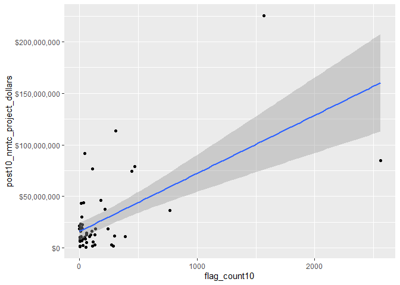<!-- -->

Here we can also see several outliers that are skewing the medians of
our data.

### Correlation between flag count and NMTC dollars spent within counties

``` r
# Pearson's r calculation
cor(svi_divisional_county_nmtc_projects$flag_count10, svi_divisional_county_nmtc_projects$post10_nmtc_project_dollars, method = "pearson")
```

    ## [1] 0.6174326

A Pearson’s R calculation of 0.62 suggests that there is a strong
positive association between the dollar amount spent in NMTC from
2011-2020 and the flag count within the Mountain Division counties in
2010.

Let’s look at a box plot to examine this further:

``` r
boxplot(svi_divisional_county_nmtc_projects$flag_count10)
```

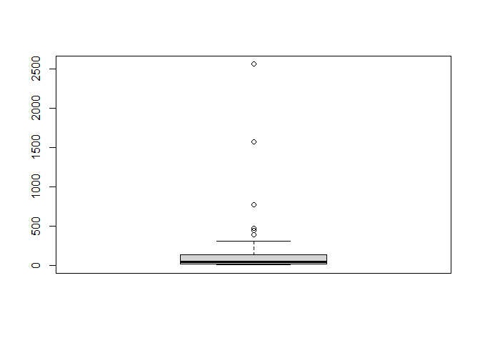<!-- -->

``` r
boxplot.stats(svi_divisional_county_nmtc_projects$flag_count10)$out %>% sort(decreasing = TRUE)
```

    ## [1] 2558 1569  771  473  444  390

The boxplot shows most of our data lies within the lower quadrant of
flag counts. Additionally, there are 6 outliers identified. There are
identified here:

``` r
svi_divisional_county_nmtc_projects %>% 
  select(county_name, flag_count10, post10_nmtc_dollars_formatted) %>% 
  arrange(desc(flag_count10)) %>% 
  head(6) %>% kbl() %>% kable_styling() %>% scroll_box(width = "100%")
```

<div style="border: 1px solid #ddd; padding: 5px; overflow-x: scroll; width:100%; ">

<table class="table" style="margin-left: auto; margin-right: auto;">

<thead>

<tr>

<th style="text-align:left;">

county_name
</th>

<th style="text-align:right;">

flag_count10
</th>

<th style="text-align:left;">

post10_nmtc_dollars_formatted
</th>

</tr>

</thead>

<tbody>

<tr>

<td style="text-align:left;">

Maricopa County, AZ
</td>

<td style="text-align:right;">

2558
</td>

<td style="text-align:left;">

\$84,923,464
</td>

</tr>

<tr>

<td style="text-align:left;">

Clark County, NV
</td>

<td style="text-align:right;">

1569
</td>

<td style="text-align:left;">

\$225,315,967
</td>

</tr>

<tr>

<td style="text-align:left;">

Pima County, AZ
</td>

<td style="text-align:right;">

771
</td>

<td style="text-align:left;">

\$36,122,128
</td>

</tr>

<tr>

<td style="text-align:left;">

Denver County, CO
</td>

<td style="text-align:right;">

473
</td>

<td style="text-align:left;">

\$78,905,000
</td>

</tr>

<tr>

<td style="text-align:left;">

Bernalillo County, NM
</td>

<td style="text-align:right;">

444
</td>

<td style="text-align:left;">

\$74,237,755
</td>

</tr>

<tr>

<td style="text-align:left;">

Adams County, CO
</td>

<td style="text-align:right;">

390
</td>

<td style="text-align:left;">

\$11,168,200
</td>

</tr>

</tbody>

</table>

</div>

Let’s examine our major outlier, Maricopa County, AZ data point further:

``` r
svi_divisional_nmtc %>% filter(county == "Maricopa County") %>% select(GEOID_2010_trt, F_TOTAL_10, post10_nmtc_dollars) %>% summary()
```

    ##  GEOID_2010_trt       F_TOTAL_10     post10_nmtc_dollars
    ##  Length:322         Min.   : 1.000   Min.   :       0   
    ##  Class :character   1st Qu.: 5.000   1st Qu.:       0   
    ##  Mode  :character   Median : 9.000   Median :       0   
    ##                     Mean   : 7.944   Mean   :  263737   
    ##                     3rd Qu.:11.000   3rd Qu.:       0   
    ##                     Max.   :14.000   Max.   :22900000

There are 322 tracts in Maricopa County, with a median divisional flag
count of 9 flags, so it makes sense for Maricopa County to have 2558
flags. This is lower than the average 47 flags in the Mountain Division.
Interestingly, Maricopa County, while having the highest number of flag
counts in the Mountain Division, has not received the highest amount of
NMTC dollars.

### K-Means Clustering

``` r
svi_divisional_nmtc_cluster <- svi_divisional_county_nmtc_projects %>% 
                            select(county_name, post10_nmtc_project_dollars, 
                                   flag_count10) %>% 
                            remove_rownames %>% 
                            column_to_rownames(var="county_name")

# Remove nulls, if in dataset
svi_divisional_nmtc_cluster <- na.omit(svi_divisional_nmtc_cluster)


# Scale numeric variables
svi_divisional_nmtc_cluster <- scale(svi_divisional_nmtc_cluster)


svi_divisional_nmtc_cluster %>% head(5)
```

    ##                     post10_nmtc_project_dollars flag_count10
    ## Apache County, AZ                    -0.3541120   -0.1073628
    ## Gila County, AZ                      -0.5466172   -0.2773136
    ## Maricopa County, AZ                   1.5935295    5.8655464
    ## Navajo County, AZ                     0.5497734    0.0182530
    ## Pima County, AZ                       0.2803462    1.4640665

``` r
set.seed(123)
k2_nmtc_div <- kmeans(svi_divisional_nmtc_cluster, centers = 2, nstart = 25)
set.seed(123)
k3_nmtc_div <- kmeans(svi_divisional_nmtc_cluster, centers = 3, nstart = 25)
set.seed(123)
k4_nmtc_div <- kmeans(svi_divisional_nmtc_cluster, centers = 4, nstart = 25)
set.seed(123)
k5_nmtc_div <- kmeans(svi_divisional_nmtc_cluster, centers = 5, nstart = 25)
```

``` r
# plots to compare
p_k2_nmtc_div <- factoextra::fviz_cluster(k2_nmtc_div, geom = "point", data = svi_divisional_nmtc_cluster) + ggtitle("k = 2")

p_k3_nmtc_div <- factoextra::fviz_cluster(k3_nmtc_div, geom = "point", data = svi_divisional_nmtc_cluster) + ggtitle("k = 3")

p_k4_nmtc_div <- factoextra::fviz_cluster(k4_nmtc_div, geom = "point",  data = svi_divisional_nmtc_cluster) + ggtitle("k = 4")

p_k5_nmtc_div <- factoextra::fviz_cluster(k5_nmtc_div, geom = "point",  data = svi_divisional_nmtc_cluster) + ggtitle("k = 5")

grid.arrange(p_k2_nmtc_div, p_k3_nmtc_div, p_k4_nmtc_div, p_k5_nmtc_div, nrow = 2)
```

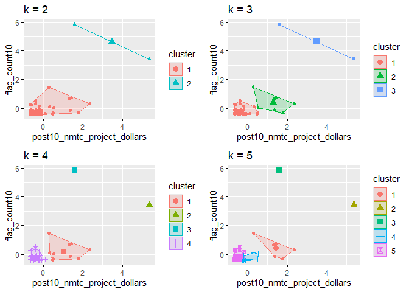<!-- -->

In visually inspecting our plots, it appears that k=3 has the best
grouping to the eye, with no overlap in the groups.

``` r
elbow_plot(svi_divisional_nmtc_cluster)
```

    ##  [1]  1  2  3  4  5  6  7  8  9 10 11 12 13 14 15
    ## [1] 1
    ## [1] 2
    ## [1] 3
    ## [1] 4
    ## [1] 5
    ## [1] 6
    ## [1] 7
    ## [1] 8
    ## [1] 9
    ## [1] 10
    ## [1] 11
    ## [1] 12
    ## [1] 13
    ## [1] 14
    ## [1] 15

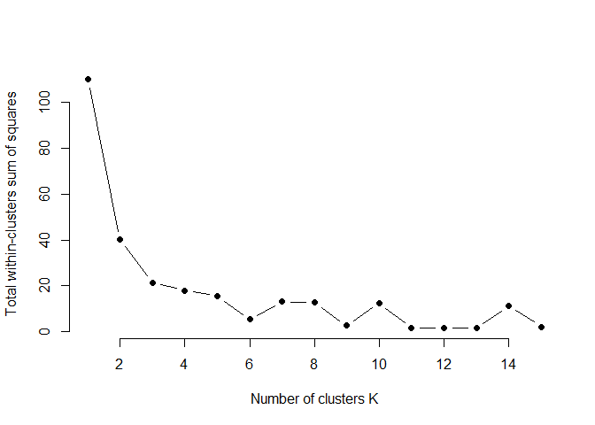<!-- -->

In looking at our elbow plot, it appears that there is not much
variation between point 3 and 4. This aligns well with our visual
observation.

``` r
p_k3_nmtc_div <- factoextra::fviz_cluster(k3_nmtc_div, geom = "point", data = svi_divisional_nmtc_cluster) + ggtitle("k = 3")

p_k3_nmtc_div
```

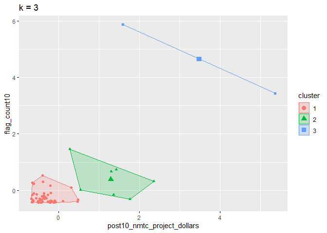<!-- -->

Here we will assign these 3 clusters to our county data set:

``` r
svi_divisional_nmtc_cluster_label <- as.data.frame(svi_divisional_nmtc_cluster) %>%
                                  rownames_to_column(var = "county_name") %>%
                                  as_tibble() %>%
                                  mutate(cluster = k3_nmtc_div$cluster) %>%
                                  select(county_name, cluster)

svi_divisional_county_nmtc_projects2 <- left_join(svi_divisional_county_nmtc_projects, svi_divisional_nmtc_cluster_label, join_by(county_name == county_name))

# View county counts in each cluster
table(svi_divisional_county_nmtc_projects2$cluster)
```

    ## 
    ##  1  2  3 
    ## 47  7  2

**Cluster 1**

``` r
# Cluster 1 Scatterplot
# y is our independent variable (NMTC Project Dollars),  
# x is our dependent variable (SVI flag count)

svi_divisional_county_nmtc_projects2 %>% 
  filter(cluster == 1) %>%
  ggplot2::ggplot(aes(x=flag_count10,
                    y=post10_nmtc_project_dollars)) +
        geom_point() +
        geom_smooth(method="lm") +
        scale_y_continuous(labels = scales::dollar_format()) 
```

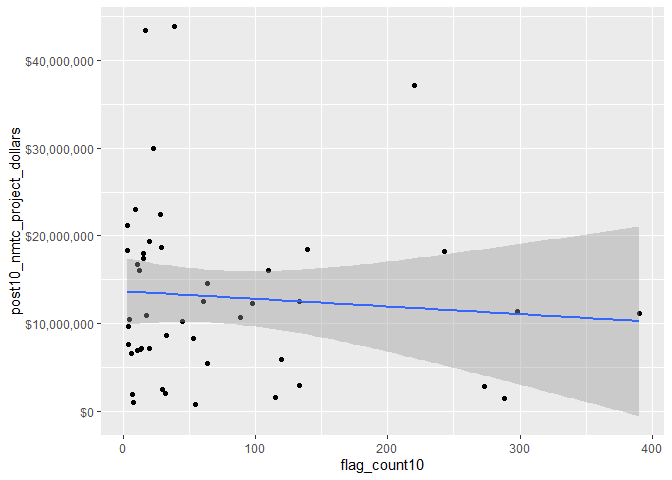<!-- -->

``` r
svi_divisional_county_nmtc_projects2 %>% 
  filter(cluster == 1) %>%
  select(flag_count10,post10_nmtc_project_dollars) %>%
  cor(method = "pearson")
```

    ##                             flag_count10 post10_nmtc_project_dollars
    ## flag_count10                  1.00000000                 -0.07984396
    ## post10_nmtc_project_dollars  -0.07984396                  1.00000000

This cluster contains the majority of our counties that received NMTC
funding and shows a very weak negative, or no association correlation
between flag counts from 2010 census data and money received the
following decade from NMTC.

Here are the counties that fall into cluster 1:

``` r
svi_divisional_county_nmtc_projects2 %>% 
  filter(cluster == 1) %>%
  select(county_name, flag_count10, post10_nmtc_dollars_formatted) %>% kbl() %>% kable_styling() %>% scroll_box(width = "100%")
```

<div style="border: 1px solid #ddd; padding: 5px; overflow-x: scroll; width:100%; ">

<table class="table" style="margin-left: auto; margin-right: auto;">

<thead>

<tr>

<th style="text-align:left;">

county_name
</th>

<th style="text-align:right;">

flag_count10
</th>

<th style="text-align:left;">

post10_nmtc_dollars_formatted
</th>

</tr>

</thead>

<tbody>

<tr>

<td style="text-align:left;">

Apache County, AZ
</td>

<td style="text-align:right;">

133
</td>

<td style="text-align:left;">

\$12,544,000
</td>

</tr>

<tr>

<td style="text-align:left;">

Gila County, AZ
</td>

<td style="text-align:right;">

64
</td>

<td style="text-align:left;">

\$5,390,000
</td>

</tr>

<tr>

<td style="text-align:left;">

Pinal County, AZ
</td>

<td style="text-align:right;">

220
</td>

<td style="text-align:left;">

\$37,224,559
</td>

</tr>

<tr>

<td style="text-align:left;">

Yuma County, AZ
</td>

<td style="text-align:right;">

288
</td>

<td style="text-align:left;">

\$1,454,000
</td>

</tr>

<tr>

<td style="text-align:left;">

Adams County, CO
</td>

<td style="text-align:right;">

390
</td>

<td style="text-align:left;">

\$11,168,200
</td>

</tr>

<tr>

<td style="text-align:left;">

Arapahoe County, CO
</td>

<td style="text-align:right;">

298
</td>

<td style="text-align:left;">

\$11,357,669
</td>

</tr>

<tr>

<td style="text-align:left;">

Archuleta County, CO
</td>

<td style="text-align:right;">

7
</td>

<td style="text-align:left;">

\$1,950,000
</td>

</tr>

<tr>

<td style="text-align:left;">

Boulder County, CO
</td>

<td style="text-align:right;">

115
</td>

<td style="text-align:left;">

\$1,500,000
</td>

</tr>

<tr>

<td style="text-align:left;">

Delta County, CO
</td>

<td style="text-align:right;">

8
</td>

<td style="text-align:left;">

\$1,009,700
</td>

</tr>

<tr>

<td style="text-align:left;">

Jefferson County, CO
</td>

<td style="text-align:right;">

120
</td>

<td style="text-align:left;">

\$5,880,000
</td>

</tr>

<tr>

<td style="text-align:left;">

Larimer County, CO
</td>

<td style="text-align:right;">

98
</td>

<td style="text-align:left;">

\$12,340,000
</td>

</tr>

<tr>

<td style="text-align:left;">

Mesa County, CO
</td>

<td style="text-align:right;">

55
</td>

<td style="text-align:left;">

\$800,000
</td>

</tr>

<tr>

<td style="text-align:left;">

Washington County, CO
</td>

<td style="text-align:right;">

4
</td>

<td style="text-align:left;">

\$9,640,000
</td>

</tr>

<tr>

<td style="text-align:left;">

Bannock County, ID
</td>

<td style="text-align:right;">

28
</td>

<td style="text-align:left;">

\$22,425,000
</td>

</tr>

<tr>

<td style="text-align:left;">

Madison County, ID
</td>

<td style="text-align:right;">

17
</td>

<td style="text-align:left;">

\$43,440,000
</td>

</tr>

<tr>

<td style="text-align:left;">

Valley County, ID
</td>

<td style="text-align:right;">

3
</td>

<td style="text-align:left;">

\$21,148,000
</td>

</tr>

<tr>

<td style="text-align:left;">

Big Horn County, MT
</td>

<td style="text-align:right;">

33
</td>

<td style="text-align:left;">

\$8,624,000
</td>

</tr>

<tr>

<td style="text-align:left;">

Cascade County, MT
</td>

<td style="text-align:right;">

45
</td>

<td style="text-align:left;">

\$10,189,000
</td>

</tr>

<tr>

<td style="text-align:left;">

Chouteau County, MT
</td>

<td style="text-align:right;">

4
</td>

<td style="text-align:left;">

\$7,663,000
</td>

</tr>

<tr>

<td style="text-align:left;">

Gallatin County, MT
</td>

<td style="text-align:right;">

11
</td>

<td style="text-align:left;">

\$6,960,000
</td>

</tr>

<tr>

<td style="text-align:left;">

Glacier County, MT
</td>

<td style="text-align:right;">

20
</td>

<td style="text-align:left;">

\$7,129,500
</td>

</tr>

<tr>

<td style="text-align:left;">

Hill County, MT
</td>

<td style="text-align:right;">

13
</td>

<td style="text-align:left;">

\$7,081,000
</td>

</tr>

<tr>

<td style="text-align:left;">

Lake County, MT
</td>

<td style="text-align:right;">

11
</td>

<td style="text-align:left;">

\$16,715,500
</td>

</tr>

<tr>

<td style="text-align:left;">

Lewis and Clark County, MT
</td>

<td style="text-align:right;">

9
</td>

<td style="text-align:left;">

\$23,069,500
</td>

</tr>

<tr>

<td style="text-align:left;">

Missoula County, MT
</td>

<td style="text-align:right;">

15
</td>

<td style="text-align:left;">

\$17,945,000
</td>

</tr>

<tr>

<td style="text-align:left;">

Roosevelt County, MT
</td>

<td style="text-align:right;">

14
</td>

<td style="text-align:left;">

\$7,104,000
</td>

</tr>

<tr>

<td style="text-align:left;">

Silver Bow County, MT
</td>

<td style="text-align:right;">

12
</td>

<td style="text-align:left;">

\$16,056,000
</td>

</tr>

<tr>

<td style="text-align:left;">

Yellowstone County, MT
</td>

<td style="text-align:right;">

39
</td>

<td style="text-align:left;">

\$43,880,900
</td>

</tr>

<tr>

<td style="text-align:left;">

Chaves County, NM
</td>

<td style="text-align:right;">

64
</td>

<td style="text-align:left;">

\$14,550,000
</td>

</tr>

<tr>

<td style="text-align:left;">

Dona Ana County, NM
</td>

<td style="text-align:right;">

243
</td>

<td style="text-align:left;">

\$18,187,500
</td>

</tr>

<tr>

<td style="text-align:left;">

Eddy County, NM
</td>

<td style="text-align:right;">

20
</td>

<td style="text-align:left;">

\$19,400,000
</td>

</tr>

<tr>

<td style="text-align:left;">

McKinley County, NM
</td>

<td style="text-align:right;">

139
</td>

<td style="text-align:left;">

\$18,460,000
</td>

</tr>

<tr>

<td style="text-align:left;">

San Juan County, NM
</td>

<td style="text-align:right;">

89
</td>

<td style="text-align:left;">

\$10,690,000
</td>

</tr>

<tr>

<td style="text-align:left;">

San Miguel County, NM
</td>

<td style="text-align:right;">

53
</td>

<td style="text-align:left;">

\$8,330,000
</td>

</tr>

<tr>

<td style="text-align:left;">

Sandoval County, NM
</td>

<td style="text-align:right;">

61
</td>

<td style="text-align:left;">

\$12,480,000
</td>

</tr>

<tr>

<td style="text-align:left;">

Santa Fe County, NM
</td>

<td style="text-align:right;">

110
</td>

<td style="text-align:left;">

\$16,045,000
</td>

</tr>

<tr>

<td style="text-align:left;">

Douglas County, NV
</td>

<td style="text-align:right;">

5
</td>

<td style="text-align:left;">

\$10,500,000
</td>

</tr>

<tr>

<td style="text-align:left;">

Elko County, NV
</td>

<td style="text-align:right;">

23
</td>

<td style="text-align:left;">

\$30,000,000
</td>

</tr>

<tr>

<td style="text-align:left;">

Lyon County, NV
</td>

<td style="text-align:right;">

30
</td>

<td style="text-align:left;">

\$2,520,000
</td>

</tr>

<tr>

<td style="text-align:left;">

Nye County, NV
</td>

<td style="text-align:right;">

32
</td>

<td style="text-align:left;">

\$2,000,000
</td>

</tr>

<tr>

<td style="text-align:left;">

Washoe County, NV
</td>

<td style="text-align:right;">

273
</td>

<td style="text-align:left;">

\$2,810,000
</td>

</tr>

<tr>

<td style="text-align:left;">

Grand County, UT
</td>

<td style="text-align:right;">

3
</td>

<td style="text-align:left;">

\$18,378,750
</td>

</tr>

<tr>

<td style="text-align:left;">

Iron County, UT
</td>

<td style="text-align:right;">

29
</td>

<td style="text-align:left;">

\$18,625,000
</td>

</tr>

<tr>

<td style="text-align:left;">

Utah County, UT
</td>

<td style="text-align:right;">

133
</td>

<td style="text-align:left;">

\$2,950,000
</td>

</tr>

<tr>

<td style="text-align:left;">

Albany County, WY
</td>

<td style="text-align:right;">

15
</td>

<td style="text-align:left;">

\$17,460,000
</td>

</tr>

<tr>

<td style="text-align:left;">

Fremont County, WY
</td>

<td style="text-align:right;">

18
</td>

<td style="text-align:left;">

\$10,874,750
</td>

</tr>

<tr>

<td style="text-align:left;">

Goshen County, WY
</td>

<td style="text-align:right;">

6
</td>

<td style="text-align:left;">

\$6,556,800
</td>

</tr>

</tbody>

</table>

</div>

**Cluster 2**

``` r
# Cluster 2 Scatterplot
# y is our independent variable (NMTC Project Dollars),  
# x is our dependent variable (SVI flag count)

svi_divisional_county_nmtc_projects2 %>% 
  filter(cluster == 2) %>%
  ggplot2::ggplot(aes(x=flag_count10,
                    y=post10_nmtc_project_dollars)) +
        geom_point() +
        geom_smooth(method="lm") +
        scale_y_continuous(labels = scales::dollar_format()) 
```

    ## `geom_smooth()` using formula = 'y ~ x'

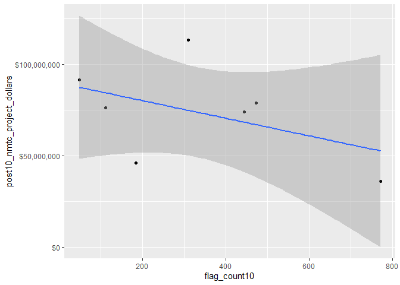<!-- -->

**Cluster 2**

``` r
svi_divisional_county_nmtc_projects2 %>% 
  filter(cluster == 2) %>%
  select(flag_count10,post10_nmtc_project_dollars) %>%
  cor(method = "pearson")
```

    ##                             flag_count10 post10_nmtc_project_dollars
    ## flag_count10                    1.000000                   -0.462471
    ## post10_nmtc_project_dollars    -0.462471                    1.000000

This cluster group contained only 7 data points, and shows a moderate
negative correlation (Pearson’s R of -0.46) between flag count in 2010
and NMTC money received the following decade.

These are our Cluster 2 counties:

``` r
svi_divisional_county_nmtc_projects2 %>% 
  filter(cluster == 2) %>%
  select(county_name, flag_count10, post10_nmtc_dollars_formatted) 
```

    ##             county_name flag_count10 post10_nmtc_dollars_formatted
    ## 1     Navajo County, AZ          184                   $46,134,750
    ## 2       Pima County, AZ          771                   $36,122,128
    ## 3     Denver County, CO          473                   $78,905,000
    ## 4     Canyon County, ID          111                   $76,432,000
    ## 5 Bernalillo County, NM          444                   $74,237,755
    ## 6     Cibola County, NM           49                   $91,548,630
    ## 7  Salt Lake County, UT          310                  $113,282,833

**Cluster 3**

``` r
# Cluster 3 Scatterplot
# y is our independent variable (NMTC Project Dollars),  
# x is our dependent variable (SVI flag count)

svi_divisional_county_nmtc_projects2 %>% 
  filter(cluster == 3) %>%
  ggplot2::ggplot(aes(x=flag_count10,
                    y=post10_nmtc_project_dollars)) +
        geom_point() +
        geom_smooth(method="lm") +
        scale_y_continuous(labels = scales::dollar_format()) 
```

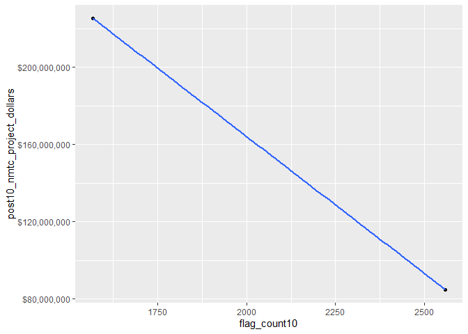<!-- -->

``` r
svi_divisional_county_nmtc_projects2 %>% 
  filter(cluster == 3) %>%
  select(flag_count10,post10_nmtc_project_dollars) %>%
  cor(method = "pearson")
```

    ##                             flag_count10 post10_nmtc_project_dollars
    ## flag_count10                           1                          -1
    ## post10_nmtc_project_dollars           -1                           1

In looking at our correlation for cluster 3 which contain our outliers,
a Pearson’s R score of -1 shows a high negative correlation within our
cluster between flag count and money received in these 2 counties.
However, we know that there are only 2 data points in this cluster.

These are the 2 counties in Cluster 3:

``` r
svi_divisional_county_nmtc_projects2 %>% 
  filter(cluster == 3) %>%
  select(county_name, flag_count10, post10_nmtc_dollars_formatted) 
```

    ##           county_name flag_count10 post10_nmtc_dollars_formatted
    ## 1 Maricopa County, AZ         2558                   $84,923,464
    ## 2    Clark County, NV         1569                  $225,315,967

**Overall, if we look at cluster 1, we see that it contains the majority
of our data. It also shows that for the majority of our data points,
there is almost no correlation between the amount of money received in
NMTC and the SVI vulnerability flag count.**

### Bivariate Mapping

``` r
divisional_county_sf <- svi_county_map2010 %>% select(COUNTYFP, STATEFP, geometry)

divisional_county_sf %>% head(5)
```

    ## Simple feature collection with 5 features and 2 fields
    ## Geometry type: MULTIPOLYGON
    ## Dimension:     XY
    ## Bounding box:  xmin: -113.3542 ymin: 31.3325 xmax: -109.0452 ymax: 37.0032
    ## Geodetic CRS:  NAD83
    ##   COUNTYFP STATEFP                       geometry
    ## 1      001      04 MULTIPOLYGON (((-109.0464 3...
    ## 2      003      04 MULTIPOLYGON (((-110.0031 3...
    ## 3      005      04 MULTIPOLYGON (((-112.3754 3...
    ## 4      007      04 MULTIPOLYGON (((-111.2865 3...
    ## 5      009      04 MULTIPOLYGON (((-110.4486 3...

``` r
# Join our NMTC projects data with our shapefile geocoordinates
svi_divisional_county_nmtc_sf <- left_join(svi_divisional_county_nmtc_projects, divisional_county_sf, join_by("FIPS_st" == "STATEFP", "FIPS_county" == "COUNTYFP"))

svi_divisional_county_nmtc_sf %>% head(5) %>% kbl() %>% kable_styling() %>% scroll_box(width = "100%")
```

<div style="border: 1px solid #ddd; padding: 5px; overflow-x: scroll; width:100%; ">

<table class="table" style="margin-left: auto; margin-right: auto;">

<thead>

<tr>

<th style="text-align:left;">

State
</th>

<th style="text-align:left;">

County
</th>

<th style="text-align:left;">

Division
</th>

<th style="text-align:right;">

post10_nmtc_project_cnt
</th>

<th style="text-align:right;">

tract_cnt
</th>

<th style="text-align:right;">

post10_nmtc_project_dollars
</th>

<th style="text-align:left;">

post10_nmtc_dollars_formatted
</th>

<th style="text-align:left;">

fips_county_st
</th>

<th style="text-align:left;">

FIPS_st
</th>

<th style="text-align:left;">

FIPS_county
</th>

<th style="text-align:left;">

state_name
</th>

<th style="text-align:right;">

region_number
</th>

<th style="text-align:left;">

region
</th>

<th style="text-align:right;">

division_number
</th>

<th style="text-align:right;">

flag_count10
</th>

<th style="text-align:right;">

pop10
</th>

<th style="text-align:right;">

flag_by_pop10
</th>

<th style="text-align:right;">

flag_count_quantile10
</th>

<th style="text-align:right;">

flag_pop_quantile10
</th>

<th style="text-align:right;">

flag_count20
</th>

<th style="text-align:right;">

pop20
</th>

<th style="text-align:right;">

flag_by_pop20
</th>

<th style="text-align:right;">

flag_count_quantile20
</th>

<th style="text-align:right;">

flag_pop_quantile20
</th>

<th style="text-align:left;">

county_name
</th>

<th style="text-align:left;">

geometry
</th>

</tr>

</thead>

<tbody>

<tr>

<td style="text-align:left;">

AZ
</td>

<td style="text-align:left;">

Apache County
</td>

<td style="text-align:left;">

Mountain Division
</td>

<td style="text-align:right;">

1
</td>

<td style="text-align:right;">

14
</td>

<td style="text-align:right;">

12544000
</td>

<td style="text-align:left;">

\$12,544,000
</td>

<td style="text-align:left;">

04001
</td>

<td style="text-align:left;">

04
</td>

<td style="text-align:left;">

001
</td>

<td style="text-align:left;">

Arizona
</td>

<td style="text-align:right;">

4
</td>

<td style="text-align:left;">

West Region
</td>

<td style="text-align:right;">

8
</td>

<td style="text-align:right;">

133
</td>

<td style="text-align:right;">

62408
</td>

<td style="text-align:right;">

0.0021311
</td>

<td style="text-align:right;">

1
</td>

<td style="text-align:right;">

0.8
</td>

<td style="text-align:right;">

124
</td>

<td style="text-align:right;">

62852
</td>

<td style="text-align:right;">

0.0019729
</td>

<td style="text-align:right;">

1
</td>

<td style="text-align:right;">

0.8
</td>

<td style="text-align:left;">

Apache County, AZ
</td>

<td style="text-align:left;">

MULTIPOLYGON (((-109.0464 3…
</td>

</tr>

<tr>

<td style="text-align:left;">

AZ
</td>

<td style="text-align:left;">

Gila County
</td>

<td style="text-align:left;">

Mountain Division
</td>

<td style="text-align:right;">

1
</td>

<td style="text-align:right;">

11
</td>

<td style="text-align:right;">

5390000
</td>

<td style="text-align:left;">

\$5,390,000
</td>

<td style="text-align:left;">

04007
</td>

<td style="text-align:left;">

04
</td>

<td style="text-align:left;">

007
</td>

<td style="text-align:left;">

Arizona
</td>

<td style="text-align:right;">

4
</td>

<td style="text-align:left;">

West Region
</td>

<td style="text-align:right;">

8
</td>

<td style="text-align:right;">

64
</td>

<td style="text-align:right;">

31239
</td>

<td style="text-align:right;">

0.0020487
</td>

<td style="text-align:right;">

1
</td>

<td style="text-align:right;">

0.8
</td>

<td style="text-align:right;">

72
</td>

<td style="text-align:right;">

31645
</td>

<td style="text-align:right;">

0.0022752
</td>

<td style="text-align:right;">

1
</td>

<td style="text-align:right;">

1.0
</td>

<td style="text-align:left;">

Gila County, AZ
</td>

<td style="text-align:left;">

MULTIPOLYGON (((-111.2865 3…
</td>

</tr>

<tr>

<td style="text-align:left;">

AZ
</td>

<td style="text-align:left;">

Maricopa County
</td>

<td style="text-align:left;">

Mountain Division
</td>

<td style="text-align:right;">

15
</td>

<td style="text-align:right;">

322
</td>

<td style="text-align:right;">

84923464
</td>

<td style="text-align:left;">

\$84,923,464
</td>

<td style="text-align:left;">

04013
</td>

<td style="text-align:left;">

04
</td>

<td style="text-align:left;">

013
</td>

<td style="text-align:left;">

Arizona
</td>

<td style="text-align:right;">

4
</td>

<td style="text-align:left;">

West Region
</td>

<td style="text-align:right;">

8
</td>

<td style="text-align:right;">

2558
</td>

<td style="text-align:right;">

1355508
</td>

<td style="text-align:right;">

0.0018871
</td>

<td style="text-align:right;">

1
</td>

<td style="text-align:right;">

0.8
</td>

<td style="text-align:right;">

2457
</td>

<td style="text-align:right;">

1547710
</td>

<td style="text-align:right;">

0.0015875
</td>

<td style="text-align:right;">

1
</td>

<td style="text-align:right;">

0.6
</td>

<td style="text-align:left;">

Maricopa County, AZ
</td>

<td style="text-align:left;">

MULTIPOLYGON (((-112.9158 3…
</td>

</tr>

<tr>

<td style="text-align:left;">

AZ
</td>

<td style="text-align:left;">

Navajo County
</td>

<td style="text-align:left;">

Mountain Division
</td>

<td style="text-align:right;">

2
</td>

<td style="text-align:right;">

24
</td>

<td style="text-align:right;">

46134750
</td>

<td style="text-align:left;">

\$46,134,750
</td>

<td style="text-align:left;">

04017
</td>

<td style="text-align:left;">

04
</td>

<td style="text-align:left;">

017
</td>

<td style="text-align:left;">

Arizona
</td>

<td style="text-align:right;">

4
</td>

<td style="text-align:left;">

West Region
</td>

<td style="text-align:right;">

8
</td>

<td style="text-align:right;">

184
</td>

<td style="text-align:right;">

83885
</td>

<td style="text-align:right;">

0.0021935
</td>

<td style="text-align:right;">

1
</td>

<td style="text-align:right;">

1.0
</td>

<td style="text-align:right;">

200
</td>

<td style="text-align:right;">

87599
</td>

<td style="text-align:right;">

0.0022831
</td>

<td style="text-align:right;">

1
</td>

<td style="text-align:right;">

1.0
</td>

<td style="text-align:left;">

Navajo County, AZ
</td>

<td style="text-align:left;">

MULTIPOLYGON (((-110.7021 3…
</td>

</tr>

<tr>

<td style="text-align:left;">

AZ
</td>

<td style="text-align:left;">

Pima County
</td>

<td style="text-align:left;">

Mountain Division
</td>

<td style="text-align:right;">

7
</td>

<td style="text-align:right;">

104
</td>

<td style="text-align:right;">

36122128
</td>

<td style="text-align:left;">

\$36,122,128
</td>

<td style="text-align:left;">

04019
</td>

<td style="text-align:left;">

04
</td>

<td style="text-align:left;">

019
</td>

<td style="text-align:left;">

Arizona
</td>

<td style="text-align:right;">

4
</td>

<td style="text-align:left;">

West Region
</td>

<td style="text-align:right;">

8
</td>

<td style="text-align:right;">

771
</td>

<td style="text-align:right;">

433051
</td>

<td style="text-align:right;">

0.0017804
</td>

<td style="text-align:right;">

1
</td>

<td style="text-align:right;">

0.8
</td>

<td style="text-align:right;">

826
</td>

<td style="text-align:right;">

439374
</td>

<td style="text-align:right;">

0.0018799
</td>

<td style="text-align:right;">

1
</td>

<td style="text-align:right;">

0.8
</td>

<td style="text-align:left;">

Pima County, AZ
</td>

<td style="text-align:left;">

MULTIPOLYGON (((-112.3881 3…
</td>

</tr>

</tbody>

</table>

</div>

``` r
# Create classes for bivariate mapping 
svi_divisional_county_nmtc_sf <- bi_class(svi_divisional_county_nmtc_sf, x = flag_count10, y = post10_nmtc_project_dollars, style = "quantile", dim = 3)

# View data
svi_divisional_county_nmtc_sf %>% head(5) %>% kbl() %>% kable_styling() %>% scroll_box(width = "100%")
```

<div style="border: 1px solid #ddd; padding: 5px; overflow-x: scroll; width:100%; ">

<table class="table" style="margin-left: auto; margin-right: auto;">

<thead>

<tr>

<th style="text-align:left;">

State
</th>

<th style="text-align:left;">

County
</th>

<th style="text-align:left;">

Division
</th>

<th style="text-align:right;">

post10_nmtc_project_cnt
</th>

<th style="text-align:right;">

tract_cnt
</th>

<th style="text-align:right;">

post10_nmtc_project_dollars
</th>

<th style="text-align:left;">

post10_nmtc_dollars_formatted
</th>

<th style="text-align:left;">

fips_county_st
</th>

<th style="text-align:left;">

FIPS_st
</th>

<th style="text-align:left;">

FIPS_county
</th>

<th style="text-align:left;">

state_name
</th>

<th style="text-align:right;">

region_number
</th>

<th style="text-align:left;">

region
</th>

<th style="text-align:right;">

division_number
</th>

<th style="text-align:right;">

flag_count10
</th>

<th style="text-align:right;">

pop10
</th>

<th style="text-align:right;">

flag_by_pop10
</th>

<th style="text-align:right;">

flag_count_quantile10
</th>

<th style="text-align:right;">

flag_pop_quantile10
</th>

<th style="text-align:right;">

flag_count20
</th>

<th style="text-align:right;">

pop20
</th>

<th style="text-align:right;">

flag_by_pop20
</th>

<th style="text-align:right;">

flag_count_quantile20
</th>

<th style="text-align:right;">

flag_pop_quantile20
</th>

<th style="text-align:left;">

county_name
</th>

<th style="text-align:left;">

geometry
</th>

<th style="text-align:left;">

bi_class
</th>

</tr>

</thead>

<tbody>

<tr>

<td style="text-align:left;">

AZ
</td>

<td style="text-align:left;">

Apache County
</td>

<td style="text-align:left;">

Mountain Division
</td>

<td style="text-align:right;">

1
</td>

<td style="text-align:right;">

14
</td>

<td style="text-align:right;">

12544000
</td>

<td style="text-align:left;">

\$12,544,000
</td>

<td style="text-align:left;">

04001
</td>

<td style="text-align:left;">

04
</td>

<td style="text-align:left;">

001
</td>

<td style="text-align:left;">

Arizona
</td>

<td style="text-align:right;">

4
</td>

<td style="text-align:left;">

West Region
</td>

<td style="text-align:right;">

8
</td>

<td style="text-align:right;">

133
</td>

<td style="text-align:right;">

62408
</td>

<td style="text-align:right;">

0.0021311
</td>

<td style="text-align:right;">

1
</td>

<td style="text-align:right;">

0.8
</td>

<td style="text-align:right;">

124
</td>

<td style="text-align:right;">

62852
</td>

<td style="text-align:right;">

0.0019729
</td>

<td style="text-align:right;">

1
</td>

<td style="text-align:right;">

0.8
</td>

<td style="text-align:left;">

Apache County, AZ
</td>

<td style="text-align:left;">

MULTIPOLYGON (((-109.0464 3…
</td>

<td style="text-align:left;">

3-2
</td>

</tr>

<tr>

<td style="text-align:left;">

AZ
</td>

<td style="text-align:left;">

Gila County
</td>

<td style="text-align:left;">

Mountain Division
</td>

<td style="text-align:right;">

1
</td>

<td style="text-align:right;">

11
</td>

<td style="text-align:right;">

5390000
</td>

<td style="text-align:left;">

\$5,390,000
</td>

<td style="text-align:left;">

04007
</td>

<td style="text-align:left;">

04
</td>

<td style="text-align:left;">

007
</td>

<td style="text-align:left;">

Arizona
</td>

<td style="text-align:right;">

4
</td>

<td style="text-align:left;">

West Region
</td>

<td style="text-align:right;">

8
</td>

<td style="text-align:right;">

64
</td>

<td style="text-align:right;">

31239
</td>

<td style="text-align:right;">

0.0020487
</td>

<td style="text-align:right;">

1
</td>

<td style="text-align:right;">

0.8
</td>

<td style="text-align:right;">

72
</td>

<td style="text-align:right;">

31645
</td>

<td style="text-align:right;">

0.0022752
</td>

<td style="text-align:right;">

1
</td>

<td style="text-align:right;">

1.0
</td>

<td style="text-align:left;">

Gila County, AZ
</td>

<td style="text-align:left;">

MULTIPOLYGON (((-111.2865 3…
</td>

<td style="text-align:left;">

2-1
</td>

</tr>

<tr>

<td style="text-align:left;">

AZ
</td>

<td style="text-align:left;">

Maricopa County
</td>

<td style="text-align:left;">

Mountain Division
</td>

<td style="text-align:right;">

15
</td>

<td style="text-align:right;">

322
</td>

<td style="text-align:right;">

84923464
</td>

<td style="text-align:left;">

\$84,923,464
</td>

<td style="text-align:left;">

04013
</td>

<td style="text-align:left;">

04
</td>

<td style="text-align:left;">

013
</td>

<td style="text-align:left;">

Arizona
</td>

<td style="text-align:right;">

4
</td>

<td style="text-align:left;">

West Region
</td>

<td style="text-align:right;">

8
</td>

<td style="text-align:right;">

2558
</td>

<td style="text-align:right;">

1355508
</td>

<td style="text-align:right;">

0.0018871
</td>

<td style="text-align:right;">

1
</td>

<td style="text-align:right;">

0.8
</td>

<td style="text-align:right;">

2457
</td>

<td style="text-align:right;">

1547710
</td>

<td style="text-align:right;">

0.0015875
</td>

<td style="text-align:right;">

1
</td>

<td style="text-align:right;">

0.6
</td>

<td style="text-align:left;">

Maricopa County, AZ
</td>

<td style="text-align:left;">

MULTIPOLYGON (((-112.9158 3…
</td>

<td style="text-align:left;">

3-3
</td>

</tr>

<tr>

<td style="text-align:left;">

AZ
</td>

<td style="text-align:left;">

Navajo County
</td>

<td style="text-align:left;">

Mountain Division
</td>

<td style="text-align:right;">

2
</td>

<td style="text-align:right;">

24
</td>

<td style="text-align:right;">

46134750
</td>

<td style="text-align:left;">

\$46,134,750
</td>

<td style="text-align:left;">

04017
</td>

<td style="text-align:left;">

04
</td>

<td style="text-align:left;">

017
</td>

<td style="text-align:left;">

Arizona
</td>

<td style="text-align:right;">

4
</td>

<td style="text-align:left;">

West Region
</td>

<td style="text-align:right;">

8
</td>

<td style="text-align:right;">

184
</td>

<td style="text-align:right;">

83885
</td>

<td style="text-align:right;">

0.0021935
</td>

<td style="text-align:right;">

1
</td>

<td style="text-align:right;">

1.0
</td>

<td style="text-align:right;">

200
</td>

<td style="text-align:right;">

87599
</td>

<td style="text-align:right;">

0.0022831
</td>

<td style="text-align:right;">

1
</td>

<td style="text-align:right;">

1.0
</td>

<td style="text-align:left;">

Navajo County, AZ
</td>

<td style="text-align:left;">

MULTIPOLYGON (((-110.7021 3…
</td>

<td style="text-align:left;">

3-3
</td>

</tr>

<tr>

<td style="text-align:left;">

AZ
</td>

<td style="text-align:left;">

Pima County
</td>

<td style="text-align:left;">

Mountain Division
</td>

<td style="text-align:right;">

7
</td>

<td style="text-align:right;">

104
</td>

<td style="text-align:right;">

36122128
</td>

<td style="text-align:left;">

\$36,122,128
</td>

<td style="text-align:left;">

04019
</td>

<td style="text-align:left;">

04
</td>

<td style="text-align:left;">

019
</td>

<td style="text-align:left;">

Arizona
</td>

<td style="text-align:right;">

4
</td>

<td style="text-align:left;">

West Region
</td>

<td style="text-align:right;">

8
</td>

<td style="text-align:right;">

771
</td>

<td style="text-align:right;">

433051
</td>

<td style="text-align:right;">

0.0017804
</td>

<td style="text-align:right;">

1
</td>

<td style="text-align:right;">

0.8
</td>

<td style="text-align:right;">

826
</td>

<td style="text-align:right;">

439374
</td>

<td style="text-align:right;">

0.0018799
</td>

<td style="text-align:right;">

1
</td>

<td style="text-align:right;">

0.8
</td>

<td style="text-align:left;">

Pima County, AZ
</td>

<td style="text-align:left;">

MULTIPOLYGON (((-112.3881 3…
</td>

<td style="text-align:left;">

3-3
</td>

</tr>

</tbody>

</table>

</div>

``` r
# Create map with ggplot
svi_divisional_county_nmtc_map <- ggplot() +
  # Map county shapefile, fill with bi_class categories
  geom_sf(data = svi_divisional_county_nmtc_sf, mapping = aes(geometry=geometry, fill = bi_class), color = "white", size = 0.1, show.legend = FALSE) +
  # Set to biscale palette
  bi_scale_fill(pal = "GrPink", dim = 3) +
  # Add state shapefiles for outline
  geom_sf(data=divisional_st_sf, color="black", fill=NA, linewidth=.5, aes(geometry=geometry)) +
  labs(
    title = paste0("Correlation of 2010 ", census_division, " SVI Flag Count \n and 2011 - 2020 NMTC Tax Dollars"),
  ) +
  # Set them to biscale
  bi_theme(base_size = 10)

# Create biscale legend
svi_divisional_county_nmtc_legend <- bi_legend(pal = "GrPink",
                    dim = 3,
                    xlab = "SVI Flag Count",
                    ylab = "NMTC Dollars",
                    size = 8)

# Combine map with legend using cowplot
svi_divisional_county_nmtc_bivarmap <- ggdraw() +
  draw_plot(svi_divisional_county_nmtc_map) +
  # Set legend location
  draw_plot(svi_divisional_county_nmtc_legend, x= -.02,  y = -.05,
 width=.20)


# View map
svi_divisional_county_nmtc_bivarmap
```

<!-- -->

Here we can see the distribution of SVI flag counts and NMTC dollars
spent in each county receiving funds. Montana, Idaho, and Wyoming
received high dollars compared to low flag counts, indicated by the blue
color.

``` r
svi_divisional_county_nmtc_sf %>% filter(State %in% c("MT", "ID", "WY")) %>%
  arrange(desc(post10_nmtc_project_dollars), flag_count10) %>% select(State, County, flag_count10, post10_nmtc_dollars_formatted) %>% head(10) 
```

    ##    State                 County flag_count10 post10_nmtc_dollars_formatted
    ## 1     ID          Canyon County          111                   $76,432,000
    ## 2     MT     Yellowstone County           39                   $43,880,900
    ## 3     ID         Madison County           17                   $43,440,000
    ## 4     MT Lewis and Clark County            9                   $23,069,500
    ## 5     ID         Bannock County           28                   $22,425,000
    ## 6     ID          Valley County            3                   $21,148,000
    ## 7     MT        Missoula County           15                   $17,945,000
    ## 8     WY          Albany County           15                   $17,460,000
    ## 9     MT            Lake County           11                   $16,715,500
    ## 10    MT      Silver Bow County           12                   $16,056,000

Nevada received the most dollars in the highest need counties, indicated
by the purple dark purple color.

``` r
svi_divisional_county_nmtc_sf %>% filter(State %in% c("NV", "NM")) %>% select(State, County, flag_count10, post10_nmtc_dollars_formatted) %>% arrange(desc(flag_count10)) %>% head(10) 
```

    ##    State            County flag_count10 post10_nmtc_dollars_formatted
    ## 1     NV      Clark County         1569                  $225,315,967
    ## 2     NM Bernalillo County          444                   $74,237,755
    ## 3     NV     Washoe County          273                    $2,810,000
    ## 4     NM   Dona Ana County          243                   $18,187,500
    ## 5     NM   McKinley County          139                   $18,460,000
    ## 6     NM   Santa Fe County          110                   $16,045,000
    ## 7     NM   San Juan County           89                   $10,690,000
    ## 8     NM     Chaves County           64                   $14,550,000
    ## 9     NM   Sandoval County           61                   $12,480,000
    ## 10    NM San Miguel County           53                    $8,330,000

## 2010 Low Income Housing Tax Credit Mountain Division

``` r
svi_divisional_county_lihtc_projects <- svi_divisional_county_lihtc %>% filter(post10_lihtc_project_cnt > 0)

svi_divisional_county_lihtc_projects %>% select(Division) %>% unique()
```

    ##            Division
    ## 1 Mountain Division

### Data Summary Statistics

``` r
summary(svi_divisional_county_lihtc_projects$flag_count10)
```

    ##    Min. 1st Qu.  Median    Mean 3rd Qu.    Max. 
    ##    9.00   15.50   21.00   67.33   56.50  487.00

``` r
summary(svi_divisional_county_lihtc_projects$post10_lihtc_project_dollars)
```

    ##     Min.  1st Qu.   Median     Mean  3rd Qu.     Max. 
    ##        0   674696  1721391  3350971  3203130 15437500

Filter out counties with LIHTC projects but did not receive any funding:

``` r
svi_divisional_county_lihtc_projects <- svi_divisional_county_lihtc_projects %>% filter(post10_lihtc_project_dollars > 0)
```

``` r
summary(svi_divisional_county_lihtc_projects$flag_count10)
```

    ##    Min. 1st Qu.  Median    Mean 3rd Qu.    Max. 
    ##    9.00   14.75   21.00   64.64   33.75  487.00

``` r
summary(svi_divisional_county_lihtc_projects$post10_lihtc_project_dollars)
```

    ##     Min.  1st Qu.   Median     Mean  3rd Qu.     Max. 
    ##   270127   817782  1836756  3590326  3380196 15437500

The Mountain division counties receiving LIHTC project funding between
2011-2020, had a range of 9 to 487 SVI flags in 2010. The funding
amounts ranged from \$270,127 and \$15,437,500. There is a large range
between counties in the number of SVI flags in 2010 and funding dollars
spent between 2011 and 2020.

Let’s view this data visually in a scatterplot:

``` r
# Scatterplot
# y is our independent variable (LIHTC Project Dollars),  
# x is our dependent variable (SVI flag count)
ggplot2::ggplot(svi_divisional_county_lihtc_projects,
                aes(x=flag_count10,
                    y=post10_lihtc_project_dollars)) +
        geom_point() +
        geom_smooth(method="lm") +
        scale_y_continuous(labels = scales::dollar_format()) 
```

    ## `geom_smooth()` using formula = 'y ~ x'

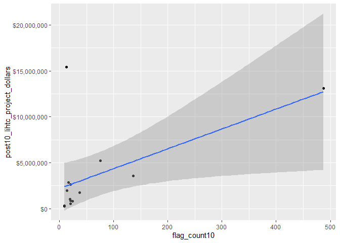<!-- -->

Here we can see 1 outlier in dollars spent.

### Pearson’s R Correlation between SVI flag count and LIHTC dollars spent

``` r
# Pearson's r calculation
cor(svi_divisional_county_lihtc_projects$flag_count10, svi_divisional_county_lihtc_projects$post10_lihtc_project_dollars, method = "pearson")
```

    ## [1] 0.5743274

Overall, within all the counties in the Mountain Division, there is a
moderate positive correlation between SVI flags from 2010 and dollars
spent on LIHTC in 2011-2020, with a Pearson’s score of 0.57.

Here is a boxplot of this data:

``` r
boxplot(svi_divisional_county_lihtc_projects$flag_count10)
```

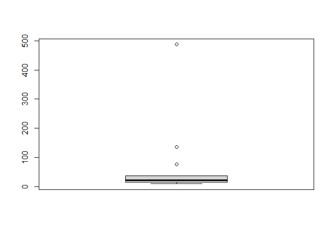<!-- -->

Here we can see three outliers, with high flag counts:

``` r
boxplot.stats(svi_divisional_county_lihtc_projects$flag_count10)$out %>% sort(decreasing = TRUE)
```

    ## [1] 487 136  76

``` r
svi_divisional_county_lihtc_projects %>% filter(flag_count10 == 487) %>% select(county_name, flag_count10, post10_lihtc_dollars_formatted) %>% head() 
```

    ##           county_name flag_count10 post10_lihtc_dollars_formatted
    ## 1 Maricopa County, AZ          487                    $13,115,292

Again, we can see that Maricopa County is also an outlier in flag
counts.

### K-Means Clustering

``` r
svi_divisional_lihtc_cluster <- svi_divisional_county_lihtc_projects %>% 
                            select(county_name, post10_lihtc_project_dollars, 
                                   flag_count10) %>% 
                            remove_rownames %>% 
                            column_to_rownames(var="county_name")

# Remove nulls, if in dataset
svi_divisional_lihtc_cluster <- na.omit(svi_divisional_lihtc_cluster)


# Scale numeric variables
svi_divisional_lihtc_cluster <- scale(svi_divisional_lihtc_cluster)


svi_divisional_lihtc_cluster %>% head(5)
```

    ##                     post10_lihtc_project_dollars flag_count10
    ## Gila County, AZ                     -0.639463325  -0.34550646
    ## Maricopa County, AZ                  2.001527998   3.34366562
    ## Pima County, AZ                     -0.006948156   0.56491154
    ## Yuma County, AZ                     -0.572769441  -0.34550646
    ## Denver County, CO                    0.343739090   0.08991085

Let’s look at different cluster groupings:

``` r
set.seed(123)
k2_lihtc_div <- kmeans(svi_divisional_lihtc_cluster, centers = 2, nstart = 25)
set.seed(123)
k3_lihtc_div <- kmeans(svi_divisional_lihtc_cluster, centers = 3, nstart = 25)
set.seed(123)
k4_lihtc_div <- kmeans(svi_divisional_lihtc_cluster, centers = 4, nstart = 25)
set.seed(123)
k5_lihtc_div <- kmeans(svi_divisional_lihtc_cluster, centers = 5, nstart = 25)


# plots to compare
p_k2_lihtc_div <- factoextra::fviz_cluster(k2_lihtc_div, geom = "point", data = svi_divisional_lihtc_cluster) + ggtitle("k = 2")

p_k3_lihtc_div <- factoextra::fviz_cluster(k3_lihtc_div, geom = "point", data = svi_divisional_lihtc_cluster) + ggtitle("k = 3")

p_k4_lihtc_div <- factoextra::fviz_cluster(k4_lihtc_div, geom = "point",  data = svi_divisional_lihtc_cluster) + ggtitle("k = 4")

p_k5_lihtc_div <- factoextra::fviz_cluster(k5_lihtc_div, geom = "point",  data = svi_divisional_lihtc_cluster) + ggtitle("k = 5")

grid.arrange(p_k2_lihtc_div, p_k3_lihtc_div, p_k4_lihtc_div, p_k5_lihtc_div, nrow = 2)
```

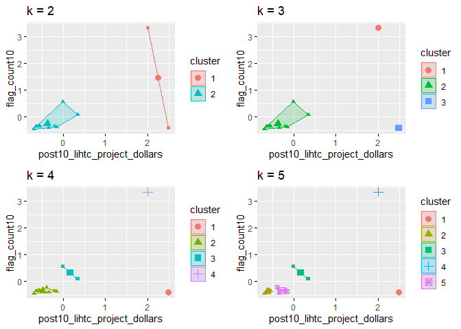<!-- -->

Visually, 2 clusters looks to capture our data points best, but we can
check an elbow plot:

``` r
elbow_plot(svi_divisional_lihtc_cluster)
```

    ##  [1]  1  2  3  4  5  6  7  8  9 10 11 12 13
    ## [1] 1
    ## [1] 2
    ## [1] 3
    ## [1] 4
    ## [1] 5
    ## [1] 6
    ## [1] 7
    ## [1] 8
    ## [1] 9
    ## [1] 10
    ## [1] 11
    ## [1] 12
    ## [1] 13

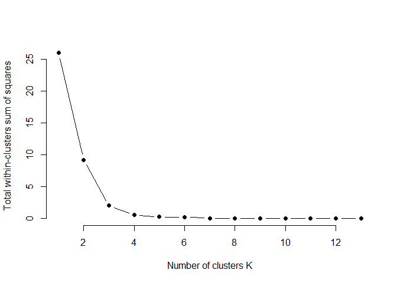<!-- -->

This elbow plot shows that 3 clusters makes sense, as the spacing does
not decrease until after point 3. I will choose to use three clusters
for the LIHTC data for the Mountain Division:

``` r
p_k3_lihtc_div <- factoextra::fviz_cluster(k3_lihtc_div, geom = "point", data = svi_divisional_lihtc_cluster) + ggtitle("k = 3")

p_k3_lihtc_div
```

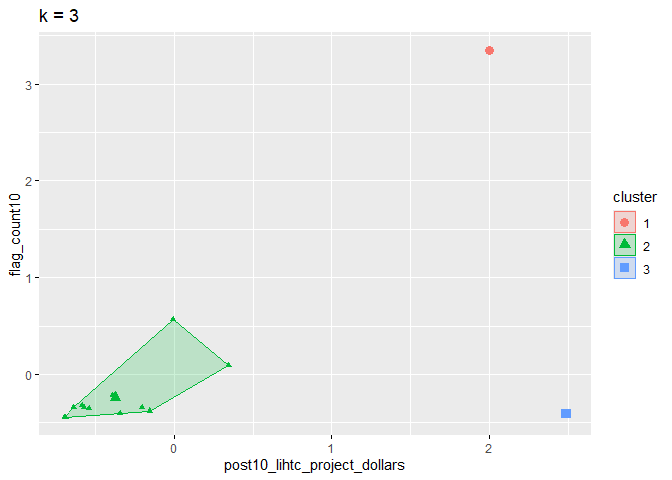<!-- -->

Let’s assign these clusters to our county data:

``` r
svi_divisional_lihtc_cluster_label <- as.data.frame(svi_divisional_lihtc_cluster) %>%
                                  rownames_to_column(var = "county_name") %>%
                                  as_tibble() %>%
                                  mutate(cluster = k3_lihtc_div$cluster) %>%
                                  select(county_name, cluster)

svi_divisional_county_lihtc_projects2 <- left_join(svi_divisional_county_lihtc_projects, svi_divisional_lihtc_cluster_label, join_by(county_name == county_name))

# View county counts in each cluster
table(svi_divisional_county_lihtc_projects2$cluster)
```

    ## 
    ##  1  2  3 
    ##  1 12  1

Again this was our scatterplot and Pearson’s R for the overall data:

``` r
# Overall Scatterplot
# y is our independent variable (LIHTC Project Dollars),  
# x is our dependent variable (SVI flag count)
ggplot2::ggplot(svi_divisional_county_lihtc_projects2,
                aes(x=flag_count10,
                    y=post10_lihtc_project_dollars)) +
        geom_point() +
        geom_smooth(method="lm") +
        scale_y_continuous(labels = scales::dollar_format()) 
```

    ## `geom_smooth()` using formula = 'y ~ x'

<!-- -->

``` r
# Pearson's r calculation
cor(svi_divisional_county_lihtc_projects2$flag_count10, svi_divisional_county_lihtc_projects2$post10_lihtc_project_dollars, method = "pearson")
```

    ## [1] 0.5743274

**Cluster 1**

``` r
# Cluster 1 Scatterplot
# y is our independent variable (LIHTC Project Dollars),  
# x is our dependent variable (SVI flag count)

svi_divisional_county_lihtc_projects2 %>% 
  filter(cluster == 1) %>%
  ggplot2::ggplot(aes(x=flag_count10,
                    y=post10_lihtc_project_dollars)) +
        geom_point() +
        geom_smooth(method="lm") +
        scale_y_continuous(labels = scales::dollar_format()) 
```

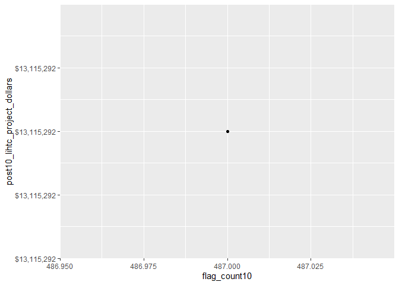<!-- -->

We only have 1 data point in cluster 1, so we cannot calculate
correlation. Here is our county information:

``` r
svi_divisional_county_lihtc_projects2 %>% 
  filter(cluster == 1) %>%
  select(county_name, flag_count10, post10_lihtc_dollars_formatted) %>% 
  arrange(desc(flag_count10)) %>% head(10) 
```

    ##           county_name flag_count10 post10_lihtc_dollars_formatted
    ## 1 Maricopa County, AZ          487                    $13,115,292

Again, Maricopa County stands out as an outlier.

**Cluster 2**

``` r
# Cluster 2 Scatterplot
# y is our independent variable (LIHTC Project Dollars),  
# x is our dependent variable (SVI flag count)

svi_divisional_county_lihtc_projects2 %>% 
  filter(cluster == 2) %>%
  ggplot2::ggplot(aes(x=flag_count10,
                    y=post10_lihtc_project_dollars)) +
        geom_point() +
        geom_smooth(method="lm") +
        scale_y_continuous(labels = scales::dollar_format()) 
```

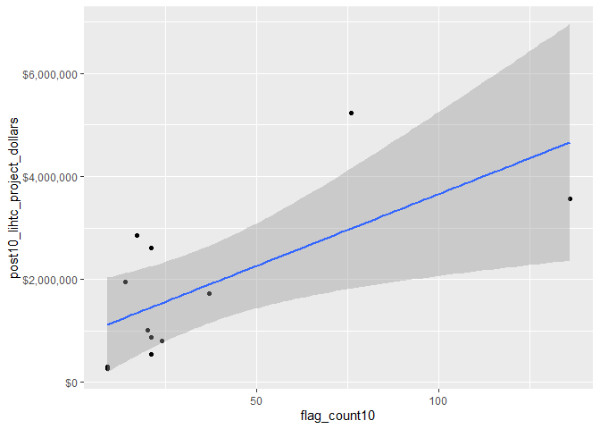<!-- -->

``` r
svi_divisional_county_lihtc_projects2 %>% 
  filter(cluster == 2) %>%
  select(flag_count10,post10_lihtc_project_dollars) %>%
  cor(method = "pearson")
```

    ##                              flag_count10 post10_lihtc_project_dollars
    ## flag_count10                    1.0000000                    0.6788349
    ## post10_lihtc_project_dollars    0.6788349                    1.0000000

Cluster 2 contains all but 2 of our data points. With a Pearson’s R of
0.68, there is a strong correlation between LIHTC dollars and SVI need.

Here are the 12 counties in this cluster:

``` r
svi_divisional_county_lihtc_projects2 %>% 
  filter(cluster == 2) %>%
  select(county_name, flag_count10, post10_lihtc_dollars_formatted) %>% 
  arrange(desc(flag_count10)) %>% head(12) 
```

    ##             county_name flag_count10 post10_lihtc_dollars_formatted
    ## 1       Pima County, AZ          136                     $3,557,261
    ## 2     Denver County, CO           76                     $5,226,128
    ## 3       Utah County, UT           37                     $1,721,391
    ## 4   San Juan County, NM           24                       $802,175
    ## 5       Gila County, AZ           21                       $547,218
    ## 6       Yuma County, AZ           21                       $864,604
    ## 7    Larimer County, CO           21                     $2,609,648
    ## 8    El Paso County, CO           20                     $1,011,891
    ## 9   Big Horn County, MT           17                     $2,849,000
    ## 10 Salt Lake County, UT           14                     $1,952,122
    ## 11    Canyon County, ID            9                       $300,210
    ## 12   Fremont County, WY            9                       $270,127

**Cluster 3**

``` r
# Cluster 3 Scatterplot
# y is our independent variable (LIHTC Project Dollars),  
# x is our dependent variable (SVI flag count)

svi_divisional_county_lihtc_projects2 %>% 
  filter(cluster == 3) %>%
  ggplot2::ggplot(aes(x=flag_count10,
                    y=post10_lihtc_project_dollars)) +
        geom_point() +
        geom_smooth(method="lm") +
        scale_y_continuous(labels = scales::dollar_format()) 
```

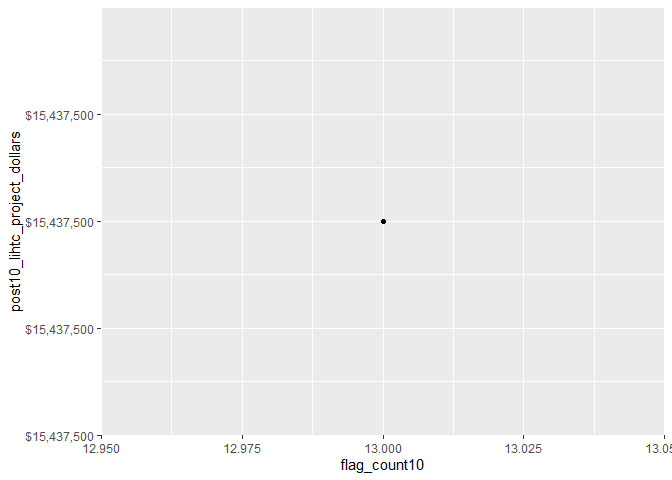<!-- -->

Cluster 3 only contains 1 data point so there is no correlation
information for this cluster. Here is the county information for this
cluster:

``` r
svi_divisional_county_lihtc_projects2 %>% 
  filter(cluster == 3) %>%
  select(county_name, flag_count10, post10_lihtc_dollars_formatted) %>% 
  arrange(desc(flag_count10)) %>% head(10) 
```

    ##       county_name flag_count10 post10_lihtc_dollars_formatted
    ## 1 Mesa County, CO           13                    $15,437,500

\*\*In summary, after clustering, we pulled out 1 county outlier with a
high flag count (Maricopa County, AZ) and 1 county outlier with a high
dollar amount (Mesa County, CO), and our correlation between LIHTC
funding received in 2011-2020 is strongly correlated with the SVI
vulnerability flag count in 2010.

### Bivariate Mapping

``` r
# Join our LIHTC projects data with our shapefile geocoordinates
svi_divisional_county_lihtc_sf <- left_join(svi_divisional_county_lihtc_projects, divisional_county_sf, join_by("FIPS_st" == "STATEFP", "FIPS_county" == "COUNTYFP"))

svi_divisional_county_lihtc_sf %>% head(5) 
```

    ##   State          County          Division post10_lihtc_project_cnt tract_cnt
    ## 1    AZ     Gila County Mountain Division                        1         2
    ## 2    AZ Maricopa County Mountain Division                       14        48
    ## 3    AZ     Pima County Mountain Division                        4        17
    ## 4    AZ     Yuma County Mountain Division                        1         2
    ## 5    CO   Denver County Mountain Division                        6         8
    ##   post10_lihtc_project_dollars post10_lihtc_dollars_formatted fips_county_st
    ## 1                       547218                       $547,218          04007
    ## 2                     13115292                    $13,115,292          04013
    ## 3                      3557261                     $3,557,261          04019
    ## 4                       864604                       $864,604          04027
    ## 5                      5226128                     $5,226,128          08031
    ##   FIPS_st FIPS_county state_name region_number      region division_number
    ## 1      04         007    Arizona             4 West Region               8
    ## 2      04         013    Arizona             4 West Region               8
    ## 3      04         019    Arizona             4 West Region               8
    ## 4      04         027    Arizona             4 West Region               8
    ## 5      08         031   Colorado             4 West Region               8
    ##   flag_count10  pop10 flag_by_pop10 flag_count_quantile10 flag_pop_quantile10
    ## 1           21   7245   0.002898551                   0.8                 0.8
    ## 2          487 168865   0.002883961                   1.0                 0.8
    ## 3          136  68218   0.001993609                   1.0                 0.4
    ## 4           21  10732   0.001956765                   0.8                 0.4
    ## 5           76  29499   0.002576359                   1.0                 0.6
    ##   flag_count20  pop20 flag_by_pop20 flag_count_quantile20 flag_pop_quantile20
    ## 1           18   8214   0.002191381                   0.8                 0.6
    ## 2          447 185321   0.002412031                   1.0                 0.6
    ## 3          158  73456   0.002150948                   1.0                 0.4
    ## 4           21  12232   0.001716808                   0.8                 0.4
    ## 5           41  33146   0.001236952                   1.0                 0.2
    ##           county_name                       geometry
    ## 1     Gila County, AZ MULTIPOLYGON (((-111.2865 3...
    ## 2 Maricopa County, AZ MULTIPOLYGON (((-112.9158 3...
    ## 3     Pima County, AZ MULTIPOLYGON (((-112.3881 3...
    ## 4     Yuma County, AZ MULTIPOLYGON (((-114.7546 3...
    ## 5   Denver County, CO MULTIPOLYGON (((-104.9341 3...

``` r
# Create classes for bivariate mapping 
svi_divisional_county_lihtc_sf <- bi_class(svi_divisional_county_lihtc_sf, x = flag_count10, y = post10_lihtc_project_dollars, style = "quantile", dim = 3)

# View data
svi_divisional_county_lihtc_sf %>% head(5) 
```

    ##   State          County          Division post10_lihtc_project_cnt tract_cnt
    ## 1    AZ     Gila County Mountain Division                        1         2
    ## 2    AZ Maricopa County Mountain Division                       14        48
    ## 3    AZ     Pima County Mountain Division                        4        17
    ## 4    AZ     Yuma County Mountain Division                        1         2
    ## 5    CO   Denver County Mountain Division                        6         8
    ##   post10_lihtc_project_dollars post10_lihtc_dollars_formatted fips_county_st
    ## 1                       547218                       $547,218          04007
    ## 2                     13115292                    $13,115,292          04013
    ## 3                      3557261                     $3,557,261          04019
    ## 4                       864604                       $864,604          04027
    ## 5                      5226128                     $5,226,128          08031
    ##   FIPS_st FIPS_county state_name region_number      region division_number
    ## 1      04         007    Arizona             4 West Region               8
    ## 2      04         013    Arizona             4 West Region               8
    ## 3      04         019    Arizona             4 West Region               8
    ## 4      04         027    Arizona             4 West Region               8
    ## 5      08         031   Colorado             4 West Region               8
    ##   flag_count10  pop10 flag_by_pop10 flag_count_quantile10 flag_pop_quantile10
    ## 1           21   7245   0.002898551                   0.8                 0.8
    ## 2          487 168865   0.002883961                   1.0                 0.8
    ## 3          136  68218   0.001993609                   1.0                 0.4
    ## 4           21  10732   0.001956765                   0.8                 0.4
    ## 5           76  29499   0.002576359                   1.0                 0.6
    ##   flag_count20  pop20 flag_by_pop20 flag_count_quantile20 flag_pop_quantile20
    ## 1           18   8214   0.002191381                   0.8                 0.6
    ## 2          447 185321   0.002412031                   1.0                 0.6
    ## 3          158  73456   0.002150948                   1.0                 0.4
    ## 4           21  12232   0.001716808                   0.8                 0.4
    ## 5           41  33146   0.001236952                   1.0                 0.2
    ##           county_name                       geometry bi_class
    ## 1     Gila County, AZ MULTIPOLYGON (((-111.2865 3...      2-1
    ## 2 Maricopa County, AZ MULTIPOLYGON (((-112.9158 3...      3-3
    ## 3     Pima County, AZ MULTIPOLYGON (((-112.3881 3...      3-3
    ## 4     Yuma County, AZ MULTIPOLYGON (((-114.7546 3...      2-1
    ## 5   Denver County, CO MULTIPOLYGON (((-104.9341 3...      3-3

``` r
# Create map with ggplot
svi_divisional_county_lihtc_map <- ggplot() +
  # Map county shapefile, fill with bi_class categories
  geom_sf(data = svi_divisional_county_lihtc_sf, mapping = aes(geometry=geometry, fill = bi_class), color = "white", size = 0.1, show.legend = FALSE) +
  # Set to biscale palette
  bi_scale_fill(pal = "GrPink", dim = 3) +
  # Add state shapefiles for outline
  geom_sf(data=divisional_st_sf, color="black", fill=NA, linewidth=.5, aes(geometry=geometry)) +
  labs(
    title = paste0("Correlation of 2010 ", census_division, " SVI Flag Count \n and 2011 - 2020 LIHTC Tax Dollars")
  ) +
  # Set them to biscale
  bi_theme(base_size = 10)

# Create biscale legend
svi_divisional_county_lihtc_legend <- bi_legend(pal = "GrPink",
                    dim = 3,
                    xlab = "SVI Flag Count",
                    ylab = "LIHTC Dollars",
                    size = 8)

# Combine map with legend using cowplot
svi_divisional_county_lihtc_bivarmap <- ggdraw() +
  draw_plot(svi_divisional_county_lihtc_map) +
  # Set legend location
  draw_plot(svi_divisional_county_lihtc_legend, x= -.02,  y = -.05,
 width=.20)


# View map
svi_divisional_county_lihtc_bivarmap
```

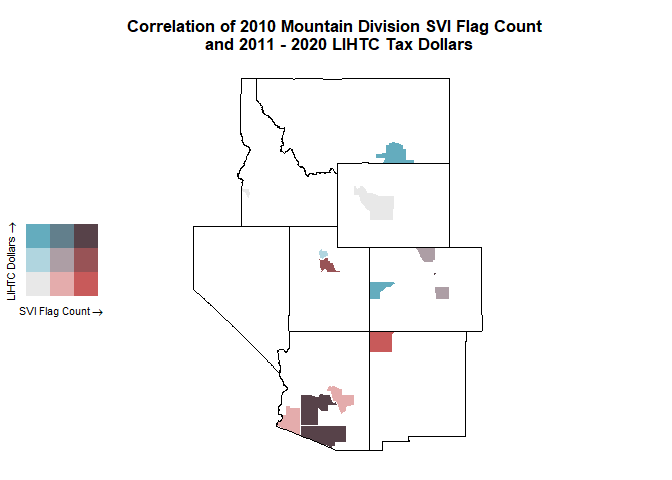<!-- -->

Here we can see that Idaho and Nevada did not receive any LIHTC project
funding in 2011-2020. Again, Arizona has the counties with the highest
need and the highest amount of LIHTC funding.

``` r
svi_divisional_county_lihtc_sf %>% filter(State == "AZ") %>% select(State, County, flag_count10, post10_lihtc_dollars_formatted) %>% arrange(desc(flag_count10)) %>% head()
```

    ##   State          County flag_count10 post10_lihtc_dollars_formatted
    ## 1    AZ Maricopa County          487                    $13,115,292
    ## 2    AZ     Pima County          136                     $3,557,261
    ## 3    AZ     Gila County           21                       $547,218
    ## 4    AZ     Yuma County           21                       $864,604

Again, Montana and Colorado received high funding dollars for a low
amount of need:

``` r
svi_divisional_county_lihtc_sf %>% filter(State %in% c("MT", "CO")) %>%
  arrange(desc(post10_lihtc_project_dollars), flag_count10) %>% select(State, County, flag_count10, post10_lihtc_dollars_formatted) %>% head(10)  
```

    ##   State          County flag_count10 post10_lihtc_dollars_formatted
    ## 1    CO     Mesa County           13                    $15,437,500
    ## 2    CO   Denver County           76                     $5,226,128
    ## 3    MT Big Horn County           17                     $2,849,000
    ## 4    CO  Larimer County           21                     $2,609,648
    ## 5    CO  El Paso County           20                     $1,011,891

``` r
#Save Data Sets

saveRDS(svi_divisional_lihtc, file = here::here(paste0("data/wrangling/", str_replace_all(census_division, " ", "_"), "_svi_divisional_lihtc.rds")))

saveRDS(svi_national_lihtc, file = here::here(paste0("data/wrangling/", str_replace_all(census_division, " ", "_"), "_svi_national_lihtc.rds")))

saveRDS(svi_divisional_nmtc, file = here::here(paste0("data/wrangling/", str_replace_all(census_division, " ", "_"), "_svi_divisional_nmtc.rds")))

saveRDS(svi_national_nmtc, file = here::here(paste0("data/wrangling/", str_replace_all(census_division, " ", "_"), "_svi_national_nmtc.rds")))
```

</div>
