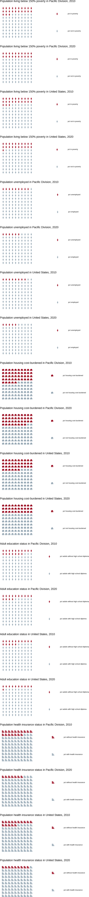
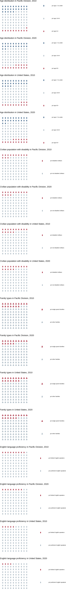
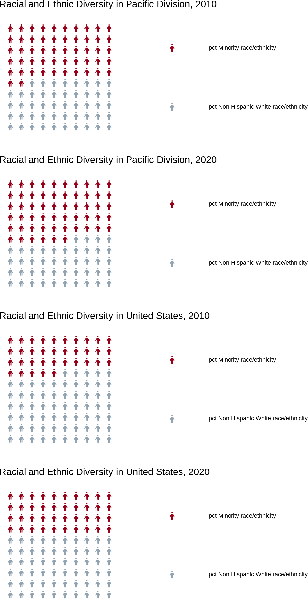
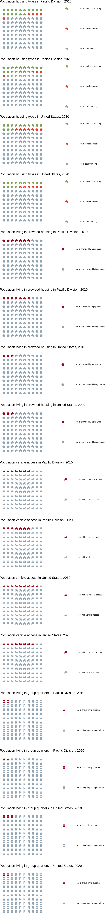

```{r setup, include=FALSE}
knitr::opts_chunk$set(echo = FALSE)
```


```{css}
img {
  border: 50px solid white;
}
```


```{r, warning=FALSE, message=FALSE, results='hide'}
# Load packages
library(here)        # relative filepaths for reproducibility
library(ggplot2)     # data visualization
library(patchwork)   # data visualization layout
library(magick)      # image editing in R
library(ggiraph)     # interactive data visualization
library(htmlwidgets) # create widget from interactive visualizations
library(htmltools)   # encode HTML code in map tooltips
library(widgetframe) # save widget of interactive visualizations
library(tidyverse)   # data wrangling
library(kableExtra)  # table formatting
library(showtext)    # utilize special fonts in graphs
library(scales)      # format numbers and colors for graphs
library(tigris)      # pull US Census shapefiles
```


```{r, warning=FALSE, message=FALSE, results='hide'}
import::here( "fips_census_regions",
              "load_svi_data",
              "merge_svi_data",
              "census_division",
              "svi_percentages10",
              "svi_percentages20",
              "waffle_charts",
              "person_icon",
              "house_icon",
              "car_icon",
              "parent_icon",
              "health_icon",
              "groupqtr_icon",
              "flag_summarize",
              "map_tooltip",
              "choropleth_map",
             # notice the use of here::here() that points to the .R file
             # where all these R objects are created
             .from = here::here("analysis/project_data_steps_radovich.R"),
             .character_only = TRUE)
```


```{r, warning=FALSE, message=FALSE, results='hide'}
# Load data from raw folder
svi_2010 <- readRDS(here::here("data/raw/Census_Data_SVI/svi_2010_trt10.rds"))
svi_2020 <- readRDS(here::here("data/raw/Census_Data_SVI/svi_2020_trt10.rds"))
```


```{r, warning=FALSE, message=FALSE, results='hide'}
# National 2010 Data
svi_2010_national <- load_svi_data(svi_2010, percentile=.75)
svi_2010_national %>% head() %>% kbl() %>% kable_styling() %>% scroll_box(width = "100%")
```


```{r, warning=FALSE, message=FALSE, results='hide'}
# Divisional 2010 Data
svi_2010_divisional <- load_svi_data(svi_2010, rank_by = "divisional", location = census_division, percentile=.75)
svi_2010_divisional %>% head() %>% kbl() %>% kable_styling() %>% scroll_box(width = "100%")
```


```{r, warning=FALSE, message=FALSE, results='hide'}
# National 2020 Data
svi_2020_national <- load_svi_data(svi_2020, percentile=.75)
svi_2020_national %>% head() %>% kbl() %>% kable_styling() %>% scroll_box(width = "100%")
```


```{r, warning=FALSE, message=FALSE, results='hide'}
# Divisional 2020 Data
svi_2020_divisional <- load_svi_data(svi_2020, rank_by = "divisional", location =  census_division, percentile=.75)
svi_2020_divisional %>% head() %>% kbl() %>% kable_styling() %>% scroll_box(width = "100%")
```


## Data

Here is the summary data for SVI vulnerability in the Pacific Division compared to nationally for the years 2010 and 2020. The percents of social vulnerability in the Pacific Division closely match the national averages with a few key exceptions. For instance, the Pacific division has a significantly higher percent of limited English speakers than the national average as well as a higher percent minority race/ethnicity. The Pacific Division also has a slightly lower percent population with high school diplomas. For both 2010 and 2020, the Pacific Division had nearly double the percent of population living in crowded living spaces than the national average. For healthcare, the percent of population covered increased 10% from 2010, following the national trend.

```{r}
usa_pcts10 <- svi_percentages10(svi_2010_national, "United States")
div_pcts10 <-svi_percentages10(svi_2010_divisional, census_division)
usa_pcts20 <- svi_percentages20(svi_2020_national, "United States")
div_pcts20 <- svi_percentages20(svi_2020_divisional, census_division)

svi_pcts <- union(union(usa_pcts10, div_pcts10), union(usa_pcts20, div_pcts20))
svi_pcts %>% kbl() %>% kable_styling() %>% scroll_box(width = "100%")
```

## Socieconomic Status Infographics

The following waffle charts show information on the Socioeconomic status of the Pacific Division. Each icon represents 1% of the population. The demographics that are included in socioeconomic status are poverty, unemployment rates, housing cost-burdened, high school education, and health insurance coverage. The most notable differences in the Pacific Division and nation are the percent of population experiencing housing cost-burdens and the percent of high school diplomas.

```{r, message=FALSE, warning=FALSE, results='hide', fig.show='hide'}
# Poverty
pov <- waffle_charts(svi_pcts = svi_pcts, 
              var_search = "poverty", 
              fa_icon = person_icon, 
              filter_year1 = 2010, 
              title_label_div_year1 = paste0("Population living below 150% poverty in ", census_division, ", 2010"),
              title_label_usa_year1 = "Population living below 150% poverty in United States, 2010", 
              filter_year2 = 2020, 
              title_label_div_year2 = paste0("Population living below 150% poverty in ", census_division, ", 2020"), 
              title_label_usa_year2 = "Population living below 150% poverty in United States, 2020", 
              census_division = census_division)

# Unemployment
unemploy <- waffle_charts(svi_pcts = svi_pcts, 
              var_search = "employ", 
              fa_icon = person_icon, 
              filter_year1 = 2010, 
              title_label_div_year1 = paste0("Population unemployed in ", census_division, ", 2010"),
              title_label_usa_year1 = "Population unemployed in United States, 2010", 
              filter_year2 = 2020, 
              title_label_div_year2 = paste0("Population unemployed in ", census_division, ", 2020"), 
              title_label_usa_year2 = "Population unemployed in United States, 2020", 
              census_division = census_division)

# Housing Cost-burdened
house_cost <- waffle_charts(svi_pcts = svi_pcts, 
              var_search = "cost-burdened", 
              fa_icon = house_icon, 
              filter_year1 = 2010, 
              title_label_div_year1 = paste0("Population housing cost-burdened in ", census_division, ", 2010"),
              title_label_usa_year1 = "Population housing cost-burdened in United States, 2010", 
              filter_year2 = 2020, 
              title_label_div_year2 = paste0("Population housing cost-burdened in ", census_division, ", 2020"), 
              title_label_usa_year2 = "Population housing cost-burdened in United States, 2020", 
              census_division = census_division)

# High School Education
hsed <- waffle_charts(svi_pcts = svi_pcts, 
              var_search = "adults", 
              fa_icon = person_icon, 
              filter_year1 = 2010, 
              title_label_div_year1 = paste0("Adult education status in ", census_division, ", 2010"),
              title_label_usa_year1 = "Adult education status in United States, 2010", 
              filter_year2 = 2020, 
              title_label_div_year2 = paste0("Adult education status in ", census_division, ", 2020"), 
              title_label_usa_year2 = "Adult education status in United States, 2020", 
              census_division = census_division)

# Health Insurance
healthins <- waffle_charts(svi_pcts = svi_pcts, 
              var_search = "health", 
              fa_icon = health_icon, 
              filter_year1 = 2010, 
              title_label_div_year1 = paste0("Population health insurance status in ", census_division, ", 2010"), 
              title_label_usa_year1 = "Population health insurance status in United States, 2010", 
              filter_year2 = 2020, 
              title_label_div_year2 = paste0("Population health insurance status in ", census_division, ", 2020"), 
              title_label_usa_year2 = "Population health insurance status in United States, 2020", 
              census_division = census_division)

# Join SES plots with patchwork package syntax
pov[[1]] / pov[[2]] / pov[[3]] / pov[[4]] / unemploy[[1]] / unemploy[[2]] / unemploy[[3]] / unemploy[[4]] / house_cost[[1]] / house_cost[[2]] / house_cost[[3]] / house_cost[[4]] / hsed[[1]] / hsed[[2]] / hsed[[3]] / hsed[[4]] / healthins[[1]] / healthins[[2]] / healthins[[3]] / healthins[[4]]

# Set output location
out <- here::here(paste0("labs/wk03/imgs/infographic", "_SES", "_", str_replace_all(census_division, " ", "_"), ".png"))

# Save plot as image
ggsave(out, device = "png", width = 1050, height=520*20, units = "px")

# Load image to magick package
magick_image = magick::image_read(out)

# Trim to remove excess margins
cropped_out = magick::image_trim(magick_image)

# Save final cropped infographic
magick::image_write(cropped_out, path = out, format = "png")
```



## Household Characteristics Infographics

These infographics look at age, disability status, family types, and language, the characteristics that make up the Housing category of the SVI. For the Pacific Division, age categories closely mirror the national averages, while there is a significantly higher percentage of non-English speakers compared to the national population.

```{r, message=FALSE, warning=FALSE, results='hide', fig.show='hide'}
# Age
age <- waffle_charts(svi_pcts = svi_pcts, 
              var_search = "age", 
              fa_icon = person_icon, 
              filter_year1 = 2010, 
              title_label_div_year1 = paste0("Age distribution in ", census_division, ", 2010"), 
              title_label_usa_year1 = "Age distribution in United States, 2010", 
              filter_year2 = 2020, 
              title_label_div_year2 = paste0("Age distribution in ", census_division, ", 2020"),
              title_label_usa_year2 = "Age distribution in United States, 2020", 
              census_division = census_division)

# Disability Status
disabled <- waffle_charts(svi_pcts = svi_pcts, 
              var_search = "disabled", 
              fa_icon = person_icon, 
              filter_year1 = 2010, 
              title_label_div_year1 = paste0("Civilian population with disability in ", census_division, ", 2010"), 
              title_label_usa_year1 = "Civilian population with disability in United States, 2010", 
              filter_year2 = 2020, 
              title_label_div_year2 = paste0("Civilian population with disability in ", census_division, ", 2020"),
              title_label_usa_year2 = "Civilian population with disability in United States, 2020", 
              census_division = census_division)

# Family Types
family <- waffle_charts(svi_pcts = svi_pcts, 
              var_search = "families", 
              fa_icon = parent_icon, 
              filter_year1 = 2010, 
              title_label_div_year1 = paste0("Family types in ", census_division, ", 2010"),  
              title_label_usa_year1 = "Family types in United States, 2010", 
              filter_year2 = 2020, 
              title_label_div_year2 = paste0("Family types in ", census_division, ", 2020"), 
              title_label_usa_year2 = "Family types in United States, 2020", 
              census_division = census_division)

# Language
lang <- waffle_charts(svi_pcts = svi_pcts, 
              var_search = "English", 
              fa_icon = person_icon, 
              filter_year1 = 2010, 
              title_label_div_year1 = paste0("English language proficiency in ", census_division, ", 2010"),  
              title_label_usa_year1 = "English language proficiency in United States, 2010", 
              filter_year2 = 2020, 
              title_label_div_year2 = paste0("English language proficiency in ", census_division, ", 2020"), 
              title_label_usa_year2 = "English language proficiency in United States, 2020", 
              census_division = census_division)

# Join household characteristics plots with patchwork package syntax
age[[1]] / age[[2]] / age[[3]] / age[[4]] / disabled[[1]] / disabled[[2]] / disabled[[3]] / disabled[[4]] / family[[1]] / family[[2]] / family[[3]] / family[[4]] / lang[[1]] / lang[[2]] / lang[[3]] / lang[[4]]

# Set output location
out <- here::here(paste0("labs/wk03/imgs/infographic", "_HHChar", "_", str_replace_all(census_division, " ", "_"), ".png"))

# Save plot as image
ggsave(out, device = "png", width = 1050, height=520*16, units = "px")

# Load image to magick package
magick_image = magick::image_read(out)

# Trim to remove excess margins
cropped_out = magick::image_trim(magick_image)

# Save final cropped infographic
magick::image_write(cropped_out, path = out, format = "png")
```


## Racial and Ethnic Minority Status Infographics

For racial and ethnic minority groups, there is a significantly higher (17% in 2010 and 15% in 2020) percent population in the Pacific Division when compared to the national average. This makes sense with the higher amount of non-English speakers that were observed in the previous category.

```{r, message=FALSE, warning=FALSE, results='hide', fig.show='hide'}
# Race
race <- waffle_charts(svi_pcts = svi_pcts, 
              var_search = "race", 
              fa_icon = person_icon, 
              filter_year1 = 2010, 
              title_label_div_year1 = paste0("Racial and Ethnic Diversity in ", census_division, ", 2010"),
              title_label_usa_year1 = "Racial and Ethnic Diversity in United States, 2010", 
              filter_year2 = 2020, 
              title_label_div_year2 = paste0("Racial and Ethnic Diversity in ", census_division, ", 2020"), 
              title_label_usa_year2 = "Racial and Ethnic Diversity in United States, 2020", 
              census_division = census_division)

# Join racial and ethnic minority plots with patchwork package syntax
race[[1]] / race[[2]] / race[[3]] / race[[4]]

# Set output location
out <- here::here(paste0("labs/wk03/imgs/infographic", "_REM", "_", str_replace_all(census_division, " ", "_"), ".png"))

# Save plot as image
ggsave(out, device = "png", width = 1050, height=520*4, units = "px")

# Load image to magick package
magick_image = magick::image_read(out)

# Trim to remove excess margins
cropped_out = magick::image_trim(magick_image)

# Save final cropped infographic
magick::image_write(cropped_out, path = out, format = "png")
```


## Housing Type and Transportation Infographics

The last category of the SVI is housing type and transportation which takes into account group living quarters, crowded living spaces, multi-unit housing, and vehicle access. The Pacific Division has slightly less percent population living in mobile housing for 2010 and 2020, with those numbers choosing multi-unit housing instead. This is also reflected in the slightly higher percent population living in crowded spaces compared to the rest of the nation. Vehicle access for the Pacific Division is only a few percentage points higher than the national average.

```{r, message=FALSE, warning=FALSE, results='hide', fig.show='hide'}
# housing Types
house_type <- waffle_charts(svi_pcts = svi_pcts, 
              var_search = "housing$", 
              fa_icon = house_icon, 
              filter_year1 = 2010, 
              title_label_div_year1 =  paste0("Population housing types in ", census_division, ", 2010"),
              title_label_usa_year1 = "Population housing types in United States, 2010", 
              filter_year2 = 2020, 
              title_label_div_year2 = paste0("Population housing types in ", census_division, ", 2020"),
              title_label_usa_year2 = "Population housing types in United States, 2020", 
              census_division = census_division)

# Crowded Living
crowded <- waffle_charts(svi_pcts = svi_pcts, 
              var_search = "crowded", 
              fa_icon = house_icon, 
              filter_year1 = 2010, 
              title_label_div_year1 =  paste0("Population living in crowded housing in ", census_division, ", 2010"),
              title_label_usa_year1 = "Population living in crowded housing in United States, 2010", 
              filter_year2 = 2020, 
              title_label_div_year2 = paste0("Population living in crowded housing in ", census_division, ", 2020"),
              title_label_usa_year2 = "Population living in crowded housing in United States, 2020", 
              census_division = census_division)

# Transportation Access
car <- waffle_charts(svi_pcts = svi_pcts, 
              var_search = "vehicle", 
              fa_icon = car_icon, 
              filter_year1 = 2010, 
              title_label_div_year1 =  paste0("Population vehicle access in ", census_division, ", 2010"),
              title_label_usa_year1 = "Population vehicle access in United States, 2010", 
              filter_year2 = 2020, 
              title_label_div_year2 = paste0("Population vehicle access in ", census_division, ", 2020"),
              title_label_usa_year2 = "Population vehicle access in United States, 2020", 
              census_division = census_division)

# Group Quarters
group <- waffle_charts(svi_pcts = svi_pcts, 
              var_search = "group", 
              fa_icon = groupqtr_icon, 
              filter_year1 = 2010, 
              title_label_div_year1 =  paste0("Population living in group quarters in ", census_division, ", 2010"),
              title_label_usa_year1 = "Population living in group quarters in United States, 2010", 
              filter_year2 = 2020, 
              title_label_div_year2 = paste0("Population living in group quarters in ", census_division, ", 2020"),
              title_label_usa_year2 = "Population living in group quarters in United States, 2020", 
              census_division = census_division)

# Join racial and ethnic minority plots with patchwork package syntax
house_type[[1]] / house_type[[2]] / house_type[[3]] / house_type[[4]] / crowded[[1]] / crowded[[2]] / crowded[[3]] / crowded[[4]] / car[[1]] / car[[2]] / car[[3]] / car[[4]] / group[[1]] / group[[2]] / group[[3]] / group[[4]]

# Set output location
out <- here::here(paste0("labs/wk03/imgs/infographic", "_HAT", "_", str_replace_all(census_division, " ", "_"), ".png"))

# Save plot as image
ggsave(out, device = "png", width = 1050, height=520*16, units = "px")

# Load image to magick package
magick_image = magick::image_read(out)

# Trim to remove excess margins
cropped_out = magick::image_trim(magick_image)

# Save final cropped infographic
magick::image_write(cropped_out, path = out, format = "png")
```


## Choropleth Maps

```{r, message=FALSE, warning=FALSE, results='hide'}
# Find states in division
states <- svi_2020_divisional %>% select(state) %>% unique()
states <- states$state
states
```

```{r, message=FALSE, warning=FALSE, results='hide'}
# Find state FIPS codes
state_fips <- fips_census_regions %>% filter(division == census_division) %>% select(state_code) %>% unique()
state_fips <- state_fips$state_code
state_fips
```

```{r, message=FALSE, warning=FALSE, results='hide'}
# Recall that we are working with 2010 census tracts, thus we need to pull the 2010 shapefiles
st_sf <- tigris::states(year = 2010, cb = TRUE) %>% filter(STATE %in% state_fips)

# Shift geometric locations of AK and HI if Pacific division
if (census_division == "Pacific Division"){
    st_sf <- shift_geometry(
                  st_sf,
                  geoid_column = NULL,
                  preserve_area = FALSE,
                  position = c("below", "outside")
                )
} else {
  st_sf <- st_sf
}
```

```{r, message=FALSE, warning=FALSE, results='hide'}
# View data
st_sf
```

```{r, message=FALSE, warning=FALSE, results='hide'}
# Recall that we are working with 2010 census tracts, thus we need to pull the 2010 shapefiles
county_sf = tigris::counties(year = 2010, cb = TRUE) %>% filter(STATE %in% state_fips)

# Shift geometric locations of AK and HI if Pacific division
if (census_division == "Pacific Division"){
    county_sf <- shift_geometry(
                  county_sf,
                  geoid_column = NULL,
                  preserve_area = FALSE,
                  position = c("below", "outside")
                )
} else {
  county_sf <- county_sf
}
```

```{r, message=FALSE, warning=FALSE, results='hide'}
# View data
county_sf
```

```{r, message=FALSE, warning=FALSE, results='hide'}
# Summarize total count of flags by state and county

county_svi_flags10 <- flag_summarize(svi_2010_divisional, "E_TOTPOP_10")
county_svi_flags20 <- flag_summarize(svi_2020_divisional, "E_TOTPOP_20")

# Tooltips
county_svi_flags10 <- map_tooltip(county_svi_flags10)
county_svi_flags20 <- map_tooltip(county_svi_flags20)

# Merge Shapefiles with SVI Data
county_svi_flags10 <- left_join(county_sf, county_svi_flags10, join_by(STATEFP == FIPS_st, COUNTYFP == FIPS_county))

county_svi_flags20 <- left_join(county_sf, county_svi_flags20, join_by(STATEFP == FIPS_st, COUNTYFP == FIPS_county))
```

### 2010 SVI Flag to Population Ratio Map

The following maps look at Social Vulnerabilty per 1000 people at the county level for the Pacific Division in 2010. The index is a flag count to population ratio to account for size and population differences withing counties. Naturally, larger counties will produce more flags, using the ratio creates an equitable comparison. On the map, we can see that Alaska is at a high percent of social vulnerability as a whole, most likely due to the lower population and geographic difficulties. The Los Angeles area and surrounding counties are also at a higher risk when compared to major metropolitan areas in Washington and Oregon (i.e, Seattle and Portland.)

```{r, message=FALSE, warning=FALSE, results='hide', fig.show='hide'}
gg_int10 <- choropleth_map(county_svi_flags10, "flag_pop_quantile", "2010")
# View map
girafe(ggobj = gg_int10)

# Save map to HTML file for embedding in final project 
save_int <- girafe(ggobj = gg_int10)
setwd(here::here("labs/wk03/imgs"))
htmlwidgets::saveWidget(widgetframe::frameableWidget(save_int), here::here(paste0("labs/wk03/imgs/", "flag_pop_quantile", "2010", "_", str_replace_all(census_division, " ", "_"), "map.html")))
setwd(here::here("labs/wk03/"))
```
<iframe align = "center" width = "1000" height = "1000" src="./imgs/flag_pop_quantile2010_Pacific_Divisionmap.html"></iframe>

### 2020 SVI Flag to Population Ratio Map

Here is the same map for 2020 data. Again, a ratio of flags to population was used to account for differences in county size. The results are mostly similar with a couple counties crossing into the next percentile of social vulnerability, noticeably in Eastern Washington and Oregon, as well as Northern California. Major metropolitan areas did not change drastically in their risk of social vulnerability.

```{r, message=FALSE, warning=FALSE, results='hide', fig.show='hide'}
gg_int20 <- choropleth_map(county_svi_flags20, "flag_pop_quantile", "2020")
# View map
girafe(ggobj = gg_int20)

# Save map to HTML file for embedding in final project 
save_int <- girafe(ggobj = gg_int20)
setwd(here::here("labs/wk03/imgs"))
htmlwidgets::saveWidget(widgetframe::frameableWidget(save_int),here::here(paste0("labs/wk03/imgs/", "flag_pop_quantile", "2020",  "_", str_replace_all(census_division, " ", "_"), "map.html")))
setwd(here::here("labs/wk03/"))
```

<iframe align = "center" width = "1000" height = "1000" src="./imgs/flag_pop_quantile2020_Pacific_Divisionmap.html"></iframe>

```{r, message=FALSE, warning=FALSE, results='hide', fig.show='hide'}
saveRDS(county_svi_flags10, file = here::here(paste0("data/wrangling/", str_replace_all(census_division, " ", "_"), "_county_svi_flags10.rds")))

saveRDS(county_svi_flags20, file = here::here(paste0("data/wrangling/", str_replace_all(census_division, " ", "_"), "_county_svi_flags20.rds")))

saveRDS(st_sf, file = here::here(paste0("data/wrangling/", str_replace_all(census_division, " ", "_"), "_st_sf.rds")))

saveRDS(county_sf, file = here::here(paste0("data/wrangling/", str_replace_all(census_division, " ", "_"), "_county_sf.rds")))
```

