Lab-04-Dodson
================
Kenaniah Dodson
2025-04-21

- [Library](#library)
- [Functions](#functions)
- [Load SVI Data](#load-svi-data)
  - [Load 2010 Data](#load-2010-data)
  - [Merge 2010 & 2020 data](#merge-2010--2020-data)
- [NMTC Data Wrangling](#nmtc-data-wrangling)

# Library

``` r
# Turn off scientific notation
options(scipen=999)

# Load packages
library(here)        # relative file paths for reproducibility
library(tidyverse)   # data wrangling
library(stringi)     # string data wrangling
library(tigris)      # US census TIGER/Line shapefiles
library(ggplot2)     # data visualization
library(cowplot)     # data visualization plotting
library(gridExtra)   # grid for data visualizations
library(biscale)     # bivariate mapping
library(kableExtra)  # table formatting
library(scales)      # palette and number formatting
library(cluster)     # clustering algorithms
library(factoextra)  # clustering algorithms & visualization
```

# Functions

``` r
import::here( "fips_census_regions",
              "load_svi_data",
              "merge_svi_data",
              "census_division",
              "flag_summarize",
              "summarize_county_nmtc",
              "summarize_county_lihtc",
              "elbow_plot",
             # notice the use of here::here() that points to the .R file
             # where all these R objects are created
             .from = here::here("analysis/project_data_steps_dodson.R"),
             .character_only = TRUE)
census_division
```

# Load SVI Data

``` r
# Load SVI data sets
svi_2010 <- readRDS(here::here("data/raw/Census_Data_SVI/svi_2010_trt10.rds"))
svi_2020 <- readRDS(here::here("data/raw/Census_Data_SVI/svi_2020_trt10.rds"))

# Load mapping data sets
svi_county_map2010 <- readRDS(here::here(paste0("data/wrangling/", str_replace_all(census_division, " ", "_"), "_county_svi_flags10.rds")))

svi_county_map2020 <- readRDS(here::here(paste0("data/wrangling/", str_replace_all(census_division, " ", "_"), "_county_svi_flags20.rds")))

divisional_st_sf <- readRDS(here::here(paste0("data/wrangling/", str_replace_all(census_division, " ", "_"), "_st_sf.rds")))
```

``` r
# Load NMTC & LIHTC Tract Eligibility Data

orig_nmtc <- readxl::read_excel(here::here("data/raw/NMTC_LIHTC_tracts/nmtc_2011-2015_lic_110217.xlsx"), sheet="NMTC LICs 2011-2015 ACS")

high_migration_nmtc <- readxl::read_excel(here::here("data/raw/NMTC_LIHTC_tracts/nmtc_2011-2015_lic_110217.xlsx"), sheet="High migration tracts", skip=1)

nmtc_awards_data <- readxl::read_excel(here::here("data/raw/NMTC_LIHTC_tracts/NMTC_Public_Data_Release_includes_FY_2021_Data_final.xlsx"), sheet = "Projects 2 - Data Set PUBLISH.P")

lihtc_eligible <- readxl::read_excel(here::here("data/raw/NMTC_LIHTC_tracts/qct_data_2010_2011_2012.xlsx"))

lihtc_projects <- read.csv(here::here("data/raw/NMTC_LIHTC_tracts/lihtcpub/LIHTCPUB.csv"))
```

## Load 2010 Data

``` r
# National 2010 Data
svi_2010_national <- load_svi_data(svi_2010, percentile=.75)
svi_2010_national %>% head() %>% kbl() %>% kable_styling() %>% scroll_box(width = "100%")
```

<div style="border: 1px solid #ddd; padding: 5px; overflow-x: scroll; width:100%; ">

<table class="table" style="margin-left: auto; margin-right: auto;">
<thead>
<tr>
<th style="text-align:left;">
GEOID_2010_trt
</th>
<th style="text-align:left;">
FIPS_st
</th>
<th style="text-align:left;">
FIPS_county
</th>
<th style="text-align:left;">
FIPS_tract
</th>
<th style="text-align:left;">
state
</th>
<th style="text-align:left;">
state_name
</th>
<th style="text-align:left;">
county
</th>
<th style="text-align:right;">
region_number
</th>
<th style="text-align:left;">
region
</th>
<th style="text-align:right;">
division_number
</th>
<th style="text-align:left;">
division
</th>
<th style="text-align:right;">
E_TOTPOP_10
</th>
<th style="text-align:right;">
E_HU_10
</th>
<th style="text-align:right;">
E_HH_10
</th>
<th style="text-align:right;">
E_POV150_10
</th>
<th style="text-align:right;">
ET_POVSTATUS_10
</th>
<th style="text-align:right;">
EP_POV150_10
</th>
<th style="text-align:right;">
EPL_POV150_10
</th>
<th style="text-align:right;">
F_POV150_10
</th>
<th style="text-align:right;">
E_UNEMP_10
</th>
<th style="text-align:right;">
ET_EMPSTATUS_10
</th>
<th style="text-align:right;">
EP_UNEMP_10
</th>
<th style="text-align:right;">
EPL_UNEMP_10
</th>
<th style="text-align:right;">
F_UNEMP_10
</th>
<th style="text-align:right;">
E_HBURD_OWN_10
</th>
<th style="text-align:right;">
ET_HOUSINGCOST_OWN_10
</th>
<th style="text-align:right;">
EP_HBURD_OWN_10
</th>
<th style="text-align:right;">
EPL_HBURD_OWN_10
</th>
<th style="text-align:right;">
F_HBURD_OWN_10
</th>
<th style="text-align:right;">
E_HBURD_RENT_10
</th>
<th style="text-align:right;">
ET_HOUSINGCOST_RENT_10
</th>
<th style="text-align:right;">
EP_HBURD_RENT_10
</th>
<th style="text-align:right;">
EPL_HBURD_RENT_10
</th>
<th style="text-align:right;">
F_HBURD_RENT_10
</th>
<th style="text-align:right;">
E_HBURD_10
</th>
<th style="text-align:right;">
ET_HOUSINGCOST_10
</th>
<th style="text-align:right;">
EP_HBURD_10
</th>
<th style="text-align:right;">
EPL_HBURD_10
</th>
<th style="text-align:right;">
F_HBURD_10
</th>
<th style="text-align:right;">
E_NOHSDP_10
</th>
<th style="text-align:right;">
ET_EDSTATUS_10
</th>
<th style="text-align:right;">
EP_NOHSDP_10
</th>
<th style="text-align:right;">
EPL_NOHSDP_10
</th>
<th style="text-align:right;">
F_NOHSDP_10
</th>
<th style="text-align:right;">
E_UNINSUR_12
</th>
<th style="text-align:right;">
ET_INSURSTATUS_12
</th>
<th style="text-align:right;">
EP_UNINSUR_12
</th>
<th style="text-align:right;">
EPL_UNINSUR_12
</th>
<th style="text-align:right;">
F_UNINSUR_12
</th>
<th style="text-align:right;">
E_AGE65_10
</th>
<th style="text-align:right;">
EP_AGE65_10
</th>
<th style="text-align:right;">
EPL_AGE65_10
</th>
<th style="text-align:right;">
F_AGE65_10
</th>
<th style="text-align:right;">
E_AGE17_10
</th>
<th style="text-align:right;">
EP_AGE17_10
</th>
<th style="text-align:right;">
EPL_AGE17_10
</th>
<th style="text-align:right;">
F_AGE17_10
</th>
<th style="text-align:right;">
E_DISABL_12
</th>
<th style="text-align:right;">
ET_DISABLSTATUS_12
</th>
<th style="text-align:right;">
EP_DISABL_12
</th>
<th style="text-align:right;">
EPL_DISABL_12
</th>
<th style="text-align:right;">
F_DISABL_12
</th>
<th style="text-align:right;">
E_SNGPNT_10
</th>
<th style="text-align:right;">
ET_FAMILIES_10
</th>
<th style="text-align:right;">
EP_SNGPNT_10
</th>
<th style="text-align:right;">
EPL_SNGPNT_10
</th>
<th style="text-align:right;">
F_SNGPNT_10
</th>
<th style="text-align:right;">
E_LIMENG_10
</th>
<th style="text-align:right;">
ET_POPAGE5UP_10
</th>
<th style="text-align:right;">
EP_LIMENG_10
</th>
<th style="text-align:right;">
EPL_LIMENG_10
</th>
<th style="text-align:right;">
F_LIMENG_10
</th>
<th style="text-align:right;">
E_MINRTY_10
</th>
<th style="text-align:right;">
ET_POPETHRACE_10
</th>
<th style="text-align:right;">
EP_MINRTY_10
</th>
<th style="text-align:right;">
EPL_MINRTY_10
</th>
<th style="text-align:right;">
F_MINRTY_10
</th>
<th style="text-align:right;">
E_STRHU_10
</th>
<th style="text-align:right;">
E_MUNIT_10
</th>
<th style="text-align:right;">
EP_MUNIT_10
</th>
<th style="text-align:right;">
EPL_MUNIT_10
</th>
<th style="text-align:right;">
F_MUNIT_10
</th>
<th style="text-align:right;">
E_MOBILE_10
</th>
<th style="text-align:right;">
EP_MOBILE_10
</th>
<th style="text-align:right;">
EPL_MOBILE_10
</th>
<th style="text-align:right;">
F_MOBILE_10
</th>
<th style="text-align:right;">
E_CROWD_10
</th>
<th style="text-align:right;">
ET_OCCUPANTS_10
</th>
<th style="text-align:right;">
EP_CROWD_10
</th>
<th style="text-align:right;">
EPL_CROWD_10
</th>
<th style="text-align:right;">
F_CROWD_10
</th>
<th style="text-align:right;">
E_NOVEH_10
</th>
<th style="text-align:right;">
ET_KNOWNVEH_10
</th>
<th style="text-align:right;">
EP_NOVEH_10
</th>
<th style="text-align:right;">
EPL_NOVEH_10
</th>
<th style="text-align:right;">
F_NOVEH_10
</th>
<th style="text-align:right;">
E_GROUPQ_10
</th>
<th style="text-align:right;">
ET_HHTYPE_10
</th>
<th style="text-align:right;">
EP_GROUPQ_10
</th>
<th style="text-align:right;">
EPL_GROUPQ_10
</th>
<th style="text-align:right;">
F_GROUPQ_10
</th>
<th style="text-align:right;">
SPL_THEME1
</th>
<th style="text-align:right;">
RPL_THEME1
</th>
<th style="text-align:right;">
F_THEME1
</th>
<th style="text-align:right;">
SPL_THEME2
</th>
<th style="text-align:right;">
RPL_THEME2
</th>
<th style="text-align:right;">
F_THEME2
</th>
<th style="text-align:right;">
SPL_THEME3
</th>
<th style="text-align:right;">
RPL_THEME3
</th>
<th style="text-align:right;">
F_THEME3
</th>
<th style="text-align:right;">
SPL_THEME4
</th>
<th style="text-align:right;">
RPL_THEME4
</th>
<th style="text-align:right;">
F_THEME4
</th>
<th style="text-align:right;">
SPL_THEMES
</th>
<th style="text-align:right;">
RPL_THEMES
</th>
<th style="text-align:right;">
F_TOTAL
</th>
</tr>
</thead>
<tbody>
<tr>
<td style="text-align:left;">
01001020100
</td>
<td style="text-align:left;">
01
</td>
<td style="text-align:left;">
001
</td>
<td style="text-align:left;">
020100
</td>
<td style="text-align:left;">
AL
</td>
<td style="text-align:left;">
Alabama
</td>
<td style="text-align:left;">
Autauga County
</td>
<td style="text-align:right;">
3
</td>
<td style="text-align:left;">
South Region
</td>
<td style="text-align:right;">
6
</td>
<td style="text-align:left;">
East South Central Division
</td>
<td style="text-align:right;">
1809
</td>
<td style="text-align:right;">
771
</td>
<td style="text-align:right;">
696
</td>
<td style="text-align:right;">
297
</td>
<td style="text-align:right;">
1809
</td>
<td style="text-align:right;">
16.41791
</td>
<td style="text-align:right;">
0.3871
</td>
<td style="text-align:right;">
0
</td>
<td style="text-align:right;">
36
</td>
<td style="text-align:right;">
889
</td>
<td style="text-align:right;">
4.049494
</td>
<td style="text-align:right;">
0.1790
</td>
<td style="text-align:right;">
0
</td>
<td style="text-align:right;">
127
</td>
<td style="text-align:right;">
598
</td>
<td style="text-align:right;">
21.23746
</td>
<td style="text-align:right;">
0.20770
</td>
<td style="text-align:right;">
0
</td>
<td style="text-align:right;">
47
</td>
<td style="text-align:right;">
98
</td>
<td style="text-align:right;">
47.95918
</td>
<td style="text-align:right;">
0.5767
</td>
<td style="text-align:right;">
0
</td>
<td style="text-align:right;">
174
</td>
<td style="text-align:right;">
696
</td>
<td style="text-align:right;">
25.00000
</td>
<td style="text-align:right;">
0.18790
</td>
<td style="text-align:right;">
0
</td>
<td style="text-align:right;">
196
</td>
<td style="text-align:right;">
1242
</td>
<td style="text-align:right;">
15.780998
</td>
<td style="text-align:right;">
0.6093
</td>
<td style="text-align:right;">
0
</td>
<td style="text-align:right;">
186
</td>
<td style="text-align:right;">
1759
</td>
<td style="text-align:right;">
10.574190
</td>
<td style="text-align:right;">
0.3790
</td>
<td style="text-align:right;">
0
</td>
<td style="text-align:right;">
222
</td>
<td style="text-align:right;">
12.271973
</td>
<td style="text-align:right;">
0.4876
</td>
<td style="text-align:right;">
0
</td>
<td style="text-align:right;">
445
</td>
<td style="text-align:right;">
24.59923
</td>
<td style="text-align:right;">
0.5473
</td>
<td style="text-align:right;">
0
</td>
<td style="text-align:right;">
298
</td>
<td style="text-align:right;">
1335
</td>
<td style="text-align:right;">
22.32210
</td>
<td style="text-align:right;">
0.8454
</td>
<td style="text-align:right;">
1
</td>
<td style="text-align:right;">
27
</td>
<td style="text-align:right;">
545
</td>
<td style="text-align:right;">
4.954128
</td>
<td style="text-align:right;">
0.09275
</td>
<td style="text-align:right;">
0
</td>
<td style="text-align:right;">
36
</td>
<td style="text-align:right;">
1705
</td>
<td style="text-align:right;">
2.1114370
</td>
<td style="text-align:right;">
0.59040
</td>
<td style="text-align:right;">
0
</td>
<td style="text-align:right;">
385
</td>
<td style="text-align:right;">
1809
</td>
<td style="text-align:right;">
21.282477
</td>
<td style="text-align:right;">
0.4524
</td>
<td style="text-align:right;">
0
</td>
<td style="text-align:right;">
771
</td>
<td style="text-align:right;">
0
</td>
<td style="text-align:right;">
0.0000000
</td>
<td style="text-align:right;">
0.1224
</td>
<td style="text-align:right;">
0
</td>
<td style="text-align:right;">
92
</td>
<td style="text-align:right;">
11.9325551
</td>
<td style="text-align:right;">
0.8005
</td>
<td style="text-align:right;">
1
</td>
<td style="text-align:right;">
0
</td>
<td style="text-align:right;">
696
</td>
<td style="text-align:right;">
0.0000000
</td>
<td style="text-align:right;">
0.1238
</td>
<td style="text-align:right;">
0
</td>
<td style="text-align:right;">
50
</td>
<td style="text-align:right;">
696
</td>
<td style="text-align:right;">
7.183908
</td>
<td style="text-align:right;">
0.6134
</td>
<td style="text-align:right;">
0
</td>
<td style="text-align:right;">
0
</td>
<td style="text-align:right;">
1809
</td>
<td style="text-align:right;">
0
</td>
<td style="text-align:right;">
0.364
</td>
<td style="text-align:right;">
0
</td>
<td style="text-align:right;">
1.74230
</td>
<td style="text-align:right;">
0.28200
</td>
<td style="text-align:right;">
0
</td>
<td style="text-align:right;">
2.56345
</td>
<td style="text-align:right;">
0.5296
</td>
<td style="text-align:right;">
1
</td>
<td style="text-align:right;">
0.4524
</td>
<td style="text-align:right;">
0.4482
</td>
<td style="text-align:right;">
0
</td>
<td style="text-align:right;">
2.0241
</td>
<td style="text-align:right;">
0.2519
</td>
<td style="text-align:right;">
1
</td>
<td style="text-align:right;">
6.78225
</td>
<td style="text-align:right;">
0.3278
</td>
<td style="text-align:right;">
2
</td>
</tr>
<tr>
<td style="text-align:left;">
01001020200
</td>
<td style="text-align:left;">
01
</td>
<td style="text-align:left;">
001
</td>
<td style="text-align:left;">
020200
</td>
<td style="text-align:left;">
AL
</td>
<td style="text-align:left;">
Alabama
</td>
<td style="text-align:left;">
Autauga County
</td>
<td style="text-align:right;">
3
</td>
<td style="text-align:left;">
South Region
</td>
<td style="text-align:right;">
6
</td>
<td style="text-align:left;">
East South Central Division
</td>
<td style="text-align:right;">
2020
</td>
<td style="text-align:right;">
816
</td>
<td style="text-align:right;">
730
</td>
<td style="text-align:right;">
495
</td>
<td style="text-align:right;">
1992
</td>
<td style="text-align:right;">
24.84940
</td>
<td style="text-align:right;">
0.5954
</td>
<td style="text-align:right;">
0
</td>
<td style="text-align:right;">
68
</td>
<td style="text-align:right;">
834
</td>
<td style="text-align:right;">
8.153477
</td>
<td style="text-align:right;">
0.5754
</td>
<td style="text-align:right;">
0
</td>
<td style="text-align:right;">
49
</td>
<td style="text-align:right;">
439
</td>
<td style="text-align:right;">
11.16173
</td>
<td style="text-align:right;">
0.02067
</td>
<td style="text-align:right;">
0
</td>
<td style="text-align:right;">
105
</td>
<td style="text-align:right;">
291
</td>
<td style="text-align:right;">
36.08247
</td>
<td style="text-align:right;">
0.3019
</td>
<td style="text-align:right;">
0
</td>
<td style="text-align:right;">
154
</td>
<td style="text-align:right;">
730
</td>
<td style="text-align:right;">
21.09589
</td>
<td style="text-align:right;">
0.09312
</td>
<td style="text-align:right;">
0
</td>
<td style="text-align:right;">
339
</td>
<td style="text-align:right;">
1265
</td>
<td style="text-align:right;">
26.798419
</td>
<td style="text-align:right;">
0.8392
</td>
<td style="text-align:right;">
1
</td>
<td style="text-align:right;">
313
</td>
<td style="text-align:right;">
2012
</td>
<td style="text-align:right;">
15.556660
</td>
<td style="text-align:right;">
0.6000
</td>
<td style="text-align:right;">
0
</td>
<td style="text-align:right;">
204
</td>
<td style="text-align:right;">
10.099010
</td>
<td style="text-align:right;">
0.3419
</td>
<td style="text-align:right;">
0
</td>
<td style="text-align:right;">
597
</td>
<td style="text-align:right;">
29.55446
</td>
<td style="text-align:right;">
0.8192
</td>
<td style="text-align:right;">
1
</td>
<td style="text-align:right;">
359
</td>
<td style="text-align:right;">
1515
</td>
<td style="text-align:right;">
23.69637
</td>
<td style="text-align:right;">
0.8791
</td>
<td style="text-align:right;">
1
</td>
<td style="text-align:right;">
132
</td>
<td style="text-align:right;">
456
</td>
<td style="text-align:right;">
28.947368
</td>
<td style="text-align:right;">
0.83510
</td>
<td style="text-align:right;">
1
</td>
<td style="text-align:right;">
15
</td>
<td style="text-align:right;">
1890
</td>
<td style="text-align:right;">
0.7936508
</td>
<td style="text-align:right;">
0.40130
</td>
<td style="text-align:right;">
0
</td>
<td style="text-align:right;">
1243
</td>
<td style="text-align:right;">
2020
</td>
<td style="text-align:right;">
61.534653
</td>
<td style="text-align:right;">
0.7781
</td>
<td style="text-align:right;">
1
</td>
<td style="text-align:right;">
816
</td>
<td style="text-align:right;">
0
</td>
<td style="text-align:right;">
0.0000000
</td>
<td style="text-align:right;">
0.1224
</td>
<td style="text-align:right;">
0
</td>
<td style="text-align:right;">
34
</td>
<td style="text-align:right;">
4.1666667
</td>
<td style="text-align:right;">
0.6664
</td>
<td style="text-align:right;">
0
</td>
<td style="text-align:right;">
13
</td>
<td style="text-align:right;">
730
</td>
<td style="text-align:right;">
1.7808219
</td>
<td style="text-align:right;">
0.5406
</td>
<td style="text-align:right;">
0
</td>
<td style="text-align:right;">
115
</td>
<td style="text-align:right;">
730
</td>
<td style="text-align:right;">
15.753425
</td>
<td style="text-align:right;">
0.8382
</td>
<td style="text-align:right;">
1
</td>
<td style="text-align:right;">
0
</td>
<td style="text-align:right;">
2020
</td>
<td style="text-align:right;">
0
</td>
<td style="text-align:right;">
0.364
</td>
<td style="text-align:right;">
0
</td>
<td style="text-align:right;">
2.70312
</td>
<td style="text-align:right;">
0.56650
</td>
<td style="text-align:right;">
1
</td>
<td style="text-align:right;">
3.27660
</td>
<td style="text-align:right;">
0.8614
</td>
<td style="text-align:right;">
3
</td>
<td style="text-align:right;">
0.7781
</td>
<td style="text-align:right;">
0.7709
</td>
<td style="text-align:right;">
1
</td>
<td style="text-align:right;">
2.5316
</td>
<td style="text-align:right;">
0.5047
</td>
<td style="text-align:right;">
1
</td>
<td style="text-align:right;">
9.28942
</td>
<td style="text-align:right;">
0.6832
</td>
<td style="text-align:right;">
6
</td>
</tr>
<tr>
<td style="text-align:left;">
01001020300
</td>
<td style="text-align:left;">
01
</td>
<td style="text-align:left;">
001
</td>
<td style="text-align:left;">
020300
</td>
<td style="text-align:left;">
AL
</td>
<td style="text-align:left;">
Alabama
</td>
<td style="text-align:left;">
Autauga County
</td>
<td style="text-align:right;">
3
</td>
<td style="text-align:left;">
South Region
</td>
<td style="text-align:right;">
6
</td>
<td style="text-align:left;">
East South Central Division
</td>
<td style="text-align:right;">
3543
</td>
<td style="text-align:right;">
1403
</td>
<td style="text-align:right;">
1287
</td>
<td style="text-align:right;">
656
</td>
<td style="text-align:right;">
3533
</td>
<td style="text-align:right;">
18.56779
</td>
<td style="text-align:right;">
0.4443
</td>
<td style="text-align:right;">
0
</td>
<td style="text-align:right;">
93
</td>
<td style="text-align:right;">
1552
</td>
<td style="text-align:right;">
5.992268
</td>
<td style="text-align:right;">
0.3724
</td>
<td style="text-align:right;">
0
</td>
<td style="text-align:right;">
273
</td>
<td style="text-align:right;">
957
</td>
<td style="text-align:right;">
28.52665
</td>
<td style="text-align:right;">
0.45780
</td>
<td style="text-align:right;">
0
</td>
<td style="text-align:right;">
178
</td>
<td style="text-align:right;">
330
</td>
<td style="text-align:right;">
53.93939
</td>
<td style="text-align:right;">
0.7152
</td>
<td style="text-align:right;">
0
</td>
<td style="text-align:right;">
451
</td>
<td style="text-align:right;">
1287
</td>
<td style="text-align:right;">
35.04274
</td>
<td style="text-align:right;">
0.49930
</td>
<td style="text-align:right;">
0
</td>
<td style="text-align:right;">
346
</td>
<td style="text-align:right;">
2260
</td>
<td style="text-align:right;">
15.309734
</td>
<td style="text-align:right;">
0.5950
</td>
<td style="text-align:right;">
0
</td>
<td style="text-align:right;">
252
</td>
<td style="text-align:right;">
3102
</td>
<td style="text-align:right;">
8.123791
</td>
<td style="text-align:right;">
0.2596
</td>
<td style="text-align:right;">
0
</td>
<td style="text-align:right;">
487
</td>
<td style="text-align:right;">
13.745413
</td>
<td style="text-align:right;">
0.5868
</td>
<td style="text-align:right;">
0
</td>
<td style="text-align:right;">
998
</td>
<td style="text-align:right;">
28.16822
</td>
<td style="text-align:right;">
0.7606
</td>
<td style="text-align:right;">
1
</td>
<td style="text-align:right;">
371
</td>
<td style="text-align:right;">
2224
</td>
<td style="text-align:right;">
16.68165
</td>
<td style="text-align:right;">
0.6266
</td>
<td style="text-align:right;">
0
</td>
<td style="text-align:right;">
126
</td>
<td style="text-align:right;">
913
</td>
<td style="text-align:right;">
13.800657
</td>
<td style="text-align:right;">
0.46350
</td>
<td style="text-align:right;">
0
</td>
<td style="text-align:right;">
0
</td>
<td style="text-align:right;">
3365
</td>
<td style="text-align:right;">
0.0000000
</td>
<td style="text-align:right;">
0.09298
</td>
<td style="text-align:right;">
0
</td>
<td style="text-align:right;">
637
</td>
<td style="text-align:right;">
3543
</td>
<td style="text-align:right;">
17.979114
</td>
<td style="text-align:right;">
0.4049
</td>
<td style="text-align:right;">
0
</td>
<td style="text-align:right;">
1403
</td>
<td style="text-align:right;">
10
</td>
<td style="text-align:right;">
0.7127584
</td>
<td style="text-align:right;">
0.3015
</td>
<td style="text-align:right;">
0
</td>
<td style="text-align:right;">
2
</td>
<td style="text-align:right;">
0.1425517
</td>
<td style="text-align:right;">
0.4407
</td>
<td style="text-align:right;">
0
</td>
<td style="text-align:right;">
0
</td>
<td style="text-align:right;">
1287
</td>
<td style="text-align:right;">
0.0000000
</td>
<td style="text-align:right;">
0.1238
</td>
<td style="text-align:right;">
0
</td>
<td style="text-align:right;">
101
</td>
<td style="text-align:right;">
1287
</td>
<td style="text-align:right;">
7.847708
</td>
<td style="text-align:right;">
0.6443
</td>
<td style="text-align:right;">
0
</td>
<td style="text-align:right;">
0
</td>
<td style="text-align:right;">
3543
</td>
<td style="text-align:right;">
0
</td>
<td style="text-align:right;">
0.364
</td>
<td style="text-align:right;">
0
</td>
<td style="text-align:right;">
2.17060
</td>
<td style="text-align:right;">
0.41010
</td>
<td style="text-align:right;">
0
</td>
<td style="text-align:right;">
2.53048
</td>
<td style="text-align:right;">
0.5116
</td>
<td style="text-align:right;">
1
</td>
<td style="text-align:right;">
0.4049
</td>
<td style="text-align:right;">
0.4011
</td>
<td style="text-align:right;">
0
</td>
<td style="text-align:right;">
1.8743
</td>
<td style="text-align:right;">
0.1942
</td>
<td style="text-align:right;">
0
</td>
<td style="text-align:right;">
6.98028
</td>
<td style="text-align:right;">
0.3576
</td>
<td style="text-align:right;">
1
</td>
</tr>
<tr>
<td style="text-align:left;">
01001020400
</td>
<td style="text-align:left;">
01
</td>
<td style="text-align:left;">
001
</td>
<td style="text-align:left;">
020400
</td>
<td style="text-align:left;">
AL
</td>
<td style="text-align:left;">
Alabama
</td>
<td style="text-align:left;">
Autauga County
</td>
<td style="text-align:right;">
3
</td>
<td style="text-align:left;">
South Region
</td>
<td style="text-align:right;">
6
</td>
<td style="text-align:left;">
East South Central Division
</td>
<td style="text-align:right;">
4840
</td>
<td style="text-align:right;">
1957
</td>
<td style="text-align:right;">
1839
</td>
<td style="text-align:right;">
501
</td>
<td style="text-align:right;">
4840
</td>
<td style="text-align:right;">
10.35124
</td>
<td style="text-align:right;">
0.2177
</td>
<td style="text-align:right;">
0
</td>
<td style="text-align:right;">
101
</td>
<td style="text-align:right;">
2129
</td>
<td style="text-align:right;">
4.744011
</td>
<td style="text-align:right;">
0.2447
</td>
<td style="text-align:right;">
0
</td>
<td style="text-align:right;">
310
</td>
<td style="text-align:right;">
1549
</td>
<td style="text-align:right;">
20.01291
</td>
<td style="text-align:right;">
0.17080
</td>
<td style="text-align:right;">
0
</td>
<td style="text-align:right;">
89
</td>
<td style="text-align:right;">
290
</td>
<td style="text-align:right;">
30.68966
</td>
<td style="text-align:right;">
0.2044
</td>
<td style="text-align:right;">
0
</td>
<td style="text-align:right;">
399
</td>
<td style="text-align:right;">
1839
</td>
<td style="text-align:right;">
21.69657
</td>
<td style="text-align:right;">
0.10540
</td>
<td style="text-align:right;">
0
</td>
<td style="text-align:right;">
274
</td>
<td style="text-align:right;">
3280
</td>
<td style="text-align:right;">
8.353658
</td>
<td style="text-align:right;">
0.3205
</td>
<td style="text-align:right;">
0
</td>
<td style="text-align:right;">
399
</td>
<td style="text-align:right;">
4293
</td>
<td style="text-align:right;">
9.294200
</td>
<td style="text-align:right;">
0.3171
</td>
<td style="text-align:right;">
0
</td>
<td style="text-align:right;">
955
</td>
<td style="text-align:right;">
19.731405
</td>
<td style="text-align:right;">
0.8643
</td>
<td style="text-align:right;">
1
</td>
<td style="text-align:right;">
1195
</td>
<td style="text-align:right;">
24.69008
</td>
<td style="text-align:right;">
0.5530
</td>
<td style="text-align:right;">
0
</td>
<td style="text-align:right;">
625
</td>
<td style="text-align:right;">
3328
</td>
<td style="text-align:right;">
18.78005
</td>
<td style="text-align:right;">
0.7233
</td>
<td style="text-align:right;">
0
</td>
<td style="text-align:right;">
152
</td>
<td style="text-align:right;">
1374
</td>
<td style="text-align:right;">
11.062591
</td>
<td style="text-align:right;">
0.34710
</td>
<td style="text-align:right;">
0
</td>
<td style="text-align:right;">
10
</td>
<td style="text-align:right;">
4537
</td>
<td style="text-align:right;">
0.2204100
</td>
<td style="text-align:right;">
0.22560
</td>
<td style="text-align:right;">
0
</td>
<td style="text-align:right;">
297
</td>
<td style="text-align:right;">
4840
</td>
<td style="text-align:right;">
6.136364
</td>
<td style="text-align:right;">
0.1647
</td>
<td style="text-align:right;">
0
</td>
<td style="text-align:right;">
1957
</td>
<td style="text-align:right;">
33
</td>
<td style="text-align:right;">
1.6862545
</td>
<td style="text-align:right;">
0.3843
</td>
<td style="text-align:right;">
0
</td>
<td style="text-align:right;">
25
</td>
<td style="text-align:right;">
1.2774655
</td>
<td style="text-align:right;">
0.5516
</td>
<td style="text-align:right;">
0
</td>
<td style="text-align:right;">
14
</td>
<td style="text-align:right;">
1839
</td>
<td style="text-align:right;">
0.7612833
</td>
<td style="text-align:right;">
0.3564
</td>
<td style="text-align:right;">
0
</td>
<td style="text-align:right;">
19
</td>
<td style="text-align:right;">
1839
</td>
<td style="text-align:right;">
1.033170
</td>
<td style="text-align:right;">
0.1127
</td>
<td style="text-align:right;">
0
</td>
<td style="text-align:right;">
0
</td>
<td style="text-align:right;">
4840
</td>
<td style="text-align:right;">
0
</td>
<td style="text-align:right;">
0.364
</td>
<td style="text-align:right;">
0
</td>
<td style="text-align:right;">
1.20540
</td>
<td style="text-align:right;">
0.13470
</td>
<td style="text-align:right;">
0
</td>
<td style="text-align:right;">
2.71330
</td>
<td style="text-align:right;">
0.6129
</td>
<td style="text-align:right;">
1
</td>
<td style="text-align:right;">
0.1647
</td>
<td style="text-align:right;">
0.1632
</td>
<td style="text-align:right;">
0
</td>
<td style="text-align:right;">
1.7690
</td>
<td style="text-align:right;">
0.1591
</td>
<td style="text-align:right;">
0
</td>
<td style="text-align:right;">
5.85240
</td>
<td style="text-align:right;">
0.1954
</td>
<td style="text-align:right;">
1
</td>
</tr>
<tr>
<td style="text-align:left;">
01001020500
</td>
<td style="text-align:left;">
01
</td>
<td style="text-align:left;">
001
</td>
<td style="text-align:left;">
020500
</td>
<td style="text-align:left;">
AL
</td>
<td style="text-align:left;">
Alabama
</td>
<td style="text-align:left;">
Autauga County
</td>
<td style="text-align:right;">
3
</td>
<td style="text-align:left;">
South Region
</td>
<td style="text-align:right;">
6
</td>
<td style="text-align:left;">
East South Central Division
</td>
<td style="text-align:right;">
9938
</td>
<td style="text-align:right;">
3969
</td>
<td style="text-align:right;">
3741
</td>
<td style="text-align:right;">
1096
</td>
<td style="text-align:right;">
9938
</td>
<td style="text-align:right;">
11.02838
</td>
<td style="text-align:right;">
0.2364
</td>
<td style="text-align:right;">
0
</td>
<td style="text-align:right;">
188
</td>
<td style="text-align:right;">
4937
</td>
<td style="text-align:right;">
3.807981
</td>
<td style="text-align:right;">
0.1577
</td>
<td style="text-align:right;">
0
</td>
<td style="text-align:right;">
426
</td>
<td style="text-align:right;">
2406
</td>
<td style="text-align:right;">
17.70574
</td>
<td style="text-align:right;">
0.11050
</td>
<td style="text-align:right;">
0
</td>
<td style="text-align:right;">
528
</td>
<td style="text-align:right;">
1335
</td>
<td style="text-align:right;">
39.55056
</td>
<td style="text-align:right;">
0.3753
</td>
<td style="text-align:right;">
0
</td>
<td style="text-align:right;">
954
</td>
<td style="text-align:right;">
3741
</td>
<td style="text-align:right;">
25.50120
</td>
<td style="text-align:right;">
0.20140
</td>
<td style="text-align:right;">
0
</td>
<td style="text-align:right;">
293
</td>
<td style="text-align:right;">
5983
</td>
<td style="text-align:right;">
4.897209
</td>
<td style="text-align:right;">
0.1655
</td>
<td style="text-align:right;">
0
</td>
<td style="text-align:right;">
740
</td>
<td style="text-align:right;">
10110
</td>
<td style="text-align:right;">
7.319486
</td>
<td style="text-align:right;">
0.2211
</td>
<td style="text-align:right;">
0
</td>
<td style="text-align:right;">
837
</td>
<td style="text-align:right;">
8.422218
</td>
<td style="text-align:right;">
0.2408
</td>
<td style="text-align:right;">
0
</td>
<td style="text-align:right;">
3012
</td>
<td style="text-align:right;">
30.30791
</td>
<td style="text-align:right;">
0.8455
</td>
<td style="text-align:right;">
1
</td>
<td style="text-align:right;">
759
</td>
<td style="text-align:right;">
7155
</td>
<td style="text-align:right;">
10.60797
</td>
<td style="text-align:right;">
0.2668
</td>
<td style="text-align:right;">
0
</td>
<td style="text-align:right;">
476
</td>
<td style="text-align:right;">
2529
</td>
<td style="text-align:right;">
18.821669
</td>
<td style="text-align:right;">
0.63540
</td>
<td style="text-align:right;">
0
</td>
<td style="text-align:right;">
78
</td>
<td style="text-align:right;">
9297
</td>
<td style="text-align:right;">
0.8389803
</td>
<td style="text-align:right;">
0.41110
</td>
<td style="text-align:right;">
0
</td>
<td style="text-align:right;">
1970
</td>
<td style="text-align:right;">
9938
</td>
<td style="text-align:right;">
19.822902
</td>
<td style="text-align:right;">
0.4330
</td>
<td style="text-align:right;">
0
</td>
<td style="text-align:right;">
3969
</td>
<td style="text-align:right;">
306
</td>
<td style="text-align:right;">
7.7097506
</td>
<td style="text-align:right;">
0.6153
</td>
<td style="text-align:right;">
0
</td>
<td style="text-align:right;">
0
</td>
<td style="text-align:right;">
0.0000000
</td>
<td style="text-align:right;">
0.2198
</td>
<td style="text-align:right;">
0
</td>
<td style="text-align:right;">
7
</td>
<td style="text-align:right;">
3741
</td>
<td style="text-align:right;">
0.1871157
</td>
<td style="text-align:right;">
0.2535
</td>
<td style="text-align:right;">
0
</td>
<td style="text-align:right;">
223
</td>
<td style="text-align:right;">
3741
</td>
<td style="text-align:right;">
5.960973
</td>
<td style="text-align:right;">
0.5483
</td>
<td style="text-align:right;">
0
</td>
<td style="text-align:right;">
0
</td>
<td style="text-align:right;">
9938
</td>
<td style="text-align:right;">
0
</td>
<td style="text-align:right;">
0.364
</td>
<td style="text-align:right;">
0
</td>
<td style="text-align:right;">
0.98210
</td>
<td style="text-align:right;">
0.08468
</td>
<td style="text-align:right;">
0
</td>
<td style="text-align:right;">
2.39960
</td>
<td style="text-align:right;">
0.4381
</td>
<td style="text-align:right;">
1
</td>
<td style="text-align:right;">
0.4330
</td>
<td style="text-align:right;">
0.4290
</td>
<td style="text-align:right;">
0
</td>
<td style="text-align:right;">
2.0009
</td>
<td style="text-align:right;">
0.2430
</td>
<td style="text-align:right;">
0
</td>
<td style="text-align:right;">
5.81560
</td>
<td style="text-align:right;">
0.1905
</td>
<td style="text-align:right;">
1
</td>
</tr>
<tr>
<td style="text-align:left;">
01001020600
</td>
<td style="text-align:left;">
01
</td>
<td style="text-align:left;">
001
</td>
<td style="text-align:left;">
020600
</td>
<td style="text-align:left;">
AL
</td>
<td style="text-align:left;">
Alabama
</td>
<td style="text-align:left;">
Autauga County
</td>
<td style="text-align:right;">
3
</td>
<td style="text-align:left;">
South Region
</td>
<td style="text-align:right;">
6
</td>
<td style="text-align:left;">
East South Central Division
</td>
<td style="text-align:right;">
3402
</td>
<td style="text-align:right;">
1456
</td>
<td style="text-align:right;">
1308
</td>
<td style="text-align:right;">
735
</td>
<td style="text-align:right;">
3402
</td>
<td style="text-align:right;">
21.60494
</td>
<td style="text-align:right;">
0.5199
</td>
<td style="text-align:right;">
0
</td>
<td style="text-align:right;">
134
</td>
<td style="text-align:right;">
1720
</td>
<td style="text-align:right;">
7.790698
</td>
<td style="text-align:right;">
0.5436
</td>
<td style="text-align:right;">
0
</td>
<td style="text-align:right;">
242
</td>
<td style="text-align:right;">
1032
</td>
<td style="text-align:right;">
23.44961
</td>
<td style="text-align:right;">
0.28010
</td>
<td style="text-align:right;">
0
</td>
<td style="text-align:right;">
62
</td>
<td style="text-align:right;">
276
</td>
<td style="text-align:right;">
22.46377
</td>
<td style="text-align:right;">
0.1035
</td>
<td style="text-align:right;">
0
</td>
<td style="text-align:right;">
304
</td>
<td style="text-align:right;">
1308
</td>
<td style="text-align:right;">
23.24159
</td>
<td style="text-align:right;">
0.14070
</td>
<td style="text-align:right;">
0
</td>
<td style="text-align:right;">
301
</td>
<td style="text-align:right;">
2151
</td>
<td style="text-align:right;">
13.993491
</td>
<td style="text-align:right;">
0.5510
</td>
<td style="text-align:right;">
0
</td>
<td style="text-align:right;">
355
</td>
<td style="text-align:right;">
3445
</td>
<td style="text-align:right;">
10.304790
</td>
<td style="text-align:right;">
0.3656
</td>
<td style="text-align:right;">
0
</td>
<td style="text-align:right;">
386
</td>
<td style="text-align:right;">
11.346267
</td>
<td style="text-align:right;">
0.4232
</td>
<td style="text-align:right;">
0
</td>
<td style="text-align:right;">
931
</td>
<td style="text-align:right;">
27.36626
</td>
<td style="text-align:right;">
0.7200
</td>
<td style="text-align:right;">
0
</td>
<td style="text-align:right;">
440
</td>
<td style="text-align:right;">
2439
</td>
<td style="text-align:right;">
18.04018
</td>
<td style="text-align:right;">
0.6912
</td>
<td style="text-align:right;">
0
</td>
<td style="text-align:right;">
143
</td>
<td style="text-align:right;">
924
</td>
<td style="text-align:right;">
15.476190
</td>
<td style="text-align:right;">
0.52900
</td>
<td style="text-align:right;">
0
</td>
<td style="text-align:right;">
4
</td>
<td style="text-align:right;">
3254
</td>
<td style="text-align:right;">
0.1229256
</td>
<td style="text-align:right;">
0.19840
</td>
<td style="text-align:right;">
0
</td>
<td style="text-align:right;">
723
</td>
<td style="text-align:right;">
3402
</td>
<td style="text-align:right;">
21.252205
</td>
<td style="text-align:right;">
0.4519
</td>
<td style="text-align:right;">
0
</td>
<td style="text-align:right;">
1456
</td>
<td style="text-align:right;">
18
</td>
<td style="text-align:right;">
1.2362637
</td>
<td style="text-align:right;">
0.3507
</td>
<td style="text-align:right;">
0
</td>
<td style="text-align:right;">
433
</td>
<td style="text-align:right;">
29.7390110
</td>
<td style="text-align:right;">
0.9468
</td>
<td style="text-align:right;">
1
</td>
<td style="text-align:right;">
16
</td>
<td style="text-align:right;">
1308
</td>
<td style="text-align:right;">
1.2232416
</td>
<td style="text-align:right;">
0.4493
</td>
<td style="text-align:right;">
0
</td>
<td style="text-align:right;">
28
</td>
<td style="text-align:right;">
1308
</td>
<td style="text-align:right;">
2.140673
</td>
<td style="text-align:right;">
0.2298
</td>
<td style="text-align:right;">
0
</td>
<td style="text-align:right;">
0
</td>
<td style="text-align:right;">
3402
</td>
<td style="text-align:right;">
0
</td>
<td style="text-align:right;">
0.364
</td>
<td style="text-align:right;">
0
</td>
<td style="text-align:right;">
2.12080
</td>
<td style="text-align:right;">
0.39510
</td>
<td style="text-align:right;">
0
</td>
<td style="text-align:right;">
2.56180
</td>
<td style="text-align:right;">
0.5288
</td>
<td style="text-align:right;">
0
</td>
<td style="text-align:right;">
0.4519
</td>
<td style="text-align:right;">
0.4477
</td>
<td style="text-align:right;">
0
</td>
<td style="text-align:right;">
2.3406
</td>
<td style="text-align:right;">
0.4048
</td>
<td style="text-align:right;">
1
</td>
<td style="text-align:right;">
7.47510
</td>
<td style="text-align:right;">
0.4314
</td>
<td style="text-align:right;">
1
</td>
</tr>
</tbody>
</table>

</div>

``` r
# Divisional 2010 Data
svi_2010_divisional <- load_svi_data(svi_2010, rank_by = "divisional", location = census_division, percentile=.75)
svi_2010_divisional %>% head() %>% kbl() %>% kable_styling() %>% scroll_box(width = "100%")
```

<div style="border: 1px solid #ddd; padding: 5px; overflow-x: scroll; width:100%; ">

<table class="table" style="margin-left: auto; margin-right: auto;">
<thead>
<tr>
<th style="text-align:left;">
GEOID_2010_trt
</th>
<th style="text-align:left;">
FIPS_st
</th>
<th style="text-align:left;">
FIPS_county
</th>
<th style="text-align:left;">
FIPS_tract
</th>
<th style="text-align:left;">
state
</th>
<th style="text-align:left;">
state_name
</th>
<th style="text-align:left;">
county
</th>
<th style="text-align:right;">
region_number
</th>
<th style="text-align:left;">
region
</th>
<th style="text-align:right;">
division_number
</th>
<th style="text-align:left;">
division
</th>
<th style="text-align:right;">
E_TOTPOP_10
</th>
<th style="text-align:right;">
E_HU_10
</th>
<th style="text-align:right;">
E_HH_10
</th>
<th style="text-align:right;">
E_POV150_10
</th>
<th style="text-align:right;">
ET_POVSTATUS_10
</th>
<th style="text-align:right;">
EP_POV150_10
</th>
<th style="text-align:right;">
EPL_POV150_10
</th>
<th style="text-align:right;">
F_POV150_10
</th>
<th style="text-align:right;">
E_UNEMP_10
</th>
<th style="text-align:right;">
ET_EMPSTATUS_10
</th>
<th style="text-align:right;">
EP_UNEMP_10
</th>
<th style="text-align:right;">
EPL_UNEMP_10
</th>
<th style="text-align:right;">
F_UNEMP_10
</th>
<th style="text-align:right;">
E_HBURD_OWN_10
</th>
<th style="text-align:right;">
ET_HOUSINGCOST_OWN_10
</th>
<th style="text-align:right;">
EP_HBURD_OWN_10
</th>
<th style="text-align:right;">
EPL_HBURD_OWN_10
</th>
<th style="text-align:right;">
F_HBURD_OWN_10
</th>
<th style="text-align:right;">
E_HBURD_RENT_10
</th>
<th style="text-align:right;">
ET_HOUSINGCOST_RENT_10
</th>
<th style="text-align:right;">
EP_HBURD_RENT_10
</th>
<th style="text-align:right;">
EPL_HBURD_RENT_10
</th>
<th style="text-align:right;">
F_HBURD_RENT_10
</th>
<th style="text-align:right;">
E_HBURD_10
</th>
<th style="text-align:right;">
ET_HOUSINGCOST_10
</th>
<th style="text-align:right;">
EP_HBURD_10
</th>
<th style="text-align:right;">
EPL_HBURD_10
</th>
<th style="text-align:right;">
F_HBURD_10
</th>
<th style="text-align:right;">
E_NOHSDP_10
</th>
<th style="text-align:right;">
ET_EDSTATUS_10
</th>
<th style="text-align:right;">
EP_NOHSDP_10
</th>
<th style="text-align:right;">
EPL_NOHSDP_10
</th>
<th style="text-align:right;">
F_NOHSDP_10
</th>
<th style="text-align:right;">
E_UNINSUR_12
</th>
<th style="text-align:right;">
ET_INSURSTATUS_12
</th>
<th style="text-align:right;">
EP_UNINSUR_12
</th>
<th style="text-align:right;">
EPL_UNINSUR_12
</th>
<th style="text-align:right;">
F_UNINSUR_12
</th>
<th style="text-align:right;">
E_AGE65_10
</th>
<th style="text-align:right;">
EP_AGE65_10
</th>
<th style="text-align:right;">
EPL_AGE65_10
</th>
<th style="text-align:right;">
F_AGE65_10
</th>
<th style="text-align:right;">
E_AGE17_10
</th>
<th style="text-align:right;">
EP_AGE17_10
</th>
<th style="text-align:right;">
EPL_AGE17_10
</th>
<th style="text-align:right;">
F_AGE17_10
</th>
<th style="text-align:right;">
E_DISABL_12
</th>
<th style="text-align:right;">
ET_DISABLSTATUS_12
</th>
<th style="text-align:right;">
EP_DISABL_12
</th>
<th style="text-align:right;">
EPL_DISABL_12
</th>
<th style="text-align:right;">
F_DISABL_12
</th>
<th style="text-align:right;">
E_SNGPNT_10
</th>
<th style="text-align:right;">
ET_FAMILIES_10
</th>
<th style="text-align:right;">
EP_SNGPNT_10
</th>
<th style="text-align:right;">
EPL_SNGPNT_10
</th>
<th style="text-align:right;">
F_SNGPNT_10
</th>
<th style="text-align:right;">
E_LIMENG_10
</th>
<th style="text-align:right;">
ET_POPAGE5UP_10
</th>
<th style="text-align:right;">
EP_LIMENG_10
</th>
<th style="text-align:right;">
EPL_LIMENG_10
</th>
<th style="text-align:right;">
F_LIMENG_10
</th>
<th style="text-align:right;">
E_MINRTY_10
</th>
<th style="text-align:right;">
ET_POPETHRACE_10
</th>
<th style="text-align:right;">
EP_MINRTY_10
</th>
<th style="text-align:right;">
EPL_MINRTY_10
</th>
<th style="text-align:right;">
F_MINRTY_10
</th>
<th style="text-align:right;">
E_STRHU_10
</th>
<th style="text-align:right;">
E_MUNIT_10
</th>
<th style="text-align:right;">
EP_MUNIT_10
</th>
<th style="text-align:right;">
EPL_MUNIT_10
</th>
<th style="text-align:right;">
F_MUNIT_10
</th>
<th style="text-align:right;">
E_MOBILE_10
</th>
<th style="text-align:right;">
EP_MOBILE_10
</th>
<th style="text-align:right;">
EPL_MOBILE_10
</th>
<th style="text-align:right;">
F_MOBILE_10
</th>
<th style="text-align:right;">
E_CROWD_10
</th>
<th style="text-align:right;">
ET_OCCUPANTS_10
</th>
<th style="text-align:right;">
EP_CROWD_10
</th>
<th style="text-align:right;">
EPL_CROWD_10
</th>
<th style="text-align:right;">
F_CROWD_10
</th>
<th style="text-align:right;">
E_NOVEH_10
</th>
<th style="text-align:right;">
ET_KNOWNVEH_10
</th>
<th style="text-align:right;">
EP_NOVEH_10
</th>
<th style="text-align:right;">
EPL_NOVEH_10
</th>
<th style="text-align:right;">
F_NOVEH_10
</th>
<th style="text-align:right;">
E_GROUPQ_10
</th>
<th style="text-align:right;">
ET_HHTYPE_10
</th>
<th style="text-align:right;">
EP_GROUPQ_10
</th>
<th style="text-align:right;">
EPL_GROUPQ_10
</th>
<th style="text-align:right;">
F_GROUPQ_10
</th>
<th style="text-align:right;">
SPL_THEME1
</th>
<th style="text-align:right;">
RPL_THEME1
</th>
<th style="text-align:right;">
F_THEME1
</th>
<th style="text-align:right;">
SPL_THEME2
</th>
<th style="text-align:right;">
RPL_THEME2
</th>
<th style="text-align:right;">
F_THEME2
</th>
<th style="text-align:right;">
SPL_THEME3
</th>
<th style="text-align:right;">
RPL_THEME3
</th>
<th style="text-align:right;">
F_THEME3
</th>
<th style="text-align:right;">
SPL_THEME4
</th>
<th style="text-align:right;">
RPL_THEME4
</th>
<th style="text-align:right;">
F_THEME4
</th>
<th style="text-align:right;">
SPL_THEMES
</th>
<th style="text-align:right;">
RPL_THEMES
</th>
<th style="text-align:right;">
F_TOTAL
</th>
</tr>
</thead>
<tbody>
<tr>
<td style="text-align:left;">
10001040100
</td>
<td style="text-align:left;">
10
</td>
<td style="text-align:left;">
001
</td>
<td style="text-align:left;">
040100
</td>
<td style="text-align:left;">
DE
</td>
<td style="text-align:left;">
Delaware
</td>
<td style="text-align:left;">
Kent County
</td>
<td style="text-align:right;">
3
</td>
<td style="text-align:left;">
South Region
</td>
<td style="text-align:right;">
5
</td>
<td style="text-align:left;">
South Atlantic Division
</td>
<td style="text-align:right;">
6468
</td>
<td style="text-align:right;">
2388
</td>
<td style="text-align:right;">
2272
</td>
<td style="text-align:right;">
868
</td>
<td style="text-align:right;">
6455
</td>
<td style="text-align:right;">
13.446940
</td>
<td style="text-align:right;">
0.2879
</td>
<td style="text-align:right;">
0
</td>
<td style="text-align:right;">
201
</td>
<td style="text-align:right;">
3230
</td>
<td style="text-align:right;">
6.222910
</td>
<td style="text-align:right;">
0.3819
</td>
<td style="text-align:right;">
0
</td>
<td style="text-align:right;">
708
</td>
<td style="text-align:right;">
2036
</td>
<td style="text-align:right;">
34.77407
</td>
<td style="text-align:right;">
0.6489
</td>
<td style="text-align:right;">
0
</td>
<td style="text-align:right;">
47
</td>
<td style="text-align:right;">
236
</td>
<td style="text-align:right;">
19.91525
</td>
<td style="text-align:right;">
0.07811
</td>
<td style="text-align:right;">
0
</td>
<td style="text-align:right;">
755
</td>
<td style="text-align:right;">
2272
</td>
<td style="text-align:right;">
33.23063
</td>
<td style="text-align:right;">
0.4315
</td>
<td style="text-align:right;">
0
</td>
<td style="text-align:right;">
691
</td>
<td style="text-align:right;">
4369
</td>
<td style="text-align:right;">
15.815976
</td>
<td style="text-align:right;">
0.5692
</td>
<td style="text-align:right;">
0
</td>
<td style="text-align:right;">
400
</td>
<td style="text-align:right;">
6594
</td>
<td style="text-align:right;">
6.066121
</td>
<td style="text-align:right;">
0.12090
</td>
<td style="text-align:right;">
0
</td>
<td style="text-align:right;">
688
</td>
<td style="text-align:right;">
10.636982
</td>
<td style="text-align:right;">
0.3706
</td>
<td style="text-align:right;">
0
</td>
<td style="text-align:right;">
1689
</td>
<td style="text-align:right;">
26.11317
</td>
<td style="text-align:right;">
0.6923
</td>
<td style="text-align:right;">
0
</td>
<td style="text-align:right;">
725
</td>
<td style="text-align:right;">
5107
</td>
<td style="text-align:right;">
14.19620
</td>
<td style="text-align:right;">
0.4566
</td>
<td style="text-align:right;">
0
</td>
<td style="text-align:right;">
209
</td>
<td style="text-align:right;">
1742
</td>
<td style="text-align:right;">
11.99770
</td>
<td style="text-align:right;">
0.3673
</td>
<td style="text-align:right;">
0
</td>
<td style="text-align:right;">
0
</td>
<td style="text-align:right;">
5993
</td>
<td style="text-align:right;">
0.0000000
</td>
<td style="text-align:right;">
0.1022
</td>
<td style="text-align:right;">
0
</td>
<td style="text-align:right;">
845
</td>
<td style="text-align:right;">
6468
</td>
<td style="text-align:right;">
13.06432
</td>
<td style="text-align:right;">
0.2341
</td>
<td style="text-align:right;">
0
</td>
<td style="text-align:right;">
2388
</td>
<td style="text-align:right;">
0
</td>
<td style="text-align:right;">
0.000000
</td>
<td style="text-align:right;">
0.1428
</td>
<td style="text-align:right;">
0
</td>
<td style="text-align:right;">
601
</td>
<td style="text-align:right;">
25.167504
</td>
<td style="text-align:right;">
0.8423
</td>
<td style="text-align:right;">
1
</td>
<td style="text-align:right;">
14
</td>
<td style="text-align:right;">
2272
</td>
<td style="text-align:right;">
0.6161972
</td>
<td style="text-align:right;">
0.3716
</td>
<td style="text-align:right;">
0
</td>
<td style="text-align:right;">
92
</td>
<td style="text-align:right;">
2272
</td>
<td style="text-align:right;">
4.049296
</td>
<td style="text-align:right;">
0.4329
</td>
<td style="text-align:right;">
0
</td>
<td style="text-align:right;">
0
</td>
<td style="text-align:right;">
6468
</td>
<td style="text-align:right;">
0.000000
</td>
<td style="text-align:right;">
0.3814
</td>
<td style="text-align:right;">
0
</td>
<td style="text-align:right;">
1.79140
</td>
<td style="text-align:right;">
0.2784
</td>
<td style="text-align:right;">
0
</td>
<td style="text-align:right;">
1.9890
</td>
<td style="text-align:right;">
0.2036
</td>
<td style="text-align:right;">
0
</td>
<td style="text-align:right;">
0.2341
</td>
<td style="text-align:right;">
0.2310
</td>
<td style="text-align:right;">
0
</td>
<td style="text-align:right;">
2.1710
</td>
<td style="text-align:right;">
0.3144
</td>
<td style="text-align:right;">
1
</td>
<td style="text-align:right;">
6.18550
</td>
<td style="text-align:right;">
0.2310
</td>
<td style="text-align:right;">
1
</td>
</tr>
<tr>
<td style="text-align:left;">
10001040201
</td>
<td style="text-align:left;">
10
</td>
<td style="text-align:left;">
001
</td>
<td style="text-align:left;">
040201
</td>
<td style="text-align:left;">
DE
</td>
<td style="text-align:left;">
Delaware
</td>
<td style="text-align:left;">
Kent County
</td>
<td style="text-align:right;">
3
</td>
<td style="text-align:left;">
South Region
</td>
<td style="text-align:right;">
5
</td>
<td style="text-align:left;">
South Atlantic Division
</td>
<td style="text-align:right;">
5208
</td>
<td style="text-align:right;">
1953
</td>
<td style="text-align:right;">
1809
</td>
<td style="text-align:right;">
850
</td>
<td style="text-align:right;">
5183
</td>
<td style="text-align:right;">
16.399769
</td>
<td style="text-align:right;">
0.3672
</td>
<td style="text-align:right;">
0
</td>
<td style="text-align:right;">
147
</td>
<td style="text-align:right;">
2550
</td>
<td style="text-align:right;">
5.764706
</td>
<td style="text-align:right;">
0.3364
</td>
<td style="text-align:right;">
0
</td>
<td style="text-align:right;">
385
</td>
<td style="text-align:right;">
1323
</td>
<td style="text-align:right;">
29.10053
</td>
<td style="text-align:right;">
0.4581
</td>
<td style="text-align:right;">
0
</td>
<td style="text-align:right;">
222
</td>
<td style="text-align:right;">
486
</td>
<td style="text-align:right;">
45.67901
</td>
<td style="text-align:right;">
0.49650
</td>
<td style="text-align:right;">
0
</td>
<td style="text-align:right;">
607
</td>
<td style="text-align:right;">
1809
</td>
<td style="text-align:right;">
33.55445
</td>
<td style="text-align:right;">
0.4431
</td>
<td style="text-align:right;">
0
</td>
<td style="text-align:right;">
459
</td>
<td style="text-align:right;">
3090
</td>
<td style="text-align:right;">
14.854369
</td>
<td style="text-align:right;">
0.5386
</td>
<td style="text-align:right;">
0
</td>
<td style="text-align:right;">
435
</td>
<td style="text-align:right;">
5283
</td>
<td style="text-align:right;">
8.233958
</td>
<td style="text-align:right;">
0.19610
</td>
<td style="text-align:right;">
0
</td>
<td style="text-align:right;">
454
</td>
<td style="text-align:right;">
8.717358
</td>
<td style="text-align:right;">
0.2561
</td>
<td style="text-align:right;">
0
</td>
<td style="text-align:right;">
1588
</td>
<td style="text-align:right;">
30.49155
</td>
<td style="text-align:right;">
0.8927
</td>
<td style="text-align:right;">
1
</td>
<td style="text-align:right;">
537
</td>
<td style="text-align:right;">
3716
</td>
<td style="text-align:right;">
14.45102
</td>
<td style="text-align:right;">
0.4708
</td>
<td style="text-align:right;">
0
</td>
<td style="text-align:right;">
417
</td>
<td style="text-align:right;">
1343
</td>
<td style="text-align:right;">
31.04989
</td>
<td style="text-align:right;">
0.8599
</td>
<td style="text-align:right;">
1
</td>
<td style="text-align:right;">
69
</td>
<td style="text-align:right;">
4835
</td>
<td style="text-align:right;">
1.4270941
</td>
<td style="text-align:right;">
0.5240
</td>
<td style="text-align:right;">
0
</td>
<td style="text-align:right;">
1881
</td>
<td style="text-align:right;">
5208
</td>
<td style="text-align:right;">
36.11751
</td>
<td style="text-align:right;">
0.5689
</td>
<td style="text-align:right;">
0
</td>
<td style="text-align:right;">
1953
</td>
<td style="text-align:right;">
87
</td>
<td style="text-align:right;">
4.454685
</td>
<td style="text-align:right;">
0.5392
</td>
<td style="text-align:right;">
0
</td>
<td style="text-align:right;">
148
</td>
<td style="text-align:right;">
7.578085
</td>
<td style="text-align:right;">
0.6495
</td>
<td style="text-align:right;">
0
</td>
<td style="text-align:right;">
39
</td>
<td style="text-align:right;">
1809
</td>
<td style="text-align:right;">
2.1558872
</td>
<td style="text-align:right;">
0.6471
</td>
<td style="text-align:right;">
0
</td>
<td style="text-align:right;">
121
</td>
<td style="text-align:right;">
1809
</td>
<td style="text-align:right;">
6.688778
</td>
<td style="text-align:right;">
0.6124
</td>
<td style="text-align:right;">
0
</td>
<td style="text-align:right;">
0
</td>
<td style="text-align:right;">
5208
</td>
<td style="text-align:right;">
0.000000
</td>
<td style="text-align:right;">
0.3814
</td>
<td style="text-align:right;">
0
</td>
<td style="text-align:right;">
1.88140
</td>
<td style="text-align:right;">
0.3053
</td>
<td style="text-align:right;">
0
</td>
<td style="text-align:right;">
3.0035
</td>
<td style="text-align:right;">
0.7667
</td>
<td style="text-align:right;">
2
</td>
<td style="text-align:right;">
0.5689
</td>
<td style="text-align:right;">
0.5614
</td>
<td style="text-align:right;">
0
</td>
<td style="text-align:right;">
2.8296
</td>
<td style="text-align:right;">
0.6516
</td>
<td style="text-align:right;">
0
</td>
<td style="text-align:right;">
8.28340
</td>
<td style="text-align:right;">
0.5452
</td>
<td style="text-align:right;">
2
</td>
</tr>
<tr>
<td style="text-align:left;">
10001040202
</td>
<td style="text-align:left;">
10
</td>
<td style="text-align:left;">
001
</td>
<td style="text-align:left;">
040202
</td>
<td style="text-align:left;">
DE
</td>
<td style="text-align:left;">
Delaware
</td>
<td style="text-align:left;">
Kent County
</td>
<td style="text-align:right;">
3
</td>
<td style="text-align:left;">
South Region
</td>
<td style="text-align:right;">
5
</td>
<td style="text-align:left;">
South Atlantic Division
</td>
<td style="text-align:right;">
11385
</td>
<td style="text-align:right;">
4350
</td>
<td style="text-align:right;">
4041
</td>
<td style="text-align:right;">
1680
</td>
<td style="text-align:right;">
10992
</td>
<td style="text-align:right;">
15.283843
</td>
<td style="text-align:right;">
0.3360
</td>
<td style="text-align:right;">
0
</td>
<td style="text-align:right;">
475
</td>
<td style="text-align:right;">
5262
</td>
<td style="text-align:right;">
9.026986
</td>
<td style="text-align:right;">
0.6217
</td>
<td style="text-align:right;">
0
</td>
<td style="text-align:right;">
1237
</td>
<td style="text-align:right;">
3491
</td>
<td style="text-align:right;">
35.43397
</td>
<td style="text-align:right;">
0.6683
</td>
<td style="text-align:right;">
0
</td>
<td style="text-align:right;">
255
</td>
<td style="text-align:right;">
550
</td>
<td style="text-align:right;">
46.36364
</td>
<td style="text-align:right;">
0.51190
</td>
<td style="text-align:right;">
0
</td>
<td style="text-align:right;">
1492
</td>
<td style="text-align:right;">
4041
</td>
<td style="text-align:right;">
36.92155
</td>
<td style="text-align:right;">
0.5546
</td>
<td style="text-align:right;">
0
</td>
<td style="text-align:right;">
751
</td>
<td style="text-align:right;">
7545
</td>
<td style="text-align:right;">
9.953612
</td>
<td style="text-align:right;">
0.3559
</td>
<td style="text-align:right;">
0
</td>
<td style="text-align:right;">
803
</td>
<td style="text-align:right;">
12478
</td>
<td style="text-align:right;">
6.435326
</td>
<td style="text-align:right;">
0.13310
</td>
<td style="text-align:right;">
0
</td>
<td style="text-align:right;">
1756
</td>
<td style="text-align:right;">
15.423803
</td>
<td style="text-align:right;">
0.6665
</td>
<td style="text-align:right;">
0
</td>
<td style="text-align:right;">
3042
</td>
<td style="text-align:right;">
26.71937
</td>
<td style="text-align:right;">
0.7280
</td>
<td style="text-align:right;">
0
</td>
<td style="text-align:right;">
1556
</td>
<td style="text-align:right;">
9021
</td>
<td style="text-align:right;">
17.24864
</td>
<td style="text-align:right;">
0.6195
</td>
<td style="text-align:right;">
0
</td>
<td style="text-align:right;">
336
</td>
<td style="text-align:right;">
3110
</td>
<td style="text-align:right;">
10.80386
</td>
<td style="text-align:right;">
0.3143
</td>
<td style="text-align:right;">
0
</td>
<td style="text-align:right;">
62
</td>
<td style="text-align:right;">
10616
</td>
<td style="text-align:right;">
0.5840241
</td>
<td style="text-align:right;">
0.3482
</td>
<td style="text-align:right;">
0
</td>
<td style="text-align:right;">
3295
</td>
<td style="text-align:right;">
11385
</td>
<td style="text-align:right;">
28.94159
</td>
<td style="text-align:right;">
0.4817
</td>
<td style="text-align:right;">
0
</td>
<td style="text-align:right;">
4350
</td>
<td style="text-align:right;">
100
</td>
<td style="text-align:right;">
2.298851
</td>
<td style="text-align:right;">
0.4559
</td>
<td style="text-align:right;">
0
</td>
<td style="text-align:right;">
478
</td>
<td style="text-align:right;">
10.988506
</td>
<td style="text-align:right;">
0.6962
</td>
<td style="text-align:right;">
0
</td>
<td style="text-align:right;">
20
</td>
<td style="text-align:right;">
4041
</td>
<td style="text-align:right;">
0.4949270
</td>
<td style="text-align:right;">
0.3450
</td>
<td style="text-align:right;">
0
</td>
<td style="text-align:right;">
192
</td>
<td style="text-align:right;">
4041
</td>
<td style="text-align:right;">
4.751299
</td>
<td style="text-align:right;">
0.4900
</td>
<td style="text-align:right;">
0
</td>
<td style="text-align:right;">
387
</td>
<td style="text-align:right;">
11385
</td>
<td style="text-align:right;">
3.399209
</td>
<td style="text-align:right;">
0.8606
</td>
<td style="text-align:right;">
1
</td>
<td style="text-align:right;">
2.00130
</td>
<td style="text-align:right;">
0.3396
</td>
<td style="text-align:right;">
0
</td>
<td style="text-align:right;">
2.6765
</td>
<td style="text-align:right;">
0.5915
</td>
<td style="text-align:right;">
0
</td>
<td style="text-align:right;">
0.4817
</td>
<td style="text-align:right;">
0.4753
</td>
<td style="text-align:right;">
0
</td>
<td style="text-align:right;">
2.8477
</td>
<td style="text-align:right;">
0.6611
</td>
<td style="text-align:right;">
1
</td>
<td style="text-align:right;">
8.00720
</td>
<td style="text-align:right;">
0.5007
</td>
<td style="text-align:right;">
1
</td>
</tr>
<tr>
<td style="text-align:left;">
10001040203
</td>
<td style="text-align:left;">
10
</td>
<td style="text-align:left;">
001
</td>
<td style="text-align:left;">
040203
</td>
<td style="text-align:left;">
DE
</td>
<td style="text-align:left;">
Delaware
</td>
<td style="text-align:left;">
Kent County
</td>
<td style="text-align:right;">
3
</td>
<td style="text-align:left;">
South Region
</td>
<td style="text-align:right;">
5
</td>
<td style="text-align:left;">
South Atlantic Division
</td>
<td style="text-align:right;">
4643
</td>
<td style="text-align:right;">
1865
</td>
<td style="text-align:right;">
1718
</td>
<td style="text-align:right;">
1441
</td>
<td style="text-align:right;">
4597
</td>
<td style="text-align:right;">
31.346530
</td>
<td style="text-align:right;">
0.7241
</td>
<td style="text-align:right;">
0
</td>
<td style="text-align:right;">
99
</td>
<td style="text-align:right;">
2296
</td>
<td style="text-align:right;">
4.311847
</td>
<td style="text-align:right;">
0.2007
</td>
<td style="text-align:right;">
0
</td>
<td style="text-align:right;">
362
</td>
<td style="text-align:right;">
1223
</td>
<td style="text-align:right;">
29.59935
</td>
<td style="text-align:right;">
0.4754
</td>
<td style="text-align:right;">
0
</td>
<td style="text-align:right;">
271
</td>
<td style="text-align:right;">
495
</td>
<td style="text-align:right;">
54.74747
</td>
<td style="text-align:right;">
0.70810
</td>
<td style="text-align:right;">
0
</td>
<td style="text-align:right;">
633
</td>
<td style="text-align:right;">
1718
</td>
<td style="text-align:right;">
36.84517
</td>
<td style="text-align:right;">
0.5523
</td>
<td style="text-align:right;">
0
</td>
<td style="text-align:right;">
436
</td>
<td style="text-align:right;">
2783
</td>
<td style="text-align:right;">
15.666547
</td>
<td style="text-align:right;">
0.5647
</td>
<td style="text-align:right;">
0
</td>
<td style="text-align:right;">
258
</td>
<td style="text-align:right;">
5110
</td>
<td style="text-align:right;">
5.048924
</td>
<td style="text-align:right;">
0.08961
</td>
<td style="text-align:right;">
0
</td>
<td style="text-align:right;">
505
</td>
<td style="text-align:right;">
10.876588
</td>
<td style="text-align:right;">
0.3849
</td>
<td style="text-align:right;">
0
</td>
<td style="text-align:right;">
1390
</td>
<td style="text-align:right;">
29.93754
</td>
<td style="text-align:right;">
0.8755
</td>
<td style="text-align:right;">
1
</td>
<td style="text-align:right;">
646
</td>
<td style="text-align:right;">
3590
</td>
<td style="text-align:right;">
17.99443
</td>
<td style="text-align:right;">
0.6562
</td>
<td style="text-align:right;">
0
</td>
<td style="text-align:right;">
292
</td>
<td style="text-align:right;">
1181
</td>
<td style="text-align:right;">
24.72481
</td>
<td style="text-align:right;">
0.7632
</td>
<td style="text-align:right;">
1
</td>
<td style="text-align:right;">
20
</td>
<td style="text-align:right;">
4310
</td>
<td style="text-align:right;">
0.4640371
</td>
<td style="text-align:right;">
0.3134
</td>
<td style="text-align:right;">
0
</td>
<td style="text-align:right;">
1780
</td>
<td style="text-align:right;">
4643
</td>
<td style="text-align:right;">
38.33728
</td>
<td style="text-align:right;">
0.5942
</td>
<td style="text-align:right;">
0
</td>
<td style="text-align:right;">
1865
</td>
<td style="text-align:right;">
91
</td>
<td style="text-align:right;">
4.879357
</td>
<td style="text-align:right;">
0.5508
</td>
<td style="text-align:right;">
0
</td>
<td style="text-align:right;">
252
</td>
<td style="text-align:right;">
13.512064
</td>
<td style="text-align:right;">
0.7236
</td>
<td style="text-align:right;">
0
</td>
<td style="text-align:right;">
52
</td>
<td style="text-align:right;">
1718
</td>
<td style="text-align:right;">
3.0267753
</td>
<td style="text-align:right;">
0.7465
</td>
<td style="text-align:right;">
0
</td>
<td style="text-align:right;">
197
</td>
<td style="text-align:right;">
1718
</td>
<td style="text-align:right;">
11.466822
</td>
<td style="text-align:right;">
0.7913
</td>
<td style="text-align:right;">
1
</td>
<td style="text-align:right;">
0
</td>
<td style="text-align:right;">
4643
</td>
<td style="text-align:right;">
0.000000
</td>
<td style="text-align:right;">
0.3814
</td>
<td style="text-align:right;">
0
</td>
<td style="text-align:right;">
2.13141
</td>
<td style="text-align:right;">
0.3754
</td>
<td style="text-align:right;">
0
</td>
<td style="text-align:right;">
2.9932
</td>
<td style="text-align:right;">
0.7618
</td>
<td style="text-align:right;">
2
</td>
<td style="text-align:right;">
0.5942
</td>
<td style="text-align:right;">
0.5863
</td>
<td style="text-align:right;">
0
</td>
<td style="text-align:right;">
3.1936
</td>
<td style="text-align:right;">
0.8133
</td>
<td style="text-align:right;">
1
</td>
<td style="text-align:right;">
8.91241
</td>
<td style="text-align:right;">
0.6347
</td>
<td style="text-align:right;">
3
</td>
</tr>
<tr>
<td style="text-align:left;">
10001040501
</td>
<td style="text-align:left;">
10
</td>
<td style="text-align:left;">
001
</td>
<td style="text-align:left;">
040501
</td>
<td style="text-align:left;">
DE
</td>
<td style="text-align:left;">
Delaware
</td>
<td style="text-align:left;">
Kent County
</td>
<td style="text-align:right;">
3
</td>
<td style="text-align:left;">
South Region
</td>
<td style="text-align:right;">
5
</td>
<td style="text-align:left;">
South Atlantic Division
</td>
<td style="text-align:right;">
5172
</td>
<td style="text-align:right;">
2061
</td>
<td style="text-align:right;">
1721
</td>
<td style="text-align:right;">
2008
</td>
<td style="text-align:right;">
5121
</td>
<td style="text-align:right;">
39.211092
</td>
<td style="text-align:right;">
0.8425
</td>
<td style="text-align:right;">
1
</td>
<td style="text-align:right;">
134
</td>
<td style="text-align:right;">
1988
</td>
<td style="text-align:right;">
6.740443
</td>
<td style="text-align:right;">
0.4302
</td>
<td style="text-align:right;">
0
</td>
<td style="text-align:right;">
443
</td>
<td style="text-align:right;">
1191
</td>
<td style="text-align:right;">
37.19563
</td>
<td style="text-align:right;">
0.7145
</td>
<td style="text-align:right;">
0
</td>
<td style="text-align:right;">
312
</td>
<td style="text-align:right;">
530
</td>
<td style="text-align:right;">
58.86792
</td>
<td style="text-align:right;">
0.78710
</td>
<td style="text-align:right;">
1
</td>
<td style="text-align:right;">
755
</td>
<td style="text-align:right;">
1721
</td>
<td style="text-align:right;">
43.86984
</td>
<td style="text-align:right;">
0.7444
</td>
<td style="text-align:right;">
0
</td>
<td style="text-align:right;">
486
</td>
<td style="text-align:right;">
3108
</td>
<td style="text-align:right;">
15.637066
</td>
<td style="text-align:right;">
0.5640
</td>
<td style="text-align:right;">
0
</td>
<td style="text-align:right;">
493
</td>
<td style="text-align:right;">
4902
</td>
<td style="text-align:right;">
10.057120
</td>
<td style="text-align:right;">
0.26220
</td>
<td style="text-align:right;">
0
</td>
<td style="text-align:right;">
700
</td>
<td style="text-align:right;">
13.534416
</td>
<td style="text-align:right;">
0.5573
</td>
<td style="text-align:right;">
0
</td>
<td style="text-align:right;">
1681
</td>
<td style="text-align:right;">
32.50193
</td>
<td style="text-align:right;">
0.9414
</td>
<td style="text-align:right;">
1
</td>
<td style="text-align:right;">
518
</td>
<td style="text-align:right;">
3508
</td>
<td style="text-align:right;">
14.76625
</td>
<td style="text-align:right;">
0.4887
</td>
<td style="text-align:right;">
0
</td>
<td style="text-align:right;">
580
</td>
<td style="text-align:right;">
1392
</td>
<td style="text-align:right;">
41.66667
</td>
<td style="text-align:right;">
0.9424
</td>
<td style="text-align:right;">
1
</td>
<td style="text-align:right;">
12
</td>
<td style="text-align:right;">
4692
</td>
<td style="text-align:right;">
0.2557545
</td>
<td style="text-align:right;">
0.2451
</td>
<td style="text-align:right;">
0
</td>
<td style="text-align:right;">
3222
</td>
<td style="text-align:right;">
5172
</td>
<td style="text-align:right;">
62.29698
</td>
<td style="text-align:right;">
0.7880
</td>
<td style="text-align:right;">
1
</td>
<td style="text-align:right;">
2061
</td>
<td style="text-align:right;">
281
</td>
<td style="text-align:right;">
13.634158
</td>
<td style="text-align:right;">
0.7133
</td>
<td style="text-align:right;">
0
</td>
<td style="text-align:right;">
223
</td>
<td style="text-align:right;">
10.819990
</td>
<td style="text-align:right;">
0.6938
</td>
<td style="text-align:right;">
0
</td>
<td style="text-align:right;">
139
</td>
<td style="text-align:right;">
1721
</td>
<td style="text-align:right;">
8.0766996
</td>
<td style="text-align:right;">
0.9538
</td>
<td style="text-align:right;">
1
</td>
<td style="text-align:right;">
63
</td>
<td style="text-align:right;">
1721
</td>
<td style="text-align:right;">
3.660662
</td>
<td style="text-align:right;">
0.3972
</td>
<td style="text-align:right;">
0
</td>
<td style="text-align:right;">
0
</td>
<td style="text-align:right;">
5172
</td>
<td style="text-align:right;">
0.000000
</td>
<td style="text-align:right;">
0.3814
</td>
<td style="text-align:right;">
0
</td>
<td style="text-align:right;">
2.84330
</td>
<td style="text-align:right;">
0.5967
</td>
<td style="text-align:right;">
1
</td>
<td style="text-align:right;">
3.1749
</td>
<td style="text-align:right;">
0.8372
</td>
<td style="text-align:right;">
2
</td>
<td style="text-align:right;">
0.7880
</td>
<td style="text-align:right;">
0.7776
</td>
<td style="text-align:right;">
1
</td>
<td style="text-align:right;">
3.1395
</td>
<td style="text-align:right;">
0.7936
</td>
<td style="text-align:right;">
1
</td>
<td style="text-align:right;">
9.94570
</td>
<td style="text-align:right;">
0.7681
</td>
<td style="text-align:right;">
5
</td>
</tr>
<tr>
<td style="text-align:left;">
10001040502
</td>
<td style="text-align:left;">
10
</td>
<td style="text-align:left;">
001
</td>
<td style="text-align:left;">
040502
</td>
<td style="text-align:left;">
DE
</td>
<td style="text-align:left;">
Delaware
</td>
<td style="text-align:left;">
Kent County
</td>
<td style="text-align:right;">
3
</td>
<td style="text-align:left;">
South Region
</td>
<td style="text-align:right;">
5
</td>
<td style="text-align:left;">
South Atlantic Division
</td>
<td style="text-align:right;">
2087
</td>
<td style="text-align:right;">
921
</td>
<td style="text-align:right;">
921
</td>
<td style="text-align:right;">
192
</td>
<td style="text-align:right;">
2087
</td>
<td style="text-align:right;">
9.199808
</td>
<td style="text-align:right;">
0.1738
</td>
<td style="text-align:right;">
0
</td>
<td style="text-align:right;">
35
</td>
<td style="text-align:right;">
722
</td>
<td style="text-align:right;">
4.847645
</td>
<td style="text-align:right;">
0.2495
</td>
<td style="text-align:right;">
0
</td>
<td style="text-align:right;">
281
</td>
<td style="text-align:right;">
700
</td>
<td style="text-align:right;">
40.14286
</td>
<td style="text-align:right;">
0.7819
</td>
<td style="text-align:right;">
1
</td>
<td style="text-align:right;">
64
</td>
<td style="text-align:right;">
221
</td>
<td style="text-align:right;">
28.95928
</td>
<td style="text-align:right;">
0.17110
</td>
<td style="text-align:right;">
0
</td>
<td style="text-align:right;">
345
</td>
<td style="text-align:right;">
921
</td>
<td style="text-align:right;">
37.45928
</td>
<td style="text-align:right;">
0.5710
</td>
<td style="text-align:right;">
0
</td>
<td style="text-align:right;">
284
</td>
<td style="text-align:right;">
1546
</td>
<td style="text-align:right;">
18.369987
</td>
<td style="text-align:right;">
0.6484
</td>
<td style="text-align:right;">
0
</td>
<td style="text-align:right;">
119
</td>
<td style="text-align:right;">
2121
</td>
<td style="text-align:right;">
5.610561
</td>
<td style="text-align:right;">
0.10710
</td>
<td style="text-align:right;">
0
</td>
<td style="text-align:right;">
518
</td>
<td style="text-align:right;">
24.820316
</td>
<td style="text-align:right;">
0.9068
</td>
<td style="text-align:right;">
1
</td>
<td style="text-align:right;">
480
</td>
<td style="text-align:right;">
22.99952
</td>
<td style="text-align:right;">
0.4910
</td>
<td style="text-align:right;">
0
</td>
<td style="text-align:right;">
328
</td>
<td style="text-align:right;">
1527
</td>
<td style="text-align:right;">
21.48003
</td>
<td style="text-align:right;">
0.7959
</td>
<td style="text-align:right;">
1
</td>
<td style="text-align:right;">
173
</td>
<td style="text-align:right;">
680
</td>
<td style="text-align:right;">
25.44118
</td>
<td style="text-align:right;">
0.7769
</td>
<td style="text-align:right;">
1
</td>
<td style="text-align:right;">
100
</td>
<td style="text-align:right;">
1998
</td>
<td style="text-align:right;">
5.0050050
</td>
<td style="text-align:right;">
0.7960
</td>
<td style="text-align:right;">
1
</td>
<td style="text-align:right;">
560
</td>
<td style="text-align:right;">
2087
</td>
<td style="text-align:right;">
26.83277
</td>
<td style="text-align:right;">
0.4524
</td>
<td style="text-align:right;">
0
</td>
<td style="text-align:right;">
921
</td>
<td style="text-align:right;">
0
</td>
<td style="text-align:right;">
0.000000
</td>
<td style="text-align:right;">
0.1428
</td>
<td style="text-align:right;">
0
</td>
<td style="text-align:right;">
273
</td>
<td style="text-align:right;">
29.641694
</td>
<td style="text-align:right;">
0.8785
</td>
<td style="text-align:right;">
1
</td>
<td style="text-align:right;">
0
</td>
<td style="text-align:right;">
921
</td>
<td style="text-align:right;">
0.0000000
</td>
<td style="text-align:right;">
0.1488
</td>
<td style="text-align:right;">
0
</td>
<td style="text-align:right;">
30
</td>
<td style="text-align:right;">
921
</td>
<td style="text-align:right;">
3.257329
</td>
<td style="text-align:right;">
0.3600
</td>
<td style="text-align:right;">
0
</td>
<td style="text-align:right;">
0
</td>
<td style="text-align:right;">
2087
</td>
<td style="text-align:right;">
0.000000
</td>
<td style="text-align:right;">
0.3814
</td>
<td style="text-align:right;">
0
</td>
<td style="text-align:right;">
1.74980
</td>
<td style="text-align:right;">
0.2670
</td>
<td style="text-align:right;">
0
</td>
<td style="text-align:right;">
3.7666
</td>
<td style="text-align:right;">
0.9666
</td>
<td style="text-align:right;">
4
</td>
<td style="text-align:right;">
0.4524
</td>
<td style="text-align:right;">
0.4464
</td>
<td style="text-align:right;">
0
</td>
<td style="text-align:right;">
1.9115
</td>
<td style="text-align:right;">
0.2071
</td>
<td style="text-align:right;">
1
</td>
<td style="text-align:right;">
7.88030
</td>
<td style="text-align:right;">
0.4785
</td>
<td style="text-align:right;">
5
</td>
</tr>
</tbody>
</table>

</div>

``` r
# National 2020 Data
svi_2020_national <- load_svi_data(svi_2020, percentile=.75)
svi_2020_national %>% head() %>% kbl() %>% kable_styling() %>% scroll_box(width = "100%")
```

<div style="border: 1px solid #ddd; padding: 5px; overflow-x: scroll; width:100%; ">

<table class="table" style="margin-left: auto; margin-right: auto;">
<thead>
<tr>
<th style="text-align:left;">
GEOID_2010_trt
</th>
<th style="text-align:left;">
FIPS_st
</th>
<th style="text-align:left;">
FIPS_county
</th>
<th style="text-align:left;">
FIPS_tract
</th>
<th style="text-align:left;">
state
</th>
<th style="text-align:left;">
state_name
</th>
<th style="text-align:left;">
county
</th>
<th style="text-align:right;">
region_number
</th>
<th style="text-align:left;">
region
</th>
<th style="text-align:right;">
division_number
</th>
<th style="text-align:left;">
division
</th>
<th style="text-align:right;">
E_TOTPOP_20
</th>
<th style="text-align:right;">
E_HU_20
</th>
<th style="text-align:right;">
E_HH_20
</th>
<th style="text-align:right;">
E_POV150_20
</th>
<th style="text-align:right;">
ET_POVSTATUS_20
</th>
<th style="text-align:right;">
EP_POV150_20
</th>
<th style="text-align:right;">
EPL_POV150_20
</th>
<th style="text-align:right;">
F_POV150_20
</th>
<th style="text-align:right;">
E_UNEMP_20
</th>
<th style="text-align:right;">
ET_EMPSTATUS_20
</th>
<th style="text-align:right;">
EP_UNEMP_20
</th>
<th style="text-align:right;">
EPL_UNEMP_20
</th>
<th style="text-align:right;">
F_UNEMP_20
</th>
<th style="text-align:right;">
E_HBURD_OWN_20
</th>
<th style="text-align:right;">
ET_HOUSINGCOST_OWN_20
</th>
<th style="text-align:right;">
EP_HBURD_OWN_20
</th>
<th style="text-align:right;">
EPL_HBURD_OWN_20
</th>
<th style="text-align:right;">
F_HBURD_OWN_20
</th>
<th style="text-align:right;">
E_HBURD_RENT_20
</th>
<th style="text-align:right;">
ET_HOUSINGCOST_RENT_20
</th>
<th style="text-align:right;">
EP_HBURD_RENT_20
</th>
<th style="text-align:right;">
EPL_HBURD_RENT_20
</th>
<th style="text-align:right;">
F_HBURD_RENT_20
</th>
<th style="text-align:right;">
E_HBURD_20
</th>
<th style="text-align:right;">
ET_HOUSINGCOST_20
</th>
<th style="text-align:right;">
EP_HBURD_20
</th>
<th style="text-align:right;">
EPL_HBURD_20
</th>
<th style="text-align:right;">
F_HBURD_20
</th>
<th style="text-align:right;">
E_NOHSDP_20
</th>
<th style="text-align:right;">
ET_EDSTATUS_20
</th>
<th style="text-align:right;">
EP_NOHSDP_20
</th>
<th style="text-align:right;">
EPL_NOHSDP_20
</th>
<th style="text-align:right;">
F_NOHSDP_20
</th>
<th style="text-align:right;">
E_UNINSUR_20
</th>
<th style="text-align:right;">
ET_INSURSTATUS_20
</th>
<th style="text-align:right;">
EP_UNINSUR_20
</th>
<th style="text-align:right;">
EPL_UNINSUR_20
</th>
<th style="text-align:right;">
F_UNINSUR_20
</th>
<th style="text-align:right;">
E_AGE65_20
</th>
<th style="text-align:right;">
EP_AGE65_20
</th>
<th style="text-align:right;">
EPL_AGE65_20
</th>
<th style="text-align:right;">
F_AGE65_20
</th>
<th style="text-align:right;">
E_AGE17_20
</th>
<th style="text-align:right;">
EP_AGE17_20
</th>
<th style="text-align:right;">
EPL_AGE17_20
</th>
<th style="text-align:right;">
F_AGE17_20
</th>
<th style="text-align:right;">
E_DISABL_20
</th>
<th style="text-align:right;">
ET_DISABLSTATUS_20
</th>
<th style="text-align:right;">
EP_DISABL_20
</th>
<th style="text-align:right;">
EPL_DISABL_20
</th>
<th style="text-align:right;">
F_DISABL_20
</th>
<th style="text-align:right;">
E_SNGPNT_20
</th>
<th style="text-align:right;">
ET_FAMILIES_20
</th>
<th style="text-align:right;">
EP_SNGPNT_20
</th>
<th style="text-align:right;">
EPL_SNGPNT_20
</th>
<th style="text-align:right;">
F_SNGPNT_20
</th>
<th style="text-align:right;">
E_LIMENG_20
</th>
<th style="text-align:right;">
ET_POPAGE5UP_20
</th>
<th style="text-align:right;">
EP_LIMENG_20
</th>
<th style="text-align:right;">
EPL_LIMENG_20
</th>
<th style="text-align:right;">
F_LIMENG_20
</th>
<th style="text-align:right;">
E_MINRTY_20
</th>
<th style="text-align:right;">
ET_POPETHRACE_20
</th>
<th style="text-align:right;">
EP_MINRTY_20
</th>
<th style="text-align:right;">
EPL_MINRTY_20
</th>
<th style="text-align:right;">
F_MINRTY_20
</th>
<th style="text-align:right;">
E_STRHU_20
</th>
<th style="text-align:right;">
E_MUNIT_20
</th>
<th style="text-align:right;">
EP_MUNIT_20
</th>
<th style="text-align:right;">
EPL_MUNIT_20
</th>
<th style="text-align:right;">
F_MUNIT_20
</th>
<th style="text-align:right;">
E_MOBILE_20
</th>
<th style="text-align:right;">
EP_MOBILE_20
</th>
<th style="text-align:right;">
EPL_MOBILE_20
</th>
<th style="text-align:right;">
F_MOBILE_20
</th>
<th style="text-align:right;">
E_CROWD_20
</th>
<th style="text-align:right;">
ET_OCCUPANTS_20
</th>
<th style="text-align:right;">
EP_CROWD_20
</th>
<th style="text-align:right;">
EPL_CROWD_20
</th>
<th style="text-align:right;">
F_CROWD_20
</th>
<th style="text-align:right;">
E_NOVEH_20
</th>
<th style="text-align:right;">
ET_KNOWNVEH_20
</th>
<th style="text-align:right;">
EP_NOVEH_20
</th>
<th style="text-align:right;">
EPL_NOVEH_20
</th>
<th style="text-align:right;">
F_NOVEH_20
</th>
<th style="text-align:right;">
E_GROUPQ_20
</th>
<th style="text-align:right;">
ET_HHTYPE_20
</th>
<th style="text-align:right;">
EP_GROUPQ_20
</th>
<th style="text-align:right;">
EPL_GROUPQ_20
</th>
<th style="text-align:right;">
F_GROUPQ_20
</th>
<th style="text-align:right;">
SPL_THEME1
</th>
<th style="text-align:right;">
RPL_THEME1
</th>
<th style="text-align:right;">
F_THEME1
</th>
<th style="text-align:right;">
SPL_THEME2
</th>
<th style="text-align:right;">
RPL_THEME2
</th>
<th style="text-align:right;">
F_THEME2
</th>
<th style="text-align:right;">
SPL_THEME3
</th>
<th style="text-align:right;">
RPL_THEME3
</th>
<th style="text-align:right;">
F_THEME3
</th>
<th style="text-align:right;">
SPL_THEME4
</th>
<th style="text-align:right;">
RPL_THEME4
</th>
<th style="text-align:right;">
F_THEME4
</th>
<th style="text-align:right;">
SPL_THEMES
</th>
<th style="text-align:right;">
RPL_THEMES
</th>
<th style="text-align:right;">
F_TOTAL
</th>
</tr>
</thead>
<tbody>
<tr>
<td style="text-align:left;">
01001020100
</td>
<td style="text-align:left;">
01
</td>
<td style="text-align:left;">
001
</td>
<td style="text-align:left;">
020100
</td>
<td style="text-align:left;">
AL
</td>
<td style="text-align:left;">
Alabama
</td>
<td style="text-align:left;">
Autauga County
</td>
<td style="text-align:right;">
3
</td>
<td style="text-align:left;">
South Region
</td>
<td style="text-align:right;">
6
</td>
<td style="text-align:left;">
East South Central Division
</td>
<td style="text-align:right;">
1941
</td>
<td style="text-align:right;">
710
</td>
<td style="text-align:right;">
693
</td>
<td style="text-align:right;">
352
</td>
<td style="text-align:right;">
1941
</td>
<td style="text-align:right;">
18.13498
</td>
<td style="text-align:right;">
0.4630
</td>
<td style="text-align:right;">
0
</td>
<td style="text-align:right;">
18
</td>
<td style="text-align:right;">
852
</td>
<td style="text-align:right;">
2.112676
</td>
<td style="text-align:right;">
0.15070
</td>
<td style="text-align:right;">
0
</td>
<td style="text-align:right;">
81
</td>
<td style="text-align:right;">
507
</td>
<td style="text-align:right;">
15.976331
</td>
<td style="text-align:right;">
0.26320
</td>
<td style="text-align:right;">
0
</td>
<td style="text-align:right;">
63
</td>
<td style="text-align:right;">
186
</td>
<td style="text-align:right;">
33.87097
</td>
<td style="text-align:right;">
0.2913
</td>
<td style="text-align:right;">
0
</td>
<td style="text-align:right;">
144
</td>
<td style="text-align:right;">
693
</td>
<td style="text-align:right;">
20.77922
</td>
<td style="text-align:right;">
0.2230
</td>
<td style="text-align:right;">
0
</td>
<td style="text-align:right;">
187
</td>
<td style="text-align:right;">
1309
</td>
<td style="text-align:right;">
14.285714
</td>
<td style="text-align:right;">
0.6928
</td>
<td style="text-align:right;">
0
</td>
<td style="text-align:right;">
187
</td>
<td style="text-align:right;">
1941
</td>
<td style="text-align:right;">
9.634209
</td>
<td style="text-align:right;">
0.6617
</td>
<td style="text-align:right;">
0
</td>
<td style="text-align:right;">
295
</td>
<td style="text-align:right;">
15.19835
</td>
<td style="text-align:right;">
0.4601
</td>
<td style="text-align:right;">
0
</td>
<td style="text-align:right;">
415
</td>
<td style="text-align:right;">
21.38073
</td>
<td style="text-align:right;">
0.4681
</td>
<td style="text-align:right;">
0
</td>
<td style="text-align:right;">
391
</td>
<td style="text-align:right;">
1526
</td>
<td style="text-align:right;">
25.62254
</td>
<td style="text-align:right;">
0.9011
</td>
<td style="text-align:right;">
1
</td>
<td style="text-align:right;">
58
</td>
<td style="text-align:right;">
555
</td>
<td style="text-align:right;">
10.45045
</td>
<td style="text-align:right;">
0.3451
</td>
<td style="text-align:right;">
0
</td>
<td style="text-align:right;">
0
</td>
<td style="text-align:right;">
1843
</td>
<td style="text-align:right;">
0.0000000
</td>
<td style="text-align:right;">
0.09479
</td>
<td style="text-align:right;">
0
</td>
<td style="text-align:right;">
437
</td>
<td style="text-align:right;">
1941
</td>
<td style="text-align:right;">
22.51417
</td>
<td style="text-align:right;">
0.3902
</td>
<td style="text-align:right;">
0
</td>
<td style="text-align:right;">
710
</td>
<td style="text-align:right;">
0
</td>
<td style="text-align:right;">
0.0000000
</td>
<td style="text-align:right;">
0.1079
</td>
<td style="text-align:right;">
0
</td>
<td style="text-align:right;">
88
</td>
<td style="text-align:right;">
12.3943662
</td>
<td style="text-align:right;">
0.8263
</td>
<td style="text-align:right;">
1
</td>
<td style="text-align:right;">
0
</td>
<td style="text-align:right;">
693
</td>
<td style="text-align:right;">
0.0000000
</td>
<td style="text-align:right;">
0.09796
</td>
<td style="text-align:right;">
0
</td>
<td style="text-align:right;">
10
</td>
<td style="text-align:right;">
693
</td>
<td style="text-align:right;">
1.443001
</td>
<td style="text-align:right;">
0.1643
</td>
<td style="text-align:right;">
0
</td>
<td style="text-align:right;">
0
</td>
<td style="text-align:right;">
1941
</td>
<td style="text-align:right;">
0.000000
</td>
<td style="text-align:right;">
0.1831
</td>
<td style="text-align:right;">
0
</td>
<td style="text-align:right;">
2.19120
</td>
<td style="text-align:right;">
0.4084
</td>
<td style="text-align:right;">
0
</td>
<td style="text-align:right;">
2.26919
</td>
<td style="text-align:right;">
0.3503
</td>
<td style="text-align:right;">
1
</td>
<td style="text-align:right;">
0.3902
</td>
<td style="text-align:right;">
0.3869
</td>
<td style="text-align:right;">
0
</td>
<td style="text-align:right;">
1.37956
</td>
<td style="text-align:right;">
0.07216
</td>
<td style="text-align:right;">
1
</td>
<td style="text-align:right;">
6.23015
</td>
<td style="text-align:right;">
0.2314
</td>
<td style="text-align:right;">
2
</td>
</tr>
<tr>
<td style="text-align:left;">
01001020200
</td>
<td style="text-align:left;">
01
</td>
<td style="text-align:left;">
001
</td>
<td style="text-align:left;">
020200
</td>
<td style="text-align:left;">
AL
</td>
<td style="text-align:left;">
Alabama
</td>
<td style="text-align:left;">
Autauga County
</td>
<td style="text-align:right;">
3
</td>
<td style="text-align:left;">
South Region
</td>
<td style="text-align:right;">
6
</td>
<td style="text-align:left;">
East South Central Division
</td>
<td style="text-align:right;">
1757
</td>
<td style="text-align:right;">
720
</td>
<td style="text-align:right;">
573
</td>
<td style="text-align:right;">
384
</td>
<td style="text-align:right;">
1511
</td>
<td style="text-align:right;">
25.41363
</td>
<td style="text-align:right;">
0.6427
</td>
<td style="text-align:right;">
0
</td>
<td style="text-align:right;">
29
</td>
<td style="text-align:right;">
717
</td>
<td style="text-align:right;">
4.044630
</td>
<td style="text-align:right;">
0.41320
</td>
<td style="text-align:right;">
0
</td>
<td style="text-align:right;">
33
</td>
<td style="text-align:right;">
392
</td>
<td style="text-align:right;">
8.418367
</td>
<td style="text-align:right;">
0.03542
</td>
<td style="text-align:right;">
0
</td>
<td style="text-align:right;">
116
</td>
<td style="text-align:right;">
181
</td>
<td style="text-align:right;">
64.08840
</td>
<td style="text-align:right;">
0.9086
</td>
<td style="text-align:right;">
1
</td>
<td style="text-align:right;">
149
</td>
<td style="text-align:right;">
573
</td>
<td style="text-align:right;">
26.00349
</td>
<td style="text-align:right;">
0.4041
</td>
<td style="text-align:right;">
0
</td>
<td style="text-align:right;">
139
</td>
<td style="text-align:right;">
1313
</td>
<td style="text-align:right;">
10.586443
</td>
<td style="text-align:right;">
0.5601
</td>
<td style="text-align:right;">
0
</td>
<td style="text-align:right;">
91
</td>
<td style="text-align:right;">
1533
</td>
<td style="text-align:right;">
5.936073
</td>
<td style="text-align:right;">
0.4343
</td>
<td style="text-align:right;">
0
</td>
<td style="text-align:right;">
284
</td>
<td style="text-align:right;">
16.16392
</td>
<td style="text-align:right;">
0.5169
</td>
<td style="text-align:right;">
0
</td>
<td style="text-align:right;">
325
</td>
<td style="text-align:right;">
18.49744
</td>
<td style="text-align:right;">
0.2851
</td>
<td style="text-align:right;">
0
</td>
<td style="text-align:right;">
164
</td>
<td style="text-align:right;">
1208
</td>
<td style="text-align:right;">
13.57616
</td>
<td style="text-align:right;">
0.4127
</td>
<td style="text-align:right;">
0
</td>
<td style="text-align:right;">
42
</td>
<td style="text-align:right;">
359
</td>
<td style="text-align:right;">
11.69916
</td>
<td style="text-align:right;">
0.3998
</td>
<td style="text-align:right;">
0
</td>
<td style="text-align:right;">
0
</td>
<td style="text-align:right;">
1651
</td>
<td style="text-align:right;">
0.0000000
</td>
<td style="text-align:right;">
0.09479
</td>
<td style="text-align:right;">
0
</td>
<td style="text-align:right;">
1116
</td>
<td style="text-align:right;">
1757
</td>
<td style="text-align:right;">
63.51736
</td>
<td style="text-align:right;">
0.7591
</td>
<td style="text-align:right;">
1
</td>
<td style="text-align:right;">
720
</td>
<td style="text-align:right;">
3
</td>
<td style="text-align:right;">
0.4166667
</td>
<td style="text-align:right;">
0.2470
</td>
<td style="text-align:right;">
0
</td>
<td style="text-align:right;">
5
</td>
<td style="text-align:right;">
0.6944444
</td>
<td style="text-align:right;">
0.5106
</td>
<td style="text-align:right;">
0
</td>
<td style="text-align:right;">
9
</td>
<td style="text-align:right;">
573
</td>
<td style="text-align:right;">
1.5706806
</td>
<td style="text-align:right;">
0.46880
</td>
<td style="text-align:right;">
0
</td>
<td style="text-align:right;">
57
</td>
<td style="text-align:right;">
573
</td>
<td style="text-align:right;">
9.947644
</td>
<td style="text-align:right;">
0.7317
</td>
<td style="text-align:right;">
0
</td>
<td style="text-align:right;">
212
</td>
<td style="text-align:right;">
1757
</td>
<td style="text-align:right;">
12.066022
</td>
<td style="text-align:right;">
0.9549
</td>
<td style="text-align:right;">
1
</td>
<td style="text-align:right;">
2.45440
</td>
<td style="text-align:right;">
0.4888
</td>
<td style="text-align:right;">
0
</td>
<td style="text-align:right;">
1.70929
</td>
<td style="text-align:right;">
0.1025
</td>
<td style="text-align:right;">
0
</td>
<td style="text-align:right;">
0.7591
</td>
<td style="text-align:right;">
0.7527
</td>
<td style="text-align:right;">
1
</td>
<td style="text-align:right;">
2.91300
</td>
<td style="text-align:right;">
0.68620
</td>
<td style="text-align:right;">
1
</td>
<td style="text-align:right;">
7.83579
</td>
<td style="text-align:right;">
0.4802
</td>
<td style="text-align:right;">
2
</td>
</tr>
<tr>
<td style="text-align:left;">
01001020300
</td>
<td style="text-align:left;">
01
</td>
<td style="text-align:left;">
001
</td>
<td style="text-align:left;">
020300
</td>
<td style="text-align:left;">
AL
</td>
<td style="text-align:left;">
Alabama
</td>
<td style="text-align:left;">
Autauga County
</td>
<td style="text-align:right;">
3
</td>
<td style="text-align:left;">
South Region
</td>
<td style="text-align:right;">
6
</td>
<td style="text-align:left;">
East South Central Division
</td>
<td style="text-align:right;">
3694
</td>
<td style="text-align:right;">
1464
</td>
<td style="text-align:right;">
1351
</td>
<td style="text-align:right;">
842
</td>
<td style="text-align:right;">
3694
</td>
<td style="text-align:right;">
22.79372
</td>
<td style="text-align:right;">
0.5833
</td>
<td style="text-align:right;">
0
</td>
<td style="text-align:right;">
53
</td>
<td style="text-align:right;">
1994
</td>
<td style="text-align:right;">
2.657974
</td>
<td style="text-align:right;">
0.22050
</td>
<td style="text-align:right;">
0
</td>
<td style="text-align:right;">
117
</td>
<td style="text-align:right;">
967
</td>
<td style="text-align:right;">
12.099276
</td>
<td style="text-align:right;">
0.11370
</td>
<td style="text-align:right;">
0
</td>
<td style="text-align:right;">
147
</td>
<td style="text-align:right;">
384
</td>
<td style="text-align:right;">
38.28125
</td>
<td style="text-align:right;">
0.3856
</td>
<td style="text-align:right;">
0
</td>
<td style="text-align:right;">
264
</td>
<td style="text-align:right;">
1351
</td>
<td style="text-align:right;">
19.54108
</td>
<td style="text-align:right;">
0.1827
</td>
<td style="text-align:right;">
0
</td>
<td style="text-align:right;">
317
</td>
<td style="text-align:right;">
2477
</td>
<td style="text-align:right;">
12.797739
</td>
<td style="text-align:right;">
0.6460
</td>
<td style="text-align:right;">
0
</td>
<td style="text-align:right;">
127
</td>
<td style="text-align:right;">
3673
</td>
<td style="text-align:right;">
3.457664
</td>
<td style="text-align:right;">
0.2308
</td>
<td style="text-align:right;">
0
</td>
<td style="text-align:right;">
464
</td>
<td style="text-align:right;">
12.56091
</td>
<td style="text-align:right;">
0.3088
</td>
<td style="text-align:right;">
0
</td>
<td style="text-align:right;">
929
</td>
<td style="text-align:right;">
25.14889
</td>
<td style="text-align:right;">
0.7080
</td>
<td style="text-align:right;">
0
</td>
<td style="text-align:right;">
473
</td>
<td style="text-align:right;">
2744
</td>
<td style="text-align:right;">
17.23761
</td>
<td style="text-align:right;">
0.6211
</td>
<td style="text-align:right;">
0
</td>
<td style="text-align:right;">
263
</td>
<td style="text-align:right;">
975
</td>
<td style="text-align:right;">
26.97436
</td>
<td style="text-align:right;">
0.8234
</td>
<td style="text-align:right;">
1
</td>
<td style="text-align:right;">
128
</td>
<td style="text-align:right;">
3586
</td>
<td style="text-align:right;">
3.5694367
</td>
<td style="text-align:right;">
0.70770
</td>
<td style="text-align:right;">
0
</td>
<td style="text-align:right;">
1331
</td>
<td style="text-align:right;">
3694
</td>
<td style="text-align:right;">
36.03140
</td>
<td style="text-align:right;">
0.5515
</td>
<td style="text-align:right;">
0
</td>
<td style="text-align:right;">
1464
</td>
<td style="text-align:right;">
26
</td>
<td style="text-align:right;">
1.7759563
</td>
<td style="text-align:right;">
0.3675
</td>
<td style="text-align:right;">
0
</td>
<td style="text-align:right;">
14
</td>
<td style="text-align:right;">
0.9562842
</td>
<td style="text-align:right;">
0.5389
</td>
<td style="text-align:right;">
0
</td>
<td style="text-align:right;">
35
</td>
<td style="text-align:right;">
1351
</td>
<td style="text-align:right;">
2.5906736
</td>
<td style="text-align:right;">
0.60550
</td>
<td style="text-align:right;">
0
</td>
<td style="text-align:right;">
42
</td>
<td style="text-align:right;">
1351
</td>
<td style="text-align:right;">
3.108808
</td>
<td style="text-align:right;">
0.3415
</td>
<td style="text-align:right;">
0
</td>
<td style="text-align:right;">
0
</td>
<td style="text-align:right;">
3694
</td>
<td style="text-align:right;">
0.000000
</td>
<td style="text-align:right;">
0.1831
</td>
<td style="text-align:right;">
0
</td>
<td style="text-align:right;">
1.86330
</td>
<td style="text-align:right;">
0.3063
</td>
<td style="text-align:right;">
0
</td>
<td style="text-align:right;">
3.16900
</td>
<td style="text-align:right;">
0.8380
</td>
<td style="text-align:right;">
1
</td>
<td style="text-align:right;">
0.5515
</td>
<td style="text-align:right;">
0.5468
</td>
<td style="text-align:right;">
0
</td>
<td style="text-align:right;">
2.03650
</td>
<td style="text-align:right;">
0.26830
</td>
<td style="text-align:right;">
0
</td>
<td style="text-align:right;">
7.62030
</td>
<td style="text-align:right;">
0.4460
</td>
<td style="text-align:right;">
1
</td>
</tr>
<tr>
<td style="text-align:left;">
01001020400
</td>
<td style="text-align:left;">
01
</td>
<td style="text-align:left;">
001
</td>
<td style="text-align:left;">
020400
</td>
<td style="text-align:left;">
AL
</td>
<td style="text-align:left;">
Alabama
</td>
<td style="text-align:left;">
Autauga County
</td>
<td style="text-align:right;">
3
</td>
<td style="text-align:left;">
South Region
</td>
<td style="text-align:right;">
6
</td>
<td style="text-align:left;">
East South Central Division
</td>
<td style="text-align:right;">
3539
</td>
<td style="text-align:right;">
1741
</td>
<td style="text-align:right;">
1636
</td>
<td style="text-align:right;">
503
</td>
<td style="text-align:right;">
3539
</td>
<td style="text-align:right;">
14.21305
</td>
<td style="text-align:right;">
0.3472
</td>
<td style="text-align:right;">
0
</td>
<td style="text-align:right;">
39
</td>
<td style="text-align:right;">
1658
</td>
<td style="text-align:right;">
2.352232
</td>
<td style="text-align:right;">
0.17990
</td>
<td style="text-align:right;">
0
</td>
<td style="text-align:right;">
219
</td>
<td style="text-align:right;">
1290
</td>
<td style="text-align:right;">
16.976744
</td>
<td style="text-align:right;">
0.30880
</td>
<td style="text-align:right;">
0
</td>
<td style="text-align:right;">
74
</td>
<td style="text-align:right;">
346
</td>
<td style="text-align:right;">
21.38728
</td>
<td style="text-align:right;">
0.1037
</td>
<td style="text-align:right;">
0
</td>
<td style="text-align:right;">
293
</td>
<td style="text-align:right;">
1636
</td>
<td style="text-align:right;">
17.90954
</td>
<td style="text-align:right;">
0.1333
</td>
<td style="text-align:right;">
0
</td>
<td style="text-align:right;">
173
</td>
<td style="text-align:right;">
2775
</td>
<td style="text-align:right;">
6.234234
</td>
<td style="text-align:right;">
0.3351
</td>
<td style="text-align:right;">
0
</td>
<td style="text-align:right;">
169
</td>
<td style="text-align:right;">
3529
</td>
<td style="text-align:right;">
4.788892
</td>
<td style="text-align:right;">
0.3448
</td>
<td style="text-align:right;">
0
</td>
<td style="text-align:right;">
969
</td>
<td style="text-align:right;">
27.38062
</td>
<td style="text-align:right;">
0.9225
</td>
<td style="text-align:right;">
1
</td>
<td style="text-align:right;">
510
</td>
<td style="text-align:right;">
14.41085
</td>
<td style="text-align:right;">
0.1208
</td>
<td style="text-align:right;">
0
</td>
<td style="text-align:right;">
670
</td>
<td style="text-align:right;">
3019
</td>
<td style="text-align:right;">
22.19278
</td>
<td style="text-align:right;">
0.8194
</td>
<td style="text-align:right;">
1
</td>
<td style="text-align:right;">
148
</td>
<td style="text-align:right;">
1137
</td>
<td style="text-align:right;">
13.01671
</td>
<td style="text-align:right;">
0.4541
</td>
<td style="text-align:right;">
0
</td>
<td style="text-align:right;">
89
</td>
<td style="text-align:right;">
3409
</td>
<td style="text-align:right;">
2.6107363
</td>
<td style="text-align:right;">
0.64690
</td>
<td style="text-align:right;">
0
</td>
<td style="text-align:right;">
454
</td>
<td style="text-align:right;">
3539
</td>
<td style="text-align:right;">
12.82848
</td>
<td style="text-align:right;">
0.2364
</td>
<td style="text-align:right;">
0
</td>
<td style="text-align:right;">
1741
</td>
<td style="text-align:right;">
143
</td>
<td style="text-align:right;">
8.2136703
</td>
<td style="text-align:right;">
0.6028
</td>
<td style="text-align:right;">
0
</td>
<td style="text-align:right;">
0
</td>
<td style="text-align:right;">
0.0000000
</td>
<td style="text-align:right;">
0.2186
</td>
<td style="text-align:right;">
0
</td>
<td style="text-align:right;">
10
</td>
<td style="text-align:right;">
1636
</td>
<td style="text-align:right;">
0.6112469
</td>
<td style="text-align:right;">
0.28340
</td>
<td style="text-align:right;">
0
</td>
<td style="text-align:right;">
72
</td>
<td style="text-align:right;">
1636
</td>
<td style="text-align:right;">
4.400978
</td>
<td style="text-align:right;">
0.4538
</td>
<td style="text-align:right;">
0
</td>
<td style="text-align:right;">
0
</td>
<td style="text-align:right;">
3539
</td>
<td style="text-align:right;">
0.000000
</td>
<td style="text-align:right;">
0.1831
</td>
<td style="text-align:right;">
0
</td>
<td style="text-align:right;">
1.34030
</td>
<td style="text-align:right;">
0.1575
</td>
<td style="text-align:right;">
0
</td>
<td style="text-align:right;">
2.96370
</td>
<td style="text-align:right;">
0.7496
</td>
<td style="text-align:right;">
2
</td>
<td style="text-align:right;">
0.2364
</td>
<td style="text-align:right;">
0.2344
</td>
<td style="text-align:right;">
0
</td>
<td style="text-align:right;">
1.74170
</td>
<td style="text-align:right;">
0.16270
</td>
<td style="text-align:right;">
0
</td>
<td style="text-align:right;">
6.28210
</td>
<td style="text-align:right;">
0.2389
</td>
<td style="text-align:right;">
2
</td>
</tr>
<tr>
<td style="text-align:left;">
01001020500
</td>
<td style="text-align:left;">
01
</td>
<td style="text-align:left;">
001
</td>
<td style="text-align:left;">
020500
</td>
<td style="text-align:left;">
AL
</td>
<td style="text-align:left;">
Alabama
</td>
<td style="text-align:left;">
Autauga County
</td>
<td style="text-align:right;">
3
</td>
<td style="text-align:left;">
South Region
</td>
<td style="text-align:right;">
6
</td>
<td style="text-align:left;">
East South Central Division
</td>
<td style="text-align:right;">
10674
</td>
<td style="text-align:right;">
4504
</td>
<td style="text-align:right;">
4424
</td>
<td style="text-align:right;">
1626
</td>
<td style="text-align:right;">
10509
</td>
<td style="text-align:right;">
15.47245
</td>
<td style="text-align:right;">
0.3851
</td>
<td style="text-align:right;">
0
</td>
<td style="text-align:right;">
81
</td>
<td style="text-align:right;">
5048
</td>
<td style="text-align:right;">
1.604596
</td>
<td style="text-align:right;">
0.09431
</td>
<td style="text-align:right;">
0
</td>
<td style="text-align:right;">
321
</td>
<td style="text-align:right;">
2299
</td>
<td style="text-align:right;">
13.962592
</td>
<td style="text-align:right;">
0.17970
</td>
<td style="text-align:right;">
0
</td>
<td style="text-align:right;">
711
</td>
<td style="text-align:right;">
2125
</td>
<td style="text-align:right;">
33.45882
</td>
<td style="text-align:right;">
0.2836
</td>
<td style="text-align:right;">
0
</td>
<td style="text-align:right;">
1032
</td>
<td style="text-align:right;">
4424
</td>
<td style="text-align:right;">
23.32731
</td>
<td style="text-align:right;">
0.3109
</td>
<td style="text-align:right;">
0
</td>
<td style="text-align:right;">
531
</td>
<td style="text-align:right;">
6816
</td>
<td style="text-align:right;">
7.790493
</td>
<td style="text-align:right;">
0.4251
</td>
<td style="text-align:right;">
0
</td>
<td style="text-align:right;">
301
</td>
<td style="text-align:right;">
10046
</td>
<td style="text-align:right;">
2.996217
</td>
<td style="text-align:right;">
0.1894
</td>
<td style="text-align:right;">
0
</td>
<td style="text-align:right;">
1613
</td>
<td style="text-align:right;">
15.11149
</td>
<td style="text-align:right;">
0.4553
</td>
<td style="text-align:right;">
0
</td>
<td style="text-align:right;">
2765
</td>
<td style="text-align:right;">
25.90407
</td>
<td style="text-align:right;">
0.7494
</td>
<td style="text-align:right;">
0
</td>
<td style="text-align:right;">
1124
</td>
<td style="text-align:right;">
7281
</td>
<td style="text-align:right;">
15.43744
</td>
<td style="text-align:right;">
0.5253
</td>
<td style="text-align:right;">
0
</td>
<td style="text-align:right;">
342
</td>
<td style="text-align:right;">
2912
</td>
<td style="text-align:right;">
11.74451
</td>
<td style="text-align:right;">
0.4019
</td>
<td style="text-align:right;">
0
</td>
<td style="text-align:right;">
52
</td>
<td style="text-align:right;">
9920
</td>
<td style="text-align:right;">
0.5241935
</td>
<td style="text-align:right;">
0.35230
</td>
<td style="text-align:right;">
0
</td>
<td style="text-align:right;">
2603
</td>
<td style="text-align:right;">
10674
</td>
<td style="text-align:right;">
24.38636
</td>
<td style="text-align:right;">
0.4160
</td>
<td style="text-align:right;">
0
</td>
<td style="text-align:right;">
4504
</td>
<td style="text-align:right;">
703
</td>
<td style="text-align:right;">
15.6083481
</td>
<td style="text-align:right;">
0.7378
</td>
<td style="text-align:right;">
0
</td>
<td style="text-align:right;">
29
</td>
<td style="text-align:right;">
0.6438721
</td>
<td style="text-align:right;">
0.5037
</td>
<td style="text-align:right;">
0
</td>
<td style="text-align:right;">
37
</td>
<td style="text-align:right;">
4424
</td>
<td style="text-align:right;">
0.8363472
</td>
<td style="text-align:right;">
0.33420
</td>
<td style="text-align:right;">
0
</td>
<td style="text-align:right;">
207
</td>
<td style="text-align:right;">
4424
</td>
<td style="text-align:right;">
4.679023
</td>
<td style="text-align:right;">
0.4754
</td>
<td style="text-align:right;">
0
</td>
<td style="text-align:right;">
176
</td>
<td style="text-align:right;">
10674
</td>
<td style="text-align:right;">
1.648866
</td>
<td style="text-align:right;">
0.7598
</td>
<td style="text-align:right;">
1
</td>
<td style="text-align:right;">
1.40481
</td>
<td style="text-align:right;">
0.1743
</td>
<td style="text-align:right;">
0
</td>
<td style="text-align:right;">
2.48420
</td>
<td style="text-align:right;">
0.4802
</td>
<td style="text-align:right;">
0
</td>
<td style="text-align:right;">
0.4160
</td>
<td style="text-align:right;">
0.4125
</td>
<td style="text-align:right;">
0
</td>
<td style="text-align:right;">
2.81090
</td>
<td style="text-align:right;">
0.63730
</td>
<td style="text-align:right;">
1
</td>
<td style="text-align:right;">
7.11591
</td>
<td style="text-align:right;">
0.3654
</td>
<td style="text-align:right;">
1
</td>
</tr>
<tr>
<td style="text-align:left;">
01001020600
</td>
<td style="text-align:left;">
01
</td>
<td style="text-align:left;">
001
</td>
<td style="text-align:left;">
020600
</td>
<td style="text-align:left;">
AL
</td>
<td style="text-align:left;">
Alabama
</td>
<td style="text-align:left;">
Autauga County
</td>
<td style="text-align:right;">
3
</td>
<td style="text-align:left;">
South Region
</td>
<td style="text-align:right;">
6
</td>
<td style="text-align:left;">
East South Central Division
</td>
<td style="text-align:right;">
3536
</td>
<td style="text-align:right;">
1464
</td>
<td style="text-align:right;">
1330
</td>
<td style="text-align:right;">
1279
</td>
<td style="text-align:right;">
3523
</td>
<td style="text-align:right;">
36.30429
</td>
<td style="text-align:right;">
0.8215
</td>
<td style="text-align:right;">
1
</td>
<td style="text-align:right;">
34
</td>
<td style="text-align:right;">
1223
</td>
<td style="text-align:right;">
2.780049
</td>
<td style="text-align:right;">
0.23780
</td>
<td style="text-align:right;">
0
</td>
<td style="text-align:right;">
321
</td>
<td style="text-align:right;">
1111
</td>
<td style="text-align:right;">
28.892889
</td>
<td style="text-align:right;">
0.75870
</td>
<td style="text-align:right;">
1
</td>
<td style="text-align:right;">
67
</td>
<td style="text-align:right;">
219
</td>
<td style="text-align:right;">
30.59361
</td>
<td style="text-align:right;">
0.2305
</td>
<td style="text-align:right;">
0
</td>
<td style="text-align:right;">
388
</td>
<td style="text-align:right;">
1330
</td>
<td style="text-align:right;">
29.17293
</td>
<td style="text-align:right;">
0.5075
</td>
<td style="text-align:right;">
0
</td>
<td style="text-align:right;">
306
</td>
<td style="text-align:right;">
2380
</td>
<td style="text-align:right;">
12.857143
</td>
<td style="text-align:right;">
0.6480
</td>
<td style="text-align:right;">
0
</td>
<td style="text-align:right;">
415
</td>
<td style="text-align:right;">
3496
</td>
<td style="text-align:right;">
11.870709
</td>
<td style="text-align:right;">
0.7535
</td>
<td style="text-align:right;">
1
</td>
<td style="text-align:right;">
547
</td>
<td style="text-align:right;">
15.46946
</td>
<td style="text-align:right;">
0.4760
</td>
<td style="text-align:right;">
0
</td>
<td style="text-align:right;">
982
</td>
<td style="text-align:right;">
27.77149
</td>
<td style="text-align:right;">
0.8327
</td>
<td style="text-align:right;">
1
</td>
<td style="text-align:right;">
729
</td>
<td style="text-align:right;">
2514
</td>
<td style="text-align:right;">
28.99761
</td>
<td style="text-align:right;">
0.9488
</td>
<td style="text-align:right;">
1
</td>
<td style="text-align:right;">
95
</td>
<td style="text-align:right;">
880
</td>
<td style="text-align:right;">
10.79545
</td>
<td style="text-align:right;">
0.3601
</td>
<td style="text-align:right;">
0
</td>
<td style="text-align:right;">
0
</td>
<td style="text-align:right;">
3394
</td>
<td style="text-align:right;">
0.0000000
</td>
<td style="text-align:right;">
0.09479
</td>
<td style="text-align:right;">
0
</td>
<td style="text-align:right;">
985
</td>
<td style="text-align:right;">
3536
</td>
<td style="text-align:right;">
27.85633
</td>
<td style="text-align:right;">
0.4608
</td>
<td style="text-align:right;">
0
</td>
<td style="text-align:right;">
1464
</td>
<td style="text-align:right;">
0
</td>
<td style="text-align:right;">
0.0000000
</td>
<td style="text-align:right;">
0.1079
</td>
<td style="text-align:right;">
0
</td>
<td style="text-align:right;">
364
</td>
<td style="text-align:right;">
24.8633880
</td>
<td style="text-align:right;">
0.9300
</td>
<td style="text-align:right;">
1
</td>
<td style="text-align:right;">
0
</td>
<td style="text-align:right;">
1330
</td>
<td style="text-align:right;">
0.0000000
</td>
<td style="text-align:right;">
0.09796
</td>
<td style="text-align:right;">
0
</td>
<td style="text-align:right;">
17
</td>
<td style="text-align:right;">
1330
</td>
<td style="text-align:right;">
1.278196
</td>
<td style="text-align:right;">
0.1463
</td>
<td style="text-align:right;">
0
</td>
<td style="text-align:right;">
0
</td>
<td style="text-align:right;">
3536
</td>
<td style="text-align:right;">
0.000000
</td>
<td style="text-align:right;">
0.1831
</td>
<td style="text-align:right;">
0
</td>
<td style="text-align:right;">
2.96830
</td>
<td style="text-align:right;">
0.6434
</td>
<td style="text-align:right;">
2
</td>
<td style="text-align:right;">
2.71239
</td>
<td style="text-align:right;">
0.6156
</td>
<td style="text-align:right;">
2
</td>
<td style="text-align:right;">
0.4608
</td>
<td style="text-align:right;">
0.4569
</td>
<td style="text-align:right;">
0
</td>
<td style="text-align:right;">
1.46526
</td>
<td style="text-align:right;">
0.08976
</td>
<td style="text-align:right;">
1
</td>
<td style="text-align:right;">
7.60675
</td>
<td style="text-align:right;">
0.4440
</td>
<td style="text-align:right;">
5
</td>
</tr>
</tbody>
</table>

</div>

``` r
# Divisional 2020 Data
svi_2020_divisional <- load_svi_data(svi_2020, rank_by = "divisional", location =  census_division, percentile=.75)
svi_2020_divisional %>% head() %>% kbl() %>% kable_styling() %>% scroll_box(width = "100%")
```

<div style="border: 1px solid #ddd; padding: 5px; overflow-x: scroll; width:100%; ">

<table class="table" style="margin-left: auto; margin-right: auto;">
<thead>
<tr>
<th style="text-align:left;">
GEOID_2010_trt
</th>
<th style="text-align:left;">
FIPS_st
</th>
<th style="text-align:left;">
FIPS_county
</th>
<th style="text-align:left;">
FIPS_tract
</th>
<th style="text-align:left;">
state
</th>
<th style="text-align:left;">
state_name
</th>
<th style="text-align:left;">
county
</th>
<th style="text-align:right;">
region_number
</th>
<th style="text-align:left;">
region
</th>
<th style="text-align:right;">
division_number
</th>
<th style="text-align:left;">
division
</th>
<th style="text-align:right;">
E_TOTPOP_20
</th>
<th style="text-align:right;">
E_HU_20
</th>
<th style="text-align:right;">
E_HH_20
</th>
<th style="text-align:right;">
E_POV150_20
</th>
<th style="text-align:right;">
ET_POVSTATUS_20
</th>
<th style="text-align:right;">
EP_POV150_20
</th>
<th style="text-align:right;">
EPL_POV150_20
</th>
<th style="text-align:right;">
F_POV150_20
</th>
<th style="text-align:right;">
E_UNEMP_20
</th>
<th style="text-align:right;">
ET_EMPSTATUS_20
</th>
<th style="text-align:right;">
EP_UNEMP_20
</th>
<th style="text-align:right;">
EPL_UNEMP_20
</th>
<th style="text-align:right;">
F_UNEMP_20
</th>
<th style="text-align:right;">
E_HBURD_OWN_20
</th>
<th style="text-align:right;">
ET_HOUSINGCOST_OWN_20
</th>
<th style="text-align:right;">
EP_HBURD_OWN_20
</th>
<th style="text-align:right;">
EPL_HBURD_OWN_20
</th>
<th style="text-align:right;">
F_HBURD_OWN_20
</th>
<th style="text-align:right;">
E_HBURD_RENT_20
</th>
<th style="text-align:right;">
ET_HOUSINGCOST_RENT_20
</th>
<th style="text-align:right;">
EP_HBURD_RENT_20
</th>
<th style="text-align:right;">
EPL_HBURD_RENT_20
</th>
<th style="text-align:right;">
F_HBURD_RENT_20
</th>
<th style="text-align:right;">
E_HBURD_20
</th>
<th style="text-align:right;">
ET_HOUSINGCOST_20
</th>
<th style="text-align:right;">
EP_HBURD_20
</th>
<th style="text-align:right;">
EPL_HBURD_20
</th>
<th style="text-align:right;">
F_HBURD_20
</th>
<th style="text-align:right;">
E_NOHSDP_20
</th>
<th style="text-align:right;">
ET_EDSTATUS_20
</th>
<th style="text-align:right;">
EP_NOHSDP_20
</th>
<th style="text-align:right;">
EPL_NOHSDP_20
</th>
<th style="text-align:right;">
F_NOHSDP_20
</th>
<th style="text-align:right;">
E_UNINSUR_20
</th>
<th style="text-align:right;">
ET_INSURSTATUS_20
</th>
<th style="text-align:right;">
EP_UNINSUR_20
</th>
<th style="text-align:right;">
EPL_UNINSUR_20
</th>
<th style="text-align:right;">
F_UNINSUR_20
</th>
<th style="text-align:right;">
E_AGE65_20
</th>
<th style="text-align:right;">
EP_AGE65_20
</th>
<th style="text-align:right;">
EPL_AGE65_20
</th>
<th style="text-align:right;">
F_AGE65_20
</th>
<th style="text-align:right;">
E_AGE17_20
</th>
<th style="text-align:right;">
EP_AGE17_20
</th>
<th style="text-align:right;">
EPL_AGE17_20
</th>
<th style="text-align:right;">
F_AGE17_20
</th>
<th style="text-align:right;">
E_DISABL_20
</th>
<th style="text-align:right;">
ET_DISABLSTATUS_20
</th>
<th style="text-align:right;">
EP_DISABL_20
</th>
<th style="text-align:right;">
EPL_DISABL_20
</th>
<th style="text-align:right;">
F_DISABL_20
</th>
<th style="text-align:right;">
E_SNGPNT_20
</th>
<th style="text-align:right;">
ET_FAMILIES_20
</th>
<th style="text-align:right;">
EP_SNGPNT_20
</th>
<th style="text-align:right;">
EPL_SNGPNT_20
</th>
<th style="text-align:right;">
F_SNGPNT_20
</th>
<th style="text-align:right;">
E_LIMENG_20
</th>
<th style="text-align:right;">
ET_POPAGE5UP_20
</th>
<th style="text-align:right;">
EP_LIMENG_20
</th>
<th style="text-align:right;">
EPL_LIMENG_20
</th>
<th style="text-align:right;">
F_LIMENG_20
</th>
<th style="text-align:right;">
E_MINRTY_20
</th>
<th style="text-align:right;">
ET_POPETHRACE_20
</th>
<th style="text-align:right;">
EP_MINRTY_20
</th>
<th style="text-align:right;">
EPL_MINRTY_20
</th>
<th style="text-align:right;">
F_MINRTY_20
</th>
<th style="text-align:right;">
E_STRHU_20
</th>
<th style="text-align:right;">
E_MUNIT_20
</th>
<th style="text-align:right;">
EP_MUNIT_20
</th>
<th style="text-align:right;">
EPL_MUNIT_20
</th>
<th style="text-align:right;">
F_MUNIT_20
</th>
<th style="text-align:right;">
E_MOBILE_20
</th>
<th style="text-align:right;">
EP_MOBILE_20
</th>
<th style="text-align:right;">
EPL_MOBILE_20
</th>
<th style="text-align:right;">
F_MOBILE_20
</th>
<th style="text-align:right;">
E_CROWD_20
</th>
<th style="text-align:right;">
ET_OCCUPANTS_20
</th>
<th style="text-align:right;">
EP_CROWD_20
</th>
<th style="text-align:right;">
EPL_CROWD_20
</th>
<th style="text-align:right;">
F_CROWD_20
</th>
<th style="text-align:right;">
E_NOVEH_20
</th>
<th style="text-align:right;">
ET_KNOWNVEH_20
</th>
<th style="text-align:right;">
EP_NOVEH_20
</th>
<th style="text-align:right;">
EPL_NOVEH_20
</th>
<th style="text-align:right;">
F_NOVEH_20
</th>
<th style="text-align:right;">
E_GROUPQ_20
</th>
<th style="text-align:right;">
ET_HHTYPE_20
</th>
<th style="text-align:right;">
EP_GROUPQ_20
</th>
<th style="text-align:right;">
EPL_GROUPQ_20
</th>
<th style="text-align:right;">
F_GROUPQ_20
</th>
<th style="text-align:right;">
SPL_THEME1
</th>
<th style="text-align:right;">
RPL_THEME1
</th>
<th style="text-align:right;">
F_THEME1
</th>
<th style="text-align:right;">
SPL_THEME2
</th>
<th style="text-align:right;">
RPL_THEME2
</th>
<th style="text-align:right;">
F_THEME2
</th>
<th style="text-align:right;">
SPL_THEME3
</th>
<th style="text-align:right;">
RPL_THEME3
</th>
<th style="text-align:right;">
F_THEME3
</th>
<th style="text-align:right;">
SPL_THEME4
</th>
<th style="text-align:right;">
RPL_THEME4
</th>
<th style="text-align:right;">
F_THEME4
</th>
<th style="text-align:right;">
SPL_THEMES
</th>
<th style="text-align:right;">
RPL_THEMES
</th>
<th style="text-align:right;">
F_TOTAL
</th>
</tr>
</thead>
<tbody>
<tr>
<td style="text-align:left;">
10001040100
</td>
<td style="text-align:left;">
10
</td>
<td style="text-align:left;">
001
</td>
<td style="text-align:left;">
040100
</td>
<td style="text-align:left;">
DE
</td>
<td style="text-align:left;">
Delaware
</td>
<td style="text-align:left;">
Kent County
</td>
<td style="text-align:right;">
3
</td>
<td style="text-align:left;">
South Region
</td>
<td style="text-align:right;">
5
</td>
<td style="text-align:left;">
South Atlantic Division
</td>
<td style="text-align:right;">
7531
</td>
<td style="text-align:right;">
2850
</td>
<td style="text-align:right;">
2587
</td>
<td style="text-align:right;">
2226
</td>
<td style="text-align:right;">
7519
</td>
<td style="text-align:right;">
29.60500
</td>
<td style="text-align:right;">
0.7109
</td>
<td style="text-align:right;">
0
</td>
<td style="text-align:right;">
392
</td>
<td style="text-align:right;">
3820
</td>
<td style="text-align:right;">
10.261780
</td>
<td style="text-align:right;">
0.8786
</td>
<td style="text-align:right;">
1
</td>
<td style="text-align:right;">
527
</td>
<td style="text-align:right;">
2067
</td>
<td style="text-align:right;">
25.49589
</td>
<td style="text-align:right;">
0.6863
</td>
<td style="text-align:right;">
0
</td>
<td style="text-align:right;">
180
</td>
<td style="text-align:right;">
520
</td>
<td style="text-align:right;">
34.61538
</td>
<td style="text-align:right;">
0.2805
</td>
<td style="text-align:right;">
0
</td>
<td style="text-align:right;">
707
</td>
<td style="text-align:right;">
2587
</td>
<td style="text-align:right;">
27.32895
</td>
<td style="text-align:right;">
0.4528
</td>
<td style="text-align:right;">
0
</td>
<td style="text-align:right;">
765
</td>
<td style="text-align:right;">
4950
</td>
<td style="text-align:right;">
15.454546
</td>
<td style="text-align:right;">
0.7234
</td>
<td style="text-align:right;">
0
</td>
<td style="text-align:right;">
353
</td>
<td style="text-align:right;">
7523
</td>
<td style="text-align:right;">
4.692277
</td>
<td style="text-align:right;">
0.2050
</td>
<td style="text-align:right;">
0
</td>
<td style="text-align:right;">
1007
</td>
<td style="text-align:right;">
13.37140
</td>
<td style="text-align:right;">
0.3312
</td>
<td style="text-align:right;">
0
</td>
<td style="text-align:right;">
2035
</td>
<td style="text-align:right;">
27.02164
</td>
<td style="text-align:right;">
0.8398
</td>
<td style="text-align:right;">
1
</td>
<td style="text-align:right;">
1227
</td>
<td style="text-align:right;">
5488.000
</td>
<td style="text-align:right;">
22.35787
</td>
<td style="text-align:right;">
0.8093
</td>
<td style="text-align:right;">
1
</td>
<td style="text-align:right;">
239
</td>
<td style="text-align:right;">
1893.0000
</td>
<td style="text-align:right;">
12.62546
</td>
<td style="text-align:right;">
0.4261
</td>
<td style="text-align:right;">
0
</td>
<td style="text-align:right;">
276
</td>
<td style="text-align:right;">
7262
</td>
<td style="text-align:right;">
3.8006059
</td>
<td style="text-align:right;">
0.75930
</td>
<td style="text-align:right;">
1
</td>
<td style="text-align:right;">
1507
</td>
<td style="text-align:right;">
7531.000
</td>
<td style="text-align:right;">
20.01062
</td>
<td style="text-align:right;">
0.2789
</td>
<td style="text-align:right;">
0
</td>
<td style="text-align:right;">
2850
</td>
<td style="text-align:right;">
1
</td>
<td style="text-align:right;">
0.0350877
</td>
<td style="text-align:right;">
0.2526
</td>
<td style="text-align:right;">
0
</td>
<td style="text-align:right;">
697
</td>
<td style="text-align:right;">
24.456140
</td>
<td style="text-align:right;">
0.8585
</td>
<td style="text-align:right;">
1
</td>
<td style="text-align:right;">
93
</td>
<td style="text-align:right;">
2587
</td>
<td style="text-align:right;">
3.5948976
</td>
<td style="text-align:right;">
0.7607
</td>
<td style="text-align:right;">
1
</td>
<td style="text-align:right;">
55
</td>
<td style="text-align:right;">
2587.0000
</td>
<td style="text-align:right;">
2.126015
</td>
<td style="text-align:right;">
0.2641
</td>
<td style="text-align:right;">
0
</td>
<td style="text-align:right;">
0
</td>
<td style="text-align:right;">
7531
</td>
<td style="text-align:right;">
0.000000
</td>
<td style="text-align:right;">
0.2111
</td>
<td style="text-align:right;">
0
</td>
<td style="text-align:right;">
2.9707
</td>
<td style="text-align:right;">
0.6413
</td>
<td style="text-align:right;">
1
</td>
<td style="text-align:right;">
3.16570
</td>
<td style="text-align:right;">
0.8440
</td>
<td style="text-align:right;">
3
</td>
<td style="text-align:right;">
0.2789
</td>
<td style="text-align:right;">
0.2755
</td>
<td style="text-align:right;">
0
</td>
<td style="text-align:right;">
2.3470
</td>
<td style="text-align:right;">
0.4035
</td>
<td style="text-align:right;">
2
</td>
<td style="text-align:right;">
8.76230
</td>
<td style="text-align:right;">
0.6215
</td>
<td style="text-align:right;">
6
</td>
</tr>
<tr>
<td style="text-align:left;">
10001040201
</td>
<td style="text-align:left;">
10
</td>
<td style="text-align:left;">
001
</td>
<td style="text-align:left;">
040201
</td>
<td style="text-align:left;">
DE
</td>
<td style="text-align:left;">
Delaware
</td>
<td style="text-align:left;">
Kent County
</td>
<td style="text-align:right;">
3
</td>
<td style="text-align:left;">
South Region
</td>
<td style="text-align:right;">
5
</td>
<td style="text-align:left;">
South Atlantic Division
</td>
<td style="text-align:right;">
4770
</td>
<td style="text-align:right;">
1906
</td>
<td style="text-align:right;">
1732
</td>
<td style="text-align:right;">
755
</td>
<td style="text-align:right;">
4692
</td>
<td style="text-align:right;">
16.09122
</td>
<td style="text-align:right;">
0.3758
</td>
<td style="text-align:right;">
0
</td>
<td style="text-align:right;">
92
</td>
<td style="text-align:right;">
2500
</td>
<td style="text-align:right;">
3.680000
</td>
<td style="text-align:right;">
0.3633
</td>
<td style="text-align:right;">
0
</td>
<td style="text-align:right;">
197
</td>
<td style="text-align:right;">
1184
</td>
<td style="text-align:right;">
16.63851
</td>
<td style="text-align:right;">
0.2804
</td>
<td style="text-align:right;">
0
</td>
<td style="text-align:right;">
235
</td>
<td style="text-align:right;">
548
</td>
<td style="text-align:right;">
42.88321
</td>
<td style="text-align:right;">
0.4609
</td>
<td style="text-align:right;">
0
</td>
<td style="text-align:right;">
432
</td>
<td style="text-align:right;">
1732
</td>
<td style="text-align:right;">
24.94226
</td>
<td style="text-align:right;">
0.3622
</td>
<td style="text-align:right;">
0
</td>
<td style="text-align:right;">
251
</td>
<td style="text-align:right;">
3100
</td>
<td style="text-align:right;">
8.096774
</td>
<td style="text-align:right;">
0.4085
</td>
<td style="text-align:right;">
0
</td>
<td style="text-align:right;">
228
</td>
<td style="text-align:right;">
4770
</td>
<td style="text-align:right;">
4.779874
</td>
<td style="text-align:right;">
0.2116
</td>
<td style="text-align:right;">
0
</td>
<td style="text-align:right;">
549
</td>
<td style="text-align:right;">
11.50943
</td>
<td style="text-align:right;">
0.2329
</td>
<td style="text-align:right;">
0
</td>
<td style="text-align:right;">
1352
</td>
<td style="text-align:right;">
28.34382
</td>
<td style="text-align:right;">
0.8865
</td>
<td style="text-align:right;">
1
</td>
<td style="text-align:right;">
490
</td>
<td style="text-align:right;">
3418.125
</td>
<td style="text-align:right;">
14.33535
</td>
<td style="text-align:right;">
0.4309
</td>
<td style="text-align:right;">
0
</td>
<td style="text-align:right;">
328
</td>
<td style="text-align:right;">
1263.2064
</td>
<td style="text-align:right;">
25.96567
</td>
<td style="text-align:right;">
0.8111
</td>
<td style="text-align:right;">
1
</td>
<td style="text-align:right;">
0
</td>
<td style="text-align:right;">
4526
</td>
<td style="text-align:right;">
0.0000000
</td>
<td style="text-align:right;">
0.09987
</td>
<td style="text-align:right;">
0
</td>
<td style="text-align:right;">
1875
</td>
<td style="text-align:right;">
4769.908
</td>
<td style="text-align:right;">
39.30893
</td>
<td style="text-align:right;">
0.5372
</td>
<td style="text-align:right;">
0
</td>
<td style="text-align:right;">
1906
</td>
<td style="text-align:right;">
72
</td>
<td style="text-align:right;">
3.7775446
</td>
<td style="text-align:right;">
0.4876
</td>
<td style="text-align:right;">
0
</td>
<td style="text-align:right;">
128
</td>
<td style="text-align:right;">
6.715635
</td>
<td style="text-align:right;">
0.6610
</td>
<td style="text-align:right;">
0
</td>
<td style="text-align:right;">
10
</td>
<td style="text-align:right;">
1732
</td>
<td style="text-align:right;">
0.5773672
</td>
<td style="text-align:right;">
0.3165
</td>
<td style="text-align:right;">
0
</td>
<td style="text-align:right;">
32
</td>
<td style="text-align:right;">
1731.7111
</td>
<td style="text-align:right;">
1.847883
</td>
<td style="text-align:right;">
0.2303
</td>
<td style="text-align:right;">
0
</td>
<td style="text-align:right;">
0
</td>
<td style="text-align:right;">
4770
</td>
<td style="text-align:right;">
0.000000
</td>
<td style="text-align:right;">
0.2111
</td>
<td style="text-align:right;">
0
</td>
<td style="text-align:right;">
1.7214
</td>
<td style="text-align:right;">
0.2531
</td>
<td style="text-align:right;">
0
</td>
<td style="text-align:right;">
2.46127
</td>
<td style="text-align:right;">
0.4594
</td>
<td style="text-align:right;">
2
</td>
<td style="text-align:right;">
0.5372
</td>
<td style="text-align:right;">
0.5306
</td>
<td style="text-align:right;">
0
</td>
<td style="text-align:right;">
1.9065
</td>
<td style="text-align:right;">
0.2183
</td>
<td style="text-align:right;">
0
</td>
<td style="text-align:right;">
6.62637
</td>
<td style="text-align:right;">
0.2829
</td>
<td style="text-align:right;">
2
</td>
</tr>
<tr>
<td style="text-align:left;">
10001040202
</td>
<td style="text-align:left;">
10
</td>
<td style="text-align:left;">
001
</td>
<td style="text-align:left;">
040202
</td>
<td style="text-align:left;">
DE
</td>
<td style="text-align:left;">
Delaware
</td>
<td style="text-align:left;">
Kent County
</td>
<td style="text-align:right;">
3
</td>
<td style="text-align:left;">
South Region
</td>
<td style="text-align:right;">
5
</td>
<td style="text-align:left;">
South Atlantic Division
</td>
<td style="text-align:right;">
16537
</td>
<td style="text-align:right;">
5776
</td>
<td style="text-align:right;">
5768
</td>
<td style="text-align:right;">
2288
</td>
<td style="text-align:right;">
16141
</td>
<td style="text-align:right;">
14.17508
</td>
<td style="text-align:right;">
0.3194
</td>
<td style="text-align:right;">
0
</td>
<td style="text-align:right;">
237
</td>
<td style="text-align:right;">
8403
</td>
<td style="text-align:right;">
2.820421
</td>
<td style="text-align:right;">
0.2461
</td>
<td style="text-align:right;">
0
</td>
<td style="text-align:right;">
1493
</td>
<td style="text-align:right;">
4973
</td>
<td style="text-align:right;">
30.02212
</td>
<td style="text-align:right;">
0.8197
</td>
<td style="text-align:right;">
1
</td>
<td style="text-align:right;">
315
</td>
<td style="text-align:right;">
795
</td>
<td style="text-align:right;">
39.62264
</td>
<td style="text-align:right;">
0.3868
</td>
<td style="text-align:right;">
0
</td>
<td style="text-align:right;">
1808
</td>
<td style="text-align:right;">
5768
</td>
<td style="text-align:right;">
31.34535
</td>
<td style="text-align:right;">
0.5823
</td>
<td style="text-align:right;">
0
</td>
<td style="text-align:right;">
986
</td>
<td style="text-align:right;">
11516
</td>
<td style="text-align:right;">
8.562001
</td>
<td style="text-align:right;">
0.4338
</td>
<td style="text-align:right;">
0
</td>
<td style="text-align:right;">
1326
</td>
<td style="text-align:right;">
15886
</td>
<td style="text-align:right;">
8.346972
</td>
<td style="text-align:right;">
0.4327
</td>
<td style="text-align:right;">
0
</td>
<td style="text-align:right;">
2472
</td>
<td style="text-align:right;">
14.94830
</td>
<td style="text-align:right;">
0.4225
</td>
<td style="text-align:right;">
0
</td>
<td style="text-align:right;">
3814
</td>
<td style="text-align:right;">
23.06343
</td>
<td style="text-align:right;">
0.6287
</td>
<td style="text-align:right;">
0
</td>
<td style="text-align:right;">
1742
</td>
<td style="text-align:right;">
12086.000
</td>
<td style="text-align:right;">
14.41337
</td>
<td style="text-align:right;">
0.4347
</td>
<td style="text-align:right;">
0
</td>
<td style="text-align:right;">
742
</td>
<td style="text-align:right;">
4396.0000
</td>
<td style="text-align:right;">
16.87898
</td>
<td style="text-align:right;">
0.5844
</td>
<td style="text-align:right;">
0
</td>
<td style="text-align:right;">
185
</td>
<td style="text-align:right;">
15466
</td>
<td style="text-align:right;">
1.1961722
</td>
<td style="text-align:right;">
0.50680
</td>
<td style="text-align:right;">
0
</td>
<td style="text-align:right;">
7164
</td>
<td style="text-align:right;">
16537.000
</td>
<td style="text-align:right;">
43.32104
</td>
<td style="text-align:right;">
0.5828
</td>
<td style="text-align:right;">
0
</td>
<td style="text-align:right;">
5776
</td>
<td style="text-align:right;">
138
</td>
<td style="text-align:right;">
2.3891967
</td>
<td style="text-align:right;">
0.4352
</td>
<td style="text-align:right;">
0
</td>
<td style="text-align:right;">
385
</td>
<td style="text-align:right;">
6.665513
</td>
<td style="text-align:right;">
0.6600
</td>
<td style="text-align:right;">
0
</td>
<td style="text-align:right;">
0
</td>
<td style="text-align:right;">
5768
</td>
<td style="text-align:right;">
0.0000000
</td>
<td style="text-align:right;">
0.1168
</td>
<td style="text-align:right;">
0
</td>
<td style="text-align:right;">
165
</td>
<td style="text-align:right;">
5768.0000
</td>
<td style="text-align:right;">
2.860610
</td>
<td style="text-align:right;">
0.3442
</td>
<td style="text-align:right;">
0
</td>
<td style="text-align:right;">
373
</td>
<td style="text-align:right;">
16537
</td>
<td style="text-align:right;">
2.255548
</td>
<td style="text-align:right;">
0.8244
</td>
<td style="text-align:right;">
1
</td>
<td style="text-align:right;">
2.0143
</td>
<td style="text-align:right;">
0.3437
</td>
<td style="text-align:right;">
0
</td>
<td style="text-align:right;">
2.57710
</td>
<td style="text-align:right;">
0.5357
</td>
<td style="text-align:right;">
0
</td>
<td style="text-align:right;">
0.5828
</td>
<td style="text-align:right;">
0.5757
</td>
<td style="text-align:right;">
0
</td>
<td style="text-align:right;">
2.3806
</td>
<td style="text-align:right;">
0.4199
</td>
<td style="text-align:right;">
1
</td>
<td style="text-align:right;">
7.55480
</td>
<td style="text-align:right;">
0.4282
</td>
<td style="text-align:right;">
1
</td>
</tr>
<tr>
<td style="text-align:left;">
10001040203
</td>
<td style="text-align:left;">
10
</td>
<td style="text-align:left;">
001
</td>
<td style="text-align:left;">
040203
</td>
<td style="text-align:left;">
DE
</td>
<td style="text-align:left;">
Delaware
</td>
<td style="text-align:left;">
Kent County
</td>
<td style="text-align:right;">
3
</td>
<td style="text-align:left;">
South Region
</td>
<td style="text-align:right;">
5
</td>
<td style="text-align:left;">
South Atlantic Division
</td>
<td style="text-align:right;">
5310
</td>
<td style="text-align:right;">
2259
</td>
<td style="text-align:right;">
2097
</td>
<td style="text-align:right;">
1163
</td>
<td style="text-align:right;">
5283
</td>
<td style="text-align:right;">
22.01401
</td>
<td style="text-align:right;">
0.5368
</td>
<td style="text-align:right;">
0
</td>
<td style="text-align:right;">
69
</td>
<td style="text-align:right;">
2413
</td>
<td style="text-align:right;">
2.859511
</td>
<td style="text-align:right;">
0.2514
</td>
<td style="text-align:right;">
0
</td>
<td style="text-align:right;">
418
</td>
<td style="text-align:right;">
1516
</td>
<td style="text-align:right;">
27.57256
</td>
<td style="text-align:right;">
0.7526
</td>
<td style="text-align:right;">
1
</td>
<td style="text-align:right;">
382
</td>
<td style="text-align:right;">
581
</td>
<td style="text-align:right;">
65.74871
</td>
<td style="text-align:right;">
0.9074
</td>
<td style="text-align:right;">
1
</td>
<td style="text-align:right;">
800
</td>
<td style="text-align:right;">
2097
</td>
<td style="text-align:right;">
38.14974
</td>
<td style="text-align:right;">
0.7609
</td>
<td style="text-align:right;">
1
</td>
<td style="text-align:right;">
162
</td>
<td style="text-align:right;">
3597
</td>
<td style="text-align:right;">
4.503753
</td>
<td style="text-align:right;">
0.2087
</td>
<td style="text-align:right;">
0
</td>
<td style="text-align:right;">
704
</td>
<td style="text-align:right;">
5297
</td>
<td style="text-align:right;">
13.290542
</td>
<td style="text-align:right;">
0.7059
</td>
<td style="text-align:right;">
0
</td>
<td style="text-align:right;">
1320
</td>
<td style="text-align:right;">
24.85876
</td>
<td style="text-align:right;">
0.8299
</td>
<td style="text-align:right;">
1
</td>
<td style="text-align:right;">
1429
</td>
<td style="text-align:right;">
26.91149
</td>
<td style="text-align:right;">
0.8347
</td>
<td style="text-align:right;">
1
</td>
<td style="text-align:right;">
513
</td>
<td style="text-align:right;">
3868.000
</td>
<td style="text-align:right;">
13.26267
</td>
<td style="text-align:right;">
0.3691
</td>
<td style="text-align:right;">
0
</td>
<td style="text-align:right;">
290
</td>
<td style="text-align:right;">
1430.0000
</td>
<td style="text-align:right;">
20.27972
</td>
<td style="text-align:right;">
0.6849
</td>
<td style="text-align:right;">
0
</td>
<td style="text-align:right;">
34
</td>
<td style="text-align:right;">
5062
</td>
<td style="text-align:right;">
0.6716713
</td>
<td style="text-align:right;">
0.39280
</td>
<td style="text-align:right;">
0
</td>
<td style="text-align:right;">
2582
</td>
<td style="text-align:right;">
5310.000
</td>
<td style="text-align:right;">
48.62524
</td>
<td style="text-align:right;">
0.6381
</td>
<td style="text-align:right;">
0
</td>
<td style="text-align:right;">
2259
</td>
<td style="text-align:right;">
153
</td>
<td style="text-align:right;">
6.7729084
</td>
<td style="text-align:right;">
0.5732
</td>
<td style="text-align:right;">
0
</td>
<td style="text-align:right;">
291
</td>
<td style="text-align:right;">
12.881806
</td>
<td style="text-align:right;">
0.7430
</td>
<td style="text-align:right;">
0
</td>
<td style="text-align:right;">
45
</td>
<td style="text-align:right;">
2097
</td>
<td style="text-align:right;">
2.1459227
</td>
<td style="text-align:right;">
0.6153
</td>
<td style="text-align:right;">
0
</td>
<td style="text-align:right;">
71
</td>
<td style="text-align:right;">
2097.0000
</td>
<td style="text-align:right;">
3.385789
</td>
<td style="text-align:right;">
0.3952
</td>
<td style="text-align:right;">
0
</td>
<td style="text-align:right;">
5
</td>
<td style="text-align:right;">
5310
</td>
<td style="text-align:right;">
0.094162
</td>
<td style="text-align:right;">
0.4618
</td>
<td style="text-align:right;">
0
</td>
<td style="text-align:right;">
2.4637
</td>
<td style="text-align:right;">
0.4806
</td>
<td style="text-align:right;">
1
</td>
<td style="text-align:right;">
3.11140
</td>
<td style="text-align:right;">
0.8223
</td>
<td style="text-align:right;">
2
</td>
<td style="text-align:right;">
0.6381
</td>
<td style="text-align:right;">
0.6303
</td>
<td style="text-align:right;">
0
</td>
<td style="text-align:right;">
2.7885
</td>
<td style="text-align:right;">
0.6181
</td>
<td style="text-align:right;">
0
</td>
<td style="text-align:right;">
9.00170
</td>
<td style="text-align:right;">
0.6555
</td>
<td style="text-align:right;">
3
</td>
</tr>
<tr>
<td style="text-align:left;">
10001040501
</td>
<td style="text-align:left;">
10
</td>
<td style="text-align:left;">
001
</td>
<td style="text-align:left;">
040501
</td>
<td style="text-align:left;">
DE
</td>
<td style="text-align:left;">
Delaware
</td>
<td style="text-align:left;">
Kent County
</td>
<td style="text-align:right;">
3
</td>
<td style="text-align:left;">
South Region
</td>
<td style="text-align:right;">
5
</td>
<td style="text-align:left;">
South Atlantic Division
</td>
<td style="text-align:right;">
4731
</td>
<td style="text-align:right;">
2061
</td>
<td style="text-align:right;">
1979
</td>
<td style="text-align:right;">
1016
</td>
<td style="text-align:right;">
4703
</td>
<td style="text-align:right;">
21.60323
</td>
<td style="text-align:right;">
0.5269
</td>
<td style="text-align:right;">
0
</td>
<td style="text-align:right;">
208
</td>
<td style="text-align:right;">
2511
</td>
<td style="text-align:right;">
8.283552
</td>
<td style="text-align:right;">
0.8001
</td>
<td style="text-align:right;">
1
</td>
<td style="text-align:right;">
402
</td>
<td style="text-align:right;">
1423
</td>
<td style="text-align:right;">
28.25018
</td>
<td style="text-align:right;">
0.7714
</td>
<td style="text-align:right;">
1
</td>
<td style="text-align:right;">
300
</td>
<td style="text-align:right;">
556
</td>
<td style="text-align:right;">
53.95683
</td>
<td style="text-align:right;">
0.7197
</td>
<td style="text-align:right;">
0
</td>
<td style="text-align:right;">
702
</td>
<td style="text-align:right;">
1979
</td>
<td style="text-align:right;">
35.47246
</td>
<td style="text-align:right;">
0.6995
</td>
<td style="text-align:right;">
0
</td>
<td style="text-align:right;">
412
</td>
<td style="text-align:right;">
3336
</td>
<td style="text-align:right;">
12.350120
</td>
<td style="text-align:right;">
0.6094
</td>
<td style="text-align:right;">
0
</td>
<td style="text-align:right;">
230
</td>
<td style="text-align:right;">
4731
</td>
<td style="text-align:right;">
4.861552
</td>
<td style="text-align:right;">
0.2173
</td>
<td style="text-align:right;">
0
</td>
<td style="text-align:right;">
964
</td>
<td style="text-align:right;">
20.37624
</td>
<td style="text-align:right;">
0.6876
</td>
<td style="text-align:right;">
0
</td>
<td style="text-align:right;">
926
</td>
<td style="text-align:right;">
19.57303
</td>
<td style="text-align:right;">
0.4025
</td>
<td style="text-align:right;">
0
</td>
<td style="text-align:right;">
959
</td>
<td style="text-align:right;">
3805.000
</td>
<td style="text-align:right;">
25.20368
</td>
<td style="text-align:right;">
0.8859
</td>
<td style="text-align:right;">
1
</td>
<td style="text-align:right;">
278
</td>
<td style="text-align:right;">
1180.0000
</td>
<td style="text-align:right;">
23.55932
</td>
<td style="text-align:right;">
0.7634
</td>
<td style="text-align:right;">
1
</td>
<td style="text-align:right;">
244
</td>
<td style="text-align:right;">
4465
</td>
<td style="text-align:right;">
5.4647256
</td>
<td style="text-align:right;">
0.82700
</td>
<td style="text-align:right;">
1
</td>
<td style="text-align:right;">
2404
</td>
<td style="text-align:right;">
4731.000
</td>
<td style="text-align:right;">
50.81378
</td>
<td style="text-align:right;">
0.6589
</td>
<td style="text-align:right;">
0
</td>
<td style="text-align:right;">
2061
</td>
<td style="text-align:right;">
260
</td>
<td style="text-align:right;">
12.6152353
</td>
<td style="text-align:right;">
0.6783
</td>
<td style="text-align:right;">
0
</td>
<td style="text-align:right;">
299
</td>
<td style="text-align:right;">
14.507521
</td>
<td style="text-align:right;">
0.7619
</td>
<td style="text-align:right;">
1
</td>
<td style="text-align:right;">
39
</td>
<td style="text-align:right;">
1979
</td>
<td style="text-align:right;">
1.9706923
</td>
<td style="text-align:right;">
0.5899
</td>
<td style="text-align:right;">
0
</td>
<td style="text-align:right;">
133
</td>
<td style="text-align:right;">
1979.0000
</td>
<td style="text-align:right;">
6.720566
</td>
<td style="text-align:right;">
0.6323
</td>
<td style="text-align:right;">
0
</td>
<td style="text-align:right;">
0
</td>
<td style="text-align:right;">
4731
</td>
<td style="text-align:right;">
0.000000
</td>
<td style="text-align:right;">
0.2111
</td>
<td style="text-align:right;">
0
</td>
<td style="text-align:right;">
2.8532
</td>
<td style="text-align:right;">
0.6053
</td>
<td style="text-align:right;">
1
</td>
<td style="text-align:right;">
3.56640
</td>
<td style="text-align:right;">
0.9479
</td>
<td style="text-align:right;">
3
</td>
<td style="text-align:right;">
0.6589
</td>
<td style="text-align:right;">
0.6509
</td>
<td style="text-align:right;">
0
</td>
<td style="text-align:right;">
2.8735
</td>
<td style="text-align:right;">
0.6632
</td>
<td style="text-align:right;">
1
</td>
<td style="text-align:right;">
9.95200
</td>
<td style="text-align:right;">
0.7755
</td>
<td style="text-align:right;">
5
</td>
</tr>
<tr>
<td style="text-align:left;">
10001040502
</td>
<td style="text-align:left;">
10
</td>
<td style="text-align:left;">
001
</td>
<td style="text-align:left;">
040502
</td>
<td style="text-align:left;">
DE
</td>
<td style="text-align:left;">
Delaware
</td>
<td style="text-align:left;">
Kent County
</td>
<td style="text-align:right;">
3
</td>
<td style="text-align:left;">
South Region
</td>
<td style="text-align:right;">
5
</td>
<td style="text-align:left;">
South Atlantic Division
</td>
<td style="text-align:right;">
2555
</td>
<td style="text-align:right;">
1030
</td>
<td style="text-align:right;">
954
</td>
<td style="text-align:right;">
565
</td>
<td style="text-align:right;">
2555
</td>
<td style="text-align:right;">
22.11350
</td>
<td style="text-align:right;">
0.5385
</td>
<td style="text-align:right;">
0
</td>
<td style="text-align:right;">
135
</td>
<td style="text-align:right;">
1154
</td>
<td style="text-align:right;">
11.698440
</td>
<td style="text-align:right;">
0.9175
</td>
<td style="text-align:right;">
1
</td>
<td style="text-align:right;">
144
</td>
<td style="text-align:right;">
691
</td>
<td style="text-align:right;">
20.83936
</td>
<td style="text-align:right;">
0.4865
</td>
<td style="text-align:right;">
0
</td>
<td style="text-align:right;">
168
</td>
<td style="text-align:right;">
262
</td>
<td style="text-align:right;">
64.12214
</td>
<td style="text-align:right;">
0.8894
</td>
<td style="text-align:right;">
1
</td>
<td style="text-align:right;">
312
</td>
<td style="text-align:right;">
953
</td>
<td style="text-align:right;">
32.73872
</td>
<td style="text-align:right;">
0.6259
</td>
<td style="text-align:right;">
0
</td>
<td style="text-align:right;">
192
</td>
<td style="text-align:right;">
1782
</td>
<td style="text-align:right;">
10.774411
</td>
<td style="text-align:right;">
0.5377
</td>
<td style="text-align:right;">
0
</td>
<td style="text-align:right;">
198
</td>
<td style="text-align:right;">
2519
</td>
<td style="text-align:right;">
7.860262
</td>
<td style="text-align:right;">
0.4016
</td>
<td style="text-align:right;">
0
</td>
<td style="text-align:right;">
519
</td>
<td style="text-align:right;">
20.31311
</td>
<td style="text-align:right;">
0.6851
</td>
<td style="text-align:right;">
0
</td>
<td style="text-align:right;">
664
</td>
<td style="text-align:right;">
25.98826
</td>
<td style="text-align:right;">
0.7939
</td>
<td style="text-align:right;">
1
</td>
<td style="text-align:right;">
341
</td>
<td style="text-align:right;">
1854.295
</td>
<td style="text-align:right;">
18.38974
</td>
<td style="text-align:right;">
0.6427
</td>
<td style="text-align:right;">
0
</td>
<td style="text-align:right;">
195
</td>
<td style="text-align:right;">
614.6519
</td>
<td style="text-align:right;">
31.72527
</td>
<td style="text-align:right;">
0.8870
</td>
<td style="text-align:right;">
1
</td>
<td style="text-align:right;">
75
</td>
<td style="text-align:right;">
2351
</td>
<td style="text-align:right;">
3.1901319
</td>
<td style="text-align:right;">
0.72360
</td>
<td style="text-align:right;">
0
</td>
<td style="text-align:right;">
1215
</td>
<td style="text-align:right;">
2555.353
</td>
<td style="text-align:right;">
47.54725
</td>
<td style="text-align:right;">
0.6272
</td>
<td style="text-align:right;">
0
</td>
<td style="text-align:right;">
1030
</td>
<td style="text-align:right;">
61
</td>
<td style="text-align:right;">
5.9223301
</td>
<td style="text-align:right;">
0.5514
</td>
<td style="text-align:right;">
0
</td>
<td style="text-align:right;">
170
</td>
<td style="text-align:right;">
16.504854
</td>
<td style="text-align:right;">
0.7844
</td>
<td style="text-align:right;">
1
</td>
<td style="text-align:right;">
58
</td>
<td style="text-align:right;">
954
</td>
<td style="text-align:right;">
6.0796646
</td>
<td style="text-align:right;">
0.8947
</td>
<td style="text-align:right;">
1
</td>
<td style="text-align:right;">
83
</td>
<td style="text-align:right;">
953.5886
</td>
<td style="text-align:right;">
8.703963
</td>
<td style="text-align:right;">
0.7220
</td>
<td style="text-align:right;">
0
</td>
<td style="text-align:right;">
0
</td>
<td style="text-align:right;">
2555
</td>
<td style="text-align:right;">
0.000000
</td>
<td style="text-align:right;">
0.2111
</td>
<td style="text-align:right;">
0
</td>
<td style="text-align:right;">
3.0212
</td>
<td style="text-align:right;">
0.6565
</td>
<td style="text-align:right;">
1
</td>
<td style="text-align:right;">
3.73230
</td>
<td style="text-align:right;">
0.9680
</td>
<td style="text-align:right;">
2
</td>
<td style="text-align:right;">
0.6272
</td>
<td style="text-align:right;">
0.6195
</td>
<td style="text-align:right;">
0
</td>
<td style="text-align:right;">
3.1636
</td>
<td style="text-align:right;">
0.7893
</td>
<td style="text-align:right;">
2
</td>
<td style="text-align:right;">
10.54430
</td>
<td style="text-align:right;">
0.8433
</td>
<td style="text-align:right;">
5
</td>
</tr>
</tbody>
</table>

</div>

## Merge 2010 & 2020 data

``` r
# Find tracts with divisional data in both 2010 and 2020
svi_divisional <- merge_svi_data(svi_2010_divisional, svi_2020_divisional)
svi_divisional %>% head() %>% kbl() %>% kable_styling() %>% scroll_box(width = "100%")
```

<div style="border: 1px solid #ddd; padding: 5px; overflow-x: scroll; width:100%; ">

<table class="table" style="margin-left: auto; margin-right: auto;">
<thead>
<tr>
<th style="text-align:left;">
GEOID_2010_trt
</th>
<th style="text-align:left;">
FIPS_st
</th>
<th style="text-align:left;">
FIPS_county
</th>
<th style="text-align:left;">
FIPS_tract
</th>
<th style="text-align:left;">
state
</th>
<th style="text-align:left;">
state_name
</th>
<th style="text-align:left;">
county
</th>
<th style="text-align:right;">
region_number
</th>
<th style="text-align:left;">
region
</th>
<th style="text-align:right;">
division_number
</th>
<th style="text-align:left;">
division
</th>
<th style="text-align:right;">
E_TOTPOP_10
</th>
<th style="text-align:right;">
E_HU_10
</th>
<th style="text-align:right;">
E_HH_10
</th>
<th style="text-align:right;">
E_POV150_10
</th>
<th style="text-align:right;">
ET_POVSTATUS_10
</th>
<th style="text-align:right;">
EP_POV150_10
</th>
<th style="text-align:right;">
EPL_POV150_10
</th>
<th style="text-align:right;">
F_POV150_10
</th>
<th style="text-align:right;">
E_UNEMP_10
</th>
<th style="text-align:right;">
ET_EMPSTATUS_10
</th>
<th style="text-align:right;">
EP_UNEMP_10
</th>
<th style="text-align:right;">
EPL_UNEMP_10
</th>
<th style="text-align:right;">
F_UNEMP_10
</th>
<th style="text-align:right;">
E_HBURD_OWN_10
</th>
<th style="text-align:right;">
ET_HOUSINGCOST_OWN_10
</th>
<th style="text-align:right;">
EP_HBURD_OWN_10
</th>
<th style="text-align:right;">
EPL_HBURD_OWN_10
</th>
<th style="text-align:right;">
F_HBURD_OWN_10
</th>
<th style="text-align:right;">
E_HBURD_RENT_10
</th>
<th style="text-align:right;">
ET_HOUSINGCOST_RENT_10
</th>
<th style="text-align:right;">
EP_HBURD_RENT_10
</th>
<th style="text-align:right;">
EPL_HBURD_RENT_10
</th>
<th style="text-align:right;">
F_HBURD_RENT_10
</th>
<th style="text-align:right;">
E_HBURD_10
</th>
<th style="text-align:right;">
ET_HOUSINGCOST_10
</th>
<th style="text-align:right;">
EP_HBURD_10
</th>
<th style="text-align:right;">
EPL_HBURD_10
</th>
<th style="text-align:right;">
F_HBURD_10
</th>
<th style="text-align:right;">
E_NOHSDP_10
</th>
<th style="text-align:right;">
ET_EDSTATUS_10
</th>
<th style="text-align:right;">
EP_NOHSDP_10
</th>
<th style="text-align:right;">
EPL_NOHSDP_10
</th>
<th style="text-align:right;">
F_NOHSDP_10
</th>
<th style="text-align:right;">
E_UNINSUR_12
</th>
<th style="text-align:right;">
ET_INSURSTATUS_12
</th>
<th style="text-align:right;">
EP_UNINSUR_12
</th>
<th style="text-align:right;">
EPL_UNINSUR_12
</th>
<th style="text-align:right;">
F_UNINSUR_12
</th>
<th style="text-align:right;">
E_AGE65_10
</th>
<th style="text-align:right;">
EP_AGE65_10
</th>
<th style="text-align:right;">
EPL_AGE65_10
</th>
<th style="text-align:right;">
F_AGE65_10
</th>
<th style="text-align:right;">
E_AGE17_10
</th>
<th style="text-align:right;">
EP_AGE17_10
</th>
<th style="text-align:right;">
EPL_AGE17_10
</th>
<th style="text-align:right;">
F_AGE17_10
</th>
<th style="text-align:right;">
E_DISABL_12
</th>
<th style="text-align:right;">
ET_DISABLSTATUS_12
</th>
<th style="text-align:right;">
EP_DISABL_12
</th>
<th style="text-align:right;">
EPL_DISABL_12
</th>
<th style="text-align:right;">
F_DISABL_12
</th>
<th style="text-align:right;">
E_SNGPNT_10
</th>
<th style="text-align:right;">
ET_FAMILIES_10
</th>
<th style="text-align:right;">
EP_SNGPNT_10
</th>
<th style="text-align:right;">
EPL_SNGPNT_10
</th>
<th style="text-align:right;">
F_SNGPNT_10
</th>
<th style="text-align:right;">
E_LIMENG_10
</th>
<th style="text-align:right;">
ET_POPAGE5UP_10
</th>
<th style="text-align:right;">
EP_LIMENG_10
</th>
<th style="text-align:right;">
EPL_LIMENG_10
</th>
<th style="text-align:right;">
F_LIMENG_10
</th>
<th style="text-align:right;">
E_MINRTY_10
</th>
<th style="text-align:right;">
ET_POPETHRACE_10
</th>
<th style="text-align:right;">
EP_MINRTY_10
</th>
<th style="text-align:right;">
EPL_MINRTY_10
</th>
<th style="text-align:right;">
F_MINRTY_10
</th>
<th style="text-align:right;">
E_STRHU_10
</th>
<th style="text-align:right;">
E_MUNIT_10
</th>
<th style="text-align:right;">
EP_MUNIT_10
</th>
<th style="text-align:right;">
EPL_MUNIT_10
</th>
<th style="text-align:right;">
F_MUNIT_10
</th>
<th style="text-align:right;">
E_MOBILE_10
</th>
<th style="text-align:right;">
EP_MOBILE_10
</th>
<th style="text-align:right;">
EPL_MOBILE_10
</th>
<th style="text-align:right;">
F_MOBILE_10
</th>
<th style="text-align:right;">
E_CROWD_10
</th>
<th style="text-align:right;">
ET_OCCUPANTS_10
</th>
<th style="text-align:right;">
EP_CROWD_10
</th>
<th style="text-align:right;">
EPL_CROWD_10
</th>
<th style="text-align:right;">
F_CROWD_10
</th>
<th style="text-align:right;">
E_NOVEH_10
</th>
<th style="text-align:right;">
ET_KNOWNVEH_10
</th>
<th style="text-align:right;">
EP_NOVEH_10
</th>
<th style="text-align:right;">
EPL_NOVEH_10
</th>
<th style="text-align:right;">
F_NOVEH_10
</th>
<th style="text-align:right;">
E_GROUPQ_10
</th>
<th style="text-align:right;">
ET_HHTYPE_10
</th>
<th style="text-align:right;">
EP_GROUPQ_10
</th>
<th style="text-align:right;">
EPL_GROUPQ_10
</th>
<th style="text-align:right;">
F_GROUPQ_10
</th>
<th style="text-align:right;">
SPL_THEME1_10
</th>
<th style="text-align:right;">
RPL_THEME1_10
</th>
<th style="text-align:right;">
F_THEME1_10
</th>
<th style="text-align:right;">
SPL_THEME2_10
</th>
<th style="text-align:right;">
RPL_THEME2_10
</th>
<th style="text-align:right;">
F_THEME2_10
</th>
<th style="text-align:right;">
SPL_THEME3_10
</th>
<th style="text-align:right;">
RPL_THEME3_10
</th>
<th style="text-align:right;">
F_THEME3_10
</th>
<th style="text-align:right;">
SPL_THEME4_10
</th>
<th style="text-align:right;">
RPL_THEME4_10
</th>
<th style="text-align:right;">
F_THEME4_10
</th>
<th style="text-align:right;">
SPL_THEMES_10
</th>
<th style="text-align:right;">
RPL_THEMES_10
</th>
<th style="text-align:right;">
F_TOTAL_10
</th>
<th style="text-align:right;">
E_TOTPOP_20
</th>
<th style="text-align:right;">
E_HU_20
</th>
<th style="text-align:right;">
E_HH_20
</th>
<th style="text-align:right;">
E_POV150_20
</th>
<th style="text-align:right;">
ET_POVSTATUS_20
</th>
<th style="text-align:right;">
EP_POV150_20
</th>
<th style="text-align:right;">
EPL_POV150_20
</th>
<th style="text-align:right;">
F_POV150_20
</th>
<th style="text-align:right;">
E_UNEMP_20
</th>
<th style="text-align:right;">
ET_EMPSTATUS_20
</th>
<th style="text-align:right;">
EP_UNEMP_20
</th>
<th style="text-align:right;">
EPL_UNEMP_20
</th>
<th style="text-align:right;">
F_UNEMP_20
</th>
<th style="text-align:right;">
E_HBURD_OWN_20
</th>
<th style="text-align:right;">
ET_HOUSINGCOST_OWN_20
</th>
<th style="text-align:right;">
EP_HBURD_OWN_20
</th>
<th style="text-align:right;">
EPL_HBURD_OWN_20
</th>
<th style="text-align:right;">
F_HBURD_OWN_20
</th>
<th style="text-align:right;">
E_HBURD_RENT_20
</th>
<th style="text-align:right;">
ET_HOUSINGCOST_RENT_20
</th>
<th style="text-align:right;">
EP_HBURD_RENT_20
</th>
<th style="text-align:right;">
EPL_HBURD_RENT_20
</th>
<th style="text-align:right;">
F_HBURD_RENT_20
</th>
<th style="text-align:right;">
E_HBURD_20
</th>
<th style="text-align:right;">
ET_HOUSINGCOST_20
</th>
<th style="text-align:right;">
EP_HBURD_20
</th>
<th style="text-align:right;">
EPL_HBURD_20
</th>
<th style="text-align:right;">
F_HBURD_20
</th>
<th style="text-align:right;">
E_NOHSDP_20
</th>
<th style="text-align:right;">
ET_EDSTATUS_20
</th>
<th style="text-align:right;">
EP_NOHSDP_20
</th>
<th style="text-align:right;">
EPL_NOHSDP_20
</th>
<th style="text-align:right;">
F_NOHSDP_20
</th>
<th style="text-align:right;">
E_UNINSUR_20
</th>
<th style="text-align:right;">
ET_INSURSTATUS_20
</th>
<th style="text-align:right;">
EP_UNINSUR_20
</th>
<th style="text-align:right;">
EPL_UNINSUR_20
</th>
<th style="text-align:right;">
F_UNINSUR_20
</th>
<th style="text-align:right;">
E_AGE65_20
</th>
<th style="text-align:right;">
EP_AGE65_20
</th>
<th style="text-align:right;">
EPL_AGE65_20
</th>
<th style="text-align:right;">
F_AGE65_20
</th>
<th style="text-align:right;">
E_AGE17_20
</th>
<th style="text-align:right;">
EP_AGE17_20
</th>
<th style="text-align:right;">
EPL_AGE17_20
</th>
<th style="text-align:right;">
F_AGE17_20
</th>
<th style="text-align:right;">
E_DISABL_20
</th>
<th style="text-align:right;">
ET_DISABLSTATUS_20
</th>
<th style="text-align:right;">
EP_DISABL_20
</th>
<th style="text-align:right;">
EPL_DISABL_20
</th>
<th style="text-align:right;">
F_DISABL_20
</th>
<th style="text-align:right;">
E_SNGPNT_20
</th>
<th style="text-align:right;">
ET_FAMILIES_20
</th>
<th style="text-align:right;">
EP_SNGPNT_20
</th>
<th style="text-align:right;">
EPL_SNGPNT_20
</th>
<th style="text-align:right;">
F_SNGPNT_20
</th>
<th style="text-align:right;">
E_LIMENG_20
</th>
<th style="text-align:right;">
ET_POPAGE5UP_20
</th>
<th style="text-align:right;">
EP_LIMENG_20
</th>
<th style="text-align:right;">
EPL_LIMENG_20
</th>
<th style="text-align:right;">
F_LIMENG_20
</th>
<th style="text-align:right;">
E_MINRTY_20
</th>
<th style="text-align:right;">
ET_POPETHRACE_20
</th>
<th style="text-align:right;">
EP_MINRTY_20
</th>
<th style="text-align:right;">
EPL_MINRTY_20
</th>
<th style="text-align:right;">
F_MINRTY_20
</th>
<th style="text-align:right;">
E_STRHU_20
</th>
<th style="text-align:right;">
E_MUNIT_20
</th>
<th style="text-align:right;">
EP_MUNIT_20
</th>
<th style="text-align:right;">
EPL_MUNIT_20
</th>
<th style="text-align:right;">
F_MUNIT_20
</th>
<th style="text-align:right;">
E_MOBILE_20
</th>
<th style="text-align:right;">
EP_MOBILE_20
</th>
<th style="text-align:right;">
EPL_MOBILE_20
</th>
<th style="text-align:right;">
F_MOBILE_20
</th>
<th style="text-align:right;">
E_CROWD_20
</th>
<th style="text-align:right;">
ET_OCCUPANTS_20
</th>
<th style="text-align:right;">
EP_CROWD_20
</th>
<th style="text-align:right;">
EPL_CROWD_20
</th>
<th style="text-align:right;">
F_CROWD_20
</th>
<th style="text-align:right;">
E_NOVEH_20
</th>
<th style="text-align:right;">
ET_KNOWNVEH_20
</th>
<th style="text-align:right;">
EP_NOVEH_20
</th>
<th style="text-align:right;">
EPL_NOVEH_20
</th>
<th style="text-align:right;">
F_NOVEH_20
</th>
<th style="text-align:right;">
E_GROUPQ_20
</th>
<th style="text-align:right;">
ET_HHTYPE_20
</th>
<th style="text-align:right;">
EP_GROUPQ_20
</th>
<th style="text-align:right;">
EPL_GROUPQ_20
</th>
<th style="text-align:right;">
F_GROUPQ_20
</th>
<th style="text-align:right;">
SPL_THEME1_20
</th>
<th style="text-align:right;">
RPL_THEME1_20
</th>
<th style="text-align:right;">
F_THEME1_20
</th>
<th style="text-align:right;">
SPL_THEME2_20
</th>
<th style="text-align:right;">
RPL_THEME2_20
</th>
<th style="text-align:right;">
F_THEME2_20
</th>
<th style="text-align:right;">
SPL_THEME3_20
</th>
<th style="text-align:right;">
RPL_THEME3_20
</th>
<th style="text-align:right;">
F_THEME3_20
</th>
<th style="text-align:right;">
SPL_THEME4_20
</th>
<th style="text-align:right;">
RPL_THEME4_20
</th>
<th style="text-align:right;">
F_THEME4_20
</th>
<th style="text-align:right;">
SPL_THEMES_20
</th>
<th style="text-align:right;">
RPL_THEMES_20
</th>
<th style="text-align:right;">
F_TOTAL_20
</th>
</tr>
</thead>
<tbody>
<tr>
<td style="text-align:left;">
10001040100
</td>
<td style="text-align:left;">
10
</td>
<td style="text-align:left;">
001
</td>
<td style="text-align:left;">
040100
</td>
<td style="text-align:left;">
DE
</td>
<td style="text-align:left;">
Delaware
</td>
<td style="text-align:left;">
Kent County
</td>
<td style="text-align:right;">
3
</td>
<td style="text-align:left;">
South Region
</td>
<td style="text-align:right;">
5
</td>
<td style="text-align:left;">
South Atlantic Division
</td>
<td style="text-align:right;">
6468
</td>
<td style="text-align:right;">
2388
</td>
<td style="text-align:right;">
2272
</td>
<td style="text-align:right;">
868
</td>
<td style="text-align:right;">
6455
</td>
<td style="text-align:right;">
13.446940
</td>
<td style="text-align:right;">
0.2879
</td>
<td style="text-align:right;">
0
</td>
<td style="text-align:right;">
201
</td>
<td style="text-align:right;">
3230
</td>
<td style="text-align:right;">
6.222910
</td>
<td style="text-align:right;">
0.3819
</td>
<td style="text-align:right;">
0
</td>
<td style="text-align:right;">
708
</td>
<td style="text-align:right;">
2036
</td>
<td style="text-align:right;">
34.77407
</td>
<td style="text-align:right;">
0.6489
</td>
<td style="text-align:right;">
0
</td>
<td style="text-align:right;">
47
</td>
<td style="text-align:right;">
236
</td>
<td style="text-align:right;">
19.91525
</td>
<td style="text-align:right;">
0.07811
</td>
<td style="text-align:right;">
0
</td>
<td style="text-align:right;">
755
</td>
<td style="text-align:right;">
2272
</td>
<td style="text-align:right;">
33.23063
</td>
<td style="text-align:right;">
0.4315
</td>
<td style="text-align:right;">
0
</td>
<td style="text-align:right;">
691
</td>
<td style="text-align:right;">
4369
</td>
<td style="text-align:right;">
15.815976
</td>
<td style="text-align:right;">
0.5692
</td>
<td style="text-align:right;">
0
</td>
<td style="text-align:right;">
400
</td>
<td style="text-align:right;">
6594
</td>
<td style="text-align:right;">
6.066121
</td>
<td style="text-align:right;">
0.12090
</td>
<td style="text-align:right;">
0
</td>
<td style="text-align:right;">
688
</td>
<td style="text-align:right;">
10.636982
</td>
<td style="text-align:right;">
0.3706
</td>
<td style="text-align:right;">
0
</td>
<td style="text-align:right;">
1689
</td>
<td style="text-align:right;">
26.11317
</td>
<td style="text-align:right;">
0.6923
</td>
<td style="text-align:right;">
0
</td>
<td style="text-align:right;">
725
</td>
<td style="text-align:right;">
5107
</td>
<td style="text-align:right;">
14.19620
</td>
<td style="text-align:right;">
0.4566
</td>
<td style="text-align:right;">
0
</td>
<td style="text-align:right;">
209
</td>
<td style="text-align:right;">
1742
</td>
<td style="text-align:right;">
11.99770
</td>
<td style="text-align:right;">
0.3673
</td>
<td style="text-align:right;">
0
</td>
<td style="text-align:right;">
0
</td>
<td style="text-align:right;">
5993
</td>
<td style="text-align:right;">
0.0000000
</td>
<td style="text-align:right;">
0.1022
</td>
<td style="text-align:right;">
0
</td>
<td style="text-align:right;">
845
</td>
<td style="text-align:right;">
6468
</td>
<td style="text-align:right;">
13.06432
</td>
<td style="text-align:right;">
0.2341
</td>
<td style="text-align:right;">
0
</td>
<td style="text-align:right;">
2388
</td>
<td style="text-align:right;">
0
</td>
<td style="text-align:right;">
0.000000
</td>
<td style="text-align:right;">
0.1428
</td>
<td style="text-align:right;">
0
</td>
<td style="text-align:right;">
601
</td>
<td style="text-align:right;">
25.167504
</td>
<td style="text-align:right;">
0.8423
</td>
<td style="text-align:right;">
1
</td>
<td style="text-align:right;">
14
</td>
<td style="text-align:right;">
2272
</td>
<td style="text-align:right;">
0.6161972
</td>
<td style="text-align:right;">
0.3716
</td>
<td style="text-align:right;">
0
</td>
<td style="text-align:right;">
92
</td>
<td style="text-align:right;">
2272
</td>
<td style="text-align:right;">
4.049296
</td>
<td style="text-align:right;">
0.4329
</td>
<td style="text-align:right;">
0
</td>
<td style="text-align:right;">
0
</td>
<td style="text-align:right;">
6468
</td>
<td style="text-align:right;">
0.000000
</td>
<td style="text-align:right;">
0.3814
</td>
<td style="text-align:right;">
0
</td>
<td style="text-align:right;">
1.79140
</td>
<td style="text-align:right;">
0.2784
</td>
<td style="text-align:right;">
0
</td>
<td style="text-align:right;">
1.9890
</td>
<td style="text-align:right;">
0.2036
</td>
<td style="text-align:right;">
0
</td>
<td style="text-align:right;">
0.2341
</td>
<td style="text-align:right;">
0.2310
</td>
<td style="text-align:right;">
0
</td>
<td style="text-align:right;">
2.1710
</td>
<td style="text-align:right;">
0.3144
</td>
<td style="text-align:right;">
1
</td>
<td style="text-align:right;">
6.18550
</td>
<td style="text-align:right;">
0.2310
</td>
<td style="text-align:right;">
1
</td>
<td style="text-align:right;">
7531
</td>
<td style="text-align:right;">
2850
</td>
<td style="text-align:right;">
2587
</td>
<td style="text-align:right;">
2226
</td>
<td style="text-align:right;">
7519
</td>
<td style="text-align:right;">
29.60500
</td>
<td style="text-align:right;">
0.7109
</td>
<td style="text-align:right;">
0
</td>
<td style="text-align:right;">
392
</td>
<td style="text-align:right;">
3820
</td>
<td style="text-align:right;">
10.261780
</td>
<td style="text-align:right;">
0.8786
</td>
<td style="text-align:right;">
1
</td>
<td style="text-align:right;">
527
</td>
<td style="text-align:right;">
2067
</td>
<td style="text-align:right;">
25.49589
</td>
<td style="text-align:right;">
0.6863
</td>
<td style="text-align:right;">
0
</td>
<td style="text-align:right;">
180
</td>
<td style="text-align:right;">
520
</td>
<td style="text-align:right;">
34.61538
</td>
<td style="text-align:right;">
0.2805
</td>
<td style="text-align:right;">
0
</td>
<td style="text-align:right;">
707
</td>
<td style="text-align:right;">
2587
</td>
<td style="text-align:right;">
27.32895
</td>
<td style="text-align:right;">
0.4528
</td>
<td style="text-align:right;">
0
</td>
<td style="text-align:right;">
765
</td>
<td style="text-align:right;">
4950
</td>
<td style="text-align:right;">
15.454546
</td>
<td style="text-align:right;">
0.7234
</td>
<td style="text-align:right;">
0
</td>
<td style="text-align:right;">
353
</td>
<td style="text-align:right;">
7523
</td>
<td style="text-align:right;">
4.692277
</td>
<td style="text-align:right;">
0.2050
</td>
<td style="text-align:right;">
0
</td>
<td style="text-align:right;">
1007
</td>
<td style="text-align:right;">
13.37140
</td>
<td style="text-align:right;">
0.3312
</td>
<td style="text-align:right;">
0
</td>
<td style="text-align:right;">
2035
</td>
<td style="text-align:right;">
27.02164
</td>
<td style="text-align:right;">
0.8398
</td>
<td style="text-align:right;">
1
</td>
<td style="text-align:right;">
1227
</td>
<td style="text-align:right;">
5488.000
</td>
<td style="text-align:right;">
22.35787
</td>
<td style="text-align:right;">
0.8093
</td>
<td style="text-align:right;">
1
</td>
<td style="text-align:right;">
239
</td>
<td style="text-align:right;">
1893.0000
</td>
<td style="text-align:right;">
12.62546
</td>
<td style="text-align:right;">
0.4261
</td>
<td style="text-align:right;">
0
</td>
<td style="text-align:right;">
276
</td>
<td style="text-align:right;">
7262
</td>
<td style="text-align:right;">
3.8006059
</td>
<td style="text-align:right;">
0.75930
</td>
<td style="text-align:right;">
1
</td>
<td style="text-align:right;">
1507
</td>
<td style="text-align:right;">
7531.000
</td>
<td style="text-align:right;">
20.01062
</td>
<td style="text-align:right;">
0.2789
</td>
<td style="text-align:right;">
0
</td>
<td style="text-align:right;">
2850
</td>
<td style="text-align:right;">
1
</td>
<td style="text-align:right;">
0.0350877
</td>
<td style="text-align:right;">
0.2526
</td>
<td style="text-align:right;">
0
</td>
<td style="text-align:right;">
697
</td>
<td style="text-align:right;">
24.456140
</td>
<td style="text-align:right;">
0.8585
</td>
<td style="text-align:right;">
1
</td>
<td style="text-align:right;">
93
</td>
<td style="text-align:right;">
2587
</td>
<td style="text-align:right;">
3.5948976
</td>
<td style="text-align:right;">
0.7607
</td>
<td style="text-align:right;">
1
</td>
<td style="text-align:right;">
55
</td>
<td style="text-align:right;">
2587.0000
</td>
<td style="text-align:right;">
2.126015
</td>
<td style="text-align:right;">
0.2641
</td>
<td style="text-align:right;">
0
</td>
<td style="text-align:right;">
0
</td>
<td style="text-align:right;">
7531
</td>
<td style="text-align:right;">
0.000000
</td>
<td style="text-align:right;">
0.2111
</td>
<td style="text-align:right;">
0
</td>
<td style="text-align:right;">
2.9707
</td>
<td style="text-align:right;">
0.6413
</td>
<td style="text-align:right;">
1
</td>
<td style="text-align:right;">
3.16570
</td>
<td style="text-align:right;">
0.8440
</td>
<td style="text-align:right;">
3
</td>
<td style="text-align:right;">
0.2789
</td>
<td style="text-align:right;">
0.2755
</td>
<td style="text-align:right;">
0
</td>
<td style="text-align:right;">
2.3470
</td>
<td style="text-align:right;">
0.4035
</td>
<td style="text-align:right;">
2
</td>
<td style="text-align:right;">
8.76230
</td>
<td style="text-align:right;">
0.6215
</td>
<td style="text-align:right;">
6
</td>
</tr>
<tr>
<td style="text-align:left;">
10001040201
</td>
<td style="text-align:left;">
10
</td>
<td style="text-align:left;">
001
</td>
<td style="text-align:left;">
040201
</td>
<td style="text-align:left;">
DE
</td>
<td style="text-align:left;">
Delaware
</td>
<td style="text-align:left;">
Kent County
</td>
<td style="text-align:right;">
3
</td>
<td style="text-align:left;">
South Region
</td>
<td style="text-align:right;">
5
</td>
<td style="text-align:left;">
South Atlantic Division
</td>
<td style="text-align:right;">
5208
</td>
<td style="text-align:right;">
1953
</td>
<td style="text-align:right;">
1809
</td>
<td style="text-align:right;">
850
</td>
<td style="text-align:right;">
5183
</td>
<td style="text-align:right;">
16.399769
</td>
<td style="text-align:right;">
0.3672
</td>
<td style="text-align:right;">
0
</td>
<td style="text-align:right;">
147
</td>
<td style="text-align:right;">
2550
</td>
<td style="text-align:right;">
5.764706
</td>
<td style="text-align:right;">
0.3364
</td>
<td style="text-align:right;">
0
</td>
<td style="text-align:right;">
385
</td>
<td style="text-align:right;">
1323
</td>
<td style="text-align:right;">
29.10053
</td>
<td style="text-align:right;">
0.4581
</td>
<td style="text-align:right;">
0
</td>
<td style="text-align:right;">
222
</td>
<td style="text-align:right;">
486
</td>
<td style="text-align:right;">
45.67901
</td>
<td style="text-align:right;">
0.49650
</td>
<td style="text-align:right;">
0
</td>
<td style="text-align:right;">
607
</td>
<td style="text-align:right;">
1809
</td>
<td style="text-align:right;">
33.55445
</td>
<td style="text-align:right;">
0.4431
</td>
<td style="text-align:right;">
0
</td>
<td style="text-align:right;">
459
</td>
<td style="text-align:right;">
3090
</td>
<td style="text-align:right;">
14.854369
</td>
<td style="text-align:right;">
0.5386
</td>
<td style="text-align:right;">
0
</td>
<td style="text-align:right;">
435
</td>
<td style="text-align:right;">
5283
</td>
<td style="text-align:right;">
8.233958
</td>
<td style="text-align:right;">
0.19610
</td>
<td style="text-align:right;">
0
</td>
<td style="text-align:right;">
454
</td>
<td style="text-align:right;">
8.717358
</td>
<td style="text-align:right;">
0.2561
</td>
<td style="text-align:right;">
0
</td>
<td style="text-align:right;">
1588
</td>
<td style="text-align:right;">
30.49155
</td>
<td style="text-align:right;">
0.8927
</td>
<td style="text-align:right;">
1
</td>
<td style="text-align:right;">
537
</td>
<td style="text-align:right;">
3716
</td>
<td style="text-align:right;">
14.45102
</td>
<td style="text-align:right;">
0.4708
</td>
<td style="text-align:right;">
0
</td>
<td style="text-align:right;">
417
</td>
<td style="text-align:right;">
1343
</td>
<td style="text-align:right;">
31.04989
</td>
<td style="text-align:right;">
0.8599
</td>
<td style="text-align:right;">
1
</td>
<td style="text-align:right;">
69
</td>
<td style="text-align:right;">
4835
</td>
<td style="text-align:right;">
1.4270941
</td>
<td style="text-align:right;">
0.5240
</td>
<td style="text-align:right;">
0
</td>
<td style="text-align:right;">
1881
</td>
<td style="text-align:right;">
5208
</td>
<td style="text-align:right;">
36.11751
</td>
<td style="text-align:right;">
0.5689
</td>
<td style="text-align:right;">
0
</td>
<td style="text-align:right;">
1953
</td>
<td style="text-align:right;">
87
</td>
<td style="text-align:right;">
4.454685
</td>
<td style="text-align:right;">
0.5392
</td>
<td style="text-align:right;">
0
</td>
<td style="text-align:right;">
148
</td>
<td style="text-align:right;">
7.578085
</td>
<td style="text-align:right;">
0.6495
</td>
<td style="text-align:right;">
0
</td>
<td style="text-align:right;">
39
</td>
<td style="text-align:right;">
1809
</td>
<td style="text-align:right;">
2.1558872
</td>
<td style="text-align:right;">
0.6471
</td>
<td style="text-align:right;">
0
</td>
<td style="text-align:right;">
121
</td>
<td style="text-align:right;">
1809
</td>
<td style="text-align:right;">
6.688778
</td>
<td style="text-align:right;">
0.6124
</td>
<td style="text-align:right;">
0
</td>
<td style="text-align:right;">
0
</td>
<td style="text-align:right;">
5208
</td>
<td style="text-align:right;">
0.000000
</td>
<td style="text-align:right;">
0.3814
</td>
<td style="text-align:right;">
0
</td>
<td style="text-align:right;">
1.88140
</td>
<td style="text-align:right;">
0.3053
</td>
<td style="text-align:right;">
0
</td>
<td style="text-align:right;">
3.0035
</td>
<td style="text-align:right;">
0.7667
</td>
<td style="text-align:right;">
2
</td>
<td style="text-align:right;">
0.5689
</td>
<td style="text-align:right;">
0.5614
</td>
<td style="text-align:right;">
0
</td>
<td style="text-align:right;">
2.8296
</td>
<td style="text-align:right;">
0.6516
</td>
<td style="text-align:right;">
0
</td>
<td style="text-align:right;">
8.28340
</td>
<td style="text-align:right;">
0.5452
</td>
<td style="text-align:right;">
2
</td>
<td style="text-align:right;">
4770
</td>
<td style="text-align:right;">
1906
</td>
<td style="text-align:right;">
1732
</td>
<td style="text-align:right;">
755
</td>
<td style="text-align:right;">
4692
</td>
<td style="text-align:right;">
16.09122
</td>
<td style="text-align:right;">
0.3758
</td>
<td style="text-align:right;">
0
</td>
<td style="text-align:right;">
92
</td>
<td style="text-align:right;">
2500
</td>
<td style="text-align:right;">
3.680000
</td>
<td style="text-align:right;">
0.3633
</td>
<td style="text-align:right;">
0
</td>
<td style="text-align:right;">
197
</td>
<td style="text-align:right;">
1184
</td>
<td style="text-align:right;">
16.63851
</td>
<td style="text-align:right;">
0.2804
</td>
<td style="text-align:right;">
0
</td>
<td style="text-align:right;">
235
</td>
<td style="text-align:right;">
548
</td>
<td style="text-align:right;">
42.88321
</td>
<td style="text-align:right;">
0.4609
</td>
<td style="text-align:right;">
0
</td>
<td style="text-align:right;">
432
</td>
<td style="text-align:right;">
1732
</td>
<td style="text-align:right;">
24.94226
</td>
<td style="text-align:right;">
0.3622
</td>
<td style="text-align:right;">
0
</td>
<td style="text-align:right;">
251
</td>
<td style="text-align:right;">
3100
</td>
<td style="text-align:right;">
8.096774
</td>
<td style="text-align:right;">
0.4085
</td>
<td style="text-align:right;">
0
</td>
<td style="text-align:right;">
228
</td>
<td style="text-align:right;">
4770
</td>
<td style="text-align:right;">
4.779874
</td>
<td style="text-align:right;">
0.2116
</td>
<td style="text-align:right;">
0
</td>
<td style="text-align:right;">
549
</td>
<td style="text-align:right;">
11.50943
</td>
<td style="text-align:right;">
0.2329
</td>
<td style="text-align:right;">
0
</td>
<td style="text-align:right;">
1352
</td>
<td style="text-align:right;">
28.34382
</td>
<td style="text-align:right;">
0.8865
</td>
<td style="text-align:right;">
1
</td>
<td style="text-align:right;">
490
</td>
<td style="text-align:right;">
3418.125
</td>
<td style="text-align:right;">
14.33535
</td>
<td style="text-align:right;">
0.4309
</td>
<td style="text-align:right;">
0
</td>
<td style="text-align:right;">
328
</td>
<td style="text-align:right;">
1263.2064
</td>
<td style="text-align:right;">
25.96567
</td>
<td style="text-align:right;">
0.8111
</td>
<td style="text-align:right;">
1
</td>
<td style="text-align:right;">
0
</td>
<td style="text-align:right;">
4526
</td>
<td style="text-align:right;">
0.0000000
</td>
<td style="text-align:right;">
0.09987
</td>
<td style="text-align:right;">
0
</td>
<td style="text-align:right;">
1875
</td>
<td style="text-align:right;">
4769.908
</td>
<td style="text-align:right;">
39.30893
</td>
<td style="text-align:right;">
0.5372
</td>
<td style="text-align:right;">
0
</td>
<td style="text-align:right;">
1906
</td>
<td style="text-align:right;">
72
</td>
<td style="text-align:right;">
3.7775446
</td>
<td style="text-align:right;">
0.4876
</td>
<td style="text-align:right;">
0
</td>
<td style="text-align:right;">
128
</td>
<td style="text-align:right;">
6.715635
</td>
<td style="text-align:right;">
0.6610
</td>
<td style="text-align:right;">
0
</td>
<td style="text-align:right;">
10
</td>
<td style="text-align:right;">
1732
</td>
<td style="text-align:right;">
0.5773672
</td>
<td style="text-align:right;">
0.3165
</td>
<td style="text-align:right;">
0
</td>
<td style="text-align:right;">
32
</td>
<td style="text-align:right;">
1731.7111
</td>
<td style="text-align:right;">
1.847883
</td>
<td style="text-align:right;">
0.2303
</td>
<td style="text-align:right;">
0
</td>
<td style="text-align:right;">
0
</td>
<td style="text-align:right;">
4770
</td>
<td style="text-align:right;">
0.000000
</td>
<td style="text-align:right;">
0.2111
</td>
<td style="text-align:right;">
0
</td>
<td style="text-align:right;">
1.7214
</td>
<td style="text-align:right;">
0.2531
</td>
<td style="text-align:right;">
0
</td>
<td style="text-align:right;">
2.46127
</td>
<td style="text-align:right;">
0.4594
</td>
<td style="text-align:right;">
2
</td>
<td style="text-align:right;">
0.5372
</td>
<td style="text-align:right;">
0.5306
</td>
<td style="text-align:right;">
0
</td>
<td style="text-align:right;">
1.9065
</td>
<td style="text-align:right;">
0.2183
</td>
<td style="text-align:right;">
0
</td>
<td style="text-align:right;">
6.62637
</td>
<td style="text-align:right;">
0.2829
</td>
<td style="text-align:right;">
2
</td>
</tr>
<tr>
<td style="text-align:left;">
10001040202
</td>
<td style="text-align:left;">
10
</td>
<td style="text-align:left;">
001
</td>
<td style="text-align:left;">
040202
</td>
<td style="text-align:left;">
DE
</td>
<td style="text-align:left;">
Delaware
</td>
<td style="text-align:left;">
Kent County
</td>
<td style="text-align:right;">
3
</td>
<td style="text-align:left;">
South Region
</td>
<td style="text-align:right;">
5
</td>
<td style="text-align:left;">
South Atlantic Division
</td>
<td style="text-align:right;">
11385
</td>
<td style="text-align:right;">
4350
</td>
<td style="text-align:right;">
4041
</td>
<td style="text-align:right;">
1680
</td>
<td style="text-align:right;">
10992
</td>
<td style="text-align:right;">
15.283843
</td>
<td style="text-align:right;">
0.3360
</td>
<td style="text-align:right;">
0
</td>
<td style="text-align:right;">
475
</td>
<td style="text-align:right;">
5262
</td>
<td style="text-align:right;">
9.026986
</td>
<td style="text-align:right;">
0.6217
</td>
<td style="text-align:right;">
0
</td>
<td style="text-align:right;">
1237
</td>
<td style="text-align:right;">
3491
</td>
<td style="text-align:right;">
35.43397
</td>
<td style="text-align:right;">
0.6683
</td>
<td style="text-align:right;">
0
</td>
<td style="text-align:right;">
255
</td>
<td style="text-align:right;">
550
</td>
<td style="text-align:right;">
46.36364
</td>
<td style="text-align:right;">
0.51190
</td>
<td style="text-align:right;">
0
</td>
<td style="text-align:right;">
1492
</td>
<td style="text-align:right;">
4041
</td>
<td style="text-align:right;">
36.92155
</td>
<td style="text-align:right;">
0.5546
</td>
<td style="text-align:right;">
0
</td>
<td style="text-align:right;">
751
</td>
<td style="text-align:right;">
7545
</td>
<td style="text-align:right;">
9.953612
</td>
<td style="text-align:right;">
0.3559
</td>
<td style="text-align:right;">
0
</td>
<td style="text-align:right;">
803
</td>
<td style="text-align:right;">
12478
</td>
<td style="text-align:right;">
6.435326
</td>
<td style="text-align:right;">
0.13310
</td>
<td style="text-align:right;">
0
</td>
<td style="text-align:right;">
1756
</td>
<td style="text-align:right;">
15.423803
</td>
<td style="text-align:right;">
0.6665
</td>
<td style="text-align:right;">
0
</td>
<td style="text-align:right;">
3042
</td>
<td style="text-align:right;">
26.71937
</td>
<td style="text-align:right;">
0.7280
</td>
<td style="text-align:right;">
0
</td>
<td style="text-align:right;">
1556
</td>
<td style="text-align:right;">
9021
</td>
<td style="text-align:right;">
17.24864
</td>
<td style="text-align:right;">
0.6195
</td>
<td style="text-align:right;">
0
</td>
<td style="text-align:right;">
336
</td>
<td style="text-align:right;">
3110
</td>
<td style="text-align:right;">
10.80386
</td>
<td style="text-align:right;">
0.3143
</td>
<td style="text-align:right;">
0
</td>
<td style="text-align:right;">
62
</td>
<td style="text-align:right;">
10616
</td>
<td style="text-align:right;">
0.5840241
</td>
<td style="text-align:right;">
0.3482
</td>
<td style="text-align:right;">
0
</td>
<td style="text-align:right;">
3295
</td>
<td style="text-align:right;">
11385
</td>
<td style="text-align:right;">
28.94159
</td>
<td style="text-align:right;">
0.4817
</td>
<td style="text-align:right;">
0
</td>
<td style="text-align:right;">
4350
</td>
<td style="text-align:right;">
100
</td>
<td style="text-align:right;">
2.298851
</td>
<td style="text-align:right;">
0.4559
</td>
<td style="text-align:right;">
0
</td>
<td style="text-align:right;">
478
</td>
<td style="text-align:right;">
10.988506
</td>
<td style="text-align:right;">
0.6962
</td>
<td style="text-align:right;">
0
</td>
<td style="text-align:right;">
20
</td>
<td style="text-align:right;">
4041
</td>
<td style="text-align:right;">
0.4949270
</td>
<td style="text-align:right;">
0.3450
</td>
<td style="text-align:right;">
0
</td>
<td style="text-align:right;">
192
</td>
<td style="text-align:right;">
4041
</td>
<td style="text-align:right;">
4.751299
</td>
<td style="text-align:right;">
0.4900
</td>
<td style="text-align:right;">
0
</td>
<td style="text-align:right;">
387
</td>
<td style="text-align:right;">
11385
</td>
<td style="text-align:right;">
3.399209
</td>
<td style="text-align:right;">
0.8606
</td>
<td style="text-align:right;">
1
</td>
<td style="text-align:right;">
2.00130
</td>
<td style="text-align:right;">
0.3396
</td>
<td style="text-align:right;">
0
</td>
<td style="text-align:right;">
2.6765
</td>
<td style="text-align:right;">
0.5915
</td>
<td style="text-align:right;">
0
</td>
<td style="text-align:right;">
0.4817
</td>
<td style="text-align:right;">
0.4753
</td>
<td style="text-align:right;">
0
</td>
<td style="text-align:right;">
2.8477
</td>
<td style="text-align:right;">
0.6611
</td>
<td style="text-align:right;">
1
</td>
<td style="text-align:right;">
8.00720
</td>
<td style="text-align:right;">
0.5007
</td>
<td style="text-align:right;">
1
</td>
<td style="text-align:right;">
16537
</td>
<td style="text-align:right;">
5776
</td>
<td style="text-align:right;">
5768
</td>
<td style="text-align:right;">
2288
</td>
<td style="text-align:right;">
16141
</td>
<td style="text-align:right;">
14.17508
</td>
<td style="text-align:right;">
0.3194
</td>
<td style="text-align:right;">
0
</td>
<td style="text-align:right;">
237
</td>
<td style="text-align:right;">
8403
</td>
<td style="text-align:right;">
2.820421
</td>
<td style="text-align:right;">
0.2461
</td>
<td style="text-align:right;">
0
</td>
<td style="text-align:right;">
1493
</td>
<td style="text-align:right;">
4973
</td>
<td style="text-align:right;">
30.02212
</td>
<td style="text-align:right;">
0.8197
</td>
<td style="text-align:right;">
1
</td>
<td style="text-align:right;">
315
</td>
<td style="text-align:right;">
795
</td>
<td style="text-align:right;">
39.62264
</td>
<td style="text-align:right;">
0.3868
</td>
<td style="text-align:right;">
0
</td>
<td style="text-align:right;">
1808
</td>
<td style="text-align:right;">
5768
</td>
<td style="text-align:right;">
31.34535
</td>
<td style="text-align:right;">
0.5823
</td>
<td style="text-align:right;">
0
</td>
<td style="text-align:right;">
986
</td>
<td style="text-align:right;">
11516
</td>
<td style="text-align:right;">
8.562001
</td>
<td style="text-align:right;">
0.4338
</td>
<td style="text-align:right;">
0
</td>
<td style="text-align:right;">
1326
</td>
<td style="text-align:right;">
15886
</td>
<td style="text-align:right;">
8.346972
</td>
<td style="text-align:right;">
0.4327
</td>
<td style="text-align:right;">
0
</td>
<td style="text-align:right;">
2472
</td>
<td style="text-align:right;">
14.94830
</td>
<td style="text-align:right;">
0.4225
</td>
<td style="text-align:right;">
0
</td>
<td style="text-align:right;">
3814
</td>
<td style="text-align:right;">
23.06343
</td>
<td style="text-align:right;">
0.6287
</td>
<td style="text-align:right;">
0
</td>
<td style="text-align:right;">
1742
</td>
<td style="text-align:right;">
12086.000
</td>
<td style="text-align:right;">
14.41337
</td>
<td style="text-align:right;">
0.4347
</td>
<td style="text-align:right;">
0
</td>
<td style="text-align:right;">
742
</td>
<td style="text-align:right;">
4396.0000
</td>
<td style="text-align:right;">
16.87898
</td>
<td style="text-align:right;">
0.5844
</td>
<td style="text-align:right;">
0
</td>
<td style="text-align:right;">
185
</td>
<td style="text-align:right;">
15466
</td>
<td style="text-align:right;">
1.1961722
</td>
<td style="text-align:right;">
0.50680
</td>
<td style="text-align:right;">
0
</td>
<td style="text-align:right;">
7164
</td>
<td style="text-align:right;">
16537.000
</td>
<td style="text-align:right;">
43.32104
</td>
<td style="text-align:right;">
0.5828
</td>
<td style="text-align:right;">
0
</td>
<td style="text-align:right;">
5776
</td>
<td style="text-align:right;">
138
</td>
<td style="text-align:right;">
2.3891967
</td>
<td style="text-align:right;">
0.4352
</td>
<td style="text-align:right;">
0
</td>
<td style="text-align:right;">
385
</td>
<td style="text-align:right;">
6.665513
</td>
<td style="text-align:right;">
0.6600
</td>
<td style="text-align:right;">
0
</td>
<td style="text-align:right;">
0
</td>
<td style="text-align:right;">
5768
</td>
<td style="text-align:right;">
0.0000000
</td>
<td style="text-align:right;">
0.1168
</td>
<td style="text-align:right;">
0
</td>
<td style="text-align:right;">
165
</td>
<td style="text-align:right;">
5768.0000
</td>
<td style="text-align:right;">
2.860610
</td>
<td style="text-align:right;">
0.3442
</td>
<td style="text-align:right;">
0
</td>
<td style="text-align:right;">
373
</td>
<td style="text-align:right;">
16537
</td>
<td style="text-align:right;">
2.255548
</td>
<td style="text-align:right;">
0.8244
</td>
<td style="text-align:right;">
1
</td>
<td style="text-align:right;">
2.0143
</td>
<td style="text-align:right;">
0.3437
</td>
<td style="text-align:right;">
0
</td>
<td style="text-align:right;">
2.57710
</td>
<td style="text-align:right;">
0.5357
</td>
<td style="text-align:right;">
0
</td>
<td style="text-align:right;">
0.5828
</td>
<td style="text-align:right;">
0.5757
</td>
<td style="text-align:right;">
0
</td>
<td style="text-align:right;">
2.3806
</td>
<td style="text-align:right;">
0.4199
</td>
<td style="text-align:right;">
1
</td>
<td style="text-align:right;">
7.55480
</td>
<td style="text-align:right;">
0.4282
</td>
<td style="text-align:right;">
1
</td>
</tr>
<tr>
<td style="text-align:left;">
10001040203
</td>
<td style="text-align:left;">
10
</td>
<td style="text-align:left;">
001
</td>
<td style="text-align:left;">
040203
</td>
<td style="text-align:left;">
DE
</td>
<td style="text-align:left;">
Delaware
</td>
<td style="text-align:left;">
Kent County
</td>
<td style="text-align:right;">
3
</td>
<td style="text-align:left;">
South Region
</td>
<td style="text-align:right;">
5
</td>
<td style="text-align:left;">
South Atlantic Division
</td>
<td style="text-align:right;">
4643
</td>
<td style="text-align:right;">
1865
</td>
<td style="text-align:right;">
1718
</td>
<td style="text-align:right;">
1441
</td>
<td style="text-align:right;">
4597
</td>
<td style="text-align:right;">
31.346530
</td>
<td style="text-align:right;">
0.7241
</td>
<td style="text-align:right;">
0
</td>
<td style="text-align:right;">
99
</td>
<td style="text-align:right;">
2296
</td>
<td style="text-align:right;">
4.311847
</td>
<td style="text-align:right;">
0.2007
</td>
<td style="text-align:right;">
0
</td>
<td style="text-align:right;">
362
</td>
<td style="text-align:right;">
1223
</td>
<td style="text-align:right;">
29.59935
</td>
<td style="text-align:right;">
0.4754
</td>
<td style="text-align:right;">
0
</td>
<td style="text-align:right;">
271
</td>
<td style="text-align:right;">
495
</td>
<td style="text-align:right;">
54.74747
</td>
<td style="text-align:right;">
0.70810
</td>
<td style="text-align:right;">
0
</td>
<td style="text-align:right;">
633
</td>
<td style="text-align:right;">
1718
</td>
<td style="text-align:right;">
36.84517
</td>
<td style="text-align:right;">
0.5523
</td>
<td style="text-align:right;">
0
</td>
<td style="text-align:right;">
436
</td>
<td style="text-align:right;">
2783
</td>
<td style="text-align:right;">
15.666547
</td>
<td style="text-align:right;">
0.5647
</td>
<td style="text-align:right;">
0
</td>
<td style="text-align:right;">
258
</td>
<td style="text-align:right;">
5110
</td>
<td style="text-align:right;">
5.048924
</td>
<td style="text-align:right;">
0.08961
</td>
<td style="text-align:right;">
0
</td>
<td style="text-align:right;">
505
</td>
<td style="text-align:right;">
10.876588
</td>
<td style="text-align:right;">
0.3849
</td>
<td style="text-align:right;">
0
</td>
<td style="text-align:right;">
1390
</td>
<td style="text-align:right;">
29.93754
</td>
<td style="text-align:right;">
0.8755
</td>
<td style="text-align:right;">
1
</td>
<td style="text-align:right;">
646
</td>
<td style="text-align:right;">
3590
</td>
<td style="text-align:right;">
17.99443
</td>
<td style="text-align:right;">
0.6562
</td>
<td style="text-align:right;">
0
</td>
<td style="text-align:right;">
292
</td>
<td style="text-align:right;">
1181
</td>
<td style="text-align:right;">
24.72481
</td>
<td style="text-align:right;">
0.7632
</td>
<td style="text-align:right;">
1
</td>
<td style="text-align:right;">
20
</td>
<td style="text-align:right;">
4310
</td>
<td style="text-align:right;">
0.4640371
</td>
<td style="text-align:right;">
0.3134
</td>
<td style="text-align:right;">
0
</td>
<td style="text-align:right;">
1780
</td>
<td style="text-align:right;">
4643
</td>
<td style="text-align:right;">
38.33728
</td>
<td style="text-align:right;">
0.5942
</td>
<td style="text-align:right;">
0
</td>
<td style="text-align:right;">
1865
</td>
<td style="text-align:right;">
91
</td>
<td style="text-align:right;">
4.879357
</td>
<td style="text-align:right;">
0.5508
</td>
<td style="text-align:right;">
0
</td>
<td style="text-align:right;">
252
</td>
<td style="text-align:right;">
13.512064
</td>
<td style="text-align:right;">
0.7236
</td>
<td style="text-align:right;">
0
</td>
<td style="text-align:right;">
52
</td>
<td style="text-align:right;">
1718
</td>
<td style="text-align:right;">
3.0267753
</td>
<td style="text-align:right;">
0.7465
</td>
<td style="text-align:right;">
0
</td>
<td style="text-align:right;">
197
</td>
<td style="text-align:right;">
1718
</td>
<td style="text-align:right;">
11.466822
</td>
<td style="text-align:right;">
0.7913
</td>
<td style="text-align:right;">
1
</td>
<td style="text-align:right;">
0
</td>
<td style="text-align:right;">
4643
</td>
<td style="text-align:right;">
0.000000
</td>
<td style="text-align:right;">
0.3814
</td>
<td style="text-align:right;">
0
</td>
<td style="text-align:right;">
2.13141
</td>
<td style="text-align:right;">
0.3754
</td>
<td style="text-align:right;">
0
</td>
<td style="text-align:right;">
2.9932
</td>
<td style="text-align:right;">
0.7618
</td>
<td style="text-align:right;">
2
</td>
<td style="text-align:right;">
0.5942
</td>
<td style="text-align:right;">
0.5863
</td>
<td style="text-align:right;">
0
</td>
<td style="text-align:right;">
3.1936
</td>
<td style="text-align:right;">
0.8133
</td>
<td style="text-align:right;">
1
</td>
<td style="text-align:right;">
8.91241
</td>
<td style="text-align:right;">
0.6347
</td>
<td style="text-align:right;">
3
</td>
<td style="text-align:right;">
5310
</td>
<td style="text-align:right;">
2259
</td>
<td style="text-align:right;">
2097
</td>
<td style="text-align:right;">
1163
</td>
<td style="text-align:right;">
5283
</td>
<td style="text-align:right;">
22.01401
</td>
<td style="text-align:right;">
0.5368
</td>
<td style="text-align:right;">
0
</td>
<td style="text-align:right;">
69
</td>
<td style="text-align:right;">
2413
</td>
<td style="text-align:right;">
2.859511
</td>
<td style="text-align:right;">
0.2514
</td>
<td style="text-align:right;">
0
</td>
<td style="text-align:right;">
418
</td>
<td style="text-align:right;">
1516
</td>
<td style="text-align:right;">
27.57256
</td>
<td style="text-align:right;">
0.7526
</td>
<td style="text-align:right;">
1
</td>
<td style="text-align:right;">
382
</td>
<td style="text-align:right;">
581
</td>
<td style="text-align:right;">
65.74871
</td>
<td style="text-align:right;">
0.9074
</td>
<td style="text-align:right;">
1
</td>
<td style="text-align:right;">
800
</td>
<td style="text-align:right;">
2097
</td>
<td style="text-align:right;">
38.14974
</td>
<td style="text-align:right;">
0.7609
</td>
<td style="text-align:right;">
1
</td>
<td style="text-align:right;">
162
</td>
<td style="text-align:right;">
3597
</td>
<td style="text-align:right;">
4.503753
</td>
<td style="text-align:right;">
0.2087
</td>
<td style="text-align:right;">
0
</td>
<td style="text-align:right;">
704
</td>
<td style="text-align:right;">
5297
</td>
<td style="text-align:right;">
13.290542
</td>
<td style="text-align:right;">
0.7059
</td>
<td style="text-align:right;">
0
</td>
<td style="text-align:right;">
1320
</td>
<td style="text-align:right;">
24.85876
</td>
<td style="text-align:right;">
0.8299
</td>
<td style="text-align:right;">
1
</td>
<td style="text-align:right;">
1429
</td>
<td style="text-align:right;">
26.91149
</td>
<td style="text-align:right;">
0.8347
</td>
<td style="text-align:right;">
1
</td>
<td style="text-align:right;">
513
</td>
<td style="text-align:right;">
3868.000
</td>
<td style="text-align:right;">
13.26267
</td>
<td style="text-align:right;">
0.3691
</td>
<td style="text-align:right;">
0
</td>
<td style="text-align:right;">
290
</td>
<td style="text-align:right;">
1430.0000
</td>
<td style="text-align:right;">
20.27972
</td>
<td style="text-align:right;">
0.6849
</td>
<td style="text-align:right;">
0
</td>
<td style="text-align:right;">
34
</td>
<td style="text-align:right;">
5062
</td>
<td style="text-align:right;">
0.6716713
</td>
<td style="text-align:right;">
0.39280
</td>
<td style="text-align:right;">
0
</td>
<td style="text-align:right;">
2582
</td>
<td style="text-align:right;">
5310.000
</td>
<td style="text-align:right;">
48.62524
</td>
<td style="text-align:right;">
0.6381
</td>
<td style="text-align:right;">
0
</td>
<td style="text-align:right;">
2259
</td>
<td style="text-align:right;">
153
</td>
<td style="text-align:right;">
6.7729084
</td>
<td style="text-align:right;">
0.5732
</td>
<td style="text-align:right;">
0
</td>
<td style="text-align:right;">
291
</td>
<td style="text-align:right;">
12.881806
</td>
<td style="text-align:right;">
0.7430
</td>
<td style="text-align:right;">
0
</td>
<td style="text-align:right;">
45
</td>
<td style="text-align:right;">
2097
</td>
<td style="text-align:right;">
2.1459227
</td>
<td style="text-align:right;">
0.6153
</td>
<td style="text-align:right;">
0
</td>
<td style="text-align:right;">
71
</td>
<td style="text-align:right;">
2097.0000
</td>
<td style="text-align:right;">
3.385789
</td>
<td style="text-align:right;">
0.3952
</td>
<td style="text-align:right;">
0
</td>
<td style="text-align:right;">
5
</td>
<td style="text-align:right;">
5310
</td>
<td style="text-align:right;">
0.094162
</td>
<td style="text-align:right;">
0.4618
</td>
<td style="text-align:right;">
0
</td>
<td style="text-align:right;">
2.4637
</td>
<td style="text-align:right;">
0.4806
</td>
<td style="text-align:right;">
1
</td>
<td style="text-align:right;">
3.11140
</td>
<td style="text-align:right;">
0.8223
</td>
<td style="text-align:right;">
2
</td>
<td style="text-align:right;">
0.6381
</td>
<td style="text-align:right;">
0.6303
</td>
<td style="text-align:right;">
0
</td>
<td style="text-align:right;">
2.7885
</td>
<td style="text-align:right;">
0.6181
</td>
<td style="text-align:right;">
0
</td>
<td style="text-align:right;">
9.00170
</td>
<td style="text-align:right;">
0.6555
</td>
<td style="text-align:right;">
3
</td>
</tr>
<tr>
<td style="text-align:left;">
10001040501
</td>
<td style="text-align:left;">
10
</td>
<td style="text-align:left;">
001
</td>
<td style="text-align:left;">
040501
</td>
<td style="text-align:left;">
DE
</td>
<td style="text-align:left;">
Delaware
</td>
<td style="text-align:left;">
Kent County
</td>
<td style="text-align:right;">
3
</td>
<td style="text-align:left;">
South Region
</td>
<td style="text-align:right;">
5
</td>
<td style="text-align:left;">
South Atlantic Division
</td>
<td style="text-align:right;">
5172
</td>
<td style="text-align:right;">
2061
</td>
<td style="text-align:right;">
1721
</td>
<td style="text-align:right;">
2008
</td>
<td style="text-align:right;">
5121
</td>
<td style="text-align:right;">
39.211092
</td>
<td style="text-align:right;">
0.8425
</td>
<td style="text-align:right;">
1
</td>
<td style="text-align:right;">
134
</td>
<td style="text-align:right;">
1988
</td>
<td style="text-align:right;">
6.740443
</td>
<td style="text-align:right;">
0.4302
</td>
<td style="text-align:right;">
0
</td>
<td style="text-align:right;">
443
</td>
<td style="text-align:right;">
1191
</td>
<td style="text-align:right;">
37.19563
</td>
<td style="text-align:right;">
0.7145
</td>
<td style="text-align:right;">
0
</td>
<td style="text-align:right;">
312
</td>
<td style="text-align:right;">
530
</td>
<td style="text-align:right;">
58.86792
</td>
<td style="text-align:right;">
0.78710
</td>
<td style="text-align:right;">
1
</td>
<td style="text-align:right;">
755
</td>
<td style="text-align:right;">
1721
</td>
<td style="text-align:right;">
43.86984
</td>
<td style="text-align:right;">
0.7444
</td>
<td style="text-align:right;">
0
</td>
<td style="text-align:right;">
486
</td>
<td style="text-align:right;">
3108
</td>
<td style="text-align:right;">
15.637066
</td>
<td style="text-align:right;">
0.5640
</td>
<td style="text-align:right;">
0
</td>
<td style="text-align:right;">
493
</td>
<td style="text-align:right;">
4902
</td>
<td style="text-align:right;">
10.057120
</td>
<td style="text-align:right;">
0.26220
</td>
<td style="text-align:right;">
0
</td>
<td style="text-align:right;">
700
</td>
<td style="text-align:right;">
13.534416
</td>
<td style="text-align:right;">
0.5573
</td>
<td style="text-align:right;">
0
</td>
<td style="text-align:right;">
1681
</td>
<td style="text-align:right;">
32.50193
</td>
<td style="text-align:right;">
0.9414
</td>
<td style="text-align:right;">
1
</td>
<td style="text-align:right;">
518
</td>
<td style="text-align:right;">
3508
</td>
<td style="text-align:right;">
14.76625
</td>
<td style="text-align:right;">
0.4887
</td>
<td style="text-align:right;">
0
</td>
<td style="text-align:right;">
580
</td>
<td style="text-align:right;">
1392
</td>
<td style="text-align:right;">
41.66667
</td>
<td style="text-align:right;">
0.9424
</td>
<td style="text-align:right;">
1
</td>
<td style="text-align:right;">
12
</td>
<td style="text-align:right;">
4692
</td>
<td style="text-align:right;">
0.2557545
</td>
<td style="text-align:right;">
0.2451
</td>
<td style="text-align:right;">
0
</td>
<td style="text-align:right;">
3222
</td>
<td style="text-align:right;">
5172
</td>
<td style="text-align:right;">
62.29698
</td>
<td style="text-align:right;">
0.7880
</td>
<td style="text-align:right;">
1
</td>
<td style="text-align:right;">
2061
</td>
<td style="text-align:right;">
281
</td>
<td style="text-align:right;">
13.634158
</td>
<td style="text-align:right;">
0.7133
</td>
<td style="text-align:right;">
0
</td>
<td style="text-align:right;">
223
</td>
<td style="text-align:right;">
10.819990
</td>
<td style="text-align:right;">
0.6938
</td>
<td style="text-align:right;">
0
</td>
<td style="text-align:right;">
139
</td>
<td style="text-align:right;">
1721
</td>
<td style="text-align:right;">
8.0766996
</td>
<td style="text-align:right;">
0.9538
</td>
<td style="text-align:right;">
1
</td>
<td style="text-align:right;">
63
</td>
<td style="text-align:right;">
1721
</td>
<td style="text-align:right;">
3.660662
</td>
<td style="text-align:right;">
0.3972
</td>
<td style="text-align:right;">
0
</td>
<td style="text-align:right;">
0
</td>
<td style="text-align:right;">
5172
</td>
<td style="text-align:right;">
0.000000
</td>
<td style="text-align:right;">
0.3814
</td>
<td style="text-align:right;">
0
</td>
<td style="text-align:right;">
2.84330
</td>
<td style="text-align:right;">
0.5967
</td>
<td style="text-align:right;">
1
</td>
<td style="text-align:right;">
3.1749
</td>
<td style="text-align:right;">
0.8372
</td>
<td style="text-align:right;">
2
</td>
<td style="text-align:right;">
0.7880
</td>
<td style="text-align:right;">
0.7776
</td>
<td style="text-align:right;">
1
</td>
<td style="text-align:right;">
3.1395
</td>
<td style="text-align:right;">
0.7936
</td>
<td style="text-align:right;">
1
</td>
<td style="text-align:right;">
9.94570
</td>
<td style="text-align:right;">
0.7681
</td>
<td style="text-align:right;">
5
</td>
<td style="text-align:right;">
4731
</td>
<td style="text-align:right;">
2061
</td>
<td style="text-align:right;">
1979
</td>
<td style="text-align:right;">
1016
</td>
<td style="text-align:right;">
4703
</td>
<td style="text-align:right;">
21.60323
</td>
<td style="text-align:right;">
0.5269
</td>
<td style="text-align:right;">
0
</td>
<td style="text-align:right;">
208
</td>
<td style="text-align:right;">
2511
</td>
<td style="text-align:right;">
8.283552
</td>
<td style="text-align:right;">
0.8001
</td>
<td style="text-align:right;">
1
</td>
<td style="text-align:right;">
402
</td>
<td style="text-align:right;">
1423
</td>
<td style="text-align:right;">
28.25018
</td>
<td style="text-align:right;">
0.7714
</td>
<td style="text-align:right;">
1
</td>
<td style="text-align:right;">
300
</td>
<td style="text-align:right;">
556
</td>
<td style="text-align:right;">
53.95683
</td>
<td style="text-align:right;">
0.7197
</td>
<td style="text-align:right;">
0
</td>
<td style="text-align:right;">
702
</td>
<td style="text-align:right;">
1979
</td>
<td style="text-align:right;">
35.47246
</td>
<td style="text-align:right;">
0.6995
</td>
<td style="text-align:right;">
0
</td>
<td style="text-align:right;">
412
</td>
<td style="text-align:right;">
3336
</td>
<td style="text-align:right;">
12.350120
</td>
<td style="text-align:right;">
0.6094
</td>
<td style="text-align:right;">
0
</td>
<td style="text-align:right;">
230
</td>
<td style="text-align:right;">
4731
</td>
<td style="text-align:right;">
4.861552
</td>
<td style="text-align:right;">
0.2173
</td>
<td style="text-align:right;">
0
</td>
<td style="text-align:right;">
964
</td>
<td style="text-align:right;">
20.37624
</td>
<td style="text-align:right;">
0.6876
</td>
<td style="text-align:right;">
0
</td>
<td style="text-align:right;">
926
</td>
<td style="text-align:right;">
19.57303
</td>
<td style="text-align:right;">
0.4025
</td>
<td style="text-align:right;">
0
</td>
<td style="text-align:right;">
959
</td>
<td style="text-align:right;">
3805.000
</td>
<td style="text-align:right;">
25.20368
</td>
<td style="text-align:right;">
0.8859
</td>
<td style="text-align:right;">
1
</td>
<td style="text-align:right;">
278
</td>
<td style="text-align:right;">
1180.0000
</td>
<td style="text-align:right;">
23.55932
</td>
<td style="text-align:right;">
0.7634
</td>
<td style="text-align:right;">
1
</td>
<td style="text-align:right;">
244
</td>
<td style="text-align:right;">
4465
</td>
<td style="text-align:right;">
5.4647256
</td>
<td style="text-align:right;">
0.82700
</td>
<td style="text-align:right;">
1
</td>
<td style="text-align:right;">
2404
</td>
<td style="text-align:right;">
4731.000
</td>
<td style="text-align:right;">
50.81378
</td>
<td style="text-align:right;">
0.6589
</td>
<td style="text-align:right;">
0
</td>
<td style="text-align:right;">
2061
</td>
<td style="text-align:right;">
260
</td>
<td style="text-align:right;">
12.6152353
</td>
<td style="text-align:right;">
0.6783
</td>
<td style="text-align:right;">
0
</td>
<td style="text-align:right;">
299
</td>
<td style="text-align:right;">
14.507521
</td>
<td style="text-align:right;">
0.7619
</td>
<td style="text-align:right;">
1
</td>
<td style="text-align:right;">
39
</td>
<td style="text-align:right;">
1979
</td>
<td style="text-align:right;">
1.9706923
</td>
<td style="text-align:right;">
0.5899
</td>
<td style="text-align:right;">
0
</td>
<td style="text-align:right;">
133
</td>
<td style="text-align:right;">
1979.0000
</td>
<td style="text-align:right;">
6.720566
</td>
<td style="text-align:right;">
0.6323
</td>
<td style="text-align:right;">
0
</td>
<td style="text-align:right;">
0
</td>
<td style="text-align:right;">
4731
</td>
<td style="text-align:right;">
0.000000
</td>
<td style="text-align:right;">
0.2111
</td>
<td style="text-align:right;">
0
</td>
<td style="text-align:right;">
2.8532
</td>
<td style="text-align:right;">
0.6053
</td>
<td style="text-align:right;">
1
</td>
<td style="text-align:right;">
3.56640
</td>
<td style="text-align:right;">
0.9479
</td>
<td style="text-align:right;">
3
</td>
<td style="text-align:right;">
0.6589
</td>
<td style="text-align:right;">
0.6509
</td>
<td style="text-align:right;">
0
</td>
<td style="text-align:right;">
2.8735
</td>
<td style="text-align:right;">
0.6632
</td>
<td style="text-align:right;">
1
</td>
<td style="text-align:right;">
9.95200
</td>
<td style="text-align:right;">
0.7755
</td>
<td style="text-align:right;">
5
</td>
</tr>
<tr>
<td style="text-align:left;">
10001040502
</td>
<td style="text-align:left;">
10
</td>
<td style="text-align:left;">
001
</td>
<td style="text-align:left;">
040502
</td>
<td style="text-align:left;">
DE
</td>
<td style="text-align:left;">
Delaware
</td>
<td style="text-align:left;">
Kent County
</td>
<td style="text-align:right;">
3
</td>
<td style="text-align:left;">
South Region
</td>
<td style="text-align:right;">
5
</td>
<td style="text-align:left;">
South Atlantic Division
</td>
<td style="text-align:right;">
2087
</td>
<td style="text-align:right;">
921
</td>
<td style="text-align:right;">
921
</td>
<td style="text-align:right;">
192
</td>
<td style="text-align:right;">
2087
</td>
<td style="text-align:right;">
9.199808
</td>
<td style="text-align:right;">
0.1738
</td>
<td style="text-align:right;">
0
</td>
<td style="text-align:right;">
35
</td>
<td style="text-align:right;">
722
</td>
<td style="text-align:right;">
4.847645
</td>
<td style="text-align:right;">
0.2495
</td>
<td style="text-align:right;">
0
</td>
<td style="text-align:right;">
281
</td>
<td style="text-align:right;">
700
</td>
<td style="text-align:right;">
40.14286
</td>
<td style="text-align:right;">
0.7819
</td>
<td style="text-align:right;">
1
</td>
<td style="text-align:right;">
64
</td>
<td style="text-align:right;">
221
</td>
<td style="text-align:right;">
28.95928
</td>
<td style="text-align:right;">
0.17110
</td>
<td style="text-align:right;">
0
</td>
<td style="text-align:right;">
345
</td>
<td style="text-align:right;">
921
</td>
<td style="text-align:right;">
37.45928
</td>
<td style="text-align:right;">
0.5710
</td>
<td style="text-align:right;">
0
</td>
<td style="text-align:right;">
284
</td>
<td style="text-align:right;">
1546
</td>
<td style="text-align:right;">
18.369987
</td>
<td style="text-align:right;">
0.6484
</td>
<td style="text-align:right;">
0
</td>
<td style="text-align:right;">
119
</td>
<td style="text-align:right;">
2121
</td>
<td style="text-align:right;">
5.610561
</td>
<td style="text-align:right;">
0.10710
</td>
<td style="text-align:right;">
0
</td>
<td style="text-align:right;">
518
</td>
<td style="text-align:right;">
24.820316
</td>
<td style="text-align:right;">
0.9068
</td>
<td style="text-align:right;">
1
</td>
<td style="text-align:right;">
480
</td>
<td style="text-align:right;">
22.99952
</td>
<td style="text-align:right;">
0.4910
</td>
<td style="text-align:right;">
0
</td>
<td style="text-align:right;">
328
</td>
<td style="text-align:right;">
1527
</td>
<td style="text-align:right;">
21.48003
</td>
<td style="text-align:right;">
0.7959
</td>
<td style="text-align:right;">
1
</td>
<td style="text-align:right;">
173
</td>
<td style="text-align:right;">
680
</td>
<td style="text-align:right;">
25.44118
</td>
<td style="text-align:right;">
0.7769
</td>
<td style="text-align:right;">
1
</td>
<td style="text-align:right;">
100
</td>
<td style="text-align:right;">
1998
</td>
<td style="text-align:right;">
5.0050050
</td>
<td style="text-align:right;">
0.7960
</td>
<td style="text-align:right;">
1
</td>
<td style="text-align:right;">
560
</td>
<td style="text-align:right;">
2087
</td>
<td style="text-align:right;">
26.83277
</td>
<td style="text-align:right;">
0.4524
</td>
<td style="text-align:right;">
0
</td>
<td style="text-align:right;">
921
</td>
<td style="text-align:right;">
0
</td>
<td style="text-align:right;">
0.000000
</td>
<td style="text-align:right;">
0.1428
</td>
<td style="text-align:right;">
0
</td>
<td style="text-align:right;">
273
</td>
<td style="text-align:right;">
29.641694
</td>
<td style="text-align:right;">
0.8785
</td>
<td style="text-align:right;">
1
</td>
<td style="text-align:right;">
0
</td>
<td style="text-align:right;">
921
</td>
<td style="text-align:right;">
0.0000000
</td>
<td style="text-align:right;">
0.1488
</td>
<td style="text-align:right;">
0
</td>
<td style="text-align:right;">
30
</td>
<td style="text-align:right;">
921
</td>
<td style="text-align:right;">
3.257329
</td>
<td style="text-align:right;">
0.3600
</td>
<td style="text-align:right;">
0
</td>
<td style="text-align:right;">
0
</td>
<td style="text-align:right;">
2087
</td>
<td style="text-align:right;">
0.000000
</td>
<td style="text-align:right;">
0.3814
</td>
<td style="text-align:right;">
0
</td>
<td style="text-align:right;">
1.74980
</td>
<td style="text-align:right;">
0.2670
</td>
<td style="text-align:right;">
0
</td>
<td style="text-align:right;">
3.7666
</td>
<td style="text-align:right;">
0.9666
</td>
<td style="text-align:right;">
4
</td>
<td style="text-align:right;">
0.4524
</td>
<td style="text-align:right;">
0.4464
</td>
<td style="text-align:right;">
0
</td>
<td style="text-align:right;">
1.9115
</td>
<td style="text-align:right;">
0.2071
</td>
<td style="text-align:right;">
1
</td>
<td style="text-align:right;">
7.88030
</td>
<td style="text-align:right;">
0.4785
</td>
<td style="text-align:right;">
5
</td>
<td style="text-align:right;">
2555
</td>
<td style="text-align:right;">
1030
</td>
<td style="text-align:right;">
954
</td>
<td style="text-align:right;">
565
</td>
<td style="text-align:right;">
2555
</td>
<td style="text-align:right;">
22.11350
</td>
<td style="text-align:right;">
0.5385
</td>
<td style="text-align:right;">
0
</td>
<td style="text-align:right;">
135
</td>
<td style="text-align:right;">
1154
</td>
<td style="text-align:right;">
11.698440
</td>
<td style="text-align:right;">
0.9175
</td>
<td style="text-align:right;">
1
</td>
<td style="text-align:right;">
144
</td>
<td style="text-align:right;">
691
</td>
<td style="text-align:right;">
20.83936
</td>
<td style="text-align:right;">
0.4865
</td>
<td style="text-align:right;">
0
</td>
<td style="text-align:right;">
168
</td>
<td style="text-align:right;">
262
</td>
<td style="text-align:right;">
64.12214
</td>
<td style="text-align:right;">
0.8894
</td>
<td style="text-align:right;">
1
</td>
<td style="text-align:right;">
312
</td>
<td style="text-align:right;">
953
</td>
<td style="text-align:right;">
32.73872
</td>
<td style="text-align:right;">
0.6259
</td>
<td style="text-align:right;">
0
</td>
<td style="text-align:right;">
192
</td>
<td style="text-align:right;">
1782
</td>
<td style="text-align:right;">
10.774411
</td>
<td style="text-align:right;">
0.5377
</td>
<td style="text-align:right;">
0
</td>
<td style="text-align:right;">
198
</td>
<td style="text-align:right;">
2519
</td>
<td style="text-align:right;">
7.860262
</td>
<td style="text-align:right;">
0.4016
</td>
<td style="text-align:right;">
0
</td>
<td style="text-align:right;">
519
</td>
<td style="text-align:right;">
20.31311
</td>
<td style="text-align:right;">
0.6851
</td>
<td style="text-align:right;">
0
</td>
<td style="text-align:right;">
664
</td>
<td style="text-align:right;">
25.98826
</td>
<td style="text-align:right;">
0.7939
</td>
<td style="text-align:right;">
1
</td>
<td style="text-align:right;">
341
</td>
<td style="text-align:right;">
1854.295
</td>
<td style="text-align:right;">
18.38974
</td>
<td style="text-align:right;">
0.6427
</td>
<td style="text-align:right;">
0
</td>
<td style="text-align:right;">
195
</td>
<td style="text-align:right;">
614.6519
</td>
<td style="text-align:right;">
31.72527
</td>
<td style="text-align:right;">
0.8870
</td>
<td style="text-align:right;">
1
</td>
<td style="text-align:right;">
75
</td>
<td style="text-align:right;">
2351
</td>
<td style="text-align:right;">
3.1901319
</td>
<td style="text-align:right;">
0.72360
</td>
<td style="text-align:right;">
0
</td>
<td style="text-align:right;">
1215
</td>
<td style="text-align:right;">
2555.353
</td>
<td style="text-align:right;">
47.54725
</td>
<td style="text-align:right;">
0.6272
</td>
<td style="text-align:right;">
0
</td>
<td style="text-align:right;">
1030
</td>
<td style="text-align:right;">
61
</td>
<td style="text-align:right;">
5.9223301
</td>
<td style="text-align:right;">
0.5514
</td>
<td style="text-align:right;">
0
</td>
<td style="text-align:right;">
170
</td>
<td style="text-align:right;">
16.504854
</td>
<td style="text-align:right;">
0.7844
</td>
<td style="text-align:right;">
1
</td>
<td style="text-align:right;">
58
</td>
<td style="text-align:right;">
954
</td>
<td style="text-align:right;">
6.0796646
</td>
<td style="text-align:right;">
0.8947
</td>
<td style="text-align:right;">
1
</td>
<td style="text-align:right;">
83
</td>
<td style="text-align:right;">
953.5886
</td>
<td style="text-align:right;">
8.703963
</td>
<td style="text-align:right;">
0.7220
</td>
<td style="text-align:right;">
0
</td>
<td style="text-align:right;">
0
</td>
<td style="text-align:right;">
2555
</td>
<td style="text-align:right;">
0.000000
</td>
<td style="text-align:right;">
0.2111
</td>
<td style="text-align:right;">
0
</td>
<td style="text-align:right;">
3.0212
</td>
<td style="text-align:right;">
0.6565
</td>
<td style="text-align:right;">
1
</td>
<td style="text-align:right;">
3.73230
</td>
<td style="text-align:right;">
0.9680
</td>
<td style="text-align:right;">
2
</td>
<td style="text-align:right;">
0.6272
</td>
<td style="text-align:right;">
0.6195
</td>
<td style="text-align:right;">
0
</td>
<td style="text-align:right;">
3.1636
</td>
<td style="text-align:right;">
0.7893
</td>
<td style="text-align:right;">
2
</td>
<td style="text-align:right;">
10.54430
</td>
<td style="text-align:right;">
0.8433
</td>
<td style="text-align:right;">
5
</td>
</tr>
</tbody>
</table>

</div>

``` r
# Find tracts with divisional data in both 2010 and 2020
svi_national <- merge_svi_data(svi_2010_national, svi_2020_national)
svi_national %>% head() %>% kbl() %>% kable_styling() %>% scroll_box(width = "100%")
```

<div style="border: 1px solid #ddd; padding: 5px; overflow-x: scroll; width:100%; ">

<table class="table" style="margin-left: auto; margin-right: auto;">
<thead>
<tr>
<th style="text-align:left;">
GEOID_2010_trt
</th>
<th style="text-align:left;">
FIPS_st
</th>
<th style="text-align:left;">
FIPS_county
</th>
<th style="text-align:left;">
FIPS_tract
</th>
<th style="text-align:left;">
state
</th>
<th style="text-align:left;">
state_name
</th>
<th style="text-align:left;">
county
</th>
<th style="text-align:right;">
region_number
</th>
<th style="text-align:left;">
region
</th>
<th style="text-align:right;">
division_number
</th>
<th style="text-align:left;">
division
</th>
<th style="text-align:right;">
E_TOTPOP_10
</th>
<th style="text-align:right;">
E_HU_10
</th>
<th style="text-align:right;">
E_HH_10
</th>
<th style="text-align:right;">
E_POV150_10
</th>
<th style="text-align:right;">
ET_POVSTATUS_10
</th>
<th style="text-align:right;">
EP_POV150_10
</th>
<th style="text-align:right;">
EPL_POV150_10
</th>
<th style="text-align:right;">
F_POV150_10
</th>
<th style="text-align:right;">
E_UNEMP_10
</th>
<th style="text-align:right;">
ET_EMPSTATUS_10
</th>
<th style="text-align:right;">
EP_UNEMP_10
</th>
<th style="text-align:right;">
EPL_UNEMP_10
</th>
<th style="text-align:right;">
F_UNEMP_10
</th>
<th style="text-align:right;">
E_HBURD_OWN_10
</th>
<th style="text-align:right;">
ET_HOUSINGCOST_OWN_10
</th>
<th style="text-align:right;">
EP_HBURD_OWN_10
</th>
<th style="text-align:right;">
EPL_HBURD_OWN_10
</th>
<th style="text-align:right;">
F_HBURD_OWN_10
</th>
<th style="text-align:right;">
E_HBURD_RENT_10
</th>
<th style="text-align:right;">
ET_HOUSINGCOST_RENT_10
</th>
<th style="text-align:right;">
EP_HBURD_RENT_10
</th>
<th style="text-align:right;">
EPL_HBURD_RENT_10
</th>
<th style="text-align:right;">
F_HBURD_RENT_10
</th>
<th style="text-align:right;">
E_HBURD_10
</th>
<th style="text-align:right;">
ET_HOUSINGCOST_10
</th>
<th style="text-align:right;">
EP_HBURD_10
</th>
<th style="text-align:right;">
EPL_HBURD_10
</th>
<th style="text-align:right;">
F_HBURD_10
</th>
<th style="text-align:right;">
E_NOHSDP_10
</th>
<th style="text-align:right;">
ET_EDSTATUS_10
</th>
<th style="text-align:right;">
EP_NOHSDP_10
</th>
<th style="text-align:right;">
EPL_NOHSDP_10
</th>
<th style="text-align:right;">
F_NOHSDP_10
</th>
<th style="text-align:right;">
E_UNINSUR_12
</th>
<th style="text-align:right;">
ET_INSURSTATUS_12
</th>
<th style="text-align:right;">
EP_UNINSUR_12
</th>
<th style="text-align:right;">
EPL_UNINSUR_12
</th>
<th style="text-align:right;">
F_UNINSUR_12
</th>
<th style="text-align:right;">
E_AGE65_10
</th>
<th style="text-align:right;">
EP_AGE65_10
</th>
<th style="text-align:right;">
EPL_AGE65_10
</th>
<th style="text-align:right;">
F_AGE65_10
</th>
<th style="text-align:right;">
E_AGE17_10
</th>
<th style="text-align:right;">
EP_AGE17_10
</th>
<th style="text-align:right;">
EPL_AGE17_10
</th>
<th style="text-align:right;">
F_AGE17_10
</th>
<th style="text-align:right;">
E_DISABL_12
</th>
<th style="text-align:right;">
ET_DISABLSTATUS_12
</th>
<th style="text-align:right;">
EP_DISABL_12
</th>
<th style="text-align:right;">
EPL_DISABL_12
</th>
<th style="text-align:right;">
F_DISABL_12
</th>
<th style="text-align:right;">
E_SNGPNT_10
</th>
<th style="text-align:right;">
ET_FAMILIES_10
</th>
<th style="text-align:right;">
EP_SNGPNT_10
</th>
<th style="text-align:right;">
EPL_SNGPNT_10
</th>
<th style="text-align:right;">
F_SNGPNT_10
</th>
<th style="text-align:right;">
E_LIMENG_10
</th>
<th style="text-align:right;">
ET_POPAGE5UP_10
</th>
<th style="text-align:right;">
EP_LIMENG_10
</th>
<th style="text-align:right;">
EPL_LIMENG_10
</th>
<th style="text-align:right;">
F_LIMENG_10
</th>
<th style="text-align:right;">
E_MINRTY_10
</th>
<th style="text-align:right;">
ET_POPETHRACE_10
</th>
<th style="text-align:right;">
EP_MINRTY_10
</th>
<th style="text-align:right;">
EPL_MINRTY_10
</th>
<th style="text-align:right;">
F_MINRTY_10
</th>
<th style="text-align:right;">
E_STRHU_10
</th>
<th style="text-align:right;">
E_MUNIT_10
</th>
<th style="text-align:right;">
EP_MUNIT_10
</th>
<th style="text-align:right;">
EPL_MUNIT_10
</th>
<th style="text-align:right;">
F_MUNIT_10
</th>
<th style="text-align:right;">
E_MOBILE_10
</th>
<th style="text-align:right;">
EP_MOBILE_10
</th>
<th style="text-align:right;">
EPL_MOBILE_10
</th>
<th style="text-align:right;">
F_MOBILE_10
</th>
<th style="text-align:right;">
E_CROWD_10
</th>
<th style="text-align:right;">
ET_OCCUPANTS_10
</th>
<th style="text-align:right;">
EP_CROWD_10
</th>
<th style="text-align:right;">
EPL_CROWD_10
</th>
<th style="text-align:right;">
F_CROWD_10
</th>
<th style="text-align:right;">
E_NOVEH_10
</th>
<th style="text-align:right;">
ET_KNOWNVEH_10
</th>
<th style="text-align:right;">
EP_NOVEH_10
</th>
<th style="text-align:right;">
EPL_NOVEH_10
</th>
<th style="text-align:right;">
F_NOVEH_10
</th>
<th style="text-align:right;">
E_GROUPQ_10
</th>
<th style="text-align:right;">
ET_HHTYPE_10
</th>
<th style="text-align:right;">
EP_GROUPQ_10
</th>
<th style="text-align:right;">
EPL_GROUPQ_10
</th>
<th style="text-align:right;">
F_GROUPQ_10
</th>
<th style="text-align:right;">
SPL_THEME1_10
</th>
<th style="text-align:right;">
RPL_THEME1_10
</th>
<th style="text-align:right;">
F_THEME1_10
</th>
<th style="text-align:right;">
SPL_THEME2_10
</th>
<th style="text-align:right;">
RPL_THEME2_10
</th>
<th style="text-align:right;">
F_THEME2_10
</th>
<th style="text-align:right;">
SPL_THEME3_10
</th>
<th style="text-align:right;">
RPL_THEME3_10
</th>
<th style="text-align:right;">
F_THEME3_10
</th>
<th style="text-align:right;">
SPL_THEME4_10
</th>
<th style="text-align:right;">
RPL_THEME4_10
</th>
<th style="text-align:right;">
F_THEME4_10
</th>
<th style="text-align:right;">
SPL_THEMES_10
</th>
<th style="text-align:right;">
RPL_THEMES_10
</th>
<th style="text-align:right;">
F_TOTAL_10
</th>
<th style="text-align:right;">
E_TOTPOP_20
</th>
<th style="text-align:right;">
E_HU_20
</th>
<th style="text-align:right;">
E_HH_20
</th>
<th style="text-align:right;">
E_POV150_20
</th>
<th style="text-align:right;">
ET_POVSTATUS_20
</th>
<th style="text-align:right;">
EP_POV150_20
</th>
<th style="text-align:right;">
EPL_POV150_20
</th>
<th style="text-align:right;">
F_POV150_20
</th>
<th style="text-align:right;">
E_UNEMP_20
</th>
<th style="text-align:right;">
ET_EMPSTATUS_20
</th>
<th style="text-align:right;">
EP_UNEMP_20
</th>
<th style="text-align:right;">
EPL_UNEMP_20
</th>
<th style="text-align:right;">
F_UNEMP_20
</th>
<th style="text-align:right;">
E_HBURD_OWN_20
</th>
<th style="text-align:right;">
ET_HOUSINGCOST_OWN_20
</th>
<th style="text-align:right;">
EP_HBURD_OWN_20
</th>
<th style="text-align:right;">
EPL_HBURD_OWN_20
</th>
<th style="text-align:right;">
F_HBURD_OWN_20
</th>
<th style="text-align:right;">
E_HBURD_RENT_20
</th>
<th style="text-align:right;">
ET_HOUSINGCOST_RENT_20
</th>
<th style="text-align:right;">
EP_HBURD_RENT_20
</th>
<th style="text-align:right;">
EPL_HBURD_RENT_20
</th>
<th style="text-align:right;">
F_HBURD_RENT_20
</th>
<th style="text-align:right;">
E_HBURD_20
</th>
<th style="text-align:right;">
ET_HOUSINGCOST_20
</th>
<th style="text-align:right;">
EP_HBURD_20
</th>
<th style="text-align:right;">
EPL_HBURD_20
</th>
<th style="text-align:right;">
F_HBURD_20
</th>
<th style="text-align:right;">
E_NOHSDP_20
</th>
<th style="text-align:right;">
ET_EDSTATUS_20
</th>
<th style="text-align:right;">
EP_NOHSDP_20
</th>
<th style="text-align:right;">
EPL_NOHSDP_20
</th>
<th style="text-align:right;">
F_NOHSDP_20
</th>
<th style="text-align:right;">
E_UNINSUR_20
</th>
<th style="text-align:right;">
ET_INSURSTATUS_20
</th>
<th style="text-align:right;">
EP_UNINSUR_20
</th>
<th style="text-align:right;">
EPL_UNINSUR_20
</th>
<th style="text-align:right;">
F_UNINSUR_20
</th>
<th style="text-align:right;">
E_AGE65_20
</th>
<th style="text-align:right;">
EP_AGE65_20
</th>
<th style="text-align:right;">
EPL_AGE65_20
</th>
<th style="text-align:right;">
F_AGE65_20
</th>
<th style="text-align:right;">
E_AGE17_20
</th>
<th style="text-align:right;">
EP_AGE17_20
</th>
<th style="text-align:right;">
EPL_AGE17_20
</th>
<th style="text-align:right;">
F_AGE17_20
</th>
<th style="text-align:right;">
E_DISABL_20
</th>
<th style="text-align:right;">
ET_DISABLSTATUS_20
</th>
<th style="text-align:right;">
EP_DISABL_20
</th>
<th style="text-align:right;">
EPL_DISABL_20
</th>
<th style="text-align:right;">
F_DISABL_20
</th>
<th style="text-align:right;">
E_SNGPNT_20
</th>
<th style="text-align:right;">
ET_FAMILIES_20
</th>
<th style="text-align:right;">
EP_SNGPNT_20
</th>
<th style="text-align:right;">
EPL_SNGPNT_20
</th>
<th style="text-align:right;">
F_SNGPNT_20
</th>
<th style="text-align:right;">
E_LIMENG_20
</th>
<th style="text-align:right;">
ET_POPAGE5UP_20
</th>
<th style="text-align:right;">
EP_LIMENG_20
</th>
<th style="text-align:right;">
EPL_LIMENG_20
</th>
<th style="text-align:right;">
F_LIMENG_20
</th>
<th style="text-align:right;">
E_MINRTY_20
</th>
<th style="text-align:right;">
ET_POPETHRACE_20
</th>
<th style="text-align:right;">
EP_MINRTY_20
</th>
<th style="text-align:right;">
EPL_MINRTY_20
</th>
<th style="text-align:right;">
F_MINRTY_20
</th>
<th style="text-align:right;">
E_STRHU_20
</th>
<th style="text-align:right;">
E_MUNIT_20
</th>
<th style="text-align:right;">
EP_MUNIT_20
</th>
<th style="text-align:right;">
EPL_MUNIT_20
</th>
<th style="text-align:right;">
F_MUNIT_20
</th>
<th style="text-align:right;">
E_MOBILE_20
</th>
<th style="text-align:right;">
EP_MOBILE_20
</th>
<th style="text-align:right;">
EPL_MOBILE_20
</th>
<th style="text-align:right;">
F_MOBILE_20
</th>
<th style="text-align:right;">
E_CROWD_20
</th>
<th style="text-align:right;">
ET_OCCUPANTS_20
</th>
<th style="text-align:right;">
EP_CROWD_20
</th>
<th style="text-align:right;">
EPL_CROWD_20
</th>
<th style="text-align:right;">
F_CROWD_20
</th>
<th style="text-align:right;">
E_NOVEH_20
</th>
<th style="text-align:right;">
ET_KNOWNVEH_20
</th>
<th style="text-align:right;">
EP_NOVEH_20
</th>
<th style="text-align:right;">
EPL_NOVEH_20
</th>
<th style="text-align:right;">
F_NOVEH_20
</th>
<th style="text-align:right;">
E_GROUPQ_20
</th>
<th style="text-align:right;">
ET_HHTYPE_20
</th>
<th style="text-align:right;">
EP_GROUPQ_20
</th>
<th style="text-align:right;">
EPL_GROUPQ_20
</th>
<th style="text-align:right;">
F_GROUPQ_20
</th>
<th style="text-align:right;">
SPL_THEME1_20
</th>
<th style="text-align:right;">
RPL_THEME1_20
</th>
<th style="text-align:right;">
F_THEME1_20
</th>
<th style="text-align:right;">
SPL_THEME2_20
</th>
<th style="text-align:right;">
RPL_THEME2_20
</th>
<th style="text-align:right;">
F_THEME2_20
</th>
<th style="text-align:right;">
SPL_THEME3_20
</th>
<th style="text-align:right;">
RPL_THEME3_20
</th>
<th style="text-align:right;">
F_THEME3_20
</th>
<th style="text-align:right;">
SPL_THEME4_20
</th>
<th style="text-align:right;">
RPL_THEME4_20
</th>
<th style="text-align:right;">
F_THEME4_20
</th>
<th style="text-align:right;">
SPL_THEMES_20
</th>
<th style="text-align:right;">
RPL_THEMES_20
</th>
<th style="text-align:right;">
F_TOTAL_20
</th>
</tr>
</thead>
<tbody>
<tr>
<td style="text-align:left;">
01001020100
</td>
<td style="text-align:left;">
01
</td>
<td style="text-align:left;">
001
</td>
<td style="text-align:left;">
020100
</td>
<td style="text-align:left;">
AL
</td>
<td style="text-align:left;">
Alabama
</td>
<td style="text-align:left;">
Autauga County
</td>
<td style="text-align:right;">
3
</td>
<td style="text-align:left;">
South Region
</td>
<td style="text-align:right;">
6
</td>
<td style="text-align:left;">
East South Central Division
</td>
<td style="text-align:right;">
1809
</td>
<td style="text-align:right;">
771
</td>
<td style="text-align:right;">
696
</td>
<td style="text-align:right;">
297
</td>
<td style="text-align:right;">
1809
</td>
<td style="text-align:right;">
16.41791
</td>
<td style="text-align:right;">
0.3871
</td>
<td style="text-align:right;">
0
</td>
<td style="text-align:right;">
36
</td>
<td style="text-align:right;">
889
</td>
<td style="text-align:right;">
4.049494
</td>
<td style="text-align:right;">
0.1790
</td>
<td style="text-align:right;">
0
</td>
<td style="text-align:right;">
127
</td>
<td style="text-align:right;">
598
</td>
<td style="text-align:right;">
21.23746
</td>
<td style="text-align:right;">
0.20770
</td>
<td style="text-align:right;">
0
</td>
<td style="text-align:right;">
47
</td>
<td style="text-align:right;">
98
</td>
<td style="text-align:right;">
47.95918
</td>
<td style="text-align:right;">
0.5767
</td>
<td style="text-align:right;">
0
</td>
<td style="text-align:right;">
174
</td>
<td style="text-align:right;">
696
</td>
<td style="text-align:right;">
25.00000
</td>
<td style="text-align:right;">
0.18790
</td>
<td style="text-align:right;">
0
</td>
<td style="text-align:right;">
196
</td>
<td style="text-align:right;">
1242
</td>
<td style="text-align:right;">
15.780998
</td>
<td style="text-align:right;">
0.6093
</td>
<td style="text-align:right;">
0
</td>
<td style="text-align:right;">
186
</td>
<td style="text-align:right;">
1759
</td>
<td style="text-align:right;">
10.574190
</td>
<td style="text-align:right;">
0.3790
</td>
<td style="text-align:right;">
0
</td>
<td style="text-align:right;">
222
</td>
<td style="text-align:right;">
12.271973
</td>
<td style="text-align:right;">
0.4876
</td>
<td style="text-align:right;">
0
</td>
<td style="text-align:right;">
445
</td>
<td style="text-align:right;">
24.59923
</td>
<td style="text-align:right;">
0.5473
</td>
<td style="text-align:right;">
0
</td>
<td style="text-align:right;">
298
</td>
<td style="text-align:right;">
1335
</td>
<td style="text-align:right;">
22.32210
</td>
<td style="text-align:right;">
0.8454
</td>
<td style="text-align:right;">
1
</td>
<td style="text-align:right;">
27
</td>
<td style="text-align:right;">
545
</td>
<td style="text-align:right;">
4.954128
</td>
<td style="text-align:right;">
0.09275
</td>
<td style="text-align:right;">
0
</td>
<td style="text-align:right;">
36
</td>
<td style="text-align:right;">
1705
</td>
<td style="text-align:right;">
2.1114370
</td>
<td style="text-align:right;">
0.59040
</td>
<td style="text-align:right;">
0
</td>
<td style="text-align:right;">
385
</td>
<td style="text-align:right;">
1809
</td>
<td style="text-align:right;">
21.282477
</td>
<td style="text-align:right;">
0.4524
</td>
<td style="text-align:right;">
0
</td>
<td style="text-align:right;">
771
</td>
<td style="text-align:right;">
0
</td>
<td style="text-align:right;">
0.0000000
</td>
<td style="text-align:right;">
0.1224
</td>
<td style="text-align:right;">
0
</td>
<td style="text-align:right;">
92
</td>
<td style="text-align:right;">
11.9325551
</td>
<td style="text-align:right;">
0.8005
</td>
<td style="text-align:right;">
1
</td>
<td style="text-align:right;">
0
</td>
<td style="text-align:right;">
696
</td>
<td style="text-align:right;">
0.0000000
</td>
<td style="text-align:right;">
0.1238
</td>
<td style="text-align:right;">
0
</td>
<td style="text-align:right;">
50
</td>
<td style="text-align:right;">
696
</td>
<td style="text-align:right;">
7.183908
</td>
<td style="text-align:right;">
0.6134
</td>
<td style="text-align:right;">
0
</td>
<td style="text-align:right;">
0
</td>
<td style="text-align:right;">
1809
</td>
<td style="text-align:right;">
0
</td>
<td style="text-align:right;">
0.364
</td>
<td style="text-align:right;">
0
</td>
<td style="text-align:right;">
1.74230
</td>
<td style="text-align:right;">
0.28200
</td>
<td style="text-align:right;">
0
</td>
<td style="text-align:right;">
2.56345
</td>
<td style="text-align:right;">
0.5296
</td>
<td style="text-align:right;">
1
</td>
<td style="text-align:right;">
0.4524
</td>
<td style="text-align:right;">
0.4482
</td>
<td style="text-align:right;">
0
</td>
<td style="text-align:right;">
2.0241
</td>
<td style="text-align:right;">
0.2519
</td>
<td style="text-align:right;">
1
</td>
<td style="text-align:right;">
6.78225
</td>
<td style="text-align:right;">
0.3278
</td>
<td style="text-align:right;">
2
</td>
<td style="text-align:right;">
1941
</td>
<td style="text-align:right;">
710
</td>
<td style="text-align:right;">
693
</td>
<td style="text-align:right;">
352
</td>
<td style="text-align:right;">
1941
</td>
<td style="text-align:right;">
18.13498
</td>
<td style="text-align:right;">
0.4630
</td>
<td style="text-align:right;">
0
</td>
<td style="text-align:right;">
18
</td>
<td style="text-align:right;">
852
</td>
<td style="text-align:right;">
2.112676
</td>
<td style="text-align:right;">
0.15070
</td>
<td style="text-align:right;">
0
</td>
<td style="text-align:right;">
81
</td>
<td style="text-align:right;">
507
</td>
<td style="text-align:right;">
15.976331
</td>
<td style="text-align:right;">
0.26320
</td>
<td style="text-align:right;">
0
</td>
<td style="text-align:right;">
63
</td>
<td style="text-align:right;">
186
</td>
<td style="text-align:right;">
33.87097
</td>
<td style="text-align:right;">
0.2913
</td>
<td style="text-align:right;">
0
</td>
<td style="text-align:right;">
144
</td>
<td style="text-align:right;">
693
</td>
<td style="text-align:right;">
20.77922
</td>
<td style="text-align:right;">
0.2230
</td>
<td style="text-align:right;">
0
</td>
<td style="text-align:right;">
187
</td>
<td style="text-align:right;">
1309
</td>
<td style="text-align:right;">
14.285714
</td>
<td style="text-align:right;">
0.6928
</td>
<td style="text-align:right;">
0
</td>
<td style="text-align:right;">
187
</td>
<td style="text-align:right;">
1941
</td>
<td style="text-align:right;">
9.634209
</td>
<td style="text-align:right;">
0.6617
</td>
<td style="text-align:right;">
0
</td>
<td style="text-align:right;">
295
</td>
<td style="text-align:right;">
15.19835
</td>
<td style="text-align:right;">
0.4601
</td>
<td style="text-align:right;">
0
</td>
<td style="text-align:right;">
415
</td>
<td style="text-align:right;">
21.38073
</td>
<td style="text-align:right;">
0.4681
</td>
<td style="text-align:right;">
0
</td>
<td style="text-align:right;">
391
</td>
<td style="text-align:right;">
1526
</td>
<td style="text-align:right;">
25.62254
</td>
<td style="text-align:right;">
0.9011
</td>
<td style="text-align:right;">
1
</td>
<td style="text-align:right;">
58
</td>
<td style="text-align:right;">
555
</td>
<td style="text-align:right;">
10.45045
</td>
<td style="text-align:right;">
0.3451
</td>
<td style="text-align:right;">
0
</td>
<td style="text-align:right;">
0
</td>
<td style="text-align:right;">
1843
</td>
<td style="text-align:right;">
0.0000000
</td>
<td style="text-align:right;">
0.09479
</td>
<td style="text-align:right;">
0
</td>
<td style="text-align:right;">
437
</td>
<td style="text-align:right;">
1941
</td>
<td style="text-align:right;">
22.51417
</td>
<td style="text-align:right;">
0.3902
</td>
<td style="text-align:right;">
0
</td>
<td style="text-align:right;">
710
</td>
<td style="text-align:right;">
0
</td>
<td style="text-align:right;">
0.0000000
</td>
<td style="text-align:right;">
0.1079
</td>
<td style="text-align:right;">
0
</td>
<td style="text-align:right;">
88
</td>
<td style="text-align:right;">
12.3943662
</td>
<td style="text-align:right;">
0.8263
</td>
<td style="text-align:right;">
1
</td>
<td style="text-align:right;">
0
</td>
<td style="text-align:right;">
693
</td>
<td style="text-align:right;">
0.0000000
</td>
<td style="text-align:right;">
0.09796
</td>
<td style="text-align:right;">
0
</td>
<td style="text-align:right;">
10
</td>
<td style="text-align:right;">
693
</td>
<td style="text-align:right;">
1.443001
</td>
<td style="text-align:right;">
0.1643
</td>
<td style="text-align:right;">
0
</td>
<td style="text-align:right;">
0
</td>
<td style="text-align:right;">
1941
</td>
<td style="text-align:right;">
0.000000
</td>
<td style="text-align:right;">
0.1831
</td>
<td style="text-align:right;">
0
</td>
<td style="text-align:right;">
2.19120
</td>
<td style="text-align:right;">
0.4084
</td>
<td style="text-align:right;">
0
</td>
<td style="text-align:right;">
2.26919
</td>
<td style="text-align:right;">
0.3503
</td>
<td style="text-align:right;">
1
</td>
<td style="text-align:right;">
0.3902
</td>
<td style="text-align:right;">
0.3869
</td>
<td style="text-align:right;">
0
</td>
<td style="text-align:right;">
1.37956
</td>
<td style="text-align:right;">
0.07216
</td>
<td style="text-align:right;">
1
</td>
<td style="text-align:right;">
6.23015
</td>
<td style="text-align:right;">
0.2314
</td>
<td style="text-align:right;">
2
</td>
</tr>
<tr>
<td style="text-align:left;">
01001020200
</td>
<td style="text-align:left;">
01
</td>
<td style="text-align:left;">
001
</td>
<td style="text-align:left;">
020200
</td>
<td style="text-align:left;">
AL
</td>
<td style="text-align:left;">
Alabama
</td>
<td style="text-align:left;">
Autauga County
</td>
<td style="text-align:right;">
3
</td>
<td style="text-align:left;">
South Region
</td>
<td style="text-align:right;">
6
</td>
<td style="text-align:left;">
East South Central Division
</td>
<td style="text-align:right;">
2020
</td>
<td style="text-align:right;">
816
</td>
<td style="text-align:right;">
730
</td>
<td style="text-align:right;">
495
</td>
<td style="text-align:right;">
1992
</td>
<td style="text-align:right;">
24.84940
</td>
<td style="text-align:right;">
0.5954
</td>
<td style="text-align:right;">
0
</td>
<td style="text-align:right;">
68
</td>
<td style="text-align:right;">
834
</td>
<td style="text-align:right;">
8.153477
</td>
<td style="text-align:right;">
0.5754
</td>
<td style="text-align:right;">
0
</td>
<td style="text-align:right;">
49
</td>
<td style="text-align:right;">
439
</td>
<td style="text-align:right;">
11.16173
</td>
<td style="text-align:right;">
0.02067
</td>
<td style="text-align:right;">
0
</td>
<td style="text-align:right;">
105
</td>
<td style="text-align:right;">
291
</td>
<td style="text-align:right;">
36.08247
</td>
<td style="text-align:right;">
0.3019
</td>
<td style="text-align:right;">
0
</td>
<td style="text-align:right;">
154
</td>
<td style="text-align:right;">
730
</td>
<td style="text-align:right;">
21.09589
</td>
<td style="text-align:right;">
0.09312
</td>
<td style="text-align:right;">
0
</td>
<td style="text-align:right;">
339
</td>
<td style="text-align:right;">
1265
</td>
<td style="text-align:right;">
26.798419
</td>
<td style="text-align:right;">
0.8392
</td>
<td style="text-align:right;">
1
</td>
<td style="text-align:right;">
313
</td>
<td style="text-align:right;">
2012
</td>
<td style="text-align:right;">
15.556660
</td>
<td style="text-align:right;">
0.6000
</td>
<td style="text-align:right;">
0
</td>
<td style="text-align:right;">
204
</td>
<td style="text-align:right;">
10.099010
</td>
<td style="text-align:right;">
0.3419
</td>
<td style="text-align:right;">
0
</td>
<td style="text-align:right;">
597
</td>
<td style="text-align:right;">
29.55446
</td>
<td style="text-align:right;">
0.8192
</td>
<td style="text-align:right;">
1
</td>
<td style="text-align:right;">
359
</td>
<td style="text-align:right;">
1515
</td>
<td style="text-align:right;">
23.69637
</td>
<td style="text-align:right;">
0.8791
</td>
<td style="text-align:right;">
1
</td>
<td style="text-align:right;">
132
</td>
<td style="text-align:right;">
456
</td>
<td style="text-align:right;">
28.947368
</td>
<td style="text-align:right;">
0.83510
</td>
<td style="text-align:right;">
1
</td>
<td style="text-align:right;">
15
</td>
<td style="text-align:right;">
1890
</td>
<td style="text-align:right;">
0.7936508
</td>
<td style="text-align:right;">
0.40130
</td>
<td style="text-align:right;">
0
</td>
<td style="text-align:right;">
1243
</td>
<td style="text-align:right;">
2020
</td>
<td style="text-align:right;">
61.534653
</td>
<td style="text-align:right;">
0.7781
</td>
<td style="text-align:right;">
1
</td>
<td style="text-align:right;">
816
</td>
<td style="text-align:right;">
0
</td>
<td style="text-align:right;">
0.0000000
</td>
<td style="text-align:right;">
0.1224
</td>
<td style="text-align:right;">
0
</td>
<td style="text-align:right;">
34
</td>
<td style="text-align:right;">
4.1666667
</td>
<td style="text-align:right;">
0.6664
</td>
<td style="text-align:right;">
0
</td>
<td style="text-align:right;">
13
</td>
<td style="text-align:right;">
730
</td>
<td style="text-align:right;">
1.7808219
</td>
<td style="text-align:right;">
0.5406
</td>
<td style="text-align:right;">
0
</td>
<td style="text-align:right;">
115
</td>
<td style="text-align:right;">
730
</td>
<td style="text-align:right;">
15.753425
</td>
<td style="text-align:right;">
0.8382
</td>
<td style="text-align:right;">
1
</td>
<td style="text-align:right;">
0
</td>
<td style="text-align:right;">
2020
</td>
<td style="text-align:right;">
0
</td>
<td style="text-align:right;">
0.364
</td>
<td style="text-align:right;">
0
</td>
<td style="text-align:right;">
2.70312
</td>
<td style="text-align:right;">
0.56650
</td>
<td style="text-align:right;">
1
</td>
<td style="text-align:right;">
3.27660
</td>
<td style="text-align:right;">
0.8614
</td>
<td style="text-align:right;">
3
</td>
<td style="text-align:right;">
0.7781
</td>
<td style="text-align:right;">
0.7709
</td>
<td style="text-align:right;">
1
</td>
<td style="text-align:right;">
2.5316
</td>
<td style="text-align:right;">
0.5047
</td>
<td style="text-align:right;">
1
</td>
<td style="text-align:right;">
9.28942
</td>
<td style="text-align:right;">
0.6832
</td>
<td style="text-align:right;">
6
</td>
<td style="text-align:right;">
1757
</td>
<td style="text-align:right;">
720
</td>
<td style="text-align:right;">
573
</td>
<td style="text-align:right;">
384
</td>
<td style="text-align:right;">
1511
</td>
<td style="text-align:right;">
25.41363
</td>
<td style="text-align:right;">
0.6427
</td>
<td style="text-align:right;">
0
</td>
<td style="text-align:right;">
29
</td>
<td style="text-align:right;">
717
</td>
<td style="text-align:right;">
4.044630
</td>
<td style="text-align:right;">
0.41320
</td>
<td style="text-align:right;">
0
</td>
<td style="text-align:right;">
33
</td>
<td style="text-align:right;">
392
</td>
<td style="text-align:right;">
8.418367
</td>
<td style="text-align:right;">
0.03542
</td>
<td style="text-align:right;">
0
</td>
<td style="text-align:right;">
116
</td>
<td style="text-align:right;">
181
</td>
<td style="text-align:right;">
64.08840
</td>
<td style="text-align:right;">
0.9086
</td>
<td style="text-align:right;">
1
</td>
<td style="text-align:right;">
149
</td>
<td style="text-align:right;">
573
</td>
<td style="text-align:right;">
26.00349
</td>
<td style="text-align:right;">
0.4041
</td>
<td style="text-align:right;">
0
</td>
<td style="text-align:right;">
139
</td>
<td style="text-align:right;">
1313
</td>
<td style="text-align:right;">
10.586443
</td>
<td style="text-align:right;">
0.5601
</td>
<td style="text-align:right;">
0
</td>
<td style="text-align:right;">
91
</td>
<td style="text-align:right;">
1533
</td>
<td style="text-align:right;">
5.936073
</td>
<td style="text-align:right;">
0.4343
</td>
<td style="text-align:right;">
0
</td>
<td style="text-align:right;">
284
</td>
<td style="text-align:right;">
16.16392
</td>
<td style="text-align:right;">
0.5169
</td>
<td style="text-align:right;">
0
</td>
<td style="text-align:right;">
325
</td>
<td style="text-align:right;">
18.49744
</td>
<td style="text-align:right;">
0.2851
</td>
<td style="text-align:right;">
0
</td>
<td style="text-align:right;">
164
</td>
<td style="text-align:right;">
1208
</td>
<td style="text-align:right;">
13.57616
</td>
<td style="text-align:right;">
0.4127
</td>
<td style="text-align:right;">
0
</td>
<td style="text-align:right;">
42
</td>
<td style="text-align:right;">
359
</td>
<td style="text-align:right;">
11.69916
</td>
<td style="text-align:right;">
0.3998
</td>
<td style="text-align:right;">
0
</td>
<td style="text-align:right;">
0
</td>
<td style="text-align:right;">
1651
</td>
<td style="text-align:right;">
0.0000000
</td>
<td style="text-align:right;">
0.09479
</td>
<td style="text-align:right;">
0
</td>
<td style="text-align:right;">
1116
</td>
<td style="text-align:right;">
1757
</td>
<td style="text-align:right;">
63.51736
</td>
<td style="text-align:right;">
0.7591
</td>
<td style="text-align:right;">
1
</td>
<td style="text-align:right;">
720
</td>
<td style="text-align:right;">
3
</td>
<td style="text-align:right;">
0.4166667
</td>
<td style="text-align:right;">
0.2470
</td>
<td style="text-align:right;">
0
</td>
<td style="text-align:right;">
5
</td>
<td style="text-align:right;">
0.6944444
</td>
<td style="text-align:right;">
0.5106
</td>
<td style="text-align:right;">
0
</td>
<td style="text-align:right;">
9
</td>
<td style="text-align:right;">
573
</td>
<td style="text-align:right;">
1.5706806
</td>
<td style="text-align:right;">
0.46880
</td>
<td style="text-align:right;">
0
</td>
<td style="text-align:right;">
57
</td>
<td style="text-align:right;">
573
</td>
<td style="text-align:right;">
9.947644
</td>
<td style="text-align:right;">
0.7317
</td>
<td style="text-align:right;">
0
</td>
<td style="text-align:right;">
212
</td>
<td style="text-align:right;">
1757
</td>
<td style="text-align:right;">
12.066022
</td>
<td style="text-align:right;">
0.9549
</td>
<td style="text-align:right;">
1
</td>
<td style="text-align:right;">
2.45440
</td>
<td style="text-align:right;">
0.4888
</td>
<td style="text-align:right;">
0
</td>
<td style="text-align:right;">
1.70929
</td>
<td style="text-align:right;">
0.1025
</td>
<td style="text-align:right;">
0
</td>
<td style="text-align:right;">
0.7591
</td>
<td style="text-align:right;">
0.7527
</td>
<td style="text-align:right;">
1
</td>
<td style="text-align:right;">
2.91300
</td>
<td style="text-align:right;">
0.68620
</td>
<td style="text-align:right;">
1
</td>
<td style="text-align:right;">
7.83579
</td>
<td style="text-align:right;">
0.4802
</td>
<td style="text-align:right;">
2
</td>
</tr>
<tr>
<td style="text-align:left;">
01001020300
</td>
<td style="text-align:left;">
01
</td>
<td style="text-align:left;">
001
</td>
<td style="text-align:left;">
020300
</td>
<td style="text-align:left;">
AL
</td>
<td style="text-align:left;">
Alabama
</td>
<td style="text-align:left;">
Autauga County
</td>
<td style="text-align:right;">
3
</td>
<td style="text-align:left;">
South Region
</td>
<td style="text-align:right;">
6
</td>
<td style="text-align:left;">
East South Central Division
</td>
<td style="text-align:right;">
3543
</td>
<td style="text-align:right;">
1403
</td>
<td style="text-align:right;">
1287
</td>
<td style="text-align:right;">
656
</td>
<td style="text-align:right;">
3533
</td>
<td style="text-align:right;">
18.56779
</td>
<td style="text-align:right;">
0.4443
</td>
<td style="text-align:right;">
0
</td>
<td style="text-align:right;">
93
</td>
<td style="text-align:right;">
1552
</td>
<td style="text-align:right;">
5.992268
</td>
<td style="text-align:right;">
0.3724
</td>
<td style="text-align:right;">
0
</td>
<td style="text-align:right;">
273
</td>
<td style="text-align:right;">
957
</td>
<td style="text-align:right;">
28.52665
</td>
<td style="text-align:right;">
0.45780
</td>
<td style="text-align:right;">
0
</td>
<td style="text-align:right;">
178
</td>
<td style="text-align:right;">
330
</td>
<td style="text-align:right;">
53.93939
</td>
<td style="text-align:right;">
0.7152
</td>
<td style="text-align:right;">
0
</td>
<td style="text-align:right;">
451
</td>
<td style="text-align:right;">
1287
</td>
<td style="text-align:right;">
35.04274
</td>
<td style="text-align:right;">
0.49930
</td>
<td style="text-align:right;">
0
</td>
<td style="text-align:right;">
346
</td>
<td style="text-align:right;">
2260
</td>
<td style="text-align:right;">
15.309734
</td>
<td style="text-align:right;">
0.5950
</td>
<td style="text-align:right;">
0
</td>
<td style="text-align:right;">
252
</td>
<td style="text-align:right;">
3102
</td>
<td style="text-align:right;">
8.123791
</td>
<td style="text-align:right;">
0.2596
</td>
<td style="text-align:right;">
0
</td>
<td style="text-align:right;">
487
</td>
<td style="text-align:right;">
13.745413
</td>
<td style="text-align:right;">
0.5868
</td>
<td style="text-align:right;">
0
</td>
<td style="text-align:right;">
998
</td>
<td style="text-align:right;">
28.16822
</td>
<td style="text-align:right;">
0.7606
</td>
<td style="text-align:right;">
1
</td>
<td style="text-align:right;">
371
</td>
<td style="text-align:right;">
2224
</td>
<td style="text-align:right;">
16.68165
</td>
<td style="text-align:right;">
0.6266
</td>
<td style="text-align:right;">
0
</td>
<td style="text-align:right;">
126
</td>
<td style="text-align:right;">
913
</td>
<td style="text-align:right;">
13.800657
</td>
<td style="text-align:right;">
0.46350
</td>
<td style="text-align:right;">
0
</td>
<td style="text-align:right;">
0
</td>
<td style="text-align:right;">
3365
</td>
<td style="text-align:right;">
0.0000000
</td>
<td style="text-align:right;">
0.09298
</td>
<td style="text-align:right;">
0
</td>
<td style="text-align:right;">
637
</td>
<td style="text-align:right;">
3543
</td>
<td style="text-align:right;">
17.979114
</td>
<td style="text-align:right;">
0.4049
</td>
<td style="text-align:right;">
0
</td>
<td style="text-align:right;">
1403
</td>
<td style="text-align:right;">
10
</td>
<td style="text-align:right;">
0.7127584
</td>
<td style="text-align:right;">
0.3015
</td>
<td style="text-align:right;">
0
</td>
<td style="text-align:right;">
2
</td>
<td style="text-align:right;">
0.1425517
</td>
<td style="text-align:right;">
0.4407
</td>
<td style="text-align:right;">
0
</td>
<td style="text-align:right;">
0
</td>
<td style="text-align:right;">
1287
</td>
<td style="text-align:right;">
0.0000000
</td>
<td style="text-align:right;">
0.1238
</td>
<td style="text-align:right;">
0
</td>
<td style="text-align:right;">
101
</td>
<td style="text-align:right;">
1287
</td>
<td style="text-align:right;">
7.847708
</td>
<td style="text-align:right;">
0.6443
</td>
<td style="text-align:right;">
0
</td>
<td style="text-align:right;">
0
</td>
<td style="text-align:right;">
3543
</td>
<td style="text-align:right;">
0
</td>
<td style="text-align:right;">
0.364
</td>
<td style="text-align:right;">
0
</td>
<td style="text-align:right;">
2.17060
</td>
<td style="text-align:right;">
0.41010
</td>
<td style="text-align:right;">
0
</td>
<td style="text-align:right;">
2.53048
</td>
<td style="text-align:right;">
0.5116
</td>
<td style="text-align:right;">
1
</td>
<td style="text-align:right;">
0.4049
</td>
<td style="text-align:right;">
0.4011
</td>
<td style="text-align:right;">
0
</td>
<td style="text-align:right;">
1.8743
</td>
<td style="text-align:right;">
0.1942
</td>
<td style="text-align:right;">
0
</td>
<td style="text-align:right;">
6.98028
</td>
<td style="text-align:right;">
0.3576
</td>
<td style="text-align:right;">
1
</td>
<td style="text-align:right;">
3694
</td>
<td style="text-align:right;">
1464
</td>
<td style="text-align:right;">
1351
</td>
<td style="text-align:right;">
842
</td>
<td style="text-align:right;">
3694
</td>
<td style="text-align:right;">
22.79372
</td>
<td style="text-align:right;">
0.5833
</td>
<td style="text-align:right;">
0
</td>
<td style="text-align:right;">
53
</td>
<td style="text-align:right;">
1994
</td>
<td style="text-align:right;">
2.657974
</td>
<td style="text-align:right;">
0.22050
</td>
<td style="text-align:right;">
0
</td>
<td style="text-align:right;">
117
</td>
<td style="text-align:right;">
967
</td>
<td style="text-align:right;">
12.099276
</td>
<td style="text-align:right;">
0.11370
</td>
<td style="text-align:right;">
0
</td>
<td style="text-align:right;">
147
</td>
<td style="text-align:right;">
384
</td>
<td style="text-align:right;">
38.28125
</td>
<td style="text-align:right;">
0.3856
</td>
<td style="text-align:right;">
0
</td>
<td style="text-align:right;">
264
</td>
<td style="text-align:right;">
1351
</td>
<td style="text-align:right;">
19.54108
</td>
<td style="text-align:right;">
0.1827
</td>
<td style="text-align:right;">
0
</td>
<td style="text-align:right;">
317
</td>
<td style="text-align:right;">
2477
</td>
<td style="text-align:right;">
12.797739
</td>
<td style="text-align:right;">
0.6460
</td>
<td style="text-align:right;">
0
</td>
<td style="text-align:right;">
127
</td>
<td style="text-align:right;">
3673
</td>
<td style="text-align:right;">
3.457664
</td>
<td style="text-align:right;">
0.2308
</td>
<td style="text-align:right;">
0
</td>
<td style="text-align:right;">
464
</td>
<td style="text-align:right;">
12.56091
</td>
<td style="text-align:right;">
0.3088
</td>
<td style="text-align:right;">
0
</td>
<td style="text-align:right;">
929
</td>
<td style="text-align:right;">
25.14889
</td>
<td style="text-align:right;">
0.7080
</td>
<td style="text-align:right;">
0
</td>
<td style="text-align:right;">
473
</td>
<td style="text-align:right;">
2744
</td>
<td style="text-align:right;">
17.23761
</td>
<td style="text-align:right;">
0.6211
</td>
<td style="text-align:right;">
0
</td>
<td style="text-align:right;">
263
</td>
<td style="text-align:right;">
975
</td>
<td style="text-align:right;">
26.97436
</td>
<td style="text-align:right;">
0.8234
</td>
<td style="text-align:right;">
1
</td>
<td style="text-align:right;">
128
</td>
<td style="text-align:right;">
3586
</td>
<td style="text-align:right;">
3.5694367
</td>
<td style="text-align:right;">
0.70770
</td>
<td style="text-align:right;">
0
</td>
<td style="text-align:right;">
1331
</td>
<td style="text-align:right;">
3694
</td>
<td style="text-align:right;">
36.03140
</td>
<td style="text-align:right;">
0.5515
</td>
<td style="text-align:right;">
0
</td>
<td style="text-align:right;">
1464
</td>
<td style="text-align:right;">
26
</td>
<td style="text-align:right;">
1.7759563
</td>
<td style="text-align:right;">
0.3675
</td>
<td style="text-align:right;">
0
</td>
<td style="text-align:right;">
14
</td>
<td style="text-align:right;">
0.9562842
</td>
<td style="text-align:right;">
0.5389
</td>
<td style="text-align:right;">
0
</td>
<td style="text-align:right;">
35
</td>
<td style="text-align:right;">
1351
</td>
<td style="text-align:right;">
2.5906736
</td>
<td style="text-align:right;">
0.60550
</td>
<td style="text-align:right;">
0
</td>
<td style="text-align:right;">
42
</td>
<td style="text-align:right;">
1351
</td>
<td style="text-align:right;">
3.108808
</td>
<td style="text-align:right;">
0.3415
</td>
<td style="text-align:right;">
0
</td>
<td style="text-align:right;">
0
</td>
<td style="text-align:right;">
3694
</td>
<td style="text-align:right;">
0.000000
</td>
<td style="text-align:right;">
0.1831
</td>
<td style="text-align:right;">
0
</td>
<td style="text-align:right;">
1.86330
</td>
<td style="text-align:right;">
0.3063
</td>
<td style="text-align:right;">
0
</td>
<td style="text-align:right;">
3.16900
</td>
<td style="text-align:right;">
0.8380
</td>
<td style="text-align:right;">
1
</td>
<td style="text-align:right;">
0.5515
</td>
<td style="text-align:right;">
0.5468
</td>
<td style="text-align:right;">
0
</td>
<td style="text-align:right;">
2.03650
</td>
<td style="text-align:right;">
0.26830
</td>
<td style="text-align:right;">
0
</td>
<td style="text-align:right;">
7.62030
</td>
<td style="text-align:right;">
0.4460
</td>
<td style="text-align:right;">
1
</td>
</tr>
<tr>
<td style="text-align:left;">
01001020400
</td>
<td style="text-align:left;">
01
</td>
<td style="text-align:left;">
001
</td>
<td style="text-align:left;">
020400
</td>
<td style="text-align:left;">
AL
</td>
<td style="text-align:left;">
Alabama
</td>
<td style="text-align:left;">
Autauga County
</td>
<td style="text-align:right;">
3
</td>
<td style="text-align:left;">
South Region
</td>
<td style="text-align:right;">
6
</td>
<td style="text-align:left;">
East South Central Division
</td>
<td style="text-align:right;">
4840
</td>
<td style="text-align:right;">
1957
</td>
<td style="text-align:right;">
1839
</td>
<td style="text-align:right;">
501
</td>
<td style="text-align:right;">
4840
</td>
<td style="text-align:right;">
10.35124
</td>
<td style="text-align:right;">
0.2177
</td>
<td style="text-align:right;">
0
</td>
<td style="text-align:right;">
101
</td>
<td style="text-align:right;">
2129
</td>
<td style="text-align:right;">
4.744011
</td>
<td style="text-align:right;">
0.2447
</td>
<td style="text-align:right;">
0
</td>
<td style="text-align:right;">
310
</td>
<td style="text-align:right;">
1549
</td>
<td style="text-align:right;">
20.01291
</td>
<td style="text-align:right;">
0.17080
</td>
<td style="text-align:right;">
0
</td>
<td style="text-align:right;">
89
</td>
<td style="text-align:right;">
290
</td>
<td style="text-align:right;">
30.68966
</td>
<td style="text-align:right;">
0.2044
</td>
<td style="text-align:right;">
0
</td>
<td style="text-align:right;">
399
</td>
<td style="text-align:right;">
1839
</td>
<td style="text-align:right;">
21.69657
</td>
<td style="text-align:right;">
0.10540
</td>
<td style="text-align:right;">
0
</td>
<td style="text-align:right;">
274
</td>
<td style="text-align:right;">
3280
</td>
<td style="text-align:right;">
8.353658
</td>
<td style="text-align:right;">
0.3205
</td>
<td style="text-align:right;">
0
</td>
<td style="text-align:right;">
399
</td>
<td style="text-align:right;">
4293
</td>
<td style="text-align:right;">
9.294200
</td>
<td style="text-align:right;">
0.3171
</td>
<td style="text-align:right;">
0
</td>
<td style="text-align:right;">
955
</td>
<td style="text-align:right;">
19.731405
</td>
<td style="text-align:right;">
0.8643
</td>
<td style="text-align:right;">
1
</td>
<td style="text-align:right;">
1195
</td>
<td style="text-align:right;">
24.69008
</td>
<td style="text-align:right;">
0.5530
</td>
<td style="text-align:right;">
0
</td>
<td style="text-align:right;">
625
</td>
<td style="text-align:right;">
3328
</td>
<td style="text-align:right;">
18.78005
</td>
<td style="text-align:right;">
0.7233
</td>
<td style="text-align:right;">
0
</td>
<td style="text-align:right;">
152
</td>
<td style="text-align:right;">
1374
</td>
<td style="text-align:right;">
11.062591
</td>
<td style="text-align:right;">
0.34710
</td>
<td style="text-align:right;">
0
</td>
<td style="text-align:right;">
10
</td>
<td style="text-align:right;">
4537
</td>
<td style="text-align:right;">
0.2204100
</td>
<td style="text-align:right;">
0.22560
</td>
<td style="text-align:right;">
0
</td>
<td style="text-align:right;">
297
</td>
<td style="text-align:right;">
4840
</td>
<td style="text-align:right;">
6.136364
</td>
<td style="text-align:right;">
0.1647
</td>
<td style="text-align:right;">
0
</td>
<td style="text-align:right;">
1957
</td>
<td style="text-align:right;">
33
</td>
<td style="text-align:right;">
1.6862545
</td>
<td style="text-align:right;">
0.3843
</td>
<td style="text-align:right;">
0
</td>
<td style="text-align:right;">
25
</td>
<td style="text-align:right;">
1.2774655
</td>
<td style="text-align:right;">
0.5516
</td>
<td style="text-align:right;">
0
</td>
<td style="text-align:right;">
14
</td>
<td style="text-align:right;">
1839
</td>
<td style="text-align:right;">
0.7612833
</td>
<td style="text-align:right;">
0.3564
</td>
<td style="text-align:right;">
0
</td>
<td style="text-align:right;">
19
</td>
<td style="text-align:right;">
1839
</td>
<td style="text-align:right;">
1.033170
</td>
<td style="text-align:right;">
0.1127
</td>
<td style="text-align:right;">
0
</td>
<td style="text-align:right;">
0
</td>
<td style="text-align:right;">
4840
</td>
<td style="text-align:right;">
0
</td>
<td style="text-align:right;">
0.364
</td>
<td style="text-align:right;">
0
</td>
<td style="text-align:right;">
1.20540
</td>
<td style="text-align:right;">
0.13470
</td>
<td style="text-align:right;">
0
</td>
<td style="text-align:right;">
2.71330
</td>
<td style="text-align:right;">
0.6129
</td>
<td style="text-align:right;">
1
</td>
<td style="text-align:right;">
0.1647
</td>
<td style="text-align:right;">
0.1632
</td>
<td style="text-align:right;">
0
</td>
<td style="text-align:right;">
1.7690
</td>
<td style="text-align:right;">
0.1591
</td>
<td style="text-align:right;">
0
</td>
<td style="text-align:right;">
5.85240
</td>
<td style="text-align:right;">
0.1954
</td>
<td style="text-align:right;">
1
</td>
<td style="text-align:right;">
3539
</td>
<td style="text-align:right;">
1741
</td>
<td style="text-align:right;">
1636
</td>
<td style="text-align:right;">
503
</td>
<td style="text-align:right;">
3539
</td>
<td style="text-align:right;">
14.21305
</td>
<td style="text-align:right;">
0.3472
</td>
<td style="text-align:right;">
0
</td>
<td style="text-align:right;">
39
</td>
<td style="text-align:right;">
1658
</td>
<td style="text-align:right;">
2.352232
</td>
<td style="text-align:right;">
0.17990
</td>
<td style="text-align:right;">
0
</td>
<td style="text-align:right;">
219
</td>
<td style="text-align:right;">
1290
</td>
<td style="text-align:right;">
16.976744
</td>
<td style="text-align:right;">
0.30880
</td>
<td style="text-align:right;">
0
</td>
<td style="text-align:right;">
74
</td>
<td style="text-align:right;">
346
</td>
<td style="text-align:right;">
21.38728
</td>
<td style="text-align:right;">
0.1037
</td>
<td style="text-align:right;">
0
</td>
<td style="text-align:right;">
293
</td>
<td style="text-align:right;">
1636
</td>
<td style="text-align:right;">
17.90954
</td>
<td style="text-align:right;">
0.1333
</td>
<td style="text-align:right;">
0
</td>
<td style="text-align:right;">
173
</td>
<td style="text-align:right;">
2775
</td>
<td style="text-align:right;">
6.234234
</td>
<td style="text-align:right;">
0.3351
</td>
<td style="text-align:right;">
0
</td>
<td style="text-align:right;">
169
</td>
<td style="text-align:right;">
3529
</td>
<td style="text-align:right;">
4.788892
</td>
<td style="text-align:right;">
0.3448
</td>
<td style="text-align:right;">
0
</td>
<td style="text-align:right;">
969
</td>
<td style="text-align:right;">
27.38062
</td>
<td style="text-align:right;">
0.9225
</td>
<td style="text-align:right;">
1
</td>
<td style="text-align:right;">
510
</td>
<td style="text-align:right;">
14.41085
</td>
<td style="text-align:right;">
0.1208
</td>
<td style="text-align:right;">
0
</td>
<td style="text-align:right;">
670
</td>
<td style="text-align:right;">
3019
</td>
<td style="text-align:right;">
22.19278
</td>
<td style="text-align:right;">
0.8194
</td>
<td style="text-align:right;">
1
</td>
<td style="text-align:right;">
148
</td>
<td style="text-align:right;">
1137
</td>
<td style="text-align:right;">
13.01671
</td>
<td style="text-align:right;">
0.4541
</td>
<td style="text-align:right;">
0
</td>
<td style="text-align:right;">
89
</td>
<td style="text-align:right;">
3409
</td>
<td style="text-align:right;">
2.6107363
</td>
<td style="text-align:right;">
0.64690
</td>
<td style="text-align:right;">
0
</td>
<td style="text-align:right;">
454
</td>
<td style="text-align:right;">
3539
</td>
<td style="text-align:right;">
12.82848
</td>
<td style="text-align:right;">
0.2364
</td>
<td style="text-align:right;">
0
</td>
<td style="text-align:right;">
1741
</td>
<td style="text-align:right;">
143
</td>
<td style="text-align:right;">
8.2136703
</td>
<td style="text-align:right;">
0.6028
</td>
<td style="text-align:right;">
0
</td>
<td style="text-align:right;">
0
</td>
<td style="text-align:right;">
0.0000000
</td>
<td style="text-align:right;">
0.2186
</td>
<td style="text-align:right;">
0
</td>
<td style="text-align:right;">
10
</td>
<td style="text-align:right;">
1636
</td>
<td style="text-align:right;">
0.6112469
</td>
<td style="text-align:right;">
0.28340
</td>
<td style="text-align:right;">
0
</td>
<td style="text-align:right;">
72
</td>
<td style="text-align:right;">
1636
</td>
<td style="text-align:right;">
4.400978
</td>
<td style="text-align:right;">
0.4538
</td>
<td style="text-align:right;">
0
</td>
<td style="text-align:right;">
0
</td>
<td style="text-align:right;">
3539
</td>
<td style="text-align:right;">
0.000000
</td>
<td style="text-align:right;">
0.1831
</td>
<td style="text-align:right;">
0
</td>
<td style="text-align:right;">
1.34030
</td>
<td style="text-align:right;">
0.1575
</td>
<td style="text-align:right;">
0
</td>
<td style="text-align:right;">
2.96370
</td>
<td style="text-align:right;">
0.7496
</td>
<td style="text-align:right;">
2
</td>
<td style="text-align:right;">
0.2364
</td>
<td style="text-align:right;">
0.2344
</td>
<td style="text-align:right;">
0
</td>
<td style="text-align:right;">
1.74170
</td>
<td style="text-align:right;">
0.16270
</td>
<td style="text-align:right;">
0
</td>
<td style="text-align:right;">
6.28210
</td>
<td style="text-align:right;">
0.2389
</td>
<td style="text-align:right;">
2
</td>
</tr>
<tr>
<td style="text-align:left;">
01001020500
</td>
<td style="text-align:left;">
01
</td>
<td style="text-align:left;">
001
</td>
<td style="text-align:left;">
020500
</td>
<td style="text-align:left;">
AL
</td>
<td style="text-align:left;">
Alabama
</td>
<td style="text-align:left;">
Autauga County
</td>
<td style="text-align:right;">
3
</td>
<td style="text-align:left;">
South Region
</td>
<td style="text-align:right;">
6
</td>
<td style="text-align:left;">
East South Central Division
</td>
<td style="text-align:right;">
9938
</td>
<td style="text-align:right;">
3969
</td>
<td style="text-align:right;">
3741
</td>
<td style="text-align:right;">
1096
</td>
<td style="text-align:right;">
9938
</td>
<td style="text-align:right;">
11.02838
</td>
<td style="text-align:right;">
0.2364
</td>
<td style="text-align:right;">
0
</td>
<td style="text-align:right;">
188
</td>
<td style="text-align:right;">
4937
</td>
<td style="text-align:right;">
3.807981
</td>
<td style="text-align:right;">
0.1577
</td>
<td style="text-align:right;">
0
</td>
<td style="text-align:right;">
426
</td>
<td style="text-align:right;">
2406
</td>
<td style="text-align:right;">
17.70574
</td>
<td style="text-align:right;">
0.11050
</td>
<td style="text-align:right;">
0
</td>
<td style="text-align:right;">
528
</td>
<td style="text-align:right;">
1335
</td>
<td style="text-align:right;">
39.55056
</td>
<td style="text-align:right;">
0.3753
</td>
<td style="text-align:right;">
0
</td>
<td style="text-align:right;">
954
</td>
<td style="text-align:right;">
3741
</td>
<td style="text-align:right;">
25.50120
</td>
<td style="text-align:right;">
0.20140
</td>
<td style="text-align:right;">
0
</td>
<td style="text-align:right;">
293
</td>
<td style="text-align:right;">
5983
</td>
<td style="text-align:right;">
4.897209
</td>
<td style="text-align:right;">
0.1655
</td>
<td style="text-align:right;">
0
</td>
<td style="text-align:right;">
740
</td>
<td style="text-align:right;">
10110
</td>
<td style="text-align:right;">
7.319486
</td>
<td style="text-align:right;">
0.2211
</td>
<td style="text-align:right;">
0
</td>
<td style="text-align:right;">
837
</td>
<td style="text-align:right;">
8.422218
</td>
<td style="text-align:right;">
0.2408
</td>
<td style="text-align:right;">
0
</td>
<td style="text-align:right;">
3012
</td>
<td style="text-align:right;">
30.30791
</td>
<td style="text-align:right;">
0.8455
</td>
<td style="text-align:right;">
1
</td>
<td style="text-align:right;">
759
</td>
<td style="text-align:right;">
7155
</td>
<td style="text-align:right;">
10.60797
</td>
<td style="text-align:right;">
0.2668
</td>
<td style="text-align:right;">
0
</td>
<td style="text-align:right;">
476
</td>
<td style="text-align:right;">
2529
</td>
<td style="text-align:right;">
18.821669
</td>
<td style="text-align:right;">
0.63540
</td>
<td style="text-align:right;">
0
</td>
<td style="text-align:right;">
78
</td>
<td style="text-align:right;">
9297
</td>
<td style="text-align:right;">
0.8389803
</td>
<td style="text-align:right;">
0.41110
</td>
<td style="text-align:right;">
0
</td>
<td style="text-align:right;">
1970
</td>
<td style="text-align:right;">
9938
</td>
<td style="text-align:right;">
19.822902
</td>
<td style="text-align:right;">
0.4330
</td>
<td style="text-align:right;">
0
</td>
<td style="text-align:right;">
3969
</td>
<td style="text-align:right;">
306
</td>
<td style="text-align:right;">
7.7097506
</td>
<td style="text-align:right;">
0.6153
</td>
<td style="text-align:right;">
0
</td>
<td style="text-align:right;">
0
</td>
<td style="text-align:right;">
0.0000000
</td>
<td style="text-align:right;">
0.2198
</td>
<td style="text-align:right;">
0
</td>
<td style="text-align:right;">
7
</td>
<td style="text-align:right;">
3741
</td>
<td style="text-align:right;">
0.1871157
</td>
<td style="text-align:right;">
0.2535
</td>
<td style="text-align:right;">
0
</td>
<td style="text-align:right;">
223
</td>
<td style="text-align:right;">
3741
</td>
<td style="text-align:right;">
5.960973
</td>
<td style="text-align:right;">
0.5483
</td>
<td style="text-align:right;">
0
</td>
<td style="text-align:right;">
0
</td>
<td style="text-align:right;">
9938
</td>
<td style="text-align:right;">
0
</td>
<td style="text-align:right;">
0.364
</td>
<td style="text-align:right;">
0
</td>
<td style="text-align:right;">
0.98210
</td>
<td style="text-align:right;">
0.08468
</td>
<td style="text-align:right;">
0
</td>
<td style="text-align:right;">
2.39960
</td>
<td style="text-align:right;">
0.4381
</td>
<td style="text-align:right;">
1
</td>
<td style="text-align:right;">
0.4330
</td>
<td style="text-align:right;">
0.4290
</td>
<td style="text-align:right;">
0
</td>
<td style="text-align:right;">
2.0009
</td>
<td style="text-align:right;">
0.2430
</td>
<td style="text-align:right;">
0
</td>
<td style="text-align:right;">
5.81560
</td>
<td style="text-align:right;">
0.1905
</td>
<td style="text-align:right;">
1
</td>
<td style="text-align:right;">
10674
</td>
<td style="text-align:right;">
4504
</td>
<td style="text-align:right;">
4424
</td>
<td style="text-align:right;">
1626
</td>
<td style="text-align:right;">
10509
</td>
<td style="text-align:right;">
15.47245
</td>
<td style="text-align:right;">
0.3851
</td>
<td style="text-align:right;">
0
</td>
<td style="text-align:right;">
81
</td>
<td style="text-align:right;">
5048
</td>
<td style="text-align:right;">
1.604596
</td>
<td style="text-align:right;">
0.09431
</td>
<td style="text-align:right;">
0
</td>
<td style="text-align:right;">
321
</td>
<td style="text-align:right;">
2299
</td>
<td style="text-align:right;">
13.962592
</td>
<td style="text-align:right;">
0.17970
</td>
<td style="text-align:right;">
0
</td>
<td style="text-align:right;">
711
</td>
<td style="text-align:right;">
2125
</td>
<td style="text-align:right;">
33.45882
</td>
<td style="text-align:right;">
0.2836
</td>
<td style="text-align:right;">
0
</td>
<td style="text-align:right;">
1032
</td>
<td style="text-align:right;">
4424
</td>
<td style="text-align:right;">
23.32731
</td>
<td style="text-align:right;">
0.3109
</td>
<td style="text-align:right;">
0
</td>
<td style="text-align:right;">
531
</td>
<td style="text-align:right;">
6816
</td>
<td style="text-align:right;">
7.790493
</td>
<td style="text-align:right;">
0.4251
</td>
<td style="text-align:right;">
0
</td>
<td style="text-align:right;">
301
</td>
<td style="text-align:right;">
10046
</td>
<td style="text-align:right;">
2.996217
</td>
<td style="text-align:right;">
0.1894
</td>
<td style="text-align:right;">
0
</td>
<td style="text-align:right;">
1613
</td>
<td style="text-align:right;">
15.11149
</td>
<td style="text-align:right;">
0.4553
</td>
<td style="text-align:right;">
0
</td>
<td style="text-align:right;">
2765
</td>
<td style="text-align:right;">
25.90407
</td>
<td style="text-align:right;">
0.7494
</td>
<td style="text-align:right;">
0
</td>
<td style="text-align:right;">
1124
</td>
<td style="text-align:right;">
7281
</td>
<td style="text-align:right;">
15.43744
</td>
<td style="text-align:right;">
0.5253
</td>
<td style="text-align:right;">
0
</td>
<td style="text-align:right;">
342
</td>
<td style="text-align:right;">
2912
</td>
<td style="text-align:right;">
11.74451
</td>
<td style="text-align:right;">
0.4019
</td>
<td style="text-align:right;">
0
</td>
<td style="text-align:right;">
52
</td>
<td style="text-align:right;">
9920
</td>
<td style="text-align:right;">
0.5241935
</td>
<td style="text-align:right;">
0.35230
</td>
<td style="text-align:right;">
0
</td>
<td style="text-align:right;">
2603
</td>
<td style="text-align:right;">
10674
</td>
<td style="text-align:right;">
24.38636
</td>
<td style="text-align:right;">
0.4160
</td>
<td style="text-align:right;">
0
</td>
<td style="text-align:right;">
4504
</td>
<td style="text-align:right;">
703
</td>
<td style="text-align:right;">
15.6083481
</td>
<td style="text-align:right;">
0.7378
</td>
<td style="text-align:right;">
0
</td>
<td style="text-align:right;">
29
</td>
<td style="text-align:right;">
0.6438721
</td>
<td style="text-align:right;">
0.5037
</td>
<td style="text-align:right;">
0
</td>
<td style="text-align:right;">
37
</td>
<td style="text-align:right;">
4424
</td>
<td style="text-align:right;">
0.8363472
</td>
<td style="text-align:right;">
0.33420
</td>
<td style="text-align:right;">
0
</td>
<td style="text-align:right;">
207
</td>
<td style="text-align:right;">
4424
</td>
<td style="text-align:right;">
4.679023
</td>
<td style="text-align:right;">
0.4754
</td>
<td style="text-align:right;">
0
</td>
<td style="text-align:right;">
176
</td>
<td style="text-align:right;">
10674
</td>
<td style="text-align:right;">
1.648866
</td>
<td style="text-align:right;">
0.7598
</td>
<td style="text-align:right;">
1
</td>
<td style="text-align:right;">
1.40481
</td>
<td style="text-align:right;">
0.1743
</td>
<td style="text-align:right;">
0
</td>
<td style="text-align:right;">
2.48420
</td>
<td style="text-align:right;">
0.4802
</td>
<td style="text-align:right;">
0
</td>
<td style="text-align:right;">
0.4160
</td>
<td style="text-align:right;">
0.4125
</td>
<td style="text-align:right;">
0
</td>
<td style="text-align:right;">
2.81090
</td>
<td style="text-align:right;">
0.63730
</td>
<td style="text-align:right;">
1
</td>
<td style="text-align:right;">
7.11591
</td>
<td style="text-align:right;">
0.3654
</td>
<td style="text-align:right;">
1
</td>
</tr>
<tr>
<td style="text-align:left;">
01001020600
</td>
<td style="text-align:left;">
01
</td>
<td style="text-align:left;">
001
</td>
<td style="text-align:left;">
020600
</td>
<td style="text-align:left;">
AL
</td>
<td style="text-align:left;">
Alabama
</td>
<td style="text-align:left;">
Autauga County
</td>
<td style="text-align:right;">
3
</td>
<td style="text-align:left;">
South Region
</td>
<td style="text-align:right;">
6
</td>
<td style="text-align:left;">
East South Central Division
</td>
<td style="text-align:right;">
3402
</td>
<td style="text-align:right;">
1456
</td>
<td style="text-align:right;">
1308
</td>
<td style="text-align:right;">
735
</td>
<td style="text-align:right;">
3402
</td>
<td style="text-align:right;">
21.60494
</td>
<td style="text-align:right;">
0.5199
</td>
<td style="text-align:right;">
0
</td>
<td style="text-align:right;">
134
</td>
<td style="text-align:right;">
1720
</td>
<td style="text-align:right;">
7.790698
</td>
<td style="text-align:right;">
0.5436
</td>
<td style="text-align:right;">
0
</td>
<td style="text-align:right;">
242
</td>
<td style="text-align:right;">
1032
</td>
<td style="text-align:right;">
23.44961
</td>
<td style="text-align:right;">
0.28010
</td>
<td style="text-align:right;">
0
</td>
<td style="text-align:right;">
62
</td>
<td style="text-align:right;">
276
</td>
<td style="text-align:right;">
22.46377
</td>
<td style="text-align:right;">
0.1035
</td>
<td style="text-align:right;">
0
</td>
<td style="text-align:right;">
304
</td>
<td style="text-align:right;">
1308
</td>
<td style="text-align:right;">
23.24159
</td>
<td style="text-align:right;">
0.14070
</td>
<td style="text-align:right;">
0
</td>
<td style="text-align:right;">
301
</td>
<td style="text-align:right;">
2151
</td>
<td style="text-align:right;">
13.993491
</td>
<td style="text-align:right;">
0.5510
</td>
<td style="text-align:right;">
0
</td>
<td style="text-align:right;">
355
</td>
<td style="text-align:right;">
3445
</td>
<td style="text-align:right;">
10.304790
</td>
<td style="text-align:right;">
0.3656
</td>
<td style="text-align:right;">
0
</td>
<td style="text-align:right;">
386
</td>
<td style="text-align:right;">
11.346267
</td>
<td style="text-align:right;">
0.4232
</td>
<td style="text-align:right;">
0
</td>
<td style="text-align:right;">
931
</td>
<td style="text-align:right;">
27.36626
</td>
<td style="text-align:right;">
0.7200
</td>
<td style="text-align:right;">
0
</td>
<td style="text-align:right;">
440
</td>
<td style="text-align:right;">
2439
</td>
<td style="text-align:right;">
18.04018
</td>
<td style="text-align:right;">
0.6912
</td>
<td style="text-align:right;">
0
</td>
<td style="text-align:right;">
143
</td>
<td style="text-align:right;">
924
</td>
<td style="text-align:right;">
15.476190
</td>
<td style="text-align:right;">
0.52900
</td>
<td style="text-align:right;">
0
</td>
<td style="text-align:right;">
4
</td>
<td style="text-align:right;">
3254
</td>
<td style="text-align:right;">
0.1229256
</td>
<td style="text-align:right;">
0.19840
</td>
<td style="text-align:right;">
0
</td>
<td style="text-align:right;">
723
</td>
<td style="text-align:right;">
3402
</td>
<td style="text-align:right;">
21.252205
</td>
<td style="text-align:right;">
0.4519
</td>
<td style="text-align:right;">
0
</td>
<td style="text-align:right;">
1456
</td>
<td style="text-align:right;">
18
</td>
<td style="text-align:right;">
1.2362637
</td>
<td style="text-align:right;">
0.3507
</td>
<td style="text-align:right;">
0
</td>
<td style="text-align:right;">
433
</td>
<td style="text-align:right;">
29.7390110
</td>
<td style="text-align:right;">
0.9468
</td>
<td style="text-align:right;">
1
</td>
<td style="text-align:right;">
16
</td>
<td style="text-align:right;">
1308
</td>
<td style="text-align:right;">
1.2232416
</td>
<td style="text-align:right;">
0.4493
</td>
<td style="text-align:right;">
0
</td>
<td style="text-align:right;">
28
</td>
<td style="text-align:right;">
1308
</td>
<td style="text-align:right;">
2.140673
</td>
<td style="text-align:right;">
0.2298
</td>
<td style="text-align:right;">
0
</td>
<td style="text-align:right;">
0
</td>
<td style="text-align:right;">
3402
</td>
<td style="text-align:right;">
0
</td>
<td style="text-align:right;">
0.364
</td>
<td style="text-align:right;">
0
</td>
<td style="text-align:right;">
2.12080
</td>
<td style="text-align:right;">
0.39510
</td>
<td style="text-align:right;">
0
</td>
<td style="text-align:right;">
2.56180
</td>
<td style="text-align:right;">
0.5288
</td>
<td style="text-align:right;">
0
</td>
<td style="text-align:right;">
0.4519
</td>
<td style="text-align:right;">
0.4477
</td>
<td style="text-align:right;">
0
</td>
<td style="text-align:right;">
2.3406
</td>
<td style="text-align:right;">
0.4048
</td>
<td style="text-align:right;">
1
</td>
<td style="text-align:right;">
7.47510
</td>
<td style="text-align:right;">
0.4314
</td>
<td style="text-align:right;">
1
</td>
<td style="text-align:right;">
3536
</td>
<td style="text-align:right;">
1464
</td>
<td style="text-align:right;">
1330
</td>
<td style="text-align:right;">
1279
</td>
<td style="text-align:right;">
3523
</td>
<td style="text-align:right;">
36.30429
</td>
<td style="text-align:right;">
0.8215
</td>
<td style="text-align:right;">
1
</td>
<td style="text-align:right;">
34
</td>
<td style="text-align:right;">
1223
</td>
<td style="text-align:right;">
2.780049
</td>
<td style="text-align:right;">
0.23780
</td>
<td style="text-align:right;">
0
</td>
<td style="text-align:right;">
321
</td>
<td style="text-align:right;">
1111
</td>
<td style="text-align:right;">
28.892889
</td>
<td style="text-align:right;">
0.75870
</td>
<td style="text-align:right;">
1
</td>
<td style="text-align:right;">
67
</td>
<td style="text-align:right;">
219
</td>
<td style="text-align:right;">
30.59361
</td>
<td style="text-align:right;">
0.2305
</td>
<td style="text-align:right;">
0
</td>
<td style="text-align:right;">
388
</td>
<td style="text-align:right;">
1330
</td>
<td style="text-align:right;">
29.17293
</td>
<td style="text-align:right;">
0.5075
</td>
<td style="text-align:right;">
0
</td>
<td style="text-align:right;">
306
</td>
<td style="text-align:right;">
2380
</td>
<td style="text-align:right;">
12.857143
</td>
<td style="text-align:right;">
0.6480
</td>
<td style="text-align:right;">
0
</td>
<td style="text-align:right;">
415
</td>
<td style="text-align:right;">
3496
</td>
<td style="text-align:right;">
11.870709
</td>
<td style="text-align:right;">
0.7535
</td>
<td style="text-align:right;">
1
</td>
<td style="text-align:right;">
547
</td>
<td style="text-align:right;">
15.46946
</td>
<td style="text-align:right;">
0.4760
</td>
<td style="text-align:right;">
0
</td>
<td style="text-align:right;">
982
</td>
<td style="text-align:right;">
27.77149
</td>
<td style="text-align:right;">
0.8327
</td>
<td style="text-align:right;">
1
</td>
<td style="text-align:right;">
729
</td>
<td style="text-align:right;">
2514
</td>
<td style="text-align:right;">
28.99761
</td>
<td style="text-align:right;">
0.9488
</td>
<td style="text-align:right;">
1
</td>
<td style="text-align:right;">
95
</td>
<td style="text-align:right;">
880
</td>
<td style="text-align:right;">
10.79545
</td>
<td style="text-align:right;">
0.3601
</td>
<td style="text-align:right;">
0
</td>
<td style="text-align:right;">
0
</td>
<td style="text-align:right;">
3394
</td>
<td style="text-align:right;">
0.0000000
</td>
<td style="text-align:right;">
0.09479
</td>
<td style="text-align:right;">
0
</td>
<td style="text-align:right;">
985
</td>
<td style="text-align:right;">
3536
</td>
<td style="text-align:right;">
27.85633
</td>
<td style="text-align:right;">
0.4608
</td>
<td style="text-align:right;">
0
</td>
<td style="text-align:right;">
1464
</td>
<td style="text-align:right;">
0
</td>
<td style="text-align:right;">
0.0000000
</td>
<td style="text-align:right;">
0.1079
</td>
<td style="text-align:right;">
0
</td>
<td style="text-align:right;">
364
</td>
<td style="text-align:right;">
24.8633880
</td>
<td style="text-align:right;">
0.9300
</td>
<td style="text-align:right;">
1
</td>
<td style="text-align:right;">
0
</td>
<td style="text-align:right;">
1330
</td>
<td style="text-align:right;">
0.0000000
</td>
<td style="text-align:right;">
0.09796
</td>
<td style="text-align:right;">
0
</td>
<td style="text-align:right;">
17
</td>
<td style="text-align:right;">
1330
</td>
<td style="text-align:right;">
1.278196
</td>
<td style="text-align:right;">
0.1463
</td>
<td style="text-align:right;">
0
</td>
<td style="text-align:right;">
0
</td>
<td style="text-align:right;">
3536
</td>
<td style="text-align:right;">
0.000000
</td>
<td style="text-align:right;">
0.1831
</td>
<td style="text-align:right;">
0
</td>
<td style="text-align:right;">
2.96830
</td>
<td style="text-align:right;">
0.6434
</td>
<td style="text-align:right;">
2
</td>
<td style="text-align:right;">
2.71239
</td>
<td style="text-align:right;">
0.6156
</td>
<td style="text-align:right;">
2
</td>
<td style="text-align:right;">
0.4608
</td>
<td style="text-align:right;">
0.4569
</td>
<td style="text-align:right;">
0
</td>
<td style="text-align:right;">
1.46526
</td>
<td style="text-align:right;">
0.08976
</td>
<td style="text-align:right;">
1
</td>
<td style="text-align:right;">
7.60675
</td>
<td style="text-align:right;">
0.4440
</td>
<td style="text-align:right;">
5
</td>
</tr>
</tbody>
</table>

</div>

# NMTC Data Wrangling

``` r
orig_nmtc_df <- orig_nmtc %>% 
  rename("GEOID10" = "2010 Census Tract Number FIPS code. GEOID",
         "nmtc_eligibility_orig" = "Does Census Tract Qualify For NMTC Low-Income Community (LIC) on Poverty or Income Criteria?")

orig_nmtc_df %>% head() %>% kbl() %>% kable_styling() %>% scroll_box(width = "100%")
```

<div style="border: 1px solid #ddd; padding: 5px; overflow-x: scroll; width:100%; ">

<table class="table" style="margin-left: auto; margin-right: auto;">
<thead>
<tr>
<th style="text-align:left;">
GEOID10
</th>
<th style="text-align:left;">
OMB Metro/Non-metro Designation, July 2015 (OMB 15-01)
</th>
<th style="text-align:left;">
nmtc_eligibility_orig
</th>
<th style="text-align:left;">
Census Tract Poverty Rate % (2011-2015 ACS)
</th>
<th style="text-align:left;">
Does Census Tract Qualify on Poverty Criteria\>=20%?
</th>
<th style="text-align:left;">
Census Tract Percent of Benchmarked Median Family Income (%) 2011-2015
ACS
</th>
<th style="text-align:left;">
Does Census Tract Qualify on Median Family Income Criteria\<=80%?
</th>
<th style="text-align:left;">
Census Tract Unemployment Rate (%) 2011-2015
</th>
<th style="text-align:left;">
County Code
</th>
<th style="text-align:left;">
State Abbreviation
</th>
<th style="text-align:left;">
State Name
</th>
<th style="text-align:left;">
County Name
</th>
<th style="text-align:left;">
Census Tract Unemployment to National Unemployment Ratio
</th>
<th style="text-align:left;">
Is Tract Unemployment to National Unemployment Ratio \>1.5?
</th>
<th style="text-align:right;">
Population for whom poverty status is determined 2011-2015 ACS
</th>
</tr>
</thead>
<tbody>
<tr>
<td style="text-align:left;">
01001020100
</td>
<td style="text-align:left;">
Metropolitan
</td>
<td style="text-align:left;">
No
</td>
<td style="text-align:left;">
8.1
</td>
<td style="text-align:left;">
No
</td>
<td style="text-align:left;">
122.930646878856
</td>
<td style="text-align:left;">
No
</td>
<td style="text-align:left;">
5.4
</td>
<td style="text-align:left;">
01001
</td>
<td style="text-align:left;">
AL
</td>
<td style="text-align:left;">
Alabama
</td>
<td style="text-align:left;">
Autauga
</td>
<td style="text-align:left;">
0.6506024096385542
</td>
<td style="text-align:left;">
No
</td>
<td style="text-align:right;">
1948
</td>
</tr>
<tr>
<td style="text-align:left;">
01001020200
</td>
<td style="text-align:left;">
Metropolitan
</td>
<td style="text-align:left;">
Yes
</td>
<td style="text-align:left;">
25.5
</td>
<td style="text-align:left;">
Yes
</td>
<td style="text-align:left;">
82.402258244451573
</td>
<td style="text-align:left;">
No
</td>
<td style="text-align:left;">
13.3
</td>
<td style="text-align:left;">
01001
</td>
<td style="text-align:left;">
AL
</td>
<td style="text-align:left;">
Alabama
</td>
<td style="text-align:left;">
Autauga
</td>
<td style="text-align:left;">
1.6024096385542168
</td>
<td style="text-align:left;">
Yes
</td>
<td style="text-align:right;">
1983
</td>
</tr>
<tr>
<td style="text-align:left;">
01001020300
</td>
<td style="text-align:left;">
Metropolitan
</td>
<td style="text-align:left;">
No
</td>
<td style="text-align:left;">
12.7
</td>
<td style="text-align:left;">
No
</td>
<td style="text-align:left;">
94.261422220719723
</td>
<td style="text-align:left;">
No
</td>
<td style="text-align:left;">
6.2
</td>
<td style="text-align:left;">
01001
</td>
<td style="text-align:left;">
AL
</td>
<td style="text-align:left;">
Alabama
</td>
<td style="text-align:left;">
Autauga
</td>
<td style="text-align:left;">
0.74698795180722888
</td>
<td style="text-align:left;">
No
</td>
<td style="text-align:right;">
2968
</td>
</tr>
<tr>
<td style="text-align:left;">
01001020400
</td>
<td style="text-align:left;">
Metropolitan
</td>
<td style="text-align:left;">
No
</td>
<td style="text-align:left;">
2.1
</td>
<td style="text-align:left;">
No
</td>
<td style="text-align:left;">
116.82358310373388
</td>
<td style="text-align:left;">
No
</td>
<td style="text-align:left;">
10.8
</td>
<td style="text-align:left;">
01001
</td>
<td style="text-align:left;">
AL
</td>
<td style="text-align:left;">
Alabama
</td>
<td style="text-align:left;">
Autauga
</td>
<td style="text-align:left;">
1.3012048192771084
</td>
<td style="text-align:left;">
No
</td>
<td style="text-align:right;">
4423
</td>
</tr>
<tr>
<td style="text-align:left;">
01001020500
</td>
<td style="text-align:left;">
Metropolitan
</td>
<td style="text-align:left;">
No
</td>
<td style="text-align:left;">
11.4
</td>
<td style="text-align:left;">
No
</td>
<td style="text-align:left;">
127.74293876033198
</td>
<td style="text-align:left;">
No
</td>
<td style="text-align:left;">
4.2
</td>
<td style="text-align:left;">
01001
</td>
<td style="text-align:left;">
AL
</td>
<td style="text-align:left;">
Alabama
</td>
<td style="text-align:left;">
Autauga
</td>
<td style="text-align:left;">
0.50602409638554213
</td>
<td style="text-align:left;">
No
</td>
<td style="text-align:right;">
10563
</td>
</tr>
<tr>
<td style="text-align:left;">
01001020600
</td>
<td style="text-align:left;">
Metropolitan
</td>
<td style="text-align:left;">
No
</td>
<td style="text-align:left;">
14.4
</td>
<td style="text-align:left;">
No
</td>
<td style="text-align:left;">
111.98255607579317
</td>
<td style="text-align:left;">
No
</td>
<td style="text-align:left;">
10.9
</td>
<td style="text-align:left;">
01001
</td>
<td style="text-align:left;">
AL
</td>
<td style="text-align:left;">
Alabama
</td>
<td style="text-align:left;">
Autauga
</td>
<td style="text-align:left;">
1.3132530120481927
</td>
<td style="text-align:left;">
No
</td>
<td style="text-align:right;">
3851
</td>
</tr>
</tbody>
</table>

</div>

``` r
high_migration_nmtc_df <- high_migration_nmtc %>% rename("GEOID10" = "2010 Census Tract Number FIPS code GEOID")

high_migration_nmtc_df %>% head() %>% kbl() %>% kable_styling() %>% scroll_box(width = "100%")
```

<div style="border: 1px solid #ddd; padding: 5px; overflow-x: scroll; width:100%; ">

<table class="table" style="margin-left: auto; margin-right: auto;">
<thead>
<tr>
<th style="text-align:left;">
GEOID10
</th>
<th style="text-align:right;">
20-year County population loss 1990-2010 census
</th>
<th style="text-align:right;">
% Median Family Income (MFI) / Area Income 2011-2015 (between 80%-85%
MFI)
</th>
</tr>
</thead>
<tbody>
<tr>
<td style="text-align:left;">
01087231601
</td>
<td style="text-align:right;">
-0.1394416
</td>
<td style="text-align:right;">
82.06754
</td>
</tr>
<tr>
<td style="text-align:left;">
05039970300
</td>
<td style="text-align:right;">
-0.1558144
</td>
<td style="text-align:right;">
84.78236
</td>
</tr>
<tr>
<td style="text-align:left;">
08017960600
</td>
<td style="text-align:right;">
-0.2340426
</td>
<td style="text-align:right;">
84.36239
</td>
</tr>
<tr>
<td style="text-align:left;">
17067953800
</td>
<td style="text-align:right;">
-0.1061620
</td>
<td style="text-align:right;">
80.36788
</td>
</tr>
<tr>
<td style="text-align:left;">
17067954200
</td>
<td style="text-align:right;">
-0.1061620
</td>
<td style="text-align:right;">
84.48551
</td>
</tr>
<tr>
<td style="text-align:left;">
17067954300
</td>
<td style="text-align:right;">
-0.1061620
</td>
<td style="text-align:right;">
84.44497
</td>
</tr>
</tbody>
</table>

</div>

``` r
# Add column to label tracts as high migration
high_migration_nmtc_df <- high_migration_nmtc_df %>% mutate(high_migration = "Yes")

# Join to original column
orig_nmtc_df <- left_join(orig_nmtc_df, high_migration_nmtc_df, join_by(GEOID10 == GEOID10))

# Update eligibility column with coalesce()
nmtc_df <- orig_nmtc_df %>% 
  mutate(nmtc_eligibility = coalesce(high_migration, nmtc_eligibility_orig))

nmtc_df %>% filter(GEOID10 == "01087231601") %>% kbl() %>% kable_styling() %>% scroll_box(width = "100%")
```

<div style="border: 1px solid #ddd; padding: 5px; overflow-x: scroll; width:100%; ">

<table class="table" style="margin-left: auto; margin-right: auto;">
<thead>
<tr>
<th style="text-align:left;">
GEOID10
</th>
<th style="text-align:left;">
OMB Metro/Non-metro Designation, July 2015 (OMB 15-01)
</th>
<th style="text-align:left;">
nmtc_eligibility_orig
</th>
<th style="text-align:left;">
Census Tract Poverty Rate % (2011-2015 ACS)
</th>
<th style="text-align:left;">
Does Census Tract Qualify on Poverty Criteria\>=20%?
</th>
<th style="text-align:left;">
Census Tract Percent of Benchmarked Median Family Income (%) 2011-2015
ACS
</th>
<th style="text-align:left;">
Does Census Tract Qualify on Median Family Income Criteria\<=80%?
</th>
<th style="text-align:left;">
Census Tract Unemployment Rate (%) 2011-2015
</th>
<th style="text-align:left;">
County Code
</th>
<th style="text-align:left;">
State Abbreviation
</th>
<th style="text-align:left;">
State Name
</th>
<th style="text-align:left;">
County Name
</th>
<th style="text-align:left;">
Census Tract Unemployment to National Unemployment Ratio
</th>
<th style="text-align:left;">
Is Tract Unemployment to National Unemployment Ratio \>1.5?
</th>
<th style="text-align:right;">
Population for whom poverty status is determined 2011-2015 ACS
</th>
<th style="text-align:right;">
20-year County population loss 1990-2010 census
</th>
<th style="text-align:right;">
% Median Family Income (MFI) / Area Income 2011-2015 (between 80%-85%
MFI)
</th>
<th style="text-align:left;">
high_migration
</th>
<th style="text-align:left;">
nmtc_eligibility
</th>
</tr>
</thead>
<tbody>
<tr>
<td style="text-align:left;">
01087231601
</td>
<td style="text-align:left;">
Non-Metropolitan
</td>
<td style="text-align:left;">
No
</td>
<td style="text-align:left;">
16.2
</td>
<td style="text-align:left;">
No
</td>
<td style="text-align:left;">
82.067544858242542
</td>
<td style="text-align:left;">
No
</td>
<td style="text-align:left;">
11.3
</td>
<td style="text-align:left;">
01087
</td>
<td style="text-align:left;">
AL
</td>
<td style="text-align:left;">
Alabama
</td>
<td style="text-align:left;">
Macon
</td>
<td style="text-align:left;">
1.3614457831325302
</td>
<td style="text-align:left;">
No
</td>
<td style="text-align:right;">
888
</td>
<td style="text-align:right;">
-0.1394416
</td>
<td style="text-align:right;">
82.06754
</td>
<td style="text-align:left;">
Yes
</td>
<td style="text-align:left;">
Yes
</td>
</tr>
</tbody>
</table>

</div>

``` r
nmtc_eligible <- nmtc_df %>% 
  select(GEOID10, nmtc_eligibility, `County Code`, `County Name`, `State Abbreviation`, `State Name`) %>% 
  filter(tolower(nmtc_eligibility) == "yes")

nmtc_eligible %>% head() %>% kbl() %>% kable_styling() %>% scroll_box(width = "100%")
```

<div style="border: 1px solid #ddd; padding: 5px; overflow-x: scroll; width:100%; ">

<table class="table" style="margin-left: auto; margin-right: auto;">
<thead>
<tr>
<th style="text-align:left;">
GEOID10
</th>
<th style="text-align:left;">
nmtc_eligibility
</th>
<th style="text-align:left;">
County Code
</th>
<th style="text-align:left;">
County Name
</th>
<th style="text-align:left;">
State Abbreviation
</th>
<th style="text-align:left;">
State Name
</th>
</tr>
</thead>
<tbody>
<tr>
<td style="text-align:left;">
01001020200
</td>
<td style="text-align:left;">
Yes
</td>
<td style="text-align:left;">
01001
</td>
<td style="text-align:left;">
Autauga
</td>
<td style="text-align:left;">
AL
</td>
<td style="text-align:left;">
Alabama
</td>
</tr>
<tr>
<td style="text-align:left;">
01001020700
</td>
<td style="text-align:left;">
Yes
</td>
<td style="text-align:left;">
01001
</td>
<td style="text-align:left;">
Autauga
</td>
<td style="text-align:left;">
AL
</td>
<td style="text-align:left;">
Alabama
</td>
</tr>
<tr>
<td style="text-align:left;">
01001021100
</td>
<td style="text-align:left;">
Yes
</td>
<td style="text-align:left;">
01001
</td>
<td style="text-align:left;">
Autauga
</td>
<td style="text-align:left;">
AL
</td>
<td style="text-align:left;">
Alabama
</td>
</tr>
<tr>
<td style="text-align:left;">
01003010200
</td>
<td style="text-align:left;">
Yes
</td>
<td style="text-align:left;">
01003
</td>
<td style="text-align:left;">
Baldwin
</td>
<td style="text-align:left;">
AL
</td>
<td style="text-align:left;">
Alabama
</td>
</tr>
<tr>
<td style="text-align:left;">
01003010500
</td>
<td style="text-align:left;">
Yes
</td>
<td style="text-align:left;">
01003
</td>
<td style="text-align:left;">
Baldwin
</td>
<td style="text-align:left;">
AL
</td>
<td style="text-align:left;">
Alabama
</td>
</tr>
<tr>
<td style="text-align:left;">
01003010600
</td>
<td style="text-align:left;">
Yes
</td>
<td style="text-align:left;">
01003
</td>
<td style="text-align:left;">
Baldwin
</td>
<td style="text-align:left;">
AL
</td>
<td style="text-align:left;">
Alabama
</td>
</tr>
</tbody>
</table>

</div>

``` r
# Save just tract ID and eligibility
nmtc_eligible_df <- nmtc_eligible %>% select(GEOID10, nmtc_eligibility)
nmtc_eligible_df %>% head()
```

    ## # A tibble: 6 × 2
    ##   GEOID10     nmtc_eligibility
    ##   <chr>       <chr>           
    ## 1 01001020200 Yes             
    ## 2 01001020700 Yes             
    ## 3 01001021100 Yes             
    ## 4 01003010200 Yes             
    ## 5 01003010500 Yes             
    ## 6 01003010600 Yes

``` r
nmtc_awards <- nmtc_awards_data %>% 
  mutate(`2010 Census Tract` = str_pad(`2010 Census Tract`, 11, "left", pad=0)) %>%
  rename("GEOID10" =`2010 Census Tract`)

nmtc_awards %>% head() %>% kbl() %>% kable_styling() %>% scroll_box(width = "100%")
```

<div style="border: 1px solid #ddd; padding: 5px; overflow-x: scroll; width:100%; ">

<table class="table" style="margin-left: auto; margin-right: auto;">
<thead>
<tr>
<th style="text-align:left;">
Project ID
</th>
<th style="text-align:left;">
GEOID10
</th>
<th style="text-align:left;">
Metro/Non-Metro, 2010 Census
</th>
<th style="text-align:right;">
Origination Year
</th>
<th style="text-align:left;">
Community Development Entity (CDE) Name
</th>
<th style="text-align:right;">
Project QLICI Amount
</th>
<th style="text-align:right;">
Estimated Total Project Cost
</th>
<th style="text-align:left;">
City
</th>
<th style="text-align:left;">
State
</th>
<th style="text-align:right;">
Zip Code
</th>
<th style="text-align:left;">
QALICB Type
</th>
<th style="text-align:left;">
Multi-CDE
</th>
<th style="text-align:left;">
Multi-Tract Project
</th>
</tr>
</thead>
<tbody>
<tr>
<td style="text-align:left;">
AK0001
</td>
<td style="text-align:left;">
02070000100
</td>
<td style="text-align:left;">
Non-Metropolitan
</td>
<td style="text-align:right;">
2008
</td>
<td style="text-align:left;">
Alaska Growth Capital BIDCO, Inc. 
</td>
<td style="text-align:right;">
300000
</td>
<td style="text-align:right;">
300000
</td>
<td style="text-align:left;">
Aleknagik
</td>
<td style="text-align:left;">
Alaska
</td>
<td style="text-align:right;">
99555
</td>
<td style="text-align:left;">
NRE
</td>
<td style="text-align:left;">
NO
</td>
<td style="text-align:left;">
NO
</td>
</tr>
<tr>
<td style="text-align:left;">
AK0002
</td>
<td style="text-align:left;">
02020001000
</td>
<td style="text-align:left;">
Metropolitan
</td>
<td style="text-align:right;">
2006
</td>
<td style="text-align:left;">
Alaska Growth Capital BIDCO, Inc. 
</td>
<td style="text-align:right;">
1008750
</td>
<td style="text-align:right;">
1345000
</td>
<td style="text-align:left;">
Anchorage
</td>
<td style="text-align:left;">
Alaska
</td>
<td style="text-align:right;">
99501
</td>
<td style="text-align:left;">
NRE
</td>
<td style="text-align:left;">
NO
</td>
<td style="text-align:left;">
NO
</td>
</tr>
<tr>
<td style="text-align:left;">
AK0003
</td>
<td style="text-align:left;">
02020000600
</td>
<td style="text-align:left;">
Metropolitan
</td>
<td style="text-align:right;">
2006
</td>
<td style="text-align:left;">
HEDC New Markets, Inc
</td>
<td style="text-align:right;">
5061506
</td>
<td style="text-align:right;">
8694457
</td>
<td style="text-align:left;">
Anchorage
</td>
<td style="text-align:left;">
Alaska
</td>
<td style="text-align:right;">
99508
</td>
<td style="text-align:left;">
NRE
</td>
<td style="text-align:left;">
NO
</td>
<td style="text-align:left;">
NO
</td>
</tr>
<tr>
<td style="text-align:left;">
AK0004
</td>
<td style="text-align:left;">
02020001000
</td>
<td style="text-align:left;">
Metropolitan
</td>
<td style="text-align:right;">
2006
</td>
<td style="text-align:left;">
Alaska Growth Capital BIDCO, Inc. 
</td>
<td style="text-align:right;">
187500
</td>
<td style="text-align:right;">
250000
</td>
<td style="text-align:left;">
Anchorage
</td>
<td style="text-align:left;">
Alaska
</td>
<td style="text-align:right;">
99501
</td>
<td style="text-align:left;">
NRE
</td>
<td style="text-align:left;">
NO
</td>
<td style="text-align:left;">
NO
</td>
</tr>
<tr>
<td style="text-align:left;">
AK0006
</td>
<td style="text-align:left;">
02020001802
</td>
<td style="text-align:left;">
Metropolitan
</td>
<td style="text-align:right;">
2006
</td>
<td style="text-align:left;">
Alaska Growth Capital BIDCO, Inc. 
</td>
<td style="text-align:right;">
750000
</td>
<td style="text-align:right;">
1180000
</td>
<td style="text-align:left;">
Anchorage
</td>
<td style="text-align:left;">
Alaska
</td>
<td style="text-align:right;">
99507
</td>
<td style="text-align:left;">
NRE
</td>
<td style="text-align:left;">
NO
</td>
<td style="text-align:left;">
NO
</td>
</tr>
<tr>
<td style="text-align:left;">
AK0007
</td>
<td style="text-align:left;">
02020001900
</td>
<td style="text-align:left;">
Metropolitan
</td>
<td style="text-align:right;">
2006
</td>
<td style="text-align:left;">
Alaska Growth Capital BIDCO, Inc. 
</td>
<td style="text-align:right;">
127500
</td>
<td style="text-align:right;">
150000
</td>
<td style="text-align:left;">
Anchorage
</td>
<td style="text-align:left;">
Alaska
</td>
<td style="text-align:right;">
99503
</td>
<td style="text-align:left;">
NRE
</td>
<td style="text-align:left;">
NO
</td>
<td style="text-align:left;">
NO
</td>
</tr>
</tbody>
</table>

</div>

``` r
# Create character zip_code column:
nmtc_awards <- nmtc_awards %>% 
  mutate(zip_code = str_pad(`Zip Code`, 5, "left", pad=0))

nmtc_awards %>% head() %>% kbl() %>% kable_styling() %>% scroll_box(width = "100%")
```

<div style="border: 1px solid #ddd; padding: 5px; overflow-x: scroll; width:100%; ">

<table class="table" style="margin-left: auto; margin-right: auto;">
<thead>
<tr>
<th style="text-align:left;">
Project ID
</th>
<th style="text-align:left;">
GEOID10
</th>
<th style="text-align:left;">
Metro/Non-Metro, 2010 Census
</th>
<th style="text-align:right;">
Origination Year
</th>
<th style="text-align:left;">
Community Development Entity (CDE) Name
</th>
<th style="text-align:right;">
Project QLICI Amount
</th>
<th style="text-align:right;">
Estimated Total Project Cost
</th>
<th style="text-align:left;">
City
</th>
<th style="text-align:left;">
State
</th>
<th style="text-align:right;">
Zip Code
</th>
<th style="text-align:left;">
QALICB Type
</th>
<th style="text-align:left;">
Multi-CDE
</th>
<th style="text-align:left;">
Multi-Tract Project
</th>
<th style="text-align:left;">
zip_code
</th>
</tr>
</thead>
<tbody>
<tr>
<td style="text-align:left;">
AK0001
</td>
<td style="text-align:left;">
02070000100
</td>
<td style="text-align:left;">
Non-Metropolitan
</td>
<td style="text-align:right;">
2008
</td>
<td style="text-align:left;">
Alaska Growth Capital BIDCO, Inc. 
</td>
<td style="text-align:right;">
300000
</td>
<td style="text-align:right;">
300000
</td>
<td style="text-align:left;">
Aleknagik
</td>
<td style="text-align:left;">
Alaska
</td>
<td style="text-align:right;">
99555
</td>
<td style="text-align:left;">
NRE
</td>
<td style="text-align:left;">
NO
</td>
<td style="text-align:left;">
NO
</td>
<td style="text-align:left;">
99555
</td>
</tr>
<tr>
<td style="text-align:left;">
AK0002
</td>
<td style="text-align:left;">
02020001000
</td>
<td style="text-align:left;">
Metropolitan
</td>
<td style="text-align:right;">
2006
</td>
<td style="text-align:left;">
Alaska Growth Capital BIDCO, Inc. 
</td>
<td style="text-align:right;">
1008750
</td>
<td style="text-align:right;">
1345000
</td>
<td style="text-align:left;">
Anchorage
</td>
<td style="text-align:left;">
Alaska
</td>
<td style="text-align:right;">
99501
</td>
<td style="text-align:left;">
NRE
</td>
<td style="text-align:left;">
NO
</td>
<td style="text-align:left;">
NO
</td>
<td style="text-align:left;">
99501
</td>
</tr>
<tr>
<td style="text-align:left;">
AK0003
</td>
<td style="text-align:left;">
02020000600
</td>
<td style="text-align:left;">
Metropolitan
</td>
<td style="text-align:right;">
2006
</td>
<td style="text-align:left;">
HEDC New Markets, Inc
</td>
<td style="text-align:right;">
5061506
</td>
<td style="text-align:right;">
8694457
</td>
<td style="text-align:left;">
Anchorage
</td>
<td style="text-align:left;">
Alaska
</td>
<td style="text-align:right;">
99508
</td>
<td style="text-align:left;">
NRE
</td>
<td style="text-align:left;">
NO
</td>
<td style="text-align:left;">
NO
</td>
<td style="text-align:left;">
99508
</td>
</tr>
<tr>
<td style="text-align:left;">
AK0004
</td>
<td style="text-align:left;">
02020001000
</td>
<td style="text-align:left;">
Metropolitan
</td>
<td style="text-align:right;">
2006
</td>
<td style="text-align:left;">
Alaska Growth Capital BIDCO, Inc. 
</td>
<td style="text-align:right;">
187500
</td>
<td style="text-align:right;">
250000
</td>
<td style="text-align:left;">
Anchorage
</td>
<td style="text-align:left;">
Alaska
</td>
<td style="text-align:right;">
99501
</td>
<td style="text-align:left;">
NRE
</td>
<td style="text-align:left;">
NO
</td>
<td style="text-align:left;">
NO
</td>
<td style="text-align:left;">
99501
</td>
</tr>
<tr>
<td style="text-align:left;">
AK0006
</td>
<td style="text-align:left;">
02020001802
</td>
<td style="text-align:left;">
Metropolitan
</td>
<td style="text-align:right;">
2006
</td>
<td style="text-align:left;">
Alaska Growth Capital BIDCO, Inc. 
</td>
<td style="text-align:right;">
750000
</td>
<td style="text-align:right;">
1180000
</td>
<td style="text-align:left;">
Anchorage
</td>
<td style="text-align:left;">
Alaska
</td>
<td style="text-align:right;">
99507
</td>
<td style="text-align:left;">
NRE
</td>
<td style="text-align:left;">
NO
</td>
<td style="text-align:left;">
NO
</td>
<td style="text-align:left;">
99507
</td>
</tr>
<tr>
<td style="text-align:left;">
AK0007
</td>
<td style="text-align:left;">
02020001900
</td>
<td style="text-align:left;">
Metropolitan
</td>
<td style="text-align:right;">
2006
</td>
<td style="text-align:left;">
Alaska Growth Capital BIDCO, Inc. 
</td>
<td style="text-align:right;">
127500
</td>
<td style="text-align:right;">
150000
</td>
<td style="text-align:left;">
Anchorage
</td>
<td style="text-align:left;">
Alaska
</td>
<td style="text-align:right;">
99503
</td>
<td style="text-align:left;">
NRE
</td>
<td style="text-align:left;">
NO
</td>
<td style="text-align:left;">
NO
</td>
<td style="text-align:left;">
99503
</td>
</tr>
</tbody>
</table>

</div>

``` r
# View tracts
nmtc_awards_pre2010 <- nmtc_awards %>% 
  filter(`Origination Year` <= 2010) %>% 
  count(GEOID10) %>% 
  rename("pre10_nmtc_project_cnt" = "n")

nmtc_awards_dollars_pre2010 <- nmtc_awards %>% 
  filter(`Origination Year` <= 2010) %>% 
  group_by(GEOID10) %>% 
  summarise(pre10_nmtc_dollars = sum(`Project QLICI Amount`, na.rm = TRUE))

nmtc_awards_pre2010 <- left_join(nmtc_awards_pre2010, 
                                 nmtc_awards_dollars_pre2010, 
                                 join_by(GEOID10 == GEOID10))

nmtc_awards_pre2010$pre10_nmtc_dollars_formatted <- scales::dollar_format()(nmtc_awards_pre2010$pre10_nmtc_dollars)

nmtc_awards_pre2010 %>% head() %>% kbl() %>% kable_styling() %>% scroll_box(width = "100%")
```

<div style="border: 1px solid #ddd; padding: 5px; overflow-x: scroll; width:100%; ">

<table class="table" style="margin-left: auto; margin-right: auto;">
<thead>
<tr>
<th style="text-align:left;">
GEOID10
</th>
<th style="text-align:right;">
pre10_nmtc_project_cnt
</th>
<th style="text-align:right;">
pre10_nmtc_dollars
</th>
<th style="text-align:left;">
pre10_nmtc_dollars_formatted
</th>
</tr>
</thead>
<tbody>
<tr>
<td style="text-align:left;">
01059973500
</td>
<td style="text-align:right;">
1
</td>
<td style="text-align:right;">
5000000
</td>
<td style="text-align:left;">
\$5,000,000
</td>
</tr>
<tr>
<td style="text-align:left;">
01069041400
</td>
<td style="text-align:right;">
1
</td>
<td style="text-align:right;">
2500000
</td>
<td style="text-align:left;">
\$2,500,000
</td>
</tr>
<tr>
<td style="text-align:left;">
01073001902
</td>
<td style="text-align:right;">
1
</td>
<td style="text-align:right;">
14400000
</td>
<td style="text-align:left;">
\$14,400,000
</td>
</tr>
<tr>
<td style="text-align:left;">
01073002700
</td>
<td style="text-align:right;">
1
</td>
<td style="text-align:right;">
1000000
</td>
<td style="text-align:left;">
\$1,000,000
</td>
</tr>
<tr>
<td style="text-align:left;">
01073004200
</td>
<td style="text-align:right;">
1
</td>
<td style="text-align:right;">
5908129
</td>
<td style="text-align:left;">
\$5,908,129
</td>
</tr>
<tr>
<td style="text-align:left;">
01073004500
</td>
<td style="text-align:right;">
3
</td>
<td style="text-align:right;">
37950000
</td>
<td style="text-align:left;">
\$37,950,000
</td>
</tr>
</tbody>
</table>

</div>

``` r
nmtc_awards_post2010 <- nmtc_awards %>% 
  filter(`Origination Year` > 2010 & `Origination Year` <= 2020) %>% 
  count(GEOID10) %>% 
  rename("post10_nmtc_project_cnt" = "n")

nmtc_awards_dollars_post2010 <- nmtc_awards %>% 
  filter(`Origination Year` > 2010 & `Origination Year` <= 2020) %>% 
  group_by(GEOID10) %>% 
  summarise(post10_nmtc_dollars = sum(`Project QLICI Amount`, na.rm = TRUE))

nmtc_awards_post2010 <- left_join(nmtc_awards_post2010, 
                                  nmtc_awards_dollars_post2010, 
                                  join_by(GEOID10 == GEOID10))

nmtc_awards_post2010$post10_nmtc_dollars_formatted <- scales::dollar_format()(nmtc_awards_post2010$post10_nmtc_dollars)

nmtc_awards_post2010 %>% head() %>% kbl() %>% kable_styling() %>% scroll_box(width = "100%")
```

<div style="border: 1px solid #ddd; padding: 5px; overflow-x: scroll; width:100%; ">

<table class="table" style="margin-left: auto; margin-right: auto;">
<thead>
<tr>
<th style="text-align:left;">
GEOID10
</th>
<th style="text-align:right;">
post10_nmtc_project_cnt
</th>
<th style="text-align:right;">
post10_nmtc_dollars
</th>
<th style="text-align:left;">
post10_nmtc_dollars_formatted
</th>
</tr>
</thead>
<tbody>
<tr>
<td style="text-align:left;">

0.  </td>
    <td style="text-align:right;">
    3
    </td>
    <td style="text-align:right;">
    24200000
    </td>
    <td style="text-align:left;">
    \$24,200,000
    </td>
    </tr>
    <tr>
    <td style="text-align:left;">
    01003010200
    </td>
    <td style="text-align:right;">
    1
    </td>
    <td style="text-align:right;">
    408000
    </td>
    <td style="text-align:left;">
    \$408,000
    </td>
    </tr>
    <tr>
    <td style="text-align:left;">
    01003010300
    </td>
    <td style="text-align:right;">
    1
    </td>
    <td style="text-align:right;">
    9880000
    </td>
    <td style="text-align:left;">
    \$9,880,000
    </td>
    </tr>
    <tr>
    <td style="text-align:left;">
    01003010600
    </td>
    <td style="text-align:right;">
    1
    </td>
    <td style="text-align:right;">
    8000000
    </td>
    <td style="text-align:left;">
    \$8,000,000
    </td>
    </tr>
    <tr>
    <td style="text-align:left;">
    01003010904
    </td>
    <td style="text-align:right;">
    1
    </td>
    <td style="text-align:right;">
    22460000
    </td>
    <td style="text-align:left;">
    \$22,460,000
    </td>
    </tr>
    <tr>
    <td style="text-align:left;">
    01003011501
    </td>
    <td style="text-align:right;">
    6
    </td>
    <td style="text-align:right;">
    37147460
    </td>
    <td style="text-align:left;">
    \$37,147,460
    </td>
    </tr>
    </tbody>
    </table>
    </div>

## Join Divisional & National 2010 Eligible Data

``` r
# Divisional data
svi_divisional_nmtc_eligible <- left_join(svi_divisional, nmtc_eligible_df, join_by("GEOID_2010_trt" == "GEOID10")) %>% filter(tolower(nmtc_eligibility) == "yes")

svi_divisional_nmtc_eligible %>% head() %>% kbl() %>% kable_styling() %>% scroll_box(width = "100%")
```

<div style="border: 1px solid #ddd; padding: 5px; overflow-x: scroll; width:100%; ">

<table class="table" style="margin-left: auto; margin-right: auto;">
<thead>
<tr>
<th style="text-align:left;">
GEOID_2010_trt
</th>
<th style="text-align:left;">
FIPS_st
</th>
<th style="text-align:left;">
FIPS_county
</th>
<th style="text-align:left;">
FIPS_tract
</th>
<th style="text-align:left;">
state
</th>
<th style="text-align:left;">
state_name
</th>
<th style="text-align:left;">
county
</th>
<th style="text-align:right;">
region_number
</th>
<th style="text-align:left;">
region
</th>
<th style="text-align:right;">
division_number
</th>
<th style="text-align:left;">
division
</th>
<th style="text-align:right;">
E_TOTPOP_10
</th>
<th style="text-align:right;">
E_HU_10
</th>
<th style="text-align:right;">
E_HH_10
</th>
<th style="text-align:right;">
E_POV150_10
</th>
<th style="text-align:right;">
ET_POVSTATUS_10
</th>
<th style="text-align:right;">
EP_POV150_10
</th>
<th style="text-align:right;">
EPL_POV150_10
</th>
<th style="text-align:right;">
F_POV150_10
</th>
<th style="text-align:right;">
E_UNEMP_10
</th>
<th style="text-align:right;">
ET_EMPSTATUS_10
</th>
<th style="text-align:right;">
EP_UNEMP_10
</th>
<th style="text-align:right;">
EPL_UNEMP_10
</th>
<th style="text-align:right;">
F_UNEMP_10
</th>
<th style="text-align:right;">
E_HBURD_OWN_10
</th>
<th style="text-align:right;">
ET_HOUSINGCOST_OWN_10
</th>
<th style="text-align:right;">
EP_HBURD_OWN_10
</th>
<th style="text-align:right;">
EPL_HBURD_OWN_10
</th>
<th style="text-align:right;">
F_HBURD_OWN_10
</th>
<th style="text-align:right;">
E_HBURD_RENT_10
</th>
<th style="text-align:right;">
ET_HOUSINGCOST_RENT_10
</th>
<th style="text-align:right;">
EP_HBURD_RENT_10
</th>
<th style="text-align:right;">
EPL_HBURD_RENT_10
</th>
<th style="text-align:right;">
F_HBURD_RENT_10
</th>
<th style="text-align:right;">
E_HBURD_10
</th>
<th style="text-align:right;">
ET_HOUSINGCOST_10
</th>
<th style="text-align:right;">
EP_HBURD_10
</th>
<th style="text-align:right;">
EPL_HBURD_10
</th>
<th style="text-align:right;">
F_HBURD_10
</th>
<th style="text-align:right;">
E_NOHSDP_10
</th>
<th style="text-align:right;">
ET_EDSTATUS_10
</th>
<th style="text-align:right;">
EP_NOHSDP_10
</th>
<th style="text-align:right;">
EPL_NOHSDP_10
</th>
<th style="text-align:right;">
F_NOHSDP_10
</th>
<th style="text-align:right;">
E_UNINSUR_12
</th>
<th style="text-align:right;">
ET_INSURSTATUS_12
</th>
<th style="text-align:right;">
EP_UNINSUR_12
</th>
<th style="text-align:right;">
EPL_UNINSUR_12
</th>
<th style="text-align:right;">
F_UNINSUR_12
</th>
<th style="text-align:right;">
E_AGE65_10
</th>
<th style="text-align:right;">
EP_AGE65_10
</th>
<th style="text-align:right;">
EPL_AGE65_10
</th>
<th style="text-align:right;">
F_AGE65_10
</th>
<th style="text-align:right;">
E_AGE17_10
</th>
<th style="text-align:right;">
EP_AGE17_10
</th>
<th style="text-align:right;">
EPL_AGE17_10
</th>
<th style="text-align:right;">
F_AGE17_10
</th>
<th style="text-align:right;">
E_DISABL_12
</th>
<th style="text-align:right;">
ET_DISABLSTATUS_12
</th>
<th style="text-align:right;">
EP_DISABL_12
</th>
<th style="text-align:right;">
EPL_DISABL_12
</th>
<th style="text-align:right;">
F_DISABL_12
</th>
<th style="text-align:right;">
E_SNGPNT_10
</th>
<th style="text-align:right;">
ET_FAMILIES_10
</th>
<th style="text-align:right;">
EP_SNGPNT_10
</th>
<th style="text-align:right;">
EPL_SNGPNT_10
</th>
<th style="text-align:right;">
F_SNGPNT_10
</th>
<th style="text-align:right;">
E_LIMENG_10
</th>
<th style="text-align:right;">
ET_POPAGE5UP_10
</th>
<th style="text-align:right;">
EP_LIMENG_10
</th>
<th style="text-align:right;">
EPL_LIMENG_10
</th>
<th style="text-align:right;">
F_LIMENG_10
</th>
<th style="text-align:right;">
E_MINRTY_10
</th>
<th style="text-align:right;">
ET_POPETHRACE_10
</th>
<th style="text-align:right;">
EP_MINRTY_10
</th>
<th style="text-align:right;">
EPL_MINRTY_10
</th>
<th style="text-align:right;">
F_MINRTY_10
</th>
<th style="text-align:right;">
E_STRHU_10
</th>
<th style="text-align:right;">
E_MUNIT_10
</th>
<th style="text-align:right;">
EP_MUNIT_10
</th>
<th style="text-align:right;">
EPL_MUNIT_10
</th>
<th style="text-align:right;">
F_MUNIT_10
</th>
<th style="text-align:right;">
E_MOBILE_10
</th>
<th style="text-align:right;">
EP_MOBILE_10
</th>
<th style="text-align:right;">
EPL_MOBILE_10
</th>
<th style="text-align:right;">
F_MOBILE_10
</th>
<th style="text-align:right;">
E_CROWD_10
</th>
<th style="text-align:right;">
ET_OCCUPANTS_10
</th>
<th style="text-align:right;">
EP_CROWD_10
</th>
<th style="text-align:right;">
EPL_CROWD_10
</th>
<th style="text-align:right;">
F_CROWD_10
</th>
<th style="text-align:right;">
E_NOVEH_10
</th>
<th style="text-align:right;">
ET_KNOWNVEH_10
</th>
<th style="text-align:right;">
EP_NOVEH_10
</th>
<th style="text-align:right;">
EPL_NOVEH_10
</th>
<th style="text-align:right;">
F_NOVEH_10
</th>
<th style="text-align:right;">
E_GROUPQ_10
</th>
<th style="text-align:right;">
ET_HHTYPE_10
</th>
<th style="text-align:right;">
EP_GROUPQ_10
</th>
<th style="text-align:right;">
EPL_GROUPQ_10
</th>
<th style="text-align:right;">
F_GROUPQ_10
</th>
<th style="text-align:right;">
SPL_THEME1_10
</th>
<th style="text-align:right;">
RPL_THEME1_10
</th>
<th style="text-align:right;">
F_THEME1_10
</th>
<th style="text-align:right;">
SPL_THEME2_10
</th>
<th style="text-align:right;">
RPL_THEME2_10
</th>
<th style="text-align:right;">
F_THEME2_10
</th>
<th style="text-align:right;">
SPL_THEME3_10
</th>
<th style="text-align:right;">
RPL_THEME3_10
</th>
<th style="text-align:right;">
F_THEME3_10
</th>
<th style="text-align:right;">
SPL_THEME4_10
</th>
<th style="text-align:right;">
RPL_THEME4_10
</th>
<th style="text-align:right;">
F_THEME4_10
</th>
<th style="text-align:right;">
SPL_THEMES_10
</th>
<th style="text-align:right;">
RPL_THEMES_10
</th>
<th style="text-align:right;">
F_TOTAL_10
</th>
<th style="text-align:right;">
E_TOTPOP_20
</th>
<th style="text-align:right;">
E_HU_20
</th>
<th style="text-align:right;">
E_HH_20
</th>
<th style="text-align:right;">
E_POV150_20
</th>
<th style="text-align:right;">
ET_POVSTATUS_20
</th>
<th style="text-align:right;">
EP_POV150_20
</th>
<th style="text-align:right;">
EPL_POV150_20
</th>
<th style="text-align:right;">
F_POV150_20
</th>
<th style="text-align:right;">
E_UNEMP_20
</th>
<th style="text-align:right;">
ET_EMPSTATUS_20
</th>
<th style="text-align:right;">
EP_UNEMP_20
</th>
<th style="text-align:right;">
EPL_UNEMP_20
</th>
<th style="text-align:right;">
F_UNEMP_20
</th>
<th style="text-align:right;">
E_HBURD_OWN_20
</th>
<th style="text-align:right;">
ET_HOUSINGCOST_OWN_20
</th>
<th style="text-align:right;">
EP_HBURD_OWN_20
</th>
<th style="text-align:right;">
EPL_HBURD_OWN_20
</th>
<th style="text-align:right;">
F_HBURD_OWN_20
</th>
<th style="text-align:right;">
E_HBURD_RENT_20
</th>
<th style="text-align:right;">
ET_HOUSINGCOST_RENT_20
</th>
<th style="text-align:right;">
EP_HBURD_RENT_20
</th>
<th style="text-align:right;">
EPL_HBURD_RENT_20
</th>
<th style="text-align:right;">
F_HBURD_RENT_20
</th>
<th style="text-align:right;">
E_HBURD_20
</th>
<th style="text-align:right;">
ET_HOUSINGCOST_20
</th>
<th style="text-align:right;">
EP_HBURD_20
</th>
<th style="text-align:right;">
EPL_HBURD_20
</th>
<th style="text-align:right;">
F_HBURD_20
</th>
<th style="text-align:right;">
E_NOHSDP_20
</th>
<th style="text-align:right;">
ET_EDSTATUS_20
</th>
<th style="text-align:right;">
EP_NOHSDP_20
</th>
<th style="text-align:right;">
EPL_NOHSDP_20
</th>
<th style="text-align:right;">
F_NOHSDP_20
</th>
<th style="text-align:right;">
E_UNINSUR_20
</th>
<th style="text-align:right;">
ET_INSURSTATUS_20
</th>
<th style="text-align:right;">
EP_UNINSUR_20
</th>
<th style="text-align:right;">
EPL_UNINSUR_20
</th>
<th style="text-align:right;">
F_UNINSUR_20
</th>
<th style="text-align:right;">
E_AGE65_20
</th>
<th style="text-align:right;">
EP_AGE65_20
</th>
<th style="text-align:right;">
EPL_AGE65_20
</th>
<th style="text-align:right;">
F_AGE65_20
</th>
<th style="text-align:right;">
E_AGE17_20
</th>
<th style="text-align:right;">
EP_AGE17_20
</th>
<th style="text-align:right;">
EPL_AGE17_20
</th>
<th style="text-align:right;">
F_AGE17_20
</th>
<th style="text-align:right;">
E_DISABL_20
</th>
<th style="text-align:right;">
ET_DISABLSTATUS_20
</th>
<th style="text-align:right;">
EP_DISABL_20
</th>
<th style="text-align:right;">
EPL_DISABL_20
</th>
<th style="text-align:right;">
F_DISABL_20
</th>
<th style="text-align:right;">
E_SNGPNT_20
</th>
<th style="text-align:right;">
ET_FAMILIES_20
</th>
<th style="text-align:right;">
EP_SNGPNT_20
</th>
<th style="text-align:right;">
EPL_SNGPNT_20
</th>
<th style="text-align:right;">
F_SNGPNT_20
</th>
<th style="text-align:right;">
E_LIMENG_20
</th>
<th style="text-align:right;">
ET_POPAGE5UP_20
</th>
<th style="text-align:right;">
EP_LIMENG_20
</th>
<th style="text-align:right;">
EPL_LIMENG_20
</th>
<th style="text-align:right;">
F_LIMENG_20
</th>
<th style="text-align:right;">
E_MINRTY_20
</th>
<th style="text-align:right;">
ET_POPETHRACE_20
</th>
<th style="text-align:right;">
EP_MINRTY_20
</th>
<th style="text-align:right;">
EPL_MINRTY_20
</th>
<th style="text-align:right;">
F_MINRTY_20
</th>
<th style="text-align:right;">
E_STRHU_20
</th>
<th style="text-align:right;">
E_MUNIT_20
</th>
<th style="text-align:right;">
EP_MUNIT_20
</th>
<th style="text-align:right;">
EPL_MUNIT_20
</th>
<th style="text-align:right;">
F_MUNIT_20
</th>
<th style="text-align:right;">
E_MOBILE_20
</th>
<th style="text-align:right;">
EP_MOBILE_20
</th>
<th style="text-align:right;">
EPL_MOBILE_20
</th>
<th style="text-align:right;">
F_MOBILE_20
</th>
<th style="text-align:right;">
E_CROWD_20
</th>
<th style="text-align:right;">
ET_OCCUPANTS_20
</th>
<th style="text-align:right;">
EP_CROWD_20
</th>
<th style="text-align:right;">
EPL_CROWD_20
</th>
<th style="text-align:right;">
F_CROWD_20
</th>
<th style="text-align:right;">
E_NOVEH_20
</th>
<th style="text-align:right;">
ET_KNOWNVEH_20
</th>
<th style="text-align:right;">
EP_NOVEH_20
</th>
<th style="text-align:right;">
EPL_NOVEH_20
</th>
<th style="text-align:right;">
F_NOVEH_20
</th>
<th style="text-align:right;">
E_GROUPQ_20
</th>
<th style="text-align:right;">
ET_HHTYPE_20
</th>
<th style="text-align:right;">
EP_GROUPQ_20
</th>
<th style="text-align:right;">
EPL_GROUPQ_20
</th>
<th style="text-align:right;">
F_GROUPQ_20
</th>
<th style="text-align:right;">
SPL_THEME1_20
</th>
<th style="text-align:right;">
RPL_THEME1_20
</th>
<th style="text-align:right;">
F_THEME1_20
</th>
<th style="text-align:right;">
SPL_THEME2_20
</th>
<th style="text-align:right;">
RPL_THEME2_20
</th>
<th style="text-align:right;">
F_THEME2_20
</th>
<th style="text-align:right;">
SPL_THEME3_20
</th>
<th style="text-align:right;">
RPL_THEME3_20
</th>
<th style="text-align:right;">
F_THEME3_20
</th>
<th style="text-align:right;">
SPL_THEME4_20
</th>
<th style="text-align:right;">
RPL_THEME4_20
</th>
<th style="text-align:right;">
F_THEME4_20
</th>
<th style="text-align:right;">
SPL_THEMES_20
</th>
<th style="text-align:right;">
RPL_THEMES_20
</th>
<th style="text-align:right;">
F_TOTAL_20
</th>
<th style="text-align:left;">
nmtc_eligibility
</th>
</tr>
</thead>
<tbody>
<tr>
<td style="text-align:left;">
10001040201
</td>
<td style="text-align:left;">
10
</td>
<td style="text-align:left;">
001
</td>
<td style="text-align:left;">
040201
</td>
<td style="text-align:left;">
DE
</td>
<td style="text-align:left;">
Delaware
</td>
<td style="text-align:left;">
Kent County
</td>
<td style="text-align:right;">
3
</td>
<td style="text-align:left;">
South Region
</td>
<td style="text-align:right;">
5
</td>
<td style="text-align:left;">
South Atlantic Division
</td>
<td style="text-align:right;">
5208
</td>
<td style="text-align:right;">
1953
</td>
<td style="text-align:right;">
1809
</td>
<td style="text-align:right;">
850
</td>
<td style="text-align:right;">
5183
</td>
<td style="text-align:right;">
16.399769
</td>
<td style="text-align:right;">
0.3672
</td>
<td style="text-align:right;">
0
</td>
<td style="text-align:right;">
147
</td>
<td style="text-align:right;">
2550
</td>
<td style="text-align:right;">
5.764706
</td>
<td style="text-align:right;">
0.3364
</td>
<td style="text-align:right;">
0
</td>
<td style="text-align:right;">
385
</td>
<td style="text-align:right;">
1323
</td>
<td style="text-align:right;">
29.10053
</td>
<td style="text-align:right;">
0.45810
</td>
<td style="text-align:right;">
0
</td>
<td style="text-align:right;">
222
</td>
<td style="text-align:right;">
486
</td>
<td style="text-align:right;">
45.67901
</td>
<td style="text-align:right;">
0.49650
</td>
<td style="text-align:right;">
0
</td>
<td style="text-align:right;">
607
</td>
<td style="text-align:right;">
1809
</td>
<td style="text-align:right;">
33.55445
</td>
<td style="text-align:right;">
0.4431
</td>
<td style="text-align:right;">
0
</td>
<td style="text-align:right;">
459
</td>
<td style="text-align:right;">
3090
</td>
<td style="text-align:right;">
14.8543689
</td>
<td style="text-align:right;">
0.5386
</td>
<td style="text-align:right;">
0
</td>
<td style="text-align:right;">
435
</td>
<td style="text-align:right;">
5283
</td>
<td style="text-align:right;">
8.233958
</td>
<td style="text-align:right;">
0.19610
</td>
<td style="text-align:right;">
0
</td>
<td style="text-align:right;">
454
</td>
<td style="text-align:right;">
8.717358
</td>
<td style="text-align:right;">
0.256100
</td>
<td style="text-align:right;">
0
</td>
<td style="text-align:right;">
1588
</td>
<td style="text-align:right;">
30.491551
</td>
<td style="text-align:right;">
0.8927
</td>
<td style="text-align:right;">
1
</td>
<td style="text-align:right;">
537
</td>
<td style="text-align:right;">
3716
</td>
<td style="text-align:right;">
14.451023
</td>
<td style="text-align:right;">
0.4708
</td>
<td style="text-align:right;">
0
</td>
<td style="text-align:right;">
417
</td>
<td style="text-align:right;">
1343
</td>
<td style="text-align:right;">
31.04989
</td>
<td style="text-align:right;">
0.8599
</td>
<td style="text-align:right;">
1
</td>
<td style="text-align:right;">
69
</td>
<td style="text-align:right;">
4835
</td>
<td style="text-align:right;">
1.427094
</td>
<td style="text-align:right;">
0.5240
</td>
<td style="text-align:right;">
0
</td>
<td style="text-align:right;">
1881
</td>
<td style="text-align:right;">
5208
</td>
<td style="text-align:right;">
36.11751
</td>
<td style="text-align:right;">
0.5689
</td>
<td style="text-align:right;">
0
</td>
<td style="text-align:right;">
1953
</td>
<td style="text-align:right;">
87
</td>
<td style="text-align:right;">
4.454685
</td>
<td style="text-align:right;">
0.5392
</td>
<td style="text-align:right;">
0
</td>
<td style="text-align:right;">
148
</td>
<td style="text-align:right;">
7.578085
</td>
<td style="text-align:right;">
0.6495
</td>
<td style="text-align:right;">
0
</td>
<td style="text-align:right;">
39
</td>
<td style="text-align:right;">
1809
</td>
<td style="text-align:right;">
2.155887
</td>
<td style="text-align:right;">
0.6471
</td>
<td style="text-align:right;">
0
</td>
<td style="text-align:right;">
121
</td>
<td style="text-align:right;">
1809
</td>
<td style="text-align:right;">
6.688778
</td>
<td style="text-align:right;">
0.6124
</td>
<td style="text-align:right;">
0
</td>
<td style="text-align:right;">
0
</td>
<td style="text-align:right;">
5208
</td>
<td style="text-align:right;">
0.0000000
</td>
<td style="text-align:right;">
0.3814
</td>
<td style="text-align:right;">
0
</td>
<td style="text-align:right;">
1.88140
</td>
<td style="text-align:right;">
0.3053
</td>
<td style="text-align:right;">
0
</td>
<td style="text-align:right;">
3.003500
</td>
<td style="text-align:right;">
0.7667
</td>
<td style="text-align:right;">
2
</td>
<td style="text-align:right;">
0.5689
</td>
<td style="text-align:right;">
0.5614
</td>
<td style="text-align:right;">
0
</td>
<td style="text-align:right;">
2.8296
</td>
<td style="text-align:right;">
0.6516
</td>
<td style="text-align:right;">
0
</td>
<td style="text-align:right;">
8.283400
</td>
<td style="text-align:right;">
0.5452
</td>
<td style="text-align:right;">
2
</td>
<td style="text-align:right;">
4770
</td>
<td style="text-align:right;">
1906
</td>
<td style="text-align:right;">
1732
</td>
<td style="text-align:right;">
755
</td>
<td style="text-align:right;">
4692
</td>
<td style="text-align:right;">
16.09122
</td>
<td style="text-align:right;">
0.3758
</td>
<td style="text-align:right;">
0
</td>
<td style="text-align:right;">
92
</td>
<td style="text-align:right;">
2500
</td>
<td style="text-align:right;">
3.680000
</td>
<td style="text-align:right;">
0.3633
</td>
<td style="text-align:right;">
0
</td>
<td style="text-align:right;">
197
</td>
<td style="text-align:right;">
1184
</td>
<td style="text-align:right;">
16.638513
</td>
<td style="text-align:right;">
0.280400
</td>
<td style="text-align:right;">
0
</td>
<td style="text-align:right;">
235
</td>
<td style="text-align:right;">
548
</td>
<td style="text-align:right;">
42.88321
</td>
<td style="text-align:right;">
0.4609
</td>
<td style="text-align:right;">
0
</td>
<td style="text-align:right;">
432
</td>
<td style="text-align:right;">
1732
</td>
<td style="text-align:right;">
24.94226
</td>
<td style="text-align:right;">
0.3622
</td>
<td style="text-align:right;">
0
</td>
<td style="text-align:right;">
251
</td>
<td style="text-align:right;">
3100
</td>
<td style="text-align:right;">
8.096774
</td>
<td style="text-align:right;">
0.4085
</td>
<td style="text-align:right;">
0
</td>
<td style="text-align:right;">
228
</td>
<td style="text-align:right;">
4770
</td>
<td style="text-align:right;">
4.779874
</td>
<td style="text-align:right;">
0.21160
</td>
<td style="text-align:right;">
0
</td>
<td style="text-align:right;">
549
</td>
<td style="text-align:right;">
11.509434
</td>
<td style="text-align:right;">
0.23290
</td>
<td style="text-align:right;">
0
</td>
<td style="text-align:right;">
1352
</td>
<td style="text-align:right;">
28.343816
</td>
<td style="text-align:right;">
0.88650
</td>
<td style="text-align:right;">
1
</td>
<td style="text-align:right;">
490
</td>
<td style="text-align:right;">
3418.125
</td>
<td style="text-align:right;">
14.335346
</td>
<td style="text-align:right;">
0.4309
</td>
<td style="text-align:right;">
0
</td>
<td style="text-align:right;">
328
</td>
<td style="text-align:right;">
1263.2064
</td>
<td style="text-align:right;">
25.965669
</td>
<td style="text-align:right;">
0.8111
</td>
<td style="text-align:right;">
1
</td>
<td style="text-align:right;">
0
</td>
<td style="text-align:right;">
4526
</td>
<td style="text-align:right;">
0.0000000
</td>
<td style="text-align:right;">
0.09987
</td>
<td style="text-align:right;">
0
</td>
<td style="text-align:right;">
1875
</td>
<td style="text-align:right;">
4769.908
</td>
<td style="text-align:right;">
39.30893
</td>
<td style="text-align:right;">
0.5372
</td>
<td style="text-align:right;">
0
</td>
<td style="text-align:right;">
1906
</td>
<td style="text-align:right;">
72
</td>
<td style="text-align:right;">
3.7775446
</td>
<td style="text-align:right;">
0.4876
</td>
<td style="text-align:right;">
0
</td>
<td style="text-align:right;">
128
</td>
<td style="text-align:right;">
6.7156348
</td>
<td style="text-align:right;">
0.6610
</td>
<td style="text-align:right;">
0
</td>
<td style="text-align:right;">
10
</td>
<td style="text-align:right;">
1732
</td>
<td style="text-align:right;">
0.5773672
</td>
<td style="text-align:right;">
0.3165
</td>
<td style="text-align:right;">
0
</td>
<td style="text-align:right;">
32
</td>
<td style="text-align:right;">
1731.7111
</td>
<td style="text-align:right;">
1.847883
</td>
<td style="text-align:right;">
0.2303
</td>
<td style="text-align:right;">
0
</td>
<td style="text-align:right;">
0
</td>
<td style="text-align:right;">
4770
</td>
<td style="text-align:right;">
0.0000000
</td>
<td style="text-align:right;">
0.2111
</td>
<td style="text-align:right;">
0
</td>
<td style="text-align:right;">
1.72140
</td>
<td style="text-align:right;">
0.2531
</td>
<td style="text-align:right;">
0
</td>
<td style="text-align:right;">
2.46127
</td>
<td style="text-align:right;">
0.45940
</td>
<td style="text-align:right;">
2
</td>
<td style="text-align:right;">
0.5372
</td>
<td style="text-align:right;">
0.5306
</td>
<td style="text-align:right;">
0
</td>
<td style="text-align:right;">
1.9065
</td>
<td style="text-align:right;">
0.2183
</td>
<td style="text-align:right;">
0
</td>
<td style="text-align:right;">
6.62637
</td>
<td style="text-align:right;">
0.2829
</td>
<td style="text-align:right;">
2
</td>
<td style="text-align:left;">
Yes
</td>
</tr>
<tr>
<td style="text-align:left;">
10001040502
</td>
<td style="text-align:left;">
10
</td>
<td style="text-align:left;">
001
</td>
<td style="text-align:left;">
040502
</td>
<td style="text-align:left;">
DE
</td>
<td style="text-align:left;">
Delaware
</td>
<td style="text-align:left;">
Kent County
</td>
<td style="text-align:right;">
3
</td>
<td style="text-align:left;">
South Region
</td>
<td style="text-align:right;">
5
</td>
<td style="text-align:left;">
South Atlantic Division
</td>
<td style="text-align:right;">
2087
</td>
<td style="text-align:right;">
921
</td>
<td style="text-align:right;">
921
</td>
<td style="text-align:right;">
192
</td>
<td style="text-align:right;">
2087
</td>
<td style="text-align:right;">
9.199808
</td>
<td style="text-align:right;">
0.1738
</td>
<td style="text-align:right;">
0
</td>
<td style="text-align:right;">
35
</td>
<td style="text-align:right;">
722
</td>
<td style="text-align:right;">
4.847645
</td>
<td style="text-align:right;">
0.2495
</td>
<td style="text-align:right;">
0
</td>
<td style="text-align:right;">
281
</td>
<td style="text-align:right;">
700
</td>
<td style="text-align:right;">
40.14286
</td>
<td style="text-align:right;">
0.78190
</td>
<td style="text-align:right;">
1
</td>
<td style="text-align:right;">
64
</td>
<td style="text-align:right;">
221
</td>
<td style="text-align:right;">
28.95928
</td>
<td style="text-align:right;">
0.17110
</td>
<td style="text-align:right;">
0
</td>
<td style="text-align:right;">
345
</td>
<td style="text-align:right;">
921
</td>
<td style="text-align:right;">
37.45928
</td>
<td style="text-align:right;">
0.5710
</td>
<td style="text-align:right;">
0
</td>
<td style="text-align:right;">
284
</td>
<td style="text-align:right;">
1546
</td>
<td style="text-align:right;">
18.3699871
</td>
<td style="text-align:right;">
0.6484
</td>
<td style="text-align:right;">
0
</td>
<td style="text-align:right;">
119
</td>
<td style="text-align:right;">
2121
</td>
<td style="text-align:right;">
5.610561
</td>
<td style="text-align:right;">
0.10710
</td>
<td style="text-align:right;">
0
</td>
<td style="text-align:right;">
518
</td>
<td style="text-align:right;">
24.820316
</td>
<td style="text-align:right;">
0.906800
</td>
<td style="text-align:right;">
1
</td>
<td style="text-align:right;">
480
</td>
<td style="text-align:right;">
22.999521
</td>
<td style="text-align:right;">
0.4910
</td>
<td style="text-align:right;">
0
</td>
<td style="text-align:right;">
328
</td>
<td style="text-align:right;">
1527
</td>
<td style="text-align:right;">
21.480026
</td>
<td style="text-align:right;">
0.7959
</td>
<td style="text-align:right;">
1
</td>
<td style="text-align:right;">
173
</td>
<td style="text-align:right;">
680
</td>
<td style="text-align:right;">
25.44118
</td>
<td style="text-align:right;">
0.7769
</td>
<td style="text-align:right;">
1
</td>
<td style="text-align:right;">
100
</td>
<td style="text-align:right;">
1998
</td>
<td style="text-align:right;">
5.005005
</td>
<td style="text-align:right;">
0.7960
</td>
<td style="text-align:right;">
1
</td>
<td style="text-align:right;">
560
</td>
<td style="text-align:right;">
2087
</td>
<td style="text-align:right;">
26.83277
</td>
<td style="text-align:right;">
0.4524
</td>
<td style="text-align:right;">
0
</td>
<td style="text-align:right;">
921
</td>
<td style="text-align:right;">
0
</td>
<td style="text-align:right;">
0.000000
</td>
<td style="text-align:right;">
0.1428
</td>
<td style="text-align:right;">
0
</td>
<td style="text-align:right;">
273
</td>
<td style="text-align:right;">
29.641694
</td>
<td style="text-align:right;">
0.8785
</td>
<td style="text-align:right;">
1
</td>
<td style="text-align:right;">
0
</td>
<td style="text-align:right;">
921
</td>
<td style="text-align:right;">
0.000000
</td>
<td style="text-align:right;">
0.1488
</td>
<td style="text-align:right;">
0
</td>
<td style="text-align:right;">
30
</td>
<td style="text-align:right;">
921
</td>
<td style="text-align:right;">
3.257329
</td>
<td style="text-align:right;">
0.3600
</td>
<td style="text-align:right;">
0
</td>
<td style="text-align:right;">
0
</td>
<td style="text-align:right;">
2087
</td>
<td style="text-align:right;">
0.0000000
</td>
<td style="text-align:right;">
0.3814
</td>
<td style="text-align:right;">
0
</td>
<td style="text-align:right;">
1.74980
</td>
<td style="text-align:right;">
0.2670
</td>
<td style="text-align:right;">
0
</td>
<td style="text-align:right;">
3.766600
</td>
<td style="text-align:right;">
0.9666
</td>
<td style="text-align:right;">
4
</td>
<td style="text-align:right;">
0.4524
</td>
<td style="text-align:right;">
0.4464
</td>
<td style="text-align:right;">
0
</td>
<td style="text-align:right;">
1.9115
</td>
<td style="text-align:right;">
0.2071
</td>
<td style="text-align:right;">
1
</td>
<td style="text-align:right;">
7.880300
</td>
<td style="text-align:right;">
0.4785
</td>
<td style="text-align:right;">
5
</td>
<td style="text-align:right;">
2555
</td>
<td style="text-align:right;">
1030
</td>
<td style="text-align:right;">
954
</td>
<td style="text-align:right;">
565
</td>
<td style="text-align:right;">
2555
</td>
<td style="text-align:right;">
22.11350
</td>
<td style="text-align:right;">
0.5385
</td>
<td style="text-align:right;">
0
</td>
<td style="text-align:right;">
135
</td>
<td style="text-align:right;">
1154
</td>
<td style="text-align:right;">
11.698440
</td>
<td style="text-align:right;">
0.9175
</td>
<td style="text-align:right;">
1
</td>
<td style="text-align:right;">
144
</td>
<td style="text-align:right;">
691
</td>
<td style="text-align:right;">
20.839363
</td>
<td style="text-align:right;">
0.486500
</td>
<td style="text-align:right;">
0
</td>
<td style="text-align:right;">
168
</td>
<td style="text-align:right;">
262
</td>
<td style="text-align:right;">
64.12214
</td>
<td style="text-align:right;">
0.8894
</td>
<td style="text-align:right;">
1
</td>
<td style="text-align:right;">
312
</td>
<td style="text-align:right;">
953
</td>
<td style="text-align:right;">
32.73872
</td>
<td style="text-align:right;">
0.6259
</td>
<td style="text-align:right;">
0
</td>
<td style="text-align:right;">
192
</td>
<td style="text-align:right;">
1782
</td>
<td style="text-align:right;">
10.774411
</td>
<td style="text-align:right;">
0.5377
</td>
<td style="text-align:right;">
0
</td>
<td style="text-align:right;">
198
</td>
<td style="text-align:right;">
2519
</td>
<td style="text-align:right;">
7.860262
</td>
<td style="text-align:right;">
0.40160
</td>
<td style="text-align:right;">
0
</td>
<td style="text-align:right;">
519
</td>
<td style="text-align:right;">
20.313112
</td>
<td style="text-align:right;">
0.68510
</td>
<td style="text-align:right;">
0
</td>
<td style="text-align:right;">
664
</td>
<td style="text-align:right;">
25.988258
</td>
<td style="text-align:right;">
0.79390
</td>
<td style="text-align:right;">
1
</td>
<td style="text-align:right;">
341
</td>
<td style="text-align:right;">
1854.295
</td>
<td style="text-align:right;">
18.389741
</td>
<td style="text-align:right;">
0.6427
</td>
<td style="text-align:right;">
0
</td>
<td style="text-align:right;">
195
</td>
<td style="text-align:right;">
614.6519
</td>
<td style="text-align:right;">
31.725274
</td>
<td style="text-align:right;">
0.8870
</td>
<td style="text-align:right;">
1
</td>
<td style="text-align:right;">
75
</td>
<td style="text-align:right;">
2351
</td>
<td style="text-align:right;">
3.1901319
</td>
<td style="text-align:right;">
0.72360
</td>
<td style="text-align:right;">
0
</td>
<td style="text-align:right;">
1215
</td>
<td style="text-align:right;">
2555.353
</td>
<td style="text-align:right;">
47.54725
</td>
<td style="text-align:right;">
0.6272
</td>
<td style="text-align:right;">
0
</td>
<td style="text-align:right;">
1030
</td>
<td style="text-align:right;">
61
</td>
<td style="text-align:right;">
5.9223301
</td>
<td style="text-align:right;">
0.5514
</td>
<td style="text-align:right;">
0
</td>
<td style="text-align:right;">
170
</td>
<td style="text-align:right;">
16.5048544
</td>
<td style="text-align:right;">
0.7844
</td>
<td style="text-align:right;">
1
</td>
<td style="text-align:right;">
58
</td>
<td style="text-align:right;">
954
</td>
<td style="text-align:right;">
6.0796646
</td>
<td style="text-align:right;">
0.8947
</td>
<td style="text-align:right;">
1
</td>
<td style="text-align:right;">
83
</td>
<td style="text-align:right;">
953.5886
</td>
<td style="text-align:right;">
8.703963
</td>
<td style="text-align:right;">
0.7220
</td>
<td style="text-align:right;">
0
</td>
<td style="text-align:right;">
0
</td>
<td style="text-align:right;">
2555
</td>
<td style="text-align:right;">
0.0000000
</td>
<td style="text-align:right;">
0.2111
</td>
<td style="text-align:right;">
0
</td>
<td style="text-align:right;">
3.02120
</td>
<td style="text-align:right;">
0.6565
</td>
<td style="text-align:right;">
1
</td>
<td style="text-align:right;">
3.73230
</td>
<td style="text-align:right;">
0.96800
</td>
<td style="text-align:right;">
2
</td>
<td style="text-align:right;">
0.6272
</td>
<td style="text-align:right;">
0.6195
</td>
<td style="text-align:right;">
0
</td>
<td style="text-align:right;">
3.1636
</td>
<td style="text-align:right;">
0.7893
</td>
<td style="text-align:right;">
2
</td>
<td style="text-align:right;">
10.54430
</td>
<td style="text-align:right;">
0.8433
</td>
<td style="text-align:right;">
5
</td>
<td style="text-align:left;">
Yes
</td>
</tr>
<tr>
<td style="text-align:left;">
10001040900
</td>
<td style="text-align:left;">
10
</td>
<td style="text-align:left;">
001
</td>
<td style="text-align:left;">
040900
</td>
<td style="text-align:left;">
DE
</td>
<td style="text-align:left;">
Delaware
</td>
<td style="text-align:left;">
Kent County
</td>
<td style="text-align:right;">
3
</td>
<td style="text-align:left;">
South Region
</td>
<td style="text-align:right;">
5
</td>
<td style="text-align:left;">
South Atlantic Division
</td>
<td style="text-align:right;">
2363
</td>
<td style="text-align:right;">
1205
</td>
<td style="text-align:right;">
1007
</td>
<td style="text-align:right;">
526
</td>
<td style="text-align:right;">
1741
</td>
<td style="text-align:right;">
30.212522
</td>
<td style="text-align:right;">
0.7006
</td>
<td style="text-align:right;">
0
</td>
<td style="text-align:right;">
171
</td>
<td style="text-align:right;">
1089
</td>
<td style="text-align:right;">
15.702479
</td>
<td style="text-align:right;">
0.9032
</td>
<td style="text-align:right;">
1
</td>
<td style="text-align:right;">
98
</td>
<td style="text-align:right;">
362
</td>
<td style="text-align:right;">
27.07182
</td>
<td style="text-align:right;">
0.37770
</td>
<td style="text-align:right;">
0
</td>
<td style="text-align:right;">
258
</td>
<td style="text-align:right;">
645
</td>
<td style="text-align:right;">
40.00000
</td>
<td style="text-align:right;">
0.36590
</td>
<td style="text-align:right;">
0
</td>
<td style="text-align:right;">
356
</td>
<td style="text-align:right;">
1007
</td>
<td style="text-align:right;">
35.35253
</td>
<td style="text-align:right;">
0.5041
</td>
<td style="text-align:right;">
0
</td>
<td style="text-align:right;">
248
</td>
<td style="text-align:right;">
1416
</td>
<td style="text-align:right;">
17.5141243
</td>
<td style="text-align:right;">
0.6235
</td>
<td style="text-align:right;">
0
</td>
<td style="text-align:right;">
118
</td>
<td style="text-align:right;">
2479
</td>
<td style="text-align:right;">
4.759984
</td>
<td style="text-align:right;">
0.08169
</td>
<td style="text-align:right;">
0
</td>
<td style="text-align:right;">
509
</td>
<td style="text-align:right;">
21.540415
</td>
<td style="text-align:right;">
0.863300
</td>
<td style="text-align:right;">
1
</td>
<td style="text-align:right;">
168
</td>
<td style="text-align:right;">
7.109606
</td>
<td style="text-align:right;">
0.0386
</td>
<td style="text-align:right;">
0
</td>
<td style="text-align:right;">
428
</td>
<td style="text-align:right;">
1427
</td>
<td style="text-align:right;">
29.992992
</td>
<td style="text-align:right;">
0.9611
</td>
<td style="text-align:right;">
1
</td>
<td style="text-align:right;">
44
</td>
<td style="text-align:right;">
387
</td>
<td style="text-align:right;">
11.36951
</td>
<td style="text-align:right;">
0.3400
</td>
<td style="text-align:right;">
0
</td>
<td style="text-align:right;">
50
</td>
<td style="text-align:right;">
2349
</td>
<td style="text-align:right;">
2.128565
</td>
<td style="text-align:right;">
0.6157
</td>
<td style="text-align:right;">
0
</td>
<td style="text-align:right;">
727
</td>
<td style="text-align:right;">
2363
</td>
<td style="text-align:right;">
30.76598
</td>
<td style="text-align:right;">
0.5048
</td>
<td style="text-align:right;">
0
</td>
<td style="text-align:right;">
1205
</td>
<td style="text-align:right;">
378
</td>
<td style="text-align:right;">
31.369295
</td>
<td style="text-align:right;">
0.8688
</td>
<td style="text-align:right;">
1
</td>
<td style="text-align:right;">
0
</td>
<td style="text-align:right;">
0.000000
</td>
<td style="text-align:right;">
0.1809
</td>
<td style="text-align:right;">
0
</td>
<td style="text-align:right;">
0
</td>
<td style="text-align:right;">
1007
</td>
<td style="text-align:right;">
0.000000
</td>
<td style="text-align:right;">
0.1488
</td>
<td style="text-align:right;">
0
</td>
<td style="text-align:right;">
256
</td>
<td style="text-align:right;">
1007
</td>
<td style="text-align:right;">
25.422046
</td>
<td style="text-align:right;">
0.9457
</td>
<td style="text-align:right;">
1
</td>
<td style="text-align:right;">
622
</td>
<td style="text-align:right;">
2363
</td>
<td style="text-align:right;">
26.3224714
</td>
<td style="text-align:right;">
0.9741
</td>
<td style="text-align:right;">
1
</td>
<td style="text-align:right;">
2.81309
</td>
<td style="text-align:right;">
0.5851
</td>
<td style="text-align:right;">
1
</td>
<td style="text-align:right;">
2.818700
</td>
<td style="text-align:right;">
0.6717
</td>
<td style="text-align:right;">
2
</td>
<td style="text-align:right;">
0.5048
</td>
<td style="text-align:right;">
0.4981
</td>
<td style="text-align:right;">
0
</td>
<td style="text-align:right;">
3.1183
</td>
<td style="text-align:right;">
0.7840
</td>
<td style="text-align:right;">
3
</td>
<td style="text-align:right;">
9.254890
</td>
<td style="text-align:right;">
0.6833
</td>
<td style="text-align:right;">
6
</td>
<td style="text-align:right;">
2373
</td>
<td style="text-align:right;">
1114
</td>
<td style="text-align:right;">
1028
</td>
<td style="text-align:right;">
574
</td>
<td style="text-align:right;">
1679
</td>
<td style="text-align:right;">
34.18702
</td>
<td style="text-align:right;">
0.7904
</td>
<td style="text-align:right;">
1
</td>
<td style="text-align:right;">
19
</td>
<td style="text-align:right;">
1034
</td>
<td style="text-align:right;">
1.837524
</td>
<td style="text-align:right;">
0.1211
</td>
<td style="text-align:right;">
0
</td>
<td style="text-align:right;">
26
</td>
<td style="text-align:right;">
313
</td>
<td style="text-align:right;">
8.306709
</td>
<td style="text-align:right;">
0.029920
</td>
<td style="text-align:right;">
0
</td>
<td style="text-align:right;">
335
</td>
<td style="text-align:right;">
715
</td>
<td style="text-align:right;">
46.85315
</td>
<td style="text-align:right;">
0.5540
</td>
<td style="text-align:right;">
0
</td>
<td style="text-align:right;">
361
</td>
<td style="text-align:right;">
1028
</td>
<td style="text-align:right;">
35.11673
</td>
<td style="text-align:right;">
0.6908
</td>
<td style="text-align:right;">
0
</td>
<td style="text-align:right;">
224
</td>
<td style="text-align:right;">
1292
</td>
<td style="text-align:right;">
17.337461
</td>
<td style="text-align:right;">
0.7807
</td>
<td style="text-align:right;">
1
</td>
<td style="text-align:right;">
78
</td>
<td style="text-align:right;">
2250
</td>
<td style="text-align:right;">
3.466667
</td>
<td style="text-align:right;">
0.13250
</td>
<td style="text-align:right;">
0
</td>
<td style="text-align:right;">
501
</td>
<td style="text-align:right;">
21.112516
</td>
<td style="text-align:right;">
0.71690
</td>
<td style="text-align:right;">
0
</td>
<td style="text-align:right;">
208
</td>
<td style="text-align:right;">
8.765276
</td>
<td style="text-align:right;">
0.05851
</td>
<td style="text-align:right;">
0
</td>
<td style="text-align:right;">
391
</td>
<td style="text-align:right;">
1505.000
</td>
<td style="text-align:right;">
25.980066
</td>
<td style="text-align:right;">
0.9018
</td>
<td style="text-align:right;">
1
</td>
<td style="text-align:right;">
29
</td>
<td style="text-align:right;">
220.0000
</td>
<td style="text-align:right;">
13.181818
</td>
<td style="text-align:right;">
0.4476
</td>
<td style="text-align:right;">
0
</td>
<td style="text-align:right;">
7
</td>
<td style="text-align:right;">
2268
</td>
<td style="text-align:right;">
0.3086420
</td>
<td style="text-align:right;">
0.28740
</td>
<td style="text-align:right;">
0
</td>
<td style="text-align:right;">
974
</td>
<td style="text-align:right;">
2373.000
</td>
<td style="text-align:right;">
41.04509
</td>
<td style="text-align:right;">
0.5571
</td>
<td style="text-align:right;">
0
</td>
<td style="text-align:right;">
1114
</td>
<td style="text-align:right;">
476
</td>
<td style="text-align:right;">
42.7289048
</td>
<td style="text-align:right;">
0.9104
</td>
<td style="text-align:right;">
1
</td>
<td style="text-align:right;">
0
</td>
<td style="text-align:right;">
0.0000000
</td>
<td style="text-align:right;">
0.1800
</td>
<td style="text-align:right;">
0
</td>
<td style="text-align:right;">
5
</td>
<td style="text-align:right;">
1028
</td>
<td style="text-align:right;">
0.4863813
</td>
<td style="text-align:right;">
0.2927
</td>
<td style="text-align:right;">
0
</td>
<td style="text-align:right;">
248
</td>
<td style="text-align:right;">
1028.0000
</td>
<td style="text-align:right;">
24.124514
</td>
<td style="text-align:right;">
0.9466
</td>
<td style="text-align:right;">
1
</td>
<td style="text-align:right;">
678
</td>
<td style="text-align:right;">
2373
</td>
<td style="text-align:right;">
28.5714286
</td>
<td style="text-align:right;">
0.9778
</td>
<td style="text-align:right;">
1
</td>
<td style="text-align:right;">
2.51550
</td>
<td style="text-align:right;">
0.4976
</td>
<td style="text-align:right;">
2
</td>
<td style="text-align:right;">
2.41221
</td>
<td style="text-align:right;">
0.42860
</td>
<td style="text-align:right;">
1
</td>
<td style="text-align:right;">
0.5571
</td>
<td style="text-align:right;">
0.5503
</td>
<td style="text-align:right;">
0
</td>
<td style="text-align:right;">
3.3075
</td>
<td style="text-align:right;">
0.8411
</td>
<td style="text-align:right;">
3
</td>
<td style="text-align:right;">
8.79231
</td>
<td style="text-align:right;">
0.6264
</td>
<td style="text-align:right;">
6
</td>
<td style="text-align:left;">
Yes
</td>
</tr>
<tr>
<td style="text-align:left;">
10001041000
</td>
<td style="text-align:left;">
10
</td>
<td style="text-align:left;">
001
</td>
<td style="text-align:left;">
041000
</td>
<td style="text-align:left;">
DE
</td>
<td style="text-align:left;">
Delaware
</td>
<td style="text-align:left;">
Kent County
</td>
<td style="text-align:right;">
3
</td>
<td style="text-align:left;">
South Region
</td>
<td style="text-align:right;">
5
</td>
<td style="text-align:left;">
South Atlantic Division
</td>
<td style="text-align:right;">
5577
</td>
<td style="text-align:right;">
2570
</td>
<td style="text-align:right;">
2369
</td>
<td style="text-align:right;">
1291
</td>
<td style="text-align:right;">
5577
</td>
<td style="text-align:right;">
23.148646
</td>
<td style="text-align:right;">
0.5435
</td>
<td style="text-align:right;">
0
</td>
<td style="text-align:right;">
144
</td>
<td style="text-align:right;">
2702
</td>
<td style="text-align:right;">
5.329386
</td>
<td style="text-align:right;">
0.2938
</td>
<td style="text-align:right;">
0
</td>
<td style="text-align:right;">
468
</td>
<td style="text-align:right;">
1312
</td>
<td style="text-align:right;">
35.67073
</td>
<td style="text-align:right;">
0.67500
</td>
<td style="text-align:right;">
0
</td>
<td style="text-align:right;">
135
</td>
<td style="text-align:right;">
1057
</td>
<td style="text-align:right;">
12.77200
</td>
<td style="text-align:right;">
0.04274
</td>
<td style="text-align:right;">
0
</td>
<td style="text-align:right;">
603
</td>
<td style="text-align:right;">
2369
</td>
<td style="text-align:right;">
25.45378
</td>
<td style="text-align:right;">
0.1769
</td>
<td style="text-align:right;">
0
</td>
<td style="text-align:right;">
759
</td>
<td style="text-align:right;">
3504
</td>
<td style="text-align:right;">
21.6609589
</td>
<td style="text-align:right;">
0.7311
</td>
<td style="text-align:right;">
0
</td>
<td style="text-align:right;">
655
</td>
<td style="text-align:right;">
5999
</td>
<td style="text-align:right;">
10.918486
</td>
<td style="text-align:right;">
0.29800
</td>
<td style="text-align:right;">
0
</td>
<td style="text-align:right;">
594
</td>
<td style="text-align:right;">
10.650888
</td>
<td style="text-align:right;">
0.371200
</td>
<td style="text-align:right;">
0
</td>
<td style="text-align:right;">
1487
</td>
<td style="text-align:right;">
26.663080
</td>
<td style="text-align:right;">
0.7247
</td>
<td style="text-align:right;">
0
</td>
<td style="text-align:right;">
683
</td>
<td style="text-align:right;">
4587
</td>
<td style="text-align:right;">
14.889906
</td>
<td style="text-align:right;">
0.4947
</td>
<td style="text-align:right;">
0
</td>
<td style="text-align:right;">
364
</td>
<td style="text-align:right;">
1466
</td>
<td style="text-align:right;">
24.82947
</td>
<td style="text-align:right;">
0.7646
</td>
<td style="text-align:right;">
1
</td>
<td style="text-align:right;">
188
</td>
<td style="text-align:right;">
5105
</td>
<td style="text-align:right;">
3.682664
</td>
<td style="text-align:right;">
0.7342
</td>
<td style="text-align:right;">
0
</td>
<td style="text-align:right;">
3384
</td>
<td style="text-align:right;">
5577
</td>
<td style="text-align:right;">
60.67778
</td>
<td style="text-align:right;">
0.7785
</td>
<td style="text-align:right;">
1
</td>
<td style="text-align:right;">
2570
</td>
<td style="text-align:right;">
479
</td>
<td style="text-align:right;">
18.638132
</td>
<td style="text-align:right;">
0.7741
</td>
<td style="text-align:right;">
1
</td>
<td style="text-align:right;">
567
</td>
<td style="text-align:right;">
22.062257
</td>
<td style="text-align:right;">
0.8159
</td>
<td style="text-align:right;">
1
</td>
<td style="text-align:right;">
91
</td>
<td style="text-align:right;">
2369
</td>
<td style="text-align:right;">
3.841283
</td>
<td style="text-align:right;">
0.8132
</td>
<td style="text-align:right;">
1
</td>
<td style="text-align:right;">
221
</td>
<td style="text-align:right;">
2369
</td>
<td style="text-align:right;">
9.328831
</td>
<td style="text-align:right;">
0.7266
</td>
<td style="text-align:right;">
0
</td>
<td style="text-align:right;">
9
</td>
<td style="text-align:right;">
5577
</td>
<td style="text-align:right;">
0.1613771
</td>
<td style="text-align:right;">
0.7632
</td>
<td style="text-align:right;">
1
</td>
<td style="text-align:right;">
2.04330
</td>
<td style="text-align:right;">
0.3511
</td>
<td style="text-align:right;">
0
</td>
<td style="text-align:right;">
3.089400
</td>
<td style="text-align:right;">
0.8041
</td>
<td style="text-align:right;">
1
</td>
<td style="text-align:right;">
0.7785
</td>
<td style="text-align:right;">
0.7682
</td>
<td style="text-align:right;">
1
</td>
<td style="text-align:right;">
3.8930
</td>
<td style="text-align:right;">
0.9705
</td>
<td style="text-align:right;">
4
</td>
<td style="text-align:right;">
9.804200
</td>
<td style="text-align:right;">
0.7522
</td>
<td style="text-align:right;">
6
</td>
<td style="text-align:right;">
6719
</td>
<td style="text-align:right;">
3107
</td>
<td style="text-align:right;">
2804
</td>
<td style="text-align:right;">
2006
</td>
<td style="text-align:right;">
6656
</td>
<td style="text-align:right;">
30.13822
</td>
<td style="text-align:right;">
0.7207
</td>
<td style="text-align:right;">
0
</td>
<td style="text-align:right;">
436
</td>
<td style="text-align:right;">
3058
</td>
<td style="text-align:right;">
14.257685
</td>
<td style="text-align:right;">
0.9556
</td>
<td style="text-align:right;">
1
</td>
<td style="text-align:right;">
299
</td>
<td style="text-align:right;">
1387
</td>
<td style="text-align:right;">
21.557318
</td>
<td style="text-align:right;">
0.521400
</td>
<td style="text-align:right;">
0
</td>
<td style="text-align:right;">
583
</td>
<td style="text-align:right;">
1417
</td>
<td style="text-align:right;">
41.14326
</td>
<td style="text-align:right;">
0.4216
</td>
<td style="text-align:right;">
0
</td>
<td style="text-align:right;">
882
</td>
<td style="text-align:right;">
2804
</td>
<td style="text-align:right;">
31.45506
</td>
<td style="text-align:right;">
0.5861
</td>
<td style="text-align:right;">
0
</td>
<td style="text-align:right;">
953
</td>
<td style="text-align:right;">
4915
</td>
<td style="text-align:right;">
19.389624
</td>
<td style="text-align:right;">
0.8333
</td>
<td style="text-align:right;">
1
</td>
<td style="text-align:right;">
509
</td>
<td style="text-align:right;">
6603
</td>
<td style="text-align:right;">
7.708617
</td>
<td style="text-align:right;">
0.39290
</td>
<td style="text-align:right;">
0
</td>
<td style="text-align:right;">
1221
</td>
<td style="text-align:right;">
18.172347
</td>
<td style="text-align:right;">
0.58640
</td>
<td style="text-align:right;">
0
</td>
<td style="text-align:right;">
1389
</td>
<td style="text-align:right;">
20.672719
</td>
<td style="text-align:right;">
0.47220
</td>
<td style="text-align:right;">
0
</td>
<td style="text-align:right;">
1393
</td>
<td style="text-align:right;">
5214.000
</td>
<td style="text-align:right;">
26.716532
</td>
<td style="text-align:right;">
0.9150
</td>
<td style="text-align:right;">
1
</td>
<td style="text-align:right;">
661
</td>
<td style="text-align:right;">
1752.0000
</td>
<td style="text-align:right;">
37.728310
</td>
<td style="text-align:right;">
0.9336
</td>
<td style="text-align:right;">
1
</td>
<td style="text-align:right;">
340
</td>
<td style="text-align:right;">
6411
</td>
<td style="text-align:right;">
5.3033848
</td>
<td style="text-align:right;">
0.82180
</td>
<td style="text-align:right;">
1
</td>
<td style="text-align:right;">
4068
</td>
<td style="text-align:right;">
6719.048
</td>
<td style="text-align:right;">
60.54429
</td>
<td style="text-align:right;">
0.7409
</td>
<td style="text-align:right;">
0
</td>
<td style="text-align:right;">
3107
</td>
<td style="text-align:right;">
469
</td>
<td style="text-align:right;">
15.0949469
</td>
<td style="text-align:right;">
0.7136
</td>
<td style="text-align:right;">
0
</td>
<td style="text-align:right;">
586
</td>
<td style="text-align:right;">
18.8606373
</td>
<td style="text-align:right;">
0.8099
</td>
<td style="text-align:right;">
1
</td>
<td style="text-align:right;">
54
</td>
<td style="text-align:right;">
2804
</td>
<td style="text-align:right;">
1.9258203
</td>
<td style="text-align:right;">
0.5840
</td>
<td style="text-align:right;">
0
</td>
<td style="text-align:right;">
253
</td>
<td style="text-align:right;">
2804.0000
</td>
<td style="text-align:right;">
9.022825
</td>
<td style="text-align:right;">
0.7342
</td>
<td style="text-align:right;">
0
</td>
<td style="text-align:right;">
70
</td>
<td style="text-align:right;">
6719
</td>
<td style="text-align:right;">
1.0418217
</td>
<td style="text-align:right;">
0.7345
</td>
<td style="text-align:right;">
0
</td>
<td style="text-align:right;">
3.48860
</td>
<td style="text-align:right;">
0.7870
</td>
<td style="text-align:right;">
2
</td>
<td style="text-align:right;">
3.72900
</td>
<td style="text-align:right;">
0.96760
</td>
<td style="text-align:right;">
3
</td>
<td style="text-align:right;">
0.7409
</td>
<td style="text-align:right;">
0.7319
</td>
<td style="text-align:right;">
0
</td>
<td style="text-align:right;">
3.5762
</td>
<td style="text-align:right;">
0.9178
</td>
<td style="text-align:right;">
1
</td>
<td style="text-align:right;">
11.53470
</td>
<td style="text-align:right;">
0.9313
</td>
<td style="text-align:right;">
6
</td>
<td style="text-align:left;">
Yes
</td>
</tr>
<tr>
<td style="text-align:left;">
10001041100
</td>
<td style="text-align:left;">
10
</td>
<td style="text-align:left;">
001
</td>
<td style="text-align:left;">
041100
</td>
<td style="text-align:left;">
DE
</td>
<td style="text-align:left;">
Delaware
</td>
<td style="text-align:left;">
Kent County
</td>
<td style="text-align:right;">
3
</td>
<td style="text-align:left;">
South Region
</td>
<td style="text-align:right;">
5
</td>
<td style="text-align:left;">
South Atlantic Division
</td>
<td style="text-align:right;">
2957
</td>
<td style="text-align:right;">
800
</td>
<td style="text-align:right;">
738
</td>
<td style="text-align:right;">
499
</td>
<td style="text-align:right;">
2555
</td>
<td style="text-align:right;">
19.530333
</td>
<td style="text-align:right;">
0.4511
</td>
<td style="text-align:right;">
0
</td>
<td style="text-align:right;">
44
</td>
<td style="text-align:right;">
845
</td>
<td style="text-align:right;">
5.207101
</td>
<td style="text-align:right;">
0.2813
</td>
<td style="text-align:right;">
0
</td>
<td style="text-align:right;">
0
</td>
<td style="text-align:right;">
8
</td>
<td style="text-align:right;">
0.00000
</td>
<td style="text-align:right;">
0.00257
</td>
<td style="text-align:right;">
0
</td>
<td style="text-align:right;">
395
</td>
<td style="text-align:right;">
730
</td>
<td style="text-align:right;">
54.10959
</td>
<td style="text-align:right;">
0.69280
</td>
<td style="text-align:right;">
0
</td>
<td style="text-align:right;">
395
</td>
<td style="text-align:right;">
738
</td>
<td style="text-align:right;">
53.52304
</td>
<td style="text-align:right;">
0.9155
</td>
<td style="text-align:right;">
1
</td>
<td style="text-align:right;">
11
</td>
<td style="text-align:right;">
1118
</td>
<td style="text-align:right;">
0.9838998
</td>
<td style="text-align:right;">
0.0213
</td>
<td style="text-align:right;">
0
</td>
<td style="text-align:right;">
65
</td>
<td style="text-align:right;">
2559
</td>
<td style="text-align:right;">
2.540055
</td>
<td style="text-align:right;">
0.02694
</td>
<td style="text-align:right;">
0
</td>
<td style="text-align:right;">
0
</td>
<td style="text-align:right;">
0.000000
</td>
<td style="text-align:right;">
0.003549
</td>
<td style="text-align:right;">
0
</td>
<td style="text-align:right;">
1198
</td>
<td style="text-align:right;">
40.514035
</td>
<td style="text-align:right;">
0.9944
</td>
<td style="text-align:right;">
1
</td>
<td style="text-align:right;">
117
</td>
<td style="text-align:right;">
1192
</td>
<td style="text-align:right;">
9.815436
</td>
<td style="text-align:right;">
0.2221
</td>
<td style="text-align:right;">
0
</td>
<td style="text-align:right;">
133
</td>
<td style="text-align:right;">
693
</td>
<td style="text-align:right;">
19.19192
</td>
<td style="text-align:right;">
0.6322
</td>
<td style="text-align:right;">
0
</td>
<td style="text-align:right;">
42
</td>
<td style="text-align:right;">
2551
</td>
<td style="text-align:right;">
1.646413
</td>
<td style="text-align:right;">
0.5567
</td>
<td style="text-align:right;">
0
</td>
<td style="text-align:right;">
720
</td>
<td style="text-align:right;">
2957
</td>
<td style="text-align:right;">
24.34900
</td>
<td style="text-align:right;">
0.4177
</td>
<td style="text-align:right;">
0
</td>
<td style="text-align:right;">
800
</td>
<td style="text-align:right;">
0
</td>
<td style="text-align:right;">
0.000000
</td>
<td style="text-align:right;">
0.1428
</td>
<td style="text-align:right;">
0
</td>
<td style="text-align:right;">
0
</td>
<td style="text-align:right;">
0.000000
</td>
<td style="text-align:right;">
0.1809
</td>
<td style="text-align:right;">
0
</td>
<td style="text-align:right;">
0
</td>
<td style="text-align:right;">
738
</td>
<td style="text-align:right;">
0.000000
</td>
<td style="text-align:right;">
0.1488
</td>
<td style="text-align:right;">
0
</td>
<td style="text-align:right;">
10
</td>
<td style="text-align:right;">
738
</td>
<td style="text-align:right;">
1.355014
</td>
<td style="text-align:right;">
0.1640
</td>
<td style="text-align:right;">
0
</td>
<td style="text-align:right;">
402
</td>
<td style="text-align:right;">
2957
</td>
<td style="text-align:right;">
13.5948597
</td>
<td style="text-align:right;">
0.9492
</td>
<td style="text-align:right;">
1
</td>
<td style="text-align:right;">
1.69614
</td>
<td style="text-align:right;">
0.2527
</td>
<td style="text-align:right;">
1
</td>
<td style="text-align:right;">
2.408949
</td>
<td style="text-align:right;">
0.4377
</td>
<td style="text-align:right;">
1
</td>
<td style="text-align:right;">
0.4177
</td>
<td style="text-align:right;">
0.4122
</td>
<td style="text-align:right;">
0
</td>
<td style="text-align:right;">
1.5857
</td>
<td style="text-align:right;">
0.1097
</td>
<td style="text-align:right;">
1
</td>
<td style="text-align:right;">
6.108489
</td>
<td style="text-align:right;">
0.2207
</td>
<td style="text-align:right;">
3
</td>
<td style="text-align:right;">
3881
</td>
<td style="text-align:right;">
1350
</td>
<td style="text-align:right;">
1322
</td>
<td style="text-align:right;">
1031
</td>
<td style="text-align:right;">
3618
</td>
<td style="text-align:right;">
28.49641
</td>
<td style="text-align:right;">
0.6874
</td>
<td style="text-align:right;">
0
</td>
<td style="text-align:right;">
58
</td>
<td style="text-align:right;">
877
</td>
<td style="text-align:right;">
6.613455
</td>
<td style="text-align:right;">
0.6891
</td>
<td style="text-align:right;">
0
</td>
<td style="text-align:right;">
0
</td>
<td style="text-align:right;">
3
</td>
<td style="text-align:right;">
0.000000
</td>
<td style="text-align:right;">
0.002567
</td>
<td style="text-align:right;">
0
</td>
<td style="text-align:right;">
758
</td>
<td style="text-align:right;">
1319
</td>
<td style="text-align:right;">
57.46778
</td>
<td style="text-align:right;">
0.7890
</td>
<td style="text-align:right;">
1
</td>
<td style="text-align:right;">
758
</td>
<td style="text-align:right;">
1322
</td>
<td style="text-align:right;">
57.33737
</td>
<td style="text-align:right;">
0.9772
</td>
<td style="text-align:right;">
1
</td>
<td style="text-align:right;">
41
</td>
<td style="text-align:right;">
1801
</td>
<td style="text-align:right;">
2.276513
</td>
<td style="text-align:right;">
0.0857
</td>
<td style="text-align:right;">
0
</td>
<td style="text-align:right;">
33
</td>
<td style="text-align:right;">
2762
</td>
<td style="text-align:right;">
1.194786
</td>
<td style="text-align:right;">
0.02847
</td>
<td style="text-align:right;">
0
</td>
<td style="text-align:right;">
64
</td>
<td style="text-align:right;">
1.649059
</td>
<td style="text-align:right;">
0.01027
</td>
<td style="text-align:right;">
0
</td>
<td style="text-align:right;">
1291
</td>
<td style="text-align:right;">
33.264623
</td>
<td style="text-align:right;">
0.97230
</td>
<td style="text-align:right;">
1
</td>
<td style="text-align:right;">
129
</td>
<td style="text-align:right;">
1470.497
</td>
<td style="text-align:right;">
8.772546
</td>
<td style="text-align:right;">
0.1457
</td>
<td style="text-align:right;">
0
</td>
<td style="text-align:right;">
113
</td>
<td style="text-align:right;">
1156.7160
</td>
<td style="text-align:right;">
9.769036
</td>
<td style="text-align:right;">
0.3067
</td>
<td style="text-align:right;">
0
</td>
<td style="text-align:right;">
4
</td>
<td style="text-align:right;">
3373
</td>
<td style="text-align:right;">
0.1185888
</td>
<td style="text-align:right;">
0.22310
</td>
<td style="text-align:right;">
0
</td>
<td style="text-align:right;">
1672
</td>
<td style="text-align:right;">
3881.437
</td>
<td style="text-align:right;">
43.07683
</td>
<td style="text-align:right;">
0.5797
</td>
<td style="text-align:right;">
0
</td>
<td style="text-align:right;">
1350
</td>
<td style="text-align:right;">
9
</td>
<td style="text-align:right;">
0.6666667
</td>
<td style="text-align:right;">
0.3180
</td>
<td style="text-align:right;">
0
</td>
<td style="text-align:right;">
10
</td>
<td style="text-align:right;">
0.7407407
</td>
<td style="text-align:right;">
0.4343
</td>
<td style="text-align:right;">
0
</td>
<td style="text-align:right;">
1
</td>
<td style="text-align:right;">
1322
</td>
<td style="text-align:right;">
0.0756430
</td>
<td style="text-align:right;">
0.2359
</td>
<td style="text-align:right;">
0
</td>
<td style="text-align:right;">
18
</td>
<td style="text-align:right;">
1321.8616
</td>
<td style="text-align:right;">
1.361716
</td>
<td style="text-align:right;">
0.1744
</td>
<td style="text-align:right;">
0
</td>
<td style="text-align:right;">
263
</td>
<td style="text-align:right;">
3881
</td>
<td style="text-align:right;">
6.7766040
</td>
<td style="text-align:right;">
0.9251
</td>
<td style="text-align:right;">
1
</td>
<td style="text-align:right;">
2.46787
</td>
<td style="text-align:right;">
0.4818
</td>
<td style="text-align:right;">
1
</td>
<td style="text-align:right;">
1.65807
</td>
<td style="text-align:right;">
0.08121
</td>
<td style="text-align:right;">
1
</td>
<td style="text-align:right;">
0.5797
</td>
<td style="text-align:right;">
0.5726
</td>
<td style="text-align:right;">
0
</td>
<td style="text-align:right;">
2.0877
</td>
<td style="text-align:right;">
0.2866
</td>
<td style="text-align:right;">
1
</td>
<td style="text-align:right;">
6.79334
</td>
<td style="text-align:right;">
0.3059
</td>
<td style="text-align:right;">
3
</td>
<td style="text-align:left;">
Yes
</td>
</tr>
<tr>
<td style="text-align:left;">
10001041200
</td>
<td style="text-align:left;">
10
</td>
<td style="text-align:left;">
001
</td>
<td style="text-align:left;">
041200
</td>
<td style="text-align:left;">
DE
</td>
<td style="text-align:left;">
Delaware
</td>
<td style="text-align:left;">
Kent County
</td>
<td style="text-align:right;">
3
</td>
<td style="text-align:left;">
South Region
</td>
<td style="text-align:right;">
5
</td>
<td style="text-align:left;">
South Atlantic Division
</td>
<td style="text-align:right;">
4723
</td>
<td style="text-align:right;">
1880
</td>
<td style="text-align:right;">
1742
</td>
<td style="text-align:right;">
778
</td>
<td style="text-align:right;">
4710
</td>
<td style="text-align:right;">
16.518047
</td>
<td style="text-align:right;">
0.3700
</td>
<td style="text-align:right;">
0
</td>
<td style="text-align:right;">
193
</td>
<td style="text-align:right;">
2264
</td>
<td style="text-align:right;">
8.524735
</td>
<td style="text-align:right;">
0.5848
</td>
<td style="text-align:right;">
0
</td>
<td style="text-align:right;">
481
</td>
<td style="text-align:right;">
1168
</td>
<td style="text-align:right;">
41.18151
</td>
<td style="text-align:right;">
0.80360
</td>
<td style="text-align:right;">
1
</td>
<td style="text-align:right;">
257
</td>
<td style="text-align:right;">
574
</td>
<td style="text-align:right;">
44.77352
</td>
<td style="text-align:right;">
0.47360
</td>
<td style="text-align:right;">
0
</td>
<td style="text-align:right;">
738
</td>
<td style="text-align:right;">
1742
</td>
<td style="text-align:right;">
42.36510
</td>
<td style="text-align:right;">
0.7087
</td>
<td style="text-align:right;">
0
</td>
<td style="text-align:right;">
573
</td>
<td style="text-align:right;">
3071
</td>
<td style="text-align:right;">
18.6584175
</td>
<td style="text-align:right;">
0.6563
</td>
<td style="text-align:right;">
0
</td>
<td style="text-align:right;">
471
</td>
<td style="text-align:right;">
3937
</td>
<td style="text-align:right;">
11.963424
</td>
<td style="text-align:right;">
0.34310
</td>
<td style="text-align:right;">
0
</td>
<td style="text-align:right;">
600
</td>
<td style="text-align:right;">
12.703790
</td>
<td style="text-align:right;">
0.504200
</td>
<td style="text-align:right;">
0
</td>
<td style="text-align:right;">
1257
</td>
<td style="text-align:right;">
26.614440
</td>
<td style="text-align:right;">
0.7223
</td>
<td style="text-align:right;">
0
</td>
<td style="text-align:right;">
583
</td>
<td style="text-align:right;">
3036
</td>
<td style="text-align:right;">
19.202899
</td>
<td style="text-align:right;">
0.7085
</td>
<td style="text-align:right;">
0
</td>
<td style="text-align:right;">
240
</td>
<td style="text-align:right;">
1183
</td>
<td style="text-align:right;">
20.28740
</td>
<td style="text-align:right;">
0.6645
</td>
<td style="text-align:right;">
0
</td>
<td style="text-align:right;">
190
</td>
<td style="text-align:right;">
4378
</td>
<td style="text-align:right;">
4.339881
</td>
<td style="text-align:right;">
0.7670
</td>
<td style="text-align:right;">
1
</td>
<td style="text-align:right;">
2933
</td>
<td style="text-align:right;">
4723
</td>
<td style="text-align:right;">
62.10036
</td>
<td style="text-align:right;">
0.7871
</td>
<td style="text-align:right;">
1
</td>
<td style="text-align:right;">
1880
</td>
<td style="text-align:right;">
327
</td>
<td style="text-align:right;">
17.393617
</td>
<td style="text-align:right;">
0.7606
</td>
<td style="text-align:right;">
1
</td>
<td style="text-align:right;">
353
</td>
<td style="text-align:right;">
18.776596
</td>
<td style="text-align:right;">
0.7841
</td>
<td style="text-align:right;">
1
</td>
<td style="text-align:right;">
41
</td>
<td style="text-align:right;">
1742
</td>
<td style="text-align:right;">
2.353616
</td>
<td style="text-align:right;">
0.6746
</td>
<td style="text-align:right;">
0
</td>
<td style="text-align:right;">
92
</td>
<td style="text-align:right;">
1742
</td>
<td style="text-align:right;">
5.281286
</td>
<td style="text-align:right;">
0.5288
</td>
<td style="text-align:right;">
0
</td>
<td style="text-align:right;">
0
</td>
<td style="text-align:right;">
4723
</td>
<td style="text-align:right;">
0.0000000
</td>
<td style="text-align:right;">
0.3814
</td>
<td style="text-align:right;">
0
</td>
<td style="text-align:right;">
2.66290
</td>
<td style="text-align:right;">
0.5376
</td>
<td style="text-align:right;">
0
</td>
<td style="text-align:right;">
3.366500
</td>
<td style="text-align:right;">
0.8969
</td>
<td style="text-align:right;">
1
</td>
<td style="text-align:right;">
0.7871
</td>
<td style="text-align:right;">
0.7767
</td>
<td style="text-align:right;">
1
</td>
<td style="text-align:right;">
3.1295
</td>
<td style="text-align:right;">
0.7889
</td>
<td style="text-align:right;">
2
</td>
<td style="text-align:right;">
9.946000
</td>
<td style="text-align:right;">
0.7681
</td>
<td style="text-align:right;">
4
</td>
<td style="text-align:right;">
4135
</td>
<td style="text-align:right;">
1851
</td>
<td style="text-align:right;">
1712
</td>
<td style="text-align:right;">
870
</td>
<td style="text-align:right;">
4076
</td>
<td style="text-align:right;">
21.34446
</td>
<td style="text-align:right;">
0.5206
</td>
<td style="text-align:right;">
0
</td>
<td style="text-align:right;">
180
</td>
<td style="text-align:right;">
1879
</td>
<td style="text-align:right;">
9.579564
</td>
<td style="text-align:right;">
0.8567
</td>
<td style="text-align:right;">
1
</td>
<td style="text-align:right;">
384
</td>
<td style="text-align:right;">
1230
</td>
<td style="text-align:right;">
31.219512
</td>
<td style="text-align:right;">
0.844800
</td>
<td style="text-align:right;">
1
</td>
<td style="text-align:right;">
226
</td>
<td style="text-align:right;">
482
</td>
<td style="text-align:right;">
46.88797
</td>
<td style="text-align:right;">
0.5550
</td>
<td style="text-align:right;">
0
</td>
<td style="text-align:right;">
610
</td>
<td style="text-align:right;">
1712
</td>
<td style="text-align:right;">
35.63084
</td>
<td style="text-align:right;">
0.7027
</td>
<td style="text-align:right;">
0
</td>
<td style="text-align:right;">
286
</td>
<td style="text-align:right;">
2785
</td>
<td style="text-align:right;">
10.269300
</td>
<td style="text-align:right;">
0.5146
</td>
<td style="text-align:right;">
0
</td>
<td style="text-align:right;">
204
</td>
<td style="text-align:right;">
4124
</td>
<td style="text-align:right;">
4.946654
</td>
<td style="text-align:right;">
0.22200
</td>
<td style="text-align:right;">
0
</td>
<td style="text-align:right;">
755
</td>
<td style="text-align:right;">
18.258767
</td>
<td style="text-align:right;">
0.59080
</td>
<td style="text-align:right;">
0
</td>
<td style="text-align:right;">
1067
</td>
<td style="text-align:right;">
25.804111
</td>
<td style="text-align:right;">
0.78410
</td>
<td style="text-align:right;">
1
</td>
<td style="text-align:right;">
571
</td>
<td style="text-align:right;">
3057.653
</td>
<td style="text-align:right;">
18.674456
</td>
<td style="text-align:right;">
0.6593
</td>
<td style="text-align:right;">
0
</td>
<td style="text-align:right;">
375
</td>
<td style="text-align:right;">
1138.2043
</td>
<td style="text-align:right;">
32.946633
</td>
<td style="text-align:right;">
0.8989
</td>
<td style="text-align:right;">
1
</td>
<td style="text-align:right;">
26
</td>
<td style="text-align:right;">
3953
</td>
<td style="text-align:right;">
0.6577283
</td>
<td style="text-align:right;">
0.38940
</td>
<td style="text-align:right;">
0
</td>
<td style="text-align:right;">
2299
</td>
<td style="text-align:right;">
4134.641
</td>
<td style="text-align:right;">
55.60337
</td>
<td style="text-align:right;">
0.6982
</td>
<td style="text-align:right;">
0
</td>
<td style="text-align:right;">
1851
</td>
<td style="text-align:right;">
175
</td>
<td style="text-align:right;">
9.4543490
</td>
<td style="text-align:right;">
0.6291
</td>
<td style="text-align:right;">
0
</td>
<td style="text-align:right;">
438
</td>
<td style="text-align:right;">
23.6628849
</td>
<td style="text-align:right;">
0.8514
</td>
<td style="text-align:right;">
1
</td>
<td style="text-align:right;">
5
</td>
<td style="text-align:right;">
1712
</td>
<td style="text-align:right;">
0.2920561
</td>
<td style="text-align:right;">
0.2552
</td>
<td style="text-align:right;">
0
</td>
<td style="text-align:right;">
143
</td>
<td style="text-align:right;">
1712.2269
</td>
<td style="text-align:right;">
8.351697
</td>
<td style="text-align:right;">
0.7088
</td>
<td style="text-align:right;">
0
</td>
<td style="text-align:right;">
20
</td>
<td style="text-align:right;">
4135
</td>
<td style="text-align:right;">
0.4836759
</td>
<td style="text-align:right;">
0.6479
</td>
<td style="text-align:right;">
0
</td>
<td style="text-align:right;">
2.81660
</td>
<td style="text-align:right;">
0.5950
</td>
<td style="text-align:right;">
1
</td>
<td style="text-align:right;">
3.32250
</td>
<td style="text-align:right;">
0.89620
</td>
<td style="text-align:right;">
2
</td>
<td style="text-align:right;">
0.6982
</td>
<td style="text-align:right;">
0.6897
</td>
<td style="text-align:right;">
0
</td>
<td style="text-align:right;">
3.0924
</td>
<td style="text-align:right;">
0.7625
</td>
<td style="text-align:right;">
1
</td>
<td style="text-align:right;">
9.92970
</td>
<td style="text-align:right;">
0.7729
</td>
<td style="text-align:right;">
4
</td>
<td style="text-align:left;">
Yes
</td>
</tr>
</tbody>
</table>

</div>

``` r
# National data
svi_national_nmtc_eligible <- left_join(svi_national, nmtc_eligible_df, join_by("GEOID_2010_trt" == "GEOID10")) %>% filter(tolower(nmtc_eligibility) == "yes")

svi_national_nmtc_eligible %>% head() %>% kbl() %>% kable_styling() %>% scroll_box(width = "100%")
```

<div style="border: 1px solid #ddd; padding: 5px; overflow-x: scroll; width:100%; ">

<table class="table" style="margin-left: auto; margin-right: auto;">
<thead>
<tr>
<th style="text-align:left;">
GEOID_2010_trt
</th>
<th style="text-align:left;">
FIPS_st
</th>
<th style="text-align:left;">
FIPS_county
</th>
<th style="text-align:left;">
FIPS_tract
</th>
<th style="text-align:left;">
state
</th>
<th style="text-align:left;">
state_name
</th>
<th style="text-align:left;">
county
</th>
<th style="text-align:right;">
region_number
</th>
<th style="text-align:left;">
region
</th>
<th style="text-align:right;">
division_number
</th>
<th style="text-align:left;">
division
</th>
<th style="text-align:right;">
E_TOTPOP_10
</th>
<th style="text-align:right;">
E_HU_10
</th>
<th style="text-align:right;">
E_HH_10
</th>
<th style="text-align:right;">
E_POV150_10
</th>
<th style="text-align:right;">
ET_POVSTATUS_10
</th>
<th style="text-align:right;">
EP_POV150_10
</th>
<th style="text-align:right;">
EPL_POV150_10
</th>
<th style="text-align:right;">
F_POV150_10
</th>
<th style="text-align:right;">
E_UNEMP_10
</th>
<th style="text-align:right;">
ET_EMPSTATUS_10
</th>
<th style="text-align:right;">
EP_UNEMP_10
</th>
<th style="text-align:right;">
EPL_UNEMP_10
</th>
<th style="text-align:right;">
F_UNEMP_10
</th>
<th style="text-align:right;">
E_HBURD_OWN_10
</th>
<th style="text-align:right;">
ET_HOUSINGCOST_OWN_10
</th>
<th style="text-align:right;">
EP_HBURD_OWN_10
</th>
<th style="text-align:right;">
EPL_HBURD_OWN_10
</th>
<th style="text-align:right;">
F_HBURD_OWN_10
</th>
<th style="text-align:right;">
E_HBURD_RENT_10
</th>
<th style="text-align:right;">
ET_HOUSINGCOST_RENT_10
</th>
<th style="text-align:right;">
EP_HBURD_RENT_10
</th>
<th style="text-align:right;">
EPL_HBURD_RENT_10
</th>
<th style="text-align:right;">
F_HBURD_RENT_10
</th>
<th style="text-align:right;">
E_HBURD_10
</th>
<th style="text-align:right;">
ET_HOUSINGCOST_10
</th>
<th style="text-align:right;">
EP_HBURD_10
</th>
<th style="text-align:right;">
EPL_HBURD_10
</th>
<th style="text-align:right;">
F_HBURD_10
</th>
<th style="text-align:right;">
E_NOHSDP_10
</th>
<th style="text-align:right;">
ET_EDSTATUS_10
</th>
<th style="text-align:right;">
EP_NOHSDP_10
</th>
<th style="text-align:right;">
EPL_NOHSDP_10
</th>
<th style="text-align:right;">
F_NOHSDP_10
</th>
<th style="text-align:right;">
E_UNINSUR_12
</th>
<th style="text-align:right;">
ET_INSURSTATUS_12
</th>
<th style="text-align:right;">
EP_UNINSUR_12
</th>
<th style="text-align:right;">
EPL_UNINSUR_12
</th>
<th style="text-align:right;">
F_UNINSUR_12
</th>
<th style="text-align:right;">
E_AGE65_10
</th>
<th style="text-align:right;">
EP_AGE65_10
</th>
<th style="text-align:right;">
EPL_AGE65_10
</th>
<th style="text-align:right;">
F_AGE65_10
</th>
<th style="text-align:right;">
E_AGE17_10
</th>
<th style="text-align:right;">
EP_AGE17_10
</th>
<th style="text-align:right;">
EPL_AGE17_10
</th>
<th style="text-align:right;">
F_AGE17_10
</th>
<th style="text-align:right;">
E_DISABL_12
</th>
<th style="text-align:right;">
ET_DISABLSTATUS_12
</th>
<th style="text-align:right;">
EP_DISABL_12
</th>
<th style="text-align:right;">
EPL_DISABL_12
</th>
<th style="text-align:right;">
F_DISABL_12
</th>
<th style="text-align:right;">
E_SNGPNT_10
</th>
<th style="text-align:right;">
ET_FAMILIES_10
</th>
<th style="text-align:right;">
EP_SNGPNT_10
</th>
<th style="text-align:right;">
EPL_SNGPNT_10
</th>
<th style="text-align:right;">
F_SNGPNT_10
</th>
<th style="text-align:right;">
E_LIMENG_10
</th>
<th style="text-align:right;">
ET_POPAGE5UP_10
</th>
<th style="text-align:right;">
EP_LIMENG_10
</th>
<th style="text-align:right;">
EPL_LIMENG_10
</th>
<th style="text-align:right;">
F_LIMENG_10
</th>
<th style="text-align:right;">
E_MINRTY_10
</th>
<th style="text-align:right;">
ET_POPETHRACE_10
</th>
<th style="text-align:right;">
EP_MINRTY_10
</th>
<th style="text-align:right;">
EPL_MINRTY_10
</th>
<th style="text-align:right;">
F_MINRTY_10
</th>
<th style="text-align:right;">
E_STRHU_10
</th>
<th style="text-align:right;">
E_MUNIT_10
</th>
<th style="text-align:right;">
EP_MUNIT_10
</th>
<th style="text-align:right;">
EPL_MUNIT_10
</th>
<th style="text-align:right;">
F_MUNIT_10
</th>
<th style="text-align:right;">
E_MOBILE_10
</th>
<th style="text-align:right;">
EP_MOBILE_10
</th>
<th style="text-align:right;">
EPL_MOBILE_10
</th>
<th style="text-align:right;">
F_MOBILE_10
</th>
<th style="text-align:right;">
E_CROWD_10
</th>
<th style="text-align:right;">
ET_OCCUPANTS_10
</th>
<th style="text-align:right;">
EP_CROWD_10
</th>
<th style="text-align:right;">
EPL_CROWD_10
</th>
<th style="text-align:right;">
F_CROWD_10
</th>
<th style="text-align:right;">
E_NOVEH_10
</th>
<th style="text-align:right;">
ET_KNOWNVEH_10
</th>
<th style="text-align:right;">
EP_NOVEH_10
</th>
<th style="text-align:right;">
EPL_NOVEH_10
</th>
<th style="text-align:right;">
F_NOVEH_10
</th>
<th style="text-align:right;">
E_GROUPQ_10
</th>
<th style="text-align:right;">
ET_HHTYPE_10
</th>
<th style="text-align:right;">
EP_GROUPQ_10
</th>
<th style="text-align:right;">
EPL_GROUPQ_10
</th>
<th style="text-align:right;">
F_GROUPQ_10
</th>
<th style="text-align:right;">
SPL_THEME1_10
</th>
<th style="text-align:right;">
RPL_THEME1_10
</th>
<th style="text-align:right;">
F_THEME1_10
</th>
<th style="text-align:right;">
SPL_THEME2_10
</th>
<th style="text-align:right;">
RPL_THEME2_10
</th>
<th style="text-align:right;">
F_THEME2_10
</th>
<th style="text-align:right;">
SPL_THEME3_10
</th>
<th style="text-align:right;">
RPL_THEME3_10
</th>
<th style="text-align:right;">
F_THEME3_10
</th>
<th style="text-align:right;">
SPL_THEME4_10
</th>
<th style="text-align:right;">
RPL_THEME4_10
</th>
<th style="text-align:right;">
F_THEME4_10
</th>
<th style="text-align:right;">
SPL_THEMES_10
</th>
<th style="text-align:right;">
RPL_THEMES_10
</th>
<th style="text-align:right;">
F_TOTAL_10
</th>
<th style="text-align:right;">
E_TOTPOP_20
</th>
<th style="text-align:right;">
E_HU_20
</th>
<th style="text-align:right;">
E_HH_20
</th>
<th style="text-align:right;">
E_POV150_20
</th>
<th style="text-align:right;">
ET_POVSTATUS_20
</th>
<th style="text-align:right;">
EP_POV150_20
</th>
<th style="text-align:right;">
EPL_POV150_20
</th>
<th style="text-align:right;">
F_POV150_20
</th>
<th style="text-align:right;">
E_UNEMP_20
</th>
<th style="text-align:right;">
ET_EMPSTATUS_20
</th>
<th style="text-align:right;">
EP_UNEMP_20
</th>
<th style="text-align:right;">
EPL_UNEMP_20
</th>
<th style="text-align:right;">
F_UNEMP_20
</th>
<th style="text-align:right;">
E_HBURD_OWN_20
</th>
<th style="text-align:right;">
ET_HOUSINGCOST_OWN_20
</th>
<th style="text-align:right;">
EP_HBURD_OWN_20
</th>
<th style="text-align:right;">
EPL_HBURD_OWN_20
</th>
<th style="text-align:right;">
F_HBURD_OWN_20
</th>
<th style="text-align:right;">
E_HBURD_RENT_20
</th>
<th style="text-align:right;">
ET_HOUSINGCOST_RENT_20
</th>
<th style="text-align:right;">
EP_HBURD_RENT_20
</th>
<th style="text-align:right;">
EPL_HBURD_RENT_20
</th>
<th style="text-align:right;">
F_HBURD_RENT_20
</th>
<th style="text-align:right;">
E_HBURD_20
</th>
<th style="text-align:right;">
ET_HOUSINGCOST_20
</th>
<th style="text-align:right;">
EP_HBURD_20
</th>
<th style="text-align:right;">
EPL_HBURD_20
</th>
<th style="text-align:right;">
F_HBURD_20
</th>
<th style="text-align:right;">
E_NOHSDP_20
</th>
<th style="text-align:right;">
ET_EDSTATUS_20
</th>
<th style="text-align:right;">
EP_NOHSDP_20
</th>
<th style="text-align:right;">
EPL_NOHSDP_20
</th>
<th style="text-align:right;">
F_NOHSDP_20
</th>
<th style="text-align:right;">
E_UNINSUR_20
</th>
<th style="text-align:right;">
ET_INSURSTATUS_20
</th>
<th style="text-align:right;">
EP_UNINSUR_20
</th>
<th style="text-align:right;">
EPL_UNINSUR_20
</th>
<th style="text-align:right;">
F_UNINSUR_20
</th>
<th style="text-align:right;">
E_AGE65_20
</th>
<th style="text-align:right;">
EP_AGE65_20
</th>
<th style="text-align:right;">
EPL_AGE65_20
</th>
<th style="text-align:right;">
F_AGE65_20
</th>
<th style="text-align:right;">
E_AGE17_20
</th>
<th style="text-align:right;">
EP_AGE17_20
</th>
<th style="text-align:right;">
EPL_AGE17_20
</th>
<th style="text-align:right;">
F_AGE17_20
</th>
<th style="text-align:right;">
E_DISABL_20
</th>
<th style="text-align:right;">
ET_DISABLSTATUS_20
</th>
<th style="text-align:right;">
EP_DISABL_20
</th>
<th style="text-align:right;">
EPL_DISABL_20
</th>
<th style="text-align:right;">
F_DISABL_20
</th>
<th style="text-align:right;">
E_SNGPNT_20
</th>
<th style="text-align:right;">
ET_FAMILIES_20
</th>
<th style="text-align:right;">
EP_SNGPNT_20
</th>
<th style="text-align:right;">
EPL_SNGPNT_20
</th>
<th style="text-align:right;">
F_SNGPNT_20
</th>
<th style="text-align:right;">
E_LIMENG_20
</th>
<th style="text-align:right;">
ET_POPAGE5UP_20
</th>
<th style="text-align:right;">
EP_LIMENG_20
</th>
<th style="text-align:right;">
EPL_LIMENG_20
</th>
<th style="text-align:right;">
F_LIMENG_20
</th>
<th style="text-align:right;">
E_MINRTY_20
</th>
<th style="text-align:right;">
ET_POPETHRACE_20
</th>
<th style="text-align:right;">
EP_MINRTY_20
</th>
<th style="text-align:right;">
EPL_MINRTY_20
</th>
<th style="text-align:right;">
F_MINRTY_20
</th>
<th style="text-align:right;">
E_STRHU_20
</th>
<th style="text-align:right;">
E_MUNIT_20
</th>
<th style="text-align:right;">
EP_MUNIT_20
</th>
<th style="text-align:right;">
EPL_MUNIT_20
</th>
<th style="text-align:right;">
F_MUNIT_20
</th>
<th style="text-align:right;">
E_MOBILE_20
</th>
<th style="text-align:right;">
EP_MOBILE_20
</th>
<th style="text-align:right;">
EPL_MOBILE_20
</th>
<th style="text-align:right;">
F_MOBILE_20
</th>
<th style="text-align:right;">
E_CROWD_20
</th>
<th style="text-align:right;">
ET_OCCUPANTS_20
</th>
<th style="text-align:right;">
EP_CROWD_20
</th>
<th style="text-align:right;">
EPL_CROWD_20
</th>
<th style="text-align:right;">
F_CROWD_20
</th>
<th style="text-align:right;">
E_NOVEH_20
</th>
<th style="text-align:right;">
ET_KNOWNVEH_20
</th>
<th style="text-align:right;">
EP_NOVEH_20
</th>
<th style="text-align:right;">
EPL_NOVEH_20
</th>
<th style="text-align:right;">
F_NOVEH_20
</th>
<th style="text-align:right;">
E_GROUPQ_20
</th>
<th style="text-align:right;">
ET_HHTYPE_20
</th>
<th style="text-align:right;">
EP_GROUPQ_20
</th>
<th style="text-align:right;">
EPL_GROUPQ_20
</th>
<th style="text-align:right;">
F_GROUPQ_20
</th>
<th style="text-align:right;">
SPL_THEME1_20
</th>
<th style="text-align:right;">
RPL_THEME1_20
</th>
<th style="text-align:right;">
F_THEME1_20
</th>
<th style="text-align:right;">
SPL_THEME2_20
</th>
<th style="text-align:right;">
RPL_THEME2_20
</th>
<th style="text-align:right;">
F_THEME2_20
</th>
<th style="text-align:right;">
SPL_THEME3_20
</th>
<th style="text-align:right;">
RPL_THEME3_20
</th>
<th style="text-align:right;">
F_THEME3_20
</th>
<th style="text-align:right;">
SPL_THEME4_20
</th>
<th style="text-align:right;">
RPL_THEME4_20
</th>
<th style="text-align:right;">
F_THEME4_20
</th>
<th style="text-align:right;">
SPL_THEMES_20
</th>
<th style="text-align:right;">
RPL_THEMES_20
</th>
<th style="text-align:right;">
F_TOTAL_20
</th>
<th style="text-align:left;">
nmtc_eligibility
</th>
</tr>
</thead>
<tbody>
<tr>
<td style="text-align:left;">
01001020200
</td>
<td style="text-align:left;">
01
</td>
<td style="text-align:left;">
001
</td>
<td style="text-align:left;">
020200
</td>
<td style="text-align:left;">
AL
</td>
<td style="text-align:left;">
Alabama
</td>
<td style="text-align:left;">
Autauga County
</td>
<td style="text-align:right;">
3
</td>
<td style="text-align:left;">
South Region
</td>
<td style="text-align:right;">
6
</td>
<td style="text-align:left;">
East South Central Division
</td>
<td style="text-align:right;">
2020
</td>
<td style="text-align:right;">
816
</td>
<td style="text-align:right;">
730
</td>
<td style="text-align:right;">
495
</td>
<td style="text-align:right;">
1992
</td>
<td style="text-align:right;">
24.84940
</td>
<td style="text-align:right;">
0.5954
</td>
<td style="text-align:right;">
0
</td>
<td style="text-align:right;">
68
</td>
<td style="text-align:right;">
834
</td>
<td style="text-align:right;">
8.153477
</td>
<td style="text-align:right;">
0.57540
</td>
<td style="text-align:right;">
0
</td>
<td style="text-align:right;">
49
</td>
<td style="text-align:right;">
439
</td>
<td style="text-align:right;">
11.16173
</td>
<td style="text-align:right;">
0.02067
</td>
<td style="text-align:right;">
0
</td>
<td style="text-align:right;">
105
</td>
<td style="text-align:right;">
291
</td>
<td style="text-align:right;">
36.08247
</td>
<td style="text-align:right;">
0.30190
</td>
<td style="text-align:right;">
0
</td>
<td style="text-align:right;">
154
</td>
<td style="text-align:right;">
730
</td>
<td style="text-align:right;">
21.09589
</td>
<td style="text-align:right;">
0.09312
</td>
<td style="text-align:right;">
0
</td>
<td style="text-align:right;">
339
</td>
<td style="text-align:right;">
1265
</td>
<td style="text-align:right;">
26.79842
</td>
<td style="text-align:right;">
0.8392
</td>
<td style="text-align:right;">
1
</td>
<td style="text-align:right;">
313
</td>
<td style="text-align:right;">
2012
</td>
<td style="text-align:right;">
15.55666
</td>
<td style="text-align:right;">
0.6000
</td>
<td style="text-align:right;">
0
</td>
<td style="text-align:right;">
204
</td>
<td style="text-align:right;">
10.09901
</td>
<td style="text-align:right;">
0.3419
</td>
<td style="text-align:right;">
0
</td>
<td style="text-align:right;">
597
</td>
<td style="text-align:right;">
29.55446
</td>
<td style="text-align:right;">
0.8192
</td>
<td style="text-align:right;">
1
</td>
<td style="text-align:right;">
359
</td>
<td style="text-align:right;">
1515
</td>
<td style="text-align:right;">
23.69637
</td>
<td style="text-align:right;">
0.8791
</td>
<td style="text-align:right;">
1
</td>
<td style="text-align:right;">
132
</td>
<td style="text-align:right;">
456
</td>
<td style="text-align:right;">
28.947368
</td>
<td style="text-align:right;">
0.8351
</td>
<td style="text-align:right;">
1
</td>
<td style="text-align:right;">
15
</td>
<td style="text-align:right;">
1890
</td>
<td style="text-align:right;">
0.7936508
</td>
<td style="text-align:right;">
0.40130
</td>
<td style="text-align:right;">
0
</td>
<td style="text-align:right;">
1243
</td>
<td style="text-align:right;">
2020
</td>
<td style="text-align:right;">
61.53465
</td>
<td style="text-align:right;">
0.7781
</td>
<td style="text-align:right;">
1
</td>
<td style="text-align:right;">
816
</td>
<td style="text-align:right;">
0
</td>
<td style="text-align:right;">
0.0000000
</td>
<td style="text-align:right;">
0.1224
</td>
<td style="text-align:right;">
0
</td>
<td style="text-align:right;">
34
</td>
<td style="text-align:right;">
4.1666667
</td>
<td style="text-align:right;">
0.6664
</td>
<td style="text-align:right;">
0
</td>
<td style="text-align:right;">
13
</td>
<td style="text-align:right;">
730
</td>
<td style="text-align:right;">
1.780822
</td>
<td style="text-align:right;">
0.5406
</td>
<td style="text-align:right;">
0
</td>
<td style="text-align:right;">
115
</td>
<td style="text-align:right;">
730
</td>
<td style="text-align:right;">
15.753425
</td>
<td style="text-align:right;">
0.8382
</td>
<td style="text-align:right;">
1
</td>
<td style="text-align:right;">
0
</td>
<td style="text-align:right;">
2020
</td>
<td style="text-align:right;">
0.0000
</td>
<td style="text-align:right;">
0.3640
</td>
<td style="text-align:right;">
0
</td>
<td style="text-align:right;">
2.70312
</td>
<td style="text-align:right;">
0.5665
</td>
<td style="text-align:right;">
1
</td>
<td style="text-align:right;">
3.27660
</td>
<td style="text-align:right;">
0.8614
</td>
<td style="text-align:right;">
3
</td>
<td style="text-align:right;">
0.7781
</td>
<td style="text-align:right;">
0.7709
</td>
<td style="text-align:right;">
1
</td>
<td style="text-align:right;">
2.5316
</td>
<td style="text-align:right;">
0.5047
</td>
<td style="text-align:right;">
1
</td>
<td style="text-align:right;">
9.28942
</td>
<td style="text-align:right;">
0.6832
</td>
<td style="text-align:right;">
6
</td>
<td style="text-align:right;">
1757
</td>
<td style="text-align:right;">
720
</td>
<td style="text-align:right;">
573
</td>
<td style="text-align:right;">
384
</td>
<td style="text-align:right;">
1511
</td>
<td style="text-align:right;">
25.41363
</td>
<td style="text-align:right;">
0.6427
</td>
<td style="text-align:right;">
0
</td>
<td style="text-align:right;">
29
</td>
<td style="text-align:right;">
717
</td>
<td style="text-align:right;">
4.044630
</td>
<td style="text-align:right;">
0.4132
</td>
<td style="text-align:right;">
0
</td>
<td style="text-align:right;">
33
</td>
<td style="text-align:right;">
392
</td>
<td style="text-align:right;">
8.418367
</td>
<td style="text-align:right;">
0.03542
</td>
<td style="text-align:right;">
0
</td>
<td style="text-align:right;">
116
</td>
<td style="text-align:right;">
181
</td>
<td style="text-align:right;">
64.08840
</td>
<td style="text-align:right;">
0.9086
</td>
<td style="text-align:right;">
1
</td>
<td style="text-align:right;">
149
</td>
<td style="text-align:right;">
573
</td>
<td style="text-align:right;">
26.00349
</td>
<td style="text-align:right;">
0.40410
</td>
<td style="text-align:right;">
0
</td>
<td style="text-align:right;">
139
</td>
<td style="text-align:right;">
1313
</td>
<td style="text-align:right;">
10.58644
</td>
<td style="text-align:right;">
0.5601
</td>
<td style="text-align:right;">
0
</td>
<td style="text-align:right;">
91
</td>
<td style="text-align:right;">
1533
</td>
<td style="text-align:right;">
5.936073
</td>
<td style="text-align:right;">
0.4343
</td>
<td style="text-align:right;">
0
</td>
<td style="text-align:right;">
284
</td>
<td style="text-align:right;">
16.163916
</td>
<td style="text-align:right;">
0.5169
</td>
<td style="text-align:right;">
0
</td>
<td style="text-align:right;">
325
</td>
<td style="text-align:right;">
18.49744
</td>
<td style="text-align:right;">
0.2851
</td>
<td style="text-align:right;">
0
</td>
<td style="text-align:right;">
164
</td>
<td style="text-align:right;">
1208.000
</td>
<td style="text-align:right;">
13.57616
</td>
<td style="text-align:right;">
0.4127
</td>
<td style="text-align:right;">
0
</td>
<td style="text-align:right;">
42
</td>
<td style="text-align:right;">
359.0000
</td>
<td style="text-align:right;">
11.699164
</td>
<td style="text-align:right;">
0.3998
</td>
<td style="text-align:right;">
0
</td>
<td style="text-align:right;">
0
</td>
<td style="text-align:right;">
1651
</td>
<td style="text-align:right;">
0.0000000
</td>
<td style="text-align:right;">
0.09479
</td>
<td style="text-align:right;">
0
</td>
<td style="text-align:right;">
1116
</td>
<td style="text-align:right;">
1757.000
</td>
<td style="text-align:right;">
63.51736
</td>
<td style="text-align:right;">
0.7591
</td>
<td style="text-align:right;">
1
</td>
<td style="text-align:right;">
720
</td>
<td style="text-align:right;">
3
</td>
<td style="text-align:right;">
0.4166667
</td>
<td style="text-align:right;">
0.2470
</td>
<td style="text-align:right;">
0
</td>
<td style="text-align:right;">
5
</td>
<td style="text-align:right;">
0.6944444
</td>
<td style="text-align:right;">
0.5106
</td>
<td style="text-align:right;">
0
</td>
<td style="text-align:right;">
9
</td>
<td style="text-align:right;">
573
</td>
<td style="text-align:right;">
1.5706806
</td>
<td style="text-align:right;">
0.4688
</td>
<td style="text-align:right;">
0
</td>
<td style="text-align:right;">
57
</td>
<td style="text-align:right;">
573.000
</td>
<td style="text-align:right;">
9.947644
</td>
<td style="text-align:right;">
0.7317
</td>
<td style="text-align:right;">
0
</td>
<td style="text-align:right;">
212
</td>
<td style="text-align:right;">
1757
</td>
<td style="text-align:right;">
12.0660216
</td>
<td style="text-align:right;">
0.9549
</td>
<td style="text-align:right;">
1
</td>
<td style="text-align:right;">
2.45440
</td>
<td style="text-align:right;">
0.4888
</td>
<td style="text-align:right;">
0
</td>
<td style="text-align:right;">
1.70929
</td>
<td style="text-align:right;">
0.1025
</td>
<td style="text-align:right;">
0
</td>
<td style="text-align:right;">
0.7591
</td>
<td style="text-align:right;">
0.7527
</td>
<td style="text-align:right;">
1
</td>
<td style="text-align:right;">
2.9130
</td>
<td style="text-align:right;">
0.6862
</td>
<td style="text-align:right;">
1
</td>
<td style="text-align:right;">
7.83579
</td>
<td style="text-align:right;">
0.4802
</td>
<td style="text-align:right;">
2
</td>
<td style="text-align:left;">
Yes
</td>
</tr>
<tr>
<td style="text-align:left;">
01001020700
</td>
<td style="text-align:left;">
01
</td>
<td style="text-align:left;">
001
</td>
<td style="text-align:left;">
020700
</td>
<td style="text-align:left;">
AL
</td>
<td style="text-align:left;">
Alabama
</td>
<td style="text-align:left;">
Autauga County
</td>
<td style="text-align:right;">
3
</td>
<td style="text-align:left;">
South Region
</td>
<td style="text-align:right;">
6
</td>
<td style="text-align:left;">
East South Central Division
</td>
<td style="text-align:right;">
2664
</td>
<td style="text-align:right;">
1254
</td>
<td style="text-align:right;">
1139
</td>
<td style="text-align:right;">
710
</td>
<td style="text-align:right;">
2664
</td>
<td style="text-align:right;">
26.65165
</td>
<td style="text-align:right;">
0.6328
</td>
<td style="text-align:right;">
0
</td>
<td style="text-align:right;">
29
</td>
<td style="text-align:right;">
1310
</td>
<td style="text-align:right;">
2.213741
</td>
<td style="text-align:right;">
0.05255
</td>
<td style="text-align:right;">
0
</td>
<td style="text-align:right;">
134
</td>
<td style="text-align:right;">
710
</td>
<td style="text-align:right;">
18.87324
</td>
<td style="text-align:right;">
0.13890
</td>
<td style="text-align:right;">
0
</td>
<td style="text-align:right;">
187
</td>
<td style="text-align:right;">
429
</td>
<td style="text-align:right;">
43.58974
</td>
<td style="text-align:right;">
0.47090
</td>
<td style="text-align:right;">
0
</td>
<td style="text-align:right;">
321
</td>
<td style="text-align:right;">
1139
</td>
<td style="text-align:right;">
28.18262
</td>
<td style="text-align:right;">
0.28130
</td>
<td style="text-align:right;">
0
</td>
<td style="text-align:right;">
396
</td>
<td style="text-align:right;">
1852
</td>
<td style="text-align:right;">
21.38229
</td>
<td style="text-align:right;">
0.7478
</td>
<td style="text-align:right;">
0
</td>
<td style="text-align:right;">
345
</td>
<td style="text-align:right;">
2878
</td>
<td style="text-align:right;">
11.98749
</td>
<td style="text-align:right;">
0.4459
</td>
<td style="text-align:right;">
0
</td>
<td style="text-align:right;">
389
</td>
<td style="text-align:right;">
14.60210
</td>
<td style="text-align:right;">
0.6417
</td>
<td style="text-align:right;">
0
</td>
<td style="text-align:right;">
599
</td>
<td style="text-align:right;">
22.48499
</td>
<td style="text-align:right;">
0.4007
</td>
<td style="text-align:right;">
0
</td>
<td style="text-align:right;">
510
</td>
<td style="text-align:right;">
2168
</td>
<td style="text-align:right;">
23.52399
</td>
<td style="text-align:right;">
0.8752
</td>
<td style="text-align:right;">
1
</td>
<td style="text-align:right;">
228
</td>
<td style="text-align:right;">
712
</td>
<td style="text-align:right;">
32.022472
</td>
<td style="text-align:right;">
0.8712
</td>
<td style="text-align:right;">
1
</td>
<td style="text-align:right;">
0
</td>
<td style="text-align:right;">
2480
</td>
<td style="text-align:right;">
0.0000000
</td>
<td style="text-align:right;">
0.09298
</td>
<td style="text-align:right;">
0
</td>
<td style="text-align:right;">
694
</td>
<td style="text-align:right;">
2664
</td>
<td style="text-align:right;">
26.05105
</td>
<td style="text-align:right;">
0.5138
</td>
<td style="text-align:right;">
0
</td>
<td style="text-align:right;">
1254
</td>
<td style="text-align:right;">
8
</td>
<td style="text-align:right;">
0.6379585
</td>
<td style="text-align:right;">
0.2931
</td>
<td style="text-align:right;">
0
</td>
<td style="text-align:right;">
460
</td>
<td style="text-align:right;">
36.6826156
</td>
<td style="text-align:right;">
0.9714
</td>
<td style="text-align:right;">
1
</td>
<td style="text-align:right;">
0
</td>
<td style="text-align:right;">
1139
</td>
<td style="text-align:right;">
0.000000
</td>
<td style="text-align:right;">
0.1238
</td>
<td style="text-align:right;">
0
</td>
<td style="text-align:right;">
125
</td>
<td style="text-align:right;">
1139
</td>
<td style="text-align:right;">
10.974539
</td>
<td style="text-align:right;">
0.7477
</td>
<td style="text-align:right;">
0
</td>
<td style="text-align:right;">
0
</td>
<td style="text-align:right;">
2664
</td>
<td style="text-align:right;">
0.0000
</td>
<td style="text-align:right;">
0.3640
</td>
<td style="text-align:right;">
0
</td>
<td style="text-align:right;">
2.16035
</td>
<td style="text-align:right;">
0.4069
</td>
<td style="text-align:right;">
0
</td>
<td style="text-align:right;">
2.88178
</td>
<td style="text-align:right;">
0.6997
</td>
<td style="text-align:right;">
2
</td>
<td style="text-align:right;">
0.5138
</td>
<td style="text-align:right;">
0.5090
</td>
<td style="text-align:right;">
0
</td>
<td style="text-align:right;">
2.5000
</td>
<td style="text-align:right;">
0.4882
</td>
<td style="text-align:right;">
1
</td>
<td style="text-align:right;">
8.05593
</td>
<td style="text-align:right;">
0.5185
</td>
<td style="text-align:right;">
3
</td>
<td style="text-align:right;">
3562
</td>
<td style="text-align:right;">
1313
</td>
<td style="text-align:right;">
1248
</td>
<td style="text-align:right;">
1370
</td>
<td style="text-align:right;">
3528
</td>
<td style="text-align:right;">
38.83220
</td>
<td style="text-align:right;">
0.8512
</td>
<td style="text-align:right;">
1
</td>
<td style="text-align:right;">
128
</td>
<td style="text-align:right;">
1562
</td>
<td style="text-align:right;">
8.194622
</td>
<td style="text-align:right;">
0.7935
</td>
<td style="text-align:right;">
1
</td>
<td style="text-align:right;">
168
</td>
<td style="text-align:right;">
844
</td>
<td style="text-align:right;">
19.905213
</td>
<td style="text-align:right;">
0.44510
</td>
<td style="text-align:right;">
0
</td>
<td style="text-align:right;">
237
</td>
<td style="text-align:right;">
404
</td>
<td style="text-align:right;">
58.66337
</td>
<td style="text-align:right;">
0.8359
</td>
<td style="text-align:right;">
1
</td>
<td style="text-align:right;">
405
</td>
<td style="text-align:right;">
1248
</td>
<td style="text-align:right;">
32.45192
</td>
<td style="text-align:right;">
0.60420
</td>
<td style="text-align:right;">
0
</td>
<td style="text-align:right;">
396
</td>
<td style="text-align:right;">
2211
</td>
<td style="text-align:right;">
17.91045
</td>
<td style="text-align:right;">
0.7857
</td>
<td style="text-align:right;">
1
</td>
<td style="text-align:right;">
444
</td>
<td style="text-align:right;">
3547
</td>
<td style="text-align:right;">
12.517620
</td>
<td style="text-align:right;">
0.7758
</td>
<td style="text-align:right;">
1
</td>
<td style="text-align:right;">
355
</td>
<td style="text-align:right;">
9.966311
</td>
<td style="text-align:right;">
0.1800
</td>
<td style="text-align:right;">
0
</td>
<td style="text-align:right;">
954
</td>
<td style="text-align:right;">
26.78271
</td>
<td style="text-align:right;">
0.7923
</td>
<td style="text-align:right;">
1
</td>
<td style="text-align:right;">
629
</td>
<td style="text-align:right;">
2593.000
</td>
<td style="text-align:right;">
24.25762
</td>
<td style="text-align:right;">
0.8730
</td>
<td style="text-align:right;">
1
</td>
<td style="text-align:right;">
171
</td>
<td style="text-align:right;">
797.0000
</td>
<td style="text-align:right;">
21.455458
</td>
<td style="text-align:right;">
0.7186
</td>
<td style="text-align:right;">
0
</td>
<td style="text-align:right;">
0
</td>
<td style="text-align:right;">
3211
</td>
<td style="text-align:right;">
0.0000000
</td>
<td style="text-align:right;">
0.09479
</td>
<td style="text-align:right;">
0
</td>
<td style="text-align:right;">
1009
</td>
<td style="text-align:right;">
3562.000
</td>
<td style="text-align:right;">
28.32678
</td>
<td style="text-align:right;">
0.4668
</td>
<td style="text-align:right;">
0
</td>
<td style="text-align:right;">
1313
</td>
<td style="text-align:right;">
14
</td>
<td style="text-align:right;">
1.0662605
</td>
<td style="text-align:right;">
0.3165
</td>
<td style="text-align:right;">
0
</td>
<td style="text-align:right;">
443
</td>
<td style="text-align:right;">
33.7395278
</td>
<td style="text-align:right;">
0.9663
</td>
<td style="text-align:right;">
1
</td>
<td style="text-align:right;">
73
</td>
<td style="text-align:right;">
1248
</td>
<td style="text-align:right;">
5.8493590
</td>
<td style="text-align:right;">
0.8211
</td>
<td style="text-align:right;">
1
</td>
<td style="text-align:right;">
17
</td>
<td style="text-align:right;">
1248.000
</td>
<td style="text-align:right;">
1.362180
</td>
<td style="text-align:right;">
0.1554
</td>
<td style="text-align:right;">
0
</td>
<td style="text-align:right;">
112
</td>
<td style="text-align:right;">
3562
</td>
<td style="text-align:right;">
3.1443010
</td>
<td style="text-align:right;">
0.8514
</td>
<td style="text-align:right;">
1
</td>
<td style="text-align:right;">
3.81040
</td>
<td style="text-align:right;">
0.8569
</td>
<td style="text-align:right;">
4
</td>
<td style="text-align:right;">
2.65869
</td>
<td style="text-align:right;">
0.5847
</td>
<td style="text-align:right;">
2
</td>
<td style="text-align:right;">
0.4668
</td>
<td style="text-align:right;">
0.4629
</td>
<td style="text-align:right;">
0
</td>
<td style="text-align:right;">
3.1107
</td>
<td style="text-align:right;">
0.7714
</td>
<td style="text-align:right;">
3
</td>
<td style="text-align:right;">
10.04659
</td>
<td style="text-align:right;">
0.7851
</td>
<td style="text-align:right;">
9
</td>
<td style="text-align:left;">
Yes
</td>
</tr>
<tr>
<td style="text-align:left;">
01001021100
</td>
<td style="text-align:left;">
01
</td>
<td style="text-align:left;">
001
</td>
<td style="text-align:left;">
021100
</td>
<td style="text-align:left;">
AL
</td>
<td style="text-align:left;">
Alabama
</td>
<td style="text-align:left;">
Autauga County
</td>
<td style="text-align:right;">
3
</td>
<td style="text-align:left;">
South Region
</td>
<td style="text-align:right;">
6
</td>
<td style="text-align:left;">
East South Central Division
</td>
<td style="text-align:right;">
3298
</td>
<td style="text-align:right;">
1502
</td>
<td style="text-align:right;">
1323
</td>
<td style="text-align:right;">
860
</td>
<td style="text-align:right;">
3298
</td>
<td style="text-align:right;">
26.07641
</td>
<td style="text-align:right;">
0.6211
</td>
<td style="text-align:right;">
0
</td>
<td style="text-align:right;">
297
</td>
<td style="text-align:right;">
1605
</td>
<td style="text-align:right;">
18.504673
</td>
<td style="text-align:right;">
0.94340
</td>
<td style="text-align:right;">
1
</td>
<td style="text-align:right;">
250
</td>
<td style="text-align:right;">
1016
</td>
<td style="text-align:right;">
24.60630
</td>
<td style="text-align:right;">
0.32070
</td>
<td style="text-align:right;">
0
</td>
<td style="text-align:right;">
74
</td>
<td style="text-align:right;">
307
</td>
<td style="text-align:right;">
24.10423
</td>
<td style="text-align:right;">
0.11920
</td>
<td style="text-align:right;">
0
</td>
<td style="text-align:right;">
324
</td>
<td style="text-align:right;">
1323
</td>
<td style="text-align:right;">
24.48980
</td>
<td style="text-align:right;">
0.17380
</td>
<td style="text-align:right;">
0
</td>
<td style="text-align:right;">
710
</td>
<td style="text-align:right;">
2231
</td>
<td style="text-align:right;">
31.82429
</td>
<td style="text-align:right;">
0.8976
</td>
<td style="text-align:right;">
1
</td>
<td style="text-align:right;">
654
</td>
<td style="text-align:right;">
3565
</td>
<td style="text-align:right;">
18.34502
</td>
<td style="text-align:right;">
0.7018
</td>
<td style="text-align:right;">
0
</td>
<td style="text-align:right;">
411
</td>
<td style="text-align:right;">
12.46210
</td>
<td style="text-align:right;">
0.5001
</td>
<td style="text-align:right;">
0
</td>
<td style="text-align:right;">
738
</td>
<td style="text-align:right;">
22.37720
</td>
<td style="text-align:right;">
0.3934
</td>
<td style="text-align:right;">
0
</td>
<td style="text-align:right;">
936
</td>
<td style="text-align:right;">
2861
</td>
<td style="text-align:right;">
32.71583
</td>
<td style="text-align:right;">
0.9807
</td>
<td style="text-align:right;">
1
</td>
<td style="text-align:right;">
138
</td>
<td style="text-align:right;">
825
</td>
<td style="text-align:right;">
16.727273
</td>
<td style="text-align:right;">
0.5715
</td>
<td style="text-align:right;">
0
</td>
<td style="text-align:right;">
9
</td>
<td style="text-align:right;">
3155
</td>
<td style="text-align:right;">
0.2852615
</td>
<td style="text-align:right;">
0.25010
</td>
<td style="text-align:right;">
0
</td>
<td style="text-align:right;">
1979
</td>
<td style="text-align:right;">
3298
</td>
<td style="text-align:right;">
60.00606
</td>
<td style="text-align:right;">
0.7703
</td>
<td style="text-align:right;">
1
</td>
<td style="text-align:right;">
1502
</td>
<td style="text-align:right;">
14
</td>
<td style="text-align:right;">
0.9320905
</td>
<td style="text-align:right;">
0.3234
</td>
<td style="text-align:right;">
0
</td>
<td style="text-align:right;">
659
</td>
<td style="text-align:right;">
43.8748336
</td>
<td style="text-align:right;">
0.9849
</td>
<td style="text-align:right;">
1
</td>
<td style="text-align:right;">
44
</td>
<td style="text-align:right;">
1323
</td>
<td style="text-align:right;">
3.325775
</td>
<td style="text-align:right;">
0.7062
</td>
<td style="text-align:right;">
0
</td>
<td style="text-align:right;">
137
</td>
<td style="text-align:right;">
1323
</td>
<td style="text-align:right;">
10.355253
</td>
<td style="text-align:right;">
0.7313
</td>
<td style="text-align:right;">
0
</td>
<td style="text-align:right;">
0
</td>
<td style="text-align:right;">
3298
</td>
<td style="text-align:right;">
0.0000
</td>
<td style="text-align:right;">
0.3640
</td>
<td style="text-align:right;">
0
</td>
<td style="text-align:right;">
3.33770
</td>
<td style="text-align:right;">
0.7351
</td>
<td style="text-align:right;">
2
</td>
<td style="text-align:right;">
2.69580
</td>
<td style="text-align:right;">
0.6028
</td>
<td style="text-align:right;">
1
</td>
<td style="text-align:right;">
0.7703
</td>
<td style="text-align:right;">
0.7631
</td>
<td style="text-align:right;">
1
</td>
<td style="text-align:right;">
3.1098
</td>
<td style="text-align:right;">
0.7827
</td>
<td style="text-align:right;">
1
</td>
<td style="text-align:right;">
9.91360
</td>
<td style="text-align:right;">
0.7557
</td>
<td style="text-align:right;">
5
</td>
<td style="text-align:right;">
3499
</td>
<td style="text-align:right;">
1825
</td>
<td style="text-align:right;">
1462
</td>
<td style="text-align:right;">
1760
</td>
<td style="text-align:right;">
3499
</td>
<td style="text-align:right;">
50.30009
</td>
<td style="text-align:right;">
0.9396
</td>
<td style="text-align:right;">
1
</td>
<td style="text-align:right;">
42
</td>
<td style="text-align:right;">
966
</td>
<td style="text-align:right;">
4.347826
</td>
<td style="text-align:right;">
0.4539
</td>
<td style="text-align:right;">
0
</td>
<td style="text-align:right;">
426
</td>
<td style="text-align:right;">
1274
</td>
<td style="text-align:right;">
33.437991
</td>
<td style="text-align:right;">
0.85200
</td>
<td style="text-align:right;">
1
</td>
<td style="text-align:right;">
52
</td>
<td style="text-align:right;">
188
</td>
<td style="text-align:right;">
27.65957
</td>
<td style="text-align:right;">
0.1824
</td>
<td style="text-align:right;">
0
</td>
<td style="text-align:right;">
478
</td>
<td style="text-align:right;">
1462
</td>
<td style="text-align:right;">
32.69494
</td>
<td style="text-align:right;">
0.61110
</td>
<td style="text-align:right;">
0
</td>
<td style="text-align:right;">
422
</td>
<td style="text-align:right;">
2488
</td>
<td style="text-align:right;">
16.96141
</td>
<td style="text-align:right;">
0.7638
</td>
<td style="text-align:right;">
1
</td>
<td style="text-align:right;">
497
</td>
<td style="text-align:right;">
3499
</td>
<td style="text-align:right;">
14.204058
</td>
<td style="text-align:right;">
0.8246
</td>
<td style="text-align:right;">
1
</td>
<td style="text-align:right;">
853
</td>
<td style="text-align:right;">
24.378394
</td>
<td style="text-align:right;">
0.8688
</td>
<td style="text-align:right;">
1
</td>
<td style="text-align:right;">
808
</td>
<td style="text-align:right;">
23.09231
</td>
<td style="text-align:right;">
0.5829
</td>
<td style="text-align:right;">
0
</td>
<td style="text-align:right;">
908
</td>
<td style="text-align:right;">
2691.100
</td>
<td style="text-align:right;">
33.74084
</td>
<td style="text-align:right;">
0.9808
</td>
<td style="text-align:right;">
1
</td>
<td style="text-align:right;">
179
</td>
<td style="text-align:right;">
811.6985
</td>
<td style="text-align:right;">
22.052524
</td>
<td style="text-align:right;">
0.7323
</td>
<td style="text-align:right;">
0
</td>
<td style="text-align:right;">
8
</td>
<td style="text-align:right;">
3248
</td>
<td style="text-align:right;">
0.2463054
</td>
<td style="text-align:right;">
0.26220
</td>
<td style="text-align:right;">
0
</td>
<td style="text-align:right;">
1986
</td>
<td style="text-align:right;">
3498.713
</td>
<td style="text-align:right;">
56.76373
</td>
<td style="text-align:right;">
0.7175
</td>
<td style="text-align:right;">
0
</td>
<td style="text-align:right;">
1825
</td>
<td style="text-align:right;">
29
</td>
<td style="text-align:right;">
1.5890411
</td>
<td style="text-align:right;">
0.3551
</td>
<td style="text-align:right;">
0
</td>
<td style="text-align:right;">
576
</td>
<td style="text-align:right;">
31.5616438
</td>
<td style="text-align:right;">
0.9594
</td>
<td style="text-align:right;">
1
</td>
<td style="text-align:right;">
88
</td>
<td style="text-align:right;">
1462
</td>
<td style="text-align:right;">
6.0191518
</td>
<td style="text-align:right;">
0.8269
</td>
<td style="text-align:right;">
1
</td>
<td style="text-align:right;">
148
</td>
<td style="text-align:right;">
1461.993
</td>
<td style="text-align:right;">
10.123166
</td>
<td style="text-align:right;">
0.7364
</td>
<td style="text-align:right;">
0
</td>
<td style="text-align:right;">
38
</td>
<td style="text-align:right;">
3499
</td>
<td style="text-align:right;">
1.0860246
</td>
<td style="text-align:right;">
0.7013
</td>
<td style="text-align:right;">
0
</td>
<td style="text-align:right;">
3.59300
</td>
<td style="text-align:right;">
0.8073
</td>
<td style="text-align:right;">
3
</td>
<td style="text-align:right;">
3.42700
</td>
<td style="text-align:right;">
0.9156
</td>
<td style="text-align:right;">
2
</td>
<td style="text-align:right;">
0.7175
</td>
<td style="text-align:right;">
0.7114
</td>
<td style="text-align:right;">
0
</td>
<td style="text-align:right;">
3.5791
</td>
<td style="text-align:right;">
0.9216
</td>
<td style="text-align:right;">
2
</td>
<td style="text-align:right;">
11.31660
</td>
<td style="text-align:right;">
0.9150
</td>
<td style="text-align:right;">
7
</td>
<td style="text-align:left;">
Yes
</td>
</tr>
<tr>
<td style="text-align:left;">
01003010200
</td>
<td style="text-align:left;">
01
</td>
<td style="text-align:left;">
003
</td>
<td style="text-align:left;">
010200
</td>
<td style="text-align:left;">
AL
</td>
<td style="text-align:left;">
Alabama
</td>
<td style="text-align:left;">
Baldwin County
</td>
<td style="text-align:right;">
3
</td>
<td style="text-align:left;">
South Region
</td>
<td style="text-align:right;">
6
</td>
<td style="text-align:left;">
East South Central Division
</td>
<td style="text-align:right;">
2612
</td>
<td style="text-align:right;">
1220
</td>
<td style="text-align:right;">
1074
</td>
<td style="text-align:right;">
338
</td>
<td style="text-align:right;">
2605
</td>
<td style="text-align:right;">
12.97505
</td>
<td style="text-align:right;">
0.2907
</td>
<td style="text-align:right;">
0
</td>
<td style="text-align:right;">
44
</td>
<td style="text-align:right;">
1193
</td>
<td style="text-align:right;">
3.688181
</td>
<td style="text-align:right;">
0.14720
</td>
<td style="text-align:right;">
0
</td>
<td style="text-align:right;">
172
</td>
<td style="text-align:right;">
928
</td>
<td style="text-align:right;">
18.53448
</td>
<td style="text-align:right;">
0.13090
</td>
<td style="text-align:right;">
0
</td>
<td style="text-align:right;">
31
</td>
<td style="text-align:right;">
146
</td>
<td style="text-align:right;">
21.23288
</td>
<td style="text-align:right;">
0.09299
</td>
<td style="text-align:right;">
0
</td>
<td style="text-align:right;">
203
</td>
<td style="text-align:right;">
1074
</td>
<td style="text-align:right;">
18.90130
</td>
<td style="text-align:right;">
0.05657
</td>
<td style="text-align:right;">
0
</td>
<td style="text-align:right;">
455
</td>
<td style="text-align:right;">
1872
</td>
<td style="text-align:right;">
24.30556
</td>
<td style="text-align:right;">
0.8016
</td>
<td style="text-align:right;">
1
</td>
<td style="text-align:right;">
456
</td>
<td style="text-align:right;">
2730
</td>
<td style="text-align:right;">
16.70330
</td>
<td style="text-align:right;">
0.6445
</td>
<td style="text-align:right;">
0
</td>
<td style="text-align:right;">
401
</td>
<td style="text-align:right;">
15.35222
</td>
<td style="text-align:right;">
0.6847
</td>
<td style="text-align:right;">
0
</td>
<td style="text-align:right;">
563
</td>
<td style="text-align:right;">
21.55436
</td>
<td style="text-align:right;">
0.3406
</td>
<td style="text-align:right;">
0
</td>
<td style="text-align:right;">
410
</td>
<td style="text-align:right;">
2038
</td>
<td style="text-align:right;">
20.11776
</td>
<td style="text-align:right;">
0.7755
</td>
<td style="text-align:right;">
1
</td>
<td style="text-align:right;">
64
</td>
<td style="text-align:right;">
779
</td>
<td style="text-align:right;">
8.215661
</td>
<td style="text-align:right;">
0.2181
</td>
<td style="text-align:right;">
0
</td>
<td style="text-align:right;">
0
</td>
<td style="text-align:right;">
2510
</td>
<td style="text-align:right;">
0.0000000
</td>
<td style="text-align:right;">
0.09298
</td>
<td style="text-align:right;">
0
</td>
<td style="text-align:right;">
329
</td>
<td style="text-align:right;">
2612
</td>
<td style="text-align:right;">
12.59571
</td>
<td style="text-align:right;">
0.3113
</td>
<td style="text-align:right;">
0
</td>
<td style="text-align:right;">
1220
</td>
<td style="text-align:right;">
38
</td>
<td style="text-align:right;">
3.1147541
</td>
<td style="text-align:right;">
0.4648
</td>
<td style="text-align:right;">
0
</td>
<td style="text-align:right;">
385
</td>
<td style="text-align:right;">
31.5573770
</td>
<td style="text-align:right;">
0.9545
</td>
<td style="text-align:right;">
1
</td>
<td style="text-align:right;">
20
</td>
<td style="text-align:right;">
1074
</td>
<td style="text-align:right;">
1.862197
</td>
<td style="text-align:right;">
0.5509
</td>
<td style="text-align:right;">
0
</td>
<td style="text-align:right;">
43
</td>
<td style="text-align:right;">
1074
</td>
<td style="text-align:right;">
4.003724
</td>
<td style="text-align:right;">
0.4088
</td>
<td style="text-align:right;">
0
</td>
<td style="text-align:right;">
0
</td>
<td style="text-align:right;">
2612
</td>
<td style="text-align:right;">
0.0000
</td>
<td style="text-align:right;">
0.3640
</td>
<td style="text-align:right;">
0
</td>
<td style="text-align:right;">
1.94057
</td>
<td style="text-align:right;">
0.3398
</td>
<td style="text-align:right;">
1
</td>
<td style="text-align:right;">
2.11188
</td>
<td style="text-align:right;">
0.2802
</td>
<td style="text-align:right;">
1
</td>
<td style="text-align:right;">
0.3113
</td>
<td style="text-align:right;">
0.3084
</td>
<td style="text-align:right;">
0
</td>
<td style="text-align:right;">
2.7430
</td>
<td style="text-align:right;">
0.6129
</td>
<td style="text-align:right;">
1
</td>
<td style="text-align:right;">
7.10675
</td>
<td style="text-align:right;">
0.3771
</td>
<td style="text-align:right;">
3
</td>
<td style="text-align:right;">
2928
</td>
<td style="text-align:right;">
1312
</td>
<td style="text-align:right;">
1176
</td>
<td style="text-align:right;">
884
</td>
<td style="text-align:right;">
2928
</td>
<td style="text-align:right;">
30.19126
</td>
<td style="text-align:right;">
0.7334
</td>
<td style="text-align:right;">
0
</td>
<td style="text-align:right;">
29
</td>
<td style="text-align:right;">
1459
</td>
<td style="text-align:right;">
1.987663
</td>
<td style="text-align:right;">
0.1356
</td>
<td style="text-align:right;">
0
</td>
<td style="text-align:right;">
71
</td>
<td style="text-align:right;">
830
</td>
<td style="text-align:right;">
8.554217
</td>
<td style="text-align:right;">
0.03726
</td>
<td style="text-align:right;">
0
</td>
<td style="text-align:right;">
134
</td>
<td style="text-align:right;">
346
</td>
<td style="text-align:right;">
38.72832
</td>
<td style="text-align:right;">
0.3964
</td>
<td style="text-align:right;">
0
</td>
<td style="text-align:right;">
205
</td>
<td style="text-align:right;">
1176
</td>
<td style="text-align:right;">
17.43197
</td>
<td style="text-align:right;">
0.12010
</td>
<td style="text-align:right;">
0
</td>
<td style="text-align:right;">
294
</td>
<td style="text-align:right;">
2052
</td>
<td style="text-align:right;">
14.32749
</td>
<td style="text-align:right;">
0.6940
</td>
<td style="text-align:right;">
0
</td>
<td style="text-align:right;">
219
</td>
<td style="text-align:right;">
2925
</td>
<td style="text-align:right;">
7.487179
</td>
<td style="text-align:right;">
0.5423
</td>
<td style="text-align:right;">
0
</td>
<td style="text-align:right;">
556
</td>
<td style="text-align:right;">
18.989071
</td>
<td style="text-align:right;">
0.6705
</td>
<td style="text-align:right;">
0
</td>
<td style="text-align:right;">
699
</td>
<td style="text-align:right;">
23.87295
</td>
<td style="text-align:right;">
0.6339
</td>
<td style="text-align:right;">
0
</td>
<td style="text-align:right;">
489
</td>
<td style="text-align:right;">
2226.455
</td>
<td style="text-align:right;">
21.96317
</td>
<td style="text-align:right;">
0.8122
</td>
<td style="text-align:right;">
1
</td>
<td style="text-align:right;">
191
</td>
<td style="text-align:right;">
783.8820
</td>
<td style="text-align:right;">
24.365914
</td>
<td style="text-align:right;">
0.7799
</td>
<td style="text-align:right;">
1
</td>
<td style="text-align:right;">
0
</td>
<td style="text-align:right;">
2710
</td>
<td style="text-align:right;">
0.0000000
</td>
<td style="text-align:right;">
0.09479
</td>
<td style="text-align:right;">
0
</td>
<td style="text-align:right;">
398
</td>
<td style="text-align:right;">
2927.519
</td>
<td style="text-align:right;">
13.59513
</td>
<td style="text-align:right;">
0.2511
</td>
<td style="text-align:right;">
0
</td>
<td style="text-align:right;">
1312
</td>
<td style="text-align:right;">
13
</td>
<td style="text-align:right;">
0.9908537
</td>
<td style="text-align:right;">
0.3111
</td>
<td style="text-align:right;">
0
</td>
<td style="text-align:right;">
400
</td>
<td style="text-align:right;">
30.4878049
</td>
<td style="text-align:right;">
0.9557
</td>
<td style="text-align:right;">
1
</td>
<td style="text-align:right;">
6
</td>
<td style="text-align:right;">
1176
</td>
<td style="text-align:right;">
0.5102041
</td>
<td style="text-align:right;">
0.2590
</td>
<td style="text-align:right;">
0
</td>
<td style="text-align:right;">
81
</td>
<td style="text-align:right;">
1176.202
</td>
<td style="text-align:right;">
6.886570
</td>
<td style="text-align:right;">
0.6115
</td>
<td style="text-align:right;">
0
</td>
<td style="text-align:right;">
7
</td>
<td style="text-align:right;">
2928
</td>
<td style="text-align:right;">
0.2390710
</td>
<td style="text-align:right;">
0.4961
</td>
<td style="text-align:right;">
0
</td>
<td style="text-align:right;">
2.22540
</td>
<td style="text-align:right;">
0.4183
</td>
<td style="text-align:right;">
0
</td>
<td style="text-align:right;">
2.99129
</td>
<td style="text-align:right;">
0.7634
</td>
<td style="text-align:right;">
2
</td>
<td style="text-align:right;">
0.2511
</td>
<td style="text-align:right;">
0.2490
</td>
<td style="text-align:right;">
0
</td>
<td style="text-align:right;">
2.6334
</td>
<td style="text-align:right;">
0.5496
</td>
<td style="text-align:right;">
1
</td>
<td style="text-align:right;">
8.10119
</td>
<td style="text-align:right;">
0.5207
</td>
<td style="text-align:right;">
3
</td>
<td style="text-align:left;">
Yes
</td>
</tr>
<tr>
<td style="text-align:left;">
01003010500
</td>
<td style="text-align:left;">
01
</td>
<td style="text-align:left;">
003
</td>
<td style="text-align:left;">
010500
</td>
<td style="text-align:left;">
AL
</td>
<td style="text-align:left;">
Alabama
</td>
<td style="text-align:left;">
Baldwin County
</td>
<td style="text-align:right;">
3
</td>
<td style="text-align:left;">
South Region
</td>
<td style="text-align:right;">
6
</td>
<td style="text-align:left;">
East South Central Division
</td>
<td style="text-align:right;">
4230
</td>
<td style="text-align:right;">
1779
</td>
<td style="text-align:right;">
1425
</td>
<td style="text-align:right;">
498
</td>
<td style="text-align:right;">
3443
</td>
<td style="text-align:right;">
14.46413
</td>
<td style="text-align:right;">
0.3337
</td>
<td style="text-align:right;">
0
</td>
<td style="text-align:right;">
166
</td>
<td style="text-align:right;">
1625
</td>
<td style="text-align:right;">
10.215385
</td>
<td style="text-align:right;">
0.71790
</td>
<td style="text-align:right;">
0
</td>
<td style="text-align:right;">
151
</td>
<td style="text-align:right;">
1069
</td>
<td style="text-align:right;">
14.12535
</td>
<td style="text-align:right;">
0.04638
</td>
<td style="text-align:right;">
0
</td>
<td style="text-align:right;">
196
</td>
<td style="text-align:right;">
356
</td>
<td style="text-align:right;">
55.05618
</td>
<td style="text-align:right;">
0.73830
</td>
<td style="text-align:right;">
0
</td>
<td style="text-align:right;">
347
</td>
<td style="text-align:right;">
1425
</td>
<td style="text-align:right;">
24.35088
</td>
<td style="text-align:right;">
0.17010
</td>
<td style="text-align:right;">
0
</td>
<td style="text-align:right;">
707
</td>
<td style="text-align:right;">
2945
</td>
<td style="text-align:right;">
24.00679
</td>
<td style="text-align:right;">
0.7967
</td>
<td style="text-align:right;">
1
</td>
<td style="text-align:right;">
528
</td>
<td style="text-align:right;">
4001
</td>
<td style="text-align:right;">
13.19670
</td>
<td style="text-align:right;">
0.5005
</td>
<td style="text-align:right;">
0
</td>
<td style="text-align:right;">
619
</td>
<td style="text-align:right;">
14.63357
</td>
<td style="text-align:right;">
0.6436
</td>
<td style="text-align:right;">
0
</td>
<td style="text-align:right;">
790
</td>
<td style="text-align:right;">
18.67612
</td>
<td style="text-align:right;">
0.1937
</td>
<td style="text-align:right;">
0
</td>
<td style="text-align:right;">
536
</td>
<td style="text-align:right;">
3096
</td>
<td style="text-align:right;">
17.31266
</td>
<td style="text-align:right;">
0.6572
</td>
<td style="text-align:right;">
0
</td>
<td style="text-align:right;">
165
</td>
<td style="text-align:right;">
920
</td>
<td style="text-align:right;">
17.934783
</td>
<td style="text-align:right;">
0.6102
</td>
<td style="text-align:right;">
0
</td>
<td style="text-align:right;">
20
</td>
<td style="text-align:right;">
4021
</td>
<td style="text-align:right;">
0.4973887
</td>
<td style="text-align:right;">
0.32320
</td>
<td style="text-align:right;">
0
</td>
<td style="text-align:right;">
754
</td>
<td style="text-align:right;">
4230
</td>
<td style="text-align:right;">
17.82506
</td>
<td style="text-align:right;">
0.4023
</td>
<td style="text-align:right;">
0
</td>
<td style="text-align:right;">
1779
</td>
<td style="text-align:right;">
97
</td>
<td style="text-align:right;">
5.4525014
</td>
<td style="text-align:right;">
0.5525
</td>
<td style="text-align:right;">
0
</td>
<td style="text-align:right;">
8
</td>
<td style="text-align:right;">
0.4496908
</td>
<td style="text-align:right;">
0.4600
</td>
<td style="text-align:right;">
0
</td>
<td style="text-align:right;">
63
</td>
<td style="text-align:right;">
1425
</td>
<td style="text-align:right;">
4.421053
</td>
<td style="text-align:right;">
0.7762
</td>
<td style="text-align:right;">
1
</td>
<td style="text-align:right;">
90
</td>
<td style="text-align:right;">
1425
</td>
<td style="text-align:right;">
6.315790
</td>
<td style="text-align:right;">
0.5691
</td>
<td style="text-align:right;">
0
</td>
<td style="text-align:right;">
787
</td>
<td style="text-align:right;">
4230
</td>
<td style="text-align:right;">
18.6052
</td>
<td style="text-align:right;">
0.9649
</td>
<td style="text-align:right;">
1
</td>
<td style="text-align:right;">
2.51890
</td>
<td style="text-align:right;">
0.5121
</td>
<td style="text-align:right;">
1
</td>
<td style="text-align:right;">
2.42790
</td>
<td style="text-align:right;">
0.4539
</td>
<td style="text-align:right;">
0
</td>
<td style="text-align:right;">
0.4023
</td>
<td style="text-align:right;">
0.3986
</td>
<td style="text-align:right;">
0
</td>
<td style="text-align:right;">
3.3227
</td>
<td style="text-align:right;">
0.8628
</td>
<td style="text-align:right;">
2
</td>
<td style="text-align:right;">
8.67180
</td>
<td style="text-align:right;">
0.6054
</td>
<td style="text-align:right;">
3
</td>
<td style="text-align:right;">
5877
</td>
<td style="text-align:right;">
1975
</td>
<td style="text-align:right;">
1836
</td>
<td style="text-align:right;">
820
</td>
<td style="text-align:right;">
5244
</td>
<td style="text-align:right;">
15.63692
</td>
<td style="text-align:right;">
0.3902
</td>
<td style="text-align:right;">
0
</td>
<td style="text-align:right;">
90
</td>
<td style="text-align:right;">
2583
</td>
<td style="text-align:right;">
3.484321
</td>
<td style="text-align:right;">
0.3361
</td>
<td style="text-align:right;">
0
</td>
<td style="text-align:right;">
159
</td>
<td style="text-align:right;">
1345
</td>
<td style="text-align:right;">
11.821561
</td>
<td style="text-align:right;">
0.10530
</td>
<td style="text-align:right;">
0
</td>
<td style="text-align:right;">
139
</td>
<td style="text-align:right;">
491
</td>
<td style="text-align:right;">
28.30957
</td>
<td style="text-align:right;">
0.1924
</td>
<td style="text-align:right;">
0
</td>
<td style="text-align:right;">
298
</td>
<td style="text-align:right;">
1836
</td>
<td style="text-align:right;">
16.23094
</td>
<td style="text-align:right;">
0.09053
</td>
<td style="text-align:right;">
0
</td>
<td style="text-align:right;">
570
</td>
<td style="text-align:right;">
4248
</td>
<td style="text-align:right;">
13.41808
</td>
<td style="text-align:right;">
0.6669
</td>
<td style="text-align:right;">
0
</td>
<td style="text-align:right;">
353
</td>
<td style="text-align:right;">
5247
</td>
<td style="text-align:right;">
6.727654
</td>
<td style="text-align:right;">
0.4924
</td>
<td style="text-align:right;">
0
</td>
<td style="text-align:right;">
1109
</td>
<td style="text-align:right;">
18.870172
</td>
<td style="text-align:right;">
0.6645
</td>
<td style="text-align:right;">
0
</td>
<td style="text-align:right;">
1144
</td>
<td style="text-align:right;">
19.46571
</td>
<td style="text-align:right;">
0.3411
</td>
<td style="text-align:right;">
0
</td>
<td style="text-align:right;">
717
</td>
<td style="text-align:right;">
4102.545
</td>
<td style="text-align:right;">
17.47696
</td>
<td style="text-align:right;">
0.6332
</td>
<td style="text-align:right;">
0
</td>
<td style="text-align:right;">
103
</td>
<td style="text-align:right;">
1286.1180
</td>
<td style="text-align:right;">
8.008596
</td>
<td style="text-align:right;">
0.2341
</td>
<td style="text-align:right;">
0
</td>
<td style="text-align:right;">
0
</td>
<td style="text-align:right;">
5639
</td>
<td style="text-align:right;">
0.0000000
</td>
<td style="text-align:right;">
0.09479
</td>
<td style="text-align:right;">
0
</td>
<td style="text-align:right;">
868
</td>
<td style="text-align:right;">
5877.481
</td>
<td style="text-align:right;">
14.76823
</td>
<td style="text-align:right;">
0.2709
</td>
<td style="text-align:right;">
0
</td>
<td style="text-align:right;">
1975
</td>
<td style="text-align:right;">
26
</td>
<td style="text-align:right;">
1.3164557
</td>
<td style="text-align:right;">
0.3359
</td>
<td style="text-align:right;">
0
</td>
<td style="text-align:right;">
45
</td>
<td style="text-align:right;">
2.2784810
</td>
<td style="text-align:right;">
0.6271
</td>
<td style="text-align:right;">
0
</td>
<td style="text-align:right;">
9
</td>
<td style="text-align:right;">
1836
</td>
<td style="text-align:right;">
0.4901961
</td>
<td style="text-align:right;">
0.2540
</td>
<td style="text-align:right;">
0
</td>
<td style="text-align:right;">
116
</td>
<td style="text-align:right;">
1835.798
</td>
<td style="text-align:right;">
6.318779
</td>
<td style="text-align:right;">
0.5811
</td>
<td style="text-align:right;">
0
</td>
<td style="text-align:right;">
633
</td>
<td style="text-align:right;">
5877
</td>
<td style="text-align:right;">
10.7708014
</td>
<td style="text-align:right;">
0.9507
</td>
<td style="text-align:right;">
1
</td>
<td style="text-align:right;">
1.97613
</td>
<td style="text-align:right;">
0.3410
</td>
<td style="text-align:right;">
0
</td>
<td style="text-align:right;">
1.96769
</td>
<td style="text-align:right;">
0.1961
</td>
<td style="text-align:right;">
0
</td>
<td style="text-align:right;">
0.2709
</td>
<td style="text-align:right;">
0.2686
</td>
<td style="text-align:right;">
0
</td>
<td style="text-align:right;">
2.7488
</td>
<td style="text-align:right;">
0.6077
</td>
<td style="text-align:right;">
1
</td>
<td style="text-align:right;">
6.96352
</td>
<td style="text-align:right;">
0.3406
</td>
<td style="text-align:right;">
1
</td>
<td style="text-align:left;">
Yes
</td>
</tr>
<tr>
<td style="text-align:left;">
01003010600
</td>
<td style="text-align:left;">
01
</td>
<td style="text-align:left;">
003
</td>
<td style="text-align:left;">
010600
</td>
<td style="text-align:left;">
AL
</td>
<td style="text-align:left;">
Alabama
</td>
<td style="text-align:left;">
Baldwin County
</td>
<td style="text-align:right;">
3
</td>
<td style="text-align:left;">
South Region
</td>
<td style="text-align:right;">
6
</td>
<td style="text-align:left;">
East South Central Division
</td>
<td style="text-align:right;">
3724
</td>
<td style="text-align:right;">
1440
</td>
<td style="text-align:right;">
1147
</td>
<td style="text-align:right;">
1973
</td>
<td style="text-align:right;">
3724
</td>
<td style="text-align:right;">
52.98067
</td>
<td style="text-align:right;">
0.9342
</td>
<td style="text-align:right;">
1
</td>
<td style="text-align:right;">
142
</td>
<td style="text-align:right;">
1439
</td>
<td style="text-align:right;">
9.867964
</td>
<td style="text-align:right;">
0.69680
</td>
<td style="text-align:right;">
0
</td>
<td style="text-align:right;">
235
</td>
<td style="text-align:right;">
688
</td>
<td style="text-align:right;">
34.15698
</td>
<td style="text-align:right;">
0.62950
</td>
<td style="text-align:right;">
0
</td>
<td style="text-align:right;">
187
</td>
<td style="text-align:right;">
459
</td>
<td style="text-align:right;">
40.74074
</td>
<td style="text-align:right;">
0.40290
</td>
<td style="text-align:right;">
0
</td>
<td style="text-align:right;">
422
</td>
<td style="text-align:right;">
1147
</td>
<td style="text-align:right;">
36.79163
</td>
<td style="text-align:right;">
0.55150
</td>
<td style="text-align:right;">
0
</td>
<td style="text-align:right;">
497
</td>
<td style="text-align:right;">
1876
</td>
<td style="text-align:right;">
26.49254
</td>
<td style="text-align:right;">
0.8354
</td>
<td style="text-align:right;">
1
</td>
<td style="text-align:right;">
511
</td>
<td style="text-align:right;">
3661
</td>
<td style="text-align:right;">
13.95794
</td>
<td style="text-align:right;">
0.5334
</td>
<td style="text-align:right;">
0
</td>
<td style="text-align:right;">
246
</td>
<td style="text-align:right;">
6.60580
</td>
<td style="text-align:right;">
0.1481
</td>
<td style="text-align:right;">
0
</td>
<td style="text-align:right;">
1256
</td>
<td style="text-align:right;">
33.72718
</td>
<td style="text-align:right;">
0.9305
</td>
<td style="text-align:right;">
1
</td>
<td style="text-align:right;">
496
</td>
<td style="text-align:right;">
2522
</td>
<td style="text-align:right;">
19.66693
</td>
<td style="text-align:right;">
0.7587
</td>
<td style="text-align:right;">
1
</td>
<td style="text-align:right;">
274
</td>
<td style="text-align:right;">
838
</td>
<td style="text-align:right;">
32.696897
</td>
<td style="text-align:right;">
0.8779
</td>
<td style="text-align:right;">
1
</td>
<td style="text-align:right;">
32
</td>
<td style="text-align:right;">
3479
</td>
<td style="text-align:right;">
0.9198045
</td>
<td style="text-align:right;">
0.42810
</td>
<td style="text-align:right;">
0
</td>
<td style="text-align:right;">
2606
</td>
<td style="text-align:right;">
3724
</td>
<td style="text-align:right;">
69.97852
</td>
<td style="text-align:right;">
0.8184
</td>
<td style="text-align:right;">
1
</td>
<td style="text-align:right;">
1440
</td>
<td style="text-align:right;">
21
</td>
<td style="text-align:right;">
1.4583333
</td>
<td style="text-align:right;">
0.3683
</td>
<td style="text-align:right;">
0
</td>
<td style="text-align:right;">
321
</td>
<td style="text-align:right;">
22.2916667
</td>
<td style="text-align:right;">
0.9036
</td>
<td style="text-align:right;">
1
</td>
<td style="text-align:right;">
97
</td>
<td style="text-align:right;">
1147
</td>
<td style="text-align:right;">
8.456844
</td>
<td style="text-align:right;">
0.8956
</td>
<td style="text-align:right;">
1
</td>
<td style="text-align:right;">
167
</td>
<td style="text-align:right;">
1147
</td>
<td style="text-align:right;">
14.559721
</td>
<td style="text-align:right;">
0.8209
</td>
<td style="text-align:right;">
1
</td>
<td style="text-align:right;">
0
</td>
<td style="text-align:right;">
3724
</td>
<td style="text-align:right;">
0.0000
</td>
<td style="text-align:right;">
0.3640
</td>
<td style="text-align:right;">
0
</td>
<td style="text-align:right;">
3.55130
</td>
<td style="text-align:right;">
0.7859
</td>
<td style="text-align:right;">
2
</td>
<td style="text-align:right;">
3.14330
</td>
<td style="text-align:right;">
0.8145
</td>
<td style="text-align:right;">
3
</td>
<td style="text-align:right;">
0.8184
</td>
<td style="text-align:right;">
0.8108
</td>
<td style="text-align:right;">
1
</td>
<td style="text-align:right;">
3.3524
</td>
<td style="text-align:right;">
0.8725
</td>
<td style="text-align:right;">
3
</td>
<td style="text-align:right;">
10.86540
</td>
<td style="text-align:right;">
0.8550
</td>
<td style="text-align:right;">
9
</td>
<td style="text-align:right;">
4115
</td>
<td style="text-align:right;">
1534
</td>
<td style="text-align:right;">
1268
</td>
<td style="text-align:right;">
1676
</td>
<td style="text-align:right;">
3997
</td>
<td style="text-align:right;">
41.93145
</td>
<td style="text-align:right;">
0.8814
</td>
<td style="text-align:right;">
1
</td>
<td style="text-align:right;">
294
</td>
<td style="text-align:right;">
1809
</td>
<td style="text-align:right;">
16.252073
</td>
<td style="text-align:right;">
0.9674
</td>
<td style="text-align:right;">
1
</td>
<td style="text-align:right;">
341
</td>
<td style="text-align:right;">
814
</td>
<td style="text-align:right;">
41.891892
</td>
<td style="text-align:right;">
0.94320
</td>
<td style="text-align:right;">
1
</td>
<td style="text-align:right;">
204
</td>
<td style="text-align:right;">
454
</td>
<td style="text-align:right;">
44.93392
</td>
<td style="text-align:right;">
0.5438
</td>
<td style="text-align:right;">
0
</td>
<td style="text-align:right;">
545
</td>
<td style="text-align:right;">
1268
</td>
<td style="text-align:right;">
42.98107
</td>
<td style="text-align:right;">
0.83620
</td>
<td style="text-align:right;">
1
</td>
<td style="text-align:right;">
624
</td>
<td style="text-align:right;">
2425
</td>
<td style="text-align:right;">
25.73196
</td>
<td style="text-align:right;">
0.9002
</td>
<td style="text-align:right;">
1
</td>
<td style="text-align:right;">
994
</td>
<td style="text-align:right;">
4115
</td>
<td style="text-align:right;">
24.155529
</td>
<td style="text-align:right;">
0.9602
</td>
<td style="text-align:right;">
1
</td>
<td style="text-align:right;">
642
</td>
<td style="text-align:right;">
15.601458
</td>
<td style="text-align:right;">
0.4841
</td>
<td style="text-align:right;">
0
</td>
<td style="text-align:right;">
1126
</td>
<td style="text-align:right;">
27.36331
</td>
<td style="text-align:right;">
0.8175
</td>
<td style="text-align:right;">
1
</td>
<td style="text-align:right;">
568
</td>
<td style="text-align:right;">
2989.000
</td>
<td style="text-align:right;">
19.00301
</td>
<td style="text-align:right;">
0.7045
</td>
<td style="text-align:right;">
0
</td>
<td style="text-align:right;">
212
</td>
<td style="text-align:right;">
715.0000
</td>
<td style="text-align:right;">
29.650350
</td>
<td style="text-align:right;">
0.8592
</td>
<td style="text-align:right;">
1
</td>
<td style="text-align:right;">
56
</td>
<td style="text-align:right;">
3825
</td>
<td style="text-align:right;">
1.4640523
</td>
<td style="text-align:right;">
0.53120
</td>
<td style="text-align:right;">
0
</td>
<td style="text-align:right;">
2715
</td>
<td style="text-align:right;">
4115.000
</td>
<td style="text-align:right;">
65.97813
</td>
<td style="text-align:right;">
0.7732
</td>
<td style="text-align:right;">
1
</td>
<td style="text-align:right;">
1534
</td>
<td style="text-align:right;">
0
</td>
<td style="text-align:right;">
0.0000000
</td>
<td style="text-align:right;">
0.1079
</td>
<td style="text-align:right;">
0
</td>
<td style="text-align:right;">
529
</td>
<td style="text-align:right;">
34.4850065
</td>
<td style="text-align:right;">
0.9685
</td>
<td style="text-align:right;">
1
</td>
<td style="text-align:right;">
101
</td>
<td style="text-align:right;">
1268
</td>
<td style="text-align:right;">
7.9652997
</td>
<td style="text-align:right;">
0.8795
</td>
<td style="text-align:right;">
1
</td>
<td style="text-align:right;">
89
</td>
<td style="text-align:right;">
1268.000
</td>
<td style="text-align:right;">
7.018927
</td>
<td style="text-align:right;">
0.6184
</td>
<td style="text-align:right;">
0
</td>
<td style="text-align:right;">
17
</td>
<td style="text-align:right;">
4115
</td>
<td style="text-align:right;">
0.4131227
</td>
<td style="text-align:right;">
0.5707
</td>
<td style="text-align:right;">
0
</td>
<td style="text-align:right;">
4.54540
</td>
<td style="text-align:right;">
0.9754
</td>
<td style="text-align:right;">
5
</td>
<td style="text-align:right;">
3.39650
</td>
<td style="text-align:right;">
0.9081
</td>
<td style="text-align:right;">
2
</td>
<td style="text-align:right;">
0.7732
</td>
<td style="text-align:right;">
0.7667
</td>
<td style="text-align:right;">
1
</td>
<td style="text-align:right;">
3.1450
</td>
<td style="text-align:right;">
0.7858
</td>
<td style="text-align:right;">
2
</td>
<td style="text-align:right;">
11.86010
</td>
<td style="text-align:right;">
0.9520
</td>
<td style="text-align:right;">
10
</td>
<td style="text-align:left;">
Yes
</td>
</tr>
</tbody>
</table>

</div>

``` r
# Join divisional data to nmtc_awards_pre2010, set count to 0 if no data
svi_divisional_nmtc_eligible <- 
  left_join(svi_divisional_nmtc_eligible, nmtc_awards_pre2010, join_by("GEOID_2010_trt" == "GEOID10")) %>%
  mutate(pre10_nmtc_project_cnt = if_else(is.na(pre10_nmtc_project_cnt), 0, pre10_nmtc_project_cnt)) %>%
    mutate(pre10_nmtc_dollars = if_else(is.na(pre10_nmtc_dollars), 0, pre10_nmtc_dollars)) %>%
    mutate(pre10_nmtc_dollars_formatted = if_else(is.na(pre10_nmtc_dollars_formatted), "$0", pre10_nmtc_dollars_formatted))

# View table
svi_divisional_nmtc_eligible %>% head() %>% kbl() %>% kable_styling() %>% scroll_box(width = "100%")
```

<div style="border: 1px solid #ddd; padding: 5px; overflow-x: scroll; width:100%; ">

<table class="table" style="margin-left: auto; margin-right: auto;">
<thead>
<tr>
<th style="text-align:left;">
GEOID_2010_trt
</th>
<th style="text-align:left;">
FIPS_st
</th>
<th style="text-align:left;">
FIPS_county
</th>
<th style="text-align:left;">
FIPS_tract
</th>
<th style="text-align:left;">
state
</th>
<th style="text-align:left;">
state_name
</th>
<th style="text-align:left;">
county
</th>
<th style="text-align:right;">
region_number
</th>
<th style="text-align:left;">
region
</th>
<th style="text-align:right;">
division_number
</th>
<th style="text-align:left;">
division
</th>
<th style="text-align:right;">
E_TOTPOP_10
</th>
<th style="text-align:right;">
E_HU_10
</th>
<th style="text-align:right;">
E_HH_10
</th>
<th style="text-align:right;">
E_POV150_10
</th>
<th style="text-align:right;">
ET_POVSTATUS_10
</th>
<th style="text-align:right;">
EP_POV150_10
</th>
<th style="text-align:right;">
EPL_POV150_10
</th>
<th style="text-align:right;">
F_POV150_10
</th>
<th style="text-align:right;">
E_UNEMP_10
</th>
<th style="text-align:right;">
ET_EMPSTATUS_10
</th>
<th style="text-align:right;">
EP_UNEMP_10
</th>
<th style="text-align:right;">
EPL_UNEMP_10
</th>
<th style="text-align:right;">
F_UNEMP_10
</th>
<th style="text-align:right;">
E_HBURD_OWN_10
</th>
<th style="text-align:right;">
ET_HOUSINGCOST_OWN_10
</th>
<th style="text-align:right;">
EP_HBURD_OWN_10
</th>
<th style="text-align:right;">
EPL_HBURD_OWN_10
</th>
<th style="text-align:right;">
F_HBURD_OWN_10
</th>
<th style="text-align:right;">
E_HBURD_RENT_10
</th>
<th style="text-align:right;">
ET_HOUSINGCOST_RENT_10
</th>
<th style="text-align:right;">
EP_HBURD_RENT_10
</th>
<th style="text-align:right;">
EPL_HBURD_RENT_10
</th>
<th style="text-align:right;">
F_HBURD_RENT_10
</th>
<th style="text-align:right;">
E_HBURD_10
</th>
<th style="text-align:right;">
ET_HOUSINGCOST_10
</th>
<th style="text-align:right;">
EP_HBURD_10
</th>
<th style="text-align:right;">
EPL_HBURD_10
</th>
<th style="text-align:right;">
F_HBURD_10
</th>
<th style="text-align:right;">
E_NOHSDP_10
</th>
<th style="text-align:right;">
ET_EDSTATUS_10
</th>
<th style="text-align:right;">
EP_NOHSDP_10
</th>
<th style="text-align:right;">
EPL_NOHSDP_10
</th>
<th style="text-align:right;">
F_NOHSDP_10
</th>
<th style="text-align:right;">
E_UNINSUR_12
</th>
<th style="text-align:right;">
ET_INSURSTATUS_12
</th>
<th style="text-align:right;">
EP_UNINSUR_12
</th>
<th style="text-align:right;">
EPL_UNINSUR_12
</th>
<th style="text-align:right;">
F_UNINSUR_12
</th>
<th style="text-align:right;">
E_AGE65_10
</th>
<th style="text-align:right;">
EP_AGE65_10
</th>
<th style="text-align:right;">
EPL_AGE65_10
</th>
<th style="text-align:right;">
F_AGE65_10
</th>
<th style="text-align:right;">
E_AGE17_10
</th>
<th style="text-align:right;">
EP_AGE17_10
</th>
<th style="text-align:right;">
EPL_AGE17_10
</th>
<th style="text-align:right;">
F_AGE17_10
</th>
<th style="text-align:right;">
E_DISABL_12
</th>
<th style="text-align:right;">
ET_DISABLSTATUS_12
</th>
<th style="text-align:right;">
EP_DISABL_12
</th>
<th style="text-align:right;">
EPL_DISABL_12
</th>
<th style="text-align:right;">
F_DISABL_12
</th>
<th style="text-align:right;">
E_SNGPNT_10
</th>
<th style="text-align:right;">
ET_FAMILIES_10
</th>
<th style="text-align:right;">
EP_SNGPNT_10
</th>
<th style="text-align:right;">
EPL_SNGPNT_10
</th>
<th style="text-align:right;">
F_SNGPNT_10
</th>
<th style="text-align:right;">
E_LIMENG_10
</th>
<th style="text-align:right;">
ET_POPAGE5UP_10
</th>
<th style="text-align:right;">
EP_LIMENG_10
</th>
<th style="text-align:right;">
EPL_LIMENG_10
</th>
<th style="text-align:right;">
F_LIMENG_10
</th>
<th style="text-align:right;">
E_MINRTY_10
</th>
<th style="text-align:right;">
ET_POPETHRACE_10
</th>
<th style="text-align:right;">
EP_MINRTY_10
</th>
<th style="text-align:right;">
EPL_MINRTY_10
</th>
<th style="text-align:right;">
F_MINRTY_10
</th>
<th style="text-align:right;">
E_STRHU_10
</th>
<th style="text-align:right;">
E_MUNIT_10
</th>
<th style="text-align:right;">
EP_MUNIT_10
</th>
<th style="text-align:right;">
EPL_MUNIT_10
</th>
<th style="text-align:right;">
F_MUNIT_10
</th>
<th style="text-align:right;">
E_MOBILE_10
</th>
<th style="text-align:right;">
EP_MOBILE_10
</th>
<th style="text-align:right;">
EPL_MOBILE_10
</th>
<th style="text-align:right;">
F_MOBILE_10
</th>
<th style="text-align:right;">
E_CROWD_10
</th>
<th style="text-align:right;">
ET_OCCUPANTS_10
</th>
<th style="text-align:right;">
EP_CROWD_10
</th>
<th style="text-align:right;">
EPL_CROWD_10
</th>
<th style="text-align:right;">
F_CROWD_10
</th>
<th style="text-align:right;">
E_NOVEH_10
</th>
<th style="text-align:right;">
ET_KNOWNVEH_10
</th>
<th style="text-align:right;">
EP_NOVEH_10
</th>
<th style="text-align:right;">
EPL_NOVEH_10
</th>
<th style="text-align:right;">
F_NOVEH_10
</th>
<th style="text-align:right;">
E_GROUPQ_10
</th>
<th style="text-align:right;">
ET_HHTYPE_10
</th>
<th style="text-align:right;">
EP_GROUPQ_10
</th>
<th style="text-align:right;">
EPL_GROUPQ_10
</th>
<th style="text-align:right;">
F_GROUPQ_10
</th>
<th style="text-align:right;">
SPL_THEME1_10
</th>
<th style="text-align:right;">
RPL_THEME1_10
</th>
<th style="text-align:right;">
F_THEME1_10
</th>
<th style="text-align:right;">
SPL_THEME2_10
</th>
<th style="text-align:right;">
RPL_THEME2_10
</th>
<th style="text-align:right;">
F_THEME2_10
</th>
<th style="text-align:right;">
SPL_THEME3_10
</th>
<th style="text-align:right;">
RPL_THEME3_10
</th>
<th style="text-align:right;">
F_THEME3_10
</th>
<th style="text-align:right;">
SPL_THEME4_10
</th>
<th style="text-align:right;">
RPL_THEME4_10
</th>
<th style="text-align:right;">
F_THEME4_10
</th>
<th style="text-align:right;">
SPL_THEMES_10
</th>
<th style="text-align:right;">
RPL_THEMES_10
</th>
<th style="text-align:right;">
F_TOTAL_10
</th>
<th style="text-align:right;">
E_TOTPOP_20
</th>
<th style="text-align:right;">
E_HU_20
</th>
<th style="text-align:right;">
E_HH_20
</th>
<th style="text-align:right;">
E_POV150_20
</th>
<th style="text-align:right;">
ET_POVSTATUS_20
</th>
<th style="text-align:right;">
EP_POV150_20
</th>
<th style="text-align:right;">
EPL_POV150_20
</th>
<th style="text-align:right;">
F_POV150_20
</th>
<th style="text-align:right;">
E_UNEMP_20
</th>
<th style="text-align:right;">
ET_EMPSTATUS_20
</th>
<th style="text-align:right;">
EP_UNEMP_20
</th>
<th style="text-align:right;">
EPL_UNEMP_20
</th>
<th style="text-align:right;">
F_UNEMP_20
</th>
<th style="text-align:right;">
E_HBURD_OWN_20
</th>
<th style="text-align:right;">
ET_HOUSINGCOST_OWN_20
</th>
<th style="text-align:right;">
EP_HBURD_OWN_20
</th>
<th style="text-align:right;">
EPL_HBURD_OWN_20
</th>
<th style="text-align:right;">
F_HBURD_OWN_20
</th>
<th style="text-align:right;">
E_HBURD_RENT_20
</th>
<th style="text-align:right;">
ET_HOUSINGCOST_RENT_20
</th>
<th style="text-align:right;">
EP_HBURD_RENT_20
</th>
<th style="text-align:right;">
EPL_HBURD_RENT_20
</th>
<th style="text-align:right;">
F_HBURD_RENT_20
</th>
<th style="text-align:right;">
E_HBURD_20
</th>
<th style="text-align:right;">
ET_HOUSINGCOST_20
</th>
<th style="text-align:right;">
EP_HBURD_20
</th>
<th style="text-align:right;">
EPL_HBURD_20
</th>
<th style="text-align:right;">
F_HBURD_20
</th>
<th style="text-align:right;">
E_NOHSDP_20
</th>
<th style="text-align:right;">
ET_EDSTATUS_20
</th>
<th style="text-align:right;">
EP_NOHSDP_20
</th>
<th style="text-align:right;">
EPL_NOHSDP_20
</th>
<th style="text-align:right;">
F_NOHSDP_20
</th>
<th style="text-align:right;">
E_UNINSUR_20
</th>
<th style="text-align:right;">
ET_INSURSTATUS_20
</th>
<th style="text-align:right;">
EP_UNINSUR_20
</th>
<th style="text-align:right;">
EPL_UNINSUR_20
</th>
<th style="text-align:right;">
F_UNINSUR_20
</th>
<th style="text-align:right;">
E_AGE65_20
</th>
<th style="text-align:right;">
EP_AGE65_20
</th>
<th style="text-align:right;">
EPL_AGE65_20
</th>
<th style="text-align:right;">
F_AGE65_20
</th>
<th style="text-align:right;">
E_AGE17_20
</th>
<th style="text-align:right;">
EP_AGE17_20
</th>
<th style="text-align:right;">
EPL_AGE17_20
</th>
<th style="text-align:right;">
F_AGE17_20
</th>
<th style="text-align:right;">
E_DISABL_20
</th>
<th style="text-align:right;">
ET_DISABLSTATUS_20
</th>
<th style="text-align:right;">
EP_DISABL_20
</th>
<th style="text-align:right;">
EPL_DISABL_20
</th>
<th style="text-align:right;">
F_DISABL_20
</th>
<th style="text-align:right;">
E_SNGPNT_20
</th>
<th style="text-align:right;">
ET_FAMILIES_20
</th>
<th style="text-align:right;">
EP_SNGPNT_20
</th>
<th style="text-align:right;">
EPL_SNGPNT_20
</th>
<th style="text-align:right;">
F_SNGPNT_20
</th>
<th style="text-align:right;">
E_LIMENG_20
</th>
<th style="text-align:right;">
ET_POPAGE5UP_20
</th>
<th style="text-align:right;">
EP_LIMENG_20
</th>
<th style="text-align:right;">
EPL_LIMENG_20
</th>
<th style="text-align:right;">
F_LIMENG_20
</th>
<th style="text-align:right;">
E_MINRTY_20
</th>
<th style="text-align:right;">
ET_POPETHRACE_20
</th>
<th style="text-align:right;">
EP_MINRTY_20
</th>
<th style="text-align:right;">
EPL_MINRTY_20
</th>
<th style="text-align:right;">
F_MINRTY_20
</th>
<th style="text-align:right;">
E_STRHU_20
</th>
<th style="text-align:right;">
E_MUNIT_20
</th>
<th style="text-align:right;">
EP_MUNIT_20
</th>
<th style="text-align:right;">
EPL_MUNIT_20
</th>
<th style="text-align:right;">
F_MUNIT_20
</th>
<th style="text-align:right;">
E_MOBILE_20
</th>
<th style="text-align:right;">
EP_MOBILE_20
</th>
<th style="text-align:right;">
EPL_MOBILE_20
</th>
<th style="text-align:right;">
F_MOBILE_20
</th>
<th style="text-align:right;">
E_CROWD_20
</th>
<th style="text-align:right;">
ET_OCCUPANTS_20
</th>
<th style="text-align:right;">
EP_CROWD_20
</th>
<th style="text-align:right;">
EPL_CROWD_20
</th>
<th style="text-align:right;">
F_CROWD_20
</th>
<th style="text-align:right;">
E_NOVEH_20
</th>
<th style="text-align:right;">
ET_KNOWNVEH_20
</th>
<th style="text-align:right;">
EP_NOVEH_20
</th>
<th style="text-align:right;">
EPL_NOVEH_20
</th>
<th style="text-align:right;">
F_NOVEH_20
</th>
<th style="text-align:right;">
E_GROUPQ_20
</th>
<th style="text-align:right;">
ET_HHTYPE_20
</th>
<th style="text-align:right;">
EP_GROUPQ_20
</th>
<th style="text-align:right;">
EPL_GROUPQ_20
</th>
<th style="text-align:right;">
F_GROUPQ_20
</th>
<th style="text-align:right;">
SPL_THEME1_20
</th>
<th style="text-align:right;">
RPL_THEME1_20
</th>
<th style="text-align:right;">
F_THEME1_20
</th>
<th style="text-align:right;">
SPL_THEME2_20
</th>
<th style="text-align:right;">
RPL_THEME2_20
</th>
<th style="text-align:right;">
F_THEME2_20
</th>
<th style="text-align:right;">
SPL_THEME3_20
</th>
<th style="text-align:right;">
RPL_THEME3_20
</th>
<th style="text-align:right;">
F_THEME3_20
</th>
<th style="text-align:right;">
SPL_THEME4_20
</th>
<th style="text-align:right;">
RPL_THEME4_20
</th>
<th style="text-align:right;">
F_THEME4_20
</th>
<th style="text-align:right;">
SPL_THEMES_20
</th>
<th style="text-align:right;">
RPL_THEMES_20
</th>
<th style="text-align:right;">
F_TOTAL_20
</th>
<th style="text-align:left;">
nmtc_eligibility
</th>
<th style="text-align:right;">
pre10_nmtc_project_cnt
</th>
<th style="text-align:right;">
pre10_nmtc_dollars
</th>
<th style="text-align:left;">
pre10_nmtc_dollars_formatted
</th>
</tr>
</thead>
<tbody>
<tr>
<td style="text-align:left;">
10001040201
</td>
<td style="text-align:left;">
10
</td>
<td style="text-align:left;">
001
</td>
<td style="text-align:left;">
040201
</td>
<td style="text-align:left;">
DE
</td>
<td style="text-align:left;">
Delaware
</td>
<td style="text-align:left;">
Kent County
</td>
<td style="text-align:right;">
3
</td>
<td style="text-align:left;">
South Region
</td>
<td style="text-align:right;">
5
</td>
<td style="text-align:left;">
South Atlantic Division
</td>
<td style="text-align:right;">
5208
</td>
<td style="text-align:right;">
1953
</td>
<td style="text-align:right;">
1809
</td>
<td style="text-align:right;">
850
</td>
<td style="text-align:right;">
5183
</td>
<td style="text-align:right;">
16.399769
</td>
<td style="text-align:right;">
0.3672
</td>
<td style="text-align:right;">
0
</td>
<td style="text-align:right;">
147
</td>
<td style="text-align:right;">
2550
</td>
<td style="text-align:right;">
5.764706
</td>
<td style="text-align:right;">
0.3364
</td>
<td style="text-align:right;">
0
</td>
<td style="text-align:right;">
385
</td>
<td style="text-align:right;">
1323
</td>
<td style="text-align:right;">
29.10053
</td>
<td style="text-align:right;">
0.45810
</td>
<td style="text-align:right;">
0
</td>
<td style="text-align:right;">
222
</td>
<td style="text-align:right;">
486
</td>
<td style="text-align:right;">
45.67901
</td>
<td style="text-align:right;">
0.49650
</td>
<td style="text-align:right;">
0
</td>
<td style="text-align:right;">
607
</td>
<td style="text-align:right;">
1809
</td>
<td style="text-align:right;">
33.55445
</td>
<td style="text-align:right;">
0.4431
</td>
<td style="text-align:right;">
0
</td>
<td style="text-align:right;">
459
</td>
<td style="text-align:right;">
3090
</td>
<td style="text-align:right;">
14.8543689
</td>
<td style="text-align:right;">
0.5386
</td>
<td style="text-align:right;">
0
</td>
<td style="text-align:right;">
435
</td>
<td style="text-align:right;">
5283
</td>
<td style="text-align:right;">
8.233958
</td>
<td style="text-align:right;">
0.19610
</td>
<td style="text-align:right;">
0
</td>
<td style="text-align:right;">
454
</td>
<td style="text-align:right;">
8.717358
</td>
<td style="text-align:right;">
0.256100
</td>
<td style="text-align:right;">
0
</td>
<td style="text-align:right;">
1588
</td>
<td style="text-align:right;">
30.491551
</td>
<td style="text-align:right;">
0.8927
</td>
<td style="text-align:right;">
1
</td>
<td style="text-align:right;">
537
</td>
<td style="text-align:right;">
3716
</td>
<td style="text-align:right;">
14.451023
</td>
<td style="text-align:right;">
0.4708
</td>
<td style="text-align:right;">
0
</td>
<td style="text-align:right;">
417
</td>
<td style="text-align:right;">
1343
</td>
<td style="text-align:right;">
31.04989
</td>
<td style="text-align:right;">
0.8599
</td>
<td style="text-align:right;">
1
</td>
<td style="text-align:right;">
69
</td>
<td style="text-align:right;">
4835
</td>
<td style="text-align:right;">
1.427094
</td>
<td style="text-align:right;">
0.5240
</td>
<td style="text-align:right;">
0
</td>
<td style="text-align:right;">
1881
</td>
<td style="text-align:right;">
5208
</td>
<td style="text-align:right;">
36.11751
</td>
<td style="text-align:right;">
0.5689
</td>
<td style="text-align:right;">
0
</td>
<td style="text-align:right;">
1953
</td>
<td style="text-align:right;">
87
</td>
<td style="text-align:right;">
4.454685
</td>
<td style="text-align:right;">
0.5392
</td>
<td style="text-align:right;">
0
</td>
<td style="text-align:right;">
148
</td>
<td style="text-align:right;">
7.578085
</td>
<td style="text-align:right;">
0.6495
</td>
<td style="text-align:right;">
0
</td>
<td style="text-align:right;">
39
</td>
<td style="text-align:right;">
1809
</td>
<td style="text-align:right;">
2.155887
</td>
<td style="text-align:right;">
0.6471
</td>
<td style="text-align:right;">
0
</td>
<td style="text-align:right;">
121
</td>
<td style="text-align:right;">
1809
</td>
<td style="text-align:right;">
6.688778
</td>
<td style="text-align:right;">
0.6124
</td>
<td style="text-align:right;">
0
</td>
<td style="text-align:right;">
0
</td>
<td style="text-align:right;">
5208
</td>
<td style="text-align:right;">
0.0000000
</td>
<td style="text-align:right;">
0.3814
</td>
<td style="text-align:right;">
0
</td>
<td style="text-align:right;">
1.88140
</td>
<td style="text-align:right;">
0.3053
</td>
<td style="text-align:right;">
0
</td>
<td style="text-align:right;">
3.003500
</td>
<td style="text-align:right;">
0.7667
</td>
<td style="text-align:right;">
2
</td>
<td style="text-align:right;">
0.5689
</td>
<td style="text-align:right;">
0.5614
</td>
<td style="text-align:right;">
0
</td>
<td style="text-align:right;">
2.8296
</td>
<td style="text-align:right;">
0.6516
</td>
<td style="text-align:right;">
0
</td>
<td style="text-align:right;">
8.283400
</td>
<td style="text-align:right;">
0.5452
</td>
<td style="text-align:right;">
2
</td>
<td style="text-align:right;">
4770
</td>
<td style="text-align:right;">
1906
</td>
<td style="text-align:right;">
1732
</td>
<td style="text-align:right;">
755
</td>
<td style="text-align:right;">
4692
</td>
<td style="text-align:right;">
16.09122
</td>
<td style="text-align:right;">
0.3758
</td>
<td style="text-align:right;">
0
</td>
<td style="text-align:right;">
92
</td>
<td style="text-align:right;">
2500
</td>
<td style="text-align:right;">
3.680000
</td>
<td style="text-align:right;">
0.3633
</td>
<td style="text-align:right;">
0
</td>
<td style="text-align:right;">
197
</td>
<td style="text-align:right;">
1184
</td>
<td style="text-align:right;">
16.638513
</td>
<td style="text-align:right;">
0.280400
</td>
<td style="text-align:right;">
0
</td>
<td style="text-align:right;">
235
</td>
<td style="text-align:right;">
548
</td>
<td style="text-align:right;">
42.88321
</td>
<td style="text-align:right;">
0.4609
</td>
<td style="text-align:right;">
0
</td>
<td style="text-align:right;">
432
</td>
<td style="text-align:right;">
1732
</td>
<td style="text-align:right;">
24.94226
</td>
<td style="text-align:right;">
0.3622
</td>
<td style="text-align:right;">
0
</td>
<td style="text-align:right;">
251
</td>
<td style="text-align:right;">
3100
</td>
<td style="text-align:right;">
8.096774
</td>
<td style="text-align:right;">
0.4085
</td>
<td style="text-align:right;">
0
</td>
<td style="text-align:right;">
228
</td>
<td style="text-align:right;">
4770
</td>
<td style="text-align:right;">
4.779874
</td>
<td style="text-align:right;">
0.21160
</td>
<td style="text-align:right;">
0
</td>
<td style="text-align:right;">
549
</td>
<td style="text-align:right;">
11.509434
</td>
<td style="text-align:right;">
0.23290
</td>
<td style="text-align:right;">
0
</td>
<td style="text-align:right;">
1352
</td>
<td style="text-align:right;">
28.343816
</td>
<td style="text-align:right;">
0.88650
</td>
<td style="text-align:right;">
1
</td>
<td style="text-align:right;">
490
</td>
<td style="text-align:right;">
3418.125
</td>
<td style="text-align:right;">
14.335346
</td>
<td style="text-align:right;">
0.4309
</td>
<td style="text-align:right;">
0
</td>
<td style="text-align:right;">
328
</td>
<td style="text-align:right;">
1263.2064
</td>
<td style="text-align:right;">
25.965669
</td>
<td style="text-align:right;">
0.8111
</td>
<td style="text-align:right;">
1
</td>
<td style="text-align:right;">
0
</td>
<td style="text-align:right;">
4526
</td>
<td style="text-align:right;">
0.0000000
</td>
<td style="text-align:right;">
0.09987
</td>
<td style="text-align:right;">
0
</td>
<td style="text-align:right;">
1875
</td>
<td style="text-align:right;">
4769.908
</td>
<td style="text-align:right;">
39.30893
</td>
<td style="text-align:right;">
0.5372
</td>
<td style="text-align:right;">
0
</td>
<td style="text-align:right;">
1906
</td>
<td style="text-align:right;">
72
</td>
<td style="text-align:right;">
3.7775446
</td>
<td style="text-align:right;">
0.4876
</td>
<td style="text-align:right;">
0
</td>
<td style="text-align:right;">
128
</td>
<td style="text-align:right;">
6.7156348
</td>
<td style="text-align:right;">
0.6610
</td>
<td style="text-align:right;">
0
</td>
<td style="text-align:right;">
10
</td>
<td style="text-align:right;">
1732
</td>
<td style="text-align:right;">
0.5773672
</td>
<td style="text-align:right;">
0.3165
</td>
<td style="text-align:right;">
0
</td>
<td style="text-align:right;">
32
</td>
<td style="text-align:right;">
1731.7111
</td>
<td style="text-align:right;">
1.847883
</td>
<td style="text-align:right;">
0.2303
</td>
<td style="text-align:right;">
0
</td>
<td style="text-align:right;">
0
</td>
<td style="text-align:right;">
4770
</td>
<td style="text-align:right;">
0.0000000
</td>
<td style="text-align:right;">
0.2111
</td>
<td style="text-align:right;">
0
</td>
<td style="text-align:right;">
1.72140
</td>
<td style="text-align:right;">
0.2531
</td>
<td style="text-align:right;">
0
</td>
<td style="text-align:right;">
2.46127
</td>
<td style="text-align:right;">
0.45940
</td>
<td style="text-align:right;">
2
</td>
<td style="text-align:right;">
0.5372
</td>
<td style="text-align:right;">
0.5306
</td>
<td style="text-align:right;">
0
</td>
<td style="text-align:right;">
1.9065
</td>
<td style="text-align:right;">
0.2183
</td>
<td style="text-align:right;">
0
</td>
<td style="text-align:right;">
6.62637
</td>
<td style="text-align:right;">
0.2829
</td>
<td style="text-align:right;">
2
</td>
<td style="text-align:left;">
Yes
</td>
<td style="text-align:right;">
0
</td>
<td style="text-align:right;">
0
</td>
<td style="text-align:left;">
\$0
</td>
</tr>
<tr>
<td style="text-align:left;">
10001040502
</td>
<td style="text-align:left;">
10
</td>
<td style="text-align:left;">
001
</td>
<td style="text-align:left;">
040502
</td>
<td style="text-align:left;">
DE
</td>
<td style="text-align:left;">
Delaware
</td>
<td style="text-align:left;">
Kent County
</td>
<td style="text-align:right;">
3
</td>
<td style="text-align:left;">
South Region
</td>
<td style="text-align:right;">
5
</td>
<td style="text-align:left;">
South Atlantic Division
</td>
<td style="text-align:right;">
2087
</td>
<td style="text-align:right;">
921
</td>
<td style="text-align:right;">
921
</td>
<td style="text-align:right;">
192
</td>
<td style="text-align:right;">
2087
</td>
<td style="text-align:right;">
9.199808
</td>
<td style="text-align:right;">
0.1738
</td>
<td style="text-align:right;">
0
</td>
<td style="text-align:right;">
35
</td>
<td style="text-align:right;">
722
</td>
<td style="text-align:right;">
4.847645
</td>
<td style="text-align:right;">
0.2495
</td>
<td style="text-align:right;">
0
</td>
<td style="text-align:right;">
281
</td>
<td style="text-align:right;">
700
</td>
<td style="text-align:right;">
40.14286
</td>
<td style="text-align:right;">
0.78190
</td>
<td style="text-align:right;">
1
</td>
<td style="text-align:right;">
64
</td>
<td style="text-align:right;">
221
</td>
<td style="text-align:right;">
28.95928
</td>
<td style="text-align:right;">
0.17110
</td>
<td style="text-align:right;">
0
</td>
<td style="text-align:right;">
345
</td>
<td style="text-align:right;">
921
</td>
<td style="text-align:right;">
37.45928
</td>
<td style="text-align:right;">
0.5710
</td>
<td style="text-align:right;">
0
</td>
<td style="text-align:right;">
284
</td>
<td style="text-align:right;">
1546
</td>
<td style="text-align:right;">
18.3699871
</td>
<td style="text-align:right;">
0.6484
</td>
<td style="text-align:right;">
0
</td>
<td style="text-align:right;">
119
</td>
<td style="text-align:right;">
2121
</td>
<td style="text-align:right;">
5.610561
</td>
<td style="text-align:right;">
0.10710
</td>
<td style="text-align:right;">
0
</td>
<td style="text-align:right;">
518
</td>
<td style="text-align:right;">
24.820316
</td>
<td style="text-align:right;">
0.906800
</td>
<td style="text-align:right;">
1
</td>
<td style="text-align:right;">
480
</td>
<td style="text-align:right;">
22.999521
</td>
<td style="text-align:right;">
0.4910
</td>
<td style="text-align:right;">
0
</td>
<td style="text-align:right;">
328
</td>
<td style="text-align:right;">
1527
</td>
<td style="text-align:right;">
21.480026
</td>
<td style="text-align:right;">
0.7959
</td>
<td style="text-align:right;">
1
</td>
<td style="text-align:right;">
173
</td>
<td style="text-align:right;">
680
</td>
<td style="text-align:right;">
25.44118
</td>
<td style="text-align:right;">
0.7769
</td>
<td style="text-align:right;">
1
</td>
<td style="text-align:right;">
100
</td>
<td style="text-align:right;">
1998
</td>
<td style="text-align:right;">
5.005005
</td>
<td style="text-align:right;">
0.7960
</td>
<td style="text-align:right;">
1
</td>
<td style="text-align:right;">
560
</td>
<td style="text-align:right;">
2087
</td>
<td style="text-align:right;">
26.83277
</td>
<td style="text-align:right;">
0.4524
</td>
<td style="text-align:right;">
0
</td>
<td style="text-align:right;">
921
</td>
<td style="text-align:right;">
0
</td>
<td style="text-align:right;">
0.000000
</td>
<td style="text-align:right;">
0.1428
</td>
<td style="text-align:right;">
0
</td>
<td style="text-align:right;">
273
</td>
<td style="text-align:right;">
29.641694
</td>
<td style="text-align:right;">
0.8785
</td>
<td style="text-align:right;">
1
</td>
<td style="text-align:right;">
0
</td>
<td style="text-align:right;">
921
</td>
<td style="text-align:right;">
0.000000
</td>
<td style="text-align:right;">
0.1488
</td>
<td style="text-align:right;">
0
</td>
<td style="text-align:right;">
30
</td>
<td style="text-align:right;">
921
</td>
<td style="text-align:right;">
3.257329
</td>
<td style="text-align:right;">
0.3600
</td>
<td style="text-align:right;">
0
</td>
<td style="text-align:right;">
0
</td>
<td style="text-align:right;">
2087
</td>
<td style="text-align:right;">
0.0000000
</td>
<td style="text-align:right;">
0.3814
</td>
<td style="text-align:right;">
0
</td>
<td style="text-align:right;">
1.74980
</td>
<td style="text-align:right;">
0.2670
</td>
<td style="text-align:right;">
0
</td>
<td style="text-align:right;">
3.766600
</td>
<td style="text-align:right;">
0.9666
</td>
<td style="text-align:right;">
4
</td>
<td style="text-align:right;">
0.4524
</td>
<td style="text-align:right;">
0.4464
</td>
<td style="text-align:right;">
0
</td>
<td style="text-align:right;">
1.9115
</td>
<td style="text-align:right;">
0.2071
</td>
<td style="text-align:right;">
1
</td>
<td style="text-align:right;">
7.880300
</td>
<td style="text-align:right;">
0.4785
</td>
<td style="text-align:right;">
5
</td>
<td style="text-align:right;">
2555
</td>
<td style="text-align:right;">
1030
</td>
<td style="text-align:right;">
954
</td>
<td style="text-align:right;">
565
</td>
<td style="text-align:right;">
2555
</td>
<td style="text-align:right;">
22.11350
</td>
<td style="text-align:right;">
0.5385
</td>
<td style="text-align:right;">
0
</td>
<td style="text-align:right;">
135
</td>
<td style="text-align:right;">
1154
</td>
<td style="text-align:right;">
11.698440
</td>
<td style="text-align:right;">
0.9175
</td>
<td style="text-align:right;">
1
</td>
<td style="text-align:right;">
144
</td>
<td style="text-align:right;">
691
</td>
<td style="text-align:right;">
20.839363
</td>
<td style="text-align:right;">
0.486500
</td>
<td style="text-align:right;">
0
</td>
<td style="text-align:right;">
168
</td>
<td style="text-align:right;">
262
</td>
<td style="text-align:right;">
64.12214
</td>
<td style="text-align:right;">
0.8894
</td>
<td style="text-align:right;">
1
</td>
<td style="text-align:right;">
312
</td>
<td style="text-align:right;">
953
</td>
<td style="text-align:right;">
32.73872
</td>
<td style="text-align:right;">
0.6259
</td>
<td style="text-align:right;">
0
</td>
<td style="text-align:right;">
192
</td>
<td style="text-align:right;">
1782
</td>
<td style="text-align:right;">
10.774411
</td>
<td style="text-align:right;">
0.5377
</td>
<td style="text-align:right;">
0
</td>
<td style="text-align:right;">
198
</td>
<td style="text-align:right;">
2519
</td>
<td style="text-align:right;">
7.860262
</td>
<td style="text-align:right;">
0.40160
</td>
<td style="text-align:right;">
0
</td>
<td style="text-align:right;">
519
</td>
<td style="text-align:right;">
20.313112
</td>
<td style="text-align:right;">
0.68510
</td>
<td style="text-align:right;">
0
</td>
<td style="text-align:right;">
664
</td>
<td style="text-align:right;">
25.988258
</td>
<td style="text-align:right;">
0.79390
</td>
<td style="text-align:right;">
1
</td>
<td style="text-align:right;">
341
</td>
<td style="text-align:right;">
1854.295
</td>
<td style="text-align:right;">
18.389741
</td>
<td style="text-align:right;">
0.6427
</td>
<td style="text-align:right;">
0
</td>
<td style="text-align:right;">
195
</td>
<td style="text-align:right;">
614.6519
</td>
<td style="text-align:right;">
31.725274
</td>
<td style="text-align:right;">
0.8870
</td>
<td style="text-align:right;">
1
</td>
<td style="text-align:right;">
75
</td>
<td style="text-align:right;">
2351
</td>
<td style="text-align:right;">
3.1901319
</td>
<td style="text-align:right;">
0.72360
</td>
<td style="text-align:right;">
0
</td>
<td style="text-align:right;">
1215
</td>
<td style="text-align:right;">
2555.353
</td>
<td style="text-align:right;">
47.54725
</td>
<td style="text-align:right;">
0.6272
</td>
<td style="text-align:right;">
0
</td>
<td style="text-align:right;">
1030
</td>
<td style="text-align:right;">
61
</td>
<td style="text-align:right;">
5.9223301
</td>
<td style="text-align:right;">
0.5514
</td>
<td style="text-align:right;">
0
</td>
<td style="text-align:right;">
170
</td>
<td style="text-align:right;">
16.5048544
</td>
<td style="text-align:right;">
0.7844
</td>
<td style="text-align:right;">
1
</td>
<td style="text-align:right;">
58
</td>
<td style="text-align:right;">
954
</td>
<td style="text-align:right;">
6.0796646
</td>
<td style="text-align:right;">
0.8947
</td>
<td style="text-align:right;">
1
</td>
<td style="text-align:right;">
83
</td>
<td style="text-align:right;">
953.5886
</td>
<td style="text-align:right;">
8.703963
</td>
<td style="text-align:right;">
0.7220
</td>
<td style="text-align:right;">
0
</td>
<td style="text-align:right;">
0
</td>
<td style="text-align:right;">
2555
</td>
<td style="text-align:right;">
0.0000000
</td>
<td style="text-align:right;">
0.2111
</td>
<td style="text-align:right;">
0
</td>
<td style="text-align:right;">
3.02120
</td>
<td style="text-align:right;">
0.6565
</td>
<td style="text-align:right;">
1
</td>
<td style="text-align:right;">
3.73230
</td>
<td style="text-align:right;">
0.96800
</td>
<td style="text-align:right;">
2
</td>
<td style="text-align:right;">
0.6272
</td>
<td style="text-align:right;">
0.6195
</td>
<td style="text-align:right;">
0
</td>
<td style="text-align:right;">
3.1636
</td>
<td style="text-align:right;">
0.7893
</td>
<td style="text-align:right;">
2
</td>
<td style="text-align:right;">
10.54430
</td>
<td style="text-align:right;">
0.8433
</td>
<td style="text-align:right;">
5
</td>
<td style="text-align:left;">
Yes
</td>
<td style="text-align:right;">
0
</td>
<td style="text-align:right;">
0
</td>
<td style="text-align:left;">
\$0
</td>
</tr>
<tr>
<td style="text-align:left;">
10001040900
</td>
<td style="text-align:left;">
10
</td>
<td style="text-align:left;">
001
</td>
<td style="text-align:left;">
040900
</td>
<td style="text-align:left;">
DE
</td>
<td style="text-align:left;">
Delaware
</td>
<td style="text-align:left;">
Kent County
</td>
<td style="text-align:right;">
3
</td>
<td style="text-align:left;">
South Region
</td>
<td style="text-align:right;">
5
</td>
<td style="text-align:left;">
South Atlantic Division
</td>
<td style="text-align:right;">
2363
</td>
<td style="text-align:right;">
1205
</td>
<td style="text-align:right;">
1007
</td>
<td style="text-align:right;">
526
</td>
<td style="text-align:right;">
1741
</td>
<td style="text-align:right;">
30.212522
</td>
<td style="text-align:right;">
0.7006
</td>
<td style="text-align:right;">
0
</td>
<td style="text-align:right;">
171
</td>
<td style="text-align:right;">
1089
</td>
<td style="text-align:right;">
15.702479
</td>
<td style="text-align:right;">
0.9032
</td>
<td style="text-align:right;">
1
</td>
<td style="text-align:right;">
98
</td>
<td style="text-align:right;">
362
</td>
<td style="text-align:right;">
27.07182
</td>
<td style="text-align:right;">
0.37770
</td>
<td style="text-align:right;">
0
</td>
<td style="text-align:right;">
258
</td>
<td style="text-align:right;">
645
</td>
<td style="text-align:right;">
40.00000
</td>
<td style="text-align:right;">
0.36590
</td>
<td style="text-align:right;">
0
</td>
<td style="text-align:right;">
356
</td>
<td style="text-align:right;">
1007
</td>
<td style="text-align:right;">
35.35253
</td>
<td style="text-align:right;">
0.5041
</td>
<td style="text-align:right;">
0
</td>
<td style="text-align:right;">
248
</td>
<td style="text-align:right;">
1416
</td>
<td style="text-align:right;">
17.5141243
</td>
<td style="text-align:right;">
0.6235
</td>
<td style="text-align:right;">
0
</td>
<td style="text-align:right;">
118
</td>
<td style="text-align:right;">
2479
</td>
<td style="text-align:right;">
4.759984
</td>
<td style="text-align:right;">
0.08169
</td>
<td style="text-align:right;">
0
</td>
<td style="text-align:right;">
509
</td>
<td style="text-align:right;">
21.540415
</td>
<td style="text-align:right;">
0.863300
</td>
<td style="text-align:right;">
1
</td>
<td style="text-align:right;">
168
</td>
<td style="text-align:right;">
7.109606
</td>
<td style="text-align:right;">
0.0386
</td>
<td style="text-align:right;">
0
</td>
<td style="text-align:right;">
428
</td>
<td style="text-align:right;">
1427
</td>
<td style="text-align:right;">
29.992992
</td>
<td style="text-align:right;">
0.9611
</td>
<td style="text-align:right;">
1
</td>
<td style="text-align:right;">
44
</td>
<td style="text-align:right;">
387
</td>
<td style="text-align:right;">
11.36951
</td>
<td style="text-align:right;">
0.3400
</td>
<td style="text-align:right;">
0
</td>
<td style="text-align:right;">
50
</td>
<td style="text-align:right;">
2349
</td>
<td style="text-align:right;">
2.128565
</td>
<td style="text-align:right;">
0.6157
</td>
<td style="text-align:right;">
0
</td>
<td style="text-align:right;">
727
</td>
<td style="text-align:right;">
2363
</td>
<td style="text-align:right;">
30.76598
</td>
<td style="text-align:right;">
0.5048
</td>
<td style="text-align:right;">
0
</td>
<td style="text-align:right;">
1205
</td>
<td style="text-align:right;">
378
</td>
<td style="text-align:right;">
31.369295
</td>
<td style="text-align:right;">
0.8688
</td>
<td style="text-align:right;">
1
</td>
<td style="text-align:right;">
0
</td>
<td style="text-align:right;">
0.000000
</td>
<td style="text-align:right;">
0.1809
</td>
<td style="text-align:right;">
0
</td>
<td style="text-align:right;">
0
</td>
<td style="text-align:right;">
1007
</td>
<td style="text-align:right;">
0.000000
</td>
<td style="text-align:right;">
0.1488
</td>
<td style="text-align:right;">
0
</td>
<td style="text-align:right;">
256
</td>
<td style="text-align:right;">
1007
</td>
<td style="text-align:right;">
25.422046
</td>
<td style="text-align:right;">
0.9457
</td>
<td style="text-align:right;">
1
</td>
<td style="text-align:right;">
622
</td>
<td style="text-align:right;">
2363
</td>
<td style="text-align:right;">
26.3224714
</td>
<td style="text-align:right;">
0.9741
</td>
<td style="text-align:right;">
1
</td>
<td style="text-align:right;">
2.81309
</td>
<td style="text-align:right;">
0.5851
</td>
<td style="text-align:right;">
1
</td>
<td style="text-align:right;">
2.818700
</td>
<td style="text-align:right;">
0.6717
</td>
<td style="text-align:right;">
2
</td>
<td style="text-align:right;">
0.5048
</td>
<td style="text-align:right;">
0.4981
</td>
<td style="text-align:right;">
0
</td>
<td style="text-align:right;">
3.1183
</td>
<td style="text-align:right;">
0.7840
</td>
<td style="text-align:right;">
3
</td>
<td style="text-align:right;">
9.254890
</td>
<td style="text-align:right;">
0.6833
</td>
<td style="text-align:right;">
6
</td>
<td style="text-align:right;">
2373
</td>
<td style="text-align:right;">
1114
</td>
<td style="text-align:right;">
1028
</td>
<td style="text-align:right;">
574
</td>
<td style="text-align:right;">
1679
</td>
<td style="text-align:right;">
34.18702
</td>
<td style="text-align:right;">
0.7904
</td>
<td style="text-align:right;">
1
</td>
<td style="text-align:right;">
19
</td>
<td style="text-align:right;">
1034
</td>
<td style="text-align:right;">
1.837524
</td>
<td style="text-align:right;">
0.1211
</td>
<td style="text-align:right;">
0
</td>
<td style="text-align:right;">
26
</td>
<td style="text-align:right;">
313
</td>
<td style="text-align:right;">
8.306709
</td>
<td style="text-align:right;">
0.029920
</td>
<td style="text-align:right;">
0
</td>
<td style="text-align:right;">
335
</td>
<td style="text-align:right;">
715
</td>
<td style="text-align:right;">
46.85315
</td>
<td style="text-align:right;">
0.5540
</td>
<td style="text-align:right;">
0
</td>
<td style="text-align:right;">
361
</td>
<td style="text-align:right;">
1028
</td>
<td style="text-align:right;">
35.11673
</td>
<td style="text-align:right;">
0.6908
</td>
<td style="text-align:right;">
0
</td>
<td style="text-align:right;">
224
</td>
<td style="text-align:right;">
1292
</td>
<td style="text-align:right;">
17.337461
</td>
<td style="text-align:right;">
0.7807
</td>
<td style="text-align:right;">
1
</td>
<td style="text-align:right;">
78
</td>
<td style="text-align:right;">
2250
</td>
<td style="text-align:right;">
3.466667
</td>
<td style="text-align:right;">
0.13250
</td>
<td style="text-align:right;">
0
</td>
<td style="text-align:right;">
501
</td>
<td style="text-align:right;">
21.112516
</td>
<td style="text-align:right;">
0.71690
</td>
<td style="text-align:right;">
0
</td>
<td style="text-align:right;">
208
</td>
<td style="text-align:right;">
8.765276
</td>
<td style="text-align:right;">
0.05851
</td>
<td style="text-align:right;">
0
</td>
<td style="text-align:right;">
391
</td>
<td style="text-align:right;">
1505.000
</td>
<td style="text-align:right;">
25.980066
</td>
<td style="text-align:right;">
0.9018
</td>
<td style="text-align:right;">
1
</td>
<td style="text-align:right;">
29
</td>
<td style="text-align:right;">
220.0000
</td>
<td style="text-align:right;">
13.181818
</td>
<td style="text-align:right;">
0.4476
</td>
<td style="text-align:right;">
0
</td>
<td style="text-align:right;">
7
</td>
<td style="text-align:right;">
2268
</td>
<td style="text-align:right;">
0.3086420
</td>
<td style="text-align:right;">
0.28740
</td>
<td style="text-align:right;">
0
</td>
<td style="text-align:right;">
974
</td>
<td style="text-align:right;">
2373.000
</td>
<td style="text-align:right;">
41.04509
</td>
<td style="text-align:right;">
0.5571
</td>
<td style="text-align:right;">
0
</td>
<td style="text-align:right;">
1114
</td>
<td style="text-align:right;">
476
</td>
<td style="text-align:right;">
42.7289048
</td>
<td style="text-align:right;">
0.9104
</td>
<td style="text-align:right;">
1
</td>
<td style="text-align:right;">
0
</td>
<td style="text-align:right;">
0.0000000
</td>
<td style="text-align:right;">
0.1800
</td>
<td style="text-align:right;">
0
</td>
<td style="text-align:right;">
5
</td>
<td style="text-align:right;">
1028
</td>
<td style="text-align:right;">
0.4863813
</td>
<td style="text-align:right;">
0.2927
</td>
<td style="text-align:right;">
0
</td>
<td style="text-align:right;">
248
</td>
<td style="text-align:right;">
1028.0000
</td>
<td style="text-align:right;">
24.124514
</td>
<td style="text-align:right;">
0.9466
</td>
<td style="text-align:right;">
1
</td>
<td style="text-align:right;">
678
</td>
<td style="text-align:right;">
2373
</td>
<td style="text-align:right;">
28.5714286
</td>
<td style="text-align:right;">
0.9778
</td>
<td style="text-align:right;">
1
</td>
<td style="text-align:right;">
2.51550
</td>
<td style="text-align:right;">
0.4976
</td>
<td style="text-align:right;">
2
</td>
<td style="text-align:right;">
2.41221
</td>
<td style="text-align:right;">
0.42860
</td>
<td style="text-align:right;">
1
</td>
<td style="text-align:right;">
0.5571
</td>
<td style="text-align:right;">
0.5503
</td>
<td style="text-align:right;">
0
</td>
<td style="text-align:right;">
3.3075
</td>
<td style="text-align:right;">
0.8411
</td>
<td style="text-align:right;">
3
</td>
<td style="text-align:right;">
8.79231
</td>
<td style="text-align:right;">
0.6264
</td>
<td style="text-align:right;">
6
</td>
<td style="text-align:left;">
Yes
</td>
<td style="text-align:right;">
0
</td>
<td style="text-align:right;">
0
</td>
<td style="text-align:left;">
\$0
</td>
</tr>
<tr>
<td style="text-align:left;">
10001041000
</td>
<td style="text-align:left;">
10
</td>
<td style="text-align:left;">
001
</td>
<td style="text-align:left;">
041000
</td>
<td style="text-align:left;">
DE
</td>
<td style="text-align:left;">
Delaware
</td>
<td style="text-align:left;">
Kent County
</td>
<td style="text-align:right;">
3
</td>
<td style="text-align:left;">
South Region
</td>
<td style="text-align:right;">
5
</td>
<td style="text-align:left;">
South Atlantic Division
</td>
<td style="text-align:right;">
5577
</td>
<td style="text-align:right;">
2570
</td>
<td style="text-align:right;">
2369
</td>
<td style="text-align:right;">
1291
</td>
<td style="text-align:right;">
5577
</td>
<td style="text-align:right;">
23.148646
</td>
<td style="text-align:right;">
0.5435
</td>
<td style="text-align:right;">
0
</td>
<td style="text-align:right;">
144
</td>
<td style="text-align:right;">
2702
</td>
<td style="text-align:right;">
5.329386
</td>
<td style="text-align:right;">
0.2938
</td>
<td style="text-align:right;">
0
</td>
<td style="text-align:right;">
468
</td>
<td style="text-align:right;">
1312
</td>
<td style="text-align:right;">
35.67073
</td>
<td style="text-align:right;">
0.67500
</td>
<td style="text-align:right;">
0
</td>
<td style="text-align:right;">
135
</td>
<td style="text-align:right;">
1057
</td>
<td style="text-align:right;">
12.77200
</td>
<td style="text-align:right;">
0.04274
</td>
<td style="text-align:right;">
0
</td>
<td style="text-align:right;">
603
</td>
<td style="text-align:right;">
2369
</td>
<td style="text-align:right;">
25.45378
</td>
<td style="text-align:right;">
0.1769
</td>
<td style="text-align:right;">
0
</td>
<td style="text-align:right;">
759
</td>
<td style="text-align:right;">
3504
</td>
<td style="text-align:right;">
21.6609589
</td>
<td style="text-align:right;">
0.7311
</td>
<td style="text-align:right;">
0
</td>
<td style="text-align:right;">
655
</td>
<td style="text-align:right;">
5999
</td>
<td style="text-align:right;">
10.918486
</td>
<td style="text-align:right;">
0.29800
</td>
<td style="text-align:right;">
0
</td>
<td style="text-align:right;">
594
</td>
<td style="text-align:right;">
10.650888
</td>
<td style="text-align:right;">
0.371200
</td>
<td style="text-align:right;">
0
</td>
<td style="text-align:right;">
1487
</td>
<td style="text-align:right;">
26.663080
</td>
<td style="text-align:right;">
0.7247
</td>
<td style="text-align:right;">
0
</td>
<td style="text-align:right;">
683
</td>
<td style="text-align:right;">
4587
</td>
<td style="text-align:right;">
14.889906
</td>
<td style="text-align:right;">
0.4947
</td>
<td style="text-align:right;">
0
</td>
<td style="text-align:right;">
364
</td>
<td style="text-align:right;">
1466
</td>
<td style="text-align:right;">
24.82947
</td>
<td style="text-align:right;">
0.7646
</td>
<td style="text-align:right;">
1
</td>
<td style="text-align:right;">
188
</td>
<td style="text-align:right;">
5105
</td>
<td style="text-align:right;">
3.682664
</td>
<td style="text-align:right;">
0.7342
</td>
<td style="text-align:right;">
0
</td>
<td style="text-align:right;">
3384
</td>
<td style="text-align:right;">
5577
</td>
<td style="text-align:right;">
60.67778
</td>
<td style="text-align:right;">
0.7785
</td>
<td style="text-align:right;">
1
</td>
<td style="text-align:right;">
2570
</td>
<td style="text-align:right;">
479
</td>
<td style="text-align:right;">
18.638132
</td>
<td style="text-align:right;">
0.7741
</td>
<td style="text-align:right;">
1
</td>
<td style="text-align:right;">
567
</td>
<td style="text-align:right;">
22.062257
</td>
<td style="text-align:right;">
0.8159
</td>
<td style="text-align:right;">
1
</td>
<td style="text-align:right;">
91
</td>
<td style="text-align:right;">
2369
</td>
<td style="text-align:right;">
3.841283
</td>
<td style="text-align:right;">
0.8132
</td>
<td style="text-align:right;">
1
</td>
<td style="text-align:right;">
221
</td>
<td style="text-align:right;">
2369
</td>
<td style="text-align:right;">
9.328831
</td>
<td style="text-align:right;">
0.7266
</td>
<td style="text-align:right;">
0
</td>
<td style="text-align:right;">
9
</td>
<td style="text-align:right;">
5577
</td>
<td style="text-align:right;">
0.1613771
</td>
<td style="text-align:right;">
0.7632
</td>
<td style="text-align:right;">
1
</td>
<td style="text-align:right;">
2.04330
</td>
<td style="text-align:right;">
0.3511
</td>
<td style="text-align:right;">
0
</td>
<td style="text-align:right;">
3.089400
</td>
<td style="text-align:right;">
0.8041
</td>
<td style="text-align:right;">
1
</td>
<td style="text-align:right;">
0.7785
</td>
<td style="text-align:right;">
0.7682
</td>
<td style="text-align:right;">
1
</td>
<td style="text-align:right;">
3.8930
</td>
<td style="text-align:right;">
0.9705
</td>
<td style="text-align:right;">
4
</td>
<td style="text-align:right;">
9.804200
</td>
<td style="text-align:right;">
0.7522
</td>
<td style="text-align:right;">
6
</td>
<td style="text-align:right;">
6719
</td>
<td style="text-align:right;">
3107
</td>
<td style="text-align:right;">
2804
</td>
<td style="text-align:right;">
2006
</td>
<td style="text-align:right;">
6656
</td>
<td style="text-align:right;">
30.13822
</td>
<td style="text-align:right;">
0.7207
</td>
<td style="text-align:right;">
0
</td>
<td style="text-align:right;">
436
</td>
<td style="text-align:right;">
3058
</td>
<td style="text-align:right;">
14.257685
</td>
<td style="text-align:right;">
0.9556
</td>
<td style="text-align:right;">
1
</td>
<td style="text-align:right;">
299
</td>
<td style="text-align:right;">
1387
</td>
<td style="text-align:right;">
21.557318
</td>
<td style="text-align:right;">
0.521400
</td>
<td style="text-align:right;">
0
</td>
<td style="text-align:right;">
583
</td>
<td style="text-align:right;">
1417
</td>
<td style="text-align:right;">
41.14326
</td>
<td style="text-align:right;">
0.4216
</td>
<td style="text-align:right;">
0
</td>
<td style="text-align:right;">
882
</td>
<td style="text-align:right;">
2804
</td>
<td style="text-align:right;">
31.45506
</td>
<td style="text-align:right;">
0.5861
</td>
<td style="text-align:right;">
0
</td>
<td style="text-align:right;">
953
</td>
<td style="text-align:right;">
4915
</td>
<td style="text-align:right;">
19.389624
</td>
<td style="text-align:right;">
0.8333
</td>
<td style="text-align:right;">
1
</td>
<td style="text-align:right;">
509
</td>
<td style="text-align:right;">
6603
</td>
<td style="text-align:right;">
7.708617
</td>
<td style="text-align:right;">
0.39290
</td>
<td style="text-align:right;">
0
</td>
<td style="text-align:right;">
1221
</td>
<td style="text-align:right;">
18.172347
</td>
<td style="text-align:right;">
0.58640
</td>
<td style="text-align:right;">
0
</td>
<td style="text-align:right;">
1389
</td>
<td style="text-align:right;">
20.672719
</td>
<td style="text-align:right;">
0.47220
</td>
<td style="text-align:right;">
0
</td>
<td style="text-align:right;">
1393
</td>
<td style="text-align:right;">
5214.000
</td>
<td style="text-align:right;">
26.716532
</td>
<td style="text-align:right;">
0.9150
</td>
<td style="text-align:right;">
1
</td>
<td style="text-align:right;">
661
</td>
<td style="text-align:right;">
1752.0000
</td>
<td style="text-align:right;">
37.728310
</td>
<td style="text-align:right;">
0.9336
</td>
<td style="text-align:right;">
1
</td>
<td style="text-align:right;">
340
</td>
<td style="text-align:right;">
6411
</td>
<td style="text-align:right;">
5.3033848
</td>
<td style="text-align:right;">
0.82180
</td>
<td style="text-align:right;">
1
</td>
<td style="text-align:right;">
4068
</td>
<td style="text-align:right;">
6719.048
</td>
<td style="text-align:right;">
60.54429
</td>
<td style="text-align:right;">
0.7409
</td>
<td style="text-align:right;">
0
</td>
<td style="text-align:right;">
3107
</td>
<td style="text-align:right;">
469
</td>
<td style="text-align:right;">
15.0949469
</td>
<td style="text-align:right;">
0.7136
</td>
<td style="text-align:right;">
0
</td>
<td style="text-align:right;">
586
</td>
<td style="text-align:right;">
18.8606373
</td>
<td style="text-align:right;">
0.8099
</td>
<td style="text-align:right;">
1
</td>
<td style="text-align:right;">
54
</td>
<td style="text-align:right;">
2804
</td>
<td style="text-align:right;">
1.9258203
</td>
<td style="text-align:right;">
0.5840
</td>
<td style="text-align:right;">
0
</td>
<td style="text-align:right;">
253
</td>
<td style="text-align:right;">
2804.0000
</td>
<td style="text-align:right;">
9.022825
</td>
<td style="text-align:right;">
0.7342
</td>
<td style="text-align:right;">
0
</td>
<td style="text-align:right;">
70
</td>
<td style="text-align:right;">
6719
</td>
<td style="text-align:right;">
1.0418217
</td>
<td style="text-align:right;">
0.7345
</td>
<td style="text-align:right;">
0
</td>
<td style="text-align:right;">
3.48860
</td>
<td style="text-align:right;">
0.7870
</td>
<td style="text-align:right;">
2
</td>
<td style="text-align:right;">
3.72900
</td>
<td style="text-align:right;">
0.96760
</td>
<td style="text-align:right;">
3
</td>
<td style="text-align:right;">
0.7409
</td>
<td style="text-align:right;">
0.7319
</td>
<td style="text-align:right;">
0
</td>
<td style="text-align:right;">
3.5762
</td>
<td style="text-align:right;">
0.9178
</td>
<td style="text-align:right;">
1
</td>
<td style="text-align:right;">
11.53470
</td>
<td style="text-align:right;">
0.9313
</td>
<td style="text-align:right;">
6
</td>
<td style="text-align:left;">
Yes
</td>
<td style="text-align:right;">
0
</td>
<td style="text-align:right;">
0
</td>
<td style="text-align:left;">
\$0
</td>
</tr>
<tr>
<td style="text-align:left;">
10001041100
</td>
<td style="text-align:left;">
10
</td>
<td style="text-align:left;">
001
</td>
<td style="text-align:left;">
041100
</td>
<td style="text-align:left;">
DE
</td>
<td style="text-align:left;">
Delaware
</td>
<td style="text-align:left;">
Kent County
</td>
<td style="text-align:right;">
3
</td>
<td style="text-align:left;">
South Region
</td>
<td style="text-align:right;">
5
</td>
<td style="text-align:left;">
South Atlantic Division
</td>
<td style="text-align:right;">
2957
</td>
<td style="text-align:right;">
800
</td>
<td style="text-align:right;">
738
</td>
<td style="text-align:right;">
499
</td>
<td style="text-align:right;">
2555
</td>
<td style="text-align:right;">
19.530333
</td>
<td style="text-align:right;">
0.4511
</td>
<td style="text-align:right;">
0
</td>
<td style="text-align:right;">
44
</td>
<td style="text-align:right;">
845
</td>
<td style="text-align:right;">
5.207101
</td>
<td style="text-align:right;">
0.2813
</td>
<td style="text-align:right;">
0
</td>
<td style="text-align:right;">
0
</td>
<td style="text-align:right;">
8
</td>
<td style="text-align:right;">
0.00000
</td>
<td style="text-align:right;">
0.00257
</td>
<td style="text-align:right;">
0
</td>
<td style="text-align:right;">
395
</td>
<td style="text-align:right;">
730
</td>
<td style="text-align:right;">
54.10959
</td>
<td style="text-align:right;">
0.69280
</td>
<td style="text-align:right;">
0
</td>
<td style="text-align:right;">
395
</td>
<td style="text-align:right;">
738
</td>
<td style="text-align:right;">
53.52304
</td>
<td style="text-align:right;">
0.9155
</td>
<td style="text-align:right;">
1
</td>
<td style="text-align:right;">
11
</td>
<td style="text-align:right;">
1118
</td>
<td style="text-align:right;">
0.9838998
</td>
<td style="text-align:right;">
0.0213
</td>
<td style="text-align:right;">
0
</td>
<td style="text-align:right;">
65
</td>
<td style="text-align:right;">
2559
</td>
<td style="text-align:right;">
2.540055
</td>
<td style="text-align:right;">
0.02694
</td>
<td style="text-align:right;">
0
</td>
<td style="text-align:right;">
0
</td>
<td style="text-align:right;">
0.000000
</td>
<td style="text-align:right;">
0.003549
</td>
<td style="text-align:right;">
0
</td>
<td style="text-align:right;">
1198
</td>
<td style="text-align:right;">
40.514035
</td>
<td style="text-align:right;">
0.9944
</td>
<td style="text-align:right;">
1
</td>
<td style="text-align:right;">
117
</td>
<td style="text-align:right;">
1192
</td>
<td style="text-align:right;">
9.815436
</td>
<td style="text-align:right;">
0.2221
</td>
<td style="text-align:right;">
0
</td>
<td style="text-align:right;">
133
</td>
<td style="text-align:right;">
693
</td>
<td style="text-align:right;">
19.19192
</td>
<td style="text-align:right;">
0.6322
</td>
<td style="text-align:right;">
0
</td>
<td style="text-align:right;">
42
</td>
<td style="text-align:right;">
2551
</td>
<td style="text-align:right;">
1.646413
</td>
<td style="text-align:right;">
0.5567
</td>
<td style="text-align:right;">
0
</td>
<td style="text-align:right;">
720
</td>
<td style="text-align:right;">
2957
</td>
<td style="text-align:right;">
24.34900
</td>
<td style="text-align:right;">
0.4177
</td>
<td style="text-align:right;">
0
</td>
<td style="text-align:right;">
800
</td>
<td style="text-align:right;">
0
</td>
<td style="text-align:right;">
0.000000
</td>
<td style="text-align:right;">
0.1428
</td>
<td style="text-align:right;">
0
</td>
<td style="text-align:right;">
0
</td>
<td style="text-align:right;">
0.000000
</td>
<td style="text-align:right;">
0.1809
</td>
<td style="text-align:right;">
0
</td>
<td style="text-align:right;">
0
</td>
<td style="text-align:right;">
738
</td>
<td style="text-align:right;">
0.000000
</td>
<td style="text-align:right;">
0.1488
</td>
<td style="text-align:right;">
0
</td>
<td style="text-align:right;">
10
</td>
<td style="text-align:right;">
738
</td>
<td style="text-align:right;">
1.355014
</td>
<td style="text-align:right;">
0.1640
</td>
<td style="text-align:right;">
0
</td>
<td style="text-align:right;">
402
</td>
<td style="text-align:right;">
2957
</td>
<td style="text-align:right;">
13.5948597
</td>
<td style="text-align:right;">
0.9492
</td>
<td style="text-align:right;">
1
</td>
<td style="text-align:right;">
1.69614
</td>
<td style="text-align:right;">
0.2527
</td>
<td style="text-align:right;">
1
</td>
<td style="text-align:right;">
2.408949
</td>
<td style="text-align:right;">
0.4377
</td>
<td style="text-align:right;">
1
</td>
<td style="text-align:right;">
0.4177
</td>
<td style="text-align:right;">
0.4122
</td>
<td style="text-align:right;">
0
</td>
<td style="text-align:right;">
1.5857
</td>
<td style="text-align:right;">
0.1097
</td>
<td style="text-align:right;">
1
</td>
<td style="text-align:right;">
6.108489
</td>
<td style="text-align:right;">
0.2207
</td>
<td style="text-align:right;">
3
</td>
<td style="text-align:right;">
3881
</td>
<td style="text-align:right;">
1350
</td>
<td style="text-align:right;">
1322
</td>
<td style="text-align:right;">
1031
</td>
<td style="text-align:right;">
3618
</td>
<td style="text-align:right;">
28.49641
</td>
<td style="text-align:right;">
0.6874
</td>
<td style="text-align:right;">
0
</td>
<td style="text-align:right;">
58
</td>
<td style="text-align:right;">
877
</td>
<td style="text-align:right;">
6.613455
</td>
<td style="text-align:right;">
0.6891
</td>
<td style="text-align:right;">
0
</td>
<td style="text-align:right;">
0
</td>
<td style="text-align:right;">
3
</td>
<td style="text-align:right;">
0.000000
</td>
<td style="text-align:right;">
0.002567
</td>
<td style="text-align:right;">
0
</td>
<td style="text-align:right;">
758
</td>
<td style="text-align:right;">
1319
</td>
<td style="text-align:right;">
57.46778
</td>
<td style="text-align:right;">
0.7890
</td>
<td style="text-align:right;">
1
</td>
<td style="text-align:right;">
758
</td>
<td style="text-align:right;">
1322
</td>
<td style="text-align:right;">
57.33737
</td>
<td style="text-align:right;">
0.9772
</td>
<td style="text-align:right;">
1
</td>
<td style="text-align:right;">
41
</td>
<td style="text-align:right;">
1801
</td>
<td style="text-align:right;">
2.276513
</td>
<td style="text-align:right;">
0.0857
</td>
<td style="text-align:right;">
0
</td>
<td style="text-align:right;">
33
</td>
<td style="text-align:right;">
2762
</td>
<td style="text-align:right;">
1.194786
</td>
<td style="text-align:right;">
0.02847
</td>
<td style="text-align:right;">
0
</td>
<td style="text-align:right;">
64
</td>
<td style="text-align:right;">
1.649059
</td>
<td style="text-align:right;">
0.01027
</td>
<td style="text-align:right;">
0
</td>
<td style="text-align:right;">
1291
</td>
<td style="text-align:right;">
33.264623
</td>
<td style="text-align:right;">
0.97230
</td>
<td style="text-align:right;">
1
</td>
<td style="text-align:right;">
129
</td>
<td style="text-align:right;">
1470.497
</td>
<td style="text-align:right;">
8.772546
</td>
<td style="text-align:right;">
0.1457
</td>
<td style="text-align:right;">
0
</td>
<td style="text-align:right;">
113
</td>
<td style="text-align:right;">
1156.7160
</td>
<td style="text-align:right;">
9.769036
</td>
<td style="text-align:right;">
0.3067
</td>
<td style="text-align:right;">
0
</td>
<td style="text-align:right;">
4
</td>
<td style="text-align:right;">
3373
</td>
<td style="text-align:right;">
0.1185888
</td>
<td style="text-align:right;">
0.22310
</td>
<td style="text-align:right;">
0
</td>
<td style="text-align:right;">
1672
</td>
<td style="text-align:right;">
3881.437
</td>
<td style="text-align:right;">
43.07683
</td>
<td style="text-align:right;">
0.5797
</td>
<td style="text-align:right;">
0
</td>
<td style="text-align:right;">
1350
</td>
<td style="text-align:right;">
9
</td>
<td style="text-align:right;">
0.6666667
</td>
<td style="text-align:right;">
0.3180
</td>
<td style="text-align:right;">
0
</td>
<td style="text-align:right;">
10
</td>
<td style="text-align:right;">
0.7407407
</td>
<td style="text-align:right;">
0.4343
</td>
<td style="text-align:right;">
0
</td>
<td style="text-align:right;">
1
</td>
<td style="text-align:right;">
1322
</td>
<td style="text-align:right;">
0.0756430
</td>
<td style="text-align:right;">
0.2359
</td>
<td style="text-align:right;">
0
</td>
<td style="text-align:right;">
18
</td>
<td style="text-align:right;">
1321.8616
</td>
<td style="text-align:right;">
1.361716
</td>
<td style="text-align:right;">
0.1744
</td>
<td style="text-align:right;">
0
</td>
<td style="text-align:right;">
263
</td>
<td style="text-align:right;">
3881
</td>
<td style="text-align:right;">
6.7766040
</td>
<td style="text-align:right;">
0.9251
</td>
<td style="text-align:right;">
1
</td>
<td style="text-align:right;">
2.46787
</td>
<td style="text-align:right;">
0.4818
</td>
<td style="text-align:right;">
1
</td>
<td style="text-align:right;">
1.65807
</td>
<td style="text-align:right;">
0.08121
</td>
<td style="text-align:right;">
1
</td>
<td style="text-align:right;">
0.5797
</td>
<td style="text-align:right;">
0.5726
</td>
<td style="text-align:right;">
0
</td>
<td style="text-align:right;">
2.0877
</td>
<td style="text-align:right;">
0.2866
</td>
<td style="text-align:right;">
1
</td>
<td style="text-align:right;">
6.79334
</td>
<td style="text-align:right;">
0.3059
</td>
<td style="text-align:right;">
3
</td>
<td style="text-align:left;">
Yes
</td>
<td style="text-align:right;">
0
</td>
<td style="text-align:right;">
0
</td>
<td style="text-align:left;">
\$0
</td>
</tr>
<tr>
<td style="text-align:left;">
10001041200
</td>
<td style="text-align:left;">
10
</td>
<td style="text-align:left;">
001
</td>
<td style="text-align:left;">
041200
</td>
<td style="text-align:left;">
DE
</td>
<td style="text-align:left;">
Delaware
</td>
<td style="text-align:left;">
Kent County
</td>
<td style="text-align:right;">
3
</td>
<td style="text-align:left;">
South Region
</td>
<td style="text-align:right;">
5
</td>
<td style="text-align:left;">
South Atlantic Division
</td>
<td style="text-align:right;">
4723
</td>
<td style="text-align:right;">
1880
</td>
<td style="text-align:right;">
1742
</td>
<td style="text-align:right;">
778
</td>
<td style="text-align:right;">
4710
</td>
<td style="text-align:right;">
16.518047
</td>
<td style="text-align:right;">
0.3700
</td>
<td style="text-align:right;">
0
</td>
<td style="text-align:right;">
193
</td>
<td style="text-align:right;">
2264
</td>
<td style="text-align:right;">
8.524735
</td>
<td style="text-align:right;">
0.5848
</td>
<td style="text-align:right;">
0
</td>
<td style="text-align:right;">
481
</td>
<td style="text-align:right;">
1168
</td>
<td style="text-align:right;">
41.18151
</td>
<td style="text-align:right;">
0.80360
</td>
<td style="text-align:right;">
1
</td>
<td style="text-align:right;">
257
</td>
<td style="text-align:right;">
574
</td>
<td style="text-align:right;">
44.77352
</td>
<td style="text-align:right;">
0.47360
</td>
<td style="text-align:right;">
0
</td>
<td style="text-align:right;">
738
</td>
<td style="text-align:right;">
1742
</td>
<td style="text-align:right;">
42.36510
</td>
<td style="text-align:right;">
0.7087
</td>
<td style="text-align:right;">
0
</td>
<td style="text-align:right;">
573
</td>
<td style="text-align:right;">
3071
</td>
<td style="text-align:right;">
18.6584175
</td>
<td style="text-align:right;">
0.6563
</td>
<td style="text-align:right;">
0
</td>
<td style="text-align:right;">
471
</td>
<td style="text-align:right;">
3937
</td>
<td style="text-align:right;">
11.963424
</td>
<td style="text-align:right;">
0.34310
</td>
<td style="text-align:right;">
0
</td>
<td style="text-align:right;">
600
</td>
<td style="text-align:right;">
12.703790
</td>
<td style="text-align:right;">
0.504200
</td>
<td style="text-align:right;">
0
</td>
<td style="text-align:right;">
1257
</td>
<td style="text-align:right;">
26.614440
</td>
<td style="text-align:right;">
0.7223
</td>
<td style="text-align:right;">
0
</td>
<td style="text-align:right;">
583
</td>
<td style="text-align:right;">
3036
</td>
<td style="text-align:right;">
19.202899
</td>
<td style="text-align:right;">
0.7085
</td>
<td style="text-align:right;">
0
</td>
<td style="text-align:right;">
240
</td>
<td style="text-align:right;">
1183
</td>
<td style="text-align:right;">
20.28740
</td>
<td style="text-align:right;">
0.6645
</td>
<td style="text-align:right;">
0
</td>
<td style="text-align:right;">
190
</td>
<td style="text-align:right;">
4378
</td>
<td style="text-align:right;">
4.339881
</td>
<td style="text-align:right;">
0.7670
</td>
<td style="text-align:right;">
1
</td>
<td style="text-align:right;">
2933
</td>
<td style="text-align:right;">
4723
</td>
<td style="text-align:right;">
62.10036
</td>
<td style="text-align:right;">
0.7871
</td>
<td style="text-align:right;">
1
</td>
<td style="text-align:right;">
1880
</td>
<td style="text-align:right;">
327
</td>
<td style="text-align:right;">
17.393617
</td>
<td style="text-align:right;">
0.7606
</td>
<td style="text-align:right;">
1
</td>
<td style="text-align:right;">
353
</td>
<td style="text-align:right;">
18.776596
</td>
<td style="text-align:right;">
0.7841
</td>
<td style="text-align:right;">
1
</td>
<td style="text-align:right;">
41
</td>
<td style="text-align:right;">
1742
</td>
<td style="text-align:right;">
2.353616
</td>
<td style="text-align:right;">
0.6746
</td>
<td style="text-align:right;">
0
</td>
<td style="text-align:right;">
92
</td>
<td style="text-align:right;">
1742
</td>
<td style="text-align:right;">
5.281286
</td>
<td style="text-align:right;">
0.5288
</td>
<td style="text-align:right;">
0
</td>
<td style="text-align:right;">
0
</td>
<td style="text-align:right;">
4723
</td>
<td style="text-align:right;">
0.0000000
</td>
<td style="text-align:right;">
0.3814
</td>
<td style="text-align:right;">
0
</td>
<td style="text-align:right;">
2.66290
</td>
<td style="text-align:right;">
0.5376
</td>
<td style="text-align:right;">
0
</td>
<td style="text-align:right;">
3.366500
</td>
<td style="text-align:right;">
0.8969
</td>
<td style="text-align:right;">
1
</td>
<td style="text-align:right;">
0.7871
</td>
<td style="text-align:right;">
0.7767
</td>
<td style="text-align:right;">
1
</td>
<td style="text-align:right;">
3.1295
</td>
<td style="text-align:right;">
0.7889
</td>
<td style="text-align:right;">
2
</td>
<td style="text-align:right;">
9.946000
</td>
<td style="text-align:right;">
0.7681
</td>
<td style="text-align:right;">
4
</td>
<td style="text-align:right;">
4135
</td>
<td style="text-align:right;">
1851
</td>
<td style="text-align:right;">
1712
</td>
<td style="text-align:right;">
870
</td>
<td style="text-align:right;">
4076
</td>
<td style="text-align:right;">
21.34446
</td>
<td style="text-align:right;">
0.5206
</td>
<td style="text-align:right;">
0
</td>
<td style="text-align:right;">
180
</td>
<td style="text-align:right;">
1879
</td>
<td style="text-align:right;">
9.579564
</td>
<td style="text-align:right;">
0.8567
</td>
<td style="text-align:right;">
1
</td>
<td style="text-align:right;">
384
</td>
<td style="text-align:right;">
1230
</td>
<td style="text-align:right;">
31.219512
</td>
<td style="text-align:right;">
0.844800
</td>
<td style="text-align:right;">
1
</td>
<td style="text-align:right;">
226
</td>
<td style="text-align:right;">
482
</td>
<td style="text-align:right;">
46.88797
</td>
<td style="text-align:right;">
0.5550
</td>
<td style="text-align:right;">
0
</td>
<td style="text-align:right;">
610
</td>
<td style="text-align:right;">
1712
</td>
<td style="text-align:right;">
35.63084
</td>
<td style="text-align:right;">
0.7027
</td>
<td style="text-align:right;">
0
</td>
<td style="text-align:right;">
286
</td>
<td style="text-align:right;">
2785
</td>
<td style="text-align:right;">
10.269300
</td>
<td style="text-align:right;">
0.5146
</td>
<td style="text-align:right;">
0
</td>
<td style="text-align:right;">
204
</td>
<td style="text-align:right;">
4124
</td>
<td style="text-align:right;">
4.946654
</td>
<td style="text-align:right;">
0.22200
</td>
<td style="text-align:right;">
0
</td>
<td style="text-align:right;">
755
</td>
<td style="text-align:right;">
18.258767
</td>
<td style="text-align:right;">
0.59080
</td>
<td style="text-align:right;">
0
</td>
<td style="text-align:right;">
1067
</td>
<td style="text-align:right;">
25.804111
</td>
<td style="text-align:right;">
0.78410
</td>
<td style="text-align:right;">
1
</td>
<td style="text-align:right;">
571
</td>
<td style="text-align:right;">
3057.653
</td>
<td style="text-align:right;">
18.674456
</td>
<td style="text-align:right;">
0.6593
</td>
<td style="text-align:right;">
0
</td>
<td style="text-align:right;">
375
</td>
<td style="text-align:right;">
1138.2043
</td>
<td style="text-align:right;">
32.946633
</td>
<td style="text-align:right;">
0.8989
</td>
<td style="text-align:right;">
1
</td>
<td style="text-align:right;">
26
</td>
<td style="text-align:right;">
3953
</td>
<td style="text-align:right;">
0.6577283
</td>
<td style="text-align:right;">
0.38940
</td>
<td style="text-align:right;">
0
</td>
<td style="text-align:right;">
2299
</td>
<td style="text-align:right;">
4134.641
</td>
<td style="text-align:right;">
55.60337
</td>
<td style="text-align:right;">
0.6982
</td>
<td style="text-align:right;">
0
</td>
<td style="text-align:right;">
1851
</td>
<td style="text-align:right;">
175
</td>
<td style="text-align:right;">
9.4543490
</td>
<td style="text-align:right;">
0.6291
</td>
<td style="text-align:right;">
0
</td>
<td style="text-align:right;">
438
</td>
<td style="text-align:right;">
23.6628849
</td>
<td style="text-align:right;">
0.8514
</td>
<td style="text-align:right;">
1
</td>
<td style="text-align:right;">
5
</td>
<td style="text-align:right;">
1712
</td>
<td style="text-align:right;">
0.2920561
</td>
<td style="text-align:right;">
0.2552
</td>
<td style="text-align:right;">
0
</td>
<td style="text-align:right;">
143
</td>
<td style="text-align:right;">
1712.2269
</td>
<td style="text-align:right;">
8.351697
</td>
<td style="text-align:right;">
0.7088
</td>
<td style="text-align:right;">
0
</td>
<td style="text-align:right;">
20
</td>
<td style="text-align:right;">
4135
</td>
<td style="text-align:right;">
0.4836759
</td>
<td style="text-align:right;">
0.6479
</td>
<td style="text-align:right;">
0
</td>
<td style="text-align:right;">
2.81660
</td>
<td style="text-align:right;">
0.5950
</td>
<td style="text-align:right;">
1
</td>
<td style="text-align:right;">
3.32250
</td>
<td style="text-align:right;">
0.89620
</td>
<td style="text-align:right;">
2
</td>
<td style="text-align:right;">
0.6982
</td>
<td style="text-align:right;">
0.6897
</td>
<td style="text-align:right;">
0
</td>
<td style="text-align:right;">
3.0924
</td>
<td style="text-align:right;">
0.7625
</td>
<td style="text-align:right;">
1
</td>
<td style="text-align:right;">
9.92970
</td>
<td style="text-align:right;">
0.7729
</td>
<td style="text-align:right;">
4
</td>
<td style="text-align:left;">
Yes
</td>
<td style="text-align:right;">
0
</td>
<td style="text-align:right;">
0
</td>
<td style="text-align:left;">
\$0
</td>
</tr>
</tbody>
</table>

</div>

``` r
# Join national data to nmtc_awards_pre2010, set count to 0 if no data
svi_national_nmtc_eligible <- 
  left_join(svi_national_nmtc_eligible, nmtc_awards_pre2010, join_by("GEOID_2010_trt" == "GEOID10")) %>%
  mutate(pre10_nmtc_project_cnt = if_else(is.na(pre10_nmtc_project_cnt), 0, pre10_nmtc_project_cnt)) %>%
    mutate(pre10_nmtc_dollars = if_else(is.na(pre10_nmtc_dollars), 0, pre10_nmtc_dollars))%>%
    mutate(pre10_nmtc_dollars_formatted = if_else(is.na(pre10_nmtc_dollars_formatted), "$0", pre10_nmtc_dollars_formatted))

# View table
svi_national_nmtc_eligible %>% head() %>% kbl() %>% kable_styling() %>% scroll_box(width = "100%")
```

<div style="border: 1px solid #ddd; padding: 5px; overflow-x: scroll; width:100%; ">

<table class="table" style="margin-left: auto; margin-right: auto;">
<thead>
<tr>
<th style="text-align:left;">
GEOID_2010_trt
</th>
<th style="text-align:left;">
FIPS_st
</th>
<th style="text-align:left;">
FIPS_county
</th>
<th style="text-align:left;">
FIPS_tract
</th>
<th style="text-align:left;">
state
</th>
<th style="text-align:left;">
state_name
</th>
<th style="text-align:left;">
county
</th>
<th style="text-align:right;">
region_number
</th>
<th style="text-align:left;">
region
</th>
<th style="text-align:right;">
division_number
</th>
<th style="text-align:left;">
division
</th>
<th style="text-align:right;">
E_TOTPOP_10
</th>
<th style="text-align:right;">
E_HU_10
</th>
<th style="text-align:right;">
E_HH_10
</th>
<th style="text-align:right;">
E_POV150_10
</th>
<th style="text-align:right;">
ET_POVSTATUS_10
</th>
<th style="text-align:right;">
EP_POV150_10
</th>
<th style="text-align:right;">
EPL_POV150_10
</th>
<th style="text-align:right;">
F_POV150_10
</th>
<th style="text-align:right;">
E_UNEMP_10
</th>
<th style="text-align:right;">
ET_EMPSTATUS_10
</th>
<th style="text-align:right;">
EP_UNEMP_10
</th>
<th style="text-align:right;">
EPL_UNEMP_10
</th>
<th style="text-align:right;">
F_UNEMP_10
</th>
<th style="text-align:right;">
E_HBURD_OWN_10
</th>
<th style="text-align:right;">
ET_HOUSINGCOST_OWN_10
</th>
<th style="text-align:right;">
EP_HBURD_OWN_10
</th>
<th style="text-align:right;">
EPL_HBURD_OWN_10
</th>
<th style="text-align:right;">
F_HBURD_OWN_10
</th>
<th style="text-align:right;">
E_HBURD_RENT_10
</th>
<th style="text-align:right;">
ET_HOUSINGCOST_RENT_10
</th>
<th style="text-align:right;">
EP_HBURD_RENT_10
</th>
<th style="text-align:right;">
EPL_HBURD_RENT_10
</th>
<th style="text-align:right;">
F_HBURD_RENT_10
</th>
<th style="text-align:right;">
E_HBURD_10
</th>
<th style="text-align:right;">
ET_HOUSINGCOST_10
</th>
<th style="text-align:right;">
EP_HBURD_10
</th>
<th style="text-align:right;">
EPL_HBURD_10
</th>
<th style="text-align:right;">
F_HBURD_10
</th>
<th style="text-align:right;">
E_NOHSDP_10
</th>
<th style="text-align:right;">
ET_EDSTATUS_10
</th>
<th style="text-align:right;">
EP_NOHSDP_10
</th>
<th style="text-align:right;">
EPL_NOHSDP_10
</th>
<th style="text-align:right;">
F_NOHSDP_10
</th>
<th style="text-align:right;">
E_UNINSUR_12
</th>
<th style="text-align:right;">
ET_INSURSTATUS_12
</th>
<th style="text-align:right;">
EP_UNINSUR_12
</th>
<th style="text-align:right;">
EPL_UNINSUR_12
</th>
<th style="text-align:right;">
F_UNINSUR_12
</th>
<th style="text-align:right;">
E_AGE65_10
</th>
<th style="text-align:right;">
EP_AGE65_10
</th>
<th style="text-align:right;">
EPL_AGE65_10
</th>
<th style="text-align:right;">
F_AGE65_10
</th>
<th style="text-align:right;">
E_AGE17_10
</th>
<th style="text-align:right;">
EP_AGE17_10
</th>
<th style="text-align:right;">
EPL_AGE17_10
</th>
<th style="text-align:right;">
F_AGE17_10
</th>
<th style="text-align:right;">
E_DISABL_12
</th>
<th style="text-align:right;">
ET_DISABLSTATUS_12
</th>
<th style="text-align:right;">
EP_DISABL_12
</th>
<th style="text-align:right;">
EPL_DISABL_12
</th>
<th style="text-align:right;">
F_DISABL_12
</th>
<th style="text-align:right;">
E_SNGPNT_10
</th>
<th style="text-align:right;">
ET_FAMILIES_10
</th>
<th style="text-align:right;">
EP_SNGPNT_10
</th>
<th style="text-align:right;">
EPL_SNGPNT_10
</th>
<th style="text-align:right;">
F_SNGPNT_10
</th>
<th style="text-align:right;">
E_LIMENG_10
</th>
<th style="text-align:right;">
ET_POPAGE5UP_10
</th>
<th style="text-align:right;">
EP_LIMENG_10
</th>
<th style="text-align:right;">
EPL_LIMENG_10
</th>
<th style="text-align:right;">
F_LIMENG_10
</th>
<th style="text-align:right;">
E_MINRTY_10
</th>
<th style="text-align:right;">
ET_POPETHRACE_10
</th>
<th style="text-align:right;">
EP_MINRTY_10
</th>
<th style="text-align:right;">
EPL_MINRTY_10
</th>
<th style="text-align:right;">
F_MINRTY_10
</th>
<th style="text-align:right;">
E_STRHU_10
</th>
<th style="text-align:right;">
E_MUNIT_10
</th>
<th style="text-align:right;">
EP_MUNIT_10
</th>
<th style="text-align:right;">
EPL_MUNIT_10
</th>
<th style="text-align:right;">
F_MUNIT_10
</th>
<th style="text-align:right;">
E_MOBILE_10
</th>
<th style="text-align:right;">
EP_MOBILE_10
</th>
<th style="text-align:right;">
EPL_MOBILE_10
</th>
<th style="text-align:right;">
F_MOBILE_10
</th>
<th style="text-align:right;">
E_CROWD_10
</th>
<th style="text-align:right;">
ET_OCCUPANTS_10
</th>
<th style="text-align:right;">
EP_CROWD_10
</th>
<th style="text-align:right;">
EPL_CROWD_10
</th>
<th style="text-align:right;">
F_CROWD_10
</th>
<th style="text-align:right;">
E_NOVEH_10
</th>
<th style="text-align:right;">
ET_KNOWNVEH_10
</th>
<th style="text-align:right;">
EP_NOVEH_10
</th>
<th style="text-align:right;">
EPL_NOVEH_10
</th>
<th style="text-align:right;">
F_NOVEH_10
</th>
<th style="text-align:right;">
E_GROUPQ_10
</th>
<th style="text-align:right;">
ET_HHTYPE_10
</th>
<th style="text-align:right;">
EP_GROUPQ_10
</th>
<th style="text-align:right;">
EPL_GROUPQ_10
</th>
<th style="text-align:right;">
F_GROUPQ_10
</th>
<th style="text-align:right;">
SPL_THEME1_10
</th>
<th style="text-align:right;">
RPL_THEME1_10
</th>
<th style="text-align:right;">
F_THEME1_10
</th>
<th style="text-align:right;">
SPL_THEME2_10
</th>
<th style="text-align:right;">
RPL_THEME2_10
</th>
<th style="text-align:right;">
F_THEME2_10
</th>
<th style="text-align:right;">
SPL_THEME3_10
</th>
<th style="text-align:right;">
RPL_THEME3_10
</th>
<th style="text-align:right;">
F_THEME3_10
</th>
<th style="text-align:right;">
SPL_THEME4_10
</th>
<th style="text-align:right;">
RPL_THEME4_10
</th>
<th style="text-align:right;">
F_THEME4_10
</th>
<th style="text-align:right;">
SPL_THEMES_10
</th>
<th style="text-align:right;">
RPL_THEMES_10
</th>
<th style="text-align:right;">
F_TOTAL_10
</th>
<th style="text-align:right;">
E_TOTPOP_20
</th>
<th style="text-align:right;">
E_HU_20
</th>
<th style="text-align:right;">
E_HH_20
</th>
<th style="text-align:right;">
E_POV150_20
</th>
<th style="text-align:right;">
ET_POVSTATUS_20
</th>
<th style="text-align:right;">
EP_POV150_20
</th>
<th style="text-align:right;">
EPL_POV150_20
</th>
<th style="text-align:right;">
F_POV150_20
</th>
<th style="text-align:right;">
E_UNEMP_20
</th>
<th style="text-align:right;">
ET_EMPSTATUS_20
</th>
<th style="text-align:right;">
EP_UNEMP_20
</th>
<th style="text-align:right;">
EPL_UNEMP_20
</th>
<th style="text-align:right;">
F_UNEMP_20
</th>
<th style="text-align:right;">
E_HBURD_OWN_20
</th>
<th style="text-align:right;">
ET_HOUSINGCOST_OWN_20
</th>
<th style="text-align:right;">
EP_HBURD_OWN_20
</th>
<th style="text-align:right;">
EPL_HBURD_OWN_20
</th>
<th style="text-align:right;">
F_HBURD_OWN_20
</th>
<th style="text-align:right;">
E_HBURD_RENT_20
</th>
<th style="text-align:right;">
ET_HOUSINGCOST_RENT_20
</th>
<th style="text-align:right;">
EP_HBURD_RENT_20
</th>
<th style="text-align:right;">
EPL_HBURD_RENT_20
</th>
<th style="text-align:right;">
F_HBURD_RENT_20
</th>
<th style="text-align:right;">
E_HBURD_20
</th>
<th style="text-align:right;">
ET_HOUSINGCOST_20
</th>
<th style="text-align:right;">
EP_HBURD_20
</th>
<th style="text-align:right;">
EPL_HBURD_20
</th>
<th style="text-align:right;">
F_HBURD_20
</th>
<th style="text-align:right;">
E_NOHSDP_20
</th>
<th style="text-align:right;">
ET_EDSTATUS_20
</th>
<th style="text-align:right;">
EP_NOHSDP_20
</th>
<th style="text-align:right;">
EPL_NOHSDP_20
</th>
<th style="text-align:right;">
F_NOHSDP_20
</th>
<th style="text-align:right;">
E_UNINSUR_20
</th>
<th style="text-align:right;">
ET_INSURSTATUS_20
</th>
<th style="text-align:right;">
EP_UNINSUR_20
</th>
<th style="text-align:right;">
EPL_UNINSUR_20
</th>
<th style="text-align:right;">
F_UNINSUR_20
</th>
<th style="text-align:right;">
E_AGE65_20
</th>
<th style="text-align:right;">
EP_AGE65_20
</th>
<th style="text-align:right;">
EPL_AGE65_20
</th>
<th style="text-align:right;">
F_AGE65_20
</th>
<th style="text-align:right;">
E_AGE17_20
</th>
<th style="text-align:right;">
EP_AGE17_20
</th>
<th style="text-align:right;">
EPL_AGE17_20
</th>
<th style="text-align:right;">
F_AGE17_20
</th>
<th style="text-align:right;">
E_DISABL_20
</th>
<th style="text-align:right;">
ET_DISABLSTATUS_20
</th>
<th style="text-align:right;">
EP_DISABL_20
</th>
<th style="text-align:right;">
EPL_DISABL_20
</th>
<th style="text-align:right;">
F_DISABL_20
</th>
<th style="text-align:right;">
E_SNGPNT_20
</th>
<th style="text-align:right;">
ET_FAMILIES_20
</th>
<th style="text-align:right;">
EP_SNGPNT_20
</th>
<th style="text-align:right;">
EPL_SNGPNT_20
</th>
<th style="text-align:right;">
F_SNGPNT_20
</th>
<th style="text-align:right;">
E_LIMENG_20
</th>
<th style="text-align:right;">
ET_POPAGE5UP_20
</th>
<th style="text-align:right;">
EP_LIMENG_20
</th>
<th style="text-align:right;">
EPL_LIMENG_20
</th>
<th style="text-align:right;">
F_LIMENG_20
</th>
<th style="text-align:right;">
E_MINRTY_20
</th>
<th style="text-align:right;">
ET_POPETHRACE_20
</th>
<th style="text-align:right;">
EP_MINRTY_20
</th>
<th style="text-align:right;">
EPL_MINRTY_20
</th>
<th style="text-align:right;">
F_MINRTY_20
</th>
<th style="text-align:right;">
E_STRHU_20
</th>
<th style="text-align:right;">
E_MUNIT_20
</th>
<th style="text-align:right;">
EP_MUNIT_20
</th>
<th style="text-align:right;">
EPL_MUNIT_20
</th>
<th style="text-align:right;">
F_MUNIT_20
</th>
<th style="text-align:right;">
E_MOBILE_20
</th>
<th style="text-align:right;">
EP_MOBILE_20
</th>
<th style="text-align:right;">
EPL_MOBILE_20
</th>
<th style="text-align:right;">
F_MOBILE_20
</th>
<th style="text-align:right;">
E_CROWD_20
</th>
<th style="text-align:right;">
ET_OCCUPANTS_20
</th>
<th style="text-align:right;">
EP_CROWD_20
</th>
<th style="text-align:right;">
EPL_CROWD_20
</th>
<th style="text-align:right;">
F_CROWD_20
</th>
<th style="text-align:right;">
E_NOVEH_20
</th>
<th style="text-align:right;">
ET_KNOWNVEH_20
</th>
<th style="text-align:right;">
EP_NOVEH_20
</th>
<th style="text-align:right;">
EPL_NOVEH_20
</th>
<th style="text-align:right;">
F_NOVEH_20
</th>
<th style="text-align:right;">
E_GROUPQ_20
</th>
<th style="text-align:right;">
ET_HHTYPE_20
</th>
<th style="text-align:right;">
EP_GROUPQ_20
</th>
<th style="text-align:right;">
EPL_GROUPQ_20
</th>
<th style="text-align:right;">
F_GROUPQ_20
</th>
<th style="text-align:right;">
SPL_THEME1_20
</th>
<th style="text-align:right;">
RPL_THEME1_20
</th>
<th style="text-align:right;">
F_THEME1_20
</th>
<th style="text-align:right;">
SPL_THEME2_20
</th>
<th style="text-align:right;">
RPL_THEME2_20
</th>
<th style="text-align:right;">
F_THEME2_20
</th>
<th style="text-align:right;">
SPL_THEME3_20
</th>
<th style="text-align:right;">
RPL_THEME3_20
</th>
<th style="text-align:right;">
F_THEME3_20
</th>
<th style="text-align:right;">
SPL_THEME4_20
</th>
<th style="text-align:right;">
RPL_THEME4_20
</th>
<th style="text-align:right;">
F_THEME4_20
</th>
<th style="text-align:right;">
SPL_THEMES_20
</th>
<th style="text-align:right;">
RPL_THEMES_20
</th>
<th style="text-align:right;">
F_TOTAL_20
</th>
<th style="text-align:left;">
nmtc_eligibility
</th>
<th style="text-align:right;">
pre10_nmtc_project_cnt
</th>
<th style="text-align:right;">
pre10_nmtc_dollars
</th>
<th style="text-align:left;">
pre10_nmtc_dollars_formatted
</th>
</tr>
</thead>
<tbody>
<tr>
<td style="text-align:left;">
01001020200
</td>
<td style="text-align:left;">
01
</td>
<td style="text-align:left;">
001
</td>
<td style="text-align:left;">
020200
</td>
<td style="text-align:left;">
AL
</td>
<td style="text-align:left;">
Alabama
</td>
<td style="text-align:left;">
Autauga County
</td>
<td style="text-align:right;">
3
</td>
<td style="text-align:left;">
South Region
</td>
<td style="text-align:right;">
6
</td>
<td style="text-align:left;">
East South Central Division
</td>
<td style="text-align:right;">
2020
</td>
<td style="text-align:right;">
816
</td>
<td style="text-align:right;">
730
</td>
<td style="text-align:right;">
495
</td>
<td style="text-align:right;">
1992
</td>
<td style="text-align:right;">
24.84940
</td>
<td style="text-align:right;">
0.5954
</td>
<td style="text-align:right;">
0
</td>
<td style="text-align:right;">
68
</td>
<td style="text-align:right;">
834
</td>
<td style="text-align:right;">
8.153477
</td>
<td style="text-align:right;">
0.57540
</td>
<td style="text-align:right;">
0
</td>
<td style="text-align:right;">
49
</td>
<td style="text-align:right;">
439
</td>
<td style="text-align:right;">
11.16173
</td>
<td style="text-align:right;">
0.02067
</td>
<td style="text-align:right;">
0
</td>
<td style="text-align:right;">
105
</td>
<td style="text-align:right;">
291
</td>
<td style="text-align:right;">
36.08247
</td>
<td style="text-align:right;">
0.30190
</td>
<td style="text-align:right;">
0
</td>
<td style="text-align:right;">
154
</td>
<td style="text-align:right;">
730
</td>
<td style="text-align:right;">
21.09589
</td>
<td style="text-align:right;">
0.09312
</td>
<td style="text-align:right;">
0
</td>
<td style="text-align:right;">
339
</td>
<td style="text-align:right;">
1265
</td>
<td style="text-align:right;">
26.79842
</td>
<td style="text-align:right;">
0.8392
</td>
<td style="text-align:right;">
1
</td>
<td style="text-align:right;">
313
</td>
<td style="text-align:right;">
2012
</td>
<td style="text-align:right;">
15.55666
</td>
<td style="text-align:right;">
0.6000
</td>
<td style="text-align:right;">
0
</td>
<td style="text-align:right;">
204
</td>
<td style="text-align:right;">
10.09901
</td>
<td style="text-align:right;">
0.3419
</td>
<td style="text-align:right;">
0
</td>
<td style="text-align:right;">
597
</td>
<td style="text-align:right;">
29.55446
</td>
<td style="text-align:right;">
0.8192
</td>
<td style="text-align:right;">
1
</td>
<td style="text-align:right;">
359
</td>
<td style="text-align:right;">
1515
</td>
<td style="text-align:right;">
23.69637
</td>
<td style="text-align:right;">
0.8791
</td>
<td style="text-align:right;">
1
</td>
<td style="text-align:right;">
132
</td>
<td style="text-align:right;">
456
</td>
<td style="text-align:right;">
28.947368
</td>
<td style="text-align:right;">
0.8351
</td>
<td style="text-align:right;">
1
</td>
<td style="text-align:right;">
15
</td>
<td style="text-align:right;">
1890
</td>
<td style="text-align:right;">
0.7936508
</td>
<td style="text-align:right;">
0.40130
</td>
<td style="text-align:right;">
0
</td>
<td style="text-align:right;">
1243
</td>
<td style="text-align:right;">
2020
</td>
<td style="text-align:right;">
61.53465
</td>
<td style="text-align:right;">
0.7781
</td>
<td style="text-align:right;">
1
</td>
<td style="text-align:right;">
816
</td>
<td style="text-align:right;">
0
</td>
<td style="text-align:right;">
0.0000000
</td>
<td style="text-align:right;">
0.1224
</td>
<td style="text-align:right;">
0
</td>
<td style="text-align:right;">
34
</td>
<td style="text-align:right;">
4.1666667
</td>
<td style="text-align:right;">
0.6664
</td>
<td style="text-align:right;">
0
</td>
<td style="text-align:right;">
13
</td>
<td style="text-align:right;">
730
</td>
<td style="text-align:right;">
1.780822
</td>
<td style="text-align:right;">
0.5406
</td>
<td style="text-align:right;">
0
</td>
<td style="text-align:right;">
115
</td>
<td style="text-align:right;">
730
</td>
<td style="text-align:right;">
15.753425
</td>
<td style="text-align:right;">
0.8382
</td>
<td style="text-align:right;">
1
</td>
<td style="text-align:right;">
0
</td>
<td style="text-align:right;">
2020
</td>
<td style="text-align:right;">
0.0000
</td>
<td style="text-align:right;">
0.3640
</td>
<td style="text-align:right;">
0
</td>
<td style="text-align:right;">
2.70312
</td>
<td style="text-align:right;">
0.5665
</td>
<td style="text-align:right;">
1
</td>
<td style="text-align:right;">
3.27660
</td>
<td style="text-align:right;">
0.8614
</td>
<td style="text-align:right;">
3
</td>
<td style="text-align:right;">
0.7781
</td>
<td style="text-align:right;">
0.7709
</td>
<td style="text-align:right;">
1
</td>
<td style="text-align:right;">
2.5316
</td>
<td style="text-align:right;">
0.5047
</td>
<td style="text-align:right;">
1
</td>
<td style="text-align:right;">
9.28942
</td>
<td style="text-align:right;">
0.6832
</td>
<td style="text-align:right;">
6
</td>
<td style="text-align:right;">
1757
</td>
<td style="text-align:right;">
720
</td>
<td style="text-align:right;">
573
</td>
<td style="text-align:right;">
384
</td>
<td style="text-align:right;">
1511
</td>
<td style="text-align:right;">
25.41363
</td>
<td style="text-align:right;">
0.6427
</td>
<td style="text-align:right;">
0
</td>
<td style="text-align:right;">
29
</td>
<td style="text-align:right;">
717
</td>
<td style="text-align:right;">
4.044630
</td>
<td style="text-align:right;">
0.4132
</td>
<td style="text-align:right;">
0
</td>
<td style="text-align:right;">
33
</td>
<td style="text-align:right;">
392
</td>
<td style="text-align:right;">
8.418367
</td>
<td style="text-align:right;">
0.03542
</td>
<td style="text-align:right;">
0
</td>
<td style="text-align:right;">
116
</td>
<td style="text-align:right;">
181
</td>
<td style="text-align:right;">
64.08840
</td>
<td style="text-align:right;">
0.9086
</td>
<td style="text-align:right;">
1
</td>
<td style="text-align:right;">
149
</td>
<td style="text-align:right;">
573
</td>
<td style="text-align:right;">
26.00349
</td>
<td style="text-align:right;">
0.40410
</td>
<td style="text-align:right;">
0
</td>
<td style="text-align:right;">
139
</td>
<td style="text-align:right;">
1313
</td>
<td style="text-align:right;">
10.58644
</td>
<td style="text-align:right;">
0.5601
</td>
<td style="text-align:right;">
0
</td>
<td style="text-align:right;">
91
</td>
<td style="text-align:right;">
1533
</td>
<td style="text-align:right;">
5.936073
</td>
<td style="text-align:right;">
0.4343
</td>
<td style="text-align:right;">
0
</td>
<td style="text-align:right;">
284
</td>
<td style="text-align:right;">
16.163916
</td>
<td style="text-align:right;">
0.5169
</td>
<td style="text-align:right;">
0
</td>
<td style="text-align:right;">
325
</td>
<td style="text-align:right;">
18.49744
</td>
<td style="text-align:right;">
0.2851
</td>
<td style="text-align:right;">
0
</td>
<td style="text-align:right;">
164
</td>
<td style="text-align:right;">
1208.000
</td>
<td style="text-align:right;">
13.57616
</td>
<td style="text-align:right;">
0.4127
</td>
<td style="text-align:right;">
0
</td>
<td style="text-align:right;">
42
</td>
<td style="text-align:right;">
359.0000
</td>
<td style="text-align:right;">
11.699164
</td>
<td style="text-align:right;">
0.3998
</td>
<td style="text-align:right;">
0
</td>
<td style="text-align:right;">
0
</td>
<td style="text-align:right;">
1651
</td>
<td style="text-align:right;">
0.0000000
</td>
<td style="text-align:right;">
0.09479
</td>
<td style="text-align:right;">
0
</td>
<td style="text-align:right;">
1116
</td>
<td style="text-align:right;">
1757.000
</td>
<td style="text-align:right;">
63.51736
</td>
<td style="text-align:right;">
0.7591
</td>
<td style="text-align:right;">
1
</td>
<td style="text-align:right;">
720
</td>
<td style="text-align:right;">
3
</td>
<td style="text-align:right;">
0.4166667
</td>
<td style="text-align:right;">
0.2470
</td>
<td style="text-align:right;">
0
</td>
<td style="text-align:right;">
5
</td>
<td style="text-align:right;">
0.6944444
</td>
<td style="text-align:right;">
0.5106
</td>
<td style="text-align:right;">
0
</td>
<td style="text-align:right;">
9
</td>
<td style="text-align:right;">
573
</td>
<td style="text-align:right;">
1.5706806
</td>
<td style="text-align:right;">
0.4688
</td>
<td style="text-align:right;">
0
</td>
<td style="text-align:right;">
57
</td>
<td style="text-align:right;">
573.000
</td>
<td style="text-align:right;">
9.947644
</td>
<td style="text-align:right;">
0.7317
</td>
<td style="text-align:right;">
0
</td>
<td style="text-align:right;">
212
</td>
<td style="text-align:right;">
1757
</td>
<td style="text-align:right;">
12.0660216
</td>
<td style="text-align:right;">
0.9549
</td>
<td style="text-align:right;">
1
</td>
<td style="text-align:right;">
2.45440
</td>
<td style="text-align:right;">
0.4888
</td>
<td style="text-align:right;">
0
</td>
<td style="text-align:right;">
1.70929
</td>
<td style="text-align:right;">
0.1025
</td>
<td style="text-align:right;">
0
</td>
<td style="text-align:right;">
0.7591
</td>
<td style="text-align:right;">
0.7527
</td>
<td style="text-align:right;">
1
</td>
<td style="text-align:right;">
2.9130
</td>
<td style="text-align:right;">
0.6862
</td>
<td style="text-align:right;">
1
</td>
<td style="text-align:right;">
7.83579
</td>
<td style="text-align:right;">
0.4802
</td>
<td style="text-align:right;">
2
</td>
<td style="text-align:left;">
Yes
</td>
<td style="text-align:right;">
0
</td>
<td style="text-align:right;">
0
</td>
<td style="text-align:left;">
\$0
</td>
</tr>
<tr>
<td style="text-align:left;">
01001020700
</td>
<td style="text-align:left;">
01
</td>
<td style="text-align:left;">
001
</td>
<td style="text-align:left;">
020700
</td>
<td style="text-align:left;">
AL
</td>
<td style="text-align:left;">
Alabama
</td>
<td style="text-align:left;">
Autauga County
</td>
<td style="text-align:right;">
3
</td>
<td style="text-align:left;">
South Region
</td>
<td style="text-align:right;">
6
</td>
<td style="text-align:left;">
East South Central Division
</td>
<td style="text-align:right;">
2664
</td>
<td style="text-align:right;">
1254
</td>
<td style="text-align:right;">
1139
</td>
<td style="text-align:right;">
710
</td>
<td style="text-align:right;">
2664
</td>
<td style="text-align:right;">
26.65165
</td>
<td style="text-align:right;">
0.6328
</td>
<td style="text-align:right;">
0
</td>
<td style="text-align:right;">
29
</td>
<td style="text-align:right;">
1310
</td>
<td style="text-align:right;">
2.213741
</td>
<td style="text-align:right;">
0.05255
</td>
<td style="text-align:right;">
0
</td>
<td style="text-align:right;">
134
</td>
<td style="text-align:right;">
710
</td>
<td style="text-align:right;">
18.87324
</td>
<td style="text-align:right;">
0.13890
</td>
<td style="text-align:right;">
0
</td>
<td style="text-align:right;">
187
</td>
<td style="text-align:right;">
429
</td>
<td style="text-align:right;">
43.58974
</td>
<td style="text-align:right;">
0.47090
</td>
<td style="text-align:right;">
0
</td>
<td style="text-align:right;">
321
</td>
<td style="text-align:right;">
1139
</td>
<td style="text-align:right;">
28.18262
</td>
<td style="text-align:right;">
0.28130
</td>
<td style="text-align:right;">
0
</td>
<td style="text-align:right;">
396
</td>
<td style="text-align:right;">
1852
</td>
<td style="text-align:right;">
21.38229
</td>
<td style="text-align:right;">
0.7478
</td>
<td style="text-align:right;">
0
</td>
<td style="text-align:right;">
345
</td>
<td style="text-align:right;">
2878
</td>
<td style="text-align:right;">
11.98749
</td>
<td style="text-align:right;">
0.4459
</td>
<td style="text-align:right;">
0
</td>
<td style="text-align:right;">
389
</td>
<td style="text-align:right;">
14.60210
</td>
<td style="text-align:right;">
0.6417
</td>
<td style="text-align:right;">
0
</td>
<td style="text-align:right;">
599
</td>
<td style="text-align:right;">
22.48499
</td>
<td style="text-align:right;">
0.4007
</td>
<td style="text-align:right;">
0
</td>
<td style="text-align:right;">
510
</td>
<td style="text-align:right;">
2168
</td>
<td style="text-align:right;">
23.52399
</td>
<td style="text-align:right;">
0.8752
</td>
<td style="text-align:right;">
1
</td>
<td style="text-align:right;">
228
</td>
<td style="text-align:right;">
712
</td>
<td style="text-align:right;">
32.022472
</td>
<td style="text-align:right;">
0.8712
</td>
<td style="text-align:right;">
1
</td>
<td style="text-align:right;">
0
</td>
<td style="text-align:right;">
2480
</td>
<td style="text-align:right;">
0.0000000
</td>
<td style="text-align:right;">
0.09298
</td>
<td style="text-align:right;">
0
</td>
<td style="text-align:right;">
694
</td>
<td style="text-align:right;">
2664
</td>
<td style="text-align:right;">
26.05105
</td>
<td style="text-align:right;">
0.5138
</td>
<td style="text-align:right;">
0
</td>
<td style="text-align:right;">
1254
</td>
<td style="text-align:right;">
8
</td>
<td style="text-align:right;">
0.6379585
</td>
<td style="text-align:right;">
0.2931
</td>
<td style="text-align:right;">
0
</td>
<td style="text-align:right;">
460
</td>
<td style="text-align:right;">
36.6826156
</td>
<td style="text-align:right;">
0.9714
</td>
<td style="text-align:right;">
1
</td>
<td style="text-align:right;">
0
</td>
<td style="text-align:right;">
1139
</td>
<td style="text-align:right;">
0.000000
</td>
<td style="text-align:right;">
0.1238
</td>
<td style="text-align:right;">
0
</td>
<td style="text-align:right;">
125
</td>
<td style="text-align:right;">
1139
</td>
<td style="text-align:right;">
10.974539
</td>
<td style="text-align:right;">
0.7477
</td>
<td style="text-align:right;">
0
</td>
<td style="text-align:right;">
0
</td>
<td style="text-align:right;">
2664
</td>
<td style="text-align:right;">
0.0000
</td>
<td style="text-align:right;">
0.3640
</td>
<td style="text-align:right;">
0
</td>
<td style="text-align:right;">
2.16035
</td>
<td style="text-align:right;">
0.4069
</td>
<td style="text-align:right;">
0
</td>
<td style="text-align:right;">
2.88178
</td>
<td style="text-align:right;">
0.6997
</td>
<td style="text-align:right;">
2
</td>
<td style="text-align:right;">
0.5138
</td>
<td style="text-align:right;">
0.5090
</td>
<td style="text-align:right;">
0
</td>
<td style="text-align:right;">
2.5000
</td>
<td style="text-align:right;">
0.4882
</td>
<td style="text-align:right;">
1
</td>
<td style="text-align:right;">
8.05593
</td>
<td style="text-align:right;">
0.5185
</td>
<td style="text-align:right;">
3
</td>
<td style="text-align:right;">
3562
</td>
<td style="text-align:right;">
1313
</td>
<td style="text-align:right;">
1248
</td>
<td style="text-align:right;">
1370
</td>
<td style="text-align:right;">
3528
</td>
<td style="text-align:right;">
38.83220
</td>
<td style="text-align:right;">
0.8512
</td>
<td style="text-align:right;">
1
</td>
<td style="text-align:right;">
128
</td>
<td style="text-align:right;">
1562
</td>
<td style="text-align:right;">
8.194622
</td>
<td style="text-align:right;">
0.7935
</td>
<td style="text-align:right;">
1
</td>
<td style="text-align:right;">
168
</td>
<td style="text-align:right;">
844
</td>
<td style="text-align:right;">
19.905213
</td>
<td style="text-align:right;">
0.44510
</td>
<td style="text-align:right;">
0
</td>
<td style="text-align:right;">
237
</td>
<td style="text-align:right;">
404
</td>
<td style="text-align:right;">
58.66337
</td>
<td style="text-align:right;">
0.8359
</td>
<td style="text-align:right;">
1
</td>
<td style="text-align:right;">
405
</td>
<td style="text-align:right;">
1248
</td>
<td style="text-align:right;">
32.45192
</td>
<td style="text-align:right;">
0.60420
</td>
<td style="text-align:right;">
0
</td>
<td style="text-align:right;">
396
</td>
<td style="text-align:right;">
2211
</td>
<td style="text-align:right;">
17.91045
</td>
<td style="text-align:right;">
0.7857
</td>
<td style="text-align:right;">
1
</td>
<td style="text-align:right;">
444
</td>
<td style="text-align:right;">
3547
</td>
<td style="text-align:right;">
12.517620
</td>
<td style="text-align:right;">
0.7758
</td>
<td style="text-align:right;">
1
</td>
<td style="text-align:right;">
355
</td>
<td style="text-align:right;">
9.966311
</td>
<td style="text-align:right;">
0.1800
</td>
<td style="text-align:right;">
0
</td>
<td style="text-align:right;">
954
</td>
<td style="text-align:right;">
26.78271
</td>
<td style="text-align:right;">
0.7923
</td>
<td style="text-align:right;">
1
</td>
<td style="text-align:right;">
629
</td>
<td style="text-align:right;">
2593.000
</td>
<td style="text-align:right;">
24.25762
</td>
<td style="text-align:right;">
0.8730
</td>
<td style="text-align:right;">
1
</td>
<td style="text-align:right;">
171
</td>
<td style="text-align:right;">
797.0000
</td>
<td style="text-align:right;">
21.455458
</td>
<td style="text-align:right;">
0.7186
</td>
<td style="text-align:right;">
0
</td>
<td style="text-align:right;">
0
</td>
<td style="text-align:right;">
3211
</td>
<td style="text-align:right;">
0.0000000
</td>
<td style="text-align:right;">
0.09479
</td>
<td style="text-align:right;">
0
</td>
<td style="text-align:right;">
1009
</td>
<td style="text-align:right;">
3562.000
</td>
<td style="text-align:right;">
28.32678
</td>
<td style="text-align:right;">
0.4668
</td>
<td style="text-align:right;">
0
</td>
<td style="text-align:right;">
1313
</td>
<td style="text-align:right;">
14
</td>
<td style="text-align:right;">
1.0662605
</td>
<td style="text-align:right;">
0.3165
</td>
<td style="text-align:right;">
0
</td>
<td style="text-align:right;">
443
</td>
<td style="text-align:right;">
33.7395278
</td>
<td style="text-align:right;">
0.9663
</td>
<td style="text-align:right;">
1
</td>
<td style="text-align:right;">
73
</td>
<td style="text-align:right;">
1248
</td>
<td style="text-align:right;">
5.8493590
</td>
<td style="text-align:right;">
0.8211
</td>
<td style="text-align:right;">
1
</td>
<td style="text-align:right;">
17
</td>
<td style="text-align:right;">
1248.000
</td>
<td style="text-align:right;">
1.362180
</td>
<td style="text-align:right;">
0.1554
</td>
<td style="text-align:right;">
0
</td>
<td style="text-align:right;">
112
</td>
<td style="text-align:right;">
3562
</td>
<td style="text-align:right;">
3.1443010
</td>
<td style="text-align:right;">
0.8514
</td>
<td style="text-align:right;">
1
</td>
<td style="text-align:right;">
3.81040
</td>
<td style="text-align:right;">
0.8569
</td>
<td style="text-align:right;">
4
</td>
<td style="text-align:right;">
2.65869
</td>
<td style="text-align:right;">
0.5847
</td>
<td style="text-align:right;">
2
</td>
<td style="text-align:right;">
0.4668
</td>
<td style="text-align:right;">
0.4629
</td>
<td style="text-align:right;">
0
</td>
<td style="text-align:right;">
3.1107
</td>
<td style="text-align:right;">
0.7714
</td>
<td style="text-align:right;">
3
</td>
<td style="text-align:right;">
10.04659
</td>
<td style="text-align:right;">
0.7851
</td>
<td style="text-align:right;">
9
</td>
<td style="text-align:left;">
Yes
</td>
<td style="text-align:right;">
0
</td>
<td style="text-align:right;">
0
</td>
<td style="text-align:left;">
\$0
</td>
</tr>
<tr>
<td style="text-align:left;">
01001021100
</td>
<td style="text-align:left;">
01
</td>
<td style="text-align:left;">
001
</td>
<td style="text-align:left;">
021100
</td>
<td style="text-align:left;">
AL
</td>
<td style="text-align:left;">
Alabama
</td>
<td style="text-align:left;">
Autauga County
</td>
<td style="text-align:right;">
3
</td>
<td style="text-align:left;">
South Region
</td>
<td style="text-align:right;">
6
</td>
<td style="text-align:left;">
East South Central Division
</td>
<td style="text-align:right;">
3298
</td>
<td style="text-align:right;">
1502
</td>
<td style="text-align:right;">
1323
</td>
<td style="text-align:right;">
860
</td>
<td style="text-align:right;">
3298
</td>
<td style="text-align:right;">
26.07641
</td>
<td style="text-align:right;">
0.6211
</td>
<td style="text-align:right;">
0
</td>
<td style="text-align:right;">
297
</td>
<td style="text-align:right;">
1605
</td>
<td style="text-align:right;">
18.504673
</td>
<td style="text-align:right;">
0.94340
</td>
<td style="text-align:right;">
1
</td>
<td style="text-align:right;">
250
</td>
<td style="text-align:right;">
1016
</td>
<td style="text-align:right;">
24.60630
</td>
<td style="text-align:right;">
0.32070
</td>
<td style="text-align:right;">
0
</td>
<td style="text-align:right;">
74
</td>
<td style="text-align:right;">
307
</td>
<td style="text-align:right;">
24.10423
</td>
<td style="text-align:right;">
0.11920
</td>
<td style="text-align:right;">
0
</td>
<td style="text-align:right;">
324
</td>
<td style="text-align:right;">
1323
</td>
<td style="text-align:right;">
24.48980
</td>
<td style="text-align:right;">
0.17380
</td>
<td style="text-align:right;">
0
</td>
<td style="text-align:right;">
710
</td>
<td style="text-align:right;">
2231
</td>
<td style="text-align:right;">
31.82429
</td>
<td style="text-align:right;">
0.8976
</td>
<td style="text-align:right;">
1
</td>
<td style="text-align:right;">
654
</td>
<td style="text-align:right;">
3565
</td>
<td style="text-align:right;">
18.34502
</td>
<td style="text-align:right;">
0.7018
</td>
<td style="text-align:right;">
0
</td>
<td style="text-align:right;">
411
</td>
<td style="text-align:right;">
12.46210
</td>
<td style="text-align:right;">
0.5001
</td>
<td style="text-align:right;">
0
</td>
<td style="text-align:right;">
738
</td>
<td style="text-align:right;">
22.37720
</td>
<td style="text-align:right;">
0.3934
</td>
<td style="text-align:right;">
0
</td>
<td style="text-align:right;">
936
</td>
<td style="text-align:right;">
2861
</td>
<td style="text-align:right;">
32.71583
</td>
<td style="text-align:right;">
0.9807
</td>
<td style="text-align:right;">
1
</td>
<td style="text-align:right;">
138
</td>
<td style="text-align:right;">
825
</td>
<td style="text-align:right;">
16.727273
</td>
<td style="text-align:right;">
0.5715
</td>
<td style="text-align:right;">
0
</td>
<td style="text-align:right;">
9
</td>
<td style="text-align:right;">
3155
</td>
<td style="text-align:right;">
0.2852615
</td>
<td style="text-align:right;">
0.25010
</td>
<td style="text-align:right;">
0
</td>
<td style="text-align:right;">
1979
</td>
<td style="text-align:right;">
3298
</td>
<td style="text-align:right;">
60.00606
</td>
<td style="text-align:right;">
0.7703
</td>
<td style="text-align:right;">
1
</td>
<td style="text-align:right;">
1502
</td>
<td style="text-align:right;">
14
</td>
<td style="text-align:right;">
0.9320905
</td>
<td style="text-align:right;">
0.3234
</td>
<td style="text-align:right;">
0
</td>
<td style="text-align:right;">
659
</td>
<td style="text-align:right;">
43.8748336
</td>
<td style="text-align:right;">
0.9849
</td>
<td style="text-align:right;">
1
</td>
<td style="text-align:right;">
44
</td>
<td style="text-align:right;">
1323
</td>
<td style="text-align:right;">
3.325775
</td>
<td style="text-align:right;">
0.7062
</td>
<td style="text-align:right;">
0
</td>
<td style="text-align:right;">
137
</td>
<td style="text-align:right;">
1323
</td>
<td style="text-align:right;">
10.355253
</td>
<td style="text-align:right;">
0.7313
</td>
<td style="text-align:right;">
0
</td>
<td style="text-align:right;">
0
</td>
<td style="text-align:right;">
3298
</td>
<td style="text-align:right;">
0.0000
</td>
<td style="text-align:right;">
0.3640
</td>
<td style="text-align:right;">
0
</td>
<td style="text-align:right;">
3.33770
</td>
<td style="text-align:right;">
0.7351
</td>
<td style="text-align:right;">
2
</td>
<td style="text-align:right;">
2.69580
</td>
<td style="text-align:right;">
0.6028
</td>
<td style="text-align:right;">
1
</td>
<td style="text-align:right;">
0.7703
</td>
<td style="text-align:right;">
0.7631
</td>
<td style="text-align:right;">
1
</td>
<td style="text-align:right;">
3.1098
</td>
<td style="text-align:right;">
0.7827
</td>
<td style="text-align:right;">
1
</td>
<td style="text-align:right;">
9.91360
</td>
<td style="text-align:right;">
0.7557
</td>
<td style="text-align:right;">
5
</td>
<td style="text-align:right;">
3499
</td>
<td style="text-align:right;">
1825
</td>
<td style="text-align:right;">
1462
</td>
<td style="text-align:right;">
1760
</td>
<td style="text-align:right;">
3499
</td>
<td style="text-align:right;">
50.30009
</td>
<td style="text-align:right;">
0.9396
</td>
<td style="text-align:right;">
1
</td>
<td style="text-align:right;">
42
</td>
<td style="text-align:right;">
966
</td>
<td style="text-align:right;">
4.347826
</td>
<td style="text-align:right;">
0.4539
</td>
<td style="text-align:right;">
0
</td>
<td style="text-align:right;">
426
</td>
<td style="text-align:right;">
1274
</td>
<td style="text-align:right;">
33.437991
</td>
<td style="text-align:right;">
0.85200
</td>
<td style="text-align:right;">
1
</td>
<td style="text-align:right;">
52
</td>
<td style="text-align:right;">
188
</td>
<td style="text-align:right;">
27.65957
</td>
<td style="text-align:right;">
0.1824
</td>
<td style="text-align:right;">
0
</td>
<td style="text-align:right;">
478
</td>
<td style="text-align:right;">
1462
</td>
<td style="text-align:right;">
32.69494
</td>
<td style="text-align:right;">
0.61110
</td>
<td style="text-align:right;">
0
</td>
<td style="text-align:right;">
422
</td>
<td style="text-align:right;">
2488
</td>
<td style="text-align:right;">
16.96141
</td>
<td style="text-align:right;">
0.7638
</td>
<td style="text-align:right;">
1
</td>
<td style="text-align:right;">
497
</td>
<td style="text-align:right;">
3499
</td>
<td style="text-align:right;">
14.204058
</td>
<td style="text-align:right;">
0.8246
</td>
<td style="text-align:right;">
1
</td>
<td style="text-align:right;">
853
</td>
<td style="text-align:right;">
24.378394
</td>
<td style="text-align:right;">
0.8688
</td>
<td style="text-align:right;">
1
</td>
<td style="text-align:right;">
808
</td>
<td style="text-align:right;">
23.09231
</td>
<td style="text-align:right;">
0.5829
</td>
<td style="text-align:right;">
0
</td>
<td style="text-align:right;">
908
</td>
<td style="text-align:right;">
2691.100
</td>
<td style="text-align:right;">
33.74084
</td>
<td style="text-align:right;">
0.9808
</td>
<td style="text-align:right;">
1
</td>
<td style="text-align:right;">
179
</td>
<td style="text-align:right;">
811.6985
</td>
<td style="text-align:right;">
22.052524
</td>
<td style="text-align:right;">
0.7323
</td>
<td style="text-align:right;">
0
</td>
<td style="text-align:right;">
8
</td>
<td style="text-align:right;">
3248
</td>
<td style="text-align:right;">
0.2463054
</td>
<td style="text-align:right;">
0.26220
</td>
<td style="text-align:right;">
0
</td>
<td style="text-align:right;">
1986
</td>
<td style="text-align:right;">
3498.713
</td>
<td style="text-align:right;">
56.76373
</td>
<td style="text-align:right;">
0.7175
</td>
<td style="text-align:right;">
0
</td>
<td style="text-align:right;">
1825
</td>
<td style="text-align:right;">
29
</td>
<td style="text-align:right;">
1.5890411
</td>
<td style="text-align:right;">
0.3551
</td>
<td style="text-align:right;">
0
</td>
<td style="text-align:right;">
576
</td>
<td style="text-align:right;">
31.5616438
</td>
<td style="text-align:right;">
0.9594
</td>
<td style="text-align:right;">
1
</td>
<td style="text-align:right;">
88
</td>
<td style="text-align:right;">
1462
</td>
<td style="text-align:right;">
6.0191518
</td>
<td style="text-align:right;">
0.8269
</td>
<td style="text-align:right;">
1
</td>
<td style="text-align:right;">
148
</td>
<td style="text-align:right;">
1461.993
</td>
<td style="text-align:right;">
10.123166
</td>
<td style="text-align:right;">
0.7364
</td>
<td style="text-align:right;">
0
</td>
<td style="text-align:right;">
38
</td>
<td style="text-align:right;">
3499
</td>
<td style="text-align:right;">
1.0860246
</td>
<td style="text-align:right;">
0.7013
</td>
<td style="text-align:right;">
0
</td>
<td style="text-align:right;">
3.59300
</td>
<td style="text-align:right;">
0.8073
</td>
<td style="text-align:right;">
3
</td>
<td style="text-align:right;">
3.42700
</td>
<td style="text-align:right;">
0.9156
</td>
<td style="text-align:right;">
2
</td>
<td style="text-align:right;">
0.7175
</td>
<td style="text-align:right;">
0.7114
</td>
<td style="text-align:right;">
0
</td>
<td style="text-align:right;">
3.5791
</td>
<td style="text-align:right;">
0.9216
</td>
<td style="text-align:right;">
2
</td>
<td style="text-align:right;">
11.31660
</td>
<td style="text-align:right;">
0.9150
</td>
<td style="text-align:right;">
7
</td>
<td style="text-align:left;">
Yes
</td>
<td style="text-align:right;">
0
</td>
<td style="text-align:right;">
0
</td>
<td style="text-align:left;">
\$0
</td>
</tr>
<tr>
<td style="text-align:left;">
01003010200
</td>
<td style="text-align:left;">
01
</td>
<td style="text-align:left;">
003
</td>
<td style="text-align:left;">
010200
</td>
<td style="text-align:left;">
AL
</td>
<td style="text-align:left;">
Alabama
</td>
<td style="text-align:left;">
Baldwin County
</td>
<td style="text-align:right;">
3
</td>
<td style="text-align:left;">
South Region
</td>
<td style="text-align:right;">
6
</td>
<td style="text-align:left;">
East South Central Division
</td>
<td style="text-align:right;">
2612
</td>
<td style="text-align:right;">
1220
</td>
<td style="text-align:right;">
1074
</td>
<td style="text-align:right;">
338
</td>
<td style="text-align:right;">
2605
</td>
<td style="text-align:right;">
12.97505
</td>
<td style="text-align:right;">
0.2907
</td>
<td style="text-align:right;">
0
</td>
<td style="text-align:right;">
44
</td>
<td style="text-align:right;">
1193
</td>
<td style="text-align:right;">
3.688181
</td>
<td style="text-align:right;">
0.14720
</td>
<td style="text-align:right;">
0
</td>
<td style="text-align:right;">
172
</td>
<td style="text-align:right;">
928
</td>
<td style="text-align:right;">
18.53448
</td>
<td style="text-align:right;">
0.13090
</td>
<td style="text-align:right;">
0
</td>
<td style="text-align:right;">
31
</td>
<td style="text-align:right;">
146
</td>
<td style="text-align:right;">
21.23288
</td>
<td style="text-align:right;">
0.09299
</td>
<td style="text-align:right;">
0
</td>
<td style="text-align:right;">
203
</td>
<td style="text-align:right;">
1074
</td>
<td style="text-align:right;">
18.90130
</td>
<td style="text-align:right;">
0.05657
</td>
<td style="text-align:right;">
0
</td>
<td style="text-align:right;">
455
</td>
<td style="text-align:right;">
1872
</td>
<td style="text-align:right;">
24.30556
</td>
<td style="text-align:right;">
0.8016
</td>
<td style="text-align:right;">
1
</td>
<td style="text-align:right;">
456
</td>
<td style="text-align:right;">
2730
</td>
<td style="text-align:right;">
16.70330
</td>
<td style="text-align:right;">
0.6445
</td>
<td style="text-align:right;">
0
</td>
<td style="text-align:right;">
401
</td>
<td style="text-align:right;">
15.35222
</td>
<td style="text-align:right;">
0.6847
</td>
<td style="text-align:right;">
0
</td>
<td style="text-align:right;">
563
</td>
<td style="text-align:right;">
21.55436
</td>
<td style="text-align:right;">
0.3406
</td>
<td style="text-align:right;">
0
</td>
<td style="text-align:right;">
410
</td>
<td style="text-align:right;">
2038
</td>
<td style="text-align:right;">
20.11776
</td>
<td style="text-align:right;">
0.7755
</td>
<td style="text-align:right;">
1
</td>
<td style="text-align:right;">
64
</td>
<td style="text-align:right;">
779
</td>
<td style="text-align:right;">
8.215661
</td>
<td style="text-align:right;">
0.2181
</td>
<td style="text-align:right;">
0
</td>
<td style="text-align:right;">
0
</td>
<td style="text-align:right;">
2510
</td>
<td style="text-align:right;">
0.0000000
</td>
<td style="text-align:right;">
0.09298
</td>
<td style="text-align:right;">
0
</td>
<td style="text-align:right;">
329
</td>
<td style="text-align:right;">
2612
</td>
<td style="text-align:right;">
12.59571
</td>
<td style="text-align:right;">
0.3113
</td>
<td style="text-align:right;">
0
</td>
<td style="text-align:right;">
1220
</td>
<td style="text-align:right;">
38
</td>
<td style="text-align:right;">
3.1147541
</td>
<td style="text-align:right;">
0.4648
</td>
<td style="text-align:right;">
0
</td>
<td style="text-align:right;">
385
</td>
<td style="text-align:right;">
31.5573770
</td>
<td style="text-align:right;">
0.9545
</td>
<td style="text-align:right;">
1
</td>
<td style="text-align:right;">
20
</td>
<td style="text-align:right;">
1074
</td>
<td style="text-align:right;">
1.862197
</td>
<td style="text-align:right;">
0.5509
</td>
<td style="text-align:right;">
0
</td>
<td style="text-align:right;">
43
</td>
<td style="text-align:right;">
1074
</td>
<td style="text-align:right;">
4.003724
</td>
<td style="text-align:right;">
0.4088
</td>
<td style="text-align:right;">
0
</td>
<td style="text-align:right;">
0
</td>
<td style="text-align:right;">
2612
</td>
<td style="text-align:right;">
0.0000
</td>
<td style="text-align:right;">
0.3640
</td>
<td style="text-align:right;">
0
</td>
<td style="text-align:right;">
1.94057
</td>
<td style="text-align:right;">
0.3398
</td>
<td style="text-align:right;">
1
</td>
<td style="text-align:right;">
2.11188
</td>
<td style="text-align:right;">
0.2802
</td>
<td style="text-align:right;">
1
</td>
<td style="text-align:right;">
0.3113
</td>
<td style="text-align:right;">
0.3084
</td>
<td style="text-align:right;">
0
</td>
<td style="text-align:right;">
2.7430
</td>
<td style="text-align:right;">
0.6129
</td>
<td style="text-align:right;">
1
</td>
<td style="text-align:right;">
7.10675
</td>
<td style="text-align:right;">
0.3771
</td>
<td style="text-align:right;">
3
</td>
<td style="text-align:right;">
2928
</td>
<td style="text-align:right;">
1312
</td>
<td style="text-align:right;">
1176
</td>
<td style="text-align:right;">
884
</td>
<td style="text-align:right;">
2928
</td>
<td style="text-align:right;">
30.19126
</td>
<td style="text-align:right;">
0.7334
</td>
<td style="text-align:right;">
0
</td>
<td style="text-align:right;">
29
</td>
<td style="text-align:right;">
1459
</td>
<td style="text-align:right;">
1.987663
</td>
<td style="text-align:right;">
0.1356
</td>
<td style="text-align:right;">
0
</td>
<td style="text-align:right;">
71
</td>
<td style="text-align:right;">
830
</td>
<td style="text-align:right;">
8.554217
</td>
<td style="text-align:right;">
0.03726
</td>
<td style="text-align:right;">
0
</td>
<td style="text-align:right;">
134
</td>
<td style="text-align:right;">
346
</td>
<td style="text-align:right;">
38.72832
</td>
<td style="text-align:right;">
0.3964
</td>
<td style="text-align:right;">
0
</td>
<td style="text-align:right;">
205
</td>
<td style="text-align:right;">
1176
</td>
<td style="text-align:right;">
17.43197
</td>
<td style="text-align:right;">
0.12010
</td>
<td style="text-align:right;">
0
</td>
<td style="text-align:right;">
294
</td>
<td style="text-align:right;">
2052
</td>
<td style="text-align:right;">
14.32749
</td>
<td style="text-align:right;">
0.6940
</td>
<td style="text-align:right;">
0
</td>
<td style="text-align:right;">
219
</td>
<td style="text-align:right;">
2925
</td>
<td style="text-align:right;">
7.487179
</td>
<td style="text-align:right;">
0.5423
</td>
<td style="text-align:right;">
0
</td>
<td style="text-align:right;">
556
</td>
<td style="text-align:right;">
18.989071
</td>
<td style="text-align:right;">
0.6705
</td>
<td style="text-align:right;">
0
</td>
<td style="text-align:right;">
699
</td>
<td style="text-align:right;">
23.87295
</td>
<td style="text-align:right;">
0.6339
</td>
<td style="text-align:right;">
0
</td>
<td style="text-align:right;">
489
</td>
<td style="text-align:right;">
2226.455
</td>
<td style="text-align:right;">
21.96317
</td>
<td style="text-align:right;">
0.8122
</td>
<td style="text-align:right;">
1
</td>
<td style="text-align:right;">
191
</td>
<td style="text-align:right;">
783.8820
</td>
<td style="text-align:right;">
24.365914
</td>
<td style="text-align:right;">
0.7799
</td>
<td style="text-align:right;">
1
</td>
<td style="text-align:right;">
0
</td>
<td style="text-align:right;">
2710
</td>
<td style="text-align:right;">
0.0000000
</td>
<td style="text-align:right;">
0.09479
</td>
<td style="text-align:right;">
0
</td>
<td style="text-align:right;">
398
</td>
<td style="text-align:right;">
2927.519
</td>
<td style="text-align:right;">
13.59513
</td>
<td style="text-align:right;">
0.2511
</td>
<td style="text-align:right;">
0
</td>
<td style="text-align:right;">
1312
</td>
<td style="text-align:right;">
13
</td>
<td style="text-align:right;">
0.9908537
</td>
<td style="text-align:right;">
0.3111
</td>
<td style="text-align:right;">
0
</td>
<td style="text-align:right;">
400
</td>
<td style="text-align:right;">
30.4878049
</td>
<td style="text-align:right;">
0.9557
</td>
<td style="text-align:right;">
1
</td>
<td style="text-align:right;">
6
</td>
<td style="text-align:right;">
1176
</td>
<td style="text-align:right;">
0.5102041
</td>
<td style="text-align:right;">
0.2590
</td>
<td style="text-align:right;">
0
</td>
<td style="text-align:right;">
81
</td>
<td style="text-align:right;">
1176.202
</td>
<td style="text-align:right;">
6.886570
</td>
<td style="text-align:right;">
0.6115
</td>
<td style="text-align:right;">
0
</td>
<td style="text-align:right;">
7
</td>
<td style="text-align:right;">
2928
</td>
<td style="text-align:right;">
0.2390710
</td>
<td style="text-align:right;">
0.4961
</td>
<td style="text-align:right;">
0
</td>
<td style="text-align:right;">
2.22540
</td>
<td style="text-align:right;">
0.4183
</td>
<td style="text-align:right;">
0
</td>
<td style="text-align:right;">
2.99129
</td>
<td style="text-align:right;">
0.7634
</td>
<td style="text-align:right;">
2
</td>
<td style="text-align:right;">
0.2511
</td>
<td style="text-align:right;">
0.2490
</td>
<td style="text-align:right;">
0
</td>
<td style="text-align:right;">
2.6334
</td>
<td style="text-align:right;">
0.5496
</td>
<td style="text-align:right;">
1
</td>
<td style="text-align:right;">
8.10119
</td>
<td style="text-align:right;">
0.5207
</td>
<td style="text-align:right;">
3
</td>
<td style="text-align:left;">
Yes
</td>
<td style="text-align:right;">
0
</td>
<td style="text-align:right;">
0
</td>
<td style="text-align:left;">
\$0
</td>
</tr>
<tr>
<td style="text-align:left;">
01003010500
</td>
<td style="text-align:left;">
01
</td>
<td style="text-align:left;">
003
</td>
<td style="text-align:left;">
010500
</td>
<td style="text-align:left;">
AL
</td>
<td style="text-align:left;">
Alabama
</td>
<td style="text-align:left;">
Baldwin County
</td>
<td style="text-align:right;">
3
</td>
<td style="text-align:left;">
South Region
</td>
<td style="text-align:right;">
6
</td>
<td style="text-align:left;">
East South Central Division
</td>
<td style="text-align:right;">
4230
</td>
<td style="text-align:right;">
1779
</td>
<td style="text-align:right;">
1425
</td>
<td style="text-align:right;">
498
</td>
<td style="text-align:right;">
3443
</td>
<td style="text-align:right;">
14.46413
</td>
<td style="text-align:right;">
0.3337
</td>
<td style="text-align:right;">
0
</td>
<td style="text-align:right;">
166
</td>
<td style="text-align:right;">
1625
</td>
<td style="text-align:right;">
10.215385
</td>
<td style="text-align:right;">
0.71790
</td>
<td style="text-align:right;">
0
</td>
<td style="text-align:right;">
151
</td>
<td style="text-align:right;">
1069
</td>
<td style="text-align:right;">
14.12535
</td>
<td style="text-align:right;">
0.04638
</td>
<td style="text-align:right;">
0
</td>
<td style="text-align:right;">
196
</td>
<td style="text-align:right;">
356
</td>
<td style="text-align:right;">
55.05618
</td>
<td style="text-align:right;">
0.73830
</td>
<td style="text-align:right;">
0
</td>
<td style="text-align:right;">
347
</td>
<td style="text-align:right;">
1425
</td>
<td style="text-align:right;">
24.35088
</td>
<td style="text-align:right;">
0.17010
</td>
<td style="text-align:right;">
0
</td>
<td style="text-align:right;">
707
</td>
<td style="text-align:right;">
2945
</td>
<td style="text-align:right;">
24.00679
</td>
<td style="text-align:right;">
0.7967
</td>
<td style="text-align:right;">
1
</td>
<td style="text-align:right;">
528
</td>
<td style="text-align:right;">
4001
</td>
<td style="text-align:right;">
13.19670
</td>
<td style="text-align:right;">
0.5005
</td>
<td style="text-align:right;">
0
</td>
<td style="text-align:right;">
619
</td>
<td style="text-align:right;">
14.63357
</td>
<td style="text-align:right;">
0.6436
</td>
<td style="text-align:right;">
0
</td>
<td style="text-align:right;">
790
</td>
<td style="text-align:right;">
18.67612
</td>
<td style="text-align:right;">
0.1937
</td>
<td style="text-align:right;">
0
</td>
<td style="text-align:right;">
536
</td>
<td style="text-align:right;">
3096
</td>
<td style="text-align:right;">
17.31266
</td>
<td style="text-align:right;">
0.6572
</td>
<td style="text-align:right;">
0
</td>
<td style="text-align:right;">
165
</td>
<td style="text-align:right;">
920
</td>
<td style="text-align:right;">
17.934783
</td>
<td style="text-align:right;">
0.6102
</td>
<td style="text-align:right;">
0
</td>
<td style="text-align:right;">
20
</td>
<td style="text-align:right;">
4021
</td>
<td style="text-align:right;">
0.4973887
</td>
<td style="text-align:right;">
0.32320
</td>
<td style="text-align:right;">
0
</td>
<td style="text-align:right;">
754
</td>
<td style="text-align:right;">
4230
</td>
<td style="text-align:right;">
17.82506
</td>
<td style="text-align:right;">
0.4023
</td>
<td style="text-align:right;">
0
</td>
<td style="text-align:right;">
1779
</td>
<td style="text-align:right;">
97
</td>
<td style="text-align:right;">
5.4525014
</td>
<td style="text-align:right;">
0.5525
</td>
<td style="text-align:right;">
0
</td>
<td style="text-align:right;">
8
</td>
<td style="text-align:right;">
0.4496908
</td>
<td style="text-align:right;">
0.4600
</td>
<td style="text-align:right;">
0
</td>
<td style="text-align:right;">
63
</td>
<td style="text-align:right;">
1425
</td>
<td style="text-align:right;">
4.421053
</td>
<td style="text-align:right;">
0.7762
</td>
<td style="text-align:right;">
1
</td>
<td style="text-align:right;">
90
</td>
<td style="text-align:right;">
1425
</td>
<td style="text-align:right;">
6.315790
</td>
<td style="text-align:right;">
0.5691
</td>
<td style="text-align:right;">
0
</td>
<td style="text-align:right;">
787
</td>
<td style="text-align:right;">
4230
</td>
<td style="text-align:right;">
18.6052
</td>
<td style="text-align:right;">
0.9649
</td>
<td style="text-align:right;">
1
</td>
<td style="text-align:right;">
2.51890
</td>
<td style="text-align:right;">
0.5121
</td>
<td style="text-align:right;">
1
</td>
<td style="text-align:right;">
2.42790
</td>
<td style="text-align:right;">
0.4539
</td>
<td style="text-align:right;">
0
</td>
<td style="text-align:right;">
0.4023
</td>
<td style="text-align:right;">
0.3986
</td>
<td style="text-align:right;">
0
</td>
<td style="text-align:right;">
3.3227
</td>
<td style="text-align:right;">
0.8628
</td>
<td style="text-align:right;">
2
</td>
<td style="text-align:right;">
8.67180
</td>
<td style="text-align:right;">
0.6054
</td>
<td style="text-align:right;">
3
</td>
<td style="text-align:right;">
5877
</td>
<td style="text-align:right;">
1975
</td>
<td style="text-align:right;">
1836
</td>
<td style="text-align:right;">
820
</td>
<td style="text-align:right;">
5244
</td>
<td style="text-align:right;">
15.63692
</td>
<td style="text-align:right;">
0.3902
</td>
<td style="text-align:right;">
0
</td>
<td style="text-align:right;">
90
</td>
<td style="text-align:right;">
2583
</td>
<td style="text-align:right;">
3.484321
</td>
<td style="text-align:right;">
0.3361
</td>
<td style="text-align:right;">
0
</td>
<td style="text-align:right;">
159
</td>
<td style="text-align:right;">
1345
</td>
<td style="text-align:right;">
11.821561
</td>
<td style="text-align:right;">
0.10530
</td>
<td style="text-align:right;">
0
</td>
<td style="text-align:right;">
139
</td>
<td style="text-align:right;">
491
</td>
<td style="text-align:right;">
28.30957
</td>
<td style="text-align:right;">
0.1924
</td>
<td style="text-align:right;">
0
</td>
<td style="text-align:right;">
298
</td>
<td style="text-align:right;">
1836
</td>
<td style="text-align:right;">
16.23094
</td>
<td style="text-align:right;">
0.09053
</td>
<td style="text-align:right;">
0
</td>
<td style="text-align:right;">
570
</td>
<td style="text-align:right;">
4248
</td>
<td style="text-align:right;">
13.41808
</td>
<td style="text-align:right;">
0.6669
</td>
<td style="text-align:right;">
0
</td>
<td style="text-align:right;">
353
</td>
<td style="text-align:right;">
5247
</td>
<td style="text-align:right;">
6.727654
</td>
<td style="text-align:right;">
0.4924
</td>
<td style="text-align:right;">
0
</td>
<td style="text-align:right;">
1109
</td>
<td style="text-align:right;">
18.870172
</td>
<td style="text-align:right;">
0.6645
</td>
<td style="text-align:right;">
0
</td>
<td style="text-align:right;">
1144
</td>
<td style="text-align:right;">
19.46571
</td>
<td style="text-align:right;">
0.3411
</td>
<td style="text-align:right;">
0
</td>
<td style="text-align:right;">
717
</td>
<td style="text-align:right;">
4102.545
</td>
<td style="text-align:right;">
17.47696
</td>
<td style="text-align:right;">
0.6332
</td>
<td style="text-align:right;">
0
</td>
<td style="text-align:right;">
103
</td>
<td style="text-align:right;">
1286.1180
</td>
<td style="text-align:right;">
8.008596
</td>
<td style="text-align:right;">
0.2341
</td>
<td style="text-align:right;">
0
</td>
<td style="text-align:right;">
0
</td>
<td style="text-align:right;">
5639
</td>
<td style="text-align:right;">
0.0000000
</td>
<td style="text-align:right;">
0.09479
</td>
<td style="text-align:right;">
0
</td>
<td style="text-align:right;">
868
</td>
<td style="text-align:right;">
5877.481
</td>
<td style="text-align:right;">
14.76823
</td>
<td style="text-align:right;">
0.2709
</td>
<td style="text-align:right;">
0
</td>
<td style="text-align:right;">
1975
</td>
<td style="text-align:right;">
26
</td>
<td style="text-align:right;">
1.3164557
</td>
<td style="text-align:right;">
0.3359
</td>
<td style="text-align:right;">
0
</td>
<td style="text-align:right;">
45
</td>
<td style="text-align:right;">
2.2784810
</td>
<td style="text-align:right;">
0.6271
</td>
<td style="text-align:right;">
0
</td>
<td style="text-align:right;">
9
</td>
<td style="text-align:right;">
1836
</td>
<td style="text-align:right;">
0.4901961
</td>
<td style="text-align:right;">
0.2540
</td>
<td style="text-align:right;">
0
</td>
<td style="text-align:right;">
116
</td>
<td style="text-align:right;">
1835.798
</td>
<td style="text-align:right;">
6.318779
</td>
<td style="text-align:right;">
0.5811
</td>
<td style="text-align:right;">
0
</td>
<td style="text-align:right;">
633
</td>
<td style="text-align:right;">
5877
</td>
<td style="text-align:right;">
10.7708014
</td>
<td style="text-align:right;">
0.9507
</td>
<td style="text-align:right;">
1
</td>
<td style="text-align:right;">
1.97613
</td>
<td style="text-align:right;">
0.3410
</td>
<td style="text-align:right;">
0
</td>
<td style="text-align:right;">
1.96769
</td>
<td style="text-align:right;">
0.1961
</td>
<td style="text-align:right;">
0
</td>
<td style="text-align:right;">
0.2709
</td>
<td style="text-align:right;">
0.2686
</td>
<td style="text-align:right;">
0
</td>
<td style="text-align:right;">
2.7488
</td>
<td style="text-align:right;">
0.6077
</td>
<td style="text-align:right;">
1
</td>
<td style="text-align:right;">
6.96352
</td>
<td style="text-align:right;">
0.3406
</td>
<td style="text-align:right;">
1
</td>
<td style="text-align:left;">
Yes
</td>
<td style="text-align:right;">
0
</td>
<td style="text-align:right;">
0
</td>
<td style="text-align:left;">
\$0
</td>
</tr>
<tr>
<td style="text-align:left;">
01003010600
</td>
<td style="text-align:left;">
01
</td>
<td style="text-align:left;">
003
</td>
<td style="text-align:left;">
010600
</td>
<td style="text-align:left;">
AL
</td>
<td style="text-align:left;">
Alabama
</td>
<td style="text-align:left;">
Baldwin County
</td>
<td style="text-align:right;">
3
</td>
<td style="text-align:left;">
South Region
</td>
<td style="text-align:right;">
6
</td>
<td style="text-align:left;">
East South Central Division
</td>
<td style="text-align:right;">
3724
</td>
<td style="text-align:right;">
1440
</td>
<td style="text-align:right;">
1147
</td>
<td style="text-align:right;">
1973
</td>
<td style="text-align:right;">
3724
</td>
<td style="text-align:right;">
52.98067
</td>
<td style="text-align:right;">
0.9342
</td>
<td style="text-align:right;">
1
</td>
<td style="text-align:right;">
142
</td>
<td style="text-align:right;">
1439
</td>
<td style="text-align:right;">
9.867964
</td>
<td style="text-align:right;">
0.69680
</td>
<td style="text-align:right;">
0
</td>
<td style="text-align:right;">
235
</td>
<td style="text-align:right;">
688
</td>
<td style="text-align:right;">
34.15698
</td>
<td style="text-align:right;">
0.62950
</td>
<td style="text-align:right;">
0
</td>
<td style="text-align:right;">
187
</td>
<td style="text-align:right;">
459
</td>
<td style="text-align:right;">
40.74074
</td>
<td style="text-align:right;">
0.40290
</td>
<td style="text-align:right;">
0
</td>
<td style="text-align:right;">
422
</td>
<td style="text-align:right;">
1147
</td>
<td style="text-align:right;">
36.79163
</td>
<td style="text-align:right;">
0.55150
</td>
<td style="text-align:right;">
0
</td>
<td style="text-align:right;">
497
</td>
<td style="text-align:right;">
1876
</td>
<td style="text-align:right;">
26.49254
</td>
<td style="text-align:right;">
0.8354
</td>
<td style="text-align:right;">
1
</td>
<td style="text-align:right;">
511
</td>
<td style="text-align:right;">
3661
</td>
<td style="text-align:right;">
13.95794
</td>
<td style="text-align:right;">
0.5334
</td>
<td style="text-align:right;">
0
</td>
<td style="text-align:right;">
246
</td>
<td style="text-align:right;">
6.60580
</td>
<td style="text-align:right;">
0.1481
</td>
<td style="text-align:right;">
0
</td>
<td style="text-align:right;">
1256
</td>
<td style="text-align:right;">
33.72718
</td>
<td style="text-align:right;">
0.9305
</td>
<td style="text-align:right;">
1
</td>
<td style="text-align:right;">
496
</td>
<td style="text-align:right;">
2522
</td>
<td style="text-align:right;">
19.66693
</td>
<td style="text-align:right;">
0.7587
</td>
<td style="text-align:right;">
1
</td>
<td style="text-align:right;">
274
</td>
<td style="text-align:right;">
838
</td>
<td style="text-align:right;">
32.696897
</td>
<td style="text-align:right;">
0.8779
</td>
<td style="text-align:right;">
1
</td>
<td style="text-align:right;">
32
</td>
<td style="text-align:right;">
3479
</td>
<td style="text-align:right;">
0.9198045
</td>
<td style="text-align:right;">
0.42810
</td>
<td style="text-align:right;">
0
</td>
<td style="text-align:right;">
2606
</td>
<td style="text-align:right;">
3724
</td>
<td style="text-align:right;">
69.97852
</td>
<td style="text-align:right;">
0.8184
</td>
<td style="text-align:right;">
1
</td>
<td style="text-align:right;">
1440
</td>
<td style="text-align:right;">
21
</td>
<td style="text-align:right;">
1.4583333
</td>
<td style="text-align:right;">
0.3683
</td>
<td style="text-align:right;">
0
</td>
<td style="text-align:right;">
321
</td>
<td style="text-align:right;">
22.2916667
</td>
<td style="text-align:right;">
0.9036
</td>
<td style="text-align:right;">
1
</td>
<td style="text-align:right;">
97
</td>
<td style="text-align:right;">
1147
</td>
<td style="text-align:right;">
8.456844
</td>
<td style="text-align:right;">
0.8956
</td>
<td style="text-align:right;">
1
</td>
<td style="text-align:right;">
167
</td>
<td style="text-align:right;">
1147
</td>
<td style="text-align:right;">
14.559721
</td>
<td style="text-align:right;">
0.8209
</td>
<td style="text-align:right;">
1
</td>
<td style="text-align:right;">
0
</td>
<td style="text-align:right;">
3724
</td>
<td style="text-align:right;">
0.0000
</td>
<td style="text-align:right;">
0.3640
</td>
<td style="text-align:right;">
0
</td>
<td style="text-align:right;">
3.55130
</td>
<td style="text-align:right;">
0.7859
</td>
<td style="text-align:right;">
2
</td>
<td style="text-align:right;">
3.14330
</td>
<td style="text-align:right;">
0.8145
</td>
<td style="text-align:right;">
3
</td>
<td style="text-align:right;">
0.8184
</td>
<td style="text-align:right;">
0.8108
</td>
<td style="text-align:right;">
1
</td>
<td style="text-align:right;">
3.3524
</td>
<td style="text-align:right;">
0.8725
</td>
<td style="text-align:right;">
3
</td>
<td style="text-align:right;">
10.86540
</td>
<td style="text-align:right;">
0.8550
</td>
<td style="text-align:right;">
9
</td>
<td style="text-align:right;">
4115
</td>
<td style="text-align:right;">
1534
</td>
<td style="text-align:right;">
1268
</td>
<td style="text-align:right;">
1676
</td>
<td style="text-align:right;">
3997
</td>
<td style="text-align:right;">
41.93145
</td>
<td style="text-align:right;">
0.8814
</td>
<td style="text-align:right;">
1
</td>
<td style="text-align:right;">
294
</td>
<td style="text-align:right;">
1809
</td>
<td style="text-align:right;">
16.252073
</td>
<td style="text-align:right;">
0.9674
</td>
<td style="text-align:right;">
1
</td>
<td style="text-align:right;">
341
</td>
<td style="text-align:right;">
814
</td>
<td style="text-align:right;">
41.891892
</td>
<td style="text-align:right;">
0.94320
</td>
<td style="text-align:right;">
1
</td>
<td style="text-align:right;">
204
</td>
<td style="text-align:right;">
454
</td>
<td style="text-align:right;">
44.93392
</td>
<td style="text-align:right;">
0.5438
</td>
<td style="text-align:right;">
0
</td>
<td style="text-align:right;">
545
</td>
<td style="text-align:right;">
1268
</td>
<td style="text-align:right;">
42.98107
</td>
<td style="text-align:right;">
0.83620
</td>
<td style="text-align:right;">
1
</td>
<td style="text-align:right;">
624
</td>
<td style="text-align:right;">
2425
</td>
<td style="text-align:right;">
25.73196
</td>
<td style="text-align:right;">
0.9002
</td>
<td style="text-align:right;">
1
</td>
<td style="text-align:right;">
994
</td>
<td style="text-align:right;">
4115
</td>
<td style="text-align:right;">
24.155529
</td>
<td style="text-align:right;">
0.9602
</td>
<td style="text-align:right;">
1
</td>
<td style="text-align:right;">
642
</td>
<td style="text-align:right;">
15.601458
</td>
<td style="text-align:right;">
0.4841
</td>
<td style="text-align:right;">
0
</td>
<td style="text-align:right;">
1126
</td>
<td style="text-align:right;">
27.36331
</td>
<td style="text-align:right;">
0.8175
</td>
<td style="text-align:right;">
1
</td>
<td style="text-align:right;">
568
</td>
<td style="text-align:right;">
2989.000
</td>
<td style="text-align:right;">
19.00301
</td>
<td style="text-align:right;">
0.7045
</td>
<td style="text-align:right;">
0
</td>
<td style="text-align:right;">
212
</td>
<td style="text-align:right;">
715.0000
</td>
<td style="text-align:right;">
29.650350
</td>
<td style="text-align:right;">
0.8592
</td>
<td style="text-align:right;">
1
</td>
<td style="text-align:right;">
56
</td>
<td style="text-align:right;">
3825
</td>
<td style="text-align:right;">
1.4640523
</td>
<td style="text-align:right;">
0.53120
</td>
<td style="text-align:right;">
0
</td>
<td style="text-align:right;">
2715
</td>
<td style="text-align:right;">
4115.000
</td>
<td style="text-align:right;">
65.97813
</td>
<td style="text-align:right;">
0.7732
</td>
<td style="text-align:right;">
1
</td>
<td style="text-align:right;">
1534
</td>
<td style="text-align:right;">
0
</td>
<td style="text-align:right;">
0.0000000
</td>
<td style="text-align:right;">
0.1079
</td>
<td style="text-align:right;">
0
</td>
<td style="text-align:right;">
529
</td>
<td style="text-align:right;">
34.4850065
</td>
<td style="text-align:right;">
0.9685
</td>
<td style="text-align:right;">
1
</td>
<td style="text-align:right;">
101
</td>
<td style="text-align:right;">
1268
</td>
<td style="text-align:right;">
7.9652997
</td>
<td style="text-align:right;">
0.8795
</td>
<td style="text-align:right;">
1
</td>
<td style="text-align:right;">
89
</td>
<td style="text-align:right;">
1268.000
</td>
<td style="text-align:right;">
7.018927
</td>
<td style="text-align:right;">
0.6184
</td>
<td style="text-align:right;">
0
</td>
<td style="text-align:right;">
17
</td>
<td style="text-align:right;">
4115
</td>
<td style="text-align:right;">
0.4131227
</td>
<td style="text-align:right;">
0.5707
</td>
<td style="text-align:right;">
0
</td>
<td style="text-align:right;">
4.54540
</td>
<td style="text-align:right;">
0.9754
</td>
<td style="text-align:right;">
5
</td>
<td style="text-align:right;">
3.39650
</td>
<td style="text-align:right;">
0.9081
</td>
<td style="text-align:right;">
2
</td>
<td style="text-align:right;">
0.7732
</td>
<td style="text-align:right;">
0.7667
</td>
<td style="text-align:right;">
1
</td>
<td style="text-align:right;">
3.1450
</td>
<td style="text-align:right;">
0.7858
</td>
<td style="text-align:right;">
2
</td>
<td style="text-align:right;">
11.86010
</td>
<td style="text-align:right;">
0.9520
</td>
<td style="text-align:right;">
10
</td>
<td style="text-align:left;">
Yes
</td>
<td style="text-align:right;">
0
</td>
<td style="text-align:right;">
0
</td>
<td style="text-align:left;">
\$0
</td>
</tr>
</tbody>
</table>

</div>

## Filter Data to Revevant Time-Frame

``` r
# Find count of NMTC projects after 2010
# Remove all tracts that do not have SVI flag counts for 2010
# Remove all tracts that do not have SVI flag counts for 2020
# Remove all tracts that had an NMTC project before 2010
svi_divisional_nmtc <- 
  left_join(svi_divisional_nmtc_eligible, nmtc_awards_post2010, join_by("GEOID_2010_trt" == "GEOID10")) %>%
  mutate(post10_nmtc_project_cnt = if_else(is.na(post10_nmtc_project_cnt), 0, post10_nmtc_project_cnt)) %>%
  mutate(post10_nmtc_dollars = if_else(is.na(post10_nmtc_dollars), 0, post10_nmtc_dollars))%>%
  mutate(post10_nmtc_dollars_formatted = if_else(is.na(post10_nmtc_dollars_formatted), "$0", post10_nmtc_dollars_formatted)) %>%
  mutate(nmtc_flag = if_else(post10_nmtc_project_cnt > 0, 1, 0)) %>% 
  filter(!is.na(F_TOTAL_10)) %>% 
  filter(!is.na(F_TOTAL_20)) %>% 
  filter(pre10_nmtc_project_cnt < 1)

svi_divisional_nmtc %>% head() %>% kbl() %>% kable_styling() %>% scroll_box(width = "100%")
```

<div style="border: 1px solid #ddd; padding: 5px; overflow-x: scroll; width:100%; ">

<table class="table" style="margin-left: auto; margin-right: auto;">
<thead>
<tr>
<th style="text-align:left;">
GEOID_2010_trt
</th>
<th style="text-align:left;">
FIPS_st
</th>
<th style="text-align:left;">
FIPS_county
</th>
<th style="text-align:left;">
FIPS_tract
</th>
<th style="text-align:left;">
state
</th>
<th style="text-align:left;">
state_name
</th>
<th style="text-align:left;">
county
</th>
<th style="text-align:right;">
region_number
</th>
<th style="text-align:left;">
region
</th>
<th style="text-align:right;">
division_number
</th>
<th style="text-align:left;">
division
</th>
<th style="text-align:right;">
E_TOTPOP_10
</th>
<th style="text-align:right;">
E_HU_10
</th>
<th style="text-align:right;">
E_HH_10
</th>
<th style="text-align:right;">
E_POV150_10
</th>
<th style="text-align:right;">
ET_POVSTATUS_10
</th>
<th style="text-align:right;">
EP_POV150_10
</th>
<th style="text-align:right;">
EPL_POV150_10
</th>
<th style="text-align:right;">
F_POV150_10
</th>
<th style="text-align:right;">
E_UNEMP_10
</th>
<th style="text-align:right;">
ET_EMPSTATUS_10
</th>
<th style="text-align:right;">
EP_UNEMP_10
</th>
<th style="text-align:right;">
EPL_UNEMP_10
</th>
<th style="text-align:right;">
F_UNEMP_10
</th>
<th style="text-align:right;">
E_HBURD_OWN_10
</th>
<th style="text-align:right;">
ET_HOUSINGCOST_OWN_10
</th>
<th style="text-align:right;">
EP_HBURD_OWN_10
</th>
<th style="text-align:right;">
EPL_HBURD_OWN_10
</th>
<th style="text-align:right;">
F_HBURD_OWN_10
</th>
<th style="text-align:right;">
E_HBURD_RENT_10
</th>
<th style="text-align:right;">
ET_HOUSINGCOST_RENT_10
</th>
<th style="text-align:right;">
EP_HBURD_RENT_10
</th>
<th style="text-align:right;">
EPL_HBURD_RENT_10
</th>
<th style="text-align:right;">
F_HBURD_RENT_10
</th>
<th style="text-align:right;">
E_HBURD_10
</th>
<th style="text-align:right;">
ET_HOUSINGCOST_10
</th>
<th style="text-align:right;">
EP_HBURD_10
</th>
<th style="text-align:right;">
EPL_HBURD_10
</th>
<th style="text-align:right;">
F_HBURD_10
</th>
<th style="text-align:right;">
E_NOHSDP_10
</th>
<th style="text-align:right;">
ET_EDSTATUS_10
</th>
<th style="text-align:right;">
EP_NOHSDP_10
</th>
<th style="text-align:right;">
EPL_NOHSDP_10
</th>
<th style="text-align:right;">
F_NOHSDP_10
</th>
<th style="text-align:right;">
E_UNINSUR_12
</th>
<th style="text-align:right;">
ET_INSURSTATUS_12
</th>
<th style="text-align:right;">
EP_UNINSUR_12
</th>
<th style="text-align:right;">
EPL_UNINSUR_12
</th>
<th style="text-align:right;">
F_UNINSUR_12
</th>
<th style="text-align:right;">
E_AGE65_10
</th>
<th style="text-align:right;">
EP_AGE65_10
</th>
<th style="text-align:right;">
EPL_AGE65_10
</th>
<th style="text-align:right;">
F_AGE65_10
</th>
<th style="text-align:right;">
E_AGE17_10
</th>
<th style="text-align:right;">
EP_AGE17_10
</th>
<th style="text-align:right;">
EPL_AGE17_10
</th>
<th style="text-align:right;">
F_AGE17_10
</th>
<th style="text-align:right;">
E_DISABL_12
</th>
<th style="text-align:right;">
ET_DISABLSTATUS_12
</th>
<th style="text-align:right;">
EP_DISABL_12
</th>
<th style="text-align:right;">
EPL_DISABL_12
</th>
<th style="text-align:right;">
F_DISABL_12
</th>
<th style="text-align:right;">
E_SNGPNT_10
</th>
<th style="text-align:right;">
ET_FAMILIES_10
</th>
<th style="text-align:right;">
EP_SNGPNT_10
</th>
<th style="text-align:right;">
EPL_SNGPNT_10
</th>
<th style="text-align:right;">
F_SNGPNT_10
</th>
<th style="text-align:right;">
E_LIMENG_10
</th>
<th style="text-align:right;">
ET_POPAGE5UP_10
</th>
<th style="text-align:right;">
EP_LIMENG_10
</th>
<th style="text-align:right;">
EPL_LIMENG_10
</th>
<th style="text-align:right;">
F_LIMENG_10
</th>
<th style="text-align:right;">
E_MINRTY_10
</th>
<th style="text-align:right;">
ET_POPETHRACE_10
</th>
<th style="text-align:right;">
EP_MINRTY_10
</th>
<th style="text-align:right;">
EPL_MINRTY_10
</th>
<th style="text-align:right;">
F_MINRTY_10
</th>
<th style="text-align:right;">
E_STRHU_10
</th>
<th style="text-align:right;">
E_MUNIT_10
</th>
<th style="text-align:right;">
EP_MUNIT_10
</th>
<th style="text-align:right;">
EPL_MUNIT_10
</th>
<th style="text-align:right;">
F_MUNIT_10
</th>
<th style="text-align:right;">
E_MOBILE_10
</th>
<th style="text-align:right;">
EP_MOBILE_10
</th>
<th style="text-align:right;">
EPL_MOBILE_10
</th>
<th style="text-align:right;">
F_MOBILE_10
</th>
<th style="text-align:right;">
E_CROWD_10
</th>
<th style="text-align:right;">
ET_OCCUPANTS_10
</th>
<th style="text-align:right;">
EP_CROWD_10
</th>
<th style="text-align:right;">
EPL_CROWD_10
</th>
<th style="text-align:right;">
F_CROWD_10
</th>
<th style="text-align:right;">
E_NOVEH_10
</th>
<th style="text-align:right;">
ET_KNOWNVEH_10
</th>
<th style="text-align:right;">
EP_NOVEH_10
</th>
<th style="text-align:right;">
EPL_NOVEH_10
</th>
<th style="text-align:right;">
F_NOVEH_10
</th>
<th style="text-align:right;">
E_GROUPQ_10
</th>
<th style="text-align:right;">
ET_HHTYPE_10
</th>
<th style="text-align:right;">
EP_GROUPQ_10
</th>
<th style="text-align:right;">
EPL_GROUPQ_10
</th>
<th style="text-align:right;">
F_GROUPQ_10
</th>
<th style="text-align:right;">
SPL_THEME1_10
</th>
<th style="text-align:right;">
RPL_THEME1_10
</th>
<th style="text-align:right;">
F_THEME1_10
</th>
<th style="text-align:right;">
SPL_THEME2_10
</th>
<th style="text-align:right;">
RPL_THEME2_10
</th>
<th style="text-align:right;">
F_THEME2_10
</th>
<th style="text-align:right;">
SPL_THEME3_10
</th>
<th style="text-align:right;">
RPL_THEME3_10
</th>
<th style="text-align:right;">
F_THEME3_10
</th>
<th style="text-align:right;">
SPL_THEME4_10
</th>
<th style="text-align:right;">
RPL_THEME4_10
</th>
<th style="text-align:right;">
F_THEME4_10
</th>
<th style="text-align:right;">
SPL_THEMES_10
</th>
<th style="text-align:right;">
RPL_THEMES_10
</th>
<th style="text-align:right;">
F_TOTAL_10
</th>
<th style="text-align:right;">
E_TOTPOP_20
</th>
<th style="text-align:right;">
E_HU_20
</th>
<th style="text-align:right;">
E_HH_20
</th>
<th style="text-align:right;">
E_POV150_20
</th>
<th style="text-align:right;">
ET_POVSTATUS_20
</th>
<th style="text-align:right;">
EP_POV150_20
</th>
<th style="text-align:right;">
EPL_POV150_20
</th>
<th style="text-align:right;">
F_POV150_20
</th>
<th style="text-align:right;">
E_UNEMP_20
</th>
<th style="text-align:right;">
ET_EMPSTATUS_20
</th>
<th style="text-align:right;">
EP_UNEMP_20
</th>
<th style="text-align:right;">
EPL_UNEMP_20
</th>
<th style="text-align:right;">
F_UNEMP_20
</th>
<th style="text-align:right;">
E_HBURD_OWN_20
</th>
<th style="text-align:right;">
ET_HOUSINGCOST_OWN_20
</th>
<th style="text-align:right;">
EP_HBURD_OWN_20
</th>
<th style="text-align:right;">
EPL_HBURD_OWN_20
</th>
<th style="text-align:right;">
F_HBURD_OWN_20
</th>
<th style="text-align:right;">
E_HBURD_RENT_20
</th>
<th style="text-align:right;">
ET_HOUSINGCOST_RENT_20
</th>
<th style="text-align:right;">
EP_HBURD_RENT_20
</th>
<th style="text-align:right;">
EPL_HBURD_RENT_20
</th>
<th style="text-align:right;">
F_HBURD_RENT_20
</th>
<th style="text-align:right;">
E_HBURD_20
</th>
<th style="text-align:right;">
ET_HOUSINGCOST_20
</th>
<th style="text-align:right;">
EP_HBURD_20
</th>
<th style="text-align:right;">
EPL_HBURD_20
</th>
<th style="text-align:right;">
F_HBURD_20
</th>
<th style="text-align:right;">
E_NOHSDP_20
</th>
<th style="text-align:right;">
ET_EDSTATUS_20
</th>
<th style="text-align:right;">
EP_NOHSDP_20
</th>
<th style="text-align:right;">
EPL_NOHSDP_20
</th>
<th style="text-align:right;">
F_NOHSDP_20
</th>
<th style="text-align:right;">
E_UNINSUR_20
</th>
<th style="text-align:right;">
ET_INSURSTATUS_20
</th>
<th style="text-align:right;">
EP_UNINSUR_20
</th>
<th style="text-align:right;">
EPL_UNINSUR_20
</th>
<th style="text-align:right;">
F_UNINSUR_20
</th>
<th style="text-align:right;">
E_AGE65_20
</th>
<th style="text-align:right;">
EP_AGE65_20
</th>
<th style="text-align:right;">
EPL_AGE65_20
</th>
<th style="text-align:right;">
F_AGE65_20
</th>
<th style="text-align:right;">
E_AGE17_20
</th>
<th style="text-align:right;">
EP_AGE17_20
</th>
<th style="text-align:right;">
EPL_AGE17_20
</th>
<th style="text-align:right;">
F_AGE17_20
</th>
<th style="text-align:right;">
E_DISABL_20
</th>
<th style="text-align:right;">
ET_DISABLSTATUS_20
</th>
<th style="text-align:right;">
EP_DISABL_20
</th>
<th style="text-align:right;">
EPL_DISABL_20
</th>
<th style="text-align:right;">
F_DISABL_20
</th>
<th style="text-align:right;">
E_SNGPNT_20
</th>
<th style="text-align:right;">
ET_FAMILIES_20
</th>
<th style="text-align:right;">
EP_SNGPNT_20
</th>
<th style="text-align:right;">
EPL_SNGPNT_20
</th>
<th style="text-align:right;">
F_SNGPNT_20
</th>
<th style="text-align:right;">
E_LIMENG_20
</th>
<th style="text-align:right;">
ET_POPAGE5UP_20
</th>
<th style="text-align:right;">
EP_LIMENG_20
</th>
<th style="text-align:right;">
EPL_LIMENG_20
</th>
<th style="text-align:right;">
F_LIMENG_20
</th>
<th style="text-align:right;">
E_MINRTY_20
</th>
<th style="text-align:right;">
ET_POPETHRACE_20
</th>
<th style="text-align:right;">
EP_MINRTY_20
</th>
<th style="text-align:right;">
EPL_MINRTY_20
</th>
<th style="text-align:right;">
F_MINRTY_20
</th>
<th style="text-align:right;">
E_STRHU_20
</th>
<th style="text-align:right;">
E_MUNIT_20
</th>
<th style="text-align:right;">
EP_MUNIT_20
</th>
<th style="text-align:right;">
EPL_MUNIT_20
</th>
<th style="text-align:right;">
F_MUNIT_20
</th>
<th style="text-align:right;">
E_MOBILE_20
</th>
<th style="text-align:right;">
EP_MOBILE_20
</th>
<th style="text-align:right;">
EPL_MOBILE_20
</th>
<th style="text-align:right;">
F_MOBILE_20
</th>
<th style="text-align:right;">
E_CROWD_20
</th>
<th style="text-align:right;">
ET_OCCUPANTS_20
</th>
<th style="text-align:right;">
EP_CROWD_20
</th>
<th style="text-align:right;">
EPL_CROWD_20
</th>
<th style="text-align:right;">
F_CROWD_20
</th>
<th style="text-align:right;">
E_NOVEH_20
</th>
<th style="text-align:right;">
ET_KNOWNVEH_20
</th>
<th style="text-align:right;">
EP_NOVEH_20
</th>
<th style="text-align:right;">
EPL_NOVEH_20
</th>
<th style="text-align:right;">
F_NOVEH_20
</th>
<th style="text-align:right;">
E_GROUPQ_20
</th>
<th style="text-align:right;">
ET_HHTYPE_20
</th>
<th style="text-align:right;">
EP_GROUPQ_20
</th>
<th style="text-align:right;">
EPL_GROUPQ_20
</th>
<th style="text-align:right;">
F_GROUPQ_20
</th>
<th style="text-align:right;">
SPL_THEME1_20
</th>
<th style="text-align:right;">
RPL_THEME1_20
</th>
<th style="text-align:right;">
F_THEME1_20
</th>
<th style="text-align:right;">
SPL_THEME2_20
</th>
<th style="text-align:right;">
RPL_THEME2_20
</th>
<th style="text-align:right;">
F_THEME2_20
</th>
<th style="text-align:right;">
SPL_THEME3_20
</th>
<th style="text-align:right;">
RPL_THEME3_20
</th>
<th style="text-align:right;">
F_THEME3_20
</th>
<th style="text-align:right;">
SPL_THEME4_20
</th>
<th style="text-align:right;">
RPL_THEME4_20
</th>
<th style="text-align:right;">
F_THEME4_20
</th>
<th style="text-align:right;">
SPL_THEMES_20
</th>
<th style="text-align:right;">
RPL_THEMES_20
</th>
<th style="text-align:right;">
F_TOTAL_20
</th>
<th style="text-align:left;">
nmtc_eligibility
</th>
<th style="text-align:right;">
pre10_nmtc_project_cnt
</th>
<th style="text-align:right;">
pre10_nmtc_dollars
</th>
<th style="text-align:left;">
pre10_nmtc_dollars_formatted
</th>
<th style="text-align:right;">
post10_nmtc_project_cnt
</th>
<th style="text-align:right;">
post10_nmtc_dollars
</th>
<th style="text-align:left;">
post10_nmtc_dollars_formatted
</th>
<th style="text-align:right;">
nmtc_flag
</th>
</tr>
</thead>
<tbody>
<tr>
<td style="text-align:left;">
10001040201
</td>
<td style="text-align:left;">
10
</td>
<td style="text-align:left;">
001
</td>
<td style="text-align:left;">
040201
</td>
<td style="text-align:left;">
DE
</td>
<td style="text-align:left;">
Delaware
</td>
<td style="text-align:left;">
Kent County
</td>
<td style="text-align:right;">
3
</td>
<td style="text-align:left;">
South Region
</td>
<td style="text-align:right;">
5
</td>
<td style="text-align:left;">
South Atlantic Division
</td>
<td style="text-align:right;">
5208
</td>
<td style="text-align:right;">
1953
</td>
<td style="text-align:right;">
1809
</td>
<td style="text-align:right;">
850
</td>
<td style="text-align:right;">
5183
</td>
<td style="text-align:right;">
16.399769
</td>
<td style="text-align:right;">
0.3672
</td>
<td style="text-align:right;">
0
</td>
<td style="text-align:right;">
147
</td>
<td style="text-align:right;">
2550
</td>
<td style="text-align:right;">
5.764706
</td>
<td style="text-align:right;">
0.3364
</td>
<td style="text-align:right;">
0
</td>
<td style="text-align:right;">
385
</td>
<td style="text-align:right;">
1323
</td>
<td style="text-align:right;">
29.10053
</td>
<td style="text-align:right;">
0.45810
</td>
<td style="text-align:right;">
0
</td>
<td style="text-align:right;">
222
</td>
<td style="text-align:right;">
486
</td>
<td style="text-align:right;">
45.67901
</td>
<td style="text-align:right;">
0.49650
</td>
<td style="text-align:right;">
0
</td>
<td style="text-align:right;">
607
</td>
<td style="text-align:right;">
1809
</td>
<td style="text-align:right;">
33.55445
</td>
<td style="text-align:right;">
0.4431
</td>
<td style="text-align:right;">
0
</td>
<td style="text-align:right;">
459
</td>
<td style="text-align:right;">
3090
</td>
<td style="text-align:right;">
14.8543689
</td>
<td style="text-align:right;">
0.5386
</td>
<td style="text-align:right;">
0
</td>
<td style="text-align:right;">
435
</td>
<td style="text-align:right;">
5283
</td>
<td style="text-align:right;">
8.233958
</td>
<td style="text-align:right;">
0.19610
</td>
<td style="text-align:right;">
0
</td>
<td style="text-align:right;">
454
</td>
<td style="text-align:right;">
8.717358
</td>
<td style="text-align:right;">
0.256100
</td>
<td style="text-align:right;">
0
</td>
<td style="text-align:right;">
1588
</td>
<td style="text-align:right;">
30.491551
</td>
<td style="text-align:right;">
0.8927
</td>
<td style="text-align:right;">
1
</td>
<td style="text-align:right;">
537
</td>
<td style="text-align:right;">
3716
</td>
<td style="text-align:right;">
14.451023
</td>
<td style="text-align:right;">
0.4708
</td>
<td style="text-align:right;">
0
</td>
<td style="text-align:right;">
417
</td>
<td style="text-align:right;">
1343
</td>
<td style="text-align:right;">
31.04989
</td>
<td style="text-align:right;">
0.8599
</td>
<td style="text-align:right;">
1
</td>
<td style="text-align:right;">
69
</td>
<td style="text-align:right;">
4835
</td>
<td style="text-align:right;">
1.427094
</td>
<td style="text-align:right;">
0.5240
</td>
<td style="text-align:right;">
0
</td>
<td style="text-align:right;">
1881
</td>
<td style="text-align:right;">
5208
</td>
<td style="text-align:right;">
36.11751
</td>
<td style="text-align:right;">
0.5689
</td>
<td style="text-align:right;">
0
</td>
<td style="text-align:right;">
1953
</td>
<td style="text-align:right;">
87
</td>
<td style="text-align:right;">
4.454685
</td>
<td style="text-align:right;">
0.5392
</td>
<td style="text-align:right;">
0
</td>
<td style="text-align:right;">
148
</td>
<td style="text-align:right;">
7.578085
</td>
<td style="text-align:right;">
0.6495
</td>
<td style="text-align:right;">
0
</td>
<td style="text-align:right;">
39
</td>
<td style="text-align:right;">
1809
</td>
<td style="text-align:right;">
2.155887
</td>
<td style="text-align:right;">
0.6471
</td>
<td style="text-align:right;">
0
</td>
<td style="text-align:right;">
121
</td>
<td style="text-align:right;">
1809
</td>
<td style="text-align:right;">
6.688778
</td>
<td style="text-align:right;">
0.6124
</td>
<td style="text-align:right;">
0
</td>
<td style="text-align:right;">
0
</td>
<td style="text-align:right;">
5208
</td>
<td style="text-align:right;">
0.0000000
</td>
<td style="text-align:right;">
0.3814
</td>
<td style="text-align:right;">
0
</td>
<td style="text-align:right;">
1.88140
</td>
<td style="text-align:right;">
0.3053
</td>
<td style="text-align:right;">
0
</td>
<td style="text-align:right;">
3.003500
</td>
<td style="text-align:right;">
0.7667
</td>
<td style="text-align:right;">
2
</td>
<td style="text-align:right;">
0.5689
</td>
<td style="text-align:right;">
0.5614
</td>
<td style="text-align:right;">
0
</td>
<td style="text-align:right;">
2.8296
</td>
<td style="text-align:right;">
0.6516
</td>
<td style="text-align:right;">
0
</td>
<td style="text-align:right;">
8.283400
</td>
<td style="text-align:right;">
0.5452
</td>
<td style="text-align:right;">
2
</td>
<td style="text-align:right;">
4770
</td>
<td style="text-align:right;">
1906
</td>
<td style="text-align:right;">
1732
</td>
<td style="text-align:right;">
755
</td>
<td style="text-align:right;">
4692
</td>
<td style="text-align:right;">
16.09122
</td>
<td style="text-align:right;">
0.3758
</td>
<td style="text-align:right;">
0
</td>
<td style="text-align:right;">
92
</td>
<td style="text-align:right;">
2500
</td>
<td style="text-align:right;">
3.680000
</td>
<td style="text-align:right;">
0.3633
</td>
<td style="text-align:right;">
0
</td>
<td style="text-align:right;">
197
</td>
<td style="text-align:right;">
1184
</td>
<td style="text-align:right;">
16.638513
</td>
<td style="text-align:right;">
0.280400
</td>
<td style="text-align:right;">
0
</td>
<td style="text-align:right;">
235
</td>
<td style="text-align:right;">
548
</td>
<td style="text-align:right;">
42.88321
</td>
<td style="text-align:right;">
0.4609
</td>
<td style="text-align:right;">
0
</td>
<td style="text-align:right;">
432
</td>
<td style="text-align:right;">
1732
</td>
<td style="text-align:right;">
24.94226
</td>
<td style="text-align:right;">
0.3622
</td>
<td style="text-align:right;">
0
</td>
<td style="text-align:right;">
251
</td>
<td style="text-align:right;">
3100
</td>
<td style="text-align:right;">
8.096774
</td>
<td style="text-align:right;">
0.4085
</td>
<td style="text-align:right;">
0
</td>
<td style="text-align:right;">
228
</td>
<td style="text-align:right;">
4770
</td>
<td style="text-align:right;">
4.779874
</td>
<td style="text-align:right;">
0.21160
</td>
<td style="text-align:right;">
0
</td>
<td style="text-align:right;">
549
</td>
<td style="text-align:right;">
11.509434
</td>
<td style="text-align:right;">
0.23290
</td>
<td style="text-align:right;">
0
</td>
<td style="text-align:right;">
1352
</td>
<td style="text-align:right;">
28.343816
</td>
<td style="text-align:right;">
0.88650
</td>
<td style="text-align:right;">
1
</td>
<td style="text-align:right;">
490
</td>
<td style="text-align:right;">
3418.125
</td>
<td style="text-align:right;">
14.335346
</td>
<td style="text-align:right;">
0.4309
</td>
<td style="text-align:right;">
0
</td>
<td style="text-align:right;">
328
</td>
<td style="text-align:right;">
1263.2064
</td>
<td style="text-align:right;">
25.965669
</td>
<td style="text-align:right;">
0.8111
</td>
<td style="text-align:right;">
1
</td>
<td style="text-align:right;">
0
</td>
<td style="text-align:right;">
4526
</td>
<td style="text-align:right;">
0.0000000
</td>
<td style="text-align:right;">
0.09987
</td>
<td style="text-align:right;">
0
</td>
<td style="text-align:right;">
1875
</td>
<td style="text-align:right;">
4769.908
</td>
<td style="text-align:right;">
39.30893
</td>
<td style="text-align:right;">
0.5372
</td>
<td style="text-align:right;">
0
</td>
<td style="text-align:right;">
1906
</td>
<td style="text-align:right;">
72
</td>
<td style="text-align:right;">
3.7775446
</td>
<td style="text-align:right;">
0.4876
</td>
<td style="text-align:right;">
0
</td>
<td style="text-align:right;">
128
</td>
<td style="text-align:right;">
6.7156348
</td>
<td style="text-align:right;">
0.6610
</td>
<td style="text-align:right;">
0
</td>
<td style="text-align:right;">
10
</td>
<td style="text-align:right;">
1732
</td>
<td style="text-align:right;">
0.5773672
</td>
<td style="text-align:right;">
0.3165
</td>
<td style="text-align:right;">
0
</td>
<td style="text-align:right;">
32
</td>
<td style="text-align:right;">
1731.7111
</td>
<td style="text-align:right;">
1.847883
</td>
<td style="text-align:right;">
0.2303
</td>
<td style="text-align:right;">
0
</td>
<td style="text-align:right;">
0
</td>
<td style="text-align:right;">
4770
</td>
<td style="text-align:right;">
0.0000000
</td>
<td style="text-align:right;">
0.2111
</td>
<td style="text-align:right;">
0
</td>
<td style="text-align:right;">
1.72140
</td>
<td style="text-align:right;">
0.2531
</td>
<td style="text-align:right;">
0
</td>
<td style="text-align:right;">
2.46127
</td>
<td style="text-align:right;">
0.45940
</td>
<td style="text-align:right;">
2
</td>
<td style="text-align:right;">
0.5372
</td>
<td style="text-align:right;">
0.5306
</td>
<td style="text-align:right;">
0
</td>
<td style="text-align:right;">
1.9065
</td>
<td style="text-align:right;">
0.2183
</td>
<td style="text-align:right;">
0
</td>
<td style="text-align:right;">
6.62637
</td>
<td style="text-align:right;">
0.2829
</td>
<td style="text-align:right;">
2
</td>
<td style="text-align:left;">
Yes
</td>
<td style="text-align:right;">
0
</td>
<td style="text-align:right;">
0
</td>
<td style="text-align:left;">
\$0
</td>
<td style="text-align:right;">
0
</td>
<td style="text-align:right;">
0
</td>
<td style="text-align:left;">
\$0
</td>
<td style="text-align:right;">
0
</td>
</tr>
<tr>
<td style="text-align:left;">
10001040502
</td>
<td style="text-align:left;">
10
</td>
<td style="text-align:left;">
001
</td>
<td style="text-align:left;">
040502
</td>
<td style="text-align:left;">
DE
</td>
<td style="text-align:left;">
Delaware
</td>
<td style="text-align:left;">
Kent County
</td>
<td style="text-align:right;">
3
</td>
<td style="text-align:left;">
South Region
</td>
<td style="text-align:right;">
5
</td>
<td style="text-align:left;">
South Atlantic Division
</td>
<td style="text-align:right;">
2087
</td>
<td style="text-align:right;">
921
</td>
<td style="text-align:right;">
921
</td>
<td style="text-align:right;">
192
</td>
<td style="text-align:right;">
2087
</td>
<td style="text-align:right;">
9.199808
</td>
<td style="text-align:right;">
0.1738
</td>
<td style="text-align:right;">
0
</td>
<td style="text-align:right;">
35
</td>
<td style="text-align:right;">
722
</td>
<td style="text-align:right;">
4.847645
</td>
<td style="text-align:right;">
0.2495
</td>
<td style="text-align:right;">
0
</td>
<td style="text-align:right;">
281
</td>
<td style="text-align:right;">
700
</td>
<td style="text-align:right;">
40.14286
</td>
<td style="text-align:right;">
0.78190
</td>
<td style="text-align:right;">
1
</td>
<td style="text-align:right;">
64
</td>
<td style="text-align:right;">
221
</td>
<td style="text-align:right;">
28.95928
</td>
<td style="text-align:right;">
0.17110
</td>
<td style="text-align:right;">
0
</td>
<td style="text-align:right;">
345
</td>
<td style="text-align:right;">
921
</td>
<td style="text-align:right;">
37.45928
</td>
<td style="text-align:right;">
0.5710
</td>
<td style="text-align:right;">
0
</td>
<td style="text-align:right;">
284
</td>
<td style="text-align:right;">
1546
</td>
<td style="text-align:right;">
18.3699871
</td>
<td style="text-align:right;">
0.6484
</td>
<td style="text-align:right;">
0
</td>
<td style="text-align:right;">
119
</td>
<td style="text-align:right;">
2121
</td>
<td style="text-align:right;">
5.610561
</td>
<td style="text-align:right;">
0.10710
</td>
<td style="text-align:right;">
0
</td>
<td style="text-align:right;">
518
</td>
<td style="text-align:right;">
24.820316
</td>
<td style="text-align:right;">
0.906800
</td>
<td style="text-align:right;">
1
</td>
<td style="text-align:right;">
480
</td>
<td style="text-align:right;">
22.999521
</td>
<td style="text-align:right;">
0.4910
</td>
<td style="text-align:right;">
0
</td>
<td style="text-align:right;">
328
</td>
<td style="text-align:right;">
1527
</td>
<td style="text-align:right;">
21.480026
</td>
<td style="text-align:right;">
0.7959
</td>
<td style="text-align:right;">
1
</td>
<td style="text-align:right;">
173
</td>
<td style="text-align:right;">
680
</td>
<td style="text-align:right;">
25.44118
</td>
<td style="text-align:right;">
0.7769
</td>
<td style="text-align:right;">
1
</td>
<td style="text-align:right;">
100
</td>
<td style="text-align:right;">
1998
</td>
<td style="text-align:right;">
5.005005
</td>
<td style="text-align:right;">
0.7960
</td>
<td style="text-align:right;">
1
</td>
<td style="text-align:right;">
560
</td>
<td style="text-align:right;">
2087
</td>
<td style="text-align:right;">
26.83277
</td>
<td style="text-align:right;">
0.4524
</td>
<td style="text-align:right;">
0
</td>
<td style="text-align:right;">
921
</td>
<td style="text-align:right;">
0
</td>
<td style="text-align:right;">
0.000000
</td>
<td style="text-align:right;">
0.1428
</td>
<td style="text-align:right;">
0
</td>
<td style="text-align:right;">
273
</td>
<td style="text-align:right;">
29.641694
</td>
<td style="text-align:right;">
0.8785
</td>
<td style="text-align:right;">
1
</td>
<td style="text-align:right;">
0
</td>
<td style="text-align:right;">
921
</td>
<td style="text-align:right;">
0.000000
</td>
<td style="text-align:right;">
0.1488
</td>
<td style="text-align:right;">
0
</td>
<td style="text-align:right;">
30
</td>
<td style="text-align:right;">
921
</td>
<td style="text-align:right;">
3.257329
</td>
<td style="text-align:right;">
0.3600
</td>
<td style="text-align:right;">
0
</td>
<td style="text-align:right;">
0
</td>
<td style="text-align:right;">
2087
</td>
<td style="text-align:right;">
0.0000000
</td>
<td style="text-align:right;">
0.3814
</td>
<td style="text-align:right;">
0
</td>
<td style="text-align:right;">
1.74980
</td>
<td style="text-align:right;">
0.2670
</td>
<td style="text-align:right;">
0
</td>
<td style="text-align:right;">
3.766600
</td>
<td style="text-align:right;">
0.9666
</td>
<td style="text-align:right;">
4
</td>
<td style="text-align:right;">
0.4524
</td>
<td style="text-align:right;">
0.4464
</td>
<td style="text-align:right;">
0
</td>
<td style="text-align:right;">
1.9115
</td>
<td style="text-align:right;">
0.2071
</td>
<td style="text-align:right;">
1
</td>
<td style="text-align:right;">
7.880300
</td>
<td style="text-align:right;">
0.4785
</td>
<td style="text-align:right;">
5
</td>
<td style="text-align:right;">
2555
</td>
<td style="text-align:right;">
1030
</td>
<td style="text-align:right;">
954
</td>
<td style="text-align:right;">
565
</td>
<td style="text-align:right;">
2555
</td>
<td style="text-align:right;">
22.11350
</td>
<td style="text-align:right;">
0.5385
</td>
<td style="text-align:right;">
0
</td>
<td style="text-align:right;">
135
</td>
<td style="text-align:right;">
1154
</td>
<td style="text-align:right;">
11.698440
</td>
<td style="text-align:right;">
0.9175
</td>
<td style="text-align:right;">
1
</td>
<td style="text-align:right;">
144
</td>
<td style="text-align:right;">
691
</td>
<td style="text-align:right;">
20.839363
</td>
<td style="text-align:right;">
0.486500
</td>
<td style="text-align:right;">
0
</td>
<td style="text-align:right;">
168
</td>
<td style="text-align:right;">
262
</td>
<td style="text-align:right;">
64.12214
</td>
<td style="text-align:right;">
0.8894
</td>
<td style="text-align:right;">
1
</td>
<td style="text-align:right;">
312
</td>
<td style="text-align:right;">
953
</td>
<td style="text-align:right;">
32.73872
</td>
<td style="text-align:right;">
0.6259
</td>
<td style="text-align:right;">
0
</td>
<td style="text-align:right;">
192
</td>
<td style="text-align:right;">
1782
</td>
<td style="text-align:right;">
10.774411
</td>
<td style="text-align:right;">
0.5377
</td>
<td style="text-align:right;">
0
</td>
<td style="text-align:right;">
198
</td>
<td style="text-align:right;">
2519
</td>
<td style="text-align:right;">
7.860262
</td>
<td style="text-align:right;">
0.40160
</td>
<td style="text-align:right;">
0
</td>
<td style="text-align:right;">
519
</td>
<td style="text-align:right;">
20.313112
</td>
<td style="text-align:right;">
0.68510
</td>
<td style="text-align:right;">
0
</td>
<td style="text-align:right;">
664
</td>
<td style="text-align:right;">
25.988258
</td>
<td style="text-align:right;">
0.79390
</td>
<td style="text-align:right;">
1
</td>
<td style="text-align:right;">
341
</td>
<td style="text-align:right;">
1854.295
</td>
<td style="text-align:right;">
18.389741
</td>
<td style="text-align:right;">
0.6427
</td>
<td style="text-align:right;">
0
</td>
<td style="text-align:right;">
195
</td>
<td style="text-align:right;">
614.6519
</td>
<td style="text-align:right;">
31.725274
</td>
<td style="text-align:right;">
0.8870
</td>
<td style="text-align:right;">
1
</td>
<td style="text-align:right;">
75
</td>
<td style="text-align:right;">
2351
</td>
<td style="text-align:right;">
3.1901319
</td>
<td style="text-align:right;">
0.72360
</td>
<td style="text-align:right;">
0
</td>
<td style="text-align:right;">
1215
</td>
<td style="text-align:right;">
2555.353
</td>
<td style="text-align:right;">
47.54725
</td>
<td style="text-align:right;">
0.6272
</td>
<td style="text-align:right;">
0
</td>
<td style="text-align:right;">
1030
</td>
<td style="text-align:right;">
61
</td>
<td style="text-align:right;">
5.9223301
</td>
<td style="text-align:right;">
0.5514
</td>
<td style="text-align:right;">
0
</td>
<td style="text-align:right;">
170
</td>
<td style="text-align:right;">
16.5048544
</td>
<td style="text-align:right;">
0.7844
</td>
<td style="text-align:right;">
1
</td>
<td style="text-align:right;">
58
</td>
<td style="text-align:right;">
954
</td>
<td style="text-align:right;">
6.0796646
</td>
<td style="text-align:right;">
0.8947
</td>
<td style="text-align:right;">
1
</td>
<td style="text-align:right;">
83
</td>
<td style="text-align:right;">
953.5886
</td>
<td style="text-align:right;">
8.703963
</td>
<td style="text-align:right;">
0.7220
</td>
<td style="text-align:right;">
0
</td>
<td style="text-align:right;">
0
</td>
<td style="text-align:right;">
2555
</td>
<td style="text-align:right;">
0.0000000
</td>
<td style="text-align:right;">
0.2111
</td>
<td style="text-align:right;">
0
</td>
<td style="text-align:right;">
3.02120
</td>
<td style="text-align:right;">
0.6565
</td>
<td style="text-align:right;">
1
</td>
<td style="text-align:right;">
3.73230
</td>
<td style="text-align:right;">
0.96800
</td>
<td style="text-align:right;">
2
</td>
<td style="text-align:right;">
0.6272
</td>
<td style="text-align:right;">
0.6195
</td>
<td style="text-align:right;">
0
</td>
<td style="text-align:right;">
3.1636
</td>
<td style="text-align:right;">
0.7893
</td>
<td style="text-align:right;">
2
</td>
<td style="text-align:right;">
10.54430
</td>
<td style="text-align:right;">
0.8433
</td>
<td style="text-align:right;">
5
</td>
<td style="text-align:left;">
Yes
</td>
<td style="text-align:right;">
0
</td>
<td style="text-align:right;">
0
</td>
<td style="text-align:left;">
\$0
</td>
<td style="text-align:right;">
0
</td>
<td style="text-align:right;">
0
</td>
<td style="text-align:left;">
\$0
</td>
<td style="text-align:right;">
0
</td>
</tr>
<tr>
<td style="text-align:left;">
10001040900
</td>
<td style="text-align:left;">
10
</td>
<td style="text-align:left;">
001
</td>
<td style="text-align:left;">
040900
</td>
<td style="text-align:left;">
DE
</td>
<td style="text-align:left;">
Delaware
</td>
<td style="text-align:left;">
Kent County
</td>
<td style="text-align:right;">
3
</td>
<td style="text-align:left;">
South Region
</td>
<td style="text-align:right;">
5
</td>
<td style="text-align:left;">
South Atlantic Division
</td>
<td style="text-align:right;">
2363
</td>
<td style="text-align:right;">
1205
</td>
<td style="text-align:right;">
1007
</td>
<td style="text-align:right;">
526
</td>
<td style="text-align:right;">
1741
</td>
<td style="text-align:right;">
30.212522
</td>
<td style="text-align:right;">
0.7006
</td>
<td style="text-align:right;">
0
</td>
<td style="text-align:right;">
171
</td>
<td style="text-align:right;">
1089
</td>
<td style="text-align:right;">
15.702479
</td>
<td style="text-align:right;">
0.9032
</td>
<td style="text-align:right;">
1
</td>
<td style="text-align:right;">
98
</td>
<td style="text-align:right;">
362
</td>
<td style="text-align:right;">
27.07182
</td>
<td style="text-align:right;">
0.37770
</td>
<td style="text-align:right;">
0
</td>
<td style="text-align:right;">
258
</td>
<td style="text-align:right;">
645
</td>
<td style="text-align:right;">
40.00000
</td>
<td style="text-align:right;">
0.36590
</td>
<td style="text-align:right;">
0
</td>
<td style="text-align:right;">
356
</td>
<td style="text-align:right;">
1007
</td>
<td style="text-align:right;">
35.35253
</td>
<td style="text-align:right;">
0.5041
</td>
<td style="text-align:right;">
0
</td>
<td style="text-align:right;">
248
</td>
<td style="text-align:right;">
1416
</td>
<td style="text-align:right;">
17.5141243
</td>
<td style="text-align:right;">
0.6235
</td>
<td style="text-align:right;">
0
</td>
<td style="text-align:right;">
118
</td>
<td style="text-align:right;">
2479
</td>
<td style="text-align:right;">
4.759984
</td>
<td style="text-align:right;">
0.08169
</td>
<td style="text-align:right;">
0
</td>
<td style="text-align:right;">
509
</td>
<td style="text-align:right;">
21.540415
</td>
<td style="text-align:right;">
0.863300
</td>
<td style="text-align:right;">
1
</td>
<td style="text-align:right;">
168
</td>
<td style="text-align:right;">
7.109606
</td>
<td style="text-align:right;">
0.0386
</td>
<td style="text-align:right;">
0
</td>
<td style="text-align:right;">
428
</td>
<td style="text-align:right;">
1427
</td>
<td style="text-align:right;">
29.992992
</td>
<td style="text-align:right;">
0.9611
</td>
<td style="text-align:right;">
1
</td>
<td style="text-align:right;">
44
</td>
<td style="text-align:right;">
387
</td>
<td style="text-align:right;">
11.36951
</td>
<td style="text-align:right;">
0.3400
</td>
<td style="text-align:right;">
0
</td>
<td style="text-align:right;">
50
</td>
<td style="text-align:right;">
2349
</td>
<td style="text-align:right;">
2.128565
</td>
<td style="text-align:right;">
0.6157
</td>
<td style="text-align:right;">
0
</td>
<td style="text-align:right;">
727
</td>
<td style="text-align:right;">
2363
</td>
<td style="text-align:right;">
30.76598
</td>
<td style="text-align:right;">
0.5048
</td>
<td style="text-align:right;">
0
</td>
<td style="text-align:right;">
1205
</td>
<td style="text-align:right;">
378
</td>
<td style="text-align:right;">
31.369295
</td>
<td style="text-align:right;">
0.8688
</td>
<td style="text-align:right;">
1
</td>
<td style="text-align:right;">
0
</td>
<td style="text-align:right;">
0.000000
</td>
<td style="text-align:right;">
0.1809
</td>
<td style="text-align:right;">
0
</td>
<td style="text-align:right;">
0
</td>
<td style="text-align:right;">
1007
</td>
<td style="text-align:right;">
0.000000
</td>
<td style="text-align:right;">
0.1488
</td>
<td style="text-align:right;">
0
</td>
<td style="text-align:right;">
256
</td>
<td style="text-align:right;">
1007
</td>
<td style="text-align:right;">
25.422046
</td>
<td style="text-align:right;">
0.9457
</td>
<td style="text-align:right;">
1
</td>
<td style="text-align:right;">
622
</td>
<td style="text-align:right;">
2363
</td>
<td style="text-align:right;">
26.3224714
</td>
<td style="text-align:right;">
0.9741
</td>
<td style="text-align:right;">
1
</td>
<td style="text-align:right;">
2.81309
</td>
<td style="text-align:right;">
0.5851
</td>
<td style="text-align:right;">
1
</td>
<td style="text-align:right;">
2.818700
</td>
<td style="text-align:right;">
0.6717
</td>
<td style="text-align:right;">
2
</td>
<td style="text-align:right;">
0.5048
</td>
<td style="text-align:right;">
0.4981
</td>
<td style="text-align:right;">
0
</td>
<td style="text-align:right;">
3.1183
</td>
<td style="text-align:right;">
0.7840
</td>
<td style="text-align:right;">
3
</td>
<td style="text-align:right;">
9.254890
</td>
<td style="text-align:right;">
0.6833
</td>
<td style="text-align:right;">
6
</td>
<td style="text-align:right;">
2373
</td>
<td style="text-align:right;">
1114
</td>
<td style="text-align:right;">
1028
</td>
<td style="text-align:right;">
574
</td>
<td style="text-align:right;">
1679
</td>
<td style="text-align:right;">
34.18702
</td>
<td style="text-align:right;">
0.7904
</td>
<td style="text-align:right;">
1
</td>
<td style="text-align:right;">
19
</td>
<td style="text-align:right;">
1034
</td>
<td style="text-align:right;">
1.837524
</td>
<td style="text-align:right;">
0.1211
</td>
<td style="text-align:right;">
0
</td>
<td style="text-align:right;">
26
</td>
<td style="text-align:right;">
313
</td>
<td style="text-align:right;">
8.306709
</td>
<td style="text-align:right;">
0.029920
</td>
<td style="text-align:right;">
0
</td>
<td style="text-align:right;">
335
</td>
<td style="text-align:right;">
715
</td>
<td style="text-align:right;">
46.85315
</td>
<td style="text-align:right;">
0.5540
</td>
<td style="text-align:right;">
0
</td>
<td style="text-align:right;">
361
</td>
<td style="text-align:right;">
1028
</td>
<td style="text-align:right;">
35.11673
</td>
<td style="text-align:right;">
0.6908
</td>
<td style="text-align:right;">
0
</td>
<td style="text-align:right;">
224
</td>
<td style="text-align:right;">
1292
</td>
<td style="text-align:right;">
17.337461
</td>
<td style="text-align:right;">
0.7807
</td>
<td style="text-align:right;">
1
</td>
<td style="text-align:right;">
78
</td>
<td style="text-align:right;">
2250
</td>
<td style="text-align:right;">
3.466667
</td>
<td style="text-align:right;">
0.13250
</td>
<td style="text-align:right;">
0
</td>
<td style="text-align:right;">
501
</td>
<td style="text-align:right;">
21.112516
</td>
<td style="text-align:right;">
0.71690
</td>
<td style="text-align:right;">
0
</td>
<td style="text-align:right;">
208
</td>
<td style="text-align:right;">
8.765276
</td>
<td style="text-align:right;">
0.05851
</td>
<td style="text-align:right;">
0
</td>
<td style="text-align:right;">
391
</td>
<td style="text-align:right;">
1505.000
</td>
<td style="text-align:right;">
25.980066
</td>
<td style="text-align:right;">
0.9018
</td>
<td style="text-align:right;">
1
</td>
<td style="text-align:right;">
29
</td>
<td style="text-align:right;">
220.0000
</td>
<td style="text-align:right;">
13.181818
</td>
<td style="text-align:right;">
0.4476
</td>
<td style="text-align:right;">
0
</td>
<td style="text-align:right;">
7
</td>
<td style="text-align:right;">
2268
</td>
<td style="text-align:right;">
0.3086420
</td>
<td style="text-align:right;">
0.28740
</td>
<td style="text-align:right;">
0
</td>
<td style="text-align:right;">
974
</td>
<td style="text-align:right;">
2373.000
</td>
<td style="text-align:right;">
41.04509
</td>
<td style="text-align:right;">
0.5571
</td>
<td style="text-align:right;">
0
</td>
<td style="text-align:right;">
1114
</td>
<td style="text-align:right;">
476
</td>
<td style="text-align:right;">
42.7289048
</td>
<td style="text-align:right;">
0.9104
</td>
<td style="text-align:right;">
1
</td>
<td style="text-align:right;">
0
</td>
<td style="text-align:right;">
0.0000000
</td>
<td style="text-align:right;">
0.1800
</td>
<td style="text-align:right;">
0
</td>
<td style="text-align:right;">
5
</td>
<td style="text-align:right;">
1028
</td>
<td style="text-align:right;">
0.4863813
</td>
<td style="text-align:right;">
0.2927
</td>
<td style="text-align:right;">
0
</td>
<td style="text-align:right;">
248
</td>
<td style="text-align:right;">
1028.0000
</td>
<td style="text-align:right;">
24.124514
</td>
<td style="text-align:right;">
0.9466
</td>
<td style="text-align:right;">
1
</td>
<td style="text-align:right;">
678
</td>
<td style="text-align:right;">
2373
</td>
<td style="text-align:right;">
28.5714286
</td>
<td style="text-align:right;">
0.9778
</td>
<td style="text-align:right;">
1
</td>
<td style="text-align:right;">
2.51550
</td>
<td style="text-align:right;">
0.4976
</td>
<td style="text-align:right;">
2
</td>
<td style="text-align:right;">
2.41221
</td>
<td style="text-align:right;">
0.42860
</td>
<td style="text-align:right;">
1
</td>
<td style="text-align:right;">
0.5571
</td>
<td style="text-align:right;">
0.5503
</td>
<td style="text-align:right;">
0
</td>
<td style="text-align:right;">
3.3075
</td>
<td style="text-align:right;">
0.8411
</td>
<td style="text-align:right;">
3
</td>
<td style="text-align:right;">
8.79231
</td>
<td style="text-align:right;">
0.6264
</td>
<td style="text-align:right;">
6
</td>
<td style="text-align:left;">
Yes
</td>
<td style="text-align:right;">
0
</td>
<td style="text-align:right;">
0
</td>
<td style="text-align:left;">
\$0
</td>
<td style="text-align:right;">
0
</td>
<td style="text-align:right;">
0
</td>
<td style="text-align:left;">
\$0
</td>
<td style="text-align:right;">
0
</td>
</tr>
<tr>
<td style="text-align:left;">
10001041000
</td>
<td style="text-align:left;">
10
</td>
<td style="text-align:left;">
001
</td>
<td style="text-align:left;">
041000
</td>
<td style="text-align:left;">
DE
</td>
<td style="text-align:left;">
Delaware
</td>
<td style="text-align:left;">
Kent County
</td>
<td style="text-align:right;">
3
</td>
<td style="text-align:left;">
South Region
</td>
<td style="text-align:right;">
5
</td>
<td style="text-align:left;">
South Atlantic Division
</td>
<td style="text-align:right;">
5577
</td>
<td style="text-align:right;">
2570
</td>
<td style="text-align:right;">
2369
</td>
<td style="text-align:right;">
1291
</td>
<td style="text-align:right;">
5577
</td>
<td style="text-align:right;">
23.148646
</td>
<td style="text-align:right;">
0.5435
</td>
<td style="text-align:right;">
0
</td>
<td style="text-align:right;">
144
</td>
<td style="text-align:right;">
2702
</td>
<td style="text-align:right;">
5.329386
</td>
<td style="text-align:right;">
0.2938
</td>
<td style="text-align:right;">
0
</td>
<td style="text-align:right;">
468
</td>
<td style="text-align:right;">
1312
</td>
<td style="text-align:right;">
35.67073
</td>
<td style="text-align:right;">
0.67500
</td>
<td style="text-align:right;">
0
</td>
<td style="text-align:right;">
135
</td>
<td style="text-align:right;">
1057
</td>
<td style="text-align:right;">
12.77200
</td>
<td style="text-align:right;">
0.04274
</td>
<td style="text-align:right;">
0
</td>
<td style="text-align:right;">
603
</td>
<td style="text-align:right;">
2369
</td>
<td style="text-align:right;">
25.45378
</td>
<td style="text-align:right;">
0.1769
</td>
<td style="text-align:right;">
0
</td>
<td style="text-align:right;">
759
</td>
<td style="text-align:right;">
3504
</td>
<td style="text-align:right;">
21.6609589
</td>
<td style="text-align:right;">
0.7311
</td>
<td style="text-align:right;">
0
</td>
<td style="text-align:right;">
655
</td>
<td style="text-align:right;">
5999
</td>
<td style="text-align:right;">
10.918486
</td>
<td style="text-align:right;">
0.29800
</td>
<td style="text-align:right;">
0
</td>
<td style="text-align:right;">
594
</td>
<td style="text-align:right;">
10.650888
</td>
<td style="text-align:right;">
0.371200
</td>
<td style="text-align:right;">
0
</td>
<td style="text-align:right;">
1487
</td>
<td style="text-align:right;">
26.663080
</td>
<td style="text-align:right;">
0.7247
</td>
<td style="text-align:right;">
0
</td>
<td style="text-align:right;">
683
</td>
<td style="text-align:right;">
4587
</td>
<td style="text-align:right;">
14.889906
</td>
<td style="text-align:right;">
0.4947
</td>
<td style="text-align:right;">
0
</td>
<td style="text-align:right;">
364
</td>
<td style="text-align:right;">
1466
</td>
<td style="text-align:right;">
24.82947
</td>
<td style="text-align:right;">
0.7646
</td>
<td style="text-align:right;">
1
</td>
<td style="text-align:right;">
188
</td>
<td style="text-align:right;">
5105
</td>
<td style="text-align:right;">
3.682664
</td>
<td style="text-align:right;">
0.7342
</td>
<td style="text-align:right;">
0
</td>
<td style="text-align:right;">
3384
</td>
<td style="text-align:right;">
5577
</td>
<td style="text-align:right;">
60.67778
</td>
<td style="text-align:right;">
0.7785
</td>
<td style="text-align:right;">
1
</td>
<td style="text-align:right;">
2570
</td>
<td style="text-align:right;">
479
</td>
<td style="text-align:right;">
18.638132
</td>
<td style="text-align:right;">
0.7741
</td>
<td style="text-align:right;">
1
</td>
<td style="text-align:right;">
567
</td>
<td style="text-align:right;">
22.062257
</td>
<td style="text-align:right;">
0.8159
</td>
<td style="text-align:right;">
1
</td>
<td style="text-align:right;">
91
</td>
<td style="text-align:right;">
2369
</td>
<td style="text-align:right;">
3.841283
</td>
<td style="text-align:right;">
0.8132
</td>
<td style="text-align:right;">
1
</td>
<td style="text-align:right;">
221
</td>
<td style="text-align:right;">
2369
</td>
<td style="text-align:right;">
9.328831
</td>
<td style="text-align:right;">
0.7266
</td>
<td style="text-align:right;">
0
</td>
<td style="text-align:right;">
9
</td>
<td style="text-align:right;">
5577
</td>
<td style="text-align:right;">
0.1613771
</td>
<td style="text-align:right;">
0.7632
</td>
<td style="text-align:right;">
1
</td>
<td style="text-align:right;">
2.04330
</td>
<td style="text-align:right;">
0.3511
</td>
<td style="text-align:right;">
0
</td>
<td style="text-align:right;">
3.089400
</td>
<td style="text-align:right;">
0.8041
</td>
<td style="text-align:right;">
1
</td>
<td style="text-align:right;">
0.7785
</td>
<td style="text-align:right;">
0.7682
</td>
<td style="text-align:right;">
1
</td>
<td style="text-align:right;">
3.8930
</td>
<td style="text-align:right;">
0.9705
</td>
<td style="text-align:right;">
4
</td>
<td style="text-align:right;">
9.804200
</td>
<td style="text-align:right;">
0.7522
</td>
<td style="text-align:right;">
6
</td>
<td style="text-align:right;">
6719
</td>
<td style="text-align:right;">
3107
</td>
<td style="text-align:right;">
2804
</td>
<td style="text-align:right;">
2006
</td>
<td style="text-align:right;">
6656
</td>
<td style="text-align:right;">
30.13822
</td>
<td style="text-align:right;">
0.7207
</td>
<td style="text-align:right;">
0
</td>
<td style="text-align:right;">
436
</td>
<td style="text-align:right;">
3058
</td>
<td style="text-align:right;">
14.257685
</td>
<td style="text-align:right;">
0.9556
</td>
<td style="text-align:right;">
1
</td>
<td style="text-align:right;">
299
</td>
<td style="text-align:right;">
1387
</td>
<td style="text-align:right;">
21.557318
</td>
<td style="text-align:right;">
0.521400
</td>
<td style="text-align:right;">
0
</td>
<td style="text-align:right;">
583
</td>
<td style="text-align:right;">
1417
</td>
<td style="text-align:right;">
41.14326
</td>
<td style="text-align:right;">
0.4216
</td>
<td style="text-align:right;">
0
</td>
<td style="text-align:right;">
882
</td>
<td style="text-align:right;">
2804
</td>
<td style="text-align:right;">
31.45506
</td>
<td style="text-align:right;">
0.5861
</td>
<td style="text-align:right;">
0
</td>
<td style="text-align:right;">
953
</td>
<td style="text-align:right;">
4915
</td>
<td style="text-align:right;">
19.389624
</td>
<td style="text-align:right;">
0.8333
</td>
<td style="text-align:right;">
1
</td>
<td style="text-align:right;">
509
</td>
<td style="text-align:right;">
6603
</td>
<td style="text-align:right;">
7.708617
</td>
<td style="text-align:right;">
0.39290
</td>
<td style="text-align:right;">
0
</td>
<td style="text-align:right;">
1221
</td>
<td style="text-align:right;">
18.172347
</td>
<td style="text-align:right;">
0.58640
</td>
<td style="text-align:right;">
0
</td>
<td style="text-align:right;">
1389
</td>
<td style="text-align:right;">
20.672719
</td>
<td style="text-align:right;">
0.47220
</td>
<td style="text-align:right;">
0
</td>
<td style="text-align:right;">
1393
</td>
<td style="text-align:right;">
5214.000
</td>
<td style="text-align:right;">
26.716532
</td>
<td style="text-align:right;">
0.9150
</td>
<td style="text-align:right;">
1
</td>
<td style="text-align:right;">
661
</td>
<td style="text-align:right;">
1752.0000
</td>
<td style="text-align:right;">
37.728310
</td>
<td style="text-align:right;">
0.9336
</td>
<td style="text-align:right;">
1
</td>
<td style="text-align:right;">
340
</td>
<td style="text-align:right;">
6411
</td>
<td style="text-align:right;">
5.3033848
</td>
<td style="text-align:right;">
0.82180
</td>
<td style="text-align:right;">
1
</td>
<td style="text-align:right;">
4068
</td>
<td style="text-align:right;">
6719.048
</td>
<td style="text-align:right;">
60.54429
</td>
<td style="text-align:right;">
0.7409
</td>
<td style="text-align:right;">
0
</td>
<td style="text-align:right;">
3107
</td>
<td style="text-align:right;">
469
</td>
<td style="text-align:right;">
15.0949469
</td>
<td style="text-align:right;">
0.7136
</td>
<td style="text-align:right;">
0
</td>
<td style="text-align:right;">
586
</td>
<td style="text-align:right;">
18.8606373
</td>
<td style="text-align:right;">
0.8099
</td>
<td style="text-align:right;">
1
</td>
<td style="text-align:right;">
54
</td>
<td style="text-align:right;">
2804
</td>
<td style="text-align:right;">
1.9258203
</td>
<td style="text-align:right;">
0.5840
</td>
<td style="text-align:right;">
0
</td>
<td style="text-align:right;">
253
</td>
<td style="text-align:right;">
2804.0000
</td>
<td style="text-align:right;">
9.022825
</td>
<td style="text-align:right;">
0.7342
</td>
<td style="text-align:right;">
0
</td>
<td style="text-align:right;">
70
</td>
<td style="text-align:right;">
6719
</td>
<td style="text-align:right;">
1.0418217
</td>
<td style="text-align:right;">
0.7345
</td>
<td style="text-align:right;">
0
</td>
<td style="text-align:right;">
3.48860
</td>
<td style="text-align:right;">
0.7870
</td>
<td style="text-align:right;">
2
</td>
<td style="text-align:right;">
3.72900
</td>
<td style="text-align:right;">
0.96760
</td>
<td style="text-align:right;">
3
</td>
<td style="text-align:right;">
0.7409
</td>
<td style="text-align:right;">
0.7319
</td>
<td style="text-align:right;">
0
</td>
<td style="text-align:right;">
3.5762
</td>
<td style="text-align:right;">
0.9178
</td>
<td style="text-align:right;">
1
</td>
<td style="text-align:right;">
11.53470
</td>
<td style="text-align:right;">
0.9313
</td>
<td style="text-align:right;">
6
</td>
<td style="text-align:left;">
Yes
</td>
<td style="text-align:right;">
0
</td>
<td style="text-align:right;">
0
</td>
<td style="text-align:left;">
\$0
</td>
<td style="text-align:right;">
0
</td>
<td style="text-align:right;">
0
</td>
<td style="text-align:left;">
\$0
</td>
<td style="text-align:right;">
0
</td>
</tr>
<tr>
<td style="text-align:left;">
10001041100
</td>
<td style="text-align:left;">
10
</td>
<td style="text-align:left;">
001
</td>
<td style="text-align:left;">
041100
</td>
<td style="text-align:left;">
DE
</td>
<td style="text-align:left;">
Delaware
</td>
<td style="text-align:left;">
Kent County
</td>
<td style="text-align:right;">
3
</td>
<td style="text-align:left;">
South Region
</td>
<td style="text-align:right;">
5
</td>
<td style="text-align:left;">
South Atlantic Division
</td>
<td style="text-align:right;">
2957
</td>
<td style="text-align:right;">
800
</td>
<td style="text-align:right;">
738
</td>
<td style="text-align:right;">
499
</td>
<td style="text-align:right;">
2555
</td>
<td style="text-align:right;">
19.530333
</td>
<td style="text-align:right;">
0.4511
</td>
<td style="text-align:right;">
0
</td>
<td style="text-align:right;">
44
</td>
<td style="text-align:right;">
845
</td>
<td style="text-align:right;">
5.207101
</td>
<td style="text-align:right;">
0.2813
</td>
<td style="text-align:right;">
0
</td>
<td style="text-align:right;">
0
</td>
<td style="text-align:right;">
8
</td>
<td style="text-align:right;">
0.00000
</td>
<td style="text-align:right;">
0.00257
</td>
<td style="text-align:right;">
0
</td>
<td style="text-align:right;">
395
</td>
<td style="text-align:right;">
730
</td>
<td style="text-align:right;">
54.10959
</td>
<td style="text-align:right;">
0.69280
</td>
<td style="text-align:right;">
0
</td>
<td style="text-align:right;">
395
</td>
<td style="text-align:right;">
738
</td>
<td style="text-align:right;">
53.52304
</td>
<td style="text-align:right;">
0.9155
</td>
<td style="text-align:right;">
1
</td>
<td style="text-align:right;">
11
</td>
<td style="text-align:right;">
1118
</td>
<td style="text-align:right;">
0.9838998
</td>
<td style="text-align:right;">
0.0213
</td>
<td style="text-align:right;">
0
</td>
<td style="text-align:right;">
65
</td>
<td style="text-align:right;">
2559
</td>
<td style="text-align:right;">
2.540055
</td>
<td style="text-align:right;">
0.02694
</td>
<td style="text-align:right;">
0
</td>
<td style="text-align:right;">
0
</td>
<td style="text-align:right;">
0.000000
</td>
<td style="text-align:right;">
0.003549
</td>
<td style="text-align:right;">
0
</td>
<td style="text-align:right;">
1198
</td>
<td style="text-align:right;">
40.514035
</td>
<td style="text-align:right;">
0.9944
</td>
<td style="text-align:right;">
1
</td>
<td style="text-align:right;">
117
</td>
<td style="text-align:right;">
1192
</td>
<td style="text-align:right;">
9.815436
</td>
<td style="text-align:right;">
0.2221
</td>
<td style="text-align:right;">
0
</td>
<td style="text-align:right;">
133
</td>
<td style="text-align:right;">
693
</td>
<td style="text-align:right;">
19.19192
</td>
<td style="text-align:right;">
0.6322
</td>
<td style="text-align:right;">
0
</td>
<td style="text-align:right;">
42
</td>
<td style="text-align:right;">
2551
</td>
<td style="text-align:right;">
1.646413
</td>
<td style="text-align:right;">
0.5567
</td>
<td style="text-align:right;">
0
</td>
<td style="text-align:right;">
720
</td>
<td style="text-align:right;">
2957
</td>
<td style="text-align:right;">
24.34900
</td>
<td style="text-align:right;">
0.4177
</td>
<td style="text-align:right;">
0
</td>
<td style="text-align:right;">
800
</td>
<td style="text-align:right;">
0
</td>
<td style="text-align:right;">
0.000000
</td>
<td style="text-align:right;">
0.1428
</td>
<td style="text-align:right;">
0
</td>
<td style="text-align:right;">
0
</td>
<td style="text-align:right;">
0.000000
</td>
<td style="text-align:right;">
0.1809
</td>
<td style="text-align:right;">
0
</td>
<td style="text-align:right;">
0
</td>
<td style="text-align:right;">
738
</td>
<td style="text-align:right;">
0.000000
</td>
<td style="text-align:right;">
0.1488
</td>
<td style="text-align:right;">
0
</td>
<td style="text-align:right;">
10
</td>
<td style="text-align:right;">
738
</td>
<td style="text-align:right;">
1.355014
</td>
<td style="text-align:right;">
0.1640
</td>
<td style="text-align:right;">
0
</td>
<td style="text-align:right;">
402
</td>
<td style="text-align:right;">
2957
</td>
<td style="text-align:right;">
13.5948597
</td>
<td style="text-align:right;">
0.9492
</td>
<td style="text-align:right;">
1
</td>
<td style="text-align:right;">
1.69614
</td>
<td style="text-align:right;">
0.2527
</td>
<td style="text-align:right;">
1
</td>
<td style="text-align:right;">
2.408949
</td>
<td style="text-align:right;">
0.4377
</td>
<td style="text-align:right;">
1
</td>
<td style="text-align:right;">
0.4177
</td>
<td style="text-align:right;">
0.4122
</td>
<td style="text-align:right;">
0
</td>
<td style="text-align:right;">
1.5857
</td>
<td style="text-align:right;">
0.1097
</td>
<td style="text-align:right;">
1
</td>
<td style="text-align:right;">
6.108489
</td>
<td style="text-align:right;">
0.2207
</td>
<td style="text-align:right;">
3
</td>
<td style="text-align:right;">
3881
</td>
<td style="text-align:right;">
1350
</td>
<td style="text-align:right;">
1322
</td>
<td style="text-align:right;">
1031
</td>
<td style="text-align:right;">
3618
</td>
<td style="text-align:right;">
28.49641
</td>
<td style="text-align:right;">
0.6874
</td>
<td style="text-align:right;">
0
</td>
<td style="text-align:right;">
58
</td>
<td style="text-align:right;">
877
</td>
<td style="text-align:right;">
6.613455
</td>
<td style="text-align:right;">
0.6891
</td>
<td style="text-align:right;">
0
</td>
<td style="text-align:right;">
0
</td>
<td style="text-align:right;">
3
</td>
<td style="text-align:right;">
0.000000
</td>
<td style="text-align:right;">
0.002567
</td>
<td style="text-align:right;">
0
</td>
<td style="text-align:right;">
758
</td>
<td style="text-align:right;">
1319
</td>
<td style="text-align:right;">
57.46778
</td>
<td style="text-align:right;">
0.7890
</td>
<td style="text-align:right;">
1
</td>
<td style="text-align:right;">
758
</td>
<td style="text-align:right;">
1322
</td>
<td style="text-align:right;">
57.33737
</td>
<td style="text-align:right;">
0.9772
</td>
<td style="text-align:right;">
1
</td>
<td style="text-align:right;">
41
</td>
<td style="text-align:right;">
1801
</td>
<td style="text-align:right;">
2.276513
</td>
<td style="text-align:right;">
0.0857
</td>
<td style="text-align:right;">
0
</td>
<td style="text-align:right;">
33
</td>
<td style="text-align:right;">
2762
</td>
<td style="text-align:right;">
1.194786
</td>
<td style="text-align:right;">
0.02847
</td>
<td style="text-align:right;">
0
</td>
<td style="text-align:right;">
64
</td>
<td style="text-align:right;">
1.649059
</td>
<td style="text-align:right;">
0.01027
</td>
<td style="text-align:right;">
0
</td>
<td style="text-align:right;">
1291
</td>
<td style="text-align:right;">
33.264623
</td>
<td style="text-align:right;">
0.97230
</td>
<td style="text-align:right;">
1
</td>
<td style="text-align:right;">
129
</td>
<td style="text-align:right;">
1470.497
</td>
<td style="text-align:right;">
8.772546
</td>
<td style="text-align:right;">
0.1457
</td>
<td style="text-align:right;">
0
</td>
<td style="text-align:right;">
113
</td>
<td style="text-align:right;">
1156.7160
</td>
<td style="text-align:right;">
9.769036
</td>
<td style="text-align:right;">
0.3067
</td>
<td style="text-align:right;">
0
</td>
<td style="text-align:right;">
4
</td>
<td style="text-align:right;">
3373
</td>
<td style="text-align:right;">
0.1185888
</td>
<td style="text-align:right;">
0.22310
</td>
<td style="text-align:right;">
0
</td>
<td style="text-align:right;">
1672
</td>
<td style="text-align:right;">
3881.437
</td>
<td style="text-align:right;">
43.07683
</td>
<td style="text-align:right;">
0.5797
</td>
<td style="text-align:right;">
0
</td>
<td style="text-align:right;">
1350
</td>
<td style="text-align:right;">
9
</td>
<td style="text-align:right;">
0.6666667
</td>
<td style="text-align:right;">
0.3180
</td>
<td style="text-align:right;">
0
</td>
<td style="text-align:right;">
10
</td>
<td style="text-align:right;">
0.7407407
</td>
<td style="text-align:right;">
0.4343
</td>
<td style="text-align:right;">
0
</td>
<td style="text-align:right;">
1
</td>
<td style="text-align:right;">
1322
</td>
<td style="text-align:right;">
0.0756430
</td>
<td style="text-align:right;">
0.2359
</td>
<td style="text-align:right;">
0
</td>
<td style="text-align:right;">
18
</td>
<td style="text-align:right;">
1321.8616
</td>
<td style="text-align:right;">
1.361716
</td>
<td style="text-align:right;">
0.1744
</td>
<td style="text-align:right;">
0
</td>
<td style="text-align:right;">
263
</td>
<td style="text-align:right;">
3881
</td>
<td style="text-align:right;">
6.7766040
</td>
<td style="text-align:right;">
0.9251
</td>
<td style="text-align:right;">
1
</td>
<td style="text-align:right;">
2.46787
</td>
<td style="text-align:right;">
0.4818
</td>
<td style="text-align:right;">
1
</td>
<td style="text-align:right;">
1.65807
</td>
<td style="text-align:right;">
0.08121
</td>
<td style="text-align:right;">
1
</td>
<td style="text-align:right;">
0.5797
</td>
<td style="text-align:right;">
0.5726
</td>
<td style="text-align:right;">
0
</td>
<td style="text-align:right;">
2.0877
</td>
<td style="text-align:right;">
0.2866
</td>
<td style="text-align:right;">
1
</td>
<td style="text-align:right;">
6.79334
</td>
<td style="text-align:right;">
0.3059
</td>
<td style="text-align:right;">
3
</td>
<td style="text-align:left;">
Yes
</td>
<td style="text-align:right;">
0
</td>
<td style="text-align:right;">
0
</td>
<td style="text-align:left;">
\$0
</td>
<td style="text-align:right;">
0
</td>
<td style="text-align:right;">
0
</td>
<td style="text-align:left;">
\$0
</td>
<td style="text-align:right;">
0
</td>
</tr>
<tr>
<td style="text-align:left;">
10001041200
</td>
<td style="text-align:left;">
10
</td>
<td style="text-align:left;">
001
</td>
<td style="text-align:left;">
041200
</td>
<td style="text-align:left;">
DE
</td>
<td style="text-align:left;">
Delaware
</td>
<td style="text-align:left;">
Kent County
</td>
<td style="text-align:right;">
3
</td>
<td style="text-align:left;">
South Region
</td>
<td style="text-align:right;">
5
</td>
<td style="text-align:left;">
South Atlantic Division
</td>
<td style="text-align:right;">
4723
</td>
<td style="text-align:right;">
1880
</td>
<td style="text-align:right;">
1742
</td>
<td style="text-align:right;">
778
</td>
<td style="text-align:right;">
4710
</td>
<td style="text-align:right;">
16.518047
</td>
<td style="text-align:right;">
0.3700
</td>
<td style="text-align:right;">
0
</td>
<td style="text-align:right;">
193
</td>
<td style="text-align:right;">
2264
</td>
<td style="text-align:right;">
8.524735
</td>
<td style="text-align:right;">
0.5848
</td>
<td style="text-align:right;">
0
</td>
<td style="text-align:right;">
481
</td>
<td style="text-align:right;">
1168
</td>
<td style="text-align:right;">
41.18151
</td>
<td style="text-align:right;">
0.80360
</td>
<td style="text-align:right;">
1
</td>
<td style="text-align:right;">
257
</td>
<td style="text-align:right;">
574
</td>
<td style="text-align:right;">
44.77352
</td>
<td style="text-align:right;">
0.47360
</td>
<td style="text-align:right;">
0
</td>
<td style="text-align:right;">
738
</td>
<td style="text-align:right;">
1742
</td>
<td style="text-align:right;">
42.36510
</td>
<td style="text-align:right;">
0.7087
</td>
<td style="text-align:right;">
0
</td>
<td style="text-align:right;">
573
</td>
<td style="text-align:right;">
3071
</td>
<td style="text-align:right;">
18.6584175
</td>
<td style="text-align:right;">
0.6563
</td>
<td style="text-align:right;">
0
</td>
<td style="text-align:right;">
471
</td>
<td style="text-align:right;">
3937
</td>
<td style="text-align:right;">
11.963424
</td>
<td style="text-align:right;">
0.34310
</td>
<td style="text-align:right;">
0
</td>
<td style="text-align:right;">
600
</td>
<td style="text-align:right;">
12.703790
</td>
<td style="text-align:right;">
0.504200
</td>
<td style="text-align:right;">
0
</td>
<td style="text-align:right;">
1257
</td>
<td style="text-align:right;">
26.614440
</td>
<td style="text-align:right;">
0.7223
</td>
<td style="text-align:right;">
0
</td>
<td style="text-align:right;">
583
</td>
<td style="text-align:right;">
3036
</td>
<td style="text-align:right;">
19.202899
</td>
<td style="text-align:right;">
0.7085
</td>
<td style="text-align:right;">
0
</td>
<td style="text-align:right;">
240
</td>
<td style="text-align:right;">
1183
</td>
<td style="text-align:right;">
20.28740
</td>
<td style="text-align:right;">
0.6645
</td>
<td style="text-align:right;">
0
</td>
<td style="text-align:right;">
190
</td>
<td style="text-align:right;">
4378
</td>
<td style="text-align:right;">
4.339881
</td>
<td style="text-align:right;">
0.7670
</td>
<td style="text-align:right;">
1
</td>
<td style="text-align:right;">
2933
</td>
<td style="text-align:right;">
4723
</td>
<td style="text-align:right;">
62.10036
</td>
<td style="text-align:right;">
0.7871
</td>
<td style="text-align:right;">
1
</td>
<td style="text-align:right;">
1880
</td>
<td style="text-align:right;">
327
</td>
<td style="text-align:right;">
17.393617
</td>
<td style="text-align:right;">
0.7606
</td>
<td style="text-align:right;">
1
</td>
<td style="text-align:right;">
353
</td>
<td style="text-align:right;">
18.776596
</td>
<td style="text-align:right;">
0.7841
</td>
<td style="text-align:right;">
1
</td>
<td style="text-align:right;">
41
</td>
<td style="text-align:right;">
1742
</td>
<td style="text-align:right;">
2.353616
</td>
<td style="text-align:right;">
0.6746
</td>
<td style="text-align:right;">
0
</td>
<td style="text-align:right;">
92
</td>
<td style="text-align:right;">
1742
</td>
<td style="text-align:right;">
5.281286
</td>
<td style="text-align:right;">
0.5288
</td>
<td style="text-align:right;">
0
</td>
<td style="text-align:right;">
0
</td>
<td style="text-align:right;">
4723
</td>
<td style="text-align:right;">
0.0000000
</td>
<td style="text-align:right;">
0.3814
</td>
<td style="text-align:right;">
0
</td>
<td style="text-align:right;">
2.66290
</td>
<td style="text-align:right;">
0.5376
</td>
<td style="text-align:right;">
0
</td>
<td style="text-align:right;">
3.366500
</td>
<td style="text-align:right;">
0.8969
</td>
<td style="text-align:right;">
1
</td>
<td style="text-align:right;">
0.7871
</td>
<td style="text-align:right;">
0.7767
</td>
<td style="text-align:right;">
1
</td>
<td style="text-align:right;">
3.1295
</td>
<td style="text-align:right;">
0.7889
</td>
<td style="text-align:right;">
2
</td>
<td style="text-align:right;">
9.946000
</td>
<td style="text-align:right;">
0.7681
</td>
<td style="text-align:right;">
4
</td>
<td style="text-align:right;">
4135
</td>
<td style="text-align:right;">
1851
</td>
<td style="text-align:right;">
1712
</td>
<td style="text-align:right;">
870
</td>
<td style="text-align:right;">
4076
</td>
<td style="text-align:right;">
21.34446
</td>
<td style="text-align:right;">
0.5206
</td>
<td style="text-align:right;">
0
</td>
<td style="text-align:right;">
180
</td>
<td style="text-align:right;">
1879
</td>
<td style="text-align:right;">
9.579564
</td>
<td style="text-align:right;">
0.8567
</td>
<td style="text-align:right;">
1
</td>
<td style="text-align:right;">
384
</td>
<td style="text-align:right;">
1230
</td>
<td style="text-align:right;">
31.219512
</td>
<td style="text-align:right;">
0.844800
</td>
<td style="text-align:right;">
1
</td>
<td style="text-align:right;">
226
</td>
<td style="text-align:right;">
482
</td>
<td style="text-align:right;">
46.88797
</td>
<td style="text-align:right;">
0.5550
</td>
<td style="text-align:right;">
0
</td>
<td style="text-align:right;">
610
</td>
<td style="text-align:right;">
1712
</td>
<td style="text-align:right;">
35.63084
</td>
<td style="text-align:right;">
0.7027
</td>
<td style="text-align:right;">
0
</td>
<td style="text-align:right;">
286
</td>
<td style="text-align:right;">
2785
</td>
<td style="text-align:right;">
10.269300
</td>
<td style="text-align:right;">
0.5146
</td>
<td style="text-align:right;">
0
</td>
<td style="text-align:right;">
204
</td>
<td style="text-align:right;">
4124
</td>
<td style="text-align:right;">
4.946654
</td>
<td style="text-align:right;">
0.22200
</td>
<td style="text-align:right;">
0
</td>
<td style="text-align:right;">
755
</td>
<td style="text-align:right;">
18.258767
</td>
<td style="text-align:right;">
0.59080
</td>
<td style="text-align:right;">
0
</td>
<td style="text-align:right;">
1067
</td>
<td style="text-align:right;">
25.804111
</td>
<td style="text-align:right;">
0.78410
</td>
<td style="text-align:right;">
1
</td>
<td style="text-align:right;">
571
</td>
<td style="text-align:right;">
3057.653
</td>
<td style="text-align:right;">
18.674456
</td>
<td style="text-align:right;">
0.6593
</td>
<td style="text-align:right;">
0
</td>
<td style="text-align:right;">
375
</td>
<td style="text-align:right;">
1138.2043
</td>
<td style="text-align:right;">
32.946633
</td>
<td style="text-align:right;">
0.8989
</td>
<td style="text-align:right;">
1
</td>
<td style="text-align:right;">
26
</td>
<td style="text-align:right;">
3953
</td>
<td style="text-align:right;">
0.6577283
</td>
<td style="text-align:right;">
0.38940
</td>
<td style="text-align:right;">
0
</td>
<td style="text-align:right;">
2299
</td>
<td style="text-align:right;">
4134.641
</td>
<td style="text-align:right;">
55.60337
</td>
<td style="text-align:right;">
0.6982
</td>
<td style="text-align:right;">
0
</td>
<td style="text-align:right;">
1851
</td>
<td style="text-align:right;">
175
</td>
<td style="text-align:right;">
9.4543490
</td>
<td style="text-align:right;">
0.6291
</td>
<td style="text-align:right;">
0
</td>
<td style="text-align:right;">
438
</td>
<td style="text-align:right;">
23.6628849
</td>
<td style="text-align:right;">
0.8514
</td>
<td style="text-align:right;">
1
</td>
<td style="text-align:right;">
5
</td>
<td style="text-align:right;">
1712
</td>
<td style="text-align:right;">
0.2920561
</td>
<td style="text-align:right;">
0.2552
</td>
<td style="text-align:right;">
0
</td>
<td style="text-align:right;">
143
</td>
<td style="text-align:right;">
1712.2269
</td>
<td style="text-align:right;">
8.351697
</td>
<td style="text-align:right;">
0.7088
</td>
<td style="text-align:right;">
0
</td>
<td style="text-align:right;">
20
</td>
<td style="text-align:right;">
4135
</td>
<td style="text-align:right;">
0.4836759
</td>
<td style="text-align:right;">
0.6479
</td>
<td style="text-align:right;">
0
</td>
<td style="text-align:right;">
2.81660
</td>
<td style="text-align:right;">
0.5950
</td>
<td style="text-align:right;">
1
</td>
<td style="text-align:right;">
3.32250
</td>
<td style="text-align:right;">
0.89620
</td>
<td style="text-align:right;">
2
</td>
<td style="text-align:right;">
0.6982
</td>
<td style="text-align:right;">
0.6897
</td>
<td style="text-align:right;">
0
</td>
<td style="text-align:right;">
3.0924
</td>
<td style="text-align:right;">
0.7625
</td>
<td style="text-align:right;">
1
</td>
<td style="text-align:right;">
9.92970
</td>
<td style="text-align:right;">
0.7729
</td>
<td style="text-align:right;">
4
</td>
<td style="text-align:left;">
Yes
</td>
<td style="text-align:right;">
0
</td>
<td style="text-align:right;">
0
</td>
<td style="text-align:left;">
\$0
</td>
<td style="text-align:right;">
0
</td>
<td style="text-align:right;">
0
</td>
<td style="text-align:left;">
\$0
</td>
<td style="text-align:right;">
0
</td>
</tr>
</tbody>
</table>

</div>

``` r
# Find count of NMTC projects after 2010
# Remove all tracts that do not have SVI flag counts for 2010
# Remove all tracts that do not have SVI flag counts for 2020
# Remove all tracts that had an NMTC project before 2010
svi_national_nmtc <- 
  left_join(svi_national_nmtc_eligible, nmtc_awards_post2010, join_by("GEOID_2010_trt" == "GEOID10")) %>%
  mutate(post10_nmtc_project_cnt = if_else(is.na(post10_nmtc_project_cnt), 0, post10_nmtc_project_cnt)) %>%
  mutate(post10_nmtc_dollars = if_else(is.na(post10_nmtc_dollars), 0, post10_nmtc_dollars))%>%
  mutate(post10_nmtc_dollars_formatted = if_else(is.na(post10_nmtc_dollars_formatted), "$0", post10_nmtc_dollars_formatted)) %>%
  mutate(nmtc_flag = if_else(post10_nmtc_project_cnt > 0, 1, 0)) %>% 
  filter(!is.na(F_TOTAL_10)) %>% 
  filter(!is.na(F_TOTAL_20)) %>% 
  filter(pre10_nmtc_project_cnt < 1)

svi_national_nmtc %>% head() %>% kbl() %>% kable_styling() %>% scroll_box(width = "100%")
```

<div style="border: 1px solid #ddd; padding: 5px; overflow-x: scroll; width:100%; ">

<table class="table" style="margin-left: auto; margin-right: auto;">
<thead>
<tr>
<th style="text-align:left;">
GEOID_2010_trt
</th>
<th style="text-align:left;">
FIPS_st
</th>
<th style="text-align:left;">
FIPS_county
</th>
<th style="text-align:left;">
FIPS_tract
</th>
<th style="text-align:left;">
state
</th>
<th style="text-align:left;">
state_name
</th>
<th style="text-align:left;">
county
</th>
<th style="text-align:right;">
region_number
</th>
<th style="text-align:left;">
region
</th>
<th style="text-align:right;">
division_number
</th>
<th style="text-align:left;">
division
</th>
<th style="text-align:right;">
E_TOTPOP_10
</th>
<th style="text-align:right;">
E_HU_10
</th>
<th style="text-align:right;">
E_HH_10
</th>
<th style="text-align:right;">
E_POV150_10
</th>
<th style="text-align:right;">
ET_POVSTATUS_10
</th>
<th style="text-align:right;">
EP_POV150_10
</th>
<th style="text-align:right;">
EPL_POV150_10
</th>
<th style="text-align:right;">
F_POV150_10
</th>
<th style="text-align:right;">
E_UNEMP_10
</th>
<th style="text-align:right;">
ET_EMPSTATUS_10
</th>
<th style="text-align:right;">
EP_UNEMP_10
</th>
<th style="text-align:right;">
EPL_UNEMP_10
</th>
<th style="text-align:right;">
F_UNEMP_10
</th>
<th style="text-align:right;">
E_HBURD_OWN_10
</th>
<th style="text-align:right;">
ET_HOUSINGCOST_OWN_10
</th>
<th style="text-align:right;">
EP_HBURD_OWN_10
</th>
<th style="text-align:right;">
EPL_HBURD_OWN_10
</th>
<th style="text-align:right;">
F_HBURD_OWN_10
</th>
<th style="text-align:right;">
E_HBURD_RENT_10
</th>
<th style="text-align:right;">
ET_HOUSINGCOST_RENT_10
</th>
<th style="text-align:right;">
EP_HBURD_RENT_10
</th>
<th style="text-align:right;">
EPL_HBURD_RENT_10
</th>
<th style="text-align:right;">
F_HBURD_RENT_10
</th>
<th style="text-align:right;">
E_HBURD_10
</th>
<th style="text-align:right;">
ET_HOUSINGCOST_10
</th>
<th style="text-align:right;">
EP_HBURD_10
</th>
<th style="text-align:right;">
EPL_HBURD_10
</th>
<th style="text-align:right;">
F_HBURD_10
</th>
<th style="text-align:right;">
E_NOHSDP_10
</th>
<th style="text-align:right;">
ET_EDSTATUS_10
</th>
<th style="text-align:right;">
EP_NOHSDP_10
</th>
<th style="text-align:right;">
EPL_NOHSDP_10
</th>
<th style="text-align:right;">
F_NOHSDP_10
</th>
<th style="text-align:right;">
E_UNINSUR_12
</th>
<th style="text-align:right;">
ET_INSURSTATUS_12
</th>
<th style="text-align:right;">
EP_UNINSUR_12
</th>
<th style="text-align:right;">
EPL_UNINSUR_12
</th>
<th style="text-align:right;">
F_UNINSUR_12
</th>
<th style="text-align:right;">
E_AGE65_10
</th>
<th style="text-align:right;">
EP_AGE65_10
</th>
<th style="text-align:right;">
EPL_AGE65_10
</th>
<th style="text-align:right;">
F_AGE65_10
</th>
<th style="text-align:right;">
E_AGE17_10
</th>
<th style="text-align:right;">
EP_AGE17_10
</th>
<th style="text-align:right;">
EPL_AGE17_10
</th>
<th style="text-align:right;">
F_AGE17_10
</th>
<th style="text-align:right;">
E_DISABL_12
</th>
<th style="text-align:right;">
ET_DISABLSTATUS_12
</th>
<th style="text-align:right;">
EP_DISABL_12
</th>
<th style="text-align:right;">
EPL_DISABL_12
</th>
<th style="text-align:right;">
F_DISABL_12
</th>
<th style="text-align:right;">
E_SNGPNT_10
</th>
<th style="text-align:right;">
ET_FAMILIES_10
</th>
<th style="text-align:right;">
EP_SNGPNT_10
</th>
<th style="text-align:right;">
EPL_SNGPNT_10
</th>
<th style="text-align:right;">
F_SNGPNT_10
</th>
<th style="text-align:right;">
E_LIMENG_10
</th>
<th style="text-align:right;">
ET_POPAGE5UP_10
</th>
<th style="text-align:right;">
EP_LIMENG_10
</th>
<th style="text-align:right;">
EPL_LIMENG_10
</th>
<th style="text-align:right;">
F_LIMENG_10
</th>
<th style="text-align:right;">
E_MINRTY_10
</th>
<th style="text-align:right;">
ET_POPETHRACE_10
</th>
<th style="text-align:right;">
EP_MINRTY_10
</th>
<th style="text-align:right;">
EPL_MINRTY_10
</th>
<th style="text-align:right;">
F_MINRTY_10
</th>
<th style="text-align:right;">
E_STRHU_10
</th>
<th style="text-align:right;">
E_MUNIT_10
</th>
<th style="text-align:right;">
EP_MUNIT_10
</th>
<th style="text-align:right;">
EPL_MUNIT_10
</th>
<th style="text-align:right;">
F_MUNIT_10
</th>
<th style="text-align:right;">
E_MOBILE_10
</th>
<th style="text-align:right;">
EP_MOBILE_10
</th>
<th style="text-align:right;">
EPL_MOBILE_10
</th>
<th style="text-align:right;">
F_MOBILE_10
</th>
<th style="text-align:right;">
E_CROWD_10
</th>
<th style="text-align:right;">
ET_OCCUPANTS_10
</th>
<th style="text-align:right;">
EP_CROWD_10
</th>
<th style="text-align:right;">
EPL_CROWD_10
</th>
<th style="text-align:right;">
F_CROWD_10
</th>
<th style="text-align:right;">
E_NOVEH_10
</th>
<th style="text-align:right;">
ET_KNOWNVEH_10
</th>
<th style="text-align:right;">
EP_NOVEH_10
</th>
<th style="text-align:right;">
EPL_NOVEH_10
</th>
<th style="text-align:right;">
F_NOVEH_10
</th>
<th style="text-align:right;">
E_GROUPQ_10
</th>
<th style="text-align:right;">
ET_HHTYPE_10
</th>
<th style="text-align:right;">
EP_GROUPQ_10
</th>
<th style="text-align:right;">
EPL_GROUPQ_10
</th>
<th style="text-align:right;">
F_GROUPQ_10
</th>
<th style="text-align:right;">
SPL_THEME1_10
</th>
<th style="text-align:right;">
RPL_THEME1_10
</th>
<th style="text-align:right;">
F_THEME1_10
</th>
<th style="text-align:right;">
SPL_THEME2_10
</th>
<th style="text-align:right;">
RPL_THEME2_10
</th>
<th style="text-align:right;">
F_THEME2_10
</th>
<th style="text-align:right;">
SPL_THEME3_10
</th>
<th style="text-align:right;">
RPL_THEME3_10
</th>
<th style="text-align:right;">
F_THEME3_10
</th>
<th style="text-align:right;">
SPL_THEME4_10
</th>
<th style="text-align:right;">
RPL_THEME4_10
</th>
<th style="text-align:right;">
F_THEME4_10
</th>
<th style="text-align:right;">
SPL_THEMES_10
</th>
<th style="text-align:right;">
RPL_THEMES_10
</th>
<th style="text-align:right;">
F_TOTAL_10
</th>
<th style="text-align:right;">
E_TOTPOP_20
</th>
<th style="text-align:right;">
E_HU_20
</th>
<th style="text-align:right;">
E_HH_20
</th>
<th style="text-align:right;">
E_POV150_20
</th>
<th style="text-align:right;">
ET_POVSTATUS_20
</th>
<th style="text-align:right;">
EP_POV150_20
</th>
<th style="text-align:right;">
EPL_POV150_20
</th>
<th style="text-align:right;">
F_POV150_20
</th>
<th style="text-align:right;">
E_UNEMP_20
</th>
<th style="text-align:right;">
ET_EMPSTATUS_20
</th>
<th style="text-align:right;">
EP_UNEMP_20
</th>
<th style="text-align:right;">
EPL_UNEMP_20
</th>
<th style="text-align:right;">
F_UNEMP_20
</th>
<th style="text-align:right;">
E_HBURD_OWN_20
</th>
<th style="text-align:right;">
ET_HOUSINGCOST_OWN_20
</th>
<th style="text-align:right;">
EP_HBURD_OWN_20
</th>
<th style="text-align:right;">
EPL_HBURD_OWN_20
</th>
<th style="text-align:right;">
F_HBURD_OWN_20
</th>
<th style="text-align:right;">
E_HBURD_RENT_20
</th>
<th style="text-align:right;">
ET_HOUSINGCOST_RENT_20
</th>
<th style="text-align:right;">
EP_HBURD_RENT_20
</th>
<th style="text-align:right;">
EPL_HBURD_RENT_20
</th>
<th style="text-align:right;">
F_HBURD_RENT_20
</th>
<th style="text-align:right;">
E_HBURD_20
</th>
<th style="text-align:right;">
ET_HOUSINGCOST_20
</th>
<th style="text-align:right;">
EP_HBURD_20
</th>
<th style="text-align:right;">
EPL_HBURD_20
</th>
<th style="text-align:right;">
F_HBURD_20
</th>
<th style="text-align:right;">
E_NOHSDP_20
</th>
<th style="text-align:right;">
ET_EDSTATUS_20
</th>
<th style="text-align:right;">
EP_NOHSDP_20
</th>
<th style="text-align:right;">
EPL_NOHSDP_20
</th>
<th style="text-align:right;">
F_NOHSDP_20
</th>
<th style="text-align:right;">
E_UNINSUR_20
</th>
<th style="text-align:right;">
ET_INSURSTATUS_20
</th>
<th style="text-align:right;">
EP_UNINSUR_20
</th>
<th style="text-align:right;">
EPL_UNINSUR_20
</th>
<th style="text-align:right;">
F_UNINSUR_20
</th>
<th style="text-align:right;">
E_AGE65_20
</th>
<th style="text-align:right;">
EP_AGE65_20
</th>
<th style="text-align:right;">
EPL_AGE65_20
</th>
<th style="text-align:right;">
F_AGE65_20
</th>
<th style="text-align:right;">
E_AGE17_20
</th>
<th style="text-align:right;">
EP_AGE17_20
</th>
<th style="text-align:right;">
EPL_AGE17_20
</th>
<th style="text-align:right;">
F_AGE17_20
</th>
<th style="text-align:right;">
E_DISABL_20
</th>
<th style="text-align:right;">
ET_DISABLSTATUS_20
</th>
<th style="text-align:right;">
EP_DISABL_20
</th>
<th style="text-align:right;">
EPL_DISABL_20
</th>
<th style="text-align:right;">
F_DISABL_20
</th>
<th style="text-align:right;">
E_SNGPNT_20
</th>
<th style="text-align:right;">
ET_FAMILIES_20
</th>
<th style="text-align:right;">
EP_SNGPNT_20
</th>
<th style="text-align:right;">
EPL_SNGPNT_20
</th>
<th style="text-align:right;">
F_SNGPNT_20
</th>
<th style="text-align:right;">
E_LIMENG_20
</th>
<th style="text-align:right;">
ET_POPAGE5UP_20
</th>
<th style="text-align:right;">
EP_LIMENG_20
</th>
<th style="text-align:right;">
EPL_LIMENG_20
</th>
<th style="text-align:right;">
F_LIMENG_20
</th>
<th style="text-align:right;">
E_MINRTY_20
</th>
<th style="text-align:right;">
ET_POPETHRACE_20
</th>
<th style="text-align:right;">
EP_MINRTY_20
</th>
<th style="text-align:right;">
EPL_MINRTY_20
</th>
<th style="text-align:right;">
F_MINRTY_20
</th>
<th style="text-align:right;">
E_STRHU_20
</th>
<th style="text-align:right;">
E_MUNIT_20
</th>
<th style="text-align:right;">
EP_MUNIT_20
</th>
<th style="text-align:right;">
EPL_MUNIT_20
</th>
<th style="text-align:right;">
F_MUNIT_20
</th>
<th style="text-align:right;">
E_MOBILE_20
</th>
<th style="text-align:right;">
EP_MOBILE_20
</th>
<th style="text-align:right;">
EPL_MOBILE_20
</th>
<th style="text-align:right;">
F_MOBILE_20
</th>
<th style="text-align:right;">
E_CROWD_20
</th>
<th style="text-align:right;">
ET_OCCUPANTS_20
</th>
<th style="text-align:right;">
EP_CROWD_20
</th>
<th style="text-align:right;">
EPL_CROWD_20
</th>
<th style="text-align:right;">
F_CROWD_20
</th>
<th style="text-align:right;">
E_NOVEH_20
</th>
<th style="text-align:right;">
ET_KNOWNVEH_20
</th>
<th style="text-align:right;">
EP_NOVEH_20
</th>
<th style="text-align:right;">
EPL_NOVEH_20
</th>
<th style="text-align:right;">
F_NOVEH_20
</th>
<th style="text-align:right;">
E_GROUPQ_20
</th>
<th style="text-align:right;">
ET_HHTYPE_20
</th>
<th style="text-align:right;">
EP_GROUPQ_20
</th>
<th style="text-align:right;">
EPL_GROUPQ_20
</th>
<th style="text-align:right;">
F_GROUPQ_20
</th>
<th style="text-align:right;">
SPL_THEME1_20
</th>
<th style="text-align:right;">
RPL_THEME1_20
</th>
<th style="text-align:right;">
F_THEME1_20
</th>
<th style="text-align:right;">
SPL_THEME2_20
</th>
<th style="text-align:right;">
RPL_THEME2_20
</th>
<th style="text-align:right;">
F_THEME2_20
</th>
<th style="text-align:right;">
SPL_THEME3_20
</th>
<th style="text-align:right;">
RPL_THEME3_20
</th>
<th style="text-align:right;">
F_THEME3_20
</th>
<th style="text-align:right;">
SPL_THEME4_20
</th>
<th style="text-align:right;">
RPL_THEME4_20
</th>
<th style="text-align:right;">
F_THEME4_20
</th>
<th style="text-align:right;">
SPL_THEMES_20
</th>
<th style="text-align:right;">
RPL_THEMES_20
</th>
<th style="text-align:right;">
F_TOTAL_20
</th>
<th style="text-align:left;">
nmtc_eligibility
</th>
<th style="text-align:right;">
pre10_nmtc_project_cnt
</th>
<th style="text-align:right;">
pre10_nmtc_dollars
</th>
<th style="text-align:left;">
pre10_nmtc_dollars_formatted
</th>
<th style="text-align:right;">
post10_nmtc_project_cnt
</th>
<th style="text-align:right;">
post10_nmtc_dollars
</th>
<th style="text-align:left;">
post10_nmtc_dollars_formatted
</th>
<th style="text-align:right;">
nmtc_flag
</th>
</tr>
</thead>
<tbody>
<tr>
<td style="text-align:left;">
01001020200
</td>
<td style="text-align:left;">
01
</td>
<td style="text-align:left;">
001
</td>
<td style="text-align:left;">
020200
</td>
<td style="text-align:left;">
AL
</td>
<td style="text-align:left;">
Alabama
</td>
<td style="text-align:left;">
Autauga County
</td>
<td style="text-align:right;">
3
</td>
<td style="text-align:left;">
South Region
</td>
<td style="text-align:right;">
6
</td>
<td style="text-align:left;">
East South Central Division
</td>
<td style="text-align:right;">
2020
</td>
<td style="text-align:right;">
816
</td>
<td style="text-align:right;">
730
</td>
<td style="text-align:right;">
495
</td>
<td style="text-align:right;">
1992
</td>
<td style="text-align:right;">
24.84940
</td>
<td style="text-align:right;">
0.5954
</td>
<td style="text-align:right;">
0
</td>
<td style="text-align:right;">
68
</td>
<td style="text-align:right;">
834
</td>
<td style="text-align:right;">
8.153477
</td>
<td style="text-align:right;">
0.57540
</td>
<td style="text-align:right;">
0
</td>
<td style="text-align:right;">
49
</td>
<td style="text-align:right;">
439
</td>
<td style="text-align:right;">
11.16173
</td>
<td style="text-align:right;">
0.02067
</td>
<td style="text-align:right;">
0
</td>
<td style="text-align:right;">
105
</td>
<td style="text-align:right;">
291
</td>
<td style="text-align:right;">
36.08247
</td>
<td style="text-align:right;">
0.30190
</td>
<td style="text-align:right;">
0
</td>
<td style="text-align:right;">
154
</td>
<td style="text-align:right;">
730
</td>
<td style="text-align:right;">
21.09589
</td>
<td style="text-align:right;">
0.09312
</td>
<td style="text-align:right;">
0
</td>
<td style="text-align:right;">
339
</td>
<td style="text-align:right;">
1265
</td>
<td style="text-align:right;">
26.79842
</td>
<td style="text-align:right;">
0.8392
</td>
<td style="text-align:right;">
1
</td>
<td style="text-align:right;">
313
</td>
<td style="text-align:right;">
2012
</td>
<td style="text-align:right;">
15.55666
</td>
<td style="text-align:right;">
0.6000
</td>
<td style="text-align:right;">
0
</td>
<td style="text-align:right;">
204
</td>
<td style="text-align:right;">
10.09901
</td>
<td style="text-align:right;">
0.3419
</td>
<td style="text-align:right;">
0
</td>
<td style="text-align:right;">
597
</td>
<td style="text-align:right;">
29.55446
</td>
<td style="text-align:right;">
0.8192
</td>
<td style="text-align:right;">
1
</td>
<td style="text-align:right;">
359
</td>
<td style="text-align:right;">
1515
</td>
<td style="text-align:right;">
23.69637
</td>
<td style="text-align:right;">
0.8791
</td>
<td style="text-align:right;">
1
</td>
<td style="text-align:right;">
132
</td>
<td style="text-align:right;">
456
</td>
<td style="text-align:right;">
28.947368
</td>
<td style="text-align:right;">
0.8351
</td>
<td style="text-align:right;">
1
</td>
<td style="text-align:right;">
15
</td>
<td style="text-align:right;">
1890
</td>
<td style="text-align:right;">
0.7936508
</td>
<td style="text-align:right;">
0.40130
</td>
<td style="text-align:right;">
0
</td>
<td style="text-align:right;">
1243
</td>
<td style="text-align:right;">
2020
</td>
<td style="text-align:right;">
61.53465
</td>
<td style="text-align:right;">
0.7781
</td>
<td style="text-align:right;">
1
</td>
<td style="text-align:right;">
816
</td>
<td style="text-align:right;">
0
</td>
<td style="text-align:right;">
0.0000000
</td>
<td style="text-align:right;">
0.1224
</td>
<td style="text-align:right;">
0
</td>
<td style="text-align:right;">
34
</td>
<td style="text-align:right;">
4.1666667
</td>
<td style="text-align:right;">
0.6664
</td>
<td style="text-align:right;">
0
</td>
<td style="text-align:right;">
13
</td>
<td style="text-align:right;">
730
</td>
<td style="text-align:right;">
1.780822
</td>
<td style="text-align:right;">
0.5406
</td>
<td style="text-align:right;">
0
</td>
<td style="text-align:right;">
115
</td>
<td style="text-align:right;">
730
</td>
<td style="text-align:right;">
15.753425
</td>
<td style="text-align:right;">
0.8382
</td>
<td style="text-align:right;">
1
</td>
<td style="text-align:right;">
0
</td>
<td style="text-align:right;">
2020
</td>
<td style="text-align:right;">
0.0000
</td>
<td style="text-align:right;">
0.3640
</td>
<td style="text-align:right;">
0
</td>
<td style="text-align:right;">
2.70312
</td>
<td style="text-align:right;">
0.5665
</td>
<td style="text-align:right;">
1
</td>
<td style="text-align:right;">
3.27660
</td>
<td style="text-align:right;">
0.8614
</td>
<td style="text-align:right;">
3
</td>
<td style="text-align:right;">
0.7781
</td>
<td style="text-align:right;">
0.7709
</td>
<td style="text-align:right;">
1
</td>
<td style="text-align:right;">
2.5316
</td>
<td style="text-align:right;">
0.5047
</td>
<td style="text-align:right;">
1
</td>
<td style="text-align:right;">
9.28942
</td>
<td style="text-align:right;">
0.6832
</td>
<td style="text-align:right;">
6
</td>
<td style="text-align:right;">
1757
</td>
<td style="text-align:right;">
720
</td>
<td style="text-align:right;">
573
</td>
<td style="text-align:right;">
384
</td>
<td style="text-align:right;">
1511
</td>
<td style="text-align:right;">
25.41363
</td>
<td style="text-align:right;">
0.6427
</td>
<td style="text-align:right;">
0
</td>
<td style="text-align:right;">
29
</td>
<td style="text-align:right;">
717
</td>
<td style="text-align:right;">
4.044630
</td>
<td style="text-align:right;">
0.4132
</td>
<td style="text-align:right;">
0
</td>
<td style="text-align:right;">
33
</td>
<td style="text-align:right;">
392
</td>
<td style="text-align:right;">
8.418367
</td>
<td style="text-align:right;">
0.03542
</td>
<td style="text-align:right;">
0
</td>
<td style="text-align:right;">
116
</td>
<td style="text-align:right;">
181
</td>
<td style="text-align:right;">
64.08840
</td>
<td style="text-align:right;">
0.9086
</td>
<td style="text-align:right;">
1
</td>
<td style="text-align:right;">
149
</td>
<td style="text-align:right;">
573
</td>
<td style="text-align:right;">
26.00349
</td>
<td style="text-align:right;">
0.40410
</td>
<td style="text-align:right;">
0
</td>
<td style="text-align:right;">
139
</td>
<td style="text-align:right;">
1313
</td>
<td style="text-align:right;">
10.58644
</td>
<td style="text-align:right;">
0.5601
</td>
<td style="text-align:right;">
0
</td>
<td style="text-align:right;">
91
</td>
<td style="text-align:right;">
1533
</td>
<td style="text-align:right;">
5.936073
</td>
<td style="text-align:right;">
0.4343
</td>
<td style="text-align:right;">
0
</td>
<td style="text-align:right;">
284
</td>
<td style="text-align:right;">
16.163916
</td>
<td style="text-align:right;">
0.5169
</td>
<td style="text-align:right;">
0
</td>
<td style="text-align:right;">
325
</td>
<td style="text-align:right;">
18.49744
</td>
<td style="text-align:right;">
0.2851
</td>
<td style="text-align:right;">
0
</td>
<td style="text-align:right;">
164
</td>
<td style="text-align:right;">
1208.000
</td>
<td style="text-align:right;">
13.57616
</td>
<td style="text-align:right;">
0.4127
</td>
<td style="text-align:right;">
0
</td>
<td style="text-align:right;">
42
</td>
<td style="text-align:right;">
359.0000
</td>
<td style="text-align:right;">
11.699164
</td>
<td style="text-align:right;">
0.3998
</td>
<td style="text-align:right;">
0
</td>
<td style="text-align:right;">
0
</td>
<td style="text-align:right;">
1651
</td>
<td style="text-align:right;">
0.0000000
</td>
<td style="text-align:right;">
0.09479
</td>
<td style="text-align:right;">
0
</td>
<td style="text-align:right;">
1116
</td>
<td style="text-align:right;">
1757.000
</td>
<td style="text-align:right;">
63.51736
</td>
<td style="text-align:right;">
0.7591
</td>
<td style="text-align:right;">
1
</td>
<td style="text-align:right;">
720
</td>
<td style="text-align:right;">
3
</td>
<td style="text-align:right;">
0.4166667
</td>
<td style="text-align:right;">
0.2470
</td>
<td style="text-align:right;">
0
</td>
<td style="text-align:right;">
5
</td>
<td style="text-align:right;">
0.6944444
</td>
<td style="text-align:right;">
0.5106
</td>
<td style="text-align:right;">
0
</td>
<td style="text-align:right;">
9
</td>
<td style="text-align:right;">
573
</td>
<td style="text-align:right;">
1.5706806
</td>
<td style="text-align:right;">
0.4688
</td>
<td style="text-align:right;">
0
</td>
<td style="text-align:right;">
57
</td>
<td style="text-align:right;">
573.000
</td>
<td style="text-align:right;">
9.947644
</td>
<td style="text-align:right;">
0.7317
</td>
<td style="text-align:right;">
0
</td>
<td style="text-align:right;">
212
</td>
<td style="text-align:right;">
1757
</td>
<td style="text-align:right;">
12.0660216
</td>
<td style="text-align:right;">
0.9549
</td>
<td style="text-align:right;">
1
</td>
<td style="text-align:right;">
2.45440
</td>
<td style="text-align:right;">
0.4888
</td>
<td style="text-align:right;">
0
</td>
<td style="text-align:right;">
1.70929
</td>
<td style="text-align:right;">
0.1025
</td>
<td style="text-align:right;">
0
</td>
<td style="text-align:right;">
0.7591
</td>
<td style="text-align:right;">
0.7527
</td>
<td style="text-align:right;">
1
</td>
<td style="text-align:right;">
2.9130
</td>
<td style="text-align:right;">
0.6862
</td>
<td style="text-align:right;">
1
</td>
<td style="text-align:right;">
7.83579
</td>
<td style="text-align:right;">
0.4802
</td>
<td style="text-align:right;">
2
</td>
<td style="text-align:left;">
Yes
</td>
<td style="text-align:right;">
0
</td>
<td style="text-align:right;">
0
</td>
<td style="text-align:left;">
\$0
</td>
<td style="text-align:right;">
0
</td>
<td style="text-align:right;">
0
</td>
<td style="text-align:left;">
\$0
</td>
<td style="text-align:right;">
0
</td>
</tr>
<tr>
<td style="text-align:left;">
01001020700
</td>
<td style="text-align:left;">
01
</td>
<td style="text-align:left;">
001
</td>
<td style="text-align:left;">
020700
</td>
<td style="text-align:left;">
AL
</td>
<td style="text-align:left;">
Alabama
</td>
<td style="text-align:left;">
Autauga County
</td>
<td style="text-align:right;">
3
</td>
<td style="text-align:left;">
South Region
</td>
<td style="text-align:right;">
6
</td>
<td style="text-align:left;">
East South Central Division
</td>
<td style="text-align:right;">
2664
</td>
<td style="text-align:right;">
1254
</td>
<td style="text-align:right;">
1139
</td>
<td style="text-align:right;">
710
</td>
<td style="text-align:right;">
2664
</td>
<td style="text-align:right;">
26.65165
</td>
<td style="text-align:right;">
0.6328
</td>
<td style="text-align:right;">
0
</td>
<td style="text-align:right;">
29
</td>
<td style="text-align:right;">
1310
</td>
<td style="text-align:right;">
2.213741
</td>
<td style="text-align:right;">
0.05255
</td>
<td style="text-align:right;">
0
</td>
<td style="text-align:right;">
134
</td>
<td style="text-align:right;">
710
</td>
<td style="text-align:right;">
18.87324
</td>
<td style="text-align:right;">
0.13890
</td>
<td style="text-align:right;">
0
</td>
<td style="text-align:right;">
187
</td>
<td style="text-align:right;">
429
</td>
<td style="text-align:right;">
43.58974
</td>
<td style="text-align:right;">
0.47090
</td>
<td style="text-align:right;">
0
</td>
<td style="text-align:right;">
321
</td>
<td style="text-align:right;">
1139
</td>
<td style="text-align:right;">
28.18262
</td>
<td style="text-align:right;">
0.28130
</td>
<td style="text-align:right;">
0
</td>
<td style="text-align:right;">
396
</td>
<td style="text-align:right;">
1852
</td>
<td style="text-align:right;">
21.38229
</td>
<td style="text-align:right;">
0.7478
</td>
<td style="text-align:right;">
0
</td>
<td style="text-align:right;">
345
</td>
<td style="text-align:right;">
2878
</td>
<td style="text-align:right;">
11.98749
</td>
<td style="text-align:right;">
0.4459
</td>
<td style="text-align:right;">
0
</td>
<td style="text-align:right;">
389
</td>
<td style="text-align:right;">
14.60210
</td>
<td style="text-align:right;">
0.6417
</td>
<td style="text-align:right;">
0
</td>
<td style="text-align:right;">
599
</td>
<td style="text-align:right;">
22.48499
</td>
<td style="text-align:right;">
0.4007
</td>
<td style="text-align:right;">
0
</td>
<td style="text-align:right;">
510
</td>
<td style="text-align:right;">
2168
</td>
<td style="text-align:right;">
23.52399
</td>
<td style="text-align:right;">
0.8752
</td>
<td style="text-align:right;">
1
</td>
<td style="text-align:right;">
228
</td>
<td style="text-align:right;">
712
</td>
<td style="text-align:right;">
32.022472
</td>
<td style="text-align:right;">
0.8712
</td>
<td style="text-align:right;">
1
</td>
<td style="text-align:right;">
0
</td>
<td style="text-align:right;">
2480
</td>
<td style="text-align:right;">
0.0000000
</td>
<td style="text-align:right;">
0.09298
</td>
<td style="text-align:right;">
0
</td>
<td style="text-align:right;">
694
</td>
<td style="text-align:right;">
2664
</td>
<td style="text-align:right;">
26.05105
</td>
<td style="text-align:right;">
0.5138
</td>
<td style="text-align:right;">
0
</td>
<td style="text-align:right;">
1254
</td>
<td style="text-align:right;">
8
</td>
<td style="text-align:right;">
0.6379585
</td>
<td style="text-align:right;">
0.2931
</td>
<td style="text-align:right;">
0
</td>
<td style="text-align:right;">
460
</td>
<td style="text-align:right;">
36.6826156
</td>
<td style="text-align:right;">
0.9714
</td>
<td style="text-align:right;">
1
</td>
<td style="text-align:right;">
0
</td>
<td style="text-align:right;">
1139
</td>
<td style="text-align:right;">
0.000000
</td>
<td style="text-align:right;">
0.1238
</td>
<td style="text-align:right;">
0
</td>
<td style="text-align:right;">
125
</td>
<td style="text-align:right;">
1139
</td>
<td style="text-align:right;">
10.974539
</td>
<td style="text-align:right;">
0.7477
</td>
<td style="text-align:right;">
0
</td>
<td style="text-align:right;">
0
</td>
<td style="text-align:right;">
2664
</td>
<td style="text-align:right;">
0.0000
</td>
<td style="text-align:right;">
0.3640
</td>
<td style="text-align:right;">
0
</td>
<td style="text-align:right;">
2.16035
</td>
<td style="text-align:right;">
0.4069
</td>
<td style="text-align:right;">
0
</td>
<td style="text-align:right;">
2.88178
</td>
<td style="text-align:right;">
0.6997
</td>
<td style="text-align:right;">
2
</td>
<td style="text-align:right;">
0.5138
</td>
<td style="text-align:right;">
0.5090
</td>
<td style="text-align:right;">
0
</td>
<td style="text-align:right;">
2.5000
</td>
<td style="text-align:right;">
0.4882
</td>
<td style="text-align:right;">
1
</td>
<td style="text-align:right;">
8.05593
</td>
<td style="text-align:right;">
0.5185
</td>
<td style="text-align:right;">
3
</td>
<td style="text-align:right;">
3562
</td>
<td style="text-align:right;">
1313
</td>
<td style="text-align:right;">
1248
</td>
<td style="text-align:right;">
1370
</td>
<td style="text-align:right;">
3528
</td>
<td style="text-align:right;">
38.83220
</td>
<td style="text-align:right;">
0.8512
</td>
<td style="text-align:right;">
1
</td>
<td style="text-align:right;">
128
</td>
<td style="text-align:right;">
1562
</td>
<td style="text-align:right;">
8.194622
</td>
<td style="text-align:right;">
0.7935
</td>
<td style="text-align:right;">
1
</td>
<td style="text-align:right;">
168
</td>
<td style="text-align:right;">
844
</td>
<td style="text-align:right;">
19.905213
</td>
<td style="text-align:right;">
0.44510
</td>
<td style="text-align:right;">
0
</td>
<td style="text-align:right;">
237
</td>
<td style="text-align:right;">
404
</td>
<td style="text-align:right;">
58.66337
</td>
<td style="text-align:right;">
0.8359
</td>
<td style="text-align:right;">
1
</td>
<td style="text-align:right;">
405
</td>
<td style="text-align:right;">
1248
</td>
<td style="text-align:right;">
32.45192
</td>
<td style="text-align:right;">
0.60420
</td>
<td style="text-align:right;">
0
</td>
<td style="text-align:right;">
396
</td>
<td style="text-align:right;">
2211
</td>
<td style="text-align:right;">
17.91045
</td>
<td style="text-align:right;">
0.7857
</td>
<td style="text-align:right;">
1
</td>
<td style="text-align:right;">
444
</td>
<td style="text-align:right;">
3547
</td>
<td style="text-align:right;">
12.517620
</td>
<td style="text-align:right;">
0.7758
</td>
<td style="text-align:right;">
1
</td>
<td style="text-align:right;">
355
</td>
<td style="text-align:right;">
9.966311
</td>
<td style="text-align:right;">
0.1800
</td>
<td style="text-align:right;">
0
</td>
<td style="text-align:right;">
954
</td>
<td style="text-align:right;">
26.78271
</td>
<td style="text-align:right;">
0.7923
</td>
<td style="text-align:right;">
1
</td>
<td style="text-align:right;">
629
</td>
<td style="text-align:right;">
2593.000
</td>
<td style="text-align:right;">
24.25762
</td>
<td style="text-align:right;">
0.8730
</td>
<td style="text-align:right;">
1
</td>
<td style="text-align:right;">
171
</td>
<td style="text-align:right;">
797.0000
</td>
<td style="text-align:right;">
21.455458
</td>
<td style="text-align:right;">
0.7186
</td>
<td style="text-align:right;">
0
</td>
<td style="text-align:right;">
0
</td>
<td style="text-align:right;">
3211
</td>
<td style="text-align:right;">
0.0000000
</td>
<td style="text-align:right;">
0.09479
</td>
<td style="text-align:right;">
0
</td>
<td style="text-align:right;">
1009
</td>
<td style="text-align:right;">
3562.000
</td>
<td style="text-align:right;">
28.32678
</td>
<td style="text-align:right;">
0.4668
</td>
<td style="text-align:right;">
0
</td>
<td style="text-align:right;">
1313
</td>
<td style="text-align:right;">
14
</td>
<td style="text-align:right;">
1.0662605
</td>
<td style="text-align:right;">
0.3165
</td>
<td style="text-align:right;">
0
</td>
<td style="text-align:right;">
443
</td>
<td style="text-align:right;">
33.7395278
</td>
<td style="text-align:right;">
0.9663
</td>
<td style="text-align:right;">
1
</td>
<td style="text-align:right;">
73
</td>
<td style="text-align:right;">
1248
</td>
<td style="text-align:right;">
5.8493590
</td>
<td style="text-align:right;">
0.8211
</td>
<td style="text-align:right;">
1
</td>
<td style="text-align:right;">
17
</td>
<td style="text-align:right;">
1248.000
</td>
<td style="text-align:right;">
1.362180
</td>
<td style="text-align:right;">
0.1554
</td>
<td style="text-align:right;">
0
</td>
<td style="text-align:right;">
112
</td>
<td style="text-align:right;">
3562
</td>
<td style="text-align:right;">
3.1443010
</td>
<td style="text-align:right;">
0.8514
</td>
<td style="text-align:right;">
1
</td>
<td style="text-align:right;">
3.81040
</td>
<td style="text-align:right;">
0.8569
</td>
<td style="text-align:right;">
4
</td>
<td style="text-align:right;">
2.65869
</td>
<td style="text-align:right;">
0.5847
</td>
<td style="text-align:right;">
2
</td>
<td style="text-align:right;">
0.4668
</td>
<td style="text-align:right;">
0.4629
</td>
<td style="text-align:right;">
0
</td>
<td style="text-align:right;">
3.1107
</td>
<td style="text-align:right;">
0.7714
</td>
<td style="text-align:right;">
3
</td>
<td style="text-align:right;">
10.04659
</td>
<td style="text-align:right;">
0.7851
</td>
<td style="text-align:right;">
9
</td>
<td style="text-align:left;">
Yes
</td>
<td style="text-align:right;">
0
</td>
<td style="text-align:right;">
0
</td>
<td style="text-align:left;">
\$0
</td>
<td style="text-align:right;">
0
</td>
<td style="text-align:right;">
0
</td>
<td style="text-align:left;">
\$0
</td>
<td style="text-align:right;">
0
</td>
</tr>
<tr>
<td style="text-align:left;">
01001021100
</td>
<td style="text-align:left;">
01
</td>
<td style="text-align:left;">
001
</td>
<td style="text-align:left;">
021100
</td>
<td style="text-align:left;">
AL
</td>
<td style="text-align:left;">
Alabama
</td>
<td style="text-align:left;">
Autauga County
</td>
<td style="text-align:right;">
3
</td>
<td style="text-align:left;">
South Region
</td>
<td style="text-align:right;">
6
</td>
<td style="text-align:left;">
East South Central Division
</td>
<td style="text-align:right;">
3298
</td>
<td style="text-align:right;">
1502
</td>
<td style="text-align:right;">
1323
</td>
<td style="text-align:right;">
860
</td>
<td style="text-align:right;">
3298
</td>
<td style="text-align:right;">
26.07641
</td>
<td style="text-align:right;">
0.6211
</td>
<td style="text-align:right;">
0
</td>
<td style="text-align:right;">
297
</td>
<td style="text-align:right;">
1605
</td>
<td style="text-align:right;">
18.504673
</td>
<td style="text-align:right;">
0.94340
</td>
<td style="text-align:right;">
1
</td>
<td style="text-align:right;">
250
</td>
<td style="text-align:right;">
1016
</td>
<td style="text-align:right;">
24.60630
</td>
<td style="text-align:right;">
0.32070
</td>
<td style="text-align:right;">
0
</td>
<td style="text-align:right;">
74
</td>
<td style="text-align:right;">
307
</td>
<td style="text-align:right;">
24.10423
</td>
<td style="text-align:right;">
0.11920
</td>
<td style="text-align:right;">
0
</td>
<td style="text-align:right;">
324
</td>
<td style="text-align:right;">
1323
</td>
<td style="text-align:right;">
24.48980
</td>
<td style="text-align:right;">
0.17380
</td>
<td style="text-align:right;">
0
</td>
<td style="text-align:right;">
710
</td>
<td style="text-align:right;">
2231
</td>
<td style="text-align:right;">
31.82429
</td>
<td style="text-align:right;">
0.8976
</td>
<td style="text-align:right;">
1
</td>
<td style="text-align:right;">
654
</td>
<td style="text-align:right;">
3565
</td>
<td style="text-align:right;">
18.34502
</td>
<td style="text-align:right;">
0.7018
</td>
<td style="text-align:right;">
0
</td>
<td style="text-align:right;">
411
</td>
<td style="text-align:right;">
12.46210
</td>
<td style="text-align:right;">
0.5001
</td>
<td style="text-align:right;">
0
</td>
<td style="text-align:right;">
738
</td>
<td style="text-align:right;">
22.37720
</td>
<td style="text-align:right;">
0.3934
</td>
<td style="text-align:right;">
0
</td>
<td style="text-align:right;">
936
</td>
<td style="text-align:right;">
2861
</td>
<td style="text-align:right;">
32.71583
</td>
<td style="text-align:right;">
0.9807
</td>
<td style="text-align:right;">
1
</td>
<td style="text-align:right;">
138
</td>
<td style="text-align:right;">
825
</td>
<td style="text-align:right;">
16.727273
</td>
<td style="text-align:right;">
0.5715
</td>
<td style="text-align:right;">
0
</td>
<td style="text-align:right;">
9
</td>
<td style="text-align:right;">
3155
</td>
<td style="text-align:right;">
0.2852615
</td>
<td style="text-align:right;">
0.25010
</td>
<td style="text-align:right;">
0
</td>
<td style="text-align:right;">
1979
</td>
<td style="text-align:right;">
3298
</td>
<td style="text-align:right;">
60.00606
</td>
<td style="text-align:right;">
0.7703
</td>
<td style="text-align:right;">
1
</td>
<td style="text-align:right;">
1502
</td>
<td style="text-align:right;">
14
</td>
<td style="text-align:right;">
0.9320905
</td>
<td style="text-align:right;">
0.3234
</td>
<td style="text-align:right;">
0
</td>
<td style="text-align:right;">
659
</td>
<td style="text-align:right;">
43.8748336
</td>
<td style="text-align:right;">
0.9849
</td>
<td style="text-align:right;">
1
</td>
<td style="text-align:right;">
44
</td>
<td style="text-align:right;">
1323
</td>
<td style="text-align:right;">
3.325775
</td>
<td style="text-align:right;">
0.7062
</td>
<td style="text-align:right;">
0
</td>
<td style="text-align:right;">
137
</td>
<td style="text-align:right;">
1323
</td>
<td style="text-align:right;">
10.355253
</td>
<td style="text-align:right;">
0.7313
</td>
<td style="text-align:right;">
0
</td>
<td style="text-align:right;">
0
</td>
<td style="text-align:right;">
3298
</td>
<td style="text-align:right;">
0.0000
</td>
<td style="text-align:right;">
0.3640
</td>
<td style="text-align:right;">
0
</td>
<td style="text-align:right;">
3.33770
</td>
<td style="text-align:right;">
0.7351
</td>
<td style="text-align:right;">
2
</td>
<td style="text-align:right;">
2.69580
</td>
<td style="text-align:right;">
0.6028
</td>
<td style="text-align:right;">
1
</td>
<td style="text-align:right;">
0.7703
</td>
<td style="text-align:right;">
0.7631
</td>
<td style="text-align:right;">
1
</td>
<td style="text-align:right;">
3.1098
</td>
<td style="text-align:right;">
0.7827
</td>
<td style="text-align:right;">
1
</td>
<td style="text-align:right;">
9.91360
</td>
<td style="text-align:right;">
0.7557
</td>
<td style="text-align:right;">
5
</td>
<td style="text-align:right;">
3499
</td>
<td style="text-align:right;">
1825
</td>
<td style="text-align:right;">
1462
</td>
<td style="text-align:right;">
1760
</td>
<td style="text-align:right;">
3499
</td>
<td style="text-align:right;">
50.30009
</td>
<td style="text-align:right;">
0.9396
</td>
<td style="text-align:right;">
1
</td>
<td style="text-align:right;">
42
</td>
<td style="text-align:right;">
966
</td>
<td style="text-align:right;">
4.347826
</td>
<td style="text-align:right;">
0.4539
</td>
<td style="text-align:right;">
0
</td>
<td style="text-align:right;">
426
</td>
<td style="text-align:right;">
1274
</td>
<td style="text-align:right;">
33.437991
</td>
<td style="text-align:right;">
0.85200
</td>
<td style="text-align:right;">
1
</td>
<td style="text-align:right;">
52
</td>
<td style="text-align:right;">
188
</td>
<td style="text-align:right;">
27.65957
</td>
<td style="text-align:right;">
0.1824
</td>
<td style="text-align:right;">
0
</td>
<td style="text-align:right;">
478
</td>
<td style="text-align:right;">
1462
</td>
<td style="text-align:right;">
32.69494
</td>
<td style="text-align:right;">
0.61110
</td>
<td style="text-align:right;">
0
</td>
<td style="text-align:right;">
422
</td>
<td style="text-align:right;">
2488
</td>
<td style="text-align:right;">
16.96141
</td>
<td style="text-align:right;">
0.7638
</td>
<td style="text-align:right;">
1
</td>
<td style="text-align:right;">
497
</td>
<td style="text-align:right;">
3499
</td>
<td style="text-align:right;">
14.204058
</td>
<td style="text-align:right;">
0.8246
</td>
<td style="text-align:right;">
1
</td>
<td style="text-align:right;">
853
</td>
<td style="text-align:right;">
24.378394
</td>
<td style="text-align:right;">
0.8688
</td>
<td style="text-align:right;">
1
</td>
<td style="text-align:right;">
808
</td>
<td style="text-align:right;">
23.09231
</td>
<td style="text-align:right;">
0.5829
</td>
<td style="text-align:right;">
0
</td>
<td style="text-align:right;">
908
</td>
<td style="text-align:right;">
2691.100
</td>
<td style="text-align:right;">
33.74084
</td>
<td style="text-align:right;">
0.9808
</td>
<td style="text-align:right;">
1
</td>
<td style="text-align:right;">
179
</td>
<td style="text-align:right;">
811.6985
</td>
<td style="text-align:right;">
22.052524
</td>
<td style="text-align:right;">
0.7323
</td>
<td style="text-align:right;">
0
</td>
<td style="text-align:right;">
8
</td>
<td style="text-align:right;">
3248
</td>
<td style="text-align:right;">
0.2463054
</td>
<td style="text-align:right;">
0.26220
</td>
<td style="text-align:right;">
0
</td>
<td style="text-align:right;">
1986
</td>
<td style="text-align:right;">
3498.713
</td>
<td style="text-align:right;">
56.76373
</td>
<td style="text-align:right;">
0.7175
</td>
<td style="text-align:right;">
0
</td>
<td style="text-align:right;">
1825
</td>
<td style="text-align:right;">
29
</td>
<td style="text-align:right;">
1.5890411
</td>
<td style="text-align:right;">
0.3551
</td>
<td style="text-align:right;">
0
</td>
<td style="text-align:right;">
576
</td>
<td style="text-align:right;">
31.5616438
</td>
<td style="text-align:right;">
0.9594
</td>
<td style="text-align:right;">
1
</td>
<td style="text-align:right;">
88
</td>
<td style="text-align:right;">
1462
</td>
<td style="text-align:right;">
6.0191518
</td>
<td style="text-align:right;">
0.8269
</td>
<td style="text-align:right;">
1
</td>
<td style="text-align:right;">
148
</td>
<td style="text-align:right;">
1461.993
</td>
<td style="text-align:right;">
10.123166
</td>
<td style="text-align:right;">
0.7364
</td>
<td style="text-align:right;">
0
</td>
<td style="text-align:right;">
38
</td>
<td style="text-align:right;">
3499
</td>
<td style="text-align:right;">
1.0860246
</td>
<td style="text-align:right;">
0.7013
</td>
<td style="text-align:right;">
0
</td>
<td style="text-align:right;">
3.59300
</td>
<td style="text-align:right;">
0.8073
</td>
<td style="text-align:right;">
3
</td>
<td style="text-align:right;">
3.42700
</td>
<td style="text-align:right;">
0.9156
</td>
<td style="text-align:right;">
2
</td>
<td style="text-align:right;">
0.7175
</td>
<td style="text-align:right;">
0.7114
</td>
<td style="text-align:right;">
0
</td>
<td style="text-align:right;">
3.5791
</td>
<td style="text-align:right;">
0.9216
</td>
<td style="text-align:right;">
2
</td>
<td style="text-align:right;">
11.31660
</td>
<td style="text-align:right;">
0.9150
</td>
<td style="text-align:right;">
7
</td>
<td style="text-align:left;">
Yes
</td>
<td style="text-align:right;">
0
</td>
<td style="text-align:right;">
0
</td>
<td style="text-align:left;">
\$0
</td>
<td style="text-align:right;">
0
</td>
<td style="text-align:right;">
0
</td>
<td style="text-align:left;">
\$0
</td>
<td style="text-align:right;">
0
</td>
</tr>
<tr>
<td style="text-align:left;">
01003010200
</td>
<td style="text-align:left;">
01
</td>
<td style="text-align:left;">
003
</td>
<td style="text-align:left;">
010200
</td>
<td style="text-align:left;">
AL
</td>
<td style="text-align:left;">
Alabama
</td>
<td style="text-align:left;">
Baldwin County
</td>
<td style="text-align:right;">
3
</td>
<td style="text-align:left;">
South Region
</td>
<td style="text-align:right;">
6
</td>
<td style="text-align:left;">
East South Central Division
</td>
<td style="text-align:right;">
2612
</td>
<td style="text-align:right;">
1220
</td>
<td style="text-align:right;">
1074
</td>
<td style="text-align:right;">
338
</td>
<td style="text-align:right;">
2605
</td>
<td style="text-align:right;">
12.97505
</td>
<td style="text-align:right;">
0.2907
</td>
<td style="text-align:right;">
0
</td>
<td style="text-align:right;">
44
</td>
<td style="text-align:right;">
1193
</td>
<td style="text-align:right;">
3.688181
</td>
<td style="text-align:right;">
0.14720
</td>
<td style="text-align:right;">
0
</td>
<td style="text-align:right;">
172
</td>
<td style="text-align:right;">
928
</td>
<td style="text-align:right;">
18.53448
</td>
<td style="text-align:right;">
0.13090
</td>
<td style="text-align:right;">
0
</td>
<td style="text-align:right;">
31
</td>
<td style="text-align:right;">
146
</td>
<td style="text-align:right;">
21.23288
</td>
<td style="text-align:right;">
0.09299
</td>
<td style="text-align:right;">
0
</td>
<td style="text-align:right;">
203
</td>
<td style="text-align:right;">
1074
</td>
<td style="text-align:right;">
18.90130
</td>
<td style="text-align:right;">
0.05657
</td>
<td style="text-align:right;">
0
</td>
<td style="text-align:right;">
455
</td>
<td style="text-align:right;">
1872
</td>
<td style="text-align:right;">
24.30556
</td>
<td style="text-align:right;">
0.8016
</td>
<td style="text-align:right;">
1
</td>
<td style="text-align:right;">
456
</td>
<td style="text-align:right;">
2730
</td>
<td style="text-align:right;">
16.70330
</td>
<td style="text-align:right;">
0.6445
</td>
<td style="text-align:right;">
0
</td>
<td style="text-align:right;">
401
</td>
<td style="text-align:right;">
15.35222
</td>
<td style="text-align:right;">
0.6847
</td>
<td style="text-align:right;">
0
</td>
<td style="text-align:right;">
563
</td>
<td style="text-align:right;">
21.55436
</td>
<td style="text-align:right;">
0.3406
</td>
<td style="text-align:right;">
0
</td>
<td style="text-align:right;">
410
</td>
<td style="text-align:right;">
2038
</td>
<td style="text-align:right;">
20.11776
</td>
<td style="text-align:right;">
0.7755
</td>
<td style="text-align:right;">
1
</td>
<td style="text-align:right;">
64
</td>
<td style="text-align:right;">
779
</td>
<td style="text-align:right;">
8.215661
</td>
<td style="text-align:right;">
0.2181
</td>
<td style="text-align:right;">
0
</td>
<td style="text-align:right;">
0
</td>
<td style="text-align:right;">
2510
</td>
<td style="text-align:right;">
0.0000000
</td>
<td style="text-align:right;">
0.09298
</td>
<td style="text-align:right;">
0
</td>
<td style="text-align:right;">
329
</td>
<td style="text-align:right;">
2612
</td>
<td style="text-align:right;">
12.59571
</td>
<td style="text-align:right;">
0.3113
</td>
<td style="text-align:right;">
0
</td>
<td style="text-align:right;">
1220
</td>
<td style="text-align:right;">
38
</td>
<td style="text-align:right;">
3.1147541
</td>
<td style="text-align:right;">
0.4648
</td>
<td style="text-align:right;">
0
</td>
<td style="text-align:right;">
385
</td>
<td style="text-align:right;">
31.5573770
</td>
<td style="text-align:right;">
0.9545
</td>
<td style="text-align:right;">
1
</td>
<td style="text-align:right;">
20
</td>
<td style="text-align:right;">
1074
</td>
<td style="text-align:right;">
1.862197
</td>
<td style="text-align:right;">
0.5509
</td>
<td style="text-align:right;">
0
</td>
<td style="text-align:right;">
43
</td>
<td style="text-align:right;">
1074
</td>
<td style="text-align:right;">
4.003724
</td>
<td style="text-align:right;">
0.4088
</td>
<td style="text-align:right;">
0
</td>
<td style="text-align:right;">
0
</td>
<td style="text-align:right;">
2612
</td>
<td style="text-align:right;">
0.0000
</td>
<td style="text-align:right;">
0.3640
</td>
<td style="text-align:right;">
0
</td>
<td style="text-align:right;">
1.94057
</td>
<td style="text-align:right;">
0.3398
</td>
<td style="text-align:right;">
1
</td>
<td style="text-align:right;">
2.11188
</td>
<td style="text-align:right;">
0.2802
</td>
<td style="text-align:right;">
1
</td>
<td style="text-align:right;">
0.3113
</td>
<td style="text-align:right;">
0.3084
</td>
<td style="text-align:right;">
0
</td>
<td style="text-align:right;">
2.7430
</td>
<td style="text-align:right;">
0.6129
</td>
<td style="text-align:right;">
1
</td>
<td style="text-align:right;">
7.10675
</td>
<td style="text-align:right;">
0.3771
</td>
<td style="text-align:right;">
3
</td>
<td style="text-align:right;">
2928
</td>
<td style="text-align:right;">
1312
</td>
<td style="text-align:right;">
1176
</td>
<td style="text-align:right;">
884
</td>
<td style="text-align:right;">
2928
</td>
<td style="text-align:right;">
30.19126
</td>
<td style="text-align:right;">
0.7334
</td>
<td style="text-align:right;">
0
</td>
<td style="text-align:right;">
29
</td>
<td style="text-align:right;">
1459
</td>
<td style="text-align:right;">
1.987663
</td>
<td style="text-align:right;">
0.1356
</td>
<td style="text-align:right;">
0
</td>
<td style="text-align:right;">
71
</td>
<td style="text-align:right;">
830
</td>
<td style="text-align:right;">
8.554217
</td>
<td style="text-align:right;">
0.03726
</td>
<td style="text-align:right;">
0
</td>
<td style="text-align:right;">
134
</td>
<td style="text-align:right;">
346
</td>
<td style="text-align:right;">
38.72832
</td>
<td style="text-align:right;">
0.3964
</td>
<td style="text-align:right;">
0
</td>
<td style="text-align:right;">
205
</td>
<td style="text-align:right;">
1176
</td>
<td style="text-align:right;">
17.43197
</td>
<td style="text-align:right;">
0.12010
</td>
<td style="text-align:right;">
0
</td>
<td style="text-align:right;">
294
</td>
<td style="text-align:right;">
2052
</td>
<td style="text-align:right;">
14.32749
</td>
<td style="text-align:right;">
0.6940
</td>
<td style="text-align:right;">
0
</td>
<td style="text-align:right;">
219
</td>
<td style="text-align:right;">
2925
</td>
<td style="text-align:right;">
7.487179
</td>
<td style="text-align:right;">
0.5423
</td>
<td style="text-align:right;">
0
</td>
<td style="text-align:right;">
556
</td>
<td style="text-align:right;">
18.989071
</td>
<td style="text-align:right;">
0.6705
</td>
<td style="text-align:right;">
0
</td>
<td style="text-align:right;">
699
</td>
<td style="text-align:right;">
23.87295
</td>
<td style="text-align:right;">
0.6339
</td>
<td style="text-align:right;">
0
</td>
<td style="text-align:right;">
489
</td>
<td style="text-align:right;">
2226.455
</td>
<td style="text-align:right;">
21.96317
</td>
<td style="text-align:right;">
0.8122
</td>
<td style="text-align:right;">
1
</td>
<td style="text-align:right;">
191
</td>
<td style="text-align:right;">
783.8820
</td>
<td style="text-align:right;">
24.365914
</td>
<td style="text-align:right;">
0.7799
</td>
<td style="text-align:right;">
1
</td>
<td style="text-align:right;">
0
</td>
<td style="text-align:right;">
2710
</td>
<td style="text-align:right;">
0.0000000
</td>
<td style="text-align:right;">
0.09479
</td>
<td style="text-align:right;">
0
</td>
<td style="text-align:right;">
398
</td>
<td style="text-align:right;">
2927.519
</td>
<td style="text-align:right;">
13.59513
</td>
<td style="text-align:right;">
0.2511
</td>
<td style="text-align:right;">
0
</td>
<td style="text-align:right;">
1312
</td>
<td style="text-align:right;">
13
</td>
<td style="text-align:right;">
0.9908537
</td>
<td style="text-align:right;">
0.3111
</td>
<td style="text-align:right;">
0
</td>
<td style="text-align:right;">
400
</td>
<td style="text-align:right;">
30.4878049
</td>
<td style="text-align:right;">
0.9557
</td>
<td style="text-align:right;">
1
</td>
<td style="text-align:right;">
6
</td>
<td style="text-align:right;">
1176
</td>
<td style="text-align:right;">
0.5102041
</td>
<td style="text-align:right;">
0.2590
</td>
<td style="text-align:right;">
0
</td>
<td style="text-align:right;">
81
</td>
<td style="text-align:right;">
1176.202
</td>
<td style="text-align:right;">
6.886570
</td>
<td style="text-align:right;">
0.6115
</td>
<td style="text-align:right;">
0
</td>
<td style="text-align:right;">
7
</td>
<td style="text-align:right;">
2928
</td>
<td style="text-align:right;">
0.2390710
</td>
<td style="text-align:right;">
0.4961
</td>
<td style="text-align:right;">
0
</td>
<td style="text-align:right;">
2.22540
</td>
<td style="text-align:right;">
0.4183
</td>
<td style="text-align:right;">
0
</td>
<td style="text-align:right;">
2.99129
</td>
<td style="text-align:right;">
0.7634
</td>
<td style="text-align:right;">
2
</td>
<td style="text-align:right;">
0.2511
</td>
<td style="text-align:right;">
0.2490
</td>
<td style="text-align:right;">
0
</td>
<td style="text-align:right;">
2.6334
</td>
<td style="text-align:right;">
0.5496
</td>
<td style="text-align:right;">
1
</td>
<td style="text-align:right;">
8.10119
</td>
<td style="text-align:right;">
0.5207
</td>
<td style="text-align:right;">
3
</td>
<td style="text-align:left;">
Yes
</td>
<td style="text-align:right;">
0
</td>
<td style="text-align:right;">
0
</td>
<td style="text-align:left;">
\$0
</td>
<td style="text-align:right;">
1
</td>
<td style="text-align:right;">
408000
</td>
<td style="text-align:left;">
\$408,000
</td>
<td style="text-align:right;">
1
</td>
</tr>
<tr>
<td style="text-align:left;">
01003010500
</td>
<td style="text-align:left;">
01
</td>
<td style="text-align:left;">
003
</td>
<td style="text-align:left;">
010500
</td>
<td style="text-align:left;">
AL
</td>
<td style="text-align:left;">
Alabama
</td>
<td style="text-align:left;">
Baldwin County
</td>
<td style="text-align:right;">
3
</td>
<td style="text-align:left;">
South Region
</td>
<td style="text-align:right;">
6
</td>
<td style="text-align:left;">
East South Central Division
</td>
<td style="text-align:right;">
4230
</td>
<td style="text-align:right;">
1779
</td>
<td style="text-align:right;">
1425
</td>
<td style="text-align:right;">
498
</td>
<td style="text-align:right;">
3443
</td>
<td style="text-align:right;">
14.46413
</td>
<td style="text-align:right;">
0.3337
</td>
<td style="text-align:right;">
0
</td>
<td style="text-align:right;">
166
</td>
<td style="text-align:right;">
1625
</td>
<td style="text-align:right;">
10.215385
</td>
<td style="text-align:right;">
0.71790
</td>
<td style="text-align:right;">
0
</td>
<td style="text-align:right;">
151
</td>
<td style="text-align:right;">
1069
</td>
<td style="text-align:right;">
14.12535
</td>
<td style="text-align:right;">
0.04638
</td>
<td style="text-align:right;">
0
</td>
<td style="text-align:right;">
196
</td>
<td style="text-align:right;">
356
</td>
<td style="text-align:right;">
55.05618
</td>
<td style="text-align:right;">
0.73830
</td>
<td style="text-align:right;">
0
</td>
<td style="text-align:right;">
347
</td>
<td style="text-align:right;">
1425
</td>
<td style="text-align:right;">
24.35088
</td>
<td style="text-align:right;">
0.17010
</td>
<td style="text-align:right;">
0
</td>
<td style="text-align:right;">
707
</td>
<td style="text-align:right;">
2945
</td>
<td style="text-align:right;">
24.00679
</td>
<td style="text-align:right;">
0.7967
</td>
<td style="text-align:right;">
1
</td>
<td style="text-align:right;">
528
</td>
<td style="text-align:right;">
4001
</td>
<td style="text-align:right;">
13.19670
</td>
<td style="text-align:right;">
0.5005
</td>
<td style="text-align:right;">
0
</td>
<td style="text-align:right;">
619
</td>
<td style="text-align:right;">
14.63357
</td>
<td style="text-align:right;">
0.6436
</td>
<td style="text-align:right;">
0
</td>
<td style="text-align:right;">
790
</td>
<td style="text-align:right;">
18.67612
</td>
<td style="text-align:right;">
0.1937
</td>
<td style="text-align:right;">
0
</td>
<td style="text-align:right;">
536
</td>
<td style="text-align:right;">
3096
</td>
<td style="text-align:right;">
17.31266
</td>
<td style="text-align:right;">
0.6572
</td>
<td style="text-align:right;">
0
</td>
<td style="text-align:right;">
165
</td>
<td style="text-align:right;">
920
</td>
<td style="text-align:right;">
17.934783
</td>
<td style="text-align:right;">
0.6102
</td>
<td style="text-align:right;">
0
</td>
<td style="text-align:right;">
20
</td>
<td style="text-align:right;">
4021
</td>
<td style="text-align:right;">
0.4973887
</td>
<td style="text-align:right;">
0.32320
</td>
<td style="text-align:right;">
0
</td>
<td style="text-align:right;">
754
</td>
<td style="text-align:right;">
4230
</td>
<td style="text-align:right;">
17.82506
</td>
<td style="text-align:right;">
0.4023
</td>
<td style="text-align:right;">
0
</td>
<td style="text-align:right;">
1779
</td>
<td style="text-align:right;">
97
</td>
<td style="text-align:right;">
5.4525014
</td>
<td style="text-align:right;">
0.5525
</td>
<td style="text-align:right;">
0
</td>
<td style="text-align:right;">
8
</td>
<td style="text-align:right;">
0.4496908
</td>
<td style="text-align:right;">
0.4600
</td>
<td style="text-align:right;">
0
</td>
<td style="text-align:right;">
63
</td>
<td style="text-align:right;">
1425
</td>
<td style="text-align:right;">
4.421053
</td>
<td style="text-align:right;">
0.7762
</td>
<td style="text-align:right;">
1
</td>
<td style="text-align:right;">
90
</td>
<td style="text-align:right;">
1425
</td>
<td style="text-align:right;">
6.315790
</td>
<td style="text-align:right;">
0.5691
</td>
<td style="text-align:right;">
0
</td>
<td style="text-align:right;">
787
</td>
<td style="text-align:right;">
4230
</td>
<td style="text-align:right;">
18.6052
</td>
<td style="text-align:right;">
0.9649
</td>
<td style="text-align:right;">
1
</td>
<td style="text-align:right;">
2.51890
</td>
<td style="text-align:right;">
0.5121
</td>
<td style="text-align:right;">
1
</td>
<td style="text-align:right;">
2.42790
</td>
<td style="text-align:right;">
0.4539
</td>
<td style="text-align:right;">
0
</td>
<td style="text-align:right;">
0.4023
</td>
<td style="text-align:right;">
0.3986
</td>
<td style="text-align:right;">
0
</td>
<td style="text-align:right;">
3.3227
</td>
<td style="text-align:right;">
0.8628
</td>
<td style="text-align:right;">
2
</td>
<td style="text-align:right;">
8.67180
</td>
<td style="text-align:right;">
0.6054
</td>
<td style="text-align:right;">
3
</td>
<td style="text-align:right;">
5877
</td>
<td style="text-align:right;">
1975
</td>
<td style="text-align:right;">
1836
</td>
<td style="text-align:right;">
820
</td>
<td style="text-align:right;">
5244
</td>
<td style="text-align:right;">
15.63692
</td>
<td style="text-align:right;">
0.3902
</td>
<td style="text-align:right;">
0
</td>
<td style="text-align:right;">
90
</td>
<td style="text-align:right;">
2583
</td>
<td style="text-align:right;">
3.484321
</td>
<td style="text-align:right;">
0.3361
</td>
<td style="text-align:right;">
0
</td>
<td style="text-align:right;">
159
</td>
<td style="text-align:right;">
1345
</td>
<td style="text-align:right;">
11.821561
</td>
<td style="text-align:right;">
0.10530
</td>
<td style="text-align:right;">
0
</td>
<td style="text-align:right;">
139
</td>
<td style="text-align:right;">
491
</td>
<td style="text-align:right;">
28.30957
</td>
<td style="text-align:right;">
0.1924
</td>
<td style="text-align:right;">
0
</td>
<td style="text-align:right;">
298
</td>
<td style="text-align:right;">
1836
</td>
<td style="text-align:right;">
16.23094
</td>
<td style="text-align:right;">
0.09053
</td>
<td style="text-align:right;">
0
</td>
<td style="text-align:right;">
570
</td>
<td style="text-align:right;">
4248
</td>
<td style="text-align:right;">
13.41808
</td>
<td style="text-align:right;">
0.6669
</td>
<td style="text-align:right;">
0
</td>
<td style="text-align:right;">
353
</td>
<td style="text-align:right;">
5247
</td>
<td style="text-align:right;">
6.727654
</td>
<td style="text-align:right;">
0.4924
</td>
<td style="text-align:right;">
0
</td>
<td style="text-align:right;">
1109
</td>
<td style="text-align:right;">
18.870172
</td>
<td style="text-align:right;">
0.6645
</td>
<td style="text-align:right;">
0
</td>
<td style="text-align:right;">
1144
</td>
<td style="text-align:right;">
19.46571
</td>
<td style="text-align:right;">
0.3411
</td>
<td style="text-align:right;">
0
</td>
<td style="text-align:right;">
717
</td>
<td style="text-align:right;">
4102.545
</td>
<td style="text-align:right;">
17.47696
</td>
<td style="text-align:right;">
0.6332
</td>
<td style="text-align:right;">
0
</td>
<td style="text-align:right;">
103
</td>
<td style="text-align:right;">
1286.1180
</td>
<td style="text-align:right;">
8.008596
</td>
<td style="text-align:right;">
0.2341
</td>
<td style="text-align:right;">
0
</td>
<td style="text-align:right;">
0
</td>
<td style="text-align:right;">
5639
</td>
<td style="text-align:right;">
0.0000000
</td>
<td style="text-align:right;">
0.09479
</td>
<td style="text-align:right;">
0
</td>
<td style="text-align:right;">
868
</td>
<td style="text-align:right;">
5877.481
</td>
<td style="text-align:right;">
14.76823
</td>
<td style="text-align:right;">
0.2709
</td>
<td style="text-align:right;">
0
</td>
<td style="text-align:right;">
1975
</td>
<td style="text-align:right;">
26
</td>
<td style="text-align:right;">
1.3164557
</td>
<td style="text-align:right;">
0.3359
</td>
<td style="text-align:right;">
0
</td>
<td style="text-align:right;">
45
</td>
<td style="text-align:right;">
2.2784810
</td>
<td style="text-align:right;">
0.6271
</td>
<td style="text-align:right;">
0
</td>
<td style="text-align:right;">
9
</td>
<td style="text-align:right;">
1836
</td>
<td style="text-align:right;">
0.4901961
</td>
<td style="text-align:right;">
0.2540
</td>
<td style="text-align:right;">
0
</td>
<td style="text-align:right;">
116
</td>
<td style="text-align:right;">
1835.798
</td>
<td style="text-align:right;">
6.318779
</td>
<td style="text-align:right;">
0.5811
</td>
<td style="text-align:right;">
0
</td>
<td style="text-align:right;">
633
</td>
<td style="text-align:right;">
5877
</td>
<td style="text-align:right;">
10.7708014
</td>
<td style="text-align:right;">
0.9507
</td>
<td style="text-align:right;">
1
</td>
<td style="text-align:right;">
1.97613
</td>
<td style="text-align:right;">
0.3410
</td>
<td style="text-align:right;">
0
</td>
<td style="text-align:right;">
1.96769
</td>
<td style="text-align:right;">
0.1961
</td>
<td style="text-align:right;">
0
</td>
<td style="text-align:right;">
0.2709
</td>
<td style="text-align:right;">
0.2686
</td>
<td style="text-align:right;">
0
</td>
<td style="text-align:right;">
2.7488
</td>
<td style="text-align:right;">
0.6077
</td>
<td style="text-align:right;">
1
</td>
<td style="text-align:right;">
6.96352
</td>
<td style="text-align:right;">
0.3406
</td>
<td style="text-align:right;">
1
</td>
<td style="text-align:left;">
Yes
</td>
<td style="text-align:right;">
0
</td>
<td style="text-align:right;">
0
</td>
<td style="text-align:left;">
\$0
</td>
<td style="text-align:right;">
0
</td>
<td style="text-align:right;">
0
</td>
<td style="text-align:left;">
\$0
</td>
<td style="text-align:right;">
0
</td>
</tr>
<tr>
<td style="text-align:left;">
01003010600
</td>
<td style="text-align:left;">
01
</td>
<td style="text-align:left;">
003
</td>
<td style="text-align:left;">
010600
</td>
<td style="text-align:left;">
AL
</td>
<td style="text-align:left;">
Alabama
</td>
<td style="text-align:left;">
Baldwin County
</td>
<td style="text-align:right;">
3
</td>
<td style="text-align:left;">
South Region
</td>
<td style="text-align:right;">
6
</td>
<td style="text-align:left;">
East South Central Division
</td>
<td style="text-align:right;">
3724
</td>
<td style="text-align:right;">
1440
</td>
<td style="text-align:right;">
1147
</td>
<td style="text-align:right;">
1973
</td>
<td style="text-align:right;">
3724
</td>
<td style="text-align:right;">
52.98067
</td>
<td style="text-align:right;">
0.9342
</td>
<td style="text-align:right;">
1
</td>
<td style="text-align:right;">
142
</td>
<td style="text-align:right;">
1439
</td>
<td style="text-align:right;">
9.867964
</td>
<td style="text-align:right;">
0.69680
</td>
<td style="text-align:right;">
0
</td>
<td style="text-align:right;">
235
</td>
<td style="text-align:right;">
688
</td>
<td style="text-align:right;">
34.15698
</td>
<td style="text-align:right;">
0.62950
</td>
<td style="text-align:right;">
0
</td>
<td style="text-align:right;">
187
</td>
<td style="text-align:right;">
459
</td>
<td style="text-align:right;">
40.74074
</td>
<td style="text-align:right;">
0.40290
</td>
<td style="text-align:right;">
0
</td>
<td style="text-align:right;">
422
</td>
<td style="text-align:right;">
1147
</td>
<td style="text-align:right;">
36.79163
</td>
<td style="text-align:right;">
0.55150
</td>
<td style="text-align:right;">
0
</td>
<td style="text-align:right;">
497
</td>
<td style="text-align:right;">
1876
</td>
<td style="text-align:right;">
26.49254
</td>
<td style="text-align:right;">
0.8354
</td>
<td style="text-align:right;">
1
</td>
<td style="text-align:right;">
511
</td>
<td style="text-align:right;">
3661
</td>
<td style="text-align:right;">
13.95794
</td>
<td style="text-align:right;">
0.5334
</td>
<td style="text-align:right;">
0
</td>
<td style="text-align:right;">
246
</td>
<td style="text-align:right;">
6.60580
</td>
<td style="text-align:right;">
0.1481
</td>
<td style="text-align:right;">
0
</td>
<td style="text-align:right;">
1256
</td>
<td style="text-align:right;">
33.72718
</td>
<td style="text-align:right;">
0.9305
</td>
<td style="text-align:right;">
1
</td>
<td style="text-align:right;">
496
</td>
<td style="text-align:right;">
2522
</td>
<td style="text-align:right;">
19.66693
</td>
<td style="text-align:right;">
0.7587
</td>
<td style="text-align:right;">
1
</td>
<td style="text-align:right;">
274
</td>
<td style="text-align:right;">
838
</td>
<td style="text-align:right;">
32.696897
</td>
<td style="text-align:right;">
0.8779
</td>
<td style="text-align:right;">
1
</td>
<td style="text-align:right;">
32
</td>
<td style="text-align:right;">
3479
</td>
<td style="text-align:right;">
0.9198045
</td>
<td style="text-align:right;">
0.42810
</td>
<td style="text-align:right;">
0
</td>
<td style="text-align:right;">
2606
</td>
<td style="text-align:right;">
3724
</td>
<td style="text-align:right;">
69.97852
</td>
<td style="text-align:right;">
0.8184
</td>
<td style="text-align:right;">
1
</td>
<td style="text-align:right;">
1440
</td>
<td style="text-align:right;">
21
</td>
<td style="text-align:right;">
1.4583333
</td>
<td style="text-align:right;">
0.3683
</td>
<td style="text-align:right;">
0
</td>
<td style="text-align:right;">
321
</td>
<td style="text-align:right;">
22.2916667
</td>
<td style="text-align:right;">
0.9036
</td>
<td style="text-align:right;">
1
</td>
<td style="text-align:right;">
97
</td>
<td style="text-align:right;">
1147
</td>
<td style="text-align:right;">
8.456844
</td>
<td style="text-align:right;">
0.8956
</td>
<td style="text-align:right;">
1
</td>
<td style="text-align:right;">
167
</td>
<td style="text-align:right;">
1147
</td>
<td style="text-align:right;">
14.559721
</td>
<td style="text-align:right;">
0.8209
</td>
<td style="text-align:right;">
1
</td>
<td style="text-align:right;">
0
</td>
<td style="text-align:right;">
3724
</td>
<td style="text-align:right;">
0.0000
</td>
<td style="text-align:right;">
0.3640
</td>
<td style="text-align:right;">
0
</td>
<td style="text-align:right;">
3.55130
</td>
<td style="text-align:right;">
0.7859
</td>
<td style="text-align:right;">
2
</td>
<td style="text-align:right;">
3.14330
</td>
<td style="text-align:right;">
0.8145
</td>
<td style="text-align:right;">
3
</td>
<td style="text-align:right;">
0.8184
</td>
<td style="text-align:right;">
0.8108
</td>
<td style="text-align:right;">
1
</td>
<td style="text-align:right;">
3.3524
</td>
<td style="text-align:right;">
0.8725
</td>
<td style="text-align:right;">
3
</td>
<td style="text-align:right;">
10.86540
</td>
<td style="text-align:right;">
0.8550
</td>
<td style="text-align:right;">
9
</td>
<td style="text-align:right;">
4115
</td>
<td style="text-align:right;">
1534
</td>
<td style="text-align:right;">
1268
</td>
<td style="text-align:right;">
1676
</td>
<td style="text-align:right;">
3997
</td>
<td style="text-align:right;">
41.93145
</td>
<td style="text-align:right;">
0.8814
</td>
<td style="text-align:right;">
1
</td>
<td style="text-align:right;">
294
</td>
<td style="text-align:right;">
1809
</td>
<td style="text-align:right;">
16.252073
</td>
<td style="text-align:right;">
0.9674
</td>
<td style="text-align:right;">
1
</td>
<td style="text-align:right;">
341
</td>
<td style="text-align:right;">
814
</td>
<td style="text-align:right;">
41.891892
</td>
<td style="text-align:right;">
0.94320
</td>
<td style="text-align:right;">
1
</td>
<td style="text-align:right;">
204
</td>
<td style="text-align:right;">
454
</td>
<td style="text-align:right;">
44.93392
</td>
<td style="text-align:right;">
0.5438
</td>
<td style="text-align:right;">
0
</td>
<td style="text-align:right;">
545
</td>
<td style="text-align:right;">
1268
</td>
<td style="text-align:right;">
42.98107
</td>
<td style="text-align:right;">
0.83620
</td>
<td style="text-align:right;">
1
</td>
<td style="text-align:right;">
624
</td>
<td style="text-align:right;">
2425
</td>
<td style="text-align:right;">
25.73196
</td>
<td style="text-align:right;">
0.9002
</td>
<td style="text-align:right;">
1
</td>
<td style="text-align:right;">
994
</td>
<td style="text-align:right;">
4115
</td>
<td style="text-align:right;">
24.155529
</td>
<td style="text-align:right;">
0.9602
</td>
<td style="text-align:right;">
1
</td>
<td style="text-align:right;">
642
</td>
<td style="text-align:right;">
15.601458
</td>
<td style="text-align:right;">
0.4841
</td>
<td style="text-align:right;">
0
</td>
<td style="text-align:right;">
1126
</td>
<td style="text-align:right;">
27.36331
</td>
<td style="text-align:right;">
0.8175
</td>
<td style="text-align:right;">
1
</td>
<td style="text-align:right;">
568
</td>
<td style="text-align:right;">
2989.000
</td>
<td style="text-align:right;">
19.00301
</td>
<td style="text-align:right;">
0.7045
</td>
<td style="text-align:right;">
0
</td>
<td style="text-align:right;">
212
</td>
<td style="text-align:right;">
715.0000
</td>
<td style="text-align:right;">
29.650350
</td>
<td style="text-align:right;">
0.8592
</td>
<td style="text-align:right;">
1
</td>
<td style="text-align:right;">
56
</td>
<td style="text-align:right;">
3825
</td>
<td style="text-align:right;">
1.4640523
</td>
<td style="text-align:right;">
0.53120
</td>
<td style="text-align:right;">
0
</td>
<td style="text-align:right;">
2715
</td>
<td style="text-align:right;">
4115.000
</td>
<td style="text-align:right;">
65.97813
</td>
<td style="text-align:right;">
0.7732
</td>
<td style="text-align:right;">
1
</td>
<td style="text-align:right;">
1534
</td>
<td style="text-align:right;">
0
</td>
<td style="text-align:right;">
0.0000000
</td>
<td style="text-align:right;">
0.1079
</td>
<td style="text-align:right;">
0
</td>
<td style="text-align:right;">
529
</td>
<td style="text-align:right;">
34.4850065
</td>
<td style="text-align:right;">
0.9685
</td>
<td style="text-align:right;">
1
</td>
<td style="text-align:right;">
101
</td>
<td style="text-align:right;">
1268
</td>
<td style="text-align:right;">
7.9652997
</td>
<td style="text-align:right;">
0.8795
</td>
<td style="text-align:right;">
1
</td>
<td style="text-align:right;">
89
</td>
<td style="text-align:right;">
1268.000
</td>
<td style="text-align:right;">
7.018927
</td>
<td style="text-align:right;">
0.6184
</td>
<td style="text-align:right;">
0
</td>
<td style="text-align:right;">
17
</td>
<td style="text-align:right;">
4115
</td>
<td style="text-align:right;">
0.4131227
</td>
<td style="text-align:right;">
0.5707
</td>
<td style="text-align:right;">
0
</td>
<td style="text-align:right;">
4.54540
</td>
<td style="text-align:right;">
0.9754
</td>
<td style="text-align:right;">
5
</td>
<td style="text-align:right;">
3.39650
</td>
<td style="text-align:right;">
0.9081
</td>
<td style="text-align:right;">
2
</td>
<td style="text-align:right;">
0.7732
</td>
<td style="text-align:right;">
0.7667
</td>
<td style="text-align:right;">
1
</td>
<td style="text-align:right;">
3.1450
</td>
<td style="text-align:right;">
0.7858
</td>
<td style="text-align:right;">
2
</td>
<td style="text-align:right;">
11.86010
</td>
<td style="text-align:right;">
0.9520
</td>
<td style="text-align:right;">
10
</td>
<td style="text-align:left;">
Yes
</td>
<td style="text-align:right;">
0
</td>
<td style="text-align:right;">
0
</td>
<td style="text-align:left;">
\$0
</td>
<td style="text-align:right;">
1
</td>
<td style="text-align:right;">
8000000
</td>
<td style="text-align:left;">
\$8,000,000
</td>
<td style="text-align:right;">
1
</td>
</tr>
</tbody>
</table>

</div>

``` r
svi_national_nmtc_county_sum <- summarize_county_nmtc(svi_national_nmtc)

svi_national_nmtc_county_sum %>% head() %>% kbl() %>% kable_styling() %>% scroll_box(width = "100%")
```

<div style="border: 1px solid #ddd; padding: 5px; overflow-x: scroll; width:100%; ">

<table class="table" style="margin-left: auto; margin-right: auto;">
<thead>
<tr>
<th style="text-align:left;">
State
</th>
<th style="text-align:left;">
County
</th>
<th style="text-align:left;">
Division
</th>
<th style="text-align:right;">
post10_nmtc_project_cnt
</th>
<th style="text-align:right;">
tract_cnt
</th>
<th style="text-align:right;">
post10_nmtc_project_dollars
</th>
<th style="text-align:left;">
post10_nmtc_dollars_formatted
</th>
</tr>
</thead>
<tbody>
<tr>
<td style="text-align:left;">
AK
</td>
<td style="text-align:left;">
Aleutians East Borough
</td>
<td style="text-align:left;">
Pacific Division
</td>
<td style="text-align:right;">
1
</td>
<td style="text-align:right;">
1
</td>
<td style="text-align:right;">
15762500
</td>
<td style="text-align:left;">
\$15,762,500
</td>
</tr>
<tr>
<td style="text-align:left;">
AK
</td>
<td style="text-align:left;">
Aleutians West Census Area
</td>
<td style="text-align:left;">
Pacific Division
</td>
<td style="text-align:right;">
0
</td>
<td style="text-align:right;">
1
</td>
<td style="text-align:right;">
0
</td>
<td style="text-align:left;">
\$0
</td>
</tr>
<tr>
<td style="text-align:left;">
AK
</td>
<td style="text-align:left;">
Anchorage Municipality
</td>
<td style="text-align:left;">
Pacific Division
</td>
<td style="text-align:right;">
1
</td>
<td style="text-align:right;">
13
</td>
<td style="text-align:right;">
9800000
</td>
<td style="text-align:left;">
\$9,800,000
</td>
</tr>
<tr>
<td style="text-align:left;">
AK
</td>
<td style="text-align:left;">
Bethel Census Area
</td>
<td style="text-align:left;">
Pacific Division
</td>
<td style="text-align:right;">
0
</td>
<td style="text-align:right;">
1
</td>
<td style="text-align:right;">
0
</td>
<td style="text-align:left;">
\$0
</td>
</tr>
<tr>
<td style="text-align:left;">
AK
</td>
<td style="text-align:left;">
Fairbanks North Star Borough
</td>
<td style="text-align:left;">
Pacific Division
</td>
<td style="text-align:right;">
0
</td>
<td style="text-align:right;">
4
</td>
<td style="text-align:right;">
0
</td>
<td style="text-align:left;">
\$0
</td>
</tr>
<tr>
<td style="text-align:left;">
AK
</td>
<td style="text-align:left;">
Hoonah-Angoon Census Area
</td>
<td style="text-align:left;">
Pacific Division
</td>
<td style="text-align:right;">
0
</td>
<td style="text-align:right;">
1
</td>
<td style="text-align:right;">
0
</td>
<td style="text-align:left;">
\$0
</td>
</tr>
</tbody>
</table>

</div>

``` r
svi_divisional_nmtc_county_sum <- summarize_county_nmtc(svi_divisional_nmtc)
svi_divisional_nmtc_county_sum %>% head() %>% kbl() %>% kable_styling() %>% scroll_box(width = "100%")
```

<div style="border: 1px solid #ddd; padding: 5px; overflow-x: scroll; width:100%; ">

<table class="table" style="margin-left: auto; margin-right: auto;">
<thead>
<tr>
<th style="text-align:left;">
State
</th>
<th style="text-align:left;">
County
</th>
<th style="text-align:left;">
Division
</th>
<th style="text-align:right;">
post10_nmtc_project_cnt
</th>
<th style="text-align:right;">
tract_cnt
</th>
<th style="text-align:right;">
post10_nmtc_project_dollars
</th>
<th style="text-align:left;">
post10_nmtc_dollars_formatted
</th>
</tr>
</thead>
<tbody>
<tr>
<td style="text-align:left;">
DC
</td>
<td style="text-align:left;">
District of Columbia
</td>
<td style="text-align:left;">
South Atlantic Division
</td>
<td style="text-align:right;">
22
</td>
<td style="text-align:right;">
78
</td>
<td style="text-align:right;">
377155570
</td>
<td style="text-align:left;">
\$377,155,570
</td>
</tr>
<tr>
<td style="text-align:left;">
DE
</td>
<td style="text-align:left;">
Kent County
</td>
<td style="text-align:left;">
South Atlantic Division
</td>
<td style="text-align:right;">
0
</td>
<td style="text-align:right;">
14
</td>
<td style="text-align:right;">
0
</td>
<td style="text-align:left;">
\$0
</td>
</tr>
<tr>
<td style="text-align:left;">
DE
</td>
<td style="text-align:left;">
New Castle County
</td>
<td style="text-align:left;">
South Atlantic Division
</td>
<td style="text-align:right;">
2
</td>
<td style="text-align:right;">
44
</td>
<td style="text-align:right;">
27912271
</td>
<td style="text-align:left;">
\$27,912,271
</td>
</tr>
<tr>
<td style="text-align:left;">
DE
</td>
<td style="text-align:left;">
Sussex County
</td>
<td style="text-align:left;">
South Atlantic Division
</td>
<td style="text-align:right;">
0
</td>
<td style="text-align:right;">
16
</td>
<td style="text-align:right;">
0
</td>
<td style="text-align:left;">
\$0
</td>
</tr>
<tr>
<td style="text-align:left;">
FL
</td>
<td style="text-align:left;">
Alachua County
</td>
<td style="text-align:left;">
South Atlantic Division
</td>
<td style="text-align:right;">
2
</td>
<td style="text-align:right;">
28
</td>
<td style="text-align:right;">
16360000
</td>
<td style="text-align:left;">
\$16,360,000
</td>
</tr>
<tr>
<td style="text-align:left;">
FL
</td>
<td style="text-align:left;">
Baker County
</td>
<td style="text-align:left;">
South Atlantic Division
</td>
<td style="text-align:right;">
0
</td>
<td style="text-align:right;">
2
</td>
<td style="text-align:right;">
0
</td>
<td style="text-align:left;">
\$0
</td>
</tr>
</tbody>
</table>

</div>

## Create data frame of NMTC eligible tracts 2010 nationally

``` r
# Create data frame of NMTC eligible tracts 2010 nationally
svi_national_nmtc10 <- svi_national_nmtc %>% select(GEOID_2010_trt, FIPS_st, FIPS_county, 
    state, state_name, county, region_number, region, division_number, 
    division, F_TOTAL_10, E_TOTPOP_10) %>% rename("F_TOTAL" = "F_TOTAL_10")

# Count national-level SVI flags for 2010, create unified fips column
svi_2010_national_county_flags_nmtc <- flag_summarize(svi_national_nmtc10, "E_TOTPOP_10") %>% unite("fips_county_st", FIPS_st:FIPS_county, remove = FALSE, sep="")

# Add suffix to flag columns 2010
colnames(svi_2010_national_county_flags_nmtc)[11:15] <- paste0(colnames(svi_2010_national_county_flags_nmtc)[11:15], 10)

# Create data frame of NMTC eligible tracts 2020 nationally
svi_national_nmtc20 <- svi_national_nmtc %>% select(GEOID_2010_trt, FIPS_st, FIPS_county, 
    state, state_name, county, region_number, region, division_number, 
    division, F_TOTAL_20, E_TOTPOP_20) %>% rename("F_TOTAL" = "F_TOTAL_20")

# Count national-level SVI flags for 2020, create unified fips column
svi_2020_national_county_flags_nmtc <- flag_summarize(svi_national_nmtc20, "E_TOTPOP_20") %>% unite("fips_county_st", FIPS_st:FIPS_county, remove = FALSE, sep="")

# Identify needed columns for 2020, add suffix
colnames(svi_2020_national_county_flags_nmtc)[11:15] <- paste0(colnames(svi_2020_national_county_flags_nmtc)[11:15], "20")

# Filter to needed columns for 2020 to avoid duplicate column column names
svi_2020_national_county_flags_join_nmtc <- svi_2020_national_county_flags_nmtc %>% ungroup() %>% select("fips_county_st", all_of(colnames(svi_2020_national_county_flags_nmtc)[11:15]))
 
# Join 2010 and 2020 data
svi_national_county_flags_nmtc <- left_join(svi_2010_national_county_flags_nmtc, svi_2020_national_county_flags_join_nmtc, join_by("fips_county_st" == "fips_county_st")) 

svi_national_county_flags_nmtc %>% head() %>% kbl() %>% kable_styling() %>% scroll_box(width = "100%")
```

<div style="border: 1px solid #ddd; padding: 5px; overflow-x: scroll; width:100%; ">

<table class="table" style="margin-left: auto; margin-right: auto;">
<thead>
<tr>
<th style="text-align:left;">
fips_county_st
</th>
<th style="text-align:left;">
FIPS_st
</th>
<th style="text-align:left;">
FIPS_county
</th>
<th style="text-align:left;">
state
</th>
<th style="text-align:left;">
state_name
</th>
<th style="text-align:left;">
county
</th>
<th style="text-align:right;">
region_number
</th>
<th style="text-align:left;">
region
</th>
<th style="text-align:right;">
division_number
</th>
<th style="text-align:left;">
division
</th>
<th style="text-align:right;">
flag_count10
</th>
<th style="text-align:right;">
pop10
</th>
<th style="text-align:right;">
flag_by_pop10
</th>
<th style="text-align:right;">
flag_count_quantile10
</th>
<th style="text-align:right;">
flag_pop_quantile10
</th>
<th style="text-align:right;">
flag_count20
</th>
<th style="text-align:right;">
pop20
</th>
<th style="text-align:right;">
flag_by_pop20
</th>
<th style="text-align:right;">
flag_count_quantile20
</th>
<th style="text-align:right;">
flag_pop_quantile20
</th>
</tr>
</thead>
<tbody>
<tr>
<td style="text-align:left;">
01001
</td>
<td style="text-align:left;">
01
</td>
<td style="text-align:left;">
001
</td>
<td style="text-align:left;">
AL
</td>
<td style="text-align:left;">
Alabama
</td>
<td style="text-align:left;">
Autauga County
</td>
<td style="text-align:right;">
3
</td>
<td style="text-align:left;">
South Region
</td>
<td style="text-align:right;">
6
</td>
<td style="text-align:left;">
East South Central Division
</td>
<td style="text-align:right;">
14
</td>
<td style="text-align:right;">
7982
</td>
<td style="text-align:right;">
0.0017539
</td>
<td style="text-align:right;">
0.6
</td>
<td style="text-align:right;">
0.8
</td>
<td style="text-align:right;">
18
</td>
<td style="text-align:right;">
8818
</td>
<td style="text-align:right;">
0.0020413
</td>
<td style="text-align:right;">
0.6
</td>
<td style="text-align:right;">
1.0
</td>
</tr>
<tr>
<td style="text-align:left;">
01003
</td>
<td style="text-align:left;">
01
</td>
<td style="text-align:left;">
003
</td>
<td style="text-align:left;">
AL
</td>
<td style="text-align:left;">
Alabama
</td>
<td style="text-align:left;">
Baldwin County
</td>
<td style="text-align:right;">
3
</td>
<td style="text-align:left;">
South Region
</td>
<td style="text-align:right;">
6
</td>
<td style="text-align:left;">
East South Central Division
</td>
<td style="text-align:right;">
34
</td>
<td style="text-align:right;">
38458
</td>
<td style="text-align:right;">
0.0008841
</td>
<td style="text-align:right;">
0.8
</td>
<td style="text-align:right;">
0.4
</td>
<td style="text-align:right;">
34
</td>
<td style="text-align:right;">
46255
</td>
<td style="text-align:right;">
0.0007351
</td>
<td style="text-align:right;">
0.8
</td>
<td style="text-align:right;">
0.2
</td>
</tr>
<tr>
<td style="text-align:left;">
01005
</td>
<td style="text-align:left;">
01
</td>
<td style="text-align:left;">
005
</td>
<td style="text-align:left;">
AL
</td>
<td style="text-align:left;">
Alabama
</td>
<td style="text-align:left;">
Barbour County
</td>
<td style="text-align:right;">
3
</td>
<td style="text-align:left;">
South Region
</td>
<td style="text-align:right;">
6
</td>
<td style="text-align:left;">
East South Central Division
</td>
<td style="text-align:right;">
43
</td>
<td style="text-align:right;">
21287
</td>
<td style="text-align:right;">
0.0020200
</td>
<td style="text-align:right;">
0.8
</td>
<td style="text-align:right;">
1.0
</td>
<td style="text-align:right;">
44
</td>
<td style="text-align:right;">
18811
</td>
<td style="text-align:right;">
0.0023391
</td>
<td style="text-align:right;">
0.8
</td>
<td style="text-align:right;">
1.0
</td>
</tr>
<tr>
<td style="text-align:left;">
01007
</td>
<td style="text-align:left;">
01
</td>
<td style="text-align:left;">
007
</td>
<td style="text-align:left;">
AL
</td>
<td style="text-align:left;">
Alabama
</td>
<td style="text-align:left;">
Bibb County
</td>
<td style="text-align:right;">
3
</td>
<td style="text-align:left;">
South Region
</td>
<td style="text-align:right;">
6
</td>
<td style="text-align:left;">
East South Central Division
</td>
<td style="text-align:right;">
11
</td>
<td style="text-align:right;">
17570
</td>
<td style="text-align:right;">
0.0006261
</td>
<td style="text-align:right;">
0.4
</td>
<td style="text-align:right;">
0.2
</td>
<td style="text-align:right;">
16
</td>
<td style="text-align:right;">
17663
</td>
<td style="text-align:right;">
0.0009058
</td>
<td style="text-align:right;">
0.6
</td>
<td style="text-align:right;">
0.4
</td>
</tr>
<tr>
<td style="text-align:left;">
01009
</td>
<td style="text-align:left;">
01
</td>
<td style="text-align:left;">
009
</td>
<td style="text-align:left;">
AL
</td>
<td style="text-align:left;">
Alabama
</td>
<td style="text-align:left;">
Blount County
</td>
<td style="text-align:right;">
3
</td>
<td style="text-align:left;">
South Region
</td>
<td style="text-align:right;">
6
</td>
<td style="text-align:left;">
East South Central Division
</td>
<td style="text-align:right;">
12
</td>
<td style="text-align:right;">
16995
</td>
<td style="text-align:right;">
0.0007061
</td>
<td style="text-align:right;">
0.4
</td>
<td style="text-align:right;">
0.2
</td>
<td style="text-align:right;">
8
</td>
<td style="text-align:right;">
16546
</td>
<td style="text-align:right;">
0.0004835
</td>
<td style="text-align:right;">
0.4
</td>
<td style="text-align:right;">
0.2
</td>
</tr>
<tr>
<td style="text-align:left;">
01011
</td>
<td style="text-align:left;">
01
</td>
<td style="text-align:left;">
011
</td>
<td style="text-align:left;">
AL
</td>
<td style="text-align:left;">
Alabama
</td>
<td style="text-align:left;">
Bullock County
</td>
<td style="text-align:right;">
3
</td>
<td style="text-align:left;">
South Region
</td>
<td style="text-align:right;">
6
</td>
<td style="text-align:left;">
East South Central Division
</td>
<td style="text-align:right;">
21
</td>
<td style="text-align:right;">
10923
</td>
<td style="text-align:right;">
0.0019225
</td>
<td style="text-align:right;">
0.6
</td>
<td style="text-align:right;">
1.0
</td>
<td style="text-align:right;">
18
</td>
<td style="text-align:right;">
10173
</td>
<td style="text-align:right;">
0.0017694
</td>
<td style="text-align:right;">
0.6
</td>
<td style="text-align:right;">
0.8
</td>
</tr>
</tbody>
</table>

</div>

``` r
svi_national_county_nmtc <- left_join(svi_national_nmtc_county_sum,
                                      svi_national_county_flags_nmtc,
                                    join_by("State" == "state", "County" == "county",
                                            "Division" == "division"))

svi_national_county_nmtc$post10_nmtc_project_cnt[is.na(svi_national_county_nmtc$post10_nmtc_project_cnt)] <- 0

svi_national_county_nmtc$county_name <- paste0(svi_national_county_nmtc$County, ", ", svi_national_county_nmtc$State)

svi_national_county_nmtc %>% head() %>% kbl() %>% kable_styling() %>% scroll_box(width = "100%")
```

<div style="border: 1px solid #ddd; padding: 5px; overflow-x: scroll; width:100%; ">

<table class="table" style="margin-left: auto; margin-right: auto;">
<thead>
<tr>
<th style="text-align:left;">
State
</th>
<th style="text-align:left;">
County
</th>
<th style="text-align:left;">
Division
</th>
<th style="text-align:right;">
post10_nmtc_project_cnt
</th>
<th style="text-align:right;">
tract_cnt
</th>
<th style="text-align:right;">
post10_nmtc_project_dollars
</th>
<th style="text-align:left;">
post10_nmtc_dollars_formatted
</th>
<th style="text-align:left;">
fips_county_st
</th>
<th style="text-align:left;">
FIPS_st
</th>
<th style="text-align:left;">
FIPS_county
</th>
<th style="text-align:left;">
state_name
</th>
<th style="text-align:right;">
region_number
</th>
<th style="text-align:left;">
region
</th>
<th style="text-align:right;">
division_number
</th>
<th style="text-align:right;">
flag_count10
</th>
<th style="text-align:right;">
pop10
</th>
<th style="text-align:right;">
flag_by_pop10
</th>
<th style="text-align:right;">
flag_count_quantile10
</th>
<th style="text-align:right;">
flag_pop_quantile10
</th>
<th style="text-align:right;">
flag_count20
</th>
<th style="text-align:right;">
pop20
</th>
<th style="text-align:right;">
flag_by_pop20
</th>
<th style="text-align:right;">
flag_count_quantile20
</th>
<th style="text-align:right;">
flag_pop_quantile20
</th>
<th style="text-align:left;">
county_name
</th>
</tr>
</thead>
<tbody>
<tr>
<td style="text-align:left;">
AK
</td>
<td style="text-align:left;">
Aleutians East Borough
</td>
<td style="text-align:left;">
Pacific Division
</td>
<td style="text-align:right;">
1
</td>
<td style="text-align:right;">
1
</td>
<td style="text-align:right;">
15762500
</td>
<td style="text-align:left;">
\$15,762,500
</td>
<td style="text-align:left;">
02013
</td>
<td style="text-align:left;">
02
</td>
<td style="text-align:left;">
013
</td>
<td style="text-align:left;">
Alaska
</td>
<td style="text-align:right;">
4
</td>
<td style="text-align:left;">
West Region
</td>
<td style="text-align:right;">
9
</td>
<td style="text-align:right;">
8
</td>
<td style="text-align:right;">
3703
</td>
<td style="text-align:right;">
0.0021604
</td>
<td style="text-align:right;">
0.4
</td>
<td style="text-align:right;">
1.0
</td>
<td style="text-align:right;">
5
</td>
<td style="text-align:right;">
3389
</td>
<td style="text-align:right;">
0.0014754
</td>
<td style="text-align:right;">
0.2
</td>
<td style="text-align:right;">
0.8
</td>
<td style="text-align:left;">
Aleutians East Borough, AK
</td>
</tr>
<tr>
<td style="text-align:left;">
AK
</td>
<td style="text-align:left;">
Aleutians West Census Area
</td>
<td style="text-align:left;">
Pacific Division
</td>
<td style="text-align:right;">
0
</td>
<td style="text-align:right;">
1
</td>
<td style="text-align:right;">
0
</td>
<td style="text-align:left;">
\$0
</td>
<td style="text-align:left;">
02016
</td>
<td style="text-align:left;">
02
</td>
<td style="text-align:left;">
016
</td>
<td style="text-align:left;">
Alaska
</td>
<td style="text-align:right;">
4
</td>
<td style="text-align:left;">
West Region
</td>
<td style="text-align:right;">
9
</td>
<td style="text-align:right;">
6
</td>
<td style="text-align:right;">
1774
</td>
<td style="text-align:right;">
0.0033822
</td>
<td style="text-align:right;">
0.2
</td>
<td style="text-align:right;">
1.0
</td>
<td style="text-align:right;">
6
</td>
<td style="text-align:right;">
950
</td>
<td style="text-align:right;">
0.0063158
</td>
<td style="text-align:right;">
0.2
</td>
<td style="text-align:right;">
1.0
</td>
<td style="text-align:left;">
Aleutians West Census Area, AK
</td>
</tr>
<tr>
<td style="text-align:left;">
AK
</td>
<td style="text-align:left;">
Anchorage Municipality
</td>
<td style="text-align:left;">
Pacific Division
</td>
<td style="text-align:right;">
1
</td>
<td style="text-align:right;">
13
</td>
<td style="text-align:right;">
9800000
</td>
<td style="text-align:left;">
\$9,800,000
</td>
<td style="text-align:left;">
02020
</td>
<td style="text-align:left;">
02
</td>
<td style="text-align:left;">
020
</td>
<td style="text-align:left;">
Alaska
</td>
<td style="text-align:right;">
4
</td>
<td style="text-align:left;">
West Region
</td>
<td style="text-align:right;">
9
</td>
<td style="text-align:right;">
72
</td>
<td style="text-align:right;">
64432
</td>
<td style="text-align:right;">
0.0011175
</td>
<td style="text-align:right;">
1.0
</td>
<td style="text-align:right;">
0.4
</td>
<td style="text-align:right;">
87
</td>
<td style="text-align:right;">
69679
</td>
<td style="text-align:right;">
0.0012486
</td>
<td style="text-align:right;">
1.0
</td>
<td style="text-align:right;">
0.6
</td>
<td style="text-align:left;">
Anchorage Municipality, AK
</td>
</tr>
<tr>
<td style="text-align:left;">
AK
</td>
<td style="text-align:left;">
Bethel Census Area
</td>
<td style="text-align:left;">
Pacific Division
</td>
<td style="text-align:right;">
0
</td>
<td style="text-align:right;">
1
</td>
<td style="text-align:right;">
0
</td>
<td style="text-align:left;">
\$0
</td>
<td style="text-align:left;">
02050
</td>
<td style="text-align:left;">
02
</td>
<td style="text-align:left;">
050
</td>
<td style="text-align:left;">
Alaska
</td>
<td style="text-align:right;">
4
</td>
<td style="text-align:left;">
West Region
</td>
<td style="text-align:right;">
9
</td>
<td style="text-align:right;">
8
</td>
<td style="text-align:right;">
1386
</td>
<td style="text-align:right;">
0.0057720
</td>
<td style="text-align:right;">
0.4
</td>
<td style="text-align:right;">
1.0
</td>
<td style="text-align:right;">
10
</td>
<td style="text-align:right;">
1404
</td>
<td style="text-align:right;">
0.0071225
</td>
<td style="text-align:right;">
0.4
</td>
<td style="text-align:right;">
1.0
</td>
<td style="text-align:left;">
Bethel Census Area, AK
</td>
</tr>
<tr>
<td style="text-align:left;">
AK
</td>
<td style="text-align:left;">
Fairbanks North Star Borough
</td>
<td style="text-align:left;">
Pacific Division
</td>
<td style="text-align:right;">
0
</td>
<td style="text-align:right;">
4
</td>
<td style="text-align:right;">
0
</td>
<td style="text-align:left;">
\$0
</td>
<td style="text-align:left;">
02090
</td>
<td style="text-align:left;">
02
</td>
<td style="text-align:left;">
090
</td>
<td style="text-align:left;">
Alaska
</td>
<td style="text-align:right;">
4
</td>
<td style="text-align:left;">
West Region
</td>
<td style="text-align:right;">
9
</td>
<td style="text-align:right;">
13
</td>
<td style="text-align:right;">
17281
</td>
<td style="text-align:right;">
0.0007523
</td>
<td style="text-align:right;">
0.4
</td>
<td style="text-align:right;">
0.2
</td>
<td style="text-align:right;">
17
</td>
<td style="text-align:right;">
20094
</td>
<td style="text-align:right;">
0.0008460
</td>
<td style="text-align:right;">
0.6
</td>
<td style="text-align:right;">
0.4
</td>
<td style="text-align:left;">
Fairbanks North Star Borough, AK
</td>
</tr>
<tr>
<td style="text-align:left;">
AK
</td>
<td style="text-align:left;">
Hoonah-Angoon Census Area
</td>
<td style="text-align:left;">
Pacific Division
</td>
<td style="text-align:right;">
0
</td>
<td style="text-align:right;">
1
</td>
<td style="text-align:right;">
0
</td>
<td style="text-align:left;">
\$0
</td>
<td style="text-align:left;">
02105
</td>
<td style="text-align:left;">
02
</td>
<td style="text-align:left;">
105
</td>
<td style="text-align:left;">
Alaska
</td>
<td style="text-align:right;">
4
</td>
<td style="text-align:left;">
West Region
</td>
<td style="text-align:right;">
9
</td>
<td style="text-align:right;">
4
</td>
<td style="text-align:right;">
1888
</td>
<td style="text-align:right;">
0.0021186
</td>
<td style="text-align:right;">
0.2
</td>
<td style="text-align:right;">
1.0
</td>
<td style="text-align:right;">
5
</td>
<td style="text-align:right;">
2073
</td>
<td style="text-align:right;">
0.0024120
</td>
<td style="text-align:right;">
0.2
</td>
<td style="text-align:right;">
1.0
</td>
<td style="text-align:left;">
Hoonah-Angoon Census Area, AK
</td>
</tr>
</tbody>
</table>

</div>

## Create data frame of NMTC eligible tracts 2020 nationally

``` r
# Create data frame of NMTC eligible tracts 2020 nationally
svi_divisional_nmtc10 <- svi_divisional_nmtc %>% select(GEOID_2010_trt, FIPS_st, FIPS_county, 
    state, state_name, county, region_number, region, division_number, 
    division, F_TOTAL_10, E_TOTPOP_10) %>% rename("F_TOTAL" = "F_TOTAL_10")

# Count divisional-level SVI flags for 2010, create unified fips column
svi_2010_divisional_county_flags_nmtc <- flag_summarize(svi_divisional_nmtc10, "E_TOTPOP_10") %>% unite("fips_county_st", FIPS_st:FIPS_county, remove = FALSE, sep="")

# Add suffix to flag columns 2010
colnames(svi_2010_divisional_county_flags_nmtc)[11:15] <- paste0(colnames(svi_2010_divisional_county_flags_nmtc)[11:15], "10")

# Create data frame of NMTC eligible tracts 2020 nationally
svi_divisional_nmtc20 <- svi_divisional_nmtc %>% select(GEOID_2010_trt, FIPS_st, FIPS_county, 
    state, state_name, county, region_number, region, division_number, 
    division, F_TOTAL_20, E_TOTPOP_20) %>% rename("F_TOTAL" = "F_TOTAL_20")

# Count divisional-level SVI flags for 2020, create unified fips column
svi_2020_divisional_county_flags_nmtc <- flag_summarize(svi_divisional_nmtc20, "E_TOTPOP_20") %>% unite("fips_county_st", FIPS_st:FIPS_county, remove = FALSE, sep="")

# Identify needed columns for 2020
colnames(svi_2020_divisional_county_flags_nmtc)[11:15] <- paste0(colnames(svi_2020_divisional_county_flags_nmtc)[11:15], "20")

# Filter to needed columns for 2020 to avoid duplicate column column names
svi_2020_divisional_county_flags_join_nmtc <- svi_2020_divisional_county_flags_nmtc %>% ungroup() %>% select("fips_county_st", all_of(colnames(svi_2020_divisional_county_flags_nmtc)[11:15]))
 
# Join 2010 and 2020 data
svi_divisional_county_flags_nmtc <- left_join(svi_2010_divisional_county_flags_nmtc, svi_2020_divisional_county_flags_join_nmtc, join_by("fips_county_st" == "fips_county_st")) 

svi_divisional_county_flags_nmtc %>% head() %>% kbl() %>% kable_styling() %>% scroll_box(width = "100%")
```

<div style="border: 1px solid #ddd; padding: 5px; overflow-x: scroll; width:100%; ">

<table class="table" style="margin-left: auto; margin-right: auto;">
<thead>
<tr>
<th style="text-align:left;">
fips_county_st
</th>
<th style="text-align:left;">
FIPS_st
</th>
<th style="text-align:left;">
FIPS_county
</th>
<th style="text-align:left;">
state
</th>
<th style="text-align:left;">
state_name
</th>
<th style="text-align:left;">
county
</th>
<th style="text-align:right;">
region_number
</th>
<th style="text-align:left;">
region
</th>
<th style="text-align:right;">
division_number
</th>
<th style="text-align:left;">
division
</th>
<th style="text-align:right;">
flag_count10
</th>
<th style="text-align:right;">
pop10
</th>
<th style="text-align:right;">
flag_by_pop10
</th>
<th style="text-align:right;">
flag_count_quantile10
</th>
<th style="text-align:right;">
flag_pop_quantile10
</th>
<th style="text-align:right;">
flag_count20
</th>
<th style="text-align:right;">
pop20
</th>
<th style="text-align:right;">
flag_by_pop20
</th>
<th style="text-align:right;">
flag_count_quantile20
</th>
<th style="text-align:right;">
flag_pop_quantile20
</th>
</tr>
</thead>
<tbody>
<tr>
<td style="text-align:left;">
10001
</td>
<td style="text-align:left;">
10
</td>
<td style="text-align:left;">
001
</td>
<td style="text-align:left;">
DE
</td>
<td style="text-align:left;">
Delaware
</td>
<td style="text-align:left;">
Kent County
</td>
<td style="text-align:right;">
3
</td>
<td style="text-align:left;">
South Region
</td>
<td style="text-align:right;">
5
</td>
<td style="text-align:left;">
South Atlantic Division
</td>
<td style="text-align:right;">
57
</td>
<td style="text-align:right;">
54435
</td>
<td style="text-align:right;">
0.0010471
</td>
<td style="text-align:right;">
0.8
</td>
<td style="text-align:right;">
0.4
</td>
<td style="text-align:right;">
75
</td>
<td style="text-align:right;">
58746
</td>
<td style="text-align:right;">
0.0012767
</td>
<td style="text-align:right;">
1.0
</td>
<td style="text-align:right;">
0.6
</td>
</tr>
<tr>
<td style="text-align:left;">
10003
</td>
<td style="text-align:left;">
10
</td>
<td style="text-align:left;">
003
</td>
<td style="text-align:left;">
DE
</td>
<td style="text-align:left;">
Delaware
</td>
<td style="text-align:left;">
New Castle County
</td>
<td style="text-align:right;">
3
</td>
<td style="text-align:left;">
South Region
</td>
<td style="text-align:right;">
5
</td>
<td style="text-align:left;">
South Atlantic Division
</td>
<td style="text-align:right;">
230
</td>
<td style="text-align:right;">
157982
</td>
<td style="text-align:right;">
0.0014559
</td>
<td style="text-align:right;">
1.0
</td>
<td style="text-align:right;">
0.8
</td>
<td style="text-align:right;">
215
</td>
<td style="text-align:right;">
157528
</td>
<td style="text-align:right;">
0.0013648
</td>
<td style="text-align:right;">
1.0
</td>
<td style="text-align:right;">
0.8
</td>
</tr>
<tr>
<td style="text-align:left;">
10005
</td>
<td style="text-align:left;">
10
</td>
<td style="text-align:left;">
005
</td>
<td style="text-align:left;">
DE
</td>
<td style="text-align:left;">
Delaware
</td>
<td style="text-align:left;">
Sussex County
</td>
<td style="text-align:right;">
3
</td>
<td style="text-align:left;">
South Region
</td>
<td style="text-align:right;">
5
</td>
<td style="text-align:left;">
South Atlantic Division
</td>
<td style="text-align:right;">
65
</td>
<td style="text-align:right;">
69409
</td>
<td style="text-align:right;">
0.0009365
</td>
<td style="text-align:right;">
1.0
</td>
<td style="text-align:right;">
0.4
</td>
<td style="text-align:right;">
61
</td>
<td style="text-align:right;">
77024
</td>
<td style="text-align:right;">
0.0007920
</td>
<td style="text-align:right;">
0.8
</td>
<td style="text-align:right;">
0.4
</td>
</tr>
<tr>
<td style="text-align:left;">
11001
</td>
<td style="text-align:left;">
11
</td>
<td style="text-align:left;">
001
</td>
<td style="text-align:left;">
DC
</td>
<td style="text-align:left;">
District of Columbia
</td>
<td style="text-align:left;">
District of Columbia
</td>
<td style="text-align:right;">
3
</td>
<td style="text-align:left;">
South Region
</td>
<td style="text-align:right;">
5
</td>
<td style="text-align:left;">
South Atlantic Division
</td>
<td style="text-align:right;">
605
</td>
<td style="text-align:right;">
234370
</td>
<td style="text-align:right;">
0.0025814
</td>
<td style="text-align:right;">
1.0
</td>
<td style="text-align:right;">
1.0
</td>
<td style="text-align:right;">
576
</td>
<td style="text-align:right;">
290905
</td>
<td style="text-align:right;">
0.0019800
</td>
<td style="text-align:right;">
1.0
</td>
<td style="text-align:right;">
1.0
</td>
</tr>
<tr>
<td style="text-align:left;">
12001
</td>
<td style="text-align:left;">
12
</td>
<td style="text-align:left;">
001
</td>
<td style="text-align:left;">
FL
</td>
<td style="text-align:left;">
Florida
</td>
<td style="text-align:left;">
Alachua County
</td>
<td style="text-align:right;">
3
</td>
<td style="text-align:left;">
South Region
</td>
<td style="text-align:right;">
5
</td>
<td style="text-align:left;">
South Atlantic Division
</td>
<td style="text-align:right;">
160
</td>
<td style="text-align:right;">
107400
</td>
<td style="text-align:right;">
0.0014898
</td>
<td style="text-align:right;">
1.0
</td>
<td style="text-align:right;">
0.8
</td>
<td style="text-align:right;">
156
</td>
<td style="text-align:right;">
115817
</td>
<td style="text-align:right;">
0.0013470
</td>
<td style="text-align:right;">
1.0
</td>
<td style="text-align:right;">
0.8
</td>
</tr>
<tr>
<td style="text-align:left;">
12003
</td>
<td style="text-align:left;">
12
</td>
<td style="text-align:left;">
003
</td>
<td style="text-align:left;">
FL
</td>
<td style="text-align:left;">
Florida
</td>
<td style="text-align:left;">
Baker County
</td>
<td style="text-align:right;">
3
</td>
<td style="text-align:left;">
South Region
</td>
<td style="text-align:right;">
5
</td>
<td style="text-align:left;">
South Atlantic Division
</td>
<td style="text-align:right;">
9
</td>
<td style="text-align:right;">
15229
</td>
<td style="text-align:right;">
0.0005910
</td>
<td style="text-align:right;">
0.2
</td>
<td style="text-align:right;">
0.2
</td>
<td style="text-align:right;">
8
</td>
<td style="text-align:right;">
15148
</td>
<td style="text-align:right;">
0.0005281
</td>
<td style="text-align:right;">
0.2
</td>
<td style="text-align:right;">
0.2
</td>
</tr>
</tbody>
</table>

</div>

``` r
svi_divisional_county_nmtc <- left_join(svi_divisional_nmtc_county_sum, 
                                        svi_divisional_county_flags_nmtc,
                                    join_by("State" == "state", "County" == "county",
                                            "Division" == "division"))

svi_divisional_county_nmtc$post10_nmtc_project_cnt[is.na(svi_divisional_county_nmtc $post10_nmtc_project_cnt)] <- 0

svi_divisional_county_nmtc$county_name <- paste0(svi_divisional_county_nmtc$County, ", ", svi_divisional_county_nmtc$State)

svi_divisional_county_nmtc %>% head() %>% kbl() %>% kable_styling() %>% scroll_box(width = "100%")
```

<div style="border: 1px solid #ddd; padding: 5px; overflow-x: scroll; width:100%; ">

<table class="table" style="margin-left: auto; margin-right: auto;">
<thead>
<tr>
<th style="text-align:left;">
State
</th>
<th style="text-align:left;">
County
</th>
<th style="text-align:left;">
Division
</th>
<th style="text-align:right;">
post10_nmtc_project_cnt
</th>
<th style="text-align:right;">
tract_cnt
</th>
<th style="text-align:right;">
post10_nmtc_project_dollars
</th>
<th style="text-align:left;">
post10_nmtc_dollars_formatted
</th>
<th style="text-align:left;">
fips_county_st
</th>
<th style="text-align:left;">
FIPS_st
</th>
<th style="text-align:left;">
FIPS_county
</th>
<th style="text-align:left;">
state_name
</th>
<th style="text-align:right;">
region_number
</th>
<th style="text-align:left;">
region
</th>
<th style="text-align:right;">
division_number
</th>
<th style="text-align:right;">
flag_count10
</th>
<th style="text-align:right;">
pop10
</th>
<th style="text-align:right;">
flag_by_pop10
</th>
<th style="text-align:right;">
flag_count_quantile10
</th>
<th style="text-align:right;">
flag_pop_quantile10
</th>
<th style="text-align:right;">
flag_count20
</th>
<th style="text-align:right;">
pop20
</th>
<th style="text-align:right;">
flag_by_pop20
</th>
<th style="text-align:right;">
flag_count_quantile20
</th>
<th style="text-align:right;">
flag_pop_quantile20
</th>
<th style="text-align:left;">
county_name
</th>
</tr>
</thead>
<tbody>
<tr>
<td style="text-align:left;">
DC
</td>
<td style="text-align:left;">
District of Columbia
</td>
<td style="text-align:left;">
South Atlantic Division
</td>
<td style="text-align:right;">
22
</td>
<td style="text-align:right;">
78
</td>
<td style="text-align:right;">
377155570
</td>
<td style="text-align:left;">
\$377,155,570
</td>
<td style="text-align:left;">
11001
</td>
<td style="text-align:left;">
11
</td>
<td style="text-align:left;">
001
</td>
<td style="text-align:left;">
District of Columbia
</td>
<td style="text-align:right;">
3
</td>
<td style="text-align:left;">
South Region
</td>
<td style="text-align:right;">
5
</td>
<td style="text-align:right;">
605
</td>
<td style="text-align:right;">
234370
</td>
<td style="text-align:right;">
0.0025814
</td>
<td style="text-align:right;">
1.0
</td>
<td style="text-align:right;">
1.0
</td>
<td style="text-align:right;">
576
</td>
<td style="text-align:right;">
290905
</td>
<td style="text-align:right;">
0.0019800
</td>
<td style="text-align:right;">
1.0
</td>
<td style="text-align:right;">
1.0
</td>
<td style="text-align:left;">
District of Columbia, DC
</td>
</tr>
<tr>
<td style="text-align:left;">
DE
</td>
<td style="text-align:left;">
Kent County
</td>
<td style="text-align:left;">
South Atlantic Division
</td>
<td style="text-align:right;">
0
</td>
<td style="text-align:right;">
14
</td>
<td style="text-align:right;">
0
</td>
<td style="text-align:left;">
\$0
</td>
<td style="text-align:left;">
10001
</td>
<td style="text-align:left;">
10
</td>
<td style="text-align:left;">
001
</td>
<td style="text-align:left;">
Delaware
</td>
<td style="text-align:right;">
3
</td>
<td style="text-align:left;">
South Region
</td>
<td style="text-align:right;">
5
</td>
<td style="text-align:right;">
57
</td>
<td style="text-align:right;">
54435
</td>
<td style="text-align:right;">
0.0010471
</td>
<td style="text-align:right;">
0.8
</td>
<td style="text-align:right;">
0.4
</td>
<td style="text-align:right;">
75
</td>
<td style="text-align:right;">
58746
</td>
<td style="text-align:right;">
0.0012767
</td>
<td style="text-align:right;">
1.0
</td>
<td style="text-align:right;">
0.6
</td>
<td style="text-align:left;">
Kent County, DE
</td>
</tr>
<tr>
<td style="text-align:left;">
DE
</td>
<td style="text-align:left;">
New Castle County
</td>
<td style="text-align:left;">
South Atlantic Division
</td>
<td style="text-align:right;">
2
</td>
<td style="text-align:right;">
44
</td>
<td style="text-align:right;">
27912271
</td>
<td style="text-align:left;">
\$27,912,271
</td>
<td style="text-align:left;">
10003
</td>
<td style="text-align:left;">
10
</td>
<td style="text-align:left;">
003
</td>
<td style="text-align:left;">
Delaware
</td>
<td style="text-align:right;">
3
</td>
<td style="text-align:left;">
South Region
</td>
<td style="text-align:right;">
5
</td>
<td style="text-align:right;">
230
</td>
<td style="text-align:right;">
157982
</td>
<td style="text-align:right;">
0.0014559
</td>
<td style="text-align:right;">
1.0
</td>
<td style="text-align:right;">
0.8
</td>
<td style="text-align:right;">
215
</td>
<td style="text-align:right;">
157528
</td>
<td style="text-align:right;">
0.0013648
</td>
<td style="text-align:right;">
1.0
</td>
<td style="text-align:right;">
0.8
</td>
<td style="text-align:left;">
New Castle County, DE
</td>
</tr>
<tr>
<td style="text-align:left;">
DE
</td>
<td style="text-align:left;">
Sussex County
</td>
<td style="text-align:left;">
South Atlantic Division
</td>
<td style="text-align:right;">
0
</td>
<td style="text-align:right;">
16
</td>
<td style="text-align:right;">
0
</td>
<td style="text-align:left;">
\$0
</td>
<td style="text-align:left;">
10005
</td>
<td style="text-align:left;">
10
</td>
<td style="text-align:left;">
005
</td>
<td style="text-align:left;">
Delaware
</td>
<td style="text-align:right;">
3
</td>
<td style="text-align:left;">
South Region
</td>
<td style="text-align:right;">
5
</td>
<td style="text-align:right;">
65
</td>
<td style="text-align:right;">
69409
</td>
<td style="text-align:right;">
0.0009365
</td>
<td style="text-align:right;">
1.0
</td>
<td style="text-align:right;">
0.4
</td>
<td style="text-align:right;">
61
</td>
<td style="text-align:right;">
77024
</td>
<td style="text-align:right;">
0.0007920
</td>
<td style="text-align:right;">
0.8
</td>
<td style="text-align:right;">
0.4
</td>
<td style="text-align:left;">
Sussex County, DE
</td>
</tr>
<tr>
<td style="text-align:left;">
FL
</td>
<td style="text-align:left;">
Alachua County
</td>
<td style="text-align:left;">
South Atlantic Division
</td>
<td style="text-align:right;">
2
</td>
<td style="text-align:right;">
28
</td>
<td style="text-align:right;">
16360000
</td>
<td style="text-align:left;">
\$16,360,000
</td>
<td style="text-align:left;">
12001
</td>
<td style="text-align:left;">
12
</td>
<td style="text-align:left;">
001
</td>
<td style="text-align:left;">
Florida
</td>
<td style="text-align:right;">
3
</td>
<td style="text-align:left;">
South Region
</td>
<td style="text-align:right;">
5
</td>
<td style="text-align:right;">
160
</td>
<td style="text-align:right;">
107400
</td>
<td style="text-align:right;">
0.0014898
</td>
<td style="text-align:right;">
1.0
</td>
<td style="text-align:right;">
0.8
</td>
<td style="text-align:right;">
156
</td>
<td style="text-align:right;">
115817
</td>
<td style="text-align:right;">
0.0013470
</td>
<td style="text-align:right;">
1.0
</td>
<td style="text-align:right;">
0.8
</td>
<td style="text-align:left;">
Alachua County, FL
</td>
</tr>
<tr>
<td style="text-align:left;">
FL
</td>
<td style="text-align:left;">
Baker County
</td>
<td style="text-align:left;">
South Atlantic Division
</td>
<td style="text-align:right;">
0
</td>
<td style="text-align:right;">
2
</td>
<td style="text-align:right;">
0
</td>
<td style="text-align:left;">
\$0
</td>
<td style="text-align:left;">
12003
</td>
<td style="text-align:left;">
12
</td>
<td style="text-align:left;">
003
</td>
<td style="text-align:left;">
Florida
</td>
<td style="text-align:right;">
3
</td>
<td style="text-align:left;">
South Region
</td>
<td style="text-align:right;">
5
</td>
<td style="text-align:right;">
9
</td>
<td style="text-align:right;">
15229
</td>
<td style="text-align:right;">
0.0005910
</td>
<td style="text-align:right;">
0.2
</td>
<td style="text-align:right;">
0.2
</td>
<td style="text-align:right;">
8
</td>
<td style="text-align:right;">
15148
</td>
<td style="text-align:right;">
0.0005281
</td>
<td style="text-align:right;">
0.2
</td>
<td style="text-align:right;">
0.2
</td>
<td style="text-align:left;">
Baker County, FL
</td>
</tr>
</tbody>
</table>

</div>

# LIHTC Data Wrangling

``` r
lihtc_eligible_flag <- lihtc_eligible %>% 
  select("fips", "state", "county", "stcnty", "tract", "metro", "cbsa", "qct_2010") %>% 
  rename("GEOID10" = "fips") %>% 
  mutate(lihtc_eligibility = if_else(qct_2010 == 1, "Yes", "No")) %>% 
  filter(tolower(lihtc_eligibility) == "yes") %>% 
  select(GEOID10, lihtc_eligibility)

lihtc_eligible_flag %>% head() 
```

    ## # A tibble: 6 × 2
    ##   GEOID10     lihtc_eligibility
    ##   <chr>       <chr>            
    ## 1 01003010600 Yes              
    ## 2 01005950200 Yes              
    ## 3 01005950300 Yes              
    ## 4 01005950400 Yes              
    ## 5 01005950600 Yes              
    ## 6 01005950700 Yes

``` r
lihtc_projects10 <- lihtc_projects %>% 
  filter(yr_alloc < 8000) %>% 
  filter(yr_alloc <= 2010) %>% 
  count(fips2010) %>% 
  rename("pre10_lihtc_project_cnt" = "n")

lihtc_projects10 %>% head() 
```

    ##      fips2010 pre10_lihtc_project_cnt
    ## 1 01001020300                       2
    ## 2 01001020500                       5
    ## 3 01001021100                       1
    ## 4 01003010200                       1
    ## 5 01003010600                       1
    ## 6 01003010703                       1

``` r
lihtc_dollars10 <- lihtc_projects %>% 
  filter(yr_alloc < 8000) %>% 
  filter(yr_alloc <= 2010) %>%
  select(fips2010, allocamt)

lihtc_dollars10$allocamt[is.na(lihtc_dollars10$allocamt)] <- 0

lihtc_dollars10 <- lihtc_dollars10 %>% 
  group_by(fips2010) %>% 
  summarise(pre10_lihtc_project_dollars = sum(allocamt, na.rm = TRUE))

lihtc_dollars10 %>% head() 
```

    ## # A tibble: 6 × 2
    ##   fips2010    pre10_lihtc_project_dollars
    ##   <chr>                             <dbl>
    ## 1 01001020300                      216593
    ## 2 01001020500                     2250459
    ## 3 01001021100                       53109
    ## 4 01003010200                           0
    ## 5 01003010600                      376889
    ## 6 01003010703                      717113

``` r
lihtc_projects10 <- left_join(lihtc_projects10, lihtc_dollars10, join_by(fips2010 == fips2010))

lihtc_projects10 %>% head()
```

    ##      fips2010 pre10_lihtc_project_cnt pre10_lihtc_project_dollars
    ## 1 01001020300                       2                      216593
    ## 2 01001020500                       5                     2250459
    ## 3 01001021100                       1                       53109
    ## 4 01003010200                       1                           0
    ## 5 01003010600                       1                      376889
    ## 6 01003010703                       1                      717113

``` r
lihtc_projects20 <- lihtc_projects %>% 
  filter(yr_alloc < 8000) %>% 
  filter(yr_alloc > 2010) %>% 
  filter(yr_alloc < 2021) %>% 
  count(fips2010) %>% 
  rename("post10_lihtc_project_cnt" = "n")

lihtc_projects20 %>% head() 
```

    ##      fips2010 post10_lihtc_project_cnt
    ## 1 01003010500                        1
    ## 2 01003011403                        1
    ## 3 01003011601                        1
    ## 4 01005950900                        1
    ## 5 01009050102                        1
    ## 6 01017954600                        2

``` r
lihtc_dollars20 <- lihtc_projects %>% 
  filter(yr_alloc < 8000) %>% 
  filter(yr_alloc > 2010) %>% 
  filter(yr_alloc < 2021) %>% 
  select(fips2010, allocamt)

lihtc_dollars20$allocamt[is.na(lihtc_dollars20$allocamt)] <- 0

lihtc_dollars20 <- lihtc_dollars20 %>% 
  group_by(fips2010) %>% 
  summarise(post10_lihtc_project_dollars = sum(allocamt, na.rm = TRUE))

lihtc_dollars20 %>% head() 
```

    ## # A tibble: 6 × 2
    ##   fips2010    post10_lihtc_project_dollars
    ##   <chr>                              <dbl>
    ## 1 01003010500                       481325
    ## 2 01003011403                       828342
    ## 3 01003011601                       887856
    ## 4 01005950900                       400758
    ## 5 01009050102                       463000
    ## 6 01017954600                       950192

## Join National & Divisional Data

``` r
lihtc_projects20 <- left_join(lihtc_projects20, lihtc_dollars20, join_by(fips2010 == fips2010))

lihtc_projects20 %>% head() %>% kbl() %>% kable_styling() %>% scroll_box(width = "100%")
```

<div style="border: 1px solid #ddd; padding: 5px; overflow-x: scroll; width:100%; ">

<table class="table" style="margin-left: auto; margin-right: auto;">
<thead>
<tr>
<th style="text-align:left;">
fips2010
</th>
<th style="text-align:right;">
post10_lihtc_project_cnt
</th>
<th style="text-align:right;">
post10_lihtc_project_dollars
</th>
</tr>
</thead>
<tbody>
<tr>
<td style="text-align:left;">
01003010500
</td>
<td style="text-align:right;">
1
</td>
<td style="text-align:right;">
481325
</td>
</tr>
<tr>
<td style="text-align:left;">
01003011403
</td>
<td style="text-align:right;">
1
</td>
<td style="text-align:right;">
828342
</td>
</tr>
<tr>
<td style="text-align:left;">
01003011601
</td>
<td style="text-align:right;">
1
</td>
<td style="text-align:right;">
887856
</td>
</tr>
<tr>
<td style="text-align:left;">
01005950900
</td>
<td style="text-align:right;">
1
</td>
<td style="text-align:right;">
400758
</td>
</tr>
<tr>
<td style="text-align:left;">
01009050102
</td>
<td style="text-align:right;">
1
</td>
<td style="text-align:right;">
463000
</td>
</tr>
<tr>
<td style="text-align:left;">
01017954600
</td>
<td style="text-align:right;">
2
</td>
<td style="text-align:right;">
950192
</td>
</tr>
</tbody>
</table>

</div>

``` r
svi_divisional_lihtc10 <- left_join(svi_divisional, lihtc_projects10, join_by("GEOID_2010_trt" == "fips2010"))

svi_divisional_lihtc10 %>% head() %>% kbl() %>% kable_styling() %>% scroll_box(width = "100%")
```

<div style="border: 1px solid #ddd; padding: 5px; overflow-x: scroll; width:100%; ">

<table class="table" style="margin-left: auto; margin-right: auto;">
<thead>
<tr>
<th style="text-align:left;">
GEOID_2010_trt
</th>
<th style="text-align:left;">
FIPS_st
</th>
<th style="text-align:left;">
FIPS_county
</th>
<th style="text-align:left;">
FIPS_tract
</th>
<th style="text-align:left;">
state
</th>
<th style="text-align:left;">
state_name
</th>
<th style="text-align:left;">
county
</th>
<th style="text-align:right;">
region_number
</th>
<th style="text-align:left;">
region
</th>
<th style="text-align:right;">
division_number
</th>
<th style="text-align:left;">
division
</th>
<th style="text-align:right;">
E_TOTPOP_10
</th>
<th style="text-align:right;">
E_HU_10
</th>
<th style="text-align:right;">
E_HH_10
</th>
<th style="text-align:right;">
E_POV150_10
</th>
<th style="text-align:right;">
ET_POVSTATUS_10
</th>
<th style="text-align:right;">
EP_POV150_10
</th>
<th style="text-align:right;">
EPL_POV150_10
</th>
<th style="text-align:right;">
F_POV150_10
</th>
<th style="text-align:right;">
E_UNEMP_10
</th>
<th style="text-align:right;">
ET_EMPSTATUS_10
</th>
<th style="text-align:right;">
EP_UNEMP_10
</th>
<th style="text-align:right;">
EPL_UNEMP_10
</th>
<th style="text-align:right;">
F_UNEMP_10
</th>
<th style="text-align:right;">
E_HBURD_OWN_10
</th>
<th style="text-align:right;">
ET_HOUSINGCOST_OWN_10
</th>
<th style="text-align:right;">
EP_HBURD_OWN_10
</th>
<th style="text-align:right;">
EPL_HBURD_OWN_10
</th>
<th style="text-align:right;">
F_HBURD_OWN_10
</th>
<th style="text-align:right;">
E_HBURD_RENT_10
</th>
<th style="text-align:right;">
ET_HOUSINGCOST_RENT_10
</th>
<th style="text-align:right;">
EP_HBURD_RENT_10
</th>
<th style="text-align:right;">
EPL_HBURD_RENT_10
</th>
<th style="text-align:right;">
F_HBURD_RENT_10
</th>
<th style="text-align:right;">
E_HBURD_10
</th>
<th style="text-align:right;">
ET_HOUSINGCOST_10
</th>
<th style="text-align:right;">
EP_HBURD_10
</th>
<th style="text-align:right;">
EPL_HBURD_10
</th>
<th style="text-align:right;">
F_HBURD_10
</th>
<th style="text-align:right;">
E_NOHSDP_10
</th>
<th style="text-align:right;">
ET_EDSTATUS_10
</th>
<th style="text-align:right;">
EP_NOHSDP_10
</th>
<th style="text-align:right;">
EPL_NOHSDP_10
</th>
<th style="text-align:right;">
F_NOHSDP_10
</th>
<th style="text-align:right;">
E_UNINSUR_12
</th>
<th style="text-align:right;">
ET_INSURSTATUS_12
</th>
<th style="text-align:right;">
EP_UNINSUR_12
</th>
<th style="text-align:right;">
EPL_UNINSUR_12
</th>
<th style="text-align:right;">
F_UNINSUR_12
</th>
<th style="text-align:right;">
E_AGE65_10
</th>
<th style="text-align:right;">
EP_AGE65_10
</th>
<th style="text-align:right;">
EPL_AGE65_10
</th>
<th style="text-align:right;">
F_AGE65_10
</th>
<th style="text-align:right;">
E_AGE17_10
</th>
<th style="text-align:right;">
EP_AGE17_10
</th>
<th style="text-align:right;">
EPL_AGE17_10
</th>
<th style="text-align:right;">
F_AGE17_10
</th>
<th style="text-align:right;">
E_DISABL_12
</th>
<th style="text-align:right;">
ET_DISABLSTATUS_12
</th>
<th style="text-align:right;">
EP_DISABL_12
</th>
<th style="text-align:right;">
EPL_DISABL_12
</th>
<th style="text-align:right;">
F_DISABL_12
</th>
<th style="text-align:right;">
E_SNGPNT_10
</th>
<th style="text-align:right;">
ET_FAMILIES_10
</th>
<th style="text-align:right;">
EP_SNGPNT_10
</th>
<th style="text-align:right;">
EPL_SNGPNT_10
</th>
<th style="text-align:right;">
F_SNGPNT_10
</th>
<th style="text-align:right;">
E_LIMENG_10
</th>
<th style="text-align:right;">
ET_POPAGE5UP_10
</th>
<th style="text-align:right;">
EP_LIMENG_10
</th>
<th style="text-align:right;">
EPL_LIMENG_10
</th>
<th style="text-align:right;">
F_LIMENG_10
</th>
<th style="text-align:right;">
E_MINRTY_10
</th>
<th style="text-align:right;">
ET_POPETHRACE_10
</th>
<th style="text-align:right;">
EP_MINRTY_10
</th>
<th style="text-align:right;">
EPL_MINRTY_10
</th>
<th style="text-align:right;">
F_MINRTY_10
</th>
<th style="text-align:right;">
E_STRHU_10
</th>
<th style="text-align:right;">
E_MUNIT_10
</th>
<th style="text-align:right;">
EP_MUNIT_10
</th>
<th style="text-align:right;">
EPL_MUNIT_10
</th>
<th style="text-align:right;">
F_MUNIT_10
</th>
<th style="text-align:right;">
E_MOBILE_10
</th>
<th style="text-align:right;">
EP_MOBILE_10
</th>
<th style="text-align:right;">
EPL_MOBILE_10
</th>
<th style="text-align:right;">
F_MOBILE_10
</th>
<th style="text-align:right;">
E_CROWD_10
</th>
<th style="text-align:right;">
ET_OCCUPANTS_10
</th>
<th style="text-align:right;">
EP_CROWD_10
</th>
<th style="text-align:right;">
EPL_CROWD_10
</th>
<th style="text-align:right;">
F_CROWD_10
</th>
<th style="text-align:right;">
E_NOVEH_10
</th>
<th style="text-align:right;">
ET_KNOWNVEH_10
</th>
<th style="text-align:right;">
EP_NOVEH_10
</th>
<th style="text-align:right;">
EPL_NOVEH_10
</th>
<th style="text-align:right;">
F_NOVEH_10
</th>
<th style="text-align:right;">
E_GROUPQ_10
</th>
<th style="text-align:right;">
ET_HHTYPE_10
</th>
<th style="text-align:right;">
EP_GROUPQ_10
</th>
<th style="text-align:right;">
EPL_GROUPQ_10
</th>
<th style="text-align:right;">
F_GROUPQ_10
</th>
<th style="text-align:right;">
SPL_THEME1_10
</th>
<th style="text-align:right;">
RPL_THEME1_10
</th>
<th style="text-align:right;">
F_THEME1_10
</th>
<th style="text-align:right;">
SPL_THEME2_10
</th>
<th style="text-align:right;">
RPL_THEME2_10
</th>
<th style="text-align:right;">
F_THEME2_10
</th>
<th style="text-align:right;">
SPL_THEME3_10
</th>
<th style="text-align:right;">
RPL_THEME3_10
</th>
<th style="text-align:right;">
F_THEME3_10
</th>
<th style="text-align:right;">
SPL_THEME4_10
</th>
<th style="text-align:right;">
RPL_THEME4_10
</th>
<th style="text-align:right;">
F_THEME4_10
</th>
<th style="text-align:right;">
SPL_THEMES_10
</th>
<th style="text-align:right;">
RPL_THEMES_10
</th>
<th style="text-align:right;">
F_TOTAL_10
</th>
<th style="text-align:right;">
E_TOTPOP_20
</th>
<th style="text-align:right;">
E_HU_20
</th>
<th style="text-align:right;">
E_HH_20
</th>
<th style="text-align:right;">
E_POV150_20
</th>
<th style="text-align:right;">
ET_POVSTATUS_20
</th>
<th style="text-align:right;">
EP_POV150_20
</th>
<th style="text-align:right;">
EPL_POV150_20
</th>
<th style="text-align:right;">
F_POV150_20
</th>
<th style="text-align:right;">
E_UNEMP_20
</th>
<th style="text-align:right;">
ET_EMPSTATUS_20
</th>
<th style="text-align:right;">
EP_UNEMP_20
</th>
<th style="text-align:right;">
EPL_UNEMP_20
</th>
<th style="text-align:right;">
F_UNEMP_20
</th>
<th style="text-align:right;">
E_HBURD_OWN_20
</th>
<th style="text-align:right;">
ET_HOUSINGCOST_OWN_20
</th>
<th style="text-align:right;">
EP_HBURD_OWN_20
</th>
<th style="text-align:right;">
EPL_HBURD_OWN_20
</th>
<th style="text-align:right;">
F_HBURD_OWN_20
</th>
<th style="text-align:right;">
E_HBURD_RENT_20
</th>
<th style="text-align:right;">
ET_HOUSINGCOST_RENT_20
</th>
<th style="text-align:right;">
EP_HBURD_RENT_20
</th>
<th style="text-align:right;">
EPL_HBURD_RENT_20
</th>
<th style="text-align:right;">
F_HBURD_RENT_20
</th>
<th style="text-align:right;">
E_HBURD_20
</th>
<th style="text-align:right;">
ET_HOUSINGCOST_20
</th>
<th style="text-align:right;">
EP_HBURD_20
</th>
<th style="text-align:right;">
EPL_HBURD_20
</th>
<th style="text-align:right;">
F_HBURD_20
</th>
<th style="text-align:right;">
E_NOHSDP_20
</th>
<th style="text-align:right;">
ET_EDSTATUS_20
</th>
<th style="text-align:right;">
EP_NOHSDP_20
</th>
<th style="text-align:right;">
EPL_NOHSDP_20
</th>
<th style="text-align:right;">
F_NOHSDP_20
</th>
<th style="text-align:right;">
E_UNINSUR_20
</th>
<th style="text-align:right;">
ET_INSURSTATUS_20
</th>
<th style="text-align:right;">
EP_UNINSUR_20
</th>
<th style="text-align:right;">
EPL_UNINSUR_20
</th>
<th style="text-align:right;">
F_UNINSUR_20
</th>
<th style="text-align:right;">
E_AGE65_20
</th>
<th style="text-align:right;">
EP_AGE65_20
</th>
<th style="text-align:right;">
EPL_AGE65_20
</th>
<th style="text-align:right;">
F_AGE65_20
</th>
<th style="text-align:right;">
E_AGE17_20
</th>
<th style="text-align:right;">
EP_AGE17_20
</th>
<th style="text-align:right;">
EPL_AGE17_20
</th>
<th style="text-align:right;">
F_AGE17_20
</th>
<th style="text-align:right;">
E_DISABL_20
</th>
<th style="text-align:right;">
ET_DISABLSTATUS_20
</th>
<th style="text-align:right;">
EP_DISABL_20
</th>
<th style="text-align:right;">
EPL_DISABL_20
</th>
<th style="text-align:right;">
F_DISABL_20
</th>
<th style="text-align:right;">
E_SNGPNT_20
</th>
<th style="text-align:right;">
ET_FAMILIES_20
</th>
<th style="text-align:right;">
EP_SNGPNT_20
</th>
<th style="text-align:right;">
EPL_SNGPNT_20
</th>
<th style="text-align:right;">
F_SNGPNT_20
</th>
<th style="text-align:right;">
E_LIMENG_20
</th>
<th style="text-align:right;">
ET_POPAGE5UP_20
</th>
<th style="text-align:right;">
EP_LIMENG_20
</th>
<th style="text-align:right;">
EPL_LIMENG_20
</th>
<th style="text-align:right;">
F_LIMENG_20
</th>
<th style="text-align:right;">
E_MINRTY_20
</th>
<th style="text-align:right;">
ET_POPETHRACE_20
</th>
<th style="text-align:right;">
EP_MINRTY_20
</th>
<th style="text-align:right;">
EPL_MINRTY_20
</th>
<th style="text-align:right;">
F_MINRTY_20
</th>
<th style="text-align:right;">
E_STRHU_20
</th>
<th style="text-align:right;">
E_MUNIT_20
</th>
<th style="text-align:right;">
EP_MUNIT_20
</th>
<th style="text-align:right;">
EPL_MUNIT_20
</th>
<th style="text-align:right;">
F_MUNIT_20
</th>
<th style="text-align:right;">
E_MOBILE_20
</th>
<th style="text-align:right;">
EP_MOBILE_20
</th>
<th style="text-align:right;">
EPL_MOBILE_20
</th>
<th style="text-align:right;">
F_MOBILE_20
</th>
<th style="text-align:right;">
E_CROWD_20
</th>
<th style="text-align:right;">
ET_OCCUPANTS_20
</th>
<th style="text-align:right;">
EP_CROWD_20
</th>
<th style="text-align:right;">
EPL_CROWD_20
</th>
<th style="text-align:right;">
F_CROWD_20
</th>
<th style="text-align:right;">
E_NOVEH_20
</th>
<th style="text-align:right;">
ET_KNOWNVEH_20
</th>
<th style="text-align:right;">
EP_NOVEH_20
</th>
<th style="text-align:right;">
EPL_NOVEH_20
</th>
<th style="text-align:right;">
F_NOVEH_20
</th>
<th style="text-align:right;">
E_GROUPQ_20
</th>
<th style="text-align:right;">
ET_HHTYPE_20
</th>
<th style="text-align:right;">
EP_GROUPQ_20
</th>
<th style="text-align:right;">
EPL_GROUPQ_20
</th>
<th style="text-align:right;">
F_GROUPQ_20
</th>
<th style="text-align:right;">
SPL_THEME1_20
</th>
<th style="text-align:right;">
RPL_THEME1_20
</th>
<th style="text-align:right;">
F_THEME1_20
</th>
<th style="text-align:right;">
SPL_THEME2_20
</th>
<th style="text-align:right;">
RPL_THEME2_20
</th>
<th style="text-align:right;">
F_THEME2_20
</th>
<th style="text-align:right;">
SPL_THEME3_20
</th>
<th style="text-align:right;">
RPL_THEME3_20
</th>
<th style="text-align:right;">
F_THEME3_20
</th>
<th style="text-align:right;">
SPL_THEME4_20
</th>
<th style="text-align:right;">
RPL_THEME4_20
</th>
<th style="text-align:right;">
F_THEME4_20
</th>
<th style="text-align:right;">
SPL_THEMES_20
</th>
<th style="text-align:right;">
RPL_THEMES_20
</th>
<th style="text-align:right;">
F_TOTAL_20
</th>
<th style="text-align:right;">
pre10_lihtc_project_cnt
</th>
<th style="text-align:right;">
pre10_lihtc_project_dollars
</th>
</tr>
</thead>
<tbody>
<tr>
<td style="text-align:left;">
10001040100
</td>
<td style="text-align:left;">
10
</td>
<td style="text-align:left;">
001
</td>
<td style="text-align:left;">
040100
</td>
<td style="text-align:left;">
DE
</td>
<td style="text-align:left;">
Delaware
</td>
<td style="text-align:left;">
Kent County
</td>
<td style="text-align:right;">
3
</td>
<td style="text-align:left;">
South Region
</td>
<td style="text-align:right;">
5
</td>
<td style="text-align:left;">
South Atlantic Division
</td>
<td style="text-align:right;">
6468
</td>
<td style="text-align:right;">
2388
</td>
<td style="text-align:right;">
2272
</td>
<td style="text-align:right;">
868
</td>
<td style="text-align:right;">
6455
</td>
<td style="text-align:right;">
13.446940
</td>
<td style="text-align:right;">
0.2879
</td>
<td style="text-align:right;">
0
</td>
<td style="text-align:right;">
201
</td>
<td style="text-align:right;">
3230
</td>
<td style="text-align:right;">
6.222910
</td>
<td style="text-align:right;">
0.3819
</td>
<td style="text-align:right;">
0
</td>
<td style="text-align:right;">
708
</td>
<td style="text-align:right;">
2036
</td>
<td style="text-align:right;">
34.77407
</td>
<td style="text-align:right;">
0.6489
</td>
<td style="text-align:right;">
0
</td>
<td style="text-align:right;">
47
</td>
<td style="text-align:right;">
236
</td>
<td style="text-align:right;">
19.91525
</td>
<td style="text-align:right;">
0.07811
</td>
<td style="text-align:right;">
0
</td>
<td style="text-align:right;">
755
</td>
<td style="text-align:right;">
2272
</td>
<td style="text-align:right;">
33.23063
</td>
<td style="text-align:right;">
0.4315
</td>
<td style="text-align:right;">
0
</td>
<td style="text-align:right;">
691
</td>
<td style="text-align:right;">
4369
</td>
<td style="text-align:right;">
15.815976
</td>
<td style="text-align:right;">
0.5692
</td>
<td style="text-align:right;">
0
</td>
<td style="text-align:right;">
400
</td>
<td style="text-align:right;">
6594
</td>
<td style="text-align:right;">
6.066121
</td>
<td style="text-align:right;">
0.12090
</td>
<td style="text-align:right;">
0
</td>
<td style="text-align:right;">
688
</td>
<td style="text-align:right;">
10.636982
</td>
<td style="text-align:right;">
0.3706
</td>
<td style="text-align:right;">
0
</td>
<td style="text-align:right;">
1689
</td>
<td style="text-align:right;">
26.11317
</td>
<td style="text-align:right;">
0.6923
</td>
<td style="text-align:right;">
0
</td>
<td style="text-align:right;">
725
</td>
<td style="text-align:right;">
5107
</td>
<td style="text-align:right;">
14.19620
</td>
<td style="text-align:right;">
0.4566
</td>
<td style="text-align:right;">
0
</td>
<td style="text-align:right;">
209
</td>
<td style="text-align:right;">
1742
</td>
<td style="text-align:right;">
11.99770
</td>
<td style="text-align:right;">
0.3673
</td>
<td style="text-align:right;">
0
</td>
<td style="text-align:right;">
0
</td>
<td style="text-align:right;">
5993
</td>
<td style="text-align:right;">
0.0000000
</td>
<td style="text-align:right;">
0.1022
</td>
<td style="text-align:right;">
0
</td>
<td style="text-align:right;">
845
</td>
<td style="text-align:right;">
6468
</td>
<td style="text-align:right;">
13.06432
</td>
<td style="text-align:right;">
0.2341
</td>
<td style="text-align:right;">
0
</td>
<td style="text-align:right;">
2388
</td>
<td style="text-align:right;">
0
</td>
<td style="text-align:right;">
0.000000
</td>
<td style="text-align:right;">
0.1428
</td>
<td style="text-align:right;">
0
</td>
<td style="text-align:right;">
601
</td>
<td style="text-align:right;">
25.167504
</td>
<td style="text-align:right;">
0.8423
</td>
<td style="text-align:right;">
1
</td>
<td style="text-align:right;">
14
</td>
<td style="text-align:right;">
2272
</td>
<td style="text-align:right;">
0.6161972
</td>
<td style="text-align:right;">
0.3716
</td>
<td style="text-align:right;">
0
</td>
<td style="text-align:right;">
92
</td>
<td style="text-align:right;">
2272
</td>
<td style="text-align:right;">
4.049296
</td>
<td style="text-align:right;">
0.4329
</td>
<td style="text-align:right;">
0
</td>
<td style="text-align:right;">
0
</td>
<td style="text-align:right;">
6468
</td>
<td style="text-align:right;">
0.000000
</td>
<td style="text-align:right;">
0.3814
</td>
<td style="text-align:right;">
0
</td>
<td style="text-align:right;">
1.79140
</td>
<td style="text-align:right;">
0.2784
</td>
<td style="text-align:right;">
0
</td>
<td style="text-align:right;">
1.9890
</td>
<td style="text-align:right;">
0.2036
</td>
<td style="text-align:right;">
0
</td>
<td style="text-align:right;">
0.2341
</td>
<td style="text-align:right;">
0.2310
</td>
<td style="text-align:right;">
0
</td>
<td style="text-align:right;">
2.1710
</td>
<td style="text-align:right;">
0.3144
</td>
<td style="text-align:right;">
1
</td>
<td style="text-align:right;">
6.18550
</td>
<td style="text-align:right;">
0.2310
</td>
<td style="text-align:right;">
1
</td>
<td style="text-align:right;">
7531
</td>
<td style="text-align:right;">
2850
</td>
<td style="text-align:right;">
2587
</td>
<td style="text-align:right;">
2226
</td>
<td style="text-align:right;">
7519
</td>
<td style="text-align:right;">
29.60500
</td>
<td style="text-align:right;">
0.7109
</td>
<td style="text-align:right;">
0
</td>
<td style="text-align:right;">
392
</td>
<td style="text-align:right;">
3820
</td>
<td style="text-align:right;">
10.261780
</td>
<td style="text-align:right;">
0.8786
</td>
<td style="text-align:right;">
1
</td>
<td style="text-align:right;">
527
</td>
<td style="text-align:right;">
2067
</td>
<td style="text-align:right;">
25.49589
</td>
<td style="text-align:right;">
0.6863
</td>
<td style="text-align:right;">
0
</td>
<td style="text-align:right;">
180
</td>
<td style="text-align:right;">
520
</td>
<td style="text-align:right;">
34.61538
</td>
<td style="text-align:right;">
0.2805
</td>
<td style="text-align:right;">
0
</td>
<td style="text-align:right;">
707
</td>
<td style="text-align:right;">
2587
</td>
<td style="text-align:right;">
27.32895
</td>
<td style="text-align:right;">
0.4528
</td>
<td style="text-align:right;">
0
</td>
<td style="text-align:right;">
765
</td>
<td style="text-align:right;">
4950
</td>
<td style="text-align:right;">
15.454546
</td>
<td style="text-align:right;">
0.7234
</td>
<td style="text-align:right;">
0
</td>
<td style="text-align:right;">
353
</td>
<td style="text-align:right;">
7523
</td>
<td style="text-align:right;">
4.692277
</td>
<td style="text-align:right;">
0.2050
</td>
<td style="text-align:right;">
0
</td>
<td style="text-align:right;">
1007
</td>
<td style="text-align:right;">
13.37140
</td>
<td style="text-align:right;">
0.3312
</td>
<td style="text-align:right;">
0
</td>
<td style="text-align:right;">
2035
</td>
<td style="text-align:right;">
27.02164
</td>
<td style="text-align:right;">
0.8398
</td>
<td style="text-align:right;">
1
</td>
<td style="text-align:right;">
1227
</td>
<td style="text-align:right;">
5488.000
</td>
<td style="text-align:right;">
22.35787
</td>
<td style="text-align:right;">
0.8093
</td>
<td style="text-align:right;">
1
</td>
<td style="text-align:right;">
239
</td>
<td style="text-align:right;">
1893.0000
</td>
<td style="text-align:right;">
12.62546
</td>
<td style="text-align:right;">
0.4261
</td>
<td style="text-align:right;">
0
</td>
<td style="text-align:right;">
276
</td>
<td style="text-align:right;">
7262
</td>
<td style="text-align:right;">
3.8006059
</td>
<td style="text-align:right;">
0.75930
</td>
<td style="text-align:right;">
1
</td>
<td style="text-align:right;">
1507
</td>
<td style="text-align:right;">
7531.000
</td>
<td style="text-align:right;">
20.01062
</td>
<td style="text-align:right;">
0.2789
</td>
<td style="text-align:right;">
0
</td>
<td style="text-align:right;">
2850
</td>
<td style="text-align:right;">
1
</td>
<td style="text-align:right;">
0.0350877
</td>
<td style="text-align:right;">
0.2526
</td>
<td style="text-align:right;">
0
</td>
<td style="text-align:right;">
697
</td>
<td style="text-align:right;">
24.456140
</td>
<td style="text-align:right;">
0.8585
</td>
<td style="text-align:right;">
1
</td>
<td style="text-align:right;">
93
</td>
<td style="text-align:right;">
2587
</td>
<td style="text-align:right;">
3.5948976
</td>
<td style="text-align:right;">
0.7607
</td>
<td style="text-align:right;">
1
</td>
<td style="text-align:right;">
55
</td>
<td style="text-align:right;">
2587.0000
</td>
<td style="text-align:right;">
2.126015
</td>
<td style="text-align:right;">
0.2641
</td>
<td style="text-align:right;">
0
</td>
<td style="text-align:right;">
0
</td>
<td style="text-align:right;">
7531
</td>
<td style="text-align:right;">
0.000000
</td>
<td style="text-align:right;">
0.2111
</td>
<td style="text-align:right;">
0
</td>
<td style="text-align:right;">
2.9707
</td>
<td style="text-align:right;">
0.6413
</td>
<td style="text-align:right;">
1
</td>
<td style="text-align:right;">
3.16570
</td>
<td style="text-align:right;">
0.8440
</td>
<td style="text-align:right;">
3
</td>
<td style="text-align:right;">
0.2789
</td>
<td style="text-align:right;">
0.2755
</td>
<td style="text-align:right;">
0
</td>
<td style="text-align:right;">
2.3470
</td>
<td style="text-align:right;">
0.4035
</td>
<td style="text-align:right;">
2
</td>
<td style="text-align:right;">
8.76230
</td>
<td style="text-align:right;">
0.6215
</td>
<td style="text-align:right;">
6
</td>
<td style="text-align:right;">
NA
</td>
<td style="text-align:right;">
NA
</td>
</tr>
<tr>
<td style="text-align:left;">
10001040201
</td>
<td style="text-align:left;">
10
</td>
<td style="text-align:left;">
001
</td>
<td style="text-align:left;">
040201
</td>
<td style="text-align:left;">
DE
</td>
<td style="text-align:left;">
Delaware
</td>
<td style="text-align:left;">
Kent County
</td>
<td style="text-align:right;">
3
</td>
<td style="text-align:left;">
South Region
</td>
<td style="text-align:right;">
5
</td>
<td style="text-align:left;">
South Atlantic Division
</td>
<td style="text-align:right;">
5208
</td>
<td style="text-align:right;">
1953
</td>
<td style="text-align:right;">
1809
</td>
<td style="text-align:right;">
850
</td>
<td style="text-align:right;">
5183
</td>
<td style="text-align:right;">
16.399769
</td>
<td style="text-align:right;">
0.3672
</td>
<td style="text-align:right;">
0
</td>
<td style="text-align:right;">
147
</td>
<td style="text-align:right;">
2550
</td>
<td style="text-align:right;">
5.764706
</td>
<td style="text-align:right;">
0.3364
</td>
<td style="text-align:right;">
0
</td>
<td style="text-align:right;">
385
</td>
<td style="text-align:right;">
1323
</td>
<td style="text-align:right;">
29.10053
</td>
<td style="text-align:right;">
0.4581
</td>
<td style="text-align:right;">
0
</td>
<td style="text-align:right;">
222
</td>
<td style="text-align:right;">
486
</td>
<td style="text-align:right;">
45.67901
</td>
<td style="text-align:right;">
0.49650
</td>
<td style="text-align:right;">
0
</td>
<td style="text-align:right;">
607
</td>
<td style="text-align:right;">
1809
</td>
<td style="text-align:right;">
33.55445
</td>
<td style="text-align:right;">
0.4431
</td>
<td style="text-align:right;">
0
</td>
<td style="text-align:right;">
459
</td>
<td style="text-align:right;">
3090
</td>
<td style="text-align:right;">
14.854369
</td>
<td style="text-align:right;">
0.5386
</td>
<td style="text-align:right;">
0
</td>
<td style="text-align:right;">
435
</td>
<td style="text-align:right;">
5283
</td>
<td style="text-align:right;">
8.233958
</td>
<td style="text-align:right;">
0.19610
</td>
<td style="text-align:right;">
0
</td>
<td style="text-align:right;">
454
</td>
<td style="text-align:right;">
8.717358
</td>
<td style="text-align:right;">
0.2561
</td>
<td style="text-align:right;">
0
</td>
<td style="text-align:right;">
1588
</td>
<td style="text-align:right;">
30.49155
</td>
<td style="text-align:right;">
0.8927
</td>
<td style="text-align:right;">
1
</td>
<td style="text-align:right;">
537
</td>
<td style="text-align:right;">
3716
</td>
<td style="text-align:right;">
14.45102
</td>
<td style="text-align:right;">
0.4708
</td>
<td style="text-align:right;">
0
</td>
<td style="text-align:right;">
417
</td>
<td style="text-align:right;">
1343
</td>
<td style="text-align:right;">
31.04989
</td>
<td style="text-align:right;">
0.8599
</td>
<td style="text-align:right;">
1
</td>
<td style="text-align:right;">
69
</td>
<td style="text-align:right;">
4835
</td>
<td style="text-align:right;">
1.4270941
</td>
<td style="text-align:right;">
0.5240
</td>
<td style="text-align:right;">
0
</td>
<td style="text-align:right;">
1881
</td>
<td style="text-align:right;">
5208
</td>
<td style="text-align:right;">
36.11751
</td>
<td style="text-align:right;">
0.5689
</td>
<td style="text-align:right;">
0
</td>
<td style="text-align:right;">
1953
</td>
<td style="text-align:right;">
87
</td>
<td style="text-align:right;">
4.454685
</td>
<td style="text-align:right;">
0.5392
</td>
<td style="text-align:right;">
0
</td>
<td style="text-align:right;">
148
</td>
<td style="text-align:right;">
7.578085
</td>
<td style="text-align:right;">
0.6495
</td>
<td style="text-align:right;">
0
</td>
<td style="text-align:right;">
39
</td>
<td style="text-align:right;">
1809
</td>
<td style="text-align:right;">
2.1558872
</td>
<td style="text-align:right;">
0.6471
</td>
<td style="text-align:right;">
0
</td>
<td style="text-align:right;">
121
</td>
<td style="text-align:right;">
1809
</td>
<td style="text-align:right;">
6.688778
</td>
<td style="text-align:right;">
0.6124
</td>
<td style="text-align:right;">
0
</td>
<td style="text-align:right;">
0
</td>
<td style="text-align:right;">
5208
</td>
<td style="text-align:right;">
0.000000
</td>
<td style="text-align:right;">
0.3814
</td>
<td style="text-align:right;">
0
</td>
<td style="text-align:right;">
1.88140
</td>
<td style="text-align:right;">
0.3053
</td>
<td style="text-align:right;">
0
</td>
<td style="text-align:right;">
3.0035
</td>
<td style="text-align:right;">
0.7667
</td>
<td style="text-align:right;">
2
</td>
<td style="text-align:right;">
0.5689
</td>
<td style="text-align:right;">
0.5614
</td>
<td style="text-align:right;">
0
</td>
<td style="text-align:right;">
2.8296
</td>
<td style="text-align:right;">
0.6516
</td>
<td style="text-align:right;">
0
</td>
<td style="text-align:right;">
8.28340
</td>
<td style="text-align:right;">
0.5452
</td>
<td style="text-align:right;">
2
</td>
<td style="text-align:right;">
4770
</td>
<td style="text-align:right;">
1906
</td>
<td style="text-align:right;">
1732
</td>
<td style="text-align:right;">
755
</td>
<td style="text-align:right;">
4692
</td>
<td style="text-align:right;">
16.09122
</td>
<td style="text-align:right;">
0.3758
</td>
<td style="text-align:right;">
0
</td>
<td style="text-align:right;">
92
</td>
<td style="text-align:right;">
2500
</td>
<td style="text-align:right;">
3.680000
</td>
<td style="text-align:right;">
0.3633
</td>
<td style="text-align:right;">
0
</td>
<td style="text-align:right;">
197
</td>
<td style="text-align:right;">
1184
</td>
<td style="text-align:right;">
16.63851
</td>
<td style="text-align:right;">
0.2804
</td>
<td style="text-align:right;">
0
</td>
<td style="text-align:right;">
235
</td>
<td style="text-align:right;">
548
</td>
<td style="text-align:right;">
42.88321
</td>
<td style="text-align:right;">
0.4609
</td>
<td style="text-align:right;">
0
</td>
<td style="text-align:right;">
432
</td>
<td style="text-align:right;">
1732
</td>
<td style="text-align:right;">
24.94226
</td>
<td style="text-align:right;">
0.3622
</td>
<td style="text-align:right;">
0
</td>
<td style="text-align:right;">
251
</td>
<td style="text-align:right;">
3100
</td>
<td style="text-align:right;">
8.096774
</td>
<td style="text-align:right;">
0.4085
</td>
<td style="text-align:right;">
0
</td>
<td style="text-align:right;">
228
</td>
<td style="text-align:right;">
4770
</td>
<td style="text-align:right;">
4.779874
</td>
<td style="text-align:right;">
0.2116
</td>
<td style="text-align:right;">
0
</td>
<td style="text-align:right;">
549
</td>
<td style="text-align:right;">
11.50943
</td>
<td style="text-align:right;">
0.2329
</td>
<td style="text-align:right;">
0
</td>
<td style="text-align:right;">
1352
</td>
<td style="text-align:right;">
28.34382
</td>
<td style="text-align:right;">
0.8865
</td>
<td style="text-align:right;">
1
</td>
<td style="text-align:right;">
490
</td>
<td style="text-align:right;">
3418.125
</td>
<td style="text-align:right;">
14.33535
</td>
<td style="text-align:right;">
0.4309
</td>
<td style="text-align:right;">
0
</td>
<td style="text-align:right;">
328
</td>
<td style="text-align:right;">
1263.2064
</td>
<td style="text-align:right;">
25.96567
</td>
<td style="text-align:right;">
0.8111
</td>
<td style="text-align:right;">
1
</td>
<td style="text-align:right;">
0
</td>
<td style="text-align:right;">
4526
</td>
<td style="text-align:right;">
0.0000000
</td>
<td style="text-align:right;">
0.09987
</td>
<td style="text-align:right;">
0
</td>
<td style="text-align:right;">
1875
</td>
<td style="text-align:right;">
4769.908
</td>
<td style="text-align:right;">
39.30893
</td>
<td style="text-align:right;">
0.5372
</td>
<td style="text-align:right;">
0
</td>
<td style="text-align:right;">
1906
</td>
<td style="text-align:right;">
72
</td>
<td style="text-align:right;">
3.7775446
</td>
<td style="text-align:right;">
0.4876
</td>
<td style="text-align:right;">
0
</td>
<td style="text-align:right;">
128
</td>
<td style="text-align:right;">
6.715635
</td>
<td style="text-align:right;">
0.6610
</td>
<td style="text-align:right;">
0
</td>
<td style="text-align:right;">
10
</td>
<td style="text-align:right;">
1732
</td>
<td style="text-align:right;">
0.5773672
</td>
<td style="text-align:right;">
0.3165
</td>
<td style="text-align:right;">
0
</td>
<td style="text-align:right;">
32
</td>
<td style="text-align:right;">
1731.7111
</td>
<td style="text-align:right;">
1.847883
</td>
<td style="text-align:right;">
0.2303
</td>
<td style="text-align:right;">
0
</td>
<td style="text-align:right;">
0
</td>
<td style="text-align:right;">
4770
</td>
<td style="text-align:right;">
0.000000
</td>
<td style="text-align:right;">
0.2111
</td>
<td style="text-align:right;">
0
</td>
<td style="text-align:right;">
1.7214
</td>
<td style="text-align:right;">
0.2531
</td>
<td style="text-align:right;">
0
</td>
<td style="text-align:right;">
2.46127
</td>
<td style="text-align:right;">
0.4594
</td>
<td style="text-align:right;">
2
</td>
<td style="text-align:right;">
0.5372
</td>
<td style="text-align:right;">
0.5306
</td>
<td style="text-align:right;">
0
</td>
<td style="text-align:right;">
1.9065
</td>
<td style="text-align:right;">
0.2183
</td>
<td style="text-align:right;">
0
</td>
<td style="text-align:right;">
6.62637
</td>
<td style="text-align:right;">
0.2829
</td>
<td style="text-align:right;">
2
</td>
<td style="text-align:right;">
NA
</td>
<td style="text-align:right;">
NA
</td>
</tr>
<tr>
<td style="text-align:left;">
10001040202
</td>
<td style="text-align:left;">
10
</td>
<td style="text-align:left;">
001
</td>
<td style="text-align:left;">
040202
</td>
<td style="text-align:left;">
DE
</td>
<td style="text-align:left;">
Delaware
</td>
<td style="text-align:left;">
Kent County
</td>
<td style="text-align:right;">
3
</td>
<td style="text-align:left;">
South Region
</td>
<td style="text-align:right;">
5
</td>
<td style="text-align:left;">
South Atlantic Division
</td>
<td style="text-align:right;">
11385
</td>
<td style="text-align:right;">
4350
</td>
<td style="text-align:right;">
4041
</td>
<td style="text-align:right;">
1680
</td>
<td style="text-align:right;">
10992
</td>
<td style="text-align:right;">
15.283843
</td>
<td style="text-align:right;">
0.3360
</td>
<td style="text-align:right;">
0
</td>
<td style="text-align:right;">
475
</td>
<td style="text-align:right;">
5262
</td>
<td style="text-align:right;">
9.026986
</td>
<td style="text-align:right;">
0.6217
</td>
<td style="text-align:right;">
0
</td>
<td style="text-align:right;">
1237
</td>
<td style="text-align:right;">
3491
</td>
<td style="text-align:right;">
35.43397
</td>
<td style="text-align:right;">
0.6683
</td>
<td style="text-align:right;">
0
</td>
<td style="text-align:right;">
255
</td>
<td style="text-align:right;">
550
</td>
<td style="text-align:right;">
46.36364
</td>
<td style="text-align:right;">
0.51190
</td>
<td style="text-align:right;">
0
</td>
<td style="text-align:right;">
1492
</td>
<td style="text-align:right;">
4041
</td>
<td style="text-align:right;">
36.92155
</td>
<td style="text-align:right;">
0.5546
</td>
<td style="text-align:right;">
0
</td>
<td style="text-align:right;">
751
</td>
<td style="text-align:right;">
7545
</td>
<td style="text-align:right;">
9.953612
</td>
<td style="text-align:right;">
0.3559
</td>
<td style="text-align:right;">
0
</td>
<td style="text-align:right;">
803
</td>
<td style="text-align:right;">
12478
</td>
<td style="text-align:right;">
6.435326
</td>
<td style="text-align:right;">
0.13310
</td>
<td style="text-align:right;">
0
</td>
<td style="text-align:right;">
1756
</td>
<td style="text-align:right;">
15.423803
</td>
<td style="text-align:right;">
0.6665
</td>
<td style="text-align:right;">
0
</td>
<td style="text-align:right;">
3042
</td>
<td style="text-align:right;">
26.71937
</td>
<td style="text-align:right;">
0.7280
</td>
<td style="text-align:right;">
0
</td>
<td style="text-align:right;">
1556
</td>
<td style="text-align:right;">
9021
</td>
<td style="text-align:right;">
17.24864
</td>
<td style="text-align:right;">
0.6195
</td>
<td style="text-align:right;">
0
</td>
<td style="text-align:right;">
336
</td>
<td style="text-align:right;">
3110
</td>
<td style="text-align:right;">
10.80386
</td>
<td style="text-align:right;">
0.3143
</td>
<td style="text-align:right;">
0
</td>
<td style="text-align:right;">
62
</td>
<td style="text-align:right;">
10616
</td>
<td style="text-align:right;">
0.5840241
</td>
<td style="text-align:right;">
0.3482
</td>
<td style="text-align:right;">
0
</td>
<td style="text-align:right;">
3295
</td>
<td style="text-align:right;">
11385
</td>
<td style="text-align:right;">
28.94159
</td>
<td style="text-align:right;">
0.4817
</td>
<td style="text-align:right;">
0
</td>
<td style="text-align:right;">
4350
</td>
<td style="text-align:right;">
100
</td>
<td style="text-align:right;">
2.298851
</td>
<td style="text-align:right;">
0.4559
</td>
<td style="text-align:right;">
0
</td>
<td style="text-align:right;">
478
</td>
<td style="text-align:right;">
10.988506
</td>
<td style="text-align:right;">
0.6962
</td>
<td style="text-align:right;">
0
</td>
<td style="text-align:right;">
20
</td>
<td style="text-align:right;">
4041
</td>
<td style="text-align:right;">
0.4949270
</td>
<td style="text-align:right;">
0.3450
</td>
<td style="text-align:right;">
0
</td>
<td style="text-align:right;">
192
</td>
<td style="text-align:right;">
4041
</td>
<td style="text-align:right;">
4.751299
</td>
<td style="text-align:right;">
0.4900
</td>
<td style="text-align:right;">
0
</td>
<td style="text-align:right;">
387
</td>
<td style="text-align:right;">
11385
</td>
<td style="text-align:right;">
3.399209
</td>
<td style="text-align:right;">
0.8606
</td>
<td style="text-align:right;">
1
</td>
<td style="text-align:right;">
2.00130
</td>
<td style="text-align:right;">
0.3396
</td>
<td style="text-align:right;">
0
</td>
<td style="text-align:right;">
2.6765
</td>
<td style="text-align:right;">
0.5915
</td>
<td style="text-align:right;">
0
</td>
<td style="text-align:right;">
0.4817
</td>
<td style="text-align:right;">
0.4753
</td>
<td style="text-align:right;">
0
</td>
<td style="text-align:right;">
2.8477
</td>
<td style="text-align:right;">
0.6611
</td>
<td style="text-align:right;">
1
</td>
<td style="text-align:right;">
8.00720
</td>
<td style="text-align:right;">
0.5007
</td>
<td style="text-align:right;">
1
</td>
<td style="text-align:right;">
16537
</td>
<td style="text-align:right;">
5776
</td>
<td style="text-align:right;">
5768
</td>
<td style="text-align:right;">
2288
</td>
<td style="text-align:right;">
16141
</td>
<td style="text-align:right;">
14.17508
</td>
<td style="text-align:right;">
0.3194
</td>
<td style="text-align:right;">
0
</td>
<td style="text-align:right;">
237
</td>
<td style="text-align:right;">
8403
</td>
<td style="text-align:right;">
2.820421
</td>
<td style="text-align:right;">
0.2461
</td>
<td style="text-align:right;">
0
</td>
<td style="text-align:right;">
1493
</td>
<td style="text-align:right;">
4973
</td>
<td style="text-align:right;">
30.02212
</td>
<td style="text-align:right;">
0.8197
</td>
<td style="text-align:right;">
1
</td>
<td style="text-align:right;">
315
</td>
<td style="text-align:right;">
795
</td>
<td style="text-align:right;">
39.62264
</td>
<td style="text-align:right;">
0.3868
</td>
<td style="text-align:right;">
0
</td>
<td style="text-align:right;">
1808
</td>
<td style="text-align:right;">
5768
</td>
<td style="text-align:right;">
31.34535
</td>
<td style="text-align:right;">
0.5823
</td>
<td style="text-align:right;">
0
</td>
<td style="text-align:right;">
986
</td>
<td style="text-align:right;">
11516
</td>
<td style="text-align:right;">
8.562001
</td>
<td style="text-align:right;">
0.4338
</td>
<td style="text-align:right;">
0
</td>
<td style="text-align:right;">
1326
</td>
<td style="text-align:right;">
15886
</td>
<td style="text-align:right;">
8.346972
</td>
<td style="text-align:right;">
0.4327
</td>
<td style="text-align:right;">
0
</td>
<td style="text-align:right;">
2472
</td>
<td style="text-align:right;">
14.94830
</td>
<td style="text-align:right;">
0.4225
</td>
<td style="text-align:right;">
0
</td>
<td style="text-align:right;">
3814
</td>
<td style="text-align:right;">
23.06343
</td>
<td style="text-align:right;">
0.6287
</td>
<td style="text-align:right;">
0
</td>
<td style="text-align:right;">
1742
</td>
<td style="text-align:right;">
12086.000
</td>
<td style="text-align:right;">
14.41337
</td>
<td style="text-align:right;">
0.4347
</td>
<td style="text-align:right;">
0
</td>
<td style="text-align:right;">
742
</td>
<td style="text-align:right;">
4396.0000
</td>
<td style="text-align:right;">
16.87898
</td>
<td style="text-align:right;">
0.5844
</td>
<td style="text-align:right;">
0
</td>
<td style="text-align:right;">
185
</td>
<td style="text-align:right;">
15466
</td>
<td style="text-align:right;">
1.1961722
</td>
<td style="text-align:right;">
0.50680
</td>
<td style="text-align:right;">
0
</td>
<td style="text-align:right;">
7164
</td>
<td style="text-align:right;">
16537.000
</td>
<td style="text-align:right;">
43.32104
</td>
<td style="text-align:right;">
0.5828
</td>
<td style="text-align:right;">
0
</td>
<td style="text-align:right;">
5776
</td>
<td style="text-align:right;">
138
</td>
<td style="text-align:right;">
2.3891967
</td>
<td style="text-align:right;">
0.4352
</td>
<td style="text-align:right;">
0
</td>
<td style="text-align:right;">
385
</td>
<td style="text-align:right;">
6.665513
</td>
<td style="text-align:right;">
0.6600
</td>
<td style="text-align:right;">
0
</td>
<td style="text-align:right;">
0
</td>
<td style="text-align:right;">
5768
</td>
<td style="text-align:right;">
0.0000000
</td>
<td style="text-align:right;">
0.1168
</td>
<td style="text-align:right;">
0
</td>
<td style="text-align:right;">
165
</td>
<td style="text-align:right;">
5768.0000
</td>
<td style="text-align:right;">
2.860610
</td>
<td style="text-align:right;">
0.3442
</td>
<td style="text-align:right;">
0
</td>
<td style="text-align:right;">
373
</td>
<td style="text-align:right;">
16537
</td>
<td style="text-align:right;">
2.255548
</td>
<td style="text-align:right;">
0.8244
</td>
<td style="text-align:right;">
1
</td>
<td style="text-align:right;">
2.0143
</td>
<td style="text-align:right;">
0.3437
</td>
<td style="text-align:right;">
0
</td>
<td style="text-align:right;">
2.57710
</td>
<td style="text-align:right;">
0.5357
</td>
<td style="text-align:right;">
0
</td>
<td style="text-align:right;">
0.5828
</td>
<td style="text-align:right;">
0.5757
</td>
<td style="text-align:right;">
0
</td>
<td style="text-align:right;">
2.3806
</td>
<td style="text-align:right;">
0.4199
</td>
<td style="text-align:right;">
1
</td>
<td style="text-align:right;">
7.55480
</td>
<td style="text-align:right;">
0.4282
</td>
<td style="text-align:right;">
1
</td>
<td style="text-align:right;">
NA
</td>
<td style="text-align:right;">
NA
</td>
</tr>
<tr>
<td style="text-align:left;">
10001040203
</td>
<td style="text-align:left;">
10
</td>
<td style="text-align:left;">
001
</td>
<td style="text-align:left;">
040203
</td>
<td style="text-align:left;">
DE
</td>
<td style="text-align:left;">
Delaware
</td>
<td style="text-align:left;">
Kent County
</td>
<td style="text-align:right;">
3
</td>
<td style="text-align:left;">
South Region
</td>
<td style="text-align:right;">
5
</td>
<td style="text-align:left;">
South Atlantic Division
</td>
<td style="text-align:right;">
4643
</td>
<td style="text-align:right;">
1865
</td>
<td style="text-align:right;">
1718
</td>
<td style="text-align:right;">
1441
</td>
<td style="text-align:right;">
4597
</td>
<td style="text-align:right;">
31.346530
</td>
<td style="text-align:right;">
0.7241
</td>
<td style="text-align:right;">
0
</td>
<td style="text-align:right;">
99
</td>
<td style="text-align:right;">
2296
</td>
<td style="text-align:right;">
4.311847
</td>
<td style="text-align:right;">
0.2007
</td>
<td style="text-align:right;">
0
</td>
<td style="text-align:right;">
362
</td>
<td style="text-align:right;">
1223
</td>
<td style="text-align:right;">
29.59935
</td>
<td style="text-align:right;">
0.4754
</td>
<td style="text-align:right;">
0
</td>
<td style="text-align:right;">
271
</td>
<td style="text-align:right;">
495
</td>
<td style="text-align:right;">
54.74747
</td>
<td style="text-align:right;">
0.70810
</td>
<td style="text-align:right;">
0
</td>
<td style="text-align:right;">
633
</td>
<td style="text-align:right;">
1718
</td>
<td style="text-align:right;">
36.84517
</td>
<td style="text-align:right;">
0.5523
</td>
<td style="text-align:right;">
0
</td>
<td style="text-align:right;">
436
</td>
<td style="text-align:right;">
2783
</td>
<td style="text-align:right;">
15.666547
</td>
<td style="text-align:right;">
0.5647
</td>
<td style="text-align:right;">
0
</td>
<td style="text-align:right;">
258
</td>
<td style="text-align:right;">
5110
</td>
<td style="text-align:right;">
5.048924
</td>
<td style="text-align:right;">
0.08961
</td>
<td style="text-align:right;">
0
</td>
<td style="text-align:right;">
505
</td>
<td style="text-align:right;">
10.876588
</td>
<td style="text-align:right;">
0.3849
</td>
<td style="text-align:right;">
0
</td>
<td style="text-align:right;">
1390
</td>
<td style="text-align:right;">
29.93754
</td>
<td style="text-align:right;">
0.8755
</td>
<td style="text-align:right;">
1
</td>
<td style="text-align:right;">
646
</td>
<td style="text-align:right;">
3590
</td>
<td style="text-align:right;">
17.99443
</td>
<td style="text-align:right;">
0.6562
</td>
<td style="text-align:right;">
0
</td>
<td style="text-align:right;">
292
</td>
<td style="text-align:right;">
1181
</td>
<td style="text-align:right;">
24.72481
</td>
<td style="text-align:right;">
0.7632
</td>
<td style="text-align:right;">
1
</td>
<td style="text-align:right;">
20
</td>
<td style="text-align:right;">
4310
</td>
<td style="text-align:right;">
0.4640371
</td>
<td style="text-align:right;">
0.3134
</td>
<td style="text-align:right;">
0
</td>
<td style="text-align:right;">
1780
</td>
<td style="text-align:right;">
4643
</td>
<td style="text-align:right;">
38.33728
</td>
<td style="text-align:right;">
0.5942
</td>
<td style="text-align:right;">
0
</td>
<td style="text-align:right;">
1865
</td>
<td style="text-align:right;">
91
</td>
<td style="text-align:right;">
4.879357
</td>
<td style="text-align:right;">
0.5508
</td>
<td style="text-align:right;">
0
</td>
<td style="text-align:right;">
252
</td>
<td style="text-align:right;">
13.512064
</td>
<td style="text-align:right;">
0.7236
</td>
<td style="text-align:right;">
0
</td>
<td style="text-align:right;">
52
</td>
<td style="text-align:right;">
1718
</td>
<td style="text-align:right;">
3.0267753
</td>
<td style="text-align:right;">
0.7465
</td>
<td style="text-align:right;">
0
</td>
<td style="text-align:right;">
197
</td>
<td style="text-align:right;">
1718
</td>
<td style="text-align:right;">
11.466822
</td>
<td style="text-align:right;">
0.7913
</td>
<td style="text-align:right;">
1
</td>
<td style="text-align:right;">
0
</td>
<td style="text-align:right;">
4643
</td>
<td style="text-align:right;">
0.000000
</td>
<td style="text-align:right;">
0.3814
</td>
<td style="text-align:right;">
0
</td>
<td style="text-align:right;">
2.13141
</td>
<td style="text-align:right;">
0.3754
</td>
<td style="text-align:right;">
0
</td>
<td style="text-align:right;">
2.9932
</td>
<td style="text-align:right;">
0.7618
</td>
<td style="text-align:right;">
2
</td>
<td style="text-align:right;">
0.5942
</td>
<td style="text-align:right;">
0.5863
</td>
<td style="text-align:right;">
0
</td>
<td style="text-align:right;">
3.1936
</td>
<td style="text-align:right;">
0.8133
</td>
<td style="text-align:right;">
1
</td>
<td style="text-align:right;">
8.91241
</td>
<td style="text-align:right;">
0.6347
</td>
<td style="text-align:right;">
3
</td>
<td style="text-align:right;">
5310
</td>
<td style="text-align:right;">
2259
</td>
<td style="text-align:right;">
2097
</td>
<td style="text-align:right;">
1163
</td>
<td style="text-align:right;">
5283
</td>
<td style="text-align:right;">
22.01401
</td>
<td style="text-align:right;">
0.5368
</td>
<td style="text-align:right;">
0
</td>
<td style="text-align:right;">
69
</td>
<td style="text-align:right;">
2413
</td>
<td style="text-align:right;">
2.859511
</td>
<td style="text-align:right;">
0.2514
</td>
<td style="text-align:right;">
0
</td>
<td style="text-align:right;">
418
</td>
<td style="text-align:right;">
1516
</td>
<td style="text-align:right;">
27.57256
</td>
<td style="text-align:right;">
0.7526
</td>
<td style="text-align:right;">
1
</td>
<td style="text-align:right;">
382
</td>
<td style="text-align:right;">
581
</td>
<td style="text-align:right;">
65.74871
</td>
<td style="text-align:right;">
0.9074
</td>
<td style="text-align:right;">
1
</td>
<td style="text-align:right;">
800
</td>
<td style="text-align:right;">
2097
</td>
<td style="text-align:right;">
38.14974
</td>
<td style="text-align:right;">
0.7609
</td>
<td style="text-align:right;">
1
</td>
<td style="text-align:right;">
162
</td>
<td style="text-align:right;">
3597
</td>
<td style="text-align:right;">
4.503753
</td>
<td style="text-align:right;">
0.2087
</td>
<td style="text-align:right;">
0
</td>
<td style="text-align:right;">
704
</td>
<td style="text-align:right;">
5297
</td>
<td style="text-align:right;">
13.290542
</td>
<td style="text-align:right;">
0.7059
</td>
<td style="text-align:right;">
0
</td>
<td style="text-align:right;">
1320
</td>
<td style="text-align:right;">
24.85876
</td>
<td style="text-align:right;">
0.8299
</td>
<td style="text-align:right;">
1
</td>
<td style="text-align:right;">
1429
</td>
<td style="text-align:right;">
26.91149
</td>
<td style="text-align:right;">
0.8347
</td>
<td style="text-align:right;">
1
</td>
<td style="text-align:right;">
513
</td>
<td style="text-align:right;">
3868.000
</td>
<td style="text-align:right;">
13.26267
</td>
<td style="text-align:right;">
0.3691
</td>
<td style="text-align:right;">
0
</td>
<td style="text-align:right;">
290
</td>
<td style="text-align:right;">
1430.0000
</td>
<td style="text-align:right;">
20.27972
</td>
<td style="text-align:right;">
0.6849
</td>
<td style="text-align:right;">
0
</td>
<td style="text-align:right;">
34
</td>
<td style="text-align:right;">
5062
</td>
<td style="text-align:right;">
0.6716713
</td>
<td style="text-align:right;">
0.39280
</td>
<td style="text-align:right;">
0
</td>
<td style="text-align:right;">
2582
</td>
<td style="text-align:right;">
5310.000
</td>
<td style="text-align:right;">
48.62524
</td>
<td style="text-align:right;">
0.6381
</td>
<td style="text-align:right;">
0
</td>
<td style="text-align:right;">
2259
</td>
<td style="text-align:right;">
153
</td>
<td style="text-align:right;">
6.7729084
</td>
<td style="text-align:right;">
0.5732
</td>
<td style="text-align:right;">
0
</td>
<td style="text-align:right;">
291
</td>
<td style="text-align:right;">
12.881806
</td>
<td style="text-align:right;">
0.7430
</td>
<td style="text-align:right;">
0
</td>
<td style="text-align:right;">
45
</td>
<td style="text-align:right;">
2097
</td>
<td style="text-align:right;">
2.1459227
</td>
<td style="text-align:right;">
0.6153
</td>
<td style="text-align:right;">
0
</td>
<td style="text-align:right;">
71
</td>
<td style="text-align:right;">
2097.0000
</td>
<td style="text-align:right;">
3.385789
</td>
<td style="text-align:right;">
0.3952
</td>
<td style="text-align:right;">
0
</td>
<td style="text-align:right;">
5
</td>
<td style="text-align:right;">
5310
</td>
<td style="text-align:right;">
0.094162
</td>
<td style="text-align:right;">
0.4618
</td>
<td style="text-align:right;">
0
</td>
<td style="text-align:right;">
2.4637
</td>
<td style="text-align:right;">
0.4806
</td>
<td style="text-align:right;">
1
</td>
<td style="text-align:right;">
3.11140
</td>
<td style="text-align:right;">
0.8223
</td>
<td style="text-align:right;">
2
</td>
<td style="text-align:right;">
0.6381
</td>
<td style="text-align:right;">
0.6303
</td>
<td style="text-align:right;">
0
</td>
<td style="text-align:right;">
2.7885
</td>
<td style="text-align:right;">
0.6181
</td>
<td style="text-align:right;">
0
</td>
<td style="text-align:right;">
9.00170
</td>
<td style="text-align:right;">
0.6555
</td>
<td style="text-align:right;">
3
</td>
<td style="text-align:right;">
4
</td>
<td style="text-align:right;">
537986
</td>
</tr>
<tr>
<td style="text-align:left;">
10001040501
</td>
<td style="text-align:left;">
10
</td>
<td style="text-align:left;">
001
</td>
<td style="text-align:left;">
040501
</td>
<td style="text-align:left;">
DE
</td>
<td style="text-align:left;">
Delaware
</td>
<td style="text-align:left;">
Kent County
</td>
<td style="text-align:right;">
3
</td>
<td style="text-align:left;">
South Region
</td>
<td style="text-align:right;">
5
</td>
<td style="text-align:left;">
South Atlantic Division
</td>
<td style="text-align:right;">
5172
</td>
<td style="text-align:right;">
2061
</td>
<td style="text-align:right;">
1721
</td>
<td style="text-align:right;">
2008
</td>
<td style="text-align:right;">
5121
</td>
<td style="text-align:right;">
39.211092
</td>
<td style="text-align:right;">
0.8425
</td>
<td style="text-align:right;">
1
</td>
<td style="text-align:right;">
134
</td>
<td style="text-align:right;">
1988
</td>
<td style="text-align:right;">
6.740443
</td>
<td style="text-align:right;">
0.4302
</td>
<td style="text-align:right;">
0
</td>
<td style="text-align:right;">
443
</td>
<td style="text-align:right;">
1191
</td>
<td style="text-align:right;">
37.19563
</td>
<td style="text-align:right;">
0.7145
</td>
<td style="text-align:right;">
0
</td>
<td style="text-align:right;">
312
</td>
<td style="text-align:right;">
530
</td>
<td style="text-align:right;">
58.86792
</td>
<td style="text-align:right;">
0.78710
</td>
<td style="text-align:right;">
1
</td>
<td style="text-align:right;">
755
</td>
<td style="text-align:right;">
1721
</td>
<td style="text-align:right;">
43.86984
</td>
<td style="text-align:right;">
0.7444
</td>
<td style="text-align:right;">
0
</td>
<td style="text-align:right;">
486
</td>
<td style="text-align:right;">
3108
</td>
<td style="text-align:right;">
15.637066
</td>
<td style="text-align:right;">
0.5640
</td>
<td style="text-align:right;">
0
</td>
<td style="text-align:right;">
493
</td>
<td style="text-align:right;">
4902
</td>
<td style="text-align:right;">
10.057120
</td>
<td style="text-align:right;">
0.26220
</td>
<td style="text-align:right;">
0
</td>
<td style="text-align:right;">
700
</td>
<td style="text-align:right;">
13.534416
</td>
<td style="text-align:right;">
0.5573
</td>
<td style="text-align:right;">
0
</td>
<td style="text-align:right;">
1681
</td>
<td style="text-align:right;">
32.50193
</td>
<td style="text-align:right;">
0.9414
</td>
<td style="text-align:right;">
1
</td>
<td style="text-align:right;">
518
</td>
<td style="text-align:right;">
3508
</td>
<td style="text-align:right;">
14.76625
</td>
<td style="text-align:right;">
0.4887
</td>
<td style="text-align:right;">
0
</td>
<td style="text-align:right;">
580
</td>
<td style="text-align:right;">
1392
</td>
<td style="text-align:right;">
41.66667
</td>
<td style="text-align:right;">
0.9424
</td>
<td style="text-align:right;">
1
</td>
<td style="text-align:right;">
12
</td>
<td style="text-align:right;">
4692
</td>
<td style="text-align:right;">
0.2557545
</td>
<td style="text-align:right;">
0.2451
</td>
<td style="text-align:right;">
0
</td>
<td style="text-align:right;">
3222
</td>
<td style="text-align:right;">
5172
</td>
<td style="text-align:right;">
62.29698
</td>
<td style="text-align:right;">
0.7880
</td>
<td style="text-align:right;">
1
</td>
<td style="text-align:right;">
2061
</td>
<td style="text-align:right;">
281
</td>
<td style="text-align:right;">
13.634158
</td>
<td style="text-align:right;">
0.7133
</td>
<td style="text-align:right;">
0
</td>
<td style="text-align:right;">
223
</td>
<td style="text-align:right;">
10.819990
</td>
<td style="text-align:right;">
0.6938
</td>
<td style="text-align:right;">
0
</td>
<td style="text-align:right;">
139
</td>
<td style="text-align:right;">
1721
</td>
<td style="text-align:right;">
8.0766996
</td>
<td style="text-align:right;">
0.9538
</td>
<td style="text-align:right;">
1
</td>
<td style="text-align:right;">
63
</td>
<td style="text-align:right;">
1721
</td>
<td style="text-align:right;">
3.660662
</td>
<td style="text-align:right;">
0.3972
</td>
<td style="text-align:right;">
0
</td>
<td style="text-align:right;">
0
</td>
<td style="text-align:right;">
5172
</td>
<td style="text-align:right;">
0.000000
</td>
<td style="text-align:right;">
0.3814
</td>
<td style="text-align:right;">
0
</td>
<td style="text-align:right;">
2.84330
</td>
<td style="text-align:right;">
0.5967
</td>
<td style="text-align:right;">
1
</td>
<td style="text-align:right;">
3.1749
</td>
<td style="text-align:right;">
0.8372
</td>
<td style="text-align:right;">
2
</td>
<td style="text-align:right;">
0.7880
</td>
<td style="text-align:right;">
0.7776
</td>
<td style="text-align:right;">
1
</td>
<td style="text-align:right;">
3.1395
</td>
<td style="text-align:right;">
0.7936
</td>
<td style="text-align:right;">
1
</td>
<td style="text-align:right;">
9.94570
</td>
<td style="text-align:right;">
0.7681
</td>
<td style="text-align:right;">
5
</td>
<td style="text-align:right;">
4731
</td>
<td style="text-align:right;">
2061
</td>
<td style="text-align:right;">
1979
</td>
<td style="text-align:right;">
1016
</td>
<td style="text-align:right;">
4703
</td>
<td style="text-align:right;">
21.60323
</td>
<td style="text-align:right;">
0.5269
</td>
<td style="text-align:right;">
0
</td>
<td style="text-align:right;">
208
</td>
<td style="text-align:right;">
2511
</td>
<td style="text-align:right;">
8.283552
</td>
<td style="text-align:right;">
0.8001
</td>
<td style="text-align:right;">
1
</td>
<td style="text-align:right;">
402
</td>
<td style="text-align:right;">
1423
</td>
<td style="text-align:right;">
28.25018
</td>
<td style="text-align:right;">
0.7714
</td>
<td style="text-align:right;">
1
</td>
<td style="text-align:right;">
300
</td>
<td style="text-align:right;">
556
</td>
<td style="text-align:right;">
53.95683
</td>
<td style="text-align:right;">
0.7197
</td>
<td style="text-align:right;">
0
</td>
<td style="text-align:right;">
702
</td>
<td style="text-align:right;">
1979
</td>
<td style="text-align:right;">
35.47246
</td>
<td style="text-align:right;">
0.6995
</td>
<td style="text-align:right;">
0
</td>
<td style="text-align:right;">
412
</td>
<td style="text-align:right;">
3336
</td>
<td style="text-align:right;">
12.350120
</td>
<td style="text-align:right;">
0.6094
</td>
<td style="text-align:right;">
0
</td>
<td style="text-align:right;">
230
</td>
<td style="text-align:right;">
4731
</td>
<td style="text-align:right;">
4.861552
</td>
<td style="text-align:right;">
0.2173
</td>
<td style="text-align:right;">
0
</td>
<td style="text-align:right;">
964
</td>
<td style="text-align:right;">
20.37624
</td>
<td style="text-align:right;">
0.6876
</td>
<td style="text-align:right;">
0
</td>
<td style="text-align:right;">
926
</td>
<td style="text-align:right;">
19.57303
</td>
<td style="text-align:right;">
0.4025
</td>
<td style="text-align:right;">
0
</td>
<td style="text-align:right;">
959
</td>
<td style="text-align:right;">
3805.000
</td>
<td style="text-align:right;">
25.20368
</td>
<td style="text-align:right;">
0.8859
</td>
<td style="text-align:right;">
1
</td>
<td style="text-align:right;">
278
</td>
<td style="text-align:right;">
1180.0000
</td>
<td style="text-align:right;">
23.55932
</td>
<td style="text-align:right;">
0.7634
</td>
<td style="text-align:right;">
1
</td>
<td style="text-align:right;">
244
</td>
<td style="text-align:right;">
4465
</td>
<td style="text-align:right;">
5.4647256
</td>
<td style="text-align:right;">
0.82700
</td>
<td style="text-align:right;">
1
</td>
<td style="text-align:right;">
2404
</td>
<td style="text-align:right;">
4731.000
</td>
<td style="text-align:right;">
50.81378
</td>
<td style="text-align:right;">
0.6589
</td>
<td style="text-align:right;">
0
</td>
<td style="text-align:right;">
2061
</td>
<td style="text-align:right;">
260
</td>
<td style="text-align:right;">
12.6152353
</td>
<td style="text-align:right;">
0.6783
</td>
<td style="text-align:right;">
0
</td>
<td style="text-align:right;">
299
</td>
<td style="text-align:right;">
14.507521
</td>
<td style="text-align:right;">
0.7619
</td>
<td style="text-align:right;">
1
</td>
<td style="text-align:right;">
39
</td>
<td style="text-align:right;">
1979
</td>
<td style="text-align:right;">
1.9706923
</td>
<td style="text-align:right;">
0.5899
</td>
<td style="text-align:right;">
0
</td>
<td style="text-align:right;">
133
</td>
<td style="text-align:right;">
1979.0000
</td>
<td style="text-align:right;">
6.720566
</td>
<td style="text-align:right;">
0.6323
</td>
<td style="text-align:right;">
0
</td>
<td style="text-align:right;">
0
</td>
<td style="text-align:right;">
4731
</td>
<td style="text-align:right;">
0.000000
</td>
<td style="text-align:right;">
0.2111
</td>
<td style="text-align:right;">
0
</td>
<td style="text-align:right;">
2.8532
</td>
<td style="text-align:right;">
0.6053
</td>
<td style="text-align:right;">
1
</td>
<td style="text-align:right;">
3.56640
</td>
<td style="text-align:right;">
0.9479
</td>
<td style="text-align:right;">
3
</td>
<td style="text-align:right;">
0.6589
</td>
<td style="text-align:right;">
0.6509
</td>
<td style="text-align:right;">
0
</td>
<td style="text-align:right;">
2.8735
</td>
<td style="text-align:right;">
0.6632
</td>
<td style="text-align:right;">
1
</td>
<td style="text-align:right;">
9.95200
</td>
<td style="text-align:right;">
0.7755
</td>
<td style="text-align:right;">
5
</td>
<td style="text-align:right;">
NA
</td>
<td style="text-align:right;">
NA
</td>
</tr>
<tr>
<td style="text-align:left;">
10001040502
</td>
<td style="text-align:left;">
10
</td>
<td style="text-align:left;">
001
</td>
<td style="text-align:left;">
040502
</td>
<td style="text-align:left;">
DE
</td>
<td style="text-align:left;">
Delaware
</td>
<td style="text-align:left;">
Kent County
</td>
<td style="text-align:right;">
3
</td>
<td style="text-align:left;">
South Region
</td>
<td style="text-align:right;">
5
</td>
<td style="text-align:left;">
South Atlantic Division
</td>
<td style="text-align:right;">
2087
</td>
<td style="text-align:right;">
921
</td>
<td style="text-align:right;">
921
</td>
<td style="text-align:right;">
192
</td>
<td style="text-align:right;">
2087
</td>
<td style="text-align:right;">
9.199808
</td>
<td style="text-align:right;">
0.1738
</td>
<td style="text-align:right;">
0
</td>
<td style="text-align:right;">
35
</td>
<td style="text-align:right;">
722
</td>
<td style="text-align:right;">
4.847645
</td>
<td style="text-align:right;">
0.2495
</td>
<td style="text-align:right;">
0
</td>
<td style="text-align:right;">
281
</td>
<td style="text-align:right;">
700
</td>
<td style="text-align:right;">
40.14286
</td>
<td style="text-align:right;">
0.7819
</td>
<td style="text-align:right;">
1
</td>
<td style="text-align:right;">
64
</td>
<td style="text-align:right;">
221
</td>
<td style="text-align:right;">
28.95928
</td>
<td style="text-align:right;">
0.17110
</td>
<td style="text-align:right;">
0
</td>
<td style="text-align:right;">
345
</td>
<td style="text-align:right;">
921
</td>
<td style="text-align:right;">
37.45928
</td>
<td style="text-align:right;">
0.5710
</td>
<td style="text-align:right;">
0
</td>
<td style="text-align:right;">
284
</td>
<td style="text-align:right;">
1546
</td>
<td style="text-align:right;">
18.369987
</td>
<td style="text-align:right;">
0.6484
</td>
<td style="text-align:right;">
0
</td>
<td style="text-align:right;">
119
</td>
<td style="text-align:right;">
2121
</td>
<td style="text-align:right;">
5.610561
</td>
<td style="text-align:right;">
0.10710
</td>
<td style="text-align:right;">
0
</td>
<td style="text-align:right;">
518
</td>
<td style="text-align:right;">
24.820316
</td>
<td style="text-align:right;">
0.9068
</td>
<td style="text-align:right;">
1
</td>
<td style="text-align:right;">
480
</td>
<td style="text-align:right;">
22.99952
</td>
<td style="text-align:right;">
0.4910
</td>
<td style="text-align:right;">
0
</td>
<td style="text-align:right;">
328
</td>
<td style="text-align:right;">
1527
</td>
<td style="text-align:right;">
21.48003
</td>
<td style="text-align:right;">
0.7959
</td>
<td style="text-align:right;">
1
</td>
<td style="text-align:right;">
173
</td>
<td style="text-align:right;">
680
</td>
<td style="text-align:right;">
25.44118
</td>
<td style="text-align:right;">
0.7769
</td>
<td style="text-align:right;">
1
</td>
<td style="text-align:right;">
100
</td>
<td style="text-align:right;">
1998
</td>
<td style="text-align:right;">
5.0050050
</td>
<td style="text-align:right;">
0.7960
</td>
<td style="text-align:right;">
1
</td>
<td style="text-align:right;">
560
</td>
<td style="text-align:right;">
2087
</td>
<td style="text-align:right;">
26.83277
</td>
<td style="text-align:right;">
0.4524
</td>
<td style="text-align:right;">
0
</td>
<td style="text-align:right;">
921
</td>
<td style="text-align:right;">
0
</td>
<td style="text-align:right;">
0.000000
</td>
<td style="text-align:right;">
0.1428
</td>
<td style="text-align:right;">
0
</td>
<td style="text-align:right;">
273
</td>
<td style="text-align:right;">
29.641694
</td>
<td style="text-align:right;">
0.8785
</td>
<td style="text-align:right;">
1
</td>
<td style="text-align:right;">
0
</td>
<td style="text-align:right;">
921
</td>
<td style="text-align:right;">
0.0000000
</td>
<td style="text-align:right;">
0.1488
</td>
<td style="text-align:right;">
0
</td>
<td style="text-align:right;">
30
</td>
<td style="text-align:right;">
921
</td>
<td style="text-align:right;">
3.257329
</td>
<td style="text-align:right;">
0.3600
</td>
<td style="text-align:right;">
0
</td>
<td style="text-align:right;">
0
</td>
<td style="text-align:right;">
2087
</td>
<td style="text-align:right;">
0.000000
</td>
<td style="text-align:right;">
0.3814
</td>
<td style="text-align:right;">
0
</td>
<td style="text-align:right;">
1.74980
</td>
<td style="text-align:right;">
0.2670
</td>
<td style="text-align:right;">
0
</td>
<td style="text-align:right;">
3.7666
</td>
<td style="text-align:right;">
0.9666
</td>
<td style="text-align:right;">
4
</td>
<td style="text-align:right;">
0.4524
</td>
<td style="text-align:right;">
0.4464
</td>
<td style="text-align:right;">
0
</td>
<td style="text-align:right;">
1.9115
</td>
<td style="text-align:right;">
0.2071
</td>
<td style="text-align:right;">
1
</td>
<td style="text-align:right;">
7.88030
</td>
<td style="text-align:right;">
0.4785
</td>
<td style="text-align:right;">
5
</td>
<td style="text-align:right;">
2555
</td>
<td style="text-align:right;">
1030
</td>
<td style="text-align:right;">
954
</td>
<td style="text-align:right;">
565
</td>
<td style="text-align:right;">
2555
</td>
<td style="text-align:right;">
22.11350
</td>
<td style="text-align:right;">
0.5385
</td>
<td style="text-align:right;">
0
</td>
<td style="text-align:right;">
135
</td>
<td style="text-align:right;">
1154
</td>
<td style="text-align:right;">
11.698440
</td>
<td style="text-align:right;">
0.9175
</td>
<td style="text-align:right;">
1
</td>
<td style="text-align:right;">
144
</td>
<td style="text-align:right;">
691
</td>
<td style="text-align:right;">
20.83936
</td>
<td style="text-align:right;">
0.4865
</td>
<td style="text-align:right;">
0
</td>
<td style="text-align:right;">
168
</td>
<td style="text-align:right;">
262
</td>
<td style="text-align:right;">
64.12214
</td>
<td style="text-align:right;">
0.8894
</td>
<td style="text-align:right;">
1
</td>
<td style="text-align:right;">
312
</td>
<td style="text-align:right;">
953
</td>
<td style="text-align:right;">
32.73872
</td>
<td style="text-align:right;">
0.6259
</td>
<td style="text-align:right;">
0
</td>
<td style="text-align:right;">
192
</td>
<td style="text-align:right;">
1782
</td>
<td style="text-align:right;">
10.774411
</td>
<td style="text-align:right;">
0.5377
</td>
<td style="text-align:right;">
0
</td>
<td style="text-align:right;">
198
</td>
<td style="text-align:right;">
2519
</td>
<td style="text-align:right;">
7.860262
</td>
<td style="text-align:right;">
0.4016
</td>
<td style="text-align:right;">
0
</td>
<td style="text-align:right;">
519
</td>
<td style="text-align:right;">
20.31311
</td>
<td style="text-align:right;">
0.6851
</td>
<td style="text-align:right;">
0
</td>
<td style="text-align:right;">
664
</td>
<td style="text-align:right;">
25.98826
</td>
<td style="text-align:right;">
0.7939
</td>
<td style="text-align:right;">
1
</td>
<td style="text-align:right;">
341
</td>
<td style="text-align:right;">
1854.295
</td>
<td style="text-align:right;">
18.38974
</td>
<td style="text-align:right;">
0.6427
</td>
<td style="text-align:right;">
0
</td>
<td style="text-align:right;">
195
</td>
<td style="text-align:right;">
614.6519
</td>
<td style="text-align:right;">
31.72527
</td>
<td style="text-align:right;">
0.8870
</td>
<td style="text-align:right;">
1
</td>
<td style="text-align:right;">
75
</td>
<td style="text-align:right;">
2351
</td>
<td style="text-align:right;">
3.1901319
</td>
<td style="text-align:right;">
0.72360
</td>
<td style="text-align:right;">
0
</td>
<td style="text-align:right;">
1215
</td>
<td style="text-align:right;">
2555.353
</td>
<td style="text-align:right;">
47.54725
</td>
<td style="text-align:right;">
0.6272
</td>
<td style="text-align:right;">
0
</td>
<td style="text-align:right;">
1030
</td>
<td style="text-align:right;">
61
</td>
<td style="text-align:right;">
5.9223301
</td>
<td style="text-align:right;">
0.5514
</td>
<td style="text-align:right;">
0
</td>
<td style="text-align:right;">
170
</td>
<td style="text-align:right;">
16.504854
</td>
<td style="text-align:right;">
0.7844
</td>
<td style="text-align:right;">
1
</td>
<td style="text-align:right;">
58
</td>
<td style="text-align:right;">
954
</td>
<td style="text-align:right;">
6.0796646
</td>
<td style="text-align:right;">
0.8947
</td>
<td style="text-align:right;">
1
</td>
<td style="text-align:right;">
83
</td>
<td style="text-align:right;">
953.5886
</td>
<td style="text-align:right;">
8.703963
</td>
<td style="text-align:right;">
0.7220
</td>
<td style="text-align:right;">
0
</td>
<td style="text-align:right;">
0
</td>
<td style="text-align:right;">
2555
</td>
<td style="text-align:right;">
0.000000
</td>
<td style="text-align:right;">
0.2111
</td>
<td style="text-align:right;">
0
</td>
<td style="text-align:right;">
3.0212
</td>
<td style="text-align:right;">
0.6565
</td>
<td style="text-align:right;">
1
</td>
<td style="text-align:right;">
3.73230
</td>
<td style="text-align:right;">
0.9680
</td>
<td style="text-align:right;">
2
</td>
<td style="text-align:right;">
0.6272
</td>
<td style="text-align:right;">
0.6195
</td>
<td style="text-align:right;">
0
</td>
<td style="text-align:right;">
3.1636
</td>
<td style="text-align:right;">
0.7893
</td>
<td style="text-align:right;">
2
</td>
<td style="text-align:right;">
10.54430
</td>
<td style="text-align:right;">
0.8433
</td>
<td style="text-align:right;">
5
</td>
<td style="text-align:right;">
2
</td>
<td style="text-align:right;">
245978
</td>
</tr>
</tbody>
</table>

</div>

``` r
svi_national_lihtc10 <- left_join(svi_national, lihtc_projects10, join_by("GEOID_2010_trt" == "fips2010"))

svi_national_lihtc10 %>% head() %>% kbl() %>% kable_styling() %>% scroll_box(width = "100%")
```

<div style="border: 1px solid #ddd; padding: 5px; overflow-x: scroll; width:100%; ">

<table class="table" style="margin-left: auto; margin-right: auto;">
<thead>
<tr>
<th style="text-align:left;">
GEOID_2010_trt
</th>
<th style="text-align:left;">
FIPS_st
</th>
<th style="text-align:left;">
FIPS_county
</th>
<th style="text-align:left;">
FIPS_tract
</th>
<th style="text-align:left;">
state
</th>
<th style="text-align:left;">
state_name
</th>
<th style="text-align:left;">
county
</th>
<th style="text-align:right;">
region_number
</th>
<th style="text-align:left;">
region
</th>
<th style="text-align:right;">
division_number
</th>
<th style="text-align:left;">
division
</th>
<th style="text-align:right;">
E_TOTPOP_10
</th>
<th style="text-align:right;">
E_HU_10
</th>
<th style="text-align:right;">
E_HH_10
</th>
<th style="text-align:right;">
E_POV150_10
</th>
<th style="text-align:right;">
ET_POVSTATUS_10
</th>
<th style="text-align:right;">
EP_POV150_10
</th>
<th style="text-align:right;">
EPL_POV150_10
</th>
<th style="text-align:right;">
F_POV150_10
</th>
<th style="text-align:right;">
E_UNEMP_10
</th>
<th style="text-align:right;">
ET_EMPSTATUS_10
</th>
<th style="text-align:right;">
EP_UNEMP_10
</th>
<th style="text-align:right;">
EPL_UNEMP_10
</th>
<th style="text-align:right;">
F_UNEMP_10
</th>
<th style="text-align:right;">
E_HBURD_OWN_10
</th>
<th style="text-align:right;">
ET_HOUSINGCOST_OWN_10
</th>
<th style="text-align:right;">
EP_HBURD_OWN_10
</th>
<th style="text-align:right;">
EPL_HBURD_OWN_10
</th>
<th style="text-align:right;">
F_HBURD_OWN_10
</th>
<th style="text-align:right;">
E_HBURD_RENT_10
</th>
<th style="text-align:right;">
ET_HOUSINGCOST_RENT_10
</th>
<th style="text-align:right;">
EP_HBURD_RENT_10
</th>
<th style="text-align:right;">
EPL_HBURD_RENT_10
</th>
<th style="text-align:right;">
F_HBURD_RENT_10
</th>
<th style="text-align:right;">
E_HBURD_10
</th>
<th style="text-align:right;">
ET_HOUSINGCOST_10
</th>
<th style="text-align:right;">
EP_HBURD_10
</th>
<th style="text-align:right;">
EPL_HBURD_10
</th>
<th style="text-align:right;">
F_HBURD_10
</th>
<th style="text-align:right;">
E_NOHSDP_10
</th>
<th style="text-align:right;">
ET_EDSTATUS_10
</th>
<th style="text-align:right;">
EP_NOHSDP_10
</th>
<th style="text-align:right;">
EPL_NOHSDP_10
</th>
<th style="text-align:right;">
F_NOHSDP_10
</th>
<th style="text-align:right;">
E_UNINSUR_12
</th>
<th style="text-align:right;">
ET_INSURSTATUS_12
</th>
<th style="text-align:right;">
EP_UNINSUR_12
</th>
<th style="text-align:right;">
EPL_UNINSUR_12
</th>
<th style="text-align:right;">
F_UNINSUR_12
</th>
<th style="text-align:right;">
E_AGE65_10
</th>
<th style="text-align:right;">
EP_AGE65_10
</th>
<th style="text-align:right;">
EPL_AGE65_10
</th>
<th style="text-align:right;">
F_AGE65_10
</th>
<th style="text-align:right;">
E_AGE17_10
</th>
<th style="text-align:right;">
EP_AGE17_10
</th>
<th style="text-align:right;">
EPL_AGE17_10
</th>
<th style="text-align:right;">
F_AGE17_10
</th>
<th style="text-align:right;">
E_DISABL_12
</th>
<th style="text-align:right;">
ET_DISABLSTATUS_12
</th>
<th style="text-align:right;">
EP_DISABL_12
</th>
<th style="text-align:right;">
EPL_DISABL_12
</th>
<th style="text-align:right;">
F_DISABL_12
</th>
<th style="text-align:right;">
E_SNGPNT_10
</th>
<th style="text-align:right;">
ET_FAMILIES_10
</th>
<th style="text-align:right;">
EP_SNGPNT_10
</th>
<th style="text-align:right;">
EPL_SNGPNT_10
</th>
<th style="text-align:right;">
F_SNGPNT_10
</th>
<th style="text-align:right;">
E_LIMENG_10
</th>
<th style="text-align:right;">
ET_POPAGE5UP_10
</th>
<th style="text-align:right;">
EP_LIMENG_10
</th>
<th style="text-align:right;">
EPL_LIMENG_10
</th>
<th style="text-align:right;">
F_LIMENG_10
</th>
<th style="text-align:right;">
E_MINRTY_10
</th>
<th style="text-align:right;">
ET_POPETHRACE_10
</th>
<th style="text-align:right;">
EP_MINRTY_10
</th>
<th style="text-align:right;">
EPL_MINRTY_10
</th>
<th style="text-align:right;">
F_MINRTY_10
</th>
<th style="text-align:right;">
E_STRHU_10
</th>
<th style="text-align:right;">
E_MUNIT_10
</th>
<th style="text-align:right;">
EP_MUNIT_10
</th>
<th style="text-align:right;">
EPL_MUNIT_10
</th>
<th style="text-align:right;">
F_MUNIT_10
</th>
<th style="text-align:right;">
E_MOBILE_10
</th>
<th style="text-align:right;">
EP_MOBILE_10
</th>
<th style="text-align:right;">
EPL_MOBILE_10
</th>
<th style="text-align:right;">
F_MOBILE_10
</th>
<th style="text-align:right;">
E_CROWD_10
</th>
<th style="text-align:right;">
ET_OCCUPANTS_10
</th>
<th style="text-align:right;">
EP_CROWD_10
</th>
<th style="text-align:right;">
EPL_CROWD_10
</th>
<th style="text-align:right;">
F_CROWD_10
</th>
<th style="text-align:right;">
E_NOVEH_10
</th>
<th style="text-align:right;">
ET_KNOWNVEH_10
</th>
<th style="text-align:right;">
EP_NOVEH_10
</th>
<th style="text-align:right;">
EPL_NOVEH_10
</th>
<th style="text-align:right;">
F_NOVEH_10
</th>
<th style="text-align:right;">
E_GROUPQ_10
</th>
<th style="text-align:right;">
ET_HHTYPE_10
</th>
<th style="text-align:right;">
EP_GROUPQ_10
</th>
<th style="text-align:right;">
EPL_GROUPQ_10
</th>
<th style="text-align:right;">
F_GROUPQ_10
</th>
<th style="text-align:right;">
SPL_THEME1_10
</th>
<th style="text-align:right;">
RPL_THEME1_10
</th>
<th style="text-align:right;">
F_THEME1_10
</th>
<th style="text-align:right;">
SPL_THEME2_10
</th>
<th style="text-align:right;">
RPL_THEME2_10
</th>
<th style="text-align:right;">
F_THEME2_10
</th>
<th style="text-align:right;">
SPL_THEME3_10
</th>
<th style="text-align:right;">
RPL_THEME3_10
</th>
<th style="text-align:right;">
F_THEME3_10
</th>
<th style="text-align:right;">
SPL_THEME4_10
</th>
<th style="text-align:right;">
RPL_THEME4_10
</th>
<th style="text-align:right;">
F_THEME4_10
</th>
<th style="text-align:right;">
SPL_THEMES_10
</th>
<th style="text-align:right;">
RPL_THEMES_10
</th>
<th style="text-align:right;">
F_TOTAL_10
</th>
<th style="text-align:right;">
E_TOTPOP_20
</th>
<th style="text-align:right;">
E_HU_20
</th>
<th style="text-align:right;">
E_HH_20
</th>
<th style="text-align:right;">
E_POV150_20
</th>
<th style="text-align:right;">
ET_POVSTATUS_20
</th>
<th style="text-align:right;">
EP_POV150_20
</th>
<th style="text-align:right;">
EPL_POV150_20
</th>
<th style="text-align:right;">
F_POV150_20
</th>
<th style="text-align:right;">
E_UNEMP_20
</th>
<th style="text-align:right;">
ET_EMPSTATUS_20
</th>
<th style="text-align:right;">
EP_UNEMP_20
</th>
<th style="text-align:right;">
EPL_UNEMP_20
</th>
<th style="text-align:right;">
F_UNEMP_20
</th>
<th style="text-align:right;">
E_HBURD_OWN_20
</th>
<th style="text-align:right;">
ET_HOUSINGCOST_OWN_20
</th>
<th style="text-align:right;">
EP_HBURD_OWN_20
</th>
<th style="text-align:right;">
EPL_HBURD_OWN_20
</th>
<th style="text-align:right;">
F_HBURD_OWN_20
</th>
<th style="text-align:right;">
E_HBURD_RENT_20
</th>
<th style="text-align:right;">
ET_HOUSINGCOST_RENT_20
</th>
<th style="text-align:right;">
EP_HBURD_RENT_20
</th>
<th style="text-align:right;">
EPL_HBURD_RENT_20
</th>
<th style="text-align:right;">
F_HBURD_RENT_20
</th>
<th style="text-align:right;">
E_HBURD_20
</th>
<th style="text-align:right;">
ET_HOUSINGCOST_20
</th>
<th style="text-align:right;">
EP_HBURD_20
</th>
<th style="text-align:right;">
EPL_HBURD_20
</th>
<th style="text-align:right;">
F_HBURD_20
</th>
<th style="text-align:right;">
E_NOHSDP_20
</th>
<th style="text-align:right;">
ET_EDSTATUS_20
</th>
<th style="text-align:right;">
EP_NOHSDP_20
</th>
<th style="text-align:right;">
EPL_NOHSDP_20
</th>
<th style="text-align:right;">
F_NOHSDP_20
</th>
<th style="text-align:right;">
E_UNINSUR_20
</th>
<th style="text-align:right;">
ET_INSURSTATUS_20
</th>
<th style="text-align:right;">
EP_UNINSUR_20
</th>
<th style="text-align:right;">
EPL_UNINSUR_20
</th>
<th style="text-align:right;">
F_UNINSUR_20
</th>
<th style="text-align:right;">
E_AGE65_20
</th>
<th style="text-align:right;">
EP_AGE65_20
</th>
<th style="text-align:right;">
EPL_AGE65_20
</th>
<th style="text-align:right;">
F_AGE65_20
</th>
<th style="text-align:right;">
E_AGE17_20
</th>
<th style="text-align:right;">
EP_AGE17_20
</th>
<th style="text-align:right;">
EPL_AGE17_20
</th>
<th style="text-align:right;">
F_AGE17_20
</th>
<th style="text-align:right;">
E_DISABL_20
</th>
<th style="text-align:right;">
ET_DISABLSTATUS_20
</th>
<th style="text-align:right;">
EP_DISABL_20
</th>
<th style="text-align:right;">
EPL_DISABL_20
</th>
<th style="text-align:right;">
F_DISABL_20
</th>
<th style="text-align:right;">
E_SNGPNT_20
</th>
<th style="text-align:right;">
ET_FAMILIES_20
</th>
<th style="text-align:right;">
EP_SNGPNT_20
</th>
<th style="text-align:right;">
EPL_SNGPNT_20
</th>
<th style="text-align:right;">
F_SNGPNT_20
</th>
<th style="text-align:right;">
E_LIMENG_20
</th>
<th style="text-align:right;">
ET_POPAGE5UP_20
</th>
<th style="text-align:right;">
EP_LIMENG_20
</th>
<th style="text-align:right;">
EPL_LIMENG_20
</th>
<th style="text-align:right;">
F_LIMENG_20
</th>
<th style="text-align:right;">
E_MINRTY_20
</th>
<th style="text-align:right;">
ET_POPETHRACE_20
</th>
<th style="text-align:right;">
EP_MINRTY_20
</th>
<th style="text-align:right;">
EPL_MINRTY_20
</th>
<th style="text-align:right;">
F_MINRTY_20
</th>
<th style="text-align:right;">
E_STRHU_20
</th>
<th style="text-align:right;">
E_MUNIT_20
</th>
<th style="text-align:right;">
EP_MUNIT_20
</th>
<th style="text-align:right;">
EPL_MUNIT_20
</th>
<th style="text-align:right;">
F_MUNIT_20
</th>
<th style="text-align:right;">
E_MOBILE_20
</th>
<th style="text-align:right;">
EP_MOBILE_20
</th>
<th style="text-align:right;">
EPL_MOBILE_20
</th>
<th style="text-align:right;">
F_MOBILE_20
</th>
<th style="text-align:right;">
E_CROWD_20
</th>
<th style="text-align:right;">
ET_OCCUPANTS_20
</th>
<th style="text-align:right;">
EP_CROWD_20
</th>
<th style="text-align:right;">
EPL_CROWD_20
</th>
<th style="text-align:right;">
F_CROWD_20
</th>
<th style="text-align:right;">
E_NOVEH_20
</th>
<th style="text-align:right;">
ET_KNOWNVEH_20
</th>
<th style="text-align:right;">
EP_NOVEH_20
</th>
<th style="text-align:right;">
EPL_NOVEH_20
</th>
<th style="text-align:right;">
F_NOVEH_20
</th>
<th style="text-align:right;">
E_GROUPQ_20
</th>
<th style="text-align:right;">
ET_HHTYPE_20
</th>
<th style="text-align:right;">
EP_GROUPQ_20
</th>
<th style="text-align:right;">
EPL_GROUPQ_20
</th>
<th style="text-align:right;">
F_GROUPQ_20
</th>
<th style="text-align:right;">
SPL_THEME1_20
</th>
<th style="text-align:right;">
RPL_THEME1_20
</th>
<th style="text-align:right;">
F_THEME1_20
</th>
<th style="text-align:right;">
SPL_THEME2_20
</th>
<th style="text-align:right;">
RPL_THEME2_20
</th>
<th style="text-align:right;">
F_THEME2_20
</th>
<th style="text-align:right;">
SPL_THEME3_20
</th>
<th style="text-align:right;">
RPL_THEME3_20
</th>
<th style="text-align:right;">
F_THEME3_20
</th>
<th style="text-align:right;">
SPL_THEME4_20
</th>
<th style="text-align:right;">
RPL_THEME4_20
</th>
<th style="text-align:right;">
F_THEME4_20
</th>
<th style="text-align:right;">
SPL_THEMES_20
</th>
<th style="text-align:right;">
RPL_THEMES_20
</th>
<th style="text-align:right;">
F_TOTAL_20
</th>
<th style="text-align:right;">
pre10_lihtc_project_cnt
</th>
<th style="text-align:right;">
pre10_lihtc_project_dollars
</th>
</tr>
</thead>
<tbody>
<tr>
<td style="text-align:left;">
01001020100
</td>
<td style="text-align:left;">
01
</td>
<td style="text-align:left;">
001
</td>
<td style="text-align:left;">
020100
</td>
<td style="text-align:left;">
AL
</td>
<td style="text-align:left;">
Alabama
</td>
<td style="text-align:left;">
Autauga County
</td>
<td style="text-align:right;">
3
</td>
<td style="text-align:left;">
South Region
</td>
<td style="text-align:right;">
6
</td>
<td style="text-align:left;">
East South Central Division
</td>
<td style="text-align:right;">
1809
</td>
<td style="text-align:right;">
771
</td>
<td style="text-align:right;">
696
</td>
<td style="text-align:right;">
297
</td>
<td style="text-align:right;">
1809
</td>
<td style="text-align:right;">
16.41791
</td>
<td style="text-align:right;">
0.3871
</td>
<td style="text-align:right;">
0
</td>
<td style="text-align:right;">
36
</td>
<td style="text-align:right;">
889
</td>
<td style="text-align:right;">
4.049494
</td>
<td style="text-align:right;">
0.1790
</td>
<td style="text-align:right;">
0
</td>
<td style="text-align:right;">
127
</td>
<td style="text-align:right;">
598
</td>
<td style="text-align:right;">
21.23746
</td>
<td style="text-align:right;">
0.20770
</td>
<td style="text-align:right;">
0
</td>
<td style="text-align:right;">
47
</td>
<td style="text-align:right;">
98
</td>
<td style="text-align:right;">
47.95918
</td>
<td style="text-align:right;">
0.5767
</td>
<td style="text-align:right;">
0
</td>
<td style="text-align:right;">
174
</td>
<td style="text-align:right;">
696
</td>
<td style="text-align:right;">
25.00000
</td>
<td style="text-align:right;">
0.18790
</td>
<td style="text-align:right;">
0
</td>
<td style="text-align:right;">
196
</td>
<td style="text-align:right;">
1242
</td>
<td style="text-align:right;">
15.780998
</td>
<td style="text-align:right;">
0.6093
</td>
<td style="text-align:right;">
0
</td>
<td style="text-align:right;">
186
</td>
<td style="text-align:right;">
1759
</td>
<td style="text-align:right;">
10.574190
</td>
<td style="text-align:right;">
0.3790
</td>
<td style="text-align:right;">
0
</td>
<td style="text-align:right;">
222
</td>
<td style="text-align:right;">
12.271973
</td>
<td style="text-align:right;">
0.4876
</td>
<td style="text-align:right;">
0
</td>
<td style="text-align:right;">
445
</td>
<td style="text-align:right;">
24.59923
</td>
<td style="text-align:right;">
0.5473
</td>
<td style="text-align:right;">
0
</td>
<td style="text-align:right;">
298
</td>
<td style="text-align:right;">
1335
</td>
<td style="text-align:right;">
22.32210
</td>
<td style="text-align:right;">
0.8454
</td>
<td style="text-align:right;">
1
</td>
<td style="text-align:right;">
27
</td>
<td style="text-align:right;">
545
</td>
<td style="text-align:right;">
4.954128
</td>
<td style="text-align:right;">
0.09275
</td>
<td style="text-align:right;">
0
</td>
<td style="text-align:right;">
36
</td>
<td style="text-align:right;">
1705
</td>
<td style="text-align:right;">
2.1114370
</td>
<td style="text-align:right;">
0.59040
</td>
<td style="text-align:right;">
0
</td>
<td style="text-align:right;">
385
</td>
<td style="text-align:right;">
1809
</td>
<td style="text-align:right;">
21.282477
</td>
<td style="text-align:right;">
0.4524
</td>
<td style="text-align:right;">
0
</td>
<td style="text-align:right;">
771
</td>
<td style="text-align:right;">
0
</td>
<td style="text-align:right;">
0.0000000
</td>
<td style="text-align:right;">
0.1224
</td>
<td style="text-align:right;">
0
</td>
<td style="text-align:right;">
92
</td>
<td style="text-align:right;">
11.9325551
</td>
<td style="text-align:right;">
0.8005
</td>
<td style="text-align:right;">
1
</td>
<td style="text-align:right;">
0
</td>
<td style="text-align:right;">
696
</td>
<td style="text-align:right;">
0.0000000
</td>
<td style="text-align:right;">
0.1238
</td>
<td style="text-align:right;">
0
</td>
<td style="text-align:right;">
50
</td>
<td style="text-align:right;">
696
</td>
<td style="text-align:right;">
7.183908
</td>
<td style="text-align:right;">
0.6134
</td>
<td style="text-align:right;">
0
</td>
<td style="text-align:right;">
0
</td>
<td style="text-align:right;">
1809
</td>
<td style="text-align:right;">
0
</td>
<td style="text-align:right;">
0.364
</td>
<td style="text-align:right;">
0
</td>
<td style="text-align:right;">
1.74230
</td>
<td style="text-align:right;">
0.28200
</td>
<td style="text-align:right;">
0
</td>
<td style="text-align:right;">
2.56345
</td>
<td style="text-align:right;">
0.5296
</td>
<td style="text-align:right;">
1
</td>
<td style="text-align:right;">
0.4524
</td>
<td style="text-align:right;">
0.4482
</td>
<td style="text-align:right;">
0
</td>
<td style="text-align:right;">
2.0241
</td>
<td style="text-align:right;">
0.2519
</td>
<td style="text-align:right;">
1
</td>
<td style="text-align:right;">
6.78225
</td>
<td style="text-align:right;">
0.3278
</td>
<td style="text-align:right;">
2
</td>
<td style="text-align:right;">
1941
</td>
<td style="text-align:right;">
710
</td>
<td style="text-align:right;">
693
</td>
<td style="text-align:right;">
352
</td>
<td style="text-align:right;">
1941
</td>
<td style="text-align:right;">
18.13498
</td>
<td style="text-align:right;">
0.4630
</td>
<td style="text-align:right;">
0
</td>
<td style="text-align:right;">
18
</td>
<td style="text-align:right;">
852
</td>
<td style="text-align:right;">
2.112676
</td>
<td style="text-align:right;">
0.15070
</td>
<td style="text-align:right;">
0
</td>
<td style="text-align:right;">
81
</td>
<td style="text-align:right;">
507
</td>
<td style="text-align:right;">
15.976331
</td>
<td style="text-align:right;">
0.26320
</td>
<td style="text-align:right;">
0
</td>
<td style="text-align:right;">
63
</td>
<td style="text-align:right;">
186
</td>
<td style="text-align:right;">
33.87097
</td>
<td style="text-align:right;">
0.2913
</td>
<td style="text-align:right;">
0
</td>
<td style="text-align:right;">
144
</td>
<td style="text-align:right;">
693
</td>
<td style="text-align:right;">
20.77922
</td>
<td style="text-align:right;">
0.2230
</td>
<td style="text-align:right;">
0
</td>
<td style="text-align:right;">
187
</td>
<td style="text-align:right;">
1309
</td>
<td style="text-align:right;">
14.285714
</td>
<td style="text-align:right;">
0.6928
</td>
<td style="text-align:right;">
0
</td>
<td style="text-align:right;">
187
</td>
<td style="text-align:right;">
1941
</td>
<td style="text-align:right;">
9.634209
</td>
<td style="text-align:right;">
0.6617
</td>
<td style="text-align:right;">
0
</td>
<td style="text-align:right;">
295
</td>
<td style="text-align:right;">
15.19835
</td>
<td style="text-align:right;">
0.4601
</td>
<td style="text-align:right;">
0
</td>
<td style="text-align:right;">
415
</td>
<td style="text-align:right;">
21.38073
</td>
<td style="text-align:right;">
0.4681
</td>
<td style="text-align:right;">
0
</td>
<td style="text-align:right;">
391
</td>
<td style="text-align:right;">
1526
</td>
<td style="text-align:right;">
25.62254
</td>
<td style="text-align:right;">
0.9011
</td>
<td style="text-align:right;">
1
</td>
<td style="text-align:right;">
58
</td>
<td style="text-align:right;">
555
</td>
<td style="text-align:right;">
10.45045
</td>
<td style="text-align:right;">
0.3451
</td>
<td style="text-align:right;">
0
</td>
<td style="text-align:right;">
0
</td>
<td style="text-align:right;">
1843
</td>
<td style="text-align:right;">
0.0000000
</td>
<td style="text-align:right;">
0.09479
</td>
<td style="text-align:right;">
0
</td>
<td style="text-align:right;">
437
</td>
<td style="text-align:right;">
1941
</td>
<td style="text-align:right;">
22.51417
</td>
<td style="text-align:right;">
0.3902
</td>
<td style="text-align:right;">
0
</td>
<td style="text-align:right;">
710
</td>
<td style="text-align:right;">
0
</td>
<td style="text-align:right;">
0.0000000
</td>
<td style="text-align:right;">
0.1079
</td>
<td style="text-align:right;">
0
</td>
<td style="text-align:right;">
88
</td>
<td style="text-align:right;">
12.3943662
</td>
<td style="text-align:right;">
0.8263
</td>
<td style="text-align:right;">
1
</td>
<td style="text-align:right;">
0
</td>
<td style="text-align:right;">
693
</td>
<td style="text-align:right;">
0.0000000
</td>
<td style="text-align:right;">
0.09796
</td>
<td style="text-align:right;">
0
</td>
<td style="text-align:right;">
10
</td>
<td style="text-align:right;">
693
</td>
<td style="text-align:right;">
1.443001
</td>
<td style="text-align:right;">
0.1643
</td>
<td style="text-align:right;">
0
</td>
<td style="text-align:right;">
0
</td>
<td style="text-align:right;">
1941
</td>
<td style="text-align:right;">
0.000000
</td>
<td style="text-align:right;">
0.1831
</td>
<td style="text-align:right;">
0
</td>
<td style="text-align:right;">
2.19120
</td>
<td style="text-align:right;">
0.4084
</td>
<td style="text-align:right;">
0
</td>
<td style="text-align:right;">
2.26919
</td>
<td style="text-align:right;">
0.3503
</td>
<td style="text-align:right;">
1
</td>
<td style="text-align:right;">
0.3902
</td>
<td style="text-align:right;">
0.3869
</td>
<td style="text-align:right;">
0
</td>
<td style="text-align:right;">
1.37956
</td>
<td style="text-align:right;">
0.07216
</td>
<td style="text-align:right;">
1
</td>
<td style="text-align:right;">
6.23015
</td>
<td style="text-align:right;">
0.2314
</td>
<td style="text-align:right;">
2
</td>
<td style="text-align:right;">
NA
</td>
<td style="text-align:right;">
NA
</td>
</tr>
<tr>
<td style="text-align:left;">
01001020200
</td>
<td style="text-align:left;">
01
</td>
<td style="text-align:left;">
001
</td>
<td style="text-align:left;">
020200
</td>
<td style="text-align:left;">
AL
</td>
<td style="text-align:left;">
Alabama
</td>
<td style="text-align:left;">
Autauga County
</td>
<td style="text-align:right;">
3
</td>
<td style="text-align:left;">
South Region
</td>
<td style="text-align:right;">
6
</td>
<td style="text-align:left;">
East South Central Division
</td>
<td style="text-align:right;">
2020
</td>
<td style="text-align:right;">
816
</td>
<td style="text-align:right;">
730
</td>
<td style="text-align:right;">
495
</td>
<td style="text-align:right;">
1992
</td>
<td style="text-align:right;">
24.84940
</td>
<td style="text-align:right;">
0.5954
</td>
<td style="text-align:right;">
0
</td>
<td style="text-align:right;">
68
</td>
<td style="text-align:right;">
834
</td>
<td style="text-align:right;">
8.153477
</td>
<td style="text-align:right;">
0.5754
</td>
<td style="text-align:right;">
0
</td>
<td style="text-align:right;">
49
</td>
<td style="text-align:right;">
439
</td>
<td style="text-align:right;">
11.16173
</td>
<td style="text-align:right;">
0.02067
</td>
<td style="text-align:right;">
0
</td>
<td style="text-align:right;">
105
</td>
<td style="text-align:right;">
291
</td>
<td style="text-align:right;">
36.08247
</td>
<td style="text-align:right;">
0.3019
</td>
<td style="text-align:right;">
0
</td>
<td style="text-align:right;">
154
</td>
<td style="text-align:right;">
730
</td>
<td style="text-align:right;">
21.09589
</td>
<td style="text-align:right;">
0.09312
</td>
<td style="text-align:right;">
0
</td>
<td style="text-align:right;">
339
</td>
<td style="text-align:right;">
1265
</td>
<td style="text-align:right;">
26.798419
</td>
<td style="text-align:right;">
0.8392
</td>
<td style="text-align:right;">
1
</td>
<td style="text-align:right;">
313
</td>
<td style="text-align:right;">
2012
</td>
<td style="text-align:right;">
15.556660
</td>
<td style="text-align:right;">
0.6000
</td>
<td style="text-align:right;">
0
</td>
<td style="text-align:right;">
204
</td>
<td style="text-align:right;">
10.099010
</td>
<td style="text-align:right;">
0.3419
</td>
<td style="text-align:right;">
0
</td>
<td style="text-align:right;">
597
</td>
<td style="text-align:right;">
29.55446
</td>
<td style="text-align:right;">
0.8192
</td>
<td style="text-align:right;">
1
</td>
<td style="text-align:right;">
359
</td>
<td style="text-align:right;">
1515
</td>
<td style="text-align:right;">
23.69637
</td>
<td style="text-align:right;">
0.8791
</td>
<td style="text-align:right;">
1
</td>
<td style="text-align:right;">
132
</td>
<td style="text-align:right;">
456
</td>
<td style="text-align:right;">
28.947368
</td>
<td style="text-align:right;">
0.83510
</td>
<td style="text-align:right;">
1
</td>
<td style="text-align:right;">
15
</td>
<td style="text-align:right;">
1890
</td>
<td style="text-align:right;">
0.7936508
</td>
<td style="text-align:right;">
0.40130
</td>
<td style="text-align:right;">
0
</td>
<td style="text-align:right;">
1243
</td>
<td style="text-align:right;">
2020
</td>
<td style="text-align:right;">
61.534653
</td>
<td style="text-align:right;">
0.7781
</td>
<td style="text-align:right;">
1
</td>
<td style="text-align:right;">
816
</td>
<td style="text-align:right;">
0
</td>
<td style="text-align:right;">
0.0000000
</td>
<td style="text-align:right;">
0.1224
</td>
<td style="text-align:right;">
0
</td>
<td style="text-align:right;">
34
</td>
<td style="text-align:right;">
4.1666667
</td>
<td style="text-align:right;">
0.6664
</td>
<td style="text-align:right;">
0
</td>
<td style="text-align:right;">
13
</td>
<td style="text-align:right;">
730
</td>
<td style="text-align:right;">
1.7808219
</td>
<td style="text-align:right;">
0.5406
</td>
<td style="text-align:right;">
0
</td>
<td style="text-align:right;">
115
</td>
<td style="text-align:right;">
730
</td>
<td style="text-align:right;">
15.753425
</td>
<td style="text-align:right;">
0.8382
</td>
<td style="text-align:right;">
1
</td>
<td style="text-align:right;">
0
</td>
<td style="text-align:right;">
2020
</td>
<td style="text-align:right;">
0
</td>
<td style="text-align:right;">
0.364
</td>
<td style="text-align:right;">
0
</td>
<td style="text-align:right;">
2.70312
</td>
<td style="text-align:right;">
0.56650
</td>
<td style="text-align:right;">
1
</td>
<td style="text-align:right;">
3.27660
</td>
<td style="text-align:right;">
0.8614
</td>
<td style="text-align:right;">
3
</td>
<td style="text-align:right;">
0.7781
</td>
<td style="text-align:right;">
0.7709
</td>
<td style="text-align:right;">
1
</td>
<td style="text-align:right;">
2.5316
</td>
<td style="text-align:right;">
0.5047
</td>
<td style="text-align:right;">
1
</td>
<td style="text-align:right;">
9.28942
</td>
<td style="text-align:right;">
0.6832
</td>
<td style="text-align:right;">
6
</td>
<td style="text-align:right;">
1757
</td>
<td style="text-align:right;">
720
</td>
<td style="text-align:right;">
573
</td>
<td style="text-align:right;">
384
</td>
<td style="text-align:right;">
1511
</td>
<td style="text-align:right;">
25.41363
</td>
<td style="text-align:right;">
0.6427
</td>
<td style="text-align:right;">
0
</td>
<td style="text-align:right;">
29
</td>
<td style="text-align:right;">
717
</td>
<td style="text-align:right;">
4.044630
</td>
<td style="text-align:right;">
0.41320
</td>
<td style="text-align:right;">
0
</td>
<td style="text-align:right;">
33
</td>
<td style="text-align:right;">
392
</td>
<td style="text-align:right;">
8.418367
</td>
<td style="text-align:right;">
0.03542
</td>
<td style="text-align:right;">
0
</td>
<td style="text-align:right;">
116
</td>
<td style="text-align:right;">
181
</td>
<td style="text-align:right;">
64.08840
</td>
<td style="text-align:right;">
0.9086
</td>
<td style="text-align:right;">
1
</td>
<td style="text-align:right;">
149
</td>
<td style="text-align:right;">
573
</td>
<td style="text-align:right;">
26.00349
</td>
<td style="text-align:right;">
0.4041
</td>
<td style="text-align:right;">
0
</td>
<td style="text-align:right;">
139
</td>
<td style="text-align:right;">
1313
</td>
<td style="text-align:right;">
10.586443
</td>
<td style="text-align:right;">
0.5601
</td>
<td style="text-align:right;">
0
</td>
<td style="text-align:right;">
91
</td>
<td style="text-align:right;">
1533
</td>
<td style="text-align:right;">
5.936073
</td>
<td style="text-align:right;">
0.4343
</td>
<td style="text-align:right;">
0
</td>
<td style="text-align:right;">
284
</td>
<td style="text-align:right;">
16.16392
</td>
<td style="text-align:right;">
0.5169
</td>
<td style="text-align:right;">
0
</td>
<td style="text-align:right;">
325
</td>
<td style="text-align:right;">
18.49744
</td>
<td style="text-align:right;">
0.2851
</td>
<td style="text-align:right;">
0
</td>
<td style="text-align:right;">
164
</td>
<td style="text-align:right;">
1208
</td>
<td style="text-align:right;">
13.57616
</td>
<td style="text-align:right;">
0.4127
</td>
<td style="text-align:right;">
0
</td>
<td style="text-align:right;">
42
</td>
<td style="text-align:right;">
359
</td>
<td style="text-align:right;">
11.69916
</td>
<td style="text-align:right;">
0.3998
</td>
<td style="text-align:right;">
0
</td>
<td style="text-align:right;">
0
</td>
<td style="text-align:right;">
1651
</td>
<td style="text-align:right;">
0.0000000
</td>
<td style="text-align:right;">
0.09479
</td>
<td style="text-align:right;">
0
</td>
<td style="text-align:right;">
1116
</td>
<td style="text-align:right;">
1757
</td>
<td style="text-align:right;">
63.51736
</td>
<td style="text-align:right;">
0.7591
</td>
<td style="text-align:right;">
1
</td>
<td style="text-align:right;">
720
</td>
<td style="text-align:right;">
3
</td>
<td style="text-align:right;">
0.4166667
</td>
<td style="text-align:right;">
0.2470
</td>
<td style="text-align:right;">
0
</td>
<td style="text-align:right;">
5
</td>
<td style="text-align:right;">
0.6944444
</td>
<td style="text-align:right;">
0.5106
</td>
<td style="text-align:right;">
0
</td>
<td style="text-align:right;">
9
</td>
<td style="text-align:right;">
573
</td>
<td style="text-align:right;">
1.5706806
</td>
<td style="text-align:right;">
0.46880
</td>
<td style="text-align:right;">
0
</td>
<td style="text-align:right;">
57
</td>
<td style="text-align:right;">
573
</td>
<td style="text-align:right;">
9.947644
</td>
<td style="text-align:right;">
0.7317
</td>
<td style="text-align:right;">
0
</td>
<td style="text-align:right;">
212
</td>
<td style="text-align:right;">
1757
</td>
<td style="text-align:right;">
12.066022
</td>
<td style="text-align:right;">
0.9549
</td>
<td style="text-align:right;">
1
</td>
<td style="text-align:right;">
2.45440
</td>
<td style="text-align:right;">
0.4888
</td>
<td style="text-align:right;">
0
</td>
<td style="text-align:right;">
1.70929
</td>
<td style="text-align:right;">
0.1025
</td>
<td style="text-align:right;">
0
</td>
<td style="text-align:right;">
0.7591
</td>
<td style="text-align:right;">
0.7527
</td>
<td style="text-align:right;">
1
</td>
<td style="text-align:right;">
2.91300
</td>
<td style="text-align:right;">
0.68620
</td>
<td style="text-align:right;">
1
</td>
<td style="text-align:right;">
7.83579
</td>
<td style="text-align:right;">
0.4802
</td>
<td style="text-align:right;">
2
</td>
<td style="text-align:right;">
NA
</td>
<td style="text-align:right;">
NA
</td>
</tr>
<tr>
<td style="text-align:left;">
01001020300
</td>
<td style="text-align:left;">
01
</td>
<td style="text-align:left;">
001
</td>
<td style="text-align:left;">
020300
</td>
<td style="text-align:left;">
AL
</td>
<td style="text-align:left;">
Alabama
</td>
<td style="text-align:left;">
Autauga County
</td>
<td style="text-align:right;">
3
</td>
<td style="text-align:left;">
South Region
</td>
<td style="text-align:right;">
6
</td>
<td style="text-align:left;">
East South Central Division
</td>
<td style="text-align:right;">
3543
</td>
<td style="text-align:right;">
1403
</td>
<td style="text-align:right;">
1287
</td>
<td style="text-align:right;">
656
</td>
<td style="text-align:right;">
3533
</td>
<td style="text-align:right;">
18.56779
</td>
<td style="text-align:right;">
0.4443
</td>
<td style="text-align:right;">
0
</td>
<td style="text-align:right;">
93
</td>
<td style="text-align:right;">
1552
</td>
<td style="text-align:right;">
5.992268
</td>
<td style="text-align:right;">
0.3724
</td>
<td style="text-align:right;">
0
</td>
<td style="text-align:right;">
273
</td>
<td style="text-align:right;">
957
</td>
<td style="text-align:right;">
28.52665
</td>
<td style="text-align:right;">
0.45780
</td>
<td style="text-align:right;">
0
</td>
<td style="text-align:right;">
178
</td>
<td style="text-align:right;">
330
</td>
<td style="text-align:right;">
53.93939
</td>
<td style="text-align:right;">
0.7152
</td>
<td style="text-align:right;">
0
</td>
<td style="text-align:right;">
451
</td>
<td style="text-align:right;">
1287
</td>
<td style="text-align:right;">
35.04274
</td>
<td style="text-align:right;">
0.49930
</td>
<td style="text-align:right;">
0
</td>
<td style="text-align:right;">
346
</td>
<td style="text-align:right;">
2260
</td>
<td style="text-align:right;">
15.309734
</td>
<td style="text-align:right;">
0.5950
</td>
<td style="text-align:right;">
0
</td>
<td style="text-align:right;">
252
</td>
<td style="text-align:right;">
3102
</td>
<td style="text-align:right;">
8.123791
</td>
<td style="text-align:right;">
0.2596
</td>
<td style="text-align:right;">
0
</td>
<td style="text-align:right;">
487
</td>
<td style="text-align:right;">
13.745413
</td>
<td style="text-align:right;">
0.5868
</td>
<td style="text-align:right;">
0
</td>
<td style="text-align:right;">
998
</td>
<td style="text-align:right;">
28.16822
</td>
<td style="text-align:right;">
0.7606
</td>
<td style="text-align:right;">
1
</td>
<td style="text-align:right;">
371
</td>
<td style="text-align:right;">
2224
</td>
<td style="text-align:right;">
16.68165
</td>
<td style="text-align:right;">
0.6266
</td>
<td style="text-align:right;">
0
</td>
<td style="text-align:right;">
126
</td>
<td style="text-align:right;">
913
</td>
<td style="text-align:right;">
13.800657
</td>
<td style="text-align:right;">
0.46350
</td>
<td style="text-align:right;">
0
</td>
<td style="text-align:right;">
0
</td>
<td style="text-align:right;">
3365
</td>
<td style="text-align:right;">
0.0000000
</td>
<td style="text-align:right;">
0.09298
</td>
<td style="text-align:right;">
0
</td>
<td style="text-align:right;">
637
</td>
<td style="text-align:right;">
3543
</td>
<td style="text-align:right;">
17.979114
</td>
<td style="text-align:right;">
0.4049
</td>
<td style="text-align:right;">
0
</td>
<td style="text-align:right;">
1403
</td>
<td style="text-align:right;">
10
</td>
<td style="text-align:right;">
0.7127584
</td>
<td style="text-align:right;">
0.3015
</td>
<td style="text-align:right;">
0
</td>
<td style="text-align:right;">
2
</td>
<td style="text-align:right;">
0.1425517
</td>
<td style="text-align:right;">
0.4407
</td>
<td style="text-align:right;">
0
</td>
<td style="text-align:right;">
0
</td>
<td style="text-align:right;">
1287
</td>
<td style="text-align:right;">
0.0000000
</td>
<td style="text-align:right;">
0.1238
</td>
<td style="text-align:right;">
0
</td>
<td style="text-align:right;">
101
</td>
<td style="text-align:right;">
1287
</td>
<td style="text-align:right;">
7.847708
</td>
<td style="text-align:right;">
0.6443
</td>
<td style="text-align:right;">
0
</td>
<td style="text-align:right;">
0
</td>
<td style="text-align:right;">
3543
</td>
<td style="text-align:right;">
0
</td>
<td style="text-align:right;">
0.364
</td>
<td style="text-align:right;">
0
</td>
<td style="text-align:right;">
2.17060
</td>
<td style="text-align:right;">
0.41010
</td>
<td style="text-align:right;">
0
</td>
<td style="text-align:right;">
2.53048
</td>
<td style="text-align:right;">
0.5116
</td>
<td style="text-align:right;">
1
</td>
<td style="text-align:right;">
0.4049
</td>
<td style="text-align:right;">
0.4011
</td>
<td style="text-align:right;">
0
</td>
<td style="text-align:right;">
1.8743
</td>
<td style="text-align:right;">
0.1942
</td>
<td style="text-align:right;">
0
</td>
<td style="text-align:right;">
6.98028
</td>
<td style="text-align:right;">
0.3576
</td>
<td style="text-align:right;">
1
</td>
<td style="text-align:right;">
3694
</td>
<td style="text-align:right;">
1464
</td>
<td style="text-align:right;">
1351
</td>
<td style="text-align:right;">
842
</td>
<td style="text-align:right;">
3694
</td>
<td style="text-align:right;">
22.79372
</td>
<td style="text-align:right;">
0.5833
</td>
<td style="text-align:right;">
0
</td>
<td style="text-align:right;">
53
</td>
<td style="text-align:right;">
1994
</td>
<td style="text-align:right;">
2.657974
</td>
<td style="text-align:right;">
0.22050
</td>
<td style="text-align:right;">
0
</td>
<td style="text-align:right;">
117
</td>
<td style="text-align:right;">
967
</td>
<td style="text-align:right;">
12.099276
</td>
<td style="text-align:right;">
0.11370
</td>
<td style="text-align:right;">
0
</td>
<td style="text-align:right;">
147
</td>
<td style="text-align:right;">
384
</td>
<td style="text-align:right;">
38.28125
</td>
<td style="text-align:right;">
0.3856
</td>
<td style="text-align:right;">
0
</td>
<td style="text-align:right;">
264
</td>
<td style="text-align:right;">
1351
</td>
<td style="text-align:right;">
19.54108
</td>
<td style="text-align:right;">
0.1827
</td>
<td style="text-align:right;">
0
</td>
<td style="text-align:right;">
317
</td>
<td style="text-align:right;">
2477
</td>
<td style="text-align:right;">
12.797739
</td>
<td style="text-align:right;">
0.6460
</td>
<td style="text-align:right;">
0
</td>
<td style="text-align:right;">
127
</td>
<td style="text-align:right;">
3673
</td>
<td style="text-align:right;">
3.457664
</td>
<td style="text-align:right;">
0.2308
</td>
<td style="text-align:right;">
0
</td>
<td style="text-align:right;">
464
</td>
<td style="text-align:right;">
12.56091
</td>
<td style="text-align:right;">
0.3088
</td>
<td style="text-align:right;">
0
</td>
<td style="text-align:right;">
929
</td>
<td style="text-align:right;">
25.14889
</td>
<td style="text-align:right;">
0.7080
</td>
<td style="text-align:right;">
0
</td>
<td style="text-align:right;">
473
</td>
<td style="text-align:right;">
2744
</td>
<td style="text-align:right;">
17.23761
</td>
<td style="text-align:right;">
0.6211
</td>
<td style="text-align:right;">
0
</td>
<td style="text-align:right;">
263
</td>
<td style="text-align:right;">
975
</td>
<td style="text-align:right;">
26.97436
</td>
<td style="text-align:right;">
0.8234
</td>
<td style="text-align:right;">
1
</td>
<td style="text-align:right;">
128
</td>
<td style="text-align:right;">
3586
</td>
<td style="text-align:right;">
3.5694367
</td>
<td style="text-align:right;">
0.70770
</td>
<td style="text-align:right;">
0
</td>
<td style="text-align:right;">
1331
</td>
<td style="text-align:right;">
3694
</td>
<td style="text-align:right;">
36.03140
</td>
<td style="text-align:right;">
0.5515
</td>
<td style="text-align:right;">
0
</td>
<td style="text-align:right;">
1464
</td>
<td style="text-align:right;">
26
</td>
<td style="text-align:right;">
1.7759563
</td>
<td style="text-align:right;">
0.3675
</td>
<td style="text-align:right;">
0
</td>
<td style="text-align:right;">
14
</td>
<td style="text-align:right;">
0.9562842
</td>
<td style="text-align:right;">
0.5389
</td>
<td style="text-align:right;">
0
</td>
<td style="text-align:right;">
35
</td>
<td style="text-align:right;">
1351
</td>
<td style="text-align:right;">
2.5906736
</td>
<td style="text-align:right;">
0.60550
</td>
<td style="text-align:right;">
0
</td>
<td style="text-align:right;">
42
</td>
<td style="text-align:right;">
1351
</td>
<td style="text-align:right;">
3.108808
</td>
<td style="text-align:right;">
0.3415
</td>
<td style="text-align:right;">
0
</td>
<td style="text-align:right;">
0
</td>
<td style="text-align:right;">
3694
</td>
<td style="text-align:right;">
0.000000
</td>
<td style="text-align:right;">
0.1831
</td>
<td style="text-align:right;">
0
</td>
<td style="text-align:right;">
1.86330
</td>
<td style="text-align:right;">
0.3063
</td>
<td style="text-align:right;">
0
</td>
<td style="text-align:right;">
3.16900
</td>
<td style="text-align:right;">
0.8380
</td>
<td style="text-align:right;">
1
</td>
<td style="text-align:right;">
0.5515
</td>
<td style="text-align:right;">
0.5468
</td>
<td style="text-align:right;">
0
</td>
<td style="text-align:right;">
2.03650
</td>
<td style="text-align:right;">
0.26830
</td>
<td style="text-align:right;">
0
</td>
<td style="text-align:right;">
7.62030
</td>
<td style="text-align:right;">
0.4460
</td>
<td style="text-align:right;">
1
</td>
<td style="text-align:right;">
2
</td>
<td style="text-align:right;">
216593
</td>
</tr>
<tr>
<td style="text-align:left;">
01001020400
</td>
<td style="text-align:left;">
01
</td>
<td style="text-align:left;">
001
</td>
<td style="text-align:left;">
020400
</td>
<td style="text-align:left;">
AL
</td>
<td style="text-align:left;">
Alabama
</td>
<td style="text-align:left;">
Autauga County
</td>
<td style="text-align:right;">
3
</td>
<td style="text-align:left;">
South Region
</td>
<td style="text-align:right;">
6
</td>
<td style="text-align:left;">
East South Central Division
</td>
<td style="text-align:right;">
4840
</td>
<td style="text-align:right;">
1957
</td>
<td style="text-align:right;">
1839
</td>
<td style="text-align:right;">
501
</td>
<td style="text-align:right;">
4840
</td>
<td style="text-align:right;">
10.35124
</td>
<td style="text-align:right;">
0.2177
</td>
<td style="text-align:right;">
0
</td>
<td style="text-align:right;">
101
</td>
<td style="text-align:right;">
2129
</td>
<td style="text-align:right;">
4.744011
</td>
<td style="text-align:right;">
0.2447
</td>
<td style="text-align:right;">
0
</td>
<td style="text-align:right;">
310
</td>
<td style="text-align:right;">
1549
</td>
<td style="text-align:right;">
20.01291
</td>
<td style="text-align:right;">
0.17080
</td>
<td style="text-align:right;">
0
</td>
<td style="text-align:right;">
89
</td>
<td style="text-align:right;">
290
</td>
<td style="text-align:right;">
30.68966
</td>
<td style="text-align:right;">
0.2044
</td>
<td style="text-align:right;">
0
</td>
<td style="text-align:right;">
399
</td>
<td style="text-align:right;">
1839
</td>
<td style="text-align:right;">
21.69657
</td>
<td style="text-align:right;">
0.10540
</td>
<td style="text-align:right;">
0
</td>
<td style="text-align:right;">
274
</td>
<td style="text-align:right;">
3280
</td>
<td style="text-align:right;">
8.353658
</td>
<td style="text-align:right;">
0.3205
</td>
<td style="text-align:right;">
0
</td>
<td style="text-align:right;">
399
</td>
<td style="text-align:right;">
4293
</td>
<td style="text-align:right;">
9.294200
</td>
<td style="text-align:right;">
0.3171
</td>
<td style="text-align:right;">
0
</td>
<td style="text-align:right;">
955
</td>
<td style="text-align:right;">
19.731405
</td>
<td style="text-align:right;">
0.8643
</td>
<td style="text-align:right;">
1
</td>
<td style="text-align:right;">
1195
</td>
<td style="text-align:right;">
24.69008
</td>
<td style="text-align:right;">
0.5530
</td>
<td style="text-align:right;">
0
</td>
<td style="text-align:right;">
625
</td>
<td style="text-align:right;">
3328
</td>
<td style="text-align:right;">
18.78005
</td>
<td style="text-align:right;">
0.7233
</td>
<td style="text-align:right;">
0
</td>
<td style="text-align:right;">
152
</td>
<td style="text-align:right;">
1374
</td>
<td style="text-align:right;">
11.062591
</td>
<td style="text-align:right;">
0.34710
</td>
<td style="text-align:right;">
0
</td>
<td style="text-align:right;">
10
</td>
<td style="text-align:right;">
4537
</td>
<td style="text-align:right;">
0.2204100
</td>
<td style="text-align:right;">
0.22560
</td>
<td style="text-align:right;">
0
</td>
<td style="text-align:right;">
297
</td>
<td style="text-align:right;">
4840
</td>
<td style="text-align:right;">
6.136364
</td>
<td style="text-align:right;">
0.1647
</td>
<td style="text-align:right;">
0
</td>
<td style="text-align:right;">
1957
</td>
<td style="text-align:right;">
33
</td>
<td style="text-align:right;">
1.6862545
</td>
<td style="text-align:right;">
0.3843
</td>
<td style="text-align:right;">
0
</td>
<td style="text-align:right;">
25
</td>
<td style="text-align:right;">
1.2774655
</td>
<td style="text-align:right;">
0.5516
</td>
<td style="text-align:right;">
0
</td>
<td style="text-align:right;">
14
</td>
<td style="text-align:right;">
1839
</td>
<td style="text-align:right;">
0.7612833
</td>
<td style="text-align:right;">
0.3564
</td>
<td style="text-align:right;">
0
</td>
<td style="text-align:right;">
19
</td>
<td style="text-align:right;">
1839
</td>
<td style="text-align:right;">
1.033170
</td>
<td style="text-align:right;">
0.1127
</td>
<td style="text-align:right;">
0
</td>
<td style="text-align:right;">
0
</td>
<td style="text-align:right;">
4840
</td>
<td style="text-align:right;">
0
</td>
<td style="text-align:right;">
0.364
</td>
<td style="text-align:right;">
0
</td>
<td style="text-align:right;">
1.20540
</td>
<td style="text-align:right;">
0.13470
</td>
<td style="text-align:right;">
0
</td>
<td style="text-align:right;">
2.71330
</td>
<td style="text-align:right;">
0.6129
</td>
<td style="text-align:right;">
1
</td>
<td style="text-align:right;">
0.1647
</td>
<td style="text-align:right;">
0.1632
</td>
<td style="text-align:right;">
0
</td>
<td style="text-align:right;">
1.7690
</td>
<td style="text-align:right;">
0.1591
</td>
<td style="text-align:right;">
0
</td>
<td style="text-align:right;">
5.85240
</td>
<td style="text-align:right;">
0.1954
</td>
<td style="text-align:right;">
1
</td>
<td style="text-align:right;">
3539
</td>
<td style="text-align:right;">
1741
</td>
<td style="text-align:right;">
1636
</td>
<td style="text-align:right;">
503
</td>
<td style="text-align:right;">
3539
</td>
<td style="text-align:right;">
14.21305
</td>
<td style="text-align:right;">
0.3472
</td>
<td style="text-align:right;">
0
</td>
<td style="text-align:right;">
39
</td>
<td style="text-align:right;">
1658
</td>
<td style="text-align:right;">
2.352232
</td>
<td style="text-align:right;">
0.17990
</td>
<td style="text-align:right;">
0
</td>
<td style="text-align:right;">
219
</td>
<td style="text-align:right;">
1290
</td>
<td style="text-align:right;">
16.976744
</td>
<td style="text-align:right;">
0.30880
</td>
<td style="text-align:right;">
0
</td>
<td style="text-align:right;">
74
</td>
<td style="text-align:right;">
346
</td>
<td style="text-align:right;">
21.38728
</td>
<td style="text-align:right;">
0.1037
</td>
<td style="text-align:right;">
0
</td>
<td style="text-align:right;">
293
</td>
<td style="text-align:right;">
1636
</td>
<td style="text-align:right;">
17.90954
</td>
<td style="text-align:right;">
0.1333
</td>
<td style="text-align:right;">
0
</td>
<td style="text-align:right;">
173
</td>
<td style="text-align:right;">
2775
</td>
<td style="text-align:right;">
6.234234
</td>
<td style="text-align:right;">
0.3351
</td>
<td style="text-align:right;">
0
</td>
<td style="text-align:right;">
169
</td>
<td style="text-align:right;">
3529
</td>
<td style="text-align:right;">
4.788892
</td>
<td style="text-align:right;">
0.3448
</td>
<td style="text-align:right;">
0
</td>
<td style="text-align:right;">
969
</td>
<td style="text-align:right;">
27.38062
</td>
<td style="text-align:right;">
0.9225
</td>
<td style="text-align:right;">
1
</td>
<td style="text-align:right;">
510
</td>
<td style="text-align:right;">
14.41085
</td>
<td style="text-align:right;">
0.1208
</td>
<td style="text-align:right;">
0
</td>
<td style="text-align:right;">
670
</td>
<td style="text-align:right;">
3019
</td>
<td style="text-align:right;">
22.19278
</td>
<td style="text-align:right;">
0.8194
</td>
<td style="text-align:right;">
1
</td>
<td style="text-align:right;">
148
</td>
<td style="text-align:right;">
1137
</td>
<td style="text-align:right;">
13.01671
</td>
<td style="text-align:right;">
0.4541
</td>
<td style="text-align:right;">
0
</td>
<td style="text-align:right;">
89
</td>
<td style="text-align:right;">
3409
</td>
<td style="text-align:right;">
2.6107363
</td>
<td style="text-align:right;">
0.64690
</td>
<td style="text-align:right;">
0
</td>
<td style="text-align:right;">
454
</td>
<td style="text-align:right;">
3539
</td>
<td style="text-align:right;">
12.82848
</td>
<td style="text-align:right;">
0.2364
</td>
<td style="text-align:right;">
0
</td>
<td style="text-align:right;">
1741
</td>
<td style="text-align:right;">
143
</td>
<td style="text-align:right;">
8.2136703
</td>
<td style="text-align:right;">
0.6028
</td>
<td style="text-align:right;">
0
</td>
<td style="text-align:right;">
0
</td>
<td style="text-align:right;">
0.0000000
</td>
<td style="text-align:right;">
0.2186
</td>
<td style="text-align:right;">
0
</td>
<td style="text-align:right;">
10
</td>
<td style="text-align:right;">
1636
</td>
<td style="text-align:right;">
0.6112469
</td>
<td style="text-align:right;">
0.28340
</td>
<td style="text-align:right;">
0
</td>
<td style="text-align:right;">
72
</td>
<td style="text-align:right;">
1636
</td>
<td style="text-align:right;">
4.400978
</td>
<td style="text-align:right;">
0.4538
</td>
<td style="text-align:right;">
0
</td>
<td style="text-align:right;">
0
</td>
<td style="text-align:right;">
3539
</td>
<td style="text-align:right;">
0.000000
</td>
<td style="text-align:right;">
0.1831
</td>
<td style="text-align:right;">
0
</td>
<td style="text-align:right;">
1.34030
</td>
<td style="text-align:right;">
0.1575
</td>
<td style="text-align:right;">
0
</td>
<td style="text-align:right;">
2.96370
</td>
<td style="text-align:right;">
0.7496
</td>
<td style="text-align:right;">
2
</td>
<td style="text-align:right;">
0.2364
</td>
<td style="text-align:right;">
0.2344
</td>
<td style="text-align:right;">
0
</td>
<td style="text-align:right;">
1.74170
</td>
<td style="text-align:right;">
0.16270
</td>
<td style="text-align:right;">
0
</td>
<td style="text-align:right;">
6.28210
</td>
<td style="text-align:right;">
0.2389
</td>
<td style="text-align:right;">
2
</td>
<td style="text-align:right;">
NA
</td>
<td style="text-align:right;">
NA
</td>
</tr>
<tr>
<td style="text-align:left;">
01001020500
</td>
<td style="text-align:left;">
01
</td>
<td style="text-align:left;">
001
</td>
<td style="text-align:left;">
020500
</td>
<td style="text-align:left;">
AL
</td>
<td style="text-align:left;">
Alabama
</td>
<td style="text-align:left;">
Autauga County
</td>
<td style="text-align:right;">
3
</td>
<td style="text-align:left;">
South Region
</td>
<td style="text-align:right;">
6
</td>
<td style="text-align:left;">
East South Central Division
</td>
<td style="text-align:right;">
9938
</td>
<td style="text-align:right;">
3969
</td>
<td style="text-align:right;">
3741
</td>
<td style="text-align:right;">
1096
</td>
<td style="text-align:right;">
9938
</td>
<td style="text-align:right;">
11.02838
</td>
<td style="text-align:right;">
0.2364
</td>
<td style="text-align:right;">
0
</td>
<td style="text-align:right;">
188
</td>
<td style="text-align:right;">
4937
</td>
<td style="text-align:right;">
3.807981
</td>
<td style="text-align:right;">
0.1577
</td>
<td style="text-align:right;">
0
</td>
<td style="text-align:right;">
426
</td>
<td style="text-align:right;">
2406
</td>
<td style="text-align:right;">
17.70574
</td>
<td style="text-align:right;">
0.11050
</td>
<td style="text-align:right;">
0
</td>
<td style="text-align:right;">
528
</td>
<td style="text-align:right;">
1335
</td>
<td style="text-align:right;">
39.55056
</td>
<td style="text-align:right;">
0.3753
</td>
<td style="text-align:right;">
0
</td>
<td style="text-align:right;">
954
</td>
<td style="text-align:right;">
3741
</td>
<td style="text-align:right;">
25.50120
</td>
<td style="text-align:right;">
0.20140
</td>
<td style="text-align:right;">
0
</td>
<td style="text-align:right;">
293
</td>
<td style="text-align:right;">
5983
</td>
<td style="text-align:right;">
4.897209
</td>
<td style="text-align:right;">
0.1655
</td>
<td style="text-align:right;">
0
</td>
<td style="text-align:right;">
740
</td>
<td style="text-align:right;">
10110
</td>
<td style="text-align:right;">
7.319486
</td>
<td style="text-align:right;">
0.2211
</td>
<td style="text-align:right;">
0
</td>
<td style="text-align:right;">
837
</td>
<td style="text-align:right;">
8.422218
</td>
<td style="text-align:right;">
0.2408
</td>
<td style="text-align:right;">
0
</td>
<td style="text-align:right;">
3012
</td>
<td style="text-align:right;">
30.30791
</td>
<td style="text-align:right;">
0.8455
</td>
<td style="text-align:right;">
1
</td>
<td style="text-align:right;">
759
</td>
<td style="text-align:right;">
7155
</td>
<td style="text-align:right;">
10.60797
</td>
<td style="text-align:right;">
0.2668
</td>
<td style="text-align:right;">
0
</td>
<td style="text-align:right;">
476
</td>
<td style="text-align:right;">
2529
</td>
<td style="text-align:right;">
18.821669
</td>
<td style="text-align:right;">
0.63540
</td>
<td style="text-align:right;">
0
</td>
<td style="text-align:right;">
78
</td>
<td style="text-align:right;">
9297
</td>
<td style="text-align:right;">
0.8389803
</td>
<td style="text-align:right;">
0.41110
</td>
<td style="text-align:right;">
0
</td>
<td style="text-align:right;">
1970
</td>
<td style="text-align:right;">
9938
</td>
<td style="text-align:right;">
19.822902
</td>
<td style="text-align:right;">
0.4330
</td>
<td style="text-align:right;">
0
</td>
<td style="text-align:right;">
3969
</td>
<td style="text-align:right;">
306
</td>
<td style="text-align:right;">
7.7097506
</td>
<td style="text-align:right;">
0.6153
</td>
<td style="text-align:right;">
0
</td>
<td style="text-align:right;">
0
</td>
<td style="text-align:right;">
0.0000000
</td>
<td style="text-align:right;">
0.2198
</td>
<td style="text-align:right;">
0
</td>
<td style="text-align:right;">
7
</td>
<td style="text-align:right;">
3741
</td>
<td style="text-align:right;">
0.1871157
</td>
<td style="text-align:right;">
0.2535
</td>
<td style="text-align:right;">
0
</td>
<td style="text-align:right;">
223
</td>
<td style="text-align:right;">
3741
</td>
<td style="text-align:right;">
5.960973
</td>
<td style="text-align:right;">
0.5483
</td>
<td style="text-align:right;">
0
</td>
<td style="text-align:right;">
0
</td>
<td style="text-align:right;">
9938
</td>
<td style="text-align:right;">
0
</td>
<td style="text-align:right;">
0.364
</td>
<td style="text-align:right;">
0
</td>
<td style="text-align:right;">
0.98210
</td>
<td style="text-align:right;">
0.08468
</td>
<td style="text-align:right;">
0
</td>
<td style="text-align:right;">
2.39960
</td>
<td style="text-align:right;">
0.4381
</td>
<td style="text-align:right;">
1
</td>
<td style="text-align:right;">
0.4330
</td>
<td style="text-align:right;">
0.4290
</td>
<td style="text-align:right;">
0
</td>
<td style="text-align:right;">
2.0009
</td>
<td style="text-align:right;">
0.2430
</td>
<td style="text-align:right;">
0
</td>
<td style="text-align:right;">
5.81560
</td>
<td style="text-align:right;">
0.1905
</td>
<td style="text-align:right;">
1
</td>
<td style="text-align:right;">
10674
</td>
<td style="text-align:right;">
4504
</td>
<td style="text-align:right;">
4424
</td>
<td style="text-align:right;">
1626
</td>
<td style="text-align:right;">
10509
</td>
<td style="text-align:right;">
15.47245
</td>
<td style="text-align:right;">
0.3851
</td>
<td style="text-align:right;">
0
</td>
<td style="text-align:right;">
81
</td>
<td style="text-align:right;">
5048
</td>
<td style="text-align:right;">
1.604596
</td>
<td style="text-align:right;">
0.09431
</td>
<td style="text-align:right;">
0
</td>
<td style="text-align:right;">
321
</td>
<td style="text-align:right;">
2299
</td>
<td style="text-align:right;">
13.962592
</td>
<td style="text-align:right;">
0.17970
</td>
<td style="text-align:right;">
0
</td>
<td style="text-align:right;">
711
</td>
<td style="text-align:right;">
2125
</td>
<td style="text-align:right;">
33.45882
</td>
<td style="text-align:right;">
0.2836
</td>
<td style="text-align:right;">
0
</td>
<td style="text-align:right;">
1032
</td>
<td style="text-align:right;">
4424
</td>
<td style="text-align:right;">
23.32731
</td>
<td style="text-align:right;">
0.3109
</td>
<td style="text-align:right;">
0
</td>
<td style="text-align:right;">
531
</td>
<td style="text-align:right;">
6816
</td>
<td style="text-align:right;">
7.790493
</td>
<td style="text-align:right;">
0.4251
</td>
<td style="text-align:right;">
0
</td>
<td style="text-align:right;">
301
</td>
<td style="text-align:right;">
10046
</td>
<td style="text-align:right;">
2.996217
</td>
<td style="text-align:right;">
0.1894
</td>
<td style="text-align:right;">
0
</td>
<td style="text-align:right;">
1613
</td>
<td style="text-align:right;">
15.11149
</td>
<td style="text-align:right;">
0.4553
</td>
<td style="text-align:right;">
0
</td>
<td style="text-align:right;">
2765
</td>
<td style="text-align:right;">
25.90407
</td>
<td style="text-align:right;">
0.7494
</td>
<td style="text-align:right;">
0
</td>
<td style="text-align:right;">
1124
</td>
<td style="text-align:right;">
7281
</td>
<td style="text-align:right;">
15.43744
</td>
<td style="text-align:right;">
0.5253
</td>
<td style="text-align:right;">
0
</td>
<td style="text-align:right;">
342
</td>
<td style="text-align:right;">
2912
</td>
<td style="text-align:right;">
11.74451
</td>
<td style="text-align:right;">
0.4019
</td>
<td style="text-align:right;">
0
</td>
<td style="text-align:right;">
52
</td>
<td style="text-align:right;">
9920
</td>
<td style="text-align:right;">
0.5241935
</td>
<td style="text-align:right;">
0.35230
</td>
<td style="text-align:right;">
0
</td>
<td style="text-align:right;">
2603
</td>
<td style="text-align:right;">
10674
</td>
<td style="text-align:right;">
24.38636
</td>
<td style="text-align:right;">
0.4160
</td>
<td style="text-align:right;">
0
</td>
<td style="text-align:right;">
4504
</td>
<td style="text-align:right;">
703
</td>
<td style="text-align:right;">
15.6083481
</td>
<td style="text-align:right;">
0.7378
</td>
<td style="text-align:right;">
0
</td>
<td style="text-align:right;">
29
</td>
<td style="text-align:right;">
0.6438721
</td>
<td style="text-align:right;">
0.5037
</td>
<td style="text-align:right;">
0
</td>
<td style="text-align:right;">
37
</td>
<td style="text-align:right;">
4424
</td>
<td style="text-align:right;">
0.8363472
</td>
<td style="text-align:right;">
0.33420
</td>
<td style="text-align:right;">
0
</td>
<td style="text-align:right;">
207
</td>
<td style="text-align:right;">
4424
</td>
<td style="text-align:right;">
4.679023
</td>
<td style="text-align:right;">
0.4754
</td>
<td style="text-align:right;">
0
</td>
<td style="text-align:right;">
176
</td>
<td style="text-align:right;">
10674
</td>
<td style="text-align:right;">
1.648866
</td>
<td style="text-align:right;">
0.7598
</td>
<td style="text-align:right;">
1
</td>
<td style="text-align:right;">
1.40481
</td>
<td style="text-align:right;">
0.1743
</td>
<td style="text-align:right;">
0
</td>
<td style="text-align:right;">
2.48420
</td>
<td style="text-align:right;">
0.4802
</td>
<td style="text-align:right;">
0
</td>
<td style="text-align:right;">
0.4160
</td>
<td style="text-align:right;">
0.4125
</td>
<td style="text-align:right;">
0
</td>
<td style="text-align:right;">
2.81090
</td>
<td style="text-align:right;">
0.63730
</td>
<td style="text-align:right;">
1
</td>
<td style="text-align:right;">
7.11591
</td>
<td style="text-align:right;">
0.3654
</td>
<td style="text-align:right;">
1
</td>
<td style="text-align:right;">
5
</td>
<td style="text-align:right;">
2250459
</td>
</tr>
<tr>
<td style="text-align:left;">
01001020600
</td>
<td style="text-align:left;">
01
</td>
<td style="text-align:left;">
001
</td>
<td style="text-align:left;">
020600
</td>
<td style="text-align:left;">
AL
</td>
<td style="text-align:left;">
Alabama
</td>
<td style="text-align:left;">
Autauga County
</td>
<td style="text-align:right;">
3
</td>
<td style="text-align:left;">
South Region
</td>
<td style="text-align:right;">
6
</td>
<td style="text-align:left;">
East South Central Division
</td>
<td style="text-align:right;">
3402
</td>
<td style="text-align:right;">
1456
</td>
<td style="text-align:right;">
1308
</td>
<td style="text-align:right;">
735
</td>
<td style="text-align:right;">
3402
</td>
<td style="text-align:right;">
21.60494
</td>
<td style="text-align:right;">
0.5199
</td>
<td style="text-align:right;">
0
</td>
<td style="text-align:right;">
134
</td>
<td style="text-align:right;">
1720
</td>
<td style="text-align:right;">
7.790698
</td>
<td style="text-align:right;">
0.5436
</td>
<td style="text-align:right;">
0
</td>
<td style="text-align:right;">
242
</td>
<td style="text-align:right;">
1032
</td>
<td style="text-align:right;">
23.44961
</td>
<td style="text-align:right;">
0.28010
</td>
<td style="text-align:right;">
0
</td>
<td style="text-align:right;">
62
</td>
<td style="text-align:right;">
276
</td>
<td style="text-align:right;">
22.46377
</td>
<td style="text-align:right;">
0.1035
</td>
<td style="text-align:right;">
0
</td>
<td style="text-align:right;">
304
</td>
<td style="text-align:right;">
1308
</td>
<td style="text-align:right;">
23.24159
</td>
<td style="text-align:right;">
0.14070
</td>
<td style="text-align:right;">
0
</td>
<td style="text-align:right;">
301
</td>
<td style="text-align:right;">
2151
</td>
<td style="text-align:right;">
13.993491
</td>
<td style="text-align:right;">
0.5510
</td>
<td style="text-align:right;">
0
</td>
<td style="text-align:right;">
355
</td>
<td style="text-align:right;">
3445
</td>
<td style="text-align:right;">
10.304790
</td>
<td style="text-align:right;">
0.3656
</td>
<td style="text-align:right;">
0
</td>
<td style="text-align:right;">
386
</td>
<td style="text-align:right;">
11.346267
</td>
<td style="text-align:right;">
0.4232
</td>
<td style="text-align:right;">
0
</td>
<td style="text-align:right;">
931
</td>
<td style="text-align:right;">
27.36626
</td>
<td style="text-align:right;">
0.7200
</td>
<td style="text-align:right;">
0
</td>
<td style="text-align:right;">
440
</td>
<td style="text-align:right;">
2439
</td>
<td style="text-align:right;">
18.04018
</td>
<td style="text-align:right;">
0.6912
</td>
<td style="text-align:right;">
0
</td>
<td style="text-align:right;">
143
</td>
<td style="text-align:right;">
924
</td>
<td style="text-align:right;">
15.476190
</td>
<td style="text-align:right;">
0.52900
</td>
<td style="text-align:right;">
0
</td>
<td style="text-align:right;">
4
</td>
<td style="text-align:right;">
3254
</td>
<td style="text-align:right;">
0.1229256
</td>
<td style="text-align:right;">
0.19840
</td>
<td style="text-align:right;">
0
</td>
<td style="text-align:right;">
723
</td>
<td style="text-align:right;">
3402
</td>
<td style="text-align:right;">
21.252205
</td>
<td style="text-align:right;">
0.4519
</td>
<td style="text-align:right;">
0
</td>
<td style="text-align:right;">
1456
</td>
<td style="text-align:right;">
18
</td>
<td style="text-align:right;">
1.2362637
</td>
<td style="text-align:right;">
0.3507
</td>
<td style="text-align:right;">
0
</td>
<td style="text-align:right;">
433
</td>
<td style="text-align:right;">
29.7390110
</td>
<td style="text-align:right;">
0.9468
</td>
<td style="text-align:right;">
1
</td>
<td style="text-align:right;">
16
</td>
<td style="text-align:right;">
1308
</td>
<td style="text-align:right;">
1.2232416
</td>
<td style="text-align:right;">
0.4493
</td>
<td style="text-align:right;">
0
</td>
<td style="text-align:right;">
28
</td>
<td style="text-align:right;">
1308
</td>
<td style="text-align:right;">
2.140673
</td>
<td style="text-align:right;">
0.2298
</td>
<td style="text-align:right;">
0
</td>
<td style="text-align:right;">
0
</td>
<td style="text-align:right;">
3402
</td>
<td style="text-align:right;">
0
</td>
<td style="text-align:right;">
0.364
</td>
<td style="text-align:right;">
0
</td>
<td style="text-align:right;">
2.12080
</td>
<td style="text-align:right;">
0.39510
</td>
<td style="text-align:right;">
0
</td>
<td style="text-align:right;">
2.56180
</td>
<td style="text-align:right;">
0.5288
</td>
<td style="text-align:right;">
0
</td>
<td style="text-align:right;">
0.4519
</td>
<td style="text-align:right;">
0.4477
</td>
<td style="text-align:right;">
0
</td>
<td style="text-align:right;">
2.3406
</td>
<td style="text-align:right;">
0.4048
</td>
<td style="text-align:right;">
1
</td>
<td style="text-align:right;">
7.47510
</td>
<td style="text-align:right;">
0.4314
</td>
<td style="text-align:right;">
1
</td>
<td style="text-align:right;">
3536
</td>
<td style="text-align:right;">
1464
</td>
<td style="text-align:right;">
1330
</td>
<td style="text-align:right;">
1279
</td>
<td style="text-align:right;">
3523
</td>
<td style="text-align:right;">
36.30429
</td>
<td style="text-align:right;">
0.8215
</td>
<td style="text-align:right;">
1
</td>
<td style="text-align:right;">
34
</td>
<td style="text-align:right;">
1223
</td>
<td style="text-align:right;">
2.780049
</td>
<td style="text-align:right;">
0.23780
</td>
<td style="text-align:right;">
0
</td>
<td style="text-align:right;">
321
</td>
<td style="text-align:right;">
1111
</td>
<td style="text-align:right;">
28.892889
</td>
<td style="text-align:right;">
0.75870
</td>
<td style="text-align:right;">
1
</td>
<td style="text-align:right;">
67
</td>
<td style="text-align:right;">
219
</td>
<td style="text-align:right;">
30.59361
</td>
<td style="text-align:right;">
0.2305
</td>
<td style="text-align:right;">
0
</td>
<td style="text-align:right;">
388
</td>
<td style="text-align:right;">
1330
</td>
<td style="text-align:right;">
29.17293
</td>
<td style="text-align:right;">
0.5075
</td>
<td style="text-align:right;">
0
</td>
<td style="text-align:right;">
306
</td>
<td style="text-align:right;">
2380
</td>
<td style="text-align:right;">
12.857143
</td>
<td style="text-align:right;">
0.6480
</td>
<td style="text-align:right;">
0
</td>
<td style="text-align:right;">
415
</td>
<td style="text-align:right;">
3496
</td>
<td style="text-align:right;">
11.870709
</td>
<td style="text-align:right;">
0.7535
</td>
<td style="text-align:right;">
1
</td>
<td style="text-align:right;">
547
</td>
<td style="text-align:right;">
15.46946
</td>
<td style="text-align:right;">
0.4760
</td>
<td style="text-align:right;">
0
</td>
<td style="text-align:right;">
982
</td>
<td style="text-align:right;">
27.77149
</td>
<td style="text-align:right;">
0.8327
</td>
<td style="text-align:right;">
1
</td>
<td style="text-align:right;">
729
</td>
<td style="text-align:right;">
2514
</td>
<td style="text-align:right;">
28.99761
</td>
<td style="text-align:right;">
0.9488
</td>
<td style="text-align:right;">
1
</td>
<td style="text-align:right;">
95
</td>
<td style="text-align:right;">
880
</td>
<td style="text-align:right;">
10.79545
</td>
<td style="text-align:right;">
0.3601
</td>
<td style="text-align:right;">
0
</td>
<td style="text-align:right;">
0
</td>
<td style="text-align:right;">
3394
</td>
<td style="text-align:right;">
0.0000000
</td>
<td style="text-align:right;">
0.09479
</td>
<td style="text-align:right;">
0
</td>
<td style="text-align:right;">
985
</td>
<td style="text-align:right;">
3536
</td>
<td style="text-align:right;">
27.85633
</td>
<td style="text-align:right;">
0.4608
</td>
<td style="text-align:right;">
0
</td>
<td style="text-align:right;">
1464
</td>
<td style="text-align:right;">
0
</td>
<td style="text-align:right;">
0.0000000
</td>
<td style="text-align:right;">
0.1079
</td>
<td style="text-align:right;">
0
</td>
<td style="text-align:right;">
364
</td>
<td style="text-align:right;">
24.8633880
</td>
<td style="text-align:right;">
0.9300
</td>
<td style="text-align:right;">
1
</td>
<td style="text-align:right;">
0
</td>
<td style="text-align:right;">
1330
</td>
<td style="text-align:right;">
0.0000000
</td>
<td style="text-align:right;">
0.09796
</td>
<td style="text-align:right;">
0
</td>
<td style="text-align:right;">
17
</td>
<td style="text-align:right;">
1330
</td>
<td style="text-align:right;">
1.278196
</td>
<td style="text-align:right;">
0.1463
</td>
<td style="text-align:right;">
0
</td>
<td style="text-align:right;">
0
</td>
<td style="text-align:right;">
3536
</td>
<td style="text-align:right;">
0.000000
</td>
<td style="text-align:right;">
0.1831
</td>
<td style="text-align:right;">
0
</td>
<td style="text-align:right;">
2.96830
</td>
<td style="text-align:right;">
0.6434
</td>
<td style="text-align:right;">
2
</td>
<td style="text-align:right;">
2.71239
</td>
<td style="text-align:right;">
0.6156
</td>
<td style="text-align:right;">
2
</td>
<td style="text-align:right;">
0.4608
</td>
<td style="text-align:right;">
0.4569
</td>
<td style="text-align:right;">
0
</td>
<td style="text-align:right;">
1.46526
</td>
<td style="text-align:right;">
0.08976
</td>
<td style="text-align:right;">
1
</td>
<td style="text-align:right;">
7.60675
</td>
<td style="text-align:right;">
0.4440
</td>
<td style="text-align:right;">
5
</td>
<td style="text-align:right;">
NA
</td>
<td style="text-align:right;">
NA
</td>
</tr>
</tbody>
</table>

</div>

``` r
svi_divisional_lihtc20 <- left_join(svi_divisional_lihtc10, lihtc_projects20, join_by("GEOID_2010_trt" == "fips2010"))

svi_divisional_lihtc20 %>% head() %>% kbl() %>% kable_styling() %>% scroll_box(width = "100%")
```

<div style="border: 1px solid #ddd; padding: 5px; overflow-x: scroll; width:100%; ">

<table class="table" style="margin-left: auto; margin-right: auto;">
<thead>
<tr>
<th style="text-align:left;">
GEOID_2010_trt
</th>
<th style="text-align:left;">
FIPS_st
</th>
<th style="text-align:left;">
FIPS_county
</th>
<th style="text-align:left;">
FIPS_tract
</th>
<th style="text-align:left;">
state
</th>
<th style="text-align:left;">
state_name
</th>
<th style="text-align:left;">
county
</th>
<th style="text-align:right;">
region_number
</th>
<th style="text-align:left;">
region
</th>
<th style="text-align:right;">
division_number
</th>
<th style="text-align:left;">
division
</th>
<th style="text-align:right;">
E_TOTPOP_10
</th>
<th style="text-align:right;">
E_HU_10
</th>
<th style="text-align:right;">
E_HH_10
</th>
<th style="text-align:right;">
E_POV150_10
</th>
<th style="text-align:right;">
ET_POVSTATUS_10
</th>
<th style="text-align:right;">
EP_POV150_10
</th>
<th style="text-align:right;">
EPL_POV150_10
</th>
<th style="text-align:right;">
F_POV150_10
</th>
<th style="text-align:right;">
E_UNEMP_10
</th>
<th style="text-align:right;">
ET_EMPSTATUS_10
</th>
<th style="text-align:right;">
EP_UNEMP_10
</th>
<th style="text-align:right;">
EPL_UNEMP_10
</th>
<th style="text-align:right;">
F_UNEMP_10
</th>
<th style="text-align:right;">
E_HBURD_OWN_10
</th>
<th style="text-align:right;">
ET_HOUSINGCOST_OWN_10
</th>
<th style="text-align:right;">
EP_HBURD_OWN_10
</th>
<th style="text-align:right;">
EPL_HBURD_OWN_10
</th>
<th style="text-align:right;">
F_HBURD_OWN_10
</th>
<th style="text-align:right;">
E_HBURD_RENT_10
</th>
<th style="text-align:right;">
ET_HOUSINGCOST_RENT_10
</th>
<th style="text-align:right;">
EP_HBURD_RENT_10
</th>
<th style="text-align:right;">
EPL_HBURD_RENT_10
</th>
<th style="text-align:right;">
F_HBURD_RENT_10
</th>
<th style="text-align:right;">
E_HBURD_10
</th>
<th style="text-align:right;">
ET_HOUSINGCOST_10
</th>
<th style="text-align:right;">
EP_HBURD_10
</th>
<th style="text-align:right;">
EPL_HBURD_10
</th>
<th style="text-align:right;">
F_HBURD_10
</th>
<th style="text-align:right;">
E_NOHSDP_10
</th>
<th style="text-align:right;">
ET_EDSTATUS_10
</th>
<th style="text-align:right;">
EP_NOHSDP_10
</th>
<th style="text-align:right;">
EPL_NOHSDP_10
</th>
<th style="text-align:right;">
F_NOHSDP_10
</th>
<th style="text-align:right;">
E_UNINSUR_12
</th>
<th style="text-align:right;">
ET_INSURSTATUS_12
</th>
<th style="text-align:right;">
EP_UNINSUR_12
</th>
<th style="text-align:right;">
EPL_UNINSUR_12
</th>
<th style="text-align:right;">
F_UNINSUR_12
</th>
<th style="text-align:right;">
E_AGE65_10
</th>
<th style="text-align:right;">
EP_AGE65_10
</th>
<th style="text-align:right;">
EPL_AGE65_10
</th>
<th style="text-align:right;">
F_AGE65_10
</th>
<th style="text-align:right;">
E_AGE17_10
</th>
<th style="text-align:right;">
EP_AGE17_10
</th>
<th style="text-align:right;">
EPL_AGE17_10
</th>
<th style="text-align:right;">
F_AGE17_10
</th>
<th style="text-align:right;">
E_DISABL_12
</th>
<th style="text-align:right;">
ET_DISABLSTATUS_12
</th>
<th style="text-align:right;">
EP_DISABL_12
</th>
<th style="text-align:right;">
EPL_DISABL_12
</th>
<th style="text-align:right;">
F_DISABL_12
</th>
<th style="text-align:right;">
E_SNGPNT_10
</th>
<th style="text-align:right;">
ET_FAMILIES_10
</th>
<th style="text-align:right;">
EP_SNGPNT_10
</th>
<th style="text-align:right;">
EPL_SNGPNT_10
</th>
<th style="text-align:right;">
F_SNGPNT_10
</th>
<th style="text-align:right;">
E_LIMENG_10
</th>
<th style="text-align:right;">
ET_POPAGE5UP_10
</th>
<th style="text-align:right;">
EP_LIMENG_10
</th>
<th style="text-align:right;">
EPL_LIMENG_10
</th>
<th style="text-align:right;">
F_LIMENG_10
</th>
<th style="text-align:right;">
E_MINRTY_10
</th>
<th style="text-align:right;">
ET_POPETHRACE_10
</th>
<th style="text-align:right;">
EP_MINRTY_10
</th>
<th style="text-align:right;">
EPL_MINRTY_10
</th>
<th style="text-align:right;">
F_MINRTY_10
</th>
<th style="text-align:right;">
E_STRHU_10
</th>
<th style="text-align:right;">
E_MUNIT_10
</th>
<th style="text-align:right;">
EP_MUNIT_10
</th>
<th style="text-align:right;">
EPL_MUNIT_10
</th>
<th style="text-align:right;">
F_MUNIT_10
</th>
<th style="text-align:right;">
E_MOBILE_10
</th>
<th style="text-align:right;">
EP_MOBILE_10
</th>
<th style="text-align:right;">
EPL_MOBILE_10
</th>
<th style="text-align:right;">
F_MOBILE_10
</th>
<th style="text-align:right;">
E_CROWD_10
</th>
<th style="text-align:right;">
ET_OCCUPANTS_10
</th>
<th style="text-align:right;">
EP_CROWD_10
</th>
<th style="text-align:right;">
EPL_CROWD_10
</th>
<th style="text-align:right;">
F_CROWD_10
</th>
<th style="text-align:right;">
E_NOVEH_10
</th>
<th style="text-align:right;">
ET_KNOWNVEH_10
</th>
<th style="text-align:right;">
EP_NOVEH_10
</th>
<th style="text-align:right;">
EPL_NOVEH_10
</th>
<th style="text-align:right;">
F_NOVEH_10
</th>
<th style="text-align:right;">
E_GROUPQ_10
</th>
<th style="text-align:right;">
ET_HHTYPE_10
</th>
<th style="text-align:right;">
EP_GROUPQ_10
</th>
<th style="text-align:right;">
EPL_GROUPQ_10
</th>
<th style="text-align:right;">
F_GROUPQ_10
</th>
<th style="text-align:right;">
SPL_THEME1_10
</th>
<th style="text-align:right;">
RPL_THEME1_10
</th>
<th style="text-align:right;">
F_THEME1_10
</th>
<th style="text-align:right;">
SPL_THEME2_10
</th>
<th style="text-align:right;">
RPL_THEME2_10
</th>
<th style="text-align:right;">
F_THEME2_10
</th>
<th style="text-align:right;">
SPL_THEME3_10
</th>
<th style="text-align:right;">
RPL_THEME3_10
</th>
<th style="text-align:right;">
F_THEME3_10
</th>
<th style="text-align:right;">
SPL_THEME4_10
</th>
<th style="text-align:right;">
RPL_THEME4_10
</th>
<th style="text-align:right;">
F_THEME4_10
</th>
<th style="text-align:right;">
SPL_THEMES_10
</th>
<th style="text-align:right;">
RPL_THEMES_10
</th>
<th style="text-align:right;">
F_TOTAL_10
</th>
<th style="text-align:right;">
E_TOTPOP_20
</th>
<th style="text-align:right;">
E_HU_20
</th>
<th style="text-align:right;">
E_HH_20
</th>
<th style="text-align:right;">
E_POV150_20
</th>
<th style="text-align:right;">
ET_POVSTATUS_20
</th>
<th style="text-align:right;">
EP_POV150_20
</th>
<th style="text-align:right;">
EPL_POV150_20
</th>
<th style="text-align:right;">
F_POV150_20
</th>
<th style="text-align:right;">
E_UNEMP_20
</th>
<th style="text-align:right;">
ET_EMPSTATUS_20
</th>
<th style="text-align:right;">
EP_UNEMP_20
</th>
<th style="text-align:right;">
EPL_UNEMP_20
</th>
<th style="text-align:right;">
F_UNEMP_20
</th>
<th style="text-align:right;">
E_HBURD_OWN_20
</th>
<th style="text-align:right;">
ET_HOUSINGCOST_OWN_20
</th>
<th style="text-align:right;">
EP_HBURD_OWN_20
</th>
<th style="text-align:right;">
EPL_HBURD_OWN_20
</th>
<th style="text-align:right;">
F_HBURD_OWN_20
</th>
<th style="text-align:right;">
E_HBURD_RENT_20
</th>
<th style="text-align:right;">
ET_HOUSINGCOST_RENT_20
</th>
<th style="text-align:right;">
EP_HBURD_RENT_20
</th>
<th style="text-align:right;">
EPL_HBURD_RENT_20
</th>
<th style="text-align:right;">
F_HBURD_RENT_20
</th>
<th style="text-align:right;">
E_HBURD_20
</th>
<th style="text-align:right;">
ET_HOUSINGCOST_20
</th>
<th style="text-align:right;">
EP_HBURD_20
</th>
<th style="text-align:right;">
EPL_HBURD_20
</th>
<th style="text-align:right;">
F_HBURD_20
</th>
<th style="text-align:right;">
E_NOHSDP_20
</th>
<th style="text-align:right;">
ET_EDSTATUS_20
</th>
<th style="text-align:right;">
EP_NOHSDP_20
</th>
<th style="text-align:right;">
EPL_NOHSDP_20
</th>
<th style="text-align:right;">
F_NOHSDP_20
</th>
<th style="text-align:right;">
E_UNINSUR_20
</th>
<th style="text-align:right;">
ET_INSURSTATUS_20
</th>
<th style="text-align:right;">
EP_UNINSUR_20
</th>
<th style="text-align:right;">
EPL_UNINSUR_20
</th>
<th style="text-align:right;">
F_UNINSUR_20
</th>
<th style="text-align:right;">
E_AGE65_20
</th>
<th style="text-align:right;">
EP_AGE65_20
</th>
<th style="text-align:right;">
EPL_AGE65_20
</th>
<th style="text-align:right;">
F_AGE65_20
</th>
<th style="text-align:right;">
E_AGE17_20
</th>
<th style="text-align:right;">
EP_AGE17_20
</th>
<th style="text-align:right;">
EPL_AGE17_20
</th>
<th style="text-align:right;">
F_AGE17_20
</th>
<th style="text-align:right;">
E_DISABL_20
</th>
<th style="text-align:right;">
ET_DISABLSTATUS_20
</th>
<th style="text-align:right;">
EP_DISABL_20
</th>
<th style="text-align:right;">
EPL_DISABL_20
</th>
<th style="text-align:right;">
F_DISABL_20
</th>
<th style="text-align:right;">
E_SNGPNT_20
</th>
<th style="text-align:right;">
ET_FAMILIES_20
</th>
<th style="text-align:right;">
EP_SNGPNT_20
</th>
<th style="text-align:right;">
EPL_SNGPNT_20
</th>
<th style="text-align:right;">
F_SNGPNT_20
</th>
<th style="text-align:right;">
E_LIMENG_20
</th>
<th style="text-align:right;">
ET_POPAGE5UP_20
</th>
<th style="text-align:right;">
EP_LIMENG_20
</th>
<th style="text-align:right;">
EPL_LIMENG_20
</th>
<th style="text-align:right;">
F_LIMENG_20
</th>
<th style="text-align:right;">
E_MINRTY_20
</th>
<th style="text-align:right;">
ET_POPETHRACE_20
</th>
<th style="text-align:right;">
EP_MINRTY_20
</th>
<th style="text-align:right;">
EPL_MINRTY_20
</th>
<th style="text-align:right;">
F_MINRTY_20
</th>
<th style="text-align:right;">
E_STRHU_20
</th>
<th style="text-align:right;">
E_MUNIT_20
</th>
<th style="text-align:right;">
EP_MUNIT_20
</th>
<th style="text-align:right;">
EPL_MUNIT_20
</th>
<th style="text-align:right;">
F_MUNIT_20
</th>
<th style="text-align:right;">
E_MOBILE_20
</th>
<th style="text-align:right;">
EP_MOBILE_20
</th>
<th style="text-align:right;">
EPL_MOBILE_20
</th>
<th style="text-align:right;">
F_MOBILE_20
</th>
<th style="text-align:right;">
E_CROWD_20
</th>
<th style="text-align:right;">
ET_OCCUPANTS_20
</th>
<th style="text-align:right;">
EP_CROWD_20
</th>
<th style="text-align:right;">
EPL_CROWD_20
</th>
<th style="text-align:right;">
F_CROWD_20
</th>
<th style="text-align:right;">
E_NOVEH_20
</th>
<th style="text-align:right;">
ET_KNOWNVEH_20
</th>
<th style="text-align:right;">
EP_NOVEH_20
</th>
<th style="text-align:right;">
EPL_NOVEH_20
</th>
<th style="text-align:right;">
F_NOVEH_20
</th>
<th style="text-align:right;">
E_GROUPQ_20
</th>
<th style="text-align:right;">
ET_HHTYPE_20
</th>
<th style="text-align:right;">
EP_GROUPQ_20
</th>
<th style="text-align:right;">
EPL_GROUPQ_20
</th>
<th style="text-align:right;">
F_GROUPQ_20
</th>
<th style="text-align:right;">
SPL_THEME1_20
</th>
<th style="text-align:right;">
RPL_THEME1_20
</th>
<th style="text-align:right;">
F_THEME1_20
</th>
<th style="text-align:right;">
SPL_THEME2_20
</th>
<th style="text-align:right;">
RPL_THEME2_20
</th>
<th style="text-align:right;">
F_THEME2_20
</th>
<th style="text-align:right;">
SPL_THEME3_20
</th>
<th style="text-align:right;">
RPL_THEME3_20
</th>
<th style="text-align:right;">
F_THEME3_20
</th>
<th style="text-align:right;">
SPL_THEME4_20
</th>
<th style="text-align:right;">
RPL_THEME4_20
</th>
<th style="text-align:right;">
F_THEME4_20
</th>
<th style="text-align:right;">
SPL_THEMES_20
</th>
<th style="text-align:right;">
RPL_THEMES_20
</th>
<th style="text-align:right;">
F_TOTAL_20
</th>
<th style="text-align:right;">
pre10_lihtc_project_cnt
</th>
<th style="text-align:right;">
pre10_lihtc_project_dollars
</th>
<th style="text-align:right;">
post10_lihtc_project_cnt
</th>
<th style="text-align:right;">
post10_lihtc_project_dollars
</th>
</tr>
</thead>
<tbody>
<tr>
<td style="text-align:left;">
10001040100
</td>
<td style="text-align:left;">
10
</td>
<td style="text-align:left;">
001
</td>
<td style="text-align:left;">
040100
</td>
<td style="text-align:left;">
DE
</td>
<td style="text-align:left;">
Delaware
</td>
<td style="text-align:left;">
Kent County
</td>
<td style="text-align:right;">
3
</td>
<td style="text-align:left;">
South Region
</td>
<td style="text-align:right;">
5
</td>
<td style="text-align:left;">
South Atlantic Division
</td>
<td style="text-align:right;">
6468
</td>
<td style="text-align:right;">
2388
</td>
<td style="text-align:right;">
2272
</td>
<td style="text-align:right;">
868
</td>
<td style="text-align:right;">
6455
</td>
<td style="text-align:right;">
13.446940
</td>
<td style="text-align:right;">
0.2879
</td>
<td style="text-align:right;">
0
</td>
<td style="text-align:right;">
201
</td>
<td style="text-align:right;">
3230
</td>
<td style="text-align:right;">
6.222910
</td>
<td style="text-align:right;">
0.3819
</td>
<td style="text-align:right;">
0
</td>
<td style="text-align:right;">
708
</td>
<td style="text-align:right;">
2036
</td>
<td style="text-align:right;">
34.77407
</td>
<td style="text-align:right;">
0.6489
</td>
<td style="text-align:right;">
0
</td>
<td style="text-align:right;">
47
</td>
<td style="text-align:right;">
236
</td>
<td style="text-align:right;">
19.91525
</td>
<td style="text-align:right;">
0.07811
</td>
<td style="text-align:right;">
0
</td>
<td style="text-align:right;">
755
</td>
<td style="text-align:right;">
2272
</td>
<td style="text-align:right;">
33.23063
</td>
<td style="text-align:right;">
0.4315
</td>
<td style="text-align:right;">
0
</td>
<td style="text-align:right;">
691
</td>
<td style="text-align:right;">
4369
</td>
<td style="text-align:right;">
15.815976
</td>
<td style="text-align:right;">
0.5692
</td>
<td style="text-align:right;">
0
</td>
<td style="text-align:right;">
400
</td>
<td style="text-align:right;">
6594
</td>
<td style="text-align:right;">
6.066121
</td>
<td style="text-align:right;">
0.12090
</td>
<td style="text-align:right;">
0
</td>
<td style="text-align:right;">
688
</td>
<td style="text-align:right;">
10.636982
</td>
<td style="text-align:right;">
0.3706
</td>
<td style="text-align:right;">
0
</td>
<td style="text-align:right;">
1689
</td>
<td style="text-align:right;">
26.11317
</td>
<td style="text-align:right;">
0.6923
</td>
<td style="text-align:right;">
0
</td>
<td style="text-align:right;">
725
</td>
<td style="text-align:right;">
5107
</td>
<td style="text-align:right;">
14.19620
</td>
<td style="text-align:right;">
0.4566
</td>
<td style="text-align:right;">
0
</td>
<td style="text-align:right;">
209
</td>
<td style="text-align:right;">
1742
</td>
<td style="text-align:right;">
11.99770
</td>
<td style="text-align:right;">
0.3673
</td>
<td style="text-align:right;">
0
</td>
<td style="text-align:right;">
0
</td>
<td style="text-align:right;">
5993
</td>
<td style="text-align:right;">
0.0000000
</td>
<td style="text-align:right;">
0.1022
</td>
<td style="text-align:right;">
0
</td>
<td style="text-align:right;">
845
</td>
<td style="text-align:right;">
6468
</td>
<td style="text-align:right;">
13.06432
</td>
<td style="text-align:right;">
0.2341
</td>
<td style="text-align:right;">
0
</td>
<td style="text-align:right;">
2388
</td>
<td style="text-align:right;">
0
</td>
<td style="text-align:right;">
0.000000
</td>
<td style="text-align:right;">
0.1428
</td>
<td style="text-align:right;">
0
</td>
<td style="text-align:right;">
601
</td>
<td style="text-align:right;">
25.167504
</td>
<td style="text-align:right;">
0.8423
</td>
<td style="text-align:right;">
1
</td>
<td style="text-align:right;">
14
</td>
<td style="text-align:right;">
2272
</td>
<td style="text-align:right;">
0.6161972
</td>
<td style="text-align:right;">
0.3716
</td>
<td style="text-align:right;">
0
</td>
<td style="text-align:right;">
92
</td>
<td style="text-align:right;">
2272
</td>
<td style="text-align:right;">
4.049296
</td>
<td style="text-align:right;">
0.4329
</td>
<td style="text-align:right;">
0
</td>
<td style="text-align:right;">
0
</td>
<td style="text-align:right;">
6468
</td>
<td style="text-align:right;">
0.000000
</td>
<td style="text-align:right;">
0.3814
</td>
<td style="text-align:right;">
0
</td>
<td style="text-align:right;">
1.79140
</td>
<td style="text-align:right;">
0.2784
</td>
<td style="text-align:right;">
0
</td>
<td style="text-align:right;">
1.9890
</td>
<td style="text-align:right;">
0.2036
</td>
<td style="text-align:right;">
0
</td>
<td style="text-align:right;">
0.2341
</td>
<td style="text-align:right;">
0.2310
</td>
<td style="text-align:right;">
0
</td>
<td style="text-align:right;">
2.1710
</td>
<td style="text-align:right;">
0.3144
</td>
<td style="text-align:right;">
1
</td>
<td style="text-align:right;">
6.18550
</td>
<td style="text-align:right;">
0.2310
</td>
<td style="text-align:right;">
1
</td>
<td style="text-align:right;">
7531
</td>
<td style="text-align:right;">
2850
</td>
<td style="text-align:right;">
2587
</td>
<td style="text-align:right;">
2226
</td>
<td style="text-align:right;">
7519
</td>
<td style="text-align:right;">
29.60500
</td>
<td style="text-align:right;">
0.7109
</td>
<td style="text-align:right;">
0
</td>
<td style="text-align:right;">
392
</td>
<td style="text-align:right;">
3820
</td>
<td style="text-align:right;">
10.261780
</td>
<td style="text-align:right;">
0.8786
</td>
<td style="text-align:right;">
1
</td>
<td style="text-align:right;">
527
</td>
<td style="text-align:right;">
2067
</td>
<td style="text-align:right;">
25.49589
</td>
<td style="text-align:right;">
0.6863
</td>
<td style="text-align:right;">
0
</td>
<td style="text-align:right;">
180
</td>
<td style="text-align:right;">
520
</td>
<td style="text-align:right;">
34.61538
</td>
<td style="text-align:right;">
0.2805
</td>
<td style="text-align:right;">
0
</td>
<td style="text-align:right;">
707
</td>
<td style="text-align:right;">
2587
</td>
<td style="text-align:right;">
27.32895
</td>
<td style="text-align:right;">
0.4528
</td>
<td style="text-align:right;">
0
</td>
<td style="text-align:right;">
765
</td>
<td style="text-align:right;">
4950
</td>
<td style="text-align:right;">
15.454546
</td>
<td style="text-align:right;">
0.7234
</td>
<td style="text-align:right;">
0
</td>
<td style="text-align:right;">
353
</td>
<td style="text-align:right;">
7523
</td>
<td style="text-align:right;">
4.692277
</td>
<td style="text-align:right;">
0.2050
</td>
<td style="text-align:right;">
0
</td>
<td style="text-align:right;">
1007
</td>
<td style="text-align:right;">
13.37140
</td>
<td style="text-align:right;">
0.3312
</td>
<td style="text-align:right;">
0
</td>
<td style="text-align:right;">
2035
</td>
<td style="text-align:right;">
27.02164
</td>
<td style="text-align:right;">
0.8398
</td>
<td style="text-align:right;">
1
</td>
<td style="text-align:right;">
1227
</td>
<td style="text-align:right;">
5488.000
</td>
<td style="text-align:right;">
22.35787
</td>
<td style="text-align:right;">
0.8093
</td>
<td style="text-align:right;">
1
</td>
<td style="text-align:right;">
239
</td>
<td style="text-align:right;">
1893.0000
</td>
<td style="text-align:right;">
12.62546
</td>
<td style="text-align:right;">
0.4261
</td>
<td style="text-align:right;">
0
</td>
<td style="text-align:right;">
276
</td>
<td style="text-align:right;">
7262
</td>
<td style="text-align:right;">
3.8006059
</td>
<td style="text-align:right;">
0.75930
</td>
<td style="text-align:right;">
1
</td>
<td style="text-align:right;">
1507
</td>
<td style="text-align:right;">
7531.000
</td>
<td style="text-align:right;">
20.01062
</td>
<td style="text-align:right;">
0.2789
</td>
<td style="text-align:right;">
0
</td>
<td style="text-align:right;">
2850
</td>
<td style="text-align:right;">
1
</td>
<td style="text-align:right;">
0.0350877
</td>
<td style="text-align:right;">
0.2526
</td>
<td style="text-align:right;">
0
</td>
<td style="text-align:right;">
697
</td>
<td style="text-align:right;">
24.456140
</td>
<td style="text-align:right;">
0.8585
</td>
<td style="text-align:right;">
1
</td>
<td style="text-align:right;">
93
</td>
<td style="text-align:right;">
2587
</td>
<td style="text-align:right;">
3.5948976
</td>
<td style="text-align:right;">
0.7607
</td>
<td style="text-align:right;">
1
</td>
<td style="text-align:right;">
55
</td>
<td style="text-align:right;">
2587.0000
</td>
<td style="text-align:right;">
2.126015
</td>
<td style="text-align:right;">
0.2641
</td>
<td style="text-align:right;">
0
</td>
<td style="text-align:right;">
0
</td>
<td style="text-align:right;">
7531
</td>
<td style="text-align:right;">
0.000000
</td>
<td style="text-align:right;">
0.2111
</td>
<td style="text-align:right;">
0
</td>
<td style="text-align:right;">
2.9707
</td>
<td style="text-align:right;">
0.6413
</td>
<td style="text-align:right;">
1
</td>
<td style="text-align:right;">
3.16570
</td>
<td style="text-align:right;">
0.8440
</td>
<td style="text-align:right;">
3
</td>
<td style="text-align:right;">
0.2789
</td>
<td style="text-align:right;">
0.2755
</td>
<td style="text-align:right;">
0
</td>
<td style="text-align:right;">
2.3470
</td>
<td style="text-align:right;">
0.4035
</td>
<td style="text-align:right;">
2
</td>
<td style="text-align:right;">
8.76230
</td>
<td style="text-align:right;">
0.6215
</td>
<td style="text-align:right;">
6
</td>
<td style="text-align:right;">
NA
</td>
<td style="text-align:right;">
NA
</td>
<td style="text-align:right;">
NA
</td>
<td style="text-align:right;">
NA
</td>
</tr>
<tr>
<td style="text-align:left;">
10001040201
</td>
<td style="text-align:left;">
10
</td>
<td style="text-align:left;">
001
</td>
<td style="text-align:left;">
040201
</td>
<td style="text-align:left;">
DE
</td>
<td style="text-align:left;">
Delaware
</td>
<td style="text-align:left;">
Kent County
</td>
<td style="text-align:right;">
3
</td>
<td style="text-align:left;">
South Region
</td>
<td style="text-align:right;">
5
</td>
<td style="text-align:left;">
South Atlantic Division
</td>
<td style="text-align:right;">
5208
</td>
<td style="text-align:right;">
1953
</td>
<td style="text-align:right;">
1809
</td>
<td style="text-align:right;">
850
</td>
<td style="text-align:right;">
5183
</td>
<td style="text-align:right;">
16.399769
</td>
<td style="text-align:right;">
0.3672
</td>
<td style="text-align:right;">
0
</td>
<td style="text-align:right;">
147
</td>
<td style="text-align:right;">
2550
</td>
<td style="text-align:right;">
5.764706
</td>
<td style="text-align:right;">
0.3364
</td>
<td style="text-align:right;">
0
</td>
<td style="text-align:right;">
385
</td>
<td style="text-align:right;">
1323
</td>
<td style="text-align:right;">
29.10053
</td>
<td style="text-align:right;">
0.4581
</td>
<td style="text-align:right;">
0
</td>
<td style="text-align:right;">
222
</td>
<td style="text-align:right;">
486
</td>
<td style="text-align:right;">
45.67901
</td>
<td style="text-align:right;">
0.49650
</td>
<td style="text-align:right;">
0
</td>
<td style="text-align:right;">
607
</td>
<td style="text-align:right;">
1809
</td>
<td style="text-align:right;">
33.55445
</td>
<td style="text-align:right;">
0.4431
</td>
<td style="text-align:right;">
0
</td>
<td style="text-align:right;">
459
</td>
<td style="text-align:right;">
3090
</td>
<td style="text-align:right;">
14.854369
</td>
<td style="text-align:right;">
0.5386
</td>
<td style="text-align:right;">
0
</td>
<td style="text-align:right;">
435
</td>
<td style="text-align:right;">
5283
</td>
<td style="text-align:right;">
8.233958
</td>
<td style="text-align:right;">
0.19610
</td>
<td style="text-align:right;">
0
</td>
<td style="text-align:right;">
454
</td>
<td style="text-align:right;">
8.717358
</td>
<td style="text-align:right;">
0.2561
</td>
<td style="text-align:right;">
0
</td>
<td style="text-align:right;">
1588
</td>
<td style="text-align:right;">
30.49155
</td>
<td style="text-align:right;">
0.8927
</td>
<td style="text-align:right;">
1
</td>
<td style="text-align:right;">
537
</td>
<td style="text-align:right;">
3716
</td>
<td style="text-align:right;">
14.45102
</td>
<td style="text-align:right;">
0.4708
</td>
<td style="text-align:right;">
0
</td>
<td style="text-align:right;">
417
</td>
<td style="text-align:right;">
1343
</td>
<td style="text-align:right;">
31.04989
</td>
<td style="text-align:right;">
0.8599
</td>
<td style="text-align:right;">
1
</td>
<td style="text-align:right;">
69
</td>
<td style="text-align:right;">
4835
</td>
<td style="text-align:right;">
1.4270941
</td>
<td style="text-align:right;">
0.5240
</td>
<td style="text-align:right;">
0
</td>
<td style="text-align:right;">
1881
</td>
<td style="text-align:right;">
5208
</td>
<td style="text-align:right;">
36.11751
</td>
<td style="text-align:right;">
0.5689
</td>
<td style="text-align:right;">
0
</td>
<td style="text-align:right;">
1953
</td>
<td style="text-align:right;">
87
</td>
<td style="text-align:right;">
4.454685
</td>
<td style="text-align:right;">
0.5392
</td>
<td style="text-align:right;">
0
</td>
<td style="text-align:right;">
148
</td>
<td style="text-align:right;">
7.578085
</td>
<td style="text-align:right;">
0.6495
</td>
<td style="text-align:right;">
0
</td>
<td style="text-align:right;">
39
</td>
<td style="text-align:right;">
1809
</td>
<td style="text-align:right;">
2.1558872
</td>
<td style="text-align:right;">
0.6471
</td>
<td style="text-align:right;">
0
</td>
<td style="text-align:right;">
121
</td>
<td style="text-align:right;">
1809
</td>
<td style="text-align:right;">
6.688778
</td>
<td style="text-align:right;">
0.6124
</td>
<td style="text-align:right;">
0
</td>
<td style="text-align:right;">
0
</td>
<td style="text-align:right;">
5208
</td>
<td style="text-align:right;">
0.000000
</td>
<td style="text-align:right;">
0.3814
</td>
<td style="text-align:right;">
0
</td>
<td style="text-align:right;">
1.88140
</td>
<td style="text-align:right;">
0.3053
</td>
<td style="text-align:right;">
0
</td>
<td style="text-align:right;">
3.0035
</td>
<td style="text-align:right;">
0.7667
</td>
<td style="text-align:right;">
2
</td>
<td style="text-align:right;">
0.5689
</td>
<td style="text-align:right;">
0.5614
</td>
<td style="text-align:right;">
0
</td>
<td style="text-align:right;">
2.8296
</td>
<td style="text-align:right;">
0.6516
</td>
<td style="text-align:right;">
0
</td>
<td style="text-align:right;">
8.28340
</td>
<td style="text-align:right;">
0.5452
</td>
<td style="text-align:right;">
2
</td>
<td style="text-align:right;">
4770
</td>
<td style="text-align:right;">
1906
</td>
<td style="text-align:right;">
1732
</td>
<td style="text-align:right;">
755
</td>
<td style="text-align:right;">
4692
</td>
<td style="text-align:right;">
16.09122
</td>
<td style="text-align:right;">
0.3758
</td>
<td style="text-align:right;">
0
</td>
<td style="text-align:right;">
92
</td>
<td style="text-align:right;">
2500
</td>
<td style="text-align:right;">
3.680000
</td>
<td style="text-align:right;">
0.3633
</td>
<td style="text-align:right;">
0
</td>
<td style="text-align:right;">
197
</td>
<td style="text-align:right;">
1184
</td>
<td style="text-align:right;">
16.63851
</td>
<td style="text-align:right;">
0.2804
</td>
<td style="text-align:right;">
0
</td>
<td style="text-align:right;">
235
</td>
<td style="text-align:right;">
548
</td>
<td style="text-align:right;">
42.88321
</td>
<td style="text-align:right;">
0.4609
</td>
<td style="text-align:right;">
0
</td>
<td style="text-align:right;">
432
</td>
<td style="text-align:right;">
1732
</td>
<td style="text-align:right;">
24.94226
</td>
<td style="text-align:right;">
0.3622
</td>
<td style="text-align:right;">
0
</td>
<td style="text-align:right;">
251
</td>
<td style="text-align:right;">
3100
</td>
<td style="text-align:right;">
8.096774
</td>
<td style="text-align:right;">
0.4085
</td>
<td style="text-align:right;">
0
</td>
<td style="text-align:right;">
228
</td>
<td style="text-align:right;">
4770
</td>
<td style="text-align:right;">
4.779874
</td>
<td style="text-align:right;">
0.2116
</td>
<td style="text-align:right;">
0
</td>
<td style="text-align:right;">
549
</td>
<td style="text-align:right;">
11.50943
</td>
<td style="text-align:right;">
0.2329
</td>
<td style="text-align:right;">
0
</td>
<td style="text-align:right;">
1352
</td>
<td style="text-align:right;">
28.34382
</td>
<td style="text-align:right;">
0.8865
</td>
<td style="text-align:right;">
1
</td>
<td style="text-align:right;">
490
</td>
<td style="text-align:right;">
3418.125
</td>
<td style="text-align:right;">
14.33535
</td>
<td style="text-align:right;">
0.4309
</td>
<td style="text-align:right;">
0
</td>
<td style="text-align:right;">
328
</td>
<td style="text-align:right;">
1263.2064
</td>
<td style="text-align:right;">
25.96567
</td>
<td style="text-align:right;">
0.8111
</td>
<td style="text-align:right;">
1
</td>
<td style="text-align:right;">
0
</td>
<td style="text-align:right;">
4526
</td>
<td style="text-align:right;">
0.0000000
</td>
<td style="text-align:right;">
0.09987
</td>
<td style="text-align:right;">
0
</td>
<td style="text-align:right;">
1875
</td>
<td style="text-align:right;">
4769.908
</td>
<td style="text-align:right;">
39.30893
</td>
<td style="text-align:right;">
0.5372
</td>
<td style="text-align:right;">
0
</td>
<td style="text-align:right;">
1906
</td>
<td style="text-align:right;">
72
</td>
<td style="text-align:right;">
3.7775446
</td>
<td style="text-align:right;">
0.4876
</td>
<td style="text-align:right;">
0
</td>
<td style="text-align:right;">
128
</td>
<td style="text-align:right;">
6.715635
</td>
<td style="text-align:right;">
0.6610
</td>
<td style="text-align:right;">
0
</td>
<td style="text-align:right;">
10
</td>
<td style="text-align:right;">
1732
</td>
<td style="text-align:right;">
0.5773672
</td>
<td style="text-align:right;">
0.3165
</td>
<td style="text-align:right;">
0
</td>
<td style="text-align:right;">
32
</td>
<td style="text-align:right;">
1731.7111
</td>
<td style="text-align:right;">
1.847883
</td>
<td style="text-align:right;">
0.2303
</td>
<td style="text-align:right;">
0
</td>
<td style="text-align:right;">
0
</td>
<td style="text-align:right;">
4770
</td>
<td style="text-align:right;">
0.000000
</td>
<td style="text-align:right;">
0.2111
</td>
<td style="text-align:right;">
0
</td>
<td style="text-align:right;">
1.7214
</td>
<td style="text-align:right;">
0.2531
</td>
<td style="text-align:right;">
0
</td>
<td style="text-align:right;">
2.46127
</td>
<td style="text-align:right;">
0.4594
</td>
<td style="text-align:right;">
2
</td>
<td style="text-align:right;">
0.5372
</td>
<td style="text-align:right;">
0.5306
</td>
<td style="text-align:right;">
0
</td>
<td style="text-align:right;">
1.9065
</td>
<td style="text-align:right;">
0.2183
</td>
<td style="text-align:right;">
0
</td>
<td style="text-align:right;">
6.62637
</td>
<td style="text-align:right;">
0.2829
</td>
<td style="text-align:right;">
2
</td>
<td style="text-align:right;">
NA
</td>
<td style="text-align:right;">
NA
</td>
<td style="text-align:right;">
NA
</td>
<td style="text-align:right;">
NA
</td>
</tr>
<tr>
<td style="text-align:left;">
10001040202
</td>
<td style="text-align:left;">
10
</td>
<td style="text-align:left;">
001
</td>
<td style="text-align:left;">
040202
</td>
<td style="text-align:left;">
DE
</td>
<td style="text-align:left;">
Delaware
</td>
<td style="text-align:left;">
Kent County
</td>
<td style="text-align:right;">
3
</td>
<td style="text-align:left;">
South Region
</td>
<td style="text-align:right;">
5
</td>
<td style="text-align:left;">
South Atlantic Division
</td>
<td style="text-align:right;">
11385
</td>
<td style="text-align:right;">
4350
</td>
<td style="text-align:right;">
4041
</td>
<td style="text-align:right;">
1680
</td>
<td style="text-align:right;">
10992
</td>
<td style="text-align:right;">
15.283843
</td>
<td style="text-align:right;">
0.3360
</td>
<td style="text-align:right;">
0
</td>
<td style="text-align:right;">
475
</td>
<td style="text-align:right;">
5262
</td>
<td style="text-align:right;">
9.026986
</td>
<td style="text-align:right;">
0.6217
</td>
<td style="text-align:right;">
0
</td>
<td style="text-align:right;">
1237
</td>
<td style="text-align:right;">
3491
</td>
<td style="text-align:right;">
35.43397
</td>
<td style="text-align:right;">
0.6683
</td>
<td style="text-align:right;">
0
</td>
<td style="text-align:right;">
255
</td>
<td style="text-align:right;">
550
</td>
<td style="text-align:right;">
46.36364
</td>
<td style="text-align:right;">
0.51190
</td>
<td style="text-align:right;">
0
</td>
<td style="text-align:right;">
1492
</td>
<td style="text-align:right;">
4041
</td>
<td style="text-align:right;">
36.92155
</td>
<td style="text-align:right;">
0.5546
</td>
<td style="text-align:right;">
0
</td>
<td style="text-align:right;">
751
</td>
<td style="text-align:right;">
7545
</td>
<td style="text-align:right;">
9.953612
</td>
<td style="text-align:right;">
0.3559
</td>
<td style="text-align:right;">
0
</td>
<td style="text-align:right;">
803
</td>
<td style="text-align:right;">
12478
</td>
<td style="text-align:right;">
6.435326
</td>
<td style="text-align:right;">
0.13310
</td>
<td style="text-align:right;">
0
</td>
<td style="text-align:right;">
1756
</td>
<td style="text-align:right;">
15.423803
</td>
<td style="text-align:right;">
0.6665
</td>
<td style="text-align:right;">
0
</td>
<td style="text-align:right;">
3042
</td>
<td style="text-align:right;">
26.71937
</td>
<td style="text-align:right;">
0.7280
</td>
<td style="text-align:right;">
0
</td>
<td style="text-align:right;">
1556
</td>
<td style="text-align:right;">
9021
</td>
<td style="text-align:right;">
17.24864
</td>
<td style="text-align:right;">
0.6195
</td>
<td style="text-align:right;">
0
</td>
<td style="text-align:right;">
336
</td>
<td style="text-align:right;">
3110
</td>
<td style="text-align:right;">
10.80386
</td>
<td style="text-align:right;">
0.3143
</td>
<td style="text-align:right;">
0
</td>
<td style="text-align:right;">
62
</td>
<td style="text-align:right;">
10616
</td>
<td style="text-align:right;">
0.5840241
</td>
<td style="text-align:right;">
0.3482
</td>
<td style="text-align:right;">
0
</td>
<td style="text-align:right;">
3295
</td>
<td style="text-align:right;">
11385
</td>
<td style="text-align:right;">
28.94159
</td>
<td style="text-align:right;">
0.4817
</td>
<td style="text-align:right;">
0
</td>
<td style="text-align:right;">
4350
</td>
<td style="text-align:right;">
100
</td>
<td style="text-align:right;">
2.298851
</td>
<td style="text-align:right;">
0.4559
</td>
<td style="text-align:right;">
0
</td>
<td style="text-align:right;">
478
</td>
<td style="text-align:right;">
10.988506
</td>
<td style="text-align:right;">
0.6962
</td>
<td style="text-align:right;">
0
</td>
<td style="text-align:right;">
20
</td>
<td style="text-align:right;">
4041
</td>
<td style="text-align:right;">
0.4949270
</td>
<td style="text-align:right;">
0.3450
</td>
<td style="text-align:right;">
0
</td>
<td style="text-align:right;">
192
</td>
<td style="text-align:right;">
4041
</td>
<td style="text-align:right;">
4.751299
</td>
<td style="text-align:right;">
0.4900
</td>
<td style="text-align:right;">
0
</td>
<td style="text-align:right;">
387
</td>
<td style="text-align:right;">
11385
</td>
<td style="text-align:right;">
3.399209
</td>
<td style="text-align:right;">
0.8606
</td>
<td style="text-align:right;">
1
</td>
<td style="text-align:right;">
2.00130
</td>
<td style="text-align:right;">
0.3396
</td>
<td style="text-align:right;">
0
</td>
<td style="text-align:right;">
2.6765
</td>
<td style="text-align:right;">
0.5915
</td>
<td style="text-align:right;">
0
</td>
<td style="text-align:right;">
0.4817
</td>
<td style="text-align:right;">
0.4753
</td>
<td style="text-align:right;">
0
</td>
<td style="text-align:right;">
2.8477
</td>
<td style="text-align:right;">
0.6611
</td>
<td style="text-align:right;">
1
</td>
<td style="text-align:right;">
8.00720
</td>
<td style="text-align:right;">
0.5007
</td>
<td style="text-align:right;">
1
</td>
<td style="text-align:right;">
16537
</td>
<td style="text-align:right;">
5776
</td>
<td style="text-align:right;">
5768
</td>
<td style="text-align:right;">
2288
</td>
<td style="text-align:right;">
16141
</td>
<td style="text-align:right;">
14.17508
</td>
<td style="text-align:right;">
0.3194
</td>
<td style="text-align:right;">
0
</td>
<td style="text-align:right;">
237
</td>
<td style="text-align:right;">
8403
</td>
<td style="text-align:right;">
2.820421
</td>
<td style="text-align:right;">
0.2461
</td>
<td style="text-align:right;">
0
</td>
<td style="text-align:right;">
1493
</td>
<td style="text-align:right;">
4973
</td>
<td style="text-align:right;">
30.02212
</td>
<td style="text-align:right;">
0.8197
</td>
<td style="text-align:right;">
1
</td>
<td style="text-align:right;">
315
</td>
<td style="text-align:right;">
795
</td>
<td style="text-align:right;">
39.62264
</td>
<td style="text-align:right;">
0.3868
</td>
<td style="text-align:right;">
0
</td>
<td style="text-align:right;">
1808
</td>
<td style="text-align:right;">
5768
</td>
<td style="text-align:right;">
31.34535
</td>
<td style="text-align:right;">
0.5823
</td>
<td style="text-align:right;">
0
</td>
<td style="text-align:right;">
986
</td>
<td style="text-align:right;">
11516
</td>
<td style="text-align:right;">
8.562001
</td>
<td style="text-align:right;">
0.4338
</td>
<td style="text-align:right;">
0
</td>
<td style="text-align:right;">
1326
</td>
<td style="text-align:right;">
15886
</td>
<td style="text-align:right;">
8.346972
</td>
<td style="text-align:right;">
0.4327
</td>
<td style="text-align:right;">
0
</td>
<td style="text-align:right;">
2472
</td>
<td style="text-align:right;">
14.94830
</td>
<td style="text-align:right;">
0.4225
</td>
<td style="text-align:right;">
0
</td>
<td style="text-align:right;">
3814
</td>
<td style="text-align:right;">
23.06343
</td>
<td style="text-align:right;">
0.6287
</td>
<td style="text-align:right;">
0
</td>
<td style="text-align:right;">
1742
</td>
<td style="text-align:right;">
12086.000
</td>
<td style="text-align:right;">
14.41337
</td>
<td style="text-align:right;">
0.4347
</td>
<td style="text-align:right;">
0
</td>
<td style="text-align:right;">
742
</td>
<td style="text-align:right;">
4396.0000
</td>
<td style="text-align:right;">
16.87898
</td>
<td style="text-align:right;">
0.5844
</td>
<td style="text-align:right;">
0
</td>
<td style="text-align:right;">
185
</td>
<td style="text-align:right;">
15466
</td>
<td style="text-align:right;">
1.1961722
</td>
<td style="text-align:right;">
0.50680
</td>
<td style="text-align:right;">
0
</td>
<td style="text-align:right;">
7164
</td>
<td style="text-align:right;">
16537.000
</td>
<td style="text-align:right;">
43.32104
</td>
<td style="text-align:right;">
0.5828
</td>
<td style="text-align:right;">
0
</td>
<td style="text-align:right;">
5776
</td>
<td style="text-align:right;">
138
</td>
<td style="text-align:right;">
2.3891967
</td>
<td style="text-align:right;">
0.4352
</td>
<td style="text-align:right;">
0
</td>
<td style="text-align:right;">
385
</td>
<td style="text-align:right;">
6.665513
</td>
<td style="text-align:right;">
0.6600
</td>
<td style="text-align:right;">
0
</td>
<td style="text-align:right;">
0
</td>
<td style="text-align:right;">
5768
</td>
<td style="text-align:right;">
0.0000000
</td>
<td style="text-align:right;">
0.1168
</td>
<td style="text-align:right;">
0
</td>
<td style="text-align:right;">
165
</td>
<td style="text-align:right;">
5768.0000
</td>
<td style="text-align:right;">
2.860610
</td>
<td style="text-align:right;">
0.3442
</td>
<td style="text-align:right;">
0
</td>
<td style="text-align:right;">
373
</td>
<td style="text-align:right;">
16537
</td>
<td style="text-align:right;">
2.255548
</td>
<td style="text-align:right;">
0.8244
</td>
<td style="text-align:right;">
1
</td>
<td style="text-align:right;">
2.0143
</td>
<td style="text-align:right;">
0.3437
</td>
<td style="text-align:right;">
0
</td>
<td style="text-align:right;">
2.57710
</td>
<td style="text-align:right;">
0.5357
</td>
<td style="text-align:right;">
0
</td>
<td style="text-align:right;">
0.5828
</td>
<td style="text-align:right;">
0.5757
</td>
<td style="text-align:right;">
0
</td>
<td style="text-align:right;">
2.3806
</td>
<td style="text-align:right;">
0.4199
</td>
<td style="text-align:right;">
1
</td>
<td style="text-align:right;">
7.55480
</td>
<td style="text-align:right;">
0.4282
</td>
<td style="text-align:right;">
1
</td>
<td style="text-align:right;">
NA
</td>
<td style="text-align:right;">
NA
</td>
<td style="text-align:right;">
NA
</td>
<td style="text-align:right;">
NA
</td>
</tr>
<tr>
<td style="text-align:left;">
10001040203
</td>
<td style="text-align:left;">
10
</td>
<td style="text-align:left;">
001
</td>
<td style="text-align:left;">
040203
</td>
<td style="text-align:left;">
DE
</td>
<td style="text-align:left;">
Delaware
</td>
<td style="text-align:left;">
Kent County
</td>
<td style="text-align:right;">
3
</td>
<td style="text-align:left;">
South Region
</td>
<td style="text-align:right;">
5
</td>
<td style="text-align:left;">
South Atlantic Division
</td>
<td style="text-align:right;">
4643
</td>
<td style="text-align:right;">
1865
</td>
<td style="text-align:right;">
1718
</td>
<td style="text-align:right;">
1441
</td>
<td style="text-align:right;">
4597
</td>
<td style="text-align:right;">
31.346530
</td>
<td style="text-align:right;">
0.7241
</td>
<td style="text-align:right;">
0
</td>
<td style="text-align:right;">
99
</td>
<td style="text-align:right;">
2296
</td>
<td style="text-align:right;">
4.311847
</td>
<td style="text-align:right;">
0.2007
</td>
<td style="text-align:right;">
0
</td>
<td style="text-align:right;">
362
</td>
<td style="text-align:right;">
1223
</td>
<td style="text-align:right;">
29.59935
</td>
<td style="text-align:right;">
0.4754
</td>
<td style="text-align:right;">
0
</td>
<td style="text-align:right;">
271
</td>
<td style="text-align:right;">
495
</td>
<td style="text-align:right;">
54.74747
</td>
<td style="text-align:right;">
0.70810
</td>
<td style="text-align:right;">
0
</td>
<td style="text-align:right;">
633
</td>
<td style="text-align:right;">
1718
</td>
<td style="text-align:right;">
36.84517
</td>
<td style="text-align:right;">
0.5523
</td>
<td style="text-align:right;">
0
</td>
<td style="text-align:right;">
436
</td>
<td style="text-align:right;">
2783
</td>
<td style="text-align:right;">
15.666547
</td>
<td style="text-align:right;">
0.5647
</td>
<td style="text-align:right;">
0
</td>
<td style="text-align:right;">
258
</td>
<td style="text-align:right;">
5110
</td>
<td style="text-align:right;">
5.048924
</td>
<td style="text-align:right;">
0.08961
</td>
<td style="text-align:right;">
0
</td>
<td style="text-align:right;">
505
</td>
<td style="text-align:right;">
10.876588
</td>
<td style="text-align:right;">
0.3849
</td>
<td style="text-align:right;">
0
</td>
<td style="text-align:right;">
1390
</td>
<td style="text-align:right;">
29.93754
</td>
<td style="text-align:right;">
0.8755
</td>
<td style="text-align:right;">
1
</td>
<td style="text-align:right;">
646
</td>
<td style="text-align:right;">
3590
</td>
<td style="text-align:right;">
17.99443
</td>
<td style="text-align:right;">
0.6562
</td>
<td style="text-align:right;">
0
</td>
<td style="text-align:right;">
292
</td>
<td style="text-align:right;">
1181
</td>
<td style="text-align:right;">
24.72481
</td>
<td style="text-align:right;">
0.7632
</td>
<td style="text-align:right;">
1
</td>
<td style="text-align:right;">
20
</td>
<td style="text-align:right;">
4310
</td>
<td style="text-align:right;">
0.4640371
</td>
<td style="text-align:right;">
0.3134
</td>
<td style="text-align:right;">
0
</td>
<td style="text-align:right;">
1780
</td>
<td style="text-align:right;">
4643
</td>
<td style="text-align:right;">
38.33728
</td>
<td style="text-align:right;">
0.5942
</td>
<td style="text-align:right;">
0
</td>
<td style="text-align:right;">
1865
</td>
<td style="text-align:right;">
91
</td>
<td style="text-align:right;">
4.879357
</td>
<td style="text-align:right;">
0.5508
</td>
<td style="text-align:right;">
0
</td>
<td style="text-align:right;">
252
</td>
<td style="text-align:right;">
13.512064
</td>
<td style="text-align:right;">
0.7236
</td>
<td style="text-align:right;">
0
</td>
<td style="text-align:right;">
52
</td>
<td style="text-align:right;">
1718
</td>
<td style="text-align:right;">
3.0267753
</td>
<td style="text-align:right;">
0.7465
</td>
<td style="text-align:right;">
0
</td>
<td style="text-align:right;">
197
</td>
<td style="text-align:right;">
1718
</td>
<td style="text-align:right;">
11.466822
</td>
<td style="text-align:right;">
0.7913
</td>
<td style="text-align:right;">
1
</td>
<td style="text-align:right;">
0
</td>
<td style="text-align:right;">
4643
</td>
<td style="text-align:right;">
0.000000
</td>
<td style="text-align:right;">
0.3814
</td>
<td style="text-align:right;">
0
</td>
<td style="text-align:right;">
2.13141
</td>
<td style="text-align:right;">
0.3754
</td>
<td style="text-align:right;">
0
</td>
<td style="text-align:right;">
2.9932
</td>
<td style="text-align:right;">
0.7618
</td>
<td style="text-align:right;">
2
</td>
<td style="text-align:right;">
0.5942
</td>
<td style="text-align:right;">
0.5863
</td>
<td style="text-align:right;">
0
</td>
<td style="text-align:right;">
3.1936
</td>
<td style="text-align:right;">
0.8133
</td>
<td style="text-align:right;">
1
</td>
<td style="text-align:right;">
8.91241
</td>
<td style="text-align:right;">
0.6347
</td>
<td style="text-align:right;">
3
</td>
<td style="text-align:right;">
5310
</td>
<td style="text-align:right;">
2259
</td>
<td style="text-align:right;">
2097
</td>
<td style="text-align:right;">
1163
</td>
<td style="text-align:right;">
5283
</td>
<td style="text-align:right;">
22.01401
</td>
<td style="text-align:right;">
0.5368
</td>
<td style="text-align:right;">
0
</td>
<td style="text-align:right;">
69
</td>
<td style="text-align:right;">
2413
</td>
<td style="text-align:right;">
2.859511
</td>
<td style="text-align:right;">
0.2514
</td>
<td style="text-align:right;">
0
</td>
<td style="text-align:right;">
418
</td>
<td style="text-align:right;">
1516
</td>
<td style="text-align:right;">
27.57256
</td>
<td style="text-align:right;">
0.7526
</td>
<td style="text-align:right;">
1
</td>
<td style="text-align:right;">
382
</td>
<td style="text-align:right;">
581
</td>
<td style="text-align:right;">
65.74871
</td>
<td style="text-align:right;">
0.9074
</td>
<td style="text-align:right;">
1
</td>
<td style="text-align:right;">
800
</td>
<td style="text-align:right;">
2097
</td>
<td style="text-align:right;">
38.14974
</td>
<td style="text-align:right;">
0.7609
</td>
<td style="text-align:right;">
1
</td>
<td style="text-align:right;">
162
</td>
<td style="text-align:right;">
3597
</td>
<td style="text-align:right;">
4.503753
</td>
<td style="text-align:right;">
0.2087
</td>
<td style="text-align:right;">
0
</td>
<td style="text-align:right;">
704
</td>
<td style="text-align:right;">
5297
</td>
<td style="text-align:right;">
13.290542
</td>
<td style="text-align:right;">
0.7059
</td>
<td style="text-align:right;">
0
</td>
<td style="text-align:right;">
1320
</td>
<td style="text-align:right;">
24.85876
</td>
<td style="text-align:right;">
0.8299
</td>
<td style="text-align:right;">
1
</td>
<td style="text-align:right;">
1429
</td>
<td style="text-align:right;">
26.91149
</td>
<td style="text-align:right;">
0.8347
</td>
<td style="text-align:right;">
1
</td>
<td style="text-align:right;">
513
</td>
<td style="text-align:right;">
3868.000
</td>
<td style="text-align:right;">
13.26267
</td>
<td style="text-align:right;">
0.3691
</td>
<td style="text-align:right;">
0
</td>
<td style="text-align:right;">
290
</td>
<td style="text-align:right;">
1430.0000
</td>
<td style="text-align:right;">
20.27972
</td>
<td style="text-align:right;">
0.6849
</td>
<td style="text-align:right;">
0
</td>
<td style="text-align:right;">
34
</td>
<td style="text-align:right;">
5062
</td>
<td style="text-align:right;">
0.6716713
</td>
<td style="text-align:right;">
0.39280
</td>
<td style="text-align:right;">
0
</td>
<td style="text-align:right;">
2582
</td>
<td style="text-align:right;">
5310.000
</td>
<td style="text-align:right;">
48.62524
</td>
<td style="text-align:right;">
0.6381
</td>
<td style="text-align:right;">
0
</td>
<td style="text-align:right;">
2259
</td>
<td style="text-align:right;">
153
</td>
<td style="text-align:right;">
6.7729084
</td>
<td style="text-align:right;">
0.5732
</td>
<td style="text-align:right;">
0
</td>
<td style="text-align:right;">
291
</td>
<td style="text-align:right;">
12.881806
</td>
<td style="text-align:right;">
0.7430
</td>
<td style="text-align:right;">
0
</td>
<td style="text-align:right;">
45
</td>
<td style="text-align:right;">
2097
</td>
<td style="text-align:right;">
2.1459227
</td>
<td style="text-align:right;">
0.6153
</td>
<td style="text-align:right;">
0
</td>
<td style="text-align:right;">
71
</td>
<td style="text-align:right;">
2097.0000
</td>
<td style="text-align:right;">
3.385789
</td>
<td style="text-align:right;">
0.3952
</td>
<td style="text-align:right;">
0
</td>
<td style="text-align:right;">
5
</td>
<td style="text-align:right;">
5310
</td>
<td style="text-align:right;">
0.094162
</td>
<td style="text-align:right;">
0.4618
</td>
<td style="text-align:right;">
0
</td>
<td style="text-align:right;">
2.4637
</td>
<td style="text-align:right;">
0.4806
</td>
<td style="text-align:right;">
1
</td>
<td style="text-align:right;">
3.11140
</td>
<td style="text-align:right;">
0.8223
</td>
<td style="text-align:right;">
2
</td>
<td style="text-align:right;">
0.6381
</td>
<td style="text-align:right;">
0.6303
</td>
<td style="text-align:right;">
0
</td>
<td style="text-align:right;">
2.7885
</td>
<td style="text-align:right;">
0.6181
</td>
<td style="text-align:right;">
0
</td>
<td style="text-align:right;">
9.00170
</td>
<td style="text-align:right;">
0.6555
</td>
<td style="text-align:right;">
3
</td>
<td style="text-align:right;">
4
</td>
<td style="text-align:right;">
537986
</td>
<td style="text-align:right;">
1
</td>
<td style="text-align:right;">
540738
</td>
</tr>
<tr>
<td style="text-align:left;">
10001040501
</td>
<td style="text-align:left;">
10
</td>
<td style="text-align:left;">
001
</td>
<td style="text-align:left;">
040501
</td>
<td style="text-align:left;">
DE
</td>
<td style="text-align:left;">
Delaware
</td>
<td style="text-align:left;">
Kent County
</td>
<td style="text-align:right;">
3
</td>
<td style="text-align:left;">
South Region
</td>
<td style="text-align:right;">
5
</td>
<td style="text-align:left;">
South Atlantic Division
</td>
<td style="text-align:right;">
5172
</td>
<td style="text-align:right;">
2061
</td>
<td style="text-align:right;">
1721
</td>
<td style="text-align:right;">
2008
</td>
<td style="text-align:right;">
5121
</td>
<td style="text-align:right;">
39.211092
</td>
<td style="text-align:right;">
0.8425
</td>
<td style="text-align:right;">
1
</td>
<td style="text-align:right;">
134
</td>
<td style="text-align:right;">
1988
</td>
<td style="text-align:right;">
6.740443
</td>
<td style="text-align:right;">
0.4302
</td>
<td style="text-align:right;">
0
</td>
<td style="text-align:right;">
443
</td>
<td style="text-align:right;">
1191
</td>
<td style="text-align:right;">
37.19563
</td>
<td style="text-align:right;">
0.7145
</td>
<td style="text-align:right;">
0
</td>
<td style="text-align:right;">
312
</td>
<td style="text-align:right;">
530
</td>
<td style="text-align:right;">
58.86792
</td>
<td style="text-align:right;">
0.78710
</td>
<td style="text-align:right;">
1
</td>
<td style="text-align:right;">
755
</td>
<td style="text-align:right;">
1721
</td>
<td style="text-align:right;">
43.86984
</td>
<td style="text-align:right;">
0.7444
</td>
<td style="text-align:right;">
0
</td>
<td style="text-align:right;">
486
</td>
<td style="text-align:right;">
3108
</td>
<td style="text-align:right;">
15.637066
</td>
<td style="text-align:right;">
0.5640
</td>
<td style="text-align:right;">
0
</td>
<td style="text-align:right;">
493
</td>
<td style="text-align:right;">
4902
</td>
<td style="text-align:right;">
10.057120
</td>
<td style="text-align:right;">
0.26220
</td>
<td style="text-align:right;">
0
</td>
<td style="text-align:right;">
700
</td>
<td style="text-align:right;">
13.534416
</td>
<td style="text-align:right;">
0.5573
</td>
<td style="text-align:right;">
0
</td>
<td style="text-align:right;">
1681
</td>
<td style="text-align:right;">
32.50193
</td>
<td style="text-align:right;">
0.9414
</td>
<td style="text-align:right;">
1
</td>
<td style="text-align:right;">
518
</td>
<td style="text-align:right;">
3508
</td>
<td style="text-align:right;">
14.76625
</td>
<td style="text-align:right;">
0.4887
</td>
<td style="text-align:right;">
0
</td>
<td style="text-align:right;">
580
</td>
<td style="text-align:right;">
1392
</td>
<td style="text-align:right;">
41.66667
</td>
<td style="text-align:right;">
0.9424
</td>
<td style="text-align:right;">
1
</td>
<td style="text-align:right;">
12
</td>
<td style="text-align:right;">
4692
</td>
<td style="text-align:right;">
0.2557545
</td>
<td style="text-align:right;">
0.2451
</td>
<td style="text-align:right;">
0
</td>
<td style="text-align:right;">
3222
</td>
<td style="text-align:right;">
5172
</td>
<td style="text-align:right;">
62.29698
</td>
<td style="text-align:right;">
0.7880
</td>
<td style="text-align:right;">
1
</td>
<td style="text-align:right;">
2061
</td>
<td style="text-align:right;">
281
</td>
<td style="text-align:right;">
13.634158
</td>
<td style="text-align:right;">
0.7133
</td>
<td style="text-align:right;">
0
</td>
<td style="text-align:right;">
223
</td>
<td style="text-align:right;">
10.819990
</td>
<td style="text-align:right;">
0.6938
</td>
<td style="text-align:right;">
0
</td>
<td style="text-align:right;">
139
</td>
<td style="text-align:right;">
1721
</td>
<td style="text-align:right;">
8.0766996
</td>
<td style="text-align:right;">
0.9538
</td>
<td style="text-align:right;">
1
</td>
<td style="text-align:right;">
63
</td>
<td style="text-align:right;">
1721
</td>
<td style="text-align:right;">
3.660662
</td>
<td style="text-align:right;">
0.3972
</td>
<td style="text-align:right;">
0
</td>
<td style="text-align:right;">
0
</td>
<td style="text-align:right;">
5172
</td>
<td style="text-align:right;">
0.000000
</td>
<td style="text-align:right;">
0.3814
</td>
<td style="text-align:right;">
0
</td>
<td style="text-align:right;">
2.84330
</td>
<td style="text-align:right;">
0.5967
</td>
<td style="text-align:right;">
1
</td>
<td style="text-align:right;">
3.1749
</td>
<td style="text-align:right;">
0.8372
</td>
<td style="text-align:right;">
2
</td>
<td style="text-align:right;">
0.7880
</td>
<td style="text-align:right;">
0.7776
</td>
<td style="text-align:right;">
1
</td>
<td style="text-align:right;">
3.1395
</td>
<td style="text-align:right;">
0.7936
</td>
<td style="text-align:right;">
1
</td>
<td style="text-align:right;">
9.94570
</td>
<td style="text-align:right;">
0.7681
</td>
<td style="text-align:right;">
5
</td>
<td style="text-align:right;">
4731
</td>
<td style="text-align:right;">
2061
</td>
<td style="text-align:right;">
1979
</td>
<td style="text-align:right;">
1016
</td>
<td style="text-align:right;">
4703
</td>
<td style="text-align:right;">
21.60323
</td>
<td style="text-align:right;">
0.5269
</td>
<td style="text-align:right;">
0
</td>
<td style="text-align:right;">
208
</td>
<td style="text-align:right;">
2511
</td>
<td style="text-align:right;">
8.283552
</td>
<td style="text-align:right;">
0.8001
</td>
<td style="text-align:right;">
1
</td>
<td style="text-align:right;">
402
</td>
<td style="text-align:right;">
1423
</td>
<td style="text-align:right;">
28.25018
</td>
<td style="text-align:right;">
0.7714
</td>
<td style="text-align:right;">
1
</td>
<td style="text-align:right;">
300
</td>
<td style="text-align:right;">
556
</td>
<td style="text-align:right;">
53.95683
</td>
<td style="text-align:right;">
0.7197
</td>
<td style="text-align:right;">
0
</td>
<td style="text-align:right;">
702
</td>
<td style="text-align:right;">
1979
</td>
<td style="text-align:right;">
35.47246
</td>
<td style="text-align:right;">
0.6995
</td>
<td style="text-align:right;">
0
</td>
<td style="text-align:right;">
412
</td>
<td style="text-align:right;">
3336
</td>
<td style="text-align:right;">
12.350120
</td>
<td style="text-align:right;">
0.6094
</td>
<td style="text-align:right;">
0
</td>
<td style="text-align:right;">
230
</td>
<td style="text-align:right;">
4731
</td>
<td style="text-align:right;">
4.861552
</td>
<td style="text-align:right;">
0.2173
</td>
<td style="text-align:right;">
0
</td>
<td style="text-align:right;">
964
</td>
<td style="text-align:right;">
20.37624
</td>
<td style="text-align:right;">
0.6876
</td>
<td style="text-align:right;">
0
</td>
<td style="text-align:right;">
926
</td>
<td style="text-align:right;">
19.57303
</td>
<td style="text-align:right;">
0.4025
</td>
<td style="text-align:right;">
0
</td>
<td style="text-align:right;">
959
</td>
<td style="text-align:right;">
3805.000
</td>
<td style="text-align:right;">
25.20368
</td>
<td style="text-align:right;">
0.8859
</td>
<td style="text-align:right;">
1
</td>
<td style="text-align:right;">
278
</td>
<td style="text-align:right;">
1180.0000
</td>
<td style="text-align:right;">
23.55932
</td>
<td style="text-align:right;">
0.7634
</td>
<td style="text-align:right;">
1
</td>
<td style="text-align:right;">
244
</td>
<td style="text-align:right;">
4465
</td>
<td style="text-align:right;">
5.4647256
</td>
<td style="text-align:right;">
0.82700
</td>
<td style="text-align:right;">
1
</td>
<td style="text-align:right;">
2404
</td>
<td style="text-align:right;">
4731.000
</td>
<td style="text-align:right;">
50.81378
</td>
<td style="text-align:right;">
0.6589
</td>
<td style="text-align:right;">
0
</td>
<td style="text-align:right;">
2061
</td>
<td style="text-align:right;">
260
</td>
<td style="text-align:right;">
12.6152353
</td>
<td style="text-align:right;">
0.6783
</td>
<td style="text-align:right;">
0
</td>
<td style="text-align:right;">
299
</td>
<td style="text-align:right;">
14.507521
</td>
<td style="text-align:right;">
0.7619
</td>
<td style="text-align:right;">
1
</td>
<td style="text-align:right;">
39
</td>
<td style="text-align:right;">
1979
</td>
<td style="text-align:right;">
1.9706923
</td>
<td style="text-align:right;">
0.5899
</td>
<td style="text-align:right;">
0
</td>
<td style="text-align:right;">
133
</td>
<td style="text-align:right;">
1979.0000
</td>
<td style="text-align:right;">
6.720566
</td>
<td style="text-align:right;">
0.6323
</td>
<td style="text-align:right;">
0
</td>
<td style="text-align:right;">
0
</td>
<td style="text-align:right;">
4731
</td>
<td style="text-align:right;">
0.000000
</td>
<td style="text-align:right;">
0.2111
</td>
<td style="text-align:right;">
0
</td>
<td style="text-align:right;">
2.8532
</td>
<td style="text-align:right;">
0.6053
</td>
<td style="text-align:right;">
1
</td>
<td style="text-align:right;">
3.56640
</td>
<td style="text-align:right;">
0.9479
</td>
<td style="text-align:right;">
3
</td>
<td style="text-align:right;">
0.6589
</td>
<td style="text-align:right;">
0.6509
</td>
<td style="text-align:right;">
0
</td>
<td style="text-align:right;">
2.8735
</td>
<td style="text-align:right;">
0.6632
</td>
<td style="text-align:right;">
1
</td>
<td style="text-align:right;">
9.95200
</td>
<td style="text-align:right;">
0.7755
</td>
<td style="text-align:right;">
5
</td>
<td style="text-align:right;">
NA
</td>
<td style="text-align:right;">
NA
</td>
<td style="text-align:right;">
NA
</td>
<td style="text-align:right;">
NA
</td>
</tr>
<tr>
<td style="text-align:left;">
10001040502
</td>
<td style="text-align:left;">
10
</td>
<td style="text-align:left;">
001
</td>
<td style="text-align:left;">
040502
</td>
<td style="text-align:left;">
DE
</td>
<td style="text-align:left;">
Delaware
</td>
<td style="text-align:left;">
Kent County
</td>
<td style="text-align:right;">
3
</td>
<td style="text-align:left;">
South Region
</td>
<td style="text-align:right;">
5
</td>
<td style="text-align:left;">
South Atlantic Division
</td>
<td style="text-align:right;">
2087
</td>
<td style="text-align:right;">
921
</td>
<td style="text-align:right;">
921
</td>
<td style="text-align:right;">
192
</td>
<td style="text-align:right;">
2087
</td>
<td style="text-align:right;">
9.199808
</td>
<td style="text-align:right;">
0.1738
</td>
<td style="text-align:right;">
0
</td>
<td style="text-align:right;">
35
</td>
<td style="text-align:right;">
722
</td>
<td style="text-align:right;">
4.847645
</td>
<td style="text-align:right;">
0.2495
</td>
<td style="text-align:right;">
0
</td>
<td style="text-align:right;">
281
</td>
<td style="text-align:right;">
700
</td>
<td style="text-align:right;">
40.14286
</td>
<td style="text-align:right;">
0.7819
</td>
<td style="text-align:right;">
1
</td>
<td style="text-align:right;">
64
</td>
<td style="text-align:right;">
221
</td>
<td style="text-align:right;">
28.95928
</td>
<td style="text-align:right;">
0.17110
</td>
<td style="text-align:right;">
0
</td>
<td style="text-align:right;">
345
</td>
<td style="text-align:right;">
921
</td>
<td style="text-align:right;">
37.45928
</td>
<td style="text-align:right;">
0.5710
</td>
<td style="text-align:right;">
0
</td>
<td style="text-align:right;">
284
</td>
<td style="text-align:right;">
1546
</td>
<td style="text-align:right;">
18.369987
</td>
<td style="text-align:right;">
0.6484
</td>
<td style="text-align:right;">
0
</td>
<td style="text-align:right;">
119
</td>
<td style="text-align:right;">
2121
</td>
<td style="text-align:right;">
5.610561
</td>
<td style="text-align:right;">
0.10710
</td>
<td style="text-align:right;">
0
</td>
<td style="text-align:right;">
518
</td>
<td style="text-align:right;">
24.820316
</td>
<td style="text-align:right;">
0.9068
</td>
<td style="text-align:right;">
1
</td>
<td style="text-align:right;">
480
</td>
<td style="text-align:right;">
22.99952
</td>
<td style="text-align:right;">
0.4910
</td>
<td style="text-align:right;">
0
</td>
<td style="text-align:right;">
328
</td>
<td style="text-align:right;">
1527
</td>
<td style="text-align:right;">
21.48003
</td>
<td style="text-align:right;">
0.7959
</td>
<td style="text-align:right;">
1
</td>
<td style="text-align:right;">
173
</td>
<td style="text-align:right;">
680
</td>
<td style="text-align:right;">
25.44118
</td>
<td style="text-align:right;">
0.7769
</td>
<td style="text-align:right;">
1
</td>
<td style="text-align:right;">
100
</td>
<td style="text-align:right;">
1998
</td>
<td style="text-align:right;">
5.0050050
</td>
<td style="text-align:right;">
0.7960
</td>
<td style="text-align:right;">
1
</td>
<td style="text-align:right;">
560
</td>
<td style="text-align:right;">
2087
</td>
<td style="text-align:right;">
26.83277
</td>
<td style="text-align:right;">
0.4524
</td>
<td style="text-align:right;">
0
</td>
<td style="text-align:right;">
921
</td>
<td style="text-align:right;">
0
</td>
<td style="text-align:right;">
0.000000
</td>
<td style="text-align:right;">
0.1428
</td>
<td style="text-align:right;">
0
</td>
<td style="text-align:right;">
273
</td>
<td style="text-align:right;">
29.641694
</td>
<td style="text-align:right;">
0.8785
</td>
<td style="text-align:right;">
1
</td>
<td style="text-align:right;">
0
</td>
<td style="text-align:right;">
921
</td>
<td style="text-align:right;">
0.0000000
</td>
<td style="text-align:right;">
0.1488
</td>
<td style="text-align:right;">
0
</td>
<td style="text-align:right;">
30
</td>
<td style="text-align:right;">
921
</td>
<td style="text-align:right;">
3.257329
</td>
<td style="text-align:right;">
0.3600
</td>
<td style="text-align:right;">
0
</td>
<td style="text-align:right;">
0
</td>
<td style="text-align:right;">
2087
</td>
<td style="text-align:right;">
0.000000
</td>
<td style="text-align:right;">
0.3814
</td>
<td style="text-align:right;">
0
</td>
<td style="text-align:right;">
1.74980
</td>
<td style="text-align:right;">
0.2670
</td>
<td style="text-align:right;">
0
</td>
<td style="text-align:right;">
3.7666
</td>
<td style="text-align:right;">
0.9666
</td>
<td style="text-align:right;">
4
</td>
<td style="text-align:right;">
0.4524
</td>
<td style="text-align:right;">
0.4464
</td>
<td style="text-align:right;">
0
</td>
<td style="text-align:right;">
1.9115
</td>
<td style="text-align:right;">
0.2071
</td>
<td style="text-align:right;">
1
</td>
<td style="text-align:right;">
7.88030
</td>
<td style="text-align:right;">
0.4785
</td>
<td style="text-align:right;">
5
</td>
<td style="text-align:right;">
2555
</td>
<td style="text-align:right;">
1030
</td>
<td style="text-align:right;">
954
</td>
<td style="text-align:right;">
565
</td>
<td style="text-align:right;">
2555
</td>
<td style="text-align:right;">
22.11350
</td>
<td style="text-align:right;">
0.5385
</td>
<td style="text-align:right;">
0
</td>
<td style="text-align:right;">
135
</td>
<td style="text-align:right;">
1154
</td>
<td style="text-align:right;">
11.698440
</td>
<td style="text-align:right;">
0.9175
</td>
<td style="text-align:right;">
1
</td>
<td style="text-align:right;">
144
</td>
<td style="text-align:right;">
691
</td>
<td style="text-align:right;">
20.83936
</td>
<td style="text-align:right;">
0.4865
</td>
<td style="text-align:right;">
0
</td>
<td style="text-align:right;">
168
</td>
<td style="text-align:right;">
262
</td>
<td style="text-align:right;">
64.12214
</td>
<td style="text-align:right;">
0.8894
</td>
<td style="text-align:right;">
1
</td>
<td style="text-align:right;">
312
</td>
<td style="text-align:right;">
953
</td>
<td style="text-align:right;">
32.73872
</td>
<td style="text-align:right;">
0.6259
</td>
<td style="text-align:right;">
0
</td>
<td style="text-align:right;">
192
</td>
<td style="text-align:right;">
1782
</td>
<td style="text-align:right;">
10.774411
</td>
<td style="text-align:right;">
0.5377
</td>
<td style="text-align:right;">
0
</td>
<td style="text-align:right;">
198
</td>
<td style="text-align:right;">
2519
</td>
<td style="text-align:right;">
7.860262
</td>
<td style="text-align:right;">
0.4016
</td>
<td style="text-align:right;">
0
</td>
<td style="text-align:right;">
519
</td>
<td style="text-align:right;">
20.31311
</td>
<td style="text-align:right;">
0.6851
</td>
<td style="text-align:right;">
0
</td>
<td style="text-align:right;">
664
</td>
<td style="text-align:right;">
25.98826
</td>
<td style="text-align:right;">
0.7939
</td>
<td style="text-align:right;">
1
</td>
<td style="text-align:right;">
341
</td>
<td style="text-align:right;">
1854.295
</td>
<td style="text-align:right;">
18.38974
</td>
<td style="text-align:right;">
0.6427
</td>
<td style="text-align:right;">
0
</td>
<td style="text-align:right;">
195
</td>
<td style="text-align:right;">
614.6519
</td>
<td style="text-align:right;">
31.72527
</td>
<td style="text-align:right;">
0.8870
</td>
<td style="text-align:right;">
1
</td>
<td style="text-align:right;">
75
</td>
<td style="text-align:right;">
2351
</td>
<td style="text-align:right;">
3.1901319
</td>
<td style="text-align:right;">
0.72360
</td>
<td style="text-align:right;">
0
</td>
<td style="text-align:right;">
1215
</td>
<td style="text-align:right;">
2555.353
</td>
<td style="text-align:right;">
47.54725
</td>
<td style="text-align:right;">
0.6272
</td>
<td style="text-align:right;">
0
</td>
<td style="text-align:right;">
1030
</td>
<td style="text-align:right;">
61
</td>
<td style="text-align:right;">
5.9223301
</td>
<td style="text-align:right;">
0.5514
</td>
<td style="text-align:right;">
0
</td>
<td style="text-align:right;">
170
</td>
<td style="text-align:right;">
16.504854
</td>
<td style="text-align:right;">
0.7844
</td>
<td style="text-align:right;">
1
</td>
<td style="text-align:right;">
58
</td>
<td style="text-align:right;">
954
</td>
<td style="text-align:right;">
6.0796646
</td>
<td style="text-align:right;">
0.8947
</td>
<td style="text-align:right;">
1
</td>
<td style="text-align:right;">
83
</td>
<td style="text-align:right;">
953.5886
</td>
<td style="text-align:right;">
8.703963
</td>
<td style="text-align:right;">
0.7220
</td>
<td style="text-align:right;">
0
</td>
<td style="text-align:right;">
0
</td>
<td style="text-align:right;">
2555
</td>
<td style="text-align:right;">
0.000000
</td>
<td style="text-align:right;">
0.2111
</td>
<td style="text-align:right;">
0
</td>
<td style="text-align:right;">
3.0212
</td>
<td style="text-align:right;">
0.6565
</td>
<td style="text-align:right;">
1
</td>
<td style="text-align:right;">
3.73230
</td>
<td style="text-align:right;">
0.9680
</td>
<td style="text-align:right;">
2
</td>
<td style="text-align:right;">
0.6272
</td>
<td style="text-align:right;">
0.6195
</td>
<td style="text-align:right;">
0
</td>
<td style="text-align:right;">
3.1636
</td>
<td style="text-align:right;">
0.7893
</td>
<td style="text-align:right;">
2
</td>
<td style="text-align:right;">
10.54430
</td>
<td style="text-align:right;">
0.8433
</td>
<td style="text-align:right;">
5
</td>
<td style="text-align:right;">
2
</td>
<td style="text-align:right;">
245978
</td>
<td style="text-align:right;">
NA
</td>
<td style="text-align:right;">
NA
</td>
</tr>
</tbody>
</table>

</div>

``` r
svi_national_lihtc20 <- left_join(svi_national_lihtc10, lihtc_projects20, join_by("GEOID_2010_trt" == "fips2010"))

svi_national_lihtc20 %>% head() %>% kbl() %>% kable_styling() %>% scroll_box(width = "100%")
```

<div style="border: 1px solid #ddd; padding: 5px; overflow-x: scroll; width:100%; ">

<table class="table" style="margin-left: auto; margin-right: auto;">
<thead>
<tr>
<th style="text-align:left;">
GEOID_2010_trt
</th>
<th style="text-align:left;">
FIPS_st
</th>
<th style="text-align:left;">
FIPS_county
</th>
<th style="text-align:left;">
FIPS_tract
</th>
<th style="text-align:left;">
state
</th>
<th style="text-align:left;">
state_name
</th>
<th style="text-align:left;">
county
</th>
<th style="text-align:right;">
region_number
</th>
<th style="text-align:left;">
region
</th>
<th style="text-align:right;">
division_number
</th>
<th style="text-align:left;">
division
</th>
<th style="text-align:right;">
E_TOTPOP_10
</th>
<th style="text-align:right;">
E_HU_10
</th>
<th style="text-align:right;">
E_HH_10
</th>
<th style="text-align:right;">
E_POV150_10
</th>
<th style="text-align:right;">
ET_POVSTATUS_10
</th>
<th style="text-align:right;">
EP_POV150_10
</th>
<th style="text-align:right;">
EPL_POV150_10
</th>
<th style="text-align:right;">
F_POV150_10
</th>
<th style="text-align:right;">
E_UNEMP_10
</th>
<th style="text-align:right;">
ET_EMPSTATUS_10
</th>
<th style="text-align:right;">
EP_UNEMP_10
</th>
<th style="text-align:right;">
EPL_UNEMP_10
</th>
<th style="text-align:right;">
F_UNEMP_10
</th>
<th style="text-align:right;">
E_HBURD_OWN_10
</th>
<th style="text-align:right;">
ET_HOUSINGCOST_OWN_10
</th>
<th style="text-align:right;">
EP_HBURD_OWN_10
</th>
<th style="text-align:right;">
EPL_HBURD_OWN_10
</th>
<th style="text-align:right;">
F_HBURD_OWN_10
</th>
<th style="text-align:right;">
E_HBURD_RENT_10
</th>
<th style="text-align:right;">
ET_HOUSINGCOST_RENT_10
</th>
<th style="text-align:right;">
EP_HBURD_RENT_10
</th>
<th style="text-align:right;">
EPL_HBURD_RENT_10
</th>
<th style="text-align:right;">
F_HBURD_RENT_10
</th>
<th style="text-align:right;">
E_HBURD_10
</th>
<th style="text-align:right;">
ET_HOUSINGCOST_10
</th>
<th style="text-align:right;">
EP_HBURD_10
</th>
<th style="text-align:right;">
EPL_HBURD_10
</th>
<th style="text-align:right;">
F_HBURD_10
</th>
<th style="text-align:right;">
E_NOHSDP_10
</th>
<th style="text-align:right;">
ET_EDSTATUS_10
</th>
<th style="text-align:right;">
EP_NOHSDP_10
</th>
<th style="text-align:right;">
EPL_NOHSDP_10
</th>
<th style="text-align:right;">
F_NOHSDP_10
</th>
<th style="text-align:right;">
E_UNINSUR_12
</th>
<th style="text-align:right;">
ET_INSURSTATUS_12
</th>
<th style="text-align:right;">
EP_UNINSUR_12
</th>
<th style="text-align:right;">
EPL_UNINSUR_12
</th>
<th style="text-align:right;">
F_UNINSUR_12
</th>
<th style="text-align:right;">
E_AGE65_10
</th>
<th style="text-align:right;">
EP_AGE65_10
</th>
<th style="text-align:right;">
EPL_AGE65_10
</th>
<th style="text-align:right;">
F_AGE65_10
</th>
<th style="text-align:right;">
E_AGE17_10
</th>
<th style="text-align:right;">
EP_AGE17_10
</th>
<th style="text-align:right;">
EPL_AGE17_10
</th>
<th style="text-align:right;">
F_AGE17_10
</th>
<th style="text-align:right;">
E_DISABL_12
</th>
<th style="text-align:right;">
ET_DISABLSTATUS_12
</th>
<th style="text-align:right;">
EP_DISABL_12
</th>
<th style="text-align:right;">
EPL_DISABL_12
</th>
<th style="text-align:right;">
F_DISABL_12
</th>
<th style="text-align:right;">
E_SNGPNT_10
</th>
<th style="text-align:right;">
ET_FAMILIES_10
</th>
<th style="text-align:right;">
EP_SNGPNT_10
</th>
<th style="text-align:right;">
EPL_SNGPNT_10
</th>
<th style="text-align:right;">
F_SNGPNT_10
</th>
<th style="text-align:right;">
E_LIMENG_10
</th>
<th style="text-align:right;">
ET_POPAGE5UP_10
</th>
<th style="text-align:right;">
EP_LIMENG_10
</th>
<th style="text-align:right;">
EPL_LIMENG_10
</th>
<th style="text-align:right;">
F_LIMENG_10
</th>
<th style="text-align:right;">
E_MINRTY_10
</th>
<th style="text-align:right;">
ET_POPETHRACE_10
</th>
<th style="text-align:right;">
EP_MINRTY_10
</th>
<th style="text-align:right;">
EPL_MINRTY_10
</th>
<th style="text-align:right;">
F_MINRTY_10
</th>
<th style="text-align:right;">
E_STRHU_10
</th>
<th style="text-align:right;">
E_MUNIT_10
</th>
<th style="text-align:right;">
EP_MUNIT_10
</th>
<th style="text-align:right;">
EPL_MUNIT_10
</th>
<th style="text-align:right;">
F_MUNIT_10
</th>
<th style="text-align:right;">
E_MOBILE_10
</th>
<th style="text-align:right;">
EP_MOBILE_10
</th>
<th style="text-align:right;">
EPL_MOBILE_10
</th>
<th style="text-align:right;">
F_MOBILE_10
</th>
<th style="text-align:right;">
E_CROWD_10
</th>
<th style="text-align:right;">
ET_OCCUPANTS_10
</th>
<th style="text-align:right;">
EP_CROWD_10
</th>
<th style="text-align:right;">
EPL_CROWD_10
</th>
<th style="text-align:right;">
F_CROWD_10
</th>
<th style="text-align:right;">
E_NOVEH_10
</th>
<th style="text-align:right;">
ET_KNOWNVEH_10
</th>
<th style="text-align:right;">
EP_NOVEH_10
</th>
<th style="text-align:right;">
EPL_NOVEH_10
</th>
<th style="text-align:right;">
F_NOVEH_10
</th>
<th style="text-align:right;">
E_GROUPQ_10
</th>
<th style="text-align:right;">
ET_HHTYPE_10
</th>
<th style="text-align:right;">
EP_GROUPQ_10
</th>
<th style="text-align:right;">
EPL_GROUPQ_10
</th>
<th style="text-align:right;">
F_GROUPQ_10
</th>
<th style="text-align:right;">
SPL_THEME1_10
</th>
<th style="text-align:right;">
RPL_THEME1_10
</th>
<th style="text-align:right;">
F_THEME1_10
</th>
<th style="text-align:right;">
SPL_THEME2_10
</th>
<th style="text-align:right;">
RPL_THEME2_10
</th>
<th style="text-align:right;">
F_THEME2_10
</th>
<th style="text-align:right;">
SPL_THEME3_10
</th>
<th style="text-align:right;">
RPL_THEME3_10
</th>
<th style="text-align:right;">
F_THEME3_10
</th>
<th style="text-align:right;">
SPL_THEME4_10
</th>
<th style="text-align:right;">
RPL_THEME4_10
</th>
<th style="text-align:right;">
F_THEME4_10
</th>
<th style="text-align:right;">
SPL_THEMES_10
</th>
<th style="text-align:right;">
RPL_THEMES_10
</th>
<th style="text-align:right;">
F_TOTAL_10
</th>
<th style="text-align:right;">
E_TOTPOP_20
</th>
<th style="text-align:right;">
E_HU_20
</th>
<th style="text-align:right;">
E_HH_20
</th>
<th style="text-align:right;">
E_POV150_20
</th>
<th style="text-align:right;">
ET_POVSTATUS_20
</th>
<th style="text-align:right;">
EP_POV150_20
</th>
<th style="text-align:right;">
EPL_POV150_20
</th>
<th style="text-align:right;">
F_POV150_20
</th>
<th style="text-align:right;">
E_UNEMP_20
</th>
<th style="text-align:right;">
ET_EMPSTATUS_20
</th>
<th style="text-align:right;">
EP_UNEMP_20
</th>
<th style="text-align:right;">
EPL_UNEMP_20
</th>
<th style="text-align:right;">
F_UNEMP_20
</th>
<th style="text-align:right;">
E_HBURD_OWN_20
</th>
<th style="text-align:right;">
ET_HOUSINGCOST_OWN_20
</th>
<th style="text-align:right;">
EP_HBURD_OWN_20
</th>
<th style="text-align:right;">
EPL_HBURD_OWN_20
</th>
<th style="text-align:right;">
F_HBURD_OWN_20
</th>
<th style="text-align:right;">
E_HBURD_RENT_20
</th>
<th style="text-align:right;">
ET_HOUSINGCOST_RENT_20
</th>
<th style="text-align:right;">
EP_HBURD_RENT_20
</th>
<th style="text-align:right;">
EPL_HBURD_RENT_20
</th>
<th style="text-align:right;">
F_HBURD_RENT_20
</th>
<th style="text-align:right;">
E_HBURD_20
</th>
<th style="text-align:right;">
ET_HOUSINGCOST_20
</th>
<th style="text-align:right;">
EP_HBURD_20
</th>
<th style="text-align:right;">
EPL_HBURD_20
</th>
<th style="text-align:right;">
F_HBURD_20
</th>
<th style="text-align:right;">
E_NOHSDP_20
</th>
<th style="text-align:right;">
ET_EDSTATUS_20
</th>
<th style="text-align:right;">
EP_NOHSDP_20
</th>
<th style="text-align:right;">
EPL_NOHSDP_20
</th>
<th style="text-align:right;">
F_NOHSDP_20
</th>
<th style="text-align:right;">
E_UNINSUR_20
</th>
<th style="text-align:right;">
ET_INSURSTATUS_20
</th>
<th style="text-align:right;">
EP_UNINSUR_20
</th>
<th style="text-align:right;">
EPL_UNINSUR_20
</th>
<th style="text-align:right;">
F_UNINSUR_20
</th>
<th style="text-align:right;">
E_AGE65_20
</th>
<th style="text-align:right;">
EP_AGE65_20
</th>
<th style="text-align:right;">
EPL_AGE65_20
</th>
<th style="text-align:right;">
F_AGE65_20
</th>
<th style="text-align:right;">
E_AGE17_20
</th>
<th style="text-align:right;">
EP_AGE17_20
</th>
<th style="text-align:right;">
EPL_AGE17_20
</th>
<th style="text-align:right;">
F_AGE17_20
</th>
<th style="text-align:right;">
E_DISABL_20
</th>
<th style="text-align:right;">
ET_DISABLSTATUS_20
</th>
<th style="text-align:right;">
EP_DISABL_20
</th>
<th style="text-align:right;">
EPL_DISABL_20
</th>
<th style="text-align:right;">
F_DISABL_20
</th>
<th style="text-align:right;">
E_SNGPNT_20
</th>
<th style="text-align:right;">
ET_FAMILIES_20
</th>
<th style="text-align:right;">
EP_SNGPNT_20
</th>
<th style="text-align:right;">
EPL_SNGPNT_20
</th>
<th style="text-align:right;">
F_SNGPNT_20
</th>
<th style="text-align:right;">
E_LIMENG_20
</th>
<th style="text-align:right;">
ET_POPAGE5UP_20
</th>
<th style="text-align:right;">
EP_LIMENG_20
</th>
<th style="text-align:right;">
EPL_LIMENG_20
</th>
<th style="text-align:right;">
F_LIMENG_20
</th>
<th style="text-align:right;">
E_MINRTY_20
</th>
<th style="text-align:right;">
ET_POPETHRACE_20
</th>
<th style="text-align:right;">
EP_MINRTY_20
</th>
<th style="text-align:right;">
EPL_MINRTY_20
</th>
<th style="text-align:right;">
F_MINRTY_20
</th>
<th style="text-align:right;">
E_STRHU_20
</th>
<th style="text-align:right;">
E_MUNIT_20
</th>
<th style="text-align:right;">
EP_MUNIT_20
</th>
<th style="text-align:right;">
EPL_MUNIT_20
</th>
<th style="text-align:right;">
F_MUNIT_20
</th>
<th style="text-align:right;">
E_MOBILE_20
</th>
<th style="text-align:right;">
EP_MOBILE_20
</th>
<th style="text-align:right;">
EPL_MOBILE_20
</th>
<th style="text-align:right;">
F_MOBILE_20
</th>
<th style="text-align:right;">
E_CROWD_20
</th>
<th style="text-align:right;">
ET_OCCUPANTS_20
</th>
<th style="text-align:right;">
EP_CROWD_20
</th>
<th style="text-align:right;">
EPL_CROWD_20
</th>
<th style="text-align:right;">
F_CROWD_20
</th>
<th style="text-align:right;">
E_NOVEH_20
</th>
<th style="text-align:right;">
ET_KNOWNVEH_20
</th>
<th style="text-align:right;">
EP_NOVEH_20
</th>
<th style="text-align:right;">
EPL_NOVEH_20
</th>
<th style="text-align:right;">
F_NOVEH_20
</th>
<th style="text-align:right;">
E_GROUPQ_20
</th>
<th style="text-align:right;">
ET_HHTYPE_20
</th>
<th style="text-align:right;">
EP_GROUPQ_20
</th>
<th style="text-align:right;">
EPL_GROUPQ_20
</th>
<th style="text-align:right;">
F_GROUPQ_20
</th>
<th style="text-align:right;">
SPL_THEME1_20
</th>
<th style="text-align:right;">
RPL_THEME1_20
</th>
<th style="text-align:right;">
F_THEME1_20
</th>
<th style="text-align:right;">
SPL_THEME2_20
</th>
<th style="text-align:right;">
RPL_THEME2_20
</th>
<th style="text-align:right;">
F_THEME2_20
</th>
<th style="text-align:right;">
SPL_THEME3_20
</th>
<th style="text-align:right;">
RPL_THEME3_20
</th>
<th style="text-align:right;">
F_THEME3_20
</th>
<th style="text-align:right;">
SPL_THEME4_20
</th>
<th style="text-align:right;">
RPL_THEME4_20
</th>
<th style="text-align:right;">
F_THEME4_20
</th>
<th style="text-align:right;">
SPL_THEMES_20
</th>
<th style="text-align:right;">
RPL_THEMES_20
</th>
<th style="text-align:right;">
F_TOTAL_20
</th>
<th style="text-align:right;">
pre10_lihtc_project_cnt
</th>
<th style="text-align:right;">
pre10_lihtc_project_dollars
</th>
<th style="text-align:right;">
post10_lihtc_project_cnt
</th>
<th style="text-align:right;">
post10_lihtc_project_dollars
</th>
</tr>
</thead>
<tbody>
<tr>
<td style="text-align:left;">
01001020100
</td>
<td style="text-align:left;">
01
</td>
<td style="text-align:left;">
001
</td>
<td style="text-align:left;">
020100
</td>
<td style="text-align:left;">
AL
</td>
<td style="text-align:left;">
Alabama
</td>
<td style="text-align:left;">
Autauga County
</td>
<td style="text-align:right;">
3
</td>
<td style="text-align:left;">
South Region
</td>
<td style="text-align:right;">
6
</td>
<td style="text-align:left;">
East South Central Division
</td>
<td style="text-align:right;">
1809
</td>
<td style="text-align:right;">
771
</td>
<td style="text-align:right;">
696
</td>
<td style="text-align:right;">
297
</td>
<td style="text-align:right;">
1809
</td>
<td style="text-align:right;">
16.41791
</td>
<td style="text-align:right;">
0.3871
</td>
<td style="text-align:right;">
0
</td>
<td style="text-align:right;">
36
</td>
<td style="text-align:right;">
889
</td>
<td style="text-align:right;">
4.049494
</td>
<td style="text-align:right;">
0.1790
</td>
<td style="text-align:right;">
0
</td>
<td style="text-align:right;">
127
</td>
<td style="text-align:right;">
598
</td>
<td style="text-align:right;">
21.23746
</td>
<td style="text-align:right;">
0.20770
</td>
<td style="text-align:right;">
0
</td>
<td style="text-align:right;">
47
</td>
<td style="text-align:right;">
98
</td>
<td style="text-align:right;">
47.95918
</td>
<td style="text-align:right;">
0.5767
</td>
<td style="text-align:right;">
0
</td>
<td style="text-align:right;">
174
</td>
<td style="text-align:right;">
696
</td>
<td style="text-align:right;">
25.00000
</td>
<td style="text-align:right;">
0.18790
</td>
<td style="text-align:right;">
0
</td>
<td style="text-align:right;">
196
</td>
<td style="text-align:right;">
1242
</td>
<td style="text-align:right;">
15.780998
</td>
<td style="text-align:right;">
0.6093
</td>
<td style="text-align:right;">
0
</td>
<td style="text-align:right;">
186
</td>
<td style="text-align:right;">
1759
</td>
<td style="text-align:right;">
10.574190
</td>
<td style="text-align:right;">
0.3790
</td>
<td style="text-align:right;">
0
</td>
<td style="text-align:right;">
222
</td>
<td style="text-align:right;">
12.271973
</td>
<td style="text-align:right;">
0.4876
</td>
<td style="text-align:right;">
0
</td>
<td style="text-align:right;">
445
</td>
<td style="text-align:right;">
24.59923
</td>
<td style="text-align:right;">
0.5473
</td>
<td style="text-align:right;">
0
</td>
<td style="text-align:right;">
298
</td>
<td style="text-align:right;">
1335
</td>
<td style="text-align:right;">
22.32210
</td>
<td style="text-align:right;">
0.8454
</td>
<td style="text-align:right;">
1
</td>
<td style="text-align:right;">
27
</td>
<td style="text-align:right;">
545
</td>
<td style="text-align:right;">
4.954128
</td>
<td style="text-align:right;">
0.09275
</td>
<td style="text-align:right;">
0
</td>
<td style="text-align:right;">
36
</td>
<td style="text-align:right;">
1705
</td>
<td style="text-align:right;">
2.1114370
</td>
<td style="text-align:right;">
0.59040
</td>
<td style="text-align:right;">
0
</td>
<td style="text-align:right;">
385
</td>
<td style="text-align:right;">
1809
</td>
<td style="text-align:right;">
21.282477
</td>
<td style="text-align:right;">
0.4524
</td>
<td style="text-align:right;">
0
</td>
<td style="text-align:right;">
771
</td>
<td style="text-align:right;">
0
</td>
<td style="text-align:right;">
0.0000000
</td>
<td style="text-align:right;">
0.1224
</td>
<td style="text-align:right;">
0
</td>
<td style="text-align:right;">
92
</td>
<td style="text-align:right;">
11.9325551
</td>
<td style="text-align:right;">
0.8005
</td>
<td style="text-align:right;">
1
</td>
<td style="text-align:right;">
0
</td>
<td style="text-align:right;">
696
</td>
<td style="text-align:right;">
0.0000000
</td>
<td style="text-align:right;">
0.1238
</td>
<td style="text-align:right;">
0
</td>
<td style="text-align:right;">
50
</td>
<td style="text-align:right;">
696
</td>
<td style="text-align:right;">
7.183908
</td>
<td style="text-align:right;">
0.6134
</td>
<td style="text-align:right;">
0
</td>
<td style="text-align:right;">
0
</td>
<td style="text-align:right;">
1809
</td>
<td style="text-align:right;">
0
</td>
<td style="text-align:right;">
0.364
</td>
<td style="text-align:right;">
0
</td>
<td style="text-align:right;">
1.74230
</td>
<td style="text-align:right;">
0.28200
</td>
<td style="text-align:right;">
0
</td>
<td style="text-align:right;">
2.56345
</td>
<td style="text-align:right;">
0.5296
</td>
<td style="text-align:right;">
1
</td>
<td style="text-align:right;">
0.4524
</td>
<td style="text-align:right;">
0.4482
</td>
<td style="text-align:right;">
0
</td>
<td style="text-align:right;">
2.0241
</td>
<td style="text-align:right;">
0.2519
</td>
<td style="text-align:right;">
1
</td>
<td style="text-align:right;">
6.78225
</td>
<td style="text-align:right;">
0.3278
</td>
<td style="text-align:right;">
2
</td>
<td style="text-align:right;">
1941
</td>
<td style="text-align:right;">
710
</td>
<td style="text-align:right;">
693
</td>
<td style="text-align:right;">
352
</td>
<td style="text-align:right;">
1941
</td>
<td style="text-align:right;">
18.13498
</td>
<td style="text-align:right;">
0.4630
</td>
<td style="text-align:right;">
0
</td>
<td style="text-align:right;">
18
</td>
<td style="text-align:right;">
852
</td>
<td style="text-align:right;">
2.112676
</td>
<td style="text-align:right;">
0.15070
</td>
<td style="text-align:right;">
0
</td>
<td style="text-align:right;">
81
</td>
<td style="text-align:right;">
507
</td>
<td style="text-align:right;">
15.976331
</td>
<td style="text-align:right;">
0.26320
</td>
<td style="text-align:right;">
0
</td>
<td style="text-align:right;">
63
</td>
<td style="text-align:right;">
186
</td>
<td style="text-align:right;">
33.87097
</td>
<td style="text-align:right;">
0.2913
</td>
<td style="text-align:right;">
0
</td>
<td style="text-align:right;">
144
</td>
<td style="text-align:right;">
693
</td>
<td style="text-align:right;">
20.77922
</td>
<td style="text-align:right;">
0.2230
</td>
<td style="text-align:right;">
0
</td>
<td style="text-align:right;">
187
</td>
<td style="text-align:right;">
1309
</td>
<td style="text-align:right;">
14.285714
</td>
<td style="text-align:right;">
0.6928
</td>
<td style="text-align:right;">
0
</td>
<td style="text-align:right;">
187
</td>
<td style="text-align:right;">
1941
</td>
<td style="text-align:right;">
9.634209
</td>
<td style="text-align:right;">
0.6617
</td>
<td style="text-align:right;">
0
</td>
<td style="text-align:right;">
295
</td>
<td style="text-align:right;">
15.19835
</td>
<td style="text-align:right;">
0.4601
</td>
<td style="text-align:right;">
0
</td>
<td style="text-align:right;">
415
</td>
<td style="text-align:right;">
21.38073
</td>
<td style="text-align:right;">
0.4681
</td>
<td style="text-align:right;">
0
</td>
<td style="text-align:right;">
391
</td>
<td style="text-align:right;">
1526
</td>
<td style="text-align:right;">
25.62254
</td>
<td style="text-align:right;">
0.9011
</td>
<td style="text-align:right;">
1
</td>
<td style="text-align:right;">
58
</td>
<td style="text-align:right;">
555
</td>
<td style="text-align:right;">
10.45045
</td>
<td style="text-align:right;">
0.3451
</td>
<td style="text-align:right;">
0
</td>
<td style="text-align:right;">
0
</td>
<td style="text-align:right;">
1843
</td>
<td style="text-align:right;">
0.0000000
</td>
<td style="text-align:right;">
0.09479
</td>
<td style="text-align:right;">
0
</td>
<td style="text-align:right;">
437
</td>
<td style="text-align:right;">
1941
</td>
<td style="text-align:right;">
22.51417
</td>
<td style="text-align:right;">
0.3902
</td>
<td style="text-align:right;">
0
</td>
<td style="text-align:right;">
710
</td>
<td style="text-align:right;">
0
</td>
<td style="text-align:right;">
0.0000000
</td>
<td style="text-align:right;">
0.1079
</td>
<td style="text-align:right;">
0
</td>
<td style="text-align:right;">
88
</td>
<td style="text-align:right;">
12.3943662
</td>
<td style="text-align:right;">
0.8263
</td>
<td style="text-align:right;">
1
</td>
<td style="text-align:right;">
0
</td>
<td style="text-align:right;">
693
</td>
<td style="text-align:right;">
0.0000000
</td>
<td style="text-align:right;">
0.09796
</td>
<td style="text-align:right;">
0
</td>
<td style="text-align:right;">
10
</td>
<td style="text-align:right;">
693
</td>
<td style="text-align:right;">
1.443001
</td>
<td style="text-align:right;">
0.1643
</td>
<td style="text-align:right;">
0
</td>
<td style="text-align:right;">
0
</td>
<td style="text-align:right;">
1941
</td>
<td style="text-align:right;">
0.000000
</td>
<td style="text-align:right;">
0.1831
</td>
<td style="text-align:right;">
0
</td>
<td style="text-align:right;">
2.19120
</td>
<td style="text-align:right;">
0.4084
</td>
<td style="text-align:right;">
0
</td>
<td style="text-align:right;">
2.26919
</td>
<td style="text-align:right;">
0.3503
</td>
<td style="text-align:right;">
1
</td>
<td style="text-align:right;">
0.3902
</td>
<td style="text-align:right;">
0.3869
</td>
<td style="text-align:right;">
0
</td>
<td style="text-align:right;">
1.37956
</td>
<td style="text-align:right;">
0.07216
</td>
<td style="text-align:right;">
1
</td>
<td style="text-align:right;">
6.23015
</td>
<td style="text-align:right;">
0.2314
</td>
<td style="text-align:right;">
2
</td>
<td style="text-align:right;">
NA
</td>
<td style="text-align:right;">
NA
</td>
<td style="text-align:right;">
NA
</td>
<td style="text-align:right;">
NA
</td>
</tr>
<tr>
<td style="text-align:left;">
01001020200
</td>
<td style="text-align:left;">
01
</td>
<td style="text-align:left;">
001
</td>
<td style="text-align:left;">
020200
</td>
<td style="text-align:left;">
AL
</td>
<td style="text-align:left;">
Alabama
</td>
<td style="text-align:left;">
Autauga County
</td>
<td style="text-align:right;">
3
</td>
<td style="text-align:left;">
South Region
</td>
<td style="text-align:right;">
6
</td>
<td style="text-align:left;">
East South Central Division
</td>
<td style="text-align:right;">
2020
</td>
<td style="text-align:right;">
816
</td>
<td style="text-align:right;">
730
</td>
<td style="text-align:right;">
495
</td>
<td style="text-align:right;">
1992
</td>
<td style="text-align:right;">
24.84940
</td>
<td style="text-align:right;">
0.5954
</td>
<td style="text-align:right;">
0
</td>
<td style="text-align:right;">
68
</td>
<td style="text-align:right;">
834
</td>
<td style="text-align:right;">
8.153477
</td>
<td style="text-align:right;">
0.5754
</td>
<td style="text-align:right;">
0
</td>
<td style="text-align:right;">
49
</td>
<td style="text-align:right;">
439
</td>
<td style="text-align:right;">
11.16173
</td>
<td style="text-align:right;">
0.02067
</td>
<td style="text-align:right;">
0
</td>
<td style="text-align:right;">
105
</td>
<td style="text-align:right;">
291
</td>
<td style="text-align:right;">
36.08247
</td>
<td style="text-align:right;">
0.3019
</td>
<td style="text-align:right;">
0
</td>
<td style="text-align:right;">
154
</td>
<td style="text-align:right;">
730
</td>
<td style="text-align:right;">
21.09589
</td>
<td style="text-align:right;">
0.09312
</td>
<td style="text-align:right;">
0
</td>
<td style="text-align:right;">
339
</td>
<td style="text-align:right;">
1265
</td>
<td style="text-align:right;">
26.798419
</td>
<td style="text-align:right;">
0.8392
</td>
<td style="text-align:right;">
1
</td>
<td style="text-align:right;">
313
</td>
<td style="text-align:right;">
2012
</td>
<td style="text-align:right;">
15.556660
</td>
<td style="text-align:right;">
0.6000
</td>
<td style="text-align:right;">
0
</td>
<td style="text-align:right;">
204
</td>
<td style="text-align:right;">
10.099010
</td>
<td style="text-align:right;">
0.3419
</td>
<td style="text-align:right;">
0
</td>
<td style="text-align:right;">
597
</td>
<td style="text-align:right;">
29.55446
</td>
<td style="text-align:right;">
0.8192
</td>
<td style="text-align:right;">
1
</td>
<td style="text-align:right;">
359
</td>
<td style="text-align:right;">
1515
</td>
<td style="text-align:right;">
23.69637
</td>
<td style="text-align:right;">
0.8791
</td>
<td style="text-align:right;">
1
</td>
<td style="text-align:right;">
132
</td>
<td style="text-align:right;">
456
</td>
<td style="text-align:right;">
28.947368
</td>
<td style="text-align:right;">
0.83510
</td>
<td style="text-align:right;">
1
</td>
<td style="text-align:right;">
15
</td>
<td style="text-align:right;">
1890
</td>
<td style="text-align:right;">
0.7936508
</td>
<td style="text-align:right;">
0.40130
</td>
<td style="text-align:right;">
0
</td>
<td style="text-align:right;">
1243
</td>
<td style="text-align:right;">
2020
</td>
<td style="text-align:right;">
61.534653
</td>
<td style="text-align:right;">
0.7781
</td>
<td style="text-align:right;">
1
</td>
<td style="text-align:right;">
816
</td>
<td style="text-align:right;">
0
</td>
<td style="text-align:right;">
0.0000000
</td>
<td style="text-align:right;">
0.1224
</td>
<td style="text-align:right;">
0
</td>
<td style="text-align:right;">
34
</td>
<td style="text-align:right;">
4.1666667
</td>
<td style="text-align:right;">
0.6664
</td>
<td style="text-align:right;">
0
</td>
<td style="text-align:right;">
13
</td>
<td style="text-align:right;">
730
</td>
<td style="text-align:right;">
1.7808219
</td>
<td style="text-align:right;">
0.5406
</td>
<td style="text-align:right;">
0
</td>
<td style="text-align:right;">
115
</td>
<td style="text-align:right;">
730
</td>
<td style="text-align:right;">
15.753425
</td>
<td style="text-align:right;">
0.8382
</td>
<td style="text-align:right;">
1
</td>
<td style="text-align:right;">
0
</td>
<td style="text-align:right;">
2020
</td>
<td style="text-align:right;">
0
</td>
<td style="text-align:right;">
0.364
</td>
<td style="text-align:right;">
0
</td>
<td style="text-align:right;">
2.70312
</td>
<td style="text-align:right;">
0.56650
</td>
<td style="text-align:right;">
1
</td>
<td style="text-align:right;">
3.27660
</td>
<td style="text-align:right;">
0.8614
</td>
<td style="text-align:right;">
3
</td>
<td style="text-align:right;">
0.7781
</td>
<td style="text-align:right;">
0.7709
</td>
<td style="text-align:right;">
1
</td>
<td style="text-align:right;">
2.5316
</td>
<td style="text-align:right;">
0.5047
</td>
<td style="text-align:right;">
1
</td>
<td style="text-align:right;">
9.28942
</td>
<td style="text-align:right;">
0.6832
</td>
<td style="text-align:right;">
6
</td>
<td style="text-align:right;">
1757
</td>
<td style="text-align:right;">
720
</td>
<td style="text-align:right;">
573
</td>
<td style="text-align:right;">
384
</td>
<td style="text-align:right;">
1511
</td>
<td style="text-align:right;">
25.41363
</td>
<td style="text-align:right;">
0.6427
</td>
<td style="text-align:right;">
0
</td>
<td style="text-align:right;">
29
</td>
<td style="text-align:right;">
717
</td>
<td style="text-align:right;">
4.044630
</td>
<td style="text-align:right;">
0.41320
</td>
<td style="text-align:right;">
0
</td>
<td style="text-align:right;">
33
</td>
<td style="text-align:right;">
392
</td>
<td style="text-align:right;">
8.418367
</td>
<td style="text-align:right;">
0.03542
</td>
<td style="text-align:right;">
0
</td>
<td style="text-align:right;">
116
</td>
<td style="text-align:right;">
181
</td>
<td style="text-align:right;">
64.08840
</td>
<td style="text-align:right;">
0.9086
</td>
<td style="text-align:right;">
1
</td>
<td style="text-align:right;">
149
</td>
<td style="text-align:right;">
573
</td>
<td style="text-align:right;">
26.00349
</td>
<td style="text-align:right;">
0.4041
</td>
<td style="text-align:right;">
0
</td>
<td style="text-align:right;">
139
</td>
<td style="text-align:right;">
1313
</td>
<td style="text-align:right;">
10.586443
</td>
<td style="text-align:right;">
0.5601
</td>
<td style="text-align:right;">
0
</td>
<td style="text-align:right;">
91
</td>
<td style="text-align:right;">
1533
</td>
<td style="text-align:right;">
5.936073
</td>
<td style="text-align:right;">
0.4343
</td>
<td style="text-align:right;">
0
</td>
<td style="text-align:right;">
284
</td>
<td style="text-align:right;">
16.16392
</td>
<td style="text-align:right;">
0.5169
</td>
<td style="text-align:right;">
0
</td>
<td style="text-align:right;">
325
</td>
<td style="text-align:right;">
18.49744
</td>
<td style="text-align:right;">
0.2851
</td>
<td style="text-align:right;">
0
</td>
<td style="text-align:right;">
164
</td>
<td style="text-align:right;">
1208
</td>
<td style="text-align:right;">
13.57616
</td>
<td style="text-align:right;">
0.4127
</td>
<td style="text-align:right;">
0
</td>
<td style="text-align:right;">
42
</td>
<td style="text-align:right;">
359
</td>
<td style="text-align:right;">
11.69916
</td>
<td style="text-align:right;">
0.3998
</td>
<td style="text-align:right;">
0
</td>
<td style="text-align:right;">
0
</td>
<td style="text-align:right;">
1651
</td>
<td style="text-align:right;">
0.0000000
</td>
<td style="text-align:right;">
0.09479
</td>
<td style="text-align:right;">
0
</td>
<td style="text-align:right;">
1116
</td>
<td style="text-align:right;">
1757
</td>
<td style="text-align:right;">
63.51736
</td>
<td style="text-align:right;">
0.7591
</td>
<td style="text-align:right;">
1
</td>
<td style="text-align:right;">
720
</td>
<td style="text-align:right;">
3
</td>
<td style="text-align:right;">
0.4166667
</td>
<td style="text-align:right;">
0.2470
</td>
<td style="text-align:right;">
0
</td>
<td style="text-align:right;">
5
</td>
<td style="text-align:right;">
0.6944444
</td>
<td style="text-align:right;">
0.5106
</td>
<td style="text-align:right;">
0
</td>
<td style="text-align:right;">
9
</td>
<td style="text-align:right;">
573
</td>
<td style="text-align:right;">
1.5706806
</td>
<td style="text-align:right;">
0.46880
</td>
<td style="text-align:right;">
0
</td>
<td style="text-align:right;">
57
</td>
<td style="text-align:right;">
573
</td>
<td style="text-align:right;">
9.947644
</td>
<td style="text-align:right;">
0.7317
</td>
<td style="text-align:right;">
0
</td>
<td style="text-align:right;">
212
</td>
<td style="text-align:right;">
1757
</td>
<td style="text-align:right;">
12.066022
</td>
<td style="text-align:right;">
0.9549
</td>
<td style="text-align:right;">
1
</td>
<td style="text-align:right;">
2.45440
</td>
<td style="text-align:right;">
0.4888
</td>
<td style="text-align:right;">
0
</td>
<td style="text-align:right;">
1.70929
</td>
<td style="text-align:right;">
0.1025
</td>
<td style="text-align:right;">
0
</td>
<td style="text-align:right;">
0.7591
</td>
<td style="text-align:right;">
0.7527
</td>
<td style="text-align:right;">
1
</td>
<td style="text-align:right;">
2.91300
</td>
<td style="text-align:right;">
0.68620
</td>
<td style="text-align:right;">
1
</td>
<td style="text-align:right;">
7.83579
</td>
<td style="text-align:right;">
0.4802
</td>
<td style="text-align:right;">
2
</td>
<td style="text-align:right;">
NA
</td>
<td style="text-align:right;">
NA
</td>
<td style="text-align:right;">
NA
</td>
<td style="text-align:right;">
NA
</td>
</tr>
<tr>
<td style="text-align:left;">
01001020300
</td>
<td style="text-align:left;">
01
</td>
<td style="text-align:left;">
001
</td>
<td style="text-align:left;">
020300
</td>
<td style="text-align:left;">
AL
</td>
<td style="text-align:left;">
Alabama
</td>
<td style="text-align:left;">
Autauga County
</td>
<td style="text-align:right;">
3
</td>
<td style="text-align:left;">
South Region
</td>
<td style="text-align:right;">
6
</td>
<td style="text-align:left;">
East South Central Division
</td>
<td style="text-align:right;">
3543
</td>
<td style="text-align:right;">
1403
</td>
<td style="text-align:right;">
1287
</td>
<td style="text-align:right;">
656
</td>
<td style="text-align:right;">
3533
</td>
<td style="text-align:right;">
18.56779
</td>
<td style="text-align:right;">
0.4443
</td>
<td style="text-align:right;">
0
</td>
<td style="text-align:right;">
93
</td>
<td style="text-align:right;">
1552
</td>
<td style="text-align:right;">
5.992268
</td>
<td style="text-align:right;">
0.3724
</td>
<td style="text-align:right;">
0
</td>
<td style="text-align:right;">
273
</td>
<td style="text-align:right;">
957
</td>
<td style="text-align:right;">
28.52665
</td>
<td style="text-align:right;">
0.45780
</td>
<td style="text-align:right;">
0
</td>
<td style="text-align:right;">
178
</td>
<td style="text-align:right;">
330
</td>
<td style="text-align:right;">
53.93939
</td>
<td style="text-align:right;">
0.7152
</td>
<td style="text-align:right;">
0
</td>
<td style="text-align:right;">
451
</td>
<td style="text-align:right;">
1287
</td>
<td style="text-align:right;">
35.04274
</td>
<td style="text-align:right;">
0.49930
</td>
<td style="text-align:right;">
0
</td>
<td style="text-align:right;">
346
</td>
<td style="text-align:right;">
2260
</td>
<td style="text-align:right;">
15.309734
</td>
<td style="text-align:right;">
0.5950
</td>
<td style="text-align:right;">
0
</td>
<td style="text-align:right;">
252
</td>
<td style="text-align:right;">
3102
</td>
<td style="text-align:right;">
8.123791
</td>
<td style="text-align:right;">
0.2596
</td>
<td style="text-align:right;">
0
</td>
<td style="text-align:right;">
487
</td>
<td style="text-align:right;">
13.745413
</td>
<td style="text-align:right;">
0.5868
</td>
<td style="text-align:right;">
0
</td>
<td style="text-align:right;">
998
</td>
<td style="text-align:right;">
28.16822
</td>
<td style="text-align:right;">
0.7606
</td>
<td style="text-align:right;">
1
</td>
<td style="text-align:right;">
371
</td>
<td style="text-align:right;">
2224
</td>
<td style="text-align:right;">
16.68165
</td>
<td style="text-align:right;">
0.6266
</td>
<td style="text-align:right;">
0
</td>
<td style="text-align:right;">
126
</td>
<td style="text-align:right;">
913
</td>
<td style="text-align:right;">
13.800657
</td>
<td style="text-align:right;">
0.46350
</td>
<td style="text-align:right;">
0
</td>
<td style="text-align:right;">
0
</td>
<td style="text-align:right;">
3365
</td>
<td style="text-align:right;">
0.0000000
</td>
<td style="text-align:right;">
0.09298
</td>
<td style="text-align:right;">
0
</td>
<td style="text-align:right;">
637
</td>
<td style="text-align:right;">
3543
</td>
<td style="text-align:right;">
17.979114
</td>
<td style="text-align:right;">
0.4049
</td>
<td style="text-align:right;">
0
</td>
<td style="text-align:right;">
1403
</td>
<td style="text-align:right;">
10
</td>
<td style="text-align:right;">
0.7127584
</td>
<td style="text-align:right;">
0.3015
</td>
<td style="text-align:right;">
0
</td>
<td style="text-align:right;">
2
</td>
<td style="text-align:right;">
0.1425517
</td>
<td style="text-align:right;">
0.4407
</td>
<td style="text-align:right;">
0
</td>
<td style="text-align:right;">
0
</td>
<td style="text-align:right;">
1287
</td>
<td style="text-align:right;">
0.0000000
</td>
<td style="text-align:right;">
0.1238
</td>
<td style="text-align:right;">
0
</td>
<td style="text-align:right;">
101
</td>
<td style="text-align:right;">
1287
</td>
<td style="text-align:right;">
7.847708
</td>
<td style="text-align:right;">
0.6443
</td>
<td style="text-align:right;">
0
</td>
<td style="text-align:right;">
0
</td>
<td style="text-align:right;">
3543
</td>
<td style="text-align:right;">
0
</td>
<td style="text-align:right;">
0.364
</td>
<td style="text-align:right;">
0
</td>
<td style="text-align:right;">
2.17060
</td>
<td style="text-align:right;">
0.41010
</td>
<td style="text-align:right;">
0
</td>
<td style="text-align:right;">
2.53048
</td>
<td style="text-align:right;">
0.5116
</td>
<td style="text-align:right;">
1
</td>
<td style="text-align:right;">
0.4049
</td>
<td style="text-align:right;">
0.4011
</td>
<td style="text-align:right;">
0
</td>
<td style="text-align:right;">
1.8743
</td>
<td style="text-align:right;">
0.1942
</td>
<td style="text-align:right;">
0
</td>
<td style="text-align:right;">
6.98028
</td>
<td style="text-align:right;">
0.3576
</td>
<td style="text-align:right;">
1
</td>
<td style="text-align:right;">
3694
</td>
<td style="text-align:right;">
1464
</td>
<td style="text-align:right;">
1351
</td>
<td style="text-align:right;">
842
</td>
<td style="text-align:right;">
3694
</td>
<td style="text-align:right;">
22.79372
</td>
<td style="text-align:right;">
0.5833
</td>
<td style="text-align:right;">
0
</td>
<td style="text-align:right;">
53
</td>
<td style="text-align:right;">
1994
</td>
<td style="text-align:right;">
2.657974
</td>
<td style="text-align:right;">
0.22050
</td>
<td style="text-align:right;">
0
</td>
<td style="text-align:right;">
117
</td>
<td style="text-align:right;">
967
</td>
<td style="text-align:right;">
12.099276
</td>
<td style="text-align:right;">
0.11370
</td>
<td style="text-align:right;">
0
</td>
<td style="text-align:right;">
147
</td>
<td style="text-align:right;">
384
</td>
<td style="text-align:right;">
38.28125
</td>
<td style="text-align:right;">
0.3856
</td>
<td style="text-align:right;">
0
</td>
<td style="text-align:right;">
264
</td>
<td style="text-align:right;">
1351
</td>
<td style="text-align:right;">
19.54108
</td>
<td style="text-align:right;">
0.1827
</td>
<td style="text-align:right;">
0
</td>
<td style="text-align:right;">
317
</td>
<td style="text-align:right;">
2477
</td>
<td style="text-align:right;">
12.797739
</td>
<td style="text-align:right;">
0.6460
</td>
<td style="text-align:right;">
0
</td>
<td style="text-align:right;">
127
</td>
<td style="text-align:right;">
3673
</td>
<td style="text-align:right;">
3.457664
</td>
<td style="text-align:right;">
0.2308
</td>
<td style="text-align:right;">
0
</td>
<td style="text-align:right;">
464
</td>
<td style="text-align:right;">
12.56091
</td>
<td style="text-align:right;">
0.3088
</td>
<td style="text-align:right;">
0
</td>
<td style="text-align:right;">
929
</td>
<td style="text-align:right;">
25.14889
</td>
<td style="text-align:right;">
0.7080
</td>
<td style="text-align:right;">
0
</td>
<td style="text-align:right;">
473
</td>
<td style="text-align:right;">
2744
</td>
<td style="text-align:right;">
17.23761
</td>
<td style="text-align:right;">
0.6211
</td>
<td style="text-align:right;">
0
</td>
<td style="text-align:right;">
263
</td>
<td style="text-align:right;">
975
</td>
<td style="text-align:right;">
26.97436
</td>
<td style="text-align:right;">
0.8234
</td>
<td style="text-align:right;">
1
</td>
<td style="text-align:right;">
128
</td>
<td style="text-align:right;">
3586
</td>
<td style="text-align:right;">
3.5694367
</td>
<td style="text-align:right;">
0.70770
</td>
<td style="text-align:right;">
0
</td>
<td style="text-align:right;">
1331
</td>
<td style="text-align:right;">
3694
</td>
<td style="text-align:right;">
36.03140
</td>
<td style="text-align:right;">
0.5515
</td>
<td style="text-align:right;">
0
</td>
<td style="text-align:right;">
1464
</td>
<td style="text-align:right;">
26
</td>
<td style="text-align:right;">
1.7759563
</td>
<td style="text-align:right;">
0.3675
</td>
<td style="text-align:right;">
0
</td>
<td style="text-align:right;">
14
</td>
<td style="text-align:right;">
0.9562842
</td>
<td style="text-align:right;">
0.5389
</td>
<td style="text-align:right;">
0
</td>
<td style="text-align:right;">
35
</td>
<td style="text-align:right;">
1351
</td>
<td style="text-align:right;">
2.5906736
</td>
<td style="text-align:right;">
0.60550
</td>
<td style="text-align:right;">
0
</td>
<td style="text-align:right;">
42
</td>
<td style="text-align:right;">
1351
</td>
<td style="text-align:right;">
3.108808
</td>
<td style="text-align:right;">
0.3415
</td>
<td style="text-align:right;">
0
</td>
<td style="text-align:right;">
0
</td>
<td style="text-align:right;">
3694
</td>
<td style="text-align:right;">
0.000000
</td>
<td style="text-align:right;">
0.1831
</td>
<td style="text-align:right;">
0
</td>
<td style="text-align:right;">
1.86330
</td>
<td style="text-align:right;">
0.3063
</td>
<td style="text-align:right;">
0
</td>
<td style="text-align:right;">
3.16900
</td>
<td style="text-align:right;">
0.8380
</td>
<td style="text-align:right;">
1
</td>
<td style="text-align:right;">
0.5515
</td>
<td style="text-align:right;">
0.5468
</td>
<td style="text-align:right;">
0
</td>
<td style="text-align:right;">
2.03650
</td>
<td style="text-align:right;">
0.26830
</td>
<td style="text-align:right;">
0
</td>
<td style="text-align:right;">
7.62030
</td>
<td style="text-align:right;">
0.4460
</td>
<td style="text-align:right;">
1
</td>
<td style="text-align:right;">
2
</td>
<td style="text-align:right;">
216593
</td>
<td style="text-align:right;">
NA
</td>
<td style="text-align:right;">
NA
</td>
</tr>
<tr>
<td style="text-align:left;">
01001020400
</td>
<td style="text-align:left;">
01
</td>
<td style="text-align:left;">
001
</td>
<td style="text-align:left;">
020400
</td>
<td style="text-align:left;">
AL
</td>
<td style="text-align:left;">
Alabama
</td>
<td style="text-align:left;">
Autauga County
</td>
<td style="text-align:right;">
3
</td>
<td style="text-align:left;">
South Region
</td>
<td style="text-align:right;">
6
</td>
<td style="text-align:left;">
East South Central Division
</td>
<td style="text-align:right;">
4840
</td>
<td style="text-align:right;">
1957
</td>
<td style="text-align:right;">
1839
</td>
<td style="text-align:right;">
501
</td>
<td style="text-align:right;">
4840
</td>
<td style="text-align:right;">
10.35124
</td>
<td style="text-align:right;">
0.2177
</td>
<td style="text-align:right;">
0
</td>
<td style="text-align:right;">
101
</td>
<td style="text-align:right;">
2129
</td>
<td style="text-align:right;">
4.744011
</td>
<td style="text-align:right;">
0.2447
</td>
<td style="text-align:right;">
0
</td>
<td style="text-align:right;">
310
</td>
<td style="text-align:right;">
1549
</td>
<td style="text-align:right;">
20.01291
</td>
<td style="text-align:right;">
0.17080
</td>
<td style="text-align:right;">
0
</td>
<td style="text-align:right;">
89
</td>
<td style="text-align:right;">
290
</td>
<td style="text-align:right;">
30.68966
</td>
<td style="text-align:right;">
0.2044
</td>
<td style="text-align:right;">
0
</td>
<td style="text-align:right;">
399
</td>
<td style="text-align:right;">
1839
</td>
<td style="text-align:right;">
21.69657
</td>
<td style="text-align:right;">
0.10540
</td>
<td style="text-align:right;">
0
</td>
<td style="text-align:right;">
274
</td>
<td style="text-align:right;">
3280
</td>
<td style="text-align:right;">
8.353658
</td>
<td style="text-align:right;">
0.3205
</td>
<td style="text-align:right;">
0
</td>
<td style="text-align:right;">
399
</td>
<td style="text-align:right;">
4293
</td>
<td style="text-align:right;">
9.294200
</td>
<td style="text-align:right;">
0.3171
</td>
<td style="text-align:right;">
0
</td>
<td style="text-align:right;">
955
</td>
<td style="text-align:right;">
19.731405
</td>
<td style="text-align:right;">
0.8643
</td>
<td style="text-align:right;">
1
</td>
<td style="text-align:right;">
1195
</td>
<td style="text-align:right;">
24.69008
</td>
<td style="text-align:right;">
0.5530
</td>
<td style="text-align:right;">
0
</td>
<td style="text-align:right;">
625
</td>
<td style="text-align:right;">
3328
</td>
<td style="text-align:right;">
18.78005
</td>
<td style="text-align:right;">
0.7233
</td>
<td style="text-align:right;">
0
</td>
<td style="text-align:right;">
152
</td>
<td style="text-align:right;">
1374
</td>
<td style="text-align:right;">
11.062591
</td>
<td style="text-align:right;">
0.34710
</td>
<td style="text-align:right;">
0
</td>
<td style="text-align:right;">
10
</td>
<td style="text-align:right;">
4537
</td>
<td style="text-align:right;">
0.2204100
</td>
<td style="text-align:right;">
0.22560
</td>
<td style="text-align:right;">
0
</td>
<td style="text-align:right;">
297
</td>
<td style="text-align:right;">
4840
</td>
<td style="text-align:right;">
6.136364
</td>
<td style="text-align:right;">
0.1647
</td>
<td style="text-align:right;">
0
</td>
<td style="text-align:right;">
1957
</td>
<td style="text-align:right;">
33
</td>
<td style="text-align:right;">
1.6862545
</td>
<td style="text-align:right;">
0.3843
</td>
<td style="text-align:right;">
0
</td>
<td style="text-align:right;">
25
</td>
<td style="text-align:right;">
1.2774655
</td>
<td style="text-align:right;">
0.5516
</td>
<td style="text-align:right;">
0
</td>
<td style="text-align:right;">
14
</td>
<td style="text-align:right;">
1839
</td>
<td style="text-align:right;">
0.7612833
</td>
<td style="text-align:right;">
0.3564
</td>
<td style="text-align:right;">
0
</td>
<td style="text-align:right;">
19
</td>
<td style="text-align:right;">
1839
</td>
<td style="text-align:right;">
1.033170
</td>
<td style="text-align:right;">
0.1127
</td>
<td style="text-align:right;">
0
</td>
<td style="text-align:right;">
0
</td>
<td style="text-align:right;">
4840
</td>
<td style="text-align:right;">
0
</td>
<td style="text-align:right;">
0.364
</td>
<td style="text-align:right;">
0
</td>
<td style="text-align:right;">
1.20540
</td>
<td style="text-align:right;">
0.13470
</td>
<td style="text-align:right;">
0
</td>
<td style="text-align:right;">
2.71330
</td>
<td style="text-align:right;">
0.6129
</td>
<td style="text-align:right;">
1
</td>
<td style="text-align:right;">
0.1647
</td>
<td style="text-align:right;">
0.1632
</td>
<td style="text-align:right;">
0
</td>
<td style="text-align:right;">
1.7690
</td>
<td style="text-align:right;">
0.1591
</td>
<td style="text-align:right;">
0
</td>
<td style="text-align:right;">
5.85240
</td>
<td style="text-align:right;">
0.1954
</td>
<td style="text-align:right;">
1
</td>
<td style="text-align:right;">
3539
</td>
<td style="text-align:right;">
1741
</td>
<td style="text-align:right;">
1636
</td>
<td style="text-align:right;">
503
</td>
<td style="text-align:right;">
3539
</td>
<td style="text-align:right;">
14.21305
</td>
<td style="text-align:right;">
0.3472
</td>
<td style="text-align:right;">
0
</td>
<td style="text-align:right;">
39
</td>
<td style="text-align:right;">
1658
</td>
<td style="text-align:right;">
2.352232
</td>
<td style="text-align:right;">
0.17990
</td>
<td style="text-align:right;">
0
</td>
<td style="text-align:right;">
219
</td>
<td style="text-align:right;">
1290
</td>
<td style="text-align:right;">
16.976744
</td>
<td style="text-align:right;">
0.30880
</td>
<td style="text-align:right;">
0
</td>
<td style="text-align:right;">
74
</td>
<td style="text-align:right;">
346
</td>
<td style="text-align:right;">
21.38728
</td>
<td style="text-align:right;">
0.1037
</td>
<td style="text-align:right;">
0
</td>
<td style="text-align:right;">
293
</td>
<td style="text-align:right;">
1636
</td>
<td style="text-align:right;">
17.90954
</td>
<td style="text-align:right;">
0.1333
</td>
<td style="text-align:right;">
0
</td>
<td style="text-align:right;">
173
</td>
<td style="text-align:right;">
2775
</td>
<td style="text-align:right;">
6.234234
</td>
<td style="text-align:right;">
0.3351
</td>
<td style="text-align:right;">
0
</td>
<td style="text-align:right;">
169
</td>
<td style="text-align:right;">
3529
</td>
<td style="text-align:right;">
4.788892
</td>
<td style="text-align:right;">
0.3448
</td>
<td style="text-align:right;">
0
</td>
<td style="text-align:right;">
969
</td>
<td style="text-align:right;">
27.38062
</td>
<td style="text-align:right;">
0.9225
</td>
<td style="text-align:right;">
1
</td>
<td style="text-align:right;">
510
</td>
<td style="text-align:right;">
14.41085
</td>
<td style="text-align:right;">
0.1208
</td>
<td style="text-align:right;">
0
</td>
<td style="text-align:right;">
670
</td>
<td style="text-align:right;">
3019
</td>
<td style="text-align:right;">
22.19278
</td>
<td style="text-align:right;">
0.8194
</td>
<td style="text-align:right;">
1
</td>
<td style="text-align:right;">
148
</td>
<td style="text-align:right;">
1137
</td>
<td style="text-align:right;">
13.01671
</td>
<td style="text-align:right;">
0.4541
</td>
<td style="text-align:right;">
0
</td>
<td style="text-align:right;">
89
</td>
<td style="text-align:right;">
3409
</td>
<td style="text-align:right;">
2.6107363
</td>
<td style="text-align:right;">
0.64690
</td>
<td style="text-align:right;">
0
</td>
<td style="text-align:right;">
454
</td>
<td style="text-align:right;">
3539
</td>
<td style="text-align:right;">
12.82848
</td>
<td style="text-align:right;">
0.2364
</td>
<td style="text-align:right;">
0
</td>
<td style="text-align:right;">
1741
</td>
<td style="text-align:right;">
143
</td>
<td style="text-align:right;">
8.2136703
</td>
<td style="text-align:right;">
0.6028
</td>
<td style="text-align:right;">
0
</td>
<td style="text-align:right;">
0
</td>
<td style="text-align:right;">
0.0000000
</td>
<td style="text-align:right;">
0.2186
</td>
<td style="text-align:right;">
0
</td>
<td style="text-align:right;">
10
</td>
<td style="text-align:right;">
1636
</td>
<td style="text-align:right;">
0.6112469
</td>
<td style="text-align:right;">
0.28340
</td>
<td style="text-align:right;">
0
</td>
<td style="text-align:right;">
72
</td>
<td style="text-align:right;">
1636
</td>
<td style="text-align:right;">
4.400978
</td>
<td style="text-align:right;">
0.4538
</td>
<td style="text-align:right;">
0
</td>
<td style="text-align:right;">
0
</td>
<td style="text-align:right;">
3539
</td>
<td style="text-align:right;">
0.000000
</td>
<td style="text-align:right;">
0.1831
</td>
<td style="text-align:right;">
0
</td>
<td style="text-align:right;">
1.34030
</td>
<td style="text-align:right;">
0.1575
</td>
<td style="text-align:right;">
0
</td>
<td style="text-align:right;">
2.96370
</td>
<td style="text-align:right;">
0.7496
</td>
<td style="text-align:right;">
2
</td>
<td style="text-align:right;">
0.2364
</td>
<td style="text-align:right;">
0.2344
</td>
<td style="text-align:right;">
0
</td>
<td style="text-align:right;">
1.74170
</td>
<td style="text-align:right;">
0.16270
</td>
<td style="text-align:right;">
0
</td>
<td style="text-align:right;">
6.28210
</td>
<td style="text-align:right;">
0.2389
</td>
<td style="text-align:right;">
2
</td>
<td style="text-align:right;">
NA
</td>
<td style="text-align:right;">
NA
</td>
<td style="text-align:right;">
NA
</td>
<td style="text-align:right;">
NA
</td>
</tr>
<tr>
<td style="text-align:left;">
01001020500
</td>
<td style="text-align:left;">
01
</td>
<td style="text-align:left;">
001
</td>
<td style="text-align:left;">
020500
</td>
<td style="text-align:left;">
AL
</td>
<td style="text-align:left;">
Alabama
</td>
<td style="text-align:left;">
Autauga County
</td>
<td style="text-align:right;">
3
</td>
<td style="text-align:left;">
South Region
</td>
<td style="text-align:right;">
6
</td>
<td style="text-align:left;">
East South Central Division
</td>
<td style="text-align:right;">
9938
</td>
<td style="text-align:right;">
3969
</td>
<td style="text-align:right;">
3741
</td>
<td style="text-align:right;">
1096
</td>
<td style="text-align:right;">
9938
</td>
<td style="text-align:right;">
11.02838
</td>
<td style="text-align:right;">
0.2364
</td>
<td style="text-align:right;">
0
</td>
<td style="text-align:right;">
188
</td>
<td style="text-align:right;">
4937
</td>
<td style="text-align:right;">
3.807981
</td>
<td style="text-align:right;">
0.1577
</td>
<td style="text-align:right;">
0
</td>
<td style="text-align:right;">
426
</td>
<td style="text-align:right;">
2406
</td>
<td style="text-align:right;">
17.70574
</td>
<td style="text-align:right;">
0.11050
</td>
<td style="text-align:right;">
0
</td>
<td style="text-align:right;">
528
</td>
<td style="text-align:right;">
1335
</td>
<td style="text-align:right;">
39.55056
</td>
<td style="text-align:right;">
0.3753
</td>
<td style="text-align:right;">
0
</td>
<td style="text-align:right;">
954
</td>
<td style="text-align:right;">
3741
</td>
<td style="text-align:right;">
25.50120
</td>
<td style="text-align:right;">
0.20140
</td>
<td style="text-align:right;">
0
</td>
<td style="text-align:right;">
293
</td>
<td style="text-align:right;">
5983
</td>
<td style="text-align:right;">
4.897209
</td>
<td style="text-align:right;">
0.1655
</td>
<td style="text-align:right;">
0
</td>
<td style="text-align:right;">
740
</td>
<td style="text-align:right;">
10110
</td>
<td style="text-align:right;">
7.319486
</td>
<td style="text-align:right;">
0.2211
</td>
<td style="text-align:right;">
0
</td>
<td style="text-align:right;">
837
</td>
<td style="text-align:right;">
8.422218
</td>
<td style="text-align:right;">
0.2408
</td>
<td style="text-align:right;">
0
</td>
<td style="text-align:right;">
3012
</td>
<td style="text-align:right;">
30.30791
</td>
<td style="text-align:right;">
0.8455
</td>
<td style="text-align:right;">
1
</td>
<td style="text-align:right;">
759
</td>
<td style="text-align:right;">
7155
</td>
<td style="text-align:right;">
10.60797
</td>
<td style="text-align:right;">
0.2668
</td>
<td style="text-align:right;">
0
</td>
<td style="text-align:right;">
476
</td>
<td style="text-align:right;">
2529
</td>
<td style="text-align:right;">
18.821669
</td>
<td style="text-align:right;">
0.63540
</td>
<td style="text-align:right;">
0
</td>
<td style="text-align:right;">
78
</td>
<td style="text-align:right;">
9297
</td>
<td style="text-align:right;">
0.8389803
</td>
<td style="text-align:right;">
0.41110
</td>
<td style="text-align:right;">
0
</td>
<td style="text-align:right;">
1970
</td>
<td style="text-align:right;">
9938
</td>
<td style="text-align:right;">
19.822902
</td>
<td style="text-align:right;">
0.4330
</td>
<td style="text-align:right;">
0
</td>
<td style="text-align:right;">
3969
</td>
<td style="text-align:right;">
306
</td>
<td style="text-align:right;">
7.7097506
</td>
<td style="text-align:right;">
0.6153
</td>
<td style="text-align:right;">
0
</td>
<td style="text-align:right;">
0
</td>
<td style="text-align:right;">
0.0000000
</td>
<td style="text-align:right;">
0.2198
</td>
<td style="text-align:right;">
0
</td>
<td style="text-align:right;">
7
</td>
<td style="text-align:right;">
3741
</td>
<td style="text-align:right;">
0.1871157
</td>
<td style="text-align:right;">
0.2535
</td>
<td style="text-align:right;">
0
</td>
<td style="text-align:right;">
223
</td>
<td style="text-align:right;">
3741
</td>
<td style="text-align:right;">
5.960973
</td>
<td style="text-align:right;">
0.5483
</td>
<td style="text-align:right;">
0
</td>
<td style="text-align:right;">
0
</td>
<td style="text-align:right;">
9938
</td>
<td style="text-align:right;">
0
</td>
<td style="text-align:right;">
0.364
</td>
<td style="text-align:right;">
0
</td>
<td style="text-align:right;">
0.98210
</td>
<td style="text-align:right;">
0.08468
</td>
<td style="text-align:right;">
0
</td>
<td style="text-align:right;">
2.39960
</td>
<td style="text-align:right;">
0.4381
</td>
<td style="text-align:right;">
1
</td>
<td style="text-align:right;">
0.4330
</td>
<td style="text-align:right;">
0.4290
</td>
<td style="text-align:right;">
0
</td>
<td style="text-align:right;">
2.0009
</td>
<td style="text-align:right;">
0.2430
</td>
<td style="text-align:right;">
0
</td>
<td style="text-align:right;">
5.81560
</td>
<td style="text-align:right;">
0.1905
</td>
<td style="text-align:right;">
1
</td>
<td style="text-align:right;">
10674
</td>
<td style="text-align:right;">
4504
</td>
<td style="text-align:right;">
4424
</td>
<td style="text-align:right;">
1626
</td>
<td style="text-align:right;">
10509
</td>
<td style="text-align:right;">
15.47245
</td>
<td style="text-align:right;">
0.3851
</td>
<td style="text-align:right;">
0
</td>
<td style="text-align:right;">
81
</td>
<td style="text-align:right;">
5048
</td>
<td style="text-align:right;">
1.604596
</td>
<td style="text-align:right;">
0.09431
</td>
<td style="text-align:right;">
0
</td>
<td style="text-align:right;">
321
</td>
<td style="text-align:right;">
2299
</td>
<td style="text-align:right;">
13.962592
</td>
<td style="text-align:right;">
0.17970
</td>
<td style="text-align:right;">
0
</td>
<td style="text-align:right;">
711
</td>
<td style="text-align:right;">
2125
</td>
<td style="text-align:right;">
33.45882
</td>
<td style="text-align:right;">
0.2836
</td>
<td style="text-align:right;">
0
</td>
<td style="text-align:right;">
1032
</td>
<td style="text-align:right;">
4424
</td>
<td style="text-align:right;">
23.32731
</td>
<td style="text-align:right;">
0.3109
</td>
<td style="text-align:right;">
0
</td>
<td style="text-align:right;">
531
</td>
<td style="text-align:right;">
6816
</td>
<td style="text-align:right;">
7.790493
</td>
<td style="text-align:right;">
0.4251
</td>
<td style="text-align:right;">
0
</td>
<td style="text-align:right;">
301
</td>
<td style="text-align:right;">
10046
</td>
<td style="text-align:right;">
2.996217
</td>
<td style="text-align:right;">
0.1894
</td>
<td style="text-align:right;">
0
</td>
<td style="text-align:right;">
1613
</td>
<td style="text-align:right;">
15.11149
</td>
<td style="text-align:right;">
0.4553
</td>
<td style="text-align:right;">
0
</td>
<td style="text-align:right;">
2765
</td>
<td style="text-align:right;">
25.90407
</td>
<td style="text-align:right;">
0.7494
</td>
<td style="text-align:right;">
0
</td>
<td style="text-align:right;">
1124
</td>
<td style="text-align:right;">
7281
</td>
<td style="text-align:right;">
15.43744
</td>
<td style="text-align:right;">
0.5253
</td>
<td style="text-align:right;">
0
</td>
<td style="text-align:right;">
342
</td>
<td style="text-align:right;">
2912
</td>
<td style="text-align:right;">
11.74451
</td>
<td style="text-align:right;">
0.4019
</td>
<td style="text-align:right;">
0
</td>
<td style="text-align:right;">
52
</td>
<td style="text-align:right;">
9920
</td>
<td style="text-align:right;">
0.5241935
</td>
<td style="text-align:right;">
0.35230
</td>
<td style="text-align:right;">
0
</td>
<td style="text-align:right;">
2603
</td>
<td style="text-align:right;">
10674
</td>
<td style="text-align:right;">
24.38636
</td>
<td style="text-align:right;">
0.4160
</td>
<td style="text-align:right;">
0
</td>
<td style="text-align:right;">
4504
</td>
<td style="text-align:right;">
703
</td>
<td style="text-align:right;">
15.6083481
</td>
<td style="text-align:right;">
0.7378
</td>
<td style="text-align:right;">
0
</td>
<td style="text-align:right;">
29
</td>
<td style="text-align:right;">
0.6438721
</td>
<td style="text-align:right;">
0.5037
</td>
<td style="text-align:right;">
0
</td>
<td style="text-align:right;">
37
</td>
<td style="text-align:right;">
4424
</td>
<td style="text-align:right;">
0.8363472
</td>
<td style="text-align:right;">
0.33420
</td>
<td style="text-align:right;">
0
</td>
<td style="text-align:right;">
207
</td>
<td style="text-align:right;">
4424
</td>
<td style="text-align:right;">
4.679023
</td>
<td style="text-align:right;">
0.4754
</td>
<td style="text-align:right;">
0
</td>
<td style="text-align:right;">
176
</td>
<td style="text-align:right;">
10674
</td>
<td style="text-align:right;">
1.648866
</td>
<td style="text-align:right;">
0.7598
</td>
<td style="text-align:right;">
1
</td>
<td style="text-align:right;">
1.40481
</td>
<td style="text-align:right;">
0.1743
</td>
<td style="text-align:right;">
0
</td>
<td style="text-align:right;">
2.48420
</td>
<td style="text-align:right;">
0.4802
</td>
<td style="text-align:right;">
0
</td>
<td style="text-align:right;">
0.4160
</td>
<td style="text-align:right;">
0.4125
</td>
<td style="text-align:right;">
0
</td>
<td style="text-align:right;">
2.81090
</td>
<td style="text-align:right;">
0.63730
</td>
<td style="text-align:right;">
1
</td>
<td style="text-align:right;">
7.11591
</td>
<td style="text-align:right;">
0.3654
</td>
<td style="text-align:right;">
1
</td>
<td style="text-align:right;">
5
</td>
<td style="text-align:right;">
2250459
</td>
<td style="text-align:right;">
NA
</td>
<td style="text-align:right;">
NA
</td>
</tr>
<tr>
<td style="text-align:left;">
01001020600
</td>
<td style="text-align:left;">
01
</td>
<td style="text-align:left;">
001
</td>
<td style="text-align:left;">
020600
</td>
<td style="text-align:left;">
AL
</td>
<td style="text-align:left;">
Alabama
</td>
<td style="text-align:left;">
Autauga County
</td>
<td style="text-align:right;">
3
</td>
<td style="text-align:left;">
South Region
</td>
<td style="text-align:right;">
6
</td>
<td style="text-align:left;">
East South Central Division
</td>
<td style="text-align:right;">
3402
</td>
<td style="text-align:right;">
1456
</td>
<td style="text-align:right;">
1308
</td>
<td style="text-align:right;">
735
</td>
<td style="text-align:right;">
3402
</td>
<td style="text-align:right;">
21.60494
</td>
<td style="text-align:right;">
0.5199
</td>
<td style="text-align:right;">
0
</td>
<td style="text-align:right;">
134
</td>
<td style="text-align:right;">
1720
</td>
<td style="text-align:right;">
7.790698
</td>
<td style="text-align:right;">
0.5436
</td>
<td style="text-align:right;">
0
</td>
<td style="text-align:right;">
242
</td>
<td style="text-align:right;">
1032
</td>
<td style="text-align:right;">
23.44961
</td>
<td style="text-align:right;">
0.28010
</td>
<td style="text-align:right;">
0
</td>
<td style="text-align:right;">
62
</td>
<td style="text-align:right;">
276
</td>
<td style="text-align:right;">
22.46377
</td>
<td style="text-align:right;">
0.1035
</td>
<td style="text-align:right;">
0
</td>
<td style="text-align:right;">
304
</td>
<td style="text-align:right;">
1308
</td>
<td style="text-align:right;">
23.24159
</td>
<td style="text-align:right;">
0.14070
</td>
<td style="text-align:right;">
0
</td>
<td style="text-align:right;">
301
</td>
<td style="text-align:right;">
2151
</td>
<td style="text-align:right;">
13.993491
</td>
<td style="text-align:right;">
0.5510
</td>
<td style="text-align:right;">
0
</td>
<td style="text-align:right;">
355
</td>
<td style="text-align:right;">
3445
</td>
<td style="text-align:right;">
10.304790
</td>
<td style="text-align:right;">
0.3656
</td>
<td style="text-align:right;">
0
</td>
<td style="text-align:right;">
386
</td>
<td style="text-align:right;">
11.346267
</td>
<td style="text-align:right;">
0.4232
</td>
<td style="text-align:right;">
0
</td>
<td style="text-align:right;">
931
</td>
<td style="text-align:right;">
27.36626
</td>
<td style="text-align:right;">
0.7200
</td>
<td style="text-align:right;">
0
</td>
<td style="text-align:right;">
440
</td>
<td style="text-align:right;">
2439
</td>
<td style="text-align:right;">
18.04018
</td>
<td style="text-align:right;">
0.6912
</td>
<td style="text-align:right;">
0
</td>
<td style="text-align:right;">
143
</td>
<td style="text-align:right;">
924
</td>
<td style="text-align:right;">
15.476190
</td>
<td style="text-align:right;">
0.52900
</td>
<td style="text-align:right;">
0
</td>
<td style="text-align:right;">
4
</td>
<td style="text-align:right;">
3254
</td>
<td style="text-align:right;">
0.1229256
</td>
<td style="text-align:right;">
0.19840
</td>
<td style="text-align:right;">
0
</td>
<td style="text-align:right;">
723
</td>
<td style="text-align:right;">
3402
</td>
<td style="text-align:right;">
21.252205
</td>
<td style="text-align:right;">
0.4519
</td>
<td style="text-align:right;">
0
</td>
<td style="text-align:right;">
1456
</td>
<td style="text-align:right;">
18
</td>
<td style="text-align:right;">
1.2362637
</td>
<td style="text-align:right;">
0.3507
</td>
<td style="text-align:right;">
0
</td>
<td style="text-align:right;">
433
</td>
<td style="text-align:right;">
29.7390110
</td>
<td style="text-align:right;">
0.9468
</td>
<td style="text-align:right;">
1
</td>
<td style="text-align:right;">
16
</td>
<td style="text-align:right;">
1308
</td>
<td style="text-align:right;">
1.2232416
</td>
<td style="text-align:right;">
0.4493
</td>
<td style="text-align:right;">
0
</td>
<td style="text-align:right;">
28
</td>
<td style="text-align:right;">
1308
</td>
<td style="text-align:right;">
2.140673
</td>
<td style="text-align:right;">
0.2298
</td>
<td style="text-align:right;">
0
</td>
<td style="text-align:right;">
0
</td>
<td style="text-align:right;">
3402
</td>
<td style="text-align:right;">
0
</td>
<td style="text-align:right;">
0.364
</td>
<td style="text-align:right;">
0
</td>
<td style="text-align:right;">
2.12080
</td>
<td style="text-align:right;">
0.39510
</td>
<td style="text-align:right;">
0
</td>
<td style="text-align:right;">
2.56180
</td>
<td style="text-align:right;">
0.5288
</td>
<td style="text-align:right;">
0
</td>
<td style="text-align:right;">
0.4519
</td>
<td style="text-align:right;">
0.4477
</td>
<td style="text-align:right;">
0
</td>
<td style="text-align:right;">
2.3406
</td>
<td style="text-align:right;">
0.4048
</td>
<td style="text-align:right;">
1
</td>
<td style="text-align:right;">
7.47510
</td>
<td style="text-align:right;">
0.4314
</td>
<td style="text-align:right;">
1
</td>
<td style="text-align:right;">
3536
</td>
<td style="text-align:right;">
1464
</td>
<td style="text-align:right;">
1330
</td>
<td style="text-align:right;">
1279
</td>
<td style="text-align:right;">
3523
</td>
<td style="text-align:right;">
36.30429
</td>
<td style="text-align:right;">
0.8215
</td>
<td style="text-align:right;">
1
</td>
<td style="text-align:right;">
34
</td>
<td style="text-align:right;">
1223
</td>
<td style="text-align:right;">
2.780049
</td>
<td style="text-align:right;">
0.23780
</td>
<td style="text-align:right;">
0
</td>
<td style="text-align:right;">
321
</td>
<td style="text-align:right;">
1111
</td>
<td style="text-align:right;">
28.892889
</td>
<td style="text-align:right;">
0.75870
</td>
<td style="text-align:right;">
1
</td>
<td style="text-align:right;">
67
</td>
<td style="text-align:right;">
219
</td>
<td style="text-align:right;">
30.59361
</td>
<td style="text-align:right;">
0.2305
</td>
<td style="text-align:right;">
0
</td>
<td style="text-align:right;">
388
</td>
<td style="text-align:right;">
1330
</td>
<td style="text-align:right;">
29.17293
</td>
<td style="text-align:right;">
0.5075
</td>
<td style="text-align:right;">
0
</td>
<td style="text-align:right;">
306
</td>
<td style="text-align:right;">
2380
</td>
<td style="text-align:right;">
12.857143
</td>
<td style="text-align:right;">
0.6480
</td>
<td style="text-align:right;">
0
</td>
<td style="text-align:right;">
415
</td>
<td style="text-align:right;">
3496
</td>
<td style="text-align:right;">
11.870709
</td>
<td style="text-align:right;">
0.7535
</td>
<td style="text-align:right;">
1
</td>
<td style="text-align:right;">
547
</td>
<td style="text-align:right;">
15.46946
</td>
<td style="text-align:right;">
0.4760
</td>
<td style="text-align:right;">
0
</td>
<td style="text-align:right;">
982
</td>
<td style="text-align:right;">
27.77149
</td>
<td style="text-align:right;">
0.8327
</td>
<td style="text-align:right;">
1
</td>
<td style="text-align:right;">
729
</td>
<td style="text-align:right;">
2514
</td>
<td style="text-align:right;">
28.99761
</td>
<td style="text-align:right;">
0.9488
</td>
<td style="text-align:right;">
1
</td>
<td style="text-align:right;">
95
</td>
<td style="text-align:right;">
880
</td>
<td style="text-align:right;">
10.79545
</td>
<td style="text-align:right;">
0.3601
</td>
<td style="text-align:right;">
0
</td>
<td style="text-align:right;">
0
</td>
<td style="text-align:right;">
3394
</td>
<td style="text-align:right;">
0.0000000
</td>
<td style="text-align:right;">
0.09479
</td>
<td style="text-align:right;">
0
</td>
<td style="text-align:right;">
985
</td>
<td style="text-align:right;">
3536
</td>
<td style="text-align:right;">
27.85633
</td>
<td style="text-align:right;">
0.4608
</td>
<td style="text-align:right;">
0
</td>
<td style="text-align:right;">
1464
</td>
<td style="text-align:right;">
0
</td>
<td style="text-align:right;">
0.0000000
</td>
<td style="text-align:right;">
0.1079
</td>
<td style="text-align:right;">
0
</td>
<td style="text-align:right;">
364
</td>
<td style="text-align:right;">
24.8633880
</td>
<td style="text-align:right;">
0.9300
</td>
<td style="text-align:right;">
1
</td>
<td style="text-align:right;">
0
</td>
<td style="text-align:right;">
1330
</td>
<td style="text-align:right;">
0.0000000
</td>
<td style="text-align:right;">
0.09796
</td>
<td style="text-align:right;">
0
</td>
<td style="text-align:right;">
17
</td>
<td style="text-align:right;">
1330
</td>
<td style="text-align:right;">
1.278196
</td>
<td style="text-align:right;">
0.1463
</td>
<td style="text-align:right;">
0
</td>
<td style="text-align:right;">
0
</td>
<td style="text-align:right;">
3536
</td>
<td style="text-align:right;">
0.000000
</td>
<td style="text-align:right;">
0.1831
</td>
<td style="text-align:right;">
0
</td>
<td style="text-align:right;">
2.96830
</td>
<td style="text-align:right;">
0.6434
</td>
<td style="text-align:right;">
2
</td>
<td style="text-align:right;">
2.71239
</td>
<td style="text-align:right;">
0.6156
</td>
<td style="text-align:right;">
2
</td>
<td style="text-align:right;">
0.4608
</td>
<td style="text-align:right;">
0.4569
</td>
<td style="text-align:right;">
0
</td>
<td style="text-align:right;">
1.46526
</td>
<td style="text-align:right;">
0.08976
</td>
<td style="text-align:right;">
1
</td>
<td style="text-align:right;">
7.60675
</td>
<td style="text-align:right;">
0.4440
</td>
<td style="text-align:right;">
5
</td>
<td style="text-align:right;">
NA
</td>
<td style="text-align:right;">
NA
</td>
<td style="text-align:right;">
NA
</td>
<td style="text-align:right;">
NA
</td>
</tr>
</tbody>
</table>

</div>

``` r
svi_divisional_lihtc20 <- svi_divisional_lihtc20 %>% 
  filter(is.na(pre10_lihtc_project_cnt)) %>% 
  filter(post10_lihtc_project_cnt >= 1) %>% 
  select(GEOID_2010_trt, pre10_lihtc_project_cnt, pre10_lihtc_project_dollars, post10_lihtc_project_cnt, post10_lihtc_project_dollars)

# View data
svi_divisional_lihtc20 %>% head() %>% kbl() %>% kable_styling() %>% scroll_box(width = "100%")
```

<div style="border: 1px solid #ddd; padding: 5px; overflow-x: scroll; width:100%; ">

<table class="table" style="margin-left: auto; margin-right: auto;">
<thead>
<tr>
<th style="text-align:left;">
GEOID_2010_trt
</th>
<th style="text-align:right;">
pre10_lihtc_project_cnt
</th>
<th style="text-align:right;">
pre10_lihtc_project_dollars
</th>
<th style="text-align:right;">
post10_lihtc_project_cnt
</th>
<th style="text-align:right;">
post10_lihtc_project_dollars
</th>
</tr>
</thead>
<tbody>
<tr>
<td style="text-align:left;">
10003001902
</td>
<td style="text-align:right;">
NA
</td>
<td style="text-align:right;">
NA
</td>
<td style="text-align:right;">
1
</td>
<td style="text-align:right;">
0
</td>
</tr>
<tr>
<td style="text-align:left;">
10003010300
</td>
<td style="text-align:right;">
NA
</td>
<td style="text-align:right;">
NA
</td>
<td style="text-align:right;">
1
</td>
<td style="text-align:right;">
366252
</td>
</tr>
<tr>
<td style="text-align:left;">
10003012700
</td>
<td style="text-align:right;">
NA
</td>
<td style="text-align:right;">
NA
</td>
<td style="text-align:right;">
1
</td>
<td style="text-align:right;">
495592
</td>
</tr>
<tr>
<td style="text-align:left;">
10003014100
</td>
<td style="text-align:right;">
NA
</td>
<td style="text-align:right;">
NA
</td>
<td style="text-align:right;">
1
</td>
<td style="text-align:right;">
0
</td>
</tr>
<tr>
<td style="text-align:left;">
10003014501
</td>
<td style="text-align:right;">
NA
</td>
<td style="text-align:right;">
NA
</td>
<td style="text-align:right;">
2
</td>
<td style="text-align:right;">
0
</td>
</tr>
<tr>
<td style="text-align:left;">
10003014705
</td>
<td style="text-align:right;">
NA
</td>
<td style="text-align:right;">
NA
</td>
<td style="text-align:right;">
1
</td>
<td style="text-align:right;">
0
</td>
</tr>
</tbody>
</table>

</div>

``` r
svi_national_lihtc20 <- svi_national_lihtc20 %>% 
  filter(is.na(pre10_lihtc_project_cnt)) %>% 
  filter(post10_lihtc_project_cnt >= 1) %>% 
  select(GEOID_2010_trt, pre10_lihtc_project_cnt, pre10_lihtc_project_dollars, post10_lihtc_project_cnt, post10_lihtc_project_dollars)

# View data
svi_national_lihtc20 %>% head() %>% kbl() %>% kable_styling() %>% scroll_box(width = "100%")
```

<div style="border: 1px solid #ddd; padding: 5px; overflow-x: scroll; width:100%; ">

<table class="table" style="margin-left: auto; margin-right: auto;">
<thead>
<tr>
<th style="text-align:left;">
GEOID_2010_trt
</th>
<th style="text-align:right;">
pre10_lihtc_project_cnt
</th>
<th style="text-align:right;">
pre10_lihtc_project_dollars
</th>
<th style="text-align:right;">
post10_lihtc_project_cnt
</th>
<th style="text-align:right;">
post10_lihtc_project_dollars
</th>
</tr>
</thead>
<tbody>
<tr>
<td style="text-align:left;">
01003010500
</td>
<td style="text-align:right;">
NA
</td>
<td style="text-align:right;">
NA
</td>
<td style="text-align:right;">
1
</td>
<td style="text-align:right;">
481325
</td>
</tr>
<tr>
<td style="text-align:left;">
01003011601
</td>
<td style="text-align:right;">
NA
</td>
<td style="text-align:right;">
NA
</td>
<td style="text-align:right;">
1
</td>
<td style="text-align:right;">
887856
</td>
</tr>
<tr>
<td style="text-align:left;">
01017954600
</td>
<td style="text-align:right;">
NA
</td>
<td style="text-align:right;">
NA
</td>
<td style="text-align:right;">
2
</td>
<td style="text-align:right;">
950192
</td>
</tr>
<tr>
<td style="text-align:left;">
01021060101
</td>
<td style="text-align:right;">
NA
</td>
<td style="text-align:right;">
NA
</td>
<td style="text-align:right;">
1
</td>
<td style="text-align:right;">
812048
</td>
</tr>
<tr>
<td style="text-align:left;">
01039962600
</td>
<td style="text-align:right;">
NA
</td>
<td style="text-align:right;">
NA
</td>
<td style="text-align:right;">
1
</td>
<td style="text-align:right;">
434742
</td>
</tr>
<tr>
<td style="text-align:left;">
01043964900
</td>
<td style="text-align:right;">
NA
</td>
<td style="text-align:right;">
NA
</td>
<td style="text-align:right;">
1
</td>
<td style="text-align:right;">
1046201
</td>
</tr>
</tbody>
</table>

</div>

## Filter to Relevant Time-Frame

``` r
# Filter SVI divisional data to remove all tracts that had a project in 2010 or before:
svi_divisional_lihtc <-  svi_divisional %>% 
  filter(! GEOID_2010_trt %in% lihtc_projects10$fips2010)

# Merge SVI divisional data with post 2010 project data, create flag for projects (1 for tracts that have LIHTC project, 0 for those that do not):
svi_divisional_lihtc <- left_join(svi_divisional_lihtc, 
                                  svi_divisional_lihtc20, 
                                  join_by("GEOID_2010_trt" == "GEOID_2010_trt")) %>% 
                        mutate(pre10_lihtc_project_cnt = replace_na(pre10_lihtc_project_cnt, 0),
                               post10_lihtc_project_cnt = replace_na(post10_lihtc_project_cnt, 0),
                               pre10_lihtc_project_dollars = replace_na(pre10_lihtc_project_dollars, 0),
                               post10_lihtc_project_dollars = replace_na(post10_lihtc_project_dollars, 0),
                               lihtc_flag = if_else(post10_lihtc_project_cnt >= 1, 1, 0))

# Finally, we want to filter our dataset to only have tracts that are eligible for the LIHTC program and that have SVI data:
svi_divisional_lihtc <- left_join(svi_divisional_lihtc, lihtc_eligible_flag, 
                                  join_by("GEOID_2010_trt" == "GEOID10")) %>%
                        filter(tolower(lihtc_eligibility) == "yes") %>%
                        filter(!is.na(F_TOTAL_10)) %>% 
                        filter(!is.na(F_TOTAL_20)) 


# View data
svi_divisional_lihtc %>% head() %>% kbl() %>% kable_styling() %>% scroll_box(width = "100%")
```

<div style="border: 1px solid #ddd; padding: 5px; overflow-x: scroll; width:100%; ">

<table class="table" style="margin-left: auto; margin-right: auto;">
<thead>
<tr>
<th style="text-align:left;">
GEOID_2010_trt
</th>
<th style="text-align:left;">
FIPS_st
</th>
<th style="text-align:left;">
FIPS_county
</th>
<th style="text-align:left;">
FIPS_tract
</th>
<th style="text-align:left;">
state
</th>
<th style="text-align:left;">
state_name
</th>
<th style="text-align:left;">
county
</th>
<th style="text-align:right;">
region_number
</th>
<th style="text-align:left;">
region
</th>
<th style="text-align:right;">
division_number
</th>
<th style="text-align:left;">
division
</th>
<th style="text-align:right;">
E_TOTPOP_10
</th>
<th style="text-align:right;">
E_HU_10
</th>
<th style="text-align:right;">
E_HH_10
</th>
<th style="text-align:right;">
E_POV150_10
</th>
<th style="text-align:right;">
ET_POVSTATUS_10
</th>
<th style="text-align:right;">
EP_POV150_10
</th>
<th style="text-align:right;">
EPL_POV150_10
</th>
<th style="text-align:right;">
F_POV150_10
</th>
<th style="text-align:right;">
E_UNEMP_10
</th>
<th style="text-align:right;">
ET_EMPSTATUS_10
</th>
<th style="text-align:right;">
EP_UNEMP_10
</th>
<th style="text-align:right;">
EPL_UNEMP_10
</th>
<th style="text-align:right;">
F_UNEMP_10
</th>
<th style="text-align:right;">
E_HBURD_OWN_10
</th>
<th style="text-align:right;">
ET_HOUSINGCOST_OWN_10
</th>
<th style="text-align:right;">
EP_HBURD_OWN_10
</th>
<th style="text-align:right;">
EPL_HBURD_OWN_10
</th>
<th style="text-align:right;">
F_HBURD_OWN_10
</th>
<th style="text-align:right;">
E_HBURD_RENT_10
</th>
<th style="text-align:right;">
ET_HOUSINGCOST_RENT_10
</th>
<th style="text-align:right;">
EP_HBURD_RENT_10
</th>
<th style="text-align:right;">
EPL_HBURD_RENT_10
</th>
<th style="text-align:right;">
F_HBURD_RENT_10
</th>
<th style="text-align:right;">
E_HBURD_10
</th>
<th style="text-align:right;">
ET_HOUSINGCOST_10
</th>
<th style="text-align:right;">
EP_HBURD_10
</th>
<th style="text-align:right;">
EPL_HBURD_10
</th>
<th style="text-align:right;">
F_HBURD_10
</th>
<th style="text-align:right;">
E_NOHSDP_10
</th>
<th style="text-align:right;">
ET_EDSTATUS_10
</th>
<th style="text-align:right;">
EP_NOHSDP_10
</th>
<th style="text-align:right;">
EPL_NOHSDP_10
</th>
<th style="text-align:right;">
F_NOHSDP_10
</th>
<th style="text-align:right;">
E_UNINSUR_12
</th>
<th style="text-align:right;">
ET_INSURSTATUS_12
</th>
<th style="text-align:right;">
EP_UNINSUR_12
</th>
<th style="text-align:right;">
EPL_UNINSUR_12
</th>
<th style="text-align:right;">
F_UNINSUR_12
</th>
<th style="text-align:right;">
E_AGE65_10
</th>
<th style="text-align:right;">
EP_AGE65_10
</th>
<th style="text-align:right;">
EPL_AGE65_10
</th>
<th style="text-align:right;">
F_AGE65_10
</th>
<th style="text-align:right;">
E_AGE17_10
</th>
<th style="text-align:right;">
EP_AGE17_10
</th>
<th style="text-align:right;">
EPL_AGE17_10
</th>
<th style="text-align:right;">
F_AGE17_10
</th>
<th style="text-align:right;">
E_DISABL_12
</th>
<th style="text-align:right;">
ET_DISABLSTATUS_12
</th>
<th style="text-align:right;">
EP_DISABL_12
</th>
<th style="text-align:right;">
EPL_DISABL_12
</th>
<th style="text-align:right;">
F_DISABL_12
</th>
<th style="text-align:right;">
E_SNGPNT_10
</th>
<th style="text-align:right;">
ET_FAMILIES_10
</th>
<th style="text-align:right;">
EP_SNGPNT_10
</th>
<th style="text-align:right;">
EPL_SNGPNT_10
</th>
<th style="text-align:right;">
F_SNGPNT_10
</th>
<th style="text-align:right;">
E_LIMENG_10
</th>
<th style="text-align:right;">
ET_POPAGE5UP_10
</th>
<th style="text-align:right;">
EP_LIMENG_10
</th>
<th style="text-align:right;">
EPL_LIMENG_10
</th>
<th style="text-align:right;">
F_LIMENG_10
</th>
<th style="text-align:right;">
E_MINRTY_10
</th>
<th style="text-align:right;">
ET_POPETHRACE_10
</th>
<th style="text-align:right;">
EP_MINRTY_10
</th>
<th style="text-align:right;">
EPL_MINRTY_10
</th>
<th style="text-align:right;">
F_MINRTY_10
</th>
<th style="text-align:right;">
E_STRHU_10
</th>
<th style="text-align:right;">
E_MUNIT_10
</th>
<th style="text-align:right;">
EP_MUNIT_10
</th>
<th style="text-align:right;">
EPL_MUNIT_10
</th>
<th style="text-align:right;">
F_MUNIT_10
</th>
<th style="text-align:right;">
E_MOBILE_10
</th>
<th style="text-align:right;">
EP_MOBILE_10
</th>
<th style="text-align:right;">
EPL_MOBILE_10
</th>
<th style="text-align:right;">
F_MOBILE_10
</th>
<th style="text-align:right;">
E_CROWD_10
</th>
<th style="text-align:right;">
ET_OCCUPANTS_10
</th>
<th style="text-align:right;">
EP_CROWD_10
</th>
<th style="text-align:right;">
EPL_CROWD_10
</th>
<th style="text-align:right;">
F_CROWD_10
</th>
<th style="text-align:right;">
E_NOVEH_10
</th>
<th style="text-align:right;">
ET_KNOWNVEH_10
</th>
<th style="text-align:right;">
EP_NOVEH_10
</th>
<th style="text-align:right;">
EPL_NOVEH_10
</th>
<th style="text-align:right;">
F_NOVEH_10
</th>
<th style="text-align:right;">
E_GROUPQ_10
</th>
<th style="text-align:right;">
ET_HHTYPE_10
</th>
<th style="text-align:right;">
EP_GROUPQ_10
</th>
<th style="text-align:right;">
EPL_GROUPQ_10
</th>
<th style="text-align:right;">
F_GROUPQ_10
</th>
<th style="text-align:right;">
SPL_THEME1_10
</th>
<th style="text-align:right;">
RPL_THEME1_10
</th>
<th style="text-align:right;">
F_THEME1_10
</th>
<th style="text-align:right;">
SPL_THEME2_10
</th>
<th style="text-align:right;">
RPL_THEME2_10
</th>
<th style="text-align:right;">
F_THEME2_10
</th>
<th style="text-align:right;">
SPL_THEME3_10
</th>
<th style="text-align:right;">
RPL_THEME3_10
</th>
<th style="text-align:right;">
F_THEME3_10
</th>
<th style="text-align:right;">
SPL_THEME4_10
</th>
<th style="text-align:right;">
RPL_THEME4_10
</th>
<th style="text-align:right;">
F_THEME4_10
</th>
<th style="text-align:right;">
SPL_THEMES_10
</th>
<th style="text-align:right;">
RPL_THEMES_10
</th>
<th style="text-align:right;">
F_TOTAL_10
</th>
<th style="text-align:right;">
E_TOTPOP_20
</th>
<th style="text-align:right;">
E_HU_20
</th>
<th style="text-align:right;">
E_HH_20
</th>
<th style="text-align:right;">
E_POV150_20
</th>
<th style="text-align:right;">
ET_POVSTATUS_20
</th>
<th style="text-align:right;">
EP_POV150_20
</th>
<th style="text-align:right;">
EPL_POV150_20
</th>
<th style="text-align:right;">
F_POV150_20
</th>
<th style="text-align:right;">
E_UNEMP_20
</th>
<th style="text-align:right;">
ET_EMPSTATUS_20
</th>
<th style="text-align:right;">
EP_UNEMP_20
</th>
<th style="text-align:right;">
EPL_UNEMP_20
</th>
<th style="text-align:right;">
F_UNEMP_20
</th>
<th style="text-align:right;">
E_HBURD_OWN_20
</th>
<th style="text-align:right;">
ET_HOUSINGCOST_OWN_20
</th>
<th style="text-align:right;">
EP_HBURD_OWN_20
</th>
<th style="text-align:right;">
EPL_HBURD_OWN_20
</th>
<th style="text-align:right;">
F_HBURD_OWN_20
</th>
<th style="text-align:right;">
E_HBURD_RENT_20
</th>
<th style="text-align:right;">
ET_HOUSINGCOST_RENT_20
</th>
<th style="text-align:right;">
EP_HBURD_RENT_20
</th>
<th style="text-align:right;">
EPL_HBURD_RENT_20
</th>
<th style="text-align:right;">
F_HBURD_RENT_20
</th>
<th style="text-align:right;">
E_HBURD_20
</th>
<th style="text-align:right;">
ET_HOUSINGCOST_20
</th>
<th style="text-align:right;">
EP_HBURD_20
</th>
<th style="text-align:right;">
EPL_HBURD_20
</th>
<th style="text-align:right;">
F_HBURD_20
</th>
<th style="text-align:right;">
E_NOHSDP_20
</th>
<th style="text-align:right;">
ET_EDSTATUS_20
</th>
<th style="text-align:right;">
EP_NOHSDP_20
</th>
<th style="text-align:right;">
EPL_NOHSDP_20
</th>
<th style="text-align:right;">
F_NOHSDP_20
</th>
<th style="text-align:right;">
E_UNINSUR_20
</th>
<th style="text-align:right;">
ET_INSURSTATUS_20
</th>
<th style="text-align:right;">
EP_UNINSUR_20
</th>
<th style="text-align:right;">
EPL_UNINSUR_20
</th>
<th style="text-align:right;">
F_UNINSUR_20
</th>
<th style="text-align:right;">
E_AGE65_20
</th>
<th style="text-align:right;">
EP_AGE65_20
</th>
<th style="text-align:right;">
EPL_AGE65_20
</th>
<th style="text-align:right;">
F_AGE65_20
</th>
<th style="text-align:right;">
E_AGE17_20
</th>
<th style="text-align:right;">
EP_AGE17_20
</th>
<th style="text-align:right;">
EPL_AGE17_20
</th>
<th style="text-align:right;">
F_AGE17_20
</th>
<th style="text-align:right;">
E_DISABL_20
</th>
<th style="text-align:right;">
ET_DISABLSTATUS_20
</th>
<th style="text-align:right;">
EP_DISABL_20
</th>
<th style="text-align:right;">
EPL_DISABL_20
</th>
<th style="text-align:right;">
F_DISABL_20
</th>
<th style="text-align:right;">
E_SNGPNT_20
</th>
<th style="text-align:right;">
ET_FAMILIES_20
</th>
<th style="text-align:right;">
EP_SNGPNT_20
</th>
<th style="text-align:right;">
EPL_SNGPNT_20
</th>
<th style="text-align:right;">
F_SNGPNT_20
</th>
<th style="text-align:right;">
E_LIMENG_20
</th>
<th style="text-align:right;">
ET_POPAGE5UP_20
</th>
<th style="text-align:right;">
EP_LIMENG_20
</th>
<th style="text-align:right;">
EPL_LIMENG_20
</th>
<th style="text-align:right;">
F_LIMENG_20
</th>
<th style="text-align:right;">
E_MINRTY_20
</th>
<th style="text-align:right;">
ET_POPETHRACE_20
</th>
<th style="text-align:right;">
EP_MINRTY_20
</th>
<th style="text-align:right;">
EPL_MINRTY_20
</th>
<th style="text-align:right;">
F_MINRTY_20
</th>
<th style="text-align:right;">
E_STRHU_20
</th>
<th style="text-align:right;">
E_MUNIT_20
</th>
<th style="text-align:right;">
EP_MUNIT_20
</th>
<th style="text-align:right;">
EPL_MUNIT_20
</th>
<th style="text-align:right;">
F_MUNIT_20
</th>
<th style="text-align:right;">
E_MOBILE_20
</th>
<th style="text-align:right;">
EP_MOBILE_20
</th>
<th style="text-align:right;">
EPL_MOBILE_20
</th>
<th style="text-align:right;">
F_MOBILE_20
</th>
<th style="text-align:right;">
E_CROWD_20
</th>
<th style="text-align:right;">
ET_OCCUPANTS_20
</th>
<th style="text-align:right;">
EP_CROWD_20
</th>
<th style="text-align:right;">
EPL_CROWD_20
</th>
<th style="text-align:right;">
F_CROWD_20
</th>
<th style="text-align:right;">
E_NOVEH_20
</th>
<th style="text-align:right;">
ET_KNOWNVEH_20
</th>
<th style="text-align:right;">
EP_NOVEH_20
</th>
<th style="text-align:right;">
EPL_NOVEH_20
</th>
<th style="text-align:right;">
F_NOVEH_20
</th>
<th style="text-align:right;">
E_GROUPQ_20
</th>
<th style="text-align:right;">
ET_HHTYPE_20
</th>
<th style="text-align:right;">
EP_GROUPQ_20
</th>
<th style="text-align:right;">
EPL_GROUPQ_20
</th>
<th style="text-align:right;">
F_GROUPQ_20
</th>
<th style="text-align:right;">
SPL_THEME1_20
</th>
<th style="text-align:right;">
RPL_THEME1_20
</th>
<th style="text-align:right;">
F_THEME1_20
</th>
<th style="text-align:right;">
SPL_THEME2_20
</th>
<th style="text-align:right;">
RPL_THEME2_20
</th>
<th style="text-align:right;">
F_THEME2_20
</th>
<th style="text-align:right;">
SPL_THEME3_20
</th>
<th style="text-align:right;">
RPL_THEME3_20
</th>
<th style="text-align:right;">
F_THEME3_20
</th>
<th style="text-align:right;">
SPL_THEME4_20
</th>
<th style="text-align:right;">
RPL_THEME4_20
</th>
<th style="text-align:right;">
F_THEME4_20
</th>
<th style="text-align:right;">
SPL_THEMES_20
</th>
<th style="text-align:right;">
RPL_THEMES_20
</th>
<th style="text-align:right;">
F_TOTAL_20
</th>
<th style="text-align:right;">
pre10_lihtc_project_cnt
</th>
<th style="text-align:right;">
pre10_lihtc_project_dollars
</th>
<th style="text-align:right;">
post10_lihtc_project_cnt
</th>
<th style="text-align:right;">
post10_lihtc_project_dollars
</th>
<th style="text-align:right;">
lihtc_flag
</th>
<th style="text-align:left;">
lihtc_eligibility
</th>
</tr>
</thead>
<tbody>
<tr>
<td style="text-align:left;">
10003002200
</td>
<td style="text-align:left;">
10
</td>
<td style="text-align:left;">
003
</td>
<td style="text-align:left;">
002200
</td>
<td style="text-align:left;">
DE
</td>
<td style="text-align:left;">
Delaware
</td>
<td style="text-align:left;">
New Castle County
</td>
<td style="text-align:right;">
3
</td>
<td style="text-align:left;">
South Region
</td>
<td style="text-align:right;">
5
</td>
<td style="text-align:left;">
South Atlantic Division
</td>
<td style="text-align:right;">
3765
</td>
<td style="text-align:right;">
1162
</td>
<td style="text-align:right;">
957
</td>
<td style="text-align:right;">
2101
</td>
<td style="text-align:right;">
3738
</td>
<td style="text-align:right;">
56.20653
</td>
<td style="text-align:right;">
0.9604
</td>
<td style="text-align:right;">
1
</td>
<td style="text-align:right;">
191
</td>
<td style="text-align:right;">
1458
</td>
<td style="text-align:right;">
13.1001372
</td>
<td style="text-align:right;">
0.83340
</td>
<td style="text-align:right;">
1
</td>
<td style="text-align:right;">
194
</td>
<td style="text-align:right;">
329
</td>
<td style="text-align:right;">
58.96657
</td>
<td style="text-align:right;">
0.97690
</td>
<td style="text-align:right;">
1
</td>
<td style="text-align:right;">
377
</td>
<td style="text-align:right;">
628
</td>
<td style="text-align:right;">
60.03185
</td>
<td style="text-align:right;">
0.8081
</td>
<td style="text-align:right;">
1
</td>
<td style="text-align:right;">
571
</td>
<td style="text-align:right;">
957
</td>
<td style="text-align:right;">
59.66562
</td>
<td style="text-align:right;">
0.9664
</td>
<td style="text-align:right;">
1
</td>
<td style="text-align:right;">
779
</td>
<td style="text-align:right;">
1798
</td>
<td style="text-align:right;">
43.325918
</td>
<td style="text-align:right;">
0.9854
</td>
<td style="text-align:right;">
1
</td>
<td style="text-align:right;">
493
</td>
<td style="text-align:right;">
3339
</td>
<td style="text-align:right;">
14.764900
</td>
<td style="text-align:right;">
0.46710
</td>
<td style="text-align:right;">
0
</td>
<td style="text-align:right;">
225
</td>
<td style="text-align:right;">
5.976096
</td>
<td style="text-align:right;">
0.11800
</td>
<td style="text-align:right;">
0
</td>
<td style="text-align:right;">
1429
</td>
<td style="text-align:right;">
37.9548473
</td>
<td style="text-align:right;">
0.989700
</td>
<td style="text-align:right;">
1
</td>
<td style="text-align:right;">
417
</td>
<td style="text-align:right;">
1970
</td>
<td style="text-align:right;">
21.167513
</td>
<td style="text-align:right;">
0.78440
</td>
<td style="text-align:right;">
1
</td>
<td style="text-align:right;">
314
</td>
<td style="text-align:right;">
714
</td>
<td style="text-align:right;">
43.97759
</td>
<td style="text-align:right;">
0.95280
</td>
<td style="text-align:right;">
1
</td>
<td style="text-align:right;">
500
</td>
<td style="text-align:right;">
3388
</td>
<td style="text-align:right;">
14.7579693
</td>
<td style="text-align:right;">
0.9426
</td>
<td style="text-align:right;">
1
</td>
<td style="text-align:right;">
3668
</td>
<td style="text-align:right;">
3765
</td>
<td style="text-align:right;">
97.423639
</td>
<td style="text-align:right;">
0.9678
</td>
<td style="text-align:right;">
1
</td>
<td style="text-align:right;">
1162
</td>
<td style="text-align:right;">
23
</td>
<td style="text-align:right;">
1.979346
</td>
<td style="text-align:right;">
0.4385
</td>
<td style="text-align:right;">
0
</td>
<td style="text-align:right;">
0
</td>
<td style="text-align:right;">
0
</td>
<td style="text-align:right;">
0.1809
</td>
<td style="text-align:right;">
0
</td>
<td style="text-align:right;">
134
</td>
<td style="text-align:right;">
957
</td>
<td style="text-align:right;">
14.0020899
</td>
<td style="text-align:right;">
0.9922
</td>
<td style="text-align:right;">
1
</td>
<td style="text-align:right;">
308
</td>
<td style="text-align:right;">
957
</td>
<td style="text-align:right;">
32.18391
</td>
<td style="text-align:right;">
0.9657
</td>
<td style="text-align:right;">
1
</td>
<td style="text-align:right;">
7
</td>
<td style="text-align:right;">
3765
</td>
<td style="text-align:right;">
0.185923
</td>
<td style="text-align:right;">
0.7635
</td>
<td style="text-align:right;">
1
</td>
<td style="text-align:right;">
4.21270
</td>
<td style="text-align:right;">
0.9244
</td>
<td style="text-align:right;">
4
</td>
<td style="text-align:right;">
3.787500
</td>
<td style="text-align:right;">
0.968900
</td>
<td style="text-align:right;">
4
</td>
<td style="text-align:right;">
0.9678
</td>
<td style="text-align:right;">
0.9550
</td>
<td style="text-align:right;">
1
</td>
<td style="text-align:right;">
3.3408
</td>
<td style="text-align:right;">
0.8640
</td>
<td style="text-align:right;">
3
</td>
<td style="text-align:right;">
12.308800
</td>
<td style="text-align:right;">
0.9629
</td>
<td style="text-align:right;">
12
</td>
<td style="text-align:right;">
2815
</td>
<td style="text-align:right;">
994
</td>
<td style="text-align:right;">
737
</td>
<td style="text-align:right;">
1430
</td>
<td style="text-align:right;">
2784
</td>
<td style="text-align:right;">
51.36494
</td>
<td style="text-align:right;">
0.9554
</td>
<td style="text-align:right;">
1
</td>
<td style="text-align:right;">
106
</td>
<td style="text-align:right;">
1114
</td>
<td style="text-align:right;">
9.515260
</td>
<td style="text-align:right;">
0.8545
</td>
<td style="text-align:right;">
1
</td>
<td style="text-align:right;">
143
</td>
<td style="text-align:right;">
340
</td>
<td style="text-align:right;">
42.05882
</td>
<td style="text-align:right;">
0.9621
</td>
<td style="text-align:right;">
1
</td>
<td style="text-align:right;">
155
</td>
<td style="text-align:right;">
397
</td>
<td style="text-align:right;">
39.04282
</td>
<td style="text-align:right;">
0.3733
</td>
<td style="text-align:right;">
0
</td>
<td style="text-align:right;">
298
</td>
<td style="text-align:right;">
737
</td>
<td style="text-align:right;">
40.43419
</td>
<td style="text-align:right;">
0.8083
</td>
<td style="text-align:right;">
1
</td>
<td style="text-align:right;">
606
</td>
<td style="text-align:right;">
1745
</td>
<td style="text-align:right;">
34.727794
</td>
<td style="text-align:right;">
0.9837
</td>
<td style="text-align:right;">
1
</td>
<td style="text-align:right;">
402
</td>
<td style="text-align:right;">
2815
</td>
<td style="text-align:right;">
14.280639
</td>
<td style="text-align:right;">
0.7435
</td>
<td style="text-align:right;">
0
</td>
<td style="text-align:right;">
503
</td>
<td style="text-align:right;">
17.868561
</td>
<td style="text-align:right;">
0.57060
</td>
<td style="text-align:right;">
0
</td>
<td style="text-align:right;">
846
</td>
<td style="text-align:right;">
30.053286
</td>
<td style="text-align:right;">
0.92830
</td>
<td style="text-align:right;">
1
</td>
<td style="text-align:right;">
491
</td>
<td style="text-align:right;">
1969
</td>
<td style="text-align:right;">
24.936516
</td>
<td style="text-align:right;">
0.88050
</td>
<td style="text-align:right;">
1
</td>
<td style="text-align:right;">
151
</td>
<td style="text-align:right;">
565
</td>
<td style="text-align:right;">
26.72566
</td>
<td style="text-align:right;">
0.825600
</td>
<td style="text-align:right;">
1
</td>
<td style="text-align:right;">
560
</td>
<td style="text-align:right;">
2625
</td>
<td style="text-align:right;">
21.3333333
</td>
<td style="text-align:right;">
0.9754
</td>
<td style="text-align:right;">
1
</td>
<td style="text-align:right;">
2646
</td>
<td style="text-align:right;">
2815
</td>
<td style="text-align:right;">
93.99645
</td>
<td style="text-align:right;">
0.9462
</td>
<td style="text-align:right;">
1
</td>
<td style="text-align:right;">
994
</td>
<td style="text-align:right;">
11
</td>
<td style="text-align:right;">
1.10664
</td>
<td style="text-align:right;">
0.3592
</td>
<td style="text-align:right;">
0
</td>
<td style="text-align:right;">
0
</td>
<td style="text-align:right;">
0
</td>
<td style="text-align:right;">
0.18
</td>
<td style="text-align:right;">
0
</td>
<td style="text-align:right;">
6
</td>
<td style="text-align:right;">
737
</td>
<td style="text-align:right;">
0.8141113
</td>
<td style="text-align:right;">
0.3774
</td>
<td style="text-align:right;">
0
</td>
<td style="text-align:right;">
108
</td>
<td style="text-align:right;">
737
</td>
<td style="text-align:right;">
14.65400
</td>
<td style="text-align:right;">
0.8690
</td>
<td style="text-align:right;">
1
</td>
<td style="text-align:right;">
31
</td>
<td style="text-align:right;">
2815
</td>
<td style="text-align:right;">
1.1012433
</td>
<td style="text-align:right;">
0.7405
</td>
<td style="text-align:right;">
0
</td>
<td style="text-align:right;">
4.3454
</td>
<td style="text-align:right;">
0.9499
</td>
<td style="text-align:right;">
4
</td>
<td style="text-align:right;">
4.180400
</td>
<td style="text-align:right;">
0.984000
</td>
<td style="text-align:right;">
4
</td>
<td style="text-align:right;">
0.9462
</td>
<td style="text-align:right;">
0.9347
</td>
<td style="text-align:right;">
1
</td>
<td style="text-align:right;">
2.5261
</td>
<td style="text-align:right;">
0.4921
</td>
<td style="text-align:right;">
1
</td>
<td style="text-align:right;">
11.998100
</td>
<td style="text-align:right;">
0.9568
</td>
<td style="text-align:right;">
10
</td>
<td style="text-align:right;">
0
</td>
<td style="text-align:right;">
0
</td>
<td style="text-align:right;">
0
</td>
<td style="text-align:right;">
0
</td>
<td style="text-align:right;">
0
</td>
<td style="text-align:left;">
Yes
</td>
</tr>
<tr>
<td style="text-align:left;">
10003014501
</td>
<td style="text-align:left;">
10
</td>
<td style="text-align:left;">
003
</td>
<td style="text-align:left;">
014501
</td>
<td style="text-align:left;">
DE
</td>
<td style="text-align:left;">
Delaware
</td>
<td style="text-align:left;">
New Castle County
</td>
<td style="text-align:right;">
3
</td>
<td style="text-align:left;">
South Region
</td>
<td style="text-align:right;">
5
</td>
<td style="text-align:left;">
South Atlantic Division
</td>
<td style="text-align:right;">
1955
</td>
<td style="text-align:right;">
939
</td>
<td style="text-align:right;">
777
</td>
<td style="text-align:right;">
1386
</td>
<td style="text-align:right;">
1955
</td>
<td style="text-align:right;">
70.89514
</td>
<td style="text-align:right;">
0.9895
</td>
<td style="text-align:right;">
1
</td>
<td style="text-align:right;">
48
</td>
<td style="text-align:right;">
1122
</td>
<td style="text-align:right;">
4.2780749
</td>
<td style="text-align:right;">
0.19780
</td>
<td style="text-align:right;">
0
</td>
<td style="text-align:right;">
0
</td>
<td style="text-align:right;">
60
</td>
<td style="text-align:right;">
0.00000
</td>
<td style="text-align:right;">
0.00257
</td>
<td style="text-align:right;">
0
</td>
<td style="text-align:right;">
541
</td>
<td style="text-align:right;">
717
</td>
<td style="text-align:right;">
75.45328
</td>
<td style="text-align:right;">
0.9611
</td>
<td style="text-align:right;">
1
</td>
<td style="text-align:right;">
541
</td>
<td style="text-align:right;">
777
</td>
<td style="text-align:right;">
69.62677
</td>
<td style="text-align:right;">
0.9944
</td>
<td style="text-align:right;">
1
</td>
<td style="text-align:right;">
147
</td>
<td style="text-align:right;">
618
</td>
<td style="text-align:right;">
23.786408
</td>
<td style="text-align:right;">
0.7845
</td>
<td style="text-align:right;">
1
</td>
<td style="text-align:right;">
52
</td>
<td style="text-align:right;">
2056
</td>
<td style="text-align:right;">
2.529183
</td>
<td style="text-align:right;">
0.02664
</td>
<td style="text-align:right;">
0
</td>
<td style="text-align:right;">
131
</td>
<td style="text-align:right;">
6.700767
</td>
<td style="text-align:right;">
0.15180
</td>
<td style="text-align:right;">
0
</td>
<td style="text-align:right;">
6
</td>
<td style="text-align:right;">
0.3069054
</td>
<td style="text-align:right;">
0.005545
</td>
<td style="text-align:right;">
0
</td>
<td style="text-align:right;">
176
</td>
<td style="text-align:right;">
2056
</td>
<td style="text-align:right;">
8.560311
</td>
<td style="text-align:right;">
0.16120
</td>
<td style="text-align:right;">
0
</td>
<td style="text-align:right;">
0
</td>
<td style="text-align:right;">
80
</td>
<td style="text-align:right;">
0.00000
</td>
<td style="text-align:right;">
0.01071
</td>
<td style="text-align:right;">
0
</td>
<td style="text-align:right;">
8
</td>
<td style="text-align:right;">
1955
</td>
<td style="text-align:right;">
0.4092072
</td>
<td style="text-align:right;">
0.2950
</td>
<td style="text-align:right;">
0
</td>
<td style="text-align:right;">
184
</td>
<td style="text-align:right;">
1955
</td>
<td style="text-align:right;">
9.411765
</td>
<td style="text-align:right;">
0.1643
</td>
<td style="text-align:right;">
0
</td>
<td style="text-align:right;">
939
</td>
<td style="text-align:right;">
370
</td>
<td style="text-align:right;">
39.403621
</td>
<td style="text-align:right;">
0.9074
</td>
<td style="text-align:right;">
1
</td>
<td style="text-align:right;">
0
</td>
<td style="text-align:right;">
0
</td>
<td style="text-align:right;">
0.1809
</td>
<td style="text-align:right;">
0
</td>
<td style="text-align:right;">
0
</td>
<td style="text-align:right;">
777
</td>
<td style="text-align:right;">
0.0000000
</td>
<td style="text-align:right;">
0.1488
</td>
<td style="text-align:right;">
0
</td>
<td style="text-align:right;">
146
</td>
<td style="text-align:right;">
777
</td>
<td style="text-align:right;">
18.79022
</td>
<td style="text-align:right;">
0.9044
</td>
<td style="text-align:right;">
1
</td>
<td style="text-align:right;">
0
</td>
<td style="text-align:right;">
1955
</td>
<td style="text-align:right;">
0.000000
</td>
<td style="text-align:right;">
0.3814
</td>
<td style="text-align:right;">
0
</td>
<td style="text-align:right;">
2.99284
</td>
<td style="text-align:right;">
0.6440
</td>
<td style="text-align:right;">
3
</td>
<td style="text-align:right;">
0.624255
</td>
<td style="text-align:right;">
0.003867
</td>
<td style="text-align:right;">
0
</td>
<td style="text-align:right;">
0.1643
</td>
<td style="text-align:right;">
0.1621
</td>
<td style="text-align:right;">
0
</td>
<td style="text-align:right;">
2.5229
</td>
<td style="text-align:right;">
0.4936
</td>
<td style="text-align:right;">
2
</td>
<td style="text-align:right;">
6.304295
</td>
<td style="text-align:right;">
0.2474
</td>
<td style="text-align:right;">
5
</td>
<td style="text-align:right;">
2126
</td>
<td style="text-align:right;">
1068
</td>
<td style="text-align:right;">
956
</td>
<td style="text-align:right;">
1531
</td>
<td style="text-align:right;">
2126
</td>
<td style="text-align:right;">
72.01317
</td>
<td style="text-align:right;">
0.9948
</td>
<td style="text-align:right;">
1
</td>
<td style="text-align:right;">
136
</td>
<td style="text-align:right;">
1067
</td>
<td style="text-align:right;">
12.746017
</td>
<td style="text-align:right;">
0.9370
</td>
<td style="text-align:right;">
1
</td>
<td style="text-align:right;">
17
</td>
<td style="text-align:right;">
19
</td>
<td style="text-align:right;">
89.47368
</td>
<td style="text-align:right;">
0.9990
</td>
<td style="text-align:right;">
1
</td>
<td style="text-align:right;">
638
</td>
<td style="text-align:right;">
937
</td>
<td style="text-align:right;">
68.08965
</td>
<td style="text-align:right;">
0.9311
</td>
<td style="text-align:right;">
1
</td>
<td style="text-align:right;">
655
</td>
<td style="text-align:right;">
956
</td>
<td style="text-align:right;">
68.51464
</td>
<td style="text-align:right;">
0.9967
</td>
<td style="text-align:right;">
1
</td>
<td style="text-align:right;">
36
</td>
<td style="text-align:right;">
615
</td>
<td style="text-align:right;">
5.853658
</td>
<td style="text-align:right;">
0.2880
</td>
<td style="text-align:right;">
0
</td>
<td style="text-align:right;">
175
</td>
<td style="text-align:right;">
2126
</td>
<td style="text-align:right;">
8.231421
</td>
<td style="text-align:right;">
0.4254
</td>
<td style="text-align:right;">
0
</td>
<td style="text-align:right;">
174
</td>
<td style="text-align:right;">
8.184384
</td>
<td style="text-align:right;">
0.10240
</td>
<td style="text-align:right;">
0
</td>
<td style="text-align:right;">
140
</td>
<td style="text-align:right;">
6.585136
</td>
<td style="text-align:right;">
0.03945
</td>
<td style="text-align:right;">
0
</td>
<td style="text-align:right;">
121
</td>
<td style="text-align:right;">
1986
</td>
<td style="text-align:right;">
6.092649
</td>
<td style="text-align:right;">
0.05007
</td>
<td style="text-align:right;">
0
</td>
<td style="text-align:right;">
37
</td>
<td style="text-align:right;">
102
</td>
<td style="text-align:right;">
36.27451
</td>
<td style="text-align:right;">
0.923300
</td>
<td style="text-align:right;">
1
</td>
<td style="text-align:right;">
50
</td>
<td style="text-align:right;">
2074
</td>
<td style="text-align:right;">
2.4108004
</td>
<td style="text-align:right;">
0.6655
</td>
<td style="text-align:right;">
0
</td>
<td style="text-align:right;">
796
</td>
<td style="text-align:right;">
2126
</td>
<td style="text-align:right;">
37.44120
</td>
<td style="text-align:right;">
0.5142
</td>
<td style="text-align:right;">
0
</td>
<td style="text-align:right;">
1068
</td>
<td style="text-align:right;">
676
</td>
<td style="text-align:right;">
63.29588
</td>
<td style="text-align:right;">
0.9619
</td>
<td style="text-align:right;">
1
</td>
<td style="text-align:right;">
0
</td>
<td style="text-align:right;">
0
</td>
<td style="text-align:right;">
0.18
</td>
<td style="text-align:right;">
0
</td>
<td style="text-align:right;">
95
</td>
<td style="text-align:right;">
956
</td>
<td style="text-align:right;">
9.9372385
</td>
<td style="text-align:right;">
0.9670
</td>
<td style="text-align:right;">
1
</td>
<td style="text-align:right;">
322
</td>
<td style="text-align:right;">
956
</td>
<td style="text-align:right;">
33.68201
</td>
<td style="text-align:right;">
0.9751
</td>
<td style="text-align:right;">
1
</td>
<td style="text-align:right;">
0
</td>
<td style="text-align:right;">
2126
</td>
<td style="text-align:right;">
0.0000000
</td>
<td style="text-align:right;">
0.2111
</td>
<td style="text-align:right;">
0
</td>
<td style="text-align:right;">
3.6419
</td>
<td style="text-align:right;">
0.8250
</td>
<td style="text-align:right;">
3
</td>
<td style="text-align:right;">
1.780720
</td>
<td style="text-align:right;">
0.113400
</td>
<td style="text-align:right;">
1
</td>
<td style="text-align:right;">
0.5142
</td>
<td style="text-align:right;">
0.5080
</td>
<td style="text-align:right;">
0
</td>
<td style="text-align:right;">
3.2951
</td>
<td style="text-align:right;">
0.8374
</td>
<td style="text-align:right;">
3
</td>
<td style="text-align:right;">
9.231920
</td>
<td style="text-align:right;">
0.6857
</td>
<td style="text-align:right;">
7
</td>
<td style="text-align:right;">
0
</td>
<td style="text-align:right;">
0
</td>
<td style="text-align:right;">
2
</td>
<td style="text-align:right;">
0
</td>
<td style="text-align:right;">
1
</td>
<td style="text-align:left;">
Yes
</td>
</tr>
<tr>
<td style="text-align:left;">
10003014502
</td>
<td style="text-align:left;">
10
</td>
<td style="text-align:left;">
003
</td>
<td style="text-align:left;">
014502
</td>
<td style="text-align:left;">
DE
</td>
<td style="text-align:left;">
Delaware
</td>
<td style="text-align:left;">
New Castle County
</td>
<td style="text-align:right;">
3
</td>
<td style="text-align:left;">
South Region
</td>
<td style="text-align:right;">
5
</td>
<td style="text-align:left;">
South Atlantic Division
</td>
<td style="text-align:right;">
5783
</td>
<td style="text-align:right;">
1441
</td>
<td style="text-align:right;">
1105
</td>
<td style="text-align:right;">
2275
</td>
<td style="text-align:right;">
2996
</td>
<td style="text-align:right;">
75.93458
</td>
<td style="text-align:right;">
0.9934
</td>
<td style="text-align:right;">
1
</td>
<td style="text-align:right;">
132
</td>
<td style="text-align:right;">
2389
</td>
<td style="text-align:right;">
5.5253244
</td>
<td style="text-align:right;">
0.31400
</td>
<td style="text-align:right;">
0
</td>
<td style="text-align:right;">
50
</td>
<td style="text-align:right;">
229
</td>
<td style="text-align:right;">
21.83406
</td>
<td style="text-align:right;">
0.19290
</td>
<td style="text-align:right;">
0
</td>
<td style="text-align:right;">
652
</td>
<td style="text-align:right;">
876
</td>
<td style="text-align:right;">
74.42922
</td>
<td style="text-align:right;">
0.9567
</td>
<td style="text-align:right;">
1
</td>
<td style="text-align:right;">
702
</td>
<td style="text-align:right;">
1105
</td>
<td style="text-align:right;">
63.52941
</td>
<td style="text-align:right;">
0.9830
</td>
<td style="text-align:right;">
1
</td>
<td style="text-align:right;">
33
</td>
<td style="text-align:right;">
587
</td>
<td style="text-align:right;">
5.621806
</td>
<td style="text-align:right;">
0.1831
</td>
<td style="text-align:right;">
0
</td>
<td style="text-align:right;">
180
</td>
<td style="text-align:right;">
6088
</td>
<td style="text-align:right;">
2.956636
</td>
<td style="text-align:right;">
0.03618
</td>
<td style="text-align:right;">
0
</td>
<td style="text-align:right;">
118
</td>
<td style="text-align:right;">
2.040463
</td>
<td style="text-align:right;">
0.02041
</td>
<td style="text-align:right;">
0
</td>
<td style="text-align:right;">
233
</td>
<td style="text-align:right;">
4.0290507
</td>
<td style="text-align:right;">
0.020260
</td>
<td style="text-align:right;">
0
</td>
<td style="text-align:right;">
151
</td>
<td style="text-align:right;">
3410
</td>
<td style="text-align:right;">
4.428153
</td>
<td style="text-align:right;">
0.02916
</td>
<td style="text-align:right;">
0
</td>
<td style="text-align:right;">
115
</td>
<td style="text-align:right;">
199
</td>
<td style="text-align:right;">
57.78894
</td>
<td style="text-align:right;">
0.98670
</td>
<td style="text-align:right;">
1
</td>
<td style="text-align:right;">
39
</td>
<td style="text-align:right;">
5711
</td>
<td style="text-align:right;">
0.6828927
</td>
<td style="text-align:right;">
0.3758
</td>
<td style="text-align:right;">
0
</td>
<td style="text-align:right;">
491
</td>
<td style="text-align:right;">
5783
</td>
<td style="text-align:right;">
8.490403
</td>
<td style="text-align:right;">
0.1472
</td>
<td style="text-align:right;">
0
</td>
<td style="text-align:right;">
1441
</td>
<td style="text-align:right;">
472
</td>
<td style="text-align:right;">
32.755031
</td>
<td style="text-align:right;">
0.8757
</td>
<td style="text-align:right;">
1
</td>
<td style="text-align:right;">
0
</td>
<td style="text-align:right;">
0
</td>
<td style="text-align:right;">
0.1809
</td>
<td style="text-align:right;">
0
</td>
<td style="text-align:right;">
52
</td>
<td style="text-align:right;">
1105
</td>
<td style="text-align:right;">
4.7058824
</td>
<td style="text-align:right;">
0.8627
</td>
<td style="text-align:right;">
1
</td>
<td style="text-align:right;">
242
</td>
<td style="text-align:right;">
1105
</td>
<td style="text-align:right;">
21.90045
</td>
<td style="text-align:right;">
0.9274
</td>
<td style="text-align:right;">
1
</td>
<td style="text-align:right;">
2787
</td>
<td style="text-align:right;">
5783
</td>
<td style="text-align:right;">
48.192979
</td>
<td style="text-align:right;">
0.9885
</td>
<td style="text-align:right;">
1
</td>
<td style="text-align:right;">
2.50968
</td>
<td style="text-align:right;">
0.4907
</td>
<td style="text-align:right;">
2
</td>
<td style="text-align:right;">
1.432330
</td>
<td style="text-align:right;">
0.040710
</td>
<td style="text-align:right;">
1
</td>
<td style="text-align:right;">
0.1472
</td>
<td style="text-align:right;">
0.1453
</td>
<td style="text-align:right;">
0
</td>
<td style="text-align:right;">
3.8352
</td>
<td style="text-align:right;">
0.9660
</td>
<td style="text-align:right;">
4
</td>
<td style="text-align:right;">
7.924410
</td>
<td style="text-align:right;">
0.4875
</td>
<td style="text-align:right;">
7
</td>
<td style="text-align:right;">
6752
</td>
<td style="text-align:right;">
1338
</td>
<td style="text-align:right;">
1064
</td>
<td style="text-align:right;">
2027
</td>
<td style="text-align:right;">
2989
</td>
<td style="text-align:right;">
67.81532
</td>
<td style="text-align:right;">
0.9920
</td>
<td style="text-align:right;">
1
</td>
<td style="text-align:right;">
353
</td>
<td style="text-align:right;">
2685
</td>
<td style="text-align:right;">
13.147114
</td>
<td style="text-align:right;">
0.9437
</td>
<td style="text-align:right;">
1
</td>
<td style="text-align:right;">
45
</td>
<td style="text-align:right;">
160
</td>
<td style="text-align:right;">
28.12500
</td>
<td style="text-align:right;">
0.7682
</td>
<td style="text-align:right;">
1
</td>
<td style="text-align:right;">
620
</td>
<td style="text-align:right;">
904
</td>
<td style="text-align:right;">
68.58407
</td>
<td style="text-align:right;">
0.9350
</td>
<td style="text-align:right;">
1
</td>
<td style="text-align:right;">
665
</td>
<td style="text-align:right;">
1064
</td>
<td style="text-align:right;">
62.50000
</td>
<td style="text-align:right;">
0.9903
</td>
<td style="text-align:right;">
1
</td>
<td style="text-align:right;">
52
</td>
<td style="text-align:right;">
1141
</td>
<td style="text-align:right;">
4.557406
</td>
<td style="text-align:right;">
0.2116
</td>
<td style="text-align:right;">
0
</td>
<td style="text-align:right;">
305
</td>
<td style="text-align:right;">
6727
</td>
<td style="text-align:right;">
4.533968
</td>
<td style="text-align:right;">
0.1964
</td>
<td style="text-align:right;">
0
</td>
<td style="text-align:right;">
201
</td>
<td style="text-align:right;">
2.976896
</td>
<td style="text-align:right;">
0.01566
</td>
<td style="text-align:right;">
0
</td>
<td style="text-align:right;">
103
</td>
<td style="text-align:right;">
1.525474
</td>
<td style="text-align:right;">
0.01056
</td>
<td style="text-align:right;">
0
</td>
<td style="text-align:right;">
182
</td>
<td style="text-align:right;">
2931
</td>
<td style="text-align:right;">
6.209485
</td>
<td style="text-align:right;">
0.05207
</td>
<td style="text-align:right;">
0
</td>
<td style="text-align:right;">
0
</td>
<td style="text-align:right;">
196
</td>
<td style="text-align:right;">
0.00000
</td>
<td style="text-align:right;">
0.008258
</td>
<td style="text-align:right;">
0
</td>
<td style="text-align:right;">
33
</td>
<td style="text-align:right;">
6752
</td>
<td style="text-align:right;">
0.4887441
</td>
<td style="text-align:right;">
0.3436
</td>
<td style="text-align:right;">
0
</td>
<td style="text-align:right;">
1244
</td>
<td style="text-align:right;">
6752
</td>
<td style="text-align:right;">
18.42417
</td>
<td style="text-align:right;">
0.2554
</td>
<td style="text-align:right;">
0
</td>
<td style="text-align:right;">
1338
</td>
<td style="text-align:right;">
386
</td>
<td style="text-align:right;">
28.84903
</td>
<td style="text-align:right;">
0.8433
</td>
<td style="text-align:right;">
1
</td>
<td style="text-align:right;">
0
</td>
<td style="text-align:right;">
0
</td>
<td style="text-align:right;">
0.18
</td>
<td style="text-align:right;">
0
</td>
<td style="text-align:right;">
0
</td>
<td style="text-align:right;">
1064
</td>
<td style="text-align:right;">
0.0000000
</td>
<td style="text-align:right;">
0.1168
</td>
<td style="text-align:right;">
0
</td>
<td style="text-align:right;">
117
</td>
<td style="text-align:right;">
1064
</td>
<td style="text-align:right;">
10.99624
</td>
<td style="text-align:right;">
0.7959
</td>
<td style="text-align:right;">
1
</td>
<td style="text-align:right;">
3772
</td>
<td style="text-align:right;">
6752
</td>
<td style="text-align:right;">
55.8649289
</td>
<td style="text-align:right;">
0.9908
</td>
<td style="text-align:right;">
1
</td>
<td style="text-align:right;">
3.3340
</td>
<td style="text-align:right;">
0.7465
</td>
<td style="text-align:right;">
3
</td>
<td style="text-align:right;">
0.430148
</td>
<td style="text-align:right;">
0.002408
</td>
<td style="text-align:right;">
0
</td>
<td style="text-align:right;">
0.2554
</td>
<td style="text-align:right;">
0.2523
</td>
<td style="text-align:right;">
0
</td>
<td style="text-align:right;">
2.9268
</td>
<td style="text-align:right;">
0.6874
</td>
<td style="text-align:right;">
3
</td>
<td style="text-align:right;">
6.946348
</td>
<td style="text-align:right;">
0.3282
</td>
<td style="text-align:right;">
6
</td>
<td style="text-align:right;">
0
</td>
<td style="text-align:right;">
0
</td>
<td style="text-align:right;">
0
</td>
<td style="text-align:right;">
0
</td>
<td style="text-align:right;">
0
</td>
<td style="text-align:left;">
Yes
</td>
</tr>
<tr>
<td style="text-align:left;">
11001001803
</td>
<td style="text-align:left;">
11
</td>
<td style="text-align:left;">
001
</td>
<td style="text-align:left;">
001803
</td>
<td style="text-align:left;">
DC
</td>
<td style="text-align:left;">
District of Columbia
</td>
<td style="text-align:left;">
District of Columbia
</td>
<td style="text-align:right;">
3
</td>
<td style="text-align:left;">
South Region
</td>
<td style="text-align:right;">
5
</td>
<td style="text-align:left;">
South Atlantic Division
</td>
<td style="text-align:right;">
2965
</td>
<td style="text-align:right;">
1716
</td>
<td style="text-align:right;">
1585
</td>
<td style="text-align:right;">
712
</td>
<td style="text-align:right;">
2965
</td>
<td style="text-align:right;">
24.01349
</td>
<td style="text-align:right;">
0.5660
</td>
<td style="text-align:right;">
0
</td>
<td style="text-align:right;">
249
</td>
<td style="text-align:right;">
1742
</td>
<td style="text-align:right;">
14.2939150
</td>
<td style="text-align:right;">
0.86780
</td>
<td style="text-align:right;">
1
</td>
<td style="text-align:right;">
85
</td>
<td style="text-align:right;">
352
</td>
<td style="text-align:right;">
24.14773
</td>
<td style="text-align:right;">
0.27170
</td>
<td style="text-align:right;">
0
</td>
<td style="text-align:right;">
654
</td>
<td style="text-align:right;">
1233
</td>
<td style="text-align:right;">
53.04136
</td>
<td style="text-align:right;">
0.6691
</td>
<td style="text-align:right;">
0
</td>
<td style="text-align:right;">
739
</td>
<td style="text-align:right;">
1585
</td>
<td style="text-align:right;">
46.62461
</td>
<td style="text-align:right;">
0.8084
</td>
<td style="text-align:right;">
1
</td>
<td style="text-align:right;">
530
</td>
<td style="text-align:right;">
2290
</td>
<td style="text-align:right;">
23.144105
</td>
<td style="text-align:right;">
0.7689
</td>
<td style="text-align:right;">
1
</td>
<td style="text-align:right;">
621
</td>
<td style="text-align:right;">
3307
</td>
<td style="text-align:right;">
18.778349
</td>
<td style="text-align:right;">
0.64490
</td>
<td style="text-align:right;">
0
</td>
<td style="text-align:right;">
442
</td>
<td style="text-align:right;">
14.907251
</td>
<td style="text-align:right;">
0.64050
</td>
<td style="text-align:right;">
0
</td>
<td style="text-align:right;">
433
</td>
<td style="text-align:right;">
14.6037099
</td>
<td style="text-align:right;">
0.130700
</td>
<td style="text-align:right;">
0
</td>
<td style="text-align:right;">
397
</td>
<td style="text-align:right;">
2619
</td>
<td style="text-align:right;">
15.158457
</td>
<td style="text-align:right;">
0.50950
</td>
<td style="text-align:right;">
0
</td>
<td style="text-align:right;">
128
</td>
<td style="text-align:right;">
666
</td>
<td style="text-align:right;">
19.21922
</td>
<td style="text-align:right;">
0.63310
</td>
<td style="text-align:right;">
0
</td>
<td style="text-align:right;">
323
</td>
<td style="text-align:right;">
2875
</td>
<td style="text-align:right;">
11.2347826
</td>
<td style="text-align:right;">
0.9153
</td>
<td style="text-align:right;">
1
</td>
<td style="text-align:right;">
2807
</td>
<td style="text-align:right;">
2965
</td>
<td style="text-align:right;">
94.671164
</td>
<td style="text-align:right;">
0.9471
</td>
<td style="text-align:right;">
1
</td>
<td style="text-align:right;">
1716
</td>
<td style="text-align:right;">
1178
</td>
<td style="text-align:right;">
68.648019
</td>
<td style="text-align:right;">
0.9715
</td>
<td style="text-align:right;">
1
</td>
<td style="text-align:right;">
0
</td>
<td style="text-align:right;">
0
</td>
<td style="text-align:right;">
0.1809
</td>
<td style="text-align:right;">
0
</td>
<td style="text-align:right;">
92
</td>
<td style="text-align:right;">
1585
</td>
<td style="text-align:right;">
5.8044164
</td>
<td style="text-align:right;">
0.9056
</td>
<td style="text-align:right;">
1
</td>
<td style="text-align:right;">
605
</td>
<td style="text-align:right;">
1585
</td>
<td style="text-align:right;">
38.17035
</td>
<td style="text-align:right;">
0.9779
</td>
<td style="text-align:right;">
1
</td>
<td style="text-align:right;">
0
</td>
<td style="text-align:right;">
2965
</td>
<td style="text-align:right;">
0.000000
</td>
<td style="text-align:right;">
0.3814
</td>
<td style="text-align:right;">
0
</td>
<td style="text-align:right;">
3.65600
</td>
<td style="text-align:right;">
0.8220
</td>
<td style="text-align:right;">
3
</td>
<td style="text-align:right;">
2.829100
</td>
<td style="text-align:right;">
0.677100
</td>
<td style="text-align:right;">
1
</td>
<td style="text-align:right;">
0.9471
</td>
<td style="text-align:right;">
0.9346
</td>
<td style="text-align:right;">
1
</td>
<td style="text-align:right;">
3.4173
</td>
<td style="text-align:right;">
0.8900
</td>
<td style="text-align:right;">
3
</td>
<td style="text-align:right;">
10.849500
</td>
<td style="text-align:right;">
0.8633
</td>
<td style="text-align:right;">
8
</td>
<td style="text-align:right;">
4161
</td>
<td style="text-align:right;">
1765
</td>
<td style="text-align:right;">
1623
</td>
<td style="text-align:right;">
1067
</td>
<td style="text-align:right;">
4161
</td>
<td style="text-align:right;">
25.64287
</td>
<td style="text-align:right;">
0.6257
</td>
<td style="text-align:right;">
0
</td>
<td style="text-align:right;">
166
</td>
<td style="text-align:right;">
2245
</td>
<td style="text-align:right;">
7.394209
</td>
<td style="text-align:right;">
0.7467
</td>
<td style="text-align:right;">
0
</td>
<td style="text-align:right;">
60
</td>
<td style="text-align:right;">
216
</td>
<td style="text-align:right;">
27.77778
</td>
<td style="text-align:right;">
0.7579
</td>
<td style="text-align:right;">
1
</td>
<td style="text-align:right;">
682
</td>
<td style="text-align:right;">
1407
</td>
<td style="text-align:right;">
48.47193
</td>
<td style="text-align:right;">
0.5905
</td>
<td style="text-align:right;">
0
</td>
<td style="text-align:right;">
742
</td>
<td style="text-align:right;">
1623
</td>
<td style="text-align:right;">
45.71781
</td>
<td style="text-align:right;">
0.8878
</td>
<td style="text-align:right;">
1
</td>
<td style="text-align:right;">
624
</td>
<td style="text-align:right;">
2995
</td>
<td style="text-align:right;">
20.834725
</td>
<td style="text-align:right;">
0.8628
</td>
<td style="text-align:right;">
1
</td>
<td style="text-align:right;">
563
</td>
<td style="text-align:right;">
4161
</td>
<td style="text-align:right;">
13.530401
</td>
<td style="text-align:right;">
0.7154
</td>
<td style="text-align:right;">
0
</td>
<td style="text-align:right;">
400
</td>
<td style="text-align:right;">
9.613074
</td>
<td style="text-align:right;">
0.14970
</td>
<td style="text-align:right;">
0
</td>
<td style="text-align:right;">
918
</td>
<td style="text-align:right;">
22.062004
</td>
<td style="text-align:right;">
0.56160
</td>
<td style="text-align:right;">
0
</td>
<td style="text-align:right;">
717
</td>
<td style="text-align:right;">
3243
</td>
<td style="text-align:right;">
22.109158
</td>
<td style="text-align:right;">
0.80240
</td>
<td style="text-align:right;">
1
</td>
<td style="text-align:right;">
200
</td>
<td style="text-align:right;">
730
</td>
<td style="text-align:right;">
27.39726
</td>
<td style="text-align:right;">
0.836500
</td>
<td style="text-align:right;">
1
</td>
<td style="text-align:right;">
533
</td>
<td style="text-align:right;">
3914
</td>
<td style="text-align:right;">
13.6177823
</td>
<td style="text-align:right;">
0.9433
</td>
<td style="text-align:right;">
1
</td>
<td style="text-align:right;">
3689
</td>
<td style="text-align:right;">
4161
</td>
<td style="text-align:right;">
88.65657
</td>
<td style="text-align:right;">
0.9109
</td>
<td style="text-align:right;">
1
</td>
<td style="text-align:right;">
1765
</td>
<td style="text-align:right;">
1317
</td>
<td style="text-align:right;">
74.61756
</td>
<td style="text-align:right;">
0.9757
</td>
<td style="text-align:right;">
1
</td>
<td style="text-align:right;">
0
</td>
<td style="text-align:right;">
0
</td>
<td style="text-align:right;">
0.18
</td>
<td style="text-align:right;">
0
</td>
<td style="text-align:right;">
199
</td>
<td style="text-align:right;">
1623
</td>
<td style="text-align:right;">
12.2612446
</td>
<td style="text-align:right;">
0.9830
</td>
<td style="text-align:right;">
1
</td>
<td style="text-align:right;">
690
</td>
<td style="text-align:right;">
1623
</td>
<td style="text-align:right;">
42.51386
</td>
<td style="text-align:right;">
0.9878
</td>
<td style="text-align:right;">
1
</td>
<td style="text-align:right;">
5
</td>
<td style="text-align:right;">
4161
</td>
<td style="text-align:right;">
0.1201634
</td>
<td style="text-align:right;">
0.4852
</td>
<td style="text-align:right;">
0
</td>
<td style="text-align:right;">
3.8384
</td>
<td style="text-align:right;">
0.8685
</td>
<td style="text-align:right;">
2
</td>
<td style="text-align:right;">
3.293500
</td>
<td style="text-align:right;">
0.887500
</td>
<td style="text-align:right;">
3
</td>
<td style="text-align:right;">
0.9109
</td>
<td style="text-align:right;">
0.8998
</td>
<td style="text-align:right;">
1
</td>
<td style="text-align:right;">
3.6117
</td>
<td style="text-align:right;">
0.9260
</td>
<td style="text-align:right;">
3
</td>
<td style="text-align:right;">
11.654500
</td>
<td style="text-align:right;">
0.9370
</td>
<td style="text-align:right;">
9
</td>
<td style="text-align:right;">
0
</td>
<td style="text-align:right;">
0
</td>
<td style="text-align:right;">
0
</td>
<td style="text-align:right;">
0
</td>
<td style="text-align:right;">
0
</td>
<td style="text-align:left;">
Yes
</td>
</tr>
<tr>
<td style="text-align:left;">
11001002001
</td>
<td style="text-align:left;">
11
</td>
<td style="text-align:left;">
001
</td>
<td style="text-align:left;">
002001
</td>
<td style="text-align:left;">
DC
</td>
<td style="text-align:left;">
District of Columbia
</td>
<td style="text-align:left;">
District of Columbia
</td>
<td style="text-align:right;">
3
</td>
<td style="text-align:left;">
South Region
</td>
<td style="text-align:right;">
5
</td>
<td style="text-align:left;">
South Atlantic Division
</td>
<td style="text-align:right;">
2668
</td>
<td style="text-align:right;">
1096
</td>
<td style="text-align:right;">
1004
</td>
<td style="text-align:right;">
345
</td>
<td style="text-align:right;">
2668
</td>
<td style="text-align:right;">
12.93103
</td>
<td style="text-align:right;">
0.2723
</td>
<td style="text-align:right;">
0
</td>
<td style="text-align:right;">
13
</td>
<td style="text-align:right;">
1550
</td>
<td style="text-align:right;">
0.8387097
</td>
<td style="text-align:right;">
0.02102
</td>
<td style="text-align:right;">
0
</td>
<td style="text-align:right;">
78
</td>
<td style="text-align:right;">
406
</td>
<td style="text-align:right;">
19.21182
</td>
<td style="text-align:right;">
0.12550
</td>
<td style="text-align:right;">
0
</td>
<td style="text-align:right;">
398
</td>
<td style="text-align:right;">
598
</td>
<td style="text-align:right;">
66.55518
</td>
<td style="text-align:right;">
0.8962
</td>
<td style="text-align:right;">
1
</td>
<td style="text-align:right;">
476
</td>
<td style="text-align:right;">
1004
</td>
<td style="text-align:right;">
47.41036
</td>
<td style="text-align:right;">
0.8256
</td>
<td style="text-align:right;">
1
</td>
<td style="text-align:right;">
327
</td>
<td style="text-align:right;">
2055
</td>
<td style="text-align:right;">
15.912409
</td>
<td style="text-align:right;">
0.5720
</td>
<td style="text-align:right;">
0
</td>
<td style="text-align:right;">
219
</td>
<td style="text-align:right;">
2427
</td>
<td style="text-align:right;">
9.023486
</td>
<td style="text-align:right;">
0.22340
</td>
<td style="text-align:right;">
0
</td>
<td style="text-align:right;">
308
</td>
<td style="text-align:right;">
11.544228
</td>
<td style="text-align:right;">
0.42830
</td>
<td style="text-align:right;">
0
</td>
<td style="text-align:right;">
457
</td>
<td style="text-align:right;">
17.1289355
</td>
<td style="text-align:right;">
0.196800
</td>
<td style="text-align:right;">
0
</td>
<td style="text-align:right;">
299
</td>
<td style="text-align:right;">
1964
</td>
<td style="text-align:right;">
15.224033
</td>
<td style="text-align:right;">
0.51180
</td>
<td style="text-align:right;">
0
</td>
<td style="text-align:right;">
221
</td>
<td style="text-align:right;">
606
</td>
<td style="text-align:right;">
36.46865
</td>
<td style="text-align:right;">
0.91070
</td>
<td style="text-align:right;">
1
</td>
<td style="text-align:right;">
127
</td>
<td style="text-align:right;">
2521
</td>
<td style="text-align:right;">
5.0376835
</td>
<td style="text-align:right;">
0.7970
</td>
<td style="text-align:right;">
1
</td>
<td style="text-align:right;">
2082
</td>
<td style="text-align:right;">
2668
</td>
<td style="text-align:right;">
78.035982
</td>
<td style="text-align:right;">
0.8691
</td>
<td style="text-align:right;">
1
</td>
<td style="text-align:right;">
1096
</td>
<td style="text-align:right;">
471
</td>
<td style="text-align:right;">
42.974453
</td>
<td style="text-align:right;">
0.9187
</td>
<td style="text-align:right;">
1
</td>
<td style="text-align:right;">
0
</td>
<td style="text-align:right;">
0
</td>
<td style="text-align:right;">
0.1809
</td>
<td style="text-align:right;">
0
</td>
<td style="text-align:right;">
3
</td>
<td style="text-align:right;">
1004
</td>
<td style="text-align:right;">
0.2988048
</td>
<td style="text-align:right;">
0.3128
</td>
<td style="text-align:right;">
0
</td>
<td style="text-align:right;">
342
</td>
<td style="text-align:right;">
1004
</td>
<td style="text-align:right;">
34.06374
</td>
<td style="text-align:right;">
0.9705
</td>
<td style="text-align:right;">
1
</td>
<td style="text-align:right;">
183
</td>
<td style="text-align:right;">
2668
</td>
<td style="text-align:right;">
6.859070
</td>
<td style="text-align:right;">
0.9133
</td>
<td style="text-align:right;">
1
</td>
<td style="text-align:right;">
1.91432
</td>
<td style="text-align:right;">
0.3153
</td>
<td style="text-align:right;">
1
</td>
<td style="text-align:right;">
2.844600
</td>
<td style="text-align:right;">
0.685900
</td>
<td style="text-align:right;">
2
</td>
<td style="text-align:right;">
0.8691
</td>
<td style="text-align:right;">
0.8576
</td>
<td style="text-align:right;">
1
</td>
<td style="text-align:right;">
3.2962
</td>
<td style="text-align:right;">
0.8507
</td>
<td style="text-align:right;">
3
</td>
<td style="text-align:right;">
8.924220
</td>
<td style="text-align:right;">
0.6368
</td>
<td style="text-align:right;">
7
</td>
<td style="text-align:right;">
3578
</td>
<td style="text-align:right;">
1241
</td>
<td style="text-align:right;">
1181
</td>
<td style="text-align:right;">
1230
</td>
<td style="text-align:right;">
3571
</td>
<td style="text-align:right;">
34.44413
</td>
<td style="text-align:right;">
0.7939
</td>
<td style="text-align:right;">
1
</td>
<td style="text-align:right;">
88
</td>
<td style="text-align:right;">
1925
</td>
<td style="text-align:right;">
4.571429
</td>
<td style="text-align:right;">
0.4798
</td>
<td style="text-align:right;">
0
</td>
<td style="text-align:right;">
96
</td>
<td style="text-align:right;">
340
</td>
<td style="text-align:right;">
28.23529
</td>
<td style="text-align:right;">
0.7710
</td>
<td style="text-align:right;">
1
</td>
<td style="text-align:right;">
534
</td>
<td style="text-align:right;">
841
</td>
<td style="text-align:right;">
63.49584
</td>
<td style="text-align:right;">
0.8822
</td>
<td style="text-align:right;">
1
</td>
<td style="text-align:right;">
630
</td>
<td style="text-align:right;">
1181
</td>
<td style="text-align:right;">
53.34462
</td>
<td style="text-align:right;">
0.9577
</td>
<td style="text-align:right;">
1
</td>
<td style="text-align:right;">
828
</td>
<td style="text-align:right;">
2392
</td>
<td style="text-align:right;">
34.615385
</td>
<td style="text-align:right;">
0.9832
</td>
<td style="text-align:right;">
1
</td>
<td style="text-align:right;">
137
</td>
<td style="text-align:right;">
3572
</td>
<td style="text-align:right;">
3.835386
</td>
<td style="text-align:right;">
0.1527
</td>
<td style="text-align:right;">
0
</td>
<td style="text-align:right;">
570
</td>
<td style="text-align:right;">
15.930687
</td>
<td style="text-align:right;">
0.47320
</td>
<td style="text-align:right;">
0
</td>
<td style="text-align:right;">
988
</td>
<td style="text-align:right;">
27.613192
</td>
<td style="text-align:right;">
0.86160
</td>
<td style="text-align:right;">
1
</td>
<td style="text-align:right;">
358
</td>
<td style="text-align:right;">
2588
</td>
<td style="text-align:right;">
13.833076
</td>
<td style="text-align:right;">
0.40220
</td>
<td style="text-align:right;">
0
</td>
<td style="text-align:right;">
188
</td>
<td style="text-align:right;">
855
</td>
<td style="text-align:right;">
21.98830
</td>
<td style="text-align:right;">
0.727700
</td>
<td style="text-align:right;">
0
</td>
<td style="text-align:right;">
698
</td>
<td style="text-align:right;">
3258
</td>
<td style="text-align:right;">
21.4241866
</td>
<td style="text-align:right;">
0.9755
</td>
<td style="text-align:right;">
1
</td>
<td style="text-align:right;">
3296
</td>
<td style="text-align:right;">
3578
</td>
<td style="text-align:right;">
92.11850
</td>
<td style="text-align:right;">
0.9329
</td>
<td style="text-align:right;">
1
</td>
<td style="text-align:right;">
1241
</td>
<td style="text-align:right;">
838
</td>
<td style="text-align:right;">
67.52619
</td>
<td style="text-align:right;">
0.9678
</td>
<td style="text-align:right;">
1
</td>
<td style="text-align:right;">
0
</td>
<td style="text-align:right;">
0
</td>
<td style="text-align:right;">
0.18
</td>
<td style="text-align:right;">
0
</td>
<td style="text-align:right;">
216
</td>
<td style="text-align:right;">
1181
</td>
<td style="text-align:right;">
18.2895851
</td>
<td style="text-align:right;">
0.9962
</td>
<td style="text-align:right;">
1
</td>
<td style="text-align:right;">
490
</td>
<td style="text-align:right;">
1181
</td>
<td style="text-align:right;">
41.49026
</td>
<td style="text-align:right;">
0.9866
</td>
<td style="text-align:right;">
1
</td>
<td style="text-align:right;">
96
</td>
<td style="text-align:right;">
3578
</td>
<td style="text-align:right;">
2.6830632
</td>
<td style="text-align:right;">
0.8444
</td>
<td style="text-align:right;">
1
</td>
<td style="text-align:right;">
3.3673
</td>
<td style="text-align:right;">
0.7557
</td>
<td style="text-align:right;">
3
</td>
<td style="text-align:right;">
3.440200
</td>
<td style="text-align:right;">
0.924000
</td>
<td style="text-align:right;">
2
</td>
<td style="text-align:right;">
0.9329
</td>
<td style="text-align:right;">
0.9215
</td>
<td style="text-align:right;">
1
</td>
<td style="text-align:right;">
3.9750
</td>
<td style="text-align:right;">
0.9729
</td>
<td style="text-align:right;">
4
</td>
<td style="text-align:right;">
11.715400
</td>
<td style="text-align:right;">
0.9405
</td>
<td style="text-align:right;">
10
</td>
<td style="text-align:right;">
0
</td>
<td style="text-align:right;">
0
</td>
<td style="text-align:right;">
0
</td>
<td style="text-align:right;">
0
</td>
<td style="text-align:right;">
0
</td>
<td style="text-align:left;">
Yes
</td>
</tr>
<tr>
<td style="text-align:left;">
11001002101
</td>
<td style="text-align:left;">
11
</td>
<td style="text-align:left;">
001
</td>
<td style="text-align:left;">
002101
</td>
<td style="text-align:left;">
DC
</td>
<td style="text-align:left;">
District of Columbia
</td>
<td style="text-align:left;">
District of Columbia
</td>
<td style="text-align:right;">
3
</td>
<td style="text-align:left;">
South Region
</td>
<td style="text-align:right;">
5
</td>
<td style="text-align:left;">
South Atlantic Division
</td>
<td style="text-align:right;">
4735
</td>
<td style="text-align:right;">
2173
</td>
<td style="text-align:right;">
1797
</td>
<td style="text-align:right;">
1273
</td>
<td style="text-align:right;">
4735
</td>
<td style="text-align:right;">
26.88490
</td>
<td style="text-align:right;">
0.6333
</td>
<td style="text-align:right;">
0
</td>
<td style="text-align:right;">
380
</td>
<td style="text-align:right;">
2545
</td>
<td style="text-align:right;">
14.9312377
</td>
<td style="text-align:right;">
0.88620
</td>
<td style="text-align:right;">
1
</td>
<td style="text-align:right;">
413
</td>
<td style="text-align:right;">
910
</td>
<td style="text-align:right;">
45.38462
</td>
<td style="text-align:right;">
0.87540
</td>
<td style="text-align:right;">
1
</td>
<td style="text-align:right;">
528
</td>
<td style="text-align:right;">
887
</td>
<td style="text-align:right;">
59.52649
</td>
<td style="text-align:right;">
0.7988
</td>
<td style="text-align:right;">
1
</td>
<td style="text-align:right;">
941
</td>
<td style="text-align:right;">
1797
</td>
<td style="text-align:right;">
52.36505
</td>
<td style="text-align:right;">
0.9021
</td>
<td style="text-align:right;">
1
</td>
<td style="text-align:right;">
974
</td>
<td style="text-align:right;">
3332
</td>
<td style="text-align:right;">
29.231693
</td>
<td style="text-align:right;">
0.8912
</td>
<td style="text-align:right;">
1
</td>
<td style="text-align:right;">
1104
</td>
<td style="text-align:right;">
5530
</td>
<td style="text-align:right;">
19.963834
</td>
<td style="text-align:right;">
0.68980
</td>
<td style="text-align:right;">
0
</td>
<td style="text-align:right;">
511
</td>
<td style="text-align:right;">
10.791975
</td>
<td style="text-align:right;">
0.37930
</td>
<td style="text-align:right;">
0
</td>
<td style="text-align:right;">
962
</td>
<td style="text-align:right;">
20.3167899
</td>
<td style="text-align:right;">
0.326700
</td>
<td style="text-align:right;">
0
</td>
<td style="text-align:right;">
473
</td>
<td style="text-align:right;">
4252
</td>
<td style="text-align:right;">
11.124177
</td>
<td style="text-align:right;">
0.29400
</td>
<td style="text-align:right;">
0
</td>
<td style="text-align:right;">
318
</td>
<td style="text-align:right;">
997
</td>
<td style="text-align:right;">
31.89569
</td>
<td style="text-align:right;">
0.86880
</td>
<td style="text-align:right;">
1
</td>
<td style="text-align:right;">
523
</td>
<td style="text-align:right;">
4484
</td>
<td style="text-align:right;">
11.6636931
</td>
<td style="text-align:right;">
0.9194
</td>
<td style="text-align:right;">
1
</td>
<td style="text-align:right;">
4604
</td>
<td style="text-align:right;">
4735
</td>
<td style="text-align:right;">
97.233368
</td>
<td style="text-align:right;">
0.9664
</td>
<td style="text-align:right;">
1
</td>
<td style="text-align:right;">
2173
</td>
<td style="text-align:right;">
861
</td>
<td style="text-align:right;">
39.622642
</td>
<td style="text-align:right;">
0.9084
</td>
<td style="text-align:right;">
1
</td>
<td style="text-align:right;">
0
</td>
<td style="text-align:right;">
0
</td>
<td style="text-align:right;">
0.1809
</td>
<td style="text-align:right;">
0
</td>
<td style="text-align:right;">
60
</td>
<td style="text-align:right;">
1797
</td>
<td style="text-align:right;">
3.3388982
</td>
<td style="text-align:right;">
0.7732
</td>
<td style="text-align:right;">
1
</td>
<td style="text-align:right;">
427
</td>
<td style="text-align:right;">
1797
</td>
<td style="text-align:right;">
23.76183
</td>
<td style="text-align:right;">
0.9390
</td>
<td style="text-align:right;">
1
</td>
<td style="text-align:right;">
116
</td>
<td style="text-align:right;">
4735
</td>
<td style="text-align:right;">
2.449842
</td>
<td style="text-align:right;">
0.8331
</td>
<td style="text-align:right;">
1
</td>
<td style="text-align:right;">
4.00260
</td>
<td style="text-align:right;">
0.8910
</td>
<td style="text-align:right;">
3
</td>
<td style="text-align:right;">
2.788200
</td>
<td style="text-align:right;">
0.656100
</td>
<td style="text-align:right;">
2
</td>
<td style="text-align:right;">
0.9664
</td>
<td style="text-align:right;">
0.9536
</td>
<td style="text-align:right;">
1
</td>
<td style="text-align:right;">
3.6346
</td>
<td style="text-align:right;">
0.9380
</td>
<td style="text-align:right;">
4
</td>
<td style="text-align:right;">
11.391800
</td>
<td style="text-align:right;">
0.9101
</td>
<td style="text-align:right;">
10
</td>
<td style="text-align:right;">
5693
</td>
<td style="text-align:right;">
2360
</td>
<td style="text-align:right;">
2143
</td>
<td style="text-align:right;">
1011
</td>
<td style="text-align:right;">
5693
</td>
<td style="text-align:right;">
17.75865
</td>
<td style="text-align:right;">
0.4264
</td>
<td style="text-align:right;">
0
</td>
<td style="text-align:right;">
82
</td>
<td style="text-align:right;">
3360
</td>
<td style="text-align:right;">
2.440476
</td>
<td style="text-align:right;">
0.1930
</td>
<td style="text-align:right;">
0
</td>
<td style="text-align:right;">
390
</td>
<td style="text-align:right;">
1070
</td>
<td style="text-align:right;">
36.44860
</td>
<td style="text-align:right;">
0.9206
</td>
<td style="text-align:right;">
1
</td>
<td style="text-align:right;">
344
</td>
<td style="text-align:right;">
1073
</td>
<td style="text-align:right;">
32.05965
</td>
<td style="text-align:right;">
0.2338
</td>
<td style="text-align:right;">
0
</td>
<td style="text-align:right;">
734
</td>
<td style="text-align:right;">
2143
</td>
<td style="text-align:right;">
34.25105
</td>
<td style="text-align:right;">
0.6685
</td>
<td style="text-align:right;">
0
</td>
<td style="text-align:right;">
518
</td>
<td style="text-align:right;">
3999
</td>
<td style="text-align:right;">
12.953238
</td>
<td style="text-align:right;">
0.6323
</td>
<td style="text-align:right;">
0
</td>
<td style="text-align:right;">
320
</td>
<td style="text-align:right;">
5693
</td>
<td style="text-align:right;">
5.620938
</td>
<td style="text-align:right;">
0.2628
</td>
<td style="text-align:right;">
0
</td>
<td style="text-align:right;">
684
</td>
<td style="text-align:right;">
12.014755
</td>
<td style="text-align:right;">
0.25940
</td>
<td style="text-align:right;">
0
</td>
<td style="text-align:right;">
1440
</td>
<td style="text-align:right;">
25.294221
</td>
<td style="text-align:right;">
0.75820
</td>
<td style="text-align:right;">
1
</td>
<td style="text-align:right;">
387
</td>
<td style="text-align:right;">
4253
</td>
<td style="text-align:right;">
9.099459
</td>
<td style="text-align:right;">
0.15780
</td>
<td style="text-align:right;">
0
</td>
<td style="text-align:right;">
438
</td>
<td style="text-align:right;">
1260
</td>
<td style="text-align:right;">
34.76190
</td>
<td style="text-align:right;">
0.914000
</td>
<td style="text-align:right;">
1
</td>
<td style="text-align:right;">
281
</td>
<td style="text-align:right;">
5250
</td>
<td style="text-align:right;">
5.3523810
</td>
<td style="text-align:right;">
0.8235
</td>
<td style="text-align:right;">
1
</td>
<td style="text-align:right;">
5097
</td>
<td style="text-align:right;">
5693
</td>
<td style="text-align:right;">
89.53100
</td>
<td style="text-align:right;">
0.9159
</td>
<td style="text-align:right;">
1
</td>
<td style="text-align:right;">
2360
</td>
<td style="text-align:right;">
1021
</td>
<td style="text-align:right;">
43.26271
</td>
<td style="text-align:right;">
0.9125
</td>
<td style="text-align:right;">
1
</td>
<td style="text-align:right;">
0
</td>
<td style="text-align:right;">
0
</td>
<td style="text-align:right;">
0.18
</td>
<td style="text-align:right;">
0
</td>
<td style="text-align:right;">
70
</td>
<td style="text-align:right;">
2143
</td>
<td style="text-align:right;">
3.2664489
</td>
<td style="text-align:right;">
0.7350
</td>
<td style="text-align:right;">
0
</td>
<td style="text-align:right;">
490
</td>
<td style="text-align:right;">
2143
</td>
<td style="text-align:right;">
22.86514
</td>
<td style="text-align:right;">
0.9409
</td>
<td style="text-align:right;">
1
</td>
<td style="text-align:right;">
12
</td>
<td style="text-align:right;">
5693
</td>
<td style="text-align:right;">
0.2107852
</td>
<td style="text-align:right;">
0.5502
</td>
<td style="text-align:right;">
0
</td>
<td style="text-align:right;">
2.1830
</td>
<td style="text-align:right;">
0.3950
</td>
<td style="text-align:right;">
0
</td>
<td style="text-align:right;">
2.912900
</td>
<td style="text-align:right;">
0.728400
</td>
<td style="text-align:right;">
3
</td>
<td style="text-align:right;">
0.9159
</td>
<td style="text-align:right;">
0.9047
</td>
<td style="text-align:right;">
1
</td>
<td style="text-align:right;">
3.3186
</td>
<td style="text-align:right;">
0.8452
</td>
<td style="text-align:right;">
2
</td>
<td style="text-align:right;">
9.330400
</td>
<td style="text-align:right;">
0.6994
</td>
<td style="text-align:right;">
6
</td>
<td style="text-align:right;">
0
</td>
<td style="text-align:right;">
0
</td>
<td style="text-align:right;">
2
</td>
<td style="text-align:right;">
301689
</td>
<td style="text-align:right;">
1
</td>
<td style="text-align:left;">
Yes
</td>
</tr>
</tbody>
</table>

</div>

``` r
# Filter SVI national data to remove all tracts that had a project in 2010 or before:
svi_national_lihtc <-  svi_national %>% 
  filter(! GEOID_2010_trt %in% lihtc_projects10$fips2010)

# Merge SVI national data with post 2010 project data, create flag for projects (1 for tracts that have LIHTC project, 0 for those that do not):
svi_national_lihtc <- left_join(svi_national_lihtc, 
                                  svi_national_lihtc20, 
                                  join_by("GEOID_2010_trt" == "GEOID_2010_trt")) %>% 
                        mutate(pre10_lihtc_project_cnt = replace_na(pre10_lihtc_project_cnt, 0),
                               post10_lihtc_project_cnt = replace_na(post10_lihtc_project_cnt, 0),
                                pre10_lihtc_project_dollars = replace_na(pre10_lihtc_project_dollars, 0),
                               post10_lihtc_project_dollars = replace_na(post10_lihtc_project_dollars, 0),
                               lihtc_flag = if_else(post10_lihtc_project_cnt >= 1, 1, 0))

# Finally, we want to filter our dataset to only have tracts that are eligible for the LIHTC program and that have SVI data:
svi_national_lihtc <- left_join(svi_national_lihtc, lihtc_eligible_flag, 
                                  join_by("GEOID_2010_trt" == "GEOID10")) %>%
                        filter(tolower(lihtc_eligibility) == "yes") %>%
                        filter(!is.na(F_TOTAL_10)) %>% 
                        filter(!is.na(F_TOTAL_20)) 


# View data
svi_national_lihtc %>% head() %>% kbl() %>% kable_styling() %>% scroll_box(width = "100%")
```

<div style="border: 1px solid #ddd; padding: 5px; overflow-x: scroll; width:100%; ">

<table class="table" style="margin-left: auto; margin-right: auto;">
<thead>
<tr>
<th style="text-align:left;">
GEOID_2010_trt
</th>
<th style="text-align:left;">
FIPS_st
</th>
<th style="text-align:left;">
FIPS_county
</th>
<th style="text-align:left;">
FIPS_tract
</th>
<th style="text-align:left;">
state
</th>
<th style="text-align:left;">
state_name
</th>
<th style="text-align:left;">
county
</th>
<th style="text-align:right;">
region_number
</th>
<th style="text-align:left;">
region
</th>
<th style="text-align:right;">
division_number
</th>
<th style="text-align:left;">
division
</th>
<th style="text-align:right;">
E_TOTPOP_10
</th>
<th style="text-align:right;">
E_HU_10
</th>
<th style="text-align:right;">
E_HH_10
</th>
<th style="text-align:right;">
E_POV150_10
</th>
<th style="text-align:right;">
ET_POVSTATUS_10
</th>
<th style="text-align:right;">
EP_POV150_10
</th>
<th style="text-align:right;">
EPL_POV150_10
</th>
<th style="text-align:right;">
F_POV150_10
</th>
<th style="text-align:right;">
E_UNEMP_10
</th>
<th style="text-align:right;">
ET_EMPSTATUS_10
</th>
<th style="text-align:right;">
EP_UNEMP_10
</th>
<th style="text-align:right;">
EPL_UNEMP_10
</th>
<th style="text-align:right;">
F_UNEMP_10
</th>
<th style="text-align:right;">
E_HBURD_OWN_10
</th>
<th style="text-align:right;">
ET_HOUSINGCOST_OWN_10
</th>
<th style="text-align:right;">
EP_HBURD_OWN_10
</th>
<th style="text-align:right;">
EPL_HBURD_OWN_10
</th>
<th style="text-align:right;">
F_HBURD_OWN_10
</th>
<th style="text-align:right;">
E_HBURD_RENT_10
</th>
<th style="text-align:right;">
ET_HOUSINGCOST_RENT_10
</th>
<th style="text-align:right;">
EP_HBURD_RENT_10
</th>
<th style="text-align:right;">
EPL_HBURD_RENT_10
</th>
<th style="text-align:right;">
F_HBURD_RENT_10
</th>
<th style="text-align:right;">
E_HBURD_10
</th>
<th style="text-align:right;">
ET_HOUSINGCOST_10
</th>
<th style="text-align:right;">
EP_HBURD_10
</th>
<th style="text-align:right;">
EPL_HBURD_10
</th>
<th style="text-align:right;">
F_HBURD_10
</th>
<th style="text-align:right;">
E_NOHSDP_10
</th>
<th style="text-align:right;">
ET_EDSTATUS_10
</th>
<th style="text-align:right;">
EP_NOHSDP_10
</th>
<th style="text-align:right;">
EPL_NOHSDP_10
</th>
<th style="text-align:right;">
F_NOHSDP_10
</th>
<th style="text-align:right;">
E_UNINSUR_12
</th>
<th style="text-align:right;">
ET_INSURSTATUS_12
</th>
<th style="text-align:right;">
EP_UNINSUR_12
</th>
<th style="text-align:right;">
EPL_UNINSUR_12
</th>
<th style="text-align:right;">
F_UNINSUR_12
</th>
<th style="text-align:right;">
E_AGE65_10
</th>
<th style="text-align:right;">
EP_AGE65_10
</th>
<th style="text-align:right;">
EPL_AGE65_10
</th>
<th style="text-align:right;">
F_AGE65_10
</th>
<th style="text-align:right;">
E_AGE17_10
</th>
<th style="text-align:right;">
EP_AGE17_10
</th>
<th style="text-align:right;">
EPL_AGE17_10
</th>
<th style="text-align:right;">
F_AGE17_10
</th>
<th style="text-align:right;">
E_DISABL_12
</th>
<th style="text-align:right;">
ET_DISABLSTATUS_12
</th>
<th style="text-align:right;">
EP_DISABL_12
</th>
<th style="text-align:right;">
EPL_DISABL_12
</th>
<th style="text-align:right;">
F_DISABL_12
</th>
<th style="text-align:right;">
E_SNGPNT_10
</th>
<th style="text-align:right;">
ET_FAMILIES_10
</th>
<th style="text-align:right;">
EP_SNGPNT_10
</th>
<th style="text-align:right;">
EPL_SNGPNT_10
</th>
<th style="text-align:right;">
F_SNGPNT_10
</th>
<th style="text-align:right;">
E_LIMENG_10
</th>
<th style="text-align:right;">
ET_POPAGE5UP_10
</th>
<th style="text-align:right;">
EP_LIMENG_10
</th>
<th style="text-align:right;">
EPL_LIMENG_10
</th>
<th style="text-align:right;">
F_LIMENG_10
</th>
<th style="text-align:right;">
E_MINRTY_10
</th>
<th style="text-align:right;">
ET_POPETHRACE_10
</th>
<th style="text-align:right;">
EP_MINRTY_10
</th>
<th style="text-align:right;">
EPL_MINRTY_10
</th>
<th style="text-align:right;">
F_MINRTY_10
</th>
<th style="text-align:right;">
E_STRHU_10
</th>
<th style="text-align:right;">
E_MUNIT_10
</th>
<th style="text-align:right;">
EP_MUNIT_10
</th>
<th style="text-align:right;">
EPL_MUNIT_10
</th>
<th style="text-align:right;">
F_MUNIT_10
</th>
<th style="text-align:right;">
E_MOBILE_10
</th>
<th style="text-align:right;">
EP_MOBILE_10
</th>
<th style="text-align:right;">
EPL_MOBILE_10
</th>
<th style="text-align:right;">
F_MOBILE_10
</th>
<th style="text-align:right;">
E_CROWD_10
</th>
<th style="text-align:right;">
ET_OCCUPANTS_10
</th>
<th style="text-align:right;">
EP_CROWD_10
</th>
<th style="text-align:right;">
EPL_CROWD_10
</th>
<th style="text-align:right;">
F_CROWD_10
</th>
<th style="text-align:right;">
E_NOVEH_10
</th>
<th style="text-align:right;">
ET_KNOWNVEH_10
</th>
<th style="text-align:right;">
EP_NOVEH_10
</th>
<th style="text-align:right;">
EPL_NOVEH_10
</th>
<th style="text-align:right;">
F_NOVEH_10
</th>
<th style="text-align:right;">
E_GROUPQ_10
</th>
<th style="text-align:right;">
ET_HHTYPE_10
</th>
<th style="text-align:right;">
EP_GROUPQ_10
</th>
<th style="text-align:right;">
EPL_GROUPQ_10
</th>
<th style="text-align:right;">
F_GROUPQ_10
</th>
<th style="text-align:right;">
SPL_THEME1_10
</th>
<th style="text-align:right;">
RPL_THEME1_10
</th>
<th style="text-align:right;">
F_THEME1_10
</th>
<th style="text-align:right;">
SPL_THEME2_10
</th>
<th style="text-align:right;">
RPL_THEME2_10
</th>
<th style="text-align:right;">
F_THEME2_10
</th>
<th style="text-align:right;">
SPL_THEME3_10
</th>
<th style="text-align:right;">
RPL_THEME3_10
</th>
<th style="text-align:right;">
F_THEME3_10
</th>
<th style="text-align:right;">
SPL_THEME4_10
</th>
<th style="text-align:right;">
RPL_THEME4_10
</th>
<th style="text-align:right;">
F_THEME4_10
</th>
<th style="text-align:right;">
SPL_THEMES_10
</th>
<th style="text-align:right;">
RPL_THEMES_10
</th>
<th style="text-align:right;">
F_TOTAL_10
</th>
<th style="text-align:right;">
E_TOTPOP_20
</th>
<th style="text-align:right;">
E_HU_20
</th>
<th style="text-align:right;">
E_HH_20
</th>
<th style="text-align:right;">
E_POV150_20
</th>
<th style="text-align:right;">
ET_POVSTATUS_20
</th>
<th style="text-align:right;">
EP_POV150_20
</th>
<th style="text-align:right;">
EPL_POV150_20
</th>
<th style="text-align:right;">
F_POV150_20
</th>
<th style="text-align:right;">
E_UNEMP_20
</th>
<th style="text-align:right;">
ET_EMPSTATUS_20
</th>
<th style="text-align:right;">
EP_UNEMP_20
</th>
<th style="text-align:right;">
EPL_UNEMP_20
</th>
<th style="text-align:right;">
F_UNEMP_20
</th>
<th style="text-align:right;">
E_HBURD_OWN_20
</th>
<th style="text-align:right;">
ET_HOUSINGCOST_OWN_20
</th>
<th style="text-align:right;">
EP_HBURD_OWN_20
</th>
<th style="text-align:right;">
EPL_HBURD_OWN_20
</th>
<th style="text-align:right;">
F_HBURD_OWN_20
</th>
<th style="text-align:right;">
E_HBURD_RENT_20
</th>
<th style="text-align:right;">
ET_HOUSINGCOST_RENT_20
</th>
<th style="text-align:right;">
EP_HBURD_RENT_20
</th>
<th style="text-align:right;">
EPL_HBURD_RENT_20
</th>
<th style="text-align:right;">
F_HBURD_RENT_20
</th>
<th style="text-align:right;">
E_HBURD_20
</th>
<th style="text-align:right;">
ET_HOUSINGCOST_20
</th>
<th style="text-align:right;">
EP_HBURD_20
</th>
<th style="text-align:right;">
EPL_HBURD_20
</th>
<th style="text-align:right;">
F_HBURD_20
</th>
<th style="text-align:right;">
E_NOHSDP_20
</th>
<th style="text-align:right;">
ET_EDSTATUS_20
</th>
<th style="text-align:right;">
EP_NOHSDP_20
</th>
<th style="text-align:right;">
EPL_NOHSDP_20
</th>
<th style="text-align:right;">
F_NOHSDP_20
</th>
<th style="text-align:right;">
E_UNINSUR_20
</th>
<th style="text-align:right;">
ET_INSURSTATUS_20
</th>
<th style="text-align:right;">
EP_UNINSUR_20
</th>
<th style="text-align:right;">
EPL_UNINSUR_20
</th>
<th style="text-align:right;">
F_UNINSUR_20
</th>
<th style="text-align:right;">
E_AGE65_20
</th>
<th style="text-align:right;">
EP_AGE65_20
</th>
<th style="text-align:right;">
EPL_AGE65_20
</th>
<th style="text-align:right;">
F_AGE65_20
</th>
<th style="text-align:right;">
E_AGE17_20
</th>
<th style="text-align:right;">
EP_AGE17_20
</th>
<th style="text-align:right;">
EPL_AGE17_20
</th>
<th style="text-align:right;">
F_AGE17_20
</th>
<th style="text-align:right;">
E_DISABL_20
</th>
<th style="text-align:right;">
ET_DISABLSTATUS_20
</th>
<th style="text-align:right;">
EP_DISABL_20
</th>
<th style="text-align:right;">
EPL_DISABL_20
</th>
<th style="text-align:right;">
F_DISABL_20
</th>
<th style="text-align:right;">
E_SNGPNT_20
</th>
<th style="text-align:right;">
ET_FAMILIES_20
</th>
<th style="text-align:right;">
EP_SNGPNT_20
</th>
<th style="text-align:right;">
EPL_SNGPNT_20
</th>
<th style="text-align:right;">
F_SNGPNT_20
</th>
<th style="text-align:right;">
E_LIMENG_20
</th>
<th style="text-align:right;">
ET_POPAGE5UP_20
</th>
<th style="text-align:right;">
EP_LIMENG_20
</th>
<th style="text-align:right;">
EPL_LIMENG_20
</th>
<th style="text-align:right;">
F_LIMENG_20
</th>
<th style="text-align:right;">
E_MINRTY_20
</th>
<th style="text-align:right;">
ET_POPETHRACE_20
</th>
<th style="text-align:right;">
EP_MINRTY_20
</th>
<th style="text-align:right;">
EPL_MINRTY_20
</th>
<th style="text-align:right;">
F_MINRTY_20
</th>
<th style="text-align:right;">
E_STRHU_20
</th>
<th style="text-align:right;">
E_MUNIT_20
</th>
<th style="text-align:right;">
EP_MUNIT_20
</th>
<th style="text-align:right;">
EPL_MUNIT_20
</th>
<th style="text-align:right;">
F_MUNIT_20
</th>
<th style="text-align:right;">
E_MOBILE_20
</th>
<th style="text-align:right;">
EP_MOBILE_20
</th>
<th style="text-align:right;">
EPL_MOBILE_20
</th>
<th style="text-align:right;">
F_MOBILE_20
</th>
<th style="text-align:right;">
E_CROWD_20
</th>
<th style="text-align:right;">
ET_OCCUPANTS_20
</th>
<th style="text-align:right;">
EP_CROWD_20
</th>
<th style="text-align:right;">
EPL_CROWD_20
</th>
<th style="text-align:right;">
F_CROWD_20
</th>
<th style="text-align:right;">
E_NOVEH_20
</th>
<th style="text-align:right;">
ET_KNOWNVEH_20
</th>
<th style="text-align:right;">
EP_NOVEH_20
</th>
<th style="text-align:right;">
EPL_NOVEH_20
</th>
<th style="text-align:right;">
F_NOVEH_20
</th>
<th style="text-align:right;">
E_GROUPQ_20
</th>
<th style="text-align:right;">
ET_HHTYPE_20
</th>
<th style="text-align:right;">
EP_GROUPQ_20
</th>
<th style="text-align:right;">
EPL_GROUPQ_20
</th>
<th style="text-align:right;">
F_GROUPQ_20
</th>
<th style="text-align:right;">
SPL_THEME1_20
</th>
<th style="text-align:right;">
RPL_THEME1_20
</th>
<th style="text-align:right;">
F_THEME1_20
</th>
<th style="text-align:right;">
SPL_THEME2_20
</th>
<th style="text-align:right;">
RPL_THEME2_20
</th>
<th style="text-align:right;">
F_THEME2_20
</th>
<th style="text-align:right;">
SPL_THEME3_20
</th>
<th style="text-align:right;">
RPL_THEME3_20
</th>
<th style="text-align:right;">
F_THEME3_20
</th>
<th style="text-align:right;">
SPL_THEME4_20
</th>
<th style="text-align:right;">
RPL_THEME4_20
</th>
<th style="text-align:right;">
F_THEME4_20
</th>
<th style="text-align:right;">
SPL_THEMES_20
</th>
<th style="text-align:right;">
RPL_THEMES_20
</th>
<th style="text-align:right;">
F_TOTAL_20
</th>
<th style="text-align:right;">
pre10_lihtc_project_cnt
</th>
<th style="text-align:right;">
pre10_lihtc_project_dollars
</th>
<th style="text-align:right;">
post10_lihtc_project_cnt
</th>
<th style="text-align:right;">
post10_lihtc_project_dollars
</th>
<th style="text-align:right;">
lihtc_flag
</th>
<th style="text-align:left;">
lihtc_eligibility
</th>
</tr>
</thead>
<tbody>
<tr>
<td style="text-align:left;">
01005950700
</td>
<td style="text-align:left;">
01
</td>
<td style="text-align:left;">
005
</td>
<td style="text-align:left;">
950700
</td>
<td style="text-align:left;">
AL
</td>
<td style="text-align:left;">
Alabama
</td>
<td style="text-align:left;">
Barbour County
</td>
<td style="text-align:right;">
3
</td>
<td style="text-align:left;">
South Region
</td>
<td style="text-align:right;">
6
</td>
<td style="text-align:left;">
East South Central Division
</td>
<td style="text-align:right;">
1753
</td>
<td style="text-align:right;">
687
</td>
<td style="text-align:right;">
563
</td>
<td style="text-align:right;">
615
</td>
<td style="text-align:right;">
1628
</td>
<td style="text-align:right;">
37.77641
</td>
<td style="text-align:right;">
0.8088
</td>
<td style="text-align:right;">
1
</td>
<td style="text-align:right;">
17
</td>
<td style="text-align:right;">
667
</td>
<td style="text-align:right;">
2.548726
</td>
<td style="text-align:right;">
0.06941
</td>
<td style="text-align:right;">
0
</td>
<td style="text-align:right;">
41
</td>
<td style="text-align:right;">
376
</td>
<td style="text-align:right;">
10.90426
</td>
<td style="text-align:right;">
0.01945
</td>
<td style="text-align:right;">
0
</td>
<td style="text-align:right;">
62
</td>
<td style="text-align:right;">
187
</td>
<td style="text-align:right;">
33.15508
</td>
<td style="text-align:right;">
0.2464
</td>
<td style="text-align:right;">
0
</td>
<td style="text-align:right;">
103
</td>
<td style="text-align:right;">
563
</td>
<td style="text-align:right;">
18.29485
</td>
<td style="text-align:right;">
0.04875
</td>
<td style="text-align:right;">
0
</td>
<td style="text-align:right;">
264
</td>
<td style="text-align:right;">
1208
</td>
<td style="text-align:right;">
21.85430
</td>
<td style="text-align:right;">
0.7570
</td>
<td style="text-align:right;">
1
</td>
<td style="text-align:right;">
201
</td>
<td style="text-align:right;">
1527
</td>
<td style="text-align:right;">
13.163065
</td>
<td style="text-align:right;">
0.4991
</td>
<td style="text-align:right;">
0
</td>
<td style="text-align:right;">
368
</td>
<td style="text-align:right;">
20.992584
</td>
<td style="text-align:right;">
0.89510
</td>
<td style="text-align:right;">
1
</td>
<td style="text-align:right;">
462
</td>
<td style="text-align:right;">
26.354820
</td>
<td style="text-align:right;">
0.66130
</td>
<td style="text-align:right;">
0
</td>
<td style="text-align:right;">
211
</td>
<td style="text-align:right;">
1085
</td>
<td style="text-align:right;">
19.44700
</td>
<td style="text-align:right;">
0.7505
</td>
<td style="text-align:right;">
1
</td>
<td style="text-align:right;">
107
</td>
<td style="text-align:right;">
399
</td>
<td style="text-align:right;">
26.81704
</td>
<td style="text-align:right;">
0.8048
</td>
<td style="text-align:right;">
1
</td>
<td style="text-align:right;">
0
</td>
<td style="text-align:right;">
1628
</td>
<td style="text-align:right;">
0.000000
</td>
<td style="text-align:right;">
0.09298
</td>
<td style="text-align:right;">
0
</td>
<td style="text-align:right;">
861
</td>
<td style="text-align:right;">
1753
</td>
<td style="text-align:right;">
49.11580
</td>
<td style="text-align:right;">
0.7101
</td>
<td style="text-align:right;">
0
</td>
<td style="text-align:right;">
687
</td>
<td style="text-align:right;">
17
</td>
<td style="text-align:right;">
2.474527
</td>
<td style="text-align:right;">
0.4324
</td>
<td style="text-align:right;">
0
</td>
<td style="text-align:right;">
38
</td>
<td style="text-align:right;">
5.5312955
</td>
<td style="text-align:right;">
0.6970
</td>
<td style="text-align:right;">
0
</td>
<td style="text-align:right;">
3
</td>
<td style="text-align:right;">
563
</td>
<td style="text-align:right;">
0.5328597
</td>
<td style="text-align:right;">
0.3037
</td>
<td style="text-align:right;">
0
</td>
<td style="text-align:right;">
19
</td>
<td style="text-align:right;">
563
</td>
<td style="text-align:right;">
3.374778
</td>
<td style="text-align:right;">
0.3529
</td>
<td style="text-align:right;">
0
</td>
<td style="text-align:right;">
233
</td>
<td style="text-align:right;">
1753
</td>
<td style="text-align:right;">
13.29150
</td>
<td style="text-align:right;">
0.9517
</td>
<td style="text-align:right;">
1
</td>
<td style="text-align:right;">
2.18306
</td>
<td style="text-align:right;">
0.4137
</td>
<td style="text-align:right;">
2
</td>
<td style="text-align:right;">
3.20468
</td>
<td style="text-align:right;">
0.8377
</td>
<td style="text-align:right;">
3
</td>
<td style="text-align:right;">
0.7101
</td>
<td style="text-align:right;">
0.7035
</td>
<td style="text-align:right;">
0
</td>
<td style="text-align:right;">
2.7377
</td>
<td style="text-align:right;">
0.6100
</td>
<td style="text-align:right;">
1
</td>
<td style="text-align:right;">
8.83554
</td>
<td style="text-align:right;">
0.6264
</td>
<td style="text-align:right;">
6
</td>
<td style="text-align:right;">
1527
</td>
<td style="text-align:right;">
691
</td>
<td style="text-align:right;">
595
</td>
<td style="text-align:right;">
565
</td>
<td style="text-align:right;">
1365
</td>
<td style="text-align:right;">
41.39194
</td>
<td style="text-align:right;">
0.8765
</td>
<td style="text-align:right;">
1
</td>
<td style="text-align:right;">
37
</td>
<td style="text-align:right;">
572
</td>
<td style="text-align:right;">
6.468532
</td>
<td style="text-align:right;">
0.6776
</td>
<td style="text-align:right;">
0
</td>
<td style="text-align:right;">
70
</td>
<td style="text-align:right;">
376
</td>
<td style="text-align:right;">
18.617021
</td>
<td style="text-align:right;">
0.38590
</td>
<td style="text-align:right;">
0
</td>
<td style="text-align:right;">
92
</td>
<td style="text-align:right;">
219
</td>
<td style="text-align:right;">
42.00913
</td>
<td style="text-align:right;">
0.4736
</td>
<td style="text-align:right;">
0
</td>
<td style="text-align:right;">
162
</td>
<td style="text-align:right;">
595
</td>
<td style="text-align:right;">
27.22689
</td>
<td style="text-align:right;">
0.4454
</td>
<td style="text-align:right;">
0
</td>
<td style="text-align:right;">
280
</td>
<td style="text-align:right;">
1114
</td>
<td style="text-align:right;">
25.13465
</td>
<td style="text-align:right;">
0.8942
</td>
<td style="text-align:right;">
1
</td>
<td style="text-align:right;">
105
</td>
<td style="text-align:right;">
1378
</td>
<td style="text-align:right;">
7.619739
</td>
<td style="text-align:right;">
0.5505
</td>
<td style="text-align:right;">
0
</td>
<td style="text-align:right;">
383
</td>
<td style="text-align:right;">
25.081860
</td>
<td style="text-align:right;">
0.88450
</td>
<td style="text-align:right;">
1
</td>
<td style="text-align:right;">
337
</td>
<td style="text-align:right;">
22.069417
</td>
<td style="text-align:right;">
0.51380
</td>
<td style="text-align:right;">
0
</td>
<td style="text-align:right;">
237
</td>
<td style="text-align:right;">
1041.0000
</td>
<td style="text-align:right;">
22.76657
</td>
<td style="text-align:right;">
0.8360
</td>
<td style="text-align:right;">
1
</td>
<td style="text-align:right;">
144
</td>
<td style="text-align:right;">
413.0000
</td>
<td style="text-align:right;">
34.86683
</td>
<td style="text-align:right;">
0.9114
</td>
<td style="text-align:right;">
1
</td>
<td style="text-align:right;">
11
</td>
<td style="text-align:right;">
1466
</td>
<td style="text-align:right;">
0.7503411
</td>
<td style="text-align:right;">
0.40700
</td>
<td style="text-align:right;">
0
</td>
<td style="text-align:right;">
711
</td>
<td style="text-align:right;">
1527.0000
</td>
<td style="text-align:right;">
46.56189
</td>
<td style="text-align:right;">
0.6441
</td>
<td style="text-align:right;">
0
</td>
<td style="text-align:right;">
691
</td>
<td style="text-align:right;">
13
</td>
<td style="text-align:right;">
1.881331
</td>
<td style="text-align:right;">
0.3740
</td>
<td style="text-align:right;">
0
</td>
<td style="text-align:right;">
37
</td>
<td style="text-align:right;">
5.3545586
</td>
<td style="text-align:right;">
0.7152
</td>
<td style="text-align:right;">
0
</td>
<td style="text-align:right;">
0
</td>
<td style="text-align:right;">
595
</td>
<td style="text-align:right;">
0.0000000
</td>
<td style="text-align:right;">
0.09796
</td>
<td style="text-align:right;">
0
</td>
<td style="text-align:right;">
115
</td>
<td style="text-align:right;">
595.0000
</td>
<td style="text-align:right;">
19.327731
</td>
<td style="text-align:right;">
0.8859
</td>
<td style="text-align:right;">
1
</td>
<td style="text-align:right;">
149
</td>
<td style="text-align:right;">
1527
</td>
<td style="text-align:right;">
9.757695
</td>
<td style="text-align:right;">
0.9470
</td>
<td style="text-align:right;">
1
</td>
<td style="text-align:right;">
3.4442
</td>
<td style="text-align:right;">
0.7707
</td>
<td style="text-align:right;">
2
</td>
<td style="text-align:right;">
3.55270
</td>
<td style="text-align:right;">
0.9403
</td>
<td style="text-align:right;">
3
</td>
<td style="text-align:right;">
0.6441
</td>
<td style="text-align:right;">
0.6387
</td>
<td style="text-align:right;">
0
</td>
<td style="text-align:right;">
3.02006
</td>
<td style="text-align:right;">
0.7337
</td>
<td style="text-align:right;">
2
</td>
<td style="text-align:right;">
10.66106
</td>
<td style="text-align:right;">
0.8537
</td>
<td style="text-align:right;">
7
</td>
<td style="text-align:right;">
0
</td>
<td style="text-align:right;">
0
</td>
<td style="text-align:right;">
0
</td>
<td style="text-align:right;">
0
</td>
<td style="text-align:right;">
0
</td>
<td style="text-align:left;">
Yes
</td>
</tr>
<tr>
<td style="text-align:left;">
01011952100
</td>
<td style="text-align:left;">
01
</td>
<td style="text-align:left;">
011
</td>
<td style="text-align:left;">
952100
</td>
<td style="text-align:left;">
AL
</td>
<td style="text-align:left;">
Alabama
</td>
<td style="text-align:left;">
Bullock County
</td>
<td style="text-align:right;">
3
</td>
<td style="text-align:left;">
South Region
</td>
<td style="text-align:right;">
6
</td>
<td style="text-align:left;">
East South Central Division
</td>
<td style="text-align:right;">
1652
</td>
<td style="text-align:right;">
796
</td>
<td style="text-align:right;">
554
</td>
<td style="text-align:right;">
564
</td>
<td style="text-align:right;">
1652
</td>
<td style="text-align:right;">
34.14044
</td>
<td style="text-align:right;">
0.7613
</td>
<td style="text-align:right;">
1
</td>
<td style="text-align:right;">
46
</td>
<td style="text-align:right;">
816
</td>
<td style="text-align:right;">
5.637255
</td>
<td style="text-align:right;">
0.33630
</td>
<td style="text-align:right;">
0
</td>
<td style="text-align:right;">
96
</td>
<td style="text-align:right;">
458
</td>
<td style="text-align:right;">
20.96070
</td>
<td style="text-align:right;">
0.19930
</td>
<td style="text-align:right;">
0
</td>
<td style="text-align:right;">
62
</td>
<td style="text-align:right;">
96
</td>
<td style="text-align:right;">
64.58333
</td>
<td style="text-align:right;">
0.8917
</td>
<td style="text-align:right;">
1
</td>
<td style="text-align:right;">
158
</td>
<td style="text-align:right;">
554
</td>
<td style="text-align:right;">
28.51986
</td>
<td style="text-align:right;">
0.29220
</td>
<td style="text-align:right;">
0
</td>
<td style="text-align:right;">
271
</td>
<td style="text-align:right;">
1076
</td>
<td style="text-align:right;">
25.18587
</td>
<td style="text-align:right;">
0.8163
</td>
<td style="text-align:right;">
1
</td>
<td style="text-align:right;">
155
</td>
<td style="text-align:right;">
1663
</td>
<td style="text-align:right;">
9.320505
</td>
<td style="text-align:right;">
0.3183
</td>
<td style="text-align:right;">
0
</td>
<td style="text-align:right;">
199
</td>
<td style="text-align:right;">
12.046005
</td>
<td style="text-align:right;">
0.47180
</td>
<td style="text-align:right;">
0
</td>
<td style="text-align:right;">
420
</td>
<td style="text-align:right;">
25.423729
</td>
<td style="text-align:right;">
0.60240
</td>
<td style="text-align:right;">
0
</td>
<td style="text-align:right;">
327
</td>
<td style="text-align:right;">
1279
</td>
<td style="text-align:right;">
25.56685
</td>
<td style="text-align:right;">
0.9151
</td>
<td style="text-align:right;">
1
</td>
<td style="text-align:right;">
137
</td>
<td style="text-align:right;">
375
</td>
<td style="text-align:right;">
36.53333
</td>
<td style="text-align:right;">
0.9108
</td>
<td style="text-align:right;">
1
</td>
<td style="text-align:right;">
0
</td>
<td style="text-align:right;">
1590
</td>
<td style="text-align:right;">
0.000000
</td>
<td style="text-align:right;">
0.09298
</td>
<td style="text-align:right;">
0
</td>
<td style="text-align:right;">
1428
</td>
<td style="text-align:right;">
1652
</td>
<td style="text-align:right;">
86.44068
</td>
<td style="text-align:right;">
0.8939
</td>
<td style="text-align:right;">
1
</td>
<td style="text-align:right;">
796
</td>
<td style="text-align:right;">
0
</td>
<td style="text-align:right;">
0.000000
</td>
<td style="text-align:right;">
0.1224
</td>
<td style="text-align:right;">
0
</td>
<td style="text-align:right;">
384
</td>
<td style="text-align:right;">
48.2412060
</td>
<td style="text-align:right;">
0.9897
</td>
<td style="text-align:right;">
1
</td>
<td style="text-align:right;">
19
</td>
<td style="text-align:right;">
554
</td>
<td style="text-align:right;">
3.4296029
</td>
<td style="text-align:right;">
0.7145
</td>
<td style="text-align:right;">
0
</td>
<td style="text-align:right;">
45
</td>
<td style="text-align:right;">
554
</td>
<td style="text-align:right;">
8.122744
</td>
<td style="text-align:right;">
0.6556
</td>
<td style="text-align:right;">
0
</td>
<td style="text-align:right;">
0
</td>
<td style="text-align:right;">
1652
</td>
<td style="text-align:right;">
0.00000
</td>
<td style="text-align:right;">
0.3640
</td>
<td style="text-align:right;">
0
</td>
<td style="text-align:right;">
2.52440
</td>
<td style="text-align:right;">
0.5138
</td>
<td style="text-align:right;">
2
</td>
<td style="text-align:right;">
2.99308
</td>
<td style="text-align:right;">
0.7515
</td>
<td style="text-align:right;">
2
</td>
<td style="text-align:right;">
0.8939
</td>
<td style="text-align:right;">
0.8856
</td>
<td style="text-align:right;">
1
</td>
<td style="text-align:right;">
2.8462
</td>
<td style="text-align:right;">
0.6637
</td>
<td style="text-align:right;">
1
</td>
<td style="text-align:right;">
9.25758
</td>
<td style="text-align:right;">
0.6790
</td>
<td style="text-align:right;">
6
</td>
<td style="text-align:right;">
1382
</td>
<td style="text-align:right;">
748
</td>
<td style="text-align:right;">
549
</td>
<td style="text-align:right;">
742
</td>
<td style="text-align:right;">
1382
</td>
<td style="text-align:right;">
53.69030
</td>
<td style="text-align:right;">
0.9560
</td>
<td style="text-align:right;">
1
</td>
<td style="text-align:right;">
40
</td>
<td style="text-align:right;">
511
</td>
<td style="text-align:right;">
7.827789
</td>
<td style="text-align:right;">
0.7730
</td>
<td style="text-align:right;">
1
</td>
<td style="text-align:right;">
110
</td>
<td style="text-align:right;">
402
</td>
<td style="text-align:right;">
27.363184
</td>
<td style="text-align:right;">
0.71780
</td>
<td style="text-align:right;">
0
</td>
<td style="text-align:right;">
45
</td>
<td style="text-align:right;">
147
</td>
<td style="text-align:right;">
30.61224
</td>
<td style="text-align:right;">
0.2307
</td>
<td style="text-align:right;">
0
</td>
<td style="text-align:right;">
155
</td>
<td style="text-align:right;">
549
</td>
<td style="text-align:right;">
28.23315
</td>
<td style="text-align:right;">
0.4773
</td>
<td style="text-align:right;">
0
</td>
<td style="text-align:right;">
181
</td>
<td style="text-align:right;">
905
</td>
<td style="text-align:right;">
20.00000
</td>
<td style="text-align:right;">
0.8253
</td>
<td style="text-align:right;">
1
</td>
<td style="text-align:right;">
232
</td>
<td style="text-align:right;">
1382
</td>
<td style="text-align:right;">
16.787265
</td>
<td style="text-align:right;">
0.8813
</td>
<td style="text-align:right;">
1
</td>
<td style="text-align:right;">
164
</td>
<td style="text-align:right;">
11.866860
</td>
<td style="text-align:right;">
0.27170
</td>
<td style="text-align:right;">
0
</td>
<td style="text-align:right;">
250
</td>
<td style="text-align:right;">
18.089725
</td>
<td style="text-align:right;">
0.26290
</td>
<td style="text-align:right;">
0
</td>
<td style="text-align:right;">
258
</td>
<td style="text-align:right;">
1132.0000
</td>
<td style="text-align:right;">
22.79152
</td>
<td style="text-align:right;">
0.8368
</td>
<td style="text-align:right;">
1
</td>
<td style="text-align:right;">
99
</td>
<td style="text-align:right;">
279.0000
</td>
<td style="text-align:right;">
35.48387
</td>
<td style="text-align:right;">
0.9162
</td>
<td style="text-align:right;">
1
</td>
<td style="text-align:right;">
33
</td>
<td style="text-align:right;">
1275
</td>
<td style="text-align:right;">
2.5882353
</td>
<td style="text-align:right;">
0.64520
</td>
<td style="text-align:right;">
0
</td>
<td style="text-align:right;">
1347
</td>
<td style="text-align:right;">
1382.0000
</td>
<td style="text-align:right;">
97.46744
</td>
<td style="text-align:right;">
0.9681
</td>
<td style="text-align:right;">
1
</td>
<td style="text-align:right;">
748
</td>
<td style="text-align:right;">
0
</td>
<td style="text-align:right;">
0.000000
</td>
<td style="text-align:right;">
0.1079
</td>
<td style="text-align:right;">
0
</td>
<td style="text-align:right;">
375
</td>
<td style="text-align:right;">
50.1336898
</td>
<td style="text-align:right;">
0.9922
</td>
<td style="text-align:right;">
1
</td>
<td style="text-align:right;">
0
</td>
<td style="text-align:right;">
549
</td>
<td style="text-align:right;">
0.0000000
</td>
<td style="text-align:right;">
0.09796
</td>
<td style="text-align:right;">
0
</td>
<td style="text-align:right;">
37
</td>
<td style="text-align:right;">
549.0000
</td>
<td style="text-align:right;">
6.739526
</td>
<td style="text-align:right;">
0.6039
</td>
<td style="text-align:right;">
0
</td>
<td style="text-align:right;">
0
</td>
<td style="text-align:right;">
1382
</td>
<td style="text-align:right;">
0.000000
</td>
<td style="text-align:right;">
0.1831
</td>
<td style="text-align:right;">
0
</td>
<td style="text-align:right;">
3.9129
</td>
<td style="text-align:right;">
0.8785
</td>
<td style="text-align:right;">
4
</td>
<td style="text-align:right;">
2.93280
</td>
<td style="text-align:right;">
0.7342
</td>
<td style="text-align:right;">
2
</td>
<td style="text-align:right;">
0.9681
</td>
<td style="text-align:right;">
0.9599
</td>
<td style="text-align:right;">
1
</td>
<td style="text-align:right;">
1.98506
</td>
<td style="text-align:right;">
0.2471
</td>
<td style="text-align:right;">
1
</td>
<td style="text-align:right;">
9.79886
</td>
<td style="text-align:right;">
0.7570
</td>
<td style="text-align:right;">
8
</td>
<td style="text-align:right;">
0
</td>
<td style="text-align:right;">
0
</td>
<td style="text-align:right;">
0
</td>
<td style="text-align:right;">
0
</td>
<td style="text-align:right;">
0
</td>
<td style="text-align:left;">
Yes
</td>
</tr>
<tr>
<td style="text-align:left;">
01015000300
</td>
<td style="text-align:left;">
01
</td>
<td style="text-align:left;">
015
</td>
<td style="text-align:left;">
000300
</td>
<td style="text-align:left;">
AL
</td>
<td style="text-align:left;">
Alabama
</td>
<td style="text-align:left;">
Calhoun County
</td>
<td style="text-align:right;">
3
</td>
<td style="text-align:left;">
South Region
</td>
<td style="text-align:right;">
6
</td>
<td style="text-align:left;">
East South Central Division
</td>
<td style="text-align:right;">
3074
</td>
<td style="text-align:right;">
1635
</td>
<td style="text-align:right;">
1330
</td>
<td style="text-align:right;">
1904
</td>
<td style="text-align:right;">
3067
</td>
<td style="text-align:right;">
62.08021
</td>
<td style="text-align:right;">
0.9710
</td>
<td style="text-align:right;">
1
</td>
<td style="text-align:right;">
293
</td>
<td style="text-align:right;">
1362
</td>
<td style="text-align:right;">
21.512482
</td>
<td style="text-align:right;">
0.96630
</td>
<td style="text-align:right;">
1
</td>
<td style="text-align:right;">
180
</td>
<td style="text-align:right;">
513
</td>
<td style="text-align:right;">
35.08772
</td>
<td style="text-align:right;">
0.65450
</td>
<td style="text-align:right;">
0
</td>
<td style="text-align:right;">
383
</td>
<td style="text-align:right;">
817
</td>
<td style="text-align:right;">
46.87882
</td>
<td style="text-align:right;">
0.5504
</td>
<td style="text-align:right;">
0
</td>
<td style="text-align:right;">
563
</td>
<td style="text-align:right;">
1330
</td>
<td style="text-align:right;">
42.33083
</td>
<td style="text-align:right;">
0.70280
</td>
<td style="text-align:right;">
0
</td>
<td style="text-align:right;">
720
</td>
<td style="text-align:right;">
2127
</td>
<td style="text-align:right;">
33.85049
</td>
<td style="text-align:right;">
0.9148
</td>
<td style="text-align:right;">
1
</td>
<td style="text-align:right;">
628
</td>
<td style="text-align:right;">
2835
</td>
<td style="text-align:right;">
22.151675
</td>
<td style="text-align:right;">
0.8076
</td>
<td style="text-align:right;">
1
</td>
<td style="text-align:right;">
380
</td>
<td style="text-align:right;">
12.361744
</td>
<td style="text-align:right;">
0.49340
</td>
<td style="text-align:right;">
0
</td>
<td style="text-align:right;">
713
</td>
<td style="text-align:right;">
23.194535
</td>
<td style="text-align:right;">
0.45030
</td>
<td style="text-align:right;">
0
</td>
<td style="text-align:right;">
647
</td>
<td style="text-align:right;">
2111
</td>
<td style="text-align:right;">
30.64898
</td>
<td style="text-align:right;">
0.9708
</td>
<td style="text-align:right;">
1
</td>
<td style="text-align:right;">
298
</td>
<td style="text-align:right;">
773
</td>
<td style="text-align:right;">
38.55110
</td>
<td style="text-align:right;">
0.9247
</td>
<td style="text-align:right;">
1
</td>
<td style="text-align:right;">
0
</td>
<td style="text-align:right;">
2878
</td>
<td style="text-align:right;">
0.000000
</td>
<td style="text-align:right;">
0.09298
</td>
<td style="text-align:right;">
0
</td>
<td style="text-align:right;">
2623
</td>
<td style="text-align:right;">
3074
</td>
<td style="text-align:right;">
85.32856
</td>
<td style="text-align:right;">
0.8883
</td>
<td style="text-align:right;">
1
</td>
<td style="text-align:right;">
1635
</td>
<td style="text-align:right;">
148
</td>
<td style="text-align:right;">
9.051988
</td>
<td style="text-align:right;">
0.6465
</td>
<td style="text-align:right;">
0
</td>
<td style="text-align:right;">
6
</td>
<td style="text-align:right;">
0.3669725
</td>
<td style="text-align:right;">
0.4502
</td>
<td style="text-align:right;">
0
</td>
<td style="text-align:right;">
68
</td>
<td style="text-align:right;">
1330
</td>
<td style="text-align:right;">
5.1127820
</td>
<td style="text-align:right;">
0.8082
</td>
<td style="text-align:right;">
1
</td>
<td style="text-align:right;">
303
</td>
<td style="text-align:right;">
1330
</td>
<td style="text-align:right;">
22.781955
</td>
<td style="text-align:right;">
0.9029
</td>
<td style="text-align:right;">
1
</td>
<td style="text-align:right;">
0
</td>
<td style="text-align:right;">
3074
</td>
<td style="text-align:right;">
0.00000
</td>
<td style="text-align:right;">
0.3640
</td>
<td style="text-align:right;">
0
</td>
<td style="text-align:right;">
4.36250
</td>
<td style="text-align:right;">
0.9430
</td>
<td style="text-align:right;">
4
</td>
<td style="text-align:right;">
2.93218
</td>
<td style="text-align:right;">
0.7233
</td>
<td style="text-align:right;">
2
</td>
<td style="text-align:right;">
0.8883
</td>
<td style="text-align:right;">
0.8800
</td>
<td style="text-align:right;">
1
</td>
<td style="text-align:right;">
3.1718
</td>
<td style="text-align:right;">
0.8070
</td>
<td style="text-align:right;">
2
</td>
<td style="text-align:right;">
11.35478
</td>
<td style="text-align:right;">
0.9009
</td>
<td style="text-align:right;">
9
</td>
<td style="text-align:right;">
2390
</td>
<td style="text-align:right;">
1702
</td>
<td style="text-align:right;">
1282
</td>
<td style="text-align:right;">
1287
</td>
<td style="text-align:right;">
2390
</td>
<td style="text-align:right;">
53.84937
</td>
<td style="text-align:right;">
0.9566
</td>
<td style="text-align:right;">
1
</td>
<td style="text-align:right;">
102
</td>
<td style="text-align:right;">
1066
</td>
<td style="text-align:right;">
9.568480
</td>
<td style="text-align:right;">
0.8541
</td>
<td style="text-align:right;">
1
</td>
<td style="text-align:right;">
158
</td>
<td style="text-align:right;">
609
</td>
<td style="text-align:right;">
25.944171
</td>
<td style="text-align:right;">
0.67520
</td>
<td style="text-align:right;">
0
</td>
<td style="text-align:right;">
286
</td>
<td style="text-align:right;">
673
</td>
<td style="text-align:right;">
42.49629
</td>
<td style="text-align:right;">
0.4856
</td>
<td style="text-align:right;">
0
</td>
<td style="text-align:right;">
444
</td>
<td style="text-align:right;">
1282
</td>
<td style="text-align:right;">
34.63339
</td>
<td style="text-align:right;">
0.6634
</td>
<td style="text-align:right;">
0
</td>
<td style="text-align:right;">
467
</td>
<td style="text-align:right;">
1685
</td>
<td style="text-align:right;">
27.71513
</td>
<td style="text-align:right;">
0.9180
</td>
<td style="text-align:right;">
1
</td>
<td style="text-align:right;">
369
</td>
<td style="text-align:right;">
2379
</td>
<td style="text-align:right;">
15.510719
</td>
<td style="text-align:right;">
0.8562
</td>
<td style="text-align:right;">
1
</td>
<td style="text-align:right;">
342
</td>
<td style="text-align:right;">
14.309623
</td>
<td style="text-align:right;">
0.40850
</td>
<td style="text-align:right;">
0
</td>
<td style="text-align:right;">
548
</td>
<td style="text-align:right;">
22.928870
</td>
<td style="text-align:right;">
0.57100
</td>
<td style="text-align:right;">
0
</td>
<td style="text-align:right;">
647
</td>
<td style="text-align:right;">
1831.0000
</td>
<td style="text-align:right;">
35.33588
</td>
<td style="text-align:right;">
0.9862
</td>
<td style="text-align:right;">
1
</td>
<td style="text-align:right;">
202
</td>
<td style="text-align:right;">
576.0000
</td>
<td style="text-align:right;">
35.06944
</td>
<td style="text-align:right;">
0.9130
</td>
<td style="text-align:right;">
1
</td>
<td style="text-align:right;">
16
</td>
<td style="text-align:right;">
2134
</td>
<td style="text-align:right;">
0.7497657
</td>
<td style="text-align:right;">
0.40690
</td>
<td style="text-align:right;">
0
</td>
<td style="text-align:right;">
1896
</td>
<td style="text-align:right;">
2390.0000
</td>
<td style="text-align:right;">
79.33054
</td>
<td style="text-align:right;">
0.8451
</td>
<td style="text-align:right;">
1
</td>
<td style="text-align:right;">
1702
</td>
<td style="text-align:right;">
96
</td>
<td style="text-align:right;">
5.640423
</td>
<td style="text-align:right;">
0.5329
</td>
<td style="text-align:right;">
0
</td>
<td style="text-align:right;">
0
</td>
<td style="text-align:right;">
0.0000000
</td>
<td style="text-align:right;">
0.2186
</td>
<td style="text-align:right;">
0
</td>
<td style="text-align:right;">
0
</td>
<td style="text-align:right;">
1282
</td>
<td style="text-align:right;">
0.0000000
</td>
<td style="text-align:right;">
0.09796
</td>
<td style="text-align:right;">
0
</td>
<td style="text-align:right;">
186
</td>
<td style="text-align:right;">
1282.0000
</td>
<td style="text-align:right;">
14.508580
</td>
<td style="text-align:right;">
0.8308
</td>
<td style="text-align:right;">
1
</td>
<td style="text-align:right;">
43
</td>
<td style="text-align:right;">
2390
</td>
<td style="text-align:right;">
1.799163
</td>
<td style="text-align:right;">
0.7727
</td>
<td style="text-align:right;">
1
</td>
<td style="text-align:right;">
4.2483
</td>
<td style="text-align:right;">
0.9395
</td>
<td style="text-align:right;">
4
</td>
<td style="text-align:right;">
3.28560
</td>
<td style="text-align:right;">
0.8773
</td>
<td style="text-align:right;">
2
</td>
<td style="text-align:right;">
0.8451
</td>
<td style="text-align:right;">
0.8379
</td>
<td style="text-align:right;">
1
</td>
<td style="text-align:right;">
2.45296
</td>
<td style="text-align:right;">
0.4602
</td>
<td style="text-align:right;">
2
</td>
<td style="text-align:right;">
10.83196
</td>
<td style="text-align:right;">
0.8718
</td>
<td style="text-align:right;">
9
</td>
<td style="text-align:right;">
0
</td>
<td style="text-align:right;">
0
</td>
<td style="text-align:right;">
0
</td>
<td style="text-align:right;">
0
</td>
<td style="text-align:right;">
0
</td>
<td style="text-align:left;">
Yes
</td>
</tr>
<tr>
<td style="text-align:left;">
01015000500
</td>
<td style="text-align:left;">
01
</td>
<td style="text-align:left;">
015
</td>
<td style="text-align:left;">
000500
</td>
<td style="text-align:left;">
AL
</td>
<td style="text-align:left;">
Alabama
</td>
<td style="text-align:left;">
Calhoun County
</td>
<td style="text-align:right;">
3
</td>
<td style="text-align:left;">
South Region
</td>
<td style="text-align:right;">
6
</td>
<td style="text-align:left;">
East South Central Division
</td>
<td style="text-align:right;">
1731
</td>
<td style="text-align:right;">
1175
</td>
<td style="text-align:right;">
743
</td>
<td style="text-align:right;">
1042
</td>
<td style="text-align:right;">
1619
</td>
<td style="text-align:right;">
64.36072
</td>
<td style="text-align:right;">
0.9767
</td>
<td style="text-align:right;">
1
</td>
<td style="text-align:right;">
124
</td>
<td style="text-align:right;">
472
</td>
<td style="text-align:right;">
26.271186
</td>
<td style="text-align:right;">
0.98460
</td>
<td style="text-align:right;">
1
</td>
<td style="text-align:right;">
136
</td>
<td style="text-align:right;">
461
</td>
<td style="text-align:right;">
29.50108
</td>
<td style="text-align:right;">
0.48970
</td>
<td style="text-align:right;">
0
</td>
<td style="text-align:right;">
163
</td>
<td style="text-align:right;">
282
</td>
<td style="text-align:right;">
57.80142
</td>
<td style="text-align:right;">
0.7919
</td>
<td style="text-align:right;">
1
</td>
<td style="text-align:right;">
299
</td>
<td style="text-align:right;">
743
</td>
<td style="text-align:right;">
40.24226
</td>
<td style="text-align:right;">
0.64910
</td>
<td style="text-align:right;">
0
</td>
<td style="text-align:right;">
340
</td>
<td style="text-align:right;">
1270
</td>
<td style="text-align:right;">
26.77165
</td>
<td style="text-align:right;">
0.8389
</td>
<td style="text-align:right;">
1
</td>
<td style="text-align:right;">
460
</td>
<td style="text-align:right;">
1794
</td>
<td style="text-align:right;">
25.641026
</td>
<td style="text-align:right;">
0.8722
</td>
<td style="text-align:right;">
1
</td>
<td style="text-align:right;">
271
</td>
<td style="text-align:right;">
15.655690
</td>
<td style="text-align:right;">
0.70190
</td>
<td style="text-align:right;">
0
</td>
<td style="text-align:right;">
368
</td>
<td style="text-align:right;">
21.259388
</td>
<td style="text-align:right;">
0.32190
</td>
<td style="text-align:right;">
0
</td>
<td style="text-align:right;">
507
</td>
<td style="text-align:right;">
1449
</td>
<td style="text-align:right;">
34.98965
</td>
<td style="text-align:right;">
0.9885
</td>
<td style="text-align:right;">
1
</td>
<td style="text-align:right;">
150
</td>
<td style="text-align:right;">
386
</td>
<td style="text-align:right;">
38.86010
</td>
<td style="text-align:right;">
0.9269
</td>
<td style="text-align:right;">
1
</td>
<td style="text-align:right;">
0
</td>
<td style="text-align:right;">
1677
</td>
<td style="text-align:right;">
0.000000
</td>
<td style="text-align:right;">
0.09298
</td>
<td style="text-align:right;">
0
</td>
<td style="text-align:right;">
1559
</td>
<td style="text-align:right;">
1731
</td>
<td style="text-align:right;">
90.06355
</td>
<td style="text-align:right;">
0.9123
</td>
<td style="text-align:right;">
1
</td>
<td style="text-align:right;">
1175
</td>
<td style="text-align:right;">
50
</td>
<td style="text-align:right;">
4.255319
</td>
<td style="text-align:right;">
0.5128
</td>
<td style="text-align:right;">
0
</td>
<td style="text-align:right;">
4
</td>
<td style="text-align:right;">
0.3404255
</td>
<td style="text-align:right;">
0.4480
</td>
<td style="text-align:right;">
0
</td>
<td style="text-align:right;">
0
</td>
<td style="text-align:right;">
743
</td>
<td style="text-align:right;">
0.0000000
</td>
<td style="text-align:right;">
0.1238
</td>
<td style="text-align:right;">
0
</td>
<td style="text-align:right;">
122
</td>
<td style="text-align:right;">
743
</td>
<td style="text-align:right;">
16.419919
</td>
<td style="text-align:right;">
0.8473
</td>
<td style="text-align:right;">
1
</td>
<td style="text-align:right;">
0
</td>
<td style="text-align:right;">
1731
</td>
<td style="text-align:right;">
0.00000
</td>
<td style="text-align:right;">
0.3640
</td>
<td style="text-align:right;">
0
</td>
<td style="text-align:right;">
4.32150
</td>
<td style="text-align:right;">
0.9362
</td>
<td style="text-align:right;">
4
</td>
<td style="text-align:right;">
3.03218
</td>
<td style="text-align:right;">
0.7679
</td>
<td style="text-align:right;">
2
</td>
<td style="text-align:right;">
0.9123
</td>
<td style="text-align:right;">
0.9038
</td>
<td style="text-align:right;">
1
</td>
<td style="text-align:right;">
2.2959
</td>
<td style="text-align:right;">
0.3818
</td>
<td style="text-align:right;">
1
</td>
<td style="text-align:right;">
10.56188
</td>
<td style="text-align:right;">
0.8244
</td>
<td style="text-align:right;">
8
</td>
<td style="text-align:right;">
940
</td>
<td style="text-align:right;">
907
</td>
<td style="text-align:right;">
488
</td>
<td style="text-align:right;">
586
</td>
<td style="text-align:right;">
940
</td>
<td style="text-align:right;">
62.34043
</td>
<td style="text-align:right;">
0.9815
</td>
<td style="text-align:right;">
1
</td>
<td style="text-align:right;">
59
</td>
<td style="text-align:right;">
297
</td>
<td style="text-align:right;">
19.865320
</td>
<td style="text-align:right;">
0.9833
</td>
<td style="text-align:right;">
1
</td>
<td style="text-align:right;">
100
</td>
<td style="text-align:right;">
330
</td>
<td style="text-align:right;">
30.303030
</td>
<td style="text-align:right;">
0.79220
</td>
<td style="text-align:right;">
1
</td>
<td style="text-align:right;">
58
</td>
<td style="text-align:right;">
158
</td>
<td style="text-align:right;">
36.70886
</td>
<td style="text-align:right;">
0.3497
</td>
<td style="text-align:right;">
0
</td>
<td style="text-align:right;">
158
</td>
<td style="text-align:right;">
488
</td>
<td style="text-align:right;">
32.37705
</td>
<td style="text-align:right;">
0.6020
</td>
<td style="text-align:right;">
0
</td>
<td style="text-align:right;">
199
</td>
<td style="text-align:right;">
795
</td>
<td style="text-align:right;">
25.03145
</td>
<td style="text-align:right;">
0.8930
</td>
<td style="text-align:right;">
1
</td>
<td style="text-align:right;">
118
</td>
<td style="text-align:right;">
940
</td>
<td style="text-align:right;">
12.553192
</td>
<td style="text-align:right;">
0.7770
</td>
<td style="text-align:right;">
1
</td>
<td style="text-align:right;">
246
</td>
<td style="text-align:right;">
26.170213
</td>
<td style="text-align:right;">
0.90530
</td>
<td style="text-align:right;">
1
</td>
<td style="text-align:right;">
118
</td>
<td style="text-align:right;">
12.553192
</td>
<td style="text-align:right;">
0.08233
</td>
<td style="text-align:right;">
0
</td>
<td style="text-align:right;">
383
</td>
<td style="text-align:right;">
822.5089
</td>
<td style="text-align:right;">
46.56484
</td>
<td style="text-align:right;">
0.9984
</td>
<td style="text-align:right;">
1
</td>
<td style="text-align:right;">
30
</td>
<td style="text-align:right;">
197.8892
</td>
<td style="text-align:right;">
15.16000
</td>
<td style="text-align:right;">
0.5363
</td>
<td style="text-align:right;">
0
</td>
<td style="text-align:right;">
0
</td>
<td style="text-align:right;">
889
</td>
<td style="text-align:right;">
0.0000000
</td>
<td style="text-align:right;">
0.09479
</td>
<td style="text-align:right;">
0
</td>
<td style="text-align:right;">
898
</td>
<td style="text-align:right;">
940.3866
</td>
<td style="text-align:right;">
95.49264
</td>
<td style="text-align:right;">
0.9489
</td>
<td style="text-align:right;">
1
</td>
<td style="text-align:right;">
907
</td>
<td style="text-align:right;">
0
</td>
<td style="text-align:right;">
0.000000
</td>
<td style="text-align:right;">
0.1079
</td>
<td style="text-align:right;">
0
</td>
<td style="text-align:right;">
2
</td>
<td style="text-align:right;">
0.2205072
</td>
<td style="text-align:right;">
0.4456
</td>
<td style="text-align:right;">
0
</td>
<td style="text-align:right;">
2
</td>
<td style="text-align:right;">
488
</td>
<td style="text-align:right;">
0.4098361
</td>
<td style="text-align:right;">
0.23670
</td>
<td style="text-align:right;">
0
</td>
<td style="text-align:right;">
146
</td>
<td style="text-align:right;">
487.6463
</td>
<td style="text-align:right;">
29.939736
</td>
<td style="text-align:right;">
0.9404
</td>
<td style="text-align:right;">
1
</td>
<td style="text-align:right;">
0
</td>
<td style="text-align:right;">
940
</td>
<td style="text-align:right;">
0.000000
</td>
<td style="text-align:right;">
0.1831
</td>
<td style="text-align:right;">
0
</td>
<td style="text-align:right;">
4.2368
</td>
<td style="text-align:right;">
0.9379
</td>
<td style="text-align:right;">
4
</td>
<td style="text-align:right;">
2.61712
</td>
<td style="text-align:right;">
0.5593
</td>
<td style="text-align:right;">
2
</td>
<td style="text-align:right;">
0.9489
</td>
<td style="text-align:right;">
0.9409
</td>
<td style="text-align:right;">
1
</td>
<td style="text-align:right;">
1.91370
</td>
<td style="text-align:right;">
0.2196
</td>
<td style="text-align:right;">
1
</td>
<td style="text-align:right;">
9.71652
</td>
<td style="text-align:right;">
0.7468
</td>
<td style="text-align:right;">
8
</td>
<td style="text-align:right;">
0
</td>
<td style="text-align:right;">
0
</td>
<td style="text-align:right;">
0
</td>
<td style="text-align:right;">
0
</td>
<td style="text-align:right;">
0
</td>
<td style="text-align:left;">
Yes
</td>
</tr>
<tr>
<td style="text-align:left;">
01015000600
</td>
<td style="text-align:left;">
01
</td>
<td style="text-align:left;">
015
</td>
<td style="text-align:left;">
000600
</td>
<td style="text-align:left;">
AL
</td>
<td style="text-align:left;">
Alabama
</td>
<td style="text-align:left;">
Calhoun County
</td>
<td style="text-align:right;">
3
</td>
<td style="text-align:left;">
South Region
</td>
<td style="text-align:right;">
6
</td>
<td style="text-align:left;">
East South Central Division
</td>
<td style="text-align:right;">
2571
</td>
<td style="text-align:right;">
992
</td>
<td style="text-align:right;">
796
</td>
<td style="text-align:right;">
1394
</td>
<td style="text-align:right;">
2133
</td>
<td style="text-align:right;">
65.35396
</td>
<td style="text-align:right;">
0.9789
</td>
<td style="text-align:right;">
1
</td>
<td style="text-align:right;">
263
</td>
<td style="text-align:right;">
905
</td>
<td style="text-align:right;">
29.060773
</td>
<td style="text-align:right;">
0.98990
</td>
<td style="text-align:right;">
1
</td>
<td style="text-align:right;">
121
</td>
<td style="text-align:right;">
306
</td>
<td style="text-align:right;">
39.54248
</td>
<td style="text-align:right;">
0.75940
</td>
<td style="text-align:right;">
1
</td>
<td style="text-align:right;">
209
</td>
<td style="text-align:right;">
490
</td>
<td style="text-align:right;">
42.65306
</td>
<td style="text-align:right;">
0.4481
</td>
<td style="text-align:right;">
0
</td>
<td style="text-align:right;">
330
</td>
<td style="text-align:right;">
796
</td>
<td style="text-align:right;">
41.45729
</td>
<td style="text-align:right;">
0.68030
</td>
<td style="text-align:right;">
0
</td>
<td style="text-align:right;">
641
</td>
<td style="text-align:right;">
1556
</td>
<td style="text-align:right;">
41.19537
</td>
<td style="text-align:right;">
0.9554
</td>
<td style="text-align:right;">
1
</td>
<td style="text-align:right;">
416
</td>
<td style="text-align:right;">
1760
</td>
<td style="text-align:right;">
23.636364
</td>
<td style="text-align:right;">
0.8383
</td>
<td style="text-align:right;">
1
</td>
<td style="text-align:right;">
220
</td>
<td style="text-align:right;">
8.556982
</td>
<td style="text-align:right;">
0.24910
</td>
<td style="text-align:right;">
0
</td>
<td style="text-align:right;">
584
</td>
<td style="text-align:right;">
22.714897
</td>
<td style="text-align:right;">
0.41610
</td>
<td style="text-align:right;">
0
</td>
<td style="text-align:right;">
539
</td>
<td style="text-align:right;">
1353
</td>
<td style="text-align:right;">
39.83740
</td>
<td style="text-align:right;">
0.9955
</td>
<td style="text-align:right;">
1
</td>
<td style="text-align:right;">
243
</td>
<td style="text-align:right;">
466
</td>
<td style="text-align:right;">
52.14592
</td>
<td style="text-align:right;">
0.9783
</td>
<td style="text-align:right;">
1
</td>
<td style="text-align:right;">
30
</td>
<td style="text-align:right;">
2366
</td>
<td style="text-align:right;">
1.267963
</td>
<td style="text-align:right;">
0.48990
</td>
<td style="text-align:right;">
0
</td>
<td style="text-align:right;">
1944
</td>
<td style="text-align:right;">
2571
</td>
<td style="text-align:right;">
75.61260
</td>
<td style="text-align:right;">
0.8440
</td>
<td style="text-align:right;">
1
</td>
<td style="text-align:right;">
992
</td>
<td style="text-align:right;">
164
</td>
<td style="text-align:right;">
16.532258
</td>
<td style="text-align:right;">
0.7673
</td>
<td style="text-align:right;">
1
</td>
<td style="text-align:right;">
8
</td>
<td style="text-align:right;">
0.8064516
</td>
<td style="text-align:right;">
0.5110
</td>
<td style="text-align:right;">
0
</td>
<td style="text-align:right;">
46
</td>
<td style="text-align:right;">
796
</td>
<td style="text-align:right;">
5.7788945
</td>
<td style="text-align:right;">
0.8329
</td>
<td style="text-align:right;">
1
</td>
<td style="text-align:right;">
184
</td>
<td style="text-align:right;">
796
</td>
<td style="text-align:right;">
23.115578
</td>
<td style="text-align:right;">
0.9049
</td>
<td style="text-align:right;">
1
</td>
<td style="text-align:right;">
614
</td>
<td style="text-align:right;">
2571
</td>
<td style="text-align:right;">
23.88176
</td>
<td style="text-align:right;">
0.9734
</td>
<td style="text-align:right;">
1
</td>
<td style="text-align:right;">
4.44280
</td>
<td style="text-align:right;">
0.9548
</td>
<td style="text-align:right;">
4
</td>
<td style="text-align:right;">
3.12890
</td>
<td style="text-align:right;">
0.8088
</td>
<td style="text-align:right;">
2
</td>
<td style="text-align:right;">
0.8440
</td>
<td style="text-align:right;">
0.8362
</td>
<td style="text-align:right;">
1
</td>
<td style="text-align:right;">
3.9895
</td>
<td style="text-align:right;">
0.9792
</td>
<td style="text-align:right;">
4
</td>
<td style="text-align:right;">
12.40520
</td>
<td style="text-align:right;">
0.9696
</td>
<td style="text-align:right;">
11
</td>
<td style="text-align:right;">
1950
</td>
<td style="text-align:right;">
964
</td>
<td style="text-align:right;">
719
</td>
<td style="text-align:right;">
837
</td>
<td style="text-align:right;">
1621
</td>
<td style="text-align:right;">
51.63479
</td>
<td style="text-align:right;">
0.9467
</td>
<td style="text-align:right;">
1
</td>
<td style="text-align:right;">
157
</td>
<td style="text-align:right;">
652
</td>
<td style="text-align:right;">
24.079755
</td>
<td style="text-align:right;">
0.9922
</td>
<td style="text-align:right;">
1
</td>
<td style="text-align:right;">
22
</td>
<td style="text-align:right;">
364
</td>
<td style="text-align:right;">
6.043956
</td>
<td style="text-align:right;">
0.01547
</td>
<td style="text-align:right;">
0
</td>
<td style="text-align:right;">
129
</td>
<td style="text-align:right;">
355
</td>
<td style="text-align:right;">
36.33803
</td>
<td style="text-align:right;">
0.3420
</td>
<td style="text-align:right;">
0
</td>
<td style="text-align:right;">
151
</td>
<td style="text-align:right;">
719
</td>
<td style="text-align:right;">
21.00139
</td>
<td style="text-align:right;">
0.2303
</td>
<td style="text-align:right;">
0
</td>
<td style="text-align:right;">
363
</td>
<td style="text-align:right;">
1387
</td>
<td style="text-align:right;">
26.17159
</td>
<td style="text-align:right;">
0.9048
</td>
<td style="text-align:right;">
1
</td>
<td style="text-align:right;">
351
</td>
<td style="text-align:right;">
1613
</td>
<td style="text-align:right;">
21.760694
</td>
<td style="text-align:right;">
0.9435
</td>
<td style="text-align:right;">
1
</td>
<td style="text-align:right;">
249
</td>
<td style="text-align:right;">
12.769231
</td>
<td style="text-align:right;">
0.32090
</td>
<td style="text-align:right;">
0
</td>
<td style="text-align:right;">
356
</td>
<td style="text-align:right;">
18.256410
</td>
<td style="text-align:right;">
0.27140
</td>
<td style="text-align:right;">
0
</td>
<td style="text-align:right;">
332
</td>
<td style="text-align:right;">
1259.7041
</td>
<td style="text-align:right;">
26.35540
</td>
<td style="text-align:right;">
0.9135
</td>
<td style="text-align:right;">
1
</td>
<td style="text-align:right;">
136
</td>
<td style="text-align:right;">
435.6156
</td>
<td style="text-align:right;">
31.22018
</td>
<td style="text-align:right;">
0.8775
</td>
<td style="text-align:right;">
1
</td>
<td style="text-align:right;">
0
</td>
<td style="text-align:right;">
1891
</td>
<td style="text-align:right;">
0.0000000
</td>
<td style="text-align:right;">
0.09479
</td>
<td style="text-align:right;">
0
</td>
<td style="text-align:right;">
1463
</td>
<td style="text-align:right;">
1949.9821
</td>
<td style="text-align:right;">
75.02633
</td>
<td style="text-align:right;">
0.8219
</td>
<td style="text-align:right;">
1
</td>
<td style="text-align:right;">
964
</td>
<td style="text-align:right;">
14
</td>
<td style="text-align:right;">
1.452282
</td>
<td style="text-align:right;">
0.3459
</td>
<td style="text-align:right;">
0
</td>
<td style="text-align:right;">
8
</td>
<td style="text-align:right;">
0.8298755
</td>
<td style="text-align:right;">
0.5269
</td>
<td style="text-align:right;">
0
</td>
<td style="text-align:right;">
19
</td>
<td style="text-align:right;">
719
</td>
<td style="text-align:right;">
2.6425591
</td>
<td style="text-align:right;">
0.61120
</td>
<td style="text-align:right;">
0
</td>
<td style="text-align:right;">
197
</td>
<td style="text-align:right;">
719.0542
</td>
<td style="text-align:right;">
27.397100
</td>
<td style="text-align:right;">
0.9316
</td>
<td style="text-align:right;">
1
</td>
<td style="text-align:right;">
329
</td>
<td style="text-align:right;">
1950
</td>
<td style="text-align:right;">
16.871795
</td>
<td style="text-align:right;">
0.9655
</td>
<td style="text-align:right;">
1
</td>
<td style="text-align:right;">
4.0175
</td>
<td style="text-align:right;">
0.9001
</td>
<td style="text-align:right;">
4
</td>
<td style="text-align:right;">
2.47809
</td>
<td style="text-align:right;">
0.4764
</td>
<td style="text-align:right;">
2
</td>
<td style="text-align:right;">
0.8219
</td>
<td style="text-align:right;">
0.8149
</td>
<td style="text-align:right;">
1
</td>
<td style="text-align:right;">
3.38110
</td>
<td style="text-align:right;">
0.8712
</td>
<td style="text-align:right;">
2
</td>
<td style="text-align:right;">
10.69859
</td>
<td style="text-align:right;">
0.8583
</td>
<td style="text-align:right;">
9
</td>
<td style="text-align:right;">
0
</td>
<td style="text-align:right;">
0
</td>
<td style="text-align:right;">
0
</td>
<td style="text-align:right;">
0
</td>
<td style="text-align:right;">
0
</td>
<td style="text-align:left;">
Yes
</td>
</tr>
<tr>
<td style="text-align:left;">
01015002101
</td>
<td style="text-align:left;">
01
</td>
<td style="text-align:left;">
015
</td>
<td style="text-align:left;">
002101
</td>
<td style="text-align:left;">
AL
</td>
<td style="text-align:left;">
Alabama
</td>
<td style="text-align:left;">
Calhoun County
</td>
<td style="text-align:right;">
3
</td>
<td style="text-align:left;">
South Region
</td>
<td style="text-align:right;">
6
</td>
<td style="text-align:left;">
East South Central Division
</td>
<td style="text-align:right;">
3872
</td>
<td style="text-align:right;">
1454
</td>
<td style="text-align:right;">
1207
</td>
<td style="text-align:right;">
1729
</td>
<td style="text-align:right;">
2356
</td>
<td style="text-align:right;">
73.38710
</td>
<td style="text-align:right;">
0.9916
</td>
<td style="text-align:right;">
1
</td>
<td style="text-align:right;">
489
</td>
<td style="text-align:right;">
2020
</td>
<td style="text-align:right;">
24.207921
</td>
<td style="text-align:right;">
0.97860
</td>
<td style="text-align:right;">
1
</td>
<td style="text-align:right;">
20
</td>
<td style="text-align:right;">
168
</td>
<td style="text-align:right;">
11.90476
</td>
<td style="text-align:right;">
0.02541
</td>
<td style="text-align:right;">
0
</td>
<td style="text-align:right;">
718
</td>
<td style="text-align:right;">
1039
</td>
<td style="text-align:right;">
69.10491
</td>
<td style="text-align:right;">
0.9332
</td>
<td style="text-align:right;">
1
</td>
<td style="text-align:right;">
738
</td>
<td style="text-align:right;">
1207
</td>
<td style="text-align:right;">
61.14333
</td>
<td style="text-align:right;">
0.96900
</td>
<td style="text-align:right;">
1
</td>
<td style="text-align:right;">
113
</td>
<td style="text-align:right;">
725
</td>
<td style="text-align:right;">
15.58621
</td>
<td style="text-align:right;">
0.6035
</td>
<td style="text-align:right;">
0
</td>
<td style="text-align:right;">
664
</td>
<td style="text-align:right;">
3943
</td>
<td style="text-align:right;">
16.839970
</td>
<td style="text-align:right;">
0.6495
</td>
<td style="text-align:right;">
0
</td>
<td style="text-align:right;">
167
</td>
<td style="text-align:right;">
4.313016
</td>
<td style="text-align:right;">
0.05978
</td>
<td style="text-align:right;">
0
</td>
<td style="text-align:right;">
238
</td>
<td style="text-align:right;">
6.146694
</td>
<td style="text-align:right;">
0.02255
</td>
<td style="text-align:right;">
0
</td>
<td style="text-align:right;">
264
</td>
<td style="text-align:right;">
2359
</td>
<td style="text-align:right;">
11.19118
</td>
<td style="text-align:right;">
0.3027
</td>
<td style="text-align:right;">
0
</td>
<td style="text-align:right;">
94
</td>
<td style="text-align:right;">
263
</td>
<td style="text-align:right;">
35.74144
</td>
<td style="text-align:right;">
0.9050
</td>
<td style="text-align:right;">
1
</td>
<td style="text-align:right;">
46
</td>
<td style="text-align:right;">
3769
</td>
<td style="text-align:right;">
1.220483
</td>
<td style="text-align:right;">
0.48250
</td>
<td style="text-align:right;">
0
</td>
<td style="text-align:right;">
1601
</td>
<td style="text-align:right;">
3872
</td>
<td style="text-align:right;">
41.34814
</td>
<td style="text-align:right;">
0.6572
</td>
<td style="text-align:right;">
0
</td>
<td style="text-align:right;">
1454
</td>
<td style="text-align:right;">
761
</td>
<td style="text-align:right;">
52.338377
</td>
<td style="text-align:right;">
0.9504
</td>
<td style="text-align:right;">
1
</td>
<td style="text-align:right;">
65
</td>
<td style="text-align:right;">
4.4704264
</td>
<td style="text-align:right;">
0.6738
</td>
<td style="text-align:right;">
0
</td>
<td style="text-align:right;">
5
</td>
<td style="text-align:right;">
1207
</td>
<td style="text-align:right;">
0.4142502
</td>
<td style="text-align:right;">
0.2791
</td>
<td style="text-align:right;">
0
</td>
<td style="text-align:right;">
113
</td>
<td style="text-align:right;">
1207
</td>
<td style="text-align:right;">
9.362055
</td>
<td style="text-align:right;">
0.7004
</td>
<td style="text-align:right;">
0
</td>
<td style="text-align:right;">
1516
</td>
<td style="text-align:right;">
3872
</td>
<td style="text-align:right;">
39.15289
</td>
<td style="text-align:right;">
0.9860
</td>
<td style="text-align:right;">
1
</td>
<td style="text-align:right;">
4.19220
</td>
<td style="text-align:right;">
0.9133
</td>
<td style="text-align:right;">
3
</td>
<td style="text-align:right;">
1.77253
</td>
<td style="text-align:right;">
0.1304
</td>
<td style="text-align:right;">
1
</td>
<td style="text-align:right;">
0.6572
</td>
<td style="text-align:right;">
0.6511
</td>
<td style="text-align:right;">
0
</td>
<td style="text-align:right;">
3.5897
</td>
<td style="text-align:right;">
0.9337
</td>
<td style="text-align:right;">
2
</td>
<td style="text-align:right;">
10.21163
</td>
<td style="text-align:right;">
0.7885
</td>
<td style="text-align:right;">
6
</td>
<td style="text-align:right;">
3238
</td>
<td style="text-align:right;">
1459
</td>
<td style="text-align:right;">
1014
</td>
<td style="text-align:right;">
1082
</td>
<td style="text-align:right;">
1836
</td>
<td style="text-align:right;">
58.93246
</td>
<td style="text-align:right;">
0.9735
</td>
<td style="text-align:right;">
1
</td>
<td style="text-align:right;">
251
</td>
<td style="text-align:right;">
1403
</td>
<td style="text-align:right;">
17.890235
</td>
<td style="text-align:right;">
0.9767
</td>
<td style="text-align:right;">
1
</td>
<td style="text-align:right;">
31
</td>
<td style="text-align:right;">
155
</td>
<td style="text-align:right;">
20.000000
</td>
<td style="text-align:right;">
0.44920
</td>
<td style="text-align:right;">
0
</td>
<td style="text-align:right;">
515
</td>
<td style="text-align:right;">
859
</td>
<td style="text-align:right;">
59.95343
</td>
<td style="text-align:right;">
0.8554
</td>
<td style="text-align:right;">
1
</td>
<td style="text-align:right;">
546
</td>
<td style="text-align:right;">
1014
</td>
<td style="text-align:right;">
53.84615
</td>
<td style="text-align:right;">
0.9535
</td>
<td style="text-align:right;">
1
</td>
<td style="text-align:right;">
134
</td>
<td style="text-align:right;">
916
</td>
<td style="text-align:right;">
14.62882
</td>
<td style="text-align:right;">
0.7033
</td>
<td style="text-align:right;">
0
</td>
<td style="text-align:right;">
251
</td>
<td style="text-align:right;">
3238
</td>
<td style="text-align:right;">
7.751699
</td>
<td style="text-align:right;">
0.5588
</td>
<td style="text-align:right;">
0
</td>
<td style="text-align:right;">
167
</td>
<td style="text-align:right;">
5.157505
</td>
<td style="text-align:right;">
0.03597
</td>
<td style="text-align:right;">
0
</td>
<td style="text-align:right;">
169
</td>
<td style="text-align:right;">
5.219271
</td>
<td style="text-align:right;">
0.02111
</td>
<td style="text-align:right;">
0
</td>
<td style="text-align:right;">
323
</td>
<td style="text-align:right;">
1667.0000
</td>
<td style="text-align:right;">
19.37612
</td>
<td style="text-align:right;">
0.7205
</td>
<td style="text-align:right;">
0
</td>
<td style="text-align:right;">
94
</td>
<td style="text-align:right;">
277.0000
</td>
<td style="text-align:right;">
33.93502
</td>
<td style="text-align:right;">
0.9040
</td>
<td style="text-align:right;">
1
</td>
<td style="text-align:right;">
0
</td>
<td style="text-align:right;">
3164
</td>
<td style="text-align:right;">
0.0000000
</td>
<td style="text-align:right;">
0.09479
</td>
<td style="text-align:right;">
0
</td>
<td style="text-align:right;">
1045
</td>
<td style="text-align:right;">
3238.0000
</td>
<td style="text-align:right;">
32.27301
</td>
<td style="text-align:right;">
0.5125
</td>
<td style="text-align:right;">
0
</td>
<td style="text-align:right;">
1459
</td>
<td style="text-align:right;">
607
</td>
<td style="text-align:right;">
41.603838
</td>
<td style="text-align:right;">
0.9185
</td>
<td style="text-align:right;">
1
</td>
<td style="text-align:right;">
65
</td>
<td style="text-align:right;">
4.4551062
</td>
<td style="text-align:right;">
0.6949
</td>
<td style="text-align:right;">
0
</td>
<td style="text-align:right;">
24
</td>
<td style="text-align:right;">
1014
</td>
<td style="text-align:right;">
2.3668639
</td>
<td style="text-align:right;">
0.57900
</td>
<td style="text-align:right;">
0
</td>
<td style="text-align:right;">
85
</td>
<td style="text-align:right;">
1014.0000
</td>
<td style="text-align:right;">
8.382643
</td>
<td style="text-align:right;">
0.6775
</td>
<td style="text-align:right;">
0
</td>
<td style="text-align:right;">
1402
</td>
<td style="text-align:right;">
3238
</td>
<td style="text-align:right;">
43.298332
</td>
<td style="text-align:right;">
0.9876
</td>
<td style="text-align:right;">
1
</td>
<td style="text-align:right;">
4.1658
</td>
<td style="text-align:right;">
0.9263
</td>
<td style="text-align:right;">
3
</td>
<td style="text-align:right;">
1.77637
</td>
<td style="text-align:right;">
0.1225
</td>
<td style="text-align:right;">
1
</td>
<td style="text-align:right;">
0.5125
</td>
<td style="text-align:right;">
0.5082
</td>
<td style="text-align:right;">
0
</td>
<td style="text-align:right;">
3.85750
</td>
<td style="text-align:right;">
0.9661
</td>
<td style="text-align:right;">
2
</td>
<td style="text-align:right;">
10.31217
</td>
<td style="text-align:right;">
0.8160
</td>
<td style="text-align:right;">
6
</td>
<td style="text-align:right;">
0
</td>
<td style="text-align:right;">
0
</td>
<td style="text-align:right;">
0
</td>
<td style="text-align:right;">
0
</td>
<td style="text-align:right;">
0
</td>
<td style="text-align:left;">
Yes
</td>
</tr>
</tbody>
</table>

</div>

``` r
svi_national_lihtc_county_sum <- summarize_county_lihtc(svi_national_lihtc)

svi_national_lihtc_county_sum %>% head() %>% kbl() %>% kable_styling() %>% scroll_box(width = "100%")
```

<div style="border: 1px solid #ddd; padding: 5px; overflow-x: scroll; width:100%; ">

<table class="table" style="margin-left: auto; margin-right: auto;">
<thead>
<tr>
<th style="text-align:left;">
State
</th>
<th style="text-align:left;">
County
</th>
<th style="text-align:left;">
Division
</th>
<th style="text-align:right;">
post10_lihtc_project_cnt
</th>
<th style="text-align:right;">
tract_cnt
</th>
<th style="text-align:right;">
post10_lihtc_project_dollars
</th>
<th style="text-align:left;">
post10_lihtc_dollars_formatted
</th>
</tr>
</thead>
<tbody>
<tr>
<td style="text-align:left;">
AK
</td>
<td style="text-align:left;">
Bethel Census Area
</td>
<td style="text-align:left;">
Pacific Division
</td>
<td style="text-align:right;">
0
</td>
<td style="text-align:right;">
2
</td>
<td style="text-align:right;">
0
</td>
<td style="text-align:left;">
\$0
</td>
</tr>
<tr>
<td style="text-align:left;">
AK
</td>
<td style="text-align:left;">
Dillingham Census Area
</td>
<td style="text-align:left;">
Pacific Division
</td>
<td style="text-align:right;">
0
</td>
<td style="text-align:right;">
1
</td>
<td style="text-align:right;">
0
</td>
<td style="text-align:left;">
\$0
</td>
</tr>
<tr>
<td style="text-align:left;">
AK
</td>
<td style="text-align:left;">
Kenai Peninsula Borough
</td>
<td style="text-align:left;">
Pacific Division
</td>
<td style="text-align:right;">
0
</td>
<td style="text-align:right;">
1
</td>
<td style="text-align:right;">
0
</td>
<td style="text-align:left;">
\$0
</td>
</tr>
<tr>
<td style="text-align:left;">
AK
</td>
<td style="text-align:left;">
Nome Census Area
</td>
<td style="text-align:left;">
Pacific Division
</td>
<td style="text-align:right;">
0
</td>
<td style="text-align:right;">
1
</td>
<td style="text-align:right;">
0
</td>
<td style="text-align:left;">
\$0
</td>
</tr>
<tr>
<td style="text-align:left;">
AK
</td>
<td style="text-align:left;">
Yukon-Koyukuk Census Area
</td>
<td style="text-align:left;">
Pacific Division
</td>
<td style="text-align:right;">
0
</td>
<td style="text-align:right;">
2
</td>
<td style="text-align:right;">
0
</td>
<td style="text-align:left;">
\$0
</td>
</tr>
<tr>
<td style="text-align:left;">
AL
</td>
<td style="text-align:left;">
Barbour County
</td>
<td style="text-align:left;">
East South Central Division
</td>
<td style="text-align:right;">
0
</td>
<td style="text-align:right;">
1
</td>
<td style="text-align:right;">
0
</td>
<td style="text-align:left;">
\$0
</td>
</tr>
</tbody>
</table>

</div>

``` r
svi_divisional_lihtc_county_sum <- summarize_county_lihtc(svi_divisional_lihtc)
svi_divisional_lihtc_county_sum %>% head() %>% kbl() %>% kable_styling() %>% scroll_box(width = "100%")
```

<div style="border: 1px solid #ddd; padding: 5px; overflow-x: scroll; width:100%; ">

<table class="table" style="margin-left: auto; margin-right: auto;">
<thead>
<tr>
<th style="text-align:left;">
State
</th>
<th style="text-align:left;">
County
</th>
<th style="text-align:left;">
Division
</th>
<th style="text-align:right;">
post10_lihtc_project_cnt
</th>
<th style="text-align:right;">
tract_cnt
</th>
<th style="text-align:right;">
post10_lihtc_project_dollars
</th>
<th style="text-align:left;">
post10_lihtc_dollars_formatted
</th>
</tr>
</thead>
<tbody>
<tr>
<td style="text-align:left;">
DC
</td>
<td style="text-align:left;">
District of Columbia
</td>
<td style="text-align:left;">
South Atlantic Division
</td>
<td style="text-align:right;">
21
</td>
<td style="text-align:right;">
53
</td>
<td style="text-align:right;">
11695555
</td>
<td style="text-align:left;">
\$11,695,555
</td>
</tr>
<tr>
<td style="text-align:left;">
DE
</td>
<td style="text-align:left;">
New Castle County
</td>
<td style="text-align:left;">
South Atlantic Division
</td>
<td style="text-align:right;">
2
</td>
<td style="text-align:right;">
3
</td>
<td style="text-align:right;">
0
</td>
<td style="text-align:left;">
\$0
</td>
</tr>
<tr>
<td style="text-align:left;">
FL
</td>
<td style="text-align:left;">
Alachua County
</td>
<td style="text-align:left;">
South Atlantic Division
</td>
<td style="text-align:right;">
0
</td>
<td style="text-align:right;">
1
</td>
<td style="text-align:right;">
0
</td>
<td style="text-align:left;">
\$0
</td>
</tr>
<tr>
<td style="text-align:left;">
FL
</td>
<td style="text-align:left;">
Bay County
</td>
<td style="text-align:left;">
South Atlantic Division
</td>
<td style="text-align:right;">
1
</td>
<td style="text-align:right;">
2
</td>
<td style="text-align:right;">
0
</td>
<td style="text-align:left;">
\$0
</td>
</tr>
<tr>
<td style="text-align:left;">
FL
</td>
<td style="text-align:left;">
Brevard County
</td>
<td style="text-align:left;">
South Atlantic Division
</td>
<td style="text-align:right;">
0
</td>
<td style="text-align:right;">
1
</td>
<td style="text-align:right;">
0
</td>
<td style="text-align:left;">
\$0
</td>
</tr>
<tr>
<td style="text-align:left;">
FL
</td>
<td style="text-align:left;">
Broward County
</td>
<td style="text-align:left;">
South Atlantic Division
</td>
<td style="text-align:right;">
3
</td>
<td style="text-align:right;">
17
</td>
<td style="text-align:right;">
2561000
</td>
<td style="text-align:left;">
\$2,561,000
</td>
</tr>
</tbody>
</table>

</div>

## Create data frame of LIHTC eligible tracts 2010 nationally

``` r
# Create data frame of LIHTC eligible tracts 2010 nationally
svi_national_lihtc10 <- svi_national_lihtc %>% select(GEOID_2010_trt, FIPS_st, FIPS_county, 
    state, state_name, county, region_number, region, division_number, 
    division, F_TOTAL_10, E_TOTPOP_10) %>% rename("F_TOTAL" = "F_TOTAL_10")

# Count national-level SVI flags for 2010, create unified fips column
svi_2010_national_county_flags_lihtc <- flag_summarize(svi_national_lihtc10, "E_TOTPOP_10") %>% unite("fips_county_st", FIPS_st:FIPS_county, remove = FALSE, sep="")

# Add suffix to flag columns 2010
colnames(svi_2010_national_county_flags_lihtc)[11:15] <- paste0(colnames(svi_2010_national_county_flags_lihtc)[11:15], 10)

# Create data frame of LIHTC eligible tracts 2020 nationally
svi_national_lihtc20 <- svi_national_lihtc %>% select(GEOID_2010_trt, FIPS_st, FIPS_county, 
    state, state_name, county, region_number, region, division_number, 
    division, F_TOTAL_20, E_TOTPOP_20) %>% rename("F_TOTAL" = "F_TOTAL_20")

# Count national-level SVI flags for 2020, create unified fips column
svi_2020_national_county_flags_lihtc <- flag_summarize(svi_national_lihtc20, "E_TOTPOP_20") %>% unite("fips_county_st", FIPS_st:FIPS_county, remove = FALSE, sep="")

# Identify needed columns for 2020, add suffix
colnames(svi_2020_national_county_flags_lihtc)[11:15] <- paste0(colnames(svi_2020_national_county_flags_lihtc)[11:15], "20")

# Filter to needed columns for 2020 to avoid duplicate column column names
svi_2020_national_county_flags_join_lihtc <- svi_2020_national_county_flags_lihtc %>% ungroup() %>% select("fips_county_st", all_of(colnames(svi_2020_national_county_flags_lihtc)[11:15]))
 
# Join 2010 and 2020 data
svi_national_county_flags_lihtc <- left_join(svi_2010_national_county_flags_lihtc, svi_2020_national_county_flags_join_lihtc, join_by("fips_county_st" == "fips_county_st")) 

svi_national_county_flags_lihtc %>% head() %>% kbl() %>% kable_styling() %>% scroll_box(width = "100%")
```

<div style="border: 1px solid #ddd; padding: 5px; overflow-x: scroll; width:100%; ">

<table class="table" style="margin-left: auto; margin-right: auto;">
<thead>
<tr>
<th style="text-align:left;">
fips_county_st
</th>
<th style="text-align:left;">
FIPS_st
</th>
<th style="text-align:left;">
FIPS_county
</th>
<th style="text-align:left;">
state
</th>
<th style="text-align:left;">
state_name
</th>
<th style="text-align:left;">
county
</th>
<th style="text-align:right;">
region_number
</th>
<th style="text-align:left;">
region
</th>
<th style="text-align:right;">
division_number
</th>
<th style="text-align:left;">
division
</th>
<th style="text-align:right;">
flag_count10
</th>
<th style="text-align:right;">
pop10
</th>
<th style="text-align:right;">
flag_by_pop10
</th>
<th style="text-align:right;">
flag_count_quantile10
</th>
<th style="text-align:right;">
flag_pop_quantile10
</th>
<th style="text-align:right;">
flag_count20
</th>
<th style="text-align:right;">
pop20
</th>
<th style="text-align:right;">
flag_by_pop20
</th>
<th style="text-align:right;">
flag_count_quantile20
</th>
<th style="text-align:right;">
flag_pop_quantile20
</th>
</tr>
</thead>
<tbody>
<tr>
<td style="text-align:left;">
01005
</td>
<td style="text-align:left;">
01
</td>
<td style="text-align:left;">
005
</td>
<td style="text-align:left;">
AL
</td>
<td style="text-align:left;">
Alabama
</td>
<td style="text-align:left;">
Barbour County
</td>
<td style="text-align:right;">
3
</td>
<td style="text-align:left;">
South Region
</td>
<td style="text-align:right;">
6
</td>
<td style="text-align:left;">
East South Central Division
</td>
<td style="text-align:right;">
6
</td>
<td style="text-align:right;">
1753
</td>
<td style="text-align:right;">
0.0034227
</td>
<td style="text-align:right;">
0.2
</td>
<td style="text-align:right;">
0.8
</td>
<td style="text-align:right;">
7
</td>
<td style="text-align:right;">
1527
</td>
<td style="text-align:right;">
0.0045842
</td>
<td style="text-align:right;">
0.2
</td>
<td style="text-align:right;">
1.0
</td>
</tr>
<tr>
<td style="text-align:left;">
01011
</td>
<td style="text-align:left;">
01
</td>
<td style="text-align:left;">
011
</td>
<td style="text-align:left;">
AL
</td>
<td style="text-align:left;">
Alabama
</td>
<td style="text-align:left;">
Bullock County
</td>
<td style="text-align:right;">
3
</td>
<td style="text-align:left;">
South Region
</td>
<td style="text-align:right;">
6
</td>
<td style="text-align:left;">
East South Central Division
</td>
<td style="text-align:right;">
6
</td>
<td style="text-align:right;">
1652
</td>
<td style="text-align:right;">
0.0036320
</td>
<td style="text-align:right;">
0.2
</td>
<td style="text-align:right;">
0.8
</td>
<td style="text-align:right;">
8
</td>
<td style="text-align:right;">
1382
</td>
<td style="text-align:right;">
0.0057887
</td>
<td style="text-align:right;">
0.4
</td>
<td style="text-align:right;">
1.0
</td>
</tr>
<tr>
<td style="text-align:left;">
01015
</td>
<td style="text-align:left;">
01
</td>
<td style="text-align:left;">
015
</td>
<td style="text-align:left;">
AL
</td>
<td style="text-align:left;">
Alabama
</td>
<td style="text-align:left;">
Calhoun County
</td>
<td style="text-align:right;">
3
</td>
<td style="text-align:left;">
South Region
</td>
<td style="text-align:right;">
6
</td>
<td style="text-align:left;">
East South Central Division
</td>
<td style="text-align:right;">
40
</td>
<td style="text-align:right;">
15130
</td>
<td style="text-align:right;">
0.0026438
</td>
<td style="text-align:right;">
0.8
</td>
<td style="text-align:right;">
0.6
</td>
<td style="text-align:right;">
37
</td>
<td style="text-align:right;">
11783
</td>
<td style="text-align:right;">
0.0031401
</td>
<td style="text-align:right;">
0.8
</td>
<td style="text-align:right;">
0.8
</td>
</tr>
<tr>
<td style="text-align:left;">
01023
</td>
<td style="text-align:left;">
01
</td>
<td style="text-align:left;">
023
</td>
<td style="text-align:left;">
AL
</td>
<td style="text-align:left;">
Alabama
</td>
<td style="text-align:left;">
Choctaw County
</td>
<td style="text-align:right;">
3
</td>
<td style="text-align:left;">
South Region
</td>
<td style="text-align:right;">
6
</td>
<td style="text-align:left;">
East South Central Division
</td>
<td style="text-align:right;">
12
</td>
<td style="text-align:right;">
5578
</td>
<td style="text-align:right;">
0.0021513
</td>
<td style="text-align:right;">
0.6
</td>
<td style="text-align:right;">
0.4
</td>
<td style="text-align:right;">
15
</td>
<td style="text-align:right;">
5412
</td>
<td style="text-align:right;">
0.0027716
</td>
<td style="text-align:right;">
0.6
</td>
<td style="text-align:right;">
0.8
</td>
</tr>
<tr>
<td style="text-align:left;">
01031
</td>
<td style="text-align:left;">
01
</td>
<td style="text-align:left;">
031
</td>
<td style="text-align:left;">
AL
</td>
<td style="text-align:left;">
Alabama
</td>
<td style="text-align:left;">
Coffee County
</td>
<td style="text-align:right;">
3
</td>
<td style="text-align:left;">
South Region
</td>
<td style="text-align:right;">
6
</td>
<td style="text-align:left;">
East South Central Division
</td>
<td style="text-align:right;">
12
</td>
<td style="text-align:right;">
8139
</td>
<td style="text-align:right;">
0.0014744
</td>
<td style="text-align:right;">
0.6
</td>
<td style="text-align:right;">
0.2
</td>
<td style="text-align:right;">
13
</td>
<td style="text-align:right;">
8517
</td>
<td style="text-align:right;">
0.0015264
</td>
<td style="text-align:right;">
0.6
</td>
<td style="text-align:right;">
0.2
</td>
</tr>
<tr>
<td style="text-align:left;">
01033
</td>
<td style="text-align:left;">
01
</td>
<td style="text-align:left;">
033
</td>
<td style="text-align:left;">
AL
</td>
<td style="text-align:left;">
Alabama
</td>
<td style="text-align:left;">
Colbert County
</td>
<td style="text-align:right;">
3
</td>
<td style="text-align:left;">
South Region
</td>
<td style="text-align:right;">
6
</td>
<td style="text-align:left;">
East South Central Division
</td>
<td style="text-align:right;">
10
</td>
<td style="text-align:right;">
1983
</td>
<td style="text-align:right;">
0.0050429
</td>
<td style="text-align:right;">
0.4
</td>
<td style="text-align:right;">
1.0
</td>
<td style="text-align:right;">
8
</td>
<td style="text-align:right;">
1931
</td>
<td style="text-align:right;">
0.0041429
</td>
<td style="text-align:right;">
0.4
</td>
<td style="text-align:right;">
1.0
</td>
</tr>
</tbody>
</table>

</div>

``` r
svi_national_county_lihtc <- left_join(svi_national_lihtc_county_sum,
                                      svi_national_county_flags_lihtc,
                                    join_by("State" == "state", "County" == "county",
                                            "Division" == "division"))

svi_national_county_lihtc$post10_lihtc_project_cnt[is.na(svi_national_county_lihtc$post10_lihtc_project_cnt)] <- 0

svi_national_county_lihtc$county_name <- paste0(svi_national_county_lihtc$County, ", ", svi_national_county_lihtc$State)

svi_national_county_lihtc %>% head() %>% kbl() %>% kable_styling() %>% scroll_box(width = "100%")
```

<div style="border: 1px solid #ddd; padding: 5px; overflow-x: scroll; width:100%; ">

<table class="table" style="margin-left: auto; margin-right: auto;">
<thead>
<tr>
<th style="text-align:left;">
State
</th>
<th style="text-align:left;">
County
</th>
<th style="text-align:left;">
Division
</th>
<th style="text-align:right;">
post10_lihtc_project_cnt
</th>
<th style="text-align:right;">
tract_cnt
</th>
<th style="text-align:right;">
post10_lihtc_project_dollars
</th>
<th style="text-align:left;">
post10_lihtc_dollars_formatted
</th>
<th style="text-align:left;">
fips_county_st
</th>
<th style="text-align:left;">
FIPS_st
</th>
<th style="text-align:left;">
FIPS_county
</th>
<th style="text-align:left;">
state_name
</th>
<th style="text-align:right;">
region_number
</th>
<th style="text-align:left;">
region
</th>
<th style="text-align:right;">
division_number
</th>
<th style="text-align:right;">
flag_count10
</th>
<th style="text-align:right;">
pop10
</th>
<th style="text-align:right;">
flag_by_pop10
</th>
<th style="text-align:right;">
flag_count_quantile10
</th>
<th style="text-align:right;">
flag_pop_quantile10
</th>
<th style="text-align:right;">
flag_count20
</th>
<th style="text-align:right;">
pop20
</th>
<th style="text-align:right;">
flag_by_pop20
</th>
<th style="text-align:right;">
flag_count_quantile20
</th>
<th style="text-align:right;">
flag_pop_quantile20
</th>
<th style="text-align:left;">
county_name
</th>
</tr>
</thead>
<tbody>
<tr>
<td style="text-align:left;">
AK
</td>
<td style="text-align:left;">
Bethel Census Area
</td>
<td style="text-align:left;">
Pacific Division
</td>
<td style="text-align:right;">
0
</td>
<td style="text-align:right;">
2
</td>
<td style="text-align:right;">
0
</td>
<td style="text-align:left;">
\$0
</td>
<td style="text-align:left;">
02050
</td>
<td style="text-align:left;">
02
</td>
<td style="text-align:left;">
050
</td>
<td style="text-align:left;">
Alaska
</td>
<td style="text-align:right;">
4
</td>
<td style="text-align:left;">
West Region
</td>
<td style="text-align:right;">
9
</td>
<td style="text-align:right;">
18
</td>
<td style="text-align:right;">
10867
</td>
<td style="text-align:right;">
0.0016564
</td>
<td style="text-align:right;">
0.6
</td>
<td style="text-align:right;">
0.4
</td>
<td style="text-align:right;">
20
</td>
<td style="text-align:right;">
11715
</td>
<td style="text-align:right;">
0.0017072
</td>
<td style="text-align:right;">
0.8
</td>
<td style="text-align:right;">
0.4
</td>
<td style="text-align:left;">
Bethel Census Area, AK
</td>
</tr>
<tr>
<td style="text-align:left;">
AK
</td>
<td style="text-align:left;">
Dillingham Census Area
</td>
<td style="text-align:left;">
Pacific Division
</td>
<td style="text-align:right;">
0
</td>
<td style="text-align:right;">
1
</td>
<td style="text-align:right;">
0
</td>
<td style="text-align:left;">
\$0
</td>
<td style="text-align:left;">
02070
</td>
<td style="text-align:left;">
02
</td>
<td style="text-align:left;">
070
</td>
<td style="text-align:left;">
Alaska
</td>
<td style="text-align:right;">
4
</td>
<td style="text-align:left;">
West Region
</td>
<td style="text-align:right;">
9
</td>
<td style="text-align:right;">
9
</td>
<td style="text-align:right;">
2569
</td>
<td style="text-align:right;">
0.0035033
</td>
<td style="text-align:right;">
0.4
</td>
<td style="text-align:right;">
0.8
</td>
<td style="text-align:right;">
10
</td>
<td style="text-align:right;">
2801
</td>
<td style="text-align:right;">
0.0035702
</td>
<td style="text-align:right;">
0.4
</td>
<td style="text-align:right;">
0.8
</td>
<td style="text-align:left;">
Dillingham Census Area, AK
</td>
</tr>
<tr>
<td style="text-align:left;">
AK
</td>
<td style="text-align:left;">
Kenai Peninsula Borough
</td>
<td style="text-align:left;">
Pacific Division
</td>
<td style="text-align:right;">
0
</td>
<td style="text-align:right;">
1
</td>
<td style="text-align:right;">
0
</td>
<td style="text-align:left;">
\$0
</td>
<td style="text-align:left;">
02122
</td>
<td style="text-align:left;">
02
</td>
<td style="text-align:left;">
122
</td>
<td style="text-align:left;">
Alaska
</td>
<td style="text-align:right;">
4
</td>
<td style="text-align:left;">
West Region
</td>
<td style="text-align:right;">
9
</td>
<td style="text-align:right;">
7
</td>
<td style="text-align:right;">
251
</td>
<td style="text-align:right;">
0.0278884
</td>
<td style="text-align:right;">
0.2
</td>
<td style="text-align:right;">
1.0
</td>
<td style="text-align:right;">
8
</td>
<td style="text-align:right;">
531
</td>
<td style="text-align:right;">
0.0150659
</td>
<td style="text-align:right;">
0.4
</td>
<td style="text-align:right;">
1.0
</td>
<td style="text-align:left;">
Kenai Peninsula Borough, AK
</td>
</tr>
<tr>
<td style="text-align:left;">
AK
</td>
<td style="text-align:left;">
Nome Census Area
</td>
<td style="text-align:left;">
Pacific Division
</td>
<td style="text-align:right;">
0
</td>
<td style="text-align:right;">
1
</td>
<td style="text-align:right;">
0
</td>
<td style="text-align:left;">
\$0
</td>
<td style="text-align:left;">
02180
</td>
<td style="text-align:left;">
02
</td>
<td style="text-align:left;">
180
</td>
<td style="text-align:left;">
Alaska
</td>
<td style="text-align:right;">
4
</td>
<td style="text-align:left;">
West Region
</td>
<td style="text-align:right;">
9
</td>
<td style="text-align:right;">
9
</td>
<td style="text-align:right;">
5766
</td>
<td style="text-align:right;">
0.0015609
</td>
<td style="text-align:right;">
0.4
</td>
<td style="text-align:right;">
0.2
</td>
<td style="text-align:right;">
10
</td>
<td style="text-align:right;">
5901
</td>
<td style="text-align:right;">
0.0016946
</td>
<td style="text-align:right;">
0.4
</td>
<td style="text-align:right;">
0.4
</td>
<td style="text-align:left;">
Nome Census Area, AK
</td>
</tr>
<tr>
<td style="text-align:left;">
AK
</td>
<td style="text-align:left;">
Yukon-Koyukuk Census Area
</td>
<td style="text-align:left;">
Pacific Division
</td>
<td style="text-align:right;">
0
</td>
<td style="text-align:right;">
2
</td>
<td style="text-align:right;">
0
</td>
<td style="text-align:left;">
\$0
</td>
<td style="text-align:left;">
02290
</td>
<td style="text-align:left;">
02
</td>
<td style="text-align:left;">
290
</td>
<td style="text-align:left;">
Alaska
</td>
<td style="text-align:right;">
4
</td>
<td style="text-align:left;">
West Region
</td>
<td style="text-align:right;">
9
</td>
<td style="text-align:right;">
18
</td>
<td style="text-align:right;">
2300
</td>
<td style="text-align:right;">
0.0078261
</td>
<td style="text-align:right;">
0.6
</td>
<td style="text-align:right;">
1.0
</td>
<td style="text-align:right;">
21
</td>
<td style="text-align:right;">
2153
</td>
<td style="text-align:right;">
0.0097538
</td>
<td style="text-align:right;">
0.8
</td>
<td style="text-align:right;">
1.0
</td>
<td style="text-align:left;">
Yukon-Koyukuk Census Area, AK
</td>
</tr>
<tr>
<td style="text-align:left;">
AL
</td>
<td style="text-align:left;">
Barbour County
</td>
<td style="text-align:left;">
East South Central Division
</td>
<td style="text-align:right;">
0
</td>
<td style="text-align:right;">
1
</td>
<td style="text-align:right;">
0
</td>
<td style="text-align:left;">
\$0
</td>
<td style="text-align:left;">
01005
</td>
<td style="text-align:left;">
01
</td>
<td style="text-align:left;">
005
</td>
<td style="text-align:left;">
Alabama
</td>
<td style="text-align:right;">
3
</td>
<td style="text-align:left;">
South Region
</td>
<td style="text-align:right;">
6
</td>
<td style="text-align:right;">
6
</td>
<td style="text-align:right;">
1753
</td>
<td style="text-align:right;">
0.0034227
</td>
<td style="text-align:right;">
0.2
</td>
<td style="text-align:right;">
0.8
</td>
<td style="text-align:right;">
7
</td>
<td style="text-align:right;">
1527
</td>
<td style="text-align:right;">
0.0045842
</td>
<td style="text-align:right;">
0.2
</td>
<td style="text-align:right;">
1.0
</td>
<td style="text-align:left;">
Barbour County, AL
</td>
</tr>
</tbody>
</table>

</div>

## Create data frame of LIHTC eligible tracts 2020 nationally

``` r
# Create data frame of LIHTC eligible tracts 2020 nationally
svi_divisional_lihtc10 <- svi_divisional_lihtc %>% select(GEOID_2010_trt, FIPS_st, FIPS_county, 
    state, state_name, county, region_number, region, division_number, 
    division, F_TOTAL_10, E_TOTPOP_10) %>% rename("F_TOTAL" = "F_TOTAL_10")

# Count divisional-level SVI flags for 2010, create unified fips column
svi_2010_divisional_county_flags_lihtc <- flag_summarize(svi_divisional_lihtc10, "E_TOTPOP_10") %>% unite("fips_county_st", FIPS_st:FIPS_county, remove = FALSE, sep="")

# Add suffix to flag columns 2010
colnames(svi_2010_divisional_county_flags_lihtc)[11:15] <- paste0(colnames(svi_2010_divisional_county_flags_lihtc)[11:15], "10")

# Create data frame of LIHTC eligible tracts 2020 nationally
svi_divisional_lihtc20 <- svi_divisional_lihtc %>% select(GEOID_2010_trt, FIPS_st, FIPS_county, 
    state, state_name, county, region_number, region, division_number, 
    division, F_TOTAL_20, E_TOTPOP_20) %>% rename("F_TOTAL" = "F_TOTAL_20")

# Count divisional-level SVI flags for 2020, create unified fips column
svi_2020_divisional_county_flags_lihtc <- flag_summarize(svi_divisional_lihtc20, "E_TOTPOP_20") %>% unite("fips_county_st", FIPS_st:FIPS_county, remove = FALSE, sep="")

# Identify needed columns for 2020
colnames(svi_2020_divisional_county_flags_lihtc)[11:15] <- paste0(colnames(svi_2020_divisional_county_flags_lihtc)[11:15], "20")

# Filter to needed columns for 2020 to avoid duplicate column column names
svi_2020_divisional_county_flags_join_lihtc <- svi_2020_divisional_county_flags_lihtc %>% ungroup() %>% select("fips_county_st", all_of(colnames(svi_2020_divisional_county_flags_lihtc)[11:15]))
 
# Join 2010 and 2020 data
svi_divisional_county_flags_lihtc <- left_join(svi_2010_divisional_county_flags_lihtc, svi_2020_divisional_county_flags_join_lihtc, join_by("fips_county_st" == "fips_county_st")) 

svi_divisional_county_flags_lihtc %>% head() %>% kbl() %>% kable_styling() %>% scroll_box(width = "100%")
```

<div style="border: 1px solid #ddd; padding: 5px; overflow-x: scroll; width:100%; ">

<table class="table" style="margin-left: auto; margin-right: auto;">
<thead>
<tr>
<th style="text-align:left;">
fips_county_st
</th>
<th style="text-align:left;">
FIPS_st
</th>
<th style="text-align:left;">
FIPS_county
</th>
<th style="text-align:left;">
state
</th>
<th style="text-align:left;">
state_name
</th>
<th style="text-align:left;">
county
</th>
<th style="text-align:right;">
region_number
</th>
<th style="text-align:left;">
region
</th>
<th style="text-align:right;">
division_number
</th>
<th style="text-align:left;">
division
</th>
<th style="text-align:right;">
flag_count10
</th>
<th style="text-align:right;">
pop10
</th>
<th style="text-align:right;">
flag_by_pop10
</th>
<th style="text-align:right;">
flag_count_quantile10
</th>
<th style="text-align:right;">
flag_pop_quantile10
</th>
<th style="text-align:right;">
flag_count20
</th>
<th style="text-align:right;">
pop20
</th>
<th style="text-align:right;">
flag_by_pop20
</th>
<th style="text-align:right;">
flag_count_quantile20
</th>
<th style="text-align:right;">
flag_pop_quantile20
</th>
</tr>
</thead>
<tbody>
<tr>
<td style="text-align:left;">
10003
</td>
<td style="text-align:left;">
10
</td>
<td style="text-align:left;">
003
</td>
<td style="text-align:left;">
DE
</td>
<td style="text-align:left;">
Delaware
</td>
<td style="text-align:left;">
New Castle County
</td>
<td style="text-align:right;">
3
</td>
<td style="text-align:left;">
South Region
</td>
<td style="text-align:right;">
5
</td>
<td style="text-align:left;">
South Atlantic Division
</td>
<td style="text-align:right;">
24
</td>
<td style="text-align:right;">
11503
</td>
<td style="text-align:right;">
0.0020864
</td>
<td style="text-align:right;">
0.8
</td>
<td style="text-align:right;">
0.4
</td>
<td style="text-align:right;">
23
</td>
<td style="text-align:right;">
11693
</td>
<td style="text-align:right;">
0.0019670
</td>
<td style="text-align:right;">
0.8
</td>
<td style="text-align:right;">
0.4
</td>
</tr>
<tr>
<td style="text-align:left;">
11001
</td>
<td style="text-align:left;">
11
</td>
<td style="text-align:left;">
001
</td>
<td style="text-align:left;">
DC
</td>
<td style="text-align:left;">
District of Columbia
</td>
<td style="text-align:left;">
District of Columbia
</td>
<td style="text-align:right;">
3
</td>
<td style="text-align:left;">
South Region
</td>
<td style="text-align:right;">
5
</td>
<td style="text-align:left;">
South Atlantic Division
</td>
<td style="text-align:right;">
407
</td>
<td style="text-align:right;">
157923
</td>
<td style="text-align:right;">
0.0025772
</td>
<td style="text-align:right;">
1.0
</td>
<td style="text-align:right;">
0.6
</td>
<td style="text-align:right;">
387
</td>
<td style="text-align:right;">
192201
</td>
<td style="text-align:right;">
0.0020135
</td>
<td style="text-align:right;">
1.0
</td>
<td style="text-align:right;">
0.4
</td>
</tr>
<tr>
<td style="text-align:left;">
12001
</td>
<td style="text-align:left;">
12
</td>
<td style="text-align:left;">
001
</td>
<td style="text-align:left;">
FL
</td>
<td style="text-align:left;">
Florida
</td>
<td style="text-align:left;">
Alachua County
</td>
<td style="text-align:right;">
3
</td>
<td style="text-align:left;">
South Region
</td>
<td style="text-align:right;">
5
</td>
<td style="text-align:left;">
South Atlantic Division
</td>
<td style="text-align:right;">
7
</td>
<td style="text-align:right;">
6610
</td>
<td style="text-align:right;">
0.0010590
</td>
<td style="text-align:right;">
0.4
</td>
<td style="text-align:right;">
0.2
</td>
<td style="text-align:right;">
5
</td>
<td style="text-align:right;">
7702
</td>
<td style="text-align:right;">
0.0006492
</td>
<td style="text-align:right;">
0.2
</td>
<td style="text-align:right;">
0.2
</td>
</tr>
<tr>
<td style="text-align:left;">
12005
</td>
<td style="text-align:left;">
12
</td>
<td style="text-align:left;">
005
</td>
<td style="text-align:left;">
FL
</td>
<td style="text-align:left;">
Florida
</td>
<td style="text-align:left;">
Bay County
</td>
<td style="text-align:right;">
3
</td>
<td style="text-align:left;">
South Region
</td>
<td style="text-align:right;">
5
</td>
<td style="text-align:left;">
South Atlantic Division
</td>
<td style="text-align:right;">
17
</td>
<td style="text-align:right;">
5145
</td>
<td style="text-align:right;">
0.0033042
</td>
<td style="text-align:right;">
0.8
</td>
<td style="text-align:right;">
0.8
</td>
<td style="text-align:right;">
12
</td>
<td style="text-align:right;">
4297
</td>
<td style="text-align:right;">
0.0027926
</td>
<td style="text-align:right;">
0.6
</td>
<td style="text-align:right;">
0.8
</td>
</tr>
<tr>
<td style="text-align:left;">
12009
</td>
<td style="text-align:left;">
12
</td>
<td style="text-align:left;">
009
</td>
<td style="text-align:left;">
FL
</td>
<td style="text-align:left;">
Florida
</td>
<td style="text-align:left;">
Brevard County
</td>
<td style="text-align:right;">
3
</td>
<td style="text-align:left;">
South Region
</td>
<td style="text-align:right;">
5
</td>
<td style="text-align:left;">
South Atlantic Division
</td>
<td style="text-align:right;">
9
</td>
<td style="text-align:right;">
2367
</td>
<td style="text-align:right;">
0.0038023
</td>
<td style="text-align:right;">
0.4
</td>
<td style="text-align:right;">
1.0
</td>
<td style="text-align:right;">
8
</td>
<td style="text-align:right;">
3293
</td>
<td style="text-align:right;">
0.0024294
</td>
<td style="text-align:right;">
0.4
</td>
<td style="text-align:right;">
0.6
</td>
</tr>
<tr>
<td style="text-align:left;">
12011
</td>
<td style="text-align:left;">
12
</td>
<td style="text-align:left;">
011
</td>
<td style="text-align:left;">
FL
</td>
<td style="text-align:left;">
Florida
</td>
<td style="text-align:left;">
Broward County
</td>
<td style="text-align:right;">
3
</td>
<td style="text-align:left;">
South Region
</td>
<td style="text-align:right;">
5
</td>
<td style="text-align:left;">
South Atlantic Division
</td>
<td style="text-align:right;">
166
</td>
<td style="text-align:right;">
71933
</td>
<td style="text-align:right;">
0.0023077
</td>
<td style="text-align:right;">
1.0
</td>
<td style="text-align:right;">
0.6
</td>
<td style="text-align:right;">
160
</td>
<td style="text-align:right;">
84636
</td>
<td style="text-align:right;">
0.0018904
</td>
<td style="text-align:right;">
1.0
</td>
<td style="text-align:right;">
0.4
</td>
</tr>
</tbody>
</table>

</div>

``` r
svi_divisional_county_lihtc <- left_join(svi_divisional_lihtc_county_sum, 
                                        svi_divisional_county_flags_lihtc,
                                    join_by("State" == "state", "County" == "county",
                                            "Division" == "division"))

svi_divisional_county_lihtc$post10_lihtc_project_cnt[is.na(svi_divisional_county_lihtc $post10_lihtc_project_cnt)] <- 0

svi_divisional_county_lihtc$county_name <- paste0(svi_divisional_county_lihtc$County, ", ", svi_divisional_county_lihtc$State)

svi_divisional_county_lihtc %>% head() %>% kbl() %>% kable_styling() %>% scroll_box(width = "100%")
```

<div style="border: 1px solid #ddd; padding: 5px; overflow-x: scroll; width:100%; ">

<table class="table" style="margin-left: auto; margin-right: auto;">
<thead>
<tr>
<th style="text-align:left;">
State
</th>
<th style="text-align:left;">
County
</th>
<th style="text-align:left;">
Division
</th>
<th style="text-align:right;">
post10_lihtc_project_cnt
</th>
<th style="text-align:right;">
tract_cnt
</th>
<th style="text-align:right;">
post10_lihtc_project_dollars
</th>
<th style="text-align:left;">
post10_lihtc_dollars_formatted
</th>
<th style="text-align:left;">
fips_county_st
</th>
<th style="text-align:left;">
FIPS_st
</th>
<th style="text-align:left;">
FIPS_county
</th>
<th style="text-align:left;">
state_name
</th>
<th style="text-align:right;">
region_number
</th>
<th style="text-align:left;">
region
</th>
<th style="text-align:right;">
division_number
</th>
<th style="text-align:right;">
flag_count10
</th>
<th style="text-align:right;">
pop10
</th>
<th style="text-align:right;">
flag_by_pop10
</th>
<th style="text-align:right;">
flag_count_quantile10
</th>
<th style="text-align:right;">
flag_pop_quantile10
</th>
<th style="text-align:right;">
flag_count20
</th>
<th style="text-align:right;">
pop20
</th>
<th style="text-align:right;">
flag_by_pop20
</th>
<th style="text-align:right;">
flag_count_quantile20
</th>
<th style="text-align:right;">
flag_pop_quantile20
</th>
<th style="text-align:left;">
county_name
</th>
</tr>
</thead>
<tbody>
<tr>
<td style="text-align:left;">
DC
</td>
<td style="text-align:left;">
District of Columbia
</td>
<td style="text-align:left;">
South Atlantic Division
</td>
<td style="text-align:right;">
21
</td>
<td style="text-align:right;">
53
</td>
<td style="text-align:right;">
11695555
</td>
<td style="text-align:left;">
\$11,695,555
</td>
<td style="text-align:left;">
11001
</td>
<td style="text-align:left;">
11
</td>
<td style="text-align:left;">
001
</td>
<td style="text-align:left;">
District of Columbia
</td>
<td style="text-align:right;">
3
</td>
<td style="text-align:left;">
South Region
</td>
<td style="text-align:right;">
5
</td>
<td style="text-align:right;">
407
</td>
<td style="text-align:right;">
157923
</td>
<td style="text-align:right;">
0.0025772
</td>
<td style="text-align:right;">
1.0
</td>
<td style="text-align:right;">
0.6
</td>
<td style="text-align:right;">
387
</td>
<td style="text-align:right;">
192201
</td>
<td style="text-align:right;">
0.0020135
</td>
<td style="text-align:right;">
1.0
</td>
<td style="text-align:right;">
0.4
</td>
<td style="text-align:left;">
District of Columbia, DC
</td>
</tr>
<tr>
<td style="text-align:left;">
DE
</td>
<td style="text-align:left;">
New Castle County
</td>
<td style="text-align:left;">
South Atlantic Division
</td>
<td style="text-align:right;">
2
</td>
<td style="text-align:right;">
3
</td>
<td style="text-align:right;">
0
</td>
<td style="text-align:left;">
\$0
</td>
<td style="text-align:left;">
10003
</td>
<td style="text-align:left;">
10
</td>
<td style="text-align:left;">
003
</td>
<td style="text-align:left;">
Delaware
</td>
<td style="text-align:right;">
3
</td>
<td style="text-align:left;">
South Region
</td>
<td style="text-align:right;">
5
</td>
<td style="text-align:right;">
24
</td>
<td style="text-align:right;">
11503
</td>
<td style="text-align:right;">
0.0020864
</td>
<td style="text-align:right;">
0.8
</td>
<td style="text-align:right;">
0.4
</td>
<td style="text-align:right;">
23
</td>
<td style="text-align:right;">
11693
</td>
<td style="text-align:right;">
0.0019670
</td>
<td style="text-align:right;">
0.8
</td>
<td style="text-align:right;">
0.4
</td>
<td style="text-align:left;">
New Castle County, DE
</td>
</tr>
<tr>
<td style="text-align:left;">
FL
</td>
<td style="text-align:left;">
Alachua County
</td>
<td style="text-align:left;">
South Atlantic Division
</td>
<td style="text-align:right;">
0
</td>
<td style="text-align:right;">
1
</td>
<td style="text-align:right;">
0
</td>
<td style="text-align:left;">
\$0
</td>
<td style="text-align:left;">
12001
</td>
<td style="text-align:left;">
12
</td>
<td style="text-align:left;">
001
</td>
<td style="text-align:left;">
Florida
</td>
<td style="text-align:right;">
3
</td>
<td style="text-align:left;">
South Region
</td>
<td style="text-align:right;">
5
</td>
<td style="text-align:right;">
7
</td>
<td style="text-align:right;">
6610
</td>
<td style="text-align:right;">
0.0010590
</td>
<td style="text-align:right;">
0.4
</td>
<td style="text-align:right;">
0.2
</td>
<td style="text-align:right;">
5
</td>
<td style="text-align:right;">
7702
</td>
<td style="text-align:right;">
0.0006492
</td>
<td style="text-align:right;">
0.2
</td>
<td style="text-align:right;">
0.2
</td>
<td style="text-align:left;">
Alachua County, FL
</td>
</tr>
<tr>
<td style="text-align:left;">
FL
</td>
<td style="text-align:left;">
Bay County
</td>
<td style="text-align:left;">
South Atlantic Division
</td>
<td style="text-align:right;">
1
</td>
<td style="text-align:right;">
2
</td>
<td style="text-align:right;">
0
</td>
<td style="text-align:left;">
\$0
</td>
<td style="text-align:left;">
12005
</td>
<td style="text-align:left;">
12
</td>
<td style="text-align:left;">
005
</td>
<td style="text-align:left;">
Florida
</td>
<td style="text-align:right;">
3
</td>
<td style="text-align:left;">
South Region
</td>
<td style="text-align:right;">
5
</td>
<td style="text-align:right;">
17
</td>
<td style="text-align:right;">
5145
</td>
<td style="text-align:right;">
0.0033042
</td>
<td style="text-align:right;">
0.8
</td>
<td style="text-align:right;">
0.8
</td>
<td style="text-align:right;">
12
</td>
<td style="text-align:right;">
4297
</td>
<td style="text-align:right;">
0.0027926
</td>
<td style="text-align:right;">
0.6
</td>
<td style="text-align:right;">
0.8
</td>
<td style="text-align:left;">
Bay County, FL
</td>
</tr>
<tr>
<td style="text-align:left;">
FL
</td>
<td style="text-align:left;">
Brevard County
</td>
<td style="text-align:left;">
South Atlantic Division
</td>
<td style="text-align:right;">
0
</td>
<td style="text-align:right;">
1
</td>
<td style="text-align:right;">
0
</td>
<td style="text-align:left;">
\$0
</td>
<td style="text-align:left;">
12009
</td>
<td style="text-align:left;">
12
</td>
<td style="text-align:left;">
009
</td>
<td style="text-align:left;">
Florida
</td>
<td style="text-align:right;">
3
</td>
<td style="text-align:left;">
South Region
</td>
<td style="text-align:right;">
5
</td>
<td style="text-align:right;">
9
</td>
<td style="text-align:right;">
2367
</td>
<td style="text-align:right;">
0.0038023
</td>
<td style="text-align:right;">
0.4
</td>
<td style="text-align:right;">
1.0
</td>
<td style="text-align:right;">
8
</td>
<td style="text-align:right;">
3293
</td>
<td style="text-align:right;">
0.0024294
</td>
<td style="text-align:right;">
0.4
</td>
<td style="text-align:right;">
0.6
</td>
<td style="text-align:left;">
Brevard County, FL
</td>
</tr>
<tr>
<td style="text-align:left;">
FL
</td>
<td style="text-align:left;">
Broward County
</td>
<td style="text-align:left;">
South Atlantic Division
</td>
<td style="text-align:right;">
3
</td>
<td style="text-align:right;">
17
</td>
<td style="text-align:right;">
2561000
</td>
<td style="text-align:left;">
\$2,561,000
</td>
<td style="text-align:left;">
12011
</td>
<td style="text-align:left;">
12
</td>
<td style="text-align:left;">
011
</td>
<td style="text-align:left;">
Florida
</td>
<td style="text-align:right;">
3
</td>
<td style="text-align:left;">
South Region
</td>
<td style="text-align:right;">
5
</td>
<td style="text-align:right;">
166
</td>
<td style="text-align:right;">
71933
</td>
<td style="text-align:right;">
0.0023077
</td>
<td style="text-align:right;">
1.0
</td>
<td style="text-align:right;">
0.6
</td>
<td style="text-align:right;">
160
</td>
<td style="text-align:right;">
84636
</td>
<td style="text-align:right;">
0.0018904
</td>
<td style="text-align:right;">
1.0
</td>
<td style="text-align:right;">
0.4
</td>
<td style="text-align:left;">
Broward County, FL
</td>
</tr>
</tbody>
</table>

</div>

# Exporatory Data Analysis

## National Data Summary

``` r
svi_national_county_nmtc_projects <- svi_national_county_nmtc %>% filter(post10_nmtc_project_cnt > 0)
```

``` r
summary(svi_national_county_nmtc_projects$flag_count10)
```

    ##    Min. 1st Qu.  Median    Mean 3rd Qu.    Max. 
    ##       0      19      40     177     132    9936

``` r
summary(svi_national_county_nmtc_projects$post10_nmtc_project_dollars)
```

    ##      Min.   1st Qu.    Median      Mean   3rd Qu.      Max. 
    ##      5154   5970000  12760000  30332743  28505000 987407086

Looking into our data, we see a large variety between minimum and
maximums for both flags as well as dollars. Our means however, are much
closer to our first and third quartials than to the maximium values.
This could indicate that we have outliers skewing our results.

``` r
# Scatterplot
# y is our independent variable (NMTC Project Dollars),  
# x is our dependent variable (SVI flag count)
ggplot2::ggplot(svi_national_county_nmtc_projects,
                aes(x=flag_count10,
                    y=post10_nmtc_project_dollars)) +
        geom_point() +
        geom_smooth(method="lm") +
        scale_y_continuous(labels = scales::dollar_format()) 
```

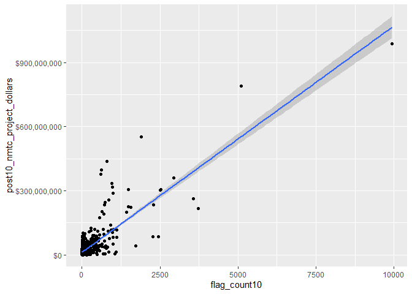<!-- -->

``` r
# Pearson's r calculation
cor(svi_national_county_nmtc_projects$flag_count10, svi_national_county_nmtc_projects$post10_nmtc_project_dollars, method = "pearson")
```

    ## [1] 0.8197007

While we do see a strong correlation with out Pearson’s R Calculation,
looking at our data in a scatterplot confirms that our data is likely
skewed.

``` r
boxplot(svi_national_county_nmtc_projects$flag_count10)
```

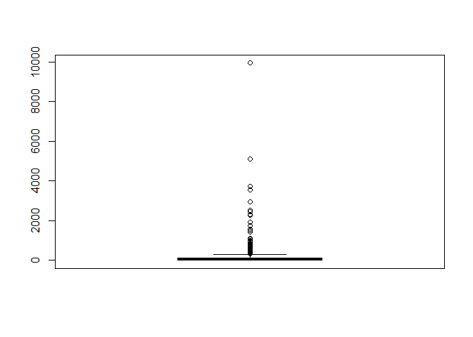<!-- -->

``` r
boxplot.stats(svi_national_county_nmtc_projects$flag_count10)$out %>% sort(decreasing = TRUE)
```

    ##   [1] 9936 5111 3732 3561 2941 2537 2508 2453 2296 2279 1906 1731 1569 1489 1486
    ##  [16] 1436 1110 1106 1096 1057 1013 1004  995  991  984  977  960  942  919  871
    ##  [31]  854  850  836  822  795  774  759  746  731  728  718  714  705  701  691
    ##  [46]  682  651  650  641  629  595  572  571  569  564  546  541  531  517  499
    ##  [61]  491  487  484  468  467  463  461  458  458  455  451  442  429  423  422
    ##  [76]  413  413  408  401  399  389  381  378  378  377  374  369  363  362  358
    ##  [91]  356  355  352  350  349  349  342  341  338  328  326  318  316  313

``` r
svi_national_nmtc_cluster <- svi_national_county_nmtc_projects %>% 
                            select(county_name, post10_nmtc_project_dollars, 
                                   flag_count10) %>% 
                            remove_rownames %>% 
                            column_to_rownames(var="county_name")

# Remove nulls, if in dataset
svi_national_nmtc_cluster <- na.omit(svi_national_nmtc_cluster)


# Scale numeric variables
svi_national_nmtc_cluster <- scale(svi_national_nmtc_cluster)


svi_national_nmtc_cluster %>% head(5)
```

    ##                               post10_nmtc_project_dollars flag_count10
    ## Aleutians East Borough, AK                     -0.2125961   -0.3189664
    ## Anchorage Municipality, AK                     -0.2995956   -0.1981871
    ## Wade Hampton Census Area, AK                   -0.1300468   -0.3170792
    ## Yukon-Koyukuk Census Area, AK                  -0.3310540   -0.2831100
    ## Baldwin County, AL                             -0.1906291   -0.2698998

``` r
set.seed(123)
k2_nmtc_nat <- kmeans(svi_national_nmtc_cluster, centers = 2, nstart = 25)
set.seed(123)
k3_nmtc_nat <- kmeans(svi_national_nmtc_cluster, centers = 3, nstart = 25)
set.seed(123)
k4_nmtc_nat <- kmeans(svi_national_nmtc_cluster, centers = 4, nstart = 25)
set.seed(123)
k5_nmtc_nat <- kmeans(svi_national_nmtc_cluster, centers = 5, nstart = 25)
```

``` r
# plots to compare
p_k2_nmtc_nat <- factoextra::fviz_cluster(k2_nmtc_nat, geom = "point", data = svi_national_nmtc_cluster) + ggtitle("k = 2")

p_k3_nmtc_nat <- factoextra::fviz_cluster(k3_nmtc_nat, geom = "point", data = svi_national_nmtc_cluster) + ggtitle("k = 3")

p_k4_nmtc_nat <- factoextra::fviz_cluster(k4_nmtc_nat, geom = "point",  data = svi_national_nmtc_cluster) + ggtitle("k = 4")

p_k5_nmtc_nat <- factoextra::fviz_cluster(k5_nmtc_nat, geom = "point",  data = svi_national_nmtc_cluster) + ggtitle("k = 5")

grid.arrange(p_k2_nmtc_nat, p_k3_nmtc_nat, p_k4_nmtc_nat, p_k5_nmtc_nat, nrow = 2)
```

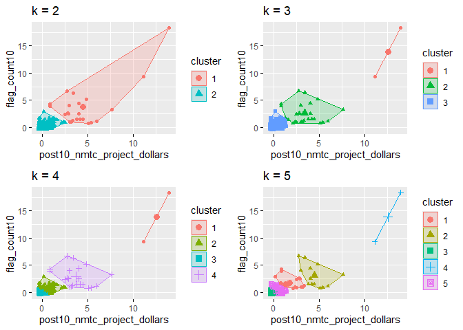<!-- -->

``` r
elbow_plot(svi_national_nmtc_cluster)
```

    ##  [1]  1  2  3  4  5  6  7  8  9 10 11 12 13 14 15
    ## [1] 1
    ## [1] 2
    ## [1] 3
    ## [1] 4
    ## [1] 5
    ## [1] 6
    ## [1] 7
    ## [1] 8
    ## [1] 9
    ## [1] 10
    ## [1] 11
    ## [1] 12
    ## [1] 13
    ## [1] 14
    ## [1] 15

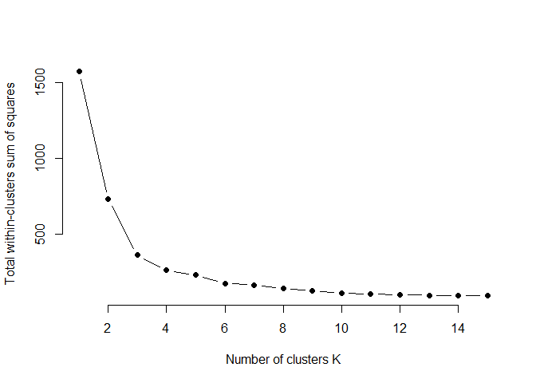<!-- -->

It appears that it would be best to view our data in clusters of three,
so we can look at different groupings and see how the data correlates
without as much bias.

``` r
p_k3_nmtc_nat <- factoextra::fviz_cluster(k3_nmtc_nat, geom = "point", data = svi_national_nmtc_cluster) + ggtitle("k = 3")

p_k3_nmtc_nat
```

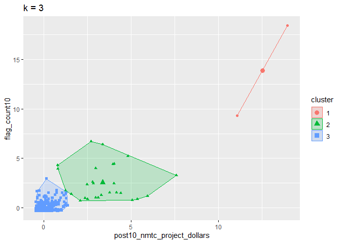<!-- -->

``` r
svi_national_nmtc_cluster_label <- as.data.frame(svi_national_nmtc_cluster) %>%
                                  rownames_to_column(var = "county_name") %>%
                                  as_tibble() %>%
                                  mutate(cluster = k3_nmtc_nat$cluster) %>%
                                  select(county_name, cluster)

svi_national_county_nmtc_projects2 <- left_join(svi_national_county_nmtc_projects, svi_national_nmtc_cluster_label, join_by(county_name == county_name))

# View county counts in each cluster
table(svi_national_county_nmtc_projects2$cluster)
```

    ## 
    ##   1   2   3 
    ##   2  27 758

``` r
# Cluster 1 Scatterplot
# y is our independent variable (NMTC Project Dollars),  
# x is our dependent variable (SVI flag count)

svi_national_county_nmtc_projects2 %>% 
  filter(cluster == 1) %>%
  ggplot2::ggplot(aes(x=flag_count10,
                    y=post10_nmtc_project_dollars)) +
        geom_point() +
        geom_smooth(method="lm") +
        scale_y_continuous(labels = scales::dollar_format()) 
```

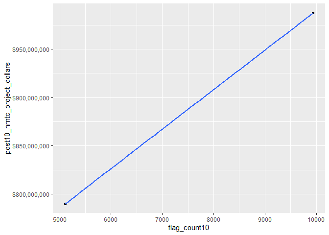<!-- -->

``` r
svi_national_county_nmtc_projects2 %>% 
  filter(cluster == 1) %>%
  select(flag_count10,post10_nmtc_project_dollars) %>%
  cor(method = "pearson")
```

    ##                             flag_count10 post10_nmtc_project_dollars
    ## flag_count10                           1                           1
    ## post10_nmtc_project_dollars            1                           1

Looking at our fisrt cluster, we can see that there is a direct
correlation between money spent and total flags. However, with only two
groups in the cluster, it does not show enough data to show that this
trend is true and repeatable.

``` r
svi_national_county_nmtc_projects2 %>% 
  filter(cluster == 1) %>%
  select(county_name, flag_count10, post10_nmtc_dollars_formatted) %>% arrange(flag_count10) %>% kbl() %>% kable_styling() %>% scroll_box(width = "100%")
```

<div style="border: 1px solid #ddd; padding: 5px; overflow-x: scroll; width:100%; ">

<table class="table" style="margin-left: auto; margin-right: auto;">
<thead>
<tr>
<th style="text-align:left;">
county_name
</th>
<th style="text-align:right;">
flag_count10
</th>
<th style="text-align:left;">
post10_nmtc_dollars_formatted
</th>
</tr>
</thead>
<tbody>
<tr>
<td style="text-align:left;">
Cook County, IL
</td>
<td style="text-align:right;">
5111
</td>
<td style="text-align:left;">
\$790,158,215
</td>
</tr>
<tr>
<td style="text-align:left;">
Los Angeles County, CA
</td>
<td style="text-align:right;">
9936
</td>
<td style="text-align:left;">
\$987,407,086
</td>
</tr>
</tbody>
</table>

</div>

``` r
# Cluster 2 Scatterplot
# y is our independent variable (NMTC Project Dollars),  
# x is our dependent variable (SVI flag count)

svi_national_county_nmtc_projects2 %>% 
  filter(cluster == 2) %>%
  ggplot2::ggplot(aes(x=flag_count10,
                    y=post10_nmtc_project_dollars)) +
        geom_point() +
        geom_smooth(method="lm") +
        scale_y_continuous(labels = scales::dollar_format()) 
```

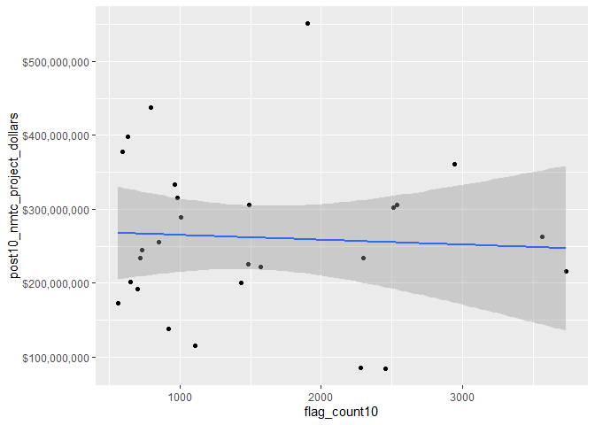<!-- -->

Looking at our group 2 on the other hand, we see no strong correlation
between the amount of money and the amount of flags.

``` r
svi_national_county_nmtc_projects2 %>% 
  filter(cluster == 2) %>%
  select(flag_count10,post10_nmtc_project_dollars) %>%
  cor(method = "pearson")
```

    ##                             flag_count10 post10_nmtc_project_dollars
    ## flag_count10                  1.00000000                 -0.05722041
    ## post10_nmtc_project_dollars  -0.05722041                  1.00000000

``` r
svi_national_county_nmtc_projects2 %>% 
  filter(cluster == 2) %>%
  select(county_name, flag_count10, post10_nmtc_dollars_formatted) %>% arrange(flag_count10) %>% kbl() %>% kable_styling() %>% scroll_box(width = "100%")
```

<div style="border: 1px solid #ddd; padding: 5px; overflow-x: scroll; width:100%; ">

<table class="table" style="margin-left: auto; margin-right: auto;">
<thead>
<tr>
<th style="text-align:left;">
county_name
</th>
<th style="text-align:right;">
flag_count10
</th>
<th style="text-align:left;">
post10_nmtc_dollars_formatted
</th>
</tr>
</thead>
<tbody>
<tr>
<td style="text-align:left;">
Hennepin County, MN
</td>
<td style="text-align:right;">
564
</td>
<td style="text-align:left;">
\$173,393,000
</td>
</tr>
<tr>
<td style="text-align:left;">
District of Columbia, DC
</td>
<td style="text-align:right;">
595
</td>
<td style="text-align:left;">
\$377,155,570
</td>
</tr>
<tr>
<td style="text-align:left;">
Hamilton County, OH
</td>
<td style="text-align:right;">
629
</td>
<td style="text-align:left;">
\$397,543,856
</td>
</tr>
<tr>
<td style="text-align:left;">
Jackson County, MO
</td>
<td style="text-align:right;">
651
</td>
<td style="text-align:left;">
\$201,937,281
</td>
</tr>
<tr>
<td style="text-align:left;">
Suffolk County, MA
</td>
<td style="text-align:right;">
701
</td>
<td style="text-align:left;">
\$192,010,188
</td>
</tr>
<tr>
<td style="text-align:left;">
Orleans Parish, LA
</td>
<td style="text-align:right;">
718
</td>
<td style="text-align:left;">
\$233,891,078
</td>
</tr>
<tr>
<td style="text-align:left;">
Allegheny County, PA
</td>
<td style="text-align:right;">
731
</td>
<td style="text-align:left;">
\$244,342,400
</td>
</tr>
<tr>
<td style="text-align:left;">
Fulton County, GA
</td>
<td style="text-align:right;">
795
</td>
<td style="text-align:left;">
\$437,737,000
</td>
</tr>
<tr>
<td style="text-align:left;">
New York County, NY
</td>
<td style="text-align:right;">
850
</td>
<td style="text-align:left;">
\$255,545,686
</td>
</tr>
<tr>
<td style="text-align:left;">
Marion County, IN
</td>
<td style="text-align:right;">
919
</td>
<td style="text-align:left;">
\$138,426,520
</td>
</tr>
<tr>
<td style="text-align:left;">
Baltimore city, MD
</td>
<td style="text-align:right;">
960
</td>
<td style="text-align:left;">
\$333,109,232
</td>
</tr>
<tr>
<td style="text-align:left;">
Milwaukee County, WI
</td>
<td style="text-align:right;">
984
</td>
<td style="text-align:left;">
\$315,495,493
</td>
</tr>
<tr>
<td style="text-align:left;">
Shelby County, TN
</td>
<td style="text-align:right;">
1004
</td>
<td style="text-align:left;">
\$289,352,388
</td>
</tr>
<tr>
<td style="text-align:left;">
Fresno County, CA
</td>
<td style="text-align:right;">
1110
</td>
<td style="text-align:left;">
\$115,258,480
</td>
</tr>
<tr>
<td style="text-align:left;">
Bexar County, TX
</td>
<td style="text-align:right;">
1436
</td>
<td style="text-align:left;">
\$199,964,269
</td>
</tr>
<tr>
<td style="text-align:left;">
Clark County, NV
</td>
<td style="text-align:right;">
1486
</td>
<td style="text-align:left;">
\$225,315,967
</td>
</tr>
<tr>
<td style="text-align:left;">
Cuyahoga County, OH
</td>
<td style="text-align:right;">
1489
</td>
<td style="text-align:left;">
\$306,121,487
</td>
</tr>
<tr>
<td style="text-align:left;">
San Diego County, CA
</td>
<td style="text-align:right;">
1569
</td>
<td style="text-align:left;">
\$221,738,411
</td>
</tr>
<tr>
<td style="text-align:left;">
Philadelphia County, PA
</td>
<td style="text-align:right;">
1906
</td>
<td style="text-align:left;">
\$550,969,964
</td>
</tr>
<tr>
<td style="text-align:left;">
Queens County, NY
</td>
<td style="text-align:right;">
2279
</td>
<td style="text-align:left;">
\$85,225,100
</td>
</tr>
<tr>
<td style="text-align:left;">
Miami-Dade County, FL
</td>
<td style="text-align:right;">
2296
</td>
<td style="text-align:left;">
\$233,661,603
</td>
</tr>
<tr>
<td style="text-align:left;">
Maricopa County, AZ
</td>
<td style="text-align:right;">
2453
</td>
<td style="text-align:left;">
\$84,923,464
</td>
</tr>
<tr>
<td style="text-align:left;">
Dallas County, TX
</td>
<td style="text-align:right;">
2508
</td>
<td style="text-align:left;">
\$302,019,013
</td>
</tr>
<tr>
<td style="text-align:left;">
Bronx County, NY
</td>
<td style="text-align:right;">
2537
</td>
<td style="text-align:left;">
\$306,355,715
</td>
</tr>
<tr>
<td style="text-align:left;">
Wayne County, MI
</td>
<td style="text-align:right;">
2941
</td>
<td style="text-align:left;">
\$360,949,480
</td>
</tr>
<tr>
<td style="text-align:left;">
Harris County, TX
</td>
<td style="text-align:right;">
3561
</td>
<td style="text-align:left;">
\$262,456,477
</td>
</tr>
<tr>
<td style="text-align:left;">
Kings County, NY
</td>
<td style="text-align:right;">
3732
</td>
<td style="text-align:left;">
\$216,348,600
</td>
</tr>
</tbody>
</table>

</div>

``` r
# Cluster 3 Scatterplot
# y is our independent variable (NMTC Project Dollars),  
# x is our dependent variable (SVI flag count)

svi_national_county_nmtc_projects2 %>% 
  filter(cluster == 3) %>%
  ggplot2::ggplot(aes(x=flag_count10,
                    y=post10_nmtc_project_dollars)) +
        geom_point() +
        geom_smooth(method="lm") +
        scale_y_continuous(labels = scales::dollar_format()) 
```

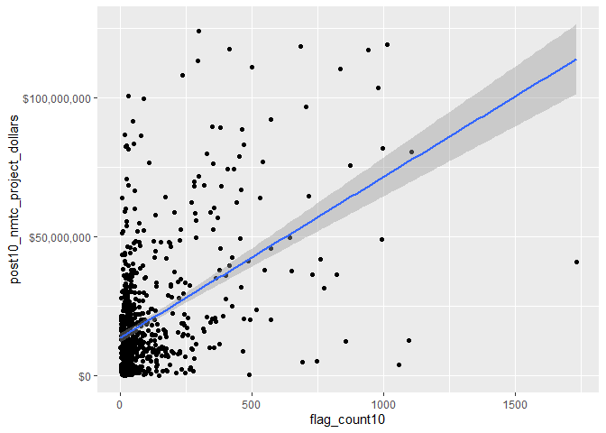<!-- -->

``` r
svi_national_county_nmtc_projects2 %>% 
  filter(cluster == 3) %>%
  select(flag_count10,post10_nmtc_project_dollars) %>%
  cor(method = "pearson")
```

    ##                             flag_count10 post10_nmtc_project_dollars
    ## flag_count10                   1.0000000                   0.4736348
    ## post10_nmtc_project_dollars    0.4736348                   1.0000000

Finally, when we look at our third and largest cluster, we do see a
positive trend. While it is nota very strong trend, it still does
suggest some positive correlation.

``` r
# Recall that we are working with 2010 census tracts, thus we need to pull the 2010 shapefiles
county_sf = tigris::counties(year = 2010, cb = TRUE)
```

    ##   |                                                                              |                                                                      |   0%  |                                                                              |                                                                      |   1%  |                                                                              |=                                                                     |   1%  |                                                                              |=                                                                     |   2%  |                                                                              |==                                                                    |   2%  |                                                                              |==                                                                    |   3%  |                                                                              |===                                                                   |   4%  |                                                                              |===                                                                   |   5%  |                                                                              |====                                                                  |   5%  |                                                                              |====                                                                  |   6%  |                                                                              |=====                                                                 |   7%  |                                                                              |=====                                                                 |   8%  |                                                                              |======                                                                |   8%  |                                                                              |======                                                                |   9%  |                                                                              |=======                                                               |   9%  |                                                                              |=======                                                               |  10%  |                                                                              |=======                                                               |  11%  |                                                                              |========                                                              |  11%  |                                                                              |========                                                              |  12%  |                                                                              |=========                                                             |  12%  |                                                                              |=========                                                             |  13%  |                                                                              |==========                                                            |  14%  |                                                                              |==========                                                            |  15%  |                                                                              |===========                                                           |  15%  |                                                                              |===========                                                           |  16%  |                                                                              |============                                                          |  17%  |                                                                              |=============                                                         |  18%  |                                                                              |=============                                                         |  19%  |                                                                              |==============                                                        |  19%  |                                                                              |==============                                                        |  20%  |                                                                              |===============                                                       |  21%  |                                                                              |===============                                                       |  22%  |                                                                              |================                                                      |  22%  |                                                                              |================                                                      |  23%  |                                                                              |=================                                                     |  24%  |                                                                              |=================                                                     |  25%  |                                                                              |==================                                                    |  25%  |                                                                              |===================                                                   |  27%  |                                                                              |===================                                                   |  28%  |                                                                              |====================                                                  |  28%  |                                                                              |====================                                                  |  29%  |                                                                              |=====================                                                 |  29%  |                                                                              |=====================                                                 |  30%  |                                                                              |======================                                                |  32%  |                                                                              |=======================                                               |  32%  |                                                                              |=======================                                               |  33%  |                                                                              |========================                                              |  34%  |                                                                              |========================                                              |  35%  |                                                                              |==========================                                            |  37%  |                                                                              |==========================                                            |  38%  |                                                                              |===========================                                           |  38%  |                                                                              |===========================                                           |  39%  |                                                                              |============================                                          |  39%  |                                                                              |============================                                          |  40%  |                                                                              |============================                                          |  41%  |                                                                              |=============================                                         |  41%  |                                                                              |=============================                                         |  42%  |                                                                              |==============================                                        |  42%  |                                                                              |==============================                                        |  43%  |                                                                              |==============================                                        |  44%  |                                                                              |===============================                                       |  44%  |                                                                              |===============================                                       |  45%  |                                                                              |================================                                      |  45%  |                                                                              |================================                                      |  46%  |                                                                              |=================================                                     |  47%  |                                                                              |=================================                                     |  48%  |                                                                              |==================================                                    |  48%  |                                                                              |==================================                                    |  49%  |                                                                              |===================================                                   |  49%  |                                                                              |===================================                                   |  50%  |                                                                              |====================================                                  |  51%  |                                                                              |====================================                                  |  52%  |                                                                              |=====================================                                 |  52%  |                                                                              |=====================================                                 |  53%  |                                                                              |======================================                                |  54%  |                                                                              |======================================                                |  55%  |                                                                              |=======================================                               |  55%  |                                                                              |=======================================                               |  56%  |                                                                              |========================================                              |  56%  |                                                                              |========================================                              |  57%  |                                                                              |========================================                              |  58%  |                                                                              |=========================================                             |  58%  |                                                                              |=========================================                             |  59%  |                                                                              |==========================================                            |  59%  |                                                                              |==========================================                            |  60%  |                                                                              |==========================================                            |  61%  |                                                                              |===========================================                           |  61%  |                                                                              |============================================                          |  63%  |                                                                              |==============================================                        |  65%  |                                                                              |===============================================                       |  67%  |                                                                              |================================================                      |  69%  |                                                                              |==================================================                    |  71%  |                                                                              |===================================================                   |  73%  |                                                                              |=====================================================                 |  75%  |                                                                              |======================================================                |  77%  |                                                                              |=======================================================               |  79%  |                                                                              |=========================================================             |  81%  |                                                                              |==========================================================            |  83%  |                                                                              |===========================================================           |  84%  |                                                                              |============================================================          |  86%  |                                                                              |=============================================================         |  87%  |                                                                              |=============================================================         |  88%  |                                                                              |==============================================================        |  88%  |                                                                              |==============================================================        |  89%  |                                                                              |===============================================================       |  89%  |                                                                              |===============================================================       |  90%  |                                                                              |===============================================================       |  91%  |                                                                              |================================================================      |  91%  |                                                                              |================================================================      |  92%  |                                                                              |=================================================================     |  92%  |                                                                              |=================================================================     |  93%  |                                                                              |==================================================================    |  94%  |                                                                              |==================================================================    |  95%  |                                                                              |===================================================================   |  95%  |                                                                              |===================================================================   |  96%  |                                                                              |====================================================================  |  97%  |                                                                              |====================================================================  |  98%  |                                                                              |======================================================================|  99%  |                                                                              |======================================================================| 100%

``` r
# Shift geometric locations of AK and HI
county_sf <- shift_geometry(
              county_sf,
              geoid_column = NULL,
              preserve_area = FALSE,
              position = c("below", "outside")
            )

st_sf <- tigris::states(year = 2010, cb = TRUE) %>% filter(STATE != "72")
```

    ##   |                                                                              |                                                                      |   0%  |                                                                              |=                                                                     |   1%  |                                                                              |===                                                                   |   4%  |                                                                              |====                                                                  |   6%  |                                                                              |=====                                                                 |   8%  |                                                                              |======                                                                |   9%  |                                                                              |===========                                                           |  15%  |                                                                              |=============                                                         |  18%  |                                                                              |==============                                                        |  20%  |                                                                              |================                                                      |  23%  |                                                                              |=================                                                     |  24%  |                                                                              |==================                                                    |  26%  |                                                                              |====================                                                  |  29%  |                                                                              |=====================                                                 |  30%  |                                                                              |=======================                                               |  33%  |                                                                              |========================                                              |  35%  |                                                                              |==========================                                            |  36%  |                                                                              |============================                                          |  40%  |                                                                              |=============================                                         |  41%  |                                                                              |==============================                                        |  43%  |                                                                              |===============================                                       |  44%  |                                                                              |================================                                      |  46%  |                                                                              |==================================                                    |  49%  |                                                                              |===================================                                   |  50%  |                                                                              |====================================                                  |  52%  |                                                                              |======================================                                |  55%  |                                                                              |========================================                              |  58%  |                                                                              |==========================================                            |  59%  |                                                                              |===========================================                           |  61%  |                                                                              |============================================                          |  62%  |                                                                              |=============================================                         |  64%  |                                                                              |===============================================                       |  67%  |                                                                              |================================================                      |  69%  |                                                                              |=================================================                     |  70%  |                                                                              |==================================================                    |  72%  |                                                                              |===================================================                   |  73%  |                                                                              |=====================================================                 |  76%  |                                                                              |======================================================                |  78%  |                                                                              |=========================================================             |  81%  |                                                                              |==========================================================            |  82%  |                                                                              |===========================================================           |  84%  |                                                                              |============================================================          |  85%  |                                                                              |=============================================================         |  87%  |                                                                              |===============================================================       |  90%  |                                                                              |================================================================      |  91%  |                                                                              |==================================================================    |  94%  |                                                                              |====================================================================  |  98%  |                                                                              |======================================================================| 100%

``` r
# Shift geometric locations of AK and HI
st_sf <- shift_geometry(
              st_sf,
              geoid_column = NULL,
              preserve_area = FALSE,
              position = c("below", "outside")
            )
```

``` r
# Join our NMTC projects data with our shapefile geocoordinates
svi_national_county_nmtc_sf <- left_join(svi_national_county_nmtc_projects, county_sf, join_by("FIPS_st" == "STATEFP", "FIPS_county" == "COUNTYFP"))

svi_national_county_nmtc_sf %>% head(5) %>% kbl() %>% kable_styling() %>% scroll_box(width = "100%")
```

<div style="border: 1px solid #ddd; padding: 5px; overflow-x: scroll; width:100%; ">

<table class="table" style="margin-left: auto; margin-right: auto;">
<thead>
<tr>
<th style="text-align:left;">
State
</th>
<th style="text-align:left;">
County
</th>
<th style="text-align:left;">
Division
</th>
<th style="text-align:right;">
post10_nmtc_project_cnt
</th>
<th style="text-align:right;">
tract_cnt
</th>
<th style="text-align:right;">
post10_nmtc_project_dollars
</th>
<th style="text-align:left;">
post10_nmtc_dollars_formatted
</th>
<th style="text-align:left;">
fips_county_st
</th>
<th style="text-align:left;">
FIPS_st
</th>
<th style="text-align:left;">
FIPS_county
</th>
<th style="text-align:left;">
state_name
</th>
<th style="text-align:right;">
region_number
</th>
<th style="text-align:left;">
region
</th>
<th style="text-align:right;">
division_number
</th>
<th style="text-align:right;">
flag_count10
</th>
<th style="text-align:right;">
pop10
</th>
<th style="text-align:right;">
flag_by_pop10
</th>
<th style="text-align:right;">
flag_count_quantile10
</th>
<th style="text-align:right;">
flag_pop_quantile10
</th>
<th style="text-align:right;">
flag_count20
</th>
<th style="text-align:right;">
pop20
</th>
<th style="text-align:right;">
flag_by_pop20
</th>
<th style="text-align:right;">
flag_count_quantile20
</th>
<th style="text-align:right;">
flag_pop_quantile20
</th>
<th style="text-align:left;">
county_name
</th>
<th style="text-align:left;">
GEO_ID
</th>
<th style="text-align:left;">
STATE
</th>
<th style="text-align:left;">
COUNTY
</th>
<th style="text-align:left;">
NAME
</th>
<th style="text-align:left;">
LSAD
</th>
<th style="text-align:right;">
CENSUSAREA
</th>
<th style="text-align:left;">
geometry
</th>
</tr>
</thead>
<tbody>
<tr>
<td style="text-align:left;">
AK
</td>
<td style="text-align:left;">
Aleutians East Borough
</td>
<td style="text-align:left;">
Pacific Division
</td>
<td style="text-align:right;">
1
</td>
<td style="text-align:right;">
1
</td>
<td style="text-align:right;">
15762500
</td>
<td style="text-align:left;">
\$15,762,500
</td>
<td style="text-align:left;">
02013
</td>
<td style="text-align:left;">
02
</td>
<td style="text-align:left;">
013
</td>
<td style="text-align:left;">
Alaska
</td>
<td style="text-align:right;">
4
</td>
<td style="text-align:left;">
West Region
</td>
<td style="text-align:right;">
9
</td>
<td style="text-align:right;">
8
</td>
<td style="text-align:right;">
3703
</td>
<td style="text-align:right;">
0.0021604
</td>
<td style="text-align:right;">
0.4
</td>
<td style="text-align:right;">
1.0
</td>
<td style="text-align:right;">
5
</td>
<td style="text-align:right;">
3389
</td>
<td style="text-align:right;">
0.0014754
</td>
<td style="text-align:right;">
0.2
</td>
<td style="text-align:right;">
0.8
</td>
<td style="text-align:left;">
Aleutians East Borough, AK
</td>
<td style="text-align:left;">
0500000US02013
</td>
<td style="text-align:left;">
02
</td>
<td style="text-align:left;">
013
</td>
<td style="text-align:left;">
Aleutians East
</td>
<td style="text-align:left;">
Borough
</td>
<td style="text-align:right;">
6981.943
</td>
<td style="text-align:left;">
MULTIPOLYGON (((-2385249 -1…
</td>
</tr>
<tr>
<td style="text-align:left;">
AK
</td>
<td style="text-align:left;">
Anchorage Municipality
</td>
<td style="text-align:left;">
Pacific Division
</td>
<td style="text-align:right;">
1
</td>
<td style="text-align:right;">
13
</td>
<td style="text-align:right;">
9800000
</td>
<td style="text-align:left;">
\$9,800,000
</td>
<td style="text-align:left;">
02020
</td>
<td style="text-align:left;">
02
</td>
<td style="text-align:left;">
020
</td>
<td style="text-align:left;">
Alaska
</td>
<td style="text-align:right;">
4
</td>
<td style="text-align:left;">
West Region
</td>
<td style="text-align:right;">
9
</td>
<td style="text-align:right;">
72
</td>
<td style="text-align:right;">
64432
</td>
<td style="text-align:right;">
0.0011175
</td>
<td style="text-align:right;">
1.0
</td>
<td style="text-align:right;">
0.4
</td>
<td style="text-align:right;">
87
</td>
<td style="text-align:right;">
69679
</td>
<td style="text-align:right;">
0.0012486
</td>
<td style="text-align:right;">
1.0
</td>
<td style="text-align:right;">
0.6
</td>
<td style="text-align:left;">
Anchorage Municipality, AK
</td>
<td style="text-align:left;">
0500000US02020
</td>
<td style="text-align:left;">
02
</td>
<td style="text-align:left;">
020
</td>
<td style="text-align:left;">
Anchorage
</td>
<td style="text-align:left;">
Muny
</td>
<td style="text-align:right;">
1704.683
</td>
<td style="text-align:left;">
MULTIPOLYGON (((-1927463 -1…
</td>
</tr>
<tr>
<td style="text-align:left;">
AK
</td>
<td style="text-align:left;">
Wade Hampton Census Area
</td>
<td style="text-align:left;">
Pacific Division
</td>
<td style="text-align:right;">
1
</td>
<td style="text-align:right;">
1
</td>
<td style="text-align:right;">
21420000
</td>
<td style="text-align:left;">
\$21,420,000
</td>
<td style="text-align:left;">
02270
</td>
<td style="text-align:left;">
02
</td>
<td style="text-align:left;">
270
</td>
<td style="text-align:left;">
Alaska
</td>
<td style="text-align:right;">
4
</td>
<td style="text-align:left;">
West Region
</td>
<td style="text-align:right;">
9
</td>
<td style="text-align:right;">
9
</td>
<td style="text-align:right;">
7398
</td>
<td style="text-align:right;">
0.0012165
</td>
<td style="text-align:right;">
0.4
</td>
<td style="text-align:right;">
0.6
</td>
<td style="text-align:right;">
10
</td>
<td style="text-align:right;">
8298
</td>
<td style="text-align:right;">
0.0012051
</td>
<td style="text-align:right;">
0.4
</td>
<td style="text-align:right;">
0.6
</td>
<td style="text-align:left;">
Wade Hampton Census Area, AK
</td>
<td style="text-align:left;">
0500000US02270
</td>
<td style="text-align:left;">
02
</td>
<td style="text-align:left;">
270
</td>
<td style="text-align:left;">
Wade Hampton
</td>
<td style="text-align:left;">
CA
</td>
<td style="text-align:right;">
17081.433
</td>
<td style="text-align:left;">
MULTIPOLYGON (((-2310112 -1…
</td>
</tr>
<tr>
<td style="text-align:left;">
AK
</td>
<td style="text-align:left;">
Yukon-Koyukuk Census Area
</td>
<td style="text-align:left;">
Pacific Division
</td>
<td style="text-align:right;">
1
</td>
<td style="text-align:right;">
3
</td>
<td style="text-align:right;">
7644000
</td>
<td style="text-align:left;">
\$7,644,000
</td>
<td style="text-align:left;">
02290
</td>
<td style="text-align:left;">
02
</td>
<td style="text-align:left;">
290
</td>
<td style="text-align:left;">
Alaska
</td>
<td style="text-align:right;">
4
</td>
<td style="text-align:left;">
West Region
</td>
<td style="text-align:right;">
9
</td>
<td style="text-align:right;">
27
</td>
<td style="text-align:right;">
4027
</td>
<td style="text-align:right;">
0.0067047
</td>
<td style="text-align:right;">
0.8
</td>
<td style="text-align:right;">
1.0
</td>
<td style="text-align:right;">
31
</td>
<td style="text-align:right;">
3979
</td>
<td style="text-align:right;">
0.0077909
</td>
<td style="text-align:right;">
0.8
</td>
<td style="text-align:right;">
1.0
</td>
<td style="text-align:left;">
Yukon-Koyukuk Census Area, AK
</td>
<td style="text-align:left;">
0500000US02290
</td>
<td style="text-align:left;">
02
</td>
<td style="text-align:left;">
290
</td>
<td style="text-align:left;">
Yukon-Koyukuk
</td>
<td style="text-align:left;">
CA
</td>
<td style="text-align:right;">
145504.789
</td>
<td style="text-align:left;">
MULTIPOLYGON (((-1736112 -9…
</td>
</tr>
<tr>
<td style="text-align:left;">
AL
</td>
<td style="text-align:left;">
Baldwin County
</td>
<td style="text-align:left;">
East South Central Division
</td>
<td style="text-align:right;">
4
</td>
<td style="text-align:right;">
8
</td>
<td style="text-align:right;">
17268000
</td>
<td style="text-align:left;">
\$17,268,000
</td>
<td style="text-align:left;">
01003
</td>
<td style="text-align:left;">
01
</td>
<td style="text-align:left;">
003
</td>
<td style="text-align:left;">
Alabama
</td>
<td style="text-align:right;">
3
</td>
<td style="text-align:left;">
South Region
</td>
<td style="text-align:right;">
6
</td>
<td style="text-align:right;">
34
</td>
<td style="text-align:right;">
38458
</td>
<td style="text-align:right;">
0.0008841
</td>
<td style="text-align:right;">
0.8
</td>
<td style="text-align:right;">
0.4
</td>
<td style="text-align:right;">
34
</td>
<td style="text-align:right;">
46255
</td>
<td style="text-align:right;">
0.0007351
</td>
<td style="text-align:right;">
0.8
</td>
<td style="text-align:right;">
0.2
</td>
<td style="text-align:left;">
Baldwin County, AL
</td>
<td style="text-align:left;">
0500000US01003
</td>
<td style="text-align:left;">
01
</td>
<td style="text-align:left;">
003
</td>
<td style="text-align:left;">
Baldwin
</td>
<td style="text-align:left;">
County
</td>
<td style="text-align:right;">
1589.784
</td>
<td style="text-align:left;">
MULTIPOLYGON (((820813.4 -7…
</td>
</tr>
</tbody>
</table>

</div>

``` r
# Create classes for bivariate mapping 
svi_national_county_nmtc_sf <- bi_class(svi_national_county_nmtc_sf, x = flag_count10, y = post10_nmtc_project_dollars, style = "quantile", dim = 3)

# View data
svi_national_county_nmtc_sf %>% head(5) %>% kbl() %>% kable_styling() %>% scroll_box(width = "100%")
```

<div style="border: 1px solid #ddd; padding: 5px; overflow-x: scroll; width:100%; ">

<table class="table" style="margin-left: auto; margin-right: auto;">
<thead>
<tr>
<th style="text-align:left;">
State
</th>
<th style="text-align:left;">
County
</th>
<th style="text-align:left;">
Division
</th>
<th style="text-align:right;">
post10_nmtc_project_cnt
</th>
<th style="text-align:right;">
tract_cnt
</th>
<th style="text-align:right;">
post10_nmtc_project_dollars
</th>
<th style="text-align:left;">
post10_nmtc_dollars_formatted
</th>
<th style="text-align:left;">
fips_county_st
</th>
<th style="text-align:left;">
FIPS_st
</th>
<th style="text-align:left;">
FIPS_county
</th>
<th style="text-align:left;">
state_name
</th>
<th style="text-align:right;">
region_number
</th>
<th style="text-align:left;">
region
</th>
<th style="text-align:right;">
division_number
</th>
<th style="text-align:right;">
flag_count10
</th>
<th style="text-align:right;">
pop10
</th>
<th style="text-align:right;">
flag_by_pop10
</th>
<th style="text-align:right;">
flag_count_quantile10
</th>
<th style="text-align:right;">
flag_pop_quantile10
</th>
<th style="text-align:right;">
flag_count20
</th>
<th style="text-align:right;">
pop20
</th>
<th style="text-align:right;">
flag_by_pop20
</th>
<th style="text-align:right;">
flag_count_quantile20
</th>
<th style="text-align:right;">
flag_pop_quantile20
</th>
<th style="text-align:left;">
county_name
</th>
<th style="text-align:left;">
GEO_ID
</th>
<th style="text-align:left;">
STATE
</th>
<th style="text-align:left;">
COUNTY
</th>
<th style="text-align:left;">
NAME
</th>
<th style="text-align:left;">
LSAD
</th>
<th style="text-align:right;">
CENSUSAREA
</th>
<th style="text-align:left;">
geometry
</th>
<th style="text-align:left;">
bi_class
</th>
</tr>
</thead>
<tbody>
<tr>
<td style="text-align:left;">
AK
</td>
<td style="text-align:left;">
Aleutians East Borough
</td>
<td style="text-align:left;">
Pacific Division
</td>
<td style="text-align:right;">
1
</td>
<td style="text-align:right;">
1
</td>
<td style="text-align:right;">
15762500
</td>
<td style="text-align:left;">
\$15,762,500
</td>
<td style="text-align:left;">
02013
</td>
<td style="text-align:left;">
02
</td>
<td style="text-align:left;">
013
</td>
<td style="text-align:left;">
Alaska
</td>
<td style="text-align:right;">
4
</td>
<td style="text-align:left;">
West Region
</td>
<td style="text-align:right;">
9
</td>
<td style="text-align:right;">
8
</td>
<td style="text-align:right;">
3703
</td>
<td style="text-align:right;">
0.0021604
</td>
<td style="text-align:right;">
0.4
</td>
<td style="text-align:right;">
1.0
</td>
<td style="text-align:right;">
5
</td>
<td style="text-align:right;">
3389
</td>
<td style="text-align:right;">
0.0014754
</td>
<td style="text-align:right;">
0.2
</td>
<td style="text-align:right;">
0.8
</td>
<td style="text-align:left;">
Aleutians East Borough, AK
</td>
<td style="text-align:left;">
0500000US02013
</td>
<td style="text-align:left;">
02
</td>
<td style="text-align:left;">
013
</td>
<td style="text-align:left;">
Aleutians East
</td>
<td style="text-align:left;">
Borough
</td>
<td style="text-align:right;">
6981.943
</td>
<td style="text-align:left;">
MULTIPOLYGON (((-2385249 -1…
</td>
<td style="text-align:left;">
1-2
</td>
</tr>
<tr>
<td style="text-align:left;">
AK
</td>
<td style="text-align:left;">
Anchorage Municipality
</td>
<td style="text-align:left;">
Pacific Division
</td>
<td style="text-align:right;">
1
</td>
<td style="text-align:right;">
13
</td>
<td style="text-align:right;">
9800000
</td>
<td style="text-align:left;">
\$9,800,000
</td>
<td style="text-align:left;">
02020
</td>
<td style="text-align:left;">
02
</td>
<td style="text-align:left;">
020
</td>
<td style="text-align:left;">
Alaska
</td>
<td style="text-align:right;">
4
</td>
<td style="text-align:left;">
West Region
</td>
<td style="text-align:right;">
9
</td>
<td style="text-align:right;">
72
</td>
<td style="text-align:right;">
64432
</td>
<td style="text-align:right;">
0.0011175
</td>
<td style="text-align:right;">
1.0
</td>
<td style="text-align:right;">
0.4
</td>
<td style="text-align:right;">
87
</td>
<td style="text-align:right;">
69679
</td>
<td style="text-align:right;">
0.0012486
</td>
<td style="text-align:right;">
1.0
</td>
<td style="text-align:right;">
0.6
</td>
<td style="text-align:left;">
Anchorage Municipality, AK
</td>
<td style="text-align:left;">
0500000US02020
</td>
<td style="text-align:left;">
02
</td>
<td style="text-align:left;">
020
</td>
<td style="text-align:left;">
Anchorage
</td>
<td style="text-align:left;">
Muny
</td>
<td style="text-align:right;">
1704.683
</td>
<td style="text-align:left;">
MULTIPOLYGON (((-1927463 -1…
</td>
<td style="text-align:left;">
2-2
</td>
</tr>
<tr>
<td style="text-align:left;">
AK
</td>
<td style="text-align:left;">
Wade Hampton Census Area
</td>
<td style="text-align:left;">
Pacific Division
</td>
<td style="text-align:right;">
1
</td>
<td style="text-align:right;">
1
</td>
<td style="text-align:right;">
21420000
</td>
<td style="text-align:left;">
\$21,420,000
</td>
<td style="text-align:left;">
02270
</td>
<td style="text-align:left;">
02
</td>
<td style="text-align:left;">
270
</td>
<td style="text-align:left;">
Alaska
</td>
<td style="text-align:right;">
4
</td>
<td style="text-align:left;">
West Region
</td>
<td style="text-align:right;">
9
</td>
<td style="text-align:right;">
9
</td>
<td style="text-align:right;">
7398
</td>
<td style="text-align:right;">
0.0012165
</td>
<td style="text-align:right;">
0.4
</td>
<td style="text-align:right;">
0.6
</td>
<td style="text-align:right;">
10
</td>
<td style="text-align:right;">
8298
</td>
<td style="text-align:right;">
0.0012051
</td>
<td style="text-align:right;">
0.4
</td>
<td style="text-align:right;">
0.6
</td>
<td style="text-align:left;">
Wade Hampton Census Area, AK
</td>
<td style="text-align:left;">
0500000US02270
</td>
<td style="text-align:left;">
02
</td>
<td style="text-align:left;">
270
</td>
<td style="text-align:left;">
Wade Hampton
</td>
<td style="text-align:left;">
CA
</td>
<td style="text-align:right;">
17081.433
</td>
<td style="text-align:left;">
MULTIPOLYGON (((-2310112 -1…
</td>
<td style="text-align:left;">
1-3
</td>
</tr>
<tr>
<td style="text-align:left;">
AK
</td>
<td style="text-align:left;">
Yukon-Koyukuk Census Area
</td>
<td style="text-align:left;">
Pacific Division
</td>
<td style="text-align:right;">
1
</td>
<td style="text-align:right;">
3
</td>
<td style="text-align:right;">
7644000
</td>
<td style="text-align:left;">
\$7,644,000
</td>
<td style="text-align:left;">
02290
</td>
<td style="text-align:left;">
02
</td>
<td style="text-align:left;">
290
</td>
<td style="text-align:left;">
Alaska
</td>
<td style="text-align:right;">
4
</td>
<td style="text-align:left;">
West Region
</td>
<td style="text-align:right;">
9
</td>
<td style="text-align:right;">
27
</td>
<td style="text-align:right;">
4027
</td>
<td style="text-align:right;">
0.0067047
</td>
<td style="text-align:right;">
0.8
</td>
<td style="text-align:right;">
1.0
</td>
<td style="text-align:right;">
31
</td>
<td style="text-align:right;">
3979
</td>
<td style="text-align:right;">
0.0077909
</td>
<td style="text-align:right;">
0.8
</td>
<td style="text-align:right;">
1.0
</td>
<td style="text-align:left;">
Yukon-Koyukuk Census Area, AK
</td>
<td style="text-align:left;">
0500000US02290
</td>
<td style="text-align:left;">
02
</td>
<td style="text-align:left;">
290
</td>
<td style="text-align:left;">
Yukon-Koyukuk
</td>
<td style="text-align:left;">
CA
</td>
<td style="text-align:right;">
145504.789
</td>
<td style="text-align:left;">
MULTIPOLYGON (((-1736112 -9…
</td>
<td style="text-align:left;">
2-1
</td>
</tr>
<tr>
<td style="text-align:left;">
AL
</td>
<td style="text-align:left;">
Baldwin County
</td>
<td style="text-align:left;">
East South Central Division
</td>
<td style="text-align:right;">
4
</td>
<td style="text-align:right;">
8
</td>
<td style="text-align:right;">
17268000
</td>
<td style="text-align:left;">
\$17,268,000
</td>
<td style="text-align:left;">
01003
</td>
<td style="text-align:left;">
01
</td>
<td style="text-align:left;">
003
</td>
<td style="text-align:left;">
Alabama
</td>
<td style="text-align:right;">
3
</td>
<td style="text-align:left;">
South Region
</td>
<td style="text-align:right;">
6
</td>
<td style="text-align:right;">
34
</td>
<td style="text-align:right;">
38458
</td>
<td style="text-align:right;">
0.0008841
</td>
<td style="text-align:right;">
0.8
</td>
<td style="text-align:right;">
0.4
</td>
<td style="text-align:right;">
34
</td>
<td style="text-align:right;">
46255
</td>
<td style="text-align:right;">
0.0007351
</td>
<td style="text-align:right;">
0.8
</td>
<td style="text-align:right;">
0.2
</td>
<td style="text-align:left;">
Baldwin County, AL
</td>
<td style="text-align:left;">
0500000US01003
</td>
<td style="text-align:left;">
01
</td>
<td style="text-align:left;">
003
</td>
<td style="text-align:left;">
Baldwin
</td>
<td style="text-align:left;">
County
</td>
<td style="text-align:right;">
1589.784
</td>
<td style="text-align:left;">
MULTIPOLYGON (((820813.4 -7…
</td>
<td style="text-align:left;">
2-2
</td>
</tr>
</tbody>
</table>

</div>

``` r
# Create map with ggplot
svi_national_county_nmtc_map <- ggplot() +
  # Map county shapefile, fill with bi_class categories
  geom_sf(data = svi_national_county_nmtc_sf, mapping = aes(geometry=geometry, fill = bi_class), color = "white", size = 0.1, show.legend = FALSE) +
  # Set to biscale palette
  bi_scale_fill(pal = "GrPink", dim = 3) +
  # Add state shapefiles for outline
  geom_sf(data=st_sf, color="black", fill=NA, linewidth=.5, aes(geometry=geometry)) +
  labs(
    title = "Correlation of 2010 National SVI Flag Count and 2011 - 2020 NMTC Tax Dollars",
  ) +
  # Set them to biscale
  bi_theme(base_size = 10)

# Create biscale legend
svi_national_county_nmtc_legend <- bi_legend(pal = "GrPink",
                    dim = 3,
                    xlab = "SVI Flag Count",
                    ylab = "NMTC Dollars",
                    size = 8)

# Combine map with legend using cowplot
svi_national_county_nmtc_bivarmap <- ggdraw() +
  draw_plot(svi_national_county_nmtc_map) +
  # Set legend location
  draw_plot(svi_national_county_nmtc_legend, x= -.02,  y = -.05,
 width=.20)


# View map
svi_national_county_nmtc_bivarmap
```

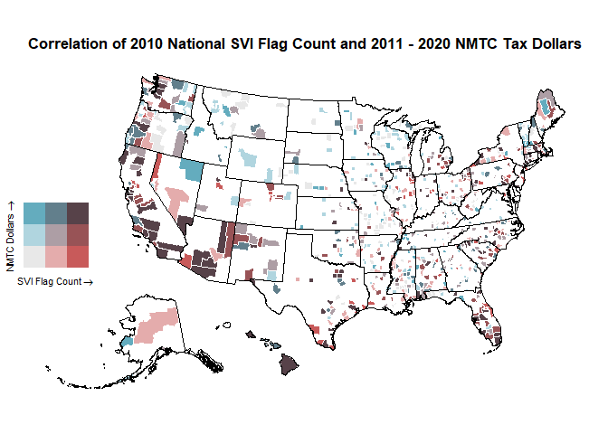<!-- -->

We can see a largest amount of flags in FL, Az, and CA. We can also see
a higher amount of spending accros the Atlantic divisions, without as
high of flags.

``` r
svi_national_county_lihtc_projects <- svi_national_county_lihtc %>% filter(post10_lihtc_project_cnt > 0)
```

``` r
summary(svi_national_county_lihtc_projects$flag_count10)
```

    ##    Min. 1st Qu.  Median    Mean 3rd Qu.    Max. 
    ##     0.0    17.0    33.0   104.6   113.5  2457.0

``` r
summary(svi_national_county_lihtc_projects$post10_lihtc_project_dollars)
```

    ##     Min.  1st Qu.   Median     Mean  3rd Qu.     Max. 
    ##        0   368649   833390  2747385  2597486 50547731

``` r
svi_national_county_lihtc_projects <- svi_national_county_lihtc_projects %>% filter(post10_lihtc_project_dollars > 0)
```

``` r
summary(svi_national_county_lihtc_projects$flag_count10)
```

    ##    Min. 1st Qu.  Median    Mean 3rd Qu.    Max. 
    ##     0.0    17.0    34.0   109.8   112.5  2457.0

``` r
summary(svi_national_county_lihtc_projects$post10_lihtc_project_dollars)
```

    ##     Min.  1st Qu.   Median     Mean  3rd Qu.     Max. 
    ##    56314   605483  1275416  3233901  3424308 50547731

``` r
# Scatterplot
# y is our independent variable (LIHTC Project Dollars),  
# x is our dependent variable (SVI flag count)
ggplot2::ggplot(svi_national_county_lihtc_projects,
                aes(x=flag_count10,
                    y=post10_lihtc_project_dollars)) +
        geom_point() +
        geom_smooth(method="lm") +
        scale_y_continuous(labels = scales::dollar_format()) 
```

<!-- -->

``` r
# Pearson's r calculation
cor(svi_national_county_lihtc_projects$flag_count10, svi_national_county_lihtc_projects$post10_lihtc_project_dollars, method = "pearson")
```

    ## [1] 0.7368838

Similar to our NMTC, we can see that there is a strong positive
correlation between flags and amount of spending. However, we once again
see that outliers are potentially swaying our data.

``` r
boxplot(svi_national_county_lihtc_projects$flag_count10)
```

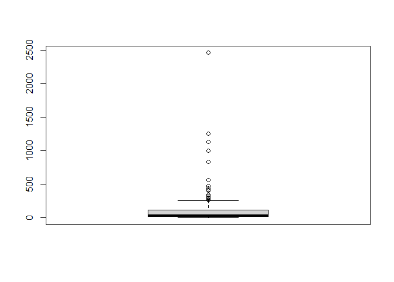<!-- -->

``` r
boxplot.stats(svi_national_county_lihtc_projects$flag_count10)$out %>% sort(decreasing = TRUE)
```

    ##  [1] 2457 1254 1135 1002  835  560  475  440  418  403  402  340  327  323  303
    ## [16]  296  293  276  271  263

``` r
svi_national_county_lihtc_projects %>% filter(flag_count10 == 2457)
```

    ##   State             County         Division post10_lihtc_project_cnt tract_cnt
    ## 1    CA Los Angeles County Pacific Division                       58       238
    ##   post10_lihtc_project_dollars post10_lihtc_dollars_formatted fips_county_st
    ## 1                     50547731                    $50,547,731          06037
    ##   FIPS_st FIPS_county state_name region_number      region division_number
    ## 1      06         037 California             4 West Region               9
    ##   flag_count10  pop10 flag_by_pop10 flag_count_quantile10 flag_pop_quantile10
    ## 1         2457 988225   0.002486276                     1                 0.6
    ##   flag_count20  pop20 flag_by_pop20 flag_count_quantile20 flag_pop_quantile20
    ## 1         2272 991036    0.00229255                     1                 0.6
    ##              county_name
    ## 1 Los Angeles County, CA

``` r
svi_national_lihtc %>% filter(county == "Los Angeles County") %>% select(GEOID_2010_trt, F_TOTAL_10, post10_lihtc_project_dollars) %>% summary()
```

    ##  GEOID_2010_trt       F_TOTAL_10    post10_lihtc_project_dollars
    ##  Length:238         Min.   : 6.00   Min.   :      0             
    ##  Class :character   1st Qu.:10.00   1st Qu.:      0             
    ##  Mode  :character   Median :10.00   Median :      0             
    ##                     Mean   :10.32   Mean   : 212385             
    ##                     3rd Qu.:11.00   3rd Qu.:      0             
    ##                     Max.   :13.00   Max.   :4945372

``` r
svi_national_lihtc_cluster <- svi_national_county_lihtc_projects %>% 
                            select(county_name, post10_lihtc_project_dollars, 
                                   flag_count10) %>% 
                            remove_rownames %>% 
                            column_to_rownames(var="county_name")

# Remove nulls, if in dataset
svi_national_lihtc_cluster <- na.omit(svi_national_lihtc_cluster)


# Scale numeric variables
svi_national_lihtc_cluster <- scale(svi_national_lihtc_cluster)


svi_national_lihtc_cluster %>% head(5)
```

    ##                      post10_lihtc_project_dollars flag_count10
    ## Dale County, AL                        -0.4426510   -0.4100636
    ## Mobile County, AL                      -0.4215575    0.1570056
    ## Craighead County, AR                   -0.1126573   -0.4100636
    ## Jefferson County, AR                   -0.4806216   -0.2744601
    ## Pope County, AR                        -0.4860654   -0.4265004

``` r
set.seed(123)
k2_lihtc_nat <- kmeans(svi_national_lihtc_cluster, centers = 2, nstart = 25)
set.seed(123)
k3_lihtc_nat <- kmeans(svi_national_lihtc_cluster, centers = 3, nstart = 25)
set.seed(123)
k4_lihtc_nat <- kmeans(svi_national_lihtc_cluster, centers = 4, nstart = 25)
set.seed(123)
k5_lihtc_nat <- kmeans(svi_national_lihtc_cluster, centers = 5, nstart = 25)
```

``` r
# plots to compare
p_k2_lihtc_nat <- factoextra::fviz_cluster(k2_lihtc_nat, geom = "point", data = svi_national_lihtc_cluster) + ggtitle("k = 2")

p_k3_lihtc_nat <- factoextra::fviz_cluster(k3_lihtc_nat, geom = "point", data = svi_national_lihtc_cluster) + ggtitle("k = 3")

p_k4_lihtc_nat <- factoextra::fviz_cluster(k4_lihtc_nat, geom = "point",  data = svi_national_lihtc_cluster) + ggtitle("k = 4")

p_k5_lihtc_nat <- factoextra::fviz_cluster(k5_lihtc_nat, geom = "point",  data = svi_national_lihtc_cluster) + ggtitle("k = 5")

grid.arrange(p_k2_lihtc_nat, p_k3_lihtc_nat, p_k4_lihtc_nat, p_k5_lihtc_nat, nrow = 2)
```

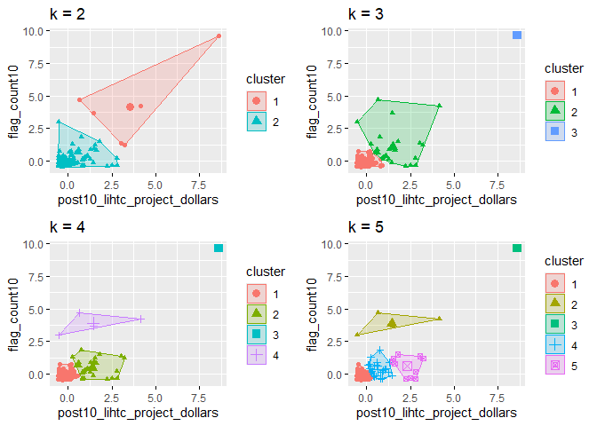<!-- -->

``` r
elbow_plot(svi_national_lihtc_cluster)
```

    ##  [1]  1  2  3  4  5  6  7  8  9 10 11 12 13 14 15
    ## [1] 1
    ## [1] 2
    ## [1] 3
    ## [1] 4
    ## [1] 5
    ## [1] 6
    ## [1] 7
    ## [1] 8
    ## [1] 9
    ## [1] 10
    ## [1] 11
    ## [1] 12
    ## [1] 13
    ## [1] 14
    ## [1] 15

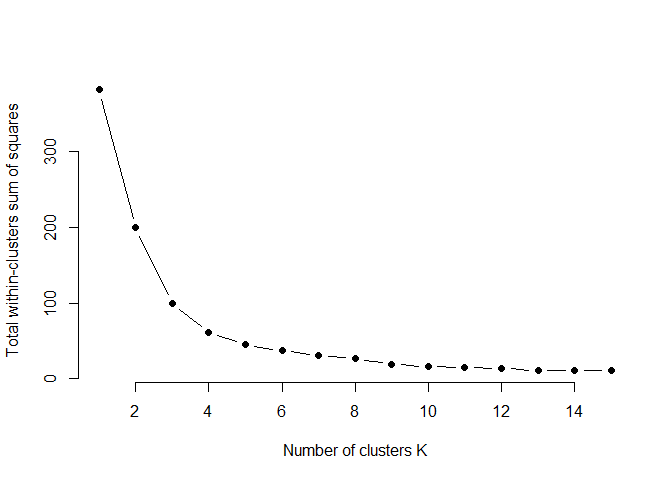<!-- -->

``` r
p_k3_lihtc_nat <- factoextra::fviz_cluster(k3_lihtc_nat, geom = "point", data = svi_national_lihtc_cluster) + ggtitle("k = 3")

p_k3_lihtc_nat
```

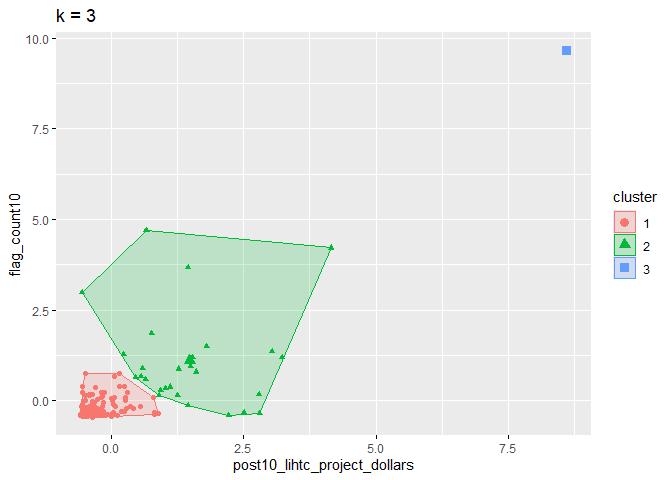<!-- -->

``` r
svi_national_lihtc_cluster_label <- as.data.frame(svi_national_lihtc_cluster) %>%
                                  rownames_to_column(var = "county_name") %>%
                                  as_tibble() %>%
                                  mutate(cluster = k3_lihtc_nat$cluster) %>%
                                  select(county_name, cluster)

svi_national_county_lihtc_projects2 <- left_join(svi_national_county_lihtc_projects, svi_national_lihtc_cluster_label, join_by(county_name == county_name))

# View county counts in each cluster
table(svi_national_county_lihtc_projects2$cluster)
```

    ## 
    ##   1   2   3 
    ## 164  27   1

It appears once again that three cluster are best to view our data

``` r
svi_national_lihtc_cluster_label <- as.data.frame(svi_national_lihtc_cluster) %>%
                                  rownames_to_column(var = "county_name") %>%
                                  as_tibble() %>%
                                  mutate(cluster = k3_lihtc_nat$cluster) %>%
                                  select(county_name, cluster)

svi_national_county_lihtc_projects2 <- left_join(svi_national_county_lihtc_projects, svi_national_lihtc_cluster_label, join_by(county_name == county_name))

# View county counts in each cluster
table(svi_national_county_lihtc_projects2$cluster)
```

    ## 
    ##   1   2   3 
    ## 164  27   1

``` r
# Cluster 1 Scatterplot
# y is our independent variable (LIHTC Project Dollars),  
# x is our dependent variable (SVI flag count)

svi_national_county_lihtc_projects2 %>% 
  filter(cluster == 1) %>%
  ggplot2::ggplot(aes(x=flag_count10,
                    y=post10_lihtc_project_dollars)) +
        geom_point() +
        geom_smooth(method="lm") +
        scale_y_continuous(labels = scales::dollar_format()) 
```

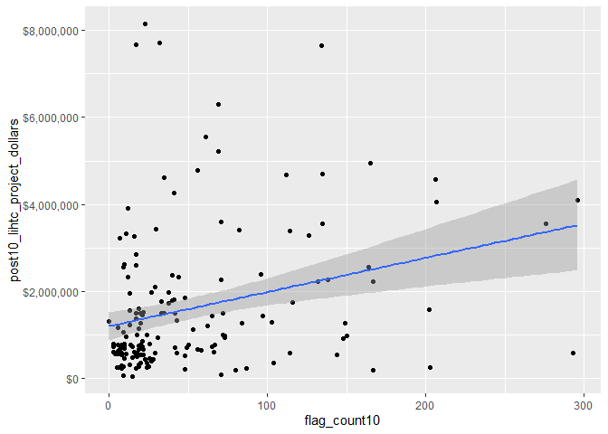<!-- -->

``` r
svi_national_county_lihtc_projects2 %>% 
  filter(cluster == 1) %>%
  select(flag_count10,post10_lihtc_project_dollars) %>%
  cor(method = "pearson")
```

    ##                              flag_count10 post10_lihtc_project_dollars
    ## flag_count10                    1.0000000                    0.2812405
    ## post10_lihtc_project_dollars    0.2812405                    1.0000000

``` r
svi_national_county_lihtc_projects2 %>% 
  filter(cluster == 1) %>%
  select(county_name, flag_count10, post10_lihtc_dollars_formatted) %>%
  arrange(desc(flag_count10)) %>% head(10) %>% kbl() %>% kable_styling() %>% scroll_box(width = "100%")
```

<div style="border: 1px solid #ddd; padding: 5px; overflow-x: scroll; width:100%; ">

<table class="table" style="margin-left: auto; margin-right: auto;">
<thead>
<tr>
<th style="text-align:left;">
county_name
</th>
<th style="text-align:right;">
flag_count10
</th>
<th style="text-align:left;">
post10_lihtc_dollars_formatted
</th>
</tr>
</thead>
<tbody>
<tr>
<td style="text-align:left;">
Queens County, NY
</td>
<td style="text-align:right;">
296
</td>
<td style="text-align:left;">
\$4,094,899
</td>
</tr>
<tr>
<td style="text-align:left;">
Oklahoma County, OK
</td>
<td style="text-align:right;">
293
</td>
<td style="text-align:left;">
\$590,000
</td>
</tr>
<tr>
<td style="text-align:left;">
Orleans Parish, LA
</td>
<td style="text-align:right;">
276
</td>
<td style="text-align:left;">
\$3,558,074
</td>
</tr>
<tr>
<td style="text-align:left;">
Sacramento County, CA
</td>
<td style="text-align:right;">
207
</td>
<td style="text-align:left;">
\$4,065,883
</td>
</tr>
<tr>
<td style="text-align:left;">
Passaic County, NJ
</td>
<td style="text-align:right;">
206
</td>
<td style="text-align:left;">
\$4,564,679
</td>
</tr>
<tr>
<td style="text-align:left;">
Hartford County, CT
</td>
<td style="text-align:right;">
203
</td>
<td style="text-align:left;">
\$256,961
</td>
</tr>
<tr>
<td style="text-align:left;">
Alameda County, CA
</td>
<td style="text-align:right;">
202
</td>
<td style="text-align:left;">
\$1,590,984
</td>
</tr>
<tr>
<td style="text-align:left;">
Erie County, NY
</td>
<td style="text-align:right;">
167
</td>
<td style="text-align:left;">
\$2,220,667
</td>
</tr>
<tr>
<td style="text-align:left;">
Shelby County, TN
</td>
<td style="text-align:right;">
167
</td>
<td style="text-align:left;">
\$201,735
</td>
</tr>
<tr>
<td style="text-align:left;">
Monroe County, NY
</td>
<td style="text-align:right;">
165
</td>
<td style="text-align:left;">
\$4,944,903
</td>
</tr>
</tbody>
</table>

</div>

Our first cluster, which is also our largest cluster, does not show a
strong correlation between flags and dollars spent.

``` r
# Cluster 2 Scatterplot
# y is our independent variable (LIHTC Project Dollars),  
# x is our dependent variable (SVI flag count)

svi_national_county_lihtc_projects2 %>% 
  filter(cluster == 2) %>%
  ggplot2::ggplot(aes(x=flag_count10,
                    y=post10_lihtc_project_dollars)) +
        geom_point() +
        geom_smooth(method="lm") +
        scale_y_continuous(labels = scales::dollar_format()) 
```

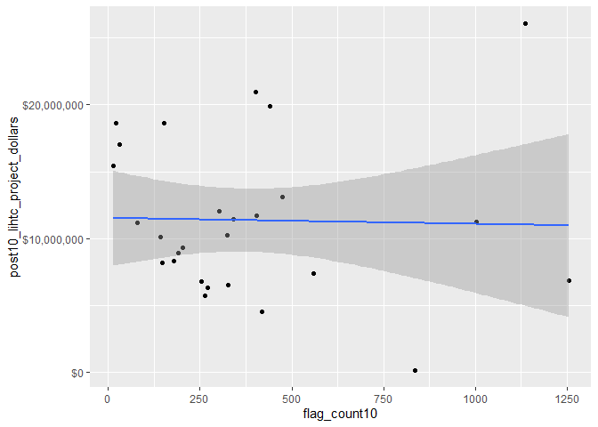<!-- -->

``` r
svi_national_county_lihtc_projects2 %>% 
  filter(cluster == 2) %>%
  select(flag_count10,post10_lihtc_project_dollars) %>%
  cor(method = "pearson")
```

    ##                              flag_count10 post10_lihtc_project_dollars
    ## flag_count10                   1.00000000                  -0.02464747
    ## post10_lihtc_project_dollars  -0.02464747                   1.00000000

``` r
svi_national_county_lihtc_projects2 %>% 
  filter(cluster == 2) %>%
  select(county_name, flag_count10, post10_lihtc_dollars_formatted) %>%
  arrange(desc(flag_count10)) %>% kbl() %>% kable_styling() %>% scroll_box(width = "100%")
```

<div style="border: 1px solid #ddd; padding: 5px; overflow-x: scroll; width:100%; ">

<table class="table" style="margin-left: auto; margin-right: auto;">
<thead>
<tr>
<th style="text-align:left;">
county_name
</th>
<th style="text-align:right;">
flag_count10
</th>
<th style="text-align:left;">
post10_lihtc_dollars_formatted
</th>
</tr>
</thead>
<tbody>
<tr>
<td style="text-align:left;">
Cook County, IL
</td>
<td style="text-align:right;">
1254
</td>
<td style="text-align:left;">
\$6,872,376
</td>
</tr>
<tr>
<td style="text-align:left;">
Kings County, NY
</td>
<td style="text-align:right;">
1135
</td>
<td style="text-align:left;">
\$26,054,976
</td>
</tr>
<tr>
<td style="text-align:left;">
Wayne County, MI
</td>
<td style="text-align:right;">
1002
</td>
<td style="text-align:left;">
\$11,226,253
</td>
</tr>
<tr>
<td style="text-align:left;">
Harris County, TX
</td>
<td style="text-align:right;">
835
</td>
<td style="text-align:left;">
\$179,539
</td>
</tr>
<tr>
<td style="text-align:left;">
Essex County, NJ
</td>
<td style="text-align:right;">
560
</td>
<td style="text-align:left;">
\$7,410,996
</td>
</tr>
<tr>
<td style="text-align:left;">
Maricopa County, AZ
</td>
<td style="text-align:right;">
475
</td>
<td style="text-align:left;">
\$13,115,292
</td>
</tr>
<tr>
<td style="text-align:left;">
Bronx County, NY
</td>
<td style="text-align:right;">
440
</td>
<td style="text-align:left;">
\$19,909,800
</td>
</tr>
<tr>
<td style="text-align:left;">
Cuyahoga County, OH
</td>
<td style="text-align:right;">
418
</td>
<td style="text-align:left;">
\$4,515,742
</td>
</tr>
<tr>
<td style="text-align:left;">
District of Columbia, DC
</td>
<td style="text-align:right;">
403
</td>
<td style="text-align:left;">
\$11,695,555
</td>
</tr>
<tr>
<td style="text-align:left;">
San Diego County, CA
</td>
<td style="text-align:right;">
402
</td>
<td style="text-align:left;">
\$20,961,962
</td>
</tr>
<tr>
<td style="text-align:left;">
Milwaukee County, WI
</td>
<td style="text-align:right;">
340
</td>
<td style="text-align:left;">
\$11,454,416
</td>
</tr>
<tr>
<td style="text-align:left;">
Baltimore city, MD
</td>
<td style="text-align:right;">
327
</td>
<td style="text-align:left;">
\$6,501,415
</td>
</tr>
<tr>
<td style="text-align:left;">
Orange County, CA
</td>
<td style="text-align:right;">
323
</td>
<td style="text-align:left;">
\$10,245,926
</td>
</tr>
<tr>
<td style="text-align:left;">
Miami-Dade County, FL
</td>
<td style="text-align:right;">
303
</td>
<td style="text-align:left;">
\$12,039,478
</td>
</tr>
<tr>
<td style="text-align:left;">
Riverside County, CA
</td>
<td style="text-align:right;">
271
</td>
<td style="text-align:left;">
\$6,335,483
</td>
</tr>
<tr>
<td style="text-align:left;">
San Bernardino County, CA
</td>
<td style="text-align:right;">
263
</td>
<td style="text-align:left;">
\$5,757,810
</td>
</tr>
<tr>
<td style="text-align:left;">
Philadelphia County, PA
</td>
<td style="text-align:right;">
253
</td>
<td style="text-align:left;">
\$6,805,843
</td>
</tr>
<tr>
<td style="text-align:left;">
New York County, NY
</td>
<td style="text-align:right;">
202
</td>
<td style="text-align:left;">
\$9,337,368
</td>
</tr>
<tr>
<td style="text-align:left;">
Allegheny County, PA
</td>
<td style="text-align:right;">
191
</td>
<td style="text-align:left;">
\$8,889,633
</td>
</tr>
<tr>
<td style="text-align:left;">
Hennepin County, MN
</td>
<td style="text-align:right;">
178
</td>
<td style="text-align:left;">
\$8,327,899
</td>
</tr>
<tr>
<td style="text-align:left;">
Onondaga County, NY
</td>
<td style="text-align:right;">
152
</td>
<td style="text-align:left;">
\$18,599,402
</td>
</tr>
<tr>
<td style="text-align:left;">
Tulsa County, OK
</td>
<td style="text-align:right;">
146
</td>
<td style="text-align:left;">
\$8,175,983
</td>
</tr>
<tr>
<td style="text-align:left;">
Hillsborough County, FL
</td>
<td style="text-align:right;">
143
</td>
<td style="text-align:left;">
\$10,116,734
</td>
</tr>
<tr>
<td style="text-align:left;">
San Francisco County, CA
</td>
<td style="text-align:right;">
79
</td>
<td style="text-align:left;">
\$11,194,380
</td>
</tr>
<tr>
<td style="text-align:left;">
Delaware County, IN
</td>
<td style="text-align:right;">
31
</td>
<td style="text-align:left;">
\$17,000,000
</td>
</tr>
<tr>
<td style="text-align:left;">
Vigo County, IN
</td>
<td style="text-align:right;">
22
</td>
<td style="text-align:left;">
\$18,646,385
</td>
</tr>
<tr>
<td style="text-align:left;">
Mesa County, CO
</td>
<td style="text-align:right;">
13
</td>
<td style="text-align:left;">
\$15,437,500
</td>
</tr>
</tbody>
</table>

</div>

Our second cluster, which as the largest spread, shows a slightly
negative correlation.

``` r
# Cluster 3 Scatterplot
# y is our independent variable (LIHTC Project Dollars),  
# x is our dependent variable (SVI flag count)

svi_national_county_lihtc_projects2 %>% 
  filter(cluster == 3) %>%
  ggplot2::ggplot(aes(x=flag_count10,
                    y=post10_lihtc_project_dollars)) +
        geom_point() +
        geom_smooth(method="lm") +
        scale_y_continuous(labels = scales::dollar_format()) 
```

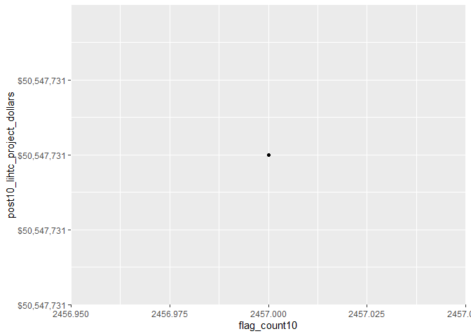<!-- -->

``` r
svi_national_county_lihtc_projects2 %>% 
  filter(cluster == 3) %>%
  select(flag_count10,post10_lihtc_project_dollars) %>%
  cor(method = "pearson")
```

    ##                              flag_count10 post10_lihtc_project_dollars
    ## flag_count10                           NA                           NA
    ## post10_lihtc_project_dollars           NA                           NA

``` r
svi_national_county_lihtc_projects2 %>% 
  filter(cluster == 3) %>%
  select(county_name, flag_count10, post10_lihtc_dollars_formatted) %>% 
  arrange(desc(flag_count10)) %>% head(10) %>% kbl() %>% kable_styling() %>% scroll_box(width = "100%")
```

<div style="border: 1px solid #ddd; padding: 5px; overflow-x: scroll; width:100%; ">

<table class="table" style="margin-left: auto; margin-right: auto;">
<thead>
<tr>
<th style="text-align:left;">
county_name
</th>
<th style="text-align:right;">
flag_count10
</th>
<th style="text-align:left;">
post10_lihtc_dollars_formatted
</th>
</tr>
</thead>
<tbody>
<tr>
<td style="text-align:left;">
Los Angeles County, CA
</td>
<td style="text-align:right;">
2457
</td>
<td style="text-align:left;">
\$50,547,731
</td>
</tr>
</tbody>
</table>

</div>

Unfortionately, our third cluster only has one instance, so we cannot
tell if there is a trend or if it is repeatable.

``` r
# Join our LIHTC projects data with our shapefile geocoordinates
svi_national_county_lihtc_sf <- left_join(svi_national_county_lihtc_projects, county_sf, join_by("FIPS_st" == "STATEFP", "FIPS_county" == "COUNTYFP"))

svi_national_county_lihtc_sf %>% head(5) %>% kbl() %>% kable_styling() %>% scroll_box(width = "100%")
```

<div style="border: 1px solid #ddd; padding: 5px; overflow-x: scroll; width:100%; ">

<table class="table" style="margin-left: auto; margin-right: auto;">
<thead>
<tr>
<th style="text-align:left;">
State
</th>
<th style="text-align:left;">
County
</th>
<th style="text-align:left;">
Division
</th>
<th style="text-align:right;">
post10_lihtc_project_cnt
</th>
<th style="text-align:right;">
tract_cnt
</th>
<th style="text-align:right;">
post10_lihtc_project_dollars
</th>
<th style="text-align:left;">
post10_lihtc_dollars_formatted
</th>
<th style="text-align:left;">
fips_county_st
</th>
<th style="text-align:left;">
FIPS_st
</th>
<th style="text-align:left;">
FIPS_county
</th>
<th style="text-align:left;">
state_name
</th>
<th style="text-align:right;">
region_number
</th>
<th style="text-align:left;">
region
</th>
<th style="text-align:right;">
division_number
</th>
<th style="text-align:right;">
flag_count10
</th>
<th style="text-align:right;">
pop10
</th>
<th style="text-align:right;">
flag_by_pop10
</th>
<th style="text-align:right;">
flag_count_quantile10
</th>
<th style="text-align:right;">
flag_pop_quantile10
</th>
<th style="text-align:right;">
flag_count20
</th>
<th style="text-align:right;">
pop20
</th>
<th style="text-align:right;">
flag_by_pop20
</th>
<th style="text-align:right;">
flag_count_quantile20
</th>
<th style="text-align:right;">
flag_pop_quantile20
</th>
<th style="text-align:left;">
county_name
</th>
<th style="text-align:left;">
GEO_ID
</th>
<th style="text-align:left;">
STATE
</th>
<th style="text-align:left;">
COUNTY
</th>
<th style="text-align:left;">
NAME
</th>
<th style="text-align:left;">
LSAD
</th>
<th style="text-align:right;">
CENSUSAREA
</th>
<th style="text-align:left;">
geometry
</th>
</tr>
</thead>
<tbody>
<tr>
<td style="text-align:left;">
AL
</td>
<td style="text-align:left;">
Dale County
</td>
<td style="text-align:left;">
East South Central Division
</td>
<td style="text-align:right;">
1
</td>
<td style="text-align:right;">
2
</td>
<td style="text-align:right;">
801670
</td>
<td style="text-align:left;">
\$801,670
</td>
<td style="text-align:left;">
01045
</td>
<td style="text-align:left;">
01
</td>
<td style="text-align:left;">
045
</td>
<td style="text-align:left;">
Alabama
</td>
<td style="text-align:right;">
3
</td>
<td style="text-align:left;">
South Region
</td>
<td style="text-align:right;">
6
</td>
<td style="text-align:right;">
10
</td>
<td style="text-align:right;">
4943
</td>
<td style="text-align:right;">
0.0020231
</td>
<td style="text-align:right;">
0.4
</td>
<td style="text-align:right;">
0.4
</td>
<td style="text-align:right;">
15
</td>
<td style="text-align:right;">
4853
</td>
<td style="text-align:right;">
0.0030909
</td>
<td style="text-align:right;">
0.6
</td>
<td style="text-align:right;">
0.8
</td>
<td style="text-align:left;">
Dale County, AL
</td>
<td style="text-align:left;">
0500000US01045
</td>
<td style="text-align:left;">
01
</td>
<td style="text-align:left;">
045
</td>
<td style="text-align:left;">
Dale
</td>
<td style="text-align:left;">
County
</td>
<td style="text-align:right;">
561.150
</td>
<td style="text-align:left;">
MULTIPOLYGON (((966402.4 -6…
</td>
</tr>
<tr>
<td style="text-align:left;">
AL
</td>
<td style="text-align:left;">
Mobile County
</td>
<td style="text-align:left;">
East South Central Division
</td>
<td style="text-align:right;">
1
</td>
<td style="text-align:right;">
18
</td>
<td style="text-align:right;">
917572
</td>
<td style="text-align:left;">
\$917,572
</td>
<td style="text-align:left;">
01097
</td>
<td style="text-align:left;">
01
</td>
<td style="text-align:left;">
097
</td>
<td style="text-align:left;">
Alabama
</td>
<td style="text-align:right;">
3
</td>
<td style="text-align:left;">
South Region
</td>
<td style="text-align:right;">
6
</td>
<td style="text-align:right;">
148
</td>
<td style="text-align:right;">
41977
</td>
<td style="text-align:right;">
0.0035257
</td>
<td style="text-align:right;">
1.0
</td>
<td style="text-align:right;">
0.8
</td>
<td style="text-align:right;">
126
</td>
<td style="text-align:right;">
34483
</td>
<td style="text-align:right;">
0.0036540
</td>
<td style="text-align:right;">
1.0
</td>
<td style="text-align:right;">
0.8
</td>
<td style="text-align:left;">
Mobile County, AL
</td>
<td style="text-align:left;">
0500000US01097
</td>
<td style="text-align:left;">
01
</td>
<td style="text-align:left;">
097
</td>
<td style="text-align:left;">
Mobile
</td>
<td style="text-align:left;">
County
</td>
<td style="text-align:right;">
1229.435
</td>
<td style="text-align:left;">
MULTIPOLYGON (((763284.2 -7…
</td>
</tr>
<tr>
<td style="text-align:left;">
AR
</td>
<td style="text-align:left;">
Craighead County
</td>
<td style="text-align:left;">
West South Central Division
</td>
<td style="text-align:right;">
6
</td>
<td style="text-align:right;">
1
</td>
<td style="text-align:right;">
2614884
</td>
<td style="text-align:left;">
\$2,614,884
</td>
<td style="text-align:left;">
05031
</td>
<td style="text-align:left;">
05
</td>
<td style="text-align:left;">
031
</td>
<td style="text-align:left;">
Arkansas
</td>
<td style="text-align:right;">
3
</td>
<td style="text-align:left;">
South Region
</td>
<td style="text-align:right;">
7
</td>
<td style="text-align:right;">
10
</td>
<td style="text-align:right;">
5701
</td>
<td style="text-align:right;">
0.0017541
</td>
<td style="text-align:right;">
0.4
</td>
<td style="text-align:right;">
0.4
</td>
<td style="text-align:right;">
9
</td>
<td style="text-align:right;">
6088
</td>
<td style="text-align:right;">
0.0014783
</td>
<td style="text-align:right;">
0.4
</td>
<td style="text-align:right;">
0.2
</td>
<td style="text-align:left;">
Craighead County, AR
</td>
<td style="text-align:left;">
0500000US05031
</td>
<td style="text-align:left;">
05
</td>
<td style="text-align:left;">
031
</td>
<td style="text-align:left;">
Craighead
</td>
<td style="text-align:left;">
County
</td>
<td style="text-align:right;">
707.206
</td>
<td style="text-align:left;">
MULTIPOLYGON (((509938.5 -1…
</td>
</tr>
<tr>
<td style="text-align:left;">
AR
</td>
<td style="text-align:left;">
Jefferson County
</td>
<td style="text-align:left;">
West South Central Division
</td>
<td style="text-align:right;">
1
</td>
<td style="text-align:right;">
5
</td>
<td style="text-align:right;">
593033
</td>
<td style="text-align:left;">
\$593,033
</td>
<td style="text-align:left;">
05069
</td>
<td style="text-align:left;">
05
</td>
<td style="text-align:left;">
069
</td>
<td style="text-align:left;">
Arkansas
</td>
<td style="text-align:right;">
3
</td>
<td style="text-align:left;">
South Region
</td>
<td style="text-align:right;">
7
</td>
<td style="text-align:right;">
43
</td>
<td style="text-align:right;">
14174
</td>
<td style="text-align:right;">
0.0030337
</td>
<td style="text-align:right;">
1.0
</td>
<td style="text-align:right;">
0.8
</td>
<td style="text-align:right;">
39
</td>
<td style="text-align:right;">
11370
</td>
<td style="text-align:right;">
0.0034301
</td>
<td style="text-align:right;">
0.8
</td>
<td style="text-align:right;">
0.8
</td>
<td style="text-align:left;">
Jefferson County, AR
</td>
<td style="text-align:left;">
0500000US05069
</td>
<td style="text-align:left;">
05
</td>
<td style="text-align:left;">
069
</td>
<td style="text-align:left;">
Jefferson
</td>
<td style="text-align:left;">
County
</td>
<td style="text-align:right;">
870.746
</td>
<td style="text-align:left;">
MULTIPOLYGON (((391413.8 -3…
</td>
</tr>
<tr>
<td style="text-align:left;">
AR
</td>
<td style="text-align:left;">
Pope County
</td>
<td style="text-align:left;">
West South Central Division
</td>
<td style="text-align:right;">
1
</td>
<td style="text-align:right;">
1
</td>
<td style="text-align:right;">
563121
</td>
<td style="text-align:left;">
\$563,121
</td>
<td style="text-align:left;">
05115
</td>
<td style="text-align:left;">
05
</td>
<td style="text-align:left;">
115
</td>
<td style="text-align:left;">
Arkansas
</td>
<td style="text-align:right;">
3
</td>
<td style="text-align:left;">
South Region
</td>
<td style="text-align:right;">
7
</td>
<td style="text-align:right;">
6
</td>
<td style="text-align:right;">
4220
</td>
<td style="text-align:right;">
0.0014218
</td>
<td style="text-align:right;">
0.2
</td>
<td style="text-align:right;">
0.2
</td>
<td style="text-align:right;">
9
</td>
<td style="text-align:right;">
4890
</td>
<td style="text-align:right;">
0.0018405
</td>
<td style="text-align:right;">
0.4
</td>
<td style="text-align:right;">
0.4
</td>
<td style="text-align:left;">
Pope County, AR
</td>
<td style="text-align:left;">
0500000US05115
</td>
<td style="text-align:left;">
05
</td>
<td style="text-align:left;">
115
</td>
<td style="text-align:left;">
Pope
</td>
<td style="text-align:left;">
County
</td>
<td style="text-align:right;">
812.548
</td>
<td style="text-align:left;">
MULTIPOLYGON (((243262.7 -2…
</td>
</tr>
</tbody>
</table>

</div>

``` r
# Create classes for bivariate mapping 
svi_national_county_lihtc_sf <- bi_class(svi_national_county_lihtc_sf, x = flag_count10, y = post10_lihtc_project_dollars, style = "quantile", dim = 3)

# View data
svi_national_county_lihtc_sf %>% head(5) %>% kbl() %>% kable_styling() %>% scroll_box(width = "100%")
```

<div style="border: 1px solid #ddd; padding: 5px; overflow-x: scroll; width:100%; ">

<table class="table" style="margin-left: auto; margin-right: auto;">
<thead>
<tr>
<th style="text-align:left;">
State
</th>
<th style="text-align:left;">
County
</th>
<th style="text-align:left;">
Division
</th>
<th style="text-align:right;">
post10_lihtc_project_cnt
</th>
<th style="text-align:right;">
tract_cnt
</th>
<th style="text-align:right;">
post10_lihtc_project_dollars
</th>
<th style="text-align:left;">
post10_lihtc_dollars_formatted
</th>
<th style="text-align:left;">
fips_county_st
</th>
<th style="text-align:left;">
FIPS_st
</th>
<th style="text-align:left;">
FIPS_county
</th>
<th style="text-align:left;">
state_name
</th>
<th style="text-align:right;">
region_number
</th>
<th style="text-align:left;">
region
</th>
<th style="text-align:right;">
division_number
</th>
<th style="text-align:right;">
flag_count10
</th>
<th style="text-align:right;">
pop10
</th>
<th style="text-align:right;">
flag_by_pop10
</th>
<th style="text-align:right;">
flag_count_quantile10
</th>
<th style="text-align:right;">
flag_pop_quantile10
</th>
<th style="text-align:right;">
flag_count20
</th>
<th style="text-align:right;">
pop20
</th>
<th style="text-align:right;">
flag_by_pop20
</th>
<th style="text-align:right;">
flag_count_quantile20
</th>
<th style="text-align:right;">
flag_pop_quantile20
</th>
<th style="text-align:left;">
county_name
</th>
<th style="text-align:left;">
GEO_ID
</th>
<th style="text-align:left;">
STATE
</th>
<th style="text-align:left;">
COUNTY
</th>
<th style="text-align:left;">
NAME
</th>
<th style="text-align:left;">
LSAD
</th>
<th style="text-align:right;">
CENSUSAREA
</th>
<th style="text-align:left;">
geometry
</th>
<th style="text-align:left;">
bi_class
</th>
</tr>
</thead>
<tbody>
<tr>
<td style="text-align:left;">
AL
</td>
<td style="text-align:left;">
Dale County
</td>
<td style="text-align:left;">
East South Central Division
</td>
<td style="text-align:right;">
1
</td>
<td style="text-align:right;">
2
</td>
<td style="text-align:right;">
801670
</td>
<td style="text-align:left;">
\$801,670
</td>
<td style="text-align:left;">
01045
</td>
<td style="text-align:left;">
01
</td>
<td style="text-align:left;">
045
</td>
<td style="text-align:left;">
Alabama
</td>
<td style="text-align:right;">
3
</td>
<td style="text-align:left;">
South Region
</td>
<td style="text-align:right;">
6
</td>
<td style="text-align:right;">
10
</td>
<td style="text-align:right;">
4943
</td>
<td style="text-align:right;">
0.0020231
</td>
<td style="text-align:right;">
0.4
</td>
<td style="text-align:right;">
0.4
</td>
<td style="text-align:right;">
15
</td>
<td style="text-align:right;">
4853
</td>
<td style="text-align:right;">
0.0030909
</td>
<td style="text-align:right;">
0.6
</td>
<td style="text-align:right;">
0.8
</td>
<td style="text-align:left;">
Dale County, AL
</td>
<td style="text-align:left;">
0500000US01045
</td>
<td style="text-align:left;">
01
</td>
<td style="text-align:left;">
045
</td>
<td style="text-align:left;">
Dale
</td>
<td style="text-align:left;">
County
</td>
<td style="text-align:right;">
561.150
</td>
<td style="text-align:left;">
MULTIPOLYGON (((966402.4 -6…
</td>
<td style="text-align:left;">
1-2
</td>
</tr>
<tr>
<td style="text-align:left;">
AL
</td>
<td style="text-align:left;">
Mobile County
</td>
<td style="text-align:left;">
East South Central Division
</td>
<td style="text-align:right;">
1
</td>
<td style="text-align:right;">
18
</td>
<td style="text-align:right;">
917572
</td>
<td style="text-align:left;">
\$917,572
</td>
<td style="text-align:left;">
01097
</td>
<td style="text-align:left;">
01
</td>
<td style="text-align:left;">
097
</td>
<td style="text-align:left;">
Alabama
</td>
<td style="text-align:right;">
3
</td>
<td style="text-align:left;">
South Region
</td>
<td style="text-align:right;">
6
</td>
<td style="text-align:right;">
148
</td>
<td style="text-align:right;">
41977
</td>
<td style="text-align:right;">
0.0035257
</td>
<td style="text-align:right;">
1.0
</td>
<td style="text-align:right;">
0.8
</td>
<td style="text-align:right;">
126
</td>
<td style="text-align:right;">
34483
</td>
<td style="text-align:right;">
0.0036540
</td>
<td style="text-align:right;">
1.0
</td>
<td style="text-align:right;">
0.8
</td>
<td style="text-align:left;">
Mobile County, AL
</td>
<td style="text-align:left;">
0500000US01097
</td>
<td style="text-align:left;">
01
</td>
<td style="text-align:left;">
097
</td>
<td style="text-align:left;">
Mobile
</td>
<td style="text-align:left;">
County
</td>
<td style="text-align:right;">
1229.435
</td>
<td style="text-align:left;">
MULTIPOLYGON (((763284.2 -7…
</td>
<td style="text-align:left;">
3-2
</td>
</tr>
<tr>
<td style="text-align:left;">
AR
</td>
<td style="text-align:left;">
Craighead County
</td>
<td style="text-align:left;">
West South Central Division
</td>
<td style="text-align:right;">
6
</td>
<td style="text-align:right;">
1
</td>
<td style="text-align:right;">
2614884
</td>
<td style="text-align:left;">
\$2,614,884
</td>
<td style="text-align:left;">
05031
</td>
<td style="text-align:left;">
05
</td>
<td style="text-align:left;">
031
</td>
<td style="text-align:left;">
Arkansas
</td>
<td style="text-align:right;">
3
</td>
<td style="text-align:left;">
South Region
</td>
<td style="text-align:right;">
7
</td>
<td style="text-align:right;">
10
</td>
<td style="text-align:right;">
5701
</td>
<td style="text-align:right;">
0.0017541
</td>
<td style="text-align:right;">
0.4
</td>
<td style="text-align:right;">
0.4
</td>
<td style="text-align:right;">
9
</td>
<td style="text-align:right;">
6088
</td>
<td style="text-align:right;">
0.0014783
</td>
<td style="text-align:right;">
0.4
</td>
<td style="text-align:right;">
0.2
</td>
<td style="text-align:left;">
Craighead County, AR
</td>
<td style="text-align:left;">
0500000US05031
</td>
<td style="text-align:left;">
05
</td>
<td style="text-align:left;">
031
</td>
<td style="text-align:left;">
Craighead
</td>
<td style="text-align:left;">
County
</td>
<td style="text-align:right;">
707.206
</td>
<td style="text-align:left;">
MULTIPOLYGON (((509938.5 -1…
</td>
<td style="text-align:left;">
1-3
</td>
</tr>
<tr>
<td style="text-align:left;">
AR
</td>
<td style="text-align:left;">
Jefferson County
</td>
<td style="text-align:left;">
West South Central Division
</td>
<td style="text-align:right;">
1
</td>
<td style="text-align:right;">
5
</td>
<td style="text-align:right;">
593033
</td>
<td style="text-align:left;">
\$593,033
</td>
<td style="text-align:left;">
05069
</td>
<td style="text-align:left;">
05
</td>
<td style="text-align:left;">
069
</td>
<td style="text-align:left;">
Arkansas
</td>
<td style="text-align:right;">
3
</td>
<td style="text-align:left;">
South Region
</td>
<td style="text-align:right;">
7
</td>
<td style="text-align:right;">
43
</td>
<td style="text-align:right;">
14174
</td>
<td style="text-align:right;">
0.0030337
</td>
<td style="text-align:right;">
1.0
</td>
<td style="text-align:right;">
0.8
</td>
<td style="text-align:right;">
39
</td>
<td style="text-align:right;">
11370
</td>
<td style="text-align:right;">
0.0034301
</td>
<td style="text-align:right;">
0.8
</td>
<td style="text-align:right;">
0.8
</td>
<td style="text-align:left;">
Jefferson County, AR
</td>
<td style="text-align:left;">
0500000US05069
</td>
<td style="text-align:left;">
05
</td>
<td style="text-align:left;">
069
</td>
<td style="text-align:left;">
Jefferson
</td>
<td style="text-align:left;">
County
</td>
<td style="text-align:right;">
870.746
</td>
<td style="text-align:left;">
MULTIPOLYGON (((391413.8 -3…
</td>
<td style="text-align:left;">
2-1
</td>
</tr>
<tr>
<td style="text-align:left;">
AR
</td>
<td style="text-align:left;">
Pope County
</td>
<td style="text-align:left;">
West South Central Division
</td>
<td style="text-align:right;">
1
</td>
<td style="text-align:right;">
1
</td>
<td style="text-align:right;">
563121
</td>
<td style="text-align:left;">
\$563,121
</td>
<td style="text-align:left;">
05115
</td>
<td style="text-align:left;">
05
</td>
<td style="text-align:left;">
115
</td>
<td style="text-align:left;">
Arkansas
</td>
<td style="text-align:right;">
3
</td>
<td style="text-align:left;">
South Region
</td>
<td style="text-align:right;">
7
</td>
<td style="text-align:right;">
6
</td>
<td style="text-align:right;">
4220
</td>
<td style="text-align:right;">
0.0014218
</td>
<td style="text-align:right;">
0.2
</td>
<td style="text-align:right;">
0.2
</td>
<td style="text-align:right;">
9
</td>
<td style="text-align:right;">
4890
</td>
<td style="text-align:right;">
0.0018405
</td>
<td style="text-align:right;">
0.4
</td>
<td style="text-align:right;">
0.4
</td>
<td style="text-align:left;">
Pope County, AR
</td>
<td style="text-align:left;">
0500000US05115
</td>
<td style="text-align:left;">
05
</td>
<td style="text-align:left;">
115
</td>
<td style="text-align:left;">
Pope
</td>
<td style="text-align:left;">
County
</td>
<td style="text-align:right;">
812.548
</td>
<td style="text-align:left;">
MULTIPOLYGON (((243262.7 -2…
</td>
<td style="text-align:left;">
1-1
</td>
</tr>
</tbody>
</table>

</div>

``` r
# Create map with ggplot
svi_national_county_lihtc_map <- ggplot() +
  # Map county shapefile, fill with bi_class categories
  geom_sf(data = svi_national_county_lihtc_sf, mapping = aes(geometry=geometry, fill = bi_class), color = "white", size = 0.1, show.legend = FALSE) +
  # Set to biscale palette
  bi_scale_fill(pal = "GrPink", dim = 3) +
  # Add state shapefiles for outline
  geom_sf(data=st_sf, color="black", fill=NA, linewidth=.5, aes(geometry=geometry)) +
  labs(
    title = "Correlation of 2010 National SVI Flag Count and 2011 - 2020 LIHTC Tax Dollars",
  ) +
  # Set them to biscale
  bi_theme(base_size = 10)

# Create biscale legend
svi_national_county_lihtc_legend <- bi_legend(pal = "GrPink",
                    dim = 3,
                    xlab = "SVI Flag Count",
                    ylab = "LIHTC Dollars",
                    size = 8)

# Combine map with legend using cowplot
svi_national_county_lihtc_bivarmap <- ggdraw() +
  draw_plot(svi_national_county_lihtc_map) +
  # Set legend location
  draw_plot(svi_national_county_lihtc_legend, x= -.02,  y = -.05,
 width=.20)


# View map
svi_national_county_lihtc_bivarmap
```

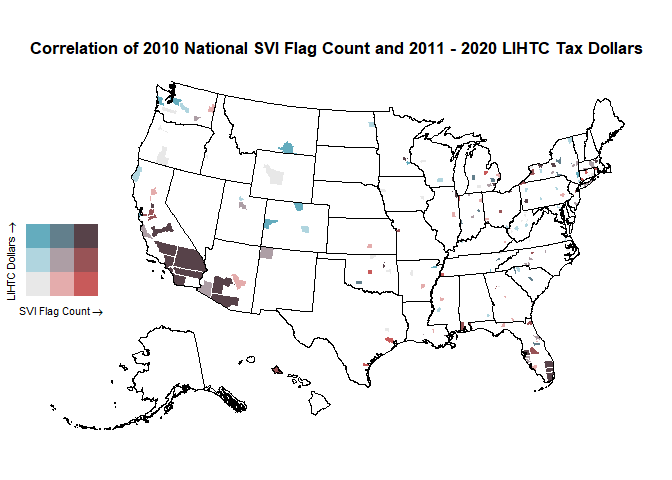<!-- -->

Here we once again see the larges amounts of flags in both Florida and
California.

``` r
svi_national_county_lihtc_sf %>% filter(State == "CO") %>% select(State, County, flag_count10, post10_lihtc_dollars_formatted) %>% arrange(desc(flag_count10)) %>% head(6)
```

    ##   State         County flag_count10 post10_lihtc_dollars_formatted
    ## 1    CO  Denver County           69                     $5,226,128
    ## 2    CO El Paso County           18                     $1,011,891
    ## 3    CO Larimer County           17                     $2,609,648
    ## 4    CO    Mesa County           13                    $15,437,500

``` r
svi_national_county_lihtc_sf %>% filter(State == "CA") %>% select(State, County, flag_count10, post10_lihtc_dollars_formatted) %>% arrange(desc(flag_count10)) %>% head(6)
```

    ##   State                County flag_count10 post10_lihtc_dollars_formatted
    ## 1    CA    Los Angeles County         2457                    $50,547,731
    ## 2    CA      San Diego County          402                    $20,961,962
    ## 3    CA         Orange County          323                    $10,245,926
    ## 4    CA      Riverside County          271                     $6,335,483
    ## 5    CA San Bernardino County          263                     $5,757,810
    ## 6    CA     Sacramento County          207                     $4,065,883

Divisional Data Summary

``` r
svi_divisional_county_nmtc_projects <- svi_divisional_county_nmtc %>% filter(post10_nmtc_project_cnt > 0)
```

``` r
summary(svi_divisional_county_nmtc_projects$flag_count10)
```

    ##    Min. 1st Qu.  Median    Mean 3rd Qu.    Max. 
    ##     2.0    25.0    52.0   156.4   170.2  2301.0

``` r
summary(svi_divisional_county_nmtc_projects$post10_nmtc_project_dollars)
```

    ##      Min.   1st Qu.    Median      Mean   3rd Qu.      Max. 
    ##      6235   7063450  13963750  29058223  31893750 437737000

Looking into our summary statistics for the South Atlantic division, we
can see a large spread in both flags and in money spent. Flags rangs
from 2 to 2301, a very large gap. Money spent also ranges from 6235 to
over 400,000,000. Interestingly, the average amount of flags is 156.4,
which is far below the maximum of 2301. This suggests that which there
are outliers pulling the data to 2301, most divisions are actually much
smaller. Similarly, the average amount of money is just over 29,000,000,
which is significantly different than the maximum of over 400,000,000

``` r
# Scatterplot
# y is our independent variable (NMTC Project Dollars),  
# x is our dependent variable (SVI flag count)
ggplot2::ggplot(svi_divisional_county_nmtc_projects,
                aes(x=flag_count10,
                    y=post10_nmtc_project_dollars)) +
        geom_point() +
        geom_smooth(method="lm") +
        scale_y_continuous(labels = scales::dollar_format()) 
```

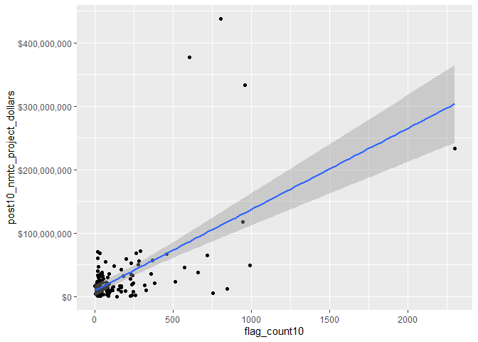<!-- -->

``` r
# Scatterplot
# y is our independent variable (NMTC Project Dollars),  
# x is our dependent variable (SVI flag count)
ggplot2::ggplot(svi_divisional_county_nmtc_projects,
                aes(x=flag_count10,
                    y=post10_nmtc_project_dollars)) +
        geom_point() +
        geom_smooth(method="lm") +
        scale_y_continuous(labels = scales::dollar_format()) 
```

<!-- -->

``` r
# Pearson's r calculation
cor(svi_divisional_county_nmtc_projects$flag_count10, svi_divisional_county_nmtc_projects$post10_nmtc_project_dollars, method = "pearson")
```

    ## [1] 0.5999762

If we view the data in a scatter plot, we can more clearly see how the
outliers are pulling our data. While there are instances that reach a
spending of over \$100,000,000, there are only 5 in total. In fact,
there is only one instance that reaches over the \$400,000,000
threshhold.

This stark difference is examined by looking at our Pearson’s R
Calculation. While still showing that flag count has a strong impact on
money spent, the pattern is much less strong than how it initially
looks. This is because the majority of our data is in the bottom left
corner, with less than \$100,000,000 spent, and less than 500 flags.

``` r
boxplot(svi_divisional_county_nmtc_projects$flag_count10)
```

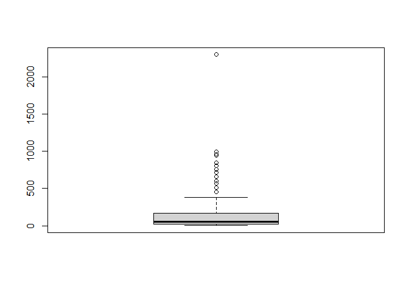<!-- -->

``` r
boxplot.stats(svi_divisional_county_nmtc_projects$flag_count10)$out %>% sort(decreasing = TRUE)
```

    ##  [1] 2301  993  962  946  846  805  756  717  660  605  572  514  459

``` r
svi_divisional_county_nmtc_projects %>% 
  select(county_name, flag_count10, post10_nmtc_dollars_formatted) %>% 
  arrange(desc(flag_count10)) %>% 
  head(7) %>% kbl() %>% kable_styling() %>% scroll_box(width = "100%")
```

<div style="border: 1px solid #ddd; padding: 5px; overflow-x: scroll; width:100%; ">

<table class="table" style="margin-left: auto; margin-right: auto;">
<thead>
<tr>
<th style="text-align:left;">
county_name
</th>
<th style="text-align:right;">
flag_count10
</th>
<th style="text-align:left;">
post10_nmtc_dollars_formatted
</th>
</tr>
</thead>
<tbody>
<tr>
<td style="text-align:left;">
Miami-Dade County, FL
</td>
<td style="text-align:right;">
2301
</td>
<td style="text-align:left;">
\$233,661,603
</td>
</tr>
<tr>
<td style="text-align:left;">
Broward County, FL
</td>
<td style="text-align:right;">
993
</td>
<td style="text-align:left;">
\$48,975,143
</td>
</tr>
<tr>
<td style="text-align:left;">
Baltimore city, MD
</td>
<td style="text-align:right;">
962
</td>
<td style="text-align:left;">
\$333,109,232
</td>
</tr>
<tr>
<td style="text-align:left;">
Hillsborough County, FL
</td>
<td style="text-align:right;">
946
</td>
<td style="text-align:left;">
\$117,152,400
</td>
</tr>
<tr>
<td style="text-align:left;">
Palm Beach County, FL
</td>
<td style="text-align:right;">
846
</td>
<td style="text-align:left;">
\$12,202,000
</td>
</tr>
<tr>
<td style="text-align:left;">
Fulton County, GA
</td>
<td style="text-align:right;">
805
</td>
<td style="text-align:left;">
\$437,737,000
</td>
</tr>
<tr>
<td style="text-align:left;">
Prince George’s County, MD
</td>
<td style="text-align:right;">
756
</td>
<td style="text-align:left;">
\$4,900,000
</td>
</tr>
</tbody>
</table>

</div>

If we sort by our largest amount of flags, there is a very large
difference between number 7 and number 1. However, if just look at the
flags between 2 and 7, they are much more comparable. Yet, the money
spent does not seem to increase in any particular trend. In fact, the
most amount of money spent is number 6, which is almost double that of
number 1, even though number 1 has almost 3 times the amount of flags as
number 6.

``` r
svi_divisional_nmtc_cluster <- svi_divisional_county_nmtc_projects %>% 
                            select(county_name, post10_nmtc_project_dollars, 
                                   flag_count10) %>% 
                            remove_rownames %>% 
                            column_to_rownames(var="county_name")

# Remove nulls, if in dataset
svi_divisional_nmtc_cluster <- na.omit(svi_divisional_nmtc_cluster)


# Scale numeric variables
svi_divisional_nmtc_cluster <- scale(svi_divisional_nmtc_cluster)


svi_divisional_nmtc_cluster %>% head(5)
```

    ##                          post10_nmtc_project_dollars flag_count10
    ## District of Columbia, DC                  5.95900625   1.63887937
    ## New Castle County, DE                    -0.01961731   0.26881224
    ## Alachua County, FL                       -0.21737824   0.01306638
    ## Brevard County, FL                       -0.37714793   0.04594799
    ## Broward County, FL                        0.34095362   3.05644216

K-Means Clustering

``` r
set.seed(123)
k2_nmtc_div <- kmeans(svi_divisional_nmtc_cluster, centers = 2, nstart = 25)
set.seed(123)
k3_nmtc_div <- kmeans(svi_divisional_nmtc_cluster, centers = 3, nstart = 25)
set.seed(123)
k4_nmtc_div <- kmeans(svi_divisional_nmtc_cluster, centers = 4, nstart = 25)
set.seed(123)
k5_nmtc_div <- kmeans(svi_divisional_nmtc_cluster, centers = 5, nstart = 25)
```

``` r
# plots to compare
p_k2_nmtc_div <- factoextra::fviz_cluster(k2_nmtc_div, geom = "point", data = svi_divisional_nmtc_cluster) + ggtitle("k = 2")

p_k3_nmtc_div <- factoextra::fviz_cluster(k3_nmtc_div, geom = "point", data = svi_divisional_nmtc_cluster) + ggtitle("k = 3")

p_k4_nmtc_div <- factoextra::fviz_cluster(k4_nmtc_div, geom = "point",  data = svi_divisional_nmtc_cluster) + ggtitle("k = 4")

p_k5_nmtc_div <- factoextra::fviz_cluster(k5_nmtc_div, geom = "point",  data = svi_divisional_nmtc_cluster) + ggtitle("k = 5")

grid.arrange(p_k2_nmtc_div, p_k3_nmtc_div, p_k4_nmtc_div, p_k5_nmtc_div, nrow = 2)
```

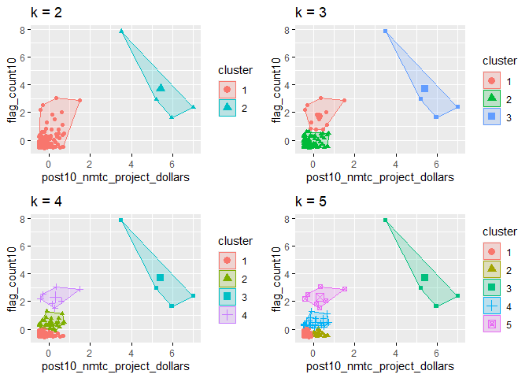<!-- -->

``` r
elbow_plot(svi_divisional_nmtc_cluster)
```

    ##  [1]  1  2  3  4  5  6  7  8  9 10 11 12 13 14 15
    ## [1] 1
    ## [1] 2
    ## [1] 3
    ## [1] 4
    ## [1] 5
    ## [1] 6
    ## [1] 7
    ## [1] 8
    ## [1] 9
    ## [1] 10
    ## [1] 11
    ## [1] 12
    ## [1] 13
    ## [1] 14
    ## [1] 15

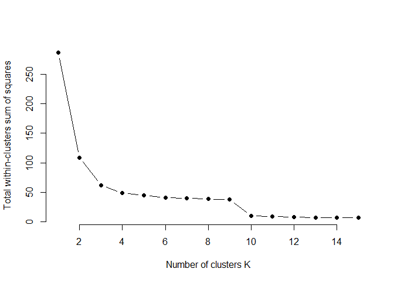<!-- -->

``` r
p_k3_nmtc_div <- factoextra::fviz_cluster(k3_nmtc_div, geom = "point", data = svi_divisional_nmtc_cluster) + ggtitle("k = 3")

p_k3_nmtc_div
```

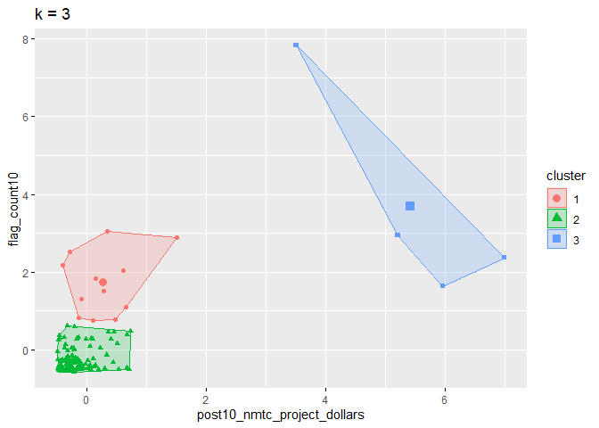<!-- -->

Since there is such a large difference in both flag counts and project
dollars spent, we can divide our groups into clusters. Our group is best
divided into three different clusters, which may show different flag or
money trends.

``` r
svi_divisional_nmtc_cluster_label <- as.data.frame(svi_divisional_nmtc_cluster) %>%
                                  rownames_to_column(var = "county_name") %>%
                                  as_tibble() %>%
                                  mutate(cluster = k3_nmtc_div$cluster) %>%
                                  select(county_name, cluster)

svi_divisional_county_nmtc_projects2 <- left_join(svi_divisional_county_nmtc_projects, svi_divisional_nmtc_cluster_label, join_by(county_name == county_name))

# View county counts in each cluster
table(svi_divisional_county_nmtc_projects2$cluster)
```

    ## 
    ##   1   2   3 
    ##  12 128   4

``` r
# Cluster 1 Scatterplot
# y is our independent variable (NMTC Project Dollars),  
# x is our dependent variable (SVI flag count)

svi_divisional_county_nmtc_projects2 %>% 
  filter(cluster == 1) %>%
  ggplot2::ggplot(aes(x=flag_count10,
                    y=post10_nmtc_project_dollars)) +
        geom_point() +
        geom_smooth(method="lm") +
        scale_y_continuous(labels = scales::dollar_format()) 
```

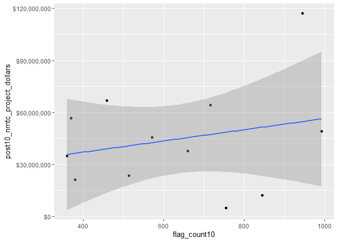<!-- -->

``` r
svi_divisional_county_nmtc_projects2 %>% 
  filter(cluster == 1) %>%
  select(flag_count10,post10_nmtc_project_dollars) %>%
  cor(method = "pearson")
```

    ##                             flag_count10 post10_nmtc_project_dollars
    ## flag_count10                   1.0000000                   0.2395816
    ## post10_nmtc_project_dollars    0.2395816                   1.0000000

``` r
svi_divisional_county_nmtc_projects2 %>% 
  filter(cluster == 1) %>%
  select(county_name, flag_count10, post10_nmtc_dollars_formatted) %>% kbl() %>% kable_styling() %>% scroll_box(width = "100%")
```

<div style="border: 1px solid #ddd; padding: 5px; overflow-x: scroll; width:100%; ">

<table class="table" style="margin-left: auto; margin-right: auto;">
<thead>
<tr>
<th style="text-align:left;">
county_name
</th>
<th style="text-align:right;">
flag_count10
</th>
<th style="text-align:left;">
post10_nmtc_dollars_formatted
</th>
</tr>
</thead>
<tbody>
<tr>
<td style="text-align:left;">
Broward County, FL
</td>
<td style="text-align:right;">
993
</td>
<td style="text-align:left;">
\$48,975,143
</td>
</tr>
<tr>
<td style="text-align:left;">
Duval County, FL
</td>
<td style="text-align:right;">
459
</td>
<td style="text-align:left;">
\$66,878,307
</td>
</tr>
<tr>
<td style="text-align:left;">
Hillsborough County, FL
</td>
<td style="text-align:right;">
946
</td>
<td style="text-align:left;">
\$117,152,400
</td>
</tr>
<tr>
<td style="text-align:left;">
Lee County, FL
</td>
<td style="text-align:right;">
361
</td>
<td style="text-align:left;">
\$34,965,000
</td>
</tr>
<tr>
<td style="text-align:left;">
Orange County, FL
</td>
<td style="text-align:right;">
717
</td>
<td style="text-align:left;">
\$64,320,444
</td>
</tr>
<tr>
<td style="text-align:left;">
Palm Beach County, FL
</td>
<td style="text-align:right;">
846
</td>
<td style="text-align:left;">
\$12,202,000
</td>
</tr>
<tr>
<td style="text-align:left;">
Pinellas County, FL
</td>
<td style="text-align:right;">
381
</td>
<td style="text-align:left;">
\$21,235,000
</td>
</tr>
<tr>
<td style="text-align:left;">
Polk County, FL
</td>
<td style="text-align:right;">
514
</td>
<td style="text-align:left;">
\$23,450,000
</td>
</tr>
<tr>
<td style="text-align:left;">
DeKalb County, GA
</td>
<td style="text-align:right;">
572
</td>
<td style="text-align:left;">
\$45,575,000
</td>
</tr>
<tr>
<td style="text-align:left;">
Prince George’s County, MD
</td>
<td style="text-align:right;">
756
</td>
<td style="text-align:left;">
\$4,900,000
</td>
</tr>
<tr>
<td style="text-align:left;">
Guilford County, NC
</td>
<td style="text-align:right;">
370
</td>
<td style="text-align:left;">
\$56,800,000
</td>
</tr>
<tr>
<td style="text-align:left;">
Mecklenburg County, NC
</td>
<td style="text-align:right;">
660
</td>
<td style="text-align:left;">
\$37,629,278
</td>
</tr>
</tbody>
</table>

</div>

If we look at our cluster 1, we can see that they do not have a strong
coorelation between money spent and flags.

``` r
# Cluster 2 Scatterplot
# y is our independent variable (NMTC Project Dollars),  
# x is our dependent variable (SVI flag count)

svi_divisional_county_nmtc_projects2 %>% 
  filter(cluster == 2) %>%
  ggplot2::ggplot(aes(x=flag_count10,
                    y=post10_nmtc_project_dollars)) +
        geom_point() +
        geom_smooth(method="lm") +
        scale_y_continuous(labels = scales::dollar_format()) 
```

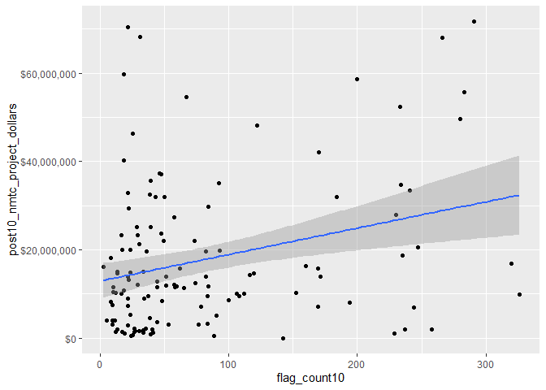<!-- -->

``` r
svi_divisional_county_nmtc_projects2 %>% 
  filter(cluster == 2) %>%
  select(flag_count10,post10_nmtc_project_dollars) %>%
  cor(method = "pearson")
```

    ##                             flag_count10 post10_nmtc_project_dollars
    ## flag_count10                    1.000000                    0.289368
    ## post10_nmtc_project_dollars     0.289368                    1.000000

``` r
svi_divisional_county_nmtc_projects2 %>% 
  filter(cluster == 2) %>%
  select(county_name, flag_count10, post10_nmtc_dollars_formatted) %>% kbl() %>% kable_styling() %>% scroll_box(width = "100%")
```

<div style="border: 1px solid #ddd; padding: 5px; overflow-x: scroll; width:100%; ">

<table class="table" style="margin-left: auto; margin-right: auto;">
<thead>
<tr>
<th style="text-align:left;">
county_name
</th>
<th style="text-align:right;">
flag_count10
</th>
<th style="text-align:left;">
post10_nmtc_dollars_formatted
</th>
</tr>
</thead>
<tbody>
<tr>
<td style="text-align:left;">
New Castle County, DE
</td>
<td style="text-align:right;">
230
</td>
<td style="text-align:left;">
\$27,912,271
</td>
</tr>
<tr>
<td style="text-align:left;">
Alachua County, FL
</td>
<td style="text-align:right;">
160
</td>
<td style="text-align:left;">
\$16,360,000
</td>
</tr>
<tr>
<td style="text-align:left;">
Brevard County, FL
</td>
<td style="text-align:right;">
169
</td>
<td style="text-align:left;">
\$7,027,000
</td>
</tr>
<tr>
<td style="text-align:left;">
Clay County, FL
</td>
<td style="text-align:right;">
34
</td>
<td style="text-align:left;">
\$8,941,080
</td>
</tr>
<tr>
<td style="text-align:left;">
Collier County, FL
</td>
<td style="text-align:right;">
169
</td>
<td style="text-align:left;">
\$15,775,000
</td>
</tr>
<tr>
<td style="text-align:left;">
Escambia County, FL
</td>
<td style="text-align:right;">
194
</td>
<td style="text-align:left;">
\$8,071,834
</td>
</tr>
<tr>
<td style="text-align:left;">
Glades County, FL
</td>
<td style="text-align:right;">
16
</td>
<td style="text-align:left;">
\$10,000,000
</td>
</tr>
<tr>
<td style="text-align:left;">
Hendry County, FL
</td>
<td style="text-align:right;">
37
</td>
<td style="text-align:left;">
\$9,500,000
</td>
</tr>
<tr>
<td style="text-align:left;">
Highlands County, FL
</td>
<td style="text-align:right;">
106
</td>
<td style="text-align:left;">
\$9,997,500
</td>
</tr>
<tr>
<td style="text-align:left;">
Holmes County, FL
</td>
<td style="text-align:right;">
17
</td>
<td style="text-align:left;">
\$1,400,000
</td>
</tr>
<tr>
<td style="text-align:left;">
Lake County, FL
</td>
<td style="text-align:right;">
116
</td>
<td style="text-align:left;">
\$14,340,000
</td>
</tr>
<tr>
<td style="text-align:left;">
Leon County, FL
</td>
<td style="text-align:right;">
184
</td>
<td style="text-align:left;">
\$31,875,000
</td>
</tr>
<tr>
<td style="text-align:left;">
Manatee County, FL
</td>
<td style="text-align:right;">
171
</td>
<td style="text-align:left;">
\$13,927,500
</td>
</tr>
<tr>
<td style="text-align:left;">
Okaloosa County, FL
</td>
<td style="text-align:right;">
19
</td>
<td style="text-align:left;">
\$1,000,000
</td>
</tr>
<tr>
<td style="text-align:left;">
Pasco County, FL
</td>
<td style="text-align:right;">
326
</td>
<td style="text-align:left;">
\$9,800,000
</td>
</tr>
<tr>
<td style="text-align:left;">
Santa Rosa County, FL
</td>
<td style="text-align:right;">
21
</td>
<td style="text-align:left;">
\$2,884,750
</td>
</tr>
<tr>
<td style="text-align:left;">
Seminole County, FL
</td>
<td style="text-align:right;">
88
</td>
<td style="text-align:left;">
\$500,000
</td>
</tr>
<tr>
<td style="text-align:left;">
Taylor County, FL
</td>
<td style="text-align:right;">
21
</td>
<td style="text-align:left;">
\$32,880,000
</td>
</tr>
<tr>
<td style="text-align:left;">
Volusia County, FL
</td>
<td style="text-align:right;">
229
</td>
<td style="text-align:left;">
\$945,000
</td>
</tr>
<tr>
<td style="text-align:left;">
Washington County, FL
</td>
<td style="text-align:right;">
21
</td>
<td style="text-align:left;">
\$9,000,000
</td>
</tr>
<tr>
<td style="text-align:left;">
Baldwin County, GA
</td>
<td style="text-align:right;">
40
</td>
<td style="text-align:left;">
\$2,000,000
</td>
</tr>
<tr>
<td style="text-align:left;">
Bibb County, GA
</td>
<td style="text-align:right;">
237
</td>
<td style="text-align:left;">
\$2,000,000
</td>
</tr>
<tr>
<td style="text-align:left;">
Bulloch County, GA
</td>
<td style="text-align:right;">
47
</td>
<td style="text-align:left;">
\$23,635,000
</td>
</tr>
<tr>
<td style="text-align:left;">
Carroll County, GA
</td>
<td style="text-align:right;">
59
</td>
<td style="text-align:left;">
\$11,700,000
</td>
</tr>
<tr>
<td style="text-align:left;">
Chatham County, GA
</td>
<td style="text-align:right;">
235
</td>
<td style="text-align:left;">
\$18,663,750
</td>
</tr>
<tr>
<td style="text-align:left;">
Clarke County, GA
</td>
<td style="text-align:right;">
122
</td>
<td style="text-align:left;">
\$48,125,000
</td>
</tr>
<tr>
<td style="text-align:left;">
Clayton County, GA
</td>
<td style="text-align:right;">
283
</td>
<td style="text-align:left;">
\$55,708,000
</td>
</tr>
<tr>
<td style="text-align:left;">
Coffee County, GA
</td>
<td style="text-align:right;">
46
</td>
<td style="text-align:left;">
\$37,260,000
</td>
</tr>
<tr>
<td style="text-align:left;">
Colquitt County, GA
</td>
<td style="text-align:right;">
58
</td>
<td style="text-align:left;">
\$11,682,000
</td>
</tr>
<tr>
<td style="text-align:left;">
Decatur County, GA
</td>
<td style="text-align:right;">
31
</td>
<td style="text-align:left;">
\$68,230,000
</td>
</tr>
<tr>
<td style="text-align:left;">
Echols County, GA
</td>
<td style="text-align:right;">
17
</td>
<td style="text-align:left;">
\$20,000,000
</td>
</tr>
<tr>
<td style="text-align:left;">
Emanuel County, GA
</td>
<td style="text-align:right;">
30
</td>
<td style="text-align:left;">
\$1,660,000
</td>
</tr>
<tr>
<td style="text-align:left;">
Franklin County, GA
</td>
<td style="text-align:right;">
18
</td>
<td style="text-align:left;">
\$59,786,701
</td>
</tr>
<tr>
<td style="text-align:left;">
Glynn County, GA
</td>
<td style="text-align:right;">
51
</td>
<td style="text-align:left;">
\$13,823,750
</td>
</tr>
<tr>
<td style="text-align:left;">
Gordon County, GA
</td>
<td style="text-align:right;">
21
</td>
<td style="text-align:left;">
\$70,484,594
</td>
</tr>
<tr>
<td style="text-align:left;">
Gwinnett County, GA
</td>
<td style="text-align:right;">
320
</td>
<td style="text-align:left;">
\$16,890,000
</td>
</tr>
<tr>
<td style="text-align:left;">
Irwin County, GA
</td>
<td style="text-align:right;">
12
</td>
<td style="text-align:left;">
\$1,391,250
</td>
</tr>
<tr>
<td style="text-align:left;">
Jeff Davis County, GA
</td>
<td style="text-align:right;">
13
</td>
<td style="text-align:left;">
\$14,613,500
</td>
</tr>
<tr>
<td style="text-align:left;">
Muscogee County, GA
</td>
<td style="text-align:right;">
244
</td>
<td style="text-align:left;">
\$6,825,000
</td>
</tr>
<tr>
<td style="text-align:left;">
Peach County, GA
</td>
<td style="text-align:right;">
22
</td>
<td style="text-align:left;">
\$29,310,000
</td>
</tr>
<tr>
<td style="text-align:left;">
Rabun County, GA
</td>
<td style="text-align:right;">
21
</td>
<td style="text-align:left;">
\$7,350,000
</td>
</tr>
<tr>
<td style="text-align:left;">
Richmond County, GA
</td>
<td style="text-align:right;">
234
</td>
<td style="text-align:left;">
\$34,750,000
</td>
</tr>
<tr>
<td style="text-align:left;">
Screven County, GA
</td>
<td style="text-align:right;">
23
</td>
<td style="text-align:left;">
\$14,920,000
</td>
</tr>
<tr>
<td style="text-align:left;">
Spalding County, GA
</td>
<td style="text-align:right;">
48
</td>
<td style="text-align:left;">
\$8,320,000
</td>
</tr>
<tr>
<td style="text-align:left;">
Telfair County, GA
</td>
<td style="text-align:right;">
21
</td>
<td style="text-align:left;">
\$14,000,000
</td>
</tr>
<tr>
<td style="text-align:left;">
Tift County, GA
</td>
<td style="text-align:right;">
43
</td>
<td style="text-align:left;">
\$31,950,000
</td>
</tr>
<tr>
<td style="text-align:left;">
Troup County, GA
</td>
<td style="text-align:right;">
58
</td>
<td style="text-align:left;">
\$11,520,000
</td>
</tr>
<tr>
<td style="text-align:left;">
Upson County, GA
</td>
<td style="text-align:right;">
18
</td>
<td style="text-align:left;">
\$40,210,000
</td>
</tr>
<tr>
<td style="text-align:left;">
Wilkinson County, GA
</td>
<td style="text-align:right;">
8
</td>
<td style="text-align:left;">
\$18,100,000
</td>
</tr>
<tr>
<td style="text-align:left;">
Talbot County, MD
</td>
<td style="text-align:right;">
9
</td>
<td style="text-align:left;">
\$7,550,000
</td>
</tr>
<tr>
<td style="text-align:left;">
Washington County, MD
</td>
<td style="text-align:right;">
78
</td>
<td style="text-align:left;">
\$7,075,600
</td>
</tr>
<tr>
<td style="text-align:left;">
Anson County, NC
</td>
<td style="text-align:right;">
33
</td>
<td style="text-align:left;">
\$15,000,000
</td>
</tr>
<tr>
<td style="text-align:left;">
Beaufort County, NC
</td>
<td style="text-align:right;">
25
</td>
<td style="text-align:left;">
\$582,500
</td>
</tr>
<tr>
<td style="text-align:left;">
Cabarrus County, NC
</td>
<td style="text-align:right;">
83
</td>
<td style="text-align:left;">
\$9,500,000
</td>
</tr>
<tr>
<td style="text-align:left;">
Chatham County, NC
</td>
<td style="text-align:right;">
26
</td>
<td style="text-align:left;">
\$1,381,291
</td>
</tr>
<tr>
<td style="text-align:left;">
Cleveland County, NC
</td>
<td style="text-align:right;">
44
</td>
<td style="text-align:left;">
\$11,600,000
</td>
</tr>
<tr>
<td style="text-align:left;">
Columbus County, NC
</td>
<td style="text-align:right;">
53
</td>
<td style="text-align:left;">
\$3,000,000
</td>
</tr>
<tr>
<td style="text-align:left;">
Duplin County, NC
</td>
<td style="text-align:right;">
74
</td>
<td style="text-align:left;">
\$12,460,000
</td>
</tr>
<tr>
<td style="text-align:left;">
Durham County, NC
</td>
<td style="text-align:right;">
200
</td>
<td style="text-align:left;">
\$58,719,117
</td>
</tr>
<tr>
<td style="text-align:left;">
Halifax County, NC
</td>
<td style="text-align:right;">
73
</td>
<td style="text-align:left;">
\$22,072,000
</td>
</tr>
<tr>
<td style="text-align:left;">
Harnett County, NC
</td>
<td style="text-align:right;">
84
</td>
<td style="text-align:left;">
\$29,800,000
</td>
</tr>
<tr>
<td style="text-align:left;">
Hertford County, NC
</td>
<td style="text-align:right;">
26
</td>
<td style="text-align:left;">
\$2,060,000
</td>
</tr>
<tr>
<td style="text-align:left;">
Johnston County, NC
</td>
<td style="text-align:right;">
83
</td>
<td style="text-align:left;">
\$3,249,239
</td>
</tr>
<tr>
<td style="text-align:left;">
Jones County, NC
</td>
<td style="text-align:right;">
13
</td>
<td style="text-align:left;">
\$15,100,000
</td>
</tr>
<tr>
<td style="text-align:left;">
Lenoir County, NC
</td>
<td style="text-align:right;">
65
</td>
<td style="text-align:left;">
\$11,270,000
</td>
</tr>
<tr>
<td style="text-align:left;">
Mitchell County, NC
</td>
<td style="text-align:right;">
12
</td>
<td style="text-align:left;">
\$10,185,000
</td>
</tr>
<tr>
<td style="text-align:left;">
Montgomery County, NC
</td>
<td style="text-align:right;">
38
</td>
<td style="text-align:left;">
\$32,576,600
</td>
</tr>
<tr>
<td style="text-align:left;">
New Hanover County, NC
</td>
<td style="text-align:right;">
93
</td>
<td style="text-align:left;">
\$19,886,415
</td>
</tr>
<tr>
<td style="text-align:left;">
Northampton County, NC
</td>
<td style="text-align:right;">
30
</td>
<td style="text-align:left;">
\$21,264,000
</td>
</tr>
<tr>
<td style="text-align:left;">
Robeson County, NC
</td>
<td style="text-align:right;">
233
</td>
<td style="text-align:left;">
\$52,367,992
</td>
</tr>
<tr>
<td style="text-align:left;">
Rutherford County, NC
</td>
<td style="text-align:right;">
41
</td>
<td style="text-align:left;">
\$1,240,101
</td>
</tr>
<tr>
<td style="text-align:left;">
Sampson County, NC
</td>
<td style="text-align:right;">
57
</td>
<td style="text-align:left;">
\$12,000,000
</td>
</tr>
<tr>
<td style="text-align:left;">
Vance County, NC
</td>
<td style="text-align:right;">
44
</td>
<td style="text-align:left;">
\$3,638,400
</td>
</tr>
<tr>
<td style="text-align:left;">
Wake County, NC
</td>
<td style="text-align:right;">
280
</td>
<td style="text-align:left;">
\$49,684,621
</td>
</tr>
<tr>
<td style="text-align:left;">
Warren County, NC
</td>
<td style="text-align:right;">
33
</td>
<td style="text-align:left;">
\$1,750,000
</td>
</tr>
<tr>
<td style="text-align:left;">
Wayne County, NC
</td>
<td style="text-align:right;">
100
</td>
<td style="text-align:left;">
\$8,650,000
</td>
</tr>
<tr>
<td style="text-align:left;">
Wilkes County, NC
</td>
<td style="text-align:right;">
62
</td>
<td style="text-align:left;">
\$15,757,000
</td>
</tr>
<tr>
<td style="text-align:left;">
Wilson County, NC
</td>
<td style="text-align:right;">
76
</td>
<td style="text-align:left;">
\$3,000,000
</td>
</tr>
<tr>
<td style="text-align:left;">
Allendale County, SC
</td>
<td style="text-align:right;">
25
</td>
<td style="text-align:left;">
\$46,260,000
</td>
</tr>
<tr>
<td style="text-align:left;">
Charleston County, SC
</td>
<td style="text-align:right;">
241
</td>
<td style="text-align:left;">
\$33,400,000
</td>
</tr>
<tr>
<td style="text-align:left;">
Cherokee County, SC
</td>
<td style="text-align:right;">
49
</td>
<td style="text-align:left;">
\$22,069,493
</td>
</tr>
<tr>
<td style="text-align:left;">
Colleton County, SC
</td>
<td style="text-align:right;">
44
</td>
<td style="text-align:left;">
\$12,870,000
</td>
</tr>
<tr>
<td style="text-align:left;">
Darlington County, SC
</td>
<td style="text-align:right;">
47
</td>
<td style="text-align:left;">
\$37,026,000
</td>
</tr>
<tr>
<td style="text-align:left;">
Fairfield County, SC
</td>
<td style="text-align:right;">
29
</td>
<td style="text-align:left;">
\$12,000,000
</td>
</tr>
<tr>
<td style="text-align:left;">
Florence County, SC
</td>
<td style="text-align:right;">
119
</td>
<td style="text-align:left;">
\$14,700,000
</td>
</tr>
<tr>
<td style="text-align:left;">
Georgetown County, SC
</td>
<td style="text-align:right;">
57
</td>
<td style="text-align:left;">
\$27,403,451
</td>
</tr>
<tr>
<td style="text-align:left;">
Greenville County, SC
</td>
<td style="text-align:right;">
266
</td>
<td style="text-align:left;">
\$68,000,000
</td>
</tr>
<tr>
<td style="text-align:left;">
Horry County, SC
</td>
<td style="text-align:right;">
142
</td>
<td style="text-align:left;">
\$6,235
</td>
</tr>
<tr>
<td style="text-align:left;">
Jasper County, SC
</td>
<td style="text-align:right;">
23
</td>
<td style="text-align:left;">
\$5,280,000
</td>
</tr>
<tr>
<td style="text-align:left;">
Marlboro County, SC
</td>
<td style="text-align:right;">
50
</td>
<td style="text-align:left;">
\$31,950,000
</td>
</tr>
<tr>
<td style="text-align:left;">
Newberry County, SC
</td>
<td style="text-align:right;">
28
</td>
<td style="text-align:left;">
\$25,200,000
</td>
</tr>
<tr>
<td style="text-align:left;">
Oconee County, SC
</td>
<td style="text-align:right;">
29
</td>
<td style="text-align:left;">
\$23,220,000
</td>
</tr>
<tr>
<td style="text-align:left;">
Orangeburg County, SC
</td>
<td style="text-align:right;">
112
</td>
<td style="text-align:left;">
\$10,051,000
</td>
</tr>
<tr>
<td style="text-align:left;">
Pickens County, SC
</td>
<td style="text-align:right;">
51
</td>
<td style="text-align:left;">
\$11,800,000
</td>
</tr>
<tr>
<td style="text-align:left;">
Richland County, SC
</td>
<td style="text-align:right;">
247
</td>
<td style="text-align:left;">
\$20,500,000
</td>
</tr>
<tr>
<td style="text-align:left;">
Spartanburg County, SC
</td>
<td style="text-align:right;">
170
</td>
<td style="text-align:left;">
\$42,080,000
</td>
</tr>
<tr>
<td style="text-align:left;">
Sumter County, SC
</td>
<td style="text-align:right;">
92
</td>
<td style="text-align:left;">
\$35,060,000
</td>
</tr>
<tr>
<td style="text-align:left;">
Williamsburg County, SC
</td>
<td style="text-align:right;">
82
</td>
<td style="text-align:left;">
\$14,000,000
</td>
</tr>
<tr>
<td style="text-align:left;">
York County, SC
</td>
<td style="text-align:right;">
90
</td>
<td style="text-align:left;">
\$5,000,000
</td>
</tr>
<tr>
<td style="text-align:left;">
Alleghany County, VA
</td>
<td style="text-align:right;">
10
</td>
<td style="text-align:left;">
\$10,478,000
</td>
</tr>
<tr>
<td style="text-align:left;">
Bath County, VA
</td>
<td style="text-align:right;">
2
</td>
<td style="text-align:left;">
\$16,155,350
</td>
</tr>
<tr>
<td style="text-align:left;">
Bristol city, VA
</td>
<td style="text-align:right;">
23
</td>
<td style="text-align:left;">
\$19,982,000
</td>
</tr>
<tr>
<td style="text-align:left;">
Brunswick County, VA
</td>
<td style="text-align:right;">
22
</td>
<td style="text-align:left;">
\$13,095,000
</td>
</tr>
<tr>
<td style="text-align:left;">
Buchanan County, VA
</td>
<td style="text-align:right;">
39
</td>
<td style="text-align:left;">
\$35,640,000
</td>
</tr>
<tr>
<td style="text-align:left;">
Charlottesville city, VA
</td>
<td style="text-align:right;">
35
</td>
<td style="text-align:left;">
\$2,116,510
</td>
</tr>
<tr>
<td style="text-align:left;">
Culpeper County, VA
</td>
<td style="text-align:right;">
10
</td>
<td style="text-align:left;">
\$11,504,473
</td>
</tr>
<tr>
<td style="text-align:left;">
Henry County, VA
</td>
<td style="text-align:right;">
67
</td>
<td style="text-align:left;">
\$54,630,000
</td>
</tr>
<tr>
<td style="text-align:left;">
Nelson County, VA
</td>
<td style="text-align:right;">
8
</td>
<td style="text-align:left;">
\$8,191,650
</td>
</tr>
<tr>
<td style="text-align:left;">
Newport News city, VA
</td>
<td style="text-align:right;">
152
</td>
<td style="text-align:left;">
\$10,249,514
</td>
</tr>
<tr>
<td style="text-align:left;">
Norfolk city, VA
</td>
<td style="text-align:right;">
258
</td>
<td style="text-align:left;">
\$2,000,000
</td>
</tr>
<tr>
<td style="text-align:left;">
Patrick County, VA
</td>
<td style="text-align:right;">
18
</td>
<td style="text-align:left;">
\$10,738,175
</td>
</tr>
<tr>
<td style="text-align:left;">
Petersburg city, VA
</td>
<td style="text-align:right;">
82
</td>
<td style="text-align:left;">
\$19,633,250
</td>
</tr>
<tr>
<td style="text-align:left;">
Portsmouth city, VA
</td>
<td style="text-align:right;">
108
</td>
<td style="text-align:left;">
\$9,500,000
</td>
</tr>
<tr>
<td style="text-align:left;">
Richmond city, VA
</td>
<td style="text-align:right;">
291
</td>
<td style="text-align:left;">
\$71,688,438
</td>
</tr>
<tr>
<td style="text-align:left;">
Smyth County, VA
</td>
<td style="text-align:right;">
39
</td>
<td style="text-align:left;">
\$25,088,000
</td>
</tr>
<tr>
<td style="text-align:left;">
Berkeley County, WV
</td>
<td style="text-align:right;">
13
</td>
<td style="text-align:left;">
\$2,000,000
</td>
</tr>
<tr>
<td style="text-align:left;">
Braxton County, WV
</td>
<td style="text-align:right;">
11
</td>
<td style="text-align:left;">
\$4,000,000
</td>
</tr>
<tr>
<td style="text-align:left;">
Fayette County, WV
</td>
<td style="text-align:right;">
38
</td>
<td style="text-align:left;">
\$4,600,000
</td>
</tr>
<tr>
<td style="text-align:left;">
Greenbrier County, WV
</td>
<td style="text-align:right;">
16
</td>
<td style="text-align:left;">
\$23,386,235
</td>
</tr>
<tr>
<td style="text-align:left;">
Harrison County, WV
</td>
<td style="text-align:right;">
36
</td>
<td style="text-align:left;">
\$19,700,000
</td>
</tr>
<tr>
<td style="text-align:left;">
Kanawha County, WV
</td>
<td style="text-align:right;">
84
</td>
<td style="text-align:left;">
\$11,700,000
</td>
</tr>
<tr>
<td style="text-align:left;">
Marion County, WV
</td>
<td style="text-align:right;">
24
</td>
<td style="text-align:left;">
\$500,000
</td>
</tr>
<tr>
<td style="text-align:left;">
Monongalia County, WV
</td>
<td style="text-align:right;">
33
</td>
<td style="text-align:left;">
\$1,250,000
</td>
</tr>
<tr>
<td style="text-align:left;">
Nicholas County, WV
</td>
<td style="text-align:right;">
9
</td>
<td style="text-align:left;">
\$4,000,000
</td>
</tr>
<tr>
<td style="text-align:left;">
Ohio County, WV
</td>
<td style="text-align:right;">
27
</td>
<td style="text-align:left;">
\$1,550,000
</td>
</tr>
<tr>
<td style="text-align:left;">
Upshur County, WV
</td>
<td style="text-align:right;">
9
</td>
<td style="text-align:left;">
\$3,120,000
</td>
</tr>
<tr>
<td style="text-align:left;">
Wetzel County, WV
</td>
<td style="text-align:right;">
5
</td>
<td style="text-align:left;">
\$4,000,000
</td>
</tr>
<tr>
<td style="text-align:left;">
Wood County, WV
</td>
<td style="text-align:right;">
39
</td>
<td style="text-align:left;">
\$800,000
</td>
</tr>
</tbody>
</table>

</div>

Looking at our second cluster, which contains the majority of our
instances, we can see that there is still no strong coorelation.

``` r
# Cluster 2 Scatterplot
# y is our independent variable (NMTC Project Dollars),  
# x is our dependent variable (SVI flag count)

svi_divisional_county_nmtc_projects2 %>% 
  filter(cluster == 3) %>%
  ggplot2::ggplot(aes(x=flag_count10,
                    y=post10_nmtc_project_dollars)) +
        geom_point() +
        geom_smooth(method="lm") +
        scale_y_continuous(labels = scales::dollar_format()) 
```

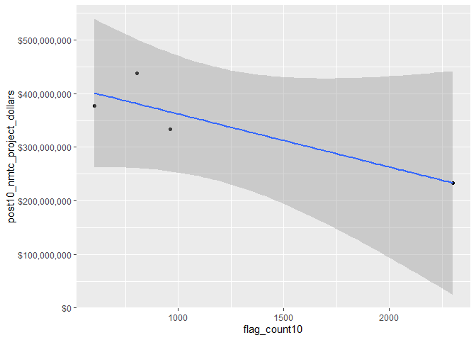<!-- -->

``` r
svi_divisional_county_nmtc_projects2 %>% 
  filter(cluster == 3) %>%
  select(flag_count10,post10_nmtc_project_dollars) %>%
  cor(method = "pearson")
```

    ##                             flag_count10 post10_nmtc_project_dollars
    ## flag_count10                   1.0000000                  -0.8845317
    ## post10_nmtc_project_dollars   -0.8845317                   1.0000000

``` r
svi_divisional_county_nmtc_projects2 %>% 
  filter(cluster == 3) %>%
  select(county_name, flag_count10, post10_nmtc_dollars_formatted) %>% kbl() %>% kable_styling() %>% scroll_box(width = "100%")
```

<div style="border: 1px solid #ddd; padding: 5px; overflow-x: scroll; width:100%; ">

<table class="table" style="margin-left: auto; margin-right: auto;">
<thead>
<tr>
<th style="text-align:left;">
county_name
</th>
<th style="text-align:right;">
flag_count10
</th>
<th style="text-align:left;">
post10_nmtc_dollars_formatted
</th>
</tr>
</thead>
<tbody>
<tr>
<td style="text-align:left;">
District of Columbia, DC
</td>
<td style="text-align:right;">
605
</td>
<td style="text-align:left;">
\$377,155,570
</td>
</tr>
<tr>
<td style="text-align:left;">
Miami-Dade County, FL
</td>
<td style="text-align:right;">
2301
</td>
<td style="text-align:left;">
\$233,661,603
</td>
</tr>
<tr>
<td style="text-align:left;">
Fulton County, GA
</td>
<td style="text-align:right;">
805
</td>
<td style="text-align:left;">
\$437,737,000
</td>
</tr>
<tr>
<td style="text-align:left;">
Baltimore city, MD
</td>
<td style="text-align:right;">
962
</td>
<td style="text-align:left;">
\$333,109,232
</td>
</tr>
</tbody>
</table>

</div>

Finally, when we look at our third cluster, which contains our most
extreme outliers, we can see that there is in fact a negative
coorelation.

``` r
divisional_county_sf <- svi_county_map2010 %>% select(COUNTYFP, STATEFP, geometry)

divisional_county_sf %>% head(5)
```

    ## Simple feature collection with 5 features and 2 fields
    ## Geometry type: MULTIPOLYGON
    ## Dimension:     XY
    ## Bounding box:  xmin: -85.38976 ymin: 30.19998 xmax: -75.04894 ymax: 39.83901
    ## Geodetic CRS:  NAD83
    ##   COUNTYFP STATEFP                       geometry
    ## 1      001      10 MULTIPOLYGON (((-75.7601 39...
    ## 2      003      10 MULTIPOLYGON (((-75.5655 39...
    ## 3      005      10 MULTIPOLYGON (((-75.69878 3...
    ## 4      001      11 MULTIPOLYGON (((-76.95772 3...
    ## 5      013      12 MULTIPOLYGON (((-85.02994 3...

Bivariate Mapping

``` r
# Join our NMTC projects data with our shapefile geocoordinates
svi_divisional_county_nmtc_sf <- left_join(svi_divisional_county_nmtc_projects, divisional_county_sf, join_by("FIPS_st" == "STATEFP", "FIPS_county" == "COUNTYFP"))

svi_divisional_county_nmtc_sf %>% head(5) %>% kbl() %>% kable_styling() %>% scroll_box(width = "100%")
```

<div style="border: 1px solid #ddd; padding: 5px; overflow-x: scroll; width:100%; ">

<table class="table" style="margin-left: auto; margin-right: auto;">
<thead>
<tr>
<th style="text-align:left;">
State
</th>
<th style="text-align:left;">
County
</th>
<th style="text-align:left;">
Division
</th>
<th style="text-align:right;">
post10_nmtc_project_cnt
</th>
<th style="text-align:right;">
tract_cnt
</th>
<th style="text-align:right;">
post10_nmtc_project_dollars
</th>
<th style="text-align:left;">
post10_nmtc_dollars_formatted
</th>
<th style="text-align:left;">
fips_county_st
</th>
<th style="text-align:left;">
FIPS_st
</th>
<th style="text-align:left;">
FIPS_county
</th>
<th style="text-align:left;">
state_name
</th>
<th style="text-align:right;">
region_number
</th>
<th style="text-align:left;">
region
</th>
<th style="text-align:right;">
division_number
</th>
<th style="text-align:right;">
flag_count10
</th>
<th style="text-align:right;">
pop10
</th>
<th style="text-align:right;">
flag_by_pop10
</th>
<th style="text-align:right;">
flag_count_quantile10
</th>
<th style="text-align:right;">
flag_pop_quantile10
</th>
<th style="text-align:right;">
flag_count20
</th>
<th style="text-align:right;">
pop20
</th>
<th style="text-align:right;">
flag_by_pop20
</th>
<th style="text-align:right;">
flag_count_quantile20
</th>
<th style="text-align:right;">
flag_pop_quantile20
</th>
<th style="text-align:left;">
county_name
</th>
<th style="text-align:left;">
geometry
</th>
</tr>
</thead>
<tbody>
<tr>
<td style="text-align:left;">
DC
</td>
<td style="text-align:left;">
District of Columbia
</td>
<td style="text-align:left;">
South Atlantic Division
</td>
<td style="text-align:right;">
22
</td>
<td style="text-align:right;">
78
</td>
<td style="text-align:right;">
377155570
</td>
<td style="text-align:left;">
\$377,155,570
</td>
<td style="text-align:left;">
11001
</td>
<td style="text-align:left;">
11
</td>
<td style="text-align:left;">
001
</td>
<td style="text-align:left;">
District of Columbia
</td>
<td style="text-align:right;">
3
</td>
<td style="text-align:left;">
South Region
</td>
<td style="text-align:right;">
5
</td>
<td style="text-align:right;">
605
</td>
<td style="text-align:right;">
234370
</td>
<td style="text-align:right;">
0.0025814
</td>
<td style="text-align:right;">
1
</td>
<td style="text-align:right;">
1.0
</td>
<td style="text-align:right;">
576
</td>
<td style="text-align:right;">
290905
</td>
<td style="text-align:right;">
0.0019800
</td>
<td style="text-align:right;">
1
</td>
<td style="text-align:right;">
1.0
</td>
<td style="text-align:left;">
District of Columbia, DC
</td>
<td style="text-align:left;">
MULTIPOLYGON (((-76.95772 3…
</td>
</tr>
<tr>
<td style="text-align:left;">
DE
</td>
<td style="text-align:left;">
New Castle County
</td>
<td style="text-align:left;">
South Atlantic Division
</td>
<td style="text-align:right;">
2
</td>
<td style="text-align:right;">
44
</td>
<td style="text-align:right;">
27912271
</td>
<td style="text-align:left;">
\$27,912,271
</td>
<td style="text-align:left;">
10003
</td>
<td style="text-align:left;">
10
</td>
<td style="text-align:left;">
003
</td>
<td style="text-align:left;">
Delaware
</td>
<td style="text-align:right;">
3
</td>
<td style="text-align:left;">
South Region
</td>
<td style="text-align:right;">
5
</td>
<td style="text-align:right;">
230
</td>
<td style="text-align:right;">
157982
</td>
<td style="text-align:right;">
0.0014559
</td>
<td style="text-align:right;">
1
</td>
<td style="text-align:right;">
0.8
</td>
<td style="text-align:right;">
215
</td>
<td style="text-align:right;">
157528
</td>
<td style="text-align:right;">
0.0013648
</td>
<td style="text-align:right;">
1
</td>
<td style="text-align:right;">
0.8
</td>
<td style="text-align:left;">
New Castle County, DE
</td>
<td style="text-align:left;">
MULTIPOLYGON (((-75.5655 39…
</td>
</tr>
<tr>
<td style="text-align:left;">
FL
</td>
<td style="text-align:left;">
Alachua County
</td>
<td style="text-align:left;">
South Atlantic Division
</td>
<td style="text-align:right;">
2
</td>
<td style="text-align:right;">
28
</td>
<td style="text-align:right;">
16360000
</td>
<td style="text-align:left;">
\$16,360,000
</td>
<td style="text-align:left;">
12001
</td>
<td style="text-align:left;">
12
</td>
<td style="text-align:left;">
001
</td>
<td style="text-align:left;">
Florida
</td>
<td style="text-align:right;">
3
</td>
<td style="text-align:left;">
South Region
</td>
<td style="text-align:right;">
5
</td>
<td style="text-align:right;">
160
</td>
<td style="text-align:right;">
107400
</td>
<td style="text-align:right;">
0.0014898
</td>
<td style="text-align:right;">
1
</td>
<td style="text-align:right;">
0.8
</td>
<td style="text-align:right;">
156
</td>
<td style="text-align:right;">
115817
</td>
<td style="text-align:right;">
0.0013470
</td>
<td style="text-align:right;">
1
</td>
<td style="text-align:right;">
0.8
</td>
<td style="text-align:left;">
Alachua County, FL
</td>
<td style="text-align:left;">
MULTIPOLYGON (((-82.24401 2…
</td>
</tr>
<tr>
<td style="text-align:left;">
FL
</td>
<td style="text-align:left;">
Brevard County
</td>
<td style="text-align:left;">
South Atlantic Division
</td>
<td style="text-align:right;">
1
</td>
<td style="text-align:right;">
37
</td>
<td style="text-align:right;">
7027000
</td>
<td style="text-align:left;">
\$7,027,000
</td>
<td style="text-align:left;">
12009
</td>
<td style="text-align:left;">
12
</td>
<td style="text-align:left;">
009
</td>
<td style="text-align:left;">
Florida
</td>
<td style="text-align:right;">
3
</td>
<td style="text-align:left;">
South Region
</td>
<td style="text-align:right;">
5
</td>
<td style="text-align:right;">
169
</td>
<td style="text-align:right;">
171842
</td>
<td style="text-align:right;">
0.0009835
</td>
<td style="text-align:right;">
1
</td>
<td style="text-align:right;">
0.4
</td>
<td style="text-align:right;">
166
</td>
<td style="text-align:right;">
185164
</td>
<td style="text-align:right;">
0.0008965
</td>
<td style="text-align:right;">
1
</td>
<td style="text-align:right;">
0.4
</td>
<td style="text-align:left;">
Brevard County, FL
</td>
<td style="text-align:left;">
MULTIPOLYGON (((-80.57159 2…
</td>
</tr>
<tr>
<td style="text-align:left;">
FL
</td>
<td style="text-align:left;">
Broward County
</td>
<td style="text-align:left;">
South Atlantic Division
</td>
<td style="text-align:right;">
7
</td>
<td style="text-align:right;">
119
</td>
<td style="text-align:right;">
48975143
</td>
<td style="text-align:left;">
\$48,975,143
</td>
<td style="text-align:left;">
12011
</td>
<td style="text-align:left;">
12
</td>
<td style="text-align:left;">
011
</td>
<td style="text-align:left;">
Florida
</td>
<td style="text-align:right;">
3
</td>
<td style="text-align:left;">
South Region
</td>
<td style="text-align:right;">
5
</td>
<td style="text-align:right;">
993
</td>
<td style="text-align:right;">
571520
</td>
<td style="text-align:right;">
0.0017375
</td>
<td style="text-align:right;">
1
</td>
<td style="text-align:right;">
1.0
</td>
<td style="text-align:right;">
1027
</td>
<td style="text-align:right;">
648697
</td>
<td style="text-align:right;">
0.0015832
</td>
<td style="text-align:right;">
1
</td>
<td style="text-align:right;">
0.8
</td>
<td style="text-align:left;">
Broward County, FL
</td>
<td style="text-align:left;">
MULTIPOLYGON (((-80.08484 2…
</td>
</tr>
</tbody>
</table>

</div>

``` r
# Create classes for bivariate mapping 
svi_divisional_county_nmtc_sf <- bi_class(svi_divisional_county_nmtc_sf, x = flag_count10, y = post10_nmtc_project_dollars, style = "quantile", dim = 3)

# View data
svi_divisional_county_nmtc_sf %>% head(5) %>% kbl() %>% kable_styling() %>% scroll_box(width = "100%")
```

<div style="border: 1px solid #ddd; padding: 5px; overflow-x: scroll; width:100%; ">

<table class="table" style="margin-left: auto; margin-right: auto;">
<thead>
<tr>
<th style="text-align:left;">
State
</th>
<th style="text-align:left;">
County
</th>
<th style="text-align:left;">
Division
</th>
<th style="text-align:right;">
post10_nmtc_project_cnt
</th>
<th style="text-align:right;">
tract_cnt
</th>
<th style="text-align:right;">
post10_nmtc_project_dollars
</th>
<th style="text-align:left;">
post10_nmtc_dollars_formatted
</th>
<th style="text-align:left;">
fips_county_st
</th>
<th style="text-align:left;">
FIPS_st
</th>
<th style="text-align:left;">
FIPS_county
</th>
<th style="text-align:left;">
state_name
</th>
<th style="text-align:right;">
region_number
</th>
<th style="text-align:left;">
region
</th>
<th style="text-align:right;">
division_number
</th>
<th style="text-align:right;">
flag_count10
</th>
<th style="text-align:right;">
pop10
</th>
<th style="text-align:right;">
flag_by_pop10
</th>
<th style="text-align:right;">
flag_count_quantile10
</th>
<th style="text-align:right;">
flag_pop_quantile10
</th>
<th style="text-align:right;">
flag_count20
</th>
<th style="text-align:right;">
pop20
</th>
<th style="text-align:right;">
flag_by_pop20
</th>
<th style="text-align:right;">
flag_count_quantile20
</th>
<th style="text-align:right;">
flag_pop_quantile20
</th>
<th style="text-align:left;">
county_name
</th>
<th style="text-align:left;">
geometry
</th>
<th style="text-align:left;">
bi_class
</th>
</tr>
</thead>
<tbody>
<tr>
<td style="text-align:left;">
DC
</td>
<td style="text-align:left;">
District of Columbia
</td>
<td style="text-align:left;">
South Atlantic Division
</td>
<td style="text-align:right;">
22
</td>
<td style="text-align:right;">
78
</td>
<td style="text-align:right;">
377155570
</td>
<td style="text-align:left;">
\$377,155,570
</td>
<td style="text-align:left;">
11001
</td>
<td style="text-align:left;">
11
</td>
<td style="text-align:left;">
001
</td>
<td style="text-align:left;">
District of Columbia
</td>
<td style="text-align:right;">
3
</td>
<td style="text-align:left;">
South Region
</td>
<td style="text-align:right;">
5
</td>
<td style="text-align:right;">
605
</td>
<td style="text-align:right;">
234370
</td>
<td style="text-align:right;">
0.0025814
</td>
<td style="text-align:right;">
1
</td>
<td style="text-align:right;">
1.0
</td>
<td style="text-align:right;">
576
</td>
<td style="text-align:right;">
290905
</td>
<td style="text-align:right;">
0.0019800
</td>
<td style="text-align:right;">
1
</td>
<td style="text-align:right;">
1.0
</td>
<td style="text-align:left;">
District of Columbia, DC
</td>
<td style="text-align:left;">
MULTIPOLYGON (((-76.95772 3…
</td>
<td style="text-align:left;">
3-3
</td>
</tr>
<tr>
<td style="text-align:left;">
DE
</td>
<td style="text-align:left;">
New Castle County
</td>
<td style="text-align:left;">
South Atlantic Division
</td>
<td style="text-align:right;">
2
</td>
<td style="text-align:right;">
44
</td>
<td style="text-align:right;">
27912271
</td>
<td style="text-align:left;">
\$27,912,271
</td>
<td style="text-align:left;">
10003
</td>
<td style="text-align:left;">
10
</td>
<td style="text-align:left;">
003
</td>
<td style="text-align:left;">
Delaware
</td>
<td style="text-align:right;">
3
</td>
<td style="text-align:left;">
South Region
</td>
<td style="text-align:right;">
5
</td>
<td style="text-align:right;">
230
</td>
<td style="text-align:right;">
157982
</td>
<td style="text-align:right;">
0.0014559
</td>
<td style="text-align:right;">
1
</td>
<td style="text-align:right;">
0.8
</td>
<td style="text-align:right;">
215
</td>
<td style="text-align:right;">
157528
</td>
<td style="text-align:right;">
0.0013648
</td>
<td style="text-align:right;">
1
</td>
<td style="text-align:right;">
0.8
</td>
<td style="text-align:left;">
New Castle County, DE
</td>
<td style="text-align:left;">
MULTIPOLYGON (((-75.5655 39…
</td>
<td style="text-align:left;">
3-3
</td>
</tr>
<tr>
<td style="text-align:left;">
FL
</td>
<td style="text-align:left;">
Alachua County
</td>
<td style="text-align:left;">
South Atlantic Division
</td>
<td style="text-align:right;">
2
</td>
<td style="text-align:right;">
28
</td>
<td style="text-align:right;">
16360000
</td>
<td style="text-align:left;">
\$16,360,000
</td>
<td style="text-align:left;">
12001
</td>
<td style="text-align:left;">
12
</td>
<td style="text-align:left;">
001
</td>
<td style="text-align:left;">
Florida
</td>
<td style="text-align:right;">
3
</td>
<td style="text-align:left;">
South Region
</td>
<td style="text-align:right;">
5
</td>
<td style="text-align:right;">
160
</td>
<td style="text-align:right;">
107400
</td>
<td style="text-align:right;">
0.0014898
</td>
<td style="text-align:right;">
1
</td>
<td style="text-align:right;">
0.8
</td>
<td style="text-align:right;">
156
</td>
<td style="text-align:right;">
115817
</td>
<td style="text-align:right;">
0.0013470
</td>
<td style="text-align:right;">
1
</td>
<td style="text-align:right;">
0.8
</td>
<td style="text-align:left;">
Alachua County, FL
</td>
<td style="text-align:left;">
MULTIPOLYGON (((-82.24401 2…
</td>
<td style="text-align:left;">
3-2
</td>
</tr>
<tr>
<td style="text-align:left;">
FL
</td>
<td style="text-align:left;">
Brevard County
</td>
<td style="text-align:left;">
South Atlantic Division
</td>
<td style="text-align:right;">
1
</td>
<td style="text-align:right;">
37
</td>
<td style="text-align:right;">
7027000
</td>
<td style="text-align:left;">
\$7,027,000
</td>
<td style="text-align:left;">
12009
</td>
<td style="text-align:left;">
12
</td>
<td style="text-align:left;">
009
</td>
<td style="text-align:left;">
Florida
</td>
<td style="text-align:right;">
3
</td>
<td style="text-align:left;">
South Region
</td>
<td style="text-align:right;">
5
</td>
<td style="text-align:right;">
169
</td>
<td style="text-align:right;">
171842
</td>
<td style="text-align:right;">
0.0009835
</td>
<td style="text-align:right;">
1
</td>
<td style="text-align:right;">
0.4
</td>
<td style="text-align:right;">
166
</td>
<td style="text-align:right;">
185164
</td>
<td style="text-align:right;">
0.0008965
</td>
<td style="text-align:right;">
1
</td>
<td style="text-align:right;">
0.4
</td>
<td style="text-align:left;">
Brevard County, FL
</td>
<td style="text-align:left;">
MULTIPOLYGON (((-80.57159 2…
</td>
<td style="text-align:left;">
3-1
</td>
</tr>
<tr>
<td style="text-align:left;">
FL
</td>
<td style="text-align:left;">
Broward County
</td>
<td style="text-align:left;">
South Atlantic Division
</td>
<td style="text-align:right;">
7
</td>
<td style="text-align:right;">
119
</td>
<td style="text-align:right;">
48975143
</td>
<td style="text-align:left;">
\$48,975,143
</td>
<td style="text-align:left;">
12011
</td>
<td style="text-align:left;">
12
</td>
<td style="text-align:left;">
011
</td>
<td style="text-align:left;">
Florida
</td>
<td style="text-align:right;">
3
</td>
<td style="text-align:left;">
South Region
</td>
<td style="text-align:right;">
5
</td>
<td style="text-align:right;">
993
</td>
<td style="text-align:right;">
571520
</td>
<td style="text-align:right;">
0.0017375
</td>
<td style="text-align:right;">
1
</td>
<td style="text-align:right;">
1.0
</td>
<td style="text-align:right;">
1027
</td>
<td style="text-align:right;">
648697
</td>
<td style="text-align:right;">
0.0015832
</td>
<td style="text-align:right;">
1
</td>
<td style="text-align:right;">
0.8
</td>
<td style="text-align:left;">
Broward County, FL
</td>
<td style="text-align:left;">
MULTIPOLYGON (((-80.08484 2…
</td>
<td style="text-align:left;">
3-3
</td>
</tr>
</tbody>
</table>

</div>

``` r
# Create map with ggplot
svi_divisional_county_nmtc_map <- ggplot() +
  # Map county shapefile, fill with bi_class categories
  geom_sf(data = svi_divisional_county_nmtc_sf, mapping = aes(geometry=geometry, fill = bi_class), color = "white", size = 0.1, show.legend = FALSE) +
  # Set to biscale palette
  bi_scale_fill(pal = "GrPink", dim = 3) +
  # Add state shapefiles for outline
  geom_sf(data=divisional_st_sf, color="black", fill=NA, linewidth=.5, aes(geometry=geometry)) +
  labs(
    title = paste0("Correlation of 2010 ", census_division, " SVI Flag Count \n and 2011 - 2020 NMTC Tax Dollars"),
  ) +
  # Set them to biscale
  bi_theme(base_size = 10)

# Create biscale legend
svi_divisional_county_nmtc_legend <- bi_legend(pal = "GrPink",
                    dim = 3,
                    xlab = "SVI Flag Count",
                    ylab = "NMTC Dollars",
                    size = 8)

# Combine map with legend using cowplot
svi_divisional_county_nmtc_bivarmap <- ggdraw() +
  draw_plot(svi_divisional_county_nmtc_map) +
  # Set legend location
  draw_plot(svi_divisional_county_nmtc_legend, x= -.02,  y = -.05,
 width=.20)


# View map
svi_divisional_county_nmtc_bivarmap
```

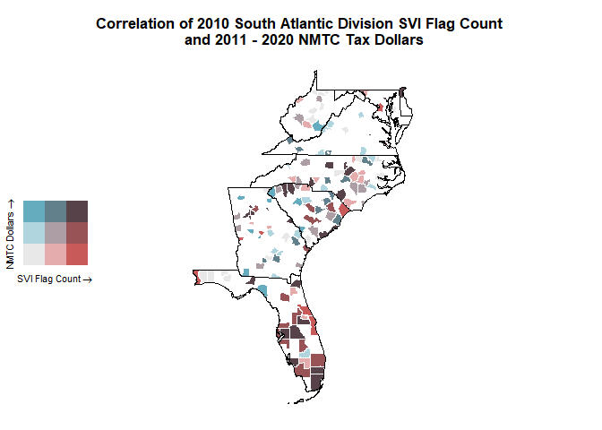<!-- -->

Here we can see the distribution of our counties with NMTC projects
based on correlation between 2010 SVI Flag Count and NMTC dollars for
the South Atlantic Division.

We can see that the majority of our high flag counts are in Florida,
with some moderate flag counts and higher NMTC spending between Georgia
and North Carolina.

``` r
svi_divisional_county_nmtc_sf %>% filter(State %in% c("FL", "GE", "NC")) %>% select(State, County, flag_count10, post10_nmtc_dollars_formatted) %>% arrange(desc(flag_count10)) %>% head(6) %>% kbl() %>% kable_styling() %>% scroll_box(width = "100%")
```

<div style="border: 1px solid #ddd; padding: 5px; overflow-x: scroll; width:100%; ">

<table class="table" style="margin-left: auto; margin-right: auto;">
<thead>
<tr>
<th style="text-align:left;">
State
</th>
<th style="text-align:left;">
County
</th>
<th style="text-align:right;">
flag_count10
</th>
<th style="text-align:left;">
post10_nmtc_dollars_formatted
</th>
</tr>
</thead>
<tbody>
<tr>
<td style="text-align:left;">
FL
</td>
<td style="text-align:left;">
Miami-Dade County
</td>
<td style="text-align:right;">
2301
</td>
<td style="text-align:left;">
\$233,661,603
</td>
</tr>
<tr>
<td style="text-align:left;">
FL
</td>
<td style="text-align:left;">
Broward County
</td>
<td style="text-align:right;">
993
</td>
<td style="text-align:left;">
\$48,975,143
</td>
</tr>
<tr>
<td style="text-align:left;">
FL
</td>
<td style="text-align:left;">
Hillsborough County
</td>
<td style="text-align:right;">
946
</td>
<td style="text-align:left;">
\$117,152,400
</td>
</tr>
<tr>
<td style="text-align:left;">
FL
</td>
<td style="text-align:left;">
Palm Beach County
</td>
<td style="text-align:right;">
846
</td>
<td style="text-align:left;">
\$12,202,000
</td>
</tr>
<tr>
<td style="text-align:left;">
FL
</td>
<td style="text-align:left;">
Orange County
</td>
<td style="text-align:right;">
717
</td>
<td style="text-align:left;">
\$64,320,444
</td>
</tr>
<tr>
<td style="text-align:left;">
NC
</td>
<td style="text-align:left;">
Mecklenburg County
</td>
<td style="text-align:right;">
660
</td>
<td style="text-align:left;">
\$37,629,278
</td>
</tr>
</tbody>
</table>

</div>

``` r
svi_divisional_county_nmtc_sf %>% filter(State == "FL") %>%
  arrange(desc(post10_nmtc_project_dollars), flag_count10) %>% select(State, County, flag_count10, post10_nmtc_dollars_formatted) %>% head(10) %>% kbl() %>% kable_styling() %>% scroll_box(width = "100%")
```

<div style="border: 1px solid #ddd; padding: 5px; overflow-x: scroll; width:100%; ">

<table class="table" style="margin-left: auto; margin-right: auto;">
<thead>
<tr>
<th style="text-align:left;">
State
</th>
<th style="text-align:left;">
County
</th>
<th style="text-align:right;">
flag_count10
</th>
<th style="text-align:left;">
post10_nmtc_dollars_formatted
</th>
</tr>
</thead>
<tbody>
<tr>
<td style="text-align:left;">
FL
</td>
<td style="text-align:left;">
Miami-Dade County
</td>
<td style="text-align:right;">
2301
</td>
<td style="text-align:left;">
\$233,661,603
</td>
</tr>
<tr>
<td style="text-align:left;">
FL
</td>
<td style="text-align:left;">
Hillsborough County
</td>
<td style="text-align:right;">
946
</td>
<td style="text-align:left;">
\$117,152,400
</td>
</tr>
<tr>
<td style="text-align:left;">
FL
</td>
<td style="text-align:left;">
Duval County
</td>
<td style="text-align:right;">
459
</td>
<td style="text-align:left;">
\$66,878,307
</td>
</tr>
<tr>
<td style="text-align:left;">
FL
</td>
<td style="text-align:left;">
Orange County
</td>
<td style="text-align:right;">
717
</td>
<td style="text-align:left;">
\$64,320,444
</td>
</tr>
<tr>
<td style="text-align:left;">
FL
</td>
<td style="text-align:left;">
Broward County
</td>
<td style="text-align:right;">
993
</td>
<td style="text-align:left;">
\$48,975,143
</td>
</tr>
<tr>
<td style="text-align:left;">
FL
</td>
<td style="text-align:left;">
Lee County
</td>
<td style="text-align:right;">
361
</td>
<td style="text-align:left;">
\$34,965,000
</td>
</tr>
<tr>
<td style="text-align:left;">
FL
</td>
<td style="text-align:left;">
Taylor County
</td>
<td style="text-align:right;">
21
</td>
<td style="text-align:left;">
\$32,880,000
</td>
</tr>
<tr>
<td style="text-align:left;">
FL
</td>
<td style="text-align:left;">
Leon County
</td>
<td style="text-align:right;">
184
</td>
<td style="text-align:left;">
\$31,875,000
</td>
</tr>
<tr>
<td style="text-align:left;">
FL
</td>
<td style="text-align:left;">
Polk County
</td>
<td style="text-align:right;">
514
</td>
<td style="text-align:left;">
\$23,450,000
</td>
</tr>
<tr>
<td style="text-align:left;">
FL
</td>
<td style="text-align:left;">
Pinellas County
</td>
<td style="text-align:right;">
381
</td>
<td style="text-align:left;">
\$21,235,000
</td>
</tr>
</tbody>
</table>

</div>

Here we can see the largest amounts of dollars spent in Florida, as well
as how they comare to the amount of flags.

## LIHTC

``` r
svi_divisional_county_lihtc_projects <- svi_divisional_county_lihtc %>% filter(post10_lihtc_project_cnt > 0)
```

``` r
summary(svi_divisional_county_lihtc_projects$flag_count10)
```

    ##    Min. 1st Qu.  Median    Mean 3rd Qu.    Max. 
    ##    3.00   16.50   25.00   56.33   62.00  407.00

``` r
svi_divisional_county_lihtc_projects <- svi_divisional_county_lihtc_projects %>% filter(post10_lihtc_project_dollars > 0)
```

``` r
summary(svi_divisional_county_lihtc_projects$flag_count10)
```

    ##    Min. 1st Qu.  Median    Mean 3rd Qu.    Max. 
    ##    3.00   16.25   27.00   59.10   62.50  407.00

``` r
summary(svi_divisional_county_lihtc_projects$post10_lihtc_project_dollars)
```

    ##     Min.  1st Qu.   Median     Mean  3rd Qu.     Max. 
    ##    63397   612954   942126  2038582  1543086 12039478

Similar to our NMTC group, we can see that our LIHTC group has a large
range of both flags and dollars spent. Our minimum is now 3, with our
maximum amount of flags at 407. Our minimum money spent is now \$63,397,
with our maximum being over \$12,000,000.

Also similarly to our last group, we can see that our means are much
smaller than our maximums, suggesting that large outliers are once again
impacting our data.

``` r
# Scatterplot
# y is our independent variable (LIHTC Project Dollars),  
# x is our dependent variable (SVI flag count)
ggplot2::ggplot(svi_divisional_county_lihtc_projects,
                aes(x=flag_count10,
                    y=post10_lihtc_project_dollars)) +
        geom_point() +
        geom_smooth(method="lm") +
        scale_y_continuous(labels = scales::dollar_format()) 
```

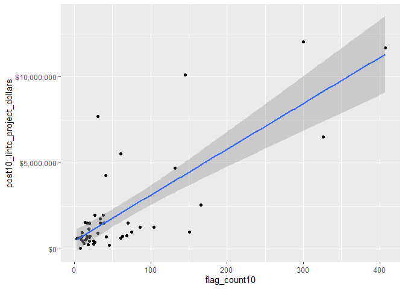<!-- -->

``` r
# Pearson's r calculation
cor(svi_divisional_county_lihtc_projects$flag_count10, svi_divisional_county_lihtc_projects$post10_lihtc_project_dollars, method = "pearson")
```

    ## [1] 0.7792099

``` r
boxplot(svi_divisional_county_lihtc_projects$flag_count10)
```

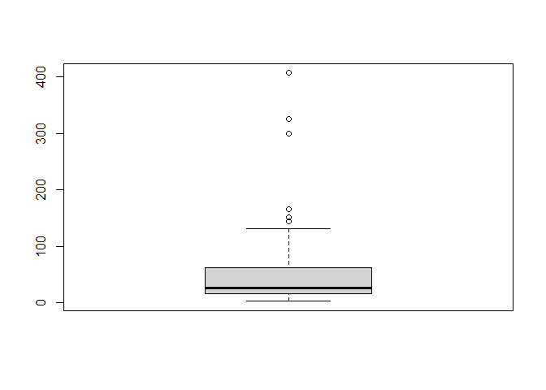<!-- -->

Once again, our Pearson’s R Calculation suggests a fairly strong
correlation. However, a vizual representation of our data does confirm
that outliers may be impacting this.

``` r
svi_divisional_lihtc_cluster <- svi_divisional_county_lihtc_projects %>% 
                            select(county_name, post10_lihtc_project_dollars, 
                                   flag_count10) %>% 
                            remove_rownames %>% 
                            column_to_rownames(var="county_name")

# Remove nulls, if in dataset
svi_divisional_lihtc_cluster <- na.omit(svi_divisional_lihtc_cluster)


# Scale numeric variables
svi_divisional_lihtc_cluster <- scale(svi_divisional_lihtc_cluster)


svi_divisional_lihtc_cluster %>% head(5)
```

    ##                          post10_lihtc_project_dollars flag_count10
    ## District of Columbia, DC                    3.3855306    4.1691145
    ## Broward County, FL                          0.1831488    1.2810530
    ## Duval County, FL                           -0.2637197    0.5380662
    ## Escambia County, FL                        -0.1853096    0.1306219
    ## Hillsborough County, FL                     2.8320293    1.0293962

``` r
set.seed(123)
k2_lihtc_div <- kmeans(svi_divisional_lihtc_cluster, centers = 2, nstart = 25)
set.seed(123)
k3_lihtc_div <- kmeans(svi_divisional_lihtc_cluster, centers = 3, nstart = 25)
set.seed(123)
k4_lihtc_div <- kmeans(svi_divisional_lihtc_cluster, centers = 4, nstart = 25)
set.seed(123)
k5_lihtc_div <- kmeans(svi_divisional_lihtc_cluster, centers = 5, nstart = 25)
```

``` r
# plots to compare
p_k2_lihtc_div <- factoextra::fviz_cluster(k2_lihtc_div, geom = "point", data = svi_divisional_lihtc_cluster) + ggtitle("k = 2")

p_k3_lihtc_div <- factoextra::fviz_cluster(k3_lihtc_div, geom = "point", data = svi_divisional_lihtc_cluster) + ggtitle("k = 3")

p_k4_lihtc_div <- factoextra::fviz_cluster(k4_lihtc_div, geom = "point",  data = svi_divisional_lihtc_cluster) + ggtitle("k = 4")

p_k5_lihtc_div <- factoextra::fviz_cluster(k5_lihtc_div, geom = "point",  data = svi_divisional_lihtc_cluster) + ggtitle("k = 5")

grid.arrange(p_k2_lihtc_div, p_k3_lihtc_div, p_k4_lihtc_div, p_k5_lihtc_div, nrow = 2)
```

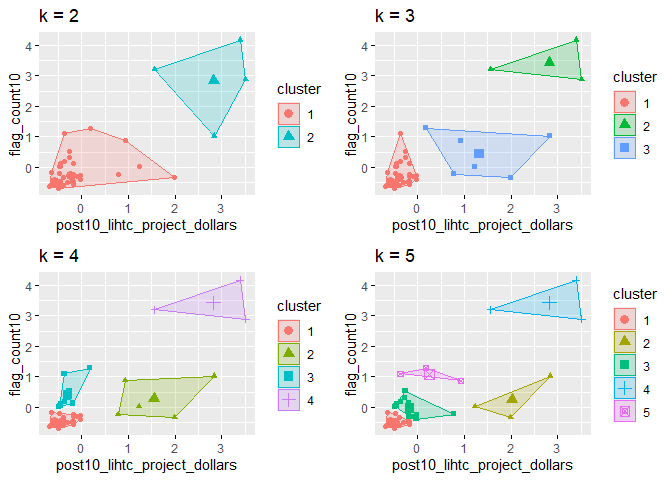<!-- -->

``` r
elbow_plot(svi_divisional_lihtc_cluster)
```

    ##  [1]  1  2  3  4  5  6  7  8  9 10 11 12 13 14 15
    ## [1] 1
    ## [1] 2
    ## [1] 3
    ## [1] 4
    ## [1] 5
    ## [1] 6
    ## [1] 7
    ## [1] 8
    ## [1] 9
    ## [1] 10
    ## [1] 11
    ## [1] 12
    ## [1] 13
    ## [1] 14
    ## [1] 15

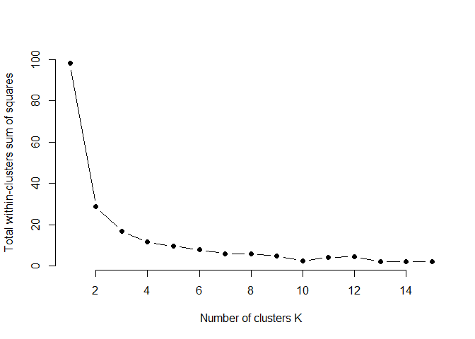<!-- -->

``` r
p_k3_lihtc_div <- factoextra::fviz_cluster(k3_lihtc_div, geom = "point", data = svi_divisional_lihtc_cluster) + ggtitle("k = 3")

p_k3_lihtc_div
```

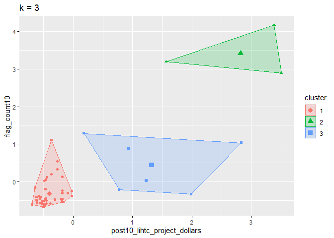<!-- -->

Once again, it appears that our data would be better represented as
three clusters.

``` r
svi_divisional_lihtc_cluster_label <- as.data.frame(svi_divisional_lihtc_cluster) %>%
                                  rownames_to_column(var = "county_name") %>%
                                  as_tibble() %>%
                                  mutate(cluster = k3_lihtc_div$cluster) %>%
                                  select(county_name, cluster)

svi_divisional_county_lihtc_projects2 <- left_join(svi_divisional_county_lihtc_projects, svi_divisional_lihtc_cluster_label, join_by(county_name == county_name))

# View county counts in each cluster
table(svi_divisional_county_lihtc_projects2$cluster)
```

    ## 
    ##  1  2  3 
    ## 41  3  6

``` r
# Cluster 1 Scatterplot
# y is our independent variable (LIHTC Project Dollars),  
# x is our dependent variable (SVI flag count)

svi_divisional_county_lihtc_projects2 %>% 
  filter(cluster == 1) %>%
  ggplot2::ggplot(aes(x=flag_count10,
                    y=post10_lihtc_project_dollars)) +
        geom_point() +
        geom_smooth(method="lm") +
        scale_y_continuous(labels = scales::dollar_format()) 
```

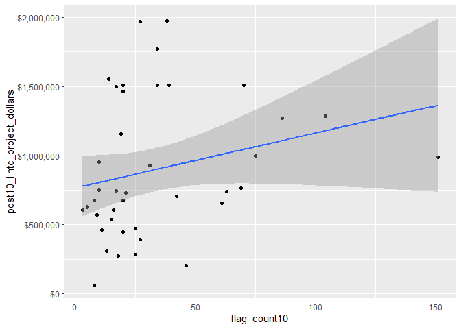<!-- -->

``` r
svi_divisional_county_lihtc_projects2 %>% 
  filter(cluster == 1) %>%
  select(flag_count10,post10_lihtc_project_dollars) %>%
  cor(method = "pearson")
```

    ##                              flag_count10 post10_lihtc_project_dollars
    ## flag_count10                    1.0000000                    0.2414151
    ## post10_lihtc_project_dollars    0.2414151                    1.0000000

Looking at our first and largest cluster, we can see that there is no
strong correlation between the amount of flags and the amount of money
spent.

``` r
# Cluster 2 Scatterplot
# y is our independent variable (LIHTC Project Dollars),  
# x is our dependent variable (SVI flag count)

svi_divisional_county_lihtc_projects2 %>% 
  filter(cluster == 2) %>%
  ggplot2::ggplot(aes(x=flag_count10,
                    y=post10_lihtc_project_dollars)) +
        geom_point() +
        geom_smooth(method="lm") +
        scale_y_continuous(labels = scales::dollar_format()) 
```

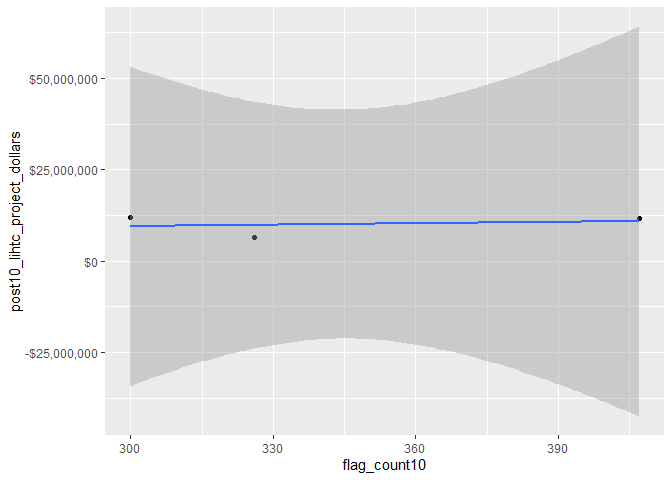<!-- -->

``` r
svi_divisional_county_lihtc_projects2 %>% 
  filter(cluster == 2) %>%
  select(flag_count10,post10_lihtc_project_dollars) %>%
  cor(method = "pearson")
```

    ##                              flag_count10 post10_lihtc_project_dollars
    ## flag_count10                    1.0000000                    0.2309379
    ## post10_lihtc_project_dollars    0.2309379                    1.0000000

Our number 2 cluster, which contains our largest outliers, confims this
as well.

``` r
# Cluster 3 Scatterplot
# y is our independent variable (LIHTC Project Dollars),  
# x is our dependent variable (SVI flag count)

svi_divisional_county_lihtc_projects2 %>% 
  filter(cluster == 3) %>%
  ggplot2::ggplot(aes(x=flag_count10,
                    y=post10_lihtc_project_dollars)) +
        geom_point() +
        geom_smooth(method="lm") +
        scale_y_continuous(labels = scales::dollar_format()) 
```

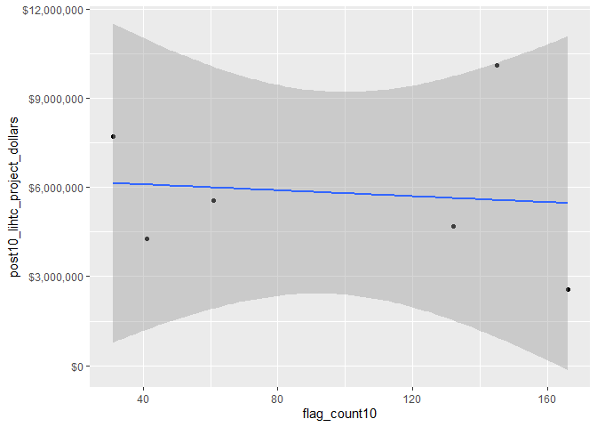<!-- -->

``` r
svi_divisional_county_lihtc_projects2 %>% 
  filter(cluster == 3) %>%
  select(flag_count10,post10_lihtc_project_dollars) %>%
  cor(method = "pearson")
```

    ##                              flag_count10 post10_lihtc_project_dollars
    ## flag_count10                    1.0000000                   -0.1082347
    ## post10_lihtc_project_dollars   -0.1082347                    1.0000000

Finally, our number three cluster shows a slight negative correlation,
also confirming that there is not a strong relationship between the
amount of money spent and the amount of flags.

``` r
# Join our LIHTC projects data with our shapefile geocoordinates
svi_divisional_county_lihtc_sf <- left_join(svi_divisional_county_lihtc_projects, divisional_county_sf, join_by("FIPS_st" == "STATEFP", "FIPS_county" == "COUNTYFP"))

svi_divisional_county_lihtc_sf %>% head(5) %>% kbl() %>% kable_styling() %>% scroll_box(width = "100%")
```

<div style="border: 1px solid #ddd; padding: 5px; overflow-x: scroll; width:100%; ">

<table class="table" style="margin-left: auto; margin-right: auto;">
<thead>
<tr>
<th style="text-align:left;">
State
</th>
<th style="text-align:left;">
County
</th>
<th style="text-align:left;">
Division
</th>
<th style="text-align:right;">
post10_lihtc_project_cnt
</th>
<th style="text-align:right;">
tract_cnt
</th>
<th style="text-align:right;">
post10_lihtc_project_dollars
</th>
<th style="text-align:left;">
post10_lihtc_dollars_formatted
</th>
<th style="text-align:left;">
fips_county_st
</th>
<th style="text-align:left;">
FIPS_st
</th>
<th style="text-align:left;">
FIPS_county
</th>
<th style="text-align:left;">
state_name
</th>
<th style="text-align:right;">
region_number
</th>
<th style="text-align:left;">
region
</th>
<th style="text-align:right;">
division_number
</th>
<th style="text-align:right;">
flag_count10
</th>
<th style="text-align:right;">
pop10
</th>
<th style="text-align:right;">
flag_by_pop10
</th>
<th style="text-align:right;">
flag_count_quantile10
</th>
<th style="text-align:right;">
flag_pop_quantile10
</th>
<th style="text-align:right;">
flag_count20
</th>
<th style="text-align:right;">
pop20
</th>
<th style="text-align:right;">
flag_by_pop20
</th>
<th style="text-align:right;">
flag_count_quantile20
</th>
<th style="text-align:right;">
flag_pop_quantile20
</th>
<th style="text-align:left;">
county_name
</th>
<th style="text-align:left;">
geometry
</th>
</tr>
</thead>
<tbody>
<tr>
<td style="text-align:left;">
DC
</td>
<td style="text-align:left;">
District of Columbia
</td>
<td style="text-align:left;">
South Atlantic Division
</td>
<td style="text-align:right;">
21
</td>
<td style="text-align:right;">
53
</td>
<td style="text-align:right;">
11695555
</td>
<td style="text-align:left;">
\$11,695,555
</td>
<td style="text-align:left;">
11001
</td>
<td style="text-align:left;">
11
</td>
<td style="text-align:left;">
001
</td>
<td style="text-align:left;">
District of Columbia
</td>
<td style="text-align:right;">
3
</td>
<td style="text-align:left;">
South Region
</td>
<td style="text-align:right;">
5
</td>
<td style="text-align:right;">
407
</td>
<td style="text-align:right;">
157923
</td>
<td style="text-align:right;">
0.0025772
</td>
<td style="text-align:right;">
1
</td>
<td style="text-align:right;">
0.6
</td>
<td style="text-align:right;">
387
</td>
<td style="text-align:right;">
192201
</td>
<td style="text-align:right;">
0.0020135
</td>
<td style="text-align:right;">
1
</td>
<td style="text-align:right;">
0.4
</td>
<td style="text-align:left;">
District of Columbia, DC
</td>
<td style="text-align:left;">
MULTIPOLYGON (((-76.95772 3…
</td>
</tr>
<tr>
<td style="text-align:left;">
FL
</td>
<td style="text-align:left;">
Broward County
</td>
<td style="text-align:left;">
South Atlantic Division
</td>
<td style="text-align:right;">
3
</td>
<td style="text-align:right;">
17
</td>
<td style="text-align:right;">
2561000
</td>
<td style="text-align:left;">
\$2,561,000
</td>
<td style="text-align:left;">
12011
</td>
<td style="text-align:left;">
12
</td>
<td style="text-align:left;">
011
</td>
<td style="text-align:left;">
Florida
</td>
<td style="text-align:right;">
3
</td>
<td style="text-align:left;">
South Region
</td>
<td style="text-align:right;">
5
</td>
<td style="text-align:right;">
166
</td>
<td style="text-align:right;">
71933
</td>
<td style="text-align:right;">
0.0023077
</td>
<td style="text-align:right;">
1
</td>
<td style="text-align:right;">
0.6
</td>
<td style="text-align:right;">
160
</td>
<td style="text-align:right;">
84636
</td>
<td style="text-align:right;">
0.0018904
</td>
<td style="text-align:right;">
1
</td>
<td style="text-align:right;">
0.4
</td>
<td style="text-align:left;">
Broward County, FL
</td>
<td style="text-align:left;">
MULTIPOLYGON (((-80.08484 2…
</td>
</tr>
<tr>
<td style="text-align:left;">
FL
</td>
<td style="text-align:left;">
Duval County
</td>
<td style="text-align:left;">
South Atlantic Division
</td>
<td style="text-align:right;">
4
</td>
<td style="text-align:right;">
12
</td>
<td style="text-align:right;">
1286341
</td>
<td style="text-align:left;">
\$1,286,341
</td>
<td style="text-align:left;">
12031
</td>
<td style="text-align:left;">
12
</td>
<td style="text-align:left;">
031
</td>
<td style="text-align:left;">
Florida
</td>
<td style="text-align:right;">
3
</td>
<td style="text-align:left;">
South Region
</td>
<td style="text-align:right;">
5
</td>
<td style="text-align:right;">
104
</td>
<td style="text-align:right;">
40471
</td>
<td style="text-align:right;">
0.0025697
</td>
<td style="text-align:right;">
1
</td>
<td style="text-align:right;">
0.6
</td>
<td style="text-align:right;">
90
</td>
<td style="text-align:right;">
40771
</td>
<td style="text-align:right;">
0.0022075
</td>
<td style="text-align:right;">
1
</td>
<td style="text-align:right;">
0.6
</td>
<td style="text-align:left;">
Duval County, FL
</td>
<td style="text-align:left;">
MULTIPOLYGON (((-81.39745 3…
</td>
</tr>
<tr>
<td style="text-align:left;">
FL
</td>
<td style="text-align:left;">
Escambia County
</td>
<td style="text-align:left;">
South Atlantic Division
</td>
<td style="text-align:right;">
1
</td>
<td style="text-align:right;">
9
</td>
<td style="text-align:right;">
1510000
</td>
<td style="text-align:left;">
\$1,510,000
</td>
<td style="text-align:left;">
12033
</td>
<td style="text-align:left;">
12
</td>
<td style="text-align:left;">
033
</td>
<td style="text-align:left;">
Florida
</td>
<td style="text-align:right;">
3
</td>
<td style="text-align:left;">
South Region
</td>
<td style="text-align:right;">
5
</td>
<td style="text-align:right;">
70
</td>
<td style="text-align:right;">
30376
</td>
<td style="text-align:right;">
0.0023045
</td>
<td style="text-align:right;">
1
</td>
<td style="text-align:right;">
0.6
</td>
<td style="text-align:right;">
64
</td>
<td style="text-align:right;">
26675
</td>
<td style="text-align:right;">
0.0023993
</td>
<td style="text-align:right;">
1
</td>
<td style="text-align:right;">
0.6
</td>
<td style="text-align:left;">
Escambia County, FL
</td>
<td style="text-align:left;">
MULTIPOLYGON (((-87.54197 3…
</td>
</tr>
<tr>
<td style="text-align:left;">
FL
</td>
<td style="text-align:left;">
Hillsborough County
</td>
<td style="text-align:left;">
South Atlantic Division
</td>
<td style="text-align:right;">
7
</td>
<td style="text-align:right;">
17
</td>
<td style="text-align:right;">
10116734
</td>
<td style="text-align:left;">
\$10,116,734
</td>
<td style="text-align:left;">
12057
</td>
<td style="text-align:left;">
12
</td>
<td style="text-align:left;">
057
</td>
<td style="text-align:left;">
Florida
</td>
<td style="text-align:right;">
3
</td>
<td style="text-align:left;">
South Region
</td>
<td style="text-align:right;">
5
</td>
<td style="text-align:right;">
145
</td>
<td style="text-align:right;">
42317
</td>
<td style="text-align:right;">
0.0034265
</td>
<td style="text-align:right;">
1
</td>
<td style="text-align:right;">
0.8
</td>
<td style="text-align:right;">
149
</td>
<td style="text-align:right;">
50266
</td>
<td style="text-align:right;">
0.0029642
</td>
<td style="text-align:right;">
1
</td>
<td style="text-align:right;">
0.8
</td>
<td style="text-align:left;">
Hillsborough County, FL
</td>
<td style="text-align:left;">
MULTIPOLYGON (((-82.75593 2…
</td>
</tr>
</tbody>
</table>

</div>

``` r
# Create classes for bivariate mapping 
svi_divisional_county_lihtc_sf <- bi_class(svi_divisional_county_lihtc_sf, x = flag_count10, y = post10_lihtc_project_dollars, style = "quantile", dim = 3)

# View data
svi_divisional_county_lihtc_sf %>% head(5) %>% kbl() %>% kable_styling() %>% scroll_box(width = "100%")
```

<div style="border: 1px solid #ddd; padding: 5px; overflow-x: scroll; width:100%; ">

<table class="table" style="margin-left: auto; margin-right: auto;">
<thead>
<tr>
<th style="text-align:left;">
State
</th>
<th style="text-align:left;">
County
</th>
<th style="text-align:left;">
Division
</th>
<th style="text-align:right;">
post10_lihtc_project_cnt
</th>
<th style="text-align:right;">
tract_cnt
</th>
<th style="text-align:right;">
post10_lihtc_project_dollars
</th>
<th style="text-align:left;">
post10_lihtc_dollars_formatted
</th>
<th style="text-align:left;">
fips_county_st
</th>
<th style="text-align:left;">
FIPS_st
</th>
<th style="text-align:left;">
FIPS_county
</th>
<th style="text-align:left;">
state_name
</th>
<th style="text-align:right;">
region_number
</th>
<th style="text-align:left;">
region
</th>
<th style="text-align:right;">
division_number
</th>
<th style="text-align:right;">
flag_count10
</th>
<th style="text-align:right;">
pop10
</th>
<th style="text-align:right;">
flag_by_pop10
</th>
<th style="text-align:right;">
flag_count_quantile10
</th>
<th style="text-align:right;">
flag_pop_quantile10
</th>
<th style="text-align:right;">
flag_count20
</th>
<th style="text-align:right;">
pop20
</th>
<th style="text-align:right;">
flag_by_pop20
</th>
<th style="text-align:right;">
flag_count_quantile20
</th>
<th style="text-align:right;">
flag_pop_quantile20
</th>
<th style="text-align:left;">
county_name
</th>
<th style="text-align:left;">
geometry
</th>
<th style="text-align:left;">
bi_class
</th>
</tr>
</thead>
<tbody>
<tr>
<td style="text-align:left;">
DC
</td>
<td style="text-align:left;">
District of Columbia
</td>
<td style="text-align:left;">
South Atlantic Division
</td>
<td style="text-align:right;">
21
</td>
<td style="text-align:right;">
53
</td>
<td style="text-align:right;">
11695555
</td>
<td style="text-align:left;">
\$11,695,555
</td>
<td style="text-align:left;">
11001
</td>
<td style="text-align:left;">
11
</td>
<td style="text-align:left;">
001
</td>
<td style="text-align:left;">
District of Columbia
</td>
<td style="text-align:right;">
3
</td>
<td style="text-align:left;">
South Region
</td>
<td style="text-align:right;">
5
</td>
<td style="text-align:right;">
407
</td>
<td style="text-align:right;">
157923
</td>
<td style="text-align:right;">
0.0025772
</td>
<td style="text-align:right;">
1
</td>
<td style="text-align:right;">
0.6
</td>
<td style="text-align:right;">
387
</td>
<td style="text-align:right;">
192201
</td>
<td style="text-align:right;">
0.0020135
</td>
<td style="text-align:right;">
1
</td>
<td style="text-align:right;">
0.4
</td>
<td style="text-align:left;">
District of Columbia, DC
</td>
<td style="text-align:left;">
MULTIPOLYGON (((-76.95772 3…
</td>
<td style="text-align:left;">
3-3
</td>
</tr>
<tr>
<td style="text-align:left;">
FL
</td>
<td style="text-align:left;">
Broward County
</td>
<td style="text-align:left;">
South Atlantic Division
</td>
<td style="text-align:right;">
3
</td>
<td style="text-align:right;">
17
</td>
<td style="text-align:right;">
2561000
</td>
<td style="text-align:left;">
\$2,561,000
</td>
<td style="text-align:left;">
12011
</td>
<td style="text-align:left;">
12
</td>
<td style="text-align:left;">
011
</td>
<td style="text-align:left;">
Florida
</td>
<td style="text-align:right;">
3
</td>
<td style="text-align:left;">
South Region
</td>
<td style="text-align:right;">
5
</td>
<td style="text-align:right;">
166
</td>
<td style="text-align:right;">
71933
</td>
<td style="text-align:right;">
0.0023077
</td>
<td style="text-align:right;">
1
</td>
<td style="text-align:right;">
0.6
</td>
<td style="text-align:right;">
160
</td>
<td style="text-align:right;">
84636
</td>
<td style="text-align:right;">
0.0018904
</td>
<td style="text-align:right;">
1
</td>
<td style="text-align:right;">
0.4
</td>
<td style="text-align:left;">
Broward County, FL
</td>
<td style="text-align:left;">
MULTIPOLYGON (((-80.08484 2…
</td>
<td style="text-align:left;">
3-3
</td>
</tr>
<tr>
<td style="text-align:left;">
FL
</td>
<td style="text-align:left;">
Duval County
</td>
<td style="text-align:left;">
South Atlantic Division
</td>
<td style="text-align:right;">
4
</td>
<td style="text-align:right;">
12
</td>
<td style="text-align:right;">
1286341
</td>
<td style="text-align:left;">
\$1,286,341
</td>
<td style="text-align:left;">
12031
</td>
<td style="text-align:left;">
12
</td>
<td style="text-align:left;">
031
</td>
<td style="text-align:left;">
Florida
</td>
<td style="text-align:right;">
3
</td>
<td style="text-align:left;">
South Region
</td>
<td style="text-align:right;">
5
</td>
<td style="text-align:right;">
104
</td>
<td style="text-align:right;">
40471
</td>
<td style="text-align:right;">
0.0025697
</td>
<td style="text-align:right;">
1
</td>
<td style="text-align:right;">
0.6
</td>
<td style="text-align:right;">
90
</td>
<td style="text-align:right;">
40771
</td>
<td style="text-align:right;">
0.0022075
</td>
<td style="text-align:right;">
1
</td>
<td style="text-align:right;">
0.6
</td>
<td style="text-align:left;">
Duval County, FL
</td>
<td style="text-align:left;">
MULTIPOLYGON (((-81.39745 3…
</td>
<td style="text-align:left;">
3-2
</td>
</tr>
<tr>
<td style="text-align:left;">
FL
</td>
<td style="text-align:left;">
Escambia County
</td>
<td style="text-align:left;">
South Atlantic Division
</td>
<td style="text-align:right;">
1
</td>
<td style="text-align:right;">
9
</td>
<td style="text-align:right;">
1510000
</td>
<td style="text-align:left;">
\$1,510,000
</td>
<td style="text-align:left;">
12033
</td>
<td style="text-align:left;">
12
</td>
<td style="text-align:left;">
033
</td>
<td style="text-align:left;">
Florida
</td>
<td style="text-align:right;">
3
</td>
<td style="text-align:left;">
South Region
</td>
<td style="text-align:right;">
5
</td>
<td style="text-align:right;">
70
</td>
<td style="text-align:right;">
30376
</td>
<td style="text-align:right;">
0.0023045
</td>
<td style="text-align:right;">
1
</td>
<td style="text-align:right;">
0.6
</td>
<td style="text-align:right;">
64
</td>
<td style="text-align:right;">
26675
</td>
<td style="text-align:right;">
0.0023993
</td>
<td style="text-align:right;">
1
</td>
<td style="text-align:right;">
0.6
</td>
<td style="text-align:left;">
Escambia County, FL
</td>
<td style="text-align:left;">
MULTIPOLYGON (((-87.54197 3…
</td>
<td style="text-align:left;">
3-3
</td>
</tr>
<tr>
<td style="text-align:left;">
FL
</td>
<td style="text-align:left;">
Hillsborough County
</td>
<td style="text-align:left;">
South Atlantic Division
</td>
<td style="text-align:right;">
7
</td>
<td style="text-align:right;">
17
</td>
<td style="text-align:right;">
10116734
</td>
<td style="text-align:left;">
\$10,116,734
</td>
<td style="text-align:left;">
12057
</td>
<td style="text-align:left;">
12
</td>
<td style="text-align:left;">
057
</td>
<td style="text-align:left;">
Florida
</td>
<td style="text-align:right;">
3
</td>
<td style="text-align:left;">
South Region
</td>
<td style="text-align:right;">
5
</td>
<td style="text-align:right;">
145
</td>
<td style="text-align:right;">
42317
</td>
<td style="text-align:right;">
0.0034265
</td>
<td style="text-align:right;">
1
</td>
<td style="text-align:right;">
0.8
</td>
<td style="text-align:right;">
149
</td>
<td style="text-align:right;">
50266
</td>
<td style="text-align:right;">
0.0029642
</td>
<td style="text-align:right;">
1
</td>
<td style="text-align:right;">
0.8
</td>
<td style="text-align:left;">
Hillsborough County, FL
</td>
<td style="text-align:left;">
MULTIPOLYGON (((-82.75593 2…
</td>
<td style="text-align:left;">
3-3
</td>
</tr>
</tbody>
</table>

</div>

``` r
# Create map with ggplot
svi_divisional_county_lihtc_map <- ggplot() +
  # Map county shapefile, fill with bi_class categories
  geom_sf(data = svi_divisional_county_lihtc_sf, mapping = aes(geometry=geometry, fill = bi_class), color = "white", size = 0.1, show.legend = FALSE) +
  # Set to biscale palette
  bi_scale_fill(pal = "GrPink", dim = 3) +
  # Add state shapefiles for outline
  geom_sf(data=divisional_st_sf, color="black", fill=NA, linewidth=.5, aes(geometry=geometry)) +
  labs(
    title = paste0("Correlation of 2010 ", census_division, " SVI Flag Count \n and 2011 - 2020 LIHTC Tax Dollars")
  ) +
  # Set them to biscale
  bi_theme(base_size = 10)

# Create biscale legend
svi_divisional_county_lihtc_legend <- bi_legend(pal = "GrPink",
                    dim = 3,
                    xlab = "SVI Flag Count",
                    ylab = "LIHTC Dollars",
                    size = 8)

# Combine map with legend using cowplot
svi_divisional_county_lihtc_bivarmap <- ggdraw() +
  draw_plot(svi_divisional_county_lihtc_map) +
  # Set legend location
  draw_plot(svi_divisional_county_lihtc_legend, x= -.02,  y = -.05,
 width=.20)


# View map
svi_divisional_county_lihtc_bivarmap
```

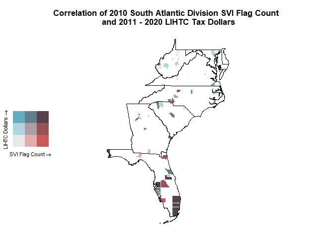<!-- -->

It appears that this time, the majority of high flags are still in
Florida; there is no significant impact on the map in our other states,
though there is a slight increase in spending without high flag counts
above North Carolina.

``` r
svi_divisional_county_lihtc_sf %>% filter(State == "FL") %>% select(State, County, flag_count10, post10_lihtc_dollars_formatted) %>% arrange(desc(flag_count10)) %>% head(6)
```

    ##   State              County flag_count10 post10_lihtc_dollars_formatted
    ## 1    FL   Miami-Dade County          300                    $12,039,478
    ## 2    FL      Broward County          166                     $2,561,000
    ## 3    FL Hillsborough County          145                    $10,116,734
    ## 4    FL   Palm Beach County          132                     $4,702,545
    ## 5    FL        Duval County          104                     $1,286,341
    ## 6    FL         Polk County           86                     $1,271,000

``` r
saveRDS(svi_divisional_lihtc, file = here::here(paste0("data/wrangling/", str_replace_all(census_division, " ", "_"), "_svi_divisional_lihtc.rds")))

saveRDS(svi_national_lihtc, file = here::here(paste0("data/wrangling/", str_replace_all(census_division, " ", "_"), "_svi_national_lihtc.rds")))

saveRDS(svi_divisional_nmtc, file = here::here(paste0("data/wrangling/", str_replace_all(census_division, " ", "_"), "_svi_divisional_nmtc.rds")))

saveRDS(svi_national_nmtc, file = here::here(paste0("data/wrangling/", str_replace_all(census_division, " ", "_"), "_svi_national_nmtc.rds")))
```

</div>
