Visualizing the Intervention - Pacific Division
================
Drew Radovich
2025-04-19

- [Library](#library)
- [Functions](#functions)
- [SVI Data](#svi-data)
- [NMTC & LIHTC Tract Eligibility
  Data](#nmtc--lihtc-tract-eligibility-data)
- [Load 2010 SVI Data](#load-2010-svi-data)
- [Load 2020 SVI Data](#load-2020-svi-data)
- [Merge 2010 and 2020 Data](#merge-2010-and-2020-data)
- [NMTC Data Wrangling](#nmtc-data-wrangling)
- [LIHTC Data Wrangling](#lihtc-data-wrangling)
- [Exploratory Data Analysis](#exploratory-data-analysis)
  - [NMTC in Pacific Division](#nmtc-in-pacific-division)
  - [LIHTC in Pacific Division](#lihtc-in-pacific-division)

## Library

``` r
# Turn off scientific notation
options(scipen=999)

# Load packages
library(here)        # relative file paths for reproducibility
library(tidyverse)   # data wrangling
library(stringi)     # string data wrangling
library(tigris)      # US census TIGER/Line shapefiles
library(ggplot2)     # data visualization
library(cowplot)     # data visualization plotting
library(gridExtra)   # grid for data visualizations
library(biscale)     # bivariate mapping
library(kableExtra)  # table formatting
library(scales)      # palette and number formatting
library(cluster)     # clustering algorithms
library(factoextra)  # clustering algorithms & visualization
```

## Functions

``` r
import::here( "fips_census_regions",
              "load_svi_data",
              "merge_svi_data",
              "census_division",
              "flag_summarize",
              "summarize_county_nmtc",
              "summarize_county_lihtc",
              "elbow_plot",
             # notice the use of here::here() that points to the .R file
             # where all these R objects are created
             .from = here::here("analysis/project_data_steps_radovich.R"),
             .character_only = TRUE)

census_division
```

## SVI Data

``` r
# Load SVI data sets
svi_2010 <- readRDS(here::here("data/raw/Census_Data_SVI/svi_2010_trt10.rds"))
svi_2020 <- readRDS(here::here("data/raw/Census_Data_SVI/svi_2020_trt10.rds"))

# Load mapping data sets
svi_county_map2010 <- readRDS(here::here(paste0("data/wrangling/", str_replace_all(census_division, " ", "_"), "_county_svi_flags10.rds")))

svi_county_map2020 <- readRDS(here::here(paste0("data/wrangling/", str_replace_all(census_division, " ", "_"), "_county_svi_flags20.rds")))

divisional_st_sf <- readRDS(here::here(paste0("data/wrangling/", str_replace_all(census_division, " ", "_"), "_st_sf.rds")))
```

## NMTC & LIHTC Tract Eligibility Data

``` r
# Load NMTC & LIHTC Tract Eligibility Data

orig_nmtc <- readxl::read_excel(here::here("data/raw/NMTC_LIHTC_tracts/nmtc_2011-2015_lic_110217.xlsx"), sheet="NMTC LICs 2011-2015 ACS")

high_migration_nmtc <- readxl::read_excel(here::here("data/raw/NMTC_LIHTC_tracts/nmtc_2011-2015_lic_110217.xlsx"), sheet="High migration tracts", skip=1)

nmtc_awards_data <- readxl::read_excel(here::here("data/raw/NMTC_LIHTC_tracts/NMTC_Public_Data_Release_includes_FY_2021_Data_final.xlsx"), sheet = "Projects 2 - Data Set PUBLISH.P")

lihtc_eligible <- readxl::read_excel(here::here("data/raw/NMTC_LIHTC_tracts/qct_data_2010_2011_2012.xlsx"))

lihtc_projects <- read.csv(here::here("data/raw/NMTC_LIHTC_tracts/lihtcpub/LIHTCPUB.csv"))
```

## Load 2010 SVI Data

``` r
# National 2010 Data
svi_2010_national <- load_svi_data(svi_2010, percentile=.75)
svi_2010_national %>% head() %>% kbl() %>% kable_styling() %>% scroll_box(width = "100%")
```

``` r
# Divisional 2010 Data
svi_2010_divisional <- load_svi_data(svi_2010, rank_by = "divisional", location = census_division, percentile=.75)
svi_2010_divisional %>% head() %>% kbl() %>% kable_styling() %>% scroll_box(width = "100%")
```

## Load 2020 SVI Data

``` r
# National 2020 Data
svi_2020_national <- load_svi_data(svi_2020, percentile=.75)
svi_2020_national %>% head() %>% kbl() %>% kable_styling() %>% scroll_box(width = "100%")
```

``` r
# Divisional 2020 Data
svi_2020_divisional <- load_svi_data(svi_2020, rank_by = "divisional", location =  census_division, percentile=.75)
svi_2020_divisional %>% head() %>% kbl() %>% kable_styling() %>% scroll_box(width = "100%")
```

## Merge 2010 and 2020 Data

``` r
# Find tracts with divisional data in both 2010 and 2020
svi_divisional <- merge_svi_data(svi_2010_divisional, svi_2020_divisional)
svi_divisional %>% head() %>% kbl() %>% kable_styling() %>% scroll_box(width = "100%")
```

``` r
# Find tracts with divisional data in both 2010 and 2020
svi_national <- merge_svi_data(svi_2010_national, svi_2020_national)
svi_national %>% head() %>% kbl() %>% kable_styling() %>% scroll_box(width = "100%")
```

## NMTC Data Wrangling

``` r
# Rename Columns
orig_nmtc_df <- orig_nmtc %>% 
  rename("GEOID10" = "2010 Census Tract Number FIPS code. GEOID",
         "nmtc_eligibility_orig" = "Does Census Tract Qualify For NMTC Low-Income Community (LIC) on Poverty or Income Criteria?")

orig_nmtc_df %>% head() %>% kbl() %>% kable_styling() %>% scroll_box(width = "100%")
```

``` r
# Rename GEOID Column
high_migration_nmtc_df <- high_migration_nmtc %>% rename("GEOID10" = "2010 Census Tract Number FIPS code GEOID")

high_migration_nmtc_df %>% head() %>% kbl() %>% kable_styling() %>% scroll_box(width = "100%")
```

``` r
# Add column to label tracts as high migration
high_migration_nmtc_df <- high_migration_nmtc_df %>% mutate(high_migration = "Yes")

# Join to original column
orig_nmtc_df <- left_join(orig_nmtc_df, high_migration_nmtc_df, join_by(GEOID10 == GEOID10))

# Update eligibility column with coalesce()
nmtc_df <- orig_nmtc_df %>% 
  mutate(nmtc_eligibility = coalesce(high_migration, nmtc_eligibility_orig))

nmtc_df %>% filter(GEOID10 == "01087231601") %>% kbl() %>% kable_styling() %>% scroll_box(width = "100%")
```

``` r
# Create data set for NMTC eligible tracts
nmtc_eligible <- nmtc_df %>% 
  select(GEOID10, nmtc_eligibility, `County Code`, `County Name`, `State Abbreviation`, `State Name`) %>% 
  filter(tolower(nmtc_eligibility) == "yes")

nmtc_eligible %>% head() %>% kbl() %>% kable_styling() %>% scroll_box(width = "100%")
```

``` r
# Save just tract ID and eligibility
nmtc_eligible_df <- nmtc_eligible %>% select(GEOID10, nmtc_eligibility)
nmtc_eligible_df %>% head()
```

``` r
# Add leading zeroes
nmtc_awards <- nmtc_awards_data %>% 
  mutate(`2010 Census Tract` = str_pad(`2010 Census Tract`, 11, "left", pad=0)) %>%
  rename("GEOID10" =`2010 Census Tract`)

nmtc_awards %>% head() %>% kbl() %>% kable_styling() %>% scroll_box(width = "100%")
```

``` r
# Create character zip_code column:
nmtc_awards <- nmtc_awards %>% 
  mutate(zip_code = str_pad(`Zip Code`, 5, "left", pad=0))

nmtc_awards %>% head() %>% kbl() %>% kable_styling() %>% scroll_box(width = "100%")
```

``` r
# View years
nmtc_awards_data %>% 
  filter(`Origination Year` <= 2010)  %>% 
  select(`Origination Year`) %>% 
  unique()
```

``` r
# View tracts
nmtc_awards_pre2010 <- nmtc_awards %>% 
  filter(`Origination Year` <= 2010) %>% 
  count(GEOID10) %>% 
  rename("pre10_nmtc_project_cnt" = "n")

nmtc_awards_dollars_pre2010 <- nmtc_awards %>% 
  filter(`Origination Year` <= 2010) %>% 
  group_by(GEOID10) %>% 
  summarise(pre10_nmtc_dollars = sum(`Project QLICI Amount`, na.rm = TRUE))

nmtc_awards_pre2010 <- left_join(nmtc_awards_pre2010, 
                                 nmtc_awards_dollars_pre2010, 
                                 join_by(GEOID10 == GEOID10))

nmtc_awards_pre2010$pre10_nmtc_dollars_formatted <- scales::dollar_format()(nmtc_awards_pre2010$pre10_nmtc_dollars)

nmtc_awards_pre2010 %>% head() %>% kbl() %>% kable_styling() %>% scroll_box(width = "100%")
```

``` r
# View years
nmtc_awards_data %>% 
  filter(`Origination Year` > 2010)  %>% 
  select(`Origination Year`) %>% 
  unique()
```

``` r
nmtc_awards_data %>% 
  filter(`Origination Year` > 2010 & `Origination Year` <= 2020) %>% 
  select(State) %>% 
  filter(!State %in% c("American Samoa", "Guam", "Puerto Rico")) %>% 
  unique() %>% 
  mutate(n = row_number()) %>% 
  kbl() %>% kable_styling() %>% scroll_box(width = "100%")
```

``` r
nmtc_awards_post2010 <- nmtc_awards %>% 
  filter(`Origination Year` > 2010 & `Origination Year` <= 2020) %>% 
  count(GEOID10) %>% 
  rename("post10_nmtc_project_cnt" = "n")

nmtc_awards_dollars_post2010 <- nmtc_awards %>% 
  filter(`Origination Year` > 2010 & `Origination Year` <= 2020) %>% 
  group_by(GEOID10) %>% 
  summarise(post10_nmtc_dollars = sum(`Project QLICI Amount`, na.rm = TRUE))

nmtc_awards_post2010 <- left_join(nmtc_awards_post2010, 
                                  nmtc_awards_dollars_post2010, 
                                  join_by(GEOID10 == GEOID10))

nmtc_awards_post2010$post10_nmtc_dollars_formatted <- scales::dollar_format()(nmtc_awards_post2010$post10_nmtc_dollars)

nmtc_awards_post2010 %>% head() %>% kbl() %>% kable_styling() %>% scroll_box(width = "100%")
```

``` r
# Divisional data
svi_divisional_nmtc_eligible <- left_join(svi_divisional, nmtc_eligible_df, join_by("GEOID_2010_trt" == "GEOID10")) %>% filter(tolower(nmtc_eligibility) == "yes")

svi_divisional_nmtc_eligible %>% head() %>% kbl() %>% kable_styling() %>% scroll_box(width = "100%")
```

``` r
# National data
svi_national_nmtc_eligible <- left_join(svi_national, nmtc_eligible_df, join_by("GEOID_2010_trt" == "GEOID10")) %>% filter(tolower(nmtc_eligibility) == "yes")

svi_national_nmtc_eligible %>% head() %>% kbl() %>% kable_styling() %>% scroll_box(width = "100%")
```

``` r
# Join divisional data to nmtc_awards_pre2010, set count to 0 if no data
svi_divisional_nmtc_eligible <- 
  left_join(svi_divisional_nmtc_eligible, nmtc_awards_pre2010, join_by("GEOID_2010_trt" == "GEOID10")) %>%
  mutate(pre10_nmtc_project_cnt = if_else(is.na(pre10_nmtc_project_cnt), 0, pre10_nmtc_project_cnt)) %>%
    mutate(pre10_nmtc_dollars = if_else(is.na(pre10_nmtc_dollars), 0, pre10_nmtc_dollars)) %>%
    mutate(pre10_nmtc_dollars_formatted = if_else(is.na(pre10_nmtc_dollars_formatted), "$0", pre10_nmtc_dollars_formatted))

# View table
svi_divisional_nmtc_eligible %>% head() %>% kbl() %>% kable_styling() %>% scroll_box(width = "100%")
```

``` r
# Join national data to nmtc_awards_pre2010, set count to 0 if no data
svi_national_nmtc_eligible <- 
  left_join(svi_national_nmtc_eligible, nmtc_awards_pre2010, join_by("GEOID_2010_trt" == "GEOID10")) %>%
  mutate(pre10_nmtc_project_cnt = if_else(is.na(pre10_nmtc_project_cnt), 0, pre10_nmtc_project_cnt)) %>%
    mutate(pre10_nmtc_dollars = if_else(is.na(pre10_nmtc_dollars), 0, pre10_nmtc_dollars))%>%
    mutate(pre10_nmtc_dollars_formatted = if_else(is.na(pre10_nmtc_dollars_formatted), "$0", pre10_nmtc_dollars_formatted))

# View table
svi_national_nmtc_eligible %>% head() %>% kbl() %>% kable_styling() %>% scroll_box(width = "100%")
```

``` r
# Find count of NMTC projects after 2010
# Remove all tracts that do not have SVI flag counts for 2010
# Remove all tracts that do not have SVI flag counts for 2020
# Remove all tracts that had an NMTC project before 2010
svi_divisional_nmtc <- 
  left_join(svi_divisional_nmtc_eligible, nmtc_awards_post2010, join_by("GEOID_2010_trt" == "GEOID10")) %>%
  mutate(post10_nmtc_project_cnt = if_else(is.na(post10_nmtc_project_cnt), 0, post10_nmtc_project_cnt)) %>%
  mutate(post10_nmtc_dollars = if_else(is.na(post10_nmtc_dollars), 0, post10_nmtc_dollars))%>%
  mutate(post10_nmtc_dollars_formatted = if_else(is.na(post10_nmtc_dollars_formatted), "$0", post10_nmtc_dollars_formatted)) %>%
  mutate(nmtc_flag = if_else(post10_nmtc_project_cnt > 0, 1, 0)) %>% 
  filter(!is.na(F_TOTAL_10)) %>% 
  filter(!is.na(F_TOTAL_20)) %>% 
  filter(pre10_nmtc_project_cnt < 1)

svi_divisional_nmtc %>% head() %>% kbl() %>% kable_styling() %>% scroll_box(width = "100%")
```

``` r
# Find count of NMTC projects after 2010
# Remove all tracts that do not have SVI flag counts for 2010
# Remove all tracts that do not have SVI flag counts for 2020
# Remove all tracts that had an NMTC project before 2010
svi_national_nmtc <- 
  left_join(svi_national_nmtc_eligible, nmtc_awards_post2010, join_by("GEOID_2010_trt" == "GEOID10")) %>%
  mutate(post10_nmtc_project_cnt = if_else(is.na(post10_nmtc_project_cnt), 0, post10_nmtc_project_cnt)) %>%
  mutate(post10_nmtc_dollars = if_else(is.na(post10_nmtc_dollars), 0, post10_nmtc_dollars))%>%
  mutate(post10_nmtc_dollars_formatted = if_else(is.na(post10_nmtc_dollars_formatted), "$0", post10_nmtc_dollars_formatted)) %>%
  mutate(nmtc_flag = if_else(post10_nmtc_project_cnt > 0, 1, 0)) %>% 
  filter(!is.na(F_TOTAL_10)) %>% 
  filter(!is.na(F_TOTAL_20)) %>% 
  filter(pre10_nmtc_project_cnt < 1)

svi_national_nmtc %>% head() %>% kbl() %>% kable_styling() %>% scroll_box(width = "100%")
```

``` r
# See all the states in data set with eligible tracts
svi_national_nmtc %>% 
  select(state) %>% 
  arrange(state) %>% 
  unique() %>% 
  mutate(n = row_number()) %>% 
  kbl() %>% kable_styling() %>% scroll_box(width = "100%")
```

``` r
# See all the states in data set with projects
svi_national_nmtc %>% 
  filter(nmtc_flag == 1) %>% 
  select(state) %>% 
  arrange(state) %>% 
  unique() %>% 
  mutate(n = row_number()) %>% 
  kbl() %>% kable_styling() %>% scroll_box(width = "100%")
```

``` r
svi_national_nmtc_county_sum <- summarize_county_nmtc(svi_national_nmtc)

svi_national_nmtc_county_sum %>% head() %>% kbl() %>% kable_styling() %>% scroll_box(width = "100%")
```

``` r
svi_divisional_nmtc_county_sum <- summarize_county_nmtc(svi_divisional_nmtc)
svi_divisional_nmtc_county_sum %>% head() %>% kbl() %>% kable_styling() %>% scroll_box(width = "100%")
```

``` r
# Create data frame of NMTC eligible tracts 2010 nationally
svi_national_nmtc10 <- svi_national_nmtc %>% select(GEOID_2010_trt, FIPS_st, FIPS_county, 
    state, state_name, county, region_number, region, division_number, 
    division, F_TOTAL_10, E_TOTPOP_10) %>% rename("F_TOTAL" = "F_TOTAL_10")

# Count national-level SVI flags for 2010, create unified fips column
svi_2010_national_county_flags_nmtc <- flag_summarize(svi_national_nmtc10, "E_TOTPOP_10") %>% unite("fips_county_st", FIPS_st:FIPS_county, remove = FALSE, sep="")

# Add suffix to flag columns 2010
colnames(svi_2010_national_county_flags_nmtc)[11:15] <- paste0(colnames(svi_2010_national_county_flags_nmtc)[11:15], 10)

# Create data frame of NMTC eligible tracts 2020 nationally
svi_national_nmtc20 <- svi_national_nmtc %>% select(GEOID_2010_trt, FIPS_st, FIPS_county, 
    state, state_name, county, region_number, region, division_number, 
    division, F_TOTAL_20, E_TOTPOP_20) %>% rename("F_TOTAL" = "F_TOTAL_20")

# Count national-level SVI flags for 2020, create unified fips column
svi_2020_national_county_flags_nmtc <- flag_summarize(svi_national_nmtc20, "E_TOTPOP_20") %>% unite("fips_county_st", FIPS_st:FIPS_county, remove = FALSE, sep="")

# Identify needed columns for 2020, add suffix
colnames(svi_2020_national_county_flags_nmtc)[11:15] <- paste0(colnames(svi_2020_national_county_flags_nmtc)[11:15], "20")

# Filter to needed columns for 2020 to avoid duplicate column column names
svi_2020_national_county_flags_join_nmtc <- svi_2020_national_county_flags_nmtc %>% ungroup() %>% select("fips_county_st", all_of(colnames(svi_2020_national_county_flags_nmtc)[11:15]))
 
# Join 2010 and 2020 data
svi_national_county_flags_nmtc <- left_join(svi_2010_national_county_flags_nmtc, svi_2020_national_county_flags_join_nmtc, join_by("fips_county_st" == "fips_county_st")) 

svi_national_county_flags_nmtc %>% head() %>% kbl() %>% kable_styling() %>% scroll_box(width = "100%")
```

``` r
# Join flags with NMTC county project data
svi_national_county_nmtc <- left_join(svi_national_nmtc_county_sum,
                                      svi_national_county_flags_nmtc,
                                    join_by("State" == "state", "County" == "county",
                                            "Division" == "division"))

svi_national_county_nmtc$post10_nmtc_project_cnt[is.na(svi_national_county_nmtc$post10_nmtc_project_cnt)] <- 0

svi_national_county_nmtc$county_name <- paste0(svi_national_county_nmtc$County, ", ", svi_national_county_nmtc$State)

svi_national_county_nmtc %>% head() %>% kbl() %>% kable_styling() %>% scroll_box(width = "100%")
```

``` r
# Create data frame of NMTC eligible tracts 2020 nationally
svi_divisional_nmtc10 <- svi_divisional_nmtc %>% select(GEOID_2010_trt, FIPS_st, FIPS_county, 
    state, state_name, county, region_number, region, division_number, 
    division, F_TOTAL_10, E_TOTPOP_10) %>% rename("F_TOTAL" = "F_TOTAL_10")

# Count divisional-level SVI flags for 2010, create unified fips column
svi_2010_divisional_county_flags_nmtc <- flag_summarize(svi_divisional_nmtc10, "E_TOTPOP_10") %>% unite("fips_county_st", FIPS_st:FIPS_county, remove = FALSE, sep="")

# Add suffix to flag columns 2010
colnames(svi_2010_divisional_county_flags_nmtc)[11:15] <- paste0(colnames(svi_2010_divisional_county_flags_nmtc)[11:15], "10")

# Create data frame of NMTC eligible tracts 2020 nationally
svi_divisional_nmtc20 <- svi_divisional_nmtc %>% select(GEOID_2010_trt, FIPS_st, FIPS_county, 
    state, state_name, county, region_number, region, division_number, 
    division, F_TOTAL_20, E_TOTPOP_20) %>% rename("F_TOTAL" = "F_TOTAL_20")

# Count divisional-level SVI flags for 2020, create unified fips column
svi_2020_divisional_county_flags_nmtc <- flag_summarize(svi_divisional_nmtc20, "E_TOTPOP_20") %>% unite("fips_county_st", FIPS_st:FIPS_county, remove = FALSE, sep="")

# Identify needed columns for 2020
colnames(svi_2020_divisional_county_flags_nmtc)[11:15] <- paste0(colnames(svi_2020_divisional_county_flags_nmtc)[11:15], "20")

# Filter to needed columns for 2020 to avoid duplicate column column names
svi_2020_divisional_county_flags_join_nmtc <- svi_2020_divisional_county_flags_nmtc %>% ungroup() %>% select("fips_county_st", all_of(colnames(svi_2020_divisional_county_flags_nmtc)[11:15]))
 
# Join 2010 and 2020 data
svi_divisional_county_flags_nmtc <- left_join(svi_2010_divisional_county_flags_nmtc, svi_2020_divisional_county_flags_join_nmtc, join_by("fips_county_st" == "fips_county_st")) 

svi_divisional_county_flags_nmtc %>% head() %>% kbl() %>% kable_styling() %>% scroll_box(width = "100%")
```

``` r
# Join flags with NMTC county project summary data for division
svi_divisional_county_nmtc <- left_join(svi_divisional_nmtc_county_sum, 
                                        svi_divisional_county_flags_nmtc,
                                    join_by("State" == "state", "County" == "county",
                                            "Division" == "division"))

svi_divisional_county_nmtc$post10_nmtc_project_cnt[is.na(svi_divisional_county_nmtc $post10_nmtc_project_cnt)] <- 0

svi_divisional_county_nmtc$county_name <- paste0(svi_divisional_county_nmtc$County, ", ", svi_divisional_county_nmtc$State)

svi_divisional_county_nmtc %>% head() %>% kbl() %>% kable_styling() %>% scroll_box(width = "100%")
```

## LIHTC Data Wrangling

``` r
lihtc_eligible_flag <- lihtc_eligible %>% 
  select("fips", "state", "county", "stcnty", "tract", "metro", "cbsa", "qct_2010") %>% 
  rename("GEOID10" = "fips") %>% 
  mutate(lihtc_eligibility = if_else(qct_2010 == 1, "Yes", "No")) %>% 
  filter(tolower(lihtc_eligibility) == "yes") %>% 
  select(GEOID10, lihtc_eligibility)

lihtc_eligible_flag %>% head() 
```

``` r
lihtc_projects10 <- lihtc_projects %>% 
  filter(yr_alloc < 8000) %>% 
  filter(yr_alloc <= 2010) %>% 
  count(fips2010) %>% 
  rename("pre10_lihtc_project_cnt" = "n")

lihtc_projects10 %>% head() 
```

``` r
lihtc_dollars10 <- lihtc_projects %>% 
  filter(yr_alloc < 8000) %>% 
  filter(yr_alloc <= 2010) %>%
  select(fips2010, allocamt)

lihtc_dollars10$allocamt[is.na(lihtc_dollars10$allocamt)] <- 0

lihtc_dollars10 <- lihtc_dollars10 %>% 
  group_by(fips2010) %>% 
  summarise(pre10_lihtc_project_dollars = sum(allocamt, na.rm = TRUE))

lihtc_dollars10 %>% head() 
```

``` r
# Join to projects data set
lihtc_projects10 <- left_join(lihtc_projects10, lihtc_dollars10, join_by(fips2010 == fips2010))

lihtc_projects10 %>% head()
```

``` r
lihtc_projects20 <- lihtc_projects %>% 
  filter(yr_alloc < 8000) %>% 
  filter(yr_alloc > 2010) %>% 
  filter(yr_alloc < 2021) %>% 
  count(fips2010) %>% 
  rename("post10_lihtc_project_cnt" = "n")

lihtc_projects20 %>% head() 
```

``` r
lihtc_dollars20 <- lihtc_projects %>% 
  filter(yr_alloc < 8000) %>% 
  filter(yr_alloc > 2010) %>% 
  filter(yr_alloc < 2021) %>% 
  select(fips2010, allocamt)

lihtc_dollars20$allocamt[is.na(lihtc_dollars20$allocamt)] <- 0

lihtc_dollars20 <- lihtc_dollars20 %>% 
  group_by(fips2010) %>% 
  summarise(post10_lihtc_project_dollars = sum(allocamt, na.rm = TRUE))

lihtc_dollars20 %>% head() 
```

``` r
lihtc_projects20 <- left_join(lihtc_projects20, lihtc_dollars20, join_by(fips2010 == fips2010))

lihtc_projects20 %>% head() %>% kbl() %>% kable_styling() %>% scroll_box(width = "100%")
```

``` r
# Join with divisional SVI data
svi_divisional_lihtc10 <- left_join(svi_divisional, lihtc_projects10, join_by("GEOID_2010_trt" == "fips2010"))

svi_divisional_lihtc10 %>% head() %>% kbl() %>% kable_styling() %>% scroll_box(width = "100%")
```

``` r
# Join with national SVI data
svi_national_lihtc10 <- left_join(svi_national, lihtc_projects10, join_by("GEOID_2010_trt" == "fips2010"))

svi_national_lihtc10 %>% head() %>% kbl() %>% kable_styling() %>% scroll_box(width = "100%")
```

``` r
# Add 2020 data
svi_divisional_lihtc20 <- left_join(svi_divisional_lihtc10, lihtc_projects20, join_by("GEOID_2010_trt" == "fips2010"))

svi_divisional_lihtc20 %>% head() %>% kbl() %>% kable_styling() %>% scroll_box(width = "100%")
```

``` r
svi_national_lihtc20 <- left_join(svi_national_lihtc10, lihtc_projects20, join_by("GEOID_2010_trt" == "fips2010"))

svi_national_lihtc20 %>% head() %>% kbl() %>% kable_styling() %>% scroll_box(width = "100%")
```

``` r
svi_divisional_lihtc20 <- svi_divisional_lihtc20 %>% 
  filter(is.na(pre10_lihtc_project_cnt)) %>% 
  filter(post10_lihtc_project_cnt >= 1) %>% 
  select(GEOID_2010_trt, pre10_lihtc_project_cnt, pre10_lihtc_project_dollars, post10_lihtc_project_cnt, post10_lihtc_project_dollars)

# View data
svi_divisional_lihtc20 %>% head() %>% kbl() %>% kable_styling() %>% scroll_box(width = "100%")
```

``` r
svi_national_lihtc20 <- svi_national_lihtc20 %>% 
  filter(is.na(pre10_lihtc_project_cnt)) %>% 
  filter(post10_lihtc_project_cnt >= 1) %>% 
  select(GEOID_2010_trt, pre10_lihtc_project_cnt, pre10_lihtc_project_dollars, post10_lihtc_project_cnt, post10_lihtc_project_dollars)

# View data
svi_national_lihtc20 %>% head() %>% kbl() %>% kable_styling() %>% scroll_box(width = "100%")
```

``` r
# Filter SVI divisional data to remove all tracts that had a project in 2010 or before:
svi_divisional_lihtc <-  svi_divisional %>% 
  filter(! GEOID_2010_trt %in% lihtc_projects10$fips2010)

# Merge SVI divisional data with post 2010 project data, create flag for projects (1 for tracts that have LIHTC project, 0 for those that do not):
svi_divisional_lihtc <- left_join(svi_divisional_lihtc, 
                                  svi_divisional_lihtc20, 
                                  join_by("GEOID_2010_trt" == "GEOID_2010_trt")) %>% 
                        mutate(pre10_lihtc_project_cnt = replace_na(pre10_lihtc_project_cnt, 0),
                               post10_lihtc_project_cnt = replace_na(post10_lihtc_project_cnt, 0),
                               pre10_lihtc_project_dollars = replace_na(pre10_lihtc_project_dollars, 0),
                               post10_lihtc_project_dollars = replace_na(post10_lihtc_project_dollars, 0),
                               lihtc_flag = if_else(post10_lihtc_project_cnt >= 1, 1, 0))

# Finally, we want to filter our dataset to only have tracts that are eligible for the LIHTC program and that have SVI data:
svi_divisional_lihtc <- left_join(svi_divisional_lihtc, lihtc_eligible_flag, 
                                  join_by("GEOID_2010_trt" == "GEOID10")) %>%
                        filter(tolower(lihtc_eligibility) == "yes") %>%
                        filter(!is.na(F_TOTAL_10)) %>% 
                        filter(!is.na(F_TOTAL_20)) 


# View data
svi_divisional_lihtc %>% head() %>% kbl() %>% kable_styling() %>% scroll_box(width = "100%")
```

``` r
# Filter SVI national data to remove all tracts that had a project in 2010 or before:
svi_national_lihtc <-  svi_national %>% 
  filter(! GEOID_2010_trt %in% lihtc_projects10$fips2010)

# Merge SVI national data with post 2010 project data, create flag for projects (1 for tracts that have LIHTC project, 0 for those that do not):
svi_national_lihtc <- left_join(svi_national_lihtc, 
                                  svi_national_lihtc20, 
                                  join_by("GEOID_2010_trt" == "GEOID_2010_trt")) %>% 
                        mutate(pre10_lihtc_project_cnt = replace_na(pre10_lihtc_project_cnt, 0),
                               post10_lihtc_project_cnt = replace_na(post10_lihtc_project_cnt, 0),
                                pre10_lihtc_project_dollars = replace_na(pre10_lihtc_project_dollars, 0),
                               post10_lihtc_project_dollars = replace_na(post10_lihtc_project_dollars, 0),
                               lihtc_flag = if_else(post10_lihtc_project_cnt >= 1, 1, 0))

# Finally, we want to filter our dataset to only have tracts that are eligible for the LIHTC program and that have SVI data:
svi_national_lihtc <- left_join(svi_national_lihtc, lihtc_eligible_flag, 
                                  join_by("GEOID_2010_trt" == "GEOID10")) %>%
                        filter(tolower(lihtc_eligibility) == "yes") %>%
                        filter(!is.na(F_TOTAL_10)) %>% 
                        filter(!is.na(F_TOTAL_20)) 


# View data
svi_national_lihtc %>% head() %>% kbl() %>% kable_styling() %>% scroll_box(width = "100%")
```

``` r
svi_national_lihtc_county_sum <- summarize_county_lihtc(svi_national_lihtc)

svi_national_lihtc_county_sum %>% head() %>% kbl() %>% kable_styling() %>% scroll_box(width = "100%")
```

``` r
svi_divisional_lihtc_county_sum <- summarize_county_lihtc(svi_divisional_lihtc)
svi_divisional_lihtc_county_sum %>% head() %>% kbl() %>% kable_styling() %>% scroll_box(width = "100%")
```

``` r
# Create data frame of LIHTC eligible tracts 2010 nationally
svi_national_lihtc10 <- svi_national_lihtc %>% select(GEOID_2010_trt, FIPS_st, FIPS_county, 
    state, state_name, county, region_number, region, division_number, 
    division, F_TOTAL_10, E_TOTPOP_10) %>% rename("F_TOTAL" = "F_TOTAL_10")

# Count national-level SVI flags for 2010, create unified fips column
svi_2010_national_county_flags_lihtc <- flag_summarize(svi_national_lihtc10, "E_TOTPOP_10") %>% unite("fips_county_st", FIPS_st:FIPS_county, remove = FALSE, sep="")

# Add suffix to flag columns 2010
colnames(svi_2010_national_county_flags_lihtc)[11:15] <- paste0(colnames(svi_2010_national_county_flags_lihtc)[11:15], 10)

# Create data frame of LIHTC eligible tracts 2020 nationally
svi_national_lihtc20 <- svi_national_lihtc %>% select(GEOID_2010_trt, FIPS_st, FIPS_county, 
    state, state_name, county, region_number, region, division_number, 
    division, F_TOTAL_20, E_TOTPOP_20) %>% rename("F_TOTAL" = "F_TOTAL_20")

# Count national-level SVI flags for 2020, create unified fips column
svi_2020_national_county_flags_lihtc <- flag_summarize(svi_national_lihtc20, "E_TOTPOP_20") %>% unite("fips_county_st", FIPS_st:FIPS_county, remove = FALSE, sep="")

# Identify needed columns for 2020, add suffix
colnames(svi_2020_national_county_flags_lihtc)[11:15] <- paste0(colnames(svi_2020_national_county_flags_lihtc)[11:15], "20")

# Filter to needed columns for 2020 to avoid duplicate column column names
svi_2020_national_county_flags_join_lihtc <- svi_2020_national_county_flags_lihtc %>% ungroup() %>% select("fips_county_st", all_of(colnames(svi_2020_national_county_flags_lihtc)[11:15]))
 
# Join 2010 and 2020 data
svi_national_county_flags_lihtc <- left_join(svi_2010_national_county_flags_lihtc, svi_2020_national_county_flags_join_lihtc, join_by("fips_county_st" == "fips_county_st")) 

svi_national_county_flags_lihtc %>% head() %>% kbl() %>% kable_styling() %>% scroll_box(width = "100%")
```

``` r
# Join data sets
svi_national_county_lihtc <- left_join(svi_national_lihtc_county_sum,
                                      svi_national_county_flags_lihtc,
                                    join_by("State" == "state", "County" == "county",
                                            "Division" == "division"))

svi_national_county_lihtc$post10_lihtc_project_cnt[is.na(svi_national_county_lihtc$post10_lihtc_project_cnt)] <- 0

svi_national_county_lihtc$county_name <- paste0(svi_national_county_lihtc$County, ", ", svi_national_county_lihtc$State)

svi_national_county_lihtc %>% head() %>% kbl() %>% kable_styling() %>% scroll_box(width = "100%")
```

``` r
# Create data frame of LIHTC eligible tracts 2020 nationally
svi_divisional_lihtc10 <- svi_divisional_lihtc %>% select(GEOID_2010_trt, FIPS_st, FIPS_county, 
    state, state_name, county, region_number, region, division_number, 
    division, F_TOTAL_10, E_TOTPOP_10) %>% rename("F_TOTAL" = "F_TOTAL_10")

# Count divisional-level SVI flags for 2010, create unified fips column
svi_2010_divisional_county_flags_lihtc <- flag_summarize(svi_divisional_lihtc10, "E_TOTPOP_10") %>% unite("fips_county_st", FIPS_st:FIPS_county, remove = FALSE, sep="")

# Add suffix to flag columns 2010
colnames(svi_2010_divisional_county_flags_lihtc)[11:15] <- paste0(colnames(svi_2010_divisional_county_flags_lihtc)[11:15], "10")

# Create data frame of LIHTC eligible tracts 2020 nationally
svi_divisional_lihtc20 <- svi_divisional_lihtc %>% select(GEOID_2010_trt, FIPS_st, FIPS_county, 
    state, state_name, county, region_number, region, division_number, 
    division, F_TOTAL_20, E_TOTPOP_20) %>% rename("F_TOTAL" = "F_TOTAL_20")

# Count divisional-level SVI flags for 2020, create unified fips column
svi_2020_divisional_county_flags_lihtc <- flag_summarize(svi_divisional_lihtc20, "E_TOTPOP_20") %>% unite("fips_county_st", FIPS_st:FIPS_county, remove = FALSE, sep="")

# Identify needed columns for 2020
colnames(svi_2020_divisional_county_flags_lihtc)[11:15] <- paste0(colnames(svi_2020_divisional_county_flags_lihtc)[11:15], "20")

# Filter to needed columns for 2020 to avoid duplicate column column names
svi_2020_divisional_county_flags_join_lihtc <- svi_2020_divisional_county_flags_lihtc %>% ungroup() %>% select("fips_county_st", all_of(colnames(svi_2020_divisional_county_flags_lihtc)[11:15]))
 
# Join 2010 and 2020 data
svi_divisional_county_flags_lihtc <- left_join(svi_2010_divisional_county_flags_lihtc, svi_2020_divisional_county_flags_join_lihtc, join_by("fips_county_st" == "fips_county_st")) 

svi_divisional_county_flags_lihtc %>% head() %>% kbl() %>% kable_styling() %>% scroll_box(width = "100%")
```

``` r
# Join data sets
svi_divisional_county_lihtc <- left_join(svi_divisional_lihtc_county_sum, 
                                        svi_divisional_county_flags_lihtc,
                                    join_by("State" == "state", "County" == "county",
                                            "Division" == "division"))

svi_divisional_county_lihtc$post10_lihtc_project_cnt[is.na(svi_divisional_county_lihtc $post10_lihtc_project_cnt)] <- 0

svi_divisional_county_lihtc$county_name <- paste0(svi_divisional_county_lihtc$County, ", ", svi_divisional_county_lihtc$State)

svi_divisional_county_lihtc %>% head() %>% kbl() %>% kable_styling() %>% scroll_box(width = "100%")
```

## Exploratory Data Analysis

### NMTC in Pacific Division

``` r
svi_divisional_county_nmtc_projects <- svi_divisional_county_nmtc %>% filter(post10_nmtc_project_cnt > 0)
```

#### Summary Statistics

``` r
summary(svi_divisional_county_nmtc_projects$flag_count10)
```

    ##    Min. 1st Qu.  Median    Mean 3rd Qu.    Max. 
    ##    1.00   26.25   56.00  301.68  199.75 9210.00

``` r
summary(svi_divisional_county_nmtc_projects$post10_nmtc_project_dollars)
```

    ##      Min.   1st Qu.    Median      Mean   3rd Qu.      Max. 
    ##    669550   9561257  18612500  41859846  35824250 987407086

Based on the summary statistics we can see a wide spread in SVI flags
for the Pacific Division ranging from one to 9210 flags. However, based
on the median of these flags, more counties are closer to the lower end
of that range, with 75% of counties under 200 flags. Los Angeles County
has 9210 flags, but is not considered an outlier because it receives a
proportional amount of project dollars.

Tax credit spending is also widely varied in this division, with
spending anywhere between \$669K to \$987M.

``` r
# Scatterplot
# y is our independent variable (NMTC Project Dollars),  
# x is our dependent variable (SVI flag count)
ggplot2::ggplot(svi_divisional_county_nmtc_projects,
                aes(x=flag_count10,
                    y=post10_nmtc_project_dollars)) +
        geom_point() +
        geom_smooth(method="lm") +
        scale_y_continuous(labels = scales::dollar_format()) 
```

    ## `geom_smooth()` using formula = 'y ~ x'

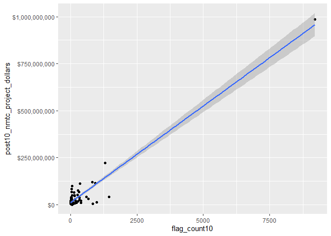<!-- -->

``` r
# Pearson's r calculation
cor(svi_divisional_county_nmtc_projects$flag_count10, svi_divisional_county_nmtc_projects$post10_nmtc_project_dollars, method = "pearson")
```

    ## [1] 0.9603179

According to the Pearson’s coefficient, there is a very strong
relationship between SVI flags and tax credit spending, with R = 0.96.
This means that for the higher amount of flags a county has, they are
more likely to receive tax credits. Similar to the national data, most
counties are clustered in the bottom quadrant with less than 1250 flags
and receiving less than \$125,000,000. There is one influential outlier,
as stated previously, receiving around \$989 million.

``` r
boxplot(svi_divisional_county_nmtc_projects$flag_count10)
```

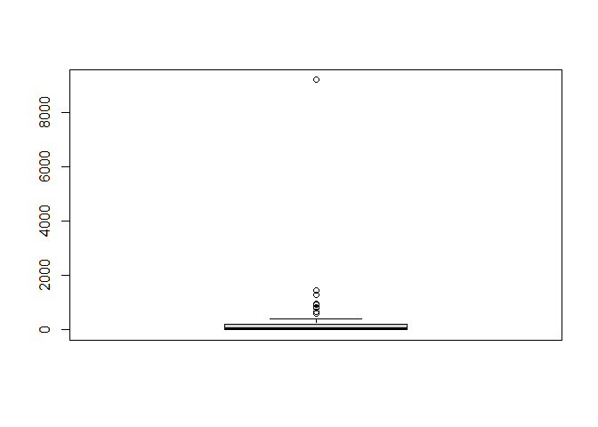<!-- -->

``` r
boxplot.stats(svi_divisional_county_nmtc_projects$flag_count10)$out %>% sort(decreasing = TRUE)
```

    ## [1] 9210 1451 1305  978  931  831  815  669  596

``` r
svi_divisional_county_nmtc_projects %>% 
  select(county_name, flag_count10, post10_nmtc_dollars_formatted) %>% 
  arrange(desc(flag_count10)) %>% 
  head(7) %>% kbl() %>% kable_styling() %>% scroll_box(width = "100%")
```

<div style="border: 1px solid #ddd; padding: 5px; overflow-x: scroll; width:100%; ">

<table class="table" style="margin-left: auto; margin-right: auto;">
<thead>
<tr>
<th style="text-align:left;">
county_name
</th>
<th style="text-align:right;">
flag_count10
</th>
<th style="text-align:left;">
post10_nmtc_dollars_formatted
</th>
</tr>
</thead>
<tbody>
<tr>
<td style="text-align:left;">
Los Angeles County, CA
</td>
<td style="text-align:right;">
9210
</td>
<td style="text-align:left;">
\$987,407,086
</td>
</tr>
<tr>
<td style="text-align:left;">
Riverside County, CA
</td>
<td style="text-align:right;">
1451
</td>
<td style="text-align:left;">
\$40,871,824
</td>
</tr>
<tr>
<td style="text-align:left;">
San Diego County, CA
</td>
<td style="text-align:right;">
1305
</td>
<td style="text-align:left;">
\$221,738,411
</td>
</tr>
<tr>
<td style="text-align:left;">
Orange County, CA
</td>
<td style="text-align:right;">
978
</td>
<td style="text-align:left;">
\$12,463,033
</td>
</tr>
<tr>
<td style="text-align:left;">
Fresno County, CA
</td>
<td style="text-align:right;">
931
</td>
<td style="text-align:left;">
\$115,258,480
</td>
</tr>
<tr>
<td style="text-align:left;">
Sacramento County, CA
</td>
<td style="text-align:right;">
831
</td>
<td style="text-align:left;">
\$3,630,000
</td>
</tr>
<tr>
<td style="text-align:left;">
Alameda County, CA
</td>
<td style="text-align:right;">
815
</td>
<td style="text-align:left;">
\$119,049,224
</td>
</tr>
</tbody>
</table>

</div>

Los Angeles County has the highest number of flags and the highest tax
credit, which makes sense given our correlation and then there is a
steep drop off to the county with the second highest amount of SVI flags
at 1451. The rest of the outliers are much closer together, but still
span a range of 600 SVI flags.

``` r
svi_divisional_nmtc_cluster <- svi_divisional_county_nmtc_projects %>% 
                            select(county_name, post10_nmtc_project_dollars, 
                                   flag_count10) %>% 
                            remove_rownames %>% 
                            column_to_rownames(var="county_name")

# Remove nulls, if in dataset
svi_divisional_nmtc_cluster <- na.omit(svi_divisional_nmtc_cluster)


# Scale numeric variables
svi_divisional_nmtc_cluster <- scale(svi_divisional_nmtc_cluster)


svi_divisional_nmtc_cluster %>% head(5)
```

    ##                               post10_nmtc_project_dollars flag_count10
    ## Aleutians East Borough, AK                     -0.2292355   -0.2754180
    ## Anchorage Municipality, AK                     -0.2816092   -0.2311900
    ## Wade Hampton Census Area, AK                   -0.1795408   -0.2744770
    ## Yukon-Koyukuk Census Area, AK                  -0.3005472   -0.2594206
    ## Alameda County, CA                              0.6780208    0.4830462

#### K-Means Clustering

``` r
set.seed(123)
k2_nmtc_div <- kmeans(svi_divisional_nmtc_cluster, centers = 2, nstart = 25)
set.seed(123)
k3_nmtc_div <- kmeans(svi_divisional_nmtc_cluster, centers = 3, nstart = 25)
set.seed(123)
k4_nmtc_div <- kmeans(svi_divisional_nmtc_cluster, centers = 4, nstart = 25)
set.seed(123)
k5_nmtc_div <- kmeans(svi_divisional_nmtc_cluster, centers = 5, nstart = 25)
```

``` r
# plots to compare
p_k2_nmtc_div <- factoextra::fviz_cluster(k2_nmtc_div, geom = "point", data = svi_divisional_nmtc_cluster) + ggtitle("k = 2")

p_k3_nmtc_div <- factoextra::fviz_cluster(k3_nmtc_div, geom = "point", data = svi_divisional_nmtc_cluster) + ggtitle("k = 3")

p_k4_nmtc_div <- factoextra::fviz_cluster(k4_nmtc_div, geom = "point",  data = svi_divisional_nmtc_cluster) + ggtitle("k = 4")

p_k5_nmtc_div <- factoextra::fviz_cluster(k5_nmtc_div, geom = "point",  data = svi_divisional_nmtc_cluster) + ggtitle("k = 5")

grid.arrange(p_k2_nmtc_div, p_k3_nmtc_div, p_k4_nmtc_div, p_k5_nmtc_div, nrow = 2)
```

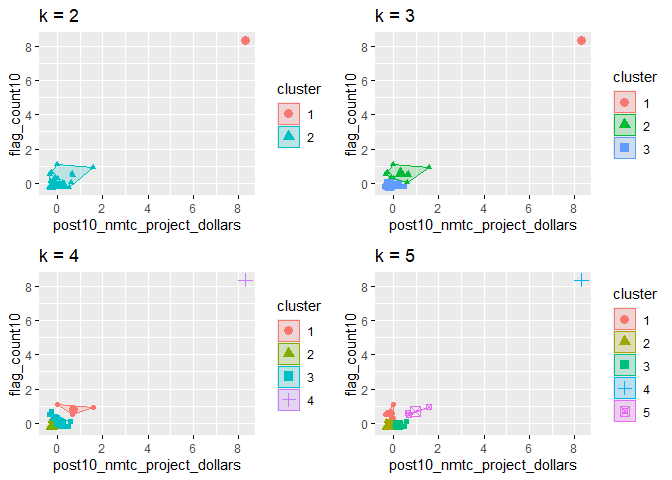<!-- -->

``` r
elbow_plot(svi_divisional_nmtc_cluster)
```

    ##  [1]  1  2  3  4  5  6  7  8  9 10 11 12 13 14 15
    ## [1] 1
    ## [1] 2
    ## [1] 3
    ## [1] 4
    ## [1] 5
    ## [1] 6
    ## [1] 7
    ## [1] 8
    ## [1] 9
    ## [1] 10
    ## [1] 11
    ## [1] 12
    ## [1] 13
    ## [1] 14
    ## [1] 15

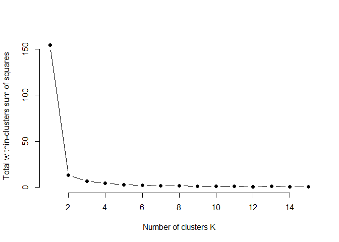<!-- -->

Spacing between clusters substantially reduces after two, so we will
proceed with two clusters.

``` r
p_k2_nmtc_div <- factoextra::fviz_cluster(k2_nmtc_div, geom = "point", data = svi_divisional_nmtc_cluster) + ggtitle("k = 2")

p_k2_nmtc_div
```

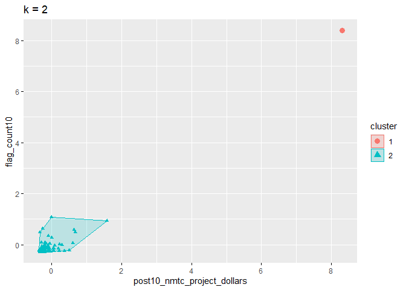<!-- -->
Since we have chosen two clusters, the highest data point is in it’s own
grouping which will help to remove it’s influence on the remainder of
the data set without completely discounting it.

``` r
svi_divisional_nmtc_cluster_label <- as.data.frame(svi_divisional_nmtc_cluster) %>%
                                  rownames_to_column(var = "county_name") %>%
                                  as_tibble() %>%
                                  mutate(cluster = k2_nmtc_div$cluster) %>%
                                  select(county_name, cluster)

svi_divisional_county_nmtc_projects2 <- left_join(svi_divisional_county_nmtc_projects, svi_divisional_nmtc_cluster_label, join_by(county_name == county_name))

# View county counts in each cluster
table(svi_divisional_county_nmtc_projects2$cluster)
```

    ## 
    ##  1  2 
    ##  1 77

``` r
# Cluster 1 Scatterplot
# y is our independent variable (NMTC Project Dollars),  
# x is our dependent variable (SVI flag count)

svi_divisional_county_nmtc_projects2 %>% 
  filter(cluster == 1) %>%
  ggplot2::ggplot(aes(x=flag_count10,
                    y=post10_nmtc_project_dollars)) +
        geom_point() +
        geom_smooth(method="lm") +
        scale_y_continuous(labels = scales::dollar_format()) 
```

    ## `geom_smooth()` using formula = 'y ~ x'

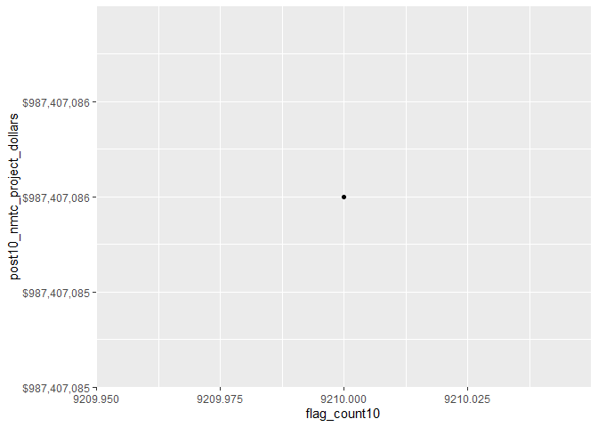<!-- -->

``` r
svi_divisional_county_nmtc_projects2 %>% 
  filter(cluster == 1) %>%
  select(flag_count10,post10_nmtc_project_dollars) %>%
  cor(method = "pearson")
```

    ##                             flag_count10 post10_nmtc_project_dollars
    ## flag_count10                          NA                          NA
    ## post10_nmtc_project_dollars           NA                          NA

``` r
svi_divisional_county_nmtc_projects2 %>% 
  filter(cluster == 1) %>%
  select(county_name, flag_count10, post10_nmtc_dollars_formatted) %>% kbl() %>% kable_styling() %>% scroll_box(width = "100%")
```

<div style="border: 1px solid #ddd; padding: 5px; overflow-x: scroll; width:100%; ">

<table class="table" style="margin-left: auto; margin-right: auto;">
<thead>
<tr>
<th style="text-align:left;">
county_name
</th>
<th style="text-align:right;">
flag_count10
</th>
<th style="text-align:left;">
post10_nmtc_dollars_formatted
</th>
</tr>
</thead>
<tbody>
<tr>
<td style="text-align:left;">
Los Angeles County, CA
</td>
<td style="text-align:right;">
9210
</td>
<td style="text-align:left;">
\$987,407,086
</td>
</tr>
</tbody>
</table>

</div>

Since there is only one county in this cluster, we can not directly
calculate any correlation between social vulnerability and tax credits,
but we can infer that as social vulnerability increases, so does the
amount of tax credits for that county. We can infer this because Los
Angeles County has both the highest tax credits and number if SVI flags.

``` r
# Cluster 2 Scatterplot
# y is our independent variable (NMTC Project Dollars),  
# x is our dependent variable (SVI flag count)

svi_divisional_county_nmtc_projects2 %>% 
  filter(cluster == 2) %>%
  ggplot2::ggplot(aes(x=flag_count10,
                    y=post10_nmtc_project_dollars)) +
        geom_point() +
        geom_smooth(method="lm") +
        scale_y_continuous(labels = scales::dollar_format()) 
```

    ## `geom_smooth()` using formula = 'y ~ x'

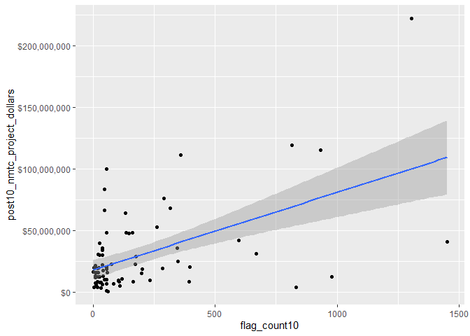<!-- -->

``` r
svi_divisional_county_nmtc_projects2 %>% 
  filter(cluster == 2) %>%
  select(flag_count10,post10_nmtc_project_dollars) %>%
  cor(method = "pearson")
```

    ##                             flag_count10 post10_nmtc_project_dollars
    ## flag_count10                   1.0000000                   0.5307725
    ## post10_nmtc_project_dollars    0.5307725                   1.0000000

``` r
svi_divisional_county_nmtc_projects2 %>% 
  filter(cluster == 2) %>%
  select(county_name, flag_count10, post10_nmtc_dollars_formatted) %>% kbl() %>% kable_styling() %>% scroll_box(width = "100%")
```

<div style="border: 1px solid #ddd; padding: 5px; overflow-x: scroll; width:100%; ">

<table class="table" style="margin-left: auto; margin-right: auto;">
<thead>
<tr>
<th style="text-align:left;">
county_name
</th>
<th style="text-align:right;">
flag_count10
</th>
<th style="text-align:left;">
post10_nmtc_dollars_formatted
</th>
</tr>
</thead>
<tbody>
<tr>
<td style="text-align:left;">
Aleutians East Borough, AK
</td>
<td style="text-align:right;">
9
</td>
<td style="text-align:left;">
\$15,762,500
</td>
</tr>
<tr>
<td style="text-align:left;">
Anchorage Municipality, AK
</td>
<td style="text-align:right;">
56
</td>
<td style="text-align:left;">
\$9,800,000
</td>
</tr>
<tr>
<td style="text-align:left;">
Wade Hampton Census Area, AK
</td>
<td style="text-align:right;">
10
</td>
<td style="text-align:left;">
\$21,420,000
</td>
</tr>
<tr>
<td style="text-align:left;">
Yukon-Koyukuk Census Area, AK
</td>
<td style="text-align:right;">
26
</td>
<td style="text-align:left;">
\$7,644,000
</td>
</tr>
<tr>
<td style="text-align:left;">
Alameda County, CA
</td>
<td style="text-align:right;">
815
</td>
<td style="text-align:left;">
\$119,049,224
</td>
</tr>
<tr>
<td style="text-align:left;">
Butte County, CA
</td>
<td style="text-align:right;">
171
</td>
<td style="text-align:left;">
\$22,355,000
</td>
</tr>
<tr>
<td style="text-align:left;">
Contra Costa County, CA
</td>
<td style="text-align:right;">
346
</td>
<td style="text-align:left;">
\$24,726,000
</td>
</tr>
<tr>
<td style="text-align:left;">
Del Norte County, CA
</td>
<td style="text-align:right;">
25
</td>
<td style="text-align:left;">
\$39,615,000
</td>
</tr>
<tr>
<td style="text-align:left;">
Fresno County, CA
</td>
<td style="text-align:right;">
931
</td>
<td style="text-align:left;">
\$115,258,480
</td>
</tr>
<tr>
<td style="text-align:left;">
Humboldt County, CA
</td>
<td style="text-align:right;">
75
</td>
<td style="text-align:left;">
\$22,330,000
</td>
</tr>
<tr>
<td style="text-align:left;">
Kern County, CA
</td>
<td style="text-align:right;">
669
</td>
<td style="text-align:left;">
\$31,290,000
</td>
</tr>
<tr>
<td style="text-align:left;">
Madera County, CA
</td>
<td style="text-align:right;">
117
</td>
<td style="text-align:left;">
\$10,864,000
</td>
</tr>
<tr>
<td style="text-align:left;">
Merced County, CA
</td>
<td style="text-align:right;">
283
</td>
<td style="text-align:left;">
\$18,982,900
</td>
</tr>
<tr>
<td style="text-align:left;">
Napa County, CA
</td>
<td style="text-align:right;">
36
</td>
<td style="text-align:left;">
\$29,651,000
</td>
</tr>
<tr>
<td style="text-align:left;">
Orange County, CA
</td>
<td style="text-align:right;">
978
</td>
<td style="text-align:left;">
\$12,463,033
</td>
</tr>
<tr>
<td style="text-align:left;">
Riverside County, CA
</td>
<td style="text-align:right;">
1451
</td>
<td style="text-align:left;">
\$40,871,824
</td>
</tr>
<tr>
<td style="text-align:left;">
Sacramento County, CA
</td>
<td style="text-align:right;">
831
</td>
<td style="text-align:left;">
\$3,630,000
</td>
</tr>
<tr>
<td style="text-align:left;">
San Diego County, CA
</td>
<td style="text-align:right;">
1305
</td>
<td style="text-align:left;">
\$221,738,411
</td>
</tr>
<tr>
<td style="text-align:left;">
San Francisco County, CA
</td>
<td style="text-align:right;">
316
</td>
<td style="text-align:left;">
\$68,150,600
</td>
</tr>
<tr>
<td style="text-align:left;">
San Luis Obispo County, CA
</td>
<td style="text-align:right;">
56
</td>
<td style="text-align:left;">
\$47,941,400
</td>
</tr>
<tr>
<td style="text-align:left;">
San Mateo County, CA
</td>
<td style="text-align:right;">
161
</td>
<td style="text-align:left;">
\$47,864,844
</td>
</tr>
<tr>
<td style="text-align:left;">
Santa Barbara County, CA
</td>
<td style="text-align:right;">
231
</td>
<td style="text-align:left;">
\$9,568,778
</td>
</tr>
<tr>
<td style="text-align:left;">
Santa Clara County, CA
</td>
<td style="text-align:right;">
596
</td>
<td style="text-align:left;">
\$41,829,813
</td>
</tr>
<tr>
<td style="text-align:left;">
Santa Cruz County, CA
</td>
<td style="text-align:right;">
106
</td>
<td style="text-align:left;">
\$8,342,000
</td>
</tr>
<tr>
<td style="text-align:left;">
Shasta County, CA
</td>
<td style="text-align:right;">
135
</td>
<td style="text-align:left;">
\$48,005,000
</td>
</tr>
<tr>
<td style="text-align:left;">
Siskiyou County, CA
</td>
<td style="text-align:right;">
56
</td>
<td style="text-align:left;">
\$18,625,000
</td>
</tr>
<tr>
<td style="text-align:left;">
Solano County, CA
</td>
<td style="text-align:right;">
163
</td>
<td style="text-align:left;">
\$8,500,000
</td>
</tr>
<tr>
<td style="text-align:left;">
Stanislaus County, CA
</td>
<td style="text-align:right;">
394
</td>
<td style="text-align:left;">
\$8,614,600
</td>
</tr>
<tr>
<td style="text-align:left;">
Tehama County, CA
</td>
<td style="text-align:right;">
40
</td>
<td style="text-align:left;">
\$13,000,000
</td>
</tr>
<tr>
<td style="text-align:left;">
Ventura County, CA
</td>
<td style="text-align:right;">
396
</td>
<td style="text-align:left;">
\$20,200,000
</td>
</tr>
<tr>
<td style="text-align:left;">
Yolo County, CA
</td>
<td style="text-align:right;">
83
</td>
<td style="text-align:left;">
\$6,790,000
</td>
</tr>
<tr>
<td style="text-align:left;">
Hawaii County, HI
</td>
<td style="text-align:right;">
56
</td>
<td style="text-align:left;">
\$99,555,000
</td>
</tr>
<tr>
<td style="text-align:left;">
Honolulu County, HI
</td>
<td style="text-align:right;">
343
</td>
<td style="text-align:left;">
\$35,830,900
</td>
</tr>
<tr>
<td style="text-align:left;">
Maui County, HI
</td>
<td style="text-align:right;">
38
</td>
<td style="text-align:left;">
\$22,038,000
</td>
</tr>
<tr>
<td style="text-align:left;">
Baker County, OR
</td>
<td style="text-align:right;">
16
</td>
<td style="text-align:left;">
\$8,148,000
</td>
</tr>
<tr>
<td style="text-align:left;">
Clackamas County, OR
</td>
<td style="text-align:right;">
54
</td>
<td style="text-align:left;">
\$980,000
</td>
</tr>
<tr>
<td style="text-align:left;">
Clatsop County, OR
</td>
<td style="text-align:right;">
9
</td>
<td style="text-align:left;">
\$11,640,000
</td>
</tr>
<tr>
<td style="text-align:left;">
Coos County, OR
</td>
<td style="text-align:right;">
38
</td>
<td style="text-align:left;">
\$35,804,300
</td>
</tr>
<tr>
<td style="text-align:left;">
Crook County, OR
</td>
<td style="text-align:right;">
12
</td>
<td style="text-align:left;">
\$5,820,000
</td>
</tr>
<tr>
<td style="text-align:left;">
Curry County, OR
</td>
<td style="text-align:right;">
9
</td>
<td style="text-align:left;">
\$12,610,000
</td>
</tr>
<tr>
<td style="text-align:left;">
Douglas County, OR
</td>
<td style="text-align:right;">
45
</td>
<td style="text-align:left;">
\$66,520,000
</td>
</tr>
<tr>
<td style="text-align:left;">
Hood River County, OR
</td>
<td style="text-align:right;">
1
</td>
<td style="text-align:left;">
\$16,100,000
</td>
</tr>
<tr>
<td style="text-align:left;">
Jackson County, OR
</td>
<td style="text-align:right;">
102
</td>
<td style="text-align:left;">
\$9,558,750
</td>
</tr>
<tr>
<td style="text-align:left;">
Josephine County, OR
</td>
<td style="text-align:right;">
54
</td>
<td style="text-align:left;">
\$20,480,000
</td>
</tr>
<tr>
<td style="text-align:left;">
Klamath County, OR
</td>
<td style="text-align:right;">
55
</td>
<td style="text-align:left;">
\$6,547,500
</td>
</tr>
<tr>
<td style="text-align:left;">
Lake County, OR
</td>
<td style="text-align:right;">
9
</td>
<td style="text-align:left;">
\$7,275,000
</td>
</tr>
<tr>
<td style="text-align:left;">
Lane County, OR
</td>
<td style="text-align:right;">
175
</td>
<td style="text-align:left;">
\$28,810,000
</td>
</tr>
<tr>
<td style="text-align:left;">
Lincoln County, OR
</td>
<td style="text-align:right;">
31
</td>
<td style="text-align:left;">
\$2,988,434
</td>
</tr>
<tr>
<td style="text-align:left;">
Linn County, OR
</td>
<td style="text-align:right;">
41
</td>
<td style="text-align:left;">
\$17,640,000
</td>
</tr>
<tr>
<td style="text-align:left;">
Malheur County, OR
</td>
<td style="text-align:right;">
24
</td>
<td style="text-align:left;">
\$19,730,000
</td>
</tr>
<tr>
<td style="text-align:left;">
Marion County, OR
</td>
<td style="text-align:right;">
110
</td>
<td style="text-align:left;">
\$4,800,000
</td>
</tr>
<tr>
<td style="text-align:left;">
Multnomah County, OR
</td>
<td style="text-align:right;">
262
</td>
<td style="text-align:left;">
\$52,382,352
</td>
</tr>
<tr>
<td style="text-align:left;">
Polk County, OR
</td>
<td style="text-align:right;">
17
</td>
<td style="text-align:left;">
\$12,480,000
</td>
</tr>
<tr>
<td style="text-align:left;">
Umatilla County, OR
</td>
<td style="text-align:right;">
26
</td>
<td style="text-align:left;">
\$29,975,000
</td>
</tr>
<tr>
<td style="text-align:left;">
Wallowa County, OR
</td>
<td style="text-align:right;">
4
</td>
<td style="text-align:left;">
\$3,750,000
</td>
</tr>
<tr>
<td style="text-align:left;">
Wasco County, OR
</td>
<td style="text-align:right;">
18
</td>
<td style="text-align:left;">
\$3,884,000
</td>
</tr>
<tr>
<td style="text-align:left;">
Washington County, OR
</td>
<td style="text-align:right;">
104
</td>
<td style="text-align:left;">
\$9,081,000
</td>
</tr>
<tr>
<td style="text-align:left;">
Adams County, WA
</td>
<td style="text-align:right;">
19
</td>
<td style="text-align:left;">
\$30,510,000
</td>
</tr>
<tr>
<td style="text-align:left;">
Benton County, WA
</td>
<td style="text-align:right;">
58
</td>
<td style="text-align:left;">
\$15,480,000
</td>
</tr>
<tr>
<td style="text-align:left;">
Clallam County, WA
</td>
<td style="text-align:right;">
31
</td>
<td style="text-align:left;">
\$7,620,320
</td>
</tr>
<tr>
<td style="text-align:left;">
Clark County, WA
</td>
<td style="text-align:right;">
133
</td>
<td style="text-align:left;">
\$64,280,000
</td>
</tr>
<tr>
<td style="text-align:left;">
Columbia County, WA
</td>
<td style="text-align:right;">
4
</td>
<td style="text-align:left;">
\$19,500,000
</td>
</tr>
<tr>
<td style="text-align:left;">
Cowlitz County, WA
</td>
<td style="text-align:right;">
60
</td>
<td style="text-align:left;">
\$669,550
</td>
</tr>
<tr>
<td style="text-align:left;">
Ferry County, WA
</td>
<td style="text-align:right;">
14
</td>
<td style="text-align:left;">
\$16,005,000
</td>
</tr>
<tr>
<td style="text-align:left;">
Grant County, WA
</td>
<td style="text-align:right;">
57
</td>
<td style="text-align:left;">
\$15,520,000
</td>
</tr>
<tr>
<td style="text-align:left;">
Grays Harbor County, WA
</td>
<td style="text-align:right;">
47
</td>
<td style="text-align:left;">
\$83,180,621
</td>
</tr>
<tr>
<td style="text-align:left;">
King County, WA
</td>
<td style="text-align:right;">
358
</td>
<td style="text-align:left;">
\$111,041,500
</td>
</tr>
<tr>
<td style="text-align:left;">
Mason County, WA
</td>
<td style="text-align:right;">
27
</td>
<td style="text-align:left;">
\$12,330,000
</td>
</tr>
<tr>
<td style="text-align:left;">
Okanogan County, WA
</td>
<td style="text-align:right;">
37
</td>
<td style="text-align:left;">
\$33,838,866
</td>
</tr>
<tr>
<td style="text-align:left;">
Pend Oreille County, WA
</td>
<td style="text-align:right;">
18
</td>
<td style="text-align:left;">
\$19,310,000
</td>
</tr>
<tr>
<td style="text-align:left;">
Pierce County, WA
</td>
<td style="text-align:right;">
290
</td>
<td style="text-align:left;">
\$76,005,801
</td>
</tr>
<tr>
<td style="text-align:left;">
Skagit County, WA
</td>
<td style="text-align:right;">
45
</td>
<td style="text-align:left;">
\$9,994,000
</td>
</tr>
<tr>
<td style="text-align:left;">
Snohomish County, WA
</td>
<td style="text-align:right;">
146
</td>
<td style="text-align:left;">
\$47,437,840
</td>
</tr>
<tr>
<td style="text-align:left;">
Spokane County, WA
</td>
<td style="text-align:right;">
199
</td>
<td style="text-align:left;">
\$15,328,238
</td>
</tr>
<tr>
<td style="text-align:left;">
Whatcom County, WA
</td>
<td style="text-align:right;">
38
</td>
<td style="text-align:left;">
\$5,940,000
</td>
</tr>
<tr>
<td style="text-align:left;">
Whitman County, WA
</td>
<td style="text-align:right;">
20
</td>
<td style="text-align:left;">
\$15,757,500
</td>
</tr>
<tr>
<td style="text-align:left;">
Yakima County, WA
</td>
<td style="text-align:right;">
200
</td>
<td style="text-align:left;">
\$18,600,000
</td>
</tr>
</tbody>
</table>

</div>

By removing Los Angeles County, we can see a weaker correlation for
counties with SVI flags between 0-1500 receiving 0-225,000,000 NMTC
dollars. For the majority of counties within the Pacific Division thers
is a moderately positive correlation between more vulnerable counties
receiving more NMTC dollars than less vulnerable counties.

#### Bivariate Mapping

``` r
divisional_county_sf <- svi_county_map2010 %>% select(COUNTYFP, STATEFP, geometry)

divisional_county_sf %>% head(5)
```

    ## Simple feature collection with 5 features and 2 fields
    ## Geometry type: MULTIPOLYGON
    ## Dimension:     XY
    ## Bounding box:  xmin: -2327771 ymin: -195140.7 xmax: -1953556 ymax: 782440.1
    ## Projected CRS: USA_Contiguous_Albers_Equal_Area_Conic
    ##   COUNTYFP STATEFP                       geometry
    ## 1      035      06 MULTIPOLYGON (((-1987497 61...
    ## 2      049      06 MULTIPOLYGON (((-1992512 76...
    ## 3      075      06 MULTIPOLYGON (((-2327608 35...
    ## 4      083      06 MULTIPOLYGON (((-2157081 -1...
    ## 5      091      06 MULTIPOLYGON (((-2025220 47...

``` r
# Join our NMTC projects data with our shapefile geocoordinates
svi_divisional_county_nmtc_sf <- left_join(svi_divisional_county_nmtc_projects, divisional_county_sf, join_by("FIPS_st" == "STATEFP", "FIPS_county" == "COUNTYFP"))

svi_divisional_county_nmtc_sf %>% head(5) %>% kbl() %>% kable_styling() %>% scroll_box(width = "100%")
```

<div style="border: 1px solid #ddd; padding: 5px; overflow-x: scroll; width:100%; ">

<table class="table" style="margin-left: auto; margin-right: auto;">
<thead>
<tr>
<th style="text-align:left;">
State
</th>
<th style="text-align:left;">
County
</th>
<th style="text-align:left;">
Division
</th>
<th style="text-align:right;">
post10_nmtc_project_cnt
</th>
<th style="text-align:right;">
tract_cnt
</th>
<th style="text-align:right;">
post10_nmtc_project_dollars
</th>
<th style="text-align:left;">
post10_nmtc_dollars_formatted
</th>
<th style="text-align:left;">
fips_county_st
</th>
<th style="text-align:left;">
FIPS_st
</th>
<th style="text-align:left;">
FIPS_county
</th>
<th style="text-align:left;">
state_name
</th>
<th style="text-align:right;">
region_number
</th>
<th style="text-align:left;">
region
</th>
<th style="text-align:right;">
division_number
</th>
<th style="text-align:right;">
flag_count10
</th>
<th style="text-align:right;">
pop10
</th>
<th style="text-align:right;">
flag_by_pop10
</th>
<th style="text-align:right;">
flag_count_quantile10
</th>
<th style="text-align:right;">
flag_pop_quantile10
</th>
<th style="text-align:right;">
flag_count20
</th>
<th style="text-align:right;">
pop20
</th>
<th style="text-align:right;">
flag_by_pop20
</th>
<th style="text-align:right;">
flag_count_quantile20
</th>
<th style="text-align:right;">
flag_pop_quantile20
</th>
<th style="text-align:left;">
county_name
</th>
<th style="text-align:left;">
geometry
</th>
</tr>
</thead>
<tbody>
<tr>
<td style="text-align:left;">
AK
</td>
<td style="text-align:left;">
Aleutians East Borough
</td>
<td style="text-align:left;">
Pacific Division
</td>
<td style="text-align:right;">
1
</td>
<td style="text-align:right;">
1
</td>
<td style="text-align:right;">
15762500
</td>
<td style="text-align:left;">
\$15,762,500
</td>
<td style="text-align:left;">
02013
</td>
<td style="text-align:left;">
02
</td>
<td style="text-align:left;">
013
</td>
<td style="text-align:left;">
Alaska
</td>
<td style="text-align:right;">
4
</td>
<td style="text-align:left;">
West Region
</td>
<td style="text-align:right;">
9
</td>
<td style="text-align:right;">
9
</td>
<td style="text-align:right;">
3703
</td>
<td style="text-align:right;">
0.0024305
</td>
<td style="text-align:right;">
0.2
</td>
<td style="text-align:right;">
1.0
</td>
<td style="text-align:right;">
6
</td>
<td style="text-align:right;">
3389
</td>
<td style="text-align:right;">
0.0017704
</td>
<td style="text-align:right;">
0.2
</td>
<td style="text-align:right;">
1.0
</td>
<td style="text-align:left;">
Aleutians East Borough, AK
</td>
<td style="text-align:left;">
MULTIPOLYGON (((-2385249 -1…
</td>
</tr>
<tr>
<td style="text-align:left;">
AK
</td>
<td style="text-align:left;">
Anchorage Municipality
</td>
<td style="text-align:left;">
Pacific Division
</td>
<td style="text-align:right;">
1
</td>
<td style="text-align:right;">
13
</td>
<td style="text-align:right;">
9800000
</td>
<td style="text-align:left;">
\$9,800,000
</td>
<td style="text-align:left;">
02020
</td>
<td style="text-align:left;">
02
</td>
<td style="text-align:left;">
020
</td>
<td style="text-align:left;">
Alaska
</td>
<td style="text-align:right;">
4
</td>
<td style="text-align:left;">
West Region
</td>
<td style="text-align:right;">
9
</td>
<td style="text-align:right;">
56
</td>
<td style="text-align:right;">
64432
</td>
<td style="text-align:right;">
0.0008691
</td>
<td style="text-align:right;">
0.8
</td>
<td style="text-align:right;">
0.2
</td>
<td style="text-align:right;">
73
</td>
<td style="text-align:right;">
69679
</td>
<td style="text-align:right;">
0.0010477
</td>
<td style="text-align:right;">
0.8
</td>
<td style="text-align:right;">
0.4
</td>
<td style="text-align:left;">
Anchorage Municipality, AK
</td>
<td style="text-align:left;">
MULTIPOLYGON (((-1927463 -1…
</td>
</tr>
<tr>
<td style="text-align:left;">
AK
</td>
<td style="text-align:left;">
Wade Hampton Census Area
</td>
<td style="text-align:left;">
Pacific Division
</td>
<td style="text-align:right;">
1
</td>
<td style="text-align:right;">
1
</td>
<td style="text-align:right;">
21420000
</td>
<td style="text-align:left;">
\$21,420,000
</td>
<td style="text-align:left;">
02270
</td>
<td style="text-align:left;">
02
</td>
<td style="text-align:left;">
270
</td>
<td style="text-align:left;">
Alaska
</td>
<td style="text-align:right;">
4
</td>
<td style="text-align:left;">
West Region
</td>
<td style="text-align:right;">
9
</td>
<td style="text-align:right;">
10
</td>
<td style="text-align:right;">
7398
</td>
<td style="text-align:right;">
0.0013517
</td>
<td style="text-align:right;">
0.4
</td>
<td style="text-align:right;">
0.8
</td>
<td style="text-align:right;">
11
</td>
<td style="text-align:right;">
8298
</td>
<td style="text-align:right;">
0.0013256
</td>
<td style="text-align:right;">
0.4
</td>
<td style="text-align:right;">
0.6
</td>
<td style="text-align:left;">
Wade Hampton Census Area, AK
</td>
<td style="text-align:left;">
MULTIPOLYGON (((-2310112 -1…
</td>
</tr>
<tr>
<td style="text-align:left;">
AK
</td>
<td style="text-align:left;">
Yukon-Koyukuk Census Area
</td>
<td style="text-align:left;">
Pacific Division
</td>
<td style="text-align:right;">
1
</td>
<td style="text-align:right;">
3
</td>
<td style="text-align:right;">
7644000
</td>
<td style="text-align:left;">
\$7,644,000
</td>
<td style="text-align:left;">
02290
</td>
<td style="text-align:left;">
02
</td>
<td style="text-align:left;">
290
</td>
<td style="text-align:left;">
Alaska
</td>
<td style="text-align:right;">
4
</td>
<td style="text-align:left;">
West Region
</td>
<td style="text-align:right;">
9
</td>
<td style="text-align:right;">
26
</td>
<td style="text-align:right;">
4027
</td>
<td style="text-align:right;">
0.0064564
</td>
<td style="text-align:right;">
0.6
</td>
<td style="text-align:right;">
1.0
</td>
<td style="text-align:right;">
28
</td>
<td style="text-align:right;">
3979
</td>
<td style="text-align:right;">
0.0070369
</td>
<td style="text-align:right;">
0.6
</td>
<td style="text-align:right;">
1.0
</td>
<td style="text-align:left;">
Yukon-Koyukuk Census Area, AK
</td>
<td style="text-align:left;">
MULTIPOLYGON (((-1736112 -9…
</td>
</tr>
<tr>
<td style="text-align:left;">
CA
</td>
<td style="text-align:left;">
Alameda County
</td>
<td style="text-align:left;">
Pacific Division
</td>
<td style="text-align:right;">
10
</td>
<td style="text-align:right;">
134
</td>
<td style="text-align:right;">
119049224
</td>
<td style="text-align:left;">
\$119,049,224
</td>
<td style="text-align:left;">
06001
</td>
<td style="text-align:left;">
06
</td>
<td style="text-align:left;">
001
</td>
<td style="text-align:left;">
California
</td>
<td style="text-align:right;">
4
</td>
<td style="text-align:left;">
West Region
</td>
<td style="text-align:right;">
9
</td>
<td style="text-align:right;">
815
</td>
<td style="text-align:right;">
563385
</td>
<td style="text-align:right;">
0.0014466
</td>
<td style="text-align:right;">
1.0
</td>
<td style="text-align:right;">
0.8
</td>
<td style="text-align:right;">
690
</td>
<td style="text-align:right;">
615018
</td>
<td style="text-align:right;">
0.0011219
</td>
<td style="text-align:right;">
1.0
</td>
<td style="text-align:right;">
0.6
</td>
<td style="text-align:left;">
Alameda County, CA
</td>
<td style="text-align:left;">
MULTIPOLYGON (((-2266160 34…
</td>
</tr>
</tbody>
</table>

</div>

``` r
# Create classes for bivariate mapping 
svi_divisional_county_nmtc_sf <- bi_class(svi_divisional_county_nmtc_sf, x = flag_count10, y = post10_nmtc_project_dollars, style = "quantile", dim = 3)

# View data
svi_divisional_county_nmtc_sf %>% head(5) %>% kbl() %>% kable_styling() %>% scroll_box(width = "100%")
```

<div style="border: 1px solid #ddd; padding: 5px; overflow-x: scroll; width:100%; ">

<table class="table" style="margin-left: auto; margin-right: auto;">
<thead>
<tr>
<th style="text-align:left;">
State
</th>
<th style="text-align:left;">
County
</th>
<th style="text-align:left;">
Division
</th>
<th style="text-align:right;">
post10_nmtc_project_cnt
</th>
<th style="text-align:right;">
tract_cnt
</th>
<th style="text-align:right;">
post10_nmtc_project_dollars
</th>
<th style="text-align:left;">
post10_nmtc_dollars_formatted
</th>
<th style="text-align:left;">
fips_county_st
</th>
<th style="text-align:left;">
FIPS_st
</th>
<th style="text-align:left;">
FIPS_county
</th>
<th style="text-align:left;">
state_name
</th>
<th style="text-align:right;">
region_number
</th>
<th style="text-align:left;">
region
</th>
<th style="text-align:right;">
division_number
</th>
<th style="text-align:right;">
flag_count10
</th>
<th style="text-align:right;">
pop10
</th>
<th style="text-align:right;">
flag_by_pop10
</th>
<th style="text-align:right;">
flag_count_quantile10
</th>
<th style="text-align:right;">
flag_pop_quantile10
</th>
<th style="text-align:right;">
flag_count20
</th>
<th style="text-align:right;">
pop20
</th>
<th style="text-align:right;">
flag_by_pop20
</th>
<th style="text-align:right;">
flag_count_quantile20
</th>
<th style="text-align:right;">
flag_pop_quantile20
</th>
<th style="text-align:left;">
county_name
</th>
<th style="text-align:left;">
geometry
</th>
<th style="text-align:left;">
bi_class
</th>
</tr>
</thead>
<tbody>
<tr>
<td style="text-align:left;">
AK
</td>
<td style="text-align:left;">
Aleutians East Borough
</td>
<td style="text-align:left;">
Pacific Division
</td>
<td style="text-align:right;">
1
</td>
<td style="text-align:right;">
1
</td>
<td style="text-align:right;">
15762500
</td>
<td style="text-align:left;">
\$15,762,500
</td>
<td style="text-align:left;">
02013
</td>
<td style="text-align:left;">
02
</td>
<td style="text-align:left;">
013
</td>
<td style="text-align:left;">
Alaska
</td>
<td style="text-align:right;">
4
</td>
<td style="text-align:left;">
West Region
</td>
<td style="text-align:right;">
9
</td>
<td style="text-align:right;">
9
</td>
<td style="text-align:right;">
3703
</td>
<td style="text-align:right;">
0.0024305
</td>
<td style="text-align:right;">
0.2
</td>
<td style="text-align:right;">
1.0
</td>
<td style="text-align:right;">
6
</td>
<td style="text-align:right;">
3389
</td>
<td style="text-align:right;">
0.0017704
</td>
<td style="text-align:right;">
0.2
</td>
<td style="text-align:right;">
1.0
</td>
<td style="text-align:left;">
Aleutians East Borough, AK
</td>
<td style="text-align:left;">
MULTIPOLYGON (((-2385249 -1…
</td>
<td style="text-align:left;">
1-2
</td>
</tr>
<tr>
<td style="text-align:left;">
AK
</td>
<td style="text-align:left;">
Anchorage Municipality
</td>
<td style="text-align:left;">
Pacific Division
</td>
<td style="text-align:right;">
1
</td>
<td style="text-align:right;">
13
</td>
<td style="text-align:right;">
9800000
</td>
<td style="text-align:left;">
\$9,800,000
</td>
<td style="text-align:left;">
02020
</td>
<td style="text-align:left;">
02
</td>
<td style="text-align:left;">
020
</td>
<td style="text-align:left;">
Alaska
</td>
<td style="text-align:right;">
4
</td>
<td style="text-align:left;">
West Region
</td>
<td style="text-align:right;">
9
</td>
<td style="text-align:right;">
56
</td>
<td style="text-align:right;">
64432
</td>
<td style="text-align:right;">
0.0008691
</td>
<td style="text-align:right;">
0.8
</td>
<td style="text-align:right;">
0.2
</td>
<td style="text-align:right;">
73
</td>
<td style="text-align:right;">
69679
</td>
<td style="text-align:right;">
0.0010477
</td>
<td style="text-align:right;">
0.8
</td>
<td style="text-align:right;">
0.4
</td>
<td style="text-align:left;">
Anchorage Municipality, AK
</td>
<td style="text-align:left;">
MULTIPOLYGON (((-1927463 -1…
</td>
<td style="text-align:left;">
2-1
</td>
</tr>
<tr>
<td style="text-align:left;">
AK
</td>
<td style="text-align:left;">
Wade Hampton Census Area
</td>
<td style="text-align:left;">
Pacific Division
</td>
<td style="text-align:right;">
1
</td>
<td style="text-align:right;">
1
</td>
<td style="text-align:right;">
21420000
</td>
<td style="text-align:left;">
\$21,420,000
</td>
<td style="text-align:left;">
02270
</td>
<td style="text-align:left;">
02
</td>
<td style="text-align:left;">
270
</td>
<td style="text-align:left;">
Alaska
</td>
<td style="text-align:right;">
4
</td>
<td style="text-align:left;">
West Region
</td>
<td style="text-align:right;">
9
</td>
<td style="text-align:right;">
10
</td>
<td style="text-align:right;">
7398
</td>
<td style="text-align:right;">
0.0013517
</td>
<td style="text-align:right;">
0.4
</td>
<td style="text-align:right;">
0.8
</td>
<td style="text-align:right;">
11
</td>
<td style="text-align:right;">
8298
</td>
<td style="text-align:right;">
0.0013256
</td>
<td style="text-align:right;">
0.4
</td>
<td style="text-align:right;">
0.6
</td>
<td style="text-align:left;">
Wade Hampton Census Area, AK
</td>
<td style="text-align:left;">
MULTIPOLYGON (((-2310112 -1…
</td>
<td style="text-align:left;">
1-2
</td>
</tr>
<tr>
<td style="text-align:left;">
AK
</td>
<td style="text-align:left;">
Yukon-Koyukuk Census Area
</td>
<td style="text-align:left;">
Pacific Division
</td>
<td style="text-align:right;">
1
</td>
<td style="text-align:right;">
3
</td>
<td style="text-align:right;">
7644000
</td>
<td style="text-align:left;">
\$7,644,000
</td>
<td style="text-align:left;">
02290
</td>
<td style="text-align:left;">
02
</td>
<td style="text-align:left;">
290
</td>
<td style="text-align:left;">
Alaska
</td>
<td style="text-align:right;">
4
</td>
<td style="text-align:left;">
West Region
</td>
<td style="text-align:right;">
9
</td>
<td style="text-align:right;">
26
</td>
<td style="text-align:right;">
4027
</td>
<td style="text-align:right;">
0.0064564
</td>
<td style="text-align:right;">
0.6
</td>
<td style="text-align:right;">
1.0
</td>
<td style="text-align:right;">
28
</td>
<td style="text-align:right;">
3979
</td>
<td style="text-align:right;">
0.0070369
</td>
<td style="text-align:right;">
0.6
</td>
<td style="text-align:right;">
1.0
</td>
<td style="text-align:left;">
Yukon-Koyukuk Census Area, AK
</td>
<td style="text-align:left;">
MULTIPOLYGON (((-1736112 -9…
</td>
<td style="text-align:left;">
1-1
</td>
</tr>
<tr>
<td style="text-align:left;">
CA
</td>
<td style="text-align:left;">
Alameda County
</td>
<td style="text-align:left;">
Pacific Division
</td>
<td style="text-align:right;">
10
</td>
<td style="text-align:right;">
134
</td>
<td style="text-align:right;">
119049224
</td>
<td style="text-align:left;">
\$119,049,224
</td>
<td style="text-align:left;">
06001
</td>
<td style="text-align:left;">
06
</td>
<td style="text-align:left;">
001
</td>
<td style="text-align:left;">
California
</td>
<td style="text-align:right;">
4
</td>
<td style="text-align:left;">
West Region
</td>
<td style="text-align:right;">
9
</td>
<td style="text-align:right;">
815
</td>
<td style="text-align:right;">
563385
</td>
<td style="text-align:right;">
0.0014466
</td>
<td style="text-align:right;">
1.0
</td>
<td style="text-align:right;">
0.8
</td>
<td style="text-align:right;">
690
</td>
<td style="text-align:right;">
615018
</td>
<td style="text-align:right;">
0.0011219
</td>
<td style="text-align:right;">
1.0
</td>
<td style="text-align:right;">
0.6
</td>
<td style="text-align:left;">
Alameda County, CA
</td>
<td style="text-align:left;">
MULTIPOLYGON (((-2266160 34…
</td>
<td style="text-align:left;">
3-3
</td>
</tr>
</tbody>
</table>

</div>

``` r
# Create map with ggplot
svi_divisional_county_nmtc_map <- ggplot() +
  # Map county shapefile, fill with bi_class categories
  geom_sf(data = svi_divisional_county_nmtc_sf, mapping = aes(geometry=geometry, fill = bi_class), color = "white", size = 0.1, show.legend = FALSE) +
  # Set to biscale palette
  bi_scale_fill(pal = "GrPink", dim = 3) +
  # Add state shapefiles for outline
  geom_sf(data=divisional_st_sf, color="black", fill=NA, linewidth=.5, aes(geometry=geometry)) +
  labs(
    title = paste0("Correlation of 2010 ", census_division, " SVI Flag Count \n and 2011 - 2020 NMTC Tax Dollars"),
  ) +
  # Set them to biscale
  bi_theme(base_size = 10)

# Create biscale legend
svi_divisional_county_nmtc_legend <- bi_legend(pal = "GrPink",
                    dim = 3,
                    xlab = "SVI Flag Count",
                    ylab = "NMTC Dollars",
                    size = 8)

# Combine map with legend using cowplot
svi_divisional_county_nmtc_bivarmap <- ggdraw() +
  draw_plot(svi_divisional_county_nmtc_map) +
  # Set legend location
  draw_plot(svi_divisional_county_nmtc_legend, x= -.02,  y = -.05,
 width=.20)


# View map
svi_divisional_county_nmtc_bivarmap
```

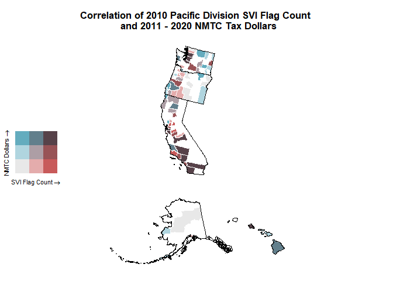<!-- -->

Here we can see that counties with high social vulnerability and large
amounts of NMTC dollars are located around metropolitan areas,
specifically Los Angeles, San Francisco, and Seattle.

``` r
svi_divisional_county_nmtc_sf %>% filter(State %in% c("CA", "WA")) %>% select(State, County, flag_count10, post10_nmtc_dollars_formatted) %>% arrange(desc(flag_count10)) %>% head(6) %>% kbl() %>% kable_styling() %>% scroll_box(width = "100%")
```

<div style="border: 1px solid #ddd; padding: 5px; overflow-x: scroll; width:100%; ">

<table class="table" style="margin-left: auto; margin-right: auto;">
<thead>
<tr>
<th style="text-align:left;">
State
</th>
<th style="text-align:left;">
County
</th>
<th style="text-align:right;">
flag_count10
</th>
<th style="text-align:left;">
post10_nmtc_dollars_formatted
</th>
</tr>
</thead>
<tbody>
<tr>
<td style="text-align:left;">
CA
</td>
<td style="text-align:left;">
Los Angeles County
</td>
<td style="text-align:right;">
9210
</td>
<td style="text-align:left;">
\$987,407,086
</td>
</tr>
<tr>
<td style="text-align:left;">
CA
</td>
<td style="text-align:left;">
Riverside County
</td>
<td style="text-align:right;">
1451
</td>
<td style="text-align:left;">
\$40,871,824
</td>
</tr>
<tr>
<td style="text-align:left;">
CA
</td>
<td style="text-align:left;">
San Diego County
</td>
<td style="text-align:right;">
1305
</td>
<td style="text-align:left;">
\$221,738,411
</td>
</tr>
<tr>
<td style="text-align:left;">
CA
</td>
<td style="text-align:left;">
Orange County
</td>
<td style="text-align:right;">
978
</td>
<td style="text-align:left;">
\$12,463,033
</td>
</tr>
<tr>
<td style="text-align:left;">
CA
</td>
<td style="text-align:left;">
Fresno County
</td>
<td style="text-align:right;">
931
</td>
<td style="text-align:left;">
\$115,258,480
</td>
</tr>
<tr>
<td style="text-align:left;">
CA
</td>
<td style="text-align:left;">
Sacramento County
</td>
<td style="text-align:right;">
831
</td>
<td style="text-align:left;">
\$3,630,000
</td>
</tr>
</tbody>
</table>

</div>

This chart shows that the majority of high SVI flags for the Pacific
Division are coming from Central and Southern California, particulary
Los Angeles, Riverside, and San Diego Counties.

``` r
svi_divisional_county_nmtc_sf %>% filter(State %in% c("AK", "HI", "OR")) %>%
  arrange(desc(post10_nmtc_project_dollars), flag_count10) %>% select(State, County, flag_count10, post10_nmtc_dollars_formatted) %>% head(10) %>% kbl() %>% kable_styling() %>% scroll_box(width = "100%")
```

<div style="border: 1px solid #ddd; padding: 5px; overflow-x: scroll; width:100%; ">

<table class="table" style="margin-left: auto; margin-right: auto;">
<thead>
<tr>
<th style="text-align:left;">
State
</th>
<th style="text-align:left;">
County
</th>
<th style="text-align:right;">
flag_count10
</th>
<th style="text-align:left;">
post10_nmtc_dollars_formatted
</th>
</tr>
</thead>
<tbody>
<tr>
<td style="text-align:left;">
HI
</td>
<td style="text-align:left;">
Hawaii County
</td>
<td style="text-align:right;">
56
</td>
<td style="text-align:left;">
\$99,555,000
</td>
</tr>
<tr>
<td style="text-align:left;">
OR
</td>
<td style="text-align:left;">
Douglas County
</td>
<td style="text-align:right;">
45
</td>
<td style="text-align:left;">
\$66,520,000
</td>
</tr>
<tr>
<td style="text-align:left;">
OR
</td>
<td style="text-align:left;">
Multnomah County
</td>
<td style="text-align:right;">
262
</td>
<td style="text-align:left;">
\$52,382,352
</td>
</tr>
<tr>
<td style="text-align:left;">
HI
</td>
<td style="text-align:left;">
Honolulu County
</td>
<td style="text-align:right;">
343
</td>
<td style="text-align:left;">
\$35,830,900
</td>
</tr>
<tr>
<td style="text-align:left;">
OR
</td>
<td style="text-align:left;">
Coos County
</td>
<td style="text-align:right;">
38
</td>
<td style="text-align:left;">
\$35,804,300
</td>
</tr>
<tr>
<td style="text-align:left;">
OR
</td>
<td style="text-align:left;">
Umatilla County
</td>
<td style="text-align:right;">
26
</td>
<td style="text-align:left;">
\$29,975,000
</td>
</tr>
<tr>
<td style="text-align:left;">
OR
</td>
<td style="text-align:left;">
Lane County
</td>
<td style="text-align:right;">
175
</td>
<td style="text-align:left;">
\$28,810,000
</td>
</tr>
<tr>
<td style="text-align:left;">
HI
</td>
<td style="text-align:left;">
Maui County
</td>
<td style="text-align:right;">
38
</td>
<td style="text-align:left;">
\$22,038,000
</td>
</tr>
<tr>
<td style="text-align:left;">
AK
</td>
<td style="text-align:left;">
Wade Hampton Census Area
</td>
<td style="text-align:right;">
10
</td>
<td style="text-align:left;">
\$21,420,000
</td>
</tr>
<tr>
<td style="text-align:left;">
OR
</td>
<td style="text-align:left;">
Josephine County
</td>
<td style="text-align:right;">
54
</td>
<td style="text-align:left;">
\$20,480,000
</td>
</tr>
</tbody>
</table>

</div>

In contrast, we can see that Alaska, Hawaii, and Oregon all have several
counties with low SVI flags that receive high amounts of NMTC dollars.

### LIHTC in Pacific Division

NOw we can take a look at LIHTC data:

``` r
svi_divisional_county_lihtc_projects <- svi_divisional_county_lihtc %>% filter(post10_lihtc_project_cnt > 0)
```

``` r
svi_divisional_county_lihtc_projects <- svi_divisional_county_lihtc_projects %>% filter(post10_lihtc_project_dollars > 0)
```

``` r
summary(svi_divisional_county_lihtc_projects$flag_count10)
```

    ##    Min. 1st Qu.  Median    Mean 3rd Qu.    Max. 
    ##    2.00   14.75   25.50  171.14  149.75 2394.00

Again we can see that there may be a few influential outliers in our
data with the highest amount of flags being 2394 and the majority of
flags being under 150.

``` r
summary(svi_divisional_county_lihtc_projects$post10_lihtc_project_dollars)
```

    ##     Min.  1st Qu.   Median     Mean  3rd Qu.     Max. 
    ##   250101   745546  2168330  5287061  4488865 50547731

This is also true of LIHTC dollars, with around a 45,000,000 difference
between the 75th percentile and the highest awarded county.

We can view this visually with the graph below:

``` r
# Scatterplot
# y is our independent variable (LIHTC Project Dollars),  
# x is our dependent variable (SVI flag count)
ggplot2::ggplot(svi_divisional_county_lihtc_projects,
                aes(x=flag_count10,
                    y=post10_lihtc_project_dollars)) +
        geom_point() +
        geom_smooth(method="lm") +
        scale_y_continuous(labels = scales::dollar_format()) 
```

    ## `geom_smooth()` using formula = 'y ~ x'

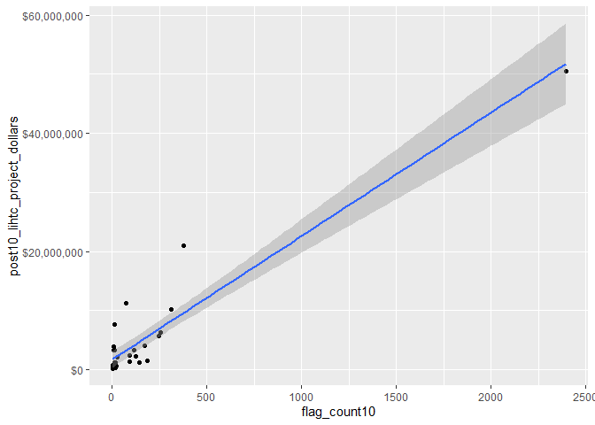<!-- -->

``` r
# Pearson's r calculation
cor(svi_divisional_county_lihtc_projects$flag_count10, svi_divisional_county_lihtc_projects$post10_lihtc_project_dollars, method = "pearson")
```

    ## [1] 0.9418682

Considering all counties in the Pacific Division, there is a very strong
positive correlation between the number of SVI flags in 2010 and the
amount of LIHTC dollars in 2011-2020, suggesting that counties that are
more vulnerable receive more tax credits with the LIHTC program.

However, the plot shows an influential data point that may be skewing
the correlation. We can view it as a box plot:

``` r
boxplot(svi_divisional_county_lihtc_projects$flag_count10)
```

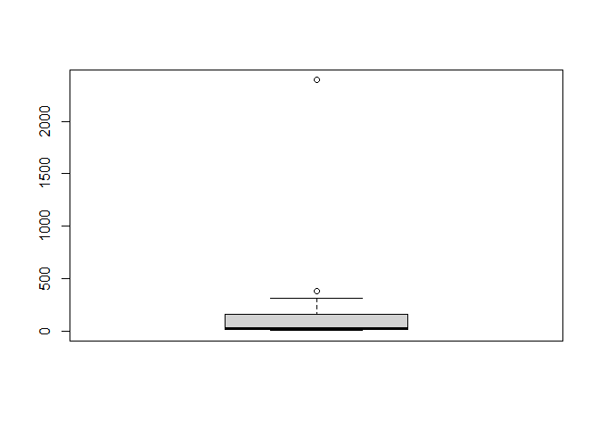<!-- -->

``` r
boxplot.stats(svi_divisional_county_lihtc_projects$flag_count10)$out %>% sort(decreasing = TRUE)
```

    ## [1] 2394  376

``` r
svi_divisional_county_lihtc_projects %>% filter(flag_count10 == 2394) %>% select(county_name, flag_count10, post10_lihtc_dollars_formatted) %>% head() 
```

    ##              county_name flag_count10 post10_lihtc_dollars_formatted
    ## 1 Los Angeles County, CA         2394                    $50,547,731

We can see this is the same influential point from our NMTC analysis,
Los Angeles County, CA.

#### K-Means Clustering

``` r
svi_divisional_lihtc_cluster <- svi_divisional_county_lihtc_projects %>% 
                            select(county_name, post10_lihtc_project_dollars, 
                                   flag_count10) %>% 
                            remove_rownames %>% 
                            column_to_rownames(var="county_name")

# Remove nulls, if in dataset
svi_divisional_lihtc_cluster <- na.omit(svi_divisional_lihtc_cluster)


# Scale numeric variables
svi_divisional_lihtc_cluster <- scale(svi_divisional_lihtc_cluster)


svi_divisional_lihtc_cluster %>% head(5)
```

    ##                     post10_lihtc_project_dollars flag_count10
    ## Alameda County, CA                    -0.3720126   0.03317421
    ## Butte County, CA                      -0.4766870  -0.34418241
    ## Fresno County, CA                     -0.2922395  -0.17225070
    ## Humboldt County, CA                   -0.4092212  -0.35534681
    ## Kern County, CA                       -0.2010567  -0.11866159

``` r
set.seed(123)
k2_lihtc_div <- kmeans(svi_divisional_lihtc_cluster, centers = 2, nstart = 25)
set.seed(123)
k3_lihtc_div <- kmeans(svi_divisional_lihtc_cluster, centers = 3, nstart = 25)
set.seed(123)
k4_lihtc_div <- kmeans(svi_divisional_lihtc_cluster, centers = 4, nstart = 25)
set.seed(123)
k5_lihtc_div <- kmeans(svi_divisional_lihtc_cluster, centers = 5, nstart = 25)
```

``` r
# plots to compare
p_k2_lihtc_div <- factoextra::fviz_cluster(k2_lihtc_div, geom = "point", data = svi_divisional_lihtc_cluster) + ggtitle("k = 2")

p_k3_lihtc_div <- factoextra::fviz_cluster(k3_lihtc_div, geom = "point", data = svi_divisional_lihtc_cluster) + ggtitle("k = 3")

p_k4_lihtc_div <- factoextra::fviz_cluster(k4_lihtc_div, geom = "point",  data = svi_divisional_lihtc_cluster) + ggtitle("k = 4")

p_k5_lihtc_div <- factoextra::fviz_cluster(k5_lihtc_div, geom = "point",  data = svi_divisional_lihtc_cluster) + ggtitle("k = 5")

grid.arrange(p_k2_lihtc_div, p_k3_lihtc_div, p_k4_lihtc_div, p_k5_lihtc_div, nrow = 2)
```

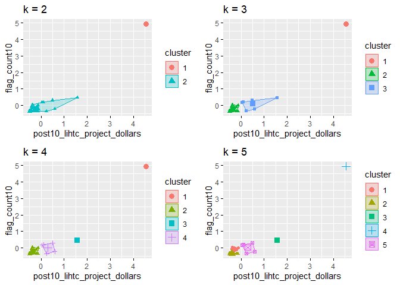<!-- -->

``` r
elbow_plot(svi_divisional_lihtc_cluster)
```

    ##  [1]  1  2  3  4  5  6  7  8  9 10 11 12 13 14 15
    ## [1] 1
    ## [1] 2
    ## [1] 3
    ## [1] 4
    ## [1] 5
    ## [1] 6
    ## [1] 7
    ## [1] 8
    ## [1] 9
    ## [1] 10
    ## [1] 11
    ## [1] 12
    ## [1] 13
    ## [1] 14
    ## [1] 15

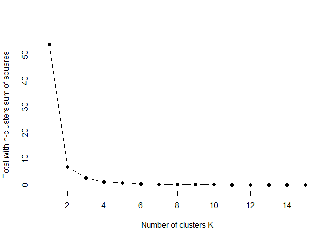<!-- -->

Again, we will choose to use two clusters as we did for the NMTC.

``` r
p_k2_lihtc_div <- factoextra::fviz_cluster(k2_lihtc_div, geom = "point", data = svi_divisional_lihtc_cluster) + ggtitle("k = 2")

p_k2_lihtc_div
```

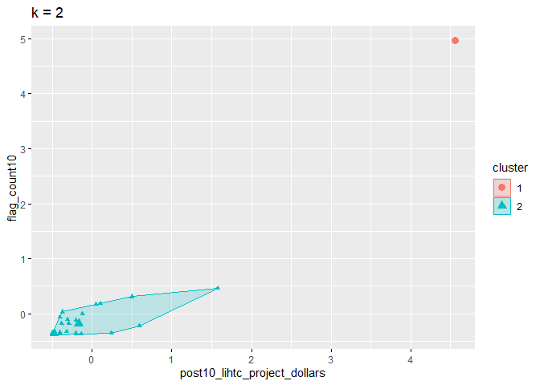<!-- -->

``` r
svi_divisional_lihtc_cluster_label <- as.data.frame(svi_divisional_lihtc_cluster) %>%
                                  rownames_to_column(var = "county_name") %>%
                                  as_tibble() %>%
                                  mutate(cluster = k2_lihtc_div$cluster) %>%
                                  select(county_name, cluster)

svi_divisional_county_lihtc_projects2 <- left_join(svi_divisional_county_lihtc_projects, svi_divisional_lihtc_cluster_label, join_by(county_name == county_name))

# View county counts in each cluster
table(svi_divisional_county_lihtc_projects2$cluster)
```

    ## 
    ##  1  2 
    ##  1 27

Now let’s take a closer look at our clusters.

``` r
# Cluster 1 Scatterplot
# y is our independent variable (LIHTC Project Dollars),  
# x is our dependent variable (SVI flag count)

svi_divisional_county_lihtc_projects2 %>% 
  filter(cluster == 1) %>%
  ggplot2::ggplot(aes(x=flag_count10,
                    y=post10_lihtc_project_dollars)) +
        geom_point() +
        geom_smooth(method="lm") +
        scale_y_continuous(labels = scales::dollar_format()) 
```

    ## `geom_smooth()` using formula = 'y ~ x'

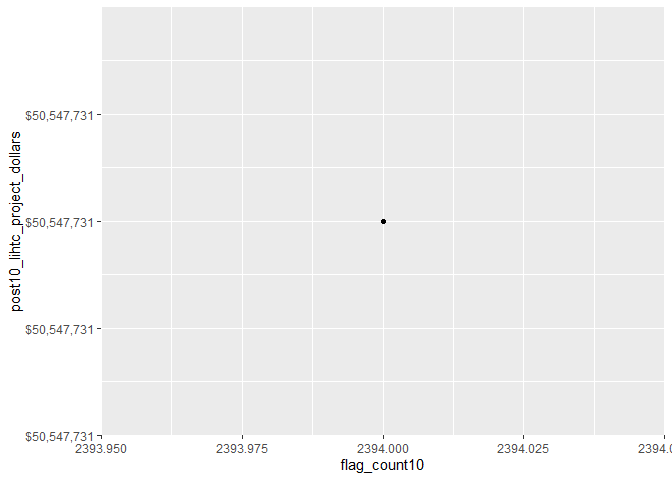<!-- -->

``` r
svi_divisional_county_lihtc_projects2 %>% 
  filter(cluster == 1) %>%
  select(flag_count10,post10_lihtc_project_dollars) %>%
  cor(method = "pearson")
```

    ##                              flag_count10 post10_lihtc_project_dollars
    ## flag_count10                           NA                           NA
    ## post10_lihtc_project_dollars           NA                           NA

Similar to the NMTC data, we cannot calculate a correlation with only
one point.

``` r
# Cluster 2 Scatterplot
# y is our independent variable (LIHTC Project Dollars),  
# x is our dependent variable (SVI flag count)

svi_divisional_county_lihtc_projects2 %>% 
  filter(cluster == 2) %>%
  ggplot2::ggplot(aes(x=flag_count10,
                    y=post10_lihtc_project_dollars)) +
        geom_point() +
        geom_smooth(method="lm") +
        scale_y_continuous(labels = scales::dollar_format()) 
```

    ## `geom_smooth()` using formula = 'y ~ x'

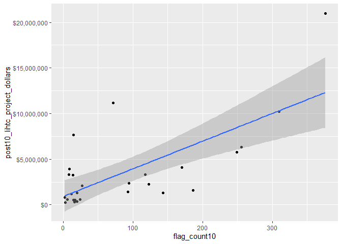<!-- -->

``` r
svi_divisional_county_lihtc_projects2 %>% 
  filter(cluster == 2) %>%
  select(flag_count10,post10_lihtc_project_dollars) %>%
  cor(method = "pearson")
```

    ##                              flag_count10 post10_lihtc_project_dollars
    ## flag_count10                    1.0000000                    0.7026956
    ## post10_lihtc_project_dollars    0.7026956                    1.0000000

Now we can see that there is still a strong positive correlation between
the number of SVI flags in 2010 and LIHTC dollars received in 2011-2020,
though not as strong a correlation when looking at all counties in the
Pacific Division.

#### Bivariate Maps

``` r
# Join our LIHTC projects data with our shapefile geocoordinates
svi_divisional_county_lihtc_sf <- left_join(svi_divisional_county_lihtc_projects, divisional_county_sf, join_by("FIPS_st" == "STATEFP", "FIPS_county" == "COUNTYFP"))

svi_divisional_county_lihtc_sf %>% head(5) %>% kbl() %>% kable_styling() %>% scroll_box(width = "100%")
```

<div style="border: 1px solid #ddd; padding: 5px; overflow-x: scroll; width:100%; ">

<table class="table" style="margin-left: auto; margin-right: auto;">
<thead>
<tr>
<th style="text-align:left;">
State
</th>
<th style="text-align:left;">
County
</th>
<th style="text-align:left;">
Division
</th>
<th style="text-align:right;">
post10_lihtc_project_cnt
</th>
<th style="text-align:right;">
tract_cnt
</th>
<th style="text-align:right;">
post10_lihtc_project_dollars
</th>
<th style="text-align:left;">
post10_lihtc_dollars_formatted
</th>
<th style="text-align:left;">
fips_county_st
</th>
<th style="text-align:left;">
FIPS_st
</th>
<th style="text-align:left;">
FIPS_county
</th>
<th style="text-align:left;">
state_name
</th>
<th style="text-align:right;">
region_number
</th>
<th style="text-align:left;">
region
</th>
<th style="text-align:right;">
division_number
</th>
<th style="text-align:right;">
flag_count10
</th>
<th style="text-align:right;">
pop10
</th>
<th style="text-align:right;">
flag_by_pop10
</th>
<th style="text-align:right;">
flag_count_quantile10
</th>
<th style="text-align:right;">
flag_pop_quantile10
</th>
<th style="text-align:right;">
flag_count20
</th>
<th style="text-align:right;">
pop20
</th>
<th style="text-align:right;">
flag_by_pop20
</th>
<th style="text-align:right;">
flag_count_quantile20
</th>
<th style="text-align:right;">
flag_pop_quantile20
</th>
<th style="text-align:left;">
county_name
</th>
<th style="text-align:left;">
geometry
</th>
</tr>
</thead>
<tbody>
<tr>
<td style="text-align:left;">
CA
</td>
<td style="text-align:left;">
Alameda County
</td>
<td style="text-align:left;">
Pacific Division
</td>
<td style="text-align:right;">
1
</td>
<td style="text-align:right;">
23
</td>
<td style="text-align:right;">
1590984
</td>
<td style="text-align:left;">
\$1,590,984
</td>
<td style="text-align:left;">
06001
</td>
<td style="text-align:left;">
06
</td>
<td style="text-align:left;">
001
</td>
<td style="text-align:left;">
California
</td>
<td style="text-align:right;">
4
</td>
<td style="text-align:left;">
West Region
</td>
<td style="text-align:right;">
9
</td>
<td style="text-align:right;">
186
</td>
<td style="text-align:right;">
92323
</td>
<td style="text-align:right;">
0.0020147
</td>
<td style="text-align:right;">
1.0
</td>
<td style="text-align:right;">
0.6
</td>
<td style="text-align:right;">
170
</td>
<td style="text-align:right;">
101788
</td>
<td style="text-align:right;">
0.0016701
</td>
<td style="text-align:right;">
1.0
</td>
<td style="text-align:right;">
0.6
</td>
<td style="text-align:left;">
Alameda County, CA
</td>
<td style="text-align:left;">
MULTIPOLYGON (((-2266160 34…
</td>
</tr>
<tr>
<td style="text-align:left;">
CA
</td>
<td style="text-align:left;">
Butte County
</td>
<td style="text-align:left;">
Pacific Division
</td>
<td style="text-align:right;">
1
</td>
<td style="text-align:right;">
3
</td>
<td style="text-align:right;">
551007
</td>
<td style="text-align:left;">
\$551,007
</td>
<td style="text-align:left;">
06007
</td>
<td style="text-align:left;">
06
</td>
<td style="text-align:left;">
007
</td>
<td style="text-align:left;">
California
</td>
<td style="text-align:right;">
4
</td>
<td style="text-align:left;">
West Region
</td>
<td style="text-align:right;">
9
</td>
<td style="text-align:right;">
17
</td>
<td style="text-align:right;">
12025
</td>
<td style="text-align:right;">
0.0014137
</td>
<td style="text-align:right;">
0.6
</td>
<td style="text-align:right;">
0.2
</td>
<td style="text-align:right;">
19
</td>
<td style="text-align:right;">
13034
</td>
<td style="text-align:right;">
0.0014577
</td>
<td style="text-align:right;">
0.6
</td>
<td style="text-align:right;">
0.4
</td>
<td style="text-align:left;">
Butte County, CA
</td>
<td style="text-align:left;">
MULTIPOLYGON (((-2174433 56…
</td>
</tr>
<tr>
<td style="text-align:left;">
CA
</td>
<td style="text-align:left;">
Fresno County
</td>
<td style="text-align:left;">
Pacific Division
</td>
<td style="text-align:right;">
4
</td>
<td style="text-align:right;">
8
</td>
<td style="text-align:right;">
2383558
</td>
<td style="text-align:left;">
\$2,383,558
</td>
<td style="text-align:left;">
06019
</td>
<td style="text-align:left;">
06
</td>
<td style="text-align:left;">
019
</td>
<td style="text-align:left;">
California
</td>
<td style="text-align:right;">
4
</td>
<td style="text-align:left;">
West Region
</td>
<td style="text-align:right;">
9
</td>
<td style="text-align:right;">
94
</td>
<td style="text-align:right;">
36454
</td>
<td style="text-align:right;">
0.0025786
</td>
<td style="text-align:right;">
1.0
</td>
<td style="text-align:right;">
0.8
</td>
<td style="text-align:right;">
92
</td>
<td style="text-align:right;">
34872
</td>
<td style="text-align:right;">
0.0026382
</td>
<td style="text-align:right;">
1.0
</td>
<td style="text-align:right;">
1.0
</td>
<td style="text-align:left;">
Fresno County, CA
</td>
<td style="text-align:left;">
MULTIPOLYGON (((-2051818 14…
</td>
</tr>
<tr>
<td style="text-align:left;">
CA
</td>
<td style="text-align:left;">
Humboldt County
</td>
<td style="text-align:left;">
Pacific Division
</td>
<td style="text-align:right;">
1
</td>
<td style="text-align:right;">
2
</td>
<td style="text-align:right;">
1221303
</td>
<td style="text-align:left;">
\$1,221,303
</td>
<td style="text-align:left;">
06023
</td>
<td style="text-align:left;">
06
</td>
<td style="text-align:left;">
023
</td>
<td style="text-align:left;">
California
</td>
<td style="text-align:right;">
4
</td>
<td style="text-align:left;">
West Region
</td>
<td style="text-align:right;">
9
</td>
<td style="text-align:right;">
12
</td>
<td style="text-align:right;">
8644
</td>
<td style="text-align:right;">
0.0013882
</td>
<td style="text-align:right;">
0.4
</td>
<td style="text-align:right;">
0.2
</td>
<td style="text-align:right;">
15
</td>
<td style="text-align:right;">
8698
</td>
<td style="text-align:right;">
0.0017245
</td>
<td style="text-align:right;">
0.6
</td>
<td style="text-align:right;">
0.6
</td>
<td style="text-align:left;">
Humboldt County, CA
</td>
<td style="text-align:left;">
MULTIPOLYGON (((-2312278 74…
</td>
</tr>
<tr>
<td style="text-align:left;">
CA
</td>
<td style="text-align:left;">
Kern County
</td>
<td style="text-align:left;">
Pacific Division
</td>
<td style="text-align:right;">
8
</td>
<td style="text-align:right;">
11
</td>
<td style="text-align:right;">
3289492
</td>
<td style="text-align:left;">
\$3,289,492
</td>
<td style="text-align:left;">
06029
</td>
<td style="text-align:left;">
06
</td>
<td style="text-align:left;">
029
</td>
<td style="text-align:left;">
California
</td>
<td style="text-align:right;">
4
</td>
<td style="text-align:left;">
West Region
</td>
<td style="text-align:right;">
9
</td>
<td style="text-align:right;">
118
</td>
<td style="text-align:right;">
54631
</td>
<td style="text-align:right;">
0.0021599
</td>
<td style="text-align:right;">
1.0
</td>
<td style="text-align:right;">
0.6
</td>
<td style="text-align:right;">
116
</td>
<td style="text-align:right;">
54102
</td>
<td style="text-align:right;">
0.0021441
</td>
<td style="text-align:right;">
1.0
</td>
<td style="text-align:right;">
0.8
</td>
<td style="text-align:left;">
Kern County, CA
</td>
<td style="text-align:left;">
MULTIPOLYGON (((-2050419 59…
</td>
</tr>
</tbody>
</table>

</div>

``` r
# Create classes for bivariate mapping 
svi_divisional_county_lihtc_sf <- bi_class(svi_divisional_county_lihtc_sf, x = flag_count10, y = post10_lihtc_project_dollars, style = "quantile", dim = 3)

# View data
svi_divisional_county_lihtc_sf %>% head(5) %>% kbl() %>% kable_styling() %>% scroll_box(width = "100%")
```

<div style="border: 1px solid #ddd; padding: 5px; overflow-x: scroll; width:100%; ">

<table class="table" style="margin-left: auto; margin-right: auto;">
<thead>
<tr>
<th style="text-align:left;">
State
</th>
<th style="text-align:left;">
County
</th>
<th style="text-align:left;">
Division
</th>
<th style="text-align:right;">
post10_lihtc_project_cnt
</th>
<th style="text-align:right;">
tract_cnt
</th>
<th style="text-align:right;">
post10_lihtc_project_dollars
</th>
<th style="text-align:left;">
post10_lihtc_dollars_formatted
</th>
<th style="text-align:left;">
fips_county_st
</th>
<th style="text-align:left;">
FIPS_st
</th>
<th style="text-align:left;">
FIPS_county
</th>
<th style="text-align:left;">
state_name
</th>
<th style="text-align:right;">
region_number
</th>
<th style="text-align:left;">
region
</th>
<th style="text-align:right;">
division_number
</th>
<th style="text-align:right;">
flag_count10
</th>
<th style="text-align:right;">
pop10
</th>
<th style="text-align:right;">
flag_by_pop10
</th>
<th style="text-align:right;">
flag_count_quantile10
</th>
<th style="text-align:right;">
flag_pop_quantile10
</th>
<th style="text-align:right;">
flag_count20
</th>
<th style="text-align:right;">
pop20
</th>
<th style="text-align:right;">
flag_by_pop20
</th>
<th style="text-align:right;">
flag_count_quantile20
</th>
<th style="text-align:right;">
flag_pop_quantile20
</th>
<th style="text-align:left;">
county_name
</th>
<th style="text-align:left;">
geometry
</th>
<th style="text-align:left;">
bi_class
</th>
</tr>
</thead>
<tbody>
<tr>
<td style="text-align:left;">
CA
</td>
<td style="text-align:left;">
Alameda County
</td>
<td style="text-align:left;">
Pacific Division
</td>
<td style="text-align:right;">
1
</td>
<td style="text-align:right;">
23
</td>
<td style="text-align:right;">
1590984
</td>
<td style="text-align:left;">
\$1,590,984
</td>
<td style="text-align:left;">
06001
</td>
<td style="text-align:left;">
06
</td>
<td style="text-align:left;">
001
</td>
<td style="text-align:left;">
California
</td>
<td style="text-align:right;">
4
</td>
<td style="text-align:left;">
West Region
</td>
<td style="text-align:right;">
9
</td>
<td style="text-align:right;">
186
</td>
<td style="text-align:right;">
92323
</td>
<td style="text-align:right;">
0.0020147
</td>
<td style="text-align:right;">
1.0
</td>
<td style="text-align:right;">
0.6
</td>
<td style="text-align:right;">
170
</td>
<td style="text-align:right;">
101788
</td>
<td style="text-align:right;">
0.0016701
</td>
<td style="text-align:right;">
1.0
</td>
<td style="text-align:right;">
0.6
</td>
<td style="text-align:left;">
Alameda County, CA
</td>
<td style="text-align:left;">
MULTIPOLYGON (((-2266160 34…
</td>
<td style="text-align:left;">
3-2
</td>
</tr>
<tr>
<td style="text-align:left;">
CA
</td>
<td style="text-align:left;">
Butte County
</td>
<td style="text-align:left;">
Pacific Division
</td>
<td style="text-align:right;">
1
</td>
<td style="text-align:right;">
3
</td>
<td style="text-align:right;">
551007
</td>
<td style="text-align:left;">
\$551,007
</td>
<td style="text-align:left;">
06007
</td>
<td style="text-align:left;">
06
</td>
<td style="text-align:left;">
007
</td>
<td style="text-align:left;">
California
</td>
<td style="text-align:right;">
4
</td>
<td style="text-align:left;">
West Region
</td>
<td style="text-align:right;">
9
</td>
<td style="text-align:right;">
17
</td>
<td style="text-align:right;">
12025
</td>
<td style="text-align:right;">
0.0014137
</td>
<td style="text-align:right;">
0.6
</td>
<td style="text-align:right;">
0.2
</td>
<td style="text-align:right;">
19
</td>
<td style="text-align:right;">
13034
</td>
<td style="text-align:right;">
0.0014577
</td>
<td style="text-align:right;">
0.6
</td>
<td style="text-align:right;">
0.4
</td>
<td style="text-align:left;">
Butte County, CA
</td>
<td style="text-align:left;">
MULTIPOLYGON (((-2174433 56…
</td>
<td style="text-align:left;">
2-1
</td>
</tr>
<tr>
<td style="text-align:left;">
CA
</td>
<td style="text-align:left;">
Fresno County
</td>
<td style="text-align:left;">
Pacific Division
</td>
<td style="text-align:right;">
4
</td>
<td style="text-align:right;">
8
</td>
<td style="text-align:right;">
2383558
</td>
<td style="text-align:left;">
\$2,383,558
</td>
<td style="text-align:left;">
06019
</td>
<td style="text-align:left;">
06
</td>
<td style="text-align:left;">
019
</td>
<td style="text-align:left;">
California
</td>
<td style="text-align:right;">
4
</td>
<td style="text-align:left;">
West Region
</td>
<td style="text-align:right;">
9
</td>
<td style="text-align:right;">
94
</td>
<td style="text-align:right;">
36454
</td>
<td style="text-align:right;">
0.0025786
</td>
<td style="text-align:right;">
1.0
</td>
<td style="text-align:right;">
0.8
</td>
<td style="text-align:right;">
92
</td>
<td style="text-align:right;">
34872
</td>
<td style="text-align:right;">
0.0026382
</td>
<td style="text-align:right;">
1.0
</td>
<td style="text-align:right;">
1.0
</td>
<td style="text-align:left;">
Fresno County, CA
</td>
<td style="text-align:left;">
MULTIPOLYGON (((-2051818 14…
</td>
<td style="text-align:left;">
2-2
</td>
</tr>
<tr>
<td style="text-align:left;">
CA
</td>
<td style="text-align:left;">
Humboldt County
</td>
<td style="text-align:left;">
Pacific Division
</td>
<td style="text-align:right;">
1
</td>
<td style="text-align:right;">
2
</td>
<td style="text-align:right;">
1221303
</td>
<td style="text-align:left;">
\$1,221,303
</td>
<td style="text-align:left;">
06023
</td>
<td style="text-align:left;">
06
</td>
<td style="text-align:left;">
023
</td>
<td style="text-align:left;">
California
</td>
<td style="text-align:right;">
4
</td>
<td style="text-align:left;">
West Region
</td>
<td style="text-align:right;">
9
</td>
<td style="text-align:right;">
12
</td>
<td style="text-align:right;">
8644
</td>
<td style="text-align:right;">
0.0013882
</td>
<td style="text-align:right;">
0.4
</td>
<td style="text-align:right;">
0.2
</td>
<td style="text-align:right;">
15
</td>
<td style="text-align:right;">
8698
</td>
<td style="text-align:right;">
0.0017245
</td>
<td style="text-align:right;">
0.6
</td>
<td style="text-align:right;">
0.6
</td>
<td style="text-align:left;">
Humboldt County, CA
</td>
<td style="text-align:left;">
MULTIPOLYGON (((-2312278 74…
</td>
<td style="text-align:left;">
1-1
</td>
</tr>
<tr>
<td style="text-align:left;">
CA
</td>
<td style="text-align:left;">
Kern County
</td>
<td style="text-align:left;">
Pacific Division
</td>
<td style="text-align:right;">
8
</td>
<td style="text-align:right;">
11
</td>
<td style="text-align:right;">
3289492
</td>
<td style="text-align:left;">
\$3,289,492
</td>
<td style="text-align:left;">
06029
</td>
<td style="text-align:left;">
06
</td>
<td style="text-align:left;">
029
</td>
<td style="text-align:left;">
California
</td>
<td style="text-align:right;">
4
</td>
<td style="text-align:left;">
West Region
</td>
<td style="text-align:right;">
9
</td>
<td style="text-align:right;">
118
</td>
<td style="text-align:right;">
54631
</td>
<td style="text-align:right;">
0.0021599
</td>
<td style="text-align:right;">
1.0
</td>
<td style="text-align:right;">
0.6
</td>
<td style="text-align:right;">
116
</td>
<td style="text-align:right;">
54102
</td>
<td style="text-align:right;">
0.0021441
</td>
<td style="text-align:right;">
1.0
</td>
<td style="text-align:right;">
0.8
</td>
<td style="text-align:left;">
Kern County, CA
</td>
<td style="text-align:left;">
MULTIPOLYGON (((-2050419 59…
</td>
<td style="text-align:left;">
2-2
</td>
</tr>
</tbody>
</table>

</div>

``` r
# Create map with ggplot
svi_divisional_county_lihtc_map <- ggplot() +
  # Map county shapefile, fill with bi_class categories
  geom_sf(data = svi_divisional_county_lihtc_sf, mapping = aes(geometry=geometry, fill = bi_class), color = "white", size = 0.1, show.legend = FALSE) +
  # Set to biscale palette
  bi_scale_fill(pal = "GrPink", dim = 3) +
  # Add state shapefiles for outline
  geom_sf(data=divisional_st_sf, color="black", fill=NA, linewidth=.5, aes(geometry=geometry)) +
  labs(
    title = paste0("Correlation of 2010 ", census_division, " SVI Flag Count \n and 2011 - 2020 LIHTC Tax Dollars")
  ) +
  # Set them to biscale
  bi_theme(base_size = 10)

# Create biscale legend
svi_divisional_county_lihtc_legend <- bi_legend(pal = "GrPink",
                    dim = 3,
                    xlab = "SVI Flag Count",
                    ylab = "LIHTC Dollars",
                    size = 8)

# Combine map with legend using cowplot
svi_divisional_county_lihtc_bivarmap <- ggdraw() +
  draw_plot(svi_divisional_county_lihtc_map) +
  # Set legend location
  draw_plot(svi_divisional_county_lihtc_legend, x= -.02,  y = -.05,
 width=.20)


# View map
svi_divisional_county_lihtc_bivarmap
```

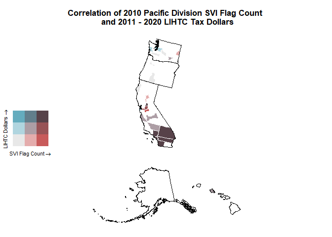<!-- -->

With our map, we can a higher amount of SVI flags and LIHTC dollars in
different parts of California and Washington.

``` r
svi_divisional_county_lihtc_sf %>% filter(State == "CA") %>% select(State, County, flag_count10, post10_lihtc_dollars_formatted) %>% arrange(desc(flag_count10)) %>% head(6)
```

    ##   State                County flag_count10 post10_lihtc_dollars_formatted
    ## 1    CA    Los Angeles County         2394                    $50,547,731
    ## 2    CA      San Diego County          376                    $20,961,962
    ## 3    CA         Orange County          310                    $10,245,926
    ## 4    CA      Riverside County          256                     $6,335,483
    ## 5    CA San Bernardino County          249                     $5,757,810
    ## 6    CA        Alameda County          186                     $1,590,984

``` r
svi_divisional_county_lihtc_sf %>% filter(State == "WA") %>% select(State, County, flag_count10, post10_lihtc_dollars_formatted) %>% arrange(desc(flag_count10)) %>% head(6)
```

    ##   State              County flag_count10 post10_lihtc_dollars_formatted
    ## 1    WA      Spokane County           24                       $591,050
    ## 2    WA     Franklin County           20                     $1,281,731
    ## 3    WA         King County           14                     $3,259,389
    ## 4    WA       Kitsap County            9                     $3,905,012
    ## 5    WA Grays Harbor County            8                     $3,332,521
    ## 6    WA        Lewis County            3                       $250,101

``` r
saveRDS(svi_divisional_lihtc, file = here::here(paste0("data/wrangling/", str_replace_all(census_division, " ", "_"), "_svi_divisional_lihtc.rds")))

saveRDS(svi_national_lihtc, file = here::here(paste0("data/wrangling/", str_replace_all(census_division, " ", "_"), "_svi_national_lihtc.rds")))

saveRDS(svi_divisional_nmtc, file = here::here(paste0("data/wrangling/", str_replace_all(census_division, " ", "_"), "_svi_divisional_nmtc.rds")))

saveRDS(svi_national_nmtc, file = here::here(paste0("data/wrangling/", str_replace_all(census_division, " ", "_"), "_svi_national_nmtc.rds")))
```
