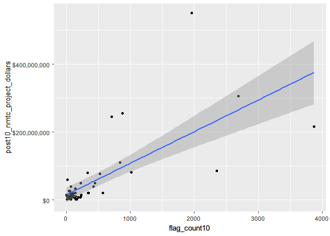
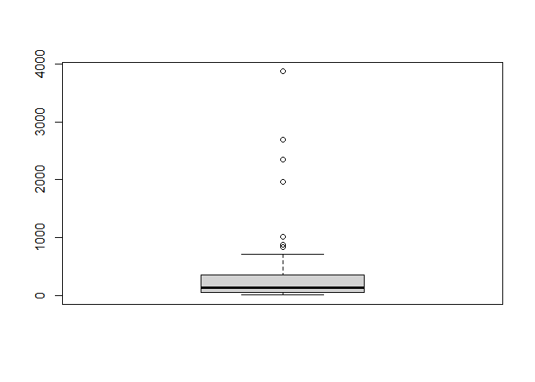
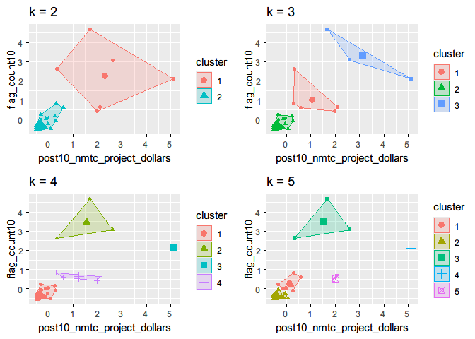
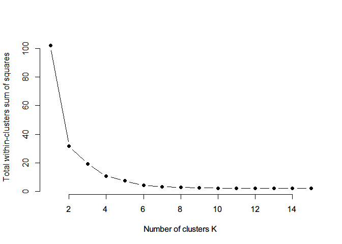
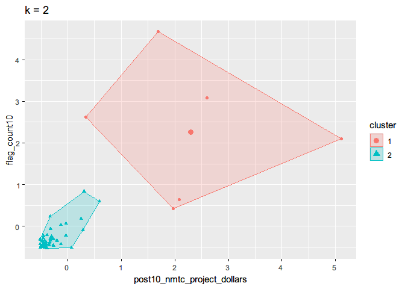
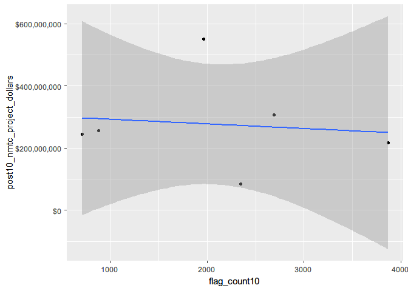
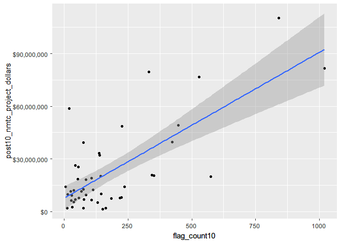
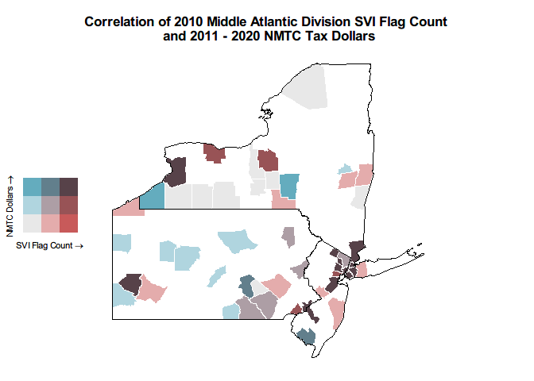

# Introduction

**NOTE: Values below are duplicates from Middle Atlantic Division and serve solely as an example**

The New Markets Tax Credit (NMTC) program was created in 2000 and authorized by Congress under the Community Renewal and Tax Relief Act of 2000 (CDFI Fund, 2022). The program distributes tax credit dollars to Community Development Entities who award Qualified Low-Income Community Investments (QLICIs), such as business loans, to investors in Low-Income Communities. The ongoing goal of the NMTC program is to improve low income communities by encouraging developers to build new projects that can create jobs and provide additional services within financially risky communities (Novogradac, 2023). There are numerous eligibility criteria to qualify census tracts recipients.

The Low Income Housing Tax Credit (LIHTC) program is a much older program that was started in 1986 and authorized by Congress under the Tax Reform Act of 1986. Most recently, the Inflation Reduction Act of 2022 increased credits/bonuses (Urban Institute, 2018; Congressional Research Service, 2023). In addition, in contrast to CDE/QLICI model of the NMTC program, LIHTC dollars go directly to investors, but the funds are limited to affordable housing developments for economically disadvantaged individuals. The Urban Institute (2018) describes the program as “an incentive to make equity investments in affordable rental housing. The equity raised is used to construct new properties, acquire and renovate existing buildings, and refinance and renovate existing affordable rental housing properties that have previously been financed through other federal housing programs” (Urban Institute, 2018).

In the following analysis we explore correlations between these programs and the amount of funding they provide to our identified areas of vulnerability within the Pacific Division. Specifically we discovered that there is a strong positive correlation between NMTC dollars and SVI Flag Counts in 2010 for the majority of counties/census tracts in [STATES]. While not quite as strong, we still found a moderate correlation between LIHTC dollars and SVI Flag Counts in 2010.


# Library

``` r
# Turn off scientific notation
options(scipen=999)

# Load packages
library(here)        # relative file paths for reproducibility
library(tidyverse)   # data wrangling
library(stringi)     # string data wrangling
library(tigris)      # US census TIGER/Line shapefiles
library(ggplot2)     # data visualization
library(cowplot)     # data visualization plotting
library(gridExtra)   # grid for data visualizations
library(biscale)     # bivariate mapping
library(kableExtra)  # table formatting
library(scales)      # palette and number formatting
library(cluster)     # clustering algorithms
library(factoextra)  # clustering algorithms & visualization
```

# Functions

``` r
import::here( "fips_census_regions",
              "load_svi_data",
              "merge_svi_data",
              "census_division",
              "flag_summarize",
              "summarize_county_nmtc",
              "summarize_county_lihtc",
              "elbow_plot",
             # notice the use of here::here() that points to the .R file
             # where all these R objects are created
             .from = here::here("analysis/project_data_steps_mickey.R"),
             .character_only = TRUE)
```

# SVI Data

``` r
# Load SVI data sets
svi_2010 <- readRDS(here::here("data/raw/Census_Data_SVI/svi_2010_trt10.rds"))
svi_2020 <- readRDS(here::here("data/raw/Census_Data_SVI/svi_2020_trt10.rds"))

# Load mapping data sets
svi_county_map2010 <- readRDS(here::here(paste0("data/wrangling/", str_replace_all(census_division, " ", "_"), "_county_svi_flags10.rds")))

svi_county_map2020 <- readRDS(here::here(paste0("data/wrangling/", str_replace_all(census_division, " ", "_"), "_county_svi_flags20.rds")))

divisional_st_sf <- readRDS(here::here(paste0("data/wrangling/", str_replace_all(census_division, " ", "_"), "_st_sf.rds")))
```

# NMTC & LIHTC Data

``` r
# Load NMTC & LIHTC Tract Eligibility Data

orig_nmtc <- readxl::read_excel(here::here("data/raw/NMTC_LIHTC_tracts/nmtc_2011-2015_lic_110217.xlsx"), sheet="NMTC LICs 2011-2015 ACS")

high_migration_nmtc <- readxl::read_excel(here::here("data/raw/NMTC_LIHTC_tracts/nmtc_2011-2015_lic_110217.xlsx"), sheet="High migration tracts", skip=1)

nmtc_awards_data <- readxl::read_excel(here::here("data/raw/NMTC_LIHTC_tracts/NMTC_Public_Data_Release_includes_FY_2021_Data_final.xlsx"), sheet = "Projects 2 - Data Set PUBLISH.P")

lihtc_eligible <- readxl::read_excel(here::here("data/raw/NMTC_LIHTC_tracts/qct_data_2010_2011_2012.xlsx"))

lihtc_projects <- read.csv(here::here("data/raw/NMTC_LIHTC_tracts/lihtcpub/LIHTCPUB.csv"))
```

# Load 2010 SVI Data

``` r
# National 2010 Data
svi_2010_national <- load_svi_data(svi_2010, percentile=.75)
svi_2010_national %>% head() %>% kbl() %>% kable_styling() %>% scroll_box(width = "100%")
```

<div style="border: 1px solid #ddd; padding: 5px; overflow-x: scroll; width:100%; ">

<table class="table" style="margin-left: auto; margin-right: auto;">
<thead>
<tr>
<th style="text-align:left;">
GEOID_2010_trt
</th>
<th style="text-align:left;">
FIPS_st
</th>
<th style="text-align:left;">
FIPS_county
</th>
<th style="text-align:left;">
FIPS_tract
</th>
<th style="text-align:left;">
state
</th>
<th style="text-align:left;">
state_name
</th>
<th style="text-align:left;">
county
</th>
<th style="text-align:right;">
region_number
</th>
<th style="text-align:left;">
region
</th>
<th style="text-align:right;">
division_number
</th>
<th style="text-align:left;">
division
</th>
<th style="text-align:right;">
E_TOTPOP_10
</th>
<th style="text-align:right;">
E_HU_10
</th>
<th style="text-align:right;">
E_HH_10
</th>
<th style="text-align:right;">
E_POV150_10
</th>
<th style="text-align:right;">
ET_POVSTATUS_10
</th>
<th style="text-align:right;">
EP_POV150_10
</th>
<th style="text-align:right;">
EPL_POV150_10
</th>
<th style="text-align:right;">
F_POV150_10
</th>
<th style="text-align:right;">
E_UNEMP_10
</th>
<th style="text-align:right;">
ET_EMPSTATUS_10
</th>
<th style="text-align:right;">
EP_UNEMP_10
</th>
<th style="text-align:right;">
EPL_UNEMP_10
</th>
<th style="text-align:right;">
F_UNEMP_10
</th>
<th style="text-align:right;">
E_HBURD_OWN_10
</th>
<th style="text-align:right;">
ET_HOUSINGCOST_OWN_10
</th>
<th style="text-align:right;">
EP_HBURD_OWN_10
</th>
<th style="text-align:right;">
EPL_HBURD_OWN_10
</th>
<th style="text-align:right;">
F_HBURD_OWN_10
</th>
<th style="text-align:right;">
E_HBURD_RENT_10
</th>
<th style="text-align:right;">
ET_HOUSINGCOST_RENT_10
</th>
<th style="text-align:right;">
EP_HBURD_RENT_10
</th>
<th style="text-align:right;">
EPL_HBURD_RENT_10
</th>
<th style="text-align:right;">
F_HBURD_RENT_10
</th>
<th style="text-align:right;">
E_HBURD_10
</th>
<th style="text-align:right;">
ET_HOUSINGCOST_10
</th>
<th style="text-align:right;">
EP_HBURD_10
</th>
<th style="text-align:right;">
EPL_HBURD_10
</th>
<th style="text-align:right;">
F_HBURD_10
</th>
<th style="text-align:right;">
E_NOHSDP_10
</th>
<th style="text-align:right;">
ET_EDSTATUS_10
</th>
<th style="text-align:right;">
EP_NOHSDP_10
</th>
<th style="text-align:right;">
EPL_NOHSDP_10
</th>
<th style="text-align:right;">
F_NOHSDP_10
</th>
<th style="text-align:right;">
E_UNINSUR_12
</th>
<th style="text-align:right;">
ET_INSURSTATUS_12
</th>
<th style="text-align:right;">
EP_UNINSUR_12
</th>
<th style="text-align:right;">
EPL_UNINSUR_12
</th>
<th style="text-align:right;">
F_UNINSUR_12
</th>
<th style="text-align:right;">
E_AGE65_10
</th>
<th style="text-align:right;">
EP_AGE65_10
</th>
<th style="text-align:right;">
EPL_AGE65_10
</th>
<th style="text-align:right;">
F_AGE65_10
</th>
<th style="text-align:right;">
E_AGE17_10
</th>
<th style="text-align:right;">
EP_AGE17_10
</th>
<th style="text-align:right;">
EPL_AGE17_10
</th>
<th style="text-align:right;">
F_AGE17_10
</th>
<th style="text-align:right;">
E_DISABL_12
</th>
<th style="text-align:right;">
ET_DISABLSTATUS_12
</th>
<th style="text-align:right;">
EP_DISABL_12
</th>
<th style="text-align:right;">
EPL_DISABL_12
</th>
<th style="text-align:right;">
F_DISABL_12
</th>
<th style="text-align:right;">
E_SNGPNT_10
</th>
<th style="text-align:right;">
ET_FAMILIES_10
</th>
<th style="text-align:right;">
EP_SNGPNT_10
</th>
<th style="text-align:right;">
EPL_SNGPNT_10
</th>
<th style="text-align:right;">
F_SNGPNT_10
</th>
<th style="text-align:right;">
E_LIMENG_10
</th>
<th style="text-align:right;">
ET_POPAGE5UP_10
</th>
<th style="text-align:right;">
EP_LIMENG_10
</th>
<th style="text-align:right;">
EPL_LIMENG_10
</th>
<th style="text-align:right;">
F_LIMENG_10
</th>
<th style="text-align:right;">
E_MINRTY_10
</th>
<th style="text-align:right;">
ET_POPETHRACE_10
</th>
<th style="text-align:right;">
EP_MINRTY_10
</th>
<th style="text-align:right;">
EPL_MINRTY_10
</th>
<th style="text-align:right;">
F_MINRTY_10
</th>
<th style="text-align:right;">
E_STRHU_10
</th>
<th style="text-align:right;">
E_MUNIT_10
</th>
<th style="text-align:right;">
EP_MUNIT_10
</th>
<th style="text-align:right;">
EPL_MUNIT_10
</th>
<th style="text-align:right;">
F_MUNIT_10
</th>
<th style="text-align:right;">
E_MOBILE_10
</th>
<th style="text-align:right;">
EP_MOBILE_10
</th>
<th style="text-align:right;">
EPL_MOBILE_10
</th>
<th style="text-align:right;">
F_MOBILE_10
</th>
<th style="text-align:right;">
E_CROWD_10
</th>
<th style="text-align:right;">
ET_OCCUPANTS_10
</th>
<th style="text-align:right;">
EP_CROWD_10
</th>
<th style="text-align:right;">
EPL_CROWD_10
</th>
<th style="text-align:right;">
F_CROWD_10
</th>
<th style="text-align:right;">
E_NOVEH_10
</th>
<th style="text-align:right;">
ET_KNOWNVEH_10
</th>
<th style="text-align:right;">
EP_NOVEH_10
</th>
<th style="text-align:right;">
EPL_NOVEH_10
</th>
<th style="text-align:right;">
F_NOVEH_10
</th>
<th style="text-align:right;">
E_GROUPQ_10
</th>
<th style="text-align:right;">
ET_HHTYPE_10
</th>
<th style="text-align:right;">
EP_GROUPQ_10
</th>
<th style="text-align:right;">
EPL_GROUPQ_10
</th>
<th style="text-align:right;">
F_GROUPQ_10
</th>
<th style="text-align:right;">
SPL_THEME1
</th>
<th style="text-align:right;">
RPL_THEME1
</th>
<th style="text-align:right;">
F_THEME1
</th>
<th style="text-align:right;">
SPL_THEME2
</th>
<th style="text-align:right;">
RPL_THEME2
</th>
<th style="text-align:right;">
F_THEME2
</th>
<th style="text-align:right;">
SPL_THEME3
</th>
<th style="text-align:right;">
RPL_THEME3
</th>
<th style="text-align:right;">
F_THEME3
</th>
<th style="text-align:right;">
SPL_THEME4
</th>
<th style="text-align:right;">
RPL_THEME4
</th>
<th style="text-align:right;">
F_THEME4
</th>
<th style="text-align:right;">
SPL_THEMES
</th>
<th style="text-align:right;">
RPL_THEMES
</th>
<th style="text-align:right;">
F_TOTAL
</th>
</tr>
</thead>
<tbody>
<tr>
<td style="text-align:left;">
01001020100
</td>
<td style="text-align:left;">
01
</td>
<td style="text-align:left;">
001
</td>
<td style="text-align:left;">
020100
</td>
<td style="text-align:left;">
AL
</td>
<td style="text-align:left;">
Alabama
</td>
<td style="text-align:left;">
Autauga County
</td>
<td style="text-align:right;">
1
</td>
<td style="text-align:left;">
South Region
</td>
<td style="text-align:right;">
6
</td>
<td style="text-align:left;">
East South Central Division
</td>
<td style="text-align:right;">
1809
</td>
<td style="text-align:right;">
771
</td>
<td style="text-align:right;">
696
</td>
<td style="text-align:right;">
297
</td>
<td style="text-align:right;">
1809
</td>
<td style="text-align:right;">
16.41791
</td>
<td style="text-align:right;">
0.3871
</td>
<td style="text-align:right;">
0
</td>
<td style="text-align:right;">
36
</td>
<td style="text-align:right;">
889
</td>
<td style="text-align:right;">
4.049494
</td>
<td style="text-align:right;">
0.1790
</td>
<td style="text-align:right;">
0
</td>
<td style="text-align:right;">
127
</td>
<td style="text-align:right;">
598
</td>
<td style="text-align:right;">
21.23746
</td>
<td style="text-align:right;">
0.20770
</td>
<td style="text-align:right;">
0
</td>
<td style="text-align:right;">
47
</td>
<td style="text-align:right;">
98
</td>
<td style="text-align:right;">
47.95918
</td>
<td style="text-align:right;">
0.5767
</td>
<td style="text-align:right;">
0
</td>
<td style="text-align:right;">
174
</td>
<td style="text-align:right;">
696
</td>
<td style="text-align:right;">
25.00000
</td>
<td style="text-align:right;">
0.18790
</td>
<td style="text-align:right;">
0
</td>
<td style="text-align:right;">
196
</td>
<td style="text-align:right;">
1242
</td>
<td style="text-align:right;">
15.780998
</td>
<td style="text-align:right;">
0.6093
</td>
<td style="text-align:right;">
0
</td>
<td style="text-align:right;">
186
</td>
<td style="text-align:right;">
1759
</td>
<td style="text-align:right;">
10.574190
</td>
<td style="text-align:right;">
0.3790
</td>
<td style="text-align:right;">
0
</td>
<td style="text-align:right;">
222
</td>
<td style="text-align:right;">
12.271973
</td>
<td style="text-align:right;">
0.4876
</td>
<td style="text-align:right;">
0
</td>
<td style="text-align:right;">
445
</td>
<td style="text-align:right;">
24.59923
</td>
<td style="text-align:right;">
0.5473
</td>
<td style="text-align:right;">
0
</td>
<td style="text-align:right;">
298
</td>
<td style="text-align:right;">
1335
</td>
<td style="text-align:right;">
22.32210
</td>
<td style="text-align:right;">
0.8454
</td>
<td style="text-align:right;">
1
</td>
<td style="text-align:right;">
27
</td>
<td style="text-align:right;">
545
</td>
<td style="text-align:right;">
4.954128
</td>
<td style="text-align:right;">
0.09275
</td>
<td style="text-align:right;">
0
</td>
<td style="text-align:right;">
36
</td>
<td style="text-align:right;">
1705
</td>
<td style="text-align:right;">
2.1114370
</td>
<td style="text-align:right;">
0.59040
</td>
<td style="text-align:right;">
0
</td>
<td style="text-align:right;">
385
</td>
<td style="text-align:right;">
1809
</td>
<td style="text-align:right;">
21.282477
</td>
<td style="text-align:right;">
0.4524
</td>
<td style="text-align:right;">
0
</td>
<td style="text-align:right;">
771
</td>
<td style="text-align:right;">
0
</td>
<td style="text-align:right;">
0.0000000
</td>
<td style="text-align:right;">
0.1224
</td>
<td style="text-align:right;">
0
</td>
<td style="text-align:right;">
92
</td>
<td style="text-align:right;">
11.9325551
</td>
<td style="text-align:right;">
0.8005
</td>
<td style="text-align:right;">
1
</td>
<td style="text-align:right;">
0
</td>
<td style="text-align:right;">
696
</td>
<td style="text-align:right;">
0.0000000
</td>
<td style="text-align:right;">
0.1238
</td>
<td style="text-align:right;">
0
</td>
<td style="text-align:right;">
50
</td>
<td style="text-align:right;">
696
</td>
<td style="text-align:right;">
7.183908
</td>
<td style="text-align:right;">
0.6134
</td>
<td style="text-align:right;">
0
</td>
<td style="text-align:right;">
0
</td>
<td style="text-align:right;">
1809
</td>
<td style="text-align:right;">
0
</td>
<td style="text-align:right;">
0.364
</td>
<td style="text-align:right;">
0
</td>
<td style="text-align:right;">
1.74230
</td>
<td style="text-align:right;">
0.28200
</td>
<td style="text-align:right;">
0
</td>
<td style="text-align:right;">
2.56345
</td>
<td style="text-align:right;">
0.5296
</td>
<td style="text-align:right;">
1
</td>
<td style="text-align:right;">
0.4524
</td>
<td style="text-align:right;">
0.4482
</td>
<td style="text-align:right;">
0
</td>
<td style="text-align:right;">
2.0241
</td>
<td style="text-align:right;">
0.2519
</td>
<td style="text-align:right;">
1
</td>
<td style="text-align:right;">
6.78225
</td>
<td style="text-align:right;">
0.3278
</td>
<td style="text-align:right;">
2
</td>
</tr>
<tr>
<td style="text-align:left;">
01001020200
</td>
<td style="text-align:left;">
01
</td>
<td style="text-align:left;">
001
</td>
<td style="text-align:left;">
020200
</td>
<td style="text-align:left;">
AL
</td>
<td style="text-align:left;">
Alabama
</td>
<td style="text-align:left;">
Autauga County
</td>
<td style="text-align:right;">
1
</td>
<td style="text-align:left;">
South Region
</td>
<td style="text-align:right;">
6
</td>
<td style="text-align:left;">
East South Central Division
</td>
<td style="text-align:right;">
2020
</td>
<td style="text-align:right;">
816
</td>
<td style="text-align:right;">
730
</td>
<td style="text-align:right;">
495
</td>
<td style="text-align:right;">
1992
</td>
<td style="text-align:right;">
24.84940
</td>
<td style="text-align:right;">
0.5954
</td>
<td style="text-align:right;">
0
</td>
<td style="text-align:right;">
68
</td>
<td style="text-align:right;">
834
</td>
<td style="text-align:right;">
8.153477
</td>
<td style="text-align:right;">
0.5754
</td>
<td style="text-align:right;">
0
</td>
<td style="text-align:right;">
49
</td>
<td style="text-align:right;">
439
</td>
<td style="text-align:right;">
11.16173
</td>
<td style="text-align:right;">
0.02067
</td>
<td style="text-align:right;">
0
</td>
<td style="text-align:right;">
105
</td>
<td style="text-align:right;">
291
</td>
<td style="text-align:right;">
36.08247
</td>
<td style="text-align:right;">
0.3019
</td>
<td style="text-align:right;">
0
</td>
<td style="text-align:right;">
154
</td>
<td style="text-align:right;">
730
</td>
<td style="text-align:right;">
21.09589
</td>
<td style="text-align:right;">
0.09312
</td>
<td style="text-align:right;">
0
</td>
<td style="text-align:right;">
339
</td>
<td style="text-align:right;">
1265
</td>
<td style="text-align:right;">
26.798419
</td>
<td style="text-align:right;">
0.8392
</td>
<td style="text-align:right;">
1
</td>
<td style="text-align:right;">
313
</td>
<td style="text-align:right;">
2012
</td>
<td style="text-align:right;">
15.556660
</td>
<td style="text-align:right;">
0.6000
</td>
<td style="text-align:right;">
0
</td>
<td style="text-align:right;">
204
</td>
<td style="text-align:right;">
10.099010
</td>
<td style="text-align:right;">
0.3419
</td>
<td style="text-align:right;">
0
</td>
<td style="text-align:right;">
597
</td>
<td style="text-align:right;">
29.55446
</td>
<td style="text-align:right;">
0.8192
</td>
<td style="text-align:right;">
1
</td>
<td style="text-align:right;">
359
</td>
<td style="text-align:right;">
1515
</td>
<td style="text-align:right;">
23.69637
</td>
<td style="text-align:right;">
0.8791
</td>
<td style="text-align:right;">
1
</td>
<td style="text-align:right;">
132
</td>
<td style="text-align:right;">
456
</td>
<td style="text-align:right;">
28.947368
</td>
<td style="text-align:right;">
0.83510
</td>
<td style="text-align:right;">
1
</td>
<td style="text-align:right;">
15
</td>
<td style="text-align:right;">
1890
</td>
<td style="text-align:right;">
0.7936508
</td>
<td style="text-align:right;">
0.40130
</td>
<td style="text-align:right;">
0
</td>
<td style="text-align:right;">
1243
</td>
<td style="text-align:right;">
2020
</td>
<td style="text-align:right;">
61.534653
</td>
<td style="text-align:right;">
0.7781
</td>
<td style="text-align:right;">
1
</td>
<td style="text-align:right;">
816
</td>
<td style="text-align:right;">
0
</td>
<td style="text-align:right;">
0.0000000
</td>
<td style="text-align:right;">
0.1224
</td>
<td style="text-align:right;">
0
</td>
<td style="text-align:right;">
34
</td>
<td style="text-align:right;">
4.1666667
</td>
<td style="text-align:right;">
0.6664
</td>
<td style="text-align:right;">
0
</td>
<td style="text-align:right;">
13
</td>
<td style="text-align:right;">
730
</td>
<td style="text-align:right;">
1.7808219
</td>
<td style="text-align:right;">
0.5406
</td>
<td style="text-align:right;">
0
</td>
<td style="text-align:right;">
115
</td>
<td style="text-align:right;">
730
</td>
<td style="text-align:right;">
15.753425
</td>
<td style="text-align:right;">
0.8382
</td>
<td style="text-align:right;">
1
</td>
<td style="text-align:right;">
0
</td>
<td style="text-align:right;">
2020
</td>
<td style="text-align:right;">
0
</td>
<td style="text-align:right;">
0.364
</td>
<td style="text-align:right;">
0
</td>
<td style="text-align:right;">
2.70312
</td>
<td style="text-align:right;">
0.56650
</td>
<td style="text-align:right;">
1
</td>
<td style="text-align:right;">
3.27660
</td>
<td style="text-align:right;">
0.8614
</td>
<td style="text-align:right;">
3
</td>
<td style="text-align:right;">
0.7781
</td>
<td style="text-align:right;">
0.7709
</td>
<td style="text-align:right;">
1
</td>
<td style="text-align:right;">
2.5316
</td>
<td style="text-align:right;">
0.5047
</td>
<td style="text-align:right;">
1
</td>
<td style="text-align:right;">
9.28942
</td>
<td style="text-align:right;">
0.6832
</td>
<td style="text-align:right;">
6
</td>
</tr>
<tr>
<td style="text-align:left;">
01001020300
</td>
<td style="text-align:left;">
01
</td>
<td style="text-align:left;">
001
</td>
<td style="text-align:left;">
020300
</td>
<td style="text-align:left;">
AL
</td>
<td style="text-align:left;">
Alabama
</td>
<td style="text-align:left;">
Autauga County
</td>
<td style="text-align:right;">
1
</td>
<td style="text-align:left;">
South Region
</td>
<td style="text-align:right;">
6
</td>
<td style="text-align:left;">
East South Central Division
</td>
<td style="text-align:right;">
3543
</td>
<td style="text-align:right;">
1403
</td>
<td style="text-align:right;">
1287
</td>
<td style="text-align:right;">
656
</td>
<td style="text-align:right;">
3533
</td>
<td style="text-align:right;">
18.56779
</td>
<td style="text-align:right;">
0.4443
</td>
<td style="text-align:right;">
0
</td>
<td style="text-align:right;">
93
</td>
<td style="text-align:right;">
1552
</td>
<td style="text-align:right;">
5.992268
</td>
<td style="text-align:right;">
0.3724
</td>
<td style="text-align:right;">
0
</td>
<td style="text-align:right;">
273
</td>
<td style="text-align:right;">
957
</td>
<td style="text-align:right;">
28.52665
</td>
<td style="text-align:right;">
0.45780
</td>
<td style="text-align:right;">
0
</td>
<td style="text-align:right;">
178
</td>
<td style="text-align:right;">
330
</td>
<td style="text-align:right;">
53.93939
</td>
<td style="text-align:right;">
0.7152
</td>
<td style="text-align:right;">
0
</td>
<td style="text-align:right;">
451
</td>
<td style="text-align:right;">
1287
</td>
<td style="text-align:right;">
35.04274
</td>
<td style="text-align:right;">
0.49930
</td>
<td style="text-align:right;">
0
</td>
<td style="text-align:right;">
346
</td>
<td style="text-align:right;">
2260
</td>
<td style="text-align:right;">
15.309734
</td>
<td style="text-align:right;">
0.5950
</td>
<td style="text-align:right;">
0
</td>
<td style="text-align:right;">
252
</td>
<td style="text-align:right;">
3102
</td>
<td style="text-align:right;">
8.123791
</td>
<td style="text-align:right;">
0.2596
</td>
<td style="text-align:right;">
0
</td>
<td style="text-align:right;">
487
</td>
<td style="text-align:right;">
13.745413
</td>
<td style="text-align:right;">
0.5868
</td>
<td style="text-align:right;">
0
</td>
<td style="text-align:right;">
998
</td>
<td style="text-align:right;">
28.16822
</td>
<td style="text-align:right;">
0.7606
</td>
<td style="text-align:right;">
1
</td>
<td style="text-align:right;">
371
</td>
<td style="text-align:right;">
2224
</td>
<td style="text-align:right;">
16.68165
</td>
<td style="text-align:right;">
0.6266
</td>
<td style="text-align:right;">
0
</td>
<td style="text-align:right;">
126
</td>
<td style="text-align:right;">
913
</td>
<td style="text-align:right;">
13.800657
</td>
<td style="text-align:right;">
0.46350
</td>
<td style="text-align:right;">
0
</td>
<td style="text-align:right;">
0
</td>
<td style="text-align:right;">
3365
</td>
<td style="text-align:right;">
0.0000000
</td>
<td style="text-align:right;">
0.09298
</td>
<td style="text-align:right;">
0
</td>
<td style="text-align:right;">
637
</td>
<td style="text-align:right;">
3543
</td>
<td style="text-align:right;">
17.979114
</td>
<td style="text-align:right;">
0.4049
</td>
<td style="text-align:right;">
0
</td>
<td style="text-align:right;">
1403
</td>
<td style="text-align:right;">
10
</td>
<td style="text-align:right;">
0.7127584
</td>
<td style="text-align:right;">
0.3015
</td>
<td style="text-align:right;">
0
</td>
<td style="text-align:right;">
2
</td>
<td style="text-align:right;">
0.1425517
</td>
<td style="text-align:right;">
0.4407
</td>
<td style="text-align:right;">
0
</td>
<td style="text-align:right;">
0
</td>
<td style="text-align:right;">
1287
</td>
<td style="text-align:right;">
0.0000000
</td>
<td style="text-align:right;">
0.1238
</td>
<td style="text-align:right;">
0
</td>
<td style="text-align:right;">
101
</td>
<td style="text-align:right;">
1287
</td>
<td style="text-align:right;">
7.847708
</td>
<td style="text-align:right;">
0.6443
</td>
<td style="text-align:right;">
0
</td>
<td style="text-align:right;">
0
</td>
<td style="text-align:right;">
3543
</td>
<td style="text-align:right;">
0
</td>
<td style="text-align:right;">
0.364
</td>
<td style="text-align:right;">
0
</td>
<td style="text-align:right;">
2.17060
</td>
<td style="text-align:right;">
0.41010
</td>
<td style="text-align:right;">
0
</td>
<td style="text-align:right;">
2.53048
</td>
<td style="text-align:right;">
0.5116
</td>
<td style="text-align:right;">
1
</td>
<td style="text-align:right;">
0.4049
</td>
<td style="text-align:right;">
0.4011
</td>
<td style="text-align:right;">
0
</td>
<td style="text-align:right;">
1.8743
</td>
<td style="text-align:right;">
0.1942
</td>
<td style="text-align:right;">
0
</td>
<td style="text-align:right;">
6.98028
</td>
<td style="text-align:right;">
0.3576
</td>
<td style="text-align:right;">
1
</td>
</tr>
<tr>
<td style="text-align:left;">
01001020400
</td>
<td style="text-align:left;">
01
</td>
<td style="text-align:left;">
001
</td>
<td style="text-align:left;">
020400
</td>
<td style="text-align:left;">
AL
</td>
<td style="text-align:left;">
Alabama
</td>
<td style="text-align:left;">
Autauga County
</td>
<td style="text-align:right;">
1
</td>
<td style="text-align:left;">
South Region
</td>
<td style="text-align:right;">
6
</td>
<td style="text-align:left;">
East South Central Division
</td>
<td style="text-align:right;">
4840
</td>
<td style="text-align:right;">
1957
</td>
<td style="text-align:right;">
1839
</td>
<td style="text-align:right;">
501
</td>
<td style="text-align:right;">
4840
</td>
<td style="text-align:right;">
10.35124
</td>
<td style="text-align:right;">
0.2177
</td>
<td style="text-align:right;">
0
</td>
<td style="text-align:right;">
101
</td>
<td style="text-align:right;">
2129
</td>
<td style="text-align:right;">
4.744011
</td>
<td style="text-align:right;">
0.2447
</td>
<td style="text-align:right;">
0
</td>
<td style="text-align:right;">
310
</td>
<td style="text-align:right;">
1549
</td>
<td style="text-align:right;">
20.01291
</td>
<td style="text-align:right;">
0.17080
</td>
<td style="text-align:right;">
0
</td>
<td style="text-align:right;">
89
</td>
<td style="text-align:right;">
290
</td>
<td style="text-align:right;">
30.68966
</td>
<td style="text-align:right;">
0.2044
</td>
<td style="text-align:right;">
0
</td>
<td style="text-align:right;">
399
</td>
<td style="text-align:right;">
1839
</td>
<td style="text-align:right;">
21.69657
</td>
<td style="text-align:right;">
0.10540
</td>
<td style="text-align:right;">
0
</td>
<td style="text-align:right;">
274
</td>
<td style="text-align:right;">
3280
</td>
<td style="text-align:right;">
8.353658
</td>
<td style="text-align:right;">
0.3205
</td>
<td style="text-align:right;">
0
</td>
<td style="text-align:right;">
399
</td>
<td style="text-align:right;">
4293
</td>
<td style="text-align:right;">
9.294200
</td>
<td style="text-align:right;">
0.3171
</td>
<td style="text-align:right;">
0
</td>
<td style="text-align:right;">
955
</td>
<td style="text-align:right;">
19.731405
</td>
<td style="text-align:right;">
0.8643
</td>
<td style="text-align:right;">
1
</td>
<td style="text-align:right;">
1195
</td>
<td style="text-align:right;">
24.69008
</td>
<td style="text-align:right;">
0.5530
</td>
<td style="text-align:right;">
0
</td>
<td style="text-align:right;">
625
</td>
<td style="text-align:right;">
3328
</td>
<td style="text-align:right;">
18.78005
</td>
<td style="text-align:right;">
0.7233
</td>
<td style="text-align:right;">
0
</td>
<td style="text-align:right;">
152
</td>
<td style="text-align:right;">
1374
</td>
<td style="text-align:right;">
11.062591
</td>
<td style="text-align:right;">
0.34710
</td>
<td style="text-align:right;">
0
</td>
<td style="text-align:right;">
10
</td>
<td style="text-align:right;">
4537
</td>
<td style="text-align:right;">
0.2204100
</td>
<td style="text-align:right;">
0.22560
</td>
<td style="text-align:right;">
0
</td>
<td style="text-align:right;">
297
</td>
<td style="text-align:right;">
4840
</td>
<td style="text-align:right;">
6.136364
</td>
<td style="text-align:right;">
0.1647
</td>
<td style="text-align:right;">
0
</td>
<td style="text-align:right;">
1957
</td>
<td style="text-align:right;">
33
</td>
<td style="text-align:right;">
1.6862545
</td>
<td style="text-align:right;">
0.3843
</td>
<td style="text-align:right;">
0
</td>
<td style="text-align:right;">
25
</td>
<td style="text-align:right;">
1.2774655
</td>
<td style="text-align:right;">
0.5516
</td>
<td style="text-align:right;">
0
</td>
<td style="text-align:right;">
14
</td>
<td style="text-align:right;">
1839
</td>
<td style="text-align:right;">
0.7612833
</td>
<td style="text-align:right;">
0.3564
</td>
<td style="text-align:right;">
0
</td>
<td style="text-align:right;">
19
</td>
<td style="text-align:right;">
1839
</td>
<td style="text-align:right;">
1.033170
</td>
<td style="text-align:right;">
0.1127
</td>
<td style="text-align:right;">
0
</td>
<td style="text-align:right;">
0
</td>
<td style="text-align:right;">
4840
</td>
<td style="text-align:right;">
0
</td>
<td style="text-align:right;">
0.364
</td>
<td style="text-align:right;">
0
</td>
<td style="text-align:right;">
1.20540
</td>
<td style="text-align:right;">
0.13470
</td>
<td style="text-align:right;">
0
</td>
<td style="text-align:right;">
2.71330
</td>
<td style="text-align:right;">
0.6129
</td>
<td style="text-align:right;">
1
</td>
<td style="text-align:right;">
0.1647
</td>
<td style="text-align:right;">
0.1632
</td>
<td style="text-align:right;">
0
</td>
<td style="text-align:right;">
1.7690
</td>
<td style="text-align:right;">
0.1591
</td>
<td style="text-align:right;">
0
</td>
<td style="text-align:right;">
5.85240
</td>
<td style="text-align:right;">
0.1954
</td>
<td style="text-align:right;">
1
</td>
</tr>
<tr>
<td style="text-align:left;">
01001020500
</td>
<td style="text-align:left;">
01
</td>
<td style="text-align:left;">
001
</td>
<td style="text-align:left;">
020500
</td>
<td style="text-align:left;">
AL
</td>
<td style="text-align:left;">
Alabama
</td>
<td style="text-align:left;">
Autauga County
</td>
<td style="text-align:right;">
1
</td>
<td style="text-align:left;">
South Region
</td>
<td style="text-align:right;">
6
</td>
<td style="text-align:left;">
East South Central Division
</td>
<td style="text-align:right;">
9938
</td>
<td style="text-align:right;">
3969
</td>
<td style="text-align:right;">
3741
</td>
<td style="text-align:right;">
1096
</td>
<td style="text-align:right;">
9938
</td>
<td style="text-align:right;">
11.02838
</td>
<td style="text-align:right;">
0.2364
</td>
<td style="text-align:right;">
0
</td>
<td style="text-align:right;">
188
</td>
<td style="text-align:right;">
4937
</td>
<td style="text-align:right;">
3.807981
</td>
<td style="text-align:right;">
0.1577
</td>
<td style="text-align:right;">
0
</td>
<td style="text-align:right;">
426
</td>
<td style="text-align:right;">
2406
</td>
<td style="text-align:right;">
17.70574
</td>
<td style="text-align:right;">
0.11050
</td>
<td style="text-align:right;">
0
</td>
<td style="text-align:right;">
528
</td>
<td style="text-align:right;">
1335
</td>
<td style="text-align:right;">
39.55056
</td>
<td style="text-align:right;">
0.3753
</td>
<td style="text-align:right;">
0
</td>
<td style="text-align:right;">
954
</td>
<td style="text-align:right;">
3741
</td>
<td style="text-align:right;">
25.50120
</td>
<td style="text-align:right;">
0.20140
</td>
<td style="text-align:right;">
0
</td>
<td style="text-align:right;">
293
</td>
<td style="text-align:right;">
5983
</td>
<td style="text-align:right;">
4.897209
</td>
<td style="text-align:right;">
0.1655
</td>
<td style="text-align:right;">
0
</td>
<td style="text-align:right;">
740
</td>
<td style="text-align:right;">
10110
</td>
<td style="text-align:right;">
7.319486
</td>
<td style="text-align:right;">
0.2211
</td>
<td style="text-align:right;">
0
</td>
<td style="text-align:right;">
837
</td>
<td style="text-align:right;">
8.422218
</td>
<td style="text-align:right;">
0.2408
</td>
<td style="text-align:right;">
0
</td>
<td style="text-align:right;">
3012
</td>
<td style="text-align:right;">
30.30791
</td>
<td style="text-align:right;">
0.8455
</td>
<td style="text-align:right;">
1
</td>
<td style="text-align:right;">
759
</td>
<td style="text-align:right;">
7155
</td>
<td style="text-align:right;">
10.60797
</td>
<td style="text-align:right;">
0.2668
</td>
<td style="text-align:right;">
0
</td>
<td style="text-align:right;">
476
</td>
<td style="text-align:right;">
2529
</td>
<td style="text-align:right;">
18.821669
</td>
<td style="text-align:right;">
0.63540
</td>
<td style="text-align:right;">
0
</td>
<td style="text-align:right;">
78
</td>
<td style="text-align:right;">
9297
</td>
<td style="text-align:right;">
0.8389803
</td>
<td style="text-align:right;">
0.41110
</td>
<td style="text-align:right;">
0
</td>
<td style="text-align:right;">
1970
</td>
<td style="text-align:right;">
9938
</td>
<td style="text-align:right;">
19.822902
</td>
<td style="text-align:right;">
0.4330
</td>
<td style="text-align:right;">
0
</td>
<td style="text-align:right;">
3969
</td>
<td style="text-align:right;">
306
</td>
<td style="text-align:right;">
7.7097506
</td>
<td style="text-align:right;">
0.6153
</td>
<td style="text-align:right;">
0
</td>
<td style="text-align:right;">
0
</td>
<td style="text-align:right;">
0.0000000
</td>
<td style="text-align:right;">
0.2198
</td>
<td style="text-align:right;">
0
</td>
<td style="text-align:right;">
7
</td>
<td style="text-align:right;">
3741
</td>
<td style="text-align:right;">
0.1871157
</td>
<td style="text-align:right;">
0.2535
</td>
<td style="text-align:right;">
0
</td>
<td style="text-align:right;">
223
</td>
<td style="text-align:right;">
3741
</td>
<td style="text-align:right;">
5.960973
</td>
<td style="text-align:right;">
0.5483
</td>
<td style="text-align:right;">
0
</td>
<td style="text-align:right;">
0
</td>
<td style="text-align:right;">
9938
</td>
<td style="text-align:right;">
0
</td>
<td style="text-align:right;">
0.364
</td>
<td style="text-align:right;">
0
</td>
<td style="text-align:right;">
0.98210
</td>
<td style="text-align:right;">
0.08468
</td>
<td style="text-align:right;">
0
</td>
<td style="text-align:right;">
2.39960
</td>
<td style="text-align:right;">
0.4381
</td>
<td style="text-align:right;">
1
</td>
<td style="text-align:right;">
0.4330
</td>
<td style="text-align:right;">
0.4290
</td>
<td style="text-align:right;">
0
</td>
<td style="text-align:right;">
2.0009
</td>
<td style="text-align:right;">
0.2430
</td>
<td style="text-align:right;">
0
</td>
<td style="text-align:right;">
5.81560
</td>
<td style="text-align:right;">
0.1905
</td>
<td style="text-align:right;">
1
</td>
</tr>
<tr>
<td style="text-align:left;">
01001020600
</td>
<td style="text-align:left;">
01
</td>
<td style="text-align:left;">
001
</td>
<td style="text-align:left;">
020600
</td>
<td style="text-align:left;">
AL
</td>
<td style="text-align:left;">
Alabama
</td>
<td style="text-align:left;">
Autauga County
</td>
<td style="text-align:right;">
1
</td>
<td style="text-align:left;">
South Region
</td>
<td style="text-align:right;">
6
</td>
<td style="text-align:left;">
East South Central Division
</td>
<td style="text-align:right;">
3402
</td>
<td style="text-align:right;">
1456
</td>
<td style="text-align:right;">
1308
</td>
<td style="text-align:right;">
735
</td>
<td style="text-align:right;">
3402
</td>
<td style="text-align:right;">
21.60494
</td>
<td style="text-align:right;">
0.5199
</td>
<td style="text-align:right;">
0
</td>
<td style="text-align:right;">
134
</td>
<td style="text-align:right;">
1720
</td>
<td style="text-align:right;">
7.790698
</td>
<td style="text-align:right;">
0.5436
</td>
<td style="text-align:right;">
0
</td>
<td style="text-align:right;">
242
</td>
<td style="text-align:right;">
1032
</td>
<td style="text-align:right;">
23.44961
</td>
<td style="text-align:right;">
0.28010
</td>
<td style="text-align:right;">
0
</td>
<td style="text-align:right;">
62
</td>
<td style="text-align:right;">
276
</td>
<td style="text-align:right;">
22.46377
</td>
<td style="text-align:right;">
0.1035
</td>
<td style="text-align:right;">
0
</td>
<td style="text-align:right;">
304
</td>
<td style="text-align:right;">
1308
</td>
<td style="text-align:right;">
23.24159
</td>
<td style="text-align:right;">
0.14070
</td>
<td style="text-align:right;">
0
</td>
<td style="text-align:right;">
301
</td>
<td style="text-align:right;">
2151
</td>
<td style="text-align:right;">
13.993491
</td>
<td style="text-align:right;">
0.5510
</td>
<td style="text-align:right;">
0
</td>
<td style="text-align:right;">
355
</td>
<td style="text-align:right;">
3445
</td>
<td style="text-align:right;">
10.304790
</td>
<td style="text-align:right;">
0.3656
</td>
<td style="text-align:right;">
0
</td>
<td style="text-align:right;">
386
</td>
<td style="text-align:right;">
11.346267
</td>
<td style="text-align:right;">
0.4232
</td>
<td style="text-align:right;">
0
</td>
<td style="text-align:right;">
931
</td>
<td style="text-align:right;">
27.36626
</td>
<td style="text-align:right;">
0.7200
</td>
<td style="text-align:right;">
0
</td>
<td style="text-align:right;">
440
</td>
<td style="text-align:right;">
2439
</td>
<td style="text-align:right;">
18.04018
</td>
<td style="text-align:right;">
0.6912
</td>
<td style="text-align:right;">
0
</td>
<td style="text-align:right;">
143
</td>
<td style="text-align:right;">
924
</td>
<td style="text-align:right;">
15.476190
</td>
<td style="text-align:right;">
0.52900
</td>
<td style="text-align:right;">
0
</td>
<td style="text-align:right;">
4
</td>
<td style="text-align:right;">
3254
</td>
<td style="text-align:right;">
0.1229256
</td>
<td style="text-align:right;">
0.19840
</td>
<td style="text-align:right;">
0
</td>
<td style="text-align:right;">
723
</td>
<td style="text-align:right;">
3402
</td>
<td style="text-align:right;">
21.252205
</td>
<td style="text-align:right;">
0.4519
</td>
<td style="text-align:right;">
0
</td>
<td style="text-align:right;">
1456
</td>
<td style="text-align:right;">
18
</td>
<td style="text-align:right;">
1.2362637
</td>
<td style="text-align:right;">
0.3507
</td>
<td style="text-align:right;">
0
</td>
<td style="text-align:right;">
433
</td>
<td style="text-align:right;">
29.7390110
</td>
<td style="text-align:right;">
0.9468
</td>
<td style="text-align:right;">
1
</td>
<td style="text-align:right;">
16
</td>
<td style="text-align:right;">
1308
</td>
<td style="text-align:right;">
1.2232416
</td>
<td style="text-align:right;">
0.4493
</td>
<td style="text-align:right;">
0
</td>
<td style="text-align:right;">
28
</td>
<td style="text-align:right;">
1308
</td>
<td style="text-align:right;">
2.140673
</td>
<td style="text-align:right;">
0.2298
</td>
<td style="text-align:right;">
0
</td>
<td style="text-align:right;">
0
</td>
<td style="text-align:right;">
3402
</td>
<td style="text-align:right;">
0
</td>
<td style="text-align:right;">
0.364
</td>
<td style="text-align:right;">
0
</td>
<td style="text-align:right;">
2.12080
</td>
<td style="text-align:right;">
0.39510
</td>
<td style="text-align:right;">
0
</td>
<td style="text-align:right;">
2.56180
</td>
<td style="text-align:right;">
0.5288
</td>
<td style="text-align:right;">
0
</td>
<td style="text-align:right;">
0.4519
</td>
<td style="text-align:right;">
0.4477
</td>
<td style="text-align:right;">
0
</td>
<td style="text-align:right;">
2.3406
</td>
<td style="text-align:right;">
0.4048
</td>
<td style="text-align:right;">
1
</td>
<td style="text-align:right;">
7.47510
</td>
<td style="text-align:right;">
0.4314
</td>
<td style="text-align:right;">
1
</td>
</tr>
</tbody>
</table>

</div>

``` r
# Divisional 2010 Data
svi_2010_divisional <- load_svi_data(svi_2010, rank_by = "divisional", location = census_division, percentile=.75)
svi_2010_divisional %>% head() %>% kbl() %>% kable_styling() %>% scroll_box(width = "100%")
```

-  DATA TABLE

# Load 2020 Data

``` r
# National 2020 Data
svi_2020_national <- load_svi_data(svi_2020, percentile=.75)
svi_2020_national %>% head() %>% kbl() %>% kable_styling() %>% scroll_box(width = "100%")
```

<div style="border: 1px solid #ddd; padding: 5px; overflow-x: scroll; width:100%; ">

<table class="table" style="margin-left: auto; margin-right: auto;">
<thead>
<tr>
<th style="text-align:left;">
GEOID_2010_trt
</th>
<th style="text-align:left;">
FIPS_st
</th>
<th style="text-align:left;">
FIPS_county
</th>
<th style="text-align:left;">
FIPS_tract
</th>
<th style="text-align:left;">
state
</th>
<th style="text-align:left;">
state_name
</th>
<th style="text-align:left;">
county
</th>
<th style="text-align:right;">
region_number
</th>
<th style="text-align:left;">
region
</th>
<th style="text-align:right;">
division_number
</th>
<th style="text-align:left;">
division
</th>
<th style="text-align:right;">
E_TOTPOP_20
</th>
<th style="text-align:right;">
E_HU_20
</th>
<th style="text-align:right;">
E_HH_20
</th>
<th style="text-align:right;">
E_POV150_20
</th>
<th style="text-align:right;">
ET_POVSTATUS_20
</th>
<th style="text-align:right;">
EP_POV150_20
</th>
<th style="text-align:right;">
EPL_POV150_20
</th>
<th style="text-align:right;">
F_POV150_20
</th>
<th style="text-align:right;">
E_UNEMP_20
</th>
<th style="text-align:right;">
ET_EMPSTATUS_20
</th>
<th style="text-align:right;">
EP_UNEMP_20
</th>
<th style="text-align:right;">
EPL_UNEMP_20
</th>
<th style="text-align:right;">
F_UNEMP_20
</th>
<th style="text-align:right;">
E_HBURD_OWN_20
</th>
<th style="text-align:right;">
ET_HOUSINGCOST_OWN_20
</th>
<th style="text-align:right;">
EP_HBURD_OWN_20
</th>
<th style="text-align:right;">
EPL_HBURD_OWN_20
</th>
<th style="text-align:right;">
F_HBURD_OWN_20
</th>
<th style="text-align:right;">
E_HBURD_RENT_20
</th>
<th style="text-align:right;">
ET_HOUSINGCOST_RENT_20
</th>
<th style="text-align:right;">
EP_HBURD_RENT_20
</th>
<th style="text-align:right;">
EPL_HBURD_RENT_20
</th>
<th style="text-align:right;">
F_HBURD_RENT_20
</th>
<th style="text-align:right;">
E_HBURD_20
</th>
<th style="text-align:right;">
ET_HOUSINGCOST_20
</th>
<th style="text-align:right;">
EP_HBURD_20
</th>
<th style="text-align:right;">
EPL_HBURD_20
</th>
<th style="text-align:right;">
F_HBURD_20
</th>
<th style="text-align:right;">
E_NOHSDP_20
</th>
<th style="text-align:right;">
ET_EDSTATUS_20
</th>
<th style="text-align:right;">
EP_NOHSDP_20
</th>
<th style="text-align:right;">
EPL_NOHSDP_20
</th>
<th style="text-align:right;">
F_NOHSDP_20
</th>
<th style="text-align:right;">
E_UNINSUR_20
</th>
<th style="text-align:right;">
ET_INSURSTATUS_20
</th>
<th style="text-align:right;">
EP_UNINSUR_20
</th>
<th style="text-align:right;">
EPL_UNINSUR_20
</th>
<th style="text-align:right;">
F_UNINSUR_20
</th>
<th style="text-align:right;">
E_AGE65_20
</th>
<th style="text-align:right;">
EP_AGE65_20
</th>
<th style="text-align:right;">
EPL_AGE65_20
</th>
<th style="text-align:right;">
F_AGE65_20
</th>
<th style="text-align:right;">
E_AGE17_20
</th>
<th style="text-align:right;">
EP_AGE17_20
</th>
<th style="text-align:right;">
EPL_AGE17_20
</th>
<th style="text-align:right;">
F_AGE17_20
</th>
<th style="text-align:right;">
E_DISABL_20
</th>
<th style="text-align:right;">
ET_DISABLSTATUS_20
</th>
<th style="text-align:right;">
EP_DISABL_20
</th>
<th style="text-align:right;">
EPL_DISABL_20
</th>
<th style="text-align:right;">
F_DISABL_20
</th>
<th style="text-align:right;">
E_SNGPNT_20
</th>
<th style="text-align:right;">
ET_FAMILIES_20
</th>
<th style="text-align:right;">
EP_SNGPNT_20
</th>
<th style="text-align:right;">
EPL_SNGPNT_20
</th>
<th style="text-align:right;">
F_SNGPNT_20
</th>
<th style="text-align:right;">
E_LIMENG_20
</th>
<th style="text-align:right;">
ET_POPAGE5UP_20
</th>
<th style="text-align:right;">
EP_LIMENG_20
</th>
<th style="text-align:right;">
EPL_LIMENG_20
</th>
<th style="text-align:right;">
F_LIMENG_20
</th>
<th style="text-align:right;">
E_MINRTY_20
</th>
<th style="text-align:right;">
ET_POPETHRACE_20
</th>
<th style="text-align:right;">
EP_MINRTY_20
</th>
<th style="text-align:right;">
EPL_MINRTY_20
</th>
<th style="text-align:right;">
F_MINRTY_20
</th>
<th style="text-align:right;">
E_STRHU_20
</th>
<th style="text-align:right;">
E_MUNIT_20
</th>
<th style="text-align:right;">
EP_MUNIT_20
</th>
<th style="text-align:right;">
EPL_MUNIT_20
</th>
<th style="text-align:right;">
F_MUNIT_20
</th>
<th style="text-align:right;">
E_MOBILE_20
</th>
<th style="text-align:right;">
EP_MOBILE_20
</th>
<th style="text-align:right;">
EPL_MOBILE_20
</th>
<th style="text-align:right;">
F_MOBILE_20
</th>
<th style="text-align:right;">
E_CROWD_20
</th>
<th style="text-align:right;">
ET_OCCUPANTS_20
</th>
<th style="text-align:right;">
EP_CROWD_20
</th>
<th style="text-align:right;">
EPL_CROWD_20
</th>
<th style="text-align:right;">
F_CROWD_20
</th>
<th style="text-align:right;">
E_NOVEH_20
</th>
<th style="text-align:right;">
ET_KNOWNVEH_20
</th>
<th style="text-align:right;">
EP_NOVEH_20
</th>
<th style="text-align:right;">
EPL_NOVEH_20
</th>
<th style="text-align:right;">
F_NOVEH_20
</th>
<th style="text-align:right;">
E_GROUPQ_20
</th>
<th style="text-align:right;">
ET_HHTYPE_20
</th>
<th style="text-align:right;">
EP_GROUPQ_20
</th>
<th style="text-align:right;">
EPL_GROUPQ_20
</th>
<th style="text-align:right;">
F_GROUPQ_20
</th>
<th style="text-align:right;">
SPL_THEME1
</th>
<th style="text-align:right;">
RPL_THEME1
</th>
<th style="text-align:right;">
F_THEME1
</th>
<th style="text-align:right;">
SPL_THEME2
</th>
<th style="text-align:right;">
RPL_THEME2
</th>
<th style="text-align:right;">
F_THEME2
</th>
<th style="text-align:right;">
SPL_THEME3
</th>
<th style="text-align:right;">
RPL_THEME3
</th>
<th style="text-align:right;">
F_THEME3
</th>
<th style="text-align:right;">
SPL_THEME4
</th>
<th style="text-align:right;">
RPL_THEME4
</th>
<th style="text-align:right;">
F_THEME4
</th>
<th style="text-align:right;">
SPL_THEMES
</th>
<th style="text-align:right;">
RPL_THEMES
</th>
<th style="text-align:right;">
F_TOTAL
</th>
</tr>
</thead>
<tbody>
<tr>
<td style="text-align:left;">
01001020100
</td>
<td style="text-align:left;">
01
</td>
<td style="text-align:left;">
001
</td>
<td style="text-align:left;">
020100
</td>
<td style="text-align:left;">
AL
</td>
<td style="text-align:left;">
Alabama
</td>
<td style="text-align:left;">
Autauga County
</td>
<td style="text-align:right;">
1
</td>
<td style="text-align:left;">
South Region
</td>
<td style="text-align:right;">
6
</td>
<td style="text-align:left;">
East South Central Division
</td>
<td style="text-align:right;">
1941
</td>
<td style="text-align:right;">
710
</td>
<td style="text-align:right;">
693
</td>
<td style="text-align:right;">
352
</td>
<td style="text-align:right;">
1941
</td>
<td style="text-align:right;">
18.13498
</td>
<td style="text-align:right;">
0.4630
</td>
<td style="text-align:right;">
0
</td>
<td style="text-align:right;">
18
</td>
<td style="text-align:right;">
852
</td>
<td style="text-align:right;">
2.112676
</td>
<td style="text-align:right;">
0.15070
</td>
<td style="text-align:right;">
0
</td>
<td style="text-align:right;">
81
</td>
<td style="text-align:right;">
507
</td>
<td style="text-align:right;">
15.976331
</td>
<td style="text-align:right;">
0.26320
</td>
<td style="text-align:right;">
0
</td>
<td style="text-align:right;">
63
</td>
<td style="text-align:right;">
186
</td>
<td style="text-align:right;">
33.87097
</td>
<td style="text-align:right;">
0.2913
</td>
<td style="text-align:right;">
0
</td>
<td style="text-align:right;">
144
</td>
<td style="text-align:right;">
693
</td>
<td style="text-align:right;">
20.77922
</td>
<td style="text-align:right;">
0.2230
</td>
<td style="text-align:right;">
0
</td>
<td style="text-align:right;">
187
</td>
<td style="text-align:right;">
1309
</td>
<td style="text-align:right;">
14.285714
</td>
<td style="text-align:right;">
0.6928
</td>
<td style="text-align:right;">
0
</td>
<td style="text-align:right;">
187
</td>
<td style="text-align:right;">
1941
</td>
<td style="text-align:right;">
9.634209
</td>
<td style="text-align:right;">
0.6617
</td>
<td style="text-align:right;">
0
</td>
<td style="text-align:right;">
295
</td>
<td style="text-align:right;">
15.19835
</td>
<td style="text-align:right;">
0.4601
</td>
<td style="text-align:right;">
0
</td>
<td style="text-align:right;">
415
</td>
<td style="text-align:right;">
21.38073
</td>
<td style="text-align:right;">
0.4681
</td>
<td style="text-align:right;">
0
</td>
<td style="text-align:right;">
391
</td>
<td style="text-align:right;">
1526
</td>
<td style="text-align:right;">
25.62254
</td>
<td style="text-align:right;">
0.9011
</td>
<td style="text-align:right;">
1
</td>
<td style="text-align:right;">
58
</td>
<td style="text-align:right;">
555
</td>
<td style="text-align:right;">
10.45045
</td>
<td style="text-align:right;">
0.3451
</td>
<td style="text-align:right;">
0
</td>
<td style="text-align:right;">
0
</td>
<td style="text-align:right;">
1843
</td>
<td style="text-align:right;">
0.0000000
</td>
<td style="text-align:right;">
0.09479
</td>
<td style="text-align:right;">
0
</td>
<td style="text-align:right;">
437
</td>
<td style="text-align:right;">
1941
</td>
<td style="text-align:right;">
22.51417
</td>
<td style="text-align:right;">
0.3902
</td>
<td style="text-align:right;">
0
</td>
<td style="text-align:right;">
710
</td>
<td style="text-align:right;">
0
</td>
<td style="text-align:right;">
0.0000000
</td>
<td style="text-align:right;">
0.1079
</td>
<td style="text-align:right;">
0
</td>
<td style="text-align:right;">
88
</td>
<td style="text-align:right;">
12.3943662
</td>
<td style="text-align:right;">
0.8263
</td>
<td style="text-align:right;">
1
</td>
<td style="text-align:right;">
0
</td>
<td style="text-align:right;">
693
</td>
<td style="text-align:right;">
0.0000000
</td>
<td style="text-align:right;">
0.09796
</td>
<td style="text-align:right;">
0
</td>
<td style="text-align:right;">
10
</td>
<td style="text-align:right;">
693
</td>
<td style="text-align:right;">
1.443001
</td>
<td style="text-align:right;">
0.1643
</td>
<td style="text-align:right;">
0
</td>
<td style="text-align:right;">
0
</td>
<td style="text-align:right;">
1941
</td>
<td style="text-align:right;">
0.000000
</td>
<td style="text-align:right;">
0.1831
</td>
<td style="text-align:right;">
0
</td>
<td style="text-align:right;">
2.19120
</td>
<td style="text-align:right;">
0.4084
</td>
<td style="text-align:right;">
0
</td>
<td style="text-align:right;">
2.26919
</td>
<td style="text-align:right;">
0.3503
</td>
<td style="text-align:right;">
1
</td>
<td style="text-align:right;">
0.3902
</td>
<td style="text-align:right;">
0.3869
</td>
<td style="text-align:right;">
0
</td>
<td style="text-align:right;">
1.37956
</td>
<td style="text-align:right;">
0.07216
</td>
<td style="text-align:right;">
1
</td>
<td style="text-align:right;">
6.23015
</td>
<td style="text-align:right;">
0.2314
</td>
<td style="text-align:right;">
2
</td>
</tr>
<tr>
<td style="text-align:left;">
01001020200
</td>
<td style="text-align:left;">
01
</td>
<td style="text-align:left;">
001
</td>
<td style="text-align:left;">
020200
</td>
<td style="text-align:left;">
AL
</td>
<td style="text-align:left;">
Alabama
</td>
<td style="text-align:left;">
Autauga County
</td>
<td style="text-align:right;">
1
</td>
<td style="text-align:left;">
South Region
</td>
<td style="text-align:right;">
6
</td>
<td style="text-align:left;">
East South Central Division
</td>
<td style="text-align:right;">
1757
</td>
<td style="text-align:right;">
720
</td>
<td style="text-align:right;">
573
</td>
<td style="text-align:right;">
384
</td>
<td style="text-align:right;">
1511
</td>
<td style="text-align:right;">
25.41363
</td>
<td style="text-align:right;">
0.6427
</td>
<td style="text-align:right;">
0
</td>
<td style="text-align:right;">
29
</td>
<td style="text-align:right;">
717
</td>
<td style="text-align:right;">
4.044630
</td>
<td style="text-align:right;">
0.41320
</td>
<td style="text-align:right;">
0
</td>
<td style="text-align:right;">
33
</td>
<td style="text-align:right;">
392
</td>
<td style="text-align:right;">
8.418367
</td>
<td style="text-align:right;">
0.03542
</td>
<td style="text-align:right;">
0
</td>
<td style="text-align:right;">
116
</td>
<td style="text-align:right;">
181
</td>
<td style="text-align:right;">
64.08840
</td>
<td style="text-align:right;">
0.9086
</td>
<td style="text-align:right;">
1
</td>
<td style="text-align:right;">
149
</td>
<td style="text-align:right;">
573
</td>
<td style="text-align:right;">
26.00349
</td>
<td style="text-align:right;">
0.4041
</td>
<td style="text-align:right;">
0
</td>
<td style="text-align:right;">
139
</td>
<td style="text-align:right;">
1313
</td>
<td style="text-align:right;">
10.586443
</td>
<td style="text-align:right;">
0.5601
</td>
<td style="text-align:right;">
0
</td>
<td style="text-align:right;">
91
</td>
<td style="text-align:right;">
1533
</td>
<td style="text-align:right;">
5.936073
</td>
<td style="text-align:right;">
0.4343
</td>
<td style="text-align:right;">
0
</td>
<td style="text-align:right;">
284
</td>
<td style="text-align:right;">
16.16392
</td>
<td style="text-align:right;">
0.5169
</td>
<td style="text-align:right;">
0
</td>
<td style="text-align:right;">
325
</td>
<td style="text-align:right;">
18.49744
</td>
<td style="text-align:right;">
0.2851
</td>
<td style="text-align:right;">
0
</td>
<td style="text-align:right;">
164
</td>
<td style="text-align:right;">
1208
</td>
<td style="text-align:right;">
13.57616
</td>
<td style="text-align:right;">
0.4127
</td>
<td style="text-align:right;">
0
</td>
<td style="text-align:right;">
42
</td>
<td style="text-align:right;">
359
</td>
<td style="text-align:right;">
11.69916
</td>
<td style="text-align:right;">
0.3998
</td>
<td style="text-align:right;">
0
</td>
<td style="text-align:right;">
0
</td>
<td style="text-align:right;">
1651
</td>
<td style="text-align:right;">
0.0000000
</td>
<td style="text-align:right;">
0.09479
</td>
<td style="text-align:right;">
0
</td>
<td style="text-align:right;">
1116
</td>
<td style="text-align:right;">
1757
</td>
<td style="text-align:right;">
63.51736
</td>
<td style="text-align:right;">
0.7591
</td>
<td style="text-align:right;">
1
</td>
<td style="text-align:right;">
720
</td>
<td style="text-align:right;">
3
</td>
<td style="text-align:right;">
0.4166667
</td>
<td style="text-align:right;">
0.2470
</td>
<td style="text-align:right;">
0
</td>
<td style="text-align:right;">
5
</td>
<td style="text-align:right;">
0.6944444
</td>
<td style="text-align:right;">
0.5106
</td>
<td style="text-align:right;">
0
</td>
<td style="text-align:right;">
9
</td>
<td style="text-align:right;">
573
</td>
<td style="text-align:right;">
1.5706806
</td>
<td style="text-align:right;">
0.46880
</td>
<td style="text-align:right;">
0
</td>
<td style="text-align:right;">
57
</td>
<td style="text-align:right;">
573
</td>
<td style="text-align:right;">
9.947644
</td>
<td style="text-align:right;">
0.7317
</td>
<td style="text-align:right;">
0
</td>
<td style="text-align:right;">
212
</td>
<td style="text-align:right;">
1757
</td>
<td style="text-align:right;">
12.066022
</td>
<td style="text-align:right;">
0.9549
</td>
<td style="text-align:right;">
1
</td>
<td style="text-align:right;">
2.45440
</td>
<td style="text-align:right;">
0.4888
</td>
<td style="text-align:right;">
0
</td>
<td style="text-align:right;">
1.70929
</td>
<td style="text-align:right;">
0.1025
</td>
<td style="text-align:right;">
0
</td>
<td style="text-align:right;">
0.7591
</td>
<td style="text-align:right;">
0.7527
</td>
<td style="text-align:right;">
1
</td>
<td style="text-align:right;">
2.91300
</td>
<td style="text-align:right;">
0.68620
</td>
<td style="text-align:right;">
1
</td>
<td style="text-align:right;">
7.83579
</td>
<td style="text-align:right;">
0.4802
</td>
<td style="text-align:right;">
2
</td>
</tr>
<tr>
<td style="text-align:left;">
01001020300
</td>
<td style="text-align:left;">
01
</td>
<td style="text-align:left;">
001
</td>
<td style="text-align:left;">
020300
</td>
<td style="text-align:left;">
AL
</td>
<td style="text-align:left;">
Alabama
</td>
<td style="text-align:left;">
Autauga County
</td>
<td style="text-align:right;">
1
</td>
<td style="text-align:left;">
South Region
</td>
<td style="text-align:right;">
6
</td>
<td style="text-align:left;">
East South Central Division
</td>
<td style="text-align:right;">
3694
</td>
<td style="text-align:right;">
1464
</td>
<td style="text-align:right;">
1351
</td>
<td style="text-align:right;">
842
</td>
<td style="text-align:right;">
3694
</td>
<td style="text-align:right;">
22.79372
</td>
<td style="text-align:right;">
0.5833
</td>
<td style="text-align:right;">
0
</td>
<td style="text-align:right;">
53
</td>
<td style="text-align:right;">
1994
</td>
<td style="text-align:right;">
2.657974
</td>
<td style="text-align:right;">
0.22050
</td>
<td style="text-align:right;">
0
</td>
<td style="text-align:right;">
117
</td>
<td style="text-align:right;">
967
</td>
<td style="text-align:right;">
12.099276
</td>
<td style="text-align:right;">
0.11370
</td>
<td style="text-align:right;">
0
</td>
<td style="text-align:right;">
147
</td>
<td style="text-align:right;">
384
</td>
<td style="text-align:right;">
38.28125
</td>
<td style="text-align:right;">
0.3856
</td>
<td style="text-align:right;">
0
</td>
<td style="text-align:right;">
264
</td>
<td style="text-align:right;">
1351
</td>
<td style="text-align:right;">
19.54108
</td>
<td style="text-align:right;">
0.1827
</td>
<td style="text-align:right;">
0
</td>
<td style="text-align:right;">
317
</td>
<td style="text-align:right;">
2477
</td>
<td style="text-align:right;">
12.797739
</td>
<td style="text-align:right;">
0.6460
</td>
<td style="text-align:right;">
0
</td>
<td style="text-align:right;">
127
</td>
<td style="text-align:right;">
3673
</td>
<td style="text-align:right;">
3.457664
</td>
<td style="text-align:right;">
0.2308
</td>
<td style="text-align:right;">
0
</td>
<td style="text-align:right;">
464
</td>
<td style="text-align:right;">
12.56091
</td>
<td style="text-align:right;">
0.3088
</td>
<td style="text-align:right;">
0
</td>
<td style="text-align:right;">
929
</td>
<td style="text-align:right;">
25.14889
</td>
<td style="text-align:right;">
0.7080
</td>
<td style="text-align:right;">
0
</td>
<td style="text-align:right;">
473
</td>
<td style="text-align:right;">
2744
</td>
<td style="text-align:right;">
17.23761
</td>
<td style="text-align:right;">
0.6211
</td>
<td style="text-align:right;">
0
</td>
<td style="text-align:right;">
263
</td>
<td style="text-align:right;">
975
</td>
<td style="text-align:right;">
26.97436
</td>
<td style="text-align:right;">
0.8234
</td>
<td style="text-align:right;">
1
</td>
<td style="text-align:right;">
128
</td>
<td style="text-align:right;">
3586
</td>
<td style="text-align:right;">
3.5694367
</td>
<td style="text-align:right;">
0.70770
</td>
<td style="text-align:right;">
0
</td>
<td style="text-align:right;">
1331
</td>
<td style="text-align:right;">
3694
</td>
<td style="text-align:right;">
36.03140
</td>
<td style="text-align:right;">
0.5515
</td>
<td style="text-align:right;">
0
</td>
<td style="text-align:right;">
1464
</td>
<td style="text-align:right;">
26
</td>
<td style="text-align:right;">
1.7759563
</td>
<td style="text-align:right;">
0.3675
</td>
<td style="text-align:right;">
0
</td>
<td style="text-align:right;">
14
</td>
<td style="text-align:right;">
0.9562842
</td>
<td style="text-align:right;">
0.5389
</td>
<td style="text-align:right;">
0
</td>
<td style="text-align:right;">
35
</td>
<td style="text-align:right;">
1351
</td>
<td style="text-align:right;">
2.5906736
</td>
<td style="text-align:right;">
0.60550
</td>
<td style="text-align:right;">
0
</td>
<td style="text-align:right;">
42
</td>
<td style="text-align:right;">
1351
</td>
<td style="text-align:right;">
3.108808
</td>
<td style="text-align:right;">
0.3415
</td>
<td style="text-align:right;">
0
</td>
<td style="text-align:right;">
0
</td>
<td style="text-align:right;">
3694
</td>
<td style="text-align:right;">
0.000000
</td>
<td style="text-align:right;">
0.1831
</td>
<td style="text-align:right;">
0
</td>
<td style="text-align:right;">
1.86330
</td>
<td style="text-align:right;">
0.3063
</td>
<td style="text-align:right;">
0
</td>
<td style="text-align:right;">
3.16900
</td>
<td style="text-align:right;">
0.8380
</td>
<td style="text-align:right;">
1
</td>
<td style="text-align:right;">
0.5515
</td>
<td style="text-align:right;">
0.5468
</td>
<td style="text-align:right;">
0
</td>
<td style="text-align:right;">
2.03650
</td>
<td style="text-align:right;">
0.26830
</td>
<td style="text-align:right;">
0
</td>
<td style="text-align:right;">
7.62030
</td>
<td style="text-align:right;">
0.4460
</td>
<td style="text-align:right;">
1
</td>
</tr>
<tr>
<td style="text-align:left;">
01001020400
</td>
<td style="text-align:left;">
01
</td>
<td style="text-align:left;">
001
</td>
<td style="text-align:left;">
020400
</td>
<td style="text-align:left;">
AL
</td>
<td style="text-align:left;">
Alabama
</td>
<td style="text-align:left;">
Autauga County
</td>
<td style="text-align:right;">
1
</td>
<td style="text-align:left;">
South Region
</td>
<td style="text-align:right;">
6
</td>
<td style="text-align:left;">
East South Central Division
</td>
<td style="text-align:right;">
3539
</td>
<td style="text-align:right;">
1741
</td>
<td style="text-align:right;">
1636
</td>
<td style="text-align:right;">
503
</td>
<td style="text-align:right;">
3539
</td>
<td style="text-align:right;">
14.21305
</td>
<td style="text-align:right;">
0.3472
</td>
<td style="text-align:right;">
0
</td>
<td style="text-align:right;">
39
</td>
<td style="text-align:right;">
1658
</td>
<td style="text-align:right;">
2.352232
</td>
<td style="text-align:right;">
0.17990
</td>
<td style="text-align:right;">
0
</td>
<td style="text-align:right;">
219
</td>
<td style="text-align:right;">
1290
</td>
<td style="text-align:right;">
16.976744
</td>
<td style="text-align:right;">
0.30880
</td>
<td style="text-align:right;">
0
</td>
<td style="text-align:right;">
74
</td>
<td style="text-align:right;">
346
</td>
<td style="text-align:right;">
21.38728
</td>
<td style="text-align:right;">
0.1037
</td>
<td style="text-align:right;">
0
</td>
<td style="text-align:right;">
293
</td>
<td style="text-align:right;">
1636
</td>
<td style="text-align:right;">
17.90954
</td>
<td style="text-align:right;">
0.1333
</td>
<td style="text-align:right;">
0
</td>
<td style="text-align:right;">
173
</td>
<td style="text-align:right;">
2775
</td>
<td style="text-align:right;">
6.234234
</td>
<td style="text-align:right;">
0.3351
</td>
<td style="text-align:right;">
0
</td>
<td style="text-align:right;">
169
</td>
<td style="text-align:right;">
3529
</td>
<td style="text-align:right;">
4.788892
</td>
<td style="text-align:right;">
0.3448
</td>
<td style="text-align:right;">
0
</td>
<td style="text-align:right;">
969
</td>
<td style="text-align:right;">
27.38062
</td>
<td style="text-align:right;">
0.9225
</td>
<td style="text-align:right;">
1
</td>
<td style="text-align:right;">
510
</td>
<td style="text-align:right;">
14.41085
</td>
<td style="text-align:right;">
0.1208
</td>
<td style="text-align:right;">
0
</td>
<td style="text-align:right;">
670
</td>
<td style="text-align:right;">
3019
</td>
<td style="text-align:right;">
22.19278
</td>
<td style="text-align:right;">
0.8194
</td>
<td style="text-align:right;">
1
</td>
<td style="text-align:right;">
148
</td>
<td style="text-align:right;">
1137
</td>
<td style="text-align:right;">
13.01671
</td>
<td style="text-align:right;">
0.4541
</td>
<td style="text-align:right;">
0
</td>
<td style="text-align:right;">
89
</td>
<td style="text-align:right;">
3409
</td>
<td style="text-align:right;">
2.6107363
</td>
<td style="text-align:right;">
0.64690
</td>
<td style="text-align:right;">
0
</td>
<td style="text-align:right;">
454
</td>
<td style="text-align:right;">
3539
</td>
<td style="text-align:right;">
12.82848
</td>
<td style="text-align:right;">
0.2364
</td>
<td style="text-align:right;">
0
</td>
<td style="text-align:right;">
1741
</td>
<td style="text-align:right;">
143
</td>
<td style="text-align:right;">
8.2136703
</td>
<td style="text-align:right;">
0.6028
</td>
<td style="text-align:right;">
0
</td>
<td style="text-align:right;">
0
</td>
<td style="text-align:right;">
0.0000000
</td>
<td style="text-align:right;">
0.2186
</td>
<td style="text-align:right;">
0
</td>
<td style="text-align:right;">
10
</td>
<td style="text-align:right;">
1636
</td>
<td style="text-align:right;">
0.6112469
</td>
<td style="text-align:right;">
0.28340
</td>
<td style="text-align:right;">
0
</td>
<td style="text-align:right;">
72
</td>
<td style="text-align:right;">
1636
</td>
<td style="text-align:right;">
4.400978
</td>
<td style="text-align:right;">
0.4538
</td>
<td style="text-align:right;">
0
</td>
<td style="text-align:right;">
0
</td>
<td style="text-align:right;">
3539
</td>
<td style="text-align:right;">
0.000000
</td>
<td style="text-align:right;">
0.1831
</td>
<td style="text-align:right;">
0
</td>
<td style="text-align:right;">
1.34030
</td>
<td style="text-align:right;">
0.1575
</td>
<td style="text-align:right;">
0
</td>
<td style="text-align:right;">
2.96370
</td>
<td style="text-align:right;">
0.7496
</td>
<td style="text-align:right;">
2
</td>
<td style="text-align:right;">
0.2364
</td>
<td style="text-align:right;">
0.2344
</td>
<td style="text-align:right;">
0
</td>
<td style="text-align:right;">
1.74170
</td>
<td style="text-align:right;">
0.16270
</td>
<td style="text-align:right;">
0
</td>
<td style="text-align:right;">
6.28210
</td>
<td style="text-align:right;">
0.2389
</td>
<td style="text-align:right;">
2
</td>
</tr>
<tr>
<td style="text-align:left;">
01001020500
</td>
<td style="text-align:left;">
01
</td>
<td style="text-align:left;">
001
</td>
<td style="text-align:left;">
020500
</td>
<td style="text-align:left;">
AL
</td>
<td style="text-align:left;">
Alabama
</td>
<td style="text-align:left;">
Autauga County
</td>
<td style="text-align:right;">
1
</td>
<td style="text-align:left;">
South Region
</td>
<td style="text-align:right;">
6
</td>
<td style="text-align:left;">
East South Central Division
</td>
<td style="text-align:right;">
10674
</td>
<td style="text-align:right;">
4504
</td>
<td style="text-align:right;">
4424
</td>
<td style="text-align:right;">
1626
</td>
<td style="text-align:right;">
10509
</td>
<td style="text-align:right;">
15.47245
</td>
<td style="text-align:right;">
0.3851
</td>
<td style="text-align:right;">
0
</td>
<td style="text-align:right;">
81
</td>
<td style="text-align:right;">
5048
</td>
<td style="text-align:right;">
1.604596
</td>
<td style="text-align:right;">
0.09431
</td>
<td style="text-align:right;">
0
</td>
<td style="text-align:right;">
321
</td>
<td style="text-align:right;">
2299
</td>
<td style="text-align:right;">
13.962592
</td>
<td style="text-align:right;">
0.17970
</td>
<td style="text-align:right;">
0
</td>
<td style="text-align:right;">
711
</td>
<td style="text-align:right;">
2125
</td>
<td style="text-align:right;">
33.45882
</td>
<td style="text-align:right;">
0.2836
</td>
<td style="text-align:right;">
0
</td>
<td style="text-align:right;">
1032
</td>
<td style="text-align:right;">
4424
</td>
<td style="text-align:right;">
23.32731
</td>
<td style="text-align:right;">
0.3109
</td>
<td style="text-align:right;">
0
</td>
<td style="text-align:right;">
531
</td>
<td style="text-align:right;">
6816
</td>
<td style="text-align:right;">
7.790493
</td>
<td style="text-align:right;">
0.4251
</td>
<td style="text-align:right;">
0
</td>
<td style="text-align:right;">
301
</td>
<td style="text-align:right;">
10046
</td>
<td style="text-align:right;">
2.996217
</td>
<td style="text-align:right;">
0.1894
</td>
<td style="text-align:right;">
0
</td>
<td style="text-align:right;">
1613
</td>
<td style="text-align:right;">
15.11149
</td>
<td style="text-align:right;">
0.4553
</td>
<td style="text-align:right;">
0
</td>
<td style="text-align:right;">
2765
</td>
<td style="text-align:right;">
25.90407
</td>
<td style="text-align:right;">
0.7494
</td>
<td style="text-align:right;">
0
</td>
<td style="text-align:right;">
1124
</td>
<td style="text-align:right;">
7281
</td>
<td style="text-align:right;">
15.43744
</td>
<td style="text-align:right;">
0.5253
</td>
<td style="text-align:right;">
0
</td>
<td style="text-align:right;">
342
</td>
<td style="text-align:right;">
2912
</td>
<td style="text-align:right;">
11.74451
</td>
<td style="text-align:right;">
0.4019
</td>
<td style="text-align:right;">
0
</td>
<td style="text-align:right;">
52
</td>
<td style="text-align:right;">
9920
</td>
<td style="text-align:right;">
0.5241935
</td>
<td style="text-align:right;">
0.35230
</td>
<td style="text-align:right;">
0
</td>
<td style="text-align:right;">
2603
</td>
<td style="text-align:right;">
10674
</td>
<td style="text-align:right;">
24.38636
</td>
<td style="text-align:right;">
0.4160
</td>
<td style="text-align:right;">
0
</td>
<td style="text-align:right;">
4504
</td>
<td style="text-align:right;">
703
</td>
<td style="text-align:right;">
15.6083481
</td>
<td style="text-align:right;">
0.7378
</td>
<td style="text-align:right;">
0
</td>
<td style="text-align:right;">
29
</td>
<td style="text-align:right;">
0.6438721
</td>
<td style="text-align:right;">
0.5037
</td>
<td style="text-align:right;">
0
</td>
<td style="text-align:right;">
37
</td>
<td style="text-align:right;">
4424
</td>
<td style="text-align:right;">
0.8363472
</td>
<td style="text-align:right;">
0.33420
</td>
<td style="text-align:right;">
0
</td>
<td style="text-align:right;">
207
</td>
<td style="text-align:right;">
4424
</td>
<td style="text-align:right;">
4.679023
</td>
<td style="text-align:right;">
0.4754
</td>
<td style="text-align:right;">
0
</td>
<td style="text-align:right;">
176
</td>
<td style="text-align:right;">
10674
</td>
<td style="text-align:right;">
1.648866
</td>
<td style="text-align:right;">
0.7598
</td>
<td style="text-align:right;">
1
</td>
<td style="text-align:right;">
1.40481
</td>
<td style="text-align:right;">
0.1743
</td>
<td style="text-align:right;">
0
</td>
<td style="text-align:right;">
2.48420
</td>
<td style="text-align:right;">
0.4802
</td>
<td style="text-align:right;">
0
</td>
<td style="text-align:right;">
0.4160
</td>
<td style="text-align:right;">
0.4125
</td>
<td style="text-align:right;">
0
</td>
<td style="text-align:right;">
2.81090
</td>
<td style="text-align:right;">
0.63730
</td>
<td style="text-align:right;">
1
</td>
<td style="text-align:right;">
7.11591
</td>
<td style="text-align:right;">
0.3654
</td>
<td style="text-align:right;">
1
</td>
</tr>
<tr>
<td style="text-align:left;">
01001020600
</td>
<td style="text-align:left;">
01
</td>
<td style="text-align:left;">
001
</td>
<td style="text-align:left;">
020600
</td>
<td style="text-align:left;">
AL
</td>
<td style="text-align:left;">
Alabama
</td>
<td style="text-align:left;">
Autauga County
</td>
<td style="text-align:right;">
1
</td>
<td style="text-align:left;">
South Region
</td>
<td style="text-align:right;">
6
</td>
<td style="text-align:left;">
East South Central Division
</td>
<td style="text-align:right;">
3536
</td>
<td style="text-align:right;">
1464
</td>
<td style="text-align:right;">
1330
</td>
<td style="text-align:right;">
1279
</td>
<td style="text-align:right;">
3523
</td>
<td style="text-align:right;">
36.30429
</td>
<td style="text-align:right;">
0.8215
</td>
<td style="text-align:right;">
1
</td>
<td style="text-align:right;">
34
</td>
<td style="text-align:right;">
1223
</td>
<td style="text-align:right;">
2.780049
</td>
<td style="text-align:right;">
0.23780
</td>
<td style="text-align:right;">
0
</td>
<td style="text-align:right;">
321
</td>
<td style="text-align:right;">
1111
</td>
<td style="text-align:right;">
28.892889
</td>
<td style="text-align:right;">
0.75870
</td>
<td style="text-align:right;">
1
</td>
<td style="text-align:right;">
67
</td>
<td style="text-align:right;">
219
</td>
<td style="text-align:right;">
30.59361
</td>
<td style="text-align:right;">
0.2305
</td>
<td style="text-align:right;">
0
</td>
<td style="text-align:right;">
388
</td>
<td style="text-align:right;">
1330
</td>
<td style="text-align:right;">
29.17293
</td>
<td style="text-align:right;">
0.5075
</td>
<td style="text-align:right;">
0
</td>
<td style="text-align:right;">
306
</td>
<td style="text-align:right;">
2380
</td>
<td style="text-align:right;">
12.857143
</td>
<td style="text-align:right;">
0.6480
</td>
<td style="text-align:right;">
0
</td>
<td style="text-align:right;">
415
</td>
<td style="text-align:right;">
3496
</td>
<td style="text-align:right;">
11.870709
</td>
<td style="text-align:right;">
0.7535
</td>
<td style="text-align:right;">
1
</td>
<td style="text-align:right;">
547
</td>
<td style="text-align:right;">
15.46946
</td>
<td style="text-align:right;">
0.4760
</td>
<td style="text-align:right;">
0
</td>
<td style="text-align:right;">
982
</td>
<td style="text-align:right;">
27.77149
</td>
<td style="text-align:right;">
0.8327
</td>
<td style="text-align:right;">
1
</td>
<td style="text-align:right;">
729
</td>
<td style="text-align:right;">
2514
</td>
<td style="text-align:right;">
28.99761
</td>
<td style="text-align:right;">
0.9488
</td>
<td style="text-align:right;">
1
</td>
<td style="text-align:right;">
95
</td>
<td style="text-align:right;">
880
</td>
<td style="text-align:right;">
10.79545
</td>
<td style="text-align:right;">
0.3601
</td>
<td style="text-align:right;">
0
</td>
<td style="text-align:right;">
0
</td>
<td style="text-align:right;">
3394
</td>
<td style="text-align:right;">
0.0000000
</td>
<td style="text-align:right;">
0.09479
</td>
<td style="text-align:right;">
0
</td>
<td style="text-align:right;">
985
</td>
<td style="text-align:right;">
3536
</td>
<td style="text-align:right;">
27.85633
</td>
<td style="text-align:right;">
0.4608
</td>
<td style="text-align:right;">
0
</td>
<td style="text-align:right;">
1464
</td>
<td style="text-align:right;">
0
</td>
<td style="text-align:right;">
0.0000000
</td>
<td style="text-align:right;">
0.1079
</td>
<td style="text-align:right;">
0
</td>
<td style="text-align:right;">
364
</td>
<td style="text-align:right;">
24.8633880
</td>
<td style="text-align:right;">
0.9300
</td>
<td style="text-align:right;">
1
</td>
<td style="text-align:right;">
0
</td>
<td style="text-align:right;">
1330
</td>
<td style="text-align:right;">
0.0000000
</td>
<td style="text-align:right;">
0.09796
</td>
<td style="text-align:right;">
0
</td>
<td style="text-align:right;">
17
</td>
<td style="text-align:right;">
1330
</td>
<td style="text-align:right;">
1.278196
</td>
<td style="text-align:right;">
0.1463
</td>
<td style="text-align:right;">
0
</td>
<td style="text-align:right;">
0
</td>
<td style="text-align:right;">
3536
</td>
<td style="text-align:right;">
0.000000
</td>
<td style="text-align:right;">
0.1831
</td>
<td style="text-align:right;">
0
</td>
<td style="text-align:right;">
2.96830
</td>
<td style="text-align:right;">
0.6434
</td>
<td style="text-align:right;">
2
</td>
<td style="text-align:right;">
2.71239
</td>
<td style="text-align:right;">
0.6156
</td>
<td style="text-align:right;">
2
</td>
<td style="text-align:right;">
0.4608
</td>
<td style="text-align:right;">
0.4569
</td>
<td style="text-align:right;">
0
</td>
<td style="text-align:right;">
1.46526
</td>
<td style="text-align:right;">
0.08976
</td>
<td style="text-align:right;">
1
</td>
<td style="text-align:right;">
7.60675
</td>
<td style="text-align:right;">
0.4440
</td>
<td style="text-align:right;">
5
</td>
</tr>
</tbody>
</table>

</div>

``` r
# Divisional 2020 Data
svi_2020_divisional <- load_svi_data(svi_2020, rank_by = "divisional", location =  census_division, percentile=.75)
svi_2020_divisional %>% head() %>% kbl() %>% kable_styling() %>% scroll_box(width = "100%")
```

-  DATA TABLE

# Merge 2010 and 2020 Data

``` r
# Find tracts with divisional data in both 2010 and 2020
svi_divisional <- merge_svi_data(svi_2010_divisional, svi_2020_divisional)
svi_divisional %>% head() %>% kbl() %>% kable_styling() %>% scroll_box(width = "100%")
```

-  DATA TABLE

``` r
# Find tracts with national data in both 2010 and 2020
svi_national <- merge_svi_data(svi_2010_national, svi_2020_national)
svi_national %>% head() %>% kbl() %>% kable_styling() %>% scroll_box(width = "100%")
```

<div style="border: 1px solid #ddd; padding: 5px; overflow-x: scroll; width:100%; ">

<table class="table" style="margin-left: auto; margin-right: auto;">
<thead>
<tr>
<th style="text-align:left;">
GEOID_2010_trt
</th>
<th style="text-align:left;">
FIPS_st
</th>
<th style="text-align:left;">
FIPS_county
</th>
<th style="text-align:left;">
FIPS_tract
</th>
<th style="text-align:left;">
state
</th>
<th style="text-align:left;">
state_name
</th>
<th style="text-align:left;">
county
</th>
<th style="text-align:right;">
region_number
</th>
<th style="text-align:left;">
region
</th>
<th style="text-align:right;">
division_number
</th>
<th style="text-align:left;">
division
</th>
<th style="text-align:right;">
E_TOTPOP_10
</th>
<th style="text-align:right;">
E_HU_10
</th>
<th style="text-align:right;">
E_HH_10
</th>
<th style="text-align:right;">
E_POV150_10
</th>
<th style="text-align:right;">
ET_POVSTATUS_10
</th>
<th style="text-align:right;">
EP_POV150_10
</th>
<th style="text-align:right;">
EPL_POV150_10
</th>
<th style="text-align:right;">
F_POV150_10
</th>
<th style="text-align:right;">
E_UNEMP_10
</th>
<th style="text-align:right;">
ET_EMPSTATUS_10
</th>
<th style="text-align:right;">
EP_UNEMP_10
</th>
<th style="text-align:right;">
EPL_UNEMP_10
</th>
<th style="text-align:right;">
F_UNEMP_10
</th>
<th style="text-align:right;">
E_HBURD_OWN_10
</th>
<th style="text-align:right;">
ET_HOUSINGCOST_OWN_10
</th>
<th style="text-align:right;">
EP_HBURD_OWN_10
</th>
<th style="text-align:right;">
EPL_HBURD_OWN_10
</th>
<th style="text-align:right;">
F_HBURD_OWN_10
</th>
<th style="text-align:right;">
E_HBURD_RENT_10
</th>
<th style="text-align:right;">
ET_HOUSINGCOST_RENT_10
</th>
<th style="text-align:right;">
EP_HBURD_RENT_10
</th>
<th style="text-align:right;">
EPL_HBURD_RENT_10
</th>
<th style="text-align:right;">
F_HBURD_RENT_10
</th>
<th style="text-align:right;">
E_HBURD_10
</th>
<th style="text-align:right;">
ET_HOUSINGCOST_10
</th>
<th style="text-align:right;">
EP_HBURD_10
</th>
<th style="text-align:right;">
EPL_HBURD_10
</th>
<th style="text-align:right;">
F_HBURD_10
</th>
<th style="text-align:right;">
E_NOHSDP_10
</th>
<th style="text-align:right;">
ET_EDSTATUS_10
</th>
<th style="text-align:right;">
EP_NOHSDP_10
</th>
<th style="text-align:right;">
EPL_NOHSDP_10
</th>
<th style="text-align:right;">
F_NOHSDP_10
</th>
<th style="text-align:right;">
E_UNINSUR_12
</th>
<th style="text-align:right;">
ET_INSURSTATUS_12
</th>
<th style="text-align:right;">
EP_UNINSUR_12
</th>
<th style="text-align:right;">
EPL_UNINSUR_12
</th>
<th style="text-align:right;">
F_UNINSUR_12
</th>
<th style="text-align:right;">
E_AGE65_10
</th>
<th style="text-align:right;">
EP_AGE65_10
</th>
<th style="text-align:right;">
EPL_AGE65_10
</th>
<th style="text-align:right;">
F_AGE65_10
</th>
<th style="text-align:right;">
E_AGE17_10
</th>
<th style="text-align:right;">
EP_AGE17_10
</th>
<th style="text-align:right;">
EPL_AGE17_10
</th>
<th style="text-align:right;">
F_AGE17_10
</th>
<th style="text-align:right;">
E_DISABL_12
</th>
<th style="text-align:right;">
ET_DISABLSTATUS_12
</th>
<th style="text-align:right;">
EP_DISABL_12
</th>
<th style="text-align:right;">
EPL_DISABL_12
</th>
<th style="text-align:right;">
F_DISABL_12
</th>
<th style="text-align:right;">
E_SNGPNT_10
</th>
<th style="text-align:right;">
ET_FAMILIES_10
</th>
<th style="text-align:right;">
EP_SNGPNT_10
</th>
<th style="text-align:right;">
EPL_SNGPNT_10
</th>
<th style="text-align:right;">
F_SNGPNT_10
</th>
<th style="text-align:right;">
E_LIMENG_10
</th>
<th style="text-align:right;">
ET_POPAGE5UP_10
</th>
<th style="text-align:right;">
EP_LIMENG_10
</th>
<th style="text-align:right;">
EPL_LIMENG_10
</th>
<th style="text-align:right;">
F_LIMENG_10
</th>
<th style="text-align:right;">
E_MINRTY_10
</th>
<th style="text-align:right;">
ET_POPETHRACE_10
</th>
<th style="text-align:right;">
EP_MINRTY_10
</th>
<th style="text-align:right;">
EPL_MINRTY_10
</th>
<th style="text-align:right;">
F_MINRTY_10
</th>
<th style="text-align:right;">
E_STRHU_10
</th>
<th style="text-align:right;">
E_MUNIT_10
</th>
<th style="text-align:right;">
EP_MUNIT_10
</th>
<th style="text-align:right;">
EPL_MUNIT_10
</th>
<th style="text-align:right;">
F_MUNIT_10
</th>
<th style="text-align:right;">
E_MOBILE_10
</th>
<th style="text-align:right;">
EP_MOBILE_10
</th>
<th style="text-align:right;">
EPL_MOBILE_10
</th>
<th style="text-align:right;">
F_MOBILE_10
</th>
<th style="text-align:right;">
E_CROWD_10
</th>
<th style="text-align:right;">
ET_OCCUPANTS_10
</th>
<th style="text-align:right;">
EP_CROWD_10
</th>
<th style="text-align:right;">
EPL_CROWD_10
</th>
<th style="text-align:right;">
F_CROWD_10
</th>
<th style="text-align:right;">
E_NOVEH_10
</th>
<th style="text-align:right;">
ET_KNOWNVEH_10
</th>
<th style="text-align:right;">
EP_NOVEH_10
</th>
<th style="text-align:right;">
EPL_NOVEH_10
</th>
<th style="text-align:right;">
F_NOVEH_10
</th>
<th style="text-align:right;">
E_GROUPQ_10
</th>
<th style="text-align:right;">
ET_HHTYPE_10
</th>
<th style="text-align:right;">
EP_GROUPQ_10
</th>
<th style="text-align:right;">
EPL_GROUPQ_10
</th>
<th style="text-align:right;">
F_GROUPQ_10
</th>
<th style="text-align:right;">
SPL_THEME1_10
</th>
<th style="text-align:right;">
RPL_THEME1_10
</th>
<th style="text-align:right;">
F_THEME1_10
</th>
<th style="text-align:right;">
SPL_THEME2_10
</th>
<th style="text-align:right;">
RPL_THEME2_10
</th>
<th style="text-align:right;">
F_THEME2_10
</th>
<th style="text-align:right;">
SPL_THEME3_10
</th>
<th style="text-align:right;">
RPL_THEME3_10
</th>
<th style="text-align:right;">
F_THEME3_10
</th>
<th style="text-align:right;">
SPL_THEME4_10
</th>
<th style="text-align:right;">
RPL_THEME4_10
</th>
<th style="text-align:right;">
F_THEME4_10
</th>
<th style="text-align:right;">
SPL_THEMES_10
</th>
<th style="text-align:right;">
RPL_THEMES_10
</th>
<th style="text-align:right;">
F_TOTAL_10
</th>
<th style="text-align:right;">
E_TOTPOP_20
</th>
<th style="text-align:right;">
E_HU_20
</th>
<th style="text-align:right;">
E_HH_20
</th>
<th style="text-align:right;">
E_POV150_20
</th>
<th style="text-align:right;">
ET_POVSTATUS_20
</th>
<th style="text-align:right;">
EP_POV150_20
</th>
<th style="text-align:right;">
EPL_POV150_20
</th>
<th style="text-align:right;">
F_POV150_20
</th>
<th style="text-align:right;">
E_UNEMP_20
</th>
<th style="text-align:right;">
ET_EMPSTATUS_20
</th>
<th style="text-align:right;">
EP_UNEMP_20
</th>
<th style="text-align:right;">
EPL_UNEMP_20
</th>
<th style="text-align:right;">
F_UNEMP_20
</th>
<th style="text-align:right;">
E_HBURD_OWN_20
</th>
<th style="text-align:right;">
ET_HOUSINGCOST_OWN_20
</th>
<th style="text-align:right;">
EP_HBURD_OWN_20
</th>
<th style="text-align:right;">
EPL_HBURD_OWN_20
</th>
<th style="text-align:right;">
F_HBURD_OWN_20
</th>
<th style="text-align:right;">
E_HBURD_RENT_20
</th>
<th style="text-align:right;">
ET_HOUSINGCOST_RENT_20
</th>
<th style="text-align:right;">
EP_HBURD_RENT_20
</th>
<th style="text-align:right;">
EPL_HBURD_RENT_20
</th>
<th style="text-align:right;">
F_HBURD_RENT_20
</th>
<th style="text-align:right;">
E_HBURD_20
</th>
<th style="text-align:right;">
ET_HOUSINGCOST_20
</th>
<th style="text-align:right;">
EP_HBURD_20
</th>
<th style="text-align:right;">
EPL_HBURD_20
</th>
<th style="text-align:right;">
F_HBURD_20
</th>
<th style="text-align:right;">
E_NOHSDP_20
</th>
<th style="text-align:right;">
ET_EDSTATUS_20
</th>
<th style="text-align:right;">
EP_NOHSDP_20
</th>
<th style="text-align:right;">
EPL_NOHSDP_20
</th>
<th style="text-align:right;">
F_NOHSDP_20
</th>
<th style="text-align:right;">
E_UNINSUR_20
</th>
<th style="text-align:right;">
ET_INSURSTATUS_20
</th>
<th style="text-align:right;">
EP_UNINSUR_20
</th>
<th style="text-align:right;">
EPL_UNINSUR_20
</th>
<th style="text-align:right;">
F_UNINSUR_20
</th>
<th style="text-align:right;">
E_AGE65_20
</th>
<th style="text-align:right;">
EP_AGE65_20
</th>
<th style="text-align:right;">
EPL_AGE65_20
</th>
<th style="text-align:right;">
F_AGE65_20
</th>
<th style="text-align:right;">
E_AGE17_20
</th>
<th style="text-align:right;">
EP_AGE17_20
</th>
<th style="text-align:right;">
EPL_AGE17_20
</th>
<th style="text-align:right;">
F_AGE17_20
</th>
<th style="text-align:right;">
E_DISABL_20
</th>
<th style="text-align:right;">
ET_DISABLSTATUS_20
</th>
<th style="text-align:right;">
EP_DISABL_20
</th>
<th style="text-align:right;">
EPL_DISABL_20
</th>
<th style="text-align:right;">
F_DISABL_20
</th>
<th style="text-align:right;">
E_SNGPNT_20
</th>
<th style="text-align:right;">
ET_FAMILIES_20
</th>
<th style="text-align:right;">
EP_SNGPNT_20
</th>
<th style="text-align:right;">
EPL_SNGPNT_20
</th>
<th style="text-align:right;">
F_SNGPNT_20
</th>
<th style="text-align:right;">
E_LIMENG_20
</th>
<th style="text-align:right;">
ET_POPAGE5UP_20
</th>
<th style="text-align:right;">
EP_LIMENG_20
</th>
<th style="text-align:right;">
EPL_LIMENG_20
</th>
<th style="text-align:right;">
F_LIMENG_20
</th>
<th style="text-align:right;">
E_MINRTY_20
</th>
<th style="text-align:right;">
ET_POPETHRACE_20
</th>
<th style="text-align:right;">
EP_MINRTY_20
</th>
<th style="text-align:right;">
EPL_MINRTY_20
</th>
<th style="text-align:right;">
F_MINRTY_20
</th>
<th style="text-align:right;">
E_STRHU_20
</th>
<th style="text-align:right;">
E_MUNIT_20
</th>
<th style="text-align:right;">
EP_MUNIT_20
</th>
<th style="text-align:right;">
EPL_MUNIT_20
</th>
<th style="text-align:right;">
F_MUNIT_20
</th>
<th style="text-align:right;">
E_MOBILE_20
</th>
<th style="text-align:right;">
EP_MOBILE_20
</th>
<th style="text-align:right;">
EPL_MOBILE_20
</th>
<th style="text-align:right;">
F_MOBILE_20
</th>
<th style="text-align:right;">
E_CROWD_20
</th>
<th style="text-align:right;">
ET_OCCUPANTS_20
</th>
<th style="text-align:right;">
EP_CROWD_20
</th>
<th style="text-align:right;">
EPL_CROWD_20
</th>
<th style="text-align:right;">
F_CROWD_20
</th>
<th style="text-align:right;">
E_NOVEH_20
</th>
<th style="text-align:right;">
ET_KNOWNVEH_20
</th>
<th style="text-align:right;">
EP_NOVEH_20
</th>
<th style="text-align:right;">
EPL_NOVEH_20
</th>
<th style="text-align:right;">
F_NOVEH_20
</th>
<th style="text-align:right;">
E_GROUPQ_20
</th>
<th style="text-align:right;">
ET_HHTYPE_20
</th>
<th style="text-align:right;">
EP_GROUPQ_20
</th>
<th style="text-align:right;">
EPL_GROUPQ_20
</th>
<th style="text-align:right;">
F_GROUPQ_20
</th>
<th style="text-align:right;">
SPL_THEME1_20
</th>
<th style="text-align:right;">
RPL_THEME1_20
</th>
<th style="text-align:right;">
F_THEME1_20
</th>
<th style="text-align:right;">
SPL_THEME2_20
</th>
<th style="text-align:right;">
RPL_THEME2_20
</th>
<th style="text-align:right;">
F_THEME2_20
</th>
<th style="text-align:right;">
SPL_THEME3_20
</th>
<th style="text-align:right;">
RPL_THEME3_20
</th>
<th style="text-align:right;">
F_THEME3_20
</th>
<th style="text-align:right;">
SPL_THEME4_20
</th>
<th style="text-align:right;">
RPL_THEME4_20
</th>
<th style="text-align:right;">
F_THEME4_20
</th>
<th style="text-align:right;">
SPL_THEMES_20
</th>
<th style="text-align:right;">
RPL_THEMES_20
</th>
<th style="text-align:right;">
F_TOTAL_20
</th>
</tr>
</thead>
<tbody>
<tr>
<td style="text-align:left;">
01001020100
</td>
<td style="text-align:left;">
01
</td>
<td style="text-align:left;">
001
</td>
<td style="text-align:left;">
020100
</td>
<td style="text-align:left;">
AL
</td>
<td style="text-align:left;">
Alabama
</td>
<td style="text-align:left;">
Autauga County
</td>
<td style="text-align:right;">
1
</td>
<td style="text-align:left;">
South Region
</td>
<td style="text-align:right;">
6
</td>
<td style="text-align:left;">
East South Central Division
</td>
<td style="text-align:right;">
1809
</td>
<td style="text-align:right;">
771
</td>
<td style="text-align:right;">
696
</td>
<td style="text-align:right;">
297
</td>
<td style="text-align:right;">
1809
</td>
<td style="text-align:right;">
16.41791
</td>
<td style="text-align:right;">
0.3871
</td>
<td style="text-align:right;">
0
</td>
<td style="text-align:right;">
36
</td>
<td style="text-align:right;">
889
</td>
<td style="text-align:right;">
4.049494
</td>
<td style="text-align:right;">
0.1790
</td>
<td style="text-align:right;">
0
</td>
<td style="text-align:right;">
127
</td>
<td style="text-align:right;">
598
</td>
<td style="text-align:right;">
21.23746
</td>
<td style="text-align:right;">
0.20770
</td>
<td style="text-align:right;">
0
</td>
<td style="text-align:right;">
47
</td>
<td style="text-align:right;">
98
</td>
<td style="text-align:right;">
47.95918
</td>
<td style="text-align:right;">
0.5767
</td>
<td style="text-align:right;">
0
</td>
<td style="text-align:right;">
174
</td>
<td style="text-align:right;">
696
</td>
<td style="text-align:right;">
25.00000
</td>
<td style="text-align:right;">
0.18790
</td>
<td style="text-align:right;">
0
</td>
<td style="text-align:right;">
196
</td>
<td style="text-align:right;">
1242
</td>
<td style="text-align:right;">
15.780998
</td>
<td style="text-align:right;">
0.6093
</td>
<td style="text-align:right;">
0
</td>
<td style="text-align:right;">
186
</td>
<td style="text-align:right;">
1759
</td>
<td style="text-align:right;">
10.574190
</td>
<td style="text-align:right;">
0.3790
</td>
<td style="text-align:right;">
0
</td>
<td style="text-align:right;">
222
</td>
<td style="text-align:right;">
12.271973
</td>
<td style="text-align:right;">
0.4876
</td>
<td style="text-align:right;">
0
</td>
<td style="text-align:right;">
445
</td>
<td style="text-align:right;">
24.59923
</td>
<td style="text-align:right;">
0.5473
</td>
<td style="text-align:right;">
0
</td>
<td style="text-align:right;">
298
</td>
<td style="text-align:right;">
1335
</td>
<td style="text-align:right;">
22.32210
</td>
<td style="text-align:right;">
0.8454
</td>
<td style="text-align:right;">
1
</td>
<td style="text-align:right;">
27
</td>
<td style="text-align:right;">
545
</td>
<td style="text-align:right;">
4.954128
</td>
<td style="text-align:right;">
0.09275
</td>
<td style="text-align:right;">
0
</td>
<td style="text-align:right;">
36
</td>
<td style="text-align:right;">
1705
</td>
<td style="text-align:right;">
2.1114370
</td>
<td style="text-align:right;">
0.59040
</td>
<td style="text-align:right;">
0
</td>
<td style="text-align:right;">
385
</td>
<td style="text-align:right;">
1809
</td>
<td style="text-align:right;">
21.282477
</td>
<td style="text-align:right;">
0.4524
</td>
<td style="text-align:right;">
0
</td>
<td style="text-align:right;">
771
</td>
<td style="text-align:right;">
0
</td>
<td style="text-align:right;">
0.0000000
</td>
<td style="text-align:right;">
0.1224
</td>
<td style="text-align:right;">
0
</td>
<td style="text-align:right;">
92
</td>
<td style="text-align:right;">
11.9325551
</td>
<td style="text-align:right;">
0.8005
</td>
<td style="text-align:right;">
1
</td>
<td style="text-align:right;">
0
</td>
<td style="text-align:right;">
696
</td>
<td style="text-align:right;">
0.0000000
</td>
<td style="text-align:right;">
0.1238
</td>
<td style="text-align:right;">
0
</td>
<td style="text-align:right;">
50
</td>
<td style="text-align:right;">
696
</td>
<td style="text-align:right;">
7.183908
</td>
<td style="text-align:right;">
0.6134
</td>
<td style="text-align:right;">
0
</td>
<td style="text-align:right;">
0
</td>
<td style="text-align:right;">
1809
</td>
<td style="text-align:right;">
0
</td>
<td style="text-align:right;">
0.364
</td>
<td style="text-align:right;">
0
</td>
<td style="text-align:right;">
1.74230
</td>
<td style="text-align:right;">
0.28200
</td>
<td style="text-align:right;">
0
</td>
<td style="text-align:right;">
2.56345
</td>
<td style="text-align:right;">
0.5296
</td>
<td style="text-align:right;">
1
</td>
<td style="text-align:right;">
0.4524
</td>
<td style="text-align:right;">
0.4482
</td>
<td style="text-align:right;">
0
</td>
<td style="text-align:right;">
2.0241
</td>
<td style="text-align:right;">
0.2519
</td>
<td style="text-align:right;">
1
</td>
<td style="text-align:right;">
6.78225
</td>
<td style="text-align:right;">
0.3278
</td>
<td style="text-align:right;">
2
</td>
<td style="text-align:right;">
1941
</td>
<td style="text-align:right;">
710
</td>
<td style="text-align:right;">
693
</td>
<td style="text-align:right;">
352
</td>
<td style="text-align:right;">
1941
</td>
<td style="text-align:right;">
18.13498
</td>
<td style="text-align:right;">
0.4630
</td>
<td style="text-align:right;">
0
</td>
<td style="text-align:right;">
18
</td>
<td style="text-align:right;">
852
</td>
<td style="text-align:right;">
2.112676
</td>
<td style="text-align:right;">
0.15070
</td>
<td style="text-align:right;">
0
</td>
<td style="text-align:right;">
81
</td>
<td style="text-align:right;">
507
</td>
<td style="text-align:right;">
15.976331
</td>
<td style="text-align:right;">
0.26320
</td>
<td style="text-align:right;">
0
</td>
<td style="text-align:right;">
63
</td>
<td style="text-align:right;">
186
</td>
<td style="text-align:right;">
33.87097
</td>
<td style="text-align:right;">
0.2913
</td>
<td style="text-align:right;">
0
</td>
<td style="text-align:right;">
144
</td>
<td style="text-align:right;">
693
</td>
<td style="text-align:right;">
20.77922
</td>
<td style="text-align:right;">
0.2230
</td>
<td style="text-align:right;">
0
</td>
<td style="text-align:right;">
187
</td>
<td style="text-align:right;">
1309
</td>
<td style="text-align:right;">
14.285714
</td>
<td style="text-align:right;">
0.6928
</td>
<td style="text-align:right;">
0
</td>
<td style="text-align:right;">
187
</td>
<td style="text-align:right;">
1941
</td>
<td style="text-align:right;">
9.634209
</td>
<td style="text-align:right;">
0.6617
</td>
<td style="text-align:right;">
0
</td>
<td style="text-align:right;">
295
</td>
<td style="text-align:right;">
15.19835
</td>
<td style="text-align:right;">
0.4601
</td>
<td style="text-align:right;">
0
</td>
<td style="text-align:right;">
415
</td>
<td style="text-align:right;">
21.38073
</td>
<td style="text-align:right;">
0.4681
</td>
<td style="text-align:right;">
0
</td>
<td style="text-align:right;">
391
</td>
<td style="text-align:right;">
1526
</td>
<td style="text-align:right;">
25.62254
</td>
<td style="text-align:right;">
0.9011
</td>
<td style="text-align:right;">
1
</td>
<td style="text-align:right;">
58
</td>
<td style="text-align:right;">
555
</td>
<td style="text-align:right;">
10.45045
</td>
<td style="text-align:right;">
0.3451
</td>
<td style="text-align:right;">
0
</td>
<td style="text-align:right;">
0
</td>
<td style="text-align:right;">
1843
</td>
<td style="text-align:right;">
0.0000000
</td>
<td style="text-align:right;">
0.09479
</td>
<td style="text-align:right;">
0
</td>
<td style="text-align:right;">
437
</td>
<td style="text-align:right;">
1941
</td>
<td style="text-align:right;">
22.51417
</td>
<td style="text-align:right;">
0.3902
</td>
<td style="text-align:right;">
0
</td>
<td style="text-align:right;">
710
</td>
<td style="text-align:right;">
0
</td>
<td style="text-align:right;">
0.0000000
</td>
<td style="text-align:right;">
0.1079
</td>
<td style="text-align:right;">
0
</td>
<td style="text-align:right;">
88
</td>
<td style="text-align:right;">
12.3943662
</td>
<td style="text-align:right;">
0.8263
</td>
<td style="text-align:right;">
1
</td>
<td style="text-align:right;">
0
</td>
<td style="text-align:right;">
693
</td>
<td style="text-align:right;">
0.0000000
</td>
<td style="text-align:right;">
0.09796
</td>
<td style="text-align:right;">
0
</td>
<td style="text-align:right;">
10
</td>
<td style="text-align:right;">
693
</td>
<td style="text-align:right;">
1.443001
</td>
<td style="text-align:right;">
0.1643
</td>
<td style="text-align:right;">
0
</td>
<td style="text-align:right;">
0
</td>
<td style="text-align:right;">
1941
</td>
<td style="text-align:right;">
0.000000
</td>
<td style="text-align:right;">
0.1831
</td>
<td style="text-align:right;">
0
</td>
<td style="text-align:right;">
2.19120
</td>
<td style="text-align:right;">
0.4084
</td>
<td style="text-align:right;">
0
</td>
<td style="text-align:right;">
2.26919
</td>
<td style="text-align:right;">
0.3503
</td>
<td style="text-align:right;">
1
</td>
<td style="text-align:right;">
0.3902
</td>
<td style="text-align:right;">
0.3869
</td>
<td style="text-align:right;">
0
</td>
<td style="text-align:right;">
1.37956
</td>
<td style="text-align:right;">
0.07216
</td>
<td style="text-align:right;">
1
</td>
<td style="text-align:right;">
6.23015
</td>
<td style="text-align:right;">
0.2314
</td>
<td style="text-align:right;">
2
</td>
</tr>
<tr>
<td style="text-align:left;">
01001020200
</td>
<td style="text-align:left;">
01
</td>
<td style="text-align:left;">
001
</td>
<td style="text-align:left;">
020200
</td>
<td style="text-align:left;">
AL
</td>
<td style="text-align:left;">
Alabama
</td>
<td style="text-align:left;">
Autauga County
</td>
<td style="text-align:right;">
1
</td>
<td style="text-align:left;">
South Region
</td>
<td style="text-align:right;">
6
</td>
<td style="text-align:left;">
East South Central Division
</td>
<td style="text-align:right;">
2020
</td>
<td style="text-align:right;">
816
</td>
<td style="text-align:right;">
730
</td>
<td style="text-align:right;">
495
</td>
<td style="text-align:right;">
1992
</td>
<td style="text-align:right;">
24.84940
</td>
<td style="text-align:right;">
0.5954
</td>
<td style="text-align:right;">
0
</td>
<td style="text-align:right;">
68
</td>
<td style="text-align:right;">
834
</td>
<td style="text-align:right;">
8.153477
</td>
<td style="text-align:right;">
0.5754
</td>
<td style="text-align:right;">
0
</td>
<td style="text-align:right;">
49
</td>
<td style="text-align:right;">
439
</td>
<td style="text-align:right;">
11.16173
</td>
<td style="text-align:right;">
0.02067
</td>
<td style="text-align:right;">
0
</td>
<td style="text-align:right;">
105
</td>
<td style="text-align:right;">
291
</td>
<td style="text-align:right;">
36.08247
</td>
<td style="text-align:right;">
0.3019
</td>
<td style="text-align:right;">
0
</td>
<td style="text-align:right;">
154
</td>
<td style="text-align:right;">
730
</td>
<td style="text-align:right;">
21.09589
</td>
<td style="text-align:right;">
0.09312
</td>
<td style="text-align:right;">
0
</td>
<td style="text-align:right;">
339
</td>
<td style="text-align:right;">
1265
</td>
<td style="text-align:right;">
26.798419
</td>
<td style="text-align:right;">
0.8392
</td>
<td style="text-align:right;">
1
</td>
<td style="text-align:right;">
313
</td>
<td style="text-align:right;">
2012
</td>
<td style="text-align:right;">
15.556660
</td>
<td style="text-align:right;">
0.6000
</td>
<td style="text-align:right;">
0
</td>
<td style="text-align:right;">
204
</td>
<td style="text-align:right;">
10.099010
</td>
<td style="text-align:right;">
0.3419
</td>
<td style="text-align:right;">
0
</td>
<td style="text-align:right;">
597
</td>
<td style="text-align:right;">
29.55446
</td>
<td style="text-align:right;">
0.8192
</td>
<td style="text-align:right;">
1
</td>
<td style="text-align:right;">
359
</td>
<td style="text-align:right;">
1515
</td>
<td style="text-align:right;">
23.69637
</td>
<td style="text-align:right;">
0.8791
</td>
<td style="text-align:right;">
1
</td>
<td style="text-align:right;">
132
</td>
<td style="text-align:right;">
456
</td>
<td style="text-align:right;">
28.947368
</td>
<td style="text-align:right;">
0.83510
</td>
<td style="text-align:right;">
1
</td>
<td style="text-align:right;">
15
</td>
<td style="text-align:right;">
1890
</td>
<td style="text-align:right;">
0.7936508
</td>
<td style="text-align:right;">
0.40130
</td>
<td style="text-align:right;">
0
</td>
<td style="text-align:right;">
1243
</td>
<td style="text-align:right;">
2020
</td>
<td style="text-align:right;">
61.534653
</td>
<td style="text-align:right;">
0.7781
</td>
<td style="text-align:right;">
1
</td>
<td style="text-align:right;">
816
</td>
<td style="text-align:right;">
0
</td>
<td style="text-align:right;">
0.0000000
</td>
<td style="text-align:right;">
0.1224
</td>
<td style="text-align:right;">
0
</td>
<td style="text-align:right;">
34
</td>
<td style="text-align:right;">
4.1666667
</td>
<td style="text-align:right;">
0.6664
</td>
<td style="text-align:right;">
0
</td>
<td style="text-align:right;">
13
</td>
<td style="text-align:right;">
730
</td>
<td style="text-align:right;">
1.7808219
</td>
<td style="text-align:right;">
0.5406
</td>
<td style="text-align:right;">
0
</td>
<td style="text-align:right;">
115
</td>
<td style="text-align:right;">
730
</td>
<td style="text-align:right;">
15.753425
</td>
<td style="text-align:right;">
0.8382
</td>
<td style="text-align:right;">
1
</td>
<td style="text-align:right;">
0
</td>
<td style="text-align:right;">
2020
</td>
<td style="text-align:right;">
0
</td>
<td style="text-align:right;">
0.364
</td>
<td style="text-align:right;">
0
</td>
<td style="text-align:right;">
2.70312
</td>
<td style="text-align:right;">
0.56650
</td>
<td style="text-align:right;">
1
</td>
<td style="text-align:right;">
3.27660
</td>
<td style="text-align:right;">
0.8614
</td>
<td style="text-align:right;">
3
</td>
<td style="text-align:right;">
0.7781
</td>
<td style="text-align:right;">
0.7709
</td>
<td style="text-align:right;">
1
</td>
<td style="text-align:right;">
2.5316
</td>
<td style="text-align:right;">
0.5047
</td>
<td style="text-align:right;">
1
</td>
<td style="text-align:right;">
9.28942
</td>
<td style="text-align:right;">
0.6832
</td>
<td style="text-align:right;">
6
</td>
<td style="text-align:right;">
1757
</td>
<td style="text-align:right;">
720
</td>
<td style="text-align:right;">
573
</td>
<td style="text-align:right;">
384
</td>
<td style="text-align:right;">
1511
</td>
<td style="text-align:right;">
25.41363
</td>
<td style="text-align:right;">
0.6427
</td>
<td style="text-align:right;">
0
</td>
<td style="text-align:right;">
29
</td>
<td style="text-align:right;">
717
</td>
<td style="text-align:right;">
4.044630
</td>
<td style="text-align:right;">
0.41320
</td>
<td style="text-align:right;">
0
</td>
<td style="text-align:right;">
33
</td>
<td style="text-align:right;">
392
</td>
<td style="text-align:right;">
8.418367
</td>
<td style="text-align:right;">
0.03542
</td>
<td style="text-align:right;">
0
</td>
<td style="text-align:right;">
116
</td>
<td style="text-align:right;">
181
</td>
<td style="text-align:right;">
64.08840
</td>
<td style="text-align:right;">
0.9086
</td>
<td style="text-align:right;">
1
</td>
<td style="text-align:right;">
149
</td>
<td style="text-align:right;">
573
</td>
<td style="text-align:right;">
26.00349
</td>
<td style="text-align:right;">
0.4041
</td>
<td style="text-align:right;">
0
</td>
<td style="text-align:right;">
139
</td>
<td style="text-align:right;">
1313
</td>
<td style="text-align:right;">
10.586443
</td>
<td style="text-align:right;">
0.5601
</td>
<td style="text-align:right;">
0
</td>
<td style="text-align:right;">
91
</td>
<td style="text-align:right;">
1533
</td>
<td style="text-align:right;">
5.936073
</td>
<td style="text-align:right;">
0.4343
</td>
<td style="text-align:right;">
0
</td>
<td style="text-align:right;">
284
</td>
<td style="text-align:right;">
16.16392
</td>
<td style="text-align:right;">
0.5169
</td>
<td style="text-align:right;">
0
</td>
<td style="text-align:right;">
325
</td>
<td style="text-align:right;">
18.49744
</td>
<td style="text-align:right;">
0.2851
</td>
<td style="text-align:right;">
0
</td>
<td style="text-align:right;">
164
</td>
<td style="text-align:right;">
1208
</td>
<td style="text-align:right;">
13.57616
</td>
<td style="text-align:right;">
0.4127
</td>
<td style="text-align:right;">
0
</td>
<td style="text-align:right;">
42
</td>
<td style="text-align:right;">
359
</td>
<td style="text-align:right;">
11.69916
</td>
<td style="text-align:right;">
0.3998
</td>
<td style="text-align:right;">
0
</td>
<td style="text-align:right;">
0
</td>
<td style="text-align:right;">
1651
</td>
<td style="text-align:right;">
0.0000000
</td>
<td style="text-align:right;">
0.09479
</td>
<td style="text-align:right;">
0
</td>
<td style="text-align:right;">
1116
</td>
<td style="text-align:right;">
1757
</td>
<td style="text-align:right;">
63.51736
</td>
<td style="text-align:right;">
0.7591
</td>
<td style="text-align:right;">
1
</td>
<td style="text-align:right;">
720
</td>
<td style="text-align:right;">
3
</td>
<td style="text-align:right;">
0.4166667
</td>
<td style="text-align:right;">
0.2470
</td>
<td style="text-align:right;">
0
</td>
<td style="text-align:right;">
5
</td>
<td style="text-align:right;">
0.6944444
</td>
<td style="text-align:right;">
0.5106
</td>
<td style="text-align:right;">
0
</td>
<td style="text-align:right;">
9
</td>
<td style="text-align:right;">
573
</td>
<td style="text-align:right;">
1.5706806
</td>
<td style="text-align:right;">
0.46880
</td>
<td style="text-align:right;">
0
</td>
<td style="text-align:right;">
57
</td>
<td style="text-align:right;">
573
</td>
<td style="text-align:right;">
9.947644
</td>
<td style="text-align:right;">
0.7317
</td>
<td style="text-align:right;">
0
</td>
<td style="text-align:right;">
212
</td>
<td style="text-align:right;">
1757
</td>
<td style="text-align:right;">
12.066022
</td>
<td style="text-align:right;">
0.9549
</td>
<td style="text-align:right;">
1
</td>
<td style="text-align:right;">
2.45440
</td>
<td style="text-align:right;">
0.4888
</td>
<td style="text-align:right;">
0
</td>
<td style="text-align:right;">
1.70929
</td>
<td style="text-align:right;">
0.1025
</td>
<td style="text-align:right;">
0
</td>
<td style="text-align:right;">
0.7591
</td>
<td style="text-align:right;">
0.7527
</td>
<td style="text-align:right;">
1
</td>
<td style="text-align:right;">
2.91300
</td>
<td style="text-align:right;">
0.68620
</td>
<td style="text-align:right;">
1
</td>
<td style="text-align:right;">
7.83579
</td>
<td style="text-align:right;">
0.4802
</td>
<td style="text-align:right;">
2
</td>
</tr>
<tr>
<td style="text-align:left;">
01001020300
</td>
<td style="text-align:left;">
01
</td>
<td style="text-align:left;">
001
</td>
<td style="text-align:left;">
020300
</td>
<td style="text-align:left;">
AL
</td>
<td style="text-align:left;">
Alabama
</td>
<td style="text-align:left;">
Autauga County
</td>
<td style="text-align:right;">
1
</td>
<td style="text-align:left;">
South Region
</td>
<td style="text-align:right;">
6
</td>
<td style="text-align:left;">
East South Central Division
</td>
<td style="text-align:right;">
3543
</td>
<td style="text-align:right;">
1403
</td>
<td style="text-align:right;">
1287
</td>
<td style="text-align:right;">
656
</td>
<td style="text-align:right;">
3533
</td>
<td style="text-align:right;">
18.56779
</td>
<td style="text-align:right;">
0.4443
</td>
<td style="text-align:right;">
0
</td>
<td style="text-align:right;">
93
</td>
<td style="text-align:right;">
1552
</td>
<td style="text-align:right;">
5.992268
</td>
<td style="text-align:right;">
0.3724
</td>
<td style="text-align:right;">
0
</td>
<td style="text-align:right;">
273
</td>
<td style="text-align:right;">
957
</td>
<td style="text-align:right;">
28.52665
</td>
<td style="text-align:right;">
0.45780
</td>
<td style="text-align:right;">
0
</td>
<td style="text-align:right;">
178
</td>
<td style="text-align:right;">
330
</td>
<td style="text-align:right;">
53.93939
</td>
<td style="text-align:right;">
0.7152
</td>
<td style="text-align:right;">
0
</td>
<td style="text-align:right;">
451
</td>
<td style="text-align:right;">
1287
</td>
<td style="text-align:right;">
35.04274
</td>
<td style="text-align:right;">
0.49930
</td>
<td style="text-align:right;">
0
</td>
<td style="text-align:right;">
346
</td>
<td style="text-align:right;">
2260
</td>
<td style="text-align:right;">
15.309734
</td>
<td style="text-align:right;">
0.5950
</td>
<td style="text-align:right;">
0
</td>
<td style="text-align:right;">
252
</td>
<td style="text-align:right;">
3102
</td>
<td style="text-align:right;">
8.123791
</td>
<td style="text-align:right;">
0.2596
</td>
<td style="text-align:right;">
0
</td>
<td style="text-align:right;">
487
</td>
<td style="text-align:right;">
13.745413
</td>
<td style="text-align:right;">
0.5868
</td>
<td style="text-align:right;">
0
</td>
<td style="text-align:right;">
998
</td>
<td style="text-align:right;">
28.16822
</td>
<td style="text-align:right;">
0.7606
</td>
<td style="text-align:right;">
1
</td>
<td style="text-align:right;">
371
</td>
<td style="text-align:right;">
2224
</td>
<td style="text-align:right;">
16.68165
</td>
<td style="text-align:right;">
0.6266
</td>
<td style="text-align:right;">
0
</td>
<td style="text-align:right;">
126
</td>
<td style="text-align:right;">
913
</td>
<td style="text-align:right;">
13.800657
</td>
<td style="text-align:right;">
0.46350
</td>
<td style="text-align:right;">
0
</td>
<td style="text-align:right;">
0
</td>
<td style="text-align:right;">
3365
</td>
<td style="text-align:right;">
0.0000000
</td>
<td style="text-align:right;">
0.09298
</td>
<td style="text-align:right;">
0
</td>
<td style="text-align:right;">
637
</td>
<td style="text-align:right;">
3543
</td>
<td style="text-align:right;">
17.979114
</td>
<td style="text-align:right;">
0.4049
</td>
<td style="text-align:right;">
0
</td>
<td style="text-align:right;">
1403
</td>
<td style="text-align:right;">
10
</td>
<td style="text-align:right;">
0.7127584
</td>
<td style="text-align:right;">
0.3015
</td>
<td style="text-align:right;">
0
</td>
<td style="text-align:right;">
2
</td>
<td style="text-align:right;">
0.1425517
</td>
<td style="text-align:right;">
0.4407
</td>
<td style="text-align:right;">
0
</td>
<td style="text-align:right;">
0
</td>
<td style="text-align:right;">
1287
</td>
<td style="text-align:right;">
0.0000000
</td>
<td style="text-align:right;">
0.1238
</td>
<td style="text-align:right;">
0
</td>
<td style="text-align:right;">
101
</td>
<td style="text-align:right;">
1287
</td>
<td style="text-align:right;">
7.847708
</td>
<td style="text-align:right;">
0.6443
</td>
<td style="text-align:right;">
0
</td>
<td style="text-align:right;">
0
</td>
<td style="text-align:right;">
3543
</td>
<td style="text-align:right;">
0
</td>
<td style="text-align:right;">
0.364
</td>
<td style="text-align:right;">
0
</td>
<td style="text-align:right;">
2.17060
</td>
<td style="text-align:right;">
0.41010
</td>
<td style="text-align:right;">
0
</td>
<td style="text-align:right;">
2.53048
</td>
<td style="text-align:right;">
0.5116
</td>
<td style="text-align:right;">
1
</td>
<td style="text-align:right;">
0.4049
</td>
<td style="text-align:right;">
0.4011
</td>
<td style="text-align:right;">
0
</td>
<td style="text-align:right;">
1.8743
</td>
<td style="text-align:right;">
0.1942
</td>
<td style="text-align:right;">
0
</td>
<td style="text-align:right;">
6.98028
</td>
<td style="text-align:right;">
0.3576
</td>
<td style="text-align:right;">
1
</td>
<td style="text-align:right;">
3694
</td>
<td style="text-align:right;">
1464
</td>
<td style="text-align:right;">
1351
</td>
<td style="text-align:right;">
842
</td>
<td style="text-align:right;">
3694
</td>
<td style="text-align:right;">
22.79372
</td>
<td style="text-align:right;">
0.5833
</td>
<td style="text-align:right;">
0
</td>
<td style="text-align:right;">
53
</td>
<td style="text-align:right;">
1994
</td>
<td style="text-align:right;">
2.657974
</td>
<td style="text-align:right;">
0.22050
</td>
<td style="text-align:right;">
0
</td>
<td style="text-align:right;">
117
</td>
<td style="text-align:right;">
967
</td>
<td style="text-align:right;">
12.099276
</td>
<td style="text-align:right;">
0.11370
</td>
<td style="text-align:right;">
0
</td>
<td style="text-align:right;">
147
</td>
<td style="text-align:right;">
384
</td>
<td style="text-align:right;">
38.28125
</td>
<td style="text-align:right;">
0.3856
</td>
<td style="text-align:right;">
0
</td>
<td style="text-align:right;">
264
</td>
<td style="text-align:right;">
1351
</td>
<td style="text-align:right;">
19.54108
</td>
<td style="text-align:right;">
0.1827
</td>
<td style="text-align:right;">
0
</td>
<td style="text-align:right;">
317
</td>
<td style="text-align:right;">
2477
</td>
<td style="text-align:right;">
12.797739
</td>
<td style="text-align:right;">
0.6460
</td>
<td style="text-align:right;">
0
</td>
<td style="text-align:right;">
127
</td>
<td style="text-align:right;">
3673
</td>
<td style="text-align:right;">
3.457664
</td>
<td style="text-align:right;">
0.2308
</td>
<td style="text-align:right;">
0
</td>
<td style="text-align:right;">
464
</td>
<td style="text-align:right;">
12.56091
</td>
<td style="text-align:right;">
0.3088
</td>
<td style="text-align:right;">
0
</td>
<td style="text-align:right;">
929
</td>
<td style="text-align:right;">
25.14889
</td>
<td style="text-align:right;">
0.7080
</td>
<td style="text-align:right;">
0
</td>
<td style="text-align:right;">
473
</td>
<td style="text-align:right;">
2744
</td>
<td style="text-align:right;">
17.23761
</td>
<td style="text-align:right;">
0.6211
</td>
<td style="text-align:right;">
0
</td>
<td style="text-align:right;">
263
</td>
<td style="text-align:right;">
975
</td>
<td style="text-align:right;">
26.97436
</td>
<td style="text-align:right;">
0.8234
</td>
<td style="text-align:right;">
1
</td>
<td style="text-align:right;">
128
</td>
<td style="text-align:right;">
3586
</td>
<td style="text-align:right;">
3.5694367
</td>
<td style="text-align:right;">
0.70770
</td>
<td style="text-align:right;">
0
</td>
<td style="text-align:right;">
1331
</td>
<td style="text-align:right;">
3694
</td>
<td style="text-align:right;">
36.03140
</td>
<td style="text-align:right;">
0.5515
</td>
<td style="text-align:right;">
0
</td>
<td style="text-align:right;">
1464
</td>
<td style="text-align:right;">
26
</td>
<td style="text-align:right;">
1.7759563
</td>
<td style="text-align:right;">
0.3675
</td>
<td style="text-align:right;">
0
</td>
<td style="text-align:right;">
14
</td>
<td style="text-align:right;">
0.9562842
</td>
<td style="text-align:right;">
0.5389
</td>
<td style="text-align:right;">
0
</td>
<td style="text-align:right;">
35
</td>
<td style="text-align:right;">
1351
</td>
<td style="text-align:right;">
2.5906736
</td>
<td style="text-align:right;">
0.60550
</td>
<td style="text-align:right;">
0
</td>
<td style="text-align:right;">
42
</td>
<td style="text-align:right;">
1351
</td>
<td style="text-align:right;">
3.108808
</td>
<td style="text-align:right;">
0.3415
</td>
<td style="text-align:right;">
0
</td>
<td style="text-align:right;">
0
</td>
<td style="text-align:right;">
3694
</td>
<td style="text-align:right;">
0.000000
</td>
<td style="text-align:right;">
0.1831
</td>
<td style="text-align:right;">
0
</td>
<td style="text-align:right;">
1.86330
</td>
<td style="text-align:right;">
0.3063
</td>
<td style="text-align:right;">
0
</td>
<td style="text-align:right;">
3.16900
</td>
<td style="text-align:right;">
0.8380
</td>
<td style="text-align:right;">
1
</td>
<td style="text-align:right;">
0.5515
</td>
<td style="text-align:right;">
0.5468
</td>
<td style="text-align:right;">
0
</td>
<td style="text-align:right;">
2.03650
</td>
<td style="text-align:right;">
0.26830
</td>
<td style="text-align:right;">
0
</td>
<td style="text-align:right;">
7.62030
</td>
<td style="text-align:right;">
0.4460
</td>
<td style="text-align:right;">
1
</td>
</tr>
<tr>
<td style="text-align:left;">
01001020400
</td>
<td style="text-align:left;">
01
</td>
<td style="text-align:left;">
001
</td>
<td style="text-align:left;">
020400
</td>
<td style="text-align:left;">
AL
</td>
<td style="text-align:left;">
Alabama
</td>
<td style="text-align:left;">
Autauga County
</td>
<td style="text-align:right;">
1
</td>
<td style="text-align:left;">
South Region
</td>
<td style="text-align:right;">
6
</td>
<td style="text-align:left;">
East South Central Division
</td>
<td style="text-align:right;">
4840
</td>
<td style="text-align:right;">
1957
</td>
<td style="text-align:right;">
1839
</td>
<td style="text-align:right;">
501
</td>
<td style="text-align:right;">
4840
</td>
<td style="text-align:right;">
10.35124
</td>
<td style="text-align:right;">
0.2177
</td>
<td style="text-align:right;">
0
</td>
<td style="text-align:right;">
101
</td>
<td style="text-align:right;">
2129
</td>
<td style="text-align:right;">
4.744011
</td>
<td style="text-align:right;">
0.2447
</td>
<td style="text-align:right;">
0
</td>
<td style="text-align:right;">
310
</td>
<td style="text-align:right;">
1549
</td>
<td style="text-align:right;">
20.01291
</td>
<td style="text-align:right;">
0.17080
</td>
<td style="text-align:right;">
0
</td>
<td style="text-align:right;">
89
</td>
<td style="text-align:right;">
290
</td>
<td style="text-align:right;">
30.68966
</td>
<td style="text-align:right;">
0.2044
</td>
<td style="text-align:right;">
0
</td>
<td style="text-align:right;">
399
</td>
<td style="text-align:right;">
1839
</td>
<td style="text-align:right;">
21.69657
</td>
<td style="text-align:right;">
0.10540
</td>
<td style="text-align:right;">
0
</td>
<td style="text-align:right;">
274
</td>
<td style="text-align:right;">
3280
</td>
<td style="text-align:right;">
8.353658
</td>
<td style="text-align:right;">
0.3205
</td>
<td style="text-align:right;">
0
</td>
<td style="text-align:right;">
399
</td>
<td style="text-align:right;">
4293
</td>
<td style="text-align:right;">
9.294200
</td>
<td style="text-align:right;">
0.3171
</td>
<td style="text-align:right;">
0
</td>
<td style="text-align:right;">
955
</td>
<td style="text-align:right;">
19.731405
</td>
<td style="text-align:right;">
0.8643
</td>
<td style="text-align:right;">
1
</td>
<td style="text-align:right;">
1195
</td>
<td style="text-align:right;">
24.69008
</td>
<td style="text-align:right;">
0.5530
</td>
<td style="text-align:right;">
0
</td>
<td style="text-align:right;">
625
</td>
<td style="text-align:right;">
3328
</td>
<td style="text-align:right;">
18.78005
</td>
<td style="text-align:right;">
0.7233
</td>
<td style="text-align:right;">
0
</td>
<td style="text-align:right;">
152
</td>
<td style="text-align:right;">
1374
</td>
<td style="text-align:right;">
11.062591
</td>
<td style="text-align:right;">
0.34710
</td>
<td style="text-align:right;">
0
</td>
<td style="text-align:right;">
10
</td>
<td style="text-align:right;">
4537
</td>
<td style="text-align:right;">
0.2204100
</td>
<td style="text-align:right;">
0.22560
</td>
<td style="text-align:right;">
0
</td>
<td style="text-align:right;">
297
</td>
<td style="text-align:right;">
4840
</td>
<td style="text-align:right;">
6.136364
</td>
<td style="text-align:right;">
0.1647
</td>
<td style="text-align:right;">
0
</td>
<td style="text-align:right;">
1957
</td>
<td style="text-align:right;">
33
</td>
<td style="text-align:right;">
1.6862545
</td>
<td style="text-align:right;">
0.3843
</td>
<td style="text-align:right;">
0
</td>
<td style="text-align:right;">
25
</td>
<td style="text-align:right;">
1.2774655
</td>
<td style="text-align:right;">
0.5516
</td>
<td style="text-align:right;">
0
</td>
<td style="text-align:right;">
14
</td>
<td style="text-align:right;">
1839
</td>
<td style="text-align:right;">
0.7612833
</td>
<td style="text-align:right;">
0.3564
</td>
<td style="text-align:right;">
0
</td>
<td style="text-align:right;">
19
</td>
<td style="text-align:right;">
1839
</td>
<td style="text-align:right;">
1.033170
</td>
<td style="text-align:right;">
0.1127
</td>
<td style="text-align:right;">
0
</td>
<td style="text-align:right;">
0
</td>
<td style="text-align:right;">
4840
</td>
<td style="text-align:right;">
0
</td>
<td style="text-align:right;">
0.364
</td>
<td style="text-align:right;">
0
</td>
<td style="text-align:right;">
1.20540
</td>
<td style="text-align:right;">
0.13470
</td>
<td style="text-align:right;">
0
</td>
<td style="text-align:right;">
2.71330
</td>
<td style="text-align:right;">
0.6129
</td>
<td style="text-align:right;">
1
</td>
<td style="text-align:right;">
0.1647
</td>
<td style="text-align:right;">
0.1632
</td>
<td style="text-align:right;">
0
</td>
<td style="text-align:right;">
1.7690
</td>
<td style="text-align:right;">
0.1591
</td>
<td style="text-align:right;">
0
</td>
<td style="text-align:right;">
5.85240
</td>
<td style="text-align:right;">
0.1954
</td>
<td style="text-align:right;">
1
</td>
<td style="text-align:right;">
3539
</td>
<td style="text-align:right;">
1741
</td>
<td style="text-align:right;">
1636
</td>
<td style="text-align:right;">
503
</td>
<td style="text-align:right;">
3539
</td>
<td style="text-align:right;">
14.21305
</td>
<td style="text-align:right;">
0.3472
</td>
<td style="text-align:right;">
0
</td>
<td style="text-align:right;">
39
</td>
<td style="text-align:right;">
1658
</td>
<td style="text-align:right;">
2.352232
</td>
<td style="text-align:right;">
0.17990
</td>
<td style="text-align:right;">
0
</td>
<td style="text-align:right;">
219
</td>
<td style="text-align:right;">
1290
</td>
<td style="text-align:right;">
16.976744
</td>
<td style="text-align:right;">
0.30880
</td>
<td style="text-align:right;">
0
</td>
<td style="text-align:right;">
74
</td>
<td style="text-align:right;">
346
</td>
<td style="text-align:right;">
21.38728
</td>
<td style="text-align:right;">
0.1037
</td>
<td style="text-align:right;">
0
</td>
<td style="text-align:right;">
293
</td>
<td style="text-align:right;">
1636
</td>
<td style="text-align:right;">
17.90954
</td>
<td style="text-align:right;">
0.1333
</td>
<td style="text-align:right;">
0
</td>
<td style="text-align:right;">
173
</td>
<td style="text-align:right;">
2775
</td>
<td style="text-align:right;">
6.234234
</td>
<td style="text-align:right;">
0.3351
</td>
<td style="text-align:right;">
0
</td>
<td style="text-align:right;">
169
</td>
<td style="text-align:right;">
3529
</td>
<td style="text-align:right;">
4.788892
</td>
<td style="text-align:right;">
0.3448
</td>
<td style="text-align:right;">
0
</td>
<td style="text-align:right;">
969
</td>
<td style="text-align:right;">
27.38062
</td>
<td style="text-align:right;">
0.9225
</td>
<td style="text-align:right;">
1
</td>
<td style="text-align:right;">
510
</td>
<td style="text-align:right;">
14.41085
</td>
<td style="text-align:right;">
0.1208
</td>
<td style="text-align:right;">
0
</td>
<td style="text-align:right;">
670
</td>
<td style="text-align:right;">
3019
</td>
<td style="text-align:right;">
22.19278
</td>
<td style="text-align:right;">
0.8194
</td>
<td style="text-align:right;">
1
</td>
<td style="text-align:right;">
148
</td>
<td style="text-align:right;">
1137
</td>
<td style="text-align:right;">
13.01671
</td>
<td style="text-align:right;">
0.4541
</td>
<td style="text-align:right;">
0
</td>
<td style="text-align:right;">
89
</td>
<td style="text-align:right;">
3409
</td>
<td style="text-align:right;">
2.6107363
</td>
<td style="text-align:right;">
0.64690
</td>
<td style="text-align:right;">
0
</td>
<td style="text-align:right;">
454
</td>
<td style="text-align:right;">
3539
</td>
<td style="text-align:right;">
12.82848
</td>
<td style="text-align:right;">
0.2364
</td>
<td style="text-align:right;">
0
</td>
<td style="text-align:right;">
1741
</td>
<td style="text-align:right;">
143
</td>
<td style="text-align:right;">
8.2136703
</td>
<td style="text-align:right;">
0.6028
</td>
<td style="text-align:right;">
0
</td>
<td style="text-align:right;">
0
</td>
<td style="text-align:right;">
0.0000000
</td>
<td style="text-align:right;">
0.2186
</td>
<td style="text-align:right;">
0
</td>
<td style="text-align:right;">
10
</td>
<td style="text-align:right;">
1636
</td>
<td style="text-align:right;">
0.6112469
</td>
<td style="text-align:right;">
0.28340
</td>
<td style="text-align:right;">
0
</td>
<td style="text-align:right;">
72
</td>
<td style="text-align:right;">
1636
</td>
<td style="text-align:right;">
4.400978
</td>
<td style="text-align:right;">
0.4538
</td>
<td style="text-align:right;">
0
</td>
<td style="text-align:right;">
0
</td>
<td style="text-align:right;">
3539
</td>
<td style="text-align:right;">
0.000000
</td>
<td style="text-align:right;">
0.1831
</td>
<td style="text-align:right;">
0
</td>
<td style="text-align:right;">
1.34030
</td>
<td style="text-align:right;">
0.1575
</td>
<td style="text-align:right;">
0
</td>
<td style="text-align:right;">
2.96370
</td>
<td style="text-align:right;">
0.7496
</td>
<td style="text-align:right;">
2
</td>
<td style="text-align:right;">
0.2364
</td>
<td style="text-align:right;">
0.2344
</td>
<td style="text-align:right;">
0
</td>
<td style="text-align:right;">
1.74170
</td>
<td style="text-align:right;">
0.16270
</td>
<td style="text-align:right;">
0
</td>
<td style="text-align:right;">
6.28210
</td>
<td style="text-align:right;">
0.2389
</td>
<td style="text-align:right;">
2
</td>
</tr>
<tr>
<td style="text-align:left;">
01001020500
</td>
<td style="text-align:left;">
01
</td>
<td style="text-align:left;">
001
</td>
<td style="text-align:left;">
020500
</td>
<td style="text-align:left;">
AL
</td>
<td style="text-align:left;">
Alabama
</td>
<td style="text-align:left;">
Autauga County
</td>
<td style="text-align:right;">
1
</td>
<td style="text-align:left;">
South Region
</td>
<td style="text-align:right;">
6
</td>
<td style="text-align:left;">
East South Central Division
</td>
<td style="text-align:right;">
9938
</td>
<td style="text-align:right;">
3969
</td>
<td style="text-align:right;">
3741
</td>
<td style="text-align:right;">
1096
</td>
<td style="text-align:right;">
9938
</td>
<td style="text-align:right;">
11.02838
</td>
<td style="text-align:right;">
0.2364
</td>
<td style="text-align:right;">
0
</td>
<td style="text-align:right;">
188
</td>
<td style="text-align:right;">
4937
</td>
<td style="text-align:right;">
3.807981
</td>
<td style="text-align:right;">
0.1577
</td>
<td style="text-align:right;">
0
</td>
<td style="text-align:right;">
426
</td>
<td style="text-align:right;">
2406
</td>
<td style="text-align:right;">
17.70574
</td>
<td style="text-align:right;">
0.11050
</td>
<td style="text-align:right;">
0
</td>
<td style="text-align:right;">
528
</td>
<td style="text-align:right;">
1335
</td>
<td style="text-align:right;">
39.55056
</td>
<td style="text-align:right;">
0.3753
</td>
<td style="text-align:right;">
0
</td>
<td style="text-align:right;">
954
</td>
<td style="text-align:right;">
3741
</td>
<td style="text-align:right;">
25.50120
</td>
<td style="text-align:right;">
0.20140
</td>
<td style="text-align:right;">
0
</td>
<td style="text-align:right;">
293
</td>
<td style="text-align:right;">
5983
</td>
<td style="text-align:right;">
4.897209
</td>
<td style="text-align:right;">
0.1655
</td>
<td style="text-align:right;">
0
</td>
<td style="text-align:right;">
740
</td>
<td style="text-align:right;">
10110
</td>
<td style="text-align:right;">
7.319486
</td>
<td style="text-align:right;">
0.2211
</td>
<td style="text-align:right;">
0
</td>
<td style="text-align:right;">
837
</td>
<td style="text-align:right;">
8.422218
</td>
<td style="text-align:right;">
0.2408
</td>
<td style="text-align:right;">
0
</td>
<td style="text-align:right;">
3012
</td>
<td style="text-align:right;">
30.30791
</td>
<td style="text-align:right;">
0.8455
</td>
<td style="text-align:right;">
1
</td>
<td style="text-align:right;">
759
</td>
<td style="text-align:right;">
7155
</td>
<td style="text-align:right;">
10.60797
</td>
<td style="text-align:right;">
0.2668
</td>
<td style="text-align:right;">
0
</td>
<td style="text-align:right;">
476
</td>
<td style="text-align:right;">
2529
</td>
<td style="text-align:right;">
18.821669
</td>
<td style="text-align:right;">
0.63540
</td>
<td style="text-align:right;">
0
</td>
<td style="text-align:right;">
78
</td>
<td style="text-align:right;">
9297
</td>
<td style="text-align:right;">
0.8389803
</td>
<td style="text-align:right;">
0.41110
</td>
<td style="text-align:right;">
0
</td>
<td style="text-align:right;">
1970
</td>
<td style="text-align:right;">
9938
</td>
<td style="text-align:right;">
19.822902
</td>
<td style="text-align:right;">
0.4330
</td>
<td style="text-align:right;">
0
</td>
<td style="text-align:right;">
3969
</td>
<td style="text-align:right;">
306
</td>
<td style="text-align:right;">
7.7097506
</td>
<td style="text-align:right;">
0.6153
</td>
<td style="text-align:right;">
0
</td>
<td style="text-align:right;">
0
</td>
<td style="text-align:right;">
0.0000000
</td>
<td style="text-align:right;">
0.2198
</td>
<td style="text-align:right;">
0
</td>
<td style="text-align:right;">
7
</td>
<td style="text-align:right;">
3741
</td>
<td style="text-align:right;">
0.1871157
</td>
<td style="text-align:right;">
0.2535
</td>
<td style="text-align:right;">
0
</td>
<td style="text-align:right;">
223
</td>
<td style="text-align:right;">
3741
</td>
<td style="text-align:right;">
5.960973
</td>
<td style="text-align:right;">
0.5483
</td>
<td style="text-align:right;">
0
</td>
<td style="text-align:right;">
0
</td>
<td style="text-align:right;">
9938
</td>
<td style="text-align:right;">
0
</td>
<td style="text-align:right;">
0.364
</td>
<td style="text-align:right;">
0
</td>
<td style="text-align:right;">
0.98210
</td>
<td style="text-align:right;">
0.08468
</td>
<td style="text-align:right;">
0
</td>
<td style="text-align:right;">
2.39960
</td>
<td style="text-align:right;">
0.4381
</td>
<td style="text-align:right;">
1
</td>
<td style="text-align:right;">
0.4330
</td>
<td style="text-align:right;">
0.4290
</td>
<td style="text-align:right;">
0
</td>
<td style="text-align:right;">
2.0009
</td>
<td style="text-align:right;">
0.2430
</td>
<td style="text-align:right;">
0
</td>
<td style="text-align:right;">
5.81560
</td>
<td style="text-align:right;">
0.1905
</td>
<td style="text-align:right;">
1
</td>
<td style="text-align:right;">
10674
</td>
<td style="text-align:right;">
4504
</td>
<td style="text-align:right;">
4424
</td>
<td style="text-align:right;">
1626
</td>
<td style="text-align:right;">
10509
</td>
<td style="text-align:right;">
15.47245
</td>
<td style="text-align:right;">
0.3851
</td>
<td style="text-align:right;">
0
</td>
<td style="text-align:right;">
81
</td>
<td style="text-align:right;">
5048
</td>
<td style="text-align:right;">
1.604596
</td>
<td style="text-align:right;">
0.09431
</td>
<td style="text-align:right;">
0
</td>
<td style="text-align:right;">
321
</td>
<td style="text-align:right;">
2299
</td>
<td style="text-align:right;">
13.962592
</td>
<td style="text-align:right;">
0.17970
</td>
<td style="text-align:right;">
0
</td>
<td style="text-align:right;">
711
</td>
<td style="text-align:right;">
2125
</td>
<td style="text-align:right;">
33.45882
</td>
<td style="text-align:right;">
0.2836
</td>
<td style="text-align:right;">
0
</td>
<td style="text-align:right;">
1032
</td>
<td style="text-align:right;">
4424
</td>
<td style="text-align:right;">
23.32731
</td>
<td style="text-align:right;">
0.3109
</td>
<td style="text-align:right;">
0
</td>
<td style="text-align:right;">
531
</td>
<td style="text-align:right;">
6816
</td>
<td style="text-align:right;">
7.790493
</td>
<td style="text-align:right;">
0.4251
</td>
<td style="text-align:right;">
0
</td>
<td style="text-align:right;">
301
</td>
<td style="text-align:right;">
10046
</td>
<td style="text-align:right;">
2.996217
</td>
<td style="text-align:right;">
0.1894
</td>
<td style="text-align:right;">
0
</td>
<td style="text-align:right;">
1613
</td>
<td style="text-align:right;">
15.11149
</td>
<td style="text-align:right;">
0.4553
</td>
<td style="text-align:right;">
0
</td>
<td style="text-align:right;">
2765
</td>
<td style="text-align:right;">
25.90407
</td>
<td style="text-align:right;">
0.7494
</td>
<td style="text-align:right;">
0
</td>
<td style="text-align:right;">
1124
</td>
<td style="text-align:right;">
7281
</td>
<td style="text-align:right;">
15.43744
</td>
<td style="text-align:right;">
0.5253
</td>
<td style="text-align:right;">
0
</td>
<td style="text-align:right;">
342
</td>
<td style="text-align:right;">
2912
</td>
<td style="text-align:right;">
11.74451
</td>
<td style="text-align:right;">
0.4019
</td>
<td style="text-align:right;">
0
</td>
<td style="text-align:right;">
52
</td>
<td style="text-align:right;">
9920
</td>
<td style="text-align:right;">
0.5241935
</td>
<td style="text-align:right;">
0.35230
</td>
<td style="text-align:right;">
0
</td>
<td style="text-align:right;">
2603
</td>
<td style="text-align:right;">
10674
</td>
<td style="text-align:right;">
24.38636
</td>
<td style="text-align:right;">
0.4160
</td>
<td style="text-align:right;">
0
</td>
<td style="text-align:right;">
4504
</td>
<td style="text-align:right;">
703
</td>
<td style="text-align:right;">
15.6083481
</td>
<td style="text-align:right;">
0.7378
</td>
<td style="text-align:right;">
0
</td>
<td style="text-align:right;">
29
</td>
<td style="text-align:right;">
0.6438721
</td>
<td style="text-align:right;">
0.5037
</td>
<td style="text-align:right;">
0
</td>
<td style="text-align:right;">
37
</td>
<td style="text-align:right;">
4424
</td>
<td style="text-align:right;">
0.8363472
</td>
<td style="text-align:right;">
0.33420
</td>
<td style="text-align:right;">
0
</td>
<td style="text-align:right;">
207
</td>
<td style="text-align:right;">
4424
</td>
<td style="text-align:right;">
4.679023
</td>
<td style="text-align:right;">
0.4754
</td>
<td style="text-align:right;">
0
</td>
<td style="text-align:right;">
176
</td>
<td style="text-align:right;">
10674
</td>
<td style="text-align:right;">
1.648866
</td>
<td style="text-align:right;">
0.7598
</td>
<td style="text-align:right;">
1
</td>
<td style="text-align:right;">
1.40481
</td>
<td style="text-align:right;">
0.1743
</td>
<td style="text-align:right;">
0
</td>
<td style="text-align:right;">
2.48420
</td>
<td style="text-align:right;">
0.4802
</td>
<td style="text-align:right;">
0
</td>
<td style="text-align:right;">
0.4160
</td>
<td style="text-align:right;">
0.4125
</td>
<td style="text-align:right;">
0
</td>
<td style="text-align:right;">
2.81090
</td>
<td style="text-align:right;">
0.63730
</td>
<td style="text-align:right;">
1
</td>
<td style="text-align:right;">
7.11591
</td>
<td style="text-align:right;">
0.3654
</td>
<td style="text-align:right;">
1
</td>
</tr>
<tr>
<td style="text-align:left;">
01001020600
</td>
<td style="text-align:left;">
01
</td>
<td style="text-align:left;">
001
</td>
<td style="text-align:left;">
020600
</td>
<td style="text-align:left;">
AL
</td>
<td style="text-align:left;">
Alabama
</td>
<td style="text-align:left;">
Autauga County
</td>
<td style="text-align:right;">
1
</td>
<td style="text-align:left;">
South Region
</td>
<td style="text-align:right;">
6
</td>
<td style="text-align:left;">
East South Central Division
</td>
<td style="text-align:right;">
3402
</td>
<td style="text-align:right;">
1456
</td>
<td style="text-align:right;">
1308
</td>
<td style="text-align:right;">
735
</td>
<td style="text-align:right;">
3402
</td>
<td style="text-align:right;">
21.60494
</td>
<td style="text-align:right;">
0.5199
</td>
<td style="text-align:right;">
0
</td>
<td style="text-align:right;">
134
</td>
<td style="text-align:right;">
1720
</td>
<td style="text-align:right;">
7.790698
</td>
<td style="text-align:right;">
0.5436
</td>
<td style="text-align:right;">
0
</td>
<td style="text-align:right;">
242
</td>
<td style="text-align:right;">
1032
</td>
<td style="text-align:right;">
23.44961
</td>
<td style="text-align:right;">
0.28010
</td>
<td style="text-align:right;">
0
</td>
<td style="text-align:right;">
62
</td>
<td style="text-align:right;">
276
</td>
<td style="text-align:right;">
22.46377
</td>
<td style="text-align:right;">
0.1035
</td>
<td style="text-align:right;">
0
</td>
<td style="text-align:right;">
304
</td>
<td style="text-align:right;">
1308
</td>
<td style="text-align:right;">
23.24159
</td>
<td style="text-align:right;">
0.14070
</td>
<td style="text-align:right;">
0
</td>
<td style="text-align:right;">
301
</td>
<td style="text-align:right;">
2151
</td>
<td style="text-align:right;">
13.993491
</td>
<td style="text-align:right;">
0.5510
</td>
<td style="text-align:right;">
0
</td>
<td style="text-align:right;">
355
</td>
<td style="text-align:right;">
3445
</td>
<td style="text-align:right;">
10.304790
</td>
<td style="text-align:right;">
0.3656
</td>
<td style="text-align:right;">
0
</td>
<td style="text-align:right;">
386
</td>
<td style="text-align:right;">
11.346267
</td>
<td style="text-align:right;">
0.4232
</td>
<td style="text-align:right;">
0
</td>
<td style="text-align:right;">
931
</td>
<td style="text-align:right;">
27.36626
</td>
<td style="text-align:right;">
0.7200
</td>
<td style="text-align:right;">
0
</td>
<td style="text-align:right;">
440
</td>
<td style="text-align:right;">
2439
</td>
<td style="text-align:right;">
18.04018
</td>
<td style="text-align:right;">
0.6912
</td>
<td style="text-align:right;">
0
</td>
<td style="text-align:right;">
143
</td>
<td style="text-align:right;">
924
</td>
<td style="text-align:right;">
15.476190
</td>
<td style="text-align:right;">
0.52900
</td>
<td style="text-align:right;">
0
</td>
<td style="text-align:right;">
4
</td>
<td style="text-align:right;">
3254
</td>
<td style="text-align:right;">
0.1229256
</td>
<td style="text-align:right;">
0.19840
</td>
<td style="text-align:right;">
0
</td>
<td style="text-align:right;">
723
</td>
<td style="text-align:right;">
3402
</td>
<td style="text-align:right;">
21.252205
</td>
<td style="text-align:right;">
0.4519
</td>
<td style="text-align:right;">
0
</td>
<td style="text-align:right;">
1456
</td>
<td style="text-align:right;">
18
</td>
<td style="text-align:right;">
1.2362637
</td>
<td style="text-align:right;">
0.3507
</td>
<td style="text-align:right;">
0
</td>
<td style="text-align:right;">
433
</td>
<td style="text-align:right;">
29.7390110
</td>
<td style="text-align:right;">
0.9468
</td>
<td style="text-align:right;">
1
</td>
<td style="text-align:right;">
16
</td>
<td style="text-align:right;">
1308
</td>
<td style="text-align:right;">
1.2232416
</td>
<td style="text-align:right;">
0.4493
</td>
<td style="text-align:right;">
0
</td>
<td style="text-align:right;">
28
</td>
<td style="text-align:right;">
1308
</td>
<td style="text-align:right;">
2.140673
</td>
<td style="text-align:right;">
0.2298
</td>
<td style="text-align:right;">
0
</td>
<td style="text-align:right;">
0
</td>
<td style="text-align:right;">
3402
</td>
<td style="text-align:right;">
0
</td>
<td style="text-align:right;">
0.364
</td>
<td style="text-align:right;">
0
</td>
<td style="text-align:right;">
2.12080
</td>
<td style="text-align:right;">
0.39510
</td>
<td style="text-align:right;">
0
</td>
<td style="text-align:right;">
2.56180
</td>
<td style="text-align:right;">
0.5288
</td>
<td style="text-align:right;">
0
</td>
<td style="text-align:right;">
0.4519
</td>
<td style="text-align:right;">
0.4477
</td>
<td style="text-align:right;">
0
</td>
<td style="text-align:right;">
2.3406
</td>
<td style="text-align:right;">
0.4048
</td>
<td style="text-align:right;">
1
</td>
<td style="text-align:right;">
7.47510
</td>
<td style="text-align:right;">
0.4314
</td>
<td style="text-align:right;">
1
</td>
<td style="text-align:right;">
3536
</td>
<td style="text-align:right;">
1464
</td>
<td style="text-align:right;">
1330
</td>
<td style="text-align:right;">
1279
</td>
<td style="text-align:right;">
3523
</td>
<td style="text-align:right;">
36.30429
</td>
<td style="text-align:right;">
0.8215
</td>
<td style="text-align:right;">
1
</td>
<td style="text-align:right;">
34
</td>
<td style="text-align:right;">
1223
</td>
<td style="text-align:right;">
2.780049
</td>
<td style="text-align:right;">
0.23780
</td>
<td style="text-align:right;">
0
</td>
<td style="text-align:right;">
321
</td>
<td style="text-align:right;">
1111
</td>
<td style="text-align:right;">
28.892889
</td>
<td style="text-align:right;">
0.75870
</td>
<td style="text-align:right;">
1
</td>
<td style="text-align:right;">
67
</td>
<td style="text-align:right;">
219
</td>
<td style="text-align:right;">
30.59361
</td>
<td style="text-align:right;">
0.2305
</td>
<td style="text-align:right;">
0
</td>
<td style="text-align:right;">
388
</td>
<td style="text-align:right;">
1330
</td>
<td style="text-align:right;">
29.17293
</td>
<td style="text-align:right;">
0.5075
</td>
<td style="text-align:right;">
0
</td>
<td style="text-align:right;">
306
</td>
<td style="text-align:right;">
2380
</td>
<td style="text-align:right;">
12.857143
</td>
<td style="text-align:right;">
0.6480
</td>
<td style="text-align:right;">
0
</td>
<td style="text-align:right;">
415
</td>
<td style="text-align:right;">
3496
</td>
<td style="text-align:right;">
11.870709
</td>
<td style="text-align:right;">
0.7535
</td>
<td style="text-align:right;">
1
</td>
<td style="text-align:right;">
547
</td>
<td style="text-align:right;">
15.46946
</td>
<td style="text-align:right;">
0.4760
</td>
<td style="text-align:right;">
0
</td>
<td style="text-align:right;">
982
</td>
<td style="text-align:right;">
27.77149
</td>
<td style="text-align:right;">
0.8327
</td>
<td style="text-align:right;">
1
</td>
<td style="text-align:right;">
729
</td>
<td style="text-align:right;">
2514
</td>
<td style="text-align:right;">
28.99761
</td>
<td style="text-align:right;">
0.9488
</td>
<td style="text-align:right;">
1
</td>
<td style="text-align:right;">
95
</td>
<td style="text-align:right;">
880
</td>
<td style="text-align:right;">
10.79545
</td>
<td style="text-align:right;">
0.3601
</td>
<td style="text-align:right;">
0
</td>
<td style="text-align:right;">
0
</td>
<td style="text-align:right;">
3394
</td>
<td style="text-align:right;">
0.0000000
</td>
<td style="text-align:right;">
0.09479
</td>
<td style="text-align:right;">
0
</td>
<td style="text-align:right;">
985
</td>
<td style="text-align:right;">
3536
</td>
<td style="text-align:right;">
27.85633
</td>
<td style="text-align:right;">
0.4608
</td>
<td style="text-align:right;">
0
</td>
<td style="text-align:right;">
1464
</td>
<td style="text-align:right;">
0
</td>
<td style="text-align:right;">
0.0000000
</td>
<td style="text-align:right;">
0.1079
</td>
<td style="text-align:right;">
0
</td>
<td style="text-align:right;">
364
</td>
<td style="text-align:right;">
24.8633880
</td>
<td style="text-align:right;">
0.9300
</td>
<td style="text-align:right;">
1
</td>
<td style="text-align:right;">
0
</td>
<td style="text-align:right;">
1330
</td>
<td style="text-align:right;">
0.0000000
</td>
<td style="text-align:right;">
0.09796
</td>
<td style="text-align:right;">
0
</td>
<td style="text-align:right;">
17
</td>
<td style="text-align:right;">
1330
</td>
<td style="text-align:right;">
1.278196
</td>
<td style="text-align:right;">
0.1463
</td>
<td style="text-align:right;">
0
</td>
<td style="text-align:right;">
0
</td>
<td style="text-align:right;">
3536
</td>
<td style="text-align:right;">
0.000000
</td>
<td style="text-align:right;">
0.1831
</td>
<td style="text-align:right;">
0
</td>
<td style="text-align:right;">
2.96830
</td>
<td style="text-align:right;">
0.6434
</td>
<td style="text-align:right;">
2
</td>
<td style="text-align:right;">
2.71239
</td>
<td style="text-align:right;">
0.6156
</td>
<td style="text-align:right;">
2
</td>
<td style="text-align:right;">
0.4608
</td>
<td style="text-align:right;">
0.4569
</td>
<td style="text-align:right;">
0
</td>
<td style="text-align:right;">
1.46526
</td>
<td style="text-align:right;">
0.08976
</td>
<td style="text-align:right;">
1
</td>
<td style="text-align:right;">
7.60675
</td>
<td style="text-align:right;">
0.4440
</td>
<td style="text-align:right;">
5
</td>
</tr>
</tbody>
</table>

</div>

# NMTC Data Wrangling

``` r
orig_nmtc_df <- orig_nmtc %>% 
  rename("GEOID10" = "2010 Census Tract Number FIPS code. GEOID",
         "nmtc_eligibility_orig" = "Does Census Tract Qualify For NMTC Low-Income Community (LIC) on Poverty or Income Criteria?")

orig_nmtc_df %>% head() %>% kbl() %>% kable_styling() %>% scroll_box(width = "100%")
```

<div style="border: 1px solid #ddd; padding: 5px; overflow-x: scroll; width:100%; ">

<table class="table" style="margin-left: auto; margin-right: auto;">
<thead>
<tr>
<th style="text-align:left;">
GEOID10
</th>
<th style="text-align:left;">
OMB Metro/Non-metro Designation, July 2015 (OMB 15-01)
</th>
<th style="text-align:left;">
nmtc_eligibility_orig
</th>
<th style="text-align:left;">
Census Tract Poverty Rate % (2011-2015 ACS)
</th>
<th style="text-align:left;">
Does Census Tract Qualify on Poverty Criteria\>=20%?
</th>
<th style="text-align:left;">
Census Tract Percent of Benchmarked Median Family Income (%) 2011-2015
ACS
</th>
<th style="text-align:left;">
Does Census Tract Qualify on Median Family Income Criteria\<=80%?
</th>
<th style="text-align:left;">
Census Tract Unemployment Rate (%) 2011-2015
</th>
<th style="text-align:left;">
County Code
</th>
<th style="text-align:left;">
State Abbreviation
</th>
<th style="text-align:left;">
State Name
</th>
<th style="text-align:left;">
County Name
</th>
<th style="text-align:left;">
Census Tract Unemployment to National Unemployment Ratio
</th>
<th style="text-align:left;">
Is Tract Unemployment to National Unemployment Ratio \>1.5?
</th>
<th style="text-align:right;">
Population for whom poverty status is determined 2011-2015 ACS
</th>
</tr>
</thead>
<tbody>
<tr>
<td style="text-align:left;">
01001020100
</td>
<td style="text-align:left;">
Metropolitan
</td>
<td style="text-align:left;">
No
</td>
<td style="text-align:left;">
8.1
</td>
<td style="text-align:left;">
No
</td>
<td style="text-align:left;">
122.930646878856
</td>
<td style="text-align:left;">
No
</td>
<td style="text-align:left;">
5.4
</td>
<td style="text-align:left;">
01001
</td>
<td style="text-align:left;">
AL
</td>
<td style="text-align:left;">
Alabama
</td>
<td style="text-align:left;">
Autauga
</td>
<td style="text-align:left;">
0.6506024096385542
</td>
<td style="text-align:left;">
No
</td>
<td style="text-align:right;">
1948
</td>
</tr>
<tr>
<td style="text-align:left;">
01001020200
</td>
<td style="text-align:left;">
Metropolitan
</td>
<td style="text-align:left;">
Yes
</td>
<td style="text-align:left;">
25.5
</td>
<td style="text-align:left;">
Yes
</td>
<td style="text-align:left;">
82.402258244451573
</td>
<td style="text-align:left;">
No
</td>
<td style="text-align:left;">
13.3
</td>
<td style="text-align:left;">
01001
</td>
<td style="text-align:left;">
AL
</td>
<td style="text-align:left;">
Alabama
</td>
<td style="text-align:left;">
Autauga
</td>
<td style="text-align:left;">
1.6024096385542168
</td>
<td style="text-align:left;">
Yes
</td>
<td style="text-align:right;">
1983
</td>
</tr>
<tr>
<td style="text-align:left;">
01001020300
</td>
<td style="text-align:left;">
Metropolitan
</td>
<td style="text-align:left;">
No
</td>
<td style="text-align:left;">
12.7
</td>
<td style="text-align:left;">
No
</td>
<td style="text-align:left;">
94.261422220719723
</td>
<td style="text-align:left;">
No
</td>
<td style="text-align:left;">
6.2
</td>
<td style="text-align:left;">
01001
</td>
<td style="text-align:left;">
AL
</td>
<td style="text-align:left;">
Alabama
</td>
<td style="text-align:left;">
Autauga
</td>
<td style="text-align:left;">
0.74698795180722888
</td>
<td style="text-align:left;">
No
</td>
<td style="text-align:right;">
2968
</td>
</tr>
<tr>
<td style="text-align:left;">
01001020400
</td>
<td style="text-align:left;">
Metropolitan
</td>
<td style="text-align:left;">
No
</td>
<td style="text-align:left;">
2.1
</td>
<td style="text-align:left;">
No
</td>
<td style="text-align:left;">
116.82358310373388
</td>
<td style="text-align:left;">
No
</td>
<td style="text-align:left;">
10.8
</td>
<td style="text-align:left;">
01001
</td>
<td style="text-align:left;">
AL
</td>
<td style="text-align:left;">
Alabama
</td>
<td style="text-align:left;">
Autauga
</td>
<td style="text-align:left;">
1.3012048192771084
</td>
<td style="text-align:left;">
No
</td>
<td style="text-align:right;">
4423
</td>
</tr>
<tr>
<td style="text-align:left;">
01001020500
</td>
<td style="text-align:left;">
Metropolitan
</td>
<td style="text-align:left;">
No
</td>
<td style="text-align:left;">
11.4
</td>
<td style="text-align:left;">
No
</td>
<td style="text-align:left;">
127.74293876033198
</td>
<td style="text-align:left;">
No
</td>
<td style="text-align:left;">
4.2
</td>
<td style="text-align:left;">
01001
</td>
<td style="text-align:left;">
AL
</td>
<td style="text-align:left;">
Alabama
</td>
<td style="text-align:left;">
Autauga
</td>
<td style="text-align:left;">
0.50602409638554213
</td>
<td style="text-align:left;">
No
</td>
<td style="text-align:right;">
10563
</td>
</tr>
<tr>
<td style="text-align:left;">
01001020600
</td>
<td style="text-align:left;">
Metropolitan
</td>
<td style="text-align:left;">
No
</td>
<td style="text-align:left;">
14.4
</td>
<td style="text-align:left;">
No
</td>
<td style="text-align:left;">
111.98255607579317
</td>
<td style="text-align:left;">
No
</td>
<td style="text-align:left;">
10.9
</td>
<td style="text-align:left;">
01001
</td>
<td style="text-align:left;">
AL
</td>
<td style="text-align:left;">
Alabama
</td>
<td style="text-align:left;">
Autauga
</td>
<td style="text-align:left;">
1.3132530120481927
</td>
<td style="text-align:left;">
No
</td>
<td style="text-align:right;">
3851
</td>
</tr>
</tbody>
</table>

</div>

``` r
high_migration_nmtc_df <- high_migration_nmtc %>% rename("GEOID10" = "2010 Census Tract Number FIPS code GEOID")

high_migration_nmtc_df %>% head() %>% kbl() %>% kable_styling() %>% scroll_box(width = "100%")
```

<div style="border: 1px solid #ddd; padding: 5px; overflow-x: scroll; width:100%; ">

<table class="table" style="margin-left: auto; margin-right: auto;">
<thead>
<tr>
<th style="text-align:left;">
GEOID10
</th>
<th style="text-align:right;">
20-year County population loss 1990-2010 census
</th>
<th style="text-align:right;">
% Median Family Income (MFI) / Area Income 2011-2015 (between 80%-85%
MFI)
</th>
</tr>
</thead>
<tbody>
<tr>
<td style="text-align:left;">
01087231601
</td>
<td style="text-align:right;">
-0.1394416
</td>
<td style="text-align:right;">
82.06754
</td>
</tr>
<tr>
<td style="text-align:left;">
05039970300
</td>
<td style="text-align:right;">
-0.1558144
</td>
<td style="text-align:right;">
84.78236
</td>
</tr>
<tr>
<td style="text-align:left;">
08017960600
</td>
<td style="text-align:right;">
-0.2340426
</td>
<td style="text-align:right;">
84.36239
</td>
</tr>
<tr>
<td style="text-align:left;">
17067953800
</td>
<td style="text-align:right;">
-0.1061620
</td>
<td style="text-align:right;">
80.36788
</td>
</tr>
<tr>
<td style="text-align:left;">
17067954200
</td>
<td style="text-align:right;">
-0.1061620
</td>
<td style="text-align:right;">
84.48551
</td>
</tr>
<tr>
<td style="text-align:left;">
17067954300
</td>
<td style="text-align:right;">
-0.1061620
</td>
<td style="text-align:right;">
84.44497
</td>
</tr>
</tbody>
</table>

</div>

``` r
# Add column to label tracts as high migration
high_migration_nmtc_df <- high_migration_nmtc_df %>% mutate(high_migration = "Yes")

# Join to original column
orig_nmtc_df <- left_join(orig_nmtc_df, high_migration_nmtc_df, join_by(GEOID10 == GEOID10))

# Update eligibility column with coalesce()
nmtc_df <- orig_nmtc_df %>% 
  mutate(nmtc_eligibility = coalesce(high_migration, nmtc_eligibility_orig))

nmtc_df %>% head() %>% kbl() %>% kable_styling() %>% scroll_box(width = "100%")
```

<div style="border: 1px solid #ddd; padding: 5px; overflow-x: scroll; width:100%; ">

<table class="table" style="margin-left: auto; margin-right: auto;">
<thead>
<tr>
<th style="text-align:left;">
GEOID10
</th>
<th style="text-align:left;">
OMB Metro/Non-metro Designation, July 2015 (OMB 15-01)
</th>
<th style="text-align:left;">
nmtc_eligibility_orig
</th>
<th style="text-align:left;">
Census Tract Poverty Rate % (2011-2015 ACS)
</th>
<th style="text-align:left;">
Does Census Tract Qualify on Poverty Criteria\>=20%?
</th>
<th style="text-align:left;">
Census Tract Percent of Benchmarked Median Family Income (%) 2011-2015
ACS
</th>
<th style="text-align:left;">
Does Census Tract Qualify on Median Family Income Criteria\<=80%?
</th>
<th style="text-align:left;">
Census Tract Unemployment Rate (%) 2011-2015
</th>
<th style="text-align:left;">
County Code
</th>
<th style="text-align:left;">
State Abbreviation
</th>
<th style="text-align:left;">
State Name
</th>
<th style="text-align:left;">
County Name
</th>
<th style="text-align:left;">
Census Tract Unemployment to National Unemployment Ratio
</th>
<th style="text-align:left;">
Is Tract Unemployment to National Unemployment Ratio \>1.5?
</th>
<th style="text-align:right;">
Population for whom poverty status is determined 2011-2015 ACS
</th>
<th style="text-align:right;">
20-year County population loss 1990-2010 census
</th>
<th style="text-align:right;">
% Median Family Income (MFI) / Area Income 2011-2015 (between 80%-85%
MFI)
</th>
<th style="text-align:left;">
high_migration
</th>
<th style="text-align:left;">
nmtc_eligibility
</th>
</tr>
</thead>
<tbody>
<tr>
<td style="text-align:left;">
01001020100
</td>
<td style="text-align:left;">
Metropolitan
</td>
<td style="text-align:left;">
No
</td>
<td style="text-align:left;">
8.1
</td>
<td style="text-align:left;">
No
</td>
<td style="text-align:left;">
122.930646878856
</td>
<td style="text-align:left;">
No
</td>
<td style="text-align:left;">
5.4
</td>
<td style="text-align:left;">
01001
</td>
<td style="text-align:left;">
AL
</td>
<td style="text-align:left;">
Alabama
</td>
<td style="text-align:left;">
Autauga
</td>
<td style="text-align:left;">
0.6506024096385542
</td>
<td style="text-align:left;">
No
</td>
<td style="text-align:right;">
1948
</td>
<td style="text-align:right;">
NA
</td>
<td style="text-align:right;">
NA
</td>
<td style="text-align:left;">
NA
</td>
<td style="text-align:left;">
No
</td>
</tr>
<tr>
<td style="text-align:left;">
01001020200
</td>
<td style="text-align:left;">
Metropolitan
</td>
<td style="text-align:left;">
Yes
</td>
<td style="text-align:left;">
25.5
</td>
<td style="text-align:left;">
Yes
</td>
<td style="text-align:left;">
82.402258244451573
</td>
<td style="text-align:left;">
No
</td>
<td style="text-align:left;">
13.3
</td>
<td style="text-align:left;">
01001
</td>
<td style="text-align:left;">
AL
</td>
<td style="text-align:left;">
Alabama
</td>
<td style="text-align:left;">
Autauga
</td>
<td style="text-align:left;">
1.6024096385542168
</td>
<td style="text-align:left;">
Yes
</td>
<td style="text-align:right;">
1983
</td>
<td style="text-align:right;">
NA
</td>
<td style="text-align:right;">
NA
</td>
<td style="text-align:left;">
NA
</td>
<td style="text-align:left;">
Yes
</td>
</tr>
<tr>
<td style="text-align:left;">
01001020300
</td>
<td style="text-align:left;">
Metropolitan
</td>
<td style="text-align:left;">
No
</td>
<td style="text-align:left;">
12.7
</td>
<td style="text-align:left;">
No
</td>
<td style="text-align:left;">
94.261422220719723
</td>
<td style="text-align:left;">
No
</td>
<td style="text-align:left;">
6.2
</td>
<td style="text-align:left;">
01001
</td>
<td style="text-align:left;">
AL
</td>
<td style="text-align:left;">
Alabama
</td>
<td style="text-align:left;">
Autauga
</td>
<td style="text-align:left;">
0.74698795180722888
</td>
<td style="text-align:left;">
No
</td>
<td style="text-align:right;">
2968
</td>
<td style="text-align:right;">
NA
</td>
<td style="text-align:right;">
NA
</td>
<td style="text-align:left;">
NA
</td>
<td style="text-align:left;">
No
</td>
</tr>
<tr>
<td style="text-align:left;">
01001020400
</td>
<td style="text-align:left;">
Metropolitan
</td>
<td style="text-align:left;">
No
</td>
<td style="text-align:left;">
2.1
</td>
<td style="text-align:left;">
No
</td>
<td style="text-align:left;">
116.82358310373388
</td>
<td style="text-align:left;">
No
</td>
<td style="text-align:left;">
10.8
</td>
<td style="text-align:left;">
01001
</td>
<td style="text-align:left;">
AL
</td>
<td style="text-align:left;">
Alabama
</td>
<td style="text-align:left;">
Autauga
</td>
<td style="text-align:left;">
1.3012048192771084
</td>
<td style="text-align:left;">
No
</td>
<td style="text-align:right;">
4423
</td>
<td style="text-align:right;">
NA
</td>
<td style="text-align:right;">
NA
</td>
<td style="text-align:left;">
NA
</td>
<td style="text-align:left;">
No
</td>
</tr>
<tr>
<td style="text-align:left;">
01001020500
</td>
<td style="text-align:left;">
Metropolitan
</td>
<td style="text-align:left;">
No
</td>
<td style="text-align:left;">
11.4
</td>
<td style="text-align:left;">
No
</td>
<td style="text-align:left;">
127.74293876033198
</td>
<td style="text-align:left;">
No
</td>
<td style="text-align:left;">
4.2
</td>
<td style="text-align:left;">
01001
</td>
<td style="text-align:left;">
AL
</td>
<td style="text-align:left;">
Alabama
</td>
<td style="text-align:left;">
Autauga
</td>
<td style="text-align:left;">
0.50602409638554213
</td>
<td style="text-align:left;">
No
</td>
<td style="text-align:right;">
10563
</td>
<td style="text-align:right;">
NA
</td>
<td style="text-align:right;">
NA
</td>
<td style="text-align:left;">
NA
</td>
<td style="text-align:left;">
No
</td>
</tr>
<tr>
<td style="text-align:left;">
01001020600
</td>
<td style="text-align:left;">
Metropolitan
</td>
<td style="text-align:left;">
No
</td>
<td style="text-align:left;">
14.4
</td>
<td style="text-align:left;">
No
</td>
<td style="text-align:left;">
111.98255607579317
</td>
<td style="text-align:left;">
No
</td>
<td style="text-align:left;">
10.9
</td>
<td style="text-align:left;">
01001
</td>
<td style="text-align:left;">
AL
</td>
<td style="text-align:left;">
Alabama
</td>
<td style="text-align:left;">
Autauga
</td>
<td style="text-align:left;">
1.3132530120481927
</td>
<td style="text-align:left;">
No
</td>
<td style="text-align:right;">
3851
</td>
<td style="text-align:right;">
NA
</td>
<td style="text-align:right;">
NA
</td>
<td style="text-align:left;">
NA
</td>
<td style="text-align:left;">
No
</td>
</tr>
</tbody>
</table>

</div>

``` r
nmtc_eligible <- nmtc_df %>% 
  select(GEOID10, nmtc_eligibility, `County Code`, `County Name`, `State Abbreviation`, `State Name`) %>% 
  filter(tolower(nmtc_eligibility) == "yes")

nmtc_eligible %>% head() %>% kbl() %>% kable_styling() %>% scroll_box(width = "100%")
```

<div style="border: 1px solid #ddd; padding: 5px; overflow-x: scroll; width:100%; ">

<table class="table" style="margin-left: auto; margin-right: auto;">
<thead>
<tr>
<th style="text-align:left;">
GEOID10
</th>
<th style="text-align:left;">
nmtc_eligibility
</th>
<th style="text-align:left;">
County Code
</th>
<th style="text-align:left;">
County Name
</th>
<th style="text-align:left;">
State Abbreviation
</th>
<th style="text-align:left;">
State Name
</th>
</tr>
</thead>
<tbody>
<tr>
<td style="text-align:left;">
01001020200
</td>
<td style="text-align:left;">
Yes
</td>
<td style="text-align:left;">
01001
</td>
<td style="text-align:left;">
Autauga
</td>
<td style="text-align:left;">
AL
</td>
<td style="text-align:left;">
Alabama
</td>
</tr>
<tr>
<td style="text-align:left;">
01001020700
</td>
<td style="text-align:left;">
Yes
</td>
<td style="text-align:left;">
01001
</td>
<td style="text-align:left;">
Autauga
</td>
<td style="text-align:left;">
AL
</td>
<td style="text-align:left;">
Alabama
</td>
</tr>
<tr>
<td style="text-align:left;">
01001021100
</td>
<td style="text-align:left;">
Yes
</td>
<td style="text-align:left;">
01001
</td>
<td style="text-align:left;">
Autauga
</td>
<td style="text-align:left;">
AL
</td>
<td style="text-align:left;">
Alabama
</td>
</tr>
<tr>
<td style="text-align:left;">
01003010200
</td>
<td style="text-align:left;">
Yes
</td>
<td style="text-align:left;">
01003
</td>
<td style="text-align:left;">
Baldwin
</td>
<td style="text-align:left;">
AL
</td>
<td style="text-align:left;">
Alabama
</td>
</tr>
<tr>
<td style="text-align:left;">
01003010500
</td>
<td style="text-align:left;">
Yes
</td>
<td style="text-align:left;">
01003
</td>
<td style="text-align:left;">
Baldwin
</td>
<td style="text-align:left;">
AL
</td>
<td style="text-align:left;">
Alabama
</td>
</tr>
<tr>
<td style="text-align:left;">
01003010600
</td>
<td style="text-align:left;">
Yes
</td>
<td style="text-align:left;">
01003
</td>
<td style="text-align:left;">
Baldwin
</td>
<td style="text-align:left;">
AL
</td>
<td style="text-align:left;">
Alabama
</td>
</tr>
</tbody>
</table>

</div>

``` r
# Save just tract ID and eligibility
nmtc_eligible_df <- nmtc_eligible %>% select(GEOID10, nmtc_eligibility)
nmtc_eligible_df %>% head()
```

    ## # A tibble: 6 × 2
    ##   GEOID10     nmtc_eligibility
    ##   <chr>       <chr>           
    ## 1 01001020200 Yes             
    ## 2 01001020700 Yes             
    ## 3 01001021100 Yes             
    ## 4 01003010200 Yes             
    ## 5 01003010500 Yes             
    ## 6 01003010600 Yes

``` r
nmtc_awards_data %>% head() %>% kbl() %>% kable_styling() %>% scroll_box(width = "100%")
```

<div style="border: 1px solid #ddd; padding: 5px; overflow-x: scroll; width:100%; ">

<table class="table" style="margin-left: auto; margin-right: auto;">
<thead>
<tr>
<th style="text-align:left;">
Project ID
</th>
<th style="text-align:left;">
2010 Census Tract
</th>
<th style="text-align:left;">
Metro/Non-Metro, 2010 Census
</th>
<th style="text-align:right;">
Origination Year
</th>
<th style="text-align:left;">
Community Development Entity (CDE) Name
</th>
<th style="text-align:right;">
Project QLICI Amount
</th>
<th style="text-align:right;">
Estimated Total Project Cost
</th>
<th style="text-align:left;">
City
</th>
<th style="text-align:left;">
State
</th>
<th style="text-align:right;">
Zip Code
</th>
<th style="text-align:left;">
QALICB Type
</th>
<th style="text-align:left;">
Multi-CDE
</th>
<th style="text-align:left;">
Multi-Tract Project
</th>
</tr>
</thead>
<tbody>
<tr>
<td style="text-align:left;">
AK0001
</td>
<td style="text-align:left;">
2070000100
</td>
<td style="text-align:left;">
Non-Metropolitan
</td>
<td style="text-align:right;">
2008
</td>
<td style="text-align:left;">
Alaska Growth Capital BIDCO, Inc. 
</td>
<td style="text-align:right;">
300000
</td>
<td style="text-align:right;">
300000
</td>
<td style="text-align:left;">
Aleknagik
</td>
<td style="text-align:left;">
Alaska
</td>
<td style="text-align:right;">
99555
</td>
<td style="text-align:left;">
NRE
</td>
<td style="text-align:left;">
NO
</td>
<td style="text-align:left;">
NO
</td>
</tr>
<tr>
<td style="text-align:left;">
AK0002
</td>
<td style="text-align:left;">
2020001000
</td>
<td style="text-align:left;">
Metropolitan
</td>
<td style="text-align:right;">
2006
</td>
<td style="text-align:left;">
Alaska Growth Capital BIDCO, Inc. 
</td>
<td style="text-align:right;">
1008750
</td>
<td style="text-align:right;">
1345000
</td>
<td style="text-align:left;">
Anchorage
</td>
<td style="text-align:left;">
Alaska
</td>
<td style="text-align:right;">
99501
</td>
<td style="text-align:left;">
NRE
</td>
<td style="text-align:left;">
NO
</td>
<td style="text-align:left;">
NO
</td>
</tr>
<tr>
<td style="text-align:left;">
AK0003
</td>
<td style="text-align:left;">
2020000600
</td>
<td style="text-align:left;">
Metropolitan
</td>
<td style="text-align:right;">
2006
</td>
<td style="text-align:left;">
HEDC New Markets, Inc
</td>
<td style="text-align:right;">
5061506
</td>
<td style="text-align:right;">
8694457
</td>
<td style="text-align:left;">
Anchorage
</td>
<td style="text-align:left;">
Alaska
</td>
<td style="text-align:right;">
99508
</td>
<td style="text-align:left;">
NRE
</td>
<td style="text-align:left;">
NO
</td>
<td style="text-align:left;">
NO
</td>
</tr>
<tr>
<td style="text-align:left;">
AK0004
</td>
<td style="text-align:left;">
2020001000
</td>
<td style="text-align:left;">
Metropolitan
</td>
<td style="text-align:right;">
2006
</td>
<td style="text-align:left;">
Alaska Growth Capital BIDCO, Inc. 
</td>
<td style="text-align:right;">
187500
</td>
<td style="text-align:right;">
250000
</td>
<td style="text-align:left;">
Anchorage
</td>
<td style="text-align:left;">
Alaska
</td>
<td style="text-align:right;">
99501
</td>
<td style="text-align:left;">
NRE
</td>
<td style="text-align:left;">
NO
</td>
<td style="text-align:left;">
NO
</td>
</tr>
<tr>
<td style="text-align:left;">
AK0006
</td>
<td style="text-align:left;">
2020001802
</td>
<td style="text-align:left;">
Metropolitan
</td>
<td style="text-align:right;">
2006
</td>
<td style="text-align:left;">
Alaska Growth Capital BIDCO, Inc. 
</td>
<td style="text-align:right;">
750000
</td>
<td style="text-align:right;">
1180000
</td>
<td style="text-align:left;">
Anchorage
</td>
<td style="text-align:left;">
Alaska
</td>
<td style="text-align:right;">
99507
</td>
<td style="text-align:left;">
NRE
</td>
<td style="text-align:left;">
NO
</td>
<td style="text-align:left;">
NO
</td>
</tr>
<tr>
<td style="text-align:left;">
AK0007
</td>
<td style="text-align:left;">
2020001900
</td>
<td style="text-align:left;">
Metropolitan
</td>
<td style="text-align:right;">
2006
</td>
<td style="text-align:left;">
Alaska Growth Capital BIDCO, Inc. 
</td>
<td style="text-align:right;">
127500
</td>
<td style="text-align:right;">
150000
</td>
<td style="text-align:left;">
Anchorage
</td>
<td style="text-align:left;">
Alaska
</td>
<td style="text-align:right;">
99503
</td>
<td style="text-align:left;">
NRE
</td>
<td style="text-align:left;">
NO
</td>
<td style="text-align:left;">
NO
</td>
</tr>
</tbody>
</table>

</div>

``` r
nmtc_awards <- nmtc_awards_data %>% 
  mutate(`2010 Census Tract` = str_pad(`2010 Census Tract`, 11, "left", pad=0)) %>%
  rename("GEOID10" =`2010 Census Tract`)

nmtc_awards %>% head() %>% kbl() %>% kable_styling() %>% scroll_box(width = "100%")
```

<div style="border: 1px solid #ddd; padding: 5px; overflow-x: scroll; width:100%; ">

<table class="table" style="margin-left: auto; margin-right: auto;">
<thead>
<tr>
<th style="text-align:left;">
Project ID
</th>
<th style="text-align:left;">
GEOID10
</th>
<th style="text-align:left;">
Metro/Non-Metro, 2010 Census
</th>
<th style="text-align:right;">
Origination Year
</th>
<th style="text-align:left;">
Community Development Entity (CDE) Name
</th>
<th style="text-align:right;">
Project QLICI Amount
</th>
<th style="text-align:right;">
Estimated Total Project Cost
</th>
<th style="text-align:left;">
City
</th>
<th style="text-align:left;">
State
</th>
<th style="text-align:right;">
Zip Code
</th>
<th style="text-align:left;">
QALICB Type
</th>
<th style="text-align:left;">
Multi-CDE
</th>
<th style="text-align:left;">
Multi-Tract Project
</th>
</tr>
</thead>
<tbody>
<tr>
<td style="text-align:left;">
AK0001
</td>
<td style="text-align:left;">
02070000100
</td>
<td style="text-align:left;">
Non-Metropolitan
</td>
<td style="text-align:right;">
2008
</td>
<td style="text-align:left;">
Alaska Growth Capital BIDCO, Inc. 
</td>
<td style="text-align:right;">
300000
</td>
<td style="text-align:right;">
300000
</td>
<td style="text-align:left;">
Aleknagik
</td>
<td style="text-align:left;">
Alaska
</td>
<td style="text-align:right;">
99555
</td>
<td style="text-align:left;">
NRE
</td>
<td style="text-align:left;">
NO
</td>
<td style="text-align:left;">
NO
</td>
</tr>
<tr>
<td style="text-align:left;">
AK0002
</td>
<td style="text-align:left;">
02020001000
</td>
<td style="text-align:left;">
Metropolitan
</td>
<td style="text-align:right;">
2006
</td>
<td style="text-align:left;">
Alaska Growth Capital BIDCO, Inc. 
</td>
<td style="text-align:right;">
1008750
</td>
<td style="text-align:right;">
1345000
</td>
<td style="text-align:left;">
Anchorage
</td>
<td style="text-align:left;">
Alaska
</td>
<td style="text-align:right;">
99501
</td>
<td style="text-align:left;">
NRE
</td>
<td style="text-align:left;">
NO
</td>
<td style="text-align:left;">
NO
</td>
</tr>
<tr>
<td style="text-align:left;">
AK0003
</td>
<td style="text-align:left;">
02020000600
</td>
<td style="text-align:left;">
Metropolitan
</td>
<td style="text-align:right;">
2006
</td>
<td style="text-align:left;">
HEDC New Markets, Inc
</td>
<td style="text-align:right;">
5061506
</td>
<td style="text-align:right;">
8694457
</td>
<td style="text-align:left;">
Anchorage
</td>
<td style="text-align:left;">
Alaska
</td>
<td style="text-align:right;">
99508
</td>
<td style="text-align:left;">
NRE
</td>
<td style="text-align:left;">
NO
</td>
<td style="text-align:left;">
NO
</td>
</tr>
<tr>
<td style="text-align:left;">
AK0004
</td>
<td style="text-align:left;">
02020001000
</td>
<td style="text-align:left;">
Metropolitan
</td>
<td style="text-align:right;">
2006
</td>
<td style="text-align:left;">
Alaska Growth Capital BIDCO, Inc. 
</td>
<td style="text-align:right;">
187500
</td>
<td style="text-align:right;">
250000
</td>
<td style="text-align:left;">
Anchorage
</td>
<td style="text-align:left;">
Alaska
</td>
<td style="text-align:right;">
99501
</td>
<td style="text-align:left;">
NRE
</td>
<td style="text-align:left;">
NO
</td>
<td style="text-align:left;">
NO
</td>
</tr>
<tr>
<td style="text-align:left;">
AK0006
</td>
<td style="text-align:left;">
02020001802
</td>
<td style="text-align:left;">
Metropolitan
</td>
<td style="text-align:right;">
2006
</td>
<td style="text-align:left;">
Alaska Growth Capital BIDCO, Inc. 
</td>
<td style="text-align:right;">
750000
</td>
<td style="text-align:right;">
1180000
</td>
<td style="text-align:left;">
Anchorage
</td>
<td style="text-align:left;">
Alaska
</td>
<td style="text-align:right;">
99507
</td>
<td style="text-align:left;">
NRE
</td>
<td style="text-align:left;">
NO
</td>
<td style="text-align:left;">
NO
</td>
</tr>
<tr>
<td style="text-align:left;">
AK0007
</td>
<td style="text-align:left;">
02020001900
</td>
<td style="text-align:left;">
Metropolitan
</td>
<td style="text-align:right;">
2006
</td>
<td style="text-align:left;">
Alaska Growth Capital BIDCO, Inc. 
</td>
<td style="text-align:right;">
127500
</td>
<td style="text-align:right;">
150000
</td>
<td style="text-align:left;">
Anchorage
</td>
<td style="text-align:left;">
Alaska
</td>
<td style="text-align:right;">
99503
</td>
<td style="text-align:left;">
NRE
</td>
<td style="text-align:left;">
NO
</td>
<td style="text-align:left;">
NO
</td>
</tr>
</tbody>
</table>

</div>

``` r
# Create character zip_code column:
nmtc_awards <- nmtc_awards %>% 
  mutate(zip_code = str_pad(`Zip Code`, 5, "left", pad=0))

nmtc_awards %>% head() %>% kbl() %>% kable_styling() %>% scroll_box(width = "100%")
```

<div style="border: 1px solid #ddd; padding: 5px; overflow-x: scroll; width:100%; ">

<table class="table" style="margin-left: auto; margin-right: auto;">
<thead>
<tr>
<th style="text-align:left;">
Project ID
</th>
<th style="text-align:left;">
GEOID10
</th>
<th style="text-align:left;">
Metro/Non-Metro, 2010 Census
</th>
<th style="text-align:right;">
Origination Year
</th>
<th style="text-align:left;">
Community Development Entity (CDE) Name
</th>
<th style="text-align:right;">
Project QLICI Amount
</th>
<th style="text-align:right;">
Estimated Total Project Cost
</th>
<th style="text-align:left;">
City
</th>
<th style="text-align:left;">
State
</th>
<th style="text-align:right;">
Zip Code
</th>
<th style="text-align:left;">
QALICB Type
</th>
<th style="text-align:left;">
Multi-CDE
</th>
<th style="text-align:left;">
Multi-Tract Project
</th>
<th style="text-align:left;">
zip_code
</th>
</tr>
</thead>
<tbody>
<tr>
<td style="text-align:left;">
AK0001
</td>
<td style="text-align:left;">
02070000100
</td>
<td style="text-align:left;">
Non-Metropolitan
</td>
<td style="text-align:right;">
2008
</td>
<td style="text-align:left;">
Alaska Growth Capital BIDCO, Inc. 
</td>
<td style="text-align:right;">
300000
</td>
<td style="text-align:right;">
300000
</td>
<td style="text-align:left;">
Aleknagik
</td>
<td style="text-align:left;">
Alaska
</td>
<td style="text-align:right;">
99555
</td>
<td style="text-align:left;">
NRE
</td>
<td style="text-align:left;">
NO
</td>
<td style="text-align:left;">
NO
</td>
<td style="text-align:left;">
99555
</td>
</tr>
<tr>
<td style="text-align:left;">
AK0002
</td>
<td style="text-align:left;">
02020001000
</td>
<td style="text-align:left;">
Metropolitan
</td>
<td style="text-align:right;">
2006
</td>
<td style="text-align:left;">
Alaska Growth Capital BIDCO, Inc. 
</td>
<td style="text-align:right;">
1008750
</td>
<td style="text-align:right;">
1345000
</td>
<td style="text-align:left;">
Anchorage
</td>
<td style="text-align:left;">
Alaska
</td>
<td style="text-align:right;">
99501
</td>
<td style="text-align:left;">
NRE
</td>
<td style="text-align:left;">
NO
</td>
<td style="text-align:left;">
NO
</td>
<td style="text-align:left;">
99501
</td>
</tr>
<tr>
<td style="text-align:left;">
AK0003
</td>
<td style="text-align:left;">
02020000600
</td>
<td style="text-align:left;">
Metropolitan
</td>
<td style="text-align:right;">
2006
</td>
<td style="text-align:left;">
HEDC New Markets, Inc
</td>
<td style="text-align:right;">
5061506
</td>
<td style="text-align:right;">
8694457
</td>
<td style="text-align:left;">
Anchorage
</td>
<td style="text-align:left;">
Alaska
</td>
<td style="text-align:right;">
99508
</td>
<td style="text-align:left;">
NRE
</td>
<td style="text-align:left;">
NO
</td>
<td style="text-align:left;">
NO
</td>
<td style="text-align:left;">
99508
</td>
</tr>
<tr>
<td style="text-align:left;">
AK0004
</td>
<td style="text-align:left;">
02020001000
</td>
<td style="text-align:left;">
Metropolitan
</td>
<td style="text-align:right;">
2006
</td>
<td style="text-align:left;">
Alaska Growth Capital BIDCO, Inc. 
</td>
<td style="text-align:right;">
187500
</td>
<td style="text-align:right;">
250000
</td>
<td style="text-align:left;">
Anchorage
</td>
<td style="text-align:left;">
Alaska
</td>
<td style="text-align:right;">
99501
</td>
<td style="text-align:left;">
NRE
</td>
<td style="text-align:left;">
NO
</td>
<td style="text-align:left;">
NO
</td>
<td style="text-align:left;">
99501
</td>
</tr>
<tr>
<td style="text-align:left;">
AK0006
</td>
<td style="text-align:left;">
02020001802
</td>
<td style="text-align:left;">
Metropolitan
</td>
<td style="text-align:right;">
2006
</td>
<td style="text-align:left;">
Alaska Growth Capital BIDCO, Inc. 
</td>
<td style="text-align:right;">
750000
</td>
<td style="text-align:right;">
1180000
</td>
<td style="text-align:left;">
Anchorage
</td>
<td style="text-align:left;">
Alaska
</td>
<td style="text-align:right;">
99507
</td>
<td style="text-align:left;">
NRE
</td>
<td style="text-align:left;">
NO
</td>
<td style="text-align:left;">
NO
</td>
<td style="text-align:left;">
99507
</td>
</tr>
<tr>
<td style="text-align:left;">
AK0007
</td>
<td style="text-align:left;">
02020001900
</td>
<td style="text-align:left;">
Metropolitan
</td>
<td style="text-align:right;">
2006
</td>
<td style="text-align:left;">
Alaska Growth Capital BIDCO, Inc. 
</td>
<td style="text-align:right;">
127500
</td>
<td style="text-align:right;">
150000
</td>
<td style="text-align:left;">
Anchorage
</td>
<td style="text-align:left;">
Alaska
</td>
<td style="text-align:right;">
99503
</td>
<td style="text-align:left;">
NRE
</td>
<td style="text-align:left;">
NO
</td>
<td style="text-align:left;">
NO
</td>
<td style="text-align:left;">
99503
</td>
</tr>
</tbody>
</table>

</div>

``` r
# View tracts
nmtc_awards_pre2010 <- nmtc_awards %>% 
  filter(`Origination Year` <= 2010) %>% 
  count(GEOID10) %>% 
  rename("pre10_nmtc_project_cnt" = "n")

nmtc_awards_dollars_pre2010 <- nmtc_awards %>% 
  filter(`Origination Year` <= 2010) %>% 
  group_by(GEOID10) %>% 
  summarise(pre10_nmtc_dollars = sum(`Project QLICI Amount`, na.rm = TRUE))

nmtc_awards_pre2010 <- left_join(nmtc_awards_pre2010, 
                                 nmtc_awards_dollars_pre2010, 
                                 join_by(GEOID10 == GEOID10))

nmtc_awards_pre2010$pre10_nmtc_dollars_formatted <- scales::dollar_format()(nmtc_awards_pre2010$pre10_nmtc_dollars)

nmtc_awards_pre2010 %>% head() %>% kbl() %>% kable_styling() %>% scroll_box(width = "100%")
```

<div style="border: 1px solid #ddd; padding: 5px; overflow-x: scroll; width:100%; ">

<table class="table" style="margin-left: auto; margin-right: auto;">
<thead>
<tr>
<th style="text-align:left;">
GEOID10
</th>
<th style="text-align:right;">
pre10_nmtc_project_cnt
</th>
<th style="text-align:right;">
pre10_nmtc_dollars
</th>
<th style="text-align:left;">
pre10_nmtc_dollars_formatted
</th>
</tr>
</thead>
<tbody>
<tr>
<td style="text-align:left;">
01059973500
</td>
<td style="text-align:right;">
1
</td>
<td style="text-align:right;">
5000000
</td>
<td style="text-align:left;">
\$5,000,000
</td>
</tr>
<tr>
<td style="text-align:left;">
01069041400
</td>
<td style="text-align:right;">
1
</td>
<td style="text-align:right;">
2500000
</td>
<td style="text-align:left;">
\$2,500,000
</td>
</tr>
<tr>
<td style="text-align:left;">
01073001902
</td>
<td style="text-align:right;">
1
</td>
<td style="text-align:right;">
14400000
</td>
<td style="text-align:left;">
\$14,400,000
</td>
</tr>
<tr>
<td style="text-align:left;">
01073002700
</td>
<td style="text-align:right;">
1
</td>
<td style="text-align:right;">
1000000
</td>
<td style="text-align:left;">
\$1,000,000
</td>
</tr>
<tr>
<td style="text-align:left;">
01073004200
</td>
<td style="text-align:right;">
1
</td>
<td style="text-align:right;">
5908129
</td>
<td style="text-align:left;">
\$5,908,129
</td>
</tr>
<tr>
<td style="text-align:left;">
01073004500
</td>
<td style="text-align:right;">
3
</td>
<td style="text-align:right;">
37950000
</td>
<td style="text-align:left;">
\$37,950,000
</td>
</tr>
</tbody>
</table>

</div>

``` r
nmtc_awards_post2010 <- nmtc_awards %>% 
  filter(`Origination Year` > 2010 & `Origination Year` <= 2020) %>% 
  count(GEOID10) %>% 
  rename("post10_nmtc_project_cnt" = "n")

nmtc_awards_dollars_post2010 <- nmtc_awards %>% 
  filter(`Origination Year` > 2010 & `Origination Year` <= 2020) %>% 
  group_by(GEOID10) %>% 
  summarise(post10_nmtc_dollars = sum(`Project QLICI Amount`, na.rm = TRUE))

nmtc_awards_post2010 <- left_join(nmtc_awards_post2010, 
                                  nmtc_awards_dollars_post2010, 
                                  join_by(GEOID10 == GEOID10))

nmtc_awards_post2010$post10_nmtc_dollars_formatted <- scales::dollar_format()(nmtc_awards_post2010$post10_nmtc_dollars)

nmtc_awards_post2010 %>% head() %>% kbl() %>% kable_styling() %>% scroll_box(width = "100%")
```

<div style="border: 1px solid #ddd; padding: 5px; overflow-x: scroll; width:100%; ">
<table class="table" style="margin-left: auto; margin-right: auto;">
<thead>
<tr>
<th style="text-align:left;">
GEOID10
</th>
<th style="text-align:right;">
post10_nmtc_project_cnt
</th>
<th style="text-align:right;">
post10_nmtc_dollars
</th>
<th style="text-align:left;">
post10_nmtc_dollars_formatted
</th>
</tr>
</thead>
<tbody>
<tr>
<td style="text-align:left;">

0.  </td>
    <td style="text-align:right;">
    3
    </td>
    <td style="text-align:right;">
    24200000
    </td>
    <td style="text-align:left;">
    \$24,200,000
    </td>
    </tr>
    <tr>
    <td style="text-align:left;">
    01003010200
    </td>
    <td style="text-align:right;">
    1
    </td>
    <td style="text-align:right;">
    408000
    </td>
    <td style="text-align:left;">
    \$408,000
    </td>
    </tr>
    <tr>
    <td style="text-align:left;">
    01003010300
    </td>
    <td style="text-align:right;">
    1
    </td>
    <td style="text-align:right;">
    9880000
    </td>
    <td style="text-align:left;">
    \$9,880,000
    </td>
    </tr>
    <tr>
    <td style="text-align:left;">
    01003010600
    </td>
    <td style="text-align:right;">
    1
    </td>
    <td style="text-align:right;">
    8000000
    </td>
    <td style="text-align:left;">
    \$8,000,000
    </td>
    </tr>
    <tr>
    <td style="text-align:left;">
    01003010904
    </td>
    <td style="text-align:right;">
    1
    </td>
    <td style="text-align:right;">
    22460000
    </td>
    <td style="text-align:left;">
    \$22,460,000
    </td>
    </tr>
    <tr>
    <td style="text-align:left;">
    01003011501
    </td>
    <td style="text-align:right;">
    6
    </td>
    <td style="text-align:right;">
    37147460
    </td>
    <td style="text-align:left;">
    \$37,147,460
    </td>
    </tr>
    </tbody>
    </table>
    </div>

``` r
# Divisional data
svi_divisional_nmtc_eligible <- left_join(svi_divisional, nmtc_eligible_df, join_by("GEOID_2010_trt" == "GEOID10")) %>% filter(tolower(nmtc_eligibility) == "yes")

svi_divisional_nmtc_eligible %>% head() %>% kbl() %>% kable_styling() %>% scroll_box(width = "100%")
```

<div style="border: 1px solid #ddd; padding: 5px; overflow-x: scroll; width:100%; ">

<table class="table" style="margin-left: auto; margin-right: auto;">
<thead>
<tr>
<th style="text-align:left;">
GEOID_2010_trt
</th>
<th style="text-align:left;">
FIPS_st
</th>
<th style="text-align:left;">
FIPS_county
</th>
<th style="text-align:left;">
FIPS_tract
</th>
<th style="text-align:left;">
state
</th>
<th style="text-align:left;">
state_name
</th>
<th style="text-align:left;">
county
</th>
<th style="text-align:right;">
region_number
</th>
<th style="text-align:left;">
region
</th>
<th style="text-align:right;">
division_number
</th>
<th style="text-align:left;">
division
</th>
<th style="text-align:right;">
E_TOTPOP_10
</th>
<th style="text-align:right;">
E_HU_10
</th>
<th style="text-align:right;">
E_HH_10
</th>
<th style="text-align:right;">
E_POV150_10
</th>
<th style="text-align:right;">
ET_POVSTATUS_10
</th>
<th style="text-align:right;">
EP_POV150_10
</th>
<th style="text-align:right;">
EPL_POV150_10
</th>
<th style="text-align:right;">
F_POV150_10
</th>
<th style="text-align:right;">
E_UNEMP_10
</th>
<th style="text-align:right;">
ET_EMPSTATUS_10
</th>
<th style="text-align:right;">
EP_UNEMP_10
</th>
<th style="text-align:right;">
EPL_UNEMP_10
</th>
<th style="text-align:right;">
F_UNEMP_10
</th>
<th style="text-align:right;">
E_HBURD_OWN_10
</th>
<th style="text-align:right;">
ET_HOUSINGCOST_OWN_10
</th>
<th style="text-align:right;">
EP_HBURD_OWN_10
</th>
<th style="text-align:right;">
EPL_HBURD_OWN_10
</th>
<th style="text-align:right;">
F_HBURD_OWN_10
</th>
<th style="text-align:right;">
E_HBURD_RENT_10
</th>
<th style="text-align:right;">
ET_HOUSINGCOST_RENT_10
</th>
<th style="text-align:right;">
EP_HBURD_RENT_10
</th>
<th style="text-align:right;">
EPL_HBURD_RENT_10
</th>
<th style="text-align:right;">
F_HBURD_RENT_10
</th>
<th style="text-align:right;">
E_HBURD_10
</th>
<th style="text-align:right;">
ET_HOUSINGCOST_10
</th>
<th style="text-align:right;">
EP_HBURD_10
</th>
<th style="text-align:right;">
EPL_HBURD_10
</th>
<th style="text-align:right;">
F_HBURD_10
</th>
<th style="text-align:right;">
E_NOHSDP_10
</th>
<th style="text-align:right;">
ET_EDSTATUS_10
</th>
<th style="text-align:right;">
EP_NOHSDP_10
</th>
<th style="text-align:right;">
EPL_NOHSDP_10
</th>
<th style="text-align:right;">
F_NOHSDP_10
</th>
<th style="text-align:right;">
E_UNINSUR_12
</th>
<th style="text-align:right;">
ET_INSURSTATUS_12
</th>
<th style="text-align:right;">
EP_UNINSUR_12
</th>
<th style="text-align:right;">
EPL_UNINSUR_12
</th>
<th style="text-align:right;">
F_UNINSUR_12
</th>
<th style="text-align:right;">
E_AGE65_10
</th>
<th style="text-align:right;">
EP_AGE65_10
</th>
<th style="text-align:right;">
EPL_AGE65_10
</th>
<th style="text-align:right;">
F_AGE65_10
</th>
<th style="text-align:right;">
E_AGE17_10
</th>
<th style="text-align:right;">
EP_AGE17_10
</th>
<th style="text-align:right;">
EPL_AGE17_10
</th>
<th style="text-align:right;">
F_AGE17_10
</th>
<th style="text-align:right;">
E_DISABL_12
</th>
<th style="text-align:right;">
ET_DISABLSTATUS_12
</th>
<th style="text-align:right;">
EP_DISABL_12
</th>
<th style="text-align:right;">
EPL_DISABL_12
</th>
<th style="text-align:right;">
F_DISABL_12
</th>
<th style="text-align:right;">
E_SNGPNT_10
</th>
<th style="text-align:right;">
ET_FAMILIES_10
</th>
<th style="text-align:right;">
EP_SNGPNT_10
</th>
<th style="text-align:right;">
EPL_SNGPNT_10
</th>
<th style="text-align:right;">
F_SNGPNT_10
</th>
<th style="text-align:right;">
E_LIMENG_10
</th>
<th style="text-align:right;">
ET_POPAGE5UP_10
</th>
<th style="text-align:right;">
EP_LIMENG_10
</th>
<th style="text-align:right;">
EPL_LIMENG_10
</th>
<th style="text-align:right;">
F_LIMENG_10
</th>
<th style="text-align:right;">
E_MINRTY_10
</th>
<th style="text-align:right;">
ET_POPETHRACE_10
</th>
<th style="text-align:right;">
EP_MINRTY_10
</th>
<th style="text-align:right;">
EPL_MINRTY_10
</th>
<th style="text-align:right;">
F_MINRTY_10
</th>
<th style="text-align:right;">
E_STRHU_10
</th>
<th style="text-align:right;">
E_MUNIT_10
</th>
<th style="text-align:right;">
EP_MUNIT_10
</th>
<th style="text-align:right;">
EPL_MUNIT_10
</th>
<th style="text-align:right;">
F_MUNIT_10
</th>
<th style="text-align:right;">
E_MOBILE_10
</th>
<th style="text-align:right;">
EP_MOBILE_10
</th>
<th style="text-align:right;">
EPL_MOBILE_10
</th>
<th style="text-align:right;">
F_MOBILE_10
</th>
<th style="text-align:right;">
E_CROWD_10
</th>
<th style="text-align:right;">
ET_OCCUPANTS_10
</th>
<th style="text-align:right;">
EP_CROWD_10
</th>
<th style="text-align:right;">
EPL_CROWD_10
</th>
<th style="text-align:right;">
F_CROWD_10
</th>
<th style="text-align:right;">
E_NOVEH_10
</th>
<th style="text-align:right;">
ET_KNOWNVEH_10
</th>
<th style="text-align:right;">
EP_NOVEH_10
</th>
<th style="text-align:right;">
EPL_NOVEH_10
</th>
<th style="text-align:right;">
F_NOVEH_10
</th>
<th style="text-align:right;">
E_GROUPQ_10
</th>
<th style="text-align:right;">
ET_HHTYPE_10
</th>
<th style="text-align:right;">
EP_GROUPQ_10
</th>
<th style="text-align:right;">
EPL_GROUPQ_10
</th>
<th style="text-align:right;">
F_GROUPQ_10
</th>
<th style="text-align:right;">
SPL_THEME1_10
</th>
<th style="text-align:right;">
RPL_THEME1_10
</th>
<th style="text-align:right;">
F_THEME1_10
</th>
<th style="text-align:right;">
SPL_THEME2_10
</th>
<th style="text-align:right;">
RPL_THEME2_10
</th>
<th style="text-align:right;">
F_THEME2_10
</th>
<th style="text-align:right;">
SPL_THEME3_10
</th>
<th style="text-align:right;">
RPL_THEME3_10
</th>
<th style="text-align:right;">
F_THEME3_10
</th>
<th style="text-align:right;">
SPL_THEME4_10
</th>
<th style="text-align:right;">
RPL_THEME4_10
</th>
<th style="text-align:right;">
F_THEME4_10
</th>
<th style="text-align:right;">
SPL_THEMES_10
</th>
<th style="text-align:right;">
RPL_THEMES_10
</th>
<th style="text-align:right;">
F_TOTAL_10
</th>
<th style="text-align:right;">
E_TOTPOP_20
</th>
<th style="text-align:right;">
E_HU_20
</th>
<th style="text-align:right;">
E_HH_20
</th>
<th style="text-align:right;">
E_POV150_20
</th>
<th style="text-align:right;">
ET_POVSTATUS_20
</th>
<th style="text-align:right;">
EP_POV150_20
</th>
<th style="text-align:right;">
EPL_POV150_20
</th>
<th style="text-align:right;">
F_POV150_20
</th>
<th style="text-align:right;">
E_UNEMP_20
</th>
<th style="text-align:right;">
ET_EMPSTATUS_20
</th>
<th style="text-align:right;">
EP_UNEMP_20
</th>
<th style="text-align:right;">
EPL_UNEMP_20
</th>
<th style="text-align:right;">
F_UNEMP_20
</th>
<th style="text-align:right;">
E_HBURD_OWN_20
</th>
<th style="text-align:right;">
ET_HOUSINGCOST_OWN_20
</th>
<th style="text-align:right;">
EP_HBURD_OWN_20
</th>
<th style="text-align:right;">
EPL_HBURD_OWN_20
</th>
<th style="text-align:right;">
F_HBURD_OWN_20
</th>
<th style="text-align:right;">
E_HBURD_RENT_20
</th>
<th style="text-align:right;">
ET_HOUSINGCOST_RENT_20
</th>
<th style="text-align:right;">
EP_HBURD_RENT_20
</th>
<th style="text-align:right;">
EPL_HBURD_RENT_20
</th>
<th style="text-align:right;">
F_HBURD_RENT_20
</th>
<th style="text-align:right;">
E_HBURD_20
</th>
<th style="text-align:right;">
ET_HOUSINGCOST_20
</th>
<th style="text-align:right;">
EP_HBURD_20
</th>
<th style="text-align:right;">
EPL_HBURD_20
</th>
<th style="text-align:right;">
F_HBURD_20
</th>
<th style="text-align:right;">
E_NOHSDP_20
</th>
<th style="text-align:right;">
ET_EDSTATUS_20
</th>
<th style="text-align:right;">
EP_NOHSDP_20
</th>
<th style="text-align:right;">
EPL_NOHSDP_20
</th>
<th style="text-align:right;">
F_NOHSDP_20
</th>
<th style="text-align:right;">
E_UNINSUR_20
</th>
<th style="text-align:right;">
ET_INSURSTATUS_20
</th>
<th style="text-align:right;">
EP_UNINSUR_20
</th>
<th style="text-align:right;">
EPL_UNINSUR_20
</th>
<th style="text-align:right;">
F_UNINSUR_20
</th>
<th style="text-align:right;">
E_AGE65_20
</th>
<th style="text-align:right;">
EP_AGE65_20
</th>
<th style="text-align:right;">
EPL_AGE65_20
</th>
<th style="text-align:right;">
F_AGE65_20
</th>
<th style="text-align:right;">
E_AGE17_20
</th>
<th style="text-align:right;">
EP_AGE17_20
</th>
<th style="text-align:right;">
EPL_AGE17_20
</th>
<th style="text-align:right;">
F_AGE17_20
</th>
<th style="text-align:right;">
E_DISABL_20
</th>
<th style="text-align:right;">
ET_DISABLSTATUS_20
</th>
<th style="text-align:right;">
EP_DISABL_20
</th>
<th style="text-align:right;">
EPL_DISABL_20
</th>
<th style="text-align:right;">
F_DISABL_20
</th>
<th style="text-align:right;">
E_SNGPNT_20
</th>
<th style="text-align:right;">
ET_FAMILIES_20
</th>
<th style="text-align:right;">
EP_SNGPNT_20
</th>
<th style="text-align:right;">
EPL_SNGPNT_20
</th>
<th style="text-align:right;">
F_SNGPNT_20
</th>
<th style="text-align:right;">
E_LIMENG_20
</th>
<th style="text-align:right;">
ET_POPAGE5UP_20
</th>
<th style="text-align:right;">
EP_LIMENG_20
</th>
<th style="text-align:right;">
EPL_LIMENG_20
</th>
<th style="text-align:right;">
F_LIMENG_20
</th>
<th style="text-align:right;">
E_MINRTY_20
</th>
<th style="text-align:right;">
ET_POPETHRACE_20
</th>
<th style="text-align:right;">
EP_MINRTY_20
</th>
<th style="text-align:right;">
EPL_MINRTY_20
</th>
<th style="text-align:right;">
F_MINRTY_20
</th>
<th style="text-align:right;">
E_STRHU_20
</th>
<th style="text-align:right;">
E_MUNIT_20
</th>
<th style="text-align:right;">
EP_MUNIT_20
</th>
<th style="text-align:right;">
EPL_MUNIT_20
</th>
<th style="text-align:right;">
F_MUNIT_20
</th>
<th style="text-align:right;">
E_MOBILE_20
</th>
<th style="text-align:right;">
EP_MOBILE_20
</th>
<th style="text-align:right;">
EPL_MOBILE_20
</th>
<th style="text-align:right;">
F_MOBILE_20
</th>
<th style="text-align:right;">
E_CROWD_20
</th>
<th style="text-align:right;">
ET_OCCUPANTS_20
</th>
<th style="text-align:right;">
EP_CROWD_20
</th>
<th style="text-align:right;">
EPL_CROWD_20
</th>
<th style="text-align:right;">
F_CROWD_20
</th>
<th style="text-align:right;">
E_NOVEH_20
</th>
<th style="text-align:right;">
ET_KNOWNVEH_20
</th>
<th style="text-align:right;">
EP_NOVEH_20
</th>
<th style="text-align:right;">
EPL_NOVEH_20
</th>
<th style="text-align:right;">
F_NOVEH_20
</th>
<th style="text-align:right;">
E_GROUPQ_20
</th>
<th style="text-align:right;">
ET_HHTYPE_20
</th>
<th style="text-align:right;">
EP_GROUPQ_20
</th>
<th style="text-align:right;">
EPL_GROUPQ_20
</th>
<th style="text-align:right;">
F_GROUPQ_20
</th>
<th style="text-align:right;">
SPL_THEME1_20
</th>
<th style="text-align:right;">
RPL_THEME1_20
</th>
<th style="text-align:right;">
F_THEME1_20
</th>
<th style="text-align:right;">
SPL_THEME2_20
</th>
<th style="text-align:right;">
RPL_THEME2_20
</th>
<th style="text-align:right;">
F_THEME2_20
</th>
<th style="text-align:right;">
SPL_THEME3_20
</th>
<th style="text-align:right;">
RPL_THEME3_20
</th>
<th style="text-align:right;">
F_THEME3_20
</th>
<th style="text-align:right;">
SPL_THEME4_20
</th>
<th style="text-align:right;">
RPL_THEME4_20
</th>
<th style="text-align:right;">
F_THEME4_20
</th>
<th style="text-align:right;">
SPL_THEMES_20
</th>
<th style="text-align:right;">
RPL_THEMES_20
</th>
<th style="text-align:right;">
F_TOTAL_20
</th>
<th style="text-align:left;">
nmtc_eligibility
</th>
</tr>
</thead>
<tbody>
<tr>
<td style="text-align:left;">
34001000100
</td>
<td style="text-align:left;">
34
</td>
<td style="text-align:left;">
001
</td>
<td style="text-align:left;">
000100
</td>
<td style="text-align:left;">
NJ
</td>
<td style="text-align:left;">
New Jersey
</td>
<td style="text-align:left;">
Atlantic County
</td>
<td style="text-align:right;">
1
</td>
<td style="text-align:left;">
Northeast Region
</td>
<td style="text-align:right;">
2
</td>
<td style="text-align:left;">
Middle Atlantic Division
</td>
<td style="text-align:right;">
2907
</td>
<td style="text-align:right;">
1088
</td>
<td style="text-align:right;">
983
</td>
<td style="text-align:right;">
1127
</td>
<td style="text-align:right;">
2907
</td>
<td style="text-align:right;">
38.76849
</td>
<td style="text-align:right;">
0.8482
</td>
<td style="text-align:right;">
1
</td>
<td style="text-align:right;">
144
</td>
<td style="text-align:right;">
1433
</td>
<td style="text-align:right;">
10.048849
</td>
<td style="text-align:right;">
0.7544
</td>
<td style="text-align:right;">
1
</td>
<td style="text-align:right;">
280
</td>
<td style="text-align:right;">
435
</td>
<td style="text-align:right;">
64.36782
</td>
<td style="text-align:right;">
0.9529
</td>
<td style="text-align:right;">
1
</td>
<td style="text-align:right;">
204
</td>
<td style="text-align:right;">
548
</td>
<td style="text-align:right;">
37.22628
</td>
<td style="text-align:right;">
0.2998
</td>
<td style="text-align:right;">
0
</td>
<td style="text-align:right;">
484
</td>
<td style="text-align:right;">
983
</td>
<td style="text-align:right;">
49.23703
</td>
<td style="text-align:right;">
0.7813
</td>
<td style="text-align:right;">
1
</td>
<td style="text-align:right;">
468
</td>
<td style="text-align:right;">
1759
</td>
<td style="text-align:right;">
26.60603
</td>
<td style="text-align:right;">
0.8634
</td>
<td style="text-align:right;">
1
</td>
<td style="text-align:right;">
532
</td>
<td style="text-align:right;">
2543
</td>
<td style="text-align:right;">
20.92017
</td>
<td style="text-align:right;">
0.8978
</td>
<td style="text-align:right;">
1
</td>
<td style="text-align:right;">
250
</td>
<td style="text-align:right;">
8.599931
</td>
<td style="text-align:right;">
0.1777
</td>
<td style="text-align:right;">
0
</td>
<td style="text-align:right;">
944
</td>
<td style="text-align:right;">
32.47334
</td>
<td style="text-align:right;">
0.94170
</td>
<td style="text-align:right;">
1
</td>
<td style="text-align:right;">
186
</td>
<td style="text-align:right;">
1851
</td>
<td style="text-align:right;">
10.04862
</td>
<td style="text-align:right;">
0.2706
</td>
<td style="text-align:right;">
0
</td>
<td style="text-align:right;">
266
</td>
<td style="text-align:right;">
678
</td>
<td style="text-align:right;">
39.233038
</td>
<td style="text-align:right;">
0.8981
</td>
<td style="text-align:right;">
1
</td>
<td style="text-align:right;">
177
</td>
<td style="text-align:right;">
2611
</td>
<td style="text-align:right;">
6.779012
</td>
<td style="text-align:right;">
0.7778
</td>
<td style="text-align:right;">
1
</td>
<td style="text-align:right;">
1928
</td>
<td style="text-align:right;">
2907
</td>
<td style="text-align:right;">
66.32267
</td>
<td style="text-align:right;">
0.7743
</td>
<td style="text-align:right;">
1
</td>
<td style="text-align:right;">
1088
</td>
<td style="text-align:right;">
113
</td>
<td style="text-align:right;">
10.386029
</td>
<td style="text-align:right;">
0.6229
</td>
<td style="text-align:right;">
0
</td>
<td style="text-align:right;">
9
</td>
<td style="text-align:right;">
0.8272059
</td>
<td style="text-align:right;">
0.7223
</td>
<td style="text-align:right;">
0
</td>
<td style="text-align:right;">
80
</td>
<td style="text-align:right;">
983
</td>
<td style="text-align:right;">
8.138352
</td>
<td style="text-align:right;">
0.8657
</td>
<td style="text-align:right;">
1
</td>
<td style="text-align:right;">
265
</td>
<td style="text-align:right;">
983
</td>
<td style="text-align:right;">
26.95829
</td>
<td style="text-align:right;">
0.7354
</td>
<td style="text-align:right;">
0
</td>
<td style="text-align:right;">
0
</td>
<td style="text-align:right;">
2907
</td>
<td style="text-align:right;">
0.000000
</td>
<td style="text-align:right;">
0.3512
</td>
<td style="text-align:right;">
0
</td>
<td style="text-align:right;">
4.1451
</td>
<td style="text-align:right;">
0.8935
</td>
<td style="text-align:right;">
5
</td>
<td style="text-align:right;">
3.06590
</td>
<td style="text-align:right;">
0.7944
</td>
<td style="text-align:right;">
3
</td>
<td style="text-align:right;">
0.7743
</td>
<td style="text-align:right;">
0.7667
</td>
<td style="text-align:right;">
1
</td>
<td style="text-align:right;">
3.2975
</td>
<td style="text-align:right;">
0.8414
</td>
<td style="text-align:right;">
1
</td>
<td style="text-align:right;">
11.28280
</td>
<td style="text-align:right;">
0.8862
</td>
<td style="text-align:right;">
10
</td>
<td style="text-align:right;">
2157
</td>
<td style="text-align:right;">
941
</td>
<td style="text-align:right;">
784
</td>
<td style="text-align:right;">
1182
</td>
<td style="text-align:right;">
2157
</td>
<td style="text-align:right;">
54.79833
</td>
<td style="text-align:right;">
0.9571
</td>
<td style="text-align:right;">
1
</td>
<td style="text-align:right;">
242
</td>
<td style="text-align:right;">
1058
</td>
<td style="text-align:right;">
22.873346
</td>
<td style="text-align:right;">
0.9922
</td>
<td style="text-align:right;">
1
</td>
<td style="text-align:right;">
215
</td>
<td style="text-align:right;">
342
</td>
<td style="text-align:right;">
62.86550
</td>
<td style="text-align:right;">
0.9780
</td>
<td style="text-align:right;">
1
</td>
<td style="text-align:right;">
316
</td>
<td style="text-align:right;">
442
</td>
<td style="text-align:right;">
71.49321
</td>
<td style="text-align:right;">
0.9481
</td>
<td style="text-align:right;">
1
</td>
<td style="text-align:right;">
531
</td>
<td style="text-align:right;">
784
</td>
<td style="text-align:right;">
67.72959
</td>
<td style="text-align:right;">
0.9893
</td>
<td style="text-align:right;">
1
</td>
<td style="text-align:right;">
396
</td>
<td style="text-align:right;">
1274
</td>
<td style="text-align:right;">
31.08320
</td>
<td style="text-align:right;">
0.9497
</td>
<td style="text-align:right;">
1
</td>
<td style="text-align:right;">
266
</td>
<td style="text-align:right;">
2157
</td>
<td style="text-align:right;">
12.331943
</td>
<td style="text-align:right;">
0.9041
</td>
<td style="text-align:right;">
1
</td>
<td style="text-align:right;">
185
</td>
<td style="text-align:right;">
8.576727
</td>
<td style="text-align:right;">
0.09430
</td>
<td style="text-align:right;">
0
</td>
<td style="text-align:right;">
552
</td>
<td style="text-align:right;">
25.59110
</td>
<td style="text-align:right;">
0.8128
</td>
<td style="text-align:right;">
1
</td>
<td style="text-align:right;">
297
</td>
<td style="text-align:right;">
1605
</td>
<td style="text-align:right;">
18.504673
</td>
<td style="text-align:right;">
0.74880
</td>
<td style="text-align:right;">
0
</td>
<td style="text-align:right;">
83
</td>
<td style="text-align:right;">
510
</td>
<td style="text-align:right;">
16.27451
</td>
<td style="text-align:right;">
0.6090
</td>
<td style="text-align:right;">
0
</td>
<td style="text-align:right;">
251
</td>
<td style="text-align:right;">
2020
</td>
<td style="text-align:right;">
12.425743
</td>
<td style="text-align:right;">
0.8710
</td>
<td style="text-align:right;">
1
</td>
<td style="text-align:right;">
1852
</td>
<td style="text-align:right;">
2157
</td>
<td style="text-align:right;">
85.85999
</td>
<td style="text-align:right;">
0.8476
</td>
<td style="text-align:right;">
1
</td>
<td style="text-align:right;">
941
</td>
<td style="text-align:right;">
118
</td>
<td style="text-align:right;">
12.5398512
</td>
<td style="text-align:right;">
0.6385
</td>
<td style="text-align:right;">
0
</td>
<td style="text-align:right;">
0
</td>
<td style="text-align:right;">
0.0000000
</td>
<td style="text-align:right;">
0.3216
</td>
<td style="text-align:right;">
0
</td>
<td style="text-align:right;">
67
</td>
<td style="text-align:right;">
784
</td>
<td style="text-align:right;">
8.545918
</td>
<td style="text-align:right;">
0.8657
</td>
<td style="text-align:right;">
1
</td>
<td style="text-align:right;">
212
</td>
<td style="text-align:right;">
784
</td>
<td style="text-align:right;">
27.04082
</td>
<td style="text-align:right;">
0.7502
</td>
<td style="text-align:right;">
1
</td>
<td style="text-align:right;">
0
</td>
<td style="text-align:right;">
2157
</td>
<td style="text-align:right;">
0.0000000
</td>
<td style="text-align:right;">
0.1517
</td>
<td style="text-align:right;">
0
</td>
<td style="text-align:right;">
4.7924
</td>
<td style="text-align:right;">
0.9850
</td>
<td style="text-align:right;">
5
</td>
<td style="text-align:right;">
3.13590
</td>
<td style="text-align:right;">
0.8217
</td>
<td style="text-align:right;">
2
</td>
<td style="text-align:right;">
0.8476
</td>
<td style="text-align:right;">
0.8400
</td>
<td style="text-align:right;">
1
</td>
<td style="text-align:right;">
2.7277
</td>
<td style="text-align:right;">
0.6085
</td>
<td style="text-align:right;">
2
</td>
<td style="text-align:right;">
11.50360
</td>
<td style="text-align:right;">
0.9104
</td>
<td style="text-align:right;">
10
</td>
<td style="text-align:left;">
Yes
</td>
</tr>
<tr>
<td style="text-align:left;">
34001000200
</td>
<td style="text-align:left;">
34
</td>
<td style="text-align:left;">
001
</td>
<td style="text-align:left;">
000200
</td>
<td style="text-align:left;">
NJ
</td>
<td style="text-align:left;">
New Jersey
</td>
<td style="text-align:left;">
Atlantic County
</td>
<td style="text-align:right;">
1
</td>
<td style="text-align:left;">
Northeast Region
</td>
<td style="text-align:right;">
2
</td>
<td style="text-align:left;">
Middle Atlantic Division
</td>
<td style="text-align:right;">
3189
</td>
<td style="text-align:right;">
2217
</td>
<td style="text-align:right;">
1473
</td>
<td style="text-align:right;">
519
</td>
<td style="text-align:right;">
3189
</td>
<td style="text-align:right;">
16.27469
</td>
<td style="text-align:right;">
0.4806
</td>
<td style="text-align:right;">
0
</td>
<td style="text-align:right;">
109
</td>
<td style="text-align:right;">
1558
</td>
<td style="text-align:right;">
6.996149
</td>
<td style="text-align:right;">
0.5179
</td>
<td style="text-align:right;">
0
</td>
<td style="text-align:right;">
573
</td>
<td style="text-align:right;">
955
</td>
<td style="text-align:right;">
60.00000
</td>
<td style="text-align:right;">
0.9323
</td>
<td style="text-align:right;">
1
</td>
<td style="text-align:right;">
199
</td>
<td style="text-align:right;">
518
</td>
<td style="text-align:right;">
38.41699
</td>
<td style="text-align:right;">
0.3261
</td>
<td style="text-align:right;">
0
</td>
<td style="text-align:right;">
772
</td>
<td style="text-align:right;">
1473
</td>
<td style="text-align:right;">
52.41005
</td>
<td style="text-align:right;">
0.8418
</td>
<td style="text-align:right;">
1
</td>
<td style="text-align:right;">
405
</td>
<td style="text-align:right;">
2579
</td>
<td style="text-align:right;">
15.70376
</td>
<td style="text-align:right;">
0.6491
</td>
<td style="text-align:right;">
0
</td>
<td style="text-align:right;">
484
</td>
<td style="text-align:right;">
3547
</td>
<td style="text-align:right;">
13.64533
</td>
<td style="text-align:right;">
0.7154
</td>
<td style="text-align:right;">
0
</td>
<td style="text-align:right;">
847
</td>
<td style="text-align:right;">
26.560050
</td>
<td style="text-align:right;">
0.9629
</td>
<td style="text-align:right;">
1
</td>
<td style="text-align:right;">
436
</td>
<td style="text-align:right;">
13.67200
</td>
<td style="text-align:right;">
0.08181
</td>
<td style="text-align:right;">
0
</td>
<td style="text-align:right;">
608
</td>
<td style="text-align:right;">
3005
</td>
<td style="text-align:right;">
20.23295
</td>
<td style="text-align:right;">
0.8466
</td>
<td style="text-align:right;">
1
</td>
<td style="text-align:right;">
42
</td>
<td style="text-align:right;">
857
</td>
<td style="text-align:right;">
4.900817
</td>
<td style="text-align:right;">
0.1204
</td>
<td style="text-align:right;">
0
</td>
<td style="text-align:right;">
422
</td>
<td style="text-align:right;">
3072
</td>
<td style="text-align:right;">
13.736979
</td>
<td style="text-align:right;">
0.8799
</td>
<td style="text-align:right;">
1
</td>
<td style="text-align:right;">
1792
</td>
<td style="text-align:right;">
3189
</td>
<td style="text-align:right;">
56.19316
</td>
<td style="text-align:right;">
0.7390
</td>
<td style="text-align:right;">
0
</td>
<td style="text-align:right;">
2217
</td>
<td style="text-align:right;">
901
</td>
<td style="text-align:right;">
40.640505
</td>
<td style="text-align:right;">
0.8693
</td>
<td style="text-align:right;">
1
</td>
<td style="text-align:right;">
0
</td>
<td style="text-align:right;">
0.0000000
</td>
<td style="text-align:right;">
0.3251
</td>
<td style="text-align:right;">
0
</td>
<td style="text-align:right;">
48
</td>
<td style="text-align:right;">
1473
</td>
<td style="text-align:right;">
3.258656
</td>
<td style="text-align:right;">
0.7064
</td>
<td style="text-align:right;">
0
</td>
<td style="text-align:right;">
250
</td>
<td style="text-align:right;">
1473
</td>
<td style="text-align:right;">
16.97217
</td>
<td style="text-align:right;">
0.6444
</td>
<td style="text-align:right;">
0
</td>
<td style="text-align:right;">
0
</td>
<td style="text-align:right;">
3189
</td>
<td style="text-align:right;">
0.000000
</td>
<td style="text-align:right;">
0.3512
</td>
<td style="text-align:right;">
0
</td>
<td style="text-align:right;">
3.2048
</td>
<td style="text-align:right;">
0.6963
</td>
<td style="text-align:right;">
1
</td>
<td style="text-align:right;">
2.89161
</td>
<td style="text-align:right;">
0.7231
</td>
<td style="text-align:right;">
3
</td>
<td style="text-align:right;">
0.7390
</td>
<td style="text-align:right;">
0.7317
</td>
<td style="text-align:right;">
0
</td>
<td style="text-align:right;">
2.8964
</td>
<td style="text-align:right;">
0.6887
</td>
<td style="text-align:right;">
1
</td>
<td style="text-align:right;">
9.73181
</td>
<td style="text-align:right;">
0.7340
</td>
<td style="text-align:right;">
5
</td>
<td style="text-align:right;">
3510
</td>
<td style="text-align:right;">
2046
</td>
<td style="text-align:right;">
1353
</td>
<td style="text-align:right;">
1021
</td>
<td style="text-align:right;">
3510
</td>
<td style="text-align:right;">
29.08832
</td>
<td style="text-align:right;">
0.7682
</td>
<td style="text-align:right;">
1
</td>
<td style="text-align:right;">
121
</td>
<td style="text-align:right;">
1852
</td>
<td style="text-align:right;">
6.533477
</td>
<td style="text-align:right;">
0.6717
</td>
<td style="text-align:right;">
0
</td>
<td style="text-align:right;">
343
</td>
<td style="text-align:right;">
696
</td>
<td style="text-align:right;">
49.28161
</td>
<td style="text-align:right;">
0.9273
</td>
<td style="text-align:right;">
1
</td>
<td style="text-align:right;">
416
</td>
<td style="text-align:right;">
657
</td>
<td style="text-align:right;">
63.31811
</td>
<td style="text-align:right;">
0.8696
</td>
<td style="text-align:right;">
1
</td>
<td style="text-align:right;">
759
</td>
<td style="text-align:right;">
1353
</td>
<td style="text-align:right;">
56.09756
</td>
<td style="text-align:right;">
0.9321
</td>
<td style="text-align:right;">
1
</td>
<td style="text-align:right;">
553
</td>
<td style="text-align:right;">
2338
</td>
<td style="text-align:right;">
23.65269
</td>
<td style="text-align:right;">
0.8871
</td>
<td style="text-align:right;">
1
</td>
<td style="text-align:right;">
354
</td>
<td style="text-align:right;">
3510
</td>
<td style="text-align:right;">
10.085470
</td>
<td style="text-align:right;">
0.8530
</td>
<td style="text-align:right;">
1
</td>
<td style="text-align:right;">
643
</td>
<td style="text-align:right;">
18.319088
</td>
<td style="text-align:right;">
0.60310
</td>
<td style="text-align:right;">
0
</td>
<td style="text-align:right;">
1002
</td>
<td style="text-align:right;">
28.54701
</td>
<td style="text-align:right;">
0.9055
</td>
<td style="text-align:right;">
1
</td>
<td style="text-align:right;">
450
</td>
<td style="text-align:right;">
2508
</td>
<td style="text-align:right;">
17.942584
</td>
<td style="text-align:right;">
0.72330
</td>
<td style="text-align:right;">
0
</td>
<td style="text-align:right;">
237
</td>
<td style="text-align:right;">
786
</td>
<td style="text-align:right;">
30.15267
</td>
<td style="text-align:right;">
0.8539
</td>
<td style="text-align:right;">
1
</td>
<td style="text-align:right;">
534
</td>
<td style="text-align:right;">
3375
</td>
<td style="text-align:right;">
15.822222
</td>
<td style="text-align:right;">
0.9062
</td>
<td style="text-align:right;">
1
</td>
<td style="text-align:right;">
2534
</td>
<td style="text-align:right;">
3510
</td>
<td style="text-align:right;">
72.19373
</td>
<td style="text-align:right;">
0.7818
</td>
<td style="text-align:right;">
1
</td>
<td style="text-align:right;">
2046
</td>
<td style="text-align:right;">
906
</td>
<td style="text-align:right;">
44.2815249
</td>
<td style="text-align:right;">
0.8690
</td>
<td style="text-align:right;">
1
</td>
<td style="text-align:right;">
0
</td>
<td style="text-align:right;">
0.0000000
</td>
<td style="text-align:right;">
0.3216
</td>
<td style="text-align:right;">
0
</td>
<td style="text-align:right;">
119
</td>
<td style="text-align:right;">
1353
</td>
<td style="text-align:right;">
8.795270
</td>
<td style="text-align:right;">
0.8711
</td>
<td style="text-align:right;">
1
</td>
<td style="text-align:right;">
324
</td>
<td style="text-align:right;">
1353
</td>
<td style="text-align:right;">
23.94678
</td>
<td style="text-align:right;">
0.7255
</td>
<td style="text-align:right;">
0
</td>
<td style="text-align:right;">
0
</td>
<td style="text-align:right;">
3510
</td>
<td style="text-align:right;">
0.0000000
</td>
<td style="text-align:right;">
0.1517
</td>
<td style="text-align:right;">
0
</td>
<td style="text-align:right;">
4.1121
</td>
<td style="text-align:right;">
0.9003
</td>
<td style="text-align:right;">
4
</td>
<td style="text-align:right;">
3.99200
</td>
<td style="text-align:right;">
0.9781
</td>
<td style="text-align:right;">
3
</td>
<td style="text-align:right;">
0.7818
</td>
<td style="text-align:right;">
0.7747
</td>
<td style="text-align:right;">
1
</td>
<td style="text-align:right;">
2.9389
</td>
<td style="text-align:right;">
0.7011
</td>
<td style="text-align:right;">
2
</td>
<td style="text-align:right;">
11.82480
</td>
<td style="text-align:right;">
0.9310
</td>
<td style="text-align:right;">
10
</td>
<td style="text-align:left;">
Yes
</td>
</tr>
<tr>
<td style="text-align:left;">
34001000300
</td>
<td style="text-align:left;">
34
</td>
<td style="text-align:left;">
001
</td>
<td style="text-align:left;">
000300
</td>
<td style="text-align:left;">
NJ
</td>
<td style="text-align:left;">
New Jersey
</td>
<td style="text-align:left;">
Atlantic County
</td>
<td style="text-align:right;">
1
</td>
<td style="text-align:left;">
Northeast Region
</td>
<td style="text-align:right;">
2
</td>
<td style="text-align:left;">
Middle Atlantic Division
</td>
<td style="text-align:right;">
3997
</td>
<td style="text-align:right;">
1823
</td>
<td style="text-align:right;">
1357
</td>
<td style="text-align:right;">
1401
</td>
<td style="text-align:right;">
3968
</td>
<td style="text-align:right;">
35.30746
</td>
<td style="text-align:right;">
0.8164
</td>
<td style="text-align:right;">
1
</td>
<td style="text-align:right;">
382
</td>
<td style="text-align:right;">
2238
</td>
<td style="text-align:right;">
17.068811
</td>
<td style="text-align:right;">
0.9376
</td>
<td style="text-align:right;">
1
</td>
<td style="text-align:right;">
176
</td>
<td style="text-align:right;">
329
</td>
<td style="text-align:right;">
53.49544
</td>
<td style="text-align:right;">
0.8855
</td>
<td style="text-align:right;">
1
</td>
<td style="text-align:right;">
604
</td>
<td style="text-align:right;">
1028
</td>
<td style="text-align:right;">
58.75486
</td>
<td style="text-align:right;">
0.7947
</td>
<td style="text-align:right;">
1
</td>
<td style="text-align:right;">
780
</td>
<td style="text-align:right;">
1357
</td>
<td style="text-align:right;">
57.47973
</td>
<td style="text-align:right;">
0.9165
</td>
<td style="text-align:right;">
1
</td>
<td style="text-align:right;">
920
</td>
<td style="text-align:right;">
2677
</td>
<td style="text-align:right;">
34.36683
</td>
<td style="text-align:right;">
0.9346
</td>
<td style="text-align:right;">
1
</td>
<td style="text-align:right;">
1351
</td>
<td style="text-align:right;">
4149
</td>
<td style="text-align:right;">
32.56206
</td>
<td style="text-align:right;">
0.9811
</td>
<td style="text-align:right;">
1
</td>
<td style="text-align:right;">
314
</td>
<td style="text-align:right;">
7.855892
</td>
<td style="text-align:right;">
0.1437
</td>
<td style="text-align:right;">
0
</td>
<td style="text-align:right;">
937
</td>
<td style="text-align:right;">
23.44258
</td>
<td style="text-align:right;">
0.55900
</td>
<td style="text-align:right;">
0
</td>
<td style="text-align:right;">
319
</td>
<td style="text-align:right;">
3054
</td>
<td style="text-align:right;">
10.44532
</td>
<td style="text-align:right;">
0.3000
</td>
<td style="text-align:right;">
0
</td>
<td style="text-align:right;">
187
</td>
<td style="text-align:right;">
782
</td>
<td style="text-align:right;">
23.913044
</td>
<td style="text-align:right;">
0.7498
</td>
<td style="text-align:right;">
0
</td>
<td style="text-align:right;">
1080
</td>
<td style="text-align:right;">
3671
</td>
<td style="text-align:right;">
29.419777
</td>
<td style="text-align:right;">
0.9742
</td>
<td style="text-align:right;">
1
</td>
<td style="text-align:right;">
3357
</td>
<td style="text-align:right;">
3997
</td>
<td style="text-align:right;">
83.98799
</td>
<td style="text-align:right;">
0.8419
</td>
<td style="text-align:right;">
1
</td>
<td style="text-align:right;">
1823
</td>
<td style="text-align:right;">
363
</td>
<td style="text-align:right;">
19.912233
</td>
<td style="text-align:right;">
0.7535
</td>
<td style="text-align:right;">
1
</td>
<td style="text-align:right;">
0
</td>
<td style="text-align:right;">
0.0000000
</td>
<td style="text-align:right;">
0.3251
</td>
<td style="text-align:right;">
0
</td>
<td style="text-align:right;">
150
</td>
<td style="text-align:right;">
1357
</td>
<td style="text-align:right;">
11.053795
</td>
<td style="text-align:right;">
0.9136
</td>
<td style="text-align:right;">
1
</td>
<td style="text-align:right;">
651
</td>
<td style="text-align:right;">
1357
</td>
<td style="text-align:right;">
47.97347
</td>
<td style="text-align:right;">
0.8585
</td>
<td style="text-align:right;">
1
</td>
<td style="text-align:right;">
0
</td>
<td style="text-align:right;">
3997
</td>
<td style="text-align:right;">
0.000000
</td>
<td style="text-align:right;">
0.3512
</td>
<td style="text-align:right;">
0
</td>
<td style="text-align:right;">
4.5862
</td>
<td style="text-align:right;">
0.9691
</td>
<td style="text-align:right;">
5
</td>
<td style="text-align:right;">
2.72670
</td>
<td style="text-align:right;">
0.6360
</td>
<td style="text-align:right;">
1
</td>
<td style="text-align:right;">
0.8419
</td>
<td style="text-align:right;">
0.8336
</td>
<td style="text-align:right;">
1
</td>
<td style="text-align:right;">
3.2019
</td>
<td style="text-align:right;">
0.8054
</td>
<td style="text-align:right;">
3
</td>
<td style="text-align:right;">
11.35670
</td>
<td style="text-align:right;">
0.8920
</td>
<td style="text-align:right;">
10
</td>
<td style="text-align:right;">
3801
</td>
<td style="text-align:right;">
1640
</td>
<td style="text-align:right;">
1226
</td>
<td style="text-align:right;">
1857
</td>
<td style="text-align:right;">
3801
</td>
<td style="text-align:right;">
48.85556
</td>
<td style="text-align:right;">
0.9333
</td>
<td style="text-align:right;">
1
</td>
<td style="text-align:right;">
226
</td>
<td style="text-align:right;">
1800
</td>
<td style="text-align:right;">
12.555556
</td>
<td style="text-align:right;">
0.9267
</td>
<td style="text-align:right;">
1
</td>
<td style="text-align:right;">
111
</td>
<td style="text-align:right;">
280
</td>
<td style="text-align:right;">
39.64286
</td>
<td style="text-align:right;">
0.8339
</td>
<td style="text-align:right;">
1
</td>
<td style="text-align:right;">
608
</td>
<td style="text-align:right;">
946
</td>
<td style="text-align:right;">
64.27061
</td>
<td style="text-align:right;">
0.8842
</td>
<td style="text-align:right;">
1
</td>
<td style="text-align:right;">
719
</td>
<td style="text-align:right;">
1226
</td>
<td style="text-align:right;">
58.64600
</td>
<td style="text-align:right;">
0.9528
</td>
<td style="text-align:right;">
1
</td>
<td style="text-align:right;">
650
</td>
<td style="text-align:right;">
2275
</td>
<td style="text-align:right;">
28.57143
</td>
<td style="text-align:right;">
0.9337
</td>
<td style="text-align:right;">
1
</td>
<td style="text-align:right;">
1027
</td>
<td style="text-align:right;">
3801
</td>
<td style="text-align:right;">
27.019206
</td>
<td style="text-align:right;">
0.9914
</td>
<td style="text-align:right;">
1
</td>
<td style="text-align:right;">
380
</td>
<td style="text-align:right;">
9.997369
</td>
<td style="text-align:right;">
0.14040
</td>
<td style="text-align:right;">
0
</td>
<td style="text-align:right;">
1223
</td>
<td style="text-align:right;">
32.17574
</td>
<td style="text-align:right;">
0.9607
</td>
<td style="text-align:right;">
1
</td>
<td style="text-align:right;">
219
</td>
<td style="text-align:right;">
2578
</td>
<td style="text-align:right;">
8.494957
</td>
<td style="text-align:right;">
0.15680
</td>
<td style="text-align:right;">
0
</td>
<td style="text-align:right;">
268
</td>
<td style="text-align:right;">
909
</td>
<td style="text-align:right;">
29.48295
</td>
<td style="text-align:right;">
0.8456
</td>
<td style="text-align:right;">
1
</td>
<td style="text-align:right;">
940
</td>
<td style="text-align:right;">
3400
</td>
<td style="text-align:right;">
27.647059
</td>
<td style="text-align:right;">
0.9728
</td>
<td style="text-align:right;">
1
</td>
<td style="text-align:right;">
3318
</td>
<td style="text-align:right;">
3801
</td>
<td style="text-align:right;">
87.29282
</td>
<td style="text-align:right;">
0.8579
</td>
<td style="text-align:right;">
1
</td>
<td style="text-align:right;">
1640
</td>
<td style="text-align:right;">
262
</td>
<td style="text-align:right;">
15.9756098
</td>
<td style="text-align:right;">
0.6917
</td>
<td style="text-align:right;">
0
</td>
<td style="text-align:right;">
0
</td>
<td style="text-align:right;">
0.0000000
</td>
<td style="text-align:right;">
0.3216
</td>
<td style="text-align:right;">
0
</td>
<td style="text-align:right;">
124
</td>
<td style="text-align:right;">
1226
</td>
<td style="text-align:right;">
10.114192
</td>
<td style="text-align:right;">
0.8955
</td>
<td style="text-align:right;">
1
</td>
<td style="text-align:right;">
477
</td>
<td style="text-align:right;">
1226
</td>
<td style="text-align:right;">
38.90701
</td>
<td style="text-align:right;">
0.8258
</td>
<td style="text-align:right;">
1
</td>
<td style="text-align:right;">
0
</td>
<td style="text-align:right;">
3801
</td>
<td style="text-align:right;">
0.0000000
</td>
<td style="text-align:right;">
0.1517
</td>
<td style="text-align:right;">
0
</td>
<td style="text-align:right;">
4.7379
</td>
<td style="text-align:right;">
0.9829
</td>
<td style="text-align:right;">
5
</td>
<td style="text-align:right;">
3.07630
</td>
<td style="text-align:right;">
0.8013
</td>
<td style="text-align:right;">
3
</td>
<td style="text-align:right;">
0.8579
</td>
<td style="text-align:right;">
0.8501
</td>
<td style="text-align:right;">
1
</td>
<td style="text-align:right;">
2.8863
</td>
<td style="text-align:right;">
0.6781
</td>
<td style="text-align:right;">
2
</td>
<td style="text-align:right;">
11.55840
</td>
<td style="text-align:right;">
0.9150
</td>
<td style="text-align:right;">
11
</td>
<td style="text-align:left;">
Yes
</td>
</tr>
<tr>
<td style="text-align:left;">
34001000400
</td>
<td style="text-align:left;">
34
</td>
<td style="text-align:left;">
001
</td>
<td style="text-align:left;">
000400
</td>
<td style="text-align:left;">
NJ
</td>
<td style="text-align:left;">
New Jersey
</td>
<td style="text-align:left;">
Atlantic County
</td>
<td style="text-align:right;">
1
</td>
<td style="text-align:left;">
Northeast Region
</td>
<td style="text-align:right;">
2
</td>
<td style="text-align:left;">
Middle Atlantic Division
</td>
<td style="text-align:right;">
2902
</td>
<td style="text-align:right;">
2683
</td>
<td style="text-align:right;">
1401
</td>
<td style="text-align:right;">
1172
</td>
<td style="text-align:right;">
2902
</td>
<td style="text-align:right;">
40.38594
</td>
<td style="text-align:right;">
0.8615
</td>
<td style="text-align:right;">
1
</td>
<td style="text-align:right;">
190
</td>
<td style="text-align:right;">
1389
</td>
<td style="text-align:right;">
13.678906
</td>
<td style="text-align:right;">
0.8811
</td>
<td style="text-align:right;">
1
</td>
<td style="text-align:right;">
364
</td>
<td style="text-align:right;">
707
</td>
<td style="text-align:right;">
51.48515
</td>
<td style="text-align:right;">
0.8627
</td>
<td style="text-align:right;">
1
</td>
<td style="text-align:right;">
507
</td>
<td style="text-align:right;">
694
</td>
<td style="text-align:right;">
73.05476
</td>
<td style="text-align:right;">
0.9503
</td>
<td style="text-align:right;">
1
</td>
<td style="text-align:right;">
871
</td>
<td style="text-align:right;">
1401
</td>
<td style="text-align:right;">
62.16988
</td>
<td style="text-align:right;">
0.9572
</td>
<td style="text-align:right;">
1
</td>
<td style="text-align:right;">
481
</td>
<td style="text-align:right;">
1981
</td>
<td style="text-align:right;">
24.28067
</td>
<td style="text-align:right;">
0.8339
</td>
<td style="text-align:right;">
1
</td>
<td style="text-align:right;">
674
</td>
<td style="text-align:right;">
3204
</td>
<td style="text-align:right;">
21.03620
</td>
<td style="text-align:right;">
0.8998
</td>
<td style="text-align:right;">
1
</td>
<td style="text-align:right;">
434
</td>
<td style="text-align:right;">
14.955203
</td>
<td style="text-align:right;">
0.6083
</td>
<td style="text-align:right;">
0
</td>
<td style="text-align:right;">
596
</td>
<td style="text-align:right;">
20.53756
</td>
<td style="text-align:right;">
0.33980
</td>
<td style="text-align:right;">
0
</td>
<td style="text-align:right;">
426
</td>
<td style="text-align:right;">
2607
</td>
<td style="text-align:right;">
16.34062
</td>
<td style="text-align:right;">
0.6886
</td>
<td style="text-align:right;">
0
</td>
<td style="text-align:right;">
111
</td>
<td style="text-align:right;">
652
</td>
<td style="text-align:right;">
17.024540
</td>
<td style="text-align:right;">
0.6204
</td>
<td style="text-align:right;">
0
</td>
<td style="text-align:right;">
215
</td>
<td style="text-align:right;">
2736
</td>
<td style="text-align:right;">
7.858187
</td>
<td style="text-align:right;">
0.8008
</td>
<td style="text-align:right;">
1
</td>
<td style="text-align:right;">
1792
</td>
<td style="text-align:right;">
2902
</td>
<td style="text-align:right;">
61.75052
</td>
<td style="text-align:right;">
0.7584
</td>
<td style="text-align:right;">
1
</td>
<td style="text-align:right;">
2683
</td>
<td style="text-align:right;">
2049
</td>
<td style="text-align:right;">
76.369735
</td>
<td style="text-align:right;">
0.9401
</td>
<td style="text-align:right;">
1
</td>
<td style="text-align:right;">
0
</td>
<td style="text-align:right;">
0.0000000
</td>
<td style="text-align:right;">
0.3251
</td>
<td style="text-align:right;">
0
</td>
<td style="text-align:right;">
69
</td>
<td style="text-align:right;">
1401
</td>
<td style="text-align:right;">
4.925053
</td>
<td style="text-align:right;">
0.7847
</td>
<td style="text-align:right;">
1
</td>
<td style="text-align:right;">
511
</td>
<td style="text-align:right;">
1401
</td>
<td style="text-align:right;">
36.47395
</td>
<td style="text-align:right;">
0.7992
</td>
<td style="text-align:right;">
1
</td>
<td style="text-align:right;">
72
</td>
<td style="text-align:right;">
2902
</td>
<td style="text-align:right;">
2.481048
</td>
<td style="text-align:right;">
0.8114
</td>
<td style="text-align:right;">
1
</td>
<td style="text-align:right;">
4.4335
</td>
<td style="text-align:right;">
0.9468
</td>
<td style="text-align:right;">
5
</td>
<td style="text-align:right;">
3.05790
</td>
<td style="text-align:right;">
0.7908
</td>
<td style="text-align:right;">
1
</td>
<td style="text-align:right;">
0.7584
</td>
<td style="text-align:right;">
0.7510
</td>
<td style="text-align:right;">
1
</td>
<td style="text-align:right;">
3.6605
</td>
<td style="text-align:right;">
0.9391
</td>
<td style="text-align:right;">
4
</td>
<td style="text-align:right;">
11.91030
</td>
<td style="text-align:right;">
0.9339
</td>
<td style="text-align:right;">
11
</td>
<td style="text-align:right;">
3178
</td>
<td style="text-align:right;">
2264
</td>
<td style="text-align:right;">
1390
</td>
<td style="text-align:right;">
1508
</td>
<td style="text-align:right;">
3176
</td>
<td style="text-align:right;">
47.48111
</td>
<td style="text-align:right;">
0.9246
</td>
<td style="text-align:right;">
1
</td>
<td style="text-align:right;">
172
</td>
<td style="text-align:right;">
1804
</td>
<td style="text-align:right;">
9.534368
</td>
<td style="text-align:right;">
0.8460
</td>
<td style="text-align:right;">
1
</td>
<td style="text-align:right;">
205
</td>
<td style="text-align:right;">
468
</td>
<td style="text-align:right;">
43.80342
</td>
<td style="text-align:right;">
0.8858
</td>
<td style="text-align:right;">
1
</td>
<td style="text-align:right;">
622
</td>
<td style="text-align:right;">
922
</td>
<td style="text-align:right;">
67.46204
</td>
<td style="text-align:right;">
0.9192
</td>
<td style="text-align:right;">
1
</td>
<td style="text-align:right;">
827
</td>
<td style="text-align:right;">
1390
</td>
<td style="text-align:right;">
59.49640
</td>
<td style="text-align:right;">
0.9587
</td>
<td style="text-align:right;">
1
</td>
<td style="text-align:right;">
364
</td>
<td style="text-align:right;">
2076
</td>
<td style="text-align:right;">
17.53372
</td>
<td style="text-align:right;">
0.8013
</td>
<td style="text-align:right;">
1
</td>
<td style="text-align:right;">
476
</td>
<td style="text-align:right;">
3178
</td>
<td style="text-align:right;">
14.977974
</td>
<td style="text-align:right;">
0.9390
</td>
<td style="text-align:right;">
1
</td>
<td style="text-align:right;">
483
</td>
<td style="text-align:right;">
15.198238
</td>
<td style="text-align:right;">
0.41220
</td>
<td style="text-align:right;">
0
</td>
<td style="text-align:right;">
539
</td>
<td style="text-align:right;">
16.96035
</td>
<td style="text-align:right;">
0.2484
</td>
<td style="text-align:right;">
0
</td>
<td style="text-align:right;">
319
</td>
<td style="text-align:right;">
2639
</td>
<td style="text-align:right;">
12.087912
</td>
<td style="text-align:right;">
0.38790
</td>
<td style="text-align:right;">
0
</td>
<td style="text-align:right;">
101
</td>
<td style="text-align:right;">
565
</td>
<td style="text-align:right;">
17.87611
</td>
<td style="text-align:right;">
0.6539
</td>
<td style="text-align:right;">
0
</td>
<td style="text-align:right;">
583
</td>
<td style="text-align:right;">
3022
</td>
<td style="text-align:right;">
19.291860
</td>
<td style="text-align:right;">
0.9349
</td>
<td style="text-align:right;">
1
</td>
<td style="text-align:right;">
2186
</td>
<td style="text-align:right;">
3178
</td>
<td style="text-align:right;">
68.78540
</td>
<td style="text-align:right;">
0.7658
</td>
<td style="text-align:right;">
1
</td>
<td style="text-align:right;">
2264
</td>
<td style="text-align:right;">
1609
</td>
<td style="text-align:right;">
71.0689046
</td>
<td style="text-align:right;">
0.9266
</td>
<td style="text-align:right;">
1
</td>
<td style="text-align:right;">
15
</td>
<td style="text-align:right;">
0.6625442
</td>
<td style="text-align:right;">
0.7078
</td>
<td style="text-align:right;">
0
</td>
<td style="text-align:right;">
226
</td>
<td style="text-align:right;">
1390
</td>
<td style="text-align:right;">
16.258993
</td>
<td style="text-align:right;">
0.9567
</td>
<td style="text-align:right;">
1
</td>
<td style="text-align:right;">
599
</td>
<td style="text-align:right;">
1390
</td>
<td style="text-align:right;">
43.09353
</td>
<td style="text-align:right;">
0.8474
</td>
<td style="text-align:right;">
1
</td>
<td style="text-align:right;">
20
</td>
<td style="text-align:right;">
3178
</td>
<td style="text-align:right;">
0.6293266
</td>
<td style="text-align:right;">
0.6292
</td>
<td style="text-align:right;">
0
</td>
<td style="text-align:right;">
4.4696
</td>
<td style="text-align:right;">
0.9558
</td>
<td style="text-align:right;">
5
</td>
<td style="text-align:right;">
2.63730
</td>
<td style="text-align:right;">
0.5864
</td>
<td style="text-align:right;">
1
</td>
<td style="text-align:right;">
0.7658
</td>
<td style="text-align:right;">
0.7588
</td>
<td style="text-align:right;">
1
</td>
<td style="text-align:right;">
4.0677
</td>
<td style="text-align:right;">
0.9762
</td>
<td style="text-align:right;">
3
</td>
<td style="text-align:right;">
11.94040
</td>
<td style="text-align:right;">
0.9387
</td>
<td style="text-align:right;">
10
</td>
<td style="text-align:left;">
Yes
</td>
</tr>
<tr>
<td style="text-align:left;">
34001000500
</td>
<td style="text-align:left;">
34
</td>
<td style="text-align:left;">
001
</td>
<td style="text-align:left;">
000500
</td>
<td style="text-align:left;">
NJ
</td>
<td style="text-align:left;">
New Jersey
</td>
<td style="text-align:left;">
Atlantic County
</td>
<td style="text-align:right;">
1
</td>
<td style="text-align:left;">
Northeast Region
</td>
<td style="text-align:right;">
2
</td>
<td style="text-align:left;">
Middle Atlantic Division
</td>
<td style="text-align:right;">
3483
</td>
<td style="text-align:right;">
1241
</td>
<td style="text-align:right;">
1027
</td>
<td style="text-align:right;">
1938
</td>
<td style="text-align:right;">
3483
</td>
<td style="text-align:right;">
55.64169
</td>
<td style="text-align:right;">
0.9533
</td>
<td style="text-align:right;">
1
</td>
<td style="text-align:right;">
124
</td>
<td style="text-align:right;">
1630
</td>
<td style="text-align:right;">
7.607362
</td>
<td style="text-align:right;">
0.5830
</td>
<td style="text-align:right;">
0
</td>
<td style="text-align:right;">
227
</td>
<td style="text-align:right;">
446
</td>
<td style="text-align:right;">
50.89686
</td>
<td style="text-align:right;">
0.8549
</td>
<td style="text-align:right;">
1
</td>
<td style="text-align:right;">
478
</td>
<td style="text-align:right;">
581
</td>
<td style="text-align:right;">
82.27194
</td>
<td style="text-align:right;">
0.9799
</td>
<td style="text-align:right;">
1
</td>
<td style="text-align:right;">
705
</td>
<td style="text-align:right;">
1027
</td>
<td style="text-align:right;">
68.64654
</td>
<td style="text-align:right;">
0.9863
</td>
<td style="text-align:right;">
1
</td>
<td style="text-align:right;">
733
</td>
<td style="text-align:right;">
2077
</td>
<td style="text-align:right;">
35.29129
</td>
<td style="text-align:right;">
0.9396
</td>
<td style="text-align:right;">
1
</td>
<td style="text-align:right;">
727
</td>
<td style="text-align:right;">
3258
</td>
<td style="text-align:right;">
22.31430
</td>
<td style="text-align:right;">
0.9149
</td>
<td style="text-align:right;">
1
</td>
<td style="text-align:right;">
377
</td>
<td style="text-align:right;">
10.824002
</td>
<td style="text-align:right;">
0.3081
</td>
<td style="text-align:right;">
0
</td>
<td style="text-align:right;">
1055
</td>
<td style="text-align:right;">
30.28998
</td>
<td style="text-align:right;">
0.90140
</td>
<td style="text-align:right;">
1
</td>
<td style="text-align:right;">
268
</td>
<td style="text-align:right;">
2401
</td>
<td style="text-align:right;">
11.16202
</td>
<td style="text-align:right;">
0.3549
</td>
<td style="text-align:right;">
0
</td>
<td style="text-align:right;">
209
</td>
<td style="text-align:right;">
763
</td>
<td style="text-align:right;">
27.391874
</td>
<td style="text-align:right;">
0.7940
</td>
<td style="text-align:right;">
1
</td>
<td style="text-align:right;">
911
</td>
<td style="text-align:right;">
3077
</td>
<td style="text-align:right;">
29.606760
</td>
<td style="text-align:right;">
0.9746
</td>
<td style="text-align:right;">
1
</td>
<td style="text-align:right;">
3036
</td>
<td style="text-align:right;">
3483
</td>
<td style="text-align:right;">
87.16624
</td>
<td style="text-align:right;">
0.8550
</td>
<td style="text-align:right;">
1
</td>
<td style="text-align:right;">
1241
</td>
<td style="text-align:right;">
52
</td>
<td style="text-align:right;">
4.190169
</td>
<td style="text-align:right;">
0.4505
</td>
<td style="text-align:right;">
0
</td>
<td style="text-align:right;">
4
</td>
<td style="text-align:right;">
0.3223207
</td>
<td style="text-align:right;">
0.6567
</td>
<td style="text-align:right;">
0
</td>
<td style="text-align:right;">
113
</td>
<td style="text-align:right;">
1027
</td>
<td style="text-align:right;">
11.002921
</td>
<td style="text-align:right;">
0.9128
</td>
<td style="text-align:right;">
1
</td>
<td style="text-align:right;">
422
</td>
<td style="text-align:right;">
1027
</td>
<td style="text-align:right;">
41.09056
</td>
<td style="text-align:right;">
0.8250
</td>
<td style="text-align:right;">
1
</td>
<td style="text-align:right;">
0
</td>
<td style="text-align:right;">
3483
</td>
<td style="text-align:right;">
0.000000
</td>
<td style="text-align:right;">
0.3512
</td>
<td style="text-align:right;">
0
</td>
<td style="text-align:right;">
4.3771
</td>
<td style="text-align:right;">
0.9379
</td>
<td style="text-align:right;">
4
</td>
<td style="text-align:right;">
3.33300
</td>
<td style="text-align:right;">
0.8766
</td>
<td style="text-align:right;">
3
</td>
<td style="text-align:right;">
0.8550
</td>
<td style="text-align:right;">
0.8467
</td>
<td style="text-align:right;">
1
</td>
<td style="text-align:right;">
3.1962
</td>
<td style="text-align:right;">
0.8026
</td>
<td style="text-align:right;">
2
</td>
<td style="text-align:right;">
11.76130
</td>
<td style="text-align:right;">
0.9229
</td>
<td style="text-align:right;">
10
</td>
<td style="text-align:right;">
3385
</td>
<td style="text-align:right;">
1185
</td>
<td style="text-align:right;">
945
</td>
<td style="text-align:right;">
1682
</td>
<td style="text-align:right;">
3364
</td>
<td style="text-align:right;">
50.00000
</td>
<td style="text-align:right;">
0.9391
</td>
<td style="text-align:right;">
1
</td>
<td style="text-align:right;">
72
</td>
<td style="text-align:right;">
1577
</td>
<td style="text-align:right;">
4.565631
</td>
<td style="text-align:right;">
0.4586
</td>
<td style="text-align:right;">
0
</td>
<td style="text-align:right;">
185
</td>
<td style="text-align:right;">
468
</td>
<td style="text-align:right;">
39.52991
</td>
<td style="text-align:right;">
0.8332
</td>
<td style="text-align:right;">
1
</td>
<td style="text-align:right;">
362
</td>
<td style="text-align:right;">
477
</td>
<td style="text-align:right;">
75.89099
</td>
<td style="text-align:right;">
0.9703
</td>
<td style="text-align:right;">
1
</td>
<td style="text-align:right;">
547
</td>
<td style="text-align:right;">
945
</td>
<td style="text-align:right;">
57.88360
</td>
<td style="text-align:right;">
0.9477
</td>
<td style="text-align:right;">
1
</td>
<td style="text-align:right;">
592
</td>
<td style="text-align:right;">
1983
</td>
<td style="text-align:right;">
29.85376
</td>
<td style="text-align:right;">
0.9422
</td>
<td style="text-align:right;">
1
</td>
<td style="text-align:right;">
738
</td>
<td style="text-align:right;">
3385
</td>
<td style="text-align:right;">
21.802068
</td>
<td style="text-align:right;">
0.9817
</td>
<td style="text-align:right;">
1
</td>
<td style="text-align:right;">
240
</td>
<td style="text-align:right;">
7.090103
</td>
<td style="text-align:right;">
0.05988
</td>
<td style="text-align:right;">
0
</td>
<td style="text-align:right;">
1129
</td>
<td style="text-align:right;">
33.35303
</td>
<td style="text-align:right;">
0.9689
</td>
<td style="text-align:right;">
1
</td>
<td style="text-align:right;">
135
</td>
<td style="text-align:right;">
2256
</td>
<td style="text-align:right;">
5.984043
</td>
<td style="text-align:right;">
0.04817
</td>
<td style="text-align:right;">
0
</td>
<td style="text-align:right;">
110
</td>
<td style="text-align:right;">
717
</td>
<td style="text-align:right;">
15.34170
</td>
<td style="text-align:right;">
0.5822
</td>
<td style="text-align:right;">
0
</td>
<td style="text-align:right;">
721
</td>
<td style="text-align:right;">
3076
</td>
<td style="text-align:right;">
23.439532
</td>
<td style="text-align:right;">
0.9569
</td>
<td style="text-align:right;">
1
</td>
<td style="text-align:right;">
3029
</td>
<td style="text-align:right;">
3385
</td>
<td style="text-align:right;">
89.48301
</td>
<td style="text-align:right;">
0.8727
</td>
<td style="text-align:right;">
1
</td>
<td style="text-align:right;">
1185
</td>
<td style="text-align:right;">
9
</td>
<td style="text-align:right;">
0.7594937
</td>
<td style="text-align:right;">
0.2382
</td>
<td style="text-align:right;">
0
</td>
<td style="text-align:right;">
0
</td>
<td style="text-align:right;">
0.0000000
</td>
<td style="text-align:right;">
0.3216
</td>
<td style="text-align:right;">
0
</td>
<td style="text-align:right;">
103
</td>
<td style="text-align:right;">
945
</td>
<td style="text-align:right;">
10.899471
</td>
<td style="text-align:right;">
0.9072
</td>
<td style="text-align:right;">
1
</td>
<td style="text-align:right;">
263
</td>
<td style="text-align:right;">
945
</td>
<td style="text-align:right;">
27.83069
</td>
<td style="text-align:right;">
0.7560
</td>
<td style="text-align:right;">
1
</td>
<td style="text-align:right;">
0
</td>
<td style="text-align:right;">
3385
</td>
<td style="text-align:right;">
0.0000000
</td>
<td style="text-align:right;">
0.1517
</td>
<td style="text-align:right;">
0
</td>
<td style="text-align:right;">
4.2693
</td>
<td style="text-align:right;">
0.9283
</td>
<td style="text-align:right;">
4
</td>
<td style="text-align:right;">
2.61605
</td>
<td style="text-align:right;">
0.5709
</td>
<td style="text-align:right;">
2
</td>
<td style="text-align:right;">
0.8727
</td>
<td style="text-align:right;">
0.8648
</td>
<td style="text-align:right;">
1
</td>
<td style="text-align:right;">
2.3747
</td>
<td style="text-align:right;">
0.4357
</td>
<td style="text-align:right;">
2
</td>
<td style="text-align:right;">
10.13275
</td>
<td style="text-align:right;">
0.7921
</td>
<td style="text-align:right;">
9
</td>
<td style="text-align:left;">
Yes
</td>
</tr>
<tr>
<td style="text-align:left;">
34001001100
</td>
<td style="text-align:left;">
34
</td>
<td style="text-align:left;">
001
</td>
<td style="text-align:left;">
001100
</td>
<td style="text-align:left;">
NJ
</td>
<td style="text-align:left;">
New Jersey
</td>
<td style="text-align:left;">
Atlantic County
</td>
<td style="text-align:right;">
1
</td>
<td style="text-align:left;">
Northeast Region
</td>
<td style="text-align:right;">
2
</td>
<td style="text-align:left;">
Middle Atlantic Division
</td>
<td style="text-align:right;">
2204
</td>
<td style="text-align:right;">
1204
</td>
<td style="text-align:right;">
1204
</td>
<td style="text-align:right;">
1185
</td>
<td style="text-align:right;">
2204
</td>
<td style="text-align:right;">
53.76588
</td>
<td style="text-align:right;">
0.9457
</td>
<td style="text-align:right;">
1
</td>
<td style="text-align:right;">
219
</td>
<td style="text-align:right;">
927
</td>
<td style="text-align:right;">
23.624596
</td>
<td style="text-align:right;">
0.9830
</td>
<td style="text-align:right;">
1
</td>
<td style="text-align:right;">
97
</td>
<td style="text-align:right;">
172
</td>
<td style="text-align:right;">
56.39535
</td>
<td style="text-align:right;">
0.9094
</td>
<td style="text-align:right;">
1
</td>
<td style="text-align:right;">
462
</td>
<td style="text-align:right;">
1032
</td>
<td style="text-align:right;">
44.76744
</td>
<td style="text-align:right;">
0.4746
</td>
<td style="text-align:right;">
0
</td>
<td style="text-align:right;">
559
</td>
<td style="text-align:right;">
1204
</td>
<td style="text-align:right;">
46.42857
</td>
<td style="text-align:right;">
0.7197
</td>
<td style="text-align:right;">
0
</td>
<td style="text-align:right;">
346
</td>
<td style="text-align:right;">
1440
</td>
<td style="text-align:right;">
24.02778
</td>
<td style="text-align:right;">
0.8306
</td>
<td style="text-align:right;">
1
</td>
<td style="text-align:right;">
469
</td>
<td style="text-align:right;">
1942
</td>
<td style="text-align:right;">
24.15036
</td>
<td style="text-align:right;">
0.9360
</td>
<td style="text-align:right;">
1
</td>
<td style="text-align:right;">
363
</td>
<td style="text-align:right;">
16.470054
</td>
<td style="text-align:right;">
0.7020
</td>
<td style="text-align:right;">
0
</td>
<td style="text-align:right;">
578
</td>
<td style="text-align:right;">
26.22505
</td>
<td style="text-align:right;">
0.74410
</td>
<td style="text-align:right;">
0
</td>
<td style="text-align:right;">
442
</td>
<td style="text-align:right;">
1558
</td>
<td style="text-align:right;">
28.36970
</td>
<td style="text-align:right;">
0.9675
</td>
<td style="text-align:right;">
1
</td>
<td style="text-align:right;">
247
</td>
<td style="text-align:right;">
396
</td>
<td style="text-align:right;">
62.373737
</td>
<td style="text-align:right;">
0.9898
</td>
<td style="text-align:right;">
1
</td>
<td style="text-align:right;">
104
</td>
<td style="text-align:right;">
2051
</td>
<td style="text-align:right;">
5.070697
</td>
<td style="text-align:right;">
0.7260
</td>
<td style="text-align:right;">
0
</td>
<td style="text-align:right;">
2118
</td>
<td style="text-align:right;">
2204
</td>
<td style="text-align:right;">
96.09800
</td>
<td style="text-align:right;">
0.9204
</td>
<td style="text-align:right;">
1
</td>
<td style="text-align:right;">
1204
</td>
<td style="text-align:right;">
570
</td>
<td style="text-align:right;">
47.342193
</td>
<td style="text-align:right;">
0.8858
</td>
<td style="text-align:right;">
1
</td>
<td style="text-align:right;">
0
</td>
<td style="text-align:right;">
0.0000000
</td>
<td style="text-align:right;">
0.3251
</td>
<td style="text-align:right;">
0
</td>
<td style="text-align:right;">
14
</td>
<td style="text-align:right;">
1204
</td>
<td style="text-align:right;">
1.162791
</td>
<td style="text-align:right;">
0.4877
</td>
<td style="text-align:right;">
0
</td>
<td style="text-align:right;">
817
</td>
<td style="text-align:right;">
1204
</td>
<td style="text-align:right;">
67.85714
</td>
<td style="text-align:right;">
0.9413
</td>
<td style="text-align:right;">
1
</td>
<td style="text-align:right;">
0
</td>
<td style="text-align:right;">
2204
</td>
<td style="text-align:right;">
0.000000
</td>
<td style="text-align:right;">
0.3512
</td>
<td style="text-align:right;">
0
</td>
<td style="text-align:right;">
4.4150
</td>
<td style="text-align:right;">
0.9451
</td>
<td style="text-align:right;">
4
</td>
<td style="text-align:right;">
4.12940
</td>
<td style="text-align:right;">
0.9805
</td>
<td style="text-align:right;">
2
</td>
<td style="text-align:right;">
0.9204
</td>
<td style="text-align:right;">
0.9114
</td>
<td style="text-align:right;">
1
</td>
<td style="text-align:right;">
2.9911
</td>
<td style="text-align:right;">
0.7243
</td>
<td style="text-align:right;">
2
</td>
<td style="text-align:right;">
12.45590
</td>
<td style="text-align:right;">
0.9597
</td>
<td style="text-align:right;">
9
</td>
<td style="text-align:right;">
1950
</td>
<td style="text-align:right;">
1267
</td>
<td style="text-align:right;">
1096
</td>
<td style="text-align:right;">
1131
</td>
<td style="text-align:right;">
1950
</td>
<td style="text-align:right;">
58.00000
</td>
<td style="text-align:right;">
0.9678
</td>
<td style="text-align:right;">
1
</td>
<td style="text-align:right;">
66
</td>
<td style="text-align:right;">
706
</td>
<td style="text-align:right;">
9.348442
</td>
<td style="text-align:right;">
0.8395
</td>
<td style="text-align:right;">
1
</td>
<td style="text-align:right;">
42
</td>
<td style="text-align:right;">
101
</td>
<td style="text-align:right;">
41.58416
</td>
<td style="text-align:right;">
0.8612
</td>
<td style="text-align:right;">
1
</td>
<td style="text-align:right;">
309
</td>
<td style="text-align:right;">
995
</td>
<td style="text-align:right;">
31.05528
</td>
<td style="text-align:right;">
0.1959
</td>
<td style="text-align:right;">
0
</td>
<td style="text-align:right;">
351
</td>
<td style="text-align:right;">
1096
</td>
<td style="text-align:right;">
32.02555
</td>
<td style="text-align:right;">
0.4782
</td>
<td style="text-align:right;">
0
</td>
<td style="text-align:right;">
510
</td>
<td style="text-align:right;">
1379
</td>
<td style="text-align:right;">
36.98332
</td>
<td style="text-align:right;">
0.9763
</td>
<td style="text-align:right;">
1
</td>
<td style="text-align:right;">
155
</td>
<td style="text-align:right;">
1950
</td>
<td style="text-align:right;">
7.948718
</td>
<td style="text-align:right;">
0.7660
</td>
<td style="text-align:right;">
1
</td>
<td style="text-align:right;">
392
</td>
<td style="text-align:right;">
20.102564
</td>
<td style="text-align:right;">
0.69880
</td>
<td style="text-align:right;">
0
</td>
<td style="text-align:right;">
447
</td>
<td style="text-align:right;">
22.92308
</td>
<td style="text-align:right;">
0.6712
</td>
<td style="text-align:right;">
0
</td>
<td style="text-align:right;">
570
</td>
<td style="text-align:right;">
1503
</td>
<td style="text-align:right;">
37.924152
</td>
<td style="text-align:right;">
0.99200
</td>
<td style="text-align:right;">
1
</td>
<td style="text-align:right;">
143
</td>
<td style="text-align:right;">
374
</td>
<td style="text-align:right;">
38.23529
</td>
<td style="text-align:right;">
0.9167
</td>
<td style="text-align:right;">
1
</td>
<td style="text-align:right;">
109
</td>
<td style="text-align:right;">
1841
</td>
<td style="text-align:right;">
5.920695
</td>
<td style="text-align:right;">
0.7464
</td>
<td style="text-align:right;">
0
</td>
<td style="text-align:right;">
1909
</td>
<td style="text-align:right;">
1950
</td>
<td style="text-align:right;">
97.89744
</td>
<td style="text-align:right;">
0.9529
</td>
<td style="text-align:right;">
1
</td>
<td style="text-align:right;">
1267
</td>
<td style="text-align:right;">
479
</td>
<td style="text-align:right;">
37.8058406
</td>
<td style="text-align:right;">
0.8464
</td>
<td style="text-align:right;">
1
</td>
<td style="text-align:right;">
0
</td>
<td style="text-align:right;">
0.0000000
</td>
<td style="text-align:right;">
0.3216
</td>
<td style="text-align:right;">
0
</td>
<td style="text-align:right;">
33
</td>
<td style="text-align:right;">
1096
</td>
<td style="text-align:right;">
3.010949
</td>
<td style="text-align:right;">
0.6446
</td>
<td style="text-align:right;">
0
</td>
<td style="text-align:right;">
743
</td>
<td style="text-align:right;">
1096
</td>
<td style="text-align:right;">
67.79197
</td>
<td style="text-align:right;">
0.9414
</td>
<td style="text-align:right;">
1
</td>
<td style="text-align:right;">
0
</td>
<td style="text-align:right;">
1950
</td>
<td style="text-align:right;">
0.0000000
</td>
<td style="text-align:right;">
0.1517
</td>
<td style="text-align:right;">
0
</td>
<td style="text-align:right;">
4.0278
</td>
<td style="text-align:right;">
0.8848
</td>
<td style="text-align:right;">
4
</td>
<td style="text-align:right;">
4.02510
</td>
<td style="text-align:right;">
0.9798
</td>
<td style="text-align:right;">
2
</td>
<td style="text-align:right;">
0.9529
</td>
<td style="text-align:right;">
0.9442
</td>
<td style="text-align:right;">
1
</td>
<td style="text-align:right;">
2.9057
</td>
<td style="text-align:right;">
0.6869
</td>
<td style="text-align:right;">
2
</td>
<td style="text-align:right;">
11.91150
</td>
<td style="text-align:right;">
0.9365
</td>
<td style="text-align:right;">
9
</td>
<td style="text-align:left;">
Yes
</td>
</tr>
</tbody>
</table>

</div>

``` r
# National data
svi_national_nmtc_eligible <- left_join(svi_national, nmtc_eligible_df, join_by("GEOID_2010_trt" == "GEOID10")) %>% filter(tolower(nmtc_eligibility) == "yes")

svi_national_nmtc_eligible %>% head() %>% kbl() %>% kable_styling() %>% scroll_box(width = "100%")
```

<div style="border: 1px solid #ddd; padding: 5px; overflow-x: scroll; width:100%; ">

<table class="table" style="margin-left: auto; margin-right: auto;">
<thead>
<tr>
<th style="text-align:left;">
GEOID_2010_trt
</th>
<th style="text-align:left;">
FIPS_st
</th>
<th style="text-align:left;">
FIPS_county
</th>
<th style="text-align:left;">
FIPS_tract
</th>
<th style="text-align:left;">
state
</th>
<th style="text-align:left;">
state_name
</th>
<th style="text-align:left;">
county
</th>
<th style="text-align:right;">
region_number
</th>
<th style="text-align:left;">
region
</th>
<th style="text-align:right;">
division_number
</th>
<th style="text-align:left;">
division
</th>
<th style="text-align:right;">
E_TOTPOP_10
</th>
<th style="text-align:right;">
E_HU_10
</th>
<th style="text-align:right;">
E_HH_10
</th>
<th style="text-align:right;">
E_POV150_10
</th>
<th style="text-align:right;">
ET_POVSTATUS_10
</th>
<th style="text-align:right;">
EP_POV150_10
</th>
<th style="text-align:right;">
EPL_POV150_10
</th>
<th style="text-align:right;">
F_POV150_10
</th>
<th style="text-align:right;">
E_UNEMP_10
</th>
<th style="text-align:right;">
ET_EMPSTATUS_10
</th>
<th style="text-align:right;">
EP_UNEMP_10
</th>
<th style="text-align:right;">
EPL_UNEMP_10
</th>
<th style="text-align:right;">
F_UNEMP_10
</th>
<th style="text-align:right;">
E_HBURD_OWN_10
</th>
<th style="text-align:right;">
ET_HOUSINGCOST_OWN_10
</th>
<th style="text-align:right;">
EP_HBURD_OWN_10
</th>
<th style="text-align:right;">
EPL_HBURD_OWN_10
</th>
<th style="text-align:right;">
F_HBURD_OWN_10
</th>
<th style="text-align:right;">
E_HBURD_RENT_10
</th>
<th style="text-align:right;">
ET_HOUSINGCOST_RENT_10
</th>
<th style="text-align:right;">
EP_HBURD_RENT_10
</th>
<th style="text-align:right;">
EPL_HBURD_RENT_10
</th>
<th style="text-align:right;">
F_HBURD_RENT_10
</th>
<th style="text-align:right;">
E_HBURD_10
</th>
<th style="text-align:right;">
ET_HOUSINGCOST_10
</th>
<th style="text-align:right;">
EP_HBURD_10
</th>
<th style="text-align:right;">
EPL_HBURD_10
</th>
<th style="text-align:right;">
F_HBURD_10
</th>
<th style="text-align:right;">
E_NOHSDP_10
</th>
<th style="text-align:right;">
ET_EDSTATUS_10
</th>
<th style="text-align:right;">
EP_NOHSDP_10
</th>
<th style="text-align:right;">
EPL_NOHSDP_10
</th>
<th style="text-align:right;">
F_NOHSDP_10
</th>
<th style="text-align:right;">
E_UNINSUR_12
</th>
<th style="text-align:right;">
ET_INSURSTATUS_12
</th>
<th style="text-align:right;">
EP_UNINSUR_12
</th>
<th style="text-align:right;">
EPL_UNINSUR_12
</th>
<th style="text-align:right;">
F_UNINSUR_12
</th>
<th style="text-align:right;">
E_AGE65_10
</th>
<th style="text-align:right;">
EP_AGE65_10
</th>
<th style="text-align:right;">
EPL_AGE65_10
</th>
<th style="text-align:right;">
F_AGE65_10
</th>
<th style="text-align:right;">
E_AGE17_10
</th>
<th style="text-align:right;">
EP_AGE17_10
</th>
<th style="text-align:right;">
EPL_AGE17_10
</th>
<th style="text-align:right;">
F_AGE17_10
</th>
<th style="text-align:right;">
E_DISABL_12
</th>
<th style="text-align:right;">
ET_DISABLSTATUS_12
</th>
<th style="text-align:right;">
EP_DISABL_12
</th>
<th style="text-align:right;">
EPL_DISABL_12
</th>
<th style="text-align:right;">
F_DISABL_12
</th>
<th style="text-align:right;">
E_SNGPNT_10
</th>
<th style="text-align:right;">
ET_FAMILIES_10
</th>
<th style="text-align:right;">
EP_SNGPNT_10
</th>
<th style="text-align:right;">
EPL_SNGPNT_10
</th>
<th style="text-align:right;">
F_SNGPNT_10
</th>
<th style="text-align:right;">
E_LIMENG_10
</th>
<th style="text-align:right;">
ET_POPAGE5UP_10
</th>
<th style="text-align:right;">
EP_LIMENG_10
</th>
<th style="text-align:right;">
EPL_LIMENG_10
</th>
<th style="text-align:right;">
F_LIMENG_10
</th>
<th style="text-align:right;">
E_MINRTY_10
</th>
<th style="text-align:right;">
ET_POPETHRACE_10
</th>
<th style="text-align:right;">
EP_MINRTY_10
</th>
<th style="text-align:right;">
EPL_MINRTY_10
</th>
<th style="text-align:right;">
F_MINRTY_10
</th>
<th style="text-align:right;">
E_STRHU_10
</th>
<th style="text-align:right;">
E_MUNIT_10
</th>
<th style="text-align:right;">
EP_MUNIT_10
</th>
<th style="text-align:right;">
EPL_MUNIT_10
</th>
<th style="text-align:right;">
F_MUNIT_10
</th>
<th style="text-align:right;">
E_MOBILE_10
</th>
<th style="text-align:right;">
EP_MOBILE_10
</th>
<th style="text-align:right;">
EPL_MOBILE_10
</th>
<th style="text-align:right;">
F_MOBILE_10
</th>
<th style="text-align:right;">
E_CROWD_10
</th>
<th style="text-align:right;">
ET_OCCUPANTS_10
</th>
<th style="text-align:right;">
EP_CROWD_10
</th>
<th style="text-align:right;">
EPL_CROWD_10
</th>
<th style="text-align:right;">
F_CROWD_10
</th>
<th style="text-align:right;">
E_NOVEH_10
</th>
<th style="text-align:right;">
ET_KNOWNVEH_10
</th>
<th style="text-align:right;">
EP_NOVEH_10
</th>
<th style="text-align:right;">
EPL_NOVEH_10
</th>
<th style="text-align:right;">
F_NOVEH_10
</th>
<th style="text-align:right;">
E_GROUPQ_10
</th>
<th style="text-align:right;">
ET_HHTYPE_10
</th>
<th style="text-align:right;">
EP_GROUPQ_10
</th>
<th style="text-align:right;">
EPL_GROUPQ_10
</th>
<th style="text-align:right;">
F_GROUPQ_10
</th>
<th style="text-align:right;">
SPL_THEME1_10
</th>
<th style="text-align:right;">
RPL_THEME1_10
</th>
<th style="text-align:right;">
F_THEME1_10
</th>
<th style="text-align:right;">
SPL_THEME2_10
</th>
<th style="text-align:right;">
RPL_THEME2_10
</th>
<th style="text-align:right;">
F_THEME2_10
</th>
<th style="text-align:right;">
SPL_THEME3_10
</th>
<th style="text-align:right;">
RPL_THEME3_10
</th>
<th style="text-align:right;">
F_THEME3_10
</th>
<th style="text-align:right;">
SPL_THEME4_10
</th>
<th style="text-align:right;">
RPL_THEME4_10
</th>
<th style="text-align:right;">
F_THEME4_10
</th>
<th style="text-align:right;">
SPL_THEMES_10
</th>
<th style="text-align:right;">
RPL_THEMES_10
</th>
<th style="text-align:right;">
F_TOTAL_10
</th>
<th style="text-align:right;">
E_TOTPOP_20
</th>
<th style="text-align:right;">
E_HU_20
</th>
<th style="text-align:right;">
E_HH_20
</th>
<th style="text-align:right;">
E_POV150_20
</th>
<th style="text-align:right;">
ET_POVSTATUS_20
</th>
<th style="text-align:right;">
EP_POV150_20
</th>
<th style="text-align:right;">
EPL_POV150_20
</th>
<th style="text-align:right;">
F_POV150_20
</th>
<th style="text-align:right;">
E_UNEMP_20
</th>
<th style="text-align:right;">
ET_EMPSTATUS_20
</th>
<th style="text-align:right;">
EP_UNEMP_20
</th>
<th style="text-align:right;">
EPL_UNEMP_20
</th>
<th style="text-align:right;">
F_UNEMP_20
</th>
<th style="text-align:right;">
E_HBURD_OWN_20
</th>
<th style="text-align:right;">
ET_HOUSINGCOST_OWN_20
</th>
<th style="text-align:right;">
EP_HBURD_OWN_20
</th>
<th style="text-align:right;">
EPL_HBURD_OWN_20
</th>
<th style="text-align:right;">
F_HBURD_OWN_20
</th>
<th style="text-align:right;">
E_HBURD_RENT_20
</th>
<th style="text-align:right;">
ET_HOUSINGCOST_RENT_20
</th>
<th style="text-align:right;">
EP_HBURD_RENT_20
</th>
<th style="text-align:right;">
EPL_HBURD_RENT_20
</th>
<th style="text-align:right;">
F_HBURD_RENT_20
</th>
<th style="text-align:right;">
E_HBURD_20
</th>
<th style="text-align:right;">
ET_HOUSINGCOST_20
</th>
<th style="text-align:right;">
EP_HBURD_20
</th>
<th style="text-align:right;">
EPL_HBURD_20
</th>
<th style="text-align:right;">
F_HBURD_20
</th>
<th style="text-align:right;">
E_NOHSDP_20
</th>
<th style="text-align:right;">
ET_EDSTATUS_20
</th>
<th style="text-align:right;">
EP_NOHSDP_20
</th>
<th style="text-align:right;">
EPL_NOHSDP_20
</th>
<th style="text-align:right;">
F_NOHSDP_20
</th>
<th style="text-align:right;">
E_UNINSUR_20
</th>
<th style="text-align:right;">
ET_INSURSTATUS_20
</th>
<th style="text-align:right;">
EP_UNINSUR_20
</th>
<th style="text-align:right;">
EPL_UNINSUR_20
</th>
<th style="text-align:right;">
F_UNINSUR_20
</th>
<th style="text-align:right;">
E_AGE65_20
</th>
<th style="text-align:right;">
EP_AGE65_20
</th>
<th style="text-align:right;">
EPL_AGE65_20
</th>
<th style="text-align:right;">
F_AGE65_20
</th>
<th style="text-align:right;">
E_AGE17_20
</th>
<th style="text-align:right;">
EP_AGE17_20
</th>
<th style="text-align:right;">
EPL_AGE17_20
</th>
<th style="text-align:right;">
F_AGE17_20
</th>
<th style="text-align:right;">
E_DISABL_20
</th>
<th style="text-align:right;">
ET_DISABLSTATUS_20
</th>
<th style="text-align:right;">
EP_DISABL_20
</th>
<th style="text-align:right;">
EPL_DISABL_20
</th>
<th style="text-align:right;">
F_DISABL_20
</th>
<th style="text-align:right;">
E_SNGPNT_20
</th>
<th style="text-align:right;">
ET_FAMILIES_20
</th>
<th style="text-align:right;">
EP_SNGPNT_20
</th>
<th style="text-align:right;">
EPL_SNGPNT_20
</th>
<th style="text-align:right;">
F_SNGPNT_20
</th>
<th style="text-align:right;">
E_LIMENG_20
</th>
<th style="text-align:right;">
ET_POPAGE5UP_20
</th>
<th style="text-align:right;">
EP_LIMENG_20
</th>
<th style="text-align:right;">
EPL_LIMENG_20
</th>
<th style="text-align:right;">
F_LIMENG_20
</th>
<th style="text-align:right;">
E_MINRTY_20
</th>
<th style="text-align:right;">
ET_POPETHRACE_20
</th>
<th style="text-align:right;">
EP_MINRTY_20
</th>
<th style="text-align:right;">
EPL_MINRTY_20
</th>
<th style="text-align:right;">
F_MINRTY_20
</th>
<th style="text-align:right;">
E_STRHU_20
</th>
<th style="text-align:right;">
E_MUNIT_20
</th>
<th style="text-align:right;">
EP_MUNIT_20
</th>
<th style="text-align:right;">
EPL_MUNIT_20
</th>
<th style="text-align:right;">
F_MUNIT_20
</th>
<th style="text-align:right;">
E_MOBILE_20
</th>
<th style="text-align:right;">
EP_MOBILE_20
</th>
<th style="text-align:right;">
EPL_MOBILE_20
</th>
<th style="text-align:right;">
F_MOBILE_20
</th>
<th style="text-align:right;">
E_CROWD_20
</th>
<th style="text-align:right;">
ET_OCCUPANTS_20
</th>
<th style="text-align:right;">
EP_CROWD_20
</th>
<th style="text-align:right;">
EPL_CROWD_20
</th>
<th style="text-align:right;">
F_CROWD_20
</th>
<th style="text-align:right;">
E_NOVEH_20
</th>
<th style="text-align:right;">
ET_KNOWNVEH_20
</th>
<th style="text-align:right;">
EP_NOVEH_20
</th>
<th style="text-align:right;">
EPL_NOVEH_20
</th>
<th style="text-align:right;">
F_NOVEH_20
</th>
<th style="text-align:right;">
E_GROUPQ_20
</th>
<th style="text-align:right;">
ET_HHTYPE_20
</th>
<th style="text-align:right;">
EP_GROUPQ_20
</th>
<th style="text-align:right;">
EPL_GROUPQ_20
</th>
<th style="text-align:right;">
F_GROUPQ_20
</th>
<th style="text-align:right;">
SPL_THEME1_20
</th>
<th style="text-align:right;">
RPL_THEME1_20
</th>
<th style="text-align:right;">
F_THEME1_20
</th>
<th style="text-align:right;">
SPL_THEME2_20
</th>
<th style="text-align:right;">
RPL_THEME2_20
</th>
<th style="text-align:right;">
F_THEME2_20
</th>
<th style="text-align:right;">
SPL_THEME3_20
</th>
<th style="text-align:right;">
RPL_THEME3_20
</th>
<th style="text-align:right;">
F_THEME3_20
</th>
<th style="text-align:right;">
SPL_THEME4_20
</th>
<th style="text-align:right;">
RPL_THEME4_20
</th>
<th style="text-align:right;">
F_THEME4_20
</th>
<th style="text-align:right;">
SPL_THEMES_20
</th>
<th style="text-align:right;">
RPL_THEMES_20
</th>
<th style="text-align:right;">
F_TOTAL_20
</th>
<th style="text-align:left;">
nmtc_eligibility
</th>
</tr>
</thead>
<tbody>
<tr>
<td style="text-align:left;">
01001020200
</td>
<td style="text-align:left;">
01
</td>
<td style="text-align:left;">
001
</td>
<td style="text-align:left;">
020200
</td>
<td style="text-align:left;">
AL
</td>
<td style="text-align:left;">
Alabama
</td>
<td style="text-align:left;">
Autauga County
</td>
<td style="text-align:right;">
1
</td>
<td style="text-align:left;">
South Region
</td>
<td style="text-align:right;">
6
</td>
<td style="text-align:left;">
East South Central Division
</td>
<td style="text-align:right;">
2020
</td>
<td style="text-align:right;">
816
</td>
<td style="text-align:right;">
730
</td>
<td style="text-align:right;">
495
</td>
<td style="text-align:right;">
1992
</td>
<td style="text-align:right;">
24.84940
</td>
<td style="text-align:right;">
0.5954
</td>
<td style="text-align:right;">
0
</td>
<td style="text-align:right;">
68
</td>
<td style="text-align:right;">
834
</td>
<td style="text-align:right;">
8.153477
</td>
<td style="text-align:right;">
0.57540
</td>
<td style="text-align:right;">
0
</td>
<td style="text-align:right;">
49
</td>
<td style="text-align:right;">
439
</td>
<td style="text-align:right;">
11.16173
</td>
<td style="text-align:right;">
0.02067
</td>
<td style="text-align:right;">
0
</td>
<td style="text-align:right;">
105
</td>
<td style="text-align:right;">
291
</td>
<td style="text-align:right;">
36.08247
</td>
<td style="text-align:right;">
0.30190
</td>
<td style="text-align:right;">
0
</td>
<td style="text-align:right;">
154
</td>
<td style="text-align:right;">
730
</td>
<td style="text-align:right;">
21.09589
</td>
<td style="text-align:right;">
0.09312
</td>
<td style="text-align:right;">
0
</td>
<td style="text-align:right;">
339
</td>
<td style="text-align:right;">
1265
</td>
<td style="text-align:right;">
26.79842
</td>
<td style="text-align:right;">
0.8392
</td>
<td style="text-align:right;">
1
</td>
<td style="text-align:right;">
313
</td>
<td style="text-align:right;">
2012
</td>
<td style="text-align:right;">
15.55666
</td>
<td style="text-align:right;">
0.6000
</td>
<td style="text-align:right;">
0
</td>
<td style="text-align:right;">
204
</td>
<td style="text-align:right;">
10.09901
</td>
<td style="text-align:right;">
0.3419
</td>
<td style="text-align:right;">
0
</td>
<td style="text-align:right;">
597
</td>
<td style="text-align:right;">
29.55446
</td>
<td style="text-align:right;">
0.8192
</td>
<td style="text-align:right;">
1
</td>
<td style="text-align:right;">
359
</td>
<td style="text-align:right;">
1515
</td>
<td style="text-align:right;">
23.69637
</td>
<td style="text-align:right;">
0.8791
</td>
<td style="text-align:right;">
1
</td>
<td style="text-align:right;">
132
</td>
<td style="text-align:right;">
456
</td>
<td style="text-align:right;">
28.947368
</td>
<td style="text-align:right;">
0.8351
</td>
<td style="text-align:right;">
1
</td>
<td style="text-align:right;">
15
</td>
<td style="text-align:right;">
1890
</td>
<td style="text-align:right;">
0.7936508
</td>
<td style="text-align:right;">
0.40130
</td>
<td style="text-align:right;">
0
</td>
<td style="text-align:right;">
1243
</td>
<td style="text-align:right;">
2020
</td>
<td style="text-align:right;">
61.53465
</td>
<td style="text-align:right;">
0.7781
</td>
<td style="text-align:right;">
1
</td>
<td style="text-align:right;">
816
</td>
<td style="text-align:right;">
0
</td>
<td style="text-align:right;">
0.0000000
</td>
<td style="text-align:right;">
0.1224
</td>
<td style="text-align:right;">
0
</td>
<td style="text-align:right;">
34
</td>
<td style="text-align:right;">
4.1666667
</td>
<td style="text-align:right;">
0.6664
</td>
<td style="text-align:right;">
0
</td>
<td style="text-align:right;">
13
</td>
<td style="text-align:right;">
730
</td>
<td style="text-align:right;">
1.780822
</td>
<td style="text-align:right;">
0.5406
</td>
<td style="text-align:right;">
0
</td>
<td style="text-align:right;">
115
</td>
<td style="text-align:right;">
730
</td>
<td style="text-align:right;">
15.753425
</td>
<td style="text-align:right;">
0.8382
</td>
<td style="text-align:right;">
1
</td>
<td style="text-align:right;">
0
</td>
<td style="text-align:right;">
2020
</td>
<td style="text-align:right;">
0.0000
</td>
<td style="text-align:right;">
0.3640
</td>
<td style="text-align:right;">
0
</td>
<td style="text-align:right;">
2.70312
</td>
<td style="text-align:right;">
0.5665
</td>
<td style="text-align:right;">
1
</td>
<td style="text-align:right;">
3.27660
</td>
<td style="text-align:right;">
0.8614
</td>
<td style="text-align:right;">
3
</td>
<td style="text-align:right;">
0.7781
</td>
<td style="text-align:right;">
0.7709
</td>
<td style="text-align:right;">
1
</td>
<td style="text-align:right;">
2.5316
</td>
<td style="text-align:right;">
0.5047
</td>
<td style="text-align:right;">
1
</td>
<td style="text-align:right;">
9.28942
</td>
<td style="text-align:right;">
0.6832
</td>
<td style="text-align:right;">
6
</td>
<td style="text-align:right;">
1757
</td>
<td style="text-align:right;">
720
</td>
<td style="text-align:right;">
573
</td>
<td style="text-align:right;">
384
</td>
<td style="text-align:right;">
1511
</td>
<td style="text-align:right;">
25.41363
</td>
<td style="text-align:right;">
0.6427
</td>
<td style="text-align:right;">
0
</td>
<td style="text-align:right;">
29
</td>
<td style="text-align:right;">
717
</td>
<td style="text-align:right;">
4.044630
</td>
<td style="text-align:right;">
0.4132
</td>
<td style="text-align:right;">
0
</td>
<td style="text-align:right;">
33
</td>
<td style="text-align:right;">
392
</td>
<td style="text-align:right;">
8.418367
</td>
<td style="text-align:right;">
0.03542
</td>
<td style="text-align:right;">
0
</td>
<td style="text-align:right;">
116
</td>
<td style="text-align:right;">
181
</td>
<td style="text-align:right;">
64.08840
</td>
<td style="text-align:right;">
0.9086
</td>
<td style="text-align:right;">
1
</td>
<td style="text-align:right;">
149
</td>
<td style="text-align:right;">
573
</td>
<td style="text-align:right;">
26.00349
</td>
<td style="text-align:right;">
0.40410
</td>
<td style="text-align:right;">
0
</td>
<td style="text-align:right;">
139
</td>
<td style="text-align:right;">
1313
</td>
<td style="text-align:right;">
10.58644
</td>
<td style="text-align:right;">
0.5601
</td>
<td style="text-align:right;">
0
</td>
<td style="text-align:right;">
91
</td>
<td style="text-align:right;">
1533
</td>
<td style="text-align:right;">
5.936073
</td>
<td style="text-align:right;">
0.4343
</td>
<td style="text-align:right;">
0
</td>
<td style="text-align:right;">
284
</td>
<td style="text-align:right;">
16.163916
</td>
<td style="text-align:right;">
0.5169
</td>
<td style="text-align:right;">
0
</td>
<td style="text-align:right;">
325
</td>
<td style="text-align:right;">
18.49744
</td>
<td style="text-align:right;">
0.2851
</td>
<td style="text-align:right;">
0
</td>
<td style="text-align:right;">
164
</td>
<td style="text-align:right;">
1208.000
</td>
<td style="text-align:right;">
13.57616
</td>
<td style="text-align:right;">
0.4127
</td>
<td style="text-align:right;">
0
</td>
<td style="text-align:right;">
42
</td>
<td style="text-align:right;">
359.0000
</td>
<td style="text-align:right;">
11.699164
</td>
<td style="text-align:right;">
0.3998
</td>
<td style="text-align:right;">
0
</td>
<td style="text-align:right;">
0
</td>
<td style="text-align:right;">
1651
</td>
<td style="text-align:right;">
0.0000000
</td>
<td style="text-align:right;">
0.09479
</td>
<td style="text-align:right;">
0
</td>
<td style="text-align:right;">
1116
</td>
<td style="text-align:right;">
1757.000
</td>
<td style="text-align:right;">
63.51736
</td>
<td style="text-align:right;">
0.7591
</td>
<td style="text-align:right;">
1
</td>
<td style="text-align:right;">
720
</td>
<td style="text-align:right;">
3
</td>
<td style="text-align:right;">
0.4166667
</td>
<td style="text-align:right;">
0.2470
</td>
<td style="text-align:right;">
0
</td>
<td style="text-align:right;">
5
</td>
<td style="text-align:right;">
0.6944444
</td>
<td style="text-align:right;">
0.5106
</td>
<td style="text-align:right;">
0
</td>
<td style="text-align:right;">
9
</td>
<td style="text-align:right;">
573
</td>
<td style="text-align:right;">
1.5706806
</td>
<td style="text-align:right;">
0.4688
</td>
<td style="text-align:right;">
0
</td>
<td style="text-align:right;">
57
</td>
<td style="text-align:right;">
573.000
</td>
<td style="text-align:right;">
9.947644
</td>
<td style="text-align:right;">
0.7317
</td>
<td style="text-align:right;">
0
</td>
<td style="text-align:right;">
212
</td>
<td style="text-align:right;">
1757
</td>
<td style="text-align:right;">
12.0660216
</td>
<td style="text-align:right;">
0.9549
</td>
<td style="text-align:right;">
1
</td>
<td style="text-align:right;">
2.45440
</td>
<td style="text-align:right;">
0.4888
</td>
<td style="text-align:right;">
0
</td>
<td style="text-align:right;">
1.70929
</td>
<td style="text-align:right;">
0.1025
</td>
<td style="text-align:right;">
0
</td>
<td style="text-align:right;">
0.7591
</td>
<td style="text-align:right;">
0.7527
</td>
<td style="text-align:right;">
1
</td>
<td style="text-align:right;">
2.9130
</td>
<td style="text-align:right;">
0.6862
</td>
<td style="text-align:right;">
1
</td>
<td style="text-align:right;">
7.83579
</td>
<td style="text-align:right;">
0.4802
</td>
<td style="text-align:right;">
2
</td>
<td style="text-align:left;">
Yes
</td>
</tr>
<tr>
<td style="text-align:left;">
01001020700
</td>
<td style="text-align:left;">
01
</td>
<td style="text-align:left;">
001
</td>
<td style="text-align:left;">
020700
</td>
<td style="text-align:left;">
AL
</td>
<td style="text-align:left;">
Alabama
</td>
<td style="text-align:left;">
Autauga County
</td>
<td style="text-align:right;">
1
</td>
<td style="text-align:left;">
South Region
</td>
<td style="text-align:right;">
6
</td>
<td style="text-align:left;">
East South Central Division
</td>
<td style="text-align:right;">
2664
</td>
<td style="text-align:right;">
1254
</td>
<td style="text-align:right;">
1139
</td>
<td style="text-align:right;">
710
</td>
<td style="text-align:right;">
2664
</td>
<td style="text-align:right;">
26.65165
</td>
<td style="text-align:right;">
0.6328
</td>
<td style="text-align:right;">
0
</td>
<td style="text-align:right;">
29
</td>
<td style="text-align:right;">
1310
</td>
<td style="text-align:right;">
2.213741
</td>
<td style="text-align:right;">
0.05255
</td>
<td style="text-align:right;">
0
</td>
<td style="text-align:right;">
134
</td>
<td style="text-align:right;">
710
</td>
<td style="text-align:right;">
18.87324
</td>
<td style="text-align:right;">
0.13890
</td>
<td style="text-align:right;">
0
</td>
<td style="text-align:right;">
187
</td>
<td style="text-align:right;">
429
</td>
<td style="text-align:right;">
43.58974
</td>
<td style="text-align:right;">
0.47090
</td>
<td style="text-align:right;">
0
</td>
<td style="text-align:right;">
321
</td>
<td style="text-align:right;">
1139
</td>
<td style="text-align:right;">
28.18262
</td>
<td style="text-align:right;">
0.28130
</td>
<td style="text-align:right;">
0
</td>
<td style="text-align:right;">
396
</td>
<td style="text-align:right;">
1852
</td>
<td style="text-align:right;">
21.38229
</td>
<td style="text-align:right;">
0.7478
</td>
<td style="text-align:right;">
0
</td>
<td style="text-align:right;">
345
</td>
<td style="text-align:right;">
2878
</td>
<td style="text-align:right;">
11.98749
</td>
<td style="text-align:right;">
0.4459
</td>
<td style="text-align:right;">
0
</td>
<td style="text-align:right;">
389
</td>
<td style="text-align:right;">
14.60210
</td>
<td style="text-align:right;">
0.6417
</td>
<td style="text-align:right;">
0
</td>
<td style="text-align:right;">
599
</td>
<td style="text-align:right;">
22.48499
</td>
<td style="text-align:right;">
0.4007
</td>
<td style="text-align:right;">
0
</td>
<td style="text-align:right;">
510
</td>
<td style="text-align:right;">
2168
</td>
<td style="text-align:right;">
23.52399
</td>
<td style="text-align:right;">
0.8752
</td>
<td style="text-align:right;">
1
</td>
<td style="text-align:right;">
228
</td>
<td style="text-align:right;">
712
</td>
<td style="text-align:right;">
32.022472
</td>
<td style="text-align:right;">
0.8712
</td>
<td style="text-align:right;">
1
</td>
<td style="text-align:right;">
0
</td>
<td style="text-align:right;">
2480
</td>
<td style="text-align:right;">
0.0000000
</td>
<td style="text-align:right;">
0.09298
</td>
<td style="text-align:right;">
0
</td>
<td style="text-align:right;">
694
</td>
<td style="text-align:right;">
2664
</td>
<td style="text-align:right;">
26.05105
</td>
<td style="text-align:right;">
0.5138
</td>
<td style="text-align:right;">
0
</td>
<td style="text-align:right;">
1254
</td>
<td style="text-align:right;">
8
</td>
<td style="text-align:right;">
0.6379585
</td>
<td style="text-align:right;">
0.2931
</td>
<td style="text-align:right;">
0
</td>
<td style="text-align:right;">
460
</td>
<td style="text-align:right;">
36.6826156
</td>
<td style="text-align:right;">
0.9714
</td>
<td style="text-align:right;">
1
</td>
<td style="text-align:right;">
0
</td>
<td style="text-align:right;">
1139
</td>
<td style="text-align:right;">
0.000000
</td>
<td style="text-align:right;">
0.1238
</td>
<td style="text-align:right;">
0
</td>
<td style="text-align:right;">
125
</td>
<td style="text-align:right;">
1139
</td>
<td style="text-align:right;">
10.974539
</td>
<td style="text-align:right;">
0.7477
</td>
<td style="text-align:right;">
0
</td>
<td style="text-align:right;">
0
</td>
<td style="text-align:right;">
2664
</td>
<td style="text-align:right;">
0.0000
</td>
<td style="text-align:right;">
0.3640
</td>
<td style="text-align:right;">
0
</td>
<td style="text-align:right;">
2.16035
</td>
<td style="text-align:right;">
0.4069
</td>
<td style="text-align:right;">
0
</td>
<td style="text-align:right;">
2.88178
</td>
<td style="text-align:right;">
0.6997
</td>
<td style="text-align:right;">
2
</td>
<td style="text-align:right;">
0.5138
</td>
<td style="text-align:right;">
0.5090
</td>
<td style="text-align:right;">
0
</td>
<td style="text-align:right;">
2.5000
</td>
<td style="text-align:right;">
0.4882
</td>
<td style="text-align:right;">
1
</td>
<td style="text-align:right;">
8.05593
</td>
<td style="text-align:right;">
0.5185
</td>
<td style="text-align:right;">
3
</td>
<td style="text-align:right;">
3562
</td>
<td style="text-align:right;">
1313
</td>
<td style="text-align:right;">
1248
</td>
<td style="text-align:right;">
1370
</td>
<td style="text-align:right;">
3528
</td>
<td style="text-align:right;">
38.83220
</td>
<td style="text-align:right;">
0.8512
</td>
<td style="text-align:right;">
1
</td>
<td style="text-align:right;">
128
</td>
<td style="text-align:right;">
1562
</td>
<td style="text-align:right;">
8.194622
</td>
<td style="text-align:right;">
0.7935
</td>
<td style="text-align:right;">
1
</td>
<td style="text-align:right;">
168
</td>
<td style="text-align:right;">
844
</td>
<td style="text-align:right;">
19.905213
</td>
<td style="text-align:right;">
0.44510
</td>
<td style="text-align:right;">
0
</td>
<td style="text-align:right;">
237
</td>
<td style="text-align:right;">
404
</td>
<td style="text-align:right;">
58.66337
</td>
<td style="text-align:right;">
0.8359
</td>
<td style="text-align:right;">
1
</td>
<td style="text-align:right;">
405
</td>
<td style="text-align:right;">
1248
</td>
<td style="text-align:right;">
32.45192
</td>
<td style="text-align:right;">
0.60420
</td>
<td style="text-align:right;">
0
</td>
<td style="text-align:right;">
396
</td>
<td style="text-align:right;">
2211
</td>
<td style="text-align:right;">
17.91045
</td>
<td style="text-align:right;">
0.7857
</td>
<td style="text-align:right;">
1
</td>
<td style="text-align:right;">
444
</td>
<td style="text-align:right;">
3547
</td>
<td style="text-align:right;">
12.517620
</td>
<td style="text-align:right;">
0.7758
</td>
<td style="text-align:right;">
1
</td>
<td style="text-align:right;">
355
</td>
<td style="text-align:right;">
9.966311
</td>
<td style="text-align:right;">
0.1800
</td>
<td style="text-align:right;">
0
</td>
<td style="text-align:right;">
954
</td>
<td style="text-align:right;">
26.78271
</td>
<td style="text-align:right;">
0.7923
</td>
<td style="text-align:right;">
1
</td>
<td style="text-align:right;">
629
</td>
<td style="text-align:right;">
2593.000
</td>
<td style="text-align:right;">
24.25762
</td>
<td style="text-align:right;">
0.8730
</td>
<td style="text-align:right;">
1
</td>
<td style="text-align:right;">
171
</td>
<td style="text-align:right;">
797.0000
</td>
<td style="text-align:right;">
21.455458
</td>
<td style="text-align:right;">
0.7186
</td>
<td style="text-align:right;">
0
</td>
<td style="text-align:right;">
0
</td>
<td style="text-align:right;">
3211
</td>
<td style="text-align:right;">
0.0000000
</td>
<td style="text-align:right;">
0.09479
</td>
<td style="text-align:right;">
0
</td>
<td style="text-align:right;">
1009
</td>
<td style="text-align:right;">
3562.000
</td>
<td style="text-align:right;">
28.32678
</td>
<td style="text-align:right;">
0.4668
</td>
<td style="text-align:right;">
0
</td>
<td style="text-align:right;">
1313
</td>
<td style="text-align:right;">
14
</td>
<td style="text-align:right;">
1.0662605
</td>
<td style="text-align:right;">
0.3165
</td>
<td style="text-align:right;">
0
</td>
<td style="text-align:right;">
443
</td>
<td style="text-align:right;">
33.7395278
</td>
<td style="text-align:right;">
0.9663
</td>
<td style="text-align:right;">
1
</td>
<td style="text-align:right;">
73
</td>
<td style="text-align:right;">
1248
</td>
<td style="text-align:right;">
5.8493590
</td>
<td style="text-align:right;">
0.8211
</td>
<td style="text-align:right;">
1
</td>
<td style="text-align:right;">
17
</td>
<td style="text-align:right;">
1248.000
</td>
<td style="text-align:right;">
1.362180
</td>
<td style="text-align:right;">
0.1554
</td>
<td style="text-align:right;">
0
</td>
<td style="text-align:right;">
112
</td>
<td style="text-align:right;">
3562
</td>
<td style="text-align:right;">
3.1443010
</td>
<td style="text-align:right;">
0.8514
</td>
<td style="text-align:right;">
1
</td>
<td style="text-align:right;">
3.81040
</td>
<td style="text-align:right;">
0.8569
</td>
<td style="text-align:right;">
4
</td>
<td style="text-align:right;">
2.65869
</td>
<td style="text-align:right;">
0.5847
</td>
<td style="text-align:right;">
2
</td>
<td style="text-align:right;">
0.4668
</td>
<td style="text-align:right;">
0.4629
</td>
<td style="text-align:right;">
0
</td>
<td style="text-align:right;">
3.1107
</td>
<td style="text-align:right;">
0.7714
</td>
<td style="text-align:right;">
3
</td>
<td style="text-align:right;">
10.04659
</td>
<td style="text-align:right;">
0.7851
</td>
<td style="text-align:right;">
9
</td>
<td style="text-align:left;">
Yes
</td>
</tr>
<tr>
<td style="text-align:left;">
01001021100
</td>
<td style="text-align:left;">
01
</td>
<td style="text-align:left;">
001
</td>
<td style="text-align:left;">
021100
</td>
<td style="text-align:left;">
AL
</td>
<td style="text-align:left;">
Alabama
</td>
<td style="text-align:left;">
Autauga County
</td>
<td style="text-align:right;">
1
</td>
<td style="text-align:left;">
South Region
</td>
<td style="text-align:right;">
6
</td>
<td style="text-align:left;">
East South Central Division
</td>
<td style="text-align:right;">
3298
</td>
<td style="text-align:right;">
1502
</td>
<td style="text-align:right;">
1323
</td>
<td style="text-align:right;">
860
</td>
<td style="text-align:right;">
3298
</td>
<td style="text-align:right;">
26.07641
</td>
<td style="text-align:right;">
0.6211
</td>
<td style="text-align:right;">
0
</td>
<td style="text-align:right;">
297
</td>
<td style="text-align:right;">
1605
</td>
<td style="text-align:right;">
18.504673
</td>
<td style="text-align:right;">
0.94340
</td>
<td style="text-align:right;">
1
</td>
<td style="text-align:right;">
250
</td>
<td style="text-align:right;">
1016
</td>
<td style="text-align:right;">
24.60630
</td>
<td style="text-align:right;">
0.32070
</td>
<td style="text-align:right;">
0
</td>
<td style="text-align:right;">
74
</td>
<td style="text-align:right;">
307
</td>
<td style="text-align:right;">
24.10423
</td>
<td style="text-align:right;">
0.11920
</td>
<td style="text-align:right;">
0
</td>
<td style="text-align:right;">
324
</td>
<td style="text-align:right;">
1323
</td>
<td style="text-align:right;">
24.48980
</td>
<td style="text-align:right;">
0.17380
</td>
<td style="text-align:right;">
0
</td>
<td style="text-align:right;">
710
</td>
<td style="text-align:right;">
2231
</td>
<td style="text-align:right;">
31.82429
</td>
<td style="text-align:right;">
0.8976
</td>
<td style="text-align:right;">
1
</td>
<td style="text-align:right;">
654
</td>
<td style="text-align:right;">
3565
</td>
<td style="text-align:right;">
18.34502
</td>
<td style="text-align:right;">
0.7018
</td>
<td style="text-align:right;">
0
</td>
<td style="text-align:right;">
411
</td>
<td style="text-align:right;">
12.46210
</td>
<td style="text-align:right;">
0.5001
</td>
<td style="text-align:right;">
0
</td>
<td style="text-align:right;">
738
</td>
<td style="text-align:right;">
22.37720
</td>
<td style="text-align:right;">
0.3934
</td>
<td style="text-align:right;">
0
</td>
<td style="text-align:right;">
936
</td>
<td style="text-align:right;">
2861
</td>
<td style="text-align:right;">
32.71583
</td>
<td style="text-align:right;">
0.9807
</td>
<td style="text-align:right;">
1
</td>
<td style="text-align:right;">
138
</td>
<td style="text-align:right;">
825
</td>
<td style="text-align:right;">
16.727273
</td>
<td style="text-align:right;">
0.5715
</td>
<td style="text-align:right;">
0
</td>
<td style="text-align:right;">
9
</td>
<td style="text-align:right;">
3155
</td>
<td style="text-align:right;">
0.2852615
</td>
<td style="text-align:right;">
0.25010
</td>
<td style="text-align:right;">
0
</td>
<td style="text-align:right;">
1979
</td>
<td style="text-align:right;">
3298
</td>
<td style="text-align:right;">
60.00606
</td>
<td style="text-align:right;">
0.7703
</td>
<td style="text-align:right;">
1
</td>
<td style="text-align:right;">
1502
</td>
<td style="text-align:right;">
14
</td>
<td style="text-align:right;">
0.9320905
</td>
<td style="text-align:right;">
0.3234
</td>
<td style="text-align:right;">
0
</td>
<td style="text-align:right;">
659
</td>
<td style="text-align:right;">
43.8748336
</td>
<td style="text-align:right;">
0.9849
</td>
<td style="text-align:right;">
1
</td>
<td style="text-align:right;">
44
</td>
<td style="text-align:right;">
1323
</td>
<td style="text-align:right;">
3.325775
</td>
<td style="text-align:right;">
0.7062
</td>
<td style="text-align:right;">
0
</td>
<td style="text-align:right;">
137
</td>
<td style="text-align:right;">
1323
</td>
<td style="text-align:right;">
10.355253
</td>
<td style="text-align:right;">
0.7313
</td>
<td style="text-align:right;">
0
</td>
<td style="text-align:right;">
0
</td>
<td style="text-align:right;">
3298
</td>
<td style="text-align:right;">
0.0000
</td>
<td style="text-align:right;">
0.3640
</td>
<td style="text-align:right;">
0
</td>
<td style="text-align:right;">
3.33770
</td>
<td style="text-align:right;">
0.7351
</td>
<td style="text-align:right;">
2
</td>
<td style="text-align:right;">
2.69580
</td>
<td style="text-align:right;">
0.6028
</td>
<td style="text-align:right;">
1
</td>
<td style="text-align:right;">
0.7703
</td>
<td style="text-align:right;">
0.7631
</td>
<td style="text-align:right;">
1
</td>
<td style="text-align:right;">
3.1098
</td>
<td style="text-align:right;">
0.7827
</td>
<td style="text-align:right;">
1
</td>
<td style="text-align:right;">
9.91360
</td>
<td style="text-align:right;">
0.7557
</td>
<td style="text-align:right;">
5
</td>
<td style="text-align:right;">
3499
</td>
<td style="text-align:right;">
1825
</td>
<td style="text-align:right;">
1462
</td>
<td style="text-align:right;">
1760
</td>
<td style="text-align:right;">
3499
</td>
<td style="text-align:right;">
50.30009
</td>
<td style="text-align:right;">
0.9396
</td>
<td style="text-align:right;">
1
</td>
<td style="text-align:right;">
42
</td>
<td style="text-align:right;">
966
</td>
<td style="text-align:right;">
4.347826
</td>
<td style="text-align:right;">
0.4539
</td>
<td style="text-align:right;">
0
</td>
<td style="text-align:right;">
426
</td>
<td style="text-align:right;">
1274
</td>
<td style="text-align:right;">
33.437991
</td>
<td style="text-align:right;">
0.85200
</td>
<td style="text-align:right;">
1
</td>
<td style="text-align:right;">
52
</td>
<td style="text-align:right;">
188
</td>
<td style="text-align:right;">
27.65957
</td>
<td style="text-align:right;">
0.1824
</td>
<td style="text-align:right;">
0
</td>
<td style="text-align:right;">
478
</td>
<td style="text-align:right;">
1462
</td>
<td style="text-align:right;">
32.69494
</td>
<td style="text-align:right;">
0.61110
</td>
<td style="text-align:right;">
0
</td>
<td style="text-align:right;">
422
</td>
<td style="text-align:right;">
2488
</td>
<td style="text-align:right;">
16.96141
</td>
<td style="text-align:right;">
0.7638
</td>
<td style="text-align:right;">
1
</td>
<td style="text-align:right;">
497
</td>
<td style="text-align:right;">
3499
</td>
<td style="text-align:right;">
14.204058
</td>
<td style="text-align:right;">
0.8246
</td>
<td style="text-align:right;">
1
</td>
<td style="text-align:right;">
853
</td>
<td style="text-align:right;">
24.378394
</td>
<td style="text-align:right;">
0.8688
</td>
<td style="text-align:right;">
1
</td>
<td style="text-align:right;">
808
</td>
<td style="text-align:right;">
23.09231
</td>
<td style="text-align:right;">
0.5829
</td>
<td style="text-align:right;">
0
</td>
<td style="text-align:right;">
908
</td>
<td style="text-align:right;">
2691.100
</td>
<td style="text-align:right;">
33.74084
</td>
<td style="text-align:right;">
0.9808
</td>
<td style="text-align:right;">
1
</td>
<td style="text-align:right;">
179
</td>
<td style="text-align:right;">
811.6985
</td>
<td style="text-align:right;">
22.052524
</td>
<td style="text-align:right;">
0.7323
</td>
<td style="text-align:right;">
0
</td>
<td style="text-align:right;">
8
</td>
<td style="text-align:right;">
3248
</td>
<td style="text-align:right;">
0.2463054
</td>
<td style="text-align:right;">
0.26220
</td>
<td style="text-align:right;">
0
</td>
<td style="text-align:right;">
1986
</td>
<td style="text-align:right;">
3498.713
</td>
<td style="text-align:right;">
56.76373
</td>
<td style="text-align:right;">
0.7175
</td>
<td style="text-align:right;">
0
</td>
<td style="text-align:right;">
1825
</td>
<td style="text-align:right;">
29
</td>
<td style="text-align:right;">
1.5890411
</td>
<td style="text-align:right;">
0.3551
</td>
<td style="text-align:right;">
0
</td>
<td style="text-align:right;">
576
</td>
<td style="text-align:right;">
31.5616438
</td>
<td style="text-align:right;">
0.9594
</td>
<td style="text-align:right;">
1
</td>
<td style="text-align:right;">
88
</td>
<td style="text-align:right;">
1462
</td>
<td style="text-align:right;">
6.0191518
</td>
<td style="text-align:right;">
0.8269
</td>
<td style="text-align:right;">
1
</td>
<td style="text-align:right;">
148
</td>
<td style="text-align:right;">
1461.993
</td>
<td style="text-align:right;">
10.123166
</td>
<td style="text-align:right;">
0.7364
</td>
<td style="text-align:right;">
0
</td>
<td style="text-align:right;">
38
</td>
<td style="text-align:right;">
3499
</td>
<td style="text-align:right;">
1.0860246
</td>
<td style="text-align:right;">
0.7013
</td>
<td style="text-align:right;">
0
</td>
<td style="text-align:right;">
3.59300
</td>
<td style="text-align:right;">
0.8073
</td>
<td style="text-align:right;">
3
</td>
<td style="text-align:right;">
3.42700
</td>
<td style="text-align:right;">
0.9156
</td>
<td style="text-align:right;">
2
</td>
<td style="text-align:right;">
0.7175
</td>
<td style="text-align:right;">
0.7114
</td>
<td style="text-align:right;">
0
</td>
<td style="text-align:right;">
3.5791
</td>
<td style="text-align:right;">
0.9216
</td>
<td style="text-align:right;">
2
</td>
<td style="text-align:right;">
11.31660
</td>
<td style="text-align:right;">
0.9150
</td>
<td style="text-align:right;">
7
</td>
<td style="text-align:left;">
Yes
</td>
</tr>
<tr>
<td style="text-align:left;">
01003010200
</td>
<td style="text-align:left;">
01
</td>
<td style="text-align:left;">
003
</td>
<td style="text-align:left;">
010200
</td>
<td style="text-align:left;">
AL
</td>
<td style="text-align:left;">
Alabama
</td>
<td style="text-align:left;">
Baldwin County
</td>
<td style="text-align:right;">
1
</td>
<td style="text-align:left;">
South Region
</td>
<td style="text-align:right;">
6
</td>
<td style="text-align:left;">
East South Central Division
</td>
<td style="text-align:right;">
2612
</td>
<td style="text-align:right;">
1220
</td>
<td style="text-align:right;">
1074
</td>
<td style="text-align:right;">
338
</td>
<td style="text-align:right;">
2605
</td>
<td style="text-align:right;">
12.97505
</td>
<td style="text-align:right;">
0.2907
</td>
<td style="text-align:right;">
0
</td>
<td style="text-align:right;">
44
</td>
<td style="text-align:right;">
1193
</td>
<td style="text-align:right;">
3.688181
</td>
<td style="text-align:right;">
0.14720
</td>
<td style="text-align:right;">
0
</td>
<td style="text-align:right;">
172
</td>
<td style="text-align:right;">
928
</td>
<td style="text-align:right;">
18.53448
</td>
<td style="text-align:right;">
0.13090
</td>
<td style="text-align:right;">
0
</td>
<td style="text-align:right;">
31
</td>
<td style="text-align:right;">
146
</td>
<td style="text-align:right;">
21.23288
</td>
<td style="text-align:right;">
0.09299
</td>
<td style="text-align:right;">
0
</td>
<td style="text-align:right;">
203
</td>
<td style="text-align:right;">
1074
</td>
<td style="text-align:right;">
18.90130
</td>
<td style="text-align:right;">
0.05657
</td>
<td style="text-align:right;">
0
</td>
<td style="text-align:right;">
455
</td>
<td style="text-align:right;">
1872
</td>
<td style="text-align:right;">
24.30556
</td>
<td style="text-align:right;">
0.8016
</td>
<td style="text-align:right;">
1
</td>
<td style="text-align:right;">
456
</td>
<td style="text-align:right;">
2730
</td>
<td style="text-align:right;">
16.70330
</td>
<td style="text-align:right;">
0.6445
</td>
<td style="text-align:right;">
0
</td>
<td style="text-align:right;">
401
</td>
<td style="text-align:right;">
15.35222
</td>
<td style="text-align:right;">
0.6847
</td>
<td style="text-align:right;">
0
</td>
<td style="text-align:right;">
563
</td>
<td style="text-align:right;">
21.55436
</td>
<td style="text-align:right;">
0.3406
</td>
<td style="text-align:right;">
0
</td>
<td style="text-align:right;">
410
</td>
<td style="text-align:right;">
2038
</td>
<td style="text-align:right;">
20.11776
</td>
<td style="text-align:right;">
0.7755
</td>
<td style="text-align:right;">
1
</td>
<td style="text-align:right;">
64
</td>
<td style="text-align:right;">
779
</td>
<td style="text-align:right;">
8.215661
</td>
<td style="text-align:right;">
0.2181
</td>
<td style="text-align:right;">
0
</td>
<td style="text-align:right;">
0
</td>
<td style="text-align:right;">
2510
</td>
<td style="text-align:right;">
0.0000000
</td>
<td style="text-align:right;">
0.09298
</td>
<td style="text-align:right;">
0
</td>
<td style="text-align:right;">
329
</td>
<td style="text-align:right;">
2612
</td>
<td style="text-align:right;">
12.59571
</td>
<td style="text-align:right;">
0.3113
</td>
<td style="text-align:right;">
0
</td>
<td style="text-align:right;">
1220
</td>
<td style="text-align:right;">
38
</td>
<td style="text-align:right;">
3.1147541
</td>
<td style="text-align:right;">
0.4648
</td>
<td style="text-align:right;">
0
</td>
<td style="text-align:right;">
385
</td>
<td style="text-align:right;">
31.5573770
</td>
<td style="text-align:right;">
0.9545
</td>
<td style="text-align:right;">
1
</td>
<td style="text-align:right;">
20
</td>
<td style="text-align:right;">
1074
</td>
<td style="text-align:right;">
1.862197
</td>
<td style="text-align:right;">
0.5509
</td>
<td style="text-align:right;">
0
</td>
<td style="text-align:right;">
43
</td>
<td style="text-align:right;">
1074
</td>
<td style="text-align:right;">
4.003724
</td>
<td style="text-align:right;">
0.4088
</td>
<td style="text-align:right;">
0
</td>
<td style="text-align:right;">
0
</td>
<td style="text-align:right;">
2612
</td>
<td style="text-align:right;">
0.0000
</td>
<td style="text-align:right;">
0.3640
</td>
<td style="text-align:right;">
0
</td>
<td style="text-align:right;">
1.94057
</td>
<td style="text-align:right;">
0.3398
</td>
<td style="text-align:right;">
1
</td>
<td style="text-align:right;">
2.11188
</td>
<td style="text-align:right;">
0.2802
</td>
<td style="text-align:right;">
1
</td>
<td style="text-align:right;">
0.3113
</td>
<td style="text-align:right;">
0.3084
</td>
<td style="text-align:right;">
0
</td>
<td style="text-align:right;">
2.7430
</td>
<td style="text-align:right;">
0.6129
</td>
<td style="text-align:right;">
1
</td>
<td style="text-align:right;">
7.10675
</td>
<td style="text-align:right;">
0.3771
</td>
<td style="text-align:right;">
3
</td>
<td style="text-align:right;">
2928
</td>
<td style="text-align:right;">
1312
</td>
<td style="text-align:right;">
1176
</td>
<td style="text-align:right;">
884
</td>
<td style="text-align:right;">
2928
</td>
<td style="text-align:right;">
30.19126
</td>
<td style="text-align:right;">
0.7334
</td>
<td style="text-align:right;">
0
</td>
<td style="text-align:right;">
29
</td>
<td style="text-align:right;">
1459
</td>
<td style="text-align:right;">
1.987663
</td>
<td style="text-align:right;">
0.1356
</td>
<td style="text-align:right;">
0
</td>
<td style="text-align:right;">
71
</td>
<td style="text-align:right;">
830
</td>
<td style="text-align:right;">
8.554217
</td>
<td style="text-align:right;">
0.03726
</td>
<td style="text-align:right;">
0
</td>
<td style="text-align:right;">
134
</td>
<td style="text-align:right;">
346
</td>
<td style="text-align:right;">
38.72832
</td>
<td style="text-align:right;">
0.3964
</td>
<td style="text-align:right;">
0
</td>
<td style="text-align:right;">
205
</td>
<td style="text-align:right;">
1176
</td>
<td style="text-align:right;">
17.43197
</td>
<td style="text-align:right;">
0.12010
</td>
<td style="text-align:right;">
0
</td>
<td style="text-align:right;">
294
</td>
<td style="text-align:right;">
2052
</td>
<td style="text-align:right;">
14.32749
</td>
<td style="text-align:right;">
0.6940
</td>
<td style="text-align:right;">
0
</td>
<td style="text-align:right;">
219
</td>
<td style="text-align:right;">
2925
</td>
<td style="text-align:right;">
7.487179
</td>
<td style="text-align:right;">
0.5423
</td>
<td style="text-align:right;">
0
</td>
<td style="text-align:right;">
556
</td>
<td style="text-align:right;">
18.989071
</td>
<td style="text-align:right;">
0.6705
</td>
<td style="text-align:right;">
0
</td>
<td style="text-align:right;">
699
</td>
<td style="text-align:right;">
23.87295
</td>
<td style="text-align:right;">
0.6339
</td>
<td style="text-align:right;">
0
</td>
<td style="text-align:right;">
489
</td>
<td style="text-align:right;">
2226.455
</td>
<td style="text-align:right;">
21.96317
</td>
<td style="text-align:right;">
0.8122
</td>
<td style="text-align:right;">
1
</td>
<td style="text-align:right;">
191
</td>
<td style="text-align:right;">
783.8820
</td>
<td style="text-align:right;">
24.365914
</td>
<td style="text-align:right;">
0.7799
</td>
<td style="text-align:right;">
1
</td>
<td style="text-align:right;">
0
</td>
<td style="text-align:right;">
2710
</td>
<td style="text-align:right;">
0.0000000
</td>
<td style="text-align:right;">
0.09479
</td>
<td style="text-align:right;">
0
</td>
<td style="text-align:right;">
398
</td>
<td style="text-align:right;">
2927.519
</td>
<td style="text-align:right;">
13.59513
</td>
<td style="text-align:right;">
0.2511
</td>
<td style="text-align:right;">
0
</td>
<td style="text-align:right;">
1312
</td>
<td style="text-align:right;">
13
</td>
<td style="text-align:right;">
0.9908537
</td>
<td style="text-align:right;">
0.3111
</td>
<td style="text-align:right;">
0
</td>
<td style="text-align:right;">
400
</td>
<td style="text-align:right;">
30.4878049
</td>
<td style="text-align:right;">
0.9557
</td>
<td style="text-align:right;">
1
</td>
<td style="text-align:right;">
6
</td>
<td style="text-align:right;">
1176
</td>
<td style="text-align:right;">
0.5102041
</td>
<td style="text-align:right;">
0.2590
</td>
<td style="text-align:right;">
0
</td>
<td style="text-align:right;">
81
</td>
<td style="text-align:right;">
1176.202
</td>
<td style="text-align:right;">
6.886570
</td>
<td style="text-align:right;">
0.6115
</td>
<td style="text-align:right;">
0
</td>
<td style="text-align:right;">
7
</td>
<td style="text-align:right;">
2928
</td>
<td style="text-align:right;">
0.2390710
</td>
<td style="text-align:right;">
0.4961
</td>
<td style="text-align:right;">
0
</td>
<td style="text-align:right;">
2.22540
</td>
<td style="text-align:right;">
0.4183
</td>
<td style="text-align:right;">
0
</td>
<td style="text-align:right;">
2.99129
</td>
<td style="text-align:right;">
0.7634
</td>
<td style="text-align:right;">
2
</td>
<td style="text-align:right;">
0.2511
</td>
<td style="text-align:right;">
0.2490
</td>
<td style="text-align:right;">
0
</td>
<td style="text-align:right;">
2.6334
</td>
<td style="text-align:right;">
0.5496
</td>
<td style="text-align:right;">
1
</td>
<td style="text-align:right;">
8.10119
</td>
<td style="text-align:right;">
0.5207
</td>
<td style="text-align:right;">
3
</td>
<td style="text-align:left;">
Yes
</td>
</tr>
<tr>
<td style="text-align:left;">
01003010500
</td>
<td style="text-align:left;">
01
</td>
<td style="text-align:left;">
003
</td>
<td style="text-align:left;">
010500
</td>
<td style="text-align:left;">
AL
</td>
<td style="text-align:left;">
Alabama
</td>
<td style="text-align:left;">
Baldwin County
</td>
<td style="text-align:right;">
1
</td>
<td style="text-align:left;">
South Region
</td>
<td style="text-align:right;">
6
</td>
<td style="text-align:left;">
East South Central Division
</td>
<td style="text-align:right;">
4230
</td>
<td style="text-align:right;">
1779
</td>
<td style="text-align:right;">
1425
</td>
<td style="text-align:right;">
498
</td>
<td style="text-align:right;">
3443
</td>
<td style="text-align:right;">
14.46413
</td>
<td style="text-align:right;">
0.3337
</td>
<td style="text-align:right;">
0
</td>
<td style="text-align:right;">
166
</td>
<td style="text-align:right;">
1625
</td>
<td style="text-align:right;">
10.215385
</td>
<td style="text-align:right;">
0.71790
</td>
<td style="text-align:right;">
0
</td>
<td style="text-align:right;">
151
</td>
<td style="text-align:right;">
1069
</td>
<td style="text-align:right;">
14.12535
</td>
<td style="text-align:right;">
0.04638
</td>
<td style="text-align:right;">
0
</td>
<td style="text-align:right;">
196
</td>
<td style="text-align:right;">
356
</td>
<td style="text-align:right;">
55.05618
</td>
<td style="text-align:right;">
0.73830
</td>
<td style="text-align:right;">
0
</td>
<td style="text-align:right;">
347
</td>
<td style="text-align:right;">
1425
</td>
<td style="text-align:right;">
24.35088
</td>
<td style="text-align:right;">
0.17010
</td>
<td style="text-align:right;">
0
</td>
<td style="text-align:right;">
707
</td>
<td style="text-align:right;">
2945
</td>
<td style="text-align:right;">
24.00679
</td>
<td style="text-align:right;">
0.7967
</td>
<td style="text-align:right;">
1
</td>
<td style="text-align:right;">
528
</td>
<td style="text-align:right;">
4001
</td>
<td style="text-align:right;">
13.19670
</td>
<td style="text-align:right;">
0.5005
</td>
<td style="text-align:right;">
0
</td>
<td style="text-align:right;">
619
</td>
<td style="text-align:right;">
14.63357
</td>
<td style="text-align:right;">
0.6436
</td>
<td style="text-align:right;">
0
</td>
<td style="text-align:right;">
790
</td>
<td style="text-align:right;">
18.67612
</td>
<td style="text-align:right;">
0.1937
</td>
<td style="text-align:right;">
0
</td>
<td style="text-align:right;">
536
</td>
<td style="text-align:right;">
3096
</td>
<td style="text-align:right;">
17.31266
</td>
<td style="text-align:right;">
0.6572
</td>
<td style="text-align:right;">
0
</td>
<td style="text-align:right;">
165
</td>
<td style="text-align:right;">
920
</td>
<td style="text-align:right;">
17.934783
</td>
<td style="text-align:right;">
0.6102
</td>
<td style="text-align:right;">
0
</td>
<td style="text-align:right;">
20
</td>
<td style="text-align:right;">
4021
</td>
<td style="text-align:right;">
0.4973887
</td>
<td style="text-align:right;">
0.32320
</td>
<td style="text-align:right;">
0
</td>
<td style="text-align:right;">
754
</td>
<td style="text-align:right;">
4230
</td>
<td style="text-align:right;">
17.82506
</td>
<td style="text-align:right;">
0.4023
</td>
<td style="text-align:right;">
0
</td>
<td style="text-align:right;">
1779
</td>
<td style="text-align:right;">
97
</td>
<td style="text-align:right;">
5.4525014
</td>
<td style="text-align:right;">
0.5525
</td>
<td style="text-align:right;">
0
</td>
<td style="text-align:right;">
8
</td>
<td style="text-align:right;">
0.4496908
</td>
<td style="text-align:right;">
0.4600
</td>
<td style="text-align:right;">
0
</td>
<td style="text-align:right;">
63
</td>
<td style="text-align:right;">
1425
</td>
<td style="text-align:right;">
4.421053
</td>
<td style="text-align:right;">
0.7762
</td>
<td style="text-align:right;">
1
</td>
<td style="text-align:right;">
90
</td>
<td style="text-align:right;">
1425
</td>
<td style="text-align:right;">
6.315790
</td>
<td style="text-align:right;">
0.5691
</td>
<td style="text-align:right;">
0
</td>
<td style="text-align:right;">
787
</td>
<td style="text-align:right;">
4230
</td>
<td style="text-align:right;">
18.6052
</td>
<td style="text-align:right;">
0.9649
</td>
<td style="text-align:right;">
1
</td>
<td style="text-align:right;">
2.51890
</td>
<td style="text-align:right;">
0.5121
</td>
<td style="text-align:right;">
1
</td>
<td style="text-align:right;">
2.42790
</td>
<td style="text-align:right;">
0.4539
</td>
<td style="text-align:right;">
0
</td>
<td style="text-align:right;">
0.4023
</td>
<td style="text-align:right;">
0.3986
</td>
<td style="text-align:right;">
0
</td>
<td style="text-align:right;">
3.3227
</td>
<td style="text-align:right;">
0.8628
</td>
<td style="text-align:right;">
2
</td>
<td style="text-align:right;">
8.67180
</td>
<td style="text-align:right;">
0.6054
</td>
<td style="text-align:right;">
3
</td>
<td style="text-align:right;">
5877
</td>
<td style="text-align:right;">
1975
</td>
<td style="text-align:right;">
1836
</td>
<td style="text-align:right;">
820
</td>
<td style="text-align:right;">
5244
</td>
<td style="text-align:right;">
15.63692
</td>
<td style="text-align:right;">
0.3902
</td>
<td style="text-align:right;">
0
</td>
<td style="text-align:right;">
90
</td>
<td style="text-align:right;">
2583
</td>
<td style="text-align:right;">
3.484321
</td>
<td style="text-align:right;">
0.3361
</td>
<td style="text-align:right;">
0
</td>
<td style="text-align:right;">
159
</td>
<td style="text-align:right;">
1345
</td>
<td style="text-align:right;">
11.821561
</td>
<td style="text-align:right;">
0.10530
</td>
<td style="text-align:right;">
0
</td>
<td style="text-align:right;">
139
</td>
<td style="text-align:right;">
491
</td>
<td style="text-align:right;">
28.30957
</td>
<td style="text-align:right;">
0.1924
</td>
<td style="text-align:right;">
0
</td>
<td style="text-align:right;">
298
</td>
<td style="text-align:right;">
1836
</td>
<td style="text-align:right;">
16.23094
</td>
<td style="text-align:right;">
0.09053
</td>
<td style="text-align:right;">
0
</td>
<td style="text-align:right;">
570
</td>
<td style="text-align:right;">
4248
</td>
<td style="text-align:right;">
13.41808
</td>
<td style="text-align:right;">
0.6669
</td>
<td style="text-align:right;">
0
</td>
<td style="text-align:right;">
353
</td>
<td style="text-align:right;">
5247
</td>
<td style="text-align:right;">
6.727654
</td>
<td style="text-align:right;">
0.4924
</td>
<td style="text-align:right;">
0
</td>
<td style="text-align:right;">
1109
</td>
<td style="text-align:right;">
18.870172
</td>
<td style="text-align:right;">
0.6645
</td>
<td style="text-align:right;">
0
</td>
<td style="text-align:right;">
1144
</td>
<td style="text-align:right;">
19.46571
</td>
<td style="text-align:right;">
0.3411
</td>
<td style="text-align:right;">
0
</td>
<td style="text-align:right;">
717
</td>
<td style="text-align:right;">
4102.545
</td>
<td style="text-align:right;">
17.47696
</td>
<td style="text-align:right;">
0.6332
</td>
<td style="text-align:right;">
0
</td>
<td style="text-align:right;">
103
</td>
<td style="text-align:right;">
1286.1180
</td>
<td style="text-align:right;">
8.008596
</td>
<td style="text-align:right;">
0.2341
</td>
<td style="text-align:right;">
0
</td>
<td style="text-align:right;">
0
</td>
<td style="text-align:right;">
5639
</td>
<td style="text-align:right;">
0.0000000
</td>
<td style="text-align:right;">
0.09479
</td>
<td style="text-align:right;">
0
</td>
<td style="text-align:right;">
868
</td>
<td style="text-align:right;">
5877.481
</td>
<td style="text-align:right;">
14.76823
</td>
<td style="text-align:right;">
0.2709
</td>
<td style="text-align:right;">
0
</td>
<td style="text-align:right;">
1975
</td>
<td style="text-align:right;">
26
</td>
<td style="text-align:right;">
1.3164557
</td>
<td style="text-align:right;">
0.3359
</td>
<td style="text-align:right;">
0
</td>
<td style="text-align:right;">
45
</td>
<td style="text-align:right;">
2.2784810
</td>
<td style="text-align:right;">
0.6271
</td>
<td style="text-align:right;">
0
</td>
<td style="text-align:right;">
9
</td>
<td style="text-align:right;">
1836
</td>
<td style="text-align:right;">
0.4901961
</td>
<td style="text-align:right;">
0.2540
</td>
<td style="text-align:right;">
0
</td>
<td style="text-align:right;">
116
</td>
<td style="text-align:right;">
1835.798
</td>
<td style="text-align:right;">
6.318779
</td>
<td style="text-align:right;">
0.5811
</td>
<td style="text-align:right;">
0
</td>
<td style="text-align:right;">
633
</td>
<td style="text-align:right;">
5877
</td>
<td style="text-align:right;">
10.7708014
</td>
<td style="text-align:right;">
0.9507
</td>
<td style="text-align:right;">
1
</td>
<td style="text-align:right;">
1.97613
</td>
<td style="text-align:right;">
0.3410
</td>
<td style="text-align:right;">
0
</td>
<td style="text-align:right;">
1.96769
</td>
<td style="text-align:right;">
0.1961
</td>
<td style="text-align:right;">
0
</td>
<td style="text-align:right;">
0.2709
</td>
<td style="text-align:right;">
0.2686
</td>
<td style="text-align:right;">
0
</td>
<td style="text-align:right;">
2.7488
</td>
<td style="text-align:right;">
0.6077
</td>
<td style="text-align:right;">
1
</td>
<td style="text-align:right;">
6.96352
</td>
<td style="text-align:right;">
0.3406
</td>
<td style="text-align:right;">
1
</td>
<td style="text-align:left;">
Yes
</td>
</tr>
<tr>
<td style="text-align:left;">
01003010600
</td>
<td style="text-align:left;">
01
</td>
<td style="text-align:left;">
003
</td>
<td style="text-align:left;">
010600
</td>
<td style="text-align:left;">
AL
</td>
<td style="text-align:left;">
Alabama
</td>
<td style="text-align:left;">
Baldwin County
</td>
<td style="text-align:right;">
1
</td>
<td style="text-align:left;">
South Region
</td>
<td style="text-align:right;">
6
</td>
<td style="text-align:left;">
East South Central Division
</td>
<td style="text-align:right;">
3724
</td>
<td style="text-align:right;">
1440
</td>
<td style="text-align:right;">
1147
</td>
<td style="text-align:right;">
1973
</td>
<td style="text-align:right;">
3724
</td>
<td style="text-align:right;">
52.98067
</td>
<td style="text-align:right;">
0.9342
</td>
<td style="text-align:right;">
1
</td>
<td style="text-align:right;">
142
</td>
<td style="text-align:right;">
1439
</td>
<td style="text-align:right;">
9.867964
</td>
<td style="text-align:right;">
0.69680
</td>
<td style="text-align:right;">
0
</td>
<td style="text-align:right;">
235
</td>
<td style="text-align:right;">
688
</td>
<td style="text-align:right;">
34.15698
</td>
<td style="text-align:right;">
0.62950
</td>
<td style="text-align:right;">
0
</td>
<td style="text-align:right;">
187
</td>
<td style="text-align:right;">
459
</td>
<td style="text-align:right;">
40.74074
</td>
<td style="text-align:right;">
0.40290
</td>
<td style="text-align:right;">
0
</td>
<td style="text-align:right;">
422
</td>
<td style="text-align:right;">
1147
</td>
<td style="text-align:right;">
36.79163
</td>
<td style="text-align:right;">
0.55150
</td>
<td style="text-align:right;">
0
</td>
<td style="text-align:right;">
497
</td>
<td style="text-align:right;">
1876
</td>
<td style="text-align:right;">
26.49254
</td>
<td style="text-align:right;">
0.8354
</td>
<td style="text-align:right;">
1
</td>
<td style="text-align:right;">
511
</td>
<td style="text-align:right;">
3661
</td>
<td style="text-align:right;">
13.95794
</td>
<td style="text-align:right;">
0.5334
</td>
<td style="text-align:right;">
0
</td>
<td style="text-align:right;">
246
</td>
<td style="text-align:right;">
6.60580
</td>
<td style="text-align:right;">
0.1481
</td>
<td style="text-align:right;">
0
</td>
<td style="text-align:right;">
1256
</td>
<td style="text-align:right;">
33.72718
</td>
<td style="text-align:right;">
0.9305
</td>
<td style="text-align:right;">
1
</td>
<td style="text-align:right;">
496
</td>
<td style="text-align:right;">
2522
</td>
<td style="text-align:right;">
19.66693
</td>
<td style="text-align:right;">
0.7587
</td>
<td style="text-align:right;">
1
</td>
<td style="text-align:right;">
274
</td>
<td style="text-align:right;">
838
</td>
<td style="text-align:right;">
32.696897
</td>
<td style="text-align:right;">
0.8779
</td>
<td style="text-align:right;">
1
</td>
<td style="text-align:right;">
32
</td>
<td style="text-align:right;">
3479
</td>
<td style="text-align:right;">
0.9198045
</td>
<td style="text-align:right;">
0.42810
</td>
<td style="text-align:right;">
0
</td>
<td style="text-align:right;">
2606
</td>
<td style="text-align:right;">
3724
</td>
<td style="text-align:right;">
69.97852
</td>
<td style="text-align:right;">
0.8184
</td>
<td style="text-align:right;">
1
</td>
<td style="text-align:right;">
1440
</td>
<td style="text-align:right;">
21
</td>
<td style="text-align:right;">
1.4583333
</td>
<td style="text-align:right;">
0.3683
</td>
<td style="text-align:right;">
0
</td>
<td style="text-align:right;">
321
</td>
<td style="text-align:right;">
22.2916667
</td>
<td style="text-align:right;">
0.9036
</td>
<td style="text-align:right;">
1
</td>
<td style="text-align:right;">
97
</td>
<td style="text-align:right;">
1147
</td>
<td style="text-align:right;">
8.456844
</td>
<td style="text-align:right;">
0.8956
</td>
<td style="text-align:right;">
1
</td>
<td style="text-align:right;">
167
</td>
<td style="text-align:right;">
1147
</td>
<td style="text-align:right;">
14.559721
</td>
<td style="text-align:right;">
0.8209
</td>
<td style="text-align:right;">
1
</td>
<td style="text-align:right;">
0
</td>
<td style="text-align:right;">
3724
</td>
<td style="text-align:right;">
0.0000
</td>
<td style="text-align:right;">
0.3640
</td>
<td style="text-align:right;">
0
</td>
<td style="text-align:right;">
3.55130
</td>
<td style="text-align:right;">
0.7859
</td>
<td style="text-align:right;">
2
</td>
<td style="text-align:right;">
3.14330
</td>
<td style="text-align:right;">
0.8145
</td>
<td style="text-align:right;">
3
</td>
<td style="text-align:right;">
0.8184
</td>
<td style="text-align:right;">
0.8108
</td>
<td style="text-align:right;">
1
</td>
<td style="text-align:right;">
3.3524
</td>
<td style="text-align:right;">
0.8725
</td>
<td style="text-align:right;">
3
</td>
<td style="text-align:right;">
10.86540
</td>
<td style="text-align:right;">
0.8550
</td>
<td style="text-align:right;">
9
</td>
<td style="text-align:right;">
4115
</td>
<td style="text-align:right;">
1534
</td>
<td style="text-align:right;">
1268
</td>
<td style="text-align:right;">
1676
</td>
<td style="text-align:right;">
3997
</td>
<td style="text-align:right;">
41.93145
</td>
<td style="text-align:right;">
0.8814
</td>
<td style="text-align:right;">
1
</td>
<td style="text-align:right;">
294
</td>
<td style="text-align:right;">
1809
</td>
<td style="text-align:right;">
16.252073
</td>
<td style="text-align:right;">
0.9674
</td>
<td style="text-align:right;">
1
</td>
<td style="text-align:right;">
341
</td>
<td style="text-align:right;">
814
</td>
<td style="text-align:right;">
41.891892
</td>
<td style="text-align:right;">
0.94320
</td>
<td style="text-align:right;">
1
</td>
<td style="text-align:right;">
204
</td>
<td style="text-align:right;">
454
</td>
<td style="text-align:right;">
44.93392
</td>
<td style="text-align:right;">
0.5438
</td>
<td style="text-align:right;">
0
</td>
<td style="text-align:right;">
545
</td>
<td style="text-align:right;">
1268
</td>
<td style="text-align:right;">
42.98107
</td>
<td style="text-align:right;">
0.83620
</td>
<td style="text-align:right;">
1
</td>
<td style="text-align:right;">
624
</td>
<td style="text-align:right;">
2425
</td>
<td style="text-align:right;">
25.73196
</td>
<td style="text-align:right;">
0.9002
</td>
<td style="text-align:right;">
1
</td>
<td style="text-align:right;">
994
</td>
<td style="text-align:right;">
4115
</td>
<td style="text-align:right;">
24.155529
</td>
<td style="text-align:right;">
0.9602
</td>
<td style="text-align:right;">
1
</td>
<td style="text-align:right;">
642
</td>
<td style="text-align:right;">
15.601458
</td>
<td style="text-align:right;">
0.4841
</td>
<td style="text-align:right;">
0
</td>
<td style="text-align:right;">
1126
</td>
<td style="text-align:right;">
27.36331
</td>
<td style="text-align:right;">
0.8175
</td>
<td style="text-align:right;">
1
</td>
<td style="text-align:right;">
568
</td>
<td style="text-align:right;">
2989.000
</td>
<td style="text-align:right;">
19.00301
</td>
<td style="text-align:right;">
0.7045
</td>
<td style="text-align:right;">
0
</td>
<td style="text-align:right;">
212
</td>
<td style="text-align:right;">
715.0000
</td>
<td style="text-align:right;">
29.650350
</td>
<td style="text-align:right;">
0.8592
</td>
<td style="text-align:right;">
1
</td>
<td style="text-align:right;">
56
</td>
<td style="text-align:right;">
3825
</td>
<td style="text-align:right;">
1.4640523
</td>
<td style="text-align:right;">
0.53120
</td>
<td style="text-align:right;">
0
</td>
<td style="text-align:right;">
2715
</td>
<td style="text-align:right;">
4115.000
</td>
<td style="text-align:right;">
65.97813
</td>
<td style="text-align:right;">
0.7732
</td>
<td style="text-align:right;">
1
</td>
<td style="text-align:right;">
1534
</td>
<td style="text-align:right;">
0
</td>
<td style="text-align:right;">
0.0000000
</td>
<td style="text-align:right;">
0.1079
</td>
<td style="text-align:right;">
0
</td>
<td style="text-align:right;">
529
</td>
<td style="text-align:right;">
34.4850065
</td>
<td style="text-align:right;">
0.9685
</td>
<td style="text-align:right;">
1
</td>
<td style="text-align:right;">
101
</td>
<td style="text-align:right;">
1268
</td>
<td style="text-align:right;">
7.9652997
</td>
<td style="text-align:right;">
0.8795
</td>
<td style="text-align:right;">
1
</td>
<td style="text-align:right;">
89
</td>
<td style="text-align:right;">
1268.000
</td>
<td style="text-align:right;">
7.018927
</td>
<td style="text-align:right;">
0.6184
</td>
<td style="text-align:right;">
0
</td>
<td style="text-align:right;">
17
</td>
<td style="text-align:right;">
4115
</td>
<td style="text-align:right;">
0.4131227
</td>
<td style="text-align:right;">
0.5707
</td>
<td style="text-align:right;">
0
</td>
<td style="text-align:right;">
4.54540
</td>
<td style="text-align:right;">
0.9754
</td>
<td style="text-align:right;">
5
</td>
<td style="text-align:right;">
3.39650
</td>
<td style="text-align:right;">
0.9081
</td>
<td style="text-align:right;">
2
</td>
<td style="text-align:right;">
0.7732
</td>
<td style="text-align:right;">
0.7667
</td>
<td style="text-align:right;">
1
</td>
<td style="text-align:right;">
3.1450
</td>
<td style="text-align:right;">
0.7858
</td>
<td style="text-align:right;">
2
</td>
<td style="text-align:right;">
11.86010
</td>
<td style="text-align:right;">
0.9520
</td>
<td style="text-align:right;">
10
</td>
<td style="text-align:left;">
Yes
</td>
</tr>
</tbody>
</table>

</div>

``` r
# Join divisional data to nmtc_awards_pre2010, set count to 0 if no data
svi_divisional_nmtc_eligible <- 
  left_join(svi_divisional_nmtc_eligible, nmtc_awards_pre2010, join_by("GEOID_2010_trt" == "GEOID10")) %>%
  mutate(pre10_nmtc_project_cnt = if_else(is.na(pre10_nmtc_project_cnt), 0, pre10_nmtc_project_cnt)) %>%
    mutate(pre10_nmtc_dollars = if_else(is.na(pre10_nmtc_dollars), 0, pre10_nmtc_dollars)) %>%
    mutate(pre10_nmtc_dollars_formatted = if_else(is.na(pre10_nmtc_dollars_formatted), "$0", pre10_nmtc_dollars_formatted))

# View table
svi_divisional_nmtc_eligible %>% head() %>% kbl() %>% kable_styling() %>% scroll_box(width = "100%")
```

<div style="border: 1px solid #ddd; padding: 5px; overflow-x: scroll; width:100%; ">

<table class="table" style="margin-left: auto; margin-right: auto;">
<thead>
<tr>
<th style="text-align:left;">
GEOID_2010_trt
</th>
<th style="text-align:left;">
FIPS_st
</th>
<th style="text-align:left;">
FIPS_county
</th>
<th style="text-align:left;">
FIPS_tract
</th>
<th style="text-align:left;">
state
</th>
<th style="text-align:left;">
state_name
</th>
<th style="text-align:left;">
county
</th>
<th style="text-align:right;">
region_number
</th>
<th style="text-align:left;">
region
</th>
<th style="text-align:right;">
division_number
</th>
<th style="text-align:left;">
division
</th>
<th style="text-align:right;">
E_TOTPOP_10
</th>
<th style="text-align:right;">
E_HU_10
</th>
<th style="text-align:right;">
E_HH_10
</th>
<th style="text-align:right;">
E_POV150_10
</th>
<th style="text-align:right;">
ET_POVSTATUS_10
</th>
<th style="text-align:right;">
EP_POV150_10
</th>
<th style="text-align:right;">
EPL_POV150_10
</th>
<th style="text-align:right;">
F_POV150_10
</th>
<th style="text-align:right;">
E_UNEMP_10
</th>
<th style="text-align:right;">
ET_EMPSTATUS_10
</th>
<th style="text-align:right;">
EP_UNEMP_10
</th>
<th style="text-align:right;">
EPL_UNEMP_10
</th>
<th style="text-align:right;">
F_UNEMP_10
</th>
<th style="text-align:right;">
E_HBURD_OWN_10
</th>
<th style="text-align:right;">
ET_HOUSINGCOST_OWN_10
</th>
<th style="text-align:right;">
EP_HBURD_OWN_10
</th>
<th style="text-align:right;">
EPL_HBURD_OWN_10
</th>
<th style="text-align:right;">
F_HBURD_OWN_10
</th>
<th style="text-align:right;">
E_HBURD_RENT_10
</th>
<th style="text-align:right;">
ET_HOUSINGCOST_RENT_10
</th>
<th style="text-align:right;">
EP_HBURD_RENT_10
</th>
<th style="text-align:right;">
EPL_HBURD_RENT_10
</th>
<th style="text-align:right;">
F_HBURD_RENT_10
</th>
<th style="text-align:right;">
E_HBURD_10
</th>
<th style="text-align:right;">
ET_HOUSINGCOST_10
</th>
<th style="text-align:right;">
EP_HBURD_10
</th>
<th style="text-align:right;">
EPL_HBURD_10
</th>
<th style="text-align:right;">
F_HBURD_10
</th>
<th style="text-align:right;">
E_NOHSDP_10
</th>
<th style="text-align:right;">
ET_EDSTATUS_10
</th>
<th style="text-align:right;">
EP_NOHSDP_10
</th>
<th style="text-align:right;">
EPL_NOHSDP_10
</th>
<th style="text-align:right;">
F_NOHSDP_10
</th>
<th style="text-align:right;">
E_UNINSUR_12
</th>
<th style="text-align:right;">
ET_INSURSTATUS_12
</th>
<th style="text-align:right;">
EP_UNINSUR_12
</th>
<th style="text-align:right;">
EPL_UNINSUR_12
</th>
<th style="text-align:right;">
F_UNINSUR_12
</th>
<th style="text-align:right;">
E_AGE65_10
</th>
<th style="text-align:right;">
EP_AGE65_10
</th>
<th style="text-align:right;">
EPL_AGE65_10
</th>
<th style="text-align:right;">
F_AGE65_10
</th>
<th style="text-align:right;">
E_AGE17_10
</th>
<th style="text-align:right;">
EP_AGE17_10
</th>
<th style="text-align:right;">
EPL_AGE17_10
</th>
<th style="text-align:right;">
F_AGE17_10
</th>
<th style="text-align:right;">
E_DISABL_12
</th>
<th style="text-align:right;">
ET_DISABLSTATUS_12
</th>
<th style="text-align:right;">
EP_DISABL_12
</th>
<th style="text-align:right;">
EPL_DISABL_12
</th>
<th style="text-align:right;">
F_DISABL_12
</th>
<th style="text-align:right;">
E_SNGPNT_10
</th>
<th style="text-align:right;">
ET_FAMILIES_10
</th>
<th style="text-align:right;">
EP_SNGPNT_10
</th>
<th style="text-align:right;">
EPL_SNGPNT_10
</th>
<th style="text-align:right;">
F_SNGPNT_10
</th>
<th style="text-align:right;">
E_LIMENG_10
</th>
<th style="text-align:right;">
ET_POPAGE5UP_10
</th>
<th style="text-align:right;">
EP_LIMENG_10
</th>
<th style="text-align:right;">
EPL_LIMENG_10
</th>
<th style="text-align:right;">
F_LIMENG_10
</th>
<th style="text-align:right;">
E_MINRTY_10
</th>
<th style="text-align:right;">
ET_POPETHRACE_10
</th>
<th style="text-align:right;">
EP_MINRTY_10
</th>
<th style="text-align:right;">
EPL_MINRTY_10
</th>
<th style="text-align:right;">
F_MINRTY_10
</th>
<th style="text-align:right;">
E_STRHU_10
</th>
<th style="text-align:right;">
E_MUNIT_10
</th>
<th style="text-align:right;">
EP_MUNIT_10
</th>
<th style="text-align:right;">
EPL_MUNIT_10
</th>
<th style="text-align:right;">
F_MUNIT_10
</th>
<th style="text-align:right;">
E_MOBILE_10
</th>
<th style="text-align:right;">
EP_MOBILE_10
</th>
<th style="text-align:right;">
EPL_MOBILE_10
</th>
<th style="text-align:right;">
F_MOBILE_10
</th>
<th style="text-align:right;">
E_CROWD_10
</th>
<th style="text-align:right;">
ET_OCCUPANTS_10
</th>
<th style="text-align:right;">
EP_CROWD_10
</th>
<th style="text-align:right;">
EPL_CROWD_10
</th>
<th style="text-align:right;">
F_CROWD_10
</th>
<th style="text-align:right;">
E_NOVEH_10
</th>
<th style="text-align:right;">
ET_KNOWNVEH_10
</th>
<th style="text-align:right;">
EP_NOVEH_10
</th>
<th style="text-align:right;">
EPL_NOVEH_10
</th>
<th style="text-align:right;">
F_NOVEH_10
</th>
<th style="text-align:right;">
E_GROUPQ_10
</th>
<th style="text-align:right;">
ET_HHTYPE_10
</th>
<th style="text-align:right;">
EP_GROUPQ_10
</th>
<th style="text-align:right;">
EPL_GROUPQ_10
</th>
<th style="text-align:right;">
F_GROUPQ_10
</th>
<th style="text-align:right;">
SPL_THEME1_10
</th>
<th style="text-align:right;">
RPL_THEME1_10
</th>
<th style="text-align:right;">
F_THEME1_10
</th>
<th style="text-align:right;">
SPL_THEME2_10
</th>
<th style="text-align:right;">
RPL_THEME2_10
</th>
<th style="text-align:right;">
F_THEME2_10
</th>
<th style="text-align:right;">
SPL_THEME3_10
</th>
<th style="text-align:right;">
RPL_THEME3_10
</th>
<th style="text-align:right;">
F_THEME3_10
</th>
<th style="text-align:right;">
SPL_THEME4_10
</th>
<th style="text-align:right;">
RPL_THEME4_10
</th>
<th style="text-align:right;">
F_THEME4_10
</th>
<th style="text-align:right;">
SPL_THEMES_10
</th>
<th style="text-align:right;">
RPL_THEMES_10
</th>
<th style="text-align:right;">
F_TOTAL_10
</th>
<th style="text-align:right;">
E_TOTPOP_20
</th>
<th style="text-align:right;">
E_HU_20
</th>
<th style="text-align:right;">
E_HH_20
</th>
<th style="text-align:right;">
E_POV150_20
</th>
<th style="text-align:right;">
ET_POVSTATUS_20
</th>
<th style="text-align:right;">
EP_POV150_20
</th>
<th style="text-align:right;">
EPL_POV150_20
</th>
<th style="text-align:right;">
F_POV150_20
</th>
<th style="text-align:right;">
E_UNEMP_20
</th>
<th style="text-align:right;">
ET_EMPSTATUS_20
</th>
<th style="text-align:right;">
EP_UNEMP_20
</th>
<th style="text-align:right;">
EPL_UNEMP_20
</th>
<th style="text-align:right;">
F_UNEMP_20
</th>
<th style="text-align:right;">
E_HBURD_OWN_20
</th>
<th style="text-align:right;">
ET_HOUSINGCOST_OWN_20
</th>
<th style="text-align:right;">
EP_HBURD_OWN_20
</th>
<th style="text-align:right;">
EPL_HBURD_OWN_20
</th>
<th style="text-align:right;">
F_HBURD_OWN_20
</th>
<th style="text-align:right;">
E_HBURD_RENT_20
</th>
<th style="text-align:right;">
ET_HOUSINGCOST_RENT_20
</th>
<th style="text-align:right;">
EP_HBURD_RENT_20
</th>
<th style="text-align:right;">
EPL_HBURD_RENT_20
</th>
<th style="text-align:right;">
F_HBURD_RENT_20
</th>
<th style="text-align:right;">
E_HBURD_20
</th>
<th style="text-align:right;">
ET_HOUSINGCOST_20
</th>
<th style="text-align:right;">
EP_HBURD_20
</th>
<th style="text-align:right;">
EPL_HBURD_20
</th>
<th style="text-align:right;">
F_HBURD_20
</th>
<th style="text-align:right;">
E_NOHSDP_20
</th>
<th style="text-align:right;">
ET_EDSTATUS_20
</th>
<th style="text-align:right;">
EP_NOHSDP_20
</th>
<th style="text-align:right;">
EPL_NOHSDP_20
</th>
<th style="text-align:right;">
F_NOHSDP_20
</th>
<th style="text-align:right;">
E_UNINSUR_20
</th>
<th style="text-align:right;">
ET_INSURSTATUS_20
</th>
<th style="text-align:right;">
EP_UNINSUR_20
</th>
<th style="text-align:right;">
EPL_UNINSUR_20
</th>
<th style="text-align:right;">
F_UNINSUR_20
</th>
<th style="text-align:right;">
E_AGE65_20
</th>
<th style="text-align:right;">
EP_AGE65_20
</th>
<th style="text-align:right;">
EPL_AGE65_20
</th>
<th style="text-align:right;">
F_AGE65_20
</th>
<th style="text-align:right;">
E_AGE17_20
</th>
<th style="text-align:right;">
EP_AGE17_20
</th>
<th style="text-align:right;">
EPL_AGE17_20
</th>
<th style="text-align:right;">
F_AGE17_20
</th>
<th style="text-align:right;">
E_DISABL_20
</th>
<th style="text-align:right;">
ET_DISABLSTATUS_20
</th>
<th style="text-align:right;">
EP_DISABL_20
</th>
<th style="text-align:right;">
EPL_DISABL_20
</th>
<th style="text-align:right;">
F_DISABL_20
</th>
<th style="text-align:right;">
E_SNGPNT_20
</th>
<th style="text-align:right;">
ET_FAMILIES_20
</th>
<th style="text-align:right;">
EP_SNGPNT_20
</th>
<th style="text-align:right;">
EPL_SNGPNT_20
</th>
<th style="text-align:right;">
F_SNGPNT_20
</th>
<th style="text-align:right;">
E_LIMENG_20
</th>
<th style="text-align:right;">
ET_POPAGE5UP_20
</th>
<th style="text-align:right;">
EP_LIMENG_20
</th>
<th style="text-align:right;">
EPL_LIMENG_20
</th>
<th style="text-align:right;">
F_LIMENG_20
</th>
<th style="text-align:right;">
E_MINRTY_20
</th>
<th style="text-align:right;">
ET_POPETHRACE_20
</th>
<th style="text-align:right;">
EP_MINRTY_20
</th>
<th style="text-align:right;">
EPL_MINRTY_20
</th>
<th style="text-align:right;">
F_MINRTY_20
</th>
<th style="text-align:right;">
E_STRHU_20
</th>
<th style="text-align:right;">
E_MUNIT_20
</th>
<th style="text-align:right;">
EP_MUNIT_20
</th>
<th style="text-align:right;">
EPL_MUNIT_20
</th>
<th style="text-align:right;">
F_MUNIT_20
</th>
<th style="text-align:right;">
E_MOBILE_20
</th>
<th style="text-align:right;">
EP_MOBILE_20
</th>
<th style="text-align:right;">
EPL_MOBILE_20
</th>
<th style="text-align:right;">
F_MOBILE_20
</th>
<th style="text-align:right;">
E_CROWD_20
</th>
<th style="text-align:right;">
ET_OCCUPANTS_20
</th>
<th style="text-align:right;">
EP_CROWD_20
</th>
<th style="text-align:right;">
EPL_CROWD_20
</th>
<th style="text-align:right;">
F_CROWD_20
</th>
<th style="text-align:right;">
E_NOVEH_20
</th>
<th style="text-align:right;">
ET_KNOWNVEH_20
</th>
<th style="text-align:right;">
EP_NOVEH_20
</th>
<th style="text-align:right;">
EPL_NOVEH_20
</th>
<th style="text-align:right;">
F_NOVEH_20
</th>
<th style="text-align:right;">
E_GROUPQ_20
</th>
<th style="text-align:right;">
ET_HHTYPE_20
</th>
<th style="text-align:right;">
EP_GROUPQ_20
</th>
<th style="text-align:right;">
EPL_GROUPQ_20
</th>
<th style="text-align:right;">
F_GROUPQ_20
</th>
<th style="text-align:right;">
SPL_THEME1_20
</th>
<th style="text-align:right;">
RPL_THEME1_20
</th>
<th style="text-align:right;">
F_THEME1_20
</th>
<th style="text-align:right;">
SPL_THEME2_20
</th>
<th style="text-align:right;">
RPL_THEME2_20
</th>
<th style="text-align:right;">
F_THEME2_20
</th>
<th style="text-align:right;">
SPL_THEME3_20
</th>
<th style="text-align:right;">
RPL_THEME3_20
</th>
<th style="text-align:right;">
F_THEME3_20
</th>
<th style="text-align:right;">
SPL_THEME4_20
</th>
<th style="text-align:right;">
RPL_THEME4_20
</th>
<th style="text-align:right;">
F_THEME4_20
</th>
<th style="text-align:right;">
SPL_THEMES_20
</th>
<th style="text-align:right;">
RPL_THEMES_20
</th>
<th style="text-align:right;">
F_TOTAL_20
</th>
<th style="text-align:left;">
nmtc_eligibility
</th>
<th style="text-align:right;">
pre10_nmtc_project_cnt
</th>
<th style="text-align:right;">
pre10_nmtc_dollars
</th>
<th style="text-align:left;">
pre10_nmtc_dollars_formatted
</th>
</tr>
</thead>
<tbody>
<tr>
<td style="text-align:left;">
34001000100
</td>
<td style="text-align:left;">
34
</td>
<td style="text-align:left;">
001
</td>
<td style="text-align:left;">
000100
</td>
<td style="text-align:left;">
NJ
</td>
<td style="text-align:left;">
New Jersey
</td>
<td style="text-align:left;">
Atlantic County
</td>
<td style="text-align:right;">
1
</td>
<td style="text-align:left;">
Northeast Region
</td>
<td style="text-align:right;">
2
</td>
<td style="text-align:left;">
Middle Atlantic Division
</td>
<td style="text-align:right;">
2907
</td>
<td style="text-align:right;">
1088
</td>
<td style="text-align:right;">
983
</td>
<td style="text-align:right;">
1127
</td>
<td style="text-align:right;">
2907
</td>
<td style="text-align:right;">
38.76849
</td>
<td style="text-align:right;">
0.8482
</td>
<td style="text-align:right;">
1
</td>
<td style="text-align:right;">
144
</td>
<td style="text-align:right;">
1433
</td>
<td style="text-align:right;">
10.048849
</td>
<td style="text-align:right;">
0.7544
</td>
<td style="text-align:right;">
1
</td>
<td style="text-align:right;">
280
</td>
<td style="text-align:right;">
435
</td>
<td style="text-align:right;">
64.36782
</td>
<td style="text-align:right;">
0.9529
</td>
<td style="text-align:right;">
1
</td>
<td style="text-align:right;">
204
</td>
<td style="text-align:right;">
548
</td>
<td style="text-align:right;">
37.22628
</td>
<td style="text-align:right;">
0.2998
</td>
<td style="text-align:right;">
0
</td>
<td style="text-align:right;">
484
</td>
<td style="text-align:right;">
983
</td>
<td style="text-align:right;">
49.23703
</td>
<td style="text-align:right;">
0.7813
</td>
<td style="text-align:right;">
1
</td>
<td style="text-align:right;">
468
</td>
<td style="text-align:right;">
1759
</td>
<td style="text-align:right;">
26.60603
</td>
<td style="text-align:right;">
0.8634
</td>
<td style="text-align:right;">
1
</td>
<td style="text-align:right;">
532
</td>
<td style="text-align:right;">
2543
</td>
<td style="text-align:right;">
20.92017
</td>
<td style="text-align:right;">
0.8978
</td>
<td style="text-align:right;">
1
</td>
<td style="text-align:right;">
250
</td>
<td style="text-align:right;">
8.599931
</td>
<td style="text-align:right;">
0.1777
</td>
<td style="text-align:right;">
0
</td>
<td style="text-align:right;">
944
</td>
<td style="text-align:right;">
32.47334
</td>
<td style="text-align:right;">
0.94170
</td>
<td style="text-align:right;">
1
</td>
<td style="text-align:right;">
186
</td>
<td style="text-align:right;">
1851
</td>
<td style="text-align:right;">
10.04862
</td>
<td style="text-align:right;">
0.2706
</td>
<td style="text-align:right;">
0
</td>
<td style="text-align:right;">
266
</td>
<td style="text-align:right;">
678
</td>
<td style="text-align:right;">
39.233038
</td>
<td style="text-align:right;">
0.8981
</td>
<td style="text-align:right;">
1
</td>
<td style="text-align:right;">
177
</td>
<td style="text-align:right;">
2611
</td>
<td style="text-align:right;">
6.779012
</td>
<td style="text-align:right;">
0.7778
</td>
<td style="text-align:right;">
1
</td>
<td style="text-align:right;">
1928
</td>
<td style="text-align:right;">
2907
</td>
<td style="text-align:right;">
66.32267
</td>
<td style="text-align:right;">
0.7743
</td>
<td style="text-align:right;">
1
</td>
<td style="text-align:right;">
1088
</td>
<td style="text-align:right;">
113
</td>
<td style="text-align:right;">
10.386029
</td>
<td style="text-align:right;">
0.6229
</td>
<td style="text-align:right;">
0
</td>
<td style="text-align:right;">
9
</td>
<td style="text-align:right;">
0.8272059
</td>
<td style="text-align:right;">
0.7223
</td>
<td style="text-align:right;">
0
</td>
<td style="text-align:right;">
80
</td>
<td style="text-align:right;">
983
</td>
<td style="text-align:right;">
8.138352
</td>
<td style="text-align:right;">
0.8657
</td>
<td style="text-align:right;">
1
</td>
<td style="text-align:right;">
265
</td>
<td style="text-align:right;">
983
</td>
<td style="text-align:right;">
26.95829
</td>
<td style="text-align:right;">
0.7354
</td>
<td style="text-align:right;">
0
</td>
<td style="text-align:right;">
0
</td>
<td style="text-align:right;">
2907
</td>
<td style="text-align:right;">
0.000000
</td>
<td style="text-align:right;">
0.3512
</td>
<td style="text-align:right;">
0
</td>
<td style="text-align:right;">
4.1451
</td>
<td style="text-align:right;">
0.8935
</td>
<td style="text-align:right;">
5
</td>
<td style="text-align:right;">
3.06590
</td>
<td style="text-align:right;">
0.7944
</td>
<td style="text-align:right;">
3
</td>
<td style="text-align:right;">
0.7743
</td>
<td style="text-align:right;">
0.7667
</td>
<td style="text-align:right;">
1
</td>
<td style="text-align:right;">
3.2975
</td>
<td style="text-align:right;">
0.8414
</td>
<td style="text-align:right;">
1
</td>
<td style="text-align:right;">
11.28280
</td>
<td style="text-align:right;">
0.8862
</td>
<td style="text-align:right;">
10
</td>
<td style="text-align:right;">
2157
</td>
<td style="text-align:right;">
941
</td>
<td style="text-align:right;">
784
</td>
<td style="text-align:right;">
1182
</td>
<td style="text-align:right;">
2157
</td>
<td style="text-align:right;">
54.79833
</td>
<td style="text-align:right;">
0.9571
</td>
<td style="text-align:right;">
1
</td>
<td style="text-align:right;">
242
</td>
<td style="text-align:right;">
1058
</td>
<td style="text-align:right;">
22.873346
</td>
<td style="text-align:right;">
0.9922
</td>
<td style="text-align:right;">
1
</td>
<td style="text-align:right;">
215
</td>
<td style="text-align:right;">
342
</td>
<td style="text-align:right;">
62.86550
</td>
<td style="text-align:right;">
0.9780
</td>
<td style="text-align:right;">
1
</td>
<td style="text-align:right;">
316
</td>
<td style="text-align:right;">
442
</td>
<td style="text-align:right;">
71.49321
</td>
<td style="text-align:right;">
0.9481
</td>
<td style="text-align:right;">
1
</td>
<td style="text-align:right;">
531
</td>
<td style="text-align:right;">
784
</td>
<td style="text-align:right;">
67.72959
</td>
<td style="text-align:right;">
0.9893
</td>
<td style="text-align:right;">
1
</td>
<td style="text-align:right;">
396
</td>
<td style="text-align:right;">
1274
</td>
<td style="text-align:right;">
31.08320
</td>
<td style="text-align:right;">
0.9497
</td>
<td style="text-align:right;">
1
</td>
<td style="text-align:right;">
266
</td>
<td style="text-align:right;">
2157
</td>
<td style="text-align:right;">
12.331943
</td>
<td style="text-align:right;">
0.9041
</td>
<td style="text-align:right;">
1
</td>
<td style="text-align:right;">
185
</td>
<td style="text-align:right;">
8.576727
</td>
<td style="text-align:right;">
0.09430
</td>
<td style="text-align:right;">
0
</td>
<td style="text-align:right;">
552
</td>
<td style="text-align:right;">
25.59110
</td>
<td style="text-align:right;">
0.8128
</td>
<td style="text-align:right;">
1
</td>
<td style="text-align:right;">
297
</td>
<td style="text-align:right;">
1605
</td>
<td style="text-align:right;">
18.504673
</td>
<td style="text-align:right;">
0.74880
</td>
<td style="text-align:right;">
0
</td>
<td style="text-align:right;">
83
</td>
<td style="text-align:right;">
510
</td>
<td style="text-align:right;">
16.27451
</td>
<td style="text-align:right;">
0.6090
</td>
<td style="text-align:right;">
0
</td>
<td style="text-align:right;">
251
</td>
<td style="text-align:right;">
2020
</td>
<td style="text-align:right;">
12.425743
</td>
<td style="text-align:right;">
0.8710
</td>
<td style="text-align:right;">
1
</td>
<td style="text-align:right;">
1852
</td>
<td style="text-align:right;">
2157
</td>
<td style="text-align:right;">
85.85999
</td>
<td style="text-align:right;">
0.8476
</td>
<td style="text-align:right;">
1
</td>
<td style="text-align:right;">
941
</td>
<td style="text-align:right;">
118
</td>
<td style="text-align:right;">
12.5398512
</td>
<td style="text-align:right;">
0.6385
</td>
<td style="text-align:right;">
0
</td>
<td style="text-align:right;">
0
</td>
<td style="text-align:right;">
0.0000000
</td>
<td style="text-align:right;">
0.3216
</td>
<td style="text-align:right;">
0
</td>
<td style="text-align:right;">
67
</td>
<td style="text-align:right;">
784
</td>
<td style="text-align:right;">
8.545918
</td>
<td style="text-align:right;">
0.8657
</td>
<td style="text-align:right;">
1
</td>
<td style="text-align:right;">
212
</td>
<td style="text-align:right;">
784
</td>
<td style="text-align:right;">
27.04082
</td>
<td style="text-align:right;">
0.7502
</td>
<td style="text-align:right;">
1
</td>
<td style="text-align:right;">
0
</td>
<td style="text-align:right;">
2157
</td>
<td style="text-align:right;">
0.0000000
</td>
<td style="text-align:right;">
0.1517
</td>
<td style="text-align:right;">
0
</td>
<td style="text-align:right;">
4.7924
</td>
<td style="text-align:right;">
0.9850
</td>
<td style="text-align:right;">
5
</td>
<td style="text-align:right;">
3.13590
</td>
<td style="text-align:right;">
0.8217
</td>
<td style="text-align:right;">
2
</td>
<td style="text-align:right;">
0.8476
</td>
<td style="text-align:right;">
0.8400
</td>
<td style="text-align:right;">
1
</td>
<td style="text-align:right;">
2.7277
</td>
<td style="text-align:right;">
0.6085
</td>
<td style="text-align:right;">
2
</td>
<td style="text-align:right;">
11.50360
</td>
<td style="text-align:right;">
0.9104
</td>
<td style="text-align:right;">
10
</td>
<td style="text-align:left;">
Yes
</td>
<td style="text-align:right;">
0
</td>
<td style="text-align:right;">
0
</td>
<td style="text-align:left;">
\$0
</td>
</tr>
<tr>
<td style="text-align:left;">
34001000200
</td>
<td style="text-align:left;">
34
</td>
<td style="text-align:left;">
001
</td>
<td style="text-align:left;">
000200
</td>
<td style="text-align:left;">
NJ
</td>
<td style="text-align:left;">
New Jersey
</td>
<td style="text-align:left;">
Atlantic County
</td>
<td style="text-align:right;">
1
</td>
<td style="text-align:left;">
Northeast Region
</td>
<td style="text-align:right;">
2
</td>
<td style="text-align:left;">
Middle Atlantic Division
</td>
<td style="text-align:right;">
3189
</td>
<td style="text-align:right;">
2217
</td>
<td style="text-align:right;">
1473
</td>
<td style="text-align:right;">
519
</td>
<td style="text-align:right;">
3189
</td>
<td style="text-align:right;">
16.27469
</td>
<td style="text-align:right;">
0.4806
</td>
<td style="text-align:right;">
0
</td>
<td style="text-align:right;">
109
</td>
<td style="text-align:right;">
1558
</td>
<td style="text-align:right;">
6.996149
</td>
<td style="text-align:right;">
0.5179
</td>
<td style="text-align:right;">
0
</td>
<td style="text-align:right;">
573
</td>
<td style="text-align:right;">
955
</td>
<td style="text-align:right;">
60.00000
</td>
<td style="text-align:right;">
0.9323
</td>
<td style="text-align:right;">
1
</td>
<td style="text-align:right;">
199
</td>
<td style="text-align:right;">
518
</td>
<td style="text-align:right;">
38.41699
</td>
<td style="text-align:right;">
0.3261
</td>
<td style="text-align:right;">
0
</td>
<td style="text-align:right;">
772
</td>
<td style="text-align:right;">
1473
</td>
<td style="text-align:right;">
52.41005
</td>
<td style="text-align:right;">
0.8418
</td>
<td style="text-align:right;">
1
</td>
<td style="text-align:right;">
405
</td>
<td style="text-align:right;">
2579
</td>
<td style="text-align:right;">
15.70376
</td>
<td style="text-align:right;">
0.6491
</td>
<td style="text-align:right;">
0
</td>
<td style="text-align:right;">
484
</td>
<td style="text-align:right;">
3547
</td>
<td style="text-align:right;">
13.64533
</td>
<td style="text-align:right;">
0.7154
</td>
<td style="text-align:right;">
0
</td>
<td style="text-align:right;">
847
</td>
<td style="text-align:right;">
26.560050
</td>
<td style="text-align:right;">
0.9629
</td>
<td style="text-align:right;">
1
</td>
<td style="text-align:right;">
436
</td>
<td style="text-align:right;">
13.67200
</td>
<td style="text-align:right;">
0.08181
</td>
<td style="text-align:right;">
0
</td>
<td style="text-align:right;">
608
</td>
<td style="text-align:right;">
3005
</td>
<td style="text-align:right;">
20.23295
</td>
<td style="text-align:right;">
0.8466
</td>
<td style="text-align:right;">
1
</td>
<td style="text-align:right;">
42
</td>
<td style="text-align:right;">
857
</td>
<td style="text-align:right;">
4.900817
</td>
<td style="text-align:right;">
0.1204
</td>
<td style="text-align:right;">
0
</td>
<td style="text-align:right;">
422
</td>
<td style="text-align:right;">
3072
</td>
<td style="text-align:right;">
13.736979
</td>
<td style="text-align:right;">
0.8799
</td>
<td style="text-align:right;">
1
</td>
<td style="text-align:right;">
1792
</td>
<td style="text-align:right;">
3189
</td>
<td style="text-align:right;">
56.19316
</td>
<td style="text-align:right;">
0.7390
</td>
<td style="text-align:right;">
0
</td>
<td style="text-align:right;">
2217
</td>
<td style="text-align:right;">
901
</td>
<td style="text-align:right;">
40.640505
</td>
<td style="text-align:right;">
0.8693
</td>
<td style="text-align:right;">
1
</td>
<td style="text-align:right;">
0
</td>
<td style="text-align:right;">
0.0000000
</td>
<td style="text-align:right;">
0.3251
</td>
<td style="text-align:right;">
0
</td>
<td style="text-align:right;">
48
</td>
<td style="text-align:right;">
1473
</td>
<td style="text-align:right;">
3.258656
</td>
<td style="text-align:right;">
0.7064
</td>
<td style="text-align:right;">
0
</td>
<td style="text-align:right;">
250
</td>
<td style="text-align:right;">
1473
</td>
<td style="text-align:right;">
16.97217
</td>
<td style="text-align:right;">
0.6444
</td>
<td style="text-align:right;">
0
</td>
<td style="text-align:right;">
0
</td>
<td style="text-align:right;">
3189
</td>
<td style="text-align:right;">
0.000000
</td>
<td style="text-align:right;">
0.3512
</td>
<td style="text-align:right;">
0
</td>
<td style="text-align:right;">
3.2048
</td>
<td style="text-align:right;">
0.6963
</td>
<td style="text-align:right;">
1
</td>
<td style="text-align:right;">
2.89161
</td>
<td style="text-align:right;">
0.7231
</td>
<td style="text-align:right;">
3
</td>
<td style="text-align:right;">
0.7390
</td>
<td style="text-align:right;">
0.7317
</td>
<td style="text-align:right;">
0
</td>
<td style="text-align:right;">
2.8964
</td>
<td style="text-align:right;">
0.6887
</td>
<td style="text-align:right;">
1
</td>
<td style="text-align:right;">
9.73181
</td>
<td style="text-align:right;">
0.7340
</td>
<td style="text-align:right;">
5
</td>
<td style="text-align:right;">
3510
</td>
<td style="text-align:right;">
2046
</td>
<td style="text-align:right;">
1353
</td>
<td style="text-align:right;">
1021
</td>
<td style="text-align:right;">
3510
</td>
<td style="text-align:right;">
29.08832
</td>
<td style="text-align:right;">
0.7682
</td>
<td style="text-align:right;">
1
</td>
<td style="text-align:right;">
121
</td>
<td style="text-align:right;">
1852
</td>
<td style="text-align:right;">
6.533477
</td>
<td style="text-align:right;">
0.6717
</td>
<td style="text-align:right;">
0
</td>
<td style="text-align:right;">
343
</td>
<td style="text-align:right;">
696
</td>
<td style="text-align:right;">
49.28161
</td>
<td style="text-align:right;">
0.9273
</td>
<td style="text-align:right;">
1
</td>
<td style="text-align:right;">
416
</td>
<td style="text-align:right;">
657
</td>
<td style="text-align:right;">
63.31811
</td>
<td style="text-align:right;">
0.8696
</td>
<td style="text-align:right;">
1
</td>
<td style="text-align:right;">
759
</td>
<td style="text-align:right;">
1353
</td>
<td style="text-align:right;">
56.09756
</td>
<td style="text-align:right;">
0.9321
</td>
<td style="text-align:right;">
1
</td>
<td style="text-align:right;">
553
</td>
<td style="text-align:right;">
2338
</td>
<td style="text-align:right;">
23.65269
</td>
<td style="text-align:right;">
0.8871
</td>
<td style="text-align:right;">
1
</td>
<td style="text-align:right;">
354
</td>
<td style="text-align:right;">
3510
</td>
<td style="text-align:right;">
10.085470
</td>
<td style="text-align:right;">
0.8530
</td>
<td style="text-align:right;">
1
</td>
<td style="text-align:right;">
643
</td>
<td style="text-align:right;">
18.319088
</td>
<td style="text-align:right;">
0.60310
</td>
<td style="text-align:right;">
0
</td>
<td style="text-align:right;">
1002
</td>
<td style="text-align:right;">
28.54701
</td>
<td style="text-align:right;">
0.9055
</td>
<td style="text-align:right;">
1
</td>
<td style="text-align:right;">
450
</td>
<td style="text-align:right;">
2508
</td>
<td style="text-align:right;">
17.942584
</td>
<td style="text-align:right;">
0.72330
</td>
<td style="text-align:right;">
0
</td>
<td style="text-align:right;">
237
</td>
<td style="text-align:right;">
786
</td>
<td style="text-align:right;">
30.15267
</td>
<td style="text-align:right;">
0.8539
</td>
<td style="text-align:right;">
1
</td>
<td style="text-align:right;">
534
</td>
<td style="text-align:right;">
3375
</td>
<td style="text-align:right;">
15.822222
</td>
<td style="text-align:right;">
0.9062
</td>
<td style="text-align:right;">
1
</td>
<td style="text-align:right;">
2534
</td>
<td style="text-align:right;">
3510
</td>
<td style="text-align:right;">
72.19373
</td>
<td style="text-align:right;">
0.7818
</td>
<td style="text-align:right;">
1
</td>
<td style="text-align:right;">
2046
</td>
<td style="text-align:right;">
906
</td>
<td style="text-align:right;">
44.2815249
</td>
<td style="text-align:right;">
0.8690
</td>
<td style="text-align:right;">
1
</td>
<td style="text-align:right;">
0
</td>
<td style="text-align:right;">
0.0000000
</td>
<td style="text-align:right;">
0.3216
</td>
<td style="text-align:right;">
0
</td>
<td style="text-align:right;">
119
</td>
<td style="text-align:right;">
1353
</td>
<td style="text-align:right;">
8.795270
</td>
<td style="text-align:right;">
0.8711
</td>
<td style="text-align:right;">
1
</td>
<td style="text-align:right;">
324
</td>
<td style="text-align:right;">
1353
</td>
<td style="text-align:right;">
23.94678
</td>
<td style="text-align:right;">
0.7255
</td>
<td style="text-align:right;">
0
</td>
<td style="text-align:right;">
0
</td>
<td style="text-align:right;">
3510
</td>
<td style="text-align:right;">
0.0000000
</td>
<td style="text-align:right;">
0.1517
</td>
<td style="text-align:right;">
0
</td>
<td style="text-align:right;">
4.1121
</td>
<td style="text-align:right;">
0.9003
</td>
<td style="text-align:right;">
4
</td>
<td style="text-align:right;">
3.99200
</td>
<td style="text-align:right;">
0.9781
</td>
<td style="text-align:right;">
3
</td>
<td style="text-align:right;">
0.7818
</td>
<td style="text-align:right;">
0.7747
</td>
<td style="text-align:right;">
1
</td>
<td style="text-align:right;">
2.9389
</td>
<td style="text-align:right;">
0.7011
</td>
<td style="text-align:right;">
2
</td>
<td style="text-align:right;">
11.82480
</td>
<td style="text-align:right;">
0.9310
</td>
<td style="text-align:right;">
10
</td>
<td style="text-align:left;">
Yes
</td>
<td style="text-align:right;">
0
</td>
<td style="text-align:right;">
0
</td>
<td style="text-align:left;">
\$0
</td>
</tr>
<tr>
<td style="text-align:left;">
34001000300
</td>
<td style="text-align:left;">
34
</td>
<td style="text-align:left;">
001
</td>
<td style="text-align:left;">
000300
</td>
<td style="text-align:left;">
NJ
</td>
<td style="text-align:left;">
New Jersey
</td>
<td style="text-align:left;">
Atlantic County
</td>
<td style="text-align:right;">
1
</td>
<td style="text-align:left;">
Northeast Region
</td>
<td style="text-align:right;">
2
</td>
<td style="text-align:left;">
Middle Atlantic Division
</td>
<td style="text-align:right;">
3997
</td>
<td style="text-align:right;">
1823
</td>
<td style="text-align:right;">
1357
</td>
<td style="text-align:right;">
1401
</td>
<td style="text-align:right;">
3968
</td>
<td style="text-align:right;">
35.30746
</td>
<td style="text-align:right;">
0.8164
</td>
<td style="text-align:right;">
1
</td>
<td style="text-align:right;">
382
</td>
<td style="text-align:right;">
2238
</td>
<td style="text-align:right;">
17.068811
</td>
<td style="text-align:right;">
0.9376
</td>
<td style="text-align:right;">
1
</td>
<td style="text-align:right;">
176
</td>
<td style="text-align:right;">
329
</td>
<td style="text-align:right;">
53.49544
</td>
<td style="text-align:right;">
0.8855
</td>
<td style="text-align:right;">
1
</td>
<td style="text-align:right;">
604
</td>
<td style="text-align:right;">
1028
</td>
<td style="text-align:right;">
58.75486
</td>
<td style="text-align:right;">
0.7947
</td>
<td style="text-align:right;">
1
</td>
<td style="text-align:right;">
780
</td>
<td style="text-align:right;">
1357
</td>
<td style="text-align:right;">
57.47973
</td>
<td style="text-align:right;">
0.9165
</td>
<td style="text-align:right;">
1
</td>
<td style="text-align:right;">
920
</td>
<td style="text-align:right;">
2677
</td>
<td style="text-align:right;">
34.36683
</td>
<td style="text-align:right;">
0.9346
</td>
<td style="text-align:right;">
1
</td>
<td style="text-align:right;">
1351
</td>
<td style="text-align:right;">
4149
</td>
<td style="text-align:right;">
32.56206
</td>
<td style="text-align:right;">
0.9811
</td>
<td style="text-align:right;">
1
</td>
<td style="text-align:right;">
314
</td>
<td style="text-align:right;">
7.855892
</td>
<td style="text-align:right;">
0.1437
</td>
<td style="text-align:right;">
0
</td>
<td style="text-align:right;">
937
</td>
<td style="text-align:right;">
23.44258
</td>
<td style="text-align:right;">
0.55900
</td>
<td style="text-align:right;">
0
</td>
<td style="text-align:right;">
319
</td>
<td style="text-align:right;">
3054
</td>
<td style="text-align:right;">
10.44532
</td>
<td style="text-align:right;">
0.3000
</td>
<td style="text-align:right;">
0
</td>
<td style="text-align:right;">
187
</td>
<td style="text-align:right;">
782
</td>
<td style="text-align:right;">
23.913044
</td>
<td style="text-align:right;">
0.7498
</td>
<td style="text-align:right;">
0
</td>
<td style="text-align:right;">
1080
</td>
<td style="text-align:right;">
3671
</td>
<td style="text-align:right;">
29.419777
</td>
<td style="text-align:right;">
0.9742
</td>
<td style="text-align:right;">
1
</td>
<td style="text-align:right;">
3357
</td>
<td style="text-align:right;">
3997
</td>
<td style="text-align:right;">
83.98799
</td>
<td style="text-align:right;">
0.8419
</td>
<td style="text-align:right;">
1
</td>
<td style="text-align:right;">
1823
</td>
<td style="text-align:right;">
363
</td>
<td style="text-align:right;">
19.912233
</td>
<td style="text-align:right;">
0.7535
</td>
<td style="text-align:right;">
1
</td>
<td style="text-align:right;">
0
</td>
<td style="text-align:right;">
0.0000000
</td>
<td style="text-align:right;">
0.3251
</td>
<td style="text-align:right;">
0
</td>
<td style="text-align:right;">
150
</td>
<td style="text-align:right;">
1357
</td>
<td style="text-align:right;">
11.053795
</td>
<td style="text-align:right;">
0.9136
</td>
<td style="text-align:right;">
1
</td>
<td style="text-align:right;">
651
</td>
<td style="text-align:right;">
1357
</td>
<td style="text-align:right;">
47.97347
</td>
<td style="text-align:right;">
0.8585
</td>
<td style="text-align:right;">
1
</td>
<td style="text-align:right;">
0
</td>
<td style="text-align:right;">
3997
</td>
<td style="text-align:right;">
0.000000
</td>
<td style="text-align:right;">
0.3512
</td>
<td style="text-align:right;">
0
</td>
<td style="text-align:right;">
4.5862
</td>
<td style="text-align:right;">
0.9691
</td>
<td style="text-align:right;">
5
</td>
<td style="text-align:right;">
2.72670
</td>
<td style="text-align:right;">
0.6360
</td>
<td style="text-align:right;">
1
</td>
<td style="text-align:right;">
0.8419
</td>
<td style="text-align:right;">
0.8336
</td>
<td style="text-align:right;">
1
</td>
<td style="text-align:right;">
3.2019
</td>
<td style="text-align:right;">
0.8054
</td>
<td style="text-align:right;">
3
</td>
<td style="text-align:right;">
11.35670
</td>
<td style="text-align:right;">
0.8920
</td>
<td style="text-align:right;">
10
</td>
<td style="text-align:right;">
3801
</td>
<td style="text-align:right;">
1640
</td>
<td style="text-align:right;">
1226
</td>
<td style="text-align:right;">
1857
</td>
<td style="text-align:right;">
3801
</td>
<td style="text-align:right;">
48.85556
</td>
<td style="text-align:right;">
0.9333
</td>
<td style="text-align:right;">
1
</td>
<td style="text-align:right;">
226
</td>
<td style="text-align:right;">
1800
</td>
<td style="text-align:right;">
12.555556
</td>
<td style="text-align:right;">
0.9267
</td>
<td style="text-align:right;">
1
</td>
<td style="text-align:right;">
111
</td>
<td style="text-align:right;">
280
</td>
<td style="text-align:right;">
39.64286
</td>
<td style="text-align:right;">
0.8339
</td>
<td style="text-align:right;">
1
</td>
<td style="text-align:right;">
608
</td>
<td style="text-align:right;">
946
</td>
<td style="text-align:right;">
64.27061
</td>
<td style="text-align:right;">
0.8842
</td>
<td style="text-align:right;">
1
</td>
<td style="text-align:right;">
719
</td>
<td style="text-align:right;">
1226
</td>
<td style="text-align:right;">
58.64600
</td>
<td style="text-align:right;">
0.9528
</td>
<td style="text-align:right;">
1
</td>
<td style="text-align:right;">
650
</td>
<td style="text-align:right;">
2275
</td>
<td style="text-align:right;">
28.57143
</td>
<td style="text-align:right;">
0.9337
</td>
<td style="text-align:right;">
1
</td>
<td style="text-align:right;">
1027
</td>
<td style="text-align:right;">
3801
</td>
<td style="text-align:right;">
27.019206
</td>
<td style="text-align:right;">
0.9914
</td>
<td style="text-align:right;">
1
</td>
<td style="text-align:right;">
380
</td>
<td style="text-align:right;">
9.997369
</td>
<td style="text-align:right;">
0.14040
</td>
<td style="text-align:right;">
0
</td>
<td style="text-align:right;">
1223
</td>
<td style="text-align:right;">
32.17574
</td>
<td style="text-align:right;">
0.9607
</td>
<td style="text-align:right;">
1
</td>
<td style="text-align:right;">
219
</td>
<td style="text-align:right;">
2578
</td>
<td style="text-align:right;">
8.494957
</td>
<td style="text-align:right;">
0.15680
</td>
<td style="text-align:right;">
0
</td>
<td style="text-align:right;">
268
</td>
<td style="text-align:right;">
909
</td>
<td style="text-align:right;">
29.48295
</td>
<td style="text-align:right;">
0.8456
</td>
<td style="text-align:right;">
1
</td>
<td style="text-align:right;">
940
</td>
<td style="text-align:right;">
3400
</td>
<td style="text-align:right;">
27.647059
</td>
<td style="text-align:right;">
0.9728
</td>
<td style="text-align:right;">
1
</td>
<td style="text-align:right;">
3318
</td>
<td style="text-align:right;">
3801
</td>
<td style="text-align:right;">
87.29282
</td>
<td style="text-align:right;">
0.8579
</td>
<td style="text-align:right;">
1
</td>
<td style="text-align:right;">
1640
</td>
<td style="text-align:right;">
262
</td>
<td style="text-align:right;">
15.9756098
</td>
<td style="text-align:right;">
0.6917
</td>
<td style="text-align:right;">
0
</td>
<td style="text-align:right;">
0
</td>
<td style="text-align:right;">
0.0000000
</td>
<td style="text-align:right;">
0.3216
</td>
<td style="text-align:right;">
0
</td>
<td style="text-align:right;">
124
</td>
<td style="text-align:right;">
1226
</td>
<td style="text-align:right;">
10.114192
</td>
<td style="text-align:right;">
0.8955
</td>
<td style="text-align:right;">
1
</td>
<td style="text-align:right;">
477
</td>
<td style="text-align:right;">
1226
</td>
<td style="text-align:right;">
38.90701
</td>
<td style="text-align:right;">
0.8258
</td>
<td style="text-align:right;">
1
</td>
<td style="text-align:right;">
0
</td>
<td style="text-align:right;">
3801
</td>
<td style="text-align:right;">
0.0000000
</td>
<td style="text-align:right;">
0.1517
</td>
<td style="text-align:right;">
0
</td>
<td style="text-align:right;">
4.7379
</td>
<td style="text-align:right;">
0.9829
</td>
<td style="text-align:right;">
5
</td>
<td style="text-align:right;">
3.07630
</td>
<td style="text-align:right;">
0.8013
</td>
<td style="text-align:right;">
3
</td>
<td style="text-align:right;">
0.8579
</td>
<td style="text-align:right;">
0.8501
</td>
<td style="text-align:right;">
1
</td>
<td style="text-align:right;">
2.8863
</td>
<td style="text-align:right;">
0.6781
</td>
<td style="text-align:right;">
2
</td>
<td style="text-align:right;">
11.55840
</td>
<td style="text-align:right;">
0.9150
</td>
<td style="text-align:right;">
11
</td>
<td style="text-align:left;">
Yes
</td>
<td style="text-align:right;">
0
</td>
<td style="text-align:right;">
0
</td>
<td style="text-align:left;">
\$0
</td>
</tr>
<tr>
<td style="text-align:left;">
34001000400
</td>
<td style="text-align:left;">
34
</td>
<td style="text-align:left;">
001
</td>
<td style="text-align:left;">
000400
</td>
<td style="text-align:left;">
NJ
</td>
<td style="text-align:left;">
New Jersey
</td>
<td style="text-align:left;">
Atlantic County
</td>
<td style="text-align:right;">
1
</td>
<td style="text-align:left;">
Northeast Region
</td>
<td style="text-align:right;">
2
</td>
<td style="text-align:left;">
Middle Atlantic Division
</td>
<td style="text-align:right;">
2902
</td>
<td style="text-align:right;">
2683
</td>
<td style="text-align:right;">
1401
</td>
<td style="text-align:right;">
1172
</td>
<td style="text-align:right;">
2902
</td>
<td style="text-align:right;">
40.38594
</td>
<td style="text-align:right;">
0.8615
</td>
<td style="text-align:right;">
1
</td>
<td style="text-align:right;">
190
</td>
<td style="text-align:right;">
1389
</td>
<td style="text-align:right;">
13.678906
</td>
<td style="text-align:right;">
0.8811
</td>
<td style="text-align:right;">
1
</td>
<td style="text-align:right;">
364
</td>
<td style="text-align:right;">
707
</td>
<td style="text-align:right;">
51.48515
</td>
<td style="text-align:right;">
0.8627
</td>
<td style="text-align:right;">
1
</td>
<td style="text-align:right;">
507
</td>
<td style="text-align:right;">
694
</td>
<td style="text-align:right;">
73.05476
</td>
<td style="text-align:right;">
0.9503
</td>
<td style="text-align:right;">
1
</td>
<td style="text-align:right;">
871
</td>
<td style="text-align:right;">
1401
</td>
<td style="text-align:right;">
62.16988
</td>
<td style="text-align:right;">
0.9572
</td>
<td style="text-align:right;">
1
</td>
<td style="text-align:right;">
481
</td>
<td style="text-align:right;">
1981
</td>
<td style="text-align:right;">
24.28067
</td>
<td style="text-align:right;">
0.8339
</td>
<td style="text-align:right;">
1
</td>
<td style="text-align:right;">
674
</td>
<td style="text-align:right;">
3204
</td>
<td style="text-align:right;">
21.03620
</td>
<td style="text-align:right;">
0.8998
</td>
<td style="text-align:right;">
1
</td>
<td style="text-align:right;">
434
</td>
<td style="text-align:right;">
14.955203
</td>
<td style="text-align:right;">
0.6083
</td>
<td style="text-align:right;">
0
</td>
<td style="text-align:right;">
596
</td>
<td style="text-align:right;">
20.53756
</td>
<td style="text-align:right;">
0.33980
</td>
<td style="text-align:right;">
0
</td>
<td style="text-align:right;">
426
</td>
<td style="text-align:right;">
2607
</td>
<td style="text-align:right;">
16.34062
</td>
<td style="text-align:right;">
0.6886
</td>
<td style="text-align:right;">
0
</td>
<td style="text-align:right;">
111
</td>
<td style="text-align:right;">
652
</td>
<td style="text-align:right;">
17.024540
</td>
<td style="text-align:right;">
0.6204
</td>
<td style="text-align:right;">
0
</td>
<td style="text-align:right;">
215
</td>
<td style="text-align:right;">
2736
</td>
<td style="text-align:right;">
7.858187
</td>
<td style="text-align:right;">
0.8008
</td>
<td style="text-align:right;">
1
</td>
<td style="text-align:right;">
1792
</td>
<td style="text-align:right;">
2902
</td>
<td style="text-align:right;">
61.75052
</td>
<td style="text-align:right;">
0.7584
</td>
<td style="text-align:right;">
1
</td>
<td style="text-align:right;">
2683
</td>
<td style="text-align:right;">
2049
</td>
<td style="text-align:right;">
76.369735
</td>
<td style="text-align:right;">
0.9401
</td>
<td style="text-align:right;">
1
</td>
<td style="text-align:right;">
0
</td>
<td style="text-align:right;">
0.0000000
</td>
<td style="text-align:right;">
0.3251
</td>
<td style="text-align:right;">
0
</td>
<td style="text-align:right;">
69
</td>
<td style="text-align:right;">
1401
</td>
<td style="text-align:right;">
4.925053
</td>
<td style="text-align:right;">
0.7847
</td>
<td style="text-align:right;">
1
</td>
<td style="text-align:right;">
511
</td>
<td style="text-align:right;">
1401
</td>
<td style="text-align:right;">
36.47395
</td>
<td style="text-align:right;">
0.7992
</td>
<td style="text-align:right;">
1
</td>
<td style="text-align:right;">
72
</td>
<td style="text-align:right;">
2902
</td>
<td style="text-align:right;">
2.481048
</td>
<td style="text-align:right;">
0.8114
</td>
<td style="text-align:right;">
1
</td>
<td style="text-align:right;">
4.4335
</td>
<td style="text-align:right;">
0.9468
</td>
<td style="text-align:right;">
5
</td>
<td style="text-align:right;">
3.05790
</td>
<td style="text-align:right;">
0.7908
</td>
<td style="text-align:right;">
1
</td>
<td style="text-align:right;">
0.7584
</td>
<td style="text-align:right;">
0.7510
</td>
<td style="text-align:right;">
1
</td>
<td style="text-align:right;">
3.6605
</td>
<td style="text-align:right;">
0.9391
</td>
<td style="text-align:right;">
4
</td>
<td style="text-align:right;">
11.91030
</td>
<td style="text-align:right;">
0.9339
</td>
<td style="text-align:right;">
11
</td>
<td style="text-align:right;">
3178
</td>
<td style="text-align:right;">
2264
</td>
<td style="text-align:right;">
1390
</td>
<td style="text-align:right;">
1508
</td>
<td style="text-align:right;">
3176
</td>
<td style="text-align:right;">
47.48111
</td>
<td style="text-align:right;">
0.9246
</td>
<td style="text-align:right;">
1
</td>
<td style="text-align:right;">
172
</td>
<td style="text-align:right;">
1804
</td>
<td style="text-align:right;">
9.534368
</td>
<td style="text-align:right;">
0.8460
</td>
<td style="text-align:right;">
1
</td>
<td style="text-align:right;">
205
</td>
<td style="text-align:right;">
468
</td>
<td style="text-align:right;">
43.80342
</td>
<td style="text-align:right;">
0.8858
</td>
<td style="text-align:right;">
1
</td>
<td style="text-align:right;">
622
</td>
<td style="text-align:right;">
922
</td>
<td style="text-align:right;">
67.46204
</td>
<td style="text-align:right;">
0.9192
</td>
<td style="text-align:right;">
1
</td>
<td style="text-align:right;">
827
</td>
<td style="text-align:right;">
1390
</td>
<td style="text-align:right;">
59.49640
</td>
<td style="text-align:right;">
0.9587
</td>
<td style="text-align:right;">
1
</td>
<td style="text-align:right;">
364
</td>
<td style="text-align:right;">
2076
</td>
<td style="text-align:right;">
17.53372
</td>
<td style="text-align:right;">
0.8013
</td>
<td style="text-align:right;">
1
</td>
<td style="text-align:right;">
476
</td>
<td style="text-align:right;">
3178
</td>
<td style="text-align:right;">
14.977974
</td>
<td style="text-align:right;">
0.9390
</td>
<td style="text-align:right;">
1
</td>
<td style="text-align:right;">
483
</td>
<td style="text-align:right;">
15.198238
</td>
<td style="text-align:right;">
0.41220
</td>
<td style="text-align:right;">
0
</td>
<td style="text-align:right;">
539
</td>
<td style="text-align:right;">
16.96035
</td>
<td style="text-align:right;">
0.2484
</td>
<td style="text-align:right;">
0
</td>
<td style="text-align:right;">
319
</td>
<td style="text-align:right;">
2639
</td>
<td style="text-align:right;">
12.087912
</td>
<td style="text-align:right;">
0.38790
</td>
<td style="text-align:right;">
0
</td>
<td style="text-align:right;">
101
</td>
<td style="text-align:right;">
565
</td>
<td style="text-align:right;">
17.87611
</td>
<td style="text-align:right;">
0.6539
</td>
<td style="text-align:right;">
0
</td>
<td style="text-align:right;">
583
</td>
<td style="text-align:right;">
3022
</td>
<td style="text-align:right;">
19.291860
</td>
<td style="text-align:right;">
0.9349
</td>
<td style="text-align:right;">
1
</td>
<td style="text-align:right;">
2186
</td>
<td style="text-align:right;">
3178
</td>
<td style="text-align:right;">
68.78540
</td>
<td style="text-align:right;">
0.7658
</td>
<td style="text-align:right;">
1
</td>
<td style="text-align:right;">
2264
</td>
<td style="text-align:right;">
1609
</td>
<td style="text-align:right;">
71.0689046
</td>
<td style="text-align:right;">
0.9266
</td>
<td style="text-align:right;">
1
</td>
<td style="text-align:right;">
15
</td>
<td style="text-align:right;">
0.6625442
</td>
<td style="text-align:right;">
0.7078
</td>
<td style="text-align:right;">
0
</td>
<td style="text-align:right;">
226
</td>
<td style="text-align:right;">
1390
</td>
<td style="text-align:right;">
16.258993
</td>
<td style="text-align:right;">
0.9567
</td>
<td style="text-align:right;">
1
</td>
<td style="text-align:right;">
599
</td>
<td style="text-align:right;">
1390
</td>
<td style="text-align:right;">
43.09353
</td>
<td style="text-align:right;">
0.8474
</td>
<td style="text-align:right;">
1
</td>
<td style="text-align:right;">
20
</td>
<td style="text-align:right;">
3178
</td>
<td style="text-align:right;">
0.6293266
</td>
<td style="text-align:right;">
0.6292
</td>
<td style="text-align:right;">
0
</td>
<td style="text-align:right;">
4.4696
</td>
<td style="text-align:right;">
0.9558
</td>
<td style="text-align:right;">
5
</td>
<td style="text-align:right;">
2.63730
</td>
<td style="text-align:right;">
0.5864
</td>
<td style="text-align:right;">
1
</td>
<td style="text-align:right;">
0.7658
</td>
<td style="text-align:right;">
0.7588
</td>
<td style="text-align:right;">
1
</td>
<td style="text-align:right;">
4.0677
</td>
<td style="text-align:right;">
0.9762
</td>
<td style="text-align:right;">
3
</td>
<td style="text-align:right;">
11.94040
</td>
<td style="text-align:right;">
0.9387
</td>
<td style="text-align:right;">
10
</td>
<td style="text-align:left;">
Yes
</td>
<td style="text-align:right;">
1
</td>
<td style="text-align:right;">
4200000
</td>
<td style="text-align:left;">
\$4,200,000
</td>
</tr>
<tr>
<td style="text-align:left;">
34001000500
</td>
<td style="text-align:left;">
34
</td>
<td style="text-align:left;">
001
</td>
<td style="text-align:left;">
000500
</td>
<td style="text-align:left;">
NJ
</td>
<td style="text-align:left;">
New Jersey
</td>
<td style="text-align:left;">
Atlantic County
</td>
<td style="text-align:right;">
1
</td>
<td style="text-align:left;">
Northeast Region
</td>
<td style="text-align:right;">
2
</td>
<td style="text-align:left;">
Middle Atlantic Division
</td>
<td style="text-align:right;">
3483
</td>
<td style="text-align:right;">
1241
</td>
<td style="text-align:right;">
1027
</td>
<td style="text-align:right;">
1938
</td>
<td style="text-align:right;">
3483
</td>
<td style="text-align:right;">
55.64169
</td>
<td style="text-align:right;">
0.9533
</td>
<td style="text-align:right;">
1
</td>
<td style="text-align:right;">
124
</td>
<td style="text-align:right;">
1630
</td>
<td style="text-align:right;">
7.607362
</td>
<td style="text-align:right;">
0.5830
</td>
<td style="text-align:right;">
0
</td>
<td style="text-align:right;">
227
</td>
<td style="text-align:right;">
446
</td>
<td style="text-align:right;">
50.89686
</td>
<td style="text-align:right;">
0.8549
</td>
<td style="text-align:right;">
1
</td>
<td style="text-align:right;">
478
</td>
<td style="text-align:right;">
581
</td>
<td style="text-align:right;">
82.27194
</td>
<td style="text-align:right;">
0.9799
</td>
<td style="text-align:right;">
1
</td>
<td style="text-align:right;">
705
</td>
<td style="text-align:right;">
1027
</td>
<td style="text-align:right;">
68.64654
</td>
<td style="text-align:right;">
0.9863
</td>
<td style="text-align:right;">
1
</td>
<td style="text-align:right;">
733
</td>
<td style="text-align:right;">
2077
</td>
<td style="text-align:right;">
35.29129
</td>
<td style="text-align:right;">
0.9396
</td>
<td style="text-align:right;">
1
</td>
<td style="text-align:right;">
727
</td>
<td style="text-align:right;">
3258
</td>
<td style="text-align:right;">
22.31430
</td>
<td style="text-align:right;">
0.9149
</td>
<td style="text-align:right;">
1
</td>
<td style="text-align:right;">
377
</td>
<td style="text-align:right;">
10.824002
</td>
<td style="text-align:right;">
0.3081
</td>
<td style="text-align:right;">
0
</td>
<td style="text-align:right;">
1055
</td>
<td style="text-align:right;">
30.28998
</td>
<td style="text-align:right;">
0.90140
</td>
<td style="text-align:right;">
1
</td>
<td style="text-align:right;">
268
</td>
<td style="text-align:right;">
2401
</td>
<td style="text-align:right;">
11.16202
</td>
<td style="text-align:right;">
0.3549
</td>
<td style="text-align:right;">
0
</td>
<td style="text-align:right;">
209
</td>
<td style="text-align:right;">
763
</td>
<td style="text-align:right;">
27.391874
</td>
<td style="text-align:right;">
0.7940
</td>
<td style="text-align:right;">
1
</td>
<td style="text-align:right;">
911
</td>
<td style="text-align:right;">
3077
</td>
<td style="text-align:right;">
29.606760
</td>
<td style="text-align:right;">
0.9746
</td>
<td style="text-align:right;">
1
</td>
<td style="text-align:right;">
3036
</td>
<td style="text-align:right;">
3483
</td>
<td style="text-align:right;">
87.16624
</td>
<td style="text-align:right;">
0.8550
</td>
<td style="text-align:right;">
1
</td>
<td style="text-align:right;">
1241
</td>
<td style="text-align:right;">
52
</td>
<td style="text-align:right;">
4.190169
</td>
<td style="text-align:right;">
0.4505
</td>
<td style="text-align:right;">
0
</td>
<td style="text-align:right;">
4
</td>
<td style="text-align:right;">
0.3223207
</td>
<td style="text-align:right;">
0.6567
</td>
<td style="text-align:right;">
0
</td>
<td style="text-align:right;">
113
</td>
<td style="text-align:right;">
1027
</td>
<td style="text-align:right;">
11.002921
</td>
<td style="text-align:right;">
0.9128
</td>
<td style="text-align:right;">
1
</td>
<td style="text-align:right;">
422
</td>
<td style="text-align:right;">
1027
</td>
<td style="text-align:right;">
41.09056
</td>
<td style="text-align:right;">
0.8250
</td>
<td style="text-align:right;">
1
</td>
<td style="text-align:right;">
0
</td>
<td style="text-align:right;">
3483
</td>
<td style="text-align:right;">
0.000000
</td>
<td style="text-align:right;">
0.3512
</td>
<td style="text-align:right;">
0
</td>
<td style="text-align:right;">
4.3771
</td>
<td style="text-align:right;">
0.9379
</td>
<td style="text-align:right;">
4
</td>
<td style="text-align:right;">
3.33300
</td>
<td style="text-align:right;">
0.8766
</td>
<td style="text-align:right;">
3
</td>
<td style="text-align:right;">
0.8550
</td>
<td style="text-align:right;">
0.8467
</td>
<td style="text-align:right;">
1
</td>
<td style="text-align:right;">
3.1962
</td>
<td style="text-align:right;">
0.8026
</td>
<td style="text-align:right;">
2
</td>
<td style="text-align:right;">
11.76130
</td>
<td style="text-align:right;">
0.9229
</td>
<td style="text-align:right;">
10
</td>
<td style="text-align:right;">
3385
</td>
<td style="text-align:right;">
1185
</td>
<td style="text-align:right;">
945
</td>
<td style="text-align:right;">
1682
</td>
<td style="text-align:right;">
3364
</td>
<td style="text-align:right;">
50.00000
</td>
<td style="text-align:right;">
0.9391
</td>
<td style="text-align:right;">
1
</td>
<td style="text-align:right;">
72
</td>
<td style="text-align:right;">
1577
</td>
<td style="text-align:right;">
4.565631
</td>
<td style="text-align:right;">
0.4586
</td>
<td style="text-align:right;">
0
</td>
<td style="text-align:right;">
185
</td>
<td style="text-align:right;">
468
</td>
<td style="text-align:right;">
39.52991
</td>
<td style="text-align:right;">
0.8332
</td>
<td style="text-align:right;">
1
</td>
<td style="text-align:right;">
362
</td>
<td style="text-align:right;">
477
</td>
<td style="text-align:right;">
75.89099
</td>
<td style="text-align:right;">
0.9703
</td>
<td style="text-align:right;">
1
</td>
<td style="text-align:right;">
547
</td>
<td style="text-align:right;">
945
</td>
<td style="text-align:right;">
57.88360
</td>
<td style="text-align:right;">
0.9477
</td>
<td style="text-align:right;">
1
</td>
<td style="text-align:right;">
592
</td>
<td style="text-align:right;">
1983
</td>
<td style="text-align:right;">
29.85376
</td>
<td style="text-align:right;">
0.9422
</td>
<td style="text-align:right;">
1
</td>
<td style="text-align:right;">
738
</td>
<td style="text-align:right;">
3385
</td>
<td style="text-align:right;">
21.802068
</td>
<td style="text-align:right;">
0.9817
</td>
<td style="text-align:right;">
1
</td>
<td style="text-align:right;">
240
</td>
<td style="text-align:right;">
7.090103
</td>
<td style="text-align:right;">
0.05988
</td>
<td style="text-align:right;">
0
</td>
<td style="text-align:right;">
1129
</td>
<td style="text-align:right;">
33.35303
</td>
<td style="text-align:right;">
0.9689
</td>
<td style="text-align:right;">
1
</td>
<td style="text-align:right;">
135
</td>
<td style="text-align:right;">
2256
</td>
<td style="text-align:right;">
5.984043
</td>
<td style="text-align:right;">
0.04817
</td>
<td style="text-align:right;">
0
</td>
<td style="text-align:right;">
110
</td>
<td style="text-align:right;">
717
</td>
<td style="text-align:right;">
15.34170
</td>
<td style="text-align:right;">
0.5822
</td>
<td style="text-align:right;">
0
</td>
<td style="text-align:right;">
721
</td>
<td style="text-align:right;">
3076
</td>
<td style="text-align:right;">
23.439532
</td>
<td style="text-align:right;">
0.9569
</td>
<td style="text-align:right;">
1
</td>
<td style="text-align:right;">
3029
</td>
<td style="text-align:right;">
3385
</td>
<td style="text-align:right;">
89.48301
</td>
<td style="text-align:right;">
0.8727
</td>
<td style="text-align:right;">
1
</td>
<td style="text-align:right;">
1185
</td>
<td style="text-align:right;">
9
</td>
<td style="text-align:right;">
0.7594937
</td>
<td style="text-align:right;">
0.2382
</td>
<td style="text-align:right;">
0
</td>
<td style="text-align:right;">
0
</td>
<td style="text-align:right;">
0.0000000
</td>
<td style="text-align:right;">
0.3216
</td>
<td style="text-align:right;">
0
</td>
<td style="text-align:right;">
103
</td>
<td style="text-align:right;">
945
</td>
<td style="text-align:right;">
10.899471
</td>
<td style="text-align:right;">
0.9072
</td>
<td style="text-align:right;">
1
</td>
<td style="text-align:right;">
263
</td>
<td style="text-align:right;">
945
</td>
<td style="text-align:right;">
27.83069
</td>
<td style="text-align:right;">
0.7560
</td>
<td style="text-align:right;">
1
</td>
<td style="text-align:right;">
0
</td>
<td style="text-align:right;">
3385
</td>
<td style="text-align:right;">
0.0000000
</td>
<td style="text-align:right;">
0.1517
</td>
<td style="text-align:right;">
0
</td>
<td style="text-align:right;">
4.2693
</td>
<td style="text-align:right;">
0.9283
</td>
<td style="text-align:right;">
4
</td>
<td style="text-align:right;">
2.61605
</td>
<td style="text-align:right;">
0.5709
</td>
<td style="text-align:right;">
2
</td>
<td style="text-align:right;">
0.8727
</td>
<td style="text-align:right;">
0.8648
</td>
<td style="text-align:right;">
1
</td>
<td style="text-align:right;">
2.3747
</td>
<td style="text-align:right;">
0.4357
</td>
<td style="text-align:right;">
2
</td>
<td style="text-align:right;">
10.13275
</td>
<td style="text-align:right;">
0.7921
</td>
<td style="text-align:right;">
9
</td>
<td style="text-align:left;">
Yes
</td>
<td style="text-align:right;">
0
</td>
<td style="text-align:right;">
0
</td>
<td style="text-align:left;">
\$0
</td>
</tr>
<tr>
<td style="text-align:left;">
34001001100
</td>
<td style="text-align:left;">
34
</td>
<td style="text-align:left;">
001
</td>
<td style="text-align:left;">
001100
</td>
<td style="text-align:left;">
NJ
</td>
<td style="text-align:left;">
New Jersey
</td>
<td style="text-align:left;">
Atlantic County
</td>
<td style="text-align:right;">
1
</td>
<td style="text-align:left;">
Northeast Region
</td>
<td style="text-align:right;">
2
</td>
<td style="text-align:left;">
Middle Atlantic Division
</td>
<td style="text-align:right;">
2204
</td>
<td style="text-align:right;">
1204
</td>
<td style="text-align:right;">
1204
</td>
<td style="text-align:right;">
1185
</td>
<td style="text-align:right;">
2204
</td>
<td style="text-align:right;">
53.76588
</td>
<td style="text-align:right;">
0.9457
</td>
<td style="text-align:right;">
1
</td>
<td style="text-align:right;">
219
</td>
<td style="text-align:right;">
927
</td>
<td style="text-align:right;">
23.624596
</td>
<td style="text-align:right;">
0.9830
</td>
<td style="text-align:right;">
1
</td>
<td style="text-align:right;">
97
</td>
<td style="text-align:right;">
172
</td>
<td style="text-align:right;">
56.39535
</td>
<td style="text-align:right;">
0.9094
</td>
<td style="text-align:right;">
1
</td>
<td style="text-align:right;">
462
</td>
<td style="text-align:right;">
1032
</td>
<td style="text-align:right;">
44.76744
</td>
<td style="text-align:right;">
0.4746
</td>
<td style="text-align:right;">
0
</td>
<td style="text-align:right;">
559
</td>
<td style="text-align:right;">
1204
</td>
<td style="text-align:right;">
46.42857
</td>
<td style="text-align:right;">
0.7197
</td>
<td style="text-align:right;">
0
</td>
<td style="text-align:right;">
346
</td>
<td style="text-align:right;">
1440
</td>
<td style="text-align:right;">
24.02778
</td>
<td style="text-align:right;">
0.8306
</td>
<td style="text-align:right;">
1
</td>
<td style="text-align:right;">
469
</td>
<td style="text-align:right;">
1942
</td>
<td style="text-align:right;">
24.15036
</td>
<td style="text-align:right;">
0.9360
</td>
<td style="text-align:right;">
1
</td>
<td style="text-align:right;">
363
</td>
<td style="text-align:right;">
16.470054
</td>
<td style="text-align:right;">
0.7020
</td>
<td style="text-align:right;">
0
</td>
<td style="text-align:right;">
578
</td>
<td style="text-align:right;">
26.22505
</td>
<td style="text-align:right;">
0.74410
</td>
<td style="text-align:right;">
0
</td>
<td style="text-align:right;">
442
</td>
<td style="text-align:right;">
1558
</td>
<td style="text-align:right;">
28.36970
</td>
<td style="text-align:right;">
0.9675
</td>
<td style="text-align:right;">
1
</td>
<td style="text-align:right;">
247
</td>
<td style="text-align:right;">
396
</td>
<td style="text-align:right;">
62.373737
</td>
<td style="text-align:right;">
0.9898
</td>
<td style="text-align:right;">
1
</td>
<td style="text-align:right;">
104
</td>
<td style="text-align:right;">
2051
</td>
<td style="text-align:right;">
5.070697
</td>
<td style="text-align:right;">
0.7260
</td>
<td style="text-align:right;">
0
</td>
<td style="text-align:right;">
2118
</td>
<td style="text-align:right;">
2204
</td>
<td style="text-align:right;">
96.09800
</td>
<td style="text-align:right;">
0.9204
</td>
<td style="text-align:right;">
1
</td>
<td style="text-align:right;">
1204
</td>
<td style="text-align:right;">
570
</td>
<td style="text-align:right;">
47.342193
</td>
<td style="text-align:right;">
0.8858
</td>
<td style="text-align:right;">
1
</td>
<td style="text-align:right;">
0
</td>
<td style="text-align:right;">
0.0000000
</td>
<td style="text-align:right;">
0.3251
</td>
<td style="text-align:right;">
0
</td>
<td style="text-align:right;">
14
</td>
<td style="text-align:right;">
1204
</td>
<td style="text-align:right;">
1.162791
</td>
<td style="text-align:right;">
0.4877
</td>
<td style="text-align:right;">
0
</td>
<td style="text-align:right;">
817
</td>
<td style="text-align:right;">
1204
</td>
<td style="text-align:right;">
67.85714
</td>
<td style="text-align:right;">
0.9413
</td>
<td style="text-align:right;">
1
</td>
<td style="text-align:right;">
0
</td>
<td style="text-align:right;">
2204
</td>
<td style="text-align:right;">
0.000000
</td>
<td style="text-align:right;">
0.3512
</td>
<td style="text-align:right;">
0
</td>
<td style="text-align:right;">
4.4150
</td>
<td style="text-align:right;">
0.9451
</td>
<td style="text-align:right;">
4
</td>
<td style="text-align:right;">
4.12940
</td>
<td style="text-align:right;">
0.9805
</td>
<td style="text-align:right;">
2
</td>
<td style="text-align:right;">
0.9204
</td>
<td style="text-align:right;">
0.9114
</td>
<td style="text-align:right;">
1
</td>
<td style="text-align:right;">
2.9911
</td>
<td style="text-align:right;">
0.7243
</td>
<td style="text-align:right;">
2
</td>
<td style="text-align:right;">
12.45590
</td>
<td style="text-align:right;">
0.9597
</td>
<td style="text-align:right;">
9
</td>
<td style="text-align:right;">
1950
</td>
<td style="text-align:right;">
1267
</td>
<td style="text-align:right;">
1096
</td>
<td style="text-align:right;">
1131
</td>
<td style="text-align:right;">
1950
</td>
<td style="text-align:right;">
58.00000
</td>
<td style="text-align:right;">
0.9678
</td>
<td style="text-align:right;">
1
</td>
<td style="text-align:right;">
66
</td>
<td style="text-align:right;">
706
</td>
<td style="text-align:right;">
9.348442
</td>
<td style="text-align:right;">
0.8395
</td>
<td style="text-align:right;">
1
</td>
<td style="text-align:right;">
42
</td>
<td style="text-align:right;">
101
</td>
<td style="text-align:right;">
41.58416
</td>
<td style="text-align:right;">
0.8612
</td>
<td style="text-align:right;">
1
</td>
<td style="text-align:right;">
309
</td>
<td style="text-align:right;">
995
</td>
<td style="text-align:right;">
31.05528
</td>
<td style="text-align:right;">
0.1959
</td>
<td style="text-align:right;">
0
</td>
<td style="text-align:right;">
351
</td>
<td style="text-align:right;">
1096
</td>
<td style="text-align:right;">
32.02555
</td>
<td style="text-align:right;">
0.4782
</td>
<td style="text-align:right;">
0
</td>
<td style="text-align:right;">
510
</td>
<td style="text-align:right;">
1379
</td>
<td style="text-align:right;">
36.98332
</td>
<td style="text-align:right;">
0.9763
</td>
<td style="text-align:right;">
1
</td>
<td style="text-align:right;">
155
</td>
<td style="text-align:right;">
1950
</td>
<td style="text-align:right;">
7.948718
</td>
<td style="text-align:right;">
0.7660
</td>
<td style="text-align:right;">
1
</td>
<td style="text-align:right;">
392
</td>
<td style="text-align:right;">
20.102564
</td>
<td style="text-align:right;">
0.69880
</td>
<td style="text-align:right;">
0
</td>
<td style="text-align:right;">
447
</td>
<td style="text-align:right;">
22.92308
</td>
<td style="text-align:right;">
0.6712
</td>
<td style="text-align:right;">
0
</td>
<td style="text-align:right;">
570
</td>
<td style="text-align:right;">
1503
</td>
<td style="text-align:right;">
37.924152
</td>
<td style="text-align:right;">
0.99200
</td>
<td style="text-align:right;">
1
</td>
<td style="text-align:right;">
143
</td>
<td style="text-align:right;">
374
</td>
<td style="text-align:right;">
38.23529
</td>
<td style="text-align:right;">
0.9167
</td>
<td style="text-align:right;">
1
</td>
<td style="text-align:right;">
109
</td>
<td style="text-align:right;">
1841
</td>
<td style="text-align:right;">
5.920695
</td>
<td style="text-align:right;">
0.7464
</td>
<td style="text-align:right;">
0
</td>
<td style="text-align:right;">
1909
</td>
<td style="text-align:right;">
1950
</td>
<td style="text-align:right;">
97.89744
</td>
<td style="text-align:right;">
0.9529
</td>
<td style="text-align:right;">
1
</td>
<td style="text-align:right;">
1267
</td>
<td style="text-align:right;">
479
</td>
<td style="text-align:right;">
37.8058406
</td>
<td style="text-align:right;">
0.8464
</td>
<td style="text-align:right;">
1
</td>
<td style="text-align:right;">
0
</td>
<td style="text-align:right;">
0.0000000
</td>
<td style="text-align:right;">
0.3216
</td>
<td style="text-align:right;">
0
</td>
<td style="text-align:right;">
33
</td>
<td style="text-align:right;">
1096
</td>
<td style="text-align:right;">
3.010949
</td>
<td style="text-align:right;">
0.6446
</td>
<td style="text-align:right;">
0
</td>
<td style="text-align:right;">
743
</td>
<td style="text-align:right;">
1096
</td>
<td style="text-align:right;">
67.79197
</td>
<td style="text-align:right;">
0.9414
</td>
<td style="text-align:right;">
1
</td>
<td style="text-align:right;">
0
</td>
<td style="text-align:right;">
1950
</td>
<td style="text-align:right;">
0.0000000
</td>
<td style="text-align:right;">
0.1517
</td>
<td style="text-align:right;">
0
</td>
<td style="text-align:right;">
4.0278
</td>
<td style="text-align:right;">
0.8848
</td>
<td style="text-align:right;">
4
</td>
<td style="text-align:right;">
4.02510
</td>
<td style="text-align:right;">
0.9798
</td>
<td style="text-align:right;">
2
</td>
<td style="text-align:right;">
0.9529
</td>
<td style="text-align:right;">
0.9442
</td>
<td style="text-align:right;">
1
</td>
<td style="text-align:right;">
2.9057
</td>
<td style="text-align:right;">
0.6869
</td>
<td style="text-align:right;">
2
</td>
<td style="text-align:right;">
11.91150
</td>
<td style="text-align:right;">
0.9365
</td>
<td style="text-align:right;">
9
</td>
<td style="text-align:left;">
Yes
</td>
<td style="text-align:right;">
0
</td>
<td style="text-align:right;">
0
</td>
<td style="text-align:left;">
\$0
</td>
</tr>
</tbody>
</table>

</div>

``` r
# Join national data to nmtc_awards_pre2010, set count to 0 if no data
svi_national_nmtc_eligible <- 
  left_join(svi_national_nmtc_eligible, nmtc_awards_pre2010, join_by("GEOID_2010_trt" == "GEOID10")) %>%
  mutate(pre10_nmtc_project_cnt = if_else(is.na(pre10_nmtc_project_cnt), 0, pre10_nmtc_project_cnt)) %>%
    mutate(pre10_nmtc_dollars = if_else(is.na(pre10_nmtc_dollars), 0, pre10_nmtc_dollars))%>%
    mutate(pre10_nmtc_dollars_formatted = if_else(is.na(pre10_nmtc_dollars_formatted), "$0", pre10_nmtc_dollars_formatted))

# View table
svi_national_nmtc_eligible %>% head() %>% kbl() %>% kable_styling() %>% scroll_box(width = "100%")
```

<div style="border: 1px solid #ddd; padding: 5px; overflow-x: scroll; width:100%; ">

<table class="table" style="margin-left: auto; margin-right: auto;">
<thead>
<tr>
<th style="text-align:left;">
GEOID_2010_trt
</th>
<th style="text-align:left;">
FIPS_st
</th>
<th style="text-align:left;">
FIPS_county
</th>
<th style="text-align:left;">
FIPS_tract
</th>
<th style="text-align:left;">
state
</th>
<th style="text-align:left;">
state_name
</th>
<th style="text-align:left;">
county
</th>
<th style="text-align:right;">
region_number
</th>
<th style="text-align:left;">
region
</th>
<th style="text-align:right;">
division_number
</th>
<th style="text-align:left;">
division
</th>
<th style="text-align:right;">
E_TOTPOP_10
</th>
<th style="text-align:right;">
E_HU_10
</th>
<th style="text-align:right;">
E_HH_10
</th>
<th style="text-align:right;">
E_POV150_10
</th>
<th style="text-align:right;">
ET_POVSTATUS_10
</th>
<th style="text-align:right;">
EP_POV150_10
</th>
<th style="text-align:right;">
EPL_POV150_10
</th>
<th style="text-align:right;">
F_POV150_10
</th>
<th style="text-align:right;">
E_UNEMP_10
</th>
<th style="text-align:right;">
ET_EMPSTATUS_10
</th>
<th style="text-align:right;">
EP_UNEMP_10
</th>
<th style="text-align:right;">
EPL_UNEMP_10
</th>
<th style="text-align:right;">
F_UNEMP_10
</th>
<th style="text-align:right;">
E_HBURD_OWN_10
</th>
<th style="text-align:right;">
ET_HOUSINGCOST_OWN_10
</th>
<th style="text-align:right;">
EP_HBURD_OWN_10
</th>
<th style="text-align:right;">
EPL_HBURD_OWN_10
</th>
<th style="text-align:right;">
F_HBURD_OWN_10
</th>
<th style="text-align:right;">
E_HBURD_RENT_10
</th>
<th style="text-align:right;">
ET_HOUSINGCOST_RENT_10
</th>
<th style="text-align:right;">
EP_HBURD_RENT_10
</th>
<th style="text-align:right;">
EPL_HBURD_RENT_10
</th>
<th style="text-align:right;">
F_HBURD_RENT_10
</th>
<th style="text-align:right;">
E_HBURD_10
</th>
<th style="text-align:right;">
ET_HOUSINGCOST_10
</th>
<th style="text-align:right;">
EP_HBURD_10
</th>
<th style="text-align:right;">
EPL_HBURD_10
</th>
<th style="text-align:right;">
F_HBURD_10
</th>
<th style="text-align:right;">
E_NOHSDP_10
</th>
<th style="text-align:right;">
ET_EDSTATUS_10
</th>
<th style="text-align:right;">
EP_NOHSDP_10
</th>
<th style="text-align:right;">
EPL_NOHSDP_10
</th>
<th style="text-align:right;">
F_NOHSDP_10
</th>
<th style="text-align:right;">
E_UNINSUR_12
</th>
<th style="text-align:right;">
ET_INSURSTATUS_12
</th>
<th style="text-align:right;">
EP_UNINSUR_12
</th>
<th style="text-align:right;">
EPL_UNINSUR_12
</th>
<th style="text-align:right;">
F_UNINSUR_12
</th>
<th style="text-align:right;">
E_AGE65_10
</th>
<th style="text-align:right;">
EP_AGE65_10
</th>
<th style="text-align:right;">
EPL_AGE65_10
</th>
<th style="text-align:right;">
F_AGE65_10
</th>
<th style="text-align:right;">
E_AGE17_10
</th>
<th style="text-align:right;">
EP_AGE17_10
</th>
<th style="text-align:right;">
EPL_AGE17_10
</th>
<th style="text-align:right;">
F_AGE17_10
</th>
<th style="text-align:right;">
E_DISABL_12
</th>
<th style="text-align:right;">
ET_DISABLSTATUS_12
</th>
<th style="text-align:right;">
EP_DISABL_12
</th>
<th style="text-align:right;">
EPL_DISABL_12
</th>
<th style="text-align:right;">
F_DISABL_12
</th>
<th style="text-align:right;">
E_SNGPNT_10
</th>
<th style="text-align:right;">
ET_FAMILIES_10
</th>
<th style="text-align:right;">
EP_SNGPNT_10
</th>
<th style="text-align:right;">
EPL_SNGPNT_10
</th>
<th style="text-align:right;">
F_SNGPNT_10
</th>
<th style="text-align:right;">
E_LIMENG_10
</th>
<th style="text-align:right;">
ET_POPAGE5UP_10
</th>
<th style="text-align:right;">
EP_LIMENG_10
</th>
<th style="text-align:right;">
EPL_LIMENG_10
</th>
<th style="text-align:right;">
F_LIMENG_10
</th>
<th style="text-align:right;">
E_MINRTY_10
</th>
<th style="text-align:right;">
ET_POPETHRACE_10
</th>
<th style="text-align:right;">
EP_MINRTY_10
</th>
<th style="text-align:right;">
EPL_MINRTY_10
</th>
<th style="text-align:right;">
F_MINRTY_10
</th>
<th style="text-align:right;">
E_STRHU_10
</th>
<th style="text-align:right;">
E_MUNIT_10
</th>
<th style="text-align:right;">
EP_MUNIT_10
</th>
<th style="text-align:right;">
EPL_MUNIT_10
</th>
<th style="text-align:right;">
F_MUNIT_10
</th>
<th style="text-align:right;">
E_MOBILE_10
</th>
<th style="text-align:right;">
EP_MOBILE_10
</th>
<th style="text-align:right;">
EPL_MOBILE_10
</th>
<th style="text-align:right;">
F_MOBILE_10
</th>
<th style="text-align:right;">
E_CROWD_10
</th>
<th style="text-align:right;">
ET_OCCUPANTS_10
</th>
<th style="text-align:right;">
EP_CROWD_10
</th>
<th style="text-align:right;">
EPL_CROWD_10
</th>
<th style="text-align:right;">
F_CROWD_10
</th>
<th style="text-align:right;">
E_NOVEH_10
</th>
<th style="text-align:right;">
ET_KNOWNVEH_10
</th>
<th style="text-align:right;">
EP_NOVEH_10
</th>
<th style="text-align:right;">
EPL_NOVEH_10
</th>
<th style="text-align:right;">
F_NOVEH_10
</th>
<th style="text-align:right;">
E_GROUPQ_10
</th>
<th style="text-align:right;">
ET_HHTYPE_10
</th>
<th style="text-align:right;">
EP_GROUPQ_10
</th>
<th style="text-align:right;">
EPL_GROUPQ_10
</th>
<th style="text-align:right;">
F_GROUPQ_10
</th>
<th style="text-align:right;">
SPL_THEME1_10
</th>
<th style="text-align:right;">
RPL_THEME1_10
</th>
<th style="text-align:right;">
F_THEME1_10
</th>
<th style="text-align:right;">
SPL_THEME2_10
</th>
<th style="text-align:right;">
RPL_THEME2_10
</th>
<th style="text-align:right;">
F_THEME2_10
</th>
<th style="text-align:right;">
SPL_THEME3_10
</th>
<th style="text-align:right;">
RPL_THEME3_10
</th>
<th style="text-align:right;">
F_THEME3_10
</th>
<th style="text-align:right;">
SPL_THEME4_10
</th>
<th style="text-align:right;">
RPL_THEME4_10
</th>
<th style="text-align:right;">
F_THEME4_10
</th>
<th style="text-align:right;">
SPL_THEMES_10
</th>
<th style="text-align:right;">
RPL_THEMES_10
</th>
<th style="text-align:right;">
F_TOTAL_10
</th>
<th style="text-align:right;">
E_TOTPOP_20
</th>
<th style="text-align:right;">
E_HU_20
</th>
<th style="text-align:right;">
E_HH_20
</th>
<th style="text-align:right;">
E_POV150_20
</th>
<th style="text-align:right;">
ET_POVSTATUS_20
</th>
<th style="text-align:right;">
EP_POV150_20
</th>
<th style="text-align:right;">
EPL_POV150_20
</th>
<th style="text-align:right;">
F_POV150_20
</th>
<th style="text-align:right;">
E_UNEMP_20
</th>
<th style="text-align:right;">
ET_EMPSTATUS_20
</th>
<th style="text-align:right;">
EP_UNEMP_20
</th>
<th style="text-align:right;">
EPL_UNEMP_20
</th>
<th style="text-align:right;">
F_UNEMP_20
</th>
<th style="text-align:right;">
E_HBURD_OWN_20
</th>
<th style="text-align:right;">
ET_HOUSINGCOST_OWN_20
</th>
<th style="text-align:right;">
EP_HBURD_OWN_20
</th>
<th style="text-align:right;">
EPL_HBURD_OWN_20
</th>
<th style="text-align:right;">
F_HBURD_OWN_20
</th>
<th style="text-align:right;">
E_HBURD_RENT_20
</th>
<th style="text-align:right;">
ET_HOUSINGCOST_RENT_20
</th>
<th style="text-align:right;">
EP_HBURD_RENT_20
</th>
<th style="text-align:right;">
EPL_HBURD_RENT_20
</th>
<th style="text-align:right;">
F_HBURD_RENT_20
</th>
<th style="text-align:right;">
E_HBURD_20
</th>
<th style="text-align:right;">
ET_HOUSINGCOST_20
</th>
<th style="text-align:right;">
EP_HBURD_20
</th>
<th style="text-align:right;">
EPL_HBURD_20
</th>
<th style="text-align:right;">
F_HBURD_20
</th>
<th style="text-align:right;">
E_NOHSDP_20
</th>
<th style="text-align:right;">
ET_EDSTATUS_20
</th>
<th style="text-align:right;">
EP_NOHSDP_20
</th>
<th style="text-align:right;">
EPL_NOHSDP_20
</th>
<th style="text-align:right;">
F_NOHSDP_20
</th>
<th style="text-align:right;">
E_UNINSUR_20
</th>
<th style="text-align:right;">
ET_INSURSTATUS_20
</th>
<th style="text-align:right;">
EP_UNINSUR_20
</th>
<th style="text-align:right;">
EPL_UNINSUR_20
</th>
<th style="text-align:right;">
F_UNINSUR_20
</th>
<th style="text-align:right;">
E_AGE65_20
</th>
<th style="text-align:right;">
EP_AGE65_20
</th>
<th style="text-align:right;">
EPL_AGE65_20
</th>
<th style="text-align:right;">
F_AGE65_20
</th>
<th style="text-align:right;">
E_AGE17_20
</th>
<th style="text-align:right;">
EP_AGE17_20
</th>
<th style="text-align:right;">
EPL_AGE17_20
</th>
<th style="text-align:right;">
F_AGE17_20
</th>
<th style="text-align:right;">
E_DISABL_20
</th>
<th style="text-align:right;">
ET_DISABLSTATUS_20
</th>
<th style="text-align:right;">
EP_DISABL_20
</th>
<th style="text-align:right;">
EPL_DISABL_20
</th>
<th style="text-align:right;">
F_DISABL_20
</th>
<th style="text-align:right;">
E_SNGPNT_20
</th>
<th style="text-align:right;">
ET_FAMILIES_20
</th>
<th style="text-align:right;">
EP_SNGPNT_20
</th>
<th style="text-align:right;">
EPL_SNGPNT_20
</th>
<th style="text-align:right;">
F_SNGPNT_20
</th>
<th style="text-align:right;">
E_LIMENG_20
</th>
<th style="text-align:right;">
ET_POPAGE5UP_20
</th>
<th style="text-align:right;">
EP_LIMENG_20
</th>
<th style="text-align:right;">
EPL_LIMENG_20
</th>
<th style="text-align:right;">
F_LIMENG_20
</th>
<th style="text-align:right;">
E_MINRTY_20
</th>
<th style="text-align:right;">
ET_POPETHRACE_20
</th>
<th style="text-align:right;">
EP_MINRTY_20
</th>
<th style="text-align:right;">
EPL_MINRTY_20
</th>
<th style="text-align:right;">
F_MINRTY_20
</th>
<th style="text-align:right;">
E_STRHU_20
</th>
<th style="text-align:right;">
E_MUNIT_20
</th>
<th style="text-align:right;">
EP_MUNIT_20
</th>
<th style="text-align:right;">
EPL_MUNIT_20
</th>
<th style="text-align:right;">
F_MUNIT_20
</th>
<th style="text-align:right;">
E_MOBILE_20
</th>
<th style="text-align:right;">
EP_MOBILE_20
</th>
<th style="text-align:right;">
EPL_MOBILE_20
</th>
<th style="text-align:right;">
F_MOBILE_20
</th>
<th style="text-align:right;">
E_CROWD_20
</th>
<th style="text-align:right;">
ET_OCCUPANTS_20
</th>
<th style="text-align:right;">
EP_CROWD_20
</th>
<th style="text-align:right;">
EPL_CROWD_20
</th>
<th style="text-align:right;">
F_CROWD_20
</th>
<th style="text-align:right;">
E_NOVEH_20
</th>
<th style="text-align:right;">
ET_KNOWNVEH_20
</th>
<th style="text-align:right;">
EP_NOVEH_20
</th>
<th style="text-align:right;">
EPL_NOVEH_20
</th>
<th style="text-align:right;">
F_NOVEH_20
</th>
<th style="text-align:right;">
E_GROUPQ_20
</th>
<th style="text-align:right;">
ET_HHTYPE_20
</th>
<th style="text-align:right;">
EP_GROUPQ_20
</th>
<th style="text-align:right;">
EPL_GROUPQ_20
</th>
<th style="text-align:right;">
F_GROUPQ_20
</th>
<th style="text-align:right;">
SPL_THEME1_20
</th>
<th style="text-align:right;">
RPL_THEME1_20
</th>
<th style="text-align:right;">
F_THEME1_20
</th>
<th style="text-align:right;">
SPL_THEME2_20
</th>
<th style="text-align:right;">
RPL_THEME2_20
</th>
<th style="text-align:right;">
F_THEME2_20
</th>
<th style="text-align:right;">
SPL_THEME3_20
</th>
<th style="text-align:right;">
RPL_THEME3_20
</th>
<th style="text-align:right;">
F_THEME3_20
</th>
<th style="text-align:right;">
SPL_THEME4_20
</th>
<th style="text-align:right;">
RPL_THEME4_20
</th>
<th style="text-align:right;">
F_THEME4_20
</th>
<th style="text-align:right;">
SPL_THEMES_20
</th>
<th style="text-align:right;">
RPL_THEMES_20
</th>
<th style="text-align:right;">
F_TOTAL_20
</th>
<th style="text-align:left;">
nmtc_eligibility
</th>
<th style="text-align:right;">
pre10_nmtc_project_cnt
</th>
<th style="text-align:right;">
pre10_nmtc_dollars
</th>
<th style="text-align:left;">
pre10_nmtc_dollars_formatted
</th>
</tr>
</thead>
<tbody>
<tr>
<td style="text-align:left;">
01001020200
</td>
<td style="text-align:left;">
01
</td>
<td style="text-align:left;">
001
</td>
<td style="text-align:left;">
020200
</td>
<td style="text-align:left;">
AL
</td>
<td style="text-align:left;">
Alabama
</td>
<td style="text-align:left;">
Autauga County
</td>
<td style="text-align:right;">
1
</td>
<td style="text-align:left;">
South Region
</td>
<td style="text-align:right;">
6
</td>
<td style="text-align:left;">
East South Central Division
</td>
<td style="text-align:right;">
2020
</td>
<td style="text-align:right;">
816
</td>
<td style="text-align:right;">
730
</td>
<td style="text-align:right;">
495
</td>
<td style="text-align:right;">
1992
</td>
<td style="text-align:right;">
24.84940
</td>
<td style="text-align:right;">
0.5954
</td>
<td style="text-align:right;">
0
</td>
<td style="text-align:right;">
68
</td>
<td style="text-align:right;">
834
</td>
<td style="text-align:right;">
8.153477
</td>
<td style="text-align:right;">
0.57540
</td>
<td style="text-align:right;">
0
</td>
<td style="text-align:right;">
49
</td>
<td style="text-align:right;">
439
</td>
<td style="text-align:right;">
11.16173
</td>
<td style="text-align:right;">
0.02067
</td>
<td style="text-align:right;">
0
</td>
<td style="text-align:right;">
105
</td>
<td style="text-align:right;">
291
</td>
<td style="text-align:right;">
36.08247
</td>
<td style="text-align:right;">
0.30190
</td>
<td style="text-align:right;">
0
</td>
<td style="text-align:right;">
154
</td>
<td style="text-align:right;">
730
</td>
<td style="text-align:right;">
21.09589
</td>
<td style="text-align:right;">
0.09312
</td>
<td style="text-align:right;">
0
</td>
<td style="text-align:right;">
339
</td>
<td style="text-align:right;">
1265
</td>
<td style="text-align:right;">
26.79842
</td>
<td style="text-align:right;">
0.8392
</td>
<td style="text-align:right;">
1
</td>
<td style="text-align:right;">
313
</td>
<td style="text-align:right;">
2012
</td>
<td style="text-align:right;">
15.55666
</td>
<td style="text-align:right;">
0.6000
</td>
<td style="text-align:right;">
0
</td>
<td style="text-align:right;">
204
</td>
<td style="text-align:right;">
10.09901
</td>
<td style="text-align:right;">
0.3419
</td>
<td style="text-align:right;">
0
</td>
<td style="text-align:right;">
597
</td>
<td style="text-align:right;">
29.55446
</td>
<td style="text-align:right;">
0.8192
</td>
<td style="text-align:right;">
1
</td>
<td style="text-align:right;">
359
</td>
<td style="text-align:right;">
1515
</td>
<td style="text-align:right;">
23.69637
</td>
<td style="text-align:right;">
0.8791
</td>
<td style="text-align:right;">
1
</td>
<td style="text-align:right;">
132
</td>
<td style="text-align:right;">
456
</td>
<td style="text-align:right;">
28.947368
</td>
<td style="text-align:right;">
0.8351
</td>
<td style="text-align:right;">
1
</td>
<td style="text-align:right;">
15
</td>
<td style="text-align:right;">
1890
</td>
<td style="text-align:right;">
0.7936508
</td>
<td style="text-align:right;">
0.40130
</td>
<td style="text-align:right;">
0
</td>
<td style="text-align:right;">
1243
</td>
<td style="text-align:right;">
2020
</td>
<td style="text-align:right;">
61.53465
</td>
<td style="text-align:right;">
0.7781
</td>
<td style="text-align:right;">
1
</td>
<td style="text-align:right;">
816
</td>
<td style="text-align:right;">
0
</td>
<td style="text-align:right;">
0.0000000
</td>
<td style="text-align:right;">
0.1224
</td>
<td style="text-align:right;">
0
</td>
<td style="text-align:right;">
34
</td>
<td style="text-align:right;">
4.1666667
</td>
<td style="text-align:right;">
0.6664
</td>
<td style="text-align:right;">
0
</td>
<td style="text-align:right;">
13
</td>
<td style="text-align:right;">
730
</td>
<td style="text-align:right;">
1.780822
</td>
<td style="text-align:right;">
0.5406
</td>
<td style="text-align:right;">
0
</td>
<td style="text-align:right;">
115
</td>
<td style="text-align:right;">
730
</td>
<td style="text-align:right;">
15.753425
</td>
<td style="text-align:right;">
0.8382
</td>
<td style="text-align:right;">
1
</td>
<td style="text-align:right;">
0
</td>
<td style="text-align:right;">
2020
</td>
<td style="text-align:right;">
0.0000
</td>
<td style="text-align:right;">
0.3640
</td>
<td style="text-align:right;">
0
</td>
<td style="text-align:right;">
2.70312
</td>
<td style="text-align:right;">
0.5665
</td>
<td style="text-align:right;">
1
</td>
<td style="text-align:right;">
3.27660
</td>
<td style="text-align:right;">
0.8614
</td>
<td style="text-align:right;">
3
</td>
<td style="text-align:right;">
0.7781
</td>
<td style="text-align:right;">
0.7709
</td>
<td style="text-align:right;">
1
</td>
<td style="text-align:right;">
2.5316
</td>
<td style="text-align:right;">
0.5047
</td>
<td style="text-align:right;">
1
</td>
<td style="text-align:right;">
9.28942
</td>
<td style="text-align:right;">
0.6832
</td>
<td style="text-align:right;">
6
</td>
<td style="text-align:right;">
1757
</td>
<td style="text-align:right;">
720
</td>
<td style="text-align:right;">
573
</td>
<td style="text-align:right;">
384
</td>
<td style="text-align:right;">
1511
</td>
<td style="text-align:right;">
25.41363
</td>
<td style="text-align:right;">
0.6427
</td>
<td style="text-align:right;">
0
</td>
<td style="text-align:right;">
29
</td>
<td style="text-align:right;">
717
</td>
<td style="text-align:right;">
4.044630
</td>
<td style="text-align:right;">
0.4132
</td>
<td style="text-align:right;">
0
</td>
<td style="text-align:right;">
33
</td>
<td style="text-align:right;">
392
</td>
<td style="text-align:right;">
8.418367
</td>
<td style="text-align:right;">
0.03542
</td>
<td style="text-align:right;">
0
</td>
<td style="text-align:right;">
116
</td>
<td style="text-align:right;">
181
</td>
<td style="text-align:right;">
64.08840
</td>
<td style="text-align:right;">
0.9086
</td>
<td style="text-align:right;">
1
</td>
<td style="text-align:right;">
149
</td>
<td style="text-align:right;">
573
</td>
<td style="text-align:right;">
26.00349
</td>
<td style="text-align:right;">
0.40410
</td>
<td style="text-align:right;">
0
</td>
<td style="text-align:right;">
139
</td>
<td style="text-align:right;">
1313
</td>
<td style="text-align:right;">
10.58644
</td>
<td style="text-align:right;">
0.5601
</td>
<td style="text-align:right;">
0
</td>
<td style="text-align:right;">
91
</td>
<td style="text-align:right;">
1533
</td>
<td style="text-align:right;">
5.936073
</td>
<td style="text-align:right;">
0.4343
</td>
<td style="text-align:right;">
0
</td>
<td style="text-align:right;">
284
</td>
<td style="text-align:right;">
16.163916
</td>
<td style="text-align:right;">
0.5169
</td>
<td style="text-align:right;">
0
</td>
<td style="text-align:right;">
325
</td>
<td style="text-align:right;">
18.49744
</td>
<td style="text-align:right;">
0.2851
</td>
<td style="text-align:right;">
0
</td>
<td style="text-align:right;">
164
</td>
<td style="text-align:right;">
1208.000
</td>
<td style="text-align:right;">
13.57616
</td>
<td style="text-align:right;">
0.4127
</td>
<td style="text-align:right;">
0
</td>
<td style="text-align:right;">
42
</td>
<td style="text-align:right;">
359.0000
</td>
<td style="text-align:right;">
11.699164
</td>
<td style="text-align:right;">
0.3998
</td>
<td style="text-align:right;">
0
</td>
<td style="text-align:right;">
0
</td>
<td style="text-align:right;">
1651
</td>
<td style="text-align:right;">
0.0000000
</td>
<td style="text-align:right;">
0.09479
</td>
<td style="text-align:right;">
0
</td>
<td style="text-align:right;">
1116
</td>
<td style="text-align:right;">
1757.000
</td>
<td style="text-align:right;">
63.51736
</td>
<td style="text-align:right;">
0.7591
</td>
<td style="text-align:right;">
1
</td>
<td style="text-align:right;">
720
</td>
<td style="text-align:right;">
3
</td>
<td style="text-align:right;">
0.4166667
</td>
<td style="text-align:right;">
0.2470
</td>
<td style="text-align:right;">
0
</td>
<td style="text-align:right;">
5
</td>
<td style="text-align:right;">
0.6944444
</td>
<td style="text-align:right;">
0.5106
</td>
<td style="text-align:right;">
0
</td>
<td style="text-align:right;">
9
</td>
<td style="text-align:right;">
573
</td>
<td style="text-align:right;">
1.5706806
</td>
<td style="text-align:right;">
0.4688
</td>
<td style="text-align:right;">
0
</td>
<td style="text-align:right;">
57
</td>
<td style="text-align:right;">
573.000
</td>
<td style="text-align:right;">
9.947644
</td>
<td style="text-align:right;">
0.7317
</td>
<td style="text-align:right;">
0
</td>
<td style="text-align:right;">
212
</td>
<td style="text-align:right;">
1757
</td>
<td style="text-align:right;">
12.0660216
</td>
<td style="text-align:right;">
0.9549
</td>
<td style="text-align:right;">
1
</td>
<td style="text-align:right;">
2.45440
</td>
<td style="text-align:right;">
0.4888
</td>
<td style="text-align:right;">
0
</td>
<td style="text-align:right;">
1.70929
</td>
<td style="text-align:right;">
0.1025
</td>
<td style="text-align:right;">
0
</td>
<td style="text-align:right;">
0.7591
</td>
<td style="text-align:right;">
0.7527
</td>
<td style="text-align:right;">
1
</td>
<td style="text-align:right;">
2.9130
</td>
<td style="text-align:right;">
0.6862
</td>
<td style="text-align:right;">
1
</td>
<td style="text-align:right;">
7.83579
</td>
<td style="text-align:right;">
0.4802
</td>
<td style="text-align:right;">
2
</td>
<td style="text-align:left;">
Yes
</td>
<td style="text-align:right;">
0
</td>
<td style="text-align:right;">
0
</td>
<td style="text-align:left;">
\$0
</td>
</tr>
<tr>
<td style="text-align:left;">
01001020700
</td>
<td style="text-align:left;">
01
</td>
<td style="text-align:left;">
001
</td>
<td style="text-align:left;">
020700
</td>
<td style="text-align:left;">
AL
</td>
<td style="text-align:left;">
Alabama
</td>
<td style="text-align:left;">
Autauga County
</td>
<td style="text-align:right;">
1
</td>
<td style="text-align:left;">
South Region
</td>
<td style="text-align:right;">
6
</td>
<td style="text-align:left;">
East South Central Division
</td>
<td style="text-align:right;">
2664
</td>
<td style="text-align:right;">
1254
</td>
<td style="text-align:right;">
1139
</td>
<td style="text-align:right;">
710
</td>
<td style="text-align:right;">
2664
</td>
<td style="text-align:right;">
26.65165
</td>
<td style="text-align:right;">
0.6328
</td>
<td style="text-align:right;">
0
</td>
<td style="text-align:right;">
29
</td>
<td style="text-align:right;">
1310
</td>
<td style="text-align:right;">
2.213741
</td>
<td style="text-align:right;">
0.05255
</td>
<td style="text-align:right;">
0
</td>
<td style="text-align:right;">
134
</td>
<td style="text-align:right;">
710
</td>
<td style="text-align:right;">
18.87324
</td>
<td style="text-align:right;">
0.13890
</td>
<td style="text-align:right;">
0
</td>
<td style="text-align:right;">
187
</td>
<td style="text-align:right;">
429
</td>
<td style="text-align:right;">
43.58974
</td>
<td style="text-align:right;">
0.47090
</td>
<td style="text-align:right;">
0
</td>
<td style="text-align:right;">
321
</td>
<td style="text-align:right;">
1139
</td>
<td style="text-align:right;">
28.18262
</td>
<td style="text-align:right;">
0.28130
</td>
<td style="text-align:right;">
0
</td>
<td style="text-align:right;">
396
</td>
<td style="text-align:right;">
1852
</td>
<td style="text-align:right;">
21.38229
</td>
<td style="text-align:right;">
0.7478
</td>
<td style="text-align:right;">
0
</td>
<td style="text-align:right;">
345
</td>
<td style="text-align:right;">
2878
</td>
<td style="text-align:right;">
11.98749
</td>
<td style="text-align:right;">
0.4459
</td>
<td style="text-align:right;">
0
</td>
<td style="text-align:right;">
389
</td>
<td style="text-align:right;">
14.60210
</td>
<td style="text-align:right;">
0.6417
</td>
<td style="text-align:right;">
0
</td>
<td style="text-align:right;">
599
</td>
<td style="text-align:right;">
22.48499
</td>
<td style="text-align:right;">
0.4007
</td>
<td style="text-align:right;">
0
</td>
<td style="text-align:right;">
510
</td>
<td style="text-align:right;">
2168
</td>
<td style="text-align:right;">
23.52399
</td>
<td style="text-align:right;">
0.8752
</td>
<td style="text-align:right;">
1
</td>
<td style="text-align:right;">
228
</td>
<td style="text-align:right;">
712
</td>
<td style="text-align:right;">
32.022472
</td>
<td style="text-align:right;">
0.8712
</td>
<td style="text-align:right;">
1
</td>
<td style="text-align:right;">
0
</td>
<td style="text-align:right;">
2480
</td>
<td style="text-align:right;">
0.0000000
</td>
<td style="text-align:right;">
0.09298
</td>
<td style="text-align:right;">
0
</td>
<td style="text-align:right;">
694
</td>
<td style="text-align:right;">
2664
</td>
<td style="text-align:right;">
26.05105
</td>
<td style="text-align:right;">
0.5138
</td>
<td style="text-align:right;">
0
</td>
<td style="text-align:right;">
1254
</td>
<td style="text-align:right;">
8
</td>
<td style="text-align:right;">
0.6379585
</td>
<td style="text-align:right;">
0.2931
</td>
<td style="text-align:right;">
0
</td>
<td style="text-align:right;">
460
</td>
<td style="text-align:right;">
36.6826156
</td>
<td style="text-align:right;">
0.9714
</td>
<td style="text-align:right;">
1
</td>
<td style="text-align:right;">
0
</td>
<td style="text-align:right;">
1139
</td>
<td style="text-align:right;">
0.000000
</td>
<td style="text-align:right;">
0.1238
</td>
<td style="text-align:right;">
0
</td>
<td style="text-align:right;">
125
</td>
<td style="text-align:right;">
1139
</td>
<td style="text-align:right;">
10.974539
</td>
<td style="text-align:right;">
0.7477
</td>
<td style="text-align:right;">
0
</td>
<td style="text-align:right;">
0
</td>
<td style="text-align:right;">
2664
</td>
<td style="text-align:right;">
0.0000
</td>
<td style="text-align:right;">
0.3640
</td>
<td style="text-align:right;">
0
</td>
<td style="text-align:right;">
2.16035
</td>
<td style="text-align:right;">
0.4069
</td>
<td style="text-align:right;">
0
</td>
<td style="text-align:right;">
2.88178
</td>
<td style="text-align:right;">
0.6997
</td>
<td style="text-align:right;">
2
</td>
<td style="text-align:right;">
0.5138
</td>
<td style="text-align:right;">
0.5090
</td>
<td style="text-align:right;">
0
</td>
<td style="text-align:right;">
2.5000
</td>
<td style="text-align:right;">
0.4882
</td>
<td style="text-align:right;">
1
</td>
<td style="text-align:right;">
8.05593
</td>
<td style="text-align:right;">
0.5185
</td>
<td style="text-align:right;">
3
</td>
<td style="text-align:right;">
3562
</td>
<td style="text-align:right;">
1313
</td>
<td style="text-align:right;">
1248
</td>
<td style="text-align:right;">
1370
</td>
<td style="text-align:right;">
3528
</td>
<td style="text-align:right;">
38.83220
</td>
<td style="text-align:right;">
0.8512
</td>
<td style="text-align:right;">
1
</td>
<td style="text-align:right;">
128
</td>
<td style="text-align:right;">
1562
</td>
<td style="text-align:right;">
8.194622
</td>
<td style="text-align:right;">
0.7935
</td>
<td style="text-align:right;">
1
</td>
<td style="text-align:right;">
168
</td>
<td style="text-align:right;">
844
</td>
<td style="text-align:right;">
19.905213
</td>
<td style="text-align:right;">
0.44510
</td>
<td style="text-align:right;">
0
</td>
<td style="text-align:right;">
237
</td>
<td style="text-align:right;">
404
</td>
<td style="text-align:right;">
58.66337
</td>
<td style="text-align:right;">
0.8359
</td>
<td style="text-align:right;">
1
</td>
<td style="text-align:right;">
405
</td>
<td style="text-align:right;">
1248
</td>
<td style="text-align:right;">
32.45192
</td>
<td style="text-align:right;">
0.60420
</td>
<td style="text-align:right;">
0
</td>
<td style="text-align:right;">
396
</td>
<td style="text-align:right;">
2211
</td>
<td style="text-align:right;">
17.91045
</td>
<td style="text-align:right;">
0.7857
</td>
<td style="text-align:right;">
1
</td>
<td style="text-align:right;">
444
</td>
<td style="text-align:right;">
3547
</td>
<td style="text-align:right;">
12.517620
</td>
<td style="text-align:right;">
0.7758
</td>
<td style="text-align:right;">
1
</td>
<td style="text-align:right;">
355
</td>
<td style="text-align:right;">
9.966311
</td>
<td style="text-align:right;">
0.1800
</td>
<td style="text-align:right;">
0
</td>
<td style="text-align:right;">
954
</td>
<td style="text-align:right;">
26.78271
</td>
<td style="text-align:right;">
0.7923
</td>
<td style="text-align:right;">
1
</td>
<td style="text-align:right;">
629
</td>
<td style="text-align:right;">
2593.000
</td>
<td style="text-align:right;">
24.25762
</td>
<td style="text-align:right;">
0.8730
</td>
<td style="text-align:right;">
1
</td>
<td style="text-align:right;">
171
</td>
<td style="text-align:right;">
797.0000
</td>
<td style="text-align:right;">
21.455458
</td>
<td style="text-align:right;">
0.7186
</td>
<td style="text-align:right;">
0
</td>
<td style="text-align:right;">
0
</td>
<td style="text-align:right;">
3211
</td>
<td style="text-align:right;">
0.0000000
</td>
<td style="text-align:right;">
0.09479
</td>
<td style="text-align:right;">
0
</td>
<td style="text-align:right;">
1009
</td>
<td style="text-align:right;">
3562.000
</td>
<td style="text-align:right;">
28.32678
</td>
<td style="text-align:right;">
0.4668
</td>
<td style="text-align:right;">
0
</td>
<td style="text-align:right;">
1313
</td>
<td style="text-align:right;">
14
</td>
<td style="text-align:right;">
1.0662605
</td>
<td style="text-align:right;">
0.3165
</td>
<td style="text-align:right;">
0
</td>
<td style="text-align:right;">
443
</td>
<td style="text-align:right;">
33.7395278
</td>
<td style="text-align:right;">
0.9663
</td>
<td style="text-align:right;">
1
</td>
<td style="text-align:right;">
73
</td>
<td style="text-align:right;">
1248
</td>
<td style="text-align:right;">
5.8493590
</td>
<td style="text-align:right;">
0.8211
</td>
<td style="text-align:right;">
1
</td>
<td style="text-align:right;">
17
</td>
<td style="text-align:right;">
1248.000
</td>
<td style="text-align:right;">
1.362180
</td>
<td style="text-align:right;">
0.1554
</td>
<td style="text-align:right;">
0
</td>
<td style="text-align:right;">
112
</td>
<td style="text-align:right;">
3562
</td>
<td style="text-align:right;">
3.1443010
</td>
<td style="text-align:right;">
0.8514
</td>
<td style="text-align:right;">
1
</td>
<td style="text-align:right;">
3.81040
</td>
<td style="text-align:right;">
0.8569
</td>
<td style="text-align:right;">
4
</td>
<td style="text-align:right;">
2.65869
</td>
<td style="text-align:right;">
0.5847
</td>
<td style="text-align:right;">
2
</td>
<td style="text-align:right;">
0.4668
</td>
<td style="text-align:right;">
0.4629
</td>
<td style="text-align:right;">
0
</td>
<td style="text-align:right;">
3.1107
</td>
<td style="text-align:right;">
0.7714
</td>
<td style="text-align:right;">
3
</td>
<td style="text-align:right;">
10.04659
</td>
<td style="text-align:right;">
0.7851
</td>
<td style="text-align:right;">
9
</td>
<td style="text-align:left;">
Yes
</td>
<td style="text-align:right;">
0
</td>
<td style="text-align:right;">
0
</td>
<td style="text-align:left;">
\$0
</td>
</tr>
<tr>
<td style="text-align:left;">
01001021100
</td>
<td style="text-align:left;">
01
</td>
<td style="text-align:left;">
001
</td>
<td style="text-align:left;">
021100
</td>
<td style="text-align:left;">
AL
</td>
<td style="text-align:left;">
Alabama
</td>
<td style="text-align:left;">
Autauga County
</td>
<td style="text-align:right;">
1
</td>
<td style="text-align:left;">
South Region
</td>
<td style="text-align:right;">
6
</td>
<td style="text-align:left;">
East South Central Division
</td>
<td style="text-align:right;">
3298
</td>
<td style="text-align:right;">
1502
</td>
<td style="text-align:right;">
1323
</td>
<td style="text-align:right;">
860
</td>
<td style="text-align:right;">
3298
</td>
<td style="text-align:right;">
26.07641
</td>
<td style="text-align:right;">
0.6211
</td>
<td style="text-align:right;">
0
</td>
<td style="text-align:right;">
297
</td>
<td style="text-align:right;">
1605
</td>
<td style="text-align:right;">
18.504673
</td>
<td style="text-align:right;">
0.94340
</td>
<td style="text-align:right;">
1
</td>
<td style="text-align:right;">
250
</td>
<td style="text-align:right;">
1016
</td>
<td style="text-align:right;">
24.60630
</td>
<td style="text-align:right;">
0.32070
</td>
<td style="text-align:right;">
0
</td>
<td style="text-align:right;">
74
</td>
<td style="text-align:right;">
307
</td>
<td style="text-align:right;">
24.10423
</td>
<td style="text-align:right;">
0.11920
</td>
<td style="text-align:right;">
0
</td>
<td style="text-align:right;">
324
</td>
<td style="text-align:right;">
1323
</td>
<td style="text-align:right;">
24.48980
</td>
<td style="text-align:right;">
0.17380
</td>
<td style="text-align:right;">
0
</td>
<td style="text-align:right;">
710
</td>
<td style="text-align:right;">
2231
</td>
<td style="text-align:right;">
31.82429
</td>
<td style="text-align:right;">
0.8976
</td>
<td style="text-align:right;">
1
</td>
<td style="text-align:right;">
654
</td>
<td style="text-align:right;">
3565
</td>
<td style="text-align:right;">
18.34502
</td>
<td style="text-align:right;">
0.7018
</td>
<td style="text-align:right;">
0
</td>
<td style="text-align:right;">
411
</td>
<td style="text-align:right;">
12.46210
</td>
<td style="text-align:right;">
0.5001
</td>
<td style="text-align:right;">
0
</td>
<td style="text-align:right;">
738
</td>
<td style="text-align:right;">
22.37720
</td>
<td style="text-align:right;">
0.3934
</td>
<td style="text-align:right;">
0
</td>
<td style="text-align:right;">
936
</td>
<td style="text-align:right;">
2861
</td>
<td style="text-align:right;">
32.71583
</td>
<td style="text-align:right;">
0.9807
</td>
<td style="text-align:right;">
1
</td>
<td style="text-align:right;">
138
</td>
<td style="text-align:right;">
825
</td>
<td style="text-align:right;">
16.727273
</td>
<td style="text-align:right;">
0.5715
</td>
<td style="text-align:right;">
0
</td>
<td style="text-align:right;">
9
</td>
<td style="text-align:right;">
3155
</td>
<td style="text-align:right;">
0.2852615
</td>
<td style="text-align:right;">
0.25010
</td>
<td style="text-align:right;">
0
</td>
<td style="text-align:right;">
1979
</td>
<td style="text-align:right;">
3298
</td>
<td style="text-align:right;">
60.00606
</td>
<td style="text-align:right;">
0.7703
</td>
<td style="text-align:right;">
1
</td>
<td style="text-align:right;">
1502
</td>
<td style="text-align:right;">
14
</td>
<td style="text-align:right;">
0.9320905
</td>
<td style="text-align:right;">
0.3234
</td>
<td style="text-align:right;">
0
</td>
<td style="text-align:right;">
659
</td>
<td style="text-align:right;">
43.8748336
</td>
<td style="text-align:right;">
0.9849
</td>
<td style="text-align:right;">
1
</td>
<td style="text-align:right;">
44
</td>
<td style="text-align:right;">
1323
</td>
<td style="text-align:right;">
3.325775
</td>
<td style="text-align:right;">
0.7062
</td>
<td style="text-align:right;">
0
</td>
<td style="text-align:right;">
137
</td>
<td style="text-align:right;">
1323
</td>
<td style="text-align:right;">
10.355253
</td>
<td style="text-align:right;">
0.7313
</td>
<td style="text-align:right;">
0
</td>
<td style="text-align:right;">
0
</td>
<td style="text-align:right;">
3298
</td>
<td style="text-align:right;">
0.0000
</td>
<td style="text-align:right;">
0.3640
</td>
<td style="text-align:right;">
0
</td>
<td style="text-align:right;">
3.33770
</td>
<td style="text-align:right;">
0.7351
</td>
<td style="text-align:right;">
2
</td>
<td style="text-align:right;">
2.69580
</td>
<td style="text-align:right;">
0.6028
</td>
<td style="text-align:right;">
1
</td>
<td style="text-align:right;">
0.7703
</td>
<td style="text-align:right;">
0.7631
</td>
<td style="text-align:right;">
1
</td>
<td style="text-align:right;">
3.1098
</td>
<td style="text-align:right;">
0.7827
</td>
<td style="text-align:right;">
1
</td>
<td style="text-align:right;">
9.91360
</td>
<td style="text-align:right;">
0.7557
</td>
<td style="text-align:right;">
5
</td>
<td style="text-align:right;">
3499
</td>
<td style="text-align:right;">
1825
</td>
<td style="text-align:right;">
1462
</td>
<td style="text-align:right;">
1760
</td>
<td style="text-align:right;">
3499
</td>
<td style="text-align:right;">
50.30009
</td>
<td style="text-align:right;">
0.9396
</td>
<td style="text-align:right;">
1
</td>
<td style="text-align:right;">
42
</td>
<td style="text-align:right;">
966
</td>
<td style="text-align:right;">
4.347826
</td>
<td style="text-align:right;">
0.4539
</td>
<td style="text-align:right;">
0
</td>
<td style="text-align:right;">
426
</td>
<td style="text-align:right;">
1274
</td>
<td style="text-align:right;">
33.437991
</td>
<td style="text-align:right;">
0.85200
</td>
<td style="text-align:right;">
1
</td>
<td style="text-align:right;">
52
</td>
<td style="text-align:right;">
188
</td>
<td style="text-align:right;">
27.65957
</td>
<td style="text-align:right;">
0.1824
</td>
<td style="text-align:right;">
0
</td>
<td style="text-align:right;">
478
</td>
<td style="text-align:right;">
1462
</td>
<td style="text-align:right;">
32.69494
</td>
<td style="text-align:right;">
0.61110
</td>
<td style="text-align:right;">
0
</td>
<td style="text-align:right;">
422
</td>
<td style="text-align:right;">
2488
</td>
<td style="text-align:right;">
16.96141
</td>
<td style="text-align:right;">
0.7638
</td>
<td style="text-align:right;">
1
</td>
<td style="text-align:right;">
497
</td>
<td style="text-align:right;">
3499
</td>
<td style="text-align:right;">
14.204058
</td>
<td style="text-align:right;">
0.8246
</td>
<td style="text-align:right;">
1
</td>
<td style="text-align:right;">
853
</td>
<td style="text-align:right;">
24.378394
</td>
<td style="text-align:right;">
0.8688
</td>
<td style="text-align:right;">
1
</td>
<td style="text-align:right;">
808
</td>
<td style="text-align:right;">
23.09231
</td>
<td style="text-align:right;">
0.5829
</td>
<td style="text-align:right;">
0
</td>
<td style="text-align:right;">
908
</td>
<td style="text-align:right;">
2691.100
</td>
<td style="text-align:right;">
33.74084
</td>
<td style="text-align:right;">
0.9808
</td>
<td style="text-align:right;">
1
</td>
<td style="text-align:right;">
179
</td>
<td style="text-align:right;">
811.6985
</td>
<td style="text-align:right;">
22.052524
</td>
<td style="text-align:right;">
0.7323
</td>
<td style="text-align:right;">
0
</td>
<td style="text-align:right;">
8
</td>
<td style="text-align:right;">
3248
</td>
<td style="text-align:right;">
0.2463054
</td>
<td style="text-align:right;">
0.26220
</td>
<td style="text-align:right;">
0
</td>
<td style="text-align:right;">
1986
</td>
<td style="text-align:right;">
3498.713
</td>
<td style="text-align:right;">
56.76373
</td>
<td style="text-align:right;">
0.7175
</td>
<td style="text-align:right;">
0
</td>
<td style="text-align:right;">
1825
</td>
<td style="text-align:right;">
29
</td>
<td style="text-align:right;">
1.5890411
</td>
<td style="text-align:right;">
0.3551
</td>
<td style="text-align:right;">
0
</td>
<td style="text-align:right;">
576
</td>
<td style="text-align:right;">
31.5616438
</td>
<td style="text-align:right;">
0.9594
</td>
<td style="text-align:right;">
1
</td>
<td style="text-align:right;">
88
</td>
<td style="text-align:right;">
1462
</td>
<td style="text-align:right;">
6.0191518
</td>
<td style="text-align:right;">
0.8269
</td>
<td style="text-align:right;">
1
</td>
<td style="text-align:right;">
148
</td>
<td style="text-align:right;">
1461.993
</td>
<td style="text-align:right;">
10.123166
</td>
<td style="text-align:right;">
0.7364
</td>
<td style="text-align:right;">
0
</td>
<td style="text-align:right;">
38
</td>
<td style="text-align:right;">
3499
</td>
<td style="text-align:right;">
1.0860246
</td>
<td style="text-align:right;">
0.7013
</td>
<td style="text-align:right;">
0
</td>
<td style="text-align:right;">
3.59300
</td>
<td style="text-align:right;">
0.8073
</td>
<td style="text-align:right;">
3
</td>
<td style="text-align:right;">
3.42700
</td>
<td style="text-align:right;">
0.9156
</td>
<td style="text-align:right;">
2
</td>
<td style="text-align:right;">
0.7175
</td>
<td style="text-align:right;">
0.7114
</td>
<td style="text-align:right;">
0
</td>
<td style="text-align:right;">
3.5791
</td>
<td style="text-align:right;">
0.9216
</td>
<td style="text-align:right;">
2
</td>
<td style="text-align:right;">
11.31660
</td>
<td style="text-align:right;">
0.9150
</td>
<td style="text-align:right;">
7
</td>
<td style="text-align:left;">
Yes
</td>
<td style="text-align:right;">
0
</td>
<td style="text-align:right;">
0
</td>
<td style="text-align:left;">
\$0
</td>
</tr>
<tr>
<td style="text-align:left;">
01003010200
</td>
<td style="text-align:left;">
01
</td>
<td style="text-align:left;">
003
</td>
<td style="text-align:left;">
010200
</td>
<td style="text-align:left;">
AL
</td>
<td style="text-align:left;">
Alabama
</td>
<td style="text-align:left;">
Baldwin County
</td>
<td style="text-align:right;">
1
</td>
<td style="text-align:left;">
South Region
</td>
<td style="text-align:right;">
6
</td>
<td style="text-align:left;">
East South Central Division
</td>
<td style="text-align:right;">
2612
</td>
<td style="text-align:right;">
1220
</td>
<td style="text-align:right;">
1074
</td>
<td style="text-align:right;">
338
</td>
<td style="text-align:right;">
2605
</td>
<td style="text-align:right;">
12.97505
</td>
<td style="text-align:right;">
0.2907
</td>
<td style="text-align:right;">
0
</td>
<td style="text-align:right;">
44
</td>
<td style="text-align:right;">
1193
</td>
<td style="text-align:right;">
3.688181
</td>
<td style="text-align:right;">
0.14720
</td>
<td style="text-align:right;">
0
</td>
<td style="text-align:right;">
172
</td>
<td style="text-align:right;">
928
</td>
<td style="text-align:right;">
18.53448
</td>
<td style="text-align:right;">
0.13090
</td>
<td style="text-align:right;">
0
</td>
<td style="text-align:right;">
31
</td>
<td style="text-align:right;">
146
</td>
<td style="text-align:right;">
21.23288
</td>
<td style="text-align:right;">
0.09299
</td>
<td style="text-align:right;">
0
</td>
<td style="text-align:right;">
203
</td>
<td style="text-align:right;">
1074
</td>
<td style="text-align:right;">
18.90130
</td>
<td style="text-align:right;">
0.05657
</td>
<td style="text-align:right;">
0
</td>
<td style="text-align:right;">
455
</td>
<td style="text-align:right;">
1872
</td>
<td style="text-align:right;">
24.30556
</td>
<td style="text-align:right;">
0.8016
</td>
<td style="text-align:right;">
1
</td>
<td style="text-align:right;">
456
</td>
<td style="text-align:right;">
2730
</td>
<td style="text-align:right;">
16.70330
</td>
<td style="text-align:right;">
0.6445
</td>
<td style="text-align:right;">
0
</td>
<td style="text-align:right;">
401
</td>
<td style="text-align:right;">
15.35222
</td>
<td style="text-align:right;">
0.6847
</td>
<td style="text-align:right;">
0
</td>
<td style="text-align:right;">
563
</td>
<td style="text-align:right;">
21.55436
</td>
<td style="text-align:right;">
0.3406
</td>
<td style="text-align:right;">
0
</td>
<td style="text-align:right;">
410
</td>
<td style="text-align:right;">
2038
</td>
<td style="text-align:right;">
20.11776
</td>
<td style="text-align:right;">
0.7755
</td>
<td style="text-align:right;">
1
</td>
<td style="text-align:right;">
64
</td>
<td style="text-align:right;">
779
</td>
<td style="text-align:right;">
8.215661
</td>
<td style="text-align:right;">
0.2181
</td>
<td style="text-align:right;">
0
</td>
<td style="text-align:right;">
0
</td>
<td style="text-align:right;">
2510
</td>
<td style="text-align:right;">
0.0000000
</td>
<td style="text-align:right;">
0.09298
</td>
<td style="text-align:right;">
0
</td>
<td style="text-align:right;">
329
</td>
<td style="text-align:right;">
2612
</td>
<td style="text-align:right;">
12.59571
</td>
<td style="text-align:right;">
0.3113
</td>
<td style="text-align:right;">
0
</td>
<td style="text-align:right;">
1220
</td>
<td style="text-align:right;">
38
</td>
<td style="text-align:right;">
3.1147541
</td>
<td style="text-align:right;">
0.4648
</td>
<td style="text-align:right;">
0
</td>
<td style="text-align:right;">
385
</td>
<td style="text-align:right;">
31.5573770
</td>
<td style="text-align:right;">
0.9545
</td>
<td style="text-align:right;">
1
</td>
<td style="text-align:right;">
20
</td>
<td style="text-align:right;">
1074
</td>
<td style="text-align:right;">
1.862197
</td>
<td style="text-align:right;">
0.5509
</td>
<td style="text-align:right;">
0
</td>
<td style="text-align:right;">
43
</td>
<td style="text-align:right;">
1074
</td>
<td style="text-align:right;">
4.003724
</td>
<td style="text-align:right;">
0.4088
</td>
<td style="text-align:right;">
0
</td>
<td style="text-align:right;">
0
</td>
<td style="text-align:right;">
2612
</td>
<td style="text-align:right;">
0.0000
</td>
<td style="text-align:right;">
0.3640
</td>
<td style="text-align:right;">
0
</td>
<td style="text-align:right;">
1.94057
</td>
<td style="text-align:right;">
0.3398
</td>
<td style="text-align:right;">
1
</td>
<td style="text-align:right;">
2.11188
</td>
<td style="text-align:right;">
0.2802
</td>
<td style="text-align:right;">
1
</td>
<td style="text-align:right;">
0.3113
</td>
<td style="text-align:right;">
0.3084
</td>
<td style="text-align:right;">
0
</td>
<td style="text-align:right;">
2.7430
</td>
<td style="text-align:right;">
0.6129
</td>
<td style="text-align:right;">
1
</td>
<td style="text-align:right;">
7.10675
</td>
<td style="text-align:right;">
0.3771
</td>
<td style="text-align:right;">
3
</td>
<td style="text-align:right;">
2928
</td>
<td style="text-align:right;">
1312
</td>
<td style="text-align:right;">
1176
</td>
<td style="text-align:right;">
884
</td>
<td style="text-align:right;">
2928
</td>
<td style="text-align:right;">
30.19126
</td>
<td style="text-align:right;">
0.7334
</td>
<td style="text-align:right;">
0
</td>
<td style="text-align:right;">
29
</td>
<td style="text-align:right;">
1459
</td>
<td style="text-align:right;">
1.987663
</td>
<td style="text-align:right;">
0.1356
</td>
<td style="text-align:right;">
0
</td>
<td style="text-align:right;">
71
</td>
<td style="text-align:right;">
830
</td>
<td style="text-align:right;">
8.554217
</td>
<td style="text-align:right;">
0.03726
</td>
<td style="text-align:right;">
0
</td>
<td style="text-align:right;">
134
</td>
<td style="text-align:right;">
346
</td>
<td style="text-align:right;">
38.72832
</td>
<td style="text-align:right;">
0.3964
</td>
<td style="text-align:right;">
0
</td>
<td style="text-align:right;">
205
</td>
<td style="text-align:right;">
1176
</td>
<td style="text-align:right;">
17.43197
</td>
<td style="text-align:right;">
0.12010
</td>
<td style="text-align:right;">
0
</td>
<td style="text-align:right;">
294
</td>
<td style="text-align:right;">
2052
</td>
<td style="text-align:right;">
14.32749
</td>
<td style="text-align:right;">
0.6940
</td>
<td style="text-align:right;">
0
</td>
<td style="text-align:right;">
219
</td>
<td style="text-align:right;">
2925
</td>
<td style="text-align:right;">
7.487179
</td>
<td style="text-align:right;">
0.5423
</td>
<td style="text-align:right;">
0
</td>
<td style="text-align:right;">
556
</td>
<td style="text-align:right;">
18.989071
</td>
<td style="text-align:right;">
0.6705
</td>
<td style="text-align:right;">
0
</td>
<td style="text-align:right;">
699
</td>
<td style="text-align:right;">
23.87295
</td>
<td style="text-align:right;">
0.6339
</td>
<td style="text-align:right;">
0
</td>
<td style="text-align:right;">
489
</td>
<td style="text-align:right;">
2226.455
</td>
<td style="text-align:right;">
21.96317
</td>
<td style="text-align:right;">
0.8122
</td>
<td style="text-align:right;">
1
</td>
<td style="text-align:right;">
191
</td>
<td style="text-align:right;">
783.8820
</td>
<td style="text-align:right;">
24.365914
</td>
<td style="text-align:right;">
0.7799
</td>
<td style="text-align:right;">
1
</td>
<td style="text-align:right;">
0
</td>
<td style="text-align:right;">
2710
</td>
<td style="text-align:right;">
0.0000000
</td>
<td style="text-align:right;">
0.09479
</td>
<td style="text-align:right;">
0
</td>
<td style="text-align:right;">
398
</td>
<td style="text-align:right;">
2927.519
</td>
<td style="text-align:right;">
13.59513
</td>
<td style="text-align:right;">
0.2511
</td>
<td style="text-align:right;">
0
</td>
<td style="text-align:right;">
1312
</td>
<td style="text-align:right;">
13
</td>
<td style="text-align:right;">
0.9908537
</td>
<td style="text-align:right;">
0.3111
</td>
<td style="text-align:right;">
0
</td>
<td style="text-align:right;">
400
</td>
<td style="text-align:right;">
30.4878049
</td>
<td style="text-align:right;">
0.9557
</td>
<td style="text-align:right;">
1
</td>
<td style="text-align:right;">
6
</td>
<td style="text-align:right;">
1176
</td>
<td style="text-align:right;">
0.5102041
</td>
<td style="text-align:right;">
0.2590
</td>
<td style="text-align:right;">
0
</td>
<td style="text-align:right;">
81
</td>
<td style="text-align:right;">
1176.202
</td>
<td style="text-align:right;">
6.886570
</td>
<td style="text-align:right;">
0.6115
</td>
<td style="text-align:right;">
0
</td>
<td style="text-align:right;">
7
</td>
<td style="text-align:right;">
2928
</td>
<td style="text-align:right;">
0.2390710
</td>
<td style="text-align:right;">
0.4961
</td>
<td style="text-align:right;">
0
</td>
<td style="text-align:right;">
2.22540
</td>
<td style="text-align:right;">
0.4183
</td>
<td style="text-align:right;">
0
</td>
<td style="text-align:right;">
2.99129
</td>
<td style="text-align:right;">
0.7634
</td>
<td style="text-align:right;">
2
</td>
<td style="text-align:right;">
0.2511
</td>
<td style="text-align:right;">
0.2490
</td>
<td style="text-align:right;">
0
</td>
<td style="text-align:right;">
2.6334
</td>
<td style="text-align:right;">
0.5496
</td>
<td style="text-align:right;">
1
</td>
<td style="text-align:right;">
8.10119
</td>
<td style="text-align:right;">
0.5207
</td>
<td style="text-align:right;">
3
</td>
<td style="text-align:left;">
Yes
</td>
<td style="text-align:right;">
0
</td>
<td style="text-align:right;">
0
</td>
<td style="text-align:left;">
\$0
</td>
</tr>
<tr>
<td style="text-align:left;">
01003010500
</td>
<td style="text-align:left;">
01
</td>
<td style="text-align:left;">
003
</td>
<td style="text-align:left;">
010500
</td>
<td style="text-align:left;">
AL
</td>
<td style="text-align:left;">
Alabama
</td>
<td style="text-align:left;">
Baldwin County
</td>
<td style="text-align:right;">
1
</td>
<td style="text-align:left;">
South Region
</td>
<td style="text-align:right;">
6
</td>
<td style="text-align:left;">
East South Central Division
</td>
<td style="text-align:right;">
4230
</td>
<td style="text-align:right;">
1779
</td>
<td style="text-align:right;">
1425
</td>
<td style="text-align:right;">
498
</td>
<td style="text-align:right;">
3443
</td>
<td style="text-align:right;">
14.46413
</td>
<td style="text-align:right;">
0.3337
</td>
<td style="text-align:right;">
0
</td>
<td style="text-align:right;">
166
</td>
<td style="text-align:right;">
1625
</td>
<td style="text-align:right;">
10.215385
</td>
<td style="text-align:right;">
0.71790
</td>
<td style="text-align:right;">
0
</td>
<td style="text-align:right;">
151
</td>
<td style="text-align:right;">
1069
</td>
<td style="text-align:right;">
14.12535
</td>
<td style="text-align:right;">
0.04638
</td>
<td style="text-align:right;">
0
</td>
<td style="text-align:right;">
196
</td>
<td style="text-align:right;">
356
</td>
<td style="text-align:right;">
55.05618
</td>
<td style="text-align:right;">
0.73830
</td>
<td style="text-align:right;">
0
</td>
<td style="text-align:right;">
347
</td>
<td style="text-align:right;">
1425
</td>
<td style="text-align:right;">
24.35088
</td>
<td style="text-align:right;">
0.17010
</td>
<td style="text-align:right;">
0
</td>
<td style="text-align:right;">
707
</td>
<td style="text-align:right;">
2945
</td>
<td style="text-align:right;">
24.00679
</td>
<td style="text-align:right;">
0.7967
</td>
<td style="text-align:right;">
1
</td>
<td style="text-align:right;">
528
</td>
<td style="text-align:right;">
4001
</td>
<td style="text-align:right;">
13.19670
</td>
<td style="text-align:right;">
0.5005
</td>
<td style="text-align:right;">
0
</td>
<td style="text-align:right;">
619
</td>
<td style="text-align:right;">
14.63357
</td>
<td style="text-align:right;">
0.6436
</td>
<td style="text-align:right;">
0
</td>
<td style="text-align:right;">
790
</td>
<td style="text-align:right;">
18.67612
</td>
<td style="text-align:right;">
0.1937
</td>
<td style="text-align:right;">
0
</td>
<td style="text-align:right;">
536
</td>
<td style="text-align:right;">
3096
</td>
<td style="text-align:right;">
17.31266
</td>
<td style="text-align:right;">
0.6572
</td>
<td style="text-align:right;">
0
</td>
<td style="text-align:right;">
165
</td>
<td style="text-align:right;">
920
</td>
<td style="text-align:right;">
17.934783
</td>
<td style="text-align:right;">
0.6102
</td>
<td style="text-align:right;">
0
</td>
<td style="text-align:right;">
20
</td>
<td style="text-align:right;">
4021
</td>
<td style="text-align:right;">
0.4973887
</td>
<td style="text-align:right;">
0.32320
</td>
<td style="text-align:right;">
0
</td>
<td style="text-align:right;">
754
</td>
<td style="text-align:right;">
4230
</td>
<td style="text-align:right;">
17.82506
</td>
<td style="text-align:right;">
0.4023
</td>
<td style="text-align:right;">
0
</td>
<td style="text-align:right;">
1779
</td>
<td style="text-align:right;">
97
</td>
<td style="text-align:right;">
5.4525014
</td>
<td style="text-align:right;">
0.5525
</td>
<td style="text-align:right;">
0
</td>
<td style="text-align:right;">
8
</td>
<td style="text-align:right;">
0.4496908
</td>
<td style="text-align:right;">
0.4600
</td>
<td style="text-align:right;">
0
</td>
<td style="text-align:right;">
63
</td>
<td style="text-align:right;">
1425
</td>
<td style="text-align:right;">
4.421053
</td>
<td style="text-align:right;">
0.7762
</td>
<td style="text-align:right;">
1
</td>
<td style="text-align:right;">
90
</td>
<td style="text-align:right;">
1425
</td>
<td style="text-align:right;">
6.315790
</td>
<td style="text-align:right;">
0.5691
</td>
<td style="text-align:right;">
0
</td>
<td style="text-align:right;">
787
</td>
<td style="text-align:right;">
4230
</td>
<td style="text-align:right;">
18.6052
</td>
<td style="text-align:right;">
0.9649
</td>
<td style="text-align:right;">
1
</td>
<td style="text-align:right;">
2.51890
</td>
<td style="text-align:right;">
0.5121
</td>
<td style="text-align:right;">
1
</td>
<td style="text-align:right;">
2.42790
</td>
<td style="text-align:right;">
0.4539
</td>
<td style="text-align:right;">
0
</td>
<td style="text-align:right;">
0.4023
</td>
<td style="text-align:right;">
0.3986
</td>
<td style="text-align:right;">
0
</td>
<td style="text-align:right;">
3.3227
</td>
<td style="text-align:right;">
0.8628
</td>
<td style="text-align:right;">
2
</td>
<td style="text-align:right;">
8.67180
</td>
<td style="text-align:right;">
0.6054
</td>
<td style="text-align:right;">
3
</td>
<td style="text-align:right;">
5877
</td>
<td style="text-align:right;">
1975
</td>
<td style="text-align:right;">
1836
</td>
<td style="text-align:right;">
820
</td>
<td style="text-align:right;">
5244
</td>
<td style="text-align:right;">
15.63692
</td>
<td style="text-align:right;">
0.3902
</td>
<td style="text-align:right;">
0
</td>
<td style="text-align:right;">
90
</td>
<td style="text-align:right;">
2583
</td>
<td style="text-align:right;">
3.484321
</td>
<td style="text-align:right;">
0.3361
</td>
<td style="text-align:right;">
0
</td>
<td style="text-align:right;">
159
</td>
<td style="text-align:right;">
1345
</td>
<td style="text-align:right;">
11.821561
</td>
<td style="text-align:right;">
0.10530
</td>
<td style="text-align:right;">
0
</td>
<td style="text-align:right;">
139
</td>
<td style="text-align:right;">
491
</td>
<td style="text-align:right;">
28.30957
</td>
<td style="text-align:right;">
0.1924
</td>
<td style="text-align:right;">
0
</td>
<td style="text-align:right;">
298
</td>
<td style="text-align:right;">
1836
</td>
<td style="text-align:right;">
16.23094
</td>
<td style="text-align:right;">
0.09053
</td>
<td style="text-align:right;">
0
</td>
<td style="text-align:right;">
570
</td>
<td style="text-align:right;">
4248
</td>
<td style="text-align:right;">
13.41808
</td>
<td style="text-align:right;">
0.6669
</td>
<td style="text-align:right;">
0
</td>
<td style="text-align:right;">
353
</td>
<td style="text-align:right;">
5247
</td>
<td style="text-align:right;">
6.727654
</td>
<td style="text-align:right;">
0.4924
</td>
<td style="text-align:right;">
0
</td>
<td style="text-align:right;">
1109
</td>
<td style="text-align:right;">
18.870172
</td>
<td style="text-align:right;">
0.6645
</td>
<td style="text-align:right;">
0
</td>
<td style="text-align:right;">
1144
</td>
<td style="text-align:right;">
19.46571
</td>
<td style="text-align:right;">
0.3411
</td>
<td style="text-align:right;">
0
</td>
<td style="text-align:right;">
717
</td>
<td style="text-align:right;">
4102.545
</td>
<td style="text-align:right;">
17.47696
</td>
<td style="text-align:right;">
0.6332
</td>
<td style="text-align:right;">
0
</td>
<td style="text-align:right;">
103
</td>
<td style="text-align:right;">
1286.1180
</td>
<td style="text-align:right;">
8.008596
</td>
<td style="text-align:right;">
0.2341
</td>
<td style="text-align:right;">
0
</td>
<td style="text-align:right;">
0
</td>
<td style="text-align:right;">
5639
</td>
<td style="text-align:right;">
0.0000000
</td>
<td style="text-align:right;">
0.09479
</td>
<td style="text-align:right;">
0
</td>
<td style="text-align:right;">
868
</td>
<td style="text-align:right;">
5877.481
</td>
<td style="text-align:right;">
14.76823
</td>
<td style="text-align:right;">
0.2709
</td>
<td style="text-align:right;">
0
</td>
<td style="text-align:right;">
1975
</td>
<td style="text-align:right;">
26
</td>
<td style="text-align:right;">
1.3164557
</td>
<td style="text-align:right;">
0.3359
</td>
<td style="text-align:right;">
0
</td>
<td style="text-align:right;">
45
</td>
<td style="text-align:right;">
2.2784810
</td>
<td style="text-align:right;">
0.6271
</td>
<td style="text-align:right;">
0
</td>
<td style="text-align:right;">
9
</td>
<td style="text-align:right;">
1836
</td>
<td style="text-align:right;">
0.4901961
</td>
<td style="text-align:right;">
0.2540
</td>
<td style="text-align:right;">
0
</td>
<td style="text-align:right;">
116
</td>
<td style="text-align:right;">
1835.798
</td>
<td style="text-align:right;">
6.318779
</td>
<td style="text-align:right;">
0.5811
</td>
<td style="text-align:right;">
0
</td>
<td style="text-align:right;">
633
</td>
<td style="text-align:right;">
5877
</td>
<td style="text-align:right;">
10.7708014
</td>
<td style="text-align:right;">
0.9507
</td>
<td style="text-align:right;">
1
</td>
<td style="text-align:right;">
1.97613
</td>
<td style="text-align:right;">
0.3410
</td>
<td style="text-align:right;">
0
</td>
<td style="text-align:right;">
1.96769
</td>
<td style="text-align:right;">
0.1961
</td>
<td style="text-align:right;">
0
</td>
<td style="text-align:right;">
0.2709
</td>
<td style="text-align:right;">
0.2686
</td>
<td style="text-align:right;">
0
</td>
<td style="text-align:right;">
2.7488
</td>
<td style="text-align:right;">
0.6077
</td>
<td style="text-align:right;">
1
</td>
<td style="text-align:right;">
6.96352
</td>
<td style="text-align:right;">
0.3406
</td>
<td style="text-align:right;">
1
</td>
<td style="text-align:left;">
Yes
</td>
<td style="text-align:right;">
0
</td>
<td style="text-align:right;">
0
</td>
<td style="text-align:left;">
\$0
</td>
</tr>
<tr>
<td style="text-align:left;">
01003010600
</td>
<td style="text-align:left;">
01
</td>
<td style="text-align:left;">
003
</td>
<td style="text-align:left;">
010600
</td>
<td style="text-align:left;">
AL
</td>
<td style="text-align:left;">
Alabama
</td>
<td style="text-align:left;">
Baldwin County
</td>
<td style="text-align:right;">
1
</td>
<td style="text-align:left;">
South Region
</td>
<td style="text-align:right;">
6
</td>
<td style="text-align:left;">
East South Central Division
</td>
<td style="text-align:right;">
3724
</td>
<td style="text-align:right;">
1440
</td>
<td style="text-align:right;">
1147
</td>
<td style="text-align:right;">
1973
</td>
<td style="text-align:right;">
3724
</td>
<td style="text-align:right;">
52.98067
</td>
<td style="text-align:right;">
0.9342
</td>
<td style="text-align:right;">
1
</td>
<td style="text-align:right;">
142
</td>
<td style="text-align:right;">
1439
</td>
<td style="text-align:right;">
9.867964
</td>
<td style="text-align:right;">
0.69680
</td>
<td style="text-align:right;">
0
</td>
<td style="text-align:right;">
235
</td>
<td style="text-align:right;">
688
</td>
<td style="text-align:right;">
34.15698
</td>
<td style="text-align:right;">
0.62950
</td>
<td style="text-align:right;">
0
</td>
<td style="text-align:right;">
187
</td>
<td style="text-align:right;">
459
</td>
<td style="text-align:right;">
40.74074
</td>
<td style="text-align:right;">
0.40290
</td>
<td style="text-align:right;">
0
</td>
<td style="text-align:right;">
422
</td>
<td style="text-align:right;">
1147
</td>
<td style="text-align:right;">
36.79163
</td>
<td style="text-align:right;">
0.55150
</td>
<td style="text-align:right;">
0
</td>
<td style="text-align:right;">
497
</td>
<td style="text-align:right;">
1876
</td>
<td style="text-align:right;">
26.49254
</td>
<td style="text-align:right;">
0.8354
</td>
<td style="text-align:right;">
1
</td>
<td style="text-align:right;">
511
</td>
<td style="text-align:right;">
3661
</td>
<td style="text-align:right;">
13.95794
</td>
<td style="text-align:right;">
0.5334
</td>
<td style="text-align:right;">
0
</td>
<td style="text-align:right;">
246
</td>
<td style="text-align:right;">
6.60580
</td>
<td style="text-align:right;">
0.1481
</td>
<td style="text-align:right;">
0
</td>
<td style="text-align:right;">
1256
</td>
<td style="text-align:right;">
33.72718
</td>
<td style="text-align:right;">
0.9305
</td>
<td style="text-align:right;">
1
</td>
<td style="text-align:right;">
496
</td>
<td style="text-align:right;">
2522
</td>
<td style="text-align:right;">
19.66693
</td>
<td style="text-align:right;">
0.7587
</td>
<td style="text-align:right;">
1
</td>
<td style="text-align:right;">
274
</td>
<td style="text-align:right;">
838
</td>
<td style="text-align:right;">
32.696897
</td>
<td style="text-align:right;">
0.8779
</td>
<td style="text-align:right;">
1
</td>
<td style="text-align:right;">
32
</td>
<td style="text-align:right;">
3479
</td>
<td style="text-align:right;">
0.9198045
</td>
<td style="text-align:right;">
0.42810
</td>
<td style="text-align:right;">
0
</td>
<td style="text-align:right;">
2606
</td>
<td style="text-align:right;">
3724
</td>
<td style="text-align:right;">
69.97852
</td>
<td style="text-align:right;">
0.8184
</td>
<td style="text-align:right;">
1
</td>
<td style="text-align:right;">
1440
</td>
<td style="text-align:right;">
21
</td>
<td style="text-align:right;">
1.4583333
</td>
<td style="text-align:right;">
0.3683
</td>
<td style="text-align:right;">
0
</td>
<td style="text-align:right;">
321
</td>
<td style="text-align:right;">
22.2916667
</td>
<td style="text-align:right;">
0.9036
</td>
<td style="text-align:right;">
1
</td>
<td style="text-align:right;">
97
</td>
<td style="text-align:right;">
1147
</td>
<td style="text-align:right;">
8.456844
</td>
<td style="text-align:right;">
0.8956
</td>
<td style="text-align:right;">
1
</td>
<td style="text-align:right;">
167
</td>
<td style="text-align:right;">
1147
</td>
<td style="text-align:right;">
14.559721
</td>
<td style="text-align:right;">
0.8209
</td>
<td style="text-align:right;">
1
</td>
<td style="text-align:right;">
0
</td>
<td style="text-align:right;">
3724
</td>
<td style="text-align:right;">
0.0000
</td>
<td style="text-align:right;">
0.3640
</td>
<td style="text-align:right;">
0
</td>
<td style="text-align:right;">
3.55130
</td>
<td style="text-align:right;">
0.7859
</td>
<td style="text-align:right;">
2
</td>
<td style="text-align:right;">
3.14330
</td>
<td style="text-align:right;">
0.8145
</td>
<td style="text-align:right;">
3
</td>
<td style="text-align:right;">
0.8184
</td>
<td style="text-align:right;">
0.8108
</td>
<td style="text-align:right;">
1
</td>
<td style="text-align:right;">
3.3524
</td>
<td style="text-align:right;">
0.8725
</td>
<td style="text-align:right;">
3
</td>
<td style="text-align:right;">
10.86540
</td>
<td style="text-align:right;">
0.8550
</td>
<td style="text-align:right;">
9
</td>
<td style="text-align:right;">
4115
</td>
<td style="text-align:right;">
1534
</td>
<td style="text-align:right;">
1268
</td>
<td style="text-align:right;">
1676
</td>
<td style="text-align:right;">
3997
</td>
<td style="text-align:right;">
41.93145
</td>
<td style="text-align:right;">
0.8814
</td>
<td style="text-align:right;">
1
</td>
<td style="text-align:right;">
294
</td>
<td style="text-align:right;">
1809
</td>
<td style="text-align:right;">
16.252073
</td>
<td style="text-align:right;">
0.9674
</td>
<td style="text-align:right;">
1
</td>
<td style="text-align:right;">
341
</td>
<td style="text-align:right;">
814
</td>
<td style="text-align:right;">
41.891892
</td>
<td style="text-align:right;">
0.94320
</td>
<td style="text-align:right;">
1
</td>
<td style="text-align:right;">
204
</td>
<td style="text-align:right;">
454
</td>
<td style="text-align:right;">
44.93392
</td>
<td style="text-align:right;">
0.5438
</td>
<td style="text-align:right;">
0
</td>
<td style="text-align:right;">
545
</td>
<td style="text-align:right;">
1268
</td>
<td style="text-align:right;">
42.98107
</td>
<td style="text-align:right;">
0.83620
</td>
<td style="text-align:right;">
1
</td>
<td style="text-align:right;">
624
</td>
<td style="text-align:right;">
2425
</td>
<td style="text-align:right;">
25.73196
</td>
<td style="text-align:right;">
0.9002
</td>
<td style="text-align:right;">
1
</td>
<td style="text-align:right;">
994
</td>
<td style="text-align:right;">
4115
</td>
<td style="text-align:right;">
24.155529
</td>
<td style="text-align:right;">
0.9602
</td>
<td style="text-align:right;">
1
</td>
<td style="text-align:right;">
642
</td>
<td style="text-align:right;">
15.601458
</td>
<td style="text-align:right;">
0.4841
</td>
<td style="text-align:right;">
0
</td>
<td style="text-align:right;">
1126
</td>
<td style="text-align:right;">
27.36331
</td>
<td style="text-align:right;">
0.8175
</td>
<td style="text-align:right;">
1
</td>
<td style="text-align:right;">
568
</td>
<td style="text-align:right;">
2989.000
</td>
<td style="text-align:right;">
19.00301
</td>
<td style="text-align:right;">
0.7045
</td>
<td style="text-align:right;">
0
</td>
<td style="text-align:right;">
212
</td>
<td style="text-align:right;">
715.0000
</td>
<td style="text-align:right;">
29.650350
</td>
<td style="text-align:right;">
0.8592
</td>
<td style="text-align:right;">
1
</td>
<td style="text-align:right;">
56
</td>
<td style="text-align:right;">
3825
</td>
<td style="text-align:right;">
1.4640523
</td>
<td style="text-align:right;">
0.53120
</td>
<td style="text-align:right;">
0
</td>
<td style="text-align:right;">
2715
</td>
<td style="text-align:right;">
4115.000
</td>
<td style="text-align:right;">
65.97813
</td>
<td style="text-align:right;">
0.7732
</td>
<td style="text-align:right;">
1
</td>
<td style="text-align:right;">
1534
</td>
<td style="text-align:right;">
0
</td>
<td style="text-align:right;">
0.0000000
</td>
<td style="text-align:right;">
0.1079
</td>
<td style="text-align:right;">
0
</td>
<td style="text-align:right;">
529
</td>
<td style="text-align:right;">
34.4850065
</td>
<td style="text-align:right;">
0.9685
</td>
<td style="text-align:right;">
1
</td>
<td style="text-align:right;">
101
</td>
<td style="text-align:right;">
1268
</td>
<td style="text-align:right;">
7.9652997
</td>
<td style="text-align:right;">
0.8795
</td>
<td style="text-align:right;">
1
</td>
<td style="text-align:right;">
89
</td>
<td style="text-align:right;">
1268.000
</td>
<td style="text-align:right;">
7.018927
</td>
<td style="text-align:right;">
0.6184
</td>
<td style="text-align:right;">
0
</td>
<td style="text-align:right;">
17
</td>
<td style="text-align:right;">
4115
</td>
<td style="text-align:right;">
0.4131227
</td>
<td style="text-align:right;">
0.5707
</td>
<td style="text-align:right;">
0
</td>
<td style="text-align:right;">
4.54540
</td>
<td style="text-align:right;">
0.9754
</td>
<td style="text-align:right;">
5
</td>
<td style="text-align:right;">
3.39650
</td>
<td style="text-align:right;">
0.9081
</td>
<td style="text-align:right;">
2
</td>
<td style="text-align:right;">
0.7732
</td>
<td style="text-align:right;">
0.7667
</td>
<td style="text-align:right;">
1
</td>
<td style="text-align:right;">
3.1450
</td>
<td style="text-align:right;">
0.7858
</td>
<td style="text-align:right;">
2
</td>
<td style="text-align:right;">
11.86010
</td>
<td style="text-align:right;">
0.9520
</td>
<td style="text-align:right;">
10
</td>
<td style="text-align:left;">
Yes
</td>
<td style="text-align:right;">
0
</td>
<td style="text-align:right;">
0
</td>
<td style="text-align:left;">
\$0
</td>
</tr>
</tbody>
</table>

</div>

``` r
# Find count of NMTC projects after 2010
# Remove all tracts that do not have SVI flag counts for 2010
# Remove all tracts that do not have SVI flag counts for 2020
# Remove all tracts that had an NMTC project before 2010
svi_divisional_nmtc <- 
  left_join(svi_divisional_nmtc_eligible, nmtc_awards_post2010, join_by("GEOID_2010_trt" == "GEOID10")) %>%
  mutate(post10_nmtc_project_cnt = if_else(is.na(post10_nmtc_project_cnt), 0, post10_nmtc_project_cnt)) %>%
  mutate(post10_nmtc_dollars = if_else(is.na(post10_nmtc_dollars), 0, post10_nmtc_dollars))%>%
  mutate(post10_nmtc_dollars_formatted = if_else(is.na(post10_nmtc_dollars_formatted), "$0", post10_nmtc_dollars_formatted)) %>%
  mutate(nmtc_flag = if_else(post10_nmtc_project_cnt > 0, 1, 0)) %>% 
  filter(!is.na(F_TOTAL_10)) %>% 
  filter(!is.na(F_TOTAL_20)) %>% 
  filter(pre10_nmtc_project_cnt < 1)

svi_divisional_nmtc %>% head() %>% kbl() %>% kable_styling() %>% scroll_box(width = "100%")
```

<div style="border: 1px solid #ddd; padding: 5px; overflow-x: scroll; width:100%; ">

<table class="table" style="margin-left: auto; margin-right: auto;">
<thead>
<tr>
<th style="text-align:left;">
GEOID_2010_trt
</th>
<th style="text-align:left;">
FIPS_st
</th>
<th style="text-align:left;">
FIPS_county
</th>
<th style="text-align:left;">
FIPS_tract
</th>
<th style="text-align:left;">
state
</th>
<th style="text-align:left;">
state_name
</th>
<th style="text-align:left;">
county
</th>
<th style="text-align:right;">
region_number
</th>
<th style="text-align:left;">
region
</th>
<th style="text-align:right;">
division_number
</th>
<th style="text-align:left;">
division
</th>
<th style="text-align:right;">
E_TOTPOP_10
</th>
<th style="text-align:right;">
E_HU_10
</th>
<th style="text-align:right;">
E_HH_10
</th>
<th style="text-align:right;">
E_POV150_10
</th>
<th style="text-align:right;">
ET_POVSTATUS_10
</th>
<th style="text-align:right;">
EP_POV150_10
</th>
<th style="text-align:right;">
EPL_POV150_10
</th>
<th style="text-align:right;">
F_POV150_10
</th>
<th style="text-align:right;">
E_UNEMP_10
</th>
<th style="text-align:right;">
ET_EMPSTATUS_10
</th>
<th style="text-align:right;">
EP_UNEMP_10
</th>
<th style="text-align:right;">
EPL_UNEMP_10
</th>
<th style="text-align:right;">
F_UNEMP_10
</th>
<th style="text-align:right;">
E_HBURD_OWN_10
</th>
<th style="text-align:right;">
ET_HOUSINGCOST_OWN_10
</th>
<th style="text-align:right;">
EP_HBURD_OWN_10
</th>
<th style="text-align:right;">
EPL_HBURD_OWN_10
</th>
<th style="text-align:right;">
F_HBURD_OWN_10
</th>
<th style="text-align:right;">
E_HBURD_RENT_10
</th>
<th style="text-align:right;">
ET_HOUSINGCOST_RENT_10
</th>
<th style="text-align:right;">
EP_HBURD_RENT_10
</th>
<th style="text-align:right;">
EPL_HBURD_RENT_10
</th>
<th style="text-align:right;">
F_HBURD_RENT_10
</th>
<th style="text-align:right;">
E_HBURD_10
</th>
<th style="text-align:right;">
ET_HOUSINGCOST_10
</th>
<th style="text-align:right;">
EP_HBURD_10
</th>
<th style="text-align:right;">
EPL_HBURD_10
</th>
<th style="text-align:right;">
F_HBURD_10
</th>
<th style="text-align:right;">
E_NOHSDP_10
</th>
<th style="text-align:right;">
ET_EDSTATUS_10
</th>
<th style="text-align:right;">
EP_NOHSDP_10
</th>
<th style="text-align:right;">
EPL_NOHSDP_10
</th>
<th style="text-align:right;">
F_NOHSDP_10
</th>
<th style="text-align:right;">
E_UNINSUR_12
</th>
<th style="text-align:right;">
ET_INSURSTATUS_12
</th>
<th style="text-align:right;">
EP_UNINSUR_12
</th>
<th style="text-align:right;">
EPL_UNINSUR_12
</th>
<th style="text-align:right;">
F_UNINSUR_12
</th>
<th style="text-align:right;">
E_AGE65_10
</th>
<th style="text-align:right;">
EP_AGE65_10
</th>
<th style="text-align:right;">
EPL_AGE65_10
</th>
<th style="text-align:right;">
F_AGE65_10
</th>
<th style="text-align:right;">
E_AGE17_10
</th>
<th style="text-align:right;">
EP_AGE17_10
</th>
<th style="text-align:right;">
EPL_AGE17_10
</th>
<th style="text-align:right;">
F_AGE17_10
</th>
<th style="text-align:right;">
E_DISABL_12
</th>
<th style="text-align:right;">
ET_DISABLSTATUS_12
</th>
<th style="text-align:right;">
EP_DISABL_12
</th>
<th style="text-align:right;">
EPL_DISABL_12
</th>
<th style="text-align:right;">
F_DISABL_12
</th>
<th style="text-align:right;">
E_SNGPNT_10
</th>
<th style="text-align:right;">
ET_FAMILIES_10
</th>
<th style="text-align:right;">
EP_SNGPNT_10
</th>
<th style="text-align:right;">
EPL_SNGPNT_10
</th>
<th style="text-align:right;">
F_SNGPNT_10
</th>
<th style="text-align:right;">
E_LIMENG_10
</th>
<th style="text-align:right;">
ET_POPAGE5UP_10
</th>
<th style="text-align:right;">
EP_LIMENG_10
</th>
<th style="text-align:right;">
EPL_LIMENG_10
</th>
<th style="text-align:right;">
F_LIMENG_10
</th>
<th style="text-align:right;">
E_MINRTY_10
</th>
<th style="text-align:right;">
ET_POPETHRACE_10
</th>
<th style="text-align:right;">
EP_MINRTY_10
</th>
<th style="text-align:right;">
EPL_MINRTY_10
</th>
<th style="text-align:right;">
F_MINRTY_10
</th>
<th style="text-align:right;">
E_STRHU_10
</th>
<th style="text-align:right;">
E_MUNIT_10
</th>
<th style="text-align:right;">
EP_MUNIT_10
</th>
<th style="text-align:right;">
EPL_MUNIT_10
</th>
<th style="text-align:right;">
F_MUNIT_10
</th>
<th style="text-align:right;">
E_MOBILE_10
</th>
<th style="text-align:right;">
EP_MOBILE_10
</th>
<th style="text-align:right;">
EPL_MOBILE_10
</th>
<th style="text-align:right;">
F_MOBILE_10
</th>
<th style="text-align:right;">
E_CROWD_10
</th>
<th style="text-align:right;">
ET_OCCUPANTS_10
</th>
<th style="text-align:right;">
EP_CROWD_10
</th>
<th style="text-align:right;">
EPL_CROWD_10
</th>
<th style="text-align:right;">
F_CROWD_10
</th>
<th style="text-align:right;">
E_NOVEH_10
</th>
<th style="text-align:right;">
ET_KNOWNVEH_10
</th>
<th style="text-align:right;">
EP_NOVEH_10
</th>
<th style="text-align:right;">
EPL_NOVEH_10
</th>
<th style="text-align:right;">
F_NOVEH_10
</th>
<th style="text-align:right;">
E_GROUPQ_10
</th>
<th style="text-align:right;">
ET_HHTYPE_10
</th>
<th style="text-align:right;">
EP_GROUPQ_10
</th>
<th style="text-align:right;">
EPL_GROUPQ_10
</th>
<th style="text-align:right;">
F_GROUPQ_10
</th>
<th style="text-align:right;">
SPL_THEME1_10
</th>
<th style="text-align:right;">
RPL_THEME1_10
</th>
<th style="text-align:right;">
F_THEME1_10
</th>
<th style="text-align:right;">
SPL_THEME2_10
</th>
<th style="text-align:right;">
RPL_THEME2_10
</th>
<th style="text-align:right;">
F_THEME2_10
</th>
<th style="text-align:right;">
SPL_THEME3_10
</th>
<th style="text-align:right;">
RPL_THEME3_10
</th>
<th style="text-align:right;">
F_THEME3_10
</th>
<th style="text-align:right;">
SPL_THEME4_10
</th>
<th style="text-align:right;">
RPL_THEME4_10
</th>
<th style="text-align:right;">
F_THEME4_10
</th>
<th style="text-align:right;">
SPL_THEMES_10
</th>
<th style="text-align:right;">
RPL_THEMES_10
</th>
<th style="text-align:right;">
F_TOTAL_10
</th>
<th style="text-align:right;">
E_TOTPOP_20
</th>
<th style="text-align:right;">
E_HU_20
</th>
<th style="text-align:right;">
E_HH_20
</th>
<th style="text-align:right;">
E_POV150_20
</th>
<th style="text-align:right;">
ET_POVSTATUS_20
</th>
<th style="text-align:right;">
EP_POV150_20
</th>
<th style="text-align:right;">
EPL_POV150_20
</th>
<th style="text-align:right;">
F_POV150_20
</th>
<th style="text-align:right;">
E_UNEMP_20
</th>
<th style="text-align:right;">
ET_EMPSTATUS_20
</th>
<th style="text-align:right;">
EP_UNEMP_20
</th>
<th style="text-align:right;">
EPL_UNEMP_20
</th>
<th style="text-align:right;">
F_UNEMP_20
</th>
<th style="text-align:right;">
E_HBURD_OWN_20
</th>
<th style="text-align:right;">
ET_HOUSINGCOST_OWN_20
</th>
<th style="text-align:right;">
EP_HBURD_OWN_20
</th>
<th style="text-align:right;">
EPL_HBURD_OWN_20
</th>
<th style="text-align:right;">
F_HBURD_OWN_20
</th>
<th style="text-align:right;">
E_HBURD_RENT_20
</th>
<th style="text-align:right;">
ET_HOUSINGCOST_RENT_20
</th>
<th style="text-align:right;">
EP_HBURD_RENT_20
</th>
<th style="text-align:right;">
EPL_HBURD_RENT_20
</th>
<th style="text-align:right;">
F_HBURD_RENT_20
</th>
<th style="text-align:right;">
E_HBURD_20
</th>
<th style="text-align:right;">
ET_HOUSINGCOST_20
</th>
<th style="text-align:right;">
EP_HBURD_20
</th>
<th style="text-align:right;">
EPL_HBURD_20
</th>
<th style="text-align:right;">
F_HBURD_20
</th>
<th style="text-align:right;">
E_NOHSDP_20
</th>
<th style="text-align:right;">
ET_EDSTATUS_20
</th>
<th style="text-align:right;">
EP_NOHSDP_20
</th>
<th style="text-align:right;">
EPL_NOHSDP_20
</th>
<th style="text-align:right;">
F_NOHSDP_20
</th>
<th style="text-align:right;">
E_UNINSUR_20
</th>
<th style="text-align:right;">
ET_INSURSTATUS_20
</th>
<th style="text-align:right;">
EP_UNINSUR_20
</th>
<th style="text-align:right;">
EPL_UNINSUR_20
</th>
<th style="text-align:right;">
F_UNINSUR_20
</th>
<th style="text-align:right;">
E_AGE65_20
</th>
<th style="text-align:right;">
EP_AGE65_20
</th>
<th style="text-align:right;">
EPL_AGE65_20
</th>
<th style="text-align:right;">
F_AGE65_20
</th>
<th style="text-align:right;">
E_AGE17_20
</th>
<th style="text-align:right;">
EP_AGE17_20
</th>
<th style="text-align:right;">
EPL_AGE17_20
</th>
<th style="text-align:right;">
F_AGE17_20
</th>
<th style="text-align:right;">
E_DISABL_20
</th>
<th style="text-align:right;">
ET_DISABLSTATUS_20
</th>
<th style="text-align:right;">
EP_DISABL_20
</th>
<th style="text-align:right;">
EPL_DISABL_20
</th>
<th style="text-align:right;">
F_DISABL_20
</th>
<th style="text-align:right;">
E_SNGPNT_20
</th>
<th style="text-align:right;">
ET_FAMILIES_20
</th>
<th style="text-align:right;">
EP_SNGPNT_20
</th>
<th style="text-align:right;">
EPL_SNGPNT_20
</th>
<th style="text-align:right;">
F_SNGPNT_20
</th>
<th style="text-align:right;">
E_LIMENG_20
</th>
<th style="text-align:right;">
ET_POPAGE5UP_20
</th>
<th style="text-align:right;">
EP_LIMENG_20
</th>
<th style="text-align:right;">
EPL_LIMENG_20
</th>
<th style="text-align:right;">
F_LIMENG_20
</th>
<th style="text-align:right;">
E_MINRTY_20
</th>
<th style="text-align:right;">
ET_POPETHRACE_20
</th>
<th style="text-align:right;">
EP_MINRTY_20
</th>
<th style="text-align:right;">
EPL_MINRTY_20
</th>
<th style="text-align:right;">
F_MINRTY_20
</th>
<th style="text-align:right;">
E_STRHU_20
</th>
<th style="text-align:right;">
E_MUNIT_20
</th>
<th style="text-align:right;">
EP_MUNIT_20
</th>
<th style="text-align:right;">
EPL_MUNIT_20
</th>
<th style="text-align:right;">
F_MUNIT_20
</th>
<th style="text-align:right;">
E_MOBILE_20
</th>
<th style="text-align:right;">
EP_MOBILE_20
</th>
<th style="text-align:right;">
EPL_MOBILE_20
</th>
<th style="text-align:right;">
F_MOBILE_20
</th>
<th style="text-align:right;">
E_CROWD_20
</th>
<th style="text-align:right;">
ET_OCCUPANTS_20
</th>
<th style="text-align:right;">
EP_CROWD_20
</th>
<th style="text-align:right;">
EPL_CROWD_20
</th>
<th style="text-align:right;">
F_CROWD_20
</th>
<th style="text-align:right;">
E_NOVEH_20
</th>
<th style="text-align:right;">
ET_KNOWNVEH_20
</th>
<th style="text-align:right;">
EP_NOVEH_20
</th>
<th style="text-align:right;">
EPL_NOVEH_20
</th>
<th style="text-align:right;">
F_NOVEH_20
</th>
<th style="text-align:right;">
E_GROUPQ_20
</th>
<th style="text-align:right;">
ET_HHTYPE_20
</th>
<th style="text-align:right;">
EP_GROUPQ_20
</th>
<th style="text-align:right;">
EPL_GROUPQ_20
</th>
<th style="text-align:right;">
F_GROUPQ_20
</th>
<th style="text-align:right;">
SPL_THEME1_20
</th>
<th style="text-align:right;">
RPL_THEME1_20
</th>
<th style="text-align:right;">
F_THEME1_20
</th>
<th style="text-align:right;">
SPL_THEME2_20
</th>
<th style="text-align:right;">
RPL_THEME2_20
</th>
<th style="text-align:right;">
F_THEME2_20
</th>
<th style="text-align:right;">
SPL_THEME3_20
</th>
<th style="text-align:right;">
RPL_THEME3_20
</th>
<th style="text-align:right;">
F_THEME3_20
</th>
<th style="text-align:right;">
SPL_THEME4_20
</th>
<th style="text-align:right;">
RPL_THEME4_20
</th>
<th style="text-align:right;">
F_THEME4_20
</th>
<th style="text-align:right;">
SPL_THEMES_20
</th>
<th style="text-align:right;">
RPL_THEMES_20
</th>
<th style="text-align:right;">
F_TOTAL_20
</th>
<th style="text-align:left;">
nmtc_eligibility
</th>
<th style="text-align:right;">
pre10_nmtc_project_cnt
</th>
<th style="text-align:right;">
pre10_nmtc_dollars
</th>
<th style="text-align:left;">
pre10_nmtc_dollars_formatted
</th>
<th style="text-align:right;">
post10_nmtc_project_cnt
</th>
<th style="text-align:right;">
post10_nmtc_dollars
</th>
<th style="text-align:left;">
post10_nmtc_dollars_formatted
</th>
<th style="text-align:right;">
nmtc_flag
</th>
</tr>
</thead>
<tbody>
<tr>
<td style="text-align:left;">
34001000100
</td>
<td style="text-align:left;">
34
</td>
<td style="text-align:left;">
001
</td>
<td style="text-align:left;">
000100
</td>
<td style="text-align:left;">
NJ
</td>
<td style="text-align:left;">
New Jersey
</td>
<td style="text-align:left;">
Atlantic County
</td>
<td style="text-align:right;">
1
</td>
<td style="text-align:left;">
Northeast Region
</td>
<td style="text-align:right;">
2
</td>
<td style="text-align:left;">
Middle Atlantic Division
</td>
<td style="text-align:right;">
2907
</td>
<td style="text-align:right;">
1088
</td>
<td style="text-align:right;">
983
</td>
<td style="text-align:right;">
1127
</td>
<td style="text-align:right;">
2907
</td>
<td style="text-align:right;">
38.76849
</td>
<td style="text-align:right;">
0.8482
</td>
<td style="text-align:right;">
1
</td>
<td style="text-align:right;">
144
</td>
<td style="text-align:right;">
1433
</td>
<td style="text-align:right;">
10.048849
</td>
<td style="text-align:right;">
0.7544
</td>
<td style="text-align:right;">
1
</td>
<td style="text-align:right;">
280
</td>
<td style="text-align:right;">
435
</td>
<td style="text-align:right;">
64.36782
</td>
<td style="text-align:right;">
0.9529
</td>
<td style="text-align:right;">
1
</td>
<td style="text-align:right;">
204
</td>
<td style="text-align:right;">
548
</td>
<td style="text-align:right;">
37.22628
</td>
<td style="text-align:right;">
0.2998
</td>
<td style="text-align:right;">
0
</td>
<td style="text-align:right;">
484
</td>
<td style="text-align:right;">
983
</td>
<td style="text-align:right;">
49.23703
</td>
<td style="text-align:right;">
0.7813
</td>
<td style="text-align:right;">
1
</td>
<td style="text-align:right;">
468
</td>
<td style="text-align:right;">
1759
</td>
<td style="text-align:right;">
26.60603
</td>
<td style="text-align:right;">
0.8634
</td>
<td style="text-align:right;">
1
</td>
<td style="text-align:right;">
532
</td>
<td style="text-align:right;">
2543
</td>
<td style="text-align:right;">
20.92017
</td>
<td style="text-align:right;">
0.8978
</td>
<td style="text-align:right;">
1
</td>
<td style="text-align:right;">
250
</td>
<td style="text-align:right;">
8.599931
</td>
<td style="text-align:right;">
0.1777
</td>
<td style="text-align:right;">
0
</td>
<td style="text-align:right;">
944
</td>
<td style="text-align:right;">
32.47334
</td>
<td style="text-align:right;">
0.94170
</td>
<td style="text-align:right;">
1
</td>
<td style="text-align:right;">
186
</td>
<td style="text-align:right;">
1851
</td>
<td style="text-align:right;">
10.04862
</td>
<td style="text-align:right;">
0.2706
</td>
<td style="text-align:right;">
0
</td>
<td style="text-align:right;">
266
</td>
<td style="text-align:right;">
678
</td>
<td style="text-align:right;">
39.233038
</td>
<td style="text-align:right;">
0.8981
</td>
<td style="text-align:right;">
1
</td>
<td style="text-align:right;">
177
</td>
<td style="text-align:right;">
2611
</td>
<td style="text-align:right;">
6.779012
</td>
<td style="text-align:right;">
0.7778
</td>
<td style="text-align:right;">
1
</td>
<td style="text-align:right;">
1928
</td>
<td style="text-align:right;">
2907
</td>
<td style="text-align:right;">
66.32267
</td>
<td style="text-align:right;">
0.7743
</td>
<td style="text-align:right;">
1
</td>
<td style="text-align:right;">
1088
</td>
<td style="text-align:right;">
113
</td>
<td style="text-align:right;">
10.386029
</td>
<td style="text-align:right;">
0.6229
</td>
<td style="text-align:right;">
0
</td>
<td style="text-align:right;">
9
</td>
<td style="text-align:right;">
0.8272059
</td>
<td style="text-align:right;">
0.7223
</td>
<td style="text-align:right;">
0
</td>
<td style="text-align:right;">
80
</td>
<td style="text-align:right;">
983
</td>
<td style="text-align:right;">
8.138352
</td>
<td style="text-align:right;">
0.8657
</td>
<td style="text-align:right;">
1
</td>
<td style="text-align:right;">
265
</td>
<td style="text-align:right;">
983
</td>
<td style="text-align:right;">
26.95829
</td>
<td style="text-align:right;">
0.7354
</td>
<td style="text-align:right;">
0
</td>
<td style="text-align:right;">
0
</td>
<td style="text-align:right;">
2907
</td>
<td style="text-align:right;">
0
</td>
<td style="text-align:right;">
0.3512
</td>
<td style="text-align:right;">
0
</td>
<td style="text-align:right;">
4.1451
</td>
<td style="text-align:right;">
0.8935
</td>
<td style="text-align:right;">
5
</td>
<td style="text-align:right;">
3.06590
</td>
<td style="text-align:right;">
0.7944
</td>
<td style="text-align:right;">
3
</td>
<td style="text-align:right;">
0.7743
</td>
<td style="text-align:right;">
0.7667
</td>
<td style="text-align:right;">
1
</td>
<td style="text-align:right;">
3.2975
</td>
<td style="text-align:right;">
0.8414
</td>
<td style="text-align:right;">
1
</td>
<td style="text-align:right;">
11.28280
</td>
<td style="text-align:right;">
0.8862
</td>
<td style="text-align:right;">
10
</td>
<td style="text-align:right;">
2157
</td>
<td style="text-align:right;">
941
</td>
<td style="text-align:right;">
784
</td>
<td style="text-align:right;">
1182
</td>
<td style="text-align:right;">
2157
</td>
<td style="text-align:right;">
54.79833
</td>
<td style="text-align:right;">
0.9571
</td>
<td style="text-align:right;">
1
</td>
<td style="text-align:right;">
242
</td>
<td style="text-align:right;">
1058
</td>
<td style="text-align:right;">
22.873346
</td>
<td style="text-align:right;">
0.9922
</td>
<td style="text-align:right;">
1
</td>
<td style="text-align:right;">
215
</td>
<td style="text-align:right;">
342
</td>
<td style="text-align:right;">
62.86550
</td>
<td style="text-align:right;">
0.9780
</td>
<td style="text-align:right;">
1
</td>
<td style="text-align:right;">
316
</td>
<td style="text-align:right;">
442
</td>
<td style="text-align:right;">
71.49321
</td>
<td style="text-align:right;">
0.9481
</td>
<td style="text-align:right;">
1
</td>
<td style="text-align:right;">
531
</td>
<td style="text-align:right;">
784
</td>
<td style="text-align:right;">
67.72959
</td>
<td style="text-align:right;">
0.9893
</td>
<td style="text-align:right;">
1
</td>
<td style="text-align:right;">
396
</td>
<td style="text-align:right;">
1274
</td>
<td style="text-align:right;">
31.08320
</td>
<td style="text-align:right;">
0.9497
</td>
<td style="text-align:right;">
1
</td>
<td style="text-align:right;">
266
</td>
<td style="text-align:right;">
2157
</td>
<td style="text-align:right;">
12.331943
</td>
<td style="text-align:right;">
0.9041
</td>
<td style="text-align:right;">
1
</td>
<td style="text-align:right;">
185
</td>
<td style="text-align:right;">
8.576727
</td>
<td style="text-align:right;">
0.09430
</td>
<td style="text-align:right;">
0
</td>
<td style="text-align:right;">
552
</td>
<td style="text-align:right;">
25.59110
</td>
<td style="text-align:right;">
0.8128
</td>
<td style="text-align:right;">
1
</td>
<td style="text-align:right;">
297
</td>
<td style="text-align:right;">
1605
</td>
<td style="text-align:right;">
18.504673
</td>
<td style="text-align:right;">
0.74880
</td>
<td style="text-align:right;">
0
</td>
<td style="text-align:right;">
83
</td>
<td style="text-align:right;">
510
</td>
<td style="text-align:right;">
16.27451
</td>
<td style="text-align:right;">
0.6090
</td>
<td style="text-align:right;">
0
</td>
<td style="text-align:right;">
251
</td>
<td style="text-align:right;">
2020
</td>
<td style="text-align:right;">
12.425743
</td>
<td style="text-align:right;">
0.87100
</td>
<td style="text-align:right;">
1
</td>
<td style="text-align:right;">
1852
</td>
<td style="text-align:right;">
2157
</td>
<td style="text-align:right;">
85.85999
</td>
<td style="text-align:right;">
0.8476
</td>
<td style="text-align:right;">
1
</td>
<td style="text-align:right;">
941
</td>
<td style="text-align:right;">
118
</td>
<td style="text-align:right;">
12.5398512
</td>
<td style="text-align:right;">
0.6385
</td>
<td style="text-align:right;">
0
</td>
<td style="text-align:right;">
0
</td>
<td style="text-align:right;">
0.00000
</td>
<td style="text-align:right;">
0.3216
</td>
<td style="text-align:right;">
0
</td>
<td style="text-align:right;">
67
</td>
<td style="text-align:right;">
784
</td>
<td style="text-align:right;">
8.545918
</td>
<td style="text-align:right;">
0.8657
</td>
<td style="text-align:right;">
1
</td>
<td style="text-align:right;">
212
</td>
<td style="text-align:right;">
784
</td>
<td style="text-align:right;">
27.04082
</td>
<td style="text-align:right;">
0.7502
</td>
<td style="text-align:right;">
1
</td>
<td style="text-align:right;">
0
</td>
<td style="text-align:right;">
2157
</td>
<td style="text-align:right;">
0.0000000
</td>
<td style="text-align:right;">
0.1517
</td>
<td style="text-align:right;">
0
</td>
<td style="text-align:right;">
4.7924
</td>
<td style="text-align:right;">
0.9850
</td>
<td style="text-align:right;">
5
</td>
<td style="text-align:right;">
3.13590
</td>
<td style="text-align:right;">
0.8217
</td>
<td style="text-align:right;">
2
</td>
<td style="text-align:right;">
0.8476
</td>
<td style="text-align:right;">
0.8400
</td>
<td style="text-align:right;">
1
</td>
<td style="text-align:right;">
2.7277
</td>
<td style="text-align:right;">
0.6085
</td>
<td style="text-align:right;">
2
</td>
<td style="text-align:right;">
11.50360
</td>
<td style="text-align:right;">
0.9104
</td>
<td style="text-align:right;">
10
</td>
<td style="text-align:left;">
Yes
</td>
<td style="text-align:right;">
0
</td>
<td style="text-align:right;">
0
</td>
<td style="text-align:left;">
\$0
</td>
<td style="text-align:right;">
0
</td>
<td style="text-align:right;">
0
</td>
<td style="text-align:left;">
\$0
</td>
<td style="text-align:right;">
0
</td>
</tr>
<tr>
<td style="text-align:left;">
34001000200
</td>
<td style="text-align:left;">
34
</td>
<td style="text-align:left;">
001
</td>
<td style="text-align:left;">
000200
</td>
<td style="text-align:left;">
NJ
</td>
<td style="text-align:left;">
New Jersey
</td>
<td style="text-align:left;">
Atlantic County
</td>
<td style="text-align:right;">
1
</td>
<td style="text-align:left;">
Northeast Region
</td>
<td style="text-align:right;">
2
</td>
<td style="text-align:left;">
Middle Atlantic Division
</td>
<td style="text-align:right;">
3189
</td>
<td style="text-align:right;">
2217
</td>
<td style="text-align:right;">
1473
</td>
<td style="text-align:right;">
519
</td>
<td style="text-align:right;">
3189
</td>
<td style="text-align:right;">
16.27469
</td>
<td style="text-align:right;">
0.4806
</td>
<td style="text-align:right;">
0
</td>
<td style="text-align:right;">
109
</td>
<td style="text-align:right;">
1558
</td>
<td style="text-align:right;">
6.996149
</td>
<td style="text-align:right;">
0.5179
</td>
<td style="text-align:right;">
0
</td>
<td style="text-align:right;">
573
</td>
<td style="text-align:right;">
955
</td>
<td style="text-align:right;">
60.00000
</td>
<td style="text-align:right;">
0.9323
</td>
<td style="text-align:right;">
1
</td>
<td style="text-align:right;">
199
</td>
<td style="text-align:right;">
518
</td>
<td style="text-align:right;">
38.41699
</td>
<td style="text-align:right;">
0.3261
</td>
<td style="text-align:right;">
0
</td>
<td style="text-align:right;">
772
</td>
<td style="text-align:right;">
1473
</td>
<td style="text-align:right;">
52.41005
</td>
<td style="text-align:right;">
0.8418
</td>
<td style="text-align:right;">
1
</td>
<td style="text-align:right;">
405
</td>
<td style="text-align:right;">
2579
</td>
<td style="text-align:right;">
15.70376
</td>
<td style="text-align:right;">
0.6491
</td>
<td style="text-align:right;">
0
</td>
<td style="text-align:right;">
484
</td>
<td style="text-align:right;">
3547
</td>
<td style="text-align:right;">
13.64533
</td>
<td style="text-align:right;">
0.7154
</td>
<td style="text-align:right;">
0
</td>
<td style="text-align:right;">
847
</td>
<td style="text-align:right;">
26.560050
</td>
<td style="text-align:right;">
0.9629
</td>
<td style="text-align:right;">
1
</td>
<td style="text-align:right;">
436
</td>
<td style="text-align:right;">
13.67200
</td>
<td style="text-align:right;">
0.08181
</td>
<td style="text-align:right;">
0
</td>
<td style="text-align:right;">
608
</td>
<td style="text-align:right;">
3005
</td>
<td style="text-align:right;">
20.23295
</td>
<td style="text-align:right;">
0.8466
</td>
<td style="text-align:right;">
1
</td>
<td style="text-align:right;">
42
</td>
<td style="text-align:right;">
857
</td>
<td style="text-align:right;">
4.900817
</td>
<td style="text-align:right;">
0.1204
</td>
<td style="text-align:right;">
0
</td>
<td style="text-align:right;">
422
</td>
<td style="text-align:right;">
3072
</td>
<td style="text-align:right;">
13.736979
</td>
<td style="text-align:right;">
0.8799
</td>
<td style="text-align:right;">
1
</td>
<td style="text-align:right;">
1792
</td>
<td style="text-align:right;">
3189
</td>
<td style="text-align:right;">
56.19316
</td>
<td style="text-align:right;">
0.7390
</td>
<td style="text-align:right;">
0
</td>
<td style="text-align:right;">
2217
</td>
<td style="text-align:right;">
901
</td>
<td style="text-align:right;">
40.640505
</td>
<td style="text-align:right;">
0.8693
</td>
<td style="text-align:right;">
1
</td>
<td style="text-align:right;">
0
</td>
<td style="text-align:right;">
0.0000000
</td>
<td style="text-align:right;">
0.3251
</td>
<td style="text-align:right;">
0
</td>
<td style="text-align:right;">
48
</td>
<td style="text-align:right;">
1473
</td>
<td style="text-align:right;">
3.258656
</td>
<td style="text-align:right;">
0.7064
</td>
<td style="text-align:right;">
0
</td>
<td style="text-align:right;">
250
</td>
<td style="text-align:right;">
1473
</td>
<td style="text-align:right;">
16.97217
</td>
<td style="text-align:right;">
0.6444
</td>
<td style="text-align:right;">
0
</td>
<td style="text-align:right;">
0
</td>
<td style="text-align:right;">
3189
</td>
<td style="text-align:right;">
0
</td>
<td style="text-align:right;">
0.3512
</td>
<td style="text-align:right;">
0
</td>
<td style="text-align:right;">
3.2048
</td>
<td style="text-align:right;">
0.6963
</td>
<td style="text-align:right;">
1
</td>
<td style="text-align:right;">
2.89161
</td>
<td style="text-align:right;">
0.7231
</td>
<td style="text-align:right;">
3
</td>
<td style="text-align:right;">
0.7390
</td>
<td style="text-align:right;">
0.7317
</td>
<td style="text-align:right;">
0
</td>
<td style="text-align:right;">
2.8964
</td>
<td style="text-align:right;">
0.6887
</td>
<td style="text-align:right;">
1
</td>
<td style="text-align:right;">
9.73181
</td>
<td style="text-align:right;">
0.7340
</td>
<td style="text-align:right;">
5
</td>
<td style="text-align:right;">
3510
</td>
<td style="text-align:right;">
2046
</td>
<td style="text-align:right;">
1353
</td>
<td style="text-align:right;">
1021
</td>
<td style="text-align:right;">
3510
</td>
<td style="text-align:right;">
29.08832
</td>
<td style="text-align:right;">
0.7682
</td>
<td style="text-align:right;">
1
</td>
<td style="text-align:right;">
121
</td>
<td style="text-align:right;">
1852
</td>
<td style="text-align:right;">
6.533477
</td>
<td style="text-align:right;">
0.6717
</td>
<td style="text-align:right;">
0
</td>
<td style="text-align:right;">
343
</td>
<td style="text-align:right;">
696
</td>
<td style="text-align:right;">
49.28161
</td>
<td style="text-align:right;">
0.9273
</td>
<td style="text-align:right;">
1
</td>
<td style="text-align:right;">
416
</td>
<td style="text-align:right;">
657
</td>
<td style="text-align:right;">
63.31811
</td>
<td style="text-align:right;">
0.8696
</td>
<td style="text-align:right;">
1
</td>
<td style="text-align:right;">
759
</td>
<td style="text-align:right;">
1353
</td>
<td style="text-align:right;">
56.09756
</td>
<td style="text-align:right;">
0.9321
</td>
<td style="text-align:right;">
1
</td>
<td style="text-align:right;">
553
</td>
<td style="text-align:right;">
2338
</td>
<td style="text-align:right;">
23.65269
</td>
<td style="text-align:right;">
0.8871
</td>
<td style="text-align:right;">
1
</td>
<td style="text-align:right;">
354
</td>
<td style="text-align:right;">
3510
</td>
<td style="text-align:right;">
10.085470
</td>
<td style="text-align:right;">
0.8530
</td>
<td style="text-align:right;">
1
</td>
<td style="text-align:right;">
643
</td>
<td style="text-align:right;">
18.319088
</td>
<td style="text-align:right;">
0.60310
</td>
<td style="text-align:right;">
0
</td>
<td style="text-align:right;">
1002
</td>
<td style="text-align:right;">
28.54701
</td>
<td style="text-align:right;">
0.9055
</td>
<td style="text-align:right;">
1
</td>
<td style="text-align:right;">
450
</td>
<td style="text-align:right;">
2508
</td>
<td style="text-align:right;">
17.942584
</td>
<td style="text-align:right;">
0.72330
</td>
<td style="text-align:right;">
0
</td>
<td style="text-align:right;">
237
</td>
<td style="text-align:right;">
786
</td>
<td style="text-align:right;">
30.15267
</td>
<td style="text-align:right;">
0.8539
</td>
<td style="text-align:right;">
1
</td>
<td style="text-align:right;">
534
</td>
<td style="text-align:right;">
3375
</td>
<td style="text-align:right;">
15.822222
</td>
<td style="text-align:right;">
0.90620
</td>
<td style="text-align:right;">
1
</td>
<td style="text-align:right;">
2534
</td>
<td style="text-align:right;">
3510
</td>
<td style="text-align:right;">
72.19373
</td>
<td style="text-align:right;">
0.7818
</td>
<td style="text-align:right;">
1
</td>
<td style="text-align:right;">
2046
</td>
<td style="text-align:right;">
906
</td>
<td style="text-align:right;">
44.2815249
</td>
<td style="text-align:right;">
0.8690
</td>
<td style="text-align:right;">
1
</td>
<td style="text-align:right;">
0
</td>
<td style="text-align:right;">
0.00000
</td>
<td style="text-align:right;">
0.3216
</td>
<td style="text-align:right;">
0
</td>
<td style="text-align:right;">
119
</td>
<td style="text-align:right;">
1353
</td>
<td style="text-align:right;">
8.795270
</td>
<td style="text-align:right;">
0.8711
</td>
<td style="text-align:right;">
1
</td>
<td style="text-align:right;">
324
</td>
<td style="text-align:right;">
1353
</td>
<td style="text-align:right;">
23.94678
</td>
<td style="text-align:right;">
0.7255
</td>
<td style="text-align:right;">
0
</td>
<td style="text-align:right;">
0
</td>
<td style="text-align:right;">
3510
</td>
<td style="text-align:right;">
0.0000000
</td>
<td style="text-align:right;">
0.1517
</td>
<td style="text-align:right;">
0
</td>
<td style="text-align:right;">
4.1121
</td>
<td style="text-align:right;">
0.9003
</td>
<td style="text-align:right;">
4
</td>
<td style="text-align:right;">
3.99200
</td>
<td style="text-align:right;">
0.9781
</td>
<td style="text-align:right;">
3
</td>
<td style="text-align:right;">
0.7818
</td>
<td style="text-align:right;">
0.7747
</td>
<td style="text-align:right;">
1
</td>
<td style="text-align:right;">
2.9389
</td>
<td style="text-align:right;">
0.7011
</td>
<td style="text-align:right;">
2
</td>
<td style="text-align:right;">
11.82480
</td>
<td style="text-align:right;">
0.9310
</td>
<td style="text-align:right;">
10
</td>
<td style="text-align:left;">
Yes
</td>
<td style="text-align:right;">
0
</td>
<td style="text-align:right;">
0
</td>
<td style="text-align:left;">
\$0
</td>
<td style="text-align:right;">
0
</td>
<td style="text-align:right;">
0
</td>
<td style="text-align:left;">
\$0
</td>
<td style="text-align:right;">
0
</td>
</tr>
<tr>
<td style="text-align:left;">
34001000300
</td>
<td style="text-align:left;">
34
</td>
<td style="text-align:left;">
001
</td>
<td style="text-align:left;">
000300
</td>
<td style="text-align:left;">
NJ
</td>
<td style="text-align:left;">
New Jersey
</td>
<td style="text-align:left;">
Atlantic County
</td>
<td style="text-align:right;">
1
</td>
<td style="text-align:left;">
Northeast Region
</td>
<td style="text-align:right;">
2
</td>
<td style="text-align:left;">
Middle Atlantic Division
</td>
<td style="text-align:right;">
3997
</td>
<td style="text-align:right;">
1823
</td>
<td style="text-align:right;">
1357
</td>
<td style="text-align:right;">
1401
</td>
<td style="text-align:right;">
3968
</td>
<td style="text-align:right;">
35.30746
</td>
<td style="text-align:right;">
0.8164
</td>
<td style="text-align:right;">
1
</td>
<td style="text-align:right;">
382
</td>
<td style="text-align:right;">
2238
</td>
<td style="text-align:right;">
17.068811
</td>
<td style="text-align:right;">
0.9376
</td>
<td style="text-align:right;">
1
</td>
<td style="text-align:right;">
176
</td>
<td style="text-align:right;">
329
</td>
<td style="text-align:right;">
53.49544
</td>
<td style="text-align:right;">
0.8855
</td>
<td style="text-align:right;">
1
</td>
<td style="text-align:right;">
604
</td>
<td style="text-align:right;">
1028
</td>
<td style="text-align:right;">
58.75486
</td>
<td style="text-align:right;">
0.7947
</td>
<td style="text-align:right;">
1
</td>
<td style="text-align:right;">
780
</td>
<td style="text-align:right;">
1357
</td>
<td style="text-align:right;">
57.47973
</td>
<td style="text-align:right;">
0.9165
</td>
<td style="text-align:right;">
1
</td>
<td style="text-align:right;">
920
</td>
<td style="text-align:right;">
2677
</td>
<td style="text-align:right;">
34.36683
</td>
<td style="text-align:right;">
0.9346
</td>
<td style="text-align:right;">
1
</td>
<td style="text-align:right;">
1351
</td>
<td style="text-align:right;">
4149
</td>
<td style="text-align:right;">
32.56206
</td>
<td style="text-align:right;">
0.9811
</td>
<td style="text-align:right;">
1
</td>
<td style="text-align:right;">
314
</td>
<td style="text-align:right;">
7.855892
</td>
<td style="text-align:right;">
0.1437
</td>
<td style="text-align:right;">
0
</td>
<td style="text-align:right;">
937
</td>
<td style="text-align:right;">
23.44258
</td>
<td style="text-align:right;">
0.55900
</td>
<td style="text-align:right;">
0
</td>
<td style="text-align:right;">
319
</td>
<td style="text-align:right;">
3054
</td>
<td style="text-align:right;">
10.44532
</td>
<td style="text-align:right;">
0.3000
</td>
<td style="text-align:right;">
0
</td>
<td style="text-align:right;">
187
</td>
<td style="text-align:right;">
782
</td>
<td style="text-align:right;">
23.913044
</td>
<td style="text-align:right;">
0.7498
</td>
<td style="text-align:right;">
0
</td>
<td style="text-align:right;">
1080
</td>
<td style="text-align:right;">
3671
</td>
<td style="text-align:right;">
29.419777
</td>
<td style="text-align:right;">
0.9742
</td>
<td style="text-align:right;">
1
</td>
<td style="text-align:right;">
3357
</td>
<td style="text-align:right;">
3997
</td>
<td style="text-align:right;">
83.98799
</td>
<td style="text-align:right;">
0.8419
</td>
<td style="text-align:right;">
1
</td>
<td style="text-align:right;">
1823
</td>
<td style="text-align:right;">
363
</td>
<td style="text-align:right;">
19.912233
</td>
<td style="text-align:right;">
0.7535
</td>
<td style="text-align:right;">
1
</td>
<td style="text-align:right;">
0
</td>
<td style="text-align:right;">
0.0000000
</td>
<td style="text-align:right;">
0.3251
</td>
<td style="text-align:right;">
0
</td>
<td style="text-align:right;">
150
</td>
<td style="text-align:right;">
1357
</td>
<td style="text-align:right;">
11.053795
</td>
<td style="text-align:right;">
0.9136
</td>
<td style="text-align:right;">
1
</td>
<td style="text-align:right;">
651
</td>
<td style="text-align:right;">
1357
</td>
<td style="text-align:right;">
47.97347
</td>
<td style="text-align:right;">
0.8585
</td>
<td style="text-align:right;">
1
</td>
<td style="text-align:right;">
0
</td>
<td style="text-align:right;">
3997
</td>
<td style="text-align:right;">
0
</td>
<td style="text-align:right;">
0.3512
</td>
<td style="text-align:right;">
0
</td>
<td style="text-align:right;">
4.5862
</td>
<td style="text-align:right;">
0.9691
</td>
<td style="text-align:right;">
5
</td>
<td style="text-align:right;">
2.72670
</td>
<td style="text-align:right;">
0.6360
</td>
<td style="text-align:right;">
1
</td>
<td style="text-align:right;">
0.8419
</td>
<td style="text-align:right;">
0.8336
</td>
<td style="text-align:right;">
1
</td>
<td style="text-align:right;">
3.2019
</td>
<td style="text-align:right;">
0.8054
</td>
<td style="text-align:right;">
3
</td>
<td style="text-align:right;">
11.35670
</td>
<td style="text-align:right;">
0.8920
</td>
<td style="text-align:right;">
10
</td>
<td style="text-align:right;">
3801
</td>
<td style="text-align:right;">
1640
</td>
<td style="text-align:right;">
1226
</td>
<td style="text-align:right;">
1857
</td>
<td style="text-align:right;">
3801
</td>
<td style="text-align:right;">
48.85556
</td>
<td style="text-align:right;">
0.9333
</td>
<td style="text-align:right;">
1
</td>
<td style="text-align:right;">
226
</td>
<td style="text-align:right;">
1800
</td>
<td style="text-align:right;">
12.555556
</td>
<td style="text-align:right;">
0.9267
</td>
<td style="text-align:right;">
1
</td>
<td style="text-align:right;">
111
</td>
<td style="text-align:right;">
280
</td>
<td style="text-align:right;">
39.64286
</td>
<td style="text-align:right;">
0.8339
</td>
<td style="text-align:right;">
1
</td>
<td style="text-align:right;">
608
</td>
<td style="text-align:right;">
946
</td>
<td style="text-align:right;">
64.27061
</td>
<td style="text-align:right;">
0.8842
</td>
<td style="text-align:right;">
1
</td>
<td style="text-align:right;">
719
</td>
<td style="text-align:right;">
1226
</td>
<td style="text-align:right;">
58.64600
</td>
<td style="text-align:right;">
0.9528
</td>
<td style="text-align:right;">
1
</td>
<td style="text-align:right;">
650
</td>
<td style="text-align:right;">
2275
</td>
<td style="text-align:right;">
28.57143
</td>
<td style="text-align:right;">
0.9337
</td>
<td style="text-align:right;">
1
</td>
<td style="text-align:right;">
1027
</td>
<td style="text-align:right;">
3801
</td>
<td style="text-align:right;">
27.019206
</td>
<td style="text-align:right;">
0.9914
</td>
<td style="text-align:right;">
1
</td>
<td style="text-align:right;">
380
</td>
<td style="text-align:right;">
9.997369
</td>
<td style="text-align:right;">
0.14040
</td>
<td style="text-align:right;">
0
</td>
<td style="text-align:right;">
1223
</td>
<td style="text-align:right;">
32.17574
</td>
<td style="text-align:right;">
0.9607
</td>
<td style="text-align:right;">
1
</td>
<td style="text-align:right;">
219
</td>
<td style="text-align:right;">
2578
</td>
<td style="text-align:right;">
8.494957
</td>
<td style="text-align:right;">
0.15680
</td>
<td style="text-align:right;">
0
</td>
<td style="text-align:right;">
268
</td>
<td style="text-align:right;">
909
</td>
<td style="text-align:right;">
29.48295
</td>
<td style="text-align:right;">
0.8456
</td>
<td style="text-align:right;">
1
</td>
<td style="text-align:right;">
940
</td>
<td style="text-align:right;">
3400
</td>
<td style="text-align:right;">
27.647059
</td>
<td style="text-align:right;">
0.97280
</td>
<td style="text-align:right;">
1
</td>
<td style="text-align:right;">
3318
</td>
<td style="text-align:right;">
3801
</td>
<td style="text-align:right;">
87.29282
</td>
<td style="text-align:right;">
0.8579
</td>
<td style="text-align:right;">
1
</td>
<td style="text-align:right;">
1640
</td>
<td style="text-align:right;">
262
</td>
<td style="text-align:right;">
15.9756098
</td>
<td style="text-align:right;">
0.6917
</td>
<td style="text-align:right;">
0
</td>
<td style="text-align:right;">
0
</td>
<td style="text-align:right;">
0.00000
</td>
<td style="text-align:right;">
0.3216
</td>
<td style="text-align:right;">
0
</td>
<td style="text-align:right;">
124
</td>
<td style="text-align:right;">
1226
</td>
<td style="text-align:right;">
10.114192
</td>
<td style="text-align:right;">
0.8955
</td>
<td style="text-align:right;">
1
</td>
<td style="text-align:right;">
477
</td>
<td style="text-align:right;">
1226
</td>
<td style="text-align:right;">
38.90701
</td>
<td style="text-align:right;">
0.8258
</td>
<td style="text-align:right;">
1
</td>
<td style="text-align:right;">
0
</td>
<td style="text-align:right;">
3801
</td>
<td style="text-align:right;">
0.0000000
</td>
<td style="text-align:right;">
0.1517
</td>
<td style="text-align:right;">
0
</td>
<td style="text-align:right;">
4.7379
</td>
<td style="text-align:right;">
0.9829
</td>
<td style="text-align:right;">
5
</td>
<td style="text-align:right;">
3.07630
</td>
<td style="text-align:right;">
0.8013
</td>
<td style="text-align:right;">
3
</td>
<td style="text-align:right;">
0.8579
</td>
<td style="text-align:right;">
0.8501
</td>
<td style="text-align:right;">
1
</td>
<td style="text-align:right;">
2.8863
</td>
<td style="text-align:right;">
0.6781
</td>
<td style="text-align:right;">
2
</td>
<td style="text-align:right;">
11.55840
</td>
<td style="text-align:right;">
0.9150
</td>
<td style="text-align:right;">
11
</td>
<td style="text-align:left;">
Yes
</td>
<td style="text-align:right;">
0
</td>
<td style="text-align:right;">
0
</td>
<td style="text-align:left;">
\$0
</td>
<td style="text-align:right;">
0
</td>
<td style="text-align:right;">
0
</td>
<td style="text-align:left;">
\$0
</td>
<td style="text-align:right;">
0
</td>
</tr>
<tr>
<td style="text-align:left;">
34001000500
</td>
<td style="text-align:left;">
34
</td>
<td style="text-align:left;">
001
</td>
<td style="text-align:left;">
000500
</td>
<td style="text-align:left;">
NJ
</td>
<td style="text-align:left;">
New Jersey
</td>
<td style="text-align:left;">
Atlantic County
</td>
<td style="text-align:right;">
1
</td>
<td style="text-align:left;">
Northeast Region
</td>
<td style="text-align:right;">
2
</td>
<td style="text-align:left;">
Middle Atlantic Division
</td>
<td style="text-align:right;">
3483
</td>
<td style="text-align:right;">
1241
</td>
<td style="text-align:right;">
1027
</td>
<td style="text-align:right;">
1938
</td>
<td style="text-align:right;">
3483
</td>
<td style="text-align:right;">
55.64169
</td>
<td style="text-align:right;">
0.9533
</td>
<td style="text-align:right;">
1
</td>
<td style="text-align:right;">
124
</td>
<td style="text-align:right;">
1630
</td>
<td style="text-align:right;">
7.607362
</td>
<td style="text-align:right;">
0.5830
</td>
<td style="text-align:right;">
0
</td>
<td style="text-align:right;">
227
</td>
<td style="text-align:right;">
446
</td>
<td style="text-align:right;">
50.89686
</td>
<td style="text-align:right;">
0.8549
</td>
<td style="text-align:right;">
1
</td>
<td style="text-align:right;">
478
</td>
<td style="text-align:right;">
581
</td>
<td style="text-align:right;">
82.27194
</td>
<td style="text-align:right;">
0.9799
</td>
<td style="text-align:right;">
1
</td>
<td style="text-align:right;">
705
</td>
<td style="text-align:right;">
1027
</td>
<td style="text-align:right;">
68.64654
</td>
<td style="text-align:right;">
0.9863
</td>
<td style="text-align:right;">
1
</td>
<td style="text-align:right;">
733
</td>
<td style="text-align:right;">
2077
</td>
<td style="text-align:right;">
35.29129
</td>
<td style="text-align:right;">
0.9396
</td>
<td style="text-align:right;">
1
</td>
<td style="text-align:right;">
727
</td>
<td style="text-align:right;">
3258
</td>
<td style="text-align:right;">
22.31430
</td>
<td style="text-align:right;">
0.9149
</td>
<td style="text-align:right;">
1
</td>
<td style="text-align:right;">
377
</td>
<td style="text-align:right;">
10.824002
</td>
<td style="text-align:right;">
0.3081
</td>
<td style="text-align:right;">
0
</td>
<td style="text-align:right;">
1055
</td>
<td style="text-align:right;">
30.28998
</td>
<td style="text-align:right;">
0.90140
</td>
<td style="text-align:right;">
1
</td>
<td style="text-align:right;">
268
</td>
<td style="text-align:right;">
2401
</td>
<td style="text-align:right;">
11.16202
</td>
<td style="text-align:right;">
0.3549
</td>
<td style="text-align:right;">
0
</td>
<td style="text-align:right;">
209
</td>
<td style="text-align:right;">
763
</td>
<td style="text-align:right;">
27.391874
</td>
<td style="text-align:right;">
0.7940
</td>
<td style="text-align:right;">
1
</td>
<td style="text-align:right;">
911
</td>
<td style="text-align:right;">
3077
</td>
<td style="text-align:right;">
29.606760
</td>
<td style="text-align:right;">
0.9746
</td>
<td style="text-align:right;">
1
</td>
<td style="text-align:right;">
3036
</td>
<td style="text-align:right;">
3483
</td>
<td style="text-align:right;">
87.16624
</td>
<td style="text-align:right;">
0.8550
</td>
<td style="text-align:right;">
1
</td>
<td style="text-align:right;">
1241
</td>
<td style="text-align:right;">
52
</td>
<td style="text-align:right;">
4.190169
</td>
<td style="text-align:right;">
0.4505
</td>
<td style="text-align:right;">
0
</td>
<td style="text-align:right;">
4
</td>
<td style="text-align:right;">
0.3223207
</td>
<td style="text-align:right;">
0.6567
</td>
<td style="text-align:right;">
0
</td>
<td style="text-align:right;">
113
</td>
<td style="text-align:right;">
1027
</td>
<td style="text-align:right;">
11.002921
</td>
<td style="text-align:right;">
0.9128
</td>
<td style="text-align:right;">
1
</td>
<td style="text-align:right;">
422
</td>
<td style="text-align:right;">
1027
</td>
<td style="text-align:right;">
41.09056
</td>
<td style="text-align:right;">
0.8250
</td>
<td style="text-align:right;">
1
</td>
<td style="text-align:right;">
0
</td>
<td style="text-align:right;">
3483
</td>
<td style="text-align:right;">
0
</td>
<td style="text-align:right;">
0.3512
</td>
<td style="text-align:right;">
0
</td>
<td style="text-align:right;">
4.3771
</td>
<td style="text-align:right;">
0.9379
</td>
<td style="text-align:right;">
4
</td>
<td style="text-align:right;">
3.33300
</td>
<td style="text-align:right;">
0.8766
</td>
<td style="text-align:right;">
3
</td>
<td style="text-align:right;">
0.8550
</td>
<td style="text-align:right;">
0.8467
</td>
<td style="text-align:right;">
1
</td>
<td style="text-align:right;">
3.1962
</td>
<td style="text-align:right;">
0.8026
</td>
<td style="text-align:right;">
2
</td>
<td style="text-align:right;">
11.76130
</td>
<td style="text-align:right;">
0.9229
</td>
<td style="text-align:right;">
10
</td>
<td style="text-align:right;">
3385
</td>
<td style="text-align:right;">
1185
</td>
<td style="text-align:right;">
945
</td>
<td style="text-align:right;">
1682
</td>
<td style="text-align:right;">
3364
</td>
<td style="text-align:right;">
50.00000
</td>
<td style="text-align:right;">
0.9391
</td>
<td style="text-align:right;">
1
</td>
<td style="text-align:right;">
72
</td>
<td style="text-align:right;">
1577
</td>
<td style="text-align:right;">
4.565631
</td>
<td style="text-align:right;">
0.4586
</td>
<td style="text-align:right;">
0
</td>
<td style="text-align:right;">
185
</td>
<td style="text-align:right;">
468
</td>
<td style="text-align:right;">
39.52991
</td>
<td style="text-align:right;">
0.8332
</td>
<td style="text-align:right;">
1
</td>
<td style="text-align:right;">
362
</td>
<td style="text-align:right;">
477
</td>
<td style="text-align:right;">
75.89099
</td>
<td style="text-align:right;">
0.9703
</td>
<td style="text-align:right;">
1
</td>
<td style="text-align:right;">
547
</td>
<td style="text-align:right;">
945
</td>
<td style="text-align:right;">
57.88360
</td>
<td style="text-align:right;">
0.9477
</td>
<td style="text-align:right;">
1
</td>
<td style="text-align:right;">
592
</td>
<td style="text-align:right;">
1983
</td>
<td style="text-align:right;">
29.85376
</td>
<td style="text-align:right;">
0.9422
</td>
<td style="text-align:right;">
1
</td>
<td style="text-align:right;">
738
</td>
<td style="text-align:right;">
3385
</td>
<td style="text-align:right;">
21.802068
</td>
<td style="text-align:right;">
0.9817
</td>
<td style="text-align:right;">
1
</td>
<td style="text-align:right;">
240
</td>
<td style="text-align:right;">
7.090103
</td>
<td style="text-align:right;">
0.05988
</td>
<td style="text-align:right;">
0
</td>
<td style="text-align:right;">
1129
</td>
<td style="text-align:right;">
33.35303
</td>
<td style="text-align:right;">
0.9689
</td>
<td style="text-align:right;">
1
</td>
<td style="text-align:right;">
135
</td>
<td style="text-align:right;">
2256
</td>
<td style="text-align:right;">
5.984043
</td>
<td style="text-align:right;">
0.04817
</td>
<td style="text-align:right;">
0
</td>
<td style="text-align:right;">
110
</td>
<td style="text-align:right;">
717
</td>
<td style="text-align:right;">
15.34170
</td>
<td style="text-align:right;">
0.5822
</td>
<td style="text-align:right;">
0
</td>
<td style="text-align:right;">
721
</td>
<td style="text-align:right;">
3076
</td>
<td style="text-align:right;">
23.439532
</td>
<td style="text-align:right;">
0.95690
</td>
<td style="text-align:right;">
1
</td>
<td style="text-align:right;">
3029
</td>
<td style="text-align:right;">
3385
</td>
<td style="text-align:right;">
89.48301
</td>
<td style="text-align:right;">
0.8727
</td>
<td style="text-align:right;">
1
</td>
<td style="text-align:right;">
1185
</td>
<td style="text-align:right;">
9
</td>
<td style="text-align:right;">
0.7594937
</td>
<td style="text-align:right;">
0.2382
</td>
<td style="text-align:right;">
0
</td>
<td style="text-align:right;">
0
</td>
<td style="text-align:right;">
0.00000
</td>
<td style="text-align:right;">
0.3216
</td>
<td style="text-align:right;">
0
</td>
<td style="text-align:right;">
103
</td>
<td style="text-align:right;">
945
</td>
<td style="text-align:right;">
10.899471
</td>
<td style="text-align:right;">
0.9072
</td>
<td style="text-align:right;">
1
</td>
<td style="text-align:right;">
263
</td>
<td style="text-align:right;">
945
</td>
<td style="text-align:right;">
27.83069
</td>
<td style="text-align:right;">
0.7560
</td>
<td style="text-align:right;">
1
</td>
<td style="text-align:right;">
0
</td>
<td style="text-align:right;">
3385
</td>
<td style="text-align:right;">
0.0000000
</td>
<td style="text-align:right;">
0.1517
</td>
<td style="text-align:right;">
0
</td>
<td style="text-align:right;">
4.2693
</td>
<td style="text-align:right;">
0.9283
</td>
<td style="text-align:right;">
4
</td>
<td style="text-align:right;">
2.61605
</td>
<td style="text-align:right;">
0.5709
</td>
<td style="text-align:right;">
2
</td>
<td style="text-align:right;">
0.8727
</td>
<td style="text-align:right;">
0.8648
</td>
<td style="text-align:right;">
1
</td>
<td style="text-align:right;">
2.3747
</td>
<td style="text-align:right;">
0.4357
</td>
<td style="text-align:right;">
2
</td>
<td style="text-align:right;">
10.13275
</td>
<td style="text-align:right;">
0.7921
</td>
<td style="text-align:right;">
9
</td>
<td style="text-align:left;">
Yes
</td>
<td style="text-align:right;">
0
</td>
<td style="text-align:right;">
0
</td>
<td style="text-align:left;">
\$0
</td>
<td style="text-align:right;">
0
</td>
<td style="text-align:right;">
0
</td>
<td style="text-align:left;">
\$0
</td>
<td style="text-align:right;">
0
</td>
</tr>
<tr>
<td style="text-align:left;">
34001001100
</td>
<td style="text-align:left;">
34
</td>
<td style="text-align:left;">
001
</td>
<td style="text-align:left;">
001100
</td>
<td style="text-align:left;">
NJ
</td>
<td style="text-align:left;">
New Jersey
</td>
<td style="text-align:left;">
Atlantic County
</td>
<td style="text-align:right;">
1
</td>
<td style="text-align:left;">
Northeast Region
</td>
<td style="text-align:right;">
2
</td>
<td style="text-align:left;">
Middle Atlantic Division
</td>
<td style="text-align:right;">
2204
</td>
<td style="text-align:right;">
1204
</td>
<td style="text-align:right;">
1204
</td>
<td style="text-align:right;">
1185
</td>
<td style="text-align:right;">
2204
</td>
<td style="text-align:right;">
53.76588
</td>
<td style="text-align:right;">
0.9457
</td>
<td style="text-align:right;">
1
</td>
<td style="text-align:right;">
219
</td>
<td style="text-align:right;">
927
</td>
<td style="text-align:right;">
23.624596
</td>
<td style="text-align:right;">
0.9830
</td>
<td style="text-align:right;">
1
</td>
<td style="text-align:right;">
97
</td>
<td style="text-align:right;">
172
</td>
<td style="text-align:right;">
56.39535
</td>
<td style="text-align:right;">
0.9094
</td>
<td style="text-align:right;">
1
</td>
<td style="text-align:right;">
462
</td>
<td style="text-align:right;">
1032
</td>
<td style="text-align:right;">
44.76744
</td>
<td style="text-align:right;">
0.4746
</td>
<td style="text-align:right;">
0
</td>
<td style="text-align:right;">
559
</td>
<td style="text-align:right;">
1204
</td>
<td style="text-align:right;">
46.42857
</td>
<td style="text-align:right;">
0.7197
</td>
<td style="text-align:right;">
0
</td>
<td style="text-align:right;">
346
</td>
<td style="text-align:right;">
1440
</td>
<td style="text-align:right;">
24.02778
</td>
<td style="text-align:right;">
0.8306
</td>
<td style="text-align:right;">
1
</td>
<td style="text-align:right;">
469
</td>
<td style="text-align:right;">
1942
</td>
<td style="text-align:right;">
24.15036
</td>
<td style="text-align:right;">
0.9360
</td>
<td style="text-align:right;">
1
</td>
<td style="text-align:right;">
363
</td>
<td style="text-align:right;">
16.470054
</td>
<td style="text-align:right;">
0.7020
</td>
<td style="text-align:right;">
0
</td>
<td style="text-align:right;">
578
</td>
<td style="text-align:right;">
26.22505
</td>
<td style="text-align:right;">
0.74410
</td>
<td style="text-align:right;">
0
</td>
<td style="text-align:right;">
442
</td>
<td style="text-align:right;">
1558
</td>
<td style="text-align:right;">
28.36970
</td>
<td style="text-align:right;">
0.9675
</td>
<td style="text-align:right;">
1
</td>
<td style="text-align:right;">
247
</td>
<td style="text-align:right;">
396
</td>
<td style="text-align:right;">
62.373737
</td>
<td style="text-align:right;">
0.9898
</td>
<td style="text-align:right;">
1
</td>
<td style="text-align:right;">
104
</td>
<td style="text-align:right;">
2051
</td>
<td style="text-align:right;">
5.070697
</td>
<td style="text-align:right;">
0.7260
</td>
<td style="text-align:right;">
0
</td>
<td style="text-align:right;">
2118
</td>
<td style="text-align:right;">
2204
</td>
<td style="text-align:right;">
96.09800
</td>
<td style="text-align:right;">
0.9204
</td>
<td style="text-align:right;">
1
</td>
<td style="text-align:right;">
1204
</td>
<td style="text-align:right;">
570
</td>
<td style="text-align:right;">
47.342193
</td>
<td style="text-align:right;">
0.8858
</td>
<td style="text-align:right;">
1
</td>
<td style="text-align:right;">
0
</td>
<td style="text-align:right;">
0.0000000
</td>
<td style="text-align:right;">
0.3251
</td>
<td style="text-align:right;">
0
</td>
<td style="text-align:right;">
14
</td>
<td style="text-align:right;">
1204
</td>
<td style="text-align:right;">
1.162791
</td>
<td style="text-align:right;">
0.4877
</td>
<td style="text-align:right;">
0
</td>
<td style="text-align:right;">
817
</td>
<td style="text-align:right;">
1204
</td>
<td style="text-align:right;">
67.85714
</td>
<td style="text-align:right;">
0.9413
</td>
<td style="text-align:right;">
1
</td>
<td style="text-align:right;">
0
</td>
<td style="text-align:right;">
2204
</td>
<td style="text-align:right;">
0
</td>
<td style="text-align:right;">
0.3512
</td>
<td style="text-align:right;">
0
</td>
<td style="text-align:right;">
4.4150
</td>
<td style="text-align:right;">
0.9451
</td>
<td style="text-align:right;">
4
</td>
<td style="text-align:right;">
4.12940
</td>
<td style="text-align:right;">
0.9805
</td>
<td style="text-align:right;">
2
</td>
<td style="text-align:right;">
0.9204
</td>
<td style="text-align:right;">
0.9114
</td>
<td style="text-align:right;">
1
</td>
<td style="text-align:right;">
2.9911
</td>
<td style="text-align:right;">
0.7243
</td>
<td style="text-align:right;">
2
</td>
<td style="text-align:right;">
12.45590
</td>
<td style="text-align:right;">
0.9597
</td>
<td style="text-align:right;">
9
</td>
<td style="text-align:right;">
1950
</td>
<td style="text-align:right;">
1267
</td>
<td style="text-align:right;">
1096
</td>
<td style="text-align:right;">
1131
</td>
<td style="text-align:right;">
1950
</td>
<td style="text-align:right;">
58.00000
</td>
<td style="text-align:right;">
0.9678
</td>
<td style="text-align:right;">
1
</td>
<td style="text-align:right;">
66
</td>
<td style="text-align:right;">
706
</td>
<td style="text-align:right;">
9.348442
</td>
<td style="text-align:right;">
0.8395
</td>
<td style="text-align:right;">
1
</td>
<td style="text-align:right;">
42
</td>
<td style="text-align:right;">
101
</td>
<td style="text-align:right;">
41.58416
</td>
<td style="text-align:right;">
0.8612
</td>
<td style="text-align:right;">
1
</td>
<td style="text-align:right;">
309
</td>
<td style="text-align:right;">
995
</td>
<td style="text-align:right;">
31.05528
</td>
<td style="text-align:right;">
0.1959
</td>
<td style="text-align:right;">
0
</td>
<td style="text-align:right;">
351
</td>
<td style="text-align:right;">
1096
</td>
<td style="text-align:right;">
32.02555
</td>
<td style="text-align:right;">
0.4782
</td>
<td style="text-align:right;">
0
</td>
<td style="text-align:right;">
510
</td>
<td style="text-align:right;">
1379
</td>
<td style="text-align:right;">
36.98332
</td>
<td style="text-align:right;">
0.9763
</td>
<td style="text-align:right;">
1
</td>
<td style="text-align:right;">
155
</td>
<td style="text-align:right;">
1950
</td>
<td style="text-align:right;">
7.948718
</td>
<td style="text-align:right;">
0.7660
</td>
<td style="text-align:right;">
1
</td>
<td style="text-align:right;">
392
</td>
<td style="text-align:right;">
20.102564
</td>
<td style="text-align:right;">
0.69880
</td>
<td style="text-align:right;">
0
</td>
<td style="text-align:right;">
447
</td>
<td style="text-align:right;">
22.92308
</td>
<td style="text-align:right;">
0.6712
</td>
<td style="text-align:right;">
0
</td>
<td style="text-align:right;">
570
</td>
<td style="text-align:right;">
1503
</td>
<td style="text-align:right;">
37.924152
</td>
<td style="text-align:right;">
0.99200
</td>
<td style="text-align:right;">
1
</td>
<td style="text-align:right;">
143
</td>
<td style="text-align:right;">
374
</td>
<td style="text-align:right;">
38.23529
</td>
<td style="text-align:right;">
0.9167
</td>
<td style="text-align:right;">
1
</td>
<td style="text-align:right;">
109
</td>
<td style="text-align:right;">
1841
</td>
<td style="text-align:right;">
5.920695
</td>
<td style="text-align:right;">
0.74640
</td>
<td style="text-align:right;">
0
</td>
<td style="text-align:right;">
1909
</td>
<td style="text-align:right;">
1950
</td>
<td style="text-align:right;">
97.89744
</td>
<td style="text-align:right;">
0.9529
</td>
<td style="text-align:right;">
1
</td>
<td style="text-align:right;">
1267
</td>
<td style="text-align:right;">
479
</td>
<td style="text-align:right;">
37.8058406
</td>
<td style="text-align:right;">
0.8464
</td>
<td style="text-align:right;">
1
</td>
<td style="text-align:right;">
0
</td>
<td style="text-align:right;">
0.00000
</td>
<td style="text-align:right;">
0.3216
</td>
<td style="text-align:right;">
0
</td>
<td style="text-align:right;">
33
</td>
<td style="text-align:right;">
1096
</td>
<td style="text-align:right;">
3.010949
</td>
<td style="text-align:right;">
0.6446
</td>
<td style="text-align:right;">
0
</td>
<td style="text-align:right;">
743
</td>
<td style="text-align:right;">
1096
</td>
<td style="text-align:right;">
67.79197
</td>
<td style="text-align:right;">
0.9414
</td>
<td style="text-align:right;">
1
</td>
<td style="text-align:right;">
0
</td>
<td style="text-align:right;">
1950
</td>
<td style="text-align:right;">
0.0000000
</td>
<td style="text-align:right;">
0.1517
</td>
<td style="text-align:right;">
0
</td>
<td style="text-align:right;">
4.0278
</td>
<td style="text-align:right;">
0.8848
</td>
<td style="text-align:right;">
4
</td>
<td style="text-align:right;">
4.02510
</td>
<td style="text-align:right;">
0.9798
</td>
<td style="text-align:right;">
2
</td>
<td style="text-align:right;">
0.9529
</td>
<td style="text-align:right;">
0.9442
</td>
<td style="text-align:right;">
1
</td>
<td style="text-align:right;">
2.9057
</td>
<td style="text-align:right;">
0.6869
</td>
<td style="text-align:right;">
2
</td>
<td style="text-align:right;">
11.91150
</td>
<td style="text-align:right;">
0.9365
</td>
<td style="text-align:right;">
9
</td>
<td style="text-align:left;">
Yes
</td>
<td style="text-align:right;">
0
</td>
<td style="text-align:right;">
0
</td>
<td style="text-align:left;">
\$0
</td>
<td style="text-align:right;">
0
</td>
<td style="text-align:right;">
0
</td>
<td style="text-align:left;">
\$0
</td>
<td style="text-align:right;">
0
</td>
</tr>
<tr>
<td style="text-align:left;">
34001001300
</td>
<td style="text-align:left;">
34
</td>
<td style="text-align:left;">
001
</td>
<td style="text-align:left;">
001300
</td>
<td style="text-align:left;">
NJ
</td>
<td style="text-align:left;">
New Jersey
</td>
<td style="text-align:left;">
Atlantic County
</td>
<td style="text-align:right;">
1
</td>
<td style="text-align:left;">
Northeast Region
</td>
<td style="text-align:right;">
2
</td>
<td style="text-align:left;">
Middle Atlantic Division
</td>
<td style="text-align:right;">
2153
</td>
<td style="text-align:right;">
1026
</td>
<td style="text-align:right;">
857
</td>
<td style="text-align:right;">
695
</td>
<td style="text-align:right;">
2153
</td>
<td style="text-align:right;">
32.28054
</td>
<td style="text-align:right;">
0.7840
</td>
<td style="text-align:right;">
1
</td>
<td style="text-align:right;">
266
</td>
<td style="text-align:right;">
1112
</td>
<td style="text-align:right;">
23.920863
</td>
<td style="text-align:right;">
0.9840
</td>
<td style="text-align:right;">
1
</td>
<td style="text-align:right;">
168
</td>
<td style="text-align:right;">
432
</td>
<td style="text-align:right;">
38.88889
</td>
<td style="text-align:right;">
0.6425
</td>
<td style="text-align:right;">
0
</td>
<td style="text-align:right;">
271
</td>
<td style="text-align:right;">
425
</td>
<td style="text-align:right;">
63.76471
</td>
<td style="text-align:right;">
0.8714
</td>
<td style="text-align:right;">
1
</td>
<td style="text-align:right;">
439
</td>
<td style="text-align:right;">
857
</td>
<td style="text-align:right;">
51.22520
</td>
<td style="text-align:right;">
0.8184
</td>
<td style="text-align:right;">
1
</td>
<td style="text-align:right;">
210
</td>
<td style="text-align:right;">
1471
</td>
<td style="text-align:right;">
14.27600
</td>
<td style="text-align:right;">
0.5989
</td>
<td style="text-align:right;">
0
</td>
<td style="text-align:right;">
463
</td>
<td style="text-align:right;">
2215
</td>
<td style="text-align:right;">
20.90293
</td>
<td style="text-align:right;">
0.8974
</td>
<td style="text-align:right;">
1
</td>
<td style="text-align:right;">
334
</td>
<td style="text-align:right;">
15.513237
</td>
<td style="text-align:right;">
0.6436
</td>
<td style="text-align:right;">
0
</td>
<td style="text-align:right;">
539
</td>
<td style="text-align:right;">
25.03484
</td>
<td style="text-align:right;">
0.66990
</td>
<td style="text-align:right;">
0
</td>
<td style="text-align:right;">
222
</td>
<td style="text-align:right;">
1687
</td>
<td style="text-align:right;">
13.15945
</td>
<td style="text-align:right;">
0.4984
</td>
<td style="text-align:right;">
0
</td>
<td style="text-align:right;">
265
</td>
<td style="text-align:right;">
608
</td>
<td style="text-align:right;">
43.585526
</td>
<td style="text-align:right;">
0.9249
</td>
<td style="text-align:right;">
1
</td>
<td style="text-align:right;">
92
</td>
<td style="text-align:right;">
1905
</td>
<td style="text-align:right;">
4.829396
</td>
<td style="text-align:right;">
0.7187
</td>
<td style="text-align:right;">
0
</td>
<td style="text-align:right;">
1993
</td>
<td style="text-align:right;">
2153
</td>
<td style="text-align:right;">
92.56851
</td>
<td style="text-align:right;">
0.8890
</td>
<td style="text-align:right;">
1
</td>
<td style="text-align:right;">
1026
</td>
<td style="text-align:right;">
147
</td>
<td style="text-align:right;">
14.327485
</td>
<td style="text-align:right;">
0.6885
</td>
<td style="text-align:right;">
0
</td>
<td style="text-align:right;">
0
</td>
<td style="text-align:right;">
0.0000000
</td>
<td style="text-align:right;">
0.3251
</td>
<td style="text-align:right;">
0
</td>
<td style="text-align:right;">
20
</td>
<td style="text-align:right;">
857
</td>
<td style="text-align:right;">
2.333722
</td>
<td style="text-align:right;">
0.6326
</td>
<td style="text-align:right;">
0
</td>
<td style="text-align:right;">
142
</td>
<td style="text-align:right;">
857
</td>
<td style="text-align:right;">
16.56943
</td>
<td style="text-align:right;">
0.6382
</td>
<td style="text-align:right;">
0
</td>
<td style="text-align:right;">
0
</td>
<td style="text-align:right;">
2153
</td>
<td style="text-align:right;">
0
</td>
<td style="text-align:right;">
0.3512
</td>
<td style="text-align:right;">
0
</td>
<td style="text-align:right;">
4.0827
</td>
<td style="text-align:right;">
0.8798
</td>
<td style="text-align:right;">
4
</td>
<td style="text-align:right;">
3.45550
</td>
<td style="text-align:right;">
0.9039
</td>
<td style="text-align:right;">
1
</td>
<td style="text-align:right;">
0.8890
</td>
<td style="text-align:right;">
0.8804
</td>
<td style="text-align:right;">
1
</td>
<td style="text-align:right;">
2.6356
</td>
<td style="text-align:right;">
0.5687
</td>
<td style="text-align:right;">
0
</td>
<td style="text-align:right;">
11.06280
</td>
<td style="text-align:right;">
0.8673
</td>
<td style="text-align:right;">
6
</td>
<td style="text-align:right;">
1632
</td>
<td style="text-align:right;">
917
</td>
<td style="text-align:right;">
770
</td>
<td style="text-align:right;">
591
</td>
<td style="text-align:right;">
1632
</td>
<td style="text-align:right;">
36.21324
</td>
<td style="text-align:right;">
0.8455
</td>
<td style="text-align:right;">
1
</td>
<td style="text-align:right;">
203
</td>
<td style="text-align:right;">
854
</td>
<td style="text-align:right;">
23.770492
</td>
<td style="text-align:right;">
0.9928
</td>
<td style="text-align:right;">
1
</td>
<td style="text-align:right;">
164
</td>
<td style="text-align:right;">
291
</td>
<td style="text-align:right;">
56.35739
</td>
<td style="text-align:right;">
0.9604
</td>
<td style="text-align:right;">
1
</td>
<td style="text-align:right;">
364
</td>
<td style="text-align:right;">
479
</td>
<td style="text-align:right;">
75.99165
</td>
<td style="text-align:right;">
0.9710
</td>
<td style="text-align:right;">
1
</td>
<td style="text-align:right;">
528
</td>
<td style="text-align:right;">
770
</td>
<td style="text-align:right;">
68.57143
</td>
<td style="text-align:right;">
0.9914
</td>
<td style="text-align:right;">
1
</td>
<td style="text-align:right;">
150
</td>
<td style="text-align:right;">
1056
</td>
<td style="text-align:right;">
14.20455
</td>
<td style="text-align:right;">
0.7232
</td>
<td style="text-align:right;">
0
</td>
<td style="text-align:right;">
97
</td>
<td style="text-align:right;">
1632
</td>
<td style="text-align:right;">
5.943627
</td>
<td style="text-align:right;">
0.6352
</td>
<td style="text-align:right;">
0
</td>
<td style="text-align:right;">
301
</td>
<td style="text-align:right;">
18.443628
</td>
<td style="text-align:right;">
0.60940
</td>
<td style="text-align:right;">
0
</td>
<td style="text-align:right;">
271
</td>
<td style="text-align:right;">
16.60539
</td>
<td style="text-align:right;">
0.2292
</td>
<td style="text-align:right;">
0
</td>
<td style="text-align:right;">
314
</td>
<td style="text-align:right;">
1361
</td>
<td style="text-align:right;">
23.071271
</td>
<td style="text-align:right;">
0.88960
</td>
<td style="text-align:right;">
1
</td>
<td style="text-align:right;">
148
</td>
<td style="text-align:right;">
410
</td>
<td style="text-align:right;">
36.09756
</td>
<td style="text-align:right;">
0.9025
</td>
<td style="text-align:right;">
1
</td>
<td style="text-align:right;">
0
</td>
<td style="text-align:right;">
1585
</td>
<td style="text-align:right;">
0.000000
</td>
<td style="text-align:right;">
0.06953
</td>
<td style="text-align:right;">
0
</td>
<td style="text-align:right;">
1512
</td>
<td style="text-align:right;">
1632
</td>
<td style="text-align:right;">
92.64706
</td>
<td style="text-align:right;">
0.8931
</td>
<td style="text-align:right;">
1
</td>
<td style="text-align:right;">
917
</td>
<td style="text-align:right;">
246
</td>
<td style="text-align:right;">
26.8266085
</td>
<td style="text-align:right;">
0.7912
</td>
<td style="text-align:right;">
1
</td>
<td style="text-align:right;">
16
</td>
<td style="text-align:right;">
1.74482
</td>
<td style="text-align:right;">
0.7855
</td>
<td style="text-align:right;">
1
</td>
<td style="text-align:right;">
0
</td>
<td style="text-align:right;">
770
</td>
<td style="text-align:right;">
0.000000
</td>
<td style="text-align:right;">
0.1194
</td>
<td style="text-align:right;">
0
</td>
<td style="text-align:right;">
219
</td>
<td style="text-align:right;">
770
</td>
<td style="text-align:right;">
28.44156
</td>
<td style="text-align:right;">
0.7606
</td>
<td style="text-align:right;">
1
</td>
<td style="text-align:right;">
14
</td>
<td style="text-align:right;">
1632
</td>
<td style="text-align:right;">
0.8578431
</td>
<td style="text-align:right;">
0.6722
</td>
<td style="text-align:right;">
0
</td>
<td style="text-align:right;">
4.1881
</td>
<td style="text-align:right;">
0.9131
</td>
<td style="text-align:right;">
3
</td>
<td style="text-align:right;">
2.70023
</td>
<td style="text-align:right;">
0.6211
</td>
<td style="text-align:right;">
2
</td>
<td style="text-align:right;">
0.8931
</td>
<td style="text-align:right;">
0.8850
</td>
<td style="text-align:right;">
1
</td>
<td style="text-align:right;">
3.1289
</td>
<td style="text-align:right;">
0.7740
</td>
<td style="text-align:right;">
3
</td>
<td style="text-align:right;">
10.91033
</td>
<td style="text-align:right;">
0.8638
</td>
<td style="text-align:right;">
9
</td>
<td style="text-align:left;">
Yes
</td>
<td style="text-align:right;">
0
</td>
<td style="text-align:right;">
0
</td>
<td style="text-align:left;">
\$0
</td>
<td style="text-align:right;">
0
</td>
<td style="text-align:right;">
0
</td>
<td style="text-align:left;">
\$0
</td>
<td style="text-align:right;">
0
</td>
</tr>
</tbody>
</table>

</div>

``` r
# Find count of NMTC projects after 2010
# Remove all tracts that do not have SVI flag counts for 2010
# Remove all tracts that do not have SVI flag counts for 2020
# Remove all tracts that had an NMTC project before 2010
svi_national_nmtc <- 
  left_join(svi_national_nmtc_eligible, nmtc_awards_post2010, join_by("GEOID_2010_trt" == "GEOID10")) %>%
  mutate(post10_nmtc_project_cnt = if_else(is.na(post10_nmtc_project_cnt), 0, post10_nmtc_project_cnt)) %>%
  mutate(post10_nmtc_dollars = if_else(is.na(post10_nmtc_dollars), 0, post10_nmtc_dollars))%>%
  mutate(post10_nmtc_dollars_formatted = if_else(is.na(post10_nmtc_dollars_formatted), "$0", post10_nmtc_dollars_formatted)) %>%
  mutate(nmtc_flag = if_else(post10_nmtc_project_cnt > 0, 1, 0)) %>% 
  filter(!is.na(F_TOTAL_10)) %>% 
  filter(!is.na(F_TOTAL_20)) %>% 
  filter(pre10_nmtc_project_cnt < 1)

svi_national_nmtc %>% head() %>% kbl() %>% kable_styling() %>% scroll_box(width = "100%")
```

<div style="border: 1px solid #ddd; padding: 5px; overflow-x: scroll; width:100%; ">

<table class="table" style="margin-left: auto; margin-right: auto;">
<thead>
<tr>
<th style="text-align:left;">
GEOID_2010_trt
</th>
<th style="text-align:left;">
FIPS_st
</th>
<th style="text-align:left;">
FIPS_county
</th>
<th style="text-align:left;">
FIPS_tract
</th>
<th style="text-align:left;">
state
</th>
<th style="text-align:left;">
state_name
</th>
<th style="text-align:left;">
county
</th>
<th style="text-align:right;">
region_number
</th>
<th style="text-align:left;">
region
</th>
<th style="text-align:right;">
division_number
</th>
<th style="text-align:left;">
division
</th>
<th style="text-align:right;">
E_TOTPOP_10
</th>
<th style="text-align:right;">
E_HU_10
</th>
<th style="text-align:right;">
E_HH_10
</th>
<th style="text-align:right;">
E_POV150_10
</th>
<th style="text-align:right;">
ET_POVSTATUS_10
</th>
<th style="text-align:right;">
EP_POV150_10
</th>
<th style="text-align:right;">
EPL_POV150_10
</th>
<th style="text-align:right;">
F_POV150_10
</th>
<th style="text-align:right;">
E_UNEMP_10
</th>
<th style="text-align:right;">
ET_EMPSTATUS_10
</th>
<th style="text-align:right;">
EP_UNEMP_10
</th>
<th style="text-align:right;">
EPL_UNEMP_10
</th>
<th style="text-align:right;">
F_UNEMP_10
</th>
<th style="text-align:right;">
E_HBURD_OWN_10
</th>
<th style="text-align:right;">
ET_HOUSINGCOST_OWN_10
</th>
<th style="text-align:right;">
EP_HBURD_OWN_10
</th>
<th style="text-align:right;">
EPL_HBURD_OWN_10
</th>
<th style="text-align:right;">
F_HBURD_OWN_10
</th>
<th style="text-align:right;">
E_HBURD_RENT_10
</th>
<th style="text-align:right;">
ET_HOUSINGCOST_RENT_10
</th>
<th style="text-align:right;">
EP_HBURD_RENT_10
</th>
<th style="text-align:right;">
EPL_HBURD_RENT_10
</th>
<th style="text-align:right;">
F_HBURD_RENT_10
</th>
<th style="text-align:right;">
E_HBURD_10
</th>
<th style="text-align:right;">
ET_HOUSINGCOST_10
</th>
<th style="text-align:right;">
EP_HBURD_10
</th>
<th style="text-align:right;">
EPL_HBURD_10
</th>
<th style="text-align:right;">
F_HBURD_10
</th>
<th style="text-align:right;">
E_NOHSDP_10
</th>
<th style="text-align:right;">
ET_EDSTATUS_10
</th>
<th style="text-align:right;">
EP_NOHSDP_10
</th>
<th style="text-align:right;">
EPL_NOHSDP_10
</th>
<th style="text-align:right;">
F_NOHSDP_10
</th>
<th style="text-align:right;">
E_UNINSUR_12
</th>
<th style="text-align:right;">
ET_INSURSTATUS_12
</th>
<th style="text-align:right;">
EP_UNINSUR_12
</th>
<th style="text-align:right;">
EPL_UNINSUR_12
</th>
<th style="text-align:right;">
F_UNINSUR_12
</th>
<th style="text-align:right;">
E_AGE65_10
</th>
<th style="text-align:right;">
EP_AGE65_10
</th>
<th style="text-align:right;">
EPL_AGE65_10
</th>
<th style="text-align:right;">
F_AGE65_10
</th>
<th style="text-align:right;">
E_AGE17_10
</th>
<th style="text-align:right;">
EP_AGE17_10
</th>
<th style="text-align:right;">
EPL_AGE17_10
</th>
<th style="text-align:right;">
F_AGE17_10
</th>
<th style="text-align:right;">
E_DISABL_12
</th>
<th style="text-align:right;">
ET_DISABLSTATUS_12
</th>
<th style="text-align:right;">
EP_DISABL_12
</th>
<th style="text-align:right;">
EPL_DISABL_12
</th>
<th style="text-align:right;">
F_DISABL_12
</th>
<th style="text-align:right;">
E_SNGPNT_10
</th>
<th style="text-align:right;">
ET_FAMILIES_10
</th>
<th style="text-align:right;">
EP_SNGPNT_10
</th>
<th style="text-align:right;">
EPL_SNGPNT_10
</th>
<th style="text-align:right;">
F_SNGPNT_10
</th>
<th style="text-align:right;">
E_LIMENG_10
</th>
<th style="text-align:right;">
ET_POPAGE5UP_10
</th>
<th style="text-align:right;">
EP_LIMENG_10
</th>
<th style="text-align:right;">
EPL_LIMENG_10
</th>
<th style="text-align:right;">
F_LIMENG_10
</th>
<th style="text-align:right;">
E_MINRTY_10
</th>
<th style="text-align:right;">
ET_POPETHRACE_10
</th>
<th style="text-align:right;">
EP_MINRTY_10
</th>
<th style="text-align:right;">
EPL_MINRTY_10
</th>
<th style="text-align:right;">
F_MINRTY_10
</th>
<th style="text-align:right;">
E_STRHU_10
</th>
<th style="text-align:right;">
E_MUNIT_10
</th>
<th style="text-align:right;">
EP_MUNIT_10
</th>
<th style="text-align:right;">
EPL_MUNIT_10
</th>
<th style="text-align:right;">
F_MUNIT_10
</th>
<th style="text-align:right;">
E_MOBILE_10
</th>
<th style="text-align:right;">
EP_MOBILE_10
</th>
<th style="text-align:right;">
EPL_MOBILE_10
</th>
<th style="text-align:right;">
F_MOBILE_10
</th>
<th style="text-align:right;">
E_CROWD_10
</th>
<th style="text-align:right;">
ET_OCCUPANTS_10
</th>
<th style="text-align:right;">
EP_CROWD_10
</th>
<th style="text-align:right;">
EPL_CROWD_10
</th>
<th style="text-align:right;">
F_CROWD_10
</th>
<th style="text-align:right;">
E_NOVEH_10
</th>
<th style="text-align:right;">
ET_KNOWNVEH_10
</th>
<th style="text-align:right;">
EP_NOVEH_10
</th>
<th style="text-align:right;">
EPL_NOVEH_10
</th>
<th style="text-align:right;">
F_NOVEH_10
</th>
<th style="text-align:right;">
E_GROUPQ_10
</th>
<th style="text-align:right;">
ET_HHTYPE_10
</th>
<th style="text-align:right;">
EP_GROUPQ_10
</th>
<th style="text-align:right;">
EPL_GROUPQ_10
</th>
<th style="text-align:right;">
F_GROUPQ_10
</th>
<th style="text-align:right;">
SPL_THEME1_10
</th>
<th style="text-align:right;">
RPL_THEME1_10
</th>
<th style="text-align:right;">
F_THEME1_10
</th>
<th style="text-align:right;">
SPL_THEME2_10
</th>
<th style="text-align:right;">
RPL_THEME2_10
</th>
<th style="text-align:right;">
F_THEME2_10
</th>
<th style="text-align:right;">
SPL_THEME3_10
</th>
<th style="text-align:right;">
RPL_THEME3_10
</th>
<th style="text-align:right;">
F_THEME3_10
</th>
<th style="text-align:right;">
SPL_THEME4_10
</th>
<th style="text-align:right;">
RPL_THEME4_10
</th>
<th style="text-align:right;">
F_THEME4_10
</th>
<th style="text-align:right;">
SPL_THEMES_10
</th>
<th style="text-align:right;">
RPL_THEMES_10
</th>
<th style="text-align:right;">
F_TOTAL_10
</th>
<th style="text-align:right;">
E_TOTPOP_20
</th>
<th style="text-align:right;">
E_HU_20
</th>
<th style="text-align:right;">
E_HH_20
</th>
<th style="text-align:right;">
E_POV150_20
</th>
<th style="text-align:right;">
ET_POVSTATUS_20
</th>
<th style="text-align:right;">
EP_POV150_20
</th>
<th style="text-align:right;">
EPL_POV150_20
</th>
<th style="text-align:right;">
F_POV150_20
</th>
<th style="text-align:right;">
E_UNEMP_20
</th>
<th style="text-align:right;">
ET_EMPSTATUS_20
</th>
<th style="text-align:right;">
EP_UNEMP_20
</th>
<th style="text-align:right;">
EPL_UNEMP_20
</th>
<th style="text-align:right;">
F_UNEMP_20
</th>
<th style="text-align:right;">
E_HBURD_OWN_20
</th>
<th style="text-align:right;">
ET_HOUSINGCOST_OWN_20
</th>
<th style="text-align:right;">
EP_HBURD_OWN_20
</th>
<th style="text-align:right;">
EPL_HBURD_OWN_20
</th>
<th style="text-align:right;">
F_HBURD_OWN_20
</th>
<th style="text-align:right;">
E_HBURD_RENT_20
</th>
<th style="text-align:right;">
ET_HOUSINGCOST_RENT_20
</th>
<th style="text-align:right;">
EP_HBURD_RENT_20
</th>
<th style="text-align:right;">
EPL_HBURD_RENT_20
</th>
<th style="text-align:right;">
F_HBURD_RENT_20
</th>
<th style="text-align:right;">
E_HBURD_20
</th>
<th style="text-align:right;">
ET_HOUSINGCOST_20
</th>
<th style="text-align:right;">
EP_HBURD_20
</th>
<th style="text-align:right;">
EPL_HBURD_20
</th>
<th style="text-align:right;">
F_HBURD_20
</th>
<th style="text-align:right;">
E_NOHSDP_20
</th>
<th style="text-align:right;">
ET_EDSTATUS_20
</th>
<th style="text-align:right;">
EP_NOHSDP_20
</th>
<th style="text-align:right;">
EPL_NOHSDP_20
</th>
<th style="text-align:right;">
F_NOHSDP_20
</th>
<th style="text-align:right;">
E_UNINSUR_20
</th>
<th style="text-align:right;">
ET_INSURSTATUS_20
</th>
<th style="text-align:right;">
EP_UNINSUR_20
</th>
<th style="text-align:right;">
EPL_UNINSUR_20
</th>
<th style="text-align:right;">
F_UNINSUR_20
</th>
<th style="text-align:right;">
E_AGE65_20
</th>
<th style="text-align:right;">
EP_AGE65_20
</th>
<th style="text-align:right;">
EPL_AGE65_20
</th>
<th style="text-align:right;">
F_AGE65_20
</th>
<th style="text-align:right;">
E_AGE17_20
</th>
<th style="text-align:right;">
EP_AGE17_20
</th>
<th style="text-align:right;">
EPL_AGE17_20
</th>
<th style="text-align:right;">
F_AGE17_20
</th>
<th style="text-align:right;">
E_DISABL_20
</th>
<th style="text-align:right;">
ET_DISABLSTATUS_20
</th>
<th style="text-align:right;">
EP_DISABL_20
</th>
<th style="text-align:right;">
EPL_DISABL_20
</th>
<th style="text-align:right;">
F_DISABL_20
</th>
<th style="text-align:right;">
E_SNGPNT_20
</th>
<th style="text-align:right;">
ET_FAMILIES_20
</th>
<th style="text-align:right;">
EP_SNGPNT_20
</th>
<th style="text-align:right;">
EPL_SNGPNT_20
</th>
<th style="text-align:right;">
F_SNGPNT_20
</th>
<th style="text-align:right;">
E_LIMENG_20
</th>
<th style="text-align:right;">
ET_POPAGE5UP_20
</th>
<th style="text-align:right;">
EP_LIMENG_20
</th>
<th style="text-align:right;">
EPL_LIMENG_20
</th>
<th style="text-align:right;">
F_LIMENG_20
</th>
<th style="text-align:right;">
E_MINRTY_20
</th>
<th style="text-align:right;">
ET_POPETHRACE_20
</th>
<th style="text-align:right;">
EP_MINRTY_20
</th>
<th style="text-align:right;">
EPL_MINRTY_20
</th>
<th style="text-align:right;">
F_MINRTY_20
</th>
<th style="text-align:right;">
E_STRHU_20
</th>
<th style="text-align:right;">
E_MUNIT_20
</th>
<th style="text-align:right;">
EP_MUNIT_20
</th>
<th style="text-align:right;">
EPL_MUNIT_20
</th>
<th style="text-align:right;">
F_MUNIT_20
</th>
<th style="text-align:right;">
E_MOBILE_20
</th>
<th style="text-align:right;">
EP_MOBILE_20
</th>
<th style="text-align:right;">
EPL_MOBILE_20
</th>
<th style="text-align:right;">
F_MOBILE_20
</th>
<th style="text-align:right;">
E_CROWD_20
</th>
<th style="text-align:right;">
ET_OCCUPANTS_20
</th>
<th style="text-align:right;">
EP_CROWD_20
</th>
<th style="text-align:right;">
EPL_CROWD_20
</th>
<th style="text-align:right;">
F_CROWD_20
</th>
<th style="text-align:right;">
E_NOVEH_20
</th>
<th style="text-align:right;">
ET_KNOWNVEH_20
</th>
<th style="text-align:right;">
EP_NOVEH_20
</th>
<th style="text-align:right;">
EPL_NOVEH_20
</th>
<th style="text-align:right;">
F_NOVEH_20
</th>
<th style="text-align:right;">
E_GROUPQ_20
</th>
<th style="text-align:right;">
ET_HHTYPE_20
</th>
<th style="text-align:right;">
EP_GROUPQ_20
</th>
<th style="text-align:right;">
EPL_GROUPQ_20
</th>
<th style="text-align:right;">
F_GROUPQ_20
</th>
<th style="text-align:right;">
SPL_THEME1_20
</th>
<th style="text-align:right;">
RPL_THEME1_20
</th>
<th style="text-align:right;">
F_THEME1_20
</th>
<th style="text-align:right;">
SPL_THEME2_20
</th>
<th style="text-align:right;">
RPL_THEME2_20
</th>
<th style="text-align:right;">
F_THEME2_20
</th>
<th style="text-align:right;">
SPL_THEME3_20
</th>
<th style="text-align:right;">
RPL_THEME3_20
</th>
<th style="text-align:right;">
F_THEME3_20
</th>
<th style="text-align:right;">
SPL_THEME4_20
</th>
<th style="text-align:right;">
RPL_THEME4_20
</th>
<th style="text-align:right;">
F_THEME4_20
</th>
<th style="text-align:right;">
SPL_THEMES_20
</th>
<th style="text-align:right;">
RPL_THEMES_20
</th>
<th style="text-align:right;">
F_TOTAL_20
</th>
<th style="text-align:left;">
nmtc_eligibility
</th>
<th style="text-align:right;">
pre10_nmtc_project_cnt
</th>
<th style="text-align:right;">
pre10_nmtc_dollars
</th>
<th style="text-align:left;">
pre10_nmtc_dollars_formatted
</th>
<th style="text-align:right;">
post10_nmtc_project_cnt
</th>
<th style="text-align:right;">
post10_nmtc_dollars
</th>
<th style="text-align:left;">
post10_nmtc_dollars_formatted
</th>
<th style="text-align:right;">
nmtc_flag
</th>
</tr>
</thead>
<tbody>
<tr>
<td style="text-align:left;">
01001020200
</td>
<td style="text-align:left;">
01
</td>
<td style="text-align:left;">
001
</td>
<td style="text-align:left;">
020200
</td>
<td style="text-align:left;">
AL
</td>
<td style="text-align:left;">
Alabama
</td>
<td style="text-align:left;">
Autauga County
</td>
<td style="text-align:right;">
1
</td>
<td style="text-align:left;">
South Region
</td>
<td style="text-align:right;">
6
</td>
<td style="text-align:left;">
East South Central Division
</td>
<td style="text-align:right;">
2020
</td>
<td style="text-align:right;">
816
</td>
<td style="text-align:right;">
730
</td>
<td style="text-align:right;">
495
</td>
<td style="text-align:right;">
1992
</td>
<td style="text-align:right;">
24.84940
</td>
<td style="text-align:right;">
0.5954
</td>
<td style="text-align:right;">
0
</td>
<td style="text-align:right;">
68
</td>
<td style="text-align:right;">
834
</td>
<td style="text-align:right;">
8.153477
</td>
<td style="text-align:right;">
0.57540
</td>
<td style="text-align:right;">
0
</td>
<td style="text-align:right;">
49
</td>
<td style="text-align:right;">
439
</td>
<td style="text-align:right;">
11.16173
</td>
<td style="text-align:right;">
0.02067
</td>
<td style="text-align:right;">
0
</td>
<td style="text-align:right;">
105
</td>
<td style="text-align:right;">
291
</td>
<td style="text-align:right;">
36.08247
</td>
<td style="text-align:right;">
0.30190
</td>
<td style="text-align:right;">
0
</td>
<td style="text-align:right;">
154
</td>
<td style="text-align:right;">
730
</td>
<td style="text-align:right;">
21.09589
</td>
<td style="text-align:right;">
0.09312
</td>
<td style="text-align:right;">
0
</td>
<td style="text-align:right;">
339
</td>
<td style="text-align:right;">
1265
</td>
<td style="text-align:right;">
26.79842
</td>
<td style="text-align:right;">
0.8392
</td>
<td style="text-align:right;">
1
</td>
<td style="text-align:right;">
313
</td>
<td style="text-align:right;">
2012
</td>
<td style="text-align:right;">
15.55666
</td>
<td style="text-align:right;">
0.6000
</td>
<td style="text-align:right;">
0
</td>
<td style="text-align:right;">
204
</td>
<td style="text-align:right;">
10.09901
</td>
<td style="text-align:right;">
0.3419
</td>
<td style="text-align:right;">
0
</td>
<td style="text-align:right;">
597
</td>
<td style="text-align:right;">
29.55446
</td>
<td style="text-align:right;">
0.8192
</td>
<td style="text-align:right;">
1
</td>
<td style="text-align:right;">
359
</td>
<td style="text-align:right;">
1515
</td>
<td style="text-align:right;">
23.69637
</td>
<td style="text-align:right;">
0.8791
</td>
<td style="text-align:right;">
1
</td>
<td style="text-align:right;">
132
</td>
<td style="text-align:right;">
456
</td>
<td style="text-align:right;">
28.947368
</td>
<td style="text-align:right;">
0.8351
</td>
<td style="text-align:right;">
1
</td>
<td style="text-align:right;">
15
</td>
<td style="text-align:right;">
1890
</td>
<td style="text-align:right;">
0.7936508
</td>
<td style="text-align:right;">
0.40130
</td>
<td style="text-align:right;">
0
</td>
<td style="text-align:right;">
1243
</td>
<td style="text-align:right;">
2020
</td>
<td style="text-align:right;">
61.53465
</td>
<td style="text-align:right;">
0.7781
</td>
<td style="text-align:right;">
1
</td>
<td style="text-align:right;">
816
</td>
<td style="text-align:right;">
0
</td>
<td style="text-align:right;">
0.0000000
</td>
<td style="text-align:right;">
0.1224
</td>
<td style="text-align:right;">
0
</td>
<td style="text-align:right;">
34
</td>
<td style="text-align:right;">
4.1666667
</td>
<td style="text-align:right;">
0.6664
</td>
<td style="text-align:right;">
0
</td>
<td style="text-align:right;">
13
</td>
<td style="text-align:right;">
730
</td>
<td style="text-align:right;">
1.780822
</td>
<td style="text-align:right;">
0.5406
</td>
<td style="text-align:right;">
0
</td>
<td style="text-align:right;">
115
</td>
<td style="text-align:right;">
730
</td>
<td style="text-align:right;">
15.753425
</td>
<td style="text-align:right;">
0.8382
</td>
<td style="text-align:right;">
1
</td>
<td style="text-align:right;">
0
</td>
<td style="text-align:right;">
2020
</td>
<td style="text-align:right;">
0.0000
</td>
<td style="text-align:right;">
0.3640
</td>
<td style="text-align:right;">
0
</td>
<td style="text-align:right;">
2.70312
</td>
<td style="text-align:right;">
0.5665
</td>
<td style="text-align:right;">
1
</td>
<td style="text-align:right;">
3.27660
</td>
<td style="text-align:right;">
0.8614
</td>
<td style="text-align:right;">
3
</td>
<td style="text-align:right;">
0.7781
</td>
<td style="text-align:right;">
0.7709
</td>
<td style="text-align:right;">
1
</td>
<td style="text-align:right;">
2.5316
</td>
<td style="text-align:right;">
0.5047
</td>
<td style="text-align:right;">
1
</td>
<td style="text-align:right;">
9.28942
</td>
<td style="text-align:right;">
0.6832
</td>
<td style="text-align:right;">
6
</td>
<td style="text-align:right;">
1757
</td>
<td style="text-align:right;">
720
</td>
<td style="text-align:right;">
573
</td>
<td style="text-align:right;">
384
</td>
<td style="text-align:right;">
1511
</td>
<td style="text-align:right;">
25.41363
</td>
<td style="text-align:right;">
0.6427
</td>
<td style="text-align:right;">
0
</td>
<td style="text-align:right;">
29
</td>
<td style="text-align:right;">
717
</td>
<td style="text-align:right;">
4.044630
</td>
<td style="text-align:right;">
0.4132
</td>
<td style="text-align:right;">
0
</td>
<td style="text-align:right;">
33
</td>
<td style="text-align:right;">
392
</td>
<td style="text-align:right;">
8.418367
</td>
<td style="text-align:right;">
0.03542
</td>
<td style="text-align:right;">
0
</td>
<td style="text-align:right;">
116
</td>
<td style="text-align:right;">
181
</td>
<td style="text-align:right;">
64.08840
</td>
<td style="text-align:right;">
0.9086
</td>
<td style="text-align:right;">
1
</td>
<td style="text-align:right;">
149
</td>
<td style="text-align:right;">
573
</td>
<td style="text-align:right;">
26.00349
</td>
<td style="text-align:right;">
0.40410
</td>
<td style="text-align:right;">
0
</td>
<td style="text-align:right;">
139
</td>
<td style="text-align:right;">
1313
</td>
<td style="text-align:right;">
10.58644
</td>
<td style="text-align:right;">
0.5601
</td>
<td style="text-align:right;">
0
</td>
<td style="text-align:right;">
91
</td>
<td style="text-align:right;">
1533
</td>
<td style="text-align:right;">
5.936073
</td>
<td style="text-align:right;">
0.4343
</td>
<td style="text-align:right;">
0
</td>
<td style="text-align:right;">
284
</td>
<td style="text-align:right;">
16.163916
</td>
<td style="text-align:right;">
0.5169
</td>
<td style="text-align:right;">
0
</td>
<td style="text-align:right;">
325
</td>
<td style="text-align:right;">
18.49744
</td>
<td style="text-align:right;">
0.2851
</td>
<td style="text-align:right;">
0
</td>
<td style="text-align:right;">
164
</td>
<td style="text-align:right;">
1208.000
</td>
<td style="text-align:right;">
13.57616
</td>
<td style="text-align:right;">
0.4127
</td>
<td style="text-align:right;">
0
</td>
<td style="text-align:right;">
42
</td>
<td style="text-align:right;">
359.0000
</td>
<td style="text-align:right;">
11.699164
</td>
<td style="text-align:right;">
0.3998
</td>
<td style="text-align:right;">
0
</td>
<td style="text-align:right;">
0
</td>
<td style="text-align:right;">
1651
</td>
<td style="text-align:right;">
0.0000000
</td>
<td style="text-align:right;">
0.09479
</td>
<td style="text-align:right;">
0
</td>
<td style="text-align:right;">
1116
</td>
<td style="text-align:right;">
1757.000
</td>
<td style="text-align:right;">
63.51736
</td>
<td style="text-align:right;">
0.7591
</td>
<td style="text-align:right;">
1
</td>
<td style="text-align:right;">
720
</td>
<td style="text-align:right;">
3
</td>
<td style="text-align:right;">
0.4166667
</td>
<td style="text-align:right;">
0.2470
</td>
<td style="text-align:right;">
0
</td>
<td style="text-align:right;">
5
</td>
<td style="text-align:right;">
0.6944444
</td>
<td style="text-align:right;">
0.5106
</td>
<td style="text-align:right;">
0
</td>
<td style="text-align:right;">
9
</td>
<td style="text-align:right;">
573
</td>
<td style="text-align:right;">
1.5706806
</td>
<td style="text-align:right;">
0.4688
</td>
<td style="text-align:right;">
0
</td>
<td style="text-align:right;">
57
</td>
<td style="text-align:right;">
573.000
</td>
<td style="text-align:right;">
9.947644
</td>
<td style="text-align:right;">
0.7317
</td>
<td style="text-align:right;">
0
</td>
<td style="text-align:right;">
212
</td>
<td style="text-align:right;">
1757
</td>
<td style="text-align:right;">
12.0660216
</td>
<td style="text-align:right;">
0.9549
</td>
<td style="text-align:right;">
1
</td>
<td style="text-align:right;">
2.45440
</td>
<td style="text-align:right;">
0.4888
</td>
<td style="text-align:right;">
0
</td>
<td style="text-align:right;">
1.70929
</td>
<td style="text-align:right;">
0.1025
</td>
<td style="text-align:right;">
0
</td>
<td style="text-align:right;">
0.7591
</td>
<td style="text-align:right;">
0.7527
</td>
<td style="text-align:right;">
1
</td>
<td style="text-align:right;">
2.9130
</td>
<td style="text-align:right;">
0.6862
</td>
<td style="text-align:right;">
1
</td>
<td style="text-align:right;">
7.83579
</td>
<td style="text-align:right;">
0.4802
</td>
<td style="text-align:right;">
2
</td>
<td style="text-align:left;">
Yes
</td>
<td style="text-align:right;">
0
</td>
<td style="text-align:right;">
0
</td>
<td style="text-align:left;">
\$0
</td>
<td style="text-align:right;">
0
</td>
<td style="text-align:right;">
0
</td>
<td style="text-align:left;">
\$0
</td>
<td style="text-align:right;">
0
</td>
</tr>
<tr>
<td style="text-align:left;">
01001020700
</td>
<td style="text-align:left;">
01
</td>
<td style="text-align:left;">
001
</td>
<td style="text-align:left;">
020700
</td>
<td style="text-align:left;">
AL
</td>
<td style="text-align:left;">
Alabama
</td>
<td style="text-align:left;">
Autauga County
</td>
<td style="text-align:right;">
1
</td>
<td style="text-align:left;">
South Region
</td>
<td style="text-align:right;">
6
</td>
<td style="text-align:left;">
East South Central Division
</td>
<td style="text-align:right;">
2664
</td>
<td style="text-align:right;">
1254
</td>
<td style="text-align:right;">
1139
</td>
<td style="text-align:right;">
710
</td>
<td style="text-align:right;">
2664
</td>
<td style="text-align:right;">
26.65165
</td>
<td style="text-align:right;">
0.6328
</td>
<td style="text-align:right;">
0
</td>
<td style="text-align:right;">
29
</td>
<td style="text-align:right;">
1310
</td>
<td style="text-align:right;">
2.213741
</td>
<td style="text-align:right;">
0.05255
</td>
<td style="text-align:right;">
0
</td>
<td style="text-align:right;">
134
</td>
<td style="text-align:right;">
710
</td>
<td style="text-align:right;">
18.87324
</td>
<td style="text-align:right;">
0.13890
</td>
<td style="text-align:right;">
0
</td>
<td style="text-align:right;">
187
</td>
<td style="text-align:right;">
429
</td>
<td style="text-align:right;">
43.58974
</td>
<td style="text-align:right;">
0.47090
</td>
<td style="text-align:right;">
0
</td>
<td style="text-align:right;">
321
</td>
<td style="text-align:right;">
1139
</td>
<td style="text-align:right;">
28.18262
</td>
<td style="text-align:right;">
0.28130
</td>
<td style="text-align:right;">
0
</td>
<td style="text-align:right;">
396
</td>
<td style="text-align:right;">
1852
</td>
<td style="text-align:right;">
21.38229
</td>
<td style="text-align:right;">
0.7478
</td>
<td style="text-align:right;">
0
</td>
<td style="text-align:right;">
345
</td>
<td style="text-align:right;">
2878
</td>
<td style="text-align:right;">
11.98749
</td>
<td style="text-align:right;">
0.4459
</td>
<td style="text-align:right;">
0
</td>
<td style="text-align:right;">
389
</td>
<td style="text-align:right;">
14.60210
</td>
<td style="text-align:right;">
0.6417
</td>
<td style="text-align:right;">
0
</td>
<td style="text-align:right;">
599
</td>
<td style="text-align:right;">
22.48499
</td>
<td style="text-align:right;">
0.4007
</td>
<td style="text-align:right;">
0
</td>
<td style="text-align:right;">
510
</td>
<td style="text-align:right;">
2168
</td>
<td style="text-align:right;">
23.52399
</td>
<td style="text-align:right;">
0.8752
</td>
<td style="text-align:right;">
1
</td>
<td style="text-align:right;">
228
</td>
<td style="text-align:right;">
712
</td>
<td style="text-align:right;">
32.022472
</td>
<td style="text-align:right;">
0.8712
</td>
<td style="text-align:right;">
1
</td>
<td style="text-align:right;">
0
</td>
<td style="text-align:right;">
2480
</td>
<td style="text-align:right;">
0.0000000
</td>
<td style="text-align:right;">
0.09298
</td>
<td style="text-align:right;">
0
</td>
<td style="text-align:right;">
694
</td>
<td style="text-align:right;">
2664
</td>
<td style="text-align:right;">
26.05105
</td>
<td style="text-align:right;">
0.5138
</td>
<td style="text-align:right;">
0
</td>
<td style="text-align:right;">
1254
</td>
<td style="text-align:right;">
8
</td>
<td style="text-align:right;">
0.6379585
</td>
<td style="text-align:right;">
0.2931
</td>
<td style="text-align:right;">
0
</td>
<td style="text-align:right;">
460
</td>
<td style="text-align:right;">
36.6826156
</td>
<td style="text-align:right;">
0.9714
</td>
<td style="text-align:right;">
1
</td>
<td style="text-align:right;">
0
</td>
<td style="text-align:right;">
1139
</td>
<td style="text-align:right;">
0.000000
</td>
<td style="text-align:right;">
0.1238
</td>
<td style="text-align:right;">
0
</td>
<td style="text-align:right;">
125
</td>
<td style="text-align:right;">
1139
</td>
<td style="text-align:right;">
10.974539
</td>
<td style="text-align:right;">
0.7477
</td>
<td style="text-align:right;">
0
</td>
<td style="text-align:right;">
0
</td>
<td style="text-align:right;">
2664
</td>
<td style="text-align:right;">
0.0000
</td>
<td style="text-align:right;">
0.3640
</td>
<td style="text-align:right;">
0
</td>
<td style="text-align:right;">
2.16035
</td>
<td style="text-align:right;">
0.4069
</td>
<td style="text-align:right;">
0
</td>
<td style="text-align:right;">
2.88178
</td>
<td style="text-align:right;">
0.6997
</td>
<td style="text-align:right;">
2
</td>
<td style="text-align:right;">
0.5138
</td>
<td style="text-align:right;">
0.5090
</td>
<td style="text-align:right;">
0
</td>
<td style="text-align:right;">
2.5000
</td>
<td style="text-align:right;">
0.4882
</td>
<td style="text-align:right;">
1
</td>
<td style="text-align:right;">
8.05593
</td>
<td style="text-align:right;">
0.5185
</td>
<td style="text-align:right;">
3
</td>
<td style="text-align:right;">
3562
</td>
<td style="text-align:right;">
1313
</td>
<td style="text-align:right;">
1248
</td>
<td style="text-align:right;">
1370
</td>
<td style="text-align:right;">
3528
</td>
<td style="text-align:right;">
38.83220
</td>
<td style="text-align:right;">
0.8512
</td>
<td style="text-align:right;">
1
</td>
<td style="text-align:right;">
128
</td>
<td style="text-align:right;">
1562
</td>
<td style="text-align:right;">
8.194622
</td>
<td style="text-align:right;">
0.7935
</td>
<td style="text-align:right;">
1
</td>
<td style="text-align:right;">
168
</td>
<td style="text-align:right;">
844
</td>
<td style="text-align:right;">
19.905213
</td>
<td style="text-align:right;">
0.44510
</td>
<td style="text-align:right;">
0
</td>
<td style="text-align:right;">
237
</td>
<td style="text-align:right;">
404
</td>
<td style="text-align:right;">
58.66337
</td>
<td style="text-align:right;">
0.8359
</td>
<td style="text-align:right;">
1
</td>
<td style="text-align:right;">
405
</td>
<td style="text-align:right;">
1248
</td>
<td style="text-align:right;">
32.45192
</td>
<td style="text-align:right;">
0.60420
</td>
<td style="text-align:right;">
0
</td>
<td style="text-align:right;">
396
</td>
<td style="text-align:right;">
2211
</td>
<td style="text-align:right;">
17.91045
</td>
<td style="text-align:right;">
0.7857
</td>
<td style="text-align:right;">
1
</td>
<td style="text-align:right;">
444
</td>
<td style="text-align:right;">
3547
</td>
<td style="text-align:right;">
12.517620
</td>
<td style="text-align:right;">
0.7758
</td>
<td style="text-align:right;">
1
</td>
<td style="text-align:right;">
355
</td>
<td style="text-align:right;">
9.966311
</td>
<td style="text-align:right;">
0.1800
</td>
<td style="text-align:right;">
0
</td>
<td style="text-align:right;">
954
</td>
<td style="text-align:right;">
26.78271
</td>
<td style="text-align:right;">
0.7923
</td>
<td style="text-align:right;">
1
</td>
<td style="text-align:right;">
629
</td>
<td style="text-align:right;">
2593.000
</td>
<td style="text-align:right;">
24.25762
</td>
<td style="text-align:right;">
0.8730
</td>
<td style="text-align:right;">
1
</td>
<td style="text-align:right;">
171
</td>
<td style="text-align:right;">
797.0000
</td>
<td style="text-align:right;">
21.455458
</td>
<td style="text-align:right;">
0.7186
</td>
<td style="text-align:right;">
0
</td>
<td style="text-align:right;">
0
</td>
<td style="text-align:right;">
3211
</td>
<td style="text-align:right;">
0.0000000
</td>
<td style="text-align:right;">
0.09479
</td>
<td style="text-align:right;">
0
</td>
<td style="text-align:right;">
1009
</td>
<td style="text-align:right;">
3562.000
</td>
<td style="text-align:right;">
28.32678
</td>
<td style="text-align:right;">
0.4668
</td>
<td style="text-align:right;">
0
</td>
<td style="text-align:right;">
1313
</td>
<td style="text-align:right;">
14
</td>
<td style="text-align:right;">
1.0662605
</td>
<td style="text-align:right;">
0.3165
</td>
<td style="text-align:right;">
0
</td>
<td style="text-align:right;">
443
</td>
<td style="text-align:right;">
33.7395278
</td>
<td style="text-align:right;">
0.9663
</td>
<td style="text-align:right;">
1
</td>
<td style="text-align:right;">
73
</td>
<td style="text-align:right;">
1248
</td>
<td style="text-align:right;">
5.8493590
</td>
<td style="text-align:right;">
0.8211
</td>
<td style="text-align:right;">
1
</td>
<td style="text-align:right;">
17
</td>
<td style="text-align:right;">
1248.000
</td>
<td style="text-align:right;">
1.362180
</td>
<td style="text-align:right;">
0.1554
</td>
<td style="text-align:right;">
0
</td>
<td style="text-align:right;">
112
</td>
<td style="text-align:right;">
3562
</td>
<td style="text-align:right;">
3.1443010
</td>
<td style="text-align:right;">
0.8514
</td>
<td style="text-align:right;">
1
</td>
<td style="text-align:right;">
3.81040
</td>
<td style="text-align:right;">
0.8569
</td>
<td style="text-align:right;">
4
</td>
<td style="text-align:right;">
2.65869
</td>
<td style="text-align:right;">
0.5847
</td>
<td style="text-align:right;">
2
</td>
<td style="text-align:right;">
0.4668
</td>
<td style="text-align:right;">
0.4629
</td>
<td style="text-align:right;">
0
</td>
<td style="text-align:right;">
3.1107
</td>
<td style="text-align:right;">
0.7714
</td>
<td style="text-align:right;">
3
</td>
<td style="text-align:right;">
10.04659
</td>
<td style="text-align:right;">
0.7851
</td>
<td style="text-align:right;">
9
</td>
<td style="text-align:left;">
Yes
</td>
<td style="text-align:right;">
0
</td>
<td style="text-align:right;">
0
</td>
<td style="text-align:left;">
\$0
</td>
<td style="text-align:right;">
0
</td>
<td style="text-align:right;">
0
</td>
<td style="text-align:left;">
\$0
</td>
<td style="text-align:right;">
0
</td>
</tr>
<tr>
<td style="text-align:left;">
01001021100
</td>
<td style="text-align:left;">
01
</td>
<td style="text-align:left;">
001
</td>
<td style="text-align:left;">
021100
</td>
<td style="text-align:left;">
AL
</td>
<td style="text-align:left;">
Alabama
</td>
<td style="text-align:left;">
Autauga County
</td>
<td style="text-align:right;">
1
</td>
<td style="text-align:left;">
South Region
</td>
<td style="text-align:right;">
6
</td>
<td style="text-align:left;">
East South Central Division
</td>
<td style="text-align:right;">
3298
</td>
<td style="text-align:right;">
1502
</td>
<td style="text-align:right;">
1323
</td>
<td style="text-align:right;">
860
</td>
<td style="text-align:right;">
3298
</td>
<td style="text-align:right;">
26.07641
</td>
<td style="text-align:right;">
0.6211
</td>
<td style="text-align:right;">
0
</td>
<td style="text-align:right;">
297
</td>
<td style="text-align:right;">
1605
</td>
<td style="text-align:right;">
18.504673
</td>
<td style="text-align:right;">
0.94340
</td>
<td style="text-align:right;">
1
</td>
<td style="text-align:right;">
250
</td>
<td style="text-align:right;">
1016
</td>
<td style="text-align:right;">
24.60630
</td>
<td style="text-align:right;">
0.32070
</td>
<td style="text-align:right;">
0
</td>
<td style="text-align:right;">
74
</td>
<td style="text-align:right;">
307
</td>
<td style="text-align:right;">
24.10423
</td>
<td style="text-align:right;">
0.11920
</td>
<td style="text-align:right;">
0
</td>
<td style="text-align:right;">
324
</td>
<td style="text-align:right;">
1323
</td>
<td style="text-align:right;">
24.48980
</td>
<td style="text-align:right;">
0.17380
</td>
<td style="text-align:right;">
0
</td>
<td style="text-align:right;">
710
</td>
<td style="text-align:right;">
2231
</td>
<td style="text-align:right;">
31.82429
</td>
<td style="text-align:right;">
0.8976
</td>
<td style="text-align:right;">
1
</td>
<td style="text-align:right;">
654
</td>
<td style="text-align:right;">
3565
</td>
<td style="text-align:right;">
18.34502
</td>
<td style="text-align:right;">
0.7018
</td>
<td style="text-align:right;">
0
</td>
<td style="text-align:right;">
411
</td>
<td style="text-align:right;">
12.46210
</td>
<td style="text-align:right;">
0.5001
</td>
<td style="text-align:right;">
0
</td>
<td style="text-align:right;">
738
</td>
<td style="text-align:right;">
22.37720
</td>
<td style="text-align:right;">
0.3934
</td>
<td style="text-align:right;">
0
</td>
<td style="text-align:right;">
936
</td>
<td style="text-align:right;">
2861
</td>
<td style="text-align:right;">
32.71583
</td>
<td style="text-align:right;">
0.9807
</td>
<td style="text-align:right;">
1
</td>
<td style="text-align:right;">
138
</td>
<td style="text-align:right;">
825
</td>
<td style="text-align:right;">
16.727273
</td>
<td style="text-align:right;">
0.5715
</td>
<td style="text-align:right;">
0
</td>
<td style="text-align:right;">
9
</td>
<td style="text-align:right;">
3155
</td>
<td style="text-align:right;">
0.2852615
</td>
<td style="text-align:right;">
0.25010
</td>
<td style="text-align:right;">
0
</td>
<td style="text-align:right;">
1979
</td>
<td style="text-align:right;">
3298
</td>
<td style="text-align:right;">
60.00606
</td>
<td style="text-align:right;">
0.7703
</td>
<td style="text-align:right;">
1
</td>
<td style="text-align:right;">
1502
</td>
<td style="text-align:right;">
14
</td>
<td style="text-align:right;">
0.9320905
</td>
<td style="text-align:right;">
0.3234
</td>
<td style="text-align:right;">
0
</td>
<td style="text-align:right;">
659
</td>
<td style="text-align:right;">
43.8748336
</td>
<td style="text-align:right;">
0.9849
</td>
<td style="text-align:right;">
1
</td>
<td style="text-align:right;">
44
</td>
<td style="text-align:right;">
1323
</td>
<td style="text-align:right;">
3.325775
</td>
<td style="text-align:right;">
0.7062
</td>
<td style="text-align:right;">
0
</td>
<td style="text-align:right;">
137
</td>
<td style="text-align:right;">
1323
</td>
<td style="text-align:right;">
10.355253
</td>
<td style="text-align:right;">
0.7313
</td>
<td style="text-align:right;">
0
</td>
<td style="text-align:right;">
0
</td>
<td style="text-align:right;">
3298
</td>
<td style="text-align:right;">
0.0000
</td>
<td style="text-align:right;">
0.3640
</td>
<td style="text-align:right;">
0
</td>
<td style="text-align:right;">
3.33770
</td>
<td style="text-align:right;">
0.7351
</td>
<td style="text-align:right;">
2
</td>
<td style="text-align:right;">
2.69580
</td>
<td style="text-align:right;">
0.6028
</td>
<td style="text-align:right;">
1
</td>
<td style="text-align:right;">
0.7703
</td>
<td style="text-align:right;">
0.7631
</td>
<td style="text-align:right;">
1
</td>
<td style="text-align:right;">
3.1098
</td>
<td style="text-align:right;">
0.7827
</td>
<td style="text-align:right;">
1
</td>
<td style="text-align:right;">
9.91360
</td>
<td style="text-align:right;">
0.7557
</td>
<td style="text-align:right;">
5
</td>
<td style="text-align:right;">
3499
</td>
<td style="text-align:right;">
1825
</td>
<td style="text-align:right;">
1462
</td>
<td style="text-align:right;">
1760
</td>
<td style="text-align:right;">
3499
</td>
<td style="text-align:right;">
50.30009
</td>
<td style="text-align:right;">
0.9396
</td>
<td style="text-align:right;">
1
</td>
<td style="text-align:right;">
42
</td>
<td style="text-align:right;">
966
</td>
<td style="text-align:right;">
4.347826
</td>
<td style="text-align:right;">
0.4539
</td>
<td style="text-align:right;">
0
</td>
<td style="text-align:right;">
426
</td>
<td style="text-align:right;">
1274
</td>
<td style="text-align:right;">
33.437991
</td>
<td style="text-align:right;">
0.85200
</td>
<td style="text-align:right;">
1
</td>
<td style="text-align:right;">
52
</td>
<td style="text-align:right;">
188
</td>
<td style="text-align:right;">
27.65957
</td>
<td style="text-align:right;">
0.1824
</td>
<td style="text-align:right;">
0
</td>
<td style="text-align:right;">
478
</td>
<td style="text-align:right;">
1462
</td>
<td style="text-align:right;">
32.69494
</td>
<td style="text-align:right;">
0.61110
</td>
<td style="text-align:right;">
0
</td>
<td style="text-align:right;">
422
</td>
<td style="text-align:right;">
2488
</td>
<td style="text-align:right;">
16.96141
</td>
<td style="text-align:right;">
0.7638
</td>
<td style="text-align:right;">
1
</td>
<td style="text-align:right;">
497
</td>
<td style="text-align:right;">
3499
</td>
<td style="text-align:right;">
14.204058
</td>
<td style="text-align:right;">
0.8246
</td>
<td style="text-align:right;">
1
</td>
<td style="text-align:right;">
853
</td>
<td style="text-align:right;">
24.378394
</td>
<td style="text-align:right;">
0.8688
</td>
<td style="text-align:right;">
1
</td>
<td style="text-align:right;">
808
</td>
<td style="text-align:right;">
23.09231
</td>
<td style="text-align:right;">
0.5829
</td>
<td style="text-align:right;">
0
</td>
<td style="text-align:right;">
908
</td>
<td style="text-align:right;">
2691.100
</td>
<td style="text-align:right;">
33.74084
</td>
<td style="text-align:right;">
0.9808
</td>
<td style="text-align:right;">
1
</td>
<td style="text-align:right;">
179
</td>
<td style="text-align:right;">
811.6985
</td>
<td style="text-align:right;">
22.052524
</td>
<td style="text-align:right;">
0.7323
</td>
<td style="text-align:right;">
0
</td>
<td style="text-align:right;">
8
</td>
<td style="text-align:right;">
3248
</td>
<td style="text-align:right;">
0.2463054
</td>
<td style="text-align:right;">
0.26220
</td>
<td style="text-align:right;">
0
</td>
<td style="text-align:right;">
1986
</td>
<td style="text-align:right;">
3498.713
</td>
<td style="text-align:right;">
56.76373
</td>
<td style="text-align:right;">
0.7175
</td>
<td style="text-align:right;">
0
</td>
<td style="text-align:right;">
1825
</td>
<td style="text-align:right;">
29
</td>
<td style="text-align:right;">
1.5890411
</td>
<td style="text-align:right;">
0.3551
</td>
<td style="text-align:right;">
0
</td>
<td style="text-align:right;">
576
</td>
<td style="text-align:right;">
31.5616438
</td>
<td style="text-align:right;">
0.9594
</td>
<td style="text-align:right;">
1
</td>
<td style="text-align:right;">
88
</td>
<td style="text-align:right;">
1462
</td>
<td style="text-align:right;">
6.0191518
</td>
<td style="text-align:right;">
0.8269
</td>
<td style="text-align:right;">
1
</td>
<td style="text-align:right;">
148
</td>
<td style="text-align:right;">
1461.993
</td>
<td style="text-align:right;">
10.123166
</td>
<td style="text-align:right;">
0.7364
</td>
<td style="text-align:right;">
0
</td>
<td style="text-align:right;">
38
</td>
<td style="text-align:right;">
3499
</td>
<td style="text-align:right;">
1.0860246
</td>
<td style="text-align:right;">
0.7013
</td>
<td style="text-align:right;">
0
</td>
<td style="text-align:right;">
3.59300
</td>
<td style="text-align:right;">
0.8073
</td>
<td style="text-align:right;">
3
</td>
<td style="text-align:right;">
3.42700
</td>
<td style="text-align:right;">
0.9156
</td>
<td style="text-align:right;">
2
</td>
<td style="text-align:right;">
0.7175
</td>
<td style="text-align:right;">
0.7114
</td>
<td style="text-align:right;">
0
</td>
<td style="text-align:right;">
3.5791
</td>
<td style="text-align:right;">
0.9216
</td>
<td style="text-align:right;">
2
</td>
<td style="text-align:right;">
11.31660
</td>
<td style="text-align:right;">
0.9150
</td>
<td style="text-align:right;">
7
</td>
<td style="text-align:left;">
Yes
</td>
<td style="text-align:right;">
0
</td>
<td style="text-align:right;">
0
</td>
<td style="text-align:left;">
\$0
</td>
<td style="text-align:right;">
0
</td>
<td style="text-align:right;">
0
</td>
<td style="text-align:left;">
\$0
</td>
<td style="text-align:right;">
0
</td>
</tr>
<tr>
<td style="text-align:left;">
01003010200
</td>
<td style="text-align:left;">
01
</td>
<td style="text-align:left;">
003
</td>
<td style="text-align:left;">
010200
</td>
<td style="text-align:left;">
AL
</td>
<td style="text-align:left;">
Alabama
</td>
<td style="text-align:left;">
Baldwin County
</td>
<td style="text-align:right;">
1
</td>
<td style="text-align:left;">
South Region
</td>
<td style="text-align:right;">
6
</td>
<td style="text-align:left;">
East South Central Division
</td>
<td style="text-align:right;">
2612
</td>
<td style="text-align:right;">
1220
</td>
<td style="text-align:right;">
1074
</td>
<td style="text-align:right;">
338
</td>
<td style="text-align:right;">
2605
</td>
<td style="text-align:right;">
12.97505
</td>
<td style="text-align:right;">
0.2907
</td>
<td style="text-align:right;">
0
</td>
<td style="text-align:right;">
44
</td>
<td style="text-align:right;">
1193
</td>
<td style="text-align:right;">
3.688181
</td>
<td style="text-align:right;">
0.14720
</td>
<td style="text-align:right;">
0
</td>
<td style="text-align:right;">
172
</td>
<td style="text-align:right;">
928
</td>
<td style="text-align:right;">
18.53448
</td>
<td style="text-align:right;">
0.13090
</td>
<td style="text-align:right;">
0
</td>
<td style="text-align:right;">
31
</td>
<td style="text-align:right;">
146
</td>
<td style="text-align:right;">
21.23288
</td>
<td style="text-align:right;">
0.09299
</td>
<td style="text-align:right;">
0
</td>
<td style="text-align:right;">
203
</td>
<td style="text-align:right;">
1074
</td>
<td style="text-align:right;">
18.90130
</td>
<td style="text-align:right;">
0.05657
</td>
<td style="text-align:right;">
0
</td>
<td style="text-align:right;">
455
</td>
<td style="text-align:right;">
1872
</td>
<td style="text-align:right;">
24.30556
</td>
<td style="text-align:right;">
0.8016
</td>
<td style="text-align:right;">
1
</td>
<td style="text-align:right;">
456
</td>
<td style="text-align:right;">
2730
</td>
<td style="text-align:right;">
16.70330
</td>
<td style="text-align:right;">
0.6445
</td>
<td style="text-align:right;">
0
</td>
<td style="text-align:right;">
401
</td>
<td style="text-align:right;">
15.35222
</td>
<td style="text-align:right;">
0.6847
</td>
<td style="text-align:right;">
0
</td>
<td style="text-align:right;">
563
</td>
<td style="text-align:right;">
21.55436
</td>
<td style="text-align:right;">
0.3406
</td>
<td style="text-align:right;">
0
</td>
<td style="text-align:right;">
410
</td>
<td style="text-align:right;">
2038
</td>
<td style="text-align:right;">
20.11776
</td>
<td style="text-align:right;">
0.7755
</td>
<td style="text-align:right;">
1
</td>
<td style="text-align:right;">
64
</td>
<td style="text-align:right;">
779
</td>
<td style="text-align:right;">
8.215661
</td>
<td style="text-align:right;">
0.2181
</td>
<td style="text-align:right;">
0
</td>
<td style="text-align:right;">
0
</td>
<td style="text-align:right;">
2510
</td>
<td style="text-align:right;">
0.0000000
</td>
<td style="text-align:right;">
0.09298
</td>
<td style="text-align:right;">
0
</td>
<td style="text-align:right;">
329
</td>
<td style="text-align:right;">
2612
</td>
<td style="text-align:right;">
12.59571
</td>
<td style="text-align:right;">
0.3113
</td>
<td style="text-align:right;">
0
</td>
<td style="text-align:right;">
1220
</td>
<td style="text-align:right;">
38
</td>
<td style="text-align:right;">
3.1147541
</td>
<td style="text-align:right;">
0.4648
</td>
<td style="text-align:right;">
0
</td>
<td style="text-align:right;">
385
</td>
<td style="text-align:right;">
31.5573770
</td>
<td style="text-align:right;">
0.9545
</td>
<td style="text-align:right;">
1
</td>
<td style="text-align:right;">
20
</td>
<td style="text-align:right;">
1074
</td>
<td style="text-align:right;">
1.862197
</td>
<td style="text-align:right;">
0.5509
</td>
<td style="text-align:right;">
0
</td>
<td style="text-align:right;">
43
</td>
<td style="text-align:right;">
1074
</td>
<td style="text-align:right;">
4.003724
</td>
<td style="text-align:right;">
0.4088
</td>
<td style="text-align:right;">
0
</td>
<td style="text-align:right;">
0
</td>
<td style="text-align:right;">
2612
</td>
<td style="text-align:right;">
0.0000
</td>
<td style="text-align:right;">
0.3640
</td>
<td style="text-align:right;">
0
</td>
<td style="text-align:right;">
1.94057
</td>
<td style="text-align:right;">
0.3398
</td>
<td style="text-align:right;">
1
</td>
<td style="text-align:right;">
2.11188
</td>
<td style="text-align:right;">
0.2802
</td>
<td style="text-align:right;">
1
</td>
<td style="text-align:right;">
0.3113
</td>
<td style="text-align:right;">
0.3084
</td>
<td style="text-align:right;">
0
</td>
<td style="text-align:right;">
2.7430
</td>
<td style="text-align:right;">
0.6129
</td>
<td style="text-align:right;">
1
</td>
<td style="text-align:right;">
7.10675
</td>
<td style="text-align:right;">
0.3771
</td>
<td style="text-align:right;">
3
</td>
<td style="text-align:right;">
2928
</td>
<td style="text-align:right;">
1312
</td>
<td style="text-align:right;">
1176
</td>
<td style="text-align:right;">
884
</td>
<td style="text-align:right;">
2928
</td>
<td style="text-align:right;">
30.19126
</td>
<td style="text-align:right;">
0.7334
</td>
<td style="text-align:right;">
0
</td>
<td style="text-align:right;">
29
</td>
<td style="text-align:right;">
1459
</td>
<td style="text-align:right;">
1.987663
</td>
<td style="text-align:right;">
0.1356
</td>
<td style="text-align:right;">
0
</td>
<td style="text-align:right;">
71
</td>
<td style="text-align:right;">
830
</td>
<td style="text-align:right;">
8.554217
</td>
<td style="text-align:right;">
0.03726
</td>
<td style="text-align:right;">
0
</td>
<td style="text-align:right;">
134
</td>
<td style="text-align:right;">
346
</td>
<td style="text-align:right;">
38.72832
</td>
<td style="text-align:right;">
0.3964
</td>
<td style="text-align:right;">
0
</td>
<td style="text-align:right;">
205
</td>
<td style="text-align:right;">
1176
</td>
<td style="text-align:right;">
17.43197
</td>
<td style="text-align:right;">
0.12010
</td>
<td style="text-align:right;">
0
</td>
<td style="text-align:right;">
294
</td>
<td style="text-align:right;">
2052
</td>
<td style="text-align:right;">
14.32749
</td>
<td style="text-align:right;">
0.6940
</td>
<td style="text-align:right;">
0
</td>
<td style="text-align:right;">
219
</td>
<td style="text-align:right;">
2925
</td>
<td style="text-align:right;">
7.487179
</td>
<td style="text-align:right;">
0.5423
</td>
<td style="text-align:right;">
0
</td>
<td style="text-align:right;">
556
</td>
<td style="text-align:right;">
18.989071
</td>
<td style="text-align:right;">
0.6705
</td>
<td style="text-align:right;">
0
</td>
<td style="text-align:right;">
699
</td>
<td style="text-align:right;">
23.87295
</td>
<td style="text-align:right;">
0.6339
</td>
<td style="text-align:right;">
0
</td>
<td style="text-align:right;">
489
</td>
<td style="text-align:right;">
2226.455
</td>
<td style="text-align:right;">
21.96317
</td>
<td style="text-align:right;">
0.8122
</td>
<td style="text-align:right;">
1
</td>
<td style="text-align:right;">
191
</td>
<td style="text-align:right;">
783.8820
</td>
<td style="text-align:right;">
24.365914
</td>
<td style="text-align:right;">
0.7799
</td>
<td style="text-align:right;">
1
</td>
<td style="text-align:right;">
0
</td>
<td style="text-align:right;">
2710
</td>
<td style="text-align:right;">
0.0000000
</td>
<td style="text-align:right;">
0.09479
</td>
<td style="text-align:right;">
0
</td>
<td style="text-align:right;">
398
</td>
<td style="text-align:right;">
2927.519
</td>
<td style="text-align:right;">
13.59513
</td>
<td style="text-align:right;">
0.2511
</td>
<td style="text-align:right;">
0
</td>
<td style="text-align:right;">
1312
</td>
<td style="text-align:right;">
13
</td>
<td style="text-align:right;">
0.9908537
</td>
<td style="text-align:right;">
0.3111
</td>
<td style="text-align:right;">
0
</td>
<td style="text-align:right;">
400
</td>
<td style="text-align:right;">
30.4878049
</td>
<td style="text-align:right;">
0.9557
</td>
<td style="text-align:right;">
1
</td>
<td style="text-align:right;">
6
</td>
<td style="text-align:right;">
1176
</td>
<td style="text-align:right;">
0.5102041
</td>
<td style="text-align:right;">
0.2590
</td>
<td style="text-align:right;">
0
</td>
<td style="text-align:right;">
81
</td>
<td style="text-align:right;">
1176.202
</td>
<td style="text-align:right;">
6.886570
</td>
<td style="text-align:right;">
0.6115
</td>
<td style="text-align:right;">
0
</td>
<td style="text-align:right;">
7
</td>
<td style="text-align:right;">
2928
</td>
<td style="text-align:right;">
0.2390710
</td>
<td style="text-align:right;">
0.4961
</td>
<td style="text-align:right;">
0
</td>
<td style="text-align:right;">
2.22540
</td>
<td style="text-align:right;">
0.4183
</td>
<td style="text-align:right;">
0
</td>
<td style="text-align:right;">
2.99129
</td>
<td style="text-align:right;">
0.7634
</td>
<td style="text-align:right;">
2
</td>
<td style="text-align:right;">
0.2511
</td>
<td style="text-align:right;">
0.2490
</td>
<td style="text-align:right;">
0
</td>
<td style="text-align:right;">
2.6334
</td>
<td style="text-align:right;">
0.5496
</td>
<td style="text-align:right;">
1
</td>
<td style="text-align:right;">
8.10119
</td>
<td style="text-align:right;">
0.5207
</td>
<td style="text-align:right;">
3
</td>
<td style="text-align:left;">
Yes
</td>
<td style="text-align:right;">
0
</td>
<td style="text-align:right;">
0
</td>
<td style="text-align:left;">
\$0
</td>
<td style="text-align:right;">
1
</td>
<td style="text-align:right;">
408000
</td>
<td style="text-align:left;">
\$408,000
</td>
<td style="text-align:right;">
1
</td>
</tr>
<tr>
<td style="text-align:left;">
01003010500
</td>
<td style="text-align:left;">
01
</td>
<td style="text-align:left;">
003
</td>
<td style="text-align:left;">
010500
</td>
<td style="text-align:left;">
AL
</td>
<td style="text-align:left;">
Alabama
</td>
<td style="text-align:left;">
Baldwin County
</td>
<td style="text-align:right;">
1
</td>
<td style="text-align:left;">
South Region
</td>
<td style="text-align:right;">
6
</td>
<td style="text-align:left;">
East South Central Division
</td>
<td style="text-align:right;">
4230
</td>
<td style="text-align:right;">
1779
</td>
<td style="text-align:right;">
1425
</td>
<td style="text-align:right;">
498
</td>
<td style="text-align:right;">
3443
</td>
<td style="text-align:right;">
14.46413
</td>
<td style="text-align:right;">
0.3337
</td>
<td style="text-align:right;">
0
</td>
<td style="text-align:right;">
166
</td>
<td style="text-align:right;">
1625
</td>
<td style="text-align:right;">
10.215385
</td>
<td style="text-align:right;">
0.71790
</td>
<td style="text-align:right;">
0
</td>
<td style="text-align:right;">
151
</td>
<td style="text-align:right;">
1069
</td>
<td style="text-align:right;">
14.12535
</td>
<td style="text-align:right;">
0.04638
</td>
<td style="text-align:right;">
0
</td>
<td style="text-align:right;">
196
</td>
<td style="text-align:right;">
356
</td>
<td style="text-align:right;">
55.05618
</td>
<td style="text-align:right;">
0.73830
</td>
<td style="text-align:right;">
0
</td>
<td style="text-align:right;">
347
</td>
<td style="text-align:right;">
1425
</td>
<td style="text-align:right;">
24.35088
</td>
<td style="text-align:right;">
0.17010
</td>
<td style="text-align:right;">
0
</td>
<td style="text-align:right;">
707
</td>
<td style="text-align:right;">
2945
</td>
<td style="text-align:right;">
24.00679
</td>
<td style="text-align:right;">
0.7967
</td>
<td style="text-align:right;">
1
</td>
<td style="text-align:right;">
528
</td>
<td style="text-align:right;">
4001
</td>
<td style="text-align:right;">
13.19670
</td>
<td style="text-align:right;">
0.5005
</td>
<td style="text-align:right;">
0
</td>
<td style="text-align:right;">
619
</td>
<td style="text-align:right;">
14.63357
</td>
<td style="text-align:right;">
0.6436
</td>
<td style="text-align:right;">
0
</td>
<td style="text-align:right;">
790
</td>
<td style="text-align:right;">
18.67612
</td>
<td style="text-align:right;">
0.1937
</td>
<td style="text-align:right;">
0
</td>
<td style="text-align:right;">
536
</td>
<td style="text-align:right;">
3096
</td>
<td style="text-align:right;">
17.31266
</td>
<td style="text-align:right;">
0.6572
</td>
<td style="text-align:right;">
0
</td>
<td style="text-align:right;">
165
</td>
<td style="text-align:right;">
920
</td>
<td style="text-align:right;">
17.934783
</td>
<td style="text-align:right;">
0.6102
</td>
<td style="text-align:right;">
0
</td>
<td style="text-align:right;">
20
</td>
<td style="text-align:right;">
4021
</td>
<td style="text-align:right;">
0.4973887
</td>
<td style="text-align:right;">
0.32320
</td>
<td style="text-align:right;">
0
</td>
<td style="text-align:right;">
754
</td>
<td style="text-align:right;">
4230
</td>
<td style="text-align:right;">
17.82506
</td>
<td style="text-align:right;">
0.4023
</td>
<td style="text-align:right;">
0
</td>
<td style="text-align:right;">
1779
</td>
<td style="text-align:right;">
97
</td>
<td style="text-align:right;">
5.4525014
</td>
<td style="text-align:right;">
0.5525
</td>
<td style="text-align:right;">
0
</td>
<td style="text-align:right;">
8
</td>
<td style="text-align:right;">
0.4496908
</td>
<td style="text-align:right;">
0.4600
</td>
<td style="text-align:right;">
0
</td>
<td style="text-align:right;">
63
</td>
<td style="text-align:right;">
1425
</td>
<td style="text-align:right;">
4.421053
</td>
<td style="text-align:right;">
0.7762
</td>
<td style="text-align:right;">
1
</td>
<td style="text-align:right;">
90
</td>
<td style="text-align:right;">
1425
</td>
<td style="text-align:right;">
6.315790
</td>
<td style="text-align:right;">
0.5691
</td>
<td style="text-align:right;">
0
</td>
<td style="text-align:right;">
787
</td>
<td style="text-align:right;">
4230
</td>
<td style="text-align:right;">
18.6052
</td>
<td style="text-align:right;">
0.9649
</td>
<td style="text-align:right;">
1
</td>
<td style="text-align:right;">
2.51890
</td>
<td style="text-align:right;">
0.5121
</td>
<td style="text-align:right;">
1
</td>
<td style="text-align:right;">
2.42790
</td>
<td style="text-align:right;">
0.4539
</td>
<td style="text-align:right;">
0
</td>
<td style="text-align:right;">
0.4023
</td>
<td style="text-align:right;">
0.3986
</td>
<td style="text-align:right;">
0
</td>
<td style="text-align:right;">
3.3227
</td>
<td style="text-align:right;">
0.8628
</td>
<td style="text-align:right;">
2
</td>
<td style="text-align:right;">
8.67180
</td>
<td style="text-align:right;">
0.6054
</td>
<td style="text-align:right;">
3
</td>
<td style="text-align:right;">
5877
</td>
<td style="text-align:right;">
1975
</td>
<td style="text-align:right;">
1836
</td>
<td style="text-align:right;">
820
</td>
<td style="text-align:right;">
5244
</td>
<td style="text-align:right;">
15.63692
</td>
<td style="text-align:right;">
0.3902
</td>
<td style="text-align:right;">
0
</td>
<td style="text-align:right;">
90
</td>
<td style="text-align:right;">
2583
</td>
<td style="text-align:right;">
3.484321
</td>
<td style="text-align:right;">
0.3361
</td>
<td style="text-align:right;">
0
</td>
<td style="text-align:right;">
159
</td>
<td style="text-align:right;">
1345
</td>
<td style="text-align:right;">
11.821561
</td>
<td style="text-align:right;">
0.10530
</td>
<td style="text-align:right;">
0
</td>
<td style="text-align:right;">
139
</td>
<td style="text-align:right;">
491
</td>
<td style="text-align:right;">
28.30957
</td>
<td style="text-align:right;">
0.1924
</td>
<td style="text-align:right;">
0
</td>
<td style="text-align:right;">
298
</td>
<td style="text-align:right;">
1836
</td>
<td style="text-align:right;">
16.23094
</td>
<td style="text-align:right;">
0.09053
</td>
<td style="text-align:right;">
0
</td>
<td style="text-align:right;">
570
</td>
<td style="text-align:right;">
4248
</td>
<td style="text-align:right;">
13.41808
</td>
<td style="text-align:right;">
0.6669
</td>
<td style="text-align:right;">
0
</td>
<td style="text-align:right;">
353
</td>
<td style="text-align:right;">
5247
</td>
<td style="text-align:right;">
6.727654
</td>
<td style="text-align:right;">
0.4924
</td>
<td style="text-align:right;">
0
</td>
<td style="text-align:right;">
1109
</td>
<td style="text-align:right;">
18.870172
</td>
<td style="text-align:right;">
0.6645
</td>
<td style="text-align:right;">
0
</td>
<td style="text-align:right;">
1144
</td>
<td style="text-align:right;">
19.46571
</td>
<td style="text-align:right;">
0.3411
</td>
<td style="text-align:right;">
0
</td>
<td style="text-align:right;">
717
</td>
<td style="text-align:right;">
4102.545
</td>
<td style="text-align:right;">
17.47696
</td>
<td style="text-align:right;">
0.6332
</td>
<td style="text-align:right;">
0
</td>
<td style="text-align:right;">
103
</td>
<td style="text-align:right;">
1286.1180
</td>
<td style="text-align:right;">
8.008596
</td>
<td style="text-align:right;">
0.2341
</td>
<td style="text-align:right;">
0
</td>
<td style="text-align:right;">
0
</td>
<td style="text-align:right;">
5639
</td>
<td style="text-align:right;">
0.0000000
</td>
<td style="text-align:right;">
0.09479
</td>
<td style="text-align:right;">
0
</td>
<td style="text-align:right;">
868
</td>
<td style="text-align:right;">
5877.481
</td>
<td style="text-align:right;">
14.76823
</td>
<td style="text-align:right;">
0.2709
</td>
<td style="text-align:right;">
0
</td>
<td style="text-align:right;">
1975
</td>
<td style="text-align:right;">
26
</td>
<td style="text-align:right;">
1.3164557
</td>
<td style="text-align:right;">
0.3359
</td>
<td style="text-align:right;">
0
</td>
<td style="text-align:right;">
45
</td>
<td style="text-align:right;">
2.2784810
</td>
<td style="text-align:right;">
0.6271
</td>
<td style="text-align:right;">
0
</td>
<td style="text-align:right;">
9
</td>
<td style="text-align:right;">
1836
</td>
<td style="text-align:right;">
0.4901961
</td>
<td style="text-align:right;">
0.2540
</td>
<td style="text-align:right;">
0
</td>
<td style="text-align:right;">
116
</td>
<td style="text-align:right;">
1835.798
</td>
<td style="text-align:right;">
6.318779
</td>
<td style="text-align:right;">
0.5811
</td>
<td style="text-align:right;">
0
</td>
<td style="text-align:right;">
633
</td>
<td style="text-align:right;">
5877
</td>
<td style="text-align:right;">
10.7708014
</td>
<td style="text-align:right;">
0.9507
</td>
<td style="text-align:right;">
1
</td>
<td style="text-align:right;">
1.97613
</td>
<td style="text-align:right;">
0.3410
</td>
<td style="text-align:right;">
0
</td>
<td style="text-align:right;">
1.96769
</td>
<td style="text-align:right;">
0.1961
</td>
<td style="text-align:right;">
0
</td>
<td style="text-align:right;">
0.2709
</td>
<td style="text-align:right;">
0.2686
</td>
<td style="text-align:right;">
0
</td>
<td style="text-align:right;">
2.7488
</td>
<td style="text-align:right;">
0.6077
</td>
<td style="text-align:right;">
1
</td>
<td style="text-align:right;">
6.96352
</td>
<td style="text-align:right;">
0.3406
</td>
<td style="text-align:right;">
1
</td>
<td style="text-align:left;">
Yes
</td>
<td style="text-align:right;">
0
</td>
<td style="text-align:right;">
0
</td>
<td style="text-align:left;">
\$0
</td>
<td style="text-align:right;">
0
</td>
<td style="text-align:right;">
0
</td>
<td style="text-align:left;">
\$0
</td>
<td style="text-align:right;">
0
</td>
</tr>
<tr>
<td style="text-align:left;">
01003010600
</td>
<td style="text-align:left;">
01
</td>
<td style="text-align:left;">
003
</td>
<td style="text-align:left;">
010600
</td>
<td style="text-align:left;">
AL
</td>
<td style="text-align:left;">
Alabama
</td>
<td style="text-align:left;">
Baldwin County
</td>
<td style="text-align:right;">
1
</td>
<td style="text-align:left;">
South Region
</td>
<td style="text-align:right;">
6
</td>
<td style="text-align:left;">
East South Central Division
</td>
<td style="text-align:right;">
3724
</td>
<td style="text-align:right;">
1440
</td>
<td style="text-align:right;">
1147
</td>
<td style="text-align:right;">
1973
</td>
<td style="text-align:right;">
3724
</td>
<td style="text-align:right;">
52.98067
</td>
<td style="text-align:right;">
0.9342
</td>
<td style="text-align:right;">
1
</td>
<td style="text-align:right;">
142
</td>
<td style="text-align:right;">
1439
</td>
<td style="text-align:right;">
9.867964
</td>
<td style="text-align:right;">
0.69680
</td>
<td style="text-align:right;">
0
</td>
<td style="text-align:right;">
235
</td>
<td style="text-align:right;">
688
</td>
<td style="text-align:right;">
34.15698
</td>
<td style="text-align:right;">
0.62950
</td>
<td style="text-align:right;">
0
</td>
<td style="text-align:right;">
187
</td>
<td style="text-align:right;">
459
</td>
<td style="text-align:right;">
40.74074
</td>
<td style="text-align:right;">
0.40290
</td>
<td style="text-align:right;">
0
</td>
<td style="text-align:right;">
422
</td>
<td style="text-align:right;">
1147
</td>
<td style="text-align:right;">
36.79163
</td>
<td style="text-align:right;">
0.55150
</td>
<td style="text-align:right;">
0
</td>
<td style="text-align:right;">
497
</td>
<td style="text-align:right;">
1876
</td>
<td style="text-align:right;">
26.49254
</td>
<td style="text-align:right;">
0.8354
</td>
<td style="text-align:right;">
1
</td>
<td style="text-align:right;">
511
</td>
<td style="text-align:right;">
3661
</td>
<td style="text-align:right;">
13.95794
</td>
<td style="text-align:right;">
0.5334
</td>
<td style="text-align:right;">
0
</td>
<td style="text-align:right;">
246
</td>
<td style="text-align:right;">
6.60580
</td>
<td style="text-align:right;">
0.1481
</td>
<td style="text-align:right;">
0
</td>
<td style="text-align:right;">
1256
</td>
<td style="text-align:right;">
33.72718
</td>
<td style="text-align:right;">
0.9305
</td>
<td style="text-align:right;">
1
</td>
<td style="text-align:right;">
496
</td>
<td style="text-align:right;">
2522
</td>
<td style="text-align:right;">
19.66693
</td>
<td style="text-align:right;">
0.7587
</td>
<td style="text-align:right;">
1
</td>
<td style="text-align:right;">
274
</td>
<td style="text-align:right;">
838
</td>
<td style="text-align:right;">
32.696897
</td>
<td style="text-align:right;">
0.8779
</td>
<td style="text-align:right;">
1
</td>
<td style="text-align:right;">
32
</td>
<td style="text-align:right;">
3479
</td>
<td style="text-align:right;">
0.9198045
</td>
<td style="text-align:right;">
0.42810
</td>
<td style="text-align:right;">
0
</td>
<td style="text-align:right;">
2606
</td>
<td style="text-align:right;">
3724
</td>
<td style="text-align:right;">
69.97852
</td>
<td style="text-align:right;">
0.8184
</td>
<td style="text-align:right;">
1
</td>
<td style="text-align:right;">
1440
</td>
<td style="text-align:right;">
21
</td>
<td style="text-align:right;">
1.4583333
</td>
<td style="text-align:right;">
0.3683
</td>
<td style="text-align:right;">
0
</td>
<td style="text-align:right;">
321
</td>
<td style="text-align:right;">
22.2916667
</td>
<td style="text-align:right;">
0.9036
</td>
<td style="text-align:right;">
1
</td>
<td style="text-align:right;">
97
</td>
<td style="text-align:right;">
1147
</td>
<td style="text-align:right;">
8.456844
</td>
<td style="text-align:right;">
0.8956
</td>
<td style="text-align:right;">
1
</td>
<td style="text-align:right;">
167
</td>
<td style="text-align:right;">
1147
</td>
<td style="text-align:right;">
14.559721
</td>
<td style="text-align:right;">
0.8209
</td>
<td style="text-align:right;">
1
</td>
<td style="text-align:right;">
0
</td>
<td style="text-align:right;">
3724
</td>
<td style="text-align:right;">
0.0000
</td>
<td style="text-align:right;">
0.3640
</td>
<td style="text-align:right;">
0
</td>
<td style="text-align:right;">
3.55130
</td>
<td style="text-align:right;">
0.7859
</td>
<td style="text-align:right;">
2
</td>
<td style="text-align:right;">
3.14330
</td>
<td style="text-align:right;">
0.8145
</td>
<td style="text-align:right;">
3
</td>
<td style="text-align:right;">
0.8184
</td>
<td style="text-align:right;">
0.8108
</td>
<td style="text-align:right;">
1
</td>
<td style="text-align:right;">
3.3524
</td>
<td style="text-align:right;">
0.8725
</td>
<td style="text-align:right;">
3
</td>
<td style="text-align:right;">
10.86540
</td>
<td style="text-align:right;">
0.8550
</td>
<td style="text-align:right;">
9
</td>
<td style="text-align:right;">
4115
</td>
<td style="text-align:right;">
1534
</td>
<td style="text-align:right;">
1268
</td>
<td style="text-align:right;">
1676
</td>
<td style="text-align:right;">
3997
</td>
<td style="text-align:right;">
41.93145
</td>
<td style="text-align:right;">
0.8814
</td>
<td style="text-align:right;">
1
</td>
<td style="text-align:right;">
294
</td>
<td style="text-align:right;">
1809
</td>
<td style="text-align:right;">
16.252073
</td>
<td style="text-align:right;">
0.9674
</td>
<td style="text-align:right;">
1
</td>
<td style="text-align:right;">
341
</td>
<td style="text-align:right;">
814
</td>
<td style="text-align:right;">
41.891892
</td>
<td style="text-align:right;">
0.94320
</td>
<td style="text-align:right;">
1
</td>
<td style="text-align:right;">
204
</td>
<td style="text-align:right;">
454
</td>
<td style="text-align:right;">
44.93392
</td>
<td style="text-align:right;">
0.5438
</td>
<td style="text-align:right;">
0
</td>
<td style="text-align:right;">
545
</td>
<td style="text-align:right;">
1268
</td>
<td style="text-align:right;">
42.98107
</td>
<td style="text-align:right;">
0.83620
</td>
<td style="text-align:right;">
1
</td>
<td style="text-align:right;">
624
</td>
<td style="text-align:right;">
2425
</td>
<td style="text-align:right;">
25.73196
</td>
<td style="text-align:right;">
0.9002
</td>
<td style="text-align:right;">
1
</td>
<td style="text-align:right;">
994
</td>
<td style="text-align:right;">
4115
</td>
<td style="text-align:right;">
24.155529
</td>
<td style="text-align:right;">
0.9602
</td>
<td style="text-align:right;">
1
</td>
<td style="text-align:right;">
642
</td>
<td style="text-align:right;">
15.601458
</td>
<td style="text-align:right;">
0.4841
</td>
<td style="text-align:right;">
0
</td>
<td style="text-align:right;">
1126
</td>
<td style="text-align:right;">
27.36331
</td>
<td style="text-align:right;">
0.8175
</td>
<td style="text-align:right;">
1
</td>
<td style="text-align:right;">
568
</td>
<td style="text-align:right;">
2989.000
</td>
<td style="text-align:right;">
19.00301
</td>
<td style="text-align:right;">
0.7045
</td>
<td style="text-align:right;">
0
</td>
<td style="text-align:right;">
212
</td>
<td style="text-align:right;">
715.0000
</td>
<td style="text-align:right;">
29.650350
</td>
<td style="text-align:right;">
0.8592
</td>
<td style="text-align:right;">
1
</td>
<td style="text-align:right;">
56
</td>
<td style="text-align:right;">
3825
</td>
<td style="text-align:right;">
1.4640523
</td>
<td style="text-align:right;">
0.53120
</td>
<td style="text-align:right;">
0
</td>
<td style="text-align:right;">
2715
</td>
<td style="text-align:right;">
4115.000
</td>
<td style="text-align:right;">
65.97813
</td>
<td style="text-align:right;">
0.7732
</td>
<td style="text-align:right;">
1
</td>
<td style="text-align:right;">
1534
</td>
<td style="text-align:right;">
0
</td>
<td style="text-align:right;">
0.0000000
</td>
<td style="text-align:right;">
0.1079
</td>
<td style="text-align:right;">
0
</td>
<td style="text-align:right;">
529
</td>
<td style="text-align:right;">
34.4850065
</td>
<td style="text-align:right;">
0.9685
</td>
<td style="text-align:right;">
1
</td>
<td style="text-align:right;">
101
</td>
<td style="text-align:right;">
1268
</td>
<td style="text-align:right;">
7.9652997
</td>
<td style="text-align:right;">
0.8795
</td>
<td style="text-align:right;">
1
</td>
<td style="text-align:right;">
89
</td>
<td style="text-align:right;">
1268.000
</td>
<td style="text-align:right;">
7.018927
</td>
<td style="text-align:right;">
0.6184
</td>
<td style="text-align:right;">
0
</td>
<td style="text-align:right;">
17
</td>
<td style="text-align:right;">
4115
</td>
<td style="text-align:right;">
0.4131227
</td>
<td style="text-align:right;">
0.5707
</td>
<td style="text-align:right;">
0
</td>
<td style="text-align:right;">
4.54540
</td>
<td style="text-align:right;">
0.9754
</td>
<td style="text-align:right;">
5
</td>
<td style="text-align:right;">
3.39650
</td>
<td style="text-align:right;">
0.9081
</td>
<td style="text-align:right;">
2
</td>
<td style="text-align:right;">
0.7732
</td>
<td style="text-align:right;">
0.7667
</td>
<td style="text-align:right;">
1
</td>
<td style="text-align:right;">
3.1450
</td>
<td style="text-align:right;">
0.7858
</td>
<td style="text-align:right;">
2
</td>
<td style="text-align:right;">
11.86010
</td>
<td style="text-align:right;">
0.9520
</td>
<td style="text-align:right;">
10
</td>
<td style="text-align:left;">
Yes
</td>
<td style="text-align:right;">
0
</td>
<td style="text-align:right;">
0
</td>
<td style="text-align:left;">
\$0
</td>
<td style="text-align:right;">
1
</td>
<td style="text-align:right;">
8000000
</td>
<td style="text-align:left;">
\$8,000,000
</td>
<td style="text-align:right;">
1
</td>
</tr>
</tbody>
</table>

</div>

``` r
svi_national_nmtc_county_sum <- summarize_county_nmtc(svi_national_nmtc)

svi_national_nmtc_county_sum %>% head() %>% kbl() %>% kable_styling() %>% scroll_box(width = "100%")
```

<div style="border: 1px solid #ddd; padding: 5px; overflow-x: scroll; width:100%; ">

<table class="table" style="margin-left: auto; margin-right: auto;">
<thead>
<tr>
<th style="text-align:left;">
State
</th>
<th style="text-align:left;">
County
</th>
<th style="text-align:left;">
Division
</th>
<th style="text-align:right;">
post10_nmtc_project_cnt
</th>
<th style="text-align:right;">
tract_cnt
</th>
<th style="text-align:right;">
post10_nmtc_project_dollars
</th>
<th style="text-align:left;">
post10_nmtc_dollars_formatted
</th>
</tr>
</thead>
<tbody>
<tr>
<td style="text-align:left;">
AK
</td>
<td style="text-align:left;">
Aleutians East Borough
</td>
<td style="text-align:left;">
Pacific Division
</td>
<td style="text-align:right;">
1
</td>
<td style="text-align:right;">
1
</td>
<td style="text-align:right;">
15762500
</td>
<td style="text-align:left;">
\$15,762,500
</td>
</tr>
<tr>
<td style="text-align:left;">
AK
</td>
<td style="text-align:left;">
Aleutians West Census Area
</td>
<td style="text-align:left;">
Pacific Division
</td>
<td style="text-align:right;">
0
</td>
<td style="text-align:right;">
1
</td>
<td style="text-align:right;">
0
</td>
<td style="text-align:left;">
\$0
</td>
</tr>
<tr>
<td style="text-align:left;">
AK
</td>
<td style="text-align:left;">
Anchorage Municipality
</td>
<td style="text-align:left;">
Pacific Division
</td>
<td style="text-align:right;">
1
</td>
<td style="text-align:right;">
13
</td>
<td style="text-align:right;">
9800000
</td>
<td style="text-align:left;">
\$9,800,000
</td>
</tr>
<tr>
<td style="text-align:left;">
AK
</td>
<td style="text-align:left;">
Bethel Census Area
</td>
<td style="text-align:left;">
Pacific Division
</td>
<td style="text-align:right;">
0
</td>
<td style="text-align:right;">
1
</td>
<td style="text-align:right;">
0
</td>
<td style="text-align:left;">
\$0
</td>
</tr>
<tr>
<td style="text-align:left;">
AK
</td>
<td style="text-align:left;">
Fairbanks North Star Borough
</td>
<td style="text-align:left;">
Pacific Division
</td>
<td style="text-align:right;">
0
</td>
<td style="text-align:right;">
4
</td>
<td style="text-align:right;">
0
</td>
<td style="text-align:left;">
\$0
</td>
</tr>
<tr>
<td style="text-align:left;">
AK
</td>
<td style="text-align:left;">
Hoonah-Angoon Census Area
</td>
<td style="text-align:left;">
Pacific Division
</td>
<td style="text-align:right;">
0
</td>
<td style="text-align:right;">
1
</td>
<td style="text-align:right;">
0
</td>
<td style="text-align:left;">
\$0
</td>
</tr>
</tbody>
</table>

</div>

``` r
svi_divisional_nmtc_county_sum <- summarize_county_nmtc(svi_divisional_nmtc)
svi_divisional_nmtc_county_sum %>% head() %>% kbl() %>% kable_styling() %>% scroll_box(width = "100%")
```

<div style="border: 1px solid #ddd; padding: 5px; overflow-x: scroll; width:100%; ">

<table class="table" style="margin-left: auto; margin-right: auto;">
<thead>
<tr>
<th style="text-align:left;">
State
</th>
<th style="text-align:left;">
County
</th>
<th style="text-align:left;">
Division
</th>
<th style="text-align:right;">
post10_nmtc_project_cnt
</th>
<th style="text-align:right;">
tract_cnt
</th>
<th style="text-align:right;">
post10_nmtc_project_dollars
</th>
<th style="text-align:left;">
post10_nmtc_dollars_formatted
</th>
</tr>
</thead>
<tbody>
<tr>
<td style="text-align:left;">
NJ
</td>
<td style="text-align:left;">
Atlantic County
</td>
<td style="text-align:left;">
Middle Atlantic Division
</td>
<td style="text-align:right;">
0
</td>
<td style="text-align:right;">
29
</td>
<td style="text-align:right;">
0
</td>
<td style="text-align:left;">
\$0
</td>
</tr>
<tr>
<td style="text-align:left;">
NJ
</td>
<td style="text-align:left;">
Bergen County
</td>
<td style="text-align:left;">
Middle Atlantic Division
</td>
<td style="text-align:right;">
1
</td>
<td style="text-align:right;">
30
</td>
<td style="text-align:right;">
10000000
</td>
<td style="text-align:left;">
\$10,000,000
</td>
</tr>
<tr>
<td style="text-align:left;">
NJ
</td>
<td style="text-align:left;">
Burlington County
</td>
<td style="text-align:left;">
Middle Atlantic Division
</td>
<td style="text-align:right;">
0
</td>
<td style="text-align:right;">
20
</td>
<td style="text-align:right;">
0
</td>
<td style="text-align:left;">
\$0
</td>
</tr>
<tr>
<td style="text-align:left;">
NJ
</td>
<td style="text-align:left;">
Camden County
</td>
<td style="text-align:left;">
Middle Atlantic Division
</td>
<td style="text-align:right;">
5
</td>
<td style="text-align:right;">
47
</td>
<td style="text-align:right;">
79664200
</td>
<td style="text-align:left;">
\$79,664,200
</td>
</tr>
<tr>
<td style="text-align:left;">
NJ
</td>
<td style="text-align:left;">
Cape May County
</td>
<td style="text-align:left;">
Middle Atlantic Division
</td>
<td style="text-align:right;">
0
</td>
<td style="text-align:right;">
12
</td>
<td style="text-align:right;">
0
</td>
<td style="text-align:left;">
\$0
</td>
</tr>
<tr>
<td style="text-align:left;">
NJ
</td>
<td style="text-align:left;">
Cumberland County
</td>
<td style="text-align:left;">
Middle Atlantic Division
</td>
<td style="text-align:right;">
2
</td>
<td style="text-align:right;">
21
</td>
<td style="text-align:right;">
33187593
</td>
<td style="text-align:left;">
\$33,187,593
</td>
</tr>
</tbody>
</table>

</div>

``` r
# Create data frame of NMTC eligible tracts 2010 nationally
svi_national_nmtc10 <- svi_national_nmtc %>% select(GEOID_2010_trt, FIPS_st, FIPS_county, 
    state, state_name, county, region_number, region, division_number, 
    division, F_TOTAL_10, E_TOTPOP_10) %>% rename("F_TOTAL" = "F_TOTAL_10")

# Count national-level SVI flags for 2010, create unified fips column
svi_2010_national_county_flags_nmtc <- flag_summarize(svi_national_nmtc10, "E_TOTPOP_10") %>% unite("fips_county_st", FIPS_st:FIPS_county, remove = FALSE, sep="")

# Add suffix to flag columns 2010
colnames(svi_2010_national_county_flags_nmtc)[11:15] <- paste0(colnames(svi_2010_national_county_flags_nmtc)[11:15], 10)

# Create data frame of NMTC eligible tracts 2020 nationally
svi_national_nmtc20 <- svi_national_nmtc %>% select(GEOID_2010_trt, FIPS_st, FIPS_county, 
    state, state_name, county, region_number, region, division_number, 
    division, F_TOTAL_20, E_TOTPOP_20) %>% rename("F_TOTAL" = "F_TOTAL_20")

# Count national-level SVI flags for 2020, create unified fips column
svi_2020_national_county_flags_nmtc <- flag_summarize(svi_national_nmtc20, "E_TOTPOP_20") %>% unite("fips_county_st", FIPS_st:FIPS_county, remove = FALSE, sep="")

# Identify needed columns for 2020, add suffix
colnames(svi_2020_national_county_flags_nmtc)[11:15] <- paste0(colnames(svi_2020_national_county_flags_nmtc)[11:15], "20")

# Filter to needed columns for 2020 to avoid duplicate column column names
svi_2020_national_county_flags_join_nmtc <- svi_2020_national_county_flags_nmtc %>% ungroup() %>% select("fips_county_st", all_of(colnames(svi_2020_national_county_flags_nmtc)[11:15]))
 
# Join 2010 and 2020 data
svi_national_county_flags_nmtc <- left_join(svi_2010_national_county_flags_nmtc, svi_2020_national_county_flags_join_nmtc, join_by("fips_county_st" == "fips_county_st")) 

svi_national_county_flags_nmtc %>% head() %>% kbl() %>% kable_styling() %>% scroll_box(width = "100%")
```

<div style="border: 1px solid #ddd; padding: 5px; overflow-x: scroll; width:100%; ">

<table class="table" style="margin-left: auto; margin-right: auto;">
<thead>
<tr>
<th style="text-align:left;">
fips_county_st
</th>
<th style="text-align:left;">
FIPS_st
</th>
<th style="text-align:left;">
FIPS_county
</th>
<th style="text-align:left;">
state
</th>
<th style="text-align:left;">
state_name
</th>
<th style="text-align:left;">
county
</th>
<th style="text-align:right;">
region_number
</th>
<th style="text-align:left;">
region
</th>
<th style="text-align:right;">
division_number
</th>
<th style="text-align:left;">
division
</th>
<th style="text-align:right;">
flag_count10
</th>
<th style="text-align:right;">
pop10
</th>
<th style="text-align:right;">
flag_by_pop10
</th>
<th style="text-align:right;">
flag_count_quantile10
</th>
<th style="text-align:right;">
flag_pop_quantile10
</th>
<th style="text-align:right;">
flag_count20
</th>
<th style="text-align:right;">
pop20
</th>
<th style="text-align:right;">
flag_by_pop20
</th>
<th style="text-align:right;">
flag_count_quantile20
</th>
<th style="text-align:right;">
flag_pop_quantile20
</th>
</tr>
</thead>
<tbody>
<tr>
<td style="text-align:left;">
01001
</td>
<td style="text-align:left;">
01
</td>
<td style="text-align:left;">
001
</td>
<td style="text-align:left;">
AL
</td>
<td style="text-align:left;">
Alabama
</td>
<td style="text-align:left;">
Autauga County
</td>
<td style="text-align:right;">
1
</td>
<td style="text-align:left;">
South Region
</td>
<td style="text-align:right;">
6
</td>
<td style="text-align:left;">
East South Central Division
</td>
<td style="text-align:right;">
14
</td>
<td style="text-align:right;">
7982
</td>
<td style="text-align:right;">
0.0017539
</td>
<td style="text-align:right;">
0.6
</td>
<td style="text-align:right;">
0.8
</td>
<td style="text-align:right;">
18
</td>
<td style="text-align:right;">
8818
</td>
<td style="text-align:right;">
0.0020413
</td>
<td style="text-align:right;">
0.6
</td>
<td style="text-align:right;">
1.0
</td>
</tr>
<tr>
<td style="text-align:left;">
01003
</td>
<td style="text-align:left;">
01
</td>
<td style="text-align:left;">
003
</td>
<td style="text-align:left;">
AL
</td>
<td style="text-align:left;">
Alabama
</td>
<td style="text-align:left;">
Baldwin County
</td>
<td style="text-align:right;">
1
</td>
<td style="text-align:left;">
South Region
</td>
<td style="text-align:right;">
6
</td>
<td style="text-align:left;">
East South Central Division
</td>
<td style="text-align:right;">
34
</td>
<td style="text-align:right;">
38458
</td>
<td style="text-align:right;">
0.0008841
</td>
<td style="text-align:right;">
0.8
</td>
<td style="text-align:right;">
0.4
</td>
<td style="text-align:right;">
34
</td>
<td style="text-align:right;">
46255
</td>
<td style="text-align:right;">
0.0007351
</td>
<td style="text-align:right;">
0.8
</td>
<td style="text-align:right;">
0.2
</td>
</tr>
<tr>
<td style="text-align:left;">
01005
</td>
<td style="text-align:left;">
01
</td>
<td style="text-align:left;">
005
</td>
<td style="text-align:left;">
AL
</td>
<td style="text-align:left;">
Alabama
</td>
<td style="text-align:left;">
Barbour County
</td>
<td style="text-align:right;">
1
</td>
<td style="text-align:left;">
South Region
</td>
<td style="text-align:right;">
6
</td>
<td style="text-align:left;">
East South Central Division
</td>
<td style="text-align:right;">
43
</td>
<td style="text-align:right;">
21287
</td>
<td style="text-align:right;">
0.0020200
</td>
<td style="text-align:right;">
0.8
</td>
<td style="text-align:right;">
1.0
</td>
<td style="text-align:right;">
44
</td>
<td style="text-align:right;">
18811
</td>
<td style="text-align:right;">
0.0023391
</td>
<td style="text-align:right;">
0.8
</td>
<td style="text-align:right;">
1.0
</td>
</tr>
<tr>
<td style="text-align:left;">
01007
</td>
<td style="text-align:left;">
01
</td>
<td style="text-align:left;">
007
</td>
<td style="text-align:left;">
AL
</td>
<td style="text-align:left;">
Alabama
</td>
<td style="text-align:left;">
Bibb County
</td>
<td style="text-align:right;">
1
</td>
<td style="text-align:left;">
South Region
</td>
<td style="text-align:right;">
6
</td>
<td style="text-align:left;">
East South Central Division
</td>
<td style="text-align:right;">
11
</td>
<td style="text-align:right;">
17570
</td>
<td style="text-align:right;">
0.0006261
</td>
<td style="text-align:right;">
0.4
</td>
<td style="text-align:right;">
0.2
</td>
<td style="text-align:right;">
16
</td>
<td style="text-align:right;">
17663
</td>
<td style="text-align:right;">
0.0009058
</td>
<td style="text-align:right;">
0.6
</td>
<td style="text-align:right;">
0.4
</td>
</tr>
<tr>
<td style="text-align:left;">
01009
</td>
<td style="text-align:left;">
01
</td>
<td style="text-align:left;">
009
</td>
<td style="text-align:left;">
AL
</td>
<td style="text-align:left;">
Alabama
</td>
<td style="text-align:left;">
Blount County
</td>
<td style="text-align:right;">
1
</td>
<td style="text-align:left;">
South Region
</td>
<td style="text-align:right;">
6
</td>
<td style="text-align:left;">
East South Central Division
</td>
<td style="text-align:right;">
12
</td>
<td style="text-align:right;">
16995
</td>
<td style="text-align:right;">
0.0007061
</td>
<td style="text-align:right;">
0.4
</td>
<td style="text-align:right;">
0.2
</td>
<td style="text-align:right;">
8
</td>
<td style="text-align:right;">
16546
</td>
<td style="text-align:right;">
0.0004835
</td>
<td style="text-align:right;">
0.4
</td>
<td style="text-align:right;">
0.2
</td>
</tr>
<tr>
<td style="text-align:left;">
01011
</td>
<td style="text-align:left;">
01
</td>
<td style="text-align:left;">
011
</td>
<td style="text-align:left;">
AL
</td>
<td style="text-align:left;">
Alabama
</td>
<td style="text-align:left;">
Bullock County
</td>
<td style="text-align:right;">
1
</td>
<td style="text-align:left;">
South Region
</td>
<td style="text-align:right;">
6
</td>
<td style="text-align:left;">
East South Central Division
</td>
<td style="text-align:right;">
21
</td>
<td style="text-align:right;">
10923
</td>
<td style="text-align:right;">
0.0019225
</td>
<td style="text-align:right;">
0.6
</td>
<td style="text-align:right;">
1.0
</td>
<td style="text-align:right;">
18
</td>
<td style="text-align:right;">
10173
</td>
<td style="text-align:right;">
0.0017694
</td>
<td style="text-align:right;">
0.6
</td>
<td style="text-align:right;">
0.8
</td>
</tr>
</tbody>
</table>

</div>

``` r
svi_national_county_nmtc <- left_join(svi_national_nmtc_county_sum,
                                      svi_national_county_flags_nmtc,
                                    join_by("State" == "state", "County" == "county",
                                            "Division" == "division"))

svi_national_county_nmtc$post10_nmtc_project_cnt[is.na(svi_national_county_nmtc$post10_nmtc_project_cnt)] <- 0

svi_national_county_nmtc$county_name <- paste0(svi_national_county_nmtc$County, ", ", svi_national_county_nmtc$State)

svi_national_county_nmtc %>% head() %>% kbl() %>% kable_styling() %>% scroll_box(width = "100%")
```

<div style="border: 1px solid #ddd; padding: 5px; overflow-x: scroll; width:100%; ">

<table class="table" style="margin-left: auto; margin-right: auto;">
<thead>
<tr>
<th style="text-align:left;">
State
</th>
<th style="text-align:left;">
County
</th>
<th style="text-align:left;">
Division
</th>
<th style="text-align:right;">
post10_nmtc_project_cnt
</th>
<th style="text-align:right;">
tract_cnt
</th>
<th style="text-align:right;">
post10_nmtc_project_dollars
</th>
<th style="text-align:left;">
post10_nmtc_dollars_formatted
</th>
<th style="text-align:left;">
fips_county_st
</th>
<th style="text-align:left;">
FIPS_st
</th>
<th style="text-align:left;">
FIPS_county
</th>
<th style="text-align:left;">
state_name
</th>
<th style="text-align:right;">
region_number
</th>
<th style="text-align:left;">
region
</th>
<th style="text-align:right;">
division_number
</th>
<th style="text-align:right;">
flag_count10
</th>
<th style="text-align:right;">
pop10
</th>
<th style="text-align:right;">
flag_by_pop10
</th>
<th style="text-align:right;">
flag_count_quantile10
</th>
<th style="text-align:right;">
flag_pop_quantile10
</th>
<th style="text-align:right;">
flag_count20
</th>
<th style="text-align:right;">
pop20
</th>
<th style="text-align:right;">
flag_by_pop20
</th>
<th style="text-align:right;">
flag_count_quantile20
</th>
<th style="text-align:right;">
flag_pop_quantile20
</th>
<th style="text-align:left;">
county_name
</th>
</tr>
</thead>
<tbody>
<tr>
<td style="text-align:left;">
AK
</td>
<td style="text-align:left;">
Aleutians East Borough
</td>
<td style="text-align:left;">
Pacific Division
</td>
<td style="text-align:right;">
1
</td>
<td style="text-align:right;">
1
</td>
<td style="text-align:right;">
15762500
</td>
<td style="text-align:left;">
\$15,762,500
</td>
<td style="text-align:left;">
02013
</td>
<td style="text-align:left;">
02
</td>
<td style="text-align:left;">
013
</td>
<td style="text-align:left;">
Alaska
</td>
<td style="text-align:right;">
1
</td>
<td style="text-align:left;">
West Region
</td>
<td style="text-align:right;">
9
</td>
<td style="text-align:right;">
8
</td>
<td style="text-align:right;">
3703
</td>
<td style="text-align:right;">
0.0021604
</td>
<td style="text-align:right;">
0.4
</td>
<td style="text-align:right;">
1.0
</td>
<td style="text-align:right;">
5
</td>
<td style="text-align:right;">
3389
</td>
<td style="text-align:right;">
0.0014754
</td>
<td style="text-align:right;">
0.2
</td>
<td style="text-align:right;">
0.8
</td>
<td style="text-align:left;">
Aleutians East Borough, AK
</td>
</tr>
<tr>
<td style="text-align:left;">
AK
</td>
<td style="text-align:left;">
Aleutians West Census Area
</td>
<td style="text-align:left;">
Pacific Division
</td>
<td style="text-align:right;">
0
</td>
<td style="text-align:right;">
1
</td>
<td style="text-align:right;">
0
</td>
<td style="text-align:left;">
\$0
</td>
<td style="text-align:left;">
02016
</td>
<td style="text-align:left;">
02
</td>
<td style="text-align:left;">
016
</td>
<td style="text-align:left;">
Alaska
</td>
<td style="text-align:right;">
1
</td>
<td style="text-align:left;">
West Region
</td>
<td style="text-align:right;">
9
</td>
<td style="text-align:right;">
6
</td>
<td style="text-align:right;">
1774
</td>
<td style="text-align:right;">
0.0033822
</td>
<td style="text-align:right;">
0.2
</td>
<td style="text-align:right;">
1.0
</td>
<td style="text-align:right;">
6
</td>
<td style="text-align:right;">
950
</td>
<td style="text-align:right;">
0.0063158
</td>
<td style="text-align:right;">
0.2
</td>
<td style="text-align:right;">
1.0
</td>
<td style="text-align:left;">
Aleutians West Census Area, AK
</td>
</tr>
<tr>
<td style="text-align:left;">
AK
</td>
<td style="text-align:left;">
Anchorage Municipality
</td>
<td style="text-align:left;">
Pacific Division
</td>
<td style="text-align:right;">
1
</td>
<td style="text-align:right;">
13
</td>
<td style="text-align:right;">
9800000
</td>
<td style="text-align:left;">
\$9,800,000
</td>
<td style="text-align:left;">
02020
</td>
<td style="text-align:left;">
02
</td>
<td style="text-align:left;">
020
</td>
<td style="text-align:left;">
Alaska
</td>
<td style="text-align:right;">
1
</td>
<td style="text-align:left;">
West Region
</td>
<td style="text-align:right;">
9
</td>
<td style="text-align:right;">
72
</td>
<td style="text-align:right;">
64432
</td>
<td style="text-align:right;">
0.0011175
</td>
<td style="text-align:right;">
1.0
</td>
<td style="text-align:right;">
0.4
</td>
<td style="text-align:right;">
87
</td>
<td style="text-align:right;">
69679
</td>
<td style="text-align:right;">
0.0012486
</td>
<td style="text-align:right;">
1.0
</td>
<td style="text-align:right;">
0.6
</td>
<td style="text-align:left;">
Anchorage Municipality, AK
</td>
</tr>
<tr>
<td style="text-align:left;">
AK
</td>
<td style="text-align:left;">
Bethel Census Area
</td>
<td style="text-align:left;">
Pacific Division
</td>
<td style="text-align:right;">
0
</td>
<td style="text-align:right;">
1
</td>
<td style="text-align:right;">
0
</td>
<td style="text-align:left;">
\$0
</td>
<td style="text-align:left;">
02050
</td>
<td style="text-align:left;">
02
</td>
<td style="text-align:left;">
050
</td>
<td style="text-align:left;">
Alaska
</td>
<td style="text-align:right;">
1
</td>
<td style="text-align:left;">
West Region
</td>
<td style="text-align:right;">
9
</td>
<td style="text-align:right;">
8
</td>
<td style="text-align:right;">
1386
</td>
<td style="text-align:right;">
0.0057720
</td>
<td style="text-align:right;">
0.4
</td>
<td style="text-align:right;">
1.0
</td>
<td style="text-align:right;">
10
</td>
<td style="text-align:right;">
1404
</td>
<td style="text-align:right;">
0.0071225
</td>
<td style="text-align:right;">
0.4
</td>
<td style="text-align:right;">
1.0
</td>
<td style="text-align:left;">
Bethel Census Area, AK
</td>
</tr>
<tr>
<td style="text-align:left;">
AK
</td>
<td style="text-align:left;">
Fairbanks North Star Borough
</td>
<td style="text-align:left;">
Pacific Division
</td>
<td style="text-align:right;">
0
</td>
<td style="text-align:right;">
4
</td>
<td style="text-align:right;">
0
</td>
<td style="text-align:left;">
\$0
</td>
<td style="text-align:left;">
02090
</td>
<td style="text-align:left;">
02
</td>
<td style="text-align:left;">
090
</td>
<td style="text-align:left;">
Alaska
</td>
<td style="text-align:right;">
1
</td>
<td style="text-align:left;">
West Region
</td>
<td style="text-align:right;">
9
</td>
<td style="text-align:right;">
13
</td>
<td style="text-align:right;">
17281
</td>
<td style="text-align:right;">
0.0007523
</td>
<td style="text-align:right;">
0.4
</td>
<td style="text-align:right;">
0.2
</td>
<td style="text-align:right;">
17
</td>
<td style="text-align:right;">
20094
</td>
<td style="text-align:right;">
0.0008460
</td>
<td style="text-align:right;">
0.6
</td>
<td style="text-align:right;">
0.4
</td>
<td style="text-align:left;">
Fairbanks North Star Borough, AK
</td>
</tr>
<tr>
<td style="text-align:left;">
AK
</td>
<td style="text-align:left;">
Hoonah-Angoon Census Area
</td>
<td style="text-align:left;">
Pacific Division
</td>
<td style="text-align:right;">
0
</td>
<td style="text-align:right;">
1
</td>
<td style="text-align:right;">
0
</td>
<td style="text-align:left;">
\$0
</td>
<td style="text-align:left;">
02105
</td>
<td style="text-align:left;">
02
</td>
<td style="text-align:left;">
105
</td>
<td style="text-align:left;">
Alaska
</td>
<td style="text-align:right;">
1
</td>
<td style="text-align:left;">
West Region
</td>
<td style="text-align:right;">
9
</td>
<td style="text-align:right;">
4
</td>
<td style="text-align:right;">
1888
</td>
<td style="text-align:right;">
0.0021186
</td>
<td style="text-align:right;">
0.2
</td>
<td style="text-align:right;">
1.0
</td>
<td style="text-align:right;">
5
</td>
<td style="text-align:right;">
2073
</td>
<td style="text-align:right;">
0.0024120
</td>
<td style="text-align:right;">
0.2
</td>
<td style="text-align:right;">
1.0
</td>
<td style="text-align:left;">
Hoonah-Angoon Census Area, AK
</td>
</tr>
</tbody>
</table>

</div>

``` r
# Create data frame of NMTC eligible tracts 2020 nationally
svi_divisional_nmtc10 <- svi_divisional_nmtc %>% select(GEOID_2010_trt, FIPS_st, FIPS_county, 
    state, state_name, county, region_number, region, division_number, 
    division, F_TOTAL_10, E_TOTPOP_10) %>% rename("F_TOTAL" = "F_TOTAL_10")

# Count divisional-level SVI flags for 2010, create unified fips column
svi_2010_divisional_county_flags_nmtc <- flag_summarize(svi_divisional_nmtc10, "E_TOTPOP_10") %>% unite("fips_county_st", FIPS_st:FIPS_county, remove = FALSE, sep="")

# Add suffix to flag columns 2010
colnames(svi_2010_divisional_county_flags_nmtc)[11:15] <- paste0(colnames(svi_2010_divisional_county_flags_nmtc)[11:15], "10")

# Create data frame of NMTC eligible tracts 2020 nationally
svi_divisional_nmtc20 <- svi_divisional_nmtc %>% select(GEOID_2010_trt, FIPS_st, FIPS_county, 
    state, state_name, county, region_number, region, division_number, 
    division, F_TOTAL_20, E_TOTPOP_20) %>% rename("F_TOTAL" = "F_TOTAL_20")

# Count divisional-level SVI flags for 2020, create unified fips column
svi_2020_divisional_county_flags_nmtc <- flag_summarize(svi_divisional_nmtc20, "E_TOTPOP_20") %>% unite("fips_county_st", FIPS_st:FIPS_county, remove = FALSE, sep="")

# Identify needed columns for 2020
colnames(svi_2020_divisional_county_flags_nmtc)[11:15] <- paste0(colnames(svi_2020_divisional_county_flags_nmtc)[11:15], "20")

# Filter to needed columns for 2020 to avoid duplicate column column names
svi_2020_divisional_county_flags_join_nmtc <- svi_2020_divisional_county_flags_nmtc %>% ungroup() %>% select("fips_county_st", all_of(colnames(svi_2020_divisional_county_flags_nmtc)[11:15]))
 
# Join 2010 and 2020 data
svi_divisional_county_flags_nmtc <- left_join(svi_2010_divisional_county_flags_nmtc, svi_2020_divisional_county_flags_join_nmtc, join_by("fips_county_st" == "fips_county_st")) 

svi_divisional_county_flags_nmtc %>% head() %>% kbl() %>% kable_styling() %>% scroll_box(width = "100%")
```

<div style="border: 1px solid #ddd; padding: 5px; overflow-x: scroll; width:100%; ">

<table class="table" style="margin-left: auto; margin-right: auto;">
<thead>
<tr>
<th style="text-align:left;">
fips_county_st
</th>
<th style="text-align:left;">
FIPS_st
</th>
<th style="text-align:left;">
FIPS_county
</th>
<th style="text-align:left;">
state
</th>
<th style="text-align:left;">
state_name
</th>
<th style="text-align:left;">
county
</th>
<th style="text-align:right;">
region_number
</th>
<th style="text-align:left;">
region
</th>
<th style="text-align:right;">
division_number
</th>
<th style="text-align:left;">
division
</th>
<th style="text-align:right;">
flag_count10
</th>
<th style="text-align:right;">
pop10
</th>
<th style="text-align:right;">
flag_by_pop10
</th>
<th style="text-align:right;">
flag_count_quantile10
</th>
<th style="text-align:right;">
flag_pop_quantile10
</th>
<th style="text-align:right;">
flag_count20
</th>
<th style="text-align:right;">
pop20
</th>
<th style="text-align:right;">
flag_by_pop20
</th>
<th style="text-align:right;">
flag_count_quantile20
</th>
<th style="text-align:right;">
flag_pop_quantile20
</th>
</tr>
</thead>
<tbody>
<tr>
<td style="text-align:left;">
34001
</td>
<td style="text-align:left;">
34
</td>
<td style="text-align:left;">
001
</td>
<td style="text-align:left;">
NJ
</td>
<td style="text-align:left;">
New Jersey
</td>
<td style="text-align:left;">
Atlantic County
</td>
<td style="text-align:right;">
1
</td>
<td style="text-align:left;">
Northeast Region
</td>
<td style="text-align:right;">
2
</td>
<td style="text-align:left;">
Middle Atlantic Division
</td>
<td style="text-align:right;">
202
</td>
<td style="text-align:right;">
111752
</td>
<td style="text-align:right;">
0.0018076
</td>
<td style="text-align:right;">
1.0
</td>
<td style="text-align:right;">
1.0
</td>
<td style="text-align:right;">
220
</td>
<td style="text-align:right;">
108778
</td>
<td style="text-align:right;">
0.0020225
</td>
<td style="text-align:right;">
1.0
</td>
<td style="text-align:right;">
1.0
</td>
</tr>
<tr>
<td style="text-align:left;">
34003
</td>
<td style="text-align:left;">
34
</td>
<td style="text-align:left;">
003
</td>
<td style="text-align:left;">
NJ
</td>
<td style="text-align:left;">
New Jersey
</td>
<td style="text-align:left;">
Bergen County
</td>
<td style="text-align:right;">
1
</td>
<td style="text-align:left;">
Northeast Region
</td>
<td style="text-align:right;">
2
</td>
<td style="text-align:left;">
Middle Atlantic Division
</td>
<td style="text-align:right;">
146
</td>
<td style="text-align:right;">
143973
</td>
<td style="text-align:right;">
0.0010141
</td>
<td style="text-align:right;">
1.0
</td>
<td style="text-align:right;">
0.4
</td>
<td style="text-align:right;">
165
</td>
<td style="text-align:right;">
154365
</td>
<td style="text-align:right;">
0.0010689
</td>
<td style="text-align:right;">
1.0
</td>
<td style="text-align:right;">
0.4
</td>
</tr>
<tr>
<td style="text-align:left;">
34005
</td>
<td style="text-align:left;">
34
</td>
<td style="text-align:left;">
005
</td>
<td style="text-align:left;">
NJ
</td>
<td style="text-align:left;">
New Jersey
</td>
<td style="text-align:left;">
Burlington County
</td>
<td style="text-align:right;">
1
</td>
<td style="text-align:left;">
Northeast Region
</td>
<td style="text-align:right;">
2
</td>
<td style="text-align:left;">
Middle Atlantic Division
</td>
<td style="text-align:right;">
84
</td>
<td style="text-align:right;">
62519
</td>
<td style="text-align:right;">
0.0013436
</td>
<td style="text-align:right;">
0.8
</td>
<td style="text-align:right;">
0.6
</td>
<td style="text-align:right;">
86
</td>
<td style="text-align:right;">
61250
</td>
<td style="text-align:right;">
0.0014041
</td>
<td style="text-align:right;">
0.8
</td>
<td style="text-align:right;">
0.6
</td>
</tr>
<tr>
<td style="text-align:left;">
34007
</td>
<td style="text-align:left;">
34
</td>
<td style="text-align:left;">
007
</td>
<td style="text-align:left;">
NJ
</td>
<td style="text-align:left;">
New Jersey
</td>
<td style="text-align:left;">
Camden County
</td>
<td style="text-align:right;">
1
</td>
<td style="text-align:left;">
Northeast Region
</td>
<td style="text-align:right;">
2
</td>
<td style="text-align:left;">
Middle Atlantic Division
</td>
<td style="text-align:right;">
332
</td>
<td style="text-align:right;">
183630
</td>
<td style="text-align:right;">
0.0018080
</td>
<td style="text-align:right;">
1.0
</td>
<td style="text-align:right;">
1.0
</td>
<td style="text-align:right;">
315
</td>
<td style="text-align:right;">
180659
</td>
<td style="text-align:right;">
0.0017436
</td>
<td style="text-align:right;">
1.0
</td>
<td style="text-align:right;">
0.8
</td>
</tr>
<tr>
<td style="text-align:left;">
34009
</td>
<td style="text-align:left;">
34
</td>
<td style="text-align:left;">
009
</td>
<td style="text-align:left;">
NJ
</td>
<td style="text-align:left;">
New Jersey
</td>
<td style="text-align:left;">
Cape May County
</td>
<td style="text-align:right;">
1
</td>
<td style="text-align:left;">
Northeast Region
</td>
<td style="text-align:right;">
2
</td>
<td style="text-align:left;">
Middle Atlantic Division
</td>
<td style="text-align:right;">
59
</td>
<td style="text-align:right;">
39917
</td>
<td style="text-align:right;">
0.0014781
</td>
<td style="text-align:right;">
0.8
</td>
<td style="text-align:right;">
0.8
</td>
<td style="text-align:right;">
47
</td>
<td style="text-align:right;">
39348
</td>
<td style="text-align:right;">
0.0011945
</td>
<td style="text-align:right;">
0.6
</td>
<td style="text-align:right;">
0.6
</td>
</tr>
<tr>
<td style="text-align:left;">
34011
</td>
<td style="text-align:left;">
34
</td>
<td style="text-align:left;">
011
</td>
<td style="text-align:left;">
NJ
</td>
<td style="text-align:left;">
New Jersey
</td>
<td style="text-align:left;">
Cumberland County
</td>
<td style="text-align:right;">
1
</td>
<td style="text-align:left;">
Northeast Region
</td>
<td style="text-align:right;">
2
</td>
<td style="text-align:left;">
Middle Atlantic Division
</td>
<td style="text-align:right;">
138
</td>
<td style="text-align:right;">
101151
</td>
<td style="text-align:right;">
0.0013643
</td>
<td style="text-align:right;">
0.8
</td>
<td style="text-align:right;">
0.6
</td>
<td style="text-align:right;">
135
</td>
<td style="text-align:right;">
97989
</td>
<td style="text-align:right;">
0.0013777
</td>
<td style="text-align:right;">
0.8
</td>
<td style="text-align:right;">
0.6
</td>
</tr>
</tbody>
</table>

</div>

``` r
svi_divisional_county_nmtc <- left_join(svi_divisional_nmtc_county_sum, 
                                        svi_divisional_county_flags_nmtc,
                                    join_by("State" == "state", "County" == "county",
                                            "Division" == "division"))

svi_divisional_county_nmtc$post10_nmtc_project_cnt[is.na(svi_divisional_county_nmtc $post10_nmtc_project_cnt)] <- 0

svi_divisional_county_nmtc$county_name <- paste0(svi_divisional_county_nmtc$County, ", ", svi_divisional_county_nmtc$State)

svi_divisional_county_nmtc %>% head() %>% kbl() %>% kable_styling() %>% scroll_box(width = "100%")
```

<div style="border: 1px solid #ddd; padding: 5px; overflow-x: scroll; width:100%; ">

<table class="table" style="margin-left: auto; margin-right: auto;">
<thead>
<tr>
<th style="text-align:left;">
State
</th>
<th style="text-align:left;">
County
</th>
<th style="text-align:left;">
Division
</th>
<th style="text-align:right;">
post10_nmtc_project_cnt
</th>
<th style="text-align:right;">
tract_cnt
</th>
<th style="text-align:right;">
post10_nmtc_project_dollars
</th>
<th style="text-align:left;">
post10_nmtc_dollars_formatted
</th>
<th style="text-align:left;">
fips_county_st
</th>
<th style="text-align:left;">
FIPS_st
</th>
<th style="text-align:left;">
FIPS_county
</th>
<th style="text-align:left;">
state_name
</th>
<th style="text-align:right;">
region_number
</th>
<th style="text-align:left;">
region
</th>
<th style="text-align:right;">
division_number
</th>
<th style="text-align:right;">
flag_count10
</th>
<th style="text-align:right;">
pop10
</th>
<th style="text-align:right;">
flag_by_pop10
</th>
<th style="text-align:right;">
flag_count_quantile10
</th>
<th style="text-align:right;">
flag_pop_quantile10
</th>
<th style="text-align:right;">
flag_count20
</th>
<th style="text-align:right;">
pop20
</th>
<th style="text-align:right;">
flag_by_pop20
</th>
<th style="text-align:right;">
flag_count_quantile20
</th>
<th style="text-align:right;">
flag_pop_quantile20
</th>
<th style="text-align:left;">
county_name
</th>
</tr>
</thead>
<tbody>
<tr>
<td style="text-align:left;">
NJ
</td>
<td style="text-align:left;">
Atlantic County
</td>
<td style="text-align:left;">
Middle Atlantic Division
</td>
<td style="text-align:right;">
0
</td>
<td style="text-align:right;">
29
</td>
<td style="text-align:right;">
0
</td>
<td style="text-align:left;">
\$0
</td>
<td style="text-align:left;">
34001
</td>
<td style="text-align:left;">
34
</td>
<td style="text-align:left;">
001
</td>
<td style="text-align:left;">
New Jersey
</td>
<td style="text-align:right;">
1
</td>
<td style="text-align:left;">
Northeast Region
</td>
<td style="text-align:right;">
2
</td>
<td style="text-align:right;">
202
</td>
<td style="text-align:right;">
111752
</td>
<td style="text-align:right;">
0.0018076
</td>
<td style="text-align:right;">
1.0
</td>
<td style="text-align:right;">
1.0
</td>
<td style="text-align:right;">
220
</td>
<td style="text-align:right;">
108778
</td>
<td style="text-align:right;">
0.0020225
</td>
<td style="text-align:right;">
1.0
</td>
<td style="text-align:right;">
1.0
</td>
<td style="text-align:left;">
Atlantic County, NJ
</td>
</tr>
<tr>
<td style="text-align:left;">
NJ
</td>
<td style="text-align:left;">
Bergen County
</td>
<td style="text-align:left;">
Middle Atlantic Division
</td>
<td style="text-align:right;">
1
</td>
<td style="text-align:right;">
30
</td>
<td style="text-align:right;">
10000000
</td>
<td style="text-align:left;">
\$10,000,000
</td>
<td style="text-align:left;">
34003
</td>
<td style="text-align:left;">
34
</td>
<td style="text-align:left;">
003
</td>
<td style="text-align:left;">
New Jersey
</td>
<td style="text-align:right;">
1
</td>
<td style="text-align:left;">
Northeast Region
</td>
<td style="text-align:right;">
2
</td>
<td style="text-align:right;">
146
</td>
<td style="text-align:right;">
143973
</td>
<td style="text-align:right;">
0.0010141
</td>
<td style="text-align:right;">
1.0
</td>
<td style="text-align:right;">
0.4
</td>
<td style="text-align:right;">
165
</td>
<td style="text-align:right;">
154365
</td>
<td style="text-align:right;">
0.0010689
</td>
<td style="text-align:right;">
1.0
</td>
<td style="text-align:right;">
0.4
</td>
<td style="text-align:left;">
Bergen County, NJ
</td>
</tr>
<tr>
<td style="text-align:left;">
NJ
</td>
<td style="text-align:left;">
Burlington County
</td>
<td style="text-align:left;">
Middle Atlantic Division
</td>
<td style="text-align:right;">
0
</td>
<td style="text-align:right;">
20
</td>
<td style="text-align:right;">
0
</td>
<td style="text-align:left;">
\$0
</td>
<td style="text-align:left;">
34005
</td>
<td style="text-align:left;">
34
</td>
<td style="text-align:left;">
005
</td>
<td style="text-align:left;">
New Jersey
</td>
<td style="text-align:right;">
1
</td>
<td style="text-align:left;">
Northeast Region
</td>
<td style="text-align:right;">
2
</td>
<td style="text-align:right;">
84
</td>
<td style="text-align:right;">
62519
</td>
<td style="text-align:right;">
0.0013436
</td>
<td style="text-align:right;">
0.8
</td>
<td style="text-align:right;">
0.6
</td>
<td style="text-align:right;">
86
</td>
<td style="text-align:right;">
61250
</td>
<td style="text-align:right;">
0.0014041
</td>
<td style="text-align:right;">
0.8
</td>
<td style="text-align:right;">
0.6
</td>
<td style="text-align:left;">
Burlington County, NJ
</td>
</tr>
<tr>
<td style="text-align:left;">
NJ
</td>
<td style="text-align:left;">
Camden County
</td>
<td style="text-align:left;">
Middle Atlantic Division
</td>
<td style="text-align:right;">
5
</td>
<td style="text-align:right;">
47
</td>
<td style="text-align:right;">
79664200
</td>
<td style="text-align:left;">
\$79,664,200
</td>
<td style="text-align:left;">
34007
</td>
<td style="text-align:left;">
34
</td>
<td style="text-align:left;">
007
</td>
<td style="text-align:left;">
New Jersey
</td>
<td style="text-align:right;">
1
</td>
<td style="text-align:left;">
Northeast Region
</td>
<td style="text-align:right;">
2
</td>
<td style="text-align:right;">
332
</td>
<td style="text-align:right;">
183630
</td>
<td style="text-align:right;">
0.0018080
</td>
<td style="text-align:right;">
1.0
</td>
<td style="text-align:right;">
1.0
</td>
<td style="text-align:right;">
315
</td>
<td style="text-align:right;">
180659
</td>
<td style="text-align:right;">
0.0017436
</td>
<td style="text-align:right;">
1.0
</td>
<td style="text-align:right;">
0.8
</td>
<td style="text-align:left;">
Camden County, NJ
</td>
</tr>
<tr>
<td style="text-align:left;">
NJ
</td>
<td style="text-align:left;">
Cape May County
</td>
<td style="text-align:left;">
Middle Atlantic Division
</td>
<td style="text-align:right;">
0
</td>
<td style="text-align:right;">
12
</td>
<td style="text-align:right;">
0
</td>
<td style="text-align:left;">
\$0
</td>
<td style="text-align:left;">
34009
</td>
<td style="text-align:left;">
34
</td>
<td style="text-align:left;">
009
</td>
<td style="text-align:left;">
New Jersey
</td>
<td style="text-align:right;">
1
</td>
<td style="text-align:left;">
Northeast Region
</td>
<td style="text-align:right;">
2
</td>
<td style="text-align:right;">
59
</td>
<td style="text-align:right;">
39917
</td>
<td style="text-align:right;">
0.0014781
</td>
<td style="text-align:right;">
0.8
</td>
<td style="text-align:right;">
0.8
</td>
<td style="text-align:right;">
47
</td>
<td style="text-align:right;">
39348
</td>
<td style="text-align:right;">
0.0011945
</td>
<td style="text-align:right;">
0.6
</td>
<td style="text-align:right;">
0.6
</td>
<td style="text-align:left;">
Cape May County, NJ
</td>
</tr>
<tr>
<td style="text-align:left;">
NJ
</td>
<td style="text-align:left;">
Cumberland County
</td>
<td style="text-align:left;">
Middle Atlantic Division
</td>
<td style="text-align:right;">
2
</td>
<td style="text-align:right;">
21
</td>
<td style="text-align:right;">
33187593
</td>
<td style="text-align:left;">
\$33,187,593
</td>
<td style="text-align:left;">
34011
</td>
<td style="text-align:left;">
34
</td>
<td style="text-align:left;">
011
</td>
<td style="text-align:left;">
New Jersey
</td>
<td style="text-align:right;">
1
</td>
<td style="text-align:left;">
Northeast Region
</td>
<td style="text-align:right;">
2
</td>
<td style="text-align:right;">
138
</td>
<td style="text-align:right;">
101151
</td>
<td style="text-align:right;">
0.0013643
</td>
<td style="text-align:right;">
0.8
</td>
<td style="text-align:right;">
0.6
</td>
<td style="text-align:right;">
135
</td>
<td style="text-align:right;">
97989
</td>
<td style="text-align:right;">
0.0013777
</td>
<td style="text-align:right;">
0.8
</td>
<td style="text-align:right;">
0.6
</td>
<td style="text-align:left;">
Cumberland County, NJ
</td>
</tr>
</tbody>
</table>

</div>

# LIHTC Data Wrangling

``` r
lihtc_eligible_flag <- lihtc_eligible %>% 
  select("fips", "state", "county", "stcnty", "tract", "metro", "cbsa", "qct_2010") %>% 
  rename("GEOID10" = "fips") %>% 
  mutate(lihtc_eligibility = if_else(qct_2010 == 1, "Yes", "No")) %>% 
  filter(tolower(lihtc_eligibility) == "yes") %>% 
  select(GEOID10, lihtc_eligibility)

lihtc_eligible_flag %>% head() 
```

    ## # A tibble: 6 × 2
    ##   GEOID10     lihtc_eligibility
    ##   <chr>       <chr>            
    ## 1 01003010600 Yes              
    ## 2 01005950200 Yes              
    ## 3 01005950300 Yes              
    ## 4 01005950400 Yes              
    ## 5 01005950600 Yes              
    ## 6 01005950700 Yes

``` r
lihtc_projects10 <- lihtc_projects %>% 
  filter(yr_alloc < 8000) %>% 
  filter(yr_alloc <= 2010) %>% 
  count(fips2010) %>% 
  rename("pre10_lihtc_project_cnt" = "n")

lihtc_projects10 %>% head() 
```

    ##      fips2010 pre10_lihtc_project_cnt
    ## 1 01001020300                       2
    ## 2 01001020500                       5
    ## 3 01001021100                       1
    ## 4 01003010200                       1
    ## 5 01003010600                       1
    ## 6 01003010703                       1

``` r
lihtc_dollars10 <- lihtc_projects %>% 
  filter(yr_alloc < 8000) %>% 
  filter(yr_alloc <= 2010) %>%
  select(fips2010, allocamt)

lihtc_dollars10$allocamt[is.na(lihtc_dollars10$allocamt)] <- 0

lihtc_dollars10 <- lihtc_dollars10 %>% 
  group_by(fips2010) %>% 
  summarise(pre10_lihtc_project_dollars = sum(allocamt, na.rm = TRUE))

lihtc_dollars10 %>% head() 
```

    ## # A tibble: 6 × 2
    ##   fips2010    pre10_lihtc_project_dollars
    ##   <chr>                             <dbl>
    ## 1 01001020300                      216593
    ## 2 01001020500                     2250459
    ## 3 01001021100                       53109
    ## 4 01003010200                           0
    ## 5 01003010600                      376889
    ## 6 01003010703                      717113

``` r
lihtc_projects10 <- left_join(lihtc_projects10, lihtc_dollars10, join_by(fips2010 == fips2010))

lihtc_projects10 %>% head()
```

    ##      fips2010 pre10_lihtc_project_cnt pre10_lihtc_project_dollars
    ## 1 01001020300                       2                      216593
    ## 2 01001020500                       5                     2250459
    ## 3 01001021100                       1                       53109
    ## 4 01003010200                       1                           0
    ## 5 01003010600                       1                      376889
    ## 6 01003010703                       1                      717113

``` r
lihtc_projects20 <- lihtc_projects %>% 
  filter(yr_alloc < 8000) %>% 
  filter(yr_alloc > 2010) %>% 
  filter(yr_alloc < 2021) %>% 
  count(fips2010) %>% 
  rename("post10_lihtc_project_cnt" = "n")

lihtc_projects20 %>% head() 
```

    ##      fips2010 post10_lihtc_project_cnt
    ## 1 01003010500                        1
    ## 2 01003011403                        1
    ## 3 01003011601                        1
    ## 4 01005950900                        1
    ## 5 01009050102                        1
    ## 6 01017954600                        2

``` r
lihtc_dollars20 <- lihtc_projects %>% 
  filter(yr_alloc < 8000) %>% 
  filter(yr_alloc > 2010) %>% 
  filter(yr_alloc < 2021) %>% 
  select(fips2010, allocamt)

lihtc_dollars20$allocamt[is.na(lihtc_dollars20$allocamt)] <- 0

lihtc_dollars20 <- lihtc_dollars20 %>% 
  group_by(fips2010) %>% 
  summarise(post10_lihtc_project_dollars = sum(allocamt, na.rm = TRUE))

lihtc_dollars20 %>% head() 
```

    ## # A tibble: 6 × 2
    ##   fips2010    post10_lihtc_project_dollars
    ##   <chr>                              <dbl>
    ## 1 01003010500                       481325
    ## 2 01003011403                       828342
    ## 3 01003011601                       887856
    ## 4 01005950900                       400758
    ## 5 01009050102                       463000
    ## 6 01017954600                       950192

``` r
lihtc_projects20 <- left_join(lihtc_projects20, lihtc_dollars20, join_by(fips2010 == fips2010))

lihtc_projects20 %>% head() %>% kbl() %>% kable_styling() %>% scroll_box(width = "100%")
```

<div style="border: 1px solid #ddd; padding: 5px; overflow-x: scroll; width:100%; ">

<table class="table" style="margin-left: auto; margin-right: auto;">
<thead>
<tr>
<th style="text-align:left;">
fips2010
</th>
<th style="text-align:right;">
post10_lihtc_project_cnt
</th>
<th style="text-align:right;">
post10_lihtc_project_dollars
</th>
</tr>
</thead>
<tbody>
<tr>
<td style="text-align:left;">
01003010500
</td>
<td style="text-align:right;">
1
</td>
<td style="text-align:right;">
481325
</td>
</tr>
<tr>
<td style="text-align:left;">
01003011403
</td>
<td style="text-align:right;">
1
</td>
<td style="text-align:right;">
828342
</td>
</tr>
<tr>
<td style="text-align:left;">
01003011601
</td>
<td style="text-align:right;">
1
</td>
<td style="text-align:right;">
887856
</td>
</tr>
<tr>
<td style="text-align:left;">
01005950900
</td>
<td style="text-align:right;">
1
</td>
<td style="text-align:right;">
400758
</td>
</tr>
<tr>
<td style="text-align:left;">
01009050102
</td>
<td style="text-align:right;">
1
</td>
<td style="text-align:right;">
463000
</td>
</tr>
<tr>
<td style="text-align:left;">
01017954600
</td>
<td style="text-align:right;">
2
</td>
<td style="text-align:right;">
950192
</td>
</tr>
</tbody>
</table>

</div>

``` r
svi_divisional_lihtc10 <- left_join(svi_divisional, lihtc_projects10, join_by("GEOID_2010_trt" == "fips2010"))

svi_divisional_lihtc10 %>% head() %>% kbl() %>% kable_styling() %>% scroll_box(width = "100%")
```

<div style="border: 1px solid #ddd; padding: 5px; overflow-x: scroll; width:100%; ">

<table class="table" style="margin-left: auto; margin-right: auto;">
<thead>
<tr>
<th style="text-align:left;">
GEOID_2010_trt
</th>
<th style="text-align:left;">
FIPS_st
</th>
<th style="text-align:left;">
FIPS_county
</th>
<th style="text-align:left;">
FIPS_tract
</th>
<th style="text-align:left;">
state
</th>
<th style="text-align:left;">
state_name
</th>
<th style="text-align:left;">
county
</th>
<th style="text-align:right;">
region_number
</th>
<th style="text-align:left;">
region
</th>
<th style="text-align:right;">
division_number
</th>
<th style="text-align:left;">
division
</th>
<th style="text-align:right;">
E_TOTPOP_10
</th>
<th style="text-align:right;">
E_HU_10
</th>
<th style="text-align:right;">
E_HH_10
</th>
<th style="text-align:right;">
E_POV150_10
</th>
<th style="text-align:right;">
ET_POVSTATUS_10
</th>
<th style="text-align:right;">
EP_POV150_10
</th>
<th style="text-align:right;">
EPL_POV150_10
</th>
<th style="text-align:right;">
F_POV150_10
</th>
<th style="text-align:right;">
E_UNEMP_10
</th>
<th style="text-align:right;">
ET_EMPSTATUS_10
</th>
<th style="text-align:right;">
EP_UNEMP_10
</th>
<th style="text-align:right;">
EPL_UNEMP_10
</th>
<th style="text-align:right;">
F_UNEMP_10
</th>
<th style="text-align:right;">
E_HBURD_OWN_10
</th>
<th style="text-align:right;">
ET_HOUSINGCOST_OWN_10
</th>
<th style="text-align:right;">
EP_HBURD_OWN_10
</th>
<th style="text-align:right;">
EPL_HBURD_OWN_10
</th>
<th style="text-align:right;">
F_HBURD_OWN_10
</th>
<th style="text-align:right;">
E_HBURD_RENT_10
</th>
<th style="text-align:right;">
ET_HOUSINGCOST_RENT_10
</th>
<th style="text-align:right;">
EP_HBURD_RENT_10
</th>
<th style="text-align:right;">
EPL_HBURD_RENT_10
</th>
<th style="text-align:right;">
F_HBURD_RENT_10
</th>
<th style="text-align:right;">
E_HBURD_10
</th>
<th style="text-align:right;">
ET_HOUSINGCOST_10
</th>
<th style="text-align:right;">
EP_HBURD_10
</th>
<th style="text-align:right;">
EPL_HBURD_10
</th>
<th style="text-align:right;">
F_HBURD_10
</th>
<th style="text-align:right;">
E_NOHSDP_10
</th>
<th style="text-align:right;">
ET_EDSTATUS_10
</th>
<th style="text-align:right;">
EP_NOHSDP_10
</th>
<th style="text-align:right;">
EPL_NOHSDP_10
</th>
<th style="text-align:right;">
F_NOHSDP_10
</th>
<th style="text-align:right;">
E_UNINSUR_12
</th>
<th style="text-align:right;">
ET_INSURSTATUS_12
</th>
<th style="text-align:right;">
EP_UNINSUR_12
</th>
<th style="text-align:right;">
EPL_UNINSUR_12
</th>
<th style="text-align:right;">
F_UNINSUR_12
</th>
<th style="text-align:right;">
E_AGE65_10
</th>
<th style="text-align:right;">
EP_AGE65_10
</th>
<th style="text-align:right;">
EPL_AGE65_10
</th>
<th style="text-align:right;">
F_AGE65_10
</th>
<th style="text-align:right;">
E_AGE17_10
</th>
<th style="text-align:right;">
EP_AGE17_10
</th>
<th style="text-align:right;">
EPL_AGE17_10
</th>
<th style="text-align:right;">
F_AGE17_10
</th>
<th style="text-align:right;">
E_DISABL_12
</th>
<th style="text-align:right;">
ET_DISABLSTATUS_12
</th>
<th style="text-align:right;">
EP_DISABL_12
</th>
<th style="text-align:right;">
EPL_DISABL_12
</th>
<th style="text-align:right;">
F_DISABL_12
</th>
<th style="text-align:right;">
E_SNGPNT_10
</th>
<th style="text-align:right;">
ET_FAMILIES_10
</th>
<th style="text-align:right;">
EP_SNGPNT_10
</th>
<th style="text-align:right;">
EPL_SNGPNT_10
</th>
<th style="text-align:right;">
F_SNGPNT_10
</th>
<th style="text-align:right;">
E_LIMENG_10
</th>
<th style="text-align:right;">
ET_POPAGE5UP_10
</th>
<th style="text-align:right;">
EP_LIMENG_10
</th>
<th style="text-align:right;">
EPL_LIMENG_10
</th>
<th style="text-align:right;">
F_LIMENG_10
</th>
<th style="text-align:right;">
E_MINRTY_10
</th>
<th style="text-align:right;">
ET_POPETHRACE_10
</th>
<th style="text-align:right;">
EP_MINRTY_10
</th>
<th style="text-align:right;">
EPL_MINRTY_10
</th>
<th style="text-align:right;">
F_MINRTY_10
</th>
<th style="text-align:right;">
E_STRHU_10
</th>
<th style="text-align:right;">
E_MUNIT_10
</th>
<th style="text-align:right;">
EP_MUNIT_10
</th>
<th style="text-align:right;">
EPL_MUNIT_10
</th>
<th style="text-align:right;">
F_MUNIT_10
</th>
<th style="text-align:right;">
E_MOBILE_10
</th>
<th style="text-align:right;">
EP_MOBILE_10
</th>
<th style="text-align:right;">
EPL_MOBILE_10
</th>
<th style="text-align:right;">
F_MOBILE_10
</th>
<th style="text-align:right;">
E_CROWD_10
</th>
<th style="text-align:right;">
ET_OCCUPANTS_10
</th>
<th style="text-align:right;">
EP_CROWD_10
</th>
<th style="text-align:right;">
EPL_CROWD_10
</th>
<th style="text-align:right;">
F_CROWD_10
</th>
<th style="text-align:right;">
E_NOVEH_10
</th>
<th style="text-align:right;">
ET_KNOWNVEH_10
</th>
<th style="text-align:right;">
EP_NOVEH_10
</th>
<th style="text-align:right;">
EPL_NOVEH_10
</th>
<th style="text-align:right;">
F_NOVEH_10
</th>
<th style="text-align:right;">
E_GROUPQ_10
</th>
<th style="text-align:right;">
ET_HHTYPE_10
</th>
<th style="text-align:right;">
EP_GROUPQ_10
</th>
<th style="text-align:right;">
EPL_GROUPQ_10
</th>
<th style="text-align:right;">
F_GROUPQ_10
</th>
<th style="text-align:right;">
SPL_THEME1_10
</th>
<th style="text-align:right;">
RPL_THEME1_10
</th>
<th style="text-align:right;">
F_THEME1_10
</th>
<th style="text-align:right;">
SPL_THEME2_10
</th>
<th style="text-align:right;">
RPL_THEME2_10
</th>
<th style="text-align:right;">
F_THEME2_10
</th>
<th style="text-align:right;">
SPL_THEME3_10
</th>
<th style="text-align:right;">
RPL_THEME3_10
</th>
<th style="text-align:right;">
F_THEME3_10
</th>
<th style="text-align:right;">
SPL_THEME4_10
</th>
<th style="text-align:right;">
RPL_THEME4_10
</th>
<th style="text-align:right;">
F_THEME4_10
</th>
<th style="text-align:right;">
SPL_THEMES_10
</th>
<th style="text-align:right;">
RPL_THEMES_10
</th>
<th style="text-align:right;">
F_TOTAL_10
</th>
<th style="text-align:right;">
E_TOTPOP_20
</th>
<th style="text-align:right;">
E_HU_20
</th>
<th style="text-align:right;">
E_HH_20
</th>
<th style="text-align:right;">
E_POV150_20
</th>
<th style="text-align:right;">
ET_POVSTATUS_20
</th>
<th style="text-align:right;">
EP_POV150_20
</th>
<th style="text-align:right;">
EPL_POV150_20
</th>
<th style="text-align:right;">
F_POV150_20
</th>
<th style="text-align:right;">
E_UNEMP_20
</th>
<th style="text-align:right;">
ET_EMPSTATUS_20
</th>
<th style="text-align:right;">
EP_UNEMP_20
</th>
<th style="text-align:right;">
EPL_UNEMP_20
</th>
<th style="text-align:right;">
F_UNEMP_20
</th>
<th style="text-align:right;">
E_HBURD_OWN_20
</th>
<th style="text-align:right;">
ET_HOUSINGCOST_OWN_20
</th>
<th style="text-align:right;">
EP_HBURD_OWN_20
</th>
<th style="text-align:right;">
EPL_HBURD_OWN_20
</th>
<th style="text-align:right;">
F_HBURD_OWN_20
</th>
<th style="text-align:right;">
E_HBURD_RENT_20
</th>
<th style="text-align:right;">
ET_HOUSINGCOST_RENT_20
</th>
<th style="text-align:right;">
EP_HBURD_RENT_20
</th>
<th style="text-align:right;">
EPL_HBURD_RENT_20
</th>
<th style="text-align:right;">
F_HBURD_RENT_20
</th>
<th style="text-align:right;">
E_HBURD_20
</th>
<th style="text-align:right;">
ET_HOUSINGCOST_20
</th>
<th style="text-align:right;">
EP_HBURD_20
</th>
<th style="text-align:right;">
EPL_HBURD_20
</th>
<th style="text-align:right;">
F_HBURD_20
</th>
<th style="text-align:right;">
E_NOHSDP_20
</th>
<th style="text-align:right;">
ET_EDSTATUS_20
</th>
<th style="text-align:right;">
EP_NOHSDP_20
</th>
<th style="text-align:right;">
EPL_NOHSDP_20
</th>
<th style="text-align:right;">
F_NOHSDP_20
</th>
<th style="text-align:right;">
E_UNINSUR_20
</th>
<th style="text-align:right;">
ET_INSURSTATUS_20
</th>
<th style="text-align:right;">
EP_UNINSUR_20
</th>
<th style="text-align:right;">
EPL_UNINSUR_20
</th>
<th style="text-align:right;">
F_UNINSUR_20
</th>
<th style="text-align:right;">
E_AGE65_20
</th>
<th style="text-align:right;">
EP_AGE65_20
</th>
<th style="text-align:right;">
EPL_AGE65_20
</th>
<th style="text-align:right;">
F_AGE65_20
</th>
<th style="text-align:right;">
E_AGE17_20
</th>
<th style="text-align:right;">
EP_AGE17_20
</th>
<th style="text-align:right;">
EPL_AGE17_20
</th>
<th style="text-align:right;">
F_AGE17_20
</th>
<th style="text-align:right;">
E_DISABL_20
</th>
<th style="text-align:right;">
ET_DISABLSTATUS_20
</th>
<th style="text-align:right;">
EP_DISABL_20
</th>
<th style="text-align:right;">
EPL_DISABL_20
</th>
<th style="text-align:right;">
F_DISABL_20
</th>
<th style="text-align:right;">
E_SNGPNT_20
</th>
<th style="text-align:right;">
ET_FAMILIES_20
</th>
<th style="text-align:right;">
EP_SNGPNT_20
</th>
<th style="text-align:right;">
EPL_SNGPNT_20
</th>
<th style="text-align:right;">
F_SNGPNT_20
</th>
<th style="text-align:right;">
E_LIMENG_20
</th>
<th style="text-align:right;">
ET_POPAGE5UP_20
</th>
<th style="text-align:right;">
EP_LIMENG_20
</th>
<th style="text-align:right;">
EPL_LIMENG_20
</th>
<th style="text-align:right;">
F_LIMENG_20
</th>
<th style="text-align:right;">
E_MINRTY_20
</th>
<th style="text-align:right;">
ET_POPETHRACE_20
</th>
<th style="text-align:right;">
EP_MINRTY_20
</th>
<th style="text-align:right;">
EPL_MINRTY_20
</th>
<th style="text-align:right;">
F_MINRTY_20
</th>
<th style="text-align:right;">
E_STRHU_20
</th>
<th style="text-align:right;">
E_MUNIT_20
</th>
<th style="text-align:right;">
EP_MUNIT_20
</th>
<th style="text-align:right;">
EPL_MUNIT_20
</th>
<th style="text-align:right;">
F_MUNIT_20
</th>
<th style="text-align:right;">
E_MOBILE_20
</th>
<th style="text-align:right;">
EP_MOBILE_20
</th>
<th style="text-align:right;">
EPL_MOBILE_20
</th>
<th style="text-align:right;">
F_MOBILE_20
</th>
<th style="text-align:right;">
E_CROWD_20
</th>
<th style="text-align:right;">
ET_OCCUPANTS_20
</th>
<th style="text-align:right;">
EP_CROWD_20
</th>
<th style="text-align:right;">
EPL_CROWD_20
</th>
<th style="text-align:right;">
F_CROWD_20
</th>
<th style="text-align:right;">
E_NOVEH_20
</th>
<th style="text-align:right;">
ET_KNOWNVEH_20
</th>
<th style="text-align:right;">
EP_NOVEH_20
</th>
<th style="text-align:right;">
EPL_NOVEH_20
</th>
<th style="text-align:right;">
F_NOVEH_20
</th>
<th style="text-align:right;">
E_GROUPQ_20
</th>
<th style="text-align:right;">
ET_HHTYPE_20
</th>
<th style="text-align:right;">
EP_GROUPQ_20
</th>
<th style="text-align:right;">
EPL_GROUPQ_20
</th>
<th style="text-align:right;">
F_GROUPQ_20
</th>
<th style="text-align:right;">
SPL_THEME1_20
</th>
<th style="text-align:right;">
RPL_THEME1_20
</th>
<th style="text-align:right;">
F_THEME1_20
</th>
<th style="text-align:right;">
SPL_THEME2_20
</th>
<th style="text-align:right;">
RPL_THEME2_20
</th>
<th style="text-align:right;">
F_THEME2_20
</th>
<th style="text-align:right;">
SPL_THEME3_20
</th>
<th style="text-align:right;">
RPL_THEME3_20
</th>
<th style="text-align:right;">
F_THEME3_20
</th>
<th style="text-align:right;">
SPL_THEME4_20
</th>
<th style="text-align:right;">
RPL_THEME4_20
</th>
<th style="text-align:right;">
F_THEME4_20
</th>
<th style="text-align:right;">
SPL_THEMES_20
</th>
<th style="text-align:right;">
RPL_THEMES_20
</th>
<th style="text-align:right;">
F_TOTAL_20
</th>
<th style="text-align:right;">
pre10_lihtc_project_cnt
</th>
<th style="text-align:right;">
pre10_lihtc_project_dollars
</th>
</tr>
</thead>
<tbody>
<tr>
<td style="text-align:left;">
34001000100
</td>
<td style="text-align:left;">
34
</td>
<td style="text-align:left;">
001
</td>
<td style="text-align:left;">
000100
</td>
<td style="text-align:left;">
NJ
</td>
<td style="text-align:left;">
New Jersey
</td>
<td style="text-align:left;">
Atlantic County
</td>
<td style="text-align:right;">
1
</td>
<td style="text-align:left;">
Northeast Region
</td>
<td style="text-align:right;">
2
</td>
<td style="text-align:left;">
Middle Atlantic Division
</td>
<td style="text-align:right;">
2907
</td>
<td style="text-align:right;">
1088
</td>
<td style="text-align:right;">
983
</td>
<td style="text-align:right;">
1127
</td>
<td style="text-align:right;">
2907
</td>
<td style="text-align:right;">
38.76849
</td>
<td style="text-align:right;">
0.8482
</td>
<td style="text-align:right;">
1
</td>
<td style="text-align:right;">
144
</td>
<td style="text-align:right;">
1433
</td>
<td style="text-align:right;">
10.048849
</td>
<td style="text-align:right;">
0.7544
</td>
<td style="text-align:right;">
1
</td>
<td style="text-align:right;">
280
</td>
<td style="text-align:right;">
435
</td>
<td style="text-align:right;">
64.36782
</td>
<td style="text-align:right;">
0.9529
</td>
<td style="text-align:right;">
1
</td>
<td style="text-align:right;">
204
</td>
<td style="text-align:right;">
548
</td>
<td style="text-align:right;">
37.22628
</td>
<td style="text-align:right;">
0.2998
</td>
<td style="text-align:right;">
0
</td>
<td style="text-align:right;">
484
</td>
<td style="text-align:right;">
983
</td>
<td style="text-align:right;">
49.23703
</td>
<td style="text-align:right;">
0.7813
</td>
<td style="text-align:right;">
1
</td>
<td style="text-align:right;">
468
</td>
<td style="text-align:right;">
1759
</td>
<td style="text-align:right;">
26.60603
</td>
<td style="text-align:right;">
0.8634
</td>
<td style="text-align:right;">
1
</td>
<td style="text-align:right;">
532
</td>
<td style="text-align:right;">
2543
</td>
<td style="text-align:right;">
20.92017
</td>
<td style="text-align:right;">
0.8978
</td>
<td style="text-align:right;">
1
</td>
<td style="text-align:right;">
250
</td>
<td style="text-align:right;">
8.599931
</td>
<td style="text-align:right;">
0.1777
</td>
<td style="text-align:right;">
0
</td>
<td style="text-align:right;">
944
</td>
<td style="text-align:right;">
32.47334
</td>
<td style="text-align:right;">
0.94170
</td>
<td style="text-align:right;">
1
</td>
<td style="text-align:right;">
186
</td>
<td style="text-align:right;">
1851
</td>
<td style="text-align:right;">
10.04862
</td>
<td style="text-align:right;">
0.2706
</td>
<td style="text-align:right;">
0
</td>
<td style="text-align:right;">
266
</td>
<td style="text-align:right;">
678
</td>
<td style="text-align:right;">
39.233038
</td>
<td style="text-align:right;">
0.8981
</td>
<td style="text-align:right;">
1
</td>
<td style="text-align:right;">
177
</td>
<td style="text-align:right;">
2611
</td>
<td style="text-align:right;">
6.779012
</td>
<td style="text-align:right;">
0.7778
</td>
<td style="text-align:right;">
1
</td>
<td style="text-align:right;">
1928
</td>
<td style="text-align:right;">
2907
</td>
<td style="text-align:right;">
66.32267
</td>
<td style="text-align:right;">
0.7743
</td>
<td style="text-align:right;">
1
</td>
<td style="text-align:right;">
1088
</td>
<td style="text-align:right;">
113
</td>
<td style="text-align:right;">
10.386029
</td>
<td style="text-align:right;">
0.6229
</td>
<td style="text-align:right;">
0
</td>
<td style="text-align:right;">
9
</td>
<td style="text-align:right;">
0.8272059
</td>
<td style="text-align:right;">
0.7223
</td>
<td style="text-align:right;">
0
</td>
<td style="text-align:right;">
80
</td>
<td style="text-align:right;">
983
</td>
<td style="text-align:right;">
8.138352
</td>
<td style="text-align:right;">
0.8657
</td>
<td style="text-align:right;">
1
</td>
<td style="text-align:right;">
265
</td>
<td style="text-align:right;">
983
</td>
<td style="text-align:right;">
26.95829
</td>
<td style="text-align:right;">
0.7354
</td>
<td style="text-align:right;">
0
</td>
<td style="text-align:right;">
0
</td>
<td style="text-align:right;">
2907
</td>
<td style="text-align:right;">
0.000000
</td>
<td style="text-align:right;">
0.3512
</td>
<td style="text-align:right;">
0
</td>
<td style="text-align:right;">
4.1451
</td>
<td style="text-align:right;">
0.8935
</td>
<td style="text-align:right;">
5
</td>
<td style="text-align:right;">
3.06590
</td>
<td style="text-align:right;">
0.7944
</td>
<td style="text-align:right;">
3
</td>
<td style="text-align:right;">
0.7743
</td>
<td style="text-align:right;">
0.7667
</td>
<td style="text-align:right;">
1
</td>
<td style="text-align:right;">
3.2975
</td>
<td style="text-align:right;">
0.8414
</td>
<td style="text-align:right;">
1
</td>
<td style="text-align:right;">
11.28280
</td>
<td style="text-align:right;">
0.8862
</td>
<td style="text-align:right;">
10
</td>
<td style="text-align:right;">
2157
</td>
<td style="text-align:right;">
941
</td>
<td style="text-align:right;">
784
</td>
<td style="text-align:right;">
1182
</td>
<td style="text-align:right;">
2157
</td>
<td style="text-align:right;">
54.79833
</td>
<td style="text-align:right;">
0.9571
</td>
<td style="text-align:right;">
1
</td>
<td style="text-align:right;">
242
</td>
<td style="text-align:right;">
1058
</td>
<td style="text-align:right;">
22.873346
</td>
<td style="text-align:right;">
0.9922
</td>
<td style="text-align:right;">
1
</td>
<td style="text-align:right;">
215
</td>
<td style="text-align:right;">
342
</td>
<td style="text-align:right;">
62.86550
</td>
<td style="text-align:right;">
0.9780
</td>
<td style="text-align:right;">
1
</td>
<td style="text-align:right;">
316
</td>
<td style="text-align:right;">
442
</td>
<td style="text-align:right;">
71.49321
</td>
<td style="text-align:right;">
0.9481
</td>
<td style="text-align:right;">
1
</td>
<td style="text-align:right;">
531
</td>
<td style="text-align:right;">
784
</td>
<td style="text-align:right;">
67.72959
</td>
<td style="text-align:right;">
0.9893
</td>
<td style="text-align:right;">
1
</td>
<td style="text-align:right;">
396
</td>
<td style="text-align:right;">
1274
</td>
<td style="text-align:right;">
31.08320
</td>
<td style="text-align:right;">
0.9497
</td>
<td style="text-align:right;">
1
</td>
<td style="text-align:right;">
266
</td>
<td style="text-align:right;">
2157
</td>
<td style="text-align:right;">
12.331943
</td>
<td style="text-align:right;">
0.9041
</td>
<td style="text-align:right;">
1
</td>
<td style="text-align:right;">
185
</td>
<td style="text-align:right;">
8.576727
</td>
<td style="text-align:right;">
0.09430
</td>
<td style="text-align:right;">
0
</td>
<td style="text-align:right;">
552
</td>
<td style="text-align:right;">
25.59110
</td>
<td style="text-align:right;">
0.8128
</td>
<td style="text-align:right;">
1
</td>
<td style="text-align:right;">
297
</td>
<td style="text-align:right;">
1605
</td>
<td style="text-align:right;">
18.504673
</td>
<td style="text-align:right;">
0.74880
</td>
<td style="text-align:right;">
0
</td>
<td style="text-align:right;">
83
</td>
<td style="text-align:right;">
510
</td>
<td style="text-align:right;">
16.27451
</td>
<td style="text-align:right;">
0.6090
</td>
<td style="text-align:right;">
0
</td>
<td style="text-align:right;">
251
</td>
<td style="text-align:right;">
2020
</td>
<td style="text-align:right;">
12.425743
</td>
<td style="text-align:right;">
0.8710
</td>
<td style="text-align:right;">
1
</td>
<td style="text-align:right;">
1852
</td>
<td style="text-align:right;">
2157
</td>
<td style="text-align:right;">
85.85999
</td>
<td style="text-align:right;">
0.8476
</td>
<td style="text-align:right;">
1
</td>
<td style="text-align:right;">
941
</td>
<td style="text-align:right;">
118
</td>
<td style="text-align:right;">
12.5398512
</td>
<td style="text-align:right;">
0.6385
</td>
<td style="text-align:right;">
0
</td>
<td style="text-align:right;">
0
</td>
<td style="text-align:right;">
0.0000000
</td>
<td style="text-align:right;">
0.3216
</td>
<td style="text-align:right;">
0
</td>
<td style="text-align:right;">
67
</td>
<td style="text-align:right;">
784
</td>
<td style="text-align:right;">
8.545918
</td>
<td style="text-align:right;">
0.8657
</td>
<td style="text-align:right;">
1
</td>
<td style="text-align:right;">
212
</td>
<td style="text-align:right;">
784
</td>
<td style="text-align:right;">
27.04082
</td>
<td style="text-align:right;">
0.7502
</td>
<td style="text-align:right;">
1
</td>
<td style="text-align:right;">
0
</td>
<td style="text-align:right;">
2157
</td>
<td style="text-align:right;">
0.0000000
</td>
<td style="text-align:right;">
0.1517
</td>
<td style="text-align:right;">
0
</td>
<td style="text-align:right;">
4.7924
</td>
<td style="text-align:right;">
0.9850
</td>
<td style="text-align:right;">
5
</td>
<td style="text-align:right;">
3.13590
</td>
<td style="text-align:right;">
0.8217
</td>
<td style="text-align:right;">
2
</td>
<td style="text-align:right;">
0.8476
</td>
<td style="text-align:right;">
0.8400
</td>
<td style="text-align:right;">
1
</td>
<td style="text-align:right;">
2.7277
</td>
<td style="text-align:right;">
0.6085
</td>
<td style="text-align:right;">
2
</td>
<td style="text-align:right;">
11.50360
</td>
<td style="text-align:right;">
0.9104
</td>
<td style="text-align:right;">
10
</td>
<td style="text-align:right;">
NA
</td>
<td style="text-align:right;">
NA
</td>
</tr>
<tr>
<td style="text-align:left;">
34001000200
</td>
<td style="text-align:left;">
34
</td>
<td style="text-align:left;">
001
</td>
<td style="text-align:left;">
000200
</td>
<td style="text-align:left;">
NJ
</td>
<td style="text-align:left;">
New Jersey
</td>
<td style="text-align:left;">
Atlantic County
</td>
<td style="text-align:right;">
1
</td>
<td style="text-align:left;">
Northeast Region
</td>
<td style="text-align:right;">
2
</td>
<td style="text-align:left;">
Middle Atlantic Division
</td>
<td style="text-align:right;">
3189
</td>
<td style="text-align:right;">
2217
</td>
<td style="text-align:right;">
1473
</td>
<td style="text-align:right;">
519
</td>
<td style="text-align:right;">
3189
</td>
<td style="text-align:right;">
16.27469
</td>
<td style="text-align:right;">
0.4806
</td>
<td style="text-align:right;">
0
</td>
<td style="text-align:right;">
109
</td>
<td style="text-align:right;">
1558
</td>
<td style="text-align:right;">
6.996149
</td>
<td style="text-align:right;">
0.5179
</td>
<td style="text-align:right;">
0
</td>
<td style="text-align:right;">
573
</td>
<td style="text-align:right;">
955
</td>
<td style="text-align:right;">
60.00000
</td>
<td style="text-align:right;">
0.9323
</td>
<td style="text-align:right;">
1
</td>
<td style="text-align:right;">
199
</td>
<td style="text-align:right;">
518
</td>
<td style="text-align:right;">
38.41699
</td>
<td style="text-align:right;">
0.3261
</td>
<td style="text-align:right;">
0
</td>
<td style="text-align:right;">
772
</td>
<td style="text-align:right;">
1473
</td>
<td style="text-align:right;">
52.41005
</td>
<td style="text-align:right;">
0.8418
</td>
<td style="text-align:right;">
1
</td>
<td style="text-align:right;">
405
</td>
<td style="text-align:right;">
2579
</td>
<td style="text-align:right;">
15.70376
</td>
<td style="text-align:right;">
0.6491
</td>
<td style="text-align:right;">
0
</td>
<td style="text-align:right;">
484
</td>
<td style="text-align:right;">
3547
</td>
<td style="text-align:right;">
13.64533
</td>
<td style="text-align:right;">
0.7154
</td>
<td style="text-align:right;">
0
</td>
<td style="text-align:right;">
847
</td>
<td style="text-align:right;">
26.560050
</td>
<td style="text-align:right;">
0.9629
</td>
<td style="text-align:right;">
1
</td>
<td style="text-align:right;">
436
</td>
<td style="text-align:right;">
13.67200
</td>
<td style="text-align:right;">
0.08181
</td>
<td style="text-align:right;">
0
</td>
<td style="text-align:right;">
608
</td>
<td style="text-align:right;">
3005
</td>
<td style="text-align:right;">
20.23295
</td>
<td style="text-align:right;">
0.8466
</td>
<td style="text-align:right;">
1
</td>
<td style="text-align:right;">
42
</td>
<td style="text-align:right;">
857
</td>
<td style="text-align:right;">
4.900817
</td>
<td style="text-align:right;">
0.1204
</td>
<td style="text-align:right;">
0
</td>
<td style="text-align:right;">
422
</td>
<td style="text-align:right;">
3072
</td>
<td style="text-align:right;">
13.736979
</td>
<td style="text-align:right;">
0.8799
</td>
<td style="text-align:right;">
1
</td>
<td style="text-align:right;">
1792
</td>
<td style="text-align:right;">
3189
</td>
<td style="text-align:right;">
56.19316
</td>
<td style="text-align:right;">
0.7390
</td>
<td style="text-align:right;">
0
</td>
<td style="text-align:right;">
2217
</td>
<td style="text-align:right;">
901
</td>
<td style="text-align:right;">
40.640505
</td>
<td style="text-align:right;">
0.8693
</td>
<td style="text-align:right;">
1
</td>
<td style="text-align:right;">
0
</td>
<td style="text-align:right;">
0.0000000
</td>
<td style="text-align:right;">
0.3251
</td>
<td style="text-align:right;">
0
</td>
<td style="text-align:right;">
48
</td>
<td style="text-align:right;">
1473
</td>
<td style="text-align:right;">
3.258656
</td>
<td style="text-align:right;">
0.7064
</td>
<td style="text-align:right;">
0
</td>
<td style="text-align:right;">
250
</td>
<td style="text-align:right;">
1473
</td>
<td style="text-align:right;">
16.97217
</td>
<td style="text-align:right;">
0.6444
</td>
<td style="text-align:right;">
0
</td>
<td style="text-align:right;">
0
</td>
<td style="text-align:right;">
3189
</td>
<td style="text-align:right;">
0.000000
</td>
<td style="text-align:right;">
0.3512
</td>
<td style="text-align:right;">
0
</td>
<td style="text-align:right;">
3.2048
</td>
<td style="text-align:right;">
0.6963
</td>
<td style="text-align:right;">
1
</td>
<td style="text-align:right;">
2.89161
</td>
<td style="text-align:right;">
0.7231
</td>
<td style="text-align:right;">
3
</td>
<td style="text-align:right;">
0.7390
</td>
<td style="text-align:right;">
0.7317
</td>
<td style="text-align:right;">
0
</td>
<td style="text-align:right;">
2.8964
</td>
<td style="text-align:right;">
0.6887
</td>
<td style="text-align:right;">
1
</td>
<td style="text-align:right;">
9.73181
</td>
<td style="text-align:right;">
0.7340
</td>
<td style="text-align:right;">
5
</td>
<td style="text-align:right;">
3510
</td>
<td style="text-align:right;">
2046
</td>
<td style="text-align:right;">
1353
</td>
<td style="text-align:right;">
1021
</td>
<td style="text-align:right;">
3510
</td>
<td style="text-align:right;">
29.08832
</td>
<td style="text-align:right;">
0.7682
</td>
<td style="text-align:right;">
1
</td>
<td style="text-align:right;">
121
</td>
<td style="text-align:right;">
1852
</td>
<td style="text-align:right;">
6.533477
</td>
<td style="text-align:right;">
0.6717
</td>
<td style="text-align:right;">
0
</td>
<td style="text-align:right;">
343
</td>
<td style="text-align:right;">
696
</td>
<td style="text-align:right;">
49.28161
</td>
<td style="text-align:right;">
0.9273
</td>
<td style="text-align:right;">
1
</td>
<td style="text-align:right;">
416
</td>
<td style="text-align:right;">
657
</td>
<td style="text-align:right;">
63.31811
</td>
<td style="text-align:right;">
0.8696
</td>
<td style="text-align:right;">
1
</td>
<td style="text-align:right;">
759
</td>
<td style="text-align:right;">
1353
</td>
<td style="text-align:right;">
56.09756
</td>
<td style="text-align:right;">
0.9321
</td>
<td style="text-align:right;">
1
</td>
<td style="text-align:right;">
553
</td>
<td style="text-align:right;">
2338
</td>
<td style="text-align:right;">
23.65269
</td>
<td style="text-align:right;">
0.8871
</td>
<td style="text-align:right;">
1
</td>
<td style="text-align:right;">
354
</td>
<td style="text-align:right;">
3510
</td>
<td style="text-align:right;">
10.085470
</td>
<td style="text-align:right;">
0.8530
</td>
<td style="text-align:right;">
1
</td>
<td style="text-align:right;">
643
</td>
<td style="text-align:right;">
18.319088
</td>
<td style="text-align:right;">
0.60310
</td>
<td style="text-align:right;">
0
</td>
<td style="text-align:right;">
1002
</td>
<td style="text-align:right;">
28.54701
</td>
<td style="text-align:right;">
0.9055
</td>
<td style="text-align:right;">
1
</td>
<td style="text-align:right;">
450
</td>
<td style="text-align:right;">
2508
</td>
<td style="text-align:right;">
17.942584
</td>
<td style="text-align:right;">
0.72330
</td>
<td style="text-align:right;">
0
</td>
<td style="text-align:right;">
237
</td>
<td style="text-align:right;">
786
</td>
<td style="text-align:right;">
30.15267
</td>
<td style="text-align:right;">
0.8539
</td>
<td style="text-align:right;">
1
</td>
<td style="text-align:right;">
534
</td>
<td style="text-align:right;">
3375
</td>
<td style="text-align:right;">
15.822222
</td>
<td style="text-align:right;">
0.9062
</td>
<td style="text-align:right;">
1
</td>
<td style="text-align:right;">
2534
</td>
<td style="text-align:right;">
3510
</td>
<td style="text-align:right;">
72.19373
</td>
<td style="text-align:right;">
0.7818
</td>
<td style="text-align:right;">
1
</td>
<td style="text-align:right;">
2046
</td>
<td style="text-align:right;">
906
</td>
<td style="text-align:right;">
44.2815249
</td>
<td style="text-align:right;">
0.8690
</td>
<td style="text-align:right;">
1
</td>
<td style="text-align:right;">
0
</td>
<td style="text-align:right;">
0.0000000
</td>
<td style="text-align:right;">
0.3216
</td>
<td style="text-align:right;">
0
</td>
<td style="text-align:right;">
119
</td>
<td style="text-align:right;">
1353
</td>
<td style="text-align:right;">
8.795270
</td>
<td style="text-align:right;">
0.8711
</td>
<td style="text-align:right;">
1
</td>
<td style="text-align:right;">
324
</td>
<td style="text-align:right;">
1353
</td>
<td style="text-align:right;">
23.94678
</td>
<td style="text-align:right;">
0.7255
</td>
<td style="text-align:right;">
0
</td>
<td style="text-align:right;">
0
</td>
<td style="text-align:right;">
3510
</td>
<td style="text-align:right;">
0.0000000
</td>
<td style="text-align:right;">
0.1517
</td>
<td style="text-align:right;">
0
</td>
<td style="text-align:right;">
4.1121
</td>
<td style="text-align:right;">
0.9003
</td>
<td style="text-align:right;">
4
</td>
<td style="text-align:right;">
3.99200
</td>
<td style="text-align:right;">
0.9781
</td>
<td style="text-align:right;">
3
</td>
<td style="text-align:right;">
0.7818
</td>
<td style="text-align:right;">
0.7747
</td>
<td style="text-align:right;">
1
</td>
<td style="text-align:right;">
2.9389
</td>
<td style="text-align:right;">
0.7011
</td>
<td style="text-align:right;">
2
</td>
<td style="text-align:right;">
11.82480
</td>
<td style="text-align:right;">
0.9310
</td>
<td style="text-align:right;">
10
</td>
<td style="text-align:right;">
NA
</td>
<td style="text-align:right;">
NA
</td>
</tr>
<tr>
<td style="text-align:left;">
34001000300
</td>
<td style="text-align:left;">
34
</td>
<td style="text-align:left;">
001
</td>
<td style="text-align:left;">
000300
</td>
<td style="text-align:left;">
NJ
</td>
<td style="text-align:left;">
New Jersey
</td>
<td style="text-align:left;">
Atlantic County
</td>
<td style="text-align:right;">
1
</td>
<td style="text-align:left;">
Northeast Region
</td>
<td style="text-align:right;">
2
</td>
<td style="text-align:left;">
Middle Atlantic Division
</td>
<td style="text-align:right;">
3997
</td>
<td style="text-align:right;">
1823
</td>
<td style="text-align:right;">
1357
</td>
<td style="text-align:right;">
1401
</td>
<td style="text-align:right;">
3968
</td>
<td style="text-align:right;">
35.30746
</td>
<td style="text-align:right;">
0.8164
</td>
<td style="text-align:right;">
1
</td>
<td style="text-align:right;">
382
</td>
<td style="text-align:right;">
2238
</td>
<td style="text-align:right;">
17.068811
</td>
<td style="text-align:right;">
0.9376
</td>
<td style="text-align:right;">
1
</td>
<td style="text-align:right;">
176
</td>
<td style="text-align:right;">
329
</td>
<td style="text-align:right;">
53.49544
</td>
<td style="text-align:right;">
0.8855
</td>
<td style="text-align:right;">
1
</td>
<td style="text-align:right;">
604
</td>
<td style="text-align:right;">
1028
</td>
<td style="text-align:right;">
58.75486
</td>
<td style="text-align:right;">
0.7947
</td>
<td style="text-align:right;">
1
</td>
<td style="text-align:right;">
780
</td>
<td style="text-align:right;">
1357
</td>
<td style="text-align:right;">
57.47973
</td>
<td style="text-align:right;">
0.9165
</td>
<td style="text-align:right;">
1
</td>
<td style="text-align:right;">
920
</td>
<td style="text-align:right;">
2677
</td>
<td style="text-align:right;">
34.36683
</td>
<td style="text-align:right;">
0.9346
</td>
<td style="text-align:right;">
1
</td>
<td style="text-align:right;">
1351
</td>
<td style="text-align:right;">
4149
</td>
<td style="text-align:right;">
32.56206
</td>
<td style="text-align:right;">
0.9811
</td>
<td style="text-align:right;">
1
</td>
<td style="text-align:right;">
314
</td>
<td style="text-align:right;">
7.855892
</td>
<td style="text-align:right;">
0.1437
</td>
<td style="text-align:right;">
0
</td>
<td style="text-align:right;">
937
</td>
<td style="text-align:right;">
23.44258
</td>
<td style="text-align:right;">
0.55900
</td>
<td style="text-align:right;">
0
</td>
<td style="text-align:right;">
319
</td>
<td style="text-align:right;">
3054
</td>
<td style="text-align:right;">
10.44532
</td>
<td style="text-align:right;">
0.3000
</td>
<td style="text-align:right;">
0
</td>
<td style="text-align:right;">
187
</td>
<td style="text-align:right;">
782
</td>
<td style="text-align:right;">
23.913044
</td>
<td style="text-align:right;">
0.7498
</td>
<td style="text-align:right;">
0
</td>
<td style="text-align:right;">
1080
</td>
<td style="text-align:right;">
3671
</td>
<td style="text-align:right;">
29.419777
</td>
<td style="text-align:right;">
0.9742
</td>
<td style="text-align:right;">
1
</td>
<td style="text-align:right;">
3357
</td>
<td style="text-align:right;">
3997
</td>
<td style="text-align:right;">
83.98799
</td>
<td style="text-align:right;">
0.8419
</td>
<td style="text-align:right;">
1
</td>
<td style="text-align:right;">
1823
</td>
<td style="text-align:right;">
363
</td>
<td style="text-align:right;">
19.912233
</td>
<td style="text-align:right;">
0.7535
</td>
<td style="text-align:right;">
1
</td>
<td style="text-align:right;">
0
</td>
<td style="text-align:right;">
0.0000000
</td>
<td style="text-align:right;">
0.3251
</td>
<td style="text-align:right;">
0
</td>
<td style="text-align:right;">
150
</td>
<td style="text-align:right;">
1357
</td>
<td style="text-align:right;">
11.053795
</td>
<td style="text-align:right;">
0.9136
</td>
<td style="text-align:right;">
1
</td>
<td style="text-align:right;">
651
</td>
<td style="text-align:right;">
1357
</td>
<td style="text-align:right;">
47.97347
</td>
<td style="text-align:right;">
0.8585
</td>
<td style="text-align:right;">
1
</td>
<td style="text-align:right;">
0
</td>
<td style="text-align:right;">
3997
</td>
<td style="text-align:right;">
0.000000
</td>
<td style="text-align:right;">
0.3512
</td>
<td style="text-align:right;">
0
</td>
<td style="text-align:right;">
4.5862
</td>
<td style="text-align:right;">
0.9691
</td>
<td style="text-align:right;">
5
</td>
<td style="text-align:right;">
2.72670
</td>
<td style="text-align:right;">
0.6360
</td>
<td style="text-align:right;">
1
</td>
<td style="text-align:right;">
0.8419
</td>
<td style="text-align:right;">
0.8336
</td>
<td style="text-align:right;">
1
</td>
<td style="text-align:right;">
3.2019
</td>
<td style="text-align:right;">
0.8054
</td>
<td style="text-align:right;">
3
</td>
<td style="text-align:right;">
11.35670
</td>
<td style="text-align:right;">
0.8920
</td>
<td style="text-align:right;">
10
</td>
<td style="text-align:right;">
3801
</td>
<td style="text-align:right;">
1640
</td>
<td style="text-align:right;">
1226
</td>
<td style="text-align:right;">
1857
</td>
<td style="text-align:right;">
3801
</td>
<td style="text-align:right;">
48.85556
</td>
<td style="text-align:right;">
0.9333
</td>
<td style="text-align:right;">
1
</td>
<td style="text-align:right;">
226
</td>
<td style="text-align:right;">
1800
</td>
<td style="text-align:right;">
12.555556
</td>
<td style="text-align:right;">
0.9267
</td>
<td style="text-align:right;">
1
</td>
<td style="text-align:right;">
111
</td>
<td style="text-align:right;">
280
</td>
<td style="text-align:right;">
39.64286
</td>
<td style="text-align:right;">
0.8339
</td>
<td style="text-align:right;">
1
</td>
<td style="text-align:right;">
608
</td>
<td style="text-align:right;">
946
</td>
<td style="text-align:right;">
64.27061
</td>
<td style="text-align:right;">
0.8842
</td>
<td style="text-align:right;">
1
</td>
<td style="text-align:right;">
719
</td>
<td style="text-align:right;">
1226
</td>
<td style="text-align:right;">
58.64600
</td>
<td style="text-align:right;">
0.9528
</td>
<td style="text-align:right;">
1
</td>
<td style="text-align:right;">
650
</td>
<td style="text-align:right;">
2275
</td>
<td style="text-align:right;">
28.57143
</td>
<td style="text-align:right;">
0.9337
</td>
<td style="text-align:right;">
1
</td>
<td style="text-align:right;">
1027
</td>
<td style="text-align:right;">
3801
</td>
<td style="text-align:right;">
27.019206
</td>
<td style="text-align:right;">
0.9914
</td>
<td style="text-align:right;">
1
</td>
<td style="text-align:right;">
380
</td>
<td style="text-align:right;">
9.997369
</td>
<td style="text-align:right;">
0.14040
</td>
<td style="text-align:right;">
0
</td>
<td style="text-align:right;">
1223
</td>
<td style="text-align:right;">
32.17574
</td>
<td style="text-align:right;">
0.9607
</td>
<td style="text-align:right;">
1
</td>
<td style="text-align:right;">
219
</td>
<td style="text-align:right;">
2578
</td>
<td style="text-align:right;">
8.494957
</td>
<td style="text-align:right;">
0.15680
</td>
<td style="text-align:right;">
0
</td>
<td style="text-align:right;">
268
</td>
<td style="text-align:right;">
909
</td>
<td style="text-align:right;">
29.48295
</td>
<td style="text-align:right;">
0.8456
</td>
<td style="text-align:right;">
1
</td>
<td style="text-align:right;">
940
</td>
<td style="text-align:right;">
3400
</td>
<td style="text-align:right;">
27.647059
</td>
<td style="text-align:right;">
0.9728
</td>
<td style="text-align:right;">
1
</td>
<td style="text-align:right;">
3318
</td>
<td style="text-align:right;">
3801
</td>
<td style="text-align:right;">
87.29282
</td>
<td style="text-align:right;">
0.8579
</td>
<td style="text-align:right;">
1
</td>
<td style="text-align:right;">
1640
</td>
<td style="text-align:right;">
262
</td>
<td style="text-align:right;">
15.9756098
</td>
<td style="text-align:right;">
0.6917
</td>
<td style="text-align:right;">
0
</td>
<td style="text-align:right;">
0
</td>
<td style="text-align:right;">
0.0000000
</td>
<td style="text-align:right;">
0.3216
</td>
<td style="text-align:right;">
0
</td>
<td style="text-align:right;">
124
</td>
<td style="text-align:right;">
1226
</td>
<td style="text-align:right;">
10.114192
</td>
<td style="text-align:right;">
0.8955
</td>
<td style="text-align:right;">
1
</td>
<td style="text-align:right;">
477
</td>
<td style="text-align:right;">
1226
</td>
<td style="text-align:right;">
38.90701
</td>
<td style="text-align:right;">
0.8258
</td>
<td style="text-align:right;">
1
</td>
<td style="text-align:right;">
0
</td>
<td style="text-align:right;">
3801
</td>
<td style="text-align:right;">
0.0000000
</td>
<td style="text-align:right;">
0.1517
</td>
<td style="text-align:right;">
0
</td>
<td style="text-align:right;">
4.7379
</td>
<td style="text-align:right;">
0.9829
</td>
<td style="text-align:right;">
5
</td>
<td style="text-align:right;">
3.07630
</td>
<td style="text-align:right;">
0.8013
</td>
<td style="text-align:right;">
3
</td>
<td style="text-align:right;">
0.8579
</td>
<td style="text-align:right;">
0.8501
</td>
<td style="text-align:right;">
1
</td>
<td style="text-align:right;">
2.8863
</td>
<td style="text-align:right;">
0.6781
</td>
<td style="text-align:right;">
2
</td>
<td style="text-align:right;">
11.55840
</td>
<td style="text-align:right;">
0.9150
</td>
<td style="text-align:right;">
11
</td>
<td style="text-align:right;">
NA
</td>
<td style="text-align:right;">
NA
</td>
</tr>
<tr>
<td style="text-align:left;">
34001000400
</td>
<td style="text-align:left;">
34
</td>
<td style="text-align:left;">
001
</td>
<td style="text-align:left;">
000400
</td>
<td style="text-align:left;">
NJ
</td>
<td style="text-align:left;">
New Jersey
</td>
<td style="text-align:left;">
Atlantic County
</td>
<td style="text-align:right;">
1
</td>
<td style="text-align:left;">
Northeast Region
</td>
<td style="text-align:right;">
2
</td>
<td style="text-align:left;">
Middle Atlantic Division
</td>
<td style="text-align:right;">
2902
</td>
<td style="text-align:right;">
2683
</td>
<td style="text-align:right;">
1401
</td>
<td style="text-align:right;">
1172
</td>
<td style="text-align:right;">
2902
</td>
<td style="text-align:right;">
40.38594
</td>
<td style="text-align:right;">
0.8615
</td>
<td style="text-align:right;">
1
</td>
<td style="text-align:right;">
190
</td>
<td style="text-align:right;">
1389
</td>
<td style="text-align:right;">
13.678906
</td>
<td style="text-align:right;">
0.8811
</td>
<td style="text-align:right;">
1
</td>
<td style="text-align:right;">
364
</td>
<td style="text-align:right;">
707
</td>
<td style="text-align:right;">
51.48515
</td>
<td style="text-align:right;">
0.8627
</td>
<td style="text-align:right;">
1
</td>
<td style="text-align:right;">
507
</td>
<td style="text-align:right;">
694
</td>
<td style="text-align:right;">
73.05476
</td>
<td style="text-align:right;">
0.9503
</td>
<td style="text-align:right;">
1
</td>
<td style="text-align:right;">
871
</td>
<td style="text-align:right;">
1401
</td>
<td style="text-align:right;">
62.16988
</td>
<td style="text-align:right;">
0.9572
</td>
<td style="text-align:right;">
1
</td>
<td style="text-align:right;">
481
</td>
<td style="text-align:right;">
1981
</td>
<td style="text-align:right;">
24.28067
</td>
<td style="text-align:right;">
0.8339
</td>
<td style="text-align:right;">
1
</td>
<td style="text-align:right;">
674
</td>
<td style="text-align:right;">
3204
</td>
<td style="text-align:right;">
21.03620
</td>
<td style="text-align:right;">
0.8998
</td>
<td style="text-align:right;">
1
</td>
<td style="text-align:right;">
434
</td>
<td style="text-align:right;">
14.955203
</td>
<td style="text-align:right;">
0.6083
</td>
<td style="text-align:right;">
0
</td>
<td style="text-align:right;">
596
</td>
<td style="text-align:right;">
20.53756
</td>
<td style="text-align:right;">
0.33980
</td>
<td style="text-align:right;">
0
</td>
<td style="text-align:right;">
426
</td>
<td style="text-align:right;">
2607
</td>
<td style="text-align:right;">
16.34062
</td>
<td style="text-align:right;">
0.6886
</td>
<td style="text-align:right;">
0
</td>
<td style="text-align:right;">
111
</td>
<td style="text-align:right;">
652
</td>
<td style="text-align:right;">
17.024540
</td>
<td style="text-align:right;">
0.6204
</td>
<td style="text-align:right;">
0
</td>
<td style="text-align:right;">
215
</td>
<td style="text-align:right;">
2736
</td>
<td style="text-align:right;">
7.858187
</td>
<td style="text-align:right;">
0.8008
</td>
<td style="text-align:right;">
1
</td>
<td style="text-align:right;">
1792
</td>
<td style="text-align:right;">
2902
</td>
<td style="text-align:right;">
61.75052
</td>
<td style="text-align:right;">
0.7584
</td>
<td style="text-align:right;">
1
</td>
<td style="text-align:right;">
2683
</td>
<td style="text-align:right;">
2049
</td>
<td style="text-align:right;">
76.369735
</td>
<td style="text-align:right;">
0.9401
</td>
<td style="text-align:right;">
1
</td>
<td style="text-align:right;">
0
</td>
<td style="text-align:right;">
0.0000000
</td>
<td style="text-align:right;">
0.3251
</td>
<td style="text-align:right;">
0
</td>
<td style="text-align:right;">
69
</td>
<td style="text-align:right;">
1401
</td>
<td style="text-align:right;">
4.925053
</td>
<td style="text-align:right;">
0.7847
</td>
<td style="text-align:right;">
1
</td>
<td style="text-align:right;">
511
</td>
<td style="text-align:right;">
1401
</td>
<td style="text-align:right;">
36.47395
</td>
<td style="text-align:right;">
0.7992
</td>
<td style="text-align:right;">
1
</td>
<td style="text-align:right;">
72
</td>
<td style="text-align:right;">
2902
</td>
<td style="text-align:right;">
2.481048
</td>
<td style="text-align:right;">
0.8114
</td>
<td style="text-align:right;">
1
</td>
<td style="text-align:right;">
4.4335
</td>
<td style="text-align:right;">
0.9468
</td>
<td style="text-align:right;">
5
</td>
<td style="text-align:right;">
3.05790
</td>
<td style="text-align:right;">
0.7908
</td>
<td style="text-align:right;">
1
</td>
<td style="text-align:right;">
0.7584
</td>
<td style="text-align:right;">
0.7510
</td>
<td style="text-align:right;">
1
</td>
<td style="text-align:right;">
3.6605
</td>
<td style="text-align:right;">
0.9391
</td>
<td style="text-align:right;">
4
</td>
<td style="text-align:right;">
11.91030
</td>
<td style="text-align:right;">
0.9339
</td>
<td style="text-align:right;">
11
</td>
<td style="text-align:right;">
3178
</td>
<td style="text-align:right;">
2264
</td>
<td style="text-align:right;">
1390
</td>
<td style="text-align:right;">
1508
</td>
<td style="text-align:right;">
3176
</td>
<td style="text-align:right;">
47.48111
</td>
<td style="text-align:right;">
0.9246
</td>
<td style="text-align:right;">
1
</td>
<td style="text-align:right;">
172
</td>
<td style="text-align:right;">
1804
</td>
<td style="text-align:right;">
9.534368
</td>
<td style="text-align:right;">
0.8460
</td>
<td style="text-align:right;">
1
</td>
<td style="text-align:right;">
205
</td>
<td style="text-align:right;">
468
</td>
<td style="text-align:right;">
43.80342
</td>
<td style="text-align:right;">
0.8858
</td>
<td style="text-align:right;">
1
</td>
<td style="text-align:right;">
622
</td>
<td style="text-align:right;">
922
</td>
<td style="text-align:right;">
67.46204
</td>
<td style="text-align:right;">
0.9192
</td>
<td style="text-align:right;">
1
</td>
<td style="text-align:right;">
827
</td>
<td style="text-align:right;">
1390
</td>
<td style="text-align:right;">
59.49640
</td>
<td style="text-align:right;">
0.9587
</td>
<td style="text-align:right;">
1
</td>
<td style="text-align:right;">
364
</td>
<td style="text-align:right;">
2076
</td>
<td style="text-align:right;">
17.53372
</td>
<td style="text-align:right;">
0.8013
</td>
<td style="text-align:right;">
1
</td>
<td style="text-align:right;">
476
</td>
<td style="text-align:right;">
3178
</td>
<td style="text-align:right;">
14.977974
</td>
<td style="text-align:right;">
0.9390
</td>
<td style="text-align:right;">
1
</td>
<td style="text-align:right;">
483
</td>
<td style="text-align:right;">
15.198238
</td>
<td style="text-align:right;">
0.41220
</td>
<td style="text-align:right;">
0
</td>
<td style="text-align:right;">
539
</td>
<td style="text-align:right;">
16.96035
</td>
<td style="text-align:right;">
0.2484
</td>
<td style="text-align:right;">
0
</td>
<td style="text-align:right;">
319
</td>
<td style="text-align:right;">
2639
</td>
<td style="text-align:right;">
12.087912
</td>
<td style="text-align:right;">
0.38790
</td>
<td style="text-align:right;">
0
</td>
<td style="text-align:right;">
101
</td>
<td style="text-align:right;">
565
</td>
<td style="text-align:right;">
17.87611
</td>
<td style="text-align:right;">
0.6539
</td>
<td style="text-align:right;">
0
</td>
<td style="text-align:right;">
583
</td>
<td style="text-align:right;">
3022
</td>
<td style="text-align:right;">
19.291860
</td>
<td style="text-align:right;">
0.9349
</td>
<td style="text-align:right;">
1
</td>
<td style="text-align:right;">
2186
</td>
<td style="text-align:right;">
3178
</td>
<td style="text-align:right;">
68.78540
</td>
<td style="text-align:right;">
0.7658
</td>
<td style="text-align:right;">
1
</td>
<td style="text-align:right;">
2264
</td>
<td style="text-align:right;">
1609
</td>
<td style="text-align:right;">
71.0689046
</td>
<td style="text-align:right;">
0.9266
</td>
<td style="text-align:right;">
1
</td>
<td style="text-align:right;">
15
</td>
<td style="text-align:right;">
0.6625442
</td>
<td style="text-align:right;">
0.7078
</td>
<td style="text-align:right;">
0
</td>
<td style="text-align:right;">
226
</td>
<td style="text-align:right;">
1390
</td>
<td style="text-align:right;">
16.258993
</td>
<td style="text-align:right;">
0.9567
</td>
<td style="text-align:right;">
1
</td>
<td style="text-align:right;">
599
</td>
<td style="text-align:right;">
1390
</td>
<td style="text-align:right;">
43.09353
</td>
<td style="text-align:right;">
0.8474
</td>
<td style="text-align:right;">
1
</td>
<td style="text-align:right;">
20
</td>
<td style="text-align:right;">
3178
</td>
<td style="text-align:right;">
0.6293266
</td>
<td style="text-align:right;">
0.6292
</td>
<td style="text-align:right;">
0
</td>
<td style="text-align:right;">
4.4696
</td>
<td style="text-align:right;">
0.9558
</td>
<td style="text-align:right;">
5
</td>
<td style="text-align:right;">
2.63730
</td>
<td style="text-align:right;">
0.5864
</td>
<td style="text-align:right;">
1
</td>
<td style="text-align:right;">
0.7658
</td>
<td style="text-align:right;">
0.7588
</td>
<td style="text-align:right;">
1
</td>
<td style="text-align:right;">
4.0677
</td>
<td style="text-align:right;">
0.9762
</td>
<td style="text-align:right;">
3
</td>
<td style="text-align:right;">
11.94040
</td>
<td style="text-align:right;">
0.9387
</td>
<td style="text-align:right;">
10
</td>
<td style="text-align:right;">
NA
</td>
<td style="text-align:right;">
NA
</td>
</tr>
<tr>
<td style="text-align:left;">
34001000500
</td>
<td style="text-align:left;">
34
</td>
<td style="text-align:left;">
001
</td>
<td style="text-align:left;">
000500
</td>
<td style="text-align:left;">
NJ
</td>
<td style="text-align:left;">
New Jersey
</td>
<td style="text-align:left;">
Atlantic County
</td>
<td style="text-align:right;">
1
</td>
<td style="text-align:left;">
Northeast Region
</td>
<td style="text-align:right;">
2
</td>
<td style="text-align:left;">
Middle Atlantic Division
</td>
<td style="text-align:right;">
3483
</td>
<td style="text-align:right;">
1241
</td>
<td style="text-align:right;">
1027
</td>
<td style="text-align:right;">
1938
</td>
<td style="text-align:right;">
3483
</td>
<td style="text-align:right;">
55.64169
</td>
<td style="text-align:right;">
0.9533
</td>
<td style="text-align:right;">
1
</td>
<td style="text-align:right;">
124
</td>
<td style="text-align:right;">
1630
</td>
<td style="text-align:right;">
7.607362
</td>
<td style="text-align:right;">
0.5830
</td>
<td style="text-align:right;">
0
</td>
<td style="text-align:right;">
227
</td>
<td style="text-align:right;">
446
</td>
<td style="text-align:right;">
50.89686
</td>
<td style="text-align:right;">
0.8549
</td>
<td style="text-align:right;">
1
</td>
<td style="text-align:right;">
478
</td>
<td style="text-align:right;">
581
</td>
<td style="text-align:right;">
82.27194
</td>
<td style="text-align:right;">
0.9799
</td>
<td style="text-align:right;">
1
</td>
<td style="text-align:right;">
705
</td>
<td style="text-align:right;">
1027
</td>
<td style="text-align:right;">
68.64654
</td>
<td style="text-align:right;">
0.9863
</td>
<td style="text-align:right;">
1
</td>
<td style="text-align:right;">
733
</td>
<td style="text-align:right;">
2077
</td>
<td style="text-align:right;">
35.29129
</td>
<td style="text-align:right;">
0.9396
</td>
<td style="text-align:right;">
1
</td>
<td style="text-align:right;">
727
</td>
<td style="text-align:right;">
3258
</td>
<td style="text-align:right;">
22.31430
</td>
<td style="text-align:right;">
0.9149
</td>
<td style="text-align:right;">
1
</td>
<td style="text-align:right;">
377
</td>
<td style="text-align:right;">
10.824002
</td>
<td style="text-align:right;">
0.3081
</td>
<td style="text-align:right;">
0
</td>
<td style="text-align:right;">
1055
</td>
<td style="text-align:right;">
30.28998
</td>
<td style="text-align:right;">
0.90140
</td>
<td style="text-align:right;">
1
</td>
<td style="text-align:right;">
268
</td>
<td style="text-align:right;">
2401
</td>
<td style="text-align:right;">
11.16202
</td>
<td style="text-align:right;">
0.3549
</td>
<td style="text-align:right;">
0
</td>
<td style="text-align:right;">
209
</td>
<td style="text-align:right;">
763
</td>
<td style="text-align:right;">
27.391874
</td>
<td style="text-align:right;">
0.7940
</td>
<td style="text-align:right;">
1
</td>
<td style="text-align:right;">
911
</td>
<td style="text-align:right;">
3077
</td>
<td style="text-align:right;">
29.606760
</td>
<td style="text-align:right;">
0.9746
</td>
<td style="text-align:right;">
1
</td>
<td style="text-align:right;">
3036
</td>
<td style="text-align:right;">
3483
</td>
<td style="text-align:right;">
87.16624
</td>
<td style="text-align:right;">
0.8550
</td>
<td style="text-align:right;">
1
</td>
<td style="text-align:right;">
1241
</td>
<td style="text-align:right;">
52
</td>
<td style="text-align:right;">
4.190169
</td>
<td style="text-align:right;">
0.4505
</td>
<td style="text-align:right;">
0
</td>
<td style="text-align:right;">
4
</td>
<td style="text-align:right;">
0.3223207
</td>
<td style="text-align:right;">
0.6567
</td>
<td style="text-align:right;">
0
</td>
<td style="text-align:right;">
113
</td>
<td style="text-align:right;">
1027
</td>
<td style="text-align:right;">
11.002921
</td>
<td style="text-align:right;">
0.9128
</td>
<td style="text-align:right;">
1
</td>
<td style="text-align:right;">
422
</td>
<td style="text-align:right;">
1027
</td>
<td style="text-align:right;">
41.09056
</td>
<td style="text-align:right;">
0.8250
</td>
<td style="text-align:right;">
1
</td>
<td style="text-align:right;">
0
</td>
<td style="text-align:right;">
3483
</td>
<td style="text-align:right;">
0.000000
</td>
<td style="text-align:right;">
0.3512
</td>
<td style="text-align:right;">
0
</td>
<td style="text-align:right;">
4.3771
</td>
<td style="text-align:right;">
0.9379
</td>
<td style="text-align:right;">
4
</td>
<td style="text-align:right;">
3.33300
</td>
<td style="text-align:right;">
0.8766
</td>
<td style="text-align:right;">
3
</td>
<td style="text-align:right;">
0.8550
</td>
<td style="text-align:right;">
0.8467
</td>
<td style="text-align:right;">
1
</td>
<td style="text-align:right;">
3.1962
</td>
<td style="text-align:right;">
0.8026
</td>
<td style="text-align:right;">
2
</td>
<td style="text-align:right;">
11.76130
</td>
<td style="text-align:right;">
0.9229
</td>
<td style="text-align:right;">
10
</td>
<td style="text-align:right;">
3385
</td>
<td style="text-align:right;">
1185
</td>
<td style="text-align:right;">
945
</td>
<td style="text-align:right;">
1682
</td>
<td style="text-align:right;">
3364
</td>
<td style="text-align:right;">
50.00000
</td>
<td style="text-align:right;">
0.9391
</td>
<td style="text-align:right;">
1
</td>
<td style="text-align:right;">
72
</td>
<td style="text-align:right;">
1577
</td>
<td style="text-align:right;">
4.565631
</td>
<td style="text-align:right;">
0.4586
</td>
<td style="text-align:right;">
0
</td>
<td style="text-align:right;">
185
</td>
<td style="text-align:right;">
468
</td>
<td style="text-align:right;">
39.52991
</td>
<td style="text-align:right;">
0.8332
</td>
<td style="text-align:right;">
1
</td>
<td style="text-align:right;">
362
</td>
<td style="text-align:right;">
477
</td>
<td style="text-align:right;">
75.89099
</td>
<td style="text-align:right;">
0.9703
</td>
<td style="text-align:right;">
1
</td>
<td style="text-align:right;">
547
</td>
<td style="text-align:right;">
945
</td>
<td style="text-align:right;">
57.88360
</td>
<td style="text-align:right;">
0.9477
</td>
<td style="text-align:right;">
1
</td>
<td style="text-align:right;">
592
</td>
<td style="text-align:right;">
1983
</td>
<td style="text-align:right;">
29.85376
</td>
<td style="text-align:right;">
0.9422
</td>
<td style="text-align:right;">
1
</td>
<td style="text-align:right;">
738
</td>
<td style="text-align:right;">
3385
</td>
<td style="text-align:right;">
21.802068
</td>
<td style="text-align:right;">
0.9817
</td>
<td style="text-align:right;">
1
</td>
<td style="text-align:right;">
240
</td>
<td style="text-align:right;">
7.090103
</td>
<td style="text-align:right;">
0.05988
</td>
<td style="text-align:right;">
0
</td>
<td style="text-align:right;">
1129
</td>
<td style="text-align:right;">
33.35303
</td>
<td style="text-align:right;">
0.9689
</td>
<td style="text-align:right;">
1
</td>
<td style="text-align:right;">
135
</td>
<td style="text-align:right;">
2256
</td>
<td style="text-align:right;">
5.984043
</td>
<td style="text-align:right;">
0.04817
</td>
<td style="text-align:right;">
0
</td>
<td style="text-align:right;">
110
</td>
<td style="text-align:right;">
717
</td>
<td style="text-align:right;">
15.34170
</td>
<td style="text-align:right;">
0.5822
</td>
<td style="text-align:right;">
0
</td>
<td style="text-align:right;">
721
</td>
<td style="text-align:right;">
3076
</td>
<td style="text-align:right;">
23.439532
</td>
<td style="text-align:right;">
0.9569
</td>
<td style="text-align:right;">
1
</td>
<td style="text-align:right;">
3029
</td>
<td style="text-align:right;">
3385
</td>
<td style="text-align:right;">
89.48301
</td>
<td style="text-align:right;">
0.8727
</td>
<td style="text-align:right;">
1
</td>
<td style="text-align:right;">
1185
</td>
<td style="text-align:right;">
9
</td>
<td style="text-align:right;">
0.7594937
</td>
<td style="text-align:right;">
0.2382
</td>
<td style="text-align:right;">
0
</td>
<td style="text-align:right;">
0
</td>
<td style="text-align:right;">
0.0000000
</td>
<td style="text-align:right;">
0.3216
</td>
<td style="text-align:right;">
0
</td>
<td style="text-align:right;">
103
</td>
<td style="text-align:right;">
945
</td>
<td style="text-align:right;">
10.899471
</td>
<td style="text-align:right;">
0.9072
</td>
<td style="text-align:right;">
1
</td>
<td style="text-align:right;">
263
</td>
<td style="text-align:right;">
945
</td>
<td style="text-align:right;">
27.83069
</td>
<td style="text-align:right;">
0.7560
</td>
<td style="text-align:right;">
1
</td>
<td style="text-align:right;">
0
</td>
<td style="text-align:right;">
3385
</td>
<td style="text-align:right;">
0.0000000
</td>
<td style="text-align:right;">
0.1517
</td>
<td style="text-align:right;">
0
</td>
<td style="text-align:right;">
4.2693
</td>
<td style="text-align:right;">
0.9283
</td>
<td style="text-align:right;">
4
</td>
<td style="text-align:right;">
2.61605
</td>
<td style="text-align:right;">
0.5709
</td>
<td style="text-align:right;">
2
</td>
<td style="text-align:right;">
0.8727
</td>
<td style="text-align:right;">
0.8648
</td>
<td style="text-align:right;">
1
</td>
<td style="text-align:right;">
2.3747
</td>
<td style="text-align:right;">
0.4357
</td>
<td style="text-align:right;">
2
</td>
<td style="text-align:right;">
10.13275
</td>
<td style="text-align:right;">
0.7921
</td>
<td style="text-align:right;">
9
</td>
<td style="text-align:right;">
NA
</td>
<td style="text-align:right;">
NA
</td>
</tr>
<tr>
<td style="text-align:left;">
34001001100
</td>
<td style="text-align:left;">
34
</td>
<td style="text-align:left;">
001
</td>
<td style="text-align:left;">
001100
</td>
<td style="text-align:left;">
NJ
</td>
<td style="text-align:left;">
New Jersey
</td>
<td style="text-align:left;">
Atlantic County
</td>
<td style="text-align:right;">
1
</td>
<td style="text-align:left;">
Northeast Region
</td>
<td style="text-align:right;">
2
</td>
<td style="text-align:left;">
Middle Atlantic Division
</td>
<td style="text-align:right;">
2204
</td>
<td style="text-align:right;">
1204
</td>
<td style="text-align:right;">
1204
</td>
<td style="text-align:right;">
1185
</td>
<td style="text-align:right;">
2204
</td>
<td style="text-align:right;">
53.76588
</td>
<td style="text-align:right;">
0.9457
</td>
<td style="text-align:right;">
1
</td>
<td style="text-align:right;">
219
</td>
<td style="text-align:right;">
927
</td>
<td style="text-align:right;">
23.624596
</td>
<td style="text-align:right;">
0.9830
</td>
<td style="text-align:right;">
1
</td>
<td style="text-align:right;">
97
</td>
<td style="text-align:right;">
172
</td>
<td style="text-align:right;">
56.39535
</td>
<td style="text-align:right;">
0.9094
</td>
<td style="text-align:right;">
1
</td>
<td style="text-align:right;">
462
</td>
<td style="text-align:right;">
1032
</td>
<td style="text-align:right;">
44.76744
</td>
<td style="text-align:right;">
0.4746
</td>
<td style="text-align:right;">
0
</td>
<td style="text-align:right;">
559
</td>
<td style="text-align:right;">
1204
</td>
<td style="text-align:right;">
46.42857
</td>
<td style="text-align:right;">
0.7197
</td>
<td style="text-align:right;">
0
</td>
<td style="text-align:right;">
346
</td>
<td style="text-align:right;">
1440
</td>
<td style="text-align:right;">
24.02778
</td>
<td style="text-align:right;">
0.8306
</td>
<td style="text-align:right;">
1
</td>
<td style="text-align:right;">
469
</td>
<td style="text-align:right;">
1942
</td>
<td style="text-align:right;">
24.15036
</td>
<td style="text-align:right;">
0.9360
</td>
<td style="text-align:right;">
1
</td>
<td style="text-align:right;">
363
</td>
<td style="text-align:right;">
16.470054
</td>
<td style="text-align:right;">
0.7020
</td>
<td style="text-align:right;">
0
</td>
<td style="text-align:right;">
578
</td>
<td style="text-align:right;">
26.22505
</td>
<td style="text-align:right;">
0.74410
</td>
<td style="text-align:right;">
0
</td>
<td style="text-align:right;">
442
</td>
<td style="text-align:right;">
1558
</td>
<td style="text-align:right;">
28.36970
</td>
<td style="text-align:right;">
0.9675
</td>
<td style="text-align:right;">
1
</td>
<td style="text-align:right;">
247
</td>
<td style="text-align:right;">
396
</td>
<td style="text-align:right;">
62.373737
</td>
<td style="text-align:right;">
0.9898
</td>
<td style="text-align:right;">
1
</td>
<td style="text-align:right;">
104
</td>
<td style="text-align:right;">
2051
</td>
<td style="text-align:right;">
5.070697
</td>
<td style="text-align:right;">
0.7260
</td>
<td style="text-align:right;">
0
</td>
<td style="text-align:right;">
2118
</td>
<td style="text-align:right;">
2204
</td>
<td style="text-align:right;">
96.09800
</td>
<td style="text-align:right;">
0.9204
</td>
<td style="text-align:right;">
1
</td>
<td style="text-align:right;">
1204
</td>
<td style="text-align:right;">
570
</td>
<td style="text-align:right;">
47.342193
</td>
<td style="text-align:right;">
0.8858
</td>
<td style="text-align:right;">
1
</td>
<td style="text-align:right;">
0
</td>
<td style="text-align:right;">
0.0000000
</td>
<td style="text-align:right;">
0.3251
</td>
<td style="text-align:right;">
0
</td>
<td style="text-align:right;">
14
</td>
<td style="text-align:right;">
1204
</td>
<td style="text-align:right;">
1.162791
</td>
<td style="text-align:right;">
0.4877
</td>
<td style="text-align:right;">
0
</td>
<td style="text-align:right;">
817
</td>
<td style="text-align:right;">
1204
</td>
<td style="text-align:right;">
67.85714
</td>
<td style="text-align:right;">
0.9413
</td>
<td style="text-align:right;">
1
</td>
<td style="text-align:right;">
0
</td>
<td style="text-align:right;">
2204
</td>
<td style="text-align:right;">
0.000000
</td>
<td style="text-align:right;">
0.3512
</td>
<td style="text-align:right;">
0
</td>
<td style="text-align:right;">
4.4150
</td>
<td style="text-align:right;">
0.9451
</td>
<td style="text-align:right;">
4
</td>
<td style="text-align:right;">
4.12940
</td>
<td style="text-align:right;">
0.9805
</td>
<td style="text-align:right;">
2
</td>
<td style="text-align:right;">
0.9204
</td>
<td style="text-align:right;">
0.9114
</td>
<td style="text-align:right;">
1
</td>
<td style="text-align:right;">
2.9911
</td>
<td style="text-align:right;">
0.7243
</td>
<td style="text-align:right;">
2
</td>
<td style="text-align:right;">
12.45590
</td>
<td style="text-align:right;">
0.9597
</td>
<td style="text-align:right;">
9
</td>
<td style="text-align:right;">
1950
</td>
<td style="text-align:right;">
1267
</td>
<td style="text-align:right;">
1096
</td>
<td style="text-align:right;">
1131
</td>
<td style="text-align:right;">
1950
</td>
<td style="text-align:right;">
58.00000
</td>
<td style="text-align:right;">
0.9678
</td>
<td style="text-align:right;">
1
</td>
<td style="text-align:right;">
66
</td>
<td style="text-align:right;">
706
</td>
<td style="text-align:right;">
9.348442
</td>
<td style="text-align:right;">
0.8395
</td>
<td style="text-align:right;">
1
</td>
<td style="text-align:right;">
42
</td>
<td style="text-align:right;">
101
</td>
<td style="text-align:right;">
41.58416
</td>
<td style="text-align:right;">
0.8612
</td>
<td style="text-align:right;">
1
</td>
<td style="text-align:right;">
309
</td>
<td style="text-align:right;">
995
</td>
<td style="text-align:right;">
31.05528
</td>
<td style="text-align:right;">
0.1959
</td>
<td style="text-align:right;">
0
</td>
<td style="text-align:right;">
351
</td>
<td style="text-align:right;">
1096
</td>
<td style="text-align:right;">
32.02555
</td>
<td style="text-align:right;">
0.4782
</td>
<td style="text-align:right;">
0
</td>
<td style="text-align:right;">
510
</td>
<td style="text-align:right;">
1379
</td>
<td style="text-align:right;">
36.98332
</td>
<td style="text-align:right;">
0.9763
</td>
<td style="text-align:right;">
1
</td>
<td style="text-align:right;">
155
</td>
<td style="text-align:right;">
1950
</td>
<td style="text-align:right;">
7.948718
</td>
<td style="text-align:right;">
0.7660
</td>
<td style="text-align:right;">
1
</td>
<td style="text-align:right;">
392
</td>
<td style="text-align:right;">
20.102564
</td>
<td style="text-align:right;">
0.69880
</td>
<td style="text-align:right;">
0
</td>
<td style="text-align:right;">
447
</td>
<td style="text-align:right;">
22.92308
</td>
<td style="text-align:right;">
0.6712
</td>
<td style="text-align:right;">
0
</td>
<td style="text-align:right;">
570
</td>
<td style="text-align:right;">
1503
</td>
<td style="text-align:right;">
37.924152
</td>
<td style="text-align:right;">
0.99200
</td>
<td style="text-align:right;">
1
</td>
<td style="text-align:right;">
143
</td>
<td style="text-align:right;">
374
</td>
<td style="text-align:right;">
38.23529
</td>
<td style="text-align:right;">
0.9167
</td>
<td style="text-align:right;">
1
</td>
<td style="text-align:right;">
109
</td>
<td style="text-align:right;">
1841
</td>
<td style="text-align:right;">
5.920695
</td>
<td style="text-align:right;">
0.7464
</td>
<td style="text-align:right;">
0
</td>
<td style="text-align:right;">
1909
</td>
<td style="text-align:right;">
1950
</td>
<td style="text-align:right;">
97.89744
</td>
<td style="text-align:right;">
0.9529
</td>
<td style="text-align:right;">
1
</td>
<td style="text-align:right;">
1267
</td>
<td style="text-align:right;">
479
</td>
<td style="text-align:right;">
37.8058406
</td>
<td style="text-align:right;">
0.8464
</td>
<td style="text-align:right;">
1
</td>
<td style="text-align:right;">
0
</td>
<td style="text-align:right;">
0.0000000
</td>
<td style="text-align:right;">
0.3216
</td>
<td style="text-align:right;">
0
</td>
<td style="text-align:right;">
33
</td>
<td style="text-align:right;">
1096
</td>
<td style="text-align:right;">
3.010949
</td>
<td style="text-align:right;">
0.6446
</td>
<td style="text-align:right;">
0
</td>
<td style="text-align:right;">
743
</td>
<td style="text-align:right;">
1096
</td>
<td style="text-align:right;">
67.79197
</td>
<td style="text-align:right;">
0.9414
</td>
<td style="text-align:right;">
1
</td>
<td style="text-align:right;">
0
</td>
<td style="text-align:right;">
1950
</td>
<td style="text-align:right;">
0.0000000
</td>
<td style="text-align:right;">
0.1517
</td>
<td style="text-align:right;">
0
</td>
<td style="text-align:right;">
4.0278
</td>
<td style="text-align:right;">
0.8848
</td>
<td style="text-align:right;">
4
</td>
<td style="text-align:right;">
4.02510
</td>
<td style="text-align:right;">
0.9798
</td>
<td style="text-align:right;">
2
</td>
<td style="text-align:right;">
0.9529
</td>
<td style="text-align:right;">
0.9442
</td>
<td style="text-align:right;">
1
</td>
<td style="text-align:right;">
2.9057
</td>
<td style="text-align:right;">
0.6869
</td>
<td style="text-align:right;">
2
</td>
<td style="text-align:right;">
11.91150
</td>
<td style="text-align:right;">
0.9365
</td>
<td style="text-align:right;">
9
</td>
<td style="text-align:right;">
1
</td>
<td style="text-align:right;">
0
</td>
</tr>
</tbody>
</table>

</div>

``` r
svi_national_lihtc10 <- left_join(svi_national, lihtc_projects10, join_by("GEOID_2010_trt" == "fips2010"))

svi_national_lihtc10 %>% head() %>% kbl() %>% kable_styling() %>% scroll_box(width = "100%")
```

<div style="border: 1px solid #ddd; padding: 5px; overflow-x: scroll; width:100%; ">

<table class="table" style="margin-left: auto; margin-right: auto;">
<thead>
<tr>
<th style="text-align:left;">
GEOID_2010_trt
</th>
<th style="text-align:left;">
FIPS_st
</th>
<th style="text-align:left;">
FIPS_county
</th>
<th style="text-align:left;">
FIPS_tract
</th>
<th style="text-align:left;">
state
</th>
<th style="text-align:left;">
state_name
</th>
<th style="text-align:left;">
county
</th>
<th style="text-align:right;">
region_number
</th>
<th style="text-align:left;">
region
</th>
<th style="text-align:right;">
division_number
</th>
<th style="text-align:left;">
division
</th>
<th style="text-align:right;">
E_TOTPOP_10
</th>
<th style="text-align:right;">
E_HU_10
</th>
<th style="text-align:right;">
E_HH_10
</th>
<th style="text-align:right;">
E_POV150_10
</th>
<th style="text-align:right;">
ET_POVSTATUS_10
</th>
<th style="text-align:right;">
EP_POV150_10
</th>
<th style="text-align:right;">
EPL_POV150_10
</th>
<th style="text-align:right;">
F_POV150_10
</th>
<th style="text-align:right;">
E_UNEMP_10
</th>
<th style="text-align:right;">
ET_EMPSTATUS_10
</th>
<th style="text-align:right;">
EP_UNEMP_10
</th>
<th style="text-align:right;">
EPL_UNEMP_10
</th>
<th style="text-align:right;">
F_UNEMP_10
</th>
<th style="text-align:right;">
E_HBURD_OWN_10
</th>
<th style="text-align:right;">
ET_HOUSINGCOST_OWN_10
</th>
<th style="text-align:right;">
EP_HBURD_OWN_10
</th>
<th style="text-align:right;">
EPL_HBURD_OWN_10
</th>
<th style="text-align:right;">
F_HBURD_OWN_10
</th>
<th style="text-align:right;">
E_HBURD_RENT_10
</th>
<th style="text-align:right;">
ET_HOUSINGCOST_RENT_10
</th>
<th style="text-align:right;">
EP_HBURD_RENT_10
</th>
<th style="text-align:right;">
EPL_HBURD_RENT_10
</th>
<th style="text-align:right;">
F_HBURD_RENT_10
</th>
<th style="text-align:right;">
E_HBURD_10
</th>
<th style="text-align:right;">
ET_HOUSINGCOST_10
</th>
<th style="text-align:right;">
EP_HBURD_10
</th>
<th style="text-align:right;">
EPL_HBURD_10
</th>
<th style="text-align:right;">
F_HBURD_10
</th>
<th style="text-align:right;">
E_NOHSDP_10
</th>
<th style="text-align:right;">
ET_EDSTATUS_10
</th>
<th style="text-align:right;">
EP_NOHSDP_10
</th>
<th style="text-align:right;">
EPL_NOHSDP_10
</th>
<th style="text-align:right;">
F_NOHSDP_10
</th>
<th style="text-align:right;">
E_UNINSUR_12
</th>
<th style="text-align:right;">
ET_INSURSTATUS_12
</th>
<th style="text-align:right;">
EP_UNINSUR_12
</th>
<th style="text-align:right;">
EPL_UNINSUR_12
</th>
<th style="text-align:right;">
F_UNINSUR_12
</th>
<th style="text-align:right;">
E_AGE65_10
</th>
<th style="text-align:right;">
EP_AGE65_10
</th>
<th style="text-align:right;">
EPL_AGE65_10
</th>
<th style="text-align:right;">
F_AGE65_10
</th>
<th style="text-align:right;">
E_AGE17_10
</th>
<th style="text-align:right;">
EP_AGE17_10
</th>
<th style="text-align:right;">
EPL_AGE17_10
</th>
<th style="text-align:right;">
F_AGE17_10
</th>
<th style="text-align:right;">
E_DISABL_12
</th>
<th style="text-align:right;">
ET_DISABLSTATUS_12
</th>
<th style="text-align:right;">
EP_DISABL_12
</th>
<th style="text-align:right;">
EPL_DISABL_12
</th>
<th style="text-align:right;">
F_DISABL_12
</th>
<th style="text-align:right;">
E_SNGPNT_10
</th>
<th style="text-align:right;">
ET_FAMILIES_10
</th>
<th style="text-align:right;">
EP_SNGPNT_10
</th>
<th style="text-align:right;">
EPL_SNGPNT_10
</th>
<th style="text-align:right;">
F_SNGPNT_10
</th>
<th style="text-align:right;">
E_LIMENG_10
</th>
<th style="text-align:right;">
ET_POPAGE5UP_10
</th>
<th style="text-align:right;">
EP_LIMENG_10
</th>
<th style="text-align:right;">
EPL_LIMENG_10
</th>
<th style="text-align:right;">
F_LIMENG_10
</th>
<th style="text-align:right;">
E_MINRTY_10
</th>
<th style="text-align:right;">
ET_POPETHRACE_10
</th>
<th style="text-align:right;">
EP_MINRTY_10
</th>
<th style="text-align:right;">
EPL_MINRTY_10
</th>
<th style="text-align:right;">
F_MINRTY_10
</th>
<th style="text-align:right;">
E_STRHU_10
</th>
<th style="text-align:right;">
E_MUNIT_10
</th>
<th style="text-align:right;">
EP_MUNIT_10
</th>
<th style="text-align:right;">
EPL_MUNIT_10
</th>
<th style="text-align:right;">
F_MUNIT_10
</th>
<th style="text-align:right;">
E_MOBILE_10
</th>
<th style="text-align:right;">
EP_MOBILE_10
</th>
<th style="text-align:right;">
EPL_MOBILE_10
</th>
<th style="text-align:right;">
F_MOBILE_10
</th>
<th style="text-align:right;">
E_CROWD_10
</th>
<th style="text-align:right;">
ET_OCCUPANTS_10
</th>
<th style="text-align:right;">
EP_CROWD_10
</th>
<th style="text-align:right;">
EPL_CROWD_10
</th>
<th style="text-align:right;">
F_CROWD_10
</th>
<th style="text-align:right;">
E_NOVEH_10
</th>
<th style="text-align:right;">
ET_KNOWNVEH_10
</th>
<th style="text-align:right;">
EP_NOVEH_10
</th>
<th style="text-align:right;">
EPL_NOVEH_10
</th>
<th style="text-align:right;">
F_NOVEH_10
</th>
<th style="text-align:right;">
E_GROUPQ_10
</th>
<th style="text-align:right;">
ET_HHTYPE_10
</th>
<th style="text-align:right;">
EP_GROUPQ_10
</th>
<th style="text-align:right;">
EPL_GROUPQ_10
</th>
<th style="text-align:right;">
F_GROUPQ_10
</th>
<th style="text-align:right;">
SPL_THEME1_10
</th>
<th style="text-align:right;">
RPL_THEME1_10
</th>
<th style="text-align:right;">
F_THEME1_10
</th>
<th style="text-align:right;">
SPL_THEME2_10
</th>
<th style="text-align:right;">
RPL_THEME2_10
</th>
<th style="text-align:right;">
F_THEME2_10
</th>
<th style="text-align:right;">
SPL_THEME3_10
</th>
<th style="text-align:right;">
RPL_THEME3_10
</th>
<th style="text-align:right;">
F_THEME3_10
</th>
<th style="text-align:right;">
SPL_THEME4_10
</th>
<th style="text-align:right;">
RPL_THEME4_10
</th>
<th style="text-align:right;">
F_THEME4_10
</th>
<th style="text-align:right;">
SPL_THEMES_10
</th>
<th style="text-align:right;">
RPL_THEMES_10
</th>
<th style="text-align:right;">
F_TOTAL_10
</th>
<th style="text-align:right;">
E_TOTPOP_20
</th>
<th style="text-align:right;">
E_HU_20
</th>
<th style="text-align:right;">
E_HH_20
</th>
<th style="text-align:right;">
E_POV150_20
</th>
<th style="text-align:right;">
ET_POVSTATUS_20
</th>
<th style="text-align:right;">
EP_POV150_20
</th>
<th style="text-align:right;">
EPL_POV150_20
</th>
<th style="text-align:right;">
F_POV150_20
</th>
<th style="text-align:right;">
E_UNEMP_20
</th>
<th style="text-align:right;">
ET_EMPSTATUS_20
</th>
<th style="text-align:right;">
EP_UNEMP_20
</th>
<th style="text-align:right;">
EPL_UNEMP_20
</th>
<th style="text-align:right;">
F_UNEMP_20
</th>
<th style="text-align:right;">
E_HBURD_OWN_20
</th>
<th style="text-align:right;">
ET_HOUSINGCOST_OWN_20
</th>
<th style="text-align:right;">
EP_HBURD_OWN_20
</th>
<th style="text-align:right;">
EPL_HBURD_OWN_20
</th>
<th style="text-align:right;">
F_HBURD_OWN_20
</th>
<th style="text-align:right;">
E_HBURD_RENT_20
</th>
<th style="text-align:right;">
ET_HOUSINGCOST_RENT_20
</th>
<th style="text-align:right;">
EP_HBURD_RENT_20
</th>
<th style="text-align:right;">
EPL_HBURD_RENT_20
</th>
<th style="text-align:right;">
F_HBURD_RENT_20
</th>
<th style="text-align:right;">
E_HBURD_20
</th>
<th style="text-align:right;">
ET_HOUSINGCOST_20
</th>
<th style="text-align:right;">
EP_HBURD_20
</th>
<th style="text-align:right;">
EPL_HBURD_20
</th>
<th style="text-align:right;">
F_HBURD_20
</th>
<th style="text-align:right;">
E_NOHSDP_20
</th>
<th style="text-align:right;">
ET_EDSTATUS_20
</th>
<th style="text-align:right;">
EP_NOHSDP_20
</th>
<th style="text-align:right;">
EPL_NOHSDP_20
</th>
<th style="text-align:right;">
F_NOHSDP_20
</th>
<th style="text-align:right;">
E_UNINSUR_20
</th>
<th style="text-align:right;">
ET_INSURSTATUS_20
</th>
<th style="text-align:right;">
EP_UNINSUR_20
</th>
<th style="text-align:right;">
EPL_UNINSUR_20
</th>
<th style="text-align:right;">
F_UNINSUR_20
</th>
<th style="text-align:right;">
E_AGE65_20
</th>
<th style="text-align:right;">
EP_AGE65_20
</th>
<th style="text-align:right;">
EPL_AGE65_20
</th>
<th style="text-align:right;">
F_AGE65_20
</th>
<th style="text-align:right;">
E_AGE17_20
</th>
<th style="text-align:right;">
EP_AGE17_20
</th>
<th style="text-align:right;">
EPL_AGE17_20
</th>
<th style="text-align:right;">
F_AGE17_20
</th>
<th style="text-align:right;">
E_DISABL_20
</th>
<th style="text-align:right;">
ET_DISABLSTATUS_20
</th>
<th style="text-align:right;">
EP_DISABL_20
</th>
<th style="text-align:right;">
EPL_DISABL_20
</th>
<th style="text-align:right;">
F_DISABL_20
</th>
<th style="text-align:right;">
E_SNGPNT_20
</th>
<th style="text-align:right;">
ET_FAMILIES_20
</th>
<th style="text-align:right;">
EP_SNGPNT_20
</th>
<th style="text-align:right;">
EPL_SNGPNT_20
</th>
<th style="text-align:right;">
F_SNGPNT_20
</th>
<th style="text-align:right;">
E_LIMENG_20
</th>
<th style="text-align:right;">
ET_POPAGE5UP_20
</th>
<th style="text-align:right;">
EP_LIMENG_20
</th>
<th style="text-align:right;">
EPL_LIMENG_20
</th>
<th style="text-align:right;">
F_LIMENG_20
</th>
<th style="text-align:right;">
E_MINRTY_20
</th>
<th style="text-align:right;">
ET_POPETHRACE_20
</th>
<th style="text-align:right;">
EP_MINRTY_20
</th>
<th style="text-align:right;">
EPL_MINRTY_20
</th>
<th style="text-align:right;">
F_MINRTY_20
</th>
<th style="text-align:right;">
E_STRHU_20
</th>
<th style="text-align:right;">
E_MUNIT_20
</th>
<th style="text-align:right;">
EP_MUNIT_20
</th>
<th style="text-align:right;">
EPL_MUNIT_20
</th>
<th style="text-align:right;">
F_MUNIT_20
</th>
<th style="text-align:right;">
E_MOBILE_20
</th>
<th style="text-align:right;">
EP_MOBILE_20
</th>
<th style="text-align:right;">
EPL_MOBILE_20
</th>
<th style="text-align:right;">
F_MOBILE_20
</th>
<th style="text-align:right;">
E_CROWD_20
</th>
<th style="text-align:right;">
ET_OCCUPANTS_20
</th>
<th style="text-align:right;">
EP_CROWD_20
</th>
<th style="text-align:right;">
EPL_CROWD_20
</th>
<th style="text-align:right;">
F_CROWD_20
</th>
<th style="text-align:right;">
E_NOVEH_20
</th>
<th style="text-align:right;">
ET_KNOWNVEH_20
</th>
<th style="text-align:right;">
EP_NOVEH_20
</th>
<th style="text-align:right;">
EPL_NOVEH_20
</th>
<th style="text-align:right;">
F_NOVEH_20
</th>
<th style="text-align:right;">
E_GROUPQ_20
</th>
<th style="text-align:right;">
ET_HHTYPE_20
</th>
<th style="text-align:right;">
EP_GROUPQ_20
</th>
<th style="text-align:right;">
EPL_GROUPQ_20
</th>
<th style="text-align:right;">
F_GROUPQ_20
</th>
<th style="text-align:right;">
SPL_THEME1_20
</th>
<th style="text-align:right;">
RPL_THEME1_20
</th>
<th style="text-align:right;">
F_THEME1_20
</th>
<th style="text-align:right;">
SPL_THEME2_20
</th>
<th style="text-align:right;">
RPL_THEME2_20
</th>
<th style="text-align:right;">
F_THEME2_20
</th>
<th style="text-align:right;">
SPL_THEME3_20
</th>
<th style="text-align:right;">
RPL_THEME3_20
</th>
<th style="text-align:right;">
F_THEME3_20
</th>
<th style="text-align:right;">
SPL_THEME4_20
</th>
<th style="text-align:right;">
RPL_THEME4_20
</th>
<th style="text-align:right;">
F_THEME4_20
</th>
<th style="text-align:right;">
SPL_THEMES_20
</th>
<th style="text-align:right;">
RPL_THEMES_20
</th>
<th style="text-align:right;">
F_TOTAL_20
</th>
<th style="text-align:right;">
pre10_lihtc_project_cnt
</th>
<th style="text-align:right;">
pre10_lihtc_project_dollars
</th>
</tr>
</thead>
<tbody>
<tr>
<td style="text-align:left;">
01001020100
</td>
<td style="text-align:left;">
01
</td>
<td style="text-align:left;">
001
</td>
<td style="text-align:left;">
020100
</td>
<td style="text-align:left;">
AL
</td>
<td style="text-align:left;">
Alabama
</td>
<td style="text-align:left;">
Autauga County
</td>
<td style="text-align:right;">
1
</td>
<td style="text-align:left;">
South Region
</td>
<td style="text-align:right;">
6
</td>
<td style="text-align:left;">
East South Central Division
</td>
<td style="text-align:right;">
1809
</td>
<td style="text-align:right;">
771
</td>
<td style="text-align:right;">
696
</td>
<td style="text-align:right;">
297
</td>
<td style="text-align:right;">
1809
</td>
<td style="text-align:right;">
16.41791
</td>
<td style="text-align:right;">
0.3871
</td>
<td style="text-align:right;">
0
</td>
<td style="text-align:right;">
36
</td>
<td style="text-align:right;">
889
</td>
<td style="text-align:right;">
4.049494
</td>
<td style="text-align:right;">
0.1790
</td>
<td style="text-align:right;">
0
</td>
<td style="text-align:right;">
127
</td>
<td style="text-align:right;">
598
</td>
<td style="text-align:right;">
21.23746
</td>
<td style="text-align:right;">
0.20770
</td>
<td style="text-align:right;">
0
</td>
<td style="text-align:right;">
47
</td>
<td style="text-align:right;">
98
</td>
<td style="text-align:right;">
47.95918
</td>
<td style="text-align:right;">
0.5767
</td>
<td style="text-align:right;">
0
</td>
<td style="text-align:right;">
174
</td>
<td style="text-align:right;">
696
</td>
<td style="text-align:right;">
25.00000
</td>
<td style="text-align:right;">
0.18790
</td>
<td style="text-align:right;">
0
</td>
<td style="text-align:right;">
196
</td>
<td style="text-align:right;">
1242
</td>
<td style="text-align:right;">
15.780998
</td>
<td style="text-align:right;">
0.6093
</td>
<td style="text-align:right;">
0
</td>
<td style="text-align:right;">
186
</td>
<td style="text-align:right;">
1759
</td>
<td style="text-align:right;">
10.574190
</td>
<td style="text-align:right;">
0.3790
</td>
<td style="text-align:right;">
0
</td>
<td style="text-align:right;">
222
</td>
<td style="text-align:right;">
12.271973
</td>
<td style="text-align:right;">
0.4876
</td>
<td style="text-align:right;">
0
</td>
<td style="text-align:right;">
445
</td>
<td style="text-align:right;">
24.59923
</td>
<td style="text-align:right;">
0.5473
</td>
<td style="text-align:right;">
0
</td>
<td style="text-align:right;">
298
</td>
<td style="text-align:right;">
1335
</td>
<td style="text-align:right;">
22.32210
</td>
<td style="text-align:right;">
0.8454
</td>
<td style="text-align:right;">
1
</td>
<td style="text-align:right;">
27
</td>
<td style="text-align:right;">
545
</td>
<td style="text-align:right;">
4.954128
</td>
<td style="text-align:right;">
0.09275
</td>
<td style="text-align:right;">
0
</td>
<td style="text-align:right;">
36
</td>
<td style="text-align:right;">
1705
</td>
<td style="text-align:right;">
2.1114370
</td>
<td style="text-align:right;">
0.59040
</td>
<td style="text-align:right;">
0
</td>
<td style="text-align:right;">
385
</td>
<td style="text-align:right;">
1809
</td>
<td style="text-align:right;">
21.282477
</td>
<td style="text-align:right;">
0.4524
</td>
<td style="text-align:right;">
0
</td>
<td style="text-align:right;">
771
</td>
<td style="text-align:right;">
0
</td>
<td style="text-align:right;">
0.0000000
</td>
<td style="text-align:right;">
0.1224
</td>
<td style="text-align:right;">
0
</td>
<td style="text-align:right;">
92
</td>
<td style="text-align:right;">
11.9325551
</td>
<td style="text-align:right;">
0.8005
</td>
<td style="text-align:right;">
1
</td>
<td style="text-align:right;">
0
</td>
<td style="text-align:right;">
696
</td>
<td style="text-align:right;">
0.0000000
</td>
<td style="text-align:right;">
0.1238
</td>
<td style="text-align:right;">
0
</td>
<td style="text-align:right;">
50
</td>
<td style="text-align:right;">
696
</td>
<td style="text-align:right;">
7.183908
</td>
<td style="text-align:right;">
0.6134
</td>
<td style="text-align:right;">
0
</td>
<td style="text-align:right;">
0
</td>
<td style="text-align:right;">
1809
</td>
<td style="text-align:right;">
0
</td>
<td style="text-align:right;">
0.364
</td>
<td style="text-align:right;">
0
</td>
<td style="text-align:right;">
1.74230
</td>
<td style="text-align:right;">
0.28200
</td>
<td style="text-align:right;">
0
</td>
<td style="text-align:right;">
2.56345
</td>
<td style="text-align:right;">
0.5296
</td>
<td style="text-align:right;">
1
</td>
<td style="text-align:right;">
0.4524
</td>
<td style="text-align:right;">
0.4482
</td>
<td style="text-align:right;">
0
</td>
<td style="text-align:right;">
2.0241
</td>
<td style="text-align:right;">
0.2519
</td>
<td style="text-align:right;">
1
</td>
<td style="text-align:right;">
6.78225
</td>
<td style="text-align:right;">
0.3278
</td>
<td style="text-align:right;">
2
</td>
<td style="text-align:right;">
1941
</td>
<td style="text-align:right;">
710
</td>
<td style="text-align:right;">
693
</td>
<td style="text-align:right;">
352
</td>
<td style="text-align:right;">
1941
</td>
<td style="text-align:right;">
18.13498
</td>
<td style="text-align:right;">
0.4630
</td>
<td style="text-align:right;">
0
</td>
<td style="text-align:right;">
18
</td>
<td style="text-align:right;">
852
</td>
<td style="text-align:right;">
2.112676
</td>
<td style="text-align:right;">
0.15070
</td>
<td style="text-align:right;">
0
</td>
<td style="text-align:right;">
81
</td>
<td style="text-align:right;">
507
</td>
<td style="text-align:right;">
15.976331
</td>
<td style="text-align:right;">
0.26320
</td>
<td style="text-align:right;">
0
</td>
<td style="text-align:right;">
63
</td>
<td style="text-align:right;">
186
</td>
<td style="text-align:right;">
33.87097
</td>
<td style="text-align:right;">
0.2913
</td>
<td style="text-align:right;">
0
</td>
<td style="text-align:right;">
144
</td>
<td style="text-align:right;">
693
</td>
<td style="text-align:right;">
20.77922
</td>
<td style="text-align:right;">
0.2230
</td>
<td style="text-align:right;">
0
</td>
<td style="text-align:right;">
187
</td>
<td style="text-align:right;">
1309
</td>
<td style="text-align:right;">
14.285714
</td>
<td style="text-align:right;">
0.6928
</td>
<td style="text-align:right;">
0
</td>
<td style="text-align:right;">
187
</td>
<td style="text-align:right;">
1941
</td>
<td style="text-align:right;">
9.634209
</td>
<td style="text-align:right;">
0.6617
</td>
<td style="text-align:right;">
0
</td>
<td style="text-align:right;">
295
</td>
<td style="text-align:right;">
15.19835
</td>
<td style="text-align:right;">
0.4601
</td>
<td style="text-align:right;">
0
</td>
<td style="text-align:right;">
415
</td>
<td style="text-align:right;">
21.38073
</td>
<td style="text-align:right;">
0.4681
</td>
<td style="text-align:right;">
0
</td>
<td style="text-align:right;">
391
</td>
<td style="text-align:right;">
1526
</td>
<td style="text-align:right;">
25.62254
</td>
<td style="text-align:right;">
0.9011
</td>
<td style="text-align:right;">
1
</td>
<td style="text-align:right;">
58
</td>
<td style="text-align:right;">
555
</td>
<td style="text-align:right;">
10.45045
</td>
<td style="text-align:right;">
0.3451
</td>
<td style="text-align:right;">
0
</td>
<td style="text-align:right;">
0
</td>
<td style="text-align:right;">
1843
</td>
<td style="text-align:right;">
0.0000000
</td>
<td style="text-align:right;">
0.09479
</td>
<td style="text-align:right;">
0
</td>
<td style="text-align:right;">
437
</td>
<td style="text-align:right;">
1941
</td>
<td style="text-align:right;">
22.51417
</td>
<td style="text-align:right;">
0.3902
</td>
<td style="text-align:right;">
0
</td>
<td style="text-align:right;">
710
</td>
<td style="text-align:right;">
0
</td>
<td style="text-align:right;">
0.0000000
</td>
<td style="text-align:right;">
0.1079
</td>
<td style="text-align:right;">
0
</td>
<td style="text-align:right;">
88
</td>
<td style="text-align:right;">
12.3943662
</td>
<td style="text-align:right;">
0.8263
</td>
<td style="text-align:right;">
1
</td>
<td style="text-align:right;">
0
</td>
<td style="text-align:right;">
693
</td>
<td style="text-align:right;">
0.0000000
</td>
<td style="text-align:right;">
0.09796
</td>
<td style="text-align:right;">
0
</td>
<td style="text-align:right;">
10
</td>
<td style="text-align:right;">
693
</td>
<td style="text-align:right;">
1.443001
</td>
<td style="text-align:right;">
0.1643
</td>
<td style="text-align:right;">
0
</td>
<td style="text-align:right;">
0
</td>
<td style="text-align:right;">
1941
</td>
<td style="text-align:right;">
0.000000
</td>
<td style="text-align:right;">
0.1831
</td>
<td style="text-align:right;">
0
</td>
<td style="text-align:right;">
2.19120
</td>
<td style="text-align:right;">
0.4084
</td>
<td style="text-align:right;">
0
</td>
<td style="text-align:right;">
2.26919
</td>
<td style="text-align:right;">
0.3503
</td>
<td style="text-align:right;">
1
</td>
<td style="text-align:right;">
0.3902
</td>
<td style="text-align:right;">
0.3869
</td>
<td style="text-align:right;">
0
</td>
<td style="text-align:right;">
1.37956
</td>
<td style="text-align:right;">
0.07216
</td>
<td style="text-align:right;">
1
</td>
<td style="text-align:right;">
6.23015
</td>
<td style="text-align:right;">
0.2314
</td>
<td style="text-align:right;">
2
</td>
<td style="text-align:right;">
NA
</td>
<td style="text-align:right;">
NA
</td>
</tr>
<tr>
<td style="text-align:left;">
01001020200
</td>
<td style="text-align:left;">
01
</td>
<td style="text-align:left;">
001
</td>
<td style="text-align:left;">
020200
</td>
<td style="text-align:left;">
AL
</td>
<td style="text-align:left;">
Alabama
</td>
<td style="text-align:left;">
Autauga County
</td>
<td style="text-align:right;">
1
</td>
<td style="text-align:left;">
South Region
</td>
<td style="text-align:right;">
6
</td>
<td style="text-align:left;">
East South Central Division
</td>
<td style="text-align:right;">
2020
</td>
<td style="text-align:right;">
816
</td>
<td style="text-align:right;">
730
</td>
<td style="text-align:right;">
495
</td>
<td style="text-align:right;">
1992
</td>
<td style="text-align:right;">
24.84940
</td>
<td style="text-align:right;">
0.5954
</td>
<td style="text-align:right;">
0
</td>
<td style="text-align:right;">
68
</td>
<td style="text-align:right;">
834
</td>
<td style="text-align:right;">
8.153477
</td>
<td style="text-align:right;">
0.5754
</td>
<td style="text-align:right;">
0
</td>
<td style="text-align:right;">
49
</td>
<td style="text-align:right;">
439
</td>
<td style="text-align:right;">
11.16173
</td>
<td style="text-align:right;">
0.02067
</td>
<td style="text-align:right;">
0
</td>
<td style="text-align:right;">
105
</td>
<td style="text-align:right;">
291
</td>
<td style="text-align:right;">
36.08247
</td>
<td style="text-align:right;">
0.3019
</td>
<td style="text-align:right;">
0
</td>
<td style="text-align:right;">
154
</td>
<td style="text-align:right;">
730
</td>
<td style="text-align:right;">
21.09589
</td>
<td style="text-align:right;">
0.09312
</td>
<td style="text-align:right;">
0
</td>
<td style="text-align:right;">
339
</td>
<td style="text-align:right;">
1265
</td>
<td style="text-align:right;">
26.798419
</td>
<td style="text-align:right;">
0.8392
</td>
<td style="text-align:right;">
1
</td>
<td style="text-align:right;">
313
</td>
<td style="text-align:right;">
2012
</td>
<td style="text-align:right;">
15.556660
</td>
<td style="text-align:right;">
0.6000
</td>
<td style="text-align:right;">
0
</td>
<td style="text-align:right;">
204
</td>
<td style="text-align:right;">
10.099010
</td>
<td style="text-align:right;">
0.3419
</td>
<td style="text-align:right;">
0
</td>
<td style="text-align:right;">
597
</td>
<td style="text-align:right;">
29.55446
</td>
<td style="text-align:right;">
0.8192
</td>
<td style="text-align:right;">
1
</td>
<td style="text-align:right;">
359
</td>
<td style="text-align:right;">
1515
</td>
<td style="text-align:right;">
23.69637
</td>
<td style="text-align:right;">
0.8791
</td>
<td style="text-align:right;">
1
</td>
<td style="text-align:right;">
132
</td>
<td style="text-align:right;">
456
</td>
<td style="text-align:right;">
28.947368
</td>
<td style="text-align:right;">
0.83510
</td>
<td style="text-align:right;">
1
</td>
<td style="text-align:right;">
15
</td>
<td style="text-align:right;">
1890
</td>
<td style="text-align:right;">
0.7936508
</td>
<td style="text-align:right;">
0.40130
</td>
<td style="text-align:right;">
0
</td>
<td style="text-align:right;">
1243
</td>
<td style="text-align:right;">
2020
</td>
<td style="text-align:right;">
61.534653
</td>
<td style="text-align:right;">
0.7781
</td>
<td style="text-align:right;">
1
</td>
<td style="text-align:right;">
816
</td>
<td style="text-align:right;">
0
</td>
<td style="text-align:right;">
0.0000000
</td>
<td style="text-align:right;">
0.1224
</td>
<td style="text-align:right;">
0
</td>
<td style="text-align:right;">
34
</td>
<td style="text-align:right;">
4.1666667
</td>
<td style="text-align:right;">
0.6664
</td>
<td style="text-align:right;">
0
</td>
<td style="text-align:right;">
13
</td>
<td style="text-align:right;">
730
</td>
<td style="text-align:right;">
1.7808219
</td>
<td style="text-align:right;">
0.5406
</td>
<td style="text-align:right;">
0
</td>
<td style="text-align:right;">
115
</td>
<td style="text-align:right;">
730
</td>
<td style="text-align:right;">
15.753425
</td>
<td style="text-align:right;">
0.8382
</td>
<td style="text-align:right;">
1
</td>
<td style="text-align:right;">
0
</td>
<td style="text-align:right;">
2020
</td>
<td style="text-align:right;">
0
</td>
<td style="text-align:right;">
0.364
</td>
<td style="text-align:right;">
0
</td>
<td style="text-align:right;">
2.70312
</td>
<td style="text-align:right;">
0.56650
</td>
<td style="text-align:right;">
1
</td>
<td style="text-align:right;">
3.27660
</td>
<td style="text-align:right;">
0.8614
</td>
<td style="text-align:right;">
3
</td>
<td style="text-align:right;">
0.7781
</td>
<td style="text-align:right;">
0.7709
</td>
<td style="text-align:right;">
1
</td>
<td style="text-align:right;">
2.5316
</td>
<td style="text-align:right;">
0.5047
</td>
<td style="text-align:right;">
1
</td>
<td style="text-align:right;">
9.28942
</td>
<td style="text-align:right;">
0.6832
</td>
<td style="text-align:right;">
6
</td>
<td style="text-align:right;">
1757
</td>
<td style="text-align:right;">
720
</td>
<td style="text-align:right;">
573
</td>
<td style="text-align:right;">
384
</td>
<td style="text-align:right;">
1511
</td>
<td style="text-align:right;">
25.41363
</td>
<td style="text-align:right;">
0.6427
</td>
<td style="text-align:right;">
0
</td>
<td style="text-align:right;">
29
</td>
<td style="text-align:right;">
717
</td>
<td style="text-align:right;">
4.044630
</td>
<td style="text-align:right;">
0.41320
</td>
<td style="text-align:right;">
0
</td>
<td style="text-align:right;">
33
</td>
<td style="text-align:right;">
392
</td>
<td style="text-align:right;">
8.418367
</td>
<td style="text-align:right;">
0.03542
</td>
<td style="text-align:right;">
0
</td>
<td style="text-align:right;">
116
</td>
<td style="text-align:right;">
181
</td>
<td style="text-align:right;">
64.08840
</td>
<td style="text-align:right;">
0.9086
</td>
<td style="text-align:right;">
1
</td>
<td style="text-align:right;">
149
</td>
<td style="text-align:right;">
573
</td>
<td style="text-align:right;">
26.00349
</td>
<td style="text-align:right;">
0.4041
</td>
<td style="text-align:right;">
0
</td>
<td style="text-align:right;">
139
</td>
<td style="text-align:right;">
1313
</td>
<td style="text-align:right;">
10.586443
</td>
<td style="text-align:right;">
0.5601
</td>
<td style="text-align:right;">
0
</td>
<td style="text-align:right;">
91
</td>
<td style="text-align:right;">
1533
</td>
<td style="text-align:right;">
5.936073
</td>
<td style="text-align:right;">
0.4343
</td>
<td style="text-align:right;">
0
</td>
<td style="text-align:right;">
284
</td>
<td style="text-align:right;">
16.16392
</td>
<td style="text-align:right;">
0.5169
</td>
<td style="text-align:right;">
0
</td>
<td style="text-align:right;">
325
</td>
<td style="text-align:right;">
18.49744
</td>
<td style="text-align:right;">
0.2851
</td>
<td style="text-align:right;">
0
</td>
<td style="text-align:right;">
164
</td>
<td style="text-align:right;">
1208
</td>
<td style="text-align:right;">
13.57616
</td>
<td style="text-align:right;">
0.4127
</td>
<td style="text-align:right;">
0
</td>
<td style="text-align:right;">
42
</td>
<td style="text-align:right;">
359
</td>
<td style="text-align:right;">
11.69916
</td>
<td style="text-align:right;">
0.3998
</td>
<td style="text-align:right;">
0
</td>
<td style="text-align:right;">
0
</td>
<td style="text-align:right;">
1651
</td>
<td style="text-align:right;">
0.0000000
</td>
<td style="text-align:right;">
0.09479
</td>
<td style="text-align:right;">
0
</td>
<td style="text-align:right;">
1116
</td>
<td style="text-align:right;">
1757
</td>
<td style="text-align:right;">
63.51736
</td>
<td style="text-align:right;">
0.7591
</td>
<td style="text-align:right;">
1
</td>
<td style="text-align:right;">
720
</td>
<td style="text-align:right;">
3
</td>
<td style="text-align:right;">
0.4166667
</td>
<td style="text-align:right;">
0.2470
</td>
<td style="text-align:right;">
0
</td>
<td style="text-align:right;">
5
</td>
<td style="text-align:right;">
0.6944444
</td>
<td style="text-align:right;">
0.5106
</td>
<td style="text-align:right;">
0
</td>
<td style="text-align:right;">
9
</td>
<td style="text-align:right;">
573
</td>
<td style="text-align:right;">
1.5706806
</td>
<td style="text-align:right;">
0.46880
</td>
<td style="text-align:right;">
0
</td>
<td style="text-align:right;">
57
</td>
<td style="text-align:right;">
573
</td>
<td style="text-align:right;">
9.947644
</td>
<td style="text-align:right;">
0.7317
</td>
<td style="text-align:right;">
0
</td>
<td style="text-align:right;">
212
</td>
<td style="text-align:right;">
1757
</td>
<td style="text-align:right;">
12.066022
</td>
<td style="text-align:right;">
0.9549
</td>
<td style="text-align:right;">
1
</td>
<td style="text-align:right;">
2.45440
</td>
<td style="text-align:right;">
0.4888
</td>
<td style="text-align:right;">
0
</td>
<td style="text-align:right;">
1.70929
</td>
<td style="text-align:right;">
0.1025
</td>
<td style="text-align:right;">
0
</td>
<td style="text-align:right;">
0.7591
</td>
<td style="text-align:right;">
0.7527
</td>
<td style="text-align:right;">
1
</td>
<td style="text-align:right;">
2.91300
</td>
<td style="text-align:right;">
0.68620
</td>
<td style="text-align:right;">
1
</td>
<td style="text-align:right;">
7.83579
</td>
<td style="text-align:right;">
0.4802
</td>
<td style="text-align:right;">
2
</td>
<td style="text-align:right;">
NA
</td>
<td style="text-align:right;">
NA
</td>
</tr>
<tr>
<td style="text-align:left;">
01001020300
</td>
<td style="text-align:left;">
01
</td>
<td style="text-align:left;">
001
</td>
<td style="text-align:left;">
020300
</td>
<td style="text-align:left;">
AL
</td>
<td style="text-align:left;">
Alabama
</td>
<td style="text-align:left;">
Autauga County
</td>
<td style="text-align:right;">
1
</td>
<td style="text-align:left;">
South Region
</td>
<td style="text-align:right;">
6
</td>
<td style="text-align:left;">
East South Central Division
</td>
<td style="text-align:right;">
3543
</td>
<td style="text-align:right;">
1403
</td>
<td style="text-align:right;">
1287
</td>
<td style="text-align:right;">
656
</td>
<td style="text-align:right;">
3533
</td>
<td style="text-align:right;">
18.56779
</td>
<td style="text-align:right;">
0.4443
</td>
<td style="text-align:right;">
0
</td>
<td style="text-align:right;">
93
</td>
<td style="text-align:right;">
1552
</td>
<td style="text-align:right;">
5.992268
</td>
<td style="text-align:right;">
0.3724
</td>
<td style="text-align:right;">
0
</td>
<td style="text-align:right;">
273
</td>
<td style="text-align:right;">
957
</td>
<td style="text-align:right;">
28.52665
</td>
<td style="text-align:right;">
0.45780
</td>
<td style="text-align:right;">
0
</td>
<td style="text-align:right;">
178
</td>
<td style="text-align:right;">
330
</td>
<td style="text-align:right;">
53.93939
</td>
<td style="text-align:right;">
0.7152
</td>
<td style="text-align:right;">
0
</td>
<td style="text-align:right;">
451
</td>
<td style="text-align:right;">
1287
</td>
<td style="text-align:right;">
35.04274
</td>
<td style="text-align:right;">
0.49930
</td>
<td style="text-align:right;">
0
</td>
<td style="text-align:right;">
346
</td>
<td style="text-align:right;">
2260
</td>
<td style="text-align:right;">
15.309734
</td>
<td style="text-align:right;">
0.5950
</td>
<td style="text-align:right;">
0
</td>
<td style="text-align:right;">
252
</td>
<td style="text-align:right;">
3102
</td>
<td style="text-align:right;">
8.123791
</td>
<td style="text-align:right;">
0.2596
</td>
<td style="text-align:right;">
0
</td>
<td style="text-align:right;">
487
</td>
<td style="text-align:right;">
13.745413
</td>
<td style="text-align:right;">
0.5868
</td>
<td style="text-align:right;">
0
</td>
<td style="text-align:right;">
998
</td>
<td style="text-align:right;">
28.16822
</td>
<td style="text-align:right;">
0.7606
</td>
<td style="text-align:right;">
1
</td>
<td style="text-align:right;">
371
</td>
<td style="text-align:right;">
2224
</td>
<td style="text-align:right;">
16.68165
</td>
<td style="text-align:right;">
0.6266
</td>
<td style="text-align:right;">
0
</td>
<td style="text-align:right;">
126
</td>
<td style="text-align:right;">
913
</td>
<td style="text-align:right;">
13.800657
</td>
<td style="text-align:right;">
0.46350
</td>
<td style="text-align:right;">
0
</td>
<td style="text-align:right;">
0
</td>
<td style="text-align:right;">
3365
</td>
<td style="text-align:right;">
0.0000000
</td>
<td style="text-align:right;">
0.09298
</td>
<td style="text-align:right;">
0
</td>
<td style="text-align:right;">
637
</td>
<td style="text-align:right;">
3543
</td>
<td style="text-align:right;">
17.979114
</td>
<td style="text-align:right;">
0.4049
</td>
<td style="text-align:right;">
0
</td>
<td style="text-align:right;">
1403
</td>
<td style="text-align:right;">
10
</td>
<td style="text-align:right;">
0.7127584
</td>
<td style="text-align:right;">
0.3015
</td>
<td style="text-align:right;">
0
</td>
<td style="text-align:right;">
2
</td>
<td style="text-align:right;">
0.1425517
</td>
<td style="text-align:right;">
0.4407
</td>
<td style="text-align:right;">
0
</td>
<td style="text-align:right;">
0
</td>
<td style="text-align:right;">
1287
</td>
<td style="text-align:right;">
0.0000000
</td>
<td style="text-align:right;">
0.1238
</td>
<td style="text-align:right;">
0
</td>
<td style="text-align:right;">
101
</td>
<td style="text-align:right;">
1287
</td>
<td style="text-align:right;">
7.847708
</td>
<td style="text-align:right;">
0.6443
</td>
<td style="text-align:right;">
0
</td>
<td style="text-align:right;">
0
</td>
<td style="text-align:right;">
3543
</td>
<td style="text-align:right;">
0
</td>
<td style="text-align:right;">
0.364
</td>
<td style="text-align:right;">
0
</td>
<td style="text-align:right;">
2.17060
</td>
<td style="text-align:right;">
0.41010
</td>
<td style="text-align:right;">
0
</td>
<td style="text-align:right;">
2.53048
</td>
<td style="text-align:right;">
0.5116
</td>
<td style="text-align:right;">
1
</td>
<td style="text-align:right;">
0.4049
</td>
<td style="text-align:right;">
0.4011
</td>
<td style="text-align:right;">
0
</td>
<td style="text-align:right;">
1.8743
</td>
<td style="text-align:right;">
0.1942
</td>
<td style="text-align:right;">
0
</td>
<td style="text-align:right;">
6.98028
</td>
<td style="text-align:right;">
0.3576
</td>
<td style="text-align:right;">
1
</td>
<td style="text-align:right;">
3694
</td>
<td style="text-align:right;">
1464
</td>
<td style="text-align:right;">
1351
</td>
<td style="text-align:right;">
842
</td>
<td style="text-align:right;">
3694
</td>
<td style="text-align:right;">
22.79372
</td>
<td style="text-align:right;">
0.5833
</td>
<td style="text-align:right;">
0
</td>
<td style="text-align:right;">
53
</td>
<td style="text-align:right;">
1994
</td>
<td style="text-align:right;">
2.657974
</td>
<td style="text-align:right;">
0.22050
</td>
<td style="text-align:right;">
0
</td>
<td style="text-align:right;">
117
</td>
<td style="text-align:right;">
967
</td>
<td style="text-align:right;">
12.099276
</td>
<td style="text-align:right;">
0.11370
</td>
<td style="text-align:right;">
0
</td>
<td style="text-align:right;">
147
</td>
<td style="text-align:right;">
384
</td>
<td style="text-align:right;">
38.28125
</td>
<td style="text-align:right;">
0.3856
</td>
<td style="text-align:right;">
0
</td>
<td style="text-align:right;">
264
</td>
<td style="text-align:right;">
1351
</td>
<td style="text-align:right;">
19.54108
</td>
<td style="text-align:right;">
0.1827
</td>
<td style="text-align:right;">
0
</td>
<td style="text-align:right;">
317
</td>
<td style="text-align:right;">
2477
</td>
<td style="text-align:right;">
12.797739
</td>
<td style="text-align:right;">
0.6460
</td>
<td style="text-align:right;">
0
</td>
<td style="text-align:right;">
127
</td>
<td style="text-align:right;">
3673
</td>
<td style="text-align:right;">
3.457664
</td>
<td style="text-align:right;">
0.2308
</td>
<td style="text-align:right;">
0
</td>
<td style="text-align:right;">
464
</td>
<td style="text-align:right;">
12.56091
</td>
<td style="text-align:right;">
0.3088
</td>
<td style="text-align:right;">
0
</td>
<td style="text-align:right;">
929
</td>
<td style="text-align:right;">
25.14889
</td>
<td style="text-align:right;">
0.7080
</td>
<td style="text-align:right;">
0
</td>
<td style="text-align:right;">
473
</td>
<td style="text-align:right;">
2744
</td>
<td style="text-align:right;">
17.23761
</td>
<td style="text-align:right;">
0.6211
</td>
<td style="text-align:right;">
0
</td>
<td style="text-align:right;">
263
</td>
<td style="text-align:right;">
975
</td>
<td style="text-align:right;">
26.97436
</td>
<td style="text-align:right;">
0.8234
</td>
<td style="text-align:right;">
1
</td>
<td style="text-align:right;">
128
</td>
<td style="text-align:right;">
3586
</td>
<td style="text-align:right;">
3.5694367
</td>
<td style="text-align:right;">
0.70770
</td>
<td style="text-align:right;">
0
</td>
<td style="text-align:right;">
1331
</td>
<td style="text-align:right;">
3694
</td>
<td style="text-align:right;">
36.03140
</td>
<td style="text-align:right;">
0.5515
</td>
<td style="text-align:right;">
0
</td>
<td style="text-align:right;">
1464
</td>
<td style="text-align:right;">
26
</td>
<td style="text-align:right;">
1.7759563
</td>
<td style="text-align:right;">
0.3675
</td>
<td style="text-align:right;">
0
</td>
<td style="text-align:right;">
14
</td>
<td style="text-align:right;">
0.9562842
</td>
<td style="text-align:right;">
0.5389
</td>
<td style="text-align:right;">
0
</td>
<td style="text-align:right;">
35
</td>
<td style="text-align:right;">
1351
</td>
<td style="text-align:right;">
2.5906736
</td>
<td style="text-align:right;">
0.60550
</td>
<td style="text-align:right;">
0
</td>
<td style="text-align:right;">
42
</td>
<td style="text-align:right;">
1351
</td>
<td style="text-align:right;">
3.108808
</td>
<td style="text-align:right;">
0.3415
</td>
<td style="text-align:right;">
0
</td>
<td style="text-align:right;">
0
</td>
<td style="text-align:right;">
3694
</td>
<td style="text-align:right;">
0.000000
</td>
<td style="text-align:right;">
0.1831
</td>
<td style="text-align:right;">
0
</td>
<td style="text-align:right;">
1.86330
</td>
<td style="text-align:right;">
0.3063
</td>
<td style="text-align:right;">
0
</td>
<td style="text-align:right;">
3.16900
</td>
<td style="text-align:right;">
0.8380
</td>
<td style="text-align:right;">
1
</td>
<td style="text-align:right;">
0.5515
</td>
<td style="text-align:right;">
0.5468
</td>
<td style="text-align:right;">
0
</td>
<td style="text-align:right;">
2.03650
</td>
<td style="text-align:right;">
0.26830
</td>
<td style="text-align:right;">
0
</td>
<td style="text-align:right;">
7.62030
</td>
<td style="text-align:right;">
0.4460
</td>
<td style="text-align:right;">
1
</td>
<td style="text-align:right;">
2
</td>
<td style="text-align:right;">
216593
</td>
</tr>
<tr>
<td style="text-align:left;">
01001020400
</td>
<td style="text-align:left;">
01
</td>
<td style="text-align:left;">
001
</td>
<td style="text-align:left;">
020400
</td>
<td style="text-align:left;">
AL
</td>
<td style="text-align:left;">
Alabama
</td>
<td style="text-align:left;">
Autauga County
</td>
<td style="text-align:right;">
1
</td>
<td style="text-align:left;">
South Region
</td>
<td style="text-align:right;">
6
</td>
<td style="text-align:left;">
East South Central Division
</td>
<td style="text-align:right;">
4840
</td>
<td style="text-align:right;">
1957
</td>
<td style="text-align:right;">
1839
</td>
<td style="text-align:right;">
501
</td>
<td style="text-align:right;">
4840
</td>
<td style="text-align:right;">
10.35124
</td>
<td style="text-align:right;">
0.2177
</td>
<td style="text-align:right;">
0
</td>
<td style="text-align:right;">
101
</td>
<td style="text-align:right;">
2129
</td>
<td style="text-align:right;">
4.744011
</td>
<td style="text-align:right;">
0.2447
</td>
<td style="text-align:right;">
0
</td>
<td style="text-align:right;">
310
</td>
<td style="text-align:right;">
1549
</td>
<td style="text-align:right;">
20.01291
</td>
<td style="text-align:right;">
0.17080
</td>
<td style="text-align:right;">
0
</td>
<td style="text-align:right;">
89
</td>
<td style="text-align:right;">
290
</td>
<td style="text-align:right;">
30.68966
</td>
<td style="text-align:right;">
0.2044
</td>
<td style="text-align:right;">
0
</td>
<td style="text-align:right;">
399
</td>
<td style="text-align:right;">
1839
</td>
<td style="text-align:right;">
21.69657
</td>
<td style="text-align:right;">
0.10540
</td>
<td style="text-align:right;">
0
</td>
<td style="text-align:right;">
274
</td>
<td style="text-align:right;">
3280
</td>
<td style="text-align:right;">
8.353658
</td>
<td style="text-align:right;">
0.3205
</td>
<td style="text-align:right;">
0
</td>
<td style="text-align:right;">
399
</td>
<td style="text-align:right;">
4293
</td>
<td style="text-align:right;">
9.294200
</td>
<td style="text-align:right;">
0.3171
</td>
<td style="text-align:right;">
0
</td>
<td style="text-align:right;">
955
</td>
<td style="text-align:right;">
19.731405
</td>
<td style="text-align:right;">
0.8643
</td>
<td style="text-align:right;">
1
</td>
<td style="text-align:right;">
1195
</td>
<td style="text-align:right;">
24.69008
</td>
<td style="text-align:right;">
0.5530
</td>
<td style="text-align:right;">
0
</td>
<td style="text-align:right;">
625
</td>
<td style="text-align:right;">
3328
</td>
<td style="text-align:right;">
18.78005
</td>
<td style="text-align:right;">
0.7233
</td>
<td style="text-align:right;">
0
</td>
<td style="text-align:right;">
152
</td>
<td style="text-align:right;">
1374
</td>
<td style="text-align:right;">
11.062591
</td>
<td style="text-align:right;">
0.34710
</td>
<td style="text-align:right;">
0
</td>
<td style="text-align:right;">
10
</td>
<td style="text-align:right;">
4537
</td>
<td style="text-align:right;">
0.2204100
</td>
<td style="text-align:right;">
0.22560
</td>
<td style="text-align:right;">
0
</td>
<td style="text-align:right;">
297
</td>
<td style="text-align:right;">
4840
</td>
<td style="text-align:right;">
6.136364
</td>
<td style="text-align:right;">
0.1647
</td>
<td style="text-align:right;">
0
</td>
<td style="text-align:right;">
1957
</td>
<td style="text-align:right;">
33
</td>
<td style="text-align:right;">
1.6862545
</td>
<td style="text-align:right;">
0.3843
</td>
<td style="text-align:right;">
0
</td>
<td style="text-align:right;">
25
</td>
<td style="text-align:right;">
1.2774655
</td>
<td style="text-align:right;">
0.5516
</td>
<td style="text-align:right;">
0
</td>
<td style="text-align:right;">
14
</td>
<td style="text-align:right;">
1839
</td>
<td style="text-align:right;">
0.7612833
</td>
<td style="text-align:right;">
0.3564
</td>
<td style="text-align:right;">
0
</td>
<td style="text-align:right;">
19
</td>
<td style="text-align:right;">
1839
</td>
<td style="text-align:right;">
1.033170
</td>
<td style="text-align:right;">
0.1127
</td>
<td style="text-align:right;">
0
</td>
<td style="text-align:right;">
0
</td>
<td style="text-align:right;">
4840
</td>
<td style="text-align:right;">
0
</td>
<td style="text-align:right;">
0.364
</td>
<td style="text-align:right;">
0
</td>
<td style="text-align:right;">
1.20540
</td>
<td style="text-align:right;">
0.13470
</td>
<td style="text-align:right;">
0
</td>
<td style="text-align:right;">
2.71330
</td>
<td style="text-align:right;">
0.6129
</td>
<td style="text-align:right;">
1
</td>
<td style="text-align:right;">
0.1647
</td>
<td style="text-align:right;">
0.1632
</td>
<td style="text-align:right;">
0
</td>
<td style="text-align:right;">
1.7690
</td>
<td style="text-align:right;">
0.1591
</td>
<td style="text-align:right;">
0
</td>
<td style="text-align:right;">
5.85240
</td>
<td style="text-align:right;">
0.1954
</td>
<td style="text-align:right;">
1
</td>
<td style="text-align:right;">
3539
</td>
<td style="text-align:right;">
1741
</td>
<td style="text-align:right;">
1636
</td>
<td style="text-align:right;">
503
</td>
<td style="text-align:right;">
3539
</td>
<td style="text-align:right;">
14.21305
</td>
<td style="text-align:right;">
0.3472
</td>
<td style="text-align:right;">
0
</td>
<td style="text-align:right;">
39
</td>
<td style="text-align:right;">
1658
</td>
<td style="text-align:right;">
2.352232
</td>
<td style="text-align:right;">
0.17990
</td>
<td style="text-align:right;">
0
</td>
<td style="text-align:right;">
219
</td>
<td style="text-align:right;">
1290
</td>
<td style="text-align:right;">
16.976744
</td>
<td style="text-align:right;">
0.30880
</td>
<td style="text-align:right;">
0
</td>
<td style="text-align:right;">
74
</td>
<td style="text-align:right;">
346
</td>
<td style="text-align:right;">
21.38728
</td>
<td style="text-align:right;">
0.1037
</td>
<td style="text-align:right;">
0
</td>
<td style="text-align:right;">
293
</td>
<td style="text-align:right;">
1636
</td>
<td style="text-align:right;">
17.90954
</td>
<td style="text-align:right;">
0.1333
</td>
<td style="text-align:right;">
0
</td>
<td style="text-align:right;">
173
</td>
<td style="text-align:right;">
2775
</td>
<td style="text-align:right;">
6.234234
</td>
<td style="text-align:right;">
0.3351
</td>
<td style="text-align:right;">
0
</td>
<td style="text-align:right;">
169
</td>
<td style="text-align:right;">
3529
</td>
<td style="text-align:right;">
4.788892
</td>
<td style="text-align:right;">
0.3448
</td>
<td style="text-align:right;">
0
</td>
<td style="text-align:right;">
969
</td>
<td style="text-align:right;">
27.38062
</td>
<td style="text-align:right;">
0.9225
</td>
<td style="text-align:right;">
1
</td>
<td style="text-align:right;">
510
</td>
<td style="text-align:right;">
14.41085
</td>
<td style="text-align:right;">
0.1208
</td>
<td style="text-align:right;">
0
</td>
<td style="text-align:right;">
670
</td>
<td style="text-align:right;">
3019
</td>
<td style="text-align:right;">
22.19278
</td>
<td style="text-align:right;">
0.8194
</td>
<td style="text-align:right;">
1
</td>
<td style="text-align:right;">
148
</td>
<td style="text-align:right;">
1137
</td>
<td style="text-align:right;">
13.01671
</td>
<td style="text-align:right;">
0.4541
</td>
<td style="text-align:right;">
0
</td>
<td style="text-align:right;">
89
</td>
<td style="text-align:right;">
3409
</td>
<td style="text-align:right;">
2.6107363
</td>
<td style="text-align:right;">
0.64690
</td>
<td style="text-align:right;">
0
</td>
<td style="text-align:right;">
454
</td>
<td style="text-align:right;">
3539
</td>
<td style="text-align:right;">
12.82848
</td>
<td style="text-align:right;">
0.2364
</td>
<td style="text-align:right;">
0
</td>
<td style="text-align:right;">
1741
</td>
<td style="text-align:right;">
143
</td>
<td style="text-align:right;">
8.2136703
</td>
<td style="text-align:right;">
0.6028
</td>
<td style="text-align:right;">
0
</td>
<td style="text-align:right;">
0
</td>
<td style="text-align:right;">
0.0000000
</td>
<td style="text-align:right;">
0.2186
</td>
<td style="text-align:right;">
0
</td>
<td style="text-align:right;">
10
</td>
<td style="text-align:right;">
1636
</td>
<td style="text-align:right;">
0.6112469
</td>
<td style="text-align:right;">
0.28340
</td>
<td style="text-align:right;">
0
</td>
<td style="text-align:right;">
72
</td>
<td style="text-align:right;">
1636
</td>
<td style="text-align:right;">
4.400978
</td>
<td style="text-align:right;">
0.4538
</td>
<td style="text-align:right;">
0
</td>
<td style="text-align:right;">
0
</td>
<td style="text-align:right;">
3539
</td>
<td style="text-align:right;">
0.000000
</td>
<td style="text-align:right;">
0.1831
</td>
<td style="text-align:right;">
0
</td>
<td style="text-align:right;">
1.34030
</td>
<td style="text-align:right;">
0.1575
</td>
<td style="text-align:right;">
0
</td>
<td style="text-align:right;">
2.96370
</td>
<td style="text-align:right;">
0.7496
</td>
<td style="text-align:right;">
2
</td>
<td style="text-align:right;">
0.2364
</td>
<td style="text-align:right;">
0.2344
</td>
<td style="text-align:right;">
0
</td>
<td style="text-align:right;">
1.74170
</td>
<td style="text-align:right;">
0.16270
</td>
<td style="text-align:right;">
0
</td>
<td style="text-align:right;">
6.28210
</td>
<td style="text-align:right;">
0.2389
</td>
<td style="text-align:right;">
2
</td>
<td style="text-align:right;">
NA
</td>
<td style="text-align:right;">
NA
</td>
</tr>
<tr>
<td style="text-align:left;">
01001020500
</td>
<td style="text-align:left;">
01
</td>
<td style="text-align:left;">
001
</td>
<td style="text-align:left;">
020500
</td>
<td style="text-align:left;">
AL
</td>
<td style="text-align:left;">
Alabama
</td>
<td style="text-align:left;">
Autauga County
</td>
<td style="text-align:right;">
1
</td>
<td style="text-align:left;">
South Region
</td>
<td style="text-align:right;">
6
</td>
<td style="text-align:left;">
East South Central Division
</td>
<td style="text-align:right;">
9938
</td>
<td style="text-align:right;">
3969
</td>
<td style="text-align:right;">
3741
</td>
<td style="text-align:right;">
1096
</td>
<td style="text-align:right;">
9938
</td>
<td style="text-align:right;">
11.02838
</td>
<td style="text-align:right;">
0.2364
</td>
<td style="text-align:right;">
0
</td>
<td style="text-align:right;">
188
</td>
<td style="text-align:right;">
4937
</td>
<td style="text-align:right;">
3.807981
</td>
<td style="text-align:right;">
0.1577
</td>
<td style="text-align:right;">
0
</td>
<td style="text-align:right;">
426
</td>
<td style="text-align:right;">
2406
</td>
<td style="text-align:right;">
17.70574
</td>
<td style="text-align:right;">
0.11050
</td>
<td style="text-align:right;">
0
</td>
<td style="text-align:right;">
528
</td>
<td style="text-align:right;">
1335
</td>
<td style="text-align:right;">
39.55056
</td>
<td style="text-align:right;">
0.3753
</td>
<td style="text-align:right;">
0
</td>
<td style="text-align:right;">
954
</td>
<td style="text-align:right;">
3741
</td>
<td style="text-align:right;">
25.50120
</td>
<td style="text-align:right;">
0.20140
</td>
<td style="text-align:right;">
0
</td>
<td style="text-align:right;">
293
</td>
<td style="text-align:right;">
5983
</td>
<td style="text-align:right;">
4.897209
</td>
<td style="text-align:right;">
0.1655
</td>
<td style="text-align:right;">
0
</td>
<td style="text-align:right;">
740
</td>
<td style="text-align:right;">
10110
</td>
<td style="text-align:right;">
7.319486
</td>
<td style="text-align:right;">
0.2211
</td>
<td style="text-align:right;">
0
</td>
<td style="text-align:right;">
837
</td>
<td style="text-align:right;">
8.422218
</td>
<td style="text-align:right;">
0.2408
</td>
<td style="text-align:right;">
0
</td>
<td style="text-align:right;">
3012
</td>
<td style="text-align:right;">
30.30791
</td>
<td style="text-align:right;">
0.8455
</td>
<td style="text-align:right;">
1
</td>
<td style="text-align:right;">
759
</td>
<td style="text-align:right;">
7155
</td>
<td style="text-align:right;">
10.60797
</td>
<td style="text-align:right;">
0.2668
</td>
<td style="text-align:right;">
0
</td>
<td style="text-align:right;">
476
</td>
<td style="text-align:right;">
2529
</td>
<td style="text-align:right;">
18.821669
</td>
<td style="text-align:right;">
0.63540
</td>
<td style="text-align:right;">
0
</td>
<td style="text-align:right;">
78
</td>
<td style="text-align:right;">
9297
</td>
<td style="text-align:right;">
0.8389803
</td>
<td style="text-align:right;">
0.41110
</td>
<td style="text-align:right;">
0
</td>
<td style="text-align:right;">
1970
</td>
<td style="text-align:right;">
9938
</td>
<td style="text-align:right;">
19.822902
</td>
<td style="text-align:right;">
0.4330
</td>
<td style="text-align:right;">
0
</td>
<td style="text-align:right;">
3969
</td>
<td style="text-align:right;">
306
</td>
<td style="text-align:right;">
7.7097506
</td>
<td style="text-align:right;">
0.6153
</td>
<td style="text-align:right;">
0
</td>
<td style="text-align:right;">
0
</td>
<td style="text-align:right;">
0.0000000
</td>
<td style="text-align:right;">
0.2198
</td>
<td style="text-align:right;">
0
</td>
<td style="text-align:right;">
7
</td>
<td style="text-align:right;">
3741
</td>
<td style="text-align:right;">
0.1871157
</td>
<td style="text-align:right;">
0.2535
</td>
<td style="text-align:right;">
0
</td>
<td style="text-align:right;">
223
</td>
<td style="text-align:right;">
3741
</td>
<td style="text-align:right;">
5.960973
</td>
<td style="text-align:right;">
0.5483
</td>
<td style="text-align:right;">
0
</td>
<td style="text-align:right;">
0
</td>
<td style="text-align:right;">
9938
</td>
<td style="text-align:right;">
0
</td>
<td style="text-align:right;">
0.364
</td>
<td style="text-align:right;">
0
</td>
<td style="text-align:right;">
0.98210
</td>
<td style="text-align:right;">
0.08468
</td>
<td style="text-align:right;">
0
</td>
<td style="text-align:right;">
2.39960
</td>
<td style="text-align:right;">
0.4381
</td>
<td style="text-align:right;">
1
</td>
<td style="text-align:right;">
0.4330
</td>
<td style="text-align:right;">
0.4290
</td>
<td style="text-align:right;">
0
</td>
<td style="text-align:right;">
2.0009
</td>
<td style="text-align:right;">
0.2430
</td>
<td style="text-align:right;">
0
</td>
<td style="text-align:right;">
5.81560
</td>
<td style="text-align:right;">
0.1905
</td>
<td style="text-align:right;">
1
</td>
<td style="text-align:right;">
10674
</td>
<td style="text-align:right;">
4504
</td>
<td style="text-align:right;">
4424
</td>
<td style="text-align:right;">
1626
</td>
<td style="text-align:right;">
10509
</td>
<td style="text-align:right;">
15.47245
</td>
<td style="text-align:right;">
0.3851
</td>
<td style="text-align:right;">
0
</td>
<td style="text-align:right;">
81
</td>
<td style="text-align:right;">
5048
</td>
<td style="text-align:right;">
1.604596
</td>
<td style="text-align:right;">
0.09431
</td>
<td style="text-align:right;">
0
</td>
<td style="text-align:right;">
321
</td>
<td style="text-align:right;">
2299
</td>
<td style="text-align:right;">
13.962592
</td>
<td style="text-align:right;">
0.17970
</td>
<td style="text-align:right;">
0
</td>
<td style="text-align:right;">
711
</td>
<td style="text-align:right;">
2125
</td>
<td style="text-align:right;">
33.45882
</td>
<td style="text-align:right;">
0.2836
</td>
<td style="text-align:right;">
0
</td>
<td style="text-align:right;">
1032
</td>
<td style="text-align:right;">
4424
</td>
<td style="text-align:right;">
23.32731
</td>
<td style="text-align:right;">
0.3109
</td>
<td style="text-align:right;">
0
</td>
<td style="text-align:right;">
531
</td>
<td style="text-align:right;">
6816
</td>
<td style="text-align:right;">
7.790493
</td>
<td style="text-align:right;">
0.4251
</td>
<td style="text-align:right;">
0
</td>
<td style="text-align:right;">
301
</td>
<td style="text-align:right;">
10046
</td>
<td style="text-align:right;">
2.996217
</td>
<td style="text-align:right;">
0.1894
</td>
<td style="text-align:right;">
0
</td>
<td style="text-align:right;">
1613
</td>
<td style="text-align:right;">
15.11149
</td>
<td style="text-align:right;">
0.4553
</td>
<td style="text-align:right;">
0
</td>
<td style="text-align:right;">
2765
</td>
<td style="text-align:right;">
25.90407
</td>
<td style="text-align:right;">
0.7494
</td>
<td style="text-align:right;">
0
</td>
<td style="text-align:right;">
1124
</td>
<td style="text-align:right;">
7281
</td>
<td style="text-align:right;">
15.43744
</td>
<td style="text-align:right;">
0.5253
</td>
<td style="text-align:right;">
0
</td>
<td style="text-align:right;">
342
</td>
<td style="text-align:right;">
2912
</td>
<td style="text-align:right;">
11.74451
</td>
<td style="text-align:right;">
0.4019
</td>
<td style="text-align:right;">
0
</td>
<td style="text-align:right;">
52
</td>
<td style="text-align:right;">
9920
</td>
<td style="text-align:right;">
0.5241935
</td>
<td style="text-align:right;">
0.35230
</td>
<td style="text-align:right;">
0
</td>
<td style="text-align:right;">
2603
</td>
<td style="text-align:right;">
10674
</td>
<td style="text-align:right;">
24.38636
</td>
<td style="text-align:right;">
0.4160
</td>
<td style="text-align:right;">
0
</td>
<td style="text-align:right;">
4504
</td>
<td style="text-align:right;">
703
</td>
<td style="text-align:right;">
15.6083481
</td>
<td style="text-align:right;">
0.7378
</td>
<td style="text-align:right;">
0
</td>
<td style="text-align:right;">
29
</td>
<td style="text-align:right;">
0.6438721
</td>
<td style="text-align:right;">
0.5037
</td>
<td style="text-align:right;">
0
</td>
<td style="text-align:right;">
37
</td>
<td style="text-align:right;">
4424
</td>
<td style="text-align:right;">
0.8363472
</td>
<td style="text-align:right;">
0.33420
</td>
<td style="text-align:right;">
0
</td>
<td style="text-align:right;">
207
</td>
<td style="text-align:right;">
4424
</td>
<td style="text-align:right;">
4.679023
</td>
<td style="text-align:right;">
0.4754
</td>
<td style="text-align:right;">
0
</td>
<td style="text-align:right;">
176
</td>
<td style="text-align:right;">
10674
</td>
<td style="text-align:right;">
1.648866
</td>
<td style="text-align:right;">
0.7598
</td>
<td style="text-align:right;">
1
</td>
<td style="text-align:right;">
1.40481
</td>
<td style="text-align:right;">
0.1743
</td>
<td style="text-align:right;">
0
</td>
<td style="text-align:right;">
2.48420
</td>
<td style="text-align:right;">
0.4802
</td>
<td style="text-align:right;">
0
</td>
<td style="text-align:right;">
0.4160
</td>
<td style="text-align:right;">
0.4125
</td>
<td style="text-align:right;">
0
</td>
<td style="text-align:right;">
2.81090
</td>
<td style="text-align:right;">
0.63730
</td>
<td style="text-align:right;">
1
</td>
<td style="text-align:right;">
7.11591
</td>
<td style="text-align:right;">
0.3654
</td>
<td style="text-align:right;">
1
</td>
<td style="text-align:right;">
5
</td>
<td style="text-align:right;">
2250459
</td>
</tr>
<tr>
<td style="text-align:left;">
01001020600
</td>
<td style="text-align:left;">
01
</td>
<td style="text-align:left;">
001
</td>
<td style="text-align:left;">
020600
</td>
<td style="text-align:left;">
AL
</td>
<td style="text-align:left;">
Alabama
</td>
<td style="text-align:left;">
Autauga County
</td>
<td style="text-align:right;">
1
</td>
<td style="text-align:left;">
South Region
</td>
<td style="text-align:right;">
6
</td>
<td style="text-align:left;">
East South Central Division
</td>
<td style="text-align:right;">
3402
</td>
<td style="text-align:right;">
1456
</td>
<td style="text-align:right;">
1308
</td>
<td style="text-align:right;">
735
</td>
<td style="text-align:right;">
3402
</td>
<td style="text-align:right;">
21.60494
</td>
<td style="text-align:right;">
0.5199
</td>
<td style="text-align:right;">
0
</td>
<td style="text-align:right;">
134
</td>
<td style="text-align:right;">
1720
</td>
<td style="text-align:right;">
7.790698
</td>
<td style="text-align:right;">
0.5436
</td>
<td style="text-align:right;">
0
</td>
<td style="text-align:right;">
242
</td>
<td style="text-align:right;">
1032
</td>
<td style="text-align:right;">
23.44961
</td>
<td style="text-align:right;">
0.28010
</td>
<td style="text-align:right;">
0
</td>
<td style="text-align:right;">
62
</td>
<td style="text-align:right;">
276
</td>
<td style="text-align:right;">
22.46377
</td>
<td style="text-align:right;">
0.1035
</td>
<td style="text-align:right;">
0
</td>
<td style="text-align:right;">
304
</td>
<td style="text-align:right;">
1308
</td>
<td style="text-align:right;">
23.24159
</td>
<td style="text-align:right;">
0.14070
</td>
<td style="text-align:right;">
0
</td>
<td style="text-align:right;">
301
</td>
<td style="text-align:right;">
2151
</td>
<td style="text-align:right;">
13.993491
</td>
<td style="text-align:right;">
0.5510
</td>
<td style="text-align:right;">
0
</td>
<td style="text-align:right;">
355
</td>
<td style="text-align:right;">
3445
</td>
<td style="text-align:right;">
10.304790
</td>
<td style="text-align:right;">
0.3656
</td>
<td style="text-align:right;">
0
</td>
<td style="text-align:right;">
386
</td>
<td style="text-align:right;">
11.346267
</td>
<td style="text-align:right;">
0.4232
</td>
<td style="text-align:right;">
0
</td>
<td style="text-align:right;">
931
</td>
<td style="text-align:right;">
27.36626
</td>
<td style="text-align:right;">
0.7200
</td>
<td style="text-align:right;">
0
</td>
<td style="text-align:right;">
440
</td>
<td style="text-align:right;">
2439
</td>
<td style="text-align:right;">
18.04018
</td>
<td style="text-align:right;">
0.6912
</td>
<td style="text-align:right;">
0
</td>
<td style="text-align:right;">
143
</td>
<td style="text-align:right;">
924
</td>
<td style="text-align:right;">
15.476190
</td>
<td style="text-align:right;">
0.52900
</td>
<td style="text-align:right;">
0
</td>
<td style="text-align:right;">
4
</td>
<td style="text-align:right;">
3254
</td>
<td style="text-align:right;">
0.1229256
</td>
<td style="text-align:right;">
0.19840
</td>
<td style="text-align:right;">
0
</td>
<td style="text-align:right;">
723
</td>
<td style="text-align:right;">
3402
</td>
<td style="text-align:right;">
21.252205
</td>
<td style="text-align:right;">
0.4519
</td>
<td style="text-align:right;">
0
</td>
<td style="text-align:right;">
1456
</td>
<td style="text-align:right;">
18
</td>
<td style="text-align:right;">
1.2362637
</td>
<td style="text-align:right;">
0.3507
</td>
<td style="text-align:right;">
0
</td>
<td style="text-align:right;">
433
</td>
<td style="text-align:right;">
29.7390110
</td>
<td style="text-align:right;">
0.9468
</td>
<td style="text-align:right;">
1
</td>
<td style="text-align:right;">
16
</td>
<td style="text-align:right;">
1308
</td>
<td style="text-align:right;">
1.2232416
</td>
<td style="text-align:right;">
0.4493
</td>
<td style="text-align:right;">
0
</td>
<td style="text-align:right;">
28
</td>
<td style="text-align:right;">
1308
</td>
<td style="text-align:right;">
2.140673
</td>
<td style="text-align:right;">
0.2298
</td>
<td style="text-align:right;">
0
</td>
<td style="text-align:right;">
0
</td>
<td style="text-align:right;">
3402
</td>
<td style="text-align:right;">
0
</td>
<td style="text-align:right;">
0.364
</td>
<td style="text-align:right;">
0
</td>
<td style="text-align:right;">
2.12080
</td>
<td style="text-align:right;">
0.39510
</td>
<td style="text-align:right;">
0
</td>
<td style="text-align:right;">
2.56180
</td>
<td style="text-align:right;">
0.5288
</td>
<td style="text-align:right;">
0
</td>
<td style="text-align:right;">
0.4519
</td>
<td style="text-align:right;">
0.4477
</td>
<td style="text-align:right;">
0
</td>
<td style="text-align:right;">
2.3406
</td>
<td style="text-align:right;">
0.4048
</td>
<td style="text-align:right;">
1
</td>
<td style="text-align:right;">
7.47510
</td>
<td style="text-align:right;">
0.4314
</td>
<td style="text-align:right;">
1
</td>
<td style="text-align:right;">
3536
</td>
<td style="text-align:right;">
1464
</td>
<td style="text-align:right;">
1330
</td>
<td style="text-align:right;">
1279
</td>
<td style="text-align:right;">
3523
</td>
<td style="text-align:right;">
36.30429
</td>
<td style="text-align:right;">
0.8215
</td>
<td style="text-align:right;">
1
</td>
<td style="text-align:right;">
34
</td>
<td style="text-align:right;">
1223
</td>
<td style="text-align:right;">
2.780049
</td>
<td style="text-align:right;">
0.23780
</td>
<td style="text-align:right;">
0
</td>
<td style="text-align:right;">
321
</td>
<td style="text-align:right;">
1111
</td>
<td style="text-align:right;">
28.892889
</td>
<td style="text-align:right;">
0.75870
</td>
<td style="text-align:right;">
1
</td>
<td style="text-align:right;">
67
</td>
<td style="text-align:right;">
219
</td>
<td style="text-align:right;">
30.59361
</td>
<td style="text-align:right;">
0.2305
</td>
<td style="text-align:right;">
0
</td>
<td style="text-align:right;">
388
</td>
<td style="text-align:right;">
1330
</td>
<td style="text-align:right;">
29.17293
</td>
<td style="text-align:right;">
0.5075
</td>
<td style="text-align:right;">
0
</td>
<td style="text-align:right;">
306
</td>
<td style="text-align:right;">
2380
</td>
<td style="text-align:right;">
12.857143
</td>
<td style="text-align:right;">
0.6480
</td>
<td style="text-align:right;">
0
</td>
<td style="text-align:right;">
415
</td>
<td style="text-align:right;">
3496
</td>
<td style="text-align:right;">
11.870709
</td>
<td style="text-align:right;">
0.7535
</td>
<td style="text-align:right;">
1
</td>
<td style="text-align:right;">
547
</td>
<td style="text-align:right;">
15.46946
</td>
<td style="text-align:right;">
0.4760
</td>
<td style="text-align:right;">
0
</td>
<td style="text-align:right;">
982
</td>
<td style="text-align:right;">
27.77149
</td>
<td style="text-align:right;">
0.8327
</td>
<td style="text-align:right;">
1
</td>
<td style="text-align:right;">
729
</td>
<td style="text-align:right;">
2514
</td>
<td style="text-align:right;">
28.99761
</td>
<td style="text-align:right;">
0.9488
</td>
<td style="text-align:right;">
1
</td>
<td style="text-align:right;">
95
</td>
<td style="text-align:right;">
880
</td>
<td style="text-align:right;">
10.79545
</td>
<td style="text-align:right;">
0.3601
</td>
<td style="text-align:right;">
0
</td>
<td style="text-align:right;">
0
</td>
<td style="text-align:right;">
3394
</td>
<td style="text-align:right;">
0.0000000
</td>
<td style="text-align:right;">
0.09479
</td>
<td style="text-align:right;">
0
</td>
<td style="text-align:right;">
985
</td>
<td style="text-align:right;">
3536
</td>
<td style="text-align:right;">
27.85633
</td>
<td style="text-align:right;">
0.4608
</td>
<td style="text-align:right;">
0
</td>
<td style="text-align:right;">
1464
</td>
<td style="text-align:right;">
0
</td>
<td style="text-align:right;">
0.0000000
</td>
<td style="text-align:right;">
0.1079
</td>
<td style="text-align:right;">
0
</td>
<td style="text-align:right;">
364
</td>
<td style="text-align:right;">
24.8633880
</td>
<td style="text-align:right;">
0.9300
</td>
<td style="text-align:right;">
1
</td>
<td style="text-align:right;">
0
</td>
<td style="text-align:right;">
1330
</td>
<td style="text-align:right;">
0.0000000
</td>
<td style="text-align:right;">
0.09796
</td>
<td style="text-align:right;">
0
</td>
<td style="text-align:right;">
17
</td>
<td style="text-align:right;">
1330
</td>
<td style="text-align:right;">
1.278196
</td>
<td style="text-align:right;">
0.1463
</td>
<td style="text-align:right;">
0
</td>
<td style="text-align:right;">
0
</td>
<td style="text-align:right;">
3536
</td>
<td style="text-align:right;">
0.000000
</td>
<td style="text-align:right;">
0.1831
</td>
<td style="text-align:right;">
0
</td>
<td style="text-align:right;">
2.96830
</td>
<td style="text-align:right;">
0.6434
</td>
<td style="text-align:right;">
2
</td>
<td style="text-align:right;">
2.71239
</td>
<td style="text-align:right;">
0.6156
</td>
<td style="text-align:right;">
2
</td>
<td style="text-align:right;">
0.4608
</td>
<td style="text-align:right;">
0.4569
</td>
<td style="text-align:right;">
0
</td>
<td style="text-align:right;">
1.46526
</td>
<td style="text-align:right;">
0.08976
</td>
<td style="text-align:right;">
1
</td>
<td style="text-align:right;">
7.60675
</td>
<td style="text-align:right;">
0.4440
</td>
<td style="text-align:right;">
5
</td>
<td style="text-align:right;">
NA
</td>
<td style="text-align:right;">
NA
</td>
</tr>
</tbody>
</table>

</div>

``` r
svi_divisional_lihtc20 <- left_join(svi_divisional_lihtc10, lihtc_projects20, join_by("GEOID_2010_trt" == "fips2010"))

svi_divisional_lihtc20 %>% head() %>% kbl() %>% kable_styling() %>% scroll_box(width = "100%")
```

<div style="border: 1px solid #ddd; padding: 5px; overflow-x: scroll; width:100%; ">

<table class="table" style="margin-left: auto; margin-right: auto;">
<thead>
<tr>
<th style="text-align:left;">
GEOID_2010_trt
</th>
<th style="text-align:left;">
FIPS_st
</th>
<th style="text-align:left;">
FIPS_county
</th>
<th style="text-align:left;">
FIPS_tract
</th>
<th style="text-align:left;">
state
</th>
<th style="text-align:left;">
state_name
</th>
<th style="text-align:left;">
county
</th>
<th style="text-align:right;">
region_number
</th>
<th style="text-align:left;">
region
</th>
<th style="text-align:right;">
division_number
</th>
<th style="text-align:left;">
division
</th>
<th style="text-align:right;">
E_TOTPOP_10
</th>
<th style="text-align:right;">
E_HU_10
</th>
<th style="text-align:right;">
E_HH_10
</th>
<th style="text-align:right;">
E_POV150_10
</th>
<th style="text-align:right;">
ET_POVSTATUS_10
</th>
<th style="text-align:right;">
EP_POV150_10
</th>
<th style="text-align:right;">
EPL_POV150_10
</th>
<th style="text-align:right;">
F_POV150_10
</th>
<th style="text-align:right;">
E_UNEMP_10
</th>
<th style="text-align:right;">
ET_EMPSTATUS_10
</th>
<th style="text-align:right;">
EP_UNEMP_10
</th>
<th style="text-align:right;">
EPL_UNEMP_10
</th>
<th style="text-align:right;">
F_UNEMP_10
</th>
<th style="text-align:right;">
E_HBURD_OWN_10
</th>
<th style="text-align:right;">
ET_HOUSINGCOST_OWN_10
</th>
<th style="text-align:right;">
EP_HBURD_OWN_10
</th>
<th style="text-align:right;">
EPL_HBURD_OWN_10
</th>
<th style="text-align:right;">
F_HBURD_OWN_10
</th>
<th style="text-align:right;">
E_HBURD_RENT_10
</th>
<th style="text-align:right;">
ET_HOUSINGCOST_RENT_10
</th>
<th style="text-align:right;">
EP_HBURD_RENT_10
</th>
<th style="text-align:right;">
EPL_HBURD_RENT_10
</th>
<th style="text-align:right;">
F_HBURD_RENT_10
</th>
<th style="text-align:right;">
E_HBURD_10
</th>
<th style="text-align:right;">
ET_HOUSINGCOST_10
</th>
<th style="text-align:right;">
EP_HBURD_10
</th>
<th style="text-align:right;">
EPL_HBURD_10
</th>
<th style="text-align:right;">
F_HBURD_10
</th>
<th style="text-align:right;">
E_NOHSDP_10
</th>
<th style="text-align:right;">
ET_EDSTATUS_10
</th>
<th style="text-align:right;">
EP_NOHSDP_10
</th>
<th style="text-align:right;">
EPL_NOHSDP_10
</th>
<th style="text-align:right;">
F_NOHSDP_10
</th>
<th style="text-align:right;">
E_UNINSUR_12
</th>
<th style="text-align:right;">
ET_INSURSTATUS_12
</th>
<th style="text-align:right;">
EP_UNINSUR_12
</th>
<th style="text-align:right;">
EPL_UNINSUR_12
</th>
<th style="text-align:right;">
F_UNINSUR_12
</th>
<th style="text-align:right;">
E_AGE65_10
</th>
<th style="text-align:right;">
EP_AGE65_10
</th>
<th style="text-align:right;">
EPL_AGE65_10
</th>
<th style="text-align:right;">
F_AGE65_10
</th>
<th style="text-align:right;">
E_AGE17_10
</th>
<th style="text-align:right;">
EP_AGE17_10
</th>
<th style="text-align:right;">
EPL_AGE17_10
</th>
<th style="text-align:right;">
F_AGE17_10
</th>
<th style="text-align:right;">
E_DISABL_12
</th>
<th style="text-align:right;">
ET_DISABLSTATUS_12
</th>
<th style="text-align:right;">
EP_DISABL_12
</th>
<th style="text-align:right;">
EPL_DISABL_12
</th>
<th style="text-align:right;">
F_DISABL_12
</th>
<th style="text-align:right;">
E_SNGPNT_10
</th>
<th style="text-align:right;">
ET_FAMILIES_10
</th>
<th style="text-align:right;">
EP_SNGPNT_10
</th>
<th style="text-align:right;">
EPL_SNGPNT_10
</th>
<th style="text-align:right;">
F_SNGPNT_10
</th>
<th style="text-align:right;">
E_LIMENG_10
</th>
<th style="text-align:right;">
ET_POPAGE5UP_10
</th>
<th style="text-align:right;">
EP_LIMENG_10
</th>
<th style="text-align:right;">
EPL_LIMENG_10
</th>
<th style="text-align:right;">
F_LIMENG_10
</th>
<th style="text-align:right;">
E_MINRTY_10
</th>
<th style="text-align:right;">
ET_POPETHRACE_10
</th>
<th style="text-align:right;">
EP_MINRTY_10
</th>
<th style="text-align:right;">
EPL_MINRTY_10
</th>
<th style="text-align:right;">
F_MINRTY_10
</th>
<th style="text-align:right;">
E_STRHU_10
</th>
<th style="text-align:right;">
E_MUNIT_10
</th>
<th style="text-align:right;">
EP_MUNIT_10
</th>
<th style="text-align:right;">
EPL_MUNIT_10
</th>
<th style="text-align:right;">
F_MUNIT_10
</th>
<th style="text-align:right;">
E_MOBILE_10
</th>
<th style="text-align:right;">
EP_MOBILE_10
</th>
<th style="text-align:right;">
EPL_MOBILE_10
</th>
<th style="text-align:right;">
F_MOBILE_10
</th>
<th style="text-align:right;">
E_CROWD_10
</th>
<th style="text-align:right;">
ET_OCCUPANTS_10
</th>
<th style="text-align:right;">
EP_CROWD_10
</th>
<th style="text-align:right;">
EPL_CROWD_10
</th>
<th style="text-align:right;">
F_CROWD_10
</th>
<th style="text-align:right;">
E_NOVEH_10
</th>
<th style="text-align:right;">
ET_KNOWNVEH_10
</th>
<th style="text-align:right;">
EP_NOVEH_10
</th>
<th style="text-align:right;">
EPL_NOVEH_10
</th>
<th style="text-align:right;">
F_NOVEH_10
</th>
<th style="text-align:right;">
E_GROUPQ_10
</th>
<th style="text-align:right;">
ET_HHTYPE_10
</th>
<th style="text-align:right;">
EP_GROUPQ_10
</th>
<th style="text-align:right;">
EPL_GROUPQ_10
</th>
<th style="text-align:right;">
F_GROUPQ_10
</th>
<th style="text-align:right;">
SPL_THEME1_10
</th>
<th style="text-align:right;">
RPL_THEME1_10
</th>
<th style="text-align:right;">
F_THEME1_10
</th>
<th style="text-align:right;">
SPL_THEME2_10
</th>
<th style="text-align:right;">
RPL_THEME2_10
</th>
<th style="text-align:right;">
F_THEME2_10
</th>
<th style="text-align:right;">
SPL_THEME3_10
</th>
<th style="text-align:right;">
RPL_THEME3_10
</th>
<th style="text-align:right;">
F_THEME3_10
</th>
<th style="text-align:right;">
SPL_THEME4_10
</th>
<th style="text-align:right;">
RPL_THEME4_10
</th>
<th style="text-align:right;">
F_THEME4_10
</th>
<th style="text-align:right;">
SPL_THEMES_10
</th>
<th style="text-align:right;">
RPL_THEMES_10
</th>
<th style="text-align:right;">
F_TOTAL_10
</th>
<th style="text-align:right;">
E_TOTPOP_20
</th>
<th style="text-align:right;">
E_HU_20
</th>
<th style="text-align:right;">
E_HH_20
</th>
<th style="text-align:right;">
E_POV150_20
</th>
<th style="text-align:right;">
ET_POVSTATUS_20
</th>
<th style="text-align:right;">
EP_POV150_20
</th>
<th style="text-align:right;">
EPL_POV150_20
</th>
<th style="text-align:right;">
F_POV150_20
</th>
<th style="text-align:right;">
E_UNEMP_20
</th>
<th style="text-align:right;">
ET_EMPSTATUS_20
</th>
<th style="text-align:right;">
EP_UNEMP_20
</th>
<th style="text-align:right;">
EPL_UNEMP_20
</th>
<th style="text-align:right;">
F_UNEMP_20
</th>
<th style="text-align:right;">
E_HBURD_OWN_20
</th>
<th style="text-align:right;">
ET_HOUSINGCOST_OWN_20
</th>
<th style="text-align:right;">
EP_HBURD_OWN_20
</th>
<th style="text-align:right;">
EPL_HBURD_OWN_20
</th>
<th style="text-align:right;">
F_HBURD_OWN_20
</th>
<th style="text-align:right;">
E_HBURD_RENT_20
</th>
<th style="text-align:right;">
ET_HOUSINGCOST_RENT_20
</th>
<th style="text-align:right;">
EP_HBURD_RENT_20
</th>
<th style="text-align:right;">
EPL_HBURD_RENT_20
</th>
<th style="text-align:right;">
F_HBURD_RENT_20
</th>
<th style="text-align:right;">
E_HBURD_20
</th>
<th style="text-align:right;">
ET_HOUSINGCOST_20
</th>
<th style="text-align:right;">
EP_HBURD_20
</th>
<th style="text-align:right;">
EPL_HBURD_20
</th>
<th style="text-align:right;">
F_HBURD_20
</th>
<th style="text-align:right;">
E_NOHSDP_20
</th>
<th style="text-align:right;">
ET_EDSTATUS_20
</th>
<th style="text-align:right;">
EP_NOHSDP_20
</th>
<th style="text-align:right;">
EPL_NOHSDP_20
</th>
<th style="text-align:right;">
F_NOHSDP_20
</th>
<th style="text-align:right;">
E_UNINSUR_20
</th>
<th style="text-align:right;">
ET_INSURSTATUS_20
</th>
<th style="text-align:right;">
EP_UNINSUR_20
</th>
<th style="text-align:right;">
EPL_UNINSUR_20
</th>
<th style="text-align:right;">
F_UNINSUR_20
</th>
<th style="text-align:right;">
E_AGE65_20
</th>
<th style="text-align:right;">
EP_AGE65_20
</th>
<th style="text-align:right;">
EPL_AGE65_20
</th>
<th style="text-align:right;">
F_AGE65_20
</th>
<th style="text-align:right;">
E_AGE17_20
</th>
<th style="text-align:right;">
EP_AGE17_20
</th>
<th style="text-align:right;">
EPL_AGE17_20
</th>
<th style="text-align:right;">
F_AGE17_20
</th>
<th style="text-align:right;">
E_DISABL_20
</th>
<th style="text-align:right;">
ET_DISABLSTATUS_20
</th>
<th style="text-align:right;">
EP_DISABL_20
</th>
<th style="text-align:right;">
EPL_DISABL_20
</th>
<th style="text-align:right;">
F_DISABL_20
</th>
<th style="text-align:right;">
E_SNGPNT_20
</th>
<th style="text-align:right;">
ET_FAMILIES_20
</th>
<th style="text-align:right;">
EP_SNGPNT_20
</th>
<th style="text-align:right;">
EPL_SNGPNT_20
</th>
<th style="text-align:right;">
F_SNGPNT_20
</th>
<th style="text-align:right;">
E_LIMENG_20
</th>
<th style="text-align:right;">
ET_POPAGE5UP_20
</th>
<th style="text-align:right;">
EP_LIMENG_20
</th>
<th style="text-align:right;">
EPL_LIMENG_20
</th>
<th style="text-align:right;">
F_LIMENG_20
</th>
<th style="text-align:right;">
E_MINRTY_20
</th>
<th style="text-align:right;">
ET_POPETHRACE_20
</th>
<th style="text-align:right;">
EP_MINRTY_20
</th>
<th style="text-align:right;">
EPL_MINRTY_20
</th>
<th style="text-align:right;">
F_MINRTY_20
</th>
<th style="text-align:right;">
E_STRHU_20
</th>
<th style="text-align:right;">
E_MUNIT_20
</th>
<th style="text-align:right;">
EP_MUNIT_20
</th>
<th style="text-align:right;">
EPL_MUNIT_20
</th>
<th style="text-align:right;">
F_MUNIT_20
</th>
<th style="text-align:right;">
E_MOBILE_20
</th>
<th style="text-align:right;">
EP_MOBILE_20
</th>
<th style="text-align:right;">
EPL_MOBILE_20
</th>
<th style="text-align:right;">
F_MOBILE_20
</th>
<th style="text-align:right;">
E_CROWD_20
</th>
<th style="text-align:right;">
ET_OCCUPANTS_20
</th>
<th style="text-align:right;">
EP_CROWD_20
</th>
<th style="text-align:right;">
EPL_CROWD_20
</th>
<th style="text-align:right;">
F_CROWD_20
</th>
<th style="text-align:right;">
E_NOVEH_20
</th>
<th style="text-align:right;">
ET_KNOWNVEH_20
</th>
<th style="text-align:right;">
EP_NOVEH_20
</th>
<th style="text-align:right;">
EPL_NOVEH_20
</th>
<th style="text-align:right;">
F_NOVEH_20
</th>
<th style="text-align:right;">
E_GROUPQ_20
</th>
<th style="text-align:right;">
ET_HHTYPE_20
</th>
<th style="text-align:right;">
EP_GROUPQ_20
</th>
<th style="text-align:right;">
EPL_GROUPQ_20
</th>
<th style="text-align:right;">
F_GROUPQ_20
</th>
<th style="text-align:right;">
SPL_THEME1_20
</th>
<th style="text-align:right;">
RPL_THEME1_20
</th>
<th style="text-align:right;">
F_THEME1_20
</th>
<th style="text-align:right;">
SPL_THEME2_20
</th>
<th style="text-align:right;">
RPL_THEME2_20
</th>
<th style="text-align:right;">
F_THEME2_20
</th>
<th style="text-align:right;">
SPL_THEME3_20
</th>
<th style="text-align:right;">
RPL_THEME3_20
</th>
<th style="text-align:right;">
F_THEME3_20
</th>
<th style="text-align:right;">
SPL_THEME4_20
</th>
<th style="text-align:right;">
RPL_THEME4_20
</th>
<th style="text-align:right;">
F_THEME4_20
</th>
<th style="text-align:right;">
SPL_THEMES_20
</th>
<th style="text-align:right;">
RPL_THEMES_20
</th>
<th style="text-align:right;">
F_TOTAL_20
</th>
<th style="text-align:right;">
pre10_lihtc_project_cnt
</th>
<th style="text-align:right;">
pre10_lihtc_project_dollars
</th>
<th style="text-align:right;">
post10_lihtc_project_cnt
</th>
<th style="text-align:right;">
post10_lihtc_project_dollars
</th>
</tr>
</thead>
<tbody>
<tr>
<td style="text-align:left;">
34001000100
</td>
<td style="text-align:left;">
34
</td>
<td style="text-align:left;">
001
</td>
<td style="text-align:left;">
000100
</td>
<td style="text-align:left;">
NJ
</td>
<td style="text-align:left;">
New Jersey
</td>
<td style="text-align:left;">
Atlantic County
</td>
<td style="text-align:right;">
1
</td>
<td style="text-align:left;">
Northeast Region
</td>
<td style="text-align:right;">
2
</td>
<td style="text-align:left;">
Middle Atlantic Division
</td>
<td style="text-align:right;">
2907
</td>
<td style="text-align:right;">
1088
</td>
<td style="text-align:right;">
983
</td>
<td style="text-align:right;">
1127
</td>
<td style="text-align:right;">
2907
</td>
<td style="text-align:right;">
38.76849
</td>
<td style="text-align:right;">
0.8482
</td>
<td style="text-align:right;">
1
</td>
<td style="text-align:right;">
144
</td>
<td style="text-align:right;">
1433
</td>
<td style="text-align:right;">
10.048849
</td>
<td style="text-align:right;">
0.7544
</td>
<td style="text-align:right;">
1
</td>
<td style="text-align:right;">
280
</td>
<td style="text-align:right;">
435
</td>
<td style="text-align:right;">
64.36782
</td>
<td style="text-align:right;">
0.9529
</td>
<td style="text-align:right;">
1
</td>
<td style="text-align:right;">
204
</td>
<td style="text-align:right;">
548
</td>
<td style="text-align:right;">
37.22628
</td>
<td style="text-align:right;">
0.2998
</td>
<td style="text-align:right;">
0
</td>
<td style="text-align:right;">
484
</td>
<td style="text-align:right;">
983
</td>
<td style="text-align:right;">
49.23703
</td>
<td style="text-align:right;">
0.7813
</td>
<td style="text-align:right;">
1
</td>
<td style="text-align:right;">
468
</td>
<td style="text-align:right;">
1759
</td>
<td style="text-align:right;">
26.60603
</td>
<td style="text-align:right;">
0.8634
</td>
<td style="text-align:right;">
1
</td>
<td style="text-align:right;">
532
</td>
<td style="text-align:right;">
2543
</td>
<td style="text-align:right;">
20.92017
</td>
<td style="text-align:right;">
0.8978
</td>
<td style="text-align:right;">
1
</td>
<td style="text-align:right;">
250
</td>
<td style="text-align:right;">
8.599931
</td>
<td style="text-align:right;">
0.1777
</td>
<td style="text-align:right;">
0
</td>
<td style="text-align:right;">
944
</td>
<td style="text-align:right;">
32.47334
</td>
<td style="text-align:right;">
0.94170
</td>
<td style="text-align:right;">
1
</td>
<td style="text-align:right;">
186
</td>
<td style="text-align:right;">
1851
</td>
<td style="text-align:right;">
10.04862
</td>
<td style="text-align:right;">
0.2706
</td>
<td style="text-align:right;">
0
</td>
<td style="text-align:right;">
266
</td>
<td style="text-align:right;">
678
</td>
<td style="text-align:right;">
39.233038
</td>
<td style="text-align:right;">
0.8981
</td>
<td style="text-align:right;">
1
</td>
<td style="text-align:right;">
177
</td>
<td style="text-align:right;">
2611
</td>
<td style="text-align:right;">
6.779012
</td>
<td style="text-align:right;">
0.7778
</td>
<td style="text-align:right;">
1
</td>
<td style="text-align:right;">
1928
</td>
<td style="text-align:right;">
2907
</td>
<td style="text-align:right;">
66.32267
</td>
<td style="text-align:right;">
0.7743
</td>
<td style="text-align:right;">
1
</td>
<td style="text-align:right;">
1088
</td>
<td style="text-align:right;">
113
</td>
<td style="text-align:right;">
10.386029
</td>
<td style="text-align:right;">
0.6229
</td>
<td style="text-align:right;">
0
</td>
<td style="text-align:right;">
9
</td>
<td style="text-align:right;">
0.8272059
</td>
<td style="text-align:right;">
0.7223
</td>
<td style="text-align:right;">
0
</td>
<td style="text-align:right;">
80
</td>
<td style="text-align:right;">
983
</td>
<td style="text-align:right;">
8.138352
</td>
<td style="text-align:right;">
0.8657
</td>
<td style="text-align:right;">
1
</td>
<td style="text-align:right;">
265
</td>
<td style="text-align:right;">
983
</td>
<td style="text-align:right;">
26.95829
</td>
<td style="text-align:right;">
0.7354
</td>
<td style="text-align:right;">
0
</td>
<td style="text-align:right;">
0
</td>
<td style="text-align:right;">
2907
</td>
<td style="text-align:right;">
0.000000
</td>
<td style="text-align:right;">
0.3512
</td>
<td style="text-align:right;">
0
</td>
<td style="text-align:right;">
4.1451
</td>
<td style="text-align:right;">
0.8935
</td>
<td style="text-align:right;">
5
</td>
<td style="text-align:right;">
3.06590
</td>
<td style="text-align:right;">
0.7944
</td>
<td style="text-align:right;">
3
</td>
<td style="text-align:right;">
0.7743
</td>
<td style="text-align:right;">
0.7667
</td>
<td style="text-align:right;">
1
</td>
<td style="text-align:right;">
3.2975
</td>
<td style="text-align:right;">
0.8414
</td>
<td style="text-align:right;">
1
</td>
<td style="text-align:right;">
11.28280
</td>
<td style="text-align:right;">
0.8862
</td>
<td style="text-align:right;">
10
</td>
<td style="text-align:right;">
2157
</td>
<td style="text-align:right;">
941
</td>
<td style="text-align:right;">
784
</td>
<td style="text-align:right;">
1182
</td>
<td style="text-align:right;">
2157
</td>
<td style="text-align:right;">
54.79833
</td>
<td style="text-align:right;">
0.9571
</td>
<td style="text-align:right;">
1
</td>
<td style="text-align:right;">
242
</td>
<td style="text-align:right;">
1058
</td>
<td style="text-align:right;">
22.873346
</td>
<td style="text-align:right;">
0.9922
</td>
<td style="text-align:right;">
1
</td>
<td style="text-align:right;">
215
</td>
<td style="text-align:right;">
342
</td>
<td style="text-align:right;">
62.86550
</td>
<td style="text-align:right;">
0.9780
</td>
<td style="text-align:right;">
1
</td>
<td style="text-align:right;">
316
</td>
<td style="text-align:right;">
442
</td>
<td style="text-align:right;">
71.49321
</td>
<td style="text-align:right;">
0.9481
</td>
<td style="text-align:right;">
1
</td>
<td style="text-align:right;">
531
</td>
<td style="text-align:right;">
784
</td>
<td style="text-align:right;">
67.72959
</td>
<td style="text-align:right;">
0.9893
</td>
<td style="text-align:right;">
1
</td>
<td style="text-align:right;">
396
</td>
<td style="text-align:right;">
1274
</td>
<td style="text-align:right;">
31.08320
</td>
<td style="text-align:right;">
0.9497
</td>
<td style="text-align:right;">
1
</td>
<td style="text-align:right;">
266
</td>
<td style="text-align:right;">
2157
</td>
<td style="text-align:right;">
12.331943
</td>
<td style="text-align:right;">
0.9041
</td>
<td style="text-align:right;">
1
</td>
<td style="text-align:right;">
185
</td>
<td style="text-align:right;">
8.576727
</td>
<td style="text-align:right;">
0.09430
</td>
<td style="text-align:right;">
0
</td>
<td style="text-align:right;">
552
</td>
<td style="text-align:right;">
25.59110
</td>
<td style="text-align:right;">
0.8128
</td>
<td style="text-align:right;">
1
</td>
<td style="text-align:right;">
297
</td>
<td style="text-align:right;">
1605
</td>
<td style="text-align:right;">
18.504673
</td>
<td style="text-align:right;">
0.74880
</td>
<td style="text-align:right;">
0
</td>
<td style="text-align:right;">
83
</td>
<td style="text-align:right;">
510
</td>
<td style="text-align:right;">
16.27451
</td>
<td style="text-align:right;">
0.6090
</td>
<td style="text-align:right;">
0
</td>
<td style="text-align:right;">
251
</td>
<td style="text-align:right;">
2020
</td>
<td style="text-align:right;">
12.425743
</td>
<td style="text-align:right;">
0.8710
</td>
<td style="text-align:right;">
1
</td>
<td style="text-align:right;">
1852
</td>
<td style="text-align:right;">
2157
</td>
<td style="text-align:right;">
85.85999
</td>
<td style="text-align:right;">
0.8476
</td>
<td style="text-align:right;">
1
</td>
<td style="text-align:right;">
941
</td>
<td style="text-align:right;">
118
</td>
<td style="text-align:right;">
12.5398512
</td>
<td style="text-align:right;">
0.6385
</td>
<td style="text-align:right;">
0
</td>
<td style="text-align:right;">
0
</td>
<td style="text-align:right;">
0.0000000
</td>
<td style="text-align:right;">
0.3216
</td>
<td style="text-align:right;">
0
</td>
<td style="text-align:right;">
67
</td>
<td style="text-align:right;">
784
</td>
<td style="text-align:right;">
8.545918
</td>
<td style="text-align:right;">
0.8657
</td>
<td style="text-align:right;">
1
</td>
<td style="text-align:right;">
212
</td>
<td style="text-align:right;">
784
</td>
<td style="text-align:right;">
27.04082
</td>
<td style="text-align:right;">
0.7502
</td>
<td style="text-align:right;">
1
</td>
<td style="text-align:right;">
0
</td>
<td style="text-align:right;">
2157
</td>
<td style="text-align:right;">
0.0000000
</td>
<td style="text-align:right;">
0.1517
</td>
<td style="text-align:right;">
0
</td>
<td style="text-align:right;">
4.7924
</td>
<td style="text-align:right;">
0.9850
</td>
<td style="text-align:right;">
5
</td>
<td style="text-align:right;">
3.13590
</td>
<td style="text-align:right;">
0.8217
</td>
<td style="text-align:right;">
2
</td>
<td style="text-align:right;">
0.8476
</td>
<td style="text-align:right;">
0.8400
</td>
<td style="text-align:right;">
1
</td>
<td style="text-align:right;">
2.7277
</td>
<td style="text-align:right;">
0.6085
</td>
<td style="text-align:right;">
2
</td>
<td style="text-align:right;">
11.50360
</td>
<td style="text-align:right;">
0.9104
</td>
<td style="text-align:right;">
10
</td>
<td style="text-align:right;">
NA
</td>
<td style="text-align:right;">
NA
</td>
<td style="text-align:right;">
NA
</td>
<td style="text-align:right;">
NA
</td>
</tr>
<tr>
<td style="text-align:left;">
34001000200
</td>
<td style="text-align:left;">
34
</td>
<td style="text-align:left;">
001
</td>
<td style="text-align:left;">
000200
</td>
<td style="text-align:left;">
NJ
</td>
<td style="text-align:left;">
New Jersey
</td>
<td style="text-align:left;">
Atlantic County
</td>
<td style="text-align:right;">
1
</td>
<td style="text-align:left;">
Northeast Region
</td>
<td style="text-align:right;">
2
</td>
<td style="text-align:left;">
Middle Atlantic Division
</td>
<td style="text-align:right;">
3189
</td>
<td style="text-align:right;">
2217
</td>
<td style="text-align:right;">
1473
</td>
<td style="text-align:right;">
519
</td>
<td style="text-align:right;">
3189
</td>
<td style="text-align:right;">
16.27469
</td>
<td style="text-align:right;">
0.4806
</td>
<td style="text-align:right;">
0
</td>
<td style="text-align:right;">
109
</td>
<td style="text-align:right;">
1558
</td>
<td style="text-align:right;">
6.996149
</td>
<td style="text-align:right;">
0.5179
</td>
<td style="text-align:right;">
0
</td>
<td style="text-align:right;">
573
</td>
<td style="text-align:right;">
955
</td>
<td style="text-align:right;">
60.00000
</td>
<td style="text-align:right;">
0.9323
</td>
<td style="text-align:right;">
1
</td>
<td style="text-align:right;">
199
</td>
<td style="text-align:right;">
518
</td>
<td style="text-align:right;">
38.41699
</td>
<td style="text-align:right;">
0.3261
</td>
<td style="text-align:right;">
0
</td>
<td style="text-align:right;">
772
</td>
<td style="text-align:right;">
1473
</td>
<td style="text-align:right;">
52.41005
</td>
<td style="text-align:right;">
0.8418
</td>
<td style="text-align:right;">
1
</td>
<td style="text-align:right;">
405
</td>
<td style="text-align:right;">
2579
</td>
<td style="text-align:right;">
15.70376
</td>
<td style="text-align:right;">
0.6491
</td>
<td style="text-align:right;">
0
</td>
<td style="text-align:right;">
484
</td>
<td style="text-align:right;">
3547
</td>
<td style="text-align:right;">
13.64533
</td>
<td style="text-align:right;">
0.7154
</td>
<td style="text-align:right;">
0
</td>
<td style="text-align:right;">
847
</td>
<td style="text-align:right;">
26.560050
</td>
<td style="text-align:right;">
0.9629
</td>
<td style="text-align:right;">
1
</td>
<td style="text-align:right;">
436
</td>
<td style="text-align:right;">
13.67200
</td>
<td style="text-align:right;">
0.08181
</td>
<td style="text-align:right;">
0
</td>
<td style="text-align:right;">
608
</td>
<td style="text-align:right;">
3005
</td>
<td style="text-align:right;">
20.23295
</td>
<td style="text-align:right;">
0.8466
</td>
<td style="text-align:right;">
1
</td>
<td style="text-align:right;">
42
</td>
<td style="text-align:right;">
857
</td>
<td style="text-align:right;">
4.900817
</td>
<td style="text-align:right;">
0.1204
</td>
<td style="text-align:right;">
0
</td>
<td style="text-align:right;">
422
</td>
<td style="text-align:right;">
3072
</td>
<td style="text-align:right;">
13.736979
</td>
<td style="text-align:right;">
0.8799
</td>
<td style="text-align:right;">
1
</td>
<td style="text-align:right;">
1792
</td>
<td style="text-align:right;">
3189
</td>
<td style="text-align:right;">
56.19316
</td>
<td style="text-align:right;">
0.7390
</td>
<td style="text-align:right;">
0
</td>
<td style="text-align:right;">
2217
</td>
<td style="text-align:right;">
901
</td>
<td style="text-align:right;">
40.640505
</td>
<td style="text-align:right;">
0.8693
</td>
<td style="text-align:right;">
1
</td>
<td style="text-align:right;">
0
</td>
<td style="text-align:right;">
0.0000000
</td>
<td style="text-align:right;">
0.3251
</td>
<td style="text-align:right;">
0
</td>
<td style="text-align:right;">
48
</td>
<td style="text-align:right;">
1473
</td>
<td style="text-align:right;">
3.258656
</td>
<td style="text-align:right;">
0.7064
</td>
<td style="text-align:right;">
0
</td>
<td style="text-align:right;">
250
</td>
<td style="text-align:right;">
1473
</td>
<td style="text-align:right;">
16.97217
</td>
<td style="text-align:right;">
0.6444
</td>
<td style="text-align:right;">
0
</td>
<td style="text-align:right;">
0
</td>
<td style="text-align:right;">
3189
</td>
<td style="text-align:right;">
0.000000
</td>
<td style="text-align:right;">
0.3512
</td>
<td style="text-align:right;">
0
</td>
<td style="text-align:right;">
3.2048
</td>
<td style="text-align:right;">
0.6963
</td>
<td style="text-align:right;">
1
</td>
<td style="text-align:right;">
2.89161
</td>
<td style="text-align:right;">
0.7231
</td>
<td style="text-align:right;">
3
</td>
<td style="text-align:right;">
0.7390
</td>
<td style="text-align:right;">
0.7317
</td>
<td style="text-align:right;">
0
</td>
<td style="text-align:right;">
2.8964
</td>
<td style="text-align:right;">
0.6887
</td>
<td style="text-align:right;">
1
</td>
<td style="text-align:right;">
9.73181
</td>
<td style="text-align:right;">
0.7340
</td>
<td style="text-align:right;">
5
</td>
<td style="text-align:right;">
3510
</td>
<td style="text-align:right;">
2046
</td>
<td style="text-align:right;">
1353
</td>
<td style="text-align:right;">
1021
</td>
<td style="text-align:right;">
3510
</td>
<td style="text-align:right;">
29.08832
</td>
<td style="text-align:right;">
0.7682
</td>
<td style="text-align:right;">
1
</td>
<td style="text-align:right;">
121
</td>
<td style="text-align:right;">
1852
</td>
<td style="text-align:right;">
6.533477
</td>
<td style="text-align:right;">
0.6717
</td>
<td style="text-align:right;">
0
</td>
<td style="text-align:right;">
343
</td>
<td style="text-align:right;">
696
</td>
<td style="text-align:right;">
49.28161
</td>
<td style="text-align:right;">
0.9273
</td>
<td style="text-align:right;">
1
</td>
<td style="text-align:right;">
416
</td>
<td style="text-align:right;">
657
</td>
<td style="text-align:right;">
63.31811
</td>
<td style="text-align:right;">
0.8696
</td>
<td style="text-align:right;">
1
</td>
<td style="text-align:right;">
759
</td>
<td style="text-align:right;">
1353
</td>
<td style="text-align:right;">
56.09756
</td>
<td style="text-align:right;">
0.9321
</td>
<td style="text-align:right;">
1
</td>
<td style="text-align:right;">
553
</td>
<td style="text-align:right;">
2338
</td>
<td style="text-align:right;">
23.65269
</td>
<td style="text-align:right;">
0.8871
</td>
<td style="text-align:right;">
1
</td>
<td style="text-align:right;">
354
</td>
<td style="text-align:right;">
3510
</td>
<td style="text-align:right;">
10.085470
</td>
<td style="text-align:right;">
0.8530
</td>
<td style="text-align:right;">
1
</td>
<td style="text-align:right;">
643
</td>
<td style="text-align:right;">
18.319088
</td>
<td style="text-align:right;">
0.60310
</td>
<td style="text-align:right;">
0
</td>
<td style="text-align:right;">
1002
</td>
<td style="text-align:right;">
28.54701
</td>
<td style="text-align:right;">
0.9055
</td>
<td style="text-align:right;">
1
</td>
<td style="text-align:right;">
450
</td>
<td style="text-align:right;">
2508
</td>
<td style="text-align:right;">
17.942584
</td>
<td style="text-align:right;">
0.72330
</td>
<td style="text-align:right;">
0
</td>
<td style="text-align:right;">
237
</td>
<td style="text-align:right;">
786
</td>
<td style="text-align:right;">
30.15267
</td>
<td style="text-align:right;">
0.8539
</td>
<td style="text-align:right;">
1
</td>
<td style="text-align:right;">
534
</td>
<td style="text-align:right;">
3375
</td>
<td style="text-align:right;">
15.822222
</td>
<td style="text-align:right;">
0.9062
</td>
<td style="text-align:right;">
1
</td>
<td style="text-align:right;">
2534
</td>
<td style="text-align:right;">
3510
</td>
<td style="text-align:right;">
72.19373
</td>
<td style="text-align:right;">
0.7818
</td>
<td style="text-align:right;">
1
</td>
<td style="text-align:right;">
2046
</td>
<td style="text-align:right;">
906
</td>
<td style="text-align:right;">
44.2815249
</td>
<td style="text-align:right;">
0.8690
</td>
<td style="text-align:right;">
1
</td>
<td style="text-align:right;">
0
</td>
<td style="text-align:right;">
0.0000000
</td>
<td style="text-align:right;">
0.3216
</td>
<td style="text-align:right;">
0
</td>
<td style="text-align:right;">
119
</td>
<td style="text-align:right;">
1353
</td>
<td style="text-align:right;">
8.795270
</td>
<td style="text-align:right;">
0.8711
</td>
<td style="text-align:right;">
1
</td>
<td style="text-align:right;">
324
</td>
<td style="text-align:right;">
1353
</td>
<td style="text-align:right;">
23.94678
</td>
<td style="text-align:right;">
0.7255
</td>
<td style="text-align:right;">
0
</td>
<td style="text-align:right;">
0
</td>
<td style="text-align:right;">
3510
</td>
<td style="text-align:right;">
0.0000000
</td>
<td style="text-align:right;">
0.1517
</td>
<td style="text-align:right;">
0
</td>
<td style="text-align:right;">
4.1121
</td>
<td style="text-align:right;">
0.9003
</td>
<td style="text-align:right;">
4
</td>
<td style="text-align:right;">
3.99200
</td>
<td style="text-align:right;">
0.9781
</td>
<td style="text-align:right;">
3
</td>
<td style="text-align:right;">
0.7818
</td>
<td style="text-align:right;">
0.7747
</td>
<td style="text-align:right;">
1
</td>
<td style="text-align:right;">
2.9389
</td>
<td style="text-align:right;">
0.7011
</td>
<td style="text-align:right;">
2
</td>
<td style="text-align:right;">
11.82480
</td>
<td style="text-align:right;">
0.9310
</td>
<td style="text-align:right;">
10
</td>
<td style="text-align:right;">
NA
</td>
<td style="text-align:right;">
NA
</td>
<td style="text-align:right;">
NA
</td>
<td style="text-align:right;">
NA
</td>
</tr>
<tr>
<td style="text-align:left;">
34001000300
</td>
<td style="text-align:left;">
34
</td>
<td style="text-align:left;">
001
</td>
<td style="text-align:left;">
000300
</td>
<td style="text-align:left;">
NJ
</td>
<td style="text-align:left;">
New Jersey
</td>
<td style="text-align:left;">
Atlantic County
</td>
<td style="text-align:right;">
1
</td>
<td style="text-align:left;">
Northeast Region
</td>
<td style="text-align:right;">
2
</td>
<td style="text-align:left;">
Middle Atlantic Division
</td>
<td style="text-align:right;">
3997
</td>
<td style="text-align:right;">
1823
</td>
<td style="text-align:right;">
1357
</td>
<td style="text-align:right;">
1401
</td>
<td style="text-align:right;">
3968
</td>
<td style="text-align:right;">
35.30746
</td>
<td style="text-align:right;">
0.8164
</td>
<td style="text-align:right;">
1
</td>
<td style="text-align:right;">
382
</td>
<td style="text-align:right;">
2238
</td>
<td style="text-align:right;">
17.068811
</td>
<td style="text-align:right;">
0.9376
</td>
<td style="text-align:right;">
1
</td>
<td style="text-align:right;">
176
</td>
<td style="text-align:right;">
329
</td>
<td style="text-align:right;">
53.49544
</td>
<td style="text-align:right;">
0.8855
</td>
<td style="text-align:right;">
1
</td>
<td style="text-align:right;">
604
</td>
<td style="text-align:right;">
1028
</td>
<td style="text-align:right;">
58.75486
</td>
<td style="text-align:right;">
0.7947
</td>
<td style="text-align:right;">
1
</td>
<td style="text-align:right;">
780
</td>
<td style="text-align:right;">
1357
</td>
<td style="text-align:right;">
57.47973
</td>
<td style="text-align:right;">
0.9165
</td>
<td style="text-align:right;">
1
</td>
<td style="text-align:right;">
920
</td>
<td style="text-align:right;">
2677
</td>
<td style="text-align:right;">
34.36683
</td>
<td style="text-align:right;">
0.9346
</td>
<td style="text-align:right;">
1
</td>
<td style="text-align:right;">
1351
</td>
<td style="text-align:right;">
4149
</td>
<td style="text-align:right;">
32.56206
</td>
<td style="text-align:right;">
0.9811
</td>
<td style="text-align:right;">
1
</td>
<td style="text-align:right;">
314
</td>
<td style="text-align:right;">
7.855892
</td>
<td style="text-align:right;">
0.1437
</td>
<td style="text-align:right;">
0
</td>
<td style="text-align:right;">
937
</td>
<td style="text-align:right;">
23.44258
</td>
<td style="text-align:right;">
0.55900
</td>
<td style="text-align:right;">
0
</td>
<td style="text-align:right;">
319
</td>
<td style="text-align:right;">
3054
</td>
<td style="text-align:right;">
10.44532
</td>
<td style="text-align:right;">
0.3000
</td>
<td style="text-align:right;">
0
</td>
<td style="text-align:right;">
187
</td>
<td style="text-align:right;">
782
</td>
<td style="text-align:right;">
23.913044
</td>
<td style="text-align:right;">
0.7498
</td>
<td style="text-align:right;">
0
</td>
<td style="text-align:right;">
1080
</td>
<td style="text-align:right;">
3671
</td>
<td style="text-align:right;">
29.419777
</td>
<td style="text-align:right;">
0.9742
</td>
<td style="text-align:right;">
1
</td>
<td style="text-align:right;">
3357
</td>
<td style="text-align:right;">
3997
</td>
<td style="text-align:right;">
83.98799
</td>
<td style="text-align:right;">
0.8419
</td>
<td style="text-align:right;">
1
</td>
<td style="text-align:right;">
1823
</td>
<td style="text-align:right;">
363
</td>
<td style="text-align:right;">
19.912233
</td>
<td style="text-align:right;">
0.7535
</td>
<td style="text-align:right;">
1
</td>
<td style="text-align:right;">
0
</td>
<td style="text-align:right;">
0.0000000
</td>
<td style="text-align:right;">
0.3251
</td>
<td style="text-align:right;">
0
</td>
<td style="text-align:right;">
150
</td>
<td style="text-align:right;">
1357
</td>
<td style="text-align:right;">
11.053795
</td>
<td style="text-align:right;">
0.9136
</td>
<td style="text-align:right;">
1
</td>
<td style="text-align:right;">
651
</td>
<td style="text-align:right;">
1357
</td>
<td style="text-align:right;">
47.97347
</td>
<td style="text-align:right;">
0.8585
</td>
<td style="text-align:right;">
1
</td>
<td style="text-align:right;">
0
</td>
<td style="text-align:right;">
3997
</td>
<td style="text-align:right;">
0.000000
</td>
<td style="text-align:right;">
0.3512
</td>
<td style="text-align:right;">
0
</td>
<td style="text-align:right;">
4.5862
</td>
<td style="text-align:right;">
0.9691
</td>
<td style="text-align:right;">
5
</td>
<td style="text-align:right;">
2.72670
</td>
<td style="text-align:right;">
0.6360
</td>
<td style="text-align:right;">
1
</td>
<td style="text-align:right;">
0.8419
</td>
<td style="text-align:right;">
0.8336
</td>
<td style="text-align:right;">
1
</td>
<td style="text-align:right;">
3.2019
</td>
<td style="text-align:right;">
0.8054
</td>
<td style="text-align:right;">
3
</td>
<td style="text-align:right;">
11.35670
</td>
<td style="text-align:right;">
0.8920
</td>
<td style="text-align:right;">
10
</td>
<td style="text-align:right;">
3801
</td>
<td style="text-align:right;">
1640
</td>
<td style="text-align:right;">
1226
</td>
<td style="text-align:right;">
1857
</td>
<td style="text-align:right;">
3801
</td>
<td style="text-align:right;">
48.85556
</td>
<td style="text-align:right;">
0.9333
</td>
<td style="text-align:right;">
1
</td>
<td style="text-align:right;">
226
</td>
<td style="text-align:right;">
1800
</td>
<td style="text-align:right;">
12.555556
</td>
<td style="text-align:right;">
0.9267
</td>
<td style="text-align:right;">
1
</td>
<td style="text-align:right;">
111
</td>
<td style="text-align:right;">
280
</td>
<td style="text-align:right;">
39.64286
</td>
<td style="text-align:right;">
0.8339
</td>
<td style="text-align:right;">
1
</td>
<td style="text-align:right;">
608
</td>
<td style="text-align:right;">
946
</td>
<td style="text-align:right;">
64.27061
</td>
<td style="text-align:right;">
0.8842
</td>
<td style="text-align:right;">
1
</td>
<td style="text-align:right;">
719
</td>
<td style="text-align:right;">
1226
</td>
<td style="text-align:right;">
58.64600
</td>
<td style="text-align:right;">
0.9528
</td>
<td style="text-align:right;">
1
</td>
<td style="text-align:right;">
650
</td>
<td style="text-align:right;">
2275
</td>
<td style="text-align:right;">
28.57143
</td>
<td style="text-align:right;">
0.9337
</td>
<td style="text-align:right;">
1
</td>
<td style="text-align:right;">
1027
</td>
<td style="text-align:right;">
3801
</td>
<td style="text-align:right;">
27.019206
</td>
<td style="text-align:right;">
0.9914
</td>
<td style="text-align:right;">
1
</td>
<td style="text-align:right;">
380
</td>
<td style="text-align:right;">
9.997369
</td>
<td style="text-align:right;">
0.14040
</td>
<td style="text-align:right;">
0
</td>
<td style="text-align:right;">
1223
</td>
<td style="text-align:right;">
32.17574
</td>
<td style="text-align:right;">
0.9607
</td>
<td style="text-align:right;">
1
</td>
<td style="text-align:right;">
219
</td>
<td style="text-align:right;">
2578
</td>
<td style="text-align:right;">
8.494957
</td>
<td style="text-align:right;">
0.15680
</td>
<td style="text-align:right;">
0
</td>
<td style="text-align:right;">
268
</td>
<td style="text-align:right;">
909
</td>
<td style="text-align:right;">
29.48295
</td>
<td style="text-align:right;">
0.8456
</td>
<td style="text-align:right;">
1
</td>
<td style="text-align:right;">
940
</td>
<td style="text-align:right;">
3400
</td>
<td style="text-align:right;">
27.647059
</td>
<td style="text-align:right;">
0.9728
</td>
<td style="text-align:right;">
1
</td>
<td style="text-align:right;">
3318
</td>
<td style="text-align:right;">
3801
</td>
<td style="text-align:right;">
87.29282
</td>
<td style="text-align:right;">
0.8579
</td>
<td style="text-align:right;">
1
</td>
<td style="text-align:right;">
1640
</td>
<td style="text-align:right;">
262
</td>
<td style="text-align:right;">
15.9756098
</td>
<td style="text-align:right;">
0.6917
</td>
<td style="text-align:right;">
0
</td>
<td style="text-align:right;">
0
</td>
<td style="text-align:right;">
0.0000000
</td>
<td style="text-align:right;">
0.3216
</td>
<td style="text-align:right;">
0
</td>
<td style="text-align:right;">
124
</td>
<td style="text-align:right;">
1226
</td>
<td style="text-align:right;">
10.114192
</td>
<td style="text-align:right;">
0.8955
</td>
<td style="text-align:right;">
1
</td>
<td style="text-align:right;">
477
</td>
<td style="text-align:right;">
1226
</td>
<td style="text-align:right;">
38.90701
</td>
<td style="text-align:right;">
0.8258
</td>
<td style="text-align:right;">
1
</td>
<td style="text-align:right;">
0
</td>
<td style="text-align:right;">
3801
</td>
<td style="text-align:right;">
0.0000000
</td>
<td style="text-align:right;">
0.1517
</td>
<td style="text-align:right;">
0
</td>
<td style="text-align:right;">
4.7379
</td>
<td style="text-align:right;">
0.9829
</td>
<td style="text-align:right;">
5
</td>
<td style="text-align:right;">
3.07630
</td>
<td style="text-align:right;">
0.8013
</td>
<td style="text-align:right;">
3
</td>
<td style="text-align:right;">
0.8579
</td>
<td style="text-align:right;">
0.8501
</td>
<td style="text-align:right;">
1
</td>
<td style="text-align:right;">
2.8863
</td>
<td style="text-align:right;">
0.6781
</td>
<td style="text-align:right;">
2
</td>
<td style="text-align:right;">
11.55840
</td>
<td style="text-align:right;">
0.9150
</td>
<td style="text-align:right;">
11
</td>
<td style="text-align:right;">
NA
</td>
<td style="text-align:right;">
NA
</td>
<td style="text-align:right;">
NA
</td>
<td style="text-align:right;">
NA
</td>
</tr>
<tr>
<td style="text-align:left;">
34001000400
</td>
<td style="text-align:left;">
34
</td>
<td style="text-align:left;">
001
</td>
<td style="text-align:left;">
000400
</td>
<td style="text-align:left;">
NJ
</td>
<td style="text-align:left;">
New Jersey
</td>
<td style="text-align:left;">
Atlantic County
</td>
<td style="text-align:right;">
1
</td>
<td style="text-align:left;">
Northeast Region
</td>
<td style="text-align:right;">
2
</td>
<td style="text-align:left;">
Middle Atlantic Division
</td>
<td style="text-align:right;">
2902
</td>
<td style="text-align:right;">
2683
</td>
<td style="text-align:right;">
1401
</td>
<td style="text-align:right;">
1172
</td>
<td style="text-align:right;">
2902
</td>
<td style="text-align:right;">
40.38594
</td>
<td style="text-align:right;">
0.8615
</td>
<td style="text-align:right;">
1
</td>
<td style="text-align:right;">
190
</td>
<td style="text-align:right;">
1389
</td>
<td style="text-align:right;">
13.678906
</td>
<td style="text-align:right;">
0.8811
</td>
<td style="text-align:right;">
1
</td>
<td style="text-align:right;">
364
</td>
<td style="text-align:right;">
707
</td>
<td style="text-align:right;">
51.48515
</td>
<td style="text-align:right;">
0.8627
</td>
<td style="text-align:right;">
1
</td>
<td style="text-align:right;">
507
</td>
<td style="text-align:right;">
694
</td>
<td style="text-align:right;">
73.05476
</td>
<td style="text-align:right;">
0.9503
</td>
<td style="text-align:right;">
1
</td>
<td style="text-align:right;">
871
</td>
<td style="text-align:right;">
1401
</td>
<td style="text-align:right;">
62.16988
</td>
<td style="text-align:right;">
0.9572
</td>
<td style="text-align:right;">
1
</td>
<td style="text-align:right;">
481
</td>
<td style="text-align:right;">
1981
</td>
<td style="text-align:right;">
24.28067
</td>
<td style="text-align:right;">
0.8339
</td>
<td style="text-align:right;">
1
</td>
<td style="text-align:right;">
674
</td>
<td style="text-align:right;">
3204
</td>
<td style="text-align:right;">
21.03620
</td>
<td style="text-align:right;">
0.8998
</td>
<td style="text-align:right;">
1
</td>
<td style="text-align:right;">
434
</td>
<td style="text-align:right;">
14.955203
</td>
<td style="text-align:right;">
0.6083
</td>
<td style="text-align:right;">
0
</td>
<td style="text-align:right;">
596
</td>
<td style="text-align:right;">
20.53756
</td>
<td style="text-align:right;">
0.33980
</td>
<td style="text-align:right;">
0
</td>
<td style="text-align:right;">
426
</td>
<td style="text-align:right;">
2607
</td>
<td style="text-align:right;">
16.34062
</td>
<td style="text-align:right;">
0.6886
</td>
<td style="text-align:right;">
0
</td>
<td style="text-align:right;">
111
</td>
<td style="text-align:right;">
652
</td>
<td style="text-align:right;">
17.024540
</td>
<td style="text-align:right;">
0.6204
</td>
<td style="text-align:right;">
0
</td>
<td style="text-align:right;">
215
</td>
<td style="text-align:right;">
2736
</td>
<td style="text-align:right;">
7.858187
</td>
<td style="text-align:right;">
0.8008
</td>
<td style="text-align:right;">
1
</td>
<td style="text-align:right;">
1792
</td>
<td style="text-align:right;">
2902
</td>
<td style="text-align:right;">
61.75052
</td>
<td style="text-align:right;">
0.7584
</td>
<td style="text-align:right;">
1
</td>
<td style="text-align:right;">
2683
</td>
<td style="text-align:right;">
2049
</td>
<td style="text-align:right;">
76.369735
</td>
<td style="text-align:right;">
0.9401
</td>
<td style="text-align:right;">
1
</td>
<td style="text-align:right;">
0
</td>
<td style="text-align:right;">
0.0000000
</td>
<td style="text-align:right;">
0.3251
</td>
<td style="text-align:right;">
0
</td>
<td style="text-align:right;">
69
</td>
<td style="text-align:right;">
1401
</td>
<td style="text-align:right;">
4.925053
</td>
<td style="text-align:right;">
0.7847
</td>
<td style="text-align:right;">
1
</td>
<td style="text-align:right;">
511
</td>
<td style="text-align:right;">
1401
</td>
<td style="text-align:right;">
36.47395
</td>
<td style="text-align:right;">
0.7992
</td>
<td style="text-align:right;">
1
</td>
<td style="text-align:right;">
72
</td>
<td style="text-align:right;">
2902
</td>
<td style="text-align:right;">
2.481048
</td>
<td style="text-align:right;">
0.8114
</td>
<td style="text-align:right;">
1
</td>
<td style="text-align:right;">
4.4335
</td>
<td style="text-align:right;">
0.9468
</td>
<td style="text-align:right;">
5
</td>
<td style="text-align:right;">
3.05790
</td>
<td style="text-align:right;">
0.7908
</td>
<td style="text-align:right;">
1
</td>
<td style="text-align:right;">
0.7584
</td>
<td style="text-align:right;">
0.7510
</td>
<td style="text-align:right;">
1
</td>
<td style="text-align:right;">
3.6605
</td>
<td style="text-align:right;">
0.9391
</td>
<td style="text-align:right;">
4
</td>
<td style="text-align:right;">
11.91030
</td>
<td style="text-align:right;">
0.9339
</td>
<td style="text-align:right;">
11
</td>
<td style="text-align:right;">
3178
</td>
<td style="text-align:right;">
2264
</td>
<td style="text-align:right;">
1390
</td>
<td style="text-align:right;">
1508
</td>
<td style="text-align:right;">
3176
</td>
<td style="text-align:right;">
47.48111
</td>
<td style="text-align:right;">
0.9246
</td>
<td style="text-align:right;">
1
</td>
<td style="text-align:right;">
172
</td>
<td style="text-align:right;">
1804
</td>
<td style="text-align:right;">
9.534368
</td>
<td style="text-align:right;">
0.8460
</td>
<td style="text-align:right;">
1
</td>
<td style="text-align:right;">
205
</td>
<td style="text-align:right;">
468
</td>
<td style="text-align:right;">
43.80342
</td>
<td style="text-align:right;">
0.8858
</td>
<td style="text-align:right;">
1
</td>
<td style="text-align:right;">
622
</td>
<td style="text-align:right;">
922
</td>
<td style="text-align:right;">
67.46204
</td>
<td style="text-align:right;">
0.9192
</td>
<td style="text-align:right;">
1
</td>
<td style="text-align:right;">
827
</td>
<td style="text-align:right;">
1390
</td>
<td style="text-align:right;">
59.49640
</td>
<td style="text-align:right;">
0.9587
</td>
<td style="text-align:right;">
1
</td>
<td style="text-align:right;">
364
</td>
<td style="text-align:right;">
2076
</td>
<td style="text-align:right;">
17.53372
</td>
<td style="text-align:right;">
0.8013
</td>
<td style="text-align:right;">
1
</td>
<td style="text-align:right;">
476
</td>
<td style="text-align:right;">
3178
</td>
<td style="text-align:right;">
14.977974
</td>
<td style="text-align:right;">
0.9390
</td>
<td style="text-align:right;">
1
</td>
<td style="text-align:right;">
483
</td>
<td style="text-align:right;">
15.198238
</td>
<td style="text-align:right;">
0.41220
</td>
<td style="text-align:right;">
0
</td>
<td style="text-align:right;">
539
</td>
<td style="text-align:right;">
16.96035
</td>
<td style="text-align:right;">
0.2484
</td>
<td style="text-align:right;">
0
</td>
<td style="text-align:right;">
319
</td>
<td style="text-align:right;">
2639
</td>
<td style="text-align:right;">
12.087912
</td>
<td style="text-align:right;">
0.38790
</td>
<td style="text-align:right;">
0
</td>
<td style="text-align:right;">
101
</td>
<td style="text-align:right;">
565
</td>
<td style="text-align:right;">
17.87611
</td>
<td style="text-align:right;">
0.6539
</td>
<td style="text-align:right;">
0
</td>
<td style="text-align:right;">
583
</td>
<td style="text-align:right;">
3022
</td>
<td style="text-align:right;">
19.291860
</td>
<td style="text-align:right;">
0.9349
</td>
<td style="text-align:right;">
1
</td>
<td style="text-align:right;">
2186
</td>
<td style="text-align:right;">
3178
</td>
<td style="text-align:right;">
68.78540
</td>
<td style="text-align:right;">
0.7658
</td>
<td style="text-align:right;">
1
</td>
<td style="text-align:right;">
2264
</td>
<td style="text-align:right;">
1609
</td>
<td style="text-align:right;">
71.0689046
</td>
<td style="text-align:right;">
0.9266
</td>
<td style="text-align:right;">
1
</td>
<td style="text-align:right;">
15
</td>
<td style="text-align:right;">
0.6625442
</td>
<td style="text-align:right;">
0.7078
</td>
<td style="text-align:right;">
0
</td>
<td style="text-align:right;">
226
</td>
<td style="text-align:right;">
1390
</td>
<td style="text-align:right;">
16.258993
</td>
<td style="text-align:right;">
0.9567
</td>
<td style="text-align:right;">
1
</td>
<td style="text-align:right;">
599
</td>
<td style="text-align:right;">
1390
</td>
<td style="text-align:right;">
43.09353
</td>
<td style="text-align:right;">
0.8474
</td>
<td style="text-align:right;">
1
</td>
<td style="text-align:right;">
20
</td>
<td style="text-align:right;">
3178
</td>
<td style="text-align:right;">
0.6293266
</td>
<td style="text-align:right;">
0.6292
</td>
<td style="text-align:right;">
0
</td>
<td style="text-align:right;">
4.4696
</td>
<td style="text-align:right;">
0.9558
</td>
<td style="text-align:right;">
5
</td>
<td style="text-align:right;">
2.63730
</td>
<td style="text-align:right;">
0.5864
</td>
<td style="text-align:right;">
1
</td>
<td style="text-align:right;">
0.7658
</td>
<td style="text-align:right;">
0.7588
</td>
<td style="text-align:right;">
1
</td>
<td style="text-align:right;">
4.0677
</td>
<td style="text-align:right;">
0.9762
</td>
<td style="text-align:right;">
3
</td>
<td style="text-align:right;">
11.94040
</td>
<td style="text-align:right;">
0.9387
</td>
<td style="text-align:right;">
10
</td>
<td style="text-align:right;">
NA
</td>
<td style="text-align:right;">
NA
</td>
<td style="text-align:right;">
NA
</td>
<td style="text-align:right;">
NA
</td>
</tr>
<tr>
<td style="text-align:left;">
34001000500
</td>
<td style="text-align:left;">
34
</td>
<td style="text-align:left;">
001
</td>
<td style="text-align:left;">
000500
</td>
<td style="text-align:left;">
NJ
</td>
<td style="text-align:left;">
New Jersey
</td>
<td style="text-align:left;">
Atlantic County
</td>
<td style="text-align:right;">
1
</td>
<td style="text-align:left;">
Northeast Region
</td>
<td style="text-align:right;">
2
</td>
<td style="text-align:left;">
Middle Atlantic Division
</td>
<td style="text-align:right;">
3483
</td>
<td style="text-align:right;">
1241
</td>
<td style="text-align:right;">
1027
</td>
<td style="text-align:right;">
1938
</td>
<td style="text-align:right;">
3483
</td>
<td style="text-align:right;">
55.64169
</td>
<td style="text-align:right;">
0.9533
</td>
<td style="text-align:right;">
1
</td>
<td style="text-align:right;">
124
</td>
<td style="text-align:right;">
1630
</td>
<td style="text-align:right;">
7.607362
</td>
<td style="text-align:right;">
0.5830
</td>
<td style="text-align:right;">
0
</td>
<td style="text-align:right;">
227
</td>
<td style="text-align:right;">
446
</td>
<td style="text-align:right;">
50.89686
</td>
<td style="text-align:right;">
0.8549
</td>
<td style="text-align:right;">
1
</td>
<td style="text-align:right;">
478
</td>
<td style="text-align:right;">
581
</td>
<td style="text-align:right;">
82.27194
</td>
<td style="text-align:right;">
0.9799
</td>
<td style="text-align:right;">
1
</td>
<td style="text-align:right;">
705
</td>
<td style="text-align:right;">
1027
</td>
<td style="text-align:right;">
68.64654
</td>
<td style="text-align:right;">
0.9863
</td>
<td style="text-align:right;">
1
</td>
<td style="text-align:right;">
733
</td>
<td style="text-align:right;">
2077
</td>
<td style="text-align:right;">
35.29129
</td>
<td style="text-align:right;">
0.9396
</td>
<td style="text-align:right;">
1
</td>
<td style="text-align:right;">
727
</td>
<td style="text-align:right;">
3258
</td>
<td style="text-align:right;">
22.31430
</td>
<td style="text-align:right;">
0.9149
</td>
<td style="text-align:right;">
1
</td>
<td style="text-align:right;">
377
</td>
<td style="text-align:right;">
10.824002
</td>
<td style="text-align:right;">
0.3081
</td>
<td style="text-align:right;">
0
</td>
<td style="text-align:right;">
1055
</td>
<td style="text-align:right;">
30.28998
</td>
<td style="text-align:right;">
0.90140
</td>
<td style="text-align:right;">
1
</td>
<td style="text-align:right;">
268
</td>
<td style="text-align:right;">
2401
</td>
<td style="text-align:right;">
11.16202
</td>
<td style="text-align:right;">
0.3549
</td>
<td style="text-align:right;">
0
</td>
<td style="text-align:right;">
209
</td>
<td style="text-align:right;">
763
</td>
<td style="text-align:right;">
27.391874
</td>
<td style="text-align:right;">
0.7940
</td>
<td style="text-align:right;">
1
</td>
<td style="text-align:right;">
911
</td>
<td style="text-align:right;">
3077
</td>
<td style="text-align:right;">
29.606760
</td>
<td style="text-align:right;">
0.9746
</td>
<td style="text-align:right;">
1
</td>
<td style="text-align:right;">
3036
</td>
<td style="text-align:right;">
3483
</td>
<td style="text-align:right;">
87.16624
</td>
<td style="text-align:right;">
0.8550
</td>
<td style="text-align:right;">
1
</td>
<td style="text-align:right;">
1241
</td>
<td style="text-align:right;">
52
</td>
<td style="text-align:right;">
4.190169
</td>
<td style="text-align:right;">
0.4505
</td>
<td style="text-align:right;">
0
</td>
<td style="text-align:right;">
4
</td>
<td style="text-align:right;">
0.3223207
</td>
<td style="text-align:right;">
0.6567
</td>
<td style="text-align:right;">
0
</td>
<td style="text-align:right;">
113
</td>
<td style="text-align:right;">
1027
</td>
<td style="text-align:right;">
11.002921
</td>
<td style="text-align:right;">
0.9128
</td>
<td style="text-align:right;">
1
</td>
<td style="text-align:right;">
422
</td>
<td style="text-align:right;">
1027
</td>
<td style="text-align:right;">
41.09056
</td>
<td style="text-align:right;">
0.8250
</td>
<td style="text-align:right;">
1
</td>
<td style="text-align:right;">
0
</td>
<td style="text-align:right;">
3483
</td>
<td style="text-align:right;">
0.000000
</td>
<td style="text-align:right;">
0.3512
</td>
<td style="text-align:right;">
0
</td>
<td style="text-align:right;">
4.3771
</td>
<td style="text-align:right;">
0.9379
</td>
<td style="text-align:right;">
4
</td>
<td style="text-align:right;">
3.33300
</td>
<td style="text-align:right;">
0.8766
</td>
<td style="text-align:right;">
3
</td>
<td style="text-align:right;">
0.8550
</td>
<td style="text-align:right;">
0.8467
</td>
<td style="text-align:right;">
1
</td>
<td style="text-align:right;">
3.1962
</td>
<td style="text-align:right;">
0.8026
</td>
<td style="text-align:right;">
2
</td>
<td style="text-align:right;">
11.76130
</td>
<td style="text-align:right;">
0.9229
</td>
<td style="text-align:right;">
10
</td>
<td style="text-align:right;">
3385
</td>
<td style="text-align:right;">
1185
</td>
<td style="text-align:right;">
945
</td>
<td style="text-align:right;">
1682
</td>
<td style="text-align:right;">
3364
</td>
<td style="text-align:right;">
50.00000
</td>
<td style="text-align:right;">
0.9391
</td>
<td style="text-align:right;">
1
</td>
<td style="text-align:right;">
72
</td>
<td style="text-align:right;">
1577
</td>
<td style="text-align:right;">
4.565631
</td>
<td style="text-align:right;">
0.4586
</td>
<td style="text-align:right;">
0
</td>
<td style="text-align:right;">
185
</td>
<td style="text-align:right;">
468
</td>
<td style="text-align:right;">
39.52991
</td>
<td style="text-align:right;">
0.8332
</td>
<td style="text-align:right;">
1
</td>
<td style="text-align:right;">
362
</td>
<td style="text-align:right;">
477
</td>
<td style="text-align:right;">
75.89099
</td>
<td style="text-align:right;">
0.9703
</td>
<td style="text-align:right;">
1
</td>
<td style="text-align:right;">
547
</td>
<td style="text-align:right;">
945
</td>
<td style="text-align:right;">
57.88360
</td>
<td style="text-align:right;">
0.9477
</td>
<td style="text-align:right;">
1
</td>
<td style="text-align:right;">
592
</td>
<td style="text-align:right;">
1983
</td>
<td style="text-align:right;">
29.85376
</td>
<td style="text-align:right;">
0.9422
</td>
<td style="text-align:right;">
1
</td>
<td style="text-align:right;">
738
</td>
<td style="text-align:right;">
3385
</td>
<td style="text-align:right;">
21.802068
</td>
<td style="text-align:right;">
0.9817
</td>
<td style="text-align:right;">
1
</td>
<td style="text-align:right;">
240
</td>
<td style="text-align:right;">
7.090103
</td>
<td style="text-align:right;">
0.05988
</td>
<td style="text-align:right;">
0
</td>
<td style="text-align:right;">
1129
</td>
<td style="text-align:right;">
33.35303
</td>
<td style="text-align:right;">
0.9689
</td>
<td style="text-align:right;">
1
</td>
<td style="text-align:right;">
135
</td>
<td style="text-align:right;">
2256
</td>
<td style="text-align:right;">
5.984043
</td>
<td style="text-align:right;">
0.04817
</td>
<td style="text-align:right;">
0
</td>
<td style="text-align:right;">
110
</td>
<td style="text-align:right;">
717
</td>
<td style="text-align:right;">
15.34170
</td>
<td style="text-align:right;">
0.5822
</td>
<td style="text-align:right;">
0
</td>
<td style="text-align:right;">
721
</td>
<td style="text-align:right;">
3076
</td>
<td style="text-align:right;">
23.439532
</td>
<td style="text-align:right;">
0.9569
</td>
<td style="text-align:right;">
1
</td>
<td style="text-align:right;">
3029
</td>
<td style="text-align:right;">
3385
</td>
<td style="text-align:right;">
89.48301
</td>
<td style="text-align:right;">
0.8727
</td>
<td style="text-align:right;">
1
</td>
<td style="text-align:right;">
1185
</td>
<td style="text-align:right;">
9
</td>
<td style="text-align:right;">
0.7594937
</td>
<td style="text-align:right;">
0.2382
</td>
<td style="text-align:right;">
0
</td>
<td style="text-align:right;">
0
</td>
<td style="text-align:right;">
0.0000000
</td>
<td style="text-align:right;">
0.3216
</td>
<td style="text-align:right;">
0
</td>
<td style="text-align:right;">
103
</td>
<td style="text-align:right;">
945
</td>
<td style="text-align:right;">
10.899471
</td>
<td style="text-align:right;">
0.9072
</td>
<td style="text-align:right;">
1
</td>
<td style="text-align:right;">
263
</td>
<td style="text-align:right;">
945
</td>
<td style="text-align:right;">
27.83069
</td>
<td style="text-align:right;">
0.7560
</td>
<td style="text-align:right;">
1
</td>
<td style="text-align:right;">
0
</td>
<td style="text-align:right;">
3385
</td>
<td style="text-align:right;">
0.0000000
</td>
<td style="text-align:right;">
0.1517
</td>
<td style="text-align:right;">
0
</td>
<td style="text-align:right;">
4.2693
</td>
<td style="text-align:right;">
0.9283
</td>
<td style="text-align:right;">
4
</td>
<td style="text-align:right;">
2.61605
</td>
<td style="text-align:right;">
0.5709
</td>
<td style="text-align:right;">
2
</td>
<td style="text-align:right;">
0.8727
</td>
<td style="text-align:right;">
0.8648
</td>
<td style="text-align:right;">
1
</td>
<td style="text-align:right;">
2.3747
</td>
<td style="text-align:right;">
0.4357
</td>
<td style="text-align:right;">
2
</td>
<td style="text-align:right;">
10.13275
</td>
<td style="text-align:right;">
0.7921
</td>
<td style="text-align:right;">
9
</td>
<td style="text-align:right;">
NA
</td>
<td style="text-align:right;">
NA
</td>
<td style="text-align:right;">
NA
</td>
<td style="text-align:right;">
NA
</td>
</tr>
<tr>
<td style="text-align:left;">
34001001100
</td>
<td style="text-align:left;">
34
</td>
<td style="text-align:left;">
001
</td>
<td style="text-align:left;">
001100
</td>
<td style="text-align:left;">
NJ
</td>
<td style="text-align:left;">
New Jersey
</td>
<td style="text-align:left;">
Atlantic County
</td>
<td style="text-align:right;">
1
</td>
<td style="text-align:left;">
Northeast Region
</td>
<td style="text-align:right;">
2
</td>
<td style="text-align:left;">
Middle Atlantic Division
</td>
<td style="text-align:right;">
2204
</td>
<td style="text-align:right;">
1204
</td>
<td style="text-align:right;">
1204
</td>
<td style="text-align:right;">
1185
</td>
<td style="text-align:right;">
2204
</td>
<td style="text-align:right;">
53.76588
</td>
<td style="text-align:right;">
0.9457
</td>
<td style="text-align:right;">
1
</td>
<td style="text-align:right;">
219
</td>
<td style="text-align:right;">
927
</td>
<td style="text-align:right;">
23.624596
</td>
<td style="text-align:right;">
0.9830
</td>
<td style="text-align:right;">
1
</td>
<td style="text-align:right;">
97
</td>
<td style="text-align:right;">
172
</td>
<td style="text-align:right;">
56.39535
</td>
<td style="text-align:right;">
0.9094
</td>
<td style="text-align:right;">
1
</td>
<td style="text-align:right;">
462
</td>
<td style="text-align:right;">
1032
</td>
<td style="text-align:right;">
44.76744
</td>
<td style="text-align:right;">
0.4746
</td>
<td style="text-align:right;">
0
</td>
<td style="text-align:right;">
559
</td>
<td style="text-align:right;">
1204
</td>
<td style="text-align:right;">
46.42857
</td>
<td style="text-align:right;">
0.7197
</td>
<td style="text-align:right;">
0
</td>
<td style="text-align:right;">
346
</td>
<td style="text-align:right;">
1440
</td>
<td style="text-align:right;">
24.02778
</td>
<td style="text-align:right;">
0.8306
</td>
<td style="text-align:right;">
1
</td>
<td style="text-align:right;">
469
</td>
<td style="text-align:right;">
1942
</td>
<td style="text-align:right;">
24.15036
</td>
<td style="text-align:right;">
0.9360
</td>
<td style="text-align:right;">
1
</td>
<td style="text-align:right;">
363
</td>
<td style="text-align:right;">
16.470054
</td>
<td style="text-align:right;">
0.7020
</td>
<td style="text-align:right;">
0
</td>
<td style="text-align:right;">
578
</td>
<td style="text-align:right;">
26.22505
</td>
<td style="text-align:right;">
0.74410
</td>
<td style="text-align:right;">
0
</td>
<td style="text-align:right;">
442
</td>
<td style="text-align:right;">
1558
</td>
<td style="text-align:right;">
28.36970
</td>
<td style="text-align:right;">
0.9675
</td>
<td style="text-align:right;">
1
</td>
<td style="text-align:right;">
247
</td>
<td style="text-align:right;">
396
</td>
<td style="text-align:right;">
62.373737
</td>
<td style="text-align:right;">
0.9898
</td>
<td style="text-align:right;">
1
</td>
<td style="text-align:right;">
104
</td>
<td style="text-align:right;">
2051
</td>
<td style="text-align:right;">
5.070697
</td>
<td style="text-align:right;">
0.7260
</td>
<td style="text-align:right;">
0
</td>
<td style="text-align:right;">
2118
</td>
<td style="text-align:right;">
2204
</td>
<td style="text-align:right;">
96.09800
</td>
<td style="text-align:right;">
0.9204
</td>
<td style="text-align:right;">
1
</td>
<td style="text-align:right;">
1204
</td>
<td style="text-align:right;">
570
</td>
<td style="text-align:right;">
47.342193
</td>
<td style="text-align:right;">
0.8858
</td>
<td style="text-align:right;">
1
</td>
<td style="text-align:right;">
0
</td>
<td style="text-align:right;">
0.0000000
</td>
<td style="text-align:right;">
0.3251
</td>
<td style="text-align:right;">
0
</td>
<td style="text-align:right;">
14
</td>
<td style="text-align:right;">
1204
</td>
<td style="text-align:right;">
1.162791
</td>
<td style="text-align:right;">
0.4877
</td>
<td style="text-align:right;">
0
</td>
<td style="text-align:right;">
817
</td>
<td style="text-align:right;">
1204
</td>
<td style="text-align:right;">
67.85714
</td>
<td style="text-align:right;">
0.9413
</td>
<td style="text-align:right;">
1
</td>
<td style="text-align:right;">
0
</td>
<td style="text-align:right;">
2204
</td>
<td style="text-align:right;">
0.000000
</td>
<td style="text-align:right;">
0.3512
</td>
<td style="text-align:right;">
0
</td>
<td style="text-align:right;">
4.4150
</td>
<td style="text-align:right;">
0.9451
</td>
<td style="text-align:right;">
4
</td>
<td style="text-align:right;">
4.12940
</td>
<td style="text-align:right;">
0.9805
</td>
<td style="text-align:right;">
2
</td>
<td style="text-align:right;">
0.9204
</td>
<td style="text-align:right;">
0.9114
</td>
<td style="text-align:right;">
1
</td>
<td style="text-align:right;">
2.9911
</td>
<td style="text-align:right;">
0.7243
</td>
<td style="text-align:right;">
2
</td>
<td style="text-align:right;">
12.45590
</td>
<td style="text-align:right;">
0.9597
</td>
<td style="text-align:right;">
9
</td>
<td style="text-align:right;">
1950
</td>
<td style="text-align:right;">
1267
</td>
<td style="text-align:right;">
1096
</td>
<td style="text-align:right;">
1131
</td>
<td style="text-align:right;">
1950
</td>
<td style="text-align:right;">
58.00000
</td>
<td style="text-align:right;">
0.9678
</td>
<td style="text-align:right;">
1
</td>
<td style="text-align:right;">
66
</td>
<td style="text-align:right;">
706
</td>
<td style="text-align:right;">
9.348442
</td>
<td style="text-align:right;">
0.8395
</td>
<td style="text-align:right;">
1
</td>
<td style="text-align:right;">
42
</td>
<td style="text-align:right;">
101
</td>
<td style="text-align:right;">
41.58416
</td>
<td style="text-align:right;">
0.8612
</td>
<td style="text-align:right;">
1
</td>
<td style="text-align:right;">
309
</td>
<td style="text-align:right;">
995
</td>
<td style="text-align:right;">
31.05528
</td>
<td style="text-align:right;">
0.1959
</td>
<td style="text-align:right;">
0
</td>
<td style="text-align:right;">
351
</td>
<td style="text-align:right;">
1096
</td>
<td style="text-align:right;">
32.02555
</td>
<td style="text-align:right;">
0.4782
</td>
<td style="text-align:right;">
0
</td>
<td style="text-align:right;">
510
</td>
<td style="text-align:right;">
1379
</td>
<td style="text-align:right;">
36.98332
</td>
<td style="text-align:right;">
0.9763
</td>
<td style="text-align:right;">
1
</td>
<td style="text-align:right;">
155
</td>
<td style="text-align:right;">
1950
</td>
<td style="text-align:right;">
7.948718
</td>
<td style="text-align:right;">
0.7660
</td>
<td style="text-align:right;">
1
</td>
<td style="text-align:right;">
392
</td>
<td style="text-align:right;">
20.102564
</td>
<td style="text-align:right;">
0.69880
</td>
<td style="text-align:right;">
0
</td>
<td style="text-align:right;">
447
</td>
<td style="text-align:right;">
22.92308
</td>
<td style="text-align:right;">
0.6712
</td>
<td style="text-align:right;">
0
</td>
<td style="text-align:right;">
570
</td>
<td style="text-align:right;">
1503
</td>
<td style="text-align:right;">
37.924152
</td>
<td style="text-align:right;">
0.99200
</td>
<td style="text-align:right;">
1
</td>
<td style="text-align:right;">
143
</td>
<td style="text-align:right;">
374
</td>
<td style="text-align:right;">
38.23529
</td>
<td style="text-align:right;">
0.9167
</td>
<td style="text-align:right;">
1
</td>
<td style="text-align:right;">
109
</td>
<td style="text-align:right;">
1841
</td>
<td style="text-align:right;">
5.920695
</td>
<td style="text-align:right;">
0.7464
</td>
<td style="text-align:right;">
0
</td>
<td style="text-align:right;">
1909
</td>
<td style="text-align:right;">
1950
</td>
<td style="text-align:right;">
97.89744
</td>
<td style="text-align:right;">
0.9529
</td>
<td style="text-align:right;">
1
</td>
<td style="text-align:right;">
1267
</td>
<td style="text-align:right;">
479
</td>
<td style="text-align:right;">
37.8058406
</td>
<td style="text-align:right;">
0.8464
</td>
<td style="text-align:right;">
1
</td>
<td style="text-align:right;">
0
</td>
<td style="text-align:right;">
0.0000000
</td>
<td style="text-align:right;">
0.3216
</td>
<td style="text-align:right;">
0
</td>
<td style="text-align:right;">
33
</td>
<td style="text-align:right;">
1096
</td>
<td style="text-align:right;">
3.010949
</td>
<td style="text-align:right;">
0.6446
</td>
<td style="text-align:right;">
0
</td>
<td style="text-align:right;">
743
</td>
<td style="text-align:right;">
1096
</td>
<td style="text-align:right;">
67.79197
</td>
<td style="text-align:right;">
0.9414
</td>
<td style="text-align:right;">
1
</td>
<td style="text-align:right;">
0
</td>
<td style="text-align:right;">
1950
</td>
<td style="text-align:right;">
0.0000000
</td>
<td style="text-align:right;">
0.1517
</td>
<td style="text-align:right;">
0
</td>
<td style="text-align:right;">
4.0278
</td>
<td style="text-align:right;">
0.8848
</td>
<td style="text-align:right;">
4
</td>
<td style="text-align:right;">
4.02510
</td>
<td style="text-align:right;">
0.9798
</td>
<td style="text-align:right;">
2
</td>
<td style="text-align:right;">
0.9529
</td>
<td style="text-align:right;">
0.9442
</td>
<td style="text-align:right;">
1
</td>
<td style="text-align:right;">
2.9057
</td>
<td style="text-align:right;">
0.6869
</td>
<td style="text-align:right;">
2
</td>
<td style="text-align:right;">
11.91150
</td>
<td style="text-align:right;">
0.9365
</td>
<td style="text-align:right;">
9
</td>
<td style="text-align:right;">
1
</td>
<td style="text-align:right;">
0
</td>
<td style="text-align:right;">
1
</td>
<td style="text-align:right;">
1290441
</td>
</tr>
</tbody>
</table>

</div>

``` r
svi_national_lihtc20 <- left_join(svi_national_lihtc10, lihtc_projects20, join_by("GEOID_2010_trt" == "fips2010"))

svi_national_lihtc20 %>% head() %>% kbl() %>% kable_styling() %>% scroll_box(width = "100%")
```

<div style="border: 1px solid #ddd; padding: 5px; overflow-x: scroll; width:100%; ">

<table class="table" style="margin-left: auto; margin-right: auto;">
<thead>
<tr>
<th style="text-align:left;">
GEOID_2010_trt
</th>
<th style="text-align:left;">
FIPS_st
</th>
<th style="text-align:left;">
FIPS_county
</th>
<th style="text-align:left;">
FIPS_tract
</th>
<th style="text-align:left;">
state
</th>
<th style="text-align:left;">
state_name
</th>
<th style="text-align:left;">
county
</th>
<th style="text-align:right;">
region_number
</th>
<th style="text-align:left;">
region
</th>
<th style="text-align:right;">
division_number
</th>
<th style="text-align:left;">
division
</th>
<th style="text-align:right;">
E_TOTPOP_10
</th>
<th style="text-align:right;">
E_HU_10
</th>
<th style="text-align:right;">
E_HH_10
</th>
<th style="text-align:right;">
E_POV150_10
</th>
<th style="text-align:right;">
ET_POVSTATUS_10
</th>
<th style="text-align:right;">
EP_POV150_10
</th>
<th style="text-align:right;">
EPL_POV150_10
</th>
<th style="text-align:right;">
F_POV150_10
</th>
<th style="text-align:right;">
E_UNEMP_10
</th>
<th style="text-align:right;">
ET_EMPSTATUS_10
</th>
<th style="text-align:right;">
EP_UNEMP_10
</th>
<th style="text-align:right;">
EPL_UNEMP_10
</th>
<th style="text-align:right;">
F_UNEMP_10
</th>
<th style="text-align:right;">
E_HBURD_OWN_10
</th>
<th style="text-align:right;">
ET_HOUSINGCOST_OWN_10
</th>
<th style="text-align:right;">
EP_HBURD_OWN_10
</th>
<th style="text-align:right;">
EPL_HBURD_OWN_10
</th>
<th style="text-align:right;">
F_HBURD_OWN_10
</th>
<th style="text-align:right;">
E_HBURD_RENT_10
</th>
<th style="text-align:right;">
ET_HOUSINGCOST_RENT_10
</th>
<th style="text-align:right;">
EP_HBURD_RENT_10
</th>
<th style="text-align:right;">
EPL_HBURD_RENT_10
</th>
<th style="text-align:right;">
F_HBURD_RENT_10
</th>
<th style="text-align:right;">
E_HBURD_10
</th>
<th style="text-align:right;">
ET_HOUSINGCOST_10
</th>
<th style="text-align:right;">
EP_HBURD_10
</th>
<th style="text-align:right;">
EPL_HBURD_10
</th>
<th style="text-align:right;">
F_HBURD_10
</th>
<th style="text-align:right;">
E_NOHSDP_10
</th>
<th style="text-align:right;">
ET_EDSTATUS_10
</th>
<th style="text-align:right;">
EP_NOHSDP_10
</th>
<th style="text-align:right;">
EPL_NOHSDP_10
</th>
<th style="text-align:right;">
F_NOHSDP_10
</th>
<th style="text-align:right;">
E_UNINSUR_12
</th>
<th style="text-align:right;">
ET_INSURSTATUS_12
</th>
<th style="text-align:right;">
EP_UNINSUR_12
</th>
<th style="text-align:right;">
EPL_UNINSUR_12
</th>
<th style="text-align:right;">
F_UNINSUR_12
</th>
<th style="text-align:right;">
E_AGE65_10
</th>
<th style="text-align:right;">
EP_AGE65_10
</th>
<th style="text-align:right;">
EPL_AGE65_10
</th>
<th style="text-align:right;">
F_AGE65_10
</th>
<th style="text-align:right;">
E_AGE17_10
</th>
<th style="text-align:right;">
EP_AGE17_10
</th>
<th style="text-align:right;">
EPL_AGE17_10
</th>
<th style="text-align:right;">
F_AGE17_10
</th>
<th style="text-align:right;">
E_DISABL_12
</th>
<th style="text-align:right;">
ET_DISABLSTATUS_12
</th>
<th style="text-align:right;">
EP_DISABL_12
</th>
<th style="text-align:right;">
EPL_DISABL_12
</th>
<th style="text-align:right;">
F_DISABL_12
</th>
<th style="text-align:right;">
E_SNGPNT_10
</th>
<th style="text-align:right;">
ET_FAMILIES_10
</th>
<th style="text-align:right;">
EP_SNGPNT_10
</th>
<th style="text-align:right;">
EPL_SNGPNT_10
</th>
<th style="text-align:right;">
F_SNGPNT_10
</th>
<th style="text-align:right;">
E_LIMENG_10
</th>
<th style="text-align:right;">
ET_POPAGE5UP_10
</th>
<th style="text-align:right;">
EP_LIMENG_10
</th>
<th style="text-align:right;">
EPL_LIMENG_10
</th>
<th style="text-align:right;">
F_LIMENG_10
</th>
<th style="text-align:right;">
E_MINRTY_10
</th>
<th style="text-align:right;">
ET_POPETHRACE_10
</th>
<th style="text-align:right;">
EP_MINRTY_10
</th>
<th style="text-align:right;">
EPL_MINRTY_10
</th>
<th style="text-align:right;">
F_MINRTY_10
</th>
<th style="text-align:right;">
E_STRHU_10
</th>
<th style="text-align:right;">
E_MUNIT_10
</th>
<th style="text-align:right;">
EP_MUNIT_10
</th>
<th style="text-align:right;">
EPL_MUNIT_10
</th>
<th style="text-align:right;">
F_MUNIT_10
</th>
<th style="text-align:right;">
E_MOBILE_10
</th>
<th style="text-align:right;">
EP_MOBILE_10
</th>
<th style="text-align:right;">
EPL_MOBILE_10
</th>
<th style="text-align:right;">
F_MOBILE_10
</th>
<th style="text-align:right;">
E_CROWD_10
</th>
<th style="text-align:right;">
ET_OCCUPANTS_10
</th>
<th style="text-align:right;">
EP_CROWD_10
</th>
<th style="text-align:right;">
EPL_CROWD_10
</th>
<th style="text-align:right;">
F_CROWD_10
</th>
<th style="text-align:right;">
E_NOVEH_10
</th>
<th style="text-align:right;">
ET_KNOWNVEH_10
</th>
<th style="text-align:right;">
EP_NOVEH_10
</th>
<th style="text-align:right;">
EPL_NOVEH_10
</th>
<th style="text-align:right;">
F_NOVEH_10
</th>
<th style="text-align:right;">
E_GROUPQ_10
</th>
<th style="text-align:right;">
ET_HHTYPE_10
</th>
<th style="text-align:right;">
EP_GROUPQ_10
</th>
<th style="text-align:right;">
EPL_GROUPQ_10
</th>
<th style="text-align:right;">
F_GROUPQ_10
</th>
<th style="text-align:right;">
SPL_THEME1_10
</th>
<th style="text-align:right;">
RPL_THEME1_10
</th>
<th style="text-align:right;">
F_THEME1_10
</th>
<th style="text-align:right;">
SPL_THEME2_10
</th>
<th style="text-align:right;">
RPL_THEME2_10
</th>
<th style="text-align:right;">
F_THEME2_10
</th>
<th style="text-align:right;">
SPL_THEME3_10
</th>
<th style="text-align:right;">
RPL_THEME3_10
</th>
<th style="text-align:right;">
F_THEME3_10
</th>
<th style="text-align:right;">
SPL_THEME4_10
</th>
<th style="text-align:right;">
RPL_THEME4_10
</th>
<th style="text-align:right;">
F_THEME4_10
</th>
<th style="text-align:right;">
SPL_THEMES_10
</th>
<th style="text-align:right;">
RPL_THEMES_10
</th>
<th style="text-align:right;">
F_TOTAL_10
</th>
<th style="text-align:right;">
E_TOTPOP_20
</th>
<th style="text-align:right;">
E_HU_20
</th>
<th style="text-align:right;">
E_HH_20
</th>
<th style="text-align:right;">
E_POV150_20
</th>
<th style="text-align:right;">
ET_POVSTATUS_20
</th>
<th style="text-align:right;">
EP_POV150_20
</th>
<th style="text-align:right;">
EPL_POV150_20
</th>
<th style="text-align:right;">
F_POV150_20
</th>
<th style="text-align:right;">
E_UNEMP_20
</th>
<th style="text-align:right;">
ET_EMPSTATUS_20
</th>
<th style="text-align:right;">
EP_UNEMP_20
</th>
<th style="text-align:right;">
EPL_UNEMP_20
</th>
<th style="text-align:right;">
F_UNEMP_20
</th>
<th style="text-align:right;">
E_HBURD_OWN_20
</th>
<th style="text-align:right;">
ET_HOUSINGCOST_OWN_20
</th>
<th style="text-align:right;">
EP_HBURD_OWN_20
</th>
<th style="text-align:right;">
EPL_HBURD_OWN_20
</th>
<th style="text-align:right;">
F_HBURD_OWN_20
</th>
<th style="text-align:right;">
E_HBURD_RENT_20
</th>
<th style="text-align:right;">
ET_HOUSINGCOST_RENT_20
</th>
<th style="text-align:right;">
EP_HBURD_RENT_20
</th>
<th style="text-align:right;">
EPL_HBURD_RENT_20
</th>
<th style="text-align:right;">
F_HBURD_RENT_20
</th>
<th style="text-align:right;">
E_HBURD_20
</th>
<th style="text-align:right;">
ET_HOUSINGCOST_20
</th>
<th style="text-align:right;">
EP_HBURD_20
</th>
<th style="text-align:right;">
EPL_HBURD_20
</th>
<th style="text-align:right;">
F_HBURD_20
</th>
<th style="text-align:right;">
E_NOHSDP_20
</th>
<th style="text-align:right;">
ET_EDSTATUS_20
</th>
<th style="text-align:right;">
EP_NOHSDP_20
</th>
<th style="text-align:right;">
EPL_NOHSDP_20
</th>
<th style="text-align:right;">
F_NOHSDP_20
</th>
<th style="text-align:right;">
E_UNINSUR_20
</th>
<th style="text-align:right;">
ET_INSURSTATUS_20
</th>
<th style="text-align:right;">
EP_UNINSUR_20
</th>
<th style="text-align:right;">
EPL_UNINSUR_20
</th>
<th style="text-align:right;">
F_UNINSUR_20
</th>
<th style="text-align:right;">
E_AGE65_20
</th>
<th style="text-align:right;">
EP_AGE65_20
</th>
<th style="text-align:right;">
EPL_AGE65_20
</th>
<th style="text-align:right;">
F_AGE65_20
</th>
<th style="text-align:right;">
E_AGE17_20
</th>
<th style="text-align:right;">
EP_AGE17_20
</th>
<th style="text-align:right;">
EPL_AGE17_20
</th>
<th style="text-align:right;">
F_AGE17_20
</th>
<th style="text-align:right;">
E_DISABL_20
</th>
<th style="text-align:right;">
ET_DISABLSTATUS_20
</th>
<th style="text-align:right;">
EP_DISABL_20
</th>
<th style="text-align:right;">
EPL_DISABL_20
</th>
<th style="text-align:right;">
F_DISABL_20
</th>
<th style="text-align:right;">
E_SNGPNT_20
</th>
<th style="text-align:right;">
ET_FAMILIES_20
</th>
<th style="text-align:right;">
EP_SNGPNT_20
</th>
<th style="text-align:right;">
EPL_SNGPNT_20
</th>
<th style="text-align:right;">
F_SNGPNT_20
</th>
<th style="text-align:right;">
E_LIMENG_20
</th>
<th style="text-align:right;">
ET_POPAGE5UP_20
</th>
<th style="text-align:right;">
EP_LIMENG_20
</th>
<th style="text-align:right;">
EPL_LIMENG_20
</th>
<th style="text-align:right;">
F_LIMENG_20
</th>
<th style="text-align:right;">
E_MINRTY_20
</th>
<th style="text-align:right;">
ET_POPETHRACE_20
</th>
<th style="text-align:right;">
EP_MINRTY_20
</th>
<th style="text-align:right;">
EPL_MINRTY_20
</th>
<th style="text-align:right;">
F_MINRTY_20
</th>
<th style="text-align:right;">
E_STRHU_20
</th>
<th style="text-align:right;">
E_MUNIT_20
</th>
<th style="text-align:right;">
EP_MUNIT_20
</th>
<th style="text-align:right;">
EPL_MUNIT_20
</th>
<th style="text-align:right;">
F_MUNIT_20
</th>
<th style="text-align:right;">
E_MOBILE_20
</th>
<th style="text-align:right;">
EP_MOBILE_20
</th>
<th style="text-align:right;">
EPL_MOBILE_20
</th>
<th style="text-align:right;">
F_MOBILE_20
</th>
<th style="text-align:right;">
E_CROWD_20
</th>
<th style="text-align:right;">
ET_OCCUPANTS_20
</th>
<th style="text-align:right;">
EP_CROWD_20
</th>
<th style="text-align:right;">
EPL_CROWD_20
</th>
<th style="text-align:right;">
F_CROWD_20
</th>
<th style="text-align:right;">
E_NOVEH_20
</th>
<th style="text-align:right;">
ET_KNOWNVEH_20
</th>
<th style="text-align:right;">
EP_NOVEH_20
</th>
<th style="text-align:right;">
EPL_NOVEH_20
</th>
<th style="text-align:right;">
F_NOVEH_20
</th>
<th style="text-align:right;">
E_GROUPQ_20
</th>
<th style="text-align:right;">
ET_HHTYPE_20
</th>
<th style="text-align:right;">
EP_GROUPQ_20
</th>
<th style="text-align:right;">
EPL_GROUPQ_20
</th>
<th style="text-align:right;">
F_GROUPQ_20
</th>
<th style="text-align:right;">
SPL_THEME1_20
</th>
<th style="text-align:right;">
RPL_THEME1_20
</th>
<th style="text-align:right;">
F_THEME1_20
</th>
<th style="text-align:right;">
SPL_THEME2_20
</th>
<th style="text-align:right;">
RPL_THEME2_20
</th>
<th style="text-align:right;">
F_THEME2_20
</th>
<th style="text-align:right;">
SPL_THEME3_20
</th>
<th style="text-align:right;">
RPL_THEME3_20
</th>
<th style="text-align:right;">
F_THEME3_20
</th>
<th style="text-align:right;">
SPL_THEME4_20
</th>
<th style="text-align:right;">
RPL_THEME4_20
</th>
<th style="text-align:right;">
F_THEME4_20
</th>
<th style="text-align:right;">
SPL_THEMES_20
</th>
<th style="text-align:right;">
RPL_THEMES_20
</th>
<th style="text-align:right;">
F_TOTAL_20
</th>
<th style="text-align:right;">
pre10_lihtc_project_cnt
</th>
<th style="text-align:right;">
pre10_lihtc_project_dollars
</th>
<th style="text-align:right;">
post10_lihtc_project_cnt
</th>
<th style="text-align:right;">
post10_lihtc_project_dollars
</th>
</tr>
</thead>
<tbody>
<tr>
<td style="text-align:left;">
01001020100
</td>
<td style="text-align:left;">
01
</td>
<td style="text-align:left;">
001
</td>
<td style="text-align:left;">
020100
</td>
<td style="text-align:left;">
AL
</td>
<td style="text-align:left;">
Alabama
</td>
<td style="text-align:left;">
Autauga County
</td>
<td style="text-align:right;">
1
</td>
<td style="text-align:left;">
South Region
</td>
<td style="text-align:right;">
6
</td>
<td style="text-align:left;">
East South Central Division
</td>
<td style="text-align:right;">
1809
</td>
<td style="text-align:right;">
771
</td>
<td style="text-align:right;">
696
</td>
<td style="text-align:right;">
297
</td>
<td style="text-align:right;">
1809
</td>
<td style="text-align:right;">
16.41791
</td>
<td style="text-align:right;">
0.3871
</td>
<td style="text-align:right;">
0
</td>
<td style="text-align:right;">
36
</td>
<td style="text-align:right;">
889
</td>
<td style="text-align:right;">
4.049494
</td>
<td style="text-align:right;">
0.1790
</td>
<td style="text-align:right;">
0
</td>
<td style="text-align:right;">
127
</td>
<td style="text-align:right;">
598
</td>
<td style="text-align:right;">
21.23746
</td>
<td style="text-align:right;">
0.20770
</td>
<td style="text-align:right;">
0
</td>
<td style="text-align:right;">
47
</td>
<td style="text-align:right;">
98
</td>
<td style="text-align:right;">
47.95918
</td>
<td style="text-align:right;">
0.5767
</td>
<td style="text-align:right;">
0
</td>
<td style="text-align:right;">
174
</td>
<td style="text-align:right;">
696
</td>
<td style="text-align:right;">
25.00000
</td>
<td style="text-align:right;">
0.18790
</td>
<td style="text-align:right;">
0
</td>
<td style="text-align:right;">
196
</td>
<td style="text-align:right;">
1242
</td>
<td style="text-align:right;">
15.780998
</td>
<td style="text-align:right;">
0.6093
</td>
<td style="text-align:right;">
0
</td>
<td style="text-align:right;">
186
</td>
<td style="text-align:right;">
1759
</td>
<td style="text-align:right;">
10.574190
</td>
<td style="text-align:right;">
0.3790
</td>
<td style="text-align:right;">
0
</td>
<td style="text-align:right;">
222
</td>
<td style="text-align:right;">
12.271973
</td>
<td style="text-align:right;">
0.4876
</td>
<td style="text-align:right;">
0
</td>
<td style="text-align:right;">
445
</td>
<td style="text-align:right;">
24.59923
</td>
<td style="text-align:right;">
0.5473
</td>
<td style="text-align:right;">
0
</td>
<td style="text-align:right;">
298
</td>
<td style="text-align:right;">
1335
</td>
<td style="text-align:right;">
22.32210
</td>
<td style="text-align:right;">
0.8454
</td>
<td style="text-align:right;">
1
</td>
<td style="text-align:right;">
27
</td>
<td style="text-align:right;">
545
</td>
<td style="text-align:right;">
4.954128
</td>
<td style="text-align:right;">
0.09275
</td>
<td style="text-align:right;">
0
</td>
<td style="text-align:right;">
36
</td>
<td style="text-align:right;">
1705
</td>
<td style="text-align:right;">
2.1114370
</td>
<td style="text-align:right;">
0.59040
</td>
<td style="text-align:right;">
0
</td>
<td style="text-align:right;">
385
</td>
<td style="text-align:right;">
1809
</td>
<td style="text-align:right;">
21.282477
</td>
<td style="text-align:right;">
0.4524
</td>
<td style="text-align:right;">
0
</td>
<td style="text-align:right;">
771
</td>
<td style="text-align:right;">
0
</td>
<td style="text-align:right;">
0.0000000
</td>
<td style="text-align:right;">
0.1224
</td>
<td style="text-align:right;">
0
</td>
<td style="text-align:right;">
92
</td>
<td style="text-align:right;">
11.9325551
</td>
<td style="text-align:right;">
0.8005
</td>
<td style="text-align:right;">
1
</td>
<td style="text-align:right;">
0
</td>
<td style="text-align:right;">
696
</td>
<td style="text-align:right;">
0.0000000
</td>
<td style="text-align:right;">
0.1238
</td>
<td style="text-align:right;">
0
</td>
<td style="text-align:right;">
50
</td>
<td style="text-align:right;">
696
</td>
<td style="text-align:right;">
7.183908
</td>
<td style="text-align:right;">
0.6134
</td>
<td style="text-align:right;">
0
</td>
<td style="text-align:right;">
0
</td>
<td style="text-align:right;">
1809
</td>
<td style="text-align:right;">
0
</td>
<td style="text-align:right;">
0.364
</td>
<td style="text-align:right;">
0
</td>
<td style="text-align:right;">
1.74230
</td>
<td style="text-align:right;">
0.28200
</td>
<td style="text-align:right;">
0
</td>
<td style="text-align:right;">
2.56345
</td>
<td style="text-align:right;">
0.5296
</td>
<td style="text-align:right;">
1
</td>
<td style="text-align:right;">
0.4524
</td>
<td style="text-align:right;">
0.4482
</td>
<td style="text-align:right;">
0
</td>
<td style="text-align:right;">
2.0241
</td>
<td style="text-align:right;">
0.2519
</td>
<td style="text-align:right;">
1
</td>
<td style="text-align:right;">
6.78225
</td>
<td style="text-align:right;">
0.3278
</td>
<td style="text-align:right;">
2
</td>
<td style="text-align:right;">
1941
</td>
<td style="text-align:right;">
710
</td>
<td style="text-align:right;">
693
</td>
<td style="text-align:right;">
352
</td>
<td style="text-align:right;">
1941
</td>
<td style="text-align:right;">
18.13498
</td>
<td style="text-align:right;">
0.4630
</td>
<td style="text-align:right;">
0
</td>
<td style="text-align:right;">
18
</td>
<td style="text-align:right;">
852
</td>
<td style="text-align:right;">
2.112676
</td>
<td style="text-align:right;">
0.15070
</td>
<td style="text-align:right;">
0
</td>
<td style="text-align:right;">
81
</td>
<td style="text-align:right;">
507
</td>
<td style="text-align:right;">
15.976331
</td>
<td style="text-align:right;">
0.26320
</td>
<td style="text-align:right;">
0
</td>
<td style="text-align:right;">
63
</td>
<td style="text-align:right;">
186
</td>
<td style="text-align:right;">
33.87097
</td>
<td style="text-align:right;">
0.2913
</td>
<td style="text-align:right;">
0
</td>
<td style="text-align:right;">
144
</td>
<td style="text-align:right;">
693
</td>
<td style="text-align:right;">
20.77922
</td>
<td style="text-align:right;">
0.2230
</td>
<td style="text-align:right;">
0
</td>
<td style="text-align:right;">
187
</td>
<td style="text-align:right;">
1309
</td>
<td style="text-align:right;">
14.285714
</td>
<td style="text-align:right;">
0.6928
</td>
<td style="text-align:right;">
0
</td>
<td style="text-align:right;">
187
</td>
<td style="text-align:right;">
1941
</td>
<td style="text-align:right;">
9.634209
</td>
<td style="text-align:right;">
0.6617
</td>
<td style="text-align:right;">
0
</td>
<td style="text-align:right;">
295
</td>
<td style="text-align:right;">
15.19835
</td>
<td style="text-align:right;">
0.4601
</td>
<td style="text-align:right;">
0
</td>
<td style="text-align:right;">
415
</td>
<td style="text-align:right;">
21.38073
</td>
<td style="text-align:right;">
0.4681
</td>
<td style="text-align:right;">
0
</td>
<td style="text-align:right;">
391
</td>
<td style="text-align:right;">
1526
</td>
<td style="text-align:right;">
25.62254
</td>
<td style="text-align:right;">
0.9011
</td>
<td style="text-align:right;">
1
</td>
<td style="text-align:right;">
58
</td>
<td style="text-align:right;">
555
</td>
<td style="text-align:right;">
10.45045
</td>
<td style="text-align:right;">
0.3451
</td>
<td style="text-align:right;">
0
</td>
<td style="text-align:right;">
0
</td>
<td style="text-align:right;">
1843
</td>
<td style="text-align:right;">
0.0000000
</td>
<td style="text-align:right;">
0.09479
</td>
<td style="text-align:right;">
0
</td>
<td style="text-align:right;">
437
</td>
<td style="text-align:right;">
1941
</td>
<td style="text-align:right;">
22.51417
</td>
<td style="text-align:right;">
0.3902
</td>
<td style="text-align:right;">
0
</td>
<td style="text-align:right;">
710
</td>
<td style="text-align:right;">
0
</td>
<td style="text-align:right;">
0.0000000
</td>
<td style="text-align:right;">
0.1079
</td>
<td style="text-align:right;">
0
</td>
<td style="text-align:right;">
88
</td>
<td style="text-align:right;">
12.3943662
</td>
<td style="text-align:right;">
0.8263
</td>
<td style="text-align:right;">
1
</td>
<td style="text-align:right;">
0
</td>
<td style="text-align:right;">
693
</td>
<td style="text-align:right;">
0.0000000
</td>
<td style="text-align:right;">
0.09796
</td>
<td style="text-align:right;">
0
</td>
<td style="text-align:right;">
10
</td>
<td style="text-align:right;">
693
</td>
<td style="text-align:right;">
1.443001
</td>
<td style="text-align:right;">
0.1643
</td>
<td style="text-align:right;">
0
</td>
<td style="text-align:right;">
0
</td>
<td style="text-align:right;">
1941
</td>
<td style="text-align:right;">
0.000000
</td>
<td style="text-align:right;">
0.1831
</td>
<td style="text-align:right;">
0
</td>
<td style="text-align:right;">
2.19120
</td>
<td style="text-align:right;">
0.4084
</td>
<td style="text-align:right;">
0
</td>
<td style="text-align:right;">
2.26919
</td>
<td style="text-align:right;">
0.3503
</td>
<td style="text-align:right;">
1
</td>
<td style="text-align:right;">
0.3902
</td>
<td style="text-align:right;">
0.3869
</td>
<td style="text-align:right;">
0
</td>
<td style="text-align:right;">
1.37956
</td>
<td style="text-align:right;">
0.07216
</td>
<td style="text-align:right;">
1
</td>
<td style="text-align:right;">
6.23015
</td>
<td style="text-align:right;">
0.2314
</td>
<td style="text-align:right;">
2
</td>
<td style="text-align:right;">
NA
</td>
<td style="text-align:right;">
NA
</td>
<td style="text-align:right;">
NA
</td>
<td style="text-align:right;">
NA
</td>
</tr>
<tr>
<td style="text-align:left;">
01001020200
</td>
<td style="text-align:left;">
01
</td>
<td style="text-align:left;">
001
</td>
<td style="text-align:left;">
020200
</td>
<td style="text-align:left;">
AL
</td>
<td style="text-align:left;">
Alabama
</td>
<td style="text-align:left;">
Autauga County
</td>
<td style="text-align:right;">
1
</td>
<td style="text-align:left;">
South Region
</td>
<td style="text-align:right;">
6
</td>
<td style="text-align:left;">
East South Central Division
</td>
<td style="text-align:right;">
2020
</td>
<td style="text-align:right;">
816
</td>
<td style="text-align:right;">
730
</td>
<td style="text-align:right;">
495
</td>
<td style="text-align:right;">
1992
</td>
<td style="text-align:right;">
24.84940
</td>
<td style="text-align:right;">
0.5954
</td>
<td style="text-align:right;">
0
</td>
<td style="text-align:right;">
68
</td>
<td style="text-align:right;">
834
</td>
<td style="text-align:right;">
8.153477
</td>
<td style="text-align:right;">
0.5754
</td>
<td style="text-align:right;">
0
</td>
<td style="text-align:right;">
49
</td>
<td style="text-align:right;">
439
</td>
<td style="text-align:right;">
11.16173
</td>
<td style="text-align:right;">
0.02067
</td>
<td style="text-align:right;">
0
</td>
<td style="text-align:right;">
105
</td>
<td style="text-align:right;">
291
</td>
<td style="text-align:right;">
36.08247
</td>
<td style="text-align:right;">
0.3019
</td>
<td style="text-align:right;">
0
</td>
<td style="text-align:right;">
154
</td>
<td style="text-align:right;">
730
</td>
<td style="text-align:right;">
21.09589
</td>
<td style="text-align:right;">
0.09312
</td>
<td style="text-align:right;">
0
</td>
<td style="text-align:right;">
339
</td>
<td style="text-align:right;">
1265
</td>
<td style="text-align:right;">
26.798419
</td>
<td style="text-align:right;">
0.8392
</td>
<td style="text-align:right;">
1
</td>
<td style="text-align:right;">
313
</td>
<td style="text-align:right;">
2012
</td>
<td style="text-align:right;">
15.556660
</td>
<td style="text-align:right;">
0.6000
</td>
<td style="text-align:right;">
0
</td>
<td style="text-align:right;">
204
</td>
<td style="text-align:right;">
10.099010
</td>
<td style="text-align:right;">
0.3419
</td>
<td style="text-align:right;">
0
</td>
<td style="text-align:right;">
597
</td>
<td style="text-align:right;">
29.55446
</td>
<td style="text-align:right;">
0.8192
</td>
<td style="text-align:right;">
1
</td>
<td style="text-align:right;">
359
</td>
<td style="text-align:right;">
1515
</td>
<td style="text-align:right;">
23.69637
</td>
<td style="text-align:right;">
0.8791
</td>
<td style="text-align:right;">
1
</td>
<td style="text-align:right;">
132
</td>
<td style="text-align:right;">
456
</td>
<td style="text-align:right;">
28.947368
</td>
<td style="text-align:right;">
0.83510
</td>
<td style="text-align:right;">
1
</td>
<td style="text-align:right;">
15
</td>
<td style="text-align:right;">
1890
</td>
<td style="text-align:right;">
0.7936508
</td>
<td style="text-align:right;">
0.40130
</td>
<td style="text-align:right;">
0
</td>
<td style="text-align:right;">
1243
</td>
<td style="text-align:right;">
2020
</td>
<td style="text-align:right;">
61.534653
</td>
<td style="text-align:right;">
0.7781
</td>
<td style="text-align:right;">
1
</td>
<td style="text-align:right;">
816
</td>
<td style="text-align:right;">
0
</td>
<td style="text-align:right;">
0.0000000
</td>
<td style="text-align:right;">
0.1224
</td>
<td style="text-align:right;">
0
</td>
<td style="text-align:right;">
34
</td>
<td style="text-align:right;">
4.1666667
</td>
<td style="text-align:right;">
0.6664
</td>
<td style="text-align:right;">
0
</td>
<td style="text-align:right;">
13
</td>
<td style="text-align:right;">
730
</td>
<td style="text-align:right;">
1.7808219
</td>
<td style="text-align:right;">
0.5406
</td>
<td style="text-align:right;">
0
</td>
<td style="text-align:right;">
115
</td>
<td style="text-align:right;">
730
</td>
<td style="text-align:right;">
15.753425
</td>
<td style="text-align:right;">
0.8382
</td>
<td style="text-align:right;">
1
</td>
<td style="text-align:right;">
0
</td>
<td style="text-align:right;">
2020
</td>
<td style="text-align:right;">
0
</td>
<td style="text-align:right;">
0.364
</td>
<td style="text-align:right;">
0
</td>
<td style="text-align:right;">
2.70312
</td>
<td style="text-align:right;">
0.56650
</td>
<td style="text-align:right;">
1
</td>
<td style="text-align:right;">
3.27660
</td>
<td style="text-align:right;">
0.8614
</td>
<td style="text-align:right;">
3
</td>
<td style="text-align:right;">
0.7781
</td>
<td style="text-align:right;">
0.7709
</td>
<td style="text-align:right;">
1
</td>
<td style="text-align:right;">
2.5316
</td>
<td style="text-align:right;">
0.5047
</td>
<td style="text-align:right;">
1
</td>
<td style="text-align:right;">
9.28942
</td>
<td style="text-align:right;">
0.6832
</td>
<td style="text-align:right;">
6
</td>
<td style="text-align:right;">
1757
</td>
<td style="text-align:right;">
720
</td>
<td style="text-align:right;">
573
</td>
<td style="text-align:right;">
384
</td>
<td style="text-align:right;">
1511
</td>
<td style="text-align:right;">
25.41363
</td>
<td style="text-align:right;">
0.6427
</td>
<td style="text-align:right;">
0
</td>
<td style="text-align:right;">
29
</td>
<td style="text-align:right;">
717
</td>
<td style="text-align:right;">
4.044630
</td>
<td style="text-align:right;">
0.41320
</td>
<td style="text-align:right;">
0
</td>
<td style="text-align:right;">
33
</td>
<td style="text-align:right;">
392
</td>
<td style="text-align:right;">
8.418367
</td>
<td style="text-align:right;">
0.03542
</td>
<td style="text-align:right;">
0
</td>
<td style="text-align:right;">
116
</td>
<td style="text-align:right;">
181
</td>
<td style="text-align:right;">
64.08840
</td>
<td style="text-align:right;">
0.9086
</td>
<td style="text-align:right;">
1
</td>
<td style="text-align:right;">
149
</td>
<td style="text-align:right;">
573
</td>
<td style="text-align:right;">
26.00349
</td>
<td style="text-align:right;">
0.4041
</td>
<td style="text-align:right;">
0
</td>
<td style="text-align:right;">
139
</td>
<td style="text-align:right;">
1313
</td>
<td style="text-align:right;">
10.586443
</td>
<td style="text-align:right;">
0.5601
</td>
<td style="text-align:right;">
0
</td>
<td style="text-align:right;">
91
</td>
<td style="text-align:right;">
1533
</td>
<td style="text-align:right;">
5.936073
</td>
<td style="text-align:right;">
0.4343
</td>
<td style="text-align:right;">
0
</td>
<td style="text-align:right;">
284
</td>
<td style="text-align:right;">
16.16392
</td>
<td style="text-align:right;">
0.5169
</td>
<td style="text-align:right;">
0
</td>
<td style="text-align:right;">
325
</td>
<td style="text-align:right;">
18.49744
</td>
<td style="text-align:right;">
0.2851
</td>
<td style="text-align:right;">
0
</td>
<td style="text-align:right;">
164
</td>
<td style="text-align:right;">
1208
</td>
<td style="text-align:right;">
13.57616
</td>
<td style="text-align:right;">
0.4127
</td>
<td style="text-align:right;">
0
</td>
<td style="text-align:right;">
42
</td>
<td style="text-align:right;">
359
</td>
<td style="text-align:right;">
11.69916
</td>
<td style="text-align:right;">
0.3998
</td>
<td style="text-align:right;">
0
</td>
<td style="text-align:right;">
0
</td>
<td style="text-align:right;">
1651
</td>
<td style="text-align:right;">
0.0000000
</td>
<td style="text-align:right;">
0.09479
</td>
<td style="text-align:right;">
0
</td>
<td style="text-align:right;">
1116
</td>
<td style="text-align:right;">
1757
</td>
<td style="text-align:right;">
63.51736
</td>
<td style="text-align:right;">
0.7591
</td>
<td style="text-align:right;">
1
</td>
<td style="text-align:right;">
720
</td>
<td style="text-align:right;">
3
</td>
<td style="text-align:right;">
0.4166667
</td>
<td style="text-align:right;">
0.2470
</td>
<td style="text-align:right;">
0
</td>
<td style="text-align:right;">
5
</td>
<td style="text-align:right;">
0.6944444
</td>
<td style="text-align:right;">
0.5106
</td>
<td style="text-align:right;">
0
</td>
<td style="text-align:right;">
9
</td>
<td style="text-align:right;">
573
</td>
<td style="text-align:right;">
1.5706806
</td>
<td style="text-align:right;">
0.46880
</td>
<td style="text-align:right;">
0
</td>
<td style="text-align:right;">
57
</td>
<td style="text-align:right;">
573
</td>
<td style="text-align:right;">
9.947644
</td>
<td style="text-align:right;">
0.7317
</td>
<td style="text-align:right;">
0
</td>
<td style="text-align:right;">
212
</td>
<td style="text-align:right;">
1757
</td>
<td style="text-align:right;">
12.066022
</td>
<td style="text-align:right;">
0.9549
</td>
<td style="text-align:right;">
1
</td>
<td style="text-align:right;">
2.45440
</td>
<td style="text-align:right;">
0.4888
</td>
<td style="text-align:right;">
0
</td>
<td style="text-align:right;">
1.70929
</td>
<td style="text-align:right;">
0.1025
</td>
<td style="text-align:right;">
0
</td>
<td style="text-align:right;">
0.7591
</td>
<td style="text-align:right;">
0.7527
</td>
<td style="text-align:right;">
1
</td>
<td style="text-align:right;">
2.91300
</td>
<td style="text-align:right;">
0.68620
</td>
<td style="text-align:right;">
1
</td>
<td style="text-align:right;">
7.83579
</td>
<td style="text-align:right;">
0.4802
</td>
<td style="text-align:right;">
2
</td>
<td style="text-align:right;">
NA
</td>
<td style="text-align:right;">
NA
</td>
<td style="text-align:right;">
NA
</td>
<td style="text-align:right;">
NA
</td>
</tr>
<tr>
<td style="text-align:left;">
01001020300
</td>
<td style="text-align:left;">
01
</td>
<td style="text-align:left;">
001
</td>
<td style="text-align:left;">
020300
</td>
<td style="text-align:left;">
AL
</td>
<td style="text-align:left;">
Alabama
</td>
<td style="text-align:left;">
Autauga County
</td>
<td style="text-align:right;">
1
</td>
<td style="text-align:left;">
South Region
</td>
<td style="text-align:right;">
6
</td>
<td style="text-align:left;">
East South Central Division
</td>
<td style="text-align:right;">
3543
</td>
<td style="text-align:right;">
1403
</td>
<td style="text-align:right;">
1287
</td>
<td style="text-align:right;">
656
</td>
<td style="text-align:right;">
3533
</td>
<td style="text-align:right;">
18.56779
</td>
<td style="text-align:right;">
0.4443
</td>
<td style="text-align:right;">
0
</td>
<td style="text-align:right;">
93
</td>
<td style="text-align:right;">
1552
</td>
<td style="text-align:right;">
5.992268
</td>
<td style="text-align:right;">
0.3724
</td>
<td style="text-align:right;">
0
</td>
<td style="text-align:right;">
273
</td>
<td style="text-align:right;">
957
</td>
<td style="text-align:right;">
28.52665
</td>
<td style="text-align:right;">
0.45780
</td>
<td style="text-align:right;">
0
</td>
<td style="text-align:right;">
178
</td>
<td style="text-align:right;">
330
</td>
<td style="text-align:right;">
53.93939
</td>
<td style="text-align:right;">
0.7152
</td>
<td style="text-align:right;">
0
</td>
<td style="text-align:right;">
451
</td>
<td style="text-align:right;">
1287
</td>
<td style="text-align:right;">
35.04274
</td>
<td style="text-align:right;">
0.49930
</td>
<td style="text-align:right;">
0
</td>
<td style="text-align:right;">
346
</td>
<td style="text-align:right;">
2260
</td>
<td style="text-align:right;">
15.309734
</td>
<td style="text-align:right;">
0.5950
</td>
<td style="text-align:right;">
0
</td>
<td style="text-align:right;">
252
</td>
<td style="text-align:right;">
3102
</td>
<td style="text-align:right;">
8.123791
</td>
<td style="text-align:right;">
0.2596
</td>
<td style="text-align:right;">
0
</td>
<td style="text-align:right;">
487
</td>
<td style="text-align:right;">
13.745413
</td>
<td style="text-align:right;">
0.5868
</td>
<td style="text-align:right;">
0
</td>
<td style="text-align:right;">
998
</td>
<td style="text-align:right;">
28.16822
</td>
<td style="text-align:right;">
0.7606
</td>
<td style="text-align:right;">
1
</td>
<td style="text-align:right;">
371
</td>
<td style="text-align:right;">
2224
</td>
<td style="text-align:right;">
16.68165
</td>
<td style="text-align:right;">
0.6266
</td>
<td style="text-align:right;">
0
</td>
<td style="text-align:right;">
126
</td>
<td style="text-align:right;">
913
</td>
<td style="text-align:right;">
13.800657
</td>
<td style="text-align:right;">
0.46350
</td>
<td style="text-align:right;">
0
</td>
<td style="text-align:right;">
0
</td>
<td style="text-align:right;">
3365
</td>
<td style="text-align:right;">
0.0000000
</td>
<td style="text-align:right;">
0.09298
</td>
<td style="text-align:right;">
0
</td>
<td style="text-align:right;">
637
</td>
<td style="text-align:right;">
3543
</td>
<td style="text-align:right;">
17.979114
</td>
<td style="text-align:right;">
0.4049
</td>
<td style="text-align:right;">
0
</td>
<td style="text-align:right;">
1403
</td>
<td style="text-align:right;">
10
</td>
<td style="text-align:right;">
0.7127584
</td>
<td style="text-align:right;">
0.3015
</td>
<td style="text-align:right;">
0
</td>
<td style="text-align:right;">
2
</td>
<td style="text-align:right;">
0.1425517
</td>
<td style="text-align:right;">
0.4407
</td>
<td style="text-align:right;">
0
</td>
<td style="text-align:right;">
0
</td>
<td style="text-align:right;">
1287
</td>
<td style="text-align:right;">
0.0000000
</td>
<td style="text-align:right;">
0.1238
</td>
<td style="text-align:right;">
0
</td>
<td style="text-align:right;">
101
</td>
<td style="text-align:right;">
1287
</td>
<td style="text-align:right;">
7.847708
</td>
<td style="text-align:right;">
0.6443
</td>
<td style="text-align:right;">
0
</td>
<td style="text-align:right;">
0
</td>
<td style="text-align:right;">
3543
</td>
<td style="text-align:right;">
0
</td>
<td style="text-align:right;">
0.364
</td>
<td style="text-align:right;">
0
</td>
<td style="text-align:right;">
2.17060
</td>
<td style="text-align:right;">
0.41010
</td>
<td style="text-align:right;">
0
</td>
<td style="text-align:right;">
2.53048
</td>
<td style="text-align:right;">
0.5116
</td>
<td style="text-align:right;">
1
</td>
<td style="text-align:right;">
0.4049
</td>
<td style="text-align:right;">
0.4011
</td>
<td style="text-align:right;">
0
</td>
<td style="text-align:right;">
1.8743
</td>
<td style="text-align:right;">
0.1942
</td>
<td style="text-align:right;">
0
</td>
<td style="text-align:right;">
6.98028
</td>
<td style="text-align:right;">
0.3576
</td>
<td style="text-align:right;">
1
</td>
<td style="text-align:right;">
3694
</td>
<td style="text-align:right;">
1464
</td>
<td style="text-align:right;">
1351
</td>
<td style="text-align:right;">
842
</td>
<td style="text-align:right;">
3694
</td>
<td style="text-align:right;">
22.79372
</td>
<td style="text-align:right;">
0.5833
</td>
<td style="text-align:right;">
0
</td>
<td style="text-align:right;">
53
</td>
<td style="text-align:right;">
1994
</td>
<td style="text-align:right;">
2.657974
</td>
<td style="text-align:right;">
0.22050
</td>
<td style="text-align:right;">
0
</td>
<td style="text-align:right;">
117
</td>
<td style="text-align:right;">
967
</td>
<td style="text-align:right;">
12.099276
</td>
<td style="text-align:right;">
0.11370
</td>
<td style="text-align:right;">
0
</td>
<td style="text-align:right;">
147
</td>
<td style="text-align:right;">
384
</td>
<td style="text-align:right;">
38.28125
</td>
<td style="text-align:right;">
0.3856
</td>
<td style="text-align:right;">
0
</td>
<td style="text-align:right;">
264
</td>
<td style="text-align:right;">
1351
</td>
<td style="text-align:right;">
19.54108
</td>
<td style="text-align:right;">
0.1827
</td>
<td style="text-align:right;">
0
</td>
<td style="text-align:right;">
317
</td>
<td style="text-align:right;">
2477
</td>
<td style="text-align:right;">
12.797739
</td>
<td style="text-align:right;">
0.6460
</td>
<td style="text-align:right;">
0
</td>
<td style="text-align:right;">
127
</td>
<td style="text-align:right;">
3673
</td>
<td style="text-align:right;">
3.457664
</td>
<td style="text-align:right;">
0.2308
</td>
<td style="text-align:right;">
0
</td>
<td style="text-align:right;">
464
</td>
<td style="text-align:right;">
12.56091
</td>
<td style="text-align:right;">
0.3088
</td>
<td style="text-align:right;">
0
</td>
<td style="text-align:right;">
929
</td>
<td style="text-align:right;">
25.14889
</td>
<td style="text-align:right;">
0.7080
</td>
<td style="text-align:right;">
0
</td>
<td style="text-align:right;">
473
</td>
<td style="text-align:right;">
2744
</td>
<td style="text-align:right;">
17.23761
</td>
<td style="text-align:right;">
0.6211
</td>
<td style="text-align:right;">
0
</td>
<td style="text-align:right;">
263
</td>
<td style="text-align:right;">
975
</td>
<td style="text-align:right;">
26.97436
</td>
<td style="text-align:right;">
0.8234
</td>
<td style="text-align:right;">
1
</td>
<td style="text-align:right;">
128
</td>
<td style="text-align:right;">
3586
</td>
<td style="text-align:right;">
3.5694367
</td>
<td style="text-align:right;">
0.70770
</td>
<td style="text-align:right;">
0
</td>
<td style="text-align:right;">
1331
</td>
<td style="text-align:right;">
3694
</td>
<td style="text-align:right;">
36.03140
</td>
<td style="text-align:right;">
0.5515
</td>
<td style="text-align:right;">
0
</td>
<td style="text-align:right;">
1464
</td>
<td style="text-align:right;">
26
</td>
<td style="text-align:right;">
1.7759563
</td>
<td style="text-align:right;">
0.3675
</td>
<td style="text-align:right;">
0
</td>
<td style="text-align:right;">
14
</td>
<td style="text-align:right;">
0.9562842
</td>
<td style="text-align:right;">
0.5389
</td>
<td style="text-align:right;">
0
</td>
<td style="text-align:right;">
35
</td>
<td style="text-align:right;">
1351
</td>
<td style="text-align:right;">
2.5906736
</td>
<td style="text-align:right;">
0.60550
</td>
<td style="text-align:right;">
0
</td>
<td style="text-align:right;">
42
</td>
<td style="text-align:right;">
1351
</td>
<td style="text-align:right;">
3.108808
</td>
<td style="text-align:right;">
0.3415
</td>
<td style="text-align:right;">
0
</td>
<td style="text-align:right;">
0
</td>
<td style="text-align:right;">
3694
</td>
<td style="text-align:right;">
0.000000
</td>
<td style="text-align:right;">
0.1831
</td>
<td style="text-align:right;">
0
</td>
<td style="text-align:right;">
1.86330
</td>
<td style="text-align:right;">
0.3063
</td>
<td style="text-align:right;">
0
</td>
<td style="text-align:right;">
3.16900
</td>
<td style="text-align:right;">
0.8380
</td>
<td style="text-align:right;">
1
</td>
<td style="text-align:right;">
0.5515
</td>
<td style="text-align:right;">
0.5468
</td>
<td style="text-align:right;">
0
</td>
<td style="text-align:right;">
2.03650
</td>
<td style="text-align:right;">
0.26830
</td>
<td style="text-align:right;">
0
</td>
<td style="text-align:right;">
7.62030
</td>
<td style="text-align:right;">
0.4460
</td>
<td style="text-align:right;">
1
</td>
<td style="text-align:right;">
2
</td>
<td style="text-align:right;">
216593
</td>
<td style="text-align:right;">
NA
</td>
<td style="text-align:right;">
NA
</td>
</tr>
<tr>
<td style="text-align:left;">
01001020400
</td>
<td style="text-align:left;">
01
</td>
<td style="text-align:left;">
001
</td>
<td style="text-align:left;">
020400
</td>
<td style="text-align:left;">
AL
</td>
<td style="text-align:left;">
Alabama
</td>
<td style="text-align:left;">
Autauga County
</td>
<td style="text-align:right;">
1
</td>
<td style="text-align:left;">
South Region
</td>
<td style="text-align:right;">
6
</td>
<td style="text-align:left;">
East South Central Division
</td>
<td style="text-align:right;">
4840
</td>
<td style="text-align:right;">
1957
</td>
<td style="text-align:right;">
1839
</td>
<td style="text-align:right;">
501
</td>
<td style="text-align:right;">
4840
</td>
<td style="text-align:right;">
10.35124
</td>
<td style="text-align:right;">
0.2177
</td>
<td style="text-align:right;">
0
</td>
<td style="text-align:right;">
101
</td>
<td style="text-align:right;">
2129
</td>
<td style="text-align:right;">
4.744011
</td>
<td style="text-align:right;">
0.2447
</td>
<td style="text-align:right;">
0
</td>
<td style="text-align:right;">
310
</td>
<td style="text-align:right;">
1549
</td>
<td style="text-align:right;">
20.01291
</td>
<td style="text-align:right;">
0.17080
</td>
<td style="text-align:right;">
0
</td>
<td style="text-align:right;">
89
</td>
<td style="text-align:right;">
290
</td>
<td style="text-align:right;">
30.68966
</td>
<td style="text-align:right;">
0.2044
</td>
<td style="text-align:right;">
0
</td>
<td style="text-align:right;">
399
</td>
<td style="text-align:right;">
1839
</td>
<td style="text-align:right;">
21.69657
</td>
<td style="text-align:right;">
0.10540
</td>
<td style="text-align:right;">
0
</td>
<td style="text-align:right;">
274
</td>
<td style="text-align:right;">
3280
</td>
<td style="text-align:right;">
8.353658
</td>
<td style="text-align:right;">
0.3205
</td>
<td style="text-align:right;">
0
</td>
<td style="text-align:right;">
399
</td>
<td style="text-align:right;">
4293
</td>
<td style="text-align:right;">
9.294200
</td>
<td style="text-align:right;">
0.3171
</td>
<td style="text-align:right;">
0
</td>
<td style="text-align:right;">
955
</td>
<td style="text-align:right;">
19.731405
</td>
<td style="text-align:right;">
0.8643
</td>
<td style="text-align:right;">
1
</td>
<td style="text-align:right;">
1195
</td>
<td style="text-align:right;">
24.69008
</td>
<td style="text-align:right;">
0.5530
</td>
<td style="text-align:right;">
0
</td>
<td style="text-align:right;">
625
</td>
<td style="text-align:right;">
3328
</td>
<td style="text-align:right;">
18.78005
</td>
<td style="text-align:right;">
0.7233
</td>
<td style="text-align:right;">
0
</td>
<td style="text-align:right;">
152
</td>
<td style="text-align:right;">
1374
</td>
<td style="text-align:right;">
11.062591
</td>
<td style="text-align:right;">
0.34710
</td>
<td style="text-align:right;">
0
</td>
<td style="text-align:right;">
10
</td>
<td style="text-align:right;">
4537
</td>
<td style="text-align:right;">
0.2204100
</td>
<td style="text-align:right;">
0.22560
</td>
<td style="text-align:right;">
0
</td>
<td style="text-align:right;">
297
</td>
<td style="text-align:right;">
4840
</td>
<td style="text-align:right;">
6.136364
</td>
<td style="text-align:right;">
0.1647
</td>
<td style="text-align:right;">
0
</td>
<td style="text-align:right;">
1957
</td>
<td style="text-align:right;">
33
</td>
<td style="text-align:right;">
1.6862545
</td>
<td style="text-align:right;">
0.3843
</td>
<td style="text-align:right;">
0
</td>
<td style="text-align:right;">
25
</td>
<td style="text-align:right;">
1.2774655
</td>
<td style="text-align:right;">
0.5516
</td>
<td style="text-align:right;">
0
</td>
<td style="text-align:right;">
14
</td>
<td style="text-align:right;">
1839
</td>
<td style="text-align:right;">
0.7612833
</td>
<td style="text-align:right;">
0.3564
</td>
<td style="text-align:right;">
0
</td>
<td style="text-align:right;">
19
</td>
<td style="text-align:right;">
1839
</td>
<td style="text-align:right;">
1.033170
</td>
<td style="text-align:right;">
0.1127
</td>
<td style="text-align:right;">
0
</td>
<td style="text-align:right;">
0
</td>
<td style="text-align:right;">
4840
</td>
<td style="text-align:right;">
0
</td>
<td style="text-align:right;">
0.364
</td>
<td style="text-align:right;">
0
</td>
<td style="text-align:right;">
1.20540
</td>
<td style="text-align:right;">
0.13470
</td>
<td style="text-align:right;">
0
</td>
<td style="text-align:right;">
2.71330
</td>
<td style="text-align:right;">
0.6129
</td>
<td style="text-align:right;">
1
</td>
<td style="text-align:right;">
0.1647
</td>
<td style="text-align:right;">
0.1632
</td>
<td style="text-align:right;">
0
</td>
<td style="text-align:right;">
1.7690
</td>
<td style="text-align:right;">
0.1591
</td>
<td style="text-align:right;">
0
</td>
<td style="text-align:right;">
5.85240
</td>
<td style="text-align:right;">
0.1954
</td>
<td style="text-align:right;">
1
</td>
<td style="text-align:right;">
3539
</td>
<td style="text-align:right;">
1741
</td>
<td style="text-align:right;">
1636
</td>
<td style="text-align:right;">
503
</td>
<td style="text-align:right;">
3539
</td>
<td style="text-align:right;">
14.21305
</td>
<td style="text-align:right;">
0.3472
</td>
<td style="text-align:right;">
0
</td>
<td style="text-align:right;">
39
</td>
<td style="text-align:right;">
1658
</td>
<td style="text-align:right;">
2.352232
</td>
<td style="text-align:right;">
0.17990
</td>
<td style="text-align:right;">
0
</td>
<td style="text-align:right;">
219
</td>
<td style="text-align:right;">
1290
</td>
<td style="text-align:right;">
16.976744
</td>
<td style="text-align:right;">
0.30880
</td>
<td style="text-align:right;">
0
</td>
<td style="text-align:right;">
74
</td>
<td style="text-align:right;">
346
</td>
<td style="text-align:right;">
21.38728
</td>
<td style="text-align:right;">
0.1037
</td>
<td style="text-align:right;">
0
</td>
<td style="text-align:right;">
293
</td>
<td style="text-align:right;">
1636
</td>
<td style="text-align:right;">
17.90954
</td>
<td style="text-align:right;">
0.1333
</td>
<td style="text-align:right;">
0
</td>
<td style="text-align:right;">
173
</td>
<td style="text-align:right;">
2775
</td>
<td style="text-align:right;">
6.234234
</td>
<td style="text-align:right;">
0.3351
</td>
<td style="text-align:right;">
0
</td>
<td style="text-align:right;">
169
</td>
<td style="text-align:right;">
3529
</td>
<td style="text-align:right;">
4.788892
</td>
<td style="text-align:right;">
0.3448
</td>
<td style="text-align:right;">
0
</td>
<td style="text-align:right;">
969
</td>
<td style="text-align:right;">
27.38062
</td>
<td style="text-align:right;">
0.9225
</td>
<td style="text-align:right;">
1
</td>
<td style="text-align:right;">
510
</td>
<td style="text-align:right;">
14.41085
</td>
<td style="text-align:right;">
0.1208
</td>
<td style="text-align:right;">
0
</td>
<td style="text-align:right;">
670
</td>
<td style="text-align:right;">
3019
</td>
<td style="text-align:right;">
22.19278
</td>
<td style="text-align:right;">
0.8194
</td>
<td style="text-align:right;">
1
</td>
<td style="text-align:right;">
148
</td>
<td style="text-align:right;">
1137
</td>
<td style="text-align:right;">
13.01671
</td>
<td style="text-align:right;">
0.4541
</td>
<td style="text-align:right;">
0
</td>
<td style="text-align:right;">
89
</td>
<td style="text-align:right;">
3409
</td>
<td style="text-align:right;">
2.6107363
</td>
<td style="text-align:right;">
0.64690
</td>
<td style="text-align:right;">
0
</td>
<td style="text-align:right;">
454
</td>
<td style="text-align:right;">
3539
</td>
<td style="text-align:right;">
12.82848
</td>
<td style="text-align:right;">
0.2364
</td>
<td style="text-align:right;">
0
</td>
<td style="text-align:right;">
1741
</td>
<td style="text-align:right;">
143
</td>
<td style="text-align:right;">
8.2136703
</td>
<td style="text-align:right;">
0.6028
</td>
<td style="text-align:right;">
0
</td>
<td style="text-align:right;">
0
</td>
<td style="text-align:right;">
0.0000000
</td>
<td style="text-align:right;">
0.2186
</td>
<td style="text-align:right;">
0
</td>
<td style="text-align:right;">
10
</td>
<td style="text-align:right;">
1636
</td>
<td style="text-align:right;">
0.6112469
</td>
<td style="text-align:right;">
0.28340
</td>
<td style="text-align:right;">
0
</td>
<td style="text-align:right;">
72
</td>
<td style="text-align:right;">
1636
</td>
<td style="text-align:right;">
4.400978
</td>
<td style="text-align:right;">
0.4538
</td>
<td style="text-align:right;">
0
</td>
<td style="text-align:right;">
0
</td>
<td style="text-align:right;">
3539
</td>
<td style="text-align:right;">
0.000000
</td>
<td style="text-align:right;">
0.1831
</td>
<td style="text-align:right;">
0
</td>
<td style="text-align:right;">
1.34030
</td>
<td style="text-align:right;">
0.1575
</td>
<td style="text-align:right;">
0
</td>
<td style="text-align:right;">
2.96370
</td>
<td style="text-align:right;">
0.7496
</td>
<td style="text-align:right;">
2
</td>
<td style="text-align:right;">
0.2364
</td>
<td style="text-align:right;">
0.2344
</td>
<td style="text-align:right;">
0
</td>
<td style="text-align:right;">
1.74170
</td>
<td style="text-align:right;">
0.16270
</td>
<td style="text-align:right;">
0
</td>
<td style="text-align:right;">
6.28210
</td>
<td style="text-align:right;">
0.2389
</td>
<td style="text-align:right;">
2
</td>
<td style="text-align:right;">
NA
</td>
<td style="text-align:right;">
NA
</td>
<td style="text-align:right;">
NA
</td>
<td style="text-align:right;">
NA
</td>
</tr>
<tr>
<td style="text-align:left;">
01001020500
</td>
<td style="text-align:left;">
01
</td>
<td style="text-align:left;">
001
</td>
<td style="text-align:left;">
020500
</td>
<td style="text-align:left;">
AL
</td>
<td style="text-align:left;">
Alabama
</td>
<td style="text-align:left;">
Autauga County
</td>
<td style="text-align:right;">
1
</td>
<td style="text-align:left;">
South Region
</td>
<td style="text-align:right;">
6
</td>
<td style="text-align:left;">
East South Central Division
</td>
<td style="text-align:right;">
9938
</td>
<td style="text-align:right;">
3969
</td>
<td style="text-align:right;">
3741
</td>
<td style="text-align:right;">
1096
</td>
<td style="text-align:right;">
9938
</td>
<td style="text-align:right;">
11.02838
</td>
<td style="text-align:right;">
0.2364
</td>
<td style="text-align:right;">
0
</td>
<td style="text-align:right;">
188
</td>
<td style="text-align:right;">
4937
</td>
<td style="text-align:right;">
3.807981
</td>
<td style="text-align:right;">
0.1577
</td>
<td style="text-align:right;">
0
</td>
<td style="text-align:right;">
426
</td>
<td style="text-align:right;">
2406
</td>
<td style="text-align:right;">
17.70574
</td>
<td style="text-align:right;">
0.11050
</td>
<td style="text-align:right;">
0
</td>
<td style="text-align:right;">
528
</td>
<td style="text-align:right;">
1335
</td>
<td style="text-align:right;">
39.55056
</td>
<td style="text-align:right;">
0.3753
</td>
<td style="text-align:right;">
0
</td>
<td style="text-align:right;">
954
</td>
<td style="text-align:right;">
3741
</td>
<td style="text-align:right;">
25.50120
</td>
<td style="text-align:right;">
0.20140
</td>
<td style="text-align:right;">
0
</td>
<td style="text-align:right;">
293
</td>
<td style="text-align:right;">
5983
</td>
<td style="text-align:right;">
4.897209
</td>
<td style="text-align:right;">
0.1655
</td>
<td style="text-align:right;">
0
</td>
<td style="text-align:right;">
740
</td>
<td style="text-align:right;">
10110
</td>
<td style="text-align:right;">
7.319486
</td>
<td style="text-align:right;">
0.2211
</td>
<td style="text-align:right;">
0
</td>
<td style="text-align:right;">
837
</td>
<td style="text-align:right;">
8.422218
</td>
<td style="text-align:right;">
0.2408
</td>
<td style="text-align:right;">
0
</td>
<td style="text-align:right;">
3012
</td>
<td style="text-align:right;">
30.30791
</td>
<td style="text-align:right;">
0.8455
</td>
<td style="text-align:right;">
1
</td>
<td style="text-align:right;">
759
</td>
<td style="text-align:right;">
7155
</td>
<td style="text-align:right;">
10.60797
</td>
<td style="text-align:right;">
0.2668
</td>
<td style="text-align:right;">
0
</td>
<td style="text-align:right;">
476
</td>
<td style="text-align:right;">
2529
</td>
<td style="text-align:right;">
18.821669
</td>
<td style="text-align:right;">
0.63540
</td>
<td style="text-align:right;">
0
</td>
<td style="text-align:right;">
78
</td>
<td style="text-align:right;">
9297
</td>
<td style="text-align:right;">
0.8389803
</td>
<td style="text-align:right;">
0.41110
</td>
<td style="text-align:right;">
0
</td>
<td style="text-align:right;">
1970
</td>
<td style="text-align:right;">
9938
</td>
<td style="text-align:right;">
19.822902
</td>
<td style="text-align:right;">
0.4330
</td>
<td style="text-align:right;">
0
</td>
<td style="text-align:right;">
3969
</td>
<td style="text-align:right;">
306
</td>
<td style="text-align:right;">
7.7097506
</td>
<td style="text-align:right;">
0.6153
</td>
<td style="text-align:right;">
0
</td>
<td style="text-align:right;">
0
</td>
<td style="text-align:right;">
0.0000000
</td>
<td style="text-align:right;">
0.2198
</td>
<td style="text-align:right;">
0
</td>
<td style="text-align:right;">
7
</td>
<td style="text-align:right;">
3741
</td>
<td style="text-align:right;">
0.1871157
</td>
<td style="text-align:right;">
0.2535
</td>
<td style="text-align:right;">
0
</td>
<td style="text-align:right;">
223
</td>
<td style="text-align:right;">
3741
</td>
<td style="text-align:right;">
5.960973
</td>
<td style="text-align:right;">
0.5483
</td>
<td style="text-align:right;">
0
</td>
<td style="text-align:right;">
0
</td>
<td style="text-align:right;">
9938
</td>
<td style="text-align:right;">
0
</td>
<td style="text-align:right;">
0.364
</td>
<td style="text-align:right;">
0
</td>
<td style="text-align:right;">
0.98210
</td>
<td style="text-align:right;">
0.08468
</td>
<td style="text-align:right;">
0
</td>
<td style="text-align:right;">
2.39960
</td>
<td style="text-align:right;">
0.4381
</td>
<td style="text-align:right;">
1
</td>
<td style="text-align:right;">
0.4330
</td>
<td style="text-align:right;">
0.4290
</td>
<td style="text-align:right;">
0
</td>
<td style="text-align:right;">
2.0009
</td>
<td style="text-align:right;">
0.2430
</td>
<td style="text-align:right;">
0
</td>
<td style="text-align:right;">
5.81560
</td>
<td style="text-align:right;">
0.1905
</td>
<td style="text-align:right;">
1
</td>
<td style="text-align:right;">
10674
</td>
<td style="text-align:right;">
4504
</td>
<td style="text-align:right;">
4424
</td>
<td style="text-align:right;">
1626
</td>
<td style="text-align:right;">
10509
</td>
<td style="text-align:right;">
15.47245
</td>
<td style="text-align:right;">
0.3851
</td>
<td style="text-align:right;">
0
</td>
<td style="text-align:right;">
81
</td>
<td style="text-align:right;">
5048
</td>
<td style="text-align:right;">
1.604596
</td>
<td style="text-align:right;">
0.09431
</td>
<td style="text-align:right;">
0
</td>
<td style="text-align:right;">
321
</td>
<td style="text-align:right;">
2299
</td>
<td style="text-align:right;">
13.962592
</td>
<td style="text-align:right;">
0.17970
</td>
<td style="text-align:right;">
0
</td>
<td style="text-align:right;">
711
</td>
<td style="text-align:right;">
2125
</td>
<td style="text-align:right;">
33.45882
</td>
<td style="text-align:right;">
0.2836
</td>
<td style="text-align:right;">
0
</td>
<td style="text-align:right;">
1032
</td>
<td style="text-align:right;">
4424
</td>
<td style="text-align:right;">
23.32731
</td>
<td style="text-align:right;">
0.3109
</td>
<td style="text-align:right;">
0
</td>
<td style="text-align:right;">
531
</td>
<td style="text-align:right;">
6816
</td>
<td style="text-align:right;">
7.790493
</td>
<td style="text-align:right;">
0.4251
</td>
<td style="text-align:right;">
0
</td>
<td style="text-align:right;">
301
</td>
<td style="text-align:right;">
10046
</td>
<td style="text-align:right;">
2.996217
</td>
<td style="text-align:right;">
0.1894
</td>
<td style="text-align:right;">
0
</td>
<td style="text-align:right;">
1613
</td>
<td style="text-align:right;">
15.11149
</td>
<td style="text-align:right;">
0.4553
</td>
<td style="text-align:right;">
0
</td>
<td style="text-align:right;">
2765
</td>
<td style="text-align:right;">
25.90407
</td>
<td style="text-align:right;">
0.7494
</td>
<td style="text-align:right;">
0
</td>
<td style="text-align:right;">
1124
</td>
<td style="text-align:right;">
7281
</td>
<td style="text-align:right;">
15.43744
</td>
<td style="text-align:right;">
0.5253
</td>
<td style="text-align:right;">
0
</td>
<td style="text-align:right;">
342
</td>
<td style="text-align:right;">
2912
</td>
<td style="text-align:right;">
11.74451
</td>
<td style="text-align:right;">
0.4019
</td>
<td style="text-align:right;">
0
</td>
<td style="text-align:right;">
52
</td>
<td style="text-align:right;">
9920
</td>
<td style="text-align:right;">
0.5241935
</td>
<td style="text-align:right;">
0.35230
</td>
<td style="text-align:right;">
0
</td>
<td style="text-align:right;">
2603
</td>
<td style="text-align:right;">
10674
</td>
<td style="text-align:right;">
24.38636
</td>
<td style="text-align:right;">
0.4160
</td>
<td style="text-align:right;">
0
</td>
<td style="text-align:right;">
4504
</td>
<td style="text-align:right;">
703
</td>
<td style="text-align:right;">
15.6083481
</td>
<td style="text-align:right;">
0.7378
</td>
<td style="text-align:right;">
0
</td>
<td style="text-align:right;">
29
</td>
<td style="text-align:right;">
0.6438721
</td>
<td style="text-align:right;">
0.5037
</td>
<td style="text-align:right;">
0
</td>
<td style="text-align:right;">
37
</td>
<td style="text-align:right;">
4424
</td>
<td style="text-align:right;">
0.8363472
</td>
<td style="text-align:right;">
0.33420
</td>
<td style="text-align:right;">
0
</td>
<td style="text-align:right;">
207
</td>
<td style="text-align:right;">
4424
</td>
<td style="text-align:right;">
4.679023
</td>
<td style="text-align:right;">
0.4754
</td>
<td style="text-align:right;">
0
</td>
<td style="text-align:right;">
176
</td>
<td style="text-align:right;">
10674
</td>
<td style="text-align:right;">
1.648866
</td>
<td style="text-align:right;">
0.7598
</td>
<td style="text-align:right;">
1
</td>
<td style="text-align:right;">
1.40481
</td>
<td style="text-align:right;">
0.1743
</td>
<td style="text-align:right;">
0
</td>
<td style="text-align:right;">
2.48420
</td>
<td style="text-align:right;">
0.4802
</td>
<td style="text-align:right;">
0
</td>
<td style="text-align:right;">
0.4160
</td>
<td style="text-align:right;">
0.4125
</td>
<td style="text-align:right;">
0
</td>
<td style="text-align:right;">
2.81090
</td>
<td style="text-align:right;">
0.63730
</td>
<td style="text-align:right;">
1
</td>
<td style="text-align:right;">
7.11591
</td>
<td style="text-align:right;">
0.3654
</td>
<td style="text-align:right;">
1
</td>
<td style="text-align:right;">
5
</td>
<td style="text-align:right;">
2250459
</td>
<td style="text-align:right;">
NA
</td>
<td style="text-align:right;">
NA
</td>
</tr>
<tr>
<td style="text-align:left;">
01001020600
</td>
<td style="text-align:left;">
01
</td>
<td style="text-align:left;">
001
</td>
<td style="text-align:left;">
020600
</td>
<td style="text-align:left;">
AL
</td>
<td style="text-align:left;">
Alabama
</td>
<td style="text-align:left;">
Autauga County
</td>
<td style="text-align:right;">
1
</td>
<td style="text-align:left;">
South Region
</td>
<td style="text-align:right;">
6
</td>
<td style="text-align:left;">
East South Central Division
</td>
<td style="text-align:right;">
3402
</td>
<td style="text-align:right;">
1456
</td>
<td style="text-align:right;">
1308
</td>
<td style="text-align:right;">
735
</td>
<td style="text-align:right;">
3402
</td>
<td style="text-align:right;">
21.60494
</td>
<td style="text-align:right;">
0.5199
</td>
<td style="text-align:right;">
0
</td>
<td style="text-align:right;">
134
</td>
<td style="text-align:right;">
1720
</td>
<td style="text-align:right;">
7.790698
</td>
<td style="text-align:right;">
0.5436
</td>
<td style="text-align:right;">
0
</td>
<td style="text-align:right;">
242
</td>
<td style="text-align:right;">
1032
</td>
<td style="text-align:right;">
23.44961
</td>
<td style="text-align:right;">
0.28010
</td>
<td style="text-align:right;">
0
</td>
<td style="text-align:right;">
62
</td>
<td style="text-align:right;">
276
</td>
<td style="text-align:right;">
22.46377
</td>
<td style="text-align:right;">
0.1035
</td>
<td style="text-align:right;">
0
</td>
<td style="text-align:right;">
304
</td>
<td style="text-align:right;">
1308
</td>
<td style="text-align:right;">
23.24159
</td>
<td style="text-align:right;">
0.14070
</td>
<td style="text-align:right;">
0
</td>
<td style="text-align:right;">
301
</td>
<td style="text-align:right;">
2151
</td>
<td style="text-align:right;">
13.993491
</td>
<td style="text-align:right;">
0.5510
</td>
<td style="text-align:right;">
0
</td>
<td style="text-align:right;">
355
</td>
<td style="text-align:right;">
3445
</td>
<td style="text-align:right;">
10.304790
</td>
<td style="text-align:right;">
0.3656
</td>
<td style="text-align:right;">
0
</td>
<td style="text-align:right;">
386
</td>
<td style="text-align:right;">
11.346267
</td>
<td style="text-align:right;">
0.4232
</td>
<td style="text-align:right;">
0
</td>
<td style="text-align:right;">
931
</td>
<td style="text-align:right;">
27.36626
</td>
<td style="text-align:right;">
0.7200
</td>
<td style="text-align:right;">
0
</td>
<td style="text-align:right;">
440
</td>
<td style="text-align:right;">
2439
</td>
<td style="text-align:right;">
18.04018
</td>
<td style="text-align:right;">
0.6912
</td>
<td style="text-align:right;">
0
</td>
<td style="text-align:right;">
143
</td>
<td style="text-align:right;">
924
</td>
<td style="text-align:right;">
15.476190
</td>
<td style="text-align:right;">
0.52900
</td>
<td style="text-align:right;">
0
</td>
<td style="text-align:right;">
4
</td>
<td style="text-align:right;">
3254
</td>
<td style="text-align:right;">
0.1229256
</td>
<td style="text-align:right;">
0.19840
</td>
<td style="text-align:right;">
0
</td>
<td style="text-align:right;">
723
</td>
<td style="text-align:right;">
3402
</td>
<td style="text-align:right;">
21.252205
</td>
<td style="text-align:right;">
0.4519
</td>
<td style="text-align:right;">
0
</td>
<td style="text-align:right;">
1456
</td>
<td style="text-align:right;">
18
</td>
<td style="text-align:right;">
1.2362637
</td>
<td style="text-align:right;">
0.3507
</td>
<td style="text-align:right;">
0
</td>
<td style="text-align:right;">
433
</td>
<td style="text-align:right;">
29.7390110
</td>
<td style="text-align:right;">
0.9468
</td>
<td style="text-align:right;">
1
</td>
<td style="text-align:right;">
16
</td>
<td style="text-align:right;">
1308
</td>
<td style="text-align:right;">
1.2232416
</td>
<td style="text-align:right;">
0.4493
</td>
<td style="text-align:right;">
0
</td>
<td style="text-align:right;">
28
</td>
<td style="text-align:right;">
1308
</td>
<td style="text-align:right;">
2.140673
</td>
<td style="text-align:right;">
0.2298
</td>
<td style="text-align:right;">
0
</td>
<td style="text-align:right;">
0
</td>
<td style="text-align:right;">
3402
</td>
<td style="text-align:right;">
0
</td>
<td style="text-align:right;">
0.364
</td>
<td style="text-align:right;">
0
</td>
<td style="text-align:right;">
2.12080
</td>
<td style="text-align:right;">
0.39510
</td>
<td style="text-align:right;">
0
</td>
<td style="text-align:right;">
2.56180
</td>
<td style="text-align:right;">
0.5288
</td>
<td style="text-align:right;">
0
</td>
<td style="text-align:right;">
0.4519
</td>
<td style="text-align:right;">
0.4477
</td>
<td style="text-align:right;">
0
</td>
<td style="text-align:right;">
2.3406
</td>
<td style="text-align:right;">
0.4048
</td>
<td style="text-align:right;">
1
</td>
<td style="text-align:right;">
7.47510
</td>
<td style="text-align:right;">
0.4314
</td>
<td style="text-align:right;">
1
</td>
<td style="text-align:right;">
3536
</td>
<td style="text-align:right;">
1464
</td>
<td style="text-align:right;">
1330
</td>
<td style="text-align:right;">
1279
</td>
<td style="text-align:right;">
3523
</td>
<td style="text-align:right;">
36.30429
</td>
<td style="text-align:right;">
0.8215
</td>
<td style="text-align:right;">
1
</td>
<td style="text-align:right;">
34
</td>
<td style="text-align:right;">
1223
</td>
<td style="text-align:right;">
2.780049
</td>
<td style="text-align:right;">
0.23780
</td>
<td style="text-align:right;">
0
</td>
<td style="text-align:right;">
321
</td>
<td style="text-align:right;">
1111
</td>
<td style="text-align:right;">
28.892889
</td>
<td style="text-align:right;">
0.75870
</td>
<td style="text-align:right;">
1
</td>
<td style="text-align:right;">
67
</td>
<td style="text-align:right;">
219
</td>
<td style="text-align:right;">
30.59361
</td>
<td style="text-align:right;">
0.2305
</td>
<td style="text-align:right;">
0
</td>
<td style="text-align:right;">
388
</td>
<td style="text-align:right;">
1330
</td>
<td style="text-align:right;">
29.17293
</td>
<td style="text-align:right;">
0.5075
</td>
<td style="text-align:right;">
0
</td>
<td style="text-align:right;">
306
</td>
<td style="text-align:right;">
2380
</td>
<td style="text-align:right;">
12.857143
</td>
<td style="text-align:right;">
0.6480
</td>
<td style="text-align:right;">
0
</td>
<td style="text-align:right;">
415
</td>
<td style="text-align:right;">
3496
</td>
<td style="text-align:right;">
11.870709
</td>
<td style="text-align:right;">
0.7535
</td>
<td style="text-align:right;">
1
</td>
<td style="text-align:right;">
547
</td>
<td style="text-align:right;">
15.46946
</td>
<td style="text-align:right;">
0.4760
</td>
<td style="text-align:right;">
0
</td>
<td style="text-align:right;">
982
</td>
<td style="text-align:right;">
27.77149
</td>
<td style="text-align:right;">
0.8327
</td>
<td style="text-align:right;">
1
</td>
<td style="text-align:right;">
729
</td>
<td style="text-align:right;">
2514
</td>
<td style="text-align:right;">
28.99761
</td>
<td style="text-align:right;">
0.9488
</td>
<td style="text-align:right;">
1
</td>
<td style="text-align:right;">
95
</td>
<td style="text-align:right;">
880
</td>
<td style="text-align:right;">
10.79545
</td>
<td style="text-align:right;">
0.3601
</td>
<td style="text-align:right;">
0
</td>
<td style="text-align:right;">
0
</td>
<td style="text-align:right;">
3394
</td>
<td style="text-align:right;">
0.0000000
</td>
<td style="text-align:right;">
0.09479
</td>
<td style="text-align:right;">
0
</td>
<td style="text-align:right;">
985
</td>
<td style="text-align:right;">
3536
</td>
<td style="text-align:right;">
27.85633
</td>
<td style="text-align:right;">
0.4608
</td>
<td style="text-align:right;">
0
</td>
<td style="text-align:right;">
1464
</td>
<td style="text-align:right;">
0
</td>
<td style="text-align:right;">
0.0000000
</td>
<td style="text-align:right;">
0.1079
</td>
<td style="text-align:right;">
0
</td>
<td style="text-align:right;">
364
</td>
<td style="text-align:right;">
24.8633880
</td>
<td style="text-align:right;">
0.9300
</td>
<td style="text-align:right;">
1
</td>
<td style="text-align:right;">
0
</td>
<td style="text-align:right;">
1330
</td>
<td style="text-align:right;">
0.0000000
</td>
<td style="text-align:right;">
0.09796
</td>
<td style="text-align:right;">
0
</td>
<td style="text-align:right;">
17
</td>
<td style="text-align:right;">
1330
</td>
<td style="text-align:right;">
1.278196
</td>
<td style="text-align:right;">
0.1463
</td>
<td style="text-align:right;">
0
</td>
<td style="text-align:right;">
0
</td>
<td style="text-align:right;">
3536
</td>
<td style="text-align:right;">
0.000000
</td>
<td style="text-align:right;">
0.1831
</td>
<td style="text-align:right;">
0
</td>
<td style="text-align:right;">
2.96830
</td>
<td style="text-align:right;">
0.6434
</td>
<td style="text-align:right;">
2
</td>
<td style="text-align:right;">
2.71239
</td>
<td style="text-align:right;">
0.6156
</td>
<td style="text-align:right;">
2
</td>
<td style="text-align:right;">
0.4608
</td>
<td style="text-align:right;">
0.4569
</td>
<td style="text-align:right;">
0
</td>
<td style="text-align:right;">
1.46526
</td>
<td style="text-align:right;">
0.08976
</td>
<td style="text-align:right;">
1
</td>
<td style="text-align:right;">
7.60675
</td>
<td style="text-align:right;">
0.4440
</td>
<td style="text-align:right;">
5
</td>
<td style="text-align:right;">
NA
</td>
<td style="text-align:right;">
NA
</td>
<td style="text-align:right;">
NA
</td>
<td style="text-align:right;">
NA
</td>
</tr>
</tbody>
</table>

</div>

``` r
svi_divisional_lihtc20 <- svi_divisional_lihtc20 %>% 
  filter(is.na(pre10_lihtc_project_cnt)) %>% 
  filter(post10_lihtc_project_cnt >= 1) %>% 
  select(GEOID_2010_trt, pre10_lihtc_project_cnt, pre10_lihtc_project_dollars, post10_lihtc_project_cnt, post10_lihtc_project_dollars)

# View data
svi_divisional_lihtc20 %>% head() %>% kbl() %>% kable_styling() %>% scroll_box(width = "100%")
```

<div style="border: 1px solid #ddd; padding: 5px; overflow-x: scroll; width:100%; ">

<table class="table" style="margin-left: auto; margin-right: auto;">
<thead>
<tr>
<th style="text-align:left;">
GEOID_2010_trt
</th>
<th style="text-align:right;">
pre10_lihtc_project_cnt
</th>
<th style="text-align:right;">
pre10_lihtc_project_dollars
</th>
<th style="text-align:right;">
post10_lihtc_project_cnt
</th>
<th style="text-align:right;">
post10_lihtc_project_dollars
</th>
</tr>
</thead>
<tbody>
<tr>
<td style="text-align:left;">
34001001500
</td>
<td style="text-align:right;">
NA
</td>
<td style="text-align:right;">
NA
</td>
<td style="text-align:right;">
1
</td>
<td style="text-align:right;">
1497998
</td>
</tr>
<tr>
<td style="text-align:left;">
34001010600
</td>
<td style="text-align:right;">
NA
</td>
<td style="text-align:right;">
NA
</td>
<td style="text-align:right;">
1
</td>
<td style="text-align:right;">
1369830
</td>
</tr>
<tr>
<td style="text-align:left;">
34001011803
</td>
<td style="text-align:right;">
NA
</td>
<td style="text-align:right;">
NA
</td>
<td style="text-align:right;">
1
</td>
<td style="text-align:right;">
0
</td>
</tr>
<tr>
<td style="text-align:left;">
34003002200
</td>
<td style="text-align:right;">
NA
</td>
<td style="text-align:right;">
NA
</td>
<td style="text-align:right;">
1
</td>
<td style="text-align:right;">
0
</td>
</tr>
<tr>
<td style="text-align:left;">
34003007001
</td>
<td style="text-align:right;">
NA
</td>
<td style="text-align:right;">
NA
</td>
<td style="text-align:right;">
1
</td>
<td style="text-align:right;">
601714
</td>
</tr>
<tr>
<td style="text-align:left;">
34003013001
</td>
<td style="text-align:right;">
NA
</td>
<td style="text-align:right;">
NA
</td>
<td style="text-align:right;">
1
</td>
<td style="text-align:right;">
307351
</td>
</tr>
</tbody>
</table>

</div>

``` r
svi_national_lihtc20 <- svi_national_lihtc20 %>% 
  filter(is.na(pre10_lihtc_project_cnt)) %>% 
  filter(post10_lihtc_project_cnt >= 1) %>% 
  select(GEOID_2010_trt, pre10_lihtc_project_cnt, pre10_lihtc_project_dollars, post10_lihtc_project_cnt, post10_lihtc_project_dollars)

# View data
svi_national_lihtc20 %>% head() %>% kbl() %>% kable_styling() %>% scroll_box(width = "100%")
```

<div style="border: 1px solid #ddd; padding: 5px; overflow-x: scroll; width:100%; ">

<table class="table" style="margin-left: auto; margin-right: auto;">
<thead>
<tr>
<th style="text-align:left;">
GEOID_2010_trt
</th>
<th style="text-align:right;">
pre10_lihtc_project_cnt
</th>
<th style="text-align:right;">
pre10_lihtc_project_dollars
</th>
<th style="text-align:right;">
post10_lihtc_project_cnt
</th>
<th style="text-align:right;">
post10_lihtc_project_dollars
</th>
</tr>
</thead>
<tbody>
<tr>
<td style="text-align:left;">
01003010500
</td>
<td style="text-align:right;">
NA
</td>
<td style="text-align:right;">
NA
</td>
<td style="text-align:right;">
1
</td>
<td style="text-align:right;">
481325
</td>
</tr>
<tr>
<td style="text-align:left;">
01003011601
</td>
<td style="text-align:right;">
NA
</td>
<td style="text-align:right;">
NA
</td>
<td style="text-align:right;">
1
</td>
<td style="text-align:right;">
887856
</td>
</tr>
<tr>
<td style="text-align:left;">
01017954600
</td>
<td style="text-align:right;">
NA
</td>
<td style="text-align:right;">
NA
</td>
<td style="text-align:right;">
2
</td>
<td style="text-align:right;">
950192
</td>
</tr>
<tr>
<td style="text-align:left;">
01021060101
</td>
<td style="text-align:right;">
NA
</td>
<td style="text-align:right;">
NA
</td>
<td style="text-align:right;">
1
</td>
<td style="text-align:right;">
812048
</td>
</tr>
<tr>
<td style="text-align:left;">
01039962600
</td>
<td style="text-align:right;">
NA
</td>
<td style="text-align:right;">
NA
</td>
<td style="text-align:right;">
1
</td>
<td style="text-align:right;">
434742
</td>
</tr>
<tr>
<td style="text-align:left;">
01043964900
</td>
<td style="text-align:right;">
NA
</td>
<td style="text-align:right;">
NA
</td>
<td style="text-align:right;">
1
</td>
<td style="text-align:right;">
1046201
</td>
</tr>
</tbody>
</table>

</div>

``` r
# Filter SVI divisional data to remove all tracts that had a project in 2010 or before:
svi_divisional_lihtc <-  svi_divisional %>% 
  filter(! GEOID_2010_trt %in% lihtc_projects10$fips2010)

# Merge SVI divisional data with post 2010 project data, create flag for projects (1 for tracts that have LIHTC project, 0 for those that do not):
svi_divisional_lihtc <- left_join(svi_divisional_lihtc, 
                                  svi_divisional_lihtc20, 
                                  join_by("GEOID_2010_trt" == "GEOID_2010_trt")) %>% 
                        mutate(pre10_lihtc_project_cnt = replace_na(pre10_lihtc_project_cnt, 0),
                               post10_lihtc_project_cnt = replace_na(post10_lihtc_project_cnt, 0),
                               pre10_lihtc_project_dollars = replace_na(pre10_lihtc_project_dollars, 0),
                               post10_lihtc_project_dollars = replace_na(post10_lihtc_project_dollars, 0),
                               lihtc_flag = if_else(post10_lihtc_project_cnt >= 1, 1, 0))

# Finally, we want to filter our dataset to only have tracts that are eligible for the LIHTC program and that have SVI data:
svi_divisional_lihtc <- left_join(svi_divisional_lihtc, lihtc_eligible_flag, 
                                  join_by("GEOID_2010_trt" == "GEOID10")) %>%
                        filter(tolower(lihtc_eligibility) == "yes") %>%
                        filter(!is.na(F_TOTAL_10)) %>% 
                        filter(!is.na(F_TOTAL_20)) 


# View data
svi_divisional_lihtc %>% head() %>% kbl() %>% kable_styling() %>% scroll_box(width = "100%")
```

<div style="border: 1px solid #ddd; padding: 5px; overflow-x: scroll; width:100%; ">

<table class="table" style="margin-left: auto; margin-right: auto;">
<thead>
<tr>
<th style="text-align:left;">
GEOID_2010_trt
</th>
<th style="text-align:left;">
FIPS_st
</th>
<th style="text-align:left;">
FIPS_county
</th>
<th style="text-align:left;">
FIPS_tract
</th>
<th style="text-align:left;">
state
</th>
<th style="text-align:left;">
state_name
</th>
<th style="text-align:left;">
county
</th>
<th style="text-align:right;">
region_number
</th>
<th style="text-align:left;">
region
</th>
<th style="text-align:right;">
division_number
</th>
<th style="text-align:left;">
division
</th>
<th style="text-align:right;">
E_TOTPOP_10
</th>
<th style="text-align:right;">
E_HU_10
</th>
<th style="text-align:right;">
E_HH_10
</th>
<th style="text-align:right;">
E_POV150_10
</th>
<th style="text-align:right;">
ET_POVSTATUS_10
</th>
<th style="text-align:right;">
EP_POV150_10
</th>
<th style="text-align:right;">
EPL_POV150_10
</th>
<th style="text-align:right;">
F_POV150_10
</th>
<th style="text-align:right;">
E_UNEMP_10
</th>
<th style="text-align:right;">
ET_EMPSTATUS_10
</th>
<th style="text-align:right;">
EP_UNEMP_10
</th>
<th style="text-align:right;">
EPL_UNEMP_10
</th>
<th style="text-align:right;">
F_UNEMP_10
</th>
<th style="text-align:right;">
E_HBURD_OWN_10
</th>
<th style="text-align:right;">
ET_HOUSINGCOST_OWN_10
</th>
<th style="text-align:right;">
EP_HBURD_OWN_10
</th>
<th style="text-align:right;">
EPL_HBURD_OWN_10
</th>
<th style="text-align:right;">
F_HBURD_OWN_10
</th>
<th style="text-align:right;">
E_HBURD_RENT_10
</th>
<th style="text-align:right;">
ET_HOUSINGCOST_RENT_10
</th>
<th style="text-align:right;">
EP_HBURD_RENT_10
</th>
<th style="text-align:right;">
EPL_HBURD_RENT_10
</th>
<th style="text-align:right;">
F_HBURD_RENT_10
</th>
<th style="text-align:right;">
E_HBURD_10
</th>
<th style="text-align:right;">
ET_HOUSINGCOST_10
</th>
<th style="text-align:right;">
EP_HBURD_10
</th>
<th style="text-align:right;">
EPL_HBURD_10
</th>
<th style="text-align:right;">
F_HBURD_10
</th>
<th style="text-align:right;">
E_NOHSDP_10
</th>
<th style="text-align:right;">
ET_EDSTATUS_10
</th>
<th style="text-align:right;">
EP_NOHSDP_10
</th>
<th style="text-align:right;">
EPL_NOHSDP_10
</th>
<th style="text-align:right;">
F_NOHSDP_10
</th>
<th style="text-align:right;">
E_UNINSUR_12
</th>
<th style="text-align:right;">
ET_INSURSTATUS_12
</th>
<th style="text-align:right;">
EP_UNINSUR_12
</th>
<th style="text-align:right;">
EPL_UNINSUR_12
</th>
<th style="text-align:right;">
F_UNINSUR_12
</th>
<th style="text-align:right;">
E_AGE65_10
</th>
<th style="text-align:right;">
EP_AGE65_10
</th>
<th style="text-align:right;">
EPL_AGE65_10
</th>
<th style="text-align:right;">
F_AGE65_10
</th>
<th style="text-align:right;">
E_AGE17_10
</th>
<th style="text-align:right;">
EP_AGE17_10
</th>
<th style="text-align:right;">
EPL_AGE17_10
</th>
<th style="text-align:right;">
F_AGE17_10
</th>
<th style="text-align:right;">
E_DISABL_12
</th>
<th style="text-align:right;">
ET_DISABLSTATUS_12
</th>
<th style="text-align:right;">
EP_DISABL_12
</th>
<th style="text-align:right;">
EPL_DISABL_12
</th>
<th style="text-align:right;">
F_DISABL_12
</th>
<th style="text-align:right;">
E_SNGPNT_10
</th>
<th style="text-align:right;">
ET_FAMILIES_10
</th>
<th style="text-align:right;">
EP_SNGPNT_10
</th>
<th style="text-align:right;">
EPL_SNGPNT_10
</th>
<th style="text-align:right;">
F_SNGPNT_10
</th>
<th style="text-align:right;">
E_LIMENG_10
</th>
<th style="text-align:right;">
ET_POPAGE5UP_10
</th>
<th style="text-align:right;">
EP_LIMENG_10
</th>
<th style="text-align:right;">
EPL_LIMENG_10
</th>
<th style="text-align:right;">
F_LIMENG_10
</th>
<th style="text-align:right;">
E_MINRTY_10
</th>
<th style="text-align:right;">
ET_POPETHRACE_10
</th>
<th style="text-align:right;">
EP_MINRTY_10
</th>
<th style="text-align:right;">
EPL_MINRTY_10
</th>
<th style="text-align:right;">
F_MINRTY_10
</th>
<th style="text-align:right;">
E_STRHU_10
</th>
<th style="text-align:right;">
E_MUNIT_10
</th>
<th style="text-align:right;">
EP_MUNIT_10
</th>
<th style="text-align:right;">
EPL_MUNIT_10
</th>
<th style="text-align:right;">
F_MUNIT_10
</th>
<th style="text-align:right;">
E_MOBILE_10
</th>
<th style="text-align:right;">
EP_MOBILE_10
</th>
<th style="text-align:right;">
EPL_MOBILE_10
</th>
<th style="text-align:right;">
F_MOBILE_10
</th>
<th style="text-align:right;">
E_CROWD_10
</th>
<th style="text-align:right;">
ET_OCCUPANTS_10
</th>
<th style="text-align:right;">
EP_CROWD_10
</th>
<th style="text-align:right;">
EPL_CROWD_10
</th>
<th style="text-align:right;">
F_CROWD_10
</th>
<th style="text-align:right;">
E_NOVEH_10
</th>
<th style="text-align:right;">
ET_KNOWNVEH_10
</th>
<th style="text-align:right;">
EP_NOVEH_10
</th>
<th style="text-align:right;">
EPL_NOVEH_10
</th>
<th style="text-align:right;">
F_NOVEH_10
</th>
<th style="text-align:right;">
E_GROUPQ_10
</th>
<th style="text-align:right;">
ET_HHTYPE_10
</th>
<th style="text-align:right;">
EP_GROUPQ_10
</th>
<th style="text-align:right;">
EPL_GROUPQ_10
</th>
<th style="text-align:right;">
F_GROUPQ_10
</th>
<th style="text-align:right;">
SPL_THEME1_10
</th>
<th style="text-align:right;">
RPL_THEME1_10
</th>
<th style="text-align:right;">
F_THEME1_10
</th>
<th style="text-align:right;">
SPL_THEME2_10
</th>
<th style="text-align:right;">
RPL_THEME2_10
</th>
<th style="text-align:right;">
F_THEME2_10
</th>
<th style="text-align:right;">
SPL_THEME3_10
</th>
<th style="text-align:right;">
RPL_THEME3_10
</th>
<th style="text-align:right;">
F_THEME3_10
</th>
<th style="text-align:right;">
SPL_THEME4_10
</th>
<th style="text-align:right;">
RPL_THEME4_10
</th>
<th style="text-align:right;">
F_THEME4_10
</th>
<th style="text-align:right;">
SPL_THEMES_10
</th>
<th style="text-align:right;">
RPL_THEMES_10
</th>
<th style="text-align:right;">
F_TOTAL_10
</th>
<th style="text-align:right;">
E_TOTPOP_20
</th>
<th style="text-align:right;">
E_HU_20
</th>
<th style="text-align:right;">
E_HH_20
</th>
<th style="text-align:right;">
E_POV150_20
</th>
<th style="text-align:right;">
ET_POVSTATUS_20
</th>
<th style="text-align:right;">
EP_POV150_20
</th>
<th style="text-align:right;">
EPL_POV150_20
</th>
<th style="text-align:right;">
F_POV150_20
</th>
<th style="text-align:right;">
E_UNEMP_20
</th>
<th style="text-align:right;">
ET_EMPSTATUS_20
</th>
<th style="text-align:right;">
EP_UNEMP_20
</th>
<th style="text-align:right;">
EPL_UNEMP_20
</th>
<th style="text-align:right;">
F_UNEMP_20
</th>
<th style="text-align:right;">
E_HBURD_OWN_20
</th>
<th style="text-align:right;">
ET_HOUSINGCOST_OWN_20
</th>
<th style="text-align:right;">
EP_HBURD_OWN_20
</th>
<th style="text-align:right;">
EPL_HBURD_OWN_20
</th>
<th style="text-align:right;">
F_HBURD_OWN_20
</th>
<th style="text-align:right;">
E_HBURD_RENT_20
</th>
<th style="text-align:right;">
ET_HOUSINGCOST_RENT_20
</th>
<th style="text-align:right;">
EP_HBURD_RENT_20
</th>
<th style="text-align:right;">
EPL_HBURD_RENT_20
</th>
<th style="text-align:right;">
F_HBURD_RENT_20
</th>
<th style="text-align:right;">
E_HBURD_20
</th>
<th style="text-align:right;">
ET_HOUSINGCOST_20
</th>
<th style="text-align:right;">
EP_HBURD_20
</th>
<th style="text-align:right;">
EPL_HBURD_20
</th>
<th style="text-align:right;">
F_HBURD_20
</th>
<th style="text-align:right;">
E_NOHSDP_20
</th>
<th style="text-align:right;">
ET_EDSTATUS_20
</th>
<th style="text-align:right;">
EP_NOHSDP_20
</th>
<th style="text-align:right;">
EPL_NOHSDP_20
</th>
<th style="text-align:right;">
F_NOHSDP_20
</th>
<th style="text-align:right;">
E_UNINSUR_20
</th>
<th style="text-align:right;">
ET_INSURSTATUS_20
</th>
<th style="text-align:right;">
EP_UNINSUR_20
</th>
<th style="text-align:right;">
EPL_UNINSUR_20
</th>
<th style="text-align:right;">
F_UNINSUR_20
</th>
<th style="text-align:right;">
E_AGE65_20
</th>
<th style="text-align:right;">
EP_AGE65_20
</th>
<th style="text-align:right;">
EPL_AGE65_20
</th>
<th style="text-align:right;">
F_AGE65_20
</th>
<th style="text-align:right;">
E_AGE17_20
</th>
<th style="text-align:right;">
EP_AGE17_20
</th>
<th style="text-align:right;">
EPL_AGE17_20
</th>
<th style="text-align:right;">
F_AGE17_20
</th>
<th style="text-align:right;">
E_DISABL_20
</th>
<th style="text-align:right;">
ET_DISABLSTATUS_20
</th>
<th style="text-align:right;">
EP_DISABL_20
</th>
<th style="text-align:right;">
EPL_DISABL_20
</th>
<th style="text-align:right;">
F_DISABL_20
</th>
<th style="text-align:right;">
E_SNGPNT_20
</th>
<th style="text-align:right;">
ET_FAMILIES_20
</th>
<th style="text-align:right;">
EP_SNGPNT_20
</th>
<th style="text-align:right;">
EPL_SNGPNT_20
</th>
<th style="text-align:right;">
F_SNGPNT_20
</th>
<th style="text-align:right;">
E_LIMENG_20
</th>
<th style="text-align:right;">
ET_POPAGE5UP_20
</th>
<th style="text-align:right;">
EP_LIMENG_20
</th>
<th style="text-align:right;">
EPL_LIMENG_20
</th>
<th style="text-align:right;">
F_LIMENG_20
</th>
<th style="text-align:right;">
E_MINRTY_20
</th>
<th style="text-align:right;">
ET_POPETHRACE_20
</th>
<th style="text-align:right;">
EP_MINRTY_20
</th>
<th style="text-align:right;">
EPL_MINRTY_20
</th>
<th style="text-align:right;">
F_MINRTY_20
</th>
<th style="text-align:right;">
E_STRHU_20
</th>
<th style="text-align:right;">
E_MUNIT_20
</th>
<th style="text-align:right;">
EP_MUNIT_20
</th>
<th style="text-align:right;">
EPL_MUNIT_20
</th>
<th style="text-align:right;">
F_MUNIT_20
</th>
<th style="text-align:right;">
E_MOBILE_20
</th>
<th style="text-align:right;">
EP_MOBILE_20
</th>
<th style="text-align:right;">
EPL_MOBILE_20
</th>
<th style="text-align:right;">
F_MOBILE_20
</th>
<th style="text-align:right;">
E_CROWD_20
</th>
<th style="text-align:right;">
ET_OCCUPANTS_20
</th>
<th style="text-align:right;">
EP_CROWD_20
</th>
<th style="text-align:right;">
EPL_CROWD_20
</th>
<th style="text-align:right;">
F_CROWD_20
</th>
<th style="text-align:right;">
E_NOVEH_20
</th>
<th style="text-align:right;">
ET_KNOWNVEH_20
</th>
<th style="text-align:right;">
EP_NOVEH_20
</th>
<th style="text-align:right;">
EPL_NOVEH_20
</th>
<th style="text-align:right;">
F_NOVEH_20
</th>
<th style="text-align:right;">
E_GROUPQ_20
</th>
<th style="text-align:right;">
ET_HHTYPE_20
</th>
<th style="text-align:right;">
EP_GROUPQ_20
</th>
<th style="text-align:right;">
EPL_GROUPQ_20
</th>
<th style="text-align:right;">
F_GROUPQ_20
</th>
<th style="text-align:right;">
SPL_THEME1_20
</th>
<th style="text-align:right;">
RPL_THEME1_20
</th>
<th style="text-align:right;">
F_THEME1_20
</th>
<th style="text-align:right;">
SPL_THEME2_20
</th>
<th style="text-align:right;">
RPL_THEME2_20
</th>
<th style="text-align:right;">
F_THEME2_20
</th>
<th style="text-align:right;">
SPL_THEME3_20
</th>
<th style="text-align:right;">
RPL_THEME3_20
</th>
<th style="text-align:right;">
F_THEME3_20
</th>
<th style="text-align:right;">
SPL_THEME4_20
</th>
<th style="text-align:right;">
RPL_THEME4_20
</th>
<th style="text-align:right;">
F_THEME4_20
</th>
<th style="text-align:right;">
SPL_THEMES_20
</th>
<th style="text-align:right;">
RPL_THEMES_20
</th>
<th style="text-align:right;">
F_TOTAL_20
</th>
<th style="text-align:right;">
pre10_lihtc_project_cnt
</th>
<th style="text-align:right;">
pre10_lihtc_project_dollars
</th>
<th style="text-align:right;">
post10_lihtc_project_cnt
</th>
<th style="text-align:right;">
post10_lihtc_project_dollars
</th>
<th style="text-align:right;">
lihtc_flag
</th>
<th style="text-align:left;">
lihtc_eligibility
</th>
</tr>
</thead>
<tbody>
<tr>
<td style="text-align:left;">
34001001400
</td>
<td style="text-align:left;">
34
</td>
<td style="text-align:left;">
001
</td>
<td style="text-align:left;">
001400
</td>
<td style="text-align:left;">
NJ
</td>
<td style="text-align:left;">
New Jersey
</td>
<td style="text-align:left;">
Atlantic County
</td>
<td style="text-align:right;">
1
</td>
<td style="text-align:left;">
Northeast Region
</td>
<td style="text-align:right;">
2
</td>
<td style="text-align:left;">
Middle Atlantic Division
</td>
<td style="text-align:right;">
3736
</td>
<td style="text-align:right;">
1893
</td>
<td style="text-align:right;">
1503
</td>
<td style="text-align:right;">
2135
</td>
<td style="text-align:right;">
3736
</td>
<td style="text-align:right;">
57.14668
</td>
<td style="text-align:right;">
0.9592
</td>
<td style="text-align:right;">
1
</td>
<td style="text-align:right;">
411
</td>
<td style="text-align:right;">
1635
</td>
<td style="text-align:right;">
25.137615
</td>
<td style="text-align:right;">
0.9866
</td>
<td style="text-align:right;">
1
</td>
<td style="text-align:right;">
267
</td>
<td style="text-align:right;">
401
</td>
<td style="text-align:right;">
66.58354
</td>
<td style="text-align:right;">
0.9617
</td>
<td style="text-align:right;">
1
</td>
<td style="text-align:right;">
715
</td>
<td style="text-align:right;">
1102
</td>
<td style="text-align:right;">
64.88203
</td>
<td style="text-align:right;">
0.8844
</td>
<td style="text-align:right;">
1
</td>
<td style="text-align:right;">
982
</td>
<td style="text-align:right;">
1503
</td>
<td style="text-align:right;">
65.33599
</td>
<td style="text-align:right;">
0.9764
</td>
<td style="text-align:right;">
1
</td>
<td style="text-align:right;">
511
</td>
<td style="text-align:right;">
1696
</td>
<td style="text-align:right;">
30.129717
</td>
<td style="text-align:right;">
0.90050
</td>
<td style="text-align:right;">
1
</td>
<td style="text-align:right;">
527
</td>
<td style="text-align:right;">
4199
</td>
<td style="text-align:right;">
12.5506073
</td>
<td style="text-align:right;">
0.672800
</td>
<td style="text-align:right;">
0
</td>
<td style="text-align:right;">
269
</td>
<td style="text-align:right;">
7.200214
</td>
<td style="text-align:right;">
0.115100
</td>
<td style="text-align:right;">
0
</td>
<td style="text-align:right;">
1598
</td>
<td style="text-align:right;">
42.77302
</td>
<td style="text-align:right;">
0.9935
</td>
<td style="text-align:right;">
1
</td>
<td style="text-align:right;">
345
</td>
<td style="text-align:right;">
2252
</td>
<td style="text-align:right;">
15.319716
</td>
<td style="text-align:right;">
0.63090
</td>
<td style="text-align:right;">
0
</td>
<td style="text-align:right;">
787
</td>
<td style="text-align:right;">
941
</td>
<td style="text-align:right;">
83.63443
</td>
<td style="text-align:right;">
0.9990
</td>
<td style="text-align:right;">
1
</td>
<td style="text-align:right;">
63
</td>
<td style="text-align:right;">
3192
</td>
<td style="text-align:right;">
1.973684
</td>
<td style="text-align:right;">
0.54480
</td>
<td style="text-align:right;">
0
</td>
<td style="text-align:right;">
3463
</td>
<td style="text-align:right;">
3736
</td>
<td style="text-align:right;">
92.69272
</td>
<td style="text-align:right;">
0.8905
</td>
<td style="text-align:right;">
1
</td>
<td style="text-align:right;">
1893
</td>
<td style="text-align:right;">
427
</td>
<td style="text-align:right;">
22.556788
</td>
<td style="text-align:right;">
0.7770
</td>
<td style="text-align:right;">
1
</td>
<td style="text-align:right;">
0
</td>
<td style="text-align:right;">
0.000000
</td>
<td style="text-align:right;">
0.3251
</td>
<td style="text-align:right;">
0
</td>
<td style="text-align:right;">
22
</td>
<td style="text-align:right;">
1503
</td>
<td style="text-align:right;">
1.463739
</td>
<td style="text-align:right;">
0.5339
</td>
<td style="text-align:right;">
0
</td>
<td style="text-align:right;">
705
</td>
<td style="text-align:right;">
1503
</td>
<td style="text-align:right;">
46.90619
</td>
<td style="text-align:right;">
0.85330
</td>
<td style="text-align:right;">
1
</td>
<td style="text-align:right;">
0
</td>
<td style="text-align:right;">
3736
</td>
<td style="text-align:right;">
0.000000
</td>
<td style="text-align:right;">
0.3512
</td>
<td style="text-align:right;">
0
</td>
<td style="text-align:right;">
4.495500
</td>
<td style="text-align:right;">
0.9585
</td>
<td style="text-align:right;">
4
</td>
<td style="text-align:right;">
3.283300
</td>
<td style="text-align:right;">
0.8640
</td>
<td style="text-align:right;">
2
</td>
<td style="text-align:right;">
0.8905
</td>
<td style="text-align:right;">
0.8818
</td>
<td style="text-align:right;">
1
</td>
<td style="text-align:right;">
2.84050
</td>
<td style="text-align:right;">
0.66710
</td>
<td style="text-align:right;">
2
</td>
<td style="text-align:right;">
11.509800
</td>
<td style="text-align:right;">
0.9048
</td>
<td style="text-align:right;">
9
</td>
<td style="text-align:right;">
3812
</td>
<td style="text-align:right;">
1724
</td>
<td style="text-align:right;">
1549
</td>
<td style="text-align:right;">
2291
</td>
<td style="text-align:right;">
3754
</td>
<td style="text-align:right;">
61.028236
</td>
<td style="text-align:right;">
0.9760
</td>
<td style="text-align:right;">
1
</td>
<td style="text-align:right;">
380
</td>
<td style="text-align:right;">
1547
</td>
<td style="text-align:right;">
24.563672
</td>
<td style="text-align:right;">
0.9934
</td>
<td style="text-align:right;">
1
</td>
<td style="text-align:right;">
117
</td>
<td style="text-align:right;">
240
</td>
<td style="text-align:right;">
48.75000
</td>
<td style="text-align:right;">
0.9237
</td>
<td style="text-align:right;">
1
</td>
<td style="text-align:right;">
753
</td>
<td style="text-align:right;">
1309
</td>
<td style="text-align:right;">
57.52483
</td>
<td style="text-align:right;">
0.7816
</td>
<td style="text-align:right;">
1
</td>
<td style="text-align:right;">
870
</td>
<td style="text-align:right;">
1549
</td>
<td style="text-align:right;">
56.16527
</td>
<td style="text-align:right;">
0.9326
</td>
<td style="text-align:right;">
1
</td>
<td style="text-align:right;">
472
</td>
<td style="text-align:right;">
1913
</td>
<td style="text-align:right;">
24.673288
</td>
<td style="text-align:right;">
0.8987
</td>
<td style="text-align:right;">
1
</td>
<td style="text-align:right;">
294
</td>
<td style="text-align:right;">
3802
</td>
<td style="text-align:right;">
7.7327722
</td>
<td style="text-align:right;">
0.7558
</td>
<td style="text-align:right;">
1
</td>
<td style="text-align:right;">
363
</td>
<td style="text-align:right;">
9.52256
</td>
<td style="text-align:right;">
0.123100
</td>
<td style="text-align:right;">
0
</td>
<td style="text-align:right;">
1463
</td>
<td style="text-align:right;">
38.37880
</td>
<td style="text-align:right;">
0.9885
</td>
<td style="text-align:right;">
1
</td>
<td style="text-align:right;">
508
</td>
<td style="text-align:right;">
2339.000
</td>
<td style="text-align:right;">
21.718683
</td>
<td style="text-align:right;">
0.85640
</td>
<td style="text-align:right;">
1
</td>
<td style="text-align:right;">
564
</td>
<td style="text-align:right;">
948.000
</td>
<td style="text-align:right;">
59.49367
</td>
<td style="text-align:right;">
0.9910
</td>
<td style="text-align:right;">
1
</td>
<td style="text-align:right;">
201
</td>
<td style="text-align:right;">
3159
</td>
<td style="text-align:right;">
6.3627730
</td>
<td style="text-align:right;">
0.7613
</td>
<td style="text-align:right;">
1
</td>
<td style="text-align:right;">
3389
</td>
<td style="text-align:right;">
3812.000
</td>
<td style="text-align:right;">
88.90346
</td>
<td style="text-align:right;">
0.8683
</td>
<td style="text-align:right;">
1
</td>
<td style="text-align:right;">
1724
</td>
<td style="text-align:right;">
571
</td>
<td style="text-align:right;">
33.1206497
</td>
<td style="text-align:right;">
0.8294
</td>
<td style="text-align:right;">
1
</td>
<td style="text-align:right;">
0
</td>
<td style="text-align:right;">
0
</td>
<td style="text-align:right;">
0.3216
</td>
<td style="text-align:right;">
0
</td>
<td style="text-align:right;">
83
</td>
<td style="text-align:right;">
1549
</td>
<td style="text-align:right;">
5.358296
</td>
<td style="text-align:right;">
0.7754
</td>
<td style="text-align:right;">
1
</td>
<td style="text-align:right;">
661
</td>
<td style="text-align:right;">
1549.000
</td>
<td style="text-align:right;">
42.672692
</td>
<td style="text-align:right;">
0.8448
</td>
<td style="text-align:right;">
1
</td>
<td style="text-align:right;">
10
</td>
<td style="text-align:right;">
3812
</td>
<td style="text-align:right;">
0.2623295
</td>
<td style="text-align:right;">
0.4739
</td>
<td style="text-align:right;">
0
</td>
<td style="text-align:right;">
4.5565
</td>
<td style="text-align:right;">
0.9673
</td>
<td style="text-align:right;">
5
</td>
<td style="text-align:right;">
3.720300
</td>
<td style="text-align:right;">
0.9522
</td>
<td style="text-align:right;">
4
</td>
<td style="text-align:right;">
0.8683
</td>
<td style="text-align:right;">
0.8605
</td>
<td style="text-align:right;">
1
</td>
<td style="text-align:right;">
3.2451
</td>
<td style="text-align:right;">
0.81590
</td>
<td style="text-align:right;">
3
</td>
<td style="text-align:right;">
12.390200
</td>
<td style="text-align:right;">
0.9595
</td>
<td style="text-align:right;">
13
</td>
<td style="text-align:right;">
0
</td>
<td style="text-align:right;">
0
</td>
<td style="text-align:right;">
0
</td>
<td style="text-align:right;">
0
</td>
<td style="text-align:right;">
0
</td>
<td style="text-align:left;">
Yes
</td>
</tr>
<tr>
<td style="text-align:left;">
34001001500
</td>
<td style="text-align:left;">
34
</td>
<td style="text-align:left;">
001
</td>
<td style="text-align:left;">
001500
</td>
<td style="text-align:left;">
NJ
</td>
<td style="text-align:left;">
New Jersey
</td>
<td style="text-align:left;">
Atlantic County
</td>
<td style="text-align:right;">
1
</td>
<td style="text-align:left;">
Northeast Region
</td>
<td style="text-align:right;">
2
</td>
<td style="text-align:left;">
Middle Atlantic Division
</td>
<td style="text-align:right;">
1074
</td>
<td style="text-align:right;">
901
</td>
<td style="text-align:right;">
752
</td>
<td style="text-align:right;">
656
</td>
<td style="text-align:right;">
1074
</td>
<td style="text-align:right;">
61.08007
</td>
<td style="text-align:right;">
0.9700
</td>
<td style="text-align:right;">
1
</td>
<td style="text-align:right;">
43
</td>
<td style="text-align:right;">
270
</td>
<td style="text-align:right;">
15.925926
</td>
<td style="text-align:right;">
0.9242
</td>
<td style="text-align:right;">
1
</td>
<td style="text-align:right;">
30
</td>
<td style="text-align:right;">
70
</td>
<td style="text-align:right;">
42.85714
</td>
<td style="text-align:right;">
0.7276
</td>
<td style="text-align:right;">
0
</td>
<td style="text-align:right;">
366
</td>
<td style="text-align:right;">
682
</td>
<td style="text-align:right;">
53.66569
</td>
<td style="text-align:right;">
0.6910
</td>
<td style="text-align:right;">
0
</td>
<td style="text-align:right;">
396
</td>
<td style="text-align:right;">
752
</td>
<td style="text-align:right;">
52.65957
</td>
<td style="text-align:right;">
0.8458
</td>
<td style="text-align:right;">
1
</td>
<td style="text-align:right;">
266
</td>
<td style="text-align:right;">
921
</td>
<td style="text-align:right;">
28.881650
</td>
<td style="text-align:right;">
0.88860
</td>
<td style="text-align:right;">
1
</td>
<td style="text-align:right;">
121
</td>
<td style="text-align:right;">
1064
</td>
<td style="text-align:right;">
11.3721805
</td>
<td style="text-align:right;">
0.613100
</td>
<td style="text-align:right;">
0
</td>
<td style="text-align:right;">
385
</td>
<td style="text-align:right;">
35.847300
</td>
<td style="text-align:right;">
0.990200
</td>
<td style="text-align:right;">
1
</td>
<td style="text-align:right;">
129
</td>
<td style="text-align:right;">
12.01117
</td>
<td style="text-align:right;">
0.0617
</td>
<td style="text-align:right;">
0
</td>
<td style="text-align:right;">
321
</td>
<td style="text-align:right;">
993
</td>
<td style="text-align:right;">
32.326284
</td>
<td style="text-align:right;">
0.98460
</td>
<td style="text-align:right;">
1
</td>
<td style="text-align:right;">
62
</td>
<td style="text-align:right;">
195
</td>
<td style="text-align:right;">
31.79487
</td>
<td style="text-align:right;">
0.8408
</td>
<td style="text-align:right;">
1
</td>
<td style="text-align:right;">
125
</td>
<td style="text-align:right;">
1050
</td>
<td style="text-align:right;">
11.904762
</td>
<td style="text-align:right;">
0.85620
</td>
<td style="text-align:right;">
1
</td>
<td style="text-align:right;">
965
</td>
<td style="text-align:right;">
1074
</td>
<td style="text-align:right;">
89.85102
</td>
<td style="text-align:right;">
0.8717
</td>
<td style="text-align:right;">
1
</td>
<td style="text-align:right;">
901
</td>
<td style="text-align:right;">
636
</td>
<td style="text-align:right;">
70.588235
</td>
<td style="text-align:right;">
0.9304
</td>
<td style="text-align:right;">
1
</td>
<td style="text-align:right;">
0
</td>
<td style="text-align:right;">
0.000000
</td>
<td style="text-align:right;">
0.3251
</td>
<td style="text-align:right;">
0
</td>
<td style="text-align:right;">
10
</td>
<td style="text-align:right;">
752
</td>
<td style="text-align:right;">
1.329787
</td>
<td style="text-align:right;">
0.5133
</td>
<td style="text-align:right;">
0
</td>
<td style="text-align:right;">
626
</td>
<td style="text-align:right;">
752
</td>
<td style="text-align:right;">
83.24468
</td>
<td style="text-align:right;">
0.98880
</td>
<td style="text-align:right;">
1
</td>
<td style="text-align:right;">
0
</td>
<td style="text-align:right;">
1074
</td>
<td style="text-align:right;">
0.000000
</td>
<td style="text-align:right;">
0.3512
</td>
<td style="text-align:right;">
0
</td>
<td style="text-align:right;">
4.241700
</td>
<td style="text-align:right;">
0.9134
</td>
<td style="text-align:right;">
4
</td>
<td style="text-align:right;">
3.733500
</td>
<td style="text-align:right;">
0.9515
</td>
<td style="text-align:right;">
4
</td>
<td style="text-align:right;">
0.8717
</td>
<td style="text-align:right;">
0.8632
</td>
<td style="text-align:right;">
1
</td>
<td style="text-align:right;">
3.10880
</td>
<td style="text-align:right;">
0.77090
</td>
<td style="text-align:right;">
2
</td>
<td style="text-align:right;">
11.955700
</td>
<td style="text-align:right;">
0.9362
</td>
<td style="text-align:right;">
11
</td>
<td style="text-align:right;">
1601
</td>
<td style="text-align:right;">
976
</td>
<td style="text-align:right;">
810
</td>
<td style="text-align:right;">
1001
</td>
<td style="text-align:right;">
1601
</td>
<td style="text-align:right;">
62.523423
</td>
<td style="text-align:right;">
0.9797
</td>
<td style="text-align:right;">
1
</td>
<td style="text-align:right;">
204
</td>
<td style="text-align:right;">
563
</td>
<td style="text-align:right;">
36.234458
</td>
<td style="text-align:right;">
0.9989
</td>
<td style="text-align:right;">
1
</td>
<td style="text-align:right;">
74
</td>
<td style="text-align:right;">
110
</td>
<td style="text-align:right;">
67.27273
</td>
<td style="text-align:right;">
0.9848
</td>
<td style="text-align:right;">
1
</td>
<td style="text-align:right;">
224
</td>
<td style="text-align:right;">
700
</td>
<td style="text-align:right;">
32.00000
</td>
<td style="text-align:right;">
0.2097
</td>
<td style="text-align:right;">
0
</td>
<td style="text-align:right;">
298
</td>
<td style="text-align:right;">
810
</td>
<td style="text-align:right;">
36.79012
</td>
<td style="text-align:right;">
0.6089
</td>
<td style="text-align:right;">
0
</td>
<td style="text-align:right;">
379
</td>
<td style="text-align:right;">
1145
</td>
<td style="text-align:right;">
33.100437
</td>
<td style="text-align:right;">
0.9610
</td>
<td style="text-align:right;">
1
</td>
<td style="text-align:right;">
272
</td>
<td style="text-align:right;">
1601
</td>
<td style="text-align:right;">
16.9893816
</td>
<td style="text-align:right;">
0.9572
</td>
<td style="text-align:right;">
1
</td>
<td style="text-align:right;">
451
</td>
<td style="text-align:right;">
28.16989
</td>
<td style="text-align:right;">
0.936300
</td>
<td style="text-align:right;">
1
</td>
<td style="text-align:right;">
251
</td>
<td style="text-align:right;">
15.67770
</td>
<td style="text-align:right;">
0.1835
</td>
<td style="text-align:right;">
0
</td>
<td style="text-align:right;">
411
</td>
<td style="text-align:right;">
1350.000
</td>
<td style="text-align:right;">
30.444444
</td>
<td style="text-align:right;">
0.97330
</td>
<td style="text-align:right;">
1
</td>
<td style="text-align:right;">
196
</td>
<td style="text-align:right;">
446.000
</td>
<td style="text-align:right;">
43.94619
</td>
<td style="text-align:right;">
0.9511
</td>
<td style="text-align:right;">
1
</td>
<td style="text-align:right;">
220
</td>
<td style="text-align:right;">
1532
</td>
<td style="text-align:right;">
14.3603133
</td>
<td style="text-align:right;">
0.8929
</td>
<td style="text-align:right;">
1
</td>
<td style="text-align:right;">
1435
</td>
<td style="text-align:right;">
1601.000
</td>
<td style="text-align:right;">
89.63148
</td>
<td style="text-align:right;">
0.8738
</td>
<td style="text-align:right;">
1
</td>
<td style="text-align:right;">
976
</td>
<td style="text-align:right;">
451
</td>
<td style="text-align:right;">
46.2090164
</td>
<td style="text-align:right;">
0.8742
</td>
<td style="text-align:right;">
1
</td>
<td style="text-align:right;">
0
</td>
<td style="text-align:right;">
0
</td>
<td style="text-align:right;">
0.3216
</td>
<td style="text-align:right;">
0
</td>
<td style="text-align:right;">
24
</td>
<td style="text-align:right;">
810
</td>
<td style="text-align:right;">
2.962963
</td>
<td style="text-align:right;">
0.6412
</td>
<td style="text-align:right;">
0
</td>
<td style="text-align:right;">
546
</td>
<td style="text-align:right;">
810.000
</td>
<td style="text-align:right;">
67.407407
</td>
<td style="text-align:right;">
0.9401
</td>
<td style="text-align:right;">
1
</td>
<td style="text-align:right;">
15
</td>
<td style="text-align:right;">
1601
</td>
<td style="text-align:right;">
0.9369144
</td>
<td style="text-align:right;">
0.6832
</td>
<td style="text-align:right;">
0
</td>
<td style="text-align:right;">
4.5057
</td>
<td style="text-align:right;">
0.9617
</td>
<td style="text-align:right;">
4
</td>
<td style="text-align:right;">
3.937100
</td>
<td style="text-align:right;">
0.9752
</td>
<td style="text-align:right;">
4
</td>
<td style="text-align:right;">
0.8738
</td>
<td style="text-align:right;">
0.8659
</td>
<td style="text-align:right;">
1
</td>
<td style="text-align:right;">
3.4603
</td>
<td style="text-align:right;">
0.87740
</td>
<td style="text-align:right;">
2
</td>
<td style="text-align:right;">
12.776900
</td>
<td style="text-align:right;">
0.9705
</td>
<td style="text-align:right;">
11
</td>
<td style="text-align:right;">
0
</td>
<td style="text-align:right;">
0
</td>
<td style="text-align:right;">
1
</td>
<td style="text-align:right;">
1497998
</td>
<td style="text-align:right;">
1
</td>
<td style="text-align:left;">
Yes
</td>
</tr>
<tr>
<td style="text-align:left;">
34001002400
</td>
<td style="text-align:left;">
34
</td>
<td style="text-align:left;">
001
</td>
<td style="text-align:left;">
002400
</td>
<td style="text-align:left;">
NJ
</td>
<td style="text-align:left;">
New Jersey
</td>
<td style="text-align:left;">
Atlantic County
</td>
<td style="text-align:right;">
1
</td>
<td style="text-align:left;">
Northeast Region
</td>
<td style="text-align:right;">
2
</td>
<td style="text-align:left;">
Middle Atlantic Division
</td>
<td style="text-align:right;">
3129
</td>
<td style="text-align:right;">
1759
</td>
<td style="text-align:right;">
1375
</td>
<td style="text-align:right;">
1916
</td>
<td style="text-align:right;">
3129
</td>
<td style="text-align:right;">
61.23362
</td>
<td style="text-align:right;">
0.9705
</td>
<td style="text-align:right;">
1
</td>
<td style="text-align:right;">
205
</td>
<td style="text-align:right;">
1075
</td>
<td style="text-align:right;">
19.069767
</td>
<td style="text-align:right;">
0.9574
</td>
<td style="text-align:right;">
1
</td>
<td style="text-align:right;">
28
</td>
<td style="text-align:right;">
60
</td>
<td style="text-align:right;">
46.66667
</td>
<td style="text-align:right;">
0.7987
</td>
<td style="text-align:right;">
1
</td>
<td style="text-align:right;">
670
</td>
<td style="text-align:right;">
1315
</td>
<td style="text-align:right;">
50.95057
</td>
<td style="text-align:right;">
0.6297
</td>
<td style="text-align:right;">
0
</td>
<td style="text-align:right;">
698
</td>
<td style="text-align:right;">
1375
</td>
<td style="text-align:right;">
50.76364
</td>
<td style="text-align:right;">
0.8102
</td>
<td style="text-align:right;">
1
</td>
<td style="text-align:right;">
632
</td>
<td style="text-align:right;">
2059
</td>
<td style="text-align:right;">
30.694512
</td>
<td style="text-align:right;">
0.90660
</td>
<td style="text-align:right;">
1
</td>
<td style="text-align:right;">
461
</td>
<td style="text-align:right;">
2365
</td>
<td style="text-align:right;">
19.4926004
</td>
<td style="text-align:right;">
0.873700
</td>
<td style="text-align:right;">
1
</td>
<td style="text-align:right;">
539
</td>
<td style="text-align:right;">
17.225951
</td>
<td style="text-align:right;">
0.744100
</td>
<td style="text-align:right;">
0
</td>
<td style="text-align:right;">
850
</td>
<td style="text-align:right;">
27.16523
</td>
<td style="text-align:right;">
0.7907
</td>
<td style="text-align:right;">
1
</td>
<td style="text-align:right;">
575
</td>
<td style="text-align:right;">
1736
</td>
<td style="text-align:right;">
33.122120
</td>
<td style="text-align:right;">
0.98650
</td>
<td style="text-align:right;">
1
</td>
<td style="text-align:right;">
237
</td>
<td style="text-align:right;">
594
</td>
<td style="text-align:right;">
39.89899
</td>
<td style="text-align:right;">
0.9035
</td>
<td style="text-align:right;">
1
</td>
<td style="text-align:right;">
312
</td>
<td style="text-align:right;">
2663
</td>
<td style="text-align:right;">
11.716110
</td>
<td style="text-align:right;">
0.85490
</td>
<td style="text-align:right;">
1
</td>
<td style="text-align:right;">
2357
</td>
<td style="text-align:right;">
3129
</td>
<td style="text-align:right;">
75.32758
</td>
<td style="text-align:right;">
0.8038
</td>
<td style="text-align:right;">
1
</td>
<td style="text-align:right;">
1759
</td>
<td style="text-align:right;">
1091
</td>
<td style="text-align:right;">
62.023877
</td>
<td style="text-align:right;">
0.9176
</td>
<td style="text-align:right;">
1
</td>
<td style="text-align:right;">
29
</td>
<td style="text-align:right;">
1.648664
</td>
<td style="text-align:right;">
0.7742
</td>
<td style="text-align:right;">
1
</td>
<td style="text-align:right;">
57
</td>
<td style="text-align:right;">
1375
</td>
<td style="text-align:right;">
4.145454
</td>
<td style="text-align:right;">
0.7529
</td>
<td style="text-align:right;">
1
</td>
<td style="text-align:right;">
696
</td>
<td style="text-align:right;">
1375
</td>
<td style="text-align:right;">
50.61818
</td>
<td style="text-align:right;">
0.87140
</td>
<td style="text-align:right;">
1
</td>
<td style="text-align:right;">
209
</td>
<td style="text-align:right;">
3129
</td>
<td style="text-align:right;">
6.679450
</td>
<td style="text-align:right;">
0.9003
</td>
<td style="text-align:right;">
1
</td>
<td style="text-align:right;">
4.518400
</td>
<td style="text-align:right;">
0.9608
</td>
<td style="text-align:right;">
5
</td>
<td style="text-align:right;">
4.279700
</td>
<td style="text-align:right;">
0.9831
</td>
<td style="text-align:right;">
4
</td>
<td style="text-align:right;">
0.8038
</td>
<td style="text-align:right;">
0.7960
</td>
<td style="text-align:right;">
1
</td>
<td style="text-align:right;">
4.21640
</td>
<td style="text-align:right;">
0.98320
</td>
<td style="text-align:right;">
5
</td>
<td style="text-align:right;">
13.818300
</td>
<td style="text-align:right;">
0.9835
</td>
<td style="text-align:right;">
15
</td>
<td style="text-align:right;">
2614
</td>
<td style="text-align:right;">
1726
</td>
<td style="text-align:right;">
1217
</td>
<td style="text-align:right;">
1579
</td>
<td style="text-align:right;">
2612
</td>
<td style="text-align:right;">
60.451761
</td>
<td style="text-align:right;">
0.9744
</td>
<td style="text-align:right;">
1
</td>
<td style="text-align:right;">
290
</td>
<td style="text-align:right;">
1171
</td>
<td style="text-align:right;">
24.765158
</td>
<td style="text-align:right;">
0.9939
</td>
<td style="text-align:right;">
1
</td>
<td style="text-align:right;">
69
</td>
<td style="text-align:right;">
127
</td>
<td style="text-align:right;">
54.33071
</td>
<td style="text-align:right;">
0.9521
</td>
<td style="text-align:right;">
1
</td>
<td style="text-align:right;">
538
</td>
<td style="text-align:right;">
1090
</td>
<td style="text-align:right;">
49.35780
</td>
<td style="text-align:right;">
0.5970
</td>
<td style="text-align:right;">
0
</td>
<td style="text-align:right;">
607
</td>
<td style="text-align:right;">
1217
</td>
<td style="text-align:right;">
49.87675
</td>
<td style="text-align:right;">
0.8624
</td>
<td style="text-align:right;">
1
</td>
<td style="text-align:right;">
697
</td>
<td style="text-align:right;">
1998
</td>
<td style="text-align:right;">
34.884885
</td>
<td style="text-align:right;">
0.9695
</td>
<td style="text-align:right;">
1
</td>
<td style="text-align:right;">
551
</td>
<td style="text-align:right;">
2614
</td>
<td style="text-align:right;">
21.0788064
</td>
<td style="text-align:right;">
0.9797
</td>
<td style="text-align:right;">
1
</td>
<td style="text-align:right;">
516
</td>
<td style="text-align:right;">
19.73986
</td>
<td style="text-align:right;">
0.679400
</td>
<td style="text-align:right;">
0
</td>
<td style="text-align:right;">
503
</td>
<td style="text-align:right;">
19.24254
</td>
<td style="text-align:right;">
0.3999
</td>
<td style="text-align:right;">
0
</td>
<td style="text-align:right;">
576
</td>
<td style="text-align:right;">
2111.000
</td>
<td style="text-align:right;">
27.285647
</td>
<td style="text-align:right;">
0.95060
</td>
<td style="text-align:right;">
1
</td>
<td style="text-align:right;">
257
</td>
<td style="text-align:right;">
567.000
</td>
<td style="text-align:right;">
45.32628
</td>
<td style="text-align:right;">
0.9571
</td>
<td style="text-align:right;">
1
</td>
<td style="text-align:right;">
556
</td>
<td style="text-align:right;">
2368
</td>
<td style="text-align:right;">
23.4797297
</td>
<td style="text-align:right;">
0.9570
</td>
<td style="text-align:right;">
1
</td>
<td style="text-align:right;">
2029
</td>
<td style="text-align:right;">
2614.000
</td>
<td style="text-align:right;">
77.62050
</td>
<td style="text-align:right;">
0.8058
</td>
<td style="text-align:right;">
1
</td>
<td style="text-align:right;">
1726
</td>
<td style="text-align:right;">
1166
</td>
<td style="text-align:right;">
67.5550406
</td>
<td style="text-align:right;">
0.9204
</td>
<td style="text-align:right;">
1
</td>
<td style="text-align:right;">
0
</td>
<td style="text-align:right;">
0
</td>
<td style="text-align:right;">
0.3216
</td>
<td style="text-align:right;">
0
</td>
<td style="text-align:right;">
115
</td>
<td style="text-align:right;">
1217
</td>
<td style="text-align:right;">
9.449466
</td>
<td style="text-align:right;">
0.8840
</td>
<td style="text-align:right;">
1
</td>
<td style="text-align:right;">
673
</td>
<td style="text-align:right;">
1217.000
</td>
<td style="text-align:right;">
55.299918
</td>
<td style="text-align:right;">
0.8978
</td>
<td style="text-align:right;">
1
</td>
<td style="text-align:right;">
223
</td>
<td style="text-align:right;">
2614
</td>
<td style="text-align:right;">
8.5309870
</td>
<td style="text-align:right;">
0.9307
</td>
<td style="text-align:right;">
1
</td>
<td style="text-align:right;">
4.7799
</td>
<td style="text-align:right;">
0.9845
</td>
<td style="text-align:right;">
5
</td>
<td style="text-align:right;">
3.944000
</td>
<td style="text-align:right;">
0.9756
</td>
<td style="text-align:right;">
3
</td>
<td style="text-align:right;">
0.8058
</td>
<td style="text-align:right;">
0.7985
</td>
<td style="text-align:right;">
1
</td>
<td style="text-align:right;">
3.9545
</td>
<td style="text-align:right;">
0.96510
</td>
<td style="text-align:right;">
4
</td>
<td style="text-align:right;">
13.484200
</td>
<td style="text-align:right;">
0.9845
</td>
<td style="text-align:right;">
13
</td>
<td style="text-align:right;">
0
</td>
<td style="text-align:right;">
0
</td>
<td style="text-align:right;">
0
</td>
<td style="text-align:right;">
0
</td>
<td style="text-align:right;">
0
</td>
<td style="text-align:left;">
Yes
</td>
</tr>
<tr>
<td style="text-align:left;">
34003015400
</td>
<td style="text-align:left;">
34
</td>
<td style="text-align:left;">
003
</td>
<td style="text-align:left;">
015400
</td>
<td style="text-align:left;">
NJ
</td>
<td style="text-align:left;">
New Jersey
</td>
<td style="text-align:left;">
Bergen County
</td>
<td style="text-align:right;">
1
</td>
<td style="text-align:left;">
Northeast Region
</td>
<td style="text-align:right;">
2
</td>
<td style="text-align:left;">
Middle Atlantic Division
</td>
<td style="text-align:right;">
5086
</td>
<td style="text-align:right;">
2258
</td>
<td style="text-align:right;">
2100
</td>
<td style="text-align:right;">
1485
</td>
<td style="text-align:right;">
5063
</td>
<td style="text-align:right;">
29.33044
</td>
<td style="text-align:right;">
0.7447
</td>
<td style="text-align:right;">
0
</td>
<td style="text-align:right;">
195
</td>
<td style="text-align:right;">
2873
</td>
<td style="text-align:right;">
6.787330
</td>
<td style="text-align:right;">
0.4938
</td>
<td style="text-align:right;">
0
</td>
<td style="text-align:right;">
223
</td>
<td style="text-align:right;">
478
</td>
<td style="text-align:right;">
46.65272
</td>
<td style="text-align:right;">
0.7984
</td>
<td style="text-align:right;">
1
</td>
<td style="text-align:right;">
876
</td>
<td style="text-align:right;">
1622
</td>
<td style="text-align:right;">
54.00740
</td>
<td style="text-align:right;">
0.6974
</td>
<td style="text-align:right;">
0
</td>
<td style="text-align:right;">
1099
</td>
<td style="text-align:right;">
2100
</td>
<td style="text-align:right;">
52.33333
</td>
<td style="text-align:right;">
0.8405
</td>
<td style="text-align:right;">
1
</td>
<td style="text-align:right;">
640
</td>
<td style="text-align:right;">
3682
</td>
<td style="text-align:right;">
17.381858
</td>
<td style="text-align:right;">
0.70160
</td>
<td style="text-align:right;">
0
</td>
<td style="text-align:right;">
1579
</td>
<td style="text-align:right;">
6178
</td>
<td style="text-align:right;">
25.5584331
</td>
<td style="text-align:right;">
0.949900
</td>
<td style="text-align:right;">
1
</td>
<td style="text-align:right;">
603
</td>
<td style="text-align:right;">
11.856075
</td>
<td style="text-align:right;">
0.377400
</td>
<td style="text-align:right;">
0
</td>
<td style="text-align:right;">
961
</td>
<td style="text-align:right;">
18.89501
</td>
<td style="text-align:right;">
0.2410
</td>
<td style="text-align:right;">
0
</td>
<td style="text-align:right;">
534
</td>
<td style="text-align:right;">
5000
</td>
<td style="text-align:right;">
10.680000
</td>
<td style="text-align:right;">
0.31600
</td>
<td style="text-align:right;">
0
</td>
<td style="text-align:right;">
254
</td>
<td style="text-align:right;">
1232
</td>
<td style="text-align:right;">
20.61688
</td>
<td style="text-align:right;">
0.6975
</td>
<td style="text-align:right;">
0
</td>
<td style="text-align:right;">
681
</td>
<td style="text-align:right;">
4763
</td>
<td style="text-align:right;">
14.297712
</td>
<td style="text-align:right;">
0.88510
</td>
<td style="text-align:right;">
1
</td>
<td style="text-align:right;">
3916
</td>
<td style="text-align:right;">
5086
</td>
<td style="text-align:right;">
76.99567
</td>
<td style="text-align:right;">
0.8096
</td>
<td style="text-align:right;">
1
</td>
<td style="text-align:right;">
2258
</td>
<td style="text-align:right;">
1028
</td>
<td style="text-align:right;">
45.527015
</td>
<td style="text-align:right;">
0.8820
</td>
<td style="text-align:right;">
1
</td>
<td style="text-align:right;">
0
</td>
<td style="text-align:right;">
0.000000
</td>
<td style="text-align:right;">
0.3251
</td>
<td style="text-align:right;">
0
</td>
<td style="text-align:right;">
28
</td>
<td style="text-align:right;">
2100
</td>
<td style="text-align:right;">
1.333333
</td>
<td style="text-align:right;">
0.5139
</td>
<td style="text-align:right;">
0
</td>
<td style="text-align:right;">
643
</td>
<td style="text-align:right;">
2100
</td>
<td style="text-align:right;">
30.61905
</td>
<td style="text-align:right;">
0.76370
</td>
<td style="text-align:right;">
1
</td>
<td style="text-align:right;">
57
</td>
<td style="text-align:right;">
5086
</td>
<td style="text-align:right;">
1.120724
</td>
<td style="text-align:right;">
0.7485
</td>
<td style="text-align:right;">
0
</td>
<td style="text-align:right;">
3.730500
</td>
<td style="text-align:right;">
0.8072
</td>
<td style="text-align:right;">
2
</td>
<td style="text-align:right;">
2.517000
</td>
<td style="text-align:right;">
0.5136
</td>
<td style="text-align:right;">
1
</td>
<td style="text-align:right;">
0.8096
</td>
<td style="text-align:right;">
0.8017
</td>
<td style="text-align:right;">
1
</td>
<td style="text-align:right;">
3.23320
</td>
<td style="text-align:right;">
0.81730
</td>
<td style="text-align:right;">
2
</td>
<td style="text-align:right;">
10.290300
</td>
<td style="text-align:right;">
0.7914
</td>
<td style="text-align:right;">
6
</td>
<td style="text-align:right;">
7543
</td>
<td style="text-align:right;">
3570
</td>
<td style="text-align:right;">
3054
</td>
<td style="text-align:right;">
1638
</td>
<td style="text-align:right;">
7543
</td>
<td style="text-align:right;">
21.715498
</td>
<td style="text-align:right;">
0.6364
</td>
<td style="text-align:right;">
0
</td>
<td style="text-align:right;">
320
</td>
<td style="text-align:right;">
4251
</td>
<td style="text-align:right;">
7.527641
</td>
<td style="text-align:right;">
0.7462
</td>
<td style="text-align:right;">
0
</td>
<td style="text-align:right;">
238
</td>
<td style="text-align:right;">
752
</td>
<td style="text-align:right;">
31.64894
</td>
<td style="text-align:right;">
0.6832
</td>
<td style="text-align:right;">
0
</td>
<td style="text-align:right;">
1211
</td>
<td style="text-align:right;">
2302
</td>
<td style="text-align:right;">
52.60643
</td>
<td style="text-align:right;">
0.6776
</td>
<td style="text-align:right;">
0
</td>
<td style="text-align:right;">
1449
</td>
<td style="text-align:right;">
3054
</td>
<td style="text-align:right;">
47.44597
</td>
<td style="text-align:right;">
0.8252
</td>
<td style="text-align:right;">
1
</td>
<td style="text-align:right;">
877
</td>
<td style="text-align:right;">
5631
</td>
<td style="text-align:right;">
15.574498
</td>
<td style="text-align:right;">
0.7611
</td>
<td style="text-align:right;">
1
</td>
<td style="text-align:right;">
1093
</td>
<td style="text-align:right;">
7543
</td>
<td style="text-align:right;">
14.4902559
</td>
<td style="text-align:right;">
0.9339
</td>
<td style="text-align:right;">
1
</td>
<td style="text-align:right;">
981
</td>
<td style="text-align:right;">
13.00544
</td>
<td style="text-align:right;">
0.282700
</td>
<td style="text-align:right;">
0
</td>
<td style="text-align:right;">
1174
</td>
<td style="text-align:right;">
15.56410
</td>
<td style="text-align:right;">
0.1785
</td>
<td style="text-align:right;">
0
</td>
<td style="text-align:right;">
756
</td>
<td style="text-align:right;">
6369.000
</td>
<td style="text-align:right;">
11.869995
</td>
<td style="text-align:right;">
0.37380
</td>
<td style="text-align:right;">
0
</td>
<td style="text-align:right;">
303
</td>
<td style="text-align:right;">
2013.000
</td>
<td style="text-align:right;">
15.05216
</td>
<td style="text-align:right;">
0.5737
</td>
<td style="text-align:right;">
0
</td>
<td style="text-align:right;">
970
</td>
<td style="text-align:right;">
7103
</td>
<td style="text-align:right;">
13.6562016
</td>
<td style="text-align:right;">
0.8846
</td>
<td style="text-align:right;">
1
</td>
<td style="text-align:right;">
5610
</td>
<td style="text-align:right;">
7543.000
</td>
<td style="text-align:right;">
74.37359
</td>
<td style="text-align:right;">
0.7916
</td>
<td style="text-align:right;">
1
</td>
<td style="text-align:right;">
3570
</td>
<td style="text-align:right;">
1871
</td>
<td style="text-align:right;">
52.4089636
</td>
<td style="text-align:right;">
0.8898
</td>
<td style="text-align:right;">
1
</td>
<td style="text-align:right;">
0
</td>
<td style="text-align:right;">
0
</td>
<td style="text-align:right;">
0.3216
</td>
<td style="text-align:right;">
0
</td>
<td style="text-align:right;">
258
</td>
<td style="text-align:right;">
3054
</td>
<td style="text-align:right;">
8.447937
</td>
<td style="text-align:right;">
0.8637
</td>
<td style="text-align:right;">
1
</td>
<td style="text-align:right;">
301
</td>
<td style="text-align:right;">
3054.000
</td>
<td style="text-align:right;">
9.855927
</td>
<td style="text-align:right;">
0.5207
</td>
<td style="text-align:right;">
0
</td>
<td style="text-align:right;">
15
</td>
<td style="text-align:right;">
7543
</td>
<td style="text-align:right;">
0.1988599
</td>
<td style="text-align:right;">
0.4315
</td>
<td style="text-align:right;">
0
</td>
<td style="text-align:right;">
3.9028
</td>
<td style="text-align:right;">
0.8603
</td>
<td style="text-align:right;">
3
</td>
<td style="text-align:right;">
2.293300
</td>
<td style="text-align:right;">
0.3701
</td>
<td style="text-align:right;">
1
</td>
<td style="text-align:right;">
0.7916
</td>
<td style="text-align:right;">
0.7845
</td>
<td style="text-align:right;">
1
</td>
<td style="text-align:right;">
3.0273
</td>
<td style="text-align:right;">
0.73680
</td>
<td style="text-align:right;">
2
</td>
<td style="text-align:right;">
10.015000
</td>
<td style="text-align:right;">
0.7805
</td>
<td style="text-align:right;">
7
</td>
<td style="text-align:right;">
0
</td>
<td style="text-align:right;">
0
</td>
<td style="text-align:right;">
0
</td>
<td style="text-align:right;">
0
</td>
<td style="text-align:right;">
0
</td>
<td style="text-align:left;">
Yes
</td>
</tr>
<tr>
<td style="text-align:left;">
34003018100
</td>
<td style="text-align:left;">
34
</td>
<td style="text-align:left;">
003
</td>
<td style="text-align:left;">
018100
</td>
<td style="text-align:left;">
NJ
</td>
<td style="text-align:left;">
New Jersey
</td>
<td style="text-align:left;">
Bergen County
</td>
<td style="text-align:right;">
1
</td>
<td style="text-align:left;">
Northeast Region
</td>
<td style="text-align:right;">
2
</td>
<td style="text-align:left;">
Middle Atlantic Division
</td>
<td style="text-align:right;">
6907
</td>
<td style="text-align:right;">
2665
</td>
<td style="text-align:right;">
2569
</td>
<td style="text-align:right;">
1865
</td>
<td style="text-align:right;">
6863
</td>
<td style="text-align:right;">
27.17470
</td>
<td style="text-align:right;">
0.7140
</td>
<td style="text-align:right;">
0
</td>
<td style="text-align:right;">
242
</td>
<td style="text-align:right;">
3781
</td>
<td style="text-align:right;">
6.400423
</td>
<td style="text-align:right;">
0.4509
</td>
<td style="text-align:right;">
0
</td>
<td style="text-align:right;">
434
</td>
<td style="text-align:right;">
834
</td>
<td style="text-align:right;">
52.03837
</td>
<td style="text-align:right;">
0.8694
</td>
<td style="text-align:right;">
1
</td>
<td style="text-align:right;">
1123
</td>
<td style="text-align:right;">
1735
</td>
<td style="text-align:right;">
64.72622
</td>
<td style="text-align:right;">
0.8830
</td>
<td style="text-align:right;">
1
</td>
<td style="text-align:right;">
1557
</td>
<td style="text-align:right;">
2569
</td>
<td style="text-align:right;">
60.60724
</td>
<td style="text-align:right;">
0.9450
</td>
<td style="text-align:right;">
1
</td>
<td style="text-align:right;">
1521
</td>
<td style="text-align:right;">
4649
</td>
<td style="text-align:right;">
32.716713
</td>
<td style="text-align:right;">
0.92270
</td>
<td style="text-align:right;">
1
</td>
<td style="text-align:right;">
2703
</td>
<td style="text-align:right;">
7124
</td>
<td style="text-align:right;">
37.9421673
</td>
<td style="text-align:right;">
0.992200
</td>
<td style="text-align:right;">
1
</td>
<td style="text-align:right;">
1024
</td>
<td style="text-align:right;">
14.825539
</td>
<td style="text-align:right;">
0.598800
</td>
<td style="text-align:right;">
0
</td>
<td style="text-align:right;">
1336
</td>
<td style="text-align:right;">
19.34270
</td>
<td style="text-align:right;">
0.2674
</td>
<td style="text-align:right;">
0
</td>
<td style="text-align:right;">
452
</td>
<td style="text-align:right;">
5848
</td>
<td style="text-align:right;">
7.729138
</td>
<td style="text-align:right;">
0.11920
</td>
<td style="text-align:right;">
0
</td>
<td style="text-align:right;">
363
</td>
<td style="text-align:right;">
1614
</td>
<td style="text-align:right;">
22.49071
</td>
<td style="text-align:right;">
0.7280
</td>
<td style="text-align:right;">
0
</td>
<td style="text-align:right;">
1324
</td>
<td style="text-align:right;">
6571
</td>
<td style="text-align:right;">
20.149140
</td>
<td style="text-align:right;">
0.93510
</td>
<td style="text-align:right;">
1
</td>
<td style="text-align:right;">
4209
</td>
<td style="text-align:right;">
6907
</td>
<td style="text-align:right;">
60.93818
</td>
<td style="text-align:right;">
0.7551
</td>
<td style="text-align:right;">
1
</td>
<td style="text-align:right;">
2665
</td>
<td style="text-align:right;">
517
</td>
<td style="text-align:right;">
19.399625
</td>
<td style="text-align:right;">
0.7487
</td>
<td style="text-align:right;">
0
</td>
<td style="text-align:right;">
0
</td>
<td style="text-align:right;">
0.000000
</td>
<td style="text-align:right;">
0.3251
</td>
<td style="text-align:right;">
0
</td>
<td style="text-align:right;">
136
</td>
<td style="text-align:right;">
2569
</td>
<td style="text-align:right;">
5.293889
</td>
<td style="text-align:right;">
0.7960
</td>
<td style="text-align:right;">
1
</td>
<td style="text-align:right;">
1043
</td>
<td style="text-align:right;">
2569
</td>
<td style="text-align:right;">
40.59945
</td>
<td style="text-align:right;">
0.82350
</td>
<td style="text-align:right;">
1
</td>
<td style="text-align:right;">
0
</td>
<td style="text-align:right;">
6907
</td>
<td style="text-align:right;">
0.000000
</td>
<td style="text-align:right;">
0.3512
</td>
<td style="text-align:right;">
0
</td>
<td style="text-align:right;">
4.024800
</td>
<td style="text-align:right;">
0.8697
</td>
<td style="text-align:right;">
3
</td>
<td style="text-align:right;">
2.648500
</td>
<td style="text-align:right;">
0.5885
</td>
<td style="text-align:right;">
1
</td>
<td style="text-align:right;">
0.7551
</td>
<td style="text-align:right;">
0.7477
</td>
<td style="text-align:right;">
1
</td>
<td style="text-align:right;">
3.04450
</td>
<td style="text-align:right;">
0.74620
</td>
<td style="text-align:right;">
2
</td>
<td style="text-align:right;">
10.472900
</td>
<td style="text-align:right;">
0.8112
</td>
<td style="text-align:right;">
7
</td>
<td style="text-align:right;">
7668
</td>
<td style="text-align:right;">
2912
</td>
<td style="text-align:right;">
2816
</td>
<td style="text-align:right;">
1803
</td>
<td style="text-align:right;">
7664
</td>
<td style="text-align:right;">
23.525574
</td>
<td style="text-align:right;">
0.6750
</td>
<td style="text-align:right;">
0
</td>
<td style="text-align:right;">
370
</td>
<td style="text-align:right;">
4727
</td>
<td style="text-align:right;">
7.827375
</td>
<td style="text-align:right;">
0.7646
</td>
<td style="text-align:right;">
1
</td>
<td style="text-align:right;">
441
</td>
<td style="text-align:right;">
819
</td>
<td style="text-align:right;">
53.84615
</td>
<td style="text-align:right;">
0.9501
</td>
<td style="text-align:right;">
1
</td>
<td style="text-align:right;">
1122
</td>
<td style="text-align:right;">
1997
</td>
<td style="text-align:right;">
56.18428
</td>
<td style="text-align:right;">
0.7544
</td>
<td style="text-align:right;">
1
</td>
<td style="text-align:right;">
1563
</td>
<td style="text-align:right;">
2816
</td>
<td style="text-align:right;">
55.50426
</td>
<td style="text-align:right;">
0.9274
</td>
<td style="text-align:right;">
1
</td>
<td style="text-align:right;">
1879
</td>
<td style="text-align:right;">
5775
</td>
<td style="text-align:right;">
32.536797
</td>
<td style="text-align:right;">
0.9576
</td>
<td style="text-align:right;">
1
</td>
<td style="text-align:right;">
1695
</td>
<td style="text-align:right;">
7668
</td>
<td style="text-align:right;">
22.1048513
</td>
<td style="text-align:right;">
0.9829
</td>
<td style="text-align:right;">
1
</td>
<td style="text-align:right;">
1041
</td>
<td style="text-align:right;">
13.57590
</td>
<td style="text-align:right;">
0.316600
</td>
<td style="text-align:right;">
0
</td>
<td style="text-align:right;">
1193
</td>
<td style="text-align:right;">
15.55816
</td>
<td style="text-align:right;">
0.1784
</td>
<td style="text-align:right;">
0
</td>
<td style="text-align:right;">
711
</td>
<td style="text-align:right;">
6474.819
</td>
<td style="text-align:right;">
10.981001
</td>
<td style="text-align:right;">
0.31250
</td>
<td style="text-align:right;">
0
</td>
<td style="text-align:right;">
197
</td>
<td style="text-align:right;">
1914.175
</td>
<td style="text-align:right;">
10.29164
</td>
<td style="text-align:right;">
0.3928
</td>
<td style="text-align:right;">
0
</td>
<td style="text-align:right;">
2045
</td>
<td style="text-align:right;">
7161
</td>
<td style="text-align:right;">
28.5574640
</td>
<td style="text-align:right;">
0.9756
</td>
<td style="text-align:right;">
1
</td>
<td style="text-align:right;">
5637
</td>
<td style="text-align:right;">
7667.630
</td>
<td style="text-align:right;">
73.51685
</td>
<td style="text-align:right;">
0.7875
</td>
<td style="text-align:right;">
1
</td>
<td style="text-align:right;">
2912
</td>
<td style="text-align:right;">
806
</td>
<td style="text-align:right;">
27.6785714
</td>
<td style="text-align:right;">
0.7973
</td>
<td style="text-align:right;">
1
</td>
<td style="text-align:right;">
0
</td>
<td style="text-align:right;">
0
</td>
<td style="text-align:right;">
0.3216
</td>
<td style="text-align:right;">
0
</td>
<td style="text-align:right;">
150
</td>
<td style="text-align:right;">
2816
</td>
<td style="text-align:right;">
5.326704
</td>
<td style="text-align:right;">
0.7742
</td>
<td style="text-align:right;">
1
</td>
<td style="text-align:right;">
833
</td>
<td style="text-align:right;">
2816.042
</td>
<td style="text-align:right;">
29.580522
</td>
<td style="text-align:right;">
0.7679
</td>
<td style="text-align:right;">
1
</td>
<td style="text-align:right;">
10
</td>
<td style="text-align:right;">
7668
</td>
<td style="text-align:right;">
0.1304121
</td>
<td style="text-align:right;">
0.3642
</td>
<td style="text-align:right;">
0
</td>
<td style="text-align:right;">
4.3075
</td>
<td style="text-align:right;">
0.9336
</td>
<td style="text-align:right;">
4
</td>
<td style="text-align:right;">
2.175900
</td>
<td style="text-align:right;">
0.2971
</td>
<td style="text-align:right;">
1
</td>
<td style="text-align:right;">
0.7875
</td>
<td style="text-align:right;">
0.7803
</td>
<td style="text-align:right;">
1
</td>
<td style="text-align:right;">
3.0252
</td>
<td style="text-align:right;">
0.73590
</td>
<td style="text-align:right;">
3
</td>
<td style="text-align:right;">
10.296100
</td>
<td style="text-align:right;">
0.8061
</td>
<td style="text-align:right;">
9
</td>
<td style="text-align:right;">
0
</td>
<td style="text-align:right;">
0
</td>
<td style="text-align:right;">
0
</td>
<td style="text-align:right;">
0
</td>
<td style="text-align:right;">
0
</td>
<td style="text-align:left;">
Yes
</td>
</tr>
<tr>
<td style="text-align:left;">
34005702101
</td>
<td style="text-align:left;">
34
</td>
<td style="text-align:left;">
005
</td>
<td style="text-align:left;">
702101
</td>
<td style="text-align:left;">
NJ
</td>
<td style="text-align:left;">
New Jersey
</td>
<td style="text-align:left;">
Burlington County
</td>
<td style="text-align:right;">
1
</td>
<td style="text-align:left;">
Northeast Region
</td>
<td style="text-align:right;">
2
</td>
<td style="text-align:left;">
Middle Atlantic Division
</td>
<td style="text-align:right;">
1637
</td>
<td style="text-align:right;">
702
</td>
<td style="text-align:right;">
483
</td>
<td style="text-align:right;">
445
</td>
<td style="text-align:right;">
1637
</td>
<td style="text-align:right;">
27.18387
</td>
<td style="text-align:right;">
0.7142
</td>
<td style="text-align:right;">
0
</td>
<td style="text-align:right;">
63
</td>
<td style="text-align:right;">
456
</td>
<td style="text-align:right;">
13.815789
</td>
<td style="text-align:right;">
0.8857
</td>
<td style="text-align:right;">
1
</td>
<td style="text-align:right;">
0
</td>
<td style="text-align:right;">
0
</td>
<td style="text-align:right;">
NaN
</td>
<td style="text-align:right;">
NA
</td>
<td style="text-align:right;">
NA
</td>
<td style="text-align:right;">
222
</td>
<td style="text-align:right;">
483
</td>
<td style="text-align:right;">
45.96273
</td>
<td style="text-align:right;">
0.5037
</td>
<td style="text-align:right;">
0
</td>
<td style="text-align:right;">
222
</td>
<td style="text-align:right;">
483
</td>
<td style="text-align:right;">
45.96273
</td>
<td style="text-align:right;">
0.7085
</td>
<td style="text-align:right;">
0
</td>
<td style="text-align:right;">
31
</td>
<td style="text-align:right;">
903
</td>
<td style="text-align:right;">
3.433001
</td>
<td style="text-align:right;">
0.08742
</td>
<td style="text-align:right;">
0
</td>
<td style="text-align:right;">
14
</td>
<td style="text-align:right;">
1965
</td>
<td style="text-align:right;">
0.7124682
</td>
<td style="text-align:right;">
0.008765
</td>
<td style="text-align:right;">
0
</td>
<td style="text-align:right;">
0
</td>
<td style="text-align:right;">
0.000000
</td>
<td style="text-align:right;">
0.002836
</td>
<td style="text-align:right;">
0
</td>
<td style="text-align:right;">
696
</td>
<td style="text-align:right;">
42.51680
</td>
<td style="text-align:right;">
0.9928
</td>
<td style="text-align:right;">
1
</td>
<td style="text-align:right;">
62
</td>
<td style="text-align:right;">
898
</td>
<td style="text-align:right;">
6.904232
</td>
<td style="text-align:right;">
0.08018
</td>
<td style="text-align:right;">
0
</td>
<td style="text-align:right;">
103
</td>
<td style="text-align:right;">
452
</td>
<td style="text-align:right;">
22.78761
</td>
<td style="text-align:right;">
0.7331
</td>
<td style="text-align:right;">
0
</td>
<td style="text-align:right;">
0
</td>
<td style="text-align:right;">
1379
</td>
<td style="text-align:right;">
0.000000
</td>
<td style="text-align:right;">
0.07335
</td>
<td style="text-align:right;">
0
</td>
<td style="text-align:right;">
248
</td>
<td style="text-align:right;">
1637
</td>
<td style="text-align:right;">
15.14966
</td>
<td style="text-align:right;">
0.4224
</td>
<td style="text-align:right;">
0
</td>
<td style="text-align:right;">
702
</td>
<td style="text-align:right;">
25
</td>
<td style="text-align:right;">
3.561254
</td>
<td style="text-align:right;">
0.4247
</td>
<td style="text-align:right;">
0
</td>
<td style="text-align:right;">
0
</td>
<td style="text-align:right;">
0.000000
</td>
<td style="text-align:right;">
0.3251
</td>
<td style="text-align:right;">
0
</td>
<td style="text-align:right;">
0
</td>
<td style="text-align:right;">
483
</td>
<td style="text-align:right;">
0.000000
</td>
<td style="text-align:right;">
0.1459
</td>
<td style="text-align:right;">
0
</td>
<td style="text-align:right;">
0
</td>
<td style="text-align:right;">
483
</td>
<td style="text-align:right;">
0.00000
</td>
<td style="text-align:right;">
0.01044
</td>
<td style="text-align:right;">
0
</td>
<td style="text-align:right;">
0
</td>
<td style="text-align:right;">
1637
</td>
<td style="text-align:right;">
0.000000
</td>
<td style="text-align:right;">
0.3512
</td>
<td style="text-align:right;">
0
</td>
<td style="text-align:right;">
2.404585
</td>
<td style="text-align:right;">
0.4890
</td>
<td style="text-align:right;">
1
</td>
<td style="text-align:right;">
1.882266
</td>
<td style="text-align:right;">
0.1557
</td>
<td style="text-align:right;">
1
</td>
<td style="text-align:right;">
0.4224
</td>
<td style="text-align:right;">
0.4183
</td>
<td style="text-align:right;">
0
</td>
<td style="text-align:right;">
1.25734
</td>
<td style="text-align:right;">
0.03853
</td>
<td style="text-align:right;">
0
</td>
<td style="text-align:right;">
5.966591
</td>
<td style="text-align:right;">
0.2021
</td>
<td style="text-align:right;">
2
</td>
<td style="text-align:right;">
3997
</td>
<td style="text-align:right;">
1271
</td>
<td style="text-align:right;">
1235
</td>
<td style="text-align:right;">
304
</td>
<td style="text-align:right;">
3996
</td>
<td style="text-align:right;">
7.607608
</td>
<td style="text-align:right;">
0.1919
</td>
<td style="text-align:right;">
0
</td>
<td style="text-align:right;">
46
</td>
<td style="text-align:right;">
901
</td>
<td style="text-align:right;">
5.105438
</td>
<td style="text-align:right;">
0.5252
</td>
<td style="text-align:right;">
0
</td>
<td style="text-align:right;">
0
</td>
<td style="text-align:right;">
0
</td>
<td style="text-align:right;">
NaN
</td>
<td style="text-align:right;">
NA
</td>
<td style="text-align:right;">
NA
</td>
<td style="text-align:right;">
731
</td>
<td style="text-align:right;">
1235
</td>
<td style="text-align:right;">
59.19028
</td>
<td style="text-align:right;">
0.8107
</td>
<td style="text-align:right;">
1
</td>
<td style="text-align:right;">
731
</td>
<td style="text-align:right;">
1235
</td>
<td style="text-align:right;">
59.19028
</td>
<td style="text-align:right;">
0.9566
</td>
<td style="text-align:right;">
1
</td>
<td style="text-align:right;">
49
</td>
<td style="text-align:right;">
1973
</td>
<td style="text-align:right;">
2.483528
</td>
<td style="text-align:right;">
0.0993
</td>
<td style="text-align:right;">
0
</td>
<td style="text-align:right;">
27
</td>
<td style="text-align:right;">
3057
</td>
<td style="text-align:right;">
0.8832188
</td>
<td style="text-align:right;">
0.0568
</td>
<td style="text-align:right;">
0
</td>
<td style="text-align:right;">
0
</td>
<td style="text-align:right;">
0.00000
</td>
<td style="text-align:right;">
0.001592
</td>
<td style="text-align:right;">
0
</td>
<td style="text-align:right;">
1651
</td>
<td style="text-align:right;">
41.30598
</td>
<td style="text-align:right;">
0.9924
</td>
<td style="text-align:right;">
1
</td>
<td style="text-align:right;">
58
</td>
<td style="text-align:right;">
1412.011
</td>
<td style="text-align:right;">
4.107616
</td>
<td style="text-align:right;">
0.01556
</td>
<td style="text-align:right;">
0
</td>
<td style="text-align:right;">
91
</td>
<td style="text-align:right;">
1092.793
</td>
<td style="text-align:right;">
8.32729
</td>
<td style="text-align:right;">
0.3046
</td>
<td style="text-align:right;">
0
</td>
<td style="text-align:right;">
32
</td>
<td style="text-align:right;">
3347
</td>
<td style="text-align:right;">
0.9560801
</td>
<td style="text-align:right;">
0.3989
</td>
<td style="text-align:right;">
0
</td>
<td style="text-align:right;">
1411
</td>
<td style="text-align:right;">
3996.883
</td>
<td style="text-align:right;">
35.30251
</td>
<td style="text-align:right;">
0.5750
</td>
<td style="text-align:right;">
0
</td>
<td style="text-align:right;">
1271
</td>
<td style="text-align:right;">
10
</td>
<td style="text-align:right;">
0.7867821
</td>
<td style="text-align:right;">
0.2414
</td>
<td style="text-align:right;">
0
</td>
<td style="text-align:right;">
0
</td>
<td style="text-align:right;">
0
</td>
<td style="text-align:right;">
0.3216
</td>
<td style="text-align:right;">
0
</td>
<td style="text-align:right;">
27
</td>
<td style="text-align:right;">
1235
</td>
<td style="text-align:right;">
2.186235
</td>
<td style="text-align:right;">
0.5699
</td>
<td style="text-align:right;">
0
</td>
<td style="text-align:right;">
11
</td>
<td style="text-align:right;">
1234.974
</td>
<td style="text-align:right;">
0.890707
</td>
<td style="text-align:right;">
0.0533
</td>
<td style="text-align:right;">
0
</td>
<td style="text-align:right;">
0
</td>
<td style="text-align:right;">
3997
</td>
<td style="text-align:right;">
0.0000000
</td>
<td style="text-align:right;">
0.1517
</td>
<td style="text-align:right;">
0
</td>
<td style="text-align:right;">
1.8298
</td>
<td style="text-align:right;">
0.3066
</td>
<td style="text-align:right;">
1
</td>
<td style="text-align:right;">
1.713052
</td>
<td style="text-align:right;">
0.1034
</td>
<td style="text-align:right;">
1
</td>
<td style="text-align:right;">
0.5750
</td>
<td style="text-align:right;">
0.5698
</td>
<td style="text-align:right;">
0
</td>
<td style="text-align:right;">
1.3379
</td>
<td style="text-align:right;">
0.06021
</td>
<td style="text-align:right;">
0
</td>
<td style="text-align:right;">
5.455752
</td>
<td style="text-align:right;">
0.1329
</td>
<td style="text-align:right;">
2
</td>
<td style="text-align:right;">
0
</td>
<td style="text-align:right;">
0
</td>
<td style="text-align:right;">
0
</td>
<td style="text-align:right;">
0
</td>
<td style="text-align:right;">
0
</td>
<td style="text-align:left;">
Yes
</td>
</tr>
</tbody>
</table>

</div>

``` r
# Filter SVI national data to remove all tracts that had a project in 2010 or before:
svi_national_lihtc <-  svi_national %>% 
  filter(! GEOID_2010_trt %in% lihtc_projects10$fips2010)

# Merge SVI national data with post 2010 project data, create flag for projects (1 for tracts that have LIHTC project, 0 for those that do not):
svi_national_lihtc <- left_join(svi_national_lihtc, 
                                  svi_national_lihtc20, 
                                  join_by("GEOID_2010_trt" == "GEOID_2010_trt")) %>% 
                        mutate(pre10_lihtc_project_cnt = replace_na(pre10_lihtc_project_cnt, 0),
                               post10_lihtc_project_cnt = replace_na(post10_lihtc_project_cnt, 0),
                                pre10_lihtc_project_dollars = replace_na(pre10_lihtc_project_dollars, 0),
                               post10_lihtc_project_dollars = replace_na(post10_lihtc_project_dollars, 0),
                               lihtc_flag = if_else(post10_lihtc_project_cnt >= 1, 1, 0))

# Finally, we want to filter our dataset to only have tracts that are eligible for the LIHTC program and that have SVI data:
svi_national_lihtc <- left_join(svi_national_lihtc, lihtc_eligible_flag, 
                                  join_by("GEOID_2010_trt" == "GEOID10")) %>%
                        filter(tolower(lihtc_eligibility) == "yes") %>%
                        filter(!is.na(F_TOTAL_10)) %>% 
                        filter(!is.na(F_TOTAL_20)) 


# View data
svi_national_lihtc %>% head() %>% kbl() %>% kable_styling() %>% scroll_box(width = "100%")
```

<div style="border: 1px solid #ddd; padding: 5px; overflow-x: scroll; width:100%; ">

<table class="table" style="margin-left: auto; margin-right: auto;">
<thead>
<tr>
<th style="text-align:left;">
GEOID_2010_trt
</th>
<th style="text-align:left;">
FIPS_st
</th>
<th style="text-align:left;">
FIPS_county
</th>
<th style="text-align:left;">
FIPS_tract
</th>
<th style="text-align:left;">
state
</th>
<th style="text-align:left;">
state_name
</th>
<th style="text-align:left;">
county
</th>
<th style="text-align:right;">
region_number
</th>
<th style="text-align:left;">
region
</th>
<th style="text-align:right;">
division_number
</th>
<th style="text-align:left;">
division
</th>
<th style="text-align:right;">
E_TOTPOP_10
</th>
<th style="text-align:right;">
E_HU_10
</th>
<th style="text-align:right;">
E_HH_10
</th>
<th style="text-align:right;">
E_POV150_10
</th>
<th style="text-align:right;">
ET_POVSTATUS_10
</th>
<th style="text-align:right;">
EP_POV150_10
</th>
<th style="text-align:right;">
EPL_POV150_10
</th>
<th style="text-align:right;">
F_POV150_10
</th>
<th style="text-align:right;">
E_UNEMP_10
</th>
<th style="text-align:right;">
ET_EMPSTATUS_10
</th>
<th style="text-align:right;">
EP_UNEMP_10
</th>
<th style="text-align:right;">
EPL_UNEMP_10
</th>
<th style="text-align:right;">
F_UNEMP_10
</th>
<th style="text-align:right;">
E_HBURD_OWN_10
</th>
<th style="text-align:right;">
ET_HOUSINGCOST_OWN_10
</th>
<th style="text-align:right;">
EP_HBURD_OWN_10
</th>
<th style="text-align:right;">
EPL_HBURD_OWN_10
</th>
<th style="text-align:right;">
F_HBURD_OWN_10
</th>
<th style="text-align:right;">
E_HBURD_RENT_10
</th>
<th style="text-align:right;">
ET_HOUSINGCOST_RENT_10
</th>
<th style="text-align:right;">
EP_HBURD_RENT_10
</th>
<th style="text-align:right;">
EPL_HBURD_RENT_10
</th>
<th style="text-align:right;">
F_HBURD_RENT_10
</th>
<th style="text-align:right;">
E_HBURD_10
</th>
<th style="text-align:right;">
ET_HOUSINGCOST_10
</th>
<th style="text-align:right;">
EP_HBURD_10
</th>
<th style="text-align:right;">
EPL_HBURD_10
</th>
<th style="text-align:right;">
F_HBURD_10
</th>
<th style="text-align:right;">
E_NOHSDP_10
</th>
<th style="text-align:right;">
ET_EDSTATUS_10
</th>
<th style="text-align:right;">
EP_NOHSDP_10
</th>
<th style="text-align:right;">
EPL_NOHSDP_10
</th>
<th style="text-align:right;">
F_NOHSDP_10
</th>
<th style="text-align:right;">
E_UNINSUR_12
</th>
<th style="text-align:right;">
ET_INSURSTATUS_12
</th>
<th style="text-align:right;">
EP_UNINSUR_12
</th>
<th style="text-align:right;">
EPL_UNINSUR_12
</th>
<th style="text-align:right;">
F_UNINSUR_12
</th>
<th style="text-align:right;">
E_AGE65_10
</th>
<th style="text-align:right;">
EP_AGE65_10
</th>
<th style="text-align:right;">
EPL_AGE65_10
</th>
<th style="text-align:right;">
F_AGE65_10
</th>
<th style="text-align:right;">
E_AGE17_10
</th>
<th style="text-align:right;">
EP_AGE17_10
</th>
<th style="text-align:right;">
EPL_AGE17_10
</th>
<th style="text-align:right;">
F_AGE17_10
</th>
<th style="text-align:right;">
E_DISABL_12
</th>
<th style="text-align:right;">
ET_DISABLSTATUS_12
</th>
<th style="text-align:right;">
EP_DISABL_12
</th>
<th style="text-align:right;">
EPL_DISABL_12
</th>
<th style="text-align:right;">
F_DISABL_12
</th>
<th style="text-align:right;">
E_SNGPNT_10
</th>
<th style="text-align:right;">
ET_FAMILIES_10
</th>
<th style="text-align:right;">
EP_SNGPNT_10
</th>
<th style="text-align:right;">
EPL_SNGPNT_10
</th>
<th style="text-align:right;">
F_SNGPNT_10
</th>
<th style="text-align:right;">
E_LIMENG_10
</th>
<th style="text-align:right;">
ET_POPAGE5UP_10
</th>
<th style="text-align:right;">
EP_LIMENG_10
</th>
<th style="text-align:right;">
EPL_LIMENG_10
</th>
<th style="text-align:right;">
F_LIMENG_10
</th>
<th style="text-align:right;">
E_MINRTY_10
</th>
<th style="text-align:right;">
ET_POPETHRACE_10
</th>
<th style="text-align:right;">
EP_MINRTY_10
</th>
<th style="text-align:right;">
EPL_MINRTY_10
</th>
<th style="text-align:right;">
F_MINRTY_10
</th>
<th style="text-align:right;">
E_STRHU_10
</th>
<th style="text-align:right;">
E_MUNIT_10
</th>
<th style="text-align:right;">
EP_MUNIT_10
</th>
<th style="text-align:right;">
EPL_MUNIT_10
</th>
<th style="text-align:right;">
F_MUNIT_10
</th>
<th style="text-align:right;">
E_MOBILE_10
</th>
<th style="text-align:right;">
EP_MOBILE_10
</th>
<th style="text-align:right;">
EPL_MOBILE_10
</th>
<th style="text-align:right;">
F_MOBILE_10
</th>
<th style="text-align:right;">
E_CROWD_10
</th>
<th style="text-align:right;">
ET_OCCUPANTS_10
</th>
<th style="text-align:right;">
EP_CROWD_10
</th>
<th style="text-align:right;">
EPL_CROWD_10
</th>
<th style="text-align:right;">
F_CROWD_10
</th>
<th style="text-align:right;">
E_NOVEH_10
</th>
<th style="text-align:right;">
ET_KNOWNVEH_10
</th>
<th style="text-align:right;">
EP_NOVEH_10
</th>
<th style="text-align:right;">
EPL_NOVEH_10
</th>
<th style="text-align:right;">
F_NOVEH_10
</th>
<th style="text-align:right;">
E_GROUPQ_10
</th>
<th style="text-align:right;">
ET_HHTYPE_10
</th>
<th style="text-align:right;">
EP_GROUPQ_10
</th>
<th style="text-align:right;">
EPL_GROUPQ_10
</th>
<th style="text-align:right;">
F_GROUPQ_10
</th>
<th style="text-align:right;">
SPL_THEME1_10
</th>
<th style="text-align:right;">
RPL_THEME1_10
</th>
<th style="text-align:right;">
F_THEME1_10
</th>
<th style="text-align:right;">
SPL_THEME2_10
</th>
<th style="text-align:right;">
RPL_THEME2_10
</th>
<th style="text-align:right;">
F_THEME2_10
</th>
<th style="text-align:right;">
SPL_THEME3_10
</th>
<th style="text-align:right;">
RPL_THEME3_10
</th>
<th style="text-align:right;">
F_THEME3_10
</th>
<th style="text-align:right;">
SPL_THEME4_10
</th>
<th style="text-align:right;">
RPL_THEME4_10
</th>
<th style="text-align:right;">
F_THEME4_10
</th>
<th style="text-align:right;">
SPL_THEMES_10
</th>
<th style="text-align:right;">
RPL_THEMES_10
</th>
<th style="text-align:right;">
F_TOTAL_10
</th>
<th style="text-align:right;">
E_TOTPOP_20
</th>
<th style="text-align:right;">
E_HU_20
</th>
<th style="text-align:right;">
E_HH_20
</th>
<th style="text-align:right;">
E_POV150_20
</th>
<th style="text-align:right;">
ET_POVSTATUS_20
</th>
<th style="text-align:right;">
EP_POV150_20
</th>
<th style="text-align:right;">
EPL_POV150_20
</th>
<th style="text-align:right;">
F_POV150_20
</th>
<th style="text-align:right;">
E_UNEMP_20
</th>
<th style="text-align:right;">
ET_EMPSTATUS_20
</th>
<th style="text-align:right;">
EP_UNEMP_20
</th>
<th style="text-align:right;">
EPL_UNEMP_20
</th>
<th style="text-align:right;">
F_UNEMP_20
</th>
<th style="text-align:right;">
E_HBURD_OWN_20
</th>
<th style="text-align:right;">
ET_HOUSINGCOST_OWN_20
</th>
<th style="text-align:right;">
EP_HBURD_OWN_20
</th>
<th style="text-align:right;">
EPL_HBURD_OWN_20
</th>
<th style="text-align:right;">
F_HBURD_OWN_20
</th>
<th style="text-align:right;">
E_HBURD_RENT_20
</th>
<th style="text-align:right;">
ET_HOUSINGCOST_RENT_20
</th>
<th style="text-align:right;">
EP_HBURD_RENT_20
</th>
<th style="text-align:right;">
EPL_HBURD_RENT_20
</th>
<th style="text-align:right;">
F_HBURD_RENT_20
</th>
<th style="text-align:right;">
E_HBURD_20
</th>
<th style="text-align:right;">
ET_HOUSINGCOST_20
</th>
<th style="text-align:right;">
EP_HBURD_20
</th>
<th style="text-align:right;">
EPL_HBURD_20
</th>
<th style="text-align:right;">
F_HBURD_20
</th>
<th style="text-align:right;">
E_NOHSDP_20
</th>
<th style="text-align:right;">
ET_EDSTATUS_20
</th>
<th style="text-align:right;">
EP_NOHSDP_20
</th>
<th style="text-align:right;">
EPL_NOHSDP_20
</th>
<th style="text-align:right;">
F_NOHSDP_20
</th>
<th style="text-align:right;">
E_UNINSUR_20
</th>
<th style="text-align:right;">
ET_INSURSTATUS_20
</th>
<th style="text-align:right;">
EP_UNINSUR_20
</th>
<th style="text-align:right;">
EPL_UNINSUR_20
</th>
<th style="text-align:right;">
F_UNINSUR_20
</th>
<th style="text-align:right;">
E_AGE65_20
</th>
<th style="text-align:right;">
EP_AGE65_20
</th>
<th style="text-align:right;">
EPL_AGE65_20
</th>
<th style="text-align:right;">
F_AGE65_20
</th>
<th style="text-align:right;">
E_AGE17_20
</th>
<th style="text-align:right;">
EP_AGE17_20
</th>
<th style="text-align:right;">
EPL_AGE17_20
</th>
<th style="text-align:right;">
F_AGE17_20
</th>
<th style="text-align:right;">
E_DISABL_20
</th>
<th style="text-align:right;">
ET_DISABLSTATUS_20
</th>
<th style="text-align:right;">
EP_DISABL_20
</th>
<th style="text-align:right;">
EPL_DISABL_20
</th>
<th style="text-align:right;">
F_DISABL_20
</th>
<th style="text-align:right;">
E_SNGPNT_20
</th>
<th style="text-align:right;">
ET_FAMILIES_20
</th>
<th style="text-align:right;">
EP_SNGPNT_20
</th>
<th style="text-align:right;">
EPL_SNGPNT_20
</th>
<th style="text-align:right;">
F_SNGPNT_20
</th>
<th style="text-align:right;">
E_LIMENG_20
</th>
<th style="text-align:right;">
ET_POPAGE5UP_20
</th>
<th style="text-align:right;">
EP_LIMENG_20
</th>
<th style="text-align:right;">
EPL_LIMENG_20
</th>
<th style="text-align:right;">
F_LIMENG_20
</th>
<th style="text-align:right;">
E_MINRTY_20
</th>
<th style="text-align:right;">
ET_POPETHRACE_20
</th>
<th style="text-align:right;">
EP_MINRTY_20
</th>
<th style="text-align:right;">
EPL_MINRTY_20
</th>
<th style="text-align:right;">
F_MINRTY_20
</th>
<th style="text-align:right;">
E_STRHU_20
</th>
<th style="text-align:right;">
E_MUNIT_20
</th>
<th style="text-align:right;">
EP_MUNIT_20
</th>
<th style="text-align:right;">
EPL_MUNIT_20
</th>
<th style="text-align:right;">
F_MUNIT_20
</th>
<th style="text-align:right;">
E_MOBILE_20
</th>
<th style="text-align:right;">
EP_MOBILE_20
</th>
<th style="text-align:right;">
EPL_MOBILE_20
</th>
<th style="text-align:right;">
F_MOBILE_20
</th>
<th style="text-align:right;">
E_CROWD_20
</th>
<th style="text-align:right;">
ET_OCCUPANTS_20
</th>
<th style="text-align:right;">
EP_CROWD_20
</th>
<th style="text-align:right;">
EPL_CROWD_20
</th>
<th style="text-align:right;">
F_CROWD_20
</th>
<th style="text-align:right;">
E_NOVEH_20
</th>
<th style="text-align:right;">
ET_KNOWNVEH_20
</th>
<th style="text-align:right;">
EP_NOVEH_20
</th>
<th style="text-align:right;">
EPL_NOVEH_20
</th>
<th style="text-align:right;">
F_NOVEH_20
</th>
<th style="text-align:right;">
E_GROUPQ_20
</th>
<th style="text-align:right;">
ET_HHTYPE_20
</th>
<th style="text-align:right;">
EP_GROUPQ_20
</th>
<th style="text-align:right;">
EPL_GROUPQ_20
</th>
<th style="text-align:right;">
F_GROUPQ_20
</th>
<th style="text-align:right;">
SPL_THEME1_20
</th>
<th style="text-align:right;">
RPL_THEME1_20
</th>
<th style="text-align:right;">
F_THEME1_20
</th>
<th style="text-align:right;">
SPL_THEME2_20
</th>
<th style="text-align:right;">
RPL_THEME2_20
</th>
<th style="text-align:right;">
F_THEME2_20
</th>
<th style="text-align:right;">
SPL_THEME3_20
</th>
<th style="text-align:right;">
RPL_THEME3_20
</th>
<th style="text-align:right;">
F_THEME3_20
</th>
<th style="text-align:right;">
SPL_THEME4_20
</th>
<th style="text-align:right;">
RPL_THEME4_20
</th>
<th style="text-align:right;">
F_THEME4_20
</th>
<th style="text-align:right;">
SPL_THEMES_20
</th>
<th style="text-align:right;">
RPL_THEMES_20
</th>
<th style="text-align:right;">
F_TOTAL_20
</th>
<th style="text-align:right;">
pre10_lihtc_project_cnt
</th>
<th style="text-align:right;">
pre10_lihtc_project_dollars
</th>
<th style="text-align:right;">
post10_lihtc_project_cnt
</th>
<th style="text-align:right;">
post10_lihtc_project_dollars
</th>
<th style="text-align:right;">
lihtc_flag
</th>
<th style="text-align:left;">
lihtc_eligibility
</th>
</tr>
</thead>
<tbody>
<tr>
<td style="text-align:left;">
01005950700
</td>
<td style="text-align:left;">
01
</td>
<td style="text-align:left;">
005
</td>
<td style="text-align:left;">
950700
</td>
<td style="text-align:left;">
AL
</td>
<td style="text-align:left;">
Alabama
</td>
<td style="text-align:left;">
Barbour County
</td>
<td style="text-align:right;">
1
</td>
<td style="text-align:left;">
South Region
</td>
<td style="text-align:right;">
6
</td>
<td style="text-align:left;">
East South Central Division
</td>
<td style="text-align:right;">
1753
</td>
<td style="text-align:right;">
687
</td>
<td style="text-align:right;">
563
</td>
<td style="text-align:right;">
615
</td>
<td style="text-align:right;">
1628
</td>
<td style="text-align:right;">
37.77641
</td>
<td style="text-align:right;">
0.8088
</td>
<td style="text-align:right;">
1
</td>
<td style="text-align:right;">
17
</td>
<td style="text-align:right;">
667
</td>
<td style="text-align:right;">
2.548726
</td>
<td style="text-align:right;">
0.06941
</td>
<td style="text-align:right;">
0
</td>
<td style="text-align:right;">
41
</td>
<td style="text-align:right;">
376
</td>
<td style="text-align:right;">
10.90426
</td>
<td style="text-align:right;">
0.01945
</td>
<td style="text-align:right;">
0
</td>
<td style="text-align:right;">
62
</td>
<td style="text-align:right;">
187
</td>
<td style="text-align:right;">
33.15508
</td>
<td style="text-align:right;">
0.2464
</td>
<td style="text-align:right;">
0
</td>
<td style="text-align:right;">
103
</td>
<td style="text-align:right;">
563
</td>
<td style="text-align:right;">
18.29485
</td>
<td style="text-align:right;">
0.04875
</td>
<td style="text-align:right;">
0
</td>
<td style="text-align:right;">
264
</td>
<td style="text-align:right;">
1208
</td>
<td style="text-align:right;">
21.85430
</td>
<td style="text-align:right;">
0.7570
</td>
<td style="text-align:right;">
1
</td>
<td style="text-align:right;">
201
</td>
<td style="text-align:right;">
1527
</td>
<td style="text-align:right;">
13.163065
</td>
<td style="text-align:right;">
0.4991
</td>
<td style="text-align:right;">
0
</td>
<td style="text-align:right;">
368
</td>
<td style="text-align:right;">
20.992584
</td>
<td style="text-align:right;">
0.89510
</td>
<td style="text-align:right;">
1
</td>
<td style="text-align:right;">
462
</td>
<td style="text-align:right;">
26.354820
</td>
<td style="text-align:right;">
0.66130
</td>
<td style="text-align:right;">
0
</td>
<td style="text-align:right;">
211
</td>
<td style="text-align:right;">
1085
</td>
<td style="text-align:right;">
19.44700
</td>
<td style="text-align:right;">
0.7505
</td>
<td style="text-align:right;">
1
</td>
<td style="text-align:right;">
107
</td>
<td style="text-align:right;">
399
</td>
<td style="text-align:right;">
26.81704
</td>
<td style="text-align:right;">
0.8048
</td>
<td style="text-align:right;">
1
</td>
<td style="text-align:right;">
0
</td>
<td style="text-align:right;">
1628
</td>
<td style="text-align:right;">
0.000000
</td>
<td style="text-align:right;">
0.09298
</td>
<td style="text-align:right;">
0
</td>
<td style="text-align:right;">
861
</td>
<td style="text-align:right;">
1753
</td>
<td style="text-align:right;">
49.11580
</td>
<td style="text-align:right;">
0.7101
</td>
<td style="text-align:right;">
0
</td>
<td style="text-align:right;">
687
</td>
<td style="text-align:right;">
17
</td>
<td style="text-align:right;">
2.474527
</td>
<td style="text-align:right;">
0.4324
</td>
<td style="text-align:right;">
0
</td>
<td style="text-align:right;">
38
</td>
<td style="text-align:right;">
5.5312955
</td>
<td style="text-align:right;">
0.6970
</td>
<td style="text-align:right;">
0
</td>
<td style="text-align:right;">
3
</td>
<td style="text-align:right;">
563
</td>
<td style="text-align:right;">
0.5328597
</td>
<td style="text-align:right;">
0.3037
</td>
<td style="text-align:right;">
0
</td>
<td style="text-align:right;">
19
</td>
<td style="text-align:right;">
563
</td>
<td style="text-align:right;">
3.374778
</td>
<td style="text-align:right;">
0.3529
</td>
<td style="text-align:right;">
0
</td>
<td style="text-align:right;">
233
</td>
<td style="text-align:right;">
1753
</td>
<td style="text-align:right;">
13.29150
</td>
<td style="text-align:right;">
0.9517
</td>
<td style="text-align:right;">
1
</td>
<td style="text-align:right;">
2.18306
</td>
<td style="text-align:right;">
0.4137
</td>
<td style="text-align:right;">
2
</td>
<td style="text-align:right;">
3.20468
</td>
<td style="text-align:right;">
0.8377
</td>
<td style="text-align:right;">
3
</td>
<td style="text-align:right;">
0.7101
</td>
<td style="text-align:right;">
0.7035
</td>
<td style="text-align:right;">
0
</td>
<td style="text-align:right;">
2.7377
</td>
<td style="text-align:right;">
0.6100
</td>
<td style="text-align:right;">
1
</td>
<td style="text-align:right;">
8.83554
</td>
<td style="text-align:right;">
0.6264
</td>
<td style="text-align:right;">
6
</td>
<td style="text-align:right;">
1527
</td>
<td style="text-align:right;">
691
</td>
<td style="text-align:right;">
595
</td>
<td style="text-align:right;">
565
</td>
<td style="text-align:right;">
1365
</td>
<td style="text-align:right;">
41.39194
</td>
<td style="text-align:right;">
0.8765
</td>
<td style="text-align:right;">
1
</td>
<td style="text-align:right;">
37
</td>
<td style="text-align:right;">
572
</td>
<td style="text-align:right;">
6.468532
</td>
<td style="text-align:right;">
0.6776
</td>
<td style="text-align:right;">
0
</td>
<td style="text-align:right;">
70
</td>
<td style="text-align:right;">
376
</td>
<td style="text-align:right;">
18.617021
</td>
<td style="text-align:right;">
0.38590
</td>
<td style="text-align:right;">
0
</td>
<td style="text-align:right;">
92
</td>
<td style="text-align:right;">
219
</td>
<td style="text-align:right;">
42.00913
</td>
<td style="text-align:right;">
0.4736
</td>
<td style="text-align:right;">
0
</td>
<td style="text-align:right;">
162
</td>
<td style="text-align:right;">
595
</td>
<td style="text-align:right;">
27.22689
</td>
<td style="text-align:right;">
0.4454
</td>
<td style="text-align:right;">
0
</td>
<td style="text-align:right;">
280
</td>
<td style="text-align:right;">
1114
</td>
<td style="text-align:right;">
25.13465
</td>
<td style="text-align:right;">
0.8942
</td>
<td style="text-align:right;">
1
</td>
<td style="text-align:right;">
105
</td>
<td style="text-align:right;">
1378
</td>
<td style="text-align:right;">
7.619739
</td>
<td style="text-align:right;">
0.5505
</td>
<td style="text-align:right;">
0
</td>
<td style="text-align:right;">
383
</td>
<td style="text-align:right;">
25.081860
</td>
<td style="text-align:right;">
0.88450
</td>
<td style="text-align:right;">
1
</td>
<td style="text-align:right;">
337
</td>
<td style="text-align:right;">
22.069417
</td>
<td style="text-align:right;">
0.51380
</td>
<td style="text-align:right;">
0
</td>
<td style="text-align:right;">
237
</td>
<td style="text-align:right;">
1041.0000
</td>
<td style="text-align:right;">
22.76657
</td>
<td style="text-align:right;">
0.8360
</td>
<td style="text-align:right;">
1
</td>
<td style="text-align:right;">
144
</td>
<td style="text-align:right;">
413.0000
</td>
<td style="text-align:right;">
34.86683
</td>
<td style="text-align:right;">
0.9114
</td>
<td style="text-align:right;">
1
</td>
<td style="text-align:right;">
11
</td>
<td style="text-align:right;">
1466
</td>
<td style="text-align:right;">
0.7503411
</td>
<td style="text-align:right;">
0.40700
</td>
<td style="text-align:right;">
0
</td>
<td style="text-align:right;">
711
</td>
<td style="text-align:right;">
1527.0000
</td>
<td style="text-align:right;">
46.56189
</td>
<td style="text-align:right;">
0.6441
</td>
<td style="text-align:right;">
0
</td>
<td style="text-align:right;">
691
</td>
<td style="text-align:right;">
13
</td>
<td style="text-align:right;">
1.881331
</td>
<td style="text-align:right;">
0.3740
</td>
<td style="text-align:right;">
0
</td>
<td style="text-align:right;">
37
</td>
<td style="text-align:right;">
5.3545586
</td>
<td style="text-align:right;">
0.7152
</td>
<td style="text-align:right;">
0
</td>
<td style="text-align:right;">
0
</td>
<td style="text-align:right;">
595
</td>
<td style="text-align:right;">
0.0000000
</td>
<td style="text-align:right;">
0.09796
</td>
<td style="text-align:right;">
0
</td>
<td style="text-align:right;">
115
</td>
<td style="text-align:right;">
595.0000
</td>
<td style="text-align:right;">
19.327731
</td>
<td style="text-align:right;">
0.8859
</td>
<td style="text-align:right;">
1
</td>
<td style="text-align:right;">
149
</td>
<td style="text-align:right;">
1527
</td>
<td style="text-align:right;">
9.757695
</td>
<td style="text-align:right;">
0.9470
</td>
<td style="text-align:right;">
1
</td>
<td style="text-align:right;">
3.4442
</td>
<td style="text-align:right;">
0.7707
</td>
<td style="text-align:right;">
2
</td>
<td style="text-align:right;">
3.55270
</td>
<td style="text-align:right;">
0.9403
</td>
<td style="text-align:right;">
3
</td>
<td style="text-align:right;">
0.6441
</td>
<td style="text-align:right;">
0.6387
</td>
<td style="text-align:right;">
0
</td>
<td style="text-align:right;">
3.02006
</td>
<td style="text-align:right;">
0.7337
</td>
<td style="text-align:right;">
2
</td>
<td style="text-align:right;">
10.66106
</td>
<td style="text-align:right;">
0.8537
</td>
<td style="text-align:right;">
7
</td>
<td style="text-align:right;">
0
</td>
<td style="text-align:right;">
0
</td>
<td style="text-align:right;">
0
</td>
<td style="text-align:right;">
0
</td>
<td style="text-align:right;">
0
</td>
<td style="text-align:left;">
Yes
</td>
</tr>
<tr>
<td style="text-align:left;">
01011952100
</td>
<td style="text-align:left;">
01
</td>
<td style="text-align:left;">
011
</td>
<td style="text-align:left;">
952100
</td>
<td style="text-align:left;">
AL
</td>
<td style="text-align:left;">
Alabama
</td>
<td style="text-align:left;">
Bullock County
</td>
<td style="text-align:right;">
1
</td>
<td style="text-align:left;">
South Region
</td>
<td style="text-align:right;">
6
</td>
<td style="text-align:left;">
East South Central Division
</td>
<td style="text-align:right;">
1652
</td>
<td style="text-align:right;">
796
</td>
<td style="text-align:right;">
554
</td>
<td style="text-align:right;">
564
</td>
<td style="text-align:right;">
1652
</td>
<td style="text-align:right;">
34.14044
</td>
<td style="text-align:right;">
0.7613
</td>
<td style="text-align:right;">
1
</td>
<td style="text-align:right;">
46
</td>
<td style="text-align:right;">
816
</td>
<td style="text-align:right;">
5.637255
</td>
<td style="text-align:right;">
0.33630
</td>
<td style="text-align:right;">
0
</td>
<td style="text-align:right;">
96
</td>
<td style="text-align:right;">
458
</td>
<td style="text-align:right;">
20.96070
</td>
<td style="text-align:right;">
0.19930
</td>
<td style="text-align:right;">
0
</td>
<td style="text-align:right;">
62
</td>
<td style="text-align:right;">
96
</td>
<td style="text-align:right;">
64.58333
</td>
<td style="text-align:right;">
0.8917
</td>
<td style="text-align:right;">
1
</td>
<td style="text-align:right;">
158
</td>
<td style="text-align:right;">
554
</td>
<td style="text-align:right;">
28.51986
</td>
<td style="text-align:right;">
0.29220
</td>
<td style="text-align:right;">
0
</td>
<td style="text-align:right;">
271
</td>
<td style="text-align:right;">
1076
</td>
<td style="text-align:right;">
25.18587
</td>
<td style="text-align:right;">
0.8163
</td>
<td style="text-align:right;">
1
</td>
<td style="text-align:right;">
155
</td>
<td style="text-align:right;">
1663
</td>
<td style="text-align:right;">
9.320505
</td>
<td style="text-align:right;">
0.3183
</td>
<td style="text-align:right;">
0
</td>
<td style="text-align:right;">
199
</td>
<td style="text-align:right;">
12.046005
</td>
<td style="text-align:right;">
0.47180
</td>
<td style="text-align:right;">
0
</td>
<td style="text-align:right;">
420
</td>
<td style="text-align:right;">
25.423729
</td>
<td style="text-align:right;">
0.60240
</td>
<td style="text-align:right;">
0
</td>
<td style="text-align:right;">
327
</td>
<td style="text-align:right;">
1279
</td>
<td style="text-align:right;">
25.56685
</td>
<td style="text-align:right;">
0.9151
</td>
<td style="text-align:right;">
1
</td>
<td style="text-align:right;">
137
</td>
<td style="text-align:right;">
375
</td>
<td style="text-align:right;">
36.53333
</td>
<td style="text-align:right;">
0.9108
</td>
<td style="text-align:right;">
1
</td>
<td style="text-align:right;">
0
</td>
<td style="text-align:right;">
1590
</td>
<td style="text-align:right;">
0.000000
</td>
<td style="text-align:right;">
0.09298
</td>
<td style="text-align:right;">
0
</td>
<td style="text-align:right;">
1428
</td>
<td style="text-align:right;">
1652
</td>
<td style="text-align:right;">
86.44068
</td>
<td style="text-align:right;">
0.8939
</td>
<td style="text-align:right;">
1
</td>
<td style="text-align:right;">
796
</td>
<td style="text-align:right;">
0
</td>
<td style="text-align:right;">
0.000000
</td>
<td style="text-align:right;">
0.1224
</td>
<td style="text-align:right;">
0
</td>
<td style="text-align:right;">
384
</td>
<td style="text-align:right;">
48.2412060
</td>
<td style="text-align:right;">
0.9897
</td>
<td style="text-align:right;">
1
</td>
<td style="text-align:right;">
19
</td>
<td style="text-align:right;">
554
</td>
<td style="text-align:right;">
3.4296029
</td>
<td style="text-align:right;">
0.7145
</td>
<td style="text-align:right;">
0
</td>
<td style="text-align:right;">
45
</td>
<td style="text-align:right;">
554
</td>
<td style="text-align:right;">
8.122744
</td>
<td style="text-align:right;">
0.6556
</td>
<td style="text-align:right;">
0
</td>
<td style="text-align:right;">
0
</td>
<td style="text-align:right;">
1652
</td>
<td style="text-align:right;">
0.00000
</td>
<td style="text-align:right;">
0.3640
</td>
<td style="text-align:right;">
0
</td>
<td style="text-align:right;">
2.52440
</td>
<td style="text-align:right;">
0.5138
</td>
<td style="text-align:right;">
2
</td>
<td style="text-align:right;">
2.99308
</td>
<td style="text-align:right;">
0.7515
</td>
<td style="text-align:right;">
2
</td>
<td style="text-align:right;">
0.8939
</td>
<td style="text-align:right;">
0.8856
</td>
<td style="text-align:right;">
1
</td>
<td style="text-align:right;">
2.8462
</td>
<td style="text-align:right;">
0.6637
</td>
<td style="text-align:right;">
1
</td>
<td style="text-align:right;">
9.25758
</td>
<td style="text-align:right;">
0.6790
</td>
<td style="text-align:right;">
6
</td>
<td style="text-align:right;">
1382
</td>
<td style="text-align:right;">
748
</td>
<td style="text-align:right;">
549
</td>
<td style="text-align:right;">
742
</td>
<td style="text-align:right;">
1382
</td>
<td style="text-align:right;">
53.69030
</td>
<td style="text-align:right;">
0.9560
</td>
<td style="text-align:right;">
1
</td>
<td style="text-align:right;">
40
</td>
<td style="text-align:right;">
511
</td>
<td style="text-align:right;">
7.827789
</td>
<td style="text-align:right;">
0.7730
</td>
<td style="text-align:right;">
1
</td>
<td style="text-align:right;">
110
</td>
<td style="text-align:right;">
402
</td>
<td style="text-align:right;">
27.363184
</td>
<td style="text-align:right;">
0.71780
</td>
<td style="text-align:right;">
0
</td>
<td style="text-align:right;">
45
</td>
<td style="text-align:right;">
147
</td>
<td style="text-align:right;">
30.61224
</td>
<td style="text-align:right;">
0.2307
</td>
<td style="text-align:right;">
0
</td>
<td style="text-align:right;">
155
</td>
<td style="text-align:right;">
549
</td>
<td style="text-align:right;">
28.23315
</td>
<td style="text-align:right;">
0.4773
</td>
<td style="text-align:right;">
0
</td>
<td style="text-align:right;">
181
</td>
<td style="text-align:right;">
905
</td>
<td style="text-align:right;">
20.00000
</td>
<td style="text-align:right;">
0.8253
</td>
<td style="text-align:right;">
1
</td>
<td style="text-align:right;">
232
</td>
<td style="text-align:right;">
1382
</td>
<td style="text-align:right;">
16.787265
</td>
<td style="text-align:right;">
0.8813
</td>
<td style="text-align:right;">
1
</td>
<td style="text-align:right;">
164
</td>
<td style="text-align:right;">
11.866860
</td>
<td style="text-align:right;">
0.27170
</td>
<td style="text-align:right;">
0
</td>
<td style="text-align:right;">
250
</td>
<td style="text-align:right;">
18.089725
</td>
<td style="text-align:right;">
0.26290
</td>
<td style="text-align:right;">
0
</td>
<td style="text-align:right;">
258
</td>
<td style="text-align:right;">
1132.0000
</td>
<td style="text-align:right;">
22.79152
</td>
<td style="text-align:right;">
0.8368
</td>
<td style="text-align:right;">
1
</td>
<td style="text-align:right;">
99
</td>
<td style="text-align:right;">
279.0000
</td>
<td style="text-align:right;">
35.48387
</td>
<td style="text-align:right;">
0.9162
</td>
<td style="text-align:right;">
1
</td>
<td style="text-align:right;">
33
</td>
<td style="text-align:right;">
1275
</td>
<td style="text-align:right;">
2.5882353
</td>
<td style="text-align:right;">
0.64520
</td>
<td style="text-align:right;">
0
</td>
<td style="text-align:right;">
1347
</td>
<td style="text-align:right;">
1382.0000
</td>
<td style="text-align:right;">
97.46744
</td>
<td style="text-align:right;">
0.9681
</td>
<td style="text-align:right;">
1
</td>
<td style="text-align:right;">
748
</td>
<td style="text-align:right;">
0
</td>
<td style="text-align:right;">
0.000000
</td>
<td style="text-align:right;">
0.1079
</td>
<td style="text-align:right;">
0
</td>
<td style="text-align:right;">
375
</td>
<td style="text-align:right;">
50.1336898
</td>
<td style="text-align:right;">
0.9922
</td>
<td style="text-align:right;">
1
</td>
<td style="text-align:right;">
0
</td>
<td style="text-align:right;">
549
</td>
<td style="text-align:right;">
0.0000000
</td>
<td style="text-align:right;">
0.09796
</td>
<td style="text-align:right;">
0
</td>
<td style="text-align:right;">
37
</td>
<td style="text-align:right;">
549.0000
</td>
<td style="text-align:right;">
6.739526
</td>
<td style="text-align:right;">
0.6039
</td>
<td style="text-align:right;">
0
</td>
<td style="text-align:right;">
0
</td>
<td style="text-align:right;">
1382
</td>
<td style="text-align:right;">
0.000000
</td>
<td style="text-align:right;">
0.1831
</td>
<td style="text-align:right;">
0
</td>
<td style="text-align:right;">
3.9129
</td>
<td style="text-align:right;">
0.8785
</td>
<td style="text-align:right;">
4
</td>
<td style="text-align:right;">
2.93280
</td>
<td style="text-align:right;">
0.7342
</td>
<td style="text-align:right;">
2
</td>
<td style="text-align:right;">
0.9681
</td>
<td style="text-align:right;">
0.9599
</td>
<td style="text-align:right;">
1
</td>
<td style="text-align:right;">
1.98506
</td>
<td style="text-align:right;">
0.2471
</td>
<td style="text-align:right;">
1
</td>
<td style="text-align:right;">
9.79886
</td>
<td style="text-align:right;">
0.7570
</td>
<td style="text-align:right;">
8
</td>
<td style="text-align:right;">
0
</td>
<td style="text-align:right;">
0
</td>
<td style="text-align:right;">
0
</td>
<td style="text-align:right;">
0
</td>
<td style="text-align:right;">
0
</td>
<td style="text-align:left;">
Yes
</td>
</tr>
<tr>
<td style="text-align:left;">
01015000300
</td>
<td style="text-align:left;">
01
</td>
<td style="text-align:left;">
015
</td>
<td style="text-align:left;">
000300
</td>
<td style="text-align:left;">
AL
</td>
<td style="text-align:left;">
Alabama
</td>
<td style="text-align:left;">
Calhoun County
</td>
<td style="text-align:right;">
1
</td>
<td style="text-align:left;">
South Region
</td>
<td style="text-align:right;">
6
</td>
<td style="text-align:left;">
East South Central Division
</td>
<td style="text-align:right;">
3074
</td>
<td style="text-align:right;">
1635
</td>
<td style="text-align:right;">
1330
</td>
<td style="text-align:right;">
1904
</td>
<td style="text-align:right;">
3067
</td>
<td style="text-align:right;">
62.08021
</td>
<td style="text-align:right;">
0.9710
</td>
<td style="text-align:right;">
1
</td>
<td style="text-align:right;">
293
</td>
<td style="text-align:right;">
1362
</td>
<td style="text-align:right;">
21.512482
</td>
<td style="text-align:right;">
0.96630
</td>
<td style="text-align:right;">
1
</td>
<td style="text-align:right;">
180
</td>
<td style="text-align:right;">
513
</td>
<td style="text-align:right;">
35.08772
</td>
<td style="text-align:right;">
0.65450
</td>
<td style="text-align:right;">
0
</td>
<td style="text-align:right;">
383
</td>
<td style="text-align:right;">
817
</td>
<td style="text-align:right;">
46.87882
</td>
<td style="text-align:right;">
0.5504
</td>
<td style="text-align:right;">
0
</td>
<td style="text-align:right;">
563
</td>
<td style="text-align:right;">
1330
</td>
<td style="text-align:right;">
42.33083
</td>
<td style="text-align:right;">
0.70280
</td>
<td style="text-align:right;">
0
</td>
<td style="text-align:right;">
720
</td>
<td style="text-align:right;">
2127
</td>
<td style="text-align:right;">
33.85049
</td>
<td style="text-align:right;">
0.9148
</td>
<td style="text-align:right;">
1
</td>
<td style="text-align:right;">
628
</td>
<td style="text-align:right;">
2835
</td>
<td style="text-align:right;">
22.151675
</td>
<td style="text-align:right;">
0.8076
</td>
<td style="text-align:right;">
1
</td>
<td style="text-align:right;">
380
</td>
<td style="text-align:right;">
12.361744
</td>
<td style="text-align:right;">
0.49340
</td>
<td style="text-align:right;">
0
</td>
<td style="text-align:right;">
713
</td>
<td style="text-align:right;">
23.194535
</td>
<td style="text-align:right;">
0.45030
</td>
<td style="text-align:right;">
0
</td>
<td style="text-align:right;">
647
</td>
<td style="text-align:right;">
2111
</td>
<td style="text-align:right;">
30.64898
</td>
<td style="text-align:right;">
0.9708
</td>
<td style="text-align:right;">
1
</td>
<td style="text-align:right;">
298
</td>
<td style="text-align:right;">
773
</td>
<td style="text-align:right;">
38.55110
</td>
<td style="text-align:right;">
0.9247
</td>
<td style="text-align:right;">
1
</td>
<td style="text-align:right;">
0
</td>
<td style="text-align:right;">
2878
</td>
<td style="text-align:right;">
0.000000
</td>
<td style="text-align:right;">
0.09298
</td>
<td style="text-align:right;">
0
</td>
<td style="text-align:right;">
2623
</td>
<td style="text-align:right;">
3074
</td>
<td style="text-align:right;">
85.32856
</td>
<td style="text-align:right;">
0.8883
</td>
<td style="text-align:right;">
1
</td>
<td style="text-align:right;">
1635
</td>
<td style="text-align:right;">
148
</td>
<td style="text-align:right;">
9.051988
</td>
<td style="text-align:right;">
0.6465
</td>
<td style="text-align:right;">
0
</td>
<td style="text-align:right;">
6
</td>
<td style="text-align:right;">
0.3669725
</td>
<td style="text-align:right;">
0.4502
</td>
<td style="text-align:right;">
0
</td>
<td style="text-align:right;">
68
</td>
<td style="text-align:right;">
1330
</td>
<td style="text-align:right;">
5.1127820
</td>
<td style="text-align:right;">
0.8082
</td>
<td style="text-align:right;">
1
</td>
<td style="text-align:right;">
303
</td>
<td style="text-align:right;">
1330
</td>
<td style="text-align:right;">
22.781955
</td>
<td style="text-align:right;">
0.9029
</td>
<td style="text-align:right;">
1
</td>
<td style="text-align:right;">
0
</td>
<td style="text-align:right;">
3074
</td>
<td style="text-align:right;">
0.00000
</td>
<td style="text-align:right;">
0.3640
</td>
<td style="text-align:right;">
0
</td>
<td style="text-align:right;">
4.36250
</td>
<td style="text-align:right;">
0.9430
</td>
<td style="text-align:right;">
4
</td>
<td style="text-align:right;">
2.93218
</td>
<td style="text-align:right;">
0.7233
</td>
<td style="text-align:right;">
2
</td>
<td style="text-align:right;">
0.8883
</td>
<td style="text-align:right;">
0.8800
</td>
<td style="text-align:right;">
1
</td>
<td style="text-align:right;">
3.1718
</td>
<td style="text-align:right;">
0.8070
</td>
<td style="text-align:right;">
2
</td>
<td style="text-align:right;">
11.35478
</td>
<td style="text-align:right;">
0.9009
</td>
<td style="text-align:right;">
9
</td>
<td style="text-align:right;">
2390
</td>
<td style="text-align:right;">
1702
</td>
<td style="text-align:right;">
1282
</td>
<td style="text-align:right;">
1287
</td>
<td style="text-align:right;">
2390
</td>
<td style="text-align:right;">
53.84937
</td>
<td style="text-align:right;">
0.9566
</td>
<td style="text-align:right;">
1
</td>
<td style="text-align:right;">
102
</td>
<td style="text-align:right;">
1066
</td>
<td style="text-align:right;">
9.568480
</td>
<td style="text-align:right;">
0.8541
</td>
<td style="text-align:right;">
1
</td>
<td style="text-align:right;">
158
</td>
<td style="text-align:right;">
609
</td>
<td style="text-align:right;">
25.944171
</td>
<td style="text-align:right;">
0.67520
</td>
<td style="text-align:right;">
0
</td>
<td style="text-align:right;">
286
</td>
<td style="text-align:right;">
673
</td>
<td style="text-align:right;">
42.49629
</td>
<td style="text-align:right;">
0.4856
</td>
<td style="text-align:right;">
0
</td>
<td style="text-align:right;">
444
</td>
<td style="text-align:right;">
1282
</td>
<td style="text-align:right;">
34.63339
</td>
<td style="text-align:right;">
0.6634
</td>
<td style="text-align:right;">
0
</td>
<td style="text-align:right;">
467
</td>
<td style="text-align:right;">
1685
</td>
<td style="text-align:right;">
27.71513
</td>
<td style="text-align:right;">
0.9180
</td>
<td style="text-align:right;">
1
</td>
<td style="text-align:right;">
369
</td>
<td style="text-align:right;">
2379
</td>
<td style="text-align:right;">
15.510719
</td>
<td style="text-align:right;">
0.8562
</td>
<td style="text-align:right;">
1
</td>
<td style="text-align:right;">
342
</td>
<td style="text-align:right;">
14.309623
</td>
<td style="text-align:right;">
0.40850
</td>
<td style="text-align:right;">
0
</td>
<td style="text-align:right;">
548
</td>
<td style="text-align:right;">
22.928870
</td>
<td style="text-align:right;">
0.57100
</td>
<td style="text-align:right;">
0
</td>
<td style="text-align:right;">
647
</td>
<td style="text-align:right;">
1831.0000
</td>
<td style="text-align:right;">
35.33588
</td>
<td style="text-align:right;">
0.9862
</td>
<td style="text-align:right;">
1
</td>
<td style="text-align:right;">
202
</td>
<td style="text-align:right;">
576.0000
</td>
<td style="text-align:right;">
35.06944
</td>
<td style="text-align:right;">
0.9130
</td>
<td style="text-align:right;">
1
</td>
<td style="text-align:right;">
16
</td>
<td style="text-align:right;">
2134
</td>
<td style="text-align:right;">
0.7497657
</td>
<td style="text-align:right;">
0.40690
</td>
<td style="text-align:right;">
0
</td>
<td style="text-align:right;">
1896
</td>
<td style="text-align:right;">
2390.0000
</td>
<td style="text-align:right;">
79.33054
</td>
<td style="text-align:right;">
0.8451
</td>
<td style="text-align:right;">
1
</td>
<td style="text-align:right;">
1702
</td>
<td style="text-align:right;">
96
</td>
<td style="text-align:right;">
5.640423
</td>
<td style="text-align:right;">
0.5329
</td>
<td style="text-align:right;">
0
</td>
<td style="text-align:right;">
0
</td>
<td style="text-align:right;">
0.0000000
</td>
<td style="text-align:right;">
0.2186
</td>
<td style="text-align:right;">
0
</td>
<td style="text-align:right;">
0
</td>
<td style="text-align:right;">
1282
</td>
<td style="text-align:right;">
0.0000000
</td>
<td style="text-align:right;">
0.09796
</td>
<td style="text-align:right;">
0
</td>
<td style="text-align:right;">
186
</td>
<td style="text-align:right;">
1282.0000
</td>
<td style="text-align:right;">
14.508580
</td>
<td style="text-align:right;">
0.8308
</td>
<td style="text-align:right;">
1
</td>
<td style="text-align:right;">
43
</td>
<td style="text-align:right;">
2390
</td>
<td style="text-align:right;">
1.799163
</td>
<td style="text-align:right;">
0.7727
</td>
<td style="text-align:right;">
1
</td>
<td style="text-align:right;">
4.2483
</td>
<td style="text-align:right;">
0.9395
</td>
<td style="text-align:right;">
4
</td>
<td style="text-align:right;">
3.28560
</td>
<td style="text-align:right;">
0.8773
</td>
<td style="text-align:right;">
2
</td>
<td style="text-align:right;">
0.8451
</td>
<td style="text-align:right;">
0.8379
</td>
<td style="text-align:right;">
1
</td>
<td style="text-align:right;">
2.45296
</td>
<td style="text-align:right;">
0.4602
</td>
<td style="text-align:right;">
2
</td>
<td style="text-align:right;">
10.83196
</td>
<td style="text-align:right;">
0.8718
</td>
<td style="text-align:right;">
9
</td>
<td style="text-align:right;">
0
</td>
<td style="text-align:right;">
0
</td>
<td style="text-align:right;">
0
</td>
<td style="text-align:right;">
0
</td>
<td style="text-align:right;">
0
</td>
<td style="text-align:left;">
Yes
</td>
</tr>
<tr>
<td style="text-align:left;">
01015000500
</td>
<td style="text-align:left;">
01
</td>
<td style="text-align:left;">
015
</td>
<td style="text-align:left;">
000500
</td>
<td style="text-align:left;">
AL
</td>
<td style="text-align:left;">
Alabama
</td>
<td style="text-align:left;">
Calhoun County
</td>
<td style="text-align:right;">
1
</td>
<td style="text-align:left;">
South Region
</td>
<td style="text-align:right;">
6
</td>
<td style="text-align:left;">
East South Central Division
</td>
<td style="text-align:right;">
1731
</td>
<td style="text-align:right;">
1175
</td>
<td style="text-align:right;">
743
</td>
<td style="text-align:right;">
1042
</td>
<td style="text-align:right;">
1619
</td>
<td style="text-align:right;">
64.36072
</td>
<td style="text-align:right;">
0.9767
</td>
<td style="text-align:right;">
1
</td>
<td style="text-align:right;">
124
</td>
<td style="text-align:right;">
472
</td>
<td style="text-align:right;">
26.271186
</td>
<td style="text-align:right;">
0.98460
</td>
<td style="text-align:right;">
1
</td>
<td style="text-align:right;">
136
</td>
<td style="text-align:right;">
461
</td>
<td style="text-align:right;">
29.50108
</td>
<td style="text-align:right;">
0.48970
</td>
<td style="text-align:right;">
0
</td>
<td style="text-align:right;">
163
</td>
<td style="text-align:right;">
282
</td>
<td style="text-align:right;">
57.80142
</td>
<td style="text-align:right;">
0.7919
</td>
<td style="text-align:right;">
1
</td>
<td style="text-align:right;">
299
</td>
<td style="text-align:right;">
743
</td>
<td style="text-align:right;">
40.24226
</td>
<td style="text-align:right;">
0.64910
</td>
<td style="text-align:right;">
0
</td>
<td style="text-align:right;">
340
</td>
<td style="text-align:right;">
1270
</td>
<td style="text-align:right;">
26.77165
</td>
<td style="text-align:right;">
0.8389
</td>
<td style="text-align:right;">
1
</td>
<td style="text-align:right;">
460
</td>
<td style="text-align:right;">
1794
</td>
<td style="text-align:right;">
25.641026
</td>
<td style="text-align:right;">
0.8722
</td>
<td style="text-align:right;">
1
</td>
<td style="text-align:right;">
271
</td>
<td style="text-align:right;">
15.655690
</td>
<td style="text-align:right;">
0.70190
</td>
<td style="text-align:right;">
0
</td>
<td style="text-align:right;">
368
</td>
<td style="text-align:right;">
21.259388
</td>
<td style="text-align:right;">
0.32190
</td>
<td style="text-align:right;">
0
</td>
<td style="text-align:right;">
507
</td>
<td style="text-align:right;">
1449
</td>
<td style="text-align:right;">
34.98965
</td>
<td style="text-align:right;">
0.9885
</td>
<td style="text-align:right;">
1
</td>
<td style="text-align:right;">
150
</td>
<td style="text-align:right;">
386
</td>
<td style="text-align:right;">
38.86010
</td>
<td style="text-align:right;">
0.9269
</td>
<td style="text-align:right;">
1
</td>
<td style="text-align:right;">
0
</td>
<td style="text-align:right;">
1677
</td>
<td style="text-align:right;">
0.000000
</td>
<td style="text-align:right;">
0.09298
</td>
<td style="text-align:right;">
0
</td>
<td style="text-align:right;">
1559
</td>
<td style="text-align:right;">
1731
</td>
<td style="text-align:right;">
90.06355
</td>
<td style="text-align:right;">
0.9123
</td>
<td style="text-align:right;">
1
</td>
<td style="text-align:right;">
1175
</td>
<td style="text-align:right;">
50
</td>
<td style="text-align:right;">
4.255319
</td>
<td style="text-align:right;">
0.5128
</td>
<td style="text-align:right;">
0
</td>
<td style="text-align:right;">
4
</td>
<td style="text-align:right;">
0.3404255
</td>
<td style="text-align:right;">
0.4480
</td>
<td style="text-align:right;">
0
</td>
<td style="text-align:right;">
0
</td>
<td style="text-align:right;">
743
</td>
<td style="text-align:right;">
0.0000000
</td>
<td style="text-align:right;">
0.1238
</td>
<td style="text-align:right;">
0
</td>
<td style="text-align:right;">
122
</td>
<td style="text-align:right;">
743
</td>
<td style="text-align:right;">
16.419919
</td>
<td style="text-align:right;">
0.8473
</td>
<td style="text-align:right;">
1
</td>
<td style="text-align:right;">
0
</td>
<td style="text-align:right;">
1731
</td>
<td style="text-align:right;">
0.00000
</td>
<td style="text-align:right;">
0.3640
</td>
<td style="text-align:right;">
0
</td>
<td style="text-align:right;">
4.32150
</td>
<td style="text-align:right;">
0.9362
</td>
<td style="text-align:right;">
4
</td>
<td style="text-align:right;">
3.03218
</td>
<td style="text-align:right;">
0.7679
</td>
<td style="text-align:right;">
2
</td>
<td style="text-align:right;">
0.9123
</td>
<td style="text-align:right;">
0.9038
</td>
<td style="text-align:right;">
1
</td>
<td style="text-align:right;">
2.2959
</td>
<td style="text-align:right;">
0.3818
</td>
<td style="text-align:right;">
1
</td>
<td style="text-align:right;">
10.56188
</td>
<td style="text-align:right;">
0.8244
</td>
<td style="text-align:right;">
8
</td>
<td style="text-align:right;">
940
</td>
<td style="text-align:right;">
907
</td>
<td style="text-align:right;">
488
</td>
<td style="text-align:right;">
586
</td>
<td style="text-align:right;">
940
</td>
<td style="text-align:right;">
62.34043
</td>
<td style="text-align:right;">
0.9815
</td>
<td style="text-align:right;">
1
</td>
<td style="text-align:right;">
59
</td>
<td style="text-align:right;">
297
</td>
<td style="text-align:right;">
19.865320
</td>
<td style="text-align:right;">
0.9833
</td>
<td style="text-align:right;">
1
</td>
<td style="text-align:right;">
100
</td>
<td style="text-align:right;">
330
</td>
<td style="text-align:right;">
30.303030
</td>
<td style="text-align:right;">
0.79220
</td>
<td style="text-align:right;">
1
</td>
<td style="text-align:right;">
58
</td>
<td style="text-align:right;">
158
</td>
<td style="text-align:right;">
36.70886
</td>
<td style="text-align:right;">
0.3497
</td>
<td style="text-align:right;">
0
</td>
<td style="text-align:right;">
158
</td>
<td style="text-align:right;">
488
</td>
<td style="text-align:right;">
32.37705
</td>
<td style="text-align:right;">
0.6020
</td>
<td style="text-align:right;">
0
</td>
<td style="text-align:right;">
199
</td>
<td style="text-align:right;">
795
</td>
<td style="text-align:right;">
25.03145
</td>
<td style="text-align:right;">
0.8930
</td>
<td style="text-align:right;">
1
</td>
<td style="text-align:right;">
118
</td>
<td style="text-align:right;">
940
</td>
<td style="text-align:right;">
12.553192
</td>
<td style="text-align:right;">
0.7770
</td>
<td style="text-align:right;">
1
</td>
<td style="text-align:right;">
246
</td>
<td style="text-align:right;">
26.170213
</td>
<td style="text-align:right;">
0.90530
</td>
<td style="text-align:right;">
1
</td>
<td style="text-align:right;">
118
</td>
<td style="text-align:right;">
12.553192
</td>
<td style="text-align:right;">
0.08233
</td>
<td style="text-align:right;">
0
</td>
<td style="text-align:right;">
383
</td>
<td style="text-align:right;">
822.5089
</td>
<td style="text-align:right;">
46.56484
</td>
<td style="text-align:right;">
0.9984
</td>
<td style="text-align:right;">
1
</td>
<td style="text-align:right;">
30
</td>
<td style="text-align:right;">
197.8892
</td>
<td style="text-align:right;">
15.16000
</td>
<td style="text-align:right;">
0.5363
</td>
<td style="text-align:right;">
0
</td>
<td style="text-align:right;">
0
</td>
<td style="text-align:right;">
889
</td>
<td style="text-align:right;">
0.0000000
</td>
<td style="text-align:right;">
0.09479
</td>
<td style="text-align:right;">
0
</td>
<td style="text-align:right;">
898
</td>
<td style="text-align:right;">
940.3866
</td>
<td style="text-align:right;">
95.49264
</td>
<td style="text-align:right;">
0.9489
</td>
<td style="text-align:right;">
1
</td>
<td style="text-align:right;">
907
</td>
<td style="text-align:right;">
0
</td>
<td style="text-align:right;">
0.000000
</td>
<td style="text-align:right;">
0.1079
</td>
<td style="text-align:right;">
0
</td>
<td style="text-align:right;">
2
</td>
<td style="text-align:right;">
0.2205072
</td>
<td style="text-align:right;">
0.4456
</td>
<td style="text-align:right;">
0
</td>
<td style="text-align:right;">
2
</td>
<td style="text-align:right;">
488
</td>
<td style="text-align:right;">
0.4098361
</td>
<td style="text-align:right;">
0.23670
</td>
<td style="text-align:right;">
0
</td>
<td style="text-align:right;">
146
</td>
<td style="text-align:right;">
487.6463
</td>
<td style="text-align:right;">
29.939736
</td>
<td style="text-align:right;">
0.9404
</td>
<td style="text-align:right;">
1
</td>
<td style="text-align:right;">
0
</td>
<td style="text-align:right;">
940
</td>
<td style="text-align:right;">
0.000000
</td>
<td style="text-align:right;">
0.1831
</td>
<td style="text-align:right;">
0
</td>
<td style="text-align:right;">
4.2368
</td>
<td style="text-align:right;">
0.9379
</td>
<td style="text-align:right;">
4
</td>
<td style="text-align:right;">
2.61712
</td>
<td style="text-align:right;">
0.5593
</td>
<td style="text-align:right;">
2
</td>
<td style="text-align:right;">
0.9489
</td>
<td style="text-align:right;">
0.9409
</td>
<td style="text-align:right;">
1
</td>
<td style="text-align:right;">
1.91370
</td>
<td style="text-align:right;">
0.2196
</td>
<td style="text-align:right;">
1
</td>
<td style="text-align:right;">
9.71652
</td>
<td style="text-align:right;">
0.7468
</td>
<td style="text-align:right;">
8
</td>
<td style="text-align:right;">
0
</td>
<td style="text-align:right;">
0
</td>
<td style="text-align:right;">
0
</td>
<td style="text-align:right;">
0
</td>
<td style="text-align:right;">
0
</td>
<td style="text-align:left;">
Yes
</td>
</tr>
<tr>
<td style="text-align:left;">
01015000600
</td>
<td style="text-align:left;">
01
</td>
<td style="text-align:left;">
015
</td>
<td style="text-align:left;">
000600
</td>
<td style="text-align:left;">
AL
</td>
<td style="text-align:left;">
Alabama
</td>
<td style="text-align:left;">
Calhoun County
</td>
<td style="text-align:right;">
1
</td>
<td style="text-align:left;">
South Region
</td>
<td style="text-align:right;">
6
</td>
<td style="text-align:left;">
East South Central Division
</td>
<td style="text-align:right;">
2571
</td>
<td style="text-align:right;">
992
</td>
<td style="text-align:right;">
796
</td>
<td style="text-align:right;">
1394
</td>
<td style="text-align:right;">
2133
</td>
<td style="text-align:right;">
65.35396
</td>
<td style="text-align:right;">
0.9789
</td>
<td style="text-align:right;">
1
</td>
<td style="text-align:right;">
263
</td>
<td style="text-align:right;">
905
</td>
<td style="text-align:right;">
29.060773
</td>
<td style="text-align:right;">
0.98990
</td>
<td style="text-align:right;">
1
</td>
<td style="text-align:right;">
121
</td>
<td style="text-align:right;">
306
</td>
<td style="text-align:right;">
39.54248
</td>
<td style="text-align:right;">
0.75940
</td>
<td style="text-align:right;">
1
</td>
<td style="text-align:right;">
209
</td>
<td style="text-align:right;">
490
</td>
<td style="text-align:right;">
42.65306
</td>
<td style="text-align:right;">
0.4481
</td>
<td style="text-align:right;">
0
</td>
<td style="text-align:right;">
330
</td>
<td style="text-align:right;">
796
</td>
<td style="text-align:right;">
41.45729
</td>
<td style="text-align:right;">
0.68030
</td>
<td style="text-align:right;">
0
</td>
<td style="text-align:right;">
641
</td>
<td style="text-align:right;">
1556
</td>
<td style="text-align:right;">
41.19537
</td>
<td style="text-align:right;">
0.9554
</td>
<td style="text-align:right;">
1
</td>
<td style="text-align:right;">
416
</td>
<td style="text-align:right;">
1760
</td>
<td style="text-align:right;">
23.636364
</td>
<td style="text-align:right;">
0.8383
</td>
<td style="text-align:right;">
1
</td>
<td style="text-align:right;">
220
</td>
<td style="text-align:right;">
8.556982
</td>
<td style="text-align:right;">
0.24910
</td>
<td style="text-align:right;">
0
</td>
<td style="text-align:right;">
584
</td>
<td style="text-align:right;">
22.714897
</td>
<td style="text-align:right;">
0.41610
</td>
<td style="text-align:right;">
0
</td>
<td style="text-align:right;">
539
</td>
<td style="text-align:right;">
1353
</td>
<td style="text-align:right;">
39.83740
</td>
<td style="text-align:right;">
0.9955
</td>
<td style="text-align:right;">
1
</td>
<td style="text-align:right;">
243
</td>
<td style="text-align:right;">
466
</td>
<td style="text-align:right;">
52.14592
</td>
<td style="text-align:right;">
0.9783
</td>
<td style="text-align:right;">
1
</td>
<td style="text-align:right;">
30
</td>
<td style="text-align:right;">
2366
</td>
<td style="text-align:right;">
1.267963
</td>
<td style="text-align:right;">
0.48990
</td>
<td style="text-align:right;">
0
</td>
<td style="text-align:right;">
1944
</td>
<td style="text-align:right;">
2571
</td>
<td style="text-align:right;">
75.61260
</td>
<td style="text-align:right;">
0.8440
</td>
<td style="text-align:right;">
1
</td>
<td style="text-align:right;">
992
</td>
<td style="text-align:right;">
164
</td>
<td style="text-align:right;">
16.532258
</td>
<td style="text-align:right;">
0.7673
</td>
<td style="text-align:right;">
1
</td>
<td style="text-align:right;">
8
</td>
<td style="text-align:right;">
0.8064516
</td>
<td style="text-align:right;">
0.5110
</td>
<td style="text-align:right;">
0
</td>
<td style="text-align:right;">
46
</td>
<td style="text-align:right;">
796
</td>
<td style="text-align:right;">
5.7788945
</td>
<td style="text-align:right;">
0.8329
</td>
<td style="text-align:right;">
1
</td>
<td style="text-align:right;">
184
</td>
<td style="text-align:right;">
796
</td>
<td style="text-align:right;">
23.115578
</td>
<td style="text-align:right;">
0.9049
</td>
<td style="text-align:right;">
1
</td>
<td style="text-align:right;">
614
</td>
<td style="text-align:right;">
2571
</td>
<td style="text-align:right;">
23.88176
</td>
<td style="text-align:right;">
0.9734
</td>
<td style="text-align:right;">
1
</td>
<td style="text-align:right;">
4.44280
</td>
<td style="text-align:right;">
0.9548
</td>
<td style="text-align:right;">
4
</td>
<td style="text-align:right;">
3.12890
</td>
<td style="text-align:right;">
0.8088
</td>
<td style="text-align:right;">
2
</td>
<td style="text-align:right;">
0.8440
</td>
<td style="text-align:right;">
0.8362
</td>
<td style="text-align:right;">
1
</td>
<td style="text-align:right;">
3.9895
</td>
<td style="text-align:right;">
0.9792
</td>
<td style="text-align:right;">
4
</td>
<td style="text-align:right;">
12.40520
</td>
<td style="text-align:right;">
0.9696
</td>
<td style="text-align:right;">
11
</td>
<td style="text-align:right;">
1950
</td>
<td style="text-align:right;">
964
</td>
<td style="text-align:right;">
719
</td>
<td style="text-align:right;">
837
</td>
<td style="text-align:right;">
1621
</td>
<td style="text-align:right;">
51.63479
</td>
<td style="text-align:right;">
0.9467
</td>
<td style="text-align:right;">
1
</td>
<td style="text-align:right;">
157
</td>
<td style="text-align:right;">
652
</td>
<td style="text-align:right;">
24.079755
</td>
<td style="text-align:right;">
0.9922
</td>
<td style="text-align:right;">
1
</td>
<td style="text-align:right;">
22
</td>
<td style="text-align:right;">
364
</td>
<td style="text-align:right;">
6.043956
</td>
<td style="text-align:right;">
0.01547
</td>
<td style="text-align:right;">
0
</td>
<td style="text-align:right;">
129
</td>
<td style="text-align:right;">
355
</td>
<td style="text-align:right;">
36.33803
</td>
<td style="text-align:right;">
0.3420
</td>
<td style="text-align:right;">
0
</td>
<td style="text-align:right;">
151
</td>
<td style="text-align:right;">
719
</td>
<td style="text-align:right;">
21.00139
</td>
<td style="text-align:right;">
0.2303
</td>
<td style="text-align:right;">
0
</td>
<td style="text-align:right;">
363
</td>
<td style="text-align:right;">
1387
</td>
<td style="text-align:right;">
26.17159
</td>
<td style="text-align:right;">
0.9048
</td>
<td style="text-align:right;">
1
</td>
<td style="text-align:right;">
351
</td>
<td style="text-align:right;">
1613
</td>
<td style="text-align:right;">
21.760694
</td>
<td style="text-align:right;">
0.9435
</td>
<td style="text-align:right;">
1
</td>
<td style="text-align:right;">
249
</td>
<td style="text-align:right;">
12.769231
</td>
<td style="text-align:right;">
0.32090
</td>
<td style="text-align:right;">
0
</td>
<td style="text-align:right;">
356
</td>
<td style="text-align:right;">
18.256410
</td>
<td style="text-align:right;">
0.27140
</td>
<td style="text-align:right;">
0
</td>
<td style="text-align:right;">
332
</td>
<td style="text-align:right;">
1259.7041
</td>
<td style="text-align:right;">
26.35540
</td>
<td style="text-align:right;">
0.9135
</td>
<td style="text-align:right;">
1
</td>
<td style="text-align:right;">
136
</td>
<td style="text-align:right;">
435.6156
</td>
<td style="text-align:right;">
31.22018
</td>
<td style="text-align:right;">
0.8775
</td>
<td style="text-align:right;">
1
</td>
<td style="text-align:right;">
0
</td>
<td style="text-align:right;">
1891
</td>
<td style="text-align:right;">
0.0000000
</td>
<td style="text-align:right;">
0.09479
</td>
<td style="text-align:right;">
0
</td>
<td style="text-align:right;">
1463
</td>
<td style="text-align:right;">
1949.9821
</td>
<td style="text-align:right;">
75.02633
</td>
<td style="text-align:right;">
0.8219
</td>
<td style="text-align:right;">
1
</td>
<td style="text-align:right;">
964
</td>
<td style="text-align:right;">
14
</td>
<td style="text-align:right;">
1.452282
</td>
<td style="text-align:right;">
0.3459
</td>
<td style="text-align:right;">
0
</td>
<td style="text-align:right;">
8
</td>
<td style="text-align:right;">
0.8298755
</td>
<td style="text-align:right;">
0.5269
</td>
<td style="text-align:right;">
0
</td>
<td style="text-align:right;">
19
</td>
<td style="text-align:right;">
719
</td>
<td style="text-align:right;">
2.6425591
</td>
<td style="text-align:right;">
0.61120
</td>
<td style="text-align:right;">
0
</td>
<td style="text-align:right;">
197
</td>
<td style="text-align:right;">
719.0542
</td>
<td style="text-align:right;">
27.397100
</td>
<td style="text-align:right;">
0.9316
</td>
<td style="text-align:right;">
1
</td>
<td style="text-align:right;">
329
</td>
<td style="text-align:right;">
1950
</td>
<td style="text-align:right;">
16.871795
</td>
<td style="text-align:right;">
0.9655
</td>
<td style="text-align:right;">
1
</td>
<td style="text-align:right;">
4.0175
</td>
<td style="text-align:right;">
0.9001
</td>
<td style="text-align:right;">
4
</td>
<td style="text-align:right;">
2.47809
</td>
<td style="text-align:right;">
0.4764
</td>
<td style="text-align:right;">
2
</td>
<td style="text-align:right;">
0.8219
</td>
<td style="text-align:right;">
0.8149
</td>
<td style="text-align:right;">
1
</td>
<td style="text-align:right;">
3.38110
</td>
<td style="text-align:right;">
0.8712
</td>
<td style="text-align:right;">
2
</td>
<td style="text-align:right;">
10.69859
</td>
<td style="text-align:right;">
0.8583
</td>
<td style="text-align:right;">
9
</td>
<td style="text-align:right;">
0
</td>
<td style="text-align:right;">
0
</td>
<td style="text-align:right;">
0
</td>
<td style="text-align:right;">
0
</td>
<td style="text-align:right;">
0
</td>
<td style="text-align:left;">
Yes
</td>
</tr>
<tr>
<td style="text-align:left;">
01015002101
</td>
<td style="text-align:left;">
01
</td>
<td style="text-align:left;">
015
</td>
<td style="text-align:left;">
002101
</td>
<td style="text-align:left;">
AL
</td>
<td style="text-align:left;">
Alabama
</td>
<td style="text-align:left;">
Calhoun County
</td>
<td style="text-align:right;">
1
</td>
<td style="text-align:left;">
South Region
</td>
<td style="text-align:right;">
6
</td>
<td style="text-align:left;">
East South Central Division
</td>
<td style="text-align:right;">
3872
</td>
<td style="text-align:right;">
1454
</td>
<td style="text-align:right;">
1207
</td>
<td style="text-align:right;">
1729
</td>
<td style="text-align:right;">
2356
</td>
<td style="text-align:right;">
73.38710
</td>
<td style="text-align:right;">
0.9916
</td>
<td style="text-align:right;">
1
</td>
<td style="text-align:right;">
489
</td>
<td style="text-align:right;">
2020
</td>
<td style="text-align:right;">
24.207921
</td>
<td style="text-align:right;">
0.97860
</td>
<td style="text-align:right;">
1
</td>
<td style="text-align:right;">
20
</td>
<td style="text-align:right;">
168
</td>
<td style="text-align:right;">
11.90476
</td>
<td style="text-align:right;">
0.02541
</td>
<td style="text-align:right;">
0
</td>
<td style="text-align:right;">
718
</td>
<td style="text-align:right;">
1039
</td>
<td style="text-align:right;">
69.10491
</td>
<td style="text-align:right;">
0.9332
</td>
<td style="text-align:right;">
1
</td>
<td style="text-align:right;">
738
</td>
<td style="text-align:right;">
1207
</td>
<td style="text-align:right;">
61.14333
</td>
<td style="text-align:right;">
0.96900
</td>
<td style="text-align:right;">
1
</td>
<td style="text-align:right;">
113
</td>
<td style="text-align:right;">
725
</td>
<td style="text-align:right;">
15.58621
</td>
<td style="text-align:right;">
0.6035
</td>
<td style="text-align:right;">
0
</td>
<td style="text-align:right;">
664
</td>
<td style="text-align:right;">
3943
</td>
<td style="text-align:right;">
16.839970
</td>
<td style="text-align:right;">
0.6495
</td>
<td style="text-align:right;">
0
</td>
<td style="text-align:right;">
167
</td>
<td style="text-align:right;">
4.313016
</td>
<td style="text-align:right;">
0.05978
</td>
<td style="text-align:right;">
0
</td>
<td style="text-align:right;">
238
</td>
<td style="text-align:right;">
6.146694
</td>
<td style="text-align:right;">
0.02255
</td>
<td style="text-align:right;">
0
</td>
<td style="text-align:right;">
264
</td>
<td style="text-align:right;">
2359
</td>
<td style="text-align:right;">
11.19118
</td>
<td style="text-align:right;">
0.3027
</td>
<td style="text-align:right;">
0
</td>
<td style="text-align:right;">
94
</td>
<td style="text-align:right;">
263
</td>
<td style="text-align:right;">
35.74144
</td>
<td style="text-align:right;">
0.9050
</td>
<td style="text-align:right;">
1
</td>
<td style="text-align:right;">
46
</td>
<td style="text-align:right;">
3769
</td>
<td style="text-align:right;">
1.220483
</td>
<td style="text-align:right;">
0.48250
</td>
<td style="text-align:right;">
0
</td>
<td style="text-align:right;">
1601
</td>
<td style="text-align:right;">
3872
</td>
<td style="text-align:right;">
41.34814
</td>
<td style="text-align:right;">
0.6572
</td>
<td style="text-align:right;">
0
</td>
<td style="text-align:right;">
1454
</td>
<td style="text-align:right;">
761
</td>
<td style="text-align:right;">
52.338377
</td>
<td style="text-align:right;">
0.9504
</td>
<td style="text-align:right;">
1
</td>
<td style="text-align:right;">
65
</td>
<td style="text-align:right;">
4.4704264
</td>
<td style="text-align:right;">
0.6738
</td>
<td style="text-align:right;">
0
</td>
<td style="text-align:right;">
5
</td>
<td style="text-align:right;">
1207
</td>
<td style="text-align:right;">
0.4142502
</td>
<td style="text-align:right;">
0.2791
</td>
<td style="text-align:right;">
0
</td>
<td style="text-align:right;">
113
</td>
<td style="text-align:right;">
1207
</td>
<td style="text-align:right;">
9.362055
</td>
<td style="text-align:right;">
0.7004
</td>
<td style="text-align:right;">
0
</td>
<td style="text-align:right;">
1516
</td>
<td style="text-align:right;">
3872
</td>
<td style="text-align:right;">
39.15289
</td>
<td style="text-align:right;">
0.9860
</td>
<td style="text-align:right;">
1
</td>
<td style="text-align:right;">
4.19220
</td>
<td style="text-align:right;">
0.9133
</td>
<td style="text-align:right;">
3
</td>
<td style="text-align:right;">
1.77253
</td>
<td style="text-align:right;">
0.1304
</td>
<td style="text-align:right;">
1
</td>
<td style="text-align:right;">
0.6572
</td>
<td style="text-align:right;">
0.6511
</td>
<td style="text-align:right;">
0
</td>
<td style="text-align:right;">
3.5897
</td>
<td style="text-align:right;">
0.9337
</td>
<td style="text-align:right;">
2
</td>
<td style="text-align:right;">
10.21163
</td>
<td style="text-align:right;">
0.7885
</td>
<td style="text-align:right;">
6
</td>
<td style="text-align:right;">
3238
</td>
<td style="text-align:right;">
1459
</td>
<td style="text-align:right;">
1014
</td>
<td style="text-align:right;">
1082
</td>
<td style="text-align:right;">
1836
</td>
<td style="text-align:right;">
58.93246
</td>
<td style="text-align:right;">
0.9735
</td>
<td style="text-align:right;">
1
</td>
<td style="text-align:right;">
251
</td>
<td style="text-align:right;">
1403
</td>
<td style="text-align:right;">
17.890235
</td>
<td style="text-align:right;">
0.9767
</td>
<td style="text-align:right;">
1
</td>
<td style="text-align:right;">
31
</td>
<td style="text-align:right;">
155
</td>
<td style="text-align:right;">
20.000000
</td>
<td style="text-align:right;">
0.44920
</td>
<td style="text-align:right;">
0
</td>
<td style="text-align:right;">
515
</td>
<td style="text-align:right;">
859
</td>
<td style="text-align:right;">
59.95343
</td>
<td style="text-align:right;">
0.8554
</td>
<td style="text-align:right;">
1
</td>
<td style="text-align:right;">
546
</td>
<td style="text-align:right;">
1014
</td>
<td style="text-align:right;">
53.84615
</td>
<td style="text-align:right;">
0.9535
</td>
<td style="text-align:right;">
1
</td>
<td style="text-align:right;">
134
</td>
<td style="text-align:right;">
916
</td>
<td style="text-align:right;">
14.62882
</td>
<td style="text-align:right;">
0.7033
</td>
<td style="text-align:right;">
0
</td>
<td style="text-align:right;">
251
</td>
<td style="text-align:right;">
3238
</td>
<td style="text-align:right;">
7.751699
</td>
<td style="text-align:right;">
0.5588
</td>
<td style="text-align:right;">
0
</td>
<td style="text-align:right;">
167
</td>
<td style="text-align:right;">
5.157505
</td>
<td style="text-align:right;">
0.03597
</td>
<td style="text-align:right;">
0
</td>
<td style="text-align:right;">
169
</td>
<td style="text-align:right;">
5.219271
</td>
<td style="text-align:right;">
0.02111
</td>
<td style="text-align:right;">
0
</td>
<td style="text-align:right;">
323
</td>
<td style="text-align:right;">
1667.0000
</td>
<td style="text-align:right;">
19.37612
</td>
<td style="text-align:right;">
0.7205
</td>
<td style="text-align:right;">
0
</td>
<td style="text-align:right;">
94
</td>
<td style="text-align:right;">
277.0000
</td>
<td style="text-align:right;">
33.93502
</td>
<td style="text-align:right;">
0.9040
</td>
<td style="text-align:right;">
1
</td>
<td style="text-align:right;">
0
</td>
<td style="text-align:right;">
3164
</td>
<td style="text-align:right;">
0.0000000
</td>
<td style="text-align:right;">
0.09479
</td>
<td style="text-align:right;">
0
</td>
<td style="text-align:right;">
1045
</td>
<td style="text-align:right;">
3238.0000
</td>
<td style="text-align:right;">
32.27301
</td>
<td style="text-align:right;">
0.5125
</td>
<td style="text-align:right;">
0
</td>
<td style="text-align:right;">
1459
</td>
<td style="text-align:right;">
607
</td>
<td style="text-align:right;">
41.603838
</td>
<td style="text-align:right;">
0.9185
</td>
<td style="text-align:right;">
1
</td>
<td style="text-align:right;">
65
</td>
<td style="text-align:right;">
4.4551062
</td>
<td style="text-align:right;">
0.6949
</td>
<td style="text-align:right;">
0
</td>
<td style="text-align:right;">
24
</td>
<td style="text-align:right;">
1014
</td>
<td style="text-align:right;">
2.3668639
</td>
<td style="text-align:right;">
0.57900
</td>
<td style="text-align:right;">
0
</td>
<td style="text-align:right;">
85
</td>
<td style="text-align:right;">
1014.0000
</td>
<td style="text-align:right;">
8.382643
</td>
<td style="text-align:right;">
0.6775
</td>
<td style="text-align:right;">
0
</td>
<td style="text-align:right;">
1402
</td>
<td style="text-align:right;">
3238
</td>
<td style="text-align:right;">
43.298332
</td>
<td style="text-align:right;">
0.9876
</td>
<td style="text-align:right;">
1
</td>
<td style="text-align:right;">
4.1658
</td>
<td style="text-align:right;">
0.9263
</td>
<td style="text-align:right;">
3
</td>
<td style="text-align:right;">
1.77637
</td>
<td style="text-align:right;">
0.1225
</td>
<td style="text-align:right;">
1
</td>
<td style="text-align:right;">
0.5125
</td>
<td style="text-align:right;">
0.5082
</td>
<td style="text-align:right;">
0
</td>
<td style="text-align:right;">
3.85750
</td>
<td style="text-align:right;">
0.9661
</td>
<td style="text-align:right;">
2
</td>
<td style="text-align:right;">
10.31217
</td>
<td style="text-align:right;">
0.8160
</td>
<td style="text-align:right;">
6
</td>
<td style="text-align:right;">
0
</td>
<td style="text-align:right;">
0
</td>
<td style="text-align:right;">
0
</td>
<td style="text-align:right;">
0
</td>
<td style="text-align:right;">
0
</td>
<td style="text-align:left;">
Yes
</td>
</tr>
</tbody>
</table>

</div>

``` r
svi_national_lihtc_county_sum <- summarize_county_lihtc(svi_national_lihtc)

svi_national_lihtc_county_sum %>% head() %>% kbl() %>% kable_styling() %>% scroll_box(width = "100%")
```

<div style="border: 1px solid #ddd; padding: 5px; overflow-x: scroll; width:100%; ">

<table class="table" style="margin-left: auto; margin-right: auto;">
<thead>
<tr>
<th style="text-align:left;">
State
</th>
<th style="text-align:left;">
County
</th>
<th style="text-align:left;">
Division
</th>
<th style="text-align:right;">
post10_lihtc_project_cnt
</th>
<th style="text-align:right;">
tract_cnt
</th>
<th style="text-align:right;">
post10_lihtc_project_dollars
</th>
<th style="text-align:left;">
post10_lihtc_dollars_formatted
</th>
</tr>
</thead>
<tbody>
<tr>
<td style="text-align:left;">
AK
</td>
<td style="text-align:left;">
Bethel Census Area
</td>
<td style="text-align:left;">
Pacific Division
</td>
<td style="text-align:right;">
0
</td>
<td style="text-align:right;">
2
</td>
<td style="text-align:right;">
0
</td>
<td style="text-align:left;">
\$0
</td>
</tr>
<tr>
<td style="text-align:left;">
AK
</td>
<td style="text-align:left;">
Dillingham Census Area
</td>
<td style="text-align:left;">
Pacific Division
</td>
<td style="text-align:right;">
0
</td>
<td style="text-align:right;">
1
</td>
<td style="text-align:right;">
0
</td>
<td style="text-align:left;">
\$0
</td>
</tr>
<tr>
<td style="text-align:left;">
AK
</td>
<td style="text-align:left;">
Kenai Peninsula Borough
</td>
<td style="text-align:left;">
Pacific Division
</td>
<td style="text-align:right;">
0
</td>
<td style="text-align:right;">
1
</td>
<td style="text-align:right;">
0
</td>
<td style="text-align:left;">
\$0
</td>
</tr>
<tr>
<td style="text-align:left;">
AK
</td>
<td style="text-align:left;">
Nome Census Area
</td>
<td style="text-align:left;">
Pacific Division
</td>
<td style="text-align:right;">
0
</td>
<td style="text-align:right;">
1
</td>
<td style="text-align:right;">
0
</td>
<td style="text-align:left;">
\$0
</td>
</tr>
<tr>
<td style="text-align:left;">
AK
</td>
<td style="text-align:left;">
Yukon-Koyukuk Census Area
</td>
<td style="text-align:left;">
Pacific Division
</td>
<td style="text-align:right;">
0
</td>
<td style="text-align:right;">
2
</td>
<td style="text-align:right;">
0
</td>
<td style="text-align:left;">
\$0
</td>
</tr>
<tr>
<td style="text-align:left;">
AL
</td>
<td style="text-align:left;">
Barbour County
</td>
<td style="text-align:left;">
East South Central Division
</td>
<td style="text-align:right;">
0
</td>
<td style="text-align:right;">
1
</td>
<td style="text-align:right;">
0
</td>
<td style="text-align:left;">
\$0
</td>
</tr>
</tbody>
</table>

</div>

``` r
svi_divisional_lihtc_county_sum <- summarize_county_lihtc(svi_divisional_lihtc)
svi_divisional_lihtc_county_sum %>% head() %>% kbl() %>% kable_styling() %>% scroll_box(width = "100%")
```

<div style="border: 1px solid #ddd; padding: 5px; overflow-x: scroll; width:100%; ">

<table class="table" style="margin-left: auto; margin-right: auto;">
<thead>
<tr>
<th style="text-align:left;">
State
</th>
<th style="text-align:left;">
County
</th>
<th style="text-align:left;">
Division
</th>
<th style="text-align:right;">
post10_lihtc_project_cnt
</th>
<th style="text-align:right;">
tract_cnt
</th>
<th style="text-align:right;">
post10_lihtc_project_dollars
</th>
<th style="text-align:left;">
post10_lihtc_dollars_formatted
</th>
</tr>
</thead>
<tbody>
<tr>
<td style="text-align:left;">
NJ
</td>
<td style="text-align:left;">
Atlantic County
</td>
<td style="text-align:left;">
Middle Atlantic Division
</td>
<td style="text-align:right;">
1
</td>
<td style="text-align:right;">
3
</td>
<td style="text-align:right;">
1497998
</td>
<td style="text-align:left;">
\$1,497,998
</td>
</tr>
<tr>
<td style="text-align:left;">
NJ
</td>
<td style="text-align:left;">
Bergen County
</td>
<td style="text-align:left;">
Middle Atlantic Division
</td>
<td style="text-align:right;">
0
</td>
<td style="text-align:right;">
2
</td>
<td style="text-align:right;">
0
</td>
<td style="text-align:left;">
\$0
</td>
</tr>
<tr>
<td style="text-align:left;">
NJ
</td>
<td style="text-align:left;">
Burlington County
</td>
<td style="text-align:left;">
Middle Atlantic Division
</td>
<td style="text-align:right;">
0
</td>
<td style="text-align:right;">
2
</td>
<td style="text-align:right;">
0
</td>
<td style="text-align:left;">
\$0
</td>
</tr>
<tr>
<td style="text-align:left;">
NJ
</td>
<td style="text-align:left;">
Camden County
</td>
<td style="text-align:left;">
Middle Atlantic Division
</td>
<td style="text-align:right;">
1
</td>
<td style="text-align:right;">
6
</td>
<td style="text-align:right;">
0
</td>
<td style="text-align:left;">
\$0
</td>
</tr>
<tr>
<td style="text-align:left;">
NJ
</td>
<td style="text-align:left;">
Cape May County
</td>
<td style="text-align:left;">
Middle Atlantic Division
</td>
<td style="text-align:right;">
0
</td>
<td style="text-align:right;">
2
</td>
<td style="text-align:right;">
0
</td>
<td style="text-align:left;">
\$0
</td>
</tr>
<tr>
<td style="text-align:left;">
NJ
</td>
<td style="text-align:left;">
Cumberland County
</td>
<td style="text-align:left;">
Middle Atlantic Division
</td>
<td style="text-align:right;">
0
</td>
<td style="text-align:right;">
1
</td>
<td style="text-align:right;">
0
</td>
<td style="text-align:left;">
\$0
</td>
</tr>
</tbody>
</table>

</div>

``` r
# Create data frame of LIHTC eligible tracts 2010 nationally
svi_national_lihtc10 <- svi_national_lihtc %>% select(GEOID_2010_trt, FIPS_st, FIPS_county, 
    state, state_name, county, region_number, region, division_number, 
    division, F_TOTAL_10, E_TOTPOP_10) %>% rename("F_TOTAL" = "F_TOTAL_10")

# Count national-level SVI flags for 2010, create unified fips column
svi_2010_national_county_flags_lihtc <- flag_summarize(svi_national_lihtc10, "E_TOTPOP_10") %>% unite("fips_county_st", FIPS_st:FIPS_county, remove = FALSE, sep="")

# Add suffix to flag columns 2010
colnames(svi_2010_national_county_flags_lihtc)[11:15] <- paste0(colnames(svi_2010_national_county_flags_lihtc)[11:15], 10)

# Create data frame of LIHTC eligible tracts 2020 nationally
svi_national_lihtc20 <- svi_national_lihtc %>% select(GEOID_2010_trt, FIPS_st, FIPS_county, 
    state, state_name, county, region_number, region, division_number, 
    division, F_TOTAL_20, E_TOTPOP_20) %>% rename("F_TOTAL" = "F_TOTAL_20")

# Count national-level SVI flags for 2020, create unified fips column
svi_2020_national_county_flags_lihtc <- flag_summarize(svi_national_lihtc20, "E_TOTPOP_20") %>% unite("fips_county_st", FIPS_st:FIPS_county, remove = FALSE, sep="")

# Identify needed columns for 2020, add suffix
colnames(svi_2020_national_county_flags_lihtc)[11:15] <- paste0(colnames(svi_2020_national_county_flags_lihtc)[11:15], "20")

# Filter to needed columns for 2020 to avoid duplicate column column names
svi_2020_national_county_flags_join_lihtc <- svi_2020_national_county_flags_lihtc %>% ungroup() %>% select("fips_county_st", all_of(colnames(svi_2020_national_county_flags_lihtc)[11:15]))
 
# Join 2010 and 2020 data
svi_national_county_flags_lihtc <- left_join(svi_2010_national_county_flags_lihtc, svi_2020_national_county_flags_join_lihtc, join_by("fips_county_st" == "fips_county_st")) 

svi_national_county_flags_lihtc %>% head() %>% kbl() %>% kable_styling() %>% scroll_box(width = "100%")
```

<div style="border: 1px solid #ddd; padding: 5px; overflow-x: scroll; width:100%; ">

<table class="table" style="margin-left: auto; margin-right: auto;">
<thead>
<tr>
<th style="text-align:left;">
fips_county_st
</th>
<th style="text-align:left;">
FIPS_st
</th>
<th style="text-align:left;">
FIPS_county
</th>
<th style="text-align:left;">
state
</th>
<th style="text-align:left;">
state_name
</th>
<th style="text-align:left;">
county
</th>
<th style="text-align:right;">
region_number
</th>
<th style="text-align:left;">
region
</th>
<th style="text-align:right;">
division_number
</th>
<th style="text-align:left;">
division
</th>
<th style="text-align:right;">
flag_count10
</th>
<th style="text-align:right;">
pop10
</th>
<th style="text-align:right;">
flag_by_pop10
</th>
<th style="text-align:right;">
flag_count_quantile10
</th>
<th style="text-align:right;">
flag_pop_quantile10
</th>
<th style="text-align:right;">
flag_count20
</th>
<th style="text-align:right;">
pop20
</th>
<th style="text-align:right;">
flag_by_pop20
</th>
<th style="text-align:right;">
flag_count_quantile20
</th>
<th style="text-align:right;">
flag_pop_quantile20
</th>
</tr>
</thead>
<tbody>
<tr>
<td style="text-align:left;">
01005
</td>
<td style="text-align:left;">
01
</td>
<td style="text-align:left;">
005
</td>
<td style="text-align:left;">
AL
</td>
<td style="text-align:left;">
Alabama
</td>
<td style="text-align:left;">
Barbour County
</td>
<td style="text-align:right;">
1
</td>
<td style="text-align:left;">
South Region
</td>
<td style="text-align:right;">
6
</td>
<td style="text-align:left;">
East South Central Division
</td>
<td style="text-align:right;">
6
</td>
<td style="text-align:right;">
1753
</td>
<td style="text-align:right;">
0.0034227
</td>
<td style="text-align:right;">
0.2
</td>
<td style="text-align:right;">
0.8
</td>
<td style="text-align:right;">
7
</td>
<td style="text-align:right;">
1527
</td>
<td style="text-align:right;">
0.0045842
</td>
<td style="text-align:right;">
0.2
</td>
<td style="text-align:right;">
1.0
</td>
</tr>
<tr>
<td style="text-align:left;">
01011
</td>
<td style="text-align:left;">
01
</td>
<td style="text-align:left;">
011
</td>
<td style="text-align:left;">
AL
</td>
<td style="text-align:left;">
Alabama
</td>
<td style="text-align:left;">
Bullock County
</td>
<td style="text-align:right;">
1
</td>
<td style="text-align:left;">
South Region
</td>
<td style="text-align:right;">
6
</td>
<td style="text-align:left;">
East South Central Division
</td>
<td style="text-align:right;">
6
</td>
<td style="text-align:right;">
1652
</td>
<td style="text-align:right;">
0.0036320
</td>
<td style="text-align:right;">
0.2
</td>
<td style="text-align:right;">
0.8
</td>
<td style="text-align:right;">
8
</td>
<td style="text-align:right;">
1382
</td>
<td style="text-align:right;">
0.0057887
</td>
<td style="text-align:right;">
0.4
</td>
<td style="text-align:right;">
1.0
</td>
</tr>
<tr>
<td style="text-align:left;">
01015
</td>
<td style="text-align:left;">
01
</td>
<td style="text-align:left;">
015
</td>
<td style="text-align:left;">
AL
</td>
<td style="text-align:left;">
Alabama
</td>
<td style="text-align:left;">
Calhoun County
</td>
<td style="text-align:right;">
1
</td>
<td style="text-align:left;">
South Region
</td>
<td style="text-align:right;">
6
</td>
<td style="text-align:left;">
East South Central Division
</td>
<td style="text-align:right;">
40
</td>
<td style="text-align:right;">
15130
</td>
<td style="text-align:right;">
0.0026438
</td>
<td style="text-align:right;">
0.8
</td>
<td style="text-align:right;">
0.6
</td>
<td style="text-align:right;">
37
</td>
<td style="text-align:right;">
11783
</td>
<td style="text-align:right;">
0.0031401
</td>
<td style="text-align:right;">
0.8
</td>
<td style="text-align:right;">
0.8
</td>
</tr>
<tr>
<td style="text-align:left;">
01023
</td>
<td style="text-align:left;">
01
</td>
<td style="text-align:left;">
023
</td>
<td style="text-align:left;">
AL
</td>
<td style="text-align:left;">
Alabama
</td>
<td style="text-align:left;">
Choctaw County
</td>
<td style="text-align:right;">
1
</td>
<td style="text-align:left;">
South Region
</td>
<td style="text-align:right;">
6
</td>
<td style="text-align:left;">
East South Central Division
</td>
<td style="text-align:right;">
12
</td>
<td style="text-align:right;">
5578
</td>
<td style="text-align:right;">
0.0021513
</td>
<td style="text-align:right;">
0.6
</td>
<td style="text-align:right;">
0.4
</td>
<td style="text-align:right;">
15
</td>
<td style="text-align:right;">
5412
</td>
<td style="text-align:right;">
0.0027716
</td>
<td style="text-align:right;">
0.6
</td>
<td style="text-align:right;">
0.8
</td>
</tr>
<tr>
<td style="text-align:left;">
01031
</td>
<td style="text-align:left;">
01
</td>
<td style="text-align:left;">
031
</td>
<td style="text-align:left;">
AL
</td>
<td style="text-align:left;">
Alabama
</td>
<td style="text-align:left;">
Coffee County
</td>
<td style="text-align:right;">
1
</td>
<td style="text-align:left;">
South Region
</td>
<td style="text-align:right;">
6
</td>
<td style="text-align:left;">
East South Central Division
</td>
<td style="text-align:right;">
12
</td>
<td style="text-align:right;">
8139
</td>
<td style="text-align:right;">
0.0014744
</td>
<td style="text-align:right;">
0.6
</td>
<td style="text-align:right;">
0.2
</td>
<td style="text-align:right;">
13
</td>
<td style="text-align:right;">
8517
</td>
<td style="text-align:right;">
0.0015264
</td>
<td style="text-align:right;">
0.6
</td>
<td style="text-align:right;">
0.2
</td>
</tr>
<tr>
<td style="text-align:left;">
01033
</td>
<td style="text-align:left;">
01
</td>
<td style="text-align:left;">
033
</td>
<td style="text-align:left;">
AL
</td>
<td style="text-align:left;">
Alabama
</td>
<td style="text-align:left;">
Colbert County
</td>
<td style="text-align:right;">
1
</td>
<td style="text-align:left;">
South Region
</td>
<td style="text-align:right;">
6
</td>
<td style="text-align:left;">
East South Central Division
</td>
<td style="text-align:right;">
10
</td>
<td style="text-align:right;">
1983
</td>
<td style="text-align:right;">
0.0050429
</td>
<td style="text-align:right;">
0.4
</td>
<td style="text-align:right;">
1.0
</td>
<td style="text-align:right;">
8
</td>
<td style="text-align:right;">
1931
</td>
<td style="text-align:right;">
0.0041429
</td>
<td style="text-align:right;">
0.4
</td>
<td style="text-align:right;">
1.0
</td>
</tr>
</tbody>
</table>

</div>

``` r
svi_national_county_lihtc <- left_join(svi_national_lihtc_county_sum,
                                      svi_national_county_flags_lihtc,
                                    join_by("State" == "state", "County" == "county",
                                            "Division" == "division"))

svi_national_county_lihtc$post10_lihtc_project_cnt[is.na(svi_national_county_lihtc$post10_lihtc_project_cnt)] <- 0

svi_national_county_lihtc$county_name <- paste0(svi_national_county_lihtc$County, ", ", svi_national_county_lihtc$State)

svi_national_county_lihtc %>% head() %>% kbl() %>% kable_styling() %>% scroll_box(width = "100%")
```

<div style="border: 1px solid #ddd; padding: 5px; overflow-x: scroll; width:100%; ">

<table class="table" style="margin-left: auto; margin-right: auto;">
<thead>
<tr>
<th style="text-align:left;">
State
</th>
<th style="text-align:left;">
County
</th>
<th style="text-align:left;">
Division
</th>
<th style="text-align:right;">
post10_lihtc_project_cnt
</th>
<th style="text-align:right;">
tract_cnt
</th>
<th style="text-align:right;">
post10_lihtc_project_dollars
</th>
<th style="text-align:left;">
post10_lihtc_dollars_formatted
</th>
<th style="text-align:left;">
fips_county_st
</th>
<th style="text-align:left;">
FIPS_st
</th>
<th style="text-align:left;">
FIPS_county
</th>
<th style="text-align:left;">
state_name
</th>
<th style="text-align:right;">
region_number
</th>
<th style="text-align:left;">
region
</th>
<th style="text-align:right;">
division_number
</th>
<th style="text-align:right;">
flag_count10
</th>
<th style="text-align:right;">
pop10
</th>
<th style="text-align:right;">
flag_by_pop10
</th>
<th style="text-align:right;">
flag_count_quantile10
</th>
<th style="text-align:right;">
flag_pop_quantile10
</th>
<th style="text-align:right;">
flag_count20
</th>
<th style="text-align:right;">
pop20
</th>
<th style="text-align:right;">
flag_by_pop20
</th>
<th style="text-align:right;">
flag_count_quantile20
</th>
<th style="text-align:right;">
flag_pop_quantile20
</th>
<th style="text-align:left;">
county_name
</th>
</tr>
</thead>
<tbody>
<tr>
<td style="text-align:left;">
AK
</td>
<td style="text-align:left;">
Bethel Census Area
</td>
<td style="text-align:left;">
Pacific Division
</td>
<td style="text-align:right;">
0
</td>
<td style="text-align:right;">
2
</td>
<td style="text-align:right;">
0
</td>
<td style="text-align:left;">
\$0
</td>
<td style="text-align:left;">
02050
</td>
<td style="text-align:left;">
02
</td>
<td style="text-align:left;">
050
</td>
<td style="text-align:left;">
Alaska
</td>
<td style="text-align:right;">
1
</td>
<td style="text-align:left;">
West Region
</td>
<td style="text-align:right;">
9
</td>
<td style="text-align:right;">
18
</td>
<td style="text-align:right;">
10867
</td>
<td style="text-align:right;">
0.0016564
</td>
<td style="text-align:right;">
0.6
</td>
<td style="text-align:right;">
0.4
</td>
<td style="text-align:right;">
20
</td>
<td style="text-align:right;">
11715
</td>
<td style="text-align:right;">
0.0017072
</td>
<td style="text-align:right;">
0.8
</td>
<td style="text-align:right;">
0.4
</td>
<td style="text-align:left;">
Bethel Census Area, AK
</td>
</tr>
<tr>
<td style="text-align:left;">
AK
</td>
<td style="text-align:left;">
Dillingham Census Area
</td>
<td style="text-align:left;">
Pacific Division
</td>
<td style="text-align:right;">
0
</td>
<td style="text-align:right;">
1
</td>
<td style="text-align:right;">
0
</td>
<td style="text-align:left;">
\$0
</td>
<td style="text-align:left;">
02070
</td>
<td style="text-align:left;">
02
</td>
<td style="text-align:left;">
070
</td>
<td style="text-align:left;">
Alaska
</td>
<td style="text-align:right;">
1
</td>
<td style="text-align:left;">
West Region
</td>
<td style="text-align:right;">
9
</td>
<td style="text-align:right;">
9
</td>
<td style="text-align:right;">
2569
</td>
<td style="text-align:right;">
0.0035033
</td>
<td style="text-align:right;">
0.4
</td>
<td style="text-align:right;">
0.8
</td>
<td style="text-align:right;">
10
</td>
<td style="text-align:right;">
2801
</td>
<td style="text-align:right;">
0.0035702
</td>
<td style="text-align:right;">
0.4
</td>
<td style="text-align:right;">
0.8
</td>
<td style="text-align:left;">
Dillingham Census Area, AK
</td>
</tr>
<tr>
<td style="text-align:left;">
AK
</td>
<td style="text-align:left;">
Kenai Peninsula Borough
</td>
<td style="text-align:left;">
Pacific Division
</td>
<td style="text-align:right;">
0
</td>
<td style="text-align:right;">
1
</td>
<td style="text-align:right;">
0
</td>
<td style="text-align:left;">
\$0
</td>
<td style="text-align:left;">
02122
</td>
<td style="text-align:left;">
02
</td>
<td style="text-align:left;">
122
</td>
<td style="text-align:left;">
Alaska
</td>
<td style="text-align:right;">
1
</td>
<td style="text-align:left;">
West Region
</td>
<td style="text-align:right;">
9
</td>
<td style="text-align:right;">
7
</td>
<td style="text-align:right;">
251
</td>
<td style="text-align:right;">
0.0278884
</td>
<td style="text-align:right;">
0.2
</td>
<td style="text-align:right;">
1.0
</td>
<td style="text-align:right;">
8
</td>
<td style="text-align:right;">
531
</td>
<td style="text-align:right;">
0.0150659
</td>
<td style="text-align:right;">
0.4
</td>
<td style="text-align:right;">
1.0
</td>
<td style="text-align:left;">
Kenai Peninsula Borough, AK
</td>
</tr>
<tr>
<td style="text-align:left;">
AK
</td>
<td style="text-align:left;">
Nome Census Area
</td>
<td style="text-align:left;">
Pacific Division
</td>
<td style="text-align:right;">
0
</td>
<td style="text-align:right;">
1
</td>
<td style="text-align:right;">
0
</td>
<td style="text-align:left;">
\$0
</td>
<td style="text-align:left;">
02180
</td>
<td style="text-align:left;">
02
</td>
<td style="text-align:left;">
180
</td>
<td style="text-align:left;">
Alaska
</td>
<td style="text-align:right;">
1
</td>
<td style="text-align:left;">
West Region
</td>
<td style="text-align:right;">
9
</td>
<td style="text-align:right;">
9
</td>
<td style="text-align:right;">
5766
</td>
<td style="text-align:right;">
0.0015609
</td>
<td style="text-align:right;">
0.4
</td>
<td style="text-align:right;">
0.2
</td>
<td style="text-align:right;">
10
</td>
<td style="text-align:right;">
5901
</td>
<td style="text-align:right;">
0.0016946
</td>
<td style="text-align:right;">
0.4
</td>
<td style="text-align:right;">
0.4
</td>
<td style="text-align:left;">
Nome Census Area, AK
</td>
</tr>
<tr>
<td style="text-align:left;">
AK
</td>
<td style="text-align:left;">
Yukon-Koyukuk Census Area
</td>
<td style="text-align:left;">
Pacific Division
</td>
<td style="text-align:right;">
0
</td>
<td style="text-align:right;">
2
</td>
<td style="text-align:right;">
0
</td>
<td style="text-align:left;">
\$0
</td>
<td style="text-align:left;">
02290
</td>
<td style="text-align:left;">
02
</td>
<td style="text-align:left;">
290
</td>
<td style="text-align:left;">
Alaska
</td>
<td style="text-align:right;">
1
</td>
<td style="text-align:left;">
West Region
</td>
<td style="text-align:right;">
9
</td>
<td style="text-align:right;">
18
</td>
<td style="text-align:right;">
2300
</td>
<td style="text-align:right;">
0.0078261
</td>
<td style="text-align:right;">
0.6
</td>
<td style="text-align:right;">
1.0
</td>
<td style="text-align:right;">
21
</td>
<td style="text-align:right;">
2153
</td>
<td style="text-align:right;">
0.0097538
</td>
<td style="text-align:right;">
0.8
</td>
<td style="text-align:right;">
1.0
</td>
<td style="text-align:left;">
Yukon-Koyukuk Census Area, AK
</td>
</tr>
<tr>
<td style="text-align:left;">
AL
</td>
<td style="text-align:left;">
Barbour County
</td>
<td style="text-align:left;">
East South Central Division
</td>
<td style="text-align:right;">
0
</td>
<td style="text-align:right;">
1
</td>
<td style="text-align:right;">
0
</td>
<td style="text-align:left;">
\$0
</td>
<td style="text-align:left;">
01005
</td>
<td style="text-align:left;">
01
</td>
<td style="text-align:left;">
005
</td>
<td style="text-align:left;">
Alabama
</td>
<td style="text-align:right;">
1
</td>
<td style="text-align:left;">
South Region
</td>
<td style="text-align:right;">
6
</td>
<td style="text-align:right;">
6
</td>
<td style="text-align:right;">
1753
</td>
<td style="text-align:right;">
0.0034227
</td>
<td style="text-align:right;">
0.2
</td>
<td style="text-align:right;">
0.8
</td>
<td style="text-align:right;">
7
</td>
<td style="text-align:right;">
1527
</td>
<td style="text-align:right;">
0.0045842
</td>
<td style="text-align:right;">
0.2
</td>
<td style="text-align:right;">
1.0
</td>
<td style="text-align:left;">
Barbour County, AL
</td>
</tr>
</tbody>
</table>

</div>

``` r
# Create data frame of LIHTC eligible tracts 2020 nationally
svi_divisional_lihtc10 <- svi_divisional_lihtc %>% select(GEOID_2010_trt, FIPS_st, FIPS_county, 
    state, state_name, county, region_number, region, division_number, 
    division, F_TOTAL_10, E_TOTPOP_10) %>% rename("F_TOTAL" = "F_TOTAL_10")

# Count divisional-level SVI flags for 2010, create unified fips column
svi_2010_divisional_county_flags_lihtc <- flag_summarize(svi_divisional_lihtc10, "E_TOTPOP_10") %>% unite("fips_county_st", FIPS_st:FIPS_county, remove = FALSE, sep="")

# Add suffix to flag columns 2010
colnames(svi_2010_divisional_county_flags_lihtc)[11:15] <- paste0(colnames(svi_2010_divisional_county_flags_lihtc)[11:15], "10")

# Create data frame of NMTC eligible tracts 2020 nationally
svi_divisional_lihtc20 <- svi_divisional_lihtc %>% select(GEOID_2010_trt, FIPS_st, FIPS_county, 
    state, state_name, county, region_number, region, division_number, 
    division, F_TOTAL_20, E_TOTPOP_20) %>% rename("F_TOTAL" = "F_TOTAL_20")

# Count divisional-level SVI flags for 2020, create unified fips column
svi_2020_divisional_county_flags_lihtc <- flag_summarize(svi_divisional_lihtc20, "E_TOTPOP_20") %>% unite("fips_county_st", FIPS_st:FIPS_county, remove = FALSE, sep="")

# Identify needed columns for 2020
colnames(svi_2020_divisional_county_flags_lihtc)[11:15] <- paste0(colnames(svi_2020_divisional_county_flags_lihtc)[11:15], "20")

# Filter to needed columns for 2020 to avoid duplicate column column names
svi_2020_divisional_county_flags_join_lihtc <- svi_2020_divisional_county_flags_lihtc %>% ungroup() %>% select("fips_county_st", all_of(colnames(svi_2020_divisional_county_flags_lihtc)[11:15]))
 
# Join 2010 and 2020 data
svi_divisional_county_flags_lihtc <- left_join(svi_2010_divisional_county_flags_lihtc, svi_2020_divisional_county_flags_join_lihtc, join_by("fips_county_st" == "fips_county_st")) 

svi_divisional_county_flags_lihtc %>% head() %>% kbl() %>% kable_styling() %>% scroll_box(width = "100%")
```

<div style="border: 1px solid #ddd; padding: 5px; overflow-x: scroll; width:100%; ">

<table class="table" style="margin-left: auto; margin-right: auto;">
<thead>
<tr>
<th style="text-align:left;">
fips_county_st
</th>
<th style="text-align:left;">
FIPS_st
</th>
<th style="text-align:left;">
FIPS_county
</th>
<th style="text-align:left;">
state
</th>
<th style="text-align:left;">
state_name
</th>
<th style="text-align:left;">
county
</th>
<th style="text-align:right;">
region_number
</th>
<th style="text-align:left;">
region
</th>
<th style="text-align:right;">
division_number
</th>
<th style="text-align:left;">
division
</th>
<th style="text-align:right;">
flag_count10
</th>
<th style="text-align:right;">
pop10
</th>
<th style="text-align:right;">
flag_by_pop10
</th>
<th style="text-align:right;">
flag_count_quantile10
</th>
<th style="text-align:right;">
flag_pop_quantile10
</th>
<th style="text-align:right;">
flag_count20
</th>
<th style="text-align:right;">
pop20
</th>
<th style="text-align:right;">
flag_by_pop20
</th>
<th style="text-align:right;">
flag_count_quantile20
</th>
<th style="text-align:right;">
flag_pop_quantile20
</th>
</tr>
</thead>
<tbody>
<tr>
<td style="text-align:left;">
34001
</td>
<td style="text-align:left;">
34
</td>
<td style="text-align:left;">
001
</td>
<td style="text-align:left;">
NJ
</td>
<td style="text-align:left;">
New Jersey
</td>
<td style="text-align:left;">
Atlantic County
</td>
<td style="text-align:right;">
1
</td>
<td style="text-align:left;">
Northeast Region
</td>
<td style="text-align:right;">
2
</td>
<td style="text-align:left;">
Middle Atlantic Division
</td>
<td style="text-align:right;">
35
</td>
<td style="text-align:right;">
7939
</td>
<td style="text-align:right;">
0.0044086
</td>
<td style="text-align:right;">
0.8
</td>
<td style="text-align:right;">
1.0
</td>
<td style="text-align:right;">
37
</td>
<td style="text-align:right;">
8027
</td>
<td style="text-align:right;">
0.0046094
</td>
<td style="text-align:right;">
0.8
</td>
<td style="text-align:right;">
1.0
</td>
</tr>
<tr>
<td style="text-align:left;">
34003
</td>
<td style="text-align:left;">
34
</td>
<td style="text-align:left;">
003
</td>
<td style="text-align:left;">
NJ
</td>
<td style="text-align:left;">
New Jersey
</td>
<td style="text-align:left;">
Bergen County
</td>
<td style="text-align:right;">
1
</td>
<td style="text-align:left;">
Northeast Region
</td>
<td style="text-align:right;">
2
</td>
<td style="text-align:left;">
Middle Atlantic Division
</td>
<td style="text-align:right;">
13
</td>
<td style="text-align:right;">
11993
</td>
<td style="text-align:right;">
0.0010840
</td>
<td style="text-align:right;">
0.6
</td>
<td style="text-align:right;">
0.2
</td>
<td style="text-align:right;">
16
</td>
<td style="text-align:right;">
15211
</td>
<td style="text-align:right;">
0.0010519
</td>
<td style="text-align:right;">
0.6
</td>
<td style="text-align:right;">
0.2
</td>
</tr>
<tr>
<td style="text-align:left;">
34005
</td>
<td style="text-align:left;">
34
</td>
<td style="text-align:left;">
005
</td>
<td style="text-align:left;">
NJ
</td>
<td style="text-align:left;">
New Jersey
</td>
<td style="text-align:left;">
Burlington County
</td>
<td style="text-align:right;">
1
</td>
<td style="text-align:left;">
Northeast Region
</td>
<td style="text-align:right;">
2
</td>
<td style="text-align:left;">
Middle Atlantic Division
</td>
<td style="text-align:right;">
11
</td>
<td style="text-align:right;">
4637
</td>
<td style="text-align:right;">
0.0023722
</td>
<td style="text-align:right;">
0.4
</td>
<td style="text-align:right;">
0.6
</td>
<td style="text-align:right;">
6
</td>
<td style="text-align:right;">
6493
</td>
<td style="text-align:right;">
0.0009241
</td>
<td style="text-align:right;">
0.2
</td>
<td style="text-align:right;">
0.2
</td>
</tr>
<tr>
<td style="text-align:left;">
34007
</td>
<td style="text-align:left;">
34
</td>
<td style="text-align:left;">
007
</td>
<td style="text-align:left;">
NJ
</td>
<td style="text-align:left;">
New Jersey
</td>
<td style="text-align:left;">
Camden County
</td>
<td style="text-align:right;">
1
</td>
<td style="text-align:left;">
Northeast Region
</td>
<td style="text-align:right;">
2
</td>
<td style="text-align:left;">
Middle Atlantic Division
</td>
<td style="text-align:right;">
72
</td>
<td style="text-align:right;">
22516
</td>
<td style="text-align:right;">
0.0031977
</td>
<td style="text-align:right;">
1.0
</td>
<td style="text-align:right;">
0.8
</td>
<td style="text-align:right;">
61
</td>
<td style="text-align:right;">
20790
</td>
<td style="text-align:right;">
0.0029341
</td>
<td style="text-align:right;">
0.8
</td>
<td style="text-align:right;">
0.8
</td>
</tr>
<tr>
<td style="text-align:left;">
34009
</td>
<td style="text-align:left;">
34
</td>
<td style="text-align:left;">
009
</td>
<td style="text-align:left;">
NJ
</td>
<td style="text-align:left;">
New Jersey
</td>
<td style="text-align:left;">
Cape May County
</td>
<td style="text-align:right;">
1
</td>
<td style="text-align:left;">
Northeast Region
</td>
<td style="text-align:right;">
2
</td>
<td style="text-align:left;">
Middle Atlantic Division
</td>
<td style="text-align:right;">
15
</td>
<td style="text-align:right;">
5839
</td>
<td style="text-align:right;">
0.0025689
</td>
<td style="text-align:right;">
0.6
</td>
<td style="text-align:right;">
0.8
</td>
<td style="text-align:right;">
10
</td>
<td style="text-align:right;">
5394
</td>
<td style="text-align:right;">
0.0018539
</td>
<td style="text-align:right;">
0.4
</td>
<td style="text-align:right;">
0.4
</td>
</tr>
<tr>
<td style="text-align:left;">
34011
</td>
<td style="text-align:left;">
34
</td>
<td style="text-align:left;">
011
</td>
<td style="text-align:left;">
NJ
</td>
<td style="text-align:left;">
New Jersey
</td>
<td style="text-align:left;">
Cumberland County
</td>
<td style="text-align:right;">
1
</td>
<td style="text-align:left;">
Northeast Region
</td>
<td style="text-align:right;">
2
</td>
<td style="text-align:left;">
Middle Atlantic Division
</td>
<td style="text-align:right;">
10
</td>
<td style="text-align:right;">
1053
</td>
<td style="text-align:right;">
0.0094967
</td>
<td style="text-align:right;">
0.4
</td>
<td style="text-align:right;">
1.0
</td>
<td style="text-align:right;">
10
</td>
<td style="text-align:right;">
801
</td>
<td style="text-align:right;">
0.0124844
</td>
<td style="text-align:right;">
0.4
</td>
<td style="text-align:right;">
1.0
</td>
</tr>
</tbody>
</table>

</div>

``` r
svi_divisional_county_lihtc <- left_join(svi_divisional_lihtc_county_sum, 
                                        svi_divisional_county_flags_lihtc,
                                    join_by("State" == "state", "County" == "county",
                                            "Division" == "division"))

svi_divisional_county_lihtc$post10_lihtc_project_cnt[is.na(svi_divisional_county_lihtc $post10_lihtc_project_cnt)] <- 0

svi_divisional_county_lihtc$county_name <- paste0(svi_divisional_county_lihtc$County, ", ", svi_divisional_county_lihtc$State)

svi_divisional_county_lihtc %>% head() %>% kbl() %>% kable_styling() %>% scroll_box(width = "100%")
```

<div style="border: 1px solid #ddd; padding: 5px; overflow-x: scroll; width:100%; ">

<table class="table" style="margin-left: auto; margin-right: auto;">
<thead>
<tr>
<th style="text-align:left;">
State
</th>
<th style="text-align:left;">
County
</th>
<th style="text-align:left;">
Division
</th>
<th style="text-align:right;">
post10_lihtc_project_cnt
</th>
<th style="text-align:right;">
tract_cnt
</th>
<th style="text-align:right;">
post10_lihtc_project_dollars
</th>
<th style="text-align:left;">
post10_lihtc_dollars_formatted
</th>
<th style="text-align:left;">
fips_county_st
</th>
<th style="text-align:left;">
FIPS_st
</th>
<th style="text-align:left;">
FIPS_county
</th>
<th style="text-align:left;">
state_name
</th>
<th style="text-align:right;">
region_number
</th>
<th style="text-align:left;">
region
</th>
<th style="text-align:right;">
division_number
</th>
<th style="text-align:right;">
flag_count10
</th>
<th style="text-align:right;">
pop10
</th>
<th style="text-align:right;">
flag_by_pop10
</th>
<th style="text-align:right;">
flag_count_quantile10
</th>
<th style="text-align:right;">
flag_pop_quantile10
</th>
<th style="text-align:right;">
flag_count20
</th>
<th style="text-align:right;">
pop20
</th>
<th style="text-align:right;">
flag_by_pop20
</th>
<th style="text-align:right;">
flag_count_quantile20
</th>
<th style="text-align:right;">
flag_pop_quantile20
</th>
<th style="text-align:left;">
county_name
</th>
</tr>
</thead>
<tbody>
<tr>
<td style="text-align:left;">
NJ
</td>
<td style="text-align:left;">
Atlantic County
</td>
<td style="text-align:left;">
Middle Atlantic Division
</td>
<td style="text-align:right;">
1
</td>
<td style="text-align:right;">
3
</td>
<td style="text-align:right;">
1497998
</td>
<td style="text-align:left;">
\$1,497,998
</td>
<td style="text-align:left;">
34001
</td>
<td style="text-align:left;">
34
</td>
<td style="text-align:left;">
001
</td>
<td style="text-align:left;">
New Jersey
</td>
<td style="text-align:right;">
1
</td>
<td style="text-align:left;">
Northeast Region
</td>
<td style="text-align:right;">
2
</td>
<td style="text-align:right;">
35
</td>
<td style="text-align:right;">
7939
</td>
<td style="text-align:right;">
0.0044086
</td>
<td style="text-align:right;">
0.8
</td>
<td style="text-align:right;">
1.0
</td>
<td style="text-align:right;">
37
</td>
<td style="text-align:right;">
8027
</td>
<td style="text-align:right;">
0.0046094
</td>
<td style="text-align:right;">
0.8
</td>
<td style="text-align:right;">
1.0
</td>
<td style="text-align:left;">
Atlantic County, NJ
</td>
</tr>
<tr>
<td style="text-align:left;">
NJ
</td>
<td style="text-align:left;">
Bergen County
</td>
<td style="text-align:left;">
Middle Atlantic Division
</td>
<td style="text-align:right;">
0
</td>
<td style="text-align:right;">
2
</td>
<td style="text-align:right;">
0
</td>
<td style="text-align:left;">
\$0
</td>
<td style="text-align:left;">
34003
</td>
<td style="text-align:left;">
34
</td>
<td style="text-align:left;">
003
</td>
<td style="text-align:left;">
New Jersey
</td>
<td style="text-align:right;">
1
</td>
<td style="text-align:left;">
Northeast Region
</td>
<td style="text-align:right;">
2
</td>
<td style="text-align:right;">
13
</td>
<td style="text-align:right;">
11993
</td>
<td style="text-align:right;">
0.0010840
</td>
<td style="text-align:right;">
0.6
</td>
<td style="text-align:right;">
0.2
</td>
<td style="text-align:right;">
16
</td>
<td style="text-align:right;">
15211
</td>
<td style="text-align:right;">
0.0010519
</td>
<td style="text-align:right;">
0.6
</td>
<td style="text-align:right;">
0.2
</td>
<td style="text-align:left;">
Bergen County, NJ
</td>
</tr>
<tr>
<td style="text-align:left;">
NJ
</td>
<td style="text-align:left;">
Burlington County
</td>
<td style="text-align:left;">
Middle Atlantic Division
</td>
<td style="text-align:right;">
0
</td>
<td style="text-align:right;">
2
</td>
<td style="text-align:right;">
0
</td>
<td style="text-align:left;">
\$0
</td>
<td style="text-align:left;">
34005
</td>
<td style="text-align:left;">
34
</td>
<td style="text-align:left;">
005
</td>
<td style="text-align:left;">
New Jersey
</td>
<td style="text-align:right;">
1
</td>
<td style="text-align:left;">
Northeast Region
</td>
<td style="text-align:right;">
2
</td>
<td style="text-align:right;">
11
</td>
<td style="text-align:right;">
4637
</td>
<td style="text-align:right;">
0.0023722
</td>
<td style="text-align:right;">
0.4
</td>
<td style="text-align:right;">
0.6
</td>
<td style="text-align:right;">
6
</td>
<td style="text-align:right;">
6493
</td>
<td style="text-align:right;">
0.0009241
</td>
<td style="text-align:right;">
0.2
</td>
<td style="text-align:right;">
0.2
</td>
<td style="text-align:left;">
Burlington County, NJ
</td>
</tr>
<tr>
<td style="text-align:left;">
NJ
</td>
<td style="text-align:left;">
Camden County
</td>
<td style="text-align:left;">
Middle Atlantic Division
</td>
<td style="text-align:right;">
1
</td>
<td style="text-align:right;">
6
</td>
<td style="text-align:right;">
0
</td>
<td style="text-align:left;">
\$0
</td>
<td style="text-align:left;">
34007
</td>
<td style="text-align:left;">
34
</td>
<td style="text-align:left;">
007
</td>
<td style="text-align:left;">
New Jersey
</td>
<td style="text-align:right;">
1
</td>
<td style="text-align:left;">
Northeast Region
</td>
<td style="text-align:right;">
2
</td>
<td style="text-align:right;">
72
</td>
<td style="text-align:right;">
22516
</td>
<td style="text-align:right;">
0.0031977
</td>
<td style="text-align:right;">
1.0
</td>
<td style="text-align:right;">
0.8
</td>
<td style="text-align:right;">
61
</td>
<td style="text-align:right;">
20790
</td>
<td style="text-align:right;">
0.0029341
</td>
<td style="text-align:right;">
0.8
</td>
<td style="text-align:right;">
0.8
</td>
<td style="text-align:left;">
Camden County, NJ
</td>
</tr>
<tr>
<td style="text-align:left;">
NJ
</td>
<td style="text-align:left;">
Cape May County
</td>
<td style="text-align:left;">
Middle Atlantic Division
</td>
<td style="text-align:right;">
0
</td>
<td style="text-align:right;">
2
</td>
<td style="text-align:right;">
0
</td>
<td style="text-align:left;">
\$0
</td>
<td style="text-align:left;">
34009
</td>
<td style="text-align:left;">
34
</td>
<td style="text-align:left;">
009
</td>
<td style="text-align:left;">
New Jersey
</td>
<td style="text-align:right;">
1
</td>
<td style="text-align:left;">
Northeast Region
</td>
<td style="text-align:right;">
2
</td>
<td style="text-align:right;">
15
</td>
<td style="text-align:right;">
5839
</td>
<td style="text-align:right;">
0.0025689
</td>
<td style="text-align:right;">
0.6
</td>
<td style="text-align:right;">
0.8
</td>
<td style="text-align:right;">
10
</td>
<td style="text-align:right;">
5394
</td>
<td style="text-align:right;">
0.0018539
</td>
<td style="text-align:right;">
0.4
</td>
<td style="text-align:right;">
0.4
</td>
<td style="text-align:left;">
Cape May County, NJ
</td>
</tr>
<tr>
<td style="text-align:left;">
NJ
</td>
<td style="text-align:left;">
Cumberland County
</td>
<td style="text-align:left;">
Middle Atlantic Division
</td>
<td style="text-align:right;">
0
</td>
<td style="text-align:right;">
1
</td>
<td style="text-align:right;">
0
</td>
<td style="text-align:left;">
\$0
</td>
<td style="text-align:left;">
34011
</td>
<td style="text-align:left;">
34
</td>
<td style="text-align:left;">
011
</td>
<td style="text-align:left;">
New Jersey
</td>
<td style="text-align:right;">
1
</td>
<td style="text-align:left;">
Northeast Region
</td>
<td style="text-align:right;">
2
</td>
<td style="text-align:right;">
10
</td>
<td style="text-align:right;">
1053
</td>
<td style="text-align:right;">
0.0094967
</td>
<td style="text-align:right;">
0.4
</td>
<td style="text-align:right;">
1.0
</td>
<td style="text-align:right;">
10
</td>
<td style="text-align:right;">
801
</td>
<td style="text-align:right;">
0.0124844
</td>
<td style="text-align:right;">
0.4
</td>
<td style="text-align:right;">
1.0
</td>
<td style="text-align:left;">
Cumberland County, NJ
</td>
</tr>
</tbody>
</table>

</div>

# Exploratory Data Analysis

## NMTC in Pacific Division

``` r
svi_divisional_county_nmtc_projects <- svi_divisional_county_nmtc %>% filter(post10_nmtc_project_cnt > 0)
```

### Data Summary

``` r
summary(svi_divisional_county_nmtc_projects$flag_count10)
```

    ##    Min. 1st Qu.  Median    Mean 3rd Qu.    Max. 
    ##    5.00   54.75  134.50  399.71  346.00 3869.00

``` r
summary(svi_divisional_county_nmtc_projects$post10_nmtc_project_dollars)
```

    ##      Min.   1st Qu.    Median      Mean   3rd Qu.      Max. 
    ##   1460000   7800000  16225000  51968192  41860000 550969964


-  DESCRIPTION

``` r
# Scatterplot
# y is our independent variable (NMTC Project Dollars),  
# x is our dependent variable (SVI flag count)
ggplot2::ggplot(svi_divisional_county_nmtc_projects,
                aes(x=flag_count10,
                    y=post10_nmtc_project_dollars)) +
        geom_point() +
        geom_smooth(method="lm") +
        scale_y_continuous(labels = scales::dollar_format()) 
```

    ## `geom_smooth()` using formula = 'y ~ x'

<!-- -->

``` r
# Pearson's r calculation
cor(svi_divisional_county_nmtc_projects$flag_count10, svi_divisional_county_nmtc_projects$post10_nmtc_project_dollars, method = "pearson")
```

    ## [1] 0.7085789

-  DESCRIPTION

``` r
boxplot(svi_divisional_county_nmtc_projects$flag_count10)
```

<!-- -->

``` r
boxplot.stats(svi_divisional_county_nmtc_projects$flag_count10)$out %>% sort(decreasing = TRUE)
```

    ## [1] 3869 2688 2347 1961 1019  879  841

``` r
svi_divisional_county_nmtc_projects %>% 
  select(county_name, flag_count10, post10_nmtc_dollars_formatted) %>% 
  arrange(desc(flag_count10)) %>% 
  head(7) %>% kbl() %>% kable_styling() %>% scroll_box(width = "100%")
```

<div style="border: 1px solid #ddd; padding: 5px; overflow-x: scroll; width:100%; ">

<table class="table" style="margin-left: auto; margin-right: auto;">
<thead>
<tr>
<th style="text-align:left;">
county_name
</th>
<th style="text-align:right;">
flag_count10
</th>
<th style="text-align:left;">
post10_nmtc_dollars_formatted
</th>
</tr>
</thead>
<tbody>
<tr>
<td style="text-align:left;">
Kings County, NY
</td>
<td style="text-align:right;">
3869
</td>
<td style="text-align:left;">
\$216,348,600
</td>
</tr>
<tr>
<td style="text-align:left;">
Bronx County, NY
</td>
<td style="text-align:right;">
2688
</td>
<td style="text-align:left;">
\$306,355,715
</td>
</tr>
<tr>
<td style="text-align:left;">
Queens County, NY
</td>
<td style="text-align:right;">
2347
</td>
<td style="text-align:left;">
\$85,225,100
</td>
</tr>
<tr>
<td style="text-align:left;">
Philadelphia County, PA
</td>
<td style="text-align:right;">
1961
</td>
<td style="text-align:left;">
\$550,969,964
</td>
</tr>
<tr>
<td style="text-align:left;">
Essex County, NJ
</td>
<td style="text-align:right;">
1019
</td>
<td style="text-align:left;">
\$81,662,084
</td>
</tr>
<tr>
<td style="text-align:left;">
New York County, NY
</td>
<td style="text-align:right;">
879
</td>
<td style="text-align:left;">
\$255,545,686
</td>
</tr>
<tr>
<td style="text-align:left;">
Hudson County, NJ
</td>
<td style="text-align:right;">
841
</td>
<td style="text-align:left;">
\$110,136,049
</td>
</tr>
</tbody>
</table>

</div>


-  DESCRIPTION

``` r
svi_divisional_nmtc_cluster <- svi_divisional_county_nmtc_projects %>% 
                            select(county_name, post10_nmtc_project_dollars, 
                                   flag_count10) %>% 
                            remove_rownames %>% 
                            column_to_rownames(var="county_name")

# Remove nulls, if in dataset
svi_divisional_nmtc_cluster <- na.omit(svi_divisional_nmtc_cluster)


# Scale numeric variables
svi_divisional_nmtc_cluster <- scale(svi_divisional_nmtc_cluster)


svi_divisional_nmtc_cluster %>% head(5)
```

    ##                       post10_nmtc_project_dollars flag_count10
    ## Bergen County, NJ                      -0.4296451   -0.3418568
    ## Camden County, NJ                       0.2835350   -0.0912361
    ## Cumberland County, NJ                  -0.1922645   -0.3526362
    ## Essex County, NJ                        0.3039882    0.8344437
    ## Hudson County, NJ                       0.5954875    0.5946023

### K-Means Clustering

``` r
set.seed(123)
k2_nmtc_div <- kmeans(svi_divisional_nmtc_cluster, centers = 2, nstart = 25)
set.seed(123)
k3_nmtc_div <- kmeans(svi_divisional_nmtc_cluster, centers = 3, nstart = 25)
set.seed(123)
k4_nmtc_div <- kmeans(svi_divisional_nmtc_cluster, centers = 4, nstart = 25)
set.seed(123)
k5_nmtc_div <- kmeans(svi_divisional_nmtc_cluster, centers = 5, nstart = 25)
```

``` r
# plots to compare
p_k2_nmtc_div <- factoextra::fviz_cluster(k2_nmtc_div, geom = "point", data = svi_divisional_nmtc_cluster) + ggtitle("k = 2")

p_k3_nmtc_div <- factoextra::fviz_cluster(k3_nmtc_div, geom = "point", data = svi_divisional_nmtc_cluster) + ggtitle("k = 3")

p_k4_nmtc_div <- factoextra::fviz_cluster(k4_nmtc_div, geom = "point",  data = svi_divisional_nmtc_cluster) + ggtitle("k = 4")

p_k5_nmtc_div <- factoextra::fviz_cluster(k5_nmtc_div, geom = "point",  data = svi_divisional_nmtc_cluster) + ggtitle("k = 5")

grid.arrange(p_k2_nmtc_div, p_k3_nmtc_div, p_k4_nmtc_div, p_k5_nmtc_div, nrow = 2)
```

<!-- -->

``` r
elbow_plot(svi_divisional_nmtc_cluster)
```

    ## [1] 1
    ## [1] 2
    ## [1] 3
    ## [1] 4
    ## [1] 5
    ## [1] 6
    ## [1] 7
    ## [1] 8
    ## [1] 9
    ## [1] 10
    ## [1] 11
    ## [1] 12
    ## [1] 13
    ## [1] 14
    ## [1] 15

<!-- -->

``` r
p_k2_nmtc_div <- factoextra::fviz_cluster(k2_nmtc_div, geom = "point", data = svi_divisional_nmtc_cluster) + ggtitle("k = 2")

p_k2_nmtc_div
```

<!-- -->


-  DESCRIPTION

``` r
svi_divisional_nmtc_cluster_label <- as.data.frame(svi_divisional_nmtc_cluster) %>%
                                  rownames_to_column(var = "county_name") %>%
                                  as_tibble() %>%
                                  mutate(cluster = k2_nmtc_div$cluster) %>%
                                  select(county_name, cluster)

svi_divisional_county_nmtc_projects2 <- left_join(svi_divisional_county_nmtc_projects, svi_divisional_nmtc_cluster_label, join_by(county_name == county_name))

# View county counts in each cluster
table(svi_divisional_county_nmtc_projects2$cluster)
```

    ## 
    ##  1  2 
    ##  6 46

``` r
# Cluster 1 Scatterplot
# y is our independent variable (NMTC Project Dollars),  
# x is our dependent variable (SVI flag count)

svi_divisional_county_nmtc_projects2 %>% 
  filter(cluster == 1) %>%
  ggplot2::ggplot(aes(x=flag_count10,
                    y=post10_nmtc_project_dollars)) +
        geom_point() +
        geom_smooth(method="lm") +
        scale_y_continuous(labels = scales::dollar_format()) 
```

    ## `geom_smooth()` using formula = 'y ~ x'

<!-- -->

``` r
svi_divisional_county_nmtc_projects2 %>% 
  filter(cluster == 1) %>%
  select(flag_count10,post10_nmtc_project_dollars) %>%
  cor(method = "pearson")
```

    ##                             flag_count10 post10_nmtc_project_dollars
    ## flag_count10                    1.000000                   -0.114767
    ## post10_nmtc_project_dollars    -0.114767                    1.000000

``` r
svi_divisional_county_nmtc_projects2 %>% 
  filter(cluster == 1) %>%
  select(county_name, flag_count10, post10_nmtc_dollars_formatted) %>% kbl() %>% kable_styling() %>% scroll_box(width = "100%")
```

<div style="border: 1px solid #ddd; padding: 5px; overflow-x: scroll; width:100%; ">

<table class="table" style="margin-left: auto; margin-right: auto;">
<thead>
<tr>
<th style="text-align:left;">
county_name
</th>
<th style="text-align:right;">
flag_count10
</th>
<th style="text-align:left;">
post10_nmtc_dollars_formatted
</th>
</tr>
</thead>
<tbody>
<tr>
<td style="text-align:left;">
Bronx County, NY
</td>
<td style="text-align:right;">
2688
</td>
<td style="text-align:left;">
\$306,355,715
</td>
</tr>
<tr>
<td style="text-align:left;">
Kings County, NY
</td>
<td style="text-align:right;">
3869
</td>
<td style="text-align:left;">
\$216,348,600
</td>
</tr>
<tr>
<td style="text-align:left;">
New York County, NY
</td>
<td style="text-align:right;">
879
</td>
<td style="text-align:left;">
\$255,545,686
</td>
</tr>
<tr>
<td style="text-align:left;">
Queens County, NY
</td>
<td style="text-align:right;">
2347
</td>
<td style="text-align:left;">
\$85,225,100
</td>
</tr>
<tr>
<td style="text-align:left;">
Allegheny County, PA
</td>
<td style="text-align:right;">
712
</td>
<td style="text-align:left;">
\$244,342,400
</td>
</tr>
<tr>
<td style="text-align:left;">
Philadelphia County, PA
</td>
<td style="text-align:right;">
1961
</td>
<td style="text-align:left;">
\$550,969,964
</td>
</tr>
</tbody>
</table>

</div>

-  DESCRIPTION

``` r
# Cluster 2 Scatterplot
# y is our independent variable (NMTC Project Dollars),  
# x is our dependent variable (SVI flag count)

svi_divisional_county_nmtc_projects2 %>% 
  filter(cluster == 2) %>%
  ggplot2::ggplot(aes(x=flag_count10,
                    y=post10_nmtc_project_dollars)) +
        geom_point() +
        geom_smooth(method="lm") +
        scale_y_continuous(labels = scales::dollar_format()) 
```

    ## `geom_smooth()` using formula = 'y ~ x'

<!-- -->

``` r
svi_divisional_county_nmtc_projects2 %>% 
  filter(cluster == 2) %>%
  select(flag_count10,post10_nmtc_project_dollars) %>%
  cor(method = "pearson")
```

    ##                             flag_count10 post10_nmtc_project_dollars
    ## flag_count10                     1.00000                     0.72778
    ## post10_nmtc_project_dollars      0.72778                     1.00000

``` r
svi_divisional_county_nmtc_projects2 %>% 
  filter(cluster == 2) %>%
  select(county_name, flag_count10, post10_nmtc_dollars_formatted) %>% kbl() %>% kable_styling() %>% scroll_box(width = "100%")
```

<div style="border: 1px solid #ddd; padding: 5px; overflow-x: scroll; width:100%; ">

<table class="table" style="margin-left: auto; margin-right: auto;">
<thead>
<tr>
<th style="text-align:left;">
county_name
</th>
<th style="text-align:right;">
flag_count10
</th>
<th style="text-align:left;">
post10_nmtc_dollars_formatted
</th>
</tr>
</thead>
<tbody>
<tr>
<td style="text-align:left;">
Bergen County, NJ
</td>
<td style="text-align:right;">
146
</td>
<td style="text-align:left;">
\$10,000,000
</td>
</tr>
<tr>
<td style="text-align:left;">
Camden County, NJ
</td>
<td style="text-align:right;">
332
</td>
<td style="text-align:left;">
\$79,664,200
</td>
</tr>
<tr>
<td style="text-align:left;">
Cumberland County, NJ
</td>
<td style="text-align:right;">
138
</td>
<td style="text-align:left;">
\$33,187,593
</td>
</tr>
<tr>
<td style="text-align:left;">
Essex County, NJ
</td>
<td style="text-align:right;">
1019
</td>
<td style="text-align:left;">
\$81,662,084
</td>
</tr>
<tr>
<td style="text-align:left;">
Hudson County, NJ
</td>
<td style="text-align:right;">
841
</td>
<td style="text-align:left;">
\$110,136,049
</td>
</tr>
<tr>
<td style="text-align:left;">
Mercer County, NJ
</td>
<td style="text-align:right;">
225
</td>
<td style="text-align:left;">
\$8,000,000
</td>
</tr>
<tr>
<td style="text-align:left;">
Middlesex County, NJ
</td>
<td style="text-align:right;">
226
</td>
<td style="text-align:left;">
\$48,700,000
</td>
</tr>
<tr>
<td style="text-align:left;">
Ocean County, NJ
</td>
<td style="text-align:right;">
163
</td>
<td style="text-align:left;">
\$1,900,000
</td>
</tr>
<tr>
<td style="text-align:left;">
Passaic County, NJ
</td>
<td style="text-align:right;">
447
</td>
<td style="text-align:left;">
\$49,154,956
</td>
</tr>
<tr>
<td style="text-align:left;">
Union County, NJ
</td>
<td style="text-align:right;">
344
</td>
<td style="text-align:left;">
\$20,700,000
</td>
</tr>
<tr>
<td style="text-align:left;">
Albany County, NY
</td>
<td style="text-align:right;">
85
</td>
<td style="text-align:left;">
\$9,625,000
</td>
</tr>
<tr>
<td style="text-align:left;">
Allegany County, NY
</td>
<td style="text-align:right;">
29
</td>
<td style="text-align:left;">
\$9,300,000
</td>
</tr>
<tr>
<td style="text-align:left;">
Broome County, NY
</td>
<td style="text-align:right;">
131
</td>
<td style="text-align:left;">
\$5,280,000
</td>
</tr>
<tr>
<td style="text-align:left;">
Cattaraugus County, NY
</td>
<td style="text-align:right;">
44
</td>
<td style="text-align:left;">
\$6,790,000
</td>
</tr>
<tr>
<td style="text-align:left;">
Cayuga County, NY
</td>
<td style="text-align:right;">
27
</td>
<td style="text-align:left;">
\$6,240,000
</td>
</tr>
<tr>
<td style="text-align:left;">
Chautauqua County, NY
</td>
<td style="text-align:right;">
76
</td>
<td style="text-align:left;">
\$39,360,000
</td>
</tr>
<tr>
<td style="text-align:left;">
Chenango County, NY
</td>
<td style="text-align:right;">
19
</td>
<td style="text-align:left;">
\$58,819,000
</td>
</tr>
<tr>
<td style="text-align:left;">
Columbia County, NY
</td>
<td style="text-align:right;">
14
</td>
<td style="text-align:left;">
\$9,700,000
</td>
</tr>
<tr>
<td style="text-align:left;">
Cortland County, NY
</td>
<td style="text-align:right;">
12
</td>
<td style="text-align:left;">
\$2,000,000
</td>
</tr>
<tr>
<td style="text-align:left;">
Erie County, NY
</td>
<td style="text-align:right;">
528
</td>
<td style="text-align:left;">
\$76,710,000
</td>
</tr>
<tr>
<td style="text-align:left;">
Monroe County, NY
</td>
<td style="text-align:right;">
574
</td>
<td style="text-align:left;">
\$19,998,000
</td>
</tr>
<tr>
<td style="text-align:left;">
Nassau County, NY
</td>
<td style="text-align:right;">
151
</td>
<td style="text-align:left;">
\$1,460,000
</td>
</tr>
<tr>
<td style="text-align:left;">
Onondaga County, NY
</td>
<td style="text-align:right;">
352
</td>
<td style="text-align:left;">
\$20,428,080
</td>
</tr>
<tr>
<td style="text-align:left;">
Rensselaer County, NY
</td>
<td style="text-align:right;">
78
</td>
<td style="text-align:left;">
\$7,020,000
</td>
</tr>
<tr>
<td style="text-align:left;">
Schenectady County, NY
</td>
<td style="text-align:right;">
68
</td>
<td style="text-align:left;">
\$11,595,000
</td>
</tr>
<tr>
<td style="text-align:left;">
St. Lawrence County, NY
</td>
<td style="text-align:right;">
75
</td>
<td style="text-align:left;">
\$1,920,000
</td>
</tr>
<tr>
<td style="text-align:left;">
Steuben County, NY
</td>
<td style="text-align:right;">
58
</td>
<td style="text-align:left;">
\$7,680,000
</td>
</tr>
<tr>
<td style="text-align:left;">
Tompkins County, NY
</td>
<td style="text-align:right;">
32
</td>
<td style="text-align:left;">
\$2,643,020
</td>
</tr>
<tr>
<td style="text-align:left;">
Westchester County, NY
</td>
<td style="text-align:right;">
424
</td>
<td style="text-align:left;">
\$39,580,000
</td>
</tr>
<tr>
<td style="text-align:left;">
Adams County, PA
</td>
<td style="text-align:right;">
5
</td>
<td style="text-align:left;">
\$14,161,000
</td>
</tr>
<tr>
<td style="text-align:left;">
Berks County, PA
</td>
<td style="text-align:right;">
219
</td>
<td style="text-align:left;">
\$7,840,000
</td>
</tr>
<tr>
<td style="text-align:left;">
Clearfield County, PA
</td>
<td style="text-align:right;">
44
</td>
<td style="text-align:left;">
\$26,360,000
</td>
</tr>
<tr>
<td style="text-align:left;">
Dauphin County, PA
</td>
<td style="text-align:right;">
140
</td>
<td style="text-align:left;">
\$32,123,500
</td>
</tr>
<tr>
<td style="text-align:left;">
Delaware County, PA
</td>
<td style="text-align:right;">
236
</td>
<td style="text-align:left;">
\$14,190,000
</td>
</tr>
<tr>
<td style="text-align:left;">
Erie County, PA
</td>
<td style="text-align:right;">
184
</td>
<td style="text-align:left;">
\$7,358,392
</td>
</tr>
<tr>
<td style="text-align:left;">
Jefferson County, PA
</td>
<td style="text-align:right;">
25
</td>
<td style="text-align:left;">
\$11,453,160
</td>
</tr>
<tr>
<td style="text-align:left;">
Lackawanna County, PA
</td>
<td style="text-align:right;">
107
</td>
<td style="text-align:left;">
\$19,075,000
</td>
</tr>
<tr>
<td style="text-align:left;">
Lancaster County, PA
</td>
<td style="text-align:right;">
114
</td>
<td style="text-align:left;">
\$12,514,500
</td>
</tr>
<tr>
<td style="text-align:left;">
Lebanon County, PA
</td>
<td style="text-align:right;">
38
</td>
<td style="text-align:left;">
\$5,335,000
</td>
</tr>
<tr>
<td style="text-align:left;">
Lycoming County, PA
</td>
<td style="text-align:right;">
55
</td>
<td style="text-align:left;">
\$25,440,000
</td>
</tr>
<tr>
<td style="text-align:left;">
Mercer County, PA
</td>
<td style="text-align:right;">
54
</td>
<td style="text-align:left;">
\$18,440,000
</td>
</tr>
<tr>
<td style="text-align:left;">
Mifflin County, PA
</td>
<td style="text-align:right;">
37
</td>
<td style="text-align:left;">
\$12,130,000
</td>
</tr>
<tr>
<td style="text-align:left;">
Northampton County, PA
</td>
<td style="text-align:right;">
86
</td>
<td style="text-align:left;">
\$18,260,000
</td>
</tr>
<tr>
<td style="text-align:left;">
Washington County, PA
</td>
<td style="text-align:right;">
76
</td>
<td style="text-align:left;">
\$12,760,000
</td>
</tr>
<tr>
<td style="text-align:left;">
Westmoreland County, PA
</td>
<td style="text-align:right;">
108
</td>
<td style="text-align:left;">
\$6,737,500
</td>
</tr>
<tr>
<td style="text-align:left;">
York County, PA
</td>
<td style="text-align:right;">
143
</td>
<td style="text-align:left;">
\$20,127,500
</td>
</tr>
</tbody>
</table>

</div>

Here we can find that our correlation actually strengthened, indicating that the majority of our data points are in line with the trends of the overall data.

In addition, it seems the amount of money given to counties in the Middle Atlantic Division with 0 - 1,000 SVI flags is correlated with NMTC dollars from $0 to just over $90 million.

Thus, we can conclude here that for the majority of the counties in the Middle Atlantic Division, there’s a fairly strong positive correlation between more vulnerable counties receiving more NMTC money than less vulnerable counties.

### Bivariate Mapping

``` r
divisional_county_sf <- svi_county_map2010 %>% select(COUNTYFP, STATEFP, geometry)

divisional_county_sf %>% head(5)
```

    ## Simple feature collection with 5 features and 2 fields
    ## Geometry type: MULTIPOLYGON
    ## Dimension:     XY
    ## Bounding box:  xmin: -75.14001 ymin: 38.92852 xmax: -73.89398 ymax: 41.13419
    ## Geodetic CRS:  NAD83
    ##   COUNTYFP STATEFP                       geometry
    ## 1      001      34 MULTIPOLYGON (((-74.42314 3...
    ## 2      003      34 MULTIPOLYGON (((-73.92676 4...
    ## 3      005      34 MULTIPOLYGON (((-74.99056 4...
    ## 4      007      34 MULTIPOLYGON (((-75.14001 3...
    ## 5      009      34 MULTIPOLYGON (((-74.94545 3...

``` r
# Join our NMTC projects data with our shapefile geocoordinates
svi_divisional_county_nmtc_sf <- left_join(svi_divisional_county_nmtc_projects, divisional_county_sf, join_by("FIPS_st" == "STATEFP", "FIPS_county" == "COUNTYFP"))

svi_divisional_county_nmtc_sf %>% head(5) %>% kbl() %>% kable_styling() %>% scroll_box(width = "100%")
```

<div style="border: 1px solid #ddd; padding: 5px; overflow-x: scroll; width:100%; ">

<table class="table" style="margin-left: auto; margin-right: auto;">
<thead>
<tr>
<th style="text-align:left;">
State
</th>
<th style="text-align:left;">
County
</th>
<th style="text-align:left;">
Division
</th>
<th style="text-align:right;">
post10_nmtc_project_cnt
</th>
<th style="text-align:right;">
tract_cnt
</th>
<th style="text-align:right;">
post10_nmtc_project_dollars
</th>
<th style="text-align:left;">
post10_nmtc_dollars_formatted
</th>
<th style="text-align:left;">
fips_county_st
</th>
<th style="text-align:left;">
FIPS_st
</th>
<th style="text-align:left;">
FIPS_county
</th>
<th style="text-align:left;">
state_name
</th>
<th style="text-align:right;">
region_number
</th>
<th style="text-align:left;">
region
</th>
<th style="text-align:right;">
division_number
</th>
<th style="text-align:right;">
flag_count10
</th>
<th style="text-align:right;">
pop10
</th>
<th style="text-align:right;">
flag_by_pop10
</th>
<th style="text-align:right;">
flag_count_quantile10
</th>
<th style="text-align:right;">
flag_pop_quantile10
</th>
<th style="text-align:right;">
flag_count20
</th>
<th style="text-align:right;">
pop20
</th>
<th style="text-align:right;">
flag_by_pop20
</th>
<th style="text-align:right;">
flag_count_quantile20
</th>
<th style="text-align:right;">
flag_pop_quantile20
</th>
<th style="text-align:left;">
county_name
</th>
<th style="text-align:left;">
geometry
</th>
</tr>
</thead>
<tbody>
<tr>
<td style="text-align:left;">
NJ
</td>
<td style="text-align:left;">
Bergen County
</td>
<td style="text-align:left;">
Middle Atlantic Division
</td>
<td style="text-align:right;">
1
</td>
<td style="text-align:right;">
30
</td>
<td style="text-align:right;">
10000000
</td>
<td style="text-align:left;">
\$10,000,000
</td>
<td style="text-align:left;">
34003
</td>
<td style="text-align:left;">
34
</td>
<td style="text-align:left;">
003
</td>
<td style="text-align:left;">
New Jersey
</td>
<td style="text-align:right;">
1
</td>
<td style="text-align:left;">
Northeast Region
</td>
<td style="text-align:right;">
2
</td>
<td style="text-align:right;">
146
</td>
<td style="text-align:right;">
143973
</td>
<td style="text-align:right;">
0.0010141
</td>
<td style="text-align:right;">
1.0
</td>
<td style="text-align:right;">
0.4
</td>
<td style="text-align:right;">
165
</td>
<td style="text-align:right;">
154365
</td>
<td style="text-align:right;">
0.0010689
</td>
<td style="text-align:right;">
1.0
</td>
<td style="text-align:right;">
0.4
</td>
<td style="text-align:left;">
Bergen County, NJ
</td>
<td style="text-align:left;">
MULTIPOLYGON (((-73.92676 4…
</td>
</tr>
<tr>
<td style="text-align:left;">
NJ
</td>
<td style="text-align:left;">
Camden County
</td>
<td style="text-align:left;">
Middle Atlantic Division
</td>
<td style="text-align:right;">
5
</td>
<td style="text-align:right;">
47
</td>
<td style="text-align:right;">
79664200
</td>
<td style="text-align:left;">
\$79,664,200
</td>
<td style="text-align:left;">
34007
</td>
<td style="text-align:left;">
34
</td>
<td style="text-align:left;">
007
</td>
<td style="text-align:left;">
New Jersey
</td>
<td style="text-align:right;">
1
</td>
<td style="text-align:left;">
Northeast Region
</td>
<td style="text-align:right;">
2
</td>
<td style="text-align:right;">
332
</td>
<td style="text-align:right;">
183630
</td>
<td style="text-align:right;">
0.0018080
</td>
<td style="text-align:right;">
1.0
</td>
<td style="text-align:right;">
1.0
</td>
<td style="text-align:right;">
315
</td>
<td style="text-align:right;">
180659
</td>
<td style="text-align:right;">
0.0017436
</td>
<td style="text-align:right;">
1.0
</td>
<td style="text-align:right;">
0.8
</td>
<td style="text-align:left;">
Camden County, NJ
</td>
<td style="text-align:left;">
MULTIPOLYGON (((-75.14001 3…
</td>
</tr>
<tr>
<td style="text-align:left;">
NJ
</td>
<td style="text-align:left;">
Cumberland County
</td>
<td style="text-align:left;">
Middle Atlantic Division
</td>
<td style="text-align:right;">
2
</td>
<td style="text-align:right;">
21
</td>
<td style="text-align:right;">
33187593
</td>
<td style="text-align:left;">
\$33,187,593
</td>
<td style="text-align:left;">
34011
</td>
<td style="text-align:left;">
34
</td>
<td style="text-align:left;">
011
</td>
<td style="text-align:left;">
New Jersey
</td>
<td style="text-align:right;">
1
</td>
<td style="text-align:left;">
Northeast Region
</td>
<td style="text-align:right;">
2
</td>
<td style="text-align:right;">
138
</td>
<td style="text-align:right;">
101151
</td>
<td style="text-align:right;">
0.0013643
</td>
<td style="text-align:right;">
0.8
</td>
<td style="text-align:right;">
0.6
</td>
<td style="text-align:right;">
135
</td>
<td style="text-align:right;">
97989
</td>
<td style="text-align:right;">
0.0013777
</td>
<td style="text-align:right;">
0.8
</td>
<td style="text-align:right;">
0.6
</td>
<td style="text-align:left;">
Cumberland County, NJ
</td>
<td style="text-align:left;">
MULTIPOLYGON (((-75.1145 39…
</td>
</tr>
<tr>
<td style="text-align:left;">
NJ
</td>
<td style="text-align:left;">
Essex County
</td>
<td style="text-align:left;">
Middle Atlantic Division
</td>
<td style="text-align:right;">
6
</td>
<td style="text-align:right;">
115
</td>
<td style="text-align:right;">
81662084
</td>
<td style="text-align:left;">
\$81,662,084
</td>
<td style="text-align:left;">
34013
</td>
<td style="text-align:left;">
34
</td>
<td style="text-align:left;">
013
</td>
<td style="text-align:left;">
New Jersey
</td>
<td style="text-align:right;">
1
</td>
<td style="text-align:left;">
Northeast Region
</td>
<td style="text-align:right;">
2
</td>
<td style="text-align:right;">
1019
</td>
<td style="text-align:right;">
385872
</td>
<td style="text-align:right;">
0.0026408
</td>
<td style="text-align:right;">
1.0
</td>
<td style="text-align:right;">
1.0
</td>
<td style="text-align:right;">
1039
</td>
<td style="text-align:right;">
385359
</td>
<td style="text-align:right;">
0.0026962
</td>
<td style="text-align:right;">
1.0
</td>
<td style="text-align:right;">
1.0
</td>
<td style="text-align:left;">
Essex County, NJ
</td>
<td style="text-align:left;">
MULTIPOLYGON (((-74.13892 4…
</td>
</tr>
<tr>
<td style="text-align:left;">
NJ
</td>
<td style="text-align:left;">
Hudson County
</td>
<td style="text-align:left;">
Middle Atlantic Division
</td>
<td style="text-align:right;">
5
</td>
<td style="text-align:right;">
100
</td>
<td style="text-align:right;">
110136049
</td>
<td style="text-align:left;">
\$110,136,049
</td>
<td style="text-align:left;">
34017
</td>
<td style="text-align:left;">
34
</td>
<td style="text-align:left;">
017
</td>
<td style="text-align:left;">
New Jersey
</td>
<td style="text-align:right;">
1
</td>
<td style="text-align:left;">
Northeast Region
</td>
<td style="text-align:right;">
2
</td>
<td style="text-align:right;">
841
</td>
<td style="text-align:right;">
385737
</td>
<td style="text-align:right;">
0.0021802
</td>
<td style="text-align:right;">
1.0
</td>
<td style="text-align:right;">
1.0
</td>
<td style="text-align:right;">
802
</td>
<td style="text-align:right;">
404100
</td>
<td style="text-align:right;">
0.0019847
</td>
<td style="text-align:right;">
1.0
</td>
<td style="text-align:right;">
1.0
</td>
<td style="text-align:left;">
Hudson County, NJ
</td>
<td style="text-align:left;">
MULTIPOLYGON (((-74.02039 4…
</td>
</tr>
</tbody>
</table>

</div>

``` r
# Create classes for bivariate mapping 
svi_divisional_county_nmtc_sf <- bi_class(svi_divisional_county_nmtc_sf, x = flag_count10, y = post10_nmtc_project_dollars, style = "quantile", dim = 3)

# View data
svi_divisional_county_nmtc_sf %>% head(5) %>% kbl() %>% kable_styling() %>% scroll_box(width = "100%")
```

<div style="border: 1px solid #ddd; padding: 5px; overflow-x: scroll; width:100%; ">

<table class="table" style="margin-left: auto; margin-right: auto;">
<thead>
<tr>
<th style="text-align:left;">
State
</th>
<th style="text-align:left;">
County
</th>
<th style="text-align:left;">
Division
</th>
<th style="text-align:right;">
post10_nmtc_project_cnt
</th>
<th style="text-align:right;">
tract_cnt
</th>
<th style="text-align:right;">
post10_nmtc_project_dollars
</th>
<th style="text-align:left;">
post10_nmtc_dollars_formatted
</th>
<th style="text-align:left;">
fips_county_st
</th>
<th style="text-align:left;">
FIPS_st
</th>
<th style="text-align:left;">
FIPS_county
</th>
<th style="text-align:left;">
state_name
</th>
<th style="text-align:right;">
region_number
</th>
<th style="text-align:left;">
region
</th>
<th style="text-align:right;">
division_number
</th>
<th style="text-align:right;">
flag_count10
</th>
<th style="text-align:right;">
pop10
</th>
<th style="text-align:right;">
flag_by_pop10
</th>
<th style="text-align:right;">
flag_count_quantile10
</th>
<th style="text-align:right;">
flag_pop_quantile10
</th>
<th style="text-align:right;">
flag_count20
</th>
<th style="text-align:right;">
pop20
</th>
<th style="text-align:right;">
flag_by_pop20
</th>
<th style="text-align:right;">
flag_count_quantile20
</th>
<th style="text-align:right;">
flag_pop_quantile20
</th>
<th style="text-align:left;">
county_name
</th>
<th style="text-align:left;">
geometry
</th>
<th style="text-align:left;">
bi_class
</th>
</tr>
</thead>
<tbody>
<tr>
<td style="text-align:left;">
NJ
</td>
<td style="text-align:left;">
Bergen County
</td>
<td style="text-align:left;">
Middle Atlantic Division
</td>
<td style="text-align:right;">
1
</td>
<td style="text-align:right;">
30
</td>
<td style="text-align:right;">
10000000
</td>
<td style="text-align:left;">
\$10,000,000
</td>
<td style="text-align:left;">
34003
</td>
<td style="text-align:left;">
34
</td>
<td style="text-align:left;">
003
</td>
<td style="text-align:left;">
New Jersey
</td>
<td style="text-align:right;">
1
</td>
<td style="text-align:left;">
Northeast Region
</td>
<td style="text-align:right;">
2
</td>
<td style="text-align:right;">
146
</td>
<td style="text-align:right;">
143973
</td>
<td style="text-align:right;">
0.0010141
</td>
<td style="text-align:right;">
1.0
</td>
<td style="text-align:right;">
0.4
</td>
<td style="text-align:right;">
165
</td>
<td style="text-align:right;">
154365
</td>
<td style="text-align:right;">
0.0010689
</td>
<td style="text-align:right;">
1.0
</td>
<td style="text-align:right;">
0.4
</td>
<td style="text-align:left;">
Bergen County, NJ
</td>
<td style="text-align:left;">
MULTIPOLYGON (((-73.92676 4…
</td>
<td style="text-align:left;">
2-2
</td>
</tr>
<tr>
<td style="text-align:left;">
NJ
</td>
<td style="text-align:left;">
Camden County
</td>
<td style="text-align:left;">
Middle Atlantic Division
</td>
<td style="text-align:right;">
5
</td>
<td style="text-align:right;">
47
</td>
<td style="text-align:right;">
79664200
</td>
<td style="text-align:left;">
\$79,664,200
</td>
<td style="text-align:left;">
34007
</td>
<td style="text-align:left;">
34
</td>
<td style="text-align:left;">
007
</td>
<td style="text-align:left;">
New Jersey
</td>
<td style="text-align:right;">
1
</td>
<td style="text-align:left;">
Northeast Region
</td>
<td style="text-align:right;">
2
</td>
<td style="text-align:right;">
332
</td>
<td style="text-align:right;">
183630
</td>
<td style="text-align:right;">
0.0018080
</td>
<td style="text-align:right;">
1.0
</td>
<td style="text-align:right;">
1.0
</td>
<td style="text-align:right;">
315
</td>
<td style="text-align:right;">
180659
</td>
<td style="text-align:right;">
0.0017436
</td>
<td style="text-align:right;">
1.0
</td>
<td style="text-align:right;">
0.8
</td>
<td style="text-align:left;">
Camden County, NJ
</td>
<td style="text-align:left;">
MULTIPOLYGON (((-75.14001 3…
</td>
<td style="text-align:left;">
3-3
</td>
</tr>
<tr>
<td style="text-align:left;">
NJ
</td>
<td style="text-align:left;">
Cumberland County
</td>
<td style="text-align:left;">
Middle Atlantic Division
</td>
<td style="text-align:right;">
2
</td>
<td style="text-align:right;">
21
</td>
<td style="text-align:right;">
33187593
</td>
<td style="text-align:left;">
\$33,187,593
</td>
<td style="text-align:left;">
34011
</td>
<td style="text-align:left;">
34
</td>
<td style="text-align:left;">
011
</td>
<td style="text-align:left;">
New Jersey
</td>
<td style="text-align:right;">
1
</td>
<td style="text-align:left;">
Northeast Region
</td>
<td style="text-align:right;">
2
</td>
<td style="text-align:right;">
138
</td>
<td style="text-align:right;">
101151
</td>
<td style="text-align:right;">
0.0013643
</td>
<td style="text-align:right;">
0.8
</td>
<td style="text-align:right;">
0.6
</td>
<td style="text-align:right;">
135
</td>
<td style="text-align:right;">
97989
</td>
<td style="text-align:right;">
0.0013777
</td>
<td style="text-align:right;">
0.8
</td>
<td style="text-align:right;">
0.6
</td>
<td style="text-align:left;">
Cumberland County, NJ
</td>
<td style="text-align:left;">
MULTIPOLYGON (((-75.1145 39…
</td>
<td style="text-align:left;">
2-3
</td>
</tr>
<tr>
<td style="text-align:left;">
NJ
</td>
<td style="text-align:left;">
Essex County
</td>
<td style="text-align:left;">
Middle Atlantic Division
</td>
<td style="text-align:right;">
6
</td>
<td style="text-align:right;">
115
</td>
<td style="text-align:right;">
81662084
</td>
<td style="text-align:left;">
\$81,662,084
</td>
<td style="text-align:left;">
34013
</td>
<td style="text-align:left;">
34
</td>
<td style="text-align:left;">
013
</td>
<td style="text-align:left;">
New Jersey
</td>
<td style="text-align:right;">
1
</td>
<td style="text-align:left;">
Northeast Region
</td>
<td style="text-align:right;">
2
</td>
<td style="text-align:right;">
1019
</td>
<td style="text-align:right;">
385872
</td>
<td style="text-align:right;">
0.0026408
</td>
<td style="text-align:right;">
1.0
</td>
<td style="text-align:right;">
1.0
</td>
<td style="text-align:right;">
1039
</td>
<td style="text-align:right;">
385359
</td>
<td style="text-align:right;">
0.0026962
</td>
<td style="text-align:right;">
1.0
</td>
<td style="text-align:right;">
1.0
</td>
<td style="text-align:left;">
Essex County, NJ
</td>
<td style="text-align:left;">
MULTIPOLYGON (((-74.13892 4…
</td>
<td style="text-align:left;">
3-3
</td>
</tr>
<tr>
<td style="text-align:left;">
NJ
</td>
<td style="text-align:left;">
Hudson County
</td>
<td style="text-align:left;">
Middle Atlantic Division
</td>
<td style="text-align:right;">
5
</td>
<td style="text-align:right;">
100
</td>
<td style="text-align:right;">
110136049
</td>
<td style="text-align:left;">
\$110,136,049
</td>
<td style="text-align:left;">
34017
</td>
<td style="text-align:left;">
34
</td>
<td style="text-align:left;">
017
</td>
<td style="text-align:left;">
New Jersey
</td>
<td style="text-align:right;">
1
</td>
<td style="text-align:left;">
Northeast Region
</td>
<td style="text-align:right;">
2
</td>
<td style="text-align:right;">
841
</td>
<td style="text-align:right;">
385737
</td>
<td style="text-align:right;">
0.0021802
</td>
<td style="text-align:right;">
1.0
</td>
<td style="text-align:right;">
1.0
</td>
<td style="text-align:right;">
802
</td>
<td style="text-align:right;">
404100
</td>
<td style="text-align:right;">
0.0019847
</td>
<td style="text-align:right;">
1.0
</td>
<td style="text-align:right;">
1.0
</td>
<td style="text-align:left;">
Hudson County, NJ
</td>
<td style="text-align:left;">
MULTIPOLYGON (((-74.02039 4…
</td>
<td style="text-align:left;">
3-3
</td>
</tr>
</tbody>
</table>

</div>

``` r
# Create map with ggplot
svi_divisional_county_nmtc_map <- ggplot() +
  # Map county shapefile, fill with bi_class categories
  geom_sf(data = svi_divisional_county_nmtc_sf, mapping = aes(geometry=geometry, fill = bi_class), color = "white", size = 0.1, show.legend = FALSE) +
  # Set to biscale palette
  bi_scale_fill(pal = "GrPink", dim = 3) +
  # Add state shapefiles for outline
  geom_sf(data=divisional_st_sf, color="black", fill=NA, linewidth=.5, aes(geometry=geometry)) +
  labs(
    title = paste0("Correlation of 2010 ", census_division, " SVI Flag Count \n and 2011 - 2020 NMTC Tax Dollars"),
  ) +
  # Set them to biscale
  bi_theme(base_size = 10)

# Create biscale legend
svi_divisional_county_nmtc_legend <- bi_legend(pal = "GrPink",
                    dim = 3,
                    xlab = "SVI Flag Count",
                    ylab = "NMTC Dollars",
                    size = 8)

# Combine map with legend using cowplot
svi_divisional_county_nmtc_bivarmap <- ggdraw() +
  draw_plot(svi_divisional_county_nmtc_map) +
  # Set legend location
  draw_plot(svi_divisional_county_nmtc_legend, x= -.02,  y = -.05,
 width=.20)


# View map
svi_divisional_county_nmtc_bivarmap
```

<!-- -->

An analysis of the bivariate map above displays that our high NMTC dollars and high SVI flag counts are largely clustered in the NYC metro area across NY and NJ. 

In contrast, on a divisional level PA has several counties with low SVI flag counts, but moderate-to-high NMTC dollars.

``` r
svi_divisional_county_nmtc_sf %>% filter(State %in% c("NY", "NJ")) %>% select(State, County, flag_count10, post10_nmtc_dollars_formatted) %>% arrange(desc(flag_count10)) %>% head(6) %>% kbl() %>% kable_styling() %>% scroll_box(width = "100%")
```

<div style="border: 1px solid #ddd; padding: 5px; overflow-x: scroll; width:100%; ">

<table class="table" style="margin-left: auto; margin-right: auto;">
<thead>
<tr>
<th style="text-align:left;">
State
</th>
<th style="text-align:left;">
County
</th>
<th style="text-align:right;">
flag_count10
</th>
<th style="text-align:left;">
post10_nmtc_dollars_formatted
</th>
</tr>
</thead>
<tbody>
<tr>
<td style="text-align:left;">
NY
</td>
<td style="text-align:left;">
Kings County
</td>
<td style="text-align:right;">
3869
</td>
<td style="text-align:left;">
\$216,348,600
</td>
</tr>
<tr>
<td style="text-align:left;">
NY
</td>
<td style="text-align:left;">
Bronx County
</td>
<td style="text-align:right;">
2688
</td>
<td style="text-align:left;">
\$306,355,715
</td>
</tr>
<tr>
<td style="text-align:left;">
NY
</td>
<td style="text-align:left;">
Queens County
</td>
<td style="text-align:right;">
2347
</td>
<td style="text-align:left;">
\$85,225,100
</td>
</tr>
<tr>
<td style="text-align:left;">
NJ
</td>
<td style="text-align:left;">
Essex County
</td>
<td style="text-align:right;">
1019
</td>
<td style="text-align:left;">
\$81,662,084
</td>
</tr>
<tr>
<td style="text-align:left;">
NY
</td>
<td style="text-align:left;">
New York County
</td>
<td style="text-align:right;">
879
</td>
<td style="text-align:left;">
\$255,545,686
</td>
</tr>
<tr>
<td style="text-align:left;">
NJ
</td>
<td style="text-align:left;">
Hudson County
</td>
<td style="text-align:right;">
841
</td>
<td style="text-align:left;">
\$110,136,049
</td>
</tr>
</tbody>
</table>

</div>

\[INCLUDE TEXT\]

``` r
svi_divisional_county_nmtc_sf %>% filter(State == "PA") %>%
  arrange(desc(post10_nmtc_project_dollars), flag_count10) %>% select(State, County, flag_count10, post10_nmtc_dollars_formatted) %>% head(10) %>% kbl() %>% kable_styling() %>% scroll_box(width = "100%")
```

<div style="border: 1px solid #ddd; padding: 5px; overflow-x: scroll; width:100%; ">

<table class="table" style="margin-left: auto; margin-right: auto;">
<thead>
<tr>
<th style="text-align:left;">
State
</th>
<th style="text-align:left;">
County
</th>
<th style="text-align:right;">
flag_count10
</th>
<th style="text-align:left;">
post10_nmtc_dollars_formatted
</th>
</tr>
</thead>
<tbody>
<tr>
<td style="text-align:left;">
PA
</td>
<td style="text-align:left;">
Philadelphia County
</td>
<td style="text-align:right;">
1961
</td>
<td style="text-align:left;">
\$550,969,964
</td>
</tr>
<tr>
<td style="text-align:left;">
PA
</td>
<td style="text-align:left;">
Allegheny County
</td>
<td style="text-align:right;">
712
</td>
<td style="text-align:left;">
\$244,342,400
</td>
</tr>
<tr>
<td style="text-align:left;">
PA
</td>
<td style="text-align:left;">
Dauphin County
</td>
<td style="text-align:right;">
140
</td>
<td style="text-align:left;">
\$32,123,500
</td>
</tr>
<tr>
<td style="text-align:left;">
PA
</td>
<td style="text-align:left;">
Clearfield County
</td>
<td style="text-align:right;">
44
</td>
<td style="text-align:left;">
\$26,360,000
</td>
</tr>
<tr>
<td style="text-align:left;">
PA
</td>
<td style="text-align:left;">
Lycoming County
</td>
<td style="text-align:right;">
55
</td>
<td style="text-align:left;">
\$25,440,000
</td>
</tr>
<tr>
<td style="text-align:left;">
PA
</td>
<td style="text-align:left;">
York County
</td>
<td style="text-align:right;">
143
</td>
<td style="text-align:left;">
\$20,127,500
</td>
</tr>
<tr>
<td style="text-align:left;">
PA
</td>
<td style="text-align:left;">
Lackawanna County
</td>
<td style="text-align:right;">
107
</td>
<td style="text-align:left;">
\$19,075,000
</td>
</tr>
<tr>
<td style="text-align:left;">
PA
</td>
<td style="text-align:left;">
Mercer County
</td>
<td style="text-align:right;">
54
</td>
<td style="text-align:left;">
\$18,440,000
</td>
</tr>
<tr>
<td style="text-align:left;">
PA
</td>
<td style="text-align:left;">
Northampton County
</td>
<td style="text-align:right;">
86
</td>
<td style="text-align:left;">
\$18,260,000
</td>
</tr>
<tr>
<td style="text-align:left;">
PA
</td>
<td style="text-align:left;">
Delaware County
</td>
<td style="text-align:right;">
236
</td>
<td style="text-align:left;">
\$14,190,000
</td>
</tr>
</tbody>
</table>

</div>

## LIHTC in Pacific Division

- Complete LIHTC analysis same as NMTC above

### Data Summary

- CONTENT

### K-Means Clustering

- CONTENT

### Bivariate Mapping

- CONTENT
