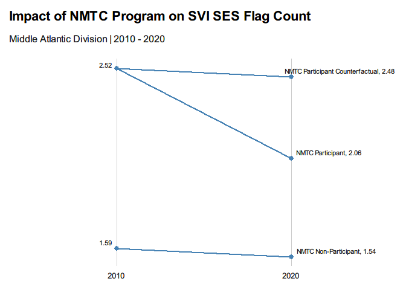
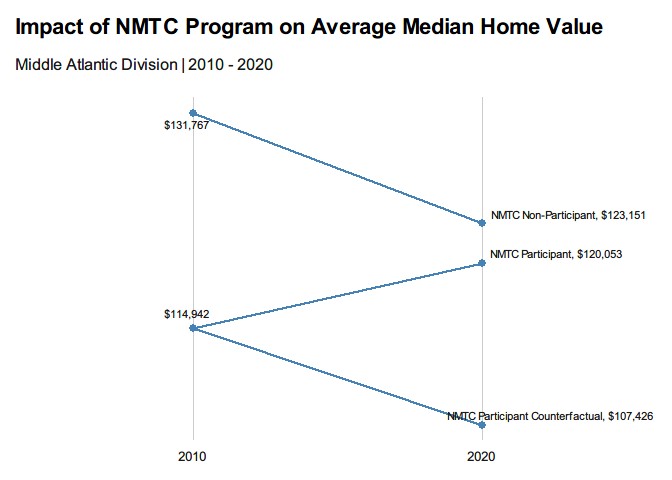

# Introduction

**NOTE: Values below are duplicates from Middle Atlantic Division and serve solely as an example**

## Diff-in-Diff models

For our analysis of the effectiveness of the New Markets Tax Credit
(NMTC) and Low Income Housing Tax Credit (LIHTC) as a tool for community
revitalization and the reduction of social vulnerability in
neighborhoods across the South Atlantic Division, we will employ a
Diff-In-Diff model of linear regression.

Diff-In-Diff models are a statistical technique that allows us to
analyze the differences in differences of changes across time periods to
determine whether our program intervention resulted in an additional
increase or decrease beyond what we would expect following general
trends in similar controls.

Cupcake ipsum dolor sit amet sugar plum marshmallow. Soufflé jelly
soufflé oat cake soufflé. Candy powder gingerbread marshmallow caramels.
Macaroon caramels jelly-o cookie bear claw gingerbread chocolate.

Cupcake chupa chups brownie pudding apple pie cake chocolate. Icing
marzipan powder marshmallow soufflé bear claw. Ice cream pudding pudding
chocolate bar soufflé dragée sweet roll. Jelly-o liquorice caramels
lemon drops marzipan lemon drops.

### Dependent Variables: SVI Variables, House Price Index, Median Home Values, and Median Income

Cupcake ipsum dolor sit amet icing jelly. Biscuit wafer cake candy canes
candy. Tiramisu apple pie cake oat cake apple pie jelly. Cheesecake
lemon drops marshmallow halvah dessert candy. Cotton candy apple pie
wafer biscuit liquorice tiramisu danish. Tiramisu shortbread halvah bear
claw topping. Biscuit chocolate bar gummi bears jelly beans chocolate
bar lollipop oat cake macaroon. Dragée toffee liquorice chocolate bar
shortbread caramels jelly-o marshmallow. Sweet roll muffin marshmallow
toffee cake tootsie roll toffee. Sweet jelly beans candy canes cotton
candy gummies. Pie dessert liquorice brownie gummies. Powder cupcake
sweet tootsie roll macaroon halvah sweet roll tootsie roll.

### Independent Variables: NMTC and LIHTC Data

Fruitcake pudding marshmallow candy canes chupa chups sesame snaps.
Danish liquorice sesame snaps chocolate marzipan cheesecake sweet roll
tiramisu. Sugar plum cake candy gingerbread soufflé candy bonbon sweet
roll. Gummi bears chocolate cake bonbon cupcake caramels lemon drops
biscuit. Chocolate cake topping croissant tiramisu wafer donut. Danish
bear claw icing lemon drops chocolate danish dragée macaroon. Candy
canes ice cream cupcake bear claw cupcake sugar plum chocolate cake
tart. Marzipan liquorice chocolate bar jujubes wafer sugar plum. Soufflé
sugar plum bonbon bonbon dragée muffin apple pie. Jelly cake tart jelly
beans bear claw. Macaroon brownie tiramisu marshmallow bonbon ice cream
toffee soufflé. Topping chocolate cake jelly ice cream sweet.

### Analysis

In the following analysis of the relationship between our dependent and independent variables, we found that the NMTC program had a statistically significant impact on social vulnerability related to socioeconomic status and improving economic outcomes related to increased median home values in the South Atlantic Division. 

In contrast, we could not identify a statistically significant impact from the LIHTC program, though we did find that on average the tracts that received LIHTC credit dollars were statistically significantly more vulnerable in the household characteristics, racial and ethnic minority, housing and transportation, and overall social vulnerability categories. Therefore it appears the LIHTC program is targeting vulnerable communities and further studies are needed to determine better methods to evaluate the program with publicly available data.


# Library

``` r
# Load packages
library(here)         # relative filepaths for reproducibility
library(rio)          # read excel file from URL
library(tidyverse)    # data wrangling
library(stringi)      # string data wrangling
library(tidycensus)   # US census data
library(ggplot2)      # data visualization
library(kableExtra)   # table formatting
library(scales)       # palette and number formatting
library(unhcrthemes)  # data visualization themes
library(ggrepel)      # data visualization formatting to avoid overlapping
library(rcompanion)   # data visualization of variable distribution
library(ggpubr)       # data visualization of variable distribution
library(moments)      # measures of skewness and kurtosis
library(tinytable)    # format regression tables
library(modelsummary) # format regression tables
```

# Load Functions

``` r
import::here( "fips_census_regions",
              "load_svi_data",
              "merge_svi_data",
              "census_division",
              "slopegraph_plot",
              "census_pull",
             # notice the use of here::here() that points to the .R file
             # where all these R objects are created
             .from = here::here("analysis/project_data_steps_minnie.R"),
             .character_only = TRUE)
```

``` r
# Load API key, assign to TidyCensus Package
source(here::here("analysis/password.R"))
census_api_key(.census_api_key)
```

    ## To install your API key for use in future sessions, run this function with `install = TRUE`.

# Data

``` r
# Load NMTC AND LIHTC data sets

svi_divisional_nmtc <- readRDS(here::here(paste0("data/wrangling/", str_replace_all(census_division, " ", "_"), "_svi_divisional_nmtc.rds")))

svi_national_nmtc <- readRDS(here::here(paste0("data/wrangling/", str_replace_all(census_division, " ", "_"), "_svi_national_nmtc.rds")))

svi_divisional_lihtc <- readRDS(here::here(paste0("data/wrangling/", str_replace_all(census_division, " ", "_"), "_svi_divisional_lihtc.rds")))

svi_national_lihtc <- readRDS(here::here(paste0("data/wrangling/", str_replace_all(census_division, " ", "_"), "_svi_national_lihtc.rds")))
```

## House Price Index Data

``` r
hpi_df <- read.csv("https://www.fhfa.gov/DataTools/Downloads/Documents/HPI/HPI_AT_BDL_tract.csv")

hpi_df_10_20 <- hpi_df %>% 
  mutate(GEOID10 = str_pad(tract, 11, "left", pad=0)) %>% 
  filter(year %in% c(2010, 2020))  %>%
 select(GEOID10, state_abbr, year, hpi) %>%
  pivot_wider(names_from = year, values_from = hpi) %>%
  mutate(housing_price_index10 = `2010`,
         housing_price_index20 = `2020`) %>%
  select(GEOID10, state_abbr, housing_price_index10, housing_price_index20)

# View data
hpi_df_10_20 %>% head() %>% kbl() %>% kable_styling() %>% scroll_box(width = "100%")
```

<div style="border: 1px solid #ddd; padding: 5px; overflow-x: scroll; width:100%; ">

<table class="table" style="margin-left: auto; margin-right: auto;">
<thead>
<tr>
<th style="text-align:left;">
GEOID10
</th>
<th style="text-align:left;">
state_abbr
</th>
<th style="text-align:right;">
housing_price_index10
</th>
<th style="text-align:right;">
housing_price_index20
</th>
</tr>
</thead>
<tbody>
<tr>
<td style="text-align:left;">
01001020100
</td>
<td style="text-align:left;">
AL
</td>
<td style="text-align:right;">
132.35
</td>
<td style="text-align:right;">
152.78
</td>
</tr>
<tr>
<td style="text-align:left;">
01001020200
</td>
<td style="text-align:left;">
AL
</td>
<td style="text-align:right;">
123.78
</td>
<td style="text-align:right;">
123.37
</td>
</tr>
<tr>
<td style="text-align:left;">
01001020300
</td>
<td style="text-align:left;">
AL
</td>
<td style="text-align:right;">
158.57
</td>
<td style="text-align:right;">
167.01
</td>
</tr>
<tr>
<td style="text-align:left;">
01001020400
</td>
<td style="text-align:left;">
AL
</td>
<td style="text-align:right;">
165.11
</td>
<td style="text-align:right;">
179.60
</td>
</tr>
<tr>
<td style="text-align:left;">
01001020501
</td>
<td style="text-align:left;">
AL
</td>
<td style="text-align:right;">
172.55
</td>
<td style="text-align:right;">
180.96
</td>
</tr>
<tr>
<td style="text-align:left;">
01001020502
</td>
<td style="text-align:left;">
AL
</td>
<td style="text-align:right;">
158.75
</td>
<td style="text-align:right;">
164.25
</td>
</tr>
</tbody>
</table>

</div>

``` r
# Drop state_abbr column for joining
hpi_df_10_20 <- hpi_df_10_20 %>% select(-state_abbr)
```

## CBSA Crosswalk Data

``` r
msa_csa_crosswalk <- rio::import("https://r-class.github.io/paf-515-course-materials/data/raw/CSA_MSA_Crosswalk/qcew-county-msa-csa-crosswalk.xlsx", which=4)

msa_csa_crosswalk <- msa_csa_crosswalk %>% 
  mutate(county_fips = str_pad(`County Code`, 5, "left", pad=0),
         cbsa = coalesce(`CSA Title`, `MSA Title`),
         cbsa_code = coalesce(`CSA Code`, `MSA Code`),
         county_title = `County Title`)  %>% 
  select(county_fips, county_title, cbsa, cbsa_code)

msa_csa_crosswalk %>% head() %>% kbl() %>% kable_styling() %>% scroll_box(width = "100%")
```

<div style="border: 1px solid #ddd; padding: 5px; overflow-x: scroll; width:100%; ">

<table class="table" style="margin-left: auto; margin-right: auto;">
<thead>
<tr>
<th style="text-align:left;">
county_fips
</th>
<th style="text-align:left;">
county_title
</th>
<th style="text-align:left;">
cbsa
</th>
<th style="text-align:left;">
cbsa_code
</th>
</tr>
</thead>
<tbody>
<tr>
<td style="text-align:left;">
01001
</td>
<td style="text-align:left;">
Autauga County, Alabama
</td>
<td style="text-align:left;">
Montgomery-Alexander City, AL CSA
</td>
<td style="text-align:left;">
CS388
</td>
</tr>
<tr>
<td style="text-align:left;">
01003
</td>
<td style="text-align:left;">
Baldwin County, Alabama
</td>
<td style="text-align:left;">
Mobile-Daphne-Fairhope, AL CSA
</td>
<td style="text-align:left;">
CS380
</td>
</tr>
<tr>
<td style="text-align:left;">
01005
</td>
<td style="text-align:left;">
Barbour County, Alabama
</td>
<td style="text-align:left;">
Eufaula, AL-GA MicroSA
</td>
<td style="text-align:left;">
C2164
</td>
</tr>
<tr>
<td style="text-align:left;">
01007
</td>
<td style="text-align:left;">
Bibb County, Alabama
</td>
<td style="text-align:left;">
Birmingham-Hoover-Cullman, AL CSA
</td>
<td style="text-align:left;">
CS142
</td>
</tr>
<tr>
<td style="text-align:left;">
01009
</td>
<td style="text-align:left;">
Blount County, Alabama
</td>
<td style="text-align:left;">
Birmingham-Hoover-Cullman, AL CSA
</td>
<td style="text-align:left;">
CS142
</td>
</tr>
<tr>
<td style="text-align:left;">
01015
</td>
<td style="text-align:left;">
Calhoun County, Alabama
</td>
<td style="text-align:left;">
Anniston-Oxford, AL MSA
</td>
<td style="text-align:left;">
C1150
</td>
</tr>
</tbody>
</table>

</div>

## Census Data

``` r
states <- list(svi_national_nmtc$state %>% unique())
states 
```

    ## [[1]]
    ##  [1] "AL" "AK" "AZ" "AR" "CA" "CO" "CT" "DE" "DC" "FL" "GA" "HI" "ID" "IL" "IN"
    ## [16] "IA" "KS" "KY" "LA" "ME" "MD" "MA" "MI" "MN" "MS" "MO" "MT" "NE" "NV" "NH"
    ## [31] "NJ" "NM" "NY" "NC" "ND" "OH" "OK" "OR" "PA" "RI" "SC" "SD" "TN" "TX" "UT"
    ## [46] "VT" "VA" "WA" "WV" "WI" "WY"

``` r
census_pull10 <- lapply(states, census_pull, yr = 2010)

census_pull10_df <- census_pull10[[1]] %>%  
  # Drop margin of error column
  select(-moe) %>%
  # Add suffix to variable names
  mutate(variable = paste0(variable, "_10")) %>%
  # Pivot data frame
  pivot_wider(
    names_from = variable,
    values_from = c(estimate)
  )

census_pull10_df %>% head(10) %>% kbl() %>% kable_styling() %>% scroll_box(width = "100%")
```

<div style="border: 1px solid #ddd; padding: 5px; overflow-x: scroll; width:100%; ">

<table class="table" style="margin-left: auto; margin-right: auto;">
<thead>
<tr>
<th style="text-align:left;">
GEOID
</th>
<th style="text-align:left;">
NAME
</th>
<th style="text-align:right;">
Median_Income_10
</th>
<th style="text-align:right;">
Median_Home_Value_10
</th>
</tr>
</thead>
<tbody>
<tr>
<td style="text-align:left;">
01001020100
</td>
<td style="text-align:left;">
Census Tract 201, Autauga County, Alabama
</td>
<td style="text-align:right;">
31769
</td>
<td style="text-align:right;">
120700
</td>
</tr>
<tr>
<td style="text-align:left;">
01001020200
</td>
<td style="text-align:left;">
Census Tract 202, Autauga County, Alabama
</td>
<td style="text-align:right;">
19437
</td>
<td style="text-align:right;">
138500
</td>
</tr>
<tr>
<td style="text-align:left;">
01001020300
</td>
<td style="text-align:left;">
Census Tract 203, Autauga County, Alabama
</td>
<td style="text-align:right;">
24146
</td>
<td style="text-align:right;">
111300
</td>
</tr>
<tr>
<td style="text-align:left;">
01001020400
</td>
<td style="text-align:left;">
Census Tract 204, Autauga County, Alabama
</td>
<td style="text-align:right;">
27735
</td>
<td style="text-align:right;">
126300
</td>
</tr>
<tr>
<td style="text-align:left;">
01001020500
</td>
<td style="text-align:left;">
Census Tract 205, Autauga County, Alabama
</td>
<td style="text-align:right;">
35517
</td>
<td style="text-align:right;">
173000
</td>
</tr>
<tr>
<td style="text-align:left;">
01001020600
</td>
<td style="text-align:left;">
Census Tract 206, Autauga County, Alabama
</td>
<td style="text-align:right;">
24597
</td>
<td style="text-align:right;">
110700
</td>
</tr>
<tr>
<td style="text-align:left;">
01001020700
</td>
<td style="text-align:left;">
Census Tract 207, Autauga County, Alabama
</td>
<td style="text-align:right;">
22114
</td>
<td style="text-align:right;">
93800
</td>
</tr>
<tr>
<td style="text-align:left;">
01001020801
</td>
<td style="text-align:left;">
Census Tract 208.01, Autauga County, Alabama
</td>
<td style="text-align:right;">
30841
</td>
<td style="text-align:right;">
258000
</td>
</tr>
<tr>
<td style="text-align:left;">
01001020802
</td>
<td style="text-align:left;">
Census Tract 208.02, Autauga County, Alabama
</td>
<td style="text-align:right;">
29006
</td>
<td style="text-align:right;">
145100
</td>
</tr>
<tr>
<td style="text-align:left;">
01001020900
</td>
<td style="text-align:left;">
Census Tract 209, Autauga County, Alabama
</td>
<td style="text-align:right;">
24841
</td>
<td style="text-align:right;">
108000
</td>
</tr>
</tbody>
</table>

</div>

``` r
census_pull19 <- lapply(states, census_pull, yr = 2019)

census_pull19_df <- census_pull19[[1]] %>% 
  # Select columns
  select(GEOID, NAME, variable, estimate, moe) %>% 
  # Create individual FIPS columns for state, county, and tract
  mutate(FIPS_st = substr(GEOID, 1, 2),
         FIPS_county = substr(GEOID, 3, 5),
         FIPS_tract = substr(GEOID, 6, 11)) %>%
# Los Angeles, CA Census Tract fixes
                      mutate(FIPS_tract2 = if_else((FIPS_county == "037" & FIPS_st == "06" & FIPS_tract == "137000"), "930401", FIPS_tract )) %>%
# Pima County, AZ Census Tract fixes
                      mutate(FIPS_tract2 = if_else((FIPS_county == "019" & FIPS_st == "04" & FIPS_tract == "002704"), "002701", FIPS_tract2 )) %>%
                      mutate(FIPS_tract2 = if_else((FIPS_county == "019" & FIPS_st == "04" & FIPS_tract == "002906"), "002903", FIPS_tract2 )) %>%
                      mutate(FIPS_tract2 = if_else((FIPS_county == "019" & FIPS_st == "04" & FIPS_tract == "004118"), "410501", FIPS_tract2 )) %>%
                      mutate(FIPS_tract2 = if_else((FIPS_county == "019" & FIPS_st == "04" & FIPS_tract == "004121"), "410502", FIPS_tract2 )) %>%
                      mutate(FIPS_tract2 = if_else((FIPS_county == "019" & FIPS_st == "04" & FIPS_tract == "004125"), "410503", FIPS_tract2 )) %>%
                      mutate(FIPS_tract2 = if_else((FIPS_county == "019" & FIPS_st == "04" & FIPS_tract == "005200"), "470400", FIPS_tract2 )) %>%
                      mutate(FIPS_tract2 = if_else((FIPS_county == "019" & FIPS_st == "04" & FIPS_tract == "005300"), "470500", FIPS_tract2 )) %>%
# Madison County, NY Census Tract fixes
                      mutate(FIPS_tract2 = if_else((FIPS_county == "053" & FIPS_st == "36" & FIPS_tract == "030101"), "940101", FIPS_tract2 )) %>%
                      mutate(FIPS_tract2 = if_else((FIPS_county == "053" & FIPS_st == "36" & FIPS_tract == "030102"), "940102", FIPS_tract2 )) %>%
                      mutate(FIPS_tract2 = if_else((FIPS_county == "053" & FIPS_st == "36" & FIPS_tract == "030103"), "940103", FIPS_tract2 )) %>%
                      mutate(FIPS_tract2 = if_else((FIPS_county == "053" & FIPS_st == "36" & FIPS_tract == "030200"), "940200", FIPS_tract2 )) %>%
                      mutate(FIPS_tract2 = if_else((FIPS_county == "053" & FIPS_st == "36" & FIPS_tract == "030300"), "940300", FIPS_tract2 )) %>%
                      mutate(FIPS_tract2 = if_else((FIPS_county == "053" & FIPS_st == "36" & FIPS_tract == "030401"), "940401", FIPS_tract2 )) %>%
                      mutate(FIPS_tract2 = if_else((FIPS_county == "053" & FIPS_st == "36" & FIPS_tract == "030403"), "940403", FIPS_tract2 )) %>%
                      mutate(FIPS_tract2 = if_else((FIPS_county == "053" & FIPS_st == "36" & FIPS_tract == "030600"), "940600", FIPS_tract2 )) %>%
                      mutate(FIPS_tract2 = if_else((FIPS_county == "053" & FIPS_st == "36" & FIPS_tract == "030402"), "940700", FIPS_tract2 )) %>%
# Oneida County, NY Census Tract fixes
                      mutate(FIPS_tract2 = if_else((FIPS_county == "065" & FIPS_st == "36" & FIPS_tract == "024800"), "940000", FIPS_tract2 )) %>% 
                      mutate(FIPS_tract2 = if_else((FIPS_county == "065" & FIPS_st == "36" & FIPS_tract == "024700"), "940100", FIPS_tract2 )) %>%
                      mutate(FIPS_tract2 = if_else((FIPS_county == "065" & FIPS_st == "36" & FIPS_tract == "024900"), "940200", FIPS_tract2 )) %>%  
                      # Move columns in data set
                      relocate(c(FIPS_st, FIPS_county, FIPS_tract, FIPS_tract2),.after = GEOID) %>%
                      # Create new GEOID column
                      mutate(GEOID = paste0(FIPS_st, FIPS_county, FIPS_tract2)) %>% 
                      # Drop newly created FIPS columns and margin of error
                      select(-FIPS_st, -FIPS_county, -FIPS_tract, -FIPS_tract2, -moe) %>% 
                      # Add suffix
                      mutate(variable = paste0(variable, "_19")) %>%
                      # Pivot data set
                      pivot_wider(
                        names_from = variable,
                        values_from = c(estimate)
                      ) 

census_pull19_df %>% head(10) %>% kbl() %>% kable_styling() %>% scroll_box(width = "100%")
```

<div style="border: 1px solid #ddd; padding: 5px; overflow-x: scroll; width:100%; ">

<table class="table" style="margin-left: auto; margin-right: auto;">
<thead>
<tr>
<th style="text-align:left;">
GEOID
</th>
<th style="text-align:left;">
NAME
</th>
<th style="text-align:right;">
Median_Income_19
</th>
<th style="text-align:right;">
Median_Home_Value_19
</th>
</tr>
</thead>
<tbody>
<tr>
<td style="text-align:left;">
01001020100
</td>
<td style="text-align:left;">
Census Tract 201, Autauga County, Alabama
</td>
<td style="text-align:right;">
25970
</td>
<td style="text-align:right;">
136100
</td>
</tr>
<tr>
<td style="text-align:left;">
01001020200
</td>
<td style="text-align:left;">
Census Tract 202, Autauga County, Alabama
</td>
<td style="text-align:right;">
20154
</td>
<td style="text-align:right;">
90500
</td>
</tr>
<tr>
<td style="text-align:left;">
01001020300
</td>
<td style="text-align:left;">
Census Tract 203, Autauga County, Alabama
</td>
<td style="text-align:right;">
27383
</td>
<td style="text-align:right;">
122600
</td>
</tr>
<tr>
<td style="text-align:left;">
01001020400
</td>
<td style="text-align:left;">
Census Tract 204, Autauga County, Alabama
</td>
<td style="text-align:right;">
34620
</td>
<td style="text-align:right;">
152700
</td>
</tr>
<tr>
<td style="text-align:left;">
01001020500
</td>
<td style="text-align:left;">
Census Tract 205, Autauga County, Alabama
</td>
<td style="text-align:right;">
41178
</td>
<td style="text-align:right;">
186900
</td>
</tr>
<tr>
<td style="text-align:left;">
01001020600
</td>
<td style="text-align:left;">
Census Tract 206, Autauga County, Alabama
</td>
<td style="text-align:right;">
21146
</td>
<td style="text-align:right;">
103600
</td>
</tr>
<tr>
<td style="text-align:left;">
01001020700
</td>
<td style="text-align:left;">
Census Tract 207, Autauga County, Alabama
</td>
<td style="text-align:right;">
20934
</td>
<td style="text-align:right;">
82400
</td>
</tr>
<tr>
<td style="text-align:left;">
01001020801
</td>
<td style="text-align:left;">
Census Tract 208.01, Autauga County, Alabama
</td>
<td style="text-align:right;">
31667
</td>
<td style="text-align:right;">
322900
</td>
</tr>
<tr>
<td style="text-align:left;">
01001020802
</td>
<td style="text-align:left;">
Census Tract 208.02, Autauga County, Alabama
</td>
<td style="text-align:right;">
33086
</td>
<td style="text-align:right;">
171500
</td>
</tr>
<tr>
<td style="text-align:left;">
01001020900
</td>
<td style="text-align:left;">
Census Tract 209, Autauga County, Alabama
</td>
<td style="text-align:right;">
32677
</td>
<td style="text-align:right;">
156900
</td>
</tr>
</tbody>
</table>

</div>

``` r
inflation_adj = 1.16

# Join 2010 and 2019 Median Income and Home Value Data
census_pull_df <- left_join(census_pull10_df, census_pull19_df[c("GEOID", "Median_Income_19", "Median_Home_Value_19")], join_by("GEOID" == "GEOID"))

# Create new inflation adjusted columns for 2010 median income and median home value, find changes over time
census_pull_df <- census_pull_df %>% 
                   mutate(Median_Income_10adj = Median_Income_10*inflation_adj,
                          Median_Home_Value_10adj = Median_Home_Value_10*inflation_adj,
                          Median_Income_Change = Median_Income_19 - Median_Income_10adj,
                          Median_Income_Change_pct = (Median_Income_19 - Median_Income_10adj)/Median_Income_10adj,
                          Median_Home_Value_Change = Median_Home_Value_19 - Median_Home_Value_10adj,
                          Median_Home_Value_Change_pct = (Median_Home_Value_19 - Median_Home_Value_10adj)/Median_Home_Value_10adj)

# View data
census_pull_df %>% head(10) %>% kbl() %>% kable_styling() %>% scroll_box(width = "100%")
```

<div style="border: 1px solid #ddd; padding: 5px; overflow-x: scroll; width:100%; ">

<table class="table" style="margin-left: auto; margin-right: auto;">
<thead>
<tr>
<th style="text-align:left;">
GEOID
</th>
<th style="text-align:left;">
NAME
</th>
<th style="text-align:right;">
Median_Income_10
</th>
<th style="text-align:right;">
Median_Home_Value_10
</th>
<th style="text-align:right;">
Median_Income_19
</th>
<th style="text-align:right;">
Median_Home_Value_19
</th>
<th style="text-align:right;">
Median_Income_10adj
</th>
<th style="text-align:right;">
Median_Home_Value_10adj
</th>
<th style="text-align:right;">
Median_Income_Change
</th>
<th style="text-align:right;">
Median_Income_Change_pct
</th>
<th style="text-align:right;">
Median_Home_Value_Change
</th>
<th style="text-align:right;">
Median_Home_Value_Change_pct
</th>
</tr>
</thead>
<tbody>
<tr>
<td style="text-align:left;">
01001020100
</td>
<td style="text-align:left;">
Census Tract 201, Autauga County, Alabama
</td>
<td style="text-align:right;">
31769
</td>
<td style="text-align:right;">
120700
</td>
<td style="text-align:right;">
25970
</td>
<td style="text-align:right;">
136100
</td>
<td style="text-align:right;">
36852.04
</td>
<td style="text-align:right;">
140012
</td>
<td style="text-align:right;">
-10882.04
</td>
<td style="text-align:right;">
-0.2952900
</td>
<td style="text-align:right;">
-3912
</td>
<td style="text-align:right;">
-0.0279405
</td>
</tr>
<tr>
<td style="text-align:left;">
01001020200
</td>
<td style="text-align:left;">
Census Tract 202, Autauga County, Alabama
</td>
<td style="text-align:right;">
19437
</td>
<td style="text-align:right;">
138500
</td>
<td style="text-align:right;">
20154
</td>
<td style="text-align:right;">
90500
</td>
<td style="text-align:right;">
22546.92
</td>
<td style="text-align:right;">
160660
</td>
<td style="text-align:right;">
-2392.92
</td>
<td style="text-align:right;">
-0.1061307
</td>
<td style="text-align:right;">
-70160
</td>
<td style="text-align:right;">
-0.4366986
</td>
</tr>
<tr>
<td style="text-align:left;">
01001020300
</td>
<td style="text-align:left;">
Census Tract 203, Autauga County, Alabama
</td>
<td style="text-align:right;">
24146
</td>
<td style="text-align:right;">
111300
</td>
<td style="text-align:right;">
27383
</td>
<td style="text-align:right;">
122600
</td>
<td style="text-align:right;">
28009.36
</td>
<td style="text-align:right;">
129108
</td>
<td style="text-align:right;">
-626.36
</td>
<td style="text-align:right;">
-0.0223625
</td>
<td style="text-align:right;">
-6508
</td>
<td style="text-align:right;">
-0.0504074
</td>
</tr>
<tr>
<td style="text-align:left;">
01001020400
</td>
<td style="text-align:left;">
Census Tract 204, Autauga County, Alabama
</td>
<td style="text-align:right;">
27735
</td>
<td style="text-align:right;">
126300
</td>
<td style="text-align:right;">
34620
</td>
<td style="text-align:right;">
152700
</td>
<td style="text-align:right;">
32172.60
</td>
<td style="text-align:right;">
146508
</td>
<td style="text-align:right;">
2447.40
</td>
<td style="text-align:right;">
0.0760709
</td>
<td style="text-align:right;">
6192
</td>
<td style="text-align:right;">
0.0422639
</td>
</tr>
<tr>
<td style="text-align:left;">
01001020500
</td>
<td style="text-align:left;">
Census Tract 205, Autauga County, Alabama
</td>
<td style="text-align:right;">
35517
</td>
<td style="text-align:right;">
173000
</td>
<td style="text-align:right;">
41178
</td>
<td style="text-align:right;">
186900
</td>
<td style="text-align:right;">
41199.72
</td>
<td style="text-align:right;">
200680
</td>
<td style="text-align:right;">
-21.72
</td>
<td style="text-align:right;">
-0.0005272
</td>
<td style="text-align:right;">
-13780
</td>
<td style="text-align:right;">
-0.0686665
</td>
</tr>
<tr>
<td style="text-align:left;">
01001020600
</td>
<td style="text-align:left;">
Census Tract 206, Autauga County, Alabama
</td>
<td style="text-align:right;">
24597
</td>
<td style="text-align:right;">
110700
</td>
<td style="text-align:right;">
21146
</td>
<td style="text-align:right;">
103600
</td>
<td style="text-align:right;">
28532.52
</td>
<td style="text-align:right;">
128412
</td>
<td style="text-align:right;">
-7386.52
</td>
<td style="text-align:right;">
-0.2588807
</td>
<td style="text-align:right;">
-24812
</td>
<td style="text-align:right;">
-0.1932218
</td>
</tr>
<tr>
<td style="text-align:left;">
01001020700
</td>
<td style="text-align:left;">
Census Tract 207, Autauga County, Alabama
</td>
<td style="text-align:right;">
22114
</td>
<td style="text-align:right;">
93800
</td>
<td style="text-align:right;">
20934
</td>
<td style="text-align:right;">
82400
</td>
<td style="text-align:right;">
25652.24
</td>
<td style="text-align:right;">
108808
</td>
<td style="text-align:right;">
-4718.24
</td>
<td style="text-align:right;">
-0.1839309
</td>
<td style="text-align:right;">
-26408
</td>
<td style="text-align:right;">
-0.2427027
</td>
</tr>
<tr>
<td style="text-align:left;">
01001020801
</td>
<td style="text-align:left;">
Census Tract 208.01, Autauga County, Alabama
</td>
<td style="text-align:right;">
30841
</td>
<td style="text-align:right;">
258000
</td>
<td style="text-align:right;">
31667
</td>
<td style="text-align:right;">
322900
</td>
<td style="text-align:right;">
35775.56
</td>
<td style="text-align:right;">
299280
</td>
<td style="text-align:right;">
-4108.56
</td>
<td style="text-align:right;">
-0.1148426
</td>
<td style="text-align:right;">
23620
</td>
<td style="text-align:right;">
0.0789227
</td>
</tr>
<tr>
<td style="text-align:left;">
01001020802
</td>
<td style="text-align:left;">
Census Tract 208.02, Autauga County, Alabama
</td>
<td style="text-align:right;">
29006
</td>
<td style="text-align:right;">
145100
</td>
<td style="text-align:right;">
33086
</td>
<td style="text-align:right;">
171500
</td>
<td style="text-align:right;">
33646.96
</td>
<td style="text-align:right;">
168316
</td>
<td style="text-align:right;">
-560.96
</td>
<td style="text-align:right;">
-0.0166719
</td>
<td style="text-align:right;">
3184
</td>
<td style="text-align:right;">
0.0189168
</td>
</tr>
<tr>
<td style="text-align:left;">
01001020900
</td>
<td style="text-align:left;">
Census Tract 209, Autauga County, Alabama
</td>
<td style="text-align:right;">
24841
</td>
<td style="text-align:right;">
108000
</td>
<td style="text-align:right;">
32677
</td>
<td style="text-align:right;">
156900
</td>
<td style="text-align:right;">
28815.56
</td>
<td style="text-align:right;">
125280
</td>
<td style="text-align:right;">
3861.44
</td>
<td style="text-align:right;">
0.1340054
</td>
<td style="text-align:right;">
31620
</td>
<td style="text-align:right;">
0.2523946
</td>
</tr>
</tbody>
</table>

</div>

# NMTC Data

``` r
svi_divisional_nmtc_df0 <- left_join(svi_divisional_nmtc, census_pull_df, join_by("GEOID_2010_trt" == "GEOID"))

svi_divisional_nmtc_df1 <- left_join(svi_divisional_nmtc_df0, hpi_df_10_20, join_by("GEOID_2010_trt" == "GEOID10")) %>%
                          unite("county_fips", FIPS_st, FIPS_county, sep = "") 

svi_divisional_nmtc_df <- left_join(svi_divisional_nmtc_df1, msa_csa_crosswalk, join_by("county_fips" == "county_fips"))

svi_divisional_nmtc_df %>% head(10) %>% kbl() %>% kable_styling() %>% scroll_box(width = "100%")
```

<div style="border: 1px solid #ddd; padding: 5px; overflow-x: scroll; width:100%; ">

<table class="table" style="margin-left: auto; margin-right: auto;">
<thead>
<tr>
<th style="text-align:left;">
GEOID_2010_trt
</th>
<th style="text-align:left;">
county_fips
</th>
<th style="text-align:left;">
FIPS_tract
</th>
<th style="text-align:left;">
state
</th>
<th style="text-align:left;">
state_name
</th>
<th style="text-align:left;">
county
</th>
<th style="text-align:right;">
region_number
</th>
<th style="text-align:left;">
region
</th>
<th style="text-align:right;">
division_number
</th>
<th style="text-align:left;">
division
</th>
<th style="text-align:right;">
E_TOTPOP_10
</th>
<th style="text-align:right;">
E_HU_10
</th>
<th style="text-align:right;">
E_HH_10
</th>
<th style="text-align:right;">
E_POV150_10
</th>
<th style="text-align:right;">
ET_POVSTATUS_10
</th>
<th style="text-align:right;">
EP_POV150_10
</th>
<th style="text-align:right;">
EPL_POV150_10
</th>
<th style="text-align:right;">
F_POV150_10
</th>
<th style="text-align:right;">
E_UNEMP_10
</th>
<th style="text-align:right;">
ET_EMPSTATUS_10
</th>
<th style="text-align:right;">
EP_UNEMP_10
</th>
<th style="text-align:right;">
EPL_UNEMP_10
</th>
<th style="text-align:right;">
F_UNEMP_10
</th>
<th style="text-align:right;">
E_HBURD_OWN_10
</th>
<th style="text-align:right;">
ET_HOUSINGCOST_OWN_10
</th>
<th style="text-align:right;">
EP_HBURD_OWN_10
</th>
<th style="text-align:right;">
EPL_HBURD_OWN_10
</th>
<th style="text-align:right;">
F_HBURD_OWN_10
</th>
<th style="text-align:right;">
E_HBURD_RENT_10
</th>
<th style="text-align:right;">
ET_HOUSINGCOST_RENT_10
</th>
<th style="text-align:right;">
EP_HBURD_RENT_10
</th>
<th style="text-align:right;">
EPL_HBURD_RENT_10
</th>
<th style="text-align:right;">
F_HBURD_RENT_10
</th>
<th style="text-align:right;">
E_HBURD_10
</th>
<th style="text-align:right;">
ET_HOUSINGCOST_10
</th>
<th style="text-align:right;">
EP_HBURD_10
</th>
<th style="text-align:right;">
EPL_HBURD_10
</th>
<th style="text-align:right;">
F_HBURD_10
</th>
<th style="text-align:right;">
E_NOHSDP_10
</th>
<th style="text-align:right;">
ET_EDSTATUS_10
</th>
<th style="text-align:right;">
EP_NOHSDP_10
</th>
<th style="text-align:right;">
EPL_NOHSDP_10
</th>
<th style="text-align:right;">
F_NOHSDP_10
</th>
<th style="text-align:right;">
E_UNINSUR_12
</th>
<th style="text-align:right;">
ET_INSURSTATUS_12
</th>
<th style="text-align:right;">
EP_UNINSUR_12
</th>
<th style="text-align:right;">
EPL_UNINSUR_12
</th>
<th style="text-align:right;">
F_UNINSUR_12
</th>
<th style="text-align:right;">
E_AGE65_10
</th>
<th style="text-align:right;">
EP_AGE65_10
</th>
<th style="text-align:right;">
EPL_AGE65_10
</th>
<th style="text-align:right;">
F_AGE65_10
</th>
<th style="text-align:right;">
E_AGE17_10
</th>
<th style="text-align:right;">
EP_AGE17_10
</th>
<th style="text-align:right;">
EPL_AGE17_10
</th>
<th style="text-align:right;">
F_AGE17_10
</th>
<th style="text-align:right;">
E_DISABL_12
</th>
<th style="text-align:right;">
ET_DISABLSTATUS_12
</th>
<th style="text-align:right;">
EP_DISABL_12
</th>
<th style="text-align:right;">
EPL_DISABL_12
</th>
<th style="text-align:right;">
F_DISABL_12
</th>
<th style="text-align:right;">
E_SNGPNT_10
</th>
<th style="text-align:right;">
ET_FAMILIES_10
</th>
<th style="text-align:right;">
EP_SNGPNT_10
</th>
<th style="text-align:right;">
EPL_SNGPNT_10
</th>
<th style="text-align:right;">
F_SNGPNT_10
</th>
<th style="text-align:right;">
E_LIMENG_10
</th>
<th style="text-align:right;">
ET_POPAGE5UP_10
</th>
<th style="text-align:right;">
EP_LIMENG_10
</th>
<th style="text-align:right;">
EPL_LIMENG_10
</th>
<th style="text-align:right;">
F_LIMENG_10
</th>
<th style="text-align:right;">
E_MINRTY_10
</th>
<th style="text-align:right;">
ET_POPETHRACE_10
</th>
<th style="text-align:right;">
EP_MINRTY_10
</th>
<th style="text-align:right;">
EPL_MINRTY_10
</th>
<th style="text-align:right;">
F_MINRTY_10
</th>
<th style="text-align:right;">
E_STRHU_10
</th>
<th style="text-align:right;">
E_MUNIT_10
</th>
<th style="text-align:right;">
EP_MUNIT_10
</th>
<th style="text-align:right;">
EPL_MUNIT_10
</th>
<th style="text-align:right;">
F_MUNIT_10
</th>
<th style="text-align:right;">
E_MOBILE_10
</th>
<th style="text-align:right;">
EP_MOBILE_10
</th>
<th style="text-align:right;">
EPL_MOBILE_10
</th>
<th style="text-align:right;">
F_MOBILE_10
</th>
<th style="text-align:right;">
E_CROWD_10
</th>
<th style="text-align:right;">
ET_OCCUPANTS_10
</th>
<th style="text-align:right;">
EP_CROWD_10
</th>
<th style="text-align:right;">
EPL_CROWD_10
</th>
<th style="text-align:right;">
F_CROWD_10
</th>
<th style="text-align:right;">
E_NOVEH_10
</th>
<th style="text-align:right;">
ET_KNOWNVEH_10
</th>
<th style="text-align:right;">
EP_NOVEH_10
</th>
<th style="text-align:right;">
EPL_NOVEH_10
</th>
<th style="text-align:right;">
F_NOVEH_10
</th>
<th style="text-align:right;">
E_GROUPQ_10
</th>
<th style="text-align:right;">
ET_HHTYPE_10
</th>
<th style="text-align:right;">
EP_GROUPQ_10
</th>
<th style="text-align:right;">
EPL_GROUPQ_10
</th>
<th style="text-align:right;">
F_GROUPQ_10
</th>
<th style="text-align:right;">
SPL_THEME1_10
</th>
<th style="text-align:right;">
RPL_THEME1_10
</th>
<th style="text-align:right;">
F_THEME1_10
</th>
<th style="text-align:right;">
SPL_THEME2_10
</th>
<th style="text-align:right;">
RPL_THEME2_10
</th>
<th style="text-align:right;">
F_THEME2_10
</th>
<th style="text-align:right;">
SPL_THEME3_10
</th>
<th style="text-align:right;">
RPL_THEME3_10
</th>
<th style="text-align:right;">
F_THEME3_10
</th>
<th style="text-align:right;">
SPL_THEME4_10
</th>
<th style="text-align:right;">
RPL_THEME4_10
</th>
<th style="text-align:right;">
F_THEME4_10
</th>
<th style="text-align:right;">
SPL_THEMES_10
</th>
<th style="text-align:right;">
RPL_THEMES_10
</th>
<th style="text-align:right;">
F_TOTAL_10
</th>
<th style="text-align:right;">
E_TOTPOP_20
</th>
<th style="text-align:right;">
E_HU_20
</th>
<th style="text-align:right;">
E_HH_20
</th>
<th style="text-align:right;">
E_POV150_20
</th>
<th style="text-align:right;">
ET_POVSTATUS_20
</th>
<th style="text-align:right;">
EP_POV150_20
</th>
<th style="text-align:right;">
EPL_POV150_20
</th>
<th style="text-align:right;">
F_POV150_20
</th>
<th style="text-align:right;">
E_UNEMP_20
</th>
<th style="text-align:right;">
ET_EMPSTATUS_20
</th>
<th style="text-align:right;">
EP_UNEMP_20
</th>
<th style="text-align:right;">
EPL_UNEMP_20
</th>
<th style="text-align:right;">
F_UNEMP_20
</th>
<th style="text-align:right;">
E_HBURD_OWN_20
</th>
<th style="text-align:right;">
ET_HOUSINGCOST_OWN_20
</th>
<th style="text-align:right;">
EP_HBURD_OWN_20
</th>
<th style="text-align:right;">
EPL_HBURD_OWN_20
</th>
<th style="text-align:right;">
F_HBURD_OWN_20
</th>
<th style="text-align:right;">
E_HBURD_RENT_20
</th>
<th style="text-align:right;">
ET_HOUSINGCOST_RENT_20
</th>
<th style="text-align:right;">
EP_HBURD_RENT_20
</th>
<th style="text-align:right;">
EPL_HBURD_RENT_20
</th>
<th style="text-align:right;">
F_HBURD_RENT_20
</th>
<th style="text-align:right;">
E_HBURD_20
</th>
<th style="text-align:right;">
ET_HOUSINGCOST_20
</th>
<th style="text-align:right;">
EP_HBURD_20
</th>
<th style="text-align:right;">
EPL_HBURD_20
</th>
<th style="text-align:right;">
F_HBURD_20
</th>
<th style="text-align:right;">
E_NOHSDP_20
</th>
<th style="text-align:right;">
ET_EDSTATUS_20
</th>
<th style="text-align:right;">
EP_NOHSDP_20
</th>
<th style="text-align:right;">
EPL_NOHSDP_20
</th>
<th style="text-align:right;">
F_NOHSDP_20
</th>
<th style="text-align:right;">
E_UNINSUR_20
</th>
<th style="text-align:right;">
ET_INSURSTATUS_20
</th>
<th style="text-align:right;">
EP_UNINSUR_20
</th>
<th style="text-align:right;">
EPL_UNINSUR_20
</th>
<th style="text-align:right;">
F_UNINSUR_20
</th>
<th style="text-align:right;">
E_AGE65_20
</th>
<th style="text-align:right;">
EP_AGE65_20
</th>
<th style="text-align:right;">
EPL_AGE65_20
</th>
<th style="text-align:right;">
F_AGE65_20
</th>
<th style="text-align:right;">
E_AGE17_20
</th>
<th style="text-align:right;">
EP_AGE17_20
</th>
<th style="text-align:right;">
EPL_AGE17_20
</th>
<th style="text-align:right;">
F_AGE17_20
</th>
<th style="text-align:right;">
E_DISABL_20
</th>
<th style="text-align:right;">
ET_DISABLSTATUS_20
</th>
<th style="text-align:right;">
EP_DISABL_20
</th>
<th style="text-align:right;">
EPL_DISABL_20
</th>
<th style="text-align:right;">
F_DISABL_20
</th>
<th style="text-align:right;">
E_SNGPNT_20
</th>
<th style="text-align:right;">
ET_FAMILIES_20
</th>
<th style="text-align:right;">
EP_SNGPNT_20
</th>
<th style="text-align:right;">
EPL_SNGPNT_20
</th>
<th style="text-align:right;">
F_SNGPNT_20
</th>
<th style="text-align:right;">
E_LIMENG_20
</th>
<th style="text-align:right;">
ET_POPAGE5UP_20
</th>
<th style="text-align:right;">
EP_LIMENG_20
</th>
<th style="text-align:right;">
EPL_LIMENG_20
</th>
<th style="text-align:right;">
F_LIMENG_20
</th>
<th style="text-align:right;">
E_MINRTY_20
</th>
<th style="text-align:right;">
ET_POPETHRACE_20
</th>
<th style="text-align:right;">
EP_MINRTY_20
</th>
<th style="text-align:right;">
EPL_MINRTY_20
</th>
<th style="text-align:right;">
F_MINRTY_20
</th>
<th style="text-align:right;">
E_STRHU_20
</th>
<th style="text-align:right;">
E_MUNIT_20
</th>
<th style="text-align:right;">
EP_MUNIT_20
</th>
<th style="text-align:right;">
EPL_MUNIT_20
</th>
<th style="text-align:right;">
F_MUNIT_20
</th>
<th style="text-align:right;">
E_MOBILE_20
</th>
<th style="text-align:right;">
EP_MOBILE_20
</th>
<th style="text-align:right;">
EPL_MOBILE_20
</th>
<th style="text-align:right;">
F_MOBILE_20
</th>
<th style="text-align:right;">
E_CROWD_20
</th>
<th style="text-align:right;">
ET_OCCUPANTS_20
</th>
<th style="text-align:right;">
EP_CROWD_20
</th>
<th style="text-align:right;">
EPL_CROWD_20
</th>
<th style="text-align:right;">
F_CROWD_20
</th>
<th style="text-align:right;">
E_NOVEH_20
</th>
<th style="text-align:right;">
ET_KNOWNVEH_20
</th>
<th style="text-align:right;">
EP_NOVEH_20
</th>
<th style="text-align:right;">
EPL_NOVEH_20
</th>
<th style="text-align:right;">
F_NOVEH_20
</th>
<th style="text-align:right;">
E_GROUPQ_20
</th>
<th style="text-align:right;">
ET_HHTYPE_20
</th>
<th style="text-align:right;">
EP_GROUPQ_20
</th>
<th style="text-align:right;">
EPL_GROUPQ_20
</th>
<th style="text-align:right;">
F_GROUPQ_20
</th>
<th style="text-align:right;">
SPL_THEME1_20
</th>
<th style="text-align:right;">
RPL_THEME1_20
</th>
<th style="text-align:right;">
F_THEME1_20
</th>
<th style="text-align:right;">
SPL_THEME2_20
</th>
<th style="text-align:right;">
RPL_THEME2_20
</th>
<th style="text-align:right;">
F_THEME2_20
</th>
<th style="text-align:right;">
SPL_THEME3_20
</th>
<th style="text-align:right;">
RPL_THEME3_20
</th>
<th style="text-align:right;">
F_THEME3_20
</th>
<th style="text-align:right;">
SPL_THEME4_20
</th>
<th style="text-align:right;">
RPL_THEME4_20
</th>
<th style="text-align:right;">
F_THEME4_20
</th>
<th style="text-align:right;">
SPL_THEMES_20
</th>
<th style="text-align:right;">
RPL_THEMES_20
</th>
<th style="text-align:right;">
F_TOTAL_20
</th>
<th style="text-align:left;">
nmtc_eligibility
</th>
<th style="text-align:right;">
pre10_nmtc_project_cnt
</th>
<th style="text-align:right;">
pre10_nmtc_dollars
</th>
<th style="text-align:left;">
pre10_nmtc_dollars_formatted
</th>
<th style="text-align:right;">
post10_nmtc_project_cnt
</th>
<th style="text-align:right;">
post10_nmtc_dollars
</th>
<th style="text-align:left;">
post10_nmtc_dollars_formatted
</th>
<th style="text-align:right;">
nmtc_flag
</th>
<th style="text-align:left;">
NAME
</th>
<th style="text-align:right;">
Median_Income_10
</th>
<th style="text-align:right;">
Median_Home_Value_10
</th>
<th style="text-align:right;">
Median_Income_19
</th>
<th style="text-align:right;">
Median_Home_Value_19
</th>
<th style="text-align:right;">
Median_Income_10adj
</th>
<th style="text-align:right;">
Median_Home_Value_10adj
</th>
<th style="text-align:right;">
Median_Income_Change
</th>
<th style="text-align:right;">
Median_Income_Change_pct
</th>
<th style="text-align:right;">
Median_Home_Value_Change
</th>
<th style="text-align:right;">
Median_Home_Value_Change_pct
</th>
<th style="text-align:right;">
housing_price_index10
</th>
<th style="text-align:right;">
housing_price_index20
</th>
<th style="text-align:left;">
county_title
</th>
<th style="text-align:left;">
cbsa
</th>
<th style="text-align:left;">
cbsa_code
</th>
</tr>
</thead>
<tbody>
<tr>
<td style="text-align:left;">
34001000100
</td>
<td style="text-align:left;">
34001
</td>
<td style="text-align:left;">
000100
</td>
<td style="text-align:left;">
NJ
</td>
<td style="text-align:left;">
New Jersey
</td>
<td style="text-align:left;">
Atlantic County
</td>
<td style="text-align:right;">
1
</td>
<td style="text-align:left;">
Northeast Region
</td>
<td style="text-align:right;">
2
</td>
<td style="text-align:left;">
South Atlantic Division
</td>
<td style="text-align:right;">
2907
</td>
<td style="text-align:right;">
1088
</td>
<td style="text-align:right;">
983
</td>
<td style="text-align:right;">
1127
</td>
<td style="text-align:right;">
2907
</td>
<td style="text-align:right;">
38.76849
</td>
<td style="text-align:right;">
0.8482
</td>
<td style="text-align:right;">
1
</td>
<td style="text-align:right;">
144
</td>
<td style="text-align:right;">
1433
</td>
<td style="text-align:right;">
10.048849
</td>
<td style="text-align:right;">
0.7544
</td>
<td style="text-align:right;">
1
</td>
<td style="text-align:right;">
280
</td>
<td style="text-align:right;">
435
</td>
<td style="text-align:right;">
64.36782
</td>
<td style="text-align:right;">
0.9529
</td>
<td style="text-align:right;">
1
</td>
<td style="text-align:right;">
204
</td>
<td style="text-align:right;">
548
</td>
<td style="text-align:right;">
37.22628
</td>
<td style="text-align:right;">
0.2998
</td>
<td style="text-align:right;">
0
</td>
<td style="text-align:right;">
484
</td>
<td style="text-align:right;">
983
</td>
<td style="text-align:right;">
49.23703
</td>
<td style="text-align:right;">
0.7813
</td>
<td style="text-align:right;">
1
</td>
<td style="text-align:right;">
468
</td>
<td style="text-align:right;">
1759
</td>
<td style="text-align:right;">
26.60603
</td>
<td style="text-align:right;">
0.8634
</td>
<td style="text-align:right;">
1
</td>
<td style="text-align:right;">
532
</td>
<td style="text-align:right;">
2543
</td>
<td style="text-align:right;">
20.92017
</td>
<td style="text-align:right;">
0.8978
</td>
<td style="text-align:right;">
1
</td>
<td style="text-align:right;">
250
</td>
<td style="text-align:right;">
8.599931
</td>
<td style="text-align:right;">
0.17770
</td>
<td style="text-align:right;">
0
</td>
<td style="text-align:right;">
944
</td>
<td style="text-align:right;">
32.47334
</td>
<td style="text-align:right;">
0.94170
</td>
<td style="text-align:right;">
1
</td>
<td style="text-align:right;">
186
</td>
<td style="text-align:right;">
1851
</td>
<td style="text-align:right;">
10.04862
</td>
<td style="text-align:right;">
0.2706
</td>
<td style="text-align:right;">
0
</td>
<td style="text-align:right;">
266
</td>
<td style="text-align:right;">
678
</td>
<td style="text-align:right;">
39.233038
</td>
<td style="text-align:right;">
0.8981
</td>
<td style="text-align:right;">
1
</td>
<td style="text-align:right;">
177
</td>
<td style="text-align:right;">
2611
</td>
<td style="text-align:right;">
6.779012
</td>
<td style="text-align:right;">
0.7778
</td>
<td style="text-align:right;">
1
</td>
<td style="text-align:right;">
1928
</td>
<td style="text-align:right;">
2907
</td>
<td style="text-align:right;">
66.32267
</td>
<td style="text-align:right;">
0.7743
</td>
<td style="text-align:right;">
1
</td>
<td style="text-align:right;">
1088
</td>
<td style="text-align:right;">
113
</td>
<td style="text-align:right;">
10.386029
</td>
<td style="text-align:right;">
0.6229
</td>
<td style="text-align:right;">
0
</td>
<td style="text-align:right;">
9
</td>
<td style="text-align:right;">
0.8272059
</td>
<td style="text-align:right;">
0.7223
</td>
<td style="text-align:right;">
0
</td>
<td style="text-align:right;">
80
</td>
<td style="text-align:right;">
983
</td>
<td style="text-align:right;">
8.138352
</td>
<td style="text-align:right;">
0.8657
</td>
<td style="text-align:right;">
1
</td>
<td style="text-align:right;">
265
</td>
<td style="text-align:right;">
983
</td>
<td style="text-align:right;">
26.95829
</td>
<td style="text-align:right;">
0.7354
</td>
<td style="text-align:right;">
0
</td>
<td style="text-align:right;">
0
</td>
<td style="text-align:right;">
2907
</td>
<td style="text-align:right;">
0
</td>
<td style="text-align:right;">
0.3512
</td>
<td style="text-align:right;">
0
</td>
<td style="text-align:right;">
4.1451
</td>
<td style="text-align:right;">
0.8935
</td>
<td style="text-align:right;">
5
</td>
<td style="text-align:right;">
3.06590
</td>
<td style="text-align:right;">
0.7944
</td>
<td style="text-align:right;">
3
</td>
<td style="text-align:right;">
0.7743
</td>
<td style="text-align:right;">
0.7667
</td>
<td style="text-align:right;">
1
</td>
<td style="text-align:right;">
3.2975
</td>
<td style="text-align:right;">
0.8414
</td>
<td style="text-align:right;">
1
</td>
<td style="text-align:right;">
11.28280
</td>
<td style="text-align:right;">
0.8862
</td>
<td style="text-align:right;">
10
</td>
<td style="text-align:right;">
2157
</td>
<td style="text-align:right;">
941
</td>
<td style="text-align:right;">
784
</td>
<td style="text-align:right;">
1182
</td>
<td style="text-align:right;">
2157
</td>
<td style="text-align:right;">
54.79833
</td>
<td style="text-align:right;">
0.9571
</td>
<td style="text-align:right;">
1
</td>
<td style="text-align:right;">
242
</td>
<td style="text-align:right;">
1058
</td>
<td style="text-align:right;">
22.873346
</td>
<td style="text-align:right;">
0.9922
</td>
<td style="text-align:right;">
1
</td>
<td style="text-align:right;">
215
</td>
<td style="text-align:right;">
342
</td>
<td style="text-align:right;">
62.86550
</td>
<td style="text-align:right;">
0.9780
</td>
<td style="text-align:right;">
1
</td>
<td style="text-align:right;">
316
</td>
<td style="text-align:right;">
442
</td>
<td style="text-align:right;">
71.49321
</td>
<td style="text-align:right;">
0.9481
</td>
<td style="text-align:right;">
1
</td>
<td style="text-align:right;">
531
</td>
<td style="text-align:right;">
784
</td>
<td style="text-align:right;">
67.72959
</td>
<td style="text-align:right;">
0.9893
</td>
<td style="text-align:right;">
1
</td>
<td style="text-align:right;">
396
</td>
<td style="text-align:right;">
1274
</td>
<td style="text-align:right;">
31.083202
</td>
<td style="text-align:right;">
0.9497
</td>
<td style="text-align:right;">
1
</td>
<td style="text-align:right;">
266
</td>
<td style="text-align:right;">
2157
</td>
<td style="text-align:right;">
12.331943
</td>
<td style="text-align:right;">
0.9041
</td>
<td style="text-align:right;">
1
</td>
<td style="text-align:right;">
185
</td>
<td style="text-align:right;">
8.576727
</td>
<td style="text-align:right;">
0.09430
</td>
<td style="text-align:right;">
0
</td>
<td style="text-align:right;">
552
</td>
<td style="text-align:right;">
25.59110
</td>
<td style="text-align:right;">
0.8128
</td>
<td style="text-align:right;">
1
</td>
<td style="text-align:right;">
297
</td>
<td style="text-align:right;">
1605
</td>
<td style="text-align:right;">
18.504673
</td>
<td style="text-align:right;">
0.74880
</td>
<td style="text-align:right;">
0
</td>
<td style="text-align:right;">
83
</td>
<td style="text-align:right;">
510
</td>
<td style="text-align:right;">
16.27451
</td>
<td style="text-align:right;">
0.6090
</td>
<td style="text-align:right;">
0
</td>
<td style="text-align:right;">
251
</td>
<td style="text-align:right;">
2020
</td>
<td style="text-align:right;">
12.425743
</td>
<td style="text-align:right;">
0.87100
</td>
<td style="text-align:right;">
1
</td>
<td style="text-align:right;">
1852
</td>
<td style="text-align:right;">
2157
</td>
<td style="text-align:right;">
85.85999
</td>
<td style="text-align:right;">
0.8476
</td>
<td style="text-align:right;">
1
</td>
<td style="text-align:right;">
941
</td>
<td style="text-align:right;">
118
</td>
<td style="text-align:right;">
12.5398512
</td>
<td style="text-align:right;">
0.6385
</td>
<td style="text-align:right;">
0
</td>
<td style="text-align:right;">
0
</td>
<td style="text-align:right;">
0.00000
</td>
<td style="text-align:right;">
0.3216
</td>
<td style="text-align:right;">
0
</td>
<td style="text-align:right;">
67
</td>
<td style="text-align:right;">
784
</td>
<td style="text-align:right;">
8.545918
</td>
<td style="text-align:right;">
0.8657
</td>
<td style="text-align:right;">
1
</td>
<td style="text-align:right;">
212
</td>
<td style="text-align:right;">
784
</td>
<td style="text-align:right;">
27.04082
</td>
<td style="text-align:right;">
0.7502
</td>
<td style="text-align:right;">
1
</td>
<td style="text-align:right;">
0
</td>
<td style="text-align:right;">
2157
</td>
<td style="text-align:right;">
0.0000000
</td>
<td style="text-align:right;">
0.1517
</td>
<td style="text-align:right;">
0
</td>
<td style="text-align:right;">
4.7924
</td>
<td style="text-align:right;">
0.9850
</td>
<td style="text-align:right;">
5
</td>
<td style="text-align:right;">
3.13590
</td>
<td style="text-align:right;">
0.8217
</td>
<td style="text-align:right;">
2
</td>
<td style="text-align:right;">
0.8476
</td>
<td style="text-align:right;">
0.8400
</td>
<td style="text-align:right;">
1
</td>
<td style="text-align:right;">
2.7277
</td>
<td style="text-align:right;">
0.6085
</td>
<td style="text-align:right;">
2
</td>
<td style="text-align:right;">
11.50360
</td>
<td style="text-align:right;">
0.9104
</td>
<td style="text-align:right;">
10
</td>
<td style="text-align:left;">
Yes
</td>
<td style="text-align:right;">
0
</td>
<td style="text-align:right;">
0
</td>
<td style="text-align:left;">
\$0
</td>
<td style="text-align:right;">
0
</td>
<td style="text-align:right;">
0
</td>
<td style="text-align:left;">
\$0
</td>
<td style="text-align:right;">
0
</td>
<td style="text-align:left;">
Census Tract 1, Atlantic County, New Jersey
</td>
<td style="text-align:right;">
23841
</td>
<td style="text-align:right;">
227800
</td>
<td style="text-align:right;">
19425
</td>
<td style="text-align:right;">
155600
</td>
<td style="text-align:right;">
27655.56
</td>
<td style="text-align:right;">
264248
</td>
<td style="text-align:right;">
-8230.56
</td>
<td style="text-align:right;">
-0.2976096
</td>
<td style="text-align:right;">
-108648
</td>
<td style="text-align:right;">
-0.4111592
</td>
<td style="text-align:right;">
139.73
</td>
<td style="text-align:right;">
111.11
</td>
<td style="text-align:left;">
Atlantic County, New Jersey
</td>
<td style="text-align:left;">
Atlantic City, NJ MSA
</td>
<td style="text-align:left;">
C1210
</td>
</tr>
<tr>
<td style="text-align:left;">
34001000200
</td>
<td style="text-align:left;">
34001
</td>
<td style="text-align:left;">
000200
</td>
<td style="text-align:left;">
NJ
</td>
<td style="text-align:left;">
New Jersey
</td>
<td style="text-align:left;">
Atlantic County
</td>
<td style="text-align:right;">
1
</td>
<td style="text-align:left;">
Northeast Region
</td>
<td style="text-align:right;">
2
</td>
<td style="text-align:left;">
South Atlantic Division
</td>
<td style="text-align:right;">
3189
</td>
<td style="text-align:right;">
2217
</td>
<td style="text-align:right;">
1473
</td>
<td style="text-align:right;">
519
</td>
<td style="text-align:right;">
3189
</td>
<td style="text-align:right;">
16.27469
</td>
<td style="text-align:right;">
0.4806
</td>
<td style="text-align:right;">
0
</td>
<td style="text-align:right;">
109
</td>
<td style="text-align:right;">
1558
</td>
<td style="text-align:right;">
6.996149
</td>
<td style="text-align:right;">
0.5179
</td>
<td style="text-align:right;">
0
</td>
<td style="text-align:right;">
573
</td>
<td style="text-align:right;">
955
</td>
<td style="text-align:right;">
60.00000
</td>
<td style="text-align:right;">
0.9323
</td>
<td style="text-align:right;">
1
</td>
<td style="text-align:right;">
199
</td>
<td style="text-align:right;">
518
</td>
<td style="text-align:right;">
38.41699
</td>
<td style="text-align:right;">
0.3261
</td>
<td style="text-align:right;">
0
</td>
<td style="text-align:right;">
772
</td>
<td style="text-align:right;">
1473
</td>
<td style="text-align:right;">
52.41005
</td>
<td style="text-align:right;">
0.8418
</td>
<td style="text-align:right;">
1
</td>
<td style="text-align:right;">
405
</td>
<td style="text-align:right;">
2579
</td>
<td style="text-align:right;">
15.70376
</td>
<td style="text-align:right;">
0.6491
</td>
<td style="text-align:right;">
0
</td>
<td style="text-align:right;">
484
</td>
<td style="text-align:right;">
3547
</td>
<td style="text-align:right;">
13.64533
</td>
<td style="text-align:right;">
0.7154
</td>
<td style="text-align:right;">
0
</td>
<td style="text-align:right;">
847
</td>
<td style="text-align:right;">
26.560050
</td>
<td style="text-align:right;">
0.96290
</td>
<td style="text-align:right;">
1
</td>
<td style="text-align:right;">
436
</td>
<td style="text-align:right;">
13.67200
</td>
<td style="text-align:right;">
0.08181
</td>
<td style="text-align:right;">
0
</td>
<td style="text-align:right;">
608
</td>
<td style="text-align:right;">
3005
</td>
<td style="text-align:right;">
20.23295
</td>
<td style="text-align:right;">
0.8466
</td>
<td style="text-align:right;">
1
</td>
<td style="text-align:right;">
42
</td>
<td style="text-align:right;">
857
</td>
<td style="text-align:right;">
4.900817
</td>
<td style="text-align:right;">
0.1204
</td>
<td style="text-align:right;">
0
</td>
<td style="text-align:right;">
422
</td>
<td style="text-align:right;">
3072
</td>
<td style="text-align:right;">
13.736979
</td>
<td style="text-align:right;">
0.8799
</td>
<td style="text-align:right;">
1
</td>
<td style="text-align:right;">
1792
</td>
<td style="text-align:right;">
3189
</td>
<td style="text-align:right;">
56.19316
</td>
<td style="text-align:right;">
0.7390
</td>
<td style="text-align:right;">
0
</td>
<td style="text-align:right;">
2217
</td>
<td style="text-align:right;">
901
</td>
<td style="text-align:right;">
40.640505
</td>
<td style="text-align:right;">
0.8693
</td>
<td style="text-align:right;">
1
</td>
<td style="text-align:right;">
0
</td>
<td style="text-align:right;">
0.0000000
</td>
<td style="text-align:right;">
0.3251
</td>
<td style="text-align:right;">
0
</td>
<td style="text-align:right;">
48
</td>
<td style="text-align:right;">
1473
</td>
<td style="text-align:right;">
3.258656
</td>
<td style="text-align:right;">
0.7064
</td>
<td style="text-align:right;">
0
</td>
<td style="text-align:right;">
250
</td>
<td style="text-align:right;">
1473
</td>
<td style="text-align:right;">
16.97217
</td>
<td style="text-align:right;">
0.6444
</td>
<td style="text-align:right;">
0
</td>
<td style="text-align:right;">
0
</td>
<td style="text-align:right;">
3189
</td>
<td style="text-align:right;">
0
</td>
<td style="text-align:right;">
0.3512
</td>
<td style="text-align:right;">
0
</td>
<td style="text-align:right;">
3.2048
</td>
<td style="text-align:right;">
0.6963
</td>
<td style="text-align:right;">
1
</td>
<td style="text-align:right;">
2.89161
</td>
<td style="text-align:right;">
0.7231
</td>
<td style="text-align:right;">
3
</td>
<td style="text-align:right;">
0.7390
</td>
<td style="text-align:right;">
0.7317
</td>
<td style="text-align:right;">
0
</td>
<td style="text-align:right;">
2.8964
</td>
<td style="text-align:right;">
0.6887
</td>
<td style="text-align:right;">
1
</td>
<td style="text-align:right;">
9.73181
</td>
<td style="text-align:right;">
0.7340
</td>
<td style="text-align:right;">
5
</td>
<td style="text-align:right;">
3510
</td>
<td style="text-align:right;">
2046
</td>
<td style="text-align:right;">
1353
</td>
<td style="text-align:right;">
1021
</td>
<td style="text-align:right;">
3510
</td>
<td style="text-align:right;">
29.08832
</td>
<td style="text-align:right;">
0.7682
</td>
<td style="text-align:right;">
1
</td>
<td style="text-align:right;">
121
</td>
<td style="text-align:right;">
1852
</td>
<td style="text-align:right;">
6.533477
</td>
<td style="text-align:right;">
0.6717
</td>
<td style="text-align:right;">
0
</td>
<td style="text-align:right;">
343
</td>
<td style="text-align:right;">
696
</td>
<td style="text-align:right;">
49.28161
</td>
<td style="text-align:right;">
0.9273
</td>
<td style="text-align:right;">
1
</td>
<td style="text-align:right;">
416
</td>
<td style="text-align:right;">
657
</td>
<td style="text-align:right;">
63.31811
</td>
<td style="text-align:right;">
0.8696
</td>
<td style="text-align:right;">
1
</td>
<td style="text-align:right;">
759
</td>
<td style="text-align:right;">
1353
</td>
<td style="text-align:right;">
56.09756
</td>
<td style="text-align:right;">
0.9321
</td>
<td style="text-align:right;">
1
</td>
<td style="text-align:right;">
553
</td>
<td style="text-align:right;">
2338
</td>
<td style="text-align:right;">
23.652695
</td>
<td style="text-align:right;">
0.8871
</td>
<td style="text-align:right;">
1
</td>
<td style="text-align:right;">
354
</td>
<td style="text-align:right;">
3510
</td>
<td style="text-align:right;">
10.085470
</td>
<td style="text-align:right;">
0.8530
</td>
<td style="text-align:right;">
1
</td>
<td style="text-align:right;">
643
</td>
<td style="text-align:right;">
18.319088
</td>
<td style="text-align:right;">
0.60310
</td>
<td style="text-align:right;">
0
</td>
<td style="text-align:right;">
1002
</td>
<td style="text-align:right;">
28.54701
</td>
<td style="text-align:right;">
0.9055
</td>
<td style="text-align:right;">
1
</td>
<td style="text-align:right;">
450
</td>
<td style="text-align:right;">
2508
</td>
<td style="text-align:right;">
17.942584
</td>
<td style="text-align:right;">
0.72330
</td>
<td style="text-align:right;">
0
</td>
<td style="text-align:right;">
237
</td>
<td style="text-align:right;">
786
</td>
<td style="text-align:right;">
30.15267
</td>
<td style="text-align:right;">
0.8539
</td>
<td style="text-align:right;">
1
</td>
<td style="text-align:right;">
534
</td>
<td style="text-align:right;">
3375
</td>
<td style="text-align:right;">
15.822222
</td>
<td style="text-align:right;">
0.90620
</td>
<td style="text-align:right;">
1
</td>
<td style="text-align:right;">
2534
</td>
<td style="text-align:right;">
3510
</td>
<td style="text-align:right;">
72.19373
</td>
<td style="text-align:right;">
0.7818
</td>
<td style="text-align:right;">
1
</td>
<td style="text-align:right;">
2046
</td>
<td style="text-align:right;">
906
</td>
<td style="text-align:right;">
44.2815249
</td>
<td style="text-align:right;">
0.8690
</td>
<td style="text-align:right;">
1
</td>
<td style="text-align:right;">
0
</td>
<td style="text-align:right;">
0.00000
</td>
<td style="text-align:right;">
0.3216
</td>
<td style="text-align:right;">
0
</td>
<td style="text-align:right;">
119
</td>
<td style="text-align:right;">
1353
</td>
<td style="text-align:right;">
8.795270
</td>
<td style="text-align:right;">
0.8711
</td>
<td style="text-align:right;">
1
</td>
<td style="text-align:right;">
324
</td>
<td style="text-align:right;">
1353
</td>
<td style="text-align:right;">
23.94678
</td>
<td style="text-align:right;">
0.7255
</td>
<td style="text-align:right;">
0
</td>
<td style="text-align:right;">
0
</td>
<td style="text-align:right;">
3510
</td>
<td style="text-align:right;">
0.0000000
</td>
<td style="text-align:right;">
0.1517
</td>
<td style="text-align:right;">
0
</td>
<td style="text-align:right;">
4.1121
</td>
<td style="text-align:right;">
0.9003
</td>
<td style="text-align:right;">
4
</td>
<td style="text-align:right;">
3.99200
</td>
<td style="text-align:right;">
0.9781
</td>
<td style="text-align:right;">
3
</td>
<td style="text-align:right;">
0.7818
</td>
<td style="text-align:right;">
0.7747
</td>
<td style="text-align:right;">
1
</td>
<td style="text-align:right;">
2.9389
</td>
<td style="text-align:right;">
0.7011
</td>
<td style="text-align:right;">
2
</td>
<td style="text-align:right;">
11.82480
</td>
<td style="text-align:right;">
0.9310
</td>
<td style="text-align:right;">
10
</td>
<td style="text-align:left;">
Yes
</td>
<td style="text-align:right;">
0
</td>
<td style="text-align:right;">
0
</td>
<td style="text-align:left;">
\$0
</td>
<td style="text-align:right;">
0
</td>
<td style="text-align:right;">
0
</td>
<td style="text-align:left;">
\$0
</td>
<td style="text-align:right;">
0
</td>
<td style="text-align:left;">
Census Tract 2, Atlantic County, New Jersey
</td>
<td style="text-align:right;">
26736
</td>
<td style="text-align:right;">
320400
</td>
<td style="text-align:right;">
25729
</td>
<td style="text-align:right;">
187900
</td>
<td style="text-align:right;">
31013.76
</td>
<td style="text-align:right;">
371664
</td>
<td style="text-align:right;">
-5284.76
</td>
<td style="text-align:right;">
-0.1704005
</td>
<td style="text-align:right;">
-183764
</td>
<td style="text-align:right;">
-0.4944358
</td>
<td style="text-align:right;">
184.06
</td>
<td style="text-align:right;">
165.71
</td>
<td style="text-align:left;">
Atlantic County, New Jersey
</td>
<td style="text-align:left;">
Atlantic City, NJ MSA
</td>
<td style="text-align:left;">
C1210
</td>
</tr>
<tr>
<td style="text-align:left;">
34001000300
</td>
<td style="text-align:left;">
34001
</td>
<td style="text-align:left;">
000300
</td>
<td style="text-align:left;">
NJ
</td>
<td style="text-align:left;">
New Jersey
</td>
<td style="text-align:left;">
Atlantic County
</td>
<td style="text-align:right;">
1
</td>
<td style="text-align:left;">
Northeast Region
</td>
<td style="text-align:right;">
2
</td>
<td style="text-align:left;">
South Atlantic Division
</td>
<td style="text-align:right;">
3997
</td>
<td style="text-align:right;">
1823
</td>
<td style="text-align:right;">
1357
</td>
<td style="text-align:right;">
1401
</td>
<td style="text-align:right;">
3968
</td>
<td style="text-align:right;">
35.30746
</td>
<td style="text-align:right;">
0.8164
</td>
<td style="text-align:right;">
1
</td>
<td style="text-align:right;">
382
</td>
<td style="text-align:right;">
2238
</td>
<td style="text-align:right;">
17.068811
</td>
<td style="text-align:right;">
0.9376
</td>
<td style="text-align:right;">
1
</td>
<td style="text-align:right;">
176
</td>
<td style="text-align:right;">
329
</td>
<td style="text-align:right;">
53.49544
</td>
<td style="text-align:right;">
0.8855
</td>
<td style="text-align:right;">
1
</td>
<td style="text-align:right;">
604
</td>
<td style="text-align:right;">
1028
</td>
<td style="text-align:right;">
58.75486
</td>
<td style="text-align:right;">
0.7947
</td>
<td style="text-align:right;">
1
</td>
<td style="text-align:right;">
780
</td>
<td style="text-align:right;">
1357
</td>
<td style="text-align:right;">
57.47973
</td>
<td style="text-align:right;">
0.9165
</td>
<td style="text-align:right;">
1
</td>
<td style="text-align:right;">
920
</td>
<td style="text-align:right;">
2677
</td>
<td style="text-align:right;">
34.36683
</td>
<td style="text-align:right;">
0.9346
</td>
<td style="text-align:right;">
1
</td>
<td style="text-align:right;">
1351
</td>
<td style="text-align:right;">
4149
</td>
<td style="text-align:right;">
32.56206
</td>
<td style="text-align:right;">
0.9811
</td>
<td style="text-align:right;">
1
</td>
<td style="text-align:right;">
314
</td>
<td style="text-align:right;">
7.855892
</td>
<td style="text-align:right;">
0.14370
</td>
<td style="text-align:right;">
0
</td>
<td style="text-align:right;">
937
</td>
<td style="text-align:right;">
23.44258
</td>
<td style="text-align:right;">
0.55900
</td>
<td style="text-align:right;">
0
</td>
<td style="text-align:right;">
319
</td>
<td style="text-align:right;">
3054
</td>
<td style="text-align:right;">
10.44532
</td>
<td style="text-align:right;">
0.3000
</td>
<td style="text-align:right;">
0
</td>
<td style="text-align:right;">
187
</td>
<td style="text-align:right;">
782
</td>
<td style="text-align:right;">
23.913044
</td>
<td style="text-align:right;">
0.7498
</td>
<td style="text-align:right;">
0
</td>
<td style="text-align:right;">
1080
</td>
<td style="text-align:right;">
3671
</td>
<td style="text-align:right;">
29.419777
</td>
<td style="text-align:right;">
0.9742
</td>
<td style="text-align:right;">
1
</td>
<td style="text-align:right;">
3357
</td>
<td style="text-align:right;">
3997
</td>
<td style="text-align:right;">
83.98799
</td>
<td style="text-align:right;">
0.8419
</td>
<td style="text-align:right;">
1
</td>
<td style="text-align:right;">
1823
</td>
<td style="text-align:right;">
363
</td>
<td style="text-align:right;">
19.912233
</td>
<td style="text-align:right;">
0.7535
</td>
<td style="text-align:right;">
1
</td>
<td style="text-align:right;">
0
</td>
<td style="text-align:right;">
0.0000000
</td>
<td style="text-align:right;">
0.3251
</td>
<td style="text-align:right;">
0
</td>
<td style="text-align:right;">
150
</td>
<td style="text-align:right;">
1357
</td>
<td style="text-align:right;">
11.053795
</td>
<td style="text-align:right;">
0.9136
</td>
<td style="text-align:right;">
1
</td>
<td style="text-align:right;">
651
</td>
<td style="text-align:right;">
1357
</td>
<td style="text-align:right;">
47.97347
</td>
<td style="text-align:right;">
0.8585
</td>
<td style="text-align:right;">
1
</td>
<td style="text-align:right;">
0
</td>
<td style="text-align:right;">
3997
</td>
<td style="text-align:right;">
0
</td>
<td style="text-align:right;">
0.3512
</td>
<td style="text-align:right;">
0
</td>
<td style="text-align:right;">
4.5862
</td>
<td style="text-align:right;">
0.9691
</td>
<td style="text-align:right;">
5
</td>
<td style="text-align:right;">
2.72670
</td>
<td style="text-align:right;">
0.6360
</td>
<td style="text-align:right;">
1
</td>
<td style="text-align:right;">
0.8419
</td>
<td style="text-align:right;">
0.8336
</td>
<td style="text-align:right;">
1
</td>
<td style="text-align:right;">
3.2019
</td>
<td style="text-align:right;">
0.8054
</td>
<td style="text-align:right;">
3
</td>
<td style="text-align:right;">
11.35670
</td>
<td style="text-align:right;">
0.8920
</td>
<td style="text-align:right;">
10
</td>
<td style="text-align:right;">
3801
</td>
<td style="text-align:right;">
1640
</td>
<td style="text-align:right;">
1226
</td>
<td style="text-align:right;">
1857
</td>
<td style="text-align:right;">
3801
</td>
<td style="text-align:right;">
48.85556
</td>
<td style="text-align:right;">
0.9333
</td>
<td style="text-align:right;">
1
</td>
<td style="text-align:right;">
226
</td>
<td style="text-align:right;">
1800
</td>
<td style="text-align:right;">
12.555556
</td>
<td style="text-align:right;">
0.9267
</td>
<td style="text-align:right;">
1
</td>
<td style="text-align:right;">
111
</td>
<td style="text-align:right;">
280
</td>
<td style="text-align:right;">
39.64286
</td>
<td style="text-align:right;">
0.8339
</td>
<td style="text-align:right;">
1
</td>
<td style="text-align:right;">
608
</td>
<td style="text-align:right;">
946
</td>
<td style="text-align:right;">
64.27061
</td>
<td style="text-align:right;">
0.8842
</td>
<td style="text-align:right;">
1
</td>
<td style="text-align:right;">
719
</td>
<td style="text-align:right;">
1226
</td>
<td style="text-align:right;">
58.64600
</td>
<td style="text-align:right;">
0.9528
</td>
<td style="text-align:right;">
1
</td>
<td style="text-align:right;">
650
</td>
<td style="text-align:right;">
2275
</td>
<td style="text-align:right;">
28.571429
</td>
<td style="text-align:right;">
0.9337
</td>
<td style="text-align:right;">
1
</td>
<td style="text-align:right;">
1027
</td>
<td style="text-align:right;">
3801
</td>
<td style="text-align:right;">
27.019206
</td>
<td style="text-align:right;">
0.9914
</td>
<td style="text-align:right;">
1
</td>
<td style="text-align:right;">
380
</td>
<td style="text-align:right;">
9.997369
</td>
<td style="text-align:right;">
0.14040
</td>
<td style="text-align:right;">
0
</td>
<td style="text-align:right;">
1223
</td>
<td style="text-align:right;">
32.17574
</td>
<td style="text-align:right;">
0.9607
</td>
<td style="text-align:right;">
1
</td>
<td style="text-align:right;">
219
</td>
<td style="text-align:right;">
2578
</td>
<td style="text-align:right;">
8.494957
</td>
<td style="text-align:right;">
0.15680
</td>
<td style="text-align:right;">
0
</td>
<td style="text-align:right;">
268
</td>
<td style="text-align:right;">
909
</td>
<td style="text-align:right;">
29.48295
</td>
<td style="text-align:right;">
0.8456
</td>
<td style="text-align:right;">
1
</td>
<td style="text-align:right;">
940
</td>
<td style="text-align:right;">
3400
</td>
<td style="text-align:right;">
27.647059
</td>
<td style="text-align:right;">
0.97280
</td>
<td style="text-align:right;">
1
</td>
<td style="text-align:right;">
3318
</td>
<td style="text-align:right;">
3801
</td>
<td style="text-align:right;">
87.29282
</td>
<td style="text-align:right;">
0.8579
</td>
<td style="text-align:right;">
1
</td>
<td style="text-align:right;">
1640
</td>
<td style="text-align:right;">
262
</td>
<td style="text-align:right;">
15.9756098
</td>
<td style="text-align:right;">
0.6917
</td>
<td style="text-align:right;">
0
</td>
<td style="text-align:right;">
0
</td>
<td style="text-align:right;">
0.00000
</td>
<td style="text-align:right;">
0.3216
</td>
<td style="text-align:right;">
0
</td>
<td style="text-align:right;">
124
</td>
<td style="text-align:right;">
1226
</td>
<td style="text-align:right;">
10.114192
</td>
<td style="text-align:right;">
0.8955
</td>
<td style="text-align:right;">
1
</td>
<td style="text-align:right;">
477
</td>
<td style="text-align:right;">
1226
</td>
<td style="text-align:right;">
38.90701
</td>
<td style="text-align:right;">
0.8258
</td>
<td style="text-align:right;">
1
</td>
<td style="text-align:right;">
0
</td>
<td style="text-align:right;">
3801
</td>
<td style="text-align:right;">
0.0000000
</td>
<td style="text-align:right;">
0.1517
</td>
<td style="text-align:right;">
0
</td>
<td style="text-align:right;">
4.7379
</td>
<td style="text-align:right;">
0.9829
</td>
<td style="text-align:right;">
5
</td>
<td style="text-align:right;">
3.07630
</td>
<td style="text-align:right;">
0.8013
</td>
<td style="text-align:right;">
3
</td>
<td style="text-align:right;">
0.8579
</td>
<td style="text-align:right;">
0.8501
</td>
<td style="text-align:right;">
1
</td>
<td style="text-align:right;">
2.8863
</td>
<td style="text-align:right;">
0.6781
</td>
<td style="text-align:right;">
2
</td>
<td style="text-align:right;">
11.55840
</td>
<td style="text-align:right;">
0.9150
</td>
<td style="text-align:right;">
11
</td>
<td style="text-align:left;">
Yes
</td>
<td style="text-align:right;">
0
</td>
<td style="text-align:right;">
0
</td>
<td style="text-align:left;">
\$0
</td>
<td style="text-align:right;">
0
</td>
<td style="text-align:right;">
0
</td>
<td style="text-align:left;">
\$0
</td>
<td style="text-align:right;">
0
</td>
<td style="text-align:left;">
Census Tract 3, Atlantic County, New Jersey
</td>
<td style="text-align:right;">
21045
</td>
<td style="text-align:right;">
250500
</td>
<td style="text-align:right;">
19420
</td>
<td style="text-align:right;">
147300
</td>
<td style="text-align:right;">
24412.20
</td>
<td style="text-align:right;">
290580
</td>
<td style="text-align:right;">
-4992.20
</td>
<td style="text-align:right;">
-0.2044961
</td>
<td style="text-align:right;">
-143280
</td>
<td style="text-align:right;">
-0.4930828
</td>
<td style="text-align:right;">
NA
</td>
<td style="text-align:right;">
NA
</td>
<td style="text-align:left;">
Atlantic County, New Jersey
</td>
<td style="text-align:left;">
Atlantic City, NJ MSA
</td>
<td style="text-align:left;">
C1210
</td>
</tr>
<tr>
<td style="text-align:left;">
34001000500
</td>
<td style="text-align:left;">
34001
</td>
<td style="text-align:left;">
000500
</td>
<td style="text-align:left;">
NJ
</td>
<td style="text-align:left;">
New Jersey
</td>
<td style="text-align:left;">
Atlantic County
</td>
<td style="text-align:right;">
1
</td>
<td style="text-align:left;">
Northeast Region
</td>
<td style="text-align:right;">
2
</td>
<td style="text-align:left;">
South Atlantic Division
</td>
<td style="text-align:right;">
3483
</td>
<td style="text-align:right;">
1241
</td>
<td style="text-align:right;">
1027
</td>
<td style="text-align:right;">
1938
</td>
<td style="text-align:right;">
3483
</td>
<td style="text-align:right;">
55.64169
</td>
<td style="text-align:right;">
0.9533
</td>
<td style="text-align:right;">
1
</td>
<td style="text-align:right;">
124
</td>
<td style="text-align:right;">
1630
</td>
<td style="text-align:right;">
7.607362
</td>
<td style="text-align:right;">
0.5830
</td>
<td style="text-align:right;">
0
</td>
<td style="text-align:right;">
227
</td>
<td style="text-align:right;">
446
</td>
<td style="text-align:right;">
50.89686
</td>
<td style="text-align:right;">
0.8549
</td>
<td style="text-align:right;">
1
</td>
<td style="text-align:right;">
478
</td>
<td style="text-align:right;">
581
</td>
<td style="text-align:right;">
82.27194
</td>
<td style="text-align:right;">
0.9799
</td>
<td style="text-align:right;">
1
</td>
<td style="text-align:right;">
705
</td>
<td style="text-align:right;">
1027
</td>
<td style="text-align:right;">
68.64654
</td>
<td style="text-align:right;">
0.9863
</td>
<td style="text-align:right;">
1
</td>
<td style="text-align:right;">
733
</td>
<td style="text-align:right;">
2077
</td>
<td style="text-align:right;">
35.29129
</td>
<td style="text-align:right;">
0.9396
</td>
<td style="text-align:right;">
1
</td>
<td style="text-align:right;">
727
</td>
<td style="text-align:right;">
3258
</td>
<td style="text-align:right;">
22.31430
</td>
<td style="text-align:right;">
0.9149
</td>
<td style="text-align:right;">
1
</td>
<td style="text-align:right;">
377
</td>
<td style="text-align:right;">
10.824002
</td>
<td style="text-align:right;">
0.30810
</td>
<td style="text-align:right;">
0
</td>
<td style="text-align:right;">
1055
</td>
<td style="text-align:right;">
30.28998
</td>
<td style="text-align:right;">
0.90140
</td>
<td style="text-align:right;">
1
</td>
<td style="text-align:right;">
268
</td>
<td style="text-align:right;">
2401
</td>
<td style="text-align:right;">
11.16202
</td>
<td style="text-align:right;">
0.3549
</td>
<td style="text-align:right;">
0
</td>
<td style="text-align:right;">
209
</td>
<td style="text-align:right;">
763
</td>
<td style="text-align:right;">
27.391874
</td>
<td style="text-align:right;">
0.7940
</td>
<td style="text-align:right;">
1
</td>
<td style="text-align:right;">
911
</td>
<td style="text-align:right;">
3077
</td>
<td style="text-align:right;">
29.606760
</td>
<td style="text-align:right;">
0.9746
</td>
<td style="text-align:right;">
1
</td>
<td style="text-align:right;">
3036
</td>
<td style="text-align:right;">
3483
</td>
<td style="text-align:right;">
87.16624
</td>
<td style="text-align:right;">
0.8550
</td>
<td style="text-align:right;">
1
</td>
<td style="text-align:right;">
1241
</td>
<td style="text-align:right;">
52
</td>
<td style="text-align:right;">
4.190169
</td>
<td style="text-align:right;">
0.4505
</td>
<td style="text-align:right;">
0
</td>
<td style="text-align:right;">
4
</td>
<td style="text-align:right;">
0.3223207
</td>
<td style="text-align:right;">
0.6567
</td>
<td style="text-align:right;">
0
</td>
<td style="text-align:right;">
113
</td>
<td style="text-align:right;">
1027
</td>
<td style="text-align:right;">
11.002921
</td>
<td style="text-align:right;">
0.9128
</td>
<td style="text-align:right;">
1
</td>
<td style="text-align:right;">
422
</td>
<td style="text-align:right;">
1027
</td>
<td style="text-align:right;">
41.09056
</td>
<td style="text-align:right;">
0.8250
</td>
<td style="text-align:right;">
1
</td>
<td style="text-align:right;">
0
</td>
<td style="text-align:right;">
3483
</td>
<td style="text-align:right;">
0
</td>
<td style="text-align:right;">
0.3512
</td>
<td style="text-align:right;">
0
</td>
<td style="text-align:right;">
4.3771
</td>
<td style="text-align:right;">
0.9379
</td>
<td style="text-align:right;">
4
</td>
<td style="text-align:right;">
3.33300
</td>
<td style="text-align:right;">
0.8766
</td>
<td style="text-align:right;">
3
</td>
<td style="text-align:right;">
0.8550
</td>
<td style="text-align:right;">
0.8467
</td>
<td style="text-align:right;">
1
</td>
<td style="text-align:right;">
3.1962
</td>
<td style="text-align:right;">
0.8026
</td>
<td style="text-align:right;">
2
</td>
<td style="text-align:right;">
11.76130
</td>
<td style="text-align:right;">
0.9229
</td>
<td style="text-align:right;">
10
</td>
<td style="text-align:right;">
3385
</td>
<td style="text-align:right;">
1185
</td>
<td style="text-align:right;">
945
</td>
<td style="text-align:right;">
1682
</td>
<td style="text-align:right;">
3364
</td>
<td style="text-align:right;">
50.00000
</td>
<td style="text-align:right;">
0.9391
</td>
<td style="text-align:right;">
1
</td>
<td style="text-align:right;">
72
</td>
<td style="text-align:right;">
1577
</td>
<td style="text-align:right;">
4.565631
</td>
<td style="text-align:right;">
0.4586
</td>
<td style="text-align:right;">
0
</td>
<td style="text-align:right;">
185
</td>
<td style="text-align:right;">
468
</td>
<td style="text-align:right;">
39.52991
</td>
<td style="text-align:right;">
0.8332
</td>
<td style="text-align:right;">
1
</td>
<td style="text-align:right;">
362
</td>
<td style="text-align:right;">
477
</td>
<td style="text-align:right;">
75.89099
</td>
<td style="text-align:right;">
0.9703
</td>
<td style="text-align:right;">
1
</td>
<td style="text-align:right;">
547
</td>
<td style="text-align:right;">
945
</td>
<td style="text-align:right;">
57.88360
</td>
<td style="text-align:right;">
0.9477
</td>
<td style="text-align:right;">
1
</td>
<td style="text-align:right;">
592
</td>
<td style="text-align:right;">
1983
</td>
<td style="text-align:right;">
29.853757
</td>
<td style="text-align:right;">
0.9422
</td>
<td style="text-align:right;">
1
</td>
<td style="text-align:right;">
738
</td>
<td style="text-align:right;">
3385
</td>
<td style="text-align:right;">
21.802068
</td>
<td style="text-align:right;">
0.9817
</td>
<td style="text-align:right;">
1
</td>
<td style="text-align:right;">
240
</td>
<td style="text-align:right;">
7.090103
</td>
<td style="text-align:right;">
0.05988
</td>
<td style="text-align:right;">
0
</td>
<td style="text-align:right;">
1129
</td>
<td style="text-align:right;">
33.35303
</td>
<td style="text-align:right;">
0.9689
</td>
<td style="text-align:right;">
1
</td>
<td style="text-align:right;">
135
</td>
<td style="text-align:right;">
2256
</td>
<td style="text-align:right;">
5.984043
</td>
<td style="text-align:right;">
0.04817
</td>
<td style="text-align:right;">
0
</td>
<td style="text-align:right;">
110
</td>
<td style="text-align:right;">
717
</td>
<td style="text-align:right;">
15.34170
</td>
<td style="text-align:right;">
0.5822
</td>
<td style="text-align:right;">
0
</td>
<td style="text-align:right;">
721
</td>
<td style="text-align:right;">
3076
</td>
<td style="text-align:right;">
23.439532
</td>
<td style="text-align:right;">
0.95690
</td>
<td style="text-align:right;">
1
</td>
<td style="text-align:right;">
3029
</td>
<td style="text-align:right;">
3385
</td>
<td style="text-align:right;">
89.48301
</td>
<td style="text-align:right;">
0.8727
</td>
<td style="text-align:right;">
1
</td>
<td style="text-align:right;">
1185
</td>
<td style="text-align:right;">
9
</td>
<td style="text-align:right;">
0.7594937
</td>
<td style="text-align:right;">
0.2382
</td>
<td style="text-align:right;">
0
</td>
<td style="text-align:right;">
0
</td>
<td style="text-align:right;">
0.00000
</td>
<td style="text-align:right;">
0.3216
</td>
<td style="text-align:right;">
0
</td>
<td style="text-align:right;">
103
</td>
<td style="text-align:right;">
945
</td>
<td style="text-align:right;">
10.899471
</td>
<td style="text-align:right;">
0.9072
</td>
<td style="text-align:right;">
1
</td>
<td style="text-align:right;">
263
</td>
<td style="text-align:right;">
945
</td>
<td style="text-align:right;">
27.83069
</td>
<td style="text-align:right;">
0.7560
</td>
<td style="text-align:right;">
1
</td>
<td style="text-align:right;">
0
</td>
<td style="text-align:right;">
3385
</td>
<td style="text-align:right;">
0.0000000
</td>
<td style="text-align:right;">
0.1517
</td>
<td style="text-align:right;">
0
</td>
<td style="text-align:right;">
4.2693
</td>
<td style="text-align:right;">
0.9283
</td>
<td style="text-align:right;">
4
</td>
<td style="text-align:right;">
2.61605
</td>
<td style="text-align:right;">
0.5709
</td>
<td style="text-align:right;">
2
</td>
<td style="text-align:right;">
0.8727
</td>
<td style="text-align:right;">
0.8648
</td>
<td style="text-align:right;">
1
</td>
<td style="text-align:right;">
2.3747
</td>
<td style="text-align:right;">
0.4357
</td>
<td style="text-align:right;">
2
</td>
<td style="text-align:right;">
10.13275
</td>
<td style="text-align:right;">
0.7921
</td>
<td style="text-align:right;">
9
</td>
<td style="text-align:left;">
Yes
</td>
<td style="text-align:right;">
0
</td>
<td style="text-align:right;">
0
</td>
<td style="text-align:left;">
\$0
</td>
<td style="text-align:right;">
0
</td>
<td style="text-align:right;">
0
</td>
<td style="text-align:left;">
\$0
</td>
<td style="text-align:right;">
0
</td>
<td style="text-align:left;">
Census Tract 5, Atlantic County, New Jersey
</td>
<td style="text-align:right;">
17287
</td>
<td style="text-align:right;">
197000
</td>
<td style="text-align:right;">
21700
</td>
<td style="text-align:right;">
131800
</td>
<td style="text-align:right;">
20052.92
</td>
<td style="text-align:right;">
228520
</td>
<td style="text-align:right;">
1647.08
</td>
<td style="text-align:right;">
0.0821367
</td>
<td style="text-align:right;">
-96720
</td>
<td style="text-align:right;">
-0.4232452
</td>
<td style="text-align:right;">
NA
</td>
<td style="text-align:right;">
NA
</td>
<td style="text-align:left;">
Atlantic County, New Jersey
</td>
<td style="text-align:left;">
Atlantic City, NJ MSA
</td>
<td style="text-align:left;">
C1210
</td>
</tr>
<tr>
<td style="text-align:left;">
34001001100
</td>
<td style="text-align:left;">
34001
</td>
<td style="text-align:left;">
001100
</td>
<td style="text-align:left;">
NJ
</td>
<td style="text-align:left;">
New Jersey
</td>
<td style="text-align:left;">
Atlantic County
</td>
<td style="text-align:right;">
1
</td>
<td style="text-align:left;">
Northeast Region
</td>
<td style="text-align:right;">
2
</td>
<td style="text-align:left;">
South Atlantic Division
</td>
<td style="text-align:right;">
2204
</td>
<td style="text-align:right;">
1204
</td>
<td style="text-align:right;">
1204
</td>
<td style="text-align:right;">
1185
</td>
<td style="text-align:right;">
2204
</td>
<td style="text-align:right;">
53.76588
</td>
<td style="text-align:right;">
0.9457
</td>
<td style="text-align:right;">
1
</td>
<td style="text-align:right;">
219
</td>
<td style="text-align:right;">
927
</td>
<td style="text-align:right;">
23.624596
</td>
<td style="text-align:right;">
0.9830
</td>
<td style="text-align:right;">
1
</td>
<td style="text-align:right;">
97
</td>
<td style="text-align:right;">
172
</td>
<td style="text-align:right;">
56.39535
</td>
<td style="text-align:right;">
0.9094
</td>
<td style="text-align:right;">
1
</td>
<td style="text-align:right;">
462
</td>
<td style="text-align:right;">
1032
</td>
<td style="text-align:right;">
44.76744
</td>
<td style="text-align:right;">
0.4746
</td>
<td style="text-align:right;">
0
</td>
<td style="text-align:right;">
559
</td>
<td style="text-align:right;">
1204
</td>
<td style="text-align:right;">
46.42857
</td>
<td style="text-align:right;">
0.7197
</td>
<td style="text-align:right;">
0
</td>
<td style="text-align:right;">
346
</td>
<td style="text-align:right;">
1440
</td>
<td style="text-align:right;">
24.02778
</td>
<td style="text-align:right;">
0.8306
</td>
<td style="text-align:right;">
1
</td>
<td style="text-align:right;">
469
</td>
<td style="text-align:right;">
1942
</td>
<td style="text-align:right;">
24.15036
</td>
<td style="text-align:right;">
0.9360
</td>
<td style="text-align:right;">
1
</td>
<td style="text-align:right;">
363
</td>
<td style="text-align:right;">
16.470054
</td>
<td style="text-align:right;">
0.70200
</td>
<td style="text-align:right;">
0
</td>
<td style="text-align:right;">
578
</td>
<td style="text-align:right;">
26.22505
</td>
<td style="text-align:right;">
0.74410
</td>
<td style="text-align:right;">
0
</td>
<td style="text-align:right;">
442
</td>
<td style="text-align:right;">
1558
</td>
<td style="text-align:right;">
28.36970
</td>
<td style="text-align:right;">
0.9675
</td>
<td style="text-align:right;">
1
</td>
<td style="text-align:right;">
247
</td>
<td style="text-align:right;">
396
</td>
<td style="text-align:right;">
62.373737
</td>
<td style="text-align:right;">
0.9898
</td>
<td style="text-align:right;">
1
</td>
<td style="text-align:right;">
104
</td>
<td style="text-align:right;">
2051
</td>
<td style="text-align:right;">
5.070697
</td>
<td style="text-align:right;">
0.7260
</td>
<td style="text-align:right;">
0
</td>
<td style="text-align:right;">
2118
</td>
<td style="text-align:right;">
2204
</td>
<td style="text-align:right;">
96.09800
</td>
<td style="text-align:right;">
0.9204
</td>
<td style="text-align:right;">
1
</td>
<td style="text-align:right;">
1204
</td>
<td style="text-align:right;">
570
</td>
<td style="text-align:right;">
47.342193
</td>
<td style="text-align:right;">
0.8858
</td>
<td style="text-align:right;">
1
</td>
<td style="text-align:right;">
0
</td>
<td style="text-align:right;">
0.0000000
</td>
<td style="text-align:right;">
0.3251
</td>
<td style="text-align:right;">
0
</td>
<td style="text-align:right;">
14
</td>
<td style="text-align:right;">
1204
</td>
<td style="text-align:right;">
1.162791
</td>
<td style="text-align:right;">
0.4877
</td>
<td style="text-align:right;">
0
</td>
<td style="text-align:right;">
817
</td>
<td style="text-align:right;">
1204
</td>
<td style="text-align:right;">
67.85714
</td>
<td style="text-align:right;">
0.9413
</td>
<td style="text-align:right;">
1
</td>
<td style="text-align:right;">
0
</td>
<td style="text-align:right;">
2204
</td>
<td style="text-align:right;">
0
</td>
<td style="text-align:right;">
0.3512
</td>
<td style="text-align:right;">
0
</td>
<td style="text-align:right;">
4.4150
</td>
<td style="text-align:right;">
0.9451
</td>
<td style="text-align:right;">
4
</td>
<td style="text-align:right;">
4.12940
</td>
<td style="text-align:right;">
0.9805
</td>
<td style="text-align:right;">
2
</td>
<td style="text-align:right;">
0.9204
</td>
<td style="text-align:right;">
0.9114
</td>
<td style="text-align:right;">
1
</td>
<td style="text-align:right;">
2.9911
</td>
<td style="text-align:right;">
0.7243
</td>
<td style="text-align:right;">
2
</td>
<td style="text-align:right;">
12.45590
</td>
<td style="text-align:right;">
0.9597
</td>
<td style="text-align:right;">
9
</td>
<td style="text-align:right;">
1950
</td>
<td style="text-align:right;">
1267
</td>
<td style="text-align:right;">
1096
</td>
<td style="text-align:right;">
1131
</td>
<td style="text-align:right;">
1950
</td>
<td style="text-align:right;">
58.00000
</td>
<td style="text-align:right;">
0.9678
</td>
<td style="text-align:right;">
1
</td>
<td style="text-align:right;">
66
</td>
<td style="text-align:right;">
706
</td>
<td style="text-align:right;">
9.348442
</td>
<td style="text-align:right;">
0.8395
</td>
<td style="text-align:right;">
1
</td>
<td style="text-align:right;">
42
</td>
<td style="text-align:right;">
101
</td>
<td style="text-align:right;">
41.58416
</td>
<td style="text-align:right;">
0.8612
</td>
<td style="text-align:right;">
1
</td>
<td style="text-align:right;">
309
</td>
<td style="text-align:right;">
995
</td>
<td style="text-align:right;">
31.05528
</td>
<td style="text-align:right;">
0.1959
</td>
<td style="text-align:right;">
0
</td>
<td style="text-align:right;">
351
</td>
<td style="text-align:right;">
1096
</td>
<td style="text-align:right;">
32.02555
</td>
<td style="text-align:right;">
0.4782
</td>
<td style="text-align:right;">
0
</td>
<td style="text-align:right;">
510
</td>
<td style="text-align:right;">
1379
</td>
<td style="text-align:right;">
36.983321
</td>
<td style="text-align:right;">
0.9763
</td>
<td style="text-align:right;">
1
</td>
<td style="text-align:right;">
155
</td>
<td style="text-align:right;">
1950
</td>
<td style="text-align:right;">
7.948718
</td>
<td style="text-align:right;">
0.7660
</td>
<td style="text-align:right;">
1
</td>
<td style="text-align:right;">
392
</td>
<td style="text-align:right;">
20.102564
</td>
<td style="text-align:right;">
0.69880
</td>
<td style="text-align:right;">
0
</td>
<td style="text-align:right;">
447
</td>
<td style="text-align:right;">
22.92308
</td>
<td style="text-align:right;">
0.6712
</td>
<td style="text-align:right;">
0
</td>
<td style="text-align:right;">
570
</td>
<td style="text-align:right;">
1503
</td>
<td style="text-align:right;">
37.924152
</td>
<td style="text-align:right;">
0.99200
</td>
<td style="text-align:right;">
1
</td>
<td style="text-align:right;">
143
</td>
<td style="text-align:right;">
374
</td>
<td style="text-align:right;">
38.23529
</td>
<td style="text-align:right;">
0.9167
</td>
<td style="text-align:right;">
1
</td>
<td style="text-align:right;">
109
</td>
<td style="text-align:right;">
1841
</td>
<td style="text-align:right;">
5.920695
</td>
<td style="text-align:right;">
0.74640
</td>
<td style="text-align:right;">
0
</td>
<td style="text-align:right;">
1909
</td>
<td style="text-align:right;">
1950
</td>
<td style="text-align:right;">
97.89744
</td>
<td style="text-align:right;">
0.9529
</td>
<td style="text-align:right;">
1
</td>
<td style="text-align:right;">
1267
</td>
<td style="text-align:right;">
479
</td>
<td style="text-align:right;">
37.8058406
</td>
<td style="text-align:right;">
0.8464
</td>
<td style="text-align:right;">
1
</td>
<td style="text-align:right;">
0
</td>
<td style="text-align:right;">
0.00000
</td>
<td style="text-align:right;">
0.3216
</td>
<td style="text-align:right;">
0
</td>
<td style="text-align:right;">
33
</td>
<td style="text-align:right;">
1096
</td>
<td style="text-align:right;">
3.010949
</td>
<td style="text-align:right;">
0.6446
</td>
<td style="text-align:right;">
0
</td>
<td style="text-align:right;">
743
</td>
<td style="text-align:right;">
1096
</td>
<td style="text-align:right;">
67.79197
</td>
<td style="text-align:right;">
0.9414
</td>
<td style="text-align:right;">
1
</td>
<td style="text-align:right;">
0
</td>
<td style="text-align:right;">
1950
</td>
<td style="text-align:right;">
0.0000000
</td>
<td style="text-align:right;">
0.1517
</td>
<td style="text-align:right;">
0
</td>
<td style="text-align:right;">
4.0278
</td>
<td style="text-align:right;">
0.8848
</td>
<td style="text-align:right;">
4
</td>
<td style="text-align:right;">
4.02510
</td>
<td style="text-align:right;">
0.9798
</td>
<td style="text-align:right;">
2
</td>
<td style="text-align:right;">
0.9529
</td>
<td style="text-align:right;">
0.9442
</td>
<td style="text-align:right;">
1
</td>
<td style="text-align:right;">
2.9057
</td>
<td style="text-align:right;">
0.6869
</td>
<td style="text-align:right;">
2
</td>
<td style="text-align:right;">
11.91150
</td>
<td style="text-align:right;">
0.9365
</td>
<td style="text-align:right;">
9
</td>
<td style="text-align:left;">
Yes
</td>
<td style="text-align:right;">
0
</td>
<td style="text-align:right;">
0
</td>
<td style="text-align:left;">
\$0
</td>
<td style="text-align:right;">
0
</td>
<td style="text-align:right;">
0
</td>
<td style="text-align:left;">
\$0
</td>
<td style="text-align:right;">
0
</td>
<td style="text-align:left;">
Census Tract 11, Atlantic County, New Jersey
</td>
<td style="text-align:right;">
16008
</td>
<td style="text-align:right;">
238500
</td>
<td style="text-align:right;">
15402
</td>
<td style="text-align:right;">
162500
</td>
<td style="text-align:right;">
18569.28
</td>
<td style="text-align:right;">
276660
</td>
<td style="text-align:right;">
-3167.28
</td>
<td style="text-align:right;">
-0.1705656
</td>
<td style="text-align:right;">
-114160
</td>
<td style="text-align:right;">
-0.4126364
</td>
<td style="text-align:right;">
NA
</td>
<td style="text-align:right;">
NA
</td>
<td style="text-align:left;">
Atlantic County, New Jersey
</td>
<td style="text-align:left;">
Atlantic City, NJ MSA
</td>
<td style="text-align:left;">
C1210
</td>
</tr>
<tr>
<td style="text-align:left;">
34001001300
</td>
<td style="text-align:left;">
34001
</td>
<td style="text-align:left;">
001300
</td>
<td style="text-align:left;">
NJ
</td>
<td style="text-align:left;">
New Jersey
</td>
<td style="text-align:left;">
Atlantic County
</td>
<td style="text-align:right;">
1
</td>
<td style="text-align:left;">
Northeast Region
</td>
<td style="text-align:right;">
2
</td>
<td style="text-align:left;">
South Atlantic Division
</td>
<td style="text-align:right;">
2153
</td>
<td style="text-align:right;">
1026
</td>
<td style="text-align:right;">
857
</td>
<td style="text-align:right;">
695
</td>
<td style="text-align:right;">
2153
</td>
<td style="text-align:right;">
32.28054
</td>
<td style="text-align:right;">
0.7840
</td>
<td style="text-align:right;">
1
</td>
<td style="text-align:right;">
266
</td>
<td style="text-align:right;">
1112
</td>
<td style="text-align:right;">
23.920863
</td>
<td style="text-align:right;">
0.9840
</td>
<td style="text-align:right;">
1
</td>
<td style="text-align:right;">
168
</td>
<td style="text-align:right;">
432
</td>
<td style="text-align:right;">
38.88889
</td>
<td style="text-align:right;">
0.6425
</td>
<td style="text-align:right;">
0
</td>
<td style="text-align:right;">
271
</td>
<td style="text-align:right;">
425
</td>
<td style="text-align:right;">
63.76471
</td>
<td style="text-align:right;">
0.8714
</td>
<td style="text-align:right;">
1
</td>
<td style="text-align:right;">
439
</td>
<td style="text-align:right;">
857
</td>
<td style="text-align:right;">
51.22520
</td>
<td style="text-align:right;">
0.8184
</td>
<td style="text-align:right;">
1
</td>
<td style="text-align:right;">
210
</td>
<td style="text-align:right;">
1471
</td>
<td style="text-align:right;">
14.27600
</td>
<td style="text-align:right;">
0.5989
</td>
<td style="text-align:right;">
0
</td>
<td style="text-align:right;">
463
</td>
<td style="text-align:right;">
2215
</td>
<td style="text-align:right;">
20.90293
</td>
<td style="text-align:right;">
0.8974
</td>
<td style="text-align:right;">
1
</td>
<td style="text-align:right;">
334
</td>
<td style="text-align:right;">
15.513237
</td>
<td style="text-align:right;">
0.64360
</td>
<td style="text-align:right;">
0
</td>
<td style="text-align:right;">
539
</td>
<td style="text-align:right;">
25.03484
</td>
<td style="text-align:right;">
0.66990
</td>
<td style="text-align:right;">
0
</td>
<td style="text-align:right;">
222
</td>
<td style="text-align:right;">
1687
</td>
<td style="text-align:right;">
13.15945
</td>
<td style="text-align:right;">
0.4984
</td>
<td style="text-align:right;">
0
</td>
<td style="text-align:right;">
265
</td>
<td style="text-align:right;">
608
</td>
<td style="text-align:right;">
43.585526
</td>
<td style="text-align:right;">
0.9249
</td>
<td style="text-align:right;">
1
</td>
<td style="text-align:right;">
92
</td>
<td style="text-align:right;">
1905
</td>
<td style="text-align:right;">
4.829396
</td>
<td style="text-align:right;">
0.7187
</td>
<td style="text-align:right;">
0
</td>
<td style="text-align:right;">
1993
</td>
<td style="text-align:right;">
2153
</td>
<td style="text-align:right;">
92.56851
</td>
<td style="text-align:right;">
0.8890
</td>
<td style="text-align:right;">
1
</td>
<td style="text-align:right;">
1026
</td>
<td style="text-align:right;">
147
</td>
<td style="text-align:right;">
14.327485
</td>
<td style="text-align:right;">
0.6885
</td>
<td style="text-align:right;">
0
</td>
<td style="text-align:right;">
0
</td>
<td style="text-align:right;">
0.0000000
</td>
<td style="text-align:right;">
0.3251
</td>
<td style="text-align:right;">
0
</td>
<td style="text-align:right;">
20
</td>
<td style="text-align:right;">
857
</td>
<td style="text-align:right;">
2.333722
</td>
<td style="text-align:right;">
0.6326
</td>
<td style="text-align:right;">
0
</td>
<td style="text-align:right;">
142
</td>
<td style="text-align:right;">
857
</td>
<td style="text-align:right;">
16.56943
</td>
<td style="text-align:right;">
0.6382
</td>
<td style="text-align:right;">
0
</td>
<td style="text-align:right;">
0
</td>
<td style="text-align:right;">
2153
</td>
<td style="text-align:right;">
0
</td>
<td style="text-align:right;">
0.3512
</td>
<td style="text-align:right;">
0
</td>
<td style="text-align:right;">
4.0827
</td>
<td style="text-align:right;">
0.8798
</td>
<td style="text-align:right;">
4
</td>
<td style="text-align:right;">
3.45550
</td>
<td style="text-align:right;">
0.9039
</td>
<td style="text-align:right;">
1
</td>
<td style="text-align:right;">
0.8890
</td>
<td style="text-align:right;">
0.8804
</td>
<td style="text-align:right;">
1
</td>
<td style="text-align:right;">
2.6356
</td>
<td style="text-align:right;">
0.5687
</td>
<td style="text-align:right;">
0
</td>
<td style="text-align:right;">
11.06280
</td>
<td style="text-align:right;">
0.8673
</td>
<td style="text-align:right;">
6
</td>
<td style="text-align:right;">
1632
</td>
<td style="text-align:right;">
917
</td>
<td style="text-align:right;">
770
</td>
<td style="text-align:right;">
591
</td>
<td style="text-align:right;">
1632
</td>
<td style="text-align:right;">
36.21324
</td>
<td style="text-align:right;">
0.8455
</td>
<td style="text-align:right;">
1
</td>
<td style="text-align:right;">
203
</td>
<td style="text-align:right;">
854
</td>
<td style="text-align:right;">
23.770492
</td>
<td style="text-align:right;">
0.9928
</td>
<td style="text-align:right;">
1
</td>
<td style="text-align:right;">
164
</td>
<td style="text-align:right;">
291
</td>
<td style="text-align:right;">
56.35739
</td>
<td style="text-align:right;">
0.9604
</td>
<td style="text-align:right;">
1
</td>
<td style="text-align:right;">
364
</td>
<td style="text-align:right;">
479
</td>
<td style="text-align:right;">
75.99165
</td>
<td style="text-align:right;">
0.9710
</td>
<td style="text-align:right;">
1
</td>
<td style="text-align:right;">
528
</td>
<td style="text-align:right;">
770
</td>
<td style="text-align:right;">
68.57143
</td>
<td style="text-align:right;">
0.9914
</td>
<td style="text-align:right;">
1
</td>
<td style="text-align:right;">
150
</td>
<td style="text-align:right;">
1056
</td>
<td style="text-align:right;">
14.204546
</td>
<td style="text-align:right;">
0.7232
</td>
<td style="text-align:right;">
0
</td>
<td style="text-align:right;">
97
</td>
<td style="text-align:right;">
1632
</td>
<td style="text-align:right;">
5.943627
</td>
<td style="text-align:right;">
0.6352
</td>
<td style="text-align:right;">
0
</td>
<td style="text-align:right;">
301
</td>
<td style="text-align:right;">
18.443628
</td>
<td style="text-align:right;">
0.60940
</td>
<td style="text-align:right;">
0
</td>
<td style="text-align:right;">
271
</td>
<td style="text-align:right;">
16.60539
</td>
<td style="text-align:right;">
0.2292
</td>
<td style="text-align:right;">
0
</td>
<td style="text-align:right;">
314
</td>
<td style="text-align:right;">
1361
</td>
<td style="text-align:right;">
23.071271
</td>
<td style="text-align:right;">
0.88960
</td>
<td style="text-align:right;">
1
</td>
<td style="text-align:right;">
148
</td>
<td style="text-align:right;">
410
</td>
<td style="text-align:right;">
36.09756
</td>
<td style="text-align:right;">
0.9025
</td>
<td style="text-align:right;">
1
</td>
<td style="text-align:right;">
0
</td>
<td style="text-align:right;">
1585
</td>
<td style="text-align:right;">
0.000000
</td>
<td style="text-align:right;">
0.06953
</td>
<td style="text-align:right;">
0
</td>
<td style="text-align:right;">
1512
</td>
<td style="text-align:right;">
1632
</td>
<td style="text-align:right;">
92.64706
</td>
<td style="text-align:right;">
0.8931
</td>
<td style="text-align:right;">
1
</td>
<td style="text-align:right;">
917
</td>
<td style="text-align:right;">
246
</td>
<td style="text-align:right;">
26.8266085
</td>
<td style="text-align:right;">
0.7912
</td>
<td style="text-align:right;">
1
</td>
<td style="text-align:right;">
16
</td>
<td style="text-align:right;">
1.74482
</td>
<td style="text-align:right;">
0.7855
</td>
<td style="text-align:right;">
1
</td>
<td style="text-align:right;">
0
</td>
<td style="text-align:right;">
770
</td>
<td style="text-align:right;">
0.000000
</td>
<td style="text-align:right;">
0.1194
</td>
<td style="text-align:right;">
0
</td>
<td style="text-align:right;">
219
</td>
<td style="text-align:right;">
770
</td>
<td style="text-align:right;">
28.44156
</td>
<td style="text-align:right;">
0.7606
</td>
<td style="text-align:right;">
1
</td>
<td style="text-align:right;">
14
</td>
<td style="text-align:right;">
1632
</td>
<td style="text-align:right;">
0.8578431
</td>
<td style="text-align:right;">
0.6722
</td>
<td style="text-align:right;">
0
</td>
<td style="text-align:right;">
4.1881
</td>
<td style="text-align:right;">
0.9131
</td>
<td style="text-align:right;">
3
</td>
<td style="text-align:right;">
2.70023
</td>
<td style="text-align:right;">
0.6211
</td>
<td style="text-align:right;">
2
</td>
<td style="text-align:right;">
0.8931
</td>
<td style="text-align:right;">
0.8850
</td>
<td style="text-align:right;">
1
</td>
<td style="text-align:right;">
3.1289
</td>
<td style="text-align:right;">
0.7740
</td>
<td style="text-align:right;">
3
</td>
<td style="text-align:right;">
10.91033
</td>
<td style="text-align:right;">
0.8638
</td>
<td style="text-align:right;">
9
</td>
<td style="text-align:left;">
Yes
</td>
<td style="text-align:right;">
0
</td>
<td style="text-align:right;">
0
</td>
<td style="text-align:left;">
\$0
</td>
<td style="text-align:right;">
0
</td>
<td style="text-align:right;">
0
</td>
<td style="text-align:left;">
\$0
</td>
<td style="text-align:right;">
0
</td>
<td style="text-align:left;">
Census Tract 13, Atlantic County, New Jersey
</td>
<td style="text-align:right;">
32444
</td>
<td style="text-align:right;">
233700
</td>
<td style="text-align:right;">
23773
</td>
<td style="text-align:right;">
162300
</td>
<td style="text-align:right;">
37635.04
</td>
<td style="text-align:right;">
271092
</td>
<td style="text-align:right;">
-13862.04
</td>
<td style="text-align:right;">
-0.3683280
</td>
<td style="text-align:right;">
-108792
</td>
<td style="text-align:right;">
-0.4013103
</td>
<td style="text-align:right;">
66.52
</td>
<td style="text-align:right;">
44.91
</td>
<td style="text-align:left;">
Atlantic County, New Jersey
</td>
<td style="text-align:left;">
Atlantic City, NJ MSA
</td>
<td style="text-align:left;">
C1210
</td>
</tr>
<tr>
<td style="text-align:left;">
34001001400
</td>
<td style="text-align:left;">
34001
</td>
<td style="text-align:left;">
001400
</td>
<td style="text-align:left;">
NJ
</td>
<td style="text-align:left;">
New Jersey
</td>
<td style="text-align:left;">
Atlantic County
</td>
<td style="text-align:right;">
1
</td>
<td style="text-align:left;">
Northeast Region
</td>
<td style="text-align:right;">
2
</td>
<td style="text-align:left;">
South Atlantic Division
</td>
<td style="text-align:right;">
3736
</td>
<td style="text-align:right;">
1893
</td>
<td style="text-align:right;">
1503
</td>
<td style="text-align:right;">
2135
</td>
<td style="text-align:right;">
3736
</td>
<td style="text-align:right;">
57.14668
</td>
<td style="text-align:right;">
0.9592
</td>
<td style="text-align:right;">
1
</td>
<td style="text-align:right;">
411
</td>
<td style="text-align:right;">
1635
</td>
<td style="text-align:right;">
25.137615
</td>
<td style="text-align:right;">
0.9866
</td>
<td style="text-align:right;">
1
</td>
<td style="text-align:right;">
267
</td>
<td style="text-align:right;">
401
</td>
<td style="text-align:right;">
66.58354
</td>
<td style="text-align:right;">
0.9617
</td>
<td style="text-align:right;">
1
</td>
<td style="text-align:right;">
715
</td>
<td style="text-align:right;">
1102
</td>
<td style="text-align:right;">
64.88203
</td>
<td style="text-align:right;">
0.8844
</td>
<td style="text-align:right;">
1
</td>
<td style="text-align:right;">
982
</td>
<td style="text-align:right;">
1503
</td>
<td style="text-align:right;">
65.33599
</td>
<td style="text-align:right;">
0.9764
</td>
<td style="text-align:right;">
1
</td>
<td style="text-align:right;">
511
</td>
<td style="text-align:right;">
1696
</td>
<td style="text-align:right;">
30.12972
</td>
<td style="text-align:right;">
0.9005
</td>
<td style="text-align:right;">
1
</td>
<td style="text-align:right;">
527
</td>
<td style="text-align:right;">
4199
</td>
<td style="text-align:right;">
12.55061
</td>
<td style="text-align:right;">
0.6728
</td>
<td style="text-align:right;">
0
</td>
<td style="text-align:right;">
269
</td>
<td style="text-align:right;">
7.200214
</td>
<td style="text-align:right;">
0.11510
</td>
<td style="text-align:right;">
0
</td>
<td style="text-align:right;">
1598
</td>
<td style="text-align:right;">
42.77302
</td>
<td style="text-align:right;">
0.99350
</td>
<td style="text-align:right;">
1
</td>
<td style="text-align:right;">
345
</td>
<td style="text-align:right;">
2252
</td>
<td style="text-align:right;">
15.31972
</td>
<td style="text-align:right;">
0.6309
</td>
<td style="text-align:right;">
0
</td>
<td style="text-align:right;">
787
</td>
<td style="text-align:right;">
941
</td>
<td style="text-align:right;">
83.634432
</td>
<td style="text-align:right;">
0.9990
</td>
<td style="text-align:right;">
1
</td>
<td style="text-align:right;">
63
</td>
<td style="text-align:right;">
3192
</td>
<td style="text-align:right;">
1.973684
</td>
<td style="text-align:right;">
0.5448
</td>
<td style="text-align:right;">
0
</td>
<td style="text-align:right;">
3463
</td>
<td style="text-align:right;">
3736
</td>
<td style="text-align:right;">
92.69272
</td>
<td style="text-align:right;">
0.8905
</td>
<td style="text-align:right;">
1
</td>
<td style="text-align:right;">
1893
</td>
<td style="text-align:right;">
427
</td>
<td style="text-align:right;">
22.556788
</td>
<td style="text-align:right;">
0.7770
</td>
<td style="text-align:right;">
1
</td>
<td style="text-align:right;">
0
</td>
<td style="text-align:right;">
0.0000000
</td>
<td style="text-align:right;">
0.3251
</td>
<td style="text-align:right;">
0
</td>
<td style="text-align:right;">
22
</td>
<td style="text-align:right;">
1503
</td>
<td style="text-align:right;">
1.463739
</td>
<td style="text-align:right;">
0.5339
</td>
<td style="text-align:right;">
0
</td>
<td style="text-align:right;">
705
</td>
<td style="text-align:right;">
1503
</td>
<td style="text-align:right;">
46.90619
</td>
<td style="text-align:right;">
0.8533
</td>
<td style="text-align:right;">
1
</td>
<td style="text-align:right;">
0
</td>
<td style="text-align:right;">
3736
</td>
<td style="text-align:right;">
0
</td>
<td style="text-align:right;">
0.3512
</td>
<td style="text-align:right;">
0
</td>
<td style="text-align:right;">
4.4955
</td>
<td style="text-align:right;">
0.9585
</td>
<td style="text-align:right;">
4
</td>
<td style="text-align:right;">
3.28330
</td>
<td style="text-align:right;">
0.8640
</td>
<td style="text-align:right;">
2
</td>
<td style="text-align:right;">
0.8905
</td>
<td style="text-align:right;">
0.8818
</td>
<td style="text-align:right;">
1
</td>
<td style="text-align:right;">
2.8405
</td>
<td style="text-align:right;">
0.6671
</td>
<td style="text-align:right;">
2
</td>
<td style="text-align:right;">
11.50980
</td>
<td style="text-align:right;">
0.9048
</td>
<td style="text-align:right;">
9
</td>
<td style="text-align:right;">
3812
</td>
<td style="text-align:right;">
1724
</td>
<td style="text-align:right;">
1549
</td>
<td style="text-align:right;">
2291
</td>
<td style="text-align:right;">
3754
</td>
<td style="text-align:right;">
61.02824
</td>
<td style="text-align:right;">
0.9760
</td>
<td style="text-align:right;">
1
</td>
<td style="text-align:right;">
380
</td>
<td style="text-align:right;">
1547
</td>
<td style="text-align:right;">
24.563672
</td>
<td style="text-align:right;">
0.9934
</td>
<td style="text-align:right;">
1
</td>
<td style="text-align:right;">
117
</td>
<td style="text-align:right;">
240
</td>
<td style="text-align:right;">
48.75000
</td>
<td style="text-align:right;">
0.9237
</td>
<td style="text-align:right;">
1
</td>
<td style="text-align:right;">
753
</td>
<td style="text-align:right;">
1309
</td>
<td style="text-align:right;">
57.52483
</td>
<td style="text-align:right;">
0.7816
</td>
<td style="text-align:right;">
1
</td>
<td style="text-align:right;">
870
</td>
<td style="text-align:right;">
1549
</td>
<td style="text-align:right;">
56.16527
</td>
<td style="text-align:right;">
0.9326
</td>
<td style="text-align:right;">
1
</td>
<td style="text-align:right;">
472
</td>
<td style="text-align:right;">
1913
</td>
<td style="text-align:right;">
24.673288
</td>
<td style="text-align:right;">
0.8987
</td>
<td style="text-align:right;">
1
</td>
<td style="text-align:right;">
294
</td>
<td style="text-align:right;">
3802
</td>
<td style="text-align:right;">
7.732772
</td>
<td style="text-align:right;">
0.7558
</td>
<td style="text-align:right;">
1
</td>
<td style="text-align:right;">
363
</td>
<td style="text-align:right;">
9.522560
</td>
<td style="text-align:right;">
0.12310
</td>
<td style="text-align:right;">
0
</td>
<td style="text-align:right;">
1463
</td>
<td style="text-align:right;">
38.37880
</td>
<td style="text-align:right;">
0.9885
</td>
<td style="text-align:right;">
1
</td>
<td style="text-align:right;">
508
</td>
<td style="text-align:right;">
2339
</td>
<td style="text-align:right;">
21.718683
</td>
<td style="text-align:right;">
0.85640
</td>
<td style="text-align:right;">
1
</td>
<td style="text-align:right;">
564
</td>
<td style="text-align:right;">
948
</td>
<td style="text-align:right;">
59.49367
</td>
<td style="text-align:right;">
0.9910
</td>
<td style="text-align:right;">
1
</td>
<td style="text-align:right;">
201
</td>
<td style="text-align:right;">
3159
</td>
<td style="text-align:right;">
6.362773
</td>
<td style="text-align:right;">
0.76130
</td>
<td style="text-align:right;">
1
</td>
<td style="text-align:right;">
3389
</td>
<td style="text-align:right;">
3812
</td>
<td style="text-align:right;">
88.90346
</td>
<td style="text-align:right;">
0.8683
</td>
<td style="text-align:right;">
1
</td>
<td style="text-align:right;">
1724
</td>
<td style="text-align:right;">
571
</td>
<td style="text-align:right;">
33.1206497
</td>
<td style="text-align:right;">
0.8294
</td>
<td style="text-align:right;">
1
</td>
<td style="text-align:right;">
0
</td>
<td style="text-align:right;">
0.00000
</td>
<td style="text-align:right;">
0.3216
</td>
<td style="text-align:right;">
0
</td>
<td style="text-align:right;">
83
</td>
<td style="text-align:right;">
1549
</td>
<td style="text-align:right;">
5.358296
</td>
<td style="text-align:right;">
0.7754
</td>
<td style="text-align:right;">
1
</td>
<td style="text-align:right;">
661
</td>
<td style="text-align:right;">
1549
</td>
<td style="text-align:right;">
42.67269
</td>
<td style="text-align:right;">
0.8448
</td>
<td style="text-align:right;">
1
</td>
<td style="text-align:right;">
10
</td>
<td style="text-align:right;">
3812
</td>
<td style="text-align:right;">
0.2623295
</td>
<td style="text-align:right;">
0.4739
</td>
<td style="text-align:right;">
0
</td>
<td style="text-align:right;">
4.5565
</td>
<td style="text-align:right;">
0.9673
</td>
<td style="text-align:right;">
5
</td>
<td style="text-align:right;">
3.72030
</td>
<td style="text-align:right;">
0.9522
</td>
<td style="text-align:right;">
4
</td>
<td style="text-align:right;">
0.8683
</td>
<td style="text-align:right;">
0.8605
</td>
<td style="text-align:right;">
1
</td>
<td style="text-align:right;">
3.2451
</td>
<td style="text-align:right;">
0.8159
</td>
<td style="text-align:right;">
3
</td>
<td style="text-align:right;">
12.39020
</td>
<td style="text-align:right;">
0.9595
</td>
<td style="text-align:right;">
13
</td>
<td style="text-align:left;">
Yes
</td>
<td style="text-align:right;">
0
</td>
<td style="text-align:right;">
0
</td>
<td style="text-align:left;">
\$0
</td>
<td style="text-align:right;">
0
</td>
<td style="text-align:right;">
0
</td>
<td style="text-align:left;">
\$0
</td>
<td style="text-align:right;">
0
</td>
<td style="text-align:left;">
Census Tract 14, Atlantic County, New Jersey
</td>
<td style="text-align:right;">
16780
</td>
<td style="text-align:right;">
255800
</td>
<td style="text-align:right;">
17487
</td>
<td style="text-align:right;">
139100
</td>
<td style="text-align:right;">
19464.80
</td>
<td style="text-align:right;">
296728
</td>
<td style="text-align:right;">
-1977.80
</td>
<td style="text-align:right;">
-0.1016091
</td>
<td style="text-align:right;">
-157628
</td>
<td style="text-align:right;">
-0.5312205
</td>
<td style="text-align:right;">
NA
</td>
<td style="text-align:right;">
NA
</td>
<td style="text-align:left;">
Atlantic County, New Jersey
</td>
<td style="text-align:left;">
Atlantic City, NJ MSA
</td>
<td style="text-align:left;">
C1210
</td>
</tr>
<tr>
<td style="text-align:left;">
34001001500
</td>
<td style="text-align:left;">
34001
</td>
<td style="text-align:left;">
001500
</td>
<td style="text-align:left;">
NJ
</td>
<td style="text-align:left;">
New Jersey
</td>
<td style="text-align:left;">
Atlantic County
</td>
<td style="text-align:right;">
1
</td>
<td style="text-align:left;">
Northeast Region
</td>
<td style="text-align:right;">
2
</td>
<td style="text-align:left;">
South Atlantic Division
</td>
<td style="text-align:right;">
1074
</td>
<td style="text-align:right;">
901
</td>
<td style="text-align:right;">
752
</td>
<td style="text-align:right;">
656
</td>
<td style="text-align:right;">
1074
</td>
<td style="text-align:right;">
61.08007
</td>
<td style="text-align:right;">
0.9700
</td>
<td style="text-align:right;">
1
</td>
<td style="text-align:right;">
43
</td>
<td style="text-align:right;">
270
</td>
<td style="text-align:right;">
15.925926
</td>
<td style="text-align:right;">
0.9242
</td>
<td style="text-align:right;">
1
</td>
<td style="text-align:right;">
30
</td>
<td style="text-align:right;">
70
</td>
<td style="text-align:right;">
42.85714
</td>
<td style="text-align:right;">
0.7276
</td>
<td style="text-align:right;">
0
</td>
<td style="text-align:right;">
366
</td>
<td style="text-align:right;">
682
</td>
<td style="text-align:right;">
53.66569
</td>
<td style="text-align:right;">
0.6910
</td>
<td style="text-align:right;">
0
</td>
<td style="text-align:right;">
396
</td>
<td style="text-align:right;">
752
</td>
<td style="text-align:right;">
52.65957
</td>
<td style="text-align:right;">
0.8458
</td>
<td style="text-align:right;">
1
</td>
<td style="text-align:right;">
266
</td>
<td style="text-align:right;">
921
</td>
<td style="text-align:right;">
28.88165
</td>
<td style="text-align:right;">
0.8886
</td>
<td style="text-align:right;">
1
</td>
<td style="text-align:right;">
121
</td>
<td style="text-align:right;">
1064
</td>
<td style="text-align:right;">
11.37218
</td>
<td style="text-align:right;">
0.6131
</td>
<td style="text-align:right;">
0
</td>
<td style="text-align:right;">
385
</td>
<td style="text-align:right;">
35.847300
</td>
<td style="text-align:right;">
0.99020
</td>
<td style="text-align:right;">
1
</td>
<td style="text-align:right;">
129
</td>
<td style="text-align:right;">
12.01117
</td>
<td style="text-align:right;">
0.06170
</td>
<td style="text-align:right;">
0
</td>
<td style="text-align:right;">
321
</td>
<td style="text-align:right;">
993
</td>
<td style="text-align:right;">
32.32628
</td>
<td style="text-align:right;">
0.9846
</td>
<td style="text-align:right;">
1
</td>
<td style="text-align:right;">
62
</td>
<td style="text-align:right;">
195
</td>
<td style="text-align:right;">
31.794872
</td>
<td style="text-align:right;">
0.8408
</td>
<td style="text-align:right;">
1
</td>
<td style="text-align:right;">
125
</td>
<td style="text-align:right;">
1050
</td>
<td style="text-align:right;">
11.904762
</td>
<td style="text-align:right;">
0.8562
</td>
<td style="text-align:right;">
1
</td>
<td style="text-align:right;">
965
</td>
<td style="text-align:right;">
1074
</td>
<td style="text-align:right;">
89.85102
</td>
<td style="text-align:right;">
0.8717
</td>
<td style="text-align:right;">
1
</td>
<td style="text-align:right;">
901
</td>
<td style="text-align:right;">
636
</td>
<td style="text-align:right;">
70.588235
</td>
<td style="text-align:right;">
0.9304
</td>
<td style="text-align:right;">
1
</td>
<td style="text-align:right;">
0
</td>
<td style="text-align:right;">
0.0000000
</td>
<td style="text-align:right;">
0.3251
</td>
<td style="text-align:right;">
0
</td>
<td style="text-align:right;">
10
</td>
<td style="text-align:right;">
752
</td>
<td style="text-align:right;">
1.329787
</td>
<td style="text-align:right;">
0.5133
</td>
<td style="text-align:right;">
0
</td>
<td style="text-align:right;">
626
</td>
<td style="text-align:right;">
752
</td>
<td style="text-align:right;">
83.24468
</td>
<td style="text-align:right;">
0.9888
</td>
<td style="text-align:right;">
1
</td>
<td style="text-align:right;">
0
</td>
<td style="text-align:right;">
1074
</td>
<td style="text-align:right;">
0
</td>
<td style="text-align:right;">
0.3512
</td>
<td style="text-align:right;">
0
</td>
<td style="text-align:right;">
4.2417
</td>
<td style="text-align:right;">
0.9134
</td>
<td style="text-align:right;">
4
</td>
<td style="text-align:right;">
3.73350
</td>
<td style="text-align:right;">
0.9515
</td>
<td style="text-align:right;">
4
</td>
<td style="text-align:right;">
0.8717
</td>
<td style="text-align:right;">
0.8632
</td>
<td style="text-align:right;">
1
</td>
<td style="text-align:right;">
3.1088
</td>
<td style="text-align:right;">
0.7709
</td>
<td style="text-align:right;">
2
</td>
<td style="text-align:right;">
11.95570
</td>
<td style="text-align:right;">
0.9362
</td>
<td style="text-align:right;">
11
</td>
<td style="text-align:right;">
1601
</td>
<td style="text-align:right;">
976
</td>
<td style="text-align:right;">
810
</td>
<td style="text-align:right;">
1001
</td>
<td style="text-align:right;">
1601
</td>
<td style="text-align:right;">
62.52342
</td>
<td style="text-align:right;">
0.9797
</td>
<td style="text-align:right;">
1
</td>
<td style="text-align:right;">
204
</td>
<td style="text-align:right;">
563
</td>
<td style="text-align:right;">
36.234458
</td>
<td style="text-align:right;">
0.9989
</td>
<td style="text-align:right;">
1
</td>
<td style="text-align:right;">
74
</td>
<td style="text-align:right;">
110
</td>
<td style="text-align:right;">
67.27273
</td>
<td style="text-align:right;">
0.9848
</td>
<td style="text-align:right;">
1
</td>
<td style="text-align:right;">
224
</td>
<td style="text-align:right;">
700
</td>
<td style="text-align:right;">
32.00000
</td>
<td style="text-align:right;">
0.2097
</td>
<td style="text-align:right;">
0
</td>
<td style="text-align:right;">
298
</td>
<td style="text-align:right;">
810
</td>
<td style="text-align:right;">
36.79012
</td>
<td style="text-align:right;">
0.6089
</td>
<td style="text-align:right;">
0
</td>
<td style="text-align:right;">
379
</td>
<td style="text-align:right;">
1145
</td>
<td style="text-align:right;">
33.100437
</td>
<td style="text-align:right;">
0.9610
</td>
<td style="text-align:right;">
1
</td>
<td style="text-align:right;">
272
</td>
<td style="text-align:right;">
1601
</td>
<td style="text-align:right;">
16.989382
</td>
<td style="text-align:right;">
0.9572
</td>
<td style="text-align:right;">
1
</td>
<td style="text-align:right;">
451
</td>
<td style="text-align:right;">
28.169894
</td>
<td style="text-align:right;">
0.93630
</td>
<td style="text-align:right;">
1
</td>
<td style="text-align:right;">
251
</td>
<td style="text-align:right;">
15.67770
</td>
<td style="text-align:right;">
0.1835
</td>
<td style="text-align:right;">
0
</td>
<td style="text-align:right;">
411
</td>
<td style="text-align:right;">
1350
</td>
<td style="text-align:right;">
30.444444
</td>
<td style="text-align:right;">
0.97330
</td>
<td style="text-align:right;">
1
</td>
<td style="text-align:right;">
196
</td>
<td style="text-align:right;">
446
</td>
<td style="text-align:right;">
43.94619
</td>
<td style="text-align:right;">
0.9511
</td>
<td style="text-align:right;">
1
</td>
<td style="text-align:right;">
220
</td>
<td style="text-align:right;">
1532
</td>
<td style="text-align:right;">
14.360313
</td>
<td style="text-align:right;">
0.89290
</td>
<td style="text-align:right;">
1
</td>
<td style="text-align:right;">
1435
</td>
<td style="text-align:right;">
1601
</td>
<td style="text-align:right;">
89.63148
</td>
<td style="text-align:right;">
0.8738
</td>
<td style="text-align:right;">
1
</td>
<td style="text-align:right;">
976
</td>
<td style="text-align:right;">
451
</td>
<td style="text-align:right;">
46.2090164
</td>
<td style="text-align:right;">
0.8742
</td>
<td style="text-align:right;">
1
</td>
<td style="text-align:right;">
0
</td>
<td style="text-align:right;">
0.00000
</td>
<td style="text-align:right;">
0.3216
</td>
<td style="text-align:right;">
0
</td>
<td style="text-align:right;">
24
</td>
<td style="text-align:right;">
810
</td>
<td style="text-align:right;">
2.962963
</td>
<td style="text-align:right;">
0.6412
</td>
<td style="text-align:right;">
0
</td>
<td style="text-align:right;">
546
</td>
<td style="text-align:right;">
810
</td>
<td style="text-align:right;">
67.40741
</td>
<td style="text-align:right;">
0.9401
</td>
<td style="text-align:right;">
1
</td>
<td style="text-align:right;">
15
</td>
<td style="text-align:right;">
1601
</td>
<td style="text-align:right;">
0.9369144
</td>
<td style="text-align:right;">
0.6832
</td>
<td style="text-align:right;">
0
</td>
<td style="text-align:right;">
4.5057
</td>
<td style="text-align:right;">
0.9617
</td>
<td style="text-align:right;">
4
</td>
<td style="text-align:right;">
3.93710
</td>
<td style="text-align:right;">
0.9752
</td>
<td style="text-align:right;">
4
</td>
<td style="text-align:right;">
0.8738
</td>
<td style="text-align:right;">
0.8659
</td>
<td style="text-align:right;">
1
</td>
<td style="text-align:right;">
3.4603
</td>
<td style="text-align:right;">
0.8774
</td>
<td style="text-align:right;">
2
</td>
<td style="text-align:right;">
12.77690
</td>
<td style="text-align:right;">
0.9705
</td>
<td style="text-align:right;">
11
</td>
<td style="text-align:left;">
Yes
</td>
<td style="text-align:right;">
0
</td>
<td style="text-align:right;">
0
</td>
<td style="text-align:left;">
\$0
</td>
<td style="text-align:right;">
0
</td>
<td style="text-align:right;">
0
</td>
<td style="text-align:left;">
\$0
</td>
<td style="text-align:right;">
0
</td>
<td style="text-align:left;">
Census Tract 15, Atlantic County, New Jersey
</td>
<td style="text-align:right;">
11549
</td>
<td style="text-align:right;">
172400
</td>
<td style="text-align:right;">
12339
</td>
<td style="text-align:right;">
NA
</td>
<td style="text-align:right;">
13396.84
</td>
<td style="text-align:right;">
199984
</td>
<td style="text-align:right;">
-1057.84
</td>
<td style="text-align:right;">
-0.0789619
</td>
<td style="text-align:right;">
NA
</td>
<td style="text-align:right;">
NA
</td>
<td style="text-align:right;">
NA
</td>
<td style="text-align:right;">
NA
</td>
<td style="text-align:left;">
Atlantic County, New Jersey
</td>
<td style="text-align:left;">
Atlantic City, NJ MSA
</td>
<td style="text-align:left;">
C1210
</td>
</tr>
<tr>
<td style="text-align:left;">
34001001900
</td>
<td style="text-align:left;">
34001
</td>
<td style="text-align:left;">
001900
</td>
<td style="text-align:left;">
NJ
</td>
<td style="text-align:left;">
New Jersey
</td>
<td style="text-align:left;">
Atlantic County
</td>
<td style="text-align:right;">
1
</td>
<td style="text-align:left;">
Northeast Region
</td>
<td style="text-align:right;">
2
</td>
<td style="text-align:left;">
South Atlantic Division
</td>
<td style="text-align:right;">
1656
</td>
<td style="text-align:right;">
1159
</td>
<td style="text-align:right;">
903
</td>
<td style="text-align:right;">
524
</td>
<td style="text-align:right;">
1656
</td>
<td style="text-align:right;">
31.64251
</td>
<td style="text-align:right;">
0.7755
</td>
<td style="text-align:right;">
1
</td>
<td style="text-align:right;">
72
</td>
<td style="text-align:right;">
879
</td>
<td style="text-align:right;">
8.191126
</td>
<td style="text-align:right;">
0.6337
</td>
<td style="text-align:right;">
0
</td>
<td style="text-align:right;">
41
</td>
<td style="text-align:right;">
50
</td>
<td style="text-align:right;">
82.00000
</td>
<td style="text-align:right;">
0.9900
</td>
<td style="text-align:right;">
1
</td>
<td style="text-align:right;">
407
</td>
<td style="text-align:right;">
853
</td>
<td style="text-align:right;">
47.71395
</td>
<td style="text-align:right;">
0.5494
</td>
<td style="text-align:right;">
0
</td>
<td style="text-align:right;">
448
</td>
<td style="text-align:right;">
903
</td>
<td style="text-align:right;">
49.61240
</td>
<td style="text-align:right;">
0.7888
</td>
<td style="text-align:right;">
1
</td>
<td style="text-align:right;">
210
</td>
<td style="text-align:right;">
1318
</td>
<td style="text-align:right;">
15.93323
</td>
<td style="text-align:right;">
0.6573
</td>
<td style="text-align:right;">
0
</td>
<td style="text-align:right;">
409
</td>
<td style="text-align:right;">
1748
</td>
<td style="text-align:right;">
23.39817
</td>
<td style="text-align:right;">
0.9270
</td>
<td style="text-align:right;">
1
</td>
<td style="text-align:right;">
134
</td>
<td style="text-align:right;">
8.091787
</td>
<td style="text-align:right;">
0.15270
</td>
<td style="text-align:right;">
0
</td>
<td style="text-align:right;">
262
</td>
<td style="text-align:right;">
15.82126
</td>
<td style="text-align:right;">
0.12460
</td>
<td style="text-align:right;">
0
</td>
<td style="text-align:right;">
268
</td>
<td style="text-align:right;">
1303
</td>
<td style="text-align:right;">
20.56792
</td>
<td style="text-align:right;">
0.8570
</td>
<td style="text-align:right;">
1
</td>
<td style="text-align:right;">
87
</td>
<td style="text-align:right;">
338
</td>
<td style="text-align:right;">
25.739645
</td>
<td style="text-align:right;">
0.7731
</td>
<td style="text-align:right;">
1
</td>
<td style="text-align:right;">
93
</td>
<td style="text-align:right;">
1617
</td>
<td style="text-align:right;">
5.751392
</td>
<td style="text-align:right;">
0.7497
</td>
<td style="text-align:right;">
0
</td>
<td style="text-align:right;">
1416
</td>
<td style="text-align:right;">
1656
</td>
<td style="text-align:right;">
85.50725
</td>
<td style="text-align:right;">
0.8482
</td>
<td style="text-align:right;">
1
</td>
<td style="text-align:right;">
1159
</td>
<td style="text-align:right;">
897
</td>
<td style="text-align:right;">
77.394305
</td>
<td style="text-align:right;">
0.9416
</td>
<td style="text-align:right;">
1
</td>
<td style="text-align:right;">
0
</td>
<td style="text-align:right;">
0.0000000
</td>
<td style="text-align:right;">
0.3251
</td>
<td style="text-align:right;">
0
</td>
<td style="text-align:right;">
91
</td>
<td style="text-align:right;">
903
</td>
<td style="text-align:right;">
10.077519
</td>
<td style="text-align:right;">
0.9007
</td>
<td style="text-align:right;">
1
</td>
<td style="text-align:right;">
516
</td>
<td style="text-align:right;">
903
</td>
<td style="text-align:right;">
57.14286
</td>
<td style="text-align:right;">
0.9002
</td>
<td style="text-align:right;">
1
</td>
<td style="text-align:right;">
0
</td>
<td style="text-align:right;">
1656
</td>
<td style="text-align:right;">
0
</td>
<td style="text-align:right;">
0.3512
</td>
<td style="text-align:right;">
0
</td>
<td style="text-align:right;">
3.7823
</td>
<td style="text-align:right;">
0.8187
</td>
<td style="text-align:right;">
3
</td>
<td style="text-align:right;">
2.65710
</td>
<td style="text-align:right;">
0.5936
</td>
<td style="text-align:right;">
2
</td>
<td style="text-align:right;">
0.8482
</td>
<td style="text-align:right;">
0.8400
</td>
<td style="text-align:right;">
1
</td>
<td style="text-align:right;">
3.4188
</td>
<td style="text-align:right;">
0.8829
</td>
<td style="text-align:right;">
3
</td>
<td style="text-align:right;">
10.70640
</td>
<td style="text-align:right;">
0.8361
</td>
<td style="text-align:right;">
9
</td>
<td style="text-align:right;">
1343
</td>
<td style="text-align:right;">
1022
</td>
<td style="text-align:right;">
751
</td>
<td style="text-align:right;">
694
</td>
<td style="text-align:right;">
1343
</td>
<td style="text-align:right;">
51.67535
</td>
<td style="text-align:right;">
0.9465
</td>
<td style="text-align:right;">
1
</td>
<td style="text-align:right;">
136
</td>
<td style="text-align:right;">
665
</td>
<td style="text-align:right;">
20.451128
</td>
<td style="text-align:right;">
0.9868
</td>
<td style="text-align:right;">
1
</td>
<td style="text-align:right;">
54
</td>
<td style="text-align:right;">
65
</td>
<td style="text-align:right;">
83.07692
</td>
<td style="text-align:right;">
0.9939
</td>
<td style="text-align:right;">
1
</td>
<td style="text-align:right;">
455
</td>
<td style="text-align:right;">
686
</td>
<td style="text-align:right;">
66.32653
</td>
<td style="text-align:right;">
0.9072
</td>
<td style="text-align:right;">
1
</td>
<td style="text-align:right;">
509
</td>
<td style="text-align:right;">
751
</td>
<td style="text-align:right;">
67.77630
</td>
<td style="text-align:right;">
0.9894
</td>
<td style="text-align:right;">
1
</td>
<td style="text-align:right;">
68
</td>
<td style="text-align:right;">
926
</td>
<td style="text-align:right;">
7.343413
</td>
<td style="text-align:right;">
0.4249
</td>
<td style="text-align:right;">
0
</td>
<td style="text-align:right;">
270
</td>
<td style="text-align:right;">
1343
</td>
<td style="text-align:right;">
20.104244
</td>
<td style="text-align:right;">
0.9746
</td>
<td style="text-align:right;">
1
</td>
<td style="text-align:right;">
161
</td>
<td style="text-align:right;">
11.988086
</td>
<td style="text-align:right;">
0.22700
</td>
<td style="text-align:right;">
0
</td>
<td style="text-align:right;">
281
</td>
<td style="text-align:right;">
20.92331
</td>
<td style="text-align:right;">
0.5297
</td>
<td style="text-align:right;">
0
</td>
<td style="text-align:right;">
212
</td>
<td style="text-align:right;">
1062
</td>
<td style="text-align:right;">
19.962335
</td>
<td style="text-align:right;">
0.80630
</td>
<td style="text-align:right;">
1
</td>
<td style="text-align:right;">
69
</td>
<td style="text-align:right;">
206
</td>
<td style="text-align:right;">
33.49515
</td>
<td style="text-align:right;">
0.8825
</td>
<td style="text-align:right;">
1
</td>
<td style="text-align:right;">
104
</td>
<td style="text-align:right;">
1225
</td>
<td style="text-align:right;">
8.489796
</td>
<td style="text-align:right;">
0.81120
</td>
<td style="text-align:right;">
1
</td>
<td style="text-align:right;">
1038
</td>
<td style="text-align:right;">
1343
</td>
<td style="text-align:right;">
77.28965
</td>
<td style="text-align:right;">
0.8047
</td>
<td style="text-align:right;">
1
</td>
<td style="text-align:right;">
1022
</td>
<td style="text-align:right;">
802
</td>
<td style="text-align:right;">
78.4735812
</td>
<td style="text-align:right;">
0.9398
</td>
<td style="text-align:right;">
1
</td>
<td style="text-align:right;">
0
</td>
<td style="text-align:right;">
0.00000
</td>
<td style="text-align:right;">
0.3216
</td>
<td style="text-align:right;">
0
</td>
<td style="text-align:right;">
34
</td>
<td style="text-align:right;">
751
</td>
<td style="text-align:right;">
4.527297
</td>
<td style="text-align:right;">
0.7388
</td>
<td style="text-align:right;">
0
</td>
<td style="text-align:right;">
376
</td>
<td style="text-align:right;">
751
</td>
<td style="text-align:right;">
50.06658
</td>
<td style="text-align:right;">
0.8789
</td>
<td style="text-align:right;">
1
</td>
<td style="text-align:right;">
0
</td>
<td style="text-align:right;">
1343
</td>
<td style="text-align:right;">
0.0000000
</td>
<td style="text-align:right;">
0.1517
</td>
<td style="text-align:right;">
0
</td>
<td style="text-align:right;">
4.3222
</td>
<td style="text-align:right;">
0.9357
</td>
<td style="text-align:right;">
4
</td>
<td style="text-align:right;">
3.25670
</td>
<td style="text-align:right;">
0.8567
</td>
<td style="text-align:right;">
3
</td>
<td style="text-align:right;">
0.8047
</td>
<td style="text-align:right;">
0.7974
</td>
<td style="text-align:right;">
1
</td>
<td style="text-align:right;">
3.0308
</td>
<td style="text-align:right;">
0.7381
</td>
<td style="text-align:right;">
2
</td>
<td style="text-align:right;">
11.41440
</td>
<td style="text-align:right;">
0.9049
</td>
<td style="text-align:right;">
10
</td>
<td style="text-align:left;">
Yes
</td>
<td style="text-align:right;">
0
</td>
<td style="text-align:right;">
0
</td>
<td style="text-align:left;">
\$0
</td>
<td style="text-align:right;">
0
</td>
<td style="text-align:right;">
0
</td>
<td style="text-align:left;">
\$0
</td>
<td style="text-align:right;">
0
</td>
<td style="text-align:left;">
Census Tract 19, Atlantic County, New Jersey
</td>
<td style="text-align:right;">
20965
</td>
<td style="text-align:right;">
223700
</td>
<td style="text-align:right;">
18803
</td>
<td style="text-align:right;">
254400
</td>
<td style="text-align:right;">
24319.40
</td>
<td style="text-align:right;">
259492
</td>
<td style="text-align:right;">
-5516.40
</td>
<td style="text-align:right;">
-0.2268313
</td>
<td style="text-align:right;">
-5092
</td>
<td style="text-align:right;">
-0.0196230
</td>
<td style="text-align:right;">
NA
</td>
<td style="text-align:right;">
NA
</td>
<td style="text-align:left;">
Atlantic County, New Jersey
</td>
<td style="text-align:left;">
Atlantic City, NJ MSA
</td>
<td style="text-align:left;">
C1210
</td>
</tr>
<tr>
<td style="text-align:left;">
34001002300
</td>
<td style="text-align:left;">
34001
</td>
<td style="text-align:left;">
002300
</td>
<td style="text-align:left;">
NJ
</td>
<td style="text-align:left;">
New Jersey
</td>
<td style="text-align:left;">
Atlantic County
</td>
<td style="text-align:right;">
1
</td>
<td style="text-align:left;">
Northeast Region
</td>
<td style="text-align:right;">
2
</td>
<td style="text-align:left;">
South Atlantic Division
</td>
<td style="text-align:right;">
2251
</td>
<td style="text-align:right;">
1108
</td>
<td style="text-align:right;">
703
</td>
<td style="text-align:right;">
1183
</td>
<td style="text-align:right;">
2251
</td>
<td style="text-align:right;">
52.55442
</td>
<td style="text-align:right;">
0.9403
</td>
<td style="text-align:right;">
1
</td>
<td style="text-align:right;">
137
</td>
<td style="text-align:right;">
842
</td>
<td style="text-align:right;">
16.270784
</td>
<td style="text-align:right;">
0.9292
</td>
<td style="text-align:right;">
1
</td>
<td style="text-align:right;">
119
</td>
<td style="text-align:right;">
230
</td>
<td style="text-align:right;">
51.73913
</td>
<td style="text-align:right;">
0.8660
</td>
<td style="text-align:right;">
1
</td>
<td style="text-align:right;">
213
</td>
<td style="text-align:right;">
473
</td>
<td style="text-align:right;">
45.03171
</td>
<td style="text-align:right;">
0.4822
</td>
<td style="text-align:right;">
0
</td>
<td style="text-align:right;">
332
</td>
<td style="text-align:right;">
703
</td>
<td style="text-align:right;">
47.22617
</td>
<td style="text-align:right;">
0.7383
</td>
<td style="text-align:right;">
0
</td>
<td style="text-align:right;">
370
</td>
<td style="text-align:right;">
1322
</td>
<td style="text-align:right;">
27.98790
</td>
<td style="text-align:right;">
0.8776
</td>
<td style="text-align:right;">
1
</td>
<td style="text-align:right;">
811
</td>
<td style="text-align:right;">
2471
</td>
<td style="text-align:right;">
32.82072
</td>
<td style="text-align:right;">
0.9821
</td>
<td style="text-align:right;">
1
</td>
<td style="text-align:right;">
153
</td>
<td style="text-align:right;">
6.796979
</td>
<td style="text-align:right;">
0.09922
</td>
<td style="text-align:right;">
0
</td>
<td style="text-align:right;">
738
</td>
<td style="text-align:right;">
32.78543
</td>
<td style="text-align:right;">
0.94640
</td>
<td style="text-align:right;">
1
</td>
<td style="text-align:right;">
191
</td>
<td style="text-align:right;">
1646
</td>
<td style="text-align:right;">
11.60389
</td>
<td style="text-align:right;">
0.3890
</td>
<td style="text-align:right;">
0
</td>
<td style="text-align:right;">
189
</td>
<td style="text-align:right;">
519
</td>
<td style="text-align:right;">
36.416185
</td>
<td style="text-align:right;">
0.8771
</td>
<td style="text-align:right;">
1
</td>
<td style="text-align:right;">
480
</td>
<td style="text-align:right;">
1860
</td>
<td style="text-align:right;">
25.806452
</td>
<td style="text-align:right;">
0.9639
</td>
<td style="text-align:right;">
1
</td>
<td style="text-align:right;">
1961
</td>
<td style="text-align:right;">
2251
</td>
<td style="text-align:right;">
87.11684
</td>
<td style="text-align:right;">
0.8548
</td>
<td style="text-align:right;">
1
</td>
<td style="text-align:right;">
1108
</td>
<td style="text-align:right;">
72
</td>
<td style="text-align:right;">
6.498195
</td>
<td style="text-align:right;">
0.5264
</td>
<td style="text-align:right;">
0
</td>
<td style="text-align:right;">
0
</td>
<td style="text-align:right;">
0.0000000
</td>
<td style="text-align:right;">
0.3251
</td>
<td style="text-align:right;">
0
</td>
<td style="text-align:right;">
43
</td>
<td style="text-align:right;">
703
</td>
<td style="text-align:right;">
6.116643
</td>
<td style="text-align:right;">
0.8192
</td>
<td style="text-align:right;">
1
</td>
<td style="text-align:right;">
338
</td>
<td style="text-align:right;">
703
</td>
<td style="text-align:right;">
48.07966
</td>
<td style="text-align:right;">
0.8595
</td>
<td style="text-align:right;">
1
</td>
<td style="text-align:right;">
0
</td>
<td style="text-align:right;">
2251
</td>
<td style="text-align:right;">
0
</td>
<td style="text-align:right;">
0.3512
</td>
<td style="text-align:right;">
0
</td>
<td style="text-align:right;">
4.4675
</td>
<td style="text-align:right;">
0.9532
</td>
<td style="text-align:right;">
4
</td>
<td style="text-align:right;">
3.27562
</td>
<td style="text-align:right;">
0.8621
</td>
<td style="text-align:right;">
3
</td>
<td style="text-align:right;">
0.8548
</td>
<td style="text-align:right;">
0.8465
</td>
<td style="text-align:right;">
1
</td>
<td style="text-align:right;">
2.8814
</td>
<td style="text-align:right;">
0.6831
</td>
<td style="text-align:right;">
2
</td>
<td style="text-align:right;">
11.47932
</td>
<td style="text-align:right;">
0.9018
</td>
<td style="text-align:right;">
10
</td>
<td style="text-align:right;">
2410
</td>
<td style="text-align:right;">
1143
</td>
<td style="text-align:right;">
789
</td>
<td style="text-align:right;">
1222
</td>
<td style="text-align:right;">
2409
</td>
<td style="text-align:right;">
50.72644
</td>
<td style="text-align:right;">
0.9419
</td>
<td style="text-align:right;">
1
</td>
<td style="text-align:right;">
118
</td>
<td style="text-align:right;">
1396
</td>
<td style="text-align:right;">
8.452722
</td>
<td style="text-align:right;">
0.7982
</td>
<td style="text-align:right;">
1
</td>
<td style="text-align:right;">
103
</td>
<td style="text-align:right;">
219
</td>
<td style="text-align:right;">
47.03196
</td>
<td style="text-align:right;">
0.9109
</td>
<td style="text-align:right;">
1
</td>
<td style="text-align:right;">
428
</td>
<td style="text-align:right;">
570
</td>
<td style="text-align:right;">
75.08772
</td>
<td style="text-align:right;">
0.9667
</td>
<td style="text-align:right;">
1
</td>
<td style="text-align:right;">
531
</td>
<td style="text-align:right;">
789
</td>
<td style="text-align:right;">
67.30038
</td>
<td style="text-align:right;">
0.9884
</td>
<td style="text-align:right;">
1
</td>
<td style="text-align:right;">
729
</td>
<td style="text-align:right;">
1582
</td>
<td style="text-align:right;">
46.080910
</td>
<td style="text-align:right;">
0.9943
</td>
<td style="text-align:right;">
1
</td>
<td style="text-align:right;">
754
</td>
<td style="text-align:right;">
2410
</td>
<td style="text-align:right;">
31.286307
</td>
<td style="text-align:right;">
0.9952
</td>
<td style="text-align:right;">
1
</td>
<td style="text-align:right;">
84
</td>
<td style="text-align:right;">
3.485477
</td>
<td style="text-align:right;">
0.01502
</td>
<td style="text-align:right;">
0
</td>
<td style="text-align:right;">
592
</td>
<td style="text-align:right;">
24.56432
</td>
<td style="text-align:right;">
0.7651
</td>
<td style="text-align:right;">
1
</td>
<td style="text-align:right;">
258
</td>
<td style="text-align:right;">
1818
</td>
<td style="text-align:right;">
14.191419
</td>
<td style="text-align:right;">
0.52410
</td>
<td style="text-align:right;">
0
</td>
<td style="text-align:right;">
273
</td>
<td style="text-align:right;">
537
</td>
<td style="text-align:right;">
50.83799
</td>
<td style="text-align:right;">
0.9753
</td>
<td style="text-align:right;">
1
</td>
<td style="text-align:right;">
826
</td>
<td style="text-align:right;">
2255
</td>
<td style="text-align:right;">
36.629712
</td>
<td style="text-align:right;">
0.99160
</td>
<td style="text-align:right;">
1
</td>
<td style="text-align:right;">
2193
</td>
<td style="text-align:right;">
2410
</td>
<td style="text-align:right;">
90.99585
</td>
<td style="text-align:right;">
0.8826
</td>
<td style="text-align:right;">
1
</td>
<td style="text-align:right;">
1143
</td>
<td style="text-align:right;">
71
</td>
<td style="text-align:right;">
6.2117235
</td>
<td style="text-align:right;">
0.4953
</td>
<td style="text-align:right;">
0
</td>
<td style="text-align:right;">
0
</td>
<td style="text-align:right;">
0.00000
</td>
<td style="text-align:right;">
0.3216
</td>
<td style="text-align:right;">
0
</td>
<td style="text-align:right;">
202
</td>
<td style="text-align:right;">
789
</td>
<td style="text-align:right;">
25.602028
</td>
<td style="text-align:right;">
0.9894
</td>
<td style="text-align:right;">
1
</td>
<td style="text-align:right;">
362
</td>
<td style="text-align:right;">
789
</td>
<td style="text-align:right;">
45.88086
</td>
<td style="text-align:right;">
0.8609
</td>
<td style="text-align:right;">
1
</td>
<td style="text-align:right;">
0
</td>
<td style="text-align:right;">
2410
</td>
<td style="text-align:right;">
0.0000000
</td>
<td style="text-align:right;">
0.1517
</td>
<td style="text-align:right;">
0
</td>
<td style="text-align:right;">
4.7180
</td>
<td style="text-align:right;">
0.9818
</td>
<td style="text-align:right;">
5
</td>
<td style="text-align:right;">
3.27112
</td>
<td style="text-align:right;">
0.8607
</td>
<td style="text-align:right;">
3
</td>
<td style="text-align:right;">
0.8826
</td>
<td style="text-align:right;">
0.8746
</td>
<td style="text-align:right;">
1
</td>
<td style="text-align:right;">
2.8189
</td>
<td style="text-align:right;">
0.6488
</td>
<td style="text-align:right;">
2
</td>
<td style="text-align:right;">
11.69062
</td>
<td style="text-align:right;">
0.9229
</td>
<td style="text-align:right;">
11
</td>
<td style="text-align:left;">
Yes
</td>
<td style="text-align:right;">
0
</td>
<td style="text-align:right;">
0
</td>
<td style="text-align:left;">
\$0
</td>
<td style="text-align:right;">
0
</td>
<td style="text-align:right;">
0
</td>
<td style="text-align:left;">
\$0
</td>
<td style="text-align:right;">
0
</td>
<td style="text-align:left;">
Census Tract 23, Atlantic County, New Jersey
</td>
<td style="text-align:right;">
18704
</td>
<td style="text-align:right;">
223300
</td>
<td style="text-align:right;">
18470
</td>
<td style="text-align:right;">
116700
</td>
<td style="text-align:right;">
21696.64
</td>
<td style="text-align:right;">
259028
</td>
<td style="text-align:right;">
-3226.64
</td>
<td style="text-align:right;">
-0.1487161
</td>
<td style="text-align:right;">
-142328
</td>
<td style="text-align:right;">
-0.5494696
</td>
<td style="text-align:right;">
NA
</td>
<td style="text-align:right;">
NA
</td>
<td style="text-align:left;">
Atlantic County, New Jersey
</td>
<td style="text-align:left;">
Atlantic City, NJ MSA
</td>
<td style="text-align:left;">
C1210
</td>
</tr>
</tbody>
</table>

</div>

``` r
svi_national_nmtc_df0 <- left_join(svi_national_nmtc, census_pull_df, join_by("GEOID_2010_trt" == "GEOID"))

svi_national_nmtc_df1 <- left_join(svi_national_nmtc_df0, hpi_df_10_20, join_by("GEOID_2010_trt" == "GEOID10")) %>%
                          unite("county_fips", FIPS_st, FIPS_county, sep = "") 

svi_national_nmtc_df <- left_join(svi_national_nmtc_df1, msa_csa_crosswalk, join_by("county_fips" == "county_fips"))

svi_national_nmtc_df %>% head(10) %>% kbl() %>% kable_styling() %>% scroll_box(width = "100%")
```

<div style="border: 1px solid #ddd; padding: 5px; overflow-x: scroll; width:100%; ">

<table class="table" style="margin-left: auto; margin-right: auto;">
<thead>
<tr>
<th style="text-align:left;">
GEOID_2010_trt
</th>
<th style="text-align:left;">
county_fips
</th>
<th style="text-align:left;">
FIPS_tract
</th>
<th style="text-align:left;">
state
</th>
<th style="text-align:left;">
state_name
</th>
<th style="text-align:left;">
county
</th>
<th style="text-align:right;">
region_number
</th>
<th style="text-align:left;">
region
</th>
<th style="text-align:right;">
division_number
</th>
<th style="text-align:left;">
division
</th>
<th style="text-align:right;">
E_TOTPOP_10
</th>
<th style="text-align:right;">
E_HU_10
</th>
<th style="text-align:right;">
E_HH_10
</th>
<th style="text-align:right;">
E_POV150_10
</th>
<th style="text-align:right;">
ET_POVSTATUS_10
</th>
<th style="text-align:right;">
EP_POV150_10
</th>
<th style="text-align:right;">
EPL_POV150_10
</th>
<th style="text-align:right;">
F_POV150_10
</th>
<th style="text-align:right;">
E_UNEMP_10
</th>
<th style="text-align:right;">
ET_EMPSTATUS_10
</th>
<th style="text-align:right;">
EP_UNEMP_10
</th>
<th style="text-align:right;">
EPL_UNEMP_10
</th>
<th style="text-align:right;">
F_UNEMP_10
</th>
<th style="text-align:right;">
E_HBURD_OWN_10
</th>
<th style="text-align:right;">
ET_HOUSINGCOST_OWN_10
</th>
<th style="text-align:right;">
EP_HBURD_OWN_10
</th>
<th style="text-align:right;">
EPL_HBURD_OWN_10
</th>
<th style="text-align:right;">
F_HBURD_OWN_10
</th>
<th style="text-align:right;">
E_HBURD_RENT_10
</th>
<th style="text-align:right;">
ET_HOUSINGCOST_RENT_10
</th>
<th style="text-align:right;">
EP_HBURD_RENT_10
</th>
<th style="text-align:right;">
EPL_HBURD_RENT_10
</th>
<th style="text-align:right;">
F_HBURD_RENT_10
</th>
<th style="text-align:right;">
E_HBURD_10
</th>
<th style="text-align:right;">
ET_HOUSINGCOST_10
</th>
<th style="text-align:right;">
EP_HBURD_10
</th>
<th style="text-align:right;">
EPL_HBURD_10
</th>
<th style="text-align:right;">
F_HBURD_10
</th>
<th style="text-align:right;">
E_NOHSDP_10
</th>
<th style="text-align:right;">
ET_EDSTATUS_10
</th>
<th style="text-align:right;">
EP_NOHSDP_10
</th>
<th style="text-align:right;">
EPL_NOHSDP_10
</th>
<th style="text-align:right;">
F_NOHSDP_10
</th>
<th style="text-align:right;">
E_UNINSUR_12
</th>
<th style="text-align:right;">
ET_INSURSTATUS_12
</th>
<th style="text-align:right;">
EP_UNINSUR_12
</th>
<th style="text-align:right;">
EPL_UNINSUR_12
</th>
<th style="text-align:right;">
F_UNINSUR_12
</th>
<th style="text-align:right;">
E_AGE65_10
</th>
<th style="text-align:right;">
EP_AGE65_10
</th>
<th style="text-align:right;">
EPL_AGE65_10
</th>
<th style="text-align:right;">
F_AGE65_10
</th>
<th style="text-align:right;">
E_AGE17_10
</th>
<th style="text-align:right;">
EP_AGE17_10
</th>
<th style="text-align:right;">
EPL_AGE17_10
</th>
<th style="text-align:right;">
F_AGE17_10
</th>
<th style="text-align:right;">
E_DISABL_12
</th>
<th style="text-align:right;">
ET_DISABLSTATUS_12
</th>
<th style="text-align:right;">
EP_DISABL_12
</th>
<th style="text-align:right;">
EPL_DISABL_12
</th>
<th style="text-align:right;">
F_DISABL_12
</th>
<th style="text-align:right;">
E_SNGPNT_10
</th>
<th style="text-align:right;">
ET_FAMILIES_10
</th>
<th style="text-align:right;">
EP_SNGPNT_10
</th>
<th style="text-align:right;">
EPL_SNGPNT_10
</th>
<th style="text-align:right;">
F_SNGPNT_10
</th>
<th style="text-align:right;">
E_LIMENG_10
</th>
<th style="text-align:right;">
ET_POPAGE5UP_10
</th>
<th style="text-align:right;">
EP_LIMENG_10
</th>
<th style="text-align:right;">
EPL_LIMENG_10
</th>
<th style="text-align:right;">
F_LIMENG_10
</th>
<th style="text-align:right;">
E_MINRTY_10
</th>
<th style="text-align:right;">
ET_POPETHRACE_10
</th>
<th style="text-align:right;">
EP_MINRTY_10
</th>
<th style="text-align:right;">
EPL_MINRTY_10
</th>
<th style="text-align:right;">
F_MINRTY_10
</th>
<th style="text-align:right;">
E_STRHU_10
</th>
<th style="text-align:right;">
E_MUNIT_10
</th>
<th style="text-align:right;">
EP_MUNIT_10
</th>
<th style="text-align:right;">
EPL_MUNIT_10
</th>
<th style="text-align:right;">
F_MUNIT_10
</th>
<th style="text-align:right;">
E_MOBILE_10
</th>
<th style="text-align:right;">
EP_MOBILE_10
</th>
<th style="text-align:right;">
EPL_MOBILE_10
</th>
<th style="text-align:right;">
F_MOBILE_10
</th>
<th style="text-align:right;">
E_CROWD_10
</th>
<th style="text-align:right;">
ET_OCCUPANTS_10
</th>
<th style="text-align:right;">
EP_CROWD_10
</th>
<th style="text-align:right;">
EPL_CROWD_10
</th>
<th style="text-align:right;">
F_CROWD_10
</th>
<th style="text-align:right;">
E_NOVEH_10
</th>
<th style="text-align:right;">
ET_KNOWNVEH_10
</th>
<th style="text-align:right;">
EP_NOVEH_10
</th>
<th style="text-align:right;">
EPL_NOVEH_10
</th>
<th style="text-align:right;">
F_NOVEH_10
</th>
<th style="text-align:right;">
E_GROUPQ_10
</th>
<th style="text-align:right;">
ET_HHTYPE_10
</th>
<th style="text-align:right;">
EP_GROUPQ_10
</th>
<th style="text-align:right;">
EPL_GROUPQ_10
</th>
<th style="text-align:right;">
F_GROUPQ_10
</th>
<th style="text-align:right;">
SPL_THEME1_10
</th>
<th style="text-align:right;">
RPL_THEME1_10
</th>
<th style="text-align:right;">
F_THEME1_10
</th>
<th style="text-align:right;">
SPL_THEME2_10
</th>
<th style="text-align:right;">
RPL_THEME2_10
</th>
<th style="text-align:right;">
F_THEME2_10
</th>
<th style="text-align:right;">
SPL_THEME3_10
</th>
<th style="text-align:right;">
RPL_THEME3_10
</th>
<th style="text-align:right;">
F_THEME3_10
</th>
<th style="text-align:right;">
SPL_THEME4_10
</th>
<th style="text-align:right;">
RPL_THEME4_10
</th>
<th style="text-align:right;">
F_THEME4_10
</th>
<th style="text-align:right;">
SPL_THEMES_10
</th>
<th style="text-align:right;">
RPL_THEMES_10
</th>
<th style="text-align:right;">
F_TOTAL_10
</th>
<th style="text-align:right;">
E_TOTPOP_20
</th>
<th style="text-align:right;">
E_HU_20
</th>
<th style="text-align:right;">
E_HH_20
</th>
<th style="text-align:right;">
E_POV150_20
</th>
<th style="text-align:right;">
ET_POVSTATUS_20
</th>
<th style="text-align:right;">
EP_POV150_20
</th>
<th style="text-align:right;">
EPL_POV150_20
</th>
<th style="text-align:right;">
F_POV150_20
</th>
<th style="text-align:right;">
E_UNEMP_20
</th>
<th style="text-align:right;">
ET_EMPSTATUS_20
</th>
<th style="text-align:right;">
EP_UNEMP_20
</th>
<th style="text-align:right;">
EPL_UNEMP_20
</th>
<th style="text-align:right;">
F_UNEMP_20
</th>
<th style="text-align:right;">
E_HBURD_OWN_20
</th>
<th style="text-align:right;">
ET_HOUSINGCOST_OWN_20
</th>
<th style="text-align:right;">
EP_HBURD_OWN_20
</th>
<th style="text-align:right;">
EPL_HBURD_OWN_20
</th>
<th style="text-align:right;">
F_HBURD_OWN_20
</th>
<th style="text-align:right;">
E_HBURD_RENT_20
</th>
<th style="text-align:right;">
ET_HOUSINGCOST_RENT_20
</th>
<th style="text-align:right;">
EP_HBURD_RENT_20
</th>
<th style="text-align:right;">
EPL_HBURD_RENT_20
</th>
<th style="text-align:right;">
F_HBURD_RENT_20
</th>
<th style="text-align:right;">
E_HBURD_20
</th>
<th style="text-align:right;">
ET_HOUSINGCOST_20
</th>
<th style="text-align:right;">
EP_HBURD_20
</th>
<th style="text-align:right;">
EPL_HBURD_20
</th>
<th style="text-align:right;">
F_HBURD_20
</th>
<th style="text-align:right;">
E_NOHSDP_20
</th>
<th style="text-align:right;">
ET_EDSTATUS_20
</th>
<th style="text-align:right;">
EP_NOHSDP_20
</th>
<th style="text-align:right;">
EPL_NOHSDP_20
</th>
<th style="text-align:right;">
F_NOHSDP_20
</th>
<th style="text-align:right;">
E_UNINSUR_20
</th>
<th style="text-align:right;">
ET_INSURSTATUS_20
</th>
<th style="text-align:right;">
EP_UNINSUR_20
</th>
<th style="text-align:right;">
EPL_UNINSUR_20
</th>
<th style="text-align:right;">
F_UNINSUR_20
</th>
<th style="text-align:right;">
E_AGE65_20
</th>
<th style="text-align:right;">
EP_AGE65_20
</th>
<th style="text-align:right;">
EPL_AGE65_20
</th>
<th style="text-align:right;">
F_AGE65_20
</th>
<th style="text-align:right;">
E_AGE17_20
</th>
<th style="text-align:right;">
EP_AGE17_20
</th>
<th style="text-align:right;">
EPL_AGE17_20
</th>
<th style="text-align:right;">
F_AGE17_20
</th>
<th style="text-align:right;">
E_DISABL_20
</th>
<th style="text-align:right;">
ET_DISABLSTATUS_20
</th>
<th style="text-align:right;">
EP_DISABL_20
</th>
<th style="text-align:right;">
EPL_DISABL_20
</th>
<th style="text-align:right;">
F_DISABL_20
</th>
<th style="text-align:right;">
E_SNGPNT_20
</th>
<th style="text-align:right;">
ET_FAMILIES_20
</th>
<th style="text-align:right;">
EP_SNGPNT_20
</th>
<th style="text-align:right;">
EPL_SNGPNT_20
</th>
<th style="text-align:right;">
F_SNGPNT_20
</th>
<th style="text-align:right;">
E_LIMENG_20
</th>
<th style="text-align:right;">
ET_POPAGE5UP_20
</th>
<th style="text-align:right;">
EP_LIMENG_20
</th>
<th style="text-align:right;">
EPL_LIMENG_20
</th>
<th style="text-align:right;">
F_LIMENG_20
</th>
<th style="text-align:right;">
E_MINRTY_20
</th>
<th style="text-align:right;">
ET_POPETHRACE_20
</th>
<th style="text-align:right;">
EP_MINRTY_20
</th>
<th style="text-align:right;">
EPL_MINRTY_20
</th>
<th style="text-align:right;">
F_MINRTY_20
</th>
<th style="text-align:right;">
E_STRHU_20
</th>
<th style="text-align:right;">
E_MUNIT_20
</th>
<th style="text-align:right;">
EP_MUNIT_20
</th>
<th style="text-align:right;">
EPL_MUNIT_20
</th>
<th style="text-align:right;">
F_MUNIT_20
</th>
<th style="text-align:right;">
E_MOBILE_20
</th>
<th style="text-align:right;">
EP_MOBILE_20
</th>
<th style="text-align:right;">
EPL_MOBILE_20
</th>
<th style="text-align:right;">
F_MOBILE_20
</th>
<th style="text-align:right;">
E_CROWD_20
</th>
<th style="text-align:right;">
ET_OCCUPANTS_20
</th>
<th style="text-align:right;">
EP_CROWD_20
</th>
<th style="text-align:right;">
EPL_CROWD_20
</th>
<th style="text-align:right;">
F_CROWD_20
</th>
<th style="text-align:right;">
E_NOVEH_20
</th>
<th style="text-align:right;">
ET_KNOWNVEH_20
</th>
<th style="text-align:right;">
EP_NOVEH_20
</th>
<th style="text-align:right;">
EPL_NOVEH_20
</th>
<th style="text-align:right;">
F_NOVEH_20
</th>
<th style="text-align:right;">
E_GROUPQ_20
</th>
<th style="text-align:right;">
ET_HHTYPE_20
</th>
<th style="text-align:right;">
EP_GROUPQ_20
</th>
<th style="text-align:right;">
EPL_GROUPQ_20
</th>
<th style="text-align:right;">
F_GROUPQ_20
</th>
<th style="text-align:right;">
SPL_THEME1_20
</th>
<th style="text-align:right;">
RPL_THEME1_20
</th>
<th style="text-align:right;">
F_THEME1_20
</th>
<th style="text-align:right;">
SPL_THEME2_20
</th>
<th style="text-align:right;">
RPL_THEME2_20
</th>
<th style="text-align:right;">
F_THEME2_20
</th>
<th style="text-align:right;">
SPL_THEME3_20
</th>
<th style="text-align:right;">
RPL_THEME3_20
</th>
<th style="text-align:right;">
F_THEME3_20
</th>
<th style="text-align:right;">
SPL_THEME4_20
</th>
<th style="text-align:right;">
RPL_THEME4_20
</th>
<th style="text-align:right;">
F_THEME4_20
</th>
<th style="text-align:right;">
SPL_THEMES_20
</th>
<th style="text-align:right;">
RPL_THEMES_20
</th>
<th style="text-align:right;">
F_TOTAL_20
</th>
<th style="text-align:left;">
nmtc_eligibility
</th>
<th style="text-align:right;">
pre10_nmtc_project_cnt
</th>
<th style="text-align:right;">
pre10_nmtc_dollars
</th>
<th style="text-align:left;">
pre10_nmtc_dollars_formatted
</th>
<th style="text-align:right;">
post10_nmtc_project_cnt
</th>
<th style="text-align:right;">
post10_nmtc_dollars
</th>
<th style="text-align:left;">
post10_nmtc_dollars_formatted
</th>
<th style="text-align:right;">
nmtc_flag
</th>
<th style="text-align:left;">
NAME
</th>
<th style="text-align:right;">
Median_Income_10
</th>
<th style="text-align:right;">
Median_Home_Value_10
</th>
<th style="text-align:right;">
Median_Income_19
</th>
<th style="text-align:right;">
Median_Home_Value_19
</th>
<th style="text-align:right;">
Median_Income_10adj
</th>
<th style="text-align:right;">
Median_Home_Value_10adj
</th>
<th style="text-align:right;">
Median_Income_Change
</th>
<th style="text-align:right;">
Median_Income_Change_pct
</th>
<th style="text-align:right;">
Median_Home_Value_Change
</th>
<th style="text-align:right;">
Median_Home_Value_Change_pct
</th>
<th style="text-align:right;">
housing_price_index10
</th>
<th style="text-align:right;">
housing_price_index20
</th>
<th style="text-align:left;">
county_title
</th>
<th style="text-align:left;">
cbsa
</th>
<th style="text-align:left;">
cbsa_code
</th>
</tr>
</thead>
<tbody>
<tr>
<td style="text-align:left;">
01001020200
</td>
<td style="text-align:left;">
01001
</td>
<td style="text-align:left;">
020200
</td>
<td style="text-align:left;">
AL
</td>
<td style="text-align:left;">
Alabama
</td>
<td style="text-align:left;">
Autauga County
</td>
<td style="text-align:right;">
1
</td>
<td style="text-align:left;">
South Region
</td>
<td style="text-align:right;">
6
</td>
<td style="text-align:left;">
East South Central Division
</td>
<td style="text-align:right;">
2020
</td>
<td style="text-align:right;">
816
</td>
<td style="text-align:right;">
730
</td>
<td style="text-align:right;">
495
</td>
<td style="text-align:right;">
1992
</td>
<td style="text-align:right;">
24.84940
</td>
<td style="text-align:right;">
0.5954
</td>
<td style="text-align:right;">
0
</td>
<td style="text-align:right;">
68
</td>
<td style="text-align:right;">
834
</td>
<td style="text-align:right;">
8.153477
</td>
<td style="text-align:right;">
0.57540
</td>
<td style="text-align:right;">
0
</td>
<td style="text-align:right;">
49
</td>
<td style="text-align:right;">
439
</td>
<td style="text-align:right;">
11.16173
</td>
<td style="text-align:right;">
0.02067
</td>
<td style="text-align:right;">
0
</td>
<td style="text-align:right;">
105
</td>
<td style="text-align:right;">
291
</td>
<td style="text-align:right;">
36.08247
</td>
<td style="text-align:right;">
0.30190
</td>
<td style="text-align:right;">
0
</td>
<td style="text-align:right;">
154
</td>
<td style="text-align:right;">
730
</td>
<td style="text-align:right;">
21.09589
</td>
<td style="text-align:right;">
0.09312
</td>
<td style="text-align:right;">
0
</td>
<td style="text-align:right;">
339
</td>
<td style="text-align:right;">
1265
</td>
<td style="text-align:right;">
26.798419
</td>
<td style="text-align:right;">
0.8392
</td>
<td style="text-align:right;">
1
</td>
<td style="text-align:right;">
313
</td>
<td style="text-align:right;">
2012
</td>
<td style="text-align:right;">
15.55666
</td>
<td style="text-align:right;">
0.6000
</td>
<td style="text-align:right;">
0
</td>
<td style="text-align:right;">
204
</td>
<td style="text-align:right;">
10.09901
</td>
<td style="text-align:right;">
0.3419
</td>
<td style="text-align:right;">
0
</td>
<td style="text-align:right;">
597
</td>
<td style="text-align:right;">
29.55446
</td>
<td style="text-align:right;">
0.8192
</td>
<td style="text-align:right;">
1
</td>
<td style="text-align:right;">
359
</td>
<td style="text-align:right;">
1515
</td>
<td style="text-align:right;">
23.69637
</td>
<td style="text-align:right;">
0.8791
</td>
<td style="text-align:right;">
1
</td>
<td style="text-align:right;">
132
</td>
<td style="text-align:right;">
456
</td>
<td style="text-align:right;">
28.947368
</td>
<td style="text-align:right;">
0.8351
</td>
<td style="text-align:right;">
1
</td>
<td style="text-align:right;">
15
</td>
<td style="text-align:right;">
1890
</td>
<td style="text-align:right;">
0.7936508
</td>
<td style="text-align:right;">
0.40130
</td>
<td style="text-align:right;">
0
</td>
<td style="text-align:right;">
1243
</td>
<td style="text-align:right;">
2020
</td>
<td style="text-align:right;">
61.534653
</td>
<td style="text-align:right;">
0.77810
</td>
<td style="text-align:right;">
1
</td>
<td style="text-align:right;">
816
</td>
<td style="text-align:right;">
0
</td>
<td style="text-align:right;">
0.0000000
</td>
<td style="text-align:right;">
0.1224
</td>
<td style="text-align:right;">
0
</td>
<td style="text-align:right;">
34
</td>
<td style="text-align:right;">
4.1666667
</td>
<td style="text-align:right;">
0.6664
</td>
<td style="text-align:right;">
0
</td>
<td style="text-align:right;">
13
</td>
<td style="text-align:right;">
730
</td>
<td style="text-align:right;">
1.780822
</td>
<td style="text-align:right;">
0.5406
</td>
<td style="text-align:right;">
0
</td>
<td style="text-align:right;">
115
</td>
<td style="text-align:right;">
730
</td>
<td style="text-align:right;">
15.7534247
</td>
<td style="text-align:right;">
0.83820
</td>
<td style="text-align:right;">
1
</td>
<td style="text-align:right;">
0
</td>
<td style="text-align:right;">
2020
</td>
<td style="text-align:right;">
0.0000
</td>
<td style="text-align:right;">
0.3640
</td>
<td style="text-align:right;">
0
</td>
<td style="text-align:right;">
2.70312
</td>
<td style="text-align:right;">
0.5665
</td>
<td style="text-align:right;">
1
</td>
<td style="text-align:right;">
3.27660
</td>
<td style="text-align:right;">
0.8614
</td>
<td style="text-align:right;">
3
</td>
<td style="text-align:right;">
0.77810
</td>
<td style="text-align:right;">
0.7709
</td>
<td style="text-align:right;">
1
</td>
<td style="text-align:right;">
2.53160
</td>
<td style="text-align:right;">
0.5047
</td>
<td style="text-align:right;">
1
</td>
<td style="text-align:right;">
9.28942
</td>
<td style="text-align:right;">
0.6832
</td>
<td style="text-align:right;">
6
</td>
<td style="text-align:right;">
1757
</td>
<td style="text-align:right;">
720
</td>
<td style="text-align:right;">
573
</td>
<td style="text-align:right;">
384
</td>
<td style="text-align:right;">
1511
</td>
<td style="text-align:right;">
25.413633
</td>
<td style="text-align:right;">
0.6427
</td>
<td style="text-align:right;">
0
</td>
<td style="text-align:right;">
29
</td>
<td style="text-align:right;">
717
</td>
<td style="text-align:right;">
4.044630
</td>
<td style="text-align:right;">
0.41320
</td>
<td style="text-align:right;">
0
</td>
<td style="text-align:right;">
33
</td>
<td style="text-align:right;">
392
</td>
<td style="text-align:right;">
8.418367
</td>
<td style="text-align:right;">
0.03542
</td>
<td style="text-align:right;">
0
</td>
<td style="text-align:right;">
116
</td>
<td style="text-align:right;">
181
</td>
<td style="text-align:right;">
64.08840
</td>
<td style="text-align:right;">
0.9086
</td>
<td style="text-align:right;">
1
</td>
<td style="text-align:right;">
149
</td>
<td style="text-align:right;">
573
</td>
<td style="text-align:right;">
26.00349
</td>
<td style="text-align:right;">
0.40410
</td>
<td style="text-align:right;">
0
</td>
<td style="text-align:right;">
139
</td>
<td style="text-align:right;">
1313
</td>
<td style="text-align:right;">
10.586443
</td>
<td style="text-align:right;">
0.5601
</td>
<td style="text-align:right;">
0
</td>
<td style="text-align:right;">
91
</td>
<td style="text-align:right;">
1533
</td>
<td style="text-align:right;">
5.936073
</td>
<td style="text-align:right;">
0.4343
</td>
<td style="text-align:right;">
0
</td>
<td style="text-align:right;">
284
</td>
<td style="text-align:right;">
16.163916
</td>
<td style="text-align:right;">
0.5169
</td>
<td style="text-align:right;">
0
</td>
<td style="text-align:right;">
325
</td>
<td style="text-align:right;">
18.49744
</td>
<td style="text-align:right;">
0.28510
</td>
<td style="text-align:right;">
0
</td>
<td style="text-align:right;">
164
</td>
<td style="text-align:right;">
1208.000
</td>
<td style="text-align:right;">
13.576159
</td>
<td style="text-align:right;">
0.4127
</td>
<td style="text-align:right;">
0
</td>
<td style="text-align:right;">
42
</td>
<td style="text-align:right;">
359.0000
</td>
<td style="text-align:right;">
11.6991643
</td>
<td style="text-align:right;">
0.39980
</td>
<td style="text-align:right;">
0
</td>
<td style="text-align:right;">
0
</td>
<td style="text-align:right;">
1651
</td>
<td style="text-align:right;">
0.0000000
</td>
<td style="text-align:right;">
0.09479
</td>
<td style="text-align:right;">
0
</td>
<td style="text-align:right;">
1116
</td>
<td style="text-align:right;">
1757.000
</td>
<td style="text-align:right;">
63.5173591
</td>
<td style="text-align:right;">
0.759100
</td>
<td style="text-align:right;">
1
</td>
<td style="text-align:right;">
720
</td>
<td style="text-align:right;">
3
</td>
<td style="text-align:right;">
0.4166667
</td>
<td style="text-align:right;">
0.2470
</td>
<td style="text-align:right;">
0
</td>
<td style="text-align:right;">
5
</td>
<td style="text-align:right;">
0.6944444
</td>
<td style="text-align:right;">
0.5106
</td>
<td style="text-align:right;">
0
</td>
<td style="text-align:right;">
9
</td>
<td style="text-align:right;">
573
</td>
<td style="text-align:right;">
1.5706806
</td>
<td style="text-align:right;">
0.46880
</td>
<td style="text-align:right;">
0
</td>
<td style="text-align:right;">
57
</td>
<td style="text-align:right;">
573.000
</td>
<td style="text-align:right;">
9.947644
</td>
<td style="text-align:right;">
0.7317
</td>
<td style="text-align:right;">
0
</td>
<td style="text-align:right;">
212
</td>
<td style="text-align:right;">
1757
</td>
<td style="text-align:right;">
12.0660216
</td>
<td style="text-align:right;">
0.9549
</td>
<td style="text-align:right;">
1
</td>
<td style="text-align:right;">
2.45440
</td>
<td style="text-align:right;">
0.4888
</td>
<td style="text-align:right;">
0
</td>
<td style="text-align:right;">
1.70929
</td>
<td style="text-align:right;">
0.10250
</td>
<td style="text-align:right;">
0
</td>
<td style="text-align:right;">
0.759100
</td>
<td style="text-align:right;">
0.752700
</td>
<td style="text-align:right;">
1
</td>
<td style="text-align:right;">
2.91300
</td>
<td style="text-align:right;">
0.6862
</td>
<td style="text-align:right;">
1
</td>
<td style="text-align:right;">
7.835790
</td>
<td style="text-align:right;">
0.4802
</td>
<td style="text-align:right;">
2
</td>
<td style="text-align:left;">
Yes
</td>
<td style="text-align:right;">
0
</td>
<td style="text-align:right;">
0
</td>
<td style="text-align:left;">
\$0
</td>
<td style="text-align:right;">
0
</td>
<td style="text-align:right;">
0
</td>
<td style="text-align:left;">
\$0
</td>
<td style="text-align:right;">
0
</td>
<td style="text-align:left;">
Census Tract 202, Autauga County, Alabama
</td>
<td style="text-align:right;">
19437
</td>
<td style="text-align:right;">
138500
</td>
<td style="text-align:right;">
20154
</td>
<td style="text-align:right;">
90500
</td>
<td style="text-align:right;">
22546.92
</td>
<td style="text-align:right;">
160660
</td>
<td style="text-align:right;">
-2392.92
</td>
<td style="text-align:right;">
-0.1061307
</td>
<td style="text-align:right;">
-70160
</td>
<td style="text-align:right;">
-0.4366986
</td>
<td style="text-align:right;">
123.78
</td>
<td style="text-align:right;">
123.37
</td>
<td style="text-align:left;">
Autauga County, Alabama
</td>
<td style="text-align:left;">
Montgomery-Alexander City, AL CSA
</td>
<td style="text-align:left;">
CS388
</td>
</tr>
<tr>
<td style="text-align:left;">
01001020700
</td>
<td style="text-align:left;">
01001
</td>
<td style="text-align:left;">
020700
</td>
<td style="text-align:left;">
AL
</td>
<td style="text-align:left;">
Alabama
</td>
<td style="text-align:left;">
Autauga County
</td>
<td style="text-align:right;">
1
</td>
<td style="text-align:left;">
South Region
</td>
<td style="text-align:right;">
6
</td>
<td style="text-align:left;">
East South Central Division
</td>
<td style="text-align:right;">
2664
</td>
<td style="text-align:right;">
1254
</td>
<td style="text-align:right;">
1139
</td>
<td style="text-align:right;">
710
</td>
<td style="text-align:right;">
2664
</td>
<td style="text-align:right;">
26.65165
</td>
<td style="text-align:right;">
0.6328
</td>
<td style="text-align:right;">
0
</td>
<td style="text-align:right;">
29
</td>
<td style="text-align:right;">
1310
</td>
<td style="text-align:right;">
2.213741
</td>
<td style="text-align:right;">
0.05255
</td>
<td style="text-align:right;">
0
</td>
<td style="text-align:right;">
134
</td>
<td style="text-align:right;">
710
</td>
<td style="text-align:right;">
18.87324
</td>
<td style="text-align:right;">
0.13890
</td>
<td style="text-align:right;">
0
</td>
<td style="text-align:right;">
187
</td>
<td style="text-align:right;">
429
</td>
<td style="text-align:right;">
43.58974
</td>
<td style="text-align:right;">
0.47090
</td>
<td style="text-align:right;">
0
</td>
<td style="text-align:right;">
321
</td>
<td style="text-align:right;">
1139
</td>
<td style="text-align:right;">
28.18262
</td>
<td style="text-align:right;">
0.28130
</td>
<td style="text-align:right;">
0
</td>
<td style="text-align:right;">
396
</td>
<td style="text-align:right;">
1852
</td>
<td style="text-align:right;">
21.382289
</td>
<td style="text-align:right;">
0.7478
</td>
<td style="text-align:right;">
0
</td>
<td style="text-align:right;">
345
</td>
<td style="text-align:right;">
2878
</td>
<td style="text-align:right;">
11.98749
</td>
<td style="text-align:right;">
0.4459
</td>
<td style="text-align:right;">
0
</td>
<td style="text-align:right;">
389
</td>
<td style="text-align:right;">
14.60210
</td>
<td style="text-align:right;">
0.6417
</td>
<td style="text-align:right;">
0
</td>
<td style="text-align:right;">
599
</td>
<td style="text-align:right;">
22.48499
</td>
<td style="text-align:right;">
0.4007
</td>
<td style="text-align:right;">
0
</td>
<td style="text-align:right;">
510
</td>
<td style="text-align:right;">
2168
</td>
<td style="text-align:right;">
23.52399
</td>
<td style="text-align:right;">
0.8752
</td>
<td style="text-align:right;">
1
</td>
<td style="text-align:right;">
228
</td>
<td style="text-align:right;">
712
</td>
<td style="text-align:right;">
32.022472
</td>
<td style="text-align:right;">
0.8712
</td>
<td style="text-align:right;">
1
</td>
<td style="text-align:right;">
0
</td>
<td style="text-align:right;">
2480
</td>
<td style="text-align:right;">
0.0000000
</td>
<td style="text-align:right;">
0.09298
</td>
<td style="text-align:right;">
0
</td>
<td style="text-align:right;">
694
</td>
<td style="text-align:right;">
2664
</td>
<td style="text-align:right;">
26.051051
</td>
<td style="text-align:right;">
0.51380
</td>
<td style="text-align:right;">
0
</td>
<td style="text-align:right;">
1254
</td>
<td style="text-align:right;">
8
</td>
<td style="text-align:right;">
0.6379585
</td>
<td style="text-align:right;">
0.2931
</td>
<td style="text-align:right;">
0
</td>
<td style="text-align:right;">
460
</td>
<td style="text-align:right;">
36.6826156
</td>
<td style="text-align:right;">
0.9714
</td>
<td style="text-align:right;">
1
</td>
<td style="text-align:right;">
0
</td>
<td style="text-align:right;">
1139
</td>
<td style="text-align:right;">
0.000000
</td>
<td style="text-align:right;">
0.1238
</td>
<td style="text-align:right;">
0
</td>
<td style="text-align:right;">
125
</td>
<td style="text-align:right;">
1139
</td>
<td style="text-align:right;">
10.9745391
</td>
<td style="text-align:right;">
0.74770
</td>
<td style="text-align:right;">
0
</td>
<td style="text-align:right;">
0
</td>
<td style="text-align:right;">
2664
</td>
<td style="text-align:right;">
0.0000
</td>
<td style="text-align:right;">
0.3640
</td>
<td style="text-align:right;">
0
</td>
<td style="text-align:right;">
2.16035
</td>
<td style="text-align:right;">
0.4069
</td>
<td style="text-align:right;">
0
</td>
<td style="text-align:right;">
2.88178
</td>
<td style="text-align:right;">
0.6997
</td>
<td style="text-align:right;">
2
</td>
<td style="text-align:right;">
0.51380
</td>
<td style="text-align:right;">
0.5090
</td>
<td style="text-align:right;">
0
</td>
<td style="text-align:right;">
2.50000
</td>
<td style="text-align:right;">
0.4882
</td>
<td style="text-align:right;">
1
</td>
<td style="text-align:right;">
8.05593
</td>
<td style="text-align:right;">
0.5185
</td>
<td style="text-align:right;">
3
</td>
<td style="text-align:right;">
3562
</td>
<td style="text-align:right;">
1313
</td>
<td style="text-align:right;">
1248
</td>
<td style="text-align:right;">
1370
</td>
<td style="text-align:right;">
3528
</td>
<td style="text-align:right;">
38.832200
</td>
<td style="text-align:right;">
0.8512
</td>
<td style="text-align:right;">
1
</td>
<td style="text-align:right;">
128
</td>
<td style="text-align:right;">
1562
</td>
<td style="text-align:right;">
8.194622
</td>
<td style="text-align:right;">
0.79350
</td>
<td style="text-align:right;">
1
</td>
<td style="text-align:right;">
168
</td>
<td style="text-align:right;">
844
</td>
<td style="text-align:right;">
19.905213
</td>
<td style="text-align:right;">
0.44510
</td>
<td style="text-align:right;">
0
</td>
<td style="text-align:right;">
237
</td>
<td style="text-align:right;">
404
</td>
<td style="text-align:right;">
58.66337
</td>
<td style="text-align:right;">
0.8359
</td>
<td style="text-align:right;">
1
</td>
<td style="text-align:right;">
405
</td>
<td style="text-align:right;">
1248
</td>
<td style="text-align:right;">
32.45192
</td>
<td style="text-align:right;">
0.60420
</td>
<td style="text-align:right;">
0
</td>
<td style="text-align:right;">
396
</td>
<td style="text-align:right;">
2211
</td>
<td style="text-align:right;">
17.910448
</td>
<td style="text-align:right;">
0.7857
</td>
<td style="text-align:right;">
1
</td>
<td style="text-align:right;">
444
</td>
<td style="text-align:right;">
3547
</td>
<td style="text-align:right;">
12.517620
</td>
<td style="text-align:right;">
0.7758
</td>
<td style="text-align:right;">
1
</td>
<td style="text-align:right;">
355
</td>
<td style="text-align:right;">
9.966311
</td>
<td style="text-align:right;">
0.1800
</td>
<td style="text-align:right;">
0
</td>
<td style="text-align:right;">
954
</td>
<td style="text-align:right;">
26.78271
</td>
<td style="text-align:right;">
0.79230
</td>
<td style="text-align:right;">
1
</td>
<td style="text-align:right;">
629
</td>
<td style="text-align:right;">
2593.000
</td>
<td style="text-align:right;">
24.257617
</td>
<td style="text-align:right;">
0.8730
</td>
<td style="text-align:right;">
1
</td>
<td style="text-align:right;">
171
</td>
<td style="text-align:right;">
797.0000
</td>
<td style="text-align:right;">
21.4554580
</td>
<td style="text-align:right;">
0.71860
</td>
<td style="text-align:right;">
0
</td>
<td style="text-align:right;">
0
</td>
<td style="text-align:right;">
3211
</td>
<td style="text-align:right;">
0.0000000
</td>
<td style="text-align:right;">
0.09479
</td>
<td style="text-align:right;">
0
</td>
<td style="text-align:right;">
1009
</td>
<td style="text-align:right;">
3562.000
</td>
<td style="text-align:right;">
28.3267827
</td>
<td style="text-align:right;">
0.466800
</td>
<td style="text-align:right;">
0
</td>
<td style="text-align:right;">
1313
</td>
<td style="text-align:right;">
14
</td>
<td style="text-align:right;">
1.0662605
</td>
<td style="text-align:right;">
0.3165
</td>
<td style="text-align:right;">
0
</td>
<td style="text-align:right;">
443
</td>
<td style="text-align:right;">
33.7395278
</td>
<td style="text-align:right;">
0.9663
</td>
<td style="text-align:right;">
1
</td>
<td style="text-align:right;">
73
</td>
<td style="text-align:right;">
1248
</td>
<td style="text-align:right;">
5.8493590
</td>
<td style="text-align:right;">
0.82110
</td>
<td style="text-align:right;">
1
</td>
<td style="text-align:right;">
17
</td>
<td style="text-align:right;">
1248.000
</td>
<td style="text-align:right;">
1.362180
</td>
<td style="text-align:right;">
0.1554
</td>
<td style="text-align:right;">
0
</td>
<td style="text-align:right;">
112
</td>
<td style="text-align:right;">
3562
</td>
<td style="text-align:right;">
3.1443010
</td>
<td style="text-align:right;">
0.8514
</td>
<td style="text-align:right;">
1
</td>
<td style="text-align:right;">
3.81040
</td>
<td style="text-align:right;">
0.8569
</td>
<td style="text-align:right;">
4
</td>
<td style="text-align:right;">
2.65869
</td>
<td style="text-align:right;">
0.58470
</td>
<td style="text-align:right;">
2
</td>
<td style="text-align:right;">
0.466800
</td>
<td style="text-align:right;">
0.462900
</td>
<td style="text-align:right;">
0
</td>
<td style="text-align:right;">
3.11070
</td>
<td style="text-align:right;">
0.7714
</td>
<td style="text-align:right;">
3
</td>
<td style="text-align:right;">
10.046590
</td>
<td style="text-align:right;">
0.7851
</td>
<td style="text-align:right;">
9
</td>
<td style="text-align:left;">
Yes
</td>
<td style="text-align:right;">
0
</td>
<td style="text-align:right;">
0
</td>
<td style="text-align:left;">
\$0
</td>
<td style="text-align:right;">
0
</td>
<td style="text-align:right;">
0
</td>
<td style="text-align:left;">
\$0
</td>
<td style="text-align:right;">
0
</td>
<td style="text-align:left;">
Census Tract 207, Autauga County, Alabama
</td>
<td style="text-align:right;">
22114
</td>
<td style="text-align:right;">
93800
</td>
<td style="text-align:right;">
20934
</td>
<td style="text-align:right;">
82400
</td>
<td style="text-align:right;">
25652.24
</td>
<td style="text-align:right;">
108808
</td>
<td style="text-align:right;">
-4718.24
</td>
<td style="text-align:right;">
-0.1839309
</td>
<td style="text-align:right;">
-26408
</td>
<td style="text-align:right;">
-0.2427027
</td>
<td style="text-align:right;">
95.94
</td>
<td style="text-align:right;">
108.47
</td>
<td style="text-align:left;">
Autauga County, Alabama
</td>
<td style="text-align:left;">
Montgomery-Alexander City, AL CSA
</td>
<td style="text-align:left;">
CS388
</td>
</tr>
<tr>
<td style="text-align:left;">
01001021100
</td>
<td style="text-align:left;">
01001
</td>
<td style="text-align:left;">
021100
</td>
<td style="text-align:left;">
AL
</td>
<td style="text-align:left;">
Alabama
</td>
<td style="text-align:left;">
Autauga County
</td>
<td style="text-align:right;">
1
</td>
<td style="text-align:left;">
South Region
</td>
<td style="text-align:right;">
6
</td>
<td style="text-align:left;">
East South Central Division
</td>
<td style="text-align:right;">
3298
</td>
<td style="text-align:right;">
1502
</td>
<td style="text-align:right;">
1323
</td>
<td style="text-align:right;">
860
</td>
<td style="text-align:right;">
3298
</td>
<td style="text-align:right;">
26.07641
</td>
<td style="text-align:right;">
0.6211
</td>
<td style="text-align:right;">
0
</td>
<td style="text-align:right;">
297
</td>
<td style="text-align:right;">
1605
</td>
<td style="text-align:right;">
18.504673
</td>
<td style="text-align:right;">
0.94340
</td>
<td style="text-align:right;">
1
</td>
<td style="text-align:right;">
250
</td>
<td style="text-align:right;">
1016
</td>
<td style="text-align:right;">
24.60630
</td>
<td style="text-align:right;">
0.32070
</td>
<td style="text-align:right;">
0
</td>
<td style="text-align:right;">
74
</td>
<td style="text-align:right;">
307
</td>
<td style="text-align:right;">
24.10423
</td>
<td style="text-align:right;">
0.11920
</td>
<td style="text-align:right;">
0
</td>
<td style="text-align:right;">
324
</td>
<td style="text-align:right;">
1323
</td>
<td style="text-align:right;">
24.48980
</td>
<td style="text-align:right;">
0.17380
</td>
<td style="text-align:right;">
0
</td>
<td style="text-align:right;">
710
</td>
<td style="text-align:right;">
2231
</td>
<td style="text-align:right;">
31.824294
</td>
<td style="text-align:right;">
0.8976
</td>
<td style="text-align:right;">
1
</td>
<td style="text-align:right;">
654
</td>
<td style="text-align:right;">
3565
</td>
<td style="text-align:right;">
18.34502
</td>
<td style="text-align:right;">
0.7018
</td>
<td style="text-align:right;">
0
</td>
<td style="text-align:right;">
411
</td>
<td style="text-align:right;">
12.46210
</td>
<td style="text-align:right;">
0.5001
</td>
<td style="text-align:right;">
0
</td>
<td style="text-align:right;">
738
</td>
<td style="text-align:right;">
22.37720
</td>
<td style="text-align:right;">
0.3934
</td>
<td style="text-align:right;">
0
</td>
<td style="text-align:right;">
936
</td>
<td style="text-align:right;">
2861
</td>
<td style="text-align:right;">
32.71583
</td>
<td style="text-align:right;">
0.9807
</td>
<td style="text-align:right;">
1
</td>
<td style="text-align:right;">
138
</td>
<td style="text-align:right;">
825
</td>
<td style="text-align:right;">
16.727273
</td>
<td style="text-align:right;">
0.5715
</td>
<td style="text-align:right;">
0
</td>
<td style="text-align:right;">
9
</td>
<td style="text-align:right;">
3155
</td>
<td style="text-align:right;">
0.2852615
</td>
<td style="text-align:right;">
0.25010
</td>
<td style="text-align:right;">
0
</td>
<td style="text-align:right;">
1979
</td>
<td style="text-align:right;">
3298
</td>
<td style="text-align:right;">
60.006064
</td>
<td style="text-align:right;">
0.77030
</td>
<td style="text-align:right;">
1
</td>
<td style="text-align:right;">
1502
</td>
<td style="text-align:right;">
14
</td>
<td style="text-align:right;">
0.9320905
</td>
<td style="text-align:right;">
0.3234
</td>
<td style="text-align:right;">
0
</td>
<td style="text-align:right;">
659
</td>
<td style="text-align:right;">
43.8748336
</td>
<td style="text-align:right;">
0.9849
</td>
<td style="text-align:right;">
1
</td>
<td style="text-align:right;">
44
</td>
<td style="text-align:right;">
1323
</td>
<td style="text-align:right;">
3.325775
</td>
<td style="text-align:right;">
0.7062
</td>
<td style="text-align:right;">
0
</td>
<td style="text-align:right;">
137
</td>
<td style="text-align:right;">
1323
</td>
<td style="text-align:right;">
10.3552532
</td>
<td style="text-align:right;">
0.73130
</td>
<td style="text-align:right;">
0
</td>
<td style="text-align:right;">
0
</td>
<td style="text-align:right;">
3298
</td>
<td style="text-align:right;">
0.0000
</td>
<td style="text-align:right;">
0.3640
</td>
<td style="text-align:right;">
0
</td>
<td style="text-align:right;">
3.33770
</td>
<td style="text-align:right;">
0.7351
</td>
<td style="text-align:right;">
2
</td>
<td style="text-align:right;">
2.69580
</td>
<td style="text-align:right;">
0.6028
</td>
<td style="text-align:right;">
1
</td>
<td style="text-align:right;">
0.77030
</td>
<td style="text-align:right;">
0.7631
</td>
<td style="text-align:right;">
1
</td>
<td style="text-align:right;">
3.10980
</td>
<td style="text-align:right;">
0.7827
</td>
<td style="text-align:right;">
1
</td>
<td style="text-align:right;">
9.91360
</td>
<td style="text-align:right;">
0.7557
</td>
<td style="text-align:right;">
5
</td>
<td style="text-align:right;">
3499
</td>
<td style="text-align:right;">
1825
</td>
<td style="text-align:right;">
1462
</td>
<td style="text-align:right;">
1760
</td>
<td style="text-align:right;">
3499
</td>
<td style="text-align:right;">
50.300086
</td>
<td style="text-align:right;">
0.9396
</td>
<td style="text-align:right;">
1
</td>
<td style="text-align:right;">
42
</td>
<td style="text-align:right;">
966
</td>
<td style="text-align:right;">
4.347826
</td>
<td style="text-align:right;">
0.45390
</td>
<td style="text-align:right;">
0
</td>
<td style="text-align:right;">
426
</td>
<td style="text-align:right;">
1274
</td>
<td style="text-align:right;">
33.437991
</td>
<td style="text-align:right;">
0.85200
</td>
<td style="text-align:right;">
1
</td>
<td style="text-align:right;">
52
</td>
<td style="text-align:right;">
188
</td>
<td style="text-align:right;">
27.65957
</td>
<td style="text-align:right;">
0.1824
</td>
<td style="text-align:right;">
0
</td>
<td style="text-align:right;">
478
</td>
<td style="text-align:right;">
1462
</td>
<td style="text-align:right;">
32.69494
</td>
<td style="text-align:right;">
0.61110
</td>
<td style="text-align:right;">
0
</td>
<td style="text-align:right;">
422
</td>
<td style="text-align:right;">
2488
</td>
<td style="text-align:right;">
16.961415
</td>
<td style="text-align:right;">
0.7638
</td>
<td style="text-align:right;">
1
</td>
<td style="text-align:right;">
497
</td>
<td style="text-align:right;">
3499
</td>
<td style="text-align:right;">
14.204058
</td>
<td style="text-align:right;">
0.8246
</td>
<td style="text-align:right;">
1
</td>
<td style="text-align:right;">
853
</td>
<td style="text-align:right;">
24.378394
</td>
<td style="text-align:right;">
0.8688
</td>
<td style="text-align:right;">
1
</td>
<td style="text-align:right;">
808
</td>
<td style="text-align:right;">
23.09231
</td>
<td style="text-align:right;">
0.58290
</td>
<td style="text-align:right;">
0
</td>
<td style="text-align:right;">
908
</td>
<td style="text-align:right;">
2691.100
</td>
<td style="text-align:right;">
33.740844
</td>
<td style="text-align:right;">
0.9808
</td>
<td style="text-align:right;">
1
</td>
<td style="text-align:right;">
179
</td>
<td style="text-align:right;">
811.6985
</td>
<td style="text-align:right;">
22.0525243
</td>
<td style="text-align:right;">
0.73230
</td>
<td style="text-align:right;">
0
</td>
<td style="text-align:right;">
8
</td>
<td style="text-align:right;">
3248
</td>
<td style="text-align:right;">
0.2463054
</td>
<td style="text-align:right;">
0.26220
</td>
<td style="text-align:right;">
0
</td>
<td style="text-align:right;">
1986
</td>
<td style="text-align:right;">
3498.713
</td>
<td style="text-align:right;">
56.7637257
</td>
<td style="text-align:right;">
0.717500
</td>
<td style="text-align:right;">
0
</td>
<td style="text-align:right;">
1825
</td>
<td style="text-align:right;">
29
</td>
<td style="text-align:right;">
1.5890411
</td>
<td style="text-align:right;">
0.3551
</td>
<td style="text-align:right;">
0
</td>
<td style="text-align:right;">
576
</td>
<td style="text-align:right;">
31.5616438
</td>
<td style="text-align:right;">
0.9594
</td>
<td style="text-align:right;">
1
</td>
<td style="text-align:right;">
88
</td>
<td style="text-align:right;">
1462
</td>
<td style="text-align:right;">
6.0191518
</td>
<td style="text-align:right;">
0.82690
</td>
<td style="text-align:right;">
1
</td>
<td style="text-align:right;">
148
</td>
<td style="text-align:right;">
1461.993
</td>
<td style="text-align:right;">
10.123166
</td>
<td style="text-align:right;">
0.7364
</td>
<td style="text-align:right;">
0
</td>
<td style="text-align:right;">
38
</td>
<td style="text-align:right;">
3499
</td>
<td style="text-align:right;">
1.0860246
</td>
<td style="text-align:right;">
0.7013
</td>
<td style="text-align:right;">
0
</td>
<td style="text-align:right;">
3.59300
</td>
<td style="text-align:right;">
0.8073
</td>
<td style="text-align:right;">
3
</td>
<td style="text-align:right;">
3.42700
</td>
<td style="text-align:right;">
0.91560
</td>
<td style="text-align:right;">
2
</td>
<td style="text-align:right;">
0.717500
</td>
<td style="text-align:right;">
0.711400
</td>
<td style="text-align:right;">
0
</td>
<td style="text-align:right;">
3.57910
</td>
<td style="text-align:right;">
0.9216
</td>
<td style="text-align:right;">
2
</td>
<td style="text-align:right;">
11.316600
</td>
<td style="text-align:right;">
0.9150
</td>
<td style="text-align:right;">
7
</td>
<td style="text-align:left;">
Yes
</td>
<td style="text-align:right;">
0
</td>
<td style="text-align:right;">
0
</td>
<td style="text-align:left;">
\$0
</td>
<td style="text-align:right;">
0
</td>
<td style="text-align:right;">
0
</td>
<td style="text-align:left;">
\$0
</td>
<td style="text-align:right;">
0
</td>
<td style="text-align:left;">
Census Tract 211, Autauga County, Alabama
</td>
<td style="text-align:right;">
17997
</td>
<td style="text-align:right;">
74000
</td>
<td style="text-align:right;">
20620
</td>
<td style="text-align:right;">
88600
</td>
<td style="text-align:right;">
20876.52
</td>
<td style="text-align:right;">
85840
</td>
<td style="text-align:right;">
-256.52
</td>
<td style="text-align:right;">
-0.0122875
</td>
<td style="text-align:right;">
2760
</td>
<td style="text-align:right;">
0.0321528
</td>
<td style="text-align:right;">
134.13
</td>
<td style="text-align:right;">
145.41
</td>
<td style="text-align:left;">
Autauga County, Alabama
</td>
<td style="text-align:left;">
Montgomery-Alexander City, AL CSA
</td>
<td style="text-align:left;">
CS388
</td>
</tr>
<tr>
<td style="text-align:left;">
01003010200
</td>
<td style="text-align:left;">
01003
</td>
<td style="text-align:left;">
010200
</td>
<td style="text-align:left;">
AL
</td>
<td style="text-align:left;">
Alabama
</td>
<td style="text-align:left;">
Baldwin County
</td>
<td style="text-align:right;">
1
</td>
<td style="text-align:left;">
South Region
</td>
<td style="text-align:right;">
6
</td>
<td style="text-align:left;">
East South Central Division
</td>
<td style="text-align:right;">
2612
</td>
<td style="text-align:right;">
1220
</td>
<td style="text-align:right;">
1074
</td>
<td style="text-align:right;">
338
</td>
<td style="text-align:right;">
2605
</td>
<td style="text-align:right;">
12.97505
</td>
<td style="text-align:right;">
0.2907
</td>
<td style="text-align:right;">
0
</td>
<td style="text-align:right;">
44
</td>
<td style="text-align:right;">
1193
</td>
<td style="text-align:right;">
3.688181
</td>
<td style="text-align:right;">
0.14720
</td>
<td style="text-align:right;">
0
</td>
<td style="text-align:right;">
172
</td>
<td style="text-align:right;">
928
</td>
<td style="text-align:right;">
18.53448
</td>
<td style="text-align:right;">
0.13090
</td>
<td style="text-align:right;">
0
</td>
<td style="text-align:right;">
31
</td>
<td style="text-align:right;">
146
</td>
<td style="text-align:right;">
21.23288
</td>
<td style="text-align:right;">
0.09299
</td>
<td style="text-align:right;">
0
</td>
<td style="text-align:right;">
203
</td>
<td style="text-align:right;">
1074
</td>
<td style="text-align:right;">
18.90130
</td>
<td style="text-align:right;">
0.05657
</td>
<td style="text-align:right;">
0
</td>
<td style="text-align:right;">
455
</td>
<td style="text-align:right;">
1872
</td>
<td style="text-align:right;">
24.305556
</td>
<td style="text-align:right;">
0.8016
</td>
<td style="text-align:right;">
1
</td>
<td style="text-align:right;">
456
</td>
<td style="text-align:right;">
2730
</td>
<td style="text-align:right;">
16.70330
</td>
<td style="text-align:right;">
0.6445
</td>
<td style="text-align:right;">
0
</td>
<td style="text-align:right;">
401
</td>
<td style="text-align:right;">
15.35222
</td>
<td style="text-align:right;">
0.6847
</td>
<td style="text-align:right;">
0
</td>
<td style="text-align:right;">
563
</td>
<td style="text-align:right;">
21.55436
</td>
<td style="text-align:right;">
0.3406
</td>
<td style="text-align:right;">
0
</td>
<td style="text-align:right;">
410
</td>
<td style="text-align:right;">
2038
</td>
<td style="text-align:right;">
20.11776
</td>
<td style="text-align:right;">
0.7755
</td>
<td style="text-align:right;">
1
</td>
<td style="text-align:right;">
64
</td>
<td style="text-align:right;">
779
</td>
<td style="text-align:right;">
8.215661
</td>
<td style="text-align:right;">
0.2181
</td>
<td style="text-align:right;">
0
</td>
<td style="text-align:right;">
0
</td>
<td style="text-align:right;">
2510
</td>
<td style="text-align:right;">
0.0000000
</td>
<td style="text-align:right;">
0.09298
</td>
<td style="text-align:right;">
0
</td>
<td style="text-align:right;">
329
</td>
<td style="text-align:right;">
2612
</td>
<td style="text-align:right;">
12.595712
</td>
<td style="text-align:right;">
0.31130
</td>
<td style="text-align:right;">
0
</td>
<td style="text-align:right;">
1220
</td>
<td style="text-align:right;">
38
</td>
<td style="text-align:right;">
3.1147541
</td>
<td style="text-align:right;">
0.4648
</td>
<td style="text-align:right;">
0
</td>
<td style="text-align:right;">
385
</td>
<td style="text-align:right;">
31.5573770
</td>
<td style="text-align:right;">
0.9545
</td>
<td style="text-align:right;">
1
</td>
<td style="text-align:right;">
20
</td>
<td style="text-align:right;">
1074
</td>
<td style="text-align:right;">
1.862197
</td>
<td style="text-align:right;">
0.5509
</td>
<td style="text-align:right;">
0
</td>
<td style="text-align:right;">
43
</td>
<td style="text-align:right;">
1074
</td>
<td style="text-align:right;">
4.0037244
</td>
<td style="text-align:right;">
0.40880
</td>
<td style="text-align:right;">
0
</td>
<td style="text-align:right;">
0
</td>
<td style="text-align:right;">
2612
</td>
<td style="text-align:right;">
0.0000
</td>
<td style="text-align:right;">
0.3640
</td>
<td style="text-align:right;">
0
</td>
<td style="text-align:right;">
1.94057
</td>
<td style="text-align:right;">
0.3398
</td>
<td style="text-align:right;">
1
</td>
<td style="text-align:right;">
2.11188
</td>
<td style="text-align:right;">
0.2802
</td>
<td style="text-align:right;">
1
</td>
<td style="text-align:right;">
0.31130
</td>
<td style="text-align:right;">
0.3084
</td>
<td style="text-align:right;">
0
</td>
<td style="text-align:right;">
2.74300
</td>
<td style="text-align:right;">
0.6129
</td>
<td style="text-align:right;">
1
</td>
<td style="text-align:right;">
7.10675
</td>
<td style="text-align:right;">
0.3771
</td>
<td style="text-align:right;">
3
</td>
<td style="text-align:right;">
2928
</td>
<td style="text-align:right;">
1312
</td>
<td style="text-align:right;">
1176
</td>
<td style="text-align:right;">
884
</td>
<td style="text-align:right;">
2928
</td>
<td style="text-align:right;">
30.191257
</td>
<td style="text-align:right;">
0.7334
</td>
<td style="text-align:right;">
0
</td>
<td style="text-align:right;">
29
</td>
<td style="text-align:right;">
1459
</td>
<td style="text-align:right;">
1.987663
</td>
<td style="text-align:right;">
0.13560
</td>
<td style="text-align:right;">
0
</td>
<td style="text-align:right;">
71
</td>
<td style="text-align:right;">
830
</td>
<td style="text-align:right;">
8.554217
</td>
<td style="text-align:right;">
0.03726
</td>
<td style="text-align:right;">
0
</td>
<td style="text-align:right;">
134
</td>
<td style="text-align:right;">
346
</td>
<td style="text-align:right;">
38.72832
</td>
<td style="text-align:right;">
0.3964
</td>
<td style="text-align:right;">
0
</td>
<td style="text-align:right;">
205
</td>
<td style="text-align:right;">
1176
</td>
<td style="text-align:right;">
17.43197
</td>
<td style="text-align:right;">
0.12010
</td>
<td style="text-align:right;">
0
</td>
<td style="text-align:right;">
294
</td>
<td style="text-align:right;">
2052
</td>
<td style="text-align:right;">
14.327485
</td>
<td style="text-align:right;">
0.6940
</td>
<td style="text-align:right;">
0
</td>
<td style="text-align:right;">
219
</td>
<td style="text-align:right;">
2925
</td>
<td style="text-align:right;">
7.487179
</td>
<td style="text-align:right;">
0.5423
</td>
<td style="text-align:right;">
0
</td>
<td style="text-align:right;">
556
</td>
<td style="text-align:right;">
18.989071
</td>
<td style="text-align:right;">
0.6705
</td>
<td style="text-align:right;">
0
</td>
<td style="text-align:right;">
699
</td>
<td style="text-align:right;">
23.87295
</td>
<td style="text-align:right;">
0.63390
</td>
<td style="text-align:right;">
0
</td>
<td style="text-align:right;">
489
</td>
<td style="text-align:right;">
2226.455
</td>
<td style="text-align:right;">
21.963167
</td>
<td style="text-align:right;">
0.8122
</td>
<td style="text-align:right;">
1
</td>
<td style="text-align:right;">
191
</td>
<td style="text-align:right;">
783.8820
</td>
<td style="text-align:right;">
24.3659136
</td>
<td style="text-align:right;">
0.77990
</td>
<td style="text-align:right;">
1
</td>
<td style="text-align:right;">
0
</td>
<td style="text-align:right;">
2710
</td>
<td style="text-align:right;">
0.0000000
</td>
<td style="text-align:right;">
0.09479
</td>
<td style="text-align:right;">
0
</td>
<td style="text-align:right;">
398
</td>
<td style="text-align:right;">
2927.519
</td>
<td style="text-align:right;">
13.5951280
</td>
<td style="text-align:right;">
0.251100
</td>
<td style="text-align:right;">
0
</td>
<td style="text-align:right;">
1312
</td>
<td style="text-align:right;">
13
</td>
<td style="text-align:right;">
0.9908537
</td>
<td style="text-align:right;">
0.3111
</td>
<td style="text-align:right;">
0
</td>
<td style="text-align:right;">
400
</td>
<td style="text-align:right;">
30.4878049
</td>
<td style="text-align:right;">
0.9557
</td>
<td style="text-align:right;">
1
</td>
<td style="text-align:right;">
6
</td>
<td style="text-align:right;">
1176
</td>
<td style="text-align:right;">
0.5102041
</td>
<td style="text-align:right;">
0.25900
</td>
<td style="text-align:right;">
0
</td>
<td style="text-align:right;">
81
</td>
<td style="text-align:right;">
1176.202
</td>
<td style="text-align:right;">
6.886570
</td>
<td style="text-align:right;">
0.6115
</td>
<td style="text-align:right;">
0
</td>
<td style="text-align:right;">
7
</td>
<td style="text-align:right;">
2928
</td>
<td style="text-align:right;">
0.2390710
</td>
<td style="text-align:right;">
0.4961
</td>
<td style="text-align:right;">
0
</td>
<td style="text-align:right;">
2.22540
</td>
<td style="text-align:right;">
0.4183
</td>
<td style="text-align:right;">
0
</td>
<td style="text-align:right;">
2.99129
</td>
<td style="text-align:right;">
0.76340
</td>
<td style="text-align:right;">
2
</td>
<td style="text-align:right;">
0.251100
</td>
<td style="text-align:right;">
0.249000
</td>
<td style="text-align:right;">
0
</td>
<td style="text-align:right;">
2.63340
</td>
<td style="text-align:right;">
0.5496
</td>
<td style="text-align:right;">
1
</td>
<td style="text-align:right;">
8.101190
</td>
<td style="text-align:right;">
0.5207
</td>
<td style="text-align:right;">
3
</td>
<td style="text-align:left;">
Yes
</td>
<td style="text-align:right;">
0
</td>
<td style="text-align:right;">
0
</td>
<td style="text-align:left;">
\$0
</td>
<td style="text-align:right;">
1
</td>
<td style="text-align:right;">
408000
</td>
<td style="text-align:left;">
\$408,000
</td>
<td style="text-align:right;">
1
</td>
<td style="text-align:left;">
Census Tract 102, Baldwin County, Alabama
</td>
<td style="text-align:right;">
23862
</td>
<td style="text-align:right;">
103200
</td>
<td style="text-align:right;">
26085
</td>
<td style="text-align:right;">
136900
</td>
<td style="text-align:right;">
27679.92
</td>
<td style="text-align:right;">
119712
</td>
<td style="text-align:right;">
-1594.92
</td>
<td style="text-align:right;">
-0.0576201
</td>
<td style="text-align:right;">
17188
</td>
<td style="text-align:right;">
0.1435779
</td>
<td style="text-align:right;">
128.38
</td>
<td style="text-align:right;">
166.27
</td>
<td style="text-align:left;">
Baldwin County, Alabama
</td>
<td style="text-align:left;">
Mobile-Daphne-Fairhope, AL CSA
</td>
<td style="text-align:left;">
CS380
</td>
</tr>
<tr>
<td style="text-align:left;">
01003010500
</td>
<td style="text-align:left;">
01003
</td>
<td style="text-align:left;">
010500
</td>
<td style="text-align:left;">
AL
</td>
<td style="text-align:left;">
Alabama
</td>
<td style="text-align:left;">
Baldwin County
</td>
<td style="text-align:right;">
1
</td>
<td style="text-align:left;">
South Region
</td>
<td style="text-align:right;">
6
</td>
<td style="text-align:left;">
East South Central Division
</td>
<td style="text-align:right;">
4230
</td>
<td style="text-align:right;">
1779
</td>
<td style="text-align:right;">
1425
</td>
<td style="text-align:right;">
498
</td>
<td style="text-align:right;">
3443
</td>
<td style="text-align:right;">
14.46413
</td>
<td style="text-align:right;">
0.3337
</td>
<td style="text-align:right;">
0
</td>
<td style="text-align:right;">
166
</td>
<td style="text-align:right;">
1625
</td>
<td style="text-align:right;">
10.215385
</td>
<td style="text-align:right;">
0.71790
</td>
<td style="text-align:right;">
0
</td>
<td style="text-align:right;">
151
</td>
<td style="text-align:right;">
1069
</td>
<td style="text-align:right;">
14.12535
</td>
<td style="text-align:right;">
0.04638
</td>
<td style="text-align:right;">
0
</td>
<td style="text-align:right;">
196
</td>
<td style="text-align:right;">
356
</td>
<td style="text-align:right;">
55.05618
</td>
<td style="text-align:right;">
0.73830
</td>
<td style="text-align:right;">
0
</td>
<td style="text-align:right;">
347
</td>
<td style="text-align:right;">
1425
</td>
<td style="text-align:right;">
24.35088
</td>
<td style="text-align:right;">
0.17010
</td>
<td style="text-align:right;">
0
</td>
<td style="text-align:right;">
707
</td>
<td style="text-align:right;">
2945
</td>
<td style="text-align:right;">
24.006791
</td>
<td style="text-align:right;">
0.7967
</td>
<td style="text-align:right;">
1
</td>
<td style="text-align:right;">
528
</td>
<td style="text-align:right;">
4001
</td>
<td style="text-align:right;">
13.19670
</td>
<td style="text-align:right;">
0.5005
</td>
<td style="text-align:right;">
0
</td>
<td style="text-align:right;">
619
</td>
<td style="text-align:right;">
14.63357
</td>
<td style="text-align:right;">
0.6436
</td>
<td style="text-align:right;">
0
</td>
<td style="text-align:right;">
790
</td>
<td style="text-align:right;">
18.67612
</td>
<td style="text-align:right;">
0.1937
</td>
<td style="text-align:right;">
0
</td>
<td style="text-align:right;">
536
</td>
<td style="text-align:right;">
3096
</td>
<td style="text-align:right;">
17.31266
</td>
<td style="text-align:right;">
0.6572
</td>
<td style="text-align:right;">
0
</td>
<td style="text-align:right;">
165
</td>
<td style="text-align:right;">
920
</td>
<td style="text-align:right;">
17.934783
</td>
<td style="text-align:right;">
0.6102
</td>
<td style="text-align:right;">
0
</td>
<td style="text-align:right;">
20
</td>
<td style="text-align:right;">
4021
</td>
<td style="text-align:right;">
0.4973887
</td>
<td style="text-align:right;">
0.32320
</td>
<td style="text-align:right;">
0
</td>
<td style="text-align:right;">
754
</td>
<td style="text-align:right;">
4230
</td>
<td style="text-align:right;">
17.825059
</td>
<td style="text-align:right;">
0.40230
</td>
<td style="text-align:right;">
0
</td>
<td style="text-align:right;">
1779
</td>
<td style="text-align:right;">
97
</td>
<td style="text-align:right;">
5.4525014
</td>
<td style="text-align:right;">
0.5525
</td>
<td style="text-align:right;">
0
</td>
<td style="text-align:right;">
8
</td>
<td style="text-align:right;">
0.4496908
</td>
<td style="text-align:right;">
0.4600
</td>
<td style="text-align:right;">
0
</td>
<td style="text-align:right;">
63
</td>
<td style="text-align:right;">
1425
</td>
<td style="text-align:right;">
4.421053
</td>
<td style="text-align:right;">
0.7762
</td>
<td style="text-align:right;">
1
</td>
<td style="text-align:right;">
90
</td>
<td style="text-align:right;">
1425
</td>
<td style="text-align:right;">
6.3157895
</td>
<td style="text-align:right;">
0.56910
</td>
<td style="text-align:right;">
0
</td>
<td style="text-align:right;">
787
</td>
<td style="text-align:right;">
4230
</td>
<td style="text-align:right;">
18.6052
</td>
<td style="text-align:right;">
0.9649
</td>
<td style="text-align:right;">
1
</td>
<td style="text-align:right;">
2.51890
</td>
<td style="text-align:right;">
0.5121
</td>
<td style="text-align:right;">
1
</td>
<td style="text-align:right;">
2.42790
</td>
<td style="text-align:right;">
0.4539
</td>
<td style="text-align:right;">
0
</td>
<td style="text-align:right;">
0.40230
</td>
<td style="text-align:right;">
0.3986
</td>
<td style="text-align:right;">
0
</td>
<td style="text-align:right;">
3.32270
</td>
<td style="text-align:right;">
0.8628
</td>
<td style="text-align:right;">
2
</td>
<td style="text-align:right;">
8.67180
</td>
<td style="text-align:right;">
0.6054
</td>
<td style="text-align:right;">
3
</td>
<td style="text-align:right;">
5877
</td>
<td style="text-align:right;">
1975
</td>
<td style="text-align:right;">
1836
</td>
<td style="text-align:right;">
820
</td>
<td style="text-align:right;">
5244
</td>
<td style="text-align:right;">
15.636918
</td>
<td style="text-align:right;">
0.3902
</td>
<td style="text-align:right;">
0
</td>
<td style="text-align:right;">
90
</td>
<td style="text-align:right;">
2583
</td>
<td style="text-align:right;">
3.484321
</td>
<td style="text-align:right;">
0.33610
</td>
<td style="text-align:right;">
0
</td>
<td style="text-align:right;">
159
</td>
<td style="text-align:right;">
1345
</td>
<td style="text-align:right;">
11.821561
</td>
<td style="text-align:right;">
0.10530
</td>
<td style="text-align:right;">
0
</td>
<td style="text-align:right;">
139
</td>
<td style="text-align:right;">
491
</td>
<td style="text-align:right;">
28.30957
</td>
<td style="text-align:right;">
0.1924
</td>
<td style="text-align:right;">
0
</td>
<td style="text-align:right;">
298
</td>
<td style="text-align:right;">
1836
</td>
<td style="text-align:right;">
16.23094
</td>
<td style="text-align:right;">
0.09053
</td>
<td style="text-align:right;">
0
</td>
<td style="text-align:right;">
570
</td>
<td style="text-align:right;">
4248
</td>
<td style="text-align:right;">
13.418079
</td>
<td style="text-align:right;">
0.6669
</td>
<td style="text-align:right;">
0
</td>
<td style="text-align:right;">
353
</td>
<td style="text-align:right;">
5247
</td>
<td style="text-align:right;">
6.727654
</td>
<td style="text-align:right;">
0.4924
</td>
<td style="text-align:right;">
0
</td>
<td style="text-align:right;">
1109
</td>
<td style="text-align:right;">
18.870172
</td>
<td style="text-align:right;">
0.6645
</td>
<td style="text-align:right;">
0
</td>
<td style="text-align:right;">
1144
</td>
<td style="text-align:right;">
19.46571
</td>
<td style="text-align:right;">
0.34110
</td>
<td style="text-align:right;">
0
</td>
<td style="text-align:right;">
717
</td>
<td style="text-align:right;">
4102.545
</td>
<td style="text-align:right;">
17.476956
</td>
<td style="text-align:right;">
0.6332
</td>
<td style="text-align:right;">
0
</td>
<td style="text-align:right;">
103
</td>
<td style="text-align:right;">
1286.1180
</td>
<td style="text-align:right;">
8.0085961
</td>
<td style="text-align:right;">
0.23410
</td>
<td style="text-align:right;">
0
</td>
<td style="text-align:right;">
0
</td>
<td style="text-align:right;">
5639
</td>
<td style="text-align:right;">
0.0000000
</td>
<td style="text-align:right;">
0.09479
</td>
<td style="text-align:right;">
0
</td>
<td style="text-align:right;">
868
</td>
<td style="text-align:right;">
5877.481
</td>
<td style="text-align:right;">
14.7682323
</td>
<td style="text-align:right;">
0.270900
</td>
<td style="text-align:right;">
0
</td>
<td style="text-align:right;">
1975
</td>
<td style="text-align:right;">
26
</td>
<td style="text-align:right;">
1.3164557
</td>
<td style="text-align:right;">
0.3359
</td>
<td style="text-align:right;">
0
</td>
<td style="text-align:right;">
45
</td>
<td style="text-align:right;">
2.2784810
</td>
<td style="text-align:right;">
0.6271
</td>
<td style="text-align:right;">
0
</td>
<td style="text-align:right;">
9
</td>
<td style="text-align:right;">
1836
</td>
<td style="text-align:right;">
0.4901961
</td>
<td style="text-align:right;">
0.25400
</td>
<td style="text-align:right;">
0
</td>
<td style="text-align:right;">
116
</td>
<td style="text-align:right;">
1835.798
</td>
<td style="text-align:right;">
6.318779
</td>
<td style="text-align:right;">
0.5811
</td>
<td style="text-align:right;">
0
</td>
<td style="text-align:right;">
633
</td>
<td style="text-align:right;">
5877
</td>
<td style="text-align:right;">
10.7708014
</td>
<td style="text-align:right;">
0.9507
</td>
<td style="text-align:right;">
1
</td>
<td style="text-align:right;">
1.97613
</td>
<td style="text-align:right;">
0.3410
</td>
<td style="text-align:right;">
0
</td>
<td style="text-align:right;">
1.96769
</td>
<td style="text-align:right;">
0.19610
</td>
<td style="text-align:right;">
0
</td>
<td style="text-align:right;">
0.270900
</td>
<td style="text-align:right;">
0.268600
</td>
<td style="text-align:right;">
0
</td>
<td style="text-align:right;">
2.74880
</td>
<td style="text-align:right;">
0.6077
</td>
<td style="text-align:right;">
1
</td>
<td style="text-align:right;">
6.963520
</td>
<td style="text-align:right;">
0.3406
</td>
<td style="text-align:right;">
1
</td>
<td style="text-align:left;">
Yes
</td>
<td style="text-align:right;">
0
</td>
<td style="text-align:right;">
0
</td>
<td style="text-align:left;">
\$0
</td>
<td style="text-align:right;">
0
</td>
<td style="text-align:right;">
0
</td>
<td style="text-align:left;">
\$0
</td>
<td style="text-align:right;">
0
</td>
<td style="text-align:left;">
Census Tract 105, Baldwin County, Alabama
</td>
<td style="text-align:right;">
21585
</td>
<td style="text-align:right;">
121100
</td>
<td style="text-align:right;">
28301
</td>
<td style="text-align:right;">
148500
</td>
<td style="text-align:right;">
25038.60
</td>
<td style="text-align:right;">
140476
</td>
<td style="text-align:right;">
3262.40
</td>
<td style="text-align:right;">
0.1302948
</td>
<td style="text-align:right;">
8024
</td>
<td style="text-align:right;">
0.0571201
</td>
<td style="text-align:right;">
191.57
</td>
<td style="text-align:right;">
213.49
</td>
<td style="text-align:left;">
Baldwin County, Alabama
</td>
<td style="text-align:left;">
Mobile-Daphne-Fairhope, AL CSA
</td>
<td style="text-align:left;">
CS380
</td>
</tr>
<tr>
<td style="text-align:left;">
01003010600
</td>
<td style="text-align:left;">
01003
</td>
<td style="text-align:left;">
010600
</td>
<td style="text-align:left;">
AL
</td>
<td style="text-align:left;">
Alabama
</td>
<td style="text-align:left;">
Baldwin County
</td>
<td style="text-align:right;">
1
</td>
<td style="text-align:left;">
South Region
</td>
<td style="text-align:right;">
6
</td>
<td style="text-align:left;">
East South Central Division
</td>
<td style="text-align:right;">
3724
</td>
<td style="text-align:right;">
1440
</td>
<td style="text-align:right;">
1147
</td>
<td style="text-align:right;">
1973
</td>
<td style="text-align:right;">
3724
</td>
<td style="text-align:right;">
52.98067
</td>
<td style="text-align:right;">
0.9342
</td>
<td style="text-align:right;">
1
</td>
<td style="text-align:right;">
142
</td>
<td style="text-align:right;">
1439
</td>
<td style="text-align:right;">
9.867964
</td>
<td style="text-align:right;">
0.69680
</td>
<td style="text-align:right;">
0
</td>
<td style="text-align:right;">
235
</td>
<td style="text-align:right;">
688
</td>
<td style="text-align:right;">
34.15698
</td>
<td style="text-align:right;">
0.62950
</td>
<td style="text-align:right;">
0
</td>
<td style="text-align:right;">
187
</td>
<td style="text-align:right;">
459
</td>
<td style="text-align:right;">
40.74074
</td>
<td style="text-align:right;">
0.40290
</td>
<td style="text-align:right;">
0
</td>
<td style="text-align:right;">
422
</td>
<td style="text-align:right;">
1147
</td>
<td style="text-align:right;">
36.79163
</td>
<td style="text-align:right;">
0.55150
</td>
<td style="text-align:right;">
0
</td>
<td style="text-align:right;">
497
</td>
<td style="text-align:right;">
1876
</td>
<td style="text-align:right;">
26.492537
</td>
<td style="text-align:right;">
0.8354
</td>
<td style="text-align:right;">
1
</td>
<td style="text-align:right;">
511
</td>
<td style="text-align:right;">
3661
</td>
<td style="text-align:right;">
13.95794
</td>
<td style="text-align:right;">
0.5334
</td>
<td style="text-align:right;">
0
</td>
<td style="text-align:right;">
246
</td>
<td style="text-align:right;">
6.60580
</td>
<td style="text-align:right;">
0.1481
</td>
<td style="text-align:right;">
0
</td>
<td style="text-align:right;">
1256
</td>
<td style="text-align:right;">
33.72718
</td>
<td style="text-align:right;">
0.9305
</td>
<td style="text-align:right;">
1
</td>
<td style="text-align:right;">
496
</td>
<td style="text-align:right;">
2522
</td>
<td style="text-align:right;">
19.66693
</td>
<td style="text-align:right;">
0.7587
</td>
<td style="text-align:right;">
1
</td>
<td style="text-align:right;">
274
</td>
<td style="text-align:right;">
838
</td>
<td style="text-align:right;">
32.696897
</td>
<td style="text-align:right;">
0.8779
</td>
<td style="text-align:right;">
1
</td>
<td style="text-align:right;">
32
</td>
<td style="text-align:right;">
3479
</td>
<td style="text-align:right;">
0.9198045
</td>
<td style="text-align:right;">
0.42810
</td>
<td style="text-align:right;">
0
</td>
<td style="text-align:right;">
2606
</td>
<td style="text-align:right;">
3724
</td>
<td style="text-align:right;">
69.978518
</td>
<td style="text-align:right;">
0.81840
</td>
<td style="text-align:right;">
1
</td>
<td style="text-align:right;">
1440
</td>
<td style="text-align:right;">
21
</td>
<td style="text-align:right;">
1.4583333
</td>
<td style="text-align:right;">
0.3683
</td>
<td style="text-align:right;">
0
</td>
<td style="text-align:right;">
321
</td>
<td style="text-align:right;">
22.2916667
</td>
<td style="text-align:right;">
0.9036
</td>
<td style="text-align:right;">
1
</td>
<td style="text-align:right;">
97
</td>
<td style="text-align:right;">
1147
</td>
<td style="text-align:right;">
8.456844
</td>
<td style="text-align:right;">
0.8956
</td>
<td style="text-align:right;">
1
</td>
<td style="text-align:right;">
167
</td>
<td style="text-align:right;">
1147
</td>
<td style="text-align:right;">
14.5597210
</td>
<td style="text-align:right;">
0.82090
</td>
<td style="text-align:right;">
1
</td>
<td style="text-align:right;">
0
</td>
<td style="text-align:right;">
3724
</td>
<td style="text-align:right;">
0.0000
</td>
<td style="text-align:right;">
0.3640
</td>
<td style="text-align:right;">
0
</td>
<td style="text-align:right;">
3.55130
</td>
<td style="text-align:right;">
0.7859
</td>
<td style="text-align:right;">
2
</td>
<td style="text-align:right;">
3.14330
</td>
<td style="text-align:right;">
0.8145
</td>
<td style="text-align:right;">
3
</td>
<td style="text-align:right;">
0.81840
</td>
<td style="text-align:right;">
0.8108
</td>
<td style="text-align:right;">
1
</td>
<td style="text-align:right;">
3.35240
</td>
<td style="text-align:right;">
0.8725
</td>
<td style="text-align:right;">
3
</td>
<td style="text-align:right;">
10.86540
</td>
<td style="text-align:right;">
0.8550
</td>
<td style="text-align:right;">
9
</td>
<td style="text-align:right;">
4115
</td>
<td style="text-align:right;">
1534
</td>
<td style="text-align:right;">
1268
</td>
<td style="text-align:right;">
1676
</td>
<td style="text-align:right;">
3997
</td>
<td style="text-align:right;">
41.931449
</td>
<td style="text-align:right;">
0.8814
</td>
<td style="text-align:right;">
1
</td>
<td style="text-align:right;">
294
</td>
<td style="text-align:right;">
1809
</td>
<td style="text-align:right;">
16.252073
</td>
<td style="text-align:right;">
0.96740
</td>
<td style="text-align:right;">
1
</td>
<td style="text-align:right;">
341
</td>
<td style="text-align:right;">
814
</td>
<td style="text-align:right;">
41.891892
</td>
<td style="text-align:right;">
0.94320
</td>
<td style="text-align:right;">
1
</td>
<td style="text-align:right;">
204
</td>
<td style="text-align:right;">
454
</td>
<td style="text-align:right;">
44.93392
</td>
<td style="text-align:right;">
0.5438
</td>
<td style="text-align:right;">
0
</td>
<td style="text-align:right;">
545
</td>
<td style="text-align:right;">
1268
</td>
<td style="text-align:right;">
42.98107
</td>
<td style="text-align:right;">
0.83620
</td>
<td style="text-align:right;">
1
</td>
<td style="text-align:right;">
624
</td>
<td style="text-align:right;">
2425
</td>
<td style="text-align:right;">
25.731959
</td>
<td style="text-align:right;">
0.9002
</td>
<td style="text-align:right;">
1
</td>
<td style="text-align:right;">
994
</td>
<td style="text-align:right;">
4115
</td>
<td style="text-align:right;">
24.155529
</td>
<td style="text-align:right;">
0.9602
</td>
<td style="text-align:right;">
1
</td>
<td style="text-align:right;">
642
</td>
<td style="text-align:right;">
15.601458
</td>
<td style="text-align:right;">
0.4841
</td>
<td style="text-align:right;">
0
</td>
<td style="text-align:right;">
1126
</td>
<td style="text-align:right;">
27.36331
</td>
<td style="text-align:right;">
0.81750
</td>
<td style="text-align:right;">
1
</td>
<td style="text-align:right;">
568
</td>
<td style="text-align:right;">
2989.000
</td>
<td style="text-align:right;">
19.003011
</td>
<td style="text-align:right;">
0.7045
</td>
<td style="text-align:right;">
0
</td>
<td style="text-align:right;">
212
</td>
<td style="text-align:right;">
715.0000
</td>
<td style="text-align:right;">
29.6503497
</td>
<td style="text-align:right;">
0.85920
</td>
<td style="text-align:right;">
1
</td>
<td style="text-align:right;">
56
</td>
<td style="text-align:right;">
3825
</td>
<td style="text-align:right;">
1.4640523
</td>
<td style="text-align:right;">
0.53120
</td>
<td style="text-align:right;">
0
</td>
<td style="text-align:right;">
2715
</td>
<td style="text-align:right;">
4115.000
</td>
<td style="text-align:right;">
65.9781288
</td>
<td style="text-align:right;">
0.773200
</td>
<td style="text-align:right;">
1
</td>
<td style="text-align:right;">
1534
</td>
<td style="text-align:right;">
0
</td>
<td style="text-align:right;">
0.0000000
</td>
<td style="text-align:right;">
0.1079
</td>
<td style="text-align:right;">
0
</td>
<td style="text-align:right;">
529
</td>
<td style="text-align:right;">
34.4850065
</td>
<td style="text-align:right;">
0.9685
</td>
<td style="text-align:right;">
1
</td>
<td style="text-align:right;">
101
</td>
<td style="text-align:right;">
1268
</td>
<td style="text-align:right;">
7.9652997
</td>
<td style="text-align:right;">
0.87950
</td>
<td style="text-align:right;">
1
</td>
<td style="text-align:right;">
89
</td>
<td style="text-align:right;">
1268.000
</td>
<td style="text-align:right;">
7.018927
</td>
<td style="text-align:right;">
0.6184
</td>
<td style="text-align:right;">
0
</td>
<td style="text-align:right;">
17
</td>
<td style="text-align:right;">
4115
</td>
<td style="text-align:right;">
0.4131227
</td>
<td style="text-align:right;">
0.5707
</td>
<td style="text-align:right;">
0
</td>
<td style="text-align:right;">
4.54540
</td>
<td style="text-align:right;">
0.9754
</td>
<td style="text-align:right;">
5
</td>
<td style="text-align:right;">
3.39650
</td>
<td style="text-align:right;">
0.90810
</td>
<td style="text-align:right;">
2
</td>
<td style="text-align:right;">
0.773200
</td>
<td style="text-align:right;">
0.766700
</td>
<td style="text-align:right;">
1
</td>
<td style="text-align:right;">
3.14500
</td>
<td style="text-align:right;">
0.7858
</td>
<td style="text-align:right;">
2
</td>
<td style="text-align:right;">
11.860100
</td>
<td style="text-align:right;">
0.9520
</td>
<td style="text-align:right;">
10
</td>
<td style="text-align:left;">
Yes
</td>
<td style="text-align:right;">
0
</td>
<td style="text-align:right;">
0
</td>
<td style="text-align:left;">
\$0
</td>
<td style="text-align:right;">
1
</td>
<td style="text-align:right;">
8000000
</td>
<td style="text-align:left;">
\$8,000,000
</td>
<td style="text-align:right;">
1
</td>
<td style="text-align:left;">
Census Tract 106, Baldwin County, Alabama
</td>
<td style="text-align:right;">
17788
</td>
<td style="text-align:right;">
81600
</td>
<td style="text-align:right;">
16453
</td>
<td style="text-align:right;">
104700
</td>
<td style="text-align:right;">
20634.08
</td>
<td style="text-align:right;">
94656
</td>
<td style="text-align:right;">
-4181.08
</td>
<td style="text-align:right;">
-0.2026298
</td>
<td style="text-align:right;">
10044
</td>
<td style="text-align:right;">
0.1061105
</td>
<td style="text-align:right;">
NA
</td>
<td style="text-align:right;">
NA
</td>
<td style="text-align:left;">
Baldwin County, Alabama
</td>
<td style="text-align:left;">
Mobile-Daphne-Fairhope, AL CSA
</td>
<td style="text-align:left;">
CS380
</td>
</tr>
<tr>
<td style="text-align:left;">
01003011000
</td>
<td style="text-align:left;">
01003
</td>
<td style="text-align:left;">
011000
</td>
<td style="text-align:left;">
AL
</td>
<td style="text-align:left;">
Alabama
</td>
<td style="text-align:left;">
Baldwin County
</td>
<td style="text-align:right;">
1
</td>
<td style="text-align:left;">
South Region
</td>
<td style="text-align:right;">
6
</td>
<td style="text-align:left;">
East South Central Division
</td>
<td style="text-align:right;">
3758
</td>
<td style="text-align:right;">
2012
</td>
<td style="text-align:right;">
1576
</td>
<td style="text-align:right;">
1053
</td>
<td style="text-align:right;">
3758
</td>
<td style="text-align:right;">
28.02022
</td>
<td style="text-align:right;">
0.6597
</td>
<td style="text-align:right;">
0
</td>
<td style="text-align:right;">
66
</td>
<td style="text-align:right;">
1707
</td>
<td style="text-align:right;">
3.866432
</td>
<td style="text-align:right;">
0.16250
</td>
<td style="text-align:right;">
0
</td>
<td style="text-align:right;">
293
</td>
<td style="text-align:right;">
1297
</td>
<td style="text-align:right;">
22.59059
</td>
<td style="text-align:right;">
0.25080
</td>
<td style="text-align:right;">
0
</td>
<td style="text-align:right;">
83
</td>
<td style="text-align:right;">
279
</td>
<td style="text-align:right;">
29.74910
</td>
<td style="text-align:right;">
0.19030
</td>
<td style="text-align:right;">
0
</td>
<td style="text-align:right;">
376
</td>
<td style="text-align:right;">
1576
</td>
<td style="text-align:right;">
23.85787
</td>
<td style="text-align:right;">
0.15710
</td>
<td style="text-align:right;">
0
</td>
<td style="text-align:right;">
744
</td>
<td style="text-align:right;">
2723
</td>
<td style="text-align:right;">
27.322806
</td>
<td style="text-align:right;">
0.8465
</td>
<td style="text-align:right;">
1
</td>
<td style="text-align:right;">
996
</td>
<td style="text-align:right;">
4137
</td>
<td style="text-align:right;">
24.07542
</td>
<td style="text-align:right;">
0.8462
</td>
<td style="text-align:right;">
1
</td>
<td style="text-align:right;">
713
</td>
<td style="text-align:right;">
18.97286
</td>
<td style="text-align:right;">
0.8429
</td>
<td style="text-align:right;">
1
</td>
<td style="text-align:right;">
804
</td>
<td style="text-align:right;">
21.39436
</td>
<td style="text-align:right;">
0.3306
</td>
<td style="text-align:right;">
0
</td>
<td style="text-align:right;">
763
</td>
<td style="text-align:right;">
3295
</td>
<td style="text-align:right;">
23.15630
</td>
<td style="text-align:right;">
0.8670
</td>
<td style="text-align:right;">
1
</td>
<td style="text-align:right;">
155
</td>
<td style="text-align:right;">
1145
</td>
<td style="text-align:right;">
13.537118
</td>
<td style="text-align:right;">
0.4538
</td>
<td style="text-align:right;">
0
</td>
<td style="text-align:right;">
50
</td>
<td style="text-align:right;">
3475
</td>
<td style="text-align:right;">
1.4388489
</td>
<td style="text-align:right;">
0.51460
</td>
<td style="text-align:right;">
0
</td>
<td style="text-align:right;">
516
</td>
<td style="text-align:right;">
3758
</td>
<td style="text-align:right;">
13.730708
</td>
<td style="text-align:right;">
0.33300
</td>
<td style="text-align:right;">
0
</td>
<td style="text-align:right;">
2012
</td>
<td style="text-align:right;">
0
</td>
<td style="text-align:right;">
0.0000000
</td>
<td style="text-align:right;">
0.1224
</td>
<td style="text-align:right;">
0
</td>
<td style="text-align:right;">
606
</td>
<td style="text-align:right;">
30.1192843
</td>
<td style="text-align:right;">
0.9484
</td>
<td style="text-align:right;">
1
</td>
<td style="text-align:right;">
42
</td>
<td style="text-align:right;">
1576
</td>
<td style="text-align:right;">
2.664975
</td>
<td style="text-align:right;">
0.6476
</td>
<td style="text-align:right;">
0
</td>
<td style="text-align:right;">
96
</td>
<td style="text-align:right;">
1576
</td>
<td style="text-align:right;">
6.0913706
</td>
<td style="text-align:right;">
0.55620
</td>
<td style="text-align:right;">
0
</td>
<td style="text-align:right;">
0
</td>
<td style="text-align:right;">
3758
</td>
<td style="text-align:right;">
0.0000
</td>
<td style="text-align:right;">
0.3640
</td>
<td style="text-align:right;">
0
</td>
<td style="text-align:right;">
2.67200
</td>
<td style="text-align:right;">
0.5579
</td>
<td style="text-align:right;">
2
</td>
<td style="text-align:right;">
3.00890
</td>
<td style="text-align:right;">
0.7581
</td>
<td style="text-align:right;">
2
</td>
<td style="text-align:right;">
0.33300
</td>
<td style="text-align:right;">
0.3299
</td>
<td style="text-align:right;">
0
</td>
<td style="text-align:right;">
2.63860
</td>
<td style="text-align:right;">
0.5614
</td>
<td style="text-align:right;">
1
</td>
<td style="text-align:right;">
8.65250
</td>
<td style="text-align:right;">
0.6030
</td>
<td style="text-align:right;">
5
</td>
<td style="text-align:right;">
4921
</td>
<td style="text-align:right;">
1979
</td>
<td style="text-align:right;">
1732
</td>
<td style="text-align:right;">
1539
</td>
<td style="text-align:right;">
4908
</td>
<td style="text-align:right;">
31.356968
</td>
<td style="text-align:right;">
0.7523
</td>
<td style="text-align:right;">
1
</td>
<td style="text-align:right;">
150
</td>
<td style="text-align:right;">
2105
</td>
<td style="text-align:right;">
7.125891
</td>
<td style="text-align:right;">
0.72850
</td>
<td style="text-align:right;">
0
</td>
<td style="text-align:right;">
214
</td>
<td style="text-align:right;">
1471
</td>
<td style="text-align:right;">
14.547927
</td>
<td style="text-align:right;">
0.20260
</td>
<td style="text-align:right;">
0
</td>
<td style="text-align:right;">
59
</td>
<td style="text-align:right;">
261
</td>
<td style="text-align:right;">
22.60536
</td>
<td style="text-align:right;">
0.1167
</td>
<td style="text-align:right;">
0
</td>
<td style="text-align:right;">
273
</td>
<td style="text-align:right;">
1732
</td>
<td style="text-align:right;">
15.76212
</td>
<td style="text-align:right;">
0.07981
</td>
<td style="text-align:right;">
0
</td>
<td style="text-align:right;">
936
</td>
<td style="text-align:right;">
3332
</td>
<td style="text-align:right;">
28.091237
</td>
<td style="text-align:right;">
0.9206
</td>
<td style="text-align:right;">
1
</td>
<td style="text-align:right;">
861
</td>
<td style="text-align:right;">
4921
</td>
<td style="text-align:right;">
17.496444
</td>
<td style="text-align:right;">
0.8930
</td>
<td style="text-align:right;">
1
</td>
<td style="text-align:right;">
1039
</td>
<td style="text-align:right;">
21.113595
</td>
<td style="text-align:right;">
0.7653
</td>
<td style="text-align:right;">
1
</td>
<td style="text-align:right;">
1183
</td>
<td style="text-align:right;">
24.03983
</td>
<td style="text-align:right;">
0.64410
</td>
<td style="text-align:right;">
0
</td>
<td style="text-align:right;">
585
</td>
<td style="text-align:right;">
3738.000
</td>
<td style="text-align:right;">
15.650080
</td>
<td style="text-align:right;">
0.5371
</td>
<td style="text-align:right;">
0
</td>
<td style="text-align:right;">
81
</td>
<td style="text-align:right;">
1151.0000
</td>
<td style="text-align:right;">
7.0373588
</td>
<td style="text-align:right;">
0.19000
</td>
<td style="text-align:right;">
0
</td>
<td style="text-align:right;">
101
</td>
<td style="text-align:right;">
4546
</td>
<td style="text-align:right;">
2.2217334
</td>
<td style="text-align:right;">
0.61440
</td>
<td style="text-align:right;">
0
</td>
<td style="text-align:right;">
1244
</td>
<td style="text-align:right;">
4921.000
</td>
<td style="text-align:right;">
25.2794148
</td>
<td style="text-align:right;">
0.427800
</td>
<td style="text-align:right;">
0
</td>
<td style="text-align:right;">
1979
</td>
<td style="text-align:right;">
0
</td>
<td style="text-align:right;">
0.0000000
</td>
<td style="text-align:right;">
0.1079
</td>
<td style="text-align:right;">
0
</td>
<td style="text-align:right;">
527
</td>
<td style="text-align:right;">
26.6296109
</td>
<td style="text-align:right;">
0.9393
</td>
<td style="text-align:right;">
1
</td>
<td style="text-align:right;">
83
</td>
<td style="text-align:right;">
1732
</td>
<td style="text-align:right;">
4.7921478
</td>
<td style="text-align:right;">
0.77460
</td>
<td style="text-align:right;">
1
</td>
<td style="text-align:right;">
151
</td>
<td style="text-align:right;">
1732.000
</td>
<td style="text-align:right;">
8.718245
</td>
<td style="text-align:right;">
0.6904
</td>
<td style="text-align:right;">
0
</td>
<td style="text-align:right;">
20
</td>
<td style="text-align:right;">
4921
</td>
<td style="text-align:right;">
0.4064215
</td>
<td style="text-align:right;">
0.5688
</td>
<td style="text-align:right;">
0
</td>
<td style="text-align:right;">
3.37421
</td>
<td style="text-align:right;">
0.7528
</td>
<td style="text-align:right;">
3
</td>
<td style="text-align:right;">
2.75090
</td>
<td style="text-align:right;">
0.63780
</td>
<td style="text-align:right;">
1
</td>
<td style="text-align:right;">
0.427800
</td>
<td style="text-align:right;">
0.424200
</td>
<td style="text-align:right;">
0
</td>
<td style="text-align:right;">
3.08100
</td>
<td style="text-align:right;">
0.7597
</td>
<td style="text-align:right;">
2
</td>
<td style="text-align:right;">
9.633910
</td>
<td style="text-align:right;">
0.7366
</td>
<td style="text-align:right;">
6
</td>
<td style="text-align:left;">
Yes
</td>
<td style="text-align:right;">
0
</td>
<td style="text-align:right;">
0
</td>
<td style="text-align:left;">
\$0
</td>
<td style="text-align:right;">
0
</td>
<td style="text-align:right;">
0
</td>
<td style="text-align:left;">
\$0
</td>
<td style="text-align:right;">
0
</td>
<td style="text-align:left;">
Census Tract 110, Baldwin County, Alabama
</td>
<td style="text-align:right;">
19340
</td>
<td style="text-align:right;">
126400
</td>
<td style="text-align:right;">
23679
</td>
<td style="text-align:right;">
158700
</td>
<td style="text-align:right;">
22434.40
</td>
<td style="text-align:right;">
146624
</td>
<td style="text-align:right;">
1244.60
</td>
<td style="text-align:right;">
0.0554773
</td>
<td style="text-align:right;">
12076
</td>
<td style="text-align:right;">
0.0823603
</td>
<td style="text-align:right;">
129.69
</td>
<td style="text-align:right;">
188.85
</td>
<td style="text-align:left;">
Baldwin County, Alabama
</td>
<td style="text-align:left;">
Mobile-Daphne-Fairhope, AL CSA
</td>
<td style="text-align:left;">
CS380
</td>
</tr>
<tr>
<td style="text-align:left;">
01003011406
</td>
<td style="text-align:left;">
01003
</td>
<td style="text-align:left;">
011406
</td>
<td style="text-align:left;">
AL
</td>
<td style="text-align:left;">
Alabama
</td>
<td style="text-align:left;">
Baldwin County
</td>
<td style="text-align:right;">
1
</td>
<td style="text-align:left;">
South Region
</td>
<td style="text-align:right;">
6
</td>
<td style="text-align:left;">
East South Central Division
</td>
<td style="text-align:right;">
3317
</td>
<td style="text-align:right;">
6418
</td>
<td style="text-align:right;">
1307
</td>
<td style="text-align:right;">
583
</td>
<td style="text-align:right;">
3317
</td>
<td style="text-align:right;">
17.57612
</td>
<td style="text-align:right;">
0.4181
</td>
<td style="text-align:right;">
0
</td>
<td style="text-align:right;">
70
</td>
<td style="text-align:right;">
1789
</td>
<td style="text-align:right;">
3.912800
</td>
<td style="text-align:right;">
0.16690
</td>
<td style="text-align:right;">
0
</td>
<td style="text-align:right;">
221
</td>
<td style="text-align:right;">
685
</td>
<td style="text-align:right;">
32.26277
</td>
<td style="text-align:right;">
0.57540
</td>
<td style="text-align:right;">
0
</td>
<td style="text-align:right;">
284
</td>
<td style="text-align:right;">
622
</td>
<td style="text-align:right;">
45.65916
</td>
<td style="text-align:right;">
0.52130
</td>
<td style="text-align:right;">
0
</td>
<td style="text-align:right;">
505
</td>
<td style="text-align:right;">
1307
</td>
<td style="text-align:right;">
38.63810
</td>
<td style="text-align:right;">
0.60430
</td>
<td style="text-align:right;">
0
</td>
<td style="text-align:right;">
168
</td>
<td style="text-align:right;">
2255
</td>
<td style="text-align:right;">
7.450111
</td>
<td style="text-align:right;">
0.2800
</td>
<td style="text-align:right;">
0
</td>
<td style="text-align:right;">
919
</td>
<td style="text-align:right;">
3677
</td>
<td style="text-align:right;">
24.99320
</td>
<td style="text-align:right;">
0.8623
</td>
<td style="text-align:right;">
1
</td>
<td style="text-align:right;">
452
</td>
<td style="text-align:right;">
13.62677
</td>
<td style="text-align:right;">
0.5791
</td>
<td style="text-align:right;">
0
</td>
<td style="text-align:right;">
673
</td>
<td style="text-align:right;">
20.28942
</td>
<td style="text-align:right;">
0.2668
</td>
<td style="text-align:right;">
0
</td>
<td style="text-align:right;">
366
</td>
<td style="text-align:right;">
2769
</td>
<td style="text-align:right;">
13.21777
</td>
<td style="text-align:right;">
0.4276
</td>
<td style="text-align:right;">
0
</td>
<td style="text-align:right;">
96
</td>
<td style="text-align:right;">
887
</td>
<td style="text-align:right;">
10.822999
</td>
<td style="text-align:right;">
0.3359
</td>
<td style="text-align:right;">
0
</td>
<td style="text-align:right;">
180
</td>
<td style="text-align:right;">
3066
</td>
<td style="text-align:right;">
5.8708415
</td>
<td style="text-align:right;">
0.77920
</td>
<td style="text-align:right;">
1
</td>
<td style="text-align:right;">
473
</td>
<td style="text-align:right;">
3317
</td>
<td style="text-align:right;">
14.259873
</td>
<td style="text-align:right;">
0.34330
</td>
<td style="text-align:right;">
0
</td>
<td style="text-align:right;">
6418
</td>
<td style="text-align:right;">
3976
</td>
<td style="text-align:right;">
61.9507635
</td>
<td style="text-align:right;">
0.9655
</td>
<td style="text-align:right;">
1
</td>
<td style="text-align:right;">
384
</td>
<td style="text-align:right;">
5.9831723
</td>
<td style="text-align:right;">
0.7063
</td>
<td style="text-align:right;">
0
</td>
<td style="text-align:right;">
17
</td>
<td style="text-align:right;">
1307
</td>
<td style="text-align:right;">
1.300689
</td>
<td style="text-align:right;">
0.4632
</td>
<td style="text-align:right;">
0
</td>
<td style="text-align:right;">
10
</td>
<td style="text-align:right;">
1307
</td>
<td style="text-align:right;">
0.7651109
</td>
<td style="text-align:right;">
0.08684
</td>
<td style="text-align:right;">
0
</td>
<td style="text-align:right;">
0
</td>
<td style="text-align:right;">
3317
</td>
<td style="text-align:right;">
0.0000
</td>
<td style="text-align:right;">
0.3640
</td>
<td style="text-align:right;">
0
</td>
<td style="text-align:right;">
2.33160
</td>
<td style="text-align:right;">
0.4577
</td>
<td style="text-align:right;">
1
</td>
<td style="text-align:right;">
2.38860
</td>
<td style="text-align:right;">
0.4323
</td>
<td style="text-align:right;">
1
</td>
<td style="text-align:right;">
0.34330
</td>
<td style="text-align:right;">
0.3401
</td>
<td style="text-align:right;">
0
</td>
<td style="text-align:right;">
2.58584
</td>
<td style="text-align:right;">
0.5335
</td>
<td style="text-align:right;">
1
</td>
<td style="text-align:right;">
7.64934
</td>
<td style="text-align:right;">
0.4576
</td>
<td style="text-align:right;">
3
</td>
<td style="text-align:right;">
3226
</td>
<td style="text-align:right;">
7850
</td>
<td style="text-align:right;">
1797
</td>
<td style="text-align:right;">
228
</td>
<td style="text-align:right;">
3215
</td>
<td style="text-align:right;">
7.091757
</td>
<td style="text-align:right;">
0.1241
</td>
<td style="text-align:right;">
0
</td>
<td style="text-align:right;">
72
</td>
<td style="text-align:right;">
2055
</td>
<td style="text-align:right;">
3.503650
</td>
<td style="text-align:right;">
0.33910
</td>
<td style="text-align:right;">
0
</td>
<td style="text-align:right;">
302
</td>
<td style="text-align:right;">
1139
</td>
<td style="text-align:right;">
26.514486
</td>
<td style="text-align:right;">
0.69300
</td>
<td style="text-align:right;">
0
</td>
<td style="text-align:right;">
230
</td>
<td style="text-align:right;">
658
</td>
<td style="text-align:right;">
34.95441
</td>
<td style="text-align:right;">
0.3131
</td>
<td style="text-align:right;">
0
</td>
<td style="text-align:right;">
532
</td>
<td style="text-align:right;">
1797
</td>
<td style="text-align:right;">
29.60490
</td>
<td style="text-align:right;">
0.52020
</td>
<td style="text-align:right;">
0
</td>
<td style="text-align:right;">
128
</td>
<td style="text-align:right;">
2726
</td>
<td style="text-align:right;">
4.695525
</td>
<td style="text-align:right;">
0.2384
</td>
<td style="text-align:right;">
0
</td>
<td style="text-align:right;">
530
</td>
<td style="text-align:right;">
3226
</td>
<td style="text-align:right;">
16.429014
</td>
<td style="text-align:right;">
0.8749
</td>
<td style="text-align:right;">
1
</td>
<td style="text-align:right;">
790
</td>
<td style="text-align:right;">
24.488531
</td>
<td style="text-align:right;">
0.8715
</td>
<td style="text-align:right;">
1
</td>
<td style="text-align:right;">
342
</td>
<td style="text-align:right;">
10.60136
</td>
<td style="text-align:right;">
0.05624
</td>
<td style="text-align:right;">
0
</td>
<td style="text-align:right;">
280
</td>
<td style="text-align:right;">
2884.000
</td>
<td style="text-align:right;">
9.708738
</td>
<td style="text-align:right;">
0.1832
</td>
<td style="text-align:right;">
0
</td>
<td style="text-align:right;">
58
</td>
<td style="text-align:right;">
792.0000
</td>
<td style="text-align:right;">
7.3232323
</td>
<td style="text-align:right;">
0.20270
</td>
<td style="text-align:right;">
0
</td>
<td style="text-align:right;">
15
</td>
<td style="text-align:right;">
3107
</td>
<td style="text-align:right;">
0.4827808
</td>
<td style="text-align:right;">
0.34070
</td>
<td style="text-align:right;">
0
</td>
<td style="text-align:right;">
15
</td>
<td style="text-align:right;">
3226.000
</td>
<td style="text-align:right;">
0.4649721
</td>
<td style="text-align:right;">
0.002512
</td>
<td style="text-align:right;">
0
</td>
<td style="text-align:right;">
7850
</td>
<td style="text-align:right;">
5394
</td>
<td style="text-align:right;">
68.7133758
</td>
<td style="text-align:right;">
0.9706
</td>
<td style="text-align:right;">
1
</td>
<td style="text-align:right;">
274
</td>
<td style="text-align:right;">
3.4904459
</td>
<td style="text-align:right;">
0.6697
</td>
<td style="text-align:right;">
0
</td>
<td style="text-align:right;">
23
</td>
<td style="text-align:right;">
1797
</td>
<td style="text-align:right;">
1.2799110
</td>
<td style="text-align:right;">
0.41980
</td>
<td style="text-align:right;">
0
</td>
<td style="text-align:right;">
26
</td>
<td style="text-align:right;">
1797.000
</td>
<td style="text-align:right;">
1.446856
</td>
<td style="text-align:right;">
0.1647
</td>
<td style="text-align:right;">
0
</td>
<td style="text-align:right;">
0
</td>
<td style="text-align:right;">
3226
</td>
<td style="text-align:right;">
0.0000000
</td>
<td style="text-align:right;">
0.1831
</td>
<td style="text-align:right;">
0
</td>
<td style="text-align:right;">
2.09670
</td>
<td style="text-align:right;">
0.3785
</td>
<td style="text-align:right;">
1
</td>
<td style="text-align:right;">
1.65434
</td>
<td style="text-align:right;">
0.08785
</td>
<td style="text-align:right;">
1
</td>
<td style="text-align:right;">
0.002512
</td>
<td style="text-align:right;">
0.002491
</td>
<td style="text-align:right;">
0
</td>
<td style="text-align:right;">
2.40790
</td>
<td style="text-align:right;">
0.4381
</td>
<td style="text-align:right;">
1
</td>
<td style="text-align:right;">
6.161452
</td>
<td style="text-align:right;">
0.2215
</td>
<td style="text-align:right;">
3
</td>
<td style="text-align:left;">
Yes
</td>
<td style="text-align:right;">
0
</td>
<td style="text-align:right;">
0
</td>
<td style="text-align:left;">
\$0
</td>
<td style="text-align:right;">
0
</td>
<td style="text-align:right;">
0
</td>
<td style="text-align:left;">
\$0
</td>
<td style="text-align:right;">
0
</td>
<td style="text-align:left;">
Census Tract 114.06, Baldwin County, Alabama
</td>
<td style="text-align:right;">
29838
</td>
<td style="text-align:right;">
252000
</td>
<td style="text-align:right;">
32201
</td>
<td style="text-align:right;">
224200
</td>
<td style="text-align:right;">
34612.08
</td>
<td style="text-align:right;">
292320
</td>
<td style="text-align:right;">
-2411.08
</td>
<td style="text-align:right;">
-0.0696601
</td>
<td style="text-align:right;">
-68120
</td>
<td style="text-align:right;">
-0.2330323
</td>
<td style="text-align:right;">
NA
</td>
<td style="text-align:right;">
NA
</td>
<td style="text-align:left;">
Baldwin County, Alabama
</td>
<td style="text-align:left;">
Mobile-Daphne-Fairhope, AL CSA
</td>
<td style="text-align:left;">
CS380
</td>
</tr>
<tr>
<td style="text-align:left;">
01003011407
</td>
<td style="text-align:left;">
01003
</td>
<td style="text-align:left;">
011407
</td>
<td style="text-align:left;">
AL
</td>
<td style="text-align:left;">
Alabama
</td>
<td style="text-align:left;">
Baldwin County
</td>
<td style="text-align:right;">
1
</td>
<td style="text-align:left;">
South Region
</td>
<td style="text-align:right;">
6
</td>
<td style="text-align:left;">
East South Central Division
</td>
<td style="text-align:right;">
5187
</td>
<td style="text-align:right;">
6687
</td>
<td style="text-align:right;">
2066
</td>
<td style="text-align:right;">
1404
</td>
<td style="text-align:right;">
5172
</td>
<td style="text-align:right;">
27.14617
</td>
<td style="text-align:right;">
0.6423
</td>
<td style="text-align:right;">
0
</td>
<td style="text-align:right;">
172
</td>
<td style="text-align:right;">
1935
</td>
<td style="text-align:right;">
8.888889
</td>
<td style="text-align:right;">
0.63280
</td>
<td style="text-align:right;">
0
</td>
<td style="text-align:right;">
482
</td>
<td style="text-align:right;">
1433
</td>
<td style="text-align:right;">
33.63573
</td>
<td style="text-align:right;">
0.61530
</td>
<td style="text-align:right;">
0
</td>
<td style="text-align:right;">
367
</td>
<td style="text-align:right;">
633
</td>
<td style="text-align:right;">
57.97788
</td>
<td style="text-align:right;">
0.79510
</td>
<td style="text-align:right;">
1
</td>
<td style="text-align:right;">
849
</td>
<td style="text-align:right;">
2066
</td>
<td style="text-align:right;">
41.09390
</td>
<td style="text-align:right;">
0.67110
</td>
<td style="text-align:right;">
0
</td>
<td style="text-align:right;">
278
</td>
<td style="text-align:right;">
3618
</td>
<td style="text-align:right;">
7.683803
</td>
<td style="text-align:right;">
0.2906
</td>
<td style="text-align:right;">
0
</td>
<td style="text-align:right;">
1027
</td>
<td style="text-align:right;">
4945
</td>
<td style="text-align:right;">
20.76845
</td>
<td style="text-align:right;">
0.7735
</td>
<td style="text-align:right;">
1
</td>
<td style="text-align:right;">
1398
</td>
<td style="text-align:right;">
26.95200
</td>
<td style="text-align:right;">
0.9629
</td>
<td style="text-align:right;">
1
</td>
<td style="text-align:right;">
1263
</td>
<td style="text-align:right;">
24.34933
</td>
<td style="text-align:right;">
0.5302
</td>
<td style="text-align:right;">
0
</td>
<td style="text-align:right;">
596
</td>
<td style="text-align:right;">
3792
</td>
<td style="text-align:right;">
15.71730
</td>
<td style="text-align:right;">
0.5759
</td>
<td style="text-align:right;">
0
</td>
<td style="text-align:right;">
158
</td>
<td style="text-align:right;">
1633
</td>
<td style="text-align:right;">
9.675444
</td>
<td style="text-align:right;">
0.2833
</td>
<td style="text-align:right;">
0
</td>
<td style="text-align:right;">
29
</td>
<td style="text-align:right;">
4867
</td>
<td style="text-align:right;">
0.5958496
</td>
<td style="text-align:right;">
0.35240
</td>
<td style="text-align:right;">
0
</td>
<td style="text-align:right;">
170
</td>
<td style="text-align:right;">
5187
</td>
<td style="text-align:right;">
3.277424
</td>
<td style="text-align:right;">
0.07984
</td>
<td style="text-align:right;">
0
</td>
<td style="text-align:right;">
6687
</td>
<td style="text-align:right;">
2772
</td>
<td style="text-align:right;">
41.4535666
</td>
<td style="text-align:right;">
0.9251
</td>
<td style="text-align:right;">
1
</td>
<td style="text-align:right;">
197
</td>
<td style="text-align:right;">
2.9460147
</td>
<td style="text-align:right;">
0.6326
</td>
<td style="text-align:right;">
0
</td>
<td style="text-align:right;">
90
</td>
<td style="text-align:right;">
2066
</td>
<td style="text-align:right;">
4.356244
</td>
<td style="text-align:right;">
0.7729
</td>
<td style="text-align:right;">
1
</td>
<td style="text-align:right;">
0
</td>
<td style="text-align:right;">
2066
</td>
<td style="text-align:right;">
0.0000000
</td>
<td style="text-align:right;">
0.02586
</td>
<td style="text-align:right;">
0
</td>
<td style="text-align:right;">
0
</td>
<td style="text-align:right;">
5187
</td>
<td style="text-align:right;">
0.0000
</td>
<td style="text-align:right;">
0.3640
</td>
<td style="text-align:right;">
0
</td>
<td style="text-align:right;">
3.01030
</td>
<td style="text-align:right;">
0.6516
</td>
<td style="text-align:right;">
1
</td>
<td style="text-align:right;">
2.70470
</td>
<td style="text-align:right;">
0.6077
</td>
<td style="text-align:right;">
1
</td>
<td style="text-align:right;">
0.07984
</td>
<td style="text-align:right;">
0.0791
</td>
<td style="text-align:right;">
0
</td>
<td style="text-align:right;">
2.72046
</td>
<td style="text-align:right;">
0.6014
</td>
<td style="text-align:right;">
2
</td>
<td style="text-align:right;">
8.51530
</td>
<td style="text-align:right;">
0.5852
</td>
<td style="text-align:right;">
4
</td>
<td style="text-align:right;">
5608
</td>
<td style="text-align:right;">
7576
</td>
<td style="text-align:right;">
2543
</td>
<td style="text-align:right;">
1058
</td>
<td style="text-align:right;">
5602
</td>
<td style="text-align:right;">
18.886112
</td>
<td style="text-align:right;">
0.4835
</td>
<td style="text-align:right;">
0
</td>
<td style="text-align:right;">
32
</td>
<td style="text-align:right;">
2631
</td>
<td style="text-align:right;">
1.216268
</td>
<td style="text-align:right;">
0.05882
</td>
<td style="text-align:right;">
0
</td>
<td style="text-align:right;">
581
</td>
<td style="text-align:right;">
1979
</td>
<td style="text-align:right;">
29.358262
</td>
<td style="text-align:right;">
0.77080
</td>
<td style="text-align:right;">
1
</td>
<td style="text-align:right;">
309
</td>
<td style="text-align:right;">
564
</td>
<td style="text-align:right;">
54.78723
</td>
<td style="text-align:right;">
0.7671
</td>
<td style="text-align:right;">
1
</td>
<td style="text-align:right;">
890
</td>
<td style="text-align:right;">
2543
</td>
<td style="text-align:right;">
34.99803
</td>
<td style="text-align:right;">
0.67250
</td>
<td style="text-align:right;">
0
</td>
<td style="text-align:right;">
230
</td>
<td style="text-align:right;">
4433
</td>
<td style="text-align:right;">
5.188360
</td>
<td style="text-align:right;">
0.2698
</td>
<td style="text-align:right;">
0
</td>
<td style="text-align:right;">
776
</td>
<td style="text-align:right;">
5602
</td>
<td style="text-align:right;">
13.852196
</td>
<td style="text-align:right;">
0.8156
</td>
<td style="text-align:right;">
1
</td>
<td style="text-align:right;">
1527
</td>
<td style="text-align:right;">
27.228959
</td>
<td style="text-align:right;">
0.9205
</td>
<td style="text-align:right;">
1
</td>
<td style="text-align:right;">
567
</td>
<td style="text-align:right;">
10.11056
</td>
<td style="text-align:right;">
0.05099
</td>
<td style="text-align:right;">
0
</td>
<td style="text-align:right;">
615
</td>
<td style="text-align:right;">
5035.000
</td>
<td style="text-align:right;">
12.214498
</td>
<td style="text-align:right;">
0.3295
</td>
<td style="text-align:right;">
0
</td>
<td style="text-align:right;">
16
</td>
<td style="text-align:right;">
1746.0000
</td>
<td style="text-align:right;">
0.9163803
</td>
<td style="text-align:right;">
0.01566
</td>
<td style="text-align:right;">
0
</td>
<td style="text-align:right;">
0
</td>
<td style="text-align:right;">
5573
</td>
<td style="text-align:right;">
0.0000000
</td>
<td style="text-align:right;">
0.09479
</td>
<td style="text-align:right;">
0
</td>
<td style="text-align:right;">
441
</td>
<td style="text-align:right;">
5608.000
</td>
<td style="text-align:right;">
7.8637660
</td>
<td style="text-align:right;">
0.140300
</td>
<td style="text-align:right;">
0
</td>
<td style="text-align:right;">
7576
</td>
<td style="text-align:right;">
3055
</td>
<td style="text-align:right;">
40.3247096
</td>
<td style="text-align:right;">
0.9148
</td>
<td style="text-align:right;">
1
</td>
<td style="text-align:right;">
72
</td>
<td style="text-align:right;">
0.9503696
</td>
<td style="text-align:right;">
0.5383
</td>
<td style="text-align:right;">
0
</td>
<td style="text-align:right;">
0
</td>
<td style="text-align:right;">
2543
</td>
<td style="text-align:right;">
0.0000000
</td>
<td style="text-align:right;">
0.09796
</td>
<td style="text-align:right;">
0
</td>
<td style="text-align:right;">
125
</td>
<td style="text-align:right;">
2543.000
</td>
<td style="text-align:right;">
4.915454
</td>
<td style="text-align:right;">
0.4934
</td>
<td style="text-align:right;">
0
</td>
<td style="text-align:right;">
6
</td>
<td style="text-align:right;">
5608
</td>
<td style="text-align:right;">
0.1069900
</td>
<td style="text-align:right;">
0.4054
</td>
<td style="text-align:right;">
0
</td>
<td style="text-align:right;">
2.30022
</td>
<td style="text-align:right;">
0.4418
</td>
<td style="text-align:right;">
1
</td>
<td style="text-align:right;">
1.41144
</td>
<td style="text-align:right;">
0.04295
</td>
<td style="text-align:right;">
1
</td>
<td style="text-align:right;">
0.140300
</td>
<td style="text-align:right;">
0.139100
</td>
<td style="text-align:right;">
0
</td>
<td style="text-align:right;">
2.44986
</td>
<td style="text-align:right;">
0.4589
</td>
<td style="text-align:right;">
1
</td>
<td style="text-align:right;">
6.301820
</td>
<td style="text-align:right;">
0.2416
</td>
<td style="text-align:right;">
3
</td>
<td style="text-align:left;">
Yes
</td>
<td style="text-align:right;">
0
</td>
<td style="text-align:right;">
0
</td>
<td style="text-align:left;">
\$0
</td>
<td style="text-align:right;">
0
</td>
<td style="text-align:right;">
0
</td>
<td style="text-align:left;">
\$0
</td>
<td style="text-align:right;">
0
</td>
<td style="text-align:left;">
Census Tract 114.07, Baldwin County, Alabama
</td>
<td style="text-align:right;">
22317
</td>
<td style="text-align:right;">
292600
</td>
<td style="text-align:right;">
28418
</td>
<td style="text-align:right;">
241100
</td>
<td style="text-align:right;">
25887.72
</td>
<td style="text-align:right;">
339416
</td>
<td style="text-align:right;">
2530.28
</td>
<td style="text-align:right;">
0.0977406
</td>
<td style="text-align:right;">
-98316
</td>
<td style="text-align:right;">
-0.2896622
</td>
<td style="text-align:right;">
NA
</td>
<td style="text-align:right;">
NA
</td>
<td style="text-align:left;">
Baldwin County, Alabama
</td>
<td style="text-align:left;">
Mobile-Daphne-Fairhope, AL CSA
</td>
<td style="text-align:left;">
CS380
</td>
</tr>
<tr>
<td style="text-align:left;">
01003011502
</td>
<td style="text-align:left;">
01003
</td>
<td style="text-align:left;">
011502
</td>
<td style="text-align:left;">
AL
</td>
<td style="text-align:left;">
Alabama
</td>
<td style="text-align:left;">
Baldwin County
</td>
<td style="text-align:right;">
1
</td>
<td style="text-align:left;">
South Region
</td>
<td style="text-align:right;">
6
</td>
<td style="text-align:left;">
East South Central Division
</td>
<td style="text-align:right;">
9234
</td>
<td style="text-align:right;">
4606
</td>
<td style="text-align:right;">
3702
</td>
<td style="text-align:right;">
3160
</td>
<td style="text-align:right;">
9213
</td>
<td style="text-align:right;">
34.29936
</td>
<td style="text-align:right;">
0.7632
</td>
<td style="text-align:right;">
1
</td>
<td style="text-align:right;">
282
</td>
<td style="text-align:right;">
4002
</td>
<td style="text-align:right;">
7.046477
</td>
<td style="text-align:right;">
0.47570
</td>
<td style="text-align:right;">
0
</td>
<td style="text-align:right;">
526
</td>
<td style="text-align:right;">
2158
</td>
<td style="text-align:right;">
24.37442
</td>
<td style="text-align:right;">
0.31260
</td>
<td style="text-align:right;">
0
</td>
<td style="text-align:right;">
582
</td>
<td style="text-align:right;">
1544
</td>
<td style="text-align:right;">
37.69430
</td>
<td style="text-align:right;">
0.33410
</td>
<td style="text-align:right;">
0
</td>
<td style="text-align:right;">
1108
</td>
<td style="text-align:right;">
3702
</td>
<td style="text-align:right;">
29.92977
</td>
<td style="text-align:right;">
0.33740
</td>
<td style="text-align:right;">
0
</td>
<td style="text-align:right;">
997
</td>
<td style="text-align:right;">
6176
</td>
<td style="text-align:right;">
16.143135
</td>
<td style="text-align:right;">
0.6201
</td>
<td style="text-align:right;">
0
</td>
<td style="text-align:right;">
2074
</td>
<td style="text-align:right;">
10111
</td>
<td style="text-align:right;">
20.51231
</td>
<td style="text-align:right;">
0.7670
</td>
<td style="text-align:right;">
1
</td>
<td style="text-align:right;">
1450
</td>
<td style="text-align:right;">
15.70284
</td>
<td style="text-align:right;">
0.7043
</td>
<td style="text-align:right;">
0
</td>
<td style="text-align:right;">
2491
</td>
<td style="text-align:right;">
26.97639
</td>
<td style="text-align:right;">
0.6984
</td>
<td style="text-align:right;">
0
</td>
<td style="text-align:right;">
1542
</td>
<td style="text-align:right;">
7577
</td>
<td style="text-align:right;">
20.35106
</td>
<td style="text-align:right;">
0.7842
</td>
<td style="text-align:right;">
1
</td>
<td style="text-align:right;">
684
</td>
<td style="text-align:right;">
2718
</td>
<td style="text-align:right;">
25.165563
</td>
<td style="text-align:right;">
0.7767
</td>
<td style="text-align:right;">
1
</td>
<td style="text-align:right;">
532
</td>
<td style="text-align:right;">
8697
</td>
<td style="text-align:right;">
6.1170519
</td>
<td style="text-align:right;">
0.78590
</td>
<td style="text-align:right;">
1
</td>
<td style="text-align:right;">
3275
</td>
<td style="text-align:right;">
9234
</td>
<td style="text-align:right;">
35.466753
</td>
<td style="text-align:right;">
0.60970
</td>
<td style="text-align:right;">
0
</td>
<td style="text-align:right;">
4606
</td>
<td style="text-align:right;">
214
</td>
<td style="text-align:right;">
4.6461138
</td>
<td style="text-align:right;">
0.5268
</td>
<td style="text-align:right;">
0
</td>
<td style="text-align:right;">
828
</td>
<td style="text-align:right;">
17.9765523
</td>
<td style="text-align:right;">
0.8689
</td>
<td style="text-align:right;">
1
</td>
<td style="text-align:right;">
89
</td>
<td style="text-align:right;">
3702
</td>
<td style="text-align:right;">
2.404106
</td>
<td style="text-align:right;">
0.6192
</td>
<td style="text-align:right;">
0
</td>
<td style="text-align:right;">
293
</td>
<td style="text-align:right;">
3702
</td>
<td style="text-align:right;">
7.9146407
</td>
<td style="text-align:right;">
0.64700
</td>
<td style="text-align:right;">
0
</td>
<td style="text-align:right;">
0
</td>
<td style="text-align:right;">
9234
</td>
<td style="text-align:right;">
0.0000
</td>
<td style="text-align:right;">
0.3640
</td>
<td style="text-align:right;">
0
</td>
<td style="text-align:right;">
2.96340
</td>
<td style="text-align:right;">
0.6387
</td>
<td style="text-align:right;">
2
</td>
<td style="text-align:right;">
3.74950
</td>
<td style="text-align:right;">
0.9623
</td>
<td style="text-align:right;">
3
</td>
<td style="text-align:right;">
0.60970
</td>
<td style="text-align:right;">
0.6040
</td>
<td style="text-align:right;">
0
</td>
<td style="text-align:right;">
3.02590
</td>
<td style="text-align:right;">
0.7475
</td>
<td style="text-align:right;">
1
</td>
<td style="text-align:right;">
10.34850
</td>
<td style="text-align:right;">
0.8024
</td>
<td style="text-align:right;">
6
</td>
<td style="text-align:right;">
14165
</td>
<td style="text-align:right;">
6867
</td>
<td style="text-align:right;">
6002
</td>
<td style="text-align:right;">
2853
</td>
<td style="text-align:right;">
14165
</td>
<td style="text-align:right;">
20.141193
</td>
<td style="text-align:right;">
0.5175
</td>
<td style="text-align:right;">
0
</td>
<td style="text-align:right;">
313
</td>
<td style="text-align:right;">
7047
</td>
<td style="text-align:right;">
4.441606
</td>
<td style="text-align:right;">
0.46620
</td>
<td style="text-align:right;">
0
</td>
<td style="text-align:right;">
1181
</td>
<td style="text-align:right;">
4164
</td>
<td style="text-align:right;">
28.362152
</td>
<td style="text-align:right;">
0.74500
</td>
<td style="text-align:right;">
0
</td>
<td style="text-align:right;">
887
</td>
<td style="text-align:right;">
1838
</td>
<td style="text-align:right;">
48.25898
</td>
<td style="text-align:right;">
0.6211
</td>
<td style="text-align:right;">
0
</td>
<td style="text-align:right;">
2068
</td>
<td style="text-align:right;">
6002
</td>
<td style="text-align:right;">
34.45518
</td>
<td style="text-align:right;">
0.65900
</td>
<td style="text-align:right;">
0
</td>
<td style="text-align:right;">
1667
</td>
<td style="text-align:right;">
10750
</td>
<td style="text-align:right;">
15.506977
</td>
<td style="text-align:right;">
0.7286
</td>
<td style="text-align:right;">
0
</td>
<td style="text-align:right;">
2527
</td>
<td style="text-align:right;">
14165
</td>
<td style="text-align:right;">
17.839746
</td>
<td style="text-align:right;">
0.8980
</td>
<td style="text-align:right;">
1
</td>
<td style="text-align:right;">
3082
</td>
<td style="text-align:right;">
21.757854
</td>
<td style="text-align:right;">
0.7907
</td>
<td style="text-align:right;">
1
</td>
<td style="text-align:right;">
2506
</td>
<td style="text-align:right;">
17.69149
</td>
<td style="text-align:right;">
0.24240
</td>
<td style="text-align:right;">
0
</td>
<td style="text-align:right;">
3004
</td>
<td style="text-align:right;">
11659.000
</td>
<td style="text-align:right;">
25.765503
</td>
<td style="text-align:right;">
0.9038
</td>
<td style="text-align:right;">
1
</td>
<td style="text-align:right;">
407
</td>
<td style="text-align:right;">
3482.0000
</td>
<td style="text-align:right;">
11.6886847
</td>
<td style="text-align:right;">
0.39940
</td>
<td style="text-align:right;">
0
</td>
<td style="text-align:right;">
364
</td>
<td style="text-align:right;">
13519
</td>
<td style="text-align:right;">
2.6925068
</td>
<td style="text-align:right;">
0.65290
</td>
<td style="text-align:right;">
0
</td>
<td style="text-align:right;">
2755
</td>
<td style="text-align:right;">
14165.000
</td>
<td style="text-align:right;">
19.4493470
</td>
<td style="text-align:right;">
0.346300
</td>
<td style="text-align:right;">
0
</td>
<td style="text-align:right;">
6867
</td>
<td style="text-align:right;">
441
</td>
<td style="text-align:right;">
6.4220183
</td>
<td style="text-align:right;">
0.5555
</td>
<td style="text-align:right;">
0
</td>
<td style="text-align:right;">
526
</td>
<td style="text-align:right;">
7.6598223
</td>
<td style="text-align:right;">
0.7585
</td>
<td style="text-align:right;">
1
</td>
<td style="text-align:right;">
93
</td>
<td style="text-align:right;">
6002
</td>
<td style="text-align:right;">
1.5494835
</td>
<td style="text-align:right;">
0.46540
</td>
<td style="text-align:right;">
0
</td>
<td style="text-align:right;">
184
</td>
<td style="text-align:right;">
6002.000
</td>
<td style="text-align:right;">
3.065645
</td>
<td style="text-align:right;">
0.3373
</td>
<td style="text-align:right;">
0
</td>
<td style="text-align:right;">
0
</td>
<td style="text-align:right;">
14165
</td>
<td style="text-align:right;">
0.0000000
</td>
<td style="text-align:right;">
0.1831
</td>
<td style="text-align:right;">
0
</td>
<td style="text-align:right;">
3.26930
</td>
<td style="text-align:right;">
0.7261
</td>
<td style="text-align:right;">
1
</td>
<td style="text-align:right;">
2.98920
</td>
<td style="text-align:right;">
0.76250
</td>
<td style="text-align:right;">
2
</td>
<td style="text-align:right;">
0.346300
</td>
<td style="text-align:right;">
0.343400
</td>
<td style="text-align:right;">
0
</td>
<td style="text-align:right;">
2.29980
</td>
<td style="text-align:right;">
0.3856
</td>
<td style="text-align:right;">
1
</td>
<td style="text-align:right;">
8.904600
</td>
<td style="text-align:right;">
0.6398
</td>
<td style="text-align:right;">
4
</td>
<td style="text-align:left;">
Yes
</td>
<td style="text-align:right;">
0
</td>
<td style="text-align:right;">
0
</td>
<td style="text-align:left;">
\$0
</td>
<td style="text-align:right;">
2
</td>
<td style="text-align:right;">
8860000
</td>
<td style="text-align:left;">
\$8,860,000
</td>
<td style="text-align:right;">
1
</td>
<td style="text-align:left;">
Census Tract 115.02, Baldwin County, Alabama
</td>
<td style="text-align:right;">
20411
</td>
<td style="text-align:right;">
162700
</td>
<td style="text-align:right;">
22820
</td>
<td style="text-align:right;">
180400
</td>
<td style="text-align:right;">
23676.76
</td>
<td style="text-align:right;">
188732
</td>
<td style="text-align:right;">
-856.76
</td>
<td style="text-align:right;">
-0.0361857
</td>
<td style="text-align:right;">
-8332
</td>
<td style="text-align:right;">
-0.0441473
</td>
<td style="text-align:right;">
NA
</td>
<td style="text-align:right;">
NA
</td>
<td style="text-align:left;">
Baldwin County, Alabama
</td>
<td style="text-align:left;">
Mobile-Daphne-Fairhope, AL CSA
</td>
<td style="text-align:left;">
CS380
</td>
</tr>
</tbody>
</table>

</div>

# LIHTC Data

``` r
svi_divisional_lihtc_df0 <- left_join(svi_divisional_lihtc, census_pull_df, join_by("GEOID_2010_trt" == "GEOID"))

svi_divisional_lihtc_df1 <- left_join(svi_divisional_lihtc_df0, hpi_df_10_20, join_by("GEOID_2010_trt" == "GEOID10")) %>%
                          unite("county_fips", FIPS_st, FIPS_county, sep = "") 

svi_divisional_lihtc_df <- left_join(svi_divisional_lihtc_df1, msa_csa_crosswalk, join_by("county_fips" == "county_fips"))

svi_divisional_lihtc_df %>% head(10) %>% kbl() %>% kable_styling() %>% scroll_box(width = "100%")
```

<div style="border: 1px solid #ddd; padding: 5px; overflow-x: scroll; width:100%; ">

<table class="table" style="margin-left: auto; margin-right: auto;">
<thead>
<tr>
<th style="text-align:left;">
GEOID_2010_trt
</th>
<th style="text-align:left;">
county_fips
</th>
<th style="text-align:left;">
FIPS_tract
</th>
<th style="text-align:left;">
state
</th>
<th style="text-align:left;">
state_name
</th>
<th style="text-align:left;">
county
</th>
<th style="text-align:right;">
region_number
</th>
<th style="text-align:left;">
region
</th>
<th style="text-align:right;">
division_number
</th>
<th style="text-align:left;">
division
</th>
<th style="text-align:right;">
E_TOTPOP_10
</th>
<th style="text-align:right;">
E_HU_10
</th>
<th style="text-align:right;">
E_HH_10
</th>
<th style="text-align:right;">
E_POV150_10
</th>
<th style="text-align:right;">
ET_POVSTATUS_10
</th>
<th style="text-align:right;">
EP_POV150_10
</th>
<th style="text-align:right;">
EPL_POV150_10
</th>
<th style="text-align:right;">
F_POV150_10
</th>
<th style="text-align:right;">
E_UNEMP_10
</th>
<th style="text-align:right;">
ET_EMPSTATUS_10
</th>
<th style="text-align:right;">
EP_UNEMP_10
</th>
<th style="text-align:right;">
EPL_UNEMP_10
</th>
<th style="text-align:right;">
F_UNEMP_10
</th>
<th style="text-align:right;">
E_HBURD_OWN_10
</th>
<th style="text-align:right;">
ET_HOUSINGCOST_OWN_10
</th>
<th style="text-align:right;">
EP_HBURD_OWN_10
</th>
<th style="text-align:right;">
EPL_HBURD_OWN_10
</th>
<th style="text-align:right;">
F_HBURD_OWN_10
</th>
<th style="text-align:right;">
E_HBURD_RENT_10
</th>
<th style="text-align:right;">
ET_HOUSINGCOST_RENT_10
</th>
<th style="text-align:right;">
EP_HBURD_RENT_10
</th>
<th style="text-align:right;">
EPL_HBURD_RENT_10
</th>
<th style="text-align:right;">
F_HBURD_RENT_10
</th>
<th style="text-align:right;">
E_HBURD_10
</th>
<th style="text-align:right;">
ET_HOUSINGCOST_10
</th>
<th style="text-align:right;">
EP_HBURD_10
</th>
<th style="text-align:right;">
EPL_HBURD_10
</th>
<th style="text-align:right;">
F_HBURD_10
</th>
<th style="text-align:right;">
E_NOHSDP_10
</th>
<th style="text-align:right;">
ET_EDSTATUS_10
</th>
<th style="text-align:right;">
EP_NOHSDP_10
</th>
<th style="text-align:right;">
EPL_NOHSDP_10
</th>
<th style="text-align:right;">
F_NOHSDP_10
</th>
<th style="text-align:right;">
E_UNINSUR_12
</th>
<th style="text-align:right;">
ET_INSURSTATUS_12
</th>
<th style="text-align:right;">
EP_UNINSUR_12
</th>
<th style="text-align:right;">
EPL_UNINSUR_12
</th>
<th style="text-align:right;">
F_UNINSUR_12
</th>
<th style="text-align:right;">
E_AGE65_10
</th>
<th style="text-align:right;">
EP_AGE65_10
</th>
<th style="text-align:right;">
EPL_AGE65_10
</th>
<th style="text-align:right;">
F_AGE65_10
</th>
<th style="text-align:right;">
E_AGE17_10
</th>
<th style="text-align:right;">
EP_AGE17_10
</th>
<th style="text-align:right;">
EPL_AGE17_10
</th>
<th style="text-align:right;">
F_AGE17_10
</th>
<th style="text-align:right;">
E_DISABL_12
</th>
<th style="text-align:right;">
ET_DISABLSTATUS_12
</th>
<th style="text-align:right;">
EP_DISABL_12
</th>
<th style="text-align:right;">
EPL_DISABL_12
</th>
<th style="text-align:right;">
F_DISABL_12
</th>
<th style="text-align:right;">
E_SNGPNT_10
</th>
<th style="text-align:right;">
ET_FAMILIES_10
</th>
<th style="text-align:right;">
EP_SNGPNT_10
</th>
<th style="text-align:right;">
EPL_SNGPNT_10
</th>
<th style="text-align:right;">
F_SNGPNT_10
</th>
<th style="text-align:right;">
E_LIMENG_10
</th>
<th style="text-align:right;">
ET_POPAGE5UP_10
</th>
<th style="text-align:right;">
EP_LIMENG_10
</th>
<th style="text-align:right;">
EPL_LIMENG_10
</th>
<th style="text-align:right;">
F_LIMENG_10
</th>
<th style="text-align:right;">
E_MINRTY_10
</th>
<th style="text-align:right;">
ET_POPETHRACE_10
</th>
<th style="text-align:right;">
EP_MINRTY_10
</th>
<th style="text-align:right;">
EPL_MINRTY_10
</th>
<th style="text-align:right;">
F_MINRTY_10
</th>
<th style="text-align:right;">
E_STRHU_10
</th>
<th style="text-align:right;">
E_MUNIT_10
</th>
<th style="text-align:right;">
EP_MUNIT_10
</th>
<th style="text-align:right;">
EPL_MUNIT_10
</th>
<th style="text-align:right;">
F_MUNIT_10
</th>
<th style="text-align:right;">
E_MOBILE_10
</th>
<th style="text-align:right;">
EP_MOBILE_10
</th>
<th style="text-align:right;">
EPL_MOBILE_10
</th>
<th style="text-align:right;">
F_MOBILE_10
</th>
<th style="text-align:right;">
E_CROWD_10
</th>
<th style="text-align:right;">
ET_OCCUPANTS_10
</th>
<th style="text-align:right;">
EP_CROWD_10
</th>
<th style="text-align:right;">
EPL_CROWD_10
</th>
<th style="text-align:right;">
F_CROWD_10
</th>
<th style="text-align:right;">
E_NOVEH_10
</th>
<th style="text-align:right;">
ET_KNOWNVEH_10
</th>
<th style="text-align:right;">
EP_NOVEH_10
</th>
<th style="text-align:right;">
EPL_NOVEH_10
</th>
<th style="text-align:right;">
F_NOVEH_10
</th>
<th style="text-align:right;">
E_GROUPQ_10
</th>
<th style="text-align:right;">
ET_HHTYPE_10
</th>
<th style="text-align:right;">
EP_GROUPQ_10
</th>
<th style="text-align:right;">
EPL_GROUPQ_10
</th>
<th style="text-align:right;">
F_GROUPQ_10
</th>
<th style="text-align:right;">
SPL_THEME1_10
</th>
<th style="text-align:right;">
RPL_THEME1_10
</th>
<th style="text-align:right;">
F_THEME1_10
</th>
<th style="text-align:right;">
SPL_THEME2_10
</th>
<th style="text-align:right;">
RPL_THEME2_10
</th>
<th style="text-align:right;">
F_THEME2_10
</th>
<th style="text-align:right;">
SPL_THEME3_10
</th>
<th style="text-align:right;">
RPL_THEME3_10
</th>
<th style="text-align:right;">
F_THEME3_10
</th>
<th style="text-align:right;">
SPL_THEME4_10
</th>
<th style="text-align:right;">
RPL_THEME4_10
</th>
<th style="text-align:right;">
F_THEME4_10
</th>
<th style="text-align:right;">
SPL_THEMES_10
</th>
<th style="text-align:right;">
RPL_THEMES_10
</th>
<th style="text-align:right;">
F_TOTAL_10
</th>
<th style="text-align:right;">
E_TOTPOP_20
</th>
<th style="text-align:right;">
E_HU_20
</th>
<th style="text-align:right;">
E_HH_20
</th>
<th style="text-align:right;">
E_POV150_20
</th>
<th style="text-align:right;">
ET_POVSTATUS_20
</th>
<th style="text-align:right;">
EP_POV150_20
</th>
<th style="text-align:right;">
EPL_POV150_20
</th>
<th style="text-align:right;">
F_POV150_20
</th>
<th style="text-align:right;">
E_UNEMP_20
</th>
<th style="text-align:right;">
ET_EMPSTATUS_20
</th>
<th style="text-align:right;">
EP_UNEMP_20
</th>
<th style="text-align:right;">
EPL_UNEMP_20
</th>
<th style="text-align:right;">
F_UNEMP_20
</th>
<th style="text-align:right;">
E_HBURD_OWN_20
</th>
<th style="text-align:right;">
ET_HOUSINGCOST_OWN_20
</th>
<th style="text-align:right;">
EP_HBURD_OWN_20
</th>
<th style="text-align:right;">
EPL_HBURD_OWN_20
</th>
<th style="text-align:right;">
F_HBURD_OWN_20
</th>
<th style="text-align:right;">
E_HBURD_RENT_20
</th>
<th style="text-align:right;">
ET_HOUSINGCOST_RENT_20
</th>
<th style="text-align:right;">
EP_HBURD_RENT_20
</th>
<th style="text-align:right;">
EPL_HBURD_RENT_20
</th>
<th style="text-align:right;">
F_HBURD_RENT_20
</th>
<th style="text-align:right;">
E_HBURD_20
</th>
<th style="text-align:right;">
ET_HOUSINGCOST_20
</th>
<th style="text-align:right;">
EP_HBURD_20
</th>
<th style="text-align:right;">
EPL_HBURD_20
</th>
<th style="text-align:right;">
F_HBURD_20
</th>
<th style="text-align:right;">
E_NOHSDP_20
</th>
<th style="text-align:right;">
ET_EDSTATUS_20
</th>
<th style="text-align:right;">
EP_NOHSDP_20
</th>
<th style="text-align:right;">
EPL_NOHSDP_20
</th>
<th style="text-align:right;">
F_NOHSDP_20
</th>
<th style="text-align:right;">
E_UNINSUR_20
</th>
<th style="text-align:right;">
ET_INSURSTATUS_20
</th>
<th style="text-align:right;">
EP_UNINSUR_20
</th>
<th style="text-align:right;">
EPL_UNINSUR_20
</th>
<th style="text-align:right;">
F_UNINSUR_20
</th>
<th style="text-align:right;">
E_AGE65_20
</th>
<th style="text-align:right;">
EP_AGE65_20
</th>
<th style="text-align:right;">
EPL_AGE65_20
</th>
<th style="text-align:right;">
F_AGE65_20
</th>
<th style="text-align:right;">
E_AGE17_20
</th>
<th style="text-align:right;">
EP_AGE17_20
</th>
<th style="text-align:right;">
EPL_AGE17_20
</th>
<th style="text-align:right;">
F_AGE17_20
</th>
<th style="text-align:right;">
E_DISABL_20
</th>
<th style="text-align:right;">
ET_DISABLSTATUS_20
</th>
<th style="text-align:right;">
EP_DISABL_20
</th>
<th style="text-align:right;">
EPL_DISABL_20
</th>
<th style="text-align:right;">
F_DISABL_20
</th>
<th style="text-align:right;">
E_SNGPNT_20
</th>
<th style="text-align:right;">
ET_FAMILIES_20
</th>
<th style="text-align:right;">
EP_SNGPNT_20
</th>
<th style="text-align:right;">
EPL_SNGPNT_20
</th>
<th style="text-align:right;">
F_SNGPNT_20
</th>
<th style="text-align:right;">
E_LIMENG_20
</th>
<th style="text-align:right;">
ET_POPAGE5UP_20
</th>
<th style="text-align:right;">
EP_LIMENG_20
</th>
<th style="text-align:right;">
EPL_LIMENG_20
</th>
<th style="text-align:right;">
F_LIMENG_20
</th>
<th style="text-align:right;">
E_MINRTY_20
</th>
<th style="text-align:right;">
ET_POPETHRACE_20
</th>
<th style="text-align:right;">
EP_MINRTY_20
</th>
<th style="text-align:right;">
EPL_MINRTY_20
</th>
<th style="text-align:right;">
F_MINRTY_20
</th>
<th style="text-align:right;">
E_STRHU_20
</th>
<th style="text-align:right;">
E_MUNIT_20
</th>
<th style="text-align:right;">
EP_MUNIT_20
</th>
<th style="text-align:right;">
EPL_MUNIT_20
</th>
<th style="text-align:right;">
F_MUNIT_20
</th>
<th style="text-align:right;">
E_MOBILE_20
</th>
<th style="text-align:right;">
EP_MOBILE_20
</th>
<th style="text-align:right;">
EPL_MOBILE_20
</th>
<th style="text-align:right;">
F_MOBILE_20
</th>
<th style="text-align:right;">
E_CROWD_20
</th>
<th style="text-align:right;">
ET_OCCUPANTS_20
</th>
<th style="text-align:right;">
EP_CROWD_20
</th>
<th style="text-align:right;">
EPL_CROWD_20
</th>
<th style="text-align:right;">
F_CROWD_20
</th>
<th style="text-align:right;">
E_NOVEH_20
</th>
<th style="text-align:right;">
ET_KNOWNVEH_20
</th>
<th style="text-align:right;">
EP_NOVEH_20
</th>
<th style="text-align:right;">
EPL_NOVEH_20
</th>
<th style="text-align:right;">
F_NOVEH_20
</th>
<th style="text-align:right;">
E_GROUPQ_20
</th>
<th style="text-align:right;">
ET_HHTYPE_20
</th>
<th style="text-align:right;">
EP_GROUPQ_20
</th>
<th style="text-align:right;">
EPL_GROUPQ_20
</th>
<th style="text-align:right;">
F_GROUPQ_20
</th>
<th style="text-align:right;">
SPL_THEME1_20
</th>
<th style="text-align:right;">
RPL_THEME1_20
</th>
<th style="text-align:right;">
F_THEME1_20
</th>
<th style="text-align:right;">
SPL_THEME2_20
</th>
<th style="text-align:right;">
RPL_THEME2_20
</th>
<th style="text-align:right;">
F_THEME2_20
</th>
<th style="text-align:right;">
SPL_THEME3_20
</th>
<th style="text-align:right;">
RPL_THEME3_20
</th>
<th style="text-align:right;">
F_THEME3_20
</th>
<th style="text-align:right;">
SPL_THEME4_20
</th>
<th style="text-align:right;">
RPL_THEME4_20
</th>
<th style="text-align:right;">
F_THEME4_20
</th>
<th style="text-align:right;">
SPL_THEMES_20
</th>
<th style="text-align:right;">
RPL_THEMES_20
</th>
<th style="text-align:right;">
F_TOTAL_20
</th>
<th style="text-align:right;">
pre10_lihtc_project_cnt
</th>
<th style="text-align:right;">
pre10_lihtc_project_dollars
</th>
<th style="text-align:right;">
post10_lihtc_project_cnt
</th>
<th style="text-align:right;">
post10_lihtc_project_dollars
</th>
<th style="text-align:right;">
lihtc_flag
</th>
<th style="text-align:left;">
lihtc_eligibility
</th>
<th style="text-align:left;">
NAME
</th>
<th style="text-align:right;">
Median_Income_10
</th>
<th style="text-align:right;">
Median_Home_Value_10
</th>
<th style="text-align:right;">
Median_Income_19
</th>
<th style="text-align:right;">
Median_Home_Value_19
</th>
<th style="text-align:right;">
Median_Income_10adj
</th>
<th style="text-align:right;">
Median_Home_Value_10adj
</th>
<th style="text-align:right;">
Median_Income_Change
</th>
<th style="text-align:right;">
Median_Income_Change_pct
</th>
<th style="text-align:right;">
Median_Home_Value_Change
</th>
<th style="text-align:right;">
Median_Home_Value_Change_pct
</th>
<th style="text-align:right;">
housing_price_index10
</th>
<th style="text-align:right;">
housing_price_index20
</th>
<th style="text-align:left;">
county_title
</th>
<th style="text-align:left;">
cbsa
</th>
<th style="text-align:left;">
cbsa_code
</th>
</tr>
</thead>
<tbody>
<tr>
<td style="text-align:left;">
34001001400
</td>
<td style="text-align:left;">
34001
</td>
<td style="text-align:left;">
001400
</td>
<td style="text-align:left;">
NJ
</td>
<td style="text-align:left;">
New Jersey
</td>
<td style="text-align:left;">
Atlantic County
</td>
<td style="text-align:right;">
1
</td>
<td style="text-align:left;">
Northeast Region
</td>
<td style="text-align:right;">
2
</td>
<td style="text-align:left;">
South Atlantic Division
</td>
<td style="text-align:right;">
3736
</td>
<td style="text-align:right;">
1893
</td>
<td style="text-align:right;">
1503
</td>
<td style="text-align:right;">
2135
</td>
<td style="text-align:right;">
3736
</td>
<td style="text-align:right;">
57.14668
</td>
<td style="text-align:right;">
0.9592
</td>
<td style="text-align:right;">
1
</td>
<td style="text-align:right;">
411
</td>
<td style="text-align:right;">
1635
</td>
<td style="text-align:right;">
25.137615
</td>
<td style="text-align:right;">
0.9866
</td>
<td style="text-align:right;">
1
</td>
<td style="text-align:right;">
267
</td>
<td style="text-align:right;">
401
</td>
<td style="text-align:right;">
66.58354
</td>
<td style="text-align:right;">
0.9617
</td>
<td style="text-align:right;">
1
</td>
<td style="text-align:right;">
715
</td>
<td style="text-align:right;">
1102
</td>
<td style="text-align:right;">
64.88203
</td>
<td style="text-align:right;">
0.8844
</td>
<td style="text-align:right;">
1
</td>
<td style="text-align:right;">
982
</td>
<td style="text-align:right;">
1503
</td>
<td style="text-align:right;">
65.33599
</td>
<td style="text-align:right;">
0.9764
</td>
<td style="text-align:right;">
1
</td>
<td style="text-align:right;">
511
</td>
<td style="text-align:right;">
1696
</td>
<td style="text-align:right;">
30.129717
</td>
<td style="text-align:right;">
0.90050
</td>
<td style="text-align:right;">
1
</td>
<td style="text-align:right;">
527
</td>
<td style="text-align:right;">
4199
</td>
<td style="text-align:right;">
12.5506073
</td>
<td style="text-align:right;">
0.672800
</td>
<td style="text-align:right;">
0
</td>
<td style="text-align:right;">
269
</td>
<td style="text-align:right;">
7.200214
</td>
<td style="text-align:right;">
0.115100
</td>
<td style="text-align:right;">
0
</td>
<td style="text-align:right;">
1598
</td>
<td style="text-align:right;">
42.77302
</td>
<td style="text-align:right;">
0.9935
</td>
<td style="text-align:right;">
1
</td>
<td style="text-align:right;">
345
</td>
<td style="text-align:right;">
2252
</td>
<td style="text-align:right;">
15.319716
</td>
<td style="text-align:right;">
0.63090
</td>
<td style="text-align:right;">
0
</td>
<td style="text-align:right;">
787
</td>
<td style="text-align:right;">
941
</td>
<td style="text-align:right;">
83.63443
</td>
<td style="text-align:right;">
0.9990
</td>
<td style="text-align:right;">
1
</td>
<td style="text-align:right;">
63
</td>
<td style="text-align:right;">
3192
</td>
<td style="text-align:right;">
1.973684
</td>
<td style="text-align:right;">
0.54480
</td>
<td style="text-align:right;">
0
</td>
<td style="text-align:right;">
3463
</td>
<td style="text-align:right;">
3736
</td>
<td style="text-align:right;">
92.69272
</td>
<td style="text-align:right;">
0.8905
</td>
<td style="text-align:right;">
1
</td>
<td style="text-align:right;">
1893
</td>
<td style="text-align:right;">
427
</td>
<td style="text-align:right;">
22.556788
</td>
<td style="text-align:right;">
0.7770
</td>
<td style="text-align:right;">
1
</td>
<td style="text-align:right;">
0
</td>
<td style="text-align:right;">
0.000000
</td>
<td style="text-align:right;">
0.3251
</td>
<td style="text-align:right;">
0
</td>
<td style="text-align:right;">
22
</td>
<td style="text-align:right;">
1503
</td>
<td style="text-align:right;">
1.463739
</td>
<td style="text-align:right;">
0.5339
</td>
<td style="text-align:right;">
0
</td>
<td style="text-align:right;">
705
</td>
<td style="text-align:right;">
1503
</td>
<td style="text-align:right;">
46.90619
</td>
<td style="text-align:right;">
0.85330
</td>
<td style="text-align:right;">
1
</td>
<td style="text-align:right;">
0
</td>
<td style="text-align:right;">
3736
</td>
<td style="text-align:right;">
0.000000
</td>
<td style="text-align:right;">
0.3512
</td>
<td style="text-align:right;">
0
</td>
<td style="text-align:right;">
4.495500
</td>
<td style="text-align:right;">
0.9585
</td>
<td style="text-align:right;">
4
</td>
<td style="text-align:right;">
3.283300
</td>
<td style="text-align:right;">
0.8640
</td>
<td style="text-align:right;">
2
</td>
<td style="text-align:right;">
0.8905
</td>
<td style="text-align:right;">
0.8818
</td>
<td style="text-align:right;">
1
</td>
<td style="text-align:right;">
2.84050
</td>
<td style="text-align:right;">
0.66710
</td>
<td style="text-align:right;">
2
</td>
<td style="text-align:right;">
11.509800
</td>
<td style="text-align:right;">
0.9048
</td>
<td style="text-align:right;">
9
</td>
<td style="text-align:right;">
3812
</td>
<td style="text-align:right;">
1724
</td>
<td style="text-align:right;">
1549
</td>
<td style="text-align:right;">
2291
</td>
<td style="text-align:right;">
3754
</td>
<td style="text-align:right;">
61.028236
</td>
<td style="text-align:right;">
0.9760
</td>
<td style="text-align:right;">
1
</td>
<td style="text-align:right;">
380
</td>
<td style="text-align:right;">
1547
</td>
<td style="text-align:right;">
24.563672
</td>
<td style="text-align:right;">
0.9934
</td>
<td style="text-align:right;">
1
</td>
<td style="text-align:right;">
117
</td>
<td style="text-align:right;">
240
</td>
<td style="text-align:right;">
48.75000
</td>
<td style="text-align:right;">
0.9237
</td>
<td style="text-align:right;">
1
</td>
<td style="text-align:right;">
753
</td>
<td style="text-align:right;">
1309
</td>
<td style="text-align:right;">
57.52483
</td>
<td style="text-align:right;">
0.7816
</td>
<td style="text-align:right;">
1
</td>
<td style="text-align:right;">
870
</td>
<td style="text-align:right;">
1549
</td>
<td style="text-align:right;">
56.16527
</td>
<td style="text-align:right;">
0.9326
</td>
<td style="text-align:right;">
1
</td>
<td style="text-align:right;">
472
</td>
<td style="text-align:right;">
1913
</td>
<td style="text-align:right;">
24.673288
</td>
<td style="text-align:right;">
0.8987
</td>
<td style="text-align:right;">
1
</td>
<td style="text-align:right;">
294
</td>
<td style="text-align:right;">
3802
</td>
<td style="text-align:right;">
7.7327722
</td>
<td style="text-align:right;">
0.7558
</td>
<td style="text-align:right;">
1
</td>
<td style="text-align:right;">
363
</td>
<td style="text-align:right;">
9.522560
</td>
<td style="text-align:right;">
0.123100
</td>
<td style="text-align:right;">
0
</td>
<td style="text-align:right;">
1463
</td>
<td style="text-align:right;">
38.37880
</td>
<td style="text-align:right;">
0.9885
</td>
<td style="text-align:right;">
1
</td>
<td style="text-align:right;">
508
</td>
<td style="text-align:right;">
2339.000
</td>
<td style="text-align:right;">
21.718683
</td>
<td style="text-align:right;">
0.85640
</td>
<td style="text-align:right;">
1
</td>
<td style="text-align:right;">
564
</td>
<td style="text-align:right;">
948.0000
</td>
<td style="text-align:right;">
59.49367
</td>
<td style="text-align:right;">
0.9910
</td>
<td style="text-align:right;">
1
</td>
<td style="text-align:right;">
201
</td>
<td style="text-align:right;">
3159
</td>
<td style="text-align:right;">
6.3627730
</td>
<td style="text-align:right;">
0.7613
</td>
<td style="text-align:right;">
1
</td>
<td style="text-align:right;">
3389
</td>
<td style="text-align:right;">
3812.000
</td>
<td style="text-align:right;">
88.90346
</td>
<td style="text-align:right;">
0.8683
</td>
<td style="text-align:right;">
1
</td>
<td style="text-align:right;">
1724
</td>
<td style="text-align:right;">
571
</td>
<td style="text-align:right;">
33.1206497
</td>
<td style="text-align:right;">
0.8294
</td>
<td style="text-align:right;">
1
</td>
<td style="text-align:right;">
0
</td>
<td style="text-align:right;">
0.000000
</td>
<td style="text-align:right;">
0.3216
</td>
<td style="text-align:right;">
0
</td>
<td style="text-align:right;">
83
</td>
<td style="text-align:right;">
1549
</td>
<td style="text-align:right;">
5.358296
</td>
<td style="text-align:right;">
0.7754
</td>
<td style="text-align:right;">
1
</td>
<td style="text-align:right;">
661
</td>
<td style="text-align:right;">
1549.0000
</td>
<td style="text-align:right;">
42.672692
</td>
<td style="text-align:right;">
0.8448
</td>
<td style="text-align:right;">
1
</td>
<td style="text-align:right;">
10
</td>
<td style="text-align:right;">
3812
</td>
<td style="text-align:right;">
0.2623295
</td>
<td style="text-align:right;">
0.4739
</td>
<td style="text-align:right;">
0
</td>
<td style="text-align:right;">
4.5565
</td>
<td style="text-align:right;">
0.9673
</td>
<td style="text-align:right;">
5
</td>
<td style="text-align:right;">
3.720300
</td>
<td style="text-align:right;">
0.9522
</td>
<td style="text-align:right;">
4
</td>
<td style="text-align:right;">
0.8683
</td>
<td style="text-align:right;">
0.8605
</td>
<td style="text-align:right;">
1
</td>
<td style="text-align:right;">
3.2451
</td>
<td style="text-align:right;">
0.81590
</td>
<td style="text-align:right;">
3
</td>
<td style="text-align:right;">
12.390200
</td>
<td style="text-align:right;">
0.9595
</td>
<td style="text-align:right;">
13
</td>
<td style="text-align:right;">
0
</td>
<td style="text-align:right;">
0
</td>
<td style="text-align:right;">
0
</td>
<td style="text-align:right;">
0
</td>
<td style="text-align:right;">
0
</td>
<td style="text-align:left;">
Yes
</td>
<td style="text-align:left;">
Census Tract 14, Atlantic County, New Jersey
</td>
<td style="text-align:right;">
16780
</td>
<td style="text-align:right;">
255800
</td>
<td style="text-align:right;">
17487
</td>
<td style="text-align:right;">
139100
</td>
<td style="text-align:right;">
19464.80
</td>
<td style="text-align:right;">
296728
</td>
<td style="text-align:right;">
-1977.80
</td>
<td style="text-align:right;">
-0.1016091
</td>
<td style="text-align:right;">
-157628
</td>
<td style="text-align:right;">
-0.5312205
</td>
<td style="text-align:right;">
NA
</td>
<td style="text-align:right;">
NA
</td>
<td style="text-align:left;">
Atlantic County, New Jersey
</td>
<td style="text-align:left;">
Atlantic City, NJ MSA
</td>
<td style="text-align:left;">
C1210
</td>
</tr>
<tr>
<td style="text-align:left;">
34001001500
</td>
<td style="text-align:left;">
34001
</td>
<td style="text-align:left;">
001500
</td>
<td style="text-align:left;">
NJ
</td>
<td style="text-align:left;">
New Jersey
</td>
<td style="text-align:left;">
Atlantic County
</td>
<td style="text-align:right;">
1
</td>
<td style="text-align:left;">
Northeast Region
</td>
<td style="text-align:right;">
2
</td>
<td style="text-align:left;">
South Atlantic Division
</td>
<td style="text-align:right;">
1074
</td>
<td style="text-align:right;">
901
</td>
<td style="text-align:right;">
752
</td>
<td style="text-align:right;">
656
</td>
<td style="text-align:right;">
1074
</td>
<td style="text-align:right;">
61.08007
</td>
<td style="text-align:right;">
0.9700
</td>
<td style="text-align:right;">
1
</td>
<td style="text-align:right;">
43
</td>
<td style="text-align:right;">
270
</td>
<td style="text-align:right;">
15.925926
</td>
<td style="text-align:right;">
0.9242
</td>
<td style="text-align:right;">
1
</td>
<td style="text-align:right;">
30
</td>
<td style="text-align:right;">
70
</td>
<td style="text-align:right;">
42.85714
</td>
<td style="text-align:right;">
0.7276
</td>
<td style="text-align:right;">
0
</td>
<td style="text-align:right;">
366
</td>
<td style="text-align:right;">
682
</td>
<td style="text-align:right;">
53.66569
</td>
<td style="text-align:right;">
0.6910
</td>
<td style="text-align:right;">
0
</td>
<td style="text-align:right;">
396
</td>
<td style="text-align:right;">
752
</td>
<td style="text-align:right;">
52.65957
</td>
<td style="text-align:right;">
0.8458
</td>
<td style="text-align:right;">
1
</td>
<td style="text-align:right;">
266
</td>
<td style="text-align:right;">
921
</td>
<td style="text-align:right;">
28.881650
</td>
<td style="text-align:right;">
0.88860
</td>
<td style="text-align:right;">
1
</td>
<td style="text-align:right;">
121
</td>
<td style="text-align:right;">
1064
</td>
<td style="text-align:right;">
11.3721805
</td>
<td style="text-align:right;">
0.613100
</td>
<td style="text-align:right;">
0
</td>
<td style="text-align:right;">
385
</td>
<td style="text-align:right;">
35.847300
</td>
<td style="text-align:right;">
0.990200
</td>
<td style="text-align:right;">
1
</td>
<td style="text-align:right;">
129
</td>
<td style="text-align:right;">
12.01117
</td>
<td style="text-align:right;">
0.0617
</td>
<td style="text-align:right;">
0
</td>
<td style="text-align:right;">
321
</td>
<td style="text-align:right;">
993
</td>
<td style="text-align:right;">
32.326284
</td>
<td style="text-align:right;">
0.98460
</td>
<td style="text-align:right;">
1
</td>
<td style="text-align:right;">
62
</td>
<td style="text-align:right;">
195
</td>
<td style="text-align:right;">
31.79487
</td>
<td style="text-align:right;">
0.8408
</td>
<td style="text-align:right;">
1
</td>
<td style="text-align:right;">
125
</td>
<td style="text-align:right;">
1050
</td>
<td style="text-align:right;">
11.904762
</td>
<td style="text-align:right;">
0.85620
</td>
<td style="text-align:right;">
1
</td>
<td style="text-align:right;">
965
</td>
<td style="text-align:right;">
1074
</td>
<td style="text-align:right;">
89.85102
</td>
<td style="text-align:right;">
0.8717
</td>
<td style="text-align:right;">
1
</td>
<td style="text-align:right;">
901
</td>
<td style="text-align:right;">
636
</td>
<td style="text-align:right;">
70.588235
</td>
<td style="text-align:right;">
0.9304
</td>
<td style="text-align:right;">
1
</td>
<td style="text-align:right;">
0
</td>
<td style="text-align:right;">
0.000000
</td>
<td style="text-align:right;">
0.3251
</td>
<td style="text-align:right;">
0
</td>
<td style="text-align:right;">
10
</td>
<td style="text-align:right;">
752
</td>
<td style="text-align:right;">
1.329787
</td>
<td style="text-align:right;">
0.5133
</td>
<td style="text-align:right;">
0
</td>
<td style="text-align:right;">
626
</td>
<td style="text-align:right;">
752
</td>
<td style="text-align:right;">
83.24468
</td>
<td style="text-align:right;">
0.98880
</td>
<td style="text-align:right;">
1
</td>
<td style="text-align:right;">
0
</td>
<td style="text-align:right;">
1074
</td>
<td style="text-align:right;">
0.000000
</td>
<td style="text-align:right;">
0.3512
</td>
<td style="text-align:right;">
0
</td>
<td style="text-align:right;">
4.241700
</td>
<td style="text-align:right;">
0.9134
</td>
<td style="text-align:right;">
4
</td>
<td style="text-align:right;">
3.733500
</td>
<td style="text-align:right;">
0.9515
</td>
<td style="text-align:right;">
4
</td>
<td style="text-align:right;">
0.8717
</td>
<td style="text-align:right;">
0.8632
</td>
<td style="text-align:right;">
1
</td>
<td style="text-align:right;">
3.10880
</td>
<td style="text-align:right;">
0.77090
</td>
<td style="text-align:right;">
2
</td>
<td style="text-align:right;">
11.955700
</td>
<td style="text-align:right;">
0.9362
</td>
<td style="text-align:right;">
11
</td>
<td style="text-align:right;">
1601
</td>
<td style="text-align:right;">
976
</td>
<td style="text-align:right;">
810
</td>
<td style="text-align:right;">
1001
</td>
<td style="text-align:right;">
1601
</td>
<td style="text-align:right;">
62.523423
</td>
<td style="text-align:right;">
0.9797
</td>
<td style="text-align:right;">
1
</td>
<td style="text-align:right;">
204
</td>
<td style="text-align:right;">
563
</td>
<td style="text-align:right;">
36.234458
</td>
<td style="text-align:right;">
0.9989
</td>
<td style="text-align:right;">
1
</td>
<td style="text-align:right;">
74
</td>
<td style="text-align:right;">
110
</td>
<td style="text-align:right;">
67.27273
</td>
<td style="text-align:right;">
0.9848
</td>
<td style="text-align:right;">
1
</td>
<td style="text-align:right;">
224
</td>
<td style="text-align:right;">
700
</td>
<td style="text-align:right;">
32.00000
</td>
<td style="text-align:right;">
0.2097
</td>
<td style="text-align:right;">
0
</td>
<td style="text-align:right;">
298
</td>
<td style="text-align:right;">
810
</td>
<td style="text-align:right;">
36.79012
</td>
<td style="text-align:right;">
0.6089
</td>
<td style="text-align:right;">
0
</td>
<td style="text-align:right;">
379
</td>
<td style="text-align:right;">
1145
</td>
<td style="text-align:right;">
33.100437
</td>
<td style="text-align:right;">
0.9610
</td>
<td style="text-align:right;">
1
</td>
<td style="text-align:right;">
272
</td>
<td style="text-align:right;">
1601
</td>
<td style="text-align:right;">
16.9893816
</td>
<td style="text-align:right;">
0.9572
</td>
<td style="text-align:right;">
1
</td>
<td style="text-align:right;">
451
</td>
<td style="text-align:right;">
28.169894
</td>
<td style="text-align:right;">
0.936300
</td>
<td style="text-align:right;">
1
</td>
<td style="text-align:right;">
251
</td>
<td style="text-align:right;">
15.67770
</td>
<td style="text-align:right;">
0.1835
</td>
<td style="text-align:right;">
0
</td>
<td style="text-align:right;">
411
</td>
<td style="text-align:right;">
1350.000
</td>
<td style="text-align:right;">
30.444444
</td>
<td style="text-align:right;">
0.97330
</td>
<td style="text-align:right;">
1
</td>
<td style="text-align:right;">
196
</td>
<td style="text-align:right;">
446.0000
</td>
<td style="text-align:right;">
43.94619
</td>
<td style="text-align:right;">
0.9511
</td>
<td style="text-align:right;">
1
</td>
<td style="text-align:right;">
220
</td>
<td style="text-align:right;">
1532
</td>
<td style="text-align:right;">
14.3603133
</td>
<td style="text-align:right;">
0.8929
</td>
<td style="text-align:right;">
1
</td>
<td style="text-align:right;">
1435
</td>
<td style="text-align:right;">
1601.000
</td>
<td style="text-align:right;">
89.63148
</td>
<td style="text-align:right;">
0.8738
</td>
<td style="text-align:right;">
1
</td>
<td style="text-align:right;">
976
</td>
<td style="text-align:right;">
451
</td>
<td style="text-align:right;">
46.2090164
</td>
<td style="text-align:right;">
0.8742
</td>
<td style="text-align:right;">
1
</td>
<td style="text-align:right;">
0
</td>
<td style="text-align:right;">
0.000000
</td>
<td style="text-align:right;">
0.3216
</td>
<td style="text-align:right;">
0
</td>
<td style="text-align:right;">
24
</td>
<td style="text-align:right;">
810
</td>
<td style="text-align:right;">
2.962963
</td>
<td style="text-align:right;">
0.6412
</td>
<td style="text-align:right;">
0
</td>
<td style="text-align:right;">
546
</td>
<td style="text-align:right;">
810.0000
</td>
<td style="text-align:right;">
67.407407
</td>
<td style="text-align:right;">
0.9401
</td>
<td style="text-align:right;">
1
</td>
<td style="text-align:right;">
15
</td>
<td style="text-align:right;">
1601
</td>
<td style="text-align:right;">
0.9369144
</td>
<td style="text-align:right;">
0.6832
</td>
<td style="text-align:right;">
0
</td>
<td style="text-align:right;">
4.5057
</td>
<td style="text-align:right;">
0.9617
</td>
<td style="text-align:right;">
4
</td>
<td style="text-align:right;">
3.937100
</td>
<td style="text-align:right;">
0.9752
</td>
<td style="text-align:right;">
4
</td>
<td style="text-align:right;">
0.8738
</td>
<td style="text-align:right;">
0.8659
</td>
<td style="text-align:right;">
1
</td>
<td style="text-align:right;">
3.4603
</td>
<td style="text-align:right;">
0.87740
</td>
<td style="text-align:right;">
2
</td>
<td style="text-align:right;">
12.776900
</td>
<td style="text-align:right;">
0.9705
</td>
<td style="text-align:right;">
11
</td>
<td style="text-align:right;">
0
</td>
<td style="text-align:right;">
0
</td>
<td style="text-align:right;">
1
</td>
<td style="text-align:right;">
1497998
</td>
<td style="text-align:right;">
1
</td>
<td style="text-align:left;">
Yes
</td>
<td style="text-align:left;">
Census Tract 15, Atlantic County, New Jersey
</td>
<td style="text-align:right;">
11549
</td>
<td style="text-align:right;">
172400
</td>
<td style="text-align:right;">
12339
</td>
<td style="text-align:right;">
NA
</td>
<td style="text-align:right;">
13396.84
</td>
<td style="text-align:right;">
199984
</td>
<td style="text-align:right;">
-1057.84
</td>
<td style="text-align:right;">
-0.0789619
</td>
<td style="text-align:right;">
NA
</td>
<td style="text-align:right;">
NA
</td>
<td style="text-align:right;">
NA
</td>
<td style="text-align:right;">
NA
</td>
<td style="text-align:left;">
Atlantic County, New Jersey
</td>
<td style="text-align:left;">
Atlantic City, NJ MSA
</td>
<td style="text-align:left;">
C1210
</td>
</tr>
<tr>
<td style="text-align:left;">
34001002400
</td>
<td style="text-align:left;">
34001
</td>
<td style="text-align:left;">
002400
</td>
<td style="text-align:left;">
NJ
</td>
<td style="text-align:left;">
New Jersey
</td>
<td style="text-align:left;">
Atlantic County
</td>
<td style="text-align:right;">
1
</td>
<td style="text-align:left;">
Northeast Region
</td>
<td style="text-align:right;">
2
</td>
<td style="text-align:left;">
South Atlantic Division
</td>
<td style="text-align:right;">
3129
</td>
<td style="text-align:right;">
1759
</td>
<td style="text-align:right;">
1375
</td>
<td style="text-align:right;">
1916
</td>
<td style="text-align:right;">
3129
</td>
<td style="text-align:right;">
61.23362
</td>
<td style="text-align:right;">
0.9705
</td>
<td style="text-align:right;">
1
</td>
<td style="text-align:right;">
205
</td>
<td style="text-align:right;">
1075
</td>
<td style="text-align:right;">
19.069767
</td>
<td style="text-align:right;">
0.9574
</td>
<td style="text-align:right;">
1
</td>
<td style="text-align:right;">
28
</td>
<td style="text-align:right;">
60
</td>
<td style="text-align:right;">
46.66667
</td>
<td style="text-align:right;">
0.7987
</td>
<td style="text-align:right;">
1
</td>
<td style="text-align:right;">
670
</td>
<td style="text-align:right;">
1315
</td>
<td style="text-align:right;">
50.95057
</td>
<td style="text-align:right;">
0.6297
</td>
<td style="text-align:right;">
0
</td>
<td style="text-align:right;">
698
</td>
<td style="text-align:right;">
1375
</td>
<td style="text-align:right;">
50.76364
</td>
<td style="text-align:right;">
0.8102
</td>
<td style="text-align:right;">
1
</td>
<td style="text-align:right;">
632
</td>
<td style="text-align:right;">
2059
</td>
<td style="text-align:right;">
30.694512
</td>
<td style="text-align:right;">
0.90660
</td>
<td style="text-align:right;">
1
</td>
<td style="text-align:right;">
461
</td>
<td style="text-align:right;">
2365
</td>
<td style="text-align:right;">
19.4926004
</td>
<td style="text-align:right;">
0.873700
</td>
<td style="text-align:right;">
1
</td>
<td style="text-align:right;">
539
</td>
<td style="text-align:right;">
17.225951
</td>
<td style="text-align:right;">
0.744100
</td>
<td style="text-align:right;">
0
</td>
<td style="text-align:right;">
850
</td>
<td style="text-align:right;">
27.16523
</td>
<td style="text-align:right;">
0.7907
</td>
<td style="text-align:right;">
1
</td>
<td style="text-align:right;">
575
</td>
<td style="text-align:right;">
1736
</td>
<td style="text-align:right;">
33.122120
</td>
<td style="text-align:right;">
0.98650
</td>
<td style="text-align:right;">
1
</td>
<td style="text-align:right;">
237
</td>
<td style="text-align:right;">
594
</td>
<td style="text-align:right;">
39.89899
</td>
<td style="text-align:right;">
0.9035
</td>
<td style="text-align:right;">
1
</td>
<td style="text-align:right;">
312
</td>
<td style="text-align:right;">
2663
</td>
<td style="text-align:right;">
11.716110
</td>
<td style="text-align:right;">
0.85490
</td>
<td style="text-align:right;">
1
</td>
<td style="text-align:right;">
2357
</td>
<td style="text-align:right;">
3129
</td>
<td style="text-align:right;">
75.32758
</td>
<td style="text-align:right;">
0.8038
</td>
<td style="text-align:right;">
1
</td>
<td style="text-align:right;">
1759
</td>
<td style="text-align:right;">
1091
</td>
<td style="text-align:right;">
62.023877
</td>
<td style="text-align:right;">
0.9176
</td>
<td style="text-align:right;">
1
</td>
<td style="text-align:right;">
29
</td>
<td style="text-align:right;">
1.648664
</td>
<td style="text-align:right;">
0.7742
</td>
<td style="text-align:right;">
1
</td>
<td style="text-align:right;">
57
</td>
<td style="text-align:right;">
1375
</td>
<td style="text-align:right;">
4.145454
</td>
<td style="text-align:right;">
0.7529
</td>
<td style="text-align:right;">
1
</td>
<td style="text-align:right;">
696
</td>
<td style="text-align:right;">
1375
</td>
<td style="text-align:right;">
50.61818
</td>
<td style="text-align:right;">
0.87140
</td>
<td style="text-align:right;">
1
</td>
<td style="text-align:right;">
209
</td>
<td style="text-align:right;">
3129
</td>
<td style="text-align:right;">
6.679450
</td>
<td style="text-align:right;">
0.9003
</td>
<td style="text-align:right;">
1
</td>
<td style="text-align:right;">
4.518400
</td>
<td style="text-align:right;">
0.9608
</td>
<td style="text-align:right;">
5
</td>
<td style="text-align:right;">
4.279700
</td>
<td style="text-align:right;">
0.9831
</td>
<td style="text-align:right;">
4
</td>
<td style="text-align:right;">
0.8038
</td>
<td style="text-align:right;">
0.7960
</td>
<td style="text-align:right;">
1
</td>
<td style="text-align:right;">
4.21640
</td>
<td style="text-align:right;">
0.98320
</td>
<td style="text-align:right;">
5
</td>
<td style="text-align:right;">
13.818300
</td>
<td style="text-align:right;">
0.9835
</td>
<td style="text-align:right;">
15
</td>
<td style="text-align:right;">
2614
</td>
<td style="text-align:right;">
1726
</td>
<td style="text-align:right;">
1217
</td>
<td style="text-align:right;">
1579
</td>
<td style="text-align:right;">
2612
</td>
<td style="text-align:right;">
60.451761
</td>
<td style="text-align:right;">
0.9744
</td>
<td style="text-align:right;">
1
</td>
<td style="text-align:right;">
290
</td>
<td style="text-align:right;">
1171
</td>
<td style="text-align:right;">
24.765158
</td>
<td style="text-align:right;">
0.9939
</td>
<td style="text-align:right;">
1
</td>
<td style="text-align:right;">
69
</td>
<td style="text-align:right;">
127
</td>
<td style="text-align:right;">
54.33071
</td>
<td style="text-align:right;">
0.9521
</td>
<td style="text-align:right;">
1
</td>
<td style="text-align:right;">
538
</td>
<td style="text-align:right;">
1090
</td>
<td style="text-align:right;">
49.35780
</td>
<td style="text-align:right;">
0.5970
</td>
<td style="text-align:right;">
0
</td>
<td style="text-align:right;">
607
</td>
<td style="text-align:right;">
1217
</td>
<td style="text-align:right;">
49.87675
</td>
<td style="text-align:right;">
0.8624
</td>
<td style="text-align:right;">
1
</td>
<td style="text-align:right;">
697
</td>
<td style="text-align:right;">
1998
</td>
<td style="text-align:right;">
34.884885
</td>
<td style="text-align:right;">
0.9695
</td>
<td style="text-align:right;">
1
</td>
<td style="text-align:right;">
551
</td>
<td style="text-align:right;">
2614
</td>
<td style="text-align:right;">
21.0788064
</td>
<td style="text-align:right;">
0.9797
</td>
<td style="text-align:right;">
1
</td>
<td style="text-align:right;">
516
</td>
<td style="text-align:right;">
19.739862
</td>
<td style="text-align:right;">
0.679400
</td>
<td style="text-align:right;">
0
</td>
<td style="text-align:right;">
503
</td>
<td style="text-align:right;">
19.24254
</td>
<td style="text-align:right;">
0.3999
</td>
<td style="text-align:right;">
0
</td>
<td style="text-align:right;">
576
</td>
<td style="text-align:right;">
2111.000
</td>
<td style="text-align:right;">
27.285647
</td>
<td style="text-align:right;">
0.95060
</td>
<td style="text-align:right;">
1
</td>
<td style="text-align:right;">
257
</td>
<td style="text-align:right;">
567.0000
</td>
<td style="text-align:right;">
45.32628
</td>
<td style="text-align:right;">
0.9571
</td>
<td style="text-align:right;">
1
</td>
<td style="text-align:right;">
556
</td>
<td style="text-align:right;">
2368
</td>
<td style="text-align:right;">
23.4797297
</td>
<td style="text-align:right;">
0.9570
</td>
<td style="text-align:right;">
1
</td>
<td style="text-align:right;">
2029
</td>
<td style="text-align:right;">
2614.000
</td>
<td style="text-align:right;">
77.62050
</td>
<td style="text-align:right;">
0.8058
</td>
<td style="text-align:right;">
1
</td>
<td style="text-align:right;">
1726
</td>
<td style="text-align:right;">
1166
</td>
<td style="text-align:right;">
67.5550406
</td>
<td style="text-align:right;">
0.9204
</td>
<td style="text-align:right;">
1
</td>
<td style="text-align:right;">
0
</td>
<td style="text-align:right;">
0.000000
</td>
<td style="text-align:right;">
0.3216
</td>
<td style="text-align:right;">
0
</td>
<td style="text-align:right;">
115
</td>
<td style="text-align:right;">
1217
</td>
<td style="text-align:right;">
9.449466
</td>
<td style="text-align:right;">
0.8840
</td>
<td style="text-align:right;">
1
</td>
<td style="text-align:right;">
673
</td>
<td style="text-align:right;">
1217.0000
</td>
<td style="text-align:right;">
55.299918
</td>
<td style="text-align:right;">
0.8978
</td>
<td style="text-align:right;">
1
</td>
<td style="text-align:right;">
223
</td>
<td style="text-align:right;">
2614
</td>
<td style="text-align:right;">
8.5309870
</td>
<td style="text-align:right;">
0.9307
</td>
<td style="text-align:right;">
1
</td>
<td style="text-align:right;">
4.7799
</td>
<td style="text-align:right;">
0.9845
</td>
<td style="text-align:right;">
5
</td>
<td style="text-align:right;">
3.944000
</td>
<td style="text-align:right;">
0.9756
</td>
<td style="text-align:right;">
3
</td>
<td style="text-align:right;">
0.8058
</td>
<td style="text-align:right;">
0.7985
</td>
<td style="text-align:right;">
1
</td>
<td style="text-align:right;">
3.9545
</td>
<td style="text-align:right;">
0.96510
</td>
<td style="text-align:right;">
4
</td>
<td style="text-align:right;">
13.484200
</td>
<td style="text-align:right;">
0.9845
</td>
<td style="text-align:right;">
13
</td>
<td style="text-align:right;">
0
</td>
<td style="text-align:right;">
0
</td>
<td style="text-align:right;">
0
</td>
<td style="text-align:right;">
0
</td>
<td style="text-align:right;">
0
</td>
<td style="text-align:left;">
Yes
</td>
<td style="text-align:left;">
Census Tract 24, Atlantic County, New Jersey
</td>
<td style="text-align:right;">
14657
</td>
<td style="text-align:right;">
243300
</td>
<td style="text-align:right;">
17646
</td>
<td style="text-align:right;">
302900
</td>
<td style="text-align:right;">
17002.12
</td>
<td style="text-align:right;">
282228
</td>
<td style="text-align:right;">
643.88
</td>
<td style="text-align:right;">
0.0378706
</td>
<td style="text-align:right;">
20672
</td>
<td style="text-align:right;">
0.0732457
</td>
<td style="text-align:right;">
NA
</td>
<td style="text-align:right;">
NA
</td>
<td style="text-align:left;">
Atlantic County, New Jersey
</td>
<td style="text-align:left;">
Atlantic City, NJ MSA
</td>
<td style="text-align:left;">
C1210
</td>
</tr>
<tr>
<td style="text-align:left;">
34003015400
</td>
<td style="text-align:left;">
34003
</td>
<td style="text-align:left;">
015400
</td>
<td style="text-align:left;">
NJ
</td>
<td style="text-align:left;">
New Jersey
</td>
<td style="text-align:left;">
Bergen County
</td>
<td style="text-align:right;">
1
</td>
<td style="text-align:left;">
Northeast Region
</td>
<td style="text-align:right;">
2
</td>
<td style="text-align:left;">
South Atlantic Division
</td>
<td style="text-align:right;">
5086
</td>
<td style="text-align:right;">
2258
</td>
<td style="text-align:right;">
2100
</td>
<td style="text-align:right;">
1485
</td>
<td style="text-align:right;">
5063
</td>
<td style="text-align:right;">
29.33044
</td>
<td style="text-align:right;">
0.7447
</td>
<td style="text-align:right;">
0
</td>
<td style="text-align:right;">
195
</td>
<td style="text-align:right;">
2873
</td>
<td style="text-align:right;">
6.787330
</td>
<td style="text-align:right;">
0.4938
</td>
<td style="text-align:right;">
0
</td>
<td style="text-align:right;">
223
</td>
<td style="text-align:right;">
478
</td>
<td style="text-align:right;">
46.65272
</td>
<td style="text-align:right;">
0.7984
</td>
<td style="text-align:right;">
1
</td>
<td style="text-align:right;">
876
</td>
<td style="text-align:right;">
1622
</td>
<td style="text-align:right;">
54.00740
</td>
<td style="text-align:right;">
0.6974
</td>
<td style="text-align:right;">
0
</td>
<td style="text-align:right;">
1099
</td>
<td style="text-align:right;">
2100
</td>
<td style="text-align:right;">
52.33333
</td>
<td style="text-align:right;">
0.8405
</td>
<td style="text-align:right;">
1
</td>
<td style="text-align:right;">
640
</td>
<td style="text-align:right;">
3682
</td>
<td style="text-align:right;">
17.381858
</td>
<td style="text-align:right;">
0.70160
</td>
<td style="text-align:right;">
0
</td>
<td style="text-align:right;">
1579
</td>
<td style="text-align:right;">
6178
</td>
<td style="text-align:right;">
25.5584331
</td>
<td style="text-align:right;">
0.949900
</td>
<td style="text-align:right;">
1
</td>
<td style="text-align:right;">
603
</td>
<td style="text-align:right;">
11.856075
</td>
<td style="text-align:right;">
0.377400
</td>
<td style="text-align:right;">
0
</td>
<td style="text-align:right;">
961
</td>
<td style="text-align:right;">
18.89501
</td>
<td style="text-align:right;">
0.2410
</td>
<td style="text-align:right;">
0
</td>
<td style="text-align:right;">
534
</td>
<td style="text-align:right;">
5000
</td>
<td style="text-align:right;">
10.680000
</td>
<td style="text-align:right;">
0.31600
</td>
<td style="text-align:right;">
0
</td>
<td style="text-align:right;">
254
</td>
<td style="text-align:right;">
1232
</td>
<td style="text-align:right;">
20.61688
</td>
<td style="text-align:right;">
0.6975
</td>
<td style="text-align:right;">
0
</td>
<td style="text-align:right;">
681
</td>
<td style="text-align:right;">
4763
</td>
<td style="text-align:right;">
14.297712
</td>
<td style="text-align:right;">
0.88510
</td>
<td style="text-align:right;">
1
</td>
<td style="text-align:right;">
3916
</td>
<td style="text-align:right;">
5086
</td>
<td style="text-align:right;">
76.99567
</td>
<td style="text-align:right;">
0.8096
</td>
<td style="text-align:right;">
1
</td>
<td style="text-align:right;">
2258
</td>
<td style="text-align:right;">
1028
</td>
<td style="text-align:right;">
45.527015
</td>
<td style="text-align:right;">
0.8820
</td>
<td style="text-align:right;">
1
</td>
<td style="text-align:right;">
0
</td>
<td style="text-align:right;">
0.000000
</td>
<td style="text-align:right;">
0.3251
</td>
<td style="text-align:right;">
0
</td>
<td style="text-align:right;">
28
</td>
<td style="text-align:right;">
2100
</td>
<td style="text-align:right;">
1.333333
</td>
<td style="text-align:right;">
0.5139
</td>
<td style="text-align:right;">
0
</td>
<td style="text-align:right;">
643
</td>
<td style="text-align:right;">
2100
</td>
<td style="text-align:right;">
30.61905
</td>
<td style="text-align:right;">
0.76370
</td>
<td style="text-align:right;">
1
</td>
<td style="text-align:right;">
57
</td>
<td style="text-align:right;">
5086
</td>
<td style="text-align:right;">
1.120724
</td>
<td style="text-align:right;">
0.7485
</td>
<td style="text-align:right;">
0
</td>
<td style="text-align:right;">
3.730500
</td>
<td style="text-align:right;">
0.8072
</td>
<td style="text-align:right;">
2
</td>
<td style="text-align:right;">
2.517000
</td>
<td style="text-align:right;">
0.5136
</td>
<td style="text-align:right;">
1
</td>
<td style="text-align:right;">
0.8096
</td>
<td style="text-align:right;">
0.8017
</td>
<td style="text-align:right;">
1
</td>
<td style="text-align:right;">
3.23320
</td>
<td style="text-align:right;">
0.81730
</td>
<td style="text-align:right;">
2
</td>
<td style="text-align:right;">
10.290300
</td>
<td style="text-align:right;">
0.7914
</td>
<td style="text-align:right;">
6
</td>
<td style="text-align:right;">
7543
</td>
<td style="text-align:right;">
3570
</td>
<td style="text-align:right;">
3054
</td>
<td style="text-align:right;">
1638
</td>
<td style="text-align:right;">
7543
</td>
<td style="text-align:right;">
21.715498
</td>
<td style="text-align:right;">
0.6364
</td>
<td style="text-align:right;">
0
</td>
<td style="text-align:right;">
320
</td>
<td style="text-align:right;">
4251
</td>
<td style="text-align:right;">
7.527641
</td>
<td style="text-align:right;">
0.7462
</td>
<td style="text-align:right;">
0
</td>
<td style="text-align:right;">
238
</td>
<td style="text-align:right;">
752
</td>
<td style="text-align:right;">
31.64894
</td>
<td style="text-align:right;">
0.6832
</td>
<td style="text-align:right;">
0
</td>
<td style="text-align:right;">
1211
</td>
<td style="text-align:right;">
2302
</td>
<td style="text-align:right;">
52.60643
</td>
<td style="text-align:right;">
0.6776
</td>
<td style="text-align:right;">
0
</td>
<td style="text-align:right;">
1449
</td>
<td style="text-align:right;">
3054
</td>
<td style="text-align:right;">
47.44597
</td>
<td style="text-align:right;">
0.8252
</td>
<td style="text-align:right;">
1
</td>
<td style="text-align:right;">
877
</td>
<td style="text-align:right;">
5631
</td>
<td style="text-align:right;">
15.574498
</td>
<td style="text-align:right;">
0.7611
</td>
<td style="text-align:right;">
1
</td>
<td style="text-align:right;">
1093
</td>
<td style="text-align:right;">
7543
</td>
<td style="text-align:right;">
14.4902559
</td>
<td style="text-align:right;">
0.9339
</td>
<td style="text-align:right;">
1
</td>
<td style="text-align:right;">
981
</td>
<td style="text-align:right;">
13.005436
</td>
<td style="text-align:right;">
0.282700
</td>
<td style="text-align:right;">
0
</td>
<td style="text-align:right;">
1174
</td>
<td style="text-align:right;">
15.56410
</td>
<td style="text-align:right;">
0.1785
</td>
<td style="text-align:right;">
0
</td>
<td style="text-align:right;">
756
</td>
<td style="text-align:right;">
6369.000
</td>
<td style="text-align:right;">
11.869995
</td>
<td style="text-align:right;">
0.37380
</td>
<td style="text-align:right;">
0
</td>
<td style="text-align:right;">
303
</td>
<td style="text-align:right;">
2013.0000
</td>
<td style="text-align:right;">
15.05216
</td>
<td style="text-align:right;">
0.5737
</td>
<td style="text-align:right;">
0
</td>
<td style="text-align:right;">
970
</td>
<td style="text-align:right;">
7103
</td>
<td style="text-align:right;">
13.6562016
</td>
<td style="text-align:right;">
0.8846
</td>
<td style="text-align:right;">
1
</td>
<td style="text-align:right;">
5610
</td>
<td style="text-align:right;">
7543.000
</td>
<td style="text-align:right;">
74.37359
</td>
<td style="text-align:right;">
0.7916
</td>
<td style="text-align:right;">
1
</td>
<td style="text-align:right;">
3570
</td>
<td style="text-align:right;">
1871
</td>
<td style="text-align:right;">
52.4089636
</td>
<td style="text-align:right;">
0.8898
</td>
<td style="text-align:right;">
1
</td>
<td style="text-align:right;">
0
</td>
<td style="text-align:right;">
0.000000
</td>
<td style="text-align:right;">
0.3216
</td>
<td style="text-align:right;">
0
</td>
<td style="text-align:right;">
258
</td>
<td style="text-align:right;">
3054
</td>
<td style="text-align:right;">
8.447937
</td>
<td style="text-align:right;">
0.8637
</td>
<td style="text-align:right;">
1
</td>
<td style="text-align:right;">
301
</td>
<td style="text-align:right;">
3054.0000
</td>
<td style="text-align:right;">
9.855927
</td>
<td style="text-align:right;">
0.5207
</td>
<td style="text-align:right;">
0
</td>
<td style="text-align:right;">
15
</td>
<td style="text-align:right;">
7543
</td>
<td style="text-align:right;">
0.1988599
</td>
<td style="text-align:right;">
0.4315
</td>
<td style="text-align:right;">
0
</td>
<td style="text-align:right;">
3.9028
</td>
<td style="text-align:right;">
0.8603
</td>
<td style="text-align:right;">
3
</td>
<td style="text-align:right;">
2.293300
</td>
<td style="text-align:right;">
0.3701
</td>
<td style="text-align:right;">
1
</td>
<td style="text-align:right;">
0.7916
</td>
<td style="text-align:right;">
0.7845
</td>
<td style="text-align:right;">
1
</td>
<td style="text-align:right;">
3.0273
</td>
<td style="text-align:right;">
0.73680
</td>
<td style="text-align:right;">
2
</td>
<td style="text-align:right;">
10.015000
</td>
<td style="text-align:right;">
0.7805
</td>
<td style="text-align:right;">
7
</td>
<td style="text-align:right;">
0
</td>
<td style="text-align:right;">
0
</td>
<td style="text-align:right;">
0
</td>
<td style="text-align:right;">
0
</td>
<td style="text-align:right;">
0
</td>
<td style="text-align:left;">
Yes
</td>
<td style="text-align:left;">
Census Tract 154, Bergen County, New Jersey
</td>
<td style="text-align:right;">
24590
</td>
<td style="text-align:right;">
389800
</td>
<td style="text-align:right;">
35719
</td>
<td style="text-align:right;">
326900
</td>
<td style="text-align:right;">
28524.40
</td>
<td style="text-align:right;">
452168
</td>
<td style="text-align:right;">
7194.60
</td>
<td style="text-align:right;">
0.2522262
</td>
<td style="text-align:right;">
-125268
</td>
<td style="text-align:right;">
-0.2770386
</td>
<td style="text-align:right;">
NA
</td>
<td style="text-align:right;">
NA
</td>
<td style="text-align:left;">
Bergen County, New Jersey
</td>
<td style="text-align:left;">
New York-Newark-Bridgeport, NY-NJ-CT-PA CSA
</td>
<td style="text-align:left;">
CS408
</td>
</tr>
<tr>
<td style="text-align:left;">
34003018100
</td>
<td style="text-align:left;">
34003
</td>
<td style="text-align:left;">
018100
</td>
<td style="text-align:left;">
NJ
</td>
<td style="text-align:left;">
New Jersey
</td>
<td style="text-align:left;">
Bergen County
</td>
<td style="text-align:right;">
1
</td>
<td style="text-align:left;">
Northeast Region
</td>
<td style="text-align:right;">
2
</td>
<td style="text-align:left;">
South Atlantic Division
</td>
<td style="text-align:right;">
6907
</td>
<td style="text-align:right;">
2665
</td>
<td style="text-align:right;">
2569
</td>
<td style="text-align:right;">
1865
</td>
<td style="text-align:right;">
6863
</td>
<td style="text-align:right;">
27.17470
</td>
<td style="text-align:right;">
0.7140
</td>
<td style="text-align:right;">
0
</td>
<td style="text-align:right;">
242
</td>
<td style="text-align:right;">
3781
</td>
<td style="text-align:right;">
6.400423
</td>
<td style="text-align:right;">
0.4509
</td>
<td style="text-align:right;">
0
</td>
<td style="text-align:right;">
434
</td>
<td style="text-align:right;">
834
</td>
<td style="text-align:right;">
52.03837
</td>
<td style="text-align:right;">
0.8694
</td>
<td style="text-align:right;">
1
</td>
<td style="text-align:right;">
1123
</td>
<td style="text-align:right;">
1735
</td>
<td style="text-align:right;">
64.72622
</td>
<td style="text-align:right;">
0.8830
</td>
<td style="text-align:right;">
1
</td>
<td style="text-align:right;">
1557
</td>
<td style="text-align:right;">
2569
</td>
<td style="text-align:right;">
60.60724
</td>
<td style="text-align:right;">
0.9450
</td>
<td style="text-align:right;">
1
</td>
<td style="text-align:right;">
1521
</td>
<td style="text-align:right;">
4649
</td>
<td style="text-align:right;">
32.716713
</td>
<td style="text-align:right;">
0.92270
</td>
<td style="text-align:right;">
1
</td>
<td style="text-align:right;">
2703
</td>
<td style="text-align:right;">
7124
</td>
<td style="text-align:right;">
37.9421673
</td>
<td style="text-align:right;">
0.992200
</td>
<td style="text-align:right;">
1
</td>
<td style="text-align:right;">
1024
</td>
<td style="text-align:right;">
14.825539
</td>
<td style="text-align:right;">
0.598800
</td>
<td style="text-align:right;">
0
</td>
<td style="text-align:right;">
1336
</td>
<td style="text-align:right;">
19.34270
</td>
<td style="text-align:right;">
0.2674
</td>
<td style="text-align:right;">
0
</td>
<td style="text-align:right;">
452
</td>
<td style="text-align:right;">
5848
</td>
<td style="text-align:right;">
7.729138
</td>
<td style="text-align:right;">
0.11920
</td>
<td style="text-align:right;">
0
</td>
<td style="text-align:right;">
363
</td>
<td style="text-align:right;">
1614
</td>
<td style="text-align:right;">
22.49071
</td>
<td style="text-align:right;">
0.7280
</td>
<td style="text-align:right;">
0
</td>
<td style="text-align:right;">
1324
</td>
<td style="text-align:right;">
6571
</td>
<td style="text-align:right;">
20.149140
</td>
<td style="text-align:right;">
0.93510
</td>
<td style="text-align:right;">
1
</td>
<td style="text-align:right;">
4209
</td>
<td style="text-align:right;">
6907
</td>
<td style="text-align:right;">
60.93818
</td>
<td style="text-align:right;">
0.7551
</td>
<td style="text-align:right;">
1
</td>
<td style="text-align:right;">
2665
</td>
<td style="text-align:right;">
517
</td>
<td style="text-align:right;">
19.399625
</td>
<td style="text-align:right;">
0.7487
</td>
<td style="text-align:right;">
0
</td>
<td style="text-align:right;">
0
</td>
<td style="text-align:right;">
0.000000
</td>
<td style="text-align:right;">
0.3251
</td>
<td style="text-align:right;">
0
</td>
<td style="text-align:right;">
136
</td>
<td style="text-align:right;">
2569
</td>
<td style="text-align:right;">
5.293889
</td>
<td style="text-align:right;">
0.7960
</td>
<td style="text-align:right;">
1
</td>
<td style="text-align:right;">
1043
</td>
<td style="text-align:right;">
2569
</td>
<td style="text-align:right;">
40.59945
</td>
<td style="text-align:right;">
0.82350
</td>
<td style="text-align:right;">
1
</td>
<td style="text-align:right;">
0
</td>
<td style="text-align:right;">
6907
</td>
<td style="text-align:right;">
0.000000
</td>
<td style="text-align:right;">
0.3512
</td>
<td style="text-align:right;">
0
</td>
<td style="text-align:right;">
4.024800
</td>
<td style="text-align:right;">
0.8697
</td>
<td style="text-align:right;">
3
</td>
<td style="text-align:right;">
2.648500
</td>
<td style="text-align:right;">
0.5885
</td>
<td style="text-align:right;">
1
</td>
<td style="text-align:right;">
0.7551
</td>
<td style="text-align:right;">
0.7477
</td>
<td style="text-align:right;">
1
</td>
<td style="text-align:right;">
3.04450
</td>
<td style="text-align:right;">
0.74620
</td>
<td style="text-align:right;">
2
</td>
<td style="text-align:right;">
10.472900
</td>
<td style="text-align:right;">
0.8112
</td>
<td style="text-align:right;">
7
</td>
<td style="text-align:right;">
7668
</td>
<td style="text-align:right;">
2912
</td>
<td style="text-align:right;">
2816
</td>
<td style="text-align:right;">
1803
</td>
<td style="text-align:right;">
7664
</td>
<td style="text-align:right;">
23.525574
</td>
<td style="text-align:right;">
0.6750
</td>
<td style="text-align:right;">
0
</td>
<td style="text-align:right;">
370
</td>
<td style="text-align:right;">
4727
</td>
<td style="text-align:right;">
7.827375
</td>
<td style="text-align:right;">
0.7646
</td>
<td style="text-align:right;">
1
</td>
<td style="text-align:right;">
441
</td>
<td style="text-align:right;">
819
</td>
<td style="text-align:right;">
53.84615
</td>
<td style="text-align:right;">
0.9501
</td>
<td style="text-align:right;">
1
</td>
<td style="text-align:right;">
1122
</td>
<td style="text-align:right;">
1997
</td>
<td style="text-align:right;">
56.18428
</td>
<td style="text-align:right;">
0.7544
</td>
<td style="text-align:right;">
1
</td>
<td style="text-align:right;">
1563
</td>
<td style="text-align:right;">
2816
</td>
<td style="text-align:right;">
55.50426
</td>
<td style="text-align:right;">
0.9274
</td>
<td style="text-align:right;">
1
</td>
<td style="text-align:right;">
1879
</td>
<td style="text-align:right;">
5775
</td>
<td style="text-align:right;">
32.536797
</td>
<td style="text-align:right;">
0.9576
</td>
<td style="text-align:right;">
1
</td>
<td style="text-align:right;">
1695
</td>
<td style="text-align:right;">
7668
</td>
<td style="text-align:right;">
22.1048513
</td>
<td style="text-align:right;">
0.9829
</td>
<td style="text-align:right;">
1
</td>
<td style="text-align:right;">
1041
</td>
<td style="text-align:right;">
13.575900
</td>
<td style="text-align:right;">
0.316600
</td>
<td style="text-align:right;">
0
</td>
<td style="text-align:right;">
1193
</td>
<td style="text-align:right;">
15.55816
</td>
<td style="text-align:right;">
0.1784
</td>
<td style="text-align:right;">
0
</td>
<td style="text-align:right;">
711
</td>
<td style="text-align:right;">
6474.819
</td>
<td style="text-align:right;">
10.981001
</td>
<td style="text-align:right;">
0.31250
</td>
<td style="text-align:right;">
0
</td>
<td style="text-align:right;">
197
</td>
<td style="text-align:right;">
1914.1749
</td>
<td style="text-align:right;">
10.29164
</td>
<td style="text-align:right;">
0.3928
</td>
<td style="text-align:right;">
0
</td>
<td style="text-align:right;">
2045
</td>
<td style="text-align:right;">
7161
</td>
<td style="text-align:right;">
28.5574640
</td>
<td style="text-align:right;">
0.9756
</td>
<td style="text-align:right;">
1
</td>
<td style="text-align:right;">
5637
</td>
<td style="text-align:right;">
7667.630
</td>
<td style="text-align:right;">
73.51685
</td>
<td style="text-align:right;">
0.7875
</td>
<td style="text-align:right;">
1
</td>
<td style="text-align:right;">
2912
</td>
<td style="text-align:right;">
806
</td>
<td style="text-align:right;">
27.6785714
</td>
<td style="text-align:right;">
0.7973
</td>
<td style="text-align:right;">
1
</td>
<td style="text-align:right;">
0
</td>
<td style="text-align:right;">
0.000000
</td>
<td style="text-align:right;">
0.3216
</td>
<td style="text-align:right;">
0
</td>
<td style="text-align:right;">
150
</td>
<td style="text-align:right;">
2816
</td>
<td style="text-align:right;">
5.326704
</td>
<td style="text-align:right;">
0.7742
</td>
<td style="text-align:right;">
1
</td>
<td style="text-align:right;">
833
</td>
<td style="text-align:right;">
2816.0423
</td>
<td style="text-align:right;">
29.580522
</td>
<td style="text-align:right;">
0.7679
</td>
<td style="text-align:right;">
1
</td>
<td style="text-align:right;">
10
</td>
<td style="text-align:right;">
7668
</td>
<td style="text-align:right;">
0.1304121
</td>
<td style="text-align:right;">
0.3642
</td>
<td style="text-align:right;">
0
</td>
<td style="text-align:right;">
4.3075
</td>
<td style="text-align:right;">
0.9336
</td>
<td style="text-align:right;">
4
</td>
<td style="text-align:right;">
2.175900
</td>
<td style="text-align:right;">
0.2971
</td>
<td style="text-align:right;">
1
</td>
<td style="text-align:right;">
0.7875
</td>
<td style="text-align:right;">
0.7803
</td>
<td style="text-align:right;">
1
</td>
<td style="text-align:right;">
3.0252
</td>
<td style="text-align:right;">
0.73590
</td>
<td style="text-align:right;">
3
</td>
<td style="text-align:right;">
10.296100
</td>
<td style="text-align:right;">
0.8061
</td>
<td style="text-align:right;">
9
</td>
<td style="text-align:right;">
0
</td>
<td style="text-align:right;">
0
</td>
<td style="text-align:right;">
0
</td>
<td style="text-align:right;">
0
</td>
<td style="text-align:right;">
0
</td>
<td style="text-align:left;">
Yes
</td>
<td style="text-align:left;">
Census Tract 181, Bergen County, New Jersey
</td>
<td style="text-align:right;">
20495
</td>
<td style="text-align:right;">
390100
</td>
<td style="text-align:right;">
29008
</td>
<td style="text-align:right;">
354100
</td>
<td style="text-align:right;">
23774.20
</td>
<td style="text-align:right;">
452516
</td>
<td style="text-align:right;">
5233.80
</td>
<td style="text-align:right;">
0.2201462
</td>
<td style="text-align:right;">
-98416
</td>
<td style="text-align:right;">
-0.2174862
</td>
<td style="text-align:right;">
NA
</td>
<td style="text-align:right;">
NA
</td>
<td style="text-align:left;">
Bergen County, New Jersey
</td>
<td style="text-align:left;">
New York-Newark-Bridgeport, NY-NJ-CT-PA CSA
</td>
<td style="text-align:left;">
CS408
</td>
</tr>
<tr>
<td style="text-align:left;">
34005702101
</td>
<td style="text-align:left;">
34005
</td>
<td style="text-align:left;">
702101
</td>
<td style="text-align:left;">
NJ
</td>
<td style="text-align:left;">
New Jersey
</td>
<td style="text-align:left;">
Burlington County
</td>
<td style="text-align:right;">
1
</td>
<td style="text-align:left;">
Northeast Region
</td>
<td style="text-align:right;">
2
</td>
<td style="text-align:left;">
South Atlantic Division
</td>
<td style="text-align:right;">
1637
</td>
<td style="text-align:right;">
702
</td>
<td style="text-align:right;">
483
</td>
<td style="text-align:right;">
445
</td>
<td style="text-align:right;">
1637
</td>
<td style="text-align:right;">
27.18387
</td>
<td style="text-align:right;">
0.7142
</td>
<td style="text-align:right;">
0
</td>
<td style="text-align:right;">
63
</td>
<td style="text-align:right;">
456
</td>
<td style="text-align:right;">
13.815789
</td>
<td style="text-align:right;">
0.8857
</td>
<td style="text-align:right;">
1
</td>
<td style="text-align:right;">
0
</td>
<td style="text-align:right;">
0
</td>
<td style="text-align:right;">
NaN
</td>
<td style="text-align:right;">
NA
</td>
<td style="text-align:right;">
NA
</td>
<td style="text-align:right;">
222
</td>
<td style="text-align:right;">
483
</td>
<td style="text-align:right;">
45.96273
</td>
<td style="text-align:right;">
0.5037
</td>
<td style="text-align:right;">
0
</td>
<td style="text-align:right;">
222
</td>
<td style="text-align:right;">
483
</td>
<td style="text-align:right;">
45.96273
</td>
<td style="text-align:right;">
0.7085
</td>
<td style="text-align:right;">
0
</td>
<td style="text-align:right;">
31
</td>
<td style="text-align:right;">
903
</td>
<td style="text-align:right;">
3.433001
</td>
<td style="text-align:right;">
0.08742
</td>
<td style="text-align:right;">
0
</td>
<td style="text-align:right;">
14
</td>
<td style="text-align:right;">
1965
</td>
<td style="text-align:right;">
0.7124682
</td>
<td style="text-align:right;">
0.008765
</td>
<td style="text-align:right;">
0
</td>
<td style="text-align:right;">
0
</td>
<td style="text-align:right;">
0.000000
</td>
<td style="text-align:right;">
0.002836
</td>
<td style="text-align:right;">
0
</td>
<td style="text-align:right;">
696
</td>
<td style="text-align:right;">
42.51680
</td>
<td style="text-align:right;">
0.9928
</td>
<td style="text-align:right;">
1
</td>
<td style="text-align:right;">
62
</td>
<td style="text-align:right;">
898
</td>
<td style="text-align:right;">
6.904232
</td>
<td style="text-align:right;">
0.08018
</td>
<td style="text-align:right;">
0
</td>
<td style="text-align:right;">
103
</td>
<td style="text-align:right;">
452
</td>
<td style="text-align:right;">
22.78761
</td>
<td style="text-align:right;">
0.7331
</td>
<td style="text-align:right;">
0
</td>
<td style="text-align:right;">
0
</td>
<td style="text-align:right;">
1379
</td>
<td style="text-align:right;">
0.000000
</td>
<td style="text-align:right;">
0.07335
</td>
<td style="text-align:right;">
0
</td>
<td style="text-align:right;">
248
</td>
<td style="text-align:right;">
1637
</td>
<td style="text-align:right;">
15.14966
</td>
<td style="text-align:right;">
0.4224
</td>
<td style="text-align:right;">
0
</td>
<td style="text-align:right;">
702
</td>
<td style="text-align:right;">
25
</td>
<td style="text-align:right;">
3.561254
</td>
<td style="text-align:right;">
0.4247
</td>
<td style="text-align:right;">
0
</td>
<td style="text-align:right;">
0
</td>
<td style="text-align:right;">
0.000000
</td>
<td style="text-align:right;">
0.3251
</td>
<td style="text-align:right;">
0
</td>
<td style="text-align:right;">
0
</td>
<td style="text-align:right;">
483
</td>
<td style="text-align:right;">
0.000000
</td>
<td style="text-align:right;">
0.1459
</td>
<td style="text-align:right;">
0
</td>
<td style="text-align:right;">
0
</td>
<td style="text-align:right;">
483
</td>
<td style="text-align:right;">
0.00000
</td>
<td style="text-align:right;">
0.01044
</td>
<td style="text-align:right;">
0
</td>
<td style="text-align:right;">
0
</td>
<td style="text-align:right;">
1637
</td>
<td style="text-align:right;">
0.000000
</td>
<td style="text-align:right;">
0.3512
</td>
<td style="text-align:right;">
0
</td>
<td style="text-align:right;">
2.404585
</td>
<td style="text-align:right;">
0.4890
</td>
<td style="text-align:right;">
1
</td>
<td style="text-align:right;">
1.882266
</td>
<td style="text-align:right;">
0.1557
</td>
<td style="text-align:right;">
1
</td>
<td style="text-align:right;">
0.4224
</td>
<td style="text-align:right;">
0.4183
</td>
<td style="text-align:right;">
0
</td>
<td style="text-align:right;">
1.25734
</td>
<td style="text-align:right;">
0.03853
</td>
<td style="text-align:right;">
0
</td>
<td style="text-align:right;">
5.966591
</td>
<td style="text-align:right;">
0.2021
</td>
<td style="text-align:right;">
2
</td>
<td style="text-align:right;">
3997
</td>
<td style="text-align:right;">
1271
</td>
<td style="text-align:right;">
1235
</td>
<td style="text-align:right;">
304
</td>
<td style="text-align:right;">
3996
</td>
<td style="text-align:right;">
7.607608
</td>
<td style="text-align:right;">
0.1919
</td>
<td style="text-align:right;">
0
</td>
<td style="text-align:right;">
46
</td>
<td style="text-align:right;">
901
</td>
<td style="text-align:right;">
5.105438
</td>
<td style="text-align:right;">
0.5252
</td>
<td style="text-align:right;">
0
</td>
<td style="text-align:right;">
0
</td>
<td style="text-align:right;">
0
</td>
<td style="text-align:right;">
NaN
</td>
<td style="text-align:right;">
NA
</td>
<td style="text-align:right;">
NA
</td>
<td style="text-align:right;">
731
</td>
<td style="text-align:right;">
1235
</td>
<td style="text-align:right;">
59.19028
</td>
<td style="text-align:right;">
0.8107
</td>
<td style="text-align:right;">
1
</td>
<td style="text-align:right;">
731
</td>
<td style="text-align:right;">
1235
</td>
<td style="text-align:right;">
59.19028
</td>
<td style="text-align:right;">
0.9566
</td>
<td style="text-align:right;">
1
</td>
<td style="text-align:right;">
49
</td>
<td style="text-align:right;">
1973
</td>
<td style="text-align:right;">
2.483528
</td>
<td style="text-align:right;">
0.0993
</td>
<td style="text-align:right;">
0
</td>
<td style="text-align:right;">
27
</td>
<td style="text-align:right;">
3057
</td>
<td style="text-align:right;">
0.8832188
</td>
<td style="text-align:right;">
0.0568
</td>
<td style="text-align:right;">
0
</td>
<td style="text-align:right;">
0
</td>
<td style="text-align:right;">
0.000000
</td>
<td style="text-align:right;">
0.001592
</td>
<td style="text-align:right;">
0
</td>
<td style="text-align:right;">
1651
</td>
<td style="text-align:right;">
41.30598
</td>
<td style="text-align:right;">
0.9924
</td>
<td style="text-align:right;">
1
</td>
<td style="text-align:right;">
58
</td>
<td style="text-align:right;">
1412.011
</td>
<td style="text-align:right;">
4.107616
</td>
<td style="text-align:right;">
0.01556
</td>
<td style="text-align:right;">
0
</td>
<td style="text-align:right;">
91
</td>
<td style="text-align:right;">
1092.7925
</td>
<td style="text-align:right;">
8.32729
</td>
<td style="text-align:right;">
0.3046
</td>
<td style="text-align:right;">
0
</td>
<td style="text-align:right;">
32
</td>
<td style="text-align:right;">
3347
</td>
<td style="text-align:right;">
0.9560801
</td>
<td style="text-align:right;">
0.3989
</td>
<td style="text-align:right;">
0
</td>
<td style="text-align:right;">
1411
</td>
<td style="text-align:right;">
3996.883
</td>
<td style="text-align:right;">
35.30251
</td>
<td style="text-align:right;">
0.5750
</td>
<td style="text-align:right;">
0
</td>
<td style="text-align:right;">
1271
</td>
<td style="text-align:right;">
10
</td>
<td style="text-align:right;">
0.7867821
</td>
<td style="text-align:right;">
0.2414
</td>
<td style="text-align:right;">
0
</td>
<td style="text-align:right;">
0
</td>
<td style="text-align:right;">
0.000000
</td>
<td style="text-align:right;">
0.3216
</td>
<td style="text-align:right;">
0
</td>
<td style="text-align:right;">
27
</td>
<td style="text-align:right;">
1235
</td>
<td style="text-align:right;">
2.186235
</td>
<td style="text-align:right;">
0.5699
</td>
<td style="text-align:right;">
0
</td>
<td style="text-align:right;">
11
</td>
<td style="text-align:right;">
1234.9741
</td>
<td style="text-align:right;">
0.890707
</td>
<td style="text-align:right;">
0.0533
</td>
<td style="text-align:right;">
0
</td>
<td style="text-align:right;">
0
</td>
<td style="text-align:right;">
3997
</td>
<td style="text-align:right;">
0.0000000
</td>
<td style="text-align:right;">
0.1517
</td>
<td style="text-align:right;">
0
</td>
<td style="text-align:right;">
1.8298
</td>
<td style="text-align:right;">
0.3066
</td>
<td style="text-align:right;">
1
</td>
<td style="text-align:right;">
1.713052
</td>
<td style="text-align:right;">
0.1034
</td>
<td style="text-align:right;">
1
</td>
<td style="text-align:right;">
0.5750
</td>
<td style="text-align:right;">
0.5698
</td>
<td style="text-align:right;">
0
</td>
<td style="text-align:right;">
1.3379
</td>
<td style="text-align:right;">
0.06021
</td>
<td style="text-align:right;">
0
</td>
<td style="text-align:right;">
5.455752
</td>
<td style="text-align:right;">
0.1329
</td>
<td style="text-align:right;">
2
</td>
<td style="text-align:right;">
0
</td>
<td style="text-align:right;">
0
</td>
<td style="text-align:right;">
0
</td>
<td style="text-align:right;">
0
</td>
<td style="text-align:right;">
0
</td>
<td style="text-align:left;">
Yes
</td>
<td style="text-align:left;">
Census Tract 7021.01, Burlington County, New Jersey
</td>
<td style="text-align:right;">
33625
</td>
<td style="text-align:right;">
NA
</td>
<td style="text-align:right;">
44370
</td>
<td style="text-align:right;">
NA
</td>
<td style="text-align:right;">
39005.00
</td>
<td style="text-align:right;">
NA
</td>
<td style="text-align:right;">
5365.00
</td>
<td style="text-align:right;">
0.1375465
</td>
<td style="text-align:right;">
NA
</td>
<td style="text-align:right;">
NA
</td>
<td style="text-align:right;">
NA
</td>
<td style="text-align:right;">
NA
</td>
<td style="text-align:left;">
Burlington County, New Jersey
</td>
<td style="text-align:left;">
Philadelphia-Camden-Vineland, PA-NJ-DE-MD CSA
</td>
<td style="text-align:left;">
CS428
</td>
</tr>
<tr>
<td style="text-align:left;">
34005702204
</td>
<td style="text-align:left;">
34005
</td>
<td style="text-align:left;">
702204
</td>
<td style="text-align:left;">
NJ
</td>
<td style="text-align:left;">
New Jersey
</td>
<td style="text-align:left;">
Burlington County
</td>
<td style="text-align:right;">
1
</td>
<td style="text-align:left;">
Northeast Region
</td>
<td style="text-align:right;">
2
</td>
<td style="text-align:left;">
South Atlantic Division
</td>
<td style="text-align:right;">
3000
</td>
<td style="text-align:right;">
737
</td>
<td style="text-align:right;">
678
</td>
<td style="text-align:right;">
1208
</td>
<td style="text-align:right;">
2479
</td>
<td style="text-align:right;">
48.72933
</td>
<td style="text-align:right;">
0.9201
</td>
<td style="text-align:right;">
1
</td>
<td style="text-align:right;">
195
</td>
<td style="text-align:right;">
973
</td>
<td style="text-align:right;">
20.041110
</td>
<td style="text-align:right;">
0.9644
</td>
<td style="text-align:right;">
1
</td>
<td style="text-align:right;">
141
</td>
<td style="text-align:right;">
334
</td>
<td style="text-align:right;">
42.21557
</td>
<td style="text-align:right;">
0.7153
</td>
<td style="text-align:right;">
0
</td>
<td style="text-align:right;">
272
</td>
<td style="text-align:right;">
344
</td>
<td style="text-align:right;">
79.06977
</td>
<td style="text-align:right;">
0.9729
</td>
<td style="text-align:right;">
1
</td>
<td style="text-align:right;">
413
</td>
<td style="text-align:right;">
678
</td>
<td style="text-align:right;">
60.91445
</td>
<td style="text-align:right;">
0.9473
</td>
<td style="text-align:right;">
1
</td>
<td style="text-align:right;">
479
</td>
<td style="text-align:right;">
1828
</td>
<td style="text-align:right;">
26.203501
</td>
<td style="text-align:right;">
0.85830
</td>
<td style="text-align:right;">
1
</td>
<td style="text-align:right;">
243
</td>
<td style="text-align:right;">
2062
</td>
<td style="text-align:right;">
11.7846751
</td>
<td style="text-align:right;">
0.635000
</td>
<td style="text-align:right;">
0
</td>
<td style="text-align:right;">
375
</td>
<td style="text-align:right;">
12.500000
</td>
<td style="text-align:right;">
0.423100
</td>
<td style="text-align:right;">
0
</td>
<td style="text-align:right;">
875
</td>
<td style="text-align:right;">
29.16667
</td>
<td style="text-align:right;">
0.8714
</td>
<td style="text-align:right;">
1
</td>
<td style="text-align:right;">
247
</td>
<td style="text-align:right;">
1502
</td>
<td style="text-align:right;">
16.444740
</td>
<td style="text-align:right;">
0.69460
</td>
<td style="text-align:right;">
0
</td>
<td style="text-align:right;">
245
</td>
<td style="text-align:right;">
562
</td>
<td style="text-align:right;">
43.59431
</td>
<td style="text-align:right;">
0.9252
</td>
<td style="text-align:right;">
1
</td>
<td style="text-align:right;">
188
</td>
<td style="text-align:right;">
2656
</td>
<td style="text-align:right;">
7.078313
</td>
<td style="text-align:right;">
0.78350
</td>
<td style="text-align:right;">
1
</td>
<td style="text-align:right;">
1581
</td>
<td style="text-align:right;">
3000
</td>
<td style="text-align:right;">
52.70000
</td>
<td style="text-align:right;">
0.7268
</td>
<td style="text-align:right;">
0
</td>
<td style="text-align:right;">
737
</td>
<td style="text-align:right;">
0
</td>
<td style="text-align:right;">
0.000000
</td>
<td style="text-align:right;">
0.1009
</td>
<td style="text-align:right;">
0
</td>
<td style="text-align:right;">
0
</td>
<td style="text-align:right;">
0.000000
</td>
<td style="text-align:right;">
0.3251
</td>
<td style="text-align:right;">
0
</td>
<td style="text-align:right;">
118
</td>
<td style="text-align:right;">
678
</td>
<td style="text-align:right;">
17.404130
</td>
<td style="text-align:right;">
0.9662
</td>
<td style="text-align:right;">
1
</td>
<td style="text-align:right;">
79
</td>
<td style="text-align:right;">
678
</td>
<td style="text-align:right;">
11.65192
</td>
<td style="text-align:right;">
0.55970
</td>
<td style="text-align:right;">
0
</td>
<td style="text-align:right;">
521
</td>
<td style="text-align:right;">
3000
</td>
<td style="text-align:right;">
17.366667
</td>
<td style="text-align:right;">
0.9582
</td>
<td style="text-align:right;">
1
</td>
<td style="text-align:right;">
4.325100
</td>
<td style="text-align:right;">
0.9272
</td>
<td style="text-align:right;">
4
</td>
<td style="text-align:right;">
3.697800
</td>
<td style="text-align:right;">
0.9448
</td>
<td style="text-align:right;">
3
</td>
<td style="text-align:right;">
0.7268
</td>
<td style="text-align:right;">
0.7197
</td>
<td style="text-align:right;">
0
</td>
<td style="text-align:right;">
2.91010
</td>
<td style="text-align:right;">
0.69490
</td>
<td style="text-align:right;">
2
</td>
<td style="text-align:right;">
11.659800
</td>
<td style="text-align:right;">
0.9155
</td>
<td style="text-align:right;">
9
</td>
<td style="text-align:right;">
2496
</td>
<td style="text-align:right;">
766
</td>
<td style="text-align:right;">
711
</td>
<td style="text-align:right;">
436
</td>
<td style="text-align:right;">
2236
</td>
<td style="text-align:right;">
19.499105
</td>
<td style="text-align:right;">
0.5828
</td>
<td style="text-align:right;">
0
</td>
<td style="text-align:right;">
168
</td>
<td style="text-align:right;">
1119
</td>
<td style="text-align:right;">
15.013405
</td>
<td style="text-align:right;">
0.9569
</td>
<td style="text-align:right;">
1
</td>
<td style="text-align:right;">
109
</td>
<td style="text-align:right;">
476
</td>
<td style="text-align:right;">
22.89916
</td>
<td style="text-align:right;">
0.4367
</td>
<td style="text-align:right;">
0
</td>
<td style="text-align:right;">
172
</td>
<td style="text-align:right;">
234
</td>
<td style="text-align:right;">
73.50427
</td>
<td style="text-align:right;">
0.9602
</td>
<td style="text-align:right;">
1
</td>
<td style="text-align:right;">
281
</td>
<td style="text-align:right;">
710
</td>
<td style="text-align:right;">
39.57746
</td>
<td style="text-align:right;">
0.6774
</td>
<td style="text-align:right;">
0
</td>
<td style="text-align:right;">
205
</td>
<td style="text-align:right;">
1672
</td>
<td style="text-align:right;">
12.260766
</td>
<td style="text-align:right;">
0.6634
</td>
<td style="text-align:right;">
0
</td>
<td style="text-align:right;">
106
</td>
<td style="text-align:right;">
2181
</td>
<td style="text-align:right;">
4.8601559
</td>
<td style="text-align:right;">
0.5382
</td>
<td style="text-align:right;">
0
</td>
<td style="text-align:right;">
483
</td>
<td style="text-align:right;">
19.350962
</td>
<td style="text-align:right;">
0.662200
</td>
<td style="text-align:right;">
0
</td>
<td style="text-align:right;">
561
</td>
<td style="text-align:right;">
22.47596
</td>
<td style="text-align:right;">
0.6407
</td>
<td style="text-align:right;">
0
</td>
<td style="text-align:right;">
438
</td>
<td style="text-align:right;">
1641.664
</td>
<td style="text-align:right;">
26.680248
</td>
<td style="text-align:right;">
0.94370
</td>
<td style="text-align:right;">
1
</td>
<td style="text-align:right;">
95
</td>
<td style="text-align:right;">
606.3759
</td>
<td style="text-align:right;">
15.66685
</td>
<td style="text-align:right;">
0.5916
</td>
<td style="text-align:right;">
0
</td>
<td style="text-align:right;">
20
</td>
<td style="text-align:right;">
2331
</td>
<td style="text-align:right;">
0.8580009
</td>
<td style="text-align:right;">
0.3785
</td>
<td style="text-align:right;">
0
</td>
<td style="text-align:right;">
1043
</td>
<td style="text-align:right;">
2495.717
</td>
<td style="text-align:right;">
41.79160
</td>
<td style="text-align:right;">
0.6233
</td>
<td style="text-align:right;">
0
</td>
<td style="text-align:right;">
766
</td>
<td style="text-align:right;">
4
</td>
<td style="text-align:right;">
0.5221932
</td>
<td style="text-align:right;">
0.2121
</td>
<td style="text-align:right;">
0
</td>
<td style="text-align:right;">
0
</td>
<td style="text-align:right;">
0.000000
</td>
<td style="text-align:right;">
0.3216
</td>
<td style="text-align:right;">
0
</td>
<td style="text-align:right;">
51
</td>
<td style="text-align:right;">
711
</td>
<td style="text-align:right;">
7.172996
</td>
<td style="text-align:right;">
0.8340
</td>
<td style="text-align:right;">
1
</td>
<td style="text-align:right;">
39
</td>
<td style="text-align:right;">
710.5812
</td>
<td style="text-align:right;">
5.488465
</td>
<td style="text-align:right;">
0.3485
</td>
<td style="text-align:right;">
0
</td>
<td style="text-align:right;">
313
</td>
<td style="text-align:right;">
2496
</td>
<td style="text-align:right;">
12.5400641
</td>
<td style="text-align:right;">
0.9504
</td>
<td style="text-align:right;">
1
</td>
<td style="text-align:right;">
3.4187
</td>
<td style="text-align:right;">
0.7554
</td>
<td style="text-align:right;">
1
</td>
<td style="text-align:right;">
3.216700
</td>
<td style="text-align:right;">
0.8464
</td>
<td style="text-align:right;">
1
</td>
<td style="text-align:right;">
0.6233
</td>
<td style="text-align:right;">
0.6176
</td>
<td style="text-align:right;">
0
</td>
<td style="text-align:right;">
2.6666
</td>
<td style="text-align:right;">
0.57970
</td>
<td style="text-align:right;">
2
</td>
<td style="text-align:right;">
9.925300
</td>
<td style="text-align:right;">
0.7714
</td>
<td style="text-align:right;">
4
</td>
<td style="text-align:right;">
0
</td>
<td style="text-align:right;">
0
</td>
<td style="text-align:right;">
0
</td>
<td style="text-align:right;">
0
</td>
<td style="text-align:right;">
0
</td>
<td style="text-align:left;">
Yes
</td>
<td style="text-align:left;">
Census Tract 7022.04, Burlington County, New Jersey
</td>
<td style="text-align:right;">
17110
</td>
<td style="text-align:right;">
231600
</td>
<td style="text-align:right;">
24236
</td>
<td style="text-align:right;">
195800
</td>
<td style="text-align:right;">
19847.60
</td>
<td style="text-align:right;">
268656
</td>
<td style="text-align:right;">
4388.40
</td>
<td style="text-align:right;">
0.2211048
</td>
<td style="text-align:right;">
-72856
</td>
<td style="text-align:right;">
-0.2711869
</td>
<td style="text-align:right;">
114.52
</td>
<td style="text-align:right;">
126.87
</td>
<td style="text-align:left;">
Burlington County, New Jersey
</td>
<td style="text-align:left;">
Philadelphia-Camden-Vineland, PA-NJ-DE-MD CSA
</td>
<td style="text-align:left;">
CS428
</td>
</tr>
<tr>
<td style="text-align:left;">
34007600200
</td>
<td style="text-align:left;">
34007
</td>
<td style="text-align:left;">
600200
</td>
<td style="text-align:left;">
NJ
</td>
<td style="text-align:left;">
New Jersey
</td>
<td style="text-align:left;">
Camden County
</td>
<td style="text-align:right;">
1
</td>
<td style="text-align:left;">
Northeast Region
</td>
<td style="text-align:right;">
2
</td>
<td style="text-align:left;">
South Atlantic Division
</td>
<td style="text-align:right;">
2152
</td>
<td style="text-align:right;">
988
</td>
<td style="text-align:right;">
790
</td>
<td style="text-align:right;">
823
</td>
<td style="text-align:right;">
2152
</td>
<td style="text-align:right;">
38.24349
</td>
<td style="text-align:right;">
0.8438
</td>
<td style="text-align:right;">
1
</td>
<td style="text-align:right;">
219
</td>
<td style="text-align:right;">
1183
</td>
<td style="text-align:right;">
18.512257
</td>
<td style="text-align:right;">
0.9528
</td>
<td style="text-align:right;">
1
</td>
<td style="text-align:right;">
115
</td>
<td style="text-align:right;">
414
</td>
<td style="text-align:right;">
27.77778
</td>
<td style="text-align:right;">
0.3413
</td>
<td style="text-align:right;">
0
</td>
<td style="text-align:right;">
299
</td>
<td style="text-align:right;">
376
</td>
<td style="text-align:right;">
79.52128
</td>
<td style="text-align:right;">
0.9744
</td>
<td style="text-align:right;">
1
</td>
<td style="text-align:right;">
414
</td>
<td style="text-align:right;">
790
</td>
<td style="text-align:right;">
52.40506
</td>
<td style="text-align:right;">
0.8417
</td>
<td style="text-align:right;">
1
</td>
<td style="text-align:right;">
485
</td>
<td style="text-align:right;">
1266
</td>
<td style="text-align:right;">
38.309637
</td>
<td style="text-align:right;">
0.95530
</td>
<td style="text-align:right;">
1
</td>
<td style="text-align:right;">
317
</td>
<td style="text-align:right;">
2208
</td>
<td style="text-align:right;">
14.3568841
</td>
<td style="text-align:right;">
0.740200
</td>
<td style="text-align:right;">
0
</td>
<td style="text-align:right;">
171
</td>
<td style="text-align:right;">
7.946097
</td>
<td style="text-align:right;">
0.147200
</td>
<td style="text-align:right;">
0
</td>
<td style="text-align:right;">
627
</td>
<td style="text-align:right;">
29.13569
</td>
<td style="text-align:right;">
0.8700
</td>
<td style="text-align:right;">
1
</td>
<td style="text-align:right;">
273
</td>
<td style="text-align:right;">
1434
</td>
<td style="text-align:right;">
19.037657
</td>
<td style="text-align:right;">
0.80620
</td>
<td style="text-align:right;">
1
</td>
<td style="text-align:right;">
176
</td>
<td style="text-align:right;">
471
</td>
<td style="text-align:right;">
37.36730
</td>
<td style="text-align:right;">
0.8842
</td>
<td style="text-align:right;">
1
</td>
<td style="text-align:right;">
326
</td>
<td style="text-align:right;">
1961
</td>
<td style="text-align:right;">
16.624171
</td>
<td style="text-align:right;">
0.90730
</td>
<td style="text-align:right;">
1
</td>
<td style="text-align:right;">
2074
</td>
<td style="text-align:right;">
2152
</td>
<td style="text-align:right;">
96.37546
</td>
<td style="text-align:right;">
0.9239
</td>
<td style="text-align:right;">
1
</td>
<td style="text-align:right;">
988
</td>
<td style="text-align:right;">
54
</td>
<td style="text-align:right;">
5.465587
</td>
<td style="text-align:right;">
0.4952
</td>
<td style="text-align:right;">
0
</td>
<td style="text-align:right;">
0
</td>
<td style="text-align:right;">
0.000000
</td>
<td style="text-align:right;">
0.3251
</td>
<td style="text-align:right;">
0
</td>
<td style="text-align:right;">
20
</td>
<td style="text-align:right;">
790
</td>
<td style="text-align:right;">
2.531646
</td>
<td style="text-align:right;">
0.6528
</td>
<td style="text-align:right;">
0
</td>
<td style="text-align:right;">
354
</td>
<td style="text-align:right;">
790
</td>
<td style="text-align:right;">
44.81013
</td>
<td style="text-align:right;">
0.84340
</td>
<td style="text-align:right;">
1
</td>
<td style="text-align:right;">
0
</td>
<td style="text-align:right;">
2152
</td>
<td style="text-align:right;">
0.000000
</td>
<td style="text-align:right;">
0.3512
</td>
<td style="text-align:right;">
0
</td>
<td style="text-align:right;">
4.333800
</td>
<td style="text-align:right;">
0.9289
</td>
<td style="text-align:right;">
4
</td>
<td style="text-align:right;">
3.614900
</td>
<td style="text-align:right;">
0.9333
</td>
<td style="text-align:right;">
4
</td>
<td style="text-align:right;">
0.9239
</td>
<td style="text-align:right;">
0.9149
</td>
<td style="text-align:right;">
1
</td>
<td style="text-align:right;">
2.66770
</td>
<td style="text-align:right;">
0.58390
</td>
<td style="text-align:right;">
1
</td>
<td style="text-align:right;">
11.540300
</td>
<td style="text-align:right;">
0.9067
</td>
<td style="text-align:right;">
10
</td>
<td style="text-align:right;">
2111
</td>
<td style="text-align:right;">
878
</td>
<td style="text-align:right;">
725
</td>
<td style="text-align:right;">
851
</td>
<td style="text-align:right;">
2111
</td>
<td style="text-align:right;">
40.312648
</td>
<td style="text-align:right;">
0.8788
</td>
<td style="text-align:right;">
1
</td>
<td style="text-align:right;">
52
</td>
<td style="text-align:right;">
913
</td>
<td style="text-align:right;">
5.695509
</td>
<td style="text-align:right;">
0.5929
</td>
<td style="text-align:right;">
0
</td>
<td style="text-align:right;">
69
</td>
<td style="text-align:right;">
375
</td>
<td style="text-align:right;">
18.40000
</td>
<td style="text-align:right;">
0.2795
</td>
<td style="text-align:right;">
0
</td>
<td style="text-align:right;">
273
</td>
<td style="text-align:right;">
350
</td>
<td style="text-align:right;">
78.00000
</td>
<td style="text-align:right;">
0.9779
</td>
<td style="text-align:right;">
1
</td>
<td style="text-align:right;">
342
</td>
<td style="text-align:right;">
725
</td>
<td style="text-align:right;">
47.17241
</td>
<td style="text-align:right;">
0.8205
</td>
<td style="text-align:right;">
1
</td>
<td style="text-align:right;">
407
</td>
<td style="text-align:right;">
1376
</td>
<td style="text-align:right;">
29.578488
</td>
<td style="text-align:right;">
0.9404
</td>
<td style="text-align:right;">
1
</td>
<td style="text-align:right;">
209
</td>
<td style="text-align:right;">
2111
</td>
<td style="text-align:right;">
9.9005211
</td>
<td style="text-align:right;">
0.8481
</td>
<td style="text-align:right;">
1
</td>
<td style="text-align:right;">
177
</td>
<td style="text-align:right;">
8.384652
</td>
<td style="text-align:right;">
0.089330
</td>
<td style="text-align:right;">
0
</td>
<td style="text-align:right;">
516
</td>
<td style="text-align:right;">
24.44339
</td>
<td style="text-align:right;">
0.7586
</td>
<td style="text-align:right;">
1
</td>
<td style="text-align:right;">
453
</td>
<td style="text-align:right;">
1595.000
</td>
<td style="text-align:right;">
28.401254
</td>
<td style="text-align:right;">
0.96070
</td>
<td style="text-align:right;">
1
</td>
<td style="text-align:right;">
200
</td>
<td style="text-align:right;">
448.0000
</td>
<td style="text-align:right;">
44.64286
</td>
<td style="text-align:right;">
0.9538
</td>
<td style="text-align:right;">
1
</td>
<td style="text-align:right;">
68
</td>
<td style="text-align:right;">
2083
</td>
<td style="text-align:right;">
3.2645223
</td>
<td style="text-align:right;">
0.6378
</td>
<td style="text-align:right;">
0
</td>
<td style="text-align:right;">
2111
</td>
<td style="text-align:right;">
2111.000
</td>
<td style="text-align:right;">
100.00000
</td>
<td style="text-align:right;">
0.9976
</td>
<td style="text-align:right;">
1
</td>
<td style="text-align:right;">
878
</td>
<td style="text-align:right;">
14
</td>
<td style="text-align:right;">
1.5945330
</td>
<td style="text-align:right;">
0.3022
</td>
<td style="text-align:right;">
0
</td>
<td style="text-align:right;">
10
</td>
<td style="text-align:right;">
1.138952
</td>
<td style="text-align:right;">
0.7512
</td>
<td style="text-align:right;">
1
</td>
<td style="text-align:right;">
0
</td>
<td style="text-align:right;">
725
</td>
<td style="text-align:right;">
0.000000
</td>
<td style="text-align:right;">
0.1194
</td>
<td style="text-align:right;">
0
</td>
<td style="text-align:right;">
239
</td>
<td style="text-align:right;">
725.0000
</td>
<td style="text-align:right;">
32.965517
</td>
<td style="text-align:right;">
0.7908
</td>
<td style="text-align:right;">
1
</td>
<td style="text-align:right;">
0
</td>
<td style="text-align:right;">
2111
</td>
<td style="text-align:right;">
0.0000000
</td>
<td style="text-align:right;">
0.1517
</td>
<td style="text-align:right;">
0
</td>
<td style="text-align:right;">
4.0807
</td>
<td style="text-align:right;">
0.8946
</td>
<td style="text-align:right;">
4
</td>
<td style="text-align:right;">
3.400230
</td>
<td style="text-align:right;">
0.8937
</td>
<td style="text-align:right;">
3
</td>
<td style="text-align:right;">
0.9976
</td>
<td style="text-align:right;">
0.9885
</td>
<td style="text-align:right;">
1
</td>
<td style="text-align:right;">
2.1153
</td>
<td style="text-align:right;">
0.31270
</td>
<td style="text-align:right;">
2
</td>
<td style="text-align:right;">
10.593830
</td>
<td style="text-align:right;">
0.8340
</td>
<td style="text-align:right;">
10
</td>
<td style="text-align:right;">
0
</td>
<td style="text-align:right;">
0
</td>
<td style="text-align:right;">
0
</td>
<td style="text-align:right;">
0
</td>
<td style="text-align:right;">
0
</td>
<td style="text-align:left;">
Yes
</td>
<td style="text-align:left;">
Census Tract 6002, Camden County, New Jersey
</td>
<td style="text-align:right;">
19841
</td>
<td style="text-align:right;">
61400
</td>
<td style="text-align:right;">
18057
</td>
<td style="text-align:right;">
64600
</td>
<td style="text-align:right;">
23015.56
</td>
<td style="text-align:right;">
71224
</td>
<td style="text-align:right;">
-4958.56
</td>
<td style="text-align:right;">
-0.2154438
</td>
<td style="text-align:right;">
-6624
</td>
<td style="text-align:right;">
-0.0930024
</td>
<td style="text-align:right;">
NA
</td>
<td style="text-align:right;">
NA
</td>
<td style="text-align:left;">
Camden County, New Jersey
</td>
<td style="text-align:left;">
Philadelphia-Camden-Vineland, PA-NJ-DE-MD CSA
</td>
<td style="text-align:left;">
CS428
</td>
</tr>
<tr>
<td style="text-align:left;">
34007600400
</td>
<td style="text-align:left;">
34007
</td>
<td style="text-align:left;">
600400
</td>
<td style="text-align:left;">
NJ
</td>
<td style="text-align:left;">
New Jersey
</td>
<td style="text-align:left;">
Camden County
</td>
<td style="text-align:right;">
1
</td>
<td style="text-align:left;">
Northeast Region
</td>
<td style="text-align:right;">
2
</td>
<td style="text-align:left;">
South Atlantic Division
</td>
<td style="text-align:right;">
3245
</td>
<td style="text-align:right;">
1556
</td>
<td style="text-align:right;">
1038
</td>
<td style="text-align:right;">
2230
</td>
<td style="text-align:right;">
3118
</td>
<td style="text-align:right;">
71.52021
</td>
<td style="text-align:right;">
0.9895
</td>
<td style="text-align:right;">
1
</td>
<td style="text-align:right;">
355
</td>
<td style="text-align:right;">
1169
</td>
<td style="text-align:right;">
30.367836
</td>
<td style="text-align:right;">
0.9951
</td>
<td style="text-align:right;">
1
</td>
<td style="text-align:right;">
130
</td>
<td style="text-align:right;">
372
</td>
<td style="text-align:right;">
34.94624
</td>
<td style="text-align:right;">
0.5405
</td>
<td style="text-align:right;">
0
</td>
<td style="text-align:right;">
498
</td>
<td style="text-align:right;">
666
</td>
<td style="text-align:right;">
74.77477
</td>
<td style="text-align:right;">
0.9578
</td>
<td style="text-align:right;">
1
</td>
<td style="text-align:right;">
628
</td>
<td style="text-align:right;">
1038
</td>
<td style="text-align:right;">
60.50096
</td>
<td style="text-align:right;">
0.9442
</td>
<td style="text-align:right;">
1
</td>
<td style="text-align:right;">
649
</td>
<td style="text-align:right;">
1641
</td>
<td style="text-align:right;">
39.549056
</td>
<td style="text-align:right;">
0.96100
</td>
<td style="text-align:right;">
1
</td>
<td style="text-align:right;">
905
</td>
<td style="text-align:right;">
3153
</td>
<td style="text-align:right;">
28.7028227
</td>
<td style="text-align:right;">
0.968500
</td>
<td style="text-align:right;">
1
</td>
<td style="text-align:right;">
188
</td>
<td style="text-align:right;">
5.793528
</td>
<td style="text-align:right;">
0.066780
</td>
<td style="text-align:right;">
0
</td>
<td style="text-align:right;">
1123
</td>
<td style="text-align:right;">
34.60709
</td>
<td style="text-align:right;">
0.9638
</td>
<td style="text-align:right;">
1
</td>
<td style="text-align:right;">
447
</td>
<td style="text-align:right;">
2167
</td>
<td style="text-align:right;">
20.627596
</td>
<td style="text-align:right;">
0.85890
</td>
<td style="text-align:right;">
1
</td>
<td style="text-align:right;">
415
</td>
<td style="text-align:right;">
736
</td>
<td style="text-align:right;">
56.38587
</td>
<td style="text-align:right;">
0.9800
</td>
<td style="text-align:right;">
1
</td>
<td style="text-align:right;">
289
</td>
<td style="text-align:right;">
2933
</td>
<td style="text-align:right;">
9.853392
</td>
<td style="text-align:right;">
0.83120
</td>
<td style="text-align:right;">
1
</td>
<td style="text-align:right;">
3058
</td>
<td style="text-align:right;">
3245
</td>
<td style="text-align:right;">
94.23729
</td>
<td style="text-align:right;">
0.9033
</td>
<td style="text-align:right;">
1
</td>
<td style="text-align:right;">
1556
</td>
<td style="text-align:right;">
65
</td>
<td style="text-align:right;">
4.177378
</td>
<td style="text-align:right;">
0.4500
</td>
<td style="text-align:right;">
0
</td>
<td style="text-align:right;">
0
</td>
<td style="text-align:right;">
0.000000
</td>
<td style="text-align:right;">
0.3251
</td>
<td style="text-align:right;">
0
</td>
<td style="text-align:right;">
58
</td>
<td style="text-align:right;">
1038
</td>
<td style="text-align:right;">
5.587669
</td>
<td style="text-align:right;">
0.8052
</td>
<td style="text-align:right;">
1
</td>
<td style="text-align:right;">
509
</td>
<td style="text-align:right;">
1038
</td>
<td style="text-align:right;">
49.03661
</td>
<td style="text-align:right;">
0.86430
</td>
<td style="text-align:right;">
1
</td>
<td style="text-align:right;">
203
</td>
<td style="text-align:right;">
3245
</td>
<td style="text-align:right;">
6.255778
</td>
<td style="text-align:right;">
0.8951
</td>
<td style="text-align:right;">
1
</td>
<td style="text-align:right;">
4.858300
</td>
<td style="text-align:right;">
0.9853
</td>
<td style="text-align:right;">
5
</td>
<td style="text-align:right;">
3.700680
</td>
<td style="text-align:right;">
0.9459
</td>
<td style="text-align:right;">
4
</td>
<td style="text-align:right;">
0.9033
</td>
<td style="text-align:right;">
0.8945
</td>
<td style="text-align:right;">
1
</td>
<td style="text-align:right;">
3.33970
</td>
<td style="text-align:right;">
0.85670
</td>
<td style="text-align:right;">
3
</td>
<td style="text-align:right;">
12.801980
</td>
<td style="text-align:right;">
0.9715
</td>
<td style="text-align:right;">
13
</td>
<td style="text-align:right;">
3373
</td>
<td style="text-align:right;">
1557
</td>
<td style="text-align:right;">
1335
</td>
<td style="text-align:right;">
2125
</td>
<td style="text-align:right;">
3373
</td>
<td style="text-align:right;">
63.000296
</td>
<td style="text-align:right;">
0.9805
</td>
<td style="text-align:right;">
1
</td>
<td style="text-align:right;">
344
</td>
<td style="text-align:right;">
1020
</td>
<td style="text-align:right;">
33.725490
</td>
<td style="text-align:right;">
0.9987
</td>
<td style="text-align:right;">
1
</td>
<td style="text-align:right;">
100
</td>
<td style="text-align:right;">
409
</td>
<td style="text-align:right;">
24.44988
</td>
<td style="text-align:right;">
0.4886
</td>
<td style="text-align:right;">
0
</td>
<td style="text-align:right;">
678
</td>
<td style="text-align:right;">
926
</td>
<td style="text-align:right;">
73.21814
</td>
<td style="text-align:right;">
0.9591
</td>
<td style="text-align:right;">
1
</td>
<td style="text-align:right;">
778
</td>
<td style="text-align:right;">
1335
</td>
<td style="text-align:right;">
58.27715
</td>
<td style="text-align:right;">
0.9498
</td>
<td style="text-align:right;">
1
</td>
<td style="text-align:right;">
841
</td>
<td style="text-align:right;">
2163
</td>
<td style="text-align:right;">
38.881183
</td>
<td style="text-align:right;">
0.9823
</td>
<td style="text-align:right;">
1
</td>
<td style="text-align:right;">
332
</td>
<td style="text-align:right;">
3373
</td>
<td style="text-align:right;">
9.8428698
</td>
<td style="text-align:right;">
0.8461
</td>
<td style="text-align:right;">
1
</td>
<td style="text-align:right;">
629
</td>
<td style="text-align:right;">
18.648088
</td>
<td style="text-align:right;">
0.622700
</td>
<td style="text-align:right;">
0
</td>
<td style="text-align:right;">
1069
</td>
<td style="text-align:right;">
31.69286
</td>
<td style="text-align:right;">
0.9560
</td>
<td style="text-align:right;">
1
</td>
<td style="text-align:right;">
747
</td>
<td style="text-align:right;">
2304.000
</td>
<td style="text-align:right;">
32.421875
</td>
<td style="text-align:right;">
0.98120
</td>
<td style="text-align:right;">
1
</td>
<td style="text-align:right;">
440
</td>
<td style="text-align:right;">
788.0000
</td>
<td style="text-align:right;">
55.83756
</td>
<td style="text-align:right;">
0.9864
</td>
<td style="text-align:right;">
1
</td>
<td style="text-align:right;">
332
</td>
<td style="text-align:right;">
3128
</td>
<td style="text-align:right;">
10.6138107
</td>
<td style="text-align:right;">
0.8489
</td>
<td style="text-align:right;">
1
</td>
<td style="text-align:right;">
3282
</td>
<td style="text-align:right;">
3373.000
</td>
<td style="text-align:right;">
97.30210
</td>
<td style="text-align:right;">
0.9417
</td>
<td style="text-align:right;">
1
</td>
<td style="text-align:right;">
1557
</td>
<td style="text-align:right;">
100
</td>
<td style="text-align:right;">
6.4226076
</td>
<td style="text-align:right;">
0.5014
</td>
<td style="text-align:right;">
0
</td>
<td style="text-align:right;">
24
</td>
<td style="text-align:right;">
1.541426
</td>
<td style="text-align:right;">
0.7760
</td>
<td style="text-align:right;">
1
</td>
<td style="text-align:right;">
60
</td>
<td style="text-align:right;">
1335
</td>
<td style="text-align:right;">
4.494382
</td>
<td style="text-align:right;">
0.7365
</td>
<td style="text-align:right;">
0
</td>
<td style="text-align:right;">
793
</td>
<td style="text-align:right;">
1335.0000
</td>
<td style="text-align:right;">
59.400749
</td>
<td style="text-align:right;">
0.9136
</td>
<td style="text-align:right;">
1
</td>
<td style="text-align:right;">
100
</td>
<td style="text-align:right;">
3373
</td>
<td style="text-align:right;">
2.9647198
</td>
<td style="text-align:right;">
0.8250
</td>
<td style="text-align:right;">
1
</td>
<td style="text-align:right;">
4.7574
</td>
<td style="text-align:right;">
0.9834
</td>
<td style="text-align:right;">
5
</td>
<td style="text-align:right;">
4.395200
</td>
<td style="text-align:right;">
0.9861
</td>
<td style="text-align:right;">
4
</td>
<td style="text-align:right;">
0.9417
</td>
<td style="text-align:right;">
0.9332
</td>
<td style="text-align:right;">
1
</td>
<td style="text-align:right;">
3.7525
</td>
<td style="text-align:right;">
0.93580
</td>
<td style="text-align:right;">
3
</td>
<td style="text-align:right;">
13.846800
</td>
<td style="text-align:right;">
0.9859
</td>
<td style="text-align:right;">
13
</td>
<td style="text-align:right;">
0
</td>
<td style="text-align:right;">
0
</td>
<td style="text-align:right;">
0
</td>
<td style="text-align:right;">
0
</td>
<td style="text-align:right;">
0
</td>
<td style="text-align:left;">
Yes
</td>
<td style="text-align:left;">
Census Tract 6004, Camden County, New Jersey
</td>
<td style="text-align:right;">
9391
</td>
<td style="text-align:right;">
70000
</td>
<td style="text-align:right;">
12266
</td>
<td style="text-align:right;">
71500
</td>
<td style="text-align:right;">
10893.56
</td>
<td style="text-align:right;">
81200
</td>
<td style="text-align:right;">
1372.44
</td>
<td style="text-align:right;">
0.1259864
</td>
<td style="text-align:right;">
-9700
</td>
<td style="text-align:right;">
-0.1194581
</td>
<td style="text-align:right;">
NA
</td>
<td style="text-align:right;">
NA
</td>
<td style="text-align:left;">
Camden County, New Jersey
</td>
<td style="text-align:left;">
Philadelphia-Camden-Vineland, PA-NJ-DE-MD CSA
</td>
<td style="text-align:left;">
CS428
</td>
</tr>
<tr>
<td style="text-align:left;">
34007600700
</td>
<td style="text-align:left;">
34007
</td>
<td style="text-align:left;">
600700
</td>
<td style="text-align:left;">
NJ
</td>
<td style="text-align:left;">
New Jersey
</td>
<td style="text-align:left;">
Camden County
</td>
<td style="text-align:right;">
1
</td>
<td style="text-align:left;">
Northeast Region
</td>
<td style="text-align:right;">
2
</td>
<td style="text-align:left;">
South Atlantic Division
</td>
<td style="text-align:right;">
1723
</td>
<td style="text-align:right;">
572
</td>
<td style="text-align:right;">
409
</td>
<td style="text-align:right;">
457
</td>
<td style="text-align:right;">
1342
</td>
<td style="text-align:right;">
34.05365
</td>
<td style="text-align:right;">
0.8048
</td>
<td style="text-align:right;">
1
</td>
<td style="text-align:right;">
211
</td>
<td style="text-align:right;">
657
</td>
<td style="text-align:right;">
32.115677
</td>
<td style="text-align:right;">
0.9965
</td>
<td style="text-align:right;">
1
</td>
<td style="text-align:right;">
125
</td>
<td style="text-align:right;">
237
</td>
<td style="text-align:right;">
52.74262
</td>
<td style="text-align:right;">
0.8787
</td>
<td style="text-align:right;">
1
</td>
<td style="text-align:right;">
71
</td>
<td style="text-align:right;">
172
</td>
<td style="text-align:right;">
41.27907
</td>
<td style="text-align:right;">
0.3897
</td>
<td style="text-align:right;">
0
</td>
<td style="text-align:right;">
196
</td>
<td style="text-align:right;">
409
</td>
<td style="text-align:right;">
47.92176
</td>
<td style="text-align:right;">
0.7525
</td>
<td style="text-align:right;">
1
</td>
<td style="text-align:right;">
495
</td>
<td style="text-align:right;">
1142
</td>
<td style="text-align:right;">
43.345009
</td>
<td style="text-align:right;">
0.97370
</td>
<td style="text-align:right;">
1
</td>
<td style="text-align:right;">
249
</td>
<td style="text-align:right;">
1008
</td>
<td style="text-align:right;">
24.7023810
</td>
<td style="text-align:right;">
0.942400
</td>
<td style="text-align:right;">
1
</td>
<td style="text-align:right;">
124
</td>
<td style="text-align:right;">
7.196750
</td>
<td style="text-align:right;">
0.115000
</td>
<td style="text-align:right;">
0
</td>
<td style="text-align:right;">
437
</td>
<td style="text-align:right;">
25.36274
</td>
<td style="text-align:right;">
0.6912
</td>
<td style="text-align:right;">
0
</td>
<td style="text-align:right;">
144
</td>
<td style="text-align:right;">
734
</td>
<td style="text-align:right;">
19.618529
</td>
<td style="text-align:right;">
0.82660
</td>
<td style="text-align:right;">
1
</td>
<td style="text-align:right;">
93
</td>
<td style="text-align:right;">
271
</td>
<td style="text-align:right;">
34.31734
</td>
<td style="text-align:right;">
0.8621
</td>
<td style="text-align:right;">
1
</td>
<td style="text-align:right;">
320
</td>
<td style="text-align:right;">
1565
</td>
<td style="text-align:right;">
20.447284
</td>
<td style="text-align:right;">
0.93700
</td>
<td style="text-align:right;">
1
</td>
<td style="text-align:right;">
1626
</td>
<td style="text-align:right;">
1723
</td>
<td style="text-align:right;">
94.37028
</td>
<td style="text-align:right;">
0.9044
</td>
<td style="text-align:right;">
1
</td>
<td style="text-align:right;">
572
</td>
<td style="text-align:right;">
28
</td>
<td style="text-align:right;">
4.895105
</td>
<td style="text-align:right;">
0.4761
</td>
<td style="text-align:right;">
0
</td>
<td style="text-align:right;">
0
</td>
<td style="text-align:right;">
0.000000
</td>
<td style="text-align:right;">
0.3251
</td>
<td style="text-align:right;">
0
</td>
<td style="text-align:right;">
30
</td>
<td style="text-align:right;">
409
</td>
<td style="text-align:right;">
7.334963
</td>
<td style="text-align:right;">
0.8483
</td>
<td style="text-align:right;">
1
</td>
<td style="text-align:right;">
98
</td>
<td style="text-align:right;">
409
</td>
<td style="text-align:right;">
23.96088
</td>
<td style="text-align:right;">
0.71310
</td>
<td style="text-align:right;">
0
</td>
<td style="text-align:right;">
381
</td>
<td style="text-align:right;">
1723
</td>
<td style="text-align:right;">
22.112594
</td>
<td style="text-align:right;">
0.9664
</td>
<td style="text-align:right;">
1
</td>
<td style="text-align:right;">
4.469900
</td>
<td style="text-align:right;">
0.9540
</td>
<td style="text-align:right;">
5
</td>
<td style="text-align:right;">
3.431900
</td>
<td style="text-align:right;">
0.8994
</td>
<td style="text-align:right;">
3
</td>
<td style="text-align:right;">
0.9044
</td>
<td style="text-align:right;">
0.8955
</td>
<td style="text-align:right;">
1
</td>
<td style="text-align:right;">
3.32900
</td>
<td style="text-align:right;">
0.85130
</td>
<td style="text-align:right;">
2
</td>
<td style="text-align:right;">
12.135200
</td>
<td style="text-align:right;">
0.9465
</td>
<td style="text-align:right;">
11
</td>
<td style="text-align:right;">
1618
</td>
<td style="text-align:right;">
613
</td>
<td style="text-align:right;">
517
</td>
<td style="text-align:right;">
988
</td>
<td style="text-align:right;">
1618
</td>
<td style="text-align:right;">
61.063041
</td>
<td style="text-align:right;">
0.9762
</td>
<td style="text-align:right;">
1
</td>
<td style="text-align:right;">
70
</td>
<td style="text-align:right;">
655
</td>
<td style="text-align:right;">
10.687023
</td>
<td style="text-align:right;">
0.8840
</td>
<td style="text-align:right;">
1
</td>
<td style="text-align:right;">
85
</td>
<td style="text-align:right;">
233
</td>
<td style="text-align:right;">
36.48069
</td>
<td style="text-align:right;">
0.7849
</td>
<td style="text-align:right;">
1
</td>
<td style="text-align:right;">
128
</td>
<td style="text-align:right;">
284
</td>
<td style="text-align:right;">
45.07042
</td>
<td style="text-align:right;">
0.4921
</td>
<td style="text-align:right;">
0
</td>
<td style="text-align:right;">
213
</td>
<td style="text-align:right;">
517
</td>
<td style="text-align:right;">
41.19923
</td>
<td style="text-align:right;">
0.7111
</td>
<td style="text-align:right;">
0
</td>
<td style="text-align:right;">
477
</td>
<td style="text-align:right;">
957
</td>
<td style="text-align:right;">
49.843260
</td>
<td style="text-align:right;">
0.9969
</td>
<td style="text-align:right;">
1
</td>
<td style="text-align:right;">
172
</td>
<td style="text-align:right;">
1618
</td>
<td style="text-align:right;">
10.6304079
</td>
<td style="text-align:right;">
0.8688
</td>
<td style="text-align:right;">
1
</td>
<td style="text-align:right;">
207
</td>
<td style="text-align:right;">
12.793572
</td>
<td style="text-align:right;">
0.271700
</td>
<td style="text-align:right;">
0
</td>
<td style="text-align:right;">
604
</td>
<td style="text-align:right;">
37.33004
</td>
<td style="text-align:right;">
0.9856
</td>
<td style="text-align:right;">
1
</td>
<td style="text-align:right;">
270
</td>
<td style="text-align:right;">
1013.206
</td>
<td style="text-align:right;">
26.648079
</td>
<td style="text-align:right;">
0.94310
</td>
<td style="text-align:right;">
1
</td>
<td style="text-align:right;">
149
</td>
<td style="text-align:right;">
374.2530
</td>
<td style="text-align:right;">
39.81264
</td>
<td style="text-align:right;">
0.9275
</td>
<td style="text-align:right;">
1
</td>
<td style="text-align:right;">
256
</td>
<td style="text-align:right;">
1374
</td>
<td style="text-align:right;">
18.6317322
</td>
<td style="text-align:right;">
0.9302
</td>
<td style="text-align:right;">
1
</td>
<td style="text-align:right;">
1515
</td>
<td style="text-align:right;">
1617.787
</td>
<td style="text-align:right;">
93.64644
</td>
<td style="text-align:right;">
0.9007
</td>
<td style="text-align:right;">
1
</td>
<td style="text-align:right;">
613
</td>
<td style="text-align:right;">
69
</td>
<td style="text-align:right;">
11.2561175
</td>
<td style="text-align:right;">
0.6156
</td>
<td style="text-align:right;">
0
</td>
<td style="text-align:right;">
0
</td>
<td style="text-align:right;">
0.000000
</td>
<td style="text-align:right;">
0.3216
</td>
<td style="text-align:right;">
0
</td>
<td style="text-align:right;">
54
</td>
<td style="text-align:right;">
517
</td>
<td style="text-align:right;">
10.444874
</td>
<td style="text-align:right;">
0.9008
</td>
<td style="text-align:right;">
1
</td>
<td style="text-align:right;">
83
</td>
<td style="text-align:right;">
516.9681
</td>
<td style="text-align:right;">
16.055148
</td>
<td style="text-align:right;">
0.6382
</td>
<td style="text-align:right;">
0
</td>
<td style="text-align:right;">
18
</td>
<td style="text-align:right;">
1618
</td>
<td style="text-align:right;">
1.1124845
</td>
<td style="text-align:right;">
0.7048
</td>
<td style="text-align:right;">
0
</td>
<td style="text-align:right;">
4.4370
</td>
<td style="text-align:right;">
0.9503
</td>
<td style="text-align:right;">
4
</td>
<td style="text-align:right;">
4.058100
</td>
<td style="text-align:right;">
0.9811
</td>
<td style="text-align:right;">
4
</td>
<td style="text-align:right;">
0.9007
</td>
<td style="text-align:right;">
0.8926
</td>
<td style="text-align:right;">
1
</td>
<td style="text-align:right;">
3.1810
</td>
<td style="text-align:right;">
0.79120
</td>
<td style="text-align:right;">
1
</td>
<td style="text-align:right;">
12.576800
</td>
<td style="text-align:right;">
0.9657
</td>
<td style="text-align:right;">
10
</td>
<td style="text-align:right;">
0
</td>
<td style="text-align:right;">
0
</td>
<td style="text-align:right;">
1
</td>
<td style="text-align:right;">
0
</td>
<td style="text-align:right;">
1
</td>
<td style="text-align:left;">
Yes
</td>
<td style="text-align:left;">
Census Tract 6007, Camden County, New Jersey
</td>
<td style="text-align:right;">
16866
</td>
<td style="text-align:right;">
92700
</td>
<td style="text-align:right;">
15982
</td>
<td style="text-align:right;">
75500
</td>
<td style="text-align:right;">
19564.56
</td>
<td style="text-align:right;">
107532
</td>
<td style="text-align:right;">
-3582.56
</td>
<td style="text-align:right;">
-0.1831148
</td>
<td style="text-align:right;">
-32032
</td>
<td style="text-align:right;">
-0.2978834
</td>
<td style="text-align:right;">
NA
</td>
<td style="text-align:right;">
NA
</td>
<td style="text-align:left;">
Camden County, New Jersey
</td>
<td style="text-align:left;">
Philadelphia-Camden-Vineland, PA-NJ-DE-MD CSA
</td>
<td style="text-align:left;">
CS428
</td>
</tr>
</tbody>
</table>

</div>

``` r
svi_national_lihtc_df0 <- left_join(svi_national_lihtc, census_pull_df, join_by("GEOID_2010_trt" == "GEOID"))

svi_national_lihtc_df1 <- left_join(svi_national_lihtc_df0, hpi_df_10_20, join_by("GEOID_2010_trt" == "GEOID10")) %>%
                          unite("county_fips", FIPS_st, FIPS_county, sep = "") 

svi_national_lihtc_df <- left_join(svi_national_lihtc_df1, msa_csa_crosswalk, join_by("county_fips" == "county_fips"))

svi_national_lihtc_df %>% head(10) %>% kbl() %>% kable_styling() %>% scroll_box(width = "100%")
```

<div style="border: 1px solid #ddd; padding: 5px; overflow-x: scroll; width:100%; ">

<table class="table" style="margin-left: auto; margin-right: auto;">
<thead>
<tr>
<th style="text-align:left;">
GEOID_2010_trt
</th>
<th style="text-align:left;">
county_fips
</th>
<th style="text-align:left;">
FIPS_tract
</th>
<th style="text-align:left;">
state
</th>
<th style="text-align:left;">
state_name
</th>
<th style="text-align:left;">
county
</th>
<th style="text-align:right;">
region_number
</th>
<th style="text-align:left;">
region
</th>
<th style="text-align:right;">
division_number
</th>
<th style="text-align:left;">
division
</th>
<th style="text-align:right;">
E_TOTPOP_10
</th>
<th style="text-align:right;">
E_HU_10
</th>
<th style="text-align:right;">
E_HH_10
</th>
<th style="text-align:right;">
E_POV150_10
</th>
<th style="text-align:right;">
ET_POVSTATUS_10
</th>
<th style="text-align:right;">
EP_POV150_10
</th>
<th style="text-align:right;">
EPL_POV150_10
</th>
<th style="text-align:right;">
F_POV150_10
</th>
<th style="text-align:right;">
E_UNEMP_10
</th>
<th style="text-align:right;">
ET_EMPSTATUS_10
</th>
<th style="text-align:right;">
EP_UNEMP_10
</th>
<th style="text-align:right;">
EPL_UNEMP_10
</th>
<th style="text-align:right;">
F_UNEMP_10
</th>
<th style="text-align:right;">
E_HBURD_OWN_10
</th>
<th style="text-align:right;">
ET_HOUSINGCOST_OWN_10
</th>
<th style="text-align:right;">
EP_HBURD_OWN_10
</th>
<th style="text-align:right;">
EPL_HBURD_OWN_10
</th>
<th style="text-align:right;">
F_HBURD_OWN_10
</th>
<th style="text-align:right;">
E_HBURD_RENT_10
</th>
<th style="text-align:right;">
ET_HOUSINGCOST_RENT_10
</th>
<th style="text-align:right;">
EP_HBURD_RENT_10
</th>
<th style="text-align:right;">
EPL_HBURD_RENT_10
</th>
<th style="text-align:right;">
F_HBURD_RENT_10
</th>
<th style="text-align:right;">
E_HBURD_10
</th>
<th style="text-align:right;">
ET_HOUSINGCOST_10
</th>
<th style="text-align:right;">
EP_HBURD_10
</th>
<th style="text-align:right;">
EPL_HBURD_10
</th>
<th style="text-align:right;">
F_HBURD_10
</th>
<th style="text-align:right;">
E_NOHSDP_10
</th>
<th style="text-align:right;">
ET_EDSTATUS_10
</th>
<th style="text-align:right;">
EP_NOHSDP_10
</th>
<th style="text-align:right;">
EPL_NOHSDP_10
</th>
<th style="text-align:right;">
F_NOHSDP_10
</th>
<th style="text-align:right;">
E_UNINSUR_12
</th>
<th style="text-align:right;">
ET_INSURSTATUS_12
</th>
<th style="text-align:right;">
EP_UNINSUR_12
</th>
<th style="text-align:right;">
EPL_UNINSUR_12
</th>
<th style="text-align:right;">
F_UNINSUR_12
</th>
<th style="text-align:right;">
E_AGE65_10
</th>
<th style="text-align:right;">
EP_AGE65_10
</th>
<th style="text-align:right;">
EPL_AGE65_10
</th>
<th style="text-align:right;">
F_AGE65_10
</th>
<th style="text-align:right;">
E_AGE17_10
</th>
<th style="text-align:right;">
EP_AGE17_10
</th>
<th style="text-align:right;">
EPL_AGE17_10
</th>
<th style="text-align:right;">
F_AGE17_10
</th>
<th style="text-align:right;">
E_DISABL_12
</th>
<th style="text-align:right;">
ET_DISABLSTATUS_12
</th>
<th style="text-align:right;">
EP_DISABL_12
</th>
<th style="text-align:right;">
EPL_DISABL_12
</th>
<th style="text-align:right;">
F_DISABL_12
</th>
<th style="text-align:right;">
E_SNGPNT_10
</th>
<th style="text-align:right;">
ET_FAMILIES_10
</th>
<th style="text-align:right;">
EP_SNGPNT_10
</th>
<th style="text-align:right;">
EPL_SNGPNT_10
</th>
<th style="text-align:right;">
F_SNGPNT_10
</th>
<th style="text-align:right;">
E_LIMENG_10
</th>
<th style="text-align:right;">
ET_POPAGE5UP_10
</th>
<th style="text-align:right;">
EP_LIMENG_10
</th>
<th style="text-align:right;">
EPL_LIMENG_10
</th>
<th style="text-align:right;">
F_LIMENG_10
</th>
<th style="text-align:right;">
E_MINRTY_10
</th>
<th style="text-align:right;">
ET_POPETHRACE_10
</th>
<th style="text-align:right;">
EP_MINRTY_10
</th>
<th style="text-align:right;">
EPL_MINRTY_10
</th>
<th style="text-align:right;">
F_MINRTY_10
</th>
<th style="text-align:right;">
E_STRHU_10
</th>
<th style="text-align:right;">
E_MUNIT_10
</th>
<th style="text-align:right;">
EP_MUNIT_10
</th>
<th style="text-align:right;">
EPL_MUNIT_10
</th>
<th style="text-align:right;">
F_MUNIT_10
</th>
<th style="text-align:right;">
E_MOBILE_10
</th>
<th style="text-align:right;">
EP_MOBILE_10
</th>
<th style="text-align:right;">
EPL_MOBILE_10
</th>
<th style="text-align:right;">
F_MOBILE_10
</th>
<th style="text-align:right;">
E_CROWD_10
</th>
<th style="text-align:right;">
ET_OCCUPANTS_10
</th>
<th style="text-align:right;">
EP_CROWD_10
</th>
<th style="text-align:right;">
EPL_CROWD_10
</th>
<th style="text-align:right;">
F_CROWD_10
</th>
<th style="text-align:right;">
E_NOVEH_10
</th>
<th style="text-align:right;">
ET_KNOWNVEH_10
</th>
<th style="text-align:right;">
EP_NOVEH_10
</th>
<th style="text-align:right;">
EPL_NOVEH_10
</th>
<th style="text-align:right;">
F_NOVEH_10
</th>
<th style="text-align:right;">
E_GROUPQ_10
</th>
<th style="text-align:right;">
ET_HHTYPE_10
</th>
<th style="text-align:right;">
EP_GROUPQ_10
</th>
<th style="text-align:right;">
EPL_GROUPQ_10
</th>
<th style="text-align:right;">
F_GROUPQ_10
</th>
<th style="text-align:right;">
SPL_THEME1_10
</th>
<th style="text-align:right;">
RPL_THEME1_10
</th>
<th style="text-align:right;">
F_THEME1_10
</th>
<th style="text-align:right;">
SPL_THEME2_10
</th>
<th style="text-align:right;">
RPL_THEME2_10
</th>
<th style="text-align:right;">
F_THEME2_10
</th>
<th style="text-align:right;">
SPL_THEME3_10
</th>
<th style="text-align:right;">
RPL_THEME3_10
</th>
<th style="text-align:right;">
F_THEME3_10
</th>
<th style="text-align:right;">
SPL_THEME4_10
</th>
<th style="text-align:right;">
RPL_THEME4_10
</th>
<th style="text-align:right;">
F_THEME4_10
</th>
<th style="text-align:right;">
SPL_THEMES_10
</th>
<th style="text-align:right;">
RPL_THEMES_10
</th>
<th style="text-align:right;">
F_TOTAL_10
</th>
<th style="text-align:right;">
E_TOTPOP_20
</th>
<th style="text-align:right;">
E_HU_20
</th>
<th style="text-align:right;">
E_HH_20
</th>
<th style="text-align:right;">
E_POV150_20
</th>
<th style="text-align:right;">
ET_POVSTATUS_20
</th>
<th style="text-align:right;">
EP_POV150_20
</th>
<th style="text-align:right;">
EPL_POV150_20
</th>
<th style="text-align:right;">
F_POV150_20
</th>
<th style="text-align:right;">
E_UNEMP_20
</th>
<th style="text-align:right;">
ET_EMPSTATUS_20
</th>
<th style="text-align:right;">
EP_UNEMP_20
</th>
<th style="text-align:right;">
EPL_UNEMP_20
</th>
<th style="text-align:right;">
F_UNEMP_20
</th>
<th style="text-align:right;">
E_HBURD_OWN_20
</th>
<th style="text-align:right;">
ET_HOUSINGCOST_OWN_20
</th>
<th style="text-align:right;">
EP_HBURD_OWN_20
</th>
<th style="text-align:right;">
EPL_HBURD_OWN_20
</th>
<th style="text-align:right;">
F_HBURD_OWN_20
</th>
<th style="text-align:right;">
E_HBURD_RENT_20
</th>
<th style="text-align:right;">
ET_HOUSINGCOST_RENT_20
</th>
<th style="text-align:right;">
EP_HBURD_RENT_20
</th>
<th style="text-align:right;">
EPL_HBURD_RENT_20
</th>
<th style="text-align:right;">
F_HBURD_RENT_20
</th>
<th style="text-align:right;">
E_HBURD_20
</th>
<th style="text-align:right;">
ET_HOUSINGCOST_20
</th>
<th style="text-align:right;">
EP_HBURD_20
</th>
<th style="text-align:right;">
EPL_HBURD_20
</th>
<th style="text-align:right;">
F_HBURD_20
</th>
<th style="text-align:right;">
E_NOHSDP_20
</th>
<th style="text-align:right;">
ET_EDSTATUS_20
</th>
<th style="text-align:right;">
EP_NOHSDP_20
</th>
<th style="text-align:right;">
EPL_NOHSDP_20
</th>
<th style="text-align:right;">
F_NOHSDP_20
</th>
<th style="text-align:right;">
E_UNINSUR_20
</th>
<th style="text-align:right;">
ET_INSURSTATUS_20
</th>
<th style="text-align:right;">
EP_UNINSUR_20
</th>
<th style="text-align:right;">
EPL_UNINSUR_20
</th>
<th style="text-align:right;">
F_UNINSUR_20
</th>
<th style="text-align:right;">
E_AGE65_20
</th>
<th style="text-align:right;">
EP_AGE65_20
</th>
<th style="text-align:right;">
EPL_AGE65_20
</th>
<th style="text-align:right;">
F_AGE65_20
</th>
<th style="text-align:right;">
E_AGE17_20
</th>
<th style="text-align:right;">
EP_AGE17_20
</th>
<th style="text-align:right;">
EPL_AGE17_20
</th>
<th style="text-align:right;">
F_AGE17_20
</th>
<th style="text-align:right;">
E_DISABL_20
</th>
<th style="text-align:right;">
ET_DISABLSTATUS_20
</th>
<th style="text-align:right;">
EP_DISABL_20
</th>
<th style="text-align:right;">
EPL_DISABL_20
</th>
<th style="text-align:right;">
F_DISABL_20
</th>
<th style="text-align:right;">
E_SNGPNT_20
</th>
<th style="text-align:right;">
ET_FAMILIES_20
</th>
<th style="text-align:right;">
EP_SNGPNT_20
</th>
<th style="text-align:right;">
EPL_SNGPNT_20
</th>
<th style="text-align:right;">
F_SNGPNT_20
</th>
<th style="text-align:right;">
E_LIMENG_20
</th>
<th style="text-align:right;">
ET_POPAGE5UP_20
</th>
<th style="text-align:right;">
EP_LIMENG_20
</th>
<th style="text-align:right;">
EPL_LIMENG_20
</th>
<th style="text-align:right;">
F_LIMENG_20
</th>
<th style="text-align:right;">
E_MINRTY_20
</th>
<th style="text-align:right;">
ET_POPETHRACE_20
</th>
<th style="text-align:right;">
EP_MINRTY_20
</th>
<th style="text-align:right;">
EPL_MINRTY_20
</th>
<th style="text-align:right;">
F_MINRTY_20
</th>
<th style="text-align:right;">
E_STRHU_20
</th>
<th style="text-align:right;">
E_MUNIT_20
</th>
<th style="text-align:right;">
EP_MUNIT_20
</th>
<th style="text-align:right;">
EPL_MUNIT_20
</th>
<th style="text-align:right;">
F_MUNIT_20
</th>
<th style="text-align:right;">
E_MOBILE_20
</th>
<th style="text-align:right;">
EP_MOBILE_20
</th>
<th style="text-align:right;">
EPL_MOBILE_20
</th>
<th style="text-align:right;">
F_MOBILE_20
</th>
<th style="text-align:right;">
E_CROWD_20
</th>
<th style="text-align:right;">
ET_OCCUPANTS_20
</th>
<th style="text-align:right;">
EP_CROWD_20
</th>
<th style="text-align:right;">
EPL_CROWD_20
</th>
<th style="text-align:right;">
F_CROWD_20
</th>
<th style="text-align:right;">
E_NOVEH_20
</th>
<th style="text-align:right;">
ET_KNOWNVEH_20
</th>
<th style="text-align:right;">
EP_NOVEH_20
</th>
<th style="text-align:right;">
EPL_NOVEH_20
</th>
<th style="text-align:right;">
F_NOVEH_20
</th>
<th style="text-align:right;">
E_GROUPQ_20
</th>
<th style="text-align:right;">
ET_HHTYPE_20
</th>
<th style="text-align:right;">
EP_GROUPQ_20
</th>
<th style="text-align:right;">
EPL_GROUPQ_20
</th>
<th style="text-align:right;">
F_GROUPQ_20
</th>
<th style="text-align:right;">
SPL_THEME1_20
</th>
<th style="text-align:right;">
RPL_THEME1_20
</th>
<th style="text-align:right;">
F_THEME1_20
</th>
<th style="text-align:right;">
SPL_THEME2_20
</th>
<th style="text-align:right;">
RPL_THEME2_20
</th>
<th style="text-align:right;">
F_THEME2_20
</th>
<th style="text-align:right;">
SPL_THEME3_20
</th>
<th style="text-align:right;">
RPL_THEME3_20
</th>
<th style="text-align:right;">
F_THEME3_20
</th>
<th style="text-align:right;">
SPL_THEME4_20
</th>
<th style="text-align:right;">
RPL_THEME4_20
</th>
<th style="text-align:right;">
F_THEME4_20
</th>
<th style="text-align:right;">
SPL_THEMES_20
</th>
<th style="text-align:right;">
RPL_THEMES_20
</th>
<th style="text-align:right;">
F_TOTAL_20
</th>
<th style="text-align:right;">
pre10_lihtc_project_cnt
</th>
<th style="text-align:right;">
pre10_lihtc_project_dollars
</th>
<th style="text-align:right;">
post10_lihtc_project_cnt
</th>
<th style="text-align:right;">
post10_lihtc_project_dollars
</th>
<th style="text-align:right;">
lihtc_flag
</th>
<th style="text-align:left;">
lihtc_eligibility
</th>
<th style="text-align:left;">
NAME
</th>
<th style="text-align:right;">
Median_Income_10
</th>
<th style="text-align:right;">
Median_Home_Value_10
</th>
<th style="text-align:right;">
Median_Income_19
</th>
<th style="text-align:right;">
Median_Home_Value_19
</th>
<th style="text-align:right;">
Median_Income_10adj
</th>
<th style="text-align:right;">
Median_Home_Value_10adj
</th>
<th style="text-align:right;">
Median_Income_Change
</th>
<th style="text-align:right;">
Median_Income_Change_pct
</th>
<th style="text-align:right;">
Median_Home_Value_Change
</th>
<th style="text-align:right;">
Median_Home_Value_Change_pct
</th>
<th style="text-align:right;">
housing_price_index10
</th>
<th style="text-align:right;">
housing_price_index20
</th>
<th style="text-align:left;">
county_title
</th>
<th style="text-align:left;">
cbsa
</th>
<th style="text-align:left;">
cbsa_code
</th>
</tr>
</thead>
<tbody>
<tr>
<td style="text-align:left;">
01005950700
</td>
<td style="text-align:left;">
01005
</td>
<td style="text-align:left;">
950700
</td>
<td style="text-align:left;">
AL
</td>
<td style="text-align:left;">
Alabama
</td>
<td style="text-align:left;">
Barbour County
</td>
<td style="text-align:right;">
1
</td>
<td style="text-align:left;">
South Region
</td>
<td style="text-align:right;">
6
</td>
<td style="text-align:left;">
East South Central Division
</td>
<td style="text-align:right;">
1753
</td>
<td style="text-align:right;">
687
</td>
<td style="text-align:right;">
563
</td>
<td style="text-align:right;">
615
</td>
<td style="text-align:right;">
1628
</td>
<td style="text-align:right;">
37.77641
</td>
<td style="text-align:right;">
0.8088
</td>
<td style="text-align:right;">
1
</td>
<td style="text-align:right;">
17
</td>
<td style="text-align:right;">
667
</td>
<td style="text-align:right;">
2.548726
</td>
<td style="text-align:right;">
0.06941
</td>
<td style="text-align:right;">
0
</td>
<td style="text-align:right;">
41
</td>
<td style="text-align:right;">
376
</td>
<td style="text-align:right;">
10.90426
</td>
<td style="text-align:right;">
0.01945
</td>
<td style="text-align:right;">
0
</td>
<td style="text-align:right;">
62
</td>
<td style="text-align:right;">
187
</td>
<td style="text-align:right;">
33.15508
</td>
<td style="text-align:right;">
0.24640
</td>
<td style="text-align:right;">
0
</td>
<td style="text-align:right;">
103
</td>
<td style="text-align:right;">
563
</td>
<td style="text-align:right;">
18.29485
</td>
<td style="text-align:right;">
0.04875
</td>
<td style="text-align:right;">
0
</td>
<td style="text-align:right;">
264
</td>
<td style="text-align:right;">
1208
</td>
<td style="text-align:right;">
21.85430
</td>
<td style="text-align:right;">
0.7570
</td>
<td style="text-align:right;">
1
</td>
<td style="text-align:right;">
201
</td>
<td style="text-align:right;">
1527
</td>
<td style="text-align:right;">
13.163065
</td>
<td style="text-align:right;">
0.4991
</td>
<td style="text-align:right;">
0
</td>
<td style="text-align:right;">
368
</td>
<td style="text-align:right;">
20.992584
</td>
<td style="text-align:right;">
0.89510
</td>
<td style="text-align:right;">
1
</td>
<td style="text-align:right;">
462
</td>
<td style="text-align:right;">
26.354820
</td>
<td style="text-align:right;">
0.66130
</td>
<td style="text-align:right;">
0
</td>
<td style="text-align:right;">
211
</td>
<td style="text-align:right;">
1085
</td>
<td style="text-align:right;">
19.44700
</td>
<td style="text-align:right;">
0.7505
</td>
<td style="text-align:right;">
1
</td>
<td style="text-align:right;">
107
</td>
<td style="text-align:right;">
399
</td>
<td style="text-align:right;">
26.81704
</td>
<td style="text-align:right;">
0.8048
</td>
<td style="text-align:right;">
1
</td>
<td style="text-align:right;">
0
</td>
<td style="text-align:right;">
1628
</td>
<td style="text-align:right;">
0.0000000
</td>
<td style="text-align:right;">
0.09298
</td>
<td style="text-align:right;">
0
</td>
<td style="text-align:right;">
861
</td>
<td style="text-align:right;">
1753
</td>
<td style="text-align:right;">
49.11580
</td>
<td style="text-align:right;">
0.7101
</td>
<td style="text-align:right;">
0
</td>
<td style="text-align:right;">
687
</td>
<td style="text-align:right;">
17
</td>
<td style="text-align:right;">
2.4745269
</td>
<td style="text-align:right;">
0.4324
</td>
<td style="text-align:right;">
0
</td>
<td style="text-align:right;">
38
</td>
<td style="text-align:right;">
5.5312955
</td>
<td style="text-align:right;">
0.6970
</td>
<td style="text-align:right;">
0
</td>
<td style="text-align:right;">
3
</td>
<td style="text-align:right;">
563
</td>
<td style="text-align:right;">
0.5328597
</td>
<td style="text-align:right;">
0.3037
</td>
<td style="text-align:right;">
0
</td>
<td style="text-align:right;">
19
</td>
<td style="text-align:right;">
563
</td>
<td style="text-align:right;">
3.374778
</td>
<td style="text-align:right;">
0.3529
</td>
<td style="text-align:right;">
0
</td>
<td style="text-align:right;">
233
</td>
<td style="text-align:right;">
1753
</td>
<td style="text-align:right;">
13.29150
</td>
<td style="text-align:right;">
0.9517
</td>
<td style="text-align:right;">
1
</td>
<td style="text-align:right;">
2.18306
</td>
<td style="text-align:right;">
0.4137
</td>
<td style="text-align:right;">
2
</td>
<td style="text-align:right;">
3.20468
</td>
<td style="text-align:right;">
0.8377
</td>
<td style="text-align:right;">
3
</td>
<td style="text-align:right;">
0.7101
</td>
<td style="text-align:right;">
0.7035
</td>
<td style="text-align:right;">
0
</td>
<td style="text-align:right;">
2.7377
</td>
<td style="text-align:right;">
0.6100
</td>
<td style="text-align:right;">
1
</td>
<td style="text-align:right;">
8.83554
</td>
<td style="text-align:right;">
0.6264
</td>
<td style="text-align:right;">
6
</td>
<td style="text-align:right;">
1527
</td>
<td style="text-align:right;">
691
</td>
<td style="text-align:right;">
595
</td>
<td style="text-align:right;">
565
</td>
<td style="text-align:right;">
1365
</td>
<td style="text-align:right;">
41.39194
</td>
<td style="text-align:right;">
0.8765
</td>
<td style="text-align:right;">
1
</td>
<td style="text-align:right;">
37
</td>
<td style="text-align:right;">
572
</td>
<td style="text-align:right;">
6.468532
</td>
<td style="text-align:right;">
0.6776
</td>
<td style="text-align:right;">
0
</td>
<td style="text-align:right;">
70
</td>
<td style="text-align:right;">
376
</td>
<td style="text-align:right;">
18.617021
</td>
<td style="text-align:right;">
0.38590
</td>
<td style="text-align:right;">
0
</td>
<td style="text-align:right;">
92
</td>
<td style="text-align:right;">
219
</td>
<td style="text-align:right;">
42.009132
</td>
<td style="text-align:right;">
0.47360
</td>
<td style="text-align:right;">
0
</td>
<td style="text-align:right;">
162
</td>
<td style="text-align:right;">
595
</td>
<td style="text-align:right;">
27.22689
</td>
<td style="text-align:right;">
0.44540
</td>
<td style="text-align:right;">
0
</td>
<td style="text-align:right;">
280
</td>
<td style="text-align:right;">
1114
</td>
<td style="text-align:right;">
25.13465
</td>
<td style="text-align:right;">
0.8942
</td>
<td style="text-align:right;">
1
</td>
<td style="text-align:right;">
105
</td>
<td style="text-align:right;">
1378
</td>
<td style="text-align:right;">
7.619739
</td>
<td style="text-align:right;">
0.5505
</td>
<td style="text-align:right;">
0
</td>
<td style="text-align:right;">
383
</td>
<td style="text-align:right;">
25.081860
</td>
<td style="text-align:right;">
0.88450
</td>
<td style="text-align:right;">
1
</td>
<td style="text-align:right;">
337
</td>
<td style="text-align:right;">
22.069417
</td>
<td style="text-align:right;">
0.51380
</td>
<td style="text-align:right;">
0
</td>
<td style="text-align:right;">
237
</td>
<td style="text-align:right;">
1041.0000
</td>
<td style="text-align:right;">
22.76657
</td>
<td style="text-align:right;">
0.8360
</td>
<td style="text-align:right;">
1
</td>
<td style="text-align:right;">
144
</td>
<td style="text-align:right;">
413.0000
</td>
<td style="text-align:right;">
34.86683
</td>
<td style="text-align:right;">
0.9114
</td>
<td style="text-align:right;">
1
</td>
<td style="text-align:right;">
11
</td>
<td style="text-align:right;">
1466
</td>
<td style="text-align:right;">
0.7503411
</td>
<td style="text-align:right;">
0.40700
</td>
<td style="text-align:right;">
0
</td>
<td style="text-align:right;">
711
</td>
<td style="text-align:right;">
1527.0000
</td>
<td style="text-align:right;">
46.56189
</td>
<td style="text-align:right;">
0.6441
</td>
<td style="text-align:right;">
0
</td>
<td style="text-align:right;">
691
</td>
<td style="text-align:right;">
13
</td>
<td style="text-align:right;">
1.8813314
</td>
<td style="text-align:right;">
0.3740
</td>
<td style="text-align:right;">
0
</td>
<td style="text-align:right;">
37
</td>
<td style="text-align:right;">
5.3545586
</td>
<td style="text-align:right;">
0.7152
</td>
<td style="text-align:right;">
0
</td>
<td style="text-align:right;">
0
</td>
<td style="text-align:right;">
595
</td>
<td style="text-align:right;">
0.0000000
</td>
<td style="text-align:right;">
0.09796
</td>
<td style="text-align:right;">
0
</td>
<td style="text-align:right;">
115
</td>
<td style="text-align:right;">
595.0000
</td>
<td style="text-align:right;">
19.327731
</td>
<td style="text-align:right;">
0.8859
</td>
<td style="text-align:right;">
1
</td>
<td style="text-align:right;">
149
</td>
<td style="text-align:right;">
1527
</td>
<td style="text-align:right;">
9.7576948
</td>
<td style="text-align:right;">
0.9470
</td>
<td style="text-align:right;">
1
</td>
<td style="text-align:right;">
3.44420
</td>
<td style="text-align:right;">
0.7707
</td>
<td style="text-align:right;">
2
</td>
<td style="text-align:right;">
3.55270
</td>
<td style="text-align:right;">
0.9403
</td>
<td style="text-align:right;">
3
</td>
<td style="text-align:right;">
0.6441
</td>
<td style="text-align:right;">
0.6387
</td>
<td style="text-align:right;">
0
</td>
<td style="text-align:right;">
3.02006
</td>
<td style="text-align:right;">
0.7337
</td>
<td style="text-align:right;">
2
</td>
<td style="text-align:right;">
10.66106
</td>
<td style="text-align:right;">
0.8537
</td>
<td style="text-align:right;">
7
</td>
<td style="text-align:right;">
0
</td>
<td style="text-align:right;">
0
</td>
<td style="text-align:right;">
0
</td>
<td style="text-align:right;">
0
</td>
<td style="text-align:right;">
0
</td>
<td style="text-align:left;">
Yes
</td>
<td style="text-align:left;">
Census Tract 9507, Barbour County, Alabama
</td>
<td style="text-align:right;">
15257
</td>
<td style="text-align:right;">
133700
</td>
<td style="text-align:right;">
17244
</td>
<td style="text-align:right;">
137500
</td>
<td style="text-align:right;">
17698.12
</td>
<td style="text-align:right;">
155092
</td>
<td style="text-align:right;">
-454.12
</td>
<td style="text-align:right;">
-0.0256592
</td>
<td style="text-align:right;">
-17592
</td>
<td style="text-align:right;">
-0.1134294
</td>
<td style="text-align:right;">
131.05
</td>
<td style="text-align:right;">
135.61
</td>
<td style="text-align:left;">
Barbour County, Alabama
</td>
<td style="text-align:left;">
Eufaula, AL-GA MicroSA
</td>
<td style="text-align:left;">
C2164
</td>
</tr>
<tr>
<td style="text-align:left;">
01011952100
</td>
<td style="text-align:left;">
01011
</td>
<td style="text-align:left;">
952100
</td>
<td style="text-align:left;">
AL
</td>
<td style="text-align:left;">
Alabama
</td>
<td style="text-align:left;">
Bullock County
</td>
<td style="text-align:right;">
1
</td>
<td style="text-align:left;">
South Region
</td>
<td style="text-align:right;">
6
</td>
<td style="text-align:left;">
East South Central Division
</td>
<td style="text-align:right;">
1652
</td>
<td style="text-align:right;">
796
</td>
<td style="text-align:right;">
554
</td>
<td style="text-align:right;">
564
</td>
<td style="text-align:right;">
1652
</td>
<td style="text-align:right;">
34.14044
</td>
<td style="text-align:right;">
0.7613
</td>
<td style="text-align:right;">
1
</td>
<td style="text-align:right;">
46
</td>
<td style="text-align:right;">
816
</td>
<td style="text-align:right;">
5.637255
</td>
<td style="text-align:right;">
0.33630
</td>
<td style="text-align:right;">
0
</td>
<td style="text-align:right;">
96
</td>
<td style="text-align:right;">
458
</td>
<td style="text-align:right;">
20.96070
</td>
<td style="text-align:right;">
0.19930
</td>
<td style="text-align:right;">
0
</td>
<td style="text-align:right;">
62
</td>
<td style="text-align:right;">
96
</td>
<td style="text-align:right;">
64.58333
</td>
<td style="text-align:right;">
0.89170
</td>
<td style="text-align:right;">
1
</td>
<td style="text-align:right;">
158
</td>
<td style="text-align:right;">
554
</td>
<td style="text-align:right;">
28.51986
</td>
<td style="text-align:right;">
0.29220
</td>
<td style="text-align:right;">
0
</td>
<td style="text-align:right;">
271
</td>
<td style="text-align:right;">
1076
</td>
<td style="text-align:right;">
25.18587
</td>
<td style="text-align:right;">
0.8163
</td>
<td style="text-align:right;">
1
</td>
<td style="text-align:right;">
155
</td>
<td style="text-align:right;">
1663
</td>
<td style="text-align:right;">
9.320505
</td>
<td style="text-align:right;">
0.3183
</td>
<td style="text-align:right;">
0
</td>
<td style="text-align:right;">
199
</td>
<td style="text-align:right;">
12.046005
</td>
<td style="text-align:right;">
0.47180
</td>
<td style="text-align:right;">
0
</td>
<td style="text-align:right;">
420
</td>
<td style="text-align:right;">
25.423729
</td>
<td style="text-align:right;">
0.60240
</td>
<td style="text-align:right;">
0
</td>
<td style="text-align:right;">
327
</td>
<td style="text-align:right;">
1279
</td>
<td style="text-align:right;">
25.56685
</td>
<td style="text-align:right;">
0.9151
</td>
<td style="text-align:right;">
1
</td>
<td style="text-align:right;">
137
</td>
<td style="text-align:right;">
375
</td>
<td style="text-align:right;">
36.53333
</td>
<td style="text-align:right;">
0.9108
</td>
<td style="text-align:right;">
1
</td>
<td style="text-align:right;">
0
</td>
<td style="text-align:right;">
1590
</td>
<td style="text-align:right;">
0.0000000
</td>
<td style="text-align:right;">
0.09298
</td>
<td style="text-align:right;">
0
</td>
<td style="text-align:right;">
1428
</td>
<td style="text-align:right;">
1652
</td>
<td style="text-align:right;">
86.44068
</td>
<td style="text-align:right;">
0.8939
</td>
<td style="text-align:right;">
1
</td>
<td style="text-align:right;">
796
</td>
<td style="text-align:right;">
0
</td>
<td style="text-align:right;">
0.0000000
</td>
<td style="text-align:right;">
0.1224
</td>
<td style="text-align:right;">
0
</td>
<td style="text-align:right;">
384
</td>
<td style="text-align:right;">
48.2412060
</td>
<td style="text-align:right;">
0.9897
</td>
<td style="text-align:right;">
1
</td>
<td style="text-align:right;">
19
</td>
<td style="text-align:right;">
554
</td>
<td style="text-align:right;">
3.4296029
</td>
<td style="text-align:right;">
0.7145
</td>
<td style="text-align:right;">
0
</td>
<td style="text-align:right;">
45
</td>
<td style="text-align:right;">
554
</td>
<td style="text-align:right;">
8.122744
</td>
<td style="text-align:right;">
0.6556
</td>
<td style="text-align:right;">
0
</td>
<td style="text-align:right;">
0
</td>
<td style="text-align:right;">
1652
</td>
<td style="text-align:right;">
0.00000
</td>
<td style="text-align:right;">
0.3640
</td>
<td style="text-align:right;">
0
</td>
<td style="text-align:right;">
2.52440
</td>
<td style="text-align:right;">
0.5138
</td>
<td style="text-align:right;">
2
</td>
<td style="text-align:right;">
2.99308
</td>
<td style="text-align:right;">
0.7515
</td>
<td style="text-align:right;">
2
</td>
<td style="text-align:right;">
0.8939
</td>
<td style="text-align:right;">
0.8856
</td>
<td style="text-align:right;">
1
</td>
<td style="text-align:right;">
2.8462
</td>
<td style="text-align:right;">
0.6637
</td>
<td style="text-align:right;">
1
</td>
<td style="text-align:right;">
9.25758
</td>
<td style="text-align:right;">
0.6790
</td>
<td style="text-align:right;">
6
</td>
<td style="text-align:right;">
1382
</td>
<td style="text-align:right;">
748
</td>
<td style="text-align:right;">
549
</td>
<td style="text-align:right;">
742
</td>
<td style="text-align:right;">
1382
</td>
<td style="text-align:right;">
53.69030
</td>
<td style="text-align:right;">
0.9560
</td>
<td style="text-align:right;">
1
</td>
<td style="text-align:right;">
40
</td>
<td style="text-align:right;">
511
</td>
<td style="text-align:right;">
7.827789
</td>
<td style="text-align:right;">
0.7730
</td>
<td style="text-align:right;">
1
</td>
<td style="text-align:right;">
110
</td>
<td style="text-align:right;">
402
</td>
<td style="text-align:right;">
27.363184
</td>
<td style="text-align:right;">
0.71780
</td>
<td style="text-align:right;">
0
</td>
<td style="text-align:right;">
45
</td>
<td style="text-align:right;">
147
</td>
<td style="text-align:right;">
30.612245
</td>
<td style="text-align:right;">
0.23070
</td>
<td style="text-align:right;">
0
</td>
<td style="text-align:right;">
155
</td>
<td style="text-align:right;">
549
</td>
<td style="text-align:right;">
28.23315
</td>
<td style="text-align:right;">
0.47730
</td>
<td style="text-align:right;">
0
</td>
<td style="text-align:right;">
181
</td>
<td style="text-align:right;">
905
</td>
<td style="text-align:right;">
20.00000
</td>
<td style="text-align:right;">
0.8253
</td>
<td style="text-align:right;">
1
</td>
<td style="text-align:right;">
232
</td>
<td style="text-align:right;">
1382
</td>
<td style="text-align:right;">
16.787265
</td>
<td style="text-align:right;">
0.8813
</td>
<td style="text-align:right;">
1
</td>
<td style="text-align:right;">
164
</td>
<td style="text-align:right;">
11.866860
</td>
<td style="text-align:right;">
0.27170
</td>
<td style="text-align:right;">
0
</td>
<td style="text-align:right;">
250
</td>
<td style="text-align:right;">
18.089725
</td>
<td style="text-align:right;">
0.26290
</td>
<td style="text-align:right;">
0
</td>
<td style="text-align:right;">
258
</td>
<td style="text-align:right;">
1132.0000
</td>
<td style="text-align:right;">
22.79152
</td>
<td style="text-align:right;">
0.8368
</td>
<td style="text-align:right;">
1
</td>
<td style="text-align:right;">
99
</td>
<td style="text-align:right;">
279.0000
</td>
<td style="text-align:right;">
35.48387
</td>
<td style="text-align:right;">
0.9162
</td>
<td style="text-align:right;">
1
</td>
<td style="text-align:right;">
33
</td>
<td style="text-align:right;">
1275
</td>
<td style="text-align:right;">
2.5882353
</td>
<td style="text-align:right;">
0.64520
</td>
<td style="text-align:right;">
0
</td>
<td style="text-align:right;">
1347
</td>
<td style="text-align:right;">
1382.0000
</td>
<td style="text-align:right;">
97.46744
</td>
<td style="text-align:right;">
0.9681
</td>
<td style="text-align:right;">
1
</td>
<td style="text-align:right;">
748
</td>
<td style="text-align:right;">
0
</td>
<td style="text-align:right;">
0.0000000
</td>
<td style="text-align:right;">
0.1079
</td>
<td style="text-align:right;">
0
</td>
<td style="text-align:right;">
375
</td>
<td style="text-align:right;">
50.1336898
</td>
<td style="text-align:right;">
0.9922
</td>
<td style="text-align:right;">
1
</td>
<td style="text-align:right;">
0
</td>
<td style="text-align:right;">
549
</td>
<td style="text-align:right;">
0.0000000
</td>
<td style="text-align:right;">
0.09796
</td>
<td style="text-align:right;">
0
</td>
<td style="text-align:right;">
37
</td>
<td style="text-align:right;">
549.0000
</td>
<td style="text-align:right;">
6.739526
</td>
<td style="text-align:right;">
0.6039
</td>
<td style="text-align:right;">
0
</td>
<td style="text-align:right;">
0
</td>
<td style="text-align:right;">
1382
</td>
<td style="text-align:right;">
0.0000000
</td>
<td style="text-align:right;">
0.1831
</td>
<td style="text-align:right;">
0
</td>
<td style="text-align:right;">
3.91290
</td>
<td style="text-align:right;">
0.8785
</td>
<td style="text-align:right;">
4
</td>
<td style="text-align:right;">
2.93280
</td>
<td style="text-align:right;">
0.7342
</td>
<td style="text-align:right;">
2
</td>
<td style="text-align:right;">
0.9681
</td>
<td style="text-align:right;">
0.9599
</td>
<td style="text-align:right;">
1
</td>
<td style="text-align:right;">
1.98506
</td>
<td style="text-align:right;">
0.2471
</td>
<td style="text-align:right;">
1
</td>
<td style="text-align:right;">
9.79886
</td>
<td style="text-align:right;">
0.7570
</td>
<td style="text-align:right;">
8
</td>
<td style="text-align:right;">
0
</td>
<td style="text-align:right;">
0
</td>
<td style="text-align:right;">
0
</td>
<td style="text-align:right;">
0
</td>
<td style="text-align:right;">
0
</td>
<td style="text-align:left;">
Yes
</td>
<td style="text-align:left;">
Census Tract 9521, Bullock County, Alabama
</td>
<td style="text-align:right;">
19754
</td>
<td style="text-align:right;">
58200
</td>
<td style="text-align:right;">
18598
</td>
<td style="text-align:right;">
66900
</td>
<td style="text-align:right;">
22914.64
</td>
<td style="text-align:right;">
67512
</td>
<td style="text-align:right;">
-4316.64
</td>
<td style="text-align:right;">
-0.1883791
</td>
<td style="text-align:right;">
-612
</td>
<td style="text-align:right;">
-0.0090651
</td>
<td style="text-align:right;">
NA
</td>
<td style="text-align:right;">
NA
</td>
<td style="text-align:left;">
NA
</td>
<td style="text-align:left;">
NA
</td>
<td style="text-align:left;">
NA
</td>
</tr>
<tr>
<td style="text-align:left;">
01015000300
</td>
<td style="text-align:left;">
01015
</td>
<td style="text-align:left;">
000300
</td>
<td style="text-align:left;">
AL
</td>
<td style="text-align:left;">
Alabama
</td>
<td style="text-align:left;">
Calhoun County
</td>
<td style="text-align:right;">
1
</td>
<td style="text-align:left;">
South Region
</td>
<td style="text-align:right;">
6
</td>
<td style="text-align:left;">
East South Central Division
</td>
<td style="text-align:right;">
3074
</td>
<td style="text-align:right;">
1635
</td>
<td style="text-align:right;">
1330
</td>
<td style="text-align:right;">
1904
</td>
<td style="text-align:right;">
3067
</td>
<td style="text-align:right;">
62.08021
</td>
<td style="text-align:right;">
0.9710
</td>
<td style="text-align:right;">
1
</td>
<td style="text-align:right;">
293
</td>
<td style="text-align:right;">
1362
</td>
<td style="text-align:right;">
21.512482
</td>
<td style="text-align:right;">
0.96630
</td>
<td style="text-align:right;">
1
</td>
<td style="text-align:right;">
180
</td>
<td style="text-align:right;">
513
</td>
<td style="text-align:right;">
35.08772
</td>
<td style="text-align:right;">
0.65450
</td>
<td style="text-align:right;">
0
</td>
<td style="text-align:right;">
383
</td>
<td style="text-align:right;">
817
</td>
<td style="text-align:right;">
46.87882
</td>
<td style="text-align:right;">
0.55040
</td>
<td style="text-align:right;">
0
</td>
<td style="text-align:right;">
563
</td>
<td style="text-align:right;">
1330
</td>
<td style="text-align:right;">
42.33083
</td>
<td style="text-align:right;">
0.70280
</td>
<td style="text-align:right;">
0
</td>
<td style="text-align:right;">
720
</td>
<td style="text-align:right;">
2127
</td>
<td style="text-align:right;">
33.85049
</td>
<td style="text-align:right;">
0.9148
</td>
<td style="text-align:right;">
1
</td>
<td style="text-align:right;">
628
</td>
<td style="text-align:right;">
2835
</td>
<td style="text-align:right;">
22.151675
</td>
<td style="text-align:right;">
0.8076
</td>
<td style="text-align:right;">
1
</td>
<td style="text-align:right;">
380
</td>
<td style="text-align:right;">
12.361744
</td>
<td style="text-align:right;">
0.49340
</td>
<td style="text-align:right;">
0
</td>
<td style="text-align:right;">
713
</td>
<td style="text-align:right;">
23.194535
</td>
<td style="text-align:right;">
0.45030
</td>
<td style="text-align:right;">
0
</td>
<td style="text-align:right;">
647
</td>
<td style="text-align:right;">
2111
</td>
<td style="text-align:right;">
30.64898
</td>
<td style="text-align:right;">
0.9708
</td>
<td style="text-align:right;">
1
</td>
<td style="text-align:right;">
298
</td>
<td style="text-align:right;">
773
</td>
<td style="text-align:right;">
38.55110
</td>
<td style="text-align:right;">
0.9247
</td>
<td style="text-align:right;">
1
</td>
<td style="text-align:right;">
0
</td>
<td style="text-align:right;">
2878
</td>
<td style="text-align:right;">
0.0000000
</td>
<td style="text-align:right;">
0.09298
</td>
<td style="text-align:right;">
0
</td>
<td style="text-align:right;">
2623
</td>
<td style="text-align:right;">
3074
</td>
<td style="text-align:right;">
85.32856
</td>
<td style="text-align:right;">
0.8883
</td>
<td style="text-align:right;">
1
</td>
<td style="text-align:right;">
1635
</td>
<td style="text-align:right;">
148
</td>
<td style="text-align:right;">
9.0519878
</td>
<td style="text-align:right;">
0.6465
</td>
<td style="text-align:right;">
0
</td>
<td style="text-align:right;">
6
</td>
<td style="text-align:right;">
0.3669725
</td>
<td style="text-align:right;">
0.4502
</td>
<td style="text-align:right;">
0
</td>
<td style="text-align:right;">
68
</td>
<td style="text-align:right;">
1330
</td>
<td style="text-align:right;">
5.1127820
</td>
<td style="text-align:right;">
0.8082
</td>
<td style="text-align:right;">
1
</td>
<td style="text-align:right;">
303
</td>
<td style="text-align:right;">
1330
</td>
<td style="text-align:right;">
22.781955
</td>
<td style="text-align:right;">
0.9029
</td>
<td style="text-align:right;">
1
</td>
<td style="text-align:right;">
0
</td>
<td style="text-align:right;">
3074
</td>
<td style="text-align:right;">
0.00000
</td>
<td style="text-align:right;">
0.3640
</td>
<td style="text-align:right;">
0
</td>
<td style="text-align:right;">
4.36250
</td>
<td style="text-align:right;">
0.9430
</td>
<td style="text-align:right;">
4
</td>
<td style="text-align:right;">
2.93218
</td>
<td style="text-align:right;">
0.7233
</td>
<td style="text-align:right;">
2
</td>
<td style="text-align:right;">
0.8883
</td>
<td style="text-align:right;">
0.8800
</td>
<td style="text-align:right;">
1
</td>
<td style="text-align:right;">
3.1718
</td>
<td style="text-align:right;">
0.8070
</td>
<td style="text-align:right;">
2
</td>
<td style="text-align:right;">
11.35478
</td>
<td style="text-align:right;">
0.9009
</td>
<td style="text-align:right;">
9
</td>
<td style="text-align:right;">
2390
</td>
<td style="text-align:right;">
1702
</td>
<td style="text-align:right;">
1282
</td>
<td style="text-align:right;">
1287
</td>
<td style="text-align:right;">
2390
</td>
<td style="text-align:right;">
53.84937
</td>
<td style="text-align:right;">
0.9566
</td>
<td style="text-align:right;">
1
</td>
<td style="text-align:right;">
102
</td>
<td style="text-align:right;">
1066
</td>
<td style="text-align:right;">
9.568480
</td>
<td style="text-align:right;">
0.8541
</td>
<td style="text-align:right;">
1
</td>
<td style="text-align:right;">
158
</td>
<td style="text-align:right;">
609
</td>
<td style="text-align:right;">
25.944171
</td>
<td style="text-align:right;">
0.67520
</td>
<td style="text-align:right;">
0
</td>
<td style="text-align:right;">
286
</td>
<td style="text-align:right;">
673
</td>
<td style="text-align:right;">
42.496285
</td>
<td style="text-align:right;">
0.48560
</td>
<td style="text-align:right;">
0
</td>
<td style="text-align:right;">
444
</td>
<td style="text-align:right;">
1282
</td>
<td style="text-align:right;">
34.63339
</td>
<td style="text-align:right;">
0.66340
</td>
<td style="text-align:right;">
0
</td>
<td style="text-align:right;">
467
</td>
<td style="text-align:right;">
1685
</td>
<td style="text-align:right;">
27.71513
</td>
<td style="text-align:right;">
0.9180
</td>
<td style="text-align:right;">
1
</td>
<td style="text-align:right;">
369
</td>
<td style="text-align:right;">
2379
</td>
<td style="text-align:right;">
15.510719
</td>
<td style="text-align:right;">
0.8562
</td>
<td style="text-align:right;">
1
</td>
<td style="text-align:right;">
342
</td>
<td style="text-align:right;">
14.309623
</td>
<td style="text-align:right;">
0.40850
</td>
<td style="text-align:right;">
0
</td>
<td style="text-align:right;">
548
</td>
<td style="text-align:right;">
22.928870
</td>
<td style="text-align:right;">
0.57100
</td>
<td style="text-align:right;">
0
</td>
<td style="text-align:right;">
647
</td>
<td style="text-align:right;">
1831.0000
</td>
<td style="text-align:right;">
35.33588
</td>
<td style="text-align:right;">
0.9862
</td>
<td style="text-align:right;">
1
</td>
<td style="text-align:right;">
202
</td>
<td style="text-align:right;">
576.0000
</td>
<td style="text-align:right;">
35.06944
</td>
<td style="text-align:right;">
0.9130
</td>
<td style="text-align:right;">
1
</td>
<td style="text-align:right;">
16
</td>
<td style="text-align:right;">
2134
</td>
<td style="text-align:right;">
0.7497657
</td>
<td style="text-align:right;">
0.40690
</td>
<td style="text-align:right;">
0
</td>
<td style="text-align:right;">
1896
</td>
<td style="text-align:right;">
2390.0000
</td>
<td style="text-align:right;">
79.33054
</td>
<td style="text-align:right;">
0.8451
</td>
<td style="text-align:right;">
1
</td>
<td style="text-align:right;">
1702
</td>
<td style="text-align:right;">
96
</td>
<td style="text-align:right;">
5.6404230
</td>
<td style="text-align:right;">
0.5329
</td>
<td style="text-align:right;">
0
</td>
<td style="text-align:right;">
0
</td>
<td style="text-align:right;">
0.0000000
</td>
<td style="text-align:right;">
0.2186
</td>
<td style="text-align:right;">
0
</td>
<td style="text-align:right;">
0
</td>
<td style="text-align:right;">
1282
</td>
<td style="text-align:right;">
0.0000000
</td>
<td style="text-align:right;">
0.09796
</td>
<td style="text-align:right;">
0
</td>
<td style="text-align:right;">
186
</td>
<td style="text-align:right;">
1282.0000
</td>
<td style="text-align:right;">
14.508580
</td>
<td style="text-align:right;">
0.8308
</td>
<td style="text-align:right;">
1
</td>
<td style="text-align:right;">
43
</td>
<td style="text-align:right;">
2390
</td>
<td style="text-align:right;">
1.7991632
</td>
<td style="text-align:right;">
0.7727
</td>
<td style="text-align:right;">
1
</td>
<td style="text-align:right;">
4.24830
</td>
<td style="text-align:right;">
0.9395
</td>
<td style="text-align:right;">
4
</td>
<td style="text-align:right;">
3.28560
</td>
<td style="text-align:right;">
0.8773
</td>
<td style="text-align:right;">
2
</td>
<td style="text-align:right;">
0.8451
</td>
<td style="text-align:right;">
0.8379
</td>
<td style="text-align:right;">
1
</td>
<td style="text-align:right;">
2.45296
</td>
<td style="text-align:right;">
0.4602
</td>
<td style="text-align:right;">
2
</td>
<td style="text-align:right;">
10.83196
</td>
<td style="text-align:right;">
0.8718
</td>
<td style="text-align:right;">
9
</td>
<td style="text-align:right;">
0
</td>
<td style="text-align:right;">
0
</td>
<td style="text-align:right;">
0
</td>
<td style="text-align:right;">
0
</td>
<td style="text-align:right;">
0
</td>
<td style="text-align:left;">
Yes
</td>
<td style="text-align:left;">
Census Tract 3, Calhoun County, Alabama
</td>
<td style="text-align:right;">
12211
</td>
<td style="text-align:right;">
41700
</td>
<td style="text-align:right;">
18299
</td>
<td style="text-align:right;">
51300
</td>
<td style="text-align:right;">
14164.76
</td>
<td style="text-align:right;">
48372
</td>
<td style="text-align:right;">
4134.24
</td>
<td style="text-align:right;">
0.2918680
</td>
<td style="text-align:right;">
2928
</td>
<td style="text-align:right;">
0.0605309
</td>
<td style="text-align:right;">
NA
</td>
<td style="text-align:right;">
NA
</td>
<td style="text-align:left;">
Calhoun County, Alabama
</td>
<td style="text-align:left;">
Anniston-Oxford, AL MSA
</td>
<td style="text-align:left;">
C1150
</td>
</tr>
<tr>
<td style="text-align:left;">
01015000500
</td>
<td style="text-align:left;">
01015
</td>
<td style="text-align:left;">
000500
</td>
<td style="text-align:left;">
AL
</td>
<td style="text-align:left;">
Alabama
</td>
<td style="text-align:left;">
Calhoun County
</td>
<td style="text-align:right;">
1
</td>
<td style="text-align:left;">
South Region
</td>
<td style="text-align:right;">
6
</td>
<td style="text-align:left;">
East South Central Division
</td>
<td style="text-align:right;">
1731
</td>
<td style="text-align:right;">
1175
</td>
<td style="text-align:right;">
743
</td>
<td style="text-align:right;">
1042
</td>
<td style="text-align:right;">
1619
</td>
<td style="text-align:right;">
64.36072
</td>
<td style="text-align:right;">
0.9767
</td>
<td style="text-align:right;">
1
</td>
<td style="text-align:right;">
124
</td>
<td style="text-align:right;">
472
</td>
<td style="text-align:right;">
26.271186
</td>
<td style="text-align:right;">
0.98460
</td>
<td style="text-align:right;">
1
</td>
<td style="text-align:right;">
136
</td>
<td style="text-align:right;">
461
</td>
<td style="text-align:right;">
29.50108
</td>
<td style="text-align:right;">
0.48970
</td>
<td style="text-align:right;">
0
</td>
<td style="text-align:right;">
163
</td>
<td style="text-align:right;">
282
</td>
<td style="text-align:right;">
57.80142
</td>
<td style="text-align:right;">
0.79190
</td>
<td style="text-align:right;">
1
</td>
<td style="text-align:right;">
299
</td>
<td style="text-align:right;">
743
</td>
<td style="text-align:right;">
40.24226
</td>
<td style="text-align:right;">
0.64910
</td>
<td style="text-align:right;">
0
</td>
<td style="text-align:right;">
340
</td>
<td style="text-align:right;">
1270
</td>
<td style="text-align:right;">
26.77165
</td>
<td style="text-align:right;">
0.8389
</td>
<td style="text-align:right;">
1
</td>
<td style="text-align:right;">
460
</td>
<td style="text-align:right;">
1794
</td>
<td style="text-align:right;">
25.641026
</td>
<td style="text-align:right;">
0.8722
</td>
<td style="text-align:right;">
1
</td>
<td style="text-align:right;">
271
</td>
<td style="text-align:right;">
15.655690
</td>
<td style="text-align:right;">
0.70190
</td>
<td style="text-align:right;">
0
</td>
<td style="text-align:right;">
368
</td>
<td style="text-align:right;">
21.259388
</td>
<td style="text-align:right;">
0.32190
</td>
<td style="text-align:right;">
0
</td>
<td style="text-align:right;">
507
</td>
<td style="text-align:right;">
1449
</td>
<td style="text-align:right;">
34.98965
</td>
<td style="text-align:right;">
0.9885
</td>
<td style="text-align:right;">
1
</td>
<td style="text-align:right;">
150
</td>
<td style="text-align:right;">
386
</td>
<td style="text-align:right;">
38.86010
</td>
<td style="text-align:right;">
0.9269
</td>
<td style="text-align:right;">
1
</td>
<td style="text-align:right;">
0
</td>
<td style="text-align:right;">
1677
</td>
<td style="text-align:right;">
0.0000000
</td>
<td style="text-align:right;">
0.09298
</td>
<td style="text-align:right;">
0
</td>
<td style="text-align:right;">
1559
</td>
<td style="text-align:right;">
1731
</td>
<td style="text-align:right;">
90.06355
</td>
<td style="text-align:right;">
0.9123
</td>
<td style="text-align:right;">
1
</td>
<td style="text-align:right;">
1175
</td>
<td style="text-align:right;">
50
</td>
<td style="text-align:right;">
4.2553191
</td>
<td style="text-align:right;">
0.5128
</td>
<td style="text-align:right;">
0
</td>
<td style="text-align:right;">
4
</td>
<td style="text-align:right;">
0.3404255
</td>
<td style="text-align:right;">
0.4480
</td>
<td style="text-align:right;">
0
</td>
<td style="text-align:right;">
0
</td>
<td style="text-align:right;">
743
</td>
<td style="text-align:right;">
0.0000000
</td>
<td style="text-align:right;">
0.1238
</td>
<td style="text-align:right;">
0
</td>
<td style="text-align:right;">
122
</td>
<td style="text-align:right;">
743
</td>
<td style="text-align:right;">
16.419919
</td>
<td style="text-align:right;">
0.8473
</td>
<td style="text-align:right;">
1
</td>
<td style="text-align:right;">
0
</td>
<td style="text-align:right;">
1731
</td>
<td style="text-align:right;">
0.00000
</td>
<td style="text-align:right;">
0.3640
</td>
<td style="text-align:right;">
0
</td>
<td style="text-align:right;">
4.32150
</td>
<td style="text-align:right;">
0.9362
</td>
<td style="text-align:right;">
4
</td>
<td style="text-align:right;">
3.03218
</td>
<td style="text-align:right;">
0.7679
</td>
<td style="text-align:right;">
2
</td>
<td style="text-align:right;">
0.9123
</td>
<td style="text-align:right;">
0.9038
</td>
<td style="text-align:right;">
1
</td>
<td style="text-align:right;">
2.2959
</td>
<td style="text-align:right;">
0.3818
</td>
<td style="text-align:right;">
1
</td>
<td style="text-align:right;">
10.56188
</td>
<td style="text-align:right;">
0.8244
</td>
<td style="text-align:right;">
8
</td>
<td style="text-align:right;">
940
</td>
<td style="text-align:right;">
907
</td>
<td style="text-align:right;">
488
</td>
<td style="text-align:right;">
586
</td>
<td style="text-align:right;">
940
</td>
<td style="text-align:right;">
62.34043
</td>
<td style="text-align:right;">
0.9815
</td>
<td style="text-align:right;">
1
</td>
<td style="text-align:right;">
59
</td>
<td style="text-align:right;">
297
</td>
<td style="text-align:right;">
19.865320
</td>
<td style="text-align:right;">
0.9833
</td>
<td style="text-align:right;">
1
</td>
<td style="text-align:right;">
100
</td>
<td style="text-align:right;">
330
</td>
<td style="text-align:right;">
30.303030
</td>
<td style="text-align:right;">
0.79220
</td>
<td style="text-align:right;">
1
</td>
<td style="text-align:right;">
58
</td>
<td style="text-align:right;">
158
</td>
<td style="text-align:right;">
36.708861
</td>
<td style="text-align:right;">
0.34970
</td>
<td style="text-align:right;">
0
</td>
<td style="text-align:right;">
158
</td>
<td style="text-align:right;">
488
</td>
<td style="text-align:right;">
32.37705
</td>
<td style="text-align:right;">
0.60200
</td>
<td style="text-align:right;">
0
</td>
<td style="text-align:right;">
199
</td>
<td style="text-align:right;">
795
</td>
<td style="text-align:right;">
25.03145
</td>
<td style="text-align:right;">
0.8930
</td>
<td style="text-align:right;">
1
</td>
<td style="text-align:right;">
118
</td>
<td style="text-align:right;">
940
</td>
<td style="text-align:right;">
12.553192
</td>
<td style="text-align:right;">
0.7770
</td>
<td style="text-align:right;">
1
</td>
<td style="text-align:right;">
246
</td>
<td style="text-align:right;">
26.170213
</td>
<td style="text-align:right;">
0.90530
</td>
<td style="text-align:right;">
1
</td>
<td style="text-align:right;">
118
</td>
<td style="text-align:right;">
12.553192
</td>
<td style="text-align:right;">
0.08233
</td>
<td style="text-align:right;">
0
</td>
<td style="text-align:right;">
383
</td>
<td style="text-align:right;">
822.5089
</td>
<td style="text-align:right;">
46.56484
</td>
<td style="text-align:right;">
0.9984
</td>
<td style="text-align:right;">
1
</td>
<td style="text-align:right;">
30
</td>
<td style="text-align:right;">
197.8892
</td>
<td style="text-align:right;">
15.16000
</td>
<td style="text-align:right;">
0.5363
</td>
<td style="text-align:right;">
0
</td>
<td style="text-align:right;">
0
</td>
<td style="text-align:right;">
889
</td>
<td style="text-align:right;">
0.0000000
</td>
<td style="text-align:right;">
0.09479
</td>
<td style="text-align:right;">
0
</td>
<td style="text-align:right;">
898
</td>
<td style="text-align:right;">
940.3866
</td>
<td style="text-align:right;">
95.49264
</td>
<td style="text-align:right;">
0.9489
</td>
<td style="text-align:right;">
1
</td>
<td style="text-align:right;">
907
</td>
<td style="text-align:right;">
0
</td>
<td style="text-align:right;">
0.0000000
</td>
<td style="text-align:right;">
0.1079
</td>
<td style="text-align:right;">
0
</td>
<td style="text-align:right;">
2
</td>
<td style="text-align:right;">
0.2205072
</td>
<td style="text-align:right;">
0.4456
</td>
<td style="text-align:right;">
0
</td>
<td style="text-align:right;">
2
</td>
<td style="text-align:right;">
488
</td>
<td style="text-align:right;">
0.4098361
</td>
<td style="text-align:right;">
0.23670
</td>
<td style="text-align:right;">
0
</td>
<td style="text-align:right;">
146
</td>
<td style="text-align:right;">
487.6463
</td>
<td style="text-align:right;">
29.939736
</td>
<td style="text-align:right;">
0.9404
</td>
<td style="text-align:right;">
1
</td>
<td style="text-align:right;">
0
</td>
<td style="text-align:right;">
940
</td>
<td style="text-align:right;">
0.0000000
</td>
<td style="text-align:right;">
0.1831
</td>
<td style="text-align:right;">
0
</td>
<td style="text-align:right;">
4.23680
</td>
<td style="text-align:right;">
0.9379
</td>
<td style="text-align:right;">
4
</td>
<td style="text-align:right;">
2.61712
</td>
<td style="text-align:right;">
0.5593
</td>
<td style="text-align:right;">
2
</td>
<td style="text-align:right;">
0.9489
</td>
<td style="text-align:right;">
0.9409
</td>
<td style="text-align:right;">
1
</td>
<td style="text-align:right;">
1.91370
</td>
<td style="text-align:right;">
0.2196
</td>
<td style="text-align:right;">
1
</td>
<td style="text-align:right;">
9.71652
</td>
<td style="text-align:right;">
0.7468
</td>
<td style="text-align:right;">
8
</td>
<td style="text-align:right;">
0
</td>
<td style="text-align:right;">
0
</td>
<td style="text-align:right;">
0
</td>
<td style="text-align:right;">
0
</td>
<td style="text-align:right;">
0
</td>
<td style="text-align:left;">
Yes
</td>
<td style="text-align:left;">
Census Tract 5, Calhoun County, Alabama
</td>
<td style="text-align:right;">
11742
</td>
<td style="text-align:right;">
38800
</td>
<td style="text-align:right;">
13571
</td>
<td style="text-align:right;">
38800
</td>
<td style="text-align:right;">
13620.72
</td>
<td style="text-align:right;">
45008
</td>
<td style="text-align:right;">
-49.72
</td>
<td style="text-align:right;">
-0.0036503
</td>
<td style="text-align:right;">
-6208
</td>
<td style="text-align:right;">
-0.1379310
</td>
<td style="text-align:right;">
NA
</td>
<td style="text-align:right;">
NA
</td>
<td style="text-align:left;">
Calhoun County, Alabama
</td>
<td style="text-align:left;">
Anniston-Oxford, AL MSA
</td>
<td style="text-align:left;">
C1150
</td>
</tr>
<tr>
<td style="text-align:left;">
01015000600
</td>
<td style="text-align:left;">
01015
</td>
<td style="text-align:left;">
000600
</td>
<td style="text-align:left;">
AL
</td>
<td style="text-align:left;">
Alabama
</td>
<td style="text-align:left;">
Calhoun County
</td>
<td style="text-align:right;">
1
</td>
<td style="text-align:left;">
South Region
</td>
<td style="text-align:right;">
6
</td>
<td style="text-align:left;">
East South Central Division
</td>
<td style="text-align:right;">
2571
</td>
<td style="text-align:right;">
992
</td>
<td style="text-align:right;">
796
</td>
<td style="text-align:right;">
1394
</td>
<td style="text-align:right;">
2133
</td>
<td style="text-align:right;">
65.35396
</td>
<td style="text-align:right;">
0.9789
</td>
<td style="text-align:right;">
1
</td>
<td style="text-align:right;">
263
</td>
<td style="text-align:right;">
905
</td>
<td style="text-align:right;">
29.060773
</td>
<td style="text-align:right;">
0.98990
</td>
<td style="text-align:right;">
1
</td>
<td style="text-align:right;">
121
</td>
<td style="text-align:right;">
306
</td>
<td style="text-align:right;">
39.54248
</td>
<td style="text-align:right;">
0.75940
</td>
<td style="text-align:right;">
1
</td>
<td style="text-align:right;">
209
</td>
<td style="text-align:right;">
490
</td>
<td style="text-align:right;">
42.65306
</td>
<td style="text-align:right;">
0.44810
</td>
<td style="text-align:right;">
0
</td>
<td style="text-align:right;">
330
</td>
<td style="text-align:right;">
796
</td>
<td style="text-align:right;">
41.45729
</td>
<td style="text-align:right;">
0.68030
</td>
<td style="text-align:right;">
0
</td>
<td style="text-align:right;">
641
</td>
<td style="text-align:right;">
1556
</td>
<td style="text-align:right;">
41.19537
</td>
<td style="text-align:right;">
0.9554
</td>
<td style="text-align:right;">
1
</td>
<td style="text-align:right;">
416
</td>
<td style="text-align:right;">
1760
</td>
<td style="text-align:right;">
23.636364
</td>
<td style="text-align:right;">
0.8383
</td>
<td style="text-align:right;">
1
</td>
<td style="text-align:right;">
220
</td>
<td style="text-align:right;">
8.556982
</td>
<td style="text-align:right;">
0.24910
</td>
<td style="text-align:right;">
0
</td>
<td style="text-align:right;">
584
</td>
<td style="text-align:right;">
22.714897
</td>
<td style="text-align:right;">
0.41610
</td>
<td style="text-align:right;">
0
</td>
<td style="text-align:right;">
539
</td>
<td style="text-align:right;">
1353
</td>
<td style="text-align:right;">
39.83740
</td>
<td style="text-align:right;">
0.9955
</td>
<td style="text-align:right;">
1
</td>
<td style="text-align:right;">
243
</td>
<td style="text-align:right;">
466
</td>
<td style="text-align:right;">
52.14592
</td>
<td style="text-align:right;">
0.9783
</td>
<td style="text-align:right;">
1
</td>
<td style="text-align:right;">
30
</td>
<td style="text-align:right;">
2366
</td>
<td style="text-align:right;">
1.2679628
</td>
<td style="text-align:right;">
0.48990
</td>
<td style="text-align:right;">
0
</td>
<td style="text-align:right;">
1944
</td>
<td style="text-align:right;">
2571
</td>
<td style="text-align:right;">
75.61260
</td>
<td style="text-align:right;">
0.8440
</td>
<td style="text-align:right;">
1
</td>
<td style="text-align:right;">
992
</td>
<td style="text-align:right;">
164
</td>
<td style="text-align:right;">
16.5322581
</td>
<td style="text-align:right;">
0.7673
</td>
<td style="text-align:right;">
1
</td>
<td style="text-align:right;">
8
</td>
<td style="text-align:right;">
0.8064516
</td>
<td style="text-align:right;">
0.5110
</td>
<td style="text-align:right;">
0
</td>
<td style="text-align:right;">
46
</td>
<td style="text-align:right;">
796
</td>
<td style="text-align:right;">
5.7788945
</td>
<td style="text-align:right;">
0.8329
</td>
<td style="text-align:right;">
1
</td>
<td style="text-align:right;">
184
</td>
<td style="text-align:right;">
796
</td>
<td style="text-align:right;">
23.115578
</td>
<td style="text-align:right;">
0.9049
</td>
<td style="text-align:right;">
1
</td>
<td style="text-align:right;">
614
</td>
<td style="text-align:right;">
2571
</td>
<td style="text-align:right;">
23.88176
</td>
<td style="text-align:right;">
0.9734
</td>
<td style="text-align:right;">
1
</td>
<td style="text-align:right;">
4.44280
</td>
<td style="text-align:right;">
0.9548
</td>
<td style="text-align:right;">
4
</td>
<td style="text-align:right;">
3.12890
</td>
<td style="text-align:right;">
0.8088
</td>
<td style="text-align:right;">
2
</td>
<td style="text-align:right;">
0.8440
</td>
<td style="text-align:right;">
0.8362
</td>
<td style="text-align:right;">
1
</td>
<td style="text-align:right;">
3.9895
</td>
<td style="text-align:right;">
0.9792
</td>
<td style="text-align:right;">
4
</td>
<td style="text-align:right;">
12.40520
</td>
<td style="text-align:right;">
0.9696
</td>
<td style="text-align:right;">
11
</td>
<td style="text-align:right;">
1950
</td>
<td style="text-align:right;">
964
</td>
<td style="text-align:right;">
719
</td>
<td style="text-align:right;">
837
</td>
<td style="text-align:right;">
1621
</td>
<td style="text-align:right;">
51.63479
</td>
<td style="text-align:right;">
0.9467
</td>
<td style="text-align:right;">
1
</td>
<td style="text-align:right;">
157
</td>
<td style="text-align:right;">
652
</td>
<td style="text-align:right;">
24.079755
</td>
<td style="text-align:right;">
0.9922
</td>
<td style="text-align:right;">
1
</td>
<td style="text-align:right;">
22
</td>
<td style="text-align:right;">
364
</td>
<td style="text-align:right;">
6.043956
</td>
<td style="text-align:right;">
0.01547
</td>
<td style="text-align:right;">
0
</td>
<td style="text-align:right;">
129
</td>
<td style="text-align:right;">
355
</td>
<td style="text-align:right;">
36.338028
</td>
<td style="text-align:right;">
0.34200
</td>
<td style="text-align:right;">
0
</td>
<td style="text-align:right;">
151
</td>
<td style="text-align:right;">
719
</td>
<td style="text-align:right;">
21.00139
</td>
<td style="text-align:right;">
0.23030
</td>
<td style="text-align:right;">
0
</td>
<td style="text-align:right;">
363
</td>
<td style="text-align:right;">
1387
</td>
<td style="text-align:right;">
26.17159
</td>
<td style="text-align:right;">
0.9048
</td>
<td style="text-align:right;">
1
</td>
<td style="text-align:right;">
351
</td>
<td style="text-align:right;">
1613
</td>
<td style="text-align:right;">
21.760694
</td>
<td style="text-align:right;">
0.9435
</td>
<td style="text-align:right;">
1
</td>
<td style="text-align:right;">
249
</td>
<td style="text-align:right;">
12.769231
</td>
<td style="text-align:right;">
0.32090
</td>
<td style="text-align:right;">
0
</td>
<td style="text-align:right;">
356
</td>
<td style="text-align:right;">
18.256410
</td>
<td style="text-align:right;">
0.27140
</td>
<td style="text-align:right;">
0
</td>
<td style="text-align:right;">
332
</td>
<td style="text-align:right;">
1259.7041
</td>
<td style="text-align:right;">
26.35540
</td>
<td style="text-align:right;">
0.9135
</td>
<td style="text-align:right;">
1
</td>
<td style="text-align:right;">
136
</td>
<td style="text-align:right;">
435.6156
</td>
<td style="text-align:right;">
31.22018
</td>
<td style="text-align:right;">
0.8775
</td>
<td style="text-align:right;">
1
</td>
<td style="text-align:right;">
0
</td>
<td style="text-align:right;">
1891
</td>
<td style="text-align:right;">
0.0000000
</td>
<td style="text-align:right;">
0.09479
</td>
<td style="text-align:right;">
0
</td>
<td style="text-align:right;">
1463
</td>
<td style="text-align:right;">
1949.9821
</td>
<td style="text-align:right;">
75.02633
</td>
<td style="text-align:right;">
0.8219
</td>
<td style="text-align:right;">
1
</td>
<td style="text-align:right;">
964
</td>
<td style="text-align:right;">
14
</td>
<td style="text-align:right;">
1.4522822
</td>
<td style="text-align:right;">
0.3459
</td>
<td style="text-align:right;">
0
</td>
<td style="text-align:right;">
8
</td>
<td style="text-align:right;">
0.8298755
</td>
<td style="text-align:right;">
0.5269
</td>
<td style="text-align:right;">
0
</td>
<td style="text-align:right;">
19
</td>
<td style="text-align:right;">
719
</td>
<td style="text-align:right;">
2.6425591
</td>
<td style="text-align:right;">
0.61120
</td>
<td style="text-align:right;">
0
</td>
<td style="text-align:right;">
197
</td>
<td style="text-align:right;">
719.0542
</td>
<td style="text-align:right;">
27.397100
</td>
<td style="text-align:right;">
0.9316
</td>
<td style="text-align:right;">
1
</td>
<td style="text-align:right;">
329
</td>
<td style="text-align:right;">
1950
</td>
<td style="text-align:right;">
16.8717949
</td>
<td style="text-align:right;">
0.9655
</td>
<td style="text-align:right;">
1
</td>
<td style="text-align:right;">
4.01750
</td>
<td style="text-align:right;">
0.9001
</td>
<td style="text-align:right;">
4
</td>
<td style="text-align:right;">
2.47809
</td>
<td style="text-align:right;">
0.4764
</td>
<td style="text-align:right;">
2
</td>
<td style="text-align:right;">
0.8219
</td>
<td style="text-align:right;">
0.8149
</td>
<td style="text-align:right;">
1
</td>
<td style="text-align:right;">
3.38110
</td>
<td style="text-align:right;">
0.8712
</td>
<td style="text-align:right;">
2
</td>
<td style="text-align:right;">
10.69859
</td>
<td style="text-align:right;">
0.8583
</td>
<td style="text-align:right;">
9
</td>
<td style="text-align:right;">
0
</td>
<td style="text-align:right;">
0
</td>
<td style="text-align:right;">
0
</td>
<td style="text-align:right;">
0
</td>
<td style="text-align:right;">
0
</td>
<td style="text-align:left;">
Yes
</td>
<td style="text-align:left;">
Census Tract 6, Calhoun County, Alabama
</td>
<td style="text-align:right;">
10958
</td>
<td style="text-align:right;">
48000
</td>
<td style="text-align:right;">
14036
</td>
<td style="text-align:right;">
43300
</td>
<td style="text-align:right;">
12711.28
</td>
<td style="text-align:right;">
55680
</td>
<td style="text-align:right;">
1324.72
</td>
<td style="text-align:right;">
0.1042161
</td>
<td style="text-align:right;">
-12380
</td>
<td style="text-align:right;">
-0.2223420
</td>
<td style="text-align:right;">
NA
</td>
<td style="text-align:right;">
NA
</td>
<td style="text-align:left;">
Calhoun County, Alabama
</td>
<td style="text-align:left;">
Anniston-Oxford, AL MSA
</td>
<td style="text-align:left;">
C1150
</td>
</tr>
<tr>
<td style="text-align:left;">
01015002101
</td>
<td style="text-align:left;">
01015
</td>
<td style="text-align:left;">
002101
</td>
<td style="text-align:left;">
AL
</td>
<td style="text-align:left;">
Alabama
</td>
<td style="text-align:left;">
Calhoun County
</td>
<td style="text-align:right;">
1
</td>
<td style="text-align:left;">
South Region
</td>
<td style="text-align:right;">
6
</td>
<td style="text-align:left;">
East South Central Division
</td>
<td style="text-align:right;">
3872
</td>
<td style="text-align:right;">
1454
</td>
<td style="text-align:right;">
1207
</td>
<td style="text-align:right;">
1729
</td>
<td style="text-align:right;">
2356
</td>
<td style="text-align:right;">
73.38710
</td>
<td style="text-align:right;">
0.9916
</td>
<td style="text-align:right;">
1
</td>
<td style="text-align:right;">
489
</td>
<td style="text-align:right;">
2020
</td>
<td style="text-align:right;">
24.207921
</td>
<td style="text-align:right;">
0.97860
</td>
<td style="text-align:right;">
1
</td>
<td style="text-align:right;">
20
</td>
<td style="text-align:right;">
168
</td>
<td style="text-align:right;">
11.90476
</td>
<td style="text-align:right;">
0.02541
</td>
<td style="text-align:right;">
0
</td>
<td style="text-align:right;">
718
</td>
<td style="text-align:right;">
1039
</td>
<td style="text-align:right;">
69.10491
</td>
<td style="text-align:right;">
0.93320
</td>
<td style="text-align:right;">
1
</td>
<td style="text-align:right;">
738
</td>
<td style="text-align:right;">
1207
</td>
<td style="text-align:right;">
61.14333
</td>
<td style="text-align:right;">
0.96900
</td>
<td style="text-align:right;">
1
</td>
<td style="text-align:right;">
113
</td>
<td style="text-align:right;">
725
</td>
<td style="text-align:right;">
15.58621
</td>
<td style="text-align:right;">
0.6035
</td>
<td style="text-align:right;">
0
</td>
<td style="text-align:right;">
664
</td>
<td style="text-align:right;">
3943
</td>
<td style="text-align:right;">
16.839970
</td>
<td style="text-align:right;">
0.6495
</td>
<td style="text-align:right;">
0
</td>
<td style="text-align:right;">
167
</td>
<td style="text-align:right;">
4.313016
</td>
<td style="text-align:right;">
0.05978
</td>
<td style="text-align:right;">
0
</td>
<td style="text-align:right;">
238
</td>
<td style="text-align:right;">
6.146694
</td>
<td style="text-align:right;">
0.02255
</td>
<td style="text-align:right;">
0
</td>
<td style="text-align:right;">
264
</td>
<td style="text-align:right;">
2359
</td>
<td style="text-align:right;">
11.19118
</td>
<td style="text-align:right;">
0.3027
</td>
<td style="text-align:right;">
0
</td>
<td style="text-align:right;">
94
</td>
<td style="text-align:right;">
263
</td>
<td style="text-align:right;">
35.74144
</td>
<td style="text-align:right;">
0.9050
</td>
<td style="text-align:right;">
1
</td>
<td style="text-align:right;">
46
</td>
<td style="text-align:right;">
3769
</td>
<td style="text-align:right;">
1.2204829
</td>
<td style="text-align:right;">
0.48250
</td>
<td style="text-align:right;">
0
</td>
<td style="text-align:right;">
1601
</td>
<td style="text-align:right;">
3872
</td>
<td style="text-align:right;">
41.34814
</td>
<td style="text-align:right;">
0.6572
</td>
<td style="text-align:right;">
0
</td>
<td style="text-align:right;">
1454
</td>
<td style="text-align:right;">
761
</td>
<td style="text-align:right;">
52.3383769
</td>
<td style="text-align:right;">
0.9504
</td>
<td style="text-align:right;">
1
</td>
<td style="text-align:right;">
65
</td>
<td style="text-align:right;">
4.4704264
</td>
<td style="text-align:right;">
0.6738
</td>
<td style="text-align:right;">
0
</td>
<td style="text-align:right;">
5
</td>
<td style="text-align:right;">
1207
</td>
<td style="text-align:right;">
0.4142502
</td>
<td style="text-align:right;">
0.2791
</td>
<td style="text-align:right;">
0
</td>
<td style="text-align:right;">
113
</td>
<td style="text-align:right;">
1207
</td>
<td style="text-align:right;">
9.362055
</td>
<td style="text-align:right;">
0.7004
</td>
<td style="text-align:right;">
0
</td>
<td style="text-align:right;">
1516
</td>
<td style="text-align:right;">
3872
</td>
<td style="text-align:right;">
39.15289
</td>
<td style="text-align:right;">
0.9860
</td>
<td style="text-align:right;">
1
</td>
<td style="text-align:right;">
4.19220
</td>
<td style="text-align:right;">
0.9133
</td>
<td style="text-align:right;">
3
</td>
<td style="text-align:right;">
1.77253
</td>
<td style="text-align:right;">
0.1304
</td>
<td style="text-align:right;">
1
</td>
<td style="text-align:right;">
0.6572
</td>
<td style="text-align:right;">
0.6511
</td>
<td style="text-align:right;">
0
</td>
<td style="text-align:right;">
3.5897
</td>
<td style="text-align:right;">
0.9337
</td>
<td style="text-align:right;">
2
</td>
<td style="text-align:right;">
10.21163
</td>
<td style="text-align:right;">
0.7885
</td>
<td style="text-align:right;">
6
</td>
<td style="text-align:right;">
3238
</td>
<td style="text-align:right;">
1459
</td>
<td style="text-align:right;">
1014
</td>
<td style="text-align:right;">
1082
</td>
<td style="text-align:right;">
1836
</td>
<td style="text-align:right;">
58.93246
</td>
<td style="text-align:right;">
0.9735
</td>
<td style="text-align:right;">
1
</td>
<td style="text-align:right;">
251
</td>
<td style="text-align:right;">
1403
</td>
<td style="text-align:right;">
17.890235
</td>
<td style="text-align:right;">
0.9767
</td>
<td style="text-align:right;">
1
</td>
<td style="text-align:right;">
31
</td>
<td style="text-align:right;">
155
</td>
<td style="text-align:right;">
20.000000
</td>
<td style="text-align:right;">
0.44920
</td>
<td style="text-align:right;">
0
</td>
<td style="text-align:right;">
515
</td>
<td style="text-align:right;">
859
</td>
<td style="text-align:right;">
59.953434
</td>
<td style="text-align:right;">
0.85540
</td>
<td style="text-align:right;">
1
</td>
<td style="text-align:right;">
546
</td>
<td style="text-align:right;">
1014
</td>
<td style="text-align:right;">
53.84615
</td>
<td style="text-align:right;">
0.95350
</td>
<td style="text-align:right;">
1
</td>
<td style="text-align:right;">
134
</td>
<td style="text-align:right;">
916
</td>
<td style="text-align:right;">
14.62882
</td>
<td style="text-align:right;">
0.7033
</td>
<td style="text-align:right;">
0
</td>
<td style="text-align:right;">
251
</td>
<td style="text-align:right;">
3238
</td>
<td style="text-align:right;">
7.751699
</td>
<td style="text-align:right;">
0.5588
</td>
<td style="text-align:right;">
0
</td>
<td style="text-align:right;">
167
</td>
<td style="text-align:right;">
5.157505
</td>
<td style="text-align:right;">
0.03597
</td>
<td style="text-align:right;">
0
</td>
<td style="text-align:right;">
169
</td>
<td style="text-align:right;">
5.219271
</td>
<td style="text-align:right;">
0.02111
</td>
<td style="text-align:right;">
0
</td>
<td style="text-align:right;">
323
</td>
<td style="text-align:right;">
1667.0000
</td>
<td style="text-align:right;">
19.37612
</td>
<td style="text-align:right;">
0.7205
</td>
<td style="text-align:right;">
0
</td>
<td style="text-align:right;">
94
</td>
<td style="text-align:right;">
277.0000
</td>
<td style="text-align:right;">
33.93502
</td>
<td style="text-align:right;">
0.9040
</td>
<td style="text-align:right;">
1
</td>
<td style="text-align:right;">
0
</td>
<td style="text-align:right;">
3164
</td>
<td style="text-align:right;">
0.0000000
</td>
<td style="text-align:right;">
0.09479
</td>
<td style="text-align:right;">
0
</td>
<td style="text-align:right;">
1045
</td>
<td style="text-align:right;">
3238.0000
</td>
<td style="text-align:right;">
32.27301
</td>
<td style="text-align:right;">
0.5125
</td>
<td style="text-align:right;">
0
</td>
<td style="text-align:right;">
1459
</td>
<td style="text-align:right;">
607
</td>
<td style="text-align:right;">
41.6038382
</td>
<td style="text-align:right;">
0.9185
</td>
<td style="text-align:right;">
1
</td>
<td style="text-align:right;">
65
</td>
<td style="text-align:right;">
4.4551062
</td>
<td style="text-align:right;">
0.6949
</td>
<td style="text-align:right;">
0
</td>
<td style="text-align:right;">
24
</td>
<td style="text-align:right;">
1014
</td>
<td style="text-align:right;">
2.3668639
</td>
<td style="text-align:right;">
0.57900
</td>
<td style="text-align:right;">
0
</td>
<td style="text-align:right;">
85
</td>
<td style="text-align:right;">
1014.0000
</td>
<td style="text-align:right;">
8.382643
</td>
<td style="text-align:right;">
0.6775
</td>
<td style="text-align:right;">
0
</td>
<td style="text-align:right;">
1402
</td>
<td style="text-align:right;">
3238
</td>
<td style="text-align:right;">
43.2983323
</td>
<td style="text-align:right;">
0.9876
</td>
<td style="text-align:right;">
1
</td>
<td style="text-align:right;">
4.16580
</td>
<td style="text-align:right;">
0.9263
</td>
<td style="text-align:right;">
3
</td>
<td style="text-align:right;">
1.77637
</td>
<td style="text-align:right;">
0.1225
</td>
<td style="text-align:right;">
1
</td>
<td style="text-align:right;">
0.5125
</td>
<td style="text-align:right;">
0.5082
</td>
<td style="text-align:right;">
0
</td>
<td style="text-align:right;">
3.85750
</td>
<td style="text-align:right;">
0.9661
</td>
<td style="text-align:right;">
2
</td>
<td style="text-align:right;">
10.31217
</td>
<td style="text-align:right;">
0.8160
</td>
<td style="text-align:right;">
6
</td>
<td style="text-align:right;">
0
</td>
<td style="text-align:right;">
0
</td>
<td style="text-align:right;">
0
</td>
<td style="text-align:right;">
0
</td>
<td style="text-align:right;">
0
</td>
<td style="text-align:left;">
Yes
</td>
<td style="text-align:left;">
Census Tract 21.01, Calhoun County, Alabama
</td>
<td style="text-align:right;">
4968
</td>
<td style="text-align:right;">
92000
</td>
<td style="text-align:right;">
9312
</td>
<td style="text-align:right;">
153500
</td>
<td style="text-align:right;">
5762.88
</td>
<td style="text-align:right;">
106720
</td>
<td style="text-align:right;">
3549.12
</td>
<td style="text-align:right;">
0.6158587
</td>
<td style="text-align:right;">
46780
</td>
<td style="text-align:right;">
0.4383433
</td>
<td style="text-align:right;">
NA
</td>
<td style="text-align:right;">
NA
</td>
<td style="text-align:left;">
Calhoun County, Alabama
</td>
<td style="text-align:left;">
Anniston-Oxford, AL MSA
</td>
<td style="text-align:left;">
C1150
</td>
</tr>
<tr>
<td style="text-align:left;">
01015002300
</td>
<td style="text-align:left;">
01015
</td>
<td style="text-align:left;">
002300
</td>
<td style="text-align:left;">
AL
</td>
<td style="text-align:left;">
Alabama
</td>
<td style="text-align:left;">
Calhoun County
</td>
<td style="text-align:right;">
1
</td>
<td style="text-align:left;">
South Region
</td>
<td style="text-align:right;">
6
</td>
<td style="text-align:left;">
East South Central Division
</td>
<td style="text-align:right;">
3882
</td>
<td style="text-align:right;">
1861
</td>
<td style="text-align:right;">
1608
</td>
<td style="text-align:right;">
1366
</td>
<td style="text-align:right;">
3882
</td>
<td style="text-align:right;">
35.18805
</td>
<td style="text-align:right;">
0.7753
</td>
<td style="text-align:right;">
1
</td>
<td style="text-align:right;">
186
</td>
<td style="text-align:right;">
1539
</td>
<td style="text-align:right;">
12.085770
</td>
<td style="text-align:right;">
0.80740
</td>
<td style="text-align:right;">
1
</td>
<td style="text-align:right;">
284
</td>
<td style="text-align:right;">
1109
</td>
<td style="text-align:right;">
25.60866
</td>
<td style="text-align:right;">
0.35530
</td>
<td style="text-align:right;">
0
</td>
<td style="text-align:right;">
202
</td>
<td style="text-align:right;">
499
</td>
<td style="text-align:right;">
40.48096
</td>
<td style="text-align:right;">
0.39670
</td>
<td style="text-align:right;">
0
</td>
<td style="text-align:right;">
486
</td>
<td style="text-align:right;">
1608
</td>
<td style="text-align:right;">
30.22388
</td>
<td style="text-align:right;">
0.34700
</td>
<td style="text-align:right;">
0
</td>
<td style="text-align:right;">
727
</td>
<td style="text-align:right;">
2610
</td>
<td style="text-align:right;">
27.85441
</td>
<td style="text-align:right;">
0.8534
</td>
<td style="text-align:right;">
1
</td>
<td style="text-align:right;">
547
</td>
<td style="text-align:right;">
3706
</td>
<td style="text-align:right;">
14.759849
</td>
<td style="text-align:right;">
0.5669
</td>
<td style="text-align:right;">
0
</td>
<td style="text-align:right;">
716
</td>
<td style="text-align:right;">
18.444101
</td>
<td style="text-align:right;">
0.82530
</td>
<td style="text-align:right;">
1
</td>
<td style="text-align:right;">
904
</td>
<td style="text-align:right;">
23.286966
</td>
<td style="text-align:right;">
0.45720
</td>
<td style="text-align:right;">
0
</td>
<td style="text-align:right;">
719
</td>
<td style="text-align:right;">
2919
</td>
<td style="text-align:right;">
24.63172
</td>
<td style="text-align:right;">
0.8986
</td>
<td style="text-align:right;">
1
</td>
<td style="text-align:right;">
207
</td>
<td style="text-align:right;">
1191
</td>
<td style="text-align:right;">
17.38035
</td>
<td style="text-align:right;">
0.5923
</td>
<td style="text-align:right;">
0
</td>
<td style="text-align:right;">
0
</td>
<td style="text-align:right;">
3720
</td>
<td style="text-align:right;">
0.0000000
</td>
<td style="text-align:right;">
0.09298
</td>
<td style="text-align:right;">
0
</td>
<td style="text-align:right;">
490
</td>
<td style="text-align:right;">
3882
</td>
<td style="text-align:right;">
12.62236
</td>
<td style="text-align:right;">
0.3118
</td>
<td style="text-align:right;">
0
</td>
<td style="text-align:right;">
1861
</td>
<td style="text-align:right;">
38
</td>
<td style="text-align:right;">
2.0419130
</td>
<td style="text-align:right;">
0.4070
</td>
<td style="text-align:right;">
0
</td>
<td style="text-align:right;">
199
</td>
<td style="text-align:right;">
10.6931757
</td>
<td style="text-align:right;">
0.7836
</td>
<td style="text-align:right;">
1
</td>
<td style="text-align:right;">
52
</td>
<td style="text-align:right;">
1608
</td>
<td style="text-align:right;">
3.2338308
</td>
<td style="text-align:right;">
0.6986
</td>
<td style="text-align:right;">
0
</td>
<td style="text-align:right;">
166
</td>
<td style="text-align:right;">
1608
</td>
<td style="text-align:right;">
10.323383
</td>
<td style="text-align:right;">
0.7304
</td>
<td style="text-align:right;">
0
</td>
<td style="text-align:right;">
0
</td>
<td style="text-align:right;">
3882
</td>
<td style="text-align:right;">
0.00000
</td>
<td style="text-align:right;">
0.3640
</td>
<td style="text-align:right;">
0
</td>
<td style="text-align:right;">
3.35000
</td>
<td style="text-align:right;">
0.7384
</td>
<td style="text-align:right;">
3
</td>
<td style="text-align:right;">
2.86638
</td>
<td style="text-align:right;">
0.6919
</td>
<td style="text-align:right;">
2
</td>
<td style="text-align:right;">
0.3118
</td>
<td style="text-align:right;">
0.3089
</td>
<td style="text-align:right;">
0
</td>
<td style="text-align:right;">
2.9836
</td>
<td style="text-align:right;">
0.7289
</td>
<td style="text-align:right;">
1
</td>
<td style="text-align:right;">
9.51178
</td>
<td style="text-align:right;">
0.7100
</td>
<td style="text-align:right;">
6
</td>
<td style="text-align:right;">
3265
</td>
<td style="text-align:right;">
1774
</td>
<td style="text-align:right;">
1329
</td>
<td style="text-align:right;">
1103
</td>
<td style="text-align:right;">
3265
</td>
<td style="text-align:right;">
33.78254
</td>
<td style="text-align:right;">
0.7880
</td>
<td style="text-align:right;">
1
</td>
<td style="text-align:right;">
122
</td>
<td style="text-align:right;">
1422
</td>
<td style="text-align:right;">
8.579465
</td>
<td style="text-align:right;">
0.8131
</td>
<td style="text-align:right;">
1
</td>
<td style="text-align:right;">
101
</td>
<td style="text-align:right;">
844
</td>
<td style="text-align:right;">
11.966825
</td>
<td style="text-align:right;">
0.10960
</td>
<td style="text-align:right;">
0
</td>
<td style="text-align:right;">
126
</td>
<td style="text-align:right;">
485
</td>
<td style="text-align:right;">
25.979381
</td>
<td style="text-align:right;">
0.15930
</td>
<td style="text-align:right;">
0
</td>
<td style="text-align:right;">
227
</td>
<td style="text-align:right;">
1329
</td>
<td style="text-align:right;">
17.08051
</td>
<td style="text-align:right;">
0.11070
</td>
<td style="text-align:right;">
0
</td>
<td style="text-align:right;">
267
</td>
<td style="text-align:right;">
2122
</td>
<td style="text-align:right;">
12.58247
</td>
<td style="text-align:right;">
0.6388
</td>
<td style="text-align:right;">
0
</td>
<td style="text-align:right;">
328
</td>
<td style="text-align:right;">
3265
</td>
<td style="text-align:right;">
10.045942
</td>
<td style="text-align:right;">
0.6808
</td>
<td style="text-align:right;">
0
</td>
<td style="text-align:right;">
440
</td>
<td style="text-align:right;">
13.476263
</td>
<td style="text-align:right;">
0.36070
</td>
<td style="text-align:right;">
0
</td>
<td style="text-align:right;">
843
</td>
<td style="text-align:right;">
25.819296
</td>
<td style="text-align:right;">
0.74470
</td>
<td style="text-align:right;">
0
</td>
<td style="text-align:right;">
530
</td>
<td style="text-align:right;">
2422.0000
</td>
<td style="text-align:right;">
21.88274
</td>
<td style="text-align:right;">
0.8097
</td>
<td style="text-align:right;">
1
</td>
<td style="text-align:right;">
254
</td>
<td style="text-align:right;">
861.0000
</td>
<td style="text-align:right;">
29.50058
</td>
<td style="text-align:right;">
0.8574
</td>
<td style="text-align:right;">
1
</td>
<td style="text-align:right;">
0
</td>
<td style="text-align:right;">
3026
</td>
<td style="text-align:right;">
0.0000000
</td>
<td style="text-align:right;">
0.09479
</td>
<td style="text-align:right;">
0
</td>
<td style="text-align:right;">
811
</td>
<td style="text-align:right;">
3265.0000
</td>
<td style="text-align:right;">
24.83920
</td>
<td style="text-align:right;">
0.4221
</td>
<td style="text-align:right;">
0
</td>
<td style="text-align:right;">
1774
</td>
<td style="text-align:right;">
7
</td>
<td style="text-align:right;">
0.3945885
</td>
<td style="text-align:right;">
0.2444
</td>
<td style="text-align:right;">
0
</td>
<td style="text-align:right;">
338
</td>
<td style="text-align:right;">
19.0529876
</td>
<td style="text-align:right;">
0.8924
</td>
<td style="text-align:right;">
1
</td>
<td style="text-align:right;">
19
</td>
<td style="text-align:right;">
1329
</td>
<td style="text-align:right;">
1.4296464
</td>
<td style="text-align:right;">
0.44520
</td>
<td style="text-align:right;">
0
</td>
<td style="text-align:right;">
120
</td>
<td style="text-align:right;">
1329.0000
</td>
<td style="text-align:right;">
9.029345
</td>
<td style="text-align:right;">
0.7016
</td>
<td style="text-align:right;">
0
</td>
<td style="text-align:right;">
0
</td>
<td style="text-align:right;">
3265
</td>
<td style="text-align:right;">
0.0000000
</td>
<td style="text-align:right;">
0.1831
</td>
<td style="text-align:right;">
0
</td>
<td style="text-align:right;">
3.03140
</td>
<td style="text-align:right;">
0.6608
</td>
<td style="text-align:right;">
2
</td>
<td style="text-align:right;">
2.86729
</td>
<td style="text-align:right;">
0.7016
</td>
<td style="text-align:right;">
2
</td>
<td style="text-align:right;">
0.4221
</td>
<td style="text-align:right;">
0.4185
</td>
<td style="text-align:right;">
0
</td>
<td style="text-align:right;">
2.46670
</td>
<td style="text-align:right;">
0.4669
</td>
<td style="text-align:right;">
1
</td>
<td style="text-align:right;">
8.78749
</td>
<td style="text-align:right;">
0.6230
</td>
<td style="text-align:right;">
5
</td>
<td style="text-align:right;">
0
</td>
<td style="text-align:right;">
0
</td>
<td style="text-align:right;">
0
</td>
<td style="text-align:right;">
0
</td>
<td style="text-align:right;">
0
</td>
<td style="text-align:left;">
Yes
</td>
<td style="text-align:left;">
Census Tract 23, Calhoun County, Alabama
</td>
<td style="text-align:right;">
15086
</td>
<td style="text-align:right;">
77500
</td>
<td style="text-align:right;">
21540
</td>
<td style="text-align:right;">
78500
</td>
<td style="text-align:right;">
17499.76
</td>
<td style="text-align:right;">
89900
</td>
<td style="text-align:right;">
4040.24
</td>
<td style="text-align:right;">
0.2308740
</td>
<td style="text-align:right;">
-11400
</td>
<td style="text-align:right;">
-0.1268076
</td>
<td style="text-align:right;">
120.54
</td>
<td style="text-align:right;">
131.82
</td>
<td style="text-align:left;">
Calhoun County, Alabama
</td>
<td style="text-align:left;">
Anniston-Oxford, AL MSA
</td>
<td style="text-align:left;">
C1150
</td>
</tr>
<tr>
<td style="text-align:left;">
01023956700
</td>
<td style="text-align:left;">
01023
</td>
<td style="text-align:left;">
956700
</td>
<td style="text-align:left;">
AL
</td>
<td style="text-align:left;">
Alabama
</td>
<td style="text-align:left;">
Choctaw County
</td>
<td style="text-align:right;">
1
</td>
<td style="text-align:left;">
South Region
</td>
<td style="text-align:right;">
6
</td>
<td style="text-align:left;">
East South Central Division
</td>
<td style="text-align:right;">
3011
</td>
<td style="text-align:right;">
1772
</td>
<td style="text-align:right;">
1179
</td>
<td style="text-align:right;">
1715
</td>
<td style="text-align:right;">
3011
</td>
<td style="text-align:right;">
56.95782
</td>
<td style="text-align:right;">
0.9531
</td>
<td style="text-align:right;">
1
</td>
<td style="text-align:right;">
266
</td>
<td style="text-align:right;">
890
</td>
<td style="text-align:right;">
29.887640
</td>
<td style="text-align:right;">
0.99100
</td>
<td style="text-align:right;">
1
</td>
<td style="text-align:right;">
267
</td>
<td style="text-align:right;">
1035
</td>
<td style="text-align:right;">
25.79710
</td>
<td style="text-align:right;">
0.36240
</td>
<td style="text-align:right;">
0
</td>
<td style="text-align:right;">
79
</td>
<td style="text-align:right;">
144
</td>
<td style="text-align:right;">
54.86111
</td>
<td style="text-align:right;">
0.73440
</td>
<td style="text-align:right;">
0
</td>
<td style="text-align:right;">
346
</td>
<td style="text-align:right;">
1179
</td>
<td style="text-align:right;">
29.34690
</td>
<td style="text-align:right;">
0.31850
</td>
<td style="text-align:right;">
0
</td>
<td style="text-align:right;">
738
</td>
<td style="text-align:right;">
2053
</td>
<td style="text-align:right;">
35.94739
</td>
<td style="text-align:right;">
0.9287
</td>
<td style="text-align:right;">
1
</td>
<td style="text-align:right;">
543
</td>
<td style="text-align:right;">
2904
</td>
<td style="text-align:right;">
18.698347
</td>
<td style="text-align:right;">
0.7133
</td>
<td style="text-align:right;">
0
</td>
<td style="text-align:right;">
569
</td>
<td style="text-align:right;">
18.897376
</td>
<td style="text-align:right;">
0.84040
</td>
<td style="text-align:right;">
1
</td>
<td style="text-align:right;">
648
</td>
<td style="text-align:right;">
21.521089
</td>
<td style="text-align:right;">
0.33840
</td>
<td style="text-align:right;">
0
</td>
<td style="text-align:right;">
813
</td>
<td style="text-align:right;">
2273
</td>
<td style="text-align:right;">
35.76771
</td>
<td style="text-align:right;">
0.9901
</td>
<td style="text-align:right;">
1
</td>
<td style="text-align:right;">
252
</td>
<td style="text-align:right;">
771
</td>
<td style="text-align:right;">
32.68482
</td>
<td style="text-align:right;">
0.8778
</td>
<td style="text-align:right;">
1
</td>
<td style="text-align:right;">
0
</td>
<td style="text-align:right;">
2880
</td>
<td style="text-align:right;">
0.0000000
</td>
<td style="text-align:right;">
0.09298
</td>
<td style="text-align:right;">
0
</td>
<td style="text-align:right;">
2455
</td>
<td style="text-align:right;">
3011
</td>
<td style="text-align:right;">
81.53437
</td>
<td style="text-align:right;">
0.8712
</td>
<td style="text-align:right;">
1
</td>
<td style="text-align:right;">
1772
</td>
<td style="text-align:right;">
38
</td>
<td style="text-align:right;">
2.1444695
</td>
<td style="text-align:right;">
0.4136
</td>
<td style="text-align:right;">
0
</td>
<td style="text-align:right;">
485
</td>
<td style="text-align:right;">
27.3702032
</td>
<td style="text-align:right;">
0.9349
</td>
<td style="text-align:right;">
1
</td>
<td style="text-align:right;">
72
</td>
<td style="text-align:right;">
1179
</td>
<td style="text-align:right;">
6.1068702
</td>
<td style="text-align:right;">
0.8435
</td>
<td style="text-align:right;">
1
</td>
<td style="text-align:right;">
109
</td>
<td style="text-align:right;">
1179
</td>
<td style="text-align:right;">
9.245123
</td>
<td style="text-align:right;">
0.6964
</td>
<td style="text-align:right;">
0
</td>
<td style="text-align:right;">
0
</td>
<td style="text-align:right;">
3011
</td>
<td style="text-align:right;">
0.00000
</td>
<td style="text-align:right;">
0.3640
</td>
<td style="text-align:right;">
0
</td>
<td style="text-align:right;">
3.90460
</td>
<td style="text-align:right;">
0.8597
</td>
<td style="text-align:right;">
3
</td>
<td style="text-align:right;">
3.13968
</td>
<td style="text-align:right;">
0.8131
</td>
<td style="text-align:right;">
3
</td>
<td style="text-align:right;">
0.8712
</td>
<td style="text-align:right;">
0.8631
</td>
<td style="text-align:right;">
1
</td>
<td style="text-align:right;">
3.2524
</td>
<td style="text-align:right;">
0.8387
</td>
<td style="text-align:right;">
2
</td>
<td style="text-align:right;">
11.16788
</td>
<td style="text-align:right;">
0.8840
</td>
<td style="text-align:right;">
9
</td>
<td style="text-align:right;">
3335
</td>
<td style="text-align:right;">
1912
</td>
<td style="text-align:right;">
1362
</td>
<td style="text-align:right;">
1135
</td>
<td style="text-align:right;">
3313
</td>
<td style="text-align:right;">
34.25898
</td>
<td style="text-align:right;">
0.7948
</td>
<td style="text-align:right;">
1
</td>
<td style="text-align:right;">
188
</td>
<td style="text-align:right;">
1147
</td>
<td style="text-align:right;">
16.390584
</td>
<td style="text-align:right;">
0.9686
</td>
<td style="text-align:right;">
1
</td>
<td style="text-align:right;">
212
</td>
<td style="text-align:right;">
1058
</td>
<td style="text-align:right;">
20.037807
</td>
<td style="text-align:right;">
0.45090
</td>
<td style="text-align:right;">
0
</td>
<td style="text-align:right;">
27
</td>
<td style="text-align:right;">
304
</td>
<td style="text-align:right;">
8.881579
</td>
<td style="text-align:right;">
0.02679
</td>
<td style="text-align:right;">
0
</td>
<td style="text-align:right;">
239
</td>
<td style="text-align:right;">
1362
</td>
<td style="text-align:right;">
17.54772
</td>
<td style="text-align:right;">
0.12350
</td>
<td style="text-align:right;">
0
</td>
<td style="text-align:right;">
466
</td>
<td style="text-align:right;">
2537
</td>
<td style="text-align:right;">
18.36815
</td>
<td style="text-align:right;">
0.7948
</td>
<td style="text-align:right;">
1
</td>
<td style="text-align:right;">
495
</td>
<td style="text-align:right;">
3335
</td>
<td style="text-align:right;">
14.842579
</td>
<td style="text-align:right;">
0.8413
</td>
<td style="text-align:right;">
1
</td>
<td style="text-align:right;">
791
</td>
<td style="text-align:right;">
23.718141
</td>
<td style="text-align:right;">
0.85250
</td>
<td style="text-align:right;">
1
</td>
<td style="text-align:right;">
613
</td>
<td style="text-align:right;">
18.380810
</td>
<td style="text-align:right;">
0.27840
</td>
<td style="text-align:right;">
0
</td>
<td style="text-align:right;">
884
</td>
<td style="text-align:right;">
2714.0000
</td>
<td style="text-align:right;">
32.57185
</td>
<td style="text-align:right;">
0.9752
</td>
<td style="text-align:right;">
1
</td>
<td style="text-align:right;">
230
</td>
<td style="text-align:right;">
918.0000
</td>
<td style="text-align:right;">
25.05447
</td>
<td style="text-align:right;">
0.7925
</td>
<td style="text-align:right;">
1
</td>
<td style="text-align:right;">
25
</td>
<td style="text-align:right;">
3103
</td>
<td style="text-align:right;">
0.8056719
</td>
<td style="text-align:right;">
0.41920
</td>
<td style="text-align:right;">
0
</td>
<td style="text-align:right;">
2637
</td>
<td style="text-align:right;">
3335.0000
</td>
<td style="text-align:right;">
79.07046
</td>
<td style="text-align:right;">
0.8436
</td>
<td style="text-align:right;">
1
</td>
<td style="text-align:right;">
1912
</td>
<td style="text-align:right;">
0
</td>
<td style="text-align:right;">
0.0000000
</td>
<td style="text-align:right;">
0.1079
</td>
<td style="text-align:right;">
0
</td>
<td style="text-align:right;">
758
</td>
<td style="text-align:right;">
39.6443515
</td>
<td style="text-align:right;">
0.9799
</td>
<td style="text-align:right;">
1
</td>
<td style="text-align:right;">
16
</td>
<td style="text-align:right;">
1362
</td>
<td style="text-align:right;">
1.1747430
</td>
<td style="text-align:right;">
0.40060
</td>
<td style="text-align:right;">
0
</td>
<td style="text-align:right;">
75
</td>
<td style="text-align:right;">
1362.0000
</td>
<td style="text-align:right;">
5.506608
</td>
<td style="text-align:right;">
0.5316
</td>
<td style="text-align:right;">
0
</td>
<td style="text-align:right;">
8
</td>
<td style="text-align:right;">
3335
</td>
<td style="text-align:right;">
0.2398801
</td>
<td style="text-align:right;">
0.4965
</td>
<td style="text-align:right;">
0
</td>
<td style="text-align:right;">
3.52300
</td>
<td style="text-align:right;">
0.7901
</td>
<td style="text-align:right;">
4
</td>
<td style="text-align:right;">
3.31780
</td>
<td style="text-align:right;">
0.8870
</td>
<td style="text-align:right;">
3
</td>
<td style="text-align:right;">
0.8436
</td>
<td style="text-align:right;">
0.8365
</td>
<td style="text-align:right;">
1
</td>
<td style="text-align:right;">
2.51650
</td>
<td style="text-align:right;">
0.4924
</td>
<td style="text-align:right;">
1
</td>
<td style="text-align:right;">
10.20090
</td>
<td style="text-align:right;">
0.8033
</td>
<td style="text-align:right;">
9
</td>
<td style="text-align:right;">
0
</td>
<td style="text-align:right;">
0
</td>
<td style="text-align:right;">
0
</td>
<td style="text-align:right;">
0
</td>
<td style="text-align:right;">
0
</td>
<td style="text-align:left;">
Yes
</td>
<td style="text-align:left;">
Census Tract 9567, Choctaw County, Alabama
</td>
<td style="text-align:right;">
12737
</td>
<td style="text-align:right;">
60900
</td>
<td style="text-align:right;">
16852
</td>
<td style="text-align:right;">
63400
</td>
<td style="text-align:right;">
14774.92
</td>
<td style="text-align:right;">
70644
</td>
<td style="text-align:right;">
2077.08
</td>
<td style="text-align:right;">
0.1405815
</td>
<td style="text-align:right;">
-7244
</td>
<td style="text-align:right;">
-0.1025423
</td>
<td style="text-align:right;">
NA
</td>
<td style="text-align:right;">
NA
</td>
<td style="text-align:left;">
NA
</td>
<td style="text-align:left;">
NA
</td>
<td style="text-align:left;">
NA
</td>
</tr>
<tr>
<td style="text-align:left;">
01023957000
</td>
<td style="text-align:left;">
01023
</td>
<td style="text-align:left;">
957000
</td>
<td style="text-align:left;">
AL
</td>
<td style="text-align:left;">
Alabama
</td>
<td style="text-align:left;">
Choctaw County
</td>
<td style="text-align:right;">
1
</td>
<td style="text-align:left;">
South Region
</td>
<td style="text-align:right;">
6
</td>
<td style="text-align:left;">
East South Central Division
</td>
<td style="text-align:right;">
2567
</td>
<td style="text-align:right;">
1187
</td>
<td style="text-align:right;">
916
</td>
<td style="text-align:right;">
767
</td>
<td style="text-align:right;">
2567
</td>
<td style="text-align:right;">
29.87924
</td>
<td style="text-align:right;">
0.6933
</td>
<td style="text-align:right;">
0
</td>
<td style="text-align:right;">
145
</td>
<td style="text-align:right;">
1060
</td>
<td style="text-align:right;">
13.679245
</td>
<td style="text-align:right;">
0.86050
</td>
<td style="text-align:right;">
1
</td>
<td style="text-align:right;">
101
</td>
<td style="text-align:right;">
719
</td>
<td style="text-align:right;">
14.04729
</td>
<td style="text-align:right;">
0.04540
</td>
<td style="text-align:right;">
0
</td>
<td style="text-align:right;">
43
</td>
<td style="text-align:right;">
197
</td>
<td style="text-align:right;">
21.82741
</td>
<td style="text-align:right;">
0.09791
</td>
<td style="text-align:right;">
0
</td>
<td style="text-align:right;">
144
</td>
<td style="text-align:right;">
916
</td>
<td style="text-align:right;">
15.72052
</td>
<td style="text-align:right;">
0.02333
</td>
<td style="text-align:right;">
0
</td>
<td style="text-align:right;">
355
</td>
<td style="text-align:right;">
1704
</td>
<td style="text-align:right;">
20.83333
</td>
<td style="text-align:right;">
0.7366
</td>
<td style="text-align:right;">
0
</td>
<td style="text-align:right;">
289
</td>
<td style="text-align:right;">
2296
</td>
<td style="text-align:right;">
12.587108
</td>
<td style="text-align:right;">
0.4736
</td>
<td style="text-align:right;">
0
</td>
<td style="text-align:right;">
324
</td>
<td style="text-align:right;">
12.621737
</td>
<td style="text-align:right;">
0.51120
</td>
<td style="text-align:right;">
0
</td>
<td style="text-align:right;">
688
</td>
<td style="text-align:right;">
26.801714
</td>
<td style="text-align:right;">
0.68810
</td>
<td style="text-align:right;">
0
</td>
<td style="text-align:right;">
572
</td>
<td style="text-align:right;">
1746
</td>
<td style="text-align:right;">
32.76060
</td>
<td style="text-align:right;">
0.9809
</td>
<td style="text-align:right;">
1
</td>
<td style="text-align:right;">
121
</td>
<td style="text-align:right;">
636
</td>
<td style="text-align:right;">
19.02516
</td>
<td style="text-align:right;">
0.6414
</td>
<td style="text-align:right;">
0
</td>
<td style="text-align:right;">
5
</td>
<td style="text-align:right;">
2283
</td>
<td style="text-align:right;">
0.2190101
</td>
<td style="text-align:right;">
0.22520
</td>
<td style="text-align:right;">
0
</td>
<td style="text-align:right;">
1314
</td>
<td style="text-align:right;">
2567
</td>
<td style="text-align:right;">
51.18816
</td>
<td style="text-align:right;">
0.7225
</td>
<td style="text-align:right;">
0
</td>
<td style="text-align:right;">
1187
</td>
<td style="text-align:right;">
0
</td>
<td style="text-align:right;">
0.0000000
</td>
<td style="text-align:right;">
0.1224
</td>
<td style="text-align:right;">
0
</td>
<td style="text-align:right;">
335
</td>
<td style="text-align:right;">
28.2224094
</td>
<td style="text-align:right;">
0.9394
</td>
<td style="text-align:right;">
1
</td>
<td style="text-align:right;">
13
</td>
<td style="text-align:right;">
916
</td>
<td style="text-align:right;">
1.4192140
</td>
<td style="text-align:right;">
0.4834
</td>
<td style="text-align:right;">
0
</td>
<td style="text-align:right;">
70
</td>
<td style="text-align:right;">
916
</td>
<td style="text-align:right;">
7.641921
</td>
<td style="text-align:right;">
0.6353
</td>
<td style="text-align:right;">
0
</td>
<td style="text-align:right;">
0
</td>
<td style="text-align:right;">
2567
</td>
<td style="text-align:right;">
0.00000
</td>
<td style="text-align:right;">
0.3640
</td>
<td style="text-align:right;">
0
</td>
<td style="text-align:right;">
2.78733
</td>
<td style="text-align:right;">
0.5903
</td>
<td style="text-align:right;">
1
</td>
<td style="text-align:right;">
3.04680
</td>
<td style="text-align:right;">
0.7745
</td>
<td style="text-align:right;">
1
</td>
<td style="text-align:right;">
0.7225
</td>
<td style="text-align:right;">
0.7158
</td>
<td style="text-align:right;">
0
</td>
<td style="text-align:right;">
2.5445
</td>
<td style="text-align:right;">
0.5114
</td>
<td style="text-align:right;">
1
</td>
<td style="text-align:right;">
9.10113
</td>
<td style="text-align:right;">
0.6601
</td>
<td style="text-align:right;">
3
</td>
<td style="text-align:right;">
2077
</td>
<td style="text-align:right;">
1158
</td>
<td style="text-align:right;">
866
</td>
<td style="text-align:right;">
759
</td>
<td style="text-align:right;">
2072
</td>
<td style="text-align:right;">
36.63127
</td>
<td style="text-align:right;">
0.8256
</td>
<td style="text-align:right;">
1
</td>
<td style="text-align:right;">
61
</td>
<td style="text-align:right;">
780
</td>
<td style="text-align:right;">
7.820513
</td>
<td style="text-align:right;">
0.7726
</td>
<td style="text-align:right;">
1
</td>
<td style="text-align:right;">
106
</td>
<td style="text-align:right;">
735
</td>
<td style="text-align:right;">
14.421769
</td>
<td style="text-align:right;">
0.19760
</td>
<td style="text-align:right;">
0
</td>
<td style="text-align:right;">
11
</td>
<td style="text-align:right;">
131
</td>
<td style="text-align:right;">
8.396947
</td>
<td style="text-align:right;">
0.02525
</td>
<td style="text-align:right;">
0
</td>
<td style="text-align:right;">
117
</td>
<td style="text-align:right;">
866
</td>
<td style="text-align:right;">
13.51039
</td>
<td style="text-align:right;">
0.04053
</td>
<td style="text-align:right;">
0
</td>
<td style="text-align:right;">
351
</td>
<td style="text-align:right;">
1464
</td>
<td style="text-align:right;">
23.97541
</td>
<td style="text-align:right;">
0.8815
</td>
<td style="text-align:right;">
1
</td>
<td style="text-align:right;">
205
</td>
<td style="text-align:right;">
2077
</td>
<td style="text-align:right;">
9.870005
</td>
<td style="text-align:right;">
0.6729
</td>
<td style="text-align:right;">
0
</td>
<td style="text-align:right;">
402
</td>
<td style="text-align:right;">
19.354839
</td>
<td style="text-align:right;">
0.68820
</td>
<td style="text-align:right;">
0
</td>
<td style="text-align:right;">
496
</td>
<td style="text-align:right;">
23.880597
</td>
<td style="text-align:right;">
0.63430
</td>
<td style="text-align:right;">
0
</td>
<td style="text-align:right;">
466
</td>
<td style="text-align:right;">
1576.0000
</td>
<td style="text-align:right;">
29.56853
</td>
<td style="text-align:right;">
0.9544
</td>
<td style="text-align:right;">
1
</td>
<td style="text-align:right;">
154
</td>
<td style="text-align:right;">
612.0000
</td>
<td style="text-align:right;">
25.16340
</td>
<td style="text-align:right;">
0.7942
</td>
<td style="text-align:right;">
1
</td>
<td style="text-align:right;">
0
</td>
<td style="text-align:right;">
2002
</td>
<td style="text-align:right;">
0.0000000
</td>
<td style="text-align:right;">
0.09479
</td>
<td style="text-align:right;">
0
</td>
<td style="text-align:right;">
1018
</td>
<td style="text-align:right;">
2077.0000
</td>
<td style="text-align:right;">
49.01300
</td>
<td style="text-align:right;">
0.6638
</td>
<td style="text-align:right;">
0
</td>
<td style="text-align:right;">
1158
</td>
<td style="text-align:right;">
0
</td>
<td style="text-align:right;">
0.0000000
</td>
<td style="text-align:right;">
0.1079
</td>
<td style="text-align:right;">
0
</td>
<td style="text-align:right;">
439
</td>
<td style="text-align:right;">
37.9101900
</td>
<td style="text-align:right;">
0.9766
</td>
<td style="text-align:right;">
1
</td>
<td style="text-align:right;">
0
</td>
<td style="text-align:right;">
866
</td>
<td style="text-align:right;">
0.0000000
</td>
<td style="text-align:right;">
0.09796
</td>
<td style="text-align:right;">
0
</td>
<td style="text-align:right;">
42
</td>
<td style="text-align:right;">
866.0000
</td>
<td style="text-align:right;">
4.849884
</td>
<td style="text-align:right;">
0.4884
</td>
<td style="text-align:right;">
0
</td>
<td style="text-align:right;">
5
</td>
<td style="text-align:right;">
2077
</td>
<td style="text-align:right;">
0.2407318
</td>
<td style="text-align:right;">
0.4971
</td>
<td style="text-align:right;">
0
</td>
<td style="text-align:right;">
3.19313
</td>
<td style="text-align:right;">
0.7061
</td>
<td style="text-align:right;">
3
</td>
<td style="text-align:right;">
3.16589
</td>
<td style="text-align:right;">
0.8369
</td>
<td style="text-align:right;">
2
</td>
<td style="text-align:right;">
0.6638
</td>
<td style="text-align:right;">
0.6582
</td>
<td style="text-align:right;">
0
</td>
<td style="text-align:right;">
2.16796
</td>
<td style="text-align:right;">
0.3247
</td>
<td style="text-align:right;">
1
</td>
<td style="text-align:right;">
9.19078
</td>
<td style="text-align:right;">
0.6792
</td>
<td style="text-align:right;">
6
</td>
<td style="text-align:right;">
0
</td>
<td style="text-align:right;">
0
</td>
<td style="text-align:right;">
0
</td>
<td style="text-align:right;">
0
</td>
<td style="text-align:right;">
0
</td>
<td style="text-align:left;">
Yes
</td>
<td style="text-align:left;">
Census Tract 9570, Choctaw County, Alabama
</td>
<td style="text-align:right;">
16224
</td>
<td style="text-align:right;">
51600
</td>
<td style="text-align:right;">
21740
</td>
<td style="text-align:right;">
74000
</td>
<td style="text-align:right;">
18819.84
</td>
<td style="text-align:right;">
59856
</td>
<td style="text-align:right;">
2920.16
</td>
<td style="text-align:right;">
0.1551639
</td>
<td style="text-align:right;">
14144
</td>
<td style="text-align:right;">
0.2363005
</td>
<td style="text-align:right;">
NA
</td>
<td style="text-align:right;">
NA
</td>
<td style="text-align:left;">
NA
</td>
<td style="text-align:left;">
NA
</td>
<td style="text-align:left;">
NA
</td>
</tr>
<tr>
<td style="text-align:left;">
01031010500
</td>
<td style="text-align:left;">
01031
</td>
<td style="text-align:left;">
010500
</td>
<td style="text-align:left;">
AL
</td>
<td style="text-align:left;">
Alabama
</td>
<td style="text-align:left;">
Coffee County
</td>
<td style="text-align:right;">
1
</td>
<td style="text-align:left;">
South Region
</td>
<td style="text-align:right;">
6
</td>
<td style="text-align:left;">
East South Central Division
</td>
<td style="text-align:right;">
4529
</td>
<td style="text-align:right;">
1950
</td>
<td style="text-align:right;">
1664
</td>
<td style="text-align:right;">
1649
</td>
<td style="text-align:right;">
4022
</td>
<td style="text-align:right;">
40.99950
</td>
<td style="text-align:right;">
0.8432
</td>
<td style="text-align:right;">
1
</td>
<td style="text-align:right;">
114
</td>
<td style="text-align:right;">
1424
</td>
<td style="text-align:right;">
8.005618
</td>
<td style="text-align:right;">
0.56260
</td>
<td style="text-align:right;">
0
</td>
<td style="text-align:right;">
309
</td>
<td style="text-align:right;">
1057
</td>
<td style="text-align:right;">
29.23368
</td>
<td style="text-align:right;">
0.48130
</td>
<td style="text-align:right;">
0
</td>
<td style="text-align:right;">
251
</td>
<td style="text-align:right;">
607
</td>
<td style="text-align:right;">
41.35091
</td>
<td style="text-align:right;">
0.41690
</td>
<td style="text-align:right;">
0
</td>
<td style="text-align:right;">
560
</td>
<td style="text-align:right;">
1664
</td>
<td style="text-align:right;">
33.65385
</td>
<td style="text-align:right;">
0.45740
</td>
<td style="text-align:right;">
0
</td>
<td style="text-align:right;">
1269
</td>
<td style="text-align:right;">
3370
</td>
<td style="text-align:right;">
37.65579
</td>
<td style="text-align:right;">
0.9387
</td>
<td style="text-align:right;">
1
</td>
<td style="text-align:right;">
516
</td>
<td style="text-align:right;">
4279
</td>
<td style="text-align:right;">
12.058892
</td>
<td style="text-align:right;">
0.4492
</td>
<td style="text-align:right;">
0
</td>
<td style="text-align:right;">
832
</td>
<td style="text-align:right;">
18.370501
</td>
<td style="text-align:right;">
0.82310
</td>
<td style="text-align:right;">
1
</td>
<td style="text-align:right;">
894
</td>
<td style="text-align:right;">
19.739457
</td>
<td style="text-align:right;">
0.23950
</td>
<td style="text-align:right;">
0
</td>
<td style="text-align:right;">
1023
</td>
<td style="text-align:right;">
3404
</td>
<td style="text-align:right;">
30.05288
</td>
<td style="text-align:right;">
0.9666
</td>
<td style="text-align:right;">
1
</td>
<td style="text-align:right;">
303
</td>
<td style="text-align:right;">
1112
</td>
<td style="text-align:right;">
27.24820
</td>
<td style="text-align:right;">
0.8108
</td>
<td style="text-align:right;">
1
</td>
<td style="text-align:right;">
43
</td>
<td style="text-align:right;">
4270
</td>
<td style="text-align:right;">
1.0070258
</td>
<td style="text-align:right;">
0.44510
</td>
<td style="text-align:right;">
0
</td>
<td style="text-align:right;">
1761
</td>
<td style="text-align:right;">
4529
</td>
<td style="text-align:right;">
38.88276
</td>
<td style="text-align:right;">
0.6383
</td>
<td style="text-align:right;">
0
</td>
<td style="text-align:right;">
1950
</td>
<td style="text-align:right;">
6
</td>
<td style="text-align:right;">
0.3076923
</td>
<td style="text-align:right;">
0.2576
</td>
<td style="text-align:right;">
0
</td>
<td style="text-align:right;">
276
</td>
<td style="text-align:right;">
14.1538462
</td>
<td style="text-align:right;">
0.8279
</td>
<td style="text-align:right;">
1
</td>
<td style="text-align:right;">
8
</td>
<td style="text-align:right;">
1664
</td>
<td style="text-align:right;">
0.4807692
</td>
<td style="text-align:right;">
0.2925
</td>
<td style="text-align:right;">
0
</td>
<td style="text-align:right;">
125
</td>
<td style="text-align:right;">
1664
</td>
<td style="text-align:right;">
7.512019
</td>
<td style="text-align:right;">
0.6289
</td>
<td style="text-align:right;">
0
</td>
<td style="text-align:right;">
507
</td>
<td style="text-align:right;">
4529
</td>
<td style="text-align:right;">
11.19452
</td>
<td style="text-align:right;">
0.9441
</td>
<td style="text-align:right;">
1
</td>
<td style="text-align:right;">
3.25110
</td>
<td style="text-align:right;">
0.7138
</td>
<td style="text-align:right;">
2
</td>
<td style="text-align:right;">
3.28510
</td>
<td style="text-align:right;">
0.8639
</td>
<td style="text-align:right;">
3
</td>
<td style="text-align:right;">
0.6383
</td>
<td style="text-align:right;">
0.6324
</td>
<td style="text-align:right;">
0
</td>
<td style="text-align:right;">
2.9510
</td>
<td style="text-align:right;">
0.7136
</td>
<td style="text-align:right;">
2
</td>
<td style="text-align:right;">
10.12550
</td>
<td style="text-align:right;">
0.7794
</td>
<td style="text-align:right;">
7
</td>
<td style="text-align:right;">
4815
</td>
<td style="text-align:right;">
2118
</td>
<td style="text-align:right;">
1731
</td>
<td style="text-align:right;">
1329
</td>
<td style="text-align:right;">
4470
</td>
<td style="text-align:right;">
29.73154
</td>
<td style="text-align:right;">
0.7256
</td>
<td style="text-align:right;">
0
</td>
<td style="text-align:right;">
147
</td>
<td style="text-align:right;">
1903
</td>
<td style="text-align:right;">
7.724645
</td>
<td style="text-align:right;">
0.7670
</td>
<td style="text-align:right;">
1
</td>
<td style="text-align:right;">
209
</td>
<td style="text-align:right;">
1256
</td>
<td style="text-align:right;">
16.640127
</td>
<td style="text-align:right;">
0.29310
</td>
<td style="text-align:right;">
0
</td>
<td style="text-align:right;">
208
</td>
<td style="text-align:right;">
475
</td>
<td style="text-align:right;">
43.789474
</td>
<td style="text-align:right;">
0.51620
</td>
<td style="text-align:right;">
0
</td>
<td style="text-align:right;">
417
</td>
<td style="text-align:right;">
1731
</td>
<td style="text-align:right;">
24.09012
</td>
<td style="text-align:right;">
0.33700
</td>
<td style="text-align:right;">
0
</td>
<td style="text-align:right;">
953
</td>
<td style="text-align:right;">
3728
</td>
<td style="text-align:right;">
25.56330
</td>
<td style="text-align:right;">
0.8985
</td>
<td style="text-align:right;">
1
</td>
<td style="text-align:right;">
668
</td>
<td style="text-align:right;">
4485
</td>
<td style="text-align:right;">
14.894091
</td>
<td style="text-align:right;">
0.8425
</td>
<td style="text-align:right;">
1
</td>
<td style="text-align:right;">
1053
</td>
<td style="text-align:right;">
21.869159
</td>
<td style="text-align:right;">
0.79500
</td>
<td style="text-align:right;">
1
</td>
<td style="text-align:right;">
766
</td>
<td style="text-align:right;">
15.908619
</td>
<td style="text-align:right;">
0.16760
</td>
<td style="text-align:right;">
0
</td>
<td style="text-align:right;">
1010
</td>
<td style="text-align:right;">
3719.0000
</td>
<td style="text-align:right;">
27.15784
</td>
<td style="text-align:right;">
0.9262
</td>
<td style="text-align:right;">
1
</td>
<td style="text-align:right;">
243
</td>
<td style="text-align:right;">
1133.0000
</td>
<td style="text-align:right;">
21.44748
</td>
<td style="text-align:right;">
0.7184
</td>
<td style="text-align:right;">
0
</td>
<td style="text-align:right;">
1
</td>
<td style="text-align:right;">
4577
</td>
<td style="text-align:right;">
0.0218484
</td>
<td style="text-align:right;">
0.19150
</td>
<td style="text-align:right;">
0
</td>
<td style="text-align:right;">
1643
</td>
<td style="text-align:right;">
4815.0000
</td>
<td style="text-align:right;">
34.12253
</td>
<td style="text-align:right;">
0.5321
</td>
<td style="text-align:right;">
0
</td>
<td style="text-align:right;">
2118
</td>
<td style="text-align:right;">
0
</td>
<td style="text-align:right;">
0.0000000
</td>
<td style="text-align:right;">
0.1079
</td>
<td style="text-align:right;">
0
</td>
<td style="text-align:right;">
475
</td>
<td style="text-align:right;">
22.4268178
</td>
<td style="text-align:right;">
0.9157
</td>
<td style="text-align:right;">
1
</td>
<td style="text-align:right;">
37
</td>
<td style="text-align:right;">
1731
</td>
<td style="text-align:right;">
2.1374928
</td>
<td style="text-align:right;">
0.55080
</td>
<td style="text-align:right;">
0
</td>
<td style="text-align:right;">
144
</td>
<td style="text-align:right;">
1731.0000
</td>
<td style="text-align:right;">
8.318891
</td>
<td style="text-align:right;">
0.6750
</td>
<td style="text-align:right;">
0
</td>
<td style="text-align:right;">
330
</td>
<td style="text-align:right;">
4815
</td>
<td style="text-align:right;">
6.8535826
</td>
<td style="text-align:right;">
0.9282
</td>
<td style="text-align:right;">
1
</td>
<td style="text-align:right;">
3.57060
</td>
<td style="text-align:right;">
0.8018
</td>
<td style="text-align:right;">
3
</td>
<td style="text-align:right;">
2.79870
</td>
<td style="text-align:right;">
0.6649
</td>
<td style="text-align:right;">
2
</td>
<td style="text-align:right;">
0.5321
</td>
<td style="text-align:right;">
0.5276
</td>
<td style="text-align:right;">
0
</td>
<td style="text-align:right;">
3.17760
</td>
<td style="text-align:right;">
0.7990
</td>
<td style="text-align:right;">
2
</td>
<td style="text-align:right;">
10.07900
</td>
<td style="text-align:right;">
0.7892
</td>
<td style="text-align:right;">
7
</td>
<td style="text-align:right;">
0
</td>
<td style="text-align:right;">
0
</td>
<td style="text-align:right;">
0
</td>
<td style="text-align:right;">
0
</td>
<td style="text-align:right;">
0
</td>
<td style="text-align:left;">
Yes
</td>
<td style="text-align:left;">
Census Tract 105, Coffee County, Alabama
</td>
<td style="text-align:right;">
14641
</td>
<td style="text-align:right;">
88000
</td>
<td style="text-align:right;">
21367
</td>
<td style="text-align:right;">
78100
</td>
<td style="text-align:right;">
16983.56
</td>
<td style="text-align:right;">
102080
</td>
<td style="text-align:right;">
4383.44
</td>
<td style="text-align:right;">
0.2580990
</td>
<td style="text-align:right;">
-23980
</td>
<td style="text-align:right;">
-0.2349138
</td>
<td style="text-align:right;">
128.88
</td>
<td style="text-align:right;">
137.26
</td>
<td style="text-align:left;">
Coffee County, Alabama
</td>
<td style="text-align:left;">
Dothan-Enterprise-Ozark, AL CSA
</td>
<td style="text-align:left;">
CS222
</td>
</tr>
</tbody>
</table>

</div>

# Log NMTC and LIHTC Variables

``` r
svi_national_nmtc_df$Median_Income_10adj_log <- log(svi_national_nmtc_df$Median_Income_10adj)
svi_national_nmtc_df$Median_Income_19_log <- log(svi_national_nmtc_df$Median_Income_19)

svi_national_nmtc_df$Median_Home_Value_10adj_log = log(svi_national_nmtc_df$Median_Home_Value_10adj)
svi_national_nmtc_df$Median_Home_Value_19_log = log(svi_national_nmtc_df$Median_Home_Value_19)

svi_national_nmtc_df$housing_price_index10_log = log(svi_national_nmtc_df$housing_price_index10)
svi_national_nmtc_df$housing_price_index20_log = log(svi_national_nmtc_df$housing_price_index20)

svi_divisional_nmtc_df$Median_Income_10adj_log <- log(svi_divisional_nmtc_df$Median_Income_10adj)
svi_divisional_nmtc_df$Median_Income_19_log <- log(svi_divisional_nmtc_df$Median_Income_19)

svi_divisional_nmtc_df$Median_Home_Value_10adj_log = log(svi_divisional_nmtc_df$Median_Home_Value_10adj)
svi_divisional_nmtc_df$Median_Home_Value_19_log = log(svi_divisional_nmtc_df$Median_Home_Value_19)

svi_divisional_nmtc_df$housing_price_index10_log = log(svi_divisional_nmtc_df$housing_price_index10)
svi_divisional_nmtc_df$housing_price_index20_log = log(svi_divisional_nmtc_df$housing_price_index20)

svi_national_lihtc_df$Median_Income_10adj_log <- log(svi_national_lihtc_df$Median_Income_10adj)
svi_national_lihtc_df$Median_Income_19_log <- log(svi_national_lihtc_df$Median_Income_19)

svi_national_lihtc_df$Median_Home_Value_10adj_log = log(svi_national_lihtc_df$Median_Home_Value_10adj)
svi_national_lihtc_df$Median_Home_Value_19_log = log(svi_national_lihtc_df$Median_Home_Value_19)

svi_national_lihtc_df$housing_price_index10_log = log(svi_national_lihtc_df$housing_price_index10)
svi_national_lihtc_df$housing_price_index20_log = log(svi_national_lihtc_df$housing_price_index20)

svi_divisional_lihtc_df$Median_Income_10adj_log <- log(svi_divisional_lihtc_df$Median_Income_10adj)
svi_divisional_lihtc_df$Median_Income_19_log <- log(svi_divisional_lihtc_df$Median_Income_19)

svi_divisional_lihtc_df$Median_Home_Value_10adj_log = log(svi_divisional_lihtc_df$Median_Home_Value_10adj)
svi_divisional_lihtc_df$Median_Home_Value_19_log = log(svi_divisional_lihtc_df$Median_Home_Value_19)

svi_divisional_lihtc_df$housing_price_index10_log = log(svi_divisional_lihtc_df$housing_price_index10)
svi_divisional_lihtc_df$housing_price_index20_log = log(svi_divisional_lihtc_df$housing_price_index20)
```

# Diff-in-Diff Models

## NMTC Evaluation

### Divisional SVI

``` r
# Create 2010 df, create post variable and set to 0, create year variable and set to 2010
nmtc_did10_div_svi <- svi_divisional_nmtc_df %>% 
  select(GEOID_2010_trt, cbsa, F_THEME1_10, F_THEME2_10, F_THEME3_10, F_THEME4_10, F_TOTAL_10, nmtc_flag) %>% 
  mutate(post = 0,
         year = 2010) %>%
  rename("treat" = "nmtc_flag",
         "SVI_FLAG_COUNT_SES" = "F_THEME1_10",
         "SVI_FLAG_COUNT_HHCHAR" = "F_THEME2_10",
         "SVI_FLAG_COUNT_REM" = "F_THEME3_10",
         "SVI_FLAG_COUNT_HOUSETRANSPT" = "F_THEME4_10",
         "SVI_FLAG_COUNT_OVERALL" = "F_TOTAL_10") 

nrow(nmtc_did10_div_svi)
```

    ## [1] 3704

``` r
# Create 2020 df, create post variable and set to 1, create year variable and set to 2020
nmtc_did20_div_svi <- svi_divisional_nmtc_df %>% 
  select(GEOID_2010_trt, cbsa, F_THEME1_20, F_THEME2_20, F_THEME3_20, F_THEME4_20, F_TOTAL_20, nmtc_flag) %>% 
  mutate(post = 1,
         year = 2020) %>%
  rename("treat" = "nmtc_flag",
         "SVI_FLAG_COUNT_SES" = "F_THEME1_20",
         "SVI_FLAG_COUNT_HHCHAR" = "F_THEME2_20",
         "SVI_FLAG_COUNT_REM" = "F_THEME3_20",
         "SVI_FLAG_COUNT_HOUSETRANSPT" = "F_THEME4_20",
         "SVI_FLAG_COUNT_OVERALL" = "F_TOTAL_20"
  )


nrow(nmtc_did20_div_svi)
```

    ## [1] 3704

``` r
nmtc_diff_in_diff_div_svi <- bind_rows(nmtc_did10_div_svi, nmtc_did20_div_svi)

nmtc_diff_in_diff_div_svi <- nmtc_diff_in_diff_div_svi %>% arrange(post, treat, GEOID_2010_trt)

nrow(nmtc_diff_in_diff_div_svi)
```

    ## [1] 7408

### Divisional Median Income

``` r
# Create 2010 df, create post variable and set to 0, create year variable and set to 2010, remove any tracts that don't have data for 2010 and 2019
nmtc_did10_div_inc <- svi_divisional_nmtc_df %>% 
  filter(!is.na(Median_Income_10adj_log)) %>% filter(!is.na(Median_Income_19_log)) %>%
  select(GEOID_2010_trt, cbsa, Median_Income_10adj_log, nmtc_flag) %>% 
  mutate(post = 0,
         year = 2010) %>%
  rename("treat" = "nmtc_flag",
         "MEDIAN_INCOME" = "Median_Income_10adj_log") 


nrow(nmtc_did10_div_inc)
```

    ## [1] 3703

``` r
# Create 2019 df, create post variable and set to 1, create year variable and set to 2019, remove any tracts that don't have data for 2010 and 2019
nmtc_did19_div_inc <- svi_divisional_nmtc_df %>% 
  filter(!is.na(Median_Income_10adj_log)) %>% filter(!is.na(Median_Income_19_log)) %>%
  select(GEOID_2010_trt, cbsa, Median_Income_19_log, nmtc_flag) %>% 
  mutate(post = 1,
         year = 2019) %>%
  rename("treat" = "nmtc_flag",
         "MEDIAN_INCOME" = "Median_Income_19_log") 


nrow(nmtc_did19_div_inc)
```

    ## [1] 3703

``` r
nmtc_diff_in_diff_div_inc <- bind_rows(nmtc_did10_div_inc, nmtc_did19_div_inc)

nmtc_diff_in_diff_div_inc <- nmtc_diff_in_diff_div_inc %>% arrange(post, treat, GEOID_2010_trt)

nrow(nmtc_diff_in_diff_div_inc)
```

    ## [1] 7406

### Divisional Home Value

``` r
nmtc_did10_div_mhv <- svi_divisional_nmtc_df %>% 
  filter(!is.na(Median_Home_Value_10adj_log)) %>% filter(!is.na(Median_Home_Value_19_log)) %>%
  select(GEOID_2010_trt, cbsa, Median_Home_Value_10adj_log, nmtc_flag) %>% 
  mutate(post = 0,
         year = 2010) %>%
  rename("treat" = "nmtc_flag",
         "MEDIAN_HOME_VALUE" = "Median_Home_Value_10adj_log") 


nrow(nmtc_did10_div_mhv)
```

    ## [1] 3479

``` r
nmtc_did19_div_mhv <- svi_divisional_nmtc_df %>% 
  filter(!is.na(Median_Home_Value_10adj_log)) %>% filter(!is.na(Median_Home_Value_19_log)) %>%
  select(GEOID_2010_trt, cbsa, Median_Home_Value_19_log, nmtc_flag) %>% 
  mutate(post = 1,
         year = 2019) %>%
  rename("treat" = "nmtc_flag",
         "MEDIAN_HOME_VALUE" = "Median_Home_Value_19_log") 


nrow(nmtc_did19_div_mhv)
```

    ## [1] 3479

``` r
nmtc_diff_in_diff_div_mhv <- bind_rows(nmtc_did10_div_mhv, nmtc_did19_div_mhv)

nmtc_diff_in_diff_div_mhv <- nmtc_diff_in_diff_div_mhv %>% arrange(post, treat, GEOID_2010_trt)

nrow(nmtc_diff_in_diff_div_mhv)
```

    ## [1] 6958

### Divisional House Price Index

``` r
nmtc_did10_div_hpi <- svi_divisional_nmtc_df %>% 
  filter(!is.na(housing_price_index10_log)) %>% filter(!is.na(housing_price_index20_log)) %>%
  select(GEOID_2010_trt, cbsa, housing_price_index10_log, nmtc_flag) %>% 
  mutate(post = 0,
         year = 2010) %>%
  rename("treat" = "nmtc_flag",
         "HOUSE_PRICE_INDEX" = "housing_price_index10_log") 


nrow(nmtc_did10_div_hpi)
```

    ## [1] 1026

``` r
nmtc_did20_div_hpi <- svi_divisional_nmtc_df %>% 
  filter(!is.na(housing_price_index10_log)) %>% filter(!is.na(housing_price_index20_log)) %>%
  select(GEOID_2010_trt, cbsa, housing_price_index20_log, nmtc_flag) %>% 
  mutate(post = 1,
         year = 2020) %>%
  rename("treat" = "nmtc_flag",
         "HOUSE_PRICE_INDEX" = "housing_price_index20_log") 


nrow(nmtc_did20_div_hpi)
```

    ## [1] 1026

``` r
nmtc_diff_in_diff_div_hpi <- bind_rows(nmtc_did10_div_hpi, nmtc_did20_div_hpi)

nmtc_diff_in_diff_div_hpi <- nmtc_diff_in_diff_div_hpi %>% arrange(post, treat, GEOID_2010_trt)

nrow(nmtc_diff_in_diff_div_hpi)
```

    ## [1] 2052

## NMTC Divisional Model

``` r
# SVI & Economic Models

m1_nmtc_div <- lm( SVI_FLAG_COUNT_SES ~ treat + post + treat*post + cbsa, data=nmtc_diff_in_diff_div_svi )

m2_nmtc_div <- lm( SVI_FLAG_COUNT_HHCHAR ~ treat + post + treat*post + cbsa, data=nmtc_diff_in_diff_div_svi )

m3_nmtc_div <- lm( SVI_FLAG_COUNT_REM ~ treat + post + treat*post + cbsa, data=nmtc_diff_in_diff_div_svi )

m4_nmtc_div <- lm( SVI_FLAG_COUNT_HOUSETRANSPT ~ treat + post + treat*post + cbsa, data=nmtc_diff_in_diff_div_svi )

m5_nmtc_div <- lm( SVI_FLAG_COUNT_OVERALL  ~ treat + post + treat*post + cbsa, data=nmtc_diff_in_diff_div_svi)

m6_nmtc_div <- lm( MEDIAN_INCOME ~ treat + post + treat*post + cbsa, data=nmtc_diff_in_diff_div_inc )

m7_nmtc_div <- lm( MEDIAN_HOME_VALUE ~ treat + post + treat*post + cbsa, data=nmtc_diff_in_diff_div_mhv )

m8_nmtc_div <- lm( HOUSE_PRICE_INDEX ~ treat + post + treat*post + cbsa, data=nmtc_diff_in_diff_div_hpi )

# Add all models to a list
models <- list(
  
  "SES" = m1_nmtc_div,
  "HHChar"  = m2_nmtc_div,
  "REM" = m3_nmtc_div,
  "HOUSETRANSPT" = m4_nmtc_div,
  "OVERALL" = m5_nmtc_div,
  "Median Income (USD, logged)" = m6_nmtc_div,
  "Median Home Value (USD, logged)" = m7_nmtc_div,
  "House Price Index (logged)" = m8_nmtc_div
)


# Display model results
modelsummary(models,  fmt = 2, stars = c('*' = .05, '**' = .01, '***' = .001), coef_omit = "cbsa", gof_omit = "IC|Log",
             notes = list('All models include metro-level fixed effects by core-based statistical area (cbsa).'),
             title = paste0("Differences-in-Differences Linear Regression Analysis of NMTC in ", census_division)) %>%
  group_tt(j = list("Social Vulnerability" = 2:6, "Economic Outcomes" = 7:9))
```

<table style="width:96%;">
<caption>Differences-in-Differences Linear Regression Analysis of NMTC
in South Atlantic Division</caption>
<colgroup>
<col style="width: 8%" />
<col style="width: 5%" />
<col style="width: 5%" />
<col style="width: 5%" />
<col style="width: 8%" />
<col style="width: 5%" />
<col style="width: 17%" />
<col style="width: 20%" />
<col style="width: 17%" />
</colgroup>
<thead>
<tr class="header">
<th></th>
<th colspan="5">Social Vulnerability</th>
<th colspan="3">Economic Outcomes</th>
</tr>
<tr class="odd">
<th></th>
<th>SES</th>
<th>HHChar</th>
<th>REM</th>
<th>HOUSETRANSPT</th>
<th>OVERALL</th>
<th>Median Income (USD, logged)</th>
<th>Median Home Value (USD, logged)</th>
<th>House Price Index (logged)</th>
</tr>
</thead>
<tbody>
<tr class="odd">
<td>(Intercept)</td>
<td>1.59***</td>
<td>1.62***</td>
<td>0.08*</td>
<td>1.16***</td>
<td>4.44***</td>
<td>10.12***</td>
<td>11.79***</td>
<td>4.90***</td>
</tr>
<tr class="even">
<td></td>
<td>(0.11)</td>
<td>(0.08)</td>
<td>(0.03)</td>
<td>(0.07)</td>
<td>(0.21)</td>
<td>(0.02)</td>
<td>(0.03)</td>
<td>(0.04)</td>
</tr>
<tr class="odd">
<td>treat</td>
<td>0.94***</td>
<td>0.45***</td>
<td>0.21***</td>
<td>0.59***</td>
<td>2.18***</td>
<td>-0.19***</td>
<td>-0.14***</td>
<td>0.03</td>
</tr>
<tr class="even">
<td></td>
<td>(0.11)</td>
<td>(0.08)</td>
<td>(0.03)</td>
<td>(0.08)</td>
<td>(0.22)</td>
<td>(0.03)</td>
<td>(0.04)</td>
<td>(0.07)</td>
</tr>
<tr class="odd">
<td>post</td>
<td>-0.04</td>
<td>-0.04</td>
<td>0.00</td>
<td>0.02</td>
<td>-0.06</td>
<td>0.03***</td>
<td>-0.07***</td>
<td>0.24***</td>
</tr>
<tr class="even">
<td></td>
<td>(0.03)</td>
<td>(0.03)</td>
<td>(0.01)</td>
<td>(0.02)</td>
<td>(0.07)</td>
<td>(0.01)</td>
<td>(0.01)</td>
<td>(0.01)</td>
</tr>
<tr class="odd">
<td>treat × post</td>
<td>-0.42**</td>
<td>-0.06</td>
<td>-0.05</td>
<td>-0.03</td>
<td>-0.56</td>
<td>0.06</td>
<td>0.11*</td>
<td>0.05</td>
</tr>
<tr class="even">
<td></td>
<td>(0.16)</td>
<td>(0.12)</td>
<td>(0.05)</td>
<td>(0.11)</td>
<td>(0.31)</td>
<td>(0.04)</td>
<td>(0.05)</td>
<td>(0.09)</td>
</tr>
<tr class="odd">
<td>Num.Obs.</td>
<td>7238</td>
<td>7238</td>
<td>7238</td>
<td>7238</td>
<td>7238</td>
<td>7236</td>
<td>6788</td>
<td>2020</td>
</tr>
<tr class="even">
<td>R2</td>
<td>0.184</td>
<td>0.060</td>
<td>0.342</td>
<td>0.313</td>
<td>0.269</td>
<td>0.088</td>
<td>0.729</td>
<td>0.317</td>
</tr>
<tr class="odd">
<td>R2 Adj.</td>
<td>0.178</td>
<td>0.053</td>
<td>0.337</td>
<td>0.308</td>
<td>0.263</td>
<td>0.081</td>
<td>0.727</td>
<td>0.302</td>
</tr>
<tr class="even">
<td>RMSE</td>
<td>1.40</td>
<td>1.07</td>
<td>0.41</td>
<td>0.98</td>
<td>2.80</td>
<td>0.33</td>
<td>0.46</td>
<td>0.32</td>
</tr>
<tr class="odd">
<td colspan="9"><ul>
<li>p &lt; 0.05, ** p &lt; 0.01, *** p &lt; 0.001</li>
</ul></td>
</tr>
</tbody><tfoot>
<tr class="odd">
<td colspan="9">All models include metro-level fixed effects by
core-based statistical area (cbsa).</td>
</tr>
</tfoot>
&#10;</table>

Differences-in-Differences Linear Regression Analysis of NMTC in South Atlantic Division

Across the SVI flag models for the South Atlantic Division, the
category that experienced statistically significant changes based on
NMTC program enrollment on a divisional basis is Socioeconomic Status.

The Socioeconomic Status category consists of measures of poverty,
unemployment, housing burdens, educational levels, and lack of health
insurance. Thus, the NMTC’s goal of effecting changes in SES
vulnerability appears to be working in the South Atlantic Division.

Looking at the SES model:

- The average SES Flag Count across census tracts eligible for the NMTC
  program was 1.59 (intercept) flags in 2010. In 2020 this decreased to
  1.55 (intercept + post) flags.

- For tracts that received tax credits from the NMTC program, the
  average SES flag count was 2.53 (intercept + treat) flags in 2010. In
  2020, this decreased to 2.07 (intercept + treat + post + treat\*post)
  flags.

- Although 2.07 flags in 2020 for tracts in the NMTC program is greater
  than the average of 1.55 flags in non-treated tracts, the decrease in
  flag count was greater for tracts enrolled in the NMTC program as
  indicated by the treat\*post coefficient. The counterfactual for
  NMTC-treated tracts was 2.49 flags (intercept + treat + post).

Across the indicators for changes in Economic Conditions, Median Home
Value was statistically significantly greater in tracts that received
NMTC dollars versus those that did not:

- Specifically looking at the logged treat x post coefficient, there was
  an increase of 11% (.11\*100) for each 1-unit increase.

### Visualize SES

``` r
status <- c("NMTC Non-Participant", 
             "NMTC Participant Counterfactual", 
             "NMTC Participant", 
             "NMTC Non-Participant", 
             "NMTC Participant Counterfactual", 
             "NMTC Participant")
year <- c(2010, 
          2010, 
          2010, 
          2020, 
          2020, 
          2020)
outcome <- c(m1_nmtc_div$coefficients[1], 
           m1_nmtc_div$coefficients[1] + m1_nmtc_div$coefficients[2], 
           m1_nmtc_div$coefficients[1] + m1_nmtc_div$coefficients[2],
           m1_nmtc_div$coefficients[1] + m1_nmtc_div$coefficients[3], 
           m1_nmtc_div$coefficients[1] + m1_nmtc_div$coefficients[2] + m1_nmtc_div$coefficients[3],
           m1_nmtc_div$coefficients[1] + m1_nmtc_div$coefficients[2] + m1_nmtc_div$coefficients[3] + m1_nmtc_div$coefficients[length(m1_nmtc_div$coefficients)])

svidiv_viz_ses_nmtc <- data.frame(status, year, outcome)
svidiv_viz_ses_nmtc$outcome_label <- round(svidiv_viz_ses_nmtc$outcome, 2)
svidiv_viz_ses_nmtc
```

    ##                            status year  outcome outcome_label
    ## 1            NMTC Non-Participant 2010 1.585556          1.59
    ## 2 NMTC Participant Counterfactual 2010 2.523727          2.52
    ## 3                NMTC Participant 2010 2.523727          2.52
    ## 4            NMTC Non-Participant 2020 1.542052          1.54
    ## 5 NMTC Participant Counterfactual 2020 2.480224          2.48
    ## 6                NMTC Participant 2020 2.055891          2.06

``` r
slopegraph_plot(svidiv_viz_ses_nmtc, "NMTC Participant", "NMTC Non-Participant","Impact of NMTC Program on SVI SES Flag Count", paste0(census_division, " | 2010 - 2020"))
```

<!-- -->

The slopegraph for SES SVI flags for the NMTC program indicates that in
the South Atlantic Division our NMTC Participant Tracts had a notable
decrease in socioeconomic social vulnerability flags in 2020 from the
expected count of 2.48 for the counterfactual to 2.06 for the actual
outcome.

### Visualize Median Home Value

``` r
status <- c("NMTC Non-Participant", 
             "NMTC Participant Counterfactual", 
             "NMTC Participant", 
             "NMTC Non-Participant", 
             "NMTC Participant Counterfactual", 
             "NMTC Participant")
year <- c(2010, 
          2010, 
          2010, 
          2020, 
          2020, 
          2020)
outcome <- c(exp(m7_nmtc_div$coefficients[1]), 
           exp(m7_nmtc_div$coefficients[1])*exp(m7_nmtc_div$coefficients[2]), 
           exp(m7_nmtc_div$coefficients[1])*exp(m7_nmtc_div$coefficients[2]),
           exp(m7_nmtc_div$coefficients[1])*exp(m7_nmtc_div$coefficients[3]), 
           exp(m7_nmtc_div$coefficients[1])*exp(m7_nmtc_div$coefficients[2])*exp(m7_nmtc_div$coefficients[3]),
           exp(m7_nmtc_div$coefficients[1])*exp(m7_nmtc_div$coefficients[2])*exp(m7_nmtc_div$coefficients[3])*exp(m7_nmtc_div$coefficients[length(m7_nmtc_div$coefficients)])
)

svidiv_viz_medhmv_nmtc <- data.frame(status, year, outcome)

### Note that instead of rounding like we did for SVI variables, we will be formatting our outcome as US dollars
svidiv_viz_medhmv_nmtc$outcome_label <- scales::dollar_format()(svidiv_viz_medhmv_nmtc$outcome)

svidiv_viz_medhmv_nmtc
```

    ##                            status year  outcome outcome_label
    ## 1            NMTC Non-Participant 2010 131767.2      $131,767
    ## 2 NMTC Participant Counterfactual 2010 114941.7      $114,942
    ## 3                NMTC Participant 2010 114941.7      $114,942
    ## 4            NMTC Non-Participant 2020 123150.8      $123,151
    ## 5 NMTC Participant Counterfactual 2020 107425.6      $107,426
    ## 6                NMTC Participant 2020 120052.5      $120,053

``` r
slopegraph_plot(svidiv_viz_medhmv_nmtc, "NMTC Participant", "NMTC Non-Participant", "Impact of NMTC Program on Average Median Home Value", paste0(census_division, " | 2010 - 2020"))
```

<!-- -->

When we control for metro-level effects, our average Median Home Value
for tracts that did not receive NMTC dollars was ＄131,767.20 in 2010
when adjusted for inflation. This decreased to ＄123,150.8 in 2020, a
-6.54% decrease in home values according to US Census data.

When we control for metro-level effects, our NMTC treated tracts had an
average Median Home Value of ＄114,941.70 in 2010. The average Median
Income in these tracts increased to ＄120,052.50 in 2020. This is an
~11% increase over what we would have expected according to general
trends.

As a counterfactual, we can see that we would have expected the average
Median Home Value of ＄107,425.60 in 2020 if it had decreased by -6.5%.

The slopegraph for Average Home Value for the NMTC program indicates
that in the South Atlantic Division our NMTC Participant Tracts had a
notable increase in 2020 from the expected home value of ＄107,426 for
the counterfactual to ＄120,053 for the actual outcome. This increase is
also in contrast to the general trend of decreasing average median home
values within NMTC-eligible tracts in the division from 2010 to 2020.


## LIHTC Evaluation

-  Content here

### Divisional SVI

-  Content here

### Divisional Median Income

-  Content here

### Divisional Home Value

-  Content here

### Divisional House Price Index

-  Content here

## LIHTC Divisional Model

-  Content here

### Visualize SES

-  Content here (if treat x post is significant)

### Visualize Median Home Value

-  Content here (if treat x post is significant)


